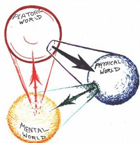

# 数学分析 I

作者：数学分析委员会

组织：Maki’s Lab

时间：Jan 2022

版本：1.0

” 九万里风鹏正举。风休住，蓬舟吹取三山去。” — 【宋】李清照

# 写在前面

Maki 你有什么想对观众说的就写在这儿吧...

特别感谢由 Ethan Deng 和 Liam Huang 组织，ElegantLATEX[¹]社区提供的模板。“多分享，多奉献”一直是该开源社区的目标。如果您喜欢本书的模板的话，请前往elegantlatex.org进行下载和使用。

# 序

让大家爱上数学！

# 目录

# 0 预备知识 1

0.1 数理逻辑   
0.2 ZFC 公理系统 3

0.2.1 集合的构建 3  
0.2.2 集合的运算 3  
0.2.3 无限集 6   
0.2.4 替换公理 6   
0.2.5 Russell 悖论 7   
0.2.6 选择公理 7

0.3 二元关系 9

0.3.1 Cartesian 积 9   
0.3.2 等价关系 9   
0.3.3 序关系 12

0.4 映射与函数 . 18  
0.5 运算与运算律 24

0.5.1 二元运算 24  
0.5.2 单位元和逆元 24  
0.5.3 分配律 26

# 1 从头讲起 28

1.1 自然数集的公理化 . 28

1.1.1 Peano 公理 28  
1.1.2 自然数集中的加法运算 . 29  
1.1.3 自然数集中的序关系 32  
1.1.4 数学归纳原理的再讨论 33  
1.1.5 自然数集中的乘法运算 35

1.2 整数环和环公理 39

1.2.1 整数集的构建 39   
1.2.2 整数集中的运算律 42  
1.2.3 环公理 46   
1.2.4 整数集中的序关系 47

1.3 有理数域和域公理 . 49

1.3.1 有理数集的构建 49  
1.3.2 数域和域公理 51   
1.3.3 有理数域的序关系 52

# 2 实数理论和数列极限 57

2.1 实数域的构建及其结构 58

2.1.1 无理数的历史 58  
2.1.2 Dedekind 分割 59  
2.1.3 实数集上的序结构和代数结构 . 60

2.2 实数域的完备性 65

2.2.1 Dedekind 定理 65  
2.2.2 确界原理 66   
2.2.3 Heine-Borel 定理 . 68  
2.2.4 实数公理 70

# 2.3 集合的基数 . 73

2.3.1 集合的基数 73  
2.3.2 可数集 74  
2.3.3 不可数集 78

# 2.4 数列极限的概念和性质 82

2.4.1 数列的极限 82   
2.4.2 邻域和极限的简单性质 . 86   
2.4.3 极限的运算法则 89   
2.4.4 无穷小、无穷大和广义实数集 . 93  
2.4.5 数列未定式的定值法 98

# 2.5 数列的收敛判别法 . 103

2.5.1 单调数列 103   
2.5.2 自然常数 e 和 Euler 常数 ?? . . 105  
2.5.3 子列和极限点 109  
2.5.4 上极限和下极限 113   
2.5.5 Cauchy 收敛原理 123

# 3 函数的极限和连续性 128

# 3.1 函数的极限 . 128

3.1.1 函数极限的概念 128  
3.1.2 函数极限的性质 133  
3.1.3 无穷大和无穷小 . 139  
3.1.4 Landau 记号 142   
3.1.5 函数的上极限和下极限 . 143

# 3.2 函数的连续与间断 . 148

3.2.1 函数的逐点连续 148  
3.2.2 初等函数的连续性 152  
3.2.3 连续函数的极限 156  
3.2.4 函数的间断点 158

# 3.3 闭区间上连续函数的性质 . 162

3.3.1 一致连续性 162  
3.3.2 有界性 169   
3.3.3 介值性 171

# 4 一元函数微分学 176

# 4.1 一元函数的导数与微分 177

4.1.1 导数的概念 177   
4.1.2 微分的概念 179  
4.1.3 初等函数的导数和微分 . 183  
4.1.4 隐函数和参数式函数的求导法则 189  
4.1.5 高阶导数 194

4.2 求导的逆运算 198

4.2.1 原函数和不定积分 198  
4.2.2 分部积分法 199  
4.2.3 换元积分法 201   
4.2.4 有理函数的不定积分 203  
4.2.5 可有理化函数的不定积分 207

4.3 微分学的中值定理 . 211

4.3.1 Rolle 中值定理 . 211  
4.3.2 Lagrange 中值定理 214  
4.3.3 导函数的性质 216  
4.3.4 Cauchy 中值定理 219  
4.3.5 函数未定式的定值法 220

4.4 用导数研究函数 224

4.4.1 函数的单调性 225  
4.4.2 函数的极值 226  
4.4.3 函数的凸性 230  
4.4.4 初等函数的图像 235

4.5 Taylor 公式 240

4.5.1 带 Peano 余项的 Taylor 公式 240  
4.5.2 Taylor 公式的简单应用 246  
4.5.3 对 Taylor 公式余项的定量研究 . 250

# 5 Riemann 积分 255

5.1 Riemann 积分的概念 . 255

5.1.1 平面图形的面积 255  
5.1.2 Riemann 积分的定义 256   
5.1.3 Riemann 可积函数的性质 . 259

5.2 Riemann 可积的条件 . 263

5.2.1 Riemann 可积的必要条件 . 263   
5.2.2 上积分与下积分 263  
5.2.3 Riemann 可积函数类 269

5.3 Riemann 积分的计算 . 276

5.3.1 Newton-Leibniz 公式 276  
5.3.2 微积分基本定理 278  
5.3.3 分部积分法 281  
5.3.4 换元积分法 283   
5.3.5 数值积分简介 285

5.4 Riemann 积分的应用 288

5.4.1 计算平面图形的面积 289  
5.4.2 计算曲线的弧长 294  
5.4.3 计算空间区域的体积 299  
5.4.4 计算空间曲面的面积 301  
5.4.5 Riemann 积分在物理中的应用 303  
5.4.6 用 Riemann 积分研究不等式 305

5.5 反常积分的计算 311

5.5.1 无穷积分 311  
5.5.2 瑕积分 314

