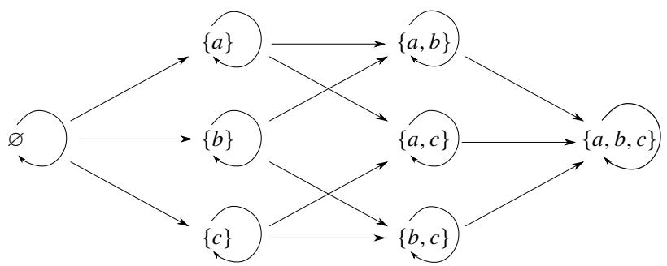

# 内容提要

XXX

本章介绍一下数理逻辑和集合论中需要用到的简单知识.

# 0.1 数理逻辑

先讨论命题之间的关系

# 定义 0.1 (充分要件和必要条件)

设命题 ?? 和 ??. 若 ?? 可以推得 ??, 则称命题 ?? 是 $B$ 的充分条件 (sufficient condition), $B$ 是 $A$ 的必要条件 (nec-essary condition), 记作

$$
A \Rightarrow B,   \text {或}   B \Leftarrow A.
$$

若 ?? 可以推得 $B$ 且 $B$ 可以推得 ??, 则称命题 $A$ 和 $B$ 互为充分必要条件 (necessary and sufficient condition),简称充要条件 , 此时也称命题 ?? 和 $B$ 等价, 记作

$$
A \Leftrightarrow B.
$$

注 以上事实在定理或命题的叙述中常有多种不同的自然语言表述, 但其逻辑含义是一致的. 例如

(1) $A \Rightarrow B$ : 若 $A$ 则 $^ { \mathrm { ~ } } B , A$ 蕴含 $B$ ;   
(2) $A \Leftrightarrow B { : } A$ 和 $B$ 等价, 当且仅当 ?? 成立时, $\mathbf { \delta } _ { , B }$ 成立;

注 凡是 “定义”, 总是充要条件.

# 定义 0.2 (原命题, 逆命题, 否命题, 逆否命题)

原命题 (primitive proposition), 逆命题 (converse proposition), 否命题 (negative proposition), 逆否命题 (conversenegative proposition),

以下定义命题之间的逻辑运算.

# 定义 0.3 (命题的逻辑运算)

设命题 ?? 与 $B$ ,

(1) 若 ?? 和 $B$ 中至少有一个命题成立, 则称 $A$ 或 (or) ?? (?? or $B$ ), 记作

$$
A \vee B.
$$

(2) 若 ?? 和 $B$ 同时成立, 则称 ?? 且 (and) $B$ (?? and $B$ ), 记作

$$
A \wedge B.
$$

(3) 若 ?? 的相反形式成立, 则称非 (not) ?? (not ??), 记作

$$
\neg A.
$$

以下介绍两个常用的形式逻辑词

# 定义 0.4 (存在)

存在 $x$ (exist ??) 使得命题 ?? 成立, 可以记作

$$
\exists x (A).
$$

# 定义 0.5 (任意)

对于任意 $x$ (for all $x$ ) 命题 ?? 都成立, 可以记作

$$
\forall x (A).
$$

为了证明命题我们常需要用到以下真值表 (truth table).

# 0.2 ZFC 公理系统

在中学里, 我们学过的集合概念通常是这样的: 一群无序的对象所构成的一个总体称为集合 (set). 其中的每一个对象称为该集合的元素 (element). 若 $x$ 是集合 $X$ 中的一个元素, 则称 $x$ 属于 $X$ (?? belongs to $X$ ), 记作 $x \in X$ . 反之, $x$ 不属于 $X$ 记作 $x \notin X$ .

对于一个集合我们可以有两种方式记录集合中的元素:

(1) 列举法: 将集合中的元素一一列举, 例如

$$
\{I, I I, I I I, I V, \dots \}.
$$

其中 “· · · ” 表示类似的元素.

(2) 描述法:

$$
\{x \mid x \in E, P (x) \},
$$

其中 $x$ 为代表元素, $E$ 是 $x$ 的范围, $P ( x )$ 表示 $x$ 满足的性质.

以上给出的集合概念称为 “朴素的集合定义”. 它比较直观已, 但许多细节问题并没有讲清楚. 例如, 怎么样的一群对象才能被看作集合? $\{ x , x , y \}$ 和 $\{ x , y \}$ 是不是同一个集合? 下面我们用公理化的方法来给出集合的定义.

# 0.2.1 集合的构建

我们先来定义什么样的集合是相等的.

# 公理 0.1 (外延公理)

设集合 ?? 与 $B$ , 若对于任一 $x$ 都有

$$
x \in A \iff x \in B.
$$

则称 ?? 与 $B$ 相等, 记作 $A = B$ . 否则, 称 $A$ 与 $B$ 不相等, 记作 $A \ne B$ .

外延公理告诉我们集合中的元素是无序的. 即, 集合是由元素唯一决定的.

# 命题 0.1

集合的相等关系满足

(1) 自反性: 对于任一集合 $A$ 都有 $A = A$ .  
(2) 对称性: 若 $A = B$ 则 $B = A$ .  
(3) 传递性: 若 $A = B$ , $B = C$ 则 $A = C$ .

证明 证明略.

注 后面会介绍, 同时满足自反性, 对称性和传递性的关系称为 “等价关系”.

下面定义只有一个元素和只有两个元素的集合.

# 公理 0.2 (配对公理)

对于任意 $x , y ,$ , 都存在 $A$ 满足 $a \in A$ 当且仅当 $a \in X$ 或 $a \in Y$ (∀??). 此时 $A$ 可以记作 $\{ x , y \}$ , 并称它为双元素集 (pair set). 特别地, 若 $x = y$ , 则 $A$ 只有一个元素, 此时称 $A$ 为单元素集 (singleton).

根据配对公理我们知道存在集合合 $\{ x , y \}$ 和 $\{ y , x \}$ , 然后根据外延公理, 我们知道 $\{ x , y \} = \{ y , x \}$ . 这样我们就得到了集合的 “无序性”. 根据外延公理我们还知道 $\{ x , x , y \} = \{ y , x \}$ . 这样我们就得到了集合元素的 “不重复性”.

# 0.2.2 集合的运算

配对公理为我们定义了单元素集和双元素集. 下面我们希望定义 “更大的” 集合.

# 公理 0.3 (并集公理)

设集合 $A = \{ A _ { \alpha } \mid \alpha \in I \} .$ , 其中 $I$ 是一个指标集 (index set). 则存在集合 $B$ 满足 $a \in B$ 当且仅当存在 $A _ { \alpha } \in A$ 使得 $a \in A _ { \alpha }$ (∀??).

注 以上定义中的集合 $A$ 通常被称为集合族 (family of sets).

并集公理实质上为我们定义了一种集合的运算.

# 定义 0.6 (集合的并)

设集合族 $\{ A _ { \alpha } \mid \alpha \in I \}$ . 令

$$
\bigcup_ {\alpha \in I} A _ {\alpha} := \{x \mid \exists \alpha \in I   \text {使 得}   x \in A _ {\alpha} \}.
$$

$\cup _ { \alpha \in I } A _ { \alpha }$ 称为集合族 ?? 的并 (union). 有时可以简记作 Ð ??. 特别地, 若 $A = \left\{ A _ { 1 } , A _ { 2 } \right\}$ , 则 $\cup A$ 记作 $A _ { 1 } \cup A _ { 2 }$

注 $A : = B$ 表示 “用 $B$ 定义 $A ^ { \prime \prime }$ .

由外延公理容易证明, 集合 $A$ 的并是唯一的.

由并集的定义我们可以得到关于并集的运算律.

# 命题 0.2 (并的运算律)

对任意集合 $A , B , C$ 都有

(1) 交换律: $A \cup B = B \cup A$ .   
(2) 结合律: $( A \cup B ) \cup C = A \cup ( B \cup C )$ .

证明 XXX

反过来我们可以从 “较大的” 集合中取出一部分元素得到 “较小的” 集合.

# 公理 0.4 (分离公理 (模式))

设集合 ??, 和性质 $P$ , 则存在集合 ?? 满足

$$
B = \{x: (x \in A) \land P (x) \}.
$$

注 我们发现分离公理中的性质 $P$ 没有明确给出, 因此对于每个确定的性质 $P$ , 都可以产生一个特定的分离公理.所以以上公理可以产生无限个公理, 这样的公理称为公理模式 (axiom schema).

注 由分离公理可以知道, 一定存在一个集合不含有任何元素, 我们称这样的集合为空集 (empty set), 记作 $\mathcal { D }$ . 根据外延公理, 我们可以推得空集只能有一个.

并集公理和分离公理使集合产生了一种关系. 例如分离公理模式中的集合 $B$ 中的每个元素一定都属于集合??. 反过来, 并集公理中的集合 $D$ 中的每个元素一定都属于集合 ??. 这种关系就是包含关系.

# 定义 0.7 (子集和母集)

设集合 ?? 和 ??, 若

$$
x \in A \Rightarrow x \in B
$$

则称 $A$ 包含于 $B$ (?? is included in $B$ ), 或 $B$ 包含 $A$ $B$ includes $A$ ), ?? 是 $B$ 的一个子集 (subset), $\mathbf { \delta } _ { \mathcal { B } }$ 是 $A$ 的一个母集 (superset), 记作

$$
A \subseteq B, \text {或} B \supseteq A.
$$

特别地, 若

$$
(A \subseteq B) \wedge (A \neq B),
$$

则称 $A$ 是 $B$ 的一个真子集 (proper subset), $B$ 是 $A$ 的一个真母集 (proper superset), 记作

$$
A \subset B, \text {或} B \supset A.
$$

集合的包含关系有以下三种性质.

# 命题 0.3 (包含关系的自反性, 反对称性和传递性)

设集合 $^ { A , B }$ 和 $C$ , 则

(1) 自反性: $A \subseteq A$ ;  
(2) 传递性: $A \subseteq B , B \subseteq C \Rightarrow A \subseteq C$ ;   
(3) 反对称性: $A \subseteq B , B \subseteq A \Rightarrow A = B$

证明 XX

注 后面会介绍, 同时满足自反性, 反对称性和传递性的关系称为 “偏序关系”.

注 利用包含关系的反对称性, 可以证明集合的相等.

由分离公理可以定义集合的交和集合的差.

# 定义 0.8 (集合的交)

设集合族 $\{ E _ { \alpha } : \alpha \in I \}$ .

则集合族 $E _ { \alpha }$ 的交

$$
\bigcap_ {\alpha \in I} E _ {\alpha} := \left\{x: \forall \alpha \in I (x \in E _ {\alpha}) \right\}.
$$

集合 $A$ 和 $B$ 的交 (the intersection of $A$ and $B$ )

$$
A \cap B := (x \in A) \wedge (x \in B).
$$

不交并

# 定义 0.9 (差)

集合 ?? 和 $B$ 的差 (difference of ?? and $B$ )

$$
A \backslash B := (x \in A) \wedge (x \notin B).
$$

# 定义 0.10 (余)

设集合 $A \subseteq X$ . 则 $A$ 的余 (complement of ??)

$$
A ^ {c} := X \backslash A
$$

# 命题 0.4 (余的抵消)

设集合 ??. 则

$$
\left(A ^ {c}\right) ^ {c} = A.
$$

证明 待证明.

# 命题 0.5 (集合交的运算律)

设集合 ?? 和 ??. 它们的交和并运算满足交换律 (commutative property)

$$
A \cup B = B \cup A,
$$

$$
A \cap B = B \cap A.
$$

设集合 ?? 和 ??. 它们的交和并运算满足结合律 (associative property)

$$
(A \cup B) \cup C = A \cup (B \cup C),
$$

$$
(A \cap B) \cap C = A \cap (B \cap C).
$$

证明 待证明.

有了结合律, 可以定义有限个集合的交.

# 定义 0.11 (有限个集合的交)

设集合族 $\{ E _ { \alpha } : \alpha \in I \}$ .

则集合族 $E _ { \alpha }$ 的交

$$
\bigcap_ {\alpha \in I} E _ {\alpha} := \{x: \forall \alpha \in I (x \in E _ {\alpha}) \}.
$$

对于并和交两种运算存在分配律.

# 命题 0.6 (分配律)

设集合 ?? 和集合族 $\{ B _ { \alpha } : \alpha \in I \}$ . 交对并运算, 并对交运算满足分配律 (distributive property)

$$
A \cap \left(\bigcup_ {\alpha \in I} B _ {\alpha}\right) = \bigcup_ {\alpha \in I} (A \cap B _ {\alpha});
$$

$$
A \cup \left(\bigcap_ {\alpha \in I} B _ {\alpha}\right) = \bigcap_ {\alpha \in I} \left(A \cup B _ {\alpha}\right).
$$

证明 待证明.

得到 “更大的” 集合还有一种方式.

# 公理 0.5 (幂集公理)

设集合 ??. 则存在集合 $B$ 满足 $a \in B$ 当且仅当 $a \subseteq A$ .

# 0.2.3 无限集

# 公理 0.6 (无穷公理)

设集合 ?? 和 ??. 当且仅当

# 0.2.4 替换公理

# 公理 0.7 (替换公理)

设集合 ?? 和 ??. 当且仅当

# 0.2.5 Russell 悖论

公理 0.8 (正则公理)

设集合 ?? 和 ??. 当且仅当

定义 0.12 (XX)

内容

罗素悖论 (Russell’s paradox)

# 0.2.6 选择公理

定理 0.1 (de Morgan 定律)

设集合族 $\{ E _ { \alpha } \mid \alpha \in I \}$ , 其中 $I$ 是一个指标集. 则

$$
\left(\bigcup_ {\alpha \in I} E _ {\alpha}\right) ^ {c} = \bigcap_ {\alpha \in I} E _ {\alpha} ^ {c}; \quad \left(\bigcap_ {\alpha \in I} E _ {\alpha}\right) ^ {c} = \bigcup_ {\alpha \in I} E _ {\alpha} ^ {c}.
$$

证明 (i) 任取 $x \in \left( \bigcup _ { \alpha \in I } E _ { \alpha } \right) ^ { c }$ . 则 $x \not \in \bigcup _ { \alpha \in I } E _ { \alpha }$ . 因此对于任一 $\alpha \in I$ 都有 $x \notin E _ { \alpha }$ . 故对于任一 $\alpha \in I$ 都有 $x \in E _ { \alpha } ^ { c }$ . 故$x \in \bigcap _ { \alpha \in I } E _ { \alpha } ^ { c }$ . 于是 $\left( \bigcup _ { \alpha \in I } E _ { \alpha } \right) ^ { c } \subseteq \bigcap _ { \alpha \in I } E _ { \alpha } ^ { c }$ .

任取 $x \in \bigcap _ { \alpha \in I } E _ { \alpha } ^ { c }$ . 则对于任一 $\alpha \in I$ 都有 $x \in E _ { \alpha } ^ { c }$ . 故对于任一 $\alpha \in I$ 都有 $x \notin E _ { \alpha }$ . 因此 $x \not \in \bigcup _ { \alpha \in I } E _ { \alpha }$ . 因此$x \in \left( \bigcup _ { \alpha \in I } E _ { \alpha } \right) ^ { c }$ . 于是 $\left( \bigcup _ { \alpha \in I } E _ { \alpha } \right) ^ { c } \subseteq \bigcap _ { \alpha \in I } E _ { \alpha } ^ { c }$ .

综上可知可知 $\left( \bigcup _ { \alpha \in I } E _ { \alpha } \right) ^ { c } = \bigcap _ { \alpha \in I } E _ { \alpha } ^ { c }$

(ii) 对等式 ${ \biggl ( } \bigcup _ { \alpha \in I } E _ { \alpha } { \biggr ) } ^ { c } = \bigcap _ { \alpha \in I } E _ { \alpha } ^ { c }$ 两边取补集即得 $\left( \bigcap _ { \alpha \in I } E _ { \alpha } \right) ^ { c } = \bigcup _ { \alpha \in I } E _ { \alpha } ^ { c } .$ .

注 以上定理也称为对偶定理(duality theorem).

以上定律是对偶定理在逻辑学和集合论中的应用.

特别地, 当只有两个集合时, 可以得出以上定理的一个特例, 我们会常用到这个推论.

推论 0.1 (de Morgan 定律的特例)

设集合 ?? 和 ??. 则

$$
(A \cup B) ^ {c} = A ^ {c} \cap B ^ {c};
$$

$$
(A \cap B) ^ {c} = A ^ {c} \cup B ^ {c};
$$

推论 0.2 (逻辑运算中的 de Morgan 定律)

设集合 ?? 和 ??. 则

$$
\neg (A \vee B) = (\neg A) \wedge (\neg B);
$$

$$
\neg (A \wedge B) = (\neg A) \vee (\neg B).
$$

证明 待证明.

以下为证明命题的两种方法, 其中第二种方法称为反证法 (proof by contradiction).

$$
\begin{array}{l} \left(A _ {1} \Rightarrow A _ {2} \Rightarrow A _ {3} \Rightarrow \dots \Rightarrow A _ {n}\right) \Rightarrow \left(A _ {1} \Rightarrow A _ {n}\right) \\ (A \Rightarrow B) \Leftrightarrow (\neg B \Rightarrow \neg A) \\ \end{array}
$$

自从 100 多年前 Cantor 等数学家创立集合论以来, 集合论已经成为了一个重要的数学分支. 同时集合论也成为了整个现代数学的基础. 本书采用公理化方法 (axiomatic method), 用一系列公理构建集合的概念. 集合论可以采用的公理体系不止一种, 我们采用使用最广泛的 Zermelo–Fraenkel 公理系统 (Zermelo–Fraenkel axiom system),简称 ZF 公理系统, 其中包括

(1) 外延公理 (axiom of extensionality);  
(2) 配对公理 (axiom of pairing);  
(3) 并集公理 (axiom of union);  
(4) 幂集公理 (axiom of power set);  
(5) 分离公理模式 (axiom schema of separation)  
(6) 替换公理 (axiom of replacement);   
(7) 无穷公理 (axiom of infinity);  
(8) 正则公理 (axiom of regularity);

最后加上选择公理 (Axiom of Choice), 就是 ZFC 公理体系.XX

# 定义 0.13 (ZF 公理系统)

以下八条公理组成的公理体系称为 ZF 公理系统 (ZF axiom system)

外延公理 (axiom of extensionality)

空集公理 (axiom of empty set)

配对公理 (axiom of pairing)

并集公理 (axiom of union)

幂集公理 (axiom of power set)

无穷公理 (axiom of infinity)

分离公理 (axiom of separation)

替换公理 (axiom of replacement)

正则公理 (axiom of regularity)

# 0.3 二元关系

# 0.3.1 Cartesian 积

本节我们来介绍集合论中的二元关系理论. 为了讨论二元关系, 我们先给出 Cartesian 积的概念.

# 定义 0.14 (有序对)

设元素 $a , b \in A$ . 将 $a , b$ 按顺序排成的有序元素对称为有序对 (ordered pair), 也称为序偶 , 记作 $( a , b )$ . 有序对 $( a , b )$ 和 $( x , y )$ 相等, 当且仅当 $a = x$ 且 $b = y$ , 记作 $( a , b ) = ( x , y )$ .

# 定义 0.15 (Cartesian 积)

设集合 ?? 和 $B$ . 可以定义一个有序对组成的集合

$$
A \times B := \{(a, b) \mid a \in A, b \in B \}.
$$

我们称该集合为 $A$ 和 $B$ 的 Cartesian 积 (Cartesian product).

注 Cartesian 积不满足交换律和结合律.

注 特别地, $A \times A$ 可以记作 $A ^ { 2 }$ . 我们还可以进一步定义一个集合的有限次 Cartesian 积

$$
A ^ {n} := \underbrace {A \times A \times \cdots \times A} _ {n \text {个} A}.
$$

Cartesian 积满足以下简单性质.

# 命题 0.7 (Cartesian 积的简单性质)

设集合 $X$ 和 ?? . 则

$$
X \times Y = \varnothing \iff X = \varnothing \text {或} Y = \varnothing .
$$

当 $X \times Y \neq \emptyset$ 时, 有

(1) $X \times Y \subset W \times Z \iff X \subset W$ 且 $Y \subset Z$ .   
(2) $( X \times Y ) \cup ( Z \times Y ) = ( X \cup Z ) \times Y .$ .   
(3) $( X \times Y ) \cap ( X ^ { \prime } \times Y ^ { \prime } ) = ( X \cap X ^ { \prime } ) \times ( Y \cap Y ^ { \prime } ) .$   
(4) $( X \times Y ) \backslash ( X ^ { \prime } \times Y ^ { \prime } ) = [ ( X \backslash X ^ { \prime } ) \times Y ] \cup [ X \times ( Y \backslash Y ^ { \prime } ) ] .$

证明 XXX

# 0.3.2 等价关系

有了 Cartesian 积, 就可以开始讨论集合中元素的二元关系.

# 定义 0.16 (二元关系)

设非空集合 ??, 我们把 $S { \times } S$ 的一个子集 $\mathcal { R }$ 称为 $s$ 上的一个二元关系 (binary relation). 设 $a , b \in S$ , 若 $( a , b ) \in { \mathcal { R } }$ 则 $a$ 与 $^ b$ 有 $\mathcal { R }$ 关系, 此时记作 $a \mathcal { R } b$ .

所有二元关系中, 最重要最基础的莫过于 “相等” 关系! 从中可以抽象出三个特征, 由此定义等价关系.

# 公理 0.9 (等价关系)

设集合 ??, 且 ${ \mathcal { R } } \subseteq S \times S$ . 若对于任意 $a , b , c \in S$ 都满足

$1 ^ { \circ }$ 自反性 (reflexivity): $( a , a ) \in { \mathcal { R } }$ ;  
$2 ^ { \circ }$ 对称性 (symmetry): $( a , b ) \in { \mathcal { R } } \Longrightarrow ( b , a ) \in { \mathcal { R } }$ ;  
$3 ^ { \circ }$ 传递性 (transitivity): $( a , b ) \in { \mathcal { R } }$ 且 $( b , c ) \in { \mathcal { R } } \Longrightarrow ( a , c ) \in { \mathcal { R } }$

则称 $\mathcal { R }$ 是 $s$ 上的一个等价关系 (equivalence relation). 若 $( a , b ) \in { \mathcal { R } }$ , 则称 $a$ 等价于 $^ b$

注 在同一个集合上可以定义不止一种等价关系. 在同一个集合上对于特定的等价关系, 我们可以约定特定的记号表示, 常用的记号有: $a \sim b$ , ?? ' ??, $e \cong f$ .

对于集合 ?? 上的某个等价关系 $\mathcal { R }$ , 我们可以将两两等价的元素放在一起成为一个集合. 这就形成了等价类.

# 定义 0.17 (等价类)

设 $\mathcal { R }$ 是集合 ?? 上的一个等价关系. 设 $a \in S$ , 则 $s$ 中所有与 $a$ 等价的元素组成集合

$$
[ a ] _ {\mathcal {R}} := \{x \in S \mid x \mathcal {R} a \}.
$$

称为由 $a$ 确定的关于 $\mathcal { R }$ 的等价类 (equivalence class), 其中

注由以上定义可知, $a \in [ a ] _ { \mathcal { R } }$ , 即 $[ a ] _ { \mathcal { R } }$ 一定非空且至少有元素 $a$ .因此我们 $a$ 称为等价类 $[ a ] _ { \mathcal { R } }$ 的一个代表元素,称$[ a ] _ { \mathcal { R } }$ 为 $a$ 的等价类.

对于一个等价类 $[ a ] _ { \mathcal { R } }$ , 代表元素不一定必须是 $a$ . 以下命题可以验证这个想法.

# 命题 0.8 (等价类相等的充要条件)

设 $\mathcal { R }$ 是集合 ?? 上的一个等价关系, 且 $a , b \in S$ , 则

$$
[ a ] _ {\mathcal {R}} = [ b ] _ {\mathcal {R}} \Longleftrightarrow a \mathcal {R} b.
$$

证明 必要性显然成立. 证明充分性.

(i) 任取 $c \in [ a ] _ { \mathcal { R } }$ , 由于 $a \mathcal { R } b$ , 由传递性可知 $c { \mathcal { R } } a$ , 从而 $c { \mathcal { R } } b$ , 因此 $c \in [ b ] _ { \mathcal { R } }$ , 于是可知 $[ a ] _ { \mathcal { R } } \subseteq [ b ] _ { \mathcal { R } }$   
(ii) 由于 $a \mathcal { R } b$ , 由对称性可知 ??R??. 由 (i) 可知 $[ b ] _ { \mathcal { R } } \subseteq [ a ] _ { \mathcal { R } }$

于是可知 $[ a ] _ { \mathcal { R } } = [ b ] _ { \mathcal { R } }$ .

注 以上命题表明, 等价类 $[ a ] _ { \mathcal { R } }$ 的代表元素可以是与 $a$ 等价的任一元素, 即等价类中的任何元素都可以成为该等价类的代表元素.

除了数的相等关系, 数学中还有很多等价关系的例子.

例 0.1 三角形的全等类和相似类 设平面上所有三角形组成的集合为 ??. 其中的全等关系和相似关系都是等价关系.

解 根据平面几何的知识, 三角形的全等关系和相似关系都满足自反性、对称性和传递性, 所以它都是 ?? 上的一个等价关系.

常见的等价关系还有:

(1) 两个数、向量、集合等对象的相等关系.   
(2) 两个命题的互相推得关系.  
(3) 空间中两条直线的平行关系.  
(4) 两个整数的同余关系.   
(5) 向量组的相互线性表出关系.   
(6) 矩阵的相抵关系、相似关系与合同关系.

(7) 线性空间、群、环、域等代数结构的同构关系.   
(8) 无穷小、无穷大的等价关系.  
(9) 集合的对等关系.  
(10) 方程组的同解关系.

设 $\mathcal { R }$ 是集合 ?? 上的一个等价关系. 若一种量或一种表达式对于同一个等价类里的元素相等, 则称这种量或这种表达式是这个等价关系的一个不变量 (invariant). 特别地, 恰好能完全决定等价类的一组变量称为完全不变量(complete system of invariants).

举例说明在三角形的全等关系下, 边长和内角的大小都是不变量. 而三边同时对应相等是一组完全不变量. 事实上我们学过的全等三角形的 4 个判定定理: ??????、??????、??????、??????、?????? 就是四组三角形全等关系的完全不变量.

我们发现, 若集合 ?? 中给定一个等价关系, 就会得到集合中元素的一种分类. 每一类是 ?? 的一个子集. 这些子集两两无交集, 且它们的并集就是 $S _ { ; }$ , 即它们的无交并就是 ??. 于是就引出了一下概念.

# 定义 0.18 (集合的划分)

设集合 $s$ 的一个非空子集族 $\{ S _ { \alpha } \mid \alpha \in I , \emptyset \not \in S _ { i } \}$ , 其中 $I$ 是指标集. 若满足

$$
1 ^ {\circ} S = \bigcup_ {\alpha \in I} S _ {\alpha}.
$$

$2 ^ { \circ }$ 对于任意 $\alpha \neq \beta$ 都有 $S _ { \alpha } \cap S _ { \beta } = \emptyset$ .

则称这个子集族是集合 $s$ 的一个划分 (partition).

集合上的一个等价关系决定一个划分, 反过来集合上的一个分划决定一个等价关系. 下面我们来验证这个结论.

# 引理 0.1

设 $\mathcal { R }$ 是集合 $s$ 上的一个等价关系, 若 $[ a ] _ { \mathcal { R } } \neq [ b ] _ { \mathcal { R } }$ , 则 $[ a ] _ { \mathcal { R } } \cap [ b ] _ { \mathcal { R } } = \mathcal { O }$

证明 用反证法. 假设存在 $c \in [ a ] _ { \mathcal { R } } \cap [ b ] _ { \mathcal { R } }$ , 则 $c \in [ a ] _ { \mathcal { R } }$ 且 $c \in [ b ] _ { \mathcal { R } }$ , 因此 $c { \mathcal { R } } a$ 且 $c { \mathcal { R } } b$ , 因此 ??R??, 由命题 (0.8) 可知 $[ a ] _ { \mathcal { R } } = [ b ] _ { \mathcal { R } }$ , 与条件矛盾, 于是可知命题成立.

注 以上引理表明, 对于任意 $a , b \in S$ 都有

$$
[ a ] _ {\mathcal {R}} = [ b ] _ {\mathcal {R}} \text {或} [ a ] _ {\mathcal {R}} \cap [ b ] _ {\mathcal {R}} = \emptyset .
$$

# 定理 0.2

设 $\mathcal { R }$ 是集合 $s$ 上的一个等价关系. 则所有关于 $\mathcal { R }$ 的等价类组成的集合族

$$
\{\left[ a \right] _ {\mathcal {R}} \mid a \in S \}
$$

是集合 $s$ 的一个分划.

证明 对于任意 $a \in S$ 都有 $a \in [ a ] _ { R }$ , 因此

$$
S \subseteq \bigcup_ {a \in S} [ a ] _ {R} \subseteq S \Rightarrow S = \bigcup_ {a \in S} [ a ] _ {R}.
$$

由以上引理 (0.1) 可知, 对于任意不相等的 $a , b \in S$ 都有

$$
[ a ] _ {\mathcal {R}} \cap [ b ] _ {\mathcal {R}} = \varnothing .
$$

综上可知关于 $\mathcal { R }$ 的等价类组成的集合族是集合 $S$ 的一个分划.

注 以上定理表明, 集合上的一个等价关系确定集合的一个划分.

# 定理 0.3

设集合 $s$ 的一个划分 $\{ S _ { i } | i \in I \}$ , 其中 $I$ 是指标集. 若

$$
\mathcal {R} = \{(a, b) \in S \times S | \exists i \in I ((a \in S _ {i}) \wedge (b \in S _ {i})) \},
$$

则 $\mathcal { R }$ 是集合 ?? 上的一个等价关系.

# 证明 XXX

于是我们可以说, 一个集合的所有划分与所有等价关系一一对应, 也就是说一个集合可以形成多少中划分, 就有多少种等价关系.

由以上讨论可知,集合中一旦建立了一个等价关系,就可以得到一个关于这个等价关系的一个划分,于是我们可以继续建立以下概念.

# 定义 0.19 (商集)

设 $\mathcal { R }$ 是集合 ?? 上的一个等价关系. 我们称 ?? 的一个划分

$$
\{\left[ a \right] _ {\mathcal {R}} | a \in S \},
$$

为 $s$ 关于等价关系 $\mathcal { R }$ 的商集 (quotient set). 记作 $S / \mathcal { R }$ .

注 注意商集 $S / \mathcal { R }$ 里面的元素不是 $s$ 中的元素, 而是 $s$ 的子集.

为了理解集合的等价关系、等价类、分划、商集, 我们举一个简单的例子.

例 0.2 设五个人组成的集合 $A = \{ a , b , c , d , e , f \} .$ . 令 $\mathcal { R }$ 是 $A$ 上的同乡关系. 已知 $a$ 和 $^ b$ 是北京人; $c$ 是广东人; ??, ??和 $f$ 是上海人.

(1) 求证: $\mathcal { R }$ 是 $A$ 中的一个等价关系.  
(2) 求 $\mathcal { R }$ 中的全部元素.  
(3) 求 $\mathcal { R }$ 的全部等价类.   
(4) 求 $\mathcal { R }$ 确定的 $A$ 的一个划分.  
(5) 求 $A$ 关于 $\mathcal { R }$ 的商集.

证明 (1) 同乡关系 $\mathcal { R }$ 显然满足自反性、对称性和传递性, 因此它是 $A$ 上的一个等价关系.

解 (2) 先写出 $\mathcal { R }$ 中的全部元素

$$
\mathcal {R} = \left\{(a, a), (a, b), (b, a), (b, b), (c, c), (d, d), (d, e), (d, f), (e, d), (e, e), (e, f), (f, d), (f, e), (f, f) \right\}.
$$

(3) 集合 $A$ 中元素关于 $\mathcal { R }$ 的等价类分别是

$$
\begin{array}{l} “ 北 京 人 ” 类: [ a ] _ {\mathcal {R}} = [ b ] _ {\mathcal {R}} = \{a, b \}, \\ “ 广 东 人 ” 类: \left[ c \right] _ {\mathcal {R}} = \{c \}, \\ “ 上 海 人 ” 类: [ d ] _ {\mathcal {R}} = [ e ] _ {\mathcal {R}} = [ f ] _ {\mathcal {R}} = \{d, e, f \}. \\ \end{array}
$$

(4) (5) 于是就得到了集合 ?? 的一个分划

$$
\{\{a, b \}, \{c \}, \{d, e, f \} \}.
$$

这个分划就是集合 ?? 关于等价关系 $\mathcal { R }$ 的商集 $A / \mathcal { R }$ .

# 0.3.3 序关系

我们已经把相等关系推广为更为抽象的等价关系. 下面我们来抽象 “小于”(大于), “小于等于 (大于等于) 关系. 这样的关系我们称为 “序关系”.

我们知道集合中的元素是没有次序的. 为集合建立序关系, 就是希望集合中的元素能按一个规则排序. 设集合??, 若元素 $x$ 排在 $y$ 前面, 则记作 $x \prec y$ . 现在我们取出其中的三个元素, 已知它们可以按以下顺序排列:

$$
a, b, c.
$$

则 $a \prec b$ 且 $b \prec c$ . 显然 $a$ 也排在 $c$ 前面, 因此有 $a \prec c$ . 这表明序关系应满足传递性. 我们知道等价关系也满足传递性, 但由于等价关系还满足对称性, 因此顺序可以调换. 于是我们应该规定序关系不满足对称性. 这样我们就得到一个序公理.

# 公理 0.10 (严格偏序公理)

设集合 $s$ 上的一个二元关系 $O \subseteq S \times S .$ . 若对于任意 $a , b , c \in S$ 满足

(1) 反对称性 (antisymmetry): 若 $( a , b ) \in O$ , 则 $( b , a ) \notin O$ .  
(2) 传递性: 若 $( a , b ) \in O$ 且 $( b , c ) \in O$ , 则 $( a , c ) \in O$ .

则称 $o$ 是 $s$ 上的一个严格偏序关系 (strictly partially ordered relation). 若 $( a , b ) \in O$ , 记作 $x \prec y$

为了使用便利, 我们希望元素和自己本身也满足序关系. 为此我们只需补充一条 “自反性” 公理即可.

# 公理 0.11 (偏序公理)

集合 $s$ 上的一个二元关系 $O \subseteq S \times S$ , 若对于任意 $a , b , c \in C$ 满足

(1) 自反性: $( a , a ) \in O$ .  
(2) 反对称性: 若 $( a , b ) \in O$ 且 $( b , a ) \in O$ , 则 $a = b$ .  
(3) 传递性: 若 $( a , b ) \in O$ 且 $( b , c ) \in O$ , 则 $( a , c ) \in O$ .

则称 $o$ 是 $X$ 上的一个偏序关系 (partially ordered relation). 若 $( a , b ) \in O$ , 记作 $a ~ \preceq ~ b$ . 此时 $s$ 称为偏序集(partially ordered set).

注 由偏序公理和严格偏序公理可知

$$
a \preceq b \iff a <   b   \text {或}   a = b.
$$

集合的包含关系就是一种序关系. 由包含关系的定义立刻可以验证它满足自反性、反对称性、传递性. 下面我们来看一个简单的例子.

例 0.3 设集合 $S = \{ a , b , c \}$ . 列出它的幂集 $P ( S )$ 中所有元素之间的全部包含关系.

解 容易知道

$$
P (S) = \{\varnothing , \{a \}, \{b \}, \{c \}, \{a, b \}, \{b, c \}, \{a, c \}, \{a, b, c \} \}.
$$

如图1是 $P ( S )$ 中 8 个元素的全部包含关系.

  
图 1: 包含的偏序关系

从以上例子我们看出 $P ( A )$ 中的某些元素之间不存在包含关系, 例如 $\{ a \}$ 和 $\{ b \}$ . 因此这样的序关系只是 “部分地(partially)” 成立. 这就是我们把这样的序关系称为 “偏序关系” 的原因.

另一方面我们知道实数集中的任意两个实数都存在 “小于等于”(大于等于) 关系. 如果要描述这样的序关系.我们需要再补充一条公理.

# 公理 0.12 (全序公理)

集合 $s$ 上的一个二元关系 $O \subseteq S \times S$ , 若对于任意 $a , b , c \in C$ 满足

(1) 自反性: $( a , a ) \in O$ .  
(2) 反对称性: 若 $( a , b ) \in O$ 且 $( b , a ) \in O$ , 则 $a = b$ .  
(3) 传递性: 若 $( a , b ) \in O$ 且 $( b , c ) \in O$ , 则 $( a , c ) \in O$ .  
(4) 完全性 (totality): $( a , b ) \in O$ 或 $( b , a ) \in O$ ,

则称 $o$ 是 $s$ 上的一个全序关系 (totally ordered relation). 此时 $s$ 称为全序集 (totally ordered set). 带全序关系 的全序集 ?? 记作 $( S , \preceq )$ .

注 全序关系一定是偏序关系.

注 完全性公理包含了自反性公理.

# 引理 0.2 (Zorn 引理)

设偏序集 ?? 中的元素存在一个偏序关系 . 若任意 $b \in S$ 都满足 $b \ \preceq \ a$ , 则称 $a$ 是 $s$ 中的一个极大元素(maximal element). 若 $s$ 的一个子集 $T$ 满足完全性, 则称 $T$ 是 $s$ 的一条链 (chain), 或称 $T$ 为 $s$ 的一个全序子集 (totally ordered subset). 设 ?? 的一个子集 $U$ , 若存在一个元素 $c \in S$ , 使得 $U$ 中的任意元素 $x$ 都满足 $x \preceq c$ ,则称 $c$ 是 $U$ 的一个上界 (upper bound).

若偏序集 ?? 的每条链都有上界, 则 ?? 有一个极大元素.

证明 XXX

# 例题

例 0.4 在实数集 $\mathbb { R }$ 上定义一个二元关系:

$$
a \mathcal {R} b: \Longleftrightarrow a - b \in \mathbb {Z},
$$

则

(1) $\mathcal { R }$ 是 $\mathbb { R }$ 上的一个等价关系.  
(2) 对于任一等价类 $[ a ] _ { \mathcal { R } }$ 都可以在区间 [0,1) 内找到唯一的代表, 从而 $\mathbb { R }$ 对于这个关系的商集 $\mathbb { R } / \mathcal { R }$ 与区间[0,1) 之间有一个一一对应关系.

# 证明

(1) 任取 $a , b , c \in \mathbb { R } .$

(1) 证明自反性. 由于 $a - a = 0 \in \mathbb { Z } .$ , 因此 $a \mathcal { R } a$   
(2) 证明对称性. 若 $a { \mathcal { R } } b$ , 则 $a - b = m \in \mathbb { Z }$ , 于是 $- m = b - a \in \mathbb { Z } .$ , 因此 $b \mathcal { R } a$ .  
(3) 证明传递性. 若 $a { \mathcal { R } } b$ 且 $b \mathcal { R } c$ , 则 $a - b = m \in \mathbb { Z }$ 且 $b - c = n \in \mathbb { Z } ,$ , 于是

$$
a - c = (a - b) + (b - c) = m + n \in \mathbb {Z},
$$

因此 $a \mathcal { R } c$

综上所述 $\mathcal { R }$ 是 $\mathbb { R }$ 上的一个等价关系.

(2) 设 $a \in [ m , m + 1 )$ $( m \in \mathbb { Z } )$ , 则 $a - m \in [ 0 , 1 )$ , 由于 $a - ( a - m ) = m \in \mathbb { Z } ,$ , 故 $a { \mathcal { R } } ( a - m )$ , 因此 $a - m$ 是等价类 $[ a ] _ { \mathcal { R } }$ 在区间 $[ 0 , 1 )$ 内的代表. 设 $x \in [ 0 , 1 )$ 是 $[ a ] _ { \mathcal { R } }$ 的另一个代表, 即 $a - x \in \mathbb { Z } ,$ , 由于 $m \leqslant a < m + 1$ 且

$0 \leqslant x < 0$ , 故

$$
m - 1 <   a - x <   m + 1 \Longrightarrow a - x = m \Longrightarrow x = a - m
$$

由此可见, 在区间 [0, 1) 内 $[ a ] _ { \mathcal { R } }$ 有唯一代表. 我们把 $[ a ] _ { \mathcal { R } }$ 在区间 [0, 1) 内代表元素记作 $a$ , 则有以下映射

$$
\sigma : \mathbb {R} / \mathcal {R} \rightarrow [ 0, 1),
$$

$$
[ a ] _ {\mathcal {R}} \mapsto a,
$$

显然对于不同的等价类, 它们在区间 [0,1) 内的代表元素不相等, 因此 $\sigma$ 是单射; 另一方面 [0,1) 内的任意元素 $c$ , 必有 $\{ x \in \mathbb { R } \mid x = c + m , m \in \mathbb { Z } \} \in \mathbb { R } / \mathcal { R } ,$ , 因此 $\sigma$ 是满射. 于是可知 $\sigma$ 是双射, 即商集 $\mathbb { R } / \mathcal { R }$ 与区间 [0, 1)之间有一个一一对应关系.

例 0.5 在实数集 $\mathbb { R }$ 上定义一个二元关系:

$$
a \mathcal {R} b: \Longleftrightarrow \left\lfloor a \right\rfloor = \left\lfloor b \right\rfloor ,
$$

其中 $\lfloor x \rfloor$ 表示小于等于 $x$ 的最大整数. 则

(1) $\mathcal { R }$ 是 $\mathbb { R }$ 上的一个等价关系.  
(2) $\mathbb { R }$ 对于这个关系的商集 $\mathbb { R } / \mathcal { R }$ 与整数集 $\mathbb { Z }$ 之间有一个一一对应关系.

# 证明

(1) 任取 $a , b , c \in \mathbb { R }$ .

(1) 证明自反性. 由于 $\lfloor a \rfloor = \lfloor a \rfloor$ , 因此 $a \mathcal { R } a$ .  
(2) 证明对称性. 若 $a { \mathcal { R } } b$ , 则 $\lfloor a \rfloor = \lfloor b \rfloor$ , 于是 $\lfloor b \rfloor = \lfloor a \rfloor$ , 因此 $b \mathcal { R } a$ .  
(3) 证明传递性. 若 $a { \mathcal { R } } b$ 且 $b \mathcal { R } c$ , 则 $\lfloor a \rfloor = \lfloor b \rfloor$ 且 $\lfloor b \rfloor = \lfloor c \rfloor$ , 于是 $\lfloor a \rfloor = \lfloor c \rfloor$ , 因此 $a \mathcal { R } c$ .

综上所述 $\mathcal { R }$ 是 $\mathbb { R }$ 上的一个等价关系.

(2) 设 $\lfloor a \rfloor = m$ $( m \in \mathbb { Z } )$ , 则

$$
[ a ] _ {\mathcal {R}} = \{x \in \mathbb {R} | x \mathcal {R} a \} = \{x \in \mathbb {R} | \lfloor x \rfloor = \lfloor a \rfloor \} = \{x \in \mathbb {R} | x = m \} = [ m, m + 1)
$$

我们把 $[ a ] _ { \mathcal { R } }$ 的代表元素记作 $\lfloor a \rfloor$ , 则有以下映射

$$
\begin{array}{l} \sigma : \mathbb {R} / \mathcal {R} \to \mathbb {Z}, \\ [ a ] _ {\mathcal {R}} \mapsto \left\lfloor a \right\rfloor , \\ \end{array}
$$

显然 $\sigma$ 是单射也是满射, 于是可知 $\sigma$ 是双射, 即商集 $\mathbb { R } / \mathcal { R }$ 与整数集 $\mathbb { Z }$ 之间有一个一一对应关系.

例 0.6 在平面 $\pi$ 上定义一个二元关系:

$$
P _ {1} \left[ x _ {1}, y _ {1} \right] \mathcal {R} P _ {2} \left[ x _ {2}, y _ {2} \right]: \Longleftrightarrow x _ {1} - x _ {2} \in \mathbb {Z} \text {且} y _ {1} - y _ {2} \in \mathbb {Z},
$$

则

(1) $\mathcal { R }$ 是 $\pi$ 上的一个等价关系.  
(2) 点 $P \left[ { \frac { 1 } { 2 } } , { \frac { 3 } { 4 } } \right]$ 3 的等价类 $[ P ] _ { \mathcal { R } }$ 是 $\pi$ 的什么样的子集?  
(3) $\pi$ 对于这个关系的商集 $\pi / \mathcal { R }$ 与 $\pi$ 的哪个子集有一个一一对应关系?

# 解

(1) 任取 $a , b , c \in \mathbb { R }$ .

(1) 证明自反性. 由于 $\lfloor a \rfloor = \lfloor a \rfloor$ , 因此 $a \mathcal { R } a$ .  
(2) 证明对称性. 若 $a { \mathcal { R } } b$ , 则 $\lfloor a \rfloor = \lfloor b \rfloor$ , 于是 $\lfloor b \rfloor = \lfloor a \rfloor$ , 因此 $b \mathcal { R } a$ .  
(3) 证明传递性. 若 $a { \mathcal { R } } b$ 且 $b \mathcal { R } c$ , 则 $\lfloor a \rfloor = \lfloor b \rfloor$ 且 $\lfloor b \rfloor = \lfloor c \rfloor$ , 于是 $\lfloor a \rfloor = \lfloor c \rfloor$ , 因此 $\mathbf { \boldsymbol { a } } \mathbf { \mathcal { R } } \mathbf { \boldsymbol { c } }$ .综上所述 $\mathcal { R }$ 是 $\mathbb { R }$ 上的一个等价关系.

(2) 设 $\lfloor a \rfloor = m$ $( m \in \mathbb { Z } )$ , 则

$$
[ a ] _ {\mathcal {R}} = \{x \in \mathbb {R} | x \mathcal {R} a \} = \{x \in \mathbb {R} | \lfloor x \rfloor = \lfloor a \rfloor \} = \{x \in \mathbb {R} | x = m \} = [ m, m + 1)
$$

我们把 $[ a ] _ { \mathcal { R } }$ 的代表元素记作 b??c, 则有以下映射

$$
\begin{array}{l} \sigma : \mathbb {R} / \mathcal {R} \to \mathbb {Z}, \\ [ a ] _ {\mathcal {R}} \mapsto \left\lfloor a \right\rfloor , \\ \end{array}
$$

显然 $\sigma$ 是单射也是满射, 于是可知 $\sigma$ 是双射, 即商集 $\mathbb { R } / \mathcal { R }$ 与整数集 $\mathbb { Z }$ 之间有一个一一对应关系.

例 0.7 几何空间的商集模型 I 在几何空间 ?? 中设过原点 $o$ 的一个平面 $\pi _ { 0 }$ , 在 $V$ 上定义一个二元关系:

$$
\alpha \mathcal {R} \beta : \Longleftrightarrow \alpha - \beta \in \pi_ {0},
$$

则

(1) $\mathcal { R }$ 是 $V$ 上的一个等价关系.  
(2) $V$ 对于这个关系的商集 $V / \mathcal R$ 与 $V$ 中过原点 $o$ 的直线 $l _ { 0 }$ 之间有一个一一对应关系.

证明

(1) 任取 $\alpha , \beta , \gamma \in V$ .

(1) 自反性和对称性显然成立.  
(2) 证明传递性. 若 $\alpha \mathcal { R } \beta$ 且 ${ \boldsymbol { \beta } } { \boldsymbol { \mathcal { R } } } \gamma$ , 则 $\alpha - \beta \in \pi _ { 0 }$ 且 $\beta - \gamma \in \pi _ { 0 }$ , 于是可知 $\alpha$ 与 $\beta$ 同在平面 $\pi _ { 0 }$ 上且 $\beta$ 与 $\gamma$ 同在平面 $\pi _ { 0 }$ 上, 则 $\alpha$ 与 $\gamma$ 同在平面 $\pi _ { 0 }$ 上, 故 $\alpha - \gamma \in \pi _ { 0 }$ , 因此 $\alpha \mathcal { R } \gamma$ .

综上所述 $\mathcal { R }$ 是 $V$ 上的一个等价关系.

(2) 由于

$$
[ \alpha ] _ {\mathcal {R}} = \{\boldsymbol {\beta} \in V | \boldsymbol {\beta} \mathcal {R} \alpha \} = \{\boldsymbol {\beta} \in V | \boldsymbol {\beta} - \alpha = \eta , \eta \in \pi_ {0} \} = \{\alpha + \eta | \eta \in \pi_ {0} \},
$$

于是可知当 $\alpha \notin \pi _ { 0 }$ 时, $[ \alpha ] _ { \mathcal { R } }$ 是经过向量 $\alpha$ 的终点且与平面 $\pi _ { 0 }$ 平行的平面; 当 $\alpha \in \pi _ { 0 }$ 时, $[ \alpha ] _ { \mathcal { R } }$ 就是平面 $\pi _ { 0 }$ .于是可知, 商集 $V / \mathcal R$ 是由 $\pi _ { 0 }$ 以及所有与 $\pi _ { 0 }$ 平行的平面组成的集合.

设 $[ \alpha ] _ { \mathcal { R } }$ 的代表元素为 $\pmb { \alpha } \in l _ { 0 }$ , 则有以下映射

$$
\begin{array}{l} \sigma : V / \mathcal {R} \to l _ {0}, \\ [ \alpha ] _ {\mathcal {R}} \mapsto \alpha , \\ \end{array}
$$

由于过一点有且仅有一个平面与 $\pi _ { 0 }$ 平行 (或重合), 故 $\sigma$ 是单射也是满射, 于是可知 $\sigma$ 是双射, 即商集 $V / \mathcal R$ 与过原点 $o$ 的直线 $l _ { 0 }$ 之间有一个一一对应关系.

注 以上例题中的集合 $\{ \alpha + \eta | \eta \in \pi _ { 0 } \}$ 通常记作 $\alpha + \pi _ { 0 }$ .

# 习题

 练习 0.1 在平面 $\pi$ 上定义一个二元关系:

$$
P \mathcal {R} Q: \Longleftrightarrow P \text {与} Q \text {位 于 同 一 水 平 线 ，}
$$

则

(1) $\mathcal { R }$ 是 $\pi$ 上的一个等价关系.  
(2) $\pi$ 对于这个关系的商集 $\pi / \mathcal { R }$ 由哪些图形组成?

解

(1) 任取 $A , B , C \in \pi$ .

(1) 自反性和对称性显然成立.  
(2) 证明传递性. 若 ??R?? 且 $B \mathcal { R } C$ , 则 $A$ 与 $B$ 位于同一水平线且 $B$ 与 $C$ 位于同一水平线, 则 $A$ 与 $C$ 位于同一水平线, 因此 ??R??.

综上所述 $\mathcal { R }$ 是 $V$ 上的一个等价关系.

(2) 点 $P$ 的等价类 $[ P ] _ { \mathcal { R } }$ 是过 $P$ 与 $x$ 轴平行或重合的一条直线, 故商集 $\pi / \mathcal { R }$ 是由 $x$ 轴以及所有与 $x$ 轴平行的直线组成的集合.

 练习 0.2 几何空间的商集模型 $\mathbf { I I }$ 在几何空间 $V$ 中设过原点 $o$ 的一条直线 $l _ { 0 }$ , 在 $V$ 上定义一个二元关系:

$$
\alpha \mathcal {R} \beta : \Longleftrightarrow \alpha - \beta \in l _ {0},
$$

则

(1) $\mathcal { R }$ 是 $V$ 上的一个等价关系.  
(2) $V$ 对于这个关系的商集 $V / \mathcal R$ 与 $V$ 中过原点 $o$ 的平面 $\pi _ { 0 }$ 之间有一个一一对应关系.

证明

(1) 任取 $\alpha , \beta , \gamma \in V$ .

(1) 自反性和对称性显然成立.  
(2) 证明传递性. 若 $\alpha \mathcal { R } \beta$ 且 ${ \boldsymbol { \beta } } { \boldsymbol { \mathcal { R } } } \gamma$ , 则 $\alpha - \beta \in l _ { 0 }$ 且 $\beta - \gamma \in l _ { 0 }$ , 于是可知 $\alpha$ 与 $\beta$ 同在直线 $l _ { 0 }$ 上且 $\beta$ 与 $\gamma$ 同 在直线 $l _ { 0 }$ 上, 则 $\alpha$ 与 $\gamma$ 同在直线 $l _ { 0 }$ 上, 故 $\alpha - \gamma \in l _ { 0 }$ , 因此 $\alpha \mathcal { R } \gamma$ .

综上所述 $\mathcal { R }$ 是 $V$ 上的一个等价关系.

(2) 由于

$$
[ \alpha ] _ {\mathcal {R}} = \{\beta \in V | \beta \mathcal {R} \alpha \} = \{\beta \in V | \beta - \alpha = \eta , \eta \in l _ {0} \} = \{\alpha + \eta | \eta \in l _ {0} \},
$$

于是可知当 $\alpha \not \in l _ { 0 }$ 时, $[ \alpha ] _ { \mathcal { R } }$ 是经过向量 $\alpha$ 的终点且与直线 $l _ { 0 }$ 平行的直线;当 $\alpha \in l _ { 0 }$ 时, $[ \alpha ] _ { \mathcal { R } }$ 就是直线 $l _ { 0 }$ . 于是可知, 商集 $V / \mathcal R$ 是由 $l _ { 0 }$ 以及所有与 $l _ { 0 }$ 平行的直线组成的集合.

设 $[ \alpha ] _ { \mathcal { R } }$ 的代表元素为 $\pmb { \alpha } \in \pi _ { 0 }$ , 则有以下映射

$$
\begin{array}{l} \sigma : V / \mathcal {R} \to \pi_ {0}, \\ [ \alpha ] _ {\mathcal {R}} \mapsto \alpha , \\ \end{array}
$$

由于过一点有且仅有一条直线与直线 $l _ { 0 }$ 平行 (或重合), 故 $\sigma$ 是单射也是满射, 于是可知 $\sigma$ 是双射, 即商集$[ \alpha ] _ { \mathcal { R } }$ 与过原点 $o$ 的平面 $\pi _ { 0 }$ 之间有一个一一对应关系.

注 以上习题中的集合 $\{ \alpha + \eta | \eta \in l _ { 0 } \}$ 通常记作 $\alpha + l _ { 0 }$ .

 练习 0.3 写出整数集 $\mathbb { Z }$ 对于模 2 同余关系的商集 $\mathbb { Z } _ { 2 }$ , 它的元素是 $\mathbb { Z }$ 的什么样的子集?

解 $\mathbb { Z } _ { 2 } = \{ \overline { { 0 } } , \overline { { 1 } } \}$ , 其中 ${ \overline { { 0 } } } = \{ 2 m | m \in \mathbb { Z } \}$ 是偶数集, ${ \overline { { 1 } } } = \{ 2 m + 1 | m \in \mathbb { Z } \}$ 是奇数集.

 练习 0.4 写出整数集 $\mathbb { Z }$ 对于模 3 同余关系的商集 $\mathbb { Z } _ { 2 }$ , 它的元素是 $\mathbb { Z }$ 的什么样的子集?

解 $\mathbb { Z } _ { 3 } = \{ \overline { { 0 } } , \overline { { 1 } } , \overline { { 2 } } \}$ , 其中

$$
\overline {{0}} = \{3 m | m \in \mathbb {Z} \}, \overline {{1}} = \{3 m + 1 | m \in \mathbb {Z} \}, \overline {{2}} = \{3 m + 2 | m \in \mathbb {Z} \}.
$$

 练习 0.5 设集合 $S = \{ a , b , c \}$ , 则 $s$ 有多少种划分? 有多少个不同的商集?

解 集合 $s$ 的非空子集有:

$$
\{a, b, c \}, \{a, b \}, \{a, c \}, \{b, c \}, \{a \}, \{b \}, \{c \}.
$$

故 ?? 的分划有 5 种:

$$
\{\{a, b, c \} \}, \{\{a, b \} \{c \} \}, \{\{a, c \} \{b \} \}, \{\{b, c \} \{a \} \}, \{\{a \} \{b \} \{c \} \}.
$$

以上 5 个划分即为 $s$ 的 5 个不同商集.

# 0.4 映射与函数

研究两个集合之间的关系, 我们需要定义映射. 并研究它的相关性质.

# 定义 0.20 (映射)

设集合 ?? 和 ??. 若存在一个对应法则 $f$ , 使得每一个元素 $a \in A$ 都有唯一确定的元素 $b \in B$ 与之对应, 则称$f$ 为 $A$ 到 $B$ 的一个映射 (mapping), 记作

$$
f: A \to B,
$$

$$
a \mapsto b,
$$

其中 $^ b$ 称为 $a$ 在 $f$ 下的象 (image), $^ { a }$ 称为 $^ b$ 在 $f$ 下的一个原象 (preimage), 记作

$$
f (a) = b, a \in A,
$$

其中集合 $A$ 称为映射 $f$ 的定义域 (domain), 集合 $B$ 称为映射 $f$ 的陪域 (codomain), $\mathcal { A }$ 中所有元素在 $f$ 下的象组成的集合称为 $f$ 的象或 $f$ 的值域 (range), 记作 $\operatorname { I m } f$ 或 $f ( A )$ .

两个映射相等当且仅当定义域, 陪域和对应法则都相等.

注 $f ( a )$ 也可以记作 $f a$ .

注 注意定义域中的每一个元素只有唯一的象, 但陪域中的某些元素可能没有原象, 如果有原象也可能不止一个,把我们把元素 $b \in B$ 的在映射 $f$ 下的所有原象组成的集合称为 $^ b$ 在 $f$ 下的原象集 (preimage), 记作 $f ^ { - 1 } ( b )$ .

注 注意陪域和值域是两个不同的概念, 容易看出对于一个映射, 它的值域一定是陪域的子集.

注 映射是现代数学的核心基础概念, 定义中的集合 $A$ 与 $B$ 可以是任意非空集合.

注对于定义中的映射,当其陪域 $B$ 是数集时,通常称之为函数(function),此时 $a$ 称为函数 $f$ 的自变量 (independentvariable, argument),?? 称为映射 $f$ 的因变量 (dependent variable, value).

根据定义域和陪域的不同, 函数可以分为几类. 其中定义域是 N 的函数称为数列 (sequence of number); 定义域是 $\mathbb { R }$ 的函数称为实变函数 (function of one real variable); 定义域是 $\mathbb { C }$ 的函数称为复变函数 (function of one complexvariable); 陪域是 $\mathbb { R }$ 的函数称为实值函数 (real-valued function); 陪域是 $\mathbb { C }$ 的函数称为复值函数 (complex-valuedfunction).

注 集合 $A$ 到自身的映射称为 $A$ 上的一个变换 (transformation).

注 有些书上规定两个映射相等当且仅当定义域与对应法则相等. 这两种定义在实际应用时差别不大.

映射为两个集合建立了对应关系, 但最为重要的对应关系是 “一一对应” 关系, 很多数学问题的研究目的就为了建立一一对应关系.

# 定义 0.21 (双射)

设映射 $f : A  B$ .

(1) 若对于任意 $a _ { 1 } , a _ { 2 } \in A$ , 都有 $a _ { 1 } = a _ { 2 } \iff f ( a _ { 1 } ) = f ( a _ { 2 } )$ , 则称映射 $f$ 为单射 (injection).   
(2) 若 $\operatorname { I m } f = B$ , 则称映射 $f$ 为满射 (surjection).

若映射 $f$ 既是单射又是满射, 则称 $f$ 为双射 (bijection), 或称 $f$ 是集合 $A$ 到 $B$ 的一个一一对应 (one-to-onecorrespondence).

注 以上定义表明, 如果一个映射是单射, 则定义域中不同的元素一定有不同的象, 反之陪域中同一个象一定有相同的原象.

注 以上定义表明, 如果一个映射是满射, 则它的陪域和值域相同, 即陪域中的每一个元素都存在原象.

注 以上定义表明, 如果一个映射是双射, 则陪域中的每一个元素都有唯一的一个原象.

# 命题 0.9

设集合 ?? 上的一个变换 $f$ . 若 ?? 是有限集, 则 $f$ 是一个单射当且仅当它是一个满射.

# 证明 XXX

下面我们来定义映射的运算. 加法和数乘运算都是平凡的. 主要研究乘法运算.

# 定义 0.22 (映射的乘法)

设两个映射

$$
g: A \to B, f: C \to D
$$

若 $B \subseteq C$ , 则可以相继进行两次映射得到一个 ?? 到 $D$ 的映射

$$
f g: A \to D,
$$

$$
a \mapsto (f g) (a) := f (g (a)),
$$

这个映射称为 $f$ 与 $g$ 的积 (product), 或称 $f$ 与 $g$ 的复合映射 (composite mapping).

需要注意复合映射不满足交换律, 但它满足结合律.

# 命题 0.10 (映射乘法的结合律)

设映射

$$
h: A \to B, g: C \to D, f: E \to F.
$$

若 $B \subseteq C$ 且 $D \subseteq E$ 则

$$
f (g h) = (f g) h.
$$

# 证明 XX

注 由于映射乘法满足结合律, 所以可以定义有限个映射的乘法. 设 $f : X \to X$

$$
f ^ {n} := \underbrace {f f \cdots f} _ {n \text {个} f}.
$$

有了映射的乘法运算,我们自然要研究它的逆运算.为了研究乘法运算的逆运算,我们需要先定义乘法运算的单位元.

# 定义 0.23 (恒等映射)

设映射 $f : A  A$ . 若对于任意 $a \in A$ 都满足 $f ( a ) = a$ , 则称 $f$ 是 $A$ 上的恒等映射 (identity mapping), 记作 $\mathcal { T } _ { A }$ .

# 命题 0.11 (恒等映射的性质)

任意映射 $f : A  B$ 都满足

$$
f \bar {I} _ {A} = f, \bar {I} _ {B} f = f.
$$

证明 证明略.

# 定义 0.24 (逆映射)

设映射 $f : A  B$ . 若存在映射 $g : B  A$ 满足

$$
f g = \mathcal {I} _ {B}, g f = \mathcal {I} _ {A},
$$

则称映射 $f$ 可逆 (inverible), $g$ 是它的一个逆映射 (inverse mapping).

以上定义并没有确保逆映射的唯一性, 需要验证.

# 命题 0.12 (逆映射的唯一性)

设映射 $f : A  B$ . 若 $f$ 可逆, 则它存在唯一的逆映射.

证明 XXX

注 由于逆映射唯一存在, 因此可以把 $f$ 的逆映射记作 $f ^ { - 1 }$ , 于是有

$$
f f ^ {- 1} = \mathcal {I} _ {B}, f ^ {- 1} f = \mathcal {I} _ {A}.
$$

注 显然可逆映射 $f$ 与它的逆映射 $f ^ { - 1 }$ 也可逆, 且它们互为逆映射, 即

$$
(f ^ {- 1}) ^ {- 1} = f.
$$

注 需要注意若 $f$ 不可逆, 则记号 $f ^ { - 1 }$ 也是存在的, 此时 $f ^ { - 1 }$ 表示原像.

注 若映射是一个函数, 则它逆映射通常被称为反函数 (inverse function).

# 定理 0.4 (映射可逆的充要条件)

设映射 $f : A  B$ . 则 $f$ 可逆的充要条件是 $f$ 是双射.

证明 XXX

# 命题 0.13 (可逆映射的乘积)

设映射 $f : A  B$ 与 $g : B  A$ . 若 $f$ 与 $g$ 都可逆, 则 $g f$ 也可逆, 且

$$
(g f) ^ {- 1} = f ^ {- 1} g ^ {- 1}.
$$

证明 XXX

有时候有些映射不是双射, 但我们可以取它的 “一部分”, 使其成为双射, 然后就可以得到它的逆映射. 例如三角函数在定义域 $\mathbb { R }$ 上都不是双射, 但用以上方法都可以定义它们的 “逆映射”.

# 定义 0.25 (限制映射)

设映射 $f : A  B$ , 设 $C \subseteq A$ , 则可以定义映射

$$
f | _ {C} := C \to B,
$$

若该映射对于任意 $c \in C$ 都满足 $f | _ { C } ( c ) = f ( c )$ , 则称 $f | _ { C }$ 为 $f$ 在集合 $C$ 上的限制映射 (restriction mapping) 或部分映射 (partial mapping).

注 定义中定义域 $A$ 的子集 $C$ 在映射 $f$ 下的像 $f ( C )$ 即为映射 $f | _ { C }$ 的值域.

# 命题 0.14 (像 (原像) 的包含关系)

设映射 $\phi : A  B$ . 则

$1 . C \subseteq D \subseteq A \Rightarrow \phi \left( C \right) \subseteq \phi \left( D \right) { \mathrm { : } }$ ：  
$2 . C \subseteq D \subseteq B \Rightarrow \phi ^ { - 1 } ( C ) \subseteq \phi ^ { - 1 } ( D ) .$

证明 待证明.

# 命题 0.15 (映射和集合运算的关系)

设映射 $\phi : A  B$ , 集合族 $\{ E _ { \alpha } : \alpha \in I \}$ 满足 $\forall \alpha \in I \left( E _ { \alpha } \subseteq A \right)$ . 则

$$
1. \phi \left(\bigcup_ {\alpha \in I} E _ {\alpha}\right) = \bigcup_ {\alpha \in I} \phi \left(E _ {\alpha}\right);
$$

证明 待证明.

注意以上命题中的第二个关系式中不是等号关系, 而是包含关系. 我们举一个非常简单的例子来说明第二个关系式为何不能取到等号.

设映射 $\phi : \mathbb { Z } \to \mathbb { Z }$ , $\phi \left( x \right) = \vert x \vert .$ 若集合 $A = \{ 1 , 0 \}$ 和 $B = \{ - 1 , 0 \}$ . 则

$$
\begin{array}{l} \phi (A \cap B) = \{0 \}, \\ \phi (A) \cap \phi (B) = \{1, 0 \}. \\ \end{array}
$$

即

$$
\phi (A \cap B) \subsetneq \phi (A) \cap \phi (B).
$$

# 定义 0.26 (映射的图像)

设映射

$$
\begin{array}{l} f: X \to Y, \\ x \mapsto y \\ \end{array}
$$

则映射的图像 (graph)

$$
G _ {f} := \left\{\left(x, y\right) \in X \times Y: y = f (x) \right\}.
$$

下面我们来讨论两个在物理学中非常重要的双射.

# 定义 0.27 (Galileo 变换)

设映射

$$
\begin{array}{l} G _ {v}: \mathbb {R} ^ {2} \to \mathbb {R} ^ {2}, \\ (x, t) \mapsto (\xi , \tau), \\ \end{array}
$$

它的对应法则规定如下

$$
\xi = x - \nu t, \tau = t,
$$

其中 $\nu \in \mathbb { R } ,$ 则该映射称为 Galileo 变换.

容易看到 Galileo 变换是一个双射, 它的逆变换是 $\left( \xi , \tau \right) = G _ { \nu } ^ { - 1 } \left( x , t \right) ,$ , 其中

$$
\xi = x + \nu t, \tau = t,
$$

故

$$
G _ {v} ^ {- 1} = G _ {- v}.
$$

不难检验

$$
G _ {u + v} = G _ {u} \circ G _ {v}.
$$

于是我们可以对运算 ◦ 定义群的概念.

# 定义 0.28 (Galileo 群)

集合 $\{ G _ { u } : u \in \mathbb { R } \}$ 关于运算 ◦ 构成的群称为 Galileo 群 (Galileo group).

# 定义 0.29 (Lorentz 变换)

设映射

$$
L _ {v}: \mathbb {R} ^ {2} \to \mathbb {R} ^ {2},
$$

$$
(x, t) \mapsto (\xi , \tau),
$$

它的对应法则规定如下

$$
\xi = \frac {x - v t}{\sqrt {1 - \left(\frac {v}{c}\right) ^ {2}}}, \tau = \frac {t - \left(\frac {v}{c ^ {2}}\right) x}{\sqrt {1 - \left(\frac {v}{c}\right) ^ {2}}},
$$

其中 $\nu \in \mathbb { R }$ 且 $0 \leqslant \nu < c , c$ 是光速, 则该映射称为 Lorentz 变换.

注 容易看出, 在低速阶段, ${ \bf \nabla } _ { , \nu } / c \approx 0 ,$ ,Lorentz 变换就退化成了 Galileo 变换.

容易看到 Lorentz 变换是一个双射, 它的逆变换是 $\left( \xi , \tau \right) = G _ { \nu } ^ { - 1 } \left( x , t \right)$ , 其中

$$
\xi = \frac {x + v t}{\sqrt {1 - \left(\frac {v}{c}\right) ^ {2}}}, \tau = \frac {t + \left(\frac {v}{c ^ {2}}\right) x}{\sqrt {1 - \left(\frac {v}{c}\right) ^ {2}}}
$$

故

$$
L _ {v} ^ {- 1} = L _ {- v}.
$$

不难检验

$$
L _ {w} = L _ {u} \circ L _ {v},
$$

其中

$$
w = \frac {u + v}{1 + \frac {u v}{c ^ {2}}}.
$$

于是我们可以对运算 ◦ 定义群的概念.

# 定义 0.30 (Lorentz 群)

集合 $\{ L _ { u } : u \in \mathbb { R } \}$ 关于运算 $^ { \circ }$ 构成的群称为 Lorentz 群 (Lorentz group).

容易看出 Galileo 变换是 Lorentz 变换在特定条件下的一种简化.

# 例题

例 0.8 设映射 $f : A  B$ 与 $g : B  C$ . 则有以下结论

(1) 若 $f$ 与 $g$ 都是单射, 则 $g f$ 也是单射;  
(2) 若 $f$ 与 $g$ 都是满射, 则 $g f$ 也是满射;  
(3) 若 $f$ 与 $g$ 都是双射, 则 $g f$ 也是双射;  
(4) 若 $f$ 与 $g$ 都可逆, 则 $g f$ 也可逆.

证明 XX

例 0.9 设映射 $f : A  A$ , 其中 $A$ 是有限集, 则 $f$ 是单射当且仅当 $f$ 是满射.

证明 XX

例 0.10 设有限集 $A$ 与 $B$ , 若存在一个 $A$ 到 $B$ 的双射, 则 card $A =$ card $B$ .

证明 XX

例 ${ \bf 0 . 1 1 }$ 设整数集 $\mathbb { Z }$ 与偶数集 $2 \mathbb { Z }$ , 则

$$
\operatorname {c a r d} \mathbb {Z} = \operatorname {c a r d} (2 \mathbb {Z}).
$$

解 XX

# 习题

 练习 0.6 以下对应法则是否构成实数集 $\mathbb { R }$ 到自身的映射? 若是, 则是否为单射? 是否为满射? 是否为双射?

$$
x \mapsto x ^ {3}; x \mapsto x ^ {2} - x; x \mapsto 2 ^ {x}; x \mapsto \ln x.
$$

解

(1) 是 R 到自身的映射, 既是单射, 也是满射, 所以是双射.  
(2) 是 $\mathbb { R }$ 到自身的映射, 不是单射, 也不是满射, 所以不是双射.  
(3) 是 $\mathbb { R }$ 到自身的映射, 是单射, 但不是满射, 所以不是双射.  
(4) 不是 $\mathbb { R }$ 到自身的映射, 因为对应法则 $x \mapsto \ln x$ 的定义域是 $\mathbb { R } ^ { + }$

 练习 0.7 在以下两个集合间是否存在双射? 举例说明.

(1) 闭区间 [−1, 1] 与 $[ - \pi / 2 , \pi / 2 ]$ 之间.   
(2) 闭区间 [−1, 1] 与 $[ 0 , \pi ]$ 之间.   
(3) 实数集 $\mathbb { R }$ 与开区间 $( 0 , 1 )$ 之间.

解 都存在双射. 举例如下.

(1) $f ( x ) = \pi x / 2$ $f ( x ) = \pi x / 2 , f ( x ) = \arcsin x .$   
(2) $f ( x ) = \pi ( x + 1 ) / 2 , f ( x ) = \operatorname { a r c c o s } ( - x )$   
(3) $f ( x ) = ( \operatorname { a r c c o t } x ) / \pi , f ( x ) = 1 / 2 + ( \arctan x ) / \pi$

 练习 0.8 设有限集 $A$ 与 $B$ , 若 card $A =$ card $B$ , 则存在一个 $A$ 到 $B$ 的双射.

证明 由于 card $A =$ card $B$ , 设

$$
A = \left\{a _ {1}, a _ {2}, \dots , a _ {n} \right\}, B = \left\{b _ {1}, b _ {2}, \dots , b _ {n} \right\},
$$

令 $f ( a _ { i } ) = b _ { i } , i = 1 , 2 , \cdots , n ,$ $f ( a _ { i } ) = b _ { i }$ , 则容易验证 $f$ 是 $A$ 到 $B$ 的双射.

 练习 0.9 设映射 $f : A  B$ 与 $g : B  A$ . 若 $g f = I _ { A }$ , 则 $f$ 是单射,?? 是满射.

证明 XX

# 0.5 运算与运算律

# 0.5.1 二元运算

我们熟悉的 “二元运算” 实质上也是一种映射. 我们可以用 Cartesian 积和映射来定义 “二元运算”.

# 定义 0.31 (二元运算)

设映射

$$
f: A \times B \to C,
$$

我们称这个映射为集合 $A$ 与 $B$ 到 $C$ 的一个二元运算 (binary operation). 特别地, 设映射

$$
*: A \times A \to A.
$$

我们称 $^ *$ 为集合 ?? 上的一个二元运算. 带 $^ *$ 运算的集合 ?? 记作 $( A , * )$ .

注 $* : A \times A \to A$ 的意思是: 集合 $A$ 中的任意两个元素做一次运算 $^ *$ 后, 得到的结果还在 $A$ 中, 我们通常称这个条件为 “?? 对运算 $^ *$ 封闭”.

下面集合 $A$ 上的一种二元运算对于定义了一种运算的集合, 有以下两种常见的运算律.

# 定义 0.32 (交换律和结合律)

设集合 ?? 上有一个二元运算 $^ *$

(1) 若对于任意 $a , b , c \in A$ 都满足 $( a * b ) * c = a * ( b * c )$ , 则称该二元运算满足结合律 (associative law).   
(2) 若对于任意 $a , b \in A$ 都满足 $a * b = b * a$ , 则称该二元运算满足交换律 (commutative law).

注 如果一个集合中只定义了一种运算, 通常都满足结合律 (原因在后面将看到). 因此结合律比交换律更 “基础”.若该运算还满足交换律, 则通常称这种运算为加法 (addition). 如果该运算不要求满足交换律, 则通常称这种运算为乘法 (multiplication).

# 0.5.2 单位元和逆元

定义了一种运算的集合中还可以定义该运算的单位元.

# 定义 0.33 (单位元)

设集合 $( A , * )$ . 若存在 $e \in A$ 使得对于任一 $a \in A$ 都有 $a * e \ : = \ : e \ : * a \ : = \ : a .$ , 则称 $e$ 为该运算的单位元 (unitelement).

注 若存在 $e \in A$ 使得对于任一 $a \in A$ 都有 $a * e = a$ , 则称 $e$ 是该运算的右单位元 (right unit element); 若存在 $e \in A$ 使得对于任一 $a \in A$ 都有 $a * e = a$ , 则称 $e$ 是该运算的左单位元 (left unit element);

注 不是所有运算都有单位元.

以上定义没有保证单位元的唯一性, 需要证明.

# 命题 0.16 (单位元的唯一性)

设集合 $( A , * )$ . 若运算 $^ *$ 有单位元, 则单位元唯一存在.

证明 设单位元 $e _ { 1 }$ 和 $e _ { 2 }$ . 由单位元的定义可知

$$
e _ {1} * e _ {2} = e _ {1}, \quad e _ {1} * e _ {2} = e _ {2}.
$$

因此 $e _ { 1 } = e _ { 2 }$ . 于是可知单位元唯一存在.

注 “加法” 运算的单位元通常记作 0, 称为零元 (zero element);“乘法” 运算的单位元通常记作 1, 称为幺元 (identityelement). 在加法的单位元称为零元的情况下, 乘法的单位元可以直接称为单位元.

用单位元可以定义元素的逆元.

# 定义 0.34 (运算的逆元)

设集合 $( A , * )$ , 其中运算 $^ *$ 存在单位元 $e$ . 对于 $a \in A$ , 若存在 $x \in A$ 满足 $a * x = x * a = e$ , 则称 $x$ 是运算 $^ *$ 下$a$ 的逆元 (inverse element), 此时称 $a$ 可逆 (invertible).

注 对于 $a \in A$ 若存在元素 $x \in A$ 使得 $x * a = e$ , 则称 $x$ 是运算 $^ *$ 下 $a$ 的左逆元 (left inverse element). 若存在元素$x \in A$ 使得 $a * x = e$ , 则称 $x$ 是运算 $^ *$ 下 $a$ 的右逆元 (left inverse element).

注 对于有单位元的集合 $( A , * )$ , 未必每个元素都有逆元.

结合律保证了逆元的唯一性.

# 命题 0.17 (逆元的唯一性)

设集合 $( A , * )$ , 运算 $^ *$ 满足结合律且存在单位元 $e$ . 若元素 $a \in A$ 可逆, 则 $a$ 存在唯一逆元.

证明 设 $x _ { 1 }$ 和 $x _ { 2 }$ 都是 $a$ 的逆元, 则

$$
x _ {1} * a = a * x _ {1} = e, \quad x _ {2} * a = a * x _ {2} = e.
$$

由于 $^ *$ 满足结合律, 故

$$
x _ {2} = e * x _ {2} = \left(x _ {1} * a\right) * x _ {2} = x _ {1} * \left(a * x _ {2}\right) = x _ {1} * e = x _ {1}.
$$

于是可知 ?? 存在唯一逆元.

注 $A$ 中元素 $a$ 的加法逆元通常记作 $- a$ , 称为负元 (negative element); 乘法逆元通常记作 $a ^ { - 1 }$ , 通常称为单位 (unit).在加法的逆元称为负元的情况下, 乘法的逆元可以直接称为逆元.

注乘法通常不满足交换律.若乘法不满足交换律,则 $a b ^ { - 1 } \neq b ^ { - 1 } a$ .此时不能用 $a / b$ ,因为它无法区分 $a b ^ { - 1 }$ 和 $b ^ { - 1 } a$ .注 定义了逆元且证明了唯一性后, 可以定义该运算的逆运算.“加法” 运算的逆运算通常称为 “减法”;“加法” 运算的逆运算通常称为 “除法”.

# 命题 0.18

设集合 $( A , * )$ , 运算 $^ *$ 存在单位元 $e$ . 若 $a$ 有左逆元 ??, 又有右逆元 $r$ , 则 $a$ 可逆, 且 $a ^ { - 1 } = l = r$

证明 由于 $a$ 有左逆元 ??, 又有右逆元 $r$ , 故

$$
l a = e \iff l a r = r. \quad a r = e \iff l a r = l.
$$

因此 $r = l .$ . 因此 $a$ 可逆, 且 $a ^ { - 1 } = l = r$ .

# 命题 0.19

设集合 $( A , * )$ , 运算 $^ *$ 存在单位元 $e$ . 若 ??, $b \in A$ 可逆, 则 $a * b$ 也可逆, 且

$$
(a * b) ^ {- 1} = b ^ {- 1} * a ^ {- 1}.
$$

证明 由于 $a$ 与 $b$ 可逆, 所以存在 $a ^ { - 1 }$ 与 $b ^ { - 1 }$ 满足 $a * a ^ { - 1 } = e , b * b ^ { - 1 } = e .$ . 于是

$$
(a * b) * \left(b ^ {- 1} * a ^ {- 1}\right) = a * \left(b * b ^ {- 1}\right) * a ^ {- 1} = a * e * a ^ {- 1} = a * a ^ {- 1} = e.
$$

$$
\left(b ^ {- 1} * a ^ {- 1}\right) * (a * b) = b ^ {- 1} * \left(a ^ {- 1} * a\right) * b = b * e * b ^ {- 1} = b * b ^ {- 1} = e.
$$

于是可知 $a * b$ 可逆, 且 $( a * b ) ^ { - 1 } = b ^ { - 1 } * a ^ { - 1 }$ .

注 以上命题表明, 集合 $A$ 中运算 $^ *$ 下的所有可逆元组成的集合对运算 $^ *$ 封闭.

# 0.5.3 分配律

若一个集合中定义了两种运算, 通常一种运算对另一种运算具有 “分配性”, 以此作为沟通两种运算的桥梁.

# 定义 0.35 (分配律)

设集合 ?? 上的两种二元运算

$$
\# : A \times A \to A,
$$

$$
(a, b) \mapsto a * b,
$$

$$
*: A \times A \to A,
$$

$$
(a, b) \mapsto a \# b,
$$

则可以定义以下运算律,

(1) 若对于任意 $a , b , c \in A$ 都满足 $a * \left( b \# c \right) = a * b \# a * c$ $a * c$ , 则称运算 $^ *$ 对 # 满足左分配律 (left distributive law);   
(2) 若对于任意 $a , b , c \in A$ 都满足 $( b \# c ) \ast a = b \ast a$ # $c * a$ , 则称运算 $^ *$ 对 # 满足右分配律 (left distributive law).

若同时满足左右分配律, 则称运算 $^ *$ 对 # 满足左右分配律, 简称分配律.

注 若运算 $^ *$ 对 # 满足左右分配律, 意味着运算 $^ *$ 满足交换律.

注 若一个集合上定义了两种运算, 且运算 2 对运算 1 满足分配律, 且运算 1 满足交换律, 则我们通常把运算 1 称为该集合的加法, 运算 2 称为该运算的乘法. 由于乘法通常不要求交换律, 所以分配律通常有左右之分.

若运算满足结合律, 则可以定义它的正整数次幂 (正整数倍); 若它有单位元则可以定义它的零次幂 (零倍), 还可以证明它们满足一些简单性质.

# 命题 0.20 (运算的幂 (倍))

设集合 ?? 上的二元运算, 若该运算满足结合律, 则可定义正整数次幂 (倍)

$$
a ^ {m} := \underbrace {a a \cdots a} _ {m \text {个} a}. \quad m a := \underbrace {a + a + \cdots + a} _ {m \text {个} a}. \quad m \in \mathbb {N} ^ {*}.
$$

若该运算有单位元, 则可以定义它的零次幂 (倍)

$$
a ^ {0} := \mathbf {1}. \quad 0 a := \mathbf {0}.
$$

此时对于任意 $a , b \in A$ 都满足

$$
a ^ {m} a ^ {n} = a ^ {m + n}. \quad m a + n a = (m + n) a.
$$

$$
(a ^ {m}) ^ {n} = a ^ {m n}. \quad n (m a) = (m n) a.
$$

证明 证明略.

注 若定义的运算看作乘法, 通常用 “幂”, 若看作加法, 通常用 “倍”.

注 当运算满足交换律时, 还有

$$
(a b) ^ {m} = a ^ {m} b ^ {m}. \quad m (a + b) = m a + n b.
$$

注 若有逆元, 还可以定义负整数次幂或负整数倍 XX

# 例题

# 习题

 练习 0.10 设集合 ??. 定义 ?? 上的乘法运算

$$
a b := a, \quad \forall a, b \in S.
$$

(1) ?? 中定义的乘法运算是否满足结合律?   
(2) 满足什么条件时 $s$ 有单位元 1?

解 (1) 任取 $a , b , c \in S$ 则

$$
(a b) c = a c = a, \quad a (b c) = a b = a.
$$

于是可知 ?? 中定义的乘法运算满足结合律.

(2) 若 ${ \bf 1 } \in S$ , 则对于任一 $a \in S$ 都有

$$
a = a \mathbf {1} = \mathbf {1} a = \mathbf {1}.
$$

这说明此时 $s$ 只有一个元素. 反之当 $S = \{ \mathbf { 1 } \}$ 时 $s$ 满足条件. 于是可知当且仅当 $S = \{ \mathbf { 1 } \}$ 时 $s$ 有单位元.

 练习 0.11 设自然数集 N 上的所有变换组成的集合 ??. 令后继变换 $S \in A$

$$
\mathcal {S}: n \mapsto n + 1.
$$

则 $A$ 中 $s$ 不存在右逆元, 但存在无穷多个左逆元.

证明 (i) 任取 $\chi \in A$ . 由后继变换的定义可知 $1 \notin \operatorname { I m }$ . 故 $1 \not \in \operatorname { I m } S X .$ . 因此 $S X \neq { \cal { T } }$ . 于是可知 $s$ 不存在右逆元.

(ii) 构造变换 $\mathscr { F } _ { i }$ $\mathcal { F } _ { i } ( { i = 1 , 2 , \cdots } )$ )

$$
\mathcal {F} _ {i} (n) = \left\{ \begin{array}{l l} i & n = 1 \\ n - 1 & n \geqslant 2 \end{array} \right..
$$

容易看出 $\mathcal { F } _ { i } S = \mathcal { I }$ $\mathcal { F } _ { i } S = \mathcal { T } \left( i = 1 , 2 , \cdot \cdot \cdot \right)$ . 于是可知 $s$ 存在无穷多个左逆元.

