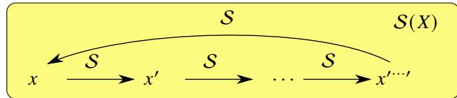
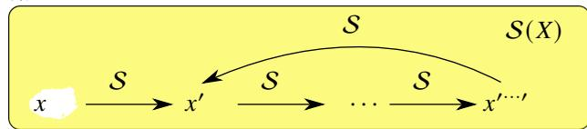
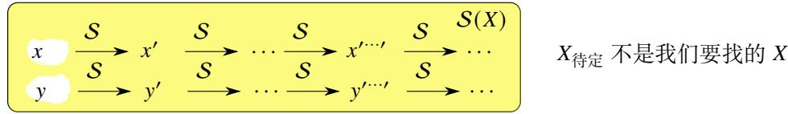

# 内容提要

h 在本章, 我们将用集合和映射的观点重新构建自然数集、整数集、有理数集. 并严格给出这些数集中的运算和运算律. 实数集的构造我们将在后面专门讨论.

h 这章和数学分析的主旨关系不是非常密切, 初学者可以先跳过. 等学完数学分析的主干内容后, 可以回过头来阅读本章.

# 1.1 自然数集的公理化

# 1.1.1 Peano 公理

自然数是学习数学时最先遇到的. 我们知道自然数就是 0, 1, 2, · · · , 即

$$
\mathbb {N} = \{0, 1, 2, 3, \dots \}.
$$

严格来说,这谈不上自然数集的定义,因为它没有给出关于自然数集 “内部结构”的任何信息.例如,元素3以后的下一个元素是什么? 如何得到下一个元素? 3 和前几个元素是什么关系? 这些元素可以进行怎样的运算?

十九世纪中叶以后, 有不少数学家尝试用公理化的方法给出自然数的定义.1889 年意大利数学家 GiuseppePeano 在德国数学家 Richard Dedekind 工作的基础上给出了一个简洁的自然数公理.

# 公理 1.1 (Peano 公理)

设集合 $X$ , 规定 $X$ 上的一个映射 $s$ . 若 $X$ 和 $s$ 满足

$$
1 ^ {\circ} x \in X.
$$

$$
2 ^ {\circ} x \notin S (X).
$$

$3 ^ { \circ } \ s$ 是一个单射.

$4 ^ { \circ }$ 设 $A \subseteq X$ . 若 $x \in A$ 且对于任一 $a \in A$ 都有 $S ( a ) \in A$ . 则 $A = X$ .

则称集合 $X$ 是自然数集 (set of natural numbers), 记作 N. 自然数集中的元素称为自然数 (natural number). $x$ 称为初始元素 (initial element). $s ( x )$ 称为 $x$ 的后继元 (successor), 其中 $s$ 称为后继映射 (successor map).

下面来解释一下 Peano公理背后的直观意义: $1 ^ { \circ }$ 说明在自然数集 N中存在一个起始元素 $x$ ,通过后继映射 $s$ ,可以迭代地产生后继元素 (successor). $2 ^ { \circ }$ 和 $3 ^ { \circ }$ 确保了后继映射生成后继元素时不会出现“循环”.若不满足 $2 ^ { \circ }$ 可能会出现图1.1所示的情况.

??待定

  
图 $1 . 1 \colon x$ 是初始元素, 不能属于 $S ( X )$ .

$X _ { \{ \# \# \# \} \# }$ 不是我们要找的 $X$

若不满足 $3 ^ { \circ }$ 可能会出现图1.2所示情况.

??待定

$X _ { \{ \# \# \# \} \# }$ 不是我们要找的 $X$

图 1.2: $s$ 只能是单射, 而图中 $x ^ { \prime }$ 有两个原像.

如果 $X$ 只满足 $1 ^ { \circ } , 2 ^ { \circ }$ 和 $3 ^ { \circ }$ , 则 $X$ 可以是像图1.3这样的:

??待定

  
图 1.3: $X$ 中不能有两个初始元素.

这显然不是“合乎预期”的自然数集,需要去掉“混入” $X$ 的元素 $y , S ( y ) , S ^ { 2 } ( y ) , \cdots .$ .于是就需要附加 $4 ^ { \circ }$ , 它被称为数学归纳公理 (axiom of mathematical induction). 有了这条公理, 就可以确保元素 $y , S ( y ) , S ^ { 2 } ( y ) , \cdot \cdot \cdot$ 不在自然数集内.

事实上 Peano 公理中的 $4 ^ { \circ }$ 是一个公理模式 (它可以产生无限个公理). 它不仅是一条用来定义自然数集的公理, 还是一条证明和自然数集有关的命题的公理, 即

# 公理 1.2 (数学归纳原理)

设自然数集 N. $s$ 是 $\mathbb { N }$ 上的后继映射. $x \in \mathbb { N }$ 且 $x \notin S ( \mathbb { N } )$ . 若满足

$1 ^ { \circ }$ 当 $n = x$ 时, 命题 $P$ 成立.  
$2 ^ { \circ }$ 若 $n = k$ 时命题 $P$ 成立, 则当 $n = S ( k )$ 时命题 $P$ 也成立.

则对于一切 $n \in \mathbb { N }$ 命题都成立.

Peano 公理揭示了自然数集的内部结构. 我们可以把自然数集看作一组 “多米诺骨牌”: 它有一块 “初始骨牌”,一旦推倒这块初始骨牌,第二块骨牌会跟着倒下,第二块会推倒第三块...依次下去以至于无穷.且这个多米诺骨牌不是 “环状的”, 并且它只有 “一条链”, 只需推倒初始骨牌, 就可以确保所有骨牌都倒下.

用阿拉伯数字表示的十进制自然数是我们最熟悉的. 现在先定义前十个自然数的阿拉伯数字表示.

$$
0 := x, \quad 1 := S (0), \quad 2 := S (1), \quad 3 := S (2), \quad 4 := S (3),
$$

$$
5 := \mathcal {S} (4), \quad 6 := \mathcal {S} (5), \quad 7 := \mathcal {S} (6), \quad 8 := \mathcal {S} (7), \quad 9 := \mathcal {S} (8).
$$

# 命题 1.1

设自然数集 N, $s$ 是 N 上的后继映射. $x$ 是 N 的初始元素. 则

$$
\mathbb {N} = \left\{x, \mathcal {S} (x), \mathcal {S} ^ {2} (x), \dots , \mathcal {S} ^ {n} (x), \dots \right\}.
$$

证明 由数学归纳原理立刻知道命题成立.

自然数已经被人类熟练使用了几千年 (甚至更久), 然而它们的公理化定理却出现在 100 多年前. 这说明认识某个事物, 使用某个事物和抽象出该事物的本质, 在认知层次上的差距是极大的.

# 1.1.2 自然数集中的加法运算

下面来定义自然数集中的加法运算.这种定义需要合乎已经熟悉的自然数运算.定义有限集的加法运算,只需要给出所有元素之间的 “加法表”, 但无限集没法这样做.

根据自然数集的特点, 可以分两步 “归纳地” 定义自然数的加法. 首先定义任一自然数和初始元的加法规则.然后假定已经知道了任一自然数与 $n$ 的加法规则, 在此假定下规定任一自然数与 $n$ 的后继元的加法规则. 由数学归纳原理可知, 这样就定义了任意两个自然数的加法规则. 这样的定义方法也称为递归法 (recursion) 或迭代法(iteration).

# 定义 1.1 (自然数的加法)

设自然数集 N. $s$ 是 N 上的后继映射. 定义 $\mathbb { N } \times \mathbb { N }$ 到 N 的一个映射 $( n , m ) \mapsto n + m$ , 它满足

$$
\begin{array}{l} 1 ^ {\circ} n + 0 := n. \\ 2 ^ {\circ} n + \mathcal {S} (m) := \mathcal {S} (n + m). \\ \end{array}
$$

我们称以上映射为自然数集上的加法 (addition). 其中 $n$ 与 $m$ 称为加数 (addend), $n { + } m$ 称为 $n$ 与 $m$ 的和 (sum).

注 $\mathbb { N } \times \mathbb { N }$ 表示笛卡尔积, 详见定义0.15. 关于加法是一种二元运算, 详见定义0.31.

注 根据以上定义, 我们可以得到

$$
\mathcal {S} (a) = \mathcal {S} (a + 0) = a + \mathcal {S} (0) = a + 1.
$$

$$
\mathcal {S} ^ {2} (a) = \mathcal {S} (a + 1) = a + \mathcal {S} (1) = a + 2.
$$

$$
\mathcal {S} ^ {3} (a) = \mathcal {S} (a + 2) = a + \mathcal {S} (2) = a + 3.
$$

用数学归纳法容易验证 $S ^ { n } ( a ) = a + n$ $( n = 1 , 2 , \cdots )$ . 这表明加上自然数 $a$ 加上 $n$ 等于对 $a$ 作 $n$ 次后继映射. 所以说自然数的加法运算实质上是后继映射的乘积. 作后继映射, 其实就是小时候学习的 “数数”. 事实上人类真正会做的只有这种操作. 我们做的其余运算最后都可以归结为 “数数”.

用数学归纳法可以证明以上定义的加法运算满足我们熟悉的运算律: 结合律、交换律和消去律.

# 命题 1.2 (自然数的加法结合律)

对于任意 $a , b , c \in \mathbb { N }$ 都有

$$
(a + b) + c = a + (b + c).
$$

证明 用数学归纳法对 $c$ 进行归纳.

(i) 当 $c = 0$ 时

$$
(a + b) + 0 = a + b = a + (b + 0).
$$

(ii) 假设 $c = k$ 时命题成立, 即 $( a + b ) + k = a + ( b + k )$ . 下面来看 $c = S ( k )$ 时的情况.

$$
(a + b) + \mathcal {S} (k) = \mathcal {S} [ (a + b) + k ] = \mathcal {S} [ a + (b + k) ] = a + \mathcal {S} (b + k) = a + [ b + \mathcal {S} (k) ].
$$

由数学归纳原理可知对于一切 $c \in \mathbb { N }$ 命题都成立.

由于自然数的加法满足结合律, 因此对于任意有限个自然数 $a _ { 1 }$ $a _ { 1 } , a _ { 2 } , , \cdots , a _ { n }$ $a _ { n }$ , 加法算式 $a _ { 1 } + a _ { 2 } + \cdots + a _ { n }$ 都只有唯一确定的值. 我们可以把 $a _ { 1 } + a _ { 2 } + \cdots + a _ { n }$ 记作 $\textstyle \sum _ { i = 1 } ^ { n } a _ { i }$ .

# 命题 1.3 (自然数的加法交换律)

对于任意 $a , b \in \mathbb { N }$ 都有

$$
a + b = b + a.
$$

证明 (i) 用数学归纳法证明 $0 + a = a$ . 当 $a = 0$ 时显然成立. 假设 $a = k$ 时命题成立, 即 $0 + k = k$ . 下面来看 $a = S ( k )$ 时的情况.

$$
0 + \mathcal {S} (k) = \mathcal {S} (0 + k) = \mathcal {S} (k).
$$

于是可知对于一切 $a \in \mathbb { N }$ 都有 $0 + a = a$ . 由于 $a + 0 = a$ . 因此 $a + 0 = 0 + a$ .

(ii) 用数学归纳法证明 $S ( a ) + b = S ( a + b ) .$ . 当 $b = 0$ 时命题显然成立. 假设 $b = k$ 时命题成立, 即 $S ( a ) + k =$ $S ( a + k )$ . 下面来看 $b = S ( k )$ 时的情况.

$$
\mathcal {S} (a) + \mathcal {S} (k) = \mathcal {S} (\mathcal {S} (a) + k) = \mathcal {S} (\mathcal {S} (a + k)) = \mathcal {S} (a + \mathcal {S} (k)).
$$

于是可知对于一切 $b \in \mathbb { N }$ 都有 $S ( a ) + b = S ( a + b )$ .

(iii) 用数学归纳法证明 $a + b = b + a .$ . 当 $b = 0$ 时, 由 (i) 可知命题成立. 假设 $b = k$ 时命题成立, 即 $a + k = k + a$ .下面来看 $b = S ( k )$ 时的情况. 由 (ii) 可知

$$
a + \mathcal {S} (k) = \mathcal {S} (a + k) = \mathcal {S} (k + a) = \mathcal {S} (k) + a.
$$

于是可知对于一切 $b \in \mathbb { N }$ 都有 $a + b = b + a$ .

# 命题 1.4 (自然数的加法消去律)

对于任意 $a , b , c \in \mathbb { N }$ 都有

$$
a + c = b + c \iff a = b.
$$

证明 充分性显然成立. 下面证明必要性. 用数学归纳法对 $c$ 进行归纳. 当 $c = 0$ 时

$$
a = a + 0 = b + 0 = b.
$$

假设 $c = k$ 时命题成立, 即 $a + k = b + k \Longrightarrow a = b .$ . 下面来看 $c = S ( k )$ 时的情况. 若 $a + S ( k ) = b + S ( k ) .$ , 则

$$
\mathcal {S} (a + k) = a + \mathcal {S} (k) = b + \mathcal {S} (k) = \mathcal {S} (b + k).
$$

由于 $s$ 是一个单射, 故 $a + k = b + k$ . 由归纳假设可知 $a = b$ . 于是可知对于一切 $c \in \mathbb { N }$ 必要性都成立.

我们发现 0 是自然数集中一个特殊的元素——N 中的任何元素 $a$ 和 0 的和仍是 $a$ . 因此 0 称为加法运算的单位元 . 也称零元 . 在实际应用中, 经常需要用到不含零的自然数集.

# 定义 1.2 (正自然数)

令 $\mathbb { N } ^ { * } : = \mathbb { N } \backslash \{ 0 \}$ . 我们称 $\mathbb { N } ^ { * }$ 中的自然数为正的 (positive).

# 命题 1.5

设 $b \in \mathbb { N } ^ { * }$ , 则存在 $a \in \mathbb { N }$ 使得 $S ( a ) = b$ .

证明 用数学归纳法对 $b$ 进行归纳. 当 $b = 1$ 时, $S ( 0 ) = 1 .$ 假设 $b = k$ 时命题成立, 即存在 $a \in \mathbb { N }$ 使得 $S ( a ) = k .$ . 于是 ${ \cal S } ( k ) = { \cal S } [ { \cal S } ( a ) ]$ . 由数学归纳原理可知对于一切 $b \in \mathbb { N } ^ { * }$ 命题都成立. ■

注 对于正自然数集 $\mathbb { N } ^ { * }$ , 容易验证, 数学归纳原理依旧成立. 不过此时的 “初始元” 是 1.

# 命题 1.6

设 $a \in \mathbb { N } ^ { * }$ . 则对于任意 $b \in \mathbb { N } ,$ , 都有 $a + b \in \mathbb { N } ^ { * }$ .

证明 用数学归纳法对 $b$ 进行归纳. 当 $b = 0$ 时 $a + b = a + 0 = a \in \mathbb { N } ^ { * } .$ . 假设 $b = k$ 时命题成立. 下面来看 $b = S ( k )$ 时的情况. 由 Peano公理中的 $2 ^ { \circ }$ 可知 $0 \not \in S ( \mathbb { N } )$ , 故

$$
a + \mathcal {S} (k) = \mathcal {S} (a + k) \neq 0.
$$

因此 $a + S ( k ) \in \mathbb { N } ^ { * }$ . 由数学归纳原理可知, 对于一切 $b \in \mathbb { N } ^ { * }$ 命题都成立.

# 推论 1.1

设 $a , b \in \mathbb { N }$ . 则 $a + b = 0$ 当且仅当 $a = b = 0$ .

证明 充分性显然成立. 下面来看必要性. 用反证法. 假设 $b \neq 0$ , 由命题1.6可知 $a + b \neq 0$ , 出现矛盾. 因此 $b = 0 .$ . 同理可知 $a = 0$ . ■

# 1.1.3 自然数集中的序关系

有了加法运算, 我们就可以为自然数集定义序关系.

# 定义 1.3 (自然数集中的序关系)

设 $a , b \in \mathbb { N }$ . 若存在 $k \in \mathbb { N }$ 使得 $a + k = b$ , 则称 $a$ 小于等于 (less than or equal to) $^ b$ , 记作 $a \leqslant b$ . 或称 $^ b$ 大于等 于 (greater than or equal to) $a$ , 记作 $b \geqslant a$ .

特别地, 若 $a \leqslant b$ 且 $a \neq b$ , 则称 $a$ 小于 (less than) $^ b$ , 记作 $a < b$ . 或称 $^ b$ 大于 (greater than) $a$ , 记作 $b > a$

# 命题 1.7

设 $a , b \in \mathbb { N } .$ . 则 $a < b$ 当且仅当存在 $k \in \mathbb { N } ^ { * }$ 使得 $a + k = b$ .

证明 (i) 证明必要性. 若 $a < b$ 则 $a \leqslant b$ 且 $a \neq b$ . 故存在 $k \in \mathbb { N }$ 使得 $a + k = b$ . 若 $k = 0$ , 则 $a = b$ 出现矛盾, 故$k \neq 0 .$ . 于是可知 $k \in \mathbb { N } ^ { * }$ .  
(ii) 证明充分性. 若存在 $k \in \mathbb { N } ^ { * }$ 使得 $a + k = b$ . 则 $a \leqslant b$ . 假设 $a = b$ , 则 $k = 0$ , 出现矛盾, 故 $a \neq b$ . 于是可知$a < b$ . ■

下面来证明自然数集中序关系的一些基本性质.

# 命题 1.8 (自然数集的全序性)

在自然数集 N 中

(1) 自反性: $a \leqslant a$ .  
(2) 反对称性: 若 $a \geqslant b$ 且 $b \geqslant a$ , 则 $a = b$ .  
(3) 传递性: 若 $a \geqslant b$ 且 $b \geqslant c$ , 则 $a \geqslant c$ .  
(4) 完全性: 对于任意 $a , b$ 都有 $a \geqslant b$ 或 $b \geqslant a$ .

证明 (1) 由于 $a = a$ , 故 $a \leqslant a$ .  
(2) 由于 $a \geqslant b$ , 故存在 $m \in \mathbb { N }$ 使得 $a = b + m$ . 由于 $b \geqslant a$ , 故存在 $n \in \mathbb { N }$ 使得 $b = a + n .$ . 于是

$$
a + 0 = a = b + m = (a + n) + m = a + (n + m).
$$

由消去律可知 $0 = n + m$ . 由推论1.1可知 $n = m = 0 .$ . 于是可知 $a = b$ .

(3) 由于 $a \geqslant b$ , 故存在 $m \in \mathbb { N }$ 使得 $a = b + m$ . 由于 $b \geqslant c$ , 故存在 $n \in \mathbb { N }$ 使得 $b = c + n .$ 于是

$$
a = b + m = (c + n) + m = c + (n + m),
$$

于是可知 $a \geqslant c$ .

(4) 对 $a$ 进行归纳. 当 $a = 0$ 时, 显然有 $a \leqslant b$ . 假设 $a = k$ 时命题成立, 即 $b \leqslant k$ 或 $b > k$ . 下面来看 $a = k + 1$ 的情况. 若 $b \leqslant k$ , 由于 $k \leqslant k + 1 .$ , 故 $b \leqslant k + 1 .$ 若 $b > k$ , 则 $b \geqslant k + 1 .$ 有数学归纳原理可知完全性成立. ■

由以上命题可知自然数集 $\mathbb { N }$ 是一个全序集, 详见定义0.11.

# 命题 1.9 (自然数集的三歧性)

对于任意 $a , b \in \mathbb { N } ,$ , 下列三个命题中, 有且仅有一个成立

$$
1 ^ {\circ} a <   b. \quad 2 ^ {\circ} a = b. \quad 3 ^ {\circ} a > b.
$$

证明 (i) 若 $a < b$ , 则 $a \neq b$ . 因此不可能三个命题同时成立.  
(ii) 假设有两个命题同时成立. 显然 $1 ^ { \circ }$ 和 $2 ^ { \circ }$ 不能同时成立. $3 ^ { \circ }$ 和 $2 ^ { \circ }$ 也不能同时成立. 故 $1 ^ { \circ }$ 和 $3 ^ { \circ }$ 同时成立,即 $a < b$ 且 $a > b$ . 由反对称性可知 $a = b$ . 出现矛盾. 于是可知, 不可能有两个命题同时成立.

(iii) 由命题1.8的 (4) 可知至少有一个命题成立.

综上可知 $1 ^ { \circ }$ 、 $2 ^ { \circ }$ 和 $3 ^ { \circ }$ 中至少有一个命题成立.

# 命题 1.10 (自然数的加法保序性)

对于任意 $a , b , c \in \mathbb { N }$ 都有

$$
a + c \geqslant b + c \iff a \geqslant b.
$$

证明 (i) 证明必要性. 由于 $a + c \geqslant b + c$ , 故存在 $n \in \mathbb { N }$ 使得

$$
a + c = (b + c) + n = b + (c + n) = b + (n + c) = (b + n) + c,
$$

由消去律可知 $a = b + n .$ 于是可知 $a \geqslant b$ .

(ii) 证明充分性. 由于 $a \geqslant b$ , 故存在 $m \in \mathbb { N }$ 使得

$$
a = b + m \Longrightarrow a + c = (b + m) + c = b + (m + c) = b + (c + m) = (b + c) + m
$$

于是可知 $a + c \geqslant b + c$ .

# 命题 1.11

对于任意 $a , b \in \mathbb { N }$ 都有

$$
a > b \iff a \geqslant S (b).
$$

证明 (i)证明必要性.由于 $a > b$ ,故存在 $m \in \mathbb { N }$ 使得 $a = b + m$ .由于 $a \neq b$ , 故 $m \neq 0$ .由引理1.5可知存在 $n \in \mathbb { N }$ 使得 $S ( n ) = m$ .

$$
a = b + m = b + \mathcal {S} (n) = b + (n + 1) = b + (1 + n) = (b + 1) + n = \mathcal {S} (b) + n.
$$

于是可知 $a \geqslant S ( b )$

(ii) 证明充分性. 由于 $a \geqslant S ( b )$ , 故存在 $n \in \mathbb { N }$ 使得 $a = S ( b ) + n .$ . 于是

$$
a = \mathcal {S} (b) + n = (b + 1) + n = b + (1 + n) = b + (n + 1) = b + \mathcal {S} (n).
$$

因此 $a \geqslant b$ . 由 Peano 公理中的 $2 ^ { \circ }$ 可知 $0 \not \in S ( \mathbb { N } )$ , 故 $S ( n ) \neq 0 .$ . 故 $a \neq b$ . 于是可知 $a > b$ .

# 1.1.4 数学归纳原理的再讨论

前面已经介绍了数学归纳原理. 如果要证明 N 的子集 $M = \mathbb { N } .$ . 只需先证明 $0 \in M$ , 然后在证明当 $k \in M$ 时$k + 1 \in M$ . 然而, 有时候如果只假设 $k \in M$ 难以证明 $k + 1 \in M$ , 我们需要假设 $k$ 前面的更多项都属于 $M$ 才能推出 ??. 这促使我们希望给数学归纳原理 “添加条件”.

# 定理 1.1 (第二数学归纳原理)

设 $M \subseteq \mathbb { N } .$ . 若满足

$1 ^ { \circ } ~ 0 \in M .$

$2 ^ { \circ }$ 假设任一小于 $k$ 的自然数都属于 $M$ , 则 $k \in M$ .

则 $M = \mathbb { N }$ .

证明 只需证明 $\mathbb { N } \subseteq M$ . 令

$$
E = \{k: \text {任 一 小 于} k \text {的 自 然 数 都 属 于} M \}.
$$

则 $E \subseteq M$ . 下面用数学归纳原理证明 $E = \mathbb { N }$ .

(i) 由于不存在自然数小于 0, 因此 $0 \in E$ .  
(ii) 假设 $k \in E$ , 则任一小于 $k$ 的自然数都属于 $M$ . 由于 $E \subseteq M$ , 故 $k \in M$ . 于是任一小于等于 $k$ 的自然数都属于 ??. 因此任一小于 $k + 1$ 的自然数都属于 $M$ . 这表明 $k + 1 \in E$ .

由数学归纳原理可知 $E = \mathbb { N }$ . 于是可知 $\mathbb { N } = E \subseteq M$ .

注 以上定理通常按如下形式使用. 设自然数集 N. $P$ 是一个有关自然数集的命题. 若满足

$1 ^ { \circ }$ 当 $n = 0$ 时, 命题 $P$ 成立.  
$2 ^ { \circ }$ 假设 $n < k$ 时命题 $P$ 成立, 则当 $n = k$ 时命题 $P$ 也成立.

则对于一切 $n \in \mathbb { N }$ 命题 $P$ 都成立.

定义序关系以后, 我们就可以说 0 是 $\mathbb { N }$ 中的最小元素.

# 定义 1.4 (良序性)

设全序集 $( S , \preceq )$ . 若存在 $a \in S$ , 对于任一 $x \in S$ 都有 $a \leqslant x .$ , 则称 $a$ 是 $s$ 的最小元素. 我们称存在最小元素的全序集是良序的 (well-ordered).

自然数集 N 是良序的, 这是使用数学归纳原理的一个重要前提. 容易想到 $\mathbb { N }$ 的任一非空子集都存在最小元素. 如果能证明这个结论, 那么数学归纳原理就可以推广到自然数的任一子集.

# 定理 1.2 (良序定理)

设非空集合 $M \subseteq \mathbb { N } .$ . 则 $M$ 中存在最小元素, 即存在 $m$ , 对于任意 $a \in M$ 都有 $a \geqslant m$ .

证明 用反证法, 假设 $M$ 没有最小元素. 把 N 看作全集, 下面用第二数学归纳法证明 $M ^ { c } = \mathbb { N }$ .

(i) 由于 $M$ 没有最小元素, 故 $0 \notin M$ , 因此 $0 \in M ^ { c }$ .  
(ii) 假设任一小于 $k$ 的自然数都属于 $M ^ { c }$ . 由于 $M$ 没有最小元素, 故 $k \notin M$ , 否则 $k$ 将成为 $M$ 中的最小元素.因此 $k \in M ^ { c }$ .

由第二数学归纳法可知 $M ^ { c } = \mathbb { N }$ , 故 $M = \emptyset$ , 出现矛盾, 因此假设不成立. 于是可知 $M$ 中存在最小元素.

前面我们用数学归纳原理证明了第二数学归纳原理. 然后用第二数学归纳原理证明了良序定理. 如果能用良序定理反过来证明数学归纳原理, 那么就说明它们三者是等价的!

# 定理 1.3

数学归纳原理、第二数学归纳原理和良序定理是等价的.

证明 假设良序定理成立, 我们来证明数学归纳原理. 设集合 $E \subseteq \mathbb { N }$ . 已知它满足

$1 ^ { \circ } ~ 0 \in E$   
$2 ^ { \circ }$ 当 $k \in E$ 时 $k + 1 \in E$ .

下面要证明 $E = \mathbb { N } .$ . 用反证法. 假设 $E \neq \mathbb { N }$ . 把 N 看作全集, 则 $E ^ { c } \neq \emptyset$ . 由良序定理可知 $E ^ { c }$ 中存在最小元素 $n _ { 0 }$ . 由于 $0 \in E$ 故 $n _ { 0 } \neq 0 .$ 于是 $n _ { 0 } - 1 \in E$ . 由 $2 ^ { \circ }$ 可知 $\boldsymbol { n } _ { 0 } \in E$ ,出现矛盾,因此假设不成立.于是可知 $E = \mathbb { N } .$ .这就证明了数学归纳原理成立.

虽然第二数学归纳原理的条件相比数学归纳原理更强了, 但它们还是等价的. 这表明我们增加的条件本质上并没有改变数学归纳原理.

自然数集可以看作一个 “有始无终的不循环的单链的多米诺骨牌”, 那么它的非空无限子集依旧保持这种性质. 因此数学归纳原理也就可以对自然数的任一非空无限子集继续保持.

# 定理 1.4

设自然数集 N 的一个非空无限子集

$$
M = \{x _ {i} \in \mathbb {N}, i = 0, 1, 2, \dots : \forall i, j \in \mathbb {N} \text {若} i <   j \text {则} x _ {i} <   x _ {j} \}
$$

若 ?? 的一个非空子集 $M ^ { \prime }$ 满足

$$
1 ^ {\circ} x _ {0} \in M ^ {\prime}.
$$

$2 ^ { \circ }$ 假设 $x _ { i } \in M ^ { \prime }$ , 则有 $x _ { i + 1 } \in M ^ { \prime }$ .

则 $M ^ { \prime } = M$

事实上还可以把以上定理进一步一般化. 设集合 ??, 若 $s$ 与 N 可以建立一个双射. 则可令 ?? 中的元素排成一列

$$
a _ {1}, a _ {2}, \dots , a _ {n}, \dots .
$$

于是可以在 ?? 上定义一个全序关系:

$$
a _ {i} \preceq a _ {j}: \Longleftrightarrow i \leqslant j.
$$

于是我们可以对 ?? 使用归纳法.

# 1.1.5 自然数集中的乘法运算

仿照加法的定义, 我们可以定义自然数的乘法运算.

# 定义 1.5 (自然数的乘法)

设自然数集 N. S 是 N 上的后继映射. 定义 $\mathbb { N } \times \mathbb { N }$ 到 $\mathbb { N }$ 的一个映射 $( n , m ) \mapsto n \times m$ , 它满足

$$
\begin{array}{l} 1 ^ {\circ} n \times 0 := 0. \\ 2 ^ {\circ} n \times \mathcal {S} (m) := n \times m + n. \\ \end{array}
$$

我们称以上映射为自然数集上的乘法 (multiplication). 其中 $n$ 与 $m$ 称为因数 (factor), $n \times m$ 称为 $n$ 与 $m$ 的积(product).

注 乘法运算符有时候可以省略, 也可以用 · 表示. 乘法和加法同时出现时, 优先计算乘法.

注 由定义立刻可知

$$
n \times 0 = 0,
$$

$$
n \times 1 = n \times \mathcal {S} (0) = n \times 0 + n = n,
$$

$$
n \times 2 = n \times \mathcal {S} (1) = n \times 1 + n = n + n,
$$

用数学归纳法容易验证 $n \times k = n + \cdot \cdot \cdot + n$ .

?? 个 ??

下面来研究加法和乘法运算的关系.

# 命题 1.12 (自然数的分配律)

对于任意 ??, ??, ?? ∈ N 都有

$$
(a + b) c = a c + b c.
$$

证明 用数学归纳法对 $c$ 进行归纳.

(i) 当 $c = 0$ 时

$$
(a + b) \times 0 = 0 = 0 + 0 = a \times 0 + b \times 0.
$$

(ii) 假设 $c = k$ 时命题成立, 即 $( a + b ) \times k = a \times k + b \times k .$ 下面来看 $c = S ( k )$ 时的情况.

$$
\begin{array}{l} (a + b) \mathcal {S} (k) = (a + b) k + (a + b) = a k + b k + a + b = a k + a + b k + b \\ = (a k + a) + (b k + b) = a \mathcal {S} (k) + b \mathcal {S} (k). \\ \end{array}
$$

由数学归纳原理可知对于一切 $c \in \mathbb { N }$ 命题都成立.

0 和 1 在自然数的乘法运算中具有特殊的地位.

# 引理 1.1

对于任一 $n \in \mathbb { N }$ 都有

$$
n \times 0 = 0 \times n = 0, \qquad n \times 1 = 1 \times n = n.
$$

证明 用数学归纳法对 $n$ 进行归纳.

(i) 当 $n = 0$ 时

$$
0 \times 0 = 0, \qquad 0 \times 1 = 0 = 1 \times 0.
$$

(ii) 假设 $n = k$ 时命题成立, 即 $k \times 0 = 0 \times k = 0$ , $k \times 1 = 1 \times k = k .$ 下面来看 $n = S ( k )$ 时的情况.

$$
\mathcal {S} (k) \times 0 = 0 = 0 + 0 = 0 \times k + 0 = 0 \times \mathcal {S} (k),
$$

$$
\mathcal {S} (k) \times 1 = \mathcal {S} (k) = k + 1 = 1 \times k + 1 = 1 \times \mathcal {S} (k).
$$

由数学归纳原理可知对于一切 $n \in \mathbb { N }$ 命题都成立.

# 命题 1.13 (自然数的乘法交换律)

对于任意 $a , b \in \mathbb { N }$ 都有

$$
a b = b a.
$$

证明 用数学归纳法对 $b$ 进行归纳.

(i) 当 $b = 0$ 时, 由引理1.1可知命题成立.  
(ii) 假设 $b = k$ 时命题成立, 即 $a \times k = k \times a$ . 下面来看 $b = S ( k )$ 时的情况.

$$
a \mathcal {S} (k) = a k + a = k a + a = k a + 1 \times a = (k + 1) a = \mathcal {S} (k) a
$$

由数学归纳原理可知对于一切 $b \in \mathbb { N }$ 命题都成立.

# 命题 1.14 (自然数的乘法结合律)

对于任意 ??, ??, $c \in \mathbb { N }$ 都有

$$
(a b) c = a (b c).
$$

证明 用数学归纳法对 $c$ 进行归纳.

(i) 当 $c = 0$ 时

$$
(a b) \times 0 = 0 = a \times 0 = a (b \times 0).
$$

(ii) 假设 $c = k$ 时命题成立, 即 $( a \times b ) \times k = a \times ( b \times k ) .$ . 下面来看 $c = S ( k )$ 时的情况.

$$
\begin{array}{l} (a b) \mathcal {S} (k) = (a b) k + a b = a (b k) + a b = (b k) a + b a \\ = (b k + b) a = [ b \mathcal {S} (k) ] a = a [ b \mathcal {S} (k) ]. \\ \end{array}
$$

由数学归纳原理可知对于一切 $c \in \mathbb { N }$ 命题都成立.

由于自然数的乘法满足结合律, 因此对于任意有限个自然数 $a _ { 1 } , a _ { 2 } , , \cdots , a _ { n }$ $a _ { 1 }$ $a _ { n }$ , 乘法算式 $a _ { 1 } a _ { 2 } \cdots a _ { n }$ 都只有唯一确定的值. 我们可以把它可以记作 $\textstyle \prod _ { i = 1 } ^ { n } a _ { i }$ .

# 命题 1.15 (自然数的无零因子律)

设 ??, $b \in \mathbb { N }$ . 则 $a b = 0$ 当且仅当 $a = 0$ 或 $b = 0$ .

证明 充分性显然成立. 下面证明必要性. 只需证明当 $a \neq 0$ 且 $b \neq 0$ 时 $a \times b \neq 0$ . 用数学归纳法对 $b$ 进行归纳. 当$b = 1$ 时

$$
a b = a \times 1 = a \neq 0.
$$

假设 $b = k$ 时命题成立, 即 $a k \neq 0$ . 则

$$
a S (k) = a k + a \neq 0.
$$

由数学归纳原理可知, 当 $a \neq 0$ 且 $b \neq 0$ 时 $a b \neq 0$ .

注 以上命题等价于: 设 $a , b \in \mathbb { N } .$ . 则 $a b \neq 0$ 当且仅当 $a \neq 0$ 且 $b \neq 0$ .

# 命题 1.16 (自然数的乘法保序性)

设 $a , b , c \in \mathbb { N }$ , 其中 $c \neq 0$ , 则

$$
a > b \iff a c > b c.
$$

证明 (i) 证明必要性. 由于 $a > b$ , 故存在 $m \in \mathbb { N } ^ { * }$ 使得 $a = b + m$ . 于是

$$
a c = (b + m) c = b c + m c.
$$

由于 $m \neq 0$ , $c \neq 0$ , 故 $m c \neq 0$ . 于是可知 $a c > b c$ .

(ii) 由 (i) 可知若 $b > a$ , 则 $b c > a c$ , 其中 $c \neq 0$ . 另一方面, 若 $b = a$ , 则 $b c = a c$ . 于是有

$$
b \geqslant a \Longrightarrow b \times c \geqslant a \times c.
$$

以上命题的逆否命题即为 $b c < a c \Longrightarrow b < a .$ . 于是可知充分性成立.

以上命题的逆否命题就是乘法消去律.

# 命题 1.17 (自然数的乘法消去律)

设 $a , b , c \in \mathbb { N }$ , 其中 $c \neq 0$ , 则

$$
a c = b c \iff a = b.
$$

我们可以继续用数学归纳法定义自然数次幂的指数运算.

# 定义 1.6 (自然数次幂)

设自然数集 N. $s$ 是 N 上的后继映射. 定义 $\mathbb { N } \times \mathbb { N } \backslash \{ ( 0 , 0 ) \}$ 到 N 的一个映射 $( n , m ) \mapsto n ^ { m }$ . 当 $n \neq 0$ 时它满足1◦ $n ^ { 0 } : = 1$ .

$$
2 ^ {\circ} n ^ {\mathcal {S} (m)} := n ^ {m} \times n.
$$

规定 $0 ^ { m } = 0$ $( m ~ \ne ~ 0 )$ . 我们称以上映射为指数运算 (exponentiation). 其中 $n$ 称为底数 (base), $m$ 称为指数(exponent), $n ^ { m }$ 称为 $n$ 的 $m$ 次幂 (the $m$ -th power of $n$ ).

注 需要注意 $n ^ { m }$ 中 $n$ 和 $m$ 不能同时取零.

注 由定义立刻可知

$$
n ^ {0} = 1,
$$

$$
n ^ {1} = n ^ {S (0)} = n ^ {0} \times n = n,
$$

$$
n ^ {2} = n ^ {\mathcal {S} (1)} = n ^ {1} \times n = n \times n,
$$

用数学归纳法容易验证 $n ^ { k } = n \times \cdots \times n$ .?? 个 ??

关于指数运算的性质, 我们将在后面详细讨论.

# 定义 1.7 (自然数的阶乘)

设自然数集 N. $s$ 是 N 上的后继映射. 定义 $\mathbb { N }$ 上的一个映射 $n \mapsto n !$ , 它满足

$$
1 ^ {\circ} 0! := 1.
$$

$$
2 ^ {\circ} S (n)! := n! \times S (n).
$$

我们称以上映射为阶乘 (factorial).

注 由定义立刻可知

$$
0! = 1,
$$

$$
1! = \mathcal {S} (0)! = 0! \times 1 = 1,
$$

$$
2! = \mathcal {S} (1)! = 1! \times 2 = 1 \times 2,
$$

$$
3! = S (2)! = 2! \times 3 = 1 \times 2 \times 3,
$$

用数学归纳法容易验证当 $k \neq 0$ 时有 $k ! = 1 \times 2 \times \cdots \times k$ .

# 1.2 整数环和环公理

# 1.2.1 整数集的构建

上一节我们用公理化的方法定义了自然数集N,并归纳地定义了自然数集上的加法和乘法运算.很自然地,我们会想这样一个问题: 如果已知两个自然数的和, 以及其中的一个加数, 如何求另一个加数. 这就是加法运算的逆运算. 于是我们可以考虑引入了减法运算. 若 $a + b = c$ , 则可规定

$$
c - a := b.
$$

这样规定的减法显然不是自然数集上的运算. 因为并不是任意两个自然数都可以在自然数集中做减法. 当 $c < a$ 时 $c - a$ 在自然数集中就没有意义.这是扩充自然数集的一个基本动力.下面尝试把自然数集扩充成一个更大的数集, 使得减法运算在新的数集上可以运行, 并把这个数集称为 “整数集”. 我们尝试这样定义整数: 令

$$
- 1 := 1 - 2, \quad - 2 := 1 - 3, \quad - 3 := 1 - 4, \quad \dots .
$$

用两个自然数定义一个整数是一个好思路. 按这个思路, 整数可以看作 $\mathbb { N } \times \mathbb { N }$ 中的元素. 但这个做法尚有瑕疵: 若$a : = 1 - 2 , b : = 4 - 5 .$ , 则 $a$ 和 $b$ 实质上是同一个整数, 这是因为 $1 + 5 = 2 + 4 .$ . 为了解决这个问题, 只需在 $\mathbb { N } \times \mathbb { N }$ 建立一个等价关系, 然后把在这个等价关系下的一个等价类看作一个整数.

# 命题 1.18

在 $\mathbb { N } \times \mathbb { N }$ 中定义一个二元关系

$$
\left(a _ {1}, b _ {1}\right) \sim \left(a _ {2}, b _ {2}\right): \Longleftrightarrow a _ {1} + b _ {2} = b _ {1} + a _ {2}.
$$

则二元关系 “∼” 是一个等价关系.

证明 (i) 由于 $( a , b ) \sim ( a , b ) \iff a + b = b + a ,$ 故二元关系 “∼” 满足反身性.

(ii) 由于

$$
(a _ {1}, b _ {1}) \sim (a _ {2}, b _ {2}) \iff a _ {1} + b _ {2} = b _ {1} + a _ {2} \iff a _ {2} + b _ {1} = b _ {2} + a _ {1} \iff (a _ {2}, b _ {2}) \sim (a _ {1}, b _ {1}).
$$

故二元关系 “∼” 满足对称性.

(iii) 由于

$$
\begin{array}{l} \left. \begin{array}{l} (a _ {1}, b _ {1}) \sim (a _ {2}, b _ {2}) \iff a _ {1} + b _ {2} = b _ {1} + a _ {2} \iff a _ {1} + b _ {2} + b _ {3} = b _ {1} + a _ {2} + b _ {3} \\ (a _ {2}, b _ {2}) \sim (a _ {3}, b _ {3}) \iff a _ {2} + b _ {3} = b _ {2} + a _ {3} \iff b _ {1} + a _ {2} + b _ {3} = b _ {1} + b _ {2} + a _ {3} \end{array} \right\} \\ \Longrightarrow a _ {1} + b _ {2} + b _ {3} = b _ {1} + b _ {2} + a _ {3} \Longleftrightarrow a _ {1} + b _ {3} = b _ {1} + a _ {3} \Longleftrightarrow (a _ {1}, b _ {1}) \sim (a _ {3}, b _ {3}), \\ \end{array}
$$

故二元关系 “∼” 满足传递性.

综上可见 $\mathbb { N } \times \mathbb { N }$ 中规定的二元关系 “∼” 是一个等价关系.

于是可以给出整数集的定义.

# 定义 1.8 (整数集)

在集合 $\mathbb { N } \times \mathbb { N }$ 上规定一个等价关系

$$
\left(a _ {1}, b _ {1}\right) \sim \left(a _ {2}, b _ {2}\right): \Longleftrightarrow a _ {1} + b _ {2} = b _ {1} + a _ {2}.
$$

$\mathbb { N } \times \mathbb { N }$ 对于等价关系 “∼” 的商集 $( \mathbb { N } \times \mathbb { N } ) / { \sim }$ 称为整数集 (set of integers), 记作 Z. 其中每一个等价类表示一个整数 (integer). $( a , b )$ 确定的等价类记作 $\overline { { a - b } }$ . 若 $a = b$ , 则把 $\overline { { a - b } }$ 记作 0.

注 整数集 $\mathbb { Z }$ 的记号来自德语 “Zahlen”, 原义是 “数字”.  
注 $\overline { { a - b } }$ 的记法仅仅是为了严格讨论整数而采用的 “权宜之计”, 本节之后将不再使用这个记号.  
注 类似地, 为了便于叙述问题, 我们把 $\mathbb { Z } \backslash \{ 0 \}$ 记作 $\mathbb { Z } ^ { \ast }$ .

下面我们在整数集 $\mathbb { Z }$ 中规定加法和乘法运算.

# 定义 1.9 (整数的加法和乘法)

在整数集 Z 中规定:

$$
\overline {{a _ {1} - b _ {1}}} + \overline {{a _ {2} - b _ {2}}} := \overline {{(a _ {1} + a _ {2}) - (b _ {1} + b _ {2})}},
$$

$$
\overline {{a _ {1} - b _ {1}}} \times \overline {{a _ {2} - b _ {2}}} := \overline {{(a _ {1} a _ {2} + b _ {1} b _ {2}) - (a _ {1} b _ {2} + b _ {1} a _ {2})}}.
$$

需要验证以上规定的加法和乘法是否合理, 也就是需要验证运算结果是否依赖于等价类中代表元素的选择.

# 命题 1.19 (整数的加法和乘法是良定义的)

在 $\mathbb { Z }$ 中, 若 ${ \overline { { a _ { 1 } - b _ { 1 } } } } = { \overline { { a _ { 2 } - b _ { 2 } } } }$ , ${ \overline { { c _ { 1 } - d _ { 1 } } } } = { \overline { { c _ { 2 } - d _ { 2 } } } } .$ , 其中 $a _ { 1 } , b _ { 1 } , a _ { 2 } , b _ { 2 } , c _ { 1 } , d _ { 1 } , c _ { 2 } , d _ { 2 } \in \mathbb { N } .$ $c _ { 1 }$ $d _ { 1 }$ $c _ { 2 }$ $d _ { 2 } \in \mathbb { N }$ 则

$$
\overline {{a _ {1} - b _ {1}}} + \overline {{c _ {1} - d _ {1}}} = \overline {{a _ {2} - b _ {2}}} + \overline {{c _ {2} - d _ {2}}},
$$

$$
\overline {{a _ {1} - b _ {1}}} \times \overline {{c _ {1} - d _ {1}}} = \overline {{a _ {2} - b _ {2}}} \times \overline {{c _ {2} - d _ {2}}}.
$$

证明 由条件得

$$
\overline {{a _ {1} - b _ {1}}} = \overline {{a _ {2} - b _ {2}}} \Longleftrightarrow a _ {1} + b _ {2} = b _ {1} + a _ {2} \tag {1.1}
$$

$$
\overline {{c _ {1} - d _ {1}}} = \overline {{c _ {2} - d _ {2}}} \Longleftrightarrow c _ {1} + d _ {2} = d _ {1} + c _ {2} \tag {1.2}
$$

等式1.1加1.2得

$$
(a _ {1} + c _ {1}) + (b _ {2} + d _ {2}) = (b _ {1} + d _ {1}) + (a _ {2} + c _ {2}) \Longleftrightarrow \overline {{(a _ {1} + c _ {1}) - (b _ {1} + d _ {1})}} = \overline {{(a _ {2} + c _ {2}) - (b _ {2} + d _ {2})}}
$$

$$
\Longleftrightarrow \overline {{a _ {1} - b _ {1}}} + \overline {{c _ {1} - d _ {1}}} = \overline {{a _ {2} - b _ {2}}} + \overline {{c _ {2} - d _ {2}}}.
$$

等式1.1分别乘以 $c _ { 1 }$ 和 $d _ { 1 }$ , 等式1.2分别乘以 $a _ { 2 }$ 和 $b _ { 2 }$ 得

$$
\left. \begin{array}{l} a _ {1} c _ {1} + b _ {2} c _ {1} = b _ {1} c _ {1} + a _ {2} c _ {1} \\ b _ {1} d _ {1} + a _ {2} d _ {1} = a _ {1} d _ {1} + b _ {2} d _ {1} \\ a _ {2} d _ {2} + a _ {2} c _ {1} = a _ {2} c _ {2} + a _ {2} d _ {1} \\ b _ {2} c _ {2} + b _ {2} d _ {1} = b _ {2} d _ {2} + b _ {2} c _ {1} \end{array} \right\} \Longrightarrow (a _ {1} c _ {1} + b _ {1} d _ {1}) + (a _ {2} d _ {2} + b _ {2} c _ {2}) = (a _ {1} d _ {1} + b _ {1} c _ {1}) + (a _ {2} c _ {2} + b _ {2} d _ {2})
$$

$$
\Longleftrightarrow \overline {{\left(a _ {1} c _ {1} + b _ {1} d _ {1}\right) - \left(a _ {1} d _ {1} + b _ {1} c _ {1}\right)}} = \overline {{\left(a _ {2} c _ {2} + b _ {2} d _ {2}\right) - \left(a _ {2} d _ {2} + b _ {2} c _ {2}\right)}}
$$

$$
\Longleftrightarrow \overline {{a _ {1} - b _ {1}}} \times \overline {{c _ {1} - d _ {1}}} = \overline {{a _ {2} - b _ {2}}} \times \overline {{c _ {2} - d _ {2}}}.
$$

到现在为止, 我们定义的整数集 $\mathbb { Z }$ 中的元素是 $\mathbb { N } \times \mathbb { N }$ 中的元素组成的等价类. 因此自然数集 N 不可能是这样的整数集的真子集. 这是不合乎 “常识” 的. 为此只需证明自然数集 N 和整数集 $\mathbb { Z }$ 的某个真子集 “同构”. 所谓 “同构” 是指两个集合之间存在一个双射, 且这个双射保持其中的运算. 如果能满足这些条件, 那么这两个集合在 “代数结构” 上可以等同看待.

# 命题 1.20

设集合 ${ \widetilde { \mathbb { Z } } } = \left\{ { \overline { { a - b } } } \in \mathbb { Z } : a \geqslant b , a , b \in \mathbb { N } \right\}$ $a , b \in \mathbb { N } \}$ . 令

$$
\sigma : \widetilde {\mathbb {Z}} \to \mathbb {N},
$$

$$
\overline {{a - b}} \mapsto c,
$$

其中 $c$ 满足 $b + c = a$ . 则这样定义的 $\sigma$ 是一个双射, 且对于任一 ??, $y \in \widetilde { \mathbb { Z } }$ 都有

$$
\sigma (x + y) = \sigma (x) + \sigma (y),
$$

$$
\sigma (x y) = \sigma (x) \sigma (y).
$$

证明 任取 $x = \overline { { x _ { 1 } - x _ { 2 } } }$ , $y = { \overline { { y _ { 1 } - y _ { 2 } } } } \in { \widetilde { \mathbb { Z } } }$ . 设 $\sigma ( x ) = x _ { 3 }$ , $\sigma ( y ) = y _ { 3 }$ . 则 $x _ { 1 } = x _ { 2 } + x _ { 3 }$ , $y _ { 1 } = y _ { 2 } + y _ { 3 }$

(i) 由于

$$
\begin{array}{l} x = y \iff \overline {{x _ {1} - x _ {2}}} = \overline {{y _ {1} - y _ {2}}} \iff x _ {1} + y _ {2} = x _ {2} + y _ {1} \iff (x _ {2} + x _ {3}) + y _ {2} = x _ {2} + (y _ {2} + y _ {3}) \\ \Longleftrightarrow x _ {3} = y _ {3} \Longleftrightarrow \sigma (x) = \sigma (y). \\ \end{array}
$$

故 $\sigma$ 是一个映射, 且是一个单射. 任取 $c \in \mathbb { N } .$ . 由于 $S ( c ) = c + 1$ , 故存在 $\overline { { S ( c ) - 1 } } \in \widetilde { \mathbb { Z } }$ 满足 $\sigma \left[ \overline { { S ( c ) - 1 } } \right] = c .$ . 于是可知 $\sigma$ 是一个满射. 综上可知 $\sigma$ 是一个双射.

(ii) 由于 $x _ { 1 } = x _ { 2 } + x _ { 3 }$ , $y _ { 1 } = y _ { 2 } + y _ { 3 }$ , 故

$$
\begin{array}{l} x _ {1} + y _ {1} = (x _ {2} + x _ {3}) + (y _ {2} + y _ {3}) = (x _ {2} + y _ {2}) + (x _ {3} + y _ {3}), \\ x _ {1} y _ {1} + x _ {2} y _ {2} = (x _ {2} + x _ {3}) (y _ {2} + y _ {3}) + x _ {2} y _ {2} = x _ {3} y _ {3} + x _ {2} y _ {2} + x _ {3} y _ {2} + x _ {2} y _ {2} + x _ {2} y _ {3} \\ = x _ {3} y _ {3} + \left(x _ {2} + x _ {3}\right) y _ {2} + x _ {2} \left(y _ {2} + y _ {3}\right) = x _ {3} y _ {3} + \left(x _ {1} y _ {2} + x _ {2} y _ {1}\right). \\ \end{array}
$$

于是

$$
\begin{array}{l} \sigma (x + y) = \sigma (\overline {{x _ {1} - x _ {2}}} + \overline {{y _ {1} - y _ {2}}}) = \sigma [ \overline {{(x _ {1} + y _ {1}) - (x _ {2} + y _ {2})}} ] = x _ {3} + y _ {3} = \sigma (x) + \sigma (y), \\ \sigma (x y) = \sigma (\overline {{x _ {1} - x _ {2}}} \times \overline {{y _ {1} - y _ {2}}}) = \sigma \left[ \overline {{(x _ {1} y _ {1} + x _ {2} y _ {2}) - (x _ {1} y _ {2} + x _ {2} y _ {1})}} \right] = x _ {3} y _ {3} = \sigma (x) \sigma (y). \\ \end{array}
$$

经过验证自然数集 N 和 $\widetilde { \mathbb { Z } }$ 同构. 因此在代数结构上, 可以把它们等同起来. 于是就可以说 $\mathbb { N } \subsetneq \mathbb { Z } ,$ . 这样一来就可以用更简洁的记号表示整数.

# 定义 1.10 (正整数、负整数和零)

设 ${ \overline { { a - b } } } \in \mathbb { Z }$ , 其中 $a , b \in \mathbb { N }$ .

$1 ^ { \circ }$ 若 $a > b$ , 则把 $\overline { { a - b } }$ 记作 $n$ , 其中 $n$ 是满足 $a = b + n$ 的自然数. $n$ 称为正整数 (positive integer). 全体正整数组成的集合记作 $\mathbb { Z } ^ { + }$ .  
$2 ^ { \circ }$ 若 $a < b$ , 则把 $\overline { { a - b } }$ 记作 $- n$ , 其中 $n$ 是满足 $b = a + n$ 的自然数. $- n$ 称为负整数 (negative integer). 全体负整数组成的集合记作 $\mathbb { Z } ^ { - }$ .  
$3 ^ { \circ }$ 若 $a = b$ , 则把 $\overline { { a - b } }$ 记作 0.

注 容易知道 $\mathbb { Z } ^ { + } = \mathbb { N } ^ { * }$ .

注 由自然数集的三歧性可知对于任一整数 $x .$ , 下列三个命题中, 有且仅有一个成立

$1 ^ { \circ } \ x$ 是一个正整数.  
$2 ^ { \circ } \ x = 0$   
$3 ^ { \circ } \ x$ 是一个负整数.

现在已经完成了整数集的构建.回到最初的问题,定义整数的初衷是为了让加法的逆运算可以进行.为此需要定义整数集中的 “负元”. 容易看出, 对于任一整数 $x = { \overline { { a - b } } }$ , 都存在一个 $y = { \overline { { b - a } } }$ 使得

$$
y + x = x + y = \overline {{a - b}} + \overline {{b - a}} = \overline {{(a + b) - (b + a)}} = \overline {{(a + b) - (a + b)}} = 0.
$$

# 定义 1.11 (整数集中的相反数)

在整数集 $\mathbb { Z }$ 中, $x$ 的负元称为 $x$ 的相反数 (opposite number). 记作 $- x$

注 容易看出零的负元仍是零, 正整数的负元是负整数.

由于整数的加法运算满足结合律, 由命题0.17可知, 任一整数都有唯一的负元. 于是我们可以用负元来定义整数集中减法.

# 定义 1.12 (整数集中的减法)

设 ??, $b \in \mathbb { Z }$ , 规定

$$
a - b := a + (- b).
$$

以上运算称为整数集上的减法 (subtraction).

现在加法的逆运算已经可以在整数集中运行了. 很自然地想法是研究乘法的逆运算. 为此可以引入除法运算.若 $a b = c$ 且 $a \neq 0$ , 则可规定

$$
c \div a := b.
$$

之所以要规定 $a \neq 0$ , 因为 0 乘以任何整数都等于 0 (这将在下一小节的命题1.22中证明). 所以一旦 $a = 0$ , 则一定有 $c = 0$ . 此时任一整数 $b$ 都可以满足等式 $a b = c$ , 于是除法算式 $c \div a$ 的结果不唯一, 这不满足映射的定义.

容易知道,以上规定的除法不是整数集上的运算.因为并不是任意两个整数都可以在整数集中做减法.于是就引出了 “整除” 和 “带余除法” 的概念.

# 定义 1.13 (整除)

在整数集 $\mathbb { Z }$ 中. 设 $a \neq 0$ 和 $b$ . 若存在 $q$ 满足 $b = a q$ , 则称 $a$ 整除 (divide exactly) $b$ , 记作 $a \mid b$ . 此时称 $a$ 是$^ b$ 的一个约数 或因数 (factor), 称 $^ b$ 是 $a$ 的一个倍数 (multiple). 此时有除法算式 $b \div a = q$ , 其中 $^ b$ 称为被除数(dividend), $a$ 称为除数 (divisor), $q$ 称为商 (quotient).

# 定理 1.5 (整数集上的带余除法)

在整数集 $\mathbb { Z }$ 中. 设 $a \neq 0$ 和 $^ b$ . 则一定存在唯一的整数对 $q$ 和 $r$ 满足

$$
b = q a + r, \quad 0 \leqslant r <   | a |.
$$

注 此时有除法算式:

$$
b \div a = q \dots r.
$$

其中 $r$ 称为余数 (remainder).

以上定理的证明详见《初等数论》. 整除理论是数论的重要课题, 内容十分丰富, 本书不作详细讨论.

# 1.2.2 整数集中的运算律

整数集上的加法和乘法运算满足以下八条运算律.

# 命题 1.21 (整数集中的运算律)

对于任意整数 $a , b , c \in \mathbb { Z }$ 都有

(1) 加法结合律: $( a + b ) + c = a + ( b + c )$ .   
(2) 加法交换律: $a + b = b + a$ .  
(3) 加法零元: $a + 0 = 0 + a = a$ .  
(4) 加法负元: $a + \left( - a \right) = \left( - a \right) + a = 0$   
(5) 乘法结合律: $( a b ) c = a ( b c )$ .   
(6) 分配律: $( a + b ) c = a c + b c$ , $c ( a + b ) = c a + c b$ .  
(7) 乘法交换律: $a b = b a$ .   
(8) 乘法单位元: $a \times 1 = 1 \times a = a$ .

证明 设 $a = { \overline { { x _ { 1 } - y _ { 1 } } } }$ , $b = \overline { { x _ { 2 } - y _ { 2 } } }$ , $c = { \overline { { x _ { 3 } - y _ { 3 } } } } .$ , 其中 $x _ { 1 } , y _ { 1 } , x _ { 2 } , y _ { 2 } , x _ { 3 } , y _ { 3 } \in \mathbb { N } .$ . 则

(1) $( a + b ) + c = ( { \overline { { x _ { 1 } - y _ { 1 } } } } + { \overline { { x _ { 2 } - y _ { 2 } } } } ) + { \overline { { x _ { 3 } - y _ { 3 } } } } = { \overline { { ( x _ { 1 } + x _ { 2 } ) - ( y _ { 1 } + y _ { 2 } ) } } } + { \overline { { x _ { 3 } - y _ { 3 } } } }$

$$
\begin{array}{l} = \overline {{\left(x _ {1} + x _ {2} + x _ {3}\right) - \left(y _ {1} + y _ {2} + y _ {3}\right)}} = \overline {{x _ {1} - y _ {1}}} + \overline {{\left(x _ {2} + x _ {3}\right) - \left(y _ {2} + y _ {3}\right)}} \\ = \overline {{x _ {1} - y _ {1}}} + (\overline {{x _ {2} - y _ {2}}} + \overline {{x _ {3} - y _ {3}}}) = a + (b + c). \\ \end{array}
$$

(2) $a + b = { \overline { { x _ { 1 } - y _ { 1 } } } } + { \overline { { x _ { 2 } - y _ { 2 } } } } = { \overline { { ( x _ { 1 } + x _ { 2 } ) - ( y _ { 1 } + y _ { 2 } ) } } } = { \overline { { ( x _ { 2 } + x _ { 1 } ) - ( y _ { 2 } + y _ { 1 } ) } } }$

$$
= \overline {{x _ {2} - y _ {2}}} + \overline {{x _ {1} - y _ {1}}} = b + a.
$$

(3) $a + 0 = { \overline { { x _ { 1 } - y _ { 1 } } } } + { \overline { { 0 - 0 } } } = { \overline { { ( x _ { 1 } + 0 ) - ( y _ { 1 } + 0 ) } } } = { \overline { { x _ { 1 } - y _ { 1 } } } } = a ,$

$$
0 + a = \overline {{0 - 0}} + \overline {{x _ {1} - y _ {1}}} = \overline {{(0 + x _ {1}) - (0 + y _ {1})}} = \overline {{x _ {1} - y _ {1}}} = a.
$$

(4) $a + \left( - a \right) = \overline { { x _ { 1 } - y _ { 1 } } } + \overline { { y _ { 1 } - x _ { 1 } } } = \overline { { \left( x _ { 1 } + y _ { 1 } \right) - \left( y _ { 1 } + x _ { 1 } \right) } } = \overline { { \left( x _ { 1 } + y _ { 1 } \right) - \left( x _ { 1 } + y _ { 1 } \right) } } = 0 ,$

$$
(- a) + a = \overline {{y _ {1} - x _ {1}}} + \overline {{x _ {1} - y _ {1}}} = \overline {{(y _ {1} + x _ {1}) - (x _ {1} + y _ {1})}} = \overline {{(y _ {1} + x _ {1}) - (y _ {1} + x _ {1})}} = 0.
$$

$$
\begin{array}{l} = \overline {{\left(x _ {1} x _ {2} x _ {3} + y _ {1} y _ {2} x _ {3} + x _ {1} y _ {2} y _ {3} + y _ {1} x _ {2} y _ {3}\right) - \left(x _ {1} x _ {2} y _ {3} + y _ {1} y _ {2} y _ {3} + x _ {1} y _ {2} x _ {3} + y _ {1} x _ {2} x _ {3}\right)}} \\ = \overline {{\left(x _ {1} x _ {2} x _ {3} + x _ {1} y _ {2} y _ {3} + y _ {1} x _ {2} y _ {3} + y _ {1} y _ {2} x _ {3}\right) - \left(x _ {1} x _ {2} y _ {3} + x _ {1} y _ {2} x _ {3} + y _ {1} x _ {2} x _ {3} + y _ {1} y _ {2} y _ {3}\right)}} \\ = \overline {{x _ {1} - y _ {1}}} \times \left( \right.\overline {{x _ {2} x _ {3} + y _ {2} y _ {3}}} - \left(\overline {{x _ {2} y _ {3} + y _ {2} x _ {3}}}\right) = \overline {{x _ {1} - y _ {1}}} \left(\overline {{x _ {2} - y _ {2}}} \times \overline {{x _ {3} - y _ {3}}}\right) = a (b c). \\ \end{array}
$$

$$
\begin{array}{l} = \overline {{\left[ \left(x _ {1} + x _ {2}\right) x _ {3} + \left(y _ {1} + y _ {2}\right) y _ {3} \right] - \left[ \left(x _ {1} + x _ {2}\right) y _ {3} + \left(y _ {1} + y _ {2}\right) x _ {3} \right]}} \\ = \overline {{\left(x _ {1} x _ {3} + x _ {2} x _ {3} + y _ {1} y _ {3} + y _ {2} y _ {3}\right) - \left(x _ {1} y _ {3} + x _ {2} y _ {3} + y _ {1} x _ {3} + y _ {2} x _ {3}\right)}} \\ = \overline {{\left(x _ {1} x _ {3} + y _ {1} y _ {3}\right) - \left(x _ {1} y _ {3} + y _ {1} x _ {3}\right)}} + \overline {{\left(x _ {2} x _ {3} + y _ {2} y _ {3}\right) - \left(x _ {2} y _ {3} + y _ {2} x _ {3}\right)}} \\ = \overline {{x _ {1} - y _ {1}}} \times \overline {{x _ {3} - y _ {3}}} + \overline {{x _ {2} - y _ {2}}} \times \overline {{x _ {3} - y _ {3}}} = a c + b c. \\ \end{array}
$$

(7) $a b = { \overline { { x _ { 1 } - y _ { 1 } } } } \times { \overline { { x _ { 2 } - y _ { 2 } } } } = { \overline { { ( x _ { 1 } x _ { 2 } + y _ { 1 } y _ { 2 } ) - ( x _ { 1 } y _ { 2 } + y _ { 1 } x _ { 2 } ) } } } = { \overline { { ( x _ { 2 } x _ { 1 } + y _ { 2 } y _ { 1 } ) - ( x _ { 2 } y _ { 1 } + y _ { 2 } x _ { 1 } ) } } }$

$$
= \overline {{x _ {2} - y _ {2}}} \times \overline {{x _ {1} - y _ {1}}} = b a.
$$

(8) $a \times 1 = { \overline { { x _ { 1 } - y _ { 1 } } } } \times { \overline { { 1 - 0 } } } = { \overline { { ( x _ { 1 } \times 1 + y _ { 1 } \times 0 ) - ( x _ { 1 } \times 0 + y _ { 1 } \times 1 ) } } } = { \overline { { x _ { 1 } - y _ { 1 } } } } = a ,$

$$
1 \times a = \overline {{1 - 0}} \times \overline {{x _ {1} - y _ {1}}} = \overline {{(1 \times x _ {1} + 0 \times y _ {1}) - (1 \times y _ {1} + 0 \times x _ {1})}} = \overline {{x _ {1} - y _ {1}}} = a.
$$

(6) 中的 $c ( a + b ) = c a + c b$ 证法类似.

注 以上八条运算律的安排顺序是有理由的, 将在下一小节中看到这样安排的原因.

以上运算律蕴含了以下规则.

# 命题 1.22

在整数集 $\mathbb { Z }$ 中

(1) $0 a = a 0 = 0$ .   
(2) $a ( - b ) = ( - a ) b = - a b .$ .   
(3) $( - a ) ( - b ) = a b$

证明 (1) 由于

$$
0 = a 0 - a 0 = a (0 + 0) - a 0 = a 0 + a 0 - a 0 = a 0
$$

$$
0 = 0 a - 0 a = (0 + 0) a - 0 a = 0 a + 0 a - 0 a = 0 a
$$

于是可知 $0 a = a 0 = 0$ .

(2) 由于

$$
a b + a (- b) = a [ b + (- b) ] = a 0 = 0 \iff a (- b) = - a b.
$$

$$
a b + (- a) b = [ a + (- a) ] b = 0 b = 0 \iff (- a) b = - a b.
$$

于是可知 $a ( - b ) = ( - a ) b = - a b$ .

(3) 令 $a ( - b ) = ( - a ) b$ 中的 $a$ 为 $- a$ 得 $( - a ) ( - b ) = [ - ( - a ) ] b = a b$ .

注 由 (2) 可知 $( - 1 ) \times a = - a$ .

由以上证明可知整数集中规定的加法和乘法运算一旦满足命题1.21中的前六条自然就能得到 “零乘以任何数都等于零” 和 “负负得正” 等运算法则.

下面来验证整数的无零因子律.

# 命题 1.23 (整数的无零因子律)

设 ??, $b \in \mathbb { Z }$ , 则 $a b = 0$ 当且仅当 $a = 0$ 或 $b = 0$ .

证明 充分性显然成立. 下面证明必要性. 若 $a b = 0$ , 假设 $a \ne 0$ 且 $b \neq 0 ,$ . 若 $a$ 和 $b$ 均为正整数, 由命题1.15可知$a b \neq 0 .$ . 若 $a$ 和 $b$ 均为负整数时, $- a$ 和 $- b$ 为正整数. 由命题1.22可知 $a b = ( - a ) ( - b ) \neq 0 .$ 若 $a$ 为正整数, $b$ 为负整数, 则 $- b$ 为正整数. 于是 $- a b = a ( - b ) \neq 0 .$ . 因此 $a b \neq 0$ . 同理可知 $b$ 为正整数, $a$ 为负整数时, $a b \neq 0$ .

综上可知假设不成立. 于是可知必要性成立.

注 “零因子” 的概念将在下一小节介绍.

由无零因子律可以推得消去律.

# 命题 1.24 (整数的消去律)

在整数集 $\mathbb { Z }$ 中, 若 $c \neq 0$ , 则 $a c = b c$ 当且仅当 $a = b$ .

证明 充分性显然成立. 下面证明必要性. 由于 $a c = b c$ 且 $c \neq 0$ , 则

$$
(a - b) c = a c - b c = 0.
$$

由无零因子律可知 $a - b = 0$ 或 $c = 0$ . 由于 $c \neq 0$ , 故 $a - b = 0$ , 即 $a = b$ . 于是可知命题成立.

事实上无零因子律和消去律是等价的.

# 命题 1.25

在整数集中, 无零因子律和消去律是等价的.

证明 只需证明当消去律成立时无零因子律也成立.

在 $\mathbb { Z }$ 中, 若 $a b = 0$ , 假设 $a \neq 0$ 且 $b \neq 0 .$ . 由命题1.22中的 (1) 可知

$$
a b = 0 = 0 a.
$$

由消去律可知 $b = 0$ , 出现矛盾. 因此假设不成立. 于是可知 $a = 0$ 或 $b = 0$ .

综上可知, 无零因子律和消去律是等价的.

下面我们来定义用十进制系统表示的整数.

# 定义 1.14 (十进制整数)

设集合 $A = \{ 0 , 1 , 2 , 3 , 4 , 5 , 6 , 7 , 8 , 9 \}$ . 设阿拉伯数字串

$$
\pm a _ {n} a _ {n - 1} \dots a _ {0} := \pm \sum_ {i = 0} ^ {n} a _ {i} \cdot S (9) ^ {i}, \quad a _ {n} \neq 0, a _ {n}, a _ {n - 1}, \dots , a _ {0} \in A.
$$

这样规定的数字串以及 0 称为十进制数 (decimal number).

注 由以上定义可知

$$
1 0 = 0 \times S (9) ^ {0} + 1 \times S (9) ^ {1} = S (9).
$$

于是十进制数可以定义为

$$
\pm a _ {n} a _ {n - 1} \dots a _ {0} := \pm \sum_ {i = 0} ^ {n} a _ {i} \cdot 1 0 ^ {i}, \quad a _ {n} \neq 0, a _ {n}, a _ {n - 1}, \dots , a _ {0} \in A.
$$

根据以上定义, 任意一个十进制数都可以表示一个整数. 反过来任一整数是否都可以表示为一个十进制数?如果可以, 这样的表示是否唯一, 即整数集和十进制数集能否建立双射.

先证明自然数的情况.

# 定理 1.6

不带符号的十进制数集与自然数集一一对应.

证明 设不带负号的十进制数集为 $D$ . 令

$$
\sigma : D \to \mathbb {N}
$$

$$
a _ {n} a _ {n - 1} \dots a _ {0} \mapsto \sum_ {i = 0} ^ {n} a _ {i} \cdot 1 0 ^ {i}.
$$

其中 $a _ { n } \neq 0 , a _ { n } , a _ { n - 1 } , \cdot \cdot \cdot , a _ { 0 } \in \{ 0 , 1 , 2 , 3 , 4 , 5 , 6 , 7 , 8 , 9 \}$ $a _ { n } \neq 0$ . 显然 $\sigma$ 是一个映射. 只需证明 $\sigma$ 既是一个满射也是一个单射, 即要证明任一自然数都存在唯一的十进制表示.

用第二数学归纳法. 显然 0 有唯一的十进制表示. 假设任一小于 $k \in \mathbb { N } ^ { * }$ 的自然数都可以用唯一的十进制数表示. 下面证明 $k$ 可以用唯一的十进制数表示.

如果 $k \in \{ 0 , 1 , 2 , 3 , 4 , 5 , 6 , 7 , 8 , 9 \}$ , 显然存在十进制数表示 ??. 另一方面, 当 $n > 0$ 时

$$
\sigma \left(a _ {n} \dots a _ {0}\right) = \sum_ {i = 0} ^ {n} a _ {i} \cdot 1 0 ^ {i} \geqslant a _ {n} \times 1 0 ^ {n} \geqslant 1 0 > k.
$$

这表明不可能有两个以上的十进制数表示 $k$ .

如果 $k \geqslant 1 0$ , 用 10 对 $k$ 作带余除法得

$$
k = q \times 1 0 + r, \quad r <   1 0.
$$

由于

$$
q <   q \times 1 0 \leqslant q \times 1 0 + r = k.
$$

由归纳假设可知 $q$ 存在一个唯一的十进制数 $q _ { m } \cdots q _ { 0 }$ 满足 $\sigma ( q _ { m } \cdot \cdot \cdot q _ { 0 } ) = q \qquad $ . 于是

$$
q = \sigma \left(q _ {m} \dots q _ {0}\right) = \sum_ {i = 0} ^ {m} q _ {i} \cdot 1 0 ^ {i} \Longrightarrow q \times 1 0 = \sum_ {i = 0} ^ {m} q _ {i} \cdot 1 0 ^ {i + 1} = \sigma \left(q _ {m} \dots q _ {0} 0\right).
$$

于是可知

$$
k = q \times 1 0 + r = \sum_ {i = 0} ^ {m} q _ {i} \cdot 1 0 ^ {i + 1} + r = \sigma \left(q _ {m} \dots q _ {0} r\right).
$$

假设存在两个不同的十进制数 $b _ { n } \cdots b _ { 0 }$ 和 $b _ { n ^ { \prime } } ^ { \prime } \cdots b _ { 0 } ^ { \prime }$ 满足

$$
k = \sigma \left(b _ {n} \dots b _ {0}\right) = \sigma \left(b _ {n ^ {\prime}} ^ {\prime} \dots b _ {0} ^ {\prime}\right).
$$

由于

$$
\sigma \left(b _ {n} \dots b _ {0}\right) = \sigma \left(b _ {n} \dots b _ {1}\right) \times 1 0 + \sigma \left(b _ {0}\right),
$$

$$
\sigma (b _ {n ^ {\prime}} ^ {\prime} \dots b _ {0} ^ {\prime}) = \sigma (b _ {n ^ {\prime}} ^ {\prime} \dots b _ {1} ^ {\prime}) \times 1 0 + \sigma (b _ {0} ^ {\prime}).
$$

于是

$$
\sigma \left(b _ {0}\right) - \sigma \left(b _ {0} ^ {\prime}\right) = \left[ \sigma \left(b _ {n ^ {\prime}} ^ {\prime} \dots b _ {1} ^ {\prime}\right) - \sigma \left(b _ {n} \dots b _ {1}\right) \right] \times 1 0.
$$

上式右边是 10 的倍数, 而左边 $0 \leqslant \sigma ( b _ { 0 } ) - \sigma ( b _ { 0 } ^ { \prime } ) \leqslant 9 .$ . 因此

$$
\sigma (b _ {0}) = \sigma (b _ {0} ^ {\prime}), \qquad \sigma (b _ {n} \dots b _ {1}) = \sigma (b _ {n ^ {\prime}} ^ {\prime} \dots b _ {1} ^ {\prime}).
$$

显然 $\sigma ( b _ { n } \cdot \cdot \cdot b _ { 1 } ) < \sigma ( b _ { n } \cdot \cdot \cdot b _ { 0 } ) = k .$ ,由归纳假设可知 $b _ { n } \cdot \cdot \cdot b _ { 1 } = b _ { n ^ { \prime } } ^ { \prime } \cdot \cdot \cdot b _ { 1 } ^ { \prime } .$ .由于10以内的自然数有唯一的十进制表示, 因此 $b _ { 0 } = b _ { 0 } ^ { \prime }$ . 于是可知 $b _ { n } \cdot \cdot \cdot b _ { 0 } = b _ { n ^ { \prime } } ^ { \prime } \cdot \cdot \cdot b _ { 0 } ^ { \prime } .$ . 因此假设不成立, 即 $k$ 只有唯一的十进制表示. 由第二数学归纳法可知任一自然数都存在唯一的十进制表示. ■

用同样的方法可以证明负整数集和带负号的十进制数 (不含零) 一一对应. 于是得到了以下定理.

# 定理 1.7 (十进制数的存在性与唯一性)

十进制数集与整数集一一对应.

有了以上定理, 我们终于可以像小学生一样使用十进制表示的整数了. 严格来说, 还需要证明十进制表示下的整数加法的竖式规则, 然后再证明乘法规则. 这些事情就不在这里详细叙述了.

# 1.2.3 环公理

如果把命题1.21中的前 6 条作为公理. 就可以得到一类代数结构.

# 公理 1.3 (环)

设非空集 $R$ , 定义 $R$ 上的加法和乘法运算. 若这两种运算满足:

(1) 加法结合律: $( a + b ) + c = a + ( b + c ) ( \forall a , b , c \in R ) .$ $( \forall a , b , c \in R )$ .   
(2) 加法交换律: $a + b = b + a$ $( \forall a , b \in R )$ ..  
(3) 加法零元: 存在 ${ \bf 0 } \in R$ 使得任一 $a \in R$ 都满足 $a + \mathbf { 0 } = a$ .  
(4) 加法负元: 对于任一 $a \in R$ 都存在 $x \in R$ 使得 $a + x = \mathbf { 0 }$ , 其中 $x$ 记作 $- a$   
(5) 乘法结合律: $( a b ) c = a ( b c ) \ ( \forall a , b , c \in R )$ .   
(6) 分配律: $( a + b ) c = a c + b c$ , $c ( a + b ) = c a + c b ( \forall a , b , c \in R ) .$

则称 $R$ 是一个环 (ring).

注 由于 $R$ 不一定是数集, 因此零元不一定是一个数, 故用加粗的 0 表示.

注 环的乘法运算不要求交换律, 因此分配律有左右之分.

注由命题0.16可知环中的零元是唯一的.

注由于环的加法满足结合律, 由0.17可知, 对于任一元素 $a$ 都有唯一的负元 $- a .$ . 于是可以在 $R$ 中定义减法.

$$
a - b := a + (- b).
$$

环公理是从整数集 $\mathbb { Z }$ 的特征中抽象而来的, $\mathbb { Z }$ 自然满足环公理, 因此 $\mathbb { Z }$ 是一个环. 我们称它为整数环 (ring ofintegers).

容易验证, 所有偶数组成的集合也是一个环, 我们称它为偶数环 (ring of even numbers), 记作 $2 \mathbb { Z }$ .偶数环没有乘法单位元.

整数环 $\mathbb { Z }$ 的乘法运算还满足交换律和消去律,且存在单位元1.因此整数环是一个“性质很好的环”.根据整数环的这些特性, 可以定义以下概念.

# 定义 1.15 (零因子)

在环 $R$ 中, 若 $a b = 0$ 且 $a , b \neq 0$ , 则称 $a$ 是 $^ b$ 的一个零因子, $^ b$ 是 $a$ 的一个零因子.

# 定义 1.16 (整环)

设环 ??.

(1) 若 $R$ 满足乘法交换律, 则称为交换环 (commutative ring).   
(2) 若 $R$ 中有乘法单位元, 则称为有单位元的环 (ring with unity), 简称幺环 .   
(3) 若 $R$ 满足无零因子律, 则称为无零因子环 (rings without zero divisor).

无零因子交换幺环称为整环 (integral domain).

在《高等代数》的矩阵理论中我们将看到不满足乘法交换律和消去律 (或无零因子律) 的环.

整数环有许多值得研究的有趣主题, 比如整除性和带余除法、同余、素数、素因数分解、最大公因数和最小公倍数、不定方程等等, 这些主题属于《初等数论》.

在代数学中我们将看到所有一元多项式组成的集合 $K [ x ]$ 也是一个整环. 因此它和 $\mathbb { Z }$ 有许多共同的性质. 后面还将看到 $\mathbb { Z }$ 和 $K [ x ]$ 都是 “唯一分解环”. 这些内容将在《高等代数》以及《抽象代数》中讨论.

由 6 条环公理可以得到运算性质. 证明方法与命题1.22完全相同.

# 命题 1.26 (环中乘法的运算法则)

设环 $R$ . 则对于任意 $a , b , c \in R$ 都满足

(1) $\mathbf { 0 } a = a \mathbf { 0 } = \mathbf { 0 }$   
(2) $a ( - b ) = ( - a ) b = - a b .$ .   
(3) $( - a ) ( - b ) = a b$

# 1.2.4 整数集中的序关系

整数集中的序关系可以用自然数的序关系来定义.

# 定义 1.17 (整数的序关系)

设整数 $\overline { { a - b } }$ 和 $\overline { { c - d } }$ , 其中 $a , b , c , d \in \mathbb { N } .$ . 如下定义它们的序关系:

$$
\overline {{a - b}} <   \overline {{c - d}}: \Longleftrightarrow a + d <   b + c.
$$

不难证明整数集也是一个全序集, 且满足三歧性.

# 命题 1.27 (整数集的全序性)

在整数集 $\mathbb { Z }$ 中

(1) 自反性: $a \leqslant a$ .  
(2) 反对称性: 若 $a \geqslant b$ 且 $b \geqslant a$ , 则 $a = b$ .  
(3) 传递性: 若 $a \geqslant b$ 且 $b \geqslant c$ , 则 $a \geqslant c$ .  
(4) 完全性: 对于任意 $a , b$ 都有 $a \geqslant b$ 或 $b \geqslant a$ .

# 命题 1.28 (整数集的三歧性)

对于任意 $a , b \in \mathbb { Z }$ , 下列三个命题中, 有且仅有一个成立

$$
1 ^ {\circ} a <   b. \quad 2 ^ {\circ} a = b. \quad 3 ^ {\circ} a > b.
$$

整数集中出现了 “减法” 和 “负数” 的概念. 因此整数集的序关系有一些不同于自然数集的性质.

# 引理 1.2

在整数集 $\mathbb { Z }$ 中,

(1) $a$ 是一个正整数当且仅当 $a > 0$ .   
(2) $a$ 是一个负整数当且仅当 $a < 0$ .

证明 设 $a = { \overline { { x - y } } }$ . 则

$$
a \text {是 一 个 正 整 数} \iff x > y \iff x + z > y + z, z \in \mathbb {Z} \iff \overline {{x - y}} > \overline {{z - z}} \iff a > 0.
$$

$$
a \text {是 一 个 负 整 数} \iff x <   y \iff x + z <   y + z, z \in \mathbb {Z} \iff \overline {{x - y}} <   \overline {{z - z}} \iff a <   0.
$$

注 由以上命题和序关系的传递性可知任一正整数恒大于任一负整数.

# 命题 1.29 (整数集中序关系的性质)

# 在整数集 $\mathbb { Z }$ 中,

(1) $a > b$ 当且仅当 $a - b > 0$ .   
(2) $a > b$ 当且仅当 $a + c > b + c$ .   
(3) $a > b$ 当且仅当 $- a < - b$ .   
(4) 若 $a > 0 , b > 0$ $a > 0$ $b > 0$ 则 $a b > 0$ .  
(5) 若 $a > 0$ , $b < 0$ 则 $a b < 0$   
(6) 若 $a < 0 , b < 0$ $b < 0$ 则 $a b > 0$   
(7) 若 $a > b$ 且 $c > 0$ , 则 $a c > b c$   
(8) 若 $a > b$ 且 $c < 0$ , 则 $a c < b c$ .

证明 (1) 设 $a = { \overline { { x _ { 1 } - y _ { 1 } } } }$ , $b = { \overline { { x _ { 2 } - y _ { 2 } } } }$ , 其中 $x _ { 1 } , y _ { 1 } , x _ { 2 } , y _ { 2 } \in \mathbb { N } .$ . 则

$$
a > b \Longleftrightarrow \overline {{x _ {1} - y _ {1}}} > \overline {{x _ {2} - y _ {2}}} \Longleftrightarrow x _ {1} + y _ {2} > y _ {1} + x _ {2} \Longleftrightarrow \overline {{(x _ {1} + y _ {2}) - (y _ {1} + x _ {2})}} \text {是 一 个 正 整 数}
$$

$$
\Longleftrightarrow \overline {{(x _ {1} + y _ {2}) - (y _ {1} + x _ {2})}} > 0 \Longleftrightarrow a - b > 0.
$$

(2) 由 (1) 可知

$$
a > b \iff a - b > 0 \iff (a + c) - (b + c) > 0 \iff a + c > b + c.
$$

(3) 由 (1) 可知

$$
a > b \iff a - b > 0 \iff - b - (- a) > 0 \iff - b > - a \iff - a <   - b.
$$

(4) 若 $a > 0 , b > 0 .$ , 则 $a$ 和 $b$ 都是正整数, 即正自然数. 由命题1.16立刻可知 $a b > 0$ .  
(5) 若 $b < 0$ 由 (3) 可知 $- b > 0$ . 由 (4) 可知 $a ( - b ) > 0$ , 故 $- a b > 0 .$ . 由 (3) 可知 $a b < 0$ .  
(6) 若 $a < 0 , b < 0$ 由 (3) 可知 $- a > 0 , - b > 0 .$ 由 (4) 可知 $( - a ) ( - b ) > 0$ , 故 $a b > 0$ .  
(7) 若 $a > b$ , 由 (1) 可知 $a - b > 0 .$ , 由于 $c > 0$ , 由 (4) 可知

$$
a c - b c = (a - b) c > 0.
$$

于是由 (1) 可知 $a c > b c$ . 类似地可证明 (8) 成立.

# 1.3 有理数域和域公理

上一节用自然数集构建了整数集. 依样画葫芦可以用整数集构建有理数域. 用同样的方法可以用一元多项式环构建分式域.

# 1.3.1 有理数集的构建

自然数集N对加法的逆运算(减法运算)不封闭.把自然数扩充成整数环 $\mathbb { Z }$ 后虽然对减法封闭了,但对乘法的逆运算 (除法运算) 仍然不封闭. 于是我们考虑可以用类似的方法扩充 $\mathbb { Z } .$ , 使得扩大的数集对除法运算封闭.

在 $\mathbb { Z } \times \mathbb { Z } ^ { * }$ 中定义一个二元关系

$$
\left(a _ {1}, b _ {1}\right) \sim \left(a _ {2}, b _ {2}\right): \Longleftrightarrow a _ {1} b _ {2} = b _ {1} a _ {2}.
$$

容易验证这样定义的二元关系 “∼” 满足反身性、对称性和传递性, 因此它是一个等价关系. 我们把 $( a , b )$ 确定的等价类记作 $a / b$ . 于是有

$$
\frac {a _ {1}}{b _ {1}} = \frac {a _ {2}}{b _ {2}} \Longleftrightarrow (a _ {1}, b _ {1}) \sim (a _ {2}, b _ {2}) \Longleftrightarrow a _ {1} b _ {2} = b _ {1} a _ {2}.
$$

仿照整数的定义, 可以容易地给出有理数的定义.

# 定义 1.18 (有理数集)

在集合 $\mathbb { Z } \times \mathbb { Z } ^ { * }$ 上规定一个等价关系

$$
\left(a _ {1}, b _ {1}\right) \sim \left(a _ {2}, b _ {2}\right): \Longleftrightarrow a _ {1} b _ {2} = b _ {1} a _ {2}.
$$

$\mathbb { Z } \times \mathbb { Z } ^ { * }$ 对于等价关系 “∼” 的商集 $( \mathbb { Z } \times \mathbb { Z } ^ { * } ) / { \sim }$ 称为有理数集 (set of rational numbers), 记作 $\mathbb { Q }$ . 其中每一个等价类表示一个有理数 (rational number). $( a , b )$ 确定的等价类记作 $a / b$ . 若 $a b > 0$ , 则称有理数 $a / b$ 是正的(positive). 若 $a b < 0$ , 则称有理数 $a / b$ 是负的 (negative). 若 $a = 0$ , 则把 $a / b$ 记作 0.

注 “有理数” 是一个误译, rational number 的意思是 “比例数”. 由于实数 (real number) 的首字母也是 r, 因此有理数用 quotient 的首字母表示.

注 类似地, 为了便于叙述问题, 我们把 $\mathbb { Q } \backslash \{ 0 \}$ 记作 $\mathbb { Q } ^ { * }$ .

注 由命题1.28可知对于任一有理数 $x .$ , 下列三个命题中, 有且仅有一个成立

$1 ^ { \circ } \ x$ 是一个正有理数.

$$
2 ^ {\circ} x = 0.
$$

$3 ^ { \circ } \ x$ $x$ 是一个负有理数.

类似地, 可以在 $\mathbb { Q }$ 中规定加法和乘法运算

# 定义 1.19

在有理数集 $\mathbb { Q }$ 中规定:

$$
\begin{array}{l} \frac {a _ {1}}{b _ {1}} + \frac {a _ {2}}{b _ {2}} := \frac {a _ {1} b _ {2} + b _ {1} a _ {2}}{b _ {1} b _ {2}}, \\ \frac {a _ {1}}{b _ {1}} \cdot \frac {a _ {2}}{b _ {2}} := \frac {a _ {1} a _ {2}}{b _ {1} b _ {2}}. \\ \end{array}
$$

注 类似地, 可以验证以上规定的加法和乘法运算不依赖于等价类中代表元素的选择, 因此这种规定是合理的.

上一节中定义了一类代数结构: 环以及整环. 如果能证明有理数集是一个整环, 就可以直接继承整数集的所有代数运算律.

# 定理 1.8

有理数集 $\mathbb { Q }$ 是一个整环.

证明 (i) 容易验证 $\mathbb { Q }$ 中的加法运算满足结合律和交换律, 乘法运算满足结合律. 乘法对加法满足分配律. 容易验证$0 / 1$ 是 $\mathbb { Q }$ 中的零元. $\mathbb { Q }$ 中的任一元素 $a / b$ 都有负元 $( - a ) / b$ . 因此 $\mathbb { Q }$ 是一个环.

另外, 容易验证 $\mathbb { Q }$ 中的乘法还满足交换律和消去律. $\mathbb { Q }$ 中还有单位元 1/1. 因此 $\mathbb { Q }$ 是一个整环.

注 $( - a ) / b$ 可以记作 $- ( a / b )$ .

于是所有关于整环的运算法则对于有理数全都成立. 这就是抽象出代数结构的好处, 对于同样的代数结构不需要重复验证形同的命题.

类似地, 可以在 $\mathbb { Q }$ 中找到一个与 $\mathbb { Z }$ 同构的真子集.

# 命题 1.30

设集合 $\widetilde { \mathbb { Q } } = \{ p / q \in \mathbb { Q } : p \in \mathbb { Z } , q \in \mathbb { Z } ^ { * } , q \mid p \} $ 令

$$
\sigma : \widetilde {\mathbb {Q}} \to \mathbb {Z},
$$

$$
\frac {p}{q} \mapsto a,
$$

其中 $a$ 满足 $p = a q$ . 则这样定义的 $\sigma$ 是一个双射, 且对于任一 ??, $y \in \widetilde { \mathbb { Q } }$ 都有

$$
\sigma (x + y) = \sigma (x) + \sigma (y),
$$

$$
\sigma (x y) = \sigma (x) \sigma (y).
$$

因此可以把它们等同起来. 于是有 $\mathbb { Z } \subsetneq \mathbb { Q }$ .

不是整数的有理数一般称为分数.

# 定义 1.20 (分数)

设有理数 $p / q \in \mathbb { Q } ,$ , 其中 $p \in \mathbb Z$ , $q \in \mathbb { Z } ^ { * }$ .

(1) 若 $q \mid p$ , 即存在 $n \in \mathbb { Z }$ 使得 $p = q n$ , 则把 $p / q$ 记作 $n$   
(2) 若 $q \nmid p$ , 则把有理数 $p / q$ 称为分数 (fraction), 其中 $p$ 称为分子 (numerator), $q$ 称为分母 (denominator).若 $p$ 和 $q$ 互素, 则称该分数为既约分数 (irreducible fraction).

分数有以下基本性质.

# 命题 1.31 (分数基本性质)

设 $a / b \in \mathbb { Q } ,$ 其中 $a \in \mathbb { Z } .$ , $b \in \mathbb { Z } ^ { * }$ . 则对于任一 $k \in \mathbb { Z } ^ { * }$ , 都有

$$
\frac {a}{b} = \frac {a k}{b k}.
$$

证明 由于 $k \neq 0$ , 故

$$
a b k = b a k \iff \frac {a}{b} = \frac {a k}{b k}.
$$

用分数基本性质可以把一个分数的分子和分母的公因数约去, 直至它们互素. 由于任一两个整数都有唯一的最大公因数 (证明详见《初等数论》), 因此每个分数都可以化为唯一的既约分数.

现在我们可以来定义有理数集 $\mathbb { Q }$ 中的除法运算了. 容易看出, 对于任一非零有理数 $x = a / b$ $( a , b \in \mathbb { Z } ^ { * } )$ ), 都存在一个有理数 $y = b / a$ 满足

$$
y x = x y = \frac {a}{b} \times \frac {b}{a} = 1.
$$

这表明 $\mathbb { Q }$ 中的任一非零元都有乘法逆元.

# 定义 1.21 (有理数集中的倒数)

在有理数集 $\mathbb { Q }$ 中有理数 $x$ 的乘法逆元通常称为 $x$ 的倒数 (reciprocal), 记作 $1 / x$ 或 $x ^ { - 1 }$ .

由于有理数的乘法运算满足结合律, 由命题0.17可知, 任一非零有理数都有唯一的逆元. 于是我们可以用逆元来定义有理数集 $\mathbb { Q }$ 中除法.

# 定义 1.22 (有理数集中的除法运算)

设 ??, $b \in \mathbb { Q } .$ , 其中 $b \neq 0$ . 规定

$$
a \div b := a b ^ {- 1}.
$$

以上运算称为 $\mathbb { Q }$ 上的除法 (division).

有了有理数的逆元, 我们可以定义整数次幂.

# 定义 1.23 (整数次幂)

设有理数 $x \in \mathbb { Q }$ 和正整数 $n \in \mathbb { N } ^ { * }$ , 规定

(1) ?? ?? = ?? · · · · · ?? . ?? 个 $x$   
(2) ??0 = 1.   
$x ^ { - n } = { \frac { 1 } { x ^ { n } } } .$

其中底数和指数不能同时取零.

# 命题 1.32 (指数运算的性质)

设非零 $x , y \in \mathbb { Q }$ 和 ??, $m \in \mathbb { Z }$ , 则

(1) $x ^ { n } x ^ { m } = x ^ { n + m }$ .   
(2) $( x ^ { n } ) ^ { m } = x ^ { n m } .$   
(3) $( x y ) ^ { n } = x ^ { n } y ^ { n }$

# 1.3.2 数域和域公理

把整数集扩充为有理数集后,终于可以运行加、减、乘、除 (除数不为零)四则运算了.这样的数集称为数域.

# 定义 1.24 (数域)

设数集 $K$ . 若 $K$ 满足

$1 ^ { \circ }$ 有乘法单位元: $1 \in K$ .  
$2 ^ { \circ }$ 对加法、减法和乘法运算封闭: 若 $a , b \in K$ , 则 $a \pm b$ , $a b \in K$ .  
$3 ^ { \circ }$ 对除法运算封闭: 若 ??, $b \in K$ , 且 $b \neq 0$ , 则 $a b ^ { - 1 } \in K$ ,

则称 $K$ 为一个数域 (number field).

进一步我们可以抽象出一般的域的概念.

# 公理 1.4 (域)

设非空集合 $F$ , 定义 $F$ 上的加法和乘法运算. 若这两种运算满足

$1 ^ { \circ }$ 加法结合律: $( a + b ) + c = a + ( b + c ) \ ( \forall a , b , c \in F )$ .  
$2 ^ { \circ }$ 加法交换律: $a + b = b + a$ $( \forall a , b \in F )$ .

$3 ^ { \circ }$ 加法单位元 (零元): 存在 $\mathbf { 0 } \in F$ 使得任一 $a \in F$ 都满足 $a + \mathbf { 0 } = a$ .  
$4 ^ { \circ }$ 加法逆元 (负元): 对于任一 $a \in F$ 都存在 $x \in F$ 使得 $a + x = \mathbf { 0 }$ , 其中 $x$ 记作 $- a$ .  
$5 ^ { \circ }$ 乘法结合律: $( a b ) c = a ( b c ) \ ( \forall a , b , c \in F )$ .   
$6 ^ { \circ }$ 分配律: $( a + b ) c = a c + b c$ , $c ( a + b ) = c a + c b ( \forall a , b , c \in F ) .$ .  
$7 ^ { \circ }$ 乘法交换律: $a b = b a \ ( \forall a , b \in F )$ .   
$8 ^ { \circ }$ 乘法单位元: 存在 ${ \bf 1 } \in { \cal F }$ 使得任一 $a \in F$ 都满足 $a \cdot 1 = a$   
$9 ^ { \circ }$ 乘法逆元: 对于任一非零元 $a \in F$ 都存在 $x$ 使得 $a x = 1$ , 其中 $x$ 记作 $a ^ { - 1 }$ .则称 $F$ 是一个域 (field).

注 由以上公理可知, 若 $F$ 是一个域则 $F$ 一定是一个交换幺环.

注 为了便利, 我们令 ${ \cal { F } } ^ { * } : = { \cal { F } } \backslash \{ \mathbf { 0 } \}$ .

显然数域都满足域公理. 以后我们把有理数集 $\mathbb { Q }$ 称为有理数域 (rational number field).

域公理中没有列出消去律, 但实际上蕴含了消去律. 这是因为域中的每个非零元都有逆元.

# 命题 1.33 (域的消去律)

在域 $F$ 中, 若 $c \neq 0$ , 则 $a c = b c$ 当且仅当 $a = b$

证明 充分性显然成立. 下面证明必要性. 由于 $a c = b c$ 且 $c \neq 0$ , 则

$$
a = a \left(c c ^ {- 1}\right) = (a c) c ^ {- 1} = (b c) c ^ {- 1} = b \left(c c ^ {- 1}\right) = b.
$$

于是可知命题成立.

类似地可证明域中的消去律和无零因子律也是等价的.

# 命题 1.34 (域的无零因子律)

在域 $F$ 中, 则 $a b = 0$ 当且仅当 $a = 0$ 或 $b = 0$ .

由以上命题可知, 若 $F$ 是一个域则 $F$ 一定是一个整环.

# 定理 1.9

任一域都是一个整环.

# 1.3.3 有理数域的序关系

下面来定义有理数域中的序关系.

# 定义 1.25 (有理数的序关系)

设有理数 ??, $, b \in \mathbb { Q }$ . 我们如下定义它们的序关系

$$
a <   b: \Longleftrightarrow a - b \text {是 一 个 负 有 理 数}.
$$

$$
a \leqslant b   \text {当 且 仅 当} a <   b   \text {或} a = b.
$$

注由以上定义立刻可知, $a$ 是一个正有理数当且仅当 $a > 0 , a$ 是一个负有理数当且仅当 $a < 0 .$ .序关系的传递性可知任一正整数恒大于任一负整数.

不难证明有理数域也是一个全序集.

# 命题 1.35 (有理数域的全序性)

在有理数域 $\mathbb { Q }$ 中

(1) 自反性: $a \leqslant a$   
(2) 反对称性: 若 $a \geqslant b$ 且 $b \geqslant a$ , 则 $a = b$ .  
(3) 传递性: 若 $a \geqslant b$ 且 $b \geqslant c$ , 则 $a \geqslant c$   
(4) 完全性: 对于任意 $a , b$ 都有 $a \geqslant b$ 或 $b \geqslant a$

# 定义 1.26 (有序域)

设域 $F$ . 若 $F$ 中定义的序关系满足全序性, 则称它是一个有序域 (ordered field).

由此可见有理数域是一个有序域. 这个概念后面还要讨论.

# 命题 1.36 (有理数域的三歧性)

对于任意 $a , b \in \mathbb { Q } ,$ , 下列三个命题中, 有且仅有一个成立

$$
1 ^ {\circ} a <   b. \quad 2 ^ {\circ} a = b. \quad 3 ^ {\circ} a > b.
$$

容易验证有理数域中的序关系满足和整数类似的性质.

# 命题 1.37 (有理数域中序关系的性质)

在有理数域 $\mathbb { Q }$ 中,

(1) $a > b$ 当且仅当 $a + c > b + c$ .   
(2) $a > b$ 当且仅当 $- a < - b$ .   
(3) 若 $a > 0$ , $b > 0$ 则 $a b > 0$ .  
(4) 若 $a > 0 , b < 0$ $a > 0$ $b < 0$ 则 $a b < 0$   
(5) 若 $a < 0 , b < 0$ $b < 0$ 则 $a b > 0$ .  
(6) 若 $a > b$ 且 $c > 0$ , 则 $a c > b c$   
(7) 若 $a > b$ 且 $c < 0$ , 则 $a c < b c$

有理数的整数次幂有一些重要的和序有关的命题.

# 命题 1.38

设有理数 $x > y > 0$ 和 $n \in \mathbb { Z }$ .

(1) 当 $n > 0$ 时, $x ^ { n } > y ^ { n } > 0$   
(2) 当 $n < 0$ 时, $0 < x ^ { n } < y ^ { n }$ .

证明 (1) 对 $n$ 进行归纳. 当 $n = 1$ 时 $x > y > 0$ 成立. 假设 $n = k$ 时 $x ^ { k } > y ^ { k } > 0$ 成立. 由于 $x > y > 0$ , 故

$$
x ^ {k} \cdot x > y ^ {k} \cdot x > y ^ {k} \cdot y > 0 \Longrightarrow x ^ {k + 1} > y ^ {k + 1} > 0.
$$

有数学归纳原理可知命题对一切 $n \in \mathbb { N } ^ { * }$ 都成立.

(2) 由于 $x > y > 0$ , 因此 $1 / x y > 0$

$$
x \cdot \frac {1}{x y} > y \cdot \frac {1}{x y} > 0 \Longleftrightarrow \frac {1}{y} > \frac {1}{x} > 0.
$$

由于 $n < 0$ , 故 $- n > 0$ . 由 (1) 可知

$$
\frac {1}{y ^ {- n}} > \frac {1}{x ^ {- n}} > 0 \Longleftrightarrow 0 <   x ^ {n} <   y ^ {n}.
$$

# 引理 1.3

设正有理数 $x$ 和自然数 $n$ . 则

(1) 当 $x > 1$ 时, $x ^ { n } > 1$ .   
(2) 当 $x = 1$ 时, $x ^ { n } = 1$ .  
(3) 当 $x < 1$ 时, $x ^ { n } < 1$

证明 只证明 (1). 对 $n$ 进行归纳. 当 $n = 1$ 时 $x > 1$ 成立. 假设 $n = k$ 时 $x ^ { k } > 1$ . 则

$$
x ^ {k + 1} = x ^ {k} \cdot x > x > 1.
$$

由数学归纳原理可知, 对于任一 $n \in \mathbb { N } ^ { * }$ 命题都成立.

# 命题 1.39

设正有理数 $x$ 和整数 $m , n .$ 若 $m < n$ . 则

(1) 当 $x > 1$ 时, $x ^ { m } < x ^ { n }$   
(2) 当 $x = 1$ 时, $x ^ { m } = x ^ { n }$ .  
(3) 当 $x < 1$ 时, $x ^ { m } > x ^ { n }$ .

证明 只证明 (1). 由于 $m < n ,$ , 则存在 $d \in \mathbb { N } ^ { * }$ 满足 $m + d = n$ . 当 $x > 1$ 时, $x ^ { d } > 1 .$ 由于 $x > 0$ , 故 $x ^ { m } > 0 .$ . 于是

$$
x ^ {n} = x ^ {m} x ^ {d} > x ^ {m}.
$$

有理数域 $\mathbb { Q }$ 中可以定义 “绝对值” 的概念.

# 定义 1.27 (绝对值)

在有理数域 $\mathbb { Q }$ 中规定

$$
| x | = \left\{ \begin{array}{l l} x, & x \geqslant 0 \\ - x, & x <   0 \end{array} \right..
$$

这样规定的 $| x |$ 称为 $x$ 的绝对值 (absolute value).

下面给出绝对值的性质.

# 定理 1.10 (绝对值的性质)

在实数域 $\mathbb { R }$ 中,

(1) 正定性: $| x | \geqslant 0$ , 等号成立当且仅当 $x = 0$ .  
(2) 积性: $| x y | = | x | | y |$ .   
(3) 三角形不等式: $| x + y | \leqslant | x | + | y | , \left| | x | - | y | \right| \leqslant | x - y | .$ , 等号成立当且仅当 $x y \geqslant 0$   
(4) $- y \leqslant x \leqslant y$ 当且仅当 $| x | \leqslant y$

证明 只证明 (3) 中的 $| x + y | \leqslant | x | + | y |$ .

(i) 当 $x y \geqslant 0$ 时, 若 $x \geqslant 0$ , $y \geqslant 0$ . 则 $x + y \geqslant 0 .$ . 于是

$$
| x + y | = x + y = | x | + | y |.
$$

若 $x \leqslant 0$ , $y \leqslant 0$ . 则 $x + y \leqslant 0 .$ 于是

$$
| x + y | = - (x + y) = - x - y = | x | + | y |.
$$

于是可知 $| x + y | = | x | + | y |$ 当且仅当 $x y \geqslant 0$ .

(ii) 当 $x y < 0$ 时, 不妨设 $x > 0$ $x > 0 , y < 0$ $y < 0$ . 若 $x + y > 0$ , 则

$$
\left| x + y \right| = x + y <   x - y = \left| x \right| + \left| y \right|.
$$

若 $x + y < 0$ , 则

$$
\left| x + y \right| = - x - y <   x - y = | x | + | y |.
$$

注 以上命题中的 (2) 可以推广为

$$
\left| x _ {1} x _ {2} \dots x _ {n} \right| = \left| x _ {1} \right| \left| x _ {2} \right| \dots \left| x _ {n} \right|.
$$

因此 $| x ^ { n } | = | x | ^ { n }$ .

注 用数学归纳法可以把以上命题中 (3) 的 $| x + y | \leqslant | x | + | y |$ 推广为

$$
\left| x _ {1} + x _ {2} + \dots + x _ {n} \right| \leqslant \left| x _ {1} \right| + \left| x _ {2} \right| + \dots + \left| x _ {n} \right|.
$$

如果把每个有理数看作数轴上的点.两个点 $a , b$ 的距离可以定义为 $| a - b |$ .这样绝对值就有了几何意义.于是$| a |$ 就可以看作是点 $a$ 到 0 的距离. 关于距离, 后面还会专门讨论.

任何一个有理数都可以夹在两个相邻的整数中间.

# 定理 1.11

对于任一有理数 $a \in \mathbb { Q }$ , 都存在唯一整数 $n$ 满足 $n \leqslant a < n + 1$ .

证明 只证明正有理数的情况. 设 $a = p / q$ , 其中 $p \in \mathbb { N } ^ { * }$ , $q \in \mathbb { N } ^ { * }$ . 用 $q$ 对 $p$ 作带余除法得 (详见《初等数论》):

$$
p = h q + r, \quad h, r \in \mathbb {N}, 0 \leqslant r <   q.
$$

由于

$$
h - \frac {p}{q} = \frac {h q - p}{q} = \frac {- r}{q} \leqslant 0.
$$

$$
\frac {p}{q} - (h + 1) = \frac {p - (h + 1) q}{q} = \frac {p - h q - q}{q} = \frac {r - q}{q} <   0.
$$

于是可知存在自然数 $h$ 满足 $h \leqslant a < h + 1$ . 设存在一个自然数 $g$ 满足 $g \leqslant a < g + 1 .$ 假设 $g > h$ , 由命题1.11可知$g \geqslant h + 1 > a$ , 矛盾. 假设 $g < h$ , 由命题1.11可知 $g \leqslant h - 1$ , 则 $g + 1 \leqslant h \leqslant a$ , 矛盾. 于是可知 $g = h$ . 这表明这样的整数唯一存在. ■

注 以上定理表明对于任一有理数 $x$ 一定存在 $n \in \mathbb { N }$ 满足 $n > x$ .

以上命题使得我们可以在有理数域中定义一种运算.

# 定义 1.28 (取整函数)

在有理数域 $\mathbb { Q }$ 中规定 [??] 为不超过 $x$ 的最大整数, 即满足

$$
[ x ] \leqslant x <   [ x ] + 1.
$$

以上规定的函数称为下取整函数 (least integer function), 或称为地板函数 (floor function).

注 为了使用方便, 我们还可以定义上取整函数或天花板函数 (ceiling function), 用 $\lceil x \rceil$ 表示不小于 $x$ 的最小整数.

有理数的这种性质还可以用以下定理刻画.

# 定理 1.12 (Archimedes 性质)

对于任一 ??, $b \in \mathbb { Q } ^ { + }$ , 一定存在 $n \in \mathbb { N } ^ { * }$ 满足 $n a \geqslant b$ .

证明 不妨设 $a < b$ . 用 $[ a ]$ 对 $\lceil b \rceil$ 作带余除法得

$$
\lceil b \rceil = h [ a ] + r, \quad r <   [ a ].
$$

于是

$$
(h + 1) a \geqslant (h + 1) [ a ] > \lceil b \rceil \geqslant b.
$$

令 $n = h + 1$ , 即知命题成立.

注 奥地利数学家 Otto Stolz 把以上定理称为 “Archimedes 公理”, 但现在的数学体系不再把它看作公理.

下面来看整数集和有理数集的一个重要区别. 两个整数之间可能不存在整数, 但任意两个有理数之间一定存在有理数. 不严格地讲整数集中存在 “相邻的整数”, 但有理数集中不存在 “相邻的有理数”(这里的相邻是指序关系而言的). 这样的性质称为稠密性 (density).

# 定理 1.13 (有理数域的稠密性)

对于任意 ??, $b \in \mathbb { Q } .$ , 若 $a < b$ , 则一定存在 $c \in \mathbb { Q }$ 满足 $a < c < b$ .

证明 令 $c = ( a + b ) / 2$ . 则 $c \in \mathbb { Q } .$ . 此时 $a < c < b$ .

