# 第 2 章 实数理论和数列极限

# 内容提要

h 用 “Dedekind 分割” 构造实数集以及实数集上的运算, 并验证实数的加法和乘法运算满足域公理.  
h 从 Dedekind 定理、确界定理、Heine-Borel 定理来刻画实数的完备性.  
h 总结实数的性质并抽象出实数公理.  
h 从 “集合基数” 的角度刻画实数集和有理数集的本质不同.  
h 介绍数列极限的概念和简单性质.   
h 从邻域的观点解释数列极限的几何意义.  
h 介绍计算数列极限的几种基础方法.  
h 介绍了无穷大数列, 并引出了广义实数集和未 定式.   
h 介绍计算数列 “未定型” 的一个有效方法:Stolz 定理.  
h 研究单调数列的收敛性, 并给出第 4 实数完备

性定理.

h 用单调收敛定理还可以证明闭区间套定理, 这是第 5 个实数完备性定理.  
h 用单调数列收敛定理研究了一个重要的数列,并引出了自然常数和 Euler 常数.  
h 从子列 (部分数列) 的角度研究数列, 引出了第6 个实数完备性定理: Bolzano-Weierstrass 定理.  
h 由 Bolzano-Weierstrass 定理引出了极限点的概念, 并由此引出数列上极限和下极限的概念.上下极限可以处理没有极限的数列.  
h 最后介绍了一个一般的数列收敛判别法, 它不需要知道数列的极限, 也不要求数列单调. 这就是 Cauchy 收敛原理, 这是第 7 个实数完备性定理.

在上一章我们从Peano公理出发严格构建了自然数集.然后用自然数定义了整数,用整数定义了有理数,两者本质上用了一样的方法 (用一个有序数对). 因此用这样的方法得到的新数集虽然 “扩大” 了, 但从 “集合基数” 的观点看, 没有真的变大 (这个事实将在本章看到).

“实数” 的概念并不新鲜, 但想用有理数构造实数却完全不同于用自然数构造整数和用整数构造有理数. 不严格地讲, 用自然数集通过减法运算就可以得到所有整数, 整数环通过除法运算就可以得到所有有理数. 而有理数域却无法通过某种代数运算得到一切实数 (事实上任何 “有限的过程” 都是无能无力的)! 虽然开方运算可以得到一些无理数, 但用开方运算得到的无理数相对于全体无理数而言只是沧海一粟.

用有理数域构造实数域需要“天才”的构想.学习这些构造方法也许对于初学分析的学生会有困难,且短期看没有直接的实用性, 但它们可以给我们带来启示, 所以我们还是不想省略这个内容. 如果暂时感觉有困难, 可以先跳过这个内容, 等学完后面的知识后来补缺 (事实上这样做并不可耻, 因为这符合这些知识的历史顺序, 也符合人的认知规律). 构造实数的方法主要有: Dedekind 分割、无限十进制小数、闭区间套、Cauchy 列、无穷级数等. 本书选用了 Dedekind 分割的方法.

实数集与有理数域的关键差别在于实数具有“完备性”.我们将从Dedekind定理、确界原理和Heine-Borel定理三个角度阐述实数的完备性. 在下一章我们将利用数列和极限的概念继续研究实数的完备性, 并介绍单调有界定理、闭区间套定理、Bolzano-Weierstrass定理和Cauchy收敛准则,它们分别从不同角度刻画了实数的完备性.我们将看到以上七个命题是等价的, 它们都是实数的完备性定理.

最后我们将介绍 “集合基数” 的概念. 我们将看到自然数集、整数环和有理数域都是 “可数集”, 而实数域是“不可数集”. 从角度看, 从有理数域到实数域发生了 “跃迁”.

为了进一步研究实数的完备性, 可以考虑从实数集中选取一列实数, 把不可数的问题转变为可数的问题来研究. 这就是用数列研究实数完备性的基本想法. 从数列极限的角度, 可以从另外四个角度刻画实数的完备性 (单调有界定理、闭区间套定理、Bolzano-Weierstrass定理和Cauchy收敛原理).最后将证明这些实数的完备性定理都是等价的.

本章内容形成于19世纪末,完善于20世纪初,因此理解难度远远大于后面的内容(导数微分和积分都是牛顿

时代的知识), 因此如果感觉有困难是正常的, 非常困难的个别地方可以先放一放, 等学完后面的内容再回头看就会理解.

# 2.1 实数域的构建及其结构

# 2.1.1 无理数的历史

在有理数域中, 我们已经可以讨论很多事情, 而且可以做得相当好. 事实上, 计算机的世界几乎只需要有理数.由于有理数是由一对有序整数定义的, 因此可以说计算机世界是 “属于整数的”. 在两千五百多年前, Pythagoras 也有类似的观点.他认为整个宇宙只需要整数就可以描述(如果是计算机模拟的宇宙,那就没错了).然而一个简单的几何事实就撼动了 Pythagoras 的信仰基础.

问题: 求边长为 1 的单位正方形的对角线. 设对角线长为 $x$ , 由 Pythagoras 定理 (勾股定理) 可知

$$
x ^ {2} = 1 ^ {2} + 1 ^ {2} \Longleftrightarrow x ^ {2} = 2.
$$

于是问题归结为求二次方程 $x ^ { 2 } = 2$ 的根. 在初中时我们已经知道这个方程是没有有理根的. 这个事实完全违反了“Pythagoras 主义”. 这是数学史上的一段著名公案. 它直接引发了第一次数学危机 (crises in mathematics). 下面我们来证明这个事实.

例 2.1 二次方程 $x ^ { 2 } = 2$ 没有有理根.

证明 用反证法. 假设 $x ^ { 2 } = 2$ 存在一个有理根 $p / q$ , 其中 $p , q$ 是互素的整数 $( q \neq 0 )$ . 则

$$
\left(\frac {p}{q}\right) ^ {2} = 2 \iff p ^ {2} = 2 q ^ {2}.
$$

因此 $2 q ^ { 2 }$ 是一个偶数, 于是 $p ^ { 2 }$ 是一个偶数. 因此 $p$ 也是一个偶数 (否则 $p ^ { 2 }$ 是一个奇数). 于是 $4 \mid p ^ { 2 } \mid$ , 因此 $2 \mid q ^ { 2 } \mid$ , 即$q ^ { 2 }$ 也是一个偶数, 因此 $q$ 也是一个偶数. 这表明 $p , q$ 不互素. 出现矛盾. 故假设不成立. 于是可知 $x ^ { 2 } = 2$ 不存在一个有理根. ■

二次方程 $x ^ { 2 } = 2$ 虽然没有有理根, 但单位正方形对角线的长度是客观存在的. 于是我们用 $\sqrt { 2 }$ 表示这个数. 它无法写成 $p / q$ 的形式, 因此被称为无理数 (irrational number)(原义是非比例数). 在这个平面几何例子中, 出现的无理数虽然无法写成 “两个整数比” 的形式, 但至少是一个多项式方程的根.

事实上 ${ \sqrt { 3 } } , { \sqrt { 5 } } , \cdots$ 都不是有理数.

例 2.2 设 $n \in \mathbb { N } ^ { * }$ . 若 $n$ 不是完全平方数, 则 $\sqrt { n }$ 是一个无理数.

证明 用反证法, 设 ${ \sqrt { n } } = p / q$ $( p , q \in \mathbb { Z } ^ { * } )$ . 由于 $n$ 不是完全平方数, 故 $\sqrt { n }$ 不是自然数, 因此存在 $m$ 使得

$$
m <   \frac {p}{q} <   m + 1 \Longleftrightarrow 0 <   p - m q <   q.
$$

由 ${ \sqrt { n } } = p / q$ 可得

$$
p ^ {2} = n q ^ {2} \Longleftrightarrow p ^ {2} - m p q = n q ^ {2} - m p q \Longleftrightarrow \frac {p}{q} = \frac {n q - m p}{p - m q}.
$$

令 $p _ { 1 } = n q - m p , q _ { 1 } = p - m q .$ $q _ { 1 } = p - m q$ 由于 $q _ { 1 } \in \mathbb { N } ^ { * }$ 且 $q _ { 1 } < q$ , 故 $p _ { 1 } \in \mathbb { N } ^ { * }$ 且 $p _ { 1 } < p$ .

重复以上操作可以得到 $p _ { 1 } / q _ { 1 } = p _ { 2 } / q _ { 2 }$ , 其中 $q _ { 2 } \in \mathbb { N } ^ { * }$ , $q _ { 2 } < q _ { 1 }$ , $p _ { 2 } \in \mathbb { N } ^ { * }$ 且 $p _ { 2 } < p _ { 1 }$ . 依次下去可以得到两列严格递减的正整数列

$$
p > p _ {1} > p _ {2} > \dots , \quad q > q _ {1} > q _ {2} > \dots .
$$

满足

$$
\frac {p}{q} = \frac {p _ {1}}{q _ {1}} = \frac {p _ {2}}{q _ {2}} = \dots .
$$

这与自然数的良序性矛盾. 因此假设不成立. 于是可知 ?? 是一个无理数.

注 以上证明方法称为 “无穷递降法”, 是初等数论中的基本技巧.

下面我们再看一个熟悉的例子. 求单位圆的周长. 根据我们中学时已经学过的知识, 答案是 $2 \pi$ . 它也是一个无理数. 但这个无理数不仅无法表示成两个整数之比, 甚至不能成为一个 “代数方程” 的根. 这样的无理数称为超越数 (transcendental number). 这个主题大大超越了本书范围. 暂时无法展开细讲.

讲到这里, 我们窥见了无理数的一角 (很小的一角). 以上的例子让我们隐隐感觉使用前面构建整数集和有理数集的方法无法构建出所有的无理数, 尤其无法构建出超越数 (因为超越数不是代数方程的根, 这意味着无法用有限次代数运算得到超越数).因此,想要构建无理数需要一个“无限过程”.初等的数学工具显得力不从心了.一直到十九世纪后半叶, 数学家才逐渐找到几种定义无理数的方法, 这个过程经历了两千多年.

# 2.1.2 Dedekind 分割

回到例2.1, 我们可以对这个问题作进一步的研究.

例 2.3 如图2.1所示, 设方程 $x ^ { 2 } = 2$ 的正根为 $x _ { 0 }$ , 令

$$
\alpha = \{a \in \mathbb {Q}: a <   x _ {0} \}, \quad \beta = \{a \in \mathbb {Q}: a \geqslant x _ {0} \}.
$$

则

(1) $\alpha$ 中没有最大元素, 即对于任一 $p \in \alpha$ , 都存在 $q \in \alpha$ 满足 $q > p$ .  
(2) $\beta$ 中没有最小元素, 即对于任一 $p \in \beta$ , 都存在 $q \in \beta$ 满足 $q < p$ .

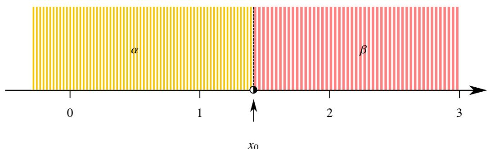  
图 2.1: 有理数集的 Dedekind 分割.

证明 显然 $1 \in \alpha$ . 因此我们只需看正数的情况. 任取 $p \in \mathbb { Q } ^ { + } .$ . 令 $q = ( 2 p + 2 ) / ( p + 2 ) .$ . 则

$$
q - p = \frac {2 p + 2}{p + 2} - p = \frac {2 - p ^ {2}}{p + 2} \tag {2.1}
$$

$$
q ^ {2} - 2 = \left(\frac {2 p + 2}{p + 2}\right) ^ {2} - 2 = \frac {2 (p ^ {2} - 2)}{(p + 2) ^ {2}}. \tag {2.2}
$$

(1) 若 $p \in \alpha$ , 则 $p ^ { 2 } < 2$ . 由等式2.1可知 $q > p$ . 由等式2.2可知 $q ^ { 2 } < 2 \AA$ . 故 $q \in \alpha$ . 这表明 $\alpha$ 中无最大元素.  
(2) 若 $p \in \beta .$ , 则 $p ^ { 2 } > 2 \AA$ . 由等式2.1可知 $q < p$ . 由等式2.2可知 $q ^ { 2 } > 2 .$ . 故 $q \in { \boldsymbol { \beta } } .$ . 这表明 $\beta$ 中无最小元素.

注 构造 $q$ 的方法并不唯一. 当 $p ^ { 2 } < 2$ 时, 设 $k > 0$ , 则

$$
p ^ {2} + k p <   2 + k p \Longleftrightarrow p <   \frac {2 + k p}{p + k}.
$$

令 $q = ( 2 + k p ) / ( p + k )$ . 由于

$$
\left(\frac {2 + k p}{p + k}\right) ^ {2} <   2 \iff 4 + 4 k p + k ^ {2} p ^ {2} <   2 p ^ {2} + 4 k p + 2 k ^ {2} \iff k ^ {2} > 2.
$$

因此当 $k ^ { 2 } > 2$ 时, 以上构造的 $q$ 都满足要求. 当 $p ^ { 2 } > 2$ 时用同样的方法可以构造一样的 $q$ .

以上事实说明有理数域 $\mathbb { Q }$ 虽然稠密, 但依旧存在 “空隙”. 我们需要定义更大的数集来填满这些空隙.

容易验证, 上例中的 $\alpha , \beta$ 非空, 且 $\alpha \cap \beta = \emptyset$ , $\alpha \cup \beta = \mathbb { Q } .$ . 于是我们得到了 $\mathbb { Q }$ 的一个划分 $\{ \alpha , \beta \}$ (详见定义0.18).我们可以用这个方法来定义实数.

# 定义 2.1 (Dedekind 分割)

设数集 $K$ 的一个划分 $\{ \alpha , \beta \}$ . 若满足

$1 ^ { \circ } \ \alpha$ “向下封闭”, 即对于任意 $x , y \in K$ , 其中 $x < y$ . 若 $y \in \alpha$ , 则 $x \in \alpha$ .  
$2 ^ { \circ } \ \alpha$ $\alpha$ 中无最大元素, 即对于任一 $x \in \alpha$ , 总是存在 $y \in \alpha$ 满足 $y > x$ .

则称该划分为 $K$ 上的一个 Dedekind 分割 (Dedekind cut), 记作 $\alpha \mid \beta .$ 其中 $\alpha$ 称为这个 Dedekind 分割的下集(lower set), $\beta$ 称为这个 Dedekind 分割的上集 (upper set).

注 由于 $\{ \alpha , \beta \}$ 是 $\mathbb { Q }$ 的一个划分, 因此 $\alpha$ 和 $\beta$ 满足

$$
\begin{array}{l} 1 ^ {\circ} \alpha , \beta \neq \varnothing . \\ 2 ^ {\circ} \alpha \cap \beta = \varnothing . \\ 3 ^ {\circ} \alpha \cup \beta = \mathbb {Q}. \\ \end{array}
$$

注 我们也可以规定 $\{ \alpha , \beta \}$ 中的 $\beta$ 满足向上封闭且无最小元素. 如果改变定义, 后面的证明就需要全部修改. 只需要全书自洽, 选用哪一种都可以.

从直观上可以想到, 一个 $\mathbb { Q }$ 上的 Dedekind 分割可以确定一个实数. 因此我们想到用 $\mathbb { Q }$ 上的 Dedekind 分割来定义实数. 由于下集 $\alpha$ 完全决定 $\alpha \mid \beta .$ . 因此我们用下集来定义实数, 这样做便于叙述后面的内容.

# 定义 2.2 (实数集)

有理数域 $\mathbb { Q }$ 上的所有 Dedekind 分割的下集所组成的集合称为实数集 (set of real numbers), 记作 $\mathbb { R }$ . 其中每一个 Dedekind 分割的下集表示一个实数 (real number).

注 用 Dedekind 分割定义实数的方法是德国数学家 Richard Dedekind 创造的. 另一位德国数学家 Georg Cantor 创造了用 Cauchy列构造实数的方法. 它们都在 1872 年发表了它们的天才构想.

注 为了便于阅读, 本章中我们将用拉丁字母 $a , b , \cdots$ 表示有理数, 用希腊字母 $\alpha , \beta , \cdots$ 表示实数.

Dedekind 分割的定义体现了一个 “无限过程”. 在下集 $\alpha$ 中任取一个元素 $a _ { 1 }$ , 由于 $\alpha$ 中无最大元素, 故一定可以取到 $a _ { 2 } > a _ { 1 }$ . 然后可以继续取到 $a _ { 3 } > a _ { 2 }$ . 依次下去, 这个过程可以无限次进行. 从直观上看, 这个过程实际上是逐步逼近 $\alpha$ 和 $\beta$ 的 “临界点”, 也就是我们希望定义的那个实数.

# 2.1.3 实数集上的序结构和代数结构

很容易用包含关系来定义实数集上的序关系.

# 定义 2.3 (实数集上的序关系)

设 $\alpha , \beta \in \mathbb { R }$ . 若 $\alpha \subseteq \beta$ 则称 $\alpha$ 小于等于 $\beta$ , 记作: $\alpha \leqslant \beta$ .

由于包含关系满足自反性、反对称性和传递性,因此这样定义的序关系立刻满足自反性、反对称性和传递性.由 Dedekind 分割的定义可知, 下集满足向下封闭性, 因此对于任意 $\alpha , \beta \in \mathbb { R } ,$ , 要么 $\alpha \geqslant \beta$ , 要么 $\alpha \leqslant \beta$ . 因此 $\mathbb { R }$ 一个全序集 (详见0.12).

下面来定义实数集上的运算.

# 定义 2.4 (实数集上的加法)

在实数集 R 上规定一个二元运算:

$$
\mathbb {R} \times \mathbb {R} \rightarrow \mathbb {R}
$$

$$
(\alpha , \beta) \mapsto \alpha + \beta ,
$$

其中 $\alpha + \beta = \{ a + b : a \in \alpha , b \in \beta \}$ .

需要证明以上定义是合理的.

# 命题 2.1 (实数加法是良定义的)

对于任意 $\alpha , \beta \in \mathbb { R }$ 都有 $\alpha + \beta \in \mathbb { R }$ .

证明 只需证明 $\alpha + \beta$ 是一个 Dedekind 分割的下集.

(i) 显然 $\alpha + \beta \neq \emptyset$ . 任取 $c \in ( \alpha + \beta )$ . 令 $c = a + b$ , 其中 $a \in \alpha$ , $b \in { \boldsymbol { \beta } } .$ . 若 $c ^ { \prime } < c$ , 则存在 $d > 0$ 满足

$$
c ^ {\prime} = c - d = (a + b) - d = (a - d) + b.
$$

由于 $a - d < a$ , 故 $a - d \in \alpha$ . 这表明 $c ^ { \prime } \in ( \alpha + \beta )$ . 于是可知 $\alpha + \beta$ 向下封闭.

(ii) 由于 $\alpha$ 和 $\beta$ 中都没有最大元素, 因此一定存在 $\boldsymbol { a } ^ { \prime } \in \boldsymbol { \alpha }$ , $b ^ { \prime } \in \beta$ 满足 $a ^ { \prime } > a$ , $b ^ { \prime } > b$ , 于是 $( a ^ { \prime } + b ^ { \prime } ) \in ( \alpha + \beta )$ 且 $a ^ { \prime } + b ^ { \prime } > a + b$ , 于是可知 $\alpha + \beta$ 中也没有最大元素.

综上可知 $\alpha + \beta$ 是一个 Dedekind 分割的下集, 即 $\alpha + \beta \in \mathbb { R }$ .

下面来验证实数的运算律.

# 命题 2.2 (实数加法的运算律)

实数集 $\mathbb { R }$ 的加法运算满足:

(1) 加法结合律: $\left( \alpha + \beta \right) + \gamma = \alpha + \left( \beta + \gamma \right) \left( \forall \alpha , \beta , \gamma \in \mathbb { R } \right)$ .   
(2) 加法交换律: $\alpha + \beta = \beta + \alpha$ $( \forall \alpha , \beta \in \mathbb { R } )$ .  
(3) 加法零元: 存在 $0 ^ { * } \in \mathbb { R }$ 使得任一 $\alpha \in \mathbb { R }$ 都满足 $\alpha + 0 ^ { * } = 0 ^ { * } + \alpha = \alpha .$   
(4) 加法负元: 对于任一 $\alpha \in \mathbb { R }$ 都存在 $\beta \in \mathbb { R }$ 使得 $\alpha + \beta = \beta + \alpha = 0 ^ { * }$ .

证明 只证明 (3) 和 (4).

(3) 令

$$
0 ^ {*} := \{a \in \mathbb {Q}: a <   0 \} = \mathbb {Q} ^ {-}.
$$

显然 $0 ^ { * }$ 满足向下封闭且没有最大元素, 因此 $0 ^ { * } \in \mathbb { R }$ . 任取 $\alpha \in \mathbb { R }$ , 我们来验证 $\alpha + 0 ^ { * } = \alpha$ .

(i) 任取 $a \in \alpha , x \in 0 ^ { * }$ . 则 $x < 0$ , 于是 $a + x < a ,$ . 故 $a + x \in \alpha$ . 因此 $\alpha + 0 ^ { * } \subseteq \alpha$ , 即 $\alpha + 0 ^ { * } \leqslant \alpha$ .  
(ii) 任取 $a \in \alpha$ , 由于 $\alpha$ 中没有最大元素, 故存在 $x > 0$ 使得 $a + x \in \alpha$ . 令 $\boldsymbol { a } ^ { \prime } = \boldsymbol { a } + \boldsymbol { x }$ , 则 $a = a ^ { \prime } + ( - x )$ , 其中$a ^ { \prime } \in \alpha$ , $- x \in 0 ^ { * }$ , 这表明 $a \in \alpha + 0 ^ { * }$ . 因此 $\alpha \subseteq \alpha + 0 ^ { * }$ , 即 $\alpha \leqslant \alpha + 0 ^ { * }$ .

综上可知 $0 ^ { * } + \alpha = \alpha + 0 ^ { * } = \alpha .$ . 于是可知 $0 ^ { * }$ 是 $\mathbb { R }$ 中的零元.

(4) 任取 $\alpha \in \mathbb { R } ,$ 令

$$
\beta = \{- b + x: x \in \mathbb {Q} ^ {-}, b \in \mathbb {Q} \backslash \alpha \}.
$$

容易验证 $\beta$ 向下封闭且没有最大元素, 因此 ${ \boldsymbol { \beta } } \in \mathbb { R } .$ 下面来证明 $\alpha + \beta = \beta + \alpha = 0 ^ { * }$ .

(i) 任取 $a \in \alpha , - b + x \in \beta .$ , 其中 $x < 0$ , $b \in \mathbb { Q } \backslash \alpha$ . 则 $a < b$ 故 $a - b < 0$ . 由于 $x < 0$ , 于是

$$
a + (- b + x) = (a - b) + x <   0.
$$

因此 $a + ( - b + x ) \in 0 ^ { * }$ . 这表明 $\alpha + \beta \leqslant 0 ^ { * }$ .

(ii) 任取 $c \in 0 ^ { * }$ , 即 $c < 0$ . 则存在 $a \in \alpha , b \in \mathbb { Q } \backslash \alpha$ 使得 $b - a < 0 - c .$ , 即 $a - b > c .$ . 于是存在 $x \ : < 0$ 使得$a - b + x = c$ , 即 $a + \left( - b + x \right) = c$ . 因此 $c \in \alpha + \beta$ . 这表明 $0 ^ { * } \leqslant \alpha + \beta$ .

综上可知 $\alpha + \beta = \beta + \alpha = 0 ^ { * }$ . 于是可知 $\beta$ 是 $\alpha$ 的负元.

注 设 $\alpha \in \mathbb { R }$ , 容易想到如下构造它的负元

$$
\beta = \{- b: b \in \mathbb {Q} \backslash \alpha \}.
$$

但这样定义的 $\beta$ 可能会有最大元素. 例如当 $\alpha = \{ a \in \mathbb { Q } : a < 5 \}$ 时, $\operatorname* { m i n } \{ \mathbb { Q } \backslash \alpha \} = 5$ , 于是 $\operatorname* { m a x } \beta = - 5$ .

综上我们验证了 $\mathbb { R }$ 中的加法运算满足域公理.

由命题0.16可知零元是唯一的. 我们规定 $\mathbb { R } ^ { * } : = \mathbb { R } \backslash \{ 0 ^ { * } \}$ . 有了零元, 我们可以规定大于 $0 ^ { * }$ 的是正实数, 小于 $0 ^ { * }$ 的是负实数. 全体正实数和全体负实数的集合分别记作 $\mathbb { R } ^ { + }$ 和 $\mathbb { R } ^ { - }$ .

由于 $\mathbb { R }$ 上的加法满足结合律, 由命题0.17可知任意实数 $\alpha$ 都有唯一的负元, 记作 $- \alpha$ . 有了负元, 我们可以定义实数的减法:

$$
\alpha - \beta := \alpha + (- \beta).
$$

不难证明加法满足保序性.

# 命题 2.3 (加法保序性)

在实数域 $\mathbb { R }$ 中, 若 $\alpha \leqslant \beta$ , 则 $\alpha + \gamma \leqslant \beta + \gamma$

证明 任取 $d \in \alpha + \gamma _ { : }$ , 令 $d = a + c$ , 其中 $a \in \alpha$ $a \in \alpha , c \in \gamma$ . 由于 $\alpha \leqslant \beta$ , 故 $\alpha \subseteq \beta$ , 故 $a \in \beta$ . 因此 $d \in \beta + \gamma .$ . 于是可知$\alpha + \gamma \subseteq \beta + \gamma$ , 即 $\alpha + \gamma \leqslant \beta + \gamma$ .

下面来定义 $\mathbb { R }$ 上的乘法运算. 乘法运算涉及到正负数的符号问题. 我们可以先规定正实数的情况, 然后再去规定其他情况的符号.

# 定义 2.5 (实数集上的乘法)

在实数集 $\mathbb { R }$ 上规定一个乘法运算:

$$
\mathbb {R} \times \mathbb {R} \to \mathbb {R}
$$

$$
(\alpha , \beta) \mapsto \alpha \cdot \beta ,
$$

其中 $\alpha \cdot \beta$ 的规定如下. 当 $\alpha > 0 ^ { * }$ 且 $\beta > 0 ^ { * }$ 时, 规定

$$
\alpha \cdot \beta = \{c: c <   a \cdot b, a \in \alpha , a > 0, b \in \beta , b > 0 \}.
$$

其余情况规定为

$$
\alpha \cdot \beta = \left\{ \begin{array}{l l} (- \alpha) \cdot (- \beta), & \alpha <   0 ^ {*} \text {且} \beta <   0 ^ {*} \\ - [ (- \alpha) \cdot \beta ], & \alpha <   0 ^ {*} \text {且} \beta > 0 ^ {*} \\ - [ \alpha \cdot (- \beta) ], & \alpha > 0 ^ {*} \text {且} \beta <   0 ^ {*} \\ 0 ^ {*}, & \alpha = 0 ^ {*} \text {或} \beta = 0 ^ {*} \end{array} \right..
$$

类似地, 可以验证实数的乘法也是良定义的.

# 命题 2.4 (实数乘法是良定义的)

对于任意 $\alpha , \beta \in \mathbb { R }$ 都有 $\alpha \cdot \beta \in \mathbb { R }$ .

下面来看实数乘法的运算律.

# 命题 2.5 (实数乘法的运算律)

实数集 $\mathbb { R }$ 的乘法运算满足:

(1) 乘法结合律: $( \alpha \cdot \beta ) \cdot \gamma = \alpha \cdot ( \beta \cdot \gamma ) \ ( \forall \alpha , \beta , \gamma \in \mathbb { R } )$ .   
(2) 乘法交换律: $\alpha \cdot \beta = \beta \cdot \alpha$ $( \forall \alpha , \beta \in \mathbb { R } )$ .

(3) 乘法单位元: 存在 $1 ^ { \ast } \in \mathbb { R }$ 使得任一 $\alpha \in \mathbb { R }$ 都满足 $\alpha \cdot 1 ^ { * } = 1 ^ { * } \cdot \alpha = \alpha$ .  
(4) 乘法逆元: 对于任一 $\alpha \in \mathbb { R } ^ { * }$ 都存在 $\alpha ^ { - 1 } \in \mathbb { R }$ 使得 $\alpha \cdot \alpha ^ { - 1 } = \alpha ^ { - 1 } \cdot \alpha = 1$ .  
(5) 乘法对加法的分配律: $( \alpha + \beta ) \cdot \gamma = \alpha \cdot \gamma + \beta \cdot \gamma \ ( \forall \alpha , \beta , \gamma \in \mathbb { R } )$ $( \forall \alpha , \beta , \gamma \in \mathbb { R } )$ .

证明 只证明 (3), (4), (5).

(3) 令

$$
1 ^ {*} := \{a \in \mathbb {Q}: a <   1 \}.
$$

显然 $1 ^ { * }$ 满足向下封闭且没有最大元素, 因此 $1 ^ { \ast } \in \mathbb { R }$ . 类似零元的验证方法, 我们可以证明, 对于任一 $\alpha \in \mathbb { R } ^ { + }$ 都有$\alpha \cdot 1 ^ { * } = \alpha$ . 由于对于任一 $\alpha \in \mathbb { R }$ 都有 $\alpha = - ( - \alpha )$ . 因此当 $\alpha \in \mathbb { R } ^ { - }$ 时

$$
\alpha \cdot 1 ^ {*} = - [ (- \alpha) \cdot 1 ^ {*} ] = - (- \alpha) = \alpha .
$$

当 $\alpha = 0 ^ { * }$ 时

$$
\alpha \cdot 1 ^ {*} = 0 ^ {*} = \alpha .
$$

综上可知, 对于任一 $\alpha \in \mathbb { R }$ 都有 $\boldsymbol { \alpha } \cdot \boldsymbol { 1 } ^ { * } = \boldsymbol { \alpha }$ . 于是可知 $1 ^ { * }$ 是 $\mathbb { R }$ 上的乘法单位元.

(4) 对于任一 $\alpha \in \mathbb { R } ^ { + }$ , 令

$$
\alpha^ {- 1} := \left\{a ^ {- 1} x: a \in \mathbb {Q} \backslash \alpha , x \in 1 ^ {*}, x > 0 \right\} \cup \mathbb {Q} ^ {-} \cup \{0 \}.
$$

容易验证 $\alpha ^ { - 1 }$ 向下封闭且无最大元素. 对于任一 $\alpha \in \mathbb { R } ^ { - }$ , 令

$$
\alpha^ {- 1} := - \left(- \alpha^ {- 1}\right).
$$

类似加法逆元的证明方法, 我们可以证明 $\alpha \cdot \alpha ^ { - 1 } = 1 ^ { * }$ .

(5) 先证明第一种情况: $\alpha \cdot ( \beta + \gamma ) = \alpha \cdot \beta + \alpha \cdot \gamma ( \forall \alpha , \beta , \gamma \in \mathbb { R } ^ { + } ) .$ .

(i) 任取 $a \in \alpha$ , $a > 0$ , $b \in { \beta }$ , $b > 0$ , $c \in \gamma$ , $c > 0$ . 则

$$
a (b + c) = a b + a c \in \alpha \cdot \beta + \alpha \cdot \gamma .
$$

这表明 $\alpha \cdot ( \beta + \gamma ) \leqslant \alpha \cdot \beta + \alpha \cdot \gamma$ .

(ii) 任取 $a \in \alpha$ $a \in \alpha , b \in \beta , c \in \gamma .$

$$
a b + a c = a (b + c) \in \alpha \cdot (\beta + \gamma).
$$

这表明 $\alpha \cdot ( \beta + \gamma ) \leqslant \alpha \cdot \beta + \alpha \cdot \gamma$

于是可知 $\alpha \cdot ( \beta + \gamma ) = \alpha \cdot \beta + \alpha \cdot \gamma ,$ .

其余情况我们只证明一种. 设 $\alpha > 0 ^ { * }$ , $\beta < 0 ^ { * }$ , $\gamma > 0 ^ { * }$ 且 $\beta + \gamma > 0 ^ { * }$ . 则

$$
\alpha \cdot \gamma = \alpha \cdot [ (- \beta) + (\beta + \gamma) ] = \alpha \cdot (- \beta) + \alpha \cdot (\beta + \gamma) = - (\alpha \cdot \beta) + \alpha \cdot (\beta + \gamma).
$$

于是可知 $\alpha \cdot ( \beta + \gamma ) = \alpha \cdot \beta + \alpha \cdot \gamma$

由命题0.16可知乘法单位元也是唯一的. 结合律可以确保 $\alpha$ 有唯一的乘法逆元 $\alpha ^ { - 1 }$ . 有了乘法逆元, 我们可以定义实数的除法:

$$
\alpha / \beta := \alpha \cdot \beta^ {- 1}, \quad \forall \alpha \in \mathbb {R}, \forall \beta \in \mathbb {R} ^ {*}.
$$

综上我们验证了 $\mathbb { R }$ 中的乘法运算也满足域公理. 于是我们验证了 $( \mathbb { R } , + , \cdot )$ 是一个域. 以后我们经常称它为实数域 (real number field), 简称实域 (real field).

由实数乘法的定义, 乘法保序性显然成立.

# 命题 2.6 (乘法保序性)

在实数域 $\mathbb { R }$ 中, 若 $0 ^ { * } \leqslant \alpha$ 且 $0 ^ { * } \leqslant \beta$ , 则 $0 ^ { * } \leqslant \alpha \cdot \beta$

由于 $\mathbb { R }$ 是一个全序集, 因此 $\mathbb { R }$ 也是一个有序域. 由于实数的加法和乘法都满足保序性, 因此我们可以推出实数满足和有理数域完全一样的关于有序域的性质, 包括命题1.36和命题1.37.

到现在为止我们定义的 $\mathbb { R }$ 中的元素是 “有理数组成的集合”. 我们希望 $\mathbb { R }$ 可以包含 $\mathbb { Q }$ . 为此, 只需在 R 中找一个子集, 使得 $\mathbb { Q }$ 与这个子集同构.

# 命题 2.7

设 R 的一个真子集

$$
\widetilde {\mathbb {Q}} = \{\beta \in \mathbb {R}: \mathbb {Q} \backslash \beta \text {中 存 在 最 小 元 素} \}.
$$

令

$$
\sigma : \mathbb {Q} \to \widetilde {\mathbb {Q}},
$$

$$
b \mapsto \beta ,
$$

其中 $\beta = \{ x \in \mathbb { Q } : x < b \}$ . 则 $\sigma$ 是一个 $\mathbb { Q }$ 到 $\widetilde { \mathbb { Q } }$ 的一个环同构,即它是一个双射,且对于任一 $a , b \in \mathbb { Q }$ 都满足

$$
\sigma (a + b) = \sigma (a) + \sigma (b).
$$

$$
\sigma (a \cdot b) = \sigma (a) \cdot \sigma (b).
$$

一旦证明 $\mathbb { Q } \cong \widetilde { \mathbb { Q } } .$ , 就可以把 $\mathbb { Q }$ 和 $\widetilde { \mathbb { Q } }$ 等同起来, 于是 $\mathbb { Q } \subsetneq \mathbb { R } .$ . 事实上 $0 ^ { * }$ , $1 ^ { \ast } \in \widetilde { \mathbb { Q } } .$ , 既然 $\mathbb { Q }$ 和 $\widetilde { \mathbb { Q } }$ 可以等同起来, 那么今后 $\mathbb { R }$ 中的 $0 ^ { * }$ 和 $1 ^ { * }$ 可以直接记作 0 和 1.

用同样的方法可以证明定理1.11在实数域继续成立. 因此实数域中也可以定义取整函数.

有理数域中的整数次幂的指数运算可以推广到实数域中.且可以类似地证明相关性质继续成立.包括命题1.32.有理数域中定义的绝对值的概念可以推广到实数域中, 且可以类似地证明相关性质继续成立 (见定理1.10).

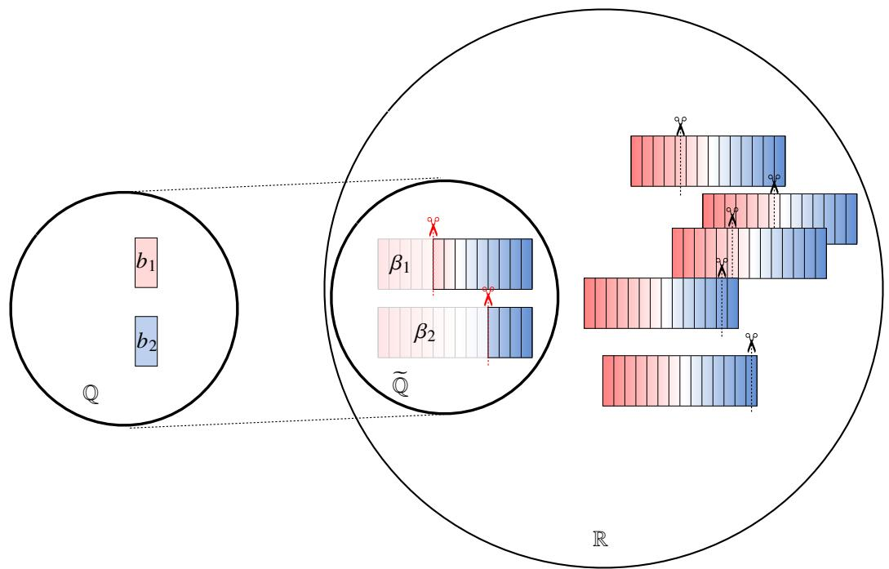  
图 2.2: $\mathbb { Q }$ 与 $\widetilde { \mathbb { Q } }$ 的环同构

# 2.2 实数域的完备性

我们已经知道有理数域 $\mathbb { Q }$ 是稠密的. 不难证明实数域 $\mathbb { R }$ 也是稠密的.

# 定理 2.1 (实数域的稠密性)

对于任意 $\alpha , \beta \in \mathbb { R } .$ , 若 $\alpha < \beta$ , 则一定存在 $\gamma \in \mathbb R$ 满足 $\alpha < \gamma < \beta$ .

证明 令 $\gamma = \left( \alpha + \beta \right) / 2$ . 由于 $\alpha < \beta .$ , 故

$$
2 \alpha <   \alpha + \beta <   2 \beta \iff \alpha <   \frac {\alpha + \beta}{2} <   \beta \iff \alpha <   \gamma <   \beta .
$$

我们不仅知道实数是稠密的, 更具体的有以下命题.

# 命题 2.8

(1) 任意两个实数之间一定存在有理数.  
(2) 任意两个实数之间一定存在无理数.

证明 任取两个实数 $\alpha , \beta .$ 不妨设 $\alpha < \beta$ .

(1) 实数 $\alpha , \beta$ 作为一个 Dedekind 分割的下集满足 $\alpha \subsetneq \beta .$ . 因此存在 $a \in \mathbb { R }$ 满足 $a \in { \beta }$ 但 $a \not \in \alpha$ . 这就表明 $\alpha$ 和$\beta$ 之间存在有理数 $a$ .  
(2) 令 $\gamma = { \left( \alpha + \beta \right) } / { 2 }$ . 由于有理数对四则运算封闭, 因此 ?? 一定是无理数. 不难看出 $\alpha < \gamma < a < \beta .$ . 这表明 $\alpha$ 和 $\beta$ 之间存在无理数 $\gamma$ . ■

有理数是稠密的但中间充满了 “空隙”. 因此用稠密性不足以刻画实数的 “完备性”. 下面我们将介绍几种刻画实数 “完备性” 的方法.

# 2.2.1 Dedekind 定理

我们知道, 有理数域 $\mathbb { Q }$ 上的 Dedekind 分割可能会出现上集中无最小元素的情况. 这说明有理数域存在 “空隙”. 既然如此, 我们可以考察实数域 $\mathbb { R }$ 上的 Dedekind 分割, 看看它们的上集是不是一定有最小元素.

# 定理 2.2 (Dedekind 定理)

对于实数域 $\mathbb { R }$ 上的任一 Dedekind 分割 $A \mid B _ { : }$ , 上集 $B$ 中都有最小元素.

证明 令 $A$ 中所有有理数组成的集合为 $\alpha , B$ 中所有有理数组成的集合为 $\beta$ . 由于 $A \mid B$ 是一个 Dedekind 分割, 因此 $A \cup B = \mathbb { R }$ 且 $A \cap B = \emptyset$ . 因此 $\alpha \cup \beta = \mathbb { Q }$ 且 $\alpha \cap \beta = \emptyset$ . 因此 $\{ \alpha , \beta \}$ 是 $\mathbb { Q }$ 上的一个划分.

$\alpha$ 显然满足向下封闭. 任取 $a \in \alpha \subseteq A$ , 由于 $A$ 中无最大元素, 故存在 $\gamma \in A$ 满足 $a < \gamma$ . 于是一定存在 $a ^ { \prime } \in \mathbb { Q }$ 满足 $a < a ^ { \prime } < \gamma$ .由于 $\boldsymbol { a } ^ { \prime } \in \boldsymbol { \alpha }$ ,因此 $\alpha$ 中也无最大元素.于是可知,我们得到了一个 $\mathbb { Q }$ 上的一个 Dedekind 分割 $\alpha \mid \beta$ .因此下集 $\alpha$ 可以看作一个实数. 它一定属于 $A$ 或 $B$ .

假设 $\alpha \in A$ . 由于 $A$ 中无最大元素, 故 $A$ 中存在有理数 $p > \alpha$ . $p$ 可以看作一个 Dedekind 分割下集. 则 $p \supset \alpha$ .因此有理数 $p \in \beta .$ , 于是 $p \in B$ , 这与 $p \in A$ 矛盾. 因此 $\alpha \in B$ .

假设 $\alpha$ 不是 $B$ 中的最小元素, 则 $B$ 中存在有理数 $q < \alpha$ . ?? 可以看作一个 Dedekind 分割下集. 则 $q \subsetneq \alpha$ . 因此有理数 $q \in \alpha$ , 于是 $q \in A$ , 这与 $q \in B$ 矛盾. 因此 $\alpha$ 就是 $B$ 中的最小元素. ■

Dedekind 定理表明实数域确实没有 “空隙”, 因此 Dedekind 定理刻画了实数域的完备性 (Completeness). 后面我们还会从不同角度刻画实数域的完备性.

# 2.2.2 确界原理

Dedekind 分割 $A \mid B$ 中, 下集 $A$ 的任一元素都小于 $B$ 中任一元素. 从直观上看, ?? 是有 “上界的”, 而 $B$ 是有“下界的”. 下面我们从这个角度来讨论实数域的完备性.

# 定义 2.6 (上确界和下确界)

设非空集合 $E \subseteq \mathbb { R }$ . 若存在 $M > 0$ 使得 $\left| x \right| < M \left( \forall x \in E \right)$ $( \forall x \in E )$ , 则称 $E$ 是有界的 (bounded).

(1) 若存在 $M \in \mathbb { R }$ 使得任一 $x \in E$ 都有 $x \leqslant M$ , 则称 $M$ 是 $E$ 的一个上界 (upper bound). 若对于任一 $\varepsilon > 0$ 都存在 $x _ { \varepsilon } \in E$ , 使得 $x _ { \varepsilon } > M - \varepsilon$ , 则称 $M$ 是 $E$ 的上确界 (supremum).  
(2) 若存在 $m \in \mathbb { R }$ 使得任一 $x \in E$ 都有 $x \geqslant m$ , 则称 $m$ 是 $E$ 的一个下界 (lower bound). 若对于任一 $\varepsilon > 0$ 都存在 $x _ { \varepsilon } \in E$ , 使得 $x _ { \varepsilon } < m + \varepsilon$ , 则称 $m$ 是 $E$ 的下确界 (infimum).

注 显然, 集合有界当且仅当它同时有上界和下界.

注 以上定义表明, 上确界是最小的上界; 下确界是最大的下界.

很自然地, 我们会问有上界 (或下界) 时, 是否一定有上确界 (或下确界)? 不难想到, 如果 $E$ 中有最大值 (或最小值) 那么上确界 (或下确界) 立刻可以看出.

# 命题 2.9

设集合 $E \subseteq \mathbb { R }$ .

(1) 若存在 $M = \operatorname* { m a x } E$ , 则 sup $) E = M$ .  
(2) 若存在 $m = \operatorname* { m i n } E$ , 则 inf $E = m$ .

证明 只证明 (1) 的情况. 由于 $M = \operatorname* { m a x } E$ , 故对于任一 $x \in E$ 都有 $x \leqslant M$ . 因此 $M$ 是 $E$ 的一个上界. 任取 $\varepsilon$ , 则存在 $x _ { \varepsilon } = M$ 满足 $x _ { \varepsilon } > M - \varepsilon$ , 因此 $M = \operatorname* { s u p } E$ . ■

下面我们来看一个上确界和下确界的重要例子.

例 2.4 设集合

$$
E = \left\{\frac {1}{n}: n \in \mathbb {N} ^ {*} \right\}.
$$

求 sup $E$ 和 inf $E$ .

证明 不难看出1和0分别是 $E$ 的上界和下界.由于 $1 = \operatorname* { m a x } E$ , 因此 sup $E = 1 .$ 对于任一 $\varepsilon > 0$ ,只需取 $n = [ 1 / \varepsilon ] + 1$ 就有

$$
n > \frac {1}{\varepsilon} \iff \frac {1}{n} <   0 + \varepsilon .
$$

这表明 inf $E = 0$ .

注 以上例子告诉我们, 集合 $E$ 的上确界或下确界可能属于 $E$ , 也可能不属于 $E$ .

注 在下一章我们将看到, 0 是数列 $1 / n$ $\mathbf { \Phi } _ { n } = 1 , 2 , \cdots )$ 的 “极限”. 我们将用类似的思想来定义 “极限”.

下面来证明另一种情况.

# 定理 2.3 (确界原理)

设非空集合 $E \subseteq \mathbb { R }$ .

(1) 若 $E$ 有上界, 则 $E$ 一定有上确界, 且 sup $\mathbf { \nabla } \cdot E \in \mathbb { R }$ .   
(2) 若 $E$ 有下界, 则 $E$ 一定有下确界, 且 inf $E \in \mathbb { R }$ .

证明 只证明 (1) 的情况. $E$ 中有最大元素的情况已经证明. 下设 $E$ 中无最大元素. 令 $E$ 的所有上界组成的集合为$B$ , 令 $A = \mathbb { R } \backslash B .$ 下面来证明 $A | B$ 是 $\mathbb { R }$ 上的一个 Dedekind 分割.

(i) 对于任意 $x , y \in \mathbb { R } .$ , 其中 $x < y .$ . 若 $y \in A$ , 则 $y \notin B .$ , 这表明 $y$ 不是 $E$ 的上界, 因此存在 $t \in E$ 满足 $x < y < t$ 因此 $x$ 也不是 $E$ 的上界, 因此 $x \in A$ . 于是可知 $A$ 向下封闭.  
(ii) 任取 $\alpha \in A$ , 则 $\alpha$ 不是 $E$ 的上界. 于是存在 $x \in E$ 使得 $x > \alpha$ . 由于 $E$ 中无最大元素, 故存在 $y \in E$ 使得$y > x$ . 因此 $x$ 也不是 $E$ 的上界, 因此 $x \in A$ . 于是可知 $A$ 中无最大元素.

综上可知 $A \mid B$ 是 $\mathbb { R }$ 上的一个 Dedekind 分割. 由 Dedekind 定理可知 $B$ 中存在最小元素. 这表明 $E$ 存在上确界. ■

注 确界原理也称为最小上界性 (Least-upper-bound property, LUB). 它是刻画实数域完备性的第 2 个定理.

# 命题 2.10

设非空集合 $E \subseteq \mathbb { R }$ . 令 $- E : = \{ - x : x \in E \}$ , 则

(1) 若 $E$ 有上确界, 则 $- E$ 有下确界, 且 $\operatorname* { i n f } ( - E ) = - \operatorname* { s u p } E$   
(2) 若 $E$ 有下确界, 则 $- E$ 有上确界, 且 $\operatorname* { s u p } ( - E ) = - \operatorname* { i n f } E$ .

证明 只证明 (1).令 $M = \operatorname* { s u p } E$ .则对于任一 $x \in E$ 都有 $x \leqslant M$ ,且对于任一 $\varepsilon > 0$ 都存在 $x _ { \varepsilon } \in E$ 使得 $x _ { \varepsilon } > M - \varepsilon$ .于是对于任一 $- x \in - E$ 都有 $- x \geqslant - M$ , 且对于任一 $\varepsilon > 0$ 都存在 $- x _ { \varepsilon } \in - E$ 使得 $- x _ { \varepsilon } < - M + \varepsilon$ . 这表明$\operatorname* { i n f } ( - E ) = - M$ . ■

确界原理从另一个角度刻画了实数域的完备性. 我们已经用 Dedekind 定理证明了确界原理. 反过来确界原理也可以证明 Dedekind 定理.

# 定理 2.4

Dedekind 定理和确界原理是等价的.

证明 假设确界原理成立, 要证明 Dedekind 定理成立.

设实数域 $\mathbb { R }$ 上的任一 Dedekind 分割 $A \mid B .$ 容易知道 $A$ 中的任一元素都是 $B$ 的一个下界, 由确界原理可知 $B$ 存在下确界. 令 $m = \operatorname { i n f } B$ .

假设 $m \notin B$ , 则 $m \in A$ .由于 $A$ 中无最大元素,因此存在 $m ^ { \prime } \in A$ 使得 $m < m ^ { \prime }$ .由于 $m = \operatorname { i n f } B$ 故 $m ^ { \prime }$ 不是 $B$ 的下界. 因此 $m ^ { \prime } \in B$ . 这与 $m ^ { \prime } \in A$ 矛盾, 因此假设不成立. 于是可知 $B$ 中存在最小值. 于是可知 Dedekind 定理成立. ■

确界原理可以推出一个重要的结论.

# 定理 2.5 (Archimedes 性质)

对于任一 $\alpha , \beta \in \mathbb { R } ^ { + }$ , 一定存在 $n \in \mathbb { N } ^ { * }$ 满足 $n \alpha \geqslant \beta$ .

证明 用反证法.假设对于任一 $n \in \mathbb { N } ^ { * }$ 都有 $n \alpha < \beta$ . 令 $S = \{ x : x = n \alpha$ , $n \in \mathbb { N } ^ { * } \}$ , 则 $\beta$ 是 $S$ 的一个上界.由确界原理可知存在上确界, 设这个上确界为 $M$ , 则

$$
(n + 1) \alpha <   M \iff n \alpha <   M - \alpha .
$$

这与 $M$ 是 $S$ 的上确界矛盾. 因此假设不成立. 于是可知一定存在 $n \in \mathbb { N } ^ { * }$ 满足 $n \alpha \geqslant \beta$ .

令以上定理中的 $\alpha = 1$ 或 $\beta = 1$ 即得以下推论.

# 推论 2.1

对于任一 $\alpha \in \mathbb { R } ^ { + }$

(1) 存在 $n \in \mathbb { N } ^ { * }$ 满足 $n \geqslant \alpha$ .   
(2) 存在 $m \in \mathbb { N } ^ { * }$ 满足 $1 / m \leqslant \alpha$

反过来 Archimedes 性质推不出实数的完备性, 因为有理数域也有 Archimedes 性质.

# 2.2.3 Heine-Borel 定理

从实数轴上取一小段 [0,1],这一小段上没有任何“缝隙”,包括两个端点.前面已经用Dedekind定理和确界原理刻画了这个性质. 下面尝试从几何的角度来刻画这个性质. 我们考虑用开区间去盖住它. 为了方便叙述, 我们先定义一些名词.

# 定义 2.7 (开覆盖)

设集合 $E \subseteq \mathbb { R }$ 和一族开区间 $\{ I _ { \lambda } : \lambda \in \Lambda \}$ , 其中 $\Lambda$ 是一个指标集. 若

$$
E \subseteq \bigcup_ {\lambda \in \Lambda} I _ {\lambda}.
$$

则称 $\{ I _ { \lambda } : \lambda \in \Lambda \}$ 是 $E$ 的一个开覆盖 (open cover), 记作 $C _ { E }$ . 若 $E$ 有一个开覆盖 $C _ { E } ^ { \prime } \subseteq C _ { E }$ , 则称 $C _ { E } ^ { \prime }$ 是 $C _ { E }$ 的一个子覆盖 (subcover). 若这个子覆盖只含有有限个开区间, 则称它是一个有限子覆盖 (finite subcover).

显然 [0,1] 存在开覆盖, 而且不止一个. 现在任取一个它的开覆盖 $C$ , 我们希望用其中尽量少的开区间盖住[0, 1]. 我们先从 $C$ 找一个开区间 $I _ { 0 }$ 把左端点 0 盖住. 此时 0 的右侧一定有一点 $x _ { 0 }$ 被 $I _ { 0 }$ 盖住. 因此闭区间 $[ 0 , x _ { 0 } ]$ 就被 $I _ { 0 }$ 盖住了. 也就是说对于这个小区间 $[ 0 , x _ { 0 } ]$ 而言存在一个有限覆盖. 接下来我们希望在 $x _ { 0 }$ 的右侧继续找到这样的点 $x _ { 1 }$ 使得 $[ 0 , x _ { 1 } ]$ 也存在一个有限覆盖. 从几何直观来看这个过程可以不断继续下去并得到不断向右的一列点 $x _ { 0 } , x _ { 1 } , x _ { 2 } , \cdots$ . 那么是否可以证明有限个开区间可以把整个 [0, 1] 盖住呢?

# 定理 2.6 (Heine-Borel 定理)

有限闭区间的任一开覆盖都存在一个有限子覆盖.

证明 设有限闭区间 $[ a , b ]$ , 任取它的一个开覆盖 $C = \{ I _ { \lambda } \} .$ . 令

$E = \{ x : x \in ( a , b ] ,$ , 且 $[ a , x ]$ 存在一个 $C$ 的有限子覆盖}.

由于 $C$ 是 $[ a , b ]$ 的一个开覆盖, 故一定存在开区间 $I _ { 0 } \in C$ 使得 $a \in I _ { 0 } .$ . 于是一定存在 $x _ { 0 } \in I _ { 0 }$ 满足 $x _ { 0 } > a$ . 这表明$E \neq \emptyset$ . 显然 $b$ 是 $E$ 的一个上界. 由确界原理可知 $E$ 有上确界. 令 $M = \operatorname* { s u p } E$ . 下面来证明 $M = b$ .

用反证法. 假设 $M \ < \ b$ , 则 $M \ \in \ [ a , b ]$ . 在 $C$ 中取出一个覆盖 $M$ 的开覆盖记作 $I _ { 1 }$ . 于是存在 $\delta \ > \ 0$ 使得$( M - \delta , M + \delta ) \subseteq I _ { 1 } .$ . 由于 $M$ 是 $E$ 的上确界, 因此 $M - \delta \in E$ , 即 $[ a , M - \delta ]$ 存在 $C$ 的一个有限子覆盖 $C ^ { \prime }$ . 于是$[ a , M + \delta ]$ 有一个 $C$ 的有限子覆盖 $C ^ { \prime } \cup I _ { 1 }$ . 因此 $M + \delta \in E$ . 这与 $M$ 是 $E$ 的上确界矛盾. 因此假设不成立. 于是可知 $M = b$ .

在 $C$ 中取一个能覆盖 $b$ 的开区间, 记作 $I _ { 2 }$ . 于是一定存在 $\eta > 0$ 使得 $( b - \eta , b + \eta ) \subseteq I _ { 2 } .$ . 由于 $b$ 是 $E$ 的上确界,因此 $b - \eta \in E$ ,即存在一个 $C$ 的有限子覆盖 $C ^ { \prime \prime }$ 覆盖 $[ a , b - \eta ]$ ,于是 $C ^ { \prime \prime } \cup I _ { 2 }$ 可以覆盖 $[ a , b ]$ ,它显然也是 $C$ 的一个有限子覆盖. 这就证明了 $[ a , b ]$ 存在一个 $C$ 的有限子覆盖. ■

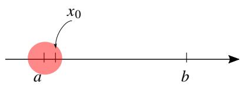  
(??)

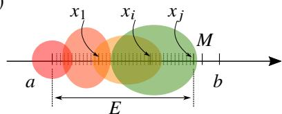  
(??)

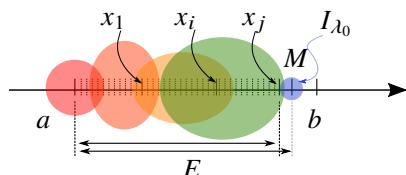  
(??)

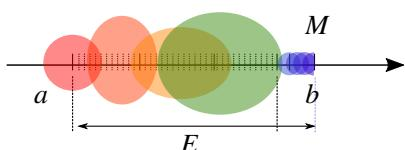  
(??)   
图 2.3: Heine-Borel 定理证明过程示意图.

注 以上定理也称为有限覆盖定理 (finite cover theorem). 它是刻画实数域完备性的第 3 个定理. 法国数学家 ÉmileBorel 于 1895 年第一次陈述并证明了现代形式的 Heine-Borel 定理.

以上定理证实了我们的猜测. 那么如果区间 [0, 1] 上有 “空隙”, 是否还可以找到一个有限子覆盖呢? 为了简单起见, 我们从 [0,1] 中挖去一个点 {0}. 这时这个区间就出现了 “空隙”. 下面来讨论这个问题.

例 2.5 设区间 (0, 1], 和一族开区间

$$
C = \left\{I _ {n} = \left(\frac {1}{n}, 2\right): n = 1, 2, \dots . \right\}.
$$

则 $C$ 是 (0, 1] 的一个开覆盖, 但它不存在有限子覆盖.

证明 (i) 任取 $\varepsilon \in ( 0 , 1 ]$ , 一定存在 $n _ { \varepsilon } = [ 1 / \varepsilon ] + 1$ , 则

$$
n _ {\varepsilon} > \frac {1}{\varepsilon} \Longleftrightarrow \varepsilon > \frac {1}{n _ {\varepsilon}}.
$$

这表明存在一个开区间 $I _ { n _ { \varepsilon } } \in C$ 使得 $\varepsilon \in I _ { n _ { \varepsilon } }$ . 于是可知 $C$ 是 $( 0 , 1 ]$ 的一个开覆盖.

(ii) 用反证法, 假设存在一个有限子覆盖 $C ^ { \prime } \subseteq C$ , 设 $C ^ { \prime } = \{ I _ { k _ { 1 } } , I _ { k _ { 2 } } , \cdot \cdot \cdot , I _ { k _ { n } } \} .$ 令

$$
M = \max  \left\{k _ {1}, k _ {2}, \dots , k _ {n} \right\}.
$$

则一定存在 $\delta \in ( 0 , 1 / M )$ ,这说明 $C ^ { \prime }$ 没有盖住 $\delta$ ,因此 $C ^ { \prime }$ 不是 $( 0 , 1 ]$ 的开覆盖.出现矛盾.因此假设不成立.于是可知 (0,1] 的开覆盖 $C$ 中不存在有限子覆盖. ■

从以上讨论中我们发现, 如果在数轴上取下的一段 “紧致无缝” 的集合 (含端点), 那么就可以从它的任一开覆盖中取出一个有限子覆盖, 否则就不行. 这表明我们找到了一个刻画实数集完备性的新方法. 我们形象地把这个性质称为紧致性 (compactness).

# 定义 2.8 (紧致集)

设集合 $E \subseteq \mathbb { R }$ . 若 $E$ 的任一开覆盖都存在一个有限子覆盖, 则称 $E$ 是 $\mathbb { R }$ 上的一个紧致集 (compact set).

注 “紧致集” 也称为 “紧集”. 它是一个重要的 “拓扑概念”, 我们将在后面详细介绍这类集合.

注 以后我们会直接称以上条件为 “Heine-Borel 条件”

根据以上定义我们可以把 Heine-Borel 定理表述为以下形式.

# 定理 2.7 (Heine-Borel 定理)

R 中的任一有限闭区间都是紧致集.

注 因此 Heine-Borel 定理也称为紧致性定理 .‘紧致集” 也可以称为 “紧集”, 其余类推. 这些拓扑概念我们将在后面详细介绍.

最后来证明Heine-Borel定理、Dedekind定理和确界原理三者全是等价的.由于前面已经证明Dedekind定理和确界原理等价, 因此只需证明 Heine-Borel 定理和确界原理等价.

# 定理 2.8

Dedekind 定理、确界原理、Heine-Borel 定理全部等价.

证明 只需证明: 当 Heine-Borel 定理成立时确界原理成立.

设非空集合 ?? 有上界, 设 $b$ 是它的一个上界. 若 ?? 中存在最大值, 则 ?? 有上确界. 下设 ?? 中没有最大值. 用反证法, 假设 $S$ 的上确界不存在. 取 $a \in S .$ 下面来构造 $[ a , b ]$ 的一个开覆盖. 令

$$
C = \left\{N _ {\delta} (x) = (x - \delta , x + \delta): x \in [ a, b ] \right\}.
$$

其中 $\delta$ 由下述方法产生:

(i) 当 $x$ 是 $S$ 的一个上界时, 由于 $S$ 没有上确界, 故存在 $S$ 的一个上界 $x ^ { \prime }$ 满足 $x ^ { \prime } < x .$ . 令 $\delta = x - x ^ { \prime }$ . 此时 $N _ { \delta } ( x )$ 中的点都是 $S$ 的上界.  
(ii) 当 $x$ 不是 ?? 的上界时, 存在 $a ^ { \prime } \in S$ 满足 $a ^ { \prime } > x .$ . 令 $\delta = a ^ { \prime } - x .$ . 此时 $N _ { \delta } ( x )$ 中的点都不是 ?? 的上界.

显然上述构造的 $C$ 是 $[ a , b ]$ 的一个开覆盖. 由 Heine-Borel 定理可知 $C$ 存在有限子覆盖 $C ^ { \prime }$ . 在 $C ^ { \prime }$ 取出所有满足第 (i) 类开区间, 由于只有有限个, 因此可以设它们的左端点的最小值为 $m$ , 显然 $m$ 是 $S$ 的一个上界. 此时还可以找到 $S$ 的一个上界 $m ^ { \prime } < m$ .显然 $m ^ { \prime }$ 无法被第(ii)类开区间盖住.因此 $m ^ { \prime }$ 一定被第(i)类开区间盖住.这与 $m$ 是$C ^ { \prime }$ 中所有第 (i) 类开区间左端点的最小值矛盾. 因此假设不成立. 因此 $S$ 必有上确界. 这就证明了确界原理成立.■

# 2.2.4 实数公理

现在我们来总结我们定义的实数集 $\mathbb { R }$ 所满足的性质. 首先, $\mathbb { R }$ 中定义了序关系, 它是一个全序关系, 且对加法和乘法运算满足保序性. 其次, $\mathbb { R }$ 中定义了两种运算: 加法和乘法, 它们满足域公理, 因此 $\mathbb { R }$ 是一个域. 最后 $\mathbb { R }$ 还具有完备性. 至此, 我们完成了实数集 $\mathbb { R }$ 的构造工作.

我们也可以用公理化的方法直接定义实数, 只需把总结的上述性质直接作为公理.

# 公理 2.1 (实数公理)

设非空集合 $\mathbb { R }$ . 在 $\mathbb { R }$ 中有两个不同的元素1和0.在 $\mathbb { R }$ 上定义一种二元关系小于等于 $\leqslant ,$ ,再定义两种二元运算加法 $^ +$ 和乘法 ·. 若满足以下公理:

(1) 序公理: $( \mathbb { R } , + , \cdot , \leqslant )$ 成为一个全序集且对加法和乘法运算满足保序性, 即满足

I 自反性: $\alpha \leqslant \alpha$ $\forall \alpha \in \mathbb { R } ,$ ) .

II 反对称性: 若 $\alpha \leqslant \beta$ 且 $\beta \leqslant \alpha$ , 则 $\alpha = \beta \left( \forall \alpha , \beta \in \mathbb { R } \right)$

III 传递性: 若 $\alpha \leqslant \beta$ 且 $\beta \leqslant \gamma$ , 则 $\alpha \leqslant \gamma \left( \forall \alpha , \beta , \gamma \in \mathbb { R } \right)$ .

IV 完全性: $\alpha \leqslant \beta$ 或 $\alpha \geqslant \beta \left( \forall \alpha , \beta \in \mathbb { R } \right)$

V 加法保序性: 若 $\alpha \leqslant \beta$ , 则 $\alpha + \gamma \leqslant \beta + \gamma \ ( \forall \alpha , \beta , \gamma \in \mathbb { R } )$ .

VI 乘法保序性: 若 $0 \leqslant \alpha$ 且 $0 \leqslant \beta$ , 则 $0 \leqslant \alpha \cdot \beta \left( \forall \alpha , \beta \in \mathbb { R } \right)$ .

(2) 域公理: $( \mathbb { R } , + , \cdot )$ 成为一个域, 即满足

I 加法结合律: $\left( \alpha + \beta \right) + \gamma = \alpha + \left( \beta + \gamma \right) \left( \forall \alpha , \beta , \gamma \in \mathbb { R } \right) .$ .

II 加法交换律: $\alpha + \beta = \beta + \alpha \ ( \forall \alpha , \beta \in \mathbb { R } )$ .

III 加法零元: 存在 $0 \in \mathbb { R }$ 使得 $\alpha + 0 = 0 + \alpha = \alpha \ ( \forall \alpha \in \mathbb { R } )$ $\forall \alpha \in \mathbb { R } ,$ .

IV 加法负元: 对于任一 $\alpha \in \mathbb { R }$ 都存在 $- \alpha \in \mathbb { R }$ 使得 $\alpha + ( - \alpha ) = 0$ .

V 乘法结合律: $( \alpha \cdot \beta ) \cdot \gamma = \alpha \cdot ( \beta \cdot \gamma ) \ ( \forall \alpha , \beta , \gamma \in \mathbb { R } )$ .

VI 乘法交换律: $\alpha \cdot \beta = \beta \cdot \alpha \ ( \forall \alpha , \beta \in \mathbb { R } )$ $( \forall \alpha , \beta \in \mathbb { R } )$ .

VII 乘法单位元: 存在 $1 \in \mathbb { R }$ 使得 $\alpha \cdot 1 = 1 \cdot \alpha = \alpha \left( \forall \alpha \in \mathbb { R } \right)$ $\forall \alpha \in \mathbb { R } )$

VIII 乘法逆元: 对于任一 $\alpha \in \mathbb { R } ^ { * }$ 都存在 $\alpha ^ { - 1 } \in \mathbb { R }$ 使得 $\alpha \cdot \alpha ^ { - 1 } = 1$

IX 乘法对加法的分配律: $( \alpha + \beta ) \cdot \gamma = \alpha \cdot \gamma + \beta \cdot \gamma ( \forall \alpha , \beta , \gamma \in \mathbb { R } ) .$ $( \forall \alpha , \beta , \gamma \in \mathbb { R } )$

(3) 完备性公理: $( \mathbb { R } , \leqslant )$ 成为一个完备集, 即满足最小上界性.

则称 $\mathbb { R }$ 是一个实数集 (set of real numbers).

注实数公理分成了三大块:它们分别描述了实数集的“序结构”、“代数结构”和“拓扑结构”.这种分类方法是法国数学家团体 Nicolas Bourbaki 提出的. 他们试图用这个方法研究一切数学对象.

注 实数的完备性可以用 7 个等价的定理刻画. 本章已经介绍了其中 3 个. 下一章我们将引入数列极限的概念, 继续介绍另外 4 个.

注 用 “完备性” 来概括实数集的拓扑结构是十分 “粗糙的”. 事实上, 实数集具有非常好的拓扑性质. 在后续内容中我们将看到, 实数集上可以研究 “完备性”、“稠密性”、“紧致性”、“列紧性”、“连通性”、“可分性” 等丰富的拓扑性质.

我们还可以用十进制无尽小数来定义实数, 它形如

$$
a. a _ {1} a _ {2} \dots a _ {n} \dots ,
$$

其中 $a \in \mathbb { Z }$ , ??1, $a _ { n }$ , · · · 都是 0 到 9 中的数码. 我们可以一一定义无尽小数的加法和乘法, 序关系, 并证明它们可以满足所有实数公理. 在此不再一一演示.

无尽小数可以分为循环的和不循环的.

# 定义 2.9 (循环小数)

形如以下的无尽小数称为循环小数:

$$
a. a _ {1} \dots a _ {n} \dot {b _ {1}} \dots \dot {b _ {m}} := a. a _ {1} \dots a _ {n} \underbrace {b _ {1} \cdots b _ {m}} _ {\text {循 环 节}} \underbrace {b _ {1} \cdots b _ {m}} _ {\text {循 环 节}} \dots
$$

规定

$$
a. a _ {1} \dots a _ {n} = a. a _ {1} \dots a _ {n} \dot {0} = a ^ {\prime}. a _ {1} ^ {\prime} \dots a _ {n} ^ {\prime} \dot {9},
$$

其中

$$
a. a _ {1} \dots a _ {n} = a ^ {\prime}. a _ {1} ^ {\prime} \dots a _ {n} ^ {\prime} + 1 0 ^ {- n}.
$$

注 为了使小数的表示唯一, 我们规定遇到 $a ^ { \prime } . a _ { 1 } ^ { \prime } \cdots a _ { n } ^ { \prime } { \dot { 9 } }$ 一律写成 $a . a _ { 1 } \cdots a _ { n } { \dot { 0 } }$ .

我们知道任一有理数都可以化为循环小数. 不失一般性, 我们以著名的 “约率” 为例, 证明这个结论.

例 2.6 约率 我国南北朝时的著名数学家祖冲之算出的圆周率近似值用 22/7 表示, 称为 “约率”. 把 22/7 化为循环小数.

解 用除法竖式计算得 $2 2 / 7 = 3 . { \dot { 1 } } 4 2 8 5 { \dot { 7 } }$ .

我们把每一步的商和余数整理如下:

<table><tr><td>商</td><td>3</td><td>1</td><td>4</td><td>2</td><td>8</td><td>5</td><td>7</td><td>1</td><td>4</td><td>2</td><td>8</td><td>5</td><td>7</td><td>...</td></tr><tr><td>余数</td><td>1</td><td>3</td><td>2</td><td>6</td><td>4</td><td>5</td><td>1</td><td>3</td><td>2</td><td>6</td><td>4</td><td>5</td><td>1</td><td>...</td></tr></table>

可以看出当余数开始循环时商也随之开始循环. 由于带余除法的余数小于除数, 因此 7 的余数至多 7 种: $0 , 1 , \cdots$ ,6. 于是可知 22/7 一定可以化为循环小数. ■

反之, 任一循环小数都可以化为分数.

例 2.7 把循环小数 0.314285¤ 7¤ 化为分数.

解 令 $a = 0 . 3 \dot { 1 } 4 2 8 5 \dot { 7 }$ , 则

$$
1 0 ^ {7} (a - 0. 3) = 1 0 (a - 0. 3) + 1 4 2 8 5 7 \Longleftrightarrow a = \frac {3 1 4 2 8 5 7 - 3}{9 9 9 9 9 9 0} = \frac {1 1}{3 5}.
$$

注 以上解法是不严格的, 严格的证明需要用数列的极限.

以上方法可以总结为以下命题.

# 命题 2.11 (循环小数化为分数)

设无尽循环小数

$$
r = a. a _ {1} \dots a _ {n} \dot {b _ {1}} \dots \dot {b _ {m}},
$$

其中 $a \in \mathbb { Z } , a _ { 1 } , \cdot \cdot \cdot , a _ { n } , b _ { 1 } , \cdot \cdot \cdot , b _ { m }$ $a \in \mathbb { Z }$ $b _ { m }$ 都是数码. 则

$$
r = a + \frac {a _ {1} \cdots a _ {n} b _ {1} \cdots b _ {m} - a _ {1} \cdots a _ {n}}{\underbrace {9 \cdots 9} _ {m \text {个} 9} \underbrace {0 \cdots 0} _ {n \text {个} 0}}
$$

以上讨论证明了以下结论.

# 定理 2.9

循环小数和有理数一一对应. 从而不循环小数和无理数一一对应.

我们最熟悉的有理数形式是分数, 因此我们应该掌握循环小数化为分数的方法.

我们已经看到构造实数的方法不止一种: Dedekind分割构造的实数是“集合”,无尽小数构造的实数可以看作是一个“无穷数码串”,我们也可以用一个有理数序列构造实数(依据下一章的Cauchy收敛原理).但可以证明它们都满足实数公理, 因此都可以看作是实数. 那么它们是同一种实数吗? 事实上任何完备的有序域都是同构的.

# 定理 2.10 (实数域的唯一性)

设 $\left( \mathbb { R } _ { 1 } , + _ { 1 } , \cdot _ { 1 } , \leqslant _ { 1 } \right)$ 和 $\left( \mathbb { R } _ { 2 } , + _ { 2 } , \cdot _ { 2 } , \leqslant _ { 2 } \right)$ 是完备的有序域, 即它们都满足实数公理. 则 $\mathbb { R } _ { 1 } \cong \mathbb { R } _ { 2 }$ , 即存在从 $\mathbb { R } _ { 1 }$ 到$\mathbb { R } _ { 2 }$ 存在双射 $\sigma$ , 对于任意 $\alpha , \beta \in \mathbb { R } _ { 1 }$ 都满足

$$
\sigma (\alpha + _ {1} \beta) = \sigma (\alpha) + _ {2} \sigma (\beta).
$$

$$
\sigma (\alpha \cdot_ {1} \beta) = \sigma (\alpha) \cdot_ {2} \sigma (\beta).
$$

$$
\alpha \leqslant_ {1} \beta \Longrightarrow \sigma (\alpha) \leqslant_ {2} \sigma (\beta).
$$

以上定理表明, 不管通过什么手段构造出的实数域在同构意义下是唯一的. 以上定理的证明超过了本书的主题, 所以不需要大家掌握.

通过实数理论的探究, 我们第一次体会到了公理化思想的妙处. 在公理化定义之下, 满足公理的对象不止一种,它们可以是不同的对象(数、序列、函数、矩阵、方程、集合、图形等),它们的“外观”可能非常不一样.但它们在某种意义下可以看作是相同的 (同构). 这就是公理化思想的意义. 今后我们还会继续用这样的方法来研究其他的数学对象, 例如线性空间、度量空间、拓扑空间、群、环、域等.

# 2.3 集合的基数

从第一章中已经看到, 用自然数的有序对可以构造整数. 自然数通过减法可以得到所有整数, 严格来说就是以下映射是满的:

$$
\mathbb {N} \times \mathbb {N} \to \mathbb {Z},
$$

$$
(m, n) \mapsto m - n.
$$

类似地, 整数通过除法可以得到所有有理数. 但有理数和实数之间无法写出类似的满射. 如果从集合中元素的个数角度考虑这几个数集的差异, 容易想到自然数集、整数集和有理数集的 “差别不大”, 但实数集中的元素个数应该比它们多得多. 下面就来详细讨论这个问题.

# 2.3.1 集合的基数

“基数” 通常表示事物的数量. 对于一个有限集 ?? 而言, 它的基数可以直接 “数出来”, 即可用一个自然数表示它的基数, 记作 card ?? 或 $| A |$ . 我们约定 $\mathcal { D }$ 的基数为 0. 容易知道两个基数相等的有限集之间一定存在一个双射. 对于一个无限集, 无法直接数出它的基数. 但我们仍可以用双射的角度刻画它的基数.

# 定义 2.10 (集合的对等)

设集合 ??, ??. 若存在一个 ?? 到 $B$ 的双射, 则称 ?? 与 $B$ 对等 (equivalent), 记作 $A \sim B$ .

注容易验证集合的对等关系满足自反性、对称性和传递性, 因此它是一个等价关系.

# 定义 2.11 (集合的基数)

设集合 $A , B$ .

(1) 若 $A \ \sim \ B$ , 则称 $A$ 和 $B$ 的基数 (cardinal number) 或势 (cardinality) 相等, 记作 $\left| A \right| = \left| B \right|$ , 否则记作$| A | \neq | B |$ .  
(2) 若存在 $A _ { 1 } \subseteq A$ 满足 $A _ { 1 } \sim B$ , 则称 $A$ 的基数大于等于 $B$ 记作 $| A | \geqslant | B |$ .  
(3) 若 $\left| A \right| \neq \left| B \right|$ 且 $| A | \geqslant | B |$ , 则称 $A$ 的基数大于 $B$ 记作 $\left| A \right| > \left| B \right|$ .

以上定义中的集合可以是有限集, 也可以是无限集. 从集合基数的角度可以如下定义有限集.

# 定义 2.12 (有限集)

设集合 ??. 若 $A = \varnothing$ , 或存在 $n \in \mathbb { N } ^ { * }$ , 使得集合 $\{ 1 , 2 , \cdots , n \} \sim A$ , 则称集合 $A$ 为有限集 (finite set).

有限集有以下两个很明显的结论.

# 命题 2.12

设有限集 $A$ , 则它的任一子集 $A _ { 1 }$ 仍是一个有限集, 且 $\left| A _ { 1 } \right| \leqslant \left| A \right|$ .

证明 设 $\left| A \right| = n$ , 令 $N = \{ 1 , 2 , \cdots , n \}$ . 则存在双射 $\sigma : A  N .$ 由于 $A _ { 1 } \subseteq A$ , 故 $\sigma | _ { A _ { 1 } } : A _ { 1 } \to \sigma ( A _ { 1 } )$ 也是一个双射.显然 $\sigma ( A _ { 1 } ) \subseteq N .$ 把 $\sigma ( A _ { 1 } )$ 中的元素按大小顺序排成一列得

$$
\sigma (A _ {1}) = \left\{k _ {1}, k _ {2}, \dots , k _ {m} \right\}.
$$

这表明存在一个 $\sigma ( A _ { 1 } )$ 到 $\{ 1 , 2 , \cdots , m \}$ 的双射. 于是可知 $A _ { 1 }$ 仍是一个有限集. 且 $| A _ { 1 } | = m \leqslant n = | A |$

注 若 $A _ { 1 } \subsetneq A$ , 则且 $\left| A _ { 1 } \right| < \left| A \right|$ .

# 命题 2.13

设有限集族 $\{ A _ { i } : i = 1 , 2 , \cdots , n \}$ , 则 $\textstyle \bigcup _ { i = 1 } ^ { n } A _ { i }$ 仍是一个有限集.

# 2.3.2 可数集

试问: 自然数集 N 和整数集 $\mathbb { Z }$ 的基数是否相等. 由于 $\mathbb { N } \subsetneq \mathbb { Z } .$ , 因此从直觉上看自然数的总数应该比整数少. 但这个直觉是错的. 下面来证明这个命题.

# 命题 2.14

整数集 Z 和自然数集 N 是对等的.

证明 把整数集中的所有元素排成一列

$$
0, 1, - 1, 2, - 2, 3, - 3, \dots .
$$

这样就可以建立一个 N 到 $\mathbb { Z }$ 的双射, 即

$$
f (n) = {\left\{ \begin{array}{l l} {- {\frac {n}{2}},} & {n   {\text {是 一 个 偶 数}}} \\ {{\frac {n + 1}{2}},} & {n   {\text {是 一 个 奇 数}}} \end{array} \right.}.
$$

于是可知 $\mathbb { N } \sim \mathbb { Z }$ .

于是引出了以下概念.

# 定义 2.13 (可数集)

设无限集 ??. 若 $A \ \sim \ \mathbb { N } .$ , 即存在一个 $A$ 到 N 的双射. 则称 ?? 是可数的 (countable), 或可列的 (enumerable,denumerable). 这样的集合称为可数集 (countable set), 或可列集 (enumerable set). 否则称 ?? 是不可数的 (un-countable). 可数集的基数称为可数基数 , 记作 $\aleph _ { 0 }$ .

注 若集合 ?? 是有限集或可数集, 则称为至多可数集 (at most countable).

注 $\aleph$ 是 Hebrew 字母, 读作 “aleph”.

注 由以上定义可知集合是可数的当且仅当它的所有元素可以排成一列.

由于 $\mathbb { Z } \sim \mathbb { N } ,$ 因此整数集是可数的. 类似可证偶数集和奇数集也是可数的. 从这里可以看出无限集的基数和有限集很不一样. 有限集 $A$ 的真子集 $A _ { 1 }$ 的基数一定小于 $A$ 的基数. 但可数集可以和它的真子集对等.

# 定理 2.11

可数集的任一无限子集都是可数集.

证明 设可数集 $A$ , 任取一个无限集 $E \subseteq A$ . 把 $A$ 中的所有元素排成一列得到序列 $\{ x _ { n } \}$ . 下面来构造一个序列 $\{ x _ { n _ { k } } \}$ .设 $n _ { 0 }$ 是满足 $x _ { n _ { 0 } } \in E$ 的最小自然数. 当选定 $n _ { 0 } , n _ { 1 } , n _ { 2 } , \cdots , n _ { k - 1 }$ 后, 令 $n _ { k }$ 是大于 $n _ { k - 1 }$ 且满足 $x _ { n _ { k } } \in E$ 的最小自然数. 这样我们就得到了序列 $\{ x _ { n _ { k } } \}$ . 由第二数学归纳原理可知 $\{ x _ { n _ { k } } \}$ 的所有元素组成的集合就是 $E$ . 令

$$
\sigma : \mathbb {N} \to E
$$

$$
k \mapsto x _ {n _ {k}}.
$$

容易验证 $\sigma$ 是一个双射. 因此 $\mathbb { N } \sim E$ . 于是可知 $A$ 的任一无限子集都是可数的.

注 以上命题的逆否命题为: 若集合 $A$ 存在一个不可数的子集, 则 ?? 不可数.

以下结论是显然的.

# 推论 2.2

可数集的任一子集都是至多可数的.

# 推论 2.3

可数集的任一商集都是至多可数的.

用可数集的并可以造出 “更大的” 可数集.

# 命题 2.15 (可数集的可数并)

设一列可数集 $C _ { n }$ $( n = 1 , 2 , \cdots )$ . 则集合 $C = \textstyle \bigcup _ { n = 1 } ^ { \infty } C _ { n }$ 仍是可数的.

证明 由于 $C _ { 1 }$ , ??2, · · · 都是可数的, 故可令 $C _ { n }$ 中的元素排成一个序列 $\{ x _ { n k } \}$ $( k = 1 , 2 , \cdots )$ . 作一个无限矩阵

$$
\boldsymbol {C} = \left[ \begin{array}{c c c c} x _ {1 1} & x _ {1 2} & x _ {1 3} & \dots \\ x _ {2 1} & x _ {2 2} & x _ {2 3} & \dots \\ x _ {3 1} & x _ {3 2} & x _ {3 3} & \dots \\ \vdots & \vdots & \vdots & \ddots \end{array} \right]
$$

按箭头方向依次取 $c$ 中的元素, 则可得到一个包含 $C$ 中的所有元素的序列

$$
x _ {1 1}; \quad x _ {2 1}, x _ {1 2}; \quad x _ {3 1}, x _ {2 2}, x _ {1 3}; \quad x _ {4 1}, x _ {3 2}, x _ {2 3}, x _ {1 4}, \quad \dots .
$$

这个序列中可能会有重复的元素. 因此一定存在集合 $N \subseteq \mathbb { N }$ 满足 $N \sim C .$ 由于 $C _ { 1 } \subseteq C$ 且 $C _ { 1 }$ 是一个无限集, 故 $C$ 也是一个无限集. 由定理2.11可知 $C$ 是可数的. ■

# 推论 2.4

设一个至多可数的指标集 $I .$ 若对于任意 $\alpha \in I$ , 集合 $C _ { \alpha }$ 都是至多可数的, 则集合 $\textstyle C = \bigcup _ { \alpha \in I } C _ { \alpha }$ 仍是至多可数的.

用可数集的笛卡儿积可以造出 “更大的” 可数集.

# 命题 2.16 (可数集的笛卡儿积)

设可数集 $C _ { 1 }$ $C _ { 1 } , C _ { 2 } , \cdots , C _ { n }$ . 则集合 $C = C _ { 1 } \times C _ { 2 } \times \cdot \cdot \cdot \times C _ { n }$ 仍是可数的.

证明 由于 $C _ { 1 } , C _ { 2 } , \cdots , C _ { n }$ $C _ { 1 }$ 都是可数的, 因此容易验证 $C = C _ { 1 } \times C _ { 2 } \times \cdot \cdot \cdot \times C _ { n } \sim \mathbb { N } ^ { n } .$ 下面来证明 $\mathbb { N } ^ { n }$ 是可数的. 取两两不同的素数 $p _ { 1 } , p _ { 2 } , \cdots , p _ { n } .$ . 令

$$
\sigma : \mathbb {N} ^ {n} \to \mathbb {N},
$$

$$
(k _ {1}, k _ {2}, \dots , k _ {n}) \mapsto p _ {1} ^ {k _ {1}} p _ {2} ^ {k _ {2}} \dots p _ {n} ^ {k _ {n}}.
$$

由唯一因数分解定理 (证明见《初等数论》) 可知

$$
p _ {1} ^ {k _ {1}} p _ {2} ^ {k _ {2}} \dots p _ {n} ^ {k _ {n}} = p _ {1} ^ {l _ {1}} p _ {2} ^ {l _ {2}} \dots p _ {n} ^ {l _ {n}} \Longleftrightarrow (k _ {1}, k _ {2}, \dots , k _ {n}) = (l _ {1}, l _ {2}, \dots , l _ {n}).
$$

因此 $\sigma$ 是 $\mathbb { N } ^ { n }$ 到 N 的一个单射. 令 $N = \sigma ( \mathbb { N } ^ { n } )$ , 则 $\sigma$ 是 $\mathbb { N } ^ { n }$ 到 $N$ 的一个双射, 故 $\mathbb { N } ^ { n } \sim N .$ . 显然 $N \subseteq \mathbb { N } .$ . 由于 $\mathbb { N } ^ { n }$ 是一个无限集, 由定理2.11可知 $\mathbb { N } ^ { n }$ 是可数的. ■

注 以上命题也可用数学归纳法证明.

事实上无限集的最小基数就是 $\aleph _ { 0 }$ .

# 定理 2.12

任一无限集都存在一个可数的子集.

证明 设无限集 $E$ . 下面从 $E$ 中取一列元素. 任取 $a _ { 1 } \in E$ . 假设已经从 $E$ 中取出 $a _ { 1 } , a _ { 2 } , \cdots , a _ { n }$ . 由于 $E$ 是一个无限集, 故 $E \backslash \{ a _ { 1 } , a _ { 2 } , \cdot \cdot \cdot , a _ { n } \} \neq \emptyset .$ 于是可以继续取出 $a _ { n + 1 } \in E$ . 由第二数学归纳原理可知可以取出一个序列

$$
a _ {1}, a _ {2}, \dots , a _ {n}, a _ {n + 1}, \dots .
$$

于是可知 $E$ 存在一个可数的子集 $\{ a _ { 1 } , a _ { 2 } , \cdot \cdot \cdot , a _ { n } , a _ { n + 1 } , \cdot \cdot \cdot \}$ .

# 定理 2.13

无限集的最小基数是 $\aleph _ { 0 }$ .

证明 假设存在一个无限集 $A$ 的基数 $\alpha < \aleph _ { 0 }$ . 由定理2.12可知 $A$ 中存在一个可数的子集 $A _ { 1 }$ , 因此

$$
\aleph_ {0} = | A _ {1} | \leqslant | A | = \alpha .
$$

出现矛盾. 因此无限集的最小基数是 $\aleph _ { 0 }$ .

由于可数集是 “最小的” 无限集, 因此无限集中并入可数集不会改变基数.

# 命题 2.17

设无限集 ??. 若 $| A | = \alpha$ , 且集合 $B$ 是至多可数的, 则 $| A \cup B | = \alpha$ .

证明 只证明 $B$ 是可数集的情况. 设 $B = \{ b _ { 1 } , b _ { 2 } , \cdot \cdot \cdot \} .$ . 不妨设 $A \cap B = \emptyset$ . 由定理2.12可知 ?? 中可以取出一个可数集 $A _ { 1 } = \left\{ a _ { 1 } , a _ { 2 } , \cdot \cdot \cdot \right\}$ . 令 $A _ { 2 } = A \backslash A _ { 1 }$ . 下面构造一个映射 $f$ 使得

$$
f (a _ {i}) = a _ {2 i}, \quad i = 1, 2, \dots ,
$$

$$
f (b _ {i}) = a _ {2 i - 1}, \quad i = 1, 2, \dots ,
$$

$$
f (x) = x, \quad \forall x \in A _ {2}.
$$

容易验证 $f$ 是 $A \cup B$ 到 $A$ 的一个双射. 于是可知 card $A \cup B \sim \alpha$ , 即 card $A \cup B = \alpha$

注 以上命题表明, 任意无限集加入至多可数个元素, 都不会改变基数.

我们可以用可数集的观点来描述无限集.

# 定理 2.14

设集合 ??. 则 ?? 是一个无限集当且仅当存在 $B \subsetneq A$ 满足 $B \sim A$ .

证明 (i) 证明充分性. 若 ?? 是一个有限集, 则 $A$ 的任一真子集的基数都小于 $A$ , 故不存在 $B \subsetneq A$ 满足 $B \sim A$ . 因此充分性成立.  
(ii)证明必要性.若 $A$ 是一个无限集.设 $x \in A$ , 令 $B = A \backslash \{ x \}$ , 则 $B$ 是一个无限集.由命题2.17可知 $B \sim B \cup \{ x \} =$ ??. ■

最后我们来看有理数集 $\mathbb { Q }$ 的基数. 有理数域 $\mathbb { Q }$ 具有稠密性, 而整数环没有稠密性, 这会让人产生有理数域的基数大于整数环的错觉. 根据前面的讨论现在可以很容易地证明有理数集也是可数的.

# 定理 2.15

有理数域 $\mathbb { Q }$ 是一个可数集.

证明 由于整数环 $\mathbb { Z }$ 是可数的, 故 $\mathbb { Z } ^ { * }$ 也是可数的. 由命题2.16可知 $\mathbb { Z } \times \mathbb { Z } ^ { * }$ 仍是可数的. 由于有理数域 $\mathbb { Q }$ 是 $\mathbb { Z } \times \mathbb { Z } ^ { * }$ 的一个商集, 由推论2.3可知 $\mathbb { Q }$ 是至多可数的. 由于 $\mathbb { Q }$ 是无限集, 于是可知 $\mathbb { Q }$ 是一是可数集. ■

以上结论表明有理数集虽然具有“稠密性”,但依旧是“离散的”.把有理数集排成一列的方法类似于命题2.15的

证明方法, 只需将有理数先排成一个无限矩阵, 然后按箭头方向排列即可 (事实上排列方法并不唯一):

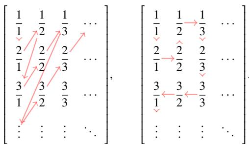

例 2.8 设集合 $A$ 是数轴上长度不为零且两两不相交的区间组成的集合. 则 ?? 是至多可数的, 其中 $A$ 中的元素都是区间.

证明 由于 $A$ 中区间的长度不为零, 且任意两个实数之间都存在有理数, 故对于任一区间 $I _ { 0 } \in A$ , 都可以从中取出一个 $x _ { 0 } \in \mathbb { Q } .$ 于是可令

$$
\sigma : A \to \mathbb {Q}
$$

$$
I _ {0} \mapsto x _ {0}
$$

显然以上定义的 $\sigma$ 是一个映射.由于 ??中的区间两两不相交,故 $\sigma$ 是一个单射.于是可知 $\sigma$ 可以成为 $A$ 到 $\sigma ( A ) \subseteq$ $\mathbb { Q }$ 的一个双射. 因此 $A$ 与 $\mathbb { Q }$ 的一个子集等价, 于是可知 $E$ 是至多可数的. ■

我们熟悉的一类无理数, 如 2, 3 等, 都可以看作某个代数方程的解, 可以证明这样的数的全体也是可数的.

# 定义 2.14 (代数数)

若实数 $x$ 满足多项式方程

$$
a _ {0} x ^ {n} + a _ {1} x ^ {n - 1} + \dots + a _ {n - 1} x + a _ {n} = 0.
$$

其中 $a _ { 0 } \in \mathbb { Z } ^ { * }$ , $a _ { 1 }$ , $a _ { 2 }$ , · · · , $a _ { n } \in \mathbb { Z }$ . 则称 $x$ 是一个代数数 (algebraic number). 否则称为超越数 (transcendentalnumber).

注 1844 年法国数学家 Joseph Liouville 首先发现了超越数. 并构造了第一个超越数.1873 年法国数学家 CharlesHermite 证明了自然常数 e 是一个超越数.1882 年德国数学家 Carl Louis Ferdinand von Lindemann 证明了圆周率 $\pi$ 的超越性,1885 年 Weierstrass 给出了更一般的结果, 合称 Lindemann–Weierstrass 定理.

注 显然有理数都是代数数.

# 定理 2.16

由代数数全体组成的集合是可数的.

证明 (i) 设所有整系数多项式组成的集合为 $P$ . 令

$$
P _ {N} = \left\{a _ {0} x ^ {n} + \dots + a _ {n - 1} x + a _ {n}: a _ {0} \in \mathbb {Z} ^ {*}, a _ {1}, a _ {2}, \dots , a _ {n} \in \mathbb {Z}, N = n + | a _ {0} | + | a _ {1} | + \dots + | a _ {n} | \right\}.
$$

显然 $P _ { N }$ $N = 2 , 3 , \cdots$ ) 都是有限集. 由于

$$
P \subseteq \bigcup_ {N = 2} ^ {\infty} P _ {N}.
$$

由命题2.15可知 $P$ 是一个可数集. 设 $P = \{ p _ { 1 } , p _ { 2 } , \cdots , p _ { n } , \cdots \}$ .

(ii) 设全体代数数组成的集合为 ??. 由代数基本定理可知任一 $k$ 次多项式有 $k$ 个复根. 设 $p _ { n }$ 的所有复根组成的集合为 $A _ { n }$ $n = 1 , 2 , \cdots )$ . 则

$$
A \subseteq \bigcup_ {n = 1} ^ {\infty} A _ {n}.
$$

由命题2.15可知 ?? 是一个可数集.

注 代数基本定理的证明见《高等代数》.

注 1874 年 Cantor 首先证明了以上定理.

以上定理告诉我们, 用有限次根式表示的无理数和有理数 “一样多”.

# 2.3.3 不可数集

经过以上讨论, 我们目前遇到的集合似乎都是可数的. 下面给出一个不可数集的例子.

例 2.9 区间 [0, 1) 是不可数的.

证明 把 $I = [ 0 , 1 )$ 区间中的所有实数写成二进制小数, 规定

$$
a. a _ {1} \dots a _ {n} \dot {0} = a ^ {\prime}. a _ {1} ^ {\prime} \dots a _ {n} ^ {\prime} \dot {1},
$$

其中

$$
a. a _ {1} \cdot \cdot \cdot a _ {n} = a ^ {\prime}. a _ {1} ^ {\prime} \cdot \cdot \cdot a _ {n} ^ {\prime} + \underbrace {0 . 0 \cdots 0} _ {n   \text {个}   0} 1.
$$

为了使小数的表示唯一, 我们规定遇到 $a ^ { \prime } . a _ { 1 } ^ { \prime } \cdots a _ { n } ^ { \prime } \dot { 1 }$ 一律写成 $a . a _ { 1 } \cdots a _ { n } { \dot { 0 } } .$ 任取 $I$ 的一个可数子集 $\widetilde { I } = \{ \alpha _ { 1 } , \alpha _ { 2 } , \cdots \}$ .构造一个无限矩阵,

$$
\begin{array}{r l} & {\alpha_ {1} \text {的 小 数 部 分}} \\ {\boldsymbol {A} =} & {\alpha_ {2} \text {的 小 数 部 分}} \\ & {\alpha_ {3} \text {的 小 数 部 分}} \\ & {\alpha_ {4} \text {的 小 数 部 分}} \\ & {\alpha_ {5} \text {的 小 数 部 分}} \\ & {\vdots} \end{array} ,
$$

其中 $\alpha _ { n } = 0 . a _ { n 1 } a _ { n 2 } \cdot \cdot \cdot \left( a _ { n 1 } , a _ { n 2 } \in \{ 0 , 1 \} \right)$ . 依次取 $A$ 的对角线元素 $a _ { 1 1 } , a _ { 2 2 } , \cdots .$ $a _ { 1 1 }$ . 令

$$
\widetilde {a} _ {n n} = \left\{ \begin{array}{l l} 0, & a _ {n n} = 1 \\ 1, & a _ {n n} = 0 \end{array} \right..
$$

容易看出 $\widetilde { \alpha } = 0 . \widetilde { a } _ { 1 1 } \widetilde { a } _ { 2 2 } \cdot \cdot \cdot \notin \widetilde { I } ,$ 但 ${ \widetilde { \alpha } } \in I .$ 因此 $\widetilde { I }$ 是 $I$ 的一个真子集, 即 $I$ 的任一可数子集都是它的真子集. 这表明 $I$ 不是可数集. ■

注设 $A = \{ 0 , 1 \}$ , 令 $J = A \times A \times \cdot \cdot \cdot = A ^ { \infty }$ .用类似的方法可证 $J$ 是不可数的.这表明可数次的笛卡尔积可以让可数集 “跃迁” 为不可数集.

注 以上证明方法是德国数学家 Cantor 首先使用的, 称为对角线法 (diagonal process).

通过以上铺垫, 现在可以证明实数集 $\mathbb { R }$ 是不可数的.

# 定理 2.17

实数集 $\mathbb { R }$ 为不可数集.

证明 设函数

$$
f (x) = \tan \left(\pi x - \frac {\pi}{2}\right) = - \cot (\pi x).
$$

容易知道 $f$ 是定义域为 (0,1), 值域为 $\mathbb { R }$ 的单调递增函数, 即 $f$ 是 (0, 1) 到 $\mathbb { R }$ 的一个双射. 因此 $( 0 , 1 ) \sim \mathbb { R } .$ . 由命题2.17可知

$$
| (0, 1) | = | (0, 1) \cup \{0 \} | = | [ 0, 1) |.
$$

例2.9中已证 [0, 1) 是不可数的, 因此 $\mathbb { R }$ 也是不可数的.

# 推论 2.5

无理数集是不可数集.

证明 设无理数集为 ??, 则 $\mathbb { R } = \mathbb { Q } \cup I .$ 由于有理数集可数, 由命题2.17可知

$$
| I | = | \mathbb {Q} \cup I | = | \mathbb {R} |.
$$

因此无理数集也不可数.

通过以上讨论, 我们不仅证明了实数集是不可数的, 而且还证明了区间 (0, 1), (0, 1], [0, 1), [0, 1]、实数集和无理数集都有相等的基数.

# 定义 2.15 (连续统)

和实数集 $\mathbb { R }$ 等势的集合称为连续统 (continuum). 连续统的基数称为连续基数 或连续统的势 (cardinality of thecontinuum), 记作 $\aleph _ { 1 }$ 或 ??.

从前面的讨论可知区间 $( 0 , 1 )$ , (0, 1], [0, 1), [0, 1] 和无理数集都是连续统. 下面再看一些连续统的常见例子.

例 2.10 任一区间都是连续统.

证明 任取开区间 $( a , b )$ , 令 $x _ { 0 } = ( a + b ) / 2$ , $\delta = ( b - a ) / 2$ , 则 $( a , b ) = ( x _ { 0 } - \delta , x _ { 0 } + \delta ) .$ . 设函数

$$
f (x) = \tan \left[ \frac {\pi}{2 \delta} \left(x - x _ {0}\right) \right].
$$

则 $f ( x )$ 是 $( a , b )$ 到 $\mathbb { R }$ 的双射. 于是可知 $( a , b )$ 是连续统. 由命题2.17可知

$$
\left| \left[ a, b \right] \right| = \left| \left(a, b\right) \cup \left\{a, b \right\} \right| = \left| \left(a, b\right) \right|,
$$

$$
\left| (a, b ] \right| = \left| (a, b) \cup \{b \} \right| = \left| (a, b) \right|,
$$

$$
| [ a, b) | = | (a, b) \cup \{a \} | = | (a, b) |.
$$

综上可知任一区间都是连续统.

前面已证明无理数是连续统, 同理可证超越数也是连续统.

# 定理 2.18

全体超越数组成的集合是连续统.

证明 设全体超越数组成的集合为 ??, 代数数组成的集合为 $B$ , 则 $\mathbb { R } = A \cup B$ . 由于 $B$ 可数, 由命题2.17可知

$$
| A | = | A \cup B | = | \mathbb {R} |.
$$

全体超越数组成的集合是连续统.

例 $2 . 1 1$ 平面上的点集是连续统.

证明 (i) 设 $I = ( 0 , 1 )$ . 先证明 $I \sim I \times I .$ 令

$$
\sigma : I \to I \times I
$$

$$
0. a _ {1} a _ {2} a _ {3} a _ {4} \dots \mapsto (0. a _ {1} a _ {3} \dots , 0. a _ {2} a _ {4} \dots).
$$

I 显然 $\sigma$ 是一个映射. 且对于任一 $\pmb { r } = ( 0 . b _ { 1 } b _ { 2 } \cdots , 0 . c _ { 1 } , c _ { 2 } \cdots )$ 都有唯一的 $r = 0 . b _ { 1 } c _ { 1 } b _ { 2 } c _ { 2 } \cdots$ 满足 $\sigma ( r ) = r$ . 因此$\sigma$ 既是满射也是单射. 因此 $\sigma$ 是 $I$ 到 $I \times I$ 的一个双射. 于是可知 $I \sim I \times I$ .

(ii) 证明 $I \times I \sim \mathbb { R } \times \mathbb { R }$ . 令

$$
\begin{array}{l} f: I \times I \to \mathbb {R} \times \mathbb {R} \\ (x, y) \mapsto (- \cot (\pi x), - \cot (\pi y)). \\ \end{array}
$$

容易看出 $f$ 是一个 $I \times I$ 到 $\mathbb { R } \times \mathbb { R }$ 的双射. 于是可知 $I \times I \sim \mathbb { R } \times \mathbb { R }$ .

综上可知平面上的点集 $\mathbb { R } \times \mathbb { R }$ 是连续统.

下面很自然地会提出以下问题: 是否存在比 $\aleph _ { 1 }$ 更大的基数? 是否存在最大的基数?

# 定理 2.19 (Cantor 定理)

设非空集合 ??, 则 ?? 与它的幂集 ${ \mathcal { P } } ( A )$ 不对等, 且 $| A | < | { \mathcal { P } } ( A ) |$ .

证明 ?? 是有限集时命题显然成立. 下设 $A = \{ a _ { I } \}$ 是一个无限集, 其中 $I$ 是一个指标集. 假设 $A \sim { \mathcal { P } } ( A )$ . 则存在双射 $\sigma : A  { \mathcal { P } } ( A )$ .

$$
\begin{array}{l} \begin{array}{c c c} A & \to & \mathcal {P} (A) \end{array} \\ a _ {\alpha} \mapsto \sigma (a _ {\alpha}) = \left\{a _ {\alpha}, a _ {\beta}, a _ {\delta} \right\} \\ a _ {\beta} \mapsto \sigma (a _ {\beta}) = \left\{a _ {\gamma}, a _ {\lambda}, a _ {\sigma}, a _ {\varepsilon} \right\} \\ a _ {\gamma} \quad \mapsto \quad \sigma (a _ {\gamma}) = \{a _ {\beta}, a _ {\eta} \} \\ \begin{array}{c c} \vdots & \vdots \\ \hline \end{array} \\ \end{array}
$$

令 $B = \{ a _ { I } \in A : a _ { I } \notin \sigma ( a _ { I } ) \} \nonumber$ . 容易看出 $B \in { \mathcal { P } } ( A )$ , 但不存在 $a _ { \lambda }$ 满足 $\sigma ( \alpha _ { \lambda } ) = B$ , 这表明 $\sigma$ 不是满射, 出现矛盾. 因此假设不成立. 于是可知 $A$ 和 ${ \mathcal { P } } ( A )$ 不对等, 因此 $| A | \neq | { \mathcal { P } } ( A ) |$ . 显然 $A$ 和 ${ \mathcal { P } } ( A )$ 的一个子集存在双射, 因此$| A | \leqslant | { \mathcal { P } } ( A ) |$ . 于是可知 $| A | < | { \mathcal { P } } ( A ) |$ . ■

注 以上定理的证法和例2.9一样, 都使用了 “对角线法”.

注 $A$ 的幂集的基数可以记作 $2 ^ { | A | }$ .

注 以上定理表明不存在最大的基数, 因为对于任一集合 $A$ 都可以有基数更大的 ${ \mathcal { P } } ( A )$ .

例 2.12 对于任一无限集 $A$ , 都有 $| \mathcal { P } ( A ) | > \aleph _ { 0 }$ .

证明 无限集的最小基数是可数基数, 因此 $| A | \geqslant \aleph _ { 0 }$ . 由 Cantor 定理可知

$$
\left| \mathcal {P} (A) \right| > | A | \geqslant \aleph_ {0}.
$$

于是可知 $| \mathcal { P } ( A ) | > \aleph _ { 0 }$ .

事实上可数集的幂集的基数一定等于连续统的势, 这个结论将在《实分析》中给出严格证明.

# 定理 2.20

可数集的幂集势等于连续基数, 即 ${ \aleph _ { 1 } = 2 ^ { \aleph _ { 0 } } }$ .

证明 设 $A = \{ 0 , 1 \}$ , 令 $J = A \times A \times \cdot \cdot \cdot = A ^ { \infty }$ . 令

$$
\begin{array}{l} \sigma : \mathcal {P} (\mathbb {N}) \to J \\ N \mapsto (a _ {1}, a _ {2}, \dots , a _ {n}, \dots). \\ \end{array}
$$

其中

$$
a _ {n} = \left\{ \begin{array}{l l} 1, & n \in N \\ 0, & n \notin N \end{array} \right..
$$

显然 $\sigma$ 是一个映射. 任取 $\pmb { a } = ( a _ { 1 } , a _ { 2 } , \cdot \cdot \cdot , a _ { n } , \cdot \cdot \cdot ) \in J ,$ , 根据对应法则一定存在唯一的 $N$ 满足 $\sigma ( N ) = \pmb { a }$ , 因此 $\sigma$ 既

是满射也是单射. 因此 $\sigma$ 是 $\mathcal { P } ( \mathbb { N } )$ 到 $J$ 的一个双射. 容易知道 $J$ 和 [0, 1) 对等, 因此 $| J | = \aleph _ { 1 }$ . 于是可知

$$
2 ^ {\aleph_ {0}} = | \mathcal {P} (\mathbb {N}) | = | J | = \aleph_ {1}.
$$

到目前为止我们看到的集合的基数不是可数基数 $\aleph _ { 0 }$ 就是连续基数 $\aleph _ { 1 }$ . 那么是否存在基数介于 $\aleph _ { 0 }$ 和 $\aleph _ { 1 }$ 之间的集合?

1874 年 Cantor 提出猜想: 不存在基数介于 $\aleph _ { 0 }$ 和 $\aleph _ { 1 }$ 的集合. 这就是著名的连续统假设 (continuum hypothesis).这个问题困扰了数学界半个多世纪之久.1900 年, 在第二届国际数学家大会上 Hilbert 把连续统假设列入 20 世纪有待解决的 23 个重要数学问题之首.1940 年德国数学家 Kurt Friedrich Gödel 证明了连续统假设和集合的 ZFC 公理系统不矛盾, 即 ZFC 公理系统无法证伪连续统假设.1963 年 Cohen 进一步证明连续统假设无法被 ZFC 公理系统证明.

# 2.4 数列极限的概念和性质

# 2.4.1 数列的极限

在上一章的例2.4中讨论了集合 $E = \{ 1 / n : n \in \mathbb { N } ^ { * } \}$ 的上确界和下确界. 虽然 $0 \notin E$ , 但 inf $E = 0$ . 在证明过程中, 不难发现当 $n$ 不断增大时 $1 / n ^ { \prime }$ “无限接近于零”. 正是这个原因, 0 才能成为 $E$ 的下确界.

在上一章的例2.5中验证了 (0,1] 区间的一个开覆盖 $C = \{ I _ { n } = ( 1 / n , 2 ) : n \in \mathbb { N } ^ { * } \}$ . 中无法找到一个子覆盖. 从证明过程中, 可以看到, 主要原因也是因为 $1 / n ^ { \prime }$ “无限接近于零”.

这两个例子中的集合 $\{ 1 / n : n \in \mathbb { N } ^ { * } \}$ 是一个可数集, 我们可以把它排成一列:

$$
1, \frac {1}{2}, \frac {1}{3}, \dots , \frac {1}{n}, \dots .
$$

然后研究它的变化趋势. 这对于研究实数的完备性非常重要. 于是引出了以下重要概念.

# 定义 2.16 (序列)

从自然数集 N 到任意非空集合 $A$ 的一个映射称为 $A$ 中元素的一个序列 (sequence). 若 $A$ 是一个数集, 则称该序列为数项序列 , 简称数列 . 特别地, 从自然数集 N 到实数集 $\mathbb { R }$ 的一个映射称为实数序列 , 记作 $\{ a _ { n } \} _ { n \in \mathbb { N } ^ { * } }$ 或 $\{ a _ { n } \} _ { n = 1 } ^ { \infty }$ . 也可以列举出它的若干项:

$$
a _ {1}, a _ {2}, \dots , a _ {n}, \dots ,
$$

其中 $a _ { n } = f ( n )$ $( n = 1 , 2 , \cdots$ ) 称为数列的通项公式 (general term formula).

注 $\{ a _ { n } \} _ { n \in \mathbb { N } ^ { * } }$ 经常简记作 $\left\{ a _ { n } \right\}$ . 把数列记成 $\left\{ a _ { n } \right\}$ 时, 是把数列看作一个集合, 显然它们都是无限集. 把数列记成 $a _ { n }$ $( n = 1 , 2 , \cdots )$ , 是把数列看作一个函数.

注 $A$ 中的元素是没有限定的. 如果 $A$ 中的元素是函数, 那么构成的序列就是函数项序列 (sequence of functions), 这是后面要详细讨论的重要主题.

生活中不乏数列的例子. 假设在某氪金手游抽到 SSR 的概率为 $1 \%$ , 则抽一发抽不到的概率为 99/100, 两发抽不到的概率为 $( 9 9 / 1 0 0 ) ^ { 2 } , \cdot \cdot \cdot$ 依此类推,可以得到一个“抽不到SSR概率” $P ( n )$ 关于“抽卡次数” $n$ 的数列 $\{ P _ { n } \}$ .

$$
P _ {n} = P (n) = \left(\frac {9 9}{1 0 0}\right) ^ {n}, \quad n = 1, 2, \dots .
$$

直观来看,只要氪金足够多(??趋向无穷大时), $( 9 9 / 1 0 0 ) ^ { n }$ 会趋向于零.这个时候,我们称这个数列“极限”为零.那么玩家的这个“直观感受”是否符合数学真相呢?是否有可能它只是“接近”一个很小但不为0的数?“接近”又该如何定义? 现在需要一种精确的数学语言来描述数列趋向于某个实数的事实.

# 定义 2.17 (数列的极限)

设数列 $\left\{ a _ { n } \right\}$ . 若对于任意 $\varepsilon > 0$ , 存在 $N \in \mathbb { N } ^ { * }$ , 使得当 $n > N$ 时总有

$$
\left| a _ {n} - a \right| <   \varepsilon ,
$$

其中 $a \in \mathbb { R }$ . 则称数列 $\left\{ a _ { n } \right\}$ 收敛 (convergent) 于 $a$ , 或称 $\left\{ a _ { n } \right\}$ 的极限 (limit) 为 ??, 记作

$$
\lim  _ {n \to \infty} a _ {n} = a \quad {\text {或}} \quad a _ {n} \to a (n \to \infty).
$$

否则, 称该数列发散 (divergent).

注以上定义称为“ $ { \varepsilon } - N$ 定义”.虽然极限的思想在古希腊就已经产生,但以上定义的想法是1817由波西米亚(今捷克) 数学家 Bernard Bolzano 第一个想到的. 之后, 法国数学家 Augustin-Louis Cauchy 进一步完善了这个方法. 我们现在使用的极限定义是德国数学家 Karl Weierstrass 在 1861 年最终给出的.

注 以上定义中, $n \to \infty$ 称为极限过程. 数列的极限过程只有这一种, 因此有时候在数列极限的记号中可以把这部分省略, 记作 $\operatorname* { l i m } a _ { n }$ 或 $a _ { n } \to a$ .

注 定义中的正数 $\varepsilon$ 是任意给定的. 这个“任意”指的是“任意小”, 因此也可以改为“任一小于某个正数的正数

??” $\varepsilon ^ { \ast }$

注 定义中的 $N$ 是依赖于 $\varepsilon$ 而确定的——也就是说, 给定一个 $\varepsilon .$ , 能找到一个 $N$ 就可以了, 并不要求找到一个固定的 $N$ 满足任意 $\varepsilon$ . 所以 $N$ 经常写成 $N ( \varepsilon )$ , 或 $N _ { \varepsilon }$ , 但这并不表示 $N$ 是 $\varepsilon$ 的函数. 一般来说, $\varepsilon$ 给得越小, $N$ 就需要取得越大.

注 “存在 $N \in \mathbb { N } ^ { * }$ 使得当 $n > N$ 时”经常说成“当 $n$ 充分时大”.

注 数列的极限和前面的有限项无关, 即去掉、增加或改变前面的有限项都不会改变数列的敛散性和极限值. 因此讨论数列的极限只需考虑 $n$ 充分大时的情况.

注 根据 de Morgan 对偶原理可以得到以上定义的否定形式:

$$
\forall a \in \mathbb {R}, \exists \varepsilon > 0, \forall N \in \mathbb {N} ^ {*}, \exists n \geqslant N, | a _ {n} - a | \geqslant \varepsilon \iff \forall a \in \mathbb {R}, \lim  _ {n \rightarrow \infty} a _ {n} \neq a.
$$

数列的极限可以由很多等价的刻画方法.

例 2.13 下列陈述都可以作为 $\operatorname* { l i m } _ { n \to \infty } a _ { n } = a$ 的定义:

(1) 对任意给定的正数 $\varepsilon < 1$ 都存在 $N \in \mathbb { N } ^ { * }$ 使得当 $n > N$ 时有 $\left| a _ { n } - a \right| < \varepsilon$   
(2) 对任一 $k \in \mathbb { N } ^ { * }$ 都存在 $N \in \mathbb { N } ^ { * }$ 使得当 $n > N$ 时有 $| a _ { n } - a | < 1 / k$ .

解 (1) 若对任意给定的正数 $\varepsilon _ { 1 } < 1$ 都存在 $N \in \mathbb { N } ^ { * }$ 使得当 $n > N$ 时有 $| a _ { n } - a | < \varepsilon _ { 1 }$ . 则对任意 $\varepsilon _ { 2 } \geqslant 1$ 都存在$N \in \mathbb { N } ^ { * }$ 使得当 $n > N$ 时有

$$
\left| a _ {n} - a \right| <   \varepsilon_ {1} <   1 \leqslant \varepsilon_ {2}.
$$

于是可知对于任一 $\varepsilon > 0$ 都存在 $N \in \mathbb { N } ^ { * }$ 使得当 $n > N$ 时有 $\left| a _ { n } - a \right| < \varepsilon$ .

(2) 对于任一 $\varepsilon > 0$ , 只需取 $k = [ 1 / \varepsilon ] + 1$ , 则存在 $N \in \mathbb { N } ^ { * }$ 使得当 $n > N$ 时有

$$
\left| a _ {n} - a \right| <   \frac {1}{k} <   \varepsilon .
$$

还有一些似是而非的 “极限定义”.

例 2.14 判断下列陈述是否可以作为 $\operatorname* { l i m } _ { n \to \infty } a _ { n } = a$ 的定义:

(1) 对无穷多个 $\varepsilon > 0$ 都存在 $N \in \mathbb { N } ^ { * }$ 使得当 $n > N$ 时有 $\left| a _ { n } - a \right| < \varepsilon$   
(2) 对任意给定的 $\varepsilon > 1$ 都存在 $N \in \mathbb { N } ^ { * }$ 使得当 $n > N$ 时有 $\left| a _ { n } - a \right| < \varepsilon$

解设数列 $a _ { n } = ( - 1 ) ^ { n }$ . 令 $a = 0$ .由于 $| a _ { n } - a | = 1 ( n = 1 , 2 , \cdots )$ $\left| a _ { n } - a \right| = 1$ .因此对于任一 $\varepsilon > 1$ 都满足 $\left| a _ { n } - a \right| < \varepsilon$ .这样的正数 $\varepsilon$ 有无数个. 但数列 $\left\{ a _ { n } \right\}$ 发散. 因此以上两个陈述都不能作为数列收敛的定义. ■

现在我们可以回过头来用极限的定义来重新考察数列 $\{ 1 / n \}$ .

例 2.15 求极限:

$$
\lim  _ {n \to \infty} \frac {1}{n}.
$$

解 对于任意的给定的 $\varepsilon > 0$ , 要使

$$
\left| \frac {1}{n} - 0 \right| = \left| \frac {1}{n} \right| <   \varepsilon . \tag {2.3}
$$

只需满足 $n > 1 / \varepsilon$ . 因此可取 $N = [ 1 / \varepsilon ] + 1$ , 那么当 $n \ > \ N$ 时就可以满足不等式2.3. 由数列极限的定义可知$\textstyle \operatorname* { l i m } _ { n \to \infty } ( 1 / n ) = 0$ . ■

注 [ ] 是 “下取整函数” (见定义1.28).

注 在利用数列极限的定义证明 $\operatorname* { l i m } _ { n \to \infty } a _ { n } = a$ 时, 我们可以从 $\left| a _ { n } - a \right| < \varepsilon$ 中反解出 $n$ 的取值范围.

例 2.16 设数列

$$
a _ {1} = 0. 9, \qquad a _ {2} = 0. 9 9, \qquad a _ {3} = 0. 9 9 9, \qquad \dots \qquad a _ {n} = 0. \underbrace {9 9 \cdots 9} _ {n \text {个}}, \qquad \dots .
$$

则 $\scriptstyle \operatorname* { l i m } _ { n \to \infty } a _ { n } = 1$

证明 由于

$$
| 0. \underbrace {9 9 \cdots 9} _ {n \text {个}} - 1 | = 1 0 ^ {- n}.
$$

因此对于任一 $\varepsilon > 0$ . 若要 $1 0 ^ { - n } < \varepsilon$ , 只需 $n > - \lg \varepsilon .$ . 因此可取 $N = [ - \lg \varepsilon ]$ , 则当 $n > N$ 时

$$
| 0. \underbrace {9 9 \cdots 9} _ {n {\text {个}}} - 1 | <   \varepsilon .
$$

于是就证明了 $\scriptstyle \operatorname* { l i m } _ { n \to \infty } a _ { n } = 1$ .

注 上例解释了上一章中关于循环小数的规定的合理性 (见定义2.9).

常值数列的极限是显然的. 我们也来用定义证明一下.

例 2.17 设序列 $\left\{ a _ { n } \right\}$ . 若对于任意 $n \in \mathbb { N } ^ { * }$ 都有 $a _ { n } = C$ , 则 $\scriptstyle \operatorname* { l i m } _ { n \to \infty } a _ { n } = C$ .

证明 对于任一 $\varepsilon > 0 ,$ . 由于 $a _ { n } = C$ $( n = 1 , 2 , \cdots ,$ ), 故

$$
\left| a _ {n} - C \right| = \left| C - C \right| = 0 <   \varepsilon , \quad n = 1, 2, \dots .
$$

于是可知 $\scriptstyle \operatorname* { l i m } _ { n \to \infty } a _ { n } = C$ .

注 上例的特殊之处在于, $N$ 的选取不依赖于 $\varepsilon$ .

利用数列极限的定义证明数列收敛需要先 “猜出” 数列的极限值. 证明过程需要用到不少不等式的缩放技巧.下面举一些比较典型的例子.

例 2.18 用数列极限的定义证明:

$$
\lim  _ {n \to \infty} \frac {2 n + 3}{5 n - 1 0} = \frac {2}{5}.
$$

证明 当 $n \geqslant 3$ 时, 由于

$$
\left| \frac {2 n + 3}{5 n - 1 0} - \frac {2}{5} \right| = \left| \frac {7}{5 n - 1 0} \right| = \frac {7}{5 n - 1 0} <   \frac {7}{n}.
$$

因此对于任一 $\varepsilon > 0$ , 取 $N = \operatorname* { m a x } \{ 3 , [ 7 / \varepsilon ] \}$ , 则当 $n > N$ 时

$$
\left| \frac {2 n + 3}{5 n - 1 0} - \frac {2}{5} \right| <   \frac {7}{n} <   \varepsilon .
$$

由数列极限的定义可知

$$
\lim  _ {n \rightarrow \infty} \frac {2 n + 3}{5 n - 1 0} = \frac {2}{5}.
$$

注 分式数列收敛于非零实数当且仅当它的分子分母的次数相等, 它的极限值就等于分子最高次项系数和分母最高次项系数之比. 若分子的次数小于分母, 则数列收敛于零. 若分子的次数大于分母则数列发散.

例 2.19 用数列极限的定义证明:

$$
\lim  _ {n \rightarrow \infty} \frac {1}{n ^ {\alpha}} = 0, \quad \alpha > 0.
$$

证明 (i) 当 $\alpha \geqslant 1$ 时. 由于

$$
\left| \frac {1}{n ^ {\alpha}} - 0 \right| = \frac {1}{n ^ {\alpha}} \leqslant \frac {1}{n}.
$$

因此对于任一 $\varepsilon > 0$ , 取 $N = [ 1 / \varepsilon ]$ , 则当 $n > N$ 时

$$
\left| \frac {1}{n ^ {\alpha}} - 0 \right| \leqslant \frac {1}{n} <   \varepsilon .
$$

由数列极限的定义可知 $\textstyle \operatorname* { l i m } _ { n \to \infty } 1 / n ^ { \alpha } = 0$ .

(ii) 当 $0 < \alpha < 1$ 时, 由 Archimedes 性质可知存在 $m \in \mathbb { N } ^ { * }$ 使得 $m \alpha > 1 .$ . 由 (i) 可知, $1 / n ^ { m \alpha }  0$ ,因此对于任一$\varepsilon > 0$ 都存在 $N \in \mathbb { N } ^ { * }$ , 使得当 $n > N$ 时

$$
\frac {1}{n ^ {m \alpha}} <   \varepsilon^ {m} \Longleftrightarrow \frac {1}{n ^ {\alpha}} <   \varepsilon .
$$

这表明当 $0 < \alpha < 1$ 时结论仍然成立.

例 2.20 用数列极限的定义证明:

$$
\lim  _ {n \to \infty} q ^ {n} = 0, \quad | q | <   1.
$$

证明 当 $q = 0$ 时显然有 $q ^ { n } \to 0$ . 下设 $0 < | q | < 1$ , 则 $1 / | q | > 1 .$ . 令 $1 / | q | = \alpha + 1$ $( \alpha > 0 )$ ). 由二项式定理可知则

$$
| q ^ {n} - 0 | = | q | ^ {n} = \frac {1}{(\alpha + 1) ^ {n}} = \frac {1}{1 + n \alpha + \mathrm {C} _ {n} ^ {2} \alpha^ {2} + \cdots} <   \frac {1}{n \alpha}.
$$

因此对于任一 $\varepsilon > 0$ , 取 $N = \left[ { 1 } / { ( \alpha \varepsilon ) } \right]$ , 则当 $n > N$ 时

$$
\left| q ^ {n} - 0 \right| <   \frac {1}{n \alpha} <   \varepsilon .
$$

由数列极限的定义可知 $\scriptstyle \operatorname* { l i m } _ { n \to \infty } q ^ { n } = 0$ .

注 以上证明中得到了一个有用的不等式. 当 $\alpha > 0$ 时, 对于任一 $n \in \mathbb { N } ^ { * }$ 都有

$$
(1 + \alpha) ^ {n} > 1 + n \alpha .
$$

这个不等式称为 Bernoulli 不等式 . 后面会看到这个不等式的成立条件可以进一步放宽.

例 2.21 用数列极限的定义证明:

$$
\lim  _ {n \to \infty} \sqrt [ n ]{n} = 1.
$$

解 由均值不等式可知

$$
1 \leqslant \sqrt [ n ]{n} = (\underbrace {1 \cdots 1} _ {n - 2 \text {个} 1} \sqrt {n} \sqrt {n}) ^ {1 / n} \leqslant \frac {1 + \cdots + 1 + \sqrt {n} + \sqrt {n}}{n} = \frac {n - 2 + 2 \sqrt {n}}{n} <   \frac {n + 2 \sqrt {n}}{n} = 1 + \frac {2}{\sqrt {n}} \Longleftrightarrow 0 \leqslant \sqrt [ n ]{n} - 1 <   \frac {2}{\sqrt {n}}.
$$

于是对于任一 $\varepsilon > 0$ , 只要取 $N = \left[ 4 / \varepsilon ^ { 2 } \right]$ , 则当 $n > N$ 时有

$$
\left| \sqrt [ n ]{n} - 1 \right| <   \frac {2}{\sqrt {n}} <   \varepsilon .
$$

于是可知 lim $\sqrt [ n ] { n } _ { n \to \infty } = 1$

注 以上证明用到了均值不等式

$$
\left(\prod_ {k = 1} ^ {n} x _ {k}\right) ^ {1 / n} \leqslant \frac {1}{n} \sum_ {k = 1} ^ {n} x _ {k}, \quad x _ {1}, x _ {2}, \dots , x _ {n} \geqslant 0.
$$

# 2.4.2 邻域和极限的简单性质

为了进一步理解数列极限的概念, 我们可以利用数轴考察数列收敛的几何意义. 设数列 $\left\{ a _ { n } \right\}$ 收敛于 $a$ , 则对于任一 $\varepsilon > 0$ (无论它多么小), $\left\{ a _ { n } \right\}$ 从第 $N$ 项以后的各项都会落在 “以 $a$ 为中心” 的一个开区间 $( a - \varepsilon , a + \varepsilon )$ 中 .于是我们可以引入以下概念.

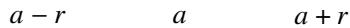  
图 2.4: 以 $a$ 为中心 $r$ 为半径的邻域

# 定义 2.18 (邻域)

给定 $a \in \mathbb { R }$ . 令

$$
N _ {r} (a) := \{x \in \mathbb {R}: | x - a | <   r \} = (a - r, a + r).
$$

其中 $r$ 是任一正实数. $N _ { r } ( a )$ 称为以 $a$ 为中心, ?? 为半径的邻域 (neighborhood). 在不强调半径的情况下 $N _ { r } ( a )$ 可以简记作 $N ( a )$ .

注 容易看出在实数域 $\mathbb { R }$ 中

$$
x \in N _ {r} (a) \iff | x - a | <   r \iff - r <   x - a <   r \iff a - r <   x <   a + r \iff x \in (a - r, a + r).
$$

因此 $N _ { r } ( a ) = ( a - r , a + r )$ . 但我们没有直接用开区间去定义邻域. 而是使用距离来定义邻域. 后面将看到这样做的原因.

例 2.22 设 $a \in \mathbb { R } .$ . 若 $\varepsilon _ { 1 } \leqslant \varepsilon _ { 2 }$ , 则 $N _ { \varepsilon _ { 1 } } ( a ) \subseteq N _ { \varepsilon _ { 2 } } ( a )$ .

证明 任取 $x \in N _ { \varepsilon _ { 1 } } ( a )$ , 则 $a - \varepsilon _ { 1 } < x < a + \varepsilon _ { 1 } .$ . 由于 $\varepsilon _ { 1 } \leqslant \varepsilon _ { 2 }$ , 故

$$
a - \varepsilon_ {2} \leqslant a - \varepsilon_ {1} <   x <   a + \varepsilon_ {1} \leqslant a + \varepsilon_ {2}.
$$

因此 $x \in N _ { \varepsilon _ { 2 } } ( a )$ . 于是可知 $N _ { \varepsilon _ { 1 } } ( a ) \subseteq N _ { \varepsilon _ { 2 } } ( a )$ .

邻域是分析学中一个常用的概念. 使用邻域来描述“局部性质”是十分便利的. 下面用邻域的观点来叙述数列极限的定义: 数列 $\left\{ a _ { n } \right\}$ 收敛于 $a$ 当且仅当 $n$ 充分大时 $\left\{ a _ { n } \right\}$ 的各项都落在任一给定的邻域 $N _ { \varepsilon } ( a )$ 内.

# 定理 2.21

设数列 $\left\{ a _ { n } \right\}$ . 则 $\left\{ a _ { n } \right\}$ 收敛于 $a \in \mathbb { R }$ 当且仅当 $a$ 的任一邻域 $N ( a )$ 之外都只有 $\left\{ a _ { n } \right\}$ 的有限项.

证明 必要性显然成立. 任取 $\varepsilon > 0$ , 则邻域 $N _ { \varepsilon } ( a )$ 外只有 $\left\{ a _ { n } \right\}$ 的有限项. 设这有限项中下标最大的一项为 $a _ { N }$ . 则当 $n > N$ 时 $a _ { n } \in N _ { \varepsilon } ( a )$ . 于是可知 $a _ { n } \to a$ . ■

注 以上定理可以看作数列极限的 “拓扑定义”.

注 需要注意, 若 $a$ 的任一邻域 $N ( a )$ 内都有 $\left\{ a _ { n } \right\}$ 的无穷多项, 不能推出 $\left\{ a _ { n } \right\}$ 收敛. 举例说明. 设数列 $a _ { n } = ( - 1 ) ^ { n }$ $( n = 1 , 2 , \cdots )$ . 所以 1 的任一邻域和 −1 的任一邻域中都有 $\left\{ a _ { n } \right\}$ 的无穷多项. 但 $\left\{ a _ { n } \right\}$ 不收敛. 后面将看到 1 和 −1都是 $\left\{ a _ { n } \right\}$ 的“极限点”.

邻域是一个拓扑概念(拓扑是几何的一种),因此从邻域的角度思考,可以使得问题更直观.极限是一个“无限”的概念.以上命题使得我们可以把“无限”的问题转化为“有限”的问题来解决.因此可以说极限是无限转化为有限的一个条件.

例 2.23 数列 $\left\{ a _ { n } \right\}$ 收敛于 $a$ 当且仅当对于任意 $\gamma , \delta > 0$ , 区间 $( a - \gamma , a + \delta )$ 之外都只有数列 $\left\{ a _ { n } \right\}$ 的有限项.

证明 (i) 证明充分性. 已知对于任意 $\gamma , \delta > 0$ , 区间 $( a - \gamma , a + \delta )$ 之外都只有数列 $\left\{ a _ { n } \right\}$ 的有限项. 对于任一 $\varepsilon > 0$ ,

只需令 $\gamma = \delta = \varepsilon$ , 则区间 $( a - \varepsilon , a + \varepsilon )$ 之外只有数列 $\left\{ a _ { n } \right\}$ 的有限项. 因此数列 $\left\{ a _ { n } \right\}$ 收敛于 $a$ .

(ii) 证明必要性. 已知 $a _ { n } \to a$ , 即对于任一 $\varepsilon > 0$ , 邻域 $N _ { \varepsilon } ( a )$ 之外都只有 $\left\{ a _ { n } \right\}$ 的有限项. 对于任意 $\gamma , \delta > 0$ ,令 $\varepsilon = \operatorname* { m i n } \{ \gamma , \delta \}$ , 则 $( a - \varepsilon , a + \varepsilon ) \subseteq ( a - \gamma , a + \delta )$ . 由于 $N _ { \varepsilon } ( a )$ 之外都只有 $\left\{ a _ { n } \right\}$ 的有限项, 因此区间 $( a - \gamma , a + \delta )$ ）之外也只有 $\left\{ a _ { n } \right\}$ 的有限项. ■

注 上例暗示我们邻域的半径对于刻画数列的极限没有实际影响.

如果数列有极限, 那么一定有唯一的极限值吗?

# 命题 2.18 (极限的唯一性)

收敛数列的极限值是唯一的.

证明 设收敛数列 $\left\{ a _ { n } \right\}$ . 假设 $a _ { n } \to a$ , $a _ { n } \to b$ $( a \neq b )$ ). 令 $r$ 满足

$$
0 <   r <   \frac {1}{2} | a - b |.
$$

考虑邻域 $N _ { r } ( a )$ 和 $N _ { r } ( b )$ . 任取 $x \in N _ { r } ( a )$ , 则

$$
\left| x - a \right| <   r <   \frac {1}{2} | a - b | = \frac {1}{2} \left| (a - x) + (x - b) \right| \leqslant \frac {1}{2} | x - a | + \frac {1}{2} | x - b |.
$$

于是

$$
\left| x - b \right| > 2 r - \left| x - a \right| > r.
$$

因此 $x \notin N _ { r } ( b )$ . 故 $N _ { r } ( a ) \cap N _ { r } ( b ) = \emptyset$ . 由于 $a _ { n } \to a$ , 因此 $N _ { r } ( a )$ 之外只有 $\left\{ a _ { n } \right\}$ 的有限项, 从而 $N _ { r } ( b )$ 内有 $\left\{ a _ { n } \right\}$ 的无穷多项, 这与 $a _ { n } \to b$ 矛盾, 故假设不成立, 于是可知 $a = b$ . ■

注 以上证明用到了三角不等式:

$$
\left| a + b \right| \leqslant \left| a \right| + \left| b \right|.
$$

注 极限的唯一性使得求极限是一个映射, 从代数的角度看, 可以把它看作一个算子 (operator).

注 当等式两边的数列都收敛时, 极限的唯一性使我们可以对等式两边取极限.

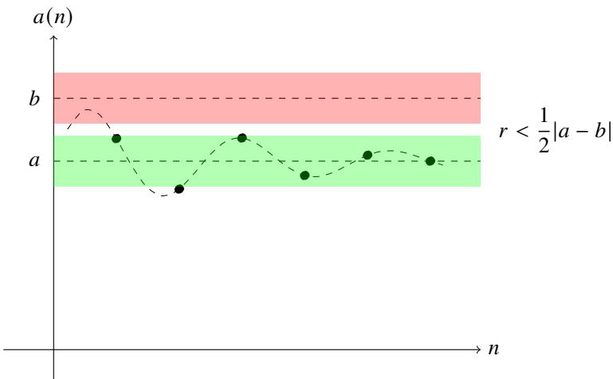  
图 2.5: 只有 $a _ { n }$ 的有限项 “脱离了” 邻域 $N _ { r } ( a )$ . 而有限项同时 “脱离” 两个中心点不同的邻域是做不到的.

数列 $\left\{ a _ { n } \right\}$ 可以看作集合, 因此也可以定义有界数列. 由以上命题容易想到收敛数列总是有界的.

# 定义 2.19 (有界数列)

设数列 $\left\{ a _ { n } \right\}$ . 若存在 $M > 0$ 对于任一 $n \in \mathbb { N } ^ { * }$ 都有 $\left. a _ { n } \right. < M$ . 则称 $\left\{ a _ { n } \right\}$ 是有界的 (bounded).

(1) 若存在 $M \in \mathbb { R }$ , 使得对于任一 $n \in \mathbb { N } ^ { * }$ , 都有 $a _ { n } \leqslant M$ , 则称数列 $\left\{ a _ { n } \right\}$ 有上界, $M$ 是它的一个上界 (upperbound). 其最小的上界称为上确界 (supremum), 记作: $\operatorname* { s u p } _ { n \geqslant 1 } a _ { n }$ 或 $\operatorname { s u p } a _ { n }$ $a _ { n }$ .  
(2) 若存在 $m \in \mathbb { R }$ , 使得对于任一 $n \in \mathbb { N } ^ { * }$ , 都有 $a _ { n } \geqslant m$ , 则称数列 $\left\{ a _ { n } \right\}$ 有下界, $m$ 是它的一个下界 (lower

bound), 其最大的下界称为下确界 (infimum), 记作: $\operatorname { i n f } _ { n \geqslant 1 } a _ { n }$ 或 inf $a _ { n }$

注 数列 $\left\{ a _ { n } \right\}$ 无界当且仅当, 对于任一 $M > 0$ 都存在 $n \in \mathbb { N } ^ { * }$ 使得 $\left. a _ { n } \right. \geqslant M$ .

注 确界原理确保了以上定义是合理的, 因为有上界的数列一定有上确界, 有下界的数列一定有下确界.

有界数列也可以用几何语言描述. 为此可以推广邻域的概念.

# 定义 2.20 (无穷大的邻域)

设 $E > 0$ . 令

$$
N _ {E} (+ \infty) := (E, + \infty), \qquad N _ {E} (- \infty) := (- \infty , - E), \qquad N _ {E} (\infty) := (- \infty , - E) \cup (E, + \infty).
$$

其中 $N _ { E } ( + \infty )$ 称为以 $E$ 为半径 $+ \infty$ 的邻域; $N _ { E } ( - \infty )$ 称为以 $E$ 为半径 $- \infty$ 的邻域; $N _ { E } ( \infty )$ 称为以 $E$ 为半径 $\infty$ 的邻域.

# 命题 2.19

设数列 $\left\{ a _ { n } \right\}$ .

(1) $\left\{ a _ { n } \right\}$ 有界当且仅当存在邻域 $N _ { E } ( \infty )$ 使得该邻域内只有 $\left\{ a _ { n } \right\}$ 中的有限项.  
(2) $\left\{ a _ { n } \right\}$ 有上界当且仅当存在邻域 $N _ { E } ( + \infty )$ 使得该邻域内只有 $\left\{ a _ { n } \right\}$ 中的有限项.  
(3) $\left\{ a _ { n } \right\}$ 有下界当且仅当存在邻域 $N _ { E } ( - \infty )$ 使得该邻域内只有 $\left\{ a _ { n } \right\}$ 中的有限项.

证明 只证明 (2). 必要性显然成立. 若存在 $E > 0$ 使得开区间 $( E , + \infty )$ 内至多有 $\left\{ a _ { n } \right\}$ 中的有限项. 找出这些项中最大的一项, 令 $M$ 大于这一项, 则对于任一 $n \in \mathbb { N } ^ { * }$ , 都有 $a _ { n } \leqslant M$ . 因此 $\left\{ a _ { n } \right\}$ 有上界. ■

由以上命题立刻可知收敛数列和有界数列的关系.

# 命题 2.20

收敛数列必有界.

证明 设数列 $\left\{ a _ { n } \right\}$ 收敛于 $^ { a }$ . 给定 $\varepsilon > 0$ , 则 $N _ { \varepsilon } ( a )$ 之外只有 $\left\{ a _ { n } \right\}$ 的有限项, 即在 $\left( - \infty , a - \varepsilon \right) \cup \left( a + \varepsilon , + \infty \right)$ 中只有$\left\{ a _ { n } \right\}$ 的有限项. 令 $E = \operatorname* { m a x } \{ | a - \varepsilon | , | a + \varepsilon | \} ,$ , 则 $N _ { E } ( \infty )$ 中只有 $\left\{ a _ { n } \right\}$ 的有限项. 于是可知 $\left\{ a _ { n } \right\}$ 有界. ■

注 以上命题的逆命题不正确. 例如数列 $a _ { n } = ( - 1 ) ^ { n }$ 有界, 但不收敛.

根据以上命题, 若能证明数列无界, 就可以断言它不收敛.

例 2.24 调和级数 证明以下数列发散

$$
x _ {n} = 1 + \frac {1}{2} + \frac {1}{3} + \dots + \frac {1}{n}, \quad n = 1, 2, \dots .
$$

证明 对于任一 $N \in \mathbb { N } ^ { * }$ , 只要取 $n = 2 ^ { 2 N }$ 就有

$$
\begin{array}{l} x _ {n} = 1 + \frac {1}{2} + \left(\frac {1}{3} + \frac {1}{4}\right) + \left(\frac {1}{5} + \frac {1}{6} + \frac {1}{7} + \frac {1}{8}\right) + \dots + \left(\frac {1}{2 ^ {2 N - 1} + 1} + \dots + \frac {1}{2 ^ {2 N}}\right) \\ > 1 + \frac {1}{2} + \left(\frac {1}{4} + \frac {1}{4}\right) + \left(\frac {1}{8} + \frac {1}{8} + \frac {1}{8} + \frac {1}{8}\right) + \dots + \left(\underbrace {\frac {1}{2 ^ {2 N}} + \cdots + \frac {1}{2 ^ {2 N}}}\right) _ {2 ^ {2 N} - 1 \text {个}} \\ = 1 + \frac {1}{2} + 2 \cdot \frac {1}{4} + 4 \cdot \frac {1}{8} + \dots + 2 ^ {2 N - 1} \cdot \frac {1}{2 ^ {2 N}} > \underbrace {\frac {1}{2} + \frac {1}{2} + \cdots + \frac {1}{2}} _ {2 N \text {项}} = N. \\ \end{array}
$$

于是可知 $\{ x _ { n } \}$ 无界, 从而它是发散的.

注 事实上, 由于

$$
x _ {n + 1} - x _ {n} = \frac {1}{n + 1} > 0, \quad n = 1, 2, \dots .
$$

因此 $2 ^ { 2 N }$ 之后的所有项都大于 ??.

以上数列的每一项都是一个和式, 这样的数列称为级数 (series). 后面将专门研究这个主题. 级数 $\textstyle \sum _ { n = 1 } ^ { \infty } 1 / n$ 称为调和级数 (harmonic series).

例 2.25 发散的 $p$ 级数 证明以下级数发散:

$$
x _ {n} = 1 + \frac {1}{2 ^ {p}} + \frac {1}{3 ^ {p}} + \dots + \frac {1}{n ^ {p}}, \quad p <   1, n = 1, 2, \dots .
$$

证明 当 $p < 1$ 时

$$
\frac {1}{n ^ {p}} > \frac {1}{n}, \quad n = 1, 2, \dots .
$$

于是由例2.24可知, 当 $n = 2 ^ { 2 N }$ 时

$$
x _ {n} = \sum_ {k = 1} ^ {n} \frac {1}{k ^ {p}} > \sum_ {k = 1} ^ {n} \frac {1}{k} > N.
$$

于是可知 $\{ x _ { n } \}$ 无界, 从而它是发散的.

注 类似可知, 当 $n \geqslant 2 ^ { 2 N }$ 时 $x _ { n } > N$ .

注 以上级数称为 $p$ 级数, 当 $p = 1$ 时 $p$ 级数就是调和级数.

有界数列有以下简单性质.

# 命题 2.21 (有界数列的简单性质)

设有界数列 $\left\{ a _ { n } \right\}$ 和 $\left\{ b _ { n } \right\}$ . 则 $\left\{ a _ { n } + b _ { n } \right\}$ 和 $\left\{ a _ { n } b _ { n } \right\}$ 都是有界数列.

证明 由于 $\left\{ a _ { n } \right\}$ 和 $\left\{ b _ { n } \right\}$ 是有界数列. 故存在正实数 $M$ 和 $N$ 满足

$$
\left| a _ {n} \right| <   M, \quad \left| b _ {n} \right| <   N, \quad n = 1, 2, \dots .
$$

因此

$$
\left| a _ {n} + b _ {n} \right| \leqslant \left| a _ {n} \right| + \left| b _ {n} \right| <   M + N, \quad n = 1, 2, \dots .
$$

$$
\left| a _ {n} b _ {n} \right| = \left| a _ {n} \right| \left| b _ {n} \right| <   M N, \quad n = 1, 2, \dots .
$$

于是可知 $\left\{ a _ { n } + b _ { n } \right\}$ 和 $\{ a _ { n } b _ { n } \}$ 都是有界的.

注 用数学归纳法可以将以上结论推广到有限个数列的情况.

注 令 $a _ { n } = c \in \mathbb { R }$ $\mathbf { \Phi } _ { n } = 1 , 2 , \cdots )$ , 则立刻可知数列 $\left\{ c b _ { n } \right\}$ 有界.

# 2.4.3 极限的运算法则

如果仅仅是利用定义去求数列的极限的话,能做的事情非常有限,效率也不尽如人意,因此我们需要探索和利用数列极限的更多性质, 反过来也能利用这些性质加速其他数列极限的探索.

# 定理 2.22 (数列极限的运算)

设数列 $\{ a _ { n } \} , \{ b _ { n } \}$ . 若 $\scriptstyle \operatorname* { l i m } _ { n \to \infty } a _ { n } = a$ , $\scriptstyle \operatorname* { l i m } _ { n \to \infty } b _ { n } = b$ $( a , b \in \mathbb { R } )$ , 则

(1) $\operatorname* { l i m } _ { n \to \infty } ( a _ { n } \pm b _ { n } ) = a \pm b .$   
(2) $\operatorname* { l i m } _ { n \to \infty } c a _ { n } = c a , \quad c \in \mathbb { R } .$   
(3) $\operatorname* { l i m } _ { n \to \infty } a _ { n } b _ { n } = a b$

(4) $\operatorname* { l i m } _ { n \to \infty } { \frac { a _ { n } } { b _ { n } } } = { \frac { a } { b } } , \quad b \neq 0 .$   
(5) $\operatorname* { l i m } _ { n \to \infty } \left| a _ { n } \right| = \left| a \right|$

证明 (1) 由于 $\operatorname* { l i m } _ { n \to \infty } a _ { n } = a$ , $\scriptstyle \operatorname* { l i m } _ { n \to \infty } b _ { n } = b$ , 故对于任一 $\varepsilon > 0$ 存在 $N _ { 1 } , N _ { 2 } \in \mathbb { N } ^ { * }$ $N _ { 1 }$ 使得当 $n > N _ { 1 }$ 时 $| a _ { n } - a | < \varepsilon / 2$ 当 $n > N _ { 2 }$ 时 $| b _ { n } - b | < \varepsilon / 2 .$ 令 $N = \operatorname* { m a x } \{ N _ { 1 } , N _ { 2 } \}$ . 则当 $n > N$ 时有

$$
\left| \left(a _ {n} \pm b _ {n}\right) - (a \pm b) \right| = \left| \left(a _ {n} - a\right) \pm \left(b _ {n} - b\right) \right| \leqslant \left| a _ {n} - a \right| + \left| b _ {n} - b \right| <   \frac {\varepsilon}{2} + \frac {\varepsilon}{2} = \varepsilon .
$$

于是可知 ${ \mathrm { l i m } } _ { n \to \infty } \left( a _ { n } \pm b _ { n } \right) = a \pm b$ .

(2) 当 $c = 0$ 时, 命题显然成立. 下设 $c \neq 0$ . 由于 $\operatorname* { l i m } _ { n \to \infty } a _ { n } = a$ , 故对任意的 $\varepsilon > 0$ , 都存在 $N \in \mathbb { N } ^ { * }$ , 使得当$n > N$ 时 $| a _ { n } - a | < \varepsilon / | c |$ , 因此

$$
\left| c a _ {n} - c a \right| = \left| c \right| \left| a _ {n} - a \right| <   \varepsilon .
$$

于是可知 $\scriptstyle \operatorname* { l i m } _ { n \to \infty } c a _ { n } = c a$ .

(3) 由于 $\left\{ b _ { n } \right\}$ 收敛, 故 $\left\{ b _ { n } \right\}$ 有界. 故存在 $M > 0$ 使得 $| b _ { n } | < M$ $( n = 1 , 2 , \cdots )$ ). 于是

$$
\left| a _ {n} b _ {n} - a b \right| = \left| \left(a _ {n} - a\right) b _ {n} + a \left(b _ {n} - b\right) \right| \leqslant \left| a _ {n} - a \right| \left| b _ {n} \right| + \left| a \right| \left| b _ {n} - b \right| \leqslant M \left| a _ {n} - a \right| + \left| a \right| \left| b _ {n} - b \right|.
$$

类似 (1) 可知任一 $\varepsilon > 0$ 存在 $N \in \mathbb { N } ^ { * }$ , 使得当 $n < N$ 时

$$
\left| a _ {n} - a \right| <   \frac {\varepsilon}{2 M}, \quad \left| b _ {n} - b \right| <   \frac {\varepsilon}{2 (| a | + 1)}.
$$

于是

$$
\left| a _ {n} b _ {n} - a b \right| <   \frac {M \varepsilon}{2 M} + \frac {\left| a \right| \varepsilon}{2 \left(\left| a \right| + 1\right)} <   \frac {\varepsilon}{2} + \frac {\varepsilon}{2} = \varepsilon .
$$

于是可知 $\begin{array} { r } { \operatorname* { l i m } _ { n \to \infty } a _ { n } b _ { n } = a b } \end{array}$ .

(4) 只需证明 $\mathrm { l i m } _ { n  \infty } 1 / b _ { n } = 1 / b$ .

由于 $\scriptstyle \operatorname* { l i m } _ { n \to \infty } b _ { n } = b$ , 故对于 $| b | / 2 > 0$ 存在 $N _ { 1 } \in \mathbb { N } ^ { * }$ 使得当 $n > N _ { 1 }$ 时 $| b _ { n } - b | < | b | / 2 .$ . 于是

$$
\left| b _ {n} \right| = \left| b + \left(b _ {n} - b\right) \right| \geqslant \left| b \right| - \left| b _ {n} - b \right| > \left| b \right| - \frac {\left| b \right|}{2} = \frac {\left| b \right|}{2} > 0.
$$

于是当 $n > N _ { 1 }$ 时有

$$
\left| \frac {1}{b _ {n}} - \frac {1}{b} \right| = \frac {| b _ {n} - b |}{| b _ {n} b |} \leqslant \frac {2}{b ^ {2}} | b _ {n} - b |.
$$

由于 $\scriptstyle \operatorname* { l i m } _ { n \to \infty } b _ { n } = b$ , 故对于 $\varepsilon > 0$ 存在 $N _ { 2 } \in \mathbb { N } ^ { * }$ 使得当 $n > N _ { 2 }$ 时 $\vert b _ { n } - b \vert < b ^ { 2 } \varepsilon / 2$ . 令 $N = \operatorname* { m a x } \{ N _ { 1 } , N _ { 2 } \}$ . 则当$n > N$ 时有

$$
\left| \frac {1}{b _ {n}} - \frac {1}{b} \right| \leqslant \frac {2}{b ^ {2}} | b _ {n} - b | <   \frac {2}{b ^ {2}} \cdot \frac {b ^ {2} \varepsilon}{2} = \varepsilon .
$$

于是可知 $\operatorname* { l i m } _ { n \to \infty } 1 / b _ { n } = 1 / b .$ . 结合 (3) 就可知 $\scriptstyle \operatorname* { l i m } _ { n \to \infty } a _ { n } / b _ { n } = a / b$ 成立.

(5) 由于 $\operatorname* { l i m } _ { n \to \infty } a _ { n } = a$ , 故对于任一 $\varepsilon > 0$ 存在 $N \in \mathbb { N } ^ { * }$ 使得当 $n > N$ 时 $| a _ { n } - a | < \varepsilon .$ . 于是

$$
\left| \left| a _ {n} \right| - \left| a \right| \right| \leqslant \left| a _ {n} - a \right| <   \varepsilon .
$$

于是可知 $\scriptstyle \operatorname* { l i m } _ { n \to \infty } \left| a _ { n } \right| = \left| a \right|$ .

注 (1) 和 (2) 表明极限保持加法和数乘运算, 因此它是一个线性算子 (linear operator).

注 在证明 (3) 的过程中, 由于 $| a |$ 可能为零, 用 $\mathbf { \hat { \mu } } ^ { 6 6 } | a | + 1 \mathbf { \vec { \rho } } ^ { 5 }$ 可以避免繁琐的分类讨论.

注 设 $c \in \mathbb { R } .$ . 则 $\begin{array} { r } { \operatorname* { l i m } _ { n  \infty } ( c a _ { n } ) = c a . } \end{array}$ . 这是 (3) 的特例.

注 当 $b \neq 0$ 时, $\left\{ b _ { n } \right\}$ 至多只有有限项为零, 因此当 $n$ 充分大时 $b _ { n } \neq 0$ .

注 命题 (5) 的逆命题不成立. 设 $a _ { n } = ( - 1 ) ^ { n }$ $( n = 1 , 2 , \cdots )$ . 显然 $| a _ { n } | \to 1$ 但 $\left\{ a _ { n } \right\}$ 不收敛.

以上定理表明, 两个数列都收敛时它们的和差积商数列都收敛. 如果一个数列收敛另一个不收敛或两个数列都不收敛, 是否可以断言它们的和差积数列的敛散性呢?

例 2.26 设数列 $\{ a _ { n } \} , \{ b _ { n } \}$ $\left\{ a _ { n } \right\}$ .

(1) 若 $\left\{ a _ { n } \right\}$ 收敛且 $\left\{ b _ { n } \right\}$ 发散, 则 $\left\{ a _ { n } + b _ { n } \right\}$ 发散.   
(2) 若 $\left\{ a _ { n } \right\}$ 收敛于非零实数且 $\left\{ b _ { n } \right\}$ 发散, 则 $\{ a _ { n } b _ { n } \}$ 发散.

证明 (1) 令 $c _ { n } = a _ { n } + b _ { n }$ $( n = 1 , 2 , \cdots )$ . 假设 $\left\{ c _ { n } \right\}$ 收敛, 由于 $\left\{ a _ { n } \right\}$ 收敛, 由数列极限的运算法则可知 $\left\{ c _ { n } - a _ { n } \right\}$ 收敛, 即 $\left\{ b _ { n } \right\}$ 收敛, 与条件矛盾. 因此假设不成立. 于是可知 $\left\{ a _ { n } + b _ { n } \right\}$ 的发散.  
(2) 令 $d _ { n } \ : = \ : a _ { n } b _ { n }$ $( n = 1 , 2 , \cdots )$ . 假设 $\{ d _ { n } \}$ 收敛, 由于 $\left\{ a _ { n } \right\}$ 收敛于非零实数, 由数列极限的运算法则可知$\left\{ { d _ { n } } / { a _ { n } } \right\}$ 收敛, 即 $\left\{ b _ { n } \right\}$ 收敛, 与条件矛盾. 因此假设不成立. 于是可知 $\{ a _ { n } b _ { n } \}$ 的发散. ■

注(2) 中若 $a _ { n } \to 0$ 且 $\left\{ b _ { n } \right\}$ 发散, 则 $\{ a _ { n } b _ { n } \}$ 的敛散性无法确定.

<table><tr><td>an→0</td><td>{bn}发散</td><td>{anbn}</td><td>{anbn}的敛散性</td></tr><tr><td>an≡0</td><td>bn=n2</td><td>anbn≡0</td><td>收敛</td></tr><tr><td>an=1/n</td><td>bn=n2</td><td>anbn=n</td><td>发散</td></tr></table>

例 2.27 若数列 $\left\{ a _ { n } \right\}$ , $\left\{ b _ { n } \right\}$ 都发散, 判断 $\left\{ a _ { n } + b _ { n } \right\}$ 和 $\{ a _ { n } b _ { n } \}$ 的敛散性.

解 无法确定.

<table><tr><td>{an}发散</td><td>{bn}发散</td><td>{an+bn}</td><td>敛散性</td></tr><tr><td>an=n</td><td>bn=-n</td><td>an+bn=0</td><td>收敛</td></tr><tr><td>an=n</td><td>bn=2n</td><td>an+bn=3n</td><td>发散</td></tr></table>

<table><tr><td>{an}发散</td><td>{bn}发散</td><td>{anbn}</td><td>敛散性</td></tr><tr><td>an=(-1)n</td><td>bn=(-1)n2</td><td>anbn≡2</td><td>收敛</td></tr><tr><td>an=n</td><td>bn=2n</td><td>anbn=2n2</td><td>发散</td></tr></table>

还可以证明极限的根式运算法则.

例 2.28 设非负数列 $\left\{ a _ { n } \right\}$ . 若 $a _ { n } \to a$ , 则

$$
\lim  _ {n \to \infty} \sqrt {a _ {n}} = \sqrt {a}.
$$

证明 当 $a = 0$ 时命题显然成立.

当 $a < 0$ 时,存在 $\delta$ 使得 $N _ { \delta } ( a ) \subseteq ( - \infty , 0 )$ .由于 $a _ { n } \to a$ , 故 $\left\{ a _ { n } \right\}$ 中的无穷多项都落在 $N _ { \delta } ( a )$ , 即 $\left\{ a _ { n } \right\}$ 有无穷多个负项, 与条件矛盾.

当 $a > 0$ 时. 由于 $\operatorname* { l i m } _ { n \to \infty } a _ { n } = a$ . 故对于任一 $\varepsilon > 0$ 都存在 $N \in \mathbb { N } ^ { * }$ 使得当 $n > N$ 时 $\left| a _ { n } - a \right| < { \sqrt { a } } \varepsilon .$ . 于是

$$
\left| \sqrt {a _ {n}} - \sqrt {a} \right| = \frac {\left| a _ {n} - a \right|}{\sqrt {a _ {n}} + \sqrt {a}} \leqslant \frac {\left| a _ {n} - a \right|}{\sqrt {a}} <   \frac {\sqrt {a} \varepsilon}{\sqrt {a}} = \varepsilon .
$$

于是可知 $\scriptstyle \operatorname* { l i m } _ { n \to \infty } { \sqrt { a _ { n } } } = { \sqrt { a } }$ .

注 事实上由数列极限的保号性 (命题2.6) 可以立刻知道 $a \geqslant 0$ .

利用极限的运算法则可以让我们利用已经知道极限的数列去计算大量复杂的数列. 我们来看几个例子.

例 2.29 计算以下极限:

$$
\lim  _ {n \rightarrow \infty} \frac {2 n ^ {2} - 3 n + 4}{5 n ^ {2} + 4 n - 1}.
$$

解 由例2.19可知 $1 / n ^ { \alpha } \to 0$ . 由数列极限的运算法则可知

$$
\text {原 式} = \lim  _ {n \rightarrow \infty} {\frac {2 - 3 / n + 4 / n ^ {2}}{5 + 4 / n - 1 / n ^ {2}}} = {\frac {2}{5}}.
$$

例 2.30 几何级数 求证:

$$
\lim  _ {n \rightarrow \infty} \sum_ {i = 1} ^ {n} q ^ {i - 1} = \frac {1}{1 - q}, \quad | q | <   1.
$$

证明 由例2.20可知当 $| q | < 1$ 时 $q ^ { n } \to 0$ . 由等比数列的求和公式和数列极限的运算法则可知

$$
\text {原 式} = \lim  _ {n \rightarrow \infty} {\frac {1 - q ^ {n}}{1 - q}} = \lim  _ {n \rightarrow \infty} \left({\frac {1}{1 - q}} - {\frac {q ^ {n}}{1 - q}}\right) = {\frac {1}{1 - q}} - {\frac {1}{1 - q}} \lim  _ {n \rightarrow \infty} q ^ {n} = {\frac {1}{1 - q}}.
$$

极限的运算法则并不总是有效的, 当极限的运算法则无法使用时, 可以考虑用夹逼定理求极限.

# 定理 2.23 (夹逼定理)

设数列 $\{ a _ { n } \} , \{ b _ { n } \} , \{ c _ { n } \}$ $\left\{ a _ { n } \right\}$ $\left\{ c _ { n } \right\}$ 满足

$$
a _ {n} \leqslant b _ {n} \leqslant c _ {n}, \quad n = 1, 2, \dots .
$$

若 $\begin{array} { r } { \operatorname* { l i m } _ { n \to \infty } a _ { n } = \operatorname* { l i m } _ { n \to \infty } c _ { n } = a . } \end{array}$ , 则 $\operatorname* { l i m } _ { n \to \infty } b _ { n } = a$ .

证明 由于 $\begin{array} { r } { \operatorname* { l i m } _ { n \to \infty } a _ { n } = \operatorname* { l i m } _ { n \to \infty } c _ { n } = a _ { 1 } } \end{array}$ , 故对于任一 $\varepsilon > 0$ 总存在 $N _ { 1 }$ , $N _ { 2 } \in \mathbb { N } ^ { * }$ 使得当 $n > N _ { 1 }$ 时 $a _ { n } \in N _ { \varepsilon } ( a )$ ; 当$n > N _ { 2 }$ 时 $c _ { n } \in N _ { \varepsilon } ( a )$ . 令 $N = \operatorname* { m a x } \{ N _ { 1 } , N _ { 2 } \}$ . 由于 $a _ { n } \leqslant b _ { n } \leqslant c _ { n }$ $( n = 1 , 2 , \cdots )$ , 因此当 $n > N$ 时

$$
a - \varepsilon <   a _ {n} \leqslant b _ {n} \leqslant c _ {n} <   a + \varepsilon .
$$

于是可知 $\operatorname* { l i m } _ { n \to \infty } b _ { n } = a$

注 以上定理被形象地称为三明治定理 (sandwich theorem).

把夹逼定理的条件减弱为 $a _ { n } - c _ { n } \to 0$ , 则结论不再成立.

例 2.31 若数列 $a _ { n } \leqslant b _ { n } \leqslant c _ { n }$ $( n = 1 , 2 , \cdots )$ 且 $\begin{array} { r } { \operatorname* { l i m } _ { n \to \infty } ( c _ { n } - a _ { n } ) = 0 } \end{array}$ , 判断 $\left\{ b _ { n } \right\}$ 的敛散性.

解 无法确定.

<table><tr><td>{an}</td><td>{bn}</td><td>{cn}</td><td>{cn-an}</td><td>{bn}的敛散性</td></tr><tr><td>an=1/n</td><td>bn=1/(n-1)</td><td>cn=1/(n-2)</td><td>1/(n-2)-1/n→0</td><td>收敛</td></tr><tr><td>an=ln n</td><td>bn=ln(n+1)</td><td>cn=ln(n+2)</td><td>ln(n+2)-ln n→0</td><td>发散</td></tr></table>

使用夹逼定理求数列的极限, 关键技巧是不等式的缩放. 下面看几个例子.

例 2.32 求极限:

$$
\lim  _ {n \to \infty} a ^ {1 / n}, \quad a > 0.
$$

解 (i) 若 $a \geqslant 1$ . 当 $n > a$ 时

$$
1 \leqslant a ^ {1 / n} \leqslant n ^ {1 / n}.
$$

由例2.21可知 $n ^ { 1 / n }  1 .$ . 于是由夹逼定理可知 $a ^ { 1 / n } \to 1$ .

(ii) 若 $0 < a < 1 .$ . 则 $a ^ { - 1 } > 1$ . 由 (i) 的结论可知

$$
\lim  _ {n \rightarrow \infty} a ^ {1 / n} = \lim  _ {n \rightarrow \infty} \frac {1}{\left(a ^ {- 1}\right) ^ {1 / n}} = 1.
$$

例 2.33 求以下极限

$$
\lim  _ {n \rightarrow \infty} \left(1 + x ^ {2 n}\right) ^ {1 / n}.
$$

解 令 $M = \operatorname* { m a x } \left\{ 1 , x ^ { 2 } \right\}$ , 由于

$$
(M ^ {n}) ^ {1 / n} <   \left(1 + x ^ {2 n}\right) ^ {1 / n} \leqslant (M ^ {n} + M ^ {n}) ^ {1 / n} \iff M <   \left(1 + x ^ {2 n}\right) ^ {1 / n} \leqslant 2 ^ {1 / n} M.
$$

由于 $2 ^ { 1 / n }  1$ , 因此 $2 ^ { 1 / n } M \to M$ . 令上式中的 $n \to \infty$ , 由夹逼定理可知 $( 1 + x ^ { 2 n } ) ^ { 1 / n }  M$ .

例 2.34 设数列 $\left\{ a _ { n } \right\}$ . 若 $\operatorname* { l i m } _ { n \to \infty } a _ { n } = a .$ . 则

$$
\lim  _ {n \rightarrow \infty} \frac {\left[ n a _ {n} \right]}{n} = a.
$$

证明 由于

$$
n a _ {n} - 1 <   \left[ n a _ {n} \right] \leqslant n a _ {n} \Longleftrightarrow a _ {n} - \frac {1}{n} <   \frac {\left[ n a _ {n} \right]}{n} \leqslant a _ {n}.
$$

由于 $1 / n  0$ , 故 $a _ { n } - 1 / n \to a$ . 令上式中的 $n \to \infty$ , 由夹逼定理可知 $[ n a _ { n } ] / n \to a$

下面来研究关于极限的不等式.

# 命题 2.22 (数列极限的保序性)

设 $\operatorname* { l i m } _ { n \to \infty } a _ { n } = a$ , $\scriptstyle \operatorname* { l i m } _ { n \to \infty } b _ { n } = b$ .

(1) 若 $a < b$ , 则存在 $N \in \mathbb { N } ^ { * }$ , 使得当 $n > N$ 时 $a _ { n } < b _ { n }$   
(2) 若存在 $N \in \mathbb { N } ^ { * }$ , 使得当 $n > N$ 时 $a _ { n } \geqslant b _ { n }$ , 则 $a \geqslant b$ .

证明 (1) 若 $a < b$ . 取 $\varepsilon = ( b - a ) / 2 > 0 .$ . 则存在 $N _ { 1 }$ $N _ { 1 } , N _ { 2 } \in \mathbb { N } ^ { * }$ 使得当 $n > N _ { 1 }$ 时

$$
a - \frac {b - a}{2} <   a _ {n} <   a + \frac {b - a}{2} \Longleftrightarrow \frac {3 a - b}{2} <   a _ {n} <   \frac {a + b}{2}.
$$

当 $n > N _ { 2 }$ 时

$$
b - \frac {b - a}{2} <   b _ {n} <   b + \frac {b - a}{2} \Longleftrightarrow \frac {a + b}{2} <   b _ {n} <   \frac {3 b - a}{2}.
$$

$| b _ { n } - b | < \varepsilon$ . 令 $N = \operatorname* { m a x } \{ N _ { 1 } , N _ { 2 } \} .$ 则当 $n > N$ 时

$$
\frac {3 a - b}{2} <   a _ {n} <   \frac {a + b}{2} <   b _ {n} <   \frac {3 b - a}{2}.
$$

(2) 用反证法. 假设 $a < b$ . 由 (1) 可知当 $n$ 充分大时 $a _ { n } < b _ { n }$ , 出现矛盾因此假设不成立. 于是可知 $a \geqslant b$ .

注 若当 $n$ 充分大时 $a _ { n } \neq b _ { n }$ , 它们的极限仍可能相等. 例如 $1 / n > - 1 / n$ $( n = 1 , 2 , \cdots )$ 但

$$
\lim  _ {n \to \infty} \frac {1}{n} = \lim  _ {n \to \infty} - \frac {1}{n} = 0.
$$

因此 (2) 中的条件可以是 $a _ { n } > b _ { n }$

以上命题中, 令 $b _ { n } = 0$ (或 $a _ { n } = 0 ,$ ) $( n = 1 , 2 , \cdots )$ 则立即得到以下推论.

# 推论 2.6 (数列极限的保号性)

设 $\operatorname* { l i m } _ { n \to \infty } a _ { n } = a$

(1) 若 $a < 0$ (或 $a > 0$ ), 则存在 $N \in \mathbb { N } ^ { * }$ , 使得当 $n > N$ 时 $a _ { n } < 0$ (或 $a _ { n } > 0$ ).   
(2) 若存在 $N \in \mathbb { N } ^ { * }$ , 使得当 $n > N$ 时 $a _ { n } > 0$ (或 $a _ { n } < 0$ ), 则 $a \geqslant 0$ (或 $a \leqslant 0$ ).

一般来说, 用极限来刻画数列之间的不等式关系更为方便. 在讨论级数收敛的判别法时将看到这一点.

# 2.4.4 无穷小、无穷大和广义实数集

收敛于零的数列是最简单的收敛数列. 处理无穷小数列比一般的收敛数列容易, 因此在解决较复杂的问题时,经常可以利用以上命题把问题转化为无穷小来解决.

# 定义 2.21 (无穷小数列)

设数列 $\left\{ a _ { n } \right\}$ . 若 $\scriptstyle \operatorname* { l i m } _ { n \to \infty } a _ { n } = 0$ , 即对于任一 $\varepsilon > 0$ 都存在 $N \in \mathbb { N } ^ { * }$ 使得当 $n > N$ 时 $\left. a _ { n } \right. < \varepsilon$ , 则称 $\left\{ a _ { n } \right\}$ 是一个无穷小数列 (infinitesimal sequence). 简称无穷小 (infinitesimal).

下面是几个无穷小数列的简单性质.

# 命题 2.23 (无穷小数列的简单性质)

设数列 $\{ a _ { n } \} , \{ \alpha _ { n } \}$ 和 $\{ \beta _ { n } \}$ .

(1) 若 $\left\{ \alpha _ { n } \right\}$ 和 $\{ \beta _ { n } \}$ 是无穷小, 则 $\left\{ \alpha _ { n } + \beta _ { n } \right\}$ 和 $\{ \alpha _ { n } \beta _ { n } \}$ 是无穷小.   
(2) $\alpha _ { n }$ 是无穷小当且仅当 $\{ | \alpha _ { n } | \}$ 是无穷小.   
(3) $\begin{array} { r } { \operatorname* { l i m } _ { n \to \infty } a _ { n } = a \iff \operatorname* { l i m } _ { n \to \infty } ( a _ { n } - a ) = 0 \iff } \end{array}$ 存在一个无穷小 $\alpha _ { n }$ 满足 $a _ { n } = a + \alpha _ { n }$   
(4) 若 $\left\{ a _ { n } \right\}$ 是有界的且 $\left\{ \alpha _ { n } \right\}$ 是无穷小, 则 $\{ a _ { n } \alpha _ { n } \}$ 是无穷小.  
(5) 若 $\left. a _ { n } \right. \leqslant \alpha _ { n }$ $( n = 1 , 2 , \cdots )$ , 其中 $\alpha _ { n }$ 是无穷小, 则 $a _ { n }$ 也是无穷小.

证明 (1) (2) (3) 由定理2.22立刻可知结论成立.  
(4) 由于 $\left\{ a _ { n } \right\}$ 是有界的, 故存在 $M > 0$ 使得 $\vert a _ { n } \vert < M$ $( n = 1 , 2 , \cdots )$ . 由于 $\left\{ \alpha _ { n } \right\}$ 是无穷小, 故对于任一 $\varepsilon > 0$ 都存在 $N \in \mathbb { N } ^ { * }$ 使得当 $n > N$ 时 $| \alpha _ { n } | < \varepsilon / M$ . 于是当 $n > N$ 时

$$
\left| a _ {n} \alpha_ {n} \right| = \left| a _ {n} \right| \left| \alpha_ {n} \right| <   M \cdot \frac {\varepsilon}{M} = \varepsilon .
$$

于是可知 $\{ a _ { n } \alpha _ { n } \}$ 是无穷小.

(5) 由于 $0 \leqslant | a _ { n } | \leqslant \alpha _ { n }$ , 且 $\alpha _ { n }  0$ , 由夹逼定理可知 $\left| a _ { n } \right| \to 0$ , 由 (2) 可知 $a _ { n } \to 0$ .

注 用数学归纳法可以将以上命题中的 (1) 推广到有限个无穷小的情况.

利用以上命题可以把一般收敛数列转化为无穷小数列来处理. 下面看一个例子.

例 2.35 设数列 $\left\{ a _ { n } \right\}$ . 令

$$
b _ {n} = \frac {a _ {1} + a _ {2} + \cdots + a _ {n}}{n}, \quad n = 1, 2, \dots .
$$

若 $a _ { n } \to a$ , 则 $\operatorname* { l i m } _ { n \to \infty } b _ { n } = a$ .

证明 (i) 当 $a = 0$ 时. 对于任一 $\varepsilon > 0$ 存在 $N \in \mathbb { N } ^ { * }$ , 当 $n > N$ 时 $\left. a _ { n } \right. < \varepsilon / 2$ . 对于给定的 $N$ , 存在正整数 $N _ { 1 } > N$ 使得当 $n > N _ { 1 }$ 时

$$
\frac {\left| a _ {1} \right| + \left| a _ {2} \right| + \cdots + \left| a _ {N} \right|}{n} <   \frac {\varepsilon}{2}.
$$

于是当 $n > N _ { 1 } > N$ 时

$$
\begin{array}{l} \left| b _ {n} \right| = \left| \frac {a _ {1} + a _ {2} + \cdots + a _ {n}}{n} \right| = \frac {\left| a _ {1} + a _ {2} + \cdots + a _ {N} + a _ {N + 1} + \cdots + a _ {n} \right|}{n} \\ \leqslant \frac {\left| a _ {1} + a _ {2} + \cdots + a _ {N} \right|}{n} + \frac {\left| a _ {N + 1} \right| + \cdots + \left| a _ {n} \right|}{n} <   \frac {\varepsilon}{2} + \frac {n - N}{n} \cdot \frac {\varepsilon}{2} <   \frac {\varepsilon}{2} + \frac {\varepsilon}{2} = \varepsilon . \\ \end{array}
$$

于是可知 $\scriptstyle \operatorname* { l i m } _ { n \to \infty } b _ { n } = 0$ .

(ii) 当 $a \neq 0$ 时. 令 $\alpha _ { n } = a _ { n } - a$ $\mathbf { \Phi } _ { n } = 1 , 2 , \cdots )$ . 则 $\scriptstyle \operatorname* { l i m } _ { n \to \infty } \alpha _ { n } = 0$ . 由 (i) 可知

$$
\lim  _ {n \rightarrow \infty} \frac {\alpha_ {1} + \alpha_ {2} + \cdots + \alpha_ {n}}{n} = 0.
$$

由于

$$
b _ {n} - a = \frac {a _ {1} + a _ {2} + \cdots + a _ {n}}{n} - a = \frac {(a _ {1} - a) + (a _ {2} - a) + \cdots + (a _ {n} - a)}{n} = \frac {\alpha_ {1} + \alpha_ {2} + \cdots + \alpha_ {n}}{n}, \quad n = 1, 2, \dots .
$$

因此 $\begin{array} { r } { \operatorname* { l i m } _ { n \to \infty } ( b _ { n } - a ) = 0 . } \end{array}$ 于是可知 $\operatorname* { l i m } _ { n \to \infty } b _ { n } = a$

上例表明一个数列收敛于 $a$ 则它前 $n$ 项的算术平均也收敛于 $a$ . 几何平均、调和平均、平方平均都有类似结

论.

例 2.36 设数列 $\left\{ a _ { n } \right\}$ . 令

$$
b _ {n} = \frac {n}{1 / a _ {1} + 1 / a _ {2} + \cdots + 1 / a _ {n}}, \quad n = 1, 2, \dots .
$$

若 $\begin{array} { r } { \operatorname* { l i m } _ { n \to \infty } { a } _ { n } = a \neq 0 . } \end{array}$ , 则 $\operatorname* { l i m } _ { n \to \infty } b _ { n } = a$ .

证明 由于 $a _ { n } \to a$ , 故 $1 / a _ { n } = 1 / a$ . 由例2.35可知

$$
\frac {1}{b _ {n}} = \frac {1 / a _ {1} + 1 / a _ {2} + \cdots + 1 / a _ {n}}{n} \rightarrow \frac {1}{a}.
$$

于是可知 $\operatorname* { l i m } _ { n \to \infty } b _ { n } = a$ .

例 2.37 设数列 $\left\{ a _ { n } \right\}$ . 令

$$
b _ {n} = \left(\frac {a _ {1} ^ {2} + a _ {2} ^ {2} + \cdots + a _ {n} ^ {2}}{n}\right) ^ {1 / 2}, \quad n = 1, 2, \dots .
$$

若 $\operatorname* { l i m } _ { n \to \infty } a _ { n } = a$ $a _ { n } = a$ , 则 $\operatorname* { l i m } _ { n \to \infty } b _ { n } = a$

证明 由于 $a _ { n } \to a$ , 故 $a _ { n } ^ { 2 } \to a ^ { 2 }$ . 由例2.35可知

$$
\lim  _ {n \rightarrow \infty} \frac {a _ {1} ^ {2} + a _ {2} ^ {2} + \cdots + a _ {n} ^ {2}}{n} = a ^ {2}.
$$

由例2.28可知 $\operatorname* { l i m } _ { n \to \infty } b _ { n } = a$ .

例 2.38 设数列 $a _ { n } > 0$ $( n = 1 , 2 , \cdots )$ . 令

$$
b _ {n} = \left(a _ {1} a _ {2} \dots a _ {n}\right) ^ {1 / n}, \quad n = 1, 2, \dots .
$$

若 $\operatorname* { l i m } _ { n \to \infty } a _ { n } = a$ $a _ { n } = a$ , 则 $\operatorname* { l i m } _ { n \to \infty } b _ { n } = a$

证明 (i) 当 $a = 0$ 时, 由均值不等式和例2.35可知

$$
0 \leqslant \left(a _ {1} a _ {2} \dots a _ {n}\right) ^ {1 / n} \leqslant \frac {a _ {1} + a _ {2} + \cdots + a _ {n}}{n} \rightarrow 0
$$

由夹逼定理可知 $b _ { n } \to 0$ .

(ii) 当 $a \neq 0$ 时由均值不等式可知

$$
\frac {n}{\frac {1}{a _ {1}} + \frac {1}{a _ {2}} + \cdots + \frac {1}{a _ {n}}} \leqslant (a _ {1} a _ {2} \dots a _ {n}) ^ {1 / n} \leqslant \frac {a _ {1} + a _ {2} + \cdots + a _ {n}}{n}.
$$

由例2.35和2.36可知

$$
\lim  _ {n \rightarrow \infty} \frac {n}{\frac {1}{a _ {1}} + \frac {1}{a _ {2}} + \cdots + \frac {1}{a _ {n}}} = \lim  _ {n \rightarrow \infty} \frac {a _ {1} + a _ {2} + \cdots + a _ {n}}{n} = a.
$$

于是夹逼定理可知 $b _ { n } \to a$ .

有些数列虽然发散,但也有一个变化趋势.例如自然数数列 $0 , 1 , 2 , 3 , \cdots$ .我们说它趋向于“无穷大”.我们可以类比无穷小来定义“无穷大”.

# 定义 2.22 (无穷大)

设数列 $\left\{ a _ { n } \right\}$ . 若对于任一 $E > 0$ , 都存在 $N \in \mathbb { N } ^ { * }$ , 使得当 $n > N$ 时 $\left| a _ { n } \right| > E$ , 则称数列 $\left\{ a _ { n } \right\}$ 发散于无穷大

(infinity), 或称该数列的极限是无穷大. 此时称 $\left\{ a _ { n } \right\}$ 为无穷大 (infinity). 记作

$$
\lim  _ {n \to \infty} a _ {n} = \infty \quad {\text {或}} \quad a _ {n} \to \infty   (n \to \infty).
$$

特别地,

(1) 当 $n > N$ 时 $a _ { n } > E$ , 称数列 $\left\{ a _ { n } \right\}$ 发散于正无穷大 (positive infinity), 记作 $\scriptstyle \operatorname* { l i m } _ { n \to \infty } a _ { n } = + \infty$   
(2) 当 $n > N$ 时 $a _ { n } < - E$ , 称数列 $\left\{ a _ { n } \right\}$ 发散于负无穷大 (negative infinity), 记作 $\scriptstyle \operatorname* { l i m } _ { n \to \infty } a _ { n } = - \infty$

注 以上定义中的“任一 $E > 0 ^ { \prime }$ ”表示任意大的 $E$ .

下面看一个例子.

例 2.39 求证:

$$
\lim  _ {n \rightarrow \infty} \left(n ^ {2} - 3 n - 5\right) = + \infty .
$$

证明 由于

$$
(n ^ {2} - 3 n - 5) - n = n ^ {2} - 4 n - 5 = (n - 5) (n + 1).
$$

因此当 $n > 5$ 时 $n ^ { 2 } - 3 n - 5 > n .$ . 于是对于任一 $E > 0$ 只需取 $N = \operatorname* { m a x } \{ 5 , [ E ] + 1 \}$ , 则当 $n > N$ 时

$$
n ^ {2} - 3 n - 5 > n > N \geqslant [ E ] + 1 > E.
$$

于是可知 $\begin{array} { r } { \operatorname* { l i m } _ { n \longrightarrow \infty } ( n ^ { 2 } - 3 n - 5 ) = + \infty } \end{array}$ .

由无穷大的定义立刻可知以下结论.

# 命题 2.24

无穷大数列必无界.

注 无界的数列未必是无穷大数列. 举例说明. 设数列

$$
a _ {n} = \{1, 0, 2, 0, 3, 0, \dots \}.
$$

它是无界的, 但它不是无穷大数列.

无穷大也可以从几何意义去理解.

于是我们可以这样描述无穷大的几何意义. 设数列 $\left\{ a _ { n } \right\}$ . 若对于任一 $E > 0$ , 当 $n$ 充分大时, $\left\{ a _ { n } \right\}$ 的各项都落在邻域 $N _ { E } ( + \infty )$ 内, 则 $\begin{array} { r } { \operatorname* { l i m } _ { n \to \infty } a _ { n } = + \infty . } \end{array}$ . 若对于任一 $E > 0$ , 当 $n$ 充分大时, $\left\{ a _ { n } \right\}$ 的各项都落在开区间 $( - \infty , - E )$ 内, 则 $\scriptstyle \operatorname* { l i m } _ { n \to \infty } a _ { n } = - \infty$ .

类似地有以下命题.

# 命题 2.25

设数列 $\left\{ a _ { n } \right\}$ .

(1) $\scriptstyle \operatorname* { l i m } _ { n \to \infty } a _ { n } = + \infty$ 当且仅当 $+ \infty$ 的任一邻域 $( E , + \infty )$ 之外都只有 $\left\{ a _ { n } \right\}$ 中的有限项.  
(2) $\scriptstyle \operatorname* { l i m } _ { n \to \infty } a _ { n } = - \infty$ 当且仅当 $- \infty$ 的任一邻域 $( - \infty , - E )$ 之外都只有 $\left\{ a _ { n } \right\}$ 中的有限项.

无穷大与无穷小有如下关系.

# 命题 2.26 (无穷大和无穷小的关系)

设数列 $\left\{ a _ { n } \right\}$ . 则

$$
\lim  _ {n \rightarrow \infty} \frac {1}{a _ {n}} = 0 \Longleftrightarrow \lim  _ {n \rightarrow \infty} a _ {n} = \infty .
$$

证明 (i) 证明必要性. 若 $1 / a _ { n }  0$ . 则对于任一 $E > 0$ , 存在 $N \in \mathbb { N } ^ { * }$ 使得当 $n > N$ 时

$$
\left| \frac {1}{a _ {n}} \right| <   \frac {1}{E} \Longleftrightarrow | a _ {n} | > E.
$$

于是可知 $a _ { n } \to \infty$

(ii) 证明充分性. 若 $a _ { n } \to \infty$ . 则对于任一 $\varepsilon > 0$ , 存在 $N \in \mathbb { N } ^ { * }$ 使得当 $n > N$ 时

$$
\left| a _ {n} \right| > \frac {1}{\varepsilon} \Longleftrightarrow \left| \frac {1}{a _ {n}} \right| <   \varepsilon .
$$

于是可知 $a _ { n } \to 0$ .

当数列 $\left\{ a _ { n } \right\}$ 发散于无穷大时, 我们把它极限值看作 $+ \infty$ 或 $- \infty$ . 因此可以考虑把 $+ \infty$ 和 $- \infty$ 作为元素添入实数集 $\mathbb { R }$ .

# 定义 2.23 (广义实数集)

在实数集 $\mathbb { R }$ 中加入元素 $- \infty , \infty$ , 令

$$
\overline {{\mathbb {R}}} := \mathbb {R} \cup \{- \infty , + \infty \}.
$$

我们称集合 $\overline { { \mathbb { R } } }$ 为广义实数集 (extended real number system). 规定任一 $x \in \mathbb { R }$ 都满足 $- \infty < x < + \infty$

注 设 $a , b \in \mathbb { R } .$ . 则可以定义以下广义区间

$$
(- \infty , + \infty) := \mathbb {R}. \quad [ - \infty , + \infty ] := \overline {{\mathbb {R}}}.
$$

$$
(a, + \infty) := \{x \in \mathbb {R}: x > a \}. \quad (- \infty , b) := \{x \in \mathbb {R}: x <   b \}.
$$

$$
[ a, + \infty) := \{x \in \mathbb {R}: x \geqslant a \}. \quad (- \infty , b ] := \{x \in \mathbb {R}: x \leqslant b \}.
$$

如果把 $\infty$ 看作广义实数集中的元素, 那么命题2.26可以看作 $1 / \infty = 0$ . 用无穷大的定义得到更多的关于无穷大的运算法则.

# 命题 2.27 (广义实数集的运算法则)

设 $a \in \mathbb { R } , b \in ( 0 , + \infty ) , c \in ( - \infty , 0 )$ $b \in ( 0 , + \infty )$ $c \in ( - \infty , 0 )$ , 则

(1) $a + \left( \pm \infty \right) = \left( \pm \infty \right) + a = \pm \infty .$

(2) $a - ( \pm \infty ) = - ( \pm \infty ) + a = \mp \infty .$

(3) $\left( + \infty \right) + \left( + \infty \right) = \left( + \infty \right) - \left( - \infty \right) = + \infty .$

(4) $\left( - \infty \right) + \left( - \infty \right) = \left( - \infty \right) - \left( + \infty \right) = - \infty .$

(5) $b \cdot ( \pm \infty ) = ( \pm \infty ) \cdot b = \pm \infty .$

(6) $c \cdot ( \pm \infty ) = ( \pm \infty ) \cdot c = \mp \infty$ .

(7) $\left( + \infty \right) \cdot \left( + \infty \right) = \left( - \infty \right) \cdot \left( - \infty \right) = + \infty .$

(8) $\left( - \infty \right) \cdot \left( + \infty \right) = \left( + \infty \right) \cdot \left( - \infty \right) = - \infty .$

(9) $\frac { \pm \infty } { b } = \pm \infty$ .

(10) $\frac { \pm \infty } { c } = \mp \infty$

注 广义实数集的运算法则实际上是推广了定理2.22. 例如, 若 $\scriptstyle \operatorname* { l i m } _ { n \to \infty } a _ { n } = + \infty$ , $\scriptstyle \operatorname* { l i m } _ { n \to \infty } b _ { n } = + \infty$ , 则

$$
\lim  _ {n \rightarrow \infty} (a _ {n} + b _ {n}) = \lim  _ {n \rightarrow \infty} a _ {n} + \lim  _ {n \rightarrow \infty} b _ {n} = (+ \infty) + (+ \infty) = + \infty .
$$

为了处理问题的便利,我们可以把 $+ \infty$ 作为无上界的集合的上确界.把 $- \infty$ 作为无下界的集合的下确界.这样一来, 实数集 $\mathbb { R }$ 的任一子集 $E$ 在 $\overline { { \mathbb { R } } }$ 中都有上确界和下确界. 类似地, 数列在 $\overline { { \mathbb { R } } }$ 中也都有上确界和下确界.

在 $\overline { { \mathbb { R } } }$ 中, 我们可以把收敛于实数 $a$ 和发散于 $\infty$ 的数列统称为有极限的数列, 其中前者称为有穷极限, 后者称为无穷极限.

<table><tr><td>是否有极限</td><td>是否是有穷极限</td><td>是否收敛</td><td>是否有界</td></tr><tr><td>极限存在</td><td>有穷极限</td><td>收敛</td><td>有界</td></tr><tr><td>极限存在</td><td>无穷极限</td><td>发散</td><td>无界</td></tr><tr><td colspan="2">极限不存在</td><td>发散</td><td>不确定</td></tr></table>

前面相关定理的结论可以推广到广义实数集. 例如夹逼定理在广义实数集下仍然成立. 设数列 $\left\{ a _ { n } \right\}$ , $\left\{ b _ { n } \right\}$ ,

$\left\{ c _ { n } \right\}$ 满足

$$
a _ {n} \leqslant b _ {n} \leqslant c _ {n}, \quad n = 1, 2, \dots .
$$

若 $\begin{array} { r } { \operatorname* { l i m } _ { n \to \infty } a _ { n } = \operatorname* { l i m } _ { n \to \infty } c _ { n } = + \infty } \end{array}$ , 则 $\scriptstyle \operatorname* { l i m } _ { n \to \infty } b _ { n } = + \infty$ ; 若 $\begin{array} { r } { \operatorname* { l i m } _ { n \to \infty } a _ { n } = \operatorname* { l i m } _ { n \to \infty } c _ { n } = - \infty , } \end{array}$ , 则 $\scriptstyle \operatorname* { l i m } _ { n \to \infty } b _ { n } = - \infty$ .

# 2.4.5 数列未定式的定值法

我们知道在实数集中有些运算是没有定义的, 例如 $a / 0$ $( a \ne 0 )$ ). 但这个式子在广义实数集中有定义. 然而在广义实数集中, 有些算式的值依旧无法确定.

# 定义 2.24 (未定式)

以下类型的式子称为未定式 (indeterminate form), 或不定式 :

$$
\begin{array}{l} (+ \infty) + (- \infty), \\ (- \infty) + (+ \infty). \\ \begin{array}{c} \underline {{+ \infty}} \\ - \infty , \end{array} \\ \begin{array}{c c} \overline {{- \infty}} & - \infty \\ + \infty , & - \infty . \end{array} \\ \end{array}
$$

下面来讨论未定式的极限计算方法. 数列中的未定式主要是 $\infty / \infty$ 型.

设数列 $a _ { n } = n / 2 ^ { n }$ $( n = 1 , 2 , \cdots )$ , 它是一个 $\infty / \infty$ 型的未定式. 求未定式的极限无法用直接用极限的运算法则.

例 2.40 求极限:

$$
\lim  _ {n \to \infty} \frac {n}{2 ^ {n}}.
$$

证明 由于

$$
\left| \frac {n}{2 ^ {n}} \right| = \frac {n}{2 ^ {n}} = \frac {n}{(1 + 1) ^ {n}} = \frac {n}{1 + n + \frac {n (n - 1)}{2} + \cdots + n + 1} <   \frac {n}{1 + n + \frac {n (n - 1)}{2}} = \frac {2}{n + 1 + \frac {2}{n}} \rightarrow 0.
$$

这表明 $\scriptstyle \operatorname* { l i m } _ { n \to \infty } n / 2 ^ { n } = 0$

令 $a _ { n } = n$ , $b _ { n } = 2 ^ { n }$ $( n = 1 , 2 , \cdots )$ . 从直观上看, 虽然 $\left\{ a _ { n } \right\}$ 和 $\left\{ b _ { n } \right\}$ 都趋向 $+ \infty$ , 但“趋向 $+ \infty$ 的速度”不一样.

考察数列 $\left\{ a _ { n } \right\}$ 的第 $n$ 项到第 $m$ 项的变化情况.其中 $m - n$ 称为步长 (step). $a _ { m } - a _ { n }$ 称为差分 (difference). 容易想到要比较 $\left\{ a _ { n } \right\}$ 和 $\left\{ b _ { n } \right\}$ “增长速度”, 只需比较单位步长内的差分, 即

$$
\frac {a _ {m} - a _ {n}}{m - n}.
$$

我们把它称为 $m - n$ 阶差商(difference quotient).数列的差商描述了数列的 “平均变化率”.当步长逐渐减小时,差商所描述的 “变化率” 越 “精细”. 因此我们考虑用一阶差商 (也就是相邻两项的差) 来刻画数列“趋向 $+ \infty$ 的速度”.分别计算 $\left\{ a _ { n } \right\}$ 和 $\left\{ b _ { n } \right\}$ 的一阶差商:

$$
a _ {n} - a _ {n - 1} = n - (n - 1) = 1, \quad n = 1, 2, \dots .
$$

$$
b _ {n} - b _ {n - 1} = 2 ^ {n} - 2 ^ {n - 1} = 2 ^ {n - 1}, \quad n = 1, 2, \dots .
$$

这表明 $\left\{ a _ { n } \right\}$ 是“匀速地趋向 $+ \infty ^ { : }$ ”, 而 $\left\{ b _ { n } \right\}$ 是“越来越快地趋向 $+ \infty$ ”. 考虑它们“趋向 $+ \infty$ 的速度”之比 (它也是一个数列):

$$
\frac {a _ {n} - a _ {n - 1}}{b _ {n} - b _ {n - 1}} = \frac {1}{2 ^ {n - 1}} \rightarrow 0.
$$

因此表明, 当两个无穷大的一阶差分之比收敛于零时, 这两个数列之比也收敛于零.

回顾例2.35. 设数列 $a _ { n } \to a$ . 令

$$
b _ {n} = \frac {a _ {1} + a _ {2} + \cdots + a _ {n}}{n}, \quad n = 1, 2, \dots .
$$

这时 $b _ { n }$ 是一个 $\infty / \infty$ 型未定式. 考察它的分子分母的差商之比:

$$
\frac {\left(a _ {1} + a _ {2} + \cdots + a _ {n}\right) - \left(a _ {1} + a _ {2} + \cdots + a _ {n - 1}\right)}{n - (n - 1)} = a _ {n} \rightarrow a.
$$

例2.35中已经证明 $b _ { n } \to a$ . 以上两例给了我们求 $\infty / \infty$ 型未定式的一种思路. 下面来验证这个想法.

观察例2.35可以发现, 数列 $\left\{ a _ { n } \right\}$ 经历了一种独特的“变换”. 这种“变换”可以保持 $\left\{ a _ { n } \right\}$ 的极限值不变. 我们尝试把这种“变换”的特点抽象出来.

# 定义 2.25 (Toeplitz 变换)

设无限下三角矩阵 $\pmb { T } = \left( t _ { n k } \right)$ $( n , k = 1 , 2 , \cdots )$ . 若它满足

(1) 对任意 $n , k \in \mathbb { N } ^ { * }$ 都有 $t _ { n k } \geqslant 0$ .   
(2) 对于任一 $n \in \mathbb { N } ^ { * }$ 都有 $\scriptstyle \sum _ { k = 1 } ^ { n } t _ { n k } = 1$   
(3) 对于任一 $k \in \mathbb { N } ^ { * }$ 都有 $\scriptstyle \operatorname* { l i m } _ { n \to \infty } t _ { n k } = 0$ .

则称 ${ \pmb T }$ 为一个 Toeplitz 矩阵 (Toeplitz matrix). 设数列 $\left\{ a _ { n } \right\}$ , 令

$$
b _ {n} = \sum_ {k = 1} ^ {n} t _ {n k} a _ {k}.
$$

我们称以上变换为关于 ${ \pmb T }$ 的 Toeplitz 变换 (Toeplitz transformation).

设 Toeplitz 矩阵 $\pmb { T } _ { 1 } = \left( t _ { n k } \right)$ , 它形如

$$
\boldsymbol {T} _ {1} = \left[ \begin{array}{c c c c c} 1 & & & & \\ \frac {1}{2} & \frac {1}{2} & & & \\ \vdots & \vdots & \ddots & & \\ \frac {1}{n} & \frac {1}{n} & \dots & \frac {1}{n} & \\ \vdots & \vdots & \vdots & \vdots & \ddots \end{array} \right]. \tag {2.4}
$$

容易看出例2.35中的 $\left\{ b _ { n } \right\}$ 是由 $\left\{ a _ { n } \right\}$ 经过关于 $\pmb { T } _ { 1 }$ 的Toeplitz变换而来的.于是我们想到把例2.35推广到一般情况.证明方法完全类似于例2.35的证法.

# 定理 2.24 (Silverman-Toeplitz 定理)

设 Toeplitz 矩阵 $\pmb { T } = \left( t _ { n k } \right)$ 和数列 $\left\{ a _ { n } \right\}$ . 令

$$
b _ {n} = \sum_ {k = 1} ^ {n} t _ {n k} a _ {k}.
$$

若 $\begin{array} { r } { \operatorname* { l i m } _ { n  \infty } a _ { n } = a \in \mathbb { R } } \end{array}$ , 则 $\operatorname* { l i m } _ { n \to \infty } b _ { n } = a$ .

证明 (i) 当 $a = 0$ 时. 由于 $\scriptstyle \operatorname* { l i m } _ { n \to \infty } a _ { n } = 0$ , 故对于任一 $\varepsilon > 0$ 都存在 $N \in \mathbb { N } ^ { * }$ 使得当 $n > N$ 时 $\left| a _ { n } \right| < \varepsilon / 2 .$ 对于给定的 $N$ , 由于 $\scriptstyle \operatorname* { l i m } _ { n \to \infty } t _ { n k } = 0$ $k = 1 , 2 , \cdots )$ . 故

$$
\lim  _ {n \rightarrow \infty} \sum_ {k = 1} ^ {N} t _ {n k} | a _ {k} | = 0.
$$

因此对于上取定的 $\varepsilon$ , 存在正整数 $N _ { 1 } > N$ 使得当 $n > N _ { 1 }$ 时

$$
\sum_ {k = 1} ^ {N} t _ {n k} \left| a _ {k} \right| <   \frac {\varepsilon}{2}.
$$

于是当 $n > N _ { 1 } > N$ 时

$$
\left| b _ {n} \right| = \left| \sum_ {k = 1} ^ {n} t _ {n k} a _ {k} \right| \leqslant \sum_ {k = 1} ^ {n} t _ {n k} \left| a _ {k} \right| = \sum_ {k = 1} ^ {N} t _ {n k} \left| a _ {k} \right| + \sum_ {k = N + 1} ^ {n} t _ {n k} \left| a _ {k} \right| <   \frac {\varepsilon}{2} + \frac {\varepsilon}{2} \sum_ {k = N + 1} ^ {n} t _ {n k} <   \frac {\varepsilon}{2} + \frac {\varepsilon}{2} \sum_ {k = 1} ^ {n} t _ {n k} = \frac {\varepsilon}{2} + \frac {\varepsilon}{2} = \varepsilon .
$$

于是可知 $\scriptstyle \operatorname* { l i m } _ { n \to \infty } b _ { n } = 0$ .

(ii) 当 $a \neq 0$ 时. 令 $\alpha _ { n } = a _ { n } - a$ $( n = 1 , 2 , \cdots )$ ). 则 $\scriptstyle \operatorname* { l i m } _ { n \to \infty } \alpha _ { n } = 0$ . 由 (i) 可知

$$
\lim  _ {n \rightarrow \infty} \sum_ {k = 1} ^ {n} t _ {n k} \alpha_ {k} = 0.
$$

由于 $\begin{array} { r } { \sum _ { k = 1 } ^ { n } t _ { n k } = 1 \ ( n = 1 , 2 , \cdot \cdot \cdot ) } \end{array}$ $( n = 1 , 2 , \cdots )$ . 故

$$
b _ {n} - a = \sum_ {k = 1} ^ {n} t _ {n k} a _ {k} - a = \sum_ {k = 1} ^ {n} t _ {n k} a _ {k} - \sum_ {k = 1} ^ {n} t _ {n k} a = \sum_ {k = 1} ^ {n} t _ {n k} (a _ {k} - a) = \sum_ {k = 1} ^ {n} t _ {n k} \alpha_ {k}, \quad n = 1, 2, \dots .
$$

因此 $\begin{array} { r } { \operatorname* { l i m } _ { n \to \infty } ( b _ { n } - a ) = 0 . } \end{array}$ . 于是可知 $\operatorname* { l i m } _ { n \to \infty } b _ { n } = a$ .

注 以上定理由德国数学家 Otto Toeplitz 首先给出证明.

Toeplitz 定理已经可以解决一些 $\infty / \infty$ 的未定式. 下面看两个例子.

例 2.41 设数列 $a _ { n } \to a$ . 求极限:

$$
\lim  _ {n \rightarrow \infty} \frac {a _ {1} + 2 a _ {2} + \cdots + n a _ {n}}{n ^ {2}}.
$$

解 构造 Toeplitz 矩阵. 令

$$
t _ {n k} = \frac {2 k}{n (n + 1)}, \quad k = 1, 2, \dots .
$$

由于

$$
\sum_ {k = 1} ^ {n} t _ {n k} = \frac {2 (1 + 2 + \cdots + n)}{n (n + 1)} = 1.
$$

$$
\lim  _ {n \rightarrow \infty} t _ {n k} = \lim  _ {n \rightarrow \infty} \frac {2 k}{n (n + 1)} = 0.
$$

由 Toeplitz 定理可知

$$
\text {原 式} = \lim  _ {n \rightarrow \infty} \frac {a _ {1} + 2 a _ {2} + \cdots + n a _ {n}}{n (n + 1)} \cdot \frac {n (n + 1)}{n ^ {2}} = \lim  _ {n \rightarrow \infty} \sum_ {k = 1} ^ {n} t _ {n k} \frac {a _ {k}}{2} \lim  _ {n \rightarrow \infty} \frac {n (n + 1)}{n ^ {2}} = \frac {a}{2}.
$$

例 2.42 若 $\scriptstyle \operatorname* { l i m } _ { n \to \infty } x _ { n } = a$ , 则

$$
\lim  _ {n \rightarrow \infty} \frac {1}{2 ^ {n}} \sum_ {k = 1} ^ {n} C _ {n} ^ {k} x _ {k} = a.
$$

证明 构造 Toeplitz 矩阵. 令 $t _ { n k } = \mathbf { C } _ { n } ^ { k } / 2 ^ { n }$ $\mathit { \check { k } } = 0 , 1 , \cdots )$ . 由于

$$
\sum_ {k = 0} ^ {n} t _ {n k} = \frac {\mathrm {C} _ {n} ^ {0} + \mathrm {C} _ {n} ^ {1} + \mathrm {C} _ {n} ^ {2} + \dots + \mathrm {C} _ {n} ^ {n}}{2 ^ {n}} = \frac {(1 + 1) ^ {n}}{2 ^ {n}} = 1.
$$

$$
\lim  _ {n \rightarrow \infty} t _ {n k} = \lim  _ {n \rightarrow \infty} \frac {n (n - 1) \cdots (n - k + 1)}{k ! 2 ^ {n}} = 0.
$$

由 Toeplitz 定理可知

$$
\lim  _ {n \rightarrow \infty} \frac {1}{2 ^ {n}} \sum_ {k = 1} ^ {n} C _ {n} ^ {k} x _ {k} = a.
$$

由 Silverman-Toeplitz 定理可以证明前面的猜想.

# 定理 2.25 (Stolz-Cesáro 定理)

设数列 $\left\{ a _ { n } \right\}$ 和 $\left\{ b _ { n } \right\}$ , 其中 $\left\{ b _ { n } \right\}$ 严格递增, 且 $\scriptstyle \operatorname* { l i m } _ { n \to \infty } b _ { n } = + \infty$ . 若

$$
\lim  _ {n \rightarrow \infty} \frac {a _ {n} - a _ {n - 1}}{b _ {n} - b _ {n - 1}} = a \in \mathbb {R}. \tag {2.5}
$$

则

$$
\lim  _ {n \rightarrow \infty} a _ {n} / b _ {n} = a
$$

证明 令 $a _ { 0 } = b _ { 0 } = 0$ . 下面来构造一个 Toeplitz 矩阵. 设矩阵 $\pmb { T } = \left( t _ { n k } \right)$ . 令

$$
t _ {n k} = \frac {b _ {k} - b _ {k - 1}}{b _ {n}}.
$$

显然满足

$$
\sum_ {k = 1} ^ {n} t _ {n k} = 1, \quad n = 1, 2, \dots . \quad \lim  _ {n \rightarrow \infty} t _ {n k} = 0, \quad k = 1, 2, \dots .
$$

因此 ${ \pmb T }$ 是一个 Toeplitz 矩阵. 令

$$
x _ {n} = \frac {a _ {n} - a _ {n - 1}}{b _ {n} - b _ {n - 1}}, \quad n = 1, 2, \dots .
$$

则

$$
\sum_ {k = 1} ^ {n} t _ {n k} x _ {k} = \sum_ {k = 1} ^ {n} \left(\frac {b _ {k} - b _ {k - 1}}{b _ {n}} \cdot \frac {a _ {k} - a _ {k - 1}}{b _ {k} - b _ {k - 1}}\right) = \sum_ {k = 1} ^ {n} \frac {a _ {k} - a _ {k - 1}}{b _ {n}} = \frac {a _ {n}}{b _ {n}}, \quad n = 1, 2, \dots .
$$

由于 $\operatorname* { l i m } _ { n \to \infty } x _ { n } = a$ , 由 Silverman-Toeplitz 定理可知

$$
\lim  _ {n \rightarrow \infty} \frac {a _ {n}}{b _ {n}} = \lim  _ {n \rightarrow \infty} x _ {n} = a.
$$

注 以上定理的证明分别于 1885 年和 1888 年被 Stolz和 Cesáro 独立发表. 但通常称为 Stolz 定理.

注 当 $a = \pm \infty$ 时 Stolz 定理仍然成立, 后面会证明这个事实.

注 需要注意 Stolz 定理的逆命题是不成立的. 举例说明. 设数列

$$
a _ {n} = n + (- 1) ^ {n}, \quad b _ {n} = n, \quad n = 1, 2, \dots .
$$

则 $a _ { n } / b _ { n } \to 1 .$ . 但数列 $\{ ( a _ { n } - a _ { n - 1 } ) / ( b _ { n } - b _ { n - 1 } ) \}$ 不收敛.

注 在函数极限中我们还会遇到未定式, 那里我们将使用 l’Hôpital 法则 (l’Hôpital’s rule), 届时我们会发现 l’Hôpital法则和 Stolz 定理在形式上的奇妙联系.

下面来看一个例子.

例 2.43 求极限:

$$
\lim  _ {n \rightarrow \infty} \frac {1 + 1 / \sqrt {2} + \cdots + 1 / \sqrt {n}}{\sqrt {n}}.
$$

解 原式是 $\infty / \infty$ 型未定式. 由 Stolz 定理可知:

$$
\text {原 式} = \lim  _ {n \rightarrow \infty} \frac {1 / \sqrt {n}}{\sqrt {n} - \sqrt {n - 1}} = \lim  _ {n \rightarrow \infty} \frac {\sqrt {n} + \sqrt {n - 1}}{\sqrt {n}} = \lim  _ {n \rightarrow \infty} \left(1 + \sqrt {1 - \frac {1}{n}}\right) = 2.
$$

Stolz定理只要求数列的分母趋于 $+ \infty$ , 因此不必理会分子是否趋于 $\infty$ . 下面用 Stolz 定理重新计算例2.41.

例 2.44 设数列 $a _ { n } \to a$ . 求极限:

$$
\lim  _ {n \to \infty} \frac {a _ {1} + 2 a _ {2} + \cdots + n a _ {n}}{n ^ {2}}.
$$

解 解法二 由于 $n ^ { 2 } \to + \infty$ , 因此可以用 Stolz 定理:

$$
\text {原 式} = \lim  _ {n \rightarrow \infty} \frac {n a _ {n}}{n ^ {2} - (n - 1) ^ {2}} = \lim  _ {n \rightarrow \infty} \frac {a _ {n}}{2 - 1 / n} = \frac {a}{2}.
$$

对于未定义 $a _ { n } / b _ { n }$ , 若 $\frac { a _ { n } - a _ { n - 1 } } { b _ { n } - b _ { n - 1 } }$ 依旧是未定式, 我们可以令 $a _ { n } = a _ { n } - a _ { n - 1 }$ $b _ { n } = b _ { n } - b _ { n - 1 }$ , 然后考虑 $\frac { a _ { n } - a _ { n - 1 } } { b _ { n } - b _ { n - 1 } }$

例 2.45 计算极限:

$$
\lim  _ {n \rightarrow \infty} \frac {\ln n !}{n ^ {2}}.
$$

解 这是一个 $\infty / \infty$ 型未定式. 使用两次 Stolz 定理可得

$$
\lim  _ {n \rightarrow \infty} {\frac {\ln n !}{n ^ {2}}}   {\overset {\mathrm {S t o l z}   \text {定 理}} {\longrightarrow}}   \lim  _ {n \rightarrow \infty} {\frac {\ln n ! - \ln (n - 1) !}{n ^ {2} - (n - 1) ^ {2}}} = \lim  _ {n \rightarrow \infty} {\frac {\ln n}{2 n - 1}}   {\overset {\mathrm {S t o l z}   \text {定 理}} {\longrightarrow}}   \lim  _ {n \rightarrow \infty} {\frac {\ln [ n / (n - 1) ]}{2}} = 0.
$$

注 以上解法中需要计算

$$
\lim  _ {n \to \infty} \ln \frac {n}{n - 1}.
$$

由于 $n / ( n - 1 ) \to 1$ 且 $\ln 1 = 0$ . 因此 $\ln [ n / ( n - 1 ) ] \to 0 .$ . 这里用到了对数函数的连续性. 严格证明将在下一章给出.

# 2.5 数列的收敛判别法

上一节我们讨论了数列极限的概念及其简单性质. 到目前为止, 如果我们要判断一个数列是否有极限, 只能从定义出发. 这样做的前提是我们必须先知道或者猜出数列的极限值. 但大部分时候我们是无法猜出数列的极限值的. 本节我们就来讨论数列极限的一些判别法.

# 2.5.1 单调数列

我们已经知道数列收敛的一个必要条件是数列有界. 但它不是充分条件. 是否可以加条件让有界数列收敛?

# 定义 2.26 (单调数列)

设数列 $\left\{ a _ { n } \right\}$

(1) 若 $a _ { n } \leqslant a _ { n + 1 }$ $( n = 1 , 2 , \cdots )$ , 则称 $\left\{ a _ { n } \right\}$ 是单调递增的 (monotonically increasing).  
(2) 若 $a _ { n } \geqslant a _ { n + 1 }$ $( n = 1 , 2 , \cdots )$ , 则称 $\left\{ a _ { n } \right\}$ 是单调递减的 (monotonically decreasing).

特别地, 以上定义中的 $\leqslant$ 改为 $< .$ , 则称 $\left\{ a _ { n } \right\}$ 是是严格递增的 (strictly increasing); $\geqslant$ 改为 $>$ , 则称 $\left\{ a _ { n } \right\}$ 是严格递减的 (strictly decreasing).

从直观上就容易想到, 单调且有界的数列是收敛的.

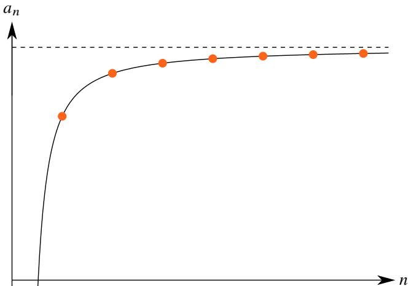  
图 2.6: 单调递增有上界.

# 定理 2.26 (单调有界定理)

设数列 $\left\{ a _ { n } \right\}$

(1) 若 $\left\{ a _ { n } \right\}$ 单调递增且有上界, 则 $\left\{ a _ { n } \right\}$ 收敛且 $\begin{array} { r } { \operatorname* { l i m } _ { n \to \infty } a _ { n } = \operatorname* { s u p } \{ a _ { n } \} } \end{array}$ .   
(2) 若 $\left\{ a _ { n } \right\}$ 单调递减且有下界, 则 $\left\{ a _ { n } \right\}$ 收敛且 $\begin{array} { r } { \operatorname* { l i m } _ { n \to \infty } a _ { n } = \operatorname* { i n f } \{ a _ { n } \} . } \end{array}$ .

证明 只证明 (1). 若 $\left\{ a _ { n } \right\}$ 有上界, 由确界原理可知 $\left\{ a _ { n } \right\}$ 有上确界. 则对于任一 $\varepsilon > 0$ 都存在 $N \in \mathbb { N } ^ { * }$ 使得

$$
\sup  \left\{a _ {n} \right\} - \varepsilon <   a _ {N} \leqslant \sup  \left\{a _ {n} \right\}.
$$

由于 $\left\{ a _ { n } \right\}$ 单调递增,故对于任一 $n > N$ 都有 $a _ { n } \geqslant a _ { N }$ .这表明对于以上给定的 $\varepsilon > 0$ 都存在 $N \in \mathbb { N } ^ { * }$ 使得当 $n > N$ 时都有

$$
\sup  \left\{a _ {n} \right\} - \varepsilon <   a _ {N} \leqslant a _ {n} \leqslant \sup  \left\{a _ {n} \right\}.
$$

于是可知 $\left\{ a _ { n } \right\}$ 收敛, 且 $\begin{array} { r } { \operatorname* { l i m } _ { n \to \infty } a _ { n } = \operatorname* { s u p } \{ a _ { n } \} } \end{array}$ .

注 单调有界定理是第 4 个刻画实数域完备性的定理.

注 由于数列的前有限项不影响其敛散性及其极限值, 因此单调有界定理的条件可以减弱为“当 $n$ 充分大时数列单调递增 (递减)”.

如果一个数列无上界, 那么我们可以把 $+ \infty$ 看作它的上确界; 若无下界, 则可以把 $- \infty$ 看作它的下确界. 在这个意义下, 单调数列一定有极限.

# 定理 2.27

设数列 $\left\{ a _ { n } \right\}$

(1) 若 $\left\{ a _ { n } \right\}$ 单调递增且无上界, 则 $\scriptstyle \operatorname* { l i m } _ { n \to \infty } a _ { n } = + \infty$   
(2) 若 $\left\{ a _ { n } \right\}$ 单调递减且无下界, 则 $\scriptstyle \operatorname* { l i m } _ { n \to \infty } a _ { n } = - \infty$ .

证明 只证明 (1). 由于 $\left\{ a _ { n } \right\}$ 无上界, 故对于任一 $E > 0$ 总存在 $N \in \mathbb { N } ^ { * }$ 满足 $a _ { N } > E$ . 由于 $\left\{ a _ { n } \right\}$ 单调递增, 因此当$n > N$ 时 $a _ { n } \geqslant a _ { N }$ . 这表明对于任一 $E > 0$ 都存在 $N \in \mathbb { N } ^ { * }$ 使得当 $n > N$ 时都有

$$
a _ {n} \geqslant a _ {N} > E.
$$

于是可知 $\textstyle \operatorname* { l i m } _ { n \to \infty } a _ { n } = + \infty$ .

例 2.46 调和级数 调和级数发散于 $+ \infty$ .

证明 调和级数显然单调递增. 由例2.24可知调和级数无界. 于是可知调和级数发散于 $+ \infty$ .

2.25中已经介绍过 $p$ 级数. 现在用单调数列的性质可以完整讨论这类级数的敛散性.

例 $2 . 4 7 p$ 级数 讨论 $p$ 级数的敛散性:

$$
x _ {n} = 1 + \frac {1}{2 ^ {p}} + \frac {1}{3 ^ {p}} + \dots + \frac {1}{n ^ {p}}, \quad n = 1, 2, \dots .
$$

解 容易知道 $\left\{ x _ { n } \right\}$ 单调递增.

(i) 当 $p \leqslant 1$ 时, 由例2.25可知级数无界, 于是可知 $x _ { n } \to + \infty$ .  
(ii) 当 $p > 1$ 时, 由于

$$
\begin{array}{l} x _ {2 ^ {k} - 1} = 1 + \left(\frac {1}{2 ^ {p}} + \frac {1}{3 ^ {p}}\right) + \left(\frac {1}{4 ^ {p}} + \frac {1}{5 ^ {p}} + \frac {1}{6 ^ {p}} + \frac {1}{7 ^ {p}}\right) + \dots + \left[ \frac {1}{(2 ^ {k - 1}) ^ {p}} + \dots + \frac {1}{(2 ^ {k} - 1) ^ {p}} \right] \leqslant 1 + \frac {2}{2 ^ {p}} + \frac {4}{4 ^ {p}} + \dots + \frac {2 ^ {k - 1}}{(2 ^ {k - 1}) ^ {p}} \\ = 1 + \frac {1}{2 ^ {p - 1}} + \frac {1}{4 ^ {p - 1}} + \dots + \frac {1}{\left(2 ^ {k - 1}\right) ^ {p - 1}} = \frac {1 - (1 / 2 ^ {p - 1}) ^ {k}}{1 - 1 / 2 ^ {p - 1}} <   \frac {2 ^ {p - 1}}{2 ^ {p - 1} - 1}. \\ \end{array}
$$

因此当 $p > 1$ 时 $\left\{ x _ { n } \right\}$ 有界. 于是可知 $\left\{ x _ { n } \right\}$ 收敛.

事实上一般的收敛级数的极限值是很难求得的,但相比于求出极限值,我们更关心的是它的敛散性.对于某些递推关系定义的数列, 只要能证明它们的极限存在, 就很容易求出它们的极限. 下面看一个例子.

例 2.48 设数列 $\{ x _ { n } \}$ 满足

$$
x _ {1} = \sqrt {2}, \qquad x _ {n + 1} = \sqrt {2 + x _ {n}}, \quad n = 1, 2, \dots .
$$

则 $x _ { n } \to 2$

证明 由于对于任一 $n \in \mathbb { N } ^ { * }$ 都有

$$
x _ {n + 1} = \underbrace {\sqrt {2 + \sqrt {2 + \cdots + \sqrt {2 + \sqrt {2}}}}} _ {n + 1 \text {重 根 号}} > \underbrace {\sqrt {2 + \sqrt {2 + \cdots + \sqrt {2 + 0}}}} _ {n \text {重 根 号}} = x _ {n}.
$$

因此 $\left\{ x _ { n } \right\}$ 单调递增. 下面用数学归纳法证明 $\{ x _ { n } \}$ 有上界. 显然 $x _ { 1 } = { \sqrt { 2 } } < 2$ . 假设 $x _ { n } < 2$ . 则 $2 + x _ { n } < 4 .$ . 因此

$$
x _ {n + 1} = \sqrt {2 + x _ {n}} <   2.
$$

由数学归纳原理可知 $x _ { n } < 2$ $( n = 1 , 2 , \cdots )$ . 由单调有界定理可知 $\{ x _ { n } \}$ 收敛. 设 $\operatorname* { l i m } x _ { n } = a$ . 由于

$$
(x _ {n + 1}) ^ {2} = 2 + x _ {n}.
$$

两边取极限可得

$$
\lim  _ {n \rightarrow \infty} (x _ {n + 1}) ^ {2} = \lim  _ {n \rightarrow \infty} (2 + x _ {n}) \iff a ^ {2} = 2 + a \iff a = 2, a = - 1.
$$

由于 $x _ { n } > 0$ $( n = 1 , 2 , \cdots ,$ ), 故 $\scriptstyle \operatorname* { l i m } _ { n \to \infty } x _ { n } > 0$ , 于是可知 $\scriptstyle \operatorname* { l i m } _ { n \to \infty } x _ { n } = 2$ .

用单调有界定理证明第 5 个刻画实数域完备性的定理.

# 定理 2.28 (闭区间套定理)

设一列闭区间 $I _ { n } = \left[ a _ { n } , b _ { n } \right]$ $( n = 1 , 2 , \cdots )$ . 若 $I _ { n } \supseteq I _ { n + 1 }$ $( n = 1 , 2 , \cdots )$ . 且 $\begin{array} { r } { \operatorname* { l i m } _ { n  \infty } ( b _ { n } - a _ { n } ) = 0 . } \end{array}$ $\scriptstyle \operatorname* { l i m } _ { n \to \infty }$ , 则存在唯一$c \in [ a _ { n } , b _ { n } ]$ $( n = 1 , 2 , \cdots )$ ), 其中

$$
c = \lim  _ {n \rightarrow \infty} a _ {n} = \lim  _ {n \rightarrow \infty} b _ {n}.
$$

证明 由条件可知, 数列 $\left\{ a _ { n } \right\}$ 和 $\left\{ b _ { n } \right\}$ 都是单调有界的, 由单调有界定理可知它们都收敛. 于是

$$
\lim  _ {n \rightarrow \infty} b _ {n} - \lim  _ {n \rightarrow \infty} a _ {n} = \lim  _ {n \rightarrow \infty} (b _ {n} - a _ {n}) = 0,
$$

令 $\begin{array} { r } { \operatorname* { l i m } _ { n \to \infty } b _ { n } = \operatorname* { l i m } _ { n \to \infty } a _ { n } = c } \end{array}$ , 则 $\operatorname* { i n f } \{ b _ { n } \} = \operatorname* { s u p } \{ a _ { n } \} = c$ . 于是

$$
a _ {n} \leqslant c \leqslant b _ {n}, \quad n = 1, 2, \dots .
$$

这表明 $c \in [ a _ { n } , b _ { n } ]$ $( n = 1 , 2 , \cdots )$ . 假设存在 $c ^ { \prime }$ 满足 $a _ { n } \leqslant c ^ { \prime } \leqslant b _ { n }$ $( n = 1 , 2 , \cdots )$ . 令 $n  \infty$ 得 $c \leqslant c ^ { \prime } \leqslant c$ . 因此$c = c ^ { \prime }$ , 于是可知这样的 $c$ 唯一存在. ■

注 闭区间套定理 (nested intervals theorem) 是第 5 个刻画实数域完备性的定理.

注 用闭区间套定理可以立刻证明无尽小数和数轴上的点一一对应.

闭区间套定理需要满足三个条件:

$1 ^ { \circ }$ 要确保一个区间套在一个区间之中.  
$2 ^ { \circ }$ 要确保所有区间都是闭区间.  
$3 ^ { \circ }$ 要确保闭区间序列的长度的极限是 0.

如果把闭区间套改成开区件套, 其余条件不变, 那么结论就不一定成立. 下面看两个例子.

例 2.49 对比一下两种情况:

(1) 设一列开区间 $I _ { n } = ( 0 , 1 / n )$ $( n = 1 , 2 , \cdots )$ . 它满足 $I _ { n } \supseteq I _ { n + 1 }$ $( n = 1 , 2 , \cdots )$ , 且 $( b _ { n } - a _ { n } ) \to 0$ , 此时不存在任何元素同时属于 $I _ { n }$ $( n = 1 , 2 , \cdots )$ .  
(2) 设一列开区间 $I _ { n } = ( - 1 / n , 1 / n )$ $( n = 1 , 2 , \cdots )$ ). 它满足 $I _ { n } \supseteq I _ { n + 1 }$ $( n = 1 , 2 , \cdots )$ , 且 $( b _ { n } - a _ { n } )  0$ , 此时存在唯一元素 $0 \in I _ { n }$ $( n = 1 , 2 , \cdots )$ .

证明 (1) 假设 $\xi \in I _ { n }$ $( n = 1 , 2 , \cdots )$ . 则对于任一 $n \in \mathbb { N } ^ { * }$ 都有 $0 < \xi < 1 / n .$ . 现在令 $n = [ 1 / \xi ] + 1$ 则 $\xi > 1 / n$ , 出现矛盾. 因此假设不成立. 于是可知不存在任何元素同时属于 $I _ { n }$ $( n = 1 , 2 , \cdots )$ .  
(2) 由于 $- 1 / n < 0 < 1 / n$ $( n = 1 , 2 , \cdots )$ , 故 $0 \in I _ { n }$ . 假设存在 $\xi \neq 0$ 满足 $\xi \in I _ { n }$ $( n = 1 , 2 , \cdots )$ . 则对于任一$n \in \mathbb { N } ^ { * }$ 都有 $- 1 / n < \xi < 1 / n .$ 不妨设 $\xi > 0 .$ . 则 $0 < \xi < 1 / n$ . 由 (1) 的讨论可知这样的 $\xi$ 不存在. 于是可知存在唯一元素 $0 \in I _ { n }$ $( n = 1 , 2 , \cdots )$ .

# 2.5.2 自然常数 e 和 Euler 常数 ??

下面我们用单调有界定理来解决一个实际问题. 假设一家银行的每年的定期存款利率为 $r ,$ . 为了简化问题, 我们不妨设 $r = 1 0 0 \%$ . 那么一元本金一年后的本利和为 $( 1 + 1 0 0 \% ) ^ { 1 } = 2$ 元. 现在我们和银行家商量, 能否半年结息

一次 (按复利计算), 银行家同意了. 于是一元本金一年后的本利和为

$$
\left(1 + \frac {100 \%}{2}\right) ^ {2} = \left(1 + \frac {1}{2}\right) ^ {2} = 2.25 (\text{元}).
$$

我们发现得到的本利和增加了. 于是我们希望能进一步提高结息的频率. 我们发现

$$
\left(1 + \frac {1}{3}\right) ^ {3} \approx 2. 3 7 (\text {元}), \qquad \left(1 + \frac {1}{4}\right) ^ {4} \approx 2. 4 4 (\text {元}), \qquad \left(1 + \frac {1}{5}\right) ^ {5} \approx 2. 4 9 (\text {元}), \qquad \left(1 + \frac {1}{6}\right) ^ {6} \approx 2. 5 2 (\text {元}), \qquad \dots .
$$

果然, 结息频率越高, 得到的本利和越高. 但是我们观察到每次增加的利息越来越少. 设数列

$$
e _ {n} = \left(1 + \frac {1}{n}\right) ^ {n}, \quad n = 1, 2, \dots .
$$

于是以上问题就归结为 $\left\{ \boldsymbol { e } _ { n } \right\}$ 是否收敛. 容易看出它是单调递增的, 因此问题进一步归结为 $\left\{ \boldsymbol { e } _ { n } \right\}$ 是否有上界.

# 命题 2.28

以下数列收敛

$$
e _ {n} = \left(1 + \frac {1}{n}\right) ^ {n}, \quad n = 1, 2, \dots
$$

证明 (i) 先证明 $\{ e _ { n } \}$ 是单调递增的. 由均值不等式可知

$$
e _ {n} = \left(1 + {\frac {1}{n}}\right) ^ {n} = 1 \cdot \underbrace {\left(1 + {\frac {1}{n}}\right) \cdots \left(1 + {\frac {1}{n}}\right)} _ {n   \text {个}} <   \left[ {\frac {1 + n (1 + 1 / n)}{n + 1}} \right] ^ {n + 1} = \left(1 + {\frac {1}{n + 1}}\right) ^ {n + 1} = e _ {n + 1}, \quad n = 1, 2, \dots .
$$

于是可知 $\{ e _ { n } \}$ 严格单调递增.

(ii) 再证明 $\left\{ \boldsymbol { e } _ { n } \right\}$ 有上界. 由二项式定理得

$$
\begin{array}{l} e _ {n} = \sum_ {i = 0} ^ {n} \mathrm {C} _ {n} ^ {i} \frac {1}{n ^ {i}} = \sum_ {i = 0} ^ {n} \frac {n (n - 1) \cdots (n - i + 1)}{i ! n ^ {i}} = \sum_ {i = 0} ^ {n} \frac {1}{i !} \left(1 - \frac {1}{n}\right) \left(1 - \frac {2}{n}\right) \dots \left(1 - \frac {i - 1}{n}\right) \\ \leqslant \sum_ {i = 0} ^ {n} \frac {1}{i !} = 1 + \frac {1}{1 !} + \frac {1}{2 !} + \dots + \frac {1}{n !} \leqslant 1 + 1 + \frac {1}{2} + \frac {1}{2 ^ {2}} + \dots + \frac {1}{2 ^ {n - 1}} = 1 + \frac {1 - \frac {1}{2 ^ {n}}}{\frac {1}{2}} = 3 - \frac {1}{2 ^ {n - 1}} <   3. \\ \end{array}
$$

故 $\left\{ \boldsymbol { e } _ { n } \right\}$ 有上界.

综合 (i) 和 (ii) 由单调有界定理可知数列 $\left\{ \boldsymbol { e } _ { n } \right\}$ 收敛.

注 单调性的证明也可以从展开式中直接观察得到.

# 定义 2.27 (自然常数)

令

$$
e := \lim  _ {n \rightarrow \infty} \left(1 + \frac {1}{n}\right) ^ {n}.
$$

我们称 e 为自然常数 (natural constant).

e 被称为“自然常数”, 是因为很多自然规律都有这个常数的身影, 包括细胞分裂等, 著名的“黄金分割”,“Fibonacci 数列”以及金融学中的“复利”都与它有关. 后面我们还会看到指数函数, 对数函数, 三角函数, 双曲函数以及复数都和自然常数有密切联系.在后面的一元微分学中我们将看到以e为底的指数函数和对数函数具有“非常好”的性质.

用类似地方法可以研究另一个数列.

例 2.50 设数列

$$
x _ {n} = \left(1 + \frac {1}{n}\right) ^ {n + 1}, \quad n = 1, 2, \dots .
$$

则 $\left\{ x _ { n } \right\}$ 严格单调递减趋于 e.

证明 由于 $( 1 + 1 / n ) ^ { n } \to { \mathsf { e } } .$ , 故

$$
\lim  _ {n \rightarrow \infty} x _ {n} = \lim  _ {n \rightarrow \infty} \left[\left(1 + \frac {1}{n}\right) ^ {n} \left(1 + \frac {1}{n}\right)\right] = e.
$$

由均值不等式可知

$$
\frac {1}{x _ {n}} = \left(\frac {n}{n + 1}\right) ^ {n + 1} = 1 \cdot \underbrace {\left(\frac {n}{n + 1}\right) \cdots \left(\frac {n}{n + 1}\right)} _ {n + 1 \text {个}} <   \left[ \frac {1 + (n + 1) \left(\frac {n}{n + 1}\right)}{n + 2} \right] ^ {n + 2} = \left(\frac {n + 1}{n + 2}\right) ^ {n + 2} = \frac {1}{x _ {n + 1}}, \quad n = 1, 2, \dots .
$$

因此 $x _ { n } > x _ { n + 1 }$ $( n = 1 , 2 , \cdots )$ . 于是可知 $\{ x _ { n } \}$ 严格单调递减趋于 e.

注 由于 $( 1 + 1 / n ) ^ { n }$ 严格递增趋于 e, 而 $( 1 + 1 / n ) ^ { n + 1 }$ 严格递减趋于 e, 因此立刻可得一个有用的不等式

$$
\left(1 + \frac {1}{n}\right) ^ {n} <   \mathrm {e} <   \left(1 + \frac {1}{n}\right) ^ {n + 1}, \quad n = 1, 2, \dots . \tag {2.6}
$$

然后可以进一步得到

$$
\frac {1}{n + 1} <   \ln \left(1 + \frac {1}{n}\right) <   \frac {1}{n}, \quad n = 1, 2, \dots . \tag {2.7}
$$

于是

$$
\frac {1}{2} <   \ln 2 <   1, \quad \frac {1}{3} <   \ln \frac {3}{2} <   \frac {1}{2}, \quad \dots , \quad \frac {1}{n + 1} <   \ln \frac {n + 1}{n} <   \frac {1}{n}.
$$

把以上各式相加得

$$
\frac {1}{2} + \frac {1}{3} + \dots + \frac {1}{n + 1} <   \ln (n + 1) <   1 + \frac {1}{2} + \dots + \frac {1}{n}. \tag {2.8}
$$

以上三个不等式都非常有用.

从估计数列 $( 1 + 1 / n ) ^ { n }$ 上界的过程中可以看出

$$
\left(1 + \frac {1}{n}\right) ^ {n} \leqslant 1 + \frac {1}{1 !} + \frac {1}{2 !} + \dots + \frac {1}{n !} <   3, \quad n = 1, 2, \dots .
$$

令

$$
\widetilde {e} _ {n} = 1 + \frac {1}{1 !} + \frac {1}{2 !} + \dots + \frac {1}{n !}, \quad n = 1, 2, \dots .
$$

以上不等式表明数列 $\widetilde { e } _ { n }$ 也有上界, 而且 $\{ \widetilde { e } _ { n } \}$ 显然是严格单调递增的. 因此由单调有界定理立刻可知 $\{ \widetilde { e } _ { n } \}$ 也收敛.容易想到 $\{ \widetilde { e } _ { n } \}$ 的极限值可能等于 $\left\{ \boldsymbol { e } _ { n } \right\}$ 的极限值.

# 命题 2.29

设数列

$$
\widetilde {e} _ {n} = 1 + \frac {1}{1 !} + \frac {1}{2 !} + \dots + \frac {1}{n !}, \quad n = 1, 2, \dots .
$$

则 $\begin{array} { r } { \operatorname* { l i m } _ { n  \infty } \widetilde { e } _ { n } = { \mathrm e } } \end{array}$

证明 已经证明 $\{ \widetilde { e } _ { n } \}$ 是收敛的. 只需证明 $\begin{array} { r } { \operatorname* { l i m } _ { n \to \infty } \widetilde { e } _ { n } = \operatorname* { l i m } _ { n \to \infty } e _ { n } } \end{array}$

(i) 由于

$$
e _ {n} = \left(1 + \frac {1}{n}\right) ^ {n} \leqslant 1 + \frac {1}{1 !} + \frac {1}{2 !} + \dots + \frac {1}{n !} = \widetilde {e} _ {n}.
$$

由极限的保序性可知 $\begin{array} { r } { \operatorname* { l i m } _ { n \to \infty } e _ { n } \leqslant \operatorname* { l i m } _ { n \to \infty } \widetilde { e } _ { n } } \end{array}$ .

(ii) 给定 $m \leqslant n$ , 则

$$
e _ {n} = \sum_ {i = 0} ^ {n} \frac {1}{i !} \left(1 - \frac {1}{n}\right) \left(1 - \frac {2}{n}\right) \dots \left(1 - \frac {i - 1}{n}\right) \geqslant \sum_ {i = 0} ^ {m} \frac {1}{i !} \left(1 - \frac {1}{n}\right) \left(1 - \frac {2}{n}\right) \dots \left(1 - \frac {i - 1}{n}\right)
$$

令 $n \to \infty$ , 由保序性可知

$$
\lim  _ {n \rightarrow \infty} e _ {n} \geqslant \sum_ {i = 0} ^ {m} \frac {1}{i !}.
$$

令 $m \to \infty$ , 则有 $\begin{array} { r } { \operatorname* { l i m } _ { n \to \infty } e _ { n } \geqslant \operatorname* { l i m } _ { n \to \infty } \widetilde { e } _ { n } } \end{array}$ .

综合 (i) 和 (ii) 可知 $\begin{array} { r } { \operatorname* { l i m } _ { n  \infty } \widetilde { e } _ { n } = \operatorname* { l i m } _ { n  \infty } e _ { n } = { \mathrm { e } } , } \end{array}$

在实际应用中我们更多地使用数列 $\{ \widetilde { e } \}$ 来计算 e 的近似值. 这是因为 {??} 收敛得“更快”.

<table><tr><td>n</td><td>1</td><td>2</td><td>3</td><td>4</td><td>5</td><td>6</td><td>7</td><td>8</td></tr><tr><td>en</td><td>2.00000</td><td>2.25000</td><td>2.37037</td><td>2.44140</td><td>2.48832</td><td>2.52163</td><td>2.54650</td><td>2.56578</td></tr><tr><td>en</td><td>2.00000</td><td>2.50000</td><td>2.66667</td><td>2.70833</td><td>2.71667</td><td>2.71806</td><td>2.71825</td><td>2.71828</td></tr></table>

下面我们来估计用 $\{ \widetilde { e } \}$ 计算 e 的近似值的误差.

例 2.51 估计用 ${ \widetilde { e } } _ { 8 }$ 计算 e 的近似值时的误差.

解 由于

$$
\begin{array}{l} \widetilde {e} _ {n + m} - \widetilde {e} _ {n} = \frac {1}{(n + 1) !} + \frac {1}{(n + 2) !} + \dots + \frac {1}{(n + m) !} = \frac {1}{(n + 1) !} \left[ 1 + \frac {1}{n + 2} + \dots + \frac {1}{(n + 2) \cdots (n + m)} \right] \\ \leqslant \frac {1}{(n + 1) !} \left[ 1 + \frac {1}{n + 2} + \dots + \left(\frac {1}{n + 2}\right) ^ {m - 1} \right] = \frac {1}{(n + 1) !} \cdot \frac {1 - \left(\frac {1}{n + 2}\right) ^ {m}}{1 - \frac {1}{n + 2}} \\ <   \frac {1}{(n + 1) !} \cdot \frac {1}{1 - \frac {1}{n + 2}}, \quad n = 1, 2, \dots . \\ \end{array}
$$

令 $m \to \infty$ , 由极限的保序性可知

$$
\mathrm {e} - \widetilde {e} _ {n} \leqslant \frac {1}{(n + 1) !} \cdot \frac {1}{1 - \frac {1}{n + 2}} <   \frac {1}{(n + 1) !} \cdot \frac {1}{1 - \frac {1}{n + 1}} = \frac {1}{n ! n}, \quad n = 1, 2, \dots . \tag {2.9}
$$

于是可以估计 ${ \widetilde { e _ { 8 } } }$ 的误差:

$$
e - \widetilde {e} _ {8} <   \frac {1}{8 ! 8} <   3. 2 \times 1 0 ^ {- 6} <   1 0 ^ {- 5}.
$$

这表明用 $\widetilde { e _ { 8 } }$ 计算得到的近似值误差小于 $1 0 ^ { - 5 }$ .

注 不等式2.9可以写成等式

$$
e = \widetilde {e} _ {n} + \frac {\theta}{n ! n} = 1 + \frac {1}{1 !} + \frac {1}{2 !} + \dots + \frac {1}{n !} + \frac {\theta}{n ! n}, \quad n = 1, 2, \dots ,
$$

其中 $\theta \in ( 0 , 1 )$ .

我们已经看到 $2 < { \mathsf { e } } < 3$ , 因此 e 一定不是整数, 下面我们来看它是不是一个有理数.

# 定理 2.29

自然常数 e 是一个无理数.

证明 用反证法. 假设 $\mathrm { e } = p / q$ $( p , q \in \mathbb { N } ^ { * } )$ . 由于 $2 < \mathrm { e } < 3$ , 故知 e 不是整数. 故 $q \geqslant 2$ . 由不等式2.9可知

$$
0 <   \mathrm {e} - \widetilde {e} _ {q} <   \frac {1}{q ! q} \Longrightarrow 0 <   q! (\mathrm {e} - \widetilde {e} _ {q}) <   \frac {1}{q} \leqslant \frac {1}{2}.
$$

这表明 $q ! ( \mathrm { e } - \widetilde { e } _ { q } )$ 不是整数. 由于 ${ \mathrm { e } } = p / q$ , 故

$$
q! (\mathfrak {e} - \widetilde {e} _ {q}) = q! \left[ \frac {p}{q} - \left(1 + \frac {1}{1 !} + \frac {1}{2 !} + \dots + \frac {1}{q !}\right) \right] = (q - 1)! p - (q! + q! + 3 \cdot 4 \cdot \cdot \cdot q + \cdot \cdot \cdot + 1) \in \mathbb {Z}.
$$

出现矛盾. 于是可知 e 是一个无理数.

综合以上讨论我们发现 $\left\{ \boldsymbol { e } _ { n } \right\}$ 和 $\{ \widetilde { e } _ { n } \}$ 都是有理数数列,但它们却收敛于一个无理数e.由此可见,通过一个“无限的过程”有理数可以“跃迁为”实数. 也说明经历一个无限过程会发生 “质变”. 后面还将看到在无限过程发生的其它质变.

用单调有界定理还可以研究另一个重要数列.

# 命题 2.30 (Euler 常数)

设两个数列

$$
x _ {n} = 1 + \frac {1}{2} + \frac {1}{3} + \dots + \frac {1}{n} - \ln (n + 1), \quad n = 1, 2, \dots .
$$

$$
y _ {n} = 1 + \frac {1}{2} + \frac {1}{3} + \dots + \frac {1}{n} - \ln n, \quad n = 1, 2, \dots .
$$

则 $\left\{ x _ { n } \right\}$ 和 $\left\{ y _ { n } \right\}$ 收敛到同一实数.

证明 (i) 先证明 $\{ x _ { n } \}$ 收敛. 由不等式2.7可知

$$
x _ {n + 1} - x _ {n} = \frac {1}{n + 1} - \ln (n + 2) + \ln (n + 1) = \frac {1}{n + 1} - \ln \left(1 + \frac {1}{n + 1}\right) > 0, \quad n = 1, 2, \dots .
$$

因此 $\left\{ x _ { n } \right\}$ 严格递增. 由不等式2.8可知

$$
x _ {n} = 1 + \frac {1}{2} + \frac {1}{3} + \dots + \frac {1}{n} - \ln (n + 1) <   1 - \frac {1}{n + 1} <   1, \quad n = 1, 2, \dots .
$$

因此 $\left\{ x _ { n } \right\}$ 有上界. 于是可知 $\{ x _ { n } \}$ 收敛 .

(ii) 由于

$$
y _ {n + 1} = 1 + \frac {1}{2} + \frac {1}{3} + \dots + \frac {1}{n} + \frac {1}{n + 1} - \ln (n + 1) = x _ {n} + \frac {1}{n + 1}, \quad n = 1, 2, \dots , n.
$$

于是可知 $\{ y _ { n } \}$ 也收敛, 且

$$
\lim  _ {n \rightarrow \infty} y _ {n} = \lim  _ {n \rightarrow \infty} y _ {n + 1} = \lim  _ {n \rightarrow \infty} \left(x _ {n} + \frac {1}{n + 1}\right) = \lim  _ {n \rightarrow \infty} x _ {n} + \lim  _ {n \rightarrow \infty} \frac {1}{n + 1} = \lim  _ {n \rightarrow \infty} x _ {n}.
$$

注 以上数列的极限称为 Euler 常数 (Euler constant), 记作 ??. 需要注意, 欧拉常数虽然极有可能是无理数, 但至今尚未证明它的无理性.

注 用 (i) 的方法直接证明 $\left\{ y _ { n } \right\}$ 收敛. 由不等式2.7可知

$$
y _ {n + 1} - y _ {n} = \frac {1}{n + 1} - \ln (n + 1) + \ln n = \frac {1}{n + 1} - \ln \frac {n + 1}{n} <   0, \quad n = 1, 2, \dots .
$$

因此 $\{ y _ { n } \}$ 严格递减数列. 由不等式2.8可知

$$
y _ {n + 1} = 1 + \frac {1}{2} + \frac {1}{3} + \dots + \frac {1}{n + 1} - \ln (n + 1) > \frac {1}{n + 1} > 0, \quad n = 1, 2, \dots .
$$

因此 $\{ y _ { n } \}$ 有下界. 因此 $\{ y _ { n } \}$ 严格递减趋于 ??. 因此我们有等式

$$
1 + \frac {1}{2} + \dots + \frac {1}{n} = \ln n + \gamma + \varepsilon_ {n}, \quad n = 1, 2, \dots .
$$

其中 $\varepsilon _ { n } \to 0$ . 这个等式揭示了调和级数与对数函数之间的关系. 今后我们还要进一步研究这个等式.

# 2.5.3 子列和极限点

并不是每个数列都有极限.但可以从中取出“一部分”使得它有极限.例如数列 $a _ { n } = ( - 1 ) ^ { n }$ $( n = 1 , 2 , \cdots )$ ) 是发散的. 但可以分别取出它的奇数项和偶数项, 这样就可以得到两个数列

$$
a _ {2 n} \equiv 1, \quad a _ {2 n - 1} \equiv - 1.
$$

显然它们分别收敛到 1 和 −1. 虽然 $\left\{ a _ { n } \right\}$ 不收敛, 但通过 $\left\{ a _ { 2 n } \right\}$ 和 $\left\{ a _ { 2 n - 1 } \right\}$ 也能研究它的变化趋势. 于是引出了以下概念.

# 定义 2.28 (子列)

设数列 $\left\{ a _ { n } \right\}$ . 若 $k _ { i } \in \mathbb { N } ^ { * }$ $( i = 1 , 2 , \cdots )$ 满足 $k _ { 1 } < k _ { 2 } < \cdots$ . 则称数列 $\{ a _ { k _ { n } } \}$ 为 $\left\{ a _ { n } \right\}$ 的一个子列 (subsequence).

注 从一个数列中取出一个子列需要做到两点: 第一是必须取出无穷多项, 第二是取出的项需要保持原来的先后顺序.

注 子列可以看作一个复合映射

$$
\mathbb {N} ^ {*} \to \mathbb {N} ^ {*} \to \mathbb {R}
$$

$$
n \mapsto k _ {n} \mapsto a _ {k _ {n}}.
$$

注 按以上定义 $\left\{ a _ { n } \right\}$ 也可以看作它自己的一个子列.

# 命题 2.31

设数列 $\left\{ a _ { n } \right\}$ . 若 $\{ a _ { k _ { n } } \}$ 是 $\left\{ a _ { n } \right\}$ 的一个子列. 则 $k _ { n } \geqslant n$ $( n = 1 , 2 , \cdots )$ .

证明 对 $n$ 进行归纳. 显然有 $k _ { 1 } \geqslant 1 .$ . 假设 $k _ { n } \geqslant n$ 成立. 由子列的定义可知

$$
k _ {n + 1} > k _ {n} \geqslant n.
$$

因此 $k _ { n + 1 } \geqslant n + 1 .$ 有数学归纳原理可知对于一切 $n \in \mathbb { N } ^ { * }$ 命题都成立.

收敛数列的子列显然有以下结论.

# 定理 2.30

设数列 $\left\{ a _ { n } \right\}$ . 则 $a _ { n } \to a \in { \overline { { \mathbb { R } } } }$ 当且仅当 $\left\{ a _ { n } \right\}$ 任一子列的极限值都是 $a$ .

证明 只证明 $a \in \mathbb { R }$ 的情况.

(i) 证明必要性. 若 $\operatorname* { l i m } _ { n \to \infty } a _ { n } = a$ . 则对于任一 $\varepsilon > 0$ 都存在 $N \in \mathbb { N } ^ { * }$ 使得当 $n > N$ 时 $| a _ { n } - a | < \varepsilon .$ . 任取一个 $\left\{ a _ { n } \right\}$ 的子列 $\{ a _ { k _ { n } } \}$ . 由于 $k _ { n } \geqslant n$ $( n = 1 , 2 , \cdots )$ . 因此当 $n > N$ 时 $k _ { n } \geqslant n > N$ , 因此 $| a _ { k _ { n } } - a | < \varepsilon$ . 于是可知$\operatorname* { l i m } _ { n \to \infty } a _ { k _ { n } } = a$ .  
(ii) 证明充分性. 当 $\left\{ a _ { n } \right\}$ 任一子列都收敛于 $a$ 时, 由于 $\left\{ a _ { n } \right\}$ 本身就是 $\left\{ a _ { n } \right\}$ 的一个子列, 因此 $\operatorname* { l i m } _ { n \to \infty } a _ { n } = a$ .■

根据以上定理,若要证明 $a _ { n } \to a$ ,就需要证明 $\left\{ a _ { n } \right\}$ 的任一子列都趋于 $^ { a }$ .但在实际应用中并不需要如此麻烦.

# 命题 2.32

设数列 $\left\{ a _ { n } \right\}$ . 则

$$
\lim  _ {n \rightarrow \infty} a _ {n} = a \iff \lim  _ {k \rightarrow \infty} a _ {2 k} = \lim  _ {k \rightarrow \infty} a _ {2 k - 1} = a.
$$

证明 只需证明充分性. 只证明 $a \in \mathbb { R }$ 的情况. 若

$$
\lim  _ {k \rightarrow \infty} a _ {2 k} = \lim  _ {k \rightarrow \infty} a _ {2 k - 1} = a.
$$

则对于任一 $\varepsilon > 0$ 都存在 $K _ { 1 }$ $K _ { 1 } , K _ { 2 } \in \mathbb { N } ^ { * }$ 使得

$$
\left| a _ {2 k} - a \right| <   \varepsilon , \quad \forall k > K _ {1},
$$

$$
\left| a _ {2 k - 1} - a \right| <   \varepsilon , \quad \forall k > K _ {2}.
$$

令 $N = \operatorname* { m a x } \{ 2 K _ { 1 } , 2 K _ { 2 } - 1 \}$ , 则当 $n > N$ 时 $\left| a _ { n } - a \right| < \varepsilon$ . 于是可知 $\operatorname* { l i m } _ { n \to \infty } a _ { n } = a$

注 更一般地, 若 $a _ { n }$ 的子列 $\left\{ b _ { n } ^ { ( 1 ) } \right\} , \left\{ b _ { n } ^ { ( 2 ) } \right\} , \cdots , \left\{ b _ { n } ^ { ( k ) } \right\}$ 都趋于 $a$ , 且它们的并是 $\left\{ a _ { n } \right\}$ , 则 $a _ { n } \to a$

利用以上性质可以证明 $\{ \sin n \}$ 的发散性.

例 2.52 数列 $\{ \sin n \}$ 的发散.

证明 假设 $\sin n  a$ . 由于

$$
\sin (n + 1) - \sin (n - 1) = 2 \sin 1 \cos n, \quad n = 1, 2, \dots .
$$

令 $n \to \infty$ 得

$$
0 = 2 \sin 1 \lim  _ {n \rightarrow \infty} \cos n \iff \lim  _ {n \rightarrow \infty} \cos n = 0.
$$

由于

$$
\sin 2 n = 2 \sin n \cos n, \quad n = 1, 2, \dots .
$$

令 $n \to \infty$ 得

$$
\lim  _ {n \rightarrow \infty} \sin 2 n = 2 \lim  _ {n \rightarrow \infty} \sin n \cos n.
$$

由于 $\sin n  a$ . 故它的子列 $\sin 2 n  a$ . 于是上式变为

$$
a = 2 \lim  _ {n \rightarrow \infty} \sin n \lim  _ {n \rightarrow \infty} \cos n = 0.
$$

由于

$$
\sin^ {2} n + \cos^ {2} n = 1, \quad n = 1, 2, \dots .
$$

令 $n \to \infty$ 得 $a ^ { 2 } = 1$ . 出现矛盾. 于是可知数列 $\{ \sin n \}$ 发散.

通过收敛子列可以研究发散的数列. 那么是不是每个有界的数列都存在收敛的子列呢?

# 定理 2.31 (Bolzano-Weierstrass 定理)

在 $\mathbb { R }$ 中, 任一有界数列都存在收敛子列.

证明 证法一 设有界数列 $\left\{ a _ { n } \right\}$ . 若 $\left\{ a _ { n } \right\}$ 是单调的, 则命题显然成立. 下设 $\left\{ a _ { n } \right\}$ 不是单调数列. 由单调有界定理可知, 若 $\left\{ a _ { n } \right\}$ 中存在一个单调子列, 则这个子列收敛. 因此只需找到一个这样的子列. 为此先定义一个概念: 若存在$a _ { N }$ , 使得当 $n > N$ 时都有 $a _ { n } < a _ { N }$ , 则称 $a _ { N }$ 是 $\left\{ a _ { n } \right\}$ 中的一个“龙头项”.

(i) 当 $\left\{ a _ { n } \right\}$ 有无穷多个“龙头项”时, 我们只需把它们依次取出就可以得到一个严格递减的子列.  
(ii) 当 $\left\{ a _ { n } \right\}$ 只有有限个“龙头项”时, 我们取出最后一个龙头项的下一项 $\boldsymbol { a } _ { k _ { 1 } }$ . 由于它不是龙头项, 因此它后面一定存在一项 $a _ { k _ { 2 } } \geqslant a _ { k _ { 1 } }$ . 如此依次进行下去就可以得到一个子列 $\{ a _ { k _ { n } } \}$ , 显然它是单调递增的.

证法二 设有界数列 $\left\{ a _ { n } \right\}$ . 则存在 $x , y \in \mathbb { R }$ 满足 $x \leqslant a _ { n } \leqslant y$ $( n = 1 , 2 , \cdots )$ . 取闭区间 $[ x , y ]$ 的中点, 则可得到两个闭子区间

$$
\left[ x, \frac {x + y}{2} \right], \quad \left[ \frac {x + y}{2}, y \right].
$$

以上两个闭区间中至少有一个含有 $\left\{ a _ { n } \right\}$ 的无穷多项. 把这个闭子区间记作 $\left[ x _ { 1 } , y _ { 1 } \right]$ (如果两个区间都含有 $\left\{ a _ { n } \right\}$ 的无穷多项,则一律取右边的区间,以下同此规定).取 $\left[ x _ { 1 } , y _ { 1 } \right]$ 的中点,又可以得到两个闭子区间.它们中至少有一个含有 $\left\{ a _ { n } \right\}$ 的无穷多项. 把这个闭子区间记作 $\left[ x _ { 2 } , y _ { 2 } \right]$ . 这个过程可以无限进行下去, 依次操作可得一列闭区间

$$
[ x _ {1}, y _ {1} ] \supseteq [ x _ {2}, y _ {2} ] \supseteq \dots \supseteq [ x _ {n}, y _ {n} ] \dots .
$$

其中第 $n$ 个闭区间 $\left[ x _ { n } , y _ { n } \right]$ 的长度为

$$
y _ {n} - x _ {n} = \frac {y - x}{2 ^ {n}} \rightarrow 0.
$$

由闭区间套定理可知存在唯一 $\xi \in \mathbb { R }$ 满足 $\xi \in \left[ x _ { n } , y _ { n } \right]$ $( n = 1 , 2 , \cdots )$ . 下面来找一个收敛于 $\xi$ 的子列. 在 $\left[ x _ { 1 } , y _ { 1 } \right]$ 中选取一项记作 $b _ { 1 }$ . 由于 $\left[ x _ { 2 } , y _ { 2 } \right]$ 中有无穷多项, 因此总能找到位于 $b _ { 1 }$ 之后的项, 把它记作 $b _ { 2 }$ . 依次下去可以得到$\left\{ a _ { n } \right\}$ 的一个子列 $\left\{ b _ { n } \right\}$ . 它满足 $b _ { n } \in [ x _ { n } , y _ { n } ]$ $( n = 1 , 2 , \cdots )$ ). 由于

$$
\left| b _ {n} - \xi \right| \leqslant y _ {n} - x _ {n} = \frac {y - x}{2 ^ {n}} \rightarrow 0.
$$

因此 $b _ { n } \to \xi .$ . 这表明有界数列 $\left\{ a _ { n } \right\}$ 存在一个收敛到 $\xi$ 的子列 $\left\{ b _ { n } \right\}$ .

注 Bolzano-Weierstrass 定理是第 6 个刻画实数域完备性的定理.

注 1817 年 Bolzano 在证明介值定理 (将在下一章介绍) 时顺便证明了以上定理. 他用的方法就是 证法二 , 这个方法称为二分法 (Bisection method). 大约 50 多年后 Weierstrass 独立发现并证明这个定理, 并确立了这个定理在数分分析中的基础性地位.

Bolzano-Weierstrass 定理可以刻画实数的完备性. 在有界的有理数数集中, 未必有收敛的子列. 例如有界数集[2, 3] ∩ Q 中的数列 $\{ ( 1 + 1 / n ) ^ { n } \}$ 没有收敛子列. 这是因为 $\{ ( 1 + 1 / n ) ^ { n } \}$ 不收敛于任何有理数.

上一章中我们用 Heine-Borel 条件定义了紧集. 现在我们用 Bolzano-Weierstrass 条件来定义 “列紧集”.

# 定义 2.29 (列紧集)

设集合 $E \subseteq \mathbb { R } .$ . 若 $E$ 中的任一数列都有一个收敛于 $E$ 中一点的子列, 则称 $E$ 是 $\mathbb { R }$ 上的一个列紧集 (sequen-tially compact set).

注 因此 Bolzano-Weierstrass 定理也称为列紧性定理 .

根据以上定义我们可以把 Bolzano-Weierstrass 定理表述为以下形式.

# 定理 2.32 (Bolzano-Weierstrass 定理)

R 中的任一有限闭区间都是列紧集.

注 R 中的开区间不是列紧集, 因此可以在开区间中找到一个数列区域区间端点.

注 $\mathbb { R }$ 中的任一有限闭区间都是紧集, 也是列紧集. 后面将证明在实数集中紧性和列紧性是等价的. 从字面上看, 所谓 “列紧”, 就是用 “数列” 刻画的 “紧性”. 但列紧和紧是两种不同的拓扑性质, 不能混淆. 在更深的主题中可以看出它们的差别.

Bolzano-Weierstrass 定理的结论可以推广到无界数列.

# 定理 2.33

在 $\mathbb { R }$ 中, 任一数列都能找到一个有极限的子列.

证明 设数列 $\left\{ a _ { n } \right\}$ .只证明 $\left\{ a _ { n } \right\}$ 无上界的情况.此时任一邻域 $N _ { E } ( + \infty )$ 中都有 $\left\{ a _ { n } \right\}$ 中的无穷多项.我们先在 $M +$ $1 , + \infty )$ 中取一项 $\boldsymbol { a } _ { k _ { 1 } }$ . 然后在 $\left( M + 2 , + \infty \right)$ 中取出位于 $\boldsymbol { a } _ { k _ { 1 } }$ 之后的一项 $\boldsymbol { a } _ { k _ { 2 } }$ . 归纳可知对于任一 $n \in \mathbb { N } ^ { * }$ 存在 $k _ { n } >$ $\cdots > k _ { 2 } > k _ { 1 }$ 使得

$$
M + n <   a _ {k _ {n}}.
$$

令 $n \to \infty$ , 由夹逼定理可知 $\operatorname* { l i m } _ { n \to \infty } a _ { k _ { n } } = + \infty .$ . 这表明无上界的数列一定存在极限是 $+ \infty$ 的子列.

于是我们引出了以下概念.

# 定义 2.30 (极限点)

在 $\mathbb { R }$ 中, 数列 $\left\{ a _ { n } \right\}$ 的子列的极限称为 $\left\{ a _ { n } \right\}$ 的极限点 (limit point) 或聚点 (cluster point, accumulation point).

注 数列的极限点可以是 $+ \infty$ 或 $- \infty$ .

根据以上定义, Bolzano-Weierstrass 定理可以写成以下形式.

# 定理 2.34

在 R 中, 任一数列都有极限点.

注 因此 Bolzano-Weierstrass 定理也称为聚点定理 .

注 显然, 数列有极限当且仅当它只有一个极限点.

我们也可以从几何的角度来描述极限点. 为此需要先定义“去心邻域”.

# 定义 2.31 (去心邻域)

给定 $a \in { \overline { { \mathbb { R } } } }$ . 令

$$
\tilde {N} _ {r} (a) := N _ {r} (a) \backslash \{a \}.
$$

其中 $r$ 是任一正实数. 我们把 $\check { N } _ { r } ( a )$ 称为以 $a$ 为中心, $r$ 为半径的去心邻域 (deleted neighborhood). 在不强调半径的情况下 $\check { N } _ { r } ( a )$ 可以简记作 $\check { N } ( a )$ .

# 定理 2.35

在 $\mathbb { R }$ 中, 设数列 $\left\{ a _ { n } \right\}$ . 若 $a$ 的任一去心邻域 $\check { N } ( a )$ 都包含 $\left\{ a _ { n } \right\}$ 中的无穷多项, 则 $a$ 是 $\left\{ a _ { n } \right\}$ 的一个极限点.

证明 由于 $a$ 的任一去心邻域都包含 $\left\{ a _ { n } \right\}$ 中的无穷多项. 故可以从 $( a - 1 , a + 1 )$ 中选取一项 $\boldsymbol { a } _ { k _ { 1 } }$ 满足

$$
a - 1 <   a _ {k _ {1}} <   a + 1.
$$

由于 $( a - 1 / 2 , a + 1 / 2 )$ 中包含 $\left\{ a _ { n } \right\}$ 中的无穷多项. 于是可以从中选取位于 $\boldsymbol { a } _ { k _ { 1 } }$ 之后的一项 $\boldsymbol { a } _ { k _ { 2 } }$ 满足

$$
a - \frac {1}{2} <   a _ {k _ {2}} <   a + \frac {1}{2}.
$$

由数学归纳法可知, 对于任一 $n \in \mathbb { N } ^ { * }$ 都存在一项 $\boldsymbol { a } _ { k _ { n } }$ ( $k _ { n } > \cdots > k _ { 2 } > k _ { 1 } )$ 使得

$$
a - \frac {1}{n} <   a _ {k _ {n}} <   a + \frac {1}{n}.
$$

于是我们得到了一个数列 $\{ a _ { k _ { n } } \}$ . 由夹逼定理可知 $\operatorname* { l i m } _ { n \to \infty } a _ { k _ { n } } = a$ . 于是可知 $a$ 是 $\{ a \}$ 的一个极限点.

注 容易证明 $a$ 的任一去心邻域 $\check { N } ( a )$ 都包含 $\left\{ a _ { n } \right\}$ 中的项, 当且仅当 $a$ 的任一去心邻域 $\check { N } ( a )$ 都包含 $\left\{ a _ { n } \right\}$ 中的无穷多项.

在 $\mathbb { R }$ 中,把 $\left\{ a _ { n } \right\}$ 的所有极限点组成的集合记作 $E$ .由前面的讨论可知 $E \neq \emptyset$ . 当 $E$ 中只有一个元素时 $\left\{ a _ { n } \right\}$ 有极限. 当 $| E | \neq 1$ 时, $\left\{ a _ { n } \right\}$ 没有极限. 此时还可以分成三种情况.

第一种情况: $E$ 为有限集. 设数列 $\{ ( - 1 ) ^ { n } \}$ , 则 $E = \{ 1 , - 1 \}$ . 第二种情况: $E$ 为可数集.

# 例 2.53 设数列

$$
\{1, 1, 2, 1, 2, 3, 1, 2, 3, 4, 1, 2, 3, 4, 5, \dots \}.
$$

则 $E = \mathbb { N } ^ { * }$ .

第三种情况: $E$ 为不可数集.

例 2.54 设全体有理数组成的数列

$$
\left\{\frac {1}{1}, \frac {1}{2}, \frac {2}{1}, \frac {1}{3}, \frac {2}{2}, \frac {3}{1}, \frac {1}{4}, \frac {2}{3}, \frac {3}{2}, \frac {4}{1}, \dots \right\}.
$$

则 $E = \mathbb { R }$

证明 任取 $x _ { 0 } \in \mathbb { R }$ . 由于任意两个实数之间一定存在有理数, 因此对于 $x _ { 0 }$ 的任一去心邻域 $\check { N } _ { \varepsilon } ( x _ { 0 } )$ , 都存在有理数$r \in \check { N } _ { \varepsilon } ( x _ { 0 } )$ , 因此 $x _ { 0 } \in E$ . 这表明 $\mathbb { R } \subseteq E$ . 显然 $E \subseteq \mathbb { R }$ . 于是可知 $E = \mathbb { R }$ . ■

# 2.5.4 上极限和下极限

前面已经看到数列的所有极限点组成的集合可以是单点集、有限集、可数集、不可数集.但如果从极限点的角度研究数列的趋势,那么我们并不需要关心极限点集里面的具体元素情况,而更关心它的上确界和下确界,即当$n \to \infty$ 时数列最终将趋于一个多大的范围. 于是考虑引入以下概念.

# 定义 2.32 (数列的上极限和下极限)

设数列 $\left\{ a _ { n } \right\}$ , 把 $\left\{ a _ { n } \right\}$ 的所有极限点组成的集合记作 $E$ . 令

$$
\limsup_{n\to \infty}a_{n}:= \sup E,\qquad \liminf_{n\to \infty}a_{n}:= \inf E.
$$

我们称 $\scriptstyle \operatorname* { l i m } \operatorname* { s u p } _ { n \to \infty } a _ { n }$ 为 $\left\{ a _ { n } \right\}$ 的上极限 (limit superior), 称 $\operatorname* { l i m } \operatorname* { i n f } _ { n \to \infty } a _ { n }$ 为 $\left\{ a _ { n } \right\}$ 的下极限 (limit inferior).

注 $E$ 中可以包含 $+ \infty$ 或 $- \infty$

由于 $E \neq \emptyset$ , 因此任一数列都存在上极限和下极限. 这一点使得上极限和下极限比极限更具 “应用优势”.

一般来说,求数列的上极限和下极限没有固定的简单方法.对于极限点只有有限个的情况,可以求出这有限个极限点, 从而直接看出上极限和下极限.

例 2.55 设数列

$$
a _ {n} = \frac {(- 1) ^ {n}}{1 + 1 / n}, \quad n = 1, 2, \dots .
$$

求 $\scriptstyle \operatorname* { l i m } \operatorname* { s u p } _ { n \to \infty } a _ { n }$ , $\operatorname* { l i m } \operatorname* { i n f } _ { n \to \infty } a _ { n }$

解 由于

$$
a _ {2 n} = \frac {2 n}{2 n + 1} \rightarrow 1, \quad a _ {2 n - 1} = - \frac {2 n - 1}{2 n} \rightarrow - 1.
$$

这表明只有 $\left\{ a _ { n } \right\}$ 只有 1 和 $^ { - 1 }$ 两个极限点. 于是可知

$$
\lim  _ {n \to \infty} \sup  = 1, \quad \lim  _ {n \to \infty} \inf  = - 1.
$$

例 2.56 设数列

$$
a _ {n} = \frac {n ^ {2}}{1 + n ^ {2}} \cos \frac {2 n \pi}{3}, \quad n = 1, 2, \dots .
$$

求 $\operatorname* { l i m } \operatorname* { i n f } _ { n \to \infty } a _ { n }$ , lim $\scriptstyle \operatorname* { s u p } _ { n \to \infty } a _ { n }$ .

解 由于

$$
a _ {3 n} = \frac {(3 n) ^ {2}}{1 + (3 n) ^ {2}} \cos (2 n \pi) = \frac {(3 n) ^ {2}}{1 + (3 n) ^ {2}} \rightarrow 1.
$$

$$
a _ {3 n - 1} = \frac {(3 n - 1) ^ {2}}{1 + (3 n - 1) ^ {2}} \cos \left(2 n \pi - \frac {2 \pi}{3}\right) = \frac {(3 n - 1) ^ {2}}{1 + (3 n - 1) ^ {2}} \cdot \left(- \frac {1}{2}\right)\rightarrow - \frac {1}{2}.
$$

$$
a _ {3 n - 2} = \frac {(3 n - 2) ^ {2}}{1 + (3 n - 2) ^ {2}} \cos \left(2 n \pi - \frac {4 \pi}{3}\right) = \frac {(3 n - 2) ^ {2}}{1 + (3 n - 2) ^ {2}} \cdot \left(- \frac {1}{2}\right)\rightarrow - \frac {1}{2}.
$$

因此 $\left\{ a _ { n } \right\}$ 的极限点只有 2 个. 于是可知

$$
\lim  _ {n \rightarrow \infty} \inf  a _ {n} = - \frac {1}{2}. \quad \lim  _ {n \rightarrow \infty} \sup  a _ {n} = 1.
$$

如果 $\left\{ a _ { n } \right\}$ 只有有限个极限点,那么 $\left\{ a _ { n } \right\}$ 的上极限就等于最大的极限点,下极限等于最小的极限点.如果有无穷多个极限点, 那么上极限未必是最大的极限点, 因为上极限是极限点集的上确界, 上确界未必属于这个集合. 下面来讨论这个问题.

# 命题 2.33

设数列 $\left\{ a _ { n } \right\}$ , 把 $\left\{ a _ { n } \right\}$ 的所有极限点组成的集合记作 $E$ . 则

$$
\limsup_{n\to \infty}a_{n}\in E,\qquad \liminf_{n\to \infty}a_{n}\in E.
$$

证明 只证明上极限的情况.

(i) 若 $\textstyle \operatorname* { l i m } { \operatorname* { s u p } } _ { n \to \infty } a _ { n } = + \infty .$ . 则 $E$ 无上界,因此 $\left\{ a _ { n } \right\}$ 也没有上界,故 $\left\{ a _ { n } \right\}$ 一定存在极限为 $+ \infty$ 的子列.因此 $+ \infty$

也是一个极限点, 即 $+ \infty \in E$ .

(ii) 若 $\textstyle \operatorname* { l i m } { \operatorname* { s u p } } _ { n \to \infty } a _ { n } = - \infty .$ . 则 $E = \{ - \infty \}$ , 因此 $- \infty \in E$ .  
(iii) 若 $\operatorname* { l i m } \operatorname* { s u p } _ { n \to \infty } a _ { n } = a \in \mathbb { R } .$ . 只需证明有一个收敛于 $a$ 的子列. 由于 $a = \operatorname* { s u p } E$ , 故存在极限点 $l _ { 1 } \in \left( a { - } 1 , a { + } 1 \right)$ .因此存在邻域 $N ( l _ { 1 } ) \subseteq ( a - 1 , a + 1 )$ 包含 $\left\{ a _ { n } \right\}$ 中的无穷多项. 于是可以从中选取一项 $\boldsymbol { a } _ { k _ { 1 } }$ 满足

$$
a - 1 <   a _ {k _ {1}} <   a + 1.
$$

同理存在极限点 $l _ { 2 } \in \left( a - 1 / 2 , a + 1 / 2 \right)$ . 因此存在邻域 $N ( l _ { 2 } ) \subseteq ( a - 1 / 2 , a + 1 / 2 )$ 包含 $\left\{ a _ { n } \right\}$ 中的无穷多项. 于是可以从中选取位于 $\boldsymbol { a } _ { k _ { 1 } }$ 之后的一项 $\boldsymbol { a } _ { k _ { 2 } }$ 满足

$$
a - \frac {1}{2} <   a _ {k _ {2}} <   a + \frac {1}{2}.
$$

由数学归纳法可知对于任一 $n \in \mathbb { N } ^ { * }$ 都存在一项 $a _ { k _ { n } }$ $k _ { n } > \cdots > k _ { 2 } > k _ { 1 } )$ ) 使得

$$
a - \frac {1}{n} <   a _ {k _ {n}} <   a + \frac {1}{n}.
$$

于是我们得到了一个数列 $\{ a _ { k _ { n } } \}$ . 由夹逼定理可知 $\operatorname* { l i m } _ { n \to \infty } a _ { k _ { n } } = a$ . 于是可知 $a \in E$ .

注 以上命题告诉我们 $\left\{ a _ { n } \right\}$ 的上极限和下极限都是数列的极限点, 因此 $\left\{ a _ { n } \right\}$ 的上极限就是最大的极限点, 下极限就是最小的极限点.

由上极限和下极限的定义, 很容易得到以下结论.

# 命题 2.34

设数列 $\left\{ a _ { n } \right\}$ . 则

$$
\liminf_{n\to \infty}a_{n}\leqslant \limsup_{n\to \infty}a_{n}.
$$

等号成立当且仅当 $\left\{ a _ { n } \right\}$ 有极限.

证明 $\begin{array} { r } { \operatorname* { l i m } \operatorname* { i n f } _ { n \to \infty } a _ { n } \leqslant \operatorname* { l i m } \operatorname* { s u p } _ { n \to \infty } a _ { n } } \end{array}$ 显然成立. 下面来看取等条件. 由于

$$
a _ {n} \rightarrow a \Longleftrightarrow \{a _ {n} \} \text {只 有 一 个 极 限 点} a \Longleftrightarrow \lim  _ {n \rightarrow \infty} \sup  a _ {n} = \lim  _ {n \rightarrow \infty} \inf  a _ {n}
$$

于是可知命题成立.

数列的极限可以用 $\delta - N$ 语言 (或邻域) 来刻画. 数列的极限可以看作是上极限和下极限的特殊情况.

先来回顾一下数列的极限. 当 $a _ { n }  a \in \mathbb { R }$ 时, $a$ 是 $\left\{ a _ { n } \right\}$ 的唯一极限点, 由例2.23可知对于任一 $\varepsilon > 0$ , $\delta > 0$ ,当 $n$ 充分大时 $\left\{ a _ { n } \right\}$ 的各项都落在区间 $( a - \varepsilon , a + \delta )$ 中, 即 $( a - \varepsilon , a + \delta )$ 之外只有 $\left\{ a _ { n } \right\}$ 的有限项.

现在来看更一般的情况,设 $\left\{ a _ { n } \right\}$ 的上极限和下极限分别为 $L , l \in \mathbb { R } ,$ , 则 $L$ 和 $l$ 分别是 $\left\{ a _ { n } \right\}$ 最大的极限点和最小的极限点, 因此对于任一 $\varepsilon > 0$ , $\delta > 0$ , 当 $n$ 充分大时 $\left\{ a _ { n } \right\}$ 的各项都落在区间 $( l - \varepsilon , L + \delta )$ 中, 即 $( l - \varepsilon , L + \delta )$ 之外只有 $\left\{ a _ { n } \right\}$ 的有限项.

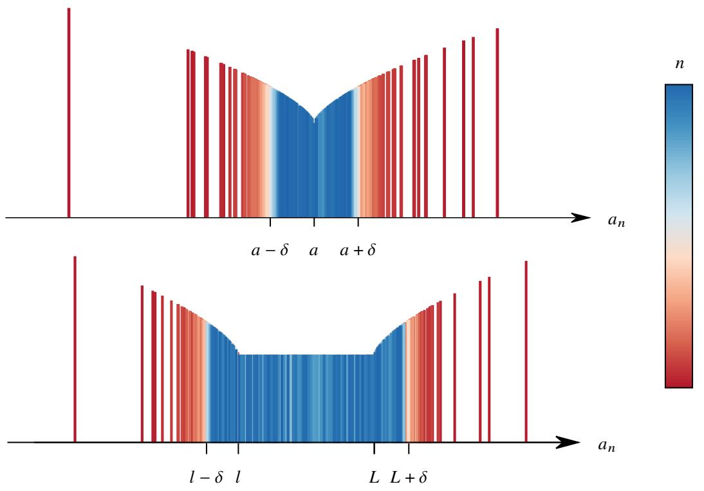  
图 2.7: 极限和上下极限的区别.

因此上极限和下极限也可以用 $\varepsilon - N$ 语言和邻域来刻画.

# 定理 2.36

设数列 $\left\{ a _ { n } \right\}$ . 令

$$
E = \left\{a \in \mathbb {R} \colon \text {对 于 任 一} \varepsilon > 0 \text {存 在} N \in \mathbb {N} ^ {*} \text {使 得 当} n > N \text {时} a _ {n} <   a + \varepsilon \right\}.
$$

$$
F = \left\{a \in \mathbb {R} \colon \text {对 于 任 一} \varepsilon > 0   \text {存 在}   N \in \mathbb {N} ^ {*}   \text {使 得 当}   n > N   \text {时}   a _ {n} > a - \varepsilon \right\}.
$$

则

$$
\limsup_{n\to \infty}a_{n} = \inf E,\qquad \liminf_{n\to \infty}a_{n} = \sup F.
$$

证明 只证明上极限的情况. 设 $\operatorname* { l i m } \operatorname* { s u p } _ { n \to \infty } a _ { n } = L$ .

(i) 证明 $L \geqslant \operatorname* { i n f } E$ . 用反证法, 假设 $L \not \in E$ , 即存在 $\varepsilon > 0$ 使得对于任一 $N \in \mathbb { N } ^ { * }$ 都存在 $n > N$ 使得 $a _ { n } \geqslant L + \varepsilon$ .这表明 $\left( L + \varepsilon , + \infty \right)$ 中有 $\left\{ a _ { n } \right\}$ 的无穷多项. 由 Bolzano-Weierstrass 定理可知 $\left( L + \varepsilon , + \infty \right)$ 中一定有极限点 $L ^ { \prime } > L$ ,出现矛盾. 因此 $L \in E$ , 这表明 $L \geqslant \operatorname { i n f } E$ .  
(ii) 证明 $L \leqslant \operatorname { i n f } E$ . 用反证法, 假设 $L > \operatorname* { i n f } E$ , 即存在 $a \in E$ 满足 $a < L$ . 则存在 $\varepsilon > 0$ 使得 $a + \varepsilon < L$ . 由于$a \in E$ ,故存在 $N \in \mathbb { N } ^ { * }$ 使得当 $n > N$ 时 $\textstyle a _ { n } < a + \varepsilon$ .这表明 $( a + \varepsilon , + \infty )$ 中有 $\left\{ a _ { n } \right\}$ 的有限项,因此 $L$ 不是极限点,出现矛盾. 于是可知 $a \geqslant L$ . 这表明 $L \leqslant \operatorname { i n f } E$ .

综上可知 $\begin{array} { r } { \operatorname* { l i m } \operatorname* { s u p } _ { n \to \infty } a _ { n } = \operatorname* { i n f } E . } \end{array}$ .

注 为了让上极限是 $+ \infty$ 下极限是 $- \infty$ 的情况也能用上面的语言刻画, 可以令

$$
E = \left\{a \in \overline {{{\mathbb {R}}}}: \text {对 于 任 一} \xi > a \text {存 在} N \in \mathbb {N} ^ {*} \text {使 得 当} n > N \text {时} a _ {n} <   \xi \right\}.
$$

$$
F = \left\{a \in \overline {{{\mathbb {R}}}}: \text {对 于 任 一} \xi <   a \text {存 在} N \in \mathbb {N} ^ {*} \text {使 得 当} n > N \text {时} a _ {n} > \xi \right\}.
$$

则 $\begin{array} { r } { \operatorname* { l i m } \operatorname* { s u p } _ { n \to \infty } a _ { n } = \operatorname* { i n f } E } \end{array}$ , lim inf??→∞ ???? = sup ??.

注 以上命题也可以作为数列上极限和下极限的定义.

下面看一个例子.

例 2.57 设非负数列 $\left\{ a _ { n } \right\}$ . 则

$$
\lim  _ {n \rightarrow \infty} \sqrt [ n ]{a _ {n}} \leqslant 1 \iff \lim  _ {n \rightarrow \infty} \frac {a _ {n}}{l ^ {n}} = 0, \forall l > 1.
$$

证明 (i) 证明必要性. 若 $\begin{array} { r } { \operatorname* { l i m } \operatorname* { s u p } _ { n \to \infty } \sqrt { a _ { n } } \leqslant 1 . } \end{array}$ , 由定理2.36可知对于任一 $\varepsilon > 0$ 都存在 $N \in \mathbb { N } ^ { * }$ 使得当 $n > N$ 时$\sqrt [ n ] { a _ { n } } < 1 + \varepsilon$ . 于是对于任一 $l > 1$ 都有

$$
\sqrt [ n ]{a _ {n}} <   1 + \varepsilon \iff a _ {n} <   (1 + \varepsilon) ^ {n} \iff \frac {a _ {n}}{l ^ {n}} <   \left(\frac {1 + \varepsilon}{l}\right) ^ {n}
$$

对于任意给定的 $l > 1$ , 固定 $\varepsilon$ 使得 $\varepsilon + 1 < l .$ 令 $n \to \infty$ 得

$$
\lim  _ {n \rightarrow \infty} \frac {a _ {n}}{l ^ {n}} = 0.
$$

(ii) 证明充分性. 由于 $a _ { n } / l ^ { n } \to 0$ , 故对于任一 $\varepsilon > 0$ 都存在 $N \in \mathbb { N } ^ { * }$ 使得当 $n > N$ 时

$$
\left| \frac {a _ {n}}{l ^ {n}} \right| <   \varepsilon \Longleftrightarrow 0 \leqslant a _ {n} <   \varepsilon l ^ {n} \Longleftrightarrow 0 \leqslant \sqrt [ n ]{a _ {n}} <   \sqrt [ n ]{\varepsilon} l.
$$

令 $n \to \infty$ 取上极限得 $\begin{array} { r } { \operatorname* { l i m } \operatorname* { s u p } _ { n \to \infty } \sqrt [ n ] { a _ { n } } \leqslant l . } \end{array}$ 由于 $l$ 是任一大于 1 的数, 于是可知

$$
\limsup_{n\to \infty}\sqrt[n]{a_{n}}\leqslant 1.
$$

利用上极限和下极限的上述定义可以证明它们的保序性.

# 命题 2.35 (上极限和下极限的保序性)

设数列 $\left\{ a _ { n } \right\}$ 和 $\left\{ b _ { n } \right\}$ . 若存在 $N \in \mathbb { N } ^ { * }$ 使得当 $n > N$ 时 $a _ { n } \leqslant b _ { n }$ , 则

(1) $\operatorname* { l i m } _ { n \to \infty } \operatorname* { s u p } _ { a _ { n } } \leqslant \operatorname* { l i m } _ { n \to \infty } b _ { n } .$   
(2) lim inf ???? ⩽ lim inf ????.

证明 只证明 (1). 令 $\operatorname* { l i m } \operatorname* { s u p } _ { n \to \infty } a _ { n } = A$ , $\mathrm { i m } \operatorname* { s u p } _ { n \to \infty } b _ { n } = B .$

(i) 当 $B = + \infty$ 或 $A = - \infty$ 时, 命题显然成立.   
(ii) 当 $A = + \infty$ 时, 则 $\left\{ a _ { n } \right\}$ 中存在极限为 $+ \infty$ 的子列. 由于存在 $N \in \mathbb { N } ^ { * }$ 使得当 $n > N$ 时 $a _ { n } \leqslant b _ { n }$ , 故 $\left\{ b _ { n } \right\}$ 中也存在极限为 $+ \infty$ 的子列. 于是 $A = B$ . 类似地可知当 $B = - \infty$ 时 $A = B$ .  
(ii) 当 $A , B \in \mathbb { R }$ 时. 用反证法, 假设 $A > B$ . 则存在 $\varepsilon > 0$ 使得 $B < B + \varepsilon < A$ . 由定理2.36可知当存在 $N _ { 1 } \in \mathbb { N } ^ { * }$ 使得当 $n > N _ { 1 }$ 时 $b _ { n } < B + \varepsilon .$ . 因此当 $n > \operatorname* { m a x } \{ N , N _ { 1 } \}$ 时

$$
a _ {n} \leqslant b _ {n} <   B + \varepsilon <   A.
$$

这表明 $\left( { B + \varepsilon , + \infty } \right)$ 中只有 $\left\{ a _ { n } \right\}$ 的有限项, 因此 $A$ 不是 $\left\{ a _ { n } \right\}$ 的极限点, 出现矛盾. 于是可知 $A \leqslant B$ .

若要证明 $\left\{ a _ { n } \right\}$ 的极限存在, 只需用保序性证明 li $\begin{array} { r } { \mathfrak { n } \operatorname* { s u p } _ { n \to \infty } a _ { n } \leqslant \operatorname* { l i m } \operatorname* { i n f } _ { n \to \infty } a _ { n } } \end{array}$ . 下面看一个例子.

例 2.58 设数列 $\left\{ a _ { n } \right\}$ 对任意 $m , n \in \mathbb { N } ^ { * }$ 都满足

$$
0 \leqslant a _ {m + n} \leqslant a _ {m} + a _ {n}.
$$

则数列 $\{ a _ { n } / n \}$ 存在有限极限.

证明 给定 $k \in \mathbb { N } ^ { * }$ , 对于任一 $n \in \mathbb { N } ^ { * }$ $( n \geqslant k )$ ), 都可以用 $k$ 对 $n$ 作带余除法

$$
n = h k + r, \qquad h \in \mathbb {N} ^ {*},   r \in \mathbb {N},   r <   k.
$$

由于任意 $m , n \in \mathbb { N } ^ { * }$ 都满足 $0 \leqslant a _ { m + n } \leqslant a _ { m } + a _ { n } .$ 故

$$
\frac {a _ {n}}{n} = \frac {a _ {h k + r}}{n} \leqslant \frac {a _ {h k} + a _ {r}}{n} \leqslant \frac {h a _ {k} + a _ {r}}{n} = \frac {h a _ {k}}{n} + \frac {a _ {r}}{n} = \frac {h a _ {k}}{h k + r} + \frac {a _ {r}}{n} = \frac {a _ {k}}{k + \frac {r}{h}} + \frac {a _ {r}}{n} = \frac {a _ {k}}{k + \frac {r k}{n - r}} + \frac {a _ {r}}{n}.
$$

令上中的 $n \to \infty$ 取上极限得

$$
\lim  _ {n \rightarrow \infty} \sup  _ {n \rightarrow \infty} \frac {a _ {n}}{n} \leqslant \frac {a _ {k}}{k}, \quad k = 1, 2, \dots .
$$

令 $k \to \infty$ 取下极限得

$$
\lim  _ {n \rightarrow \infty} \sup  _ {n \rightarrow \infty} \frac {a _ {n}}{n} \leqslant \lim  _ {k \rightarrow \infty} \inf  _ {n \rightarrow \infty} \frac {a _ {k}}{k}.
$$

由于 $\begin{array} { r } { \operatorname* { l i m } \operatorname* { s u p } _ { n \to \infty } ( a _ { n } / n ) \geqslant \operatorname* { l i m } \operatorname* { i n f } _ { n \to \infty } ( a _ { n } / n ) } \end{array}$ . 因此

$$
\limsup_{n\to \infty}\frac{a_{n}}{n} = \liminf_{n\to \infty}\frac{a_{n}}{n}.
$$

因此 $\{ a _ { n } / n \}$ 存在极限. 由条件可知

$$
0 \leqslant \frac {a _ {n}}{n} \leqslant \frac {n a _ {1}}{n} = a _ {1}, \quad n = 1, 2, \dots .
$$

因此 $\{ a _ { n } / n \}$ 有界, 于是可知 $\{ a _ { n } / n \}$ 存在有限极限.

任一数列总是有上极限和下极限的, 所以利用上极限和下极限可以简化处理问题的过程. 下面尝试用上极限 和下极限证明 Stolz定理, 读者可以从中体会上极限和下极限的应用方法.

例 2.59Stolz-Cesáro 定理 设数列 $\left\{ a _ { n } \right\}$ 和 $\left\{ b _ { n } \right\}$ , 若 $\left\{ b _ { n } \right\}$ 严格递增, 且 $\scriptstyle \operatorname* { l i m } _ { n \to \infty } b _ { n } = + \infty$ . 则

$$
\lim  _ {n \rightarrow \infty} \inf  _ {b _ {n} - b _ {n - 1}} \frac {a _ {n} - a _ {n - 1}}{b _ {n}} \leqslant \lim  _ {n \rightarrow \infty} \inf  _ {b _ {n}} \frac {a _ {n}}{b _ {n}} \leqslant \lim  _ {n \rightarrow \infty} \sup  _ {b _ {n}} \frac {a _ {n}}{b _ {n}} \leqslant \lim  _ {n \rightarrow \infty} \sup  _ {b _ {n} - b _ {n - 1}} \frac {a _ {n} - a _ {n - 1}}{b _ {n}}.
$$

证明 中间的不等号显然成立.

(i) 证明右边的不等号. 令

$$
L = \lim  _ {n \rightarrow \infty} \sup  _ {n \rightarrow \infty} \frac {a _ {n} - a _ {n - 1}}{b _ {n} - b _ {n - 1}}.
$$

当 $L = + \infty$ 时显然成立. 下设 $L < + \infty$ ( $L$ 可以是 $- \infty )$ ). 对于任一 $l > L$ , 存在 $N \in \mathbb { N } ^ { * }$ 使得当 $n \geqslant N$ 时

$$
\frac {a _ {n} - a _ {n - 1}}{b _ {n} - b _ {n - 1}} <   l.
$$

因此

$$
\frac {a _ {N} - a _ {N - 1}}{b _ {N} - b _ {N - 1}} <   l, \quad \frac {a _ {N + 1} - a _ {N}}{b _ {N + 1} - b _ {N}} <   l, \quad \dots , \quad \frac {a _ {n} - a _ {n - 1}}{b _ {n} - b _ {n - 1}} <   l.
$$

由于 $\left\{ b _ { n } \right\}$ 严格递增, 故 $b _ { n } - b _ { n - 1 } > 0 ( n = 2 , 3 , \cdot \cdot \cdot )$ $( n = 2 , 3 , \cdots )$ . 于是

$$
\frac {a _ {n} - a _ {N - 1}}{b _ {n} - b _ {N - 1}} <   l. \tag {2.10}
$$

由于 $b _ { n } \to + \infty$ , 故 $n$ 充分大之后 $b _ { n } \neq 0 .$ . 于是

$$
\frac {\frac {a _ {n}}{b _ {n}} - \frac {a _ {N - 1}}{b _ {n}}}{1 - \frac {b _ {N - 1}}{b _ {n}}} <   l \iff \frac {a _ {n}}{b _ {n}} <   l \left(1 - \frac {b _ {N - 1}}{b _ {n}}\right) + \frac {a _ {N - 1}}{b _ {n}}.
$$

由于 $b _ { n } \to + \infty$ , 令 $n \to \infty$ 取上极限可得 $\begin{array} { r } { \operatorname* { l i m } \operatorname* { s u p } _ { n \to \infty } ( a _ { n } / b _ { n } ) \leqslant l . } \end{array}$ 由于 $l$ 是任一大于 $L$ 的数, 因此

$$
\lim  _ {n \rightarrow \infty} \sup  _ {n \rightarrow \infty} \frac {a _ {n}}{b _ {n}} \leqslant L = \lim  _ {n \rightarrow \infty} \sup  _ {n \rightarrow \infty} \frac {a _ {n} - a _ {n - 1}}{b _ {n} - b _ {n - 1}}.
$$

(ii) 证明左边的不等号. 由 (i) 结合例2.60可知

$$
\lim  _ {n \rightarrow \infty} \sup  _ {n \rightarrow \infty} \frac {\left(- a _ {n}\right) - \left(- a _ {n - 1}\right)}{b _ {n} - b _ {n - 1}} \geqslant \lim  _ {n \rightarrow \infty} \sup  _ {n \rightarrow \infty} \frac {- a _ {n}}{b _ {n}} \Longleftrightarrow \lim  _ {n \rightarrow \infty} \inf  _ {n \rightarrow \infty} \frac {a _ {n} - a _ {n - 1}}{b _ {n} - b _ {n - 1}} \leqslant \lim  _ {n \rightarrow \infty} \inf  _ {n \rightarrow \infty} \frac {a _ {n}}{b _ {n}}.
$$

注 以上证明过程中, 推得不等式2.10是根据以下结论. 设分数 $a _ { 1 } / b _ { 1 } , a _ { 2 } / b _ { 2 } , \cdots , a _ { n } / b _ { n }$ $a _ { 1 } / b _ { 1 }$ 的分母都大于零, 则

$$
\min  \left\{\frac {a _ {1}}{b _ {1}}, \frac {a _ {2}}{b _ {2}}, \dots , \frac {a _ {n}}{b _ {n}} \right\} \leqslant \frac {a _ {1} + a _ {2} + \cdots + a _ {n}}{b _ {1} + b _ {2} + \cdots + b _ {n}} \leqslant \max  \left\{\frac {a _ {1}}{b _ {1}}, \frac {a _ {2}}{b _ {2}}, \dots , \frac {a _ {n}}{b _ {n}} \right\}.
$$

注 以上是 Stolz 定理更一般化的表述. 当 $( a _ { n } - a _ { n - 1 } ) / ( b _ { n } - b _ { n - 1 } )$ 极限存在时, 不定式两端相等因此 $a _ { n } / b _ { n }$ 的极限也存在且等于 $( a _ { n } - a _ { n - 1 } ) / ( b _ { n } - b _ { n - 1 } )$ 的极限值.

现在我们已经给出了定义上极限和下极限的两种方式.它们比较直观,都没有与数列“直接挂钩”,因此在处理某些问题时, 并不便利. 下面尝试再找一个方式描述上极限和下极限.

之前讲到, 研究数列极限并不关心数列的前面有限项, 即去掉数列的前面有限项不改变数列的极限值 (如果有极限的话). 因此研究数列“最终趋势”时, 也不需要关心前面的有限项. 受此启发, 对于数列 $\left\{ a _ { n } \right\}$ 我们可以定义这样一个数列:

$$
L _ {n} := \sup  _ {k \geqslant n} a _ {k} = \sup  \{a _ {n}, a _ {n + 1}, \dots \}, \quad n = 1, 2, \dots .
$$

由于

$$
\left\{a _ {k}: k \geqslant n + 1 \right\} \subseteq \left\{a _ {k}: k \geqslant n \right\}, \quad n = 1, 2, \dots .
$$

因此数列 $L _ { n }$ 单调递减. 类似地令

$$
l _ {n} := \inf  _ {k \geqslant n} a _ {k} = \inf  \left\{a _ {n}, a _ {n + 1}, \dots \right\}, \quad n = 1, 2, \dots .
$$

则数列 $\left\{ l _ { n } \right\}$ 单调递增. 于是可知以上定义的 $\left\{ L _ { n } \right\}$ 和 $\left\{ l _ { n } \right\}$ 都有极限. 不难想到 $\left\{ L _ { n } \right\}$ 和 $\left\{ l _ { n } \right\}$ 的极限值分别是 $\left\{ a _ { n } \right\}$ 的上极限和下极限.

# 定理 2.37

设数列 $\left\{ a _ { n } \right\}$ . 则

(1) $\operatorname* { l i m } _ { n \to \infty } \operatorname* { s u p } _ { a _ { n } } = \operatorname* { l i m } _ { n \to \infty } \left( \operatorname* { s u p } _ { k \geqslant n } a _ { k } \right) .$   
(2) lim inf→∞ ???? = lim→∞ inf ????

证明 只证明 (1). 令 $\textstyle \operatorname* { s u p } _ { k \geq n } a _ { k } = L _ { n }$ , $\begin{array} { r } { \operatorname* { l i m } \operatorname* { s u p } _ { n \to \infty } a _ { n } = L . } \end{array}$ . 只需证明 $\scriptstyle \operatorname* { l i m } _ { n \to \infty } L _ { n } = L$ .

(i) 当 $L = + \infty$ 时. 存在一个极限为 $+ \infty$ 的子列. 因此

$$
L _ {n} = \sup  \left\{a _ {n}, a _ {n + 1}, \dots \right\} = + \infty , \quad n = 1, 2, \dots .
$$

于是可知 $\scriptstyle \operatorname* { l i m } _ { n \to \infty } L _ { n } = + \infty$ .

(ii) 当 $L = - \infty$ 时. $\scriptstyle \operatorname* { l i m } _ { n \to \infty } a _ { n } = - \infty$ , 故对于任一 $E > 0$ 都存在 $N \in \mathbb { N } ^ { * }$ 使得当 $n \geqslant N$ 时 $a _ { n } < - E$ . 因此

$$
L _ {N} = \sup  \left\{a _ {N}, a _ {N + 1}, \dots \right\} <   - E.
$$

由于 $L _ { n }$ 单调递减, 因此当 $n \geqslant N$ 时 $L _ { n } \leqslant L _ { N } < - E .$ . 这表明 $\scriptstyle \operatorname* { l i m } _ { n \to \infty } L _ { n } = - \infty$ .

(iii) 当 $L \in \mathbb { R }$ 时. 任取 $\left\{ a _ { n } \right\}$ 的一个极限点 $l$ 则存在一个子列 $\{ a _ { k _ { i } } \}$ 收敛于 $l .$ 对于给定的 $n$ 选取 $i \ \geqslant \ n .$ , 则$k _ { i } \geqslant i \geqslant n$ . 于是

$$
a _ {k _ {i}} \leqslant \sup  \left\{a _ {n}, a _ {n + 1}, \dots , a _ {k _ {i}}, \dots \right\} = L _ {n}, \quad n = 1, 2, \dots .
$$

令 $i \to \infty$ 得 $l \leqslant L _ { n }$ $( n = 1 , 2 , \cdots )$ . 再令 $n \to \infty$ 得 $l \leqslant \mathrm { l i m } _ { n  \infty } L _ { n }$ . 于是 $L \leqslant \operatorname* { l i m } _ { n \to \infty } L _ { n }$ .

由定理2.36可知, 对于任一 $\varepsilon > 0$ 都存在 $N \in \mathbb { N } ^ { * }$ 使得当 $n \geqslant N$ 时 $a _ { n } \leqslant L + \varepsilon$ . 因此 $L _ { N } \leqslant L + \varepsilon .$ . 由于 $L _ { n }$ 单调递减, 因此当 $n \geqslant N$ 时 $L _ { n } \leqslant L _ { N } \leqslant L + \varepsilon .$ . 令 $n \to \infty$ 得 $\begin{array} { r } { \operatorname* { l i m } _ { n \to \infty } L _ { n } \leqslant L + \varepsilon . } \end{array}$ . 由于 $\varepsilon$ 是任一正数, 故 $L \geqslant \operatorname* { l i m } _ { n  \infty } L _ { n }$ .

于是可知 $L = \operatorname* { l i m } _ { n \to \infty } L _ { n }$

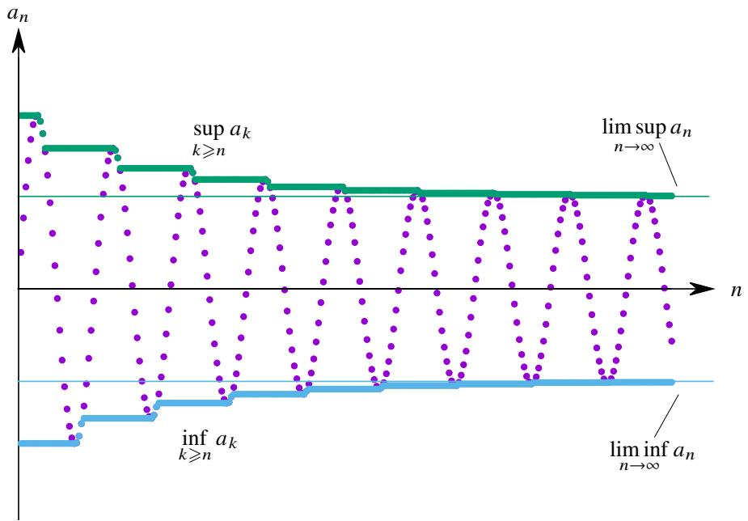  
图 2.8: 上下极限的第三种定义.

注 上述定理可以看作上极限和下极限的第三种定义.

注 上极限和下极限的符号实际上来自上述定理. 数列的上极限和下极限也可以记作 $\overline { { \operatorname * { l i m } } } a _ { n }$ 和 $\operatorname* { l i m } a _ { n }$ .

用以上定理处理关于上极限和下极限的不等式较为便利.

例 2.60 设数列 $\left\{ a _ { n } \right\}$ . 则

(1) $\operatorname* { l i m } _ { n \to \infty } \operatorname* { s u p } ( - a _ { n } ) = - \operatorname* { l i m } _ { n \to \infty } \operatorname* { i n f } a _ { n } .$   
(2) $\operatorname* { l i m } _ { n \to \infty } \operatorname* { i n f } _ { } ( - a _ { n } ) = - \operatorname* { l i m } _ { n \to \infty } a _ { n } .$

证明 只证明 (1). 由命题2.10可知 $\operatorname* { s u p } ( - E ) = - \operatorname* { i n f } E$ , $\operatorname* { i n f } ( - E ) = - \operatorname* { s u p } E .$ 于是

$$
\sup  _ {k \geqslant n} (- a _ {k}) = - \inf  _ {k \geqslant n} a _ {k}, \quad \inf  _ {k \geqslant n} (- a _ {k}) = - \sup  _ {k \geqslant n} a _ {k}.
$$

令 $n \to \infty$ 即得要证的结论.

上极限、下极限和极限不同的地方在于上极限、下极限不满足“可加性”.但它们分别满足“次可加性”和“超 可加性”.

# 命题 2.36 (上极限的次可加性和下极限的超可加性)

设数列 $\{ a _ { n } \} , \{ b _ { n } \}$ . 则

(1) $\operatorname* { l i m i n f } _ { n \to \infty } a _ { n } + \operatorname* { l i m i n f } _ { n \to \infty } b _ { n } \leqslant \operatorname* { l i m i n f } _ { n \to \infty } ( a _ { n } + b _ { n } ) \leqslant \operatorname* { l i m i n f } _ { n \to \infty } a _ { n } + \operatorname* { l i m } _ { n \to \infty } \operatorname* { s u p } b _ { n } .$   
(2) $\operatorname* { l i m i n f } _ { n \to \infty } a _ { n } + \operatorname* { l i m } _ { n \to \infty } \operatorname* { s u p } _ { b } b \leqslant \operatorname* { l i m } _ { n \to \infty } \operatorname* { s u p } ( a _ { n } + b _ { n } ) \leqslant \operatorname* { l i m } _ { n \to \infty } \operatorname* { s u p } _ { a _ { n } + \operatorname* { l i m } _ { n \to \infty } } b _ { n } .$

证明 只证明 (1). 由于对于任一 $l \geqslant n$ 都有 $\operatorname* { i n f } _ { k \geqslant n } a _ { k } \leqslant a _ { l }$ , $\operatorname* { i n f } _ { k \geq n } b _ { k } \leqslant b _ { l }$ . 因此

$$
\inf  _ {k \geqslant n} a _ {k} + \inf  _ {k \geqslant n} b _ {k} \leqslant a _ {l} + b _ {l} \Longrightarrow \inf  _ {k \geqslant n} a _ {k} + \inf  _ {k \geqslant n} b _ {k} \leqslant \inf  _ {k \geqslant n} (a _ {k} + b _ {k}).
$$

由以上不等式可知

$$
\inf  _ {k \geqslant n} a _ {k} + \sup  _ {k \geqslant n} b _ {k} \geqslant \inf  _ {k \geqslant n} (a _ {k} + b _ {k}) + \inf  _ {k \geqslant n} (- b _ {k}) + \sup  _ {k \geqslant n} b _ {k} = \inf  _ {k \geqslant n} (a _ {k} + b _ {k}).
$$

于是

$$
\inf  _ {k \geqslant n} a _ {k} + \inf  _ {k \geqslant n} b _ {k} \leqslant \inf  _ {k \geqslant n} (a _ {k} + b _ {k}) \leqslant \inf  _ {k \geqslant n} a _ {k} + \sup  _ {k \geqslant n} b _ {k}.
$$

令 $n \to \infty$ , 由定理2.37即得

$$
\liminf_{n\to \infty}a_{n} + \liminf_{n\to \infty}b_{n}\leqslant \liminf_{n\to \infty}(a_{n} + b_{n})\leqslant \liminf_{n\to \infty}a_{n} + \limsup_{n\to \infty}b_{n}.
$$

注 以上定理中的不等式两端需要有意义, 即不能出现 $\infty - \infty$ 型不等式. 例如设 $a _ { n } = n$ , $b _ { n } = - n$ , 则等式两侧就会出现 $\infty - \infty$ .

注 设定义在 $A$ 上的映射 $f$ .

(1) 若 $f ( a + b ) = f ( a ) + f ( b ) \ ( \forall a , b \in A )$ , 则称 $f$ 满足可加性 (additivity).   
(2) 若 $f ( a + b ) \geqslant f ( a ) + f ( b )$ $( \forall a , b \in A )$ , 则称 $f$ 满足超可加性 (superadditivity).   
(3) 若 $f ( a + b ) \leqslant f ( a ) + f ( b )$ $\forall a , b \in A )$ , 则称 $f$ 满足次可加性 (subadditivity).

例 2.61 举例说明数列的上极限有次可加性而下极限有超可加性.

解 设数列

$$
\left\{a _ {n} \right\} = \left\{0, 1, 2, 0, 1, 2, \dots \right\}. \quad \left\{b _ {n} \right\} = \left\{2, 3, 1, 2, 3, 1, \dots \right\}.
$$

则

$$
\left\{a _ {n} + b _ {n} \right\} = \left\{2, 4, 3, 2, 4, 3, \dots \right\}.
$$

于是

$$
\liminf_{n\to \infty}a_{n} = 0,\qquad \liminf_{n\to \infty}b_{n} = 1,\qquad \liminf_{n\to \infty}(a_{n} + b_{n}) = 2.
$$

$$
\limsup_{n\to \infty}a_{n} = 2,\qquad \limsup_{n\to \infty}b_{n} = 3,\qquad \limsup_{n\to \infty}(a_{n} + b_{n}) = 4.
$$

因此

$$
2 = \lim  _ {n \rightarrow \infty} \inf  (a _ {n} + b _ {n}) \geqslant \lim  _ {n \rightarrow \infty} \inf  a _ {n} + \lim  _ {n \rightarrow \infty} \inf  b _ {n} = 1.
$$

$$
4 = \lim  _ {n \rightarrow \infty} \sup  _ {a _ {n} + b _ {n}} \leqslant \lim  _ {n \rightarrow \infty} \sup  _ {a _ {n} + \lim  _ {n \rightarrow \infty} b _ {n}} = 5.
$$

上极限的次可加性和下极限的超可加性可以证明以下结论.

例 2.62 设数列 $\{ a _ { n } \} , \{ b _ { n } \}$ , 若 $\operatorname* { l i m } _ { n \to \infty } a _ { n } = a$ , 则

(1) $\operatorname* { l i m } _ { n \to \infty } \operatorname* { i n f } _ { } \left( a _ { n } + b _ { n } \right) = a + \operatorname* { l i m } _ { n \to \infty } \operatorname* { i n f } _ { } b _ { n } .$   
(2) $\operatorname* { l i m } _ { n \to \infty } \operatorname* { s u p } \left( a _ { n } + b _ { n } \right) = a + \operatorname* { l i m } _ { n \to \infty } \operatorname* { s u p } b _ { n } .$

证明 只证明 (1). 由于 $\operatorname* { l i m } _ { n \to \infty } a _ { n } = a$ , 故 $\begin{array} { r } { \operatorname* { l i m } \operatorname* { s u p } _ { n \to \infty } a _ { n } = \operatorname* { l i m } \operatorname* { i n f } _ { n \to \infty } a _ { n } = a } \end{array}$ . 由下极限的超可加性可知

$$
\lim  _ {n \rightarrow \infty} \inf  \left(a _ {n} + b _ {n}\right) \geqslant \lim  _ {n \rightarrow \infty} \inf  a _ {n} + \lim  _ {n \rightarrow \infty} \inf  b _ {n} = a + \lim  _ {n \rightarrow \infty} \inf  b _ {n}.
$$

$$
a + \lim  _ {n \rightarrow \infty} \inf  _ {b _ {n}} b _ {n} \geqslant a + \lim  _ {n \rightarrow \infty} \inf  _ {(- a _ {n})} (- a _ {n}) + \lim  _ {n \rightarrow \infty} \inf  _ {a _ {n} + b _ {n}} (a _ {n} + b _ {n}) = \lim  _ {n \rightarrow \infty} \inf  _ {a _ {n} + b _ {n}} (a _ {n} + b _ {n}).
$$

于是可知 $\begin{array} { r } { \operatorname* { l i m } \operatorname* { i n f } _ { n \to \infty } ( a _ { n } + b _ { n } ) = a + \operatorname* { l i m } \operatorname* { i n f } _ { n \to \infty } b _ { n } . } \end{array}$ .

与上极限的次可加性和下极限的超可加性类似的还有以下结论.

# 命题 2.37

设非负数列 $\{ a _ { n } \} , \{ b _ { n } \}$ . 则

(1)

证明 只证明 (1). 由于对于任一 $l \geqslant n$ 都有 $\operatorname* { i n f } _ { k \geqslant n } a _ { k } \leqslant a _ { l }$ , $\operatorname* { i n f } _ { k \geq n } b _ { k } \leqslant b _ { l } .$ . 由于 $\left\{ a _ { n } \right\}$ , $\left\{ b _ { n } \right\}$ 非负, 因此

$$
\left(\inf  _ {k \geqslant n} a _ {k}\right) \left(\inf  _ {k \geqslant n} b _ {k}\right) \leqslant a _ {l} b _ {l} \Longrightarrow \left(\inf  _ {k \geqslant n} a _ {k}\right) \left(\inf  _ {k \geqslant n} b _ {k}\right) \leqslant \inf  _ {k \geqslant n} (a _ {k} b _ {k}).
$$

对于任一 $\varepsilon > 0$ 存在 $m \geqslant n$ 使得 $a _ { m } < \varepsilon + \operatorname* { i n f } _ { k \geqslant n } a _ { k } .$ . 由于 $b _ { m } \leqslant \mathbf { s u p } _ { k \geqslant n } b _ { k }$ , 且 $\{ a _ { n } \} , \{ b _ { n } \}$ 都是非负数列, 因此

$$
\left(\varepsilon + \inf  _ {k \geqslant n} a _ {k}\right) \left(\sup  _ {k \geqslant n} b _ {k}\right) > a _ {m} b _ {m} \geqslant \inf  _ {k \geqslant n} a _ {k} b _ {k}.
$$

令 $\varepsilon \to 0$ 得

$$
\left(\inf  _ {k \geqslant n} a _ {k}\right) \left(\sup  _ {k \geqslant n} b _ {k}\right) \geqslant \inf  _ {k \geqslant n} a _ {k} b _ {k}.
$$

于是得到不等式

$$
\left(\inf  _ {k \geqslant n} a _ {k}\right) \left(\inf  _ {k \geqslant n} b _ {k}\right) \leqslant \inf  _ {k \geqslant n} (a _ {k} b _ {k}) \leqslant \left(\inf  _ {k \geqslant n} a _ {k}\right) \left(\sup  _ {k \geqslant n} b _ {k}\right).
$$

令 $n \to \infty$ 即得要证的结论.

注以上定理中的不等式两端需要有意义,即不能出现 $0 \cdot \infty$ 型不等式.例如设 $a _ { n } = n$ , $b _ { n } = 1 / n$ ,则等式两侧就会出现 $0 \cdot \infty$ .

类比例2.62有以下结论.

例 2.63 设数列 $\{ a _ { n } \} , \{ b _ { n } \}$ , 若 $\left\{ a _ { n } \right\}$ 是一个非负数列且 $\operatorname* { l i m } _ { n \to \infty } a _ { n } = a$ , 则

(1) $\operatorname* { l i m } _ { n \to \infty } \operatorname* { s u p } ( a _ { n } b _ { n } ) = a \operatorname* { l i m } _ { n \to \infty } \operatorname* { s u p } b _ { n } .$   
(2) $\operatorname* { l i m } _ { n \to \infty } \operatorname* { i n f } ( a _ { n } b _ { n } ) = a \operatorname* { l i m } _ { n \to \infty } \operatorname* { i n f } b _ { n } .$

证明 设 $\operatorname* { l i m } \operatorname* { s u p } _ { n \to \infty } b _ { n } = L$ , lim inf??→∞ ???? = ??.

(1) (i) 当 $L > 0$ 时. 令

$$
b _ {n} ^ {+} = \frac {\left| b _ {n} \right| + b _ {n}}{2}, \quad n = 1, 2, \dots .
$$

则 $\{ b _ { n } ^ { + } \}$ 是一个非负数列, 且 $\begin{array} { r } { \operatorname* { l i m } \operatorname* { s u p } _ { n \to \infty } b _ { n } ^ { + } = L . } \end{array}$ 由于 $\left\{ a _ { n } \right\}$ 是一个非负数列且 $\operatorname* { l i m } _ { n \to \infty } a _ { n } = a$ , 由命题2.37可知

$$
a L = \left(\lim  _ {n \rightarrow \infty} \inf  a _ {n}\right)\left(\lim  _ {n \rightarrow \infty} b _ {n} ^ {+}\right) \leqslant \lim  _ {n \rightarrow \infty} \sup  _ {n \rightarrow \infty} \left(a _ {n} b _ {n} ^ {+}\right) \leqslant \left(\lim  _ {n \rightarrow \infty} \sup  a _ {n}\right)\left(\lim  _ {n \rightarrow \infty} \sup  b _ {n} ^ {+}\right) = a L.
$$

因此

$$
\limsup_{n\to \infty}\left(a_{n}b_{n}^{+}\right) = aL = a\limsup_{n\to \infty}b_{n}.
$$

由于 $\begin{array} { r } { \operatorname* { s u p } _ { k \geq n } b _ { k } = \operatorname* { s u p } _ { k \geq n } b _ { k } ^ { + } } \end{array}$ 且 $\left\{ a _ { n } \right\}$ 非负, 因此 $\begin{array} { r } { \operatorname* { s u p } _ { k \geq n } ( a _ { n } b _ { k } ) = \operatorname* { s u p } _ { k \geq n } ( a _ { n } b _ { k } ^ { + } ) } \end{array}$ . 令 $n \to \infty$ 得

$$
\limsup_{n\to \infty}(a_{n}b_{n}) = \limsup_{n\to \infty}(a_{n}b_{n}^{+}) = a\limsup_{n\to \infty}b_{n}.
$$

(ii) 当 $L \leqslant 0$ 时, 存在 $\delta > 0$ 使得 $L + \delta > 0 .$ . 令 $b _ { n } ^ { \prime } = b _ { n } + \delta$ $b _ { n } ^ { \prime } = b _ { n } + \delta \left( n = 1 , 2 , \cdot \cdot \cdot \right)$ . 由例2.62可知 $\begin{array} { r } { \operatorname* { l i m } \operatorname* { s u p } _ { n \to \infty } b _ { n } ^ { \prime } = L + \delta > 0 } \end{array}$ .由 (i) 可知

$$
\lim  _ {n \rightarrow \infty} \sup  _ {n \rightarrow \infty} (a _ {n} b _ {n} ^ {\prime}) = a \lim  _ {n \rightarrow \infty} \sup  _ {n \rightarrow \infty} b _ {n} ^ {\prime} \Longleftrightarrow \lim  _ {n \rightarrow \infty} \sup  _ {n \rightarrow \infty} (a _ {n} b _ {n} + \delta a _ {n}) = a \lim  _ {n \rightarrow \infty} \sup  _ {n \rightarrow \infty} (b _ {n} + \delta)
$$

$$
\Longleftrightarrow \delta a + \lim  _ {n \rightarrow \infty} \sup  _ {n \rightarrow \infty} (a _ {n} b _ {n}) = a \left(\delta + \lim  _ {n \rightarrow \infty} \sup  _ {n \rightarrow \infty} b _ {n}\right) \Longleftrightarrow \lim  _ {n \rightarrow \infty} \sup  _ {n \rightarrow \infty} (a _ {n} b _ {n}) = a \lim  _ {n \rightarrow \infty} \sup  _ {n \rightarrow \infty} b _ {n}.
$$

(2) 由 (1) 得 $\begin{array} { r } { \operatorname* { l i m } \operatorname* { s u p } _ { n \to \infty } ( a _ { n } c _ { n } ) = a } \end{array}$ lim $\scriptstyle \operatorname* { s u p } _ { n \to \infty } c _ { n }$ . 令 $- b _ { n } = c _ { n }$ $\mathbf { \chi } _ { n } = 1 , 2 , \cdots ,$ ). 有例2.60可知

$$
\limsup_{n\to \infty}\left[a_{n}(-b_{n})\right] = a\limsup_{n\to \infty}\left(-b_{n}\right)\iff -\liminf_{n\to \infty}\left(a_{n}b_{n}\right) = -a\liminf_{n\to \infty}b_{n}\iff \liminf_{n\to \infty}\left(a_{n}b_{n}\right) = a\liminf_{n\to \infty}b_{n}.
$$

注 例2.62和上例合在一起告诉我们, 在特定条件下, 数列的上下极限就可以变成线性算子.

# 2.5.5 Cauchy 收敛原理

单调有界定理可以在不知道极限值的情况下直接判断数列收敛. 但它的条件太强了, 它只是数列收敛的充分条件, 而非必要条件. 我们希望得到一个数列收敛的充要条件, 且不需要提前知道数列的极限值. 为此先来探索数列收敛的必要条件.

# 命题 2.38

设数列 $\left\{ a _ { n } \right\}$ 收敛. 则对于任意 $\varepsilon > 0$ , 都存在 $N \in \mathbb { N } ^ { * }$ , 使得当 $m , n > N$ 时

$$
\left| a _ {m} - a _ {n} \right| <   \varepsilon .
$$

证明 设 $a _ { n }  a \in \mathbb { R } ,$ , 则对于任一 $\varepsilon > 0$ 都存在 $N \in \mathbb { N } ^ { * }$ , 使得当 $n , m > N$ 时

$$
\left| a _ {n} - a \right| <   \frac {\varepsilon}{2}, \quad \left| a _ {m} - a \right| <   \frac {\varepsilon}{2}.
$$

于是可知

$$
\left| a _ {m} - a _ {n} \right| <   \left| a _ {n} - a \right| + \left| a _ {m} - a \right| <   \varepsilon .
$$

我们把满足以上条件的数列称为 “Cauchy 列”.

# 定义 2.33 (Cauchy 列)

设数列 $\left\{ a _ { n } \right\}$ . 若对于任意 $\varepsilon > 0$ , 都存在 $N \in \mathbb { N } ^ { * }$ , 使得当 $m , n > N$ 时

$$
\left| a _ {m} - a _ {n} \right| <   \varepsilon .
$$

则称该数列是一个 Cauchy 列 (Cauchy sequence) 或基本列 (fundamental sequence).

注 $\left\{ a _ { n } \right\}$ 不是 Cauchy 列当且仅当存在 $\varepsilon > 0$ , 对于任一 $N \in \mathbb { N } ^ { * }$ 存在 $m , n > N$ 使得 $\left| a _ { m } - a _ { n } \right| \geqslant \varepsilon$

下面来一个 Cauchy 列的例子.

例 2.64 数列 {????} ( $| | q | < 1 )$ 是一个 Cauchy 列.

证明 由于 $q ^ { n } \to 0$ , 故对于任一 $\varepsilon > 0$ 都存在 $N \in \mathbb { N } ^ { * }$ 使得当 $n > N$ 时

$$
\left| q ^ {n} \right| = \left| q \right| ^ {n} <   \frac {\varepsilon}{2}.
$$

因此当 ??, ?? > ?? $( n < m )$ 时

$$
\left| q ^ {n} - q ^ {m} \right| = \left| 1 - q ^ {m - n} \right| \left| q \right| ^ {n} \leqslant \left(1 + \left| q \right| ^ {m - n}\right) \left| q \right| ^ {n} <   2 \left| q \right| ^ {n} <   2 \cdot \frac {\varepsilon}{2} = \varepsilon .
$$

于是可知 $\{ q ^ { n } \}$ $\vert \vert q \vert < 1 \rangle$ ) 是一个 Cauchy 列.

下面来看一个级数的例子.

例 2.65 设数列

$$
a _ {n} = 1 + \frac {1}{2 ^ {2}} + \dots + \frac {1}{n ^ {2}}, \quad n = 1, 2, \dots .
$$

则 $\{ a ^ { n } \}$ 是一个 Cauchy 列.

证明 对于任意 ??, $n \in \mathbb { N } ^ { * }$ $( m < n )$ , 都有

$$
\begin{array}{l} \left| a _ {n} - a _ {m} \right| = \frac {1}{(m + 1) ^ {2}} + \frac {1}{(m + 2) ^ {2}} + \dots + \frac {1}{n ^ {2}} <   \frac {1}{m (m + 1)} + \frac {1}{(m + 1) (m + 2)} + \dots + \frac {1}{(n - 1) n} \\ = \frac {1}{m} - \frac {1}{m + 1} + \frac {1}{m + 1} - \frac {1}{m + 2} + \dots + \frac {1}{n - 1} - \frac {1}{n} = \frac {1}{m} - \frac {1}{n} <   \frac {1}{m}. \\ \end{array}
$$

因此对于任一 $\varepsilon > 0$ , 只需取 $N = [ 1 / \varepsilon ]$ , 则当 $m , n > N$ 时就有

$$
\left| a _ {n} - a _ {m} \right| <   \frac {1}{m} <   \varepsilon .
$$

于是可知 $\left\{ a _ { n } \right\}$ 是一个 Cauchy 列.

下面看两个证明数列不是 Cauchy 列的例子.

例 2.66 数列 $\{ ( - 1 ) ^ { n } \}$ 不是 Cauchy 列.

证明 取 $\varepsilon = 1 .$ . 则对于任一 $n \in \mathbb { N } ^ { * }$ 都有

$$
\left| (- 1) ^ {n + 1} - (- 1) ^ {n} \right| = \left| (- 1) ^ {n} \right| | - 1 - 1 | = 2 > 1.
$$

于是可知 $\{ ( - 1 ) ^ { n } \}$ 不是 Cauchy 列.

例 2.67 设数列

$$
a _ {n} = 1 + \frac {1}{2 ^ {\alpha}} + \dots + \frac {1}{n ^ {\alpha}}, \quad n = 1, 2, \dots .
$$

其中 $\alpha \leqslant 1 .$ 则 $\{ a ^ { n } \}$ 不是 Cauchy 列.

证明 由于 $\alpha \leqslant 1$ , 故对于任一 $n \in \mathbb { N } ^ { * }$ 都有

$$
\begin{array}{l} \left| a _ {2 n} - a _ {n} \right| = \frac {1}{(n + 1) ^ {\alpha}} + \frac {1}{(n + 2) ^ {\alpha}} + \dots + \frac {1}{(2 n) ^ {\alpha}} \geqslant \frac {1}{n + 1} + \frac {1}{n + 2} + \dots + \frac {1}{2 n} \\ \geqslant \frac {1}{2 n} + \frac {1}{2 n} + \dots + \frac {1}{2 n} = \frac {n}{2 n} = \frac {1}{2}. \\ \end{array}
$$

于是可知 $\left\{ a _ { n } \right\}$ 不是 Cauchy 列.

某些条件和 Cauchy 列的条件比较相像, 需要仔细辨别.

例 2.68 设数列 $\left\{ a _ { n } \right\}$ . 若对于任意 $\varepsilon > 0$ , 都存在 $N \in \mathbb { N } ^ { * }$ , 使得当 $n > N$ 时

$$
\left| a _ {n + 1} - a _ {n} \right| <   \varepsilon .
$$

判断 $\left\{ a _ { n } \right\}$ 是不是 Cauchy 列.

解 不一定是 Cauchy 列. 举例说明, 设 $a _ { n } = { \sqrt { n } }$ $a _ { n } = { \sqrt { n } } ( n = 1 , 2 , \cdots ) .$ . 则

$$
a _ {n + 1} - a _ {n} = \sqrt {n + 1} - \sqrt {n} = \frac {1}{\sqrt {n + 1} + \sqrt {n}} <   \frac {1}{\sqrt {n}} \rightarrow 0.
$$

因此对于任一 $\varepsilon > 0$ , 当 $n$ 充分大时有 $| a _ { n + 1 } - a _ { n } | < \varepsilon$ . 但它不是 Cauchy 列. 给定 $\varepsilon = 1$ , 对于任一 $N \in \mathbb { N } ^ { * }$ , 只需取$n = \left( 2 + { \sqrt { N } } \right) ^ { 2 } > N $ , 就有

$$
a _ {n} - a _ {N} = \sqrt {n} - \sqrt {N} = 2 > 1.
$$

这表明 $\{ { \sqrt { n } } \}$ 不是 Cauchy 列.

反过来, 如果一个数列是 Cauchy 列, 那么它是否一定收敛?

# 定理 2.38 (数列的 Cauchy 收敛原理)

一个数列收敛当且仅当它是一个 Cauchy 列.

证明 只证明充分性. 设数列 $\left\{ a _ { n } \right\}$ 是一个 Cauchy 列.

(i) 证明 $\left\{ a _ { n } \right\}$ 有界. 对于任一 $\varepsilon > 0$ 都存在 $N \in \mathbb { N } ^ { * }$ , 使得当 $n \geqslant N$ 时

$$
\left| a _ {n} \right| - \left| a _ {N} \right| <   \left| a _ {n} - a _ {N} \right| <   \varepsilon \Longrightarrow \left| a _ {n} \right| <   \left| a _ {N} \right| + \varepsilon .
$$

令 $M = \operatorname* { m a x } ( | a _ { 1 } | , | a _ { 2 } | , \cdots , | a _ { N - 1 } | , | a _ { N } | + \varepsilon ) .$ . 则对于任意 $n \in \mathbb { N } ^ { * }$ 都有 $| a _ { n } | \leqslant M$ . 因此 $\left\{ a _ { n } \right\}$ 有界.

(ii) 证明 $\left\{ a _ { n } \right\}$ 收敛.

证法一 由于 $\left\{ a _ { n } \right\}$ 有界, 由 Bolzano-Weierstrass 定理可知存在一个子列 $a _ { k _ { n } } \to a$ . 则对于任一 $\varepsilon > 0$ 都存在$N _ { 1 } \in \mathbb { N } ^ { * }$ , 使得当 $n > N _ { 1 }$ 时 $| a _ { k _ { n } } - a | < \varepsilon / 2$ . 由于 $\left\{ a _ { n } \right\}$ 是一个 Cauchy 列, 故对于上面给定的 $\varepsilon > 0$ 都存在 $N _ { 2 } \in \mathbb { N } ^ { * }$ ,使得当 $m , n > N _ { 2 }$ 时都有 $| a _ { m } - a _ { n } | < \varepsilon / 2$ . 由于 $k _ { n } \geqslant n$ , 因此当 $n > \operatorname* { m a x } \{ N _ { 1 } , N _ { 2 } \}$ 时有

$$
\left| a _ {n} - a \right| = \left| \left(a _ {n} - a _ {k _ {n}}\right) + \left(a _ {k _ {n}} - a\right) \right| \leqslant \left| a _ {n} - a _ {k _ {n}} \right| + \left| a _ {k _ {n}} - a \right| <   \frac {\varepsilon}{2} + \frac {\varepsilon}{2} = \varepsilon .
$$

于是可知 $a _ { n } \to a$ .

证法二 由于 $\left\{ a _ { n } \right\}$ 是一个 Cauchy 列, 则对于任一 $\varepsilon > 0$ 都存在 $N \in \mathbb { N } ^ { * }$ , 使得当 $m , n \geqslant N$ 时

$$
\left| a _ {n} - a _ {m} \right| <   \varepsilon \iff a _ {m} - \varepsilon <   a _ {n} <   a _ {m} + \varepsilon .
$$

对于给定的 $m > N$ , 令 $n \to \infty$ 取上极限

$$
\lim  _ {n \rightarrow \infty} \sup  _ {n \rightarrow \infty} a _ {n} \leqslant a _ {m} + \varepsilon , \quad m = N + 1, N + 2, \dots .
$$

令 $m \to \infty$ 取下极限

$$
\limsup_{n\to \infty}a_{n}\leqslant \liminf_{m\to \infty}a_{m} + \varepsilon .
$$

令 $\varepsilon \to 0$ 得

$$
\limsup_{n\to \infty}a_{n}\leqslant \liminf_{m\to \infty}a_{m}.
$$

因此

$$
\limsup_{n\to \infty}a_{n} = \liminf_{n\to \infty}a_{n}.
$$

因此 $\left\{ a _ { n } \right\}$ 极限存在. 由于 $\left\{ a _ { n } \right\}$ 有界, 于是可知 $\left\{ a _ { n } \right\}$ 收敛.

注 Cauchy 收敛原理是第 7 个刻画实数域完备性的定理. 1821 年 Cauchy 发表了《分析教程》(Cours d’Analyse), 书中首次给出了以上判别法.

下面看一个例子.

例 2.69 设数列 $\left\{ a _ { n } \right\}$ . 令

$$
b _ {n} = \left| a _ {2} - a _ {1} \right| + \left| a _ {3} - a _ {2} \right| + \dots + \left| a _ {n} - a _ {n - 1} \right|, \quad n = 1, 2, \dots .
$$

若 $\left\{ b _ { n } \right\}$ 有界, 则 $\left\{ a _ { n } \right\}$ 收敛.

证明 显然 $b _ { n }$ 单调递增. 由于 $\left\{ b _ { n } \right\}$ 有界, 故 $\left\{ b _ { n } \right\}$ 收敛. 因此 $\left\{ b _ { n } \right\}$ 是一个 Cauchy 列. 因此对于任一 $\varepsilon > 0$ , 存在$N \in \mathbb { N } ^ { * }$ 使得当 ??, ?? > ?? $( m < n )$ ) 时

$$
\begin{array}{l} \varepsilon > \left| b _ {m} - b _ {n} \right| = \left| a _ {m + 1} - a _ {m} \right| + \left| a _ {m + 2} - a _ {m + 1} \right| + \dots + \left| a _ {n} - a _ {n - 1} \right| \\ \geqslant \left| a _ {m + 1} - a _ {m} + a _ {m + 2} - a _ {m + 1} + \dots + a _ {n} - a _ {n - 1} \right| = \left| a _ {n} - a _ {m} \right|. \\ \end{array}
$$

由 Cauchy收敛原理可知 $\left\{ a _ { n } \right\}$ 收敛.

到现在为止我们已经有了 7 个刻画实数完备性的定理. 下面来证明它们的等价性.

# 定理 2.39 (实数的完备性定理)

以下七个定理彼此等价:

$1 ^ { \circ }$ Dedekind 定理.  
$2 ^ { \circ }$ 确界原理.   
$3 ^ { \circ }$ Heine-Borel 定理 (有限覆盖定理、紧致性定理)  
$4 ^ { \circ }$ 单调收敛定理.  
$5 ^ { \circ }$ 闭区间套定理.   
$6 ^ { \circ }$ Bolzano-Weierstrass 定理 (聚点定理、列紧性定理).  
$7 ^ { \circ }$ Cauchy 收敛原理.

证明 (i) 由定理2.8可知 $1 ^ { \circ } \iff 2 ^ { \circ } \iff 3 ^ { \circ }$ .

(ii) 由定理2.26的证明过程可知 $2 ^ { \circ } \Longrightarrow 4 ^ { \circ }$ .  
(iii) 由定理2.28的证明过程可知 $4 ^ { \circ } \Longrightarrow 5 ^ { \circ }$ .   
(iv) 由定理2.31的证法二可知 $5 ^ { \circ } \Longrightarrow 6 ^ { \circ }$ .  
(v) 由定理2.38的证法一可知 $6 ^ { \circ } \Longrightarrow 7 ^ { \circ }$ .   
(vi) 下面证明 $7 ^ { \circ } \Longrightarrow 2 ^ { \circ }$ .只证明上确界的情况.设非空有上界的集合 ??.下面构造一个趋于 $S$ 上确界的 Cauchy列.

对于任一 $n$ 一定存在唯一的 $k _ { n } \in \mathbb { Z }$ 使得 $k _ { n } / n$ 是 $S$ 的一个上界, 而 $( k _ { n } - 1 ) / n$ 不是 $S$ 的上界. 令 $\lambda _ { n } = k _ { n } / n$ $( n = 1 , 2 , \cdots , n )$ . 下面证明 $\{ \lambda _ { n } \}$ 是一个 Cauchy 列. 由 $\{ \lambda _ { n } \}$ 的定义可知存在 $a , b \in S$ 满足

$$
\lambda_ {n} - \frac {1}{n} <   a \leqslant \lambda_ {m} \Longrightarrow \lambda_ {n} - \lambda_ {m} <   \frac {1}{n}.
$$

$$
\lambda_ {m} - \frac {1}{m} <   b \leqslant \lambda_ {n} \Longrightarrow \lambda_ {m} - \lambda_ {n} <   \frac {1}{m}.
$$

因此 $| \lambda _ { n } - \lambda _ { m } | < \operatorname* { m a x } \{ 1 / n , 1 / m \} .$ 于是对于任一 $\varepsilon > 0$ , 存在 $N \in \mathbb { N } ^ { * }$ 使得当 $m , n > N$ 时 $| \lambda _ { n } - \lambda _ { m } | < \varepsilon .$ . 于是可知$\{ \lambda _ { n } \}$ 是一个 Cauchy 列. 由 Cauchy 收敛原理可知 $\{ \lambda _ { n } \}$ 收敛. 设 $\lambda _ { n } \to \lambda$ .

下面证明 $\lambda$ 就是 $S$ 的上确界. 由 $\{ \lambda _ { n } \}$ 的定义可知, 对于任一 $a \in S$ 都有 $a \leqslant \lambda _ { n }$ $( n = 1 , 2 , \cdots )$ . 令 $n \to \infty$ 得$a \leqslant \lambda .$ . 因此 $\lambda$ 是 $S$ 的一个上界. 对于任一 $\delta > 0$ , 当 $n$ 充分大时满足

$$
\frac {1}{n} <   \frac {\delta}{2}, \quad \lambda_ {n} > \lambda - \frac {\delta}{2}.
$$

由于 $\lambda _ { n } - 1 / n$ 不是 $S$ 的上界, 因此存在 $c \in S$ 使得

$$
c > \lambda_ {n} - \frac {1}{n} > \lambda - \frac {\delta}{2} - \frac {\delta}{2} = \lambda - \delta .
$$

这表明 $\lambda$ 是 $S$ 的一个上确界.

综上可知, 它们彼此等价.

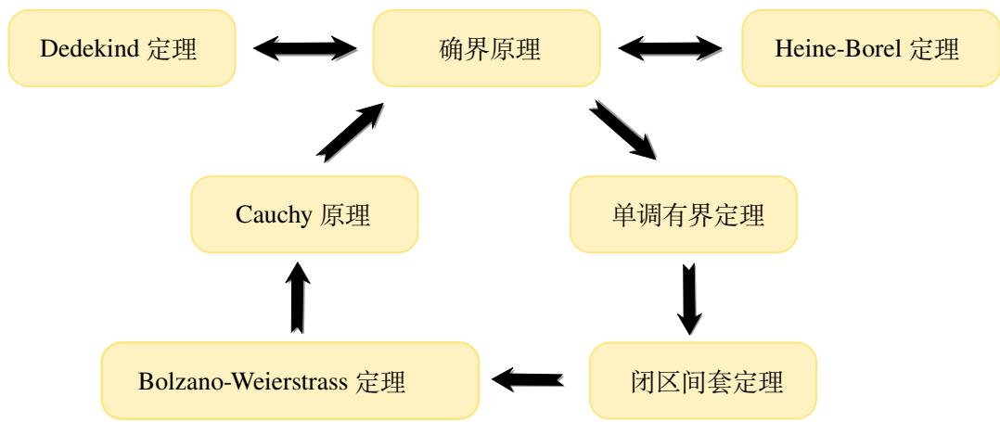

图 2.9: 实数的完备性定理.

注 以上七个命题从不同角度, 用不同模型等价地刻画了实数域的完备性. 反过来也可以通过其中的任意一个命题出发构建实数集, 我们可以用一个 Dedekind 分割来定义一个实数, 也可以用一个基本列来定义一个实数, 也可以通过一个闭区间套定一个实数等等.  
注 (vi) 的证明用到了 Archimedes 性质.

实数的七个完备性定理从不同角度, 用不同模型等价地刻画了实数域的完备性. 因此用 Dedekind 分割定义实数不是唯一的选择. 我们也可以用闭区间套 (无尽小数实际就是闭区间套模型) 或 Cauchy 列来定义实数. 将来我们还会用 Cauchy列来定义一般 “度量空间” 的完备性.

