# 第 3 章 函数的极限和连续性

# 内容提要

h 介绍函数极限的概念.  
h Heine 定理可以把函数极限的问题归结为数列级数, 由此可以得出一系列与数列极限类似的简单性质.  
h 引入 Landau 记号: 大 O 和小 o 记号.

h 用函数极限定义函数的连续性.  
h 介绍连续函数极限的常见计算方法.  
h 讨论闭区间上连续函数的三个主要性质: 一致连续性、有界性和介值性.

数学分析中的主要研究对象是函数, 而且主要是连续函数, 至少是 “几乎连续” 的函数. 经典物理学中遇到函数也基本上都是这样的函数. 在经典物理学中甚至有一句格言:“自然界中, 一切都是连续的.”

一元函数的连续性是一个自然直观的概念. 从几何上看, 所谓的连续是指当函数的自变量变换足够小的时候,函数值的变化量也足够小. 为了严格刻画函数的连续性, 我们需要函数极限的概念. 数列可以看作一种特殊的函数, 因此 $\varepsilon - N$ 叙述的极限定义可以很容易地推广到函数极限中, 只是函数极限的极限过程会比数列稍微复杂一些.

另一方面,也可以直接用邻域的观点来刻画函数极限的概念.事实上这样定义函数极限更好.这是因为用邻域刻画函数连续性更容易推广, 我们将在《数学分析 II》中讨论这个问题.

# 3.1 函数的极限

# 3.1.1 函数极限的概念

现代微积分中, 函数的三大概念——连续、微分 (导数)、积分都是用极限定义的. 为此需要先讨论函数的极限.在没有特殊声明的情况下,《数学分析I》中提到的函数都是指集合 $D \subseteq \mathbb { R }$ 到 $\mathbb { R }$ 的映射,即一元实变实值函数.

我们已经学会了用 $\varepsilon - N$ 语言以及邻域的观点来定义数列的极限.我们可以类比数列极限的定义来定义函数极限. 设极限为 $a$ 的数列 $\left\{ a _ { n } \right\}$ . 我们把它列看作定义域为正整数集 $\mathbb { N } ^ { * }$ 的函数. 则可以用如下方式描述它的极限:对于 $a$ 的任一邻域 $N _ { \varepsilon } ( a )$ 总存在一个 $+ \infty$ 的邻域 $N _ { N } ( + \infty )$ 使得 $N _ { N } ( + \infty )$ 在这个函数下的值域包含于 $N _ { \varepsilon } ( a )$ .

通过类比, 不难得到函数极限的定义.

# 定义 3.1 (函数的极限)

设函数 $f$ 在 $x _ { 0 }$ 的一个去心邻域 $\check { N } _ { r } ( x _ { 0 } )$ 上有定义. 若对于 $a$ 的任一邻域 $N _ { \varepsilon } ( a )$ , 都存在 $x _ { 0 }$ 的一个去心邻域$\check { N } _ { \delta } ( x _ { 0 } )$ , 使得 $f \left[ \check { N } _ { \delta } ( x _ { 0 } ) \right] \subseteq N _ { \varepsilon } ( a )$ . 则称当 $x \longrightarrow x _ { 0 }$ 时函数 $f$ 在 $x _ { 0 }$ 处的极限是 $a$ , 记作

$$
\lim  _ {x \to x _ {0}} f (x) = a \quad {\text {或}} \quad f (x) \to a     (x \to x _ {0}).
$$

注 讨论函数 $f$ 在 $x _ { 0 }$ 处的极限, 不要求 $f$ 在 $x _ { 0 }$ 处有定义.

注 函数 $f$ 的极限是一个 “局部概念”, 因此讨论 $x \longrightarrow x _ { 0 }$ 时的极限只需 $f ( x )$ 在 $x _ { 0 }$ 的附近有定义.

注 我们也可以用 $\varepsilon - \delta$ 语言刻画函数的极限: 函数 $f$ 在 $x _ { 0 }$ 处的极限是 $a$ 当且仅当对于任一 $\varepsilon > 0$ , 存在 $\delta > 0$ 使得当 $x$ 满足 $0 < | x - x _ { 0 } | < \delta$ 时都有 $| f ( x ) - a | < \varepsilon$ , 即

$$
\forall \varepsilon > 0, \exists \delta > 0, \forall x \in (x _ {0} - \delta , x _ {0}) \cup (x _ {0}, x _ {0} + \delta), s. t. | f (x) - a | <   \varepsilon .
$$

以上 $\delta$ 是依赖于 $\varepsilon$ 而确定的, 因此我们可以把 $\delta$ 写成 $\delta ( \varepsilon )$ 或 $\delta _ { \varepsilon }$ , 但这并不表示 $\delta$ 是 $\varepsilon$ 的函数. 这里的 $\delta$ 和数列极限定义中的 $N$ 起着相同的作用.

注 如果 $f ( x )$ 在 $x _ { 0 }$ 处的极限不为 $a$ 则可以叙述为: 存在 $\varepsilon > 0$ 对于任一 $\delta > 0$ 存在 $x \in N _ { \delta } ( x _ { 0 } )$ 使得 $| f ( x ) - a | \geqslant \varepsilon$

和数列极限一样, 函数极限的定义也有一些常用的等价叙述.

例 3.1 设函数 $f$ 在 $x _ { 0 }$ 的一个去心邻域内由定义. 则 $\textstyle \operatorname* { l i m } _ { x \to x _ { 0 } } f ( x ) = a$ 当且仅当

(1) 对于任一 $\varepsilon > 0$ 都存在 $\delta > 0$ 使得当 $x \in \check { N } _ { \delta } ( x _ { 0 } )$ 时, $| f ( x ) - a | \leqslant \varepsilon$ .  
(2) 对于任一 $\varepsilon > 0$ 都存在 $\delta > 0$ 使得当 $x \in \check { N } _ { \delta } ( x _ { 0 } )$ 时, $\left| f ( x ) - a \right| < k \varepsilon \left( k \in \mathbb { R } ^ { + } \right)$   
(3) 对于任一 $n \in \mathbb { N } ^ { * }$ 都存在 $\delta > 0$ 使得当 $x \in \check { N } _ { \delta } ( x _ { 0 } )$ 时, $| f ( x ) - a | < 1 / n$   
(4) 对于任一 $\varepsilon > 0$ 都存在 $n \in \mathbb { N } ^ { * }$ 使得当 $x \in \check { N } _ { 1 / n } ( x _ { 0 } )$ 时, $| f ( x ) - a | < \varepsilon$

下面看几个直接用定义证明函数极限的例子.

例 3.2 求证:

$$
\lim  _ {x \rightarrow 0} x \sin \frac {1}{x} = 0.
$$

证明 显然函数 $x \sin ( 1 / x )$ 在 0 的附近有定义. 对于任一 $\varepsilon > 0$ 取 $\delta = \varepsilon$ . 当 $| x | < \delta$ 时

$$
\left| x \sin \frac {1}{x} - 0 \right| = \left| x \sin \frac {1}{x} \right| \leqslant | x | <   \delta = \varepsilon .
$$

于是可知

$$
\lim  _ {x \rightarrow 0} x \sin \frac {1}{x} = 0.
$$

例 3.3 求证:

$$
\lim  _ {x \rightarrow 3} (x ^ {2} - 4 x + 4) = 1.
$$

证明 对于任一 $\varepsilon > 0$ . 当 $| x - 3 | \leqslant 1$ 时,

$$
\left| \left(x ^ {2} - 4 x + 4\right) - 1 \right| = | x - 3 | | x - 1 | \leqslant | x - 3 | | 4 - 1 | = 3 | x - 3 |.
$$

因此只需取 $\delta = \operatorname* { m i n } \{ 1 , \varepsilon / 3 \}$ , 当 $| x - 3 | < \delta$ 时

$$
\left| \left(x ^ {2} - 4 x + 4\right) - 1 \right| \leqslant 3 | x - 3 | <   3 \delta <   \varepsilon .
$$

于是可知

$$
\lim  _ {x \rightarrow 3} (x ^ {2} - 4 x + 4) = 1.
$$

注 设函数 $f ( x ) = x ^ { 2 } - 4 x + 4$ , 观察到 $f ( 3 ) = 1$ . 这不是巧合, 在下一节将看到这正说明 $f ( x )$ 在 $x = 3$ 处连续. 从这里看到 “连续函数” 的极限是很容易求得的.

例 3.4 求证:

$$
\lim  _ {x \rightarrow 1} \frac {x ^ {2} - 1}{x ^ {2} - x} = 2.
$$

证明 对于任一 $\varepsilon > 0$ . 当 $0 < | x - 1 | \leqslant 1 / 2$ 时,

$$
\left| \frac {x ^ {2} - 1}{x ^ {2} - x} - 2 \right| = \left| \frac {x + 1}{x} - 2 \right| = \left| \frac {x - 1}{x} \right| \leqslant 2 | x - 1 |.
$$

因此只需取 $\delta = \operatorname* { m i n } \{ 1 / 2 , \varepsilon / 2 \}$ , 当 $| x - 1 | < \delta$ 时

$$
\left| \frac {x ^ {2} - 1}{x ^ {2} - x} - 2 \right| \leqslant 2 | x - 1 | <   2 \delta \leqslant \varepsilon .
$$

于是可知

$$
\lim  _ {x \rightarrow 1} \frac {x ^ {2} - 1}{x ^ {2} - x} = 2.
$$

注 以上函数在 $x = 1$ 处没有定义, 但这不影响它在这一点有极限. 另外, 以下两个函数除了 $x = 1$ 以外完全相同:

$$
f (x) = \frac {x ^ {2} - 1}{x ^ {2} - x}, \qquad g (x) = \frac {x + 1}{x}.
$$

所以它们在 $x = 1$ 处的极限也是一样的, 注意到 $g ( 1 ) = 2$ , 这也不是巧合, 这正说明 $g ( x )$ 在 $x = 1$ 处连续.

函数极限定义中的极限过程 $x  x _ { 0 }$ 是指自变量从左右两侧趋近 $x _ { 0 }$ . 事实上从单侧趋近 $x _ { 0 }$ 时, 也可以定义函数的极限.

# 定义 3.2 (左邻域和右邻域)

给定 $a \in \mathbb { R }$ . 令

$$
N _ {r} ^ {-} (a) := (a - r, a), \quad N _ {r} ^ {+} (a) := (a, a + r).
$$

我们称 $N _ { r } ^ { - } ( a )$ 为以 $a$ 点为中心, $r$ 为半径的左邻域 (left neighbourhood); 称 $N _ { r } ^ { + } ( a )$ 为以 $a$ 点为中心, $r$ 为半径的右邻域 (right neighbourhood).

# 定义 3.3 (单侧极限)

设函数 $f$ 在 $x _ { 0 }$ 的左邻域 $N ^ { - } ( x _ { 0 } )$ 上有定义. 若对于 $a$ 的任一邻域 $N _ { \varepsilon } ( a )$ , 都存在 $x _ { 0 }$ 的一个左邻域 $N _ { \delta } ^ { - } ( x _ { 0 } )$ 使得 $f \left[ N _ { \delta } ^ { - } ( x _ { 0 } ) \right] \subseteq N _ { \varepsilon } ( a ) .$ . 则称 $f ( x )$ 在 $x _ { 0 }$ 处的左极限 (left limit) 是 $a$ , 记作

$$
\lim  _ {x \to x _ {0} -} f (x) = a \quad {\text {或}} \quad f (x _ {0} -) = a.
$$

设函数 $f$ 在 $x _ { 0 }$ 的右邻域 $N ^ { + } ( x _ { 0 } )$ 上有定义. 若对于 $a$ 的任一邻域 $N _ { \varepsilon } ( a )$ , 都存在 $x _ { 0 }$ 的一个右邻域 $N _ { \delta } ^ { + } ( x _ { 0 } )$ 使得 $f \left[ { \cal N } _ { \delta } ^ { + } ( x _ { 0 } ) \right] \subseteq { \cal N } _ { \varepsilon } ( a )$ . 则称 $f ( x )$ 在 $x _ { 0 }$ 处的右极限 (right limit) 是 $a$ , 记作

$$
\lim  _ {x \to x _ {0} +} f (x) = a \quad {\text {或}} \quad f (x _ {0} +) = a.
$$

函数的左极限和右极限统称为函数的单侧极限 (one-sided limit).

记号 $f ( x _ { 0 } - )$ 可以不严格地理解为 “在 $x _ { 0 }$ 上减去一个任意小的正数时函数值的趋势”, 因此有些书上记作$f ( x _ { 0 } - 0 )$ . 需要注意符号 $f ( x _ { 0 } - )$ 和 $f ( x _ { 0 } + )$ 不表示 $f ( x )$ 在 $x _ { 0 }$ 处的函数值. $f ( x )$ 在 $x _ { 0 }$ 处未必有定义, 即使有定义 $f ( x _ { 0 } ) , f ( x _ { 0 } - )$ $f ( x _ { 0 } )$ 和 $f ( x _ { 0 } + )$ 三者之间也可以两两不等. 下面看一个例子.

例 3.5 设函数

$$
\operatorname {s g n} (x) = \left\{ \begin{array}{l l} - 1 & x <   0 \\ 0 & x = 0 \\ 1 & x > 0 \end{array} \right..
$$

此时 $\operatorname { s g n } ( 0 ) = 0$ , $\operatorname { s g n } ( 0 - ) = - 1$ 和 $\operatorname { s g n } ( 0 + ) = 1$ .

注 以上函数称为符号函数 (sign function).

下面的结论是显然的.

# 命题 3.1

设函数 $f$ 在 $\check { N } ( x _ { 0 } )$ 有定义. 则 $f ( x )$ 在 $x _ { 0 }$ 处有极限 $a$ 当且仅当 $f ( x _ { 0 } + ) = f ( x _ { 0 } - ) = a$

有时候直接求极限不方便, 可以先分别求单侧极限. 下面看一个例子.

例 3.6 求证:

$$
\lim  _ {x \rightarrow 0} \frac {\sin x}{x} = 1.
$$

解 令 $f ( x ) = ( \sin x ) / x .$ . 显然 $f ( x )$ 在 0 的邻域有定义.

(i) 先证明 $f ( 0 + ) = 1$ . 当 $x \in ( 0 , \pi / 2 )$ 时有

$$
\sin x <   x <   \tan x \Longleftrightarrow \frac {1}{\sin x} > \frac {1}{x} > \frac {1}{\tan x} \Longleftrightarrow 1 > \frac {\sin x}{x} > \cos x \Longleftrightarrow 0 <   1 - \frac {\sin x}{x} <   1 - \cos x.
$$

由于

$$
0 <   1 - \cos x = 2 \sin^ {2} \frac {x}{2} <   2 \left(\frac {x}{2}\right) ^ {2} = \frac {x ^ {2}}{2} <   \frac {\pi}{4} x.
$$

因此对于任一 $\varepsilon > 0$ 可取 $\delta = \operatorname* { m i n } \{ \pi / 2 , 4 \varepsilon / \pi \}$ . 当 $x \in ( 0 , \delta )$ 时

$$
0 <   1 - \frac {\sin x}{x} <   \frac {\pi}{4} x <   \frac {\pi}{4} \delta \leqslant \varepsilon .
$$

这表明 $f ( 0 + ) = 1$ .

(ii) 容易验证 $f ( x )$ 是一个偶函数, 即 $f ( - x ) = f ( x )$ . 由于 $f ( 0 + ) = 1$ , 故对于任一 $\varepsilon > 0$ 存在 $\delta > 0$ 使得当$0 < x < \delta$ 时 $| f ( x ) - 1 | < \varepsilon$ . 因此当 $0 < - x < \delta$ , 即 $- \delta < x < 0$ 时

$$
| f (x) - 1 | = | f (- x) - 1 | <   \varepsilon .
$$

这表明 $f ( 0 - ) = 1$ . 于是可知

$$
\lim  _ {x \rightarrow 0} \frac {\sin x}{x} = 1.
$$

注以上证明中用到了重要不等式

$$
\sin \alpha <   \alpha <   \tan \alpha , \quad \alpha \in (0, \pi / 2).
$$

可以用面积法证明这个不等式.如图3.1所示,作单位圆 $o$ 交 $x$ 轴于 ??. 以 $O A$ 为始边,作大小为 $\alpha$ 的第一象限角交单位圆于 $B$ . 过 $A$ 作 $x$ 轴的垂线交 $O B$ 延长线于??. 容易看出

$$
S _ {\triangle A O B} <   S _ {\text {扇 形} O A B} <   S _ {\triangle A O C} \Longleftrightarrow \frac {1}{2} \sin \alpha <   \pi \cdot \frac {\alpha}{2 \pi} <   \frac {1}{2} \cdot \tan \alpha \Longleftrightarrow \sin \alpha <   \alpha <   \tan \alpha .
$$

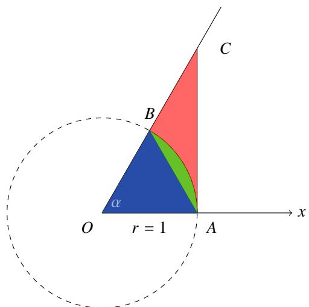  
图 3.1: sin ??, ?? 和 tan $\alpha$ 的大小比较.

注这里需要说明,以上证明是不严格的,因此我们尚未定义面积、长度.事实上,我们甚至没有定义过三角函数.若要严格定义长度和面积, 需要用到积分; 若要严格定义三角函数、指数函数等超越函数, 需要用幂级数. 幂级数只用到了实数的代数运算,通过极限可以严格定义超越函数.但本讲义并不选择这样做,是因为这样做虽然可以使得逻辑链更加完善缜密, 但却违背了人的认知规律, 造成读者学习的困难.

数列的极限只有一种极限过程 $n \to \infty$ . 而函数的情况更加复杂一些——算上单侧极限, 函数的极限过程有 6种. 算上无穷大, 极限值有 4 种情况. 我们没有必要对每一种情况都给出详尽定义, 只需掌握每一种情况下的不同之处就可以了.

<table><tr><td>极限过程</td><td>ε-δ定义</td></tr><tr><td>x→x0</td><td>... , ∃δ&gt;0, ∀x∈Nδ(x0), ...</td></tr><tr><td>x→x0+</td><td>... , ∃δ&gt;0, ∀x∈Nδ+(x0), ...</td></tr><tr><td>x→x0-</td><td>... , ∃δ&gt;0, ∀x∈Nδ-(x0), ...</td></tr><tr><td>x→+∞</td><td>... , ∃A&gt;0, ∀x∈NA(+∞), ...</td></tr><tr><td>x→-∞</td><td>... , ∃A&gt;0, ∀x∈NA(-∞), ...</td></tr><tr><td>x→∞</td><td>... , ∃A&gt;0, ∀x∈NA(∞), ...</td></tr></table>

<table><tr><td>极限值</td><td>ε-δ定义</td></tr><tr><td>a</td><td>∀ε&gt;0,···, f(x)∈Nε(a)</td></tr><tr><td>+∞</td><td>∀E&gt;0,···, f(x)∈NE(+∞)</td></tr><tr><td>-∞</td><td>∀E&gt;0,···, f(x)∈NE(-∞)</td></tr><tr><td>∞</td><td>∀E&gt;0,···, f(x)∈NE(∞)</td></tr></table>

根据上表, 可以搭配出 24 种不同的情况, 若左边选取极限过程 $x  x _ { 0 } -$ , 右边选取极限值 $+ \infty$ , 则可以得到相应的定义:

$$
\forall E > 0, \exists \delta > 0, \forall x \in \tilde {N} _ {\delta} ^ {-} (x _ {0}), f (x) \in N _ {E} (+ \infty).
$$

若约定记号

$$
f (+ \infty) := \lim  _ {x \to + \infty} f (x), \quad f (- \infty) := \lim  _ {x \to - \infty} f (x).
$$

则

$$
\lim  _ {x \rightarrow \infty} f (x) = a \iff f (+ \infty) = f (- \infty) = a.
$$

下面来看一个例子.

例 3.7 求证:

$$
\lim  _ {x \rightarrow + \infty} \left(1 + \frac {1}{[ x ]}\right) ^ {[ x ]} = \mathrm {e}, \quad x \geqslant 0.
$$

其中 [ ] 是下取整函数.

证明 由于数列 $( 1 + 1 / n ) ^ { n } \to { \bf e }$ 因此对于任意 $\varepsilon > 0$ 都存在 $N \in \mathbb { N } ^ { * }$ 使得当 $n \geqslant N$ 时

$$
0 <   \mathrm {e} - \left(1 + \frac {1}{n}\right) ^ {n} <   \varepsilon .
$$

当 $x \geqslant N$ 时, $[ x ] \geqslant N$ . 由于 $( 1 + 1 / n ) ^ { n }$ 单调趋于 e, 故

$$
0 <   \mathrm {e} - \left(1 + \frac {1}{[ x ]}\right) ^ {[ x ]} \leqslant \mathrm {e} - \left(1 + \frac {1}{N}\right) ^ {N} <   \varepsilon .
$$

于是可知

$$
\lim  _ {x \rightarrow + \infty} \left(1 + \frac {1}{[ x ]}\right) ^ {[ x ]} = e.
$$

最后来看一个比较难的例子.

例 3.8Thomae 函数 设函数 $T ( x )$ 满足

$$
T (x) = \left\{ \begin{array}{l l} 1, & x = 0 \\ \frac {1}{q}, & x = \frac {p}{q} \\ 0, & x \in \mathbb {R} \backslash \mathbb {Q} \end{array} \right.,
$$

其中 $q > 0 , p , q \in \mathbb { Z } ^ { * }$ , 且 $p , q$ 互素. 则

$$
\lim  _ {x \to x _ {0}} T (x) = 0, \quad \forall x _ {0} \in \mathbb {R}.
$$

证明 若要证明 $\begin{array} { r } { \operatorname* { l i m } _ { x \to x _ { 0 } } T ( x ) \ = \ 0 } \end{array}$ . 只需证明对于 0 的任一邻域 $N _ { \varepsilon } ( 0 )$ 都存在 $x _ { 0 }$ 的一个去心邻域 $\check { N } _ { \delta } ( x _ { 0 } )$ 使得$f [ { \check { N } } _ { \delta } ( x _ { 0 } ) ] \subseteq N _ { \varepsilon } ( 0 )$ . 由于 $T ( x ) \geqslant 0$ $\forall x \in \mathbb { R } )$ , 故只需使得 $f [ { \check { N } } _ { \delta } ( x _ { 0 } ) ] \subseteq [ 0 , \varepsilon )$ . 由于任一无理数的函数值都是零, 因此只需考虑有理点的情况, 即只需找到一个 $\check { N } _ { \delta } ( x _ { 0 } )$ 使得其中的有理点的函数值都落在区间 $[ 0 , \varepsilon )$ 内.

取 $q _ { 0 } = [ 1 / \varepsilon ] + 1$ , 则 $1 / q _ { 0 } < \varepsilon .$ 先考虑 $x _ { 0 }$ 的去心邻域 $\check { N } _ { 1 } ( x _ { 0 } )$ .由于满足 $0 < q \leqslant q _ { 0 }$ 的自然数 $q$ 只有有限个,因此 $\check { N } _ { 1 } ( x _ { 0 } )$ 中分母为 $q$ 的既约分数 $p / q$ 只有有限个. 因此总能找到充分小的 $\delta > 0$ 使得 $\check { N } _ { \delta } ( x _ { 0 } )$ 中的既约分数的分母全部大于 $q _ { 0 }$ . 于是当 $x = p _ { x } / q _ { x } \in \check { N } _ { \delta } ( x _ { 0 } )$ 时

$$
T \left(\frac {p _ {x}}{q _ {x}}\right) = \frac {1}{q _ {x}} <   \frac {1}{q _ {0}} <   \varepsilon .
$$

这表明有 $\begin{array} { r } { \operatorname* { l i m } _ { x  x _ { 0 } } T ( x ) = 0 } \end{array}$ .

注 以上定义的函数 $T ( x )$ 通常称为 Thomae 函数 (Thomae’s function). 它还有很多别称, 不同书上可能名称不一致.

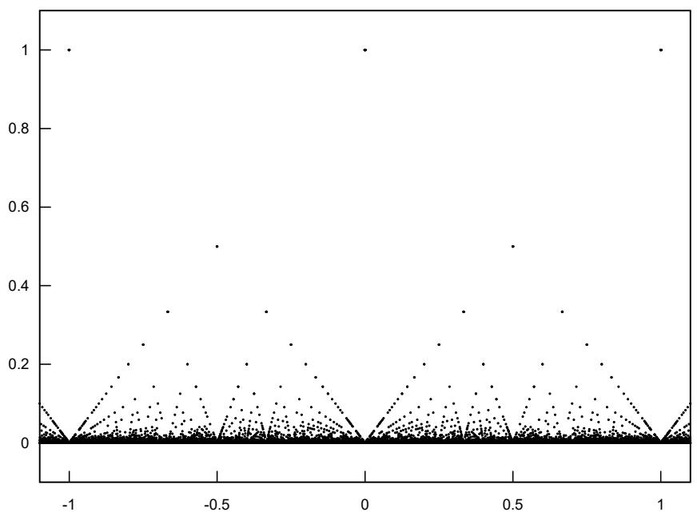  
图 3.2: Thomae 函数示意图

# 3.1.2 函数极限的性质

函数的极限和数列的极限有着紧密的联系. 用以下定理可以把函数极限的问题转化为数列极限的问题.

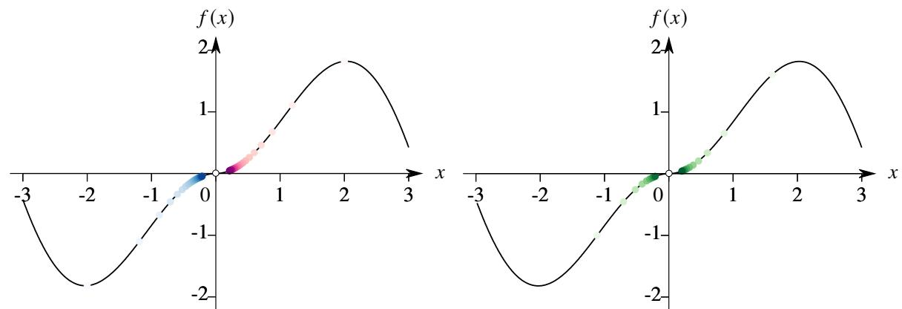

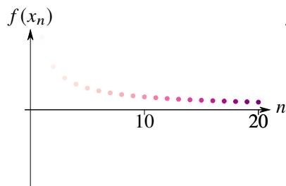

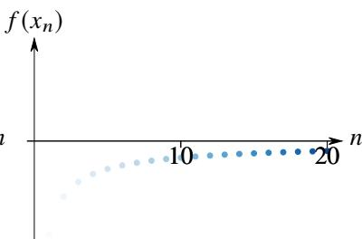

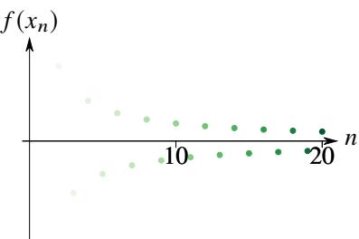  
图 3.3: 任一数列 (图中给出了三个数列) 趋于 0 时, 数列 $f ( x _ { n } )$ 都趋近 0.

# 定理 3.1 (Heine 定理)

设函数 $f$ 在去心邻域 $\check { N } ( x _ { 0 } )$ 有定义. 则 $\begin{array} { r } { \operatorname* { l i m } _ { x  x _ { 0 } } f ( x ) = a } \end{array}$ 的充要条件是 $\check { N } ( x _ { 0 } )$ 中的任一数列趋于 $x _ { 0 }$ 的数列 $\left\{ x _ { n } \right\}$ 都满足 $f ( x _ { n } )  a$ .

证明 (i) 证明必要性. 若 $\textstyle \operatorname* { l i m } _ { x \to x _ { 0 } } f \left( x \right) = a$ , 则对于任一 $\varepsilon > 0$ 都存在 $\delta > 0$ 使得当 $x \in \check { N } _ { \delta } ( x _ { 0 } )$ 时 $f ( x ) \in N _ { \varepsilon } ( a )$ . 对于取定的 $\delta$ , 若数列 $x _ { n } \to x _ { 0 }$ , 则存在 $N \in \mathbb { N } ^ { * }$ 使得当 $n > N$ 时 $x _ { n } \in \check { N } _ { \delta } ( x _ { 0 } )$ . 因此当 $n > N$ 时 $f ( x _ { n } ) \in N _ { \varepsilon } ( a )$ . 于是可知数列 $f ( x _ { n } )  a$ .

(ii) 证明充分性. 假设 $\textstyle \operatorname* { l i m } _ { x \to x _ { 0 } } f ( x ) = a$ 不成立. 则存在 $\varepsilon _ { 0 } > 0$ 对于任一 $n \in \mathbb { N } ^ { * }$ 存在一点 $x _ { n } \in \check { N } _ { 1 / n } ( x _ { 0 } )$ 使得$f ( x _ { n } ) \not \in N _ { \varepsilon _ { 0 } } ( a )$ . 容易知道, 当 $k \geqslant n$ 时

$$
x _ {k} \in \tilde {N} _ {1 / k} (x _ {0}) \subseteq \tilde {N} _ {1 / n} (x _ {0}).
$$

这表明, 我们就已经找到了一个数列 $\{ x _ { n } \} \subseteq { \check { N } } ( x _ { 0 } )$ , 它收敛于 $x _ { 0 }$ , 但 $f ( x _ { n } )$ 不收敛于 ??. 于是可知充分性成立.

注 定理中的 $\{ f ( x _ { n } ) \}$ 也是一个数列.

注 以上结论也称为归结原理. 有时也可以用 Heine 定理作为函数极限定义, 这种定义称为极限的数列式定义. 之后如果用函数极限定义概念 (比如函数的连续等), 都可以用数列式定义.

如果要证明函数 $f$ 在 $x _ { 0 }$ 处的极限不存在, 根据 Heine 定理, 只需在 $\check { N } ( x _ { 0 } )$ 中找到两个趋于 $x _ { 0 }$ 的数列 $\left\{ a _ { n } \right\}$ 和$\left\{ b _ { n } \right\}$ , 然后证明数列 $\{ f ( a _ { n } ) \}$ 和 $\{ f ( b _ { n } ) \}$ 的极限不相等. 下面看两个例子.

例 3.9 设函数

$$
f (x) = \sin \frac {1}{x}.
$$

则 $f ( x )$ 在 0 处的极限不存在.

证明 设数列

$$
a _ {n} = \frac {1}{2 n \pi + \pi / 2}, \quad b _ {n} = \frac {1}{2 n \pi}.
$$

显然 $\begin{array} { r } { \operatorname* { l i m } _ { n \to \infty } a _ { n } = \operatorname* { l i m } _ { n \to \infty } b _ { n } = 0 } \end{array}$ 且 $a _ { n } \neq 0$ , $b _ { n } \neq 0$ $( n = 1 , 2 , \cdots )$ . 然而

$$
f (a _ {n}) = \sin \left(2 n \pi + \frac {\pi}{2}\right) = 1, \quad f (b _ {n}) = \sin 2 n \pi = 0.
$$

由 Heine 定理可知 $f ( x )$ 在 0 处的极限不存在.

例 3.10 设函数 $D ( x )$ 满足

$$
D (x) = \left\{ \begin{array}{l l} 1, & x \in \mathbb {Q} \\ 0, & x \in \mathbb {R} \backslash \mathbb {Q} \end{array} \right..
$$

则 $D ( x )$ 在定义域上的任一点都没有极限.

证明 对于任一 $x _ { 0 } \in \mathbb { R } .$ , 它的任一邻域 $N ( x _ { 0 } )$ 都包含无穷多个有理数和无理数, 因此一定存在一个收敛到 $x _ { 0 }$ 的有理数列 $\left\{ s _ { n } \right\}$ 和一个收敛到 $x _ { 0 }$ 的无理数列 $\left\{ t _ { n } \right\}$ . 由 $D ( x )$ 的定义可知

$$
\lim  _ {n \to \infty} D (s _ {n}) = 1, \quad \lim  _ {n \to \infty} D (t _ {n}) = 0.
$$

由 Heine 定理可知 $D ( x )$ 在 $x _ { 0 }$ 处没有极限.

注 以上定义的函数 $D ( x )$ 称为 Dirichlet 函数 (Dirichlet function).

有了 Heine 定理, 我们可以容易地将函数极限的问题转化为序列极限的问题. 这样就可以在函数中建立一系列与数列极限类似的命题.

# 命题 3.2 (函数极限的唯一性)

设函数 $f$ . 若 $\scriptstyle \operatorname* { l i m } _ { x \to x _ { 0 } } f ( x )$ 存在, 则它是唯一的.

证明 任取极限为 $x _ { 0 }$ 的数列 $\{ x _ { n } \neq x _ { 0 } : n = 1 , 2 , \cdot \cdot \cdot \} .$ . 由于 $\scriptstyle \operatorname* { l i m } _ { x \to x _ { 0 } } f ( x )$ 存在, 由 Heine 定理可知

$$
\lim  _ {n \rightarrow \infty} f (x _ {n}) = \lim  _ {x \rightarrow x _ {0}} f (x).
$$

由于数列极限的唯一性可知 $\scriptstyle \operatorname* { l i m } _ { x \to x _ { 0 } } f ( x )$ 也是唯一的.

注 以上命题对应数列中的命题2.18.

# 命题 3.3

设函数 $f$ 在 $x _ { 0 }$ 处有极限, 则存在 $M > 0$ , $\delta > 0$ 使得当 $x \in \check { N } _ { \delta } ( x _ { 0 } )$ 时 $| f ( x ) | < M$ .

证明 设 $\textstyle \operatorname* { l i m } _ { x \to x _ { 0 } } f ( x ) = a$ . 则存在 $\delta > 0$ 使得当 $x \in \check { N } _ { \delta } ( x _ { 0 } )$ 时 $| f ( x ) - a | < 1 .$ 于是

$$
\left| f (x) \right| \leqslant \left| f (x) - a \right| + | a | <   1 + | a |.
$$

令 $M = 1 + | a |$ . 则当 $x \in \check { N } _ { \delta } ( x _ { 0 } )$ 时 $| f ( x ) | < M$ .

注 以上命题对应数列中的命题2.20.

注 以上定理表明 $f ( x )$ 在 $x _ { 0 }$ 处有极限则它在 $x _ { 0 }$ 的附近局部有界.

用以上命题的逆否命题可以证明某些函数的极限不存在. 若要证明 $f ( x )$ 在 $x _ { 0 }$ 处的极限不存在, 只需证明 $x _ { 0 }$ 的任一邻域 $N ( x _ { 0 } )$ 内函数都无界.

例 3.11 设函数

$$
T (x) = \left\{ \begin{array}{l l} 1, & x = 0 \\ q, & x = \frac {p}{q} \\ 0, & x \in \mathbb {R} \backslash \mathbb {Q} \end{array} \right.,
$$

其中 $q > 0 , p , q \in \mathbb { Z } ^ { * }$ $q > 0$ 且 $p , q$ 互素. 则 $T ( x )$ 在 $\mathbb { R }$ 上的每一点都没有极限.

证明 只需证明 $T ( x )$ 在 $\mathbb { R }$ 上的任意一点 $x _ { 0 }$ 的附近都无界. 只需证明对于任一 $M > 0$ , $\delta > 0$ 都存在 $x \in \check { N } _ { \delta } ( x _ { 0 } )$ 满足 $| T ( x ) | > M$ .

取 $q _ { 0 } = [ M ] + 1 $ , 则 $q _ { 0 } > M$ . 由于满足 $0 < q \leqslant q _ { 0 }$ 的自然数 $q$ 只有有限个, 因此 $\check { N } _ { \delta } ( x _ { 0 } )$ 中分母为 $q$ 的既约分数 $p / q$ 只有有限个. 因此总是存在 $x = p _ { x } / q _ { x } \in \check { N } _ { \delta } ( x _ { 0 } )$ 满足

$$
T \left(\frac {p _ {x}}{q _ {x}}\right) = q _ {x} > q _ {0} > M.
$$

这表明 $T ( x )$ 在 $x _ { 0 }$ 的任一邻域内都无界, 于是可知它在 $x _ { 0 }$ 处没有极限.

注 比较例3.8.

# 定理 3.2 (函数极限的运算)

设函数 $f$ 和 $g$ 在 $x _ { 0 }$ 处有极限, 且 $\textstyle \operatorname* { l i m } _ { x \to x _ { 0 } } f ( x ) = a$ , $\begin{array} { r } { \operatorname* { l i m } _ { x \to x _ { 0 } } g ( x ) = b . } \end{array}$ . 则

(1) $\operatorname* { l i m } _ { x  x _ { 0 } } ( f \pm g ) ( x ) = a \pm b .$   
(2) lim→ ?? ??(??) = ????.   
(3) $\operatorname* { l i m } _ { x \to x _ { 0 } } { \frac { f } { g } } ( x ) = { \frac { a } { b } } , \quad b \neq 0 .$

$$
(4) \lim  _ {x \rightarrow x _ {0}} | f (x) | = | a |.
$$

证明 只证明 (3). 任取极限为 $x _ { 0 }$ 的数列 $\left\{ x _ { n } \neq x _ { 0 } : n = 1 , 2 , \cdot \cdot \cdot \right\} .$ . 由于 $\textstyle \operatorname* { l i m } _ { x \to x _ { 0 } } f ( x ) = a$ , $\begin{array} { r } { \operatorname* { l i m } _ { x \to x _ { 0 } } g ( x ) = b } \end{array}$ . 由 Heine定理可知

$$
\lim  _ {n \to \infty} f (x _ {n}) = a, \quad \lim  _ {n \to \infty} g (x _ {n}) = b \neq 0.
$$

由数列极限的运算法则可知 $\begin{array} { r } { \operatorname* { l i m } _ { n \to \infty } f ( x _ { n } ) / g ( x _ { n } ) = a / b . } \end{array}$ 再用 Heine 定理即知命题成立.

注 以上命题对应数列中的命题2.22.

和数列类似, 开方运算也可以在函数极限中成立.

例 3.12 设函数 $f$ . 若 $\textstyle \operatorname* { l i m } _ { x \to x _ { 0 } } f ( x ) = a$ . 则

(1) $\operatorname* { l i m } _ { x \to x _ { 0 } } { \sqrt { f ( x ) } } = { \sqrt { a } } , \quad a > 0 .$   
(2) $\operatorname* { l i m } _ { x \to x _ { 0 } } { \sqrt [ { 3 } ] { f ( x ) } } = { \sqrt [ { 3 } ] { a } } .$

# 命题 3.4 (函数极限的夹逼定理)

设函数 $f , g , h$ 在 $\check { N } _ { r } ( x _ { 0 } )$ 有定义且满足

$$
f (x) \leqslant h (x) \leqslant g (x), \quad \forall x \in \tilde {N} _ {r} (x _ {0}).
$$

若

$$
\lim  _ {x \rightarrow x _ {0}} f (x) = \lim  _ {x \rightarrow x _ {0}} g (x) = a.
$$

则 $\scriptstyle \operatorname* { l i m } _ { x \to x _ { 0 } } h ( x ) = a$

证明 任取极限为 $x _ { 0 }$ 的数列 $\{ x _ { n } \} \subseteq \check { N } _ { r } ( x _ { 0 } )$ . 由于 $\begin{array} { r } { \operatorname* { l i m } _ { n \to x _ { 0 } } f ( x ) = \operatorname* { l i m } _ { n \to x _ { 0 } } g ( x ) = a . } \end{array}$ . 由 Heine 定理可知

$$
\lim  _ {n \rightarrow \infty} f (x _ {n}) = \lim  _ {n \rightarrow \infty} g (x _ {n}) = a.
$$

由于对于任一 $x \in \check { N } _ { r } ( x _ { 0 } )$ 都有 $f ( x ) \leqslant h ( x ) \leqslant g ( x ) .$ . 因此 $f ( x _ { n } ) \leqslant h ( x _ { n } ) \leqslant g ( x _ { n } )$ $\mathbf { \Phi } _ { n } = 1 , 2 , \cdots ,$ ). 由数列极限的夹逼定理可知 $\scriptstyle \operatorname* { l i m } _ { n \to \infty } h ( x _ { n } ) = a$ . 由 Heine 定理可知 $\scriptstyle \operatorname* { l i m } _ { n \to x _ { 0 } } h ( x ) = a$ . ■

注 以上命题对应数列中的命题2.23.

有了以上几个命题, 我们就可以计算出大部分函数的极限. 下面看一个例子.

例 3.13 求证:

$$
\lim  _ {x \rightarrow + \infty} \left(1 + \frac {1}{x}\right) ^ {x} = e.
$$

证明 由例3.7可知 $( 1 + 1 / [ x ] ) ^ { [ x ] } \to { \mathsf { e } } .$ . 于是

$$
\lim  _ {x \rightarrow + \infty} \left(1 + \frac {1}{[ x ]}\right) ^ {[ x ] + 1} = \lim  _ {x \rightarrow + \infty} \left(1 + \frac {1}{[ x ]}\right) ^ {[ x ]} \lim  _ {x \rightarrow + \infty} \left(1 + \frac {1}{[ x ]}\right) = e.
$$

$$
\lim  _ {x \rightarrow + \infty} \left(1 + \frac {1}{[ x ] + 1}\right) ^ {[ x ]} = \lim  _ {x \rightarrow + \infty} \left(1 + \frac {1}{[ x ] + 1}\right) ^ {[ x ] + 1} \lim  _ {x \rightarrow \infty} \left(1 + \frac {1}{[ x ] + 1}\right) ^ {- 1} = e.
$$

设 $x \geqslant 1$ . 由于 $[ x ] \leqslant x < [ x ] + 1 ,$ , 故

$$
\left(1 + \frac {1}{[ x ] + 1}\right) ^ {[ x ]} <   \left(1 + \frac {1}{x}\right) ^ {x} <   \left(1 + \frac {1}{[ x ]}\right) ^ {[ x ] + 1}.
$$

由夹逼定理可知

$$
\lim  _ {x \rightarrow + \infty} \left(1 + \frac {1}{x}\right) ^ {x} = e.
$$

# 命题 3.5 (函数极限的保序性)

设函数 $f$ 和 $g$ 在 $x _ { 0 }$ 处都有极限.

(1) 若存在 $r > 0$ 使得当 $x \in \check { N } _ { r } ( x _ { 0 } )$ 时 $f ( x ) \leqslant g ( x )$ , 则 $\begin{array} { r } { \operatorname* { l i m } _ { x \to x _ { 0 } } f ( x ) \leqslant \operatorname* { l i m } _ { x \to x _ { 0 } } g ( x ) } \end{array}$   
(2) 若 $\begin{array} { r } { \operatorname* { l i m } _ { x \to x _ { 0 } } f ( x ) < \operatorname* { l i m } _ { x \to x _ { 0 } } g ( x ) } \end{array}$ , 则存在 $r > 0$ 使得当 $x \in \check { N } _ { r } ( x _ { 0 } )$ 时 $f ( x ) < g ( x )$

证明 只证明 (1). 任取极限为 $x _ { 0 }$ 的数列 $\{ x _ { n } \} \subseteq \check { N } _ { r } ( x _ { 0 } )$ . 则 $f ( x _ { n } ) \leqslant g ( x _ { n } )$ . 由数列极限的保序性可知

$$
\lim  _ {n \rightarrow \infty} f (x _ {n}) \leqslant \lim  _ {n \rightarrow \infty} g (x _ {n}).
$$

由 Heine 定理可知

$$
\lim  _ {x \rightarrow x _ {0}} f (x) \leqslant \lim  _ {x \rightarrow x _ {0}} g (x).
$$

注 以上命题对应数列中的命题2.22.

# 定理 3.3 (单调函数的极限)

设函数 $f$ .

(1) 若 $f$ 在 $\check { N } ^ { - } ( x _ { 0 } )$ 上单调递增 (递减) 且有上界 (下界), 则 $\scriptstyle \operatorname* { l i m } _ { x \to x _ { 0 } - } f ( x )$ 存在.  
(2) 若 $f$ 在 $\check { N } ^ { + } ( x _ { 0 } )$ 上单调递增 (递减) 且有下界 (上界), 则 $\scriptstyle \operatorname* { l i m } _ { x \to x _ { 0 } + } f ( x )$ 存在.  
(3) 若 $f$ 在 $N ( + \infty )$ 上单调递增 (递减) 且有上界 (下界), 则 $\scriptstyle \operatorname* { l i m } _ { x \to + \infty } f ( x )$ 存在.  
(4) 若 $f$ 在 $N ( - \infty )$ 上单调递增 (递减) 且有下界 (上界), 则 $\scriptstyle \operatorname* { l i m } _ { x \to - \infty } f ( x )$ 存在.

证明 只证明 (1) 中单调递增的情况. 由于 $f$ 在 $\check { N } ^ { - } ( x _ { 0 } )$ 上有上界, 故可设它有一个上确界 ??, 则对于任一 $\varepsilon > 0$ ,总存在 $x _ { 1 }$ 满足 $f ( x _ { 1 } ) > M - \varepsilon$ . 由于 $f$ 单调递增, 因此当 $x \in ( x _ { 1 } , x _ { 0 } )$ 时

$$
M > f (x) > f \left(x _ {1}\right) > M - \varepsilon .
$$

这表明 $\begin{array} { r } { \operatorname* { l i m } _ { x \to x _ { 0 } - } f ( x ) = M } \end{array}$ .

注 以上定理对应数列中的定理2.26.

# 定理 3.4 (函数的 Cauchy 收敛准则)

设函数 $f$ 在 $\check { N } _ { r } ( x _ { 0 } )$ 有定义. 则 $f ( x )$ 在 $x _ { 0 }$ 处有极限的充要条件是对于任一 $\varepsilon > 0$ 都存在 $\delta > 0$ 使得当 $x _ { 1 }$ ,$x _ { 2 } \in \check { N } _ { \delta } ( x _ { 0 } )$ 时有 $| f ( x _ { 1 } ) - f ( x _ { 2 } ) | < \varepsilon$ .

证明 (i) 证明必要性. 若 $\begin{array} { r } { \operatorname* { l i m } _ { x \to x _ { 0 } } f ( x ) = a . } \end{array}$ . 则对于任一 $\varepsilon > 0$ 都存在 $\delta > 0$ 使得当 $x _ { 1 } , x _ { 2 } \in \check { N } _ { \delta } ( x _ { 0 } )$ 时

$$
\left| f \left(x _ {1}\right) - a \right| <   \frac {\varepsilon}{2}. \quad \left| f \left(x _ {2}\right) - a \right| <   \frac {\varepsilon}{2}.
$$

于是

$$
\left| f \left(x _ {1}\right) - f \left(x _ {2}\right) \right| = \left| \left(f \left(x _ {1}\right) - a\right) - \left(f \left(x _ {2}\right) - a\right) \right| \leqslant \left| f \left(x _ {1}\right) - a \right| + \left| f \left(x _ {2}\right) - a \right| <   \frac {\varepsilon}{2} + \frac {\varepsilon}{2} = \varepsilon .
$$

(ii) 证明充分性. 设对于任一 $\varepsilon > 0$ 都存在 $\delta > 0$ 使得当 $x _ { 1 } , x _ { 2 } \in \check { N } _ { \delta } ( x _ { 0 } )$ 时有 $| f ( x _ { 1 } ) - f ( x _ { 2 } ) | < \varepsilon .$ . 任取极限为$x _ { 0 }$ 的数列 $\{ x _ { n } \} \subseteq \check { N } _ { r } ( x _ { 0 } )$ . 则存在 $N \in \mathbb { N } ^ { * }$ 使得当 $m , n > N$ 时 $x _ { m } , x _ { n } \in \check { N } _ { \delta } ( x _ { 0 } )$ . 因此

$$
\left| f \left(x _ {m}\right) - f \left(x _ {n}\right) \right| <   \varepsilon .
$$

因此 $f ( x _ { n } )$ 是一个 Cauchy 列. 由数列的 Cauchy 收敛准则可知 $f ( x _ { n } )$ 收敛. 设 $\quad \operatorname* { l i m } _ { n \to \infty } f ( x _ { n } ) = a .$ 设另一个收敛于$x _ { 0 }$ 的数列 $\{ y _ { n } \} \subseteq \check { N } _ { r } ( x _ { 0 } )$ . 同上述原因它也收敛的. 设 $\begin{array} { r } { \operatorname* { l i m } _ { n \to \infty } f ( y _ { n } ) = b . } \end{array}$ 构造新数列 $\{ z _ { n } \} \subseteq \check { N } _ { r } ( x _ { 0 } )$ .

$$
x _ {1}, y _ {1}, x _ {2}, y _ {2}, \dots , x _ {n}, y _ {n}, \dots .
$$

则 $\left\{ x _ { n } \right\}$ 和 $\left\{ y _ { n } \right\}$ 分别是 $\left\{ z _ { n } \right\}$ 的奇数项子列和偶数项子列. 且它们的极限都是 $x _ { 0 }$ . 因此 $\left\{ z _ { n } \right\}$ 的极限也是 $x _ { 0 }$ . 于是$f ( z _ { n } )$ 也收敛. 设 $\begin{array} { r } { \operatorname* { l i m } _ { n \to \infty } f ( z _ { n } ) = c . } \end{array}$ . 由于 $f ( x _ { n } )$ 和 $f ( y _ { n } )$ 分别是 $f ( z _ { n } )$ 的子列, 因此 $a = c$ , $b = c$ . 由 Heine 定理可知 $f ( x )$ 在 $x _ { 0 }$ 处的极限存在. ■

注 以上命题对应数列中的命题2.38.

# 定理 3.5 (复合函数的极限)

设函数 $f$ 和 ??. 若

$$
\lim  _ {x \to x _ {0}} f (x) = a, \quad \lim  _ {t \to t _ {0}} g (t) = x _ {0}.
$$

且在 $t _ { 0 }$ 的一个去心邻域 $\check { N } _ { r } ( t _ { 0 } )$ 内 $g ( t ) \neq x _ { 0 }$ . 则

$$
\lim  _ {t \to t _ {0}} f [ g (t) ] = a.
$$

证明 由于 $\begin{array} { r } { \operatorname* { l i m } _ { x  x _ { 0 } } f ( x ) = a . } \end{array}$ , 故对于任一 $\varepsilon$ , 存在 $\check { N } _ { \delta } ( x _ { 0 } )$ 使得

$$
f \left[ \check {N} _ {\delta} (x _ {0}) \right] \subseteq N _ {\varepsilon} (a).
$$

由于 $\begin{array} { r } { \operatorname* { l i m } _ { t  t _ { 0 } } g ( t ) = x _ { 0 } } \end{array}$ , 故对于以上取定的 $\delta$ , 存在 $\check { N } _ { \sigma } ( t _ { 0 } )$ 使得

$$
g \left[ \check {N} _ {\sigma} (t _ {0}) \right] \subseteq N _ {\delta} (x _ {0}).
$$

由于在 $t _ { 0 }$ 的一个去心邻域 $\check { N } _ { r } ( t _ { 0 } )$ 内 $g ( t ) \neq x _ { 0 } .$ . 令 $s = \operatorname* { m i n } \{ r , \sigma \}$ . 则

$$
g \left[ \check {N} _ {s} (t _ {0}) \right] \subseteq \check {N} _ {\delta} (x _ {0}).
$$

于是可知对于任一 $\varepsilon > 0$ , 存在 $\check { N } _ { s } ( t _ { 0 } )$ 使得

$$
f \left\{g \left[ \check {N} _ {s} (t _ {0}) \right] \right\} \subseteq N _ {\varepsilon} (a).
$$

这表明 $\begin{array} { r } { \operatorname* { l i m } _ { t  t _ { 0 } } f [ g ( t ) ] = a } \end{array}$

以上定理中的成立条件 “在 $t _ { 0 }$ 的一个去心邻域 $\check { N } _ { r } ( t _ { 0 } )$ 内 $g ( t ) \neq x _ { 0 } \prime \prime$ 也可以写成

$$
g \left[ \check {N} _ {r} (t _ {0}) \right] \subseteq \check {N} (x _ {0}).
$$

这是一个确保定理成立的充分条件, 但非必要条件. 如果这个条件不满足, 定理可能无法成立. 但也无法断言一定不成立. 下面来看一个例子.

例 3.14 设函数

$$
f (x) = \left\{ \begin{array}{l l} 1, & x = 0 \\ 0, & x \neq 0 \end{array} \right., \qquad g (t) \equiv 0.
$$

容易知道

$$
\lim  _ {t \to 0} g (t) = 0, \qquad \lim  _ {x \to 0} f (x) = 0.
$$

若直接套用定理3.5, 则有

$$
\lim  _ {t \to 0} f [ g (t) ] = 0.
$$

但事实上

$$
\lim  _ {t \to 0} f [ g (t) ] = 1.
$$

这是因为 $g ( t ) \equiv 0$ , 所以 0 任一去心邻域内都无法确保 $g ( t ) \neq 0$ . 因此不满足定理3.5的条件.

下面来看一个计算复合函数极限的例子.

例 3.15 求极限:

$$
\lim  _ {x \to 0} \frac {1 - \cos x}{x ^ {2}}.
$$

解 由于

$$
\frac {1 - \cos x}{x ^ {2}} = \frac {2 \sin^ {2} \frac {x}{2}}{x ^ {2}} = \frac {1}{2} \left(\frac {\sin \frac {x}{2}}{\frac {x}{2}}\right) ^ {2}.
$$

令 $t = x / 2$ . 由于 $t  0$ $( x \to 0$ ), 于是可知

$$
\lim  _ {x \rightarrow 0} \frac {1 - \cos x}{x ^ {2}} = \frac {1}{2} \lim  _ {t \rightarrow 0} \left(\frac {\sin t}{t}\right) ^ {2} = \frac {1}{2} \left(\lim  _ {t \rightarrow 0} \frac {\sin t}{t}\right) ^ {2} = \frac {1}{2}.
$$

例 3.16 求证:

$$
\lim  _ {x \rightarrow \infty} \left(1 + \frac {1}{x}\right) ^ {x} = \mathrm {e}.
$$

证明 由例3.13可知

$$
\lim  _ {x \rightarrow + \infty} \left(1 + \frac {1}{x}\right) ^ {x} = e.
$$

令 $y = - ( x + 1 )$ , 则当 $x \to - \infty$ 时 $y  + \infty$ . 于是

$$
\left(1 + \frac {1}{x}\right) ^ {x} = \left(1 + \frac {1}{- y - 1}\right) ^ {- y - 1} = \left(\frac {- y}{- y - 1}\right) ^ {- y - 1} = \left(\frac {y + 1}{y}\right) ^ {y + 1} = \left(\frac {y + 1}{y}\right) ^ {y} \left(\frac {y + 1}{y}\right) = \left(1 + \frac {1}{y}\right) ^ {y} \left(1 + \frac {1}{y}\right).
$$

于是可知

$$
\lim  _ {x \rightarrow - \infty} \left(1 + \frac {1}{x}\right) ^ {x} = \lim  _ {y \rightarrow + \infty} \left(1 + \frac {1}{y}\right) ^ {y} \left(1 + \frac {1}{y}\right) = e.
$$

于是可知

$$
\lim  _ {x \rightarrow \infty} \left(1 + \frac {1}{x}\right) ^ {x} = e.
$$

# 3.1.3 无穷大和无穷小

和数列一样, 在某个极限过程中趋于 0 的函数也可以称为无穷小量, 趋于 $\pm \infty$ 也可以称为无穷大量.

# 定义 3.4 (无穷小和无穷大)

在某一极限过程下,极限为0的变量(包括数列、函数、级数等)称为无穷小(infinitesimal).在某一极限过程下, 极限为 $+ \infty$ , −∞, ∞ 的变量 (包括数列、函数、级数等) 称为无穷大 (infinity).

注 由于数列的极限过程只有一种, 因此在讨论无穷大数列或无穷小数列时不需要指出极限过程. 但讨论无穷大和无穷小的函数时必须指出极限过程.

无穷小量和无穷大量之间显然有以下关系.

# 定理 3.6 (无穷小和无穷大的关系)

设函数 $f$ 在 $\check { N } _ { r } ( x _ { 0 } )$ 上有定义. 且 $f ( x )$ 在 $x _ { 0 }$ 的附近不为零. 则

$$
\lim  _ {x \to x _ {0}} f (x) = \infty \iff \lim  _ {x \to x _ {0}} \frac {1}{f (x)} = 0.
$$

注 以上定理的极限过程没有限制, 即 $x _ { 0 }$ 可以是 $\pm \infty$ .

我们知道数列 $\ln n , n , n ^ { 2 } , 2 ^ { n } , 3 ^ { n } , n ! , n ^ { n }$ $n ^ { n }$ 都是无穷大. 但从直观上看它们趋于正无穷的 “速度” 不一样, 从 “慢”

到 “快” 依次是对数、幂、指数、阶乘、幂指. 因此当 $n$ 充分大时

$$
\ln n <   n <   n ^ {2} <   2 ^ {n} <   3 ^ {n} <   n! <   n ^ {n}.
$$

我们还知道

$$
\lim  _ {n \rightarrow \infty} \frac {\ln n}{n} = \lim  _ {n \rightarrow \infty} \frac {n}{n ^ {2}} = \lim  _ {n \rightarrow \infty} \frac {n ^ {2}}{2 ^ {n}} = \lim  _ {n \rightarrow \infty} \frac {2 ^ {n}}{3 ^ {n}} = \lim  _ {n \rightarrow \infty} \frac {3 ^ {n}}{n !} = \lim  _ {n \rightarrow \infty} \frac {n !}{n ^ {n}} = 0.
$$

因此我们很自然地想到用商的极限来比较两个无穷大 (或无穷小).

# 定义 3.5 (无穷小的阶)

设无穷小 $f ( x )$ 和 $g ( x )$ $\left( x \to x _ { 0 } \right)$ 且 $g ( x )$ 在 $x _ { 0 }$ 附近不为零. 令

$$
\lim  _ {x \to x _ {0}} \frac {f (x)}{g (x)} = a.
$$

(1) 若 $a = 0$ , 则称 $f ( x )$ 是 $g ( x )$ 的高阶无穷小 (infinitesimal of higher order).   
(2) 若 $a \in \mathbb { R } ^ { * }$ , 则称 $f ( x )$ 和 $g ( x )$ 是同阶无穷小 (infinitesimal of same order). 特别地, 若 $a = 1$ , 则称 $f ( x )$ 和 $g ( x )$ 是等价无穷小 (equivalent infinitesimal), 记作 $f ( x ) \sim g ( x ) \ ( x  x _ { 0 } )$ $( x \to x _ { 0 } ) ,$ .

注 容易验证 “∼” 是一个等价关系.

# 定义 3.6 (无穷大的阶)

设无穷大 $f ( x )$ 和 $g ( x )$ $( x \to x _ { 0 } ) ,$ 且 $g ( x )$ 在 $x _ { 0 }$ 附近不为零. 令

$$
\lim  _ {x \to x _ {0}} \frac {f (x)}{g (x)} = a.
$$

(1) 若 $a = 0$ , 则称 $g$ 是 $f$ 的高阶无穷大 (infinity of higher order).   
(2) 若 $a \in \mathbb { R } ^ { * }$ , 则称 $f ( x )$ 和 $g ( x )$ 是同阶无穷大 (infinity of same order). 特别地, 若 $a = 1$ , 则称 $f ( x )$ 和 $g ( x )$ 是等价无穷大 (equivalent infinity), 记作 $f ( x ) \sim g ( x )$ $( x \to x _ { 0 } ) ,$ ) .

注 从直观上理解, 所谓的 “高阶无穷小” 就是 “更快地” 趋向 0; 而 “高阶无穷大” 就是 “更快地” 趋向 $\infty$ .

当 $x  x _ { 0 }$ 时, 我们经常把 $x - x _ { 0 }$ 定为 “1 阶无穷小”. 若 $f ( x )$ 也是一个无穷小且与 $( x - x _ { 0 } ) ^ { \alpha }$ 同阶, 则称 $f ( x )$ 是 $\alpha$ 阶无穷小. 类似地, 把 $1 / ( x - x _ { 0 } )$ 定为 “1 阶无穷大”. 若 $f ( x )$ 也是一个无穷大且与 $1 / ( x - x _ { 0 } ) ^ { \alpha }$ 同阶, 则称 $f ( x )$ 是 $\alpha$ 阶无穷大. 需要注意无穷小和无穷大的阶未必是正整数. 下面看两个例子.

例 3.17 设 $x$ 为 1 阶无穷小. 求以下无穷小的阶

$$
\sin \sqrt {x} \rightarrow 0, \quad x \rightarrow 0.
$$

解 由于

$$
\lim  _ {x \rightarrow 0} \frac {\sin \sqrt {x}}{\sqrt {x}} = 1.
$$

于是可知它是一个 1/2 阶无穷小.

需要注意,并不是每个无穷小或无穷大都可以定出阶.举例说明:当 $x \to 0$ 时,设 $x$ 为1阶无穷小.此时无穷小$x \sin ( 1 / x )$ 是无法定出阶的.

在无穷小和无穷大的阶的定义中, 最重要的是等价无穷小和等价无穷大, 它们在计算极限时有非常便利的应用.

# 定理 3.7

设函数 $f$ 和 $g$ 在 $x \longrightarrow x _ { 0 }$ 的过程下是等价无穷小或等价无穷大, 其中 $x _ { 0 } \in \overline { { \mathbb { R } } }$ , 则

(1) $\operatorname* { l i m } _ { x \to x _ { 0 } } f ( x ) h ( x ) = \operatorname* { l i m } _ { x \to x _ { 0 } } g ( x ) h ( x ) .$

(2) $\operatorname* { l i m } _ { x \to x _ { 0 } } { \frac { f ( x ) } { h ( x ) } } = \operatorname* { l i m } _ { x \to x _ { 0 } } { \frac { g ( x ) } { h ( x ) } }$ 在 $x _ { 0 }$ 的某个去心邻域内满足 $h ( x ) \neq 0$ .

证明 只证明 (1). 由于 $f \sim g$ . 故

$$
\lim  _ {x \rightarrow x _ {0}} f (x) h (x) = \lim  _ {x \rightarrow x _ {0}} \frac {f (x)}{g (x)} g (x) h (x) = \lim  _ {x \rightarrow x _ {0}} g (x) h (x).
$$

注 无穷大和无穷小的等价替换不能发生在加减项中.

用以上定理可以大大简化极限的计算过程. 为此我们需要积累一些常用的等价无穷小.

例 3.18 求证:

$$
\sqrt {1 + x} - 1 \sim \frac {x}{2}, \quad x \to 0.
$$

证明 由于

$$
\lim  _ {x \rightarrow 0} \frac {\sqrt {1 + x} - 1}{x} = \lim  _ {x \rightarrow 0} \frac {x}{x (\sqrt {1 + x} + 1)} = \lim  _ {x \rightarrow 0} \frac {1}{\sqrt {1 + x} + 1} = \frac {1}{2}.
$$

于是可知 $\sqrt { 1 + x } - 1 \sim x / 2 \ ( x  0 )$ $x \to 0$ .

注 事实上, 以后还将证明

$$
(1 + x) ^ {\alpha} - 1 \sim \alpha x, \quad x \rightarrow 0.
$$

在前面的在例3.6和例3.15中我们已经证明

$$
\lim  _ {x \rightarrow 0} \frac {\sin x}{x} = 1, \quad \lim  _ {x \rightarrow 0} \frac {1 - \cos x}{x ^ {2}} = \frac {1}{2}.
$$

因此立刻得到以下几个重要的等价无穷小

$$
\sin x \sim x, \quad 1 - \cos x \sim \frac {1}{2} x ^ {2}, \quad x \rightarrow 0.
$$

利用 $\sin x \sim x$ 还可以进一步得到 tan $x \sim x$ . 先来证明

$$
\lim  _ {x \to 0} \cos x = 1.
$$

对于任意 $\varepsilon > 0$ , 取 $\delta = \operatorname* { m i n } \left\{ 1 / 2 , { \sqrt { 2 \varepsilon } } \right\}$ 使得当 $0 < | x | < \delta$ 时

$$
| \cos x - 1 | = 1 - \cos x = 2 \sin^ {2} \frac {x}{2} <   2 \left(\frac {x}{2}\right) ^ {2} = \frac {x ^ {2}}{2} <   \frac {\delta^ {2}}{2} \leqslant \varepsilon .
$$

因此 $\begin{array} { r } { \operatorname* { l i m } _ { x \to 0 } \cos x = 1 . } \end{array}$ $\mathrm { l i m } _ { x \to 0 }$ 于是可知

$$
\lim  _ {x \rightarrow 0} \frac {\tan x}{x} = \lim  _ {x \rightarrow 0} \frac {\sin x}{x \cos x} = 1.
$$

更多等价无穷小的例子将在学习了 Taylor公式后得到.

下面来看一个利用等价无穷小替换法求极限的例子.

例 3.19 求极限

$$
\lim  _ {x \rightarrow 0} \frac {x \tan^ {4} x}{\sin^ {3} x (1 - \cos x)}.
$$

证明 由于

$$
\sin x \sim \tan x \sim x, \quad 1 - \cos x \sim \frac {1}{2} x ^ {2} \quad (x \rightarrow 0).
$$

于是

$$
\lim  _ {x \rightarrow 0} \frac {x \tan^ {4} x}{\sin^ {3} x (1 - \cos x)} = \lim  _ {x \rightarrow 0} \frac {x \cdot x ^ {4}}{x ^ {3} \cdot \frac {1}{2} x ^ {2}} = 2.
$$

# 3.1.4 Landau 记号

有时候我们不需要具体写出某个变量的表达式,而只需要知道这个变量是一个“动态”就可以了.于是我们可以引入以下记号.

# 定义 3.7 (大 O 记号)

设函数 $f , g$ 在 $x _ { 0 }$ 的某个去心邻域 $\check { N } _ { r } ( x _ { 0 } )$ 上有定义, 且在 $x _ { 0 }$ 的某个去心邻域内满足 $g ( x ) \neq 0 .$ . 若存在 $M > 0$ 使得

$$
| f (x) | \leqslant M | g (x) |, \quad \forall x \in \check {N} _ {r} (x _ {0}).
$$

则记作:

$$
f (x) = O [ g (x) ], \quad x \to x _ {0}.
$$

注 按以上定义, 若函数 $f$ 在 $x _ { 0 }$ 附近有界, 则可以记作 $f ( x ) = O ( 1 ) \ ( x \to x _ { 0 } )$ $\left( x \to x _ { 0 } \right)$ .

注 “大 O 等式” 本质上表达的是一个不等式.

注 在算法分析中经常用到大 $o$ 记号用来表示算法复杂度.

# 定义 3.8 (小 o 记号)

设函数 $f , g$ 在 $x _ { 0 }$ 的某个去心邻域 $\check { N } _ { r } ( x _ { 0 } )$ 上有定义, 且 $g ( x ) \neq 0$ $( \forall x \in \check { N } _ { r } ( x _ { 0 } ) )$ . 若

$$
\lim  _ {x \to x _ {0}} \frac {f (x)}{g (x)} = 0.
$$

则记作

$$
f (x) = o (g (x)), \quad x \to x _ {0}.
$$

注 按以上定义, 若函数 $f$ 在 $x _ { 0 }$ 附近是无穷小, 则可以记作 $f ( x ) = o ( 1 ) \ ( x \to x _ { 0 } )$ $( x  x _ { 0 } )$

注 “小 o 等式” 本质上表达的是一个极限式.

注 大 O 和小 o 记号称为 Landau 记号 (Landau symbols).

需要注意 $O ( g )$ 和 $o ( g )$ 表示的不是具体的量,而是变量的一种状态或一种类型.因此 $f = O ( g )$ 和 $f = o ( g )$ 中的 “=” 不是一般意义下的 “等于”, 它表示左边的变量在某一个极限过程下, 属于右边符号所代表的类型. 举例说明.

$$
\sin x - x = o (x), \quad (x \rightarrow 0).
$$

$$
\tan x - x = o (x), \quad (x \to 0).
$$

以上两个式子告诉我们,当 $x \to 0$ 时,函数 $\sin x - x$ 和 tan $x - x$ 都是 $x$ 的高阶无穷小.显然不可能从这两个式子推得 $\sin x - x = \tan x - x .$ .

$o ( 1 ) = O ( 1 )$ 表示如果函数 $f ( x ) = o ( 1 )$ , 则 $f ( x ) = O ( 1 )$ , 即无穷小量必是有界量. 反之不成立, 因此这里的 “=”两边不能交换.

引入 Landau 记号是为了简化表达式, 去掉冗余信息, 留下我们关心的信息. 例如, 当 $x \to + \infty$ 时

$$
8 \mathrm {e} ^ {x} + x ^ {3} \ln x = O (\mathrm {e} ^ {x}), \quad x ^ {n} \ln (\ln \ln x) ^ {2} = o (x ^ {n + 1}).
$$

再举一个例子,当 $x \to 0$ 时,研究 $( 1 + x ) ^ { n }$ 的展开式.一般来说,不需要展开式的所有项.不需要的项可以用Landau

记号简洁地表示:

$$
\begin{array}{l} (1 + x) ^ {n} = 1 + n x + O \left(x ^ {2}\right) = 1 + n x + o (x). \\ (1 + x) ^ {n} = 1 + n x + \frac {n (n - 1)}{2} x ^ {2} + o \left(x ^ {2}\right) = 1 + n x + \frac {n (n - 1)}{2} x ^ {2} + O \left(x ^ {3}\right). \\ (1 + x) ^ {n} = 1 + n x + \frac {n (n - 1)}{2} x ^ {2} + \frac {n (n - 1) (n - 2)}{6} x ^ {3} + o \left(x ^ {3}\right) = 1 + n x + \frac {n (n - 1)}{2} x ^ {2} + \frac {n (n - 1) (n - 2)}{6} x ^ {3} + O \left(x ^ {4}\right). \\ \end{array}
$$

根据大 O 和小 o 记号的定义很容易得到一些法则, 它们在今后非常有用.

# 命题 3.6

大 $o$ 和小 $o$ 记号满足以下法则:

(1) 迭代性: 若 $f = O \left[ O ( g ) \right]$ , 则 $f = O ( g )$ . 若 $f = O \left[ o ( g ) \right]$ , 则 $f = o ( g )$ .  
(2) 可加性: $O ( f ) + O ( g ) = O ( | f | + | g | ) , o ( f ) + o ( g ) = o ( | f | + | g | )$   
(3) 可乘性: $O ( f ) O ( g ) = O ( f g ) , o ( f ) o ( g ) = o ( f g )$   
(4) 吸收性: $O ( f ) + o ( f ) = O ( f )$ .

证明 只证明一部分.

(1) 证明第一个等式. 设 $\varphi > 0$ 且 $\varphi = O ( g )$ . 由于 $f = O [ O ( g ) ] = O ( \varphi )$ , 因此存在 $A > 0$ , $B > 0$ 使得

$$
\frac {\varphi}{g} \leqslant A, \quad \frac {| f |}{\varphi} \leqslant B.
$$

于是

$$
\frac {| f |}{g} = \frac {| f |}{\varphi} \cdot \frac {\varphi}{g} \leqslant A B.
$$

于是可知 $f = O ( g )$

(2) 证明第一个等式. 设 $\varphi = O ( f ) , \psi = O ( g )$ , 则存在 $A > 0 , B > 0$ 使得

$$
\frac {| \varphi |}{| f |} \leqslant A, \quad \frac {| \psi |}{| g |} \leqslant B.
$$

于是

$$
\frac {| \varphi + \psi |}{| f | + | g |} \leqslant \frac {| \varphi | + | \psi |}{| f | + | g |} \leqslant \frac {| \varphi |}{| f |} + \frac {| \psi |}{| g |} \leqslant A + B.
$$

这表明 $\varphi + \psi = O ( f + g ) .$ . 于是可知 $O ( f ) + O ( g ) = O ( f + g )$ .

我们在讨论数列的极限时已经证明过无穷小量和有界量的关系, 现在可以把这些关系式用 Landau 记号给出.

# 命题 3.7

关于 $O ( 1 )$ 和 $o ( 1 )$ 有以下结论:

(1) $o ( 1 ) = O ( 1 )$ .   
(2) $O ( 1 ) + O ( 1 ) = O ( 1 ) .$ .   
(3) $o ( 1 ) + o ( 1 ) = o ( 1 )$ .   
(4) $O ( 1 ) + o ( 1 ) = O ( 1 ) .$   
(5) $O ( 1 ) O ( 1 ) = O ( 1 )$   
(6) $o ( 1 ) o ( 1 ) = o ( 1 )$ .   
(7) $O ( 1 ) o ( 1 ) = o ( 1 )$

# 3.1.5 函数的上极限和下极限

在讨论数列时介绍了上极限和下极限的概念.不是每一个数列都有极限,但任一数列都有上极限和下极限,因此引入这个概念可以更便利地处理问题. 用类似地方法可以引入函数的上极限和下极限.

设函数 $f$ 在 $x _ { 0 }$ 附近有定义且有界. 根据 Heine 定理, 若 $\textstyle \operatorname* { l i m } _ { x \to x _ { 0 } } f ( x ) = a$ , 则对于任一趋于 $x _ { 0 }$ 的数列 $\{ x _ { n } \} \subseteq$ $\check { N } ( x _ { 0 } )$ , 都满足 $f ( x _ { n } )  a .$ . 若 $\scriptstyle \operatorname* { l i m } _ { x \to x _ { 0 } } f ( x )$ 不存在, 我们也可以取一个趋于 $x _ { 0 }$ 的数列 $\{ x _ { n } \} \subseteq N _ { \delta } ( x _ { 0 } )$ , 对应地可以得到数列 $f ( x _ { n } )$ . 由于 $f ( x )$ 在 $x _ { 0 }$ 附近有界, 故 $f ( x _ { n } )$ 有界. 由 Bolzano-Weierstrass 定理可知, $f ( x _ { n } )$ 存在一个收敛子列 $f ( x _ { k _ { n } } )$ . 而 $\{ x _ { k _ { n } } \}$ 是 $\{ x _ { n } \}$ 的一个子列, 由于 $x _ { n } \to x _ { 0 }$ , 故 $x _ { k _ { n } } \to x _ { 0 }$ . 对于在 $x _ { 0 }$ 附近上无界的函数, 则可以找到一个趋于 $x _ { 0 }$ 的数列 $\{ x _ { n } \} \subseteq N _ { \delta } ( x _ { 0 } )$ 使得 $f ( x _ { n } ) \to \pm \infty$ .

以上讨论表明, 对于在 $x _ { 0 }$ 附近有定义的函数, 总存在一个趋于 $x _ { 0 }$ 的数列 $\{ x _ { n } \} \subseteq { \check { N } } ( x _ { 0 } )$ 使得 $\textstyle \operatorname* { l i m } _ { n \to \infty } f ( x _ { n } ) = l$ ,其中 $l \in \overline { { \mathbb { R } } }$ . 于是我们可以用这样的 $l$ 组成的集合的上确界和下确界来定义函数的上极限和下极限.

# 定义 3.9 (函数的上极限和下极限)

设函数 $f$ 在 $x _ { 0 }$ 的一个去心邻域 $\check { N } _ { \delta } ( x _ { 0 } )$ 内有定义. 令

$$
E = \left\{a \in \overline {{{{\mathbb {R}}}}} \colon \text {存 在} x _ {n} \in \check {N} _ {\delta} (x _ {0}), x _ {n} \to x _ {0} \text {使 得} f (x _ {n}) \to a \right\}.
$$

$$
\limsup_{x\to x_{0}}f(x):= \sup E,\qquad \liminf_{x\to x_{0}}f(x):= \inf E.
$$

我们称 $\scriptstyle \operatorname* { l i m } \operatorname* { s u p } _ { n \to \infty } f ( x )$ 为 $f$ 当 $x \longrightarrow x _ { 0 }$ 时的上极限 (limit superior), 称 lim inf??→∞ $f ( x )$ 为 $f$ 当 $x  x _ { 0 }$ 时的 下极限 (limit inferior).

注 对其它的极限过程 (包括 $x  x _ { 0 } +$ , $x  x _ { 0 } -$ , $x \to + \infty$ , ?? → −∞, $x \to \infty$ ), 上极限和下极限也可以类似定义.

下面看一个例子.

例 3.20 设函数

$$
f (x) = \left\{ \begin{array}{l l} \sin \frac {1}{x}, & x \neq 0 \\ 0, & x = 0 \end{array} \right..
$$

求 $\scriptstyle \operatorname* { l i m } \operatorname* { s u p } _ { x \to 0 } f ( x )$ , lim inf ??→0 ?? (??).

解 设数列

$$
x _ {n} = \left(2 n \pi + \frac {\pi}{2}\right) ^ {- 1}, \qquad y _ {n} = \left(2 n \pi - \frac {\pi}{2}\right) ^ {- 1}, \quad n = 1, 2, \dots .
$$

则 $\scriptstyle \operatorname* { l i m } _ { n \to \infty } x _ { n } = 0$ , lim??→∞ $y _ { n } = 0$ 且 $\textstyle \operatorname* { l i m } _ { n \to \infty } f ( x _ { n } ) = 1$ , $\begin{array} { r } { \operatorname* { l i m } _ { n \to \infty } f ( y _ { n } ) = - 1 . } \end{array}$ 由于 $f ( \mathbb { R } ) = [ - 1 , 1 ]$ . 因此

$$
\limsup_{x\to 0}f(x) = 1,\qquad \liminf_{x\to 0}f(x) = -1.
$$

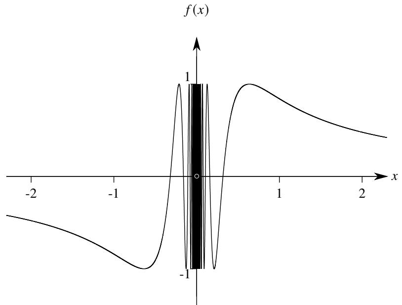  
图 3.4: $\sin ( 1 / x )$ 示意图.

数列上极限和下极限的相关结论可以对应 “平移” 到函数的上极限和下极限中.

# 命题 3.8

设函数 $f$ 在 $x _ { 0 }$ 的一个去心邻域 $\check { N } _ { \delta } ( x _ { 0 } )$ 内有定义. 令

$$
E = \left\{a \in \mathbb {R} \colon \text {存 在} x _ {n} \in \check {N} _ {\delta} (x _ {0}), x _ {n} \to x _ {0} \text {使 得} f (x _ {n}) \to a \right\}.
$$

则 $\scriptstyle \operatorname* { l i m } \operatorname* { s u p } _ { x \to x _ { 0 } } f ( x )$ , l $\textstyle \operatorname { m i n f } _ { x \to x _ { 0 } } f ( x ) \in E$

证明 只证明上极限的情况.

(i) 若 $\begin{array} { r } { \operatorname* { l i m } \operatorname* { s u p } _ { x \to x _ { 0 } } f ( x ) = + \infty . } \end{array}$ . 则 $E$ 无上界, 因此对于任一 $n \in \mathbb { N } ^ { * }$ 都存在 $l _ { n } \in E$ 使得 $l _ { n } > n$ . 即对于任一 $n \in \mathbb { N } ^ { * }$ 都存在 $x _ { n }$ 满足 $0 < | x _ { n } - x _ { 0 } | < 1 / n$ 且 $f ( x _ { n } ) > n$ . 令 $n \to \infty$ . 则 $x _ { n } \to x _ { 0 }$ 且 $f ( x _ { n } ) \to + \infty$ . 于是可知 $+ \infty \in E$ .  
(ii) 若 $\textstyle \operatorname* { l i m } \operatorname* { s u p } _ { x \to x _ { 0 } } f ( x ) = - \infty$ . 则 $E = \{ - \infty \}$ , 因此 $- \infty \in E$ .  
(iii) 若 $\operatorname* { l i m } \operatorname* { s u p } _ { x \to x _ { 0 } } f ( x ) = a \in \mathbb { R } .$ . 由于 $a = \operatorname* { s u p } E$ , 故对于任一 $n \in \mathbb { N } ^ { * }$ 都存在 $l _ { n } \in E$ 使得

$$
a - \frac {1}{n} <   l _ {n} <   a + \frac {1}{n}.
$$

因此对于任一 $n \in \mathbb { N } ^ { * }$ 都存在 $x _ { n }$ 满足

$$
0 <   | x _ {n} - x _ {0} | <   \frac {1}{n}, \quad a - \frac {1}{n} <   f (x _ {n}) <   a + \frac {1}{n}.
$$

令 $n \to \infty$ , 则 $x _ { n } \to x _ { 0 }$ 且 $f ( x _ { n } )  a .$ . 于是可知 $a \in E$ .

注 以上命题对应数列中的命题2.33.

# 命题 3.9

设函数 $f$ 在 $x _ { 0 }$ 的一个去心邻域 $\check { N } _ { \delta } ( x _ { 0 } )$ 内有定义. 则

$$
\liminf_{x\to x_{0}}f(x)\leqslant \limsup_{x\to x_{0}}f(x)
$$

等号成立当且仅当

$$
\limsup_{x\to x_{0}}f(x) = \liminf_{x\to x_{0}}f(x) = \lim_{x\to x_{0}}f(x).
$$

注 以上命题对应数列中的命题2.34.

类似地, 可以给出函数上极限和下极限的另一种刻画方式.

# 定理 3.8

设函数 $f$ 在 $x _ { 0 }$ 的一个去心邻域内有定义. 令

$$
E = \left\{a \in \mathbb {R}: \text {对 于 任 一} \varepsilon > 0 \text {存 在} \delta > 0 \text {使 得 当} x \in \check {N} _ {\delta} \left(x _ {0}\right) \text {时} f (x) <   a + \varepsilon \right\}.
$$

$$
F = \left\{a \in \mathbb {R} \colon \text {对 于 任 一} \varepsilon > 0 \text {存 在} \delta > 0 \text {使 得 当} x \in \check {N} _ {\delta} (x _ {0}) \text {时} f (x) > a - \varepsilon \right\}.
$$

则

$$
\lim  _ {x \to x _ {0}} \sup  f (x) = \inf  E, \quad \lim  _ {x \to x _ {0}} \inf  f (x) = \sup  F.
$$

证明 只证明上极限的情况. 令 $\textstyle \operatorname* { l i m } \operatorname* { s u p } _ { x \to x _ { 0 } } f ( x ) = L$ .

(i) 当 $f ( x )$ 在 $x _ { 0 }$ 的任一去心邻域中都无上界时, $L = + \infty$ . 此时 $E = \{ + \infty \}$ . 因此 inf $E = L$ .  
(ii) 当 $f ( x )$ 在 $x _ { 0 }$ 的一个去心邻域中有界时.

证明“ ${ } ^ { \mathrm { : } \iota } \geq \operatorname* { i n f } E { } ^ { \mathfrak { n } }$ . 只需证明 $L \in E$ . 假设 $L \not \in E$ , 即存在 $\varepsilon > 0$ 使得 $x _ { 0 }$ 的任一去心邻域内都存在 $x$ 满足$f ( x ) \geqslant L + \varepsilon$ . 这表明 $\check { N } ( x _ { 0 } )$ 中存在数列 $x _ { n } \to x _ { 0 }$ 使得 $f ( x _ { n } )  l > L$ , 这与 $L = \operatorname* { l i m } \operatorname* { s u p } _ { x \to x _ { 0 } } f ( x )$ 矛盾. 于是可知$L \in E$ .

证明“ $L \leqslant$ inf $E ^ { \mathfrak { n } }$ . 任取 $a \in E$ . 假设 $a < L$ . 则存在 $\varepsilon > 0$ 使得 $a + \varepsilon < L$ . 此时存在 $\delta$ 使得当 $x \in \check { N } _ { \delta } ( x _ { 0 } )$ 时$f ( x ) < a + \varepsilon$ . 这表明不存在数列 $\{ x _ { n } \} \in \check { N } _ { \delta } ( x _ { 0 } )$ 使得 $f ( x _ { n } ) \to L$ , 出现矛盾. 于是可知 $a \geqslant L$ , 即 $L \leqslant \operatorname { i n f } E$ .

综合 (i)(ii) 可知 $\textstyle \operatorname* { l i m } \operatorname* { s u p } _ { x \to x _ { 0 } } f ( x ) = \operatorname* { i n f } E$ .

注 为了让上极限是 $+ \infty$ 下极限是 $- \infty$ 的情况也能用上面的语言刻画, 可以令

$$
E = \left\{a \in \overline {{{\mathbb {R}}}}: \text {对 于 任 一} \xi > a \text {存 在} \delta > 0 \text {使 得 当} x \in \check {N} _ {\delta} (x _ {0}) \text {时} f (x) <   \xi \right\}.
$$

$$
F = \left\{a \in \overline {{{\mathbb {R}}}}: \text {对 于 任 一} \xi <   a \text {存 在} \delta > 0 \text {使 得 当} x \in \check {N} _ {\delta} (x _ {0}) \text {时} f (x) > \xi \right\}.
$$

则 $\textstyle \operatorname* { l i m } \operatorname* { s u p } _ { x \to x _ { 0 } } f ( x ) = \operatorname* { i n f } E$ , $\operatorname* { l i m } \operatorname* { i n f } _ { x \to x _ { 0 } } f ( x ) = \operatorname* { s u p } F .$ .

注 以上定理对于数列中的定理2.36

函数的上极限和下极限也有保序性.

# 命题 3.10

设函数 $f$ 和 $g ( x )$ 在 $\check { N } _ { \delta } ( x _ { 0 } )$ 中满足 $f ( x ) \leqslant g ( x )$ , 则

(1) $\operatorname* { l i m } _ { x \to x _ { 0 } } f ( x ) \leqslant \operatorname* { l i m } _ { x \to x _ { 0 } } g ( x ) .$   
(2) $\operatorname* { l i m } _ { x \to x _ { 0 } } \operatorname* { i n f } _ { f ( x ) } \leqslant \operatorname* { l i m } _ { x \to x _ { 0 } } \operatorname* { i n f } _ { g ( x ) } .$

证明 只证明第一个不等式. 令 $\textstyle \operatorname* { l i m } \operatorname* { s u p } _ { x \to x _ { 0 } } f ( x ) = A$ , lim sup??→?? ??(??) = ??.

(i) 当 $B = + \infty$ 或 $A = - \infty$ 时, 命题显然成立. 当 $A = + \infty$ 时, 在 $\check { N } _ { \delta } ( x _ { 0 } )$ 中存在数列 $x _ { n } \to x _ { 0 }$ 使得 $f ( x _ { n } ) \to + \infty$ .由于在 $\check { N } _ { \delta } ( x _ { 0 } )$ 中满足 $f ( x ) \leqslant g ( x )$ , 故 $\{ x _ { n } \}$ 中存在一个子列 $\{ x _ { k _ { n } } \}$ 使得 $\begin{array} { r } { \operatorname* { l i m } _ { n \to \infty } g ( x _ { k _ { n } } ) = + \infty } \end{array}$ .

$$
\lim  _ {n \rightarrow \infty} f \left(x _ {k _ {n}}\right) = A \leqslant \lim  _ {n \rightarrow \infty} g \left(x _ {k _ {n}}\right) \leqslant B.
$$

于是可知 $A = B$ . 类似地可知当 $B = - \infty$ 时 $A = B$ .

(ii) 当 ??, $B \in \mathbb { R }$ 时. 在 $\check { N } _ { \delta } ( x _ { 0 } )$ 中存在数列 $x _ { n } \to x _ { 0 }$ 使得 $f ( x _ { n } )  A$ . 由于在 $\check { N } _ { \delta } ( x _ { 0 } )$ 中满足 $f ( x ) \leqslant g ( x )$ , 故$\{ x _ { n } \}$ 中存在一个子列 $\{ x _ { k _ { n } } \}$ 使得

$$
\lim  _ {n \rightarrow \infty} g \left(x _ {k _ {n}}\right) \geqslant A = \lim  _ {n \rightarrow \infty} f \left(x _ {k _ {n}}\right).
$$

于是可知 $A \leqslant B$ .

注 以上命题对应数列中的命题2.35

类似地, 可以给出第三种方式刻画函数的上极限和下极限.

# 定理 3.9

设函数 $f$ 在 $x _ { 0 }$ 的一个去心邻域内有定义. 则

(1) $\operatorname* { l i m } _ { x \to x _ { 0 } } \operatorname* { s u p } { f \left( x \right) } = \operatorname* { l i m } _ { \delta \to 0 + } \left[ \operatorname* { s u p } _ { x \in \check { N } _ { \delta } \left( x _ { 0 } \right) } { f \left( x \right) } \right] .$ ??   
(2) lim inf??→??0 ?? (??) = lim??→0+  inf?? ∈ ??ˇ ?? ( ??0 ) ?? (??)  .

证明 只证明上极限的情况. 令

$$
\varphi (\delta) = \sup  _ {x \in \dot {N} _ {\delta} (x _ {0})} f (x), \quad \lim  _ {x \to x _ {0}} \sup  f (x) = L.
$$

容易验证 $\varphi ( \delta )$ 单调递增.

(i) 当 $L = + \infty$ 时. 在 $x _ { 0 }$ 的一个去心邻域中存在一个数列 $x _ { n } \to x _ { 0 }$ 使得 $f ( x _ { n } ) \to + \infty$ . 因此 $\varphi ( \delta ) = \operatorname* { s u p } _ { x \in \check { N } _ { \delta } ( x _ { 0 } ) } f ( x ) =$ $+ \infty$ . 于是可知 $\begin{array} { r } { \operatorname* { l i m } _ { \delta \to 0 + } \varphi ( \delta ) = + \infty } \end{array}$ .  
(ii) 当 $L = - \infty$ 时. 对于 $x _ { 0 }$ 的去心邻域中任一极限为 $x _ { 0 }$ 的数列 $x _ { n }$ , 都有 $f ( x _ { n } ) \to - \infty ,$ , 即 $\begin{array} { r } { \operatorname* { l i m } _ { x \to x _ { 0 } } f ( x ) = - \infty } \end{array}$ .故对于任一 $E > 0$ 都存在 $\delta _ { 1 } > 0$ 使得当 $x \in \check { N } _ { \delta _ { 1 } } ( x _ { 0 } )$ 时 $f ( x ) < - E .$ . 因此

$$
\varphi (\delta_ {1}) = \sup  _ {x \in \tilde {N} _ {\delta_ {1}} (x _ {0})} f (x) <   - E.
$$

由于 $\varphi ( \delta )$ 单调递增, 因此当 $\delta \in ( 0 , \delta _ { 1 } )$ 时 $\varphi ( \delta ) \leqslant \varphi ( \delta _ { 1 } ) < - E .$ 这表明 $\begin{array} { r } { \operatorname* { l i m } _ { \delta \to 0 + } \varphi ( \delta ) = - \infty } \end{array}$ .

(iii) 当 $L \in \mathbb { R }$ 时. 任取

$$
l \in E = \left\{a \in \mathbb {R} \colon \text {存 在} x _ {n} \in \check {N} _ {\delta} (x _ {0}), x _ {n} \to x _ {0} \text {使 得} f (x _ {n}) \to a \right\}.
$$

则在 $x _ { 0 }$ 的一个去心邻域中存在一个数列 $x _ { n } \ \to \ x _ { 0 }$ 使得 $f ( x _ { n } )  l .$ 取 $f ( x _ { n } )$ 的一个子列 $f ( x _ { k _ { n } } )$ 使得 $\{ x _ { k _ { n } } \} \in$ $\check { N } _ { \delta } ( x _ { 0 } )$ . 于是

$$
f \left(x _ {k _ {i}}\right) \leqslant \sup  _ {x \in \tilde {N} _ {\delta} (x _ {0})} f (x) = \varphi (\delta), \quad i = 1, 2, \dots .
$$

令 $i \to \infty$ 得 $l \leqslant \varphi ( \delta )$ . 再令 $\delta  0 +$ 得 $l \leqslant \mathrm { l i m } _ { \delta  0 + } \varphi ( \delta )$ . 于是 $L \leqslant \operatorname* { l i m } _ { \delta \to 0 + } \varphi ( \delta )$ .

另一方面,由命题3.8可知,对于任一 $\varepsilon > 0$ 都存在 $\delta _ { 2 } > 0$ 使得当 $x \in \check { N } _ { \delta _ { 2 } } ( x _ { 0 } )$ 时 $f ( x ) < L + \varepsilon .$ .因此 $\varphi ( \delta _ { 2 } ) \leqslant L + \varepsilon$ .由于 $\varphi ( \delta )$ 单调递增, 因此当 $\delta \in ( 0 , \delta _ { 2 } )$ 时 $\varphi ( \delta ) \leqslant \varphi ( \delta _ { 2 } ) < L + \varepsilon .$ 令 $\delta  0 +$

$$
\lim  _ {\delta \to 0 +} \varphi (\delta) \leqslant L + \varepsilon .
$$

令 $\varepsilon \to 0$

$$
L \geqslant \lim  _ {\delta \rightarrow 0 +} \varphi (\delta).
$$

于是可知 $L = \operatorname* { l i m } _ { \delta \to 0 + } \varphi ( \delta )$ .

注 以上命题对应数列中的定理2.37.

# 3.2 函数的连续与间断

# 3.2.1 函数的逐点连续

“连续” 是一个十分自然而朴素的概念. 它直接来自于古典几何与物理. 从直观上看, 所谓 “连续” 是指当自变量的变化量变小时, 函数值的变化量也会随之变小. 现在已经定义了函数的极限. 用极限的观点来看, 所谓函数在某一点 “连续” 就是函数在这一点的极限等于它在这一点的函数值. 于是我们可以用 $\varepsilon - \delta$ 语言给出严格定义.

# 定义 3.10 (函数在一点的连续)

设函数 $f$ 在 $x _ { 0 }$ 的一个邻域 $N _ { r } ( x _ { 0 } )$ 有定义. 若对于 $f ( x _ { 0 } )$ 的任一邻域 $N _ { \varepsilon } [ f ( x _ { 0 } ) ]$ , 都存在 $x _ { 0 }$ 的一个邻域$N _ { \delta } ( x _ { 0 } )$ 使得 $f [ N _ { \delta } ( x _ { 0 } ) ] \subseteq N _ { \varepsilon } [ f ( x _ { 0 } ) ] .$ . 则称 $f ( x )$ 在 $x _ { 0 }$ 处连续 (continuous), $x _ { 0 }$ 称为 $f$ 的一个连续点 (continuouspoint).

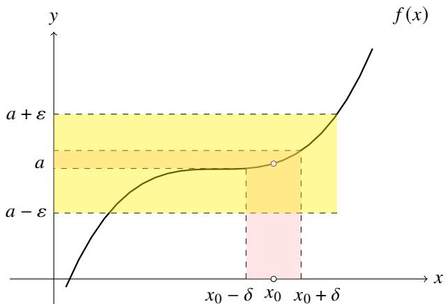  
图 3.5: 用邻域的观点刻画函数的连续性.

注 以上定义表明 $f ( x )$ 在 $x _ { 0 }$ 处连续当且仅当

$$
\lim  _ {x \to x _ {0}} f (x) = f (x _ {0}).
$$

因此 $f ( x )$ 在 $x _ { 0 }$ 处连续意味着它在这一点有定义.

注 函数在一点的连续也是一个局部概念. 因此只需要函数在这一点附近有定义.

注我们也可以用 $\varepsilon - \delta$ 语言来刻画函数的连续性.函数 $f$ 在 $x _ { 0 }$ 处连续当且仅当对于任一 $\varepsilon > 0$ 存在 $\delta > 0$ 使得当$| x - x _ { 0 } | < \delta$ 时 $| f ( x ) - f ( x _ { 0 } ) | < \varepsilon .$ . 即

$$
\forall \varepsilon > 0, \exists \delta > 0, \forall x \in (x _ {0} - \delta , x _ {0} + \delta), | f (x) - f (x _ {0}) | <   \varepsilon .
$$

1817 年 Bolzano 首次用 $\varepsilon - \delta$ 语言定义了函数的连续性.

注根据Heine定理,我们也可以用数列来刻画函数的连续性.函数 $f$ 在 $x _ { 0 }$ 处连续当且仅当任一数列 $\{ x _ { n } \} \subseteq N ( x _ { 0 } )$ 只要数列 $x _ { n } \to x _ { 0 }$ 就有数列 $f ( x _ { n } ) \to f ( x _ { 0 } )$ .

下面来看几个用定义验证函数连续性的例子.

例 3.21 常值函数在定义域上每一点都连续.

证明 设 $f ( x ) = C$ , 其中 $C \in \mathbb { R } .$ 任取定义域上的一点 $x _ { 0 }$ . 对于任一 $\varepsilon > 0$ , 都有

$$
\left| f (x) - f \left(x _ {0}\right) \right| = \left| C - C \right| = 0 <   \varepsilon .
$$

因此 $f ( x )$ 在 $x _ { 0 }$ 处连续.

例 3.22 函数 $f ( x ) = x$ 在定义域上每一点都连续.

证明 任取定义域上的一点 $x _ { 0 }$ . 对于任一 $\varepsilon > 0$ , 取 $\delta = \varepsilon$ , 则当 $x$ 满足 $0 < | x - x _ { 0 } | < \delta$ 时

$$
\left| f (x) - f \left(x _ {0}\right) \right| = \left| x - x _ {0} \right| <   \varepsilon .
$$

因此 $f ( x )$ 在 $x _ { 0 }$ 处连续.

例 3.23 设函数 $D ( x )$ 满足

$$
D (x) = \left\{ \begin{array}{l l} 1, & x \in \mathbb {Q} \\ 0, & x \in \mathbb {R} \backslash \mathbb {Q} \end{array} \right..
$$

(1) $D ( x )$ 在定义域上任意一点都不连续.   
(2) 令 $f ( x ) = x D ( x )$ , 则 $f$ 除了在 $x = 0$ 处连续之外, 其他任意一点都不连续.

证明 (1) 由例3.10可知 $D ( x )$ 在定义域上任意一点都没有极限, 因此它在定义域上任意一点都不连续.

(2)(i) 显然 $f ( 0 ) = 0 .$ . 对于任一 $\varepsilon > 0$ , 取 $\delta = \varepsilon$ . 于是当 $| x - 0 | = | x | < \delta$ 时

$$
\left| f (x) - f (0) \right| = \left| x D (x) \right| \leqslant | x | <   \delta = \varepsilon .
$$

因此 $\begin{array} { r } { \operatorname* { l i m } _ { x  0 } f ( x ) = 0 = f ( 0 ) . } \end{array}$ . 于是可知 $f ( x )$ 在 0 处连续.

(ii) 下设 $x \neq 0 .$ . 假设 $f ( x )$ 在 $x _ { 0 } \neq 0$ 处连续. 则 $\operatorname* { l i m } _ { x \to x _ { 0 } } f ( x ) = f ( x _ { 0 } ) .$ 于是

$$
\lim  _ {x \to x _ {0}} D (x) = \lim  _ {x \to x _ {0}} \frac {f (x)}{x} = \frac {\lim  _ {x \to x _ {0}} f (x)}{\lim  _ {x \to x _ {0}} x} = \frac {f (x _ {0})}{x _ {0}} = D (x _ {0}).
$$

这表明 $D ( x )$ 在 $x _ { 0 }$ 处连续, 出现矛盾, 因此假设不成立. 于是可知 $f ( x )$ 在 0 以外的点都不连续.

由定义可知函数 $f$ 在 $x _ { 0 }$ 处连续当且仅当

$$
\lim  _ {x \rightarrow x _ {0}} f (x) = f (x _ {0}) = f \left(\lim  _ {x \rightarrow x _ {0}} x\right).
$$

因此当函数 $f$ 在 $x _ { 0 }$ 处连续时, 可以认为极限号和函数号 “可交换”. 这个结论不难验证.

# 命题 3.11

设函数 $f$ 和 $g$ . 若 $f$ 在 $x _ { 0 }$ 处连续, 且 $\begin{array} { r } { \operatorname* { l i m } _ { t \to t _ { 0 } } g ( t ) = x _ { 0 } } \end{array}$ , 则

$$
\lim  _ {t \rightarrow t _ {0}} f [ g (t) ] = f \left[ \lim  _ {t \rightarrow t _ {0}} g (t) \right].
$$

证明 由于 $f ( x )$ 在 $x _ { 0 }$ 处连续, 故 $\begin{array} { r } { \operatorname* { l i m } _ { x  x _ { 0 } } f ( x ) = f ( x _ { 0 } ) . } \end{array}$ , 故对于任一 $\varepsilon$ , 存在 $N _ { \delta } ( x _ { 0 } )$ 使得

$$
f \left[ N _ {\delta} \left(x _ {0}\right) \right] \subseteq N _ {\varepsilon} \left[ f \left(x _ {0}\right) \right].
$$

由于 $\begin{array} { r } { \operatorname* { l i m } _ { t  t _ { 0 } } g ( t ) = x _ { 0 } } \end{array}$ , 故对于以上取定的 $\delta$ , 存在 $\check { N } _ { \sigma } ( t _ { 0 } )$ 使得

$$
g \left[ \check {N} _ {\sigma} (t _ {0}) \right] \subseteq N _ {\delta} (x _ {0}).
$$

于是可知对于任一 $\varepsilon > 0$ , 存在 $\check { N } _ { \sigma } ( t _ { 0 } )$ 使得

$$
f \left\{g \left[ \check {N} _ {\sigma} (t _ {0}) \right] \right\} \subseteq N _ {\varepsilon} [ f (x _ {0}) ].
$$

这表明

$$
\lim  _ {t \rightarrow t _ {0}} f [ g (t) ] = f (x _ {0}) = f \left[ \lim  _ {t \rightarrow t _ {0}} g (t) \right].
$$

注 对比定理3.5的证明过程. 函数 $f$ 在 $x _ { 0 }$ 处连续在证明过程中起了重要作用.

既然有单侧极限, 当然可以同样定义函数在一点的单侧连续.

# 定义 3.11 (单侧连续)

设函数 $f$ .

(1) 若 $f ( x _ { 0 } - ) = f ( x _ { 0 } )$ , 则称函数 $f$ 在 $x _ { 0 }$ 处左连续 (left continuous).   
(2) 若 $f ( x _ { 0 } + ) = f ( x _ { 0 } )$ , 则称函数 $f$ 在 $x _ { 0 }$ 处右连续 (right continuous).

左连续和右连续统称单侧连续 (one-sided continuous).

显然有以下结论.

# 命题 3.12

设函数 $f$ 在 $x _ { 0 }$ 的邻域 $N ( x _ { 0 } )$ 有定义. 则 $f ( x )$ 在 $x _ { 0 }$ 处连续当且仅当

$$
f (x _ {0} -) = f (x _ {0} +) = f (x _ {0}).
$$

例 3.24 设函数 $T ( x )$ 满足

$$
T (x) = \left\{ \begin{array}{l l} 1, & x = 0 \\ \frac {1}{q}, & x = \frac {p}{q} \\ 0, & x \in \mathbb {R} \backslash \mathbb {Q} \end{array} \right.,
$$

其中 $q > 0$ , ??, $q \in \mathbb { Z } ^ { * }$ , 且 $p , q$ 互素. 则 $T ( x )$ 在任一无理点都连续, 在任一有理点都不连续.

证明 由例3.8可知 $T ( x )$ 在 $\mathbb { R }$ 上任意一点的极限都是零. 由于 $T ( x )$ 在无理点的函数值都是零, 在有理点的函数值都不为零, 由函数连续的定义可知则 $T ( x )$ 在任一无理点都连续, 在任一有理点都不连续. ■

函数 $f$ 在 $x _ { 0 }$ 处连续, 意味着 $f$ 在 $x _ { 0 }$ 处有极限, 且极限值为 $f ( x _ { 0 } )$ . 而函数在 $x _ { 0 }$ 处有极限意味着它在这一点的上极限和下极限相等, 且上极限和下极限都等于 $f ( x _ { 0 } )$ . 从这个角度也可以刻画函数的逐点连续. 为了叙述方便,我们给出函数在一个区间上振幅的概念.

# 定义 3.12 (函数在区间上的振幅)

设函数 $f$ 在 $I$ 上有界. 令

$$
\omega (I) := \sup  f (I) - \inf  f (I).
$$

我们称 $\omega ( I )$ 为 $f$ 在 $I$ 上的振幅 (amplitude).

振幅还有一种常用的等价定义.

# 命题 3.13

设区间 $I$ 上的函数 $f$ . 令

$$
\omega = \sup  \left\{\left| f \left(x _ {1}\right) - f \left(x _ {2}\right) \right|: x _ {1}, x _ {2} \in I \right\}.
$$

则 $\omega = \omega ( I )$ .

证明 令 $M = \operatorname* { s u p } f ( I )$ , ?? = inf $f ( I )$ . 只需证明 $\omega = M - m$ .

(i) 对于任意 $x _ { 1 } , x _ { 2 } \in I$ 都有

$$
m \leqslant f (x _ {1}) \leqslant M, \quad m \leqslant f (x _ {2}) \leqslant M.
$$

因此

$$
\left| f \left(x _ {1}\right) - f \left(x _ {2}\right) \right| \leqslant M - m
$$

于是可知 $\omega \leqslant M - m$ .

(ii) 对于任一 $\varepsilon > 0$ 都存在 $x _ { 1 } , x _ { 2 } \in I$ 使得

$$
f (x _ {1}) > M - \frac {\varepsilon}{2}, \quad f (x _ {2}) <   m + \frac {\varepsilon}{2}.
$$

因此

$$
\left| f \left(x _ {1}\right) - f \left(x _ {2}\right) \right| \geqslant f \left(x _ {1}\right) - f \left(x _ {2}\right) > M - m - \varepsilon .
$$

于是可知 $\omega \geqslant M - m$ .

# 定义 3.13 (函数在一点的振幅)

设函数 $f$ 在 $x _ { 0 }$ 的一个邻域 $N _ { \delta } ( x _ { 0 } )$ 上有定义. 令

$$
\omega (x _ {0}) := \lim  _ {\delta \to 0 +} \omega [ N _ {\delta} (x _ {0}) ] = \lim  _ {\delta \to 0 +} \left[ \sup  _ {x \in N _ {\delta} (x _ {0})} f (x) - \inf  _ {x \in N _ {\delta} (x _ {0})} f (x) \right].
$$

我们称 $\omega ( x _ { 0 } )$ 为 $f ( x )$ 在 $x _ { 0 }$ 处的振幅 (amplitude).

注 ${ \mathrm { s u p } } _ { x \in N _ { \delta } ( x _ { 0 } ) } f ( x )$ 单调递增, 而 $\operatorname* { i n f } _ { x \in N _ { \delta } ( x _ { 0 } ) } f ( x )$ 单调递减, 因此 ${ \mathrm { s u p } } _ { x \in N _ { \delta } ( x _ { 0 } ) } f ( x ) - { \mathrm { i n f } } _ { x \in N _ { \delta } ( x _ { 0 } ) } f ( x )$ 单调递增. 又因为

$$
\sup  _ {x \in N _ {\delta} (x _ {0})} f (x) - \inf  _ {x \in N _ {\delta} (x _ {0})} f (x) \geqslant 0.
$$

因此定义式右侧的极限存在, 这说明定义是合理的.

用振幅的观点也可以刻画函数的逐点连续.

# 定理 3.10

函数 $f$ 在 $x _ { 0 }$ 处连续当且仅当 $f$ 在 $x _ { 0 }$ 处的振幅 $\omega ( x _ { 0 } ) = 0$ .

证明 (i) 证明必要性. 若 $f$ 在 $x _ { 0 }$ 处连续, 则对于任一 $\varepsilon > 0$ 存在 $\delta > 0$ 使得对于任意 $x _ { 1 } , x _ { 2 } \in N _ { \delta } ( x _ { 0 } )$ 都有

$$
\left| f \left(x _ {1}\right) - f \left(x _ {0}\right) \right| <   \frac {\varepsilon}{2}, \quad \left| f \left(x _ {2}\right) - f \left(x _ {0}\right) \right| <   \frac {\varepsilon}{2}.
$$

因此

$$
\left| f \left(x _ {1}\right) - f \left(x _ {2}\right) \right| \leqslant \left| f \left(x _ {1}\right) - f \left(x _ {0}\right) \right| + \left| f \left(x _ {1}\right) - f \left(x _ {0}\right) \right| <   \frac {\varepsilon}{2} + \frac {\varepsilon}{2} = \varepsilon .
$$

因此 $\omega [ N _ { \delta } ( x _ { 0 } ) ] \leqslant \varepsilon .$ . 令 $\delta  0 +$ 得 $0 \leqslant \omega ( x _ { 0 } ) \leqslant \varepsilon$ . 令 $\varepsilon \to 0$ 即得 $\omega ( x _ { 0 } ) = 0$ .

(ii) 证明充分性. 若 $\omega ( x _ { 0 } ) = 0$ , 则

$$
\lim  _ {\delta \rightarrow 0 +} \omega \left[ N _ {\delta} \left(x _ {0}\right)\right] = 0.
$$

因此对于任一 $\varepsilon > 0$ , 存在 $\delta > 0$ 使得 $\omega [ N _ { \delta } ( x _ { 0 } ) ] < \varepsilon$ . 因此对于任一 $x \in N _ { \delta } ( x _ { 0 } )$ 都有

$$
\left| f (x) - f \left(x _ {0}\right) \right| \leqslant \omega \left[ N _ {\delta} \left(x _ {0}\right) \right] <   \varepsilon .
$$

这表明 $\begin{array} { r } { \operatorname* { l i m } _ { x \to x _ { 0 } } f ( x ) = f ( x _ { 0 } ) } \end{array}$ . 于是可知 $f$ 在 $x _ { 0 }$ 处连续.

不难看出函数在一点的振幅和函数在一点的上极限和下极限的定义只差了 “一点”.

# 定理 3.11

函数 $f$ 在 $x _ { 0 }$ 附近有定义. 则

$$
\lim  _ {\delta \to 0 +} \left[ \sup  _ {x \in \check {N} _ {\delta} (x _ {0})} f (x) \right] = \lim  _ {\delta \to 0 +} \left[ \inf  _ {x \in \check {N} _ {\delta} (x _ {0})} f (x) \right] = f (x _ {0}) \iff \lim  _ {\delta \to 0 +} \left[ \sup  _ {x \in N _ {\delta} (x _ {0})} f (x) \right] = \lim  _ {\delta \to 0 +} \left[ \inf  _ {x \in N _ {\delta} (x _ {0})} f (x) \right].
$$

证明 由定理3.10可知

$$
\lim  _ {\delta \rightarrow 0 +} \left[ \sup  _ {x \in \check {N} _ {\delta} (x _ {0})} f (x) \right] = \lim  _ {\delta \rightarrow 0 +} \left[ \inf  _ {x \in \check {N} _ {\delta} (x _ {0})} f (x) \right] = f (x _ {0}) \iff \lim  _ {x \rightarrow x _ {0}} \sup  f (x) = \lim  _ {x \rightarrow x _ {0}} \inf  f (x) = f (x _ {0})
$$

$$
\begin{array}{l} \Longleftrightarrow \lim  _ {x \rightarrow x _ {0}} f (x) = f \left(x _ {0}\right) \Longleftrightarrow f \text {在} x _ {0} \text {处 连 续} \Longleftrightarrow \omega \left(x _ {0}\right) = 0 \Longleftrightarrow \lim  _ {\delta \rightarrow 0 +} \left[ \sup  _ {x \in N _ {\delta} \left(x _ {0}\right)} f (x) - \inf  _ {x \in N _ {\delta} \left(x _ {0}\right)} f (x) \right] = 0 \\ \Longleftrightarrow \lim  _ {\delta \rightarrow 0 +} \left[ \sup  _ {x \in N _ {\delta} (x _ {0})} f (x) \right] = \lim  _ {\delta \rightarrow 0 +} \left[ \inf  _ {x \in N _ {\delta} (x _ {0})} f (x) \right]. \\ \end{array}
$$

# 3.2.2 初等函数的连续性

从直观上看, 中学里学过的函数大多满足在各自定义域的每一点都连续 (在中学阶段我们已经默认了这个事实). 这样的函数称为连续函数.

# 定义 3.14 (连续函数)

设开区间??.若函数 $f$ 在 $I$ 上的每一点都连续,则称 $f ( x )$ 在 $I$ 上连续.设闭区间 $\boldsymbol { J } = \left[ a , b \right]$ .若函数 $f$ 在 $( a , b )$ ，上连续, 且在 $a$ 处右连续, 在 $b$ 处左连续, 则称 $f ( x )$ 在 $J$ 上连续. 在一个区间 $I$ (不论是开或闭) 上连续的函数称为连续函数 (continuous function). 区间 $I$ 上所有连续函数组成的集合记作 $C ( I )$ .

注 对于半开半闭区间 $[ a , b )$ , 若函数 $f$ 在 $( a , b )$ 上连续, 且在 $a$ 处右连续, 则称 $f ( x )$ 在 $[ a , b )$ 上连续. 其余类型的半开半闭区间也可类似定义.

注 区间 $( a , b )$ 上所有连续函数组成的集合记作 $C ( \boldsymbol { a } , \boldsymbol { b } )$ . 其他类型的区间也可类似记录.

注 在闭区间 $[ a , b ]$ 连续也可以定义为: 若 $f$ 在一个包含 $[ a , b ]$ 的开区间 $I$ 上连续, 则称 $f$ 在 $[ a , b ]$ 上连续. 这个定义的等价性证明需要用到点集拓扑的知识.

下面我们尝试先验证几个基本初等函数的连续性.

例 3.25 三角函数的连续性 函数 $f ( x ) = \sin { x }$ 和 $g ( x ) = \cos x$ 在定义域上每一点都连续.

证明 (i) 任取定义域上的一点 $x _ { 0 }$ . 对于任一 $\varepsilon > 0$ , 取 $\delta = \varepsilon$ , 则当 $x$ 满足 $| x - x _ { 0 } | < \delta$ 时

$$
| f (x) - f \left(x _ {0}\right) | = | \sin x - \sin x _ {0} | = \left| 2 \sin \frac {x - x _ {0}}{2} \cos \frac {x + x _ {0}}{2} \right| \leqslant \left| 2 \sin \frac {x - x _ {0}}{2} \right| \leqslant \left| 2 \frac {x - x _ {0}}{2} \right| = | x - x _ {0} | <   \varepsilon .
$$

因此 $f ( x )$ 在 $x _ { 0 }$ 处连续.

(ii) 任取定义域上的一点 $x _ { 0 }$ . 对于任一 $\varepsilon > 0$ , 取 $\delta = \varepsilon$ , 则当 $x$ 满足 $0 < | x - x _ { 0 } | < \delta$ 时

$$
\left| g (x) - g \left(x _ {0}\right) \right| = \left| \cos x - \cos x _ {0} \right| = \left| \sin \left(\frac {\pi}{2} - x\right) - \sin \left(\frac {\pi}{2} - x _ {0}\right) \right| \leqslant \left| \left(\frac {\pi}{2} - x\right) - \left(\frac {\pi}{2} - x _ {0}\right) \right| = | x - x _ {0} | <   \varepsilon .
$$

因此 $g ( x )$ 在 $x _ { 0 }$ 处连续.

例 3.26 指数函数的连续性 函数 $f ( x ) = a ^ { x }$ 在定义域上每一点都连续.

证明 (i) 先证明 $f ( x )$ 在 0 处连续, 只需证明 $\begin{array} { r } { \operatorname* { l i m } _ { x \to 0 } a ^ { x } = f ( 0 ) = 1 } \end{array}$ .

证明 $f ( 0 + ) = 1 .$ . 当 $a > 1$ 时 $f ( x )$ 严格递增. 由例2.32可知数列 $a ^ { 1 / n }  1 .$ . 因此对于任一 $\varepsilon > 0$ 都存在 $N \in \mathbb { N } ^ { * }$ 使得

$$
0 <   a ^ {1 / N} - 1 <   \varepsilon .
$$

于是取 $\delta < 1 / N _ { ☉ }$ , 则当 $x \in ( 0 , \delta )$ 时

$$
0 <   a ^ {x} - 1 <   a ^ {\delta} - 1 <   a ^ {1 / N} - 1 <   \varepsilon .
$$

因此当 $a > 0$ 时有 $f ( 0 + ) = 1$ .

当 $0 < a < 1$ 时 $a ^ { - 1 } > 1$ , 于是

$$
f (0 +) = \lim  _ {x \rightarrow 0 +} a ^ {x} = \lim  _ {x \rightarrow 0 +} \frac {1}{\left(a ^ {- 1}\right) ^ {x}} = 1.
$$

于是当 $0 < a < 1$ 时也有 $f ( 0 + ) = 1$ .

证明 $f ( 0 - ) = 1 .$ 令 $y = - x$ , 则

$$
f (0 -) = \lim  _ {x \rightarrow 0 -} a ^ {x} = \lim  _ {y \rightarrow 0 +} a ^ {- y} = \lim  _ {y \rightarrow 0 +} \frac {1}{a ^ {y}} = 1.
$$

综上可知 $f ( 0 + ) = f ( 0 - ) = f ( 0 ) .$ 于是可知 $\begin{array} { r } { \operatorname* { l i m } _ { x \to 0 } a ^ { x } = f ( 0 ) } \end{array}$ .

(ii) 再证明一般情况. 任取 $x _ { 0 } \in \mathbb { R } .$ . 由 (i) 的结论可知

$$
\lim  _ {x \to x _ {0}} a ^ {x} = \lim  _ {x \to x _ {0}} a ^ {x _ {0}} a ^ {x - x _ {0}} = a ^ {x _ {0}} \lim  _ {x \to x _ {0}} a ^ {x - x _ {0}} = a ^ {x _ {0}} \lim  _ {t \to 0} a ^ {t} = a ^ {x _ {0}}.
$$

于是可知 $f ( x ) = a ^ { x }$ 在定义域上每一点都连续.

现在我们已经证明了常值函数、正比例函数、正弦函数、余弦函数和指数函数在定义域上每一点都连续.我们已经看到用定义证明是比较繁琐的. 事实上并不需要对所有初等函数都这样去做.

# 命题 3.14

设函数 $f$ 和 $g$ 在 $x _ { 0 }$ 处连续, 则函数 $f \pm g$ 和 $f g$ 在 $x _ { 0 }$ 处也连续. 若 $g ( x _ { 0 } ) \neq 0$ , 则函数 $f / g$ 在 $x _ { 0 }$ 处也连续.

证明 由于函数 $f$ 和 $g$ 在 $x _ { 0 }$ 处连续, 故

$$
\lim  _ {x \to x _ {0}} f (x) = f (x _ {0}), \qquad \lim  _ {x \to x _ {0}} g (x) = g (x _ {0}).
$$

于是

$$
\lim  _ {x \to x _ {0}} (f \pm g) (x) = \lim  _ {x \to x _ {0}} f (x) \pm \lim  _ {x \to x _ {0}} g (x) = f (x _ {0}) \pm g (x _ {0}) = (f \pm g) (x _ {0}).
$$

$$
\lim  _ {x \rightarrow x _ {0}} (f g) (x) = \lim  _ {x \rightarrow x _ {0}} f (x) \cdot \lim  _ {x \rightarrow x _ {0}} g (x) = f (x _ {0}) \cdot g (x _ {0}) = (f g) (x _ {0}).
$$

于是可知函数 $( f \pm g ) ( x )$ 和 $( f g ) ( x )$ 在 $x _ { 0 }$ 处也连续. 若 $g ( x _ { 0 } ) \neq 0$ , 则

$$
\lim  _ {x \to x _ {0}} \frac {f}{g} (x) = \frac {\lim  _ {x \to x _ {0}} f (x)}{\lim  _ {x \to x _ {0}} g (x)} = \frac {f (x _ {0})}{g (x _ {0})} = \frac {f}{g} (x _ {0}).
$$

于是可知函数 $( f / g ) ( x )$ 在 $x _ { 0 }$ 处也连续.

我们可以定义一类函数和三角函数很相近的函数.

# 定义 3.15 (双曲函数)

定义函数

$$
\sinh x = \frac {\mathrm {e} ^ {x} - \mathrm {e} ^ {- x}}{2}. \qquad \cosh x = \frac {\mathrm {e} ^ {x} + \mathrm {e} ^ {- x}}{2}. \qquad \tanh  x = \frac {\mathrm {e} ^ {x} - \mathrm {e} ^ {- x}}{\mathrm {e} ^ {x} + \mathrm {e} ^ {- x}}.
$$

其中 sinh 称为双曲正弦函数 (hyperbolic sine function), cosh 称为双曲余弦函数 (hyperbolic cosine function), tanh称为双曲正切函数 (hyperbolic tangent function). 以上函数统称为双曲函数 (hyperbolic functions).

注 三角函数也可以用指数函数定义, 只不过需要用到复指数函数:

$$
\sin x = \frac {\mathrm {e} ^ {\mathrm {i} x} - \mathrm {e} ^ {- \mathrm {i} x}}{2 \mathrm {i}}. \qquad \cos x = \frac {\mathrm {e} ^ {\mathrm {i} x} + \mathrm {e} ^ {- \mathrm {i} x}}{2}. \qquad \tan x = \frac {\mathrm {e} ^ {\mathrm {i} x} - \mathrm {e} ^ {- \mathrm {i} x}}{\mathrm {i} (\mathrm {e} ^ {x} + \mathrm {e} ^ {- x})}.
$$

由双曲函数的定义式容易得到在形式上和三角恒等式类似的等式. 容易看出双曲函数和三角函数有着很强的相似性.

# 命题 3.15 (双曲恒等式)

(1) 同角关系: $\cosh ^ { 2 } x - \sinh ^ { 2 } x = 1$ . tanh ?? = sinh ??cosh ?? .   
(2) 两角和差 : sinh(?? ± ??) = sinh ?? cosh ?? ± cosh ?? sinh ??. cosh(?? ± ??) = cosh ?? cosh ?? ± sinh ?? sinh ??.

(3) 倍角关系 : sinh 2?? = 2 sinh ?? cosh ??. cosh 2?? = cosh2 ?? + sinh2 ??.

如图3.6是双曲函数的图像. 容易知道它们的初等性质:

<table><tr><td></td><td>定义域</td><td>值域</td><td>单调性</td><td>奇偶性</td></tr><tr><td>sinh x</td><td>R</td><td>R</td><td>严格递增</td><td>奇函数</td></tr><tr><td>cosh x</td><td>R</td><td>[1, +∞)</td><td>[0 + ∞) 严格递增</td><td>偶函数</td></tr><tr><td>tanh x</td><td>R</td><td>(-1, 1)</td><td>严格递增</td><td>奇函数</td></tr></table>

从图中还可以看出以下不等式, 用均值不等式很容易证明它们:

$$
\sinh x \geqslant \tanh  x, \quad x \geqslant 0.
$$

$$
\sinh x \leqslant \tanh  x, \quad x \leqslant 0.
$$

等号成立当且仅当 $x = 0$ .

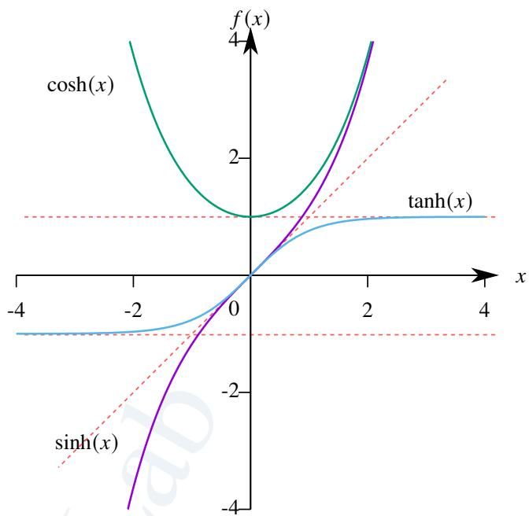  
图 3.6: sinh, cosh 和 tanh 示意图.

我们已经证明了常值函数、正比例函数、正弦函数、余弦函数和指数函数都是连续函数. 由命题3.14就可以知道任一多项式函数、其余的三角函数和其余的双曲函数也都是连续函数.

# 定理 3.12 (复合函数的连续性)

设函数 $f$ 在 $x _ { 0 }$ 处连续, 函数 $g ( t )$ 在 $t _ { 0 }$ 处连续, 且 $g ( t _ { 0 } ) = x _ { 0 }$ , 则函数 $f [ g ( t ) ]$ 在 $t _ { 0 }$ 处连续.

证明 由于函数 $f$ 在 $x _ { 0 }$ 处连续, 函数 $g ( t )$ 在 $t _ { 0 }$ 处连续

$$
\lim  _ {x \to x _ {0}} f (x) = f (x _ {0}), \quad \lim  _ {t \to t _ {0}} g (t) = g (t _ {0}) = x _ {0}.
$$

由于 $f$ 在 $x _ { 0 }$ 处连续, 且 $g ( t _ { 0 } ) = x _ { 0 }$ , 由命题3.11可知

$$
\lim  _ {t \rightarrow t _ {0}} f [ g (t) ] = f \left[ \lim  _ {t \rightarrow t _ {0}} g (t) \right] = f [ g (t _ {0}) ].
$$

于是可知 $f [ g ( t ) ]$ 在 $t _ { 0 }$ 处连续.

我们已经证明了指数函数是一个连续函数. 我们知道对数函数是指数函数的反函数. 因此我们希望得到关于反函数连续性的结论.

# 命题 3.16

设函数 $f$ 在定义域 $X$ 上严格递增 (或递减), 则一定存在反函数 $f ^ { - 1 } ( x )$ , 它的定义域为 $f ( X )$ , 且它在定义域上也严格递增 (或递减).

证明 只证明递增的情况. 令 $Y = f ( X )$ .

(i) 由于 $f ( x )$ 在 $X$ 上严格递增, 故从 $f ( x _ { 1 } ) = f ( x _ { 2 } )$ 可以推出 $x _ { 1 } = x _ { 2 }$ . 因此 $f ( x )$ 是一个单射. 这表明 $f ( x )$ 是 $X$ 到 $Y$ 的一个双射, 因此 $f ( x )$ 存在反函数 $f ^ { - 1 } ( x )$ , 它的定义域就是??.  
(ii) 假设 $f ^ { - 1 } ( x )$ 在 $Y$ 上不是严格递增的. 则存在 $y _ { 1 } , y _ { 2 } \in Y ,$ , 它们满足 $y _ { 1 } < y _ { 2 }$ 但 $f ^ { - 1 } ( y _ { 1 } ) \geqslant f ^ { - 1 } ( y _ { 2 } )$ . 由于 $f ( x )$ 是严格递增的. 故

$$
f \left[ f ^ {- 1} \left(y _ {1}\right) \right] \geqslant f \left[ f ^ {- 1} \left(y _ {2}\right) \right] \Longleftrightarrow y _ {1} \geqslant y _ {2}.
$$

出现矛盾, 因此假设不成立. 于是可知 $f ^ { - 1 } ( x )$ 在 $Y$ 上也是严格递增的.

根据以上命题可知 sinh ??, tanh $x$ 都是 $\mathbb { R }$ 上严格递增的函数, 双曲余弦在 $[ 0 , + \infty )$ 上严格递增, 因此它们存在反函数. 我们把它们的反函数分别记作 arcsinh $x$ , arccosh $x$ , arctanh $x$ . 利用反函数的定义不难求出 sinh??, tanh?? 的反函数.

# 定义 3.16 (反双曲函数)

定义以下函数

$$
\operatorname {a r c s i n h} x := \ln \left(x + \sqrt {x ^ {2} + 1}\right), \quad x \in \mathbb {R}.
$$

$$
\operatorname {a r c c o s h} x := \ln \left(x + \sqrt {x ^ {2} - 1}\right), \quad x \in [ 1, \infty).
$$

$$
\operatorname {a r c t a n h} x := \frac {1}{2} \ln \left(\frac {1 + x}{1 - x}\right), \quad x \in (- 1, 1).
$$

# 定理 3.13 (反函数的连续性)

设函数 $f$ . 若 $f$ 是区间 $I$ 上的一个严格递增 (或递减) 的连续函数, 则它的反函数 $f ^ { - 1 }$ 是区间 $f ( I )$ 上的一个严格递增 (或递减) 的连续函数.

证明 只证明严格递增的情况.令 $J = f ( I )$ .任取 $y _ { 0 } \in J$ 只需证明 $f ^ { - 1 } ( x )$ 在 $y _ { 0 }$ 处连续.即证明对于任一 $\varepsilon > 0$ 存在$\delta > 0$ 使得当 $| y - y _ { 0 } | < \delta$ 时 $\left| f ^ { - 1 } ( y ) - f ^ { - 1 } ( y _ { 0 } ) \right| < \varepsilon .$ .

令 $x _ { 0 } = f ^ { - 1 } ( y _ { 0 } )$ . 则 $y _ { 0 } = f ( x _ { 0 } )$ . 任取 $\varepsilon > 0$ 使得 $( x _ { 0 } - \varepsilon , x _ { 0 } + \varepsilon ) \subseteq I .$ 由于 $f ( x )$ 严格递增. 故

$$
f (x _ {0} - \varepsilon) <   f (x _ {0}) <   f (x _ {0} + \varepsilon).
$$

令

$$
\delta_ {1} = y _ {0} - f (x _ {0} - \varepsilon) = f (x _ {0}) - f (x _ {0} - \varepsilon) > 0.
$$

$$
\delta_ {2} = f (x _ {0} + \varepsilon) - y _ {0} = f (x _ {0} + \varepsilon) - f (x _ {0}) > 0.
$$

再令 $\delta = \operatorname* { m i n } \{ \delta _ { 1 } , \delta _ { 2 } \}$ . 于是可知当 $\vert y - y _ { 0 } \vert < \delta$ 时

$$
y _ {0} - \delta_ {1} \leqslant y _ {0} - \delta <   y <   y _ {0} + \delta \leqslant y _ {0} + \delta_ {2}.
$$

由命题3.16可知 $f ^ { - 1 }$ 严格递增, 故

$$
\begin{array}{l} f ^ {- 1} \left(y _ {0} - \delta_ {1}\right) <   f ^ {- 1} (y) <   f ^ {- 1} \left(y _ {0} + \delta_ {2}\right) \Longleftrightarrow f ^ {- 1} \left(f \left(x _ {0} - \varepsilon\right)\right) <   f ^ {- 1} (y) <   f ^ {- 1} \left(f \left(x _ {0} + \varepsilon\right)\right) \\ \Longleftrightarrow x _ {0} - \varepsilon <   f ^ {- 1} (y) <   x _ {0} + \varepsilon \Longleftrightarrow \left| f ^ {- 1} (y) - f ^ {- 1} (y _ {0}) \right| <   \varepsilon . \\ \end{array}
$$

注 证明 $f ( I )$ 也是一个区间需要用到推论3.2.

有了以上命题我们就可以知道对数函数、反三角函数、反双曲函数都是连续函数. 对于定义在 $\mathbb { R } ^ { + }$ 幂函数$f ( x ) = x ^ { \mu }$ $\mu \in \mathbb { R } )$ ). 我们可以把它看作

$$
f (x) = \mathrm {e} ^ {\mu \ln x}.
$$

由于指数函数和对数函数都是连续函数, 根据复合函数的连续性定理可知幂函数也是连续函数.

综合以上讨论, 事实上我们已经证明了以下定理.

# 定义 3.17 (初等函数)

常值函数、幂函数、指数函数、对数函数、三角函数和反三角函数统称为基本初等函数 (fundamental elemen-tary function). 基本初等函数以及由它们通过有限次代数运算 (包括加、减、乘、除、乘方和开方) 或有限次复合得到的只需用一个解析式表示的函数统称为初等函数 (elementary function).

注 一般来说, 分段函数不是初等函数

# 定理 3.14

初等函数在它们各自的定义域上都是连续的.

# 3.2.3 连续函数的极限

我们已经知道函数 $f$ 在 $x _ { 0 }$ 处连续当且仅当 $f$ 在 $x _ { 0 }$ 的极限等于 $f ( x _ { 0 } )$ .这表明,求连续函数的在某一点极限只需求它在这一点的函数值. 因此函数的连续性为我们求函数极限提供了很大的便利.

在例3.16中我们已经证明

$$
\lim  _ {x \rightarrow \infty} \left(1 + \frac {1}{x}\right) ^ {x} = \mathrm {e}.
$$

在此基础上我们来再介绍几个重要的连续函数的极限.

例 3.27 求极限

$$
\lim  _ {x \to 0} \frac {\ln (1 + x)}{x}.
$$

解 令 $y = 1 / x$ . 则当 $x \to 0$ 时, $y  \infty$ . 由于 $\begin{array} { r } { \operatorname* { l i m } _ { y \to \infty } ( 1 + 1 / y ) ^ { y } = \mathbf { e } , } \end{array}$ , 由复合函数的连续性和对数函数的连续性可知

$$
\lim  _ {x \rightarrow 0} \frac {\ln (1 + x)}{x} = \lim  _ {x \rightarrow 0} \ln (1 + x) ^ {1 / x} = \lim  _ {y \rightarrow \infty} \ln \left(1 + \frac {1}{y}\right) ^ {y} = \ln e = 1.
$$

注 上例表明 $\ln ( 1 + x ) \sim x ( x  0 )$ .

例 3.28 求极限

$$
\lim  _ {x \to 0} \frac {\mathrm {e} ^ {x} - 1}{x}.
$$

解 令 $t = \mathrm { e } ^ { x } - 1$ , 则 $x = \ln ( 1 + t )$ . 当 $x \to 0$ 时, $t  0$ . 由复合函数的连续性和例3.27可知

$$
\lim  _ {x \rightarrow 0} \frac {\mathrm {e} ^ {x} - 1}{x} = \lim  _ {t \rightarrow 0} \frac {t}{\ln (1 + t)} = 1.
$$

注 上例表明 $\mathrm { e } ^ { x } - 1 \sim x \ ( x  0 )$ .

例 3.29 求极限

$$
\lim  _ {x \to 0} \frac {a ^ {x} - 1}{x}.
$$

解 由例3.28可知

$$
\lim  _ {x \rightarrow 0} \frac {\mathrm {e} ^ {x} - 1}{x} = \ln a \lim  _ {x \rightarrow 0} \frac {\mathrm {e} ^ {x \ln a} - 1}{x \ln a} = \ln a.
$$

例 3.30 求极限

$$
\lim  _ {x \to 0} \frac {(1 + x) ^ {\alpha} - 1}{x}, \quad \alpha \in \mathbb {R}.
$$

解 当 $\alpha = 0$ 时

$$
\lim  _ {x \rightarrow 0} \frac {(1 + x) ^ {\alpha} - 1}{x} = 0.
$$

当 $\alpha \neq 0$ 时, 由例3.27和例3.28可知

$$
\lim  _ {x \rightarrow 0} \frac {(1 + x) ^ {\alpha} - 1}{x} = \lim  _ {x \rightarrow 0} \frac {\mathrm {e} ^ {\alpha \ln (1 + x)} - 1}{\alpha \ln (1 + x)} \cdot \frac {\alpha \ln (1 + x)}{x} = \lim  _ {x \rightarrow 0} \frac {\mathrm {e} ^ {\alpha \ln (1 + x)} - 1}{\alpha \ln (1 + x)} \lim  _ {x \rightarrow 0} \frac {\alpha \ln (1 + x)}{x} = 1 \cdot \alpha = \alpha .
$$

注 上例表明 $( 1 + x ) ^ { \alpha } - 1 \sim \alpha x \ ( x  0 )$ $( x \to 0$ .

下面来看 $0 / 0$ 型有理函数的极限. 设有理函数

$$
f (x) = \frac {p (x)}{q (x)},
$$

其中 $p ( x )$ 和 $q ( x )$ 都是多项式函数. 若 $q ( x _ { 0 } ) \neq 0$ , 则 $f ( x )$ 在 $x _ { 0 }$ 处有定义, 由于 $f ( x )$ 是一个连续函数, 故 $\scriptstyle \operatorname* { l i m } _ { x \to x _ { 0 } } f ( x ) =$ $f ( x _ { 0 } )$ . 下设 $q ( x _ { 0 } ) = 0$ . 此时若 $\begin{array} { r } { \operatorname* { l i m } _ { x  x _ { 0 } } f ( x ) = a \in \mathbb { R } . } \end{array}$ 则

$$
p \left(x _ {0}\right) = \lim  _ {x \rightarrow x _ {0}} p (x) = \lim  _ {x \rightarrow x _ {0}} \frac {p (x)}{q (x)} \cdot q (x) = \lim  _ {x \rightarrow x _ {0}} \frac {p (x)}{q (x)} \cdot \lim  _ {x \rightarrow x _ {0}} q (x) = a \lim  _ {x \rightarrow x _ {0}} q (x _ {0}) = 0.
$$

故此时 $f ( x )$ 一定是一个 $0 / 0$ 型未定式. 由于 $p ( x _ { 0 } ) = 0$ , $q ( x _ { 0 } ) = 0$ , 故可设

$$
p (x) = \left(x - x _ {0}\right) ^ {r} p _ {1} (x), \quad q (x) = \left(x - x _ {0}\right) ^ {s} q _ {1} (x), \quad r, s \in \mathbb {N} ^ {*}.
$$

其中 $p _ { 1 } ( x _ { 0 } ) \neq 0$ , $q _ { 1 } ( x _ { 0 } ) \neq 0 .$ . 于是

$$
f (x) = (x - x _ {0}) ^ {r - s} \frac {p _ {1} (x)}{q _ {1} (x)}.
$$

容易看出 $\begin{array} { r } { \operatorname* { l i m } _ { x  x _ { 0 } } f ( x ) = a \in \mathbb { R } } \end{array}$ 当且仅当 $r \geqslant s .$ . 具体来说当 $r > s$ 时 $\scriptstyle \operatorname* { l i m } _ { x \to x _ { 0 } } f ( x ) = 0$ . 当 $r = s$

$$
\lim  _ {x \rightarrow x _ {0}} f (x) = \frac {p _ {1} (x)}{q _ {1} (x)}.
$$

以上讨论表明我们找到了求有理函数极限的通用方法.

例 3.31 设 $m , n \in \mathbb { N } ^ { * }$ . 求极限:

$$
\lim  _ {x \to 1} \left(\frac {m}{x ^ {m} - 1} - \frac {n}{x ^ {n} - 1}\right).
$$

解 令 $t = x - 1$ , 则当 $x \to 1$ 时 $t  0$ . 于是

$$
\begin{array}{l} \frac {m}{x ^ {m} - 1} - \frac {n}{x ^ {n} - 1} = \frac {m}{(1 + t) ^ {m} - 1} - \frac {n}{(1 + t) ^ {n} - 1} = \frac {m [ (1 + t) ^ {n} - 1 ] - n [ (1 + t) ^ {m} - 1 ]}{[ (1 + t) ^ {m} - 1 ] [ (1 + t) ^ {n} - 1 ]} \\ = \frac {m \left[ n t + \frac {n (n - 1)}{2} t ^ {2} + o (t ^ {2}) \right] - n \left[ m t + \frac {m (m - 1)}{2} t ^ {2} + o (t ^ {2}) \right]}{\left[ m t + o (t) \right] \left[ n t + o (t) \right]} \\ = \frac {\frac {m n (n - m)}{2} t ^ {2} + o \left(t ^ {2}\right)}{m n t ^ {2} + o \left(t ^ {2}\right)} = \frac {m n (n - m) + o (1)}{2 m n + o (1)}, \quad t \to 0. \\ \end{array}
$$

于是可知

$$
\lim  _ {x \rightarrow 1} \left(\frac {m}{x ^ {m} - 1} - \frac {n}{x ^ {n} - 1}\right) = \frac {n - m}{2}.
$$

下面来看 $1 ^ { \infty }$ 未定式的极限.事实上 $\mathrm { l i m } _ { x \to 0 } ( 1 + x ) ^ { 1 / x }$ 就是一个 $1 ^ { \infty }$ 的未定式.因此很自然地想到求 $1 ^ { \infty }$ 未定式

的极限需要用到 $\begin{array} { r } { \operatorname* { l i m } _ { x  0 } ( 1 + x ) ^ { 1 / x } = \mathbf { e } , } \end{array}$ . 下面我们来尝试求这类极限. 为了书写便利, 我们规定

$$
\exp x := \mathrm {e} ^ {x}.
$$

设幂指函数 (power-exponential function) $u ^ { \nu }$ , 其中 $u \to 1$ , $\nu \to \infty$ $( x \to x _ { 0 }$ ). 因此这是一个 $1 ^ { \infty }$ 型未定式. 为了能使用$\begin{array} { r } { \operatorname* { l i m } _ { x  0 } ( 1 + x ) ^ { 1 / x } = \mathbf { e } } \end{array}$ , 我们对它作如下变换

$$
u ^ {v} = \exp (\ln u ^ {v}) = \exp (v \ln u) = \exp \left[ (u - 1) v \ln (1 + u - 1) ^ {1 / (u - 1)} \right].
$$

令 $t = u - 1$ . 则当 $x \longrightarrow x _ { 0 }$ 时 $t  0$ . 由复合函数的连续性可知

$$
\lim  _ {x \rightarrow x _ {0}} \ln \left[ (1 + u - 1) ^ {1 / (u - 1)} \right] = \lim  _ {t \rightarrow 0} \ln (1 + t) ^ {1 / t} = \ln e = 1.
$$

假设 $\begin{array} { r } { \operatorname* { l i m } _ { x  x _ { 0 } } ( u - 1 ) \nu = a } \end{array}$ , 则有

$$
\lim  _ {x \to x _ {0}} u ^ {v} = \lim  _ {x \to x _ {0}} \exp \left[ (u - 1) v \ln (1 + u - 1) ^ {1 / (u - 1)} \right] = \exp (a \cdot 1) = \mathrm {e} ^ {a}.
$$

我们尝试用上面的方法求一个 $1 ^ { \infty }$ 未定式的极限.

例 3.32 设 $a _ { 1 } , a _ { 2 } , \cdots , a _ { n } > 0 .$ 求极限:

$$
\lim  _ {x \to 0} \left(\frac {a _ {1} ^ {x} + a _ {2} ^ {x} + \cdots + a _ {n} ^ {x}}{n}\right) ^ {1 / x}.
$$

解 令

$$
u (x) = \frac {a _ {1} ^ {x} + a _ {2} ^ {x} + \cdots + a _ {n} ^ {x}}{n}, \qquad v (x) = \frac {1}{x}.
$$

由于

$$
\lim  _ {x \rightarrow 0} [ u (x) - 1 ] v (x) = \lim  _ {x \rightarrow 0} \frac {1}{x} \left(\frac {a _ {1} ^ {x} + a _ {2} ^ {x} + \cdots + a _ {n} ^ {x}}{n} - 1\right) = \frac {1}{n} \lim  _ {x \rightarrow 0} \sum_ {k = 1} ^ {n} \frac {a _ {k} ^ {x} - 1}{x} = \frac {1}{n} \sum_ {k = 1} ^ {n} \ln a _ {k} = \ln (a _ {1} a _ {2} \dots a _ {n}) ^ {1 / n}.
$$

由前面的分析可知

原式 $= ( a _ { 1 } a _ { 2 } \cdots a _ { n } ) ^ { 1 / n }$ .

例 3.33 求极限

$$
\lim  _ {x \rightarrow \infty} \left(\cos \frac {1}{x}\right) ^ {x ^ {2}}.
$$

解 令 $t = 1 / x$ , 则当 $x \to \infty$ 时, $t  0$ . 于是

$$
\lim  _ {x \rightarrow \infty} \left(\cos \frac {1}{x}\right) ^ {x ^ {2}} = \lim  _ {t \rightarrow 0} (\cos t) ^ {1 / t ^ {2}}.
$$

令 $u ( x ) = \cos t$ , $\nu ( x ) = 1 / t ^ { 2 }$ . 由于

$$
\lim  _ {t \rightarrow 0} [ u (x) - 1 ] v (x) = \lim  _ {t \rightarrow 0} \frac {\cos t - 1}{t ^ {2}} = \lim  _ {t \rightarrow 0} \frac {- t ^ {2} / 2}{t ^ {2}} = - \frac {1}{2}.
$$

由前面的分析可知

$$
\lim  _ {x \rightarrow \infty} \left(\cos \frac {1}{x}\right) ^ {x ^ {2}} = e ^ {- 1 / 2} = \frac {1}{\sqrt {e}}.
$$

# 3.2.4 函数的间断点

很自然地, 与连续点相对的是 “间断点”. 下面我们来讨论间断点.

# 定义 3.18 (间断点)

设函数 $f$ 在 $x _ { 0 }$ 有定义. 若 $f$ 在 $x _ { 0 }$ 处不连续, 则称 $x _ { 0 }$ 是 $f$ 的一个间断点 (discontinuous point).

用极限的观点看, 函数的间断点可以分为以下两大类.

# 定义 3.19 (第一类间断点)

设 $x _ { 0 }$ 是函数 $f$ 的一个间断点. 若 $f ( x _ { 0 } - ) = a$ , $f ( x _ { 0 } + ) = b$ 且 $a , b \in \mathbb { R }$ , 则称 $x _ { 0 }$ 是 $f ( x )$ 的一个第一类间断点(discontinuous point of the first kind).

(1) 若 $a \neq b$ , 则称 $x _ { 0 }$ 是 $f$ 的一个跳跃间断点 (jump discontinuous point). 并称 $| a - b |$ 为 $f ( x )$ 在 $x _ { 0 }$ 的跃度(jump).  
(2) 若 $a = b$ 但 $f ( x _ { 0 } ) \neq a$ , 则称 $x _ { 0 }$ 是 $f$ 的一个可去间断点 (removable discontinuous point).

所谓 “可去” 是指只需修改这一个点, 就可以让函数在这一点连续. 来看一个例子.

例 3.34 设函数 $f$ 只有有限个可去间断点. 令

$$
g (x) = \lim  _ {t \to x} f (t).
$$

则 $g$ 是一个连续函数.

证明 任取一点 $x _ { 0 }$ . 由于 $f$ 只有有限个可去间断点, 因此存在 $\delta$ 使得 $f$ 在 $\check { N } _ { \delta } ( x _ { 0 } )$ 上连续. 因此当 $x \in \check { N } _ { \delta } ( x _ { 0 } )$ 时

$$
\lim  _ {t \to x} f (t) = f (x).
$$

因此

$$
\lim  _ {x \to x _ {0}} g (x) = \lim  _ {x \to x _ {0}} \lim  _ {t \to x} f (t) = \lim  _ {x \to x _ {0}} f (x) = \lim  _ {t \to x _ {0}} f (t) = g (x _ {0}).
$$

于是可知 $g ( x )$ 是一个连续函数.

# 定义 3.20 (第二类间断点)

设 $x _ { 0 }$ 是函数 $f$ 的间断点. 若 $f ( x _ { 0 } - )$ 和 $f ( x _ { 0 } + )$ 中至少有一个不存在或不是实数, 则称 $x _ { 0 }$ 是 $f ( x )$ 的一个第二类间断点 (discontinuous point of the second kind)

下面分别举出三种间断点的例子. 设函数

$$
f (x) = \left\{ \begin{array}{l l} \frac {x ^ {2}}{3} + 1 & x \geqslant 0 \\ - x & x <   0 \end{array} \right.. g (x) = \left\{ \begin{array}{l l} \frac {\sin x}{x} & x \neq 0 \\ 2 & x = 0 \end{array} \right.. h (x) = \left\{ \begin{array}{l l} \sin \frac {1}{x} + 1 & x \neq 0 \\ 1 & x = 0 \end{array} \right..
$$

其中 0 是 $f ( x )$ 的跳跃间断点, 是 $g ( x )$ 的可去间断点, 是 $h ( x )$ 的第二类间断点，如图3.7所示.

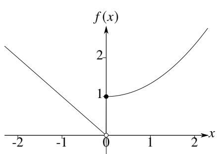

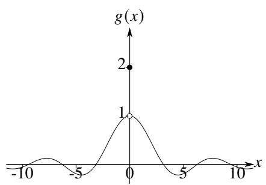

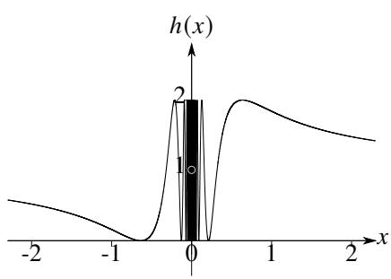  
图 3.7: 不同种类的间断点示意图.

下面我们来研究单调函数的间断点. 为此我们可以先研究单调函数的左右极限.

# 引理 3.1

设函数 $f$ 在区间 $( a , b )$ 上单调递增, 则对于任一 $x _ { 0 } \in \left( a , b \right)$ , $f ( x _ { 0 } - )$ 和 $f ( x _ { 0 } + )$ 都存在且

$$
f (x _ {0} -) \leqslant f (x _ {0}) \leqslant f (x _ {0} +).
$$

证明 任取 $x _ { 0 } \in \left( a , b \right)$ . 令 $E$ 是开区间 $( a , x _ { 0 } )$ 在 $f$ 下的象. 由于 $f$ 单调递增, 因此 $E$ 有上界. 令 $A = \operatorname* { s u p } E$ . 则对于任一 $\varepsilon > 0$ 都存在 $\delta > 0$ 使得

$$
f (x _ {0} - \delta) > A - \varepsilon \Longleftrightarrow A - f (x _ {0} - \delta) <   \varepsilon .
$$

由于 $f$ 单调递增, 因此当 $x \in \left( x _ { 0 } - \delta , x _ { 0 } \right)$ 时

$$
f (x _ {0} - \delta) \leqslant f (x) \leqslant f (x _ {0}).
$$

此时有

$$
A - f (x) \leqslant A - f \left(x _ {0} - \delta\right) <   \epsilon .
$$

这表明 $f ( x _ { 0 } - ) = A$ . 类似地可证明 $f ( x _ { 0 } + )$ 也存在. 由于 $f ( x )$ 单调递增, 故

$$
f (x _ {0} -) \leqslant f (x _ {0}) \leqslant f (x _ {0} +).
$$

注 单调递减时也有相应结论.

注 由以上结论立刻可知 $f ( x )$ 在 $x _ { 0 }$ 处左连续当且仅当

$$
\sup  _ {x \in (a, x _ {0})} f (x) = f (x _ {0}).
$$

在 $x _ { 0 }$ 处右连续当且仅当

$$
\inf  _ {x \in (x _ {0}, b)} f (x) = f (x _ {0}).
$$

# 定理 3.15 (Froda 定理)

设函数 $f$ 是区间 $( a , b )$ 上的一个单调函数, 则 $f$ 的间断点一定是跳跃间断点. 令 $f$ 的所有间断点组成的集合为 $E$ , 则 $E$ 是至多可数的.

证明 不妨设 $f$ 在 $( a , b )$ 上单调递增. 任取 $x _ { 0 } \in \left( a , b \right)$ . 由引理可知

$$
f (x _ {0} -) \leqslant f (x _ {0}) \leqslant f (x _ {0} +).
$$

因此 $x _ { 0 }$ 要么是 $f ( x )$ 的一个连续点要么是 $f ( x )$ 的一个跳跃间断点.

任取一个跳跃间断点 $x _ { 0 } \in E$ , 则 $f ( x _ { 0 } - ) < f ( x _ { 0 } + )$ . 在开区间 $( f ( x _ { 0 } - ) , f ( x _ { 0 } + ) )$ 内取一个有理数, 记作 $r ( x _ { 0 } )$ . 令

$$
r: E \mapsto \mathbb {Q}
$$

$$
x _ {0} \rightarrow r (x _ {0}).
$$

显然以上规定的 $r$ 是一个映射. 设 $x _ { 1 } , x _ { 2 } \in E$ , 若 $x _ { 1 } < x _ { 2 }$ , 则 $f ( x _ { 1 } + ) \leqslant f ( x _ { 2 } - \big ) .$ . 因此 $r ( x _ { 1 } ) < r ( x _ { 2 } )$ . 因此 $r$ 是一个单射. 于是可知 $r$ 可以成为 $E$ 到 $r ( E ) \subseteq \mathbb { Q }$ 的一个双射. 因此 $E$ 与 $\mathbb { Q }$ 的一个子集等价, 于是可知 $E$ 是至多可数的. ■

注 以上证明用到了 “选择公理”.

前面介绍了用振幅的观点来刻画函数的连续点, 反过来也可以用振幅的观点刻画不连续点.

# 定理 3.16

$x _ { 0 }$ 是函数 $f$ 的一个间断点当且仅当 $\omega ( x _ { 0 } ) > 0$ .

设 $I$ 上的函数 $f$ . 把 $f$ 的不连续点的集合记作 $D ( f )$ . 用振幅的大小可以把不连续点归类. 令

$$
D _ {\delta} := \{x \in I: \omega (x) \geqslant \delta \}.
$$

# 命题 3.17

设 $I$ 上的函数 $f$ . 则

$$
D (f) = \bigcup_ {n = 1} ^ {\infty} D _ {1 / n}.
$$

证明 显然 $D ( f ) \supseteq \bigcup _ { n = 1 } ^ { \infty } D _ { 1 / n } .$ 因此只需证明 $D ( f ) \subseteq \bigcup _ { n = 1 } ^ { \infty } D _ { 1 / n } .$ 任取 $x _ { 0 } \in D ( f )$ , 则 $x _ { 0 }$ 是 $f$ 的一个不连续点, 即$\omega ( x _ { 0 } ) > 0 .$ . 因此存在 $m$ 使得 $\omega ( x _ { 0 } ) \geqslant 1 / m$ , 这表明 $x _ { 0 } \in D _ { 1 / m }$ . 因此 $D ( f ) \subseteq \bigcup _ { n = 1 } ^ { \infty } D _ { 1 / n } .$ . 于是可知

$$
D (f) = \bigcup_ {n = 1} ^ {\infty} D _ {1 / n}.
$$

# 3.3 闭区间上连续函数的性质

我们已经说过函数在一点的连续是一个局部概念. 若函数在一个区间上每一点都连续时, 我们称它为该区间上的一个连续函数. 此时我们可以研究它的整体性质.

# 3.3.1 一致连续性

回顾一下函数逐点连续的概念.设区间 $I$ 上的函数 $f$ .任取一点 $x _ { 0 } \in I .$ .若对于任一 $\varepsilon > 0$ 都存在 $\delta > 0$ 使得当$| x - x _ { 0 } | < \delta$ 时都有 $| f ( x ) - f ( x _ { 0 } ) | < \varepsilon .$ .则称 $f$ 在 $x _ { 0 }$ 处连续.若 $f$ 在 $I$ 上的每一点处都连续,则称 $f$ 在 $I$ 上连续.一般来说, 这种定义下的 $\delta$ 不仅依赖于 $\varepsilon$ , 还依赖于 $x _ { 0 }$ . 因此这样的连续一般称为逐点连续 (pointwise continuous).

举例说明. 设反比例函数

$$
f (x) = \frac {1}{x}.
$$

它在区间 $( 0 , + \infty )$ 上逐点连续. 如果给定 $\varepsilon = 1 / 2 0 .$ . 当取 $x _ { 0 } = 1 0$ 时. 由于

$$
\left| f (x) - f \left(x _ {0}\right) \right| = \left| \frac {1}{x} - \frac {1}{1 0} \right| <   \frac {1}{2 0} = \varepsilon \Longleftrightarrow \frac {2 0}{3} <   x <   2 0.
$$

则 $\delta$ 可取的范围是

$$
0 <   \delta <   \min  \left\{2 0 - 1 0, 1 0 - \frac {2 0}{3} \right\} = \frac {1 0}{3}.
$$

当 $x _ { 0 } = 1$ 时. 由于

$$
\left| f (x) - f \left(x _ {0}\right) \right| = \left| \frac {1}{x} - 1 \right| <   \frac {1}{2 0} = \varepsilon \Longleftrightarrow \frac {2 0}{2 1} <   x <   \frac {2 0}{1 9}.
$$

因此 $\delta$ 可取的范围是

$$
0 <   \delta <   \min  \left\{\frac {2 0}{1 9} - 1, 1 - \frac {2 0}{2 1} \right\} = \frac {1}{2 1}.
$$

以上讨论说明 $\delta$ 的选取确实依赖于 $x _ { 0 }$ .

再看一个例子. 回顾例3.21, 我们是这样证明正比例函数 $f ( x ) = x$ 在 $\mathbb { R }$ 上逐点连续的: 任取 $x _ { 0 } \in \mathbb { R }$ , 对于任一$\varepsilon > 0$ , 只需取 $\delta = \varepsilon$ , 当 $x$ 满足 $0 < | x - x _ { 0 } | < \delta$ 时都有

$$
\left| f (x) - f \left(x _ {0}\right) \right| = \left| x - x _ {0} \right| <   \delta = \varepsilon .
$$

这个例子表明, 有些连续函数具有更强的性质! 在证明它们的连续性时可以选取一个 “统一的”(uniform) $\delta$ 而不依赖 $x _ { 0 }$ . 于是我们可以引入以下概念.

# 定义 3.21 (一致连续)

设函数 $f$ 在区间 $I$ 上有定义. 若对于任一 $\varepsilon > 0$ 都存在 $\delta > 0$ 使得对于任意 $x _ { 1 } , x _ { 2 } \in I$ 只要 $| x _ { 1 } - x _ { 2 } | < \delta$ 就有

$$
\left| f \left(x _ {1}\right) - f \left(x _ {2}\right) \right| <   \varepsilon .
$$

则称 $f ( x )$ 在 $I$ 上一致连续 (uniformly continuous).

注 一致连续的概念是 Bolzano 在 1830 年代首次提出的. 但直到 1870 年 Heine 才第一次公开介绍了这个概念. 并于 1872 年证明了开区间上的连续函数未必一致连续.

注 一致连续是一个整体概念, 需要在一个区间上讨论.

注 同一个函数在不同区间上的一致连续性是不同的. 因此说某个函数一致连续需要指明所在区间.

注 显然函数在 ?? 上连续是它在 ?? 上一致连续的必要条件.

容易证明同一个区间上两个一致连续函数的和仍旧一致连续.

# 命题 3.18

设函数 $f$ 和 $g$ 在区间 $I$ 上一致连续. 则 $f + g$ 也在 $I$ 上一致连续.

证明 由于 $f$ 和 $g$ 在区间 $I$ 上一致连续, 因此对于任一 $\varepsilon > 0$ , 存在 $\delta _ { 1 }$ 使得对于任意 $x _ { 1 } , x _ { 2 } \in I$ 当 $\left| x _ { 1 } - x _ { 2 } \right| < \delta _ { 1 }$ 时

$$
\left| f \left(x _ {1}\right) - f \left(x _ {2}\right) \right| <   \frac {\varepsilon}{2}.
$$

存在 $\delta _ { 2 }$ 使得对于任意 $x _ { 1 } , x _ { 2 } \in I$ 当 $| x _ { 1 } - x _ { 2 } | < \delta _ { 2 }$ 时

$$
\left| g \left(x _ {1}\right) - g \left(x _ {2}\right) \right| <   \frac {\varepsilon}{2}.
$$

令 $\delta = \operatorname* { m i n } \{ \delta _ { 1 } , \delta _ { 2 } \}$ . 则当 $| x _ { 1 } - x _ { 2 } | < \delta$ 时

$$
\left| f \left(x _ {1}\right) + g \left(x _ {1}\right) - f \left(x _ {1}\right) - g \left(x _ {2}\right) \right| \leqslant \left| f \left(x _ {1}\right) - f \left(x _ {2}\right) \right| + \left| g \left(x _ {1}\right) - g \left(x _ {2}\right) \right| <   \varepsilon .
$$

于是可知 $f + g$ 也在 $I$ 上一致连续.

注 两个函数积的情况较复杂, 后面再讨论.

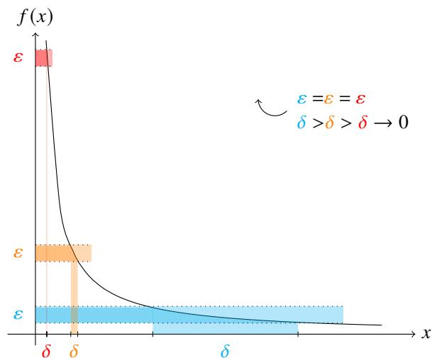  
图 3.8: 反比例函数在 $( 0 , + \infty )$ 上逐点连续但不一致连续.

从前面的讨论可知正比例函数 $f ( x ) = x$ 在 $\mathbb { R }$ 上是一致连续的. 从直观上看反比例函数 $f ( x ) = 1 / x$ 在 $( 0 , + \infty )$ 不一致连续.如图3.8所示,对于给定的 $\varepsilon > 0$ ,随着选取的 $x _ { 0 }$ 逐渐靠近0,满足要求的 $\delta$ 的取值范围越来越小.和前面的讨论类似, 由于

$$
\left| f (x) - f \left(x _ {0}\right) \right| = \left| \frac {1}{x} - \frac {1}{x _ {0}} \right| <   \varepsilon \Longleftrightarrow \frac {x _ {0}}{1 + \varepsilon x _ {0}} <   x <   \frac {x _ {0}}{1 - \varepsilon x _ {0}}.
$$

因此 $\delta$ 可取的范围是

$$
0 <   \delta <   \min  \left\{x _ {0} - \frac {x _ {0}}{1 + \varepsilon x _ {0}}, \frac {x _ {0}}{1 - \varepsilon x _ {0}} - x _ {0} \right\}
$$

因此当 $x _ { 0 } \to 0$ 时, $\delta  0$ . 这表明不可能找到和 $x _ { 0 }$ 无关的统一的 $\delta .$ 于是就证明了 $f$ 在 $( 0 , + \infty )$ 上不一致连续.

一般情况下, 用定义直接证明一个函数不一致连续不太方便, 这时可以考虑用数列极限来刻画一致连续性.

# 命题 3.19

设区间 $I$ 上的函数 $f$ . 则 $f$ 在 $I$ 上一致连续, 当且仅当对于任意数列 $\{ x _ { n } \}$ , $\{ y _ { n } \} \in I$ , 只要 $x _ { n } - y _ { n } \to 0$ , 就有

$$
\lim  _ {n \rightarrow \infty} [ f (x _ {n}) - f (y _ {n}) ] = 0.
$$

证明 (i)证明必要性.若 $f$ 在 $I$ 上一致连续,则对于任一 $\varepsilon > 0$ ,存在 $\delta > 0$ 使得对于任意 $x _ { 1 } , x _ { 2 } \in I$ , 当 $\vert x _ { 1 } - x _ { 2 } \vert < \delta$ 时

$$
\left| f \left(x _ {1}\right) - f \left(x _ {2}\right) \right| <   \varepsilon .
$$

任取数列 $\left\{ x _ { n } \right\}$ , $\{ y _ { n } \} \in I .$ 若 $x _ { n } - y _ { n } \to 0$ , 则对于给定的 $\delta > 0$ , 存在 $N \in \mathbb { N } ^ { * }$ 使得当 $n > N$ 时, 有 $\vert x _ { n } - y _ { n } \vert < \delta$ . 因此当 $n > N$ 时, 有 $| f ( x _ { n } ) - f ( y _ { n } ) | < \varepsilon .$ . 于是 $f ( x _ { n } ) - f ( y _ { n } ) \to 0$ .

(ii) 证明充分性. 假设 $f$ 在 $I$ 上不一致连续, 则存在 $\varepsilon > 0$ 对于任一 $n \in \mathbb { N } ^ { * }$ 都存在 $x _ { n } , y _ { n } \in I$ $x _ { n }$ 使得

$$
\left| x _ {n} - y _ {n} \right| <   \frac {1}{n}, \quad \left| f \left(x _ {n}\right) - f \left(y _ {n}\right) \right| \geqslant \varepsilon .
$$

此时数列 $\left\{ a _ { n } \right\}$ , $\left\{ b _ { n } \right\} \subseteq I$ 满足 $x _ { n } - y _ { n } \to 0$ 但不满足 $f ( x _ { n } ) - f ( y _ { n } ) \to 0 .$ 出现矛盾. 这表明充分性也成立.

利用以上命题, 我们只需在区间 $I$ 中找到一对数列 $\left\{ x _ { n } \right\}$ 和 $\left\{ y _ { n } \right\}$ 满足 $x _ { n } - y _ { n } \to 0$ , 但不满足 $f ( x _ { n } ) - f ( y _ { n } ) \to 0$ ,就可以证明函数 $f$ 在 $I$ 上不一致连续. 下面用这个方法再来证明反比例函数不是一致连续的.

例 3.35 反比例函数 $f ( x ) = 1 / x$ 在开区间 $( 0 , + \infty )$ 上不一致连续.

证明 在 $( 0 , + \infty )$ 中取两个数列

$$
a _ {n} = \frac {1}{n + 1}, \quad b _ {n} = \frac {1}{n}, \quad n = 1, 2, \dots .
$$

由于

$$
a _ {n} - b _ {n} = \frac {1}{n + 1} - \frac {1}{n} \rightarrow 0.
$$

但

$$
f \left(a _ {n}\right) - f \left(b _ {n}\right) = (n + 1) - n = 1.
$$

由命题3.19可知 $f$ 在 $( 0 , + \infty )$ 上不一致连续.

再看一个不是一致连续的例子.

例 3.36 二次函数 $f ( x ) = x ^ { 2 }$ 在区间 $[ 0 , + \infty )$ 上不一致连续.

证明 在 $[ 0 , + \infty )$ 中取两个数列

$$
a _ {n} = n + \frac {1}{n}, \quad b _ {n} = n, \quad n = 1, 2, \dots .
$$

由于

$$
a _ {n} - b _ {n} = \left(n + \frac {1}{n}\right) - n = \frac {1}{n} \rightarrow 0.
$$

但

$$
f (a _ {n}) - f (b _ {n}) = \left(n + \frac {1}{n}\right) ^ {2} - n ^ {2} = 2 + \frac {1}{n ^ {2}} \rightarrow 2.
$$

由命题3.19可知 $f ( x )$ 不是一致连续的.

注 用类似的方法可以证明, 当 $n = 2 , 3 , \cdots$ 时函数 $x ^ { n }$ 都不是一致连续的.

以上两个例子中, 函数 $f$ 在区间 $I$ 上不一致连续, 我们猜测可能是因为: $f$ 在 $I$ 上无界; $I$ 不是闭区间. 下面来分别考察这两个因素.

例 3.37 设函数

$$
f (x) = \sin \frac {1}{x}
$$

则 $f$ 在区间 $( 0 , 1 )$ 内有界, 但不一致连续.

证明 显然 $| f ( x ) | \leqslant 1 .$ 因此 $f ( x )$ 有界. 下面来看 $f ( x )$ 是否一致连续. 设 (0,1) 上的数列

$$
x _ {n} = \frac {1}{2 n \pi + \pi / 2}, \qquad y _ {n} = \frac {1}{2 n \pi}, \quad n = 1, 2, \dots .
$$

则 $x _ { n } - y _ { n } \to 0$ , 然而

$$
f (x _ {n}) - f (y _ {n}) = \sin \left(2 n \pi + \frac {\pi}{2}\right) - \sin 2 n \pi = 1.
$$

由命题3.19可知 $f ( x )$ 不一致连续.

上例表明, 即使连续函数 $f$ 在开区间 $I$ 内有界, 仍无法保证 $f$ 在 $I$ 上一致连续.

例 3.38 设函数

$$
f (x) = \sin \frac {1}{x}
$$

则 $f$ 在任一闭区间 $[ a , b ] \subseteq ( 0 , 1 )$ 上一致连续.

证明 任取 $x _ { 1 } , x _ { 2 } \in [ a , b ]$ .

$$
\left| f \left(x _ {1}\right) - f \left(x _ {2}\right) \right| = \left| \sin \frac {1}{x _ {1}} - \sin \frac {1}{x _ {2}} \right| \leqslant \left| \frac {1}{x _ {1}} - \frac {1}{x _ {2}} \right| = \frac {\left| x _ {1} - x _ {2} \right|}{x _ {1} x _ {2}} \leqslant \frac {\left| x _ {1} - x _ {2} \right|}{a ^ {2}}.
$$

因此对于任一 $\varepsilon > 0$ 只需取 $\delta = a ^ { 2 } \varepsilon$ . 则当 $| x _ { 1 } - x _ { 2 } | < \delta$ 时

$$
\left| f \left(x _ {1}\right) - f \left(x _ {2}\right) \right| \leqslant \frac {\left| x _ {1} - x _ {2} \right|}{a ^ {2}} <   \frac {\delta}{a ^ {2}} = \varepsilon .
$$

于是可知 $f$ 在 $[ a , b ]$ 上一致连续.

注 事实上对于任一 $a \in ( 0 , 1 ) , f$ $f$ 在 $[ a , 1 )$ 上一致连续.

类似可证明反比例函数 $f = 1 / x$ 在 $( 0 , + \infty )$ 的任一闭子区间上都一致连续.类似的例子还有正切函数 $f = \tan x$ 在开区间 $( - \pi / 2 , \pi / 2 )$ 的任一闭子区间上都一致连续.

# 定义 3.22 (内闭一致连续)

函数 $f$ 在开区间 $( a , b )$ 的任意闭子区间上都一致连续, 则称该函数在 $( a , b )$ 上内闭一致连续 (inner closed uniformly continuous).

通过上面的讨论, 可以很自然地想到以下定理.

# 定理 3.17 (Heine-Cantor 定理)

设函数 $f$ 在有限闭区间 $I$ 上连续. 则 $f$ 在 $I$ 上一致连续.

证明 证法一 任取 $x _ { 1 } , x _ { 2 } \in I .$ 对于任一 $\varepsilon > 0$ , 只需找到一个 $\delta > 0$ 使得当 $| x _ { 2 } - x _ { 1 } | < \delta$ 时

$$
\left| f \left(x _ {1}\right) - f \left(x _ {2}\right) \right| <   \varepsilon .
$$

由于 $f$ 在 $I$ 上连续, 故对于任一 $x _ { 0 } \in I$ , 对于以上取定的 $\varepsilon$ , 都存在 $\delta _ { x _ { 0 } }$ 使得当 $x \in N _ { \delta _ { x _ { 0 } } } ( x _ { 0 } ) \cap I$ 时

$$
\left| f (x) - f \left(x _ {0}\right) \right| <   \frac {\varepsilon}{2}.
$$

因此当 $x _ { 1 } , x _ { 2 } \in N _ { \delta _ { x _ { 0 } } } ( x _ { 0 } ) \cap I$ 时

$$
\left| f \left(x _ {1}\right) - f \left(x _ {2}\right) \right| \leqslant \left| f \left(x _ {1}\right) - f \left(x _ {0}\right) \right| + \left| f \left(x _ {2}\right) - f \left(x _ {0}\right) \right| <   \frac {\varepsilon}{2} + \frac {\varepsilon}{2} = \varepsilon . \tag {3.1}
$$

令

$$
C _ {I} = \left\{\left(y - \frac {\delta_ {y}}{2}, y + \frac {\delta_ {y}}{2}\right): y \in I \right\}
$$

显然 $C _ { I }$ 是闭区间 $I$ 的一个开覆盖. 由 Heine-Borel 定理可知存在一个有限子覆盖

$$
C _ {I} ^ {\prime} = \left\{\left(y _ {k} - \frac {\delta y _ {k}}{2}, y _ {k} + \frac {\delta y _ {k}}{2}\right): y _ {k} \in I, k = 1, 2, \dots , m \right\}.
$$

由于 $C _ { I } ^ { \prime }$ 是 $I$ 的一个覆盖, 因此一定存在 $k \in \{ 1 , 2 , \cdots , m \}$ 使得

$$
x _ {1} \in \left(y _ {k} - \frac {\delta_ {y _ {k}}}{2}, y _ {k} + \frac {\delta_ {y _ {k}}}{2}\right).
$$

则 $| x _ { 1 } - y _ { k } | < \delta _ { y _ { k } } / 2 .$ 令

$$
\delta = \min  \left\{\frac {\delta_ {y _ {1}}}{2}, \frac {\delta_ {y _ {2}}}{2}, \dots , \frac {\delta_ {y _ {m}}}{2} \right\}.
$$

于是当 $| x _ { 1 } - x _ { 2 } | < \delta \leqslant \delta _ { y _ { k } } / 2$ 时

$$
\left| x _ {2} - y _ {k} \right| \leqslant \left| x _ {2} - x _ {1} \right| + \left| x _ {1} - y _ {k} \right| <   \frac {\delta_ {y _ {k}}}{2} + \frac {\delta_ {y _ {k}}}{2} = \delta_ {y _ {k}}.
$$

因此 $x _ { 1 } , x _ { 2 } \in N _ { \delta _ { y _ { k } } } ( y _ { k } ) \cap I .$ 于是由式3.1可知

$$
\left| f \left(x _ {1}\right) - f \left(x _ {2}\right) \right| <   \varepsilon .
$$

这就证明了 $f$ 在 $I$ 上一致连续.

证法二 用反证法. 假设函数 $f$ 在 $I$ 上不一致连续. 则存在 $\varepsilon > 0$ 对于任一 $n \in \mathbb { N } ^ { * }$ 都存在 $x _ { n } , y _ { n } \in I$ 使得

$$
\left| x _ {n} - y _ {n} \right| <   \frac {1}{n}, \quad \left| f \left(x _ {n}\right) - f \left(y _ {n}\right) \right| \geqslant \varepsilon .
$$

由于 $\{ x _ { n } \} \subseteq I ,$ , 故 $\{ x _ { n } \}$ 有界, 由 Bolzano-Weierstrass 定理可知 $\{ x _ { n } \}$ 有一个子列 $x _ { k _ { n } }  \xi \in I .$ 由于

$$
\left| y _ {k _ {n}} - \xi \right| \leqslant \left| y _ {k _ {n}} - x _ {k _ {n}} \right| + \left| x _ {k _ {n}} - \xi \right| <   \frac {1}{k _ {n}} + \left| x _ {k _ {n}} - \xi \right| \leqslant \frac {1}{n} + \left| x _ {k _ {n}} - \xi \right|.
$$

因此 $y _ { k _ { n } } \to \xi .$ . 由于 $f ( x )$ 在 $\xi$ 处连续, 故

$$
\lim  _ {n \rightarrow \infty} f \left(x _ {k _ {n}}\right) = \lim  _ {n \rightarrow \infty} f \left(y _ {k _ {n}}\right) = f (\xi).
$$

这与 $| f ( x _ { n } ) - f ( y _ { n } ) | \geqslant \varepsilon$ 矛盾. 于是可知 $f ( x )$ 在 $I$ 上一致连续.

注 证法一 中, 由于 $I$ 是一个闭区间, 因此任取 $x _ { 0 } \in I$ 可能会取到 $I$ 的端点, 因此需要把 $\mathbf { \tilde { \mu } } ^ { \ast } x \in N _ { \delta _ { x _ { 0 } } } ( x _ { 0 } ) ^ { \prime }$ ” 修改为$\ ^ { \ast } x \in N _ { \delta _ { x _ { 0 } } } ( x _ { 0 } ) \cap I ^ { \mathfrak { P } } .$

注 证法一 中 $I$ 是一个闭区间确保了 Heine-Borel 定理成立, 由于存在有限的子覆盖, 所以才能找到统一的 $\delta$

证法二 中 $I$ 是一个闭区间确保了 $\xi \in I .$ . 原因如下: 设 $I = [ a , b ]$ . 由于 $\{ x _ { k _ { n } } \} \subseteq \{ x _ { n } \} \subseteq [ a , b ]$ , 故 $a \leqslant x _ { k _ { n } } \leqslant b$ $( n = 1 , 2 , \cdots )$ . 令 $n \to \infty$ 得 $a \leqslant \xi \leqslant b$ . 如果 $I$ 是一个开区间, 当 $\{ x _ { k _ { n } } \}$ 收敛到开区间的端点处时, 会导致以上定理不成立.

注 Heine 提出 Heine-Borel 定理 (有限覆盖定理) 的初衷就是为了研究一致连续. 从以上证明中可以看出两个定理的联系.

以上定理表明, 闭区间上的连续函数有着很好的性质. 以上是有限闭区间上连续函数的第一个重要性质.

如果把以上定理的条件放宽, 可以得到以下结论, 证明方法完全一样.

例 3.39 设闭区间 $I$ 上的函数 $f .$ 若 $D ( f )$ 存在一个开覆盖 $\{ ( \alpha _ { i } , \beta _ { i } ) : i = 1 , 2 , \cdot \cdot \cdot \} .$ . 令

$$
K = I \left\backslash \bigcup_ {n = 1} ^ {\infty} \left(\alpha_ {i}, \beta_ {i}\right)\left. \right..
$$

则对于任一 $\varepsilon > 0$ 都存在 $\delta > 0$ 使得当 $x \in K$ , $y \in I$ 且 $\vert x - y \vert < \delta$ 时 $| f ( x ) - f ( y ) | < \varepsilon$ .

证明 用反证法. 假设结论不成立. 则存在 $\varepsilon > 0$ 对于任一 $n \in \mathbb { N } ^ { * }$ 都存在 $x _ { n } \in K$ , $y _ { n } \in I$ 使得

$$
\left| x _ {n} - y _ {n} \right| <   \frac {1}{n}, \quad \left| f \left(x _ {n}\right) - f \left(y _ {n}\right) \right| \geqslant \varepsilon .
$$

由于 $\{ x _ { n } \} \subseteq K \subseteq I ,$ , 故 $\{ x _ { n } \}$ 有界, 由 Bolzano-Weierstrass 定理可知 $\left\{ x _ { n } \right\}$ 有一个子列 $x _ { k _ { n } } \to \xi \in K$ . 由于

$$
\left| y _ {k _ {n}} - \xi \right| \leqslant \left| y _ {k _ {n}} - x _ {k _ {n}} \right| + \left| x _ {k _ {n}} - \xi \right| <   \frac {1}{k _ {n}} + \left| x _ {k _ {n}} - \xi \right| \leqslant \frac {1}{n} + \left| x _ {k _ {n}} - \xi \right|.
$$

因此 $y _ { k _ { n } } \to \xi .$ . 由于 $f$ 在 $\xi$ 处连续, 故

$$
\lim  _ {n \rightarrow \infty} f \left(x _ {k _ {n}}\right) = \lim  _ {n \rightarrow \infty} f \left(y _ {k _ {n}}\right) = f (\xi).
$$

这与 $| f ( x _ { n } ) - f ( y _ { n } ) | \geqslant \varepsilon$ 矛盾. 于是可知命题成立.

若函数在开区间 $I$ 上连续, 那么它在 $I$ 上一致连续的充要条件是什么呢?

# 命题 3.20

设函数 $f$ 在开区间 $( a , b )$ 上连续. 则 $f$ 在 $( a , b )$ 上一致连续当且仅当 $f ( a + )$ 和 $f ( b - )$ 存在且有限.

证明 (i) 证明必要性. 若 $f$ 在 $( a , b )$ 上一致连续, 故对于任一 $\varepsilon > 0 .$ , 存在 $\delta > 0$ 使得对于 $x _ { 1 } , x _ { 2 } \in ( a , b )$ $x _ { 1 }$ , 只要$| x _ { 1 } - x _ { 2 } | < \delta$ 就有

$$
\left| f \left(x _ {1}\right) - f \left(x _ {2}\right) \right| <   \varepsilon .
$$

当 $x _ { 1 } - a < \delta / 2 , x _ { 2 } - a < \delta / 2$ 时

$$
\left| x _ {1} - x _ {2} \right| \leqslant \left| x _ {1} - a \right| + \left| x _ {2} - a \right| <   \frac {\delta}{2} + \frac {\delta}{2} = \delta .
$$

因此 $| f ( x _ { 1 } ) - f ( x _ { 2 } ) | < \varepsilon .$ . 由 Cauchy 收敛原理可知 $f ( a + )$ 存在且有限. 同理可知 $f ( b - )$ 存在且有限.

(ii) 证明充分性. 若 $f ( a + )$ 和 $f ( b - )$ 存在且有限, 则可令

$$
F (x) = \left\{ \begin{array}{l l} f (x), & a <   x <   b \\ f (a +), & x = a \\ f (b -), & x = b \end{array} \right..
$$

显然 $F ( x )$ 在 $[ a , b ]$ 上连续, 因此它在 $[ a , b ]$ 上一致连续, 从而 $f ( x )$ 在 $( a , b )$ 上一致连续.

注 不难证明, 以上命题中的 $( a , b )$ 为无限区间时命题的充分性也成立.

最后我们来看两个一致连续的充分条件, 它们在具体问题中非常有用.

# 命题 3.21 (Lipschitz 连续)

设函数 $f$ 在区间 $I$ 上有定义. 若存在 $K > 0$ 使得对于任意 $x _ { 1 } , x _ { 2 } \in I$ 都有

$$
\left| f \left(x _ {1}\right) - f \left(x _ {2}\right) \right| \leqslant K \left| x _ {1} - x _ {2} \right|.
$$

则 $f$ 在 $I$ 上一致连续.

证明 对于任一 $\varepsilon > 0$ , 取 $\delta = \varepsilon / K > 0$ . 则对于任意 $x _ { 1 } , x _ { 2 } \in I$ , 当 $| x _ { 1 } - x _ { 2 } | < \delta$ 时

$$
\left| f \left(x _ {1}\right) - f \left(x _ {2}\right) \right| \leqslant K \left| x _ {1} - x _ {2} \right| <   K \delta = \varepsilon .
$$

于是可知 $f ( x )$ 在 $I$ 上一致连续.

注 若函数 $f$ 满足上例中的条件, 则称 $f$ 是 Lipschitz 连续的 (Lipschitz continuous). 上例中的条件称为 Lipschitz 条件(Lipschitz condition).

容易看出, Lipschitz 条件本质上是把区间上函数值的变化率 (我们可以简单地看成斜率) 控制在一个范围内.上例表明 Lipschitz 条件是一致连续的一个充分条件. 这是一个很好用的充分条件. 下面看一个例子.

例 3.40 函数 sin ?? 和 cos ?? 在 $\mathbb { R }$ 上一致连续.

证明 对于任一 $x _ { 1 } , x _ { 2 } \in \mathbb { R } ,$ 由于

$$
| \sin x _ {1} - \sin x _ {2} | \leqslant | x _ {1} - x _ {2} |.
$$

$$
\left| \cos x _ {1} - \cos x _ {2} \right| \leqslant \left| x _ {1} - x _ {2} \right|.
$$

因此 $\sin x$ 和 $\scriptstyle { \cos x }$ 在 $\mathbb { R }$ 上 Lipschitz 连续, 从而在 $\mathbb { R }$ 上一致连续.

但它不是必要条件.

例 3.41 设函数 $f ( x ) = { \sqrt { x } } .$ . 则

(1) $f$ 在 $[ 0 , + \infty )$ 上一致连续.   
(2) $f$ 在 $[ 0 , + \infty )$ 上不 Lipschitz 连续.

证明 (1) 对于任意 $x _ { 1 } , x _ { 2 } \in [ 0 , + \infty )$ , 不妨设 $x _ { 1 } \leqslant x _ { 2 }$ , 则有不等式

$$
\sqrt {x _ {1}} + \sqrt {x _ {2}} \geqslant \sqrt {x _ {2}} \geqslant \sqrt {x _ {2} - x _ {1}}.
$$

因此当 $x _ { 1 } \neq x _ { 2 }$ 时, 有

$$
\left| \sqrt {x _ {2}} - \sqrt {x _ {1}} \right| = \frac {x _ {2} - x _ {1}}{\sqrt {x _ {2}} + \sqrt {x _ {1}}} \leqslant \frac {x _ {2} - x _ {1}}{\sqrt {x _ {2} - x _ {1}}} = \sqrt {x _ {2} - x _ {1}}.
$$

当 $x _ { 1 } = x _ { 2 }$ 时, $\left| { \sqrt { x _ { 2 } } } - { \sqrt { x _ { 1 } } } \right| = { \sqrt { x _ { 2 } - x _ { 1 } } } .$ 因此对于任一 $\varepsilon > 0$ , 取 $\delta = \varepsilon ^ { 2 }$ , 当 $| x _ { 2 } - x _ { 1 } | < \delta$ 时

$$
\left| \sqrt {x _ {2}} - \sqrt {x _ {1}} \right| \leqslant \sqrt {x _ {2} - x _ {1}} <   \sqrt {\delta} = \varepsilon .
$$

于是可知 $f$ 在 $[ 0 , + \infty )$ 上一致连续.

(2) 假设 $f$ 在 $[ 0 , + \infty )$ 上 Lipschitz 连续. 则存在 $K > 0$ 对于任一 $x \in ( 0 , + \infty )$ 都满足

$$
| f (x) - f (0) | <   K | x - 0 | \iff \sqrt {x} <   K x \iff \frac {1}{\sqrt {x}} <   K.
$$

取 $x \in \left( 0 , 1 / K ^ { 2 } \right)$ , 则 $1 / { \sqrt { x } } > K$ , 出现矛盾, 于是可知 $f$ 在 $[ 0 , + \infty )$ 上不 Lipschitz 连续.

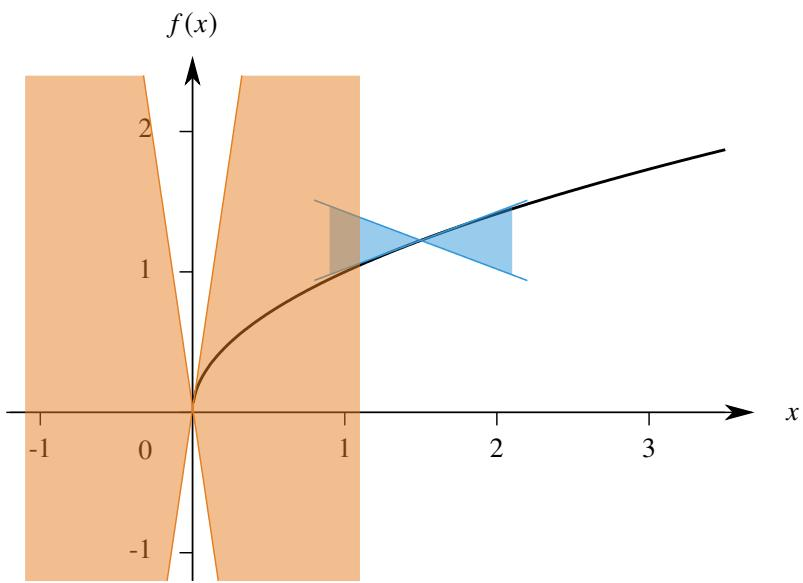  
图 3.9: 一致连续但不一定 Lipschitz 连续.

注 $f$ 在 $[ 0 , + \infty )$ 上不 Lipschitz 连续是因为

$$
\lim  _ {x \rightarrow 0} \frac {f (x) - f (0)}{x - 0} = \lim  _ {x \rightarrow 0} \frac {1}{\sqrt {x}} = + \infty .
$$

因此当 $x _ { 1 } = 0 , x _ { 2 } \to 0$ $x _ { 1 } = 0$ 时不可能找到满足要求的 $K$ . 用下一章的观点看, $f$ 在 0 处不可导, 从几何的观点看, $f$ 在 0处的切线是 $y$ 轴, 因此斜率不存在.

根据上例, 很容易想到把 Lipschitz 条件进一步推广.

# 命题 3.22 (Hölder 连续)

设函数 $f$ 在区间 $I$ 上有定义. 若存在 $K > 0$ 使得对于任意 $x _ { 1 } , x _ { 2 } \in I$ 都有

$$
\left| f \left(x _ {1}\right) - f \left(x _ {2}\right) \right| \leqslant K \left| x _ {1} - x _ {2} \right| ^ {\alpha}, \quad 0 <   \alpha \leqslant 1.
$$

则 $f ( x )$ 在 $I$ 上一致连续.

证明 对于任一 $\varepsilon > 0$ , 取 $\delta = ( \varepsilon / K ) ^ { 1 / \alpha } > 0$ . 则对于任意 $x _ { 1 } , x _ { 2 } \in I$ , 当 $| x _ { 1 } - x _ { 2 } | < \delta$ 时

$$
\left| f \left(x _ {1}\right) - f \left(x _ {2}\right) \right| \leqslant K \left| x _ {1} - x _ {2} \right| ^ {\alpha} <   K \left[ \left(\frac {\varepsilon}{K}\right) ^ {1 / \alpha} \right] ^ {\alpha} = \varepsilon .
$$

于是可知 $f ( x )$ 在 $I$ 上一致连续.

注若函数 $f$ 满足上例中的条件,则称 $f$ 是 Hölder 连续的 (Hölder continuous). 上例中的条件称为 Hölder 条件 (Höldercondition).

例3.41中, 函数 $f ( x ) = { \sqrt { x } }$ 显然是 Hölder 连续的. 由于 Lipschitz 连续是 Hölder 连续的特例 $( \alpha = 1 )$ ), 因此 Hölder连续是Lipschitz连续的必要条件.于是我们可以按条件由弱到强排列以下四种连续:逐点连续、一致连续、Hölder连续、Lipschitz 连续.

Hölder 连续也是一个证明一致连续时很有用的充分条件, 下面看一个例子.

例 3.42 研究以下函数的一致连续性:

$$
f (x) = \sqrt [ 3 ]{x}, \quad x \geqslant 0.
$$

解 任取 $x _ { 1 } , x _ { 2 } \in [ 0 , + \infty )$ . 不妨设 $x _ { 1 } < x _ { 2 }$ . 则 $x _ { 2 } ^ { 2 / 3 } > ( x _ { 2 } - x _ { 1 } ) ^ { 3 / 2 } .$ . 于是可知

$$
\left| \sqrt [ 3 ]{x _ {2}} - \sqrt [ 3 ]{x _ {1}} \right| = \frac {\left| x _ {2} ^ {1 / 3} - x _ {1} ^ {1 / 3} \right| \left| x _ {1} ^ {2 / 3} + x _ {1} ^ {1 / 3} x _ {2} ^ {1 / 3} + x _ {2} ^ {2 / 3} \right|}{\left| x _ {1} ^ {2 / 3} + x _ {1} ^ {1 / 3} x _ {2} ^ {1 / 3} + x _ {2} ^ {2 / 3} \right|} = \frac {| x _ {2} - x _ {1} |}{\left| x _ {1} ^ {2 / 3} + x _ {1} ^ {1 / 3} x _ {2} ^ {1 / 3} + x _ {2} ^ {2 / 3} \right|} \leqslant \frac {| x _ {2} - x _ {1} |}{x _ {2} ^ {2 / 3}} \leqslant \frac {| x _ {2} - x _ {1} |}{(x _ {2} - x _ {1}) ^ {2 / 3}} = | x _ {2} - x _ {1} | ^ {1 / 3}.
$$

于是可知 $f ( x )$ Hölder 连续, 从而一致连续.

# 3.3.2 有界性

直观上就容易看出, 闭区间上的连续函数是有界的.

# 定理 3.18

设函数 $f$ 在闭区间 $I$ 上连续. 则 $f ( x )$ 在 $I$ 上有界.

证明 只证明有上界的情况. 用反证法, 假设 $f ( x )$ 在 $I$ 上无上界. 则任一自然数 $n$ 都不是它的上界. 故存在 $x _ { n } \in I$ 使得 $f ( x _ { n } ) ~ > ~ n$ $( n = 1 , 2 , \cdots )$ . 由于 $\{ x _ { n } \} \subseteq I _ { \mathbb { } }$ , 故 $\{ x _ { n } \}$ 有界, 由 Bolzano-Weierstrass 定理可知 $\{ x _ { n } \}$ 有一个子列$x _ { k _ { n } } \to \xi \in I .$ 由于 $f ( x )$ 在 $\xi$ 处连续, 故

$$
\lim  _ {n \rightarrow \infty} f (x _ {k _ {n}}) = f (\xi).
$$

另一方面, 由于

$$
f \left(x _ {k _ {n}}\right) > k _ {n} \geqslant n, \quad n = 1, 2, \dots .
$$

令 $n \to \infty$ 得 $f ( x _ { k _ { n } } )  + \infty$ . 出现矛盾. 于是可知 $f ( x )$ 在 $I$ 上有上界.

如果把以上定理的条件改为开区间, 结论就不成立. 例如反比例函数 $1 / x$ 在开区间 $( 0 , 1 )$ 上连续但无界. 如果改为无限区间, 结论也不成立. 例如正比例函数 $x$ 在区间 $[ 0 , + \infty )$ 上连续但无界.

若函数只在开区间上连续, 但如果可以把它 “延拓” 到闭区间上, 使得它依旧连续, 就可以证明它的有界性.

# 命题 3.23

若函数 $f$ 在 $( a , b )$ 上一致连续, 则 $f ( x )$ 在 $( a , b )$ 上有界.

证明 由于 $f$ 在 $( a , b )$ 上一致连续, 故 $f ( a + )$ 和 $f ( b - )$ 存在且有限. 于是可以令

$$
F (x) = \left\{ \begin{array}{l l} f (x), & a <   x <   b \\ f (a +), & x = a \\ f (b -), & x = b \end{array} \right..
$$

显然 $F ( x )$ 在 $[ a , b ]$ 上连续, 因此它在 $[ a , b ]$ 上有界, 从而 $f ( x )$ 在 $( a , b )$ 上有界.

注 类似可证在半开半闭区间上一致连续的函数也有界. 于是可知, 若 $f$ 在有限区间 $I$ 上一致连续, 则 $f$ 在 $I$ 上有界.

命题3.18告诉我们在区间 ?? 上一致连续的函数之和仍在 ?? 上一致连续. 若 $I$ 是一个有限区间, 则这个结论对于函数的积仍然成立.

# 命题 3.24

若函数 $f$ 和 $g$ 都在有限区间 $I$ 上一致连续. 则 $f g$ 在 $I$ 上一致连续.

证明 由于 $f$ 和 $g$ 都在有限区间 $I$ 上一致连续, 由命题3.23可知 $f$ 和 $g$ 在 $I$ 上有界, 即存在 $M > 0 , N > 0$ 满足

$$
\left| f (x) \right| \leqslant M, \quad \left| g (x) \right| \leqslant N, \quad \forall x \in I.
$$

由于 $f$ 和 $g$ 都在有限区间 $I$ 上一致连续, 故对于任一 $\varepsilon > 0$ , 存在 $\delta > 0$ , 对于任意 $x _ { 1 } , x _ { 2 } \in I$ , 只要 $\vert x _ { 1 } - x _ { 2 } \vert < \delta$ 就有

$$
\left| f \left(x _ {1}\right) - f \left(x _ {2}\right) \right| <   \frac {\varepsilon}{2 N}, \quad \left| g \left(x _ {1}\right) - g \left(x _ {2}\right) \right| <   \frac {\varepsilon}{2 M}.
$$

于是

$$
\left| f \left(x _ {1}\right) g \left(x _ {1}\right) - f \left(x _ {2}\right) g \left(x _ {2}\right) \right| \leqslant \left| \left[ f \left(x _ {1}\right) - f \left(x _ {2}\right) \right] g \left(x _ {1}\right) \right| + \left| f \left(x _ {2}\right) \left[ g \left(x _ {1}\right) - g \left(x _ {2}\right) \right] \right| <   \frac {\varepsilon}{2 N} \cdot N + \frac {\varepsilon}{2 M} \cdot M = \varepsilon .
$$

于是可知 $f g$ 在 $I$ 上一致连续.

注 若 $I$ 是一个无穷区间, 则结论不成立. 举例说明, 若 $f ( x ) = g ( x ) = x$ , 它们在 $\mathbb { R }$ 上一致连续, 但 $( f g ) ( x ) = x ^ { 2 }$ 在 $\mathbb { R }$ 上不一致连续.

在有限闭区间上连续函数一定有界, 那么很自然地就会考虑能否取到最大值和最小值.

# 定理 3.19 (极值定理)

设函数 $f$ 在闭区间 $I$ 上连续. 令

$$
M = \sup  f (I), \quad m = \inf  f (I).
$$

则存在 $x _ { M } , x _ { m } \in I$ 使得 $f ( x _ { M } ) = M$ , $f ( x _ { m } ) = m$ .

证明 由定理3.18可知 $M , m \in \mathbb { R }$ . 由于 $M = \operatorname* { s u p } f ( I )$ . 故对于任一 $n \in \mathbb { N } ^ { * }$ 都存在 $x _ { n } \in I$ 使得

$$
M - \frac {1}{n} <   f (x _ {n}) \leqslant M.
$$

由于 $\{ x _ { n } \} \subseteq I ,$ 故 $\{ x _ { n } \}$ 有界, 由 Bolzano-Weierstrass 定理可知 $\{ x _ { n } \}$ 有一个子列 $x _ { k _ { n } }  \xi \in I .$ 由于

$$
M - \frac {1}{k _ {n}} <   f \left(x _ {k _ {n}}\right) \leqslant M.
$$

令 $n \to \infty$ 得 $\begin{array} { r } { \operatorname* { l i m } _ { n \to \infty } f ( x _ { k _ { n } } ) = M . } \end{array}$ 由于 $f ( x )$ 在 $\xi$ 处连续, 故

$$
\lim  _ {n \rightarrow \infty} f (x _ {k _ {n}}) = f (\xi).
$$

令 $\xi = x _ { M }$ , 则 $f ( x _ { M } ) = M$ . 同理可证存在 $x _ { m } \in I$ 使得 $f ( x _ { m } ) = m$ .

注 以上定理表明, 闭区间上的连续函数一定可以取到该区间上的最大值 (global maximum) 和最小值 (global mini-mum). 我们在后面遇到极大值 (local maximum) 和极小值 (local minimum) 的概念, 它们和最大值最小值合在一起统称为极值 (extreme value).

用类似的方法可以证明以下结论.

例 3.43 设函数 $f$ 在 $\mathbb { R }$ 上连续. 令 $M = \operatorname* { s u p } f ( \mathbb { R } )$ , ?? = inf $f ( \mathbb { R } )$ .

(1) 若

$$
\lim  _ {x \rightarrow + \infty} f (x) = \lim  _ {x \rightarrow - \infty} f (x) = - \infty .
$$

则存在 $\xi \in \mathbb { R }$ 使得 $f ( \xi ) = M$ .

(2) 若

$$
\lim  _ {x \rightarrow + \infty} f (x) = \lim  _ {x \rightarrow - \infty} f (x) = + \infty .
$$

则存在 $\eta \in \mathbb { R }$ 使得 $f ( \eta ) = m$ .

证明 只证明 (1).

证法一 (i) 若 $M \in \mathbb { R } .$ , 由于 $M = \operatorname* { s u p } f ( \mathbb { R } )$ . 故对于任一 $n \in \mathbb { N } ^ { * }$ 都存在 $x _ { n } \in \mathbb { R }$ 使得

$$
M - \frac {1}{n} <   f (x _ {n}) \leqslant M.
$$

由 Bolzano-Weierstrass 定理可知 $\left\{ x _ { n } \right\}$ 有一个子列 $x _ { k _ { n } }  \xi \in \overline { { \mathbb { R } } } .$ . 由于 $\begin{array} { r } { \operatorname* { l i m } _ { x \to + \infty } f ( x ) = \operatorname* { l i m } _ { x \to - \infty } f ( x ) = - \infty , } \end{array}$ , 故$\xi \neq \pm \infty$ , 否则 $f ( x _ { k _ { n } } ) = - \infty .$ . 于是

$$
M - \frac {1}{k _ {n}} <   f \left(x _ {k _ {n}}\right) \leqslant M.
$$

令 $n \to \infty$ , 由夹逼定理可知 $\begin{array} { r } { \operatorname* { l i m } _ { n \to \infty } f ( x _ { k _ { n } } ) = M . } \end{array}$ 由于 $f ( x )$ 在 $\xi$ 处连续, 故

$$
\lim _ {n \to \infty} f (x _ {k _ {n}}) = f (\xi).
$$

于是可知 $f ( \xi ) = M$ .

(ii) 若 $M \ = \ + \infty$ , 同 (i) 的证明方法可知, 存在 $\{ y _ { n } \} ~ \in ~ \mathbb { R }$ 满足 $y _ { n } \to x _ { 0 } \in \overline { { \mathbb { R } } }$ 且 $f ( y _ { n } ) \to M = + \infty .$ . 由于$\begin{array} { r } { \operatorname* { l i m } _ { x  + \infty } f ( x ) = \operatorname* { l i m } _ { x  - \infty } f ( x ) = - \infty , } \end{array}$ , 故 $x _ { 0 } \neq \pm \infty$ . 由于 $f$ 在 $\mathbb { R }$ 上连续, 故 $f ( y _ { n } ) \to M \in \mathbb { R }$ . 这表明 $M \neq + \infty$ .

证法二 由于 $\begin{array} { r } { \operatorname* { l i m } _ { x \to + \infty } f ( x ) = \operatorname* { l i m } _ { x \to - \infty } f ( x ) = - \infty . } \end{array}$ 因此可以找到一个充分大的 $E > 0$ 使得有两点 $x _ { 1 } , x _ { 2 }$ 满足 $f ( x _ { 1 } ) = f ( x _ { 2 } ) = - E .$ . 对于给定的 $E$ , 存在充分大的 $A > \left| x _ { 1 } \right| , \left| x _ { 2 } \right|$ , 当 $x \in N _ { A } ( \infty )$ 时 $f ( x ) < - E$ . 在闭区间 $[ - A , A ]$ 上存在 $\xi$ 使得 $f$ 在 $\xi$ 处取到最大值 $M ^ { \prime }$ . 显然 $M ^ { \prime } \geqslant - E$ . 因此 $M ^ { \prime }$ 就是 $f$ 在 $\mathbb { R }$ 上的最大值. ■

以上例子表明, 在闭区间上连续只是极值定理成立的一个比较简明好用的充分条件. 在学习时, 不能死背结论, 而应该掌握它的证明方法, 这样就可以得到更多更灵活的条件.

# 3.3.3 介值性

下面来看有限闭区间上连续函数的 “中间过程”.

# 引理 3.2 (零点定理)

设函数 $f$ 在闭区间 $[ a , b ]$ 上连续. 若 $f ( a ) f ( b ) < 0$ , 则存在 $\xi \in ( a , b )$ 使得 $f ( \xi ) = 0$ .

证明 不妨设 $f ( a ) < 0 < f ( b )$ . 取区间 $[ a , b ]$ 的中点 $c = ( a + b ) / 2$ . 若 $f ( c ) = 0$ 就找到了满足要求的 $\xi$ . 否则 $f ( c )$ 一定与 $f ( a )$ 和 $f ( b )$ 中的某一个异号. 取其中与 $f ( c )$ 异号的那个, 设它的自变量与 $c$ 组成的闭区间为 $[ a _ { 1 } , b _ { 1 } ]$ . 则$[ a _ { 1 } , b _ { 1 } ]$ 满足

$$
[ a, b ] \supseteq [ a _ {1}, b _ {1} ], \quad 0 <   b _ {1} - a _ {1} = \frac {b - a}{2}, \quad f (a _ {1}) <   0 <   f (b _ {1}).
$$

继续重复上面的操作可以得到一个闭区间序列 $[ a _ { k } , b _ { k } ]$ $k = 1 , 2 , \cdots ,$ ) 满足

$$
[ a, b ] \supseteq [ a _ {1}, b _ {1} ] \supseteq [ a _ {2}, b _ {2} ] \supseteq \dots , \quad 0 <   b _ {k} - a _ {k} = \frac {b - a}{2 ^ {k}}, \quad f (a _ {k}) <   0 <   f (b _ {k}).
$$

在此过程中如果遇到某个 $k$ 使得 $\begin{array} { r } { f \left( \frac { a _ { k } + b _ { k } } { 2 } \right) = 0 } \end{array}$ , 就找到了满足要求的 $\xi$ . 否则就把这个过程无限进行下去. 由闭区间套定理可知存在 $\xi \in \left[ a _ { k } , b _ { k } \right]$ $k = 1 , 2 , \cdots ,$ ) 使得

$$
\lim  _ {k \rightarrow \infty} a _ {k} = \lim  _ {k \rightarrow \infty} b _ {k} = \xi .
$$

由于 $f ( x )$ 在 $\xi$ 处连续, 故

$$
\lim  _ {k \to \infty} f (a _ {k}) = f (\xi), \quad \lim  _ {k \to \infty} f (b _ {k}) = f (\xi).
$$

令 $f ( a _ { k } ) < 0 < f ( b _ { k } )$ 的 $k \to \infty$ 得 $f ( \xi ) \leqslant 0 \leqslant f ( \xi )$ . 于是 $f ( \xi ) = 0$ .

以上引理也称为 Bolzano 定理 (Bolzano’s theorem). 证明时再次用到了二分法, 也称为 Bolzano 方法. 利用这个方法寻找一些超越方程的近似根.零点定理有很多应用.其中最重要的应用是判断方程的根,因此零点定理也被称

# 为勘根定理 .

例 3.44 求 $\sqrt { 2 }$ 的近似值. 要求精确到小数点后面第一位.

解 令 $f ( x ) = x ^ { 2 } - 2 .$ . 只需求方程 $f ( x ) = 0$ 正根 $x _ { 0 }$ 的近似值. 用二分法和零点定理反复缩小 $x _ { 0 }$ 所在的范围.

<table><tr><td>f(1) &lt; 0</td><td>f(1.5) &gt; 0</td><td>x0 ∈ [1, 1.5]</td></tr><tr><td>f(1.25) &lt; 0</td><td>f(1.5) &gt; 0</td><td>x0 ∈ [1.25, 1.5]</td></tr><tr><td>f(1.375) &lt; 0</td><td>f(1.5) &gt; 0</td><td>x0 ∈ [1.375, 1.5]</td></tr><tr><td>f(1.375) &lt; 0</td><td>f(1.4375) &gt; 0</td><td>x0 ∈ [1.375, 1.4375]</td></tr><tr><td>f(1.40625) &lt; 0</td><td>f(1.4375) &gt; 0</td><td>x0 ∈ [1.40625, 1.4375]</td></tr></table>

于是可知 $\sqrt { 2 }$ 精确到小数点后面第一位的近似值为 1.4.

注 二分法是一个操作简明的方法, 但它逼近的速度比较慢, 实际应用中我们需要逼近速度更快的方法.

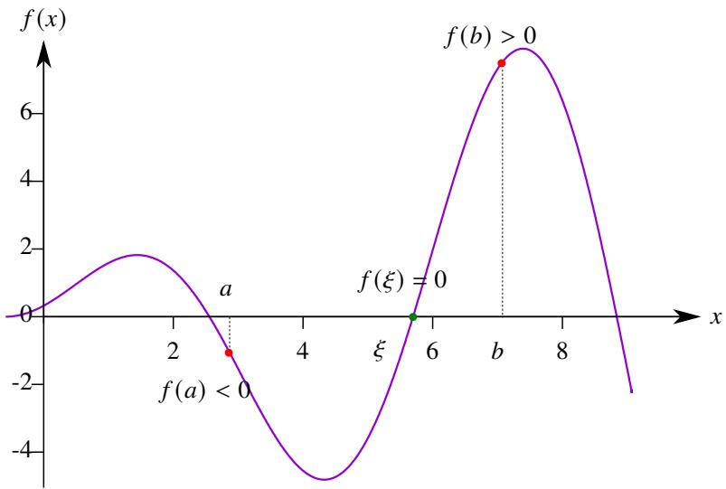  
图 3.10: 零点存在定理示意图.

例 3.45 实系数一元三次方程一定有实根.

证明 不失一般性设 $x ^ { 3 } + a _ { 2 } x ^ { 2 } + a _ { 1 } x + a _ { 0 } = 0 .$ . 令方程左边的多项式记作 $p ( x )$ , 则

$$
p (x) = x ^ {3} \left(1 + \frac {a _ {2}}{x} + \frac {a _ {1}}{x ^ {2}} + \frac {a _ {0}}{x ^ {3}}\right).
$$

于是

$$
\lim  _ {x \rightarrow + \infty} p (x) = + \infty , \quad \lim  _ {x \rightarrow - \infty} p (x) = - \infty .
$$

因此存在闭区间 $[ a , b ]$ 满足 $p ( a ) < 0$ , $p ( b ) > 0$ . 由零点定理可知存在实数 $\xi \in ( a , b )$ 使得 $f ( \xi ) = 0$ . 这表明原方程有一个实根. ■

用零点定理可以证明一个很有意思的结论.

例 3.46 压缩映射原理 设函数 $f$ 对任意 $x _ { 1 } , x _ { 2 } \in \mathbb { R }$ 都满足

$$
\left| f \left(x _ {1}\right) - f \left(x _ {2}\right) \right| \leqslant k \left| x _ {1} - x _ {2} \right|, \quad 0 <   k <   1.
$$

则 $f$ 存在唯一的不动点, 即存在唯一 $\xi \in \mathbb { R }$ 使得 $f ( \xi ) = \xi$ .

证明 令 $G ( x ) = x - f ( x )$ . 任取 $x _ { 1 } , x _ { 2 } \in \mathbb { R } \ ( x _ { 1 } < x _ { 2 } )$ $\left( x _ { 1 } < x _ { 2 } \right)$ . 则

$$
G (x _ {2}) - G (x _ {1}) = (x _ {2} - x _ {1}) - [ f (x _ {2}) - f (x _ {1}) ] = (1 - k) (x _ {2} - x _ {1}) + k (x _ {2} - x _ {1}) - [ f (x _ {2}) - f (x _ {1}) ] \geqslant (1 - k) (x _ {2} - x _ {1}) > 0.
$$

因此 $G ( x )$ 在 $\mathbb { R }$ 严格单调递增.

对于任一 $E > 0$ , 由于

$$
G (x) - G (0) \geqslant (1 - k) x \iff G (x) \geqslant (1 - k) x - f (0).
$$

因此只需取 $\textstyle A = { \frac { E + f ( 0 ) } { 1 - k } }$ , 当 $x > A$ 时就有 $G ( x ) > E$ . 因此

$$
\lim  _ {x \rightarrow + \infty} G (x) = + \infty .
$$

同理可知

$$
\lim  _ {x \rightarrow - \infty} G (x) = - \infty .
$$

由条件可知 $f$ 在 $\mathbb { R }$ 上 Lipschitz 连续, 因此 $G$ 在 $\mathbb { R }$ 也是连续函数.因此一定存在 $a , b \in \mathbb { R }$ 使得 $G ( a ) < 0$ , $G ( b ) > 0$ .由零点定理可知存在 $\xi \in \mathbb { R }$ 使得 $G ( \xi ) = 0 .$ , 即 $f ( \xi ) = \xi$ . 由于 $G ( x )$ 单调递增, 故 $\xi$ 是 $G ( x )$ 的唯一零点. 于是可知存在唯一 $\xi \in \mathbb { R }$ 使得 $f ( \xi ) = \xi$ . ■

注 上例中的 $f$ 称为压缩映射 (contraction mapping), 因此这个结论称为压缩映射定理 (contraction mapping theorem).容易看出压缩映射一定 Lipschitz 连续. 上例中的 $\xi$ 称为 $f$ 的不动点, 因此这个结论也称为 Banach 不动点定理 (Ba-nach fixed-point theorem).

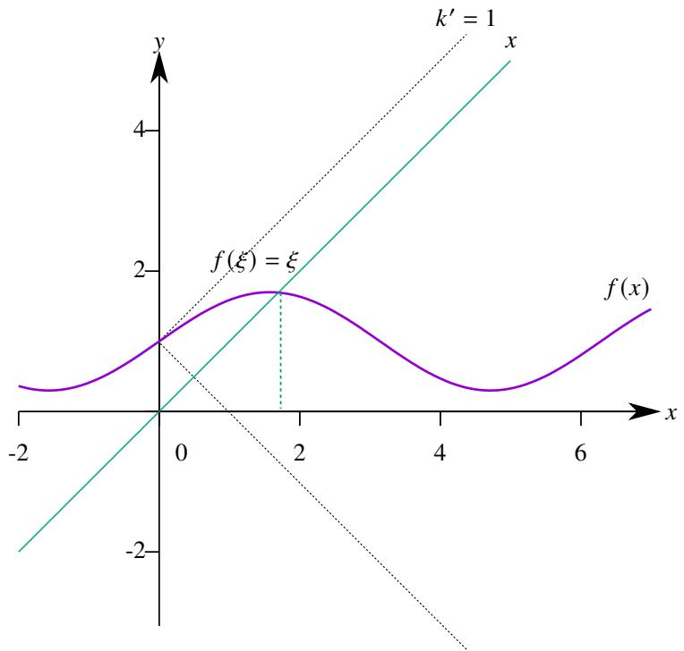  
图 3.11: 压缩映射定理示意图.

# 定理 3.20 (介值定理)

设非常值函数 $f$ 在闭区间 $[ a , b ]$ 上连续. 若 $f ( a ) = \alpha$ , $f ( b ) = \beta$ . 对于 $\alpha$ 和 $\beta$ 之间任一实数 $\gamma$ 都存在$c \in ( a , b )$ 使得 $\boldsymbol f ( \boldsymbol c ) = \boldsymbol \gamma$ .

证明 不妨设 $f ( a ) < \gamma < f ( b )$ . 令

$$
g (x) = f (x) - \gamma .
$$

则 $g ( x )$ 在 $[ a , b ]$ 上连续, 且

$$
g (a) = f (a) - \gamma <   0 <   f (b) - \gamma = g (b).
$$

由零点定理可知存在 $c \in [ a , b ]$ 使得 $g ( c ) = 0 ,$ , 即 $f ( c ) = \gamma$

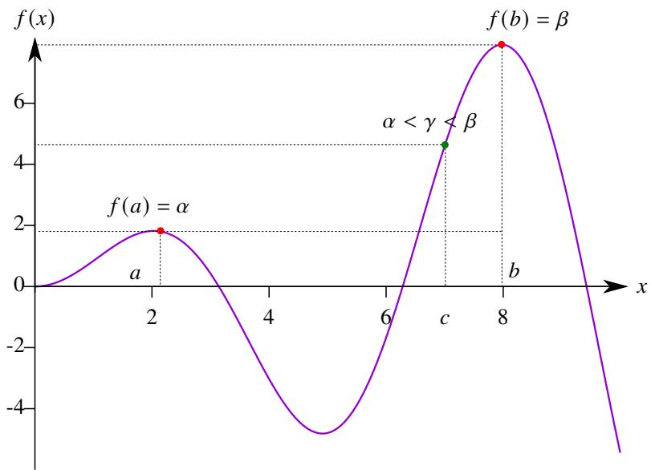  
图 3.12: 介值定理示意图.

由介值定理可以立刻得到以下结论.

# 推论 3.1

设函数 $f$ 不是常值函数. 若 $f$ 在闭区间 $I$ 上连续. 则 $J = f ( I )$ 也是一个闭区间.

证明 函数 $f$ 在闭区间 $I$ 上连续,由极值定理可知 $f$ 可以取到 $J$ 的最大值 $M$ 和最小值 $m$ , 设 $f ( a _ { 1 } ) = M$ , $f ( a _ { 2 } ) = m$ .由于函数 $f$ 不是常值函数, 故 $M \ne m$ . 由介值定理可知对于 $M$ 和 $m$ 之间的任一实数 $\gamma$ , 在 $a _ { 1 }$ 和 $a _ { 2 }$ 之间都存在 $c$ 满足 $f ( c ) = \gamma$ . 这表明 $f ( I )$ 可以取遍 $M$ 和 $m$ 之间的数. 于是可知 $J = [ m , M ]$ . ■

注 以上结论虽然简单, 但它阐明了一个重要的结果: 连续映射保持集合的紧致性和连通性. 后面会详细展开这个话题.

以上推论很有用, 下面看一个例子.

例 3.47 设函数 $f : [ a , b ] \to \mathbb { R }$ 在有理点上取无理数值, 在无理点上取有理数值. 则 $f$ 不是 $[ a , b ]$ 上的连续函数.

证明 用反证法. 假设 $f$ 在 $[ a , b ]$ 上连续. 令 $F ( x ) = f ( x ) + x .$ . 则 $F$ 也在 $[ a , b ]$ 上连续. 因此 $F$ 的值域是一个区间.由于无理数和有理数的和一定是无理数,因此 $F ( x )$ 的值域中全是无理数,出现矛盾.因此假设不成立.于是可知 $f$ 不是 $[ a , b ]$ 上的连续函数. ■

# 推论 3.2

设函数 $f$ 不是常值函数. 若 $f$ 在区间 $I$ 上连续. 则 $J = f ( I )$ 也是一个区间.

证明 用反证法.假设 $J$ 不是区间,则存在 $a , b \in J , \xi \in ( a , b )$ 使得 $\xi \notin J .$ . 设 $x _ { 1 } , x _ { 2 } \in I$ 满足 $f ( x _ { 1 } ) = a$ , $f ( x _ { 2 } ) = b$ , 不妨设 $x _ { 1 } < x _ { 2 }$ . 由推论3.1可知 $f ( [ x _ { 1 } , x _ { 2 } ] )$ 也是一个闭区间. 由于 $a , b \in f ( [ x _ { 1 } , x _ { 2 } ] )$ 因此 $\xi \in f ( [ x _ { 1 } , x _ { 2 } ] ) \subseteq J .$ 出现矛盾, 因此假设不成立. 于是可知 $J$ 也是一个区间. ■

注 在证明命题3.13时用到了以上结论.

容易想到, 若单调函数 $f$ 在区间 $I$ 上连续, 则 $f ( I )$ 不仅是一个区间而且是一个和 $I$ “同类型的区间”—— ?? 是

开区间, 则 $f ( I )$ 也是开区间; $I$ 是闭区间, 则 $f ( I )$ 也是闭区间; $I$ 是半开半闭区间, 则 $f ( I )$ 也是半开半闭区间, 且 ??的开端点 $a$ 的像 $f ( a )$ 就是 $f ( I )$ 的开端点.

以上结论虽然直观朴素, 但揭示了区间的 “拓扑性质”. 显然以上函数 $f$ 存在反函数 $f ^ { - 1 }$ , 且 $f$ 和 $f ^ { - 1 }$ 都是连续函数. 在这样的函数 $f$ 作用下, 区间仍然是区间, 且保持区间的类型和开闭端点. 但区间 $I$ 的长度在 $f$ 下的像 $f ( I )$ 未必能够保持.

更一般地说, 若函数 $f$ 是 $I$ 上的连续函数, 且 $f$ 存在反函数 $f ^ { - 1 }$ , 且 $f ^ { - 1 }$ 是 $f ( I )$ 上的连续函数. 那么在 $f$ 下得以保持的性质称为拓扑性质. 按此定义, 所有开区间在拓扑观点下 “没有区别”! 在后面讲进一步展开这个主题.

