# 第 4 章 一元函数微分学

# 内容提要

h 通过物理和几何的例子引出一元函数导数的概念.  
h 通过导数引出微分的概念.  
h 介绍一元函数的求导公式和求导法则, 包括求导的运算法则、复合函数求导法则、反函数的求导法则、隐函数的求导法则以及高阶导数的Leibniz 公式.  
h 介绍求导的 “逆运算” 和原函数的概念.  
h 介绍求原函数的基本方法, 包括换元法、分部积分法等.  
h 介绍 “微分中值定理”, 其中包括 Fermat 引理、Rolle 中值定理、Lagrange 中值定理、Cauchy

中值定理.

h 用 Cauchy 中值定理可以得到一种求未定式极限的有效方法, 称为 l’Hôpital 法则.  
h 介绍导数的集中主要的应用, 包括研究函数的单调性、极值、凸性. 并介绍简单的连续函数的作图方法.  
h 把函数的微分推广为带 Peano 余项的 Taylor 公式.  
h 把 Lagrange 中值定理推广为带 Lagrange 余项的 Taylor 公式. 此外还介绍了其它的余项, 其中主要介绍 Cauchy 余项.

函数是研究事物变化规律的工具.但是单纯谈变化往往是不能令人满意的.例如当我们说股票价格上涨时,除了关心股价的变化值 (增量) 之外, 更关心的是这个变化值是在多少时间内发生的. 在一天内股价上涨 $1 0 0 \%$ 和在10 年上涨 $1 0 0 \%$ 是对投资者而言是两件差距极大的事情. 因此我们通常更关心 “变化率”. 在物理中刻画变化率的物理量是非常常见的, 包括:“速度”、“加速度”、“功率” 等.

以我们最熟悉的速度为例. 为了刻画物体运动的快慢, 可以计算某一段时间内一个质点的单位时间位移变化量, 设位移与时间的函数关系为 $s = s ( t )$ . 则 $t _ { 1 }$ 和 $t _ { 2 }$ 时刻之间的位移变化率为

$$
\frac {\boldsymbol {s} (t _ {2}) - \boldsymbol {s} (t _ {1})}{t _ {2} - t _ {1}}.
$$

物理中, 把位移的变化率称为速度 (velocity). 但以上计算的是某一个时间段的平均速度 (average velocity). 固定 $t _ { 1 }$ ,当 $t _ { 2 }$ 不断靠近 $t _ { 1 }$ 时, 即 $t _ { 2 } - t _ { 1 }$ 趋于零时, 就可以得到质点在时刻 $t _ { 1 }$ 的瞬时速度 (instantaneous velocity). 令 $\Delta t = t _ { 2 } - t _ { 1 }$ ,以上想法可以用极限表达成

$$
\lim  _ {t _ {2} \rightarrow t _ {1}} \frac {s (t _ {2}) - s (t _ {1})}{t _ {2} - t _ {1}} = \lim  _ {\Delta t \rightarrow 0} \frac {s (t _ {1} + \Delta t) - s (t _ {1})}{\Delta t}. \tag {4.1}
$$

以上给出了用函数极限刻画速度的方法. 这个方法具有广泛的适用性. 于是我们考虑把这种形式的极限抽象出来, 建立一个独立的概念, 并专门研究它的计算方法和性质. 这就是函数的导数. 导数是微积分中的核心概念之一, 也是建立微积分这个数学分支的关键一步. 17 世纪以后, 随着物理学和几何学的不断发展, 需要定量研究物理量的变化率和曲线的切线. 1671 年, 英国数学家、物理学家 Isaac Newton 在他的著作《流数法与无穷级数》提出了 “流数” 的概念. 他把关于时间的函数的变化率称为 “流数”, 计算 “流数” 时所取的时间间隔可以 “尽可能地小”.事实上 Newton所说的 “流数” 就是关于时间的导数.

在同时代的另一个地方,德国数学家Gottfried Wilhelm von Leibniz也在研究同样的课题.他把自变量的“尽可能小的增量” 记作 $\mathrm { d } x$ , 对应的函数值的增量记作 $\mathrm { d } y$ , 函数值的变化率记作 $\frac { \mathrm { d } { } y } { \mathrm { d } { } x }$ . 这种导数的记法沿用至今, 被称为“Leibniz 记号”.

虽然 Newton 和 Leibniz 发明的导数理论已经可以很好地解决经典物理和经典几何问题. 但对于 “尽可能小”的质疑一直没有停止.从17世纪到18世纪的一百多年里,无数的数学大师包括Bernoulli兄弟、Taylor、Maclaurin、d’Alembert、Lagrange、Euler 都未能找到解决问题的决定性方法.

事实上, 解决问题的锁钥不在导数本身, 而在于如何严格地定义函数的极限. 进入十九世纪以后, 数学家们逐渐对函数的极限和连续性有了更加深刻的认识. Bolzano 首先想到把导数定义为形如4.1的函数极限. 他还指出导数不是 0 和 0 的比值, 而是两个趋于零的变量的极限. 之后 Cauchy 在他的名作《无穷小分析教程概论》中使用

了同样的导数定义. 1870 年代 Weierstrass 最终给出了极限的算术化严格定义, 使得导数的概念也随之得到了严格化. 到这时导数的概念已经出现了 200 多年. 这再次说明了一个数学概念或思想从萌发到成熟最后完善, 需要经历一个漫长的过程. 从函数的导数和极限的历史关系中也可以看出, 函数极限的严格定义要远比导数的计算和应用出现得晚. 这就导致了上一章的难度经常会超过本章. 这正是数学分析学习和教学时的经典难题.

另一方面, 研究函数时我们还会关心这样一个问题: 如果函数 $f$ 在 $x _ { 0 }$ 处产生了 $\Delta x$ 的增量, 那么函数值会相应地发生多大的改变? 这个问题在经济学中称为边际分析 (marginal analysis). 例如两个学生, 原本的成绩分别是 50分和 90 分. 他们都在考虑是否有必要增加学习时间来提高成绩. 根据经验公式, 前者如果每天多投入 1 小时复习时间, 成绩将从 50 分提到到 70 分; 而后者如果每天多投入 1 小时, 成绩只会从 90 分提高到 95 分. 从经济学角度看, 后者追加投入时间来提升成绩是低效的做法, 应该把时间投入到其他事情上.

从以上例子可以看出为了作出理性的决策,计算“自变量的微小增量”引起的函数值增量是非常重要的.容易知道函数值的增量由自变量的增量完全决定,因此函数值的增量是自变量增量的一个函数.一般情况下,这个函数是相当复杂的. 我们希望用一个线性函数来近似代替这个复杂的函数, 这就是微分的思想. 微分的概念在 Newton时代已经产生, 但在没有函数极限严格定义的情况下, 也无法严格阐明微分的定义.

# 4.1 一元函数的导数与微分

# 4.1.1 导数的概念

设函数 $f$ 在 $x _ { 0 }$ 的附近有定义. 自变量从 $x _ { 0 }$ 变化到 $x _ { 0 } + \Delta x$ , 其中 $\Delta x$ 称为自变量在 $x _ { 0 }$ 处的增量 (increment). 令$\Delta f ( x ) = f ( x ) - f ( x _ { 0 } )$ , 我们称 $\Delta f ( x )$ 为函数 $f$ 在 $x _ { 0 }$ 处的增量或差分 (difference). 函数 $f$ 在 $x _ { 0 }$ 处的差分和自变量在 $x _ { 0 }$ 处的增量的商称为 $f ( x )$ 在 $x _ { 0 }$ 处的差商 (difference quotient):

$$
\frac {f (x _ {0} + \Delta x) - f (x _ {0})}{\Delta x} = \frac {\Delta f (x)}{\Delta x}.
$$

那么函数的 “平均变化率” 的问题就归结为计算差商. 如果我们想知道函数在 $x _ { 0 }$ 处的 “瞬时变化率”, 那么就归结为计算增量 $\Delta x \to 0$ 时差商的极限:

$$
\lim  _ {\Delta x \rightarrow 0} \frac {f (x _ {0} + \Delta x) - f (x _ {0})}{\Delta x} = \lim  _ {\Delta x \rightarrow 0} \frac {\Delta f (x)}{\Delta x}.
$$

于是我们可以引入以下概念.

# 定义 4.1 (导数)

设函数 $f$ 在 $x _ { 0 }$ 的附近有定义. 若存在 $a \in \mathbb { R }$ 使得

$$
\lim  _ {\Delta x \rightarrow 0} \frac {f (x _ {0} + \Delta x) - f (x _ {0})}{\Delta x} = \lim  _ {\Delta x \rightarrow 0} \frac {\Delta f (x)}{\Delta x} = a.
$$

则称 $f ( x )$ 在 $x _ { 0 }$ 处可导 (derivable), $a$ 称为 $f$ 在 $x _ { 0 }$ 处的导数 (derivative), 记作 $f ^ { \prime } ( x _ { 0 } ) = a$

注 注意到导数也是一个局部概念.

注 在物理中, 经常需要对时间的函数求导. 设关于时间 $t$ 的函数 $\varphi ( t )$ , 它的导数可以记作 $\dot { \varphi }$ , 这个记号称为 Newton记号 .

注 令 $x = x _ { 0 } + \Delta x$ , 则导数的定义式变为

$$
f ^ {\prime} \left(x _ {0}\right) := \lim  _ {x \rightarrow x _ {0}} \frac {f (x) - f \left(x _ {0}\right)}{x - x _ {0}}.
$$

事实上, 我们并未精确地定义过曲线的切线. 现在可以用导数来定义显式曲线切线的概念. 若曲线 $y = f ( x )$ 在 $x _ { 0 }$ 处可导, 则过点 $P ( x _ { 0 } , f ( x _ { 0 } ) )$ 斜率为 $f ^ { \prime } ( x _ { 0 } )$ 的直线

$$
y = f (x _ {0}) + f ^ {\prime} (x _ {0}) (x - x _ {0})
$$

称为曲线 $y = f ( x )$ 在 $P$ 处的切线 (tangent line). 过点 $P$ 且垂直于切线的直线称为曲线 $y = f ( x )$ 在 $P$ 处的法线(normal line). 事实上, 曲线在某一点的切线的斜率就是导数的几何意义. 从几何直观上看, 在某点可导意味着在这一点 “光滑”,“有棱角” 的地方都是不可导的, 也没有切线.

类似地, 物理学中 (尤其是力学中) 的很多概念都是用导数定义的, 例如 “速度” 和 “加速度” 等. 下面看一个用导数定义 “线密度” 的例子.

例 4.1 物理中, 如果长直棒的横截面非常小, 就会将它看作 “一维细棒”. 于是长度为 ?? (m), 质量为 ?? (kg) 的一维细棒的平均线密度可以定义为

$$
\mu = \frac {m}{L}.
$$

于是可以用导数来定义非均匀细棒上一点 $x _ { 0 }$ 处的线密度:

$$
\mu (x _ {0}) = \lim  _ {\Delta x \to 0} \frac {m (x _ {0} + \Delta x) - m (x)}{\Delta x},
$$

其中 $m ( x )$ 表示细棒左端点到细棒上一点 $x$ 处的质量.

既然有单侧极限, 自然可以定义单侧导数.

# 定义 4.2 (单侧导数)

设函数 $f$ .

(1) 若 $f$ 在 $x _ { 0 }$ 的左邻域 $N _ { r } ^ { - } ( x _ { 0 } )$ 有定义, 且存在 $a \in \mathbb { R } .$ , 使得

$$
\lim  _ {\Delta x \rightarrow 0 -} \frac {f (x _ {0} + \Delta x) - f (x _ {0})}{\Delta x} = a.
$$

则称函数 $f$ 在 $x _ { 0 }$ 的左侧可导, $a$ 称为 $f ( x )$ 在 $x _ { 0 }$ 处的左导数 (left derivative), 记作 $f _ { - } ^ { \prime } ( x _ { 0 } )$ .

(2) 若 $f$ 在 $x _ { 0 }$ 的右邻域 $N ^ { + } ( x _ { 0 } )$ 有定义, 且存在 $a \in \mathbb { R }$ , 使得

$$
\lim  _ {\Delta x \rightarrow 0 +} \frac {f (x _ {0} + \Delta x) - f (x _ {0})}{\Delta x} = a.
$$

则称函数 $f$ 在 $x _ { 0 }$ 的右侧可导, $a$ 称为 $f ( x )$ 在 $x _ { 0 }$ 处的右导数 (right derivative), 记作 $f _ { + } ^ { \prime } ( x _ { 0 } )$ 左导数和右导数统称单侧导数 (one-sided derivative).

显然有以下结论.

# 命题 4.1

设函数 $f$ 在邻域 $N _ { r } ( x _ { 0 } )$ 有定义. 则 $f ( x )$ 在 $x _ { 0 }$ 处可导且 $f ^ { \prime } ( x _ { 0 } ) = a$ 当且仅当

$$
f _ {-} ^ {\prime} (x _ {0}) = f _ {+} ^ {\prime} (x _ {0}) = a.
$$

我们常常在连续的背景下讨论 “变化率” 问题. 因此容易想到连续是可导的必要条件.

# 定理 4.1 (可导和连续的关系)

设函数 $f$ 在 $x _ { 0 }$ 处可导, 则 $f ( x )$ 在 $x _ { 0 }$ 处连续.

证明 由于 $f$ 在 $x _ { 0 }$ 处可导, 于是有

$$
\lim _ {x \to x _ {0}} [ f (x) - f (x _ {0}) ] = \lim _ {x \to x _ {0}} \left[ \frac {f (x) - f (x _ {0})}{x - x _ {0}} \cdot (x - x _ {0}) \right] = \lim _ {x \to x _ {0}} \frac {f (x) - f (x _ {0})}{x - x _ {0}} \cdot \lim _ {x \to x _ {0}} (x - x _ {0}) = 0.
$$

这表明 $\operatorname* { l i m } _ { x \to x _ { 0 } } f ( x ) = f ( x _ { 0 } ) .$ . 于是可知 $f ( x )$ 在 $x _ { 0 }$ 处连续.

注 函数在某处连续是在该处可导的必要条件, 但不是充分条件, 因此 “可导” 比 “连续” 更强. 下面举例说明.

例 4.2 函数 $f ( x ) = \left| x \right|$ 在 $x = 0$ 处不可导.

证明 由于

$$
f _ {+} ^ {\prime} (0) = \lim  _ {\Delta x \rightarrow 0 +} \frac {f (\Delta x) - f (0)}{\Delta x} = \lim  _ {\Delta x \rightarrow 0 +} \frac {\Delta x}{\Delta x} = 1.
$$

$$
f _ {-} ^ {\prime} (0) = \lim  _ {\Delta x \rightarrow 0 -} \frac {f (\Delta x) - f (0)}{\Delta x} = \lim  _ {\Delta x \rightarrow 0 -} \frac {- \Delta x}{\Delta x} = - 1.
$$

故 $f _ { + } ^ { \prime } ( 0 ) \neq f _ { - } ^ { \prime } ( 0 )$ . 于是可知 $f ( x ) = \left| x \right|$ 在 $x = 0$ 处不可导.

注 从几何直观上看, 曲线上不可导处 “不光滑”, 存在 “毛刺”.

后面我们会遇到更加极端的函数——处处连续但处处不可导. 但这样的函数需要用级数构造.

例 4.3 设函数 $T$ 满足

$$
T (x) = \left\{ \begin{array}{l l} 1, & x = 0 \\ \frac {1}{q}, & x = \frac {p}{q} \\ 0, & x \in \mathbb {R} \backslash \mathbb {Q} \end{array} \right.,
$$

其中 $q > 0$ , ??, $q \in \mathbb { Z } ^ { * }$ , 且 $p , q$ 互素. 则 $T$ 在 $\mathbb { R }$ 上任意一点都不可导.

证明 由例3.24可知 $T$ 在任一有理点不连续, 因此在任一有理点都不可导. 任取一个无理点 $x _ { 0 }$ , 假设 $T$ 在 $x _ { 0 }$ 可导,令

$$
t (x) = \frac {T (x) - T \left(x _ {0}\right)}{x - x _ {0}} = \frac {T (x)}{x - x _ {0}}.
$$

则极限 $\textstyle \operatorname* { l i m } _ { x \to x _ { 0 } } t ( x ) = a$ 存在且有限. 设无理数列 $a _ { n } \to x _ { 0 }$ . 则

$$
t \left(a _ {n}\right) = \frac {T \left(a _ {n}\right)}{a _ {n} - x _ {0}} = 0.
$$

由 Heine 定理可知 $a = 0$ . 因此对于任一 $\varepsilon > 0$ , 存在 $\delta > 0$ 使得当 $x \in \check { N } _ { \delta } ( x _ { 0 } )$ 时 $| t ( x ) | < \varepsilon$

现取 $x = p / q$ , 其中 $q \in \mathbb { N } ^ { * }$ 且 $q > 1 / \delta$ , $p = [ x _ { 0 } q ]$ . 此时

$$
p <   x _ {0} q <   p + 1 \Longleftrightarrow 0 <   x _ {0} - \frac {p}{q} <   \frac {1}{q}.
$$

因此 $x \in \check { N } _ { \delta } ( x _ { 0 } )$ . 设 $x$ 化为最简分数后为 $p _ { 0 } / q _ { 0 }$ , 于是

$$
| t (x) | = \left| \frac {T \left(\frac {p}{q}\right)}{x _ {0} - \frac {p}{q}} \right| = \frac {\frac {1}{q _ {0}}}{x _ {0} - \frac {p}{q}} \geqslant \frac {\frac {1}{q}}{x _ {0} - \frac {p}{q}} > 1.
$$

这表明当 $x  x _ { 0 }$ 时 $t ( x )$ 不趋于零, 因此极限 $\scriptstyle \operatorname* { l i m } _ { x \to x _ { 0 } } t ( x )$ 不存在, 即 $T$ 在任一无理点都不可导. 于是可知 $T$ 在 $\mathbb { R }$ 上任意一点都不可导. ■

# 4.1.2 微分的概念

设函数 $f$ 在 $x _ { 0 }$ 处可导. 由导数的定义可知

$$
\lim  _ {\Delta x \to 0} \frac {\Delta f (x _ {0})}{\Delta x} = f ^ {\prime} (x _ {0}) \iff \frac {\Delta f (x _ {0})}{\Delta x} - f ^ {\prime} (x _ {0}) = o (1), \quad \Delta x \to 0.
$$

于是可以得到

$$
\Delta f \left(x _ {0}\right) = f ^ {\prime} \left(x _ {0}\right) \Delta x + o (\Delta x), \quad \Delta x \rightarrow 0. \tag {4.2}
$$

也可以写成

$$
f \left(x _ {0} + \Delta x\right) = f \left(x _ {0}\right) + f ^ {\prime} \left(x _ {0}\right) \Delta x + o (\Delta x), \quad \Delta x \rightarrow 0. \tag {4.3}
$$

以上两个等式称为函数的无穷小增量公式.

无穷小增量公式4.2告诉了我们一个非常重要的事实: 对于给定的 $x _ { 0 }$ , 差分 $\Delta f ( x _ { 0 } )$ 是增量 $\Delta x$ 的一个函数. 这个函数可能非常复杂, 但它可以化为一个关于 $\Delta x$ 的线性函数 $f ^ { \prime } ( x _ { 0 } ) \Delta x$ 加上一个 $\Delta x$ 的高阶无穷小. 当 $\Delta x$ 非常微小时, $f ^ { \prime } ( x _ { 0 } ) \Delta x$ 可以作为差分 $\Delta f ( x _ { 0 } )$ 的近似值.于是我们很形象地称 $f ^ { \prime } ( x _ { 0 } ) \Delta x$ 为 $\Delta f ( x )$ 的线性主部 (linear principalpart), 它的系数恰是 $f ( x )$ 在 $x _ { 0 }$ 处的导数. 无穷小增量公式4.3告诉我们函数 $f$ 如果在 $x _ { 0 }$ 处可导, 则可以写成一个关于 $\Delta x$ 的一次多项式加上上一个 $\Delta x$ 的高阶无穷小.

反过来, 若函数 $f$ 对于给定的 $x _ { 0 }$ 存在 $\lambda \in \mathbb { R }$ 满足

$$
\Delta f (x _ {0}) = \lambda \Delta x + o (\Delta x), \quad \Delta x \rightarrow 0.
$$

则

$$
\lambda = \lim  _ {\Delta x \to 0} \frac {\Delta f (x _ {0})}{\Delta x} = f ^ {\prime} (x _ {0}).
$$

这表明线性函数的系数 $\lambda$ 一定是 $f ( x )$ 在 $x _ { 0 }$ 处的导数.

综上讨论, 我们引出了分析学中的一个重要概念.

# 定义 4.3 (微分)

设函数 $f$ 在 $x _ { 0 }$ 的一个邻域 $N ( x _ { 0 } )$ 上有定义, 若存在 $\lambda \in \mathbb { R }$ 使得

$$
\Delta f (x _ {0}) = \lambda \Delta x + o (\Delta x), \quad \Delta x \rightarrow 0.
$$

则称函数在 $x _ { 0 }$ 处可微 (differentiable). 关于 $\Delta x$ 的线性函数 ??Δ?? 称为函数 $f$ 在 $x _ { 0 }$ 处的微分 (differential), 记作

$$
\mathrm {d} f (x _ {0}) = \lambda \Delta x,
$$

其中 $\lambda = f ^ { \prime } ( x _ { 0 } )$ . 特别地, 对于正比例函数 $g ( x ) = x$ , 由于 $g ^ { \prime } ( x ) = 1$ , 故

$$
\mathrm {d} g (x) = \mathrm {d} x = \Delta x.
$$

于是有 $\textnormal { d } f ( x _ { 0 } ) = f ^ { \prime } ( x _ { 0 } ) \textnormal { d } x$ .

注 微分的字面意思就是: 在增量非常微小时, 函数差分的近似.

由以上定义可知,对于一元函数来说,可导和可微是“等价的”,即函数在 $x _ { 0 }$ 处可导当且仅当函数在 $x _ { 0 }$ 处可微,且函数的在 $x _ { 0 }$ 处的微分的系数等于函数的在 $x _ { 0 }$ 处的导数. 从这个意义上讲, 在一元函数中可导和可微好像是冗余的概念. 当我们学习了多元函数的导数和微分后会看到导数和微分的差别.

由于微分是一个经过漫长时间逐渐形成的概念. 且有数不清的天才研究过这个概念, 因此微分的记号非常多,下面介绍最重要的三种.

由于 $\mathrm { d } f ( x ) = f ^ { \prime } ( x ) \mathrm { d } x$ , 故导数可以记作

$$
f ^ {\prime} (x) = \frac {\mathrm {d} f (x)}{\mathrm {d} x} \tag {4.4}
$$

以上等式中, 左边的导数记号称为Lagrange记号 , 它清楚地表达了导数对 $x$ 的依赖性, 也表达了与 $f$ 的关系; 右边的导数记号称为 Leibniz 记号 , 它把导数理解成了两个微分的商, 因此导数也被称为微商 (differential quotient), 对导数进行形式化操作时, 这个记号较为方便.

我们也可以将 $\frac { \mathrm { ~ d ~ } } { \mathrm { ~ d ~ } x }$ 看作一个算子 (operator), 于是导数还可以记作

$$
\frac {\mathrm {d}}{\mathrm {d} x} f (x) = D _ {x} f (x).
$$

这个记号称为Euler记号, 在线性微分方程中该记号较便利.

函数的微分具有明确的几何意义. 如图4.1所示, 函数 $f$ 在 $x _ { 0 }$ 处的微分就是曲线 $y = f ( x )$ 在 $x _ { 0 }$ 处的 “切线函数” 的增量. 由此可见, 函数的微分体现了 “化曲为直” 思想.

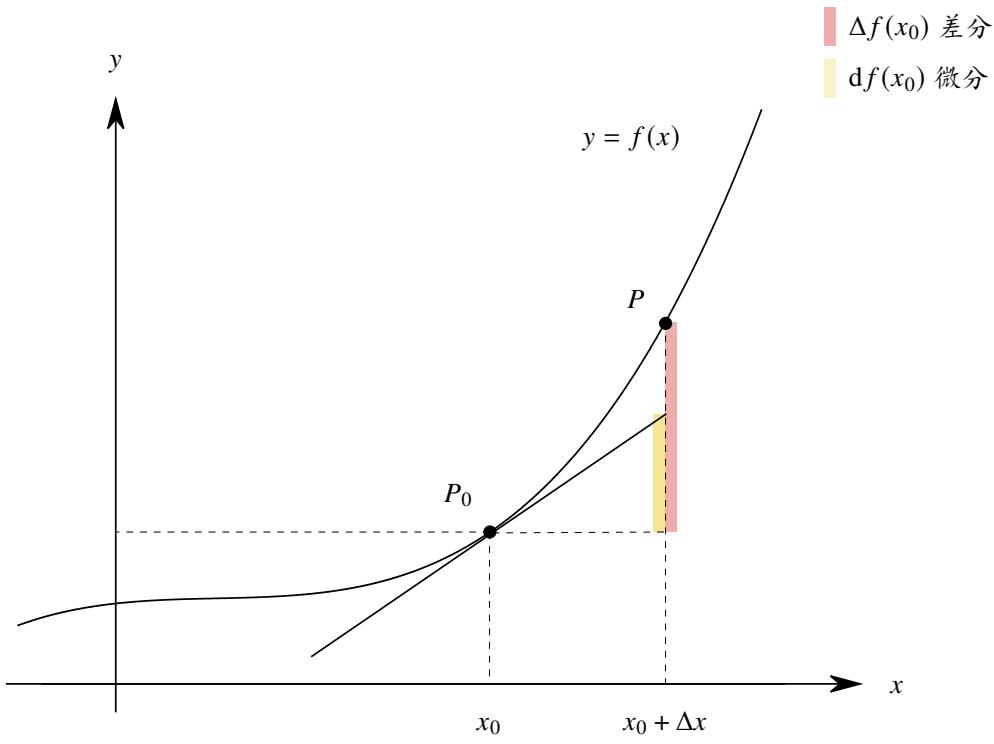  
图 4.1: 微分和差分的几何意义

下面举两个平面几何的例子, 从直观上说明微分的意义.

例 4.4 正方形和圆的面积增量 设边长为 $a$ 的正方形和半径为 $r$ 的圆, 它们的面积函数分别为

$$
f (x) = x ^ {2}, \qquad g (x) = \pi x ^ {2}.
$$

当边长增加 Δ??, 半径增加 $\Delta r$ 时, 讨论正方形和圆的面积增量.

解 如图4.2所示, 容易知道

$$
\Delta f (a) = (a + \Delta a) ^ {2} - a ^ {2} = 2 a \Delta a + \Delta a ^ {2}.
$$

$$
\Delta g (r) = \pi (r + \Delta r) ^ {2} - \pi r ^ {2} = 2 \pi r \Delta r + \pi \Delta r ^ {2}.
$$

当 $\Delta a$ 很小时, $\Delta f ( a )$ 可以近似地看作两个以原来的正方形的边长为长,边长增量为宽的矩形的面积之和,即2??Δ??;当 $\Delta r$ 很小时, $\Delta g ( r )$ 可以近似地看作一个以原来的圆周长为长, 以半径增量为宽的矩形的面积, 即 2????Δ??. 它们分别是 $\Delta a$ 和 $\Delta r$ 的线性函数, 它们分别是函数 $f$ 在 $a$ 处的微分和 $g ( x )$ 在 $r$ 处的微分:

$$
\mathrm {d} f (a) = f ^ {\prime} (a) \Delta a = 2 a \Delta a. \quad \mathrm {d} g (r) = g ^ {\prime} (r) \Delta r = 2 \pi r \Delta r.
$$

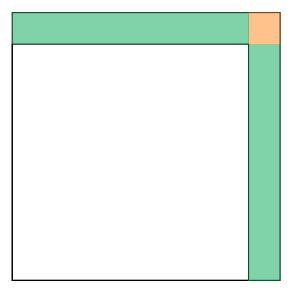

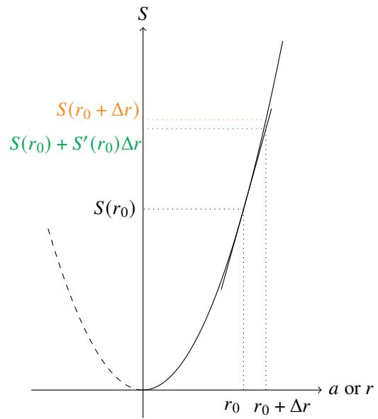

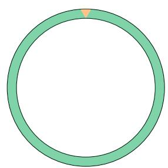  
图 4.2: 正方形和圆的面积增量

若函数 $f$ 在 $x _ { 0 }$ 处可微, 则 $f$ 的微分 d $f ( x _ { 0 } )$ 是一个和 $f$ 在 $x _ { 0 }$ 附近近似的一次多项式. 那么我们要问, 这个一次多项式是不是逼近效果最佳的呢? 下面来讨论这个问题.

# 定理 4.2 (微分最佳逼近定理)

设函数 $f$ 在 $x _ { 0 }$ 处可微, $l$ 是 $f$ 在 $x _ { 0 }$ 处的切线, 即

$$
l (x) = f \left(x _ {0}\right) + f ^ {\prime} \left(x _ {0}\right)\left(x - x _ {0}\right), \quad x \rightarrow x _ {0}.
$$

则对于任一不等于 $l ( x )$ 的一次多项式 $L ( x )$ 都存在 $\delta > 0$ , 使得当 $0 < | x - x _ { 0 } | < \delta$ 时

$$
\left| f (x) - l (x) \right| <   \left| f (x) - L (x) \right|.
$$

证明 (i) 当 $L ( x _ { 0 } ) \neq f ( x _ { 0 } )$ 时

$$
\lim  _ {x \to x _ {0}} | f (x) - l (x) | = | f (x _ {0}) - l (x _ {0}) | = 0 <   | f (x _ {0}) - L (x _ {0}) | = \lim  _ {x \to x _ {0}} | f (x) - L (x) |.
$$

由函数极限的局部保序性可知, 存在 $\delta > 0$ 使得当 $| x - x _ { 0 } | < \delta$ 时

$$
| f (x) - l (x) | <   | f (x) - L (x) |.
$$

(ii) 当 $L ( x _ { 0 } ) = f ( x _ { 0 } )$ 时. 设 $L ( x ) = k ( x - x _ { 0 } ) + f ( x _ { 0 } )$ 由于 $L ( x ) \neq l ( x )$ , 故 $f ^ { \prime } ( x _ { 0 } ) \neq k$ . 由于 $f$ 在 $x _ { 0 }$ 处可微, 故由微分定义可知

$$
f (x) = f (x _ {0}) + f ^ {\prime} (x _ {0}) (x - x _ {0}) + o (x - x _ {0}).
$$

因此

$$
\begin{array}{l} \left| \frac {f (x) - l (x)}{f (x) - L (x)} \right| = \frac {\left[ f (x _ {0}) + f ^ {\prime} (x _ {0}) (x - x _ {0}) + o (x - x _ {0}) \right] - \left[ f ^ {\prime} (x _ {0}) (x - x _ {0}) + f (x _ {0}) \right]}{\left[ f (x _ {0}) + f ^ {\prime} (x _ {0}) (x - x _ {0}) + o (x - x _ {0}) \right] - \left[ k (x _ {0}) (x - x _ {0}) + f (x _ {0}) \right]} \\ = \frac {o (x - x _ {0})}{[ f ^ {\prime} (x _ {0}) - k ] (x - x _ {0}) + o (x - x _ {0})} = \frac {o (1)}{[ f ^ {\prime} (x _ {0}) - k ] + o (1)} \rightarrow 0, x \rightarrow x _ {0}. \\ \end{array}
$$

于是可知, 存在 $\delta > 0$ 使得当 $0 < | x - x _ { 0 } | < \delta$ 时

$$
\left| f (x) - l (x) \right| <   \left| f (x) - L (x) \right|.
$$

注 在情况 (i) 时, 允许 $x = x _ { 0 }$ .

以上结论表明函数的微分是在局部逼近效果最佳的一次多项式.

# 4.1.3 初等函数的导数和微分

下面我们开始讨论导数和微分的计算方法. 我们已经明确了一元函数的导数和微分的关系, 所以一旦知道导数的计算方法, 就立刻知道了对应的微分计算方法. 因此我们只需研究导数的计算方法.

先用导数的定义来计算一批常用的初等函数的导数.

例 4.5 常值函数的导数 求常值函数 $f ( x ) = C$ 的导数.

解 设 $f ( x ) = C$ , 对于任意 $x , \Delta x$ 都有

$$
f (x + \Delta x) - f (x) = 0,
$$

于是可知 $f ^ { \prime } = 0$ .

例 4.6 正整数次幂函数的导数 求正整数次幂函数 $f ( x ) = x ^ { m }$ $\mathbf { \Phi } _ { m } \in \mathbb { N } ^ { * }$ ) 的导数.

解 任取 $x _ { 0 } \in \mathbb { R } .$ . 由导数的定义可知

$$
f ^ {\prime} (x _ {0}) = \lim  _ {x \rightarrow x _ {0}} \frac {f (x) - f (x _ {0})}{x - x _ {0}} = \lim  _ {x \rightarrow x _ {0}} \frac {x ^ {m} - x _ {0} ^ {m}}{x - x _ {0}} = \lim  _ {x \rightarrow x _ {0}} \left(x ^ {m - 1} + x ^ {m - 2} x _ {0} + \dots + x x _ {0} ^ {m - 2} + x _ {0} ^ {m - 1}\right) = m x _ {0} ^ {m - 1}.
$$

于是可知对于任一 $x \in \mathbb { R }$ 都有 $( x ^ { m } ) ^ { \prime } = m x _ { 0 } ^ { m - 1 }$ .

例 4.7 幂函数的导数 求幂函数 $f ( x ) = x ^ { \mu } \ ( \mu \in \mathbb { R } , \ x > 0 )$ $f ( x ) = x ^ { \mu }$ .

解 由导数的定义可知对于任一 $x > 0$ 都有

$$
\begin{array}{l} f ^ {\prime} (x) = \lim  _ {\Delta x \rightarrow 0} \frac {f (x + \Delta x) - f (x)}{\Delta x} = \lim  _ {\Delta x \rightarrow 0} \frac {(x + \Delta x) ^ {\mu} - x ^ {\mu}}{\Delta x} = \lim  _ {\Delta x \rightarrow 0} \frac {x ^ {\mu} \left(1 + \frac {\Delta x}{x}\right) ^ {\mu} - x ^ {\mu}}{\Delta x} \\ = \lim _ {\Delta x \to 0} \left[ x ^ {\mu - 1} \cdot \frac {\left(1 + \frac {\Delta x}{x}\right) ^ {\mu} - 1}{\frac {\Delta x}{x}} \right] = \mu x ^ {\mu - 1}. \\ \end{array}
$$

注 以上用到了例3.30的结论.

例 4.8 正弦函数的导数 求正弦函数 $f ( x ) = \sin { x }$ 的导数.

解 由导数的定义可知对于任一 $x \in \mathbb { R }$ 都有

$$
\begin{array}{l} f ^ {\prime} (x) = \lim  _ {\Delta x \rightarrow 0} \frac {f (x + \Delta x) - f (x)}{\Delta x} = \lim  _ {\Delta x \rightarrow 0} \frac {\sin (x + \Delta x) - \sin x}{\Delta x} = \lim  _ {\Delta x \rightarrow 0} \frac {2 \cos \left(x + \frac {\Delta x}{2}\right) \sin \frac {\Delta x}{2}}{\Delta x} \\ = \lim  _ {\Delta x \rightarrow 0} \cos \left(x + \frac {\Delta x}{2}\right) \frac {\sin \frac {\Delta x}{2}}{\frac {\Delta x}{2}} = \cos x. \\ \end{array}
$$

例 4.9 余弦函数的导数 求余弦函数 $f ( x ) = \cos x$ 的导数.

解 由导数的定义可知对于任一 $x \in \mathbb { R }$ 都有

$$
f ^ {\prime} (x) = \lim  _ {\Delta x \rightarrow 0} \frac {f (x + \Delta x) - f (x)}{\Delta x} = \lim  _ {\Delta x \rightarrow 0} \frac {\cos (x + \Delta x) - \cos x}{\Delta x} = \lim  _ {\Delta x \rightarrow 0} \frac {- 2 \sin \left(x + \frac {\Delta x}{2}\right) \sin \frac {\Delta x}{2}}{\Delta x}
$$

$$
= \lim  _ {\Delta x \rightarrow 0} \left[ - \sin \left(x + \frac {\Delta x}{2}\right) \frac {\sin \frac {\Delta x}{2}}{\frac {\Delta x}{2}} \right] = - \sin x.
$$

例 4.10 指数函数的导数 求指数函数 $f ( x ) = a ^ { x }$ $( a > 0 , a \ne 1$ ) 的导数.

解 由导数的定义可知对于任一 $x \in \mathbb { R }$ 都有

$$
f ^ {\prime} (x) = \lim  _ {\Delta x \rightarrow 0} \frac {f (x + \Delta x) - f (x)}{\Delta x} = \lim  _ {\Delta x \rightarrow 0} \frac {a ^ {x + \Delta x} - a ^ {x}}{\Delta x} = \lim  _ {\Delta x \rightarrow 0} \left(a ^ {x} \cdot \frac {a ^ {\Delta x} - 1}{\Delta x}\right) = a ^ {x} \ln a.
$$

注 特别地, $( \mathbf { e } ^ { x } ) ^ { \prime } = \mathbf { e } ^ { x }$ . 若把求导运算看作一个算子或变换, 那么指数函数 $\boldsymbol { \mathrm { e } } ^ { x }$ 就是这个变换下的一个 “不动点”. 这表明, 自然常数 e 虽然是一个无理数, 但在微积分视角下是一个 “很简单的” 数字.

注 以上用到了例3.28的结论.

我们发现如果对每个函数都用导数的定义求导是比较麻烦的. 我们可以推导一些求导法则.

# 定理 4.3 (导数的运算法则)

设函数 $f$ 和 $g$ 在 $x$ 处可导, 则 $f \pm g , f g$ 在 $x$ 处也可导. 若 $g \neq \mathbf { 0 }$ , 则函数 $f / g$ 在 $x$ 处也可导, 且有以下公式

(1) $( f \pm g ) ^ { \prime } ( x ) = f ^ { \prime } ( x ) \pm g ^ { \prime } ( x ) .$   
(2) $( f g ) ^ { \prime } ( x ) = f ^ { \prime } ( x ) g ( x ) + f ( x ) g ^ { \prime } ( x ) .$   
(3)  ??  0 (??) = ?? 0 (??)?? (??) − ?? (??)??0 (??) . $\left( { \frac { f } { g } } \right) ^ { \prime } ( x ) = { \frac { f ^ { \prime } ( x ) g ( x ) - f ( x ) g ^ { \prime } ( x ) } { g ^ { 2 } ( x ) } } .$

证明 (1) 由于

$$
\frac {(f \pm g) (x + \Delta x) - (f \pm g) (x)}{\Delta x} = \frac {f (x + \Delta x) - f (x)}{\Delta x} \pm \frac {g (x + \Delta x) - g (x)}{\Delta x}.
$$

令 $\Delta x \to 0$ 由导数的定义得 $( f \pm g ) ^ { \prime } ( x ) = f ^ { \prime } ( x ) \pm g ^ { \prime } ( x )$ .

(2) 由于

$$
\frac {(f g) (x + \Delta x) - (f g) (x)}{\Delta x} = \frac {f (x + \Delta x) - f (x)}{\Delta x} g (x + \Delta x) + f (x) \frac {g (x + \Delta x) - g (x)}{\Delta x}.
$$

由于 $g ( x )$ 在 $x$ 处可导, 因此 $g$ 在 $x$ 处连续. 故 $g ( x + \Delta x )  g ( x )$ $\Delta x \to 0 ,$ ). 令 $\Delta x \to 0$ 由导数的定义得 $( f g ) ^ { \prime } ( x ) =$ $f ^ { \prime } ( x ) \cdot g ( x ) + f ( x ) \cdot g ^ { \prime } ( x ) .$ .

(3) 先讨论 $( 1 / g ) ^ { \prime } ( x )$ 的情况.

$$
\frac {(1 / g) (x + \Delta x) - (1 / g) (x)}{\Delta x} = - \frac {g (x + \Delta x) - g (x)}{\Delta x} \cdot \frac {1}{g (x + \Delta x) g (x)}.
$$

由于 $g ( x + \Delta x )  g ( x )$ $\Delta x \to 0 )$ ). 令 $\Delta x \to 0$ 由导数的定义得

$$
\left(\frac {1}{g}\right) ^ {\prime} (x) = - \frac {g ^ {\prime} (x)}{g ^ {2} (x)}.
$$

由 (2) 可知

$$
\left(\frac {f}{g}\right) ^ {\prime} (x) = \left(f \cdot \frac {1}{g}\right) ^ {\prime} (x) = f ^ {\prime} (x) \left(\frac {1}{g}\right) (x) + f (x) \left(\frac {1}{g}\right) ^ {\prime} (x) = \frac {f ^ {\prime} (x)}{g (x)} - f (x) \frac {g ^ {\prime} (x)}{g ^ {2} (x)} = \frac {f ^ {\prime} (x) \cdot g (x) - f (x) \cdot g ^ {\prime} (x)}{g ^ {2} (x)}.
$$

注 特别地, 设 $c \in \mathbb { R }$ , 则

$$
\left(c f\right) ^ {\prime} (x) = c ^ {\prime} \cdot f (x) + c f ^ {\prime} (x) = 0 \cdot f (x) + c f ^ {\prime} (x) = c f ^ {\prime} (x).
$$

注由以上定理可知求导变换保持函数的加法运算和关于实数域的数乘运算.因此求导运算是“线性的”.如果把求导看作一个算子 (operator), 经常记作 $\mathcal { D }$ . 从代数角度看它是一个线性算子 (linear operator).

利用导数的运算法则我们可以计算更多初等函数的导数.

例 4.11 负整数次幂函数的导数 求负正整数次幂函数 $f ( x ) = x ^ { - m }$ $\ b { m } \in \mathbb { N } ^ { * }$ ) 的导数.

解 由导数的除法公式可知

$$
f ^ {\prime} (x) = \left(\frac {1}{x ^ {m}}\right) ^ {\prime} = - \frac {(x ^ {m}) ^ {\prime}}{(x ^ {m}) ^ {2}} = - \frac {m x ^ {m - 1}}{x ^ {2 m}} = - m x ^ {- m - 1}.
$$

于是可知对于任一 $x \in \mathbb { R }$ 都有 $( x ^ { m } ) ^ { \prime } = m x ^ { m - 1 }$ .

例 4.12 正切函数和余切函数的导数 求正切函数 tan $x$ 和余切函数 cot $x$ 的导数.

解 由导数的除法法则可知对于定义域上的一切 $x$ 都有

$$
(\tan x) ^ {\prime} = \left(\frac {\sin x}{\cos x}\right) ^ {\prime} = \frac {(\sin x) ^ {\prime} \cos x - \sin x (\cos x) ^ {\prime}}{\cos^ {2} x} = \frac {\cos^ {2} x + \sin^ {2} x}{\cos^ {2} x} = \frac {1}{\cos^ {2} x}.
$$

$$
\left(\cot x\right) ^ {\prime} = \left(\frac {1}{\tan x}\right) ^ {\prime} = - \frac {(\tan x) ^ {\prime}}{\tan^ {2} x} = - \frac {1}{\cos^ {2} x} \cdot \frac {1}{\tan^ {2} x} = - \frac {1}{\sin^ {2} x}.
$$

知道了正弦函数和正切函数的导数以后, 可以用导数可以再次研究以下重要不等式

$$
\sin x \leqslant x \leqslant \tan x, \quad 0 \leqslant x <   \frac {\pi}{2}.
$$

$$
\tan x \leqslant x \leqslant \sin x, \quad - \frac {\pi}{2} <   x \leqslant 0.
$$

等号成立当且仅当 $x = 0$ .

$$
\sin x \leqslant x \quad x \geqslant 0.
$$

$$
x \leqslant \sin x, \quad x \leqslant 0.
$$

等号成立当且仅当 $x = 0$ .

下面来看复合函数的求导法则.

# 定理 4.4 (复合函数的求导法则)

设函数 $f$ 在 $x _ { 0 }$ 处可导, 函数 $g$ 在 $t _ { 0 } = f ( x _ { 0 } )$ 处可导, 则函数 $g \circ f$ 在 $x _ { 0 }$ 处可导, 且

$$
(g \circ f) ^ {\prime} (x _ {0}) = g ^ {\prime} (f (x _ {0})) \cdot f ^ {\prime} (x _ {0}).
$$

证明 令

$$
h (t) = \left\{ \begin{array}{l l} \frac {g (t) - g (t _ {0})}{t - t _ {0}}, & t \neq t _ {0} \\ g ^ {\prime} (t _ {0}), & t = t _ {0} \end{array} \right..
$$

由于

$$
\lim  _ {t \rightarrow t _ {0}} h (t) = \lim  _ {t \rightarrow t _ {0}} \frac {g (t) - g (t _ {0})}{t - t _ {0}} = g ^ {\prime} (t _ {0}) = h (t _ {0}).
$$

因此 $h ( t )$ 在 $t _ { 0 }$ 处连续, 于是

$$
\lim  _ {x \to x _ {0}} h (f (x)) = h (f (x _ {0})) = g ^ {\prime} (f (x _ {0})).
$$

于是可知

$$
(g \circ f) ^ {\prime} (x _ {0}) = \lim  _ {x \to x _ {0}} \frac {g (f (x)) - g (f (x _ {0}))}{x - x _ {0}} = \lim  _ {x \to x _ {0}} h (f (x)) \cdot \frac {f (x) - f (x _ {0})}{x - x _ {0}} = g ^ {\prime} (f (x _ {0})) \cdot f ^ {\prime} (x _ {0}).
$$

注 以上定理的证明很容易想到直接由导数定义出发, 写成

$$
(g \circ f) ^ {\prime} (x _ {0}) = \lim  _ {x \rightarrow x _ {0}} \frac {g (f (x)) - g (f (x _ {0}))}{x - x _ {0}} = \lim  _ {x \rightarrow x _ {0}} \frac {g (f (x)) - g (f (x _ {0}))}{f (x) - f (x _ {0})} \cdot \frac {f (x) - f (x _ {0})}{x - x _ {0}} = g ^ {\prime} (f (x _ {0})) \cdot f ^ {\prime} (x _ {0}).
$$

这样证明的缺陷在于即使 $x \neq x _ { 0 }$ 也未必确保 $f ( x ) \neq f ( x _ { 0 } )$ . 因此我们才想到构造函数 $h ( f ( x ) )$ 取代上式中的

$$
\frac {g (f (x)) - g (f (x _ {0}))}{f (x) - f (x _ {0})}.
$$

注 设 $z = ( g \circ f ) ( x )$ , $y = f ( x )$ , 用 Leibniz 记号可以将以上定理改写为

$$
\frac {\mathrm {d} z}{\mathrm {d} x} = \frac {\mathrm {d} z}{\mathrm {d} y} \cdot \frac {\mathrm {d} y}{\mathrm {d} x}.
$$

因此以上定理常被形象地称为链式法则 (chain rule).

注 由以上定理可知

$$
\mathrm {d} g (f (x)) = g ^ {\prime} (f (x)) f ^ {\prime} (x) \mathrm {d} x = g ^ {\prime} (f (x)) \mathrm {d} f (x).
$$

令 $t = f ( x )$ , 则有

$$
\mathrm {d} g (t) = g ^ {\prime} (t) \mathrm {d} t.
$$

也就是说上式中的 $t$ 无论是变量还是函数, 它们的微分表示式都相同. 这个结论称为 “一元函数微分表示的不变性”, 它在积分的运算中非常有用. 需要注意, 这个结论在多元函数下不成立.

下面举例说明如何运算链式法则.

例 4.13 求函数 $y = \cos \left( x ^ { 2 } + 5 x + 2 \right)$ 的导数.

解 令 $u = x ^ { 2 } + 5 x + 2$ . 则由链式法则可知

$$
\frac {\mathrm {d} y}{\mathrm {d} x} = \frac {\mathrm {d} y}{\mathrm {d} u} \cdot \frac {\mathrm {d} u}{\mathrm {d} x} = \frac {\mathrm {d} \cos u}{\mathrm {d} u} \cdot \frac {\mathrm {d} (x ^ {2} + 5 x + 2)}{\mathrm {d} x} = (- \sin u) \cdot (2 x + 5) = - (2 x + 5) \sin (x ^ {2} + 5 x + 2).
$$

注 熟练后, 可省略换元的过程.

例 4.14 双曲函数的导数 求双曲函数 sinh ??, cosh ??, tanh $x$ 的导数.

解 由双曲函数的定义可知

$$
\begin{array}{l} \left(\sinh x\right) ^ {\prime} = \left(\frac {\mathrm {e} ^ {x} - \mathrm {e} ^ {- x}}{2}\right) ^ {\prime} = \frac {\left(\mathrm {e} ^ {x}\right) ^ {\prime} - \left(\mathrm {e} ^ {- x}\right) ^ {\prime}}{2} = \frac {\mathrm {e} ^ {x} - \mathrm {e} ^ {- x} (- x) ^ {\prime}}{2} = \frac {\mathrm {e} ^ {x} + \mathrm {e} ^ {- x}}{2} = \cosh x. \\ (\cosh x) ^ {\prime} = \left(\frac {e ^ {x} + e ^ {- x}}{2}\right) ^ {\prime} = \frac {(e ^ {x}) ^ {\prime} + (e ^ {- x}) ^ {\prime}}{2} = \frac {e ^ {x} + e ^ {- x} (- x) ^ {\prime}}{2} = \frac {e ^ {x} - e ^ {- x}}{2} = \sinh x. \\ (\tanh  x) ^ {\prime} = \left(\frac {\sinh x}{\cosh x}\right) ^ {\prime} = \frac {(\sinh x) ^ {\prime} \cosh x - \sinh x (\cosh x) ^ {\prime}}{\cosh^ {2} x} = \frac {\cosh^ {2} x - \sinh^ {2} x}{\cosh^ {2} x} = \frac {1}{\cosh^ {2} x}. \\ \end{array}
$$

如图3.6,可以看出 $\sinh x$ 和 tanh $x$ 都是 $\mathbb { R }$ 上单调递增的奇函数,在 $x = 0$ 处的切线为 $y = x$ ,其中 $\sinh x$ 的值域为 $\mathbb { R }$ , tanh $x$ 的值域为 (−1, 1); cosh $x$ 是 $\mathbb { R }$ 上的偶函数, 值域是 $[ 1 , + \infty )$ , 在 $x = 0$ 处的切线为 $y = 1$ .

# 定理 4.5 (反函数的求导法则)

设函数 $y = f ( x )$ 在区间 $I$ 上连续且严格单调. 若 $f ( x )$ 在 $x _ { 0 } \in I$ 处可导, 且 $f ^ { \prime } ( x _ { 0 } ) \neq 0$ , 则 $f ( x )$ 的反函数$x = f ^ { - 1 } ( y )$ 在 $y _ { 0 } = f ( x _ { 0 } )$ 处可导, 且

$$
\left(f ^ {- 1}\right) ^ {\prime} (y _ {0}) = \frac {1}{f ^ {\prime} (x _ {0})}.
$$

证明 由命题3.13可知 $f ^ { - 1 } ( y )$ 在 $y _ { 0 }$ 上连续. 因此当 $y  y _ { 0 }$ 时 $x \longrightarrow x _ { 0 }$ . 由导数的定义可知

$$
\left(f ^ {- 1}\right) ^ {\prime} \left(y _ {0}\right) = \lim  _ {y \rightarrow y _ {0}} \frac {f ^ {- 1} (y) - f ^ {- 1} \left(y _ {0}\right)}{y - y _ {0}} = \lim  _ {x \rightarrow x _ {0}} \frac {x - x _ {0}}{f (x) - f \left(x _ {0}\right)} = \lim  _ {x \rightarrow x _ {0}} \left[ \frac {f (x) - f \left(x _ {0}\right)}{x - x _ {0}} \right] ^ {- 1} = \frac {1}{f ^ {\prime} \left(x _ {0}\right)}.
$$

注 设 $y = f \left( x \right)$ , 用 Leibniz 记号可以将以上定理改写为

$$
\frac {\mathrm {d} x}{\mathrm {d} y} = \frac {1}{\frac {\mathrm {d} y}{\mathrm {d} x}}.
$$

我们可以从几何角度来理解反函数的求导法则. 如图4.3, 设函数 $y = f ( x )$ 在区间 $I$ 上连续且严格单调递增.若 $f ( x )$ 在 $x _ { 0 } \in I$ 处可 导 , 且 $f ^ { \prime } ( x _ { 0 } ) \neq 0 .$ 令 $y _ { 0 } = f ( x _ { 0 } )$ , 则 $y = f ( x )$ 在 $( x _ { 0 } , y _ { 0 } )$ 处有切线 $l .$ , 且 $l$ 的斜率不为零, 即它与 $x$ 轴不平行. 设 $l$ 与 $x$ 轴和 $y$ 轴的夹角分别为 $\alpha$ 和 $\beta$ . 则 $\alpha + \beta = \pi / 2$ . 因此

$$
\tan \alpha = \tan \left(\frac {\pi}{2} - \beta\right) = \cot \alpha = \frac {1}{\tan \beta}.
$$

容易知道

$$
\tan \alpha = f ^ {\prime} (x _ {0}), \qquad \tan \beta = \left(f ^ {- 1}\right) ^ {\prime} (y _ {0}).
$$

于是就得到了反函数的求导法则.

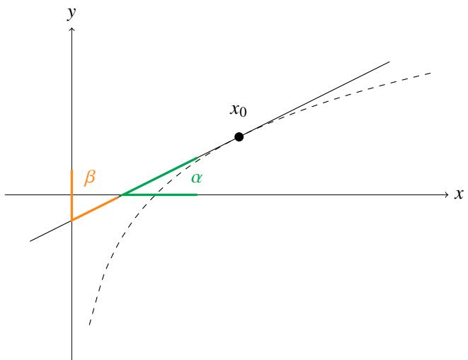  
图 4.3: 反函数的求导法则的几何意义

用反函数求导法则可以求对数函数和反三角函数的导数.

例 4.15 对数函数的导数 求对数函数 $y = \log _ { a } x$ $( a > 0$ , $a \neq 1$ ) 的导数.

解 由于 $x = a ^ { y }$ . 由反函数的求导法则可知对于任一 $x > 0$ 都有

$$
\left(\log_ {a} x\right) ^ {\prime} = \frac {1}{\left(a ^ {y}\right) ^ {\prime}} = \frac {1}{a ^ {y} \ln a} = \frac {1}{a ^ {\log_ {a} x} \ln a} = \frac {1}{x \ln a}.
$$

注 特别地, 对于任一 $x > 0$ 都有 $( \ln x ) ^ { \prime } = 1 / x$ .

例 4.16 反三角函数的导数 求以下反三角函数的导数.

$$
y = \arcsin x, | x | <   1. \quad y = \arccos x, | x | <   1. \quad y = \arctan x. \quad y = \operatorname {a r c c o t} x.
$$

解 由反函数的求导法则可知对于定义域上的任一 $x$ 都有

$$
(\arcsin x) ^ {\prime} = \frac {1}{(\sin y) ^ {\prime}} = \frac {1}{\cos y} = \frac {1}{\sqrt {1 - \sin^ {2} y}} = \frac {1}{\sqrt {1 - x ^ {2}}}.
$$

$$
\left(\arccos  x\right) ^ {\prime} = \frac {1}{(\cos y) ^ {\prime}} = \frac {1}{- \sin y} = \frac {1}{- \sqrt {1 - \cos^ {2} y}} = - \frac {1}{\sqrt {1 - x ^ {2}}}.
$$

$$
(\arctan x) ^ {\prime} = \frac {1}{(\tan y) ^ {\prime}} = \cos^ {2} y = \frac {\cos^ {2} y}{\cos^ {2} y + \sin^ {2} y} = \frac {1}{1 + \tan^ {2} y} = \frac {1}{1 + x ^ {2}}.
$$

$$
\left(\operatorname {a r c c o t} x\right) ^ {\prime} = \frac {1}{(\cot y) ^ {\prime}} = - \sin^ {2} y = - \frac {\sin^ {2} y}{\sin^ {2} y + \cos^ {2} y} = - \frac {1}{1 + \cot^ {2} y} = - \frac {1}{1 + x ^ {2}}.
$$

例 4.17 反双曲函数的导数 求以下反双曲函数的导数.

$$
y = \operatorname {a r c s i n h} x. \quad y = \operatorname {a r c c o s h} x, x \geqslant 1. \quad y = \operatorname {a r c t a n h} x. | x | <   1.
$$

解 由反函数的求导法则可知对于定义域上的任一 $x$ 都有

$$
(\operatorname {a r c s i n h} x) ^ {\prime} = \frac {1}{(\sinh y) ^ {\prime}} = \frac {1}{\cosh y} = \frac {1}{\sqrt {\sinh^ {2} y + 1}} = \frac {1}{\sqrt {x ^ {2} + 1}}.
$$

$$
(\operatorname {a r c c o s h} x) ^ {\prime} = \frac {1}{(\cosh y) ^ {\prime}} = \frac {1}{\sinh y} = \frac {1}{\sqrt {\cosh^ {2} y - 1}} = - \frac {1}{\sqrt {x ^ {2} - 1}}.
$$

$$
(\operatorname {a r c t a n h} x) ^ {\prime} = \frac {1}{(\tanh  y) ^ {\prime}} = \cosh^ {2} y = \frac {\cosh^ {2} y}{\cosh^ {2} y - \sinh^ {2} y} = \frac {1}{1 - \tanh  ^ {2} y} = \frac {1}{1 - x ^ {2}}.
$$

例 4.18 幂指函数的导数 求幂指函数 $f = u ^ { \nu }$ $\mathbf { \nabla } _ { u } \mathbf { \nabla } > 0$ ) 的导数.

解 由于 $f = \operatorname { e } ^ { \ln f }$ . 对两边求导得

$$
f ^ {\prime} = \left[ \mathrm {e} ^ {\ln f} \right] ^ {\prime} = \mathrm {e} ^ {\ln f} (\ln f) ^ {\prime} = f (\ln f) ^ {\prime} = f (v \ln u) ^ {\prime} = f \left[ v ^ {\prime} \ln u + v (\ln u) ^ {\prime} \right] = u ^ {v} \left[ v ^ {\prime} \ln u + \frac {v}{u} u ^ {\prime} \right].
$$

注由上例可知若函数 $f > 0$ , 则有

$$
f ^ {\prime} = f (\ln f) ^ {\prime}.
$$

利用这个公式计算许多函数的乘积组成的函数的导数时十分有用.

以上几个例子中的初等函数都具有很好的性质—它们在各自定义域中的每一点都可导. 于是我们可以提出以下概念.

# 定义 4.4 (导函数和原函数)

若函数 $f$ 在开区间 $I$ 上每一点都可导, 则称 $f$ 在 $I$ 上可导; 设闭区间 $I = [ a , b ]$ , 若函数 $f$ 在 $( a , b )$ 上每一点都可导, 且 $a$ 点右侧可导, 在 $b$ 点左侧可导, 则称 $f$ 在闭区间 $I$ 上可导. 以上两种情况下, 我们称函数 $f$ 在区间 $I$ 上可导. 此时可以定义 $I$ 上的函数

$$
f ^ {\prime} (x) = \lim  _ {\Delta x \rightarrow 0} \frac {f (x + \Delta x) - f (x)}{\Delta x}, \quad x \in I.
$$

我们称函数 $f ^ { \prime }$ 是 $f$ 在区间 $I$ 上的导函数 (derivative function). 函数 $f$ 是 $f ^ { \prime }$ 的一个原函数 (primitive function).若 $f$ 在 $I$ 上的导函数在 $I$ 上连续, 则称 $f$ 在 $I$ 上连续可导. 区间 $I$ 上所有连续可导的函数组成的集合记作$C ^ { ( 1 ) } ( I )$ .

注 在不产生误解的情况下, 我们会把导函数简称为导数.

注 容易看出原函数是不唯一的 (如果存在的话), 这个主题我们将在下一节展开.

我们把已经求得的初等函数导函数总结如下.

<table><tr><td>类型</td><td>原函数</td><td>导函数</td><td>备注</td></tr><tr><td>常值函数</td><td>C</td><td>0</td><td>C∈R</td></tr><tr><td rowspan="3">幂函数</td><td>xm</td><td>mxm-1</td><td>m∈N</td></tr><tr><td>x-m</td><td>-mx-m-1</td><td>m∈N, x≠0</td></tr><tr><td>xμ</td><td>μxμ-1</td><td>μ∈R, x&gt;0</td></tr><tr><td rowspan="2">指数函数</td><td>ex</td><td>ex</td><td rowspan="2">a&gt;0, a≠1</td></tr><tr><td>ax</td><td>axlna</td></tr><tr><td rowspan="2">对数函数</td><td>ln |x|</td><td>1/x</td><td>x≠0</td></tr><tr><td>loga|x|</td><td>1/xlna</td><td>a&gt;0, a≠1, x≠0</td></tr><tr><td rowspan="4">三角函数</td><td>sin x</td><td>cos x</td><td rowspan="3">x≠kπ+π/2, k∈Z</td></tr><tr><td>cos x</td><td>-sin x</td></tr><tr><td>tan x</td><td>1/cos² x</td></tr><tr><td>cot x</td><td>-1/sin² x</td><td>x≠kπ, k∈Z</td></tr><tr><td rowspan="4">反三角函数</td><td>arcsin x</td><td>1/√1-x²</td><td>|x|&lt;1</td></tr><tr><td>arccos x</td><td>-1/√1-x²</td><td rowspan="3">|x|&lt;1</td></tr><tr><td>arctan x</td><td>1/1+x²</td></tr><tr><td>arccot x</td><td>-1/1+x²</td></tr><tr><td rowspan="3">双曲函数</td><td>sinh x</td><td>cosh x</td><td rowspan="3"></td></tr><tr><td>cosh x</td><td>sinh x</td></tr><tr><td>tanh x</td><td>1/cosh² x</td></tr><tr><td rowspan="3">反双曲函数</td><td>ln (x + √x² + 1)</td><td>1/√x² + 1</td><td rowspan="2">x≥1</td></tr><tr><td>ln (x + √x² - 1)</td><td>1/√x² - 1</td></tr><tr><td>1/2 ln (1+x/1-x)</td><td>1/1-x²</td><td>|x|&lt;1</td></tr></table>

# 4.1.4 隐函数和参数式函数的求导法则

有时候函数的对应法则是通过方程形式给出的. 设二元方程

$$
x ^ {2} + y ^ {2} = 1, \quad y > 0.
$$

对于任一 $x \in [ - 1 , 1 ]$ , 都有唯一的 $y$ 与之对应. 这表明这个方程确定了一个定义域为 [−1,1] 的函数. 我们把这样的函数称为隐函数(implicit function). 我们通常见到的直接用含有自变量的表达式表示的函数称为显函数.

上面这个隐函数可以写成显函数:

$$
f (x) = \sqrt {1 - x ^ {2}}, \quad x \in [ - 1, 1 ].
$$

但很多隐函数无法 (或不便于) 写成显函数. 设二元方程

$$
x = y ^ {5} + y ^ {4} + y ^ {3} + y ^ {2} + y.
$$

它确定了一个定义域为 $\mathbb { R }$ 的函数. 但由 Abel–Ruffini定理可知, 它无法用有限次的代数表达式写成显函数.

事实上很多隐函数直接来自于反函数. 例如函数 $y = x + \ln x$ 的反函数就是 $x = y + \ln y$ . 对数函数和反三角函数实际上都无法写成显函数. 但为了便于使用才借助符号 ln, arcsin, arccos “假装” 写成了显函数形式.

下面通过例子来给出隐函数的求导方法, 严格的证明需要用到《数学分析 II》中的隐函数定理.

例 4.19 设隐函数 $x = \sin y$ $\vert x \vert < 1 )$ ). 求 $y ^ { \prime }$ .

解 对方程两边求导得

$$
x ^ {\prime} = (\sin y) ^ {\prime} \Longleftrightarrow 1 = y ^ {\prime} \cos y.
$$

于是可知

$$
y ^ {\prime} = \frac {1}{\cos y} = \frac {1}{\sqrt {1 - \sin^ {2} y}} = \frac {1}{\sqrt {1 - x ^ {2}}}.
$$

例 4.20 设隐函数 $x = \mathrm { e } ^ { y }$ . 求 $y ^ { \prime }$ .

解 对方程两边求导得

$$
x ^ {\prime} = \left(\mathrm {e} ^ {y}\right) ^ {\prime} \Longleftrightarrow 1 = y ^ {\prime} \mathrm {e} ^ {y}.
$$

于是可知

$$
y ^ {\prime} = \frac {1}{\mathrm {e} ^ {y}} = \frac {1}{x}.
$$

以上两个例子看出用隐函数直接求导, 和用反函数的求导法则本质上是一样的.

例 4.21 设隐函数 $x ^ { 2 } + y ^ { 2 } = 1$ , $( y > 0 )$ . 求 $y ^ { \prime }$ .

解 对方程两边求导得

$$
\left(x ^ {2} + y ^ {2}\right) ^ {\prime} = 1 ^ {\prime} \iff 2 x + 2 y y ^ {\prime} = 0.
$$

于是可知

$$
y ^ {\prime} = - \frac {x}{y}.
$$

利用隐函数的求导方法可以解决一些解析几何的问题. 下面我们来看几个例子.

例 4.22 抛物线的光学性质 从抛物线焦点射出的光线, 经抛物线反射后平行于它的对称轴.

证明 如图4.4, 只讨论 $x$ 轴上半部分. 设抛物线方程

$$
y ^ {2} = 2 p x, \quad x \in [ 0, + \infty), y \in [ 0, + \infty), p > 0.
$$

则焦点为 $F ( p / 2 , 0 )$ , 准线为 $x = - p / 2 .$ . 设光线从 $F$ 点射出, 在 $P ( x _ { 0 } , y _ { 0 } )$ 反射, 作反射光线, 并反向延长交 ?? 轴于 $R$ 点. 对方程两边求导得

$$
2 y y ^ {\prime} = 2 p \iff y ^ {\prime} = \frac {p}{y}.
$$

作过 $P$ 的切线交 $x$ 轴于 $Q$ 点. 容易知道直线 $P Q$ 的方程为

$$
y - y _ {0} = \frac {p}{y _ {0}} (x - x _ {0}).
$$

令 $y = 0$ 得

$$
- y _ {0} = \frac {p}{y _ {0}} (x - x _ {0}) \Longleftrightarrow x = \frac {p x _ {0} - y _ {0} ^ {2}}{p} = \frac {p x _ {0} - 2 p x _ {0}}{p} = - x _ {0}.
$$

因此 $\mathcal { Q } ( - x _ { 0 } , 0 )$ . 于是 $| Q F | = p / 2 + x _ { 0 }$ . 另一方面, 由于抛物线上任意一点到 $F$ 的距离与到准线的距离相等, 故$| P F | = x _ { 0 } + p / 2$ . 因此 $| Q F | = | P F |$ . 于是

$$
\angle P Q F = \angle Q P F = \angle Q P R.
$$

于是可知 ???? // ????. 这表明从 $F$ 射出的光线在 $P$ 反射后平行于 $x$ 轴.

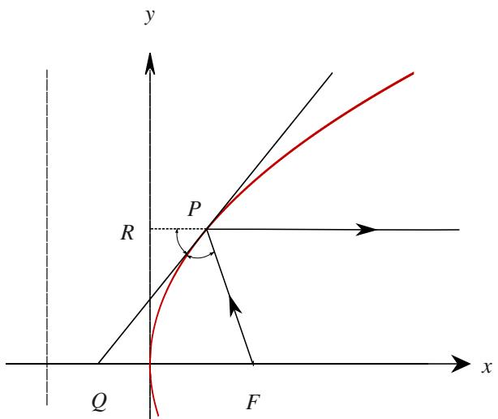  
图 $4 . 4 :$ 抛物线的光学性质.

例 4.23 椭圆的光学性质 从椭圆的一个焦点射出的光线, 经椭圆反射后的光过另一个焦点.

证明 如图4.5只讨论 $x$ 轴上半部分. 设椭圆方程

$$
\frac {x ^ {2}}{a ^ {2}} + \frac {y ^ {2}}{b ^ {2}} = 1, \quad x \in [ - a, a ], y \in [ 0, b ], a > b > 0.
$$

设焦点为 $F _ { 1 } ( - c , 0 )$ , $F _ { 2 } ( c , 0 )$ , 其中 $c$ 满足 $c ^ { 2 } = a ^ { 2 } - b ^ { 2 }$ . 对方程两边求导得

$$
\frac {2 x}{a ^ {2}} + \frac {2 y y ^ {\prime}}{b ^ {2}} = 0 \Longleftrightarrow y ^ {\prime} = - \frac {b ^ {2} x}{a ^ {2} y}.
$$

在椭圆上任取一点 $P ( x _ { 0 } , y _ { 0 } )$ . 作过 $P$ 的法线交 $x$ 轴于 $Q$ 点. 容易知道直线 $P Q$ 的方程为

$$
y - y _ {0} = \frac {a ^ {2} y _ {0}}{b ^ {2} x _ {0}} (x - x _ {0}).
$$

令 $y = 0$ 得

$$
- y _ {0} = \frac {a ^ {2} y _ {0}}{b ^ {2} x _ {0}} (x - x _ {0}) \Longleftrightarrow x = \frac {a ^ {2} x _ {0} - b ^ {2} x _ {0}}{a ^ {2}} = \frac {c ^ {2} x _ {0}}{a ^ {2}}.
$$

因此 $\mathcal { Q } \left( c ^ { 2 } x _ { 0 } / a ^ { 2 } , 0 \right)$ . 于是

$$
\frac {\left| Q F _ {1} \right|}{\left| Q F _ {2} \right|} = \frac {c ^ {2} x _ {0} / a ^ {2} - (- c)}{c - c ^ {2} x _ {0} / a ^ {2}} = \frac {a ^ {2} + c x _ {0}}{a ^ {2} - c x _ {0}}.
$$

另一方面, 由于椭圆上任意一点到 $F _ { 2 }$ 的距离与到准线 $x = a ^ { 2 } / c$ 的距离之比为定值, 故

$$
\frac {\left| P F _ {1} \right|}{a ^ {2} / c + x _ {0}} = \frac {\left| P F _ {2} \right|}{a ^ {2} / c - x _ {0}} \Longleftrightarrow \frac {\left| P F _ {1} \right|}{\left| P F _ {2} \right|} = \frac {a ^ {2} + c x _ {0}}{a ^ {2} - c x _ {0}} = \frac {\left| Q F _ {1} \right|}{\left| Q F _ {2} \right|}.
$$

由角平分线定理可知 $\angle F _ { 1 } P Q = \angle F _ { 2 } P Q .$ . 这表明从 $F _ { 1 }$ 射出的光线在 $P$ 反射后过 $F _ { 2 }$ .

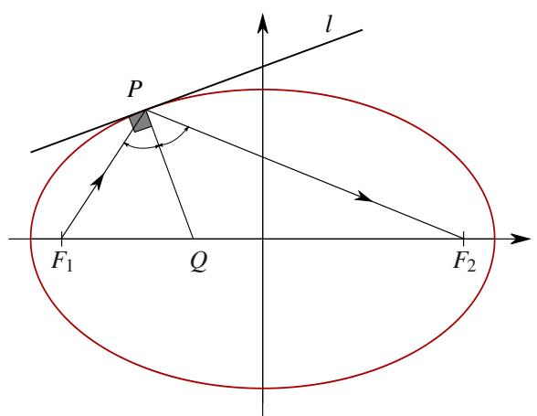  
图 4.5: 椭圆的光学性质.

注 圆可以看作椭圆的特例. 因此从圆心射出的光线经圆反射后会重新过圆心. 这表明圆上的任意一点的法线都过圆心.

用类似地方法这证明双曲线的光学性质.

例4.24双曲线的光学性质从双曲线的一个焦点射出的光线,经双曲线反射后的光线的反向延长线过另一个焦点.

有时候我们会用参数方程表示函数. 这样的函数经常无法用显式方程表示, 因此需要学会直接对参数方程表示的函数求导. 设参数式函数

$$
\left\{ \begin{array}{l} x = x (t) \\ y = y (t) \end{array} \right., \quad t \in (a, b).
$$

现假设 $x ( t )$ 和 $y ( t )$ 都在 $( a , b )$ 上可导. 如果 $x = x ( t )$ 存在反函数 $t = t ( x )$ , 则

$$
y = y [ t (x) ].
$$

于是就可以用复合函数的求导法则. 若 $x ^ { \prime } ( t ) \neq 0$ $\forall t \in ( a , b ) ,$ ), 则很容易通过反函数的求导法则和复合函数的求导法则得到:

$$
\frac {\mathrm {d} y}{\mathrm {d} x} = \frac {\mathrm {d} y}{\mathrm {d} t} \cdot \frac {\mathrm {d} t}{\mathrm {d} x} = \frac {\mathrm {d} y}{\mathrm {d} t} \cdot \frac {1}{\frac {\mathrm {d} x}{\mathrm {d} t}}.
$$

即

$$
y ^ {\prime} (x) = \frac {y ^ {\prime} (t)}{x ^ {\prime} (t)}.
$$

下面看一个例子.

例 4.25 设极坐标方程给出的曲线 $r = r ( \theta )$ . 求点 $( r , \theta )$ 处的导数.

解 设 $x = r ( \theta )$ cos ??, $y = r ( \theta ) \sin \theta .$ . 则

$$
\frac {\mathrm {d} y}{\mathrm {d} x} = \frac {\frac {\mathrm {d} y}{\mathrm {d} \theta}}{\frac {\mathrm {d} x}{\mathrm {d} \theta}} = \frac {r ^ {\prime} (\theta) \sin \theta + r (\theta) \cos \theta}{r ^ {\prime} (\theta) \cos \theta - r (\theta) \sin \theta}.
$$

如图4.6所示, 设点 $P ( r , \theta )$ 处的切线与极轴的夹角为 $\alpha$ . 则

$$
\tan \alpha = \frac {r ^ {\prime} (\theta) \sin \theta + r (\theta) \cos \theta}{r ^ {\prime} (\theta) \cos \theta - r (\theta) \sin \theta} = \frac {\tan \theta + \frac {r (\theta)}{r ^ {\prime} (\theta)}}{1 - \tan \theta \frac {r (\theta)}{r ^ {\prime} (\theta)}}.
$$

于是

$$
\frac {r (\theta)}{r ^ {\prime} (\theta)} = \frac {\tan \alpha - \tan \theta}{1 + \tan \alpha \tan \theta} = \tan (\alpha - \theta).
$$

令 $\beta = \alpha - \theta$ , 则

$$
\tan \beta = \frac {r (\theta)}{r ^ {\prime} (\theta)}.
$$

设过切点 $( r , \theta )$ 的极径和切线的夹角为 $\varphi$ . 则

$$
\varphi = \left\{ \begin{array}{l l} {\beta ,} & {P   \text {在 第 一 象 限}} \\ {\pi + \beta ,} & {P   \text {在 第 二 、 三 象 限}} \\ {2 \pi + \beta ,} & {P   \text {在 第 四 象 限}} \end{array} \right..
$$

于是可知

$$
\tan \varphi = \tan \beta = \frac {r (\theta)}{r ^ {\prime} (\theta)}.
$$

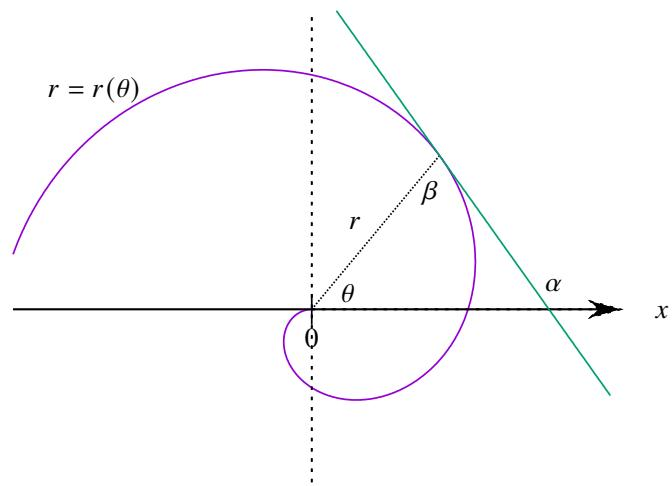  
图 4.6: 极坐标下的切线示意图.

用上述结论可以解决一个有趣的物理问题.

例 4.26 四只蜗牛分别在一个对角线为 2 的正方形的四个顶点上. 每只蜗牛都按逆时针方向盯着下一只蜗牛. 四只蜗牛同时以相同速度匀速向着自己盯着的蜗牛爬行，爬行方向始终保持朝向盯着的那只蜗牛, 直至撞在一起. 求蜗牛爬行的轨迹.

解 如图 XXX 建立极坐标系. 不难知道蜗牛爬行过程中速度方向与极径夹角始终为 $\pi / 4 .$ . 设蜗牛爬行的轨迹方程为 $r = r ( \theta )$ , 根据前面讨论的结论可知

$$
\frac {r (\theta)}{r ^ {\prime} (\theta)} = \tan \frac {\pi}{4}.
$$

这是一个微分方程, 用微分方程的知识可以解得

$$
r = C \mathrm {e} ^ {\theta}.
$$

于是可知右边的蜗牛轨迹为

$$
r = \mathrm {e} ^ {\theta}.
$$
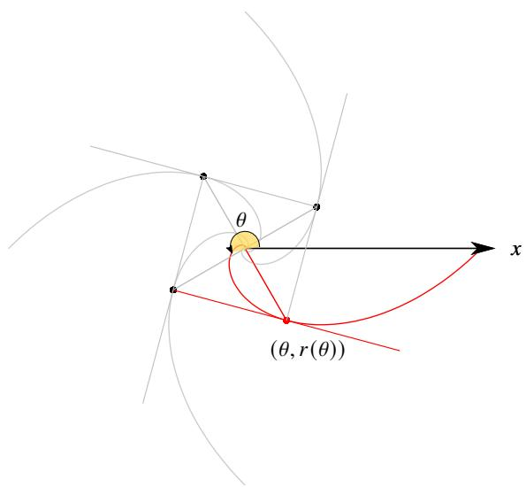  
图4.7：蜗牛爬出螺线  
图4.8：蜗牛爬出螺线（使用Adobe PDF浏览器观看动画）

# 4.1.5 高阶导数

在物理学中，位移关于时间的函数 $s(t)$ 的导数是速度函数. 而速度函数的导数是加速度函数. 即

$$
v (t) = s ^ {\prime} (t), \qquad a (t) = v ^ {\prime} (t) = (s ^ {\prime}) ^ {\prime} (t).
$$

这就引出了以下概念

# 定义4.5 (高阶导数)

设函数 $f$ 在区间 $I$ 上可导, 则 $f'(x) (\forall x \in I)$ 称为 $f(x)$ 的导函数. 若 $f'(x)$ 在 $I$ 上仍可导, 则 $f'(x)$ 的导函数称为 $f(x)$ 的二阶导函数 (second order derivative), 记作 $f''(x)$ . 于是我们可以归纳地定义 $f(x)$ 的 $n$ 阶导函数 (n-order derivative), 记作 $f^{(n)}(x)$ .

我们知道一阶导数可以用表示为微分的商. 高阶导数也可以写成微分形式. 设函数 $y = f(x)$ , 我们把对函数的二阶微分记作 $\mathrm{d}^2$ . 则

$$
\mathrm {d} ^ {2} f (x) = \mathrm {d} [ \mathrm {d} f (x) ] = \mathrm {d} [ f ^ {\prime} (x) \mathrm {d} x ] = [ f ^ {\prime} (x) \mathrm {d} x ] ^ {\prime} \mathrm {d} x = [ f ^ {\prime \prime} (x) \mathrm {d} x + f ^ {\prime} (x) (\mathrm {d} x) ^ {\prime} ] \mathrm {d} x = f ^ {\prime \prime} (x) (\mathrm {d} x) ^ {2}.
$$

我们约定: $(\mathrm{d}x)^2$ 记作 $\mathrm{d}x^2$ . 则

$$
f ^ {\prime \prime} (x) = \frac {\mathrm {d} ^ {2} f (x)}{\mathrm {d} x ^ {2}} = \frac {\mathrm {d} ^ {2} y}{\mathrm {d} x ^ {2}}.
$$

类似地我们可以得到 $n$ 阶导数的微分形式

$$
f ^ {(n)} (x) = \frac {\mathrm {d} ^ {n} y}{\mathrm {d} x ^ {n}}.
$$

以后我们将看到, (高阶)导数的微分记号在(偏)微分方程和多元微分学中会有明显的好处.

根据一个函数在区间 $I$ 上可导的次数可以对函数进行分类

# 定义4.6（光滑函数）

设区间 $I$ . 所有在 $I$ 上连续的函数组成的集合记作 $C(I)$ 或 $C^0 (I)$ . 所有在 $I$ 上 $n$ 次连续可导的函数组成的集合记作 $C^n (I)$ . 所有在 $I$ 上任意次可导的函数组成的集合记作 $C^\infty (I)$ , 这样的函数称为 $I$ 上的光滑函数(smooth function).

注 在不强调区间 $I$ 时可以省略记作 $C^{(n)}$ .

指数函数 $\mathbf{e}^x$ 是一个很特殊的光滑函数, 它在 $\mathbb{R}$ 上的任意阶导函数都是它本身. 从这个角度讲, 指数函数 $\mathbf{e}^x$ 具有“非常好的性质”.

例4.27给定实数 $\lambda$ ，求函数 $\mathrm{e}^{\lambda x}$ 的 $n$ 阶导函数

解 先求几个特殊情况.

$$
\left(\mathrm {e} ^ {\lambda x}\right) ^ {\prime} = \lambda \mathrm {e} ^ {\lambda x}, \quad \left(\mathrm {e} ^ {\lambda x}\right) ^ {\prime \prime} = \left(\lambda \mathrm {e} ^ {\lambda x}\right) ^ {\prime} = \lambda^ {2} \mathrm {e} ^ {\lambda x}.
$$

于是猜测 $\left(\mathrm{e}^{\lambda x}\right)^{(n)} = \lambda^{n}\mathrm{e}^{\lambda x}$ $(n = 1,2,\dots)$ . 假设 $n$ 时成立. 则

$$
\left(\mathrm {e} ^ {\lambda x}\right) ^ {(n + 1)} = \left[ \left(\mathrm {e} ^ {\lambda x}\right) ^ {(n)} \right] ^ {\prime} = \left(\lambda^ {n} \mathrm {e} ^ {\lambda x}\right) ^ {\prime} = \lambda^ {n + 1} \mathrm {e} ^ {\lambda x}.
$$

由数学归纳原理可知猜测成立.

事实上 $\sin x$ 和 $\cos x$ 也是光滑函数. 我们来计算一下它们的高阶导.

例4.28求函数 $\sin x$ 和 $\cos x$ 的 $n$ 阶导函数

解 先求几个特殊情况.

$$
(\sin x) ^ {\prime} = \cos x = \sin \left(x + \frac {\pi}{2}\right), \qquad (\sin x) ^ {\prime \prime} = \left[ \sin \left(x + \frac {\pi}{2}\right) \right] ^ {\prime} = \left(x + \frac {\pi}{2}\right) ^ {\prime} \sin \left(x + \frac {\pi}{2} + \frac {\pi}{2}\right) = \sin \left(x + \frac {2 \pi}{2}\right).
$$

于是猜测

$$
\sin^ {(n)} x = \sin \left(x + \frac {n \pi}{2}\right), \quad n = 1, 2, \dots
$$

假设 $n$ 时成立. 则

$$
\sin^ {(n + 1)} x = \left(\sin^ {(n)} x\right) ^ {\prime} = \left[ \sin \left(x + \frac {n \pi}{2}\right) \right] ^ {\prime} = \left(x + \frac {n \pi}{2}\right) ^ {\prime} \cos \left(x + \frac {n \pi}{2}\right) = \sin \left(x + \frac {n \pi}{2} + \frac {\pi}{2}\right) = \sin \left[ x + \frac {(n + 1) \pi}{2} \right].
$$

由数学归纳原理可知猜测成立. 类似可知

$$
\cos^ {(n)} x = \cos \left(x + \frac {n \pi}{2}\right), \quad n = 1, 2, \dots .
$$

例4.29 求函数 $f(x) = \ln (1 + x)$ 的 $n$ 阶导函数

解 先求几个特殊情况.

$$
f ^ {\prime} (x) = (1 + x) ^ {- 1}, \quad f ^ {\prime \prime} (x) = - (1 + x) ^ {- 2}, \quad f ^ {\prime \prime \prime} (x) = 2 (1 + x) ^ {- 3}.
$$

于是猜测

$$
f ^ {(n)} (x) = (- 1) ^ {n - 1} (n - 1)! (1 + x) ^ {- n}, \quad n = 1, 2, \dots .
$$

假设 $n$ 时成立. 则

$$
f ^ {(n + 1)} = \left[ (- 1) ^ {n - 1} (n - 1)! (1 + x) ^ {- n} \right] ^ {\prime} = (- 1) ^ {n} n! (1 + x) ^ {- (n + 1)}.
$$

由数学归纳原理可知猜测成立.

例4.30 求函数 $f(x) = (1 + x)^{\alpha}$ 的 $n$ 阶导函数

解 先求几个特殊情况.

$$
f ^ {\prime} (x) = \alpha (1 + x) ^ {\alpha - 1}, \qquad f ^ {\prime \prime} (x) = \alpha (\alpha - 1) (1 + x) ^ {\alpha - 2}, \qquad f ^ {\prime \prime \prime} (x) = \alpha (\alpha - 1) (\alpha - 2) (1 + x) ^ {\alpha - 3}.
$$

于是猜测

$$
f ^ {(n)} (x) = \alpha (\alpha - 1) \dots (\alpha - n + 1) (1 + x) ^ {\alpha - n}, \quad n = 1, 2, \dots .
$$

假设 $n$ 时成立. 则

$$
f ^ {(n + 1)} = \alpha (\alpha - 1) \dots (\alpha - n + 1) (\alpha - n) (1 + x) ^ {\alpha - n - 1}.
$$

由数学归纳原理可知猜测成立.

容易验证, 对任意函数 $f, g \in C^{(n)}(I)$ 和任一 $c \in \mathbb{R}$ 都有

$$
(f + g) ^ {(n)} = f ^ {(n)} + g ^ {(n)}, \quad (c f) ^ {(n)} = c f ^ {(n)}.
$$

这表明求 $n$ 阶导依旧是一个线性算子

下面来看函数 $f, g \in C^{(n)}$ 的乘积的高阶导. 我们先尝试计算几个特例

$$
\begin{array}{l} (f g) ^ {\prime} = f ^ {\prime} g + f g ^ {\prime}, \\ (f g) ^ {\prime \prime} = \left(f ^ {\prime} g + f g ^ {\prime}\right) ^ {\prime} = \left(f ^ {\prime} g\right) ^ {\prime} + \left(f g ^ {\prime}\right) ^ {\prime} = f ^ {\prime \prime} g + f ^ {\prime} g ^ {\prime} + f ^ {\prime} g ^ {\prime} + f g ^ {\prime \prime} = f ^ {\prime \prime} g + 2 f ^ {\prime} g ^ {\prime} + f g ^ {\prime \prime}, \\ (f g) ^ {\prime \prime \prime} = (f ^ {\prime \prime} g + 2 f ^ {\prime} g ^ {\prime} + f g ^ {\prime \prime}) ^ {\prime} = (f ^ {\prime \prime} g) ^ {\prime} + (2 f ^ {\prime} g ^ {\prime}) ^ {\prime} + (f g ^ {\prime \prime}) ^ {\prime} = f ^ {\prime \prime \prime} g + 3 f ^ {\prime \prime} g ^ {\prime} + 3 f ^ {\prime} g ^ {\prime \prime} + f g ^ {\prime \prime \prime}. \\ \end{array}
$$

我们猜测 $(fg)^{(n)}$ 的规律可能类似二项式定理

# 定理4.6 (Leibniz 公式)

设函数 $f,g\in C^{(n)}(I)$ ，则 $fg\in C^{(n)}(I)$ ，且

$$
(f g) ^ {(n)} = \sum_ {k = 0} ^ {n} C _ {n} ^ {k} f ^ {(n - k)} g ^ {(k)}.
$$

其中规定 $f^{(0)} = f, g^{(0)} = g$

证明 只需证明

$$
(f g) ^ {(n)} = \sum_ {i + j = n} \frac {n !}{i ! j !} f ^ {(i)} g ^ {(j)}.
$$

当 $n = 1$ 时命题显然成立. 假设 $n = m$ 时命题成立. 下面来看 $n = m + 1$ 时的情况

$$
\begin{array}{l} (f g) ^ {(m + 1)} = \left[ (f g) ^ {(m)} \right] ^ {\prime} = \left(\sum_ {i + j = m} \frac {m !}{i ! j !} f ^ {(i)} g ^ {(j)}\right) ^ {\prime} = \sum_ {i + j = m} \frac {m !}{i ! j !} \left(f ^ {(i)} g ^ {(j)}\right) ^ {\prime} \\ = \sum_ {i + j = m} \frac {m !}{i ! j !} \left(f ^ {(i + 1)} g ^ {(j)} + f ^ {(i)} g ^ {(j + 1)}\right) = \sum_ {i + j = m} \frac {m !}{i ! j !} f ^ {(i + 1)} g ^ {(j)} + \sum_ {i + j = m} \frac {m !}{i ! j !} f ^ {(i)} g ^ {(j + 1)}. \\ \end{array}
$$

第一个和式中的 $i$ 用 $i - 1$ 代入，第二个和式中的 $j$ 用 $j - 1$ 代入得

$$
\begin{array}{l} (f g) ^ {(m + 1)} \\ = \sum_ {i - 1 + j = m} \frac {m !}{(i - 1) ! j !} f ^ {(i)} g ^ {(j)} + \sum_ {i + j - 1 = m} \frac {m !}{i ! (j - 1) !} f ^ {(i)} g ^ {(j)} = \sum_ {i + j = m + 1} \frac {m ! i}{i ! j !} f ^ {(i)} g ^ {(j)} + \sum_ {i + j = m + 1} \frac {m ! j}{i ! j !} f ^ {(i)} g ^ {(j)} \\ = \sum_ {i + j = m + 1} \left(\frac {m ! i}{i ! j !} + \frac {m ! j}{i ! j !}\right) f ^ {(i)} g ^ {(j)} = \sum_ {i + j = m + 1} \frac {m ! (i + j)}{i ! j !} f ^ {(i)} g ^ {(j)} = \sum_ {i + j = m + 1} \frac {m ! (m + 1)}{i ! j !} f ^ {(i)} g ^ {(j)} = \sum_ {i + j = m + 1} \frac {(m + 1) !}{i ! j !} f ^ {(i)} g ^ {(j)}. \\ \end{array}
$$

由数学归纳原理可知对于一切 $n \in \mathbb{N}^*$ 命题都成立.

注 适当改变求和号的下标可以简化证明或计算的书写.

下面看一个用Leibniz公式求高阶导的例子

例4.31 求函数 $x^{2}\cos x$ 的50阶导函数

解 由Leibniz公式可知

$$
\left(x ^ {2} \cos x\right) ^ {(5 0)} = (\cos x) ^ {(5 0)} x ^ {2} + \mathrm {C} _ {5 0} ^ {1} (\cos x) ^ {(4 9)} \left(x ^ {2}\right) ^ {\prime} + \mathrm {C} _ {5 0} ^ {2} (\cos x) ^ {(4 8)} \left(x ^ {2}\right) ^ {\prime \prime}.
$$

由例4.28可知

$$
\left(\cos x\right) ^ {(4 8)} = \cos \left(x + \frac {4 8 \pi}{2}\right) = \cos x.
$$

故 $(\cos x)^{(49)} = -\sin x, (\cos x)^{(50)} = -\cos x.$ 于是

$$
\left(x ^ {2} \cos x\right) ^ {(5 0)} = - x ^ {2} \cos x - 1 0 0 x \sin x + 2 4 5 0 \cos x.
$$

# 4.2 求导的逆运算

# 4.2.1 原函数和不定积分

上一节我们得到了一些初等函数的求导公式，以及一些求导法则. 用这些方法我们可以求出所有初等函数的导数. 很自然地，我们希望讨论求导运算的逆运算. 这就是本节讨论的问题.

# 定义4.7（原函数）

设函数 $F$ 在区间 $I$ 上可导. 若 $F'(x_0) = f(x_0) (\forall x_0 \in I)$ . 则称函数 $F$ 为 $f$ 在区间 $I$ 上的一个原函数 (primitive function) 或反向导数 (antiderivative).

假设我们已经求出了 $f$ 在区间 $I$ 上的一个原函数 $F$ , 那么容易看出 $F(x) + C (C \in \mathbb{R})$ 也是 $f(x)$ 在 $I$ 上的一个原函数, 因为.

$$
\left[ F (x) + C \right] ^ {\prime} = F ^ {\prime} (x) + C ^ {\prime} = f (x).
$$

反过来我们要问是否 $f(x)$ 在 $I$ 上的所有原函数都是形如 $F(x) + C$ 的函数? 假设 $G(x)$ 也是 $f(x)$ 在 $I$ 上的一个原函数, 则

$$
[ F (x) - G (x) ] ^ {\prime} = F ^ {\prime} (x) - G ^ {\prime} (x) = f (x) - f (x) = 0.
$$

由下一节的推论4.1可知 $F(x) - G(x)$ 是一个常数.这表明 $f(x)$ 在 $I$ 上的所有原函数组成的集合为 $\{F + C:C\in \mathbb{R}\}$ 于是可以定义以下概念.

# 定义4.8（不定积分）

设函数 $f$ . 若 $f$ 存在区间 $I$ 上的一个原函数 $F$ , 则称 $f(x)$ 在区间 $I$ 上所有原函数组成的集合 $\{F(x) + C : C \in \mathbb{R}\}$ 为 $f(x)$ 的不定积分 (indefinite integration), 记作

$$
\int f (x) \mathrm {d} x := \{F (x) + C: C \in \mathbb {R} \}.
$$

其中 $\int$ 称为积分号 (sign of integration), $f(x)$ 称为被积函数 (integrand), $f(x) \mathrm{d}x$ 称为被积表达式 (integrand expression).

注 以后我们经常把定义中的式子简写成

$$
\int f (x) \mathrm {d} x = F (x) + C.
$$

注“不定积分”这个名称来源以及积分号的来源将在下一章作出说明.

由一元函数的导数表可以直接得到一批不定积分公式

$$
\begin{array}{l} \int 0 \mathrm {d} x = C, \\ \int \frac {1}{x} d x = \ln | x | + C, \\ \int \mathrm {e} ^ {x} \mathrm {d} x = \mathrm {e} ^ {x} + C, \\ \int \sin x d x = - \cos x + C, \\ \int \frac {1}{\sin^ {2} x} d x = - \cot x + C, \\ \int \frac {1}{\sqrt {1 - x ^ {2}}} d x = \arcsin x + C, \\ \int \sinh x d x = \cosh x + C, \\ \end{array}
$$

$$
\begin{array}{l} \int x ^ {\mu} \mathrm {d} x = \frac {1}{\mu + 1} x ^ {\mu + 1} + C, \quad \mu \neq - 1, \\ \int a ^ {x} \mathrm {d} x = \frac {a ^ {x}}{\ln a} + C, \\ \int \cos x d x = \sin x + C, \\ \int \frac {1}{\cos^ {2} x} d x = \tan x + C, \\ \int \frac {1}{1 + x ^ {2}} d x = \arctan x + C \\ \int \cosh x d x = \sinh x + C, \\ \end{array}
$$

$$
\int \frac {1}{\sqrt {x ^ {2} + 1}} d x = \ln (x + \sqrt {1 + x ^ {2}}) + C,
$$

$$
\int \frac {1}{\sqrt {x ^ {2} - 1}} d x = \ln (x + \sqrt {x ^ {2} - 1}) + C.
$$

其中 $C$ 是常数. 以上第三个公式中需要注意 $\ln |x|$ .

容易得到以下不定积分的简单性质

# 命题4.2（不定积分的简单性质）

设函数 $f(x)$ ，它在区间 $I$ 上的一个原函数为 $F(x)$ .则

(1) $\left(\int f(x)\mathrm{d}x\right)' = f(x),$   
(2) $\int F'(x) \, \mathrm{d}x = F(x) + C,$   
(3) $\int [f(x) + g(x)]\mathrm{d}x = \int f(x)\mathrm{d}x + \int g(x)\mathrm{d}x,$   
(4) $\int \lambda f(x)\mathrm{d}x = \lambda \int f(x)\mathrm{d}x,\quad \lambda \neq 0.$

注 (3) 和 (4) 表明不定积分是“线性的”.

注 (1) 和 (2) 中, 若用微分记号表示, 则

$$
\mathrm {d} \left(\int f (x) \mathrm {d} x\right) = f (x) \mathrm {d} x, \quad \int \mathrm {d} F (x) = F (x) + C.
$$

由此可见微分和不定积分呈现出“互为可逆的关系”，只不过当积分号在外面时，结果总是要有 $C$

注 (4) 中若 $\lambda = 0$ 则 $\int \lambda f(x) \, \mathrm{d}x = C, \lambda \int f(x) \, \mathrm{d}x = 0$ , 因此 $\lambda \neq 0$ .

利用基本的不定积分公式和不定积分的简单性质可以求一些函数的不定积分. 我们看两个例子.

例4.32 求不定积分

$$
\int \left(3 x ^ {2} + \frac {4}{x}\right) \mathrm {d} x.
$$

解 由不定积分的线性性质可知

原式 $= 3\int x^{2}\mathrm{d}x + 4\int \frac{1}{x}\mathrm{d}x = x^{3} + 4\ln |x| + C.$

例4.33 求不定积分

$$
\int \tan^ {2} x d x.
$$

解 由不定积分的线性性质可知

原式 $= \int \left(\frac{1}{\cos^2 x} - 1\right) \mathrm{d}x = \int \frac{1}{\cos^2 x} \mathrm{d}x - \int 1 \mathrm{~d}x = \tan x - x + C.$

# 4.2.2 分部积分法

我们已经知道求函数的不定积分是求导的逆运算. 因此我们应想办法逆用函数的求导法则, 得到相应的求不定积分的方法.

如果逆用函数乘积的求导法则, 就可以得到“分部积分法”. 我们已经知道

$$
[ u (x) v (x) ] ^ {\prime} = u ^ {\prime} (x) v (x) + u (x) v ^ {\prime} (x) \Longleftrightarrow u (x) v ^ {\prime} (x) = [ u (x) v (x) ] ^ {\prime} - u ^ {\prime} (x) v (x).
$$

对上式两边求不定积分得

$$
\int u (x) v ^ {\prime} (x) \mathrm {d} x = u (x) v (x) - \int u ^ {\prime} (x) v (x) \mathrm {d} x.
$$

以上公式就是分部积分法 (integration by parts). 也可以写成

$$
\int u (x) \mathrm {d} v (x) = u (x) v (x) - \int v (x) \mathrm {d} u (x).
$$

下面我们看一些例子.

例 4.34 计算不定积分:

$$
\int x \mathrm {e} ^ {x} \mathrm {d} x.
$$

解由分部积分法可得

$$
\text {原 式} = \int x   \mathrm {d} \mathrm {e} ^ {x} = x \mathrm {e} ^ {x} - \int \mathrm {e} ^ {x}   \mathrm {d} x = x \mathrm {e} ^ {x} - \mathrm {e} ^ {x} + C.
$$

使用分部积分法的关键是把被积函数合理地分成 $u(x)$ 和 $\nu (x)$ . 通常来说会选择求导后能“变简单”的函数作为 $u(x)$ , 这样就可以使 $u^{\prime}(x)\nu (x)$ 的不定积分比原先更容易求得.

有时候需要多次使用分部积分法

例4.35 计算不定积分：

$$
\int x ^ {2} \mathrm {e} ^ {x} \mathrm {d} x.
$$

解 由例4.34可知

$$
\text {原 式} = \int x ^ {2} \mathrm {d e} ^ {x} = x ^ {2} \mathrm {e} ^ {x} - \int \mathrm {e} ^ {x} \mathrm {d} x ^ {2} = x ^ {2} \mathrm {e} ^ {x} - 2 \int x \mathrm {e} ^ {x} \mathrm {d} x = x ^ {2} \mathrm {e} ^ {x} - 2 (x \mathrm {e} ^ {x} - \mathrm {e} ^ {x}) + C = (x ^ {2} - 2 x + 2) \mathrm {e} ^ {x} + C.
$$

例 4.36 计算不定积分:

$$
\int \ln x d x.
$$

解 由分部积分法可得

$$
\text {原 式} = x \ln x - \int x \mathrm {d} \ln x = x \ln x - \int x \cdot \frac {1}{x} \mathrm {d} x = x \ln x - \int 1 \mathrm {d} x = x \ln x - x + C.
$$

例 4.37 计算不定积分:

$$
\int \mathrm {e} ^ {x} \cos x \mathrm {d} x, \quad \int \mathrm {e} ^ {x} \sin x \mathrm {d} x.
$$

解由分部积分法可得

$$
\left\{ \begin{array}{l} \int \mathrm {e} ^ {x} \mathrm {d} \sin x = \mathrm {e} ^ {x} \sin x - \int \sin x \mathrm {d} \mathrm {e} ^ {x} \\ \int \mathrm {e} ^ {x} \mathrm {d} \cos x = \mathrm {e} ^ {x} \cos x - \int \cos x \mathrm {d} \mathrm {e} ^ {x} \end{array} \right. \Longleftrightarrow \left\{ \begin{array}{l} \int \mathrm {e} ^ {x} \cos x \mathrm {d} x = \mathrm {e} ^ {x} \sin x - \int \mathrm {e} ^ {x} \sin x \mathrm {d} x \\ - \int \mathrm {e} ^ {x} \sin x \mathrm {d} x = \mathrm {e} ^ {x} \cos x - \int \mathrm {e} ^ {x} \cos x \mathrm {d} x \end{array} \right.
$$

以上是一个关于 $\int \mathrm{e}^x\cos x\mathrm{d}x$ 和 $\int \mathrm{e}^x\sin x\mathrm{d}x$ 的线性方程组.解得

$$
\left\{ \begin{array}{l} \int \mathrm {e} ^ {x} \cos x \mathrm {d} x = \frac {1}{2} (\cos x + \sin x) \mathrm {e} ^ {x} + C \\ \int \mathrm {e} ^ {x} \sin x \mathrm {d} x = - \frac {1}{2} (\cos x - \sin x) \mathrm {e} ^ {x} + C \end{array} \right.
$$

通过分部积分法可以得到以下重要递推公式

例4.38研究以下不定积分：

$$
\int \cos^ {n} x d x, \quad \int \sin^ {n} x d x.
$$

解由于

$$
\begin{array}{l} \int \cos^ {n} x d x = \int \cos^ {n - 1} x d \sin x = \cos^ {n - 1} x \sin x - \int \sin x d \cos^ {n - 1} x = \cos^ {n - 1} x \sin x + (n - 1) \int \sin^ {2} x \cos^ {n - 2} x d x \\ = \cos^ {n - 1} x \sin x + (n - 1) \int \left(1 - \cos^ {2} x\right) \cos^ {n - 2} x d x = \cos^ {n - 1} x \sin x + (n - 1) \int \left(\cos^ {n - 2} x - \cos^ {n} x\right) d x \\ = \cos^ {n - 1} x \sin x + (n - 1) \int \cos^ {n - 2} x d x - (n - 1) \int \cos^ {n} x d x. \\ \end{array}
$$

于是得到递推公式

$$
\int \cos^ {n} x \mathrm {d} x = \frac {1}{n} \sin x \cos^ {n - 1} x + \frac {n - 1}{n} \int \cos^ {n - 2} x \mathrm {d} x, \quad n = 2, 3, \dots .
$$

反复使用以上公式最后归结为

$$
\int \cos x   \mathrm {d} x = \sin x + C, \quad \text {或} \quad \int \mathrm {d} x = x + C.
$$

类似地可以得到

$$
\int \sin^ {n} x \mathrm {d} x = - \frac {1}{n} \cos x \sin^ {n - 1} x + \frac {n - 1}{n} \int \sin^ {n - 2} x \mathrm {d} x, \quad n = 2, 3, \dots .
$$

# 4.2.3 换元积分法

我们已经知道链式法则

$$
\mathrm {d} v (u (x)) = v ^ {\prime} (u (x)) \mathrm {d} u (x).
$$

对上式两边求不定积分得

$$
\int \mathrm {d} v (u (x)) = \int v ^ {\prime} (u (x)) \mathrm {d} u (x) \Longleftrightarrow \int v ^ {\prime} (u (x)) \mathrm {d} u (x) = v (u (x)).
$$

这样就得到一个求不定积分的重要方法——“换元法”也叫“凑微分法”。这个方法其实就是复合函数求导法则的逆用。我们还是通过例子来说明这种方法。

例4.39 计算：

$$
\int \sin^ {3} x \cos x d x.
$$

解由于

$$
\int \sin^ {3} x \cos x \mathrm {d} x = \int \sin^ {3} x \mathrm {d} \sin x.
$$

令 $u = \sin x$ 则

原式 $= \int u^{3} \mathrm{d}u = \frac{1}{4} u^{4} + C = \frac{1}{4}\sin^{4}x + C.$

注熟练以后可以省略换元的过程

例4.40 计算：

$$
\int x \mathrm {e} ^ {x ^ {2}} \mathrm {d} x.
$$

解由于

$$
\int x \mathrm {e} ^ {x ^ {2}} \mathrm {d} x = \frac {1}{2} \int \mathrm {e} ^ {x ^ {2}} \mathrm {d} x ^ {2}.
$$

令 $u = x^2$ .则

原式 $= \frac{1}{2}\int \mathrm{e}^{u}\mathrm{d}u = \frac{1}{2}\mathrm{e}^{u} + C = \frac{1}{2}\mathrm{e}^{x^2} + C.$

例4.41 计算：

$$
\int \frac {\mathrm {d} x}{a x + b}, \quad a \neq 0
$$

解由于

$$
\int {\frac {\mathrm {d} x}{a x + b}} = \frac {1}{a} \int {\frac {\mathrm {d} (a x + b)}{a x + b}}.
$$

令 $u = ax + b$ ，则

$$
\text {原 式} = \frac {1}{a} \int \frac {\mathrm {d} u}{u} = \frac {1}{a} \ln | u | + C = \frac {1}{a} \ln | a x + b | + C.
$$

例4.42 计算：

$$
\int \frac {\ln x}{x} d x
$$

解由于

$$
\int \frac {\ln x}{x} d x = \int \ln x d \ln x.
$$

令 $u = \ln x$ 则

$$
\text {原 式} = \int u   \mathrm {d}   u = {\frac {1}{2}} u ^ {2} + C = {\frac {1}{2}} \ln^ {2} x + C.
$$

例4.43 计算：

$$
\int \frac {\mathrm {d} x}{a ^ {2} + x ^ {2}}, \quad a \neq 0.
$$

解如果 $a = 1$ ，则所求不定积分就是 $\arctan x.$ 于是想到令 $x = au$ ，则

$$
\text {原 式} = \int \frac {\mathrm {d} a u}{a ^ {2} + a ^ {2} u ^ {2}} = \int \frac {a \mathrm {d} u}{a ^ {2} + a ^ {2} u ^ {2}} = \frac {1}{a} \int \frac {\mathrm {d} u}{1 + u ^ {2}} = \frac {1}{a} \arctan u + C = \frac {1}{a} \arctan \frac {x}{a} + C.
$$

例4.44计算：

$$
\int \frac {\mathrm {d} x}{a ^ {2} \sin^ {2} x + b ^ {2} \cos^ {2} x}, a b \neq 0.
$$

解由于 $ab \neq 0$ ，故

$$
\int \frac {\mathrm {d} x}{a ^ {2} \sin^ {2} x + b ^ {2} \cos^ {2} x} = \int \frac {\frac {\mathrm {d} x}{b ^ {2} \cos^ {2} x}}{\frac {a ^ {2}}{b ^ {2}} \tan^ {2} x + 1} = \frac {1}{b ^ {2}} \cdot \frac {b}{a} \int \frac {\mathrm {d} \left(\frac {a}{b} \tan x\right)}{\left(\frac {a}{b} \tan x\right) ^ {2} + 1}.
$$

令 $u = \frac{a}{b}\tan x$ ，则

$$
\text {原 式} = \frac {1}{a b} \int \frac {\mathrm {d} u}{u ^ {2} + 1} = \frac {1}{a b} \arctan u + C = \frac {1}{a b} \arctan \left(\frac {a}{b} \tan x\right) + C.
$$

例4.45 计算：

$$
\int \sqrt {a ^ {2} - x ^ {2}}   d x, \quad | x | \leqslant a.
$$

解为了去掉被积函数中的根号，想到令 $x = a\sin u(|u|\leqslant \pi /2)$ ，则

$$
u = \arcsin \frac {x}{a}, \qquad \sin u = \frac {x}{a}, \qquad \cos u = \frac {\sqrt {a ^ {2} - x ^ {2}}}{a}.
$$

于是

$$
\int \sqrt {a ^ {2} - x ^ {2}} d x = \int \sqrt {a ^ {2} - a ^ {2} \sin^ {2} u} d (a \sin u) = \int a ^ {2} \cos^ {2} u d u.
$$

由例4.38可知

$$
\int \cos^ {2} u d u = \frac {1}{2} \sin u \cos u + \frac {1}{2} u + C.
$$

于是可知

原式 $= a^{2}\left(\frac{1}{2}\sin u\cos u + \frac{1}{2} u\right) + C = a^{2}\left(\frac{1}{2}\cdot \frac{x}{a}\frac{\sqrt{a^{2} - x^{2}}}{a} +\frac{1}{2}\arcsin \frac{x}{a}\right) + C = \frac{x}{2}\sqrt{a^{2} - x^{2}} +\frac{a^{2}}{2}\arcsin \frac{x}{a} +C.$

例4.46计算：

$$
\int \frac {\mathrm {d} x}{\sqrt {a ^ {2} + x ^ {2}}}, \quad a > 0.
$$

解令 $x = a\sinh u$ 则 $\mathrm{d}x = a\mathrm{d}\sinh u = a\cosh u\mathrm{d}u.$ 于是

原式 $= \int \frac{a\cosh u\mathrm{d}u}{\sqrt{a^2 + a^2\sinh^2u}} = \int \frac{a\cosh u\mathrm{d}u}{a\cosh u} = \int \mathrm{d}u = u + C = \ln \left(\frac{x}{a} +\sqrt{1 + \frac{x^2}{a^2}}\right) + C = \ln \left(x + \sqrt{a^2 + x^2}\right) + C.$

注对比上例和例4.45的方法

例4.47 计算：

$$
\int \frac {\mathrm {d} x}{1 + \sqrt {1 + x}}.
$$

解令 $t = 1 + \sqrt{1 + x}$ 则

$$
x = (t - 1) ^ {2} - 1, \quad \mathrm {d} x = \mathrm {d} (t - 1) ^ {2} = 2 (t - 1) \mathrm {d} t.
$$

于是

原式 $= 2\int \frac{t - 1}{t}\mathrm{d}t = 2\int \left(1 - \frac{1}{t}\right)\mathrm{d}t = 2(t - \ln t) + C = 2\sqrt{1 + x} -2\ln \left(1 + \sqrt{1 + x}\right) + C.$

例4.48 计算：

$$
\int \frac {\sin \sqrt {x}}{\sqrt {x}} d x.
$$

解 解法一 由于

$$
\int \frac {\sin \sqrt {x}}{\sqrt {x}} d x = 2 \int \sin \sqrt {x} d \sqrt {x}.
$$

于是令 $u = \sqrt{x}$ 则

原式 $= 2\int \sin u\mathrm{d}u = -2\cos u + C = -2\cos \sqrt{x} +C.$

解法二 为了去掉根号考虑令 $x = u^2$ .则

$$
\text {原 式} = \int \frac {\sin u}{u}   \mathrm {d}   u ^ {2} = 2 \int \sin u   \mathrm {d}   u = - 2   \cos u + C = - 2   \cos \sqrt {x} + C.
$$

# 4.2.4 有理函数的不定积分

下面我们来讨论求“有理函数”不定积分的方法.所谓“有理函数”是指函数解析式为分式的函数，即形如

$$
r (x) = \frac {p (x)}{q (x)},
$$

其中 $p(x), q(x)$ 都是关于 $x$ 的一元多项式, 且它们没有公共的零点.

# 定义4.9（真分式）

设分式 $p(x) / q(x)$ ，其中 $p(x), q(x)$ 都是关于 $x$ 的一元多项式。若 $p(x)$ 的次数小于 $q(x)$ 的次数，则称 $p(x) / q(x)$ 是一个真分式（proper fraction）。

在代数中我们将证明以下几个命题. 由于以下几个命题都和本课程主题无关, 我们将证明略去, 详细证明可以查阅我们的《高等代数讲义》.

# 命题4.3

任何分式都可以唯一地分解为一个多项式和一个真分式的和.

多项式函数的不定积分可以直接利用公式和不定积分的线性性质求得. 因此我们只需要研究真分式的不定积分.

# 定理4.7（部分分式分解定理）

设真分式 $p(x) / q(x)$ , 其中 $p(x), q(x)$ 都是关于 $x$ 的一元多项式. 若 $q(x)$ 在实数域上的标准分解式为

$$
q (x) = \left(x - x _ {1}\right) ^ {r _ {1}} \dots \left(x - x _ {m}\right) ^ {r _ {m}} \left(x ^ {2} + b _ {1} x + c _ {1}\right) ^ {t _ {1}} \dots \left(x ^ {2} + b _ {n} x + c _ {n}\right) ^ {t _ {n}}.
$$

则 $p(x) / q(x)$ 可以唯一地分解为部分分式(partial fraction)的和

$$
\begin{array}{l} \frac {A _ {r _ {1}}}{(x - x _ {1}) ^ {r _ {1}}} + \dots + \frac {A _ {1}}{(x - x _ {1})} + \dots + \frac {B _ {r _ {1}}}{(x - x _ {m}) ^ {r _ {m}}} + \dots + \frac {B _ {1}}{(x - x _ {m})} \\ + \frac {K _ {t _ {1}} x + L _ {t _ {1}}}{(x ^ {2} + b _ {1} x + c _ {1}) ^ {t _ {1}}} + \dots + \frac {K _ {1} x + L _ {1}}{(x ^ {2} + b _ {1} x + c _ {1})} + \dots + \frac {M _ {t _ {n}} x + N _ {t _ {n}}}{(x ^ {2} + b _ {n} x + c _ {n}) ^ {t _ {n}}} + \dots + \frac {M _ {1} x + N _ {1}}{(x ^ {2} + b _ {n} x + c _ {n})}. \\ \end{array}
$$

注以上用到了一元多项式在实数域中的分解定理，详见《高等代数讲义》.所谓“实数域上的标准分解式”是指 $x_{1},$ $\dots ,x_{m}$ 都是互不相同的实数； $(b_{1},c_{1}),\dots ,(b_{n},c_{n})$ 都是互不相同的有序实数对，且 $b_j^2 -4c_j < 0 (j = 1,2,\dots ,n).$

下面我们来举例说明如何把一个真分式化为部分分式

例4.49 设分式

$$
\frac {x + 1}{x ^ {2} - 4 x + 3}.
$$

把它化为部分分式

解 把分母分解因式得 $x^{2} - 4x + 3 = (x - 1)(x - 3)$ . 设

$$
\frac {x + 1}{x ^ {2} - 4 x + 3} = \frac {A}{x - 1} + \frac {B}{x - 3}.
$$

于是

$$
x + 1 = A (x - 3) + B (x - 1) \Longleftrightarrow x + 1 = (A + B) x + (- 3 A - B).
$$

比较系数得

$$
\left\{ \begin{array}{l} A + B = 1 \\ - 3 A - B = 1 \end{array} \right. \Longleftrightarrow \left\{ \begin{array}{l} A = - 1 \\ B = 2 \end{array} \right..
$$

于是可知

原式 $= -\frac{1}{x - 1} + \frac{2}{x - 3}$ .

例 4.50 设分式

$$
\frac {x ^ {3} + 1}{x ^ {4} - 3 x ^ {3} + 3 x ^ {2} - x}.
$$

把它化为部分分式

解 把分母分解因式得 $x^4 - 3x^3 + 3x^2 - x = x(x - 1)^3$ . 设

$$
\frac {x ^ {3} + 1}{x ^ {4} - 3 x ^ {3} + 3 x ^ {2} - x} = \frac {A}{x} + \frac {B}{(x - 1) ^ {3}} + \frac {C}{(x - 1) ^ {2}} + \frac {D}{x - 1}.
$$

于是

$$
x ^ {3} + 1 = A (x - 1) ^ {3} + B x + C x (x - 1) + D x (x - 1) ^ {2}.
$$

令 $x = 0$ 得

$$
1 = A (- 1) ^ {3} \iff A = - 1.
$$

于是

$$
x ^ {3} + 1 = - (x - 1) ^ {3} + B x + C x (x - 1) + D x (x - 1) ^ {2}.
$$

令 $x = 1$ 得 $B = 2$ . 于是

$$
x ^ {3} + 1 = - (x - 1) ^ {3} + 2 x + C x (x - 1) + D x (x - 1) ^ {2} \iff 2 x ^ {2} - 3 x + 1 = C (x - 1) + D (x - 1) ^ {2}
$$

两边分别对 $x$ 求导得

$$
4 x - 3 = C + 2 D (x - 1).
$$

令 $x = 1$ 得 $C = 1$ . 于是

$$
4 x - 3 = 1 + 2 D (x - 1).
$$

比较系数可知 $D = 2$ .于是可知

$$
\text {原 式} = \frac {- 1}{x} + \frac {2}{(x - 1) ^ {3}} + \frac {1}{(x - 1) ^ {2}} + \frac {2}{x - 1}.
$$

现在我们回到正题. 分母是一次多项式的幂的部分分式, 容易求得它们的不定积分:

$$
\begin{array}{l} \int \frac {\mathrm {d} x}{x - a} = \int \frac {\mathrm {d} (x - a)}{x - a} = \ln | x - a | + C. \\ \int \frac {\mathrm {d} x}{(x - a) ^ {k}} = \int (x - a) ^ {- k} \mathrm {d} (x - a) = \frac {(x - a) ^ {1 - k}}{(1 - k)} + C, \quad k = 2, 3, \dots . \\ \end{array}
$$

下面来看分母是二次多项式的幂的部分分式. 设

$$
f (x) = \frac {A x + B}{\left(x ^ {2} + p x + q\right) ^ {k}}, \quad p ^ {2} - 4 q <   0, k = 1, 2, \dots .
$$

经过配方可以把 $x^{2} + px + q$ 化为

$$
x ^ {2} + p x + q = \left(x + \frac {p}{2}\right) ^ {2} + \frac {- (p ^ {2} - 4 q)}{4}.
$$

令

$$
t = x + \frac {p}{2}, \quad a ^ {2} = - \frac {p ^ {2} - 4 q}{4}.
$$

则

$$
\int \frac {A x + B}{(x ^ {2} + p x + q) ^ {k}} d x = \int \frac {A t + B - A p / 2}{(t ^ {2} + a ^ {2}) ^ {k}} d t = A \int \frac {t}{(t ^ {2} + a ^ {2}) ^ {k}} d t + \left(B - \frac {A p}{2}\right) \int \frac {d t}{(t ^ {2} + a ^ {2}) ^ {k}}.
$$

于是我们只需分别求以下两种形式的不定积分：

$$
\int \frac {t}{\left(t ^ {2} + a ^ {2}\right) ^ {k}} d t. \tag {4.5}
$$

$$
\int \frac {\mathrm {d} t}{\left(t ^ {2} + a ^ {2}\right) ^ {k}}. \tag {4.6}
$$

不定积分4.5是不难求的. 当 $k = 1$ 时

$$
\int \frac {t}{t ^ {2} + a ^ {2}} d t = \frac {1}{2} \int \frac {d t ^ {2}}{t ^ {2} + a ^ {2}} = \frac {1}{2} \ln (t ^ {2} + a ^ {2}) + C.
$$

当 $k \neq 1$ 时

$$
\int \frac {t}{\left(t ^ {2} + a ^ {2}\right) ^ {k}} d t = \frac {1}{2} \int \left(t ^ {2} + a ^ {2}\right) ^ {- k} d t ^ {2} = \frac {1}{2 (1 - k)} \left(t ^ {2} + a ^ {2}\right) ^ {1 - k} + C.
$$

最后只需讨论不定积分4.6. 我们只需要求出它的递推公式. 令

$$
I _ {k} = \int \frac {\mathrm {d} t}{\left(t ^ {2} + a ^ {2}\right) ^ {k}}, \quad k = 1, 2, \dots .
$$

用分部积分法可得

$$
\begin{array}{l} I _ {k} = \frac {t}{\left(t ^ {2} + a ^ {2}\right) ^ {k}} - \int t d (t ^ {2} + a ^ {2}) ^ {- k} = \frac {t}{\left(t ^ {2} + a ^ {2}\right) ^ {k}} + 2 k \int t ^ {2} (t ^ {2} + a ^ {2}) ^ {- k - 1} d t \\ = \frac {t}{\left(t ^ {2} + a ^ {2}\right) ^ {k}} + 2 k \int \frac {t ^ {2} + a ^ {2} - a ^ {2}}{\left(t ^ {2} + a ^ {2}\right) ^ {k + 1}} d t = \frac {t}{\left(t ^ {2} + a ^ {2}\right) ^ {k}} + 2 k \int \left[ \frac {1}{\left(t ^ {2} + a ^ {2}\right) ^ {k}} - \frac {a ^ {2}}{\left(t ^ {2} + a ^ {2}\right) ^ {k + 1}} \right] d t \\ = \frac {t}{\left(t ^ {2} + a ^ {2}\right) ^ {k}} + 2 k I _ {k} - 2 k a ^ {2} I _ {k + 1}. \\ \end{array}
$$

于是可知

$$
I _ {k + 1} = \frac {1}{2 k a ^ {2}} \cdot \frac {t}{\left(t ^ {2} + a ^ {2}\right) ^ {k}} + \frac {2 k - 1}{2 k a ^ {2}} I _ {k}, \quad k = 1, 2, \dots . \tag {4.7}
$$

容易求出

$$
I _ {1} = \int \frac {\mathrm {d} t}{t ^ {2} + a ^ {2}} = \frac {1}{a} \int \frac {\mathrm {d} (t / a)}{(t / a) ^ {2} + 1} = \frac {1}{a} \arctan \frac {t}{a} + C. \tag {4.8}
$$

于是对于一切 $k \in \mathbb{N}^*$ , 都可以求出不定积分4.6

综合以上讨论，我们实际上已经彻底解决了有理函数的不定积分问题。现在我们尝试用以上方法求例4.50中的有理函数的不定积分。

例4.51 计算

$$
\int \frac {x ^ {3} + 1}{x ^ {4} - 3 x ^ {3} + 3 x ^ {2} - x} \mathrm {d} x.
$$

解 由例4.50可知

原式 $= -\int \frac{\mathrm{d}x}{x} +2\int \frac{\mathrm{d}x}{(x - 1)^3} +\int \frac{\mathrm{d}x}{(x - 1)^2} +2\int \frac{\mathrm{d}x}{x - 1} = -\ln |x| - (x - 1)^{-2} - (x - 1)^{-1} + \ln (x - 1)^2 +C$

$$
= \ln {\frac {(x - 1) ^ {2}}{| x |}} - \frac {x}{(x - 1) ^ {2}} + C.
$$

例4.52 计算以下不定积分：

$$
\int \frac {5 x + 3}{\left(x ^ {2} - 2 x + 5\right) ^ {2}} d x.
$$

解先化简得

$$
\text {原 式} = \frac {5}{2} \int \frac {\mathrm {d} (x ^ {2} - 2 x + 5)}{(x ^ {2} - 2 x + 5) ^ {2}} + 8 \int \frac {\mathrm {d} (x - 1)}{(x ^ {2} - 2 x + 5) ^ {2}} = - \frac {5}{2 (x ^ {2} - 2 x + 5)} + 8 \int \frac {\mathrm {d} (x - 1)}{\left[ (x - 1) ^ {2} + 4 \right] ^ {2}}.
$$

由递推公式4.7和4.8可得

$$
8 \int \frac {\mathrm {d} (x - 1)}{\left[ (x - 1) ^ {2} + 4 \right] ^ {2}} = \frac {x - 1}{(x - 1) ^ {2} + 4} + I _ {1} = \frac {x - 1}{(x - 1) ^ {2} + 4} + \frac {1}{2} \arctan \frac {x - 1}{2} + C.
$$

于是可知

$$
\text {原 式} = - \frac {5}{2 (x ^ {2} - 2 x + 5)} + \frac {x - 1}{(x - 1) ^ {2} + 4} + \frac {1}{2} \arctan \frac {x - 1}{2} + C = \frac {2 x - 7}{2 (x ^ {2} - 2 x + 5)} + \frac {1}{2} \arctan \frac {x - 1}{2} + C.
$$

以上我们给出了一套求有理函数不定积分的算法, 理论上可以求出任一有理函数的不定积分, 但实际应用时计算量都十分巨大, 一般需要用 Python 或 MATLAB 编程解决.

# 4.2.5 可有理化函数的不定积分

在中学我们已经学过如下公式

$$
\sin x = \frac {2 \tan \frac {x}{2}}{1 + \tan^ {2} \frac {x}{2}}, \quad \cos x = \frac {1 - \tan^ {2} \frac {x}{2}}{1 + \tan^ {2} \frac {x}{2}}, \quad \tan x = \frac {2 \tan \frac {x}{2}}{1 - \tan^ {2} \frac {x}{2}}. \tag {4.9}
$$

令 $t = \tan \frac{x}{2}$ ，则

$$
\sin x = \frac {2 t}{1 + t ^ {2}}, \qquad \cos x = \frac {1 - t ^ {2}}{1 + t ^ {2}}, \qquad \tan x = \frac {2 t}{1 - t ^ {2}}.
$$

我们用记号 $R(x,y)$ 表示二元有理函数. 于是我们可以说 $R(\sin x, \cos x)$ 都可以通过以上公式转化为一元有理函数

$$
R (\sin x, \cos x) = R \left(\frac {2 t}{1 + t ^ {2}}, \frac {1 - t ^ {2}}{1 + t ^ {2}}\right).
$$

由于 $x = 2\arctan t$ 于是

$$
\int R (\sin x, \cos x) d x = \int R \left(\frac {2 t}{1 + t ^ {2}}, \frac {1 - t ^ {2}}{1 + t ^ {2}}\right) d (2 \arctan t) = \int R \left(\frac {2 t}{1 + t ^ {2}}, \frac {1 - t ^ {2}}{1 + t ^ {2}}\right) \frac {2}{1 + t ^ {2}} d t.
$$

这表明函数 $R(\sin x, \cos x)$ 可以有理化. 因此我们经常称公式4.9为万能公式. 于是我们可以用上一节给出的方法求 $R(\sin x, \cos x)$ 型函数的不定积分. 下面看一个例子.

例4.53求以下不定积分：

$$
\int \frac {\mathrm {d} x}{\sin x (1 + \cos x)}.
$$

解令 $t = \tan \frac{x}{2}$ ，则

$$
\text {原 式} = \int \frac {\frac {2}{1 + t ^ {2}}}{\frac {2 t}{1 + t ^ {2}} \left(1 + \frac {1 - t ^ {2}}{1 + t ^ {2}}\right)}   \mathrm {d}   t = \frac {1}{2} \int \left(t + \frac {1}{t}\right)   \mathrm {d}   t = \frac {1}{4} t ^ {2} + \frac {1}{2}   \ln | t | + C = \frac {1}{4}   \tan^ {2} \frac {x}{2} + \frac {1}{2}   \ln \left| \tan \frac {x}{2} \right| + C.
$$

虽然以上方法是“万能的”，但不总是最方便的。

例4.54求以下不定积分：

$$
\int \frac {\sin^ {4} x}{\cos^ {2} x} d x.
$$

解

原式 $= \int \frac{\sin^2 x (1 - \cos^2 x)}{\cos^2 x} \, \mathrm{d}x = \int \tan^2 x \, \mathrm{d}x - \int \sin^2 x \, \mathrm{d}x = \int \left( \frac{1}{\cos^2 x} - 1 \right) \, \mathrm{d}x - \int \frac{1 - \cos 2x}{2} \, \mathrm{d}x$

$$
= \int {\frac {1}{\cos^ {2} x}} \mathrm {d} x - \int 1 \mathrm {d} x - \frac {1}{2} \int 1 \mathrm {d} x - \frac {1}{2} \int \cos 2 x \mathrm {d} x = \tan x - \frac {3}{2} x + \frac {1}{4} \sin 2 x + C.
$$

注 如果用万能公式则原不定积分可以化为

$$
\text {原 式} = \int \frac {\left(\frac {2 t}{1 + t ^ {2}}\right) ^ {4}}{\left(\frac {1 - t ^ {2}}{1 + t ^ {2}}\right) ^ {2}} \cdot \frac {2}{1 + t ^ {2}}   \mathrm {d}   t = \int \frac {3 2 t ^ {4}}{(1 + t ^ {2}) ^ {3} (1 - t ^ {2}) ^ {2}}   \mathrm {d}   t.
$$

我们得到的有理函数的分母次数很高, 所以按部就班地求这个有理函数的不定积分将是一个十分浩大的工程.

下面看第二类可有理化的函数. 设函数

$$
R \left(x, \sqrt [ n ]{\frac {a x + b}{c x + d}}\right).
$$

为了去根号, 我们令

$$
t = \sqrt [ n ]{\frac {a x + b}{c x + d}} \Longleftrightarrow t ^ {n} = \frac {a x + b}{c x + d}.
$$

则

$$
x = \frac {d t ^ {n} - b}{- c t ^ {n} + a}
$$

由于 $\mathrm{d}x / \mathrm{d}t$ 也是一个关于 $t$ 的有理函数, 于是可知新的被积函数是一个有理函数. 下面看一个例子.

例4.55求以下不定积分：

$$
\int \sqrt {\frac {x - a}{b - x}} d x, \quad a <   x <   b.
$$

解 解法一 令

$$
t = \sqrt {\frac {x - a}{b - x}} \Longleftrightarrow t ^ {2} = \frac {x - a}{b - x}.
$$

则

$$
\mathrm {d} x = \mathrm {d} \frac {b t ^ {2} + a}{t ^ {2} + 1} = \mathrm {d} \frac {b (t ^ {2} + 1) + a - b}{t ^ {2} + 1} = \mathrm {d} \left(b + \frac {a - b}{t ^ {2} + 1}\right) = 2 (b - a) \frac {t}{(t ^ {2} + 1) ^ {2}} \mathrm {d} t.
$$

于是可知

原式 $= \int t\mathrm{d}\frac{bt^2 + a}{t^2 + 1} = 2(b - a)\int \frac{t^2}{(t^2 + 1)^2}\mathrm{d}t = 2(b - a)\int \left[\frac{1}{t^2 + 1} -\frac{1}{(t^2 + 1)^2}\right]\mathrm{d}t$

$$
\begin{array}{l} = 2 (b - a) \arctan t - 2 (b - a) \frac {1}{2} \left(\frac {t}{t ^ {2} + 1} + \arctan t\right) + C = (b - a) \arctan t - \frac {(b - a) t}{t ^ {2} + 1} + C \\ = (b - a) \arctan \sqrt {\frac {x - a}{b - x}} - \frac {(b - a) \sqrt {\frac {x - a}{b - x}}}{\frac {x - a}{b - x} + 1} + C = (b - a) \arctan \sqrt {\frac {x - a}{b - x}} - \sqrt {(x - a) (b - x)} + C. \\ \end{array}
$$

解法二 我们有恒等式

$$
\frac {x - a}{b - a} + \frac {b - x}{b - a} = 1.
$$

因此想到令

$$
\frac {x - a}{b - a} = \sin^ {2} t, \quad \frac {b - x}{b - a} = \cos^ {2} t, \quad 0 <   t <   \frac {\pi}{2}.
$$

则 $x = b - (b - a)\cos^2 t$

原式 $= \int \sqrt{\frac{\sin^2 t}{\cos^2 t}} \, \mathrm{d}\left[b - (b - a)\cos^2 t\right] = 2(b - a)\int \sin^2 t \, \mathrm{d}t = (b - a)(t - \cos t\sin t) + C$

$$
\begin{array}{l} = (b - a) \left(\arcsin \sqrt {\frac {x - a}{b - a}} - \sqrt {\frac {b - x}{b - a}} \sqrt {\frac {x - a}{b - a}}\right) + C \\ = (b - a) \arcsin \sqrt {\frac {x - a}{b - a}} - \sqrt {(x - a) (b - x)} + C. \\ \end{array}
$$

最后, 看第三类可有理化的函数.

# 定理4.8

设函数

$$
f (x) = x ^ {a} \left(\alpha + \beta x ^ {b}\right) ^ {c}, \quad a, b, c \in \mathbb {Q}, \alpha , \beta \in \mathbb {R}. \tag {4.10}
$$

若 $c, (a + 1) / b, (a + 1) / b + c$ 三个数中有一个是整数，则 $f(x)$ 可化为有理函数求原函数.

证明 (i) 当 $c \in \mathbb{Z}$ 时. 令 $t = x^b$ , 则 $x = t^{1 / b}$ . 于是

$$
\int f (x) \mathrm {d} x = \int t ^ {a / b} (\alpha + \beta t) ^ {c} \mathrm {d} t ^ {1 / b} = \frac {1}{b} \int t ^ {(a + 1) / b - 1} (\alpha + \beta t) ^ {c} \mathrm {d} t.
$$

由于 $(a + 1) / b - 1\in \mathbb{Q}$ ，设 $(a + 1) / b - 1 = p / q(p,q\in \mathbb{Z})$ .令 $u = t^{1 / q}$ ，则

$$
\int f (x) \mathrm {d} x = \frac {1}{b} \int t ^ {p / q} (\alpha + \beta t) ^ {c} \mathrm {d} t = \frac {1}{b} \int u ^ {p} (\alpha + \beta u ^ {q}) ^ {c} \mathrm {d} u ^ {q} = \frac {q}{b} \int u ^ {p + q - 1} (\alpha + \beta u ^ {q}) ^ {c} \mathrm {d} u. \tag {4.11}
$$

由上式可知原式可以化为有理函数求原函数

(ii) 当 $(a + 1) / b \in \mathbb{Z}$ 时. 设 $(a + 1) / b = d, c = p / q (d, p, q \in \mathbb{Z})$ . 令 $t = x^b$ ，则 $x = t^{1 / b}$ . 于是

$$
\int f (x) \mathrm {d} x = \frac {1}{b} \int t ^ {(a + 1) / b - 1} (\alpha + \beta t) ^ {c} \mathrm {d} t = \frac {1}{b} \int t ^ {d - 1} (\alpha + \beta t) ^ {p / q} \mathrm {d} t.
$$

由等式4.11可知上式可以化为有理函数求原函数

(iii) 当 $(a + 1) / b + c \in \mathbb{Z}$ 时. 设 $(a + 1) / b + c = d, c = p / q (d, p, q \in \mathbb{Z})$ . 令 $t = x^b$ ，则 $x = t^{1 / b}$ . 于是

$$
\int f (x) \mathrm {d} x = \frac {1}{b} \int t ^ {(a + 1) / b + c - 1} \left(\frac {\alpha + \beta t}{t}\right) ^ {c} \mathrm {d} t = \frac {1}{b} \int t ^ {d - 1} \left(\frac {\alpha + \beta t}{t}\right) ^ {p / q} \mathrm {d} t.
$$

由等式4.11可知上式可以化为有理函数求原函数

注 以上定理是 Chebyshev 证明的. 他还进一步证明: 若 $c, (a + 1)/b, (a + 1)/b + c$ 都不是整数, 则 $f(x)$ 的原函数不能用初等函数表示. 但这个结论的证明超出了本书的讨论主题.

以上定理实际上给出了处理形如4.10的不定积分的三种换元方法.下面我们分别举例说明

例4.56求以下不定积分：

$$
\int \frac {\mathrm {d} x}{\sqrt {x} \left(1 + \sqrt [ 3 ]{x}\right)}.
$$

解由于

$$
\frac {1}{\sqrt {x} \left(1 + \sqrt [ 3 ]{x}\right)} = x ^ {- 1 / 2} \left(1 + x ^ {1 / 3}\right) ^ {- 1}.
$$

由定理4.8可知被积函数可有理化. 令 $t = x^{1/3}$ , 则 $x = t^3$ . 于是

$$
\text {原 式} = \int t ^ {- 3 / 2} (1 + t) ^ {- 1} \mathrm {d} t ^ {3} = 3 \int t ^ {1 / 2} (1 + t) ^ {- 1} \mathrm {d} t.
$$

再令 $u = t^{1 / 2}$ ，则 $t = u^2$ .于是

原式 $= 3\int u\left(1 + u^{2}\right)^{-1}\mathrm{d}u^{2} = 6\int \frac{u^{2}}{1 + u^{2}}\mathrm{d}u = 6\int \left(1 - \frac{1}{1 + u^{2}}\right)\mathrm{d}u = 6u - 6\arctan u + C$

$$
= 6 t ^ {1 / 2} - 6 \arctan t ^ {1 / 2} + C = 6 x ^ {1 / 6} - 6 \arctan x ^ {1 / 6} + C.
$$

例4.57 求以下不定积分：

$$
\int \frac {\sqrt [ 3 ]{1 + \sqrt [ 4 ]{x}}}{\sqrt {x}} d x.
$$

解由于

$$
\frac {\sqrt [ 3 ]{1 + \sqrt [ 4 ]{x}}}{\sqrt {x}} = x ^ {- 1 / 2} \left(1 + x ^ {1 / 4}\right) ^ {1 / 3}.
$$

由定理4.8可知被积函数可有理化. 令 $t = x^{1/4}$ , 则 $x = t^4$ . 于是

$$
\text {原 式} = \int t ^ {- 2} (1 + t) ^ {1 / 3} \mathrm {d} t ^ {4} = 4 \int t (1 + t) ^ {1 / 3} \mathrm {d} t.
$$

令 $u = (1 + t)^{1 / 3}$ ，则 $t = u^3 -1$ .于是

$$
\text {原 式} = 4 \int (u ^ {3} - 1) u   \mathrm {d}   u ^ {3} = 1 2 \int u ^ {6} - u ^ {3}   \mathrm {d}   u = \frac {1 2}{7} u ^ {7} - 3 u ^ {4} + C
$$

$$
= \frac {1 2}{7} \left(1 + x ^ {1 / 4}\right) ^ {7 / 3} - 3 \left(1 + x ^ {1 / 4}\right) ^ {4 / 3} + C.
$$

例4.58求以下不定积分：

$$
\int \frac {\mathrm {d} x}{\sqrt [ 4 ]{1 + x ^ {4}}}.
$$

解由于

$$
\frac {1}{\sqrt [ 4 ]{1 + x ^ {4}}} = \left(1 + x ^ {4}\right) ^ {- 1 / 4}.
$$

由定理4.8可知被积函数可有理化. 令 $t = x^4$ , 则 $x = t^{1/4}$ . 于是

原式 $= \int (1 + t)^{-1 / 4}\mathrm{d}t^{1 / 4} = \frac{1}{4}\int t^{-3 / 4}(1 + t)^{-1 / 4}\mathrm{d}t = \frac{1}{4}\int t^{-1}\left(\frac{t}{t + 1}\right)^{1 / 4}\mathrm{d}t.$

令

$$
u = \left(\frac {t}{t + 1}\right) ^ {1 / 4} \Longleftrightarrow t = \frac {u ^ {4}}{1 - u ^ {4}}.
$$

于是可知

原式 $= \frac{1}{4}\int \frac{1 - u^4}{u^4}\cdot u\mathrm{d}\frac{u^4}{1 - u^4} = \frac{1}{4}\int \frac{1 - u^4}{u^3}\cdot \frac{4u^3}{(1 - u^4)^2}\mathrm{d}u = \int \frac{\mathrm{d}u}{1 - u^4}$

$$
\begin{array}{l} = \int \left[ \frac {1}{4 (u + 1)} - \frac {1}{4 (u - 1)} + \frac {1}{2 (u ^ {2} + 1)} \right] d u = \frac {1}{4} \ln \left| \frac {u + 1}{u - 1} \right| + \frac {1}{2} \arctan u + C \\ = \frac {1}{4} \ln \left| \frac {x + \sqrt [ 4 ]{1 + x ^ {4}}}{x - \sqrt [ 4 ]{1 + x ^ {4}}} \right| + \frac {1}{2} \arctan \frac {x}{\sqrt [ 4 ]{1 + x ^ {4}}} + C. \\ \end{array}
$$

# 4.3 微分学的中值定理

我们已经知道函数的导数(或微分)都是“局部性质”.本节我们将从导数研究在闭区间 $[a,b]$ 上连续，在开区间 $(a,b)$ 上可导的函数的整体性质.

设函数 $f$ 在 $x_0$ 处可微. 则当 $x \to x_0$ 时

$$
f (x) - f (x _ {0}) = f ^ {\prime} (x _ {0}) (x - x _ {0}) + o (x - x _ {0}).
$$

以上公式刻画了在 $x_0$ 附近的增量, 这是一个局部的增量公式. 如果 $f$ 在区间 $[a,b]$ 上连续, 在 $(a,b)$ 上可微, 是否也有一个刻画函数在区间上的“整体的”增量公式? 也就是说, 对于 $x_{1}, x_{2} \in [a,b]$ 是否存在一点 $\xi \in (x_{1}, x_{2})$ 满足

$$
f (x _ {1}) - f (x _ {2}) = f ^ {\prime} (\xi) (x _ {1} - x _ {2}).
$$

从几何上看, 就是问是否存在一点 $\xi$ 使得过 $(\xi, f(\xi))$ 的切线平行于过 $(x_1, f(x_1))$ 和 $(x_2, f(x_2))$ 的直线. 这就是本节要研究的问题. 这个满足要求的 $\xi$ 就称为中值 (mean value). 我们的研究目的是要确认中值的存在性, 而不关心这个中值的具体位置.

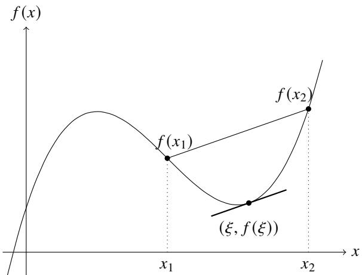  
图4.9: 中值问题示意图

# 4.3.1 Rolle中值定理

为了研究以上问题, 我们可以先从比较特殊的情况入手: 先研究 $f(x_{1}) = f(x_{2})$ 的情况. 换句话说, 我们希望找到中值 $\xi$ 使得 $f^{\prime}(\xi) = 0$ . 在此之前我们需要做一些准备工作.

# 定义4.10（极值和极值点）

设函数 $f$ 在开区间 $(a,b)$ 上有定义且 $x_0\in (a,b)$

(1) 若存在邻域 $N_{r}(x_{0}) \subseteq (a, b)$ , 使得任一 $x \in N_{r}(x_{0})$ 都有 $f(x) \leqslant f(x_{0})$ , 则称 $f$ 在 $x_{0}$ 处取得极大值 (local maximum), $x_{0}$ 称为极大值点.  
(2) 若存在邻域 $N_{r}(x_{0}) \subseteq (a, b)$ , 使得任一 $x \in N_{r}(x_{0})$ 都有 $f(x) \geqslant f(x_{0})$ , 则称 $f$ 在 $x_{0}$ 处取得极小值 (local minimum), $x_{0}$ 称为极小值点.

极大值点和极小值点统称极值点.

注 函数的极值是一个局部概念, 它仅仅在极值点的邻域内讨论; 而最大值、最小值是整体概念.

下面给出极值点的必要条件

# 引理4.1(Fermat引理)

如图4.10所示，设函数 $f$ 在区间 $I$ 上有定义.若 $f$ 在 $x_0\in I$ 处可导且 $x_0$ 是 $f$ 的一个极值点，则 $f^{\prime}(x_0) = 0$

证明不妨设 $f$ 在 $x_0$ 处取到极大值.此时存在一个 $x_0$ 的邻域 $N_{r}(x_{0})\subseteq I$ 对于任一 $x\in N_r(x_0)$ 都有 $f(x) - f(x_0)\leqslant 0.$ 当 $x\in N_r^- (x_0)$ 时 $x - x_0 <   0,$ 于是

$$
\frac {f (x) - f \left(x _ {0}\right)}{x - x _ {0}} \geqslant 0 \Longrightarrow f _ {-} ^ {\prime} \left(x _ {0}\right) = \lim  _ {x \rightarrow x _ {0} -} \frac {f (x) - f \left(x _ {0}\right)}{x - x _ {0}} \geqslant 0.
$$

当 $x \in N_r^+(x_0)$ 时 $x - x_0 > 0$ , 于是

$$
f _ {+} ^ {\prime} \left(x _ {0}\right) = \lim  _ {x \rightarrow x _ {0} +} \frac {f (x) - f \left(x _ {0}\right)}{x - x _ {0}} \leqslant 0.
$$

由于 $f(x)$ 在 $x_0$ 处可导，故

$$
0 \leqslant f _ {-} ^ {\prime} (x _ {0}) = f ^ {\prime} (x _ {0}) = f _ {+} ^ {\prime} (x _ {0}) \leqslant 0.
$$

因此 $f^{\prime}(x_0) = 0$ .同理可知 $f$ 在 $x_0$ 处取到极小值时，也有 $f^{\prime}(x_0) = 0$

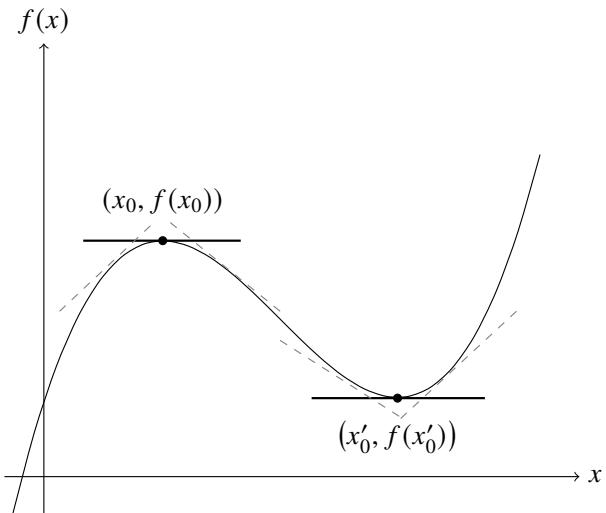  
图4.10:Fermat引理:极值点的导数为0

例4.59 指数函数 $\mathrm{e}^x$ 和对数函数 $\ln x$ 没有极值点

证明 由于 $(\mathrm{e}^x)' = \mathrm{e}^x \neq 0 (\forall x \in \mathbb{R}), (\ln x)' = 1 / x \neq 0 (\forall x \in \mathbb{R})$ ，由Fermat引理可知指数函数 $\mathrm{e}^x$ 和对数函数 $\ln x$ 没有极值点.

为了方便叙述, 定义以下概念

# 定义4.11(驻点)

设函数 $f$ 在区间 $I$ 上有定义. 若存在 $x_0 \in I$ 使得 $f'(x_0) = 0$ , 则称 $x_0$ 是 $f$ 在 $I$ 上的一个驻点 (stationary point) 或临界点 (critical point).

Fermat引理的几何意义是很明确的.如4.10所示,若 $x_0$ 是函数 $f$ 的一个极值点，且曲线 $y = f(x)$ 在 $(x_0,f(x_0))$ 处的切线存在，则该切线平行于 $x$ 轴

Fermat 引理只是可导函数在区间内取得极值的必要条件, 而非充分条件. 也就是说 $f$ 的驻点未必是极值点. 举例说明, 如图4.11所示, 函数表达式为 $f(x) = x^3$ , 易得 $f'(0) = 0$ , 但 $x = 0$ 处取不到极值.

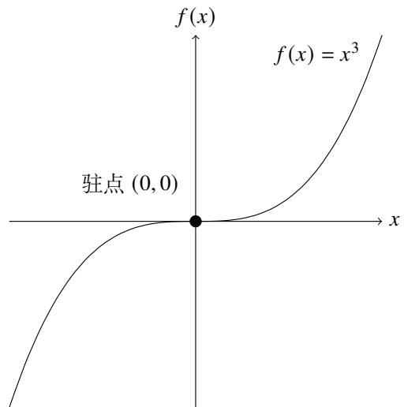  
图4.11：驻点不一定都是极值点

# 定理4.9 (Rolle中值定理)

如图4.12所示，设函数 $f$ 在闭区间 $[a,b]$ 上连续，在开区间 $(a,b)$ 上可导.若 $f(a) = f(b)$ ，则存在 $\xi \in (a,b)$ 使得 $f^{\prime}(\xi) = 0$

证明 由于 $f(x)$ 在 $[a, b]$ 上连续，由极值定理可知 $f(x)$ 在 $[a, b]$ 上有最大值 $M$ 和最小值 $m$ . 若 $M = m$ ，则 $f(x)$ 为常值函数. 这时 $f'(x) = 0$ .

若 $M > m$ . 由于 $f(a) = f(b)$ , 故 $M$ 和 $m$ 中至少有一个在 $(a, b)$ 中的点 $\xi$ 上取到. 此时 $\xi$ 就是一个极值点. 由Fermat引理可知 $f'(\xi) = 0$ .

注 法国数学家 Michel Rolle 于 1691 年提出了 Rolle 定理, Rolle 只证明多项式的情况. 由于 17 世纪时还没有导数和微分的严格定义, 因此几何上直观的 Rolle 定理无法给出严格证明. Rolle 定理的现代形式和严格证明是 Cauchy 于 1823 年给出的.

注 如果把上图看作运动学中的“路程-时间”图像, 则 Rolle 中值定理的物理意义是: 某质点从某点出发经过一段时间的运动后返回原点, 则中途一定存在一点的瞬时速度为零.

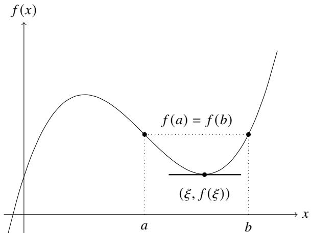  
图4.12: Rolle中值定理示意图

Rolle中值定理的条件稍加改变后，结论仍然成立

例4.60 设函数 $f(x)$ 在 $(a, b)$ 上可导，且 $f(a + ) = f(b - ) = l \in \overline{\mathbb{R}}$ . 则存在 $\xi \in (a, b)$ 使得 $f^{\prime}(\xi) = 0$ .

证明 (i) 当 $l \in \mathbb{R}$ 时. 令

$$
F (x) = {\left\{ \begin{array}{l l} {l,} & {x = a   {\text {或}} b} \\ {f (x),} & {x \in (a, b)} \end{array} \right.}.
$$

由于 $f(a + ) = f(b - ) = l,$ 故 $F(x)$ 在 $a$ 处右连续，在 $b$ 处左连续.因此 $F(x)$ 在 $[a,b]$ 上连续，在 $(a,b)$ 上可导.由Rolle中值定理可知存在 $\xi \in (a,b)$ 使得 $f^{\prime}(\xi) = 0$

(ii) 当 $l = +\infty$ 时. 则对于给定的 $M > 0$ 存在 $\delta_1, \delta_2 > 0$ 使得 $a + \delta_1 < b - \delta_2$ 且

$$
f \left[ (a, a + \delta_ {1}) \right] \subseteq [ M, + \infty), \quad f \left[ (b - \delta_ {2}, b) \right] \subseteq [ M, + \infty).
$$

由于 $f(x)$ 在 $(a,b)$ 上连续，由推论(3.2)可知 $f[(a,a + \delta_1)]$ 和 $f[(b - \delta_2,b)]$ 都是区间.令

$$
c = \max  \left\{f (a + \delta_ {1}), f (b - \delta_ {2}) \right\}.
$$

则 $[c, +\infty)$ 同时包含于 $f[(a, a + \delta_1)]$ 和 $f[(b - \delta_2, b)]$ . 因此对于 $E \in [c, +\infty)$ 一定存在 $x_1 \in (a, a + \delta_1), x_2 \in (b - \delta_2, b)$ 使得 $f(x_1) = f(x_2) = E$ . 由 Rolle 中值定理可知存在 $\xi \in (a, b)$ 使得 $f'(\xi) = 0$ .

下面看一下 Rolle 定理的应用.

例4.61对任一 $c\in \mathbb{R}$ 方程 $x^{3} - 3x + c = 0$ 在[0,1]上都没有相异的根

证明设 $f(x) = x^{3} - 3x + c.$ 假设存在 $x_{1},x_{2}\in [0,1]$ 满足 $x_{1} <   x_{2}$ 且 $f(x_{1}) = f(x_{2}) = 0.$ 由于 $f(x)$ 在 $[x_1,x_2]$ 上连续在 $(x_{1},x_{2})$ 上可导，由Rolle中值定理可知，存在 $\xi \in (x_1,x_2)\subseteq [0,1]$ 使得 $f^{\prime}(\xi) = 0.$ 于是

$$
0 = f ^ {\prime} (\xi) = 3 \xi^ {2} - 3 \Longleftrightarrow \xi = \pm 1.
$$

因此 $\xi \notin (x_{1}, x_{2}) \subseteq [0, 1]$ . 出现矛盾，因此假设不成立. 于是可知 $[0, 1]$ 上都没有相异的根.

例4.62 设 $2n$ ( $n \geqslant 1$ ) 次多项式

$$
Q (x) = x ^ {n} (1 - x) ^ {n}.
$$

则 $n$ 次多项式 $Q^{(n)}(x)$ 在开区间 $(0,1)$ 中有 $n$ 个两两不同的实根.

证明用Leibniz公式求 $Q(x)$ 的 $m(m < n)$ 阶导函数

$$
Q ^ {(m)} (x) = \left[ x ^ {n} (1 - x) ^ {n} \right] ^ {(m)} = \sum_ {i = 0} ^ {m} C _ {m} ^ {i} (x ^ {n}) ^ {(m - i)} [ (1 - x) ^ {n} ] ^ {(i)} = \sum_ {i = 0} ^ {m} C _ {m} ^ {i} \frac {n !}{(n - m + i) !} x ^ {n - m + i} \frac {n !}{(n - i) !} (- 1) ^ {i} (1 - x) ^ {n - i}.
$$

于是看出

$$
Q ^ {(m)} (0) = Q ^ {(m)} (1) = 0, \quad m = 0, 1, \dots , n - 1.
$$

由 $Q(0) = Q(1) = 0$ 和 Rolle 定理可知, 存在 $\xi \in (0,1)$ 使得 $Q'(\xi) = 0$ . 由于 $Q'(0) = Q'(1) = 0$ , 因此闭区间 $[0,\xi]$ 和 $[\xi,1]$ 继续满足 Rolle 定理的条件. 因此存在 $\eta_1 \in (0,\xi), \eta_2 \in (\xi,1)$ 使得 $Q''(\eta_1) = Q''(\eta_2) = 0$ . 依次下去, 可知存在 $0 < \lambda_1 < \lambda_2 < \dots < \lambda_{n-1} < 1$ 满足

$$
Q ^ {(n - 1)} (\lambda_ {1}) = Q ^ {(n - 1)} (\lambda_ {2}) = \dots = Q ^ {(n - 1)} (\lambda_ {n - 1}) = 0.
$$

由于 $Q^{(n - 1)}(0) = Q^{(n - 1)}(1) = 0.$ 由Rolle定理可知存在 $0 < \mu_{1} < \mu_{2} < \dots < \mu_{n} < 1$ 满足

$$
Q ^ {(n)} (\mu_ {1}) = Q ^ {(n)} (\mu_ {2}) = \dots = Q ^ {(n)} (\mu_ {n}) = 0.
$$

由这就证明了命题.

# 4.3.2 Lagrange中值定理

在 Rolle 中值定理的基础上可以来研究一般的情况.

# 定理4.10 (Lagrange中值定理)

设函数 $f(x)$ 在闭区间 $[a,b]$ 上连续，在开区间 $(a,b)$ 上可导.则存在 $\xi \in (a,b)$ 使得

$$
f ^ {\prime} (\xi) = \frac {f (b) - f (a)}{b - a}.
$$

证明为了能使用Rolle中值定理，我们希望构造一个函数 $g(x)$ 使得 $g(a) = g(b) = 0$ 如图4.13所示，设过点 $(a,f(a))$ 和 $(b,f(b))$ 的直线为 $l(x)$ .由于它与 $f(x)$ 的交点横坐标就是 $a$ 和 $b$ ，因此只需令

$$
g (x) = l (x) - f (x) = \frac {f (b) - f (a)}{b - a} (x - a) + f (a) - f (x).
$$

则 $g(a) = g(b) = 0.$ 由于 $g(x)$ 在闭区间 $[a,b]$ 上连续，在开区间 $(a,b)$ 上可导，由Rolle中值定理可知存在 $\xi \in (a,b)$ 使得

$$
0 = g ^ {\prime} (\xi) = \frac {f (b) - f (a)}{b - a} - f ^ {\prime} (\xi) \Longrightarrow f ^ {\prime} (\xi) = \frac {f (b) - f (a)}{b - a}.
$$

注类似Rolle中值定理,Lagrange中值定理也有明确的物理意义.如果把上图看作运动学中的“路程-时间”图像,则Lagrange中值定理的物理意义是:某质点从某点出发经过一段时间的运动后到达另一点,则中途一定存在一点的瞬时速度等于全程的平均速度.

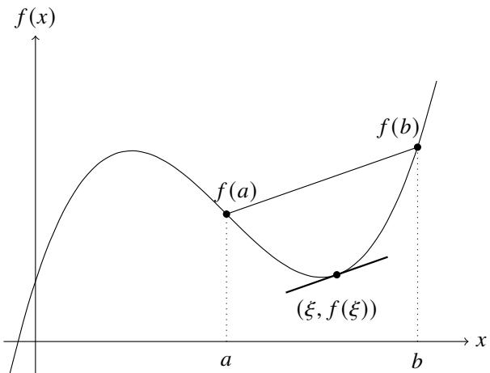  
图4.13:Lagrange中值定理示意图

有了Lagrange中值定理, 就可以回答本节开头提出的问题. 设闭区间 $[x,x + \Delta x]$ , 则存在 $\xi \in (x,x + \Delta x)$ 使得

$$
f ^ {\prime} (\xi) = \frac {f (x + \Delta x) - f (x)}{\Delta x} \Longleftrightarrow f (x + \Delta x) - f (x) = f ^ {\prime} (\xi) \Delta x.
$$

令 $\theta = \frac{\xi - x}{\Delta x}$ , 此时 $\theta \in (0,1)$ . 于是就有等式

$$
\Delta f (x) = f ^ {\prime} (x + \theta \Delta x) \Delta x.
$$

以上两个等式都称为有限增量公式 (finite increment formula). 我们可以把它和无穷小增量公式对比

$$
\Delta f (x) = f ^ {\prime} (x) \Delta x + o (\Delta x), \quad \Delta x \rightarrow 0.
$$

Lagrange中值定理和有限增量公式是等价的，因此Lagrange中值定理也被称为有限增量定理.

由Lagrange中值定理的形式容易联想到例3.21中介绍的Lipschitz连续.用Lagrange中值定理用来证明Lipschitz连续十分方便.

例4.63反三角函数 $f(x) = \arctan x$ 在 $\mathbb{R}$ 上Lipschitz连续，从而一致连续

证明任取 $x_{1},x_{2}\in \mathbb{R}$ 显然 $f$ 在 $[x_1,x_2]$ 上连续，在 $(x_{1},x_{2})$ 上可导，由Lagrange中值定理可知，存在 $\xi \in (x_1,x_2)$ 使得

$$
f (x _ {2}) - f (x _ {1}) = f ^ {\prime} (\xi) \left(x _ {2} - x _ {1}\right) \Longrightarrow | \arctan x _ {1} - \arctan x _ {2} | = \frac {1}{1 + \xi^ {2}} | x _ {2} - x _ {1} |.
$$

由于

$$
0 <   \frac {1}{1 + \xi^ {2}} \leqslant 1.
$$

故存在 $K = 1$ 使得对于任意 $x_{1}, x_{2} \in \mathbb{R}$ 都有

$$
| \arctan x _ {1} - \arctan x _ {2} | \leqslant K | x _ {2} - x _ {1} |.
$$

于是可知 $f(x)$ 在 $\mathbb{R}$ 上Lipschitz连续，从而一致连续

注上例告诉我们一个重要事实: 若函数 $f$ 在区间 $I$ 上的导函数有界, 则 $f$ 在 $I$ 上Lipschitz 连续, 从而一致连续. 这为证明一致连续提供了一种便利的方法.

但这个方法只是充分条件, 不是必要条件. 也就是说导函数 $f'$ 在 $I$ 上无界时不能断言函数 $f$ 不一致连续. 例如函数 $f(x) = \sqrt{x}$ , 它的导函数为

$$
f ^ {\prime} (x) = \frac {1}{2 \sqrt {x}}.
$$

因此 $f^{\prime}$ 在 $(0,1)$ 上无界，但 $f$ 在 $(0,1)$ 上是一致连续的

用Lagrange中值定理还可以证明很多不等式

例4.64 若 $0 < \alpha < \beta < \pi / 2$ , 则

$$
\frac {\beta - \alpha}{\cos^ {2} \alpha} <   \tan \beta - \tan \alpha <   \frac {\beta - \alpha}{\cos^ {2} \beta}.
$$

证明设函数 $f(x) = \tan x$ 由于 $f(x)$ 在区间 $[\alpha, \beta]$ 上连续，在 $(\alpha, \beta)$ 上可导，由Lagrange中值定理可知，存在 $\xi \in (\alpha, \beta)$ 使得

$$
\tan \beta - \tan \alpha = f ^ {\prime} (\xi) (\beta - \alpha) = \frac {\beta - \alpha}{\cos^ {2} \xi}.
$$

由于 $\cos x$ 在 $(0, \pi / 2)$ 严格递减，因此

$$
1 > \cos \alpha > \cos \xi > \cos \beta > 0 \Longrightarrow 1 > \cos^ {2} \alpha > \cos^ {2} \xi > \cos^ {2} \beta > 0
$$

于是可知

$$
\frac {\beta - \alpha}{\cos^ {2} \alpha} <   \tan \beta - \tan \alpha <   \frac {\beta - \alpha}{\cos^ {2} \beta}.
$$

# 推论4.1

设函数 $f$ 在闭区间 $[a,b]$ 上连续，在开区间 $(a,b)$ 上可导.则 $f$ 在 $[a,b]$ 上为常值函数当且仅当在 $(a,b)$ 上 $f^{\prime}(x) = 0.$

证明必要性显然成立.证明充分性.任取 $x_{1},x_{2}\in [a,b]$ 且 $x_{1} <   x_{2}$ .由Lagrange中值定理可知存在 $\xi \in (a,b)$ 使得

$$
f ^ {\prime} (\xi) = \frac {f (x _ {2}) - f (x _ {1})}{x _ {2} - x _ {1}}.
$$

由于在 $(a,b)$ 上 $f^{\prime}(x) = 0$ ，故 $f^{\prime}(\xi) = 0$ ，于是 $f(x_{2}) = f(x_{1})$ .这表明 $f$ 在 $[a,b]$ 上为常值函数.

注上一节定义不定积分时用到了这个以上结论

# 4.3.3 导函数的性质

微分中值定理的一个重要应用是研究导函数的性质

并不是所有函数都可以成为导函数. 换句话说, 不是所有函数都有原函数. 利用微分中值定理可以得到两个原函数存在的必要条件.

我们知道一个函数在区间 $I$ 上的原函数 (如果存在的话)一定在 $I$ 上连续.但一个函数的在 $I$ 上的导函数(如果存在的话)未必在 $I$ 上连续.举例说明.

例4.65 设 $\mathbb{R}$ 上的函数

$$
f (x) = \left\{ \begin{array}{l l} x ^ {2} \sin \frac {1}{x}, & x \neq 0 \\ 0, & x = 0 \end{array} \right..
$$

$f$ 在 $\mathbb{R}$ 上的每一点都可导，但导函数 $f^{\prime}$ 在 $\mathbb{R}$ 上不连续

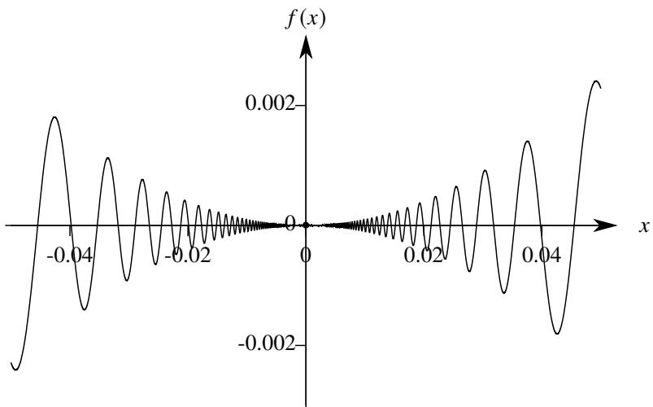  
图4.14: $x^{2}\sin \frac{1}{x}$ 函数示意图

证明 (i) 先求出 $f'(x)$ . 当 $x \neq 0$ 时,

$$
f ^ {\prime} (x) = \left(x ^ {2} \sin \frac {1}{x}\right) ^ {\prime} = \left(x ^ {2}\right) ^ {\prime} \sin \frac {1}{x} + x ^ {2} \left(\sin \frac {1}{x}\right) ^ {\prime} = 2 x \sin x - \cos \frac {1}{x}.
$$

当 $x = 0$ 时，由例3.2可知

$$
f ^ {\prime} (x) = \lim  _ {x \rightarrow 0} \frac {f (x) - f (0)}{x - 0} = \lim  _ {x \rightarrow 0} x \sin \frac {1}{x} = 0.
$$

综上可知 $f(x)$ 在 $\mathbb{R}$ 的导函数为

$$
f ^ {\prime} (x) = \left\{ \begin{array}{l l} 2 x \sin \frac {1}{x} - \cos \frac {1}{x}, & x \neq 0 \\ 0, & x = 0 \end{array} \right.
$$

(ii) 证明 $f'(x)$ 在 0 处不连续. 只需证明 $f(x)$ 在 0 处的极限不存在. 设数列

$$
x _ {n} = \frac {1}{2 n \pi + \pi / 2}, \quad y _ {n} = \frac {1}{2 n \pi}.
$$

显然 $\lim_{n\to \infty}x_n = \lim_{n\to \infty}y_n = 0$ 且 $x_{n}\neq 0,y_{n}\neq 0(n = 1,2,\dots)$ .然而

$$
f \left(x _ {n}\right) = \frac {2}{2 n \pi + \pi / 2} \sin \left(2 n \pi + \frac {\pi}{2}\right) - \cos \left(2 n \pi + \frac {\pi}{2}\right) = \frac {2}{2 n \pi + \pi / 2} \rightarrow 0,
$$

$$
f \left(y _ {n}\right) = \frac {2}{2 n \pi} \sin (2 n \pi) - \cos (2 n \pi) = - 1.
$$

由Heine定理可知 $f(x)$ 在0处的极限不存在.因此 $f^{\prime}(x)$ 在 $\mathbb{R}$ 上不连续

以上例子说明导函数可以存在间断点. 容易验证, 以上例子中的导函数 $f^{\prime}(x)$ 在 0 处的左极限和右极限都不存在. 因此 0 是它的第二类间断点. 那么导函数是否存在第一类间断点?

# 定理4.11

设函数 $f$ 在闭区间 $[a,b]$ 上可导，则导函数 $f^{\prime}(x)$ 不可能有第一类间断点.

证明用反证法.假设 $f^{\prime}(x)$ 存在第一类间断点 $x_0$ 则 $f^{\prime}(x_0 + )$ 和 $f^{\prime}(x_0 - )$ 都存在.由Lagrange中值定理可知存在

$\xi_{x}\in (x_{0},x)$ 使得

$$
f ^ {\prime} (x _ {0}) = f _ {+} ^ {\prime} (x _ {0}) = \lim  _ {x \to x _ {0} ^ {+}} \frac {f (x) - f (x _ {0})}{x - x _ {0}} = \lim  _ {x \to x _ {0} ^ {+}} f ^ {\prime} (\xi_ {x}).
$$

容易知道, 当 $x \to x_0+$ 时 $\xi_x \to x_0+$ . 由于 $f'(x_0+)$ 存在, 因此

$$
f ^ {\prime} (x _ {0}) = \lim  _ {x \to x _ {0} ^ {+}} f ^ {\prime} (\xi_ {x}) = f ^ {\prime} (x _ {0} +).
$$

同理可知 $f^{\prime}(x_0) = f^{\prime}(x_0 - )$ . 因此 $f^{\prime}(x)$ 在 $x_0$ 处连续, 出现矛盾, 故假设不成立. 于是可知导函数 $f^{\prime}(x)$ 不可能有第一类间断点.

以上定理实际上给出了原函数存在的一个必要条件: 若函数在区间 $I$ 上不连续, 则它在 $I$ 上存在原函数的必要条件是所有间断点都是第二类间断点. 后面我们将证明连续函数一定有原函数.

数学分析中通常研究性质很好的函数, 我们不仅要求它可导, 还要求它的导函数连续, 这样的函数称为“连续可导”.

导函数未必连续, 但导函数一定有介值性. 为了证明这个结论, 我们可以模仿介值定理的证明方法, 先证明一个引理.

# 引理4.2

设函数 $f$ 在闭区间 $[a,b]$ 上可导.若 $f^{\prime}(a)f^{\prime}(b) < 0,$ 则存在 $\xi \in (a,b)$ 使得 $f^{\prime}(\xi) = 0.$

证明 不妨设 $f'(a) > 0, f'(b) < 0$ . 由于

$$
f ^ {\prime} (a) = \lim  _ {x \rightarrow a +} \frac {f (x) - f (a)}{x - a} > 0.
$$

故存在 $\delta > 0$ 使得当 $x \in (a, a + \delta)$ 时

$$
\frac {f (x) - f (a)}{x - a} > 0.
$$

由于 $x > a$ ，故 $f(x) > f(a)$ .同理可知 $f(x) > f(b)$

由于 $f(x)$ 在 $[a,b]$ 上可导，故它在 $[a,b]$ 上连续.由极值定理可知 $f(x)$ 在 $[a,b]$ 上可以取到最大值和最小值.由于 $f(x) > f(a),f(x) > f(b)$ ，因此 $f(x)$ 在 $[a,b]$ 上的最大值不可能在 $a$ 和 $b$ 上取到，即存在 $\xi \in (a,b)$ 使得 $f(\xi) = \max f([a,b]).$ 由Fermat引理可知 $f^{\prime}(\xi) = 0$

# 定理4.12(Darboux定理)

设函数 $f(x)$ 在闭区间 $[a,b]$ 上可导，则对于 $f^{\prime}(a)$ 和 $f^{\prime}(b)$ 之间任一实数 $\gamma$ 都存在 $\xi \in (a,b)$ 使得 $f^{\prime}(\xi) = \gamma$

证明 不妨设 $f'(a) < \gamma < f'(b)$ . 令 $g(x) = f(x) - \gamma x$ , 则

$$
g ^ {\prime} (x) = f ^ {\prime} (x) - \gamma .
$$

于是

$$
g ^ {\prime} (a) = f ^ {\prime} (a) - \gamma <   0 <   f ^ {\prime} (b) - \gamma = g ^ {\prime} (b).
$$

由引理4.2可知存在 $\xi \in (a,b)$ 使得 $g^{\prime}(\xi) = 0$ ，即 $f^{\prime}(\xi) = \gamma$

这样我们就得到原函数存在的第二个必要条件. 利用这个必要条件我们可以断言某些函数没有原函数. 我们来看两个例子.

例4.66 Dirichlet函数 $D(x)$ (定义见例3.10)在 $\mathbb{R}$ 上没有原函数

证明 由于 $D(\mathbb{R}) = \{0,1\}$ , 因此 $D(x)$ 不满足介值性. 由 Darboux 定理可知 $D(x)$ 在 $\mathbb{R}$ 上没有原函数.

例4.67 Thomae函数 $T(x)$ (定义见例3.8)在 $\mathbb{R}$ 上函数没有原函数

证明 由于

$$
T (\mathbb {R}) = \{0 \} \cup \{1 / q: q \in \mathbb {N} ^ {*} \}.
$$

因此 $T(x)$ 不满足介值性. 由 Darboux 定理可知 $T(x)$ 在 $\mathbb{R}$ 上没有原函数

# 4.3.4 Cauchy 中值定理

下面考虑进一步推广Lagrange中值定理.设曲线的参数方程：

$$
\left\{ \begin{array}{l} x = g (t) \\ y = f (t) \end{array} , a \leqslant t \leqslant b. \right.
$$

现假设 $f$ 和 $g$ 在 $[a,b]$ 上连续，在 $(a,b)$ 上可导.考虑和Lagrange中值定理的类似问题：如图4.15,在曲线上是否存在一点使得过这点的切线平行于过端点 $(f(a),g(a))$ 和 $(f(b),g(b))$ 的直线？这个问题可以表述为：是否存在 $\xi \in (a,b)$ 使得

$$
\frac {f ^ {\prime} (\xi)}{g ^ {\prime} (\xi)} = \frac {f (b) - f (a)}{g (b) - g (a)}.
$$

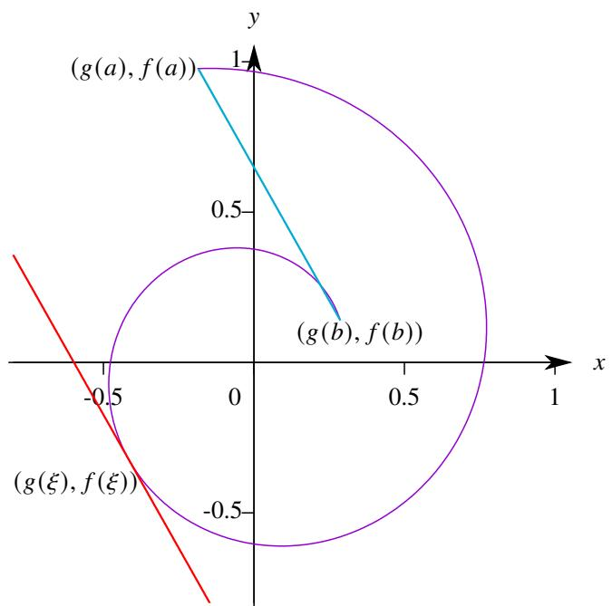  
图4.15: Cauchy中值定理示意图

为了让这个问题有意义，还需要规定 $g^{\prime}\neq 0$ .下面尝试用证明Lagrange中值定理的方法证明这个结论.

# 定理4.13 (Cauchy 中值定理)

设函数 $f, g$ 在闭区间 $[a, b]$ 上连续，在开区间 $(a, b)$ 上可导. 若对于任一 $x \in (a, b)$ 都有 $g'(x) \neq 0$ ，则存在 $\xi \in (a, b)$ 使得

$$
\frac {f ^ {\prime} (\xi)}{g ^ {\prime} (\xi)} = \frac {f (b) - f (a)}{g (b) - g (a)}.
$$

证明 由Lagrange中值定理可知，存在 $\xi \in (a,b)$ 使得

$$
g (b) - g (a) = g ^ {\prime} (\xi) (b - a).
$$

由于对于任一 $x\in (a,b)$ 都有 $g^{\prime}(x)\neq 0.$ 故 $g(b) - g(a)\neq 0.$ 令

$$
h (x) = \frac {f (b) - f (a)}{g (b) - g (a)} [ g (x) - g (a) ] + f (a) - f (x).
$$

则 $h(x)$ 在闭区间 $[a,b]$ 上连续，在开区间 $(a,b)$ 上可导.且 $h(a) = h(b) = 0.$ 由Rolle中值定理可知存在 $\xi \in (a,b)$ 使得

$$
0 = h ^ {\prime} (\xi) = \frac {f (b) - f (a)}{g (b) - g (a)} \cdot g ^ {\prime} (\xi) - f ^ {\prime} (\xi) \Longrightarrow \frac {f ^ {\prime} (\xi)}{g ^ {\prime} (\xi)} = \frac {f (b) - f (a)}{g (b) - g (a)}.
$$

注以上定理的证明方法和Lagrange定理完全相同.事实上，令 $g(x) = x$ 则Cauchy中值定理就是Lagrange中值定理.因此Lagrange中值定理是Cauchy中值定理的特例.

以上介绍的 Rolle 中值定理, Lagrange 中值定理和 Cauchy 中值定理统称为微分学的中值定理 (mean value theorem, MVT). 前一个都是后一个的特例. 它们成立的条件都是要求函数在闭区间 $[a, b]$ 上连续, 在开区间 $(a, b)$ 上可导.

# 4.3.5 函数未定式的定值法

在研究数列极限时，我们已经遇到过求未定式极限的问题.利用Stolz定理可以容易地求出绝大多数未定式的极限.我们来回顾一下Stolz定理的方法.

设数列 $\{a_{n}\}$ 和 $\{b_n\}$ 都是无穷大.为了确定它们商的极限，我们只需求它们的一阶差商之比的极限(如果存在的话).在介绍函数导数的概念时，我们已经知道导数实际上是函数差商的极限(当自变量的增量趋于零时).类比数列的情况容易想到，若函数 $f(x),g(x)$ 都是无穷大(或无穷小)，为了求它们商的极限，可以考虑求它们导数之比的极限！

用Cauchy中值定理可以轻而易举地证明这个结论.我们先来看函数 $f,g$ 都是无穷小的情况.为此，可以先证明单侧极限的情况.其余情况可作类似讨论

# 定理4.14 (0/0型l'Hôpital法则I)

设函数 $f, g$ 在开区间 $(x_0, b)$ 可导，且 $g(x) \neq 0 (\forall x \in (x_0, b))$ . 若

$$
\lim  _ {x \rightarrow x _ {0} +} f (x) = \lim  _ {x \rightarrow x _ {0} +} g (x) = 0.
$$

且极限 $\lim_{x\to x_0 + }\frac{f'(x)}{g'(x)}$ 存在, 则极限 $\lim_{x\to x_0 + }\frac{f(x)}{g(x)}$ 也存在, 且

$$
\lim  _ {x \rightarrow x _ {0} +} \frac {f (x)}{g (x)} = \lim  _ {x \rightarrow x _ {0} +} \frac {f ^ {\prime} (x)}{g ^ {\prime} (x)}.
$$

证明 令 $f(x_0) = g(x_0) = 0$ . 于是 $f(x)$ 和 $g(x)$ 在 $[x_0, b)$ 上连续. 对于任一给定的 $x \in (x_0, b)$ , 由 Cauchy 中值定理可知, 存在 $\xi \in (x_0, x)$ 使得

$$
\frac {f ^ {\prime} (\xi)}{g ^ {\prime} (\xi)} = \frac {f (x) - f (x _ {0})}{g (x) - g (x _ {0})} = \frac {f (x)}{g (x)}.
$$

当 $x \to x_0+$ 时, $\xi \to x_0+$ . 于是可知

$$
\lim  _ {x \to x _ {0} +} \frac {f (x)}{g (x)} = \lim  _ {\xi \to x _ {0} +} \frac {f ^ {\prime} (\xi)}{g ^ {\prime} (\xi)} = \lim  _ {x \to x _ {0} +} \frac {f ^ {\prime} (x)}{g ^ {\prime} (x)}.
$$

注 l'Hôpital 法则并不是 l'Hôpital 给出的, 而是瑞士数学家 Johann Bernoulli 发现的, 但这个结论于 1696 年发表在 l'Hôpital 的著作中.

同理可证左极限的情况

# 定理4.15 (0/0型l'Hopital法则II)

设函数 $f, g$ 在开区间 $(a, x_0)$ 可导，且 $g(x) \neq 0 (\forall x \in (a, x_0))$ . 若

$$
\lim  _ {x \to x _ {0} -} f (x) = \lim  _ {x \to x _ {0} -} g (x) = 0.
$$

且极限 $\lim_{x\to x_0 - }\frac{f'(x)}{g'(x)}$ 存在, 则极限 $\lim_{x\to x_0 - }\frac{f(x)}{g(x)}$ 也存在, 且

$$
\lim  _ {x \rightarrow x _ {0} -} \frac {f (x)}{g (x)} = \lim  _ {x \rightarrow x _ {0} -} \frac {f ^ {\prime} (x)}{g ^ {\prime} (x)}.
$$

在以上两个定理基础上可以证明 $x \to x_0 \in (a, b)$ 的情况

# 定理4.16 (0/0型 l'Hôpital 法则 III)

设函数 $f, g$ 在开区间 $(a, b)$ 可导，且 $g(x) \neq 0 (\forall x \in (a, b) \setminus \{x_0\})$ 。若

$$
\lim  _ {x \to x _ {0}} f (x) = \lim  _ {x \to x _ {0}} g (x) = 0.
$$

且极限 $\lim_{x\to x_0}\frac{f'(x)}{g'(x)}$ 存在, 则极限 $\lim_{x\to x_0}\frac{f(x)}{g(x)}$ 也存在, 且

$$
\lim  _ {x \rightarrow x _ {0}} \frac {f (x)}{g (x)} = \lim  _ {x \rightarrow x _ {0}} \frac {f ^ {\prime} (x)}{g ^ {\prime} (x)}.
$$

我们看到 l'Hôpital 法则求 $0 / 0$ 型未定式的极限是十分有效的.

例4.68计算

$$
\lim  _ {x \rightarrow 0} \frac {\ln \cos x}{x (x + 2)}.
$$

解这是一个0/0型未定式，由l'Hôpital法则计算可知

$$
\lim  _ {x \to 0} {\frac {\ln \cos x}{x (x + 2)}}   {\stackrel {{\mathrm {l ^ {\prime} H o p i t a l}   \text {法 则}}} {=}}   \lim  _ {x \to 0} {\frac {- {\frac {\sin x}{\cos x}}}{2 x + 2}} = \lim  _ {x \to 0} {\frac {- \tan x}{2 x + 2}} = 0.
$$

虽然机械地使用 l'Hôpital 就可以计算出 0/0 型极限. 但我们还是应该在计算过程中应是当地使用一些技巧 (比如等价无穷小替换) 使计算简化. 和 Stolz 定理一样, 我们也可以连续多次使用 l'Hôpital 法则. 下面在看一个例子.

例4.69 计算

$$
\lim  _ {x \rightarrow 0} \frac {x - \sin x}{\sin^ {3} x}.
$$

解这是一个0/0型未定式，由l'Hôpital's法则计算可知

$$
\lim  _ {x \rightarrow 0} {\frac {x - \sin x}{\sin^ {3} x}} = \lim  _ {x \rightarrow 0} {\frac {x - \sin x}{x ^ {3}}}   \underline {{{{\underline {{{{1 ^ {\prime} H ^ {\mathrm {o p i t a l}} \text {法 则}}}}}}}}}   \lim  _ {x \rightarrow 0} {\frac {1 - \cos x}{3 x ^ {2}}}   \underline {{{{\underline {{{{1 ^ {\prime} H ^ {\mathrm {o p i t a l}} \text {法 则}}}}}}}}}   \lim  _ {x \rightarrow 0} {\frac {\sin x}{6 x}} = \lim  _ {x \rightarrow 0} {\frac {x}{6 x}} = {\frac {1}{6}}.
$$

下面证明 $x \to +\infty$ 的情况

# 定理4.17 (0/0型I'Hôpital法则IV)

设函数 $f, g$ 在开区间 $(a, +\infty)$ 可导，且 $g(x) \neq 0 (\forall x \in (a, +\infty))$ 。若

$$
\lim  _ {x \rightarrow + \infty} f (x) = \lim  _ {x \rightarrow + \infty} g (x) = 0.
$$

且极限 $\lim_{x\to +\infty}\frac{f'(x)}{g'(x)}$ 存在, 则 $\lim_{x\to +\infty}\frac{f(x)}{g(x)}$ 也存在, 且

$$
\lim  _ {x \rightarrow + \infty} \frac {f (x)}{g (x)} = \lim  _ {x \rightarrow + \infty} \frac {f ^ {\prime} (x)}{g ^ {\prime} (x)}.
$$

证明 令 $t = 1 / x$ . 则当 $x \to +\infty$ 时 $t \to 0+$ . 由于

$$
\lim  _ {t \rightarrow 0 +} f \left(\frac {1}{t}\right) = \lim  _ {t \rightarrow 0 +} g \left(\frac {1}{t}\right) = 0.
$$

由I'Hopital法则可知

$$
\lim  _ {x \rightarrow + \infty} \frac {f (x)}{g (x)} = \lim  _ {t \rightarrow 0 +} \frac {f \left(\frac {1}{t}\right)}{g \left(\frac {1}{t}\right)} = \lim  _ {t \rightarrow 0 +} \frac {f ^ {\prime} \left(\frac {1}{t}\right)\left(- \frac {1}{t ^ {2}}\right)}{g ^ {\prime} \left(\frac {1}{t}\right)\left(- \frac {1}{t ^ {2}}\right)} = \lim  _ {t \rightarrow 0 +} \frac {f ^ {\prime} \left(\frac {1}{t}\right)}{g ^ {\prime} \left(\frac {1}{t}\right)} = \lim  _ {x \rightarrow + \infty} \frac {f ^ {\prime} (x)}{g ^ {\prime} (x)}.
$$

注 类似可知 $x \to -\infty$ 和 $x \to \infty$ 的情况, 在此不再赘述.

下面证明 $\infty / \infty$ 型的 l'Hôpital 法则

# 定理4.18 $(\infty / \infty$ 型l'Hopital法则)

设函数 $f, g$ 在开区间 $(x_0, b)$ 可导，且 $g(x) \neq 0 (\forall x \in (x_0, b))$ . 若

$$
\lim  _ {x \to x _ {0} +} g (x) = \infty .
$$

且极限 $\lim_{x\to x_0 + }\frac{f'(x)}{g'(x)}$ 存在, 则 $\lim_{x\to x_0 + }\frac{f(x)}{g(x)}$ 也存在, 且

$$
\lim  _ {x \rightarrow x _ {0} +} \frac {f (x)}{g (x)} = \lim  _ {x \rightarrow x _ {0} +} \frac {f ^ {\prime} (x)}{g ^ {\prime} (x)}.
$$

证明 令

$$
l = \lim  _ {x \rightarrow x _ {0} +} \frac {f ^ {\prime} (x)}{g ^ {\prime} (x)}.
$$

只证明 $l \in \mathbb{R}$ 的情况. 根据上式可知, 对于任一 $\varepsilon > 0$ , 存在 $\delta > 0$ , 当 $x \in (x_0, x_0 + \delta)$ 时

$$
l - \varepsilon <   \frac {f ^ {\prime} (x)}{g ^ {\prime} (x)} <   l + \varepsilon .
$$

对于 $(x,c)\subseteq (x_0,x_0 + \delta)$ ，由Cauchy中值定理可知，存在 $\xi \in (x,c)$ 使得

$$
\frac {f (x) - f (c)}{g (x) - g (c)} = \frac {f ^ {\prime} (\xi)}{g ^ {\prime} (\xi)}.
$$

因此

$$
l - \varepsilon <   \frac {f (x) - f (c)}{g (x) - g (c)} <   l + \varepsilon \Longleftrightarrow l - \varepsilon <   \frac {\frac {f (x)}{g (x)} - \frac {f (c)}{g (x)}}{1 - \frac {g (c)}{g (x)}} <   l + \varepsilon . \tag {4.12}
$$

固定 $c$ ，由于 $\lim_{x\to x_0 + }g(x) = \infty$ ，因此令上式右半不等式的 $x\rightarrow x_0+$ 取上极限可得

$$
\lim  _ {x \rightarrow x _ {0} +} \sup  _ {\varepsilon} \frac {f (x)}{g (x)} \leqslant l + \varepsilon .
$$

令 $\varepsilon \to 0$ 得

$$
\lim  _ {x \to x _ {0} +} \sup  _ {g (x)} \frac {f (x)}{g (x)} \leqslant l.
$$

固定 $c$ ，对不等式4.12的左半边取下极限后再令 $\varepsilon \to 0$ 可得

$$
\lim  _ {x \to x _ {0} +} \inf  _ {g (x)} \frac {f (x)}{g (x)} \geqslant l.
$$

于是可知

$$
\lim  _ {x \to x _ {0} +} \frac {f (x)}{g (x)} = l.
$$

注 以上证明方法和例2.59完全一样.

注 类似可知其他极限过程的情况, 在此不再赘述.

以上定理只要求分母是无穷大. 因此它的适用范围比 $0 / 0$ 型的1'Hôpital法则更广.

例4.70 设函数 $f$ 在 $(a, +\infty)$ 上可导，且 $\lim_{x \to +\infty} f'(x) = 0$ 。则

$$
\lim  _ {x \to + \infty} \frac {f (x)}{x} = 0.
$$

证明 由于 $\lim_{x\to +\infty}f'(x) = 0$ ，由1'Hôpital法则可知

$$
\lim  _ {x \rightarrow + \infty} \frac {f (x)}{x} = \lim  _ {x \rightarrow + \infty} f ^ {\prime} (x) = 0.
$$

例2.59的结论不难推广到函数. 证明方法也完全类似

# 定理4.19

设函数 $f, g$ 在开区间 $(a,b)$ 可导，且 $g(x)\neq 0(\forall x\in (a,b)\backslash \{x_0\})$ .则对于任一 $x_0\in (a,b)$ 都有

$$
\lim  _ {x \rightarrow x _ {0}} \inf  _ {g ^ {\prime} (x)} \frac {f ^ {\prime} (x)}{g ^ {\prime} (x)} \leqslant \lim  _ {x \rightarrow x _ {0}} \inf  _ {g (x)} \frac {f (x)}{g (x)} \leqslant \lim  _ {x \rightarrow x _ {0}} \sup  _ {g (x)} \frac {f (x)}{g (x)} \leqslant \lim  _ {x \rightarrow x _ {0}} \sup  _ {g ^ {\prime} (x)} \frac {f ^ {\prime} (x)}{g ^ {\prime} (x)}.
$$

注 其他极限过程也有以上结论.

从以上定理可以看出, 当 $x \to x_0$ 时, 若 $\frac{f'(x)}{g'(x)}$ 极限存在, 则 $\frac{f(x)}{g(x)}$ 的极限也存在. 反之若 $\frac{f'(x)}{g'(x)}$ 极限不存在, 则无法断言 $\frac{f(x)}{g(x)}$ 的极限不存在. 看一个例子.

例4.71 设函数 $f(x) = x + \sin x, g(x) = x$ . 由于

$$
\frac {f ^ {\prime} (x)}{g ^ {\prime} (x)} = 1 + \cos x.
$$

因此当 $x\to \infty$ 时 $\frac{f'(x)}{g'(x)}$ 的极限不存在.但

$$
\lim  _ {x \rightarrow \infty} \frac {f (x)}{g (x)} = \lim  _ {x \rightarrow \infty} \frac {x + \sin x}{x} = \lim  _ {x \rightarrow \infty} \left(1 + \frac {\sin x}{x}\right) = 1.
$$

除了 $0 / 0$ 和 $\infty /\infty$ 两种未定式以外, 还有 $0\cdot \infty ,\infty -\infty ,0^{0},\infty^{0},1^{\infty}$ 几种未定式. 经过适当变换都可以转化为 $0 / 0$ 和 $\infty /\infty$ 两种未定式.

先看一个 $0\cdot \infty$ 型未定式的例子

例4.72 计算：

$$
\lim  _ {x \to 0 +} x ^ {\mu} \ln x, \quad \mu > 0.
$$

解这是一个 $0\cdot \infty$ 型未定式.我们先把它化为 $\infty /\infty$ 型未定式，再用l'Hopital法则计算可知

$$
\text {原 式} = \lim  _ {x \rightarrow 0 +} \frac {\ln x}{x ^ {- \mu}} \stackrel {\mathrm {l ^ {\prime} H o p i t a l 法 则}} {=} - \frac {1}{\mu} \lim  _ {x \rightarrow 0 +} \frac {x ^ {- 1}}{x ^ {- \mu - 1}} = - \frac {1}{\mu} \lim  _ {x \rightarrow 0 +} x ^ {\mu} = 0.
$$

下面是 $\infty -\infty$ 型未定式的例子

例4.73计算：

$$
\lim  _ {x \to \pi / 2} (\sec x - \tan x).
$$

解这是一个 $\infty -\infty$ 型未定式.我们先把它化为 $0 / 0$ 型未定式,再用1'Hopital法则计算可知

$$
\text {原 式} = \lim  _ {x \rightarrow \pi / 2} \left(\frac {1}{\cos x} - \frac {\sin x}{\cos x}\right) = \lim  _ {x \rightarrow \pi / 2} \frac {1 - \sin x}{\cos x} \stackrel {\mathrm {l ^ {\prime} H o p i t a l 法 则}} {=} \lim  _ {x \rightarrow \pi / 2} \frac {- \cos x}{- \sin x} = 0.
$$

下面是 $0^{0}$ 型未定式的例子

例4.74计算：

$$
\lim_{x\to 0 + }(\sin x)^{x}
$$

解这是一个 $0^0$ 型未定式.先求 $\lim_{x\to 0}x\ln \sin x.$ 这是一个 $0\cdot \infty$ 型未定式.我们先把它化为 $\infty /\infty$ 未定式，再用l'Hopital法则计算可知

$$
\lim  _ {x \rightarrow 0 +} x \ln \sin x = \lim  _ {x \rightarrow 0 +} \frac {\ln \sin x}{x ^ {- 1}} \stackrel {\text {l'Hôpital 法 则}} {=} \lim  _ {x \rightarrow 0 +} \frac {\cos x / \sin x}{- x ^ {- 2}} \lim  _ {x \rightarrow 0 +} \frac {\cos x / x}{- x ^ {- 2}} = - \lim  _ {x \rightarrow 0 +} x \cos x = 0.
$$

于是可知

$$
\text {原 式} = \lim  _ {x \rightarrow 0 +} \mathrm {e} ^ {x \ln \sin x} = \mathrm {e} ^ {0} = 1.
$$

下面是 $\infty^0$ 型未定式的例子

例4.75计算：

$$
\lim  _ {x \rightarrow (\pi / 2) -} (\tan x) ^ {\pi / 2 - x}
$$

解这是一个 $\infty^0$ 型未定式. 令 $t = \pi / 2 - x$ , 则 $x = \pi / 2 - t$ . 当 $x \to (\pi / 2) - \text{时} t \to 0+$ . 于是

$$
\text {原 式} = \lim  _ {t \rightarrow 0 +} \left[ \tan \left(\frac {\pi}{2} - t\right)\right] ^ {t} = \lim  _ {t \rightarrow 0 +} (\cot t) ^ {t} = \lim  _ {t \rightarrow 0 +} \frac {(\cos t) ^ {t}}{(\sin t) ^ {t}} \stackrel {\text {例} 4. 7 4} {=} 1.
$$

$1^{\infty}$ 型的未定式我们已经在前面讨论过. 下面用 l'Hôpital 法则来求 $1^{\infty}$ 型的未定式.

例4.76 求极限

$$
\lim  _ {x \rightarrow \infty} \left(\cos \frac {1}{x}\right) ^ {x ^ {2}}.
$$

解 解法二 由于

$$
\left(\cos \frac {1}{x}\right) ^ {x ^ {2}} = \exp \left(x ^ {2} \ln \cos \frac {1}{x}\right).
$$

因此先考虑计算

$$
\lim  _ {x \rightarrow \infty} x ^ {2} \ln \cos \frac {1}{x}.
$$

令 $t = 1 / x$ 当 $x\to \infty$ 时 $t\rightarrow 0.$ 于是由1'Hopital法则可知

$$
\lim  _ {x \rightarrow \infty} x ^ {2} \ln \cos \frac {1}{x} = \lim  _ {t \rightarrow 0} \frac {\ln \cos t}{t ^ {2}} = \lim  _ {t \rightarrow 0} \frac {- \sin t}{2 t \cos t} = \lim  _ {t \rightarrow 0} \frac {- 1}{2 \cos t} = - \frac {1}{2}.
$$

于是可知

$$
\lim  _ {x \rightarrow \infty} \left(\cos \frac {1}{x}\right) ^ {x ^ {2}} = \lim  _ {x \rightarrow \infty} \exp \left(x ^ {2} \ln \cos \frac {1}{x}\right) = e ^ {- \frac {1}{2}}.
$$

注 对比例3.33的解法

# 4.4 用导数研究函数

在中学时, 研究函数主要是研究它的几个初等性质, 包括: 定义域、值域、单调性、最值、奇偶性 (对称性)、周期性. 用初等方法研究这些问题, 尤其是值域、单调性、最值经常是不容易的, 经常需要借助很高的技巧, 如果随便给定一个初等函数, 没有通行的初等方法研究它的值域、单调性、最值.

导数是刻画函数变化率的工具，而初等函数在各自定义域上都是可导的，因此可以用导数来研究函数的单调性.如果能把导数的单调区间都找出来，那么就可以求出函数的最值，最后也就可以确定函数的值域

函数的二阶导数刻画的是函数变化率的变化率. 因此在一阶导的基础上, 可以通过二阶导了解函数是加速增长 (减少) 还是减速增长 (减少), 这就是本节要研究的另一个重要的函数性质——“凸性”.

由于初等函数在各自的定义域上总是存在二阶导数，因此通过导数可以把初等函数的几个初等性质研究的非常清楚，以至于可以把它们的大致图像都画出来.

# 4.4.1 函数的单调性

由导数的几何意义容易想到函数的一阶导数的正负性可以用来刻画函数的单调性.

# 定理4.20

设函数 $f$ 在闭区间 $[a,b]$ 上连续，在开区间 $(a,b)$ 上可导.则

(1) $f$ 在 $[a,b]$ 上单调递增当且仅当对于任一 $x\in (a,b)$ 都有 $f^{\prime}(x)\geqslant 0$   
(2) $f$ 在 $[a,b]$ 上单调递减当且仅当对于任一 $x\in (a,b)$ 都有 $f^{\prime}(x)\leqslant 0$

证明 只证明递增的情况.

(i) 证明必要性. 任取 $x \in (a, b)$ . 由于 $f(x)$ 在 $[a, b]$ 上单调递增, 故对于任一 $x_0 \in (a, b)$ 都有

$$
\frac {f (x) - f \left(x _ {0}\right)}{x - x _ {0}} \geqslant 0.
$$

由于 $f(x)$ 在 $x$ 处可导，由函数极限的保序性可知

$$
f ^ {\prime} (x) = \lim  _ {x \rightarrow x _ {0}} \frac {f (x) - f \left(x _ {0}\right)}{x - x _ {0}} \geqslant 0.
$$

(ii) 证明充分性. 任取 $x_{1}, x_{2} \in [a, b]$ , 其中 $x_{1} < x_{2}$ . 由Lagrange中值定理可知存在 $\xi \in (x_{1}, x_{2})$ 使得

$$
f (x _ {2}) - f (x _ {1}) = f ^ {\prime} (\xi) (x _ {2} - x _ {1}).
$$

由于对于任一 $x\in (a,b)$ 都有 $f^{\prime}(x)\geqslant 0$ ，故 $f^{\prime}(\xi)\geqslant 0.$ 因此 $f(x_{2})\geqslant f(x_{1}).$ 这表明 $f(x)$ 在 $[a,b]$ 上单调递增.

以上命题的充分性改为“严格递增(或递减)”后仍然成立，证法也完全类似.

# 推论4.2

设函数 $f$ 在闭区间 $[a,b]$ 上连续，在开区间 $(a,b)$ 上可导.

(1) 若对于任一 $x \in (a, b)$ 都有 $f'(x) > 0$ . 则 $f$ 在 $[a, b]$ 严格递增.  
(2) 若对于任一 $x \in (a, b)$ 都有 $f'(x) < 0$ . 则 $f$ 在 $[a, b]$ 严格递减.

需要注意命题4.20改为“严格递增(或递减)”后,必要性不成立.举例说明.设函数 $f(x) = x^3$ .它在 $\mathbb{R}$ 上严格递增.但 $f^{\prime}(0) = 0$

$f(x)$ 在区间上严格递增(或递减)的充分条件可以减弱为以下命题

# 命题4.4

设函数 $f$ 在闭区间 $[a,b]$ 上连续

(1) 若对于任一 $x \in (a, b) \backslash \{x_1, x_2, \dots, x_n\}$ 都有 $f'(x) > 0$ . 则 $f$ 在 $[a, b]$ 上严格单调递增.  
(2) 若对于任一 $x \in (a, b) \backslash \{x_1, x_2, \dots, x_n\}$ 都有 $f'(x) < 0$ . 则 $f$ 在 $[a, b]$ 上严格单调递减.

证明只证明递增的情况.不妨设 $x_{1} <   x_{2} <   \dots <  x_{n}$ .则 $f(x)$ 在闭区间 $[a,x_1],[x_1,x_2],\dots ,[x_n,b]$ 上连续，在开区间 $(a,x_{1}),(x_{1},x_{2}),\dots ,(x_{n},b)$ 上 $f^{\prime}(x) > 0.$ 因此 $f(x)$ 在 $[a,x_1],[x_1,x_2],\dots ,[x_n,b]$ 上严格递增.于是可知 $f(x)$ 在 $[a,b]$ 上也是严格递增的.

下面给出严格单调的一个充要条件

# 命题4.5

设函数 $f$ 在闭区间 $[a,b]$ 上连续，在开区间 $(a,b)$ 上可导.则

(1) $f(x)$ 在 $[a, b]$ 上严格单调递增当且仅当对于任一 $x \in (a, b)$ 都有 $f'(x) \geqslant 0$ 且在 $(a, b)$ 的任一开子区间上 $f' \neq 0$ .  
(2) $f(x)$ 在 $[a, b]$ 上严格单调递减当且仅当对于任一 $x \in (a, b)$ 都有 $f'(x) \leqslant 0$ 且在 $(a, b)$ 的任一开子区间上 $f' \neq 0$ .

证明 只证明递增的情况.

(i) 证明必要性. 若 $f$ 在 $[a, b]$ 上严格单调递增，由命题4.20可知对于任一 $x \in (a, b)$ 都有 $f'(x) \geqslant 0$ . 假设存在开区间 $(a_1, b_1) \subseteq (a, b)$ 使得在 $(a_1, b_1)$ 上 $f' = 0$ 则在 $(a_1, b_1)$ 上 $f(x)$ 是常值函数，因此假设不成立. 于是可知必要性成立.  
(ii) 证明充分性. 若对于任一 $x \in (a, b)$ 都有 $f'(x) \geqslant 0$ , 由命题4.20可知 $f(x)$ 在 $[a, b]$ 上单调递增. 假设存在 $x_1, x_2 \in [a, b]$ , 其中 $x_1 > x_2$ 使得 $f(x_1) = f(x_2)$ . 由于 $f$ 在 $[a, b]$ 上单调递增. 故对于任一 $x \in [x_1, x_2]$ 都有

$$
f (x _ {1}) \leqslant f (x) \leqslant f (x _ {2}) \Longrightarrow f (x _ {1}) = f (x) = f (x _ {2}).
$$

这表明 $f(x)$ 在 $[x_1, x_2]$ 上是常值函数. 此时在 $[x_1, x_2]$ 上 $f' = 0$ , 出现矛盾, 因此假设不成立. 于是可知充分性成立.

利用以上几个结论，可以有效地证明不等式

例4.77 当 $0 < x < \pi / 2$ 时

$$
\frac {2}{\pi} <   \frac {\sin x}{x} <   1.
$$

证明 只需证明左半边的不等式. 设

$$
f (x) = \left\{ \begin{array}{l l} 1, & x = 0 \\ \frac {\sin x}{x}, & 0 <   x \leqslant \frac {\pi}{2} \end{array} \right.
$$

当 $0 < x < \pi / 2$ 时

$$
f ^ {\prime} (x) = \left(\frac {\sin x}{x}\right) ^ {\prime} = \frac {x \cos x - \sin x}{x ^ {2}}.
$$

由于 $x < \tan x$ ( $0 < x < \pi / 2$ ), 因此 $x \cos x - \sin x < 0$ . 于是 $f'(x) < 0$ ( $0 < x < \pi / 2$ ). 由推论4.2可知 $f(x)$ 在 $[0, \pi / 2]$ 上严格递减. 于是可知当 $x \in (0, \pi / 2)$ 时

$$
f \left(\frac {\pi}{2}\right) <   f (x) \iff \frac {2}{\pi} <   \frac {\sin x}{x}.
$$

# 4.4.2 函数的极值

我们已经知道Fermat引理是一个找函数极值的有效方法.但它有两个问题.第一，它要求函数在区间上可导，对于函数 $f(x) = |x|$ ，显然0是 $f$ 的极小值.由于 $f$ 在0处不可导，因此无法用Fermat引理找到这个极小值.第二，Fermat引理只是极值的一个必要条件.为了避免Fermat引理的问题，我们可以通过 $x_0$ 两侧附近的导数来判断 $x_0$ 两侧附近的单调性，从而判断 $x_0$ 是否为极值.

# 命题4.6

设函数 $f$ 在 $[a,b]$ 上连续， $x_0\in (a,b)$

(1) 若存在 $\delta > 0$ 使得在 $(x_0 - \delta, x_0)$ 上 $f'(x) > 0$ , 在 $(x_0, x_0 + \delta)$ 上 $f'(x) < 0$ . 则 $f(x_0)$ 是函数 $f$ 的一个严格极大值.  
(2) 若存在 $\delta > 0$ 使得在 $(x_0 - \delta, x_0)$ 上 $f'(x) < 0$ , 在 $(x_0, x_0 + \delta)$ 上 $f'(x) > 0$ . 则 $f(x_0)$ 是函数 $f$ 的一个严格极小值.

证明 只证明 (1). 由于 $(x_0 - \delta, x_0)$ 上 $f'(x) > 0$ , 故 $f$ 在 $(x_0 - \delta, x_0)$ 上严格递增, 因此在 $(x_0 - \delta, x_0)$ 上 $f(x) < f(x_0)$ . 同理可知在 $(x_0, x_0 + \delta)$ 上 $f(x) > f(x_0)$ . 这表明 $f(x_0)$ 是函数 $f$ 的一个严格极大值.

以上命题没有要求函数 $f$ 在 $x_0$ 可导，因此可以用以上命题判断 $x = 0$ 是 $f(x) = |x|$ 的一个严格极小值点.

虽然以上命题只要求在 $x_0$ 的两侧附近有单调性，但有些函数无法做到这点，即它们在 $x_0$ 的任一左邻域或右

邻域都没有单调性

例4.78设函数

$$
f (x) = \left\{ \begin{array}{l l} x \sin \frac {1}{x} + | x |, & x \neq 0 \\ 0, & x = 0 \end{array} \right..
$$

则对于任一 $\delta$ ，函数 $f$ 在 $(- \delta, 0)$ 和 $(0, \delta)$ 上都不单调

证明 只证明 $(0, \delta)$ 的情况. 当 $x > 0$ 时

$$
f ^ {\prime} (x) = \sin \frac {1}{x} - \frac {1}{x} \cos \frac {1}{x} + 1.
$$

设数列

$$
a _ {n} = \frac {1}{n \pi}, \quad n = 1, 2, \dots .
$$

显然 $a_{n}\to 0$ 由于

$$
f ^ {\prime} \left(a _ {n}\right) = \sin n \pi - n \pi \cos n \pi + 1 = (- 1) ^ {n + 1} n \pi + 1, \quad n = 1, 2, \dots .
$$

因此 $f^{\prime}(a_n)$ 的符号交替变换，因此无论 $\delta$ 多小都无法保证 $f^{\prime}$ 保持符号.这表明对于任一 $\delta$ ，函数 $f$ 在 $(0,\delta)$ 上都不单调.

注 由于 $f(x) \geqslant 0 (\forall x \in \mathbb{R})$ , 因此 $x = 0$ 是 $f$ 的一个极小值点.

若函数 $f$ 在 $x_0$ 二阶可导, 且一阶导数为零, 那么就可以根据二阶导的正负性判断该点的是否为极值点.

# 定理4.21

设函数 $f$ 在 $[a,b]$ 上连续， $x_0\in (a,b)$ 是 $f$ 的一个驻点.若 $f^{\prime \prime}(x_0)$ 存在，则

(1) 当 $f''(x_0) < 0$ 时, $f(x_0)$ 是函数 $f$ 的一个严格极大值.  
(2) 当 $f''(x_0) > 0$ 时, $f(x_0)$ 是函数 $f$ 的一个严格极小值.

证明 只证明 (1). 由于 $f'(x_0) = 0$ 且 $f''(x_0) < 0$ ，因此

$$
\lim  _ {x \rightarrow x _ {0}} \frac {f ^ {\prime} (x)}{x - x _ {0}} = \lim  _ {x \rightarrow x _ {0}} \frac {f ^ {\prime} (x) - f ^ {\prime} (x _ {0})}{x - x _ {0}} = f ^ {\prime \prime} (x _ {0}) <   0.
$$

故存在 $\delta > 0$ 使得当 $x \in \check{N}_{\delta}(x_0)$ 时

$$
\frac {f ^ {\prime} (x)}{x - x _ {0}} <   0.
$$

因此当 $x \in (x_0, x_0 + \delta)$ 时 $f'(x) < 0$ , 当 $x \in (x_0 - \delta, x_0)$ 时 $f'(x) > 0$ . 这表明 $f(x_0)$ 是 $f$ 的一个严格极大值.

注 以上命题中, 若 $f^{\prime \prime}(x_0) = 0$ , 则无法判断 $x_0$ 是不是极值点. 举例说明: 设函数

$$
f (x) = x ^ {3}, \qquad g (x) = x ^ {4}, \qquad h (x) = - x ^ {4}.
$$

显然 $f^{\prime \prime}(0) = g^{\prime \prime}(0) = h^{\prime \prime}(0) = 0$ . 此时 $x = 0$ 不是 $f$ 的极值点, 但它是 $g$ 的一个严格极小值点, 是 $h$ 的一个严格极大值点. 这表明当 $f^{\prime \prime}(x_0) = 0$ 时各种情况均可能发生.

当我们求出了区间上所有的极值后，可以从中找最值。闭区间上的连续函数一定有最大值和最小值，且一定在极值点或闭区间端点处取到最值。因此对于闭区间上的连续函数，我们可以机械地求出所有驻点、不可导点和两个端点处的函数值，然后比较它们的大小后就可找到最大值和最小值。而不需要去细致地判断该函数的单调区间。下面来看两个的例子。

例4.79设函数

$$
f (x) = (x - 1) (x - 2) ^ {2}.
$$

求 $f(x)$ 在区间 $[0, 5/2]$ 上的极小值、极大值、最小值、最大值.

解对 $f(x)$ 求导得

$$
f ^ {\prime} (x) = (x - 2) ^ {2} + 2 (x - 1) (x - 2) = (x - 2) (3 x - 4).
$$

$$
f ^ {\prime \prime} (x) = (3 x - 4) + 3 (x - 2) = 6 x - 1 0.
$$

因此 $x = 4 / 3$ 和 $x = 2$ 是 $f(x)$ 的驻点.由于

$$
f ^ {\prime \prime} \left(\frac {4}{3}\right) = 6 \left(\frac {4}{3}\right) - 1 0 = - 2 <   0.
$$

$$
f ^ {\prime \prime} (2) = 6 \cdot 2 - 1 0 = 2 > 0.
$$

由命题4.21可知 $x = 4 / 3$ 和 $x = 2$ 分别是 $f(x)$ 的严格极大值和严格极小值.由于

$$
f (0) = (0 - 1) (0 - 2) ^ {2} = - 4,
$$

$$
f \left(\frac {5}{2}\right) = \left(\frac {5}{2} - 1\right) \left(\frac {5}{2} - 2\right) ^ {2} = \frac {3}{8},
$$

$$
f \left(\frac {4}{3}\right) = \left(\frac {4}{3} - 1\right) \left(\frac {4}{3} - 2\right) ^ {2} = \frac {4}{2 7},
$$

$$
f (2) = (2 - 1) (2 - 2) ^ {2} = 0.
$$

于是可知 $f(x)$ 在区间 $[0, 5/2]$ 上的最大值为 $3/8$ . 最小值为 -4.

利用导数可以研究几何中的一些极值问题

例4.80 设椭圆

$$
\frac {x ^ {2}}{a ^ {2}} + \frac {y ^ {2}}{b ^ {2}} = 1.
$$

如图4.16(a)所示, 求边平行于坐标轴的内接矩形的面积最大值.

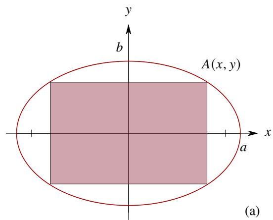

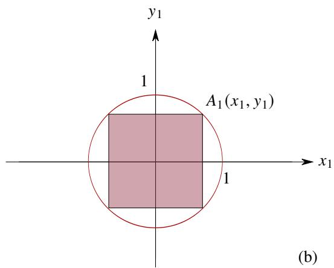  
图4.16:椭圆内接矩形示意图。

解不妨设 $a,b > 0.$ 设内接矩形位于第一象限的顶点为 $A(x,y)$ $(0\leqslant x\leqslant a)$

解法一 由于

$$
\frac {x ^ {2}}{a ^ {2}} + \frac {y ^ {2}}{b ^ {2}} = 1 \Longleftrightarrow y = b \sqrt {1 - \frac {x ^ {2}}{a ^ {2}}}.
$$

因此内接矩形的面积为

$$
S (x) = 4 x y = 4 x b \sqrt {1 - \frac {x ^ {2}}{a ^ {2}}} = \frac {4 b}{a} x \sqrt {a ^ {2} - x ^ {2}}.
$$

求导得

$$
S ^ {\prime} (x) = \frac {4 b}{a} \sqrt {a ^ {2} - x ^ {2}} + \frac {4 b}{a} \frac {- x ^ {2}}{\sqrt {a ^ {2} - x ^ {2}}} = \frac {4 b}{a} \cdot \frac {- 2 x ^ {2} + a ^ {2}}{\sqrt {a ^ {2} - x ^ {2}}}.
$$

令 $S^{\prime}(x) = 0$ 得

$$
- 2 x ^ {2} + a ^ {2} = 0 \iff x = \frac {\sqrt {2} a}{2}.
$$

分别求出驻点和闭区间端点出的函数值

$$
S \left(\frac {\sqrt {2} a}{2}\right) = \frac {4 b}{a} \cdot \frac {\sqrt {2} a}{2} \cdot \sqrt {a ^ {2} - \left(\frac {\sqrt {2} a}{2}\right) ^ {2}} = 2 a b,
$$

$$
S (0) = S (a) = 0.
$$

于是可知当 $x = a\sqrt{2} / 2$ 时, 即 $A$ 的坐标为 $(a\sqrt{2} / 2, b\sqrt{2} / 2)$ 时面积取到最大值 $2ab$ .

解法二 由于

$$
\frac {x ^ {2}}{a ^ {2}} + \frac {y ^ {2}}{b ^ {2}} = 1 \Longleftrightarrow y = b \sqrt {1 - \frac {x ^ {2}}{a ^ {2}}}.
$$

因此内接矩形的面积为

$$
S (x) = 4 x y = 4 x b \sqrt {1 - \frac {x ^ {2}}{a ^ {2}}} = \frac {4 b}{a} x \sqrt {a ^ {2} - x ^ {2}}.
$$

由均值不等式可知

$$
S (x) = \frac {4 b}{a} \sqrt {x ^ {2} \left(a ^ {2} - x ^ {2}\right)} \leqslant \frac {4 b}{a} \frac {x ^ {2} + a ^ {2} - x ^ {2}}{2} = 2 a b.
$$

当满足

$$
x ^ {2} = a ^ {2} - x ^ {2} \iff x = \frac {a \sqrt {2}}{2},
$$

则不等式中的等号成立.于是可知当 $A$ 的坐标为 $(a\sqrt{2} /2,b\sqrt{2} /2)$ 时面积取到最大值 $2ab$

解法三 如图4.16(b)所示，作仿射变换

$$
\left\{ \begin{array}{l} x = a x _ {1} \\ y = b y _ {1} \end{array} \right.. \tag {4.13}
$$

则变换后的方程为 $x_{1}^{2} + y_{1}^{2} = 1$ ，这是一个单位圆.设 $A$ 经过变换后变为 $A_{1}$ ，令 $A_{1}$ 的坐标为 $(\cos \theta ,\sin \theta)$ ，其中 $\theta = \angle A_1Ox$ $(0 <   \theta <  \pi /2)$ .则矩形面积为

$$
S (\theta) = \cos \theta \sin \theta = \frac {1}{2} \sin 2 \theta .
$$

求导得 $S^{\prime}(\theta) = \cos 2\theta$ 由于 $S^{\prime}(\theta)$ 在 $(0,\pi /2)$ 上单调递减，且 $S^{\prime}(\pi /4) = 0$ ，因此当 $x\in (0,\pi /4)$ 时 $S^{\prime}(\theta) > 0$ ，当 $x\in (\pi /4,\pi /2)$ 时 $S^{\prime}(\theta) <   0.$ 故 $S(\theta)$ 在 $(0,\pi /4)$ 上单调递增，在 $(\pi /4,\pi /2)$ 上单调递减.于是可知当 $\theta = \pi /4$ 时圆的内接矩形面积最大.此时 $A_{1}(\sqrt{2} /2,\sqrt{2} /2)$

由仿射变换公式4.13可知 $A$ 的坐标为 $(a\sqrt{2} / 2, b\sqrt{2} / 2)$ . 由于仿射变换保持面积之比, 因此当内接矩形位于第一象限的顶点为 $(a\sqrt{2} / 2, b\sqrt{2} / 2)$ 时面积最大, 此时面积为

$$
S = 4 \cdot \frac {\sqrt {2} a}{2} \cdot \frac {\sqrt {2} b}{2} = 2 a b.
$$

利用导数还可以研究经典物理学中的一些极值理问题

例 4.81 光的折射定律 已知光在传播时, 总是选择最节省时间的路线 (Fermat 最速原理). 如图4.17所示, 设光从甲介质中的 $A$ 点出发射向乙介质中的 $B$ 点, 折射点为 $P$ . 已知光在甲介质和乙介质中的速度分别为 $a, b$ . 设入射角和折射角分别为 $\alpha$ 和 $\beta$ , 其中入射角是入射光线与法线的夹角, 折射角是折射光线与法线的夹角. 则

$$
\frac {\sin \alpha}{\sin \beta} = \frac {a}{b}.
$$

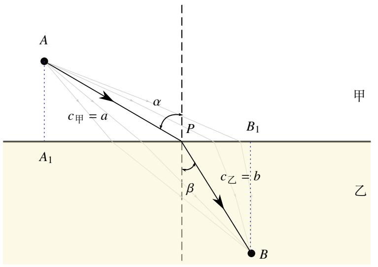  
图4.17：折射定律示意图.灰线代表非用时最短路径

证明如图4.17,过 $A$ 作分界线的垂线，垂足为 $A_{1}$ ，过 $B$ 作分界线的垂线，垂足为 $B_{1}$ 设 $\left|AA_1\right| = h_1,\left|BB_1\right| = h_2,$ $|A_{1}B_{1}| = d.$ 设 $|A_{1}P| = x.$ 于是光线从 $A$ 到 $B$ 所需的时间关于 $x$ 的函数为

$$
t (x) = \frac {\sqrt {x ^ {2} + h _ {1} ^ {2}}}{a} + \frac {\sqrt {(d - x) ^ {2} + h _ {2} ^ {2}}}{b}.
$$

下面来求 $t(x)$ 的最小值. 先求 $t(x)$ 的导数和二阶导数得

$$
t ^ {\prime} (x) = \frac {x}{a \sqrt {x ^ {2} + h _ {1} ^ {2}}} - \frac {d - x}{b \sqrt {(d - x) ^ {2} + h _ {2} ^ {2}}},
$$

$$
t ^ {\prime \prime} (x) = \frac {h _ {1} ^ {2}}{a \left(h _ {1} ^ {2} + x ^ {2}\right) ^ {3 / 2}} + \frac {h _ {2} ^ {2}}{b \left(h _ {2} ^ {2} + (d - x) ^ {2}\right) ^ {3 / 2}}.
$$

由于

$$
t ^ {\prime} (0) = - \frac {d}{b \sqrt {d ^ {2} + h _ {2} ^ {2}}} <   0, \quad t ^ {\prime} (d) = \frac {d}{a \sqrt {d ^ {2} + h _ {1} ^ {2}}} > 0.
$$

由 Darboux 定理可知存在 $x_0 \in (0, d)$ 使得 $t'(x_0) = 0$ . 由于 $t''(x) > 0$ , 故 $t'(x)$ 严格递增. 因此 $x_0$ 是 $t(x)$ 的唯一驻点. 因此 $t(x)$ 在 $x_0$ 处取得最小值. 于是

$$
\sin \alpha = \frac {x _ {0}}{\sqrt {x _ {0} ^ {2} + h _ {1} ^ {2}}}, \qquad \sin \beta = \frac {d - x _ {0}}{\sqrt {(d - x _ {0}) ^ {2} + h _ {2} ^ {2}}}.
$$

由于 $t^{\prime}(x_0) = 0$ ，于是可知

$$
\frac {x _ {0}}{a \sqrt {x _ {0} ^ {2} + h _ {1} ^ {2}}} - \frac {d - x _ {0}}{b \sqrt {(d - x _ {0}) ^ {2} + h _ {2} ^ {2}}} = 0 \Longleftrightarrow \frac {\sin \alpha}{\sin \beta} = \frac {a}{b}.
$$

# 4.4.3 函数的凸性

用函数的导数可以刻画函数值变化的“速度”。在通常情况下，函数值不是匀速变换的，因此我们还会关心这个速度的变化快慢。用物理学的观点看就是“加速度”，从几何直观上看，这个问题可以描述为函数所代表的曲线是“上凸的”还是“下凸的”。

在几何中, 我们是这样定义“凸”的. 设曲线 $y = f(x) (x \in I)$ . 连接曲线上任意不同的两点, 得到的线段称为

该曲线的一条弦(chord).若该曲线的任意一条弦都不落在此弦两个端点之间那部分曲线的下方(可以部分与弦重叠),则称该曲线是凸的(convex).

现在我们希望“解析地”描述“凸性”. 任意取定 $x_{1}, x_{2} \in I$ . 任取 $x \in (x_{1}, x_{2})$ . 令

$$
\lambda = \frac {x _ {2} - x}{x _ {2} - x _ {1}}.
$$

由定比分点公式可知

$$
x = \lambda x _ {1} + (1 - \lambda) x _ {2}.
$$

如果曲线是凸的，则对于任一 $\lambda \in (0,1)$ 都有

$$
f \left[ (\lambda x _ {1} + (1 - \lambda) x _ {2} \right] \leqslant \lambda f (x _ {1}) + (1 - \lambda) f (x _ {2}).
$$

于是我们可以如下定义“凸函数”

# 定义4.12（凸函数）

设函数 $f(x)$ 在区间 $I$ 上有定义. 若对于任意 $x_{1}, x_{2} \in I$ ( $x_{1} \neq x_{2}$ ) 以及任意 $\lambda \in (0,1)$ 都有

$$
f \left[ \lambda x _ {1} + (1 - \lambda) x _ {2} \right] \leqslant \lambda f (x _ {1}) + (1 - \lambda) f (x _ {2}).
$$

则称 $f(x)$ 在 $I$ 上是凸的 (convex). 特别地, 若以上不等式中的 $\leqslant$ 改为 $<$ , 则称 $f(x)$ 在 $I$ 上是严格凸的, 如图4.18所示.

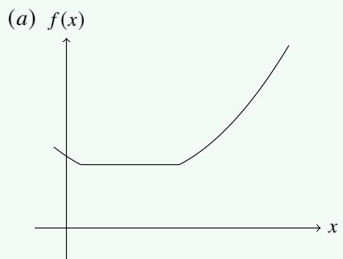

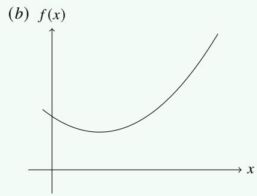  
图4.18: (a) 凸函数与 (b) 严格凸函数

反之也可以定义“凹函数”和“严格凹函数”.

# 定义4.13（拐点）

设函数 $f$ 在 $x_0$ 两旁有定义 (包括 $x_0$ ). 若在 $x_0$ 一侧 $f$ 是严格凸的, 而在另一侧函数 $f$ 是严格凹的, 则称 $x_0$ 是 $f$ 的一个拐点 (inflection point).

以上定义中的不等式称为Jensen不等式(Jensen's inequality).用数学归纳法可以把“二元”的Jensen不等式推广到“多元”的情况.

# 定理4.22 (Jensen不等式)

设区间 $I$ 上的函数 $f$

(1) 若 $f$ 在 $I$ 上是凸的, 则对于任意 $x_{1}, x_{2}, \cdots, x_{n} \in I$ 以及任意 $\lambda_{1}, \lambda_{2}, \cdots, \lambda_{n} \in (0,1)$ ( $\lambda_{1} + \lambda_{2} + \cdots + \lambda_{n} = 1$ ) 都有

$$
f \left(\lambda_ {1} x _ {1} + \lambda_ {2} x _ {2} + \dots + \lambda_ {n} x _ {n}\right) \leqslant \lambda_ {1} f \left(x _ {1}\right) + \lambda_ {2} f \left(x _ {2}\right) + \dots + \lambda_ {n} f \left(x _ {n}\right). \tag {4.14}
$$

(2) 若 $f$ 在 $I$ 上是严格凸的, 则当 $x_{1}, x_{2}, \dots, x_{n} \in I$ 不全相等时, 有

$$
f \left(\lambda_ {1} x _ {1} + \lambda_ {2} x _ {2} + \dots + \lambda_ {n} x _ {n}\right) <   \lambda_ {1} f \left(x _ {1}\right) + \lambda_ {2} f \left(x _ {2}\right) + \dots + \lambda_ {n} f \left(x _ {n}\right). \tag {4.15}
$$

证明 (1) 当 $n = 2$ 时, 命题就是凸函数的定义. 假设 $n = k$ 时命题成立, 下面来看 $n = k + 1$ 时的情况. 令

$$
\mu_ {i} = \frac {\lambda_ {i}}{1 - \lambda_ {k + 1}}, \quad i = 1, 2, \dots , k.
$$

则 $\mu_{i} > 0 (i = 1,2,\dots ,k)$ , 且 $\mu_1 + \mu_2 + \dots +\mu_k = 1$ . 此时 $\mu_{1}x_{1} + \mu_{2}x_{2} + \dots +\mu_{k}x_{k}\in I$ . 由归纳假设可知

$$
\begin{array}{l} f \left(\lambda_ {1} x _ {1} + \lambda_ {2} x _ {2} + \dots + \lambda_ {k + 1} x _ {k + 1}\right) = f \left[ \left(1 - \lambda_ {k + 1}\right) \left(\mu_ {1} x _ {1} + \dots + \mu_ {k} x _ {k}\right) + \lambda_ {k + 1} x _ {k + 1} \right] \\ \leqslant \left(1 - \lambda_ {k + 1}\right) f \left(\mu_ {1} x _ {1} + \mu_ {2} x _ {2} + \dots + \mu_ {k} x _ {k}\right) + \lambda_ {k + 1} f \left(x _ {k + 1}\right) (4.16) \\ \leqslant \left(1 - \lambda_ {k + 1}\right) \left[ \mu_ {1} f \left(x _ {1}\right) + \mu_ {2} f \left(x _ {2}\right) + \dots + \mu_ {k} f \left(x _ {k}\right) \right] + \lambda_ {k + 1} f \left(x _ {k + 1}\right) (4.17) \\ = \lambda_ {1} f (x _ {1}) + \lambda_ {2} f (x _ {2}) + \dots + \lambda_ {k + 1} f (x _ {k + 1}). \\ \end{array}
$$

由数学归纳法可知，当 $f$ 是 $I$ 上的凸函数时，对于任一 $n \in \mathbb{N}^*$ 不等式4.14都成立。

(2) 当 $n = 2$ 时, 命题就是严格凸函数的定义. 假设 $n = k$ 时命题成立. 下面来看 $n = k + 1$ 时的情况. 若 $x_{1}, \dots, x_{k}$ 不全相等, 则由归纳假设可知式4.17中严格的不等号成立. 若 $x_{1} = \dots = x_{k} \neq x_{k + 1}$ , 令 $\mu_{i}$ 含义同 (1) 中, 则

$$
\mu_ {1} x _ {1} + \dots + \mu_ {k} x _ {k} = x _ {1} \left(\mu_ {1} + \dots + \mu_ {k}\right) = x _ {1} \neq x _ {k + 1}.
$$

因此式4.16中严格的不等号成立. 因此总是有

$$
f \left(\lambda_ {1} x _ {1} + \lambda_ {2} x _ {2} + \dots + \lambda_ {k + 1} x _ {k + 1}\right) <   \lambda_ {1} f (x _ {1}) + \lambda_ {2} f (x _ {2}) + \dots + \lambda_ {k + 1} f (x _ {k + 1}).
$$

由数学归纳法可知，当 $f$ 是 $I$ 上的严格凸函数时，对于任一 $n \in \mathbb{N}^*$ 不等式4.15都成立。

注以上结论一般称为Jensen不等式(Jensen's inequality).在实分析和概率论中还会看到其他形式的Jensen不等式.注从Jensen不等式的形式不难联想到线性映射的定义：

$$
f \left(\lambda_ {1} x _ {1} + \lambda_ {2} x _ {2} + \dots + \lambda_ {n} x _ {n}\right) = \lambda_ {1} f (x _ {1}) + \lambda_ {2} f (x _ {2}) + \dots + \lambda_ {n} f (x _ {n}).
$$

由以上定理可以立刻得到以下推论

# 推论4.3

设区间 $I$ 上的函数 $f$

(1) 若 $f$ 在 $I$ 上是凸的. 则对于任意 $x_{1}, x_{2}, \dots, x_{n} \in I$ 以及任意 $\alpha_{1}, \alpha_{2}, \dots, \alpha_{n} > 0$ 都有

$$
f \left(\frac {\alpha_ {1} x _ {1} + \alpha_ {2} x _ {2} + \cdots + \alpha_ {n} x _ {n}}{\alpha_ {1} + \alpha_ {2} + \cdots + \alpha_ {n}}\right) \leqslant \frac {\alpha_ {1} f (x _ {1}) + \alpha_ {2} f (x _ {2}) + \cdots + \alpha_ {n} f (x _ {n})}{\alpha_ {1} + \alpha_ {2} + \cdots + \alpha_ {n}}.
$$

(2) 若 $f$ 在 $I$ 上是严格凸的. 则对于任意不全相等的 $x_{1}, x_{2}, \cdots, x_{n} \in I$ 以及任意 $\alpha_{1}, \alpha_{2}, \cdots, \alpha_{n} > 0$ 都有

$$
f \left(\frac {\alpha_ {1} x _ {1} + \alpha_ {2} x _ {2} + \cdots + \alpha_ {n} x _ {n}}{\alpha_ {1} + \alpha_ {2} + \cdots + \alpha_ {n}}\right) <   \frac {\alpha_ {1} f (x _ {1}) + \alpha_ {2} f (x _ {2}) + \cdots + \alpha_ {n} f (x _ {n})}{\alpha_ {1} + \alpha_ {2} + \cdots + \alpha_ {n}}.
$$

证明 令

$$
\lambda_ {i} = \frac {\alpha_ {i}}{\alpha_ {1} + \alpha_ {2} + \cdots + \alpha_ {n}}, \quad i = 1, 2, \dots , n.
$$

由Jensen不等式即得.

以上结论也可以称为Jensen不等式

如果函数 $f$ 在区间 $I$ 上是凸的，就说明 $f$ 的函数值在任一 $I$ 的子区间上都是“加速增长的”.

# 定理4.23

设区间 $I$ 上的函数 $f$

(1) 在区间 $I$ 上是凸的当且仅当对于任一 $(x_{1}, x_{2}) \subseteq I$ 和任一 $x \in (x_{1}, x_{2})$ 都有

$$
\frac {f (x) - f \left(x _ {1}\right)}{x - x _ {1}} \leqslant \frac {f \left(x _ {2}\right) - f \left(x _ {1}\right)}{x _ {2} - x _ {1}} \leqslant \frac {f \left(x _ {2}\right) - f (x)}{x _ {2} - x}. \tag {4.18}
$$

(2) 在区间 $I$ 上是严格凸的当且仅当对于任一 $(x_{1}, x_{2}) \subseteq I$ 和任一 $x \in (x_{1}, x_{2})$ 都有

$$
\frac {f (x) - f \left(x _ {1}\right)}{x - x _ {1}} <   \frac {f \left(x _ {2}\right) - f \left(x _ {1}\right)}{x _ {2} - x _ {1}} <   \frac {f \left(x _ {2}\right) - f (x)}{x _ {2} - x}.
$$

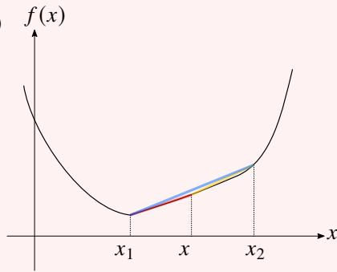  
(a)

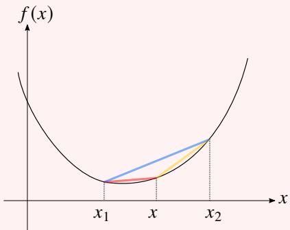  
(b)   
图4.19: (a) 凸函数, (b) 严格凸函数

证明 只证明 (1).

(i) 证明必要性. 令

$$
\lambda_ {1} = \frac {x _ {2} - x}{x _ {2} - x _ {1}}, \quad \lambda_ {2} = \frac {x - x _ {1}}{x _ {2} - x _ {1}}.
$$

则 $\lambda_1, \lambda_2 > 0$ 且 $\lambda_1 + \lambda_2 = 1$ . 由于 $f$ 在 $I$ 上是凸的，故

$$
\lambda_ {1} f (x) + \lambda_ {2} f (x) = f (x) = f \left(\lambda_ {1} x _ {1} + \lambda_ {2} x _ {2}\right) \leqslant \lambda_ {1} f \left(x _ {1}\right) + \lambda_ {2} f \left(x _ {2}\right). \tag {4.19}
$$

于是

$$
\lambda_ {1} [ f (x) - f \left(x _ {1}\right) ] \leqslant \lambda_ {2} [ f \left(x _ {2}\right) - f (x) ] \Longleftrightarrow \frac {f (x) - f \left(x _ {1}\right)}{x - x _ {1}} \leqslant \frac {f \left(x _ {2}\right) - f (x)}{x _ {2} - x}. \tag {4.20}
$$

由于 $x - x_{1} > 0, x_{2} - x > 0$ ，因此

$$
\frac {f (x) - f \left(x _ {1}\right)}{x - x _ {1}} \leqslant \frac {f \left(x _ {2}\right) - f \left(x _ {1}\right)}{x _ {2} - x _ {1}} \leqslant \frac {f \left(x _ {2}\right) - f (x)}{x _ {2} - x}.
$$

(ii) 证明充分性. 若不等式4.18成立, 则不等式4.20也成立. 然后可以反推出4.19, 因此 $f$ 在 $I$ 上是凸的.

注 以上证明用到了一个初等不等式: 若 $b, d > 0$ 且 $a / b \leqslant c / d$ , 则

$$
\frac {a}{b} \leqslant \frac {a + c}{b + d} \leqslant \frac {c}{d}.
$$

如果函数 $f$ 在 $I$ 上可导，那么就可以用 $f^{\prime}$ 的单调性来刻画函数的凸性。“凹凸临界点”可以形象地称为“拐点”。

# 定理4.24

设函数 $f$ 在 $[a,b]$ 上连续，在 $(a,b)$ 上可导.则

(1) $f$ 在 $[a,b]$ 是凸的当且仅当 $f^{\prime}$ 在 $(a,b)$ 上单调递增  
(2) $f$ 在 $[a,b]$ 是严格凸的当且仅当 $f^{\prime}$ 在 $(a,b)$ 上严格单调递增.

证明 任取 $(x_{1},x_{2})\subseteq (a,b)$

(1) (i) 证明必要性. 任取 $x, x' \in (x_1, x_2)$ . 由于 $f$ 在 $[a, b]$ 是凸的，因此

$$
\frac {f (x) - f \left(x _ {1}\right)}{x - x _ {1}} \leqslant \frac {f \left(x _ {2}\right) - f \left(x _ {1}\right)}{x _ {2} - x _ {1}} \leqslant \frac {f \left(x _ {2}\right) - f (x)}{x _ {2} - x}.
$$

$$
\frac {f \left(x ^ {\prime}\right) - f \left(x _ {1}\right)}{x ^ {\prime} - x _ {1}} \leqslant \frac {f \left(x _ {2}\right) - f \left(x _ {1}\right)}{x _ {2} - x _ {1}} \leqslant \frac {f \left(x _ {2}\right) - f \left(x ^ {\prime}\right)}{x _ {2} - x ^ {\prime}}.
$$

因此可得不等式

$$
\frac {f (x) - f \left(x _ {1}\right)}{x - x _ {1}} \leqslant \frac {f \left(x _ {2}\right) - f \left(x _ {1}\right)}{x _ {2} - x _ {1}} \leqslant \frac {f \left(x _ {2}\right) - f \left(x ^ {\prime}\right)}{x _ {2} - x ^ {\prime}}.
$$

令上式中的 $x \to x_1^+, x' \to x_2^-$ 得

$$
f ^ {\prime} \left(x _ {1}\right) \leqslant \frac {f \left(x _ {2}\right) - f \left(x _ {1}\right)}{x _ {2} - x _ {1}} \leqslant f ^ {\prime} \left(x _ {2}\right). \tag {4.21}
$$

于是可知 $f^{\prime}$ 在 $(a,b)$ 上单调递增

(ii) 证明充分性. 任取 $x \in (x_1, x_2)$ . 由 Lagrange 中值定理可知, 存在 $\xi \in (x_1, x), \eta \in (x, x_2)$ 使得

$$
\frac {f (x) - f \left(x _ {1}\right)}{x - x _ {1}} = f ^ {\prime} (\xi), \quad \frac {f \left(x _ {2}\right) - f (x)}{x _ {2} - x} = f ^ {\prime} (\eta).
$$

$f^{\prime}(x)$ 在 $(a,b)$ 上单调递增，故

$$
\frac {f (x) - f \left(x _ {1}\right)}{x - x _ {1}} = f ^ {\prime} (\xi) \leqslant f ^ {\prime} (\eta) = \frac {f \left(x _ {2}\right) - f (x)}{x _ {2} - x}.
$$

于是可知 $f$ 在 $[a,b]$ 是凸的.

(2) (i) 证明必要性. 任取 $x^{*} \in (x_{1}, x_{2})$ . 由不等式4.21可知

$$
f ^ {\prime} \left(x _ {1}\right) \leqslant \frac {f \left(x ^ {*}\right) - f \left(x _ {1}\right)}{x ^ {*} - x _ {1}}, \quad \frac {f \left(x _ {2}\right) - f \left(x ^ {*}\right)}{x _ {2} - x ^ {*}} \leqslant f ^ {\prime} \left(x _ {2}\right).
$$

由于 $f$ 是严格凸的，故

$$
\frac {f (x ^ {*}) - f (x _ {1})}{x ^ {*} - x _ {1}} <   \frac {f (x _ {2}) - f (x ^ {*})}{x _ {2} - x ^ {*}}.
$$

因此 $f^{\prime}(x_1) < f^{\prime}(x_2)$ . 于是可知 $f^{\prime}$ 在 $(a,b)$ 上严格单调递增.

(ii) 证明充分性. 若 $f'$ 严格递增, 则 $f'(\xi) < f'(\eta)$ . 因此

$$
\frac {f (x) - f \left(x _ {1}\right)}{x - x _ {1}} = f ^ {\prime} (\xi) <   f ^ {\prime} (\eta) = \frac {f \left(x _ {2}\right) - f (x)}{x _ {2} - x}.
$$

于是可知 $f$ 在 $[a,b]$ 是严格凸的.

由于导数可以判断函数的单调性, 因此二阶导可以判断导函数的单调性. 因此当函数 $f$ 在 $I$ 上二阶可导时, 结合前面的定理立刻可以得到以下定理.

# 定理4.25

设函数 $f$ 在 $[a,b]$ 上连续，在 $(a,b)$ 上二阶可导.则

(1) $f$ 在 $[a,b]$ 是凸的当且仅当在 $(a,b)$ 上 $f^{\prime \prime}(x)\geqslant 0$   
(2) $f$ 在 $[a, b]$ 是严格凸的当且仅当在 $(a, b)$ 上 $f''(x) \geqslant 0$ 且在 $(a, b)$ 的任一开子区间内 $f''$ 都不恒等于零.

容易知道, 如果函数 $f$ 在 $x_0$ 附近有连续的二阶导数, 则 $x_0$ 是 $f$ 的一个拐点的必要条件是 $f''(x_0) = 0$ . 若 $f''(x_0) = 0$ 且 $f''$ 在 $x_0$ 的一侧为正, 另一侧为负, 则可以断言 $x_0$ 是 $f$ 的一个拐点.

最后看一个综合运用前面结论的经典例子

例4.82设 $n$ 个不全相等的正数 $a_1, a_2, \dots, a_n$ . 令

$$
f (x) = \left\{ \begin{array}{l l} \left(\frac {a _ {1} ^ {x} + a _ {2} ^ {x} + \cdots + a _ {n} ^ {x}}{n}\right) ^ {1 / x}, & x \neq 0 \\ \sqrt [ n ]{a _ {1} a _ {2} \cdots a _ {n}}, & x = 0 \end{array} \right..
$$

则 $f(x)$ 在 $\mathbb{R}$ 上严格递增

证明 (i) 设 $0 < \alpha < \beta$ . 令 $g(x) = x^p$ ( $x > 0, p > 1$ ). 则

$$
g ^ {\prime} (x) = p x ^ {p - 1}, \qquad g ^ {\prime \prime} (x) = p (p - 1) x ^ {p - 2} > 0.
$$

因此 $g$ 是 $(0, +\infty)$ 上的严格凸函数. 由Jensen不等式可知

$$
\left(\frac {b _ {1} + b _ {2} + \cdots + b _ {n}}{n}\right) ^ {p} <   \frac {b _ {1} ^ {p} + b _ {2} ^ {p} + \cdots + b _ {n} ^ {p}}{n}, \quad b _ {i} > 0, i = 1, 2, \dots , n.
$$

令 $p = \beta /\alpha ,b_{i} = a_{i}^{\alpha}$ $(i = 1,2,\dots ,n)$ .则以上不等式变为

$$
\left(\frac {a _ {1} ^ {\alpha} + a _ {2} ^ {\alpha} + \cdots + a _ {n} ^ {\alpha}}{n}\right) ^ {1 / \alpha} <   \left(\frac {a _ {1} ^ {\beta} + a _ {2} ^ {\beta} + \cdots + a _ {n} ^ {\beta}}{n}\right) ^ {1 / \beta}.
$$

令上式中的 $\alpha \rightarrow 0^{+}$ ，由例3.32可知

$$
\sqrt [ n ]{a _ {1} a _ {2} \cdots a _ {n}} <   \left(\frac {a _ {1} ^ {\beta} + a _ {2} ^ {\beta} + \cdots + a _ {n} ^ {\beta}}{n}\right) ^ {1 / \beta}, \quad \forall \beta > 0.
$$

因此 $f$ 在 $[0, +\infty)$ 上严格递增.

(ii) 设 $\alpha < \beta < 0$ ，则 $0 < -\beta < -\alpha$ 。由 (i) 可知

$$
\begin{array}{l} \left[ \frac {\left(a _ {1} ^ {- 1}\right) ^ {- \beta} + \left(a _ {2} ^ {- 1}\right) ^ {- \beta} + \cdots + \left(a _ {n} ^ {- 1}\right) ^ {- \beta}}{n} \right] ^ {1 / (- \beta)} <   \left[ \frac {\left(a _ {1} ^ {- 1}\right) ^ {- \alpha} + \left(a _ {2} ^ {- 1}\right) ^ {- \alpha} + \cdots + \left(a _ {n} ^ {- 1}\right) ^ {- \alpha}}{n} \right] ^ {1 / (- \alpha)} \\ \Longleftrightarrow \left(\frac {a _ {1} ^ {\alpha} + a _ {2} ^ {\alpha} + \cdots + a _ {n} ^ {\alpha}}{n}\right) ^ {1 / \alpha} <   \left(\frac {a _ {1} ^ {\beta} + a _ {2} ^ {\beta} + \cdots + a _ {n} ^ {\beta}}{n}\right) ^ {1 / \beta}. \\ \end{array}
$$

令上式中的 $\beta \rightarrow 0^{-}$ ，由例3.32可知

$$
\left(\frac {a _ {1} ^ {\alpha} + a _ {2} ^ {\alpha} + \cdots + a _ {n} ^ {\alpha}}{n}\right) ^ {1 / \alpha} <   \sqrt [ n ]{a _ {1} a _ {2} \cdots a _ {n}}, \quad \forall \alpha <   0.
$$

因此 $f$ 在 $(- \infty, 0]$ 上严格递增.

综上可知 $f$ 在 $\mathbb{R}$ 上严格递增

注 容易知道当 $a_1 = a_2 = \dots = a_n$ 时 $f$ 为常值函数

注 由夹逼定理不难得到

$$
\lim  _ {x \rightarrow + \infty} \left(\frac {a _ {1} ^ {x} + a _ {2} ^ {x} + \cdots + a _ {n} ^ {x}}{n}\right) ^ {1 / x} = \max  \left\{a _ {1}, a _ {2}, \dots , a _ {n} \right\}.
$$

$$
\lim  _ {x \rightarrow - \infty} \left(\frac {a _ {1} ^ {x} + a _ {2} ^ {x} + \cdots + a _ {n} ^ {x}}{n}\right) ^ {1 / x} = \min  \left\{a _ {1}, a _ {2}, \dots , a _ {n} \right\}.
$$

注 由上例可知 $f(-1) < f(0) < f(1) < f(2)$ . 这就是均值不等式:

$$
\left(\frac {a _ {1} ^ {- 1} + a _ {2} ^ {- 1} + \cdots + a _ {n} ^ {- 1}}{n}\right) ^ {- 1} <   \sqrt [ n ]{a _ {1} a _ {2} \cdots a _ {n}} <   \frac {a _ {1} + a _ {2} + \cdots + a _ {n}}{n} <   \left(\frac {a _ {1} ^ {2} + a _ {2} ^ {2} + \cdots + a _ {n} ^ {2}}{n}\right) ^ {1 / 2}.
$$

$f(-1) = f(0) = f(1) = f(2)$ 当且仅当 $a_1 = a_2 = \dots = a_n$

# 4.4.4 初等函数的图像

综合运用函数的极限和导数可以比较清楚地研究一个初等函数的主要性质. 包括单调性、极值和凸性. 在掌握了一个函数的这些性质的基础上, 就可以可以画出它的大致图像.

我们在研究函数 $1 / x, \tan x, \arctan x$ 时已经知道它们都有“渐近线”. 用函数极限可以给出渐近线的定义

# 定义4.14(渐近线)

设函数 $f$

(1) 若

$$
\lim  _ {x \to + \infty} f (x) = a \quad {\text {或}} \quad \lim  _ {x \to - \infty} f (x) = b.
$$

则称 $y = a$ 或 $y = b$ 是 $y = f(x)$ 的一条水平渐近线 (horizontal asymptote).

(2) 若

$$
\lim  _ {x \to x _ {0} +} f (x) = \pm \infty \quad {\text {或}} \quad \lim  _ {x \to x _ {0} -} f (x) = \pm \infty .
$$

则称 $x = x_0$ 是 $y = f(x)$ 的一条竖直渐近线 (vertical asymptotes).

(3) 若

$$
\lim  _ {x \to + \infty} [   f (x) - (a x + b)   ] = 0 \quad {\text {或}} \quad \lim  _ {x \to - \infty} [   f (x) - (a x + b)   ] = 0.
$$

则称 $y = ax + b$ 是 $y = f(x)$ 的一条斜渐近线 (oblique asymptote).

一般来说水平渐近线和竖直渐近线是比较容易看出来的. 下面来讨论一下如何求出斜渐近线. 设 $y = ax + b$ 是 $y = f(x)$ 的一条斜渐近线. 由斜渐近线的定义可知

$$
0 = \lim  _ {x \rightarrow + \infty} \frac {f (x) - (a x + b)}{x} = \lim  _ {x \rightarrow + \infty} \frac {f (x)}{x} - a.
$$

因此

$$
a = \lim  _ {x \rightarrow + \infty} \frac {f (x)}{x}.
$$

这样就求出了 $a$ . 然后再根据定义有

$$
b = \lim  _ {x \rightarrow + \infty} [ f (x) - a x ].
$$

于是就可以求出 $b$

现在可以来讨论画出一个一般的初等函数图形的方法.一般来说可以按以下顺序确定函数的基本信息，然后就可以画出大致图像：

(1) 确定函数的定义域  
(2) 判断函数的对称性 (奇偶性) 和周期性.  
(3) 确定函数的单调区间.  
(4) 确定函数的极值点.  
(5) 确定函数的凹凸区间和拐点，并作出拐点处的切线  
(6) 确定函数的渐近线 (如果有的话).  
(7) 求出一些特殊点的值, 包括与坐标轴的交点、极值点、驻点、拐点等.

下面来几个例子

例4.83画出以下曲线：

$$
y = \frac {x}{1 - x ^ {2}}.
$$

解容易看出 $f$ 的定义域是 $(-\infty, -1) \cup (-1, 1) \cup (1, +\infty)$ 的奇函数. 因此只需考虑 $[0, 1) \cup (1, +\infty)$ 的情况. 计算 $f$ 的导数:

$$
f ^ {\prime} (x) = \frac {1 + x ^ {2}}{\left(1 - x ^ {2}\right) ^ {2}} > 0. \quad f ^ {\prime \prime} (x) = \frac {2 x ^ {3} + 6 x}{\left(1 - x ^ {2}\right) ^ {3}}.
$$

则 $f^{\prime \prime}(0) = 0$ 根据 $f^{\prime}$ 和 $f^{\prime \prime}$ 的正负性可以得到以下表格：

<table><tr><td>x</td><td>(0,1)</td><td>(1,+∞)</td></tr><tr><td>f&#x27;</td><td>+</td><td>+</td></tr><tr><td>f&#x27;&#x27;</td><td>+</td><td>-</td></tr><tr><td>f</td><td>递增,凸</td><td>递增,凹</td></tr></table>

容易看出 $x = 1$ 是 $f$ 的一条竖直渐近线, $x$ 轴是 $f$ 的一条水平渐近线. $x = 0$ 是拐点, 且 $f'(0) = 1$ . 计算 $f$ 的关键点: $f(0) = 0$ . 综合以上信息, 可以画出函数 $f$ 的大致图像.

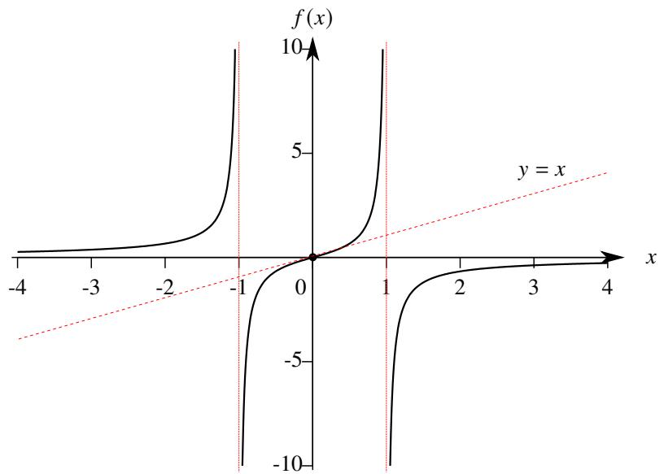  
图4.20: $x / (1 - x^2)$ 大致图像

例4.84画出以下曲线：

$$
y = \frac {x}{2} + \operatorname {a r c c o t} x.
$$

解容易看出 $f$ 的定义域是 $\mathbb{R}$ . 计算 $f$ 的导数：

$$
f ^ {\prime} (x) = \frac {1}{2} - \frac {1}{1 + x ^ {2}}. \quad f ^ {\prime \prime} (x) = \frac {2 x}{\left(1 + x ^ {2}\right) ^ {2}}.
$$

则 $f^{\prime}(\pm 1) = 0,f^{\prime \prime}(0) = 0.$ 根据 $f^{\prime}$ 和 $f^{\prime \prime}$ 的正负性可以得到以下表格：

<table><tr><td>x</td><td>(−∞, -1)</td><td>(−1, 0)</td><td>(0, 1)</td><td>(1, +∞)</td></tr><tr><td>f&#x27;</td><td>+</td><td>-</td><td>-</td><td>+</td></tr><tr><td>f&#x27;&#x27;</td><td>-</td><td>-</td><td>+</td><td>+</td></tr><tr><td>f</td><td>递增,凹</td><td>递减,凹</td><td>递减,凸</td><td>递增,凸</td></tr></table>

因此 $x = 0$ 是 $f$ 的拐点且 $f^{\prime}(0) = -1 / 2$

下面计算 $f$ 的渐近线. 假设 $y = f(x)$ 存在一条斜渐近线 $y = ax + b$ . 由于

$$
a = \lim  _ {x \rightarrow \pm \infty} \frac {f (x)}{x} = \lim  _ {x \rightarrow \pm \infty} \left(\frac {1}{2} + \frac {\operatorname {a r c c o t} x}{x}\right) = \frac {1}{2}.
$$

$$
b = \lim  _ {x \rightarrow + \infty} [ f (x) - a x ] = \lim  _ {x \rightarrow + \infty} \left[ \frac {x}{2} + \operatorname {a r c c o t} x - \frac {x}{2} \right] = 0.
$$

$$
b = \lim  _ {x \rightarrow - \infty} [ f (x) - a x ] = \lim  _ {x \rightarrow - \infty} \left[ \frac {x}{2} + \operatorname {a r c c o t} x - \frac {x}{2} \right] = \pi .
$$

因此设 $y = f(x)$ 存在两条斜渐近线

$$
y = \frac {1}{2} x, \quad y = \frac {1}{2} x + \pi .
$$

计算 $f$ 的关键点：

$$
f (- 1) = - \frac {1}{2} + \frac {3 \pi}{4} \approx 1. 8 6, \quad f (0) = \frac {\pi}{2} \approx 1. 5 7, \quad f (1) = \frac {1}{2} + \frac {\pi}{4} \approx 1. 2 9.
$$

综合以上信息，可以画出函数 $f$ 的大致图像

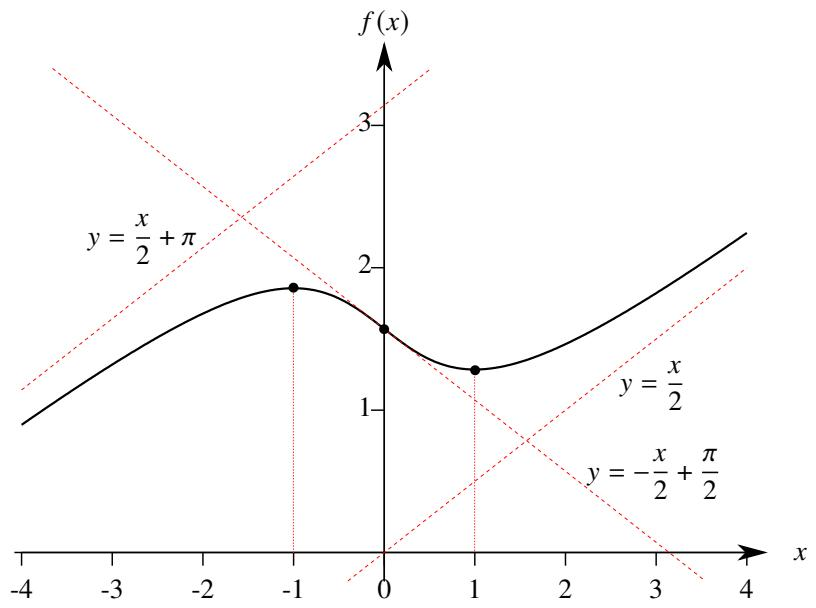  
图4.21: $x / 2 + \operatorname{arccot} x$ 大致图像

例4.85作出以下函数的图像

$$
f (x) = \frac {(1 + x) ^ {2}}{4 (1 - x)}.
$$

解容易知道 $f$ 的定义域为 $(-\infty, 1) \cup (1, +\infty)$ . 计算 $f$ 的导数：

$$
f ^ {\prime} (x) = \frac {(3 - x) (1 + x)}{4 (1 - x) ^ {2}}. \quad f ^ {\prime \prime} (x) = \frac {2}{(1 - x) ^ {3}}.
$$

因此 $x = 3$ 和 $x = -1$ 是 $f$ 的驻点. 根据 $f'$ 和 $f''$ 的正负性可以得到以下表格:

<table><tr><td>x</td><td>(-∞,-1)</td><td>(-1,1)</td><td>(1,3)</td><td>(3,+∞)</td></tr><tr><td>f&#x27;</td><td>-</td><td>+</td><td>+</td><td>-</td></tr><tr><td>f&#x27;&#x27;</td><td>+</td><td>+</td><td>-</td><td>-</td></tr><tr><td>f</td><td>递减,凸</td><td>递增,凸</td><td>递增,凹</td><td>递减,凹</td></tr></table>

下面计算 $f$ 的渐近线. 容易知道

$$
\lim  _ {x \to 1 +} f (x) = - \infty , \quad \lim  _ {x \to 1 -} f (x) = + \infty .
$$

因此 $x = 1$ 是 $y = f(x)$ 的一条竖直渐近线.假设 $y = f(x)$ 存在一条斜渐近线 $y = ax + b.$ 由于

$$
a = \lim  _ {x \rightarrow \pm \infty} \frac {f (x)}{x} = \lim  _ {x \rightarrow \pm \infty} \frac {(1 + x) ^ {2}}{4 x (1 - x)} = - \frac {1}{4}.
$$

$$
b = \lim  _ {x \rightarrow \pm \infty} [ f (x) - a x ] = \lim  _ {x \rightarrow \pm \infty} \left[ \frac {(1 + x) ^ {2}}{4 (1 - x)} + \frac {x}{4} \right] = - \frac {3}{4}.
$$

因此设 $y = f(x)$ 存在一条斜渐近线

$$
y = - \frac {1}{4} x - \frac {3}{4}.
$$

最后求出两个驻点的函数值 $f(-1) = 0$ , $f(3) = -2$ . 综合以上信息, 可以画出函数 $f$ 的大致图像 (如图4.22).

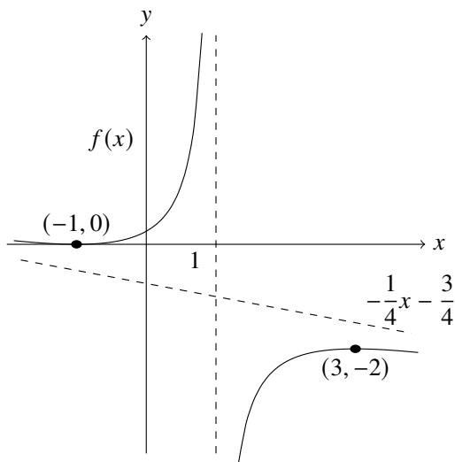  
图4.22: 函数 $f(x) = \frac{(1 + x)^2}{4(1 - x)}$ 的大致图像

如果要作参数方程的图像，可以先分别作出 $x(t)$ 和 $y(t)$ 的图像，然后再把它们“合成”为一张图。如果遇到的是隐式方程，则先把它化为参数方程后再按参数方程的方法作图。

# 4.5 Taylor 公式

# 4.5.1 带Peano余项的Taylor公式

我们已经知道, 若函数 $f$ 在 $x_0$ 处可导, 则有无穷小增量公式

$$
f (x) = f \left(x _ {0}\right) + f ^ {\prime} \left(x _ {0}\right)\left(x - x _ {0}\right) + o \left(x - x _ {0}\right), \quad x \rightarrow x _ {0}. \tag {4.22}
$$

这个公式的重要意义是: 用一个一次多项式来近似 $f(x)$ , 且误差是一个比 $x - x_0$ 高阶的无穷小, 这正是微分思想的本质. 然而在很多情况下, 用一次多项式逼近 $f(x)$ , 还是显得“粗糙”了一些. 很自然的想法是, 当 $f(x)$ 二阶可导时, 能否用一个二次多项式来逼近 $f(x)$ , 并使得它的误差是一个比 $(x - x_0)^2$ 高阶的无穷小. 我们可以用待定系数法. 设

$$
f (x) = A + B \left(x - x _ {0}\right) + C \left(x - x _ {0}\right) ^ {2} + o \left[\left(x - x _ {0}\right) ^ {2} \right], \quad x \rightarrow x _ {0}. \tag {4.23}
$$

下面我们来逐一确定 $A, B, C$ . 首先, 令 $x \to x_0$ 得

$$
A = \lim  _ {x \rightarrow x _ {0}} f (x) = f (x _ {0}).
$$

于是等式4.23可以写成

$$
\frac {f (x) - f (x _ {0})}{x - x _ {0}} = B + C (x - x _ {0}) + o (x - x _ {0}), \quad x \to x _ {0}.
$$

由于 $f(x)$ 在 $x_0$ 处可导，令 $x \to x_0$ 得

$$
B = \lim _ {x \to x _ {0}} \frac {f (x) - f (x _ {0})}{x - x _ {0}} = f ^ {\prime} (x _ {0}).
$$

于是等式4.23可以写成

$$
C = \lim  _ {x \to x _ {0}} {\frac {f (x) - f (x _ {0}) - f ^ {\prime} (x _ {0}) (x - x _ {0})}{(x - x _ {0}) ^ {2}}} \stackrel {{\mathrm {l ^ {\prime} H o p i t a l 法 则}}} {{=}} {\frac {1}{2}} \lim  _ {x \to x _ {0}} {\frac {f ^ {\prime} (x) - f ^ {\prime} (x _ {0})}{x - x _ {0}}} = {\frac {1}{2}} f ^ {\prime \prime} (x _ {0}).
$$

至此我们求出了所有待定系数.这表明满足必要性的二次多项式只有一个：

$$
f (x _ {0}) + f ^ {\prime} (x _ {0}) (x - x _ {0}) + \frac {1}{2} f ^ {\prime \prime} (x _ {0}) (x - x _ {0}) ^ {2}.
$$

下面我们来验证充分性，即验证这个多项式满足等式4.23.由l'Hopital法则可知

$$
\begin{array}{l} \lim  _ {x \rightarrow x _ {0}} \frac {f (x) - \left[ f (x _ {0}) + f ^ {\prime} (x _ {0}) (x - x _ {0}) + \frac {1}{2} f ^ {\prime \prime} (x _ {0}) (x - x _ {0}) ^ {2} \right]}{(x - x _ {0}) ^ {2}} = \lim  _ {x \rightarrow x _ {0}} \frac {f ^ {\prime} (x) - f ^ {\prime} (x _ {0}) - f ^ {\prime \prime} (x _ {0}) (x - x _ {0})}{2 (x - x _ {0})} \\ = \frac {1}{2} \left[ \lim _ {x \to x _ {0}} \frac {f ^ {\prime} (x) - f ^ {\prime} (x _ {0})}{x - x _ {0}} - f ^ {\prime \prime} (x _ {0}) \right] = \frac {1}{2} [ f ^ {\prime \prime} (x _ {0}) - f ^ {\prime \prime} (x _ {0}) ] = 0. \\ \end{array}
$$

于是可知以下等式成立

$$
f (x) = f (x _ {0}) + f ^ {\prime} (x _ {0}) (x - x _ {0}) + \frac {1}{2} f ^ {\prime \prime} (x _ {0}) (x - x _ {0}) ^ {2} + o \left[ (x - x _ {0}) ^ {2} \right], \quad x \to x _ {0}.
$$

不难验证, 如果 $f(x)$ 三阶可导, 按照这个方法可以把 $f(x)$ 表示为一个三次多项式加上 $o\left[(x - x_0)^3\right]$ . 用数学归纳法可以把结论推广到 $n$ 阶可导的函数.

# 定理4.26(带Peano余项的Taylor公式)

设函数 $f(x)$ 在 $x_0$ 处有 $n$ 阶导数. 则当 $x \to x_0$ 时

$$
f (x) = f (x _ {0}) + \frac {1}{1 !} f ^ {\prime} (x _ {0}) (x - x _ {0}) + \frac {1}{2 !} f ^ {\prime \prime} (x _ {0}) (x - x _ {0}) ^ {2} + \dots + \frac {1}{n !} f ^ {(n)} (x _ {0}) (x - x _ {0}) ^ {n} + o [ (x - x _ {0}) ^ {n} ]. \qquad (4. 2 4)
$$

证明 用数学归纳原理对 $n$ 进行归纳. 令

$$
T _ {n} (f, x _ {0}; x) := f (x _ {0}) + \frac {1}{1 !} f ^ {\prime} (x _ {0}) (x - x _ {0}) + \frac {1}{2 !} f ^ {\prime \prime} (x _ {0}) (x - x _ {0}) ^ {2} + \dots + \frac {1}{n !} f ^ {(n)} (x _ {0}) (x - x _ {0}) ^ {n}.
$$

当 $n = 1$ 时就是等式4.22.假设 $n = k$ 时命题成立.由于

$$
T _ {k + 1} ^ {\prime} (f, x _ {0}; x) = f ^ {\prime} (x _ {0}) + \frac {1}{1 !} f ^ {\prime \prime} (x _ {0}) (x - x _ {0}) + \dots + \frac {1}{k !} f ^ {(k + 1)} (x _ {0}) (x - x _ {0}) ^ {k} = T _ {k} (f ^ {\prime}, x _ {0}; x).
$$

由1'Hôpital法则和归纳假设可知

$$
\lim  _ {x \rightarrow x _ {0}} \frac {f (x) - T _ {k + 1} (f , x _ {0} ; x)}{(x - x _ {0}) ^ {k + 1}} = \frac {1}{k + 1} \lim  _ {x \rightarrow x _ {0}} \frac {f ^ {\prime} (x) - T _ {k} \left(f ^ {\prime} , x _ {0} ; x\right)}{(x - x _ {0}) ^ {k}} = 0.
$$

由数学归纳原理可知命题成立.

注 以上定理是以英国数学家 Brook Taylor 命名的, 他在 1715 年首次陈述了这个公式.

注 以上定理中 $T_{n}(f, x_{0}; x)$ 称为 $n$ 次 Taylor 多项式 (Taylor polynomial).

注以上定理中，令

$$
R _ {n} (x) = f (x) - T _ {n} (f, x _ {0}; x), \quad n = 1, 2, \dots .
$$

我们称 $R_{n}(x)$ 为余项 (remainder term). 由以上定理可知 $R_{n}(x)$ 是一个比 $(x - x_0)^n$ 高阶的无穷小, 即

$$
\lim  _ {x \rightarrow x _ {0}} \frac {R _ {n} (x)}{(x - x _ {0}) ^ {n}} = 0.
$$

目前, 我们对于余项 $R_{n}(x)$ 只有一个“定性的”描述, 我们把这样的余项称为 Peano 余项 (Peano's remainder).

Taylor定理提供了一个重要的思想：任一“足够光滑”的函数，都可以用多项式逼近

等式4.24通常称为 $f(x)$ 在 $x_0$ 处的Taylor展开式(Taylor expansion). 显然我们应该让 $x_0$ 取得尽量简单. 令 $x_0 = 0$ , 则等式4.24为

$$
f (x) = f (0) + \frac {1}{1 !} f ^ {\prime} (0) x + \frac {1}{2 !} f ^ {\prime \prime} (0) x ^ {2} + \dots + \frac {1}{n !} f ^ {(n)} (0) x ^ {n} + o (x ^ {n}), \quad x \rightarrow 0.
$$

$f(x)$ 在0处的Taylor展开式通常称为Maclaurin展开式(Maclaurin expansion).下面我们来求几个常见初等函数的Maclaurin展开式.

例4.86 求指数函数 $f(x) = \mathrm{e}^{x}$ 的 Maclaurin 展开式

解 由于 $(\mathrm{e}^x)^{(k)} = \mathrm{e}^x (k = 1,2,\dots)$ 因此 $\mathbf{e}^x$ 在0处的各阶导数都是1.于是可知

$$
\mathrm {e} ^ {x} = 1 + x + \frac {x ^ {2}}{2 !} + \dots + \frac {x ^ {n}}{n !} + o (x ^ {n}), \quad x \rightarrow 0.
$$

如果要求 $a^x$ 的展开式, 只需先把底数 $a$ 换成 $\mathsf{e}$ , 然后套用上例的结论即可:

$$
a ^ {x} = \mathrm {e} ^ {x \ln a} = 1 + x \ln a + \frac {x ^ {2} \ln^ {2} a}{2 !} + \dots + \frac {x ^ {n} \ln^ {n} a}{n !} + o (x ^ {n}), \quad x \rightarrow 0.
$$

例4.87 求正弦函数 $f(x) = \sin x$ 的 Maclaurin 展开式

解 由例4.28可知

$$
f ^ {(n)} (x) = \sin \left(x + \frac {n \pi}{2}\right), \quad n = 0, 1, 2, \dots .
$$

因此对于任一 $n\in \mathbb{N}$ 都有

$$
f ^ {2 n} (0) = 0, \quad f ^ {2 n + 1} (0) = (- 1) ^ {n}.
$$

于是可知，当 $x \to 0$ 时

$$
\sin x = x - \frac {x ^ {3}}{3 !} + \frac {x ^ {5}}{5 !} - \dots + \frac {(- 1) ^ {n}}{(2 n + 1) !} x ^ {2 n + 1} + o (x ^ {2 n + 2}).
$$

注用一样的方法可以求得双曲正弦函数的Maclaurin展开式：

$$
\sinh x = x + \frac {x ^ {3}}{3 !} + \frac {x ^ {5}}{5 !} + \dots + \frac {x ^ {2 n + 1}}{(2 n + 1) !} + o (x ^ {2 n + 2}).
$$

例4.88求余弦函数 $f(x) = \cos x$ 的Maclaurin展开式

解 由例4.28可知

$$
f ^ {(n)} (x) = \cos \left(x + \frac {n \pi}{2}\right), \quad n = 0, 1, 2, \dots .
$$

因此对于任一 $n \in \mathbb{N}$ 都有

$$
f ^ {2 n + 1} (0) = 0, \qquad f ^ {2 n} (0) = (- 1) ^ {n}.
$$

于是可知，当 $x \to 0$ 时

$$
\cos x = 1 - \frac {x ^ {2}}{2 !} + \frac {x ^ {4}}{4 !} - \dots + \frac {(- 1) ^ {n}}{(2 n) !} x ^ {2 n} + o (x ^ {2 n + 1}).
$$

注用一样的方法可以求得双曲正弦函数的Maclaurin展开式：

$$
\cosh x = 1 + \frac {x ^ {2}}{2 !} + \frac {x ^ {4}}{4 !} + \dots + \frac {x ^ {2 n}}{(2 n) !} + o (x ^ {2 n + 1}).
$$

例4.89 求函数 $f(x) = \ln (1 + x)$ （ $x > -1$ ）的Maclaurin展开式

解 由例4.29可知

$$
f ^ {(k)} (x) = (- 1) ^ {k - 1} (k - 1)! (1 + x) ^ {- k}, \quad k = 1, 2, \dots .
$$

因此 $f^{(k)}(0) = (-1)^{k - 1}(k - 1)!(k = 1,2,\dots)$ . 于是可知，当 $x\to 0$ 时

$$
\ln (1 + x) = x - \frac {x ^ {2}}{2} + \frac {x ^ {3}}{3} - \dots + \frac {(- 1) ^ {n + 1}}{n} x ^ {n} + o \left(x ^ {n}\right).
$$

注 由于

$$
\operatorname {a r c t a n h} x = \frac {1}{2} \ln \left(\frac {1 + x}{1 - x}\right), \quad x \in (- 1, 1).
$$

因此用对数函数的 Maclaurin 展开式可以立刻得到反双曲正切函数的 Maclaurin 展开式:

$$
\begin{array}{l} \operatorname {a r c t a n h} x = \frac {1}{2} [ \ln (1 + x) - \ln (1 - x) ] \\ = \frac {1}{2} \left\{\left[ x - \frac {x ^ {2}}{2} + \frac {x ^ {3}}{3} - \dots + \frac {(- 1) ^ {n + 1}}{n} x ^ {n} + o (x ^ {n}) \right] - \left[ - x - \frac {x ^ {2}}{2} - \frac {x ^ {3}}{3} - \dots - \frac {x ^ {n}}{n} + o (x ^ {n}) \right] \right\} \\ = x + \frac {x ^ {3}}{3} + \frac {x ^ {5}}{5} + \dots + \frac {x ^ {2 n + 1}}{2 n + 1} + o \left(x ^ {2 n + 2}\right). \\ \end{array}
$$

例4.90 求函数 $f(x) = (1 + x)^{\alpha}$ ( $x > -1$ ) 的 Maclaurin 展开式.

解 由例4.30可知

$$
f ^ {(k)} (x) = \alpha (\alpha - 1) \dots (\alpha - k + 1) (1 + x) ^ {\alpha - k}, \quad k = 1, 2, \dots .
$$

因此 $f^{(k)}(0) = \alpha (\alpha -1)\dots (\alpha -k + 1)(k = 1,2,\dots)$ .于是可知，当 $x\to 0$ 时

$$
(1 + x) ^ {\alpha} = 1 + \alpha x + \frac {\alpha (\alpha - 1)}{2 !} x ^ {2} + \dots + \frac {\alpha (\alpha - 1) \cdots (\alpha - n + 1)}{n !} x ^ {n} + o (x ^ {n}).
$$

注 由以上结论可知, 函数 $\frac{1}{1 + x}$ 和 $\frac{1}{1 - x}$ 的 Maclaurin 展开式分别为

$$
\begin{array}{l} \frac {1}{1 + x} = 1 - x + x ^ {2} - \dots + (- 1) ^ {n} x ^ {n} + o (x ^ {n}), \quad x > - 1. \\ \frac {1}{1 - x} = 1 + x + x ^ {2} + \dots + x ^ {n} + o (x ^ {n}), \quad x <   1. \\ \end{array}
$$

注令

$$
\binom {\alpha} {n} = \frac {\alpha (\alpha - 1) \cdots (\alpha - n + 1)}{n !}, \quad n = 1, 2, \dots .
$$

则 $f(x) = (1 + x)^{\alpha}$ 的Maclaurin展开式可以写成

$$
(1 + x) ^ {\alpha} = 1 + \alpha x + \frac {\alpha (\alpha - 1)}{2 !} x ^ {2} + \dots + \binom {\alpha} {n} x ^ {n} + o \left(x ^ {n}\right).
$$

当 $\alpha \in \mathbb{N}$ 时, $f(x)$ 只有 $\alpha$ 阶导数, 因此只能展开到 $x^{\alpha}$ , 此时正好是我们熟悉的二项式定理. 特别地, 我们规定

$$
\left( \begin{array}{c} \alpha \\ 0 \end{array} \right) = 1.
$$

有时候我们无法顺利地求出函数的 $n$ 阶导数的通项公式, 这是就需要一些技巧间接求出高阶导数. 下面看两个经典的例子.

例4.91 求反正切函数 $f(x) = \arctan x$ 的 Maclaurin 展开式

解 解法一 利用幂函数的 Taylor 展开式可知

$$
\begin{array}{l} f ^ {\prime} (x) = \left(1 + x ^ {2}\right) ^ {- 1} \\ = 1 - x ^ {2} + \frac {(- 1) (- 2)}{2 !} \left(x ^ {2}\right) ^ {2} + \dots + \frac {(- 1) (- 2) \cdots (- 1 - n + 1)}{n !} \left(x ^ {2}\right) ^ {n} + o \left(x ^ {2 n + 1}\right) \\ = 1 - x ^ {2} + x ^ {4} + \dots + (- 1) ^ {n} x ^ {2 n} + o \left(x ^ {2 n + 1}\right), \quad x \rightarrow 0. \\ \end{array}
$$

因此对于任一 $n \in \mathbb{N}^*$ 都有

$$
f ^ {(2 n)} (0) = 0, \quad f ^ {2 n + 1} (0) = (2 n)! (- 1) ^ {n}.
$$

解法二 先求出 $f^{(n)}$ 的递推公式. 求导得

$$
f ^ {\prime} (x) = \frac {1}{1 + x ^ {2}} \Longleftrightarrow \left(1 + x ^ {2}\right) f ^ {\prime} (x) = 1
$$

对它两边求 $k$ 阶导，由Leibniz公式可知

$$
\left(1 + x ^ {2}\right) f ^ {(k + 1)} (x) + 2 k x f ^ {(k)} (x) + k (k - 1) f ^ {(k - 1)} (x) = 0.
$$

令 $x = 0$ 得

$$
f ^ {(k + 1)} (0) + k (k - 1) f ^ {(k - 1)} (0) = 0, \quad k = 1, 2, \dots .
$$

容易计算 $f(0) = 0, f'(0) = 1$ . 因此

$$
f ^ {(2 n)} (0) = 0, \quad f ^ {2 n + 1} (0) = (- 1) ^ {n} (2 n)!
$$

于是可知，当 $x \to 0$ 时

$$
\begin{array}{l} \arctan x = x - \frac {2 !}{3 !} x ^ {3} + \frac {4 !}{5 !} x ^ {5} + \dots + (- 1) ^ {n} \frac {(2 n) !}{(2 n + 1) !} x ^ {2 n + 1} + o (x ^ {2 n + 2}) \\ = x - \frac {x ^ {3}}{3} + \frac {x ^ {5}}{5} - \dots + \frac {(- 1) ^ {n}}{2 n + 1} x ^ {2 n + 1} + o \left(x ^ {2 n + 2}\right). \\ \end{array}
$$

注 我们可以直接用 l'Hôpital 法则验证 $\arctan x$ 的 Maclaurin 展开式. 由于

$$
\begin{array}{l} \lim  _ {x \rightarrow 0} \frac {\arctan x - \left[ x - \frac {x ^ {3}}{3} + \frac {x ^ {5}}{5} - \cdots + \frac {(- 1) ^ {n}}{2 n + 1} x ^ {2 n + 1} \right]}{x ^ {2 n + 2}} = \lim  _ {x \rightarrow 0} \frac {\frac {1}{1 + x ^ {2}} - \left[ 1 - x ^ {2} + x ^ {4} - \cdots + (- 1) ^ {n} x ^ {2 n} \right]}{(2 n + 2) x ^ {2 n + 1}} \\ = \lim  _ {x \rightarrow 0} \frac {\frac {1}{1 + x ^ {2}} - \frac {1 + (- 1) ^ {n} x ^ {2 n + 2}}{1 + x ^ {2}}}{(2 n + 2) x ^ {2 n + 1}} = \lim  _ {x \rightarrow 0} \frac {(- 1) ^ {n + 1} x}{(2 n + 2) (1 + x ^ {2})} = 0. \\ \end{array}
$$

于是可知

$$
\arctan x = x - \frac {x ^ {3}}{3} + \frac {x ^ {5}}{5} - \dots + \frac {(- 1) ^ {n}}{2 n + 1} x ^ {2 n + 1} + o (x ^ {2 n + 2}).
$$

例4.92求反正弦函数 $f(x) = \arcsin x$ 的Maclaurin展开式

解 解法一 利用幂函数的 Taylor 展开式可知

$$
\begin{array}{l} f ^ {\prime} (x) = \left(1 - x ^ {2}\right) ^ {- 1 / 2} \\ = 1 - \frac {1}{2} \left(- x ^ {2}\right) + \frac {\left(- \frac {1}{2}\right) \left(- \frac {3}{2}\right)}{2 !} \left(- x ^ {2}\right) ^ {2} + \dots + \frac {\left(- \frac {1}{2}\right) \left(- \frac {3}{2}\right) \cdots \left(- \frac {1}{2} - n + 1\right)}{n !} \left(- x ^ {2}\right) ^ {n} + o \left(x ^ {2 n + 1}\right) \\ \end{array}
$$

$$
= 1 + \frac {1}{2} x ^ {2} + \frac {1 \cdot 3}{2 ^ {2} 2 !} x ^ {4} + \dots + \frac {1 \cdot 3 \cdots (2 n - 1)}{2 ^ {n} n !} x ^ {2 n} + o \left(x ^ {2 n + 1}\right), \quad x \rightarrow 0.
$$

因此对于任一 $n \in \mathbb{N}^*$ 都有

$$
f ^ {(2 n)} (0) = 0, \quad f ^ {2 n + 1} (0) = (2 n)! \frac {1 \cdot 3 \cdots (2 n - 1)}{2 ^ {n} n !} = 3 ^ {2} \cdot 5 ^ {2} \dots (2 n - 1) ^ {2}.
$$

解法二 先求出 $f^{(n)}$ 的递推公式. 求导得

$$
f ^ {\prime} (x) = \frac {1}{\sqrt {1 - x ^ {2}}} \iff \sqrt {1 - x ^ {2}} f ^ {\prime} (x) = 1.
$$

再求导：

$$
\sqrt {1 - x ^ {2}} f ^ {\prime \prime} (x) - \frac {x}{\sqrt {1 - x ^ {2}}} f ^ {\prime} (x) = 0 \iff \left(1 - x ^ {2}\right) f ^ {\prime \prime} (x) = x f ^ {\prime} (x).
$$

用Leibniz公式对上式再求 $n$ 次导数得

$$
\left(1 - x ^ {2}\right) f ^ {(n + 2)} (x) + n (- 2 x) f ^ {(n + 1)} (x) + \frac {n (n - 1)}{2} (- 2) f ^ {(n)} (x) = x f ^ {(n + 1)} (x) + n f ^ {(n)} (x).
$$

令 $x = 0$ 可得递推公式：

$$
f ^ {(n + 2)} (0) = n ^ {2} f ^ {(n)} (0).
$$

由于 $f(0) = 0$ ，因此由以上递推公式可知 $f$ 的偶阶导数都是零.由于 $f^{\prime}(0) = 1$ ，由递推公式不难计算出

$$
f ^ {(3)} (0) = 1 ^ {2}, \qquad f ^ {(5)} (0) = 3 ^ {2}, \qquad f ^ {(7)} (0) = 3 ^ {2} \cdot 5 ^ {2}.
$$

容易猜出

$$
f ^ {(2 n + 1)} (0) = 3 ^ {2} \cdot 5 ^ {2} \dots (2 n - 1) ^ {2}.
$$

假设 $k - 1$ 时以上命题成立.由递推公式和归纳假设可知

$$
f ^ {(2 k + 1)} (0) = (2 k - 1) ^ {2} f ^ {(2 k - 1)} (0) = (2 k - 1) ^ {2} \left[ 3 ^ {2} \cdot 5 ^ {2} \dots (2 n - 3) ^ {2} \right] = 3 ^ {2} \cdot 5 ^ {2} \dots (2 k - 1) ^ {2}.
$$

于是可知

$$
\begin{array}{l} \arcsin x = x + \frac {1}{3 !} x ^ {3} + \frac {3 ^ {2}}{5 !} x ^ {5} + \dots + \frac {3 ^ {2} \cdot 5 ^ {2} \cdots (2 n - 1) ^ {2}}{(2 n + 1) !} x ^ {2 n + 1} + o \left(x ^ {2 n + 2}\right) \\ = x + \frac {1}{3 \cdot 2} x ^ {3} + \frac {3}{5 \cdot (2 \cdot 4)} x ^ {5} + \dots + \frac {3 \cdot 5 \cdots (2 n - 1)}{(2 n + 1) [ 2 \cdot 4 \cdots (2 n) ]} x ^ {2 n + 1} + o \left(x ^ {2 n + 2}\right), \quad x \rightarrow 0. \\ \end{array}
$$

注为了简洁，可以规定双阶乘(double factorial):

$$
(2 n)!! = 2 \cdot 4 \dots 2 n, \quad (2 n - 1)!!! = 1 \cdot 3 \dots (2 n - 1).
$$

于是 $\arcsin x$ 的Taylor展开式就可以写成

$$
\arcsin x = x + \frac {1 ! !}{3 \cdot 2 ! !} x ^ {3} + \frac {3 ! !}{5 \cdot 4 ! !} x ^ {5} + \dots + \frac {(2 n - 1) ! !}{(2 n + 1) \cdot (2 n) ! !} x ^ {2 n + 1} + o \left(x ^ {2 n + 2}\right), \quad x \rightarrow 0.
$$

基本初等函数的Maclaurin展开式十分重要, 需要牢记. 基本初等函数的Maclaurin展开式总结如下.

# 命题4.7（重要的Maclaurin展开式）

当 $x\to 0$ 时.

反比例函数：

$$
\frac {1}{1 - x} = \sum_ {k = 0} ^ {n} x ^ {k} + o (x ^ {n}) = 1 + x + x ^ {2} + \dots + x ^ {n} + o (x ^ {n}).
$$

幂函数：

$$
(1 + x) ^ {\alpha} = \sum_ {k = 0} ^ {n} \binom {\alpha} {k} x ^ {k} + o \left(x ^ {n}\right) = 1 + \alpha x + \frac {\alpha (\alpha - 1)}{2 !} x ^ {2} + \dots + \binom {\alpha} {n} x ^ {n} + o \left(x ^ {n}\right), \quad \alpha \in \mathbb {R}.
$$

指数函数：

$$
\mathrm {e} ^ {x} = \sum_ {k = 0} ^ {n} \frac {x ^ {k}}{k !} + o \left(x ^ {n}\right) = 1 + x + \frac {x ^ {2}}{2 !} + \dots + \frac {x ^ {n}}{n !} + o \left(x ^ {n}\right).
$$

对数函数：

$$
\ln (1 + x) = \sum_ {k = 1} ^ {n} \frac {(- 1) ^ {k + 1} x ^ {k}}{k} + o (x ^ {n}) = x - \frac {x ^ {2}}{2} + \frac {x ^ {3}}{3} - \dots + \frac {(- 1) ^ {n + 1}}{n} x ^ {n} + o (x ^ {n}).
$$

三角函数：

$$
\sin x = \sum_ {k = 0} ^ {n} \frac {(- 1) ^ {k}}{(2 k + 1) !} x ^ {2 k + 1} + o (x ^ {2 n + 2}) = x - \frac {x ^ {3}}{3 !} + \frac {x ^ {5}}{5 !} - \dots + \frac {(- 1) ^ {n}}{(2 n + 1) !} x ^ {2 n + 1} + o (x ^ {2 n + 2}).
$$

$$
\cos x = \sum_ {k = 0} ^ {n} \frac {(- 1) ^ {k}}{(2 k) !} x ^ {2 k} + o (x ^ {2 n + 1}) = 1 - \frac {x ^ {2}}{2 !} + \frac {x ^ {4}}{4 !} - \dots + \frac {(- 1) ^ {n}}{(2 n) !} x ^ {2 n} + o (x ^ {2 n + 1}).
$$

反三角函数：

$$
\arcsin x = x + \frac {1 ! !}{3 \cdot 2 ! !} x ^ {3} + \frac {3 ! !}{5 \cdot 4 ! !} x ^ {5} + \dots + \frac {(2 n - 1) ! !}{(2 n + 1) \cdot (2 n) ! !} x ^ {2 n + 1} + o \left(x ^ {2 n + 2}\right).
$$

$$
\arctan x = \sum_ {k = 0} ^ {n} \frac {(- 1) ^ {k}}{2 k + 1} x ^ {2 k + 1} + o (x ^ {2 n + 2}) = x - \frac {x ^ {3}}{3} + \frac {x ^ {5}}{5} - \dots + \frac {(- 1) ^ {n}}{2 n + 1} x ^ {2 n + 1} + o (x ^ {2 n + 2}).
$$

双曲函数：

$$
\sinh x = \sum_ {k = 0} ^ {n} \frac {x ^ {2 k + 1}}{(2 k + 1) !} + o (x ^ {2 n + 2}) = x + \frac {x ^ {3}}{3 !} + \frac {x ^ {5}}{5 !} + \dots + \frac {x ^ {2 n + 1}}{(2 n + 1) !} + o (x ^ {2 n + 2}).
$$

$$
\cosh x = \sum_ {k = 0} ^ {n} \frac {x ^ {2 k}}{(2 k) !} + o \left(x ^ {2 n + 1}\right) = 1 + \frac {x ^ {2}}{2 !} + \frac {x ^ {4}}{4 !} + \dots + \frac {x ^ {2 n}}{(2 n) !} + o \left(x ^ {2 n + 1}\right).
$$

反双曲函数：

$$
\operatorname {a r c t a n h} x = \sum_ {k = 0} ^ {n} \frac {x ^ {2 k + 1}}{2 k + 1} + o (x ^ {2 n + 2}) = x + \frac {x ^ {3}}{3} + \frac {x ^ {5}}{5} + \dots + \frac {x ^ {2 n + 1}}{2 n + 1} + o (x ^ {2 n + 2}).
$$

以表中没有纳入所有基本初等函数的 Taylor 展开式, 其中包括正切函数和双曲正切. 若要计算它们展开式系数需要用到 Bernoulli 数 (Bernoulli number), 这是组合数学中的知识, 在此不做深入介绍.

函数的 Taylor 多项式是函数微分的推广, 它是用更高次数的多项式在局部逼近函数. 前面我们已经证明微分是局部逼近最佳的一次多项式 (定理4.2. 那么 $n$ 次 Taylor 多项式也应该是局部逼近最佳的 $n$ 次多项式.

# 定理4.27 (Taylor多项式最佳逼近定理)

设函数 $f$ 在 $x_0$ 处 $n$ 次可微, $T_n$ 是 $f$ 在 $x_0$ 处的 $n$ 次Taylor多项式. 则对于任一不等于 $T_n$ 的次数不超过 $n$ 的多项式 $p$ 都存在 $\delta > 0$ , 使得当 $0 < |x - x_0| < \delta$ 时

$$
\left| f (x) - T _ {n} (x) \right| <   | f (x) - p (x) |.
$$

证明 (i) 当 $p(x_0) \neq f(x_0)$ 时

$$
\lim  _ {x \rightarrow x _ {0}} | f (x) - T _ {n} (x) | = | f (x _ {0}) - T _ {n} (x _ {0}) | = 0 <   | f (x _ {0}) - p (x _ {0}) | = \lim  _ {x \rightarrow x _ {0}} | f (x) - p (x) |.
$$

由函数极限的局部保序性可知，存在 $\delta > 0$ 使得当 $|x - x_0| < \delta$ 时

$$
\left| f (x) - T _ {n} (x) \right| <   \left| f (x) - p (x) \right|.
$$

(ii) 当 $p(x_0) = f(x_0)$ 时. 由 Taylor 公式可以把 $p$ 化成 $(x - x_0)$ 的方幂:

$$
p (x) = p \left(x _ {0}\right) + p ^ {\prime} \left(x _ {0}\right) \left(x - x _ {0}\right) + \dots + \frac {p ^ {(n)} \left(x _ {0}\right)}{n !} \left(x - x _ {0}\right) ^ {n}.
$$

由于 $T(x)\neq p(x)$ ，故存在正整数 $k\leqslant n$ 满足

$$
p ^ {\prime} (x _ {0}) = f ^ {\prime} (x _ {0}), \qquad p ^ {\prime \prime} (x _ {0}) = f ^ {\prime \prime} (x _ {0}), \qquad \dots , \qquad p ^ {(k - 1)} (x _ {0}) = f ^ {(k - 1)} (x _ {0}), \qquad p ^ {(k)} (x _ {0}) \neq f ^ {(k)} (x _ {0}),
$$

由于 $f$ 在 $x_0$ 处 $n$ 次可微，由Taylor公式可知

$$
f (x) = f (x _ {0}) + f ^ {\prime} (x _ {0}) (x - x _ {0}) + \dots + \frac {f ^ {(n)} (x _ {0})}{n !} (x - x _ {0}) ^ {n} + o \left[ (x - x _ {0}) ^ {n} \right], \quad x \to x _ {0}.
$$

因此

$$
\left| \frac {f (x) - T _ {n} (x)}{f (x) - p (x)} \right| = \frac {o [ (x - x _ {0}) ^ {n} ]}{\left[ \frac {f ^ {(k)} (x _ {0})}{k !} - \frac {p ^ {(k)} (x _ {0})}{k !} \right] (x - x _ {0}) ^ {k} + o [ (x - x _ {0}) ^ {k} ]} = \frac {o [ (x - x _ {0}) ^ {n - k} ]}{[ f ^ {\prime} (x _ {0}) - k ] + o (1)} \rightarrow 0, \quad x \rightarrow x _ {0}.
$$

于是可知，存在 $\delta > 0$ 使得当 $0 < |x - x_0| < \delta$ 时

$$
| f (x) - T _ {n} (x) | <   | f (x) - p (x) |.
$$

# 4.5.2 Taylor 公式的简单应用

从以上的讨论可以看出，可以用导数或微分解决的问题一定可以用Taylor公式解决，而且一定可以解决得“更好”.

我们已经知道用 l'Hôpital 法则可以求出绝大多数函数的极限. 但有时计算过程会十分复杂. 用 Taylor 公式可以可以避开使用 l'Hôpital 法则产生的巨大运算. 下面看几个例子.

例4.93求以下极限：

$$
\lim  _ {x \to 0} \frac {\mathrm {e} ^ {x} \sin x - x (1 + x)}{\sin^ {3} x}.
$$

解用等价无穷小替换后得

$$
\text {原 式} = \lim  _ {x \rightarrow 0} \frac {\mathrm {e} ^ {x} \sin x - x (1 + x)}{x ^ {3}}.
$$

解法一 这是一个0/0型未定式.由l'Hopital法则可知

原式 $= \lim_{x\to 0}\frac{\mathrm{e}^x\sin x + \mathrm{e}^x\cos x - 1 - 2x}{3x^2} = \lim_{x\to 0}\frac{\mathrm{e}^x\cos x - 1}{3x} = \lim_{x\to 0}\frac{\mathrm{e}^x\cos x - \mathrm{e}^x\sin x}{3} = \frac{1}{3}.$

解法二 观察到函数的分母为 $x^3$ ，所以考虑用Taylor公式把分子中的函数展开到 $x^3$ .由于

$$
\mathrm {e} ^ {x} \sin x = \left[ 1 + x + \frac {x ^ {2}}{2} + o \left(x ^ {2}\right)\right]\left[ x - \frac {x ^ {3}}{3 !} + o \left(x ^ {3}\right)\right] = x + x ^ {2} + \frac {x ^ {3}}{3} + o \left(x ^ {3}\right), \quad x \rightarrow 0.
$$

于是

$$
\frac {\mathrm {e} ^ {x} \sin x - x (1 + x)}{x ^ {3}} = \frac {x + x ^ {2} + \frac {x ^ {3}}{3} + o \left(x ^ {3}\right) - x (1 + x)}{x ^ {3}} = \frac {1}{3} + o (1), \quad x \rightarrow 0.
$$

于是可知所求极限为 $1 / 3$

例4.94求以下极限：

$$
\lim  _ {x \rightarrow \infty} \left[ x - x ^ {2} \ln \left(1 + \frac {1}{x}\right)\right].
$$

解当 $x\to \infty$ 时， $1 / x\rightarrow 0.$ 由Taylor公式可知

$$
\ln \left(1 + \frac {1}{x}\right) = \frac {1}{x} - \frac {1}{2 x ^ {2}} + o \left(\frac {1}{x ^ {2}}\right), \quad x \rightarrow \infty .
$$

因此

$$
x - x ^ {2} \ln \left(1 + \frac {1}{x}\right) = \frac {1}{2} + o (1), \quad x \rightarrow \infty .
$$

于是可知所求极限为 $1 / 2$

例4.95求以下极限：

$$
\lim  _ {x \to 0} \frac {\sin x - \arctan x}{\tan x - \sin x}.
$$

解先把分母化为多项式：

原式 $= \lim_{x\to 0}\frac{\sin x - \arctan x}{\sin x(1 - \cos x)}\cos x = 2\lim_{x\to 0}\frac{\sin x - \arctan x}{x^3}.$

于是只需把分子用Taylor公式展开至 $x^{3}$

$$
\sin x - \arctan x = \left[ x - \frac {x ^ {3}}{3 !} + o \left(o ^ {3}\right)\right] - \left[ x - \frac {x ^ {3}}{3} + o \left(o ^ {3}\right)\right] = \frac {x ^ {3}}{6} + o \left(x ^ {3}\right), \quad x \rightarrow 0.
$$

于是可知所求极限为 $1 / 3$

注事实上，我们可以等价无穷小替换的方法计算得

$$
\lim  _ {x \rightarrow 0} \frac {\tan x - \sin x}{x ^ {3}} = \lim  _ {x \rightarrow 0} \frac {\sin x (1 - \cos x)}{x ^ {3} \cos x} = \lim  _ {x \rightarrow 0} \frac {x ^ {3} / 2}{x ^ {3} \cos x} = \frac {1}{2}.
$$

这表明

$$
\tan x - \sin x \sim \frac {x ^ {3}}{2}.
$$

这也是一个常用的等价无穷小

例4.96计算以下极限：

$$
\lim  _ {x \rightarrow \infty} \left[\left(x ^ {3} - x ^ {2} + \frac {x}{2}\right) \mathrm {e} ^ {1 / x} - \sqrt {x ^ {6} + 1} \right].
$$

解当 $x\to \infty$ 时， $1 / x\rightarrow 0$ ，由Taylor公式可知

$$
\begin{array}{l} \left(x ^ {3} - x ^ {2} + \frac {x}{2}\right) e ^ {1 / x} - \sqrt {x ^ {6} + 1} = \left(x ^ {3} - x ^ {2} + \frac {x}{2}\right) e ^ {1 / x} - x ^ {3} \sqrt {1 + \frac {1}{x ^ {6}}} \\ = \left(x ^ {3} - x ^ {2} + \frac {x}{2}\right) \left[ 1 + \frac {1}{x} + \frac {1}{2 x ^ {2}} + \frac {1}{6 x ^ {3}} + o \left(\frac {1}{x ^ {3}}\right) \right] - x ^ {3} \left[ 1 + \frac {1}{2 x ^ {6}} - \frac {1}{8 x ^ {1 2}} + o \left(\frac {1}{x ^ {1 2}}\right) \right] \\ = x ^ {3} + x ^ {2} + \frac {x}{2} + \frac {1}{6} - x ^ {2} - x - \frac {1}{2} + \frac {x}{2} + \frac {1}{2} - x ^ {3} + o (1) = \frac {1}{6} + o (1). \\ \end{array}
$$

于是可知所求的极限为 $1 / 6$

我们前面已经介绍了一些重要的等价无穷小. 从 Taylor 公式的角度, 很容易得到一大批等价无穷小. 例如根据正弦函数 $\sin x$ 的 Maclaurin 展开式可知

$$
\sin x = x + o (x) (x \rightarrow 0) \iff \lim  _ {x \rightarrow 0} \frac {\sin x - x}{x} = 0 \iff \lim  _ {x \rightarrow 0} \frac {\sin x}{x} = 1 \iff \sin x \sim x (x \rightarrow 0).
$$

如果把 $\sin x$ 展开式到 $x^3$ ，则可以得到

$$
\sin x = x - \frac {x ^ {3}}{6} + o (x ^ {4}) (x \rightarrow 0) \Longleftrightarrow \lim  _ {x \rightarrow 0} \frac {x - \sin x - x ^ {3} / 6}{x ^ {3} / 6} = 0 \Longleftrightarrow x - \sin x \sim \frac {x ^ {3}}{6} (x \rightarrow 0).
$$

按此方法我们还可以得到

$$
\sin x - x + \frac {x ^ {3}}{6} \sim \frac {x ^ {5}}{1 2 0}, \quad x \rightarrow 0.
$$

只要愿意，你可以一直这样做下去.在此，我们不再一一演算，而是直接把重要的等价无穷小总结如下

# 命题4.8（重要的等价无穷小）

当 $x\to 0$ 时

$$
(1 + x) ^ {\alpha} - 1 \sim \alpha x, \quad (1 + \beta x) ^ {\alpha} - 1 \sim \alpha \beta x.
$$

$$
\mathrm {e} ^ {x} - 1 \sim x, \quad a ^ {x} - 1 \sim x \ln a.
$$

$$
\ln (1 + x) \sim x, \quad \log_ {a} (1 + x) \sim \frac {x}{\ln a}.
$$

$$
\sin x \sim x, \qquad x - \sin x \sim \frac {x ^ {3}}{6}, \qquad 1 - \cos x \sim \frac {x ^ {2}}{2}, \qquad \tan x \sim x, \qquad \tan x - x \sim \frac {x ^ {3}}{3}, \qquad \tan x - \sin x \sim \frac {x ^ {3}}{2}.
$$

$$
\arcsin x \sim x, \qquad \arctan x \sim x, \qquad \arcsin x - x \sim \frac {x ^ {3}}{6}, \qquad x - \arctan x \sim \frac {x ^ {3}}{3}.
$$

$$
\sinh x \sim x, \qquad \sinh x - x \sim \frac {x ^ {3}}{6}, \qquad \cosh x - 1 \sim \frac {x ^ {2}}{2}.
$$

$$
\operatorname {a r c t a n h} x \sim x, \quad \operatorname {a r c t a n h} x - x \sim \frac {x ^ {3}}{3}.
$$

我们已经讨论过用导数研究函数的极值. 但定理4.21无法判断在 $x_0$ 处的一阶导和二阶导都为零的情况. 用Taylor公式可以得到更加令人满意的结果.

# 定理4.28

设函数 $f(x)$ 在 $x_0$ 处 $k$ 阶可导. 且

$$
f ^ {\prime} (x _ {0}) = f ^ {\prime \prime} (x _ {0}) = \dots = f ^ {(k - 1)} (x _ {0}) = 0, \quad f ^ {(k)} (x _ {0}) \neq 0.
$$

(1) 当 $k$ 为奇数时, $x_0$ 不是 $f$ 的极值点.  
(2) 当 $k$ 为偶数时, 若 $f^{(k)}(x_0) > 0$ , 则 $x_0$ 是 $f$ 的一个严格极小值点; 若 $f^{(k)}(x_0) < 0$ , 则 $x_0$ 是 $f$ 的一个严格极大值点.

证明 由于 $f^{\prime}(x_0) = f^{\prime \prime}(x_0) = \dots = f^{(k - 1)}(x_0) = 0$ ，由Taylor公式可知

$$
f (x) = f (x _ {0}) + \frac {f ^ {(k)} (x _ {0})}{k !} (x - x _ {0}) ^ {k} + o \left[ (x - x _ {0}) ^ {k} \right], \quad x \to x _ {0}.
$$

于是

$$
\frac {f (x) - f \left(x _ {0}\right)}{\left(x - x _ {0}\right) ^ {k}} = \frac {f ^ {(k)} \left(x _ {0}\right)}{k !} + o (1), \quad x \rightarrow x _ {0}. \tag {4.25}
$$

容易看出，当 $x \to x_0$ 时上式右侧的符号保持不变。

(1) 当 $k$ 为奇数时. 若 $f^{(k)}(x_0) > 0$ , 则等式4.25右侧为正. 当 $x < x_0$ 时, $(x - x_0)^k < 0$ , 因此 $f(x) < f(x_0)$ . 当 $x > x_0$ 时, $(x - x_0)^k > 0$ , 因此 $f(x) > f(x_0)$ . 这表明 $x_0$ 不是极值点. 若 $f^{(k)}(x_0) > 0$ , 则可通过类似讨论知道 $x_0$ 不是极值点.  
(2) 当 $k$ 为偶数时. 若 $f^{(k)}(x_0) > 0$ , 则等式4.25右侧为正. 由于 $(x - x_0)^k > 0$ , 因此当 $x$ 充分靠近 $x_0$ 时都有 $f(x) > f(x_0)$ . 这表明 $x_0$ 是 $f$ 的一个严格极小值点. 同理可知若 $f^{(k)}(x_0) < 0$ , 则 $x_0$ 是 $f$ 的一个严格极大值点. ■

现在可以用以上定理来看 $x^{3}, x^{4}$ 和 $-x^{4}$ 在 $x = 0$ 处的情况的.

例4.97 设函数 $f(x) = x^3$ , $g(x) = x^4$ 和 $h(x) = x^{-4}$ . 则 $x = 0$ 不是 $f$ 的极值点, 但它是 $g$ 的严格极小值点, 是 $h$ 的严格极大值点.

证明 由于

$$
f ^ {\prime} (0) = f ^ {\prime \prime} (0) = 0, \quad f ^ {\prime \prime \prime} (0) = 6.
$$

$$
g ^ {\prime} (0) = g ^ {\prime \prime} (0) = g ^ {\prime \prime \prime} (0) = 0, \qquad g ^ {(4)} (0) = 2 4.
$$

$$
h ^ {\prime} (0) = h ^ {\prime \prime} (0) = h ^ {\prime \prime \prime} (0) = 0, \quad h ^ {(4)} (0) = - 2 4.
$$

由定理4.28可知 $x = 0$ 不是 $f$ 的极值点，但它是 $g$ 的严格极小值点，是 $h$ 的严格极大值点

如果一个非常值函数 $f$ 在 $x_0$ 处任意次可导, 是否一定可以用以上定理判断 $f$ 在 $x_0$ 处的极值性呢? 请看下面的例子.

例4.98设函数

$$
f (x) = \left\{ \begin{array}{l l} \mathrm {e} ^ {- 1 / x ^ {2}}, & x \neq 0 \\ 0, & x = 0 \end{array} \right..
$$

讨论 $f$ 在 $x = 0$ 处的各阶导数

解 先看 $f$ 是否在 $\mathbb{R}$ 上任意次可导. 只需看 $f$ 在 $x = 0$ 处的导数

$$
f ^ {\prime} (0) = \lim  _ {x \rightarrow 0} \frac {f (x) - f (0)}{x} = \lim  _ {x \rightarrow 0} \frac {\mathrm {e} ^ {- 1 / x ^ {2}}}{x} = \lim  _ {t \rightarrow \infty} \frac {t}{\mathrm {e} ^ {t ^ {2}}} = 0.
$$

于是 $f$ 的一阶导为

$$
f ^ {\prime} (x) = \left\{ \begin{array}{l l} \frac {2}{x ^ {3}} \mathrm {e} ^ {- 1 / x ^ {2}}, & x \neq 0 \\ 0, & x = 0 \end{array} \right..
$$

把 $x$ 的 $3n$ 次多项式记作 $P_{n}(x)$ . 则以上结果可以写成

$$
f ^ {\prime} (x) = \left\{ \begin{array}{l l} P _ {1} \left(\frac {1}{x}\right) \mathrm {e} ^ {- 1 / x ^ {2}}, & x \neq 0 \\ 0, & x = 0 \end{array} \right..
$$

下面来证明

$$
f ^ {(n)} (x) = \left\{ \begin{array}{l l} P _ {n} \left(\frac {1}{x}\right) \mathrm {e} ^ {- 1 / x ^ {2}}, & x \neq 0 \\ 0, & x = 0 \end{array} \right..
$$

(i) 先证明 $x \neq 0$ 的情况. $n = 1$ 的情况已经证明. 假设 $n = k$ 时命题正确, 下面来看 $n = k + 1$ 时的情况:

$$
f ^ {(k + 1)} (x) = \left[ P _ {k} \left(\frac {1}{x}\right) \mathrm {e} ^ {- 1 / x ^ {2}} \right] ^ {\prime} = \left[ P _ {k} \left(\frac {1}{x}\right) \frac {2}{x ^ {3}} - P _ {k} ^ {\prime} \left(\frac {1}{x}\right) \frac {1}{x ^ {2}} \right] \mathrm {e} ^ {- 1 / x ^ {2}} = P _ {k + 1} \left(\frac {1}{x}\right) \mathrm {e} ^ {- 1 / x ^ {2}}
$$

有数学归纳原理可知 $x \neq 0$ 时命题成立.

(ii) 证明 $x = 0$ 的情况. $n = 1$ 的情况已经证明. 假设 $n = k$ 时命题正确, 下面来看 $n = k + 1$ 时的情况:

$$
f ^ {(k + 1)} (0) = \lim  _ {x \rightarrow 0} \frac {f ^ {(k)} (x) - f ^ {(k)} (0)}{x} = \lim  _ {x \rightarrow 0} \frac {f ^ {(k)} (x)}{x} = \lim  _ {x \rightarrow 0} P _ {k} \left(\frac {1}{x}\right) \frac {\mathrm {e} ^ {- 1 / x ^ {2}}}{x} = \lim  _ {t \rightarrow \infty} P _ {k} (t) \frac {t}{\mathrm {e} ^ {t ^ {2}}} = 0 = 0.
$$

有数学归纳原理可知 $x = 0$ 时命题成立.

综上可知 $f^{(n)}(0) = 0 (n = 1,2,\dots)$ .

注上例的 $f$ 无法适用定理4.28.但很容易看出当 $x > 0$ 时 $f^{\prime} > 0$ ，当 $x <   0$ 时 $f^{\prime} <   0$ ，因此只需根据命题4.6就可以知道 $x = 0$ 是 $f$ 的严格极小值.

注幂函数 $x^n$ 在 $x = 0$ 处的 $n - 1$ 次导数都是零, 因此随着 $n$ 的增大, $x^n$ 在 $x = 0$ 附近越来越“平坦”. 但上例中的函数 $f$ 在 $x = 0$ 处的任意次导数都是零, 因此在零附近可以比任何幂函数 $x^n$ 都“更平坦”, 这是因为对于任一 $n \in \mathbb{N}^*$ 都有

$$
\mathrm {e} ^ {- 1 / x ^ {2}} = o \left(x ^ {n}\right), \quad x \rightarrow 0,
$$

因此对于任一 $n$ ，都存在 $\delta > 0$ 使得当 $0 < |x| < \delta$ 时

$$
\left| \mathrm {e} ^ {- 1 / x ^ {2}} \right| <   | x ^ {n} |.
$$

这个函数 $f$ 在《数学分析II》讨论多元函数Taylor公式时还会出现

注一般而言, 对于在 $x_0$ 任意次可导的函数, 只要提高 Taylor 多项式的次数, 就可以提升 Taylor 多项式对函数的逼近程度, 换句话说, 随着次数的提高, Taylor 多项式的余项趋于零. 但这个事实不总是正确的. 上例表明 $f(x)$ 的余

项恒为 $f(x)$ 本身. 因此提高 Taylor 多项式的次数未必可以提高逼近程度.

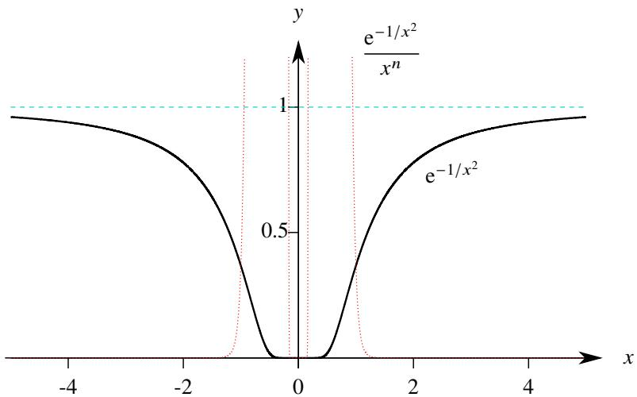  
图4.23: $\mathrm{e}^{-1 / x^2}$ 是 $x^n$ 高阶无穷小，此处以 $n = 20$ 为例

# 4.5.3 对 Taylor 公式余项的定量研究

上一节我们介绍了带Peano余项的Taylor公式.它研究的是函数在给定的一点 $x_0$ 附近的局部性质.由于求极限和求极值都只需要知道 $x_0$ 附近的局部信息,因此带Peano余项的Taylor公式已经够用.

带Peano余项的Taylor公式实际上是无穷小增量公式的一般化. 我们在研究完无穷小增量公式后, 进一步研究了有限增量公式, 即Lagrange中值定理. 它揭示了函数在一个区间上的整体性质. 很自然地, 我们希望按这种思路在一个有限区间上研究Taylor公式. 为此, 我们先来回顾一下有限增量公式. 设函数 $f(x)$ 在开区间 $(a,b)$ 上可导, 对于任意两点 $x, x_0$ 都有

$$
f (x) = f \left(x _ {0}\right) + f ^ {\prime} (\xi) \left(x - x _ {0}\right).
$$

如果把以上等式看作 $f(x)$ 的0次Taylor展开式，则 $f^{\prime}(\xi)(x - x_0)$ 是这个展开式的余项.相比于Peano余项， $f^{\prime}(\xi)(x-$ $x_0)$ 是一个“定量的”余项,虽然我们并不知道 $\xi$ 的具体取值.以上事实可以总结为：如果 $f(x)$ 在 $(a,b)$ 上1阶可导，则可以得到 $f(x)$ 的一个带“定量余项”的0次Taylor展开式.于是我们猜测：如果 $f(x)$ 在 $(a,b)$ 上 $n + 1$ 阶可导，则可以得到 $f(x)$ 的一个带“定量余项”的 $n$ 次Taylor展开式.

# 定理4.29（带Schlömilch余项的Taylor公式）

设函数 $f(x)$ 在区间 $(a,b)$ 上 $n + 1$ 阶可导，则对于任意 $x_0,x\in (a,b)(x_0 < x)$ 都存在 $\xi \in (x_0,x)$ ，使得

$$
f (x) = T _ {n} (f, x _ {0}; x) + \frac {f ^ {(n + 1)} (\xi)}{n ! p} (x - \xi) ^ {n - p + 1} (x - x _ {0}) ^ {p}, \quad p = 1, 2, \dots , n + 1.
$$

证明 令 $F(t) = T_{n}(f,t;x)$ . 对 $F(t)$ 求导

$$
F ^ {\prime} (t) = f ^ {\prime} (t) + \sum_ {k = 1} ^ {n} \left[ \frac {f ^ {(k + 1)} (t)}{k !} (x - t) ^ {k} - \frac {f ^ {(k)} (t)}{(k - 1) !} (x - t) ^ {k - 1} \right] = f ^ {\prime} (t) + \frac {f ^ {(n + 1)} (t)}{n !} (x - t) ^ {n} - f ^ {\prime} (t) = \frac {f ^ {(n + 1)} (t)}{n !} (x - t) ^ {n}.
$$

令

$$
g (t) = \frac {F (x) - F (x _ {0})}{(x - x _ {0}) ^ {p}} (x - t) ^ {p} + F (t) - F (x).
$$

其中 $p \in \mathbb{N}^*$ . 则 $g(t)$ 在闭区间 $[x_0, x]$ 上连续, 在开区间 $(x_0, x)$ 上可导. 且 $g(x_0) = g(x) = 0$ . 由 Rolle 中值定理可知存在 $\xi \in (x_0, x)$ 使得

$$
0 = g ^ {\prime} (\xi) = - \frac {F (x) - F (x _ {0})}{(x - x _ {0}) ^ {p}} p (x - \xi) ^ {p - 1} + F ^ {\prime} (\xi) = - \frac {f (x) - T _ {n} (f , x _ {0} ; x)}{(x - x _ {0}) ^ {p}} p (x - \xi) ^ {p - 1} + \frac {f ^ {(n + 1)} (\xi)}{n !} (x - \xi) ^ {n}.
$$

于是可知

$$
f (x) = T _ {n} (f, x _ {0}; x) + \frac {f ^ {(n + 1)} (\xi)}{n ! p} (x - \xi) ^ {n - p + 1} (x - x _ {0}) ^ {p}.
$$

注 德国数学家 Schlömilch 于 1923 年提出了这种余项.

注 以上定理的证明方法和 Lagrange 定理完全相同.

以上定理中的 $p$ 可以取1到 $n + 1$ 之间的一切自然数, Schlömilch余项实质上是一个“模板”, 可以产生 $n + 1$ 种余项. 因此当 $n = 0$ 时只有一种余项, 这时正好就是Lagrange中值定理. 当 $p$ 取1或 $n + 1$ 时最方便.

# 定理4.30(带Cauchy 余项的Taylor 公式)

设函数 $f(x)$ 在区间 $(a,b)$ 上 $n + 1$ 阶可导, 则对于任意 $x_0, x \in (a,b) (x_0 < x)$ 都存在 $\xi \in (x_0,x)$ , 使得

$$
f (x) = T _ {n} (f, x _ {0}; x) + \frac {f ^ {(n + 1)} (\xi)}{n !} (x - \xi) ^ {n} (x - x _ {0}).
$$

证明 令 Schlömilch 余项的 $p = 1$ 即得.

# 定理4.31(带Lagrange余项的Taylor公式)

设函数 $f(x)$ 在区间 $(a,b)$ 上 $n + 1$ 阶可导, 则对于任意 $x_0, x \in (a,b) (x_0 < x)$ 都存在 $\xi \in (x_0,x)$ , 使得

$$
f (x) = T _ {n} (f, x _ {0}; x) + \frac {f ^ {(n + 1)} (\xi)}{(n + 1) !} (x - x _ {0}) ^ {n + 1}.
$$

证明 令Schlömilch余项的 $p = n + 1$ 即得.

注Lagrange余项的形式和Taylor多项式中项很相似，不同的仅仅是其中的 $n + 1$ 阶导数不在 $x_0$ 处取值，而是在 $x_0$ 和 $x$ 之间取某个中值 $\xi$ .很明显Lagrange中值定理就可以看作带Lagrange余项的Taylor公式.

注一个函数在 $x_0$ 的 $n$ 阶Taylor展开式的Cauchy余项和Lagrange余项中的 $\xi$ 通常是不一样的.

和Lagrange中值定理一样，中值 $\xi$ 可以用 $\theta \in (0,1)$ 代替.这样做往往在估计余项时较方便.令

$$
\theta = \frac {\xi - x _ {0}}{x - x _ {0}} \Longleftrightarrow \xi = x _ {0} + \theta (x - x _ {0}) = \theta x + (1 - \theta) x _ {0}.
$$

由于 $\xi \in (x_0,x)$ ，故 $\theta \in (0,1)$ .于是带Cauchy余项或带Lagrange余项的Taylor公式可以改写成

$$
f (x) = T _ {n} \left(f, x _ {0}; x\right) + \frac {f ^ {(n + 1)} \left[ x _ {0} + \theta \left(x - x _ {0}\right) \right]}{n !} (1 - \theta) ^ {n} \left(x - x _ {0}\right) ^ {n + 1}.
$$

$$
f (x) = T _ {n} (f, x _ {0}; x) + \frac {f ^ {(n + 1)} [ x _ {0} + \theta (x - x _ {0}) ]}{(n + 1) !} (x - x _ {0}) ^ {n + 1}.
$$

令 $x_0 = 0$ ，则带Cauchy余项或带Lagrange余项的Maclaurin展开式为

$$
f (x) = T _ {n} (f, 0; x) + \frac {f ^ {(n + 1)} (\theta x)}{n !} (1 - \theta) ^ {n} x ^ {n + 1}.
$$

$$
f (x) = T _ {n} (f, 0; x) + \frac {f ^ {(n + 1)} (\theta x)}{(n + 1) !} x ^ {n + 1}.
$$

我们知道函数 $f$ 的Taylor多项式可以用来逼近 $f$ , 换句话说Taylor公式可以作为 $f$ 的近似公式. 有了带Lagrange余项或Cauchy余项之后, 我们还可以对Taylor多项式的误差进行估计. 下面来估计几个常见的初等函数的Taylor多项式.

例4.99估计指数函数 $\mathrm{e}^x (x > 0)$ 的 $n$ 次Taylor多项式的误差

解 $\mathbf{e}^x$ 的 $n$ 次Taylor多项式的Lagrange余项为

$$
R _ {n} (x) = \frac {\mathrm {e} ^ {\theta x}}{(n + 1) !} x ^ {n + 1}.
$$

当 $x > 0$ 时

$$
\left| R _ {n} (x) \right| <   \frac {\mathrm {e} ^ {x}}{(n + 1) !} x ^ {n + 1}.
$$

$\mathbf{e}^x$ 的 $n$ 次Taylor多项式的Cauchy余项为

$$
R _ {n} (x) = \frac {\mathrm {e} ^ {\theta x}}{n !} (1 - \theta) ^ {n} x ^ {n + 1}.
$$

当 $x > 0$ 时

$$
\left| R _ {n} (x) \right| <   \frac {\mathrm {e} ^ {x}}{n !} x ^ {n + 1}.
$$

注当 $x = 1$ 时，以上两个估计式分别为

$$
\left| R _ {n} (1) \right| <   \frac {3}{(n + 1) !}. \quad \left| R _ {n} (1) \right| <   \frac {3}{n !}.
$$

可以看出在这里用Lagrange余项估计得更精确一些.在例2.51用另一种方法得到过一个估计式：

$$
e - \widetilde {e} _ {n} <   \frac {1}{n ! n}.
$$

显然这个估计式更加精确，但Lagrange余项给出了一个通用的估计方法，即使在同次数的情况下精度不如别的方法，也可以通过提高次数来弥补。因此我们会认为用Taylor余项估计误差是更好的方法。

例4.100估计正弦函数 $f(x) = \sin x$ 的 $2n$ 次Taylor多项式的误差

解 先计算 $2n + 1$ 阶导数

$$
f ^ {(2 n + 1)} (x) = \sin \left(x + \frac {2 n + 1}{2} \pi\right) = (- 1) ^ {n} \cos x.
$$

用 $\sin x$ 的 $2n$ 次Taylor多项式的Lagrange余项估计：

$$
\left| R _ {2 n} (x) \right| = \left| \frac {(- 1) ^ {n} \cos (\theta x)}{(2 n + 1) !} x ^ {2 n + 1} \right| \leqslant \frac {\left| x \right| ^ {2 n + 1}}{(2 n + 1) !}.
$$

用 $\sin x$ 的 $2n$ 次Taylor多项式的Cauchy余项估计：

$$
\left| R _ {2 n} (x) \right| = \left| \frac {(- 1) ^ {n} \cos (\theta x)}{(2 n) !} (1 - \theta) ^ {2 n} x ^ {2 n + 1} \right| \leqslant \frac {\left| x \right| ^ {2 n + 1}}{(2 n) !}.
$$

例4.101估计对数函数 $f(x) = \ln (1 + x)$ （ $-1 < x < 1$ ）的 $n$ 次Taylor多项式的误差

解 先计算 $f$ 的 $n + 1$ 阶导数：

$$
f ^ {(n + 1)} (x) = \frac {(- 1) ^ {n} n !}{(1 + x) ^ {n + 1}}.
$$

$\ln (1 + x)$ 的 $n$ 次Taylor多项式的Cauchy余项为

$$
R _ {n} (x) = (- 1) ^ {n} x ^ {n + 1} \left(\frac {1 - \theta}{1 + \theta x}\right) ^ {n} (1 + \theta x) ^ {- 1}.
$$

由于 $-1 < x < 1$ ，故

$$
0 <   1 - \theta <   1 + \theta x <   1 + \theta .
$$

因此

$$
\left(\frac {1 - \theta}{1 + \theta x}\right) ^ {n} <   1.
$$

由于 $0 < \theta < 1$ ，故 $|\theta x| < |x|$ 因此

$$
0 <   1 - | x | <   1 + \theta x <   1 + | x | \Longleftrightarrow 0 <   \frac {1}{1 + | x |} <   \frac {1}{1 + \theta x} <   \frac {1}{1 - | x |}.
$$

于是可知

$$
\left| R _ {n} (x) \right| \leqslant \frac {\left| x \right| ^ {n + 1}}{1 - \left| x \right|}.
$$

注当 $x = 0.1$ 时，由以上估计式可知

$$
\left| R _ {n} (0. 1) \right| \leqslant \frac {0 . 1 ^ {n + 1}}{0 . 9}.
$$

如果用3次Taylor多项式逼近，则

$$
\left| R _ {3} (0. 1) \right| <   1. 1 2 \times 1 0 ^ {- 4}.
$$

这表明此时的误差不超过 $0.02\%$

注 $\ln (1 + x)$ 的 $n$ 次Taylor多项式的Lagrange余项为

$$
\left| R _ {n} (x) \right| = \frac {(- 1) ^ {n} n !}{(n + 1) !} \left(\frac {x}{1 + \theta x}\right) ^ {n + 1}.
$$

此时用Lagrange余项不方便估计

例4.102估计函数 $f(x) = (1 + x)^{\alpha}$ $(-1 < x < -1)$ 的 $n$ 次Taylor多项式的误差

解由于

$$
f ^ {(n + 1)} (x) = \alpha (\alpha - 1) \dots (\alpha - n) (1 + x) ^ {\alpha - n - 1}.
$$

因此 $f$ 的Cauchy余项为

$$
R _ {n} (x) = \frac {\alpha (\alpha - 1) \cdots (\alpha - n)}{n !} \left(\frac {1 - \theta}{1 + \theta x}\right) ^ {n} (1 + \theta x) ^ {\alpha - 1} x ^ {n + 1}.
$$

于是可知

$$
\left| R _ {n} (x) \right| \leqslant \left\{ \begin{array}{l l} \frac {\left| \alpha (\alpha - 1) \cdots (\alpha - n) \right|}{n !} (1 + | x |) ^ {\alpha - 1} | x | ^ {n + 1}, & \alpha > 1 \\ \frac {\left| \alpha (\alpha - 1) \cdots (\alpha - n) \right|}{n !} (1 - | x |) ^ {\alpha - 1} | x | ^ {n + 1}, & \alpha <   1 \end{array} \right..
$$

注 如果用 3 次 Taylor 多项式近似计算 $\sqrt{1.1}$ . 根据以上估计式可知

$$
R _ {3} (0. 1) \leqslant \frac {\left| \frac {1}{2} \left(- \frac {1}{2}\right) \left(- \frac {3}{2}\right) \left(- \frac {5}{2}\right) \right|}{3 !} 1. 1 ^ {- 1 / 2} 0. 1 ^ {4} <   1. 5 \times 1 0 ^ {- 5}.
$$

这表明此时的误差不超过 $0.002\%$

注 $(1 + x)^{\alpha}$ 的Lagrange余项为

$$
R _ {n} = \frac {\alpha (\alpha - 1) \cdots (\alpha - n)}{n !} \left(\frac {x}{1 + \theta x}\right) ^ {n + 1} (1 + \theta x) ^ {\alpha}.
$$

利用Lagrange余项或Cauchy余项的Taylor公式可以证明带有导数的不等式

例4.103 设函数 $f$ 在 $[0,1]$ 上二阶可导. 当 $0 \leqslant x \leqslant 1$ 时

$$
| f (0) | \leqslant 1, \quad | f (1) | \leqslant 1, \quad | f ^ {\prime \prime} (x) | \leqslant 2.
$$

则对于任一 $x\in [0,1]$ 都有 $\left|f^{\prime}(x)\right|\leqslant 3$

证明 由带Lagrange余项的Taylor公式可知，存在 $\xi \in (x,1),\eta \in (0,x)$ 使得

$$
f (x) = f (1) + f ^ {\prime} (x) (x - 1) + \frac {1}{2} f ^ {\prime \prime} (\xi) (x - 1) ^ {2}.
$$

$$
f (x) = f (0) + f ^ {\prime} (x) x + \frac {1}{2} f ^ {\prime \prime} (\eta) x ^ {2}.
$$

两式相减得

$$
0 = f (1) - f (0) - f ^ {\prime} (x) + \frac {1}{2} f ^ {\prime \prime} (\xi) (x - 1) ^ {2} - \frac {1}{2} f ^ {\prime \prime} (\eta) x ^ {2}.
$$

于是对于任一 $x\in [0,1]$ 都有

$$
\left| f ^ {\prime} (x) \right| = \left| f (1) - f (0) + \frac {1}{2} f ^ {\prime \prime} (\xi) (x - 1) ^ {2} - \frac {1}{2} f ^ {\prime \prime} (\eta) x ^ {2} \right|
$$

$$
\leqslant | f (1) | + | f (0) | + \frac {1}{2} | f ^ {\prime \prime} (\xi) | (x - 1) ^ {2} + \frac {1}{2} | f ^ {\prime \prime} (\eta) | x ^ {2} \leqslant 1 + 1 + (1 - x) ^ {2} + x ^ {2} \leqslant 3.
$$

用带定量余项的Taylor公式可以研究用多项式逼近函数时的误差.

# 定理4.32（线性插值定理）

设函数 $f$ 在 $[a,b]$ 上连续，在 $(a,b)$ 上有二阶导数. $l$ 是由 $(a,f(a)),(b,f(b))$ 确定的一次函数.若 $|f^{\prime \prime}(x)|$ 在 $(a,b)$ 上的上界为 $M$ ，则对于任一 $x\in [a,b]$ 都有

$$
\left| l (x) - f (x) \right| \leqslant \frac {M}{8} (b - a) ^ {2}.
$$

证明 由定比分点公式可知 $l$ 的方程为：

$$
l (x) = \frac {b - x}{b - a} f (a) + \frac {x - a}{b - a} f (b).
$$

由于

$$
f (x) = \frac {b - x}{b - a} f (x) + \frac {x - a}{b - a} f (x).
$$

因此

$$
l (x) - f (x) = \frac {b - x}{b - a} [ f (a) - f (x) ] + \frac {x - a}{b - a} [ f (b) - f (x) ]. \tag {4.26}
$$

由带Lagrange余项的Taylor公式可知，存在 $\xi \in (a,x),\eta \in (x,b)$ 使得

$$
f (a) - f (x) = (a - x) f ^ {\prime} (x) + \frac {1}{2} (a - x) ^ {2} f ^ {\prime \prime} (\xi).
$$

$$
f (b) - f (x) = (b - x) f ^ {\prime} (x) + \frac {1}{2} (b - x) ^ {2} f ^ {\prime \prime} (\eta).
$$

把以上两式代入等式4.26可知

$$
l (x) - f (x) = \frac {(b - x) (x - a)}{2} \left[ \frac {x - a}{b - a} f ^ {\prime \prime} (\xi) + \frac {b - x}{b - a} f ^ {\prime \prime} (\eta) \right]. \tag {4.27}
$$

由于

$$
\frac {x - a}{b - a} > 0, \quad \frac {b - x}{b - a} > 0, \quad \frac {x - a}{b - a} + \frac {b - x}{b - a} = 1.
$$

且 $|f''(x)|$ 在 $(a,b)$ 上的上界为 $M$ ，由均值不等式可知

$$
\left| l (x) - f (x) \right| \leqslant \frac {(b - x) (x - a)}{2} \left[ \frac {x - a}{b - a} \left| f ^ {\prime \prime} (\xi) \right| + \frac {b - x}{b - a} \left| f ^ {\prime \prime} (\eta) \right| \right] \leqslant \frac {M}{2} (b - x) (x - a) \leqslant \frac {M}{2} \left(\frac {b - x + x - a}{2}\right) ^ {2} = \frac {M}{8} (b - a) ^ {2}.
$$

注 以上定理表明, 当 $[a, b]$ 给定时, 用线段代替曲线段产生的误差只和 $M$ 有关——曲线 $y = f(x)$ 在 $[a, b]$ 上的切线变化越不剧烈, 直线段的逼近效果越好, 这个结论符合几何直观.

注 容易看出, 等式4.27右侧括号中的式子一定介于 $f''(\xi)$ 和 $f''(\eta)$ 之间, 由 Darboux 定理可知一定存在 $\zeta \in (a,b)$ 使得

$$
l (x) - f (x) = \frac {(b - x) (x - a)}{2} f ^ {\prime \prime} (\zeta).
$$

若 $f'' \geqslant 0$ 则 $f$ 在 $[a, b]$ 上是凸的，这就再次证明了定理4.25.

在本章的最后我们来做一个简单的小结. Taylor 公式表面复杂, 实质是由只含有代数运算的多项式和余项构成的. 两种不同余项的 Taylor 公式实际上是对微分 (无穷小增量公式) 和微分中值定理 (有限增量公式) 的推广. 它们分别代表了微分学中的两种最重要的思想方法:

(1) 前者只关注在一点的局部情况, 且只关心余项的阶.  
(2) 后者则关心整个区间上的情况, 且希望用更高阶的导数把余项定量表达出来, 虽然余项中含有并不确定的中值 $\xi$ .

从这个角度看, 两种 Taylor 公式概括了整个一元微分学的理论, 也几乎可以解决一元微分学中的任何问题.

