# 内容提要

为了定义平面图形的面积，我们从矩形的面积和面积的三条公理出发引出了Riemann积分的概念.  
按定义直接计算 Riemann 积分是极其不方便的. Newton-Leibniz 公式给我们提供了一个计算 Riemann 积分的途径. 并深刻揭示了微分和积分之间的内在联系.  
Riemann积分的定义操作十分不便，因此需要找一个容易操作的等价定义.借助上极限和下极限的思想方法，我们将介绍Darboux积分的

概念.

在有界函数中，连续函数都是可积的。但连续这个条件太强了，我们希望找到所有可积函数类。这就引出了Lebesgue定理。  
利用Riemann积分可以计算平面图形的面积、曲线的弧长等.  
利用Riemann积分还可以研究无穷级数和不等式.  
最后我们将介绍无穷积分和瑕积分的计算.

# 5.1 Riemann 积分的概念

# 5.1.1 平面图形的面积

长度、面积和体积的概念是我们熟悉的。我们早已“掌握”了多边形、圆的面积计算方法以及棱柱、棱锥、圆柱、圆锥和球的体积计算方法。但事实，上我们从未严格定义过长度、面积和体积。下面我们就要尝试定义这几个概念（但我们重点要讨论的是面积）。

我们可以把“长度”看作是1维实空间 $\mathbb{R}$ (即实数轴)的一个子集族 $X$ (我们不敢保证每个 $\mathbb{R}$ 的子集都有“长度”)到实数域 $\mathbb{R}$ 的一个映射 $M$ . 我们首先规定

$$
M ([ a, b ]) := b - a.
$$

其中 $a \leqslant b$ . 这表明任何闭区间 $[a, b]$ 的长度为 $b - a$ . 并蕴含了数轴上任意一点的长度为零. 然后我们可以列出几条公理 (姑且称它们为公理): 对于任意 $A, B \in X$ 都满足

$1^{\circ}$ 非负性： $M(A)\geqslant 0$   
$2^{\circ}$ 单调性: 若 $A \subseteq B$ , 则 $M(A) \leqslant M(B)$ .  
$3^{\circ}$ 可加性: 若 $A \cap B = \emptyset$ , 则 $M(A \cup B) = M(A) + M(B)$ .

若集合 $A$ 经过平面上的正交变换(平面的正交变换即为平移、旋转、反射以及它们的乘积)变成了 $B$ , 则称 $A$ 和 $B$ 全等或合同 (Congruence). 我们规定, $M(A) = M(B)$ 当且仅当 $A \cong B$ .

由于任意一点的长度都是零, 由可加性公理可知开区间 $(a, b)$ 的长度也是 $b - a$ . 半开半闭区间的情况也一样. 为了让整个实数轴也有长度, 我们规定 $M$ 可以取到 $+\infty$ .

类似地, 我们可以把“面积”看作是2维实空间 $\mathbb{R}^2$ (即实平面)的一个子集族 $X$ 到实数域 $\mathbb{R}$ 的一个映射 $M$ . 我们首先规定一个邻边长分别为 $a$ 和 $b$ 的矩形 $A$ 的面积为 $a \cdot ba, b \geqslant 0$ . 这蕴含了线段的面积为零. 以上的三条公理可以“原封不动”地拿来刻画面积. 类似地, 可以把“体积”看作是3维实空间 $\mathbb{R}^3$ 的一个子集族到实数域 $\mathbb{R}$ 的一个映射.

依次下去, 还可以进一步把长度、面积和体积的概念推广到 $n$ 维Euclid空间 $\mathbb{R}^n$ 中. 事实上物理中的功 (work)、位移 (displacement)、冲量 (impulse) 都满足以上三条公理, 我们可以考虑用一个统一的概念来描述它们, 这就是测度(measure). 今后我们会专门研究这个主题.

借助上面的公理和规定我们可以定义三角形的面积.如图5.1,设三角形 $ABC$ 的底 $|BC| = a$ . 过 $A$ 作 $BC$ 的垂线，垂足为 $A^{\prime}$ . 设高 $|AA^{\prime}| = h$ . 过点 $A$ 作 $BC$ 的平行线，然后分别过 $B,C$ 作该平行线的垂线，垂足分别为 $B^{\prime},C^{\prime}$ .这

样我们就得到了一个长和宽分别为 $a$ 和 $h$ 的矩形 $BCC'B'$ , 它的面积为 $ah$ . 现在 $BCC'B'$ 已经被分为了两两不相交的四个三角形: $\triangle BB'A, \triangle AA'B, \triangle AA'C, \triangle CC'A$ . 令它们的面积分别为 $S_{1}, S_{2}, S_{3}, S_{4}$ . (由于线段的面积为零, 因此两个相邻三角形的公共边不会影响这两个三角形的面积, 可以不必理会.) 由可加性公理可知

$$
S _ {1} + S _ {2} + S _ {3} + S _ {4} = a h.
$$

容易知道 $\triangle BB^{\prime}A\cong \triangle AA^{\prime}B,\triangle AA^{\prime}C\cong \triangle CC^{\prime}A$ ，由单调性公理可知 $S_{1} = S_{2},S_{3} = S_{4}$

$$
2 S _ {2} + 2 S _ {3} = a h \Longleftrightarrow S _ {2} + S _ {3} = \frac {1}{2} a h.
$$

于是可加性公理可知

$$
S _ {\triangle A B C} = S _ {2} + S _ {3} = \frac {1}{2} a h.
$$

基于以上讨论, 定义多边形的面积不会遇到困难, 因为任意多边形总是可以划分成有限个三角形. 真正的难点在于如何定义“曲边图形”的面积. 下面我们来尝试解决这个问题.

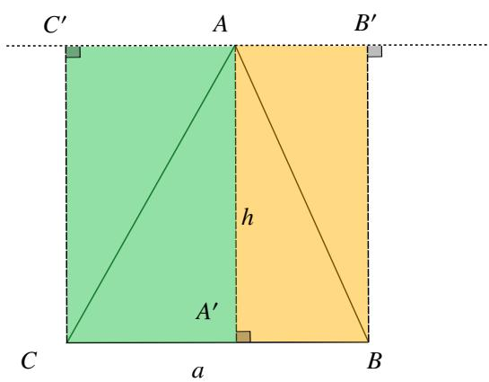  
图5.1: 三角形的面积

# 5.1.2 Riemann 积分的定义

如图5.2所示，设函数 $f$ 在闭区间 $[a, b]$ 上非负，它的图像与 $x$ 轴以及直线 $x = a, x = b$ 围成了一个位于第一象限的“曲边梯形”。我们来尝试定义这个曲边梯形的面积。

首先, 我们想到用一系列很小的矩形来近似它的面积. 为此我们可以把 $[a, b]$ 区间分割成 $n$ 个小区间 $[x_{i-1}, x_i]$ , 它们的长度是 $\Delta x_i = x_i - x_{i-1} (i = 1, 2, \dots, n)$ , 其中 $x_0 = a$ , $x_n = b$ . 这样我就得到了区间 $[a, b]$ 的一个分割, 我们把这个分割记作 $\pi$ .

然后作直线 $x = x_{i}$ $(i = 0,1,2,\dots ,n)$ .在 $[x_{i - 1},x_i]$ 中任取一点 $\xi_{i}$ .于是我们得到了 $n$ 个小矩形，它们的长和宽分别为 $f(\xi_i)$ 和 $\Delta x_{i}$ $(i = 1,2,\dots ,n)$ .这些小矩形两两不相交(不考虑邻接边界).由可加性公理可知，它们组成的图形的面积为

$$
S _ {n} = \sum_ {i = 1} ^ {n} f (\xi_ {i}) \Delta x _ {i}.
$$

我们可以用 $S_{n}$ 作为曲边梯形面积的近似值. 我们把 $S_{n}$ 称为Riemann和(Riemann sum).

容易想到，区间 $[a,b]$ 的分割越“细”，小矩形组成的图形就越接近曲边梯形.要让分割更“细”，只需让 $\Delta x_{i}$ $(i = 1,2,\dots ,n)$ 中最大的那个变小.于是令

$$
\| \pi \| := \max  _ {1 \leqslant i \leqslant n} \left\{\Delta x _ {i} \right\}.
$$

我们把 $\| \pi \|$ 称为分割 $\pi$ 的宽度. 于是我们只需让 $\| \pi \|$ 变小就可以让小矩形组成的图形更接近曲边梯形. 很自然地想到, 当 $\| \pi \| \to 0$ 时 Riemann 和的极限可以用来定义该曲边梯形的面积. 为了做成这件事, 我们需要把可加性公

理放宽为“可数可加性”: 若 $A_{1}, A_{2}, \cdots$ 两两不相交, 则

$$
M \left(\bigcup_ {i = 1} ^ {\infty} A _ {i}\right) = \sum_ {i = 1} ^ {\infty} M \left(A _ {i}\right).
$$

但我们不能把可加性放宽到“任意可加性”，不然就会出现不符合直觉的情况——因为点的长度为零，而线段是由任意多的点组成的，但线段的长度不为零。

有了以上的准备工作, 我们可以定义曲边梯形的面积

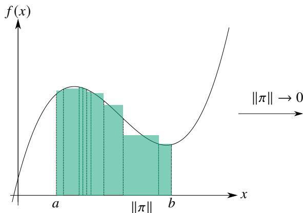

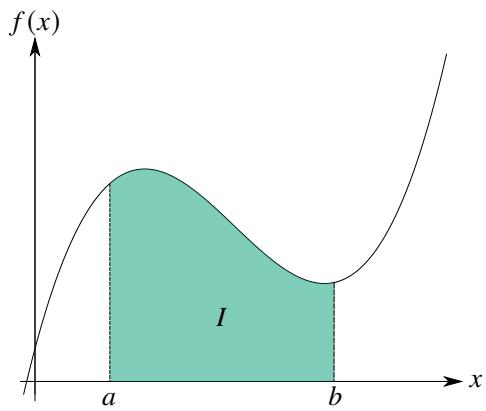  
图5.2：从“Riemann和”到“Riemann积分”.

# 定义5.1 (Riemann积分)

设函数 $f$ 在闭区间 $[a,b]$ 上有定义.对闭区间 $[a,b]$ 作分割

$$
\pi : a = x _ {0} <   x _ {1} <   \dots <   x _ {n} = b.
$$

若存在 $I \in \mathbb{R}$ 使得对任一 $\varepsilon > 0$ 都存在 $\delta > 0$ 只要当 $\| \pi \| < \delta$ 时都有

$$
\left| \sum_ {i = 1} ^ {n} f \left(\xi_ {i}\right) \Delta x _ {i} - I \right| <   \varepsilon .
$$

即

$$
\lim  _ {\| \pi \| \rightarrow 0} \sum_ {i = 1} ^ {n} f (\xi_ {i}) \Delta x _ {i} = I.
$$

则称 $f$ 在 $[a,b]$ 上Riemann可积(Riemannintegrable), $I$ 称为 $f(x)$ 在 $[a,b]$ 上的Riemann积分(Riemann integral).记作

$$
\int_ {a} ^ {b} f (x) \mathrm {d} x.
$$

其中 $\int$ 称为积分号, $f$ 称为被积函数 (integrand), $f(x) \mathrm{d}x$ 称为被积表达式 (integrand expression). $a$ 和 $b$ 分别称为积分下限 (lower limit of integration) 和积分上限 (upper limit of integration).

注 相对于不定积分, Riemann 积分也称为定积分 (definite integral). 朴素的定积分概念在 Newton 时代已经存在, 但第一个严格的定义是德国数学家 Bernhard Riemann 在 1868 年发表的 (实际上 1854 年就已经提出). 为 Riemann 积分的定义借鉴了极限的 $\varepsilon - \delta$ 语言.

注 Riemann 积分的定义中, $\xi_{i}$ 可以在 $[x_{i-1}, x_{i}]$ 中任意选取.

注积分的意义是“求和”(summation), 因此用拉长的 $s$ 表示积分符号.

需要注意, 根据 Riemann 积分的定义, 如果函数 $f$ 在区间 $[a, b]$ 上可积且 $f > 0$ , 则 $\int_{a}^{b} f(x) \mathrm{d}x > 0$ . 反之, 若 $f < 0$ , 则 $\int_{a}^{b} f(x) \mathrm{d}x < 0$ . 因此 Riemann 积分定义的面积是一种有向面积: 如图5.3所示, 在 $x$ 轴上方的面积为正, 下方的面积为负. 因此如果奇函数 $f$ 在 $[-a, a]$ 上可积, 则积分值为零.

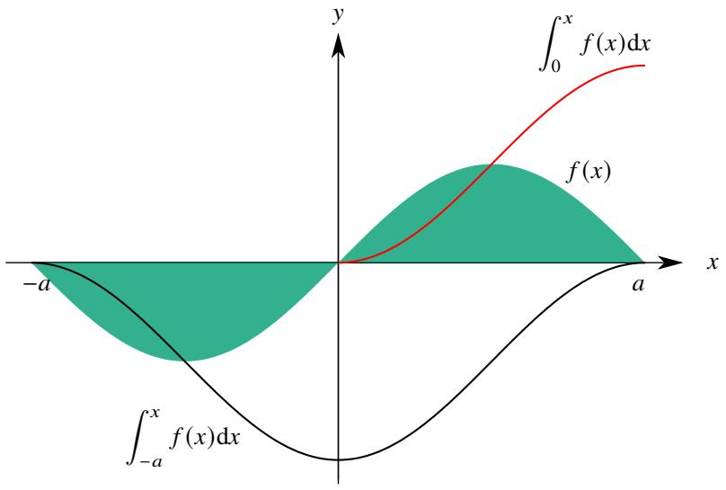  
图5.3: Riemann积分是有向面积

由Riemann积分定义立刻可知以下简单性质

# 命题5.1 (Riemann积分的简单性质)

设函数 $f$ 和 $g$ 在 $[a,b]$ 上Riemann可积

(1) 非负性 (保号性): 若 $f$ 在 $[a, b]$ 上非负, 则

$$
\int_ {a} ^ {b} f (x) \mathrm {d} x \geqslant 0.
$$

(2) 单调性 (保序性): 若 $f$ 和 $g$ 在 $[a, b]$ 上满足 $f(x) \geqslant g(x)$ , 则

$$
\int_ {a} ^ {b} f (x) \mathrm {d} x \geqslant \int_ {a} ^ {b} g (x) \mathrm {d} x.
$$

(3) 可加性: 若 $c \in (a, b)$ , 且 $f$ 在 $[a, c]$ 和 $[c, b]$ 上都可积, 则

$$
\int_ {a} ^ {c} f (x) \mathrm {d} x = \int_ {a} ^ {b} f (x) \mathrm {d} x + \int_ {b} ^ {c} f (x) \mathrm {d} x.
$$

(4) 线性：

$$
\int_ {a} ^ {b} [ f (x) + g (x) ] \mathrm {d} x = \int_ {a} ^ {b} f (x) \mathrm {d} x + \int_ {a} ^ {b} g (x) \mathrm {d} x,
$$

$$
\int_ {a} ^ {b} \lambda f (x) d x = \lambda \int_ {a} ^ {b} f (x) d x.
$$

注 由下一节的推论 (5.7) 可知, 若函数 $f$ 在 $[a,b]$ 上 Riemann 可积, 则它在 $[a,c]$ 和 $[c,b]$ 上都可积. 因此性质 (3) 中的条件是可以去掉的.

注 由性质 (4) 可见, Riemann 积分也是一个线性算子.

下面我们来看一下Riemann积分定义的面积是否和我们已有的矩形、三角形面积定义一致.

例5.1 计算Riemann积分：

$$
\int_ {a} ^ {b} c d x, \quad c \in \mathbb {R}.
$$

解 先计算 $\int_{a}^{b} 1 \, \mathrm{d}x$ . 令 $f(x) = 1$ ( $a \leqslant x \leqslant b$ ). 对区间 $[a, b]$ 作分割:

$$
\pi : a = x _ {0} <   x _ {1} <   \dots <   x _ {n} = b.
$$

由于 $f(\xi_i) = 1 (i = 1,2,\dots)$ , 于是

$$
\sum_ {i = 1} ^ {n} f (\xi_ {i}) \Delta x _ {i} = \sum_ {i = 1} ^ {n} (x _ {i} - x _ {i - 1}) = x _ {n} - x _ {0} = b - a.
$$

由Riemann积分的定义可知

$$
\int_ {a} ^ {b} 1 \mathrm {d} x = \lim  _ {\| \pi \| \rightarrow 0} \sum_ {i = 1} ^ {n} f (\xi_ {i}) \Delta x _ {i} = b - a.
$$

于是可知

$$
\int_ {a} ^ {b} c d x = c \int_ {a} ^ {b} 1 d x = c (b - a).
$$

例5.2 计算Riemann积分：

$$
\int_ {a} ^ {b} c x \mathrm {d} x, \quad c \in \mathbb {R}.
$$

解先计算 $\int_{a}^{b}x\mathrm{d}x.$ 对区间 $[a,b]$ 作分割：

$$
\pi : a = x _ {0} <   x _ {1} <   \dots <   x _ {n} = b.
$$

对 $\pi$ 作Riemann和 $\sum_{i=1}^{n} \xi_i \Delta x_i$ . 由于 $\xi_i (i = 1,2,\dots)$ 是随意选取的，因此我们考虑先选取小区间的中点 $\eta_i = (x_{i-1} + x_i) / 2$ . 计算得

$$
\sum_ {i = 1} ^ {n} \eta_ {i} \Delta x _ {i} = \frac {1}{2} \sum_ {i = 1} ^ {n} (x _ {i - 1} + x _ {i}) (x _ {i} - x _ {i - 1}) = \frac {1}{2} \sum_ {i = 1} ^ {n} \left(x _ {i} ^ {2} - x _ {i - 1} ^ {2}\right) = \frac {1}{2} \left(b ^ {2} - a ^ {2}\right).
$$

于是

$$
\sum_ {i = 1} ^ {n} \xi_ {i} \Delta x _ {i} = \sum_ {i = 1} ^ {n} \eta_ {i} \Delta x _ {i} + \sum_ {i = 1} ^ {n} (\xi_ {i} - \eta_ {i}) \Delta x _ {i} = \frac {1}{2} (b ^ {2} - a ^ {2}) + \sum_ {i = 1} ^ {n} (\xi_ {i} - \eta_ {i}) \Delta x _ {i}.
$$

由于 $|\xi_i - \eta_i| < \Delta x_i \leqslant \| \pi\|$ ( $i = 1,2,\dots$ ), 故

$$
\left| \sum_ {i = 1} ^ {n} \xi_ {i} \Delta x _ {i} - \frac {1}{2} (b ^ {2} - a ^ {2}) \right| = \left| \sum_ {i = 1} ^ {n} (\xi_ {i} - \eta_ {i}) \Delta x _ {i} \right| \leqslant \sum_ {i = 1} ^ {n} | \xi_ {i} - \eta_ {i} | \Delta x _ {i} <   \| \pi \| \sum_ {i = 1} ^ {n} \Delta x _ {i} = \| \pi \| (b - a).
$$

于是可知, 对于任一 $\varepsilon > 0$ , 取 $\delta = \varepsilon / (b - a)$ , 当 $\| \pi \| < \delta$ 时无论 $\xi_{i}$ 如何选择, 都有

$$
\left| \sum_ {i = 1} ^ {n} \xi_ {i} \Delta x _ {i} - \frac {1}{2} (b ^ {2} - a ^ {2}) \right| <   \| \pi \| (b - a) <   \delta (b - a) = \varepsilon .
$$

由Riemann积分的定义可知

$$
\int_ {a} ^ {b} x \mathrm {d} x = \frac {b ^ {2} - a ^ {2}}{2}.
$$

由Riemann积分的线性可知

$$
\int_ {a} ^ {b} x \mathrm {d} x = c \int_ {a} ^ {b} x \mathrm {d} x = \frac {c (b ^ {2} - a ^ {2})}{2}.
$$

以上两个例子的计算结果表明Riemann积分定义的面积和我们已有的矩形、三角形(梯形)面积定义一致.

# 5.1.3 Riemann可积函数的性质

为了方便问题的讨论，我们规定

$$
\int_ {a} ^ {a} f (x) \mathrm {d} x = 0.
$$

下面我们可以定义积分上限小于积分下限的Riemann积分.我们希望定义的积分继续满足可加性，即

$$
0 = \int_ {a} ^ {a} f (x) \mathrm {d} x = \int_ {a} ^ {b} f (x) \mathrm {d} x + \int_ {b} ^ {a} f (x) \mathrm {d} x.
$$

于是我们可以规定当 $a < b$ 时

$$
\int_ {b} ^ {a} f (x) \mathrm {d} x := - \int_ {a} ^ {b} f (x) \mathrm {d} x.
$$

由上面的性质可知, Riemann 积分满足非负性、单调性和可加性, 这说明我们定义的 Riemann 积分是合理的. 于是古典几何中的平面图形面积几乎都可以得到定义. 从这个角度讲 Riemann 积分已经足够好. 但 Riemann 积分在更一般的情况下它会出现一些明显的缺陷. 届时我们将给出“更好”的积分定义. 因此我们在说“可积”时一般要说明是 Riemann 可积.

在非负性的基础上, 我们可以进一步给出 Riemann 不为零的条件.

# 命题5.2 (Riemann积分的正定性)

设函数 $f$ 在 $[a,b]$ 上连续且非负，且 $f$ 不恒等于零.若 $f$ 在 $[a,b]$ 上Riemann可积，则

$$
\int_ {a} ^ {b} f (x) \mathrm {d} x > 0.
$$

证明 由于 $f(x)$ 非负且不恒等于零, 故存在 $x_0 \in [a,b]$ 满足 $f(x_0) > 0$ . 由于函数 $f(x)$ 在 $[a,b]$ 上连续, 故存在 $[a_1,b_1]$ 满足 $x_0 \in [a_1,b_1] \subseteq [a,b]$ 且对于一切 $x \in [a_1,b_1]$ 都有

$$
f (x) \geqslant \frac {1}{2} f \left(x _ {0}\right).
$$

由于 $f(x)$ Riemann可积，由Riemann积分的单调性可知

$$
\int_ {a _ {1}} ^ {b _ {1}} f (x) \mathrm {d} x \geqslant \int_ {a _ {1}} ^ {b _ {1}} \frac {1}{2} f (x _ {0}) \mathrm {d} x = \frac {1}{2} f (x _ {0}) \left(b _ {1} - a _ {1}\right) > 0.
$$

由Riemann积分的可加性和非负性可知

$$
\int_ {a} ^ {b} f (x) \mathrm {d} x = \int_ {a} ^ {a _ {1}} f (x) \mathrm {d} x + \int_ {a _ {1}} ^ {b _ {1}} f (x) \mathrm {d} x + \int_ {b _ {1}} ^ {b} f (x) \mathrm {d} x \geqslant \int_ {a _ {1}} ^ {b _ {1}} f (x) \mathrm {d} x > 0.
$$

注 由下一节的定理 (5.5) 可知 $f(x)$ 在 $[a, b]$ 上连续, 则一定在 $[a, b]$ 上 Riemann 可积.

以上命题的逆否命题可以写成一条推论

# 推论5.1

设函数 $f$ 在 $[a,b]$ 上连续且非负.若

$$
\int_ {a} ^ {b} f (x) \mathrm {d} x = 0.
$$

则 $f = 0$

注 由以上推论立刻可知: 若 $f(x)$ 在 $[a, b]$ 上连续

$$
\int_ {a} ^ {b} f ^ {2} (x) \mathrm {d} x = 0.
$$

则 $f = 0$

# 命题5.3

设函数 $f(x)$ 在 $[a,b]$ 上Riemann可积，且 $|f(x)|$ 也在 $[a,b]$ 上Riemann可积.则

$$
\left| \int_ {a} ^ {b} f (x)   \mathrm {d} x \right| \leqslant \int_ {a} ^ {b} | f (x) |   \mathrm {d} x.
$$

证明 由于 $-|f(x)| \leqslant f(x) \leqslant |f(x)|$ , 由 Riemann 积分的单调性可知

$$
- \int_ {a} ^ {b} | f (x) | \mathrm {d} x \leqslant \int_ {a} ^ {b} f (x) \mathrm {d} x \leqslant \int_ {a} ^ {b} | f (x) | \mathrm {d} x \Longleftrightarrow \left| \int_ {a} ^ {b} f (x) \mathrm {d} x \right| \leqslant \int_ {a} ^ {b} | f (x) | \mathrm {d} x.
$$

注由下一节的推论(5.4)可知, 若函数 $f$ 在 $[a,b]$ 上Riemann可积, 则 $|f|$ 也在 $[a,b]$ 上Riemann可积

函数的Riemann积分是线性的，因此对于函数加法的积分是很容易处理的.但函数乘积的Riemann积分就比较麻烦(这和导数的情况类似).下面的定理可以帮助我们把函数乘积的积分转化为单个函数的积分.

# 定理5.1（积分中值定理）

设函数 $f$ 和 $g$ 在 $[a,b]$ 上连续, 且 $g$ 不改变符号. 若 $fg$ 和 $g$ 在 $[a,b]$ 上都Riemann可积, 则存在 $\xi \in [a,b]$ 使得

$$
\int_ {a} ^ {b} f (x) g (x) \mathrm {d} x = f (\xi) \int_ {a} ^ {b} g (x) \mathrm {d} x.
$$

证明当 $g = 0$ 时定理显然成立，下设 $g\neq 0.$ 由于 $g(x)$ 不改变符号，不妨设 $g\geqslant 0.$ 由Riemann积分的正定性可知

$$
\int_ {a} ^ {b} g (x) \mathrm {d} x > 0
$$

由于 $f$ 在 $[a,b]$ 上连续，因此可设 $f$ 在 $[a,b]$ 上的最大值和最小值分别为 $M$ 和 $m$ . 于是当 $x \in [a,b]$ 时

$$
m \leqslant f (x) \leqslant M \iff m g (x) \leqslant f (x) g (x) \leqslant M g (x).
$$

由Riemann积分的单调性可知

$$
m \int_ {a} ^ {b} g (x) \mathrm {d} x \leqslant \int_ {a} ^ {b} f (x) g (x) \mathrm {d} x \leqslant M \int_ {a} ^ {b} g (x) \mathrm {d} x \Longleftrightarrow m \leqslant \frac {\int_ {a} ^ {b} f (x) g (x) \mathrm {d} x}{\int_ {a} ^ {b} g (x) \mathrm {d} x} \leqslant M.
$$

由介值定理可知存在 $\xi \in [a,b]$ 使得

$$
\int_ {a} ^ {b} f (x) g (x) \mathrm {d} x = f (\xi) \int_ {a} ^ {b} g (x) \mathrm {d} x.
$$

注事实上 $\xi$ 一定可以在 $(a,b)$ 中取到

注 由下一节的定理 (5.5) 可知 $f(x)$ 和 $g(x)$ 在 $[a, b]$ 上连续, 则一定在 $[a, b]$ 上 Riemann 可积. 再由下一节的推论 (5.5) 可知 $f(x)g(x)$ 也在 $[a, b]$ 上 Riemann 可积.

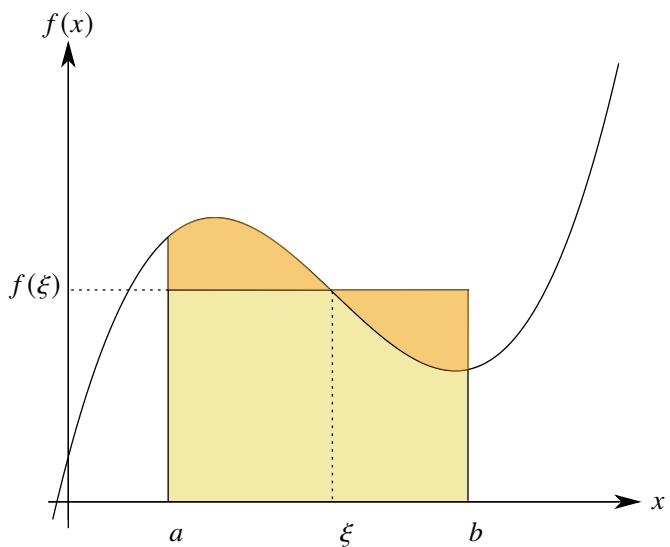  
图5.4：积分中值定理示意图

令以上定理中的 $g(x) = 1$ 就可以得到以下推论

# 推论5.2

设函数 $f$ 在 $[a,b]$ 上连续.则存在 $\xi \in [a,b]$ 使得

$$
\int_ {a} ^ {b} f (x) \mathrm {d} x = f (\xi) (b - a).
$$

注以上推论有很明确的几何意义.5.4所示，函数 $f$ 在 $[a,b]$ 上非负，则存在 $\xi \in [a,b]$ 使得 $\int_{a}^{b}f(x)\mathrm{d}x$ 定义的曲边梯形面积等于一个长和宽分别为 $f(\xi)$ 和 $b - a$ 的矩形面积

# 5.2 Riemann 可积的条件

# 5.2.1 Riemann 可积的必要条件

定义了Riemann积分后，首先面临的问题就是哪些函数是Riemann可积的？

# 命题5.4（Riemann可积的必要条件）

设函数 $f(x)$ 在闭区间 $[a,b]$ 上Riemann可积,则 $f(x)$ 在 $[a,b]$ 上有界.

证明设函数 $f(x)$ 在闭区间 $[a,b]$ 上的Riemann积分为 $I$ ，由Riemann积分的定义可知，对于 $\varepsilon = 1$ ，存在一个分割 $\pi :a = x_0 <   x_1 <   \dots <  x_n = b,$ 使得

$$
\left| \sum_ {i = 1} ^ {n} f (\xi_ {i}) \Delta x _ {i} - I \right| <   1,
$$

其中 $\xi_{i}$ 是 $[x_{i - 1},x_i]$ 上的任意一点 $(i = 1,2,\dots ,n)$ . 由三角不等式可知

$$
\left| \sum_ {i = 1} ^ {n} f (\xi_ {i}) \Delta x _ {i} \right| - | I | \leqslant \left| \sum_ {i = 1} ^ {n} f (\xi_ {i}) \Delta x _ {i} - I \right| <   1 \Longrightarrow \left| \sum_ {i = 1} ^ {n} f (\xi_ {i}) \Delta x _ {i} \right| <   | I | + 1.
$$

把Riemann和的第一项单独写出来，则有

$$
\begin{array}{l} \left| f \left(\xi_ {1}\right) \Delta x _ {1} \right| - \left| \sum_ {i = 2} ^ {n} f \left(\xi_ {i}\right) \Delta x _ {i} \right| \leqslant \left| f \left(\xi_ {1}\right) \Delta x _ {1} + \sum_ {i = 2} ^ {n} f \left(\xi_ {i}\right) \Delta x _ {i} \right| <   | I | + 1 \\ \Longrightarrow | f (\xi_ {1}) | \Delta x _ {1} <   \left| \sum_ {i = 2} ^ {n} f (\xi_ {i}) \Delta x _ {i} \right| + | I | + 1 \Longleftrightarrow | f (\xi_ {1}) | <   \frac {1}{\Delta x _ {1}} \left(\left| \sum_ {i = 2} ^ {n} f (\xi_ {i}) \Delta x _ {i} \right| + | I | + 1\right). \\ \end{array}
$$

取定 $\xi_2, \xi_3, \dots, \xi_n$ , 则上式右侧是一个固定的实数. 由于 $\xi_1$ 是 $[x_0, x_1]$ 上的任意一点, 这表明 $f(x)$ 在 $[x_0, x_1]$ 上是有界的.

同理可证 $f(x)$ 在其余的子区间 $[x_{i - 1},x_i](i = 2,3,\dots ,n)$ 上都有界.于是可知 $f(x)$ 在 $[a,b]$ 上有界

利用以上必要条件，可以立刻判断某些函数不可积

例5.3 设函数 $f(x) = 1 / \sqrt{x}$ . 则 $f(x)$ 在 $[0,1]$ 上不可积

证明对于任一 $M > 0$ ，取 $\delta = 1 / M^2$ ，则当 $x\in (0,\delta)$ 时 $f(x) > M.$ 因此 $f(x)$ 在 $(0,1)$ 上无界.由Riemann可积的必要条件可知 $f(x)$ 在[0,1]上不可积.

以上这个例子很重要, 我们很快会看到, 函数 $f(x) = 1 / \sqrt{x}$ 虽然不可积, 但放宽条件后, 它就可以积分. 这个主题我们会在“广义积分”中讨论.

# 5.2.2 上积分与下积分

我们只需讨论在 $[a, b]$ 上有界的函数 $f$ . 由 Riemann 积分的定义可知, 对于给定的分割 $\pi$ , Riemann 和 $\sum_{i=1}^{n} f(\xi_i) \Delta x_i$ 中的 $\xi_i$ 是在 $[x_{i-1}, x_i] (i = 1, 2, \dots)$ 中任意选取的. 因此直接用 Riemann 积分的定义不太方便. 我们希望找到刻画 Riemann 积分的其他方法.

因此考虑分别找出 $\pi$ 决定的所有Riemann和的上确界和下确界, 然后转而讨论这个上确界和下确界, 这样就可以绕开 $\xi_{i}$ 来讨论问题.

对于 $[a,b]$ 的任一给定的分割

$$
\pi : a = x _ {0} <   x _ {1} <   \dots <   x _ {n} = b.
$$

令

$$
M _ {i} = \sup  f ([ x _ {i - 1}, x _ {i} ]), \quad m _ {i} = \inf  f ([ x _ {i - 1}, x _ {i} ]), \quad i = 1, 2, \dots , n.
$$

令 $\omega_{i} = M_{i} - m_{i}$ . 则 $\omega_{i}$ 为 $f(x)$ 在 $[x_{i - 1},x_i]$ 上的振幅. 容易知道, 无论 $\xi_{i}$ 在 $[x_{i - 1},x_i](i = 1,2,\dots ,n)$ 中如何选取，都有

$$
\sum_ {i = 1} ^ {n} m _ {i} \Delta x _ {i} \leqslant \sum_ {i = 1} ^ {n} f (\xi_ {i}) \Delta x _ {i} \leqslant \sum_ {i = 1} ^ {n} M _ {i} \Delta x _ {i}.
$$

这样我们就找到了 Riemann 和的上确界和下确界. 且这里的上确界和下确界由函数 $f$ 和分割 $\pi$ 完全决定, 于是引出了以下概念.

# 定义5.2(Darboux和)

设函数 $f$ 在区间 $[a,b]$ 上有界. 给定 $[a,b]$ 的一个分割

$$
\pi : a = x _ {0} <   x _ {1} <   \dots <   x _ {n} = b.
$$

把 $f([x_{i - 1},x_i])$ 的上确界和下确界分别记作 $M_{i}$ 和 $m_{i}$ $(i = 1,2,\dots ,n)$ .令

$$
\overline {{S}} (f, \pi) := \sum_ {i = 1} ^ {n} M _ {i} \Delta x _ {i}, \quad \underline {{S}} (f, \pi) := \sum_ {i = 1} ^ {n} m _ {i} \Delta x _ {i}.
$$

我们把 $\overline{S}(f, \pi)$ 与 $S(f, \pi)$ 分别称为函数 $f(x)$ 关于分割 $\pi$ 的 Darboux 上和 (upper Darboux sum) 与 Darboux 下和 (lower Darboux sum), 简称上和与下和.

接下来，我们来研究上和与下和. 类比数列 (或函数) 的上极限与下极限，我们可以猜测上和与下和可能有以下结论：

(1) 所有上和组成的集合有下界, 从而有下确界; 所有下和组成的集合有上界, 从而有上确界. 我们暂且把这个下确界和上确界分别称为“上积分”与“下积分”.  
(2) 在某个过程中, 下和单调递增且有上界, 上和单调递减且有下界, 因此它们都有极限, 它们的极限恰好是“上积分”与“下积分”.  
(3) 任何有界函数都存在“上积分”与“下积分”. 函数 Riemann 可积当且仅当它的“上积分”等于“下积分”.

下面考虑在 $\pi$ 的基础上增加分割点，我们想知道在这过程中是否会发生我们预期的事情。先从最简单的情况开始：在分割 $\pi$ 上多加一个分割点 $x'$ ，它位于 $[x_{i-1}, x_i]$ ，这样就得到一个新的分割 $\pi'$ ，它有 $n+2$ 个分割点。这时下和 $\underline{S}(f, \pi)$ 与 $\underline{S}(f, \pi')$ 的差别在于 $\underline{S}(f, \pi)$ 中的 $m_i \Delta x_i$ 变成了

$$
\left(x ^ {\prime} - x _ {i - 1}\right) \inf  f \left(\left[ x _ {i - 1}, x ^ {\prime} \right]\right) + \left(x _ {i} - x ^ {\prime}\right) \inf  f \left(\left[ x ^ {\prime}, x _ {i} \right]\right).
$$

因此

$$
\underline {{S}} (f, \pi^ {\prime}) - \underline {{S}} (f, \pi) = \left(x ^ {\prime} - x _ {i - 1}\right) \inf  f \left(\left[ x _ {i - 1}, x ^ {\prime} \right]\right) + \left(x _ {i} - x ^ {\prime}\right) \inf  f \left(\left[ x ^ {\prime}, x _ {i} \right]\right) - m _ {i} \Delta x _ {i}
$$

容易知道

$$
\inf  f \left(\left[ x _ {i - 1}, x ^ {\prime} \right]\right) \geqslant m _ {i}, \quad \inf  f \left(\left[ x ^ {\prime}, x _ {i} \right]\right) \geqslant m _ {i}.
$$

因此

$$
\underline {{S}} (f, \pi^ {\prime}) - \underline {{S}} (f, \pi) \geqslant m _ {i} \left(x ^ {\prime} - x _ {i - 1}\right) + m _ {i} \left(x _ {i} - x ^ {\prime}\right) - m _ {i} \Delta x _ {i} = m _ {i} \left(x _ {i} - x _ {i - 1}\right) - m _ {i} \Delta x _ {i} = 0.
$$

于是可知 $\underline{S}(f, \pi') \geqslant \underline{S}(f, \pi)$ . 另一方面, 显然有

$$
\inf  f \left(\left[ x _ {i - 1}, x ^ {\prime} \right]\right) \leqslant M _ {i}, \quad \inf  f \left(\left[ x ^ {\prime}, x _ {i} \right]\right) \leqslant M _ {i}.
$$

因此

$$
\underline {{S}} (f, \pi^ {\prime}) - \underline {{S}} (f, \pi) \leqslant M _ {i} \left(x ^ {\prime} - x _ {i - 1}\right) + M _ {i} \left(x _ {i} - x ^ {\prime}\right) - m _ {i} \Delta x _ {i} = M _ {i} \left(x _ {i} - x _ {i - 1}\right) - m _ {i} \Delta x _ {i} = \omega_ {i} \Delta x _ {i} \leqslant \omega \Delta x _ {i} \leqslant \omega \| \pi \|.
$$

综上讨论就得到了

$$
\underline {{S}} (f, \pi) \leqslant \underline {{S}} (f, \pi^ {\prime}) \leqslant \underline {{S}} (f, \pi) + \omega \| \pi \|.
$$

类似地可以得到

$$
\bar {S} (f, \pi) \geqslant \bar {S} (f, \pi^ {\prime}) \geqslant \bar {S} (f, \pi) - \omega \| \pi \|.
$$

用数学归纳原理可以证明增加 $k$ 个分割点的情况

# 命题5.5

设函数 $f(x)$ 在区间 $[a,b]$ 上有界. 给定 $[a,b]$ 的一个分割 $\pi$ . 在它基础上增加 $k$ 个分割点, 得到新的分割 $\pi'$ . 若 $f(x)$ 在 $[a,b]$ 上的振幅为 $\omega$ , 则

$$
\underline {{S}} (f, \pi) \leqslant \underline {{S}} (f, \pi^ {\prime}) \leqslant \underline {{S}} (f, \pi) + k \omega \| \pi \|.
$$

$$
\overline {{S}} (f, \pi) \geqslant \overline {{S}} (f, \pi^ {\prime}) \geqslant \overline {{S}} (f, \pi) - k \omega \| \pi \|.
$$

注若分割 $\pi$ 所有分点都是 $\pi^{\prime}$ 的分点，则称 $\pi^{\prime}$ 比 $\pi$ 更细，记作 $\pi^{\prime} \geqslant \pi$ 。显然这样规定的 $\geqslant$ 是一个偏序关系，并不是任意两个分割都可以比较粗细。

以上讨论表明，在 $\pi$ 上不断增加分割点的过程中，下和单调递增，上和单调递减.

对于任意两个 $[a, b]$ 的分割 $\pi_1$ 和 $\pi_2$ , 把它们的分割点全部利用起来得到的新分割记作 $\pi_1 + \pi_2$ . 我们无法比较 $\pi_1$ 和 $\pi_2$ 的上和或下和的大小, 但我们可以比较它们与 $\pi_1 + \pi_2$ 的上和或下和. 因为 $\pi_1 + \pi_2$ 可以看作由 $\pi_1$ 或 $\pi_2$ 增加分割点得到的新分割. 由上面的命题可知

$$
\underline {{S}} (f, \pi_ {1}) \leqslant \underline {{S}} (f, \pi_ {1} + \pi_ {2}) \leqslant \overline {{S}} (f, \pi_ {1} + \pi_ {2}) \leqslant \overline {{S}} (f, \pi_ {2}).
$$

于是可知, 对于任意两个分割, 其中一个分割的下和总是不超过另一个分割的上和. 这表明有界函数在 $[a, b]$ 上的所有上和组成的集合有下界, 从而有下确界; 所有下和组成的集合有上界, 从而有上确界. 这就证实了我们的第一个想法. 于是可以正式定义 “上积分” 与 “下积分”.

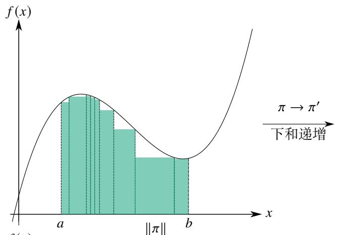

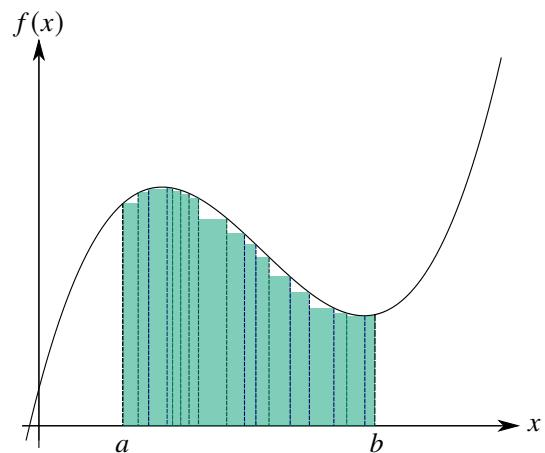

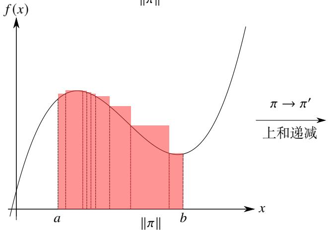

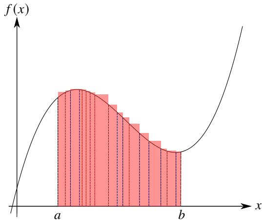  
图5.5: Darboux上下和示意图

# 定义5.3(Darboux积分)

设函数 $f$ 在区间 $[a,b]$ 上有界. $f$ 在 $[a,b]$ 上的所有 Darboux 上和组成的集合的下确界称为 $f$ 在 $[a,b]$ 上的 Darboux 上积分 (upper Darboux integral); 在 $[a,b]$ 上的所有 Darboux 下和组成的集合的上确界称为 $f$ 在 $[a,b]$ 上的 Darboux 下积分 (lower Darboux integral), 简称上积分与下积分, 分别记作:

$$
\overline {{{{\int_ {a} ^ {b}}}}} f (x)   \mathrm {d} x := \inf  \left\{\overline {{{{S}}}} (f, \pi)   \big |   \pi   \text {是}   [ a, b ]   \text {的 一 个 分 割} \right\} = \inf  _ {\pi} \overline {{{{S}}}} (f, \pi).
$$

$$
\int_ {a} ^ {b} f (x)   \mathrm {d} x := \sup  \left\{\underline {{{S}}} (f, \pi) \mid \pi   \text {是}   [ a, b ]   \text {的 一 个 分 割} \right\} = \sup  _ {\pi} \underline {{{S}}} (f, \pi).
$$

当 $f$ 的上积分和下积分都等于 $I \in \mathbb{R}$ 时, 我们称 $f$ 在 $[a, b]$ 上 Darboux 可积 (Darboux integrable), 称 $I$ 是 $f$ 在 $[a, b]$ 上的 Darboux 积分 (Darboux integral).

注 Darboux 积分是法国数学家 Jean Gaston Darboux 于 1875 年提出的.

例5.4求Dirichlet函数 $D(x)$ 在[0,1]上的上积分和下积分

解对于[0,1]的任一分割，由于分割内的任一小区间内都同时含有无理点和有理点，因此 $D(x)$ 的任一上和都等于1,任一下和都等于0.于是可知

$$
\overline {{\int_ {a} ^ {b} D (x) \mathrm {d} x}} = 1, \quad \int_ {\underline {{a}}} ^ {\underline {{b}}} D (x) \mathrm {d} x = 0.
$$

我们已经看到在 $\pi$ 上不断增加分割点的过程中，下和单调递增且有上界；上和单调递减且有下界。因此当 $\| \pi \| \to 0$ 时上和与下和一定有极限。下面来证明它们的极限恰好是“上积分”与“下积分”。

# 定理5.2(Darboux定理)

设函数 $f$ 在区间 $[a,b]$ 上有界.作 $[a,b]$ 的一个分割 $\pi$ .则

$$
\lim  _ {\| \pi \| \rightarrow 0} \overline {{S}} (f, \pi) = \overline {{\int_ {a} ^ {b}}} f (x) d x.
$$

$$
\lim  _ {\| \pi \| \rightarrow 0} \underline {{S}} (f, \pi) = \underbrace {\int_ {a} ^ {b} f (x)   \mathrm {d} x}.
$$

证明 只证明下积分的情况. 把 $f$ 在 $[a, b]$ 上的下积分记作 $\underline{L}$ . 由下积分的定义可知对于任一 $\varepsilon > 0$ , 存在 $[a, b]$ 的一个分割 $\pi_0$ 使得

$$
\underline {{S}} (f, \pi_ {0}) > \underline {{I}} - \frac {\varepsilon}{2}.
$$

设 $\pi_0$ 一共有 $l$ 个分割点 (不含 $a, b$ ), 则对于 $[a, b]$ 的任一分割 $\pi$ , 当 $\| \pi \| < \varepsilon / (2l\omega + 1)$ 时, 由命题 (5.5) 可知

$$
\underline {{S}} (f, \pi) \geqslant \underline {{S}} (f, \pi_ {0} + \pi) - l \omega \| \pi \| \geqslant \underline {{S}} (f, \pi_ {0}) - l \omega \| \pi \| > \underline {{I}} - \frac {\varepsilon}{2} - l \omega \cdot \frac {\varepsilon}{2 l \omega + 1} > \underline {{I}} - \frac {\varepsilon}{2} - \frac {\varepsilon}{2} = \underline {{I}} - \varepsilon .
$$

因此

$$
\underline {{I}} - \underline {{S}} (f, \pi) <   \varepsilon .
$$

于是可知

$$
\lim  _ {\| \pi \| \rightarrow 0} \underline {{S}} (f, \pi) = \underbrace {\int_ {a} ^ {b} f (x) \mathrm {d} x}.
$$

注 由于 $\omega$ 可能为零, 为了避免繁琐的分类讨论, 此处用了“ $\omega + 1$ ”. 在证明命题 (2.22) 的 (3) 时使用过这个技巧. 注以上定理也可以作为上积分与下积分的定义.

类似数列的上极限与下极限, 可以得到一系列关于上积分与下积分的简单性质.

# 命题5.6

设函数 $f(x)$ 在区间 $[a,b]$ 上有界.则

$$
\underline {{\int_ {a} ^ {b}}} f (x) \mathrm {d} x \leqslant \overline {{\int_ {a} ^ {b}}} f (x) \mathrm {d} x.
$$

# 命题5.7

设函数 $f(x),g(x)$ 在区间 $[a,b]$ 上有界.若 $f(x)\geqslant g(x)$ $(\forall x\in [a,b])$ ，则

$$
\overline {{\int_ {a} ^ {b}}} f (x) \mathrm {d} x \geqslant \overline {{\int_ {a} ^ {b}}} g (x) \mathrm {d} x.
$$

$$
\underline {{\int_ {a} ^ {b}}} f (x) \mathrm {d} x \geqslant \underline {{\int_ {a} ^ {b}}} g (x) \mathrm {d} x.
$$

# 命题5.8（上积分与下积分的可加性）

设函数 $f(x)$ 在区间 $[a,b]$ 上有界.若 $c\in (a,b)$ ，则

$$
\overline {{\int_ {a} ^ {b}}} f (x) \mathrm {d} x = \overline {{\int_ {a} ^ {c}}} f (x) \mathrm {d} x + \overline {{\int_ {c} ^ {b}}} f (x) \mathrm {d} x.
$$

$$
\underline {{\int_ {a} ^ {b}}} f (x) \mathrm {d} x = \underline {{\int_ {a} ^ {c}}} f (x) \mathrm {d} x + \underline {{\int_ {c} ^ {b}}} f (x) \mathrm {d} x.
$$

# 命题5.9

设函数 $f(x),g(x)$ 在区间 $[a,b]$ 上有界.则

$$
\overline {{\int_ {a} ^ {b}}} f (x) \mathrm {d} x + \overline {{\int_ {a} ^ {b}}} g (x) \mathrm {d} x \geqslant \overline {{\int_ {a} ^ {b}}} [ f (x) + g (x) ] \mathrm {d} x.
$$

$$
\underline {{\int_ {a} ^ {b}}} f (x) \mathrm {d} x + \underline {{\int_ {a} ^ {b}}} g (x) \mathrm {d} x \leqslant \underline {{\int_ {a} ^ {b}}} [ f (x) + g (x) ] \mathrm {d} x.
$$

# 命题5.10

设函数 $f(x), g(x)$ 在区间 $[a, b]$ 上有界. 对于任一实数 $c \geqslant 0$ 都有

$$
\overline {{\int_ {a} ^ {b}}} c f (x) \mathrm {d} x = c \overline {{\int_ {a} ^ {b}}} f (x) \mathrm {d} x, \quad \underline {{\int_ {a} ^ {b}}} c f (x) \mathrm {d} x = c \underline {{\int_ {a} ^ {b}}} f (x) \mathrm {d} x.
$$

对于任一实数 $c \leqslant 0$ 都有

$$
\overline {{\int_ {a} ^ {b}}} c f (x) \mathrm {d} x = c \underline {{\int_ {a} ^ {b}}} f (x) \mathrm {d} x, \quad \underline {{\int_ {a} ^ {b}}} c f (x) \mathrm {d} x = c \overline {{\int_ {a} ^ {b}}} f (x) \mathrm {d} x.
$$

现在终于可以来验证我们的第三个想法

# 定理5.3 (Riemann可积的充要条件)

设函数 $f(x)$ 在 $[a,b]$ 上有界.则以下4个命题等价：

$1^{\circ}f(x)$ 在 $[a,b]$ 上Riemann可积  
$2^{\circ}$ 作分割 $\pi : a = x_0 < x_1 < \dots < x_n = b$ . 设 $f(x)$ 在 $[x_{i-1}, x_i]$ 上的振幅为 $\omega_i (i = 1, 2, \dots)$ . 则

$$
\lim  _ {\| \pi \| \rightarrow 0} \sum_ {i = 1} ^ {n} \omega_ {i} \Delta x _ {i} = 0.
$$

$3^{\circ}$ 对于任一 $\varepsilon > 0$ 都存在 $[a, b]$ 的一个分割 $\pi$ 使得

$$
\bar {S} (f, \pi) - \underline {{S}} (f, \pi) <   \varepsilon .
$$

$4^{\circ}f(x)$ 在 $[a,b]$ 上Darboux可积

证明 (i) 证明 $1^{\circ} \Rightarrow 2^{\circ}$ . 若 $1^{\circ}$ 成立, 令 $I = \int_{a}^{b} f(x) \mathrm{d}x$ . 则对于任一 $\varepsilon > 0$ , 存在 $\delta > 0$ 使得当 $\|\pi\| < \delta$ 时, 无论 $\xi_{i}$ 在 $[x_{i-1}, x_{i}]$ 中如何选取都有

$$
I - \frac {\varepsilon}{3} <   \sum_ {i = 1} ^ {n} f (\xi_ {i}) \Delta x _ {i} <   I + \frac {\varepsilon}{3}.
$$

因而有

$$
I - \frac {\varepsilon}{3} \leqslant \underline {{S}} (f, \pi) \leqslant \overline {{S}} (f, \pi) \leqslant I + \frac {\varepsilon}{3}.
$$

因此

$$
0 \leqslant \bar {S} (f, \pi) - \underline {{S}} (f, \pi) \leqslant \frac {2}{3} \varepsilon <   \varepsilon \Longleftrightarrow 0 \leqslant \sum_ {i = 1} ^ {n} \omega_ {i} \Delta x _ {i} \leqslant \frac {2}{3} \varepsilon <   \varepsilon .
$$

于是可知

$$
\lim  _ {\| \pi \| \rightarrow 0} \sum_ {i = 1} ^ {n} \omega_ {i} \Delta x _ {i} = 0.
$$

(ii) 证明 $2^{\circ} \Rightarrow 3^{\circ}$ . 若 $2^{\circ}$ 成立, 则对于任一 $\varepsilon > 0$ 都存在一个 $[a, b]$ 的分割 $\pi$ 使得

$$
\sum_ {i = 1} ^ {n} \omega_ {i} \Delta x _ {i} = \bar {S} (f, \pi) - \underline {{S}} (f, \pi) <   \varepsilon .
$$

(ii) 证明 $3^{\circ} \Rightarrow 4^{\circ}$ , 若 $3^{\circ}$ 成立, 则对于任一 $\varepsilon > 0$ 都有

$$
0 \leqslant \overline {{\int_ {a} ^ {b}}} f (x) d x - \underline {{\int_ {a} ^ {b}}} f (x) d x \leqslant \bar {S} (f, \pi) - \underline {{S}} (f, \pi) <   \varepsilon .
$$

令 $\varepsilon \to 0$ 得

$$
\overline {{\int_ {a} ^ {b}}} f (x) \mathrm {d} x = \underline {{\int_ {a} ^ {b}}} f (x) \mathrm {d} x.
$$

于是可知 $f(x)$ 在 $[a,b]$ 上Darboux可积

(iii) 证明 $4^{\circ} \Rightarrow 1^{\circ}$ . 若 $f(x)$ 在 $[a, b]$ 上 Darboux 可积, 则 $\int_{a}^{b} f(x) \mathrm{d}x = \int_{a}^{b} f(x) \mathrm{d}x$ . 故对于任一分割 $\pi$ 都有

$$
\underline {{S}} (f, \pi) \leqslant \sum_ {i = 1} ^ {n} f (\xi_ {i}) \Delta x _ {i} \leqslant \overline {{S}} (f, \pi).
$$

令上式中的 $\| \pi \| \to 0$ ，由Darboux定理可知

$$
\underline {{\int_ {a} ^ {b}}} f (x) \mathrm {d} x = \lim  _ {\| \pi \| \to 0} \underline {{S}} (f, \pi) \leqslant \lim  _ {\| \pi \| \to 0} \sum_ {i = 1} ^ {n} f (\xi_ {i}) \Delta x _ {i} \leqslant \lim  _ {\| \pi \| \to 0} \overline {{S}} (f, \pi) = \overline {{\int_ {a} ^ {b}}} f (x) \mathrm {d} x.
$$

由夹逼定理可知，极限 $\lim_{\| \pi \| \to 0}\sum_{i = 1}^{n}f(\xi_i)\Delta x_i$ 存在.于是可知 $f(x)$ 在 $[a,b]$ 上Riemann可积

以上定理表明, Riemann 积分和 Darboux 积分是等价的, 它们分别从两个角度定义了同一种积分. Riemann 积分用了极限的 $\varepsilon - \delta$ 语言, 而 Darboux 积分用了上极限和下极限的思想. Riemann 积分的定义比较直观, 但 Darboux 积分的定义“更容易操作”, 因此要判断一个函数是否 Riemann 可积, 我们一般都是去判断它是否 Darboux 可积.

至此我们找到了Riemann可积的一个可操作性强的充要条件.

例5.5 判断Dirichlet函数 $D(x)$ 在 $[0,1]$ 上是否Riemann可积

解 由例 (5.4) 可知

$$
1 = \overline {{\int_ {a} ^ {b}}} D (x) d x \neq \underline {{\int_ {a} ^ {b}}} D (x) d x = 0.
$$

由定理(5.3)可知Dirichlet函数Riemann不可积

注上例表明Riemann积分无法定义Dirichlet函数围成的“曲边梯形”.从直观上看，它的面积应该为零.Dirichlet函数的可积性问题暴露了Riemann积分的局限性.我们将在实分析中定义更好的积分来解决这个问题

用定理(5.3)可以很容易地判定单调函数的可积性

# 定理5.4

设函数 $f$ 在 $[a,b]$ 上单调, 则 $f(x)$ 在 $[a,b]$ 上Riemann可积

证明 只证明单调递增的情况. 若 $f(a) = f(b)$ ，由于 $f(x)$ 单调递增，故 $f(x)$ 在 $[a, b]$ 是一个常值函数，因此它在 $[a, b]$ 上 Riemann 可积. 下设 $f(a) < f(b)$ .

对于任一 $\varepsilon > 0$ ，取

$$
\delta = \frac {\varepsilon}{f (b) - f (a)}.
$$

当 $\| \pi \| < \delta$ 时都有

$$
\begin{array}{l} 0 \leqslant \sum_ {i = 1} ^ {n} \omega_ {i} \Delta x _ {i} = \sum_ {i = 1} ^ {n} (M _ {i} - m _ {i}) \Delta x _ {i} = \sum_ {i = 1} ^ {n} [ f (x _ {i}) - f (x _ {i - 1}) ] \Delta x _ {i} \leqslant \| \pi \| \sum_ {i = 1} ^ {n} [ f (x _ {i}) - f (x _ {i - 1}) ] \\ = \| \pi \| [ f (b) - f (a) ] <   \delta [ f (b) - f (a) ] = \varepsilon . \\ \end{array}
$$

因此

$$
\lim  _ {\| \pi \| \rightarrow 0} \sum_ {i = 1} ^ {n} \omega_ {i} \Delta x _ {i} = 0.
$$

由定理(5.3)可知 $f(x)$ 在 $[a,b]$ 上Riemann可积

# 5.2.3 Riemann可积函数类

下面我们来看一下哪些类型的函数一定是Riemann可积的

数学分析中处理的函数通常是连续函数, 或者“近乎”连续的函数. 从直观上, 很容易想到连续函数应该是 Riemann 可积的. 现在我们可以来证明这个想法.

# 定理5.5（连续函数可积）

设函数 $f(x)$ 在 $[a,b]$ 上连续, 则 $f(x)$ 在 $[a,b]$ 上Riemann可积

证明 由于 $f(x)$ 在 $[a,b]$ 上连续, 则 $f(x)$ 在 $[a,b]$ 上一致连续. 故对于任一 $\varepsilon > 0$ , 都存在 $\delta > 0$ , 使得当 $s,t \in [a,b]$ 且 $|s - t| < \delta$ 时都有

$$
\left| f (s) - f (t) \right| <   \frac {\varepsilon}{b - a}.
$$

给定一个 $[a,b]$ 上的分割

$$
\pi : a = x _ {0} <   x _ {1} <   \dots <   x _ {n} = b.
$$

令 $M_{i} = f(s_{i}),m_{i} = f(t_{i})$ ，其中 $s_i,t_i\in [x_{i - 1},x_i](i = 1,2,\dots)$ .当 $\| \pi \| <  \delta$ 时

$$
\left| s _ {i} - t _ {i} \right| \leqslant \Delta x _ {i} \leqslant \| \pi \| <   \delta , \quad i = 1, 2, \dots , n.
$$

于是

$$
\sum_ {i = 1} ^ {n} \omega_ {i} \Delta x _ {i} = \sum_ {i = 1} ^ {n} (M _ {i} - m _ {i}) \Delta x _ {i} = \sum_ {i = 1} ^ {n} [ f (s _ {i}) - f (t _ {i}) ] \Delta x _ {i} \leqslant \frac {\varepsilon}{b - a} \sum_ {i = 1} ^ {n} \Delta x _ {i} = \varepsilon .
$$

因此

$$
\lim  _ {\| \pi \| \rightarrow 0} \sum_ {i = 1} ^ {n} \omega_ {i} \Delta x _ {i} = 0.
$$

由定理(5.3)可知 $f(x)$ 在 $[a,b]$ 上Riemann可积

注 以上定理的证明关键用到了 $f$ 的一致连续性

以上定理表明 $[a, b]$ 上有界且连续的函数 $f(x)$ 一定 Riemann 可积. 由于经典欧式几何和经典物理问题中的函数几乎都是连续的, 因此 Riemann 积分在这些地方可以运行得很好. 因此, 尽管在 20 世纪初出现了 Lebesgue 积分, Riemann 积分依旧有存在的价值.

不难证明, 如果 $f(x)$ 在 $[a,b]$ 上只有有限多个间断点, $f(x)$ 在 $[a,b]$ 上仍然 Riemann 可积. 于是我们就会想这样一个问题: 间断点增加到什么时候函数就会不可积, 这个临界状态在哪里. 换句话说 $f(x)$ 在 $[a,b]$ 上不连续点的多寡和 $f(x)$ 在 $[a,b]$ 上的可积性有着深刻的联系. 这就是本节要讨论的问题.

为了刻画集合中点的多寡, 我们先引入以下概念.

# 定义5.4（零测度集）

设 $E \subseteq \mathbb{R}$ . 若对任意 $\varepsilon > 0$ , 存在至多可数个开区间 $\{I_n : n \in \mathbb{N}\}$ 组成 $E$ 的一个开覆盖, 满足

$$
\sum_ {n = 0} ^ {\infty} \left| I _ {n} \right| \leqslant \varepsilon ,
$$

则称 $E$ 是一个零测度集 (null set), 简称零测集.

注一维空间 $\mathbb{R}$ 的“零测度”可以简单理解为“长度”为零的集合

以下的结论是显然的.

# 命题5.11

空集是零测集.

# 命题5.12

设零测集 $A$ . 若 $B \subseteq A$ , 则 $B$ 也是一个零测集.

容易想到可数集是零测集

# 命题5.13

设集合 $A$ 是至多可数的, 则 $A$ 是一个零测集.

证明 不妨设 $A$ 为可数集，设

$$
A = \{a _ {1}, a _ {2}, \dots , a _ {n}, \dots \}.
$$

对于任意给定的 $\varepsilon > 0$ ，令

$$
I _ {n} = \left(a _ {n} - \frac {\varepsilon}{2 ^ {n + 1}}, a _ {n} + \frac {\varepsilon}{2 ^ {n + 1}}\right), \quad n = 1, 2, \dots .
$$

显然 $\{I_n\}$ 是 $A$ 的一个开覆盖. 由于

$$
\sum_ {n = 1} ^ {\infty} \left| I _ {n} \right| = \sum_ {n = 1} ^ {\infty} 2 \cdot \frac {\varepsilon}{2 ^ {n + 1}} = \varepsilon \sum_ {n = 1} ^ {\infty} \frac {1}{2 ^ {n}} = \varepsilon .
$$

注 需要注意, 不可数集也可能是零测集, 例子将在《实分析》中给出.

例5.6 长度不为零的区间都不是零测集

证明 不妨设开区间 $(a, b) (a < b)$ . 若 $\{I_n\}$ 是 $(a, b)$ 的一个开覆盖, 则

$$
\sum_ {n = 1} ^ {\infty} \left| I _ {n} \right| \geqslant b - a > 0.
$$

因此 $(a,b)$ 不是零测集.

下面是零测集的简单性质

# 命题5.14

至多可数个零测集的并集仍是零测集

证明 不妨设可数个零测集 $A_{1}, A_{2}, \dots, A_{n}, \dots$ . 则对于任意给定的 $\varepsilon > 0$ 都存在一个开区间列 $\{I_{n1}, I_{n2}, \dots\}$ 使得 $A_{n} \subseteq \bigcup_{i=1}^{\infty} I_{ni} (n = 1, 2, \dots)$ , 且

$$
\sum_ {i = 1} ^ {\infty} \left| I _ {n i} \right| <   \frac {\varepsilon}{2 ^ {n}}.
$$

此时 $\{I_{ni}:n,i = 1,2,\dots \}$ 仍是一列开区间，它显然是 $\bigcup_{n = 1}^{\infty}A_{n}$ 的一个开覆盖，且满足

$$
\sum_ {n = 1} ^ {\infty} \sum_ {i = 1} ^ {\infty} \left| I _ {n i} \right| \leqslant \sum_ {n = 1} ^ {\infty} \frac {\varepsilon}{2 ^ {n}} = \varepsilon .
$$

于是可知 $\bigcup_{n = 1}^{\infty}A_{n}$ 仍是一个零测集.

用零测集的观点可以给出 Riemann 可积的充要条件

# 定理5.6 (Lebesgue-Vitali 定理)

设函数 $f$ 在区间 $[a,b]$ 上有界.则 $f$ 在 $[a,b]$ 上Riemann可积当且仅当 $f$ 在 $[a,b]$ 上的不连续点组成的集合是一个零测集.

证明 对 $[a, b]$ 作分割：

$$
\pi : a = x _ {0} <   x _ {1} <   \dots <   x _ {m} = b.
$$

(i) 证明必要性. 由命题3.17可知

$$
D (f) = \bigcup_ {n = 1} ^ {\infty} D _ {1 / n}.
$$

若证明了对于任一 $\delta > 0, D_{\delta}$ 都是零测集，则 $D_{1}, D_{1/2}, \cdots$ 都是零测集，也就证明了 $D(f)$ 是一个零测集.

设 $f$ 在 $[a,b]$ 上Riemann可积，由Riemann可积的充要条件可知，对于任一 $\varepsilon >0$ 都有

$$
\sum_ {i = 1} ^ {n} \omega_ {i} \Delta x _ {i} <   \frac {\varepsilon \delta}{2}.
$$

设 $x \in D_{\delta}$ . 若 $x$ 不是 $x_0, x_1, \dots, x_m$ 中的任意一个，则存在 $i \in \{1, 2, \dots, m\}$ 使得 $x \in (x_{i-1}, x_i)$ . 因此存在 $r$ 使得 $N_r(x) \subseteq (x_{i-1}, x_i)$ . 设 $f$ 在 $(x_{i-1}, x_i)$ 上的振幅为 $\omega_i$ ，则

$$
\omega_ {i} \geqslant \omega \left[ N _ {r} (x) \right] \geqslant \omega (x) \geqslant \delta .
$$

令

$$
\Lambda = \left\{i: D _ {\delta} \cap \left(x _ {i - 1}, x _ {i}\right) \neq \varnothing , i = 1, 2, \dots , m \right\}.
$$

于是

$$
\frac {\varepsilon \delta}{2} > \sum_ {i = 1} ^ {n} \omega_ {i} \Delta x _ {i} \geqslant \sum_ {i \in \Lambda} \omega_ {i} \Delta x _ {i} \geqslant \delta \sum_ {i \in \Lambda} \Delta x _ {i} \Longrightarrow \sum_ {i \in \Lambda} \Delta x _ {i} <   \frac {\varepsilon}{2}.
$$

由于

$$
D _ {\delta} \subseteq \left[ \bigcup_ {i \in \Lambda} \left(x _ {i - 1}, x _ {i}\right) \right] \cup \left\{x _ {0}, x _ {1}, \dots , x _ {m} \right\}.
$$

因此

$$
D _ {\delta} \subseteq \left[ \bigcup_ {i \in \Lambda} \left(x _ {i - 1}, x _ {i}\right) \right] \cup \left[ \bigcup_ {i = 0} ^ {m} \left(x _ {i} - \frac {\varepsilon}{4 (m + 1)}, x _ {i} + \frac {\varepsilon}{4 (m + 1)}\right) \right].
$$

由于

$$
\sum_ {i \in \Lambda} \Delta x _ {i} + (m + 1) \frac {2 \varepsilon}{4 (m + 1)} <   \frac {\varepsilon}{2} + \frac {\varepsilon}{2} = \varepsilon .
$$

这表明 $D_{\delta}$ 是一个零测集.

(ii) 证明充分性. 设 $D(f)$ 是一个零测集, 则对于任一 $\varepsilon > 0$ 都存在 $D(f)$ 的开覆盖 $\{(\alpha_i, \beta_i) : i = 1, 2, \dots\}$ 满足

$$
\sum_ {i = 1} ^ {\infty} (\beta_ {i} - \alpha_ {i}) <   \frac {\varepsilon}{2 \omega}.
$$

其中 $\omega$ 是 $f$ 在 $[a,b]$ 上的振幅. 令

$$
K = [ a, b ] \bigg \backslash \bigcup_ {i = 1} ^ {\infty} (\alpha_ {i}, \beta_ {i}) .
$$

由例3.39可知，对于前面给定的 $\varepsilon$ ，存在 $\delta >0$ 使得当 $x\in K,y\in [a,b]$ 且 $|x - y| < \delta$ 时

$$
\left| f (x) - f (y) \right| <   \frac {\varepsilon}{4 (b - a)}.
$$

取分割 $\pi$ 满足 $\| \pi \| <  \delta .$ 令

$$
\Lambda_ {1} = \{i: K \cap (x _ {i - 1}, x _ {i}) \neq \emptyset , i = 1, 2, \dots , m \}, \quad \Lambda_ {2} = \{i: K \cap (x _ {i - 1}, x _ {i}) = \emptyset , i = 1, 2, \dots , m \}.
$$

则

$$
\sum_ {i = 1} ^ {n} \omega_ {i} \Delta x _ {i} = \sum_ {i \in \Lambda_ {1}} \omega_ {i} \Delta x _ {i} + \sum_ {i \in \Lambda_ {2}} \omega_ {i} \Delta x _ {i}.
$$

先来看 $\sum_{i\in \Lambda_1}\omega_i\Delta x_i$ 的情况.由于

$$
\begin{array}{l} \omega_ {i} = \sup  \left\{\left| f \left(z _ {1}\right) - f \left(z _ {2}\right) \right|: z _ {1}, z _ {2} \in \left[ x _ {i - 1}, x _ {i} \right] \right\} \\ \leqslant \sup  \left\{\left| f \left(z _ {1}\right) - f \left(y _ {i}\right) \right| + \left| f \left(z _ {2}\right) - f \left(y _ {i}\right) \right|: z _ {1}, z _ {2} \in \left[ x _ {i - 1}, x _ {i} \right], y _ {i} \in K \cap \left(x _ {i - 1}, x _ {i}\right) \right\} \leqslant \frac {\varepsilon}{2 (b - a)}. \\ \end{array}
$$

因此

$$
\sum_ {i \in \Lambda_ {1}} \omega_ {i} \Delta x _ {i} <   \frac {\varepsilon}{2 (b - a)} (b - a) = \frac {\varepsilon}{2}.
$$

再看 $\sum_{i\in \Lambda_2}\omega_i\Delta x_i$ 的情况.由于 $\omega_{i}\leqslant \omega$ ，故

$$
\sum_ {i \in \Lambda_ {2}} \omega_ {i} \Delta x _ {i} \leqslant \omega \sum_ {i \in \Lambda_ {2}} \Delta x _ {i}.
$$

显然

$$
\bigcup_ {i \in \Lambda_ {2}} (x _ {i - 1}, x _ {i}) \subseteq \bigcup_ {i = 1} ^ {\infty} (\alpha_ {i}, \beta_ {i}).
$$

故进一步有

$$
\sum_ {i \in \Lambda_ {2}} \Delta x _ {i} \leqslant \sum_ {i = 1} ^ {\infty} \left(\beta_ {i} - \alpha_ {i}\right) <   \frac {\varepsilon}{2 \omega}.
$$

于是

$$
\sum_ {i \in \Lambda_ {2}} \omega_ {i} \Delta x _ {i} <   \omega \frac {\varepsilon}{2 \omega} = \frac {\varepsilon}{2}.
$$

于是可知

$$
\sum_ {i = 1} ^ {n} \omega_ {i} \Delta x _ {i} = \sum_ {i \in \Lambda_ {1}} \omega_ {i} \Delta x _ {i} + \sum_ {i \in \Lambda_ {2}} \omega_ {i} \Delta x _ {i} <   \frac {\varepsilon}{2} + \frac {\varepsilon}{2} = \varepsilon .
$$

由Riemann可积的充要条件可知 $f$ 在 $[a,b]$ 上Riemann可积

注1907年法国数学家HenriLebesgue与意大利数学家GiuseppeVitali同时独立证明了以上定理.

注对比以上定理充分性证明和定理5.5的证明

注设零测集 $E_0 \subseteq E$ . $P$ 是一个与 $E$ 中元素有关的命题. 若对于任一 $x \in E \setminus E_0$ , 命题 $P$ 都成立, 则 $P$ 在 $E$ 上几乎处处 (almost everywhere) 成立. 于是以上定理可以说成: 有界函数 $f$ 在 $[a, b]$ 上 Riemann 可积当且仅当 $f$ 在 $[a, b]$ 几乎处处连续.

以上定理在数学分析中具有重大意义. 首先它从“连续程度”的观点彻底解决了Riemann可积性问题. 另一方面, 它为数学分析划清了讨论边界——数学分析的主要讨论对象是连续函数, 即使不连续, 不连续点也不能太多, 即不连续点集零测度. 如果不连续点太多, 以至于不连续点集不是零测集, 那么这些函数在Riemann意义下不可积. 1903年Lebesgue提出了系统的测度理论和新的积分理论, 专门研究这些函数, 这就是《实分析》的主题.

在Lebesgue定理之下，可以立刻得到一系列关于可积性的结论

# 推论5.3

设函数 $f$ 在 $[a,b]$ 上有界.若 $f$ 在 $[a,b]$ 上只有至多可数个间断点，则 $f$ 在 $[a,b]$ 上Riemann可积

证明 由于至多可数集是零测集，由Lebesgue定理可知 $f$ 在 $[a,b]$ 上Riemann可积

# 推论5.4

设函数 $f$ 在 $[a,b]$ 上Riemann可积.则 $|f|$ 也在 $[a,b]$ 上Riemann可积

证明 由于 $f$ 在 $[a,b]$ 上Riemann可积，由Lebesgue定理可知 $D(f)$ 是一个零测集.由于 $D(|f|)\subseteq D(f)$ ，因此 $D(|f|)$ 也是一个零测集.由Lebesgue定理可知 $|f|$ 也在 $[a,b]$ 上Riemann可积.

以上命题的逆命题是不成立的.

例5.7 设函数

$$
f (x) = \left\{ \begin{array}{l l} 1 & , x \in \mathbb {Q} \\ - 1 & x \in \mathbb {R} \backslash \mathbb {Q} \end{array} \right..
$$

则

$$
\int_ {a} ^ {b} | f (x) | \mathrm {d} x = \int_ {a} ^ {b} \mathrm {d} x = b - a.
$$

但 $\int_{a}^{b}f(x)\mathrm{d}x$ 不可积

# 推论5.5

设函数 $f$ 和 $g$ 在 $[a,b]$ 上Riemann可积.则 $fg$ 也在 $[a,b]$ 上Riemann可积

证明 由于函数 $f$ 和 $g$ 在 $[a,b]$ 上Riemann可积,由Lebesgue定理可知 $D(f)$ 和 $D(g)$ 都是零测集.由于 $D(fg)\subseteq$ $D(f)\cup D(g)$ ，因此 $D(fg)$ 也是一个零测集.由Lebesgue定理可知 $fg$ 也在 $[a,b]$ 上Riemann可积.

# 推论5.6

设函数 $f$ 在 $[a,b]$ 上Riemann可积.若 $1 / f$ 在 $[a,b]$ 上有定义且有界,则 $1 / f$ 也在 $[a,b]$ 上Riemann可积

证明 由于 $f$ 在 $[a,b]$ 上Riemann可积，由Lebesgue定理可知 $D(f)$ 是一个零测集.由于 $D(1 / f) = D(f)$ ，因此 $D(1 / f)$ 也是一个零测集.由Lebesgue定理可知 $1 / f$ 也在 $[a,b]$ 上Riemann可积.

# 推论5.7

设函数 $f$ 在 $[a,b]$ 上Riemann可积.若 $[a_1,b_1]\subseteq [a,b]$ ，则 $f$ 在 $[a_{1},b_{1}]$ 上Riemann可积

证明把函数 $f$ 在 $[a,b]$ 上的不连续点集记作 $D(f,[a,b])$ .由于 $f$ 在 $[a,b]$ 上Riemann可积，由Lebesgue定理可知 $D(f,[a,b])$ 是一个零测集.由于 $[a_1,b_1]\subseteq [a,b]$ ，故 $D(f,[a_1,b_1])$ 也是一个零测集.由Lebesgue定理可知 $f$ 也在 $[a_1,b_1]$ 上Riemann可积.

# 推论5.8

设函数 $f$ 在 $[a,b]$ 和 $[b,c]$ 上都Riemann可积, 则 $f(x)$ 在 $[a,c]$ 上Riemann可积.

证明 由于 $f$ 在 $[a,b]$ 和 $[b,c]$ 上都Riemann可积,由Lebesgue定理可知 $D(f,[a,b])$ 和 $D(f,[b,c])$ 都是零测集.由于 $D(f,[a,c]) = D(f,[a,b])\cup D(f,[b,c])$ ，因此 $D(f[a,c])$ 也是一个零测集.由Lebesgue定理可知 $1 / f$ 也在 $[a,c]$ 上Riemann可积.

# 推论5.9

设函数 $f$ 在 $[a,b]$ 上Riemann可积.若函数 $g$ 在 $[a,b]$ 上除去有限个点 $x_{1},x_{2},\dots ,x_{n}$ 之外与 $f$ 相等，则 $g$ 也在 $[a,b]$ 上Riemann可积.且

$$
\int_ {a} ^ {b} f (x) \mathrm {d} x = \int_ {a} ^ {b} g (x) \mathrm {d} x.
$$

证明 令 $h = f - g$ . 则 $h$ 除去 $x_{1}, x_{2}, \dots, x_{n}$ 之外等于零. 因此 $D(h) \subseteq \{x_{1}, x_{2}, \dots, x_{n}\}$ . 因此 $D(h)$ 是一个零测集. 由Lebesgue定理可知 $h$ 在 $[a, b]$ 上Riemann可积. 因此 $g$ 也在 $[a, b]$ 上Riemann可积. 容易知道

$$
\int_ {a} ^ {b} h (x) \mathrm {d} x = 0.
$$

于是可知

$$
\int_ {a} ^ {b} f (x) \mathrm {d} x = \int_ {a} ^ {b} g (x) \mathrm {d} x.
$$

# 推论5.10

单调函数的不连续点集一定是零测集.

注用 Darboux 定理也可以证明以上定理. 根据 Darboux 定理, 单调函数的间断点只有至多可数个, 故单调函数的不连续点集一定是零测集.

下面来考察 Thomae 函数的 Riemann 积分.

例5.8 设函数 $T$ 满足

$$
T (x) = \left\{ \begin{array}{l l} 1, & x = 0 \\ \frac {1}{q}, & x = \frac {p}{q} \\ 0, & x \in \mathbb {R} \backslash \mathbb {Q} \end{array} \right.,
$$

其中 $q > 0, p, q \in \mathbb{Z}^*$ , 且 $p, q$ 互素. 则 $T$ 在任一有限区间 $[a, b]$ 上都 Riemann 可积, 且

$$
\int_ {a} ^ {b} T (x) \mathrm {d} x = 0.
$$

证明 由例3.24可知，函数 $T$ 在任一无理点都连续，在任一有理点都不连续，因此 $D(T) = \mathbb{Q}$ 是一个零测集。由Lebesgue定理可知 $T$ 在任一有限闭区间都Riemann可积。由Riemann积分的定义可知

$$
\int_ {a} ^ {b} T (x) \mathrm {d} x = 0.
$$

例5.9设函数 $f$ 在 $[a,b]$ 上连续， $g$ 在 $[c,d]$ 上可积.若 $g([c,d])\subseteq [a,b]$ .则 $f\circ g$ 在 $[c,d]$ 上可积

证明 设 $C = [c,d] \backslash D(g)$ , 则 $f \circ g$ 在 $C$ 上连续. 因此 $D(f \circ g) \subseteq D(g)$ . 由于 $g$ 在上 $[c,d]$ 上 Riemann 可积, 由 Lebesgue 定理可知 $D(g)$ 是一个零测集, 因此 $D(f \circ g)$ 也是一个零测集. 由 Lebesgue 定理可知 $f \circ g$ 在 $[c,d]$ 上 Riemann 可积.

注若 $f$ 在 $[a,b]$ 上连续改成 $f$ 在 $[a,b]$ 上Riemann可积,则结论不成立.举例说明:设

$$
f (x) = \left\{ \begin{array}{l l} 1, & x \neq 0 \\ 0, & x = 0 \end{array} \right., \qquad T (x) = \left\{ \begin{array}{l l} 1, & x = 0 \\ \frac {1}{q}, & x = \frac {p}{q} \\ 0, & x \in \mathbb {R} \backslash \mathbb {Q} \end{array} \right..
$$

显然 $f$ 和 $T$ 都是在 $\mathbb{R}$ 上任一有限闭区间上 Riemann 可积. 而

$$
f [ T (x) ] = \left\{ \begin{array}{l l} 1, & x \in \mathbb {Q} \\ 0, & x \in \mathbb {R} \backslash \mathbb {Q} \end{array} \right.
$$

这是Dirichlet函数，它在 $\mathbb{R}$ 上任一有限闭区间上都不可积

# 5.3 Riemann 积分的计算

# 5.3.1 Newton-Leibniz公式

我们已经看到, 直接用定义计算 Riemann 积分是十分麻烦的. 我们需要另寻出路. 我们来看两个物理的例子.

前面已经提到物理学中的功、位移、冲量等物理量. 它们的定义方法完全和面积类似. 在物理学中, “功”、“位移”、“冲量”等物理量也可以用积分来定义. 这是因为它们也满足面积的三条公理. 我们以位移为例. 如图5.6(a), 当质点作速度为 $\nu_{0}$ 的匀速直线运动时, 质点从 $t_{1}$ 时刻到 $t_{2}$ 时刻的位移被定义为

$$
\boldsymbol {s} (t) = \boldsymbol {v} _ {0} (t _ {2} - t _ {1}).
$$

如图5.6(b), 若质点作变速直线运动, 则质点从 $t_1$ 时刻到 $t_2$ 时刻的位移可以定义为

$$
s (t) = \int_ {t _ {1}} ^ {t _ {2}} v (t) \mathrm {d} t. \tag {5.1}
$$

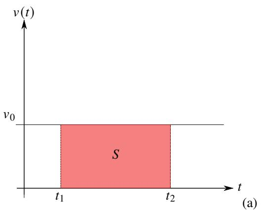

  
图5.6: 匀速直线运动和变速直线运动的对比. 在直线运动的条件下 $|\nu(t)| = \nu(t)$ .

某个质点作变速直线运动的速度函数为 $\pmb{v}(t)$ , 位移函数为 $s(t)$ . 我们知道质点从 $t_1$ 时刻到 $t_2$ 时刻的位移为

$$
\boldsymbol {s} (t) = \boldsymbol {s} (t _ {2}) - \boldsymbol {s} (t _ {1}).
$$

由等式(5.1)可知

$$
\int_ {t _ {1}} ^ {t _ {2}} \boldsymbol {v} (t) \mathrm {d} t = \boldsymbol {s} (t _ {2}) - \boldsymbol {s} (t _ {1}).
$$

我们还知道 $\pmb{v}(t) = \pmb{s}'(t)$ ，即 $s(t)$ 是 $\pmb{v}(t)$ 的原函数

再看一个例子. 物理中有这样一个重要定理: 力对时间的累积效果 (冲量) 等于动量的改变量:

$$
\int_ {t _ {1}} ^ {t _ {2}} \boldsymbol {F} (t) d t = \boldsymbol {p} (t _ {2}) - \boldsymbol {p} (t _ {1}).
$$

这就是动量定理(momentum theorem).另一方面,Newton第二运动定律的微分形式是：

$$
\boldsymbol {F} (t) = \frac {\mathrm {d} \boldsymbol {p} (t)}{\mathrm {d} t}.
$$

这表明 $\pmb{p}(t)$ 恰好是 $\pmb{F}(t)$ 的原函数

以上两个物理的例子为我们计算 Riemann 积分提供了思路: 计算 Riemann 积分可以转化为计算函数的原函数! 这就是不定积分名字的由来.

# 定理5.7 (Newton-Leibniz 公式)

设函数 $f(x)$ 在 $[a,b]$ 上Riemann可积,且在 $(a,b)$ 上存在原函数 $F(x)$ .若 $F(x)$ 在 $[a,b]$ 上连续，则

$$
\int_ {a} ^ {b} f (x) \mathrm {d} x = F (b) - F (a).
$$

证明 把 $[a, b]$ 作 $n$ 等分

$$
a = x _ {0} <   x _ {1} <   \dots <   x _ {n} = b.
$$

由Lagrange中值定理可知，存在 $\xi_i\in (x_{i - 1},x_i)$ $(i = 1,2,\dots ,n)$ 满足

$$
F (b) - F (a) = \sum_ {i = 1} ^ {n} [ F (x _ {i}) - F (x _ {i - 1}) ] = \sum_ {i = 1} ^ {n} F ^ {\prime} (\xi_ {i}) (x _ {i} - x _ {i - 1}) = \sum_ {i = 1} ^ {n} f (\xi_ {i}) \Delta x _ {i}.
$$

由于 $f(x)$ 在 $[a,b]$ 上Riemann可积，因此令上式的 $n\to \infty$ 得

$$
F (b) - F (a) = \lim  _ {n \rightarrow \infty} \sum_ {i = 1} ^ {n} f (\xi_ {i}) \Delta x _ {i} = \int_ {a} ^ {b} f (x) \mathrm {d} x.
$$

注为了书写便利，我们可以令

$$
F (x) \Bigg | _ {a} ^ {b} := F (b) - F (a).
$$

于是我们有以下几种等价的记号

$$
\int_ {a} ^ {b} f (x) \mathrm {d} x = \int_ {a} ^ {b} \mathrm {d} F (x) = \int f (x) \mathrm {d} x \left| _ {a} ^ {b} = F (x) \right| _ {a} ^ {b}.
$$

现在我们可以来定义圆的面积

例5.10 求半径为 $r$ 的圆的面积公式

解设函数 $y = \sqrt{r^2 - x^2}$ ( $r > 0, 0 < x < r$ ). 不难知道该函数的图像与 $x$ 轴围成的面积就是半径为 $r$ 的圆的面积的 $1/4$ . 于是半径为 $r$ 的圆的面积可以定义为

$$
S = 4 \int_ {0} ^ {r} \sqrt {r ^ {2} - x ^ {2}} \mathrm {d} x.
$$

令 $x = r\sin t$ .则

$$
\begin{array}{l} 4 \int \sqrt {r ^ {2} - x ^ {2}} d x = 4 \int \sqrt {r ^ {2} - r ^ {2} \sin^ {2} t} d r \sin t = 4 r ^ {2} \int \cos^ {2} t d t = 4 r ^ {2} \int \frac {1 + \cos 2 t}{4} d 2 t \\ = 2 r ^ {2} t + r ^ {2} \sin 2 t = 2 r ^ {2} \arcsin \frac {x}{r} + 2 x \sqrt {r ^ {2} - x ^ {2}} + C. \\ \end{array}
$$

用Newton-Leibniz公式可知

$$
S = 4 \int_ {0} ^ {r} \sqrt {r ^ {2} - x ^ {2}} d x = 2 r ^ {2} \arcsin \frac {x}{r} + 2 x \sqrt {r ^ {2} - x ^ {2}} \left| _ {0} ^ {r} = 2 r ^ {2} \arcsin 1 = \pi r ^ {2}. \right.
$$

以上计算结果和我们中学里学到的圆面积公式一致. 于是我们可以反过来利用圆的面积公式来求 Riemann 积分.

例5.11求以下Riemann积分：

$$
\int_ {a} ^ {b} \sqrt {(x - a) (b - x)} d x, \quad b > a.
$$

解设

$$
y = \sqrt {(x - a) (b - x)}.
$$

则

$$
\left(x - \frac {a + b}{2}\right) ^ {2} + y ^ {2} = \frac {(b - a) ^ {2}}{4}.
$$

因此以上积分表示直径为 $b - a$ 的半圆的面积.于是可知

$$
\text {原 式} = \frac {1}{2} \pi \left(\frac {b - a}{2}\right) ^ {2} = \frac {1}{8} (b - a) ^ {2} \pi .
$$

有了Newton-Leibniz公式, 我们就可以轻而易举地求出一小部分初等函数的Riemann积分. 而Riemann积分

本身是一个极限, 因此我们可以把某些极限看作是 Riemann 积分, 这也是一种求极限的方法. 下面看一个例子.

例5.12 计算：

$$
\lim _ {n \to \infty} \left[ \left(1 + \frac {1}{n}\right) \left(1 + \frac {2}{n}\right) \dots \left(1 + \frac {n}{n}\right) \right] ^ {1 / n}.
$$

解令

$$
a _ {n} = \frac {1}{n} \left[ \ln \left(1 + \frac {1}{n}\right) + \ln \left(1 + \frac {2}{n}\right) + \dots + \ln \left(1 + \frac {n}{n}\right) \right], \quad n = 1, 2, \dots .
$$

设 $f(x) = \ln (1 + x)$ . 把闭区间 $[0, 1]$ 作 $n$ 等分, 则每个小区间的长度为 $1 / n$ , 令 $\xi_{i}$ 是每个小区间的右端点, 则 $\xi_{i} = i / n (i = 1, 2, \dots, n)$ . 于是 $a_{n}$ 可以看作一个特殊的 Riemann 和. 由于 $f(x)$ 在 $[0, 1]$ Riemann 可积, 因此这个特殊 Riemann 和也会收敛到积分值. 由于区间是等分的, 因此这个分割的宽度趋于零当且仅当 $n \to \infty$ . 于是

$$
\lim  _ {n \rightarrow \infty} a _ {n} = \int_ {0} ^ {1} \ln (1 + x)   \mathrm {d} x = x \ln (1 + x) \left| _ {0} ^ {1} - \int_ {0} ^ {1} \frac {x}{1 + x}   \mathrm {d} x = \ln 2 - \int_ {0} ^ {1} \mathrm {d} x + \int_ {0} ^ {1} \frac {1}{x + 1}   \mathrm {d} x = 2 \ln 2 - 1. \right.
$$

于是可知

$$
\text {原 式} = \lim  _ {n \rightarrow \infty} \mathrm {e} ^ {a _ {n}} = \mathrm {e} ^ {2 \ln 2 - 1} = \frac {4}{\mathrm {e}}.
$$

注如果已知函数在区间上Riemann可积,则我们可以取一个有利于计算的Riemann和来求极限.

# 5.3.2 微积分基本定理

设函数 $f(t)$ 在 $[a,b]$ 上Riemann可积,则对于任一 $x\in [a,b]$ ，函数 $f(x)$ 在 $[a,x]$ 上都Riemann可积.如果我们把积分上限 $x$ 看作变量，则可以用Riemann积分定义一个函数.

# 定义5.5（变限积分）

函数 $f(t)$ 在 $[a,b]$ 上Riemann可积.令

$$
F (x) = \int_ {a} ^ {x} f (t) \mathrm {d} t.
$$

则 $F(x)$ 是定义在 $[a,b]$ 上的一个函数.我们称这个由Riemann积分定义的函数为变限积分.类似地可以定义函数

$$
G (x) = \int_ {x} ^ {b} f (t) \mathrm {d} t.
$$

注 变限积分的自变量不仅可以出现在积分上限或下限中, 也可以同时出现在积分上限和下限中. 例如

$$
G (x) = \int_ {x ^ {2}} ^ {x ^ {3}} \sqrt {1 + t ^ {2}} d t.
$$

回到之前举的物理的例子.如图5.6(b)，令

$$
s (x) = \int_ {t _ {1}} ^ {x} v (t) \mathrm {d} t.
$$

函数 $s(x)$ 实际上就关于时刻 $x$ $(x\geqslant t_{1})$ 的位移函数.从物理意义上,我们知道 $s(x)$ 是一个连续函数，且 $s(x)$ 是 $\nu (t)$ 的一个原函数.

# 定理5.8（变限积分的连续性）

设函数 $f(t)$ 在闭区间 $[a,b]$ 上Riemann可积.令

$$
F (x) = \int_ {a} ^ {x} f (t) \mathrm {d} t.
$$

则函数 $F(x)$ 在 $[a,b]$ 上Lipschitz连续

证明 任取 $x_{1}, x_{2} \in [a, b]$ . 则

$$
F (x _ {2}) - F (x _ {1}) = \int_ {a} ^ {x _ {2}} f (t) d t - \int_ {a} ^ {x _ {1}} f (t) d t = \int_ {x _ {1}} ^ {x _ {2}} f (t) d t.
$$

由于 $f(x)$ 在 $[a,b]$ 上Riemann可积，故存在 $M > 0$ 使得 $|f(x)|\leqslant M(a\leqslant x\leqslant b).$ 当 $x_{1} <   x_{2}$ 时

$$
| F (x _ {2}) - F (x _ {1}) | = \left| \int_ {x _ {1}} ^ {x _ {2}} f (t) \mathrm {d} t \right| \leqslant \int_ {x _ {1}} ^ {x _ {2}} | f (t) | \mathrm {d} t \leqslant M (x _ {2} - x _ {1}).
$$

当 $x_{1} > x_{2}$ 时

$$
\left| F \left(x _ {2}\right) - F \left(x _ {1}\right) \right| = \left| \int_ {x _ {1}} ^ {x _ {2}} f (t) \mathrm {d} t \right| \leqslant \int_ {x _ {2}} ^ {x _ {1}} | f (t) | \mathrm {d} t \leqslant M \left(x _ {1} - x _ {2}\right).
$$

综上可知

$$
\left| F \left(x _ {2}\right) - F \left(x _ {1}\right) \right| \leqslant M \left| x _ {2} - x _ {1} \right|.
$$

这表明 $F(x)$ 在 $[a,b]$ 上Lipschitz连续

类似地, 可以定义变限上积分 (或下积分). 用完全一样的方法可以证明它们也是 Lipschitz 连续的.

# 定理5.9（变限上积分的连续性）

设函数 $f(t)$ 在闭区间 $[a,b]$ 上有界. 令

$$
F (x) = \overline {{\int_ {a} ^ {x}}} f (t) d t.
$$

则函数 $F(x)$ 在 $[a,b]$ 上Lipschitz连续

# 注下积分也有类似结论

函数Riemann可积未必连续. 但它的变上限积分定义的函数是连续的. 不严格地讲“积分过程”使函数的性质变好了. 那么如果函数本来就连续, 变上限积分定义的函数应该有“更好的性质”.

# 定理5.10 (变限积分的可导性)

设函数 $f$ 在闭区间 $[a,b]$ 上Riemann可积.令

$$
F (x) = \int_ {a} ^ {x} f (t) \mathrm {d} t.
$$

若 $f$ 在 $x_0 \in [a, b]$ 处连续，则 $F$ 在 $x_0$ 处可导，且 $F'(x_0) = f(x_0)$

证明 由于 $f$ 在 $x_0 \in [a, b]$ 处连续，故对于任一 $\varepsilon > 0$ ，存在 $\delta > 0$ ，使得当 $|t - x_0| < \delta$ 时 $|f(t) - f(x_0)| < \varepsilon$ 。于是当 $0 < h < \delta$ 时

$$
\begin{array}{l} \left| \frac {F (x _ {0} + h) - F (x _ {0})}{h} - f (x _ {0}) \right| = \left| \frac {1}{h} \int_ {x _ {0}} ^ {x _ {0} + h} f (t) d t - \frac {1}{h} \int_ {x _ {0}} ^ {x _ {0} + h} f (x _ {0}) d t \right| = \left| \frac {1}{h} \int_ {x _ {0}} ^ {x _ {0} + h} [ f (t) - f (x _ {0}) ] d t \right| \\ \leqslant \frac {1}{h} \int_ {x _ {0}} ^ {x _ {0} + h} | f (t) - f (x _ {0}) | \mathrm {d} t <   \frac {1}{h} \int_ {x _ {0}} ^ {x _ {0} + h} \varepsilon \mathrm {d} t = \varepsilon . \\ \end{array}
$$

这表明 $F(x)$ 在 $x_0$ 处右侧可导，且 $F_{+}^{\prime}(x_0) = f(x_0)$ . 类似可证 $F(x)$ 在 $x_0$ 处左侧可导，且 $F_{-}^{\prime}(x_0) = f(x_0)$ . 于是可知 $F(x)$ 在 $x_0$ 处可导，且 $F^{\prime}(x_0) = f(x_0)$ .

由以上定理可知, 如果变上限积分 $F(x)$ 在 $[a,b]$ 上连续, 那么它在 $[a,b]$ 上可导. 这就得到了以下重要定理

# 定理5.11（微积分基本定理）

设函数 $f(t)$ 在闭区间 $[a,b]$ 上连续. 令

$$
F (x) = \int_ {a} ^ {x} f (t) \mathrm {d} t.
$$

则 $F(x)$ 在 $[a,b]$ 上可导，且 $F^{\prime}(x) = f(x)$

以上定理称为微积分基本定理(fundamental theorem of calculus). 它告诉我们一个重要事实: 在 $[a, b]$ 上的连续函数 $f(x)$ 的变上限积分 $\int_{a}^{x} f(t) \mathrm{d}t$ 恰好是它的一个原函数. 微积分基本定理把微分和积分这两个风马牛不相及的极限联系在了一起, 而且它们可以看作是“互逆的算子”. 这就解释了把求原函数的运算称为不定积分的原因.

由微积分基本定理可以立刻得到以下推论

# 推论5.11

连续函数必有原函数

用微积分基本定理可以再次证明Newton-Leibniz公式

# 定理5.12 (Newton-Leibniz 公式)

设函数 $f(x)$ 在 $[a,b]$ 上连续. $F(x)$ 是 $f(x)$ 在 $[a,b]$ 上的一个原函数. 则

$$
\int_ {a} ^ {b} f (t) \mathrm {d} t = F (b) - F (a).
$$

证明 由于 $F(x)$ 是 $f(x)$ 在 $[a,b]$ 上的一个原函数，由微积分基本定理可知

$$
F (x) = \int_ {a} ^ {x} f (t) \mathrm {d} t + C.
$$

分别令 $x = a, x = b$ 得

$$
F (a) = \int_ {a} ^ {a} f (t) \mathrm {d} t + C = C, \quad F (b) = \int_ {a} ^ {b} f (t) \mathrm {d} t + C.
$$

于是可知

$$
\int_ {a} ^ {b} f (t) \mathrm {d} t = F (b) - F (a).
$$

注以上定理也可以改写为: 设函数 $F$ 在 $[a, b]$ 上连续可导, 则对于任一 $x \in [a, b]$ 都有

$$
\int_ {a} ^ {x} F ^ {\prime} (t) \mathrm {d} t = F (x) - F (a).
$$

注 以上的 Newton-Leibniz 公式比之前得到的 Newton-Leibniz 公式条件更强, 因为定理5.7只要求 $f$ 可积, 而以上定理要求 $f$ 连续. 事实上, Newton-Leibniz 公式的条件还可以进一步减弱为 $F$ Lipschitz 连续且 $F$ 在 $[a, b]$ 上几乎处处满足 $F' = f$ . 在实分析中, 将给出 Newton-Leibniz 公式的充要条件.

用微积分基本定理可以证明以下重要不等式

例5.13Cauchy-Schwarz不等式设函数 $f,g$ 在 $[a,b]$ 上连续.则

$$
\left[ \int_ {a} ^ {b} f (x) g (x) d x \right] ^ {2} \leqslant \int_ {a} ^ {b} f ^ {2} (x) d x \int_ {a} ^ {b} g ^ {2} (x) d x,
$$

其中等号成立当且仅当存在 $\lambda, \mu \in \mathbb{R}$ 使得 $\lambda f(x) + \mu g(x) = 0 (\forall x \in [a, b])$ ，其中 $\lambda$ 和 $\mu$ 不全为零.

证明 令

$$
F (x) = \int_ {a} ^ {x} f ^ {2} (t) \mathrm {d} t \int_ {a} ^ {x} g ^ {2} (t) \mathrm {d} t - \left[ \int_ {a} ^ {x} f (t) g (t) \mathrm {d} t \right] ^ {2}.
$$

由微积分基本定理可知

$$
F ^ {\prime} (x) = f ^ {2} (x) \int_ {a} ^ {x} g ^ {2} (t) \mathrm {d} t + g ^ {2} (x) \int_ {a} ^ {x} f ^ {2} (t) \mathrm {d} t - 2 f (x) g (x) \int_ {a} ^ {x} f (t) g (t) \mathrm {d} t = \int_ {a} ^ {x} [ f (x) g (t) - g (x) f (t) ] ^ {2} \mathrm {d} t \geqslant 0.
$$

因此 $F(x)$ 在 $[a,b]$ 上单调递增.故 $F(b)\geqslant F(a) = 0.$ 这就是要证明的不等式

下面证明等号成立的条件. 充分性显然成立. 只需证明必要性. 若等号成立, 则 $F(b) = 0$ . 由于 $F(a) = 0$ , 由 Rolle 中值定理可知存在 $\xi \in (a,b)$ 满足

$$
0 = F ^ {\prime} (\xi) = \int_ {a} ^ {\xi} [ f (\xi) g (t) - g (\xi) f (t) ] ^ {2} \mathrm {d} t.
$$

因此 $f(\xi)g(t) - g(\xi)f(t) = 0.$ 这表明必要性也成立.

下面看一个应用Cauchy-Schwarz不等式的例子

例5.14设函数 $f$ 在 $[a,b]$ 上连续可导，且 $f(a) = 0$ 求证：

$$
\int_ {a} ^ {b} f ^ {2} (x) \mathrm {d} x \leqslant \frac {1}{2} (b - a) ^ {2} \int_ {a} ^ {b} [ f ^ {\prime} (x) ] ^ {2} \mathrm {d} x.
$$

证明 $f$ 在 $[a,b]$ 上连续可导，且 $f(a) = 0$ ，由Newton-Leibniz公式可知

$$
f (x) = f (x) - f (a) = \int_ {a} ^ {x} f ^ {\prime} (t) \mathrm {d} t = \int_ {a} ^ {x} 1 \cdot f ^ {\prime} (t) \mathrm {d} t.
$$

由Cauchy-Schwarz不等式可知

$$
f ^ {2} (x) = \left[ \int_ {a} ^ {x} 1 \cdot f ^ {\prime} (t) d t \right] ^ {2} \leqslant \int_ {a} ^ {x} 1 ^ {2} d t \int_ {a} ^ {x} [ f ^ {\prime} (t) ] ^ {2} d t = (x - a) \int_ {a} ^ {x} [ f ^ {\prime} (t) ] ^ {2} d t \leqslant (x - a) \int_ {a} ^ {b} [ f ^ {\prime} (t) ] ^ {2} d t.
$$

对两边求 $a$ 到 $b$ 的Riemann积分，由Newton-Leibniz公式可知

$$
\int_ {a} ^ {b} f ^ {2} (x) \mathrm {d} x \leqslant \frac {1}{2} (b - a) ^ {2} \int_ {a} ^ {b} [ f ^ {\prime} (x) ] ^ {2} \mathrm {d} x.
$$

遇到积分上限和下限同时是变量的情况，通常先利用可加性把他们拆开成为变上限积分后再用微积分基本定理解决.

例5.15求以下函数的导数：

$$
G (x) = \int_ {x ^ {2}} ^ {x ^ {3}} \sqrt {1 + t ^ {2}} d t.
$$

解令 $F(x) = \int_0^x\sqrt{1 + t^2}\mathrm{d}t$ ，则 $F^{\prime}(x) = \sqrt{1 + x^{2}}.$ 因此

$$
G (x) = \int_ {x ^ {2}} ^ {0} \sqrt {1 + t ^ {2}} \mathrm {d} t + \int_ {0} ^ {x ^ {3}} \sqrt {1 + t ^ {2}} \mathrm {d} t = - \int_ {0} ^ {x ^ {2}} \sqrt {1 + t ^ {2}} \mathrm {d} t + \int_ {0} ^ {x ^ {3}} \sqrt {1 + t ^ {2}} \mathrm {d} t = F (x ^ {3}) - F (x ^ {2}).
$$

于是可知

$$
G ^ {\prime} (x) = 3 x ^ {2} F ^ {\prime} \left(x ^ {3}\right) - 2 x F ^ {\prime} \left(x ^ {2}\right) = 3 x ^ {2} \sqrt {1 + x ^ {6}} - 2 x \sqrt {1 + x ^ {4}}.
$$

# 5.3.3 分部积分法

有了Newton-Leibniz公式以后，计算Riemann积分就只需先求出被积函数的不定积分.但实际计算时，经常不直接求出被积函数的不定积分.我们有公式

$$
u (x) \mathrm {d} v (x) = \mathrm {d} [ u (x) v (x) ] - v (x) \mathrm {d} u (x).
$$

对上式两边作Riemann积分得

$$
\int_ {a} ^ {b} u (x) \mathrm {d} v (x) = \int_ {a} ^ {b} \mathrm {d} [ u (x) v (x) ] - \int_ {a} ^ {b} v (x) \mathrm {d} u (x).
$$

由Newton-Leibniz公式可知

$$
\int_ {a} ^ {b} u (x) \mathrm {d} v (x) = u (x) v (x) \left| _ {a} ^ {b} - \int_ {a} ^ {b} v (x) \mathrm {d} u (x). \right.
$$

以上就是Riemann积分的分部积分法.用这个公式的好处是，在计算过程中可以把 $u(x)v(x)\Bigg|_a^b$ 尽快计算出来，从而简化计算过程.我们来看一个例子.

例5.16 计算以下Riemann积分

$$
\int_ {0} ^ {\pi} x \cos x d x.
$$

解 用分部积分法可得

$$
\text {原 式} = \int_ {0} ^ {\pi} x   \mathrm {d} \sin x = x   \sin x \left| _ {0} ^ {\pi} - \int_ {0} ^ {\pi} \sin x   \mathrm {d} x = - \int_ {0} ^ {\pi} \sin x   \mathrm {d} x = \cos x \right| _ {0} ^ {\pi} = \cos \pi - \cos 0 = - 2.
$$

例5.17 计算以下Riemann积分

$$
\int_ {0} ^ {\pi / 2} \cos^ {m} x \mathrm {d} x, \quad \int_ {0} ^ {\pi / 2} \sin^ {m} x \mathrm {d} x, \quad m \in \mathbb {N}.
$$

解由于 $y = \cos^m x$ 和 $y = \sin^m x$ 关于 $x = \pi /4$ 对称.因此它们在 $[0,\pi /2]$ 上的Riemann积分相等.令

$$
I _ {m} = \int_ {0} ^ {\pi / 2} \cos^ {m} x \mathrm {d} x = \int_ {0} ^ {\pi / 2} \sin^ {m} x \mathrm {d} x, \quad m = 1, 2, \dots .
$$

容易计算 $I_0 = \pi /2,I_1 = 1.$ 当 $m\geqslant 2$ 时

$$
\begin{array}{l} I _ {m} = \int_ {0} ^ {\pi / 2} \cos^ {m - 1} x \mathrm {d} \sin x = \cos^ {m - 1} x \sin x \left| _ {0} ^ {\pi / 2} + (m - 1) \int_ {0} ^ {\pi / 2} \sin^ {2} x \cos^ {m - 2} x \mathrm {d} x \right. \\ = (m - 1) \int_ {0} ^ {\pi / 2} \left(1 - \cos^ {2} x\right) \cos^ {m - 2} x d x = (m - 1) I _ {m - 2} - (m - 1) I _ {m}. \\ \end{array}
$$

于是得到递推公式

$$
I _ {m} = \frac {m - 1}{m} I _ {m - 2}, \quad m = 2, 3, \dots .
$$

当 $m$ 为奇数时，

$$
I _ {m} = \frac {m - 1}{m} \cdot \frac {m - 3}{m - 2} \dots \frac {2}{3} I _ {1} = \frac {(m - 1) ! !}{m ! !}.
$$

当 $m$ 为偶数时

$$
I _ {m} = \frac {m - 1}{m} \cdot \frac {m - 3}{m - 2} \dots \frac {1}{2} I _ {0} = \frac {(m - 1) ! !}{m ! !} \cdot \frac {\pi}{2}.
$$

注 对比例 (4.38), 可以看到计算 Riemann 积分比计算不定积分简便.

用以上结论可以证明一个很有用的公式

# 定理5.13 (Wallis公式)

$$
\lim _ {n \to \infty} \frac {1}{2 n + 1} \cdot \left[ \frac {(2 n) ! !}{(2 n - 1) ! !} \right] ^ {2} = \frac {\pi}{2}.
$$

证明 当 $x \in (0, \pi/2)$ 时， $0 < \sin x < 1$ 。因此对于任一 $n \in \mathbb{N}^*$ 都有

$$
\sin^ {2 n + 1} x <   \sin^ {2 n} x <   \sin^ {2 n - 1} x.
$$

由Riemann积分的保序性和正定性可知

$$
\int_ {0} ^ {\pi / 2} \sin^ {2 n + 1} x <   \int_ {0} ^ {\pi / 2} \sin^ {2 n} x <   \int_ {0} ^ {\pi / 2} \sin^ {2 n - 1} x.
$$

由例5.17可知

$$
\frac {(2 n) ! !}{(2 n + 1) ! !} <   \frac {(2 n - 1) ! !}{(2 n) ! !} \cdot \frac {\pi}{2} <   \frac {(2 n - 2) ! !}{(2 n - 1) ! !} \Longrightarrow \frac {2 n}{2 n + 1} \cdot \frac {\pi}{2} <   \frac {1}{2 n + 1} \cdot \left[ \frac {(2 n) ! !}{(2 n - 1) ! !} \right] ^ {2} <   \frac {\pi}{2}.
$$

令 $n\to \infty$ ，由夹逼定理可知

$$
\lim  _ {n \rightarrow \infty} \frac {1}{2 n + 1} \cdot \left[ \frac {(2 n) ! !}{(2 n - 1) ! !} \right] ^ {2} = \frac {\pi}{2}.
$$

注 Wallis 公式也可以写成

$$
\lim  _ {n \rightarrow \infty} \frac {(2 n) ! ! (2 n) ! !}{(2 n + 1) ! ! (2 n - 1) ! !} = \frac {\pi}{2}.
$$

注 以上公式开方后可得

$$
\begin{array}{l} \sqrt {\frac {\pi}{2}} = \lim  _ {n \rightarrow \infty} \frac {1}{\sqrt {2 n + 1}} \cdot \frac {(2 n) ! !}{(2 n - 1) ! !} = \lim  _ {n \rightarrow \infty} \frac {1}{\sqrt {2 n + 1}} \cdot \frac {[ (2 n) ! ! ] ^ {2}}{(2 n - 1) ! ! (2 n) ! !} = \lim  _ {n \rightarrow \infty} \frac {1}{\sqrt {2 n + 1}} \cdot \frac {2 ^ {2 n} (n !) ^ {2}}{(2 n) !} \\ = \lim  _ {n \rightarrow \infty} \frac {\sqrt {n}}{\sqrt {2 n + 1}} \cdot \frac {2 ^ {2 n} (n !) ^ {2}}{\sqrt {n} (2 n) !} = \frac {1}{\sqrt {2}} \lim  _ {n \rightarrow \infty} \frac {2 ^ {2 n} (n !) ^ {2}}{\sqrt {n} (2 n) !} \\ \end{array}
$$

于是得到 Wallis 公式的另一种形式

$$
\lim  _ {n \to \infty} \frac {2 ^ {2 n} (n !) ^ {2}}{\sqrt {n} (2 n) !} = \sqrt {\pi}.
$$

注 以上公式是英国数学家 John Wallis 于 1656 年发表的.

用分部积分法可以证明带积分余项的Taylor公式

# 定理5.14（带积分余项的Taylor公式）

设函数 $f\in C^{n + 1}(a,b)$ ，则对于任一给定的 $x_0\in (a,b)$ 都有

$$
f (x) = f \left(x _ {0}\right) + \frac {1}{1 !} f ^ {\prime} \left(x _ {0}\right) \left(x - x _ {0}\right) + \dots + \frac {1}{n !} f ^ {(n)} \left(x _ {0}\right) \left(x - x _ {0}\right) ^ {n} + R _ {n} (x),
$$

其中

$$
R _ {n} (x) = \frac {1}{n !} \int_ {x _ {0}} ^ {x} (x - t) ^ {n} f ^ {(n + 1)} (t) d t, \quad a <   x <   b.
$$

证明 容易知道

$$
R _ {n} ^ {(k)} (x _ {0}) = 0, \quad k = 0, 1, \dots , n, \qquad R _ {n} ^ {(n + 1)} (x) = f ^ {(n + 1)} (x).
$$

反复用分部积分法可得

$$
\begin{array}{l} R _ {n} (x) = R _ {n} (x) - R _ {n} \left(x _ {0}\right) = \int_ {x _ {0}} ^ {x} R _ {n} ^ {\prime} (t) \mathrm {d} (t - x) = (t - x) R _ {n} ^ {\prime} (t) \left| _ {x _ {0}} ^ {x} - \int_ {x _ {0}} ^ {x} (t - x) R _ {n} ^ {\prime \prime} (t) \mathrm {d} t = - \frac {1}{2} \int_ {x _ {0}} ^ {x} R _ {n} ^ {\prime \prime} (t) \mathrm {d} (t - x) ^ {2} \right. \\ = - \frac {1}{2} (t - x) ^ {2} R _ {n} ^ {\prime \prime} (t) \left| _ {x _ {0}} ^ {x} + \frac {1}{2} \int_ {x _ {0}} ^ {x} (t - x) ^ {2} R _ {n} ^ {\prime \prime \prime} (t) d t = \frac {1}{2} \int_ {x _ {0}} ^ {x} (t - x) ^ {2} R _ {n} ^ {\prime \prime \prime} (t) d t = \dots \right. \\ = \frac {(- 1) ^ {n}}{n !} \int_ {x _ {0}} ^ {x} (t - x) ^ {n} R _ {n} ^ {(n + 1)} (t) d t = \frac {1}{n !} \int_ {x _ {0}} ^ {x} (x - t) ^ {n} f ^ {(n + 1)} (t) d t. \\ \end{array}
$$

注以上定理的条件比带Lagrange余项的Taylor公式稍强,要求 $n + 1$ 导函数连续

# 5.3.4 换元积分法

计算 Riemann 积分时, 也可以直接使用换元法, 但这时需要连带着改变积分上限和下限.

# 定理5.15 (Riemann积分的换元法)

设函数 $f$ 在区间 $I$ 上连续, $a, b \in I$ , 函数 $g$ 在区间 $[a_1, b_1]$ 上连续可导. 若 $g([a_1, b_1]) \subseteq I$ , 且 $g(a_1) = a$ , $g(b_1) = b$ , 则

$$
\int_ {a} ^ {b} f (x) \mathrm {d} x = \int_ {a _ {1}} ^ {b _ {1}} f [ g (t) ] \mathrm {d} g (t).
$$

证明 设 $F(x)$ 是 $f(x)$ 在 $[a, b]$ 上的一个原函数. 由链式法则可知

$$
F [ g (t) ] ^ {\prime} = F ^ {\prime} [ g (t) ] g ^ {\prime} (t) = f [ g (t) ] g ^ {\prime} (t).
$$

因此 $F[g(t)]$ 是 $f[g(t)]g'(t)$ 的一个原函数. 由Newton-Leibniz公式可知

$$
\int_ {a} ^ {b} f (x) \mathrm {d} x = F (b) - F (a) = F [ g (b _ {1}) ] - F [ g (a _ {1}) ] = F [ g (t) ] \Bigg | _ {a _ {1}} ^ {b _ {1}} = \int_ {a _ {1}} ^ {b _ {1}} f [ g (t) ] \mathrm {d} g (t).
$$

我们已经在例 (5.10) 中用 Newton-Leibniz 公式计算了圆的面积公式. 下面我们用换元法重新计算一下这个 Riemann 积分.

例5.18 计算以下Riemann积分

$$
\int_ {0} ^ {r} \sqrt {r ^ {2} - x ^ {2}} d x, \quad r > 0.
$$

解 解法二 令 $x = r\sin t$ 当 $t$ 从0变动到 $\pi /2$ 时， $x$ 从0变动到 $r$ 。由例(5.17)可知

$$
\text {原 式} = \int_ {0} ^ {\pi / 2} \sqrt {r ^ {2} - r ^ {2} \sin^ {2} t}   \mathrm {d} (r \sin t) = r ^ {2} \int_ {0} ^ {\pi / 2} \cos^ {2} t   \mathrm {d} t = \frac {\pi r ^ {2}}{4}.
$$

从以上例子可以看出，用换元法计算Riemann积分时不需要换回原来的变量(但需要改变积分限).因此直接用换元法计算Riemann也比先求不定积分便利.下面再看一个例子.

例5.19 计算以下Riemann积分

$$
\int_ {0} ^ {\pi / 4} \frac {\mathrm {d} x}{\cos x}.
$$

解令 $t = \sin x$ 当 $x$ 从0变动到 $\pi /4$ 时， $t$ 从0变动到 $\sqrt{2} /2$ 于是

$$
\text {原 式} = \int_ {0} ^ {\pi / 4} \frac {\mathrm {d} \sin x}{1 - \sin^ {2} x} = \int_ {0} ^ {\sqrt {2} / 2} \frac {\mathrm {d} t}{1 - t ^ {2}} = \frac {1}{2} \int_ {0} ^ {\sqrt {2} / 2} \left(\frac {1}{1 + t} + \frac {1}{1 - t}\right) \mathrm {d} t = \frac {1}{2} \ln \left| \frac {1 + t}{1 - t} \right| \Bigg | _ {0} ^ {\sqrt {2} / 2} = \ln \left(\sqrt {2} + 1\right).
$$

利用换元法我们可以得到一些简单但有用的命题

# 命题5.15

设 $f(x)$ 是周期为 $T$ 的连续周期函数. 则

$$
\int_ {a} ^ {a + T} f (x) \mathrm {d} x = \int_ {0} ^ {T} f (x) \mathrm {d} x, \quad a \in \mathbb {R}.
$$

证明 令 $t = x - T$ . 当 $x$ 从 $T$ 变动到 $a + T$ 时, $t$ 从0变动到 $a$ . 于是

$$
\int_ {T} ^ {a + T} f (x) \mathrm {d} x = \int_ {0} ^ {a} f (t + T) \mathrm {d} (t + T) = \int_ {0} ^ {a} f (t) \mathrm {d} t = \int_ {0} ^ {a} f (x) \mathrm {d} x.
$$

由Riemann积分的可加性可知

$$
\int_ {a} ^ {a + T} f (x) \mathrm {d} x = \int_ {a} ^ {0} f (x) \mathrm {d} x + \int_ {0} ^ {T} f (x) \mathrm {d} x + \int_ {T} ^ {a + T} f (x) \mathrm {d} x = \int_ {a} ^ {0} f (x) \mathrm {d} x + \int_ {0} ^ {T} f (x) \mathrm {d} x + \int_ {0} ^ {T} f (x) \mathrm {d} x = \int_ {0} ^ {a} f (x) \mathrm {d} x.
$$

注 以上命题表明, 周期函数在任一长度为最小正周期的区间上的积分值相等.

# 命题5.16

设函数 $f(x)$ 在 $[-a,a]$ 上连续.则

$$
\int_ {- a} ^ {a} f (x) \mathrm {d} x = {\left\{ \begin{array}{l l} {0,} & {f (x)   \text {是 一 个 奇 函 数}} \\ {2 \int_ {0} ^ {a} f (x) \mathrm {d} x,} & {f (x)   \text {是 一 个 偶 函 数}} \end{array} \right.}.
$$

证明 (i) 当 $f(x)$ 是一个奇函数时. 令 $t = -x$ . 当 $x$ 从 $-a$ 变动到 $a$ 时, $t$ 从 $a$ 变动到 $-a$ .

$$
\int_ {- a} ^ {a} f (x) \mathrm {d} x = \int_ {a} ^ {- a} f (- t) \mathrm {d} (- t) = \int_ {a} ^ {- a} f (t) \mathrm {d} t = \int_ {a} ^ {- a} f (x) \mathrm {d} x = - \int_ {- a} ^ {a} f (x) \mathrm {d} x.
$$

于是可知

$$
\int_ {- a} ^ {a} f (x) \mathrm {d} x = 0.
$$

(ii) 当 $f(x)$ 是一个偶函数时. 令 $t = -x$ . 当 $x$ 从 $-a$ 变动到 0 时, $t$ 从 $a$ 变动到 0.

$$
\int_ {- a} ^ {0} f (x) \mathrm {d} x = \int_ {a} ^ {0} f (- t) \mathrm {d} (- t) = - \int_ {a} ^ {0} f (t) \mathrm {d} t = \int_ {0} ^ {a} f (t) \mathrm {d} t = \int_ {0} ^ {a} f (x) \mathrm {d} x.
$$

于是可知

$$
\int_ {- a} ^ {a} f (x) \mathrm {d} x = \int_ {- a} ^ {0} f (x) \mathrm {d} x + \int_ {0} ^ {a} f (x) \mathrm {d} x = 2 \int_ {0} ^ {a} f (x) \mathrm {d} x.
$$

以上两个命题在几何直观上都是十分显然的. 但需要注意命题成立的前提是函数在区间上连续.

我们还可以用换元法可以证明例(5.17)中由几何直观得到的结论

例5.20 对于任一 $m \in \mathbb{N}^*$ 都有

$$
\int_ {0} ^ {\pi / 2} \cos^ {m} x \mathrm {d} x = \int_ {0} ^ {\pi / 2} \sin^ {m} x \mathrm {d} x.
$$

证明 令 $x = \pi /2 - t$ .当 $x$ 从0变动到 $\pi /2$ 时， $t$ 从 $\pi /2$ 变动到0.于是

$$
\int_ {0} ^ {\pi / 2} \cos^ {m} x \mathrm {d} x = \int_ {\pi / 2} ^ {0} \cos^ {m} \left(\frac {\pi}{2} - t\right) \mathrm {d} \left(\frac {\pi}{2} - t\right) = - \int_ {\pi / 2} ^ {0} \sin^ {m} t \mathrm {d} t = \int_ {0} ^ {\pi / 2} \sin^ {m} x \mathrm {d} x.
$$

例5.21 设函数 $f(x)$ 在开区间 $I$ 上连续。若 $a, b \in I$ ，且 $a < b$ ，则

$$
\lim _ {h \to 0} \frac {1}{h} \int_ {a} ^ {b} [ f (x + h) - f (x) ] \mathrm {d} x = f (b) - f (a).
$$

证明 令 $t = x + h$ ，则

$$
\int_ {a} ^ {b} f (x + h) \mathrm {d} x = \int_ {a + h} ^ {b + h} f (t) \mathrm {d} t = \int_ {a} ^ {b} f (t) \mathrm {d} t + \int_ {b} ^ {b + h} f (t) \mathrm {d} t - \int_ {a} ^ {a + h} f (t) \mathrm {d} t.
$$

由积分中值定理可知

$$
\int_ {b} ^ {b + h} f (t) \mathrm {d} t = f (\xi) h, \quad \int_ {a} ^ {a + h} f (t) \mathrm {d} t = f (\eta) h.
$$

其中 $\xi$ 在 $b$ 和 $b + h$ 之间， $\eta$ 在 $a$ 和 $a + h$ 之间.于是

$$
\frac {1}{h} \int_ {a} ^ {b} [ f (x + h) - f (x) ] d x = f (\xi) - f (\eta).
$$

由于 $f$ 是连续的，因此

$$
\lim  _ {h \to 0} f (\xi) = f (b), \quad \lim  _ {h \to 0} f (\eta) = f (a)
$$

于是可知

$$
\lim  _ {h \to 0} \frac {1}{h} \int_ {a} ^ {b} [ f (x + h) - f (x) ] d x = f (b) - f (a).
$$

注 需要注意以下证明是错误的:

$$
\begin{array}{l} \lim  _ {h \rightarrow 0} \frac {1}{h} \int_ {a} ^ {b} [ f (x + h) - f (x) ] d x = \lim  _ {h \rightarrow 0} \int_ {a} ^ {b} \frac {f (x + h) - f (x)}{h} d x = \int_ {a} ^ {b} \lim  _ {h \rightarrow 0} \frac {f (x + h) - f (x)}{h} d x \\ = \int_ {a} ^ {b} f ^ {\prime} (x) d x = f (b) - f (a). \\ \end{array}
$$

这是因为 $f$ 在 $I$ 上连续未必能确保存在导函数 $f^{\prime}$

上例为我们提出了一个重要问题: 极限号和积分号的交换问题.

# 5.3.5 数值积分简介

到目前为止, 我们计算 Riemann 积分的方法都归结为使用 Newton-Leibniz 公式.

在此我们只介绍几种数值积分的方法，目的是让大家初步了解数值积分的思想

矩形法则、梯形法则和抛物线法则

先来看矩形法则

# 例 5.22

解

下面来看梯形法则

设函数 $f$ 在 $[a,b]$ 上可积, 作 $[a,b]$ 的分割:

$$
\pi : a = x _ {0} <   x _ {1} <   \dots <   x _ {n} = b.
$$

并设

$$
f (x _ {i}) = y _ {i}, \quad i = 0, 1, \dots , n.
$$

对于某个区间 $[x_{i - 1}, x_i]$ , 把以下四点依次连起来就可以得到一个梯形:

$$
(x _ {i - 1}, 0), \qquad (x _ {i}, 0), \qquad (x _ {i}, y _ {i}), \qquad (x _ {i - 1}, y _ {i - 1}).
$$

这个梯形的面积为

$$
\frac {y _ {i - 1} + y _ {i}}{2}.
$$

我们可以把这个梯形的面积作为 $f$ 在 $[x_{i - 1},x_i]$ 上的积分 $\int_{x_{i - 1}}^{i_i}f(x)\mathrm{d}x$ 的近似值.于是

$$
\int_ {a} ^ {b} f (x) \mathrm {d} x \approx \frac {1}{2} \sum_ {i = 1} ^ {n} \left(y _ {i - 1} + y _ {i}\right) \left(x _ {i} - x _ {i - 1}\right).
$$

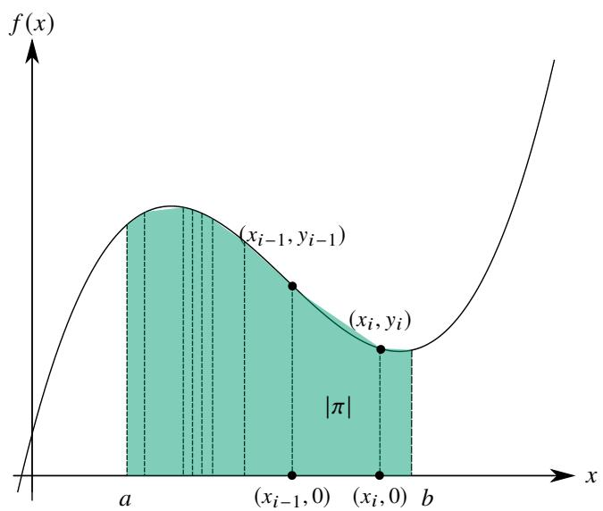  
图5.7：积分的梯形法则示意图

如果 $\pi$ 的分割点是均匀分布的, 则公式可以简化为

$$
\int_ {a} ^ {b} f (x) \mathrm {d} x \approx \frac {b - a}{n} \sum_ {i = 1} ^ {n} \frac {y _ {i - 1} + y _ {i}}{2} = \frac {b - a}{n} \sum_ {i = 1} ^ {n} \frac {y _ {i - 1} + y _ {i}}{2} = \frac {b - a}{n} \left(\frac {y _ {0} + y _ {n}}{2} + \sum_ {i = 1} ^ {n - 1} y _ {i}\right).
$$

以上计算Riemann积分近似值的公式称为梯形法则(trapezoidal rule).下面关键是估计梯形法则的误差.

# 定理5.16

设函数 $f$ 在 $[a,b]$ 上有二阶连续导数.把 $[a,b]$ 区间 $n$ 等分：

$$
x _ {i} = a + \frac {i}{n} (b - a), \quad i = 0, 1, 2, \dots , n
$$

若 $f^{\prime \prime}$ 有界，且 $|f''|\leqslant M$ ，则

$$
\left| \int_ {a} ^ {b} f (x) \mathrm {d} x - \left(\frac {y _ {0} + y _ {n}}{2} + \frac {b - a}{n} \sum_ {i = 1} ^ {n - 1} y _ {i}\right) \right| \leqslant \frac {(b - a) ^ {3}}{1 2 n ^ {2}} M.
$$

证明 XXX

下面看一个例子

例 5.23

解

最后介绍抛物线法则

定理5.17 (Simpson法则)

证明

例 5.24

解

# 5.4 Riemann 积分的应用

首先简单介绍一下平面(或空间中)曲线的表示方法.在平面中表示一条曲线的方式通常有四种：

(1) 显式方程  
(2) 隐式方程  
(3) 参数方程.  
(4) 极坐标方程.

我们以圆为例看一下这四种表示方法. 设原点为圆心, 半径为 $r$ 的圆. 如果用显式方程, 可以表示为

$$
y = \sqrt {r ^ {2} - x ^ {2}}, \quad x \in [ - r, r ], r > 0.
$$

显式方程的优点是很容易确定曲线上的点, 因为只需给出 $x$ 的值, 就可以用显式方程立刻算出 $y$ 的值. 但显式方程无法表达整个圆上的点. 而隐式方程可以表示整个圆

$$
x ^ {2} + y ^ {2} = r ^ {2}. \quad r > 0.
$$

隐式方程还有一个好处是可以很容易地把平面分成三个部分:“曲线内部”、“曲线外部”和“曲线上”.设方程 $F(x,y) = 0$ 确定了一条曲线,则可以规定 $F(x,y) < 0$ 表示曲线内部, $F(x,y) > 0$ 表示曲线外部.如果 $F(x,y) = 0$ 是一条封闭曲线,则内部和外部的几何意义是很清楚的,如果 $F(x,y) = 0$ 不是一条封闭曲线,虽然“内部”和“外部”有点不名副其实,但还是可以把平面划成三部分.

参数方程可以同时吸收以上两种表示方法的优点. 圆的参数方程为:

$$
\left\{ \begin{array}{l} x = r \cos \theta \\ y = r \sin \theta \end{array} , \quad 0 \leqslant \theta \leqslant 2 \pi , r > 0. \right.
$$

用参数表示的曲线既方便确定曲线上的点, 又可以表示曲线上的每一点.

例 5.25 摆线 设半径为 $r$ 的圆. 当它在一条定直线上滚动时, 求圆周上一个定点的轨迹.

解如图5.8, 设圆在 $x$ 轴上沿着 $x$ 轴正方向滚动, 定点 $P$ 的初始位置在原点 $O$ , 圆心为 $A$ . 当 $AP$ 转出 $t$ 角度时, 设 $P(x, y)$ , 则

$$
\left\{ \begin{array}{l} x = r (t - \sin t) \\ y = r (1 - \cos t) \end{array} \right..
$$

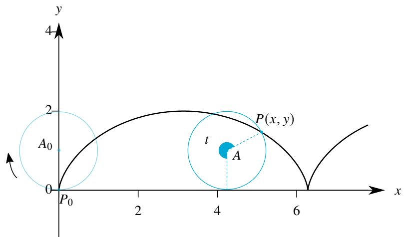  
图5.8: 摆线示意图

如果要表示空间中的曲线, 参数方程的优势就更加明显了. 如果用非参数方程表示空间中的曲线, 需要联立两

个方程, 这两个方程分别表示一个曲面, 曲线是这两个曲面的交线. 为了简洁, 参数方程

$$
\left\{ \begin{array}{l} x = x (t) \\ y = y (t) \\ z = z (t) \end{array} , \quad \alpha \leqslant t \leqslant \beta \right.
$$

可以表示为向量形式：

$$
\boldsymbol {r} = \boldsymbol {r} (t), \quad \alpha \leqslant t \leqslant \beta ,
$$

其中 $\pmb{r} = (x,y,z),\pmb{r}(t) = (x(t),y(t),z(t))$

最后一种表示方法是极坐标方程. 圆的极坐标方程为就是 $r(\theta) = r$ . 用极坐标方程表示某些曲线是很方便的.

# 5.4.1 计算平面图形的面积

下面我们来介绍一下平面图形面积的一般计算方法. 我们已经知道, 若函数 $f(x) \geqslant 0$ , 则直线 $x = a, x = b, x$ 轴和曲线 $y = f(x)$ 围成的曲边梯形面积并定义为

$$
S = \int_ {a} ^ {b} f (x) \mathrm {d} x.
$$

令 $g(x) = -f(x)$ , 则 $y = g(x)$ 与直线 $x = a, x = b, x$ 轴围成的曲边梯形与上面那个曲边梯形是全等的, 因此面积相等. 因此 $y = g(x)$ 的曲边梯形面积为

$$
S = \int_ {a} ^ {b} f (x) \mathrm {d} x = - \int_ {a} ^ {b} - f (x) \mathrm {d} x = - \int_ {a} ^ {b} g (x) \mathrm {d} x.
$$

若函数 $f(x)$ 和 $g(x)$ 在 $[a,b]$ 上连续，且满足 $f(x)\geqslant g(x)$ $(\forall x\in [a,b])$ 则直线 $x = a,x = b$ 和曲线 $y = f(x)$ $y = g(x)$ 围成的图形面积为

$$
S = \int_ {a} ^ {b} f (x) d x - \int_ {a} ^ {b} g (x) d x = \int_ {a} ^ {b} [ f (x) - g (x) ] d x.
$$

容易验证这个结论成立对 $f(x)$ 和 $g(x)$ 的非负性没有要求

有时候, 我们可以以 $y$ 轴为“基准计算面积”. 若 $f(y)$ 在 $[a, b]$ 非负, 则直线 $y = a, y = b, y$ 轴和曲线 $x = f(y)$ 围成的曲边梯形面积为

$$
S = \int_ {a} ^ {b} f (y) d y.
$$

其余结论也类似.在实际计算时需要灵活运用以上结论，有时候还需要用一些初等平面几何的知识.下面看一个例子.

例5.26 求抛物线 $y^{2} = 2x$ 与直线 $x - y = 4$ 所围成的区域的面积, 如图5.9所示.

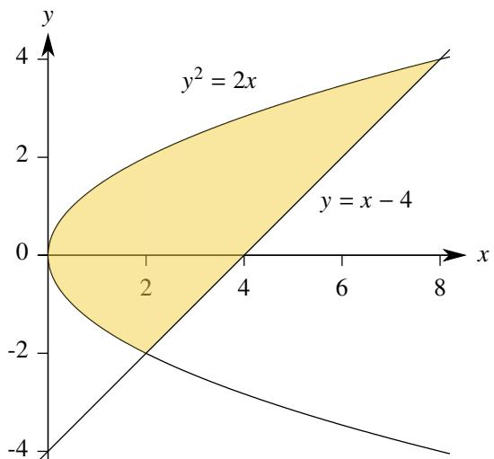  
图5.9: 抛物线和直线围成的面积

解联立 $y^{2} = 2x$ 和 $x - y = 4$ 解得

$$
\left\{ \begin{array}{l l} {x = 8} \\ {y = 4} \end{array} \right. \quad \text {或} \quad \left\{ \begin{array}{l l} {x = 2} \\ {y = - 2} \end{array} \right.
$$

因此它们抛物线 $y^{2} = 2x$ 与直线 $x - y = 4$ 交于点 $A(8,4)$ 和 $B(2, -2)$ .

解法一 如图, 过 $B$ 作 $x$ 轴的垂线, 把所求的区域面积分割成了两部分. 用 Riemann 积分分别求它们的面积:

$$
\begin{array}{l} S = S _ {1} + S _ {2} = 2 \int_ {0} ^ {2} \sqrt {2 x} d x + \int_ {2} ^ {8} \left[ \sqrt {2 x} - (x - 4) \right] d x = 2 \sqrt {2} \cdot \frac {2}{3} x ^ {3 / 2} \left| _ {0} ^ {2} + \sqrt {2} \cdot \frac {2}{3} x ^ {3 / 2} - \frac {1}{2} x ^ {2} + 4 x \right| _ {2} ^ {8} \\ = 2 \sqrt {2} \cdot \frac {2}{3} \cdot 2 ^ {3 / 2} + \sqrt {2} \cdot \frac {2}{3} \cdot 8 ^ {3 / 2} - \frac {1}{2} \cdot 8 ^ {2} + 4 \cdot 8 - \sqrt {2} \cdot \frac {2}{3} \cdot 2 ^ {3 / 2} + \frac {1}{2} \cdot 2 ^ {2} - 4 \cdot 2 = 1 8. \\ \end{array}
$$

解法二 如图，所求区域的面积等于它们对应的反函数围成的区域面积.于是

$$
S = \int_ {- 2} ^ {4} \left(y + 4 - \frac {1}{2} y ^ {2}\right) d y = \left. \frac {1}{2} y ^ {2} + 4 y - \frac {1}{6} y ^ {3} \right| _ {- 2} ^ {4} = \left(\frac {1}{2} \cdot 4 ^ {2} + 4 \cdot 4 - \frac {1}{6} \cdot 4 ^ {3}\right) - \left(\frac {1}{2} \cdot 2 ^ {2} - 4 \cdot 2 + \frac {1}{6} \cdot 2 ^ {3}\right) = 1 8.
$$

下面看一个有趣的例子.

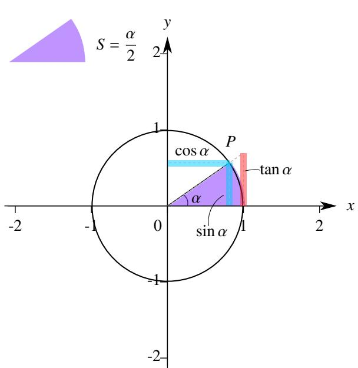

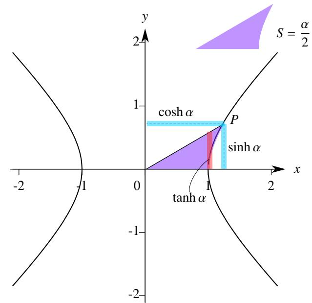  
图5.10: 三角函数和双曲函数的几何意义

例5.27 双曲函数的几何意义 设单位双曲线 $x^{2} - y^{2} = 1$ . 设双曲线在第一象限上的一点 $P(x_{0},y_{0})$ . 求双曲线, $x$ 轴以及直线 $OP$ 围成的面积.

解 容易求得直线 $OP$ 的方程为

$$
y = \frac {y _ {0}}{x _ {0}} x \Longleftrightarrow x = \frac {x _ {0}}{y _ {0}} y.
$$

于是

$$
S = \int_ {0} ^ {y _ {0}} \left(\sqrt {1 + y ^ {2}} - \frac {x _ {0}}{y _ {0}} y\right) d y = \frac {1}{2} \arcsin h y + \frac {1}{2} y \sqrt {1 + y ^ {2}} - \frac {x _ {0}}{2 y _ {0}} y ^ {2} \Bigg | _ {0} ^ {y _ {0}} = \frac {1}{2} \arcsin h y _ {0}.
$$

注上例的计算结果恰好是反双曲函数，因此不难想到双曲函数的几何意义.如果设 $OP,x$ 轴和双曲线围成的面积为 $\alpha /2$ ，则 $P$ 的纵坐标恰好是 $\sinh \alpha$ ，横坐标恰好是 $\cosh \alpha .$ 于是直线 $OP$ 的方程就是

$$
y = \frac {\sinh \alpha}{\cosh \alpha} x.
$$

令 $x = 1$ ，则

$$
y = \frac {\sinh \alpha}{\cosh \alpha} = \tanh  \alpha .
$$

这表明过 (1,0) 点作双曲线的切线与 $OP$ 交点的纵坐标就是双曲正切 $\tanh \alpha$ . 于是我们就得到了用双曲线定义双曲函数的方法. 根据以上讨论可知, 这个定义和之前给出的定义是一致的.

另一方面，可以用同样的方法定义三角函数。在单位圆的第一象限取一点 $P$ ，此时 $OP, \alpha$ 轴和圆围成的图形是一个扇形，若它面积为 $\alpha / 2$ ，则这个扇形的圆心角恰好是 $\alpha$ ，因此 $P$ 的纵坐标恰好是 $\sin \alpha$ ，横坐标恰好是 $\cos \alpha$ 。于是直线 $OP$ 的方程就是

$$
y = \frac {\sin \alpha}{\cos \alpha} x.
$$

令 $x = 1$ ，则

$$
y = \frac {\sin \alpha}{\cos \alpha} = \tan \alpha .
$$

这表明过(1,0)点作圆的切线与 $OP$ 交点的纵坐标就是正切 $\tanh \alpha$ . 从这个意义上讲, 三角函数也叫“圆函数”.

有时候用参数方程计算面积更方便. 设函数 $y = f(x)$ 在 $[a, b]$ 上可积. 若它可以写成参数方程

$$
\left\{ \begin{array}{l} x = x (t) \\ y = y (t) \end{array} \right., \quad \alpha \leqslant t \leqslant \beta ,
$$

其中 $x(\alpha) = a, x(\beta) = b$ . 则根据换元法可知

$$
\int_ {a} ^ {b} f (x) \mathrm {d} x = \int_ {\alpha} ^ {\beta} y (t) \mathrm {d} x (t) = \int_ {\alpha} ^ {\beta} y (t) x ^ {\prime} (t) \mathrm {d} t.
$$

下面我们分别用显式方程和参数方程来计算椭圆的面积

例 5.28 求以下椭圆内部的面积

$$
\frac {x ^ {2}}{a ^ {2}} + \frac {y ^ {2}}{b ^ {2}} = 1, \quad a, b > 0.
$$

解 解法一 把椭圆方程化成显式函数

$$
y = \frac {b}{a} \sqrt {a ^ {2} - x ^ {2}}, \quad - a \leqslant x \leqslant a.
$$

于是椭圆内部的面积为

$$
S = \frac {4 b}{a} \int_ {0} ^ {a} \sqrt {a ^ {2} - x ^ {2}} \mathrm {d} x = \frac {4 b}{a} \int_ {0} ^ {\pi / 2} \sqrt {a ^ {2} - a ^ {2} \sin^ {2} t} \mathrm {d} a \sin t = 4 a b \int_ {0} ^ {\pi / 2} \cos^ {2} t \mathrm {d} t = 4 a b \cdot \frac {\pi}{4} = a b \pi .
$$

解法二 把椭圆的第一象限部分化成参数方程

$$
\left\{ \begin{array}{l} x = a \cos t \\ y = b \sin t \end{array} \right., \quad 0 \leqslant t \leqslant \frac {\pi}{2}.
$$

于是椭圆的面积为

$$
S = 4 \int_ {0} ^ {a} y d x = 4 \int_ {\pi / 2} ^ {0} y (t) x ^ {\prime} (t) d t = 4 a b \int_ {0} ^ {\pi / 2} \sin^ {2} t d t = 4 a b \cdot \frac {\pi}{4} = a b \pi .
$$

如果参数方程表示的曲线是封闭的，我们还有以下命题

# 命题5.17

设一条没有自交点的封闭曲线的参数方程为

$$
\Gamma : \left\{ \begin{array}{l} x = x (t) \\ y = y (t) \end{array} \right., \quad \alpha \leqslant t \leqslant \beta .
$$

其中 $x(t)$ 和 $y(t)$ 满足所需要的连续和可导条件.如图5.11,当 $t$ 从 $\alpha$ 变动到 $\beta$ 时，点 $(x(t),y(t))$ 从 $A$ 点出发按逆时针方向遍历曲线一周回到 $A$ ，其中 $A$ 的横坐标 $a$ 是 $x(t)$ 在 $[\alpha ,\beta ]$ 上的最小值.则 $\Gamma$ 围成的图形面积为

$$
S = - \int_ {\alpha} ^ {\beta} y (t) x ^ {\prime} (t) d t = \int_ {\alpha} ^ {\beta} x (t) y ^ {\prime} (t) d t = \frac {1}{2} \int_ {\alpha} ^ {\beta} [ x (t) y ^ {\prime} (t) - y (t) x ^ {\prime} (t) ] d t.
$$

证明 由题意可知 $x(\alpha) = x(\beta) = a$ . 设 $x(t)$ 在 $[\alpha, \beta]$ 上的最大值为 $b$ . 取一点 $B$ 使得 $B$ 的横坐标为 $b$ 设 $\gamma \in [\alpha, \beta]$ 满足 $x(\gamma) = b$ . 设 $A$ 到 $B$ 的曲线方程为 $y = f_1(x), B$ 到 $A$ 的曲线方程为 $y = f_2(x) (a \leqslant x \leqslant b)$ , 则在 $[a, b]$ 上有 $f_2(x) \geqslant f_1(x)$ . 于是封闭曲线围成的图形面积为

$$
S = \int_ {a} ^ {b} f _ {2} (x) \mathrm {d} x - \int_ {a} ^ {b} f _ {1} (x) \mathrm {d} x = \int_ {\beta} ^ {\gamma} y (t) \mathrm {d} x (t) - \int_ {\alpha} ^ {\gamma} y (t) \mathrm {d} x (t) = - \int_ {\alpha} ^ {\beta} y (t) \mathrm {d} x (t) = - \int_ {\alpha} ^ {\beta} y (t) x ^ {\prime} (t) \mathrm {d} t.
$$

用分部积分法可得

$$
S = - x (t) y (t) \Bigg | _ {\alpha} ^ {\beta} + \int_ {\alpha} ^ {\beta} x (t) \mathrm {d} y (t) = \int_ {\alpha} ^ {\beta} x (t) \mathrm {d} y (t) = \int_ {\alpha} ^ {\beta} x (t) y ^ {\prime} (t) \mathrm {d} t.
$$

于是可知

$$
S = \frac {1}{2} \int_ {\alpha} ^ {\beta} [ x (t) y ^ {\prime} (t) - y (t) x ^ {\prime} (t) ] d t.
$$

注 类似可证, $A$ 的横坐标如果是 $[\alpha, \beta]$ 上的最大值, 命题也成立.

注 以上命题是 Green 公式的一个特例.

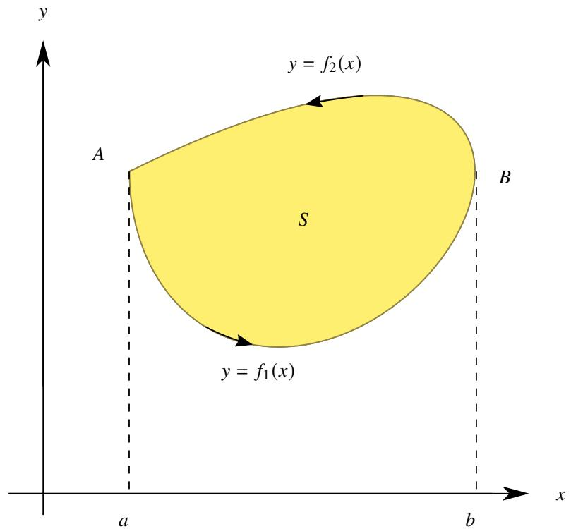  
图5.11:Green定理特例

我们用上面的命题再来算一下椭圆的面积

例 5.29 求以下椭圆内部的面积

$$
\frac {x ^ {2}}{a ^ {2}} + \frac {y ^ {2}}{b ^ {2}} = 1.
$$

解 解法三 这个椭圆的参数方程为

$$
\left\{ \begin{array}{l} x = a \cos t \\ y = b \sin t \end{array} \right., \quad 0 \leqslant t \leqslant 2 \pi .
$$

当 $t$ 从0变动到 $2\pi$ 时椭圆上的点从 $(a,0)$ 出发按逆时针方向遍历了椭圆一周.由命题5.17可知椭圆围成的面积为

$$
S = \int_ {0} ^ {2 \pi} x (t) y ^ {\prime} (t) d t = a b \int_ {0} ^ {2 \pi} \cos^ {2} t d t = \frac {a b}{2} (\cos t \sin t + t) \Bigg | _ {0} ^ {2 \pi} = a b \pi .
$$

下面介绍用极坐标表示的曲线围成的图形面积的计算方法.我们知道圆 $r = a$ 和射线 $\theta = \alpha ,\theta = \beta$ 围成的图

形是一个扇形, 它的面积为

$$
S = \frac {\beta - \alpha}{2 \pi} \cdot \pi a ^ {2} = \frac {1}{2} a ^ {2} (\beta - \alpha).
$$

下面来看一般情况. 设极坐标中的曲线 $r = r(\theta)$ , 为了计算它与射线 $\theta = \alpha, \theta = \beta$ 围成的面积, 我们可以仿照直角坐标中定义曲边梯形面积的做法. 对 $[\alpha, \beta]$ 作分割

$$
\pi : \alpha = \theta_ {0} <   \theta_ {1} <   \dots <   \theta_ {n} = \beta .
$$

在小区间 $[\theta_{i - 1},\theta_i]$ 中任取一点 $\xi_{i}$ .令 $\Delta \theta_{i} = \theta_{i} - \theta_{i - 1}(i = 1,2,\dots ,n)$ .于是夹在 $\theta = \theta_{i - 1},\theta = \theta_{i}$ 上半径为 $r(\xi_i)$ 的小扇形面积为

$$
\frac {1}{2} r ^ {2} \left(\xi_ {i}\right) \Delta \theta_ {i}, \quad i = 1, 2, \dots , n.
$$

作Riemann和得

$$
\frac {1}{2} \sum_ {i = 1} ^ {n} r ^ {2} (\xi_ {i}) \Delta \theta_ {i}.
$$

类似地, 令分割的宽度 $\| \pi \| = \max_{1\leqslant i\leqslant n}\Delta \theta_i\to 0,$ 我们把这个极限 (如果存在)定义为曲线 $r = r(\theta)$ 与射线 $\theta = \alpha$ $\theta = \beta$ 围成的面积:

$$
S := \frac {1}{2} \lim  _ {\| \pi \| \to 0} \sum_ {i = 1} ^ {n} r ^ {2} (\xi_ {i}) \Delta \theta_ {i} = \frac {1}{2} \int_ {\alpha} ^ {\beta} r ^ {2} (\theta) \mathrm {d} \theta .
$$

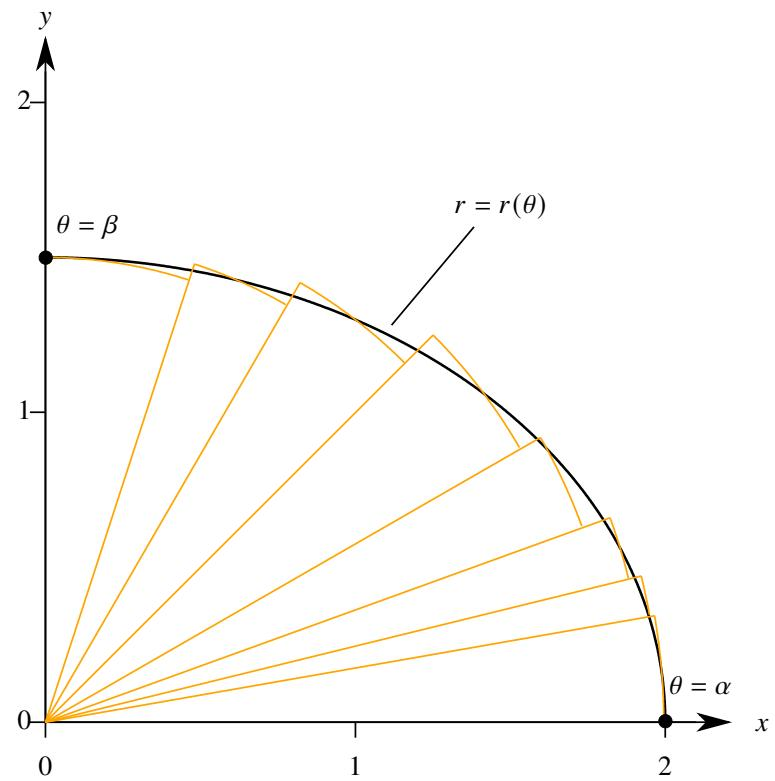  
图5.12:极坐标下的积分

下面我们来看一个例子.

例5.30如图5.13，求以下曲线所围成的区域面积：

$$
r = a (1 + \cos \theta), \quad a > 0.
$$

解曲线关于 $x$ 轴对称，因此所求的面积为

$$
S = 2 \cdot \frac {1}{2} \int_ {0} ^ {\pi} a ^ {2} (1 + \cos \theta) ^ {2} \mathrm {d} \theta = a ^ {2} \int_ {0} ^ {\pi} \left(1 + 2 \cos \theta + \cos^ {2} \theta\right) \mathrm {d} \theta = \pi a ^ {2} + 2 a ^ {2} \int_ {0} ^ {\pi / 2} \cos^ {2} \mathrm {d} \theta = \frac {3 \pi}{2} a ^ {2}.
$$

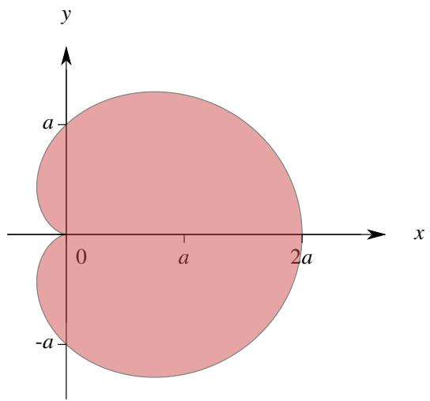  
图5.13: $a = 1$ 时的心脏线示意图

# 5.4.2 计算曲线的弧长

下面来讨论曲线弧长的计算方法. 设直角坐标平面上的曲线的参数方程为

$$
\Gamma : \left\{ \begin{array}{l} x = x (t) \\ y = y (t) \end{array} \right., \quad \alpha \leqslant t \leqslant \beta ,
$$

其中 $x(t),y(t)$ 连续可导.为了书写便利，我们可以把以上参数方程写成向量形式 $\pmb {r} = \pmb {r}(t)(\alpha \leqslant t\leqslant \beta)$ .设 $A = r(\alpha)$ 和 $B = r(\beta)$ 分别是 $\Gamma$ 的起点和终点.我们沿着 $A$ 到 $B$ 的方向依次取 $n + 1$ 个点，就得到了一个分割：

$$
\Pi : A = A _ {0}, A _ {1}, A _ {2}, \dots , A _ {n} = B.
$$

于是得到了 $n$ 条线段 $A_{i-1}A_i (i = 1,2,\dots,n)$ . 设 $A_i$ 对应着参数值 $t_i (i = 0,1,2,\dots,n)$ , 则我们得到了 $[\alpha,\beta]$ 的一个分割:

$$
\pi : \alpha = t _ {0} <   t _ {1} <   \dots <   t _ {n} = \beta .
$$

这表明分割 $\Pi$ 确定了 $\pi$ , 反之亦然. 因此

$$
| A _ {i - 1} A _ {i} | = | \boldsymbol {r} (t _ {i}) - \boldsymbol {r} (t _ {i - 1}) | = \sqrt {[ x (t _ {i}) - x (t _ {i - 1}) ] ^ {2} + [ y (t _ {i}) - y (t _ {i - 1}) ] ^ {2}}, \quad i = 1, 2, \dots , n.
$$

由Lagrange中值定理可知，存在 $\xi_i,\eta_i\in (t_{i - 1},t_i)$ 使得

$$
x \left(t _ {i}\right) - x \left(t _ {i - 1}\right) = x ^ {\prime} \left(\xi_ {i}\right) \Delta t _ {i}, \quad y \left(t _ {i}\right) - y \left(t _ {i - 1}\right) = y ^ {\prime} \left(\eta_ {i}\right) \Delta t _ {i}, \quad i = 1, 2, \dots , n.
$$

其中 $\Delta t_{i} = t_{i} - t_{i - 1}$ .于是

$$
\left| A _ {i - 1} A _ {i} \right| = \sqrt {\left[ x ^ {\prime} (\xi_ {i}) \right] ^ {2} + \left[ y ^ {\prime} (\eta_ {i}) \right] ^ {2}} \Delta t _ {i}, \quad i = 1, 2, \dots , n.
$$

由于 $x^{\prime}(t),y^{\prime}(t)$ 都连续，因此存在 $K > 0$ 使得

$$
\left| A _ {i - 1} A _ {i} \right| \leqslant K \Delta t _ {i} \leqslant K \| \pi \|, \quad i = 1, 2, \dots , n.
$$

这表明当 $\| \pi \| \to 0$ 时， $|A_{i - 1}A_i|\to 0.$ 于是我们考虑先把 $|A_{i - 1}A_i|(i = 1,2,\dots ,n)$ 都加起来

$$
\sum_ {i = 1} ^ {n} \left| A _ {i - 1} A _ {i} \right| = \sum_ {i = 1} ^ {n} \sqrt {\left[ x ^ {\prime} \left(\xi_ {i}\right) \right] ^ {2} + \left[ y ^ {\prime} \left(\eta_ {i}\right) \right] ^ {2}}.
$$

然后令 $\| \pi \| \to 0$ . 若极限存在, 则把极限定义为弧长. 下面我们需要把这个极限转化为 Riemann 积分.

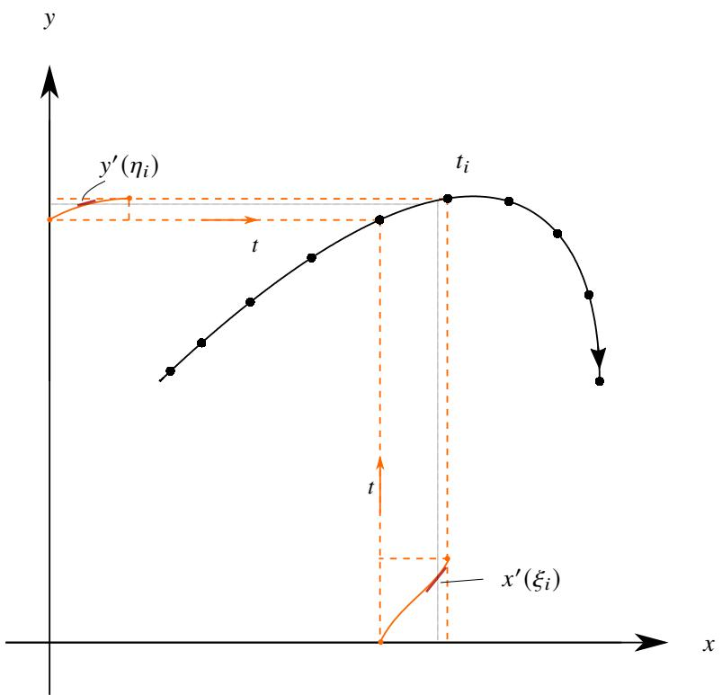  
图5.14: 弧长的黎曼和

# 命题5.18

设函数 $x(t),y(t)$ 在 $[\alpha ,\beta ]$ 上连续可导，则

$$
\lim  _ {\| \pi \| \rightarrow 0} \sum_ {i = 1} ^ {n} \sqrt {\left[ x ^ {\prime} \left(\xi_ {i}\right)\right] ^ {2} + \left[ y ^ {\prime} \left(\eta_ {i}\right)\right] ^ {2}} \Delta t _ {i} = \int_ {\alpha} ^ {\beta} \sqrt {\left[ x ^ {\prime} (t) \right] ^ {2} + \left[ y ^ {\prime} (t) \right] ^ {2}} d t.
$$

其中 $\xi_{i}$ 和 $\eta_{i}$ 的含义如前所述

证明 令上式右侧的积分值为 $I$ . 由Riemann积分的定义可知, 对于任一 $\varepsilon > 0$ , 都存在 $\delta_1 > 0$ 使得当 $\| \pi \| < \delta_1$ 时

$$
\left| I - \sum_ {i = 1} ^ {n} \sqrt {\left[ x ^ {\prime} \left(\xi_ {i}\right) \right] ^ {2} + \left[ y ^ {\prime} \left(\xi_ {i}\right) \right] ^ {2}} \Delta t _ {i} \right| <   \frac {\varepsilon}{2}.
$$

另一方面，由于 $y(t)$ 在 $[\alpha, \beta]$ 上连续可导，故 $y'(t)$ 在 $[\alpha, \beta]$ 上连续，因此 $y'(t)$ 在 $[\alpha, \beta]$ 上一致连续。因此对于上述给定的 $\varepsilon$ 都存在 $\delta_2$ 使得当 $\|\pi\| < \delta_2$ 时

$$
\left| y ^ {\prime} \left(\xi_ {i}\right) - y ^ {\prime} \left(\eta_ {i}\right) \right| <   \frac {\varepsilon}{2 (\beta - \alpha)}, \quad i = 1, 2, \dots , n.
$$

由向量的三角不等式可知

$$
\begin{array}{l} \sqrt {\left[ x ^ {\prime} \left(\xi_ {i}\right) \right] ^ {2} + \left[ y ^ {\prime} \left(\xi_ {i}\right) \right] ^ {2}} - \sqrt {\left[ x ^ {\prime} \left(\xi_ {i}\right) \right] ^ {2} + \left[ y ^ {\prime} \left(\eta_ {i}\right) \right] ^ {2}} \leqslant \sqrt {\left[ x ^ {\prime} \left(\xi_ {i}\right) - x ^ {\prime} \left(\xi_ {i}\right) \right] ^ {2} + \left[ y ^ {\prime} \left(\xi_ {i}\right) - y ^ {\prime} \left(\eta_ {i}\right) \right] ^ {2}} \\ = \left| y ^ {\prime} \left(\xi_ {i}\right) - y ^ {\prime} \left(\eta_ {i}\right) \right|, \quad i = 1, 2, \dots , n. \\ \end{array}
$$

由以上讨论可知，当 $\| \pi \| <  \min \{\delta_1,\delta_2\}$ 时

$$
\begin{array}{l} \left| I - \sum_ {i = 1} ^ {n} \sqrt {\left[ x ^ {\prime} \left(\xi_ {i}\right) \right] ^ {2} + \left[ y ^ {\prime} \left(\eta_ {i}\right) \right] ^ {2}} \Delta t _ {i} \right| \\ = \left| I - \sum_ {i = 1} ^ {n} \sqrt {\left[ x ^ {\prime} \left(\xi_ {i}\right) \right] ^ {2} + \left[ y ^ {\prime} \left(\xi_ {i}\right) \right] ^ {2}} \Delta t _ {i} + \sum_ {i = 1} ^ {n} \sqrt {\left[ x ^ {\prime} \left(\xi_ {i}\right) \right] ^ {2} + \left[ y ^ {\prime} \left(\xi_ {i}\right) \right] ^ {2}} \Delta t _ {i} - \sum_ {i = 1} ^ {n} \sqrt {\left[ x ^ {\prime} \left(\xi_ {i}\right) \right] ^ {2} + \left[ y ^ {\prime} \left(\eta_ {i}\right) \right] ^ {2}} \Delta t _ {i} \right| \\ \leqslant \left| I - \sum_ {i = 1} ^ {n} \sqrt {\left[ x ^ {\prime} \left(\xi_ {i}\right) \right] ^ {2} + \left[ y ^ {\prime} \left(\xi_ {i}\right) \right] ^ {2}} \Delta t _ {i} \right| + \sum_ {i = 1} ^ {n} \left| \sqrt {\left[ x ^ {\prime} \left(\xi_ {i}\right) \right] ^ {2} + \left[ y ^ {\prime} \left(\xi_ {i}\right) \right] ^ {2}} - \sqrt {\left[ x ^ {\prime} \left(\xi_ {i}\right) \right] ^ {2} + \left[ y ^ {\prime} \left(\eta_ {i}\right) \right] ^ {2}} \right| \Delta t _ {i} \\ \end{array}
$$

$$
\leqslant \left| I - \sum_ {i = 1} ^ {n} \sqrt {\left[ x ^ {\prime} \left(\xi_ {i}\right) \right] ^ {2} + \left[ y ^ {\prime} \left(\xi_ {i}\right) \right] ^ {2}} \Delta t _ {i} \right| + \sum_ {i = 1} ^ {n} \left| y ^ {\prime} \left(\xi_ {i}\right) - y ^ {\prime} \left(\eta_ {i}\right) \right| \Delta t _ {i} <   \frac {\varepsilon}{2} + \frac {\varepsilon}{2 (\beta - \alpha)} \sum_ {i = 1} ^ {n} \Delta t _ {i} = \frac {\varepsilon}{2} + \frac {\varepsilon}{2} = \varepsilon .
$$

于是可知

$$
\lim  _ {\| \pi \| \rightarrow 0} \sum_ {i = 1} ^ {n} \sqrt {\left[ x ^ {\prime} (\xi_ {i}) \right] ^ {2} + \left[ y ^ {\prime} (\eta_ {i}) \right] ^ {2}} \Delta t _ {i} = I.
$$

于是我们得到了平面内曲线的弧长公式：

$$
S (\Gamma) = \int_ {\alpha} ^ {\beta} \sqrt {[ x ^ {\prime} (t) ] ^ {2} + [ y ^ {\prime} (t) ] ^ {2}} \mathrm {d} t.
$$

如果把参数方程

$$
\left\{ \begin{array}{l} x = x ^ {\prime} (t) \\ y = y ^ {\prime} (t) \end{array} \right.
$$

记作 $r^{\prime}(t)$ ，则

$$
\sqrt {\left[ x ^ {\prime} (t) \right] ^ {2} + \left[ y ^ {\prime} (t) \right] ^ {2}} = \| r ^ {\prime} (t) \|.
$$

因此弧长公式可以简化为

$$
S (\Gamma) = \int_ {\alpha} ^ {\beta} \| r ^ {\prime} (t) \| d t.
$$

对于显式曲线 $y = f(x)$ $(a\leqslant x\leqslant b)$ 可以把它看作参数方程

$$
\left\{ \begin{array}{l} x = t \\ y = f (t) \end{array} \right., \quad a \leqslant t \leqslant b.
$$

于是它的弧长公式为

$$
S (\Gamma) = \int_ {a} ^ {b} \sqrt {1 + \left[ f ^ {\prime} (t) \right] ^ {2}} d t.
$$

下面来看几个例子.

例5.31 设星形线:

$$
\Gamma : x = a \cos^ {3} t, \quad y = a \sin^ {3} t, \quad 0 \leqslant t \leqslant 2 \pi , a > 0.
$$

求它的弧长.

解由于

$$
x ^ {\prime} (t) = - 3 a \cos^ {2} t \sin t, \quad y ^ {\prime} (t) = 3 a \sin^ {2} t \cos t.
$$

如图5.15, 我们只需计算第一象限的弧长, 然后在乘以4. 于是 $\Gamma$ 的弧长为

$$
S (\Gamma) = 4 \int_ {0} ^ {\pi / 2} \sqrt {9 a ^ {2} \cos^ {4} t \sin^ {2} t + 9 a ^ {2} \sin^ {4} t \cos^ {2} t} d t = 1 2 a \int_ {0} ^ {\pi / 2} \cos t \sin t d t = 6 a \sin^ {2} t \Bigg | _ {0} ^ {\pi / 2} = 6 a.
$$

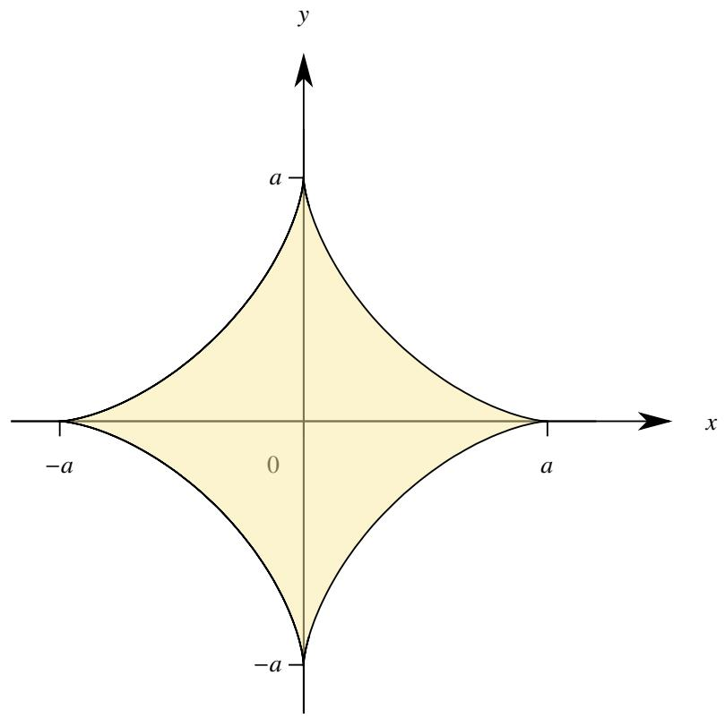  
图5.15：星形线示意图

例5.32 求半径为 $r$ 的圆的周长

解设这个圆的参数方程为

$$
\left\{ \begin{array}{l} x = r \cos t \\ y = r \sin t \end{array} \right., \quad 0 \leqslant t \leqslant 2 \pi .
$$

由于

$$
x ^ {\prime} (t) = - r \sin t, \quad y ^ {\prime} (t) = r \cos t.
$$

于是它的周长为

$$
S (\Gamma) = 4 \int_ {0} ^ {\pi / 2} \sqrt {r ^ {2} \sin^ {2} t + r ^ {2} \cos^ {2} t} d t = 4 r \int_ {0} ^ {\pi / 2} d t = 2 \pi r.
$$

例5.33 设椭圆

$$
\Gamma : \frac {x ^ {2}}{a ^ {2}} + \frac {y ^ {2}}{b ^ {2}} = 1, \quad a > b > 0.
$$

求它的周长.

解这个椭圆的参数方程为

$$
\left\{ \begin{array}{l} x = a \cos t \\ y = b \sin t \end{array} \right., \quad 0 \leqslant t \leqslant 2 \pi .
$$

由于

$$
x ^ {\prime} (t) = - a \sin t, \quad y ^ {\prime} (t) = b \cos t.
$$

于是它的周长为

$$
S (\Gamma) = 4 \int_ {0} ^ {\pi / 2} \sqrt {a ^ {2} \sin^ {2} t + b ^ {2} \cos^ {2} t} d t = 4 \int_ {0} ^ {\pi / 2} \sqrt {a ^ {2} - (a ^ {2} - b ^ {2}) \cos^ {2} t} d t.
$$

令

$$
e = \frac {\sqrt {a ^ {2} - b ^ {2}}}{a}.
$$

则

$$
S (\Gamma) = 4 a \int_ {0} ^ {\pi / 2} \sqrt {1 - e \cos^ {2} t} d t.
$$

注函数 $\sqrt{1 - e\cos^2t}$ 的原函数不是初等函数，因此椭圆没有像圆一样简洁的周长公式.若 $t$ 用 $\pi /2 - t$ 代入得

$$
\int_ {0} ^ {\pi / 2} \sqrt {1 - e ^ {2} \cos^ {2} t} d = \int_ {0} ^ {\pi / 2} \sqrt {1 - e ^ {2} \sin^ {2} t} d t.
$$

我们称以上两个积分为椭圆积分 (elliptic integral), 其中 $e$ 是离心率.

对于空间中的曲线

$$
\Gamma : \left\{ \begin{array}{l} x = x (t) \\ y = y (t) \\ z = z (t) \end{array} \right., \quad \alpha \leqslant t \leqslant \beta .
$$

用类似的方法可以得到弧长计算公式

$$
S (\Gamma) = \int_ {\alpha} ^ {\beta} \sqrt {[ x ^ {\prime} (t) ] ^ {2} + [ y ^ {\prime} (t) ] ^ {2} + [ z ^ {\prime} (t) ] ^ {2}} d t.
$$

若 $r'(t) = (x'(t), y'(t), z'(t))$ ，则公式即为

$$
S (\Gamma) = \int_ {\alpha} ^ {\beta} \| r ^ {\prime} (t) \| d t.
$$

下面看一个例子.

# 例5.34圆柱螺旋线设圆柱螺旋线

$$
\Gamma : \left\{ \begin{array}{l} x = a \cos \theta \\ y = a \sin \theta \\ z = b \theta \end{array} , \quad 0 \leqslant \theta \leqslant 2 \pi . \right.
$$

解由于

$$
x ^ {\prime} = - a \sin \theta , \qquad y ^ {\prime} = a \cos \theta , \qquad z ^ {\prime} = b.
$$

于是可知弧长为

$$
S (\Gamma) = \int_ {0} ^ {2 \pi} \sqrt {a ^ {2} \sin^ {2} \theta + a ^ {2} \cos^ {2} \theta + b ^ {2}} d \theta = \int_ {0} ^ {2 \pi} \sqrt {a ^ {2} + b ^ {2}} d \theta = 2 \pi \sqrt {a ^ {2} + b ^ {2}}.
$$

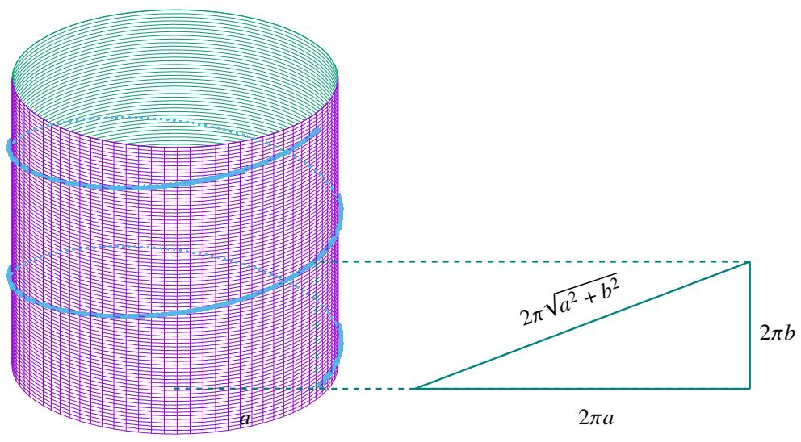  
图5.16：圆柱螺旋线

如果曲线是用极坐标方程 $r = r(\theta)$ $(\alpha \leqslant \theta \leqslant \beta)$ 给出的，则它的直角坐标参数方程为

$$
\left\{ \begin{array}{l} x = r (\theta) \cos \theta \\ y = r (\theta) \sin \theta \end{array} \right., \quad \alpha \leqslant \theta \leqslant \beta .
$$

由于

$$
x ^ {\prime} (\theta) = r ^ {\prime} (\theta) \cos \theta - r (\theta) \sin \theta , \quad y ^ {\prime} (\theta) = r ^ {\prime} (\theta) \sin \theta + r (\theta) \cos \theta .
$$

于是就可以得到弧长为

$$
S = \int_ {\alpha} ^ {\beta} \sqrt {r ^ {2} (\theta) + [ r ^ {\prime} (\theta) ] ^ {2}} d \theta .
$$

下面看一个例子.

例 5.35 设心脏线

$$
\Gamma : r = a (1 + \cos \theta), \quad a > 0.
$$

求它的弧长.

解 由于 $r'(\theta) = -a \sin \theta$ . 于是可知它的弧长为

$$
S (\Gamma) = 2 \int_ {0} ^ {\pi} \sqrt {a ^ {2} (1 + \cos \theta) ^ {2} + a ^ {2} \sin^ {2} \theta} d \theta = 2 \sqrt {2} a \int_ {0} ^ {\pi} \sqrt {1 + \cos \theta} d \theta = 4 a \int_ {0} ^ {\pi} \sqrt {\cos^ {2} \frac {\theta}{2}} d \theta = 8 a.
$$

# 5.4.3 计算空间区域的体积

下面来讨论体积的计算. 定义空间中区域体积的方法和定义平面中的曲边梯形面积完全类似. 设 $\Omega$ 是介于平面 $x = a$ 和 $x = b$ 之间的空间区域. 作分割

$$
\pi : a = x _ {0} <   x _ {1} <   \dots <   x _ {n} = b.
$$

则 $\Omega$ 被平面 $x = x_{i}$ $(i = 1,2,\dots ,n - 1)$ 分割成了 $n$ 个“薄片”.设平面 $x = t$ 截 $\Omega$ 的截面面积为 $g(t)(a < t < b)$ .任取 $\xi_{i}\in [x_{i - 1},x_{i}]$ $(i = 1,2,\dots ,n)$ 则可以得到Riemann和

$$
\sum_ {i = 1} ^ {n} g (\xi_ {i}) \Delta x _ {i}.
$$

它可以看作这些薄片的体积和的近似值. 若 $g(x)$ 在 $[a, b]$ 上 Riemann 可积, 则我们用这个 Riemann 和对应的 Riemann 积分定义 $\Omega$ 的体积.

$$
V (\Omega) = \lim  _ {\| \pi \| \rightarrow 0} \sum_ {i = 1} ^ {n} g (\xi_ {i}) \Delta x _ {i} = \int_ {a} ^ {b} g (x) \mathrm {d} x.
$$

下面来看一个例子.

例5.36求以下两个圆柱体相交部分 $\Omega$ 的体积：

$$
x ^ {2} + y ^ {2} \leqslant a ^ {2}, \quad x ^ {2} + z ^ {2} \leqslant a ^ {2}, \quad a > 0.
$$

解只需计算 $\Omega$ 在第一卦限部分 $\Omega_{1}$ 的体积， $\Omega$ 的体积是 $\Omega$ 的8倍.容易知道，平面 $x = t$ （ $0\leqslant t\leqslant a)$ 截 $\Omega_{1}$ 的截面一个边长为 $\sqrt{a^2 - t^2}$ 的正方形.因此它的面积为

$$
g (t) = a ^ {2} - t ^ {2}.
$$

于是可知 $\Omega$ 的体积为

$$
V (\Omega) = 8 V \left(\Omega_ {1}\right) = 8 \int_ {0} ^ {a} \left(a ^ {2} - t ^ {2}\right) d t = 8 a ^ {2} t - \frac {8}{3} t ^ {3} \Bigg | _ {0} ^ {a} = \frac {1 6}{3} a ^ {3}.
$$

注上例中的 $\Omega$ 在中国古代被称为牟合方盖，在西方称为Steinmetz solid.刘徽在研究球的体积计算问题时得出了球和牟合方盖体积比是 $\pi :4$ 的结论.古希腊数学家Archimedes和我国数学家祖冲之分别用不同的方法得出了牟合方盖的体积公式.

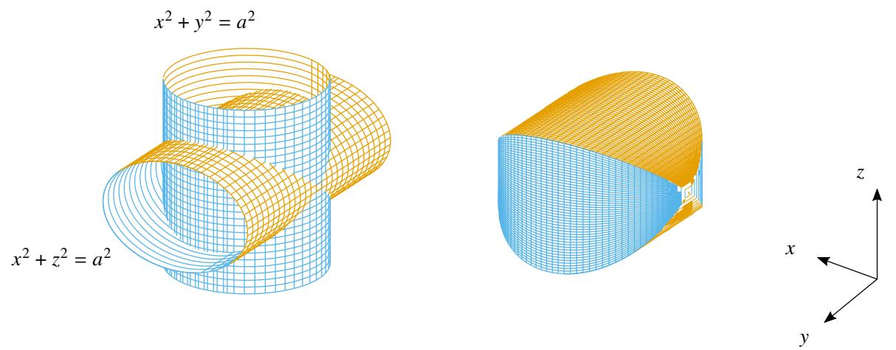  
图5.17：牟合方盖示意图

对于旋转体, 可以有更简便的计算方法. 设直角坐标平面上的曲线 $\Gamma: y = f(x)$ . 它在 $[a, b]$ 上非负且连续. 令 $\Gamma$ 绕 $x$ 轴旋转一周得到旋转体 $\Omega$ . 我们来计算 $\Omega$ 的体积. 容易知道, 平面 $x = t (a \leqslant t \leqslant b)$ 在 $\Omega$ 上的截面面积为

$$
g (t) = \pi f ^ {2} (t).
$$

于是可知 $\Omega$ 的体积为

$$
V (\Omega) = \int_ {a} ^ {b} g (t) \mathrm {d} t = \pi \int_ {a} ^ {b} f ^ {2} (t) \mathrm {d} t.
$$

下面看一个例子.

例5.37 求半径为 $r$ 的球的体积

解半径为 $r$ 的球是由以下半圆绕 $x$ 轴旋转得到的：

$$
y = \sqrt {r ^ {2} - x ^ {2}}, \quad - r \leqslant x \leqslant r.
$$

于是可知球的体积为

$$
V = \pi \int_ {- r} ^ {r} \left(r ^ {2} - x ^ {2}\right) \mathrm {d} x = 2 \pi r ^ {3} - \frac {\pi}{3} x ^ {3} \Bigg | _ {- r} ^ {r} = \frac {4}{3} \pi r ^ {3}.
$$

注 以上结果和我们熟悉的球的体积公式一致.

# 5.4.4 计算空间曲面的面积

最后我们来讨论以下空间中曲面面积. 这是个一个很复杂的主题, 我们暂时只讨论最简单的情况: 旋转曲面. 我们可以采用研究曲线弧长类似的方法.

设直角坐标平面上的曲线

$$
\Gamma : \left\{ \begin{array}{l} x = x (t) \\ y = y (t) \end{array} \right., \qquad \alpha \leqslant t \leqslant \beta .
$$

现在 $\Gamma$ 在 $[\alpha, \beta]$ 上非负且连续可导. 把 $\Gamma$ 绕 $x$ 轴旋转一周得到旋转曲面 $P$ . 与计算弧长时类似, 在 $\Gamma$ 上取 $n + 1$ 个点

$$
\Pi : A _ {0}, A _ {1}, \dots , A _ {n}.
$$

它们对应着参数区间 $[\alpha, \beta]$ 上的分点：

$$
\alpha = t _ {0} <   t _ {1} <   \dots <   t _ {n} = \beta .
$$

这时曲线上的第 $i$ 段 $A_{i - 1}A_{i}$ 的弧长可以近似为

$$
\sqrt {[ x ^ {\prime} (\xi_ {i}) ] ^ {2} + [ y ^ {\prime} (\eta_ {i}) ] ^ {2}} \Delta t _ {i}.
$$

于是这段曲线旋转而成的面积可以近似为

$$
2 \pi y (\xi_ {i}) \sqrt {\left[ x ^ {\prime} (\xi_ {i}) \right] ^ {2} + \left[ y ^ {\prime} (\eta_ {i}) \right] ^ {2}} \Delta t _ {i}.
$$

当 $\| \pi \| \to 0$ 时上式的极限就可以定义为该旋转曲面的面积.用命题5.18一样的方法可以证明

$$
\lim  _ {\| \pi \| \rightarrow 0} 2 \pi y (\xi_ {i}) \sqrt {[ x ^ {\prime} (\xi_ {i}) ] ^ {2} + [ y ^ {\prime} (\eta_ {i}) ] ^ {2}} \Delta t _ {i} = 2 \pi \int_ {\alpha} ^ {\beta} y (t) \sqrt {[ x ^ {\prime} (t) ] ^ {2} + [ y ^ {\prime} (t) ] ^ {2}} d t.
$$

于是就得到旋转曲面 $P$ 的面积公式

$$
S (P) = 2 \pi \int_ {\alpha} ^ {\beta} y (t) \sqrt {[ x ^ {\prime} (t) ] ^ {2} + [ y ^ {\prime} (t) ] ^ {2}} d t.
$$

如果 $\Gamma$ 的方程是显式方程 $y = f(x)$ $(a\leqslant x\leqslant b)$ , 则旋转曲面的面积为

$$
S (P) = 2 \pi \int_ {\alpha} ^ {\beta} f (x) \sqrt {1 + \left[ f ^ {\prime} (t) \right] ^ {2}} d x.
$$

例5.38 求半径为 $r$ 的球面的面积:

解这个球面是由以下半圆绕 $x$ 轴旋转所得：

$$
\left\{ \begin{array}{l} x = r \cos t \\ y = r \sin t \end{array} , \quad 0 \leqslant t \leqslant \pi . \right.
$$

由于

$$
x ^ {\prime} (t) = - r \sin t, \quad y ^ {\prime} (t) = r \cos t
$$

于是该球面的面积是

$$
S = 2 \pi \int_ {0} ^ {\pi} y (t) \sqrt {[ x ^ {\prime} (t) ] ^ {2} + [ y ^ {\prime} (t) ] ^ {2}} d t = 2 \pi r ^ {2} \int_ {0} ^ {\pi} \sin t d t = - 2 \pi r ^ {2} \cos t \left| _ {0} ^ {\pi} = 4 \pi r ^ {2}. \right.
$$

例5.39求以下椭球面的面积：

$$
\frac {x ^ {2}}{a ^ {2}} + \frac {y ^ {2}}{b ^ {2}} + \frac {z ^ {2}}{b ^ {2}} = 1.
$$

解这个椭球面是由以下椭圆绕 $x$ 轴旋转所得：

$$
\frac {x ^ {2}}{a ^ {2}} + \frac {y ^ {2}}{b ^ {2}} = 1.
$$

把它写成参数方程得：

$$
\left\{ \begin{array}{l} x = a \cos t \\ y = b \sin t \end{array} , \quad 0 \leqslant t \leqslant \pi . \right.
$$

由于

$$
x ^ {\prime} (t) = - a \sin t, \quad y ^ {\prime} (t) = b \cos t
$$

于是该球面的面积是

$$
\begin{array}{l} S = 2 \pi \int_ {0} ^ {\pi} y (t) \sqrt {\left[ x ^ {\prime} (t) \right] ^ {2} + \left[ y ^ {\prime} (t) \right] ^ {2}} d t = 2 \pi b \int_ {0} ^ {\pi} \sin t \sqrt {a ^ {2} \sin^ {2} t + b ^ {2} \cos^ {2} t} d t \\ = - 2 \pi b \int_ {0} ^ {\pi} \sqrt {a ^ {2} - (a ^ {2} - b ^ {2}) \cos^ {2} t} d \cos t = 2 \pi b \int_ {\pi} ^ {0} \sqrt {a ^ {2} - (a ^ {2} - b ^ {2}) \cos^ {2} t} d \cos t. \\ \end{array}
$$

令 $\varepsilon = \sqrt{a^2 - b^2} / a, u = \cos t.$ 由例4.45可知

$$
\begin{array}{l} S = 2 \pi a b \int_ {- 1} ^ {1} \sqrt {1 - \varepsilon^ {2} u ^ {2}} d u = 4 \pi a b \int_ {0} ^ {1} \sqrt {1 - \varepsilon^ {2} u ^ {2}} d u = 4 \pi a b \left[ \frac {1}{2 \varepsilon} \arcsin \varepsilon u + \frac {u}{2} \sqrt {1 - \varepsilon^ {2} u ^ {2}} \right| _ {0} ^ {1} \\ = \frac {2 \pi a b}{\varepsilon} \arcsin \varepsilon + 2 \pi a b \sqrt {1 - \varepsilon^ {2}} = \frac {2 \pi a b}{\varepsilon} \arcsin \varepsilon + 2 \pi b ^ {2}. \\ \end{array}
$$

其中 $\varepsilon$ 是椭圆的离心率.

我们已经看到, 求空间 (或平面) 中的曲线弧长和空间中的曲面面积要比求平面上的图形面积和空间中的区域体积麻烦得多.

# 5.4.5 Riemann 积分在物理中的应用

Riemann 积分在物理学中有大量的应用场景. 我们先看一个简单的例子.

例5.40设某个弹簧在 $10\mathrm{N}$ 的力下可以伸长 $1\mathrm{cm}$ . 求使得该弹簧伸长 $10\mathrm{cm}$ 所做的功.

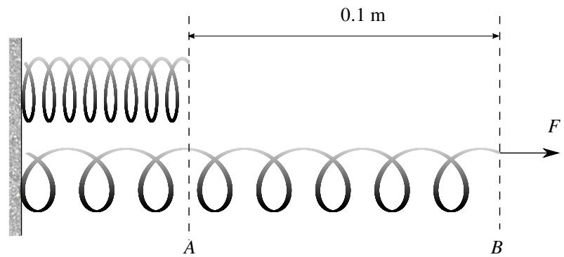  
图5.18: 伸长的弹簧

解由Hooke定律可知 $|F| = k|\Delta x|$ .由条件可知 $k = 1000\mathrm{N / m}$ 如图5.18,弹簧受外力作用从 $A$ 点伸长到了 $B$ 点 $|AB| = 0.1\mathrm{m}.$ 现把 $AB$ 作 $_n$ 等分：

$$
A = A _ {0}, A _ {1}, \dots , A _ {n} = B.
$$

每个小区间 $[A_{i-1}, A_i]$ 上的弹力都看作是 $A_i$ ( $i = 1,2,\dots,n$ ) 处的弹力，于是每个小区间上拉力做的功为

$$
W _ {i} = k \left| A A _ {i} \right| \left| A _ {i - 1} A _ {i} \right| = 1 0 0 0 \cdot \frac {0 . 1 i}{n} \cdot \frac {0 . 1}{n} = \frac {1 0 i}{n ^ {2}}.
$$

把所有小区间上做的功相加得 $\sum_{i=1}^{n}\left(10i / n^{2}\right)$ . 令 $n \to \infty$ 得

$$
W = \lim  _ {n \rightarrow \infty} \sum_ {i = 1} ^ {n} \frac {1 0 i}{n ^ {2}} = \lim  _ {n \rightarrow \infty} \frac {1}{n} \sum_ {i = 1} ^ {n} 1 0 \cdot \frac {i}{n} = \int_ {0} ^ {1} 1 0 x d x = 5 x ^ {2} \Bigg | _ {0} ^ {1} = 5 (J).
$$

于是可知使得该弹簧伸长 $10\mathrm{cm}$ 需要做功5J.

以上求解过程是严格遵循 Riemann 积分定义的. 但 Riemann 积分的严格定义是 19 世纪才确立的. 但涉及定积分的经典物理问题却在 18 世纪就已经有了成熟的解决方法, 这个方法称为“微元法”. 下面我们用微元法再解一遍以例.

解解法二使用微元法.令 $A$ 为数轴原点 $O$ .则 $B$ 的坐标为0.1.在 $OB$ 上取一小段 $[x,x + \mathrm{d}x]$ .当内弹簧被拉到点 $x$ 时的弹力为 $1000x.$ 我们把 $[x,x + \mathrm{d}x]$ 看作一个“微元”，认为它在这一段上的弹力恒定，因此这个小区间内做的功为 $1000x\mathrm{d}x.$ 于是整个区间上的做的功总共为

$$
W = \int_ {0} ^ {0. 1} 1 0 0 0 x d x = 5 0 0 x ^ {2} \Bigg | _ {0} ^ {0. 1} = 5 (J).
$$

从以上的解答过程可以看到, 微元法比“正规”的解法简洁得多, 但从数学逻辑上看显得“不太严格”. 但我们可以把微元法看作处理经典物理问题的一个技巧. 在经典物理问题中, 微元法总是奏效的, 因为里面涉及的物理方程性质足够好 (都是连续可导的). 下面我们再看一个用微元法解决经典物理问题的例子.

例5.41设长为 $l \mathrm{~m}$ , 质量为 $M \mathrm{~kg}$ 的均匀细棒 $AB$ (横截面看作质点). 延长 $BA$ 到 $C$ 使得 $|CA| = a \mathrm{~m}$ . 求位于 $C$ 的质量为 $m \mathrm{~kg}$ 的质点和细棒之间引力的大小.

解用微元法.令 $C$ 为数轴原点 $O,A$ 的坐标为 $a,B$ 的坐标为 $a + l.$ 在细棒上取一小段 $[x,x + \mathrm{d}x]$ .由于细棒 $AB$ 的质量是均匀的，因此这一小段的质量为 $M\mathrm{d}x / l.$ 把这一小段看作一个微元，它的坐标为 $x,$ 则这一小段与 $C$ 之间引

力的大小为

$$
G \frac {m \cdot \frac {M \mathrm {d} x}{l}}{x ^ {2}} = \frac {G m M}{l x ^ {2}} \mathrm {d} x,
$$

其中 $G$ 为万有引力常数.于是细棒 $AB$ 和质点 $C$ 的之间引力的大小为

$$
| \boldsymbol {F} | = \int_ {a} ^ {a + l} \frac {G m M}{l x ^ {2}} \mathrm {d} x = - \frac {G m M}{l x} \Bigg | _ {a} ^ {a + l} = \frac {G m M}{l} \left(\frac {1}{a} - \frac {1}{a + l}\right) = \frac {G m M}{a (a + l)}.
$$

例 5.42 如图 5.19 所示, 有一根无限长的均匀细棒, 它的线密度为 $\rho \mathrm{kg} / \mathrm{m}$ , 在距细棒 $a \mathrm{~m}$ 处放置一个质量为 $1 \mathrm{~kg}$ 的质点, 计算细棒对质点的引力.

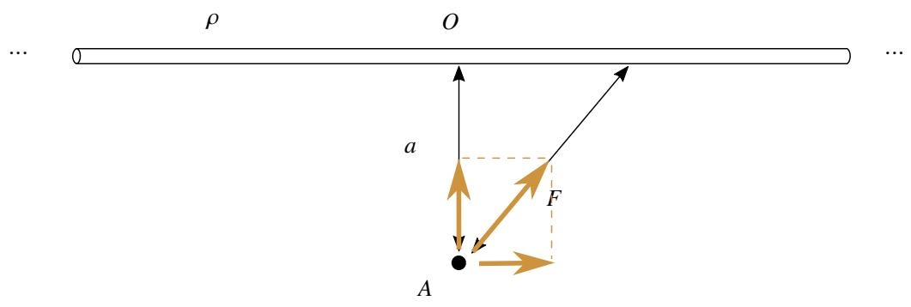  
图5.19：细棍对质点的吸引力

解用微元法.过质点 $A$ 作垂直于细棒的垂线，垂足为 $O$ .在细棒上取一段长为 $\mathrm{dx}$ 的细棒.它距离 $o$ 的距离为 $x$ .则这段细棒对质点的引力在 $AO$ 方向的分力大小为

$$
G \frac {1 \cdot \rho \mathrm {d} x}{a ^ {2} + x ^ {2}} \cdot \frac {a}{\sqrt {a ^ {2} + x ^ {2}}} = G a \rho \frac {\mathrm {d} x}{\left(a ^ {2} + x ^ {2}\right) ^ {3 / 2}}.
$$

由于每一小段对质点引力的 $AO$ 法向分力全部互相抵消，因此只需计算它们在 $AO$ 方向的分力大小.于是细棒对质点的引力大小为

$$
| \boldsymbol {F} | = G a \rho \int_ {- \infty} ^ {+ \infty} \frac {\mathrm {d} x}{\left(a ^ {2} + x ^ {2}\right) ^ {3 / 2}}.
$$

先计算不定积分. 令 $t = x^2$ ，则

$$
\int \frac {\mathrm {d} x}{\left(a ^ {2} + x ^ {2}\right) ^ {3 / 2}} = \int \frac {\mathrm {d} \sqrt {t}}{\left(a ^ {2} + t\right) ^ {3 / 2}} = \frac {1}{2} \int \frac {1}{t (t + a ^ {2})} \left(\frac {t}{t + a ^ {2}}\right) ^ {1 / 2} \mathrm {d} t.
$$

令

$$
u = \left(\frac {t}{t + a ^ {2}}\right) ^ {1 / 2} \Longleftrightarrow t = \frac {a ^ {2} u ^ {2}}{1 - u ^ {2}}.
$$

于是

$$
\int \frac {\mathrm {d} x}{\left(a ^ {2} + x ^ {2}\right) ^ {3 / 2}} = \frac {1}{2} \int \frac {(1 - u ^ {2}) ^ {2}}{a ^ {4} u ^ {2}} \cdot u \mathrm {d} \frac {a ^ {2} u ^ {2}}{1 - u ^ {2}} = \frac {1}{a ^ {2}} \int 1 \mathrm {d} u = \frac {u}{a ^ {2}} + C = \frac {x}{a ^ {2} \sqrt {x ^ {2} + a ^ {2}}} + C.
$$

于是可知

$$
| \boldsymbol {F} | = \frac {G \rho}{a} \left. \frac {x}{\sqrt {x ^ {2} + a ^ {2}}} \right| _ {- \infty} ^ {\infty} = 2 G \frac {\rho}{a}.
$$

注 由以上计算可知, 当细棒无限长时, 它对质量一定的质点的引力与质点到细棒的距离成反比, 与细棒的线密度成正比.

# 5.4.6 用Riemann积分研究不等式

利用Riemann积分的几何意义可以巧妙地证明一些不等式.先来看一个简单的例子

例5.43 设 $0 < a < b$ . 求证以下不等式:

$$
\frac {2}{a + b} <   \frac {\ln b - \ln a}{b - a} <   \frac {1}{2} \left(\frac {1}{a} + \frac {1}{b}\right).
$$

解 由于 $y = \ln x$ 的一个原函数是 $y = 1 / x$ . 因此想到从函数 $y = 1 / x$ 入手. 如图5.20所示, 设 $A_0(a,0), B_0(b,0)$ . 连接点 $A(a,1 / a)$ 和 $B(b,1 / b)$ . 过点 $C\left(\frac{a + b}{2},\frac{2}{a + b}\right)$ 作 $y = 1 / x$ 的切线, 分别交 $AA_0$ 和 $BB_0$ 于 $A_1$ 和 $B_1$ . 由于 $y = 1 / x$ 是一个凸函数, 因此梯形 $A_1A_0B_0B_1$ 面积严格小于 $A$ 和 $B$ 之间的曲边梯形面积, 而该曲边梯形面积又严格梯形 $AA_0B_0B$ 面积. 于是

$$
\frac {2}{a + b} (b - a) <   \int_ {a} ^ {b} \frac {\mathrm {d} x}{x} <   \frac {1}{2} \left(\frac {1}{a} + \frac {1}{b}\right) (b - a) \Longleftrightarrow \frac {2}{a + b} <   \frac {\ln b - \ln a}{b - a} <   \frac {1}{2} \left(\frac {1}{a} + \frac {1}{b}\right).
$$

注 如果用Lagrange中值定理, 可以知道存在 $\xi \in (a,b)$ 使得

$$
\frac {\ln b - \ln a}{b - a} = \frac {1}{\xi}.
$$

因此

$$
\frac {1}{b} <   \frac {\ln b - \ln a}{b - a} <   \frac {1}{a}.
$$

这个结果不如上例精确. 令 $a = n, b = n + 1$ 得

$$
\frac {1}{n + 1} <   \ln \left(1 + \frac {1}{n}\right) <   \frac {1}{n}, \quad n = 1, 2, \dots .
$$

这个不等式在在例2.50的注中已经得到过。如果在上例中，令 $a = n, b = n + 1$ ，则可以得到更精确的不等式：

$$
\frac {1}{n + 1 / 2} <   \ln \left(1 + \frac {1}{n}\right) <   \frac {1}{2} \left(\frac {1}{n} + \frac {1}{n + 1}\right), \quad n = 1, 2, \dots . \tag {5.2}
$$

但形式上不如前一个不等式简洁优美

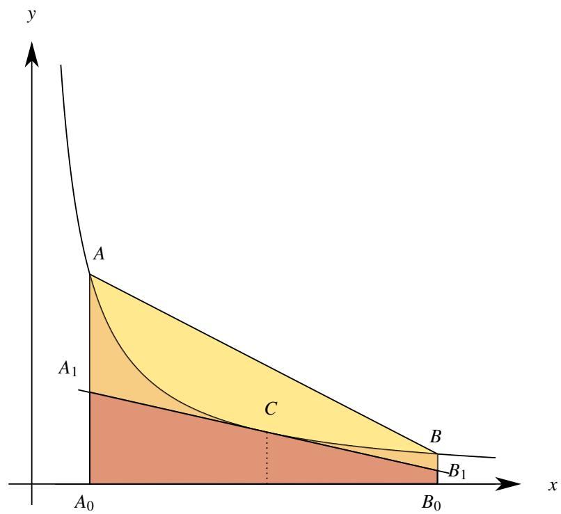  
图5.20：例示意图

用以上结论可以证明一个重要结论

# 定理5.18 (Stirling公式)

$$
n! \sim \sqrt {2 n \pi} \left(\frac {n}{\mathrm {e}}\right) ^ {n}, \quad n \to \infty .
$$

证明 只需证明

$$
\lim_{n\to \infty}\frac{n!}{\sqrt{n}\left(\frac{n}{\mathsf{e}}\right)^{n}} = \sqrt{2\pi}.
$$

令

$$
a _ {n} = \frac {n !}{\sqrt {n} \left(\frac {n}{\mathrm {e}}\right) ^ {n}} = \frac {n ! \mathrm {e} ^ {n}}{n ^ {n + \frac {1}{2}}}, \quad n = 1, 2, \dots .
$$

下面来看 $\{a_{n}\}$ 的单调性：

$$
\frac {a _ {n}}{a _ {n + 1}} = \frac {1}{\mathrm {e}} \left(1 + \frac {1}{n}\right) ^ {n + \frac {1}{2}}.
$$

对上式两边取对数得

$$
\ln \frac {a _ {n}}{a _ {n + 1}} = \left(n + \frac {1}{2}\right) \ln \left(1 + \frac {1}{n}\right) - 1.
$$

由不等式5.2可知

$$
\frac {1}{n + 1 / 2} <   \ln \left(1 + \frac {1}{n}\right) <   \frac {1}{2} \left(\frac {1}{n} + \frac {1}{n + 1}\right) \Longleftrightarrow 0 <   \left(n + \frac {1}{2}\right) \ln \left(1 + \frac {1}{n}\right) - 1 <   \frac {1}{4} \left(\frac {1}{n} - \frac {1}{n + 1}\right).
$$

于是得到

$$
1 <   \frac {a _ {n}}{a _ {n + 1}} <   \exp \left[ \frac {1}{4} \left(\frac {1}{n} - \frac {1}{n + 1}\right) \right] = \frac {\exp \left(\frac {1}{4 n}\right)}{\exp \left(\frac {1}{4 n + 4}\right)}, \quad n = 1, 2, \dots .
$$

以上不等式的左半边表明 $\{a_{n}\}$ 单调递减，又因为 $\{a_{n}\}$ 是一个正数列，因此 $\{a_{n}\}$ 一定收敛.另一方面，要证明它不收敛于零.设 $a_{n}\to a$ .以上不等式的右半边对 $n$ 从 $n$ 到 $n + k - 1$ 连乘得

$$
1 <   \frac {a _ {n}}{a _ {n + k}} <   \frac {\exp \left(\frac {1}{4 n}\right)}{\exp \left(\frac {1}{4 n + 4 k + 4}\right)} \Longleftrightarrow a _ {n + k} <   a _ {n} <   \frac {\exp \left(\frac {1}{4 n}\right)}{\exp \left(\frac {1}{4 n + 4 k + 4}\right)} a _ {n + k}
$$

固定 $n$ ，令 $k\to \infty$ 得

$$
a <   a _ {n} <   \exp \left(\frac {1}{4 n}\right) a.
$$

这表明 $a \neq 0$ . 于是由 Wallis 公式可知

$$
a = \lim  _ {n \rightarrow \infty} \frac {a _ {n} ^ {2}}{a _ {2 n}} = \lim  _ {n \rightarrow \infty} \left(\frac {n ! \mathrm {e} ^ {n}}{n ^ {n + \frac {1}{2}}}\right) ^ {2} \frac {(2 n) ^ {2 n + \frac {1}{2}}}{(2 n) ! \mathrm {e} ^ {2 n}} = \sqrt {2} \lim  _ {n \rightarrow \infty} \frac {2 ^ {2 n} (n !) ^ {2}}{\sqrt {n} (2 n) !} = \sqrt {2 \pi}.
$$

注 以上定理是以苏格兰数学家 James Stirling 命名的.

虽然阶乘的定义简明, 但当 $n$ 很大以后, 计算 $n!$ 是非常不便的, 甚至连估计 $n!$ 的阶也不容易. Stirling 公式给了 $n!$ 的一个等价无穷大, 这为估计 $n!$ 提供了重要理论基础. 下面下来看一个非常简单应用例子.

例5.44 求极限:

$$
\lim  _ {n \to \infty} \left(1 + \frac {1}{n}\right) ^ {n ^ {2}} \frac {n !}{n ^ {n} \sqrt {n}}.
$$

解由Stirling公式可知，只需求

$$
\lim  _ {n \rightarrow \infty} \left(1 + \frac {1}{n}\right) ^ {n ^ {2}} \frac {n !}{n ^ {n} \sqrt {n}} = \lim  _ {n \rightarrow \infty} \left(1 + \frac {1}{n}\right) ^ {n ^ {2}} \frac {\sqrt {2 n \pi} \left(\frac {n}{\mathrm {e}}\right) ^ {n}}{n ^ {n} \sqrt {n}} = \sqrt {2 \pi} \lim  _ {n \rightarrow \infty} \left[\left(1 + \frac {1}{n}\right) ^ {n} \frac {1}{\mathrm {e}} \right] ^ {n}.
$$

因此只需求

$$
\sqrt {2 \pi} \lim  _ {n \rightarrow \infty} n \left[ n \ln \left(1 + \frac {1}{n}\right) - 1 \right].
$$

由Taylor公式可知

$$
n \left[ n \ln \left(1 + \frac {1}{n}\right) - 1 \right] = n \left\{n \left[ \frac {1}{n} - \frac {1}{2 n ^ {2}} + o \left(\frac {1}{n ^ {2}}\right) \right] - 1 \right\} = - \frac {1}{2} + o (1).
$$

于是可知

$$
\text {原 式} = \sqrt {2 \pi} \lim  _ {n \rightarrow \infty} \left[\left(1 + \frac {1}{n}\right) ^ {n} \frac {1}{\mathrm {e}} \right] ^ {n} = \sqrt {2 \pi} \mathrm {e} ^ {- 1 / 2}.
$$

# 定理5.19 (Young不等式)

设连续函数 $\varphi$ 在 $[0, +\infty)$ 上严格递增，并且 $\varphi(0) = 0$ ，则存在连续的反函数 $\varphi^{-1}$ ，它在 $[0, \varphi(+\infty))$ 上严格递增，并且 $\varphi^{-1}(0) = 0$ 。对任意 $a > 0, 0 < b < \varphi(+\infty)$ 都有

$$
a b \leqslant \int_ {0} ^ {a} \varphi (x) d x + \int_ {0} ^ {b} \varphi^ {- 1} (y) d y,
$$

其中等号成立当且仅当 $b = \varphi (a)$

证明 如图，由面积原理立刻可知结论.

注 Young 不等式是以英国数学家 William Henry Young 命名的.

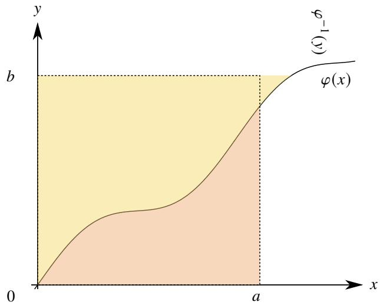  
图5.21: Young不等式示意图

Young 不等式有个常用的推论

# 推论5.12 (Young不等式)

若 $p$ 和 $q$ 满足

$$
\frac {1}{p} + \frac {1}{q} = 1.
$$

则

$$
a b \leqslant \frac {a ^ {p}}{p} + \frac {b ^ {q}}{q}.
$$

其中等号成立当且仅当 $a^p = b^q$

证明证法一 设函数 $\varphi (x) = x^{p - 1}$ ，则它的反函数为 $\varphi^{-1}(x) = x^{\frac{1}{p - 1}}$ .由于 $1 / p + 1 / q = 1$ ，故

$$
\frac {1}{p - 1} = q - 1.
$$

则 $\varphi^{-1}(x) = x^{q - 1}$ . 对 $\varphi$ 和 $\varphi^{-1}$ 用 Young 不等式可得

$$
a b \leqslant \int_ {0} ^ {a} \varphi (x) d x + \int_ {0} ^ {b} \varphi^ {- 1} (x) d x = \frac {1}{p} x ^ {p} \left| _ {0} ^ {a} + \frac {1}{q} x ^ {q} \right| _ {0} ^ {b} = \frac {a ^ {p}}{p} + \frac {b ^ {q}}{q}.
$$

等号成立当且仅当

$$
\varphi (a) = b \iff a ^ {p - 1} = b \iff a ^ {p} = b ^ {q}.
$$

证法二 由于 $(\mathrm{e}^x)'' = \mathrm{e}^x >0$ ，因此 $\mathbf{e}^x$ 是一个严格凸函数.由于 $1 / p + 1 / q = 1$ ，故

$$
a b = \exp (\ln a) \exp (\ln b) = \exp \left(\frac {1}{p} \ln a ^ {p} + \frac {1}{q} \ln b ^ {q}\right) \leqslant \frac {1}{p} \exp (\ln a ^ {p}) + \frac {1}{q} \exp (\ln b ^ {q}) = \frac {a ^ {p}}{p} + \frac {b ^ {q}}{q}.
$$

等号成立当且仅当 $a^p = b^q$

注 满足以上条件的 $p$ 和 $q$ 通常称为共轭的 (conjugated).

注以上不等式通常也称为Young不等式.令 $a = A^{1 / p},b = B^{1 / q}$ ，则可以得到另一种形式的Young不等式：

$$
A ^ {1 / p} B ^ {1 / q} \leqslant \frac {A}{p} + \frac {B}{q}.
$$

等号成立当且仅当 $A = B$

利用 Young 不等式可以证明以下重要不等式

# 定理5.20 (连续形式的Holder不等式)

设函数 $f, g$ 在 $[a, b]$ 上连续. 则

$$
\int_ {a} ^ {b} | f (x) g (x) | \mathrm {d} x \leqslant \left[ \int_ {a} ^ {b} | f (x) | ^ {p} \mathrm {d} x \right] ^ {1 / p} \left[ \int_ {a} ^ {b} | g (x) | ^ {q} \mathrm {d} x \right] ^ {1 / q},
$$

其中 $p > 1$ 且 $p, q$ 共轭. 等号成立当且仅当 $f, g$ 中有一个为零, 或存在 $\lambda$ 和 $\mu$ ( $\lambda \mu > 0$ ) 满足

$$
\lambda | f | ^ {p} = \mu | g | ^ {q}.
$$

证明 令

$$
A = \frac {| f (x) |}{\left[ \int_ {a} ^ {b} | f (x) | ^ {p} \mathrm {d} x \right] ^ {1 / p}}, \qquad B = \frac {| g (x) |}{\left[ \int_ {a} ^ {b} | g (x) | ^ {q} \mathrm {d} x \right] ^ {1 / q}}.
$$

由Young不等式可知

$$
\frac {\left| f (x) g (x) \right|}{\left[ \int_ {a} ^ {b} | f (x) | ^ {p} d x \right] ^ {1 / p} \left[ \int_ {a} ^ {b} | g (x) | ^ {q} d x \right] ^ {1 / q}} \leqslant \frac {1}{p} \frac {| f (x) | ^ {p}}{\int_ {a} ^ {b} | f (x) | ^ {p} d x} + \frac {1}{q} \frac {| g (x) | ^ {q}}{\int_ {a} ^ {b} | g (x) | ^ {q} d x}
$$

上式两边求 $a$ 到 $b$ 的积分得

$$
\begin{array}{l} \frac {\int_ {a} ^ {b} | f (x) g (x) | \mathrm {d} x}{\left[ \int_ {a} ^ {b} | f (x) | ^ {p} \mathrm {d} x \right] ^ {1 / p} \left[ \int_ {a} ^ {b} | g (x) | ^ {q} \mathrm {d} x \right] ^ {1 / q}} \leqslant \frac {1}{p} + \frac {1}{q} = 1 \\ \Longleftrightarrow \int_ {a} ^ {b} | f (x) g (x) | \mathrm {d} x \leqslant \left[ \int_ {a} ^ {b} | f (x) | ^ {p} \mathrm {d} x \right] ^ {1 / p} \left[ \int_ {a} ^ {b} | g (x) | ^ {q} \mathrm {d} x \right] ^ {1 / q}, \\ \end{array}
$$

等号成立当且仅当

$$
A ^ {p} = B ^ {q} \iff | f | ^ {p} \int_ {a} ^ {b} | g (x) | ^ {q} d x = | g | ^ {q} \int_ {a} ^ {b} | f (x) | ^ {p} d x.
$$

注 以上不等式以德国数学家 Otto Hölder 命名.

注 令以上不等式中的 $p = q = 2$ ，即得连续形式的 Cauchy-Schwarz 不等式。

$$
\left[ \int_ {a} ^ {b} | f (x) g (x) | \mathrm {d} x \right] ^ {2} \leqslant \int_ {a} ^ {b} f ^ {2} (x) \mathrm {d} x \int_ {a} ^ {b} g ^ {2} (x) \mathrm {d} x,
$$

等号成立当且仅当 $f, g$ 中有一个为零，或存在 $\lambda$ 和 $\mu$ ( $\lambda \mu > 0$ ) 满足 $\lambda f^2 = \mu g^2$ .

# 定理5.21（离散形式的Holder不等式）

设非零向量 $\pmb{a} = (a_{1}, a_{2}, \dots, a_{n})$ 和 $\pmb{b} = (b_{1}, b_{2}, \dots, b_{n})$ ，其中 $a_{1}, a_{2}, \dots, a_{n}$ 和 $b_{1}, b_{2}, \dots, b_{n}$ 均为非负实数. 则

$$
\sum_ {i = 1} ^ {n} a _ {i} b _ {i} \leqslant \left(\sum_ {i = 1} a _ {i} ^ {p}\right) ^ {1 / p} \left(\sum_ {i = 1} b _ {i} ^ {q}\right) ^ {1 / q}.
$$

其中 $p, q > 1$ 且它们共轭，等号成立成立当且仅当 $\mathbf{a}, \mathbf{b}$ 中有一个为零向量，或存在 $\lambda, \mu (\lambda \mu > 0)$ 满足

$$
\lambda a _ {i} ^ {p} = \mu b _ {i} ^ {q}, \quad i = 1, 2, \dots , n.
$$

证明 令

$$
A _ {i} = \frac {a _ {i}}{\left(\sum_ {i = 1} ^ {n} a _ {i} ^ {p}\right) ^ {1 / p}}, \qquad B _ {i} = \frac {b _ {i}}{\left(\sum_ {i = 1} ^ {n} b _ {i} ^ {q}\right) ^ {1 / q}}, \quad i = 1, 2, \dots , n.
$$

由Young不等式可知

$$
\frac {a _ {i} b _ {i}}{\left(\sum_ {i = 1} ^ {n} a _ {i} ^ {p}\right) ^ {1 / p} \left(\sum_ {i = 1} ^ {n} a _ {i} ^ {q}\right) ^ {1 / q}} \leqslant \frac {1}{p} \frac {a _ {i} ^ {p}}{\sum_ {i = 1} ^ {n} a _ {i} ^ {p}} + \frac {1}{q} \frac {b _ {i} ^ {q}}{\sum_ {i = 1} ^ {n} b _ {i} ^ {q}}, \quad i = 1, 2, \dots , n.
$$

上式两边对 $i$ 从1到 $n$ 求和得

$$
\frac {\sum_ {i = 1} ^ {n} a _ {i} b _ {i}}{\left(\sum_ {i = 1} ^ {n} a _ {i} ^ {p}\right) ^ {1 / p} \left(\sum_ {i = 1} ^ {n} a _ {i} ^ {q}\right) ^ {1 / q}} \leqslant \frac {1}{p} + \frac {1}{q} = 1 \Longleftrightarrow \sum_ {i = 1} ^ {n} a _ {i} b _ {i} \leqslant \left(\sum_ {i = 1} a _ {i} ^ {p}\right) ^ {1 / p} \left(\sum_ {i = 1} b _ {i} ^ {q}\right) ^ {1 / q}.
$$

等号成立当且仅当

$$
A _ {i} ^ {p} = B _ {i} ^ {p} \iff a _ {i} ^ {p} \sum_ {i = 1} ^ {n} b _ {i} ^ {q} = b _ {i} ^ {q} \sum_ {i = 1} ^ {n} a _ {i} ^ {p}, \quad i = 1, 2, \dots , n.
$$

注令 Hölder 不等式中的 $p = q = 2$ ，即得离散化的 Cauchy-Schwarz 不等式。

$$
(a, b) ^ {2} \leqslant (a, a) (b, b) \Longleftrightarrow (a, b) \leqslant \| a \| \| b \|.
$$

等号成立当且仅当向量 $\pmb{a}$ 和 $\pmb{b}$ 线性相关

用 Hölder 不等式可以证明以下重要不等式

# 定理5.22（连续形式的Minkowski不等式）

设函数 $f, g$ 在 $[a, b]$ 上连续，则

$$
\left[ \int_ {a} ^ {b} | f (x) + g (x) | ^ {p} d x \right] ^ {1 / p} \leqslant \left[ \int_ {a} ^ {b} | f (x) | ^ {p} d x \right] ^ {1 / p} + \left[ \int_ {a} ^ {b} | g (x) | ^ {p} d x \right] ^ {1 / p}.
$$

其中 $p > 1$ .等号成立当且仅当存在 $\lambda \geqslant 0$ 使得 $f = \lambda g$ 或 $g = \lambda f$

证明 由三角不等式可知

$$
\int_ {a} ^ {b} | f (x) + g (x) | ^ {p} \mathrm {d} x = \int_ {a} ^ {b} | f (x) + g (x) | ^ {p - 1} | f (x) + g (x) | \mathrm {d} x
$$

$$
\leqslant \int_ {a} ^ {b} | f (x) + g (x) | ^ {p - 1} | f (x) | \mathrm {d} x + \int_ {a} ^ {b} | f (x) + g (x) | ^ {p - 1} | g (x) | \mathrm {d} x. \tag {5.3}
$$

其中等号成立当且仅当 $fg\geqslant 0$ .由Holder不等式可知

$$
\begin{array}{l} \int_ {a} ^ {b} | f (x) + g (x) | ^ {p - 1} | f (x) | \mathrm {d} x + \int_ {a} ^ {b} | f (x) + g (x) | ^ {p - 1} | g (x) | \mathrm {d} x \\ \leqslant \left[ \int_ {a} ^ {b} | f (x) + g (x) | ^ {p} \mathrm {d} x \right] ^ {(p - 1) / p} \left\{\left[ \int_ {a} ^ {b} | f (x) | ^ {p} \mathrm {d} x \right] ^ {1 / p} + \left[ \int_ {a} ^ {b} | g (x) | ^ {p} \mathrm {d} x \right] ^ {1 / p} \right\} \tag {5.4} \\ \end{array}
$$

其中等号成立当且仅当 $f$ 和 $g$ 线性相关.结合不等式5.3和5.4可知

$$
\left[ \int_ {a} ^ {b} | f (x) + g (x) | ^ {p} d x \right] ^ {1 / p} \leqslant \left[ \int_ {a} ^ {b} | f (x) | ^ {p} d x \right] ^ {1 / p} + \left[ \int_ {a} ^ {b} | g (x) | ^ {p} d x \right] ^ {1 / p}.
$$

根据两个不等式的取等条件可知，上式中等号成立当且仅当存在 $\lambda \geqslant 0$ 使得 $f = \lambda g$ 或 $g = \lambda f$

注 以上不等式以德国 (或俄罗斯或波兰) 数学家 Hermann Minkowski 命名的.

用完全类似的方法可以证明离散形式的Minkowski不等式

# 定理5.23（离散形式的Minkowski不等式）

设向量 $\pmb{a} = (a_{1}, a_{2}, \dots, a_{n})$ 和 $\pmb{b} = (b_{1}, b_{2}, \dots, b_{n})$ . 则

$$
\left(\sum_ {i = 1} ^ {n} \left| a _ {i} + b _ {i} \right| ^ {p}\right) ^ {1 / p} \leqslant \left(\sum_ {i = 1} ^ {n} \left| a _ {i} \right| ^ {p}\right) ^ {1 / p} + \left(\sum_ {i = 1} ^ {n} \left| b _ {k} \right| ^ {p}\right) ^ {1 / p}.
$$

其中 $p > 1$ .等号成立当且仅当存在 $\lambda \geqslant 0$ 使得 $\pmb {a} = \lambda \pmb{b}$ 或 $\pmb {b} = \lambda \pmb{a}$

证明 由三角不等式可知

$$
\sum_ {i = 1} ^ {n} \left| a _ {i} + b _ {i} \right| ^ {p} = \sum_ {i = 1} ^ {n} \left| a _ {i} + b _ {i} \right| ^ {p - 1} \left| a _ {i} + b _ {i} \right| \leqslant \sum_ {k = 1} ^ {n} \left| a _ {i} + b _ {i} \right| ^ {p - 1} \left| a _ {i} \right| + \sum_ {i = 1} ^ {n} \left| a _ {i} + b _ {i} \right| ^ {p - 1} \left| b _ {i} \right|. \tag {5.5}
$$

其中等号成立当且仅当 $a_{i}b_{i}\geqslant 0(i = 1,2,\dots ,n)$ .由Holder不等式可知

$$
\sum_ {i = 1} ^ {n} \left| a _ {i} + b _ {i} \right| ^ {p - 1} \left| a _ {i} \right| + \sum_ {i = 1} ^ {n} \left| a _ {i} + b _ {i} \right| ^ {p - 1} \left| b _ {i} \right| \leqslant \left(\sum_ {i = 1} ^ {n} \left| a _ {i} + b _ {i} \right| ^ {p}\right) ^ {(p - 1) / p} \left[ \left(\sum_ {i = 1} ^ {n} \left| a _ {i} \right| ^ {p}\right) ^ {1 / p} + \left(\sum_ {i = 1} ^ {n} \left| b _ {i} \right| ^ {p}\right) ^ {1 / p} \right]. \tag {5.6}
$$

其中等号成立当且仅当 $\pmb{a}$ 和 $\pmb{b}$ 线性相关.结合不等式5.5和5.6可知

$$
\left(\sum_ {i = 1} ^ {n} \left| a _ {i} + b _ {i} \right| ^ {p}\right) ^ {1 / p} \leqslant \left(\sum_ {i = 1} ^ {n} \left| a _ {i} \right| ^ {p}\right) ^ {1 / p} + \left(\sum_ {i = 1} ^ {n} \left| b _ {i} \right| ^ {p}\right) ^ {1 / p}.
$$

根据两个不等式的取等条件可知，上式中等号成立当且仅当存在 $\lambda \geqslant 0$ 使得 $a = \lambda b$ 或 $b = \lambda a$

注当 $p = 2$ 时，Minkowski不等式即为

$$
\left\| \boldsymbol {a} + \boldsymbol {b} \right\| \leqslant \left\| \boldsymbol {a} \right\| + \left\| \boldsymbol {b} \right\|.
$$

等号成立当且仅当 $a$ 和 $b$ 线性相关且同向. 这正是向量范数的三角形不等式

# 5.5 反常积分的计算

由Riemann积分的定义和Riemann可积的必要条件可知，一个函数只能在一个有限区间内讨论可积性，且它在这个有限区间内必须有界.如果分别放宽这两个条件就可以得到两类广义的Riemann积分.这就是本节要讨论的内容.

# 5.5.1 无穷积分

我们知道指数函数 $f(t) = \mathrm{e}^{t}$ 在 $[x,0]$ $(x < 0)$ 上Riemann可积.如果把 $x$ 看作变量，则可以得到一个函数

$$
F (x) = \int_ {x} ^ {0} \mathrm {e} ^ {t} \mathrm {d} t.
$$

我们知道Riemann积分实际上是定义了一个曲边梯形的面积.如图5.22,随着 $x$ 朝 $-\infty$ 变动，曲边梯形的面积逐渐增大，但面积的增量越来越小.我们猜测当 $x\to -\infty$ 时，面积会“收敛”.这个想法不难验证

由Newton-Leibniz可知

$$
\lim  _ {x \rightarrow - \infty} F (x) = \lim  _ {x \rightarrow - \infty} \int_ {x} ^ {0} e ^ {t} d t = \lim  _ {x \rightarrow - \infty} \left(e ^ {0} - e ^ {x}\right) = 1.
$$

因此我们的猜测是正确的, 当 $x \to -\infty$ 时, 变限积分 $F(x)$ 收敛. 于是我们可以把 Riemann 积分的定义“放宽”, 即允许积分限取到 $\pm \infty$ .

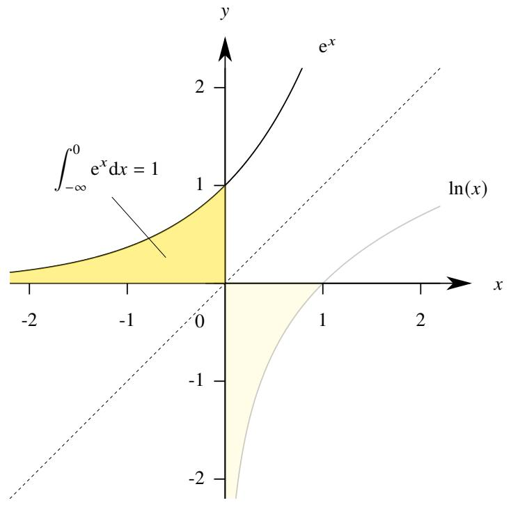  
图5.22：下限为 $-\infty$ 的无穷积分

# 定义5.6（无穷积分）

设函数 $f$ 在 $[a, +\infty)$ 上有定义. 对于任一 $b > a, f$ 在 $[a, b]$ 上都可积. 若

$$
\lim  _ {b \rightarrow + \infty} \int_ {a} ^ {b} f (x) \mathrm {d} x
$$

存在且有限，则可以引入记号

$$
\int_ {a} ^ {+ \infty} f (x)   d x := \lim  _ {b \rightarrow + \infty} \int_ {a} ^ {b} f (x)   d x.
$$

并称以上积分收敛, 此时我们称 $f$ 在 $[a, +\infty)$ 上Riemann可积. 否则称以上积分发散. 这样的积分称为无穷

积分 (infinite integral).

注若 $\lim_{b\to +\infty}\int_{a}^{b}f(x)\mathrm{d}x$ 极限值是 $\pm \infty$ ，则可以记作

$$
\int_ {a} ^ {+ \infty} f (x) \mathrm {d} x = \pm \infty .
$$

注类似地可以定义积分下限为 $-\infty$ 的情况

注即使积分发散 $\int_{a}^{+\infty}f(x)\mathrm{d}x$ 的记号也可以使用，只是此时它不是一个数值

利用可加性, 可以定义积分上限和下限同时取到无穷的无穷积分. 设无穷积分

$$
\int_ {- \infty} ^ {a} f (x)   d x, \qquad \int_ {a} ^ {+ \infty} f (x)   d x.
$$

若它们都收敛，则可定义

$$
\int_ {- \infty} ^ {+ \infty} f (x) d x := \int_ {- \infty} ^ {a} f (x) d x + \int_ {a} ^ {+ \infty} f (x) d x.
$$

此时我们称 $f(x)$ 在 $(-\infty, +\infty)$ 上Riemann可积

下面来看几个例子.

例 $5.45 p$ 积分 讨论以下无穷积分的敛散性:

$$
\int_ {a} ^ {+ \infty} \frac {\mathrm {d} x}{x ^ {p}}, \quad a > 0.
$$

解 (i) 当 $p = 1$ 时. 由于

$$
\lim  _ {b \rightarrow + \infty} \int_ {a} ^ {b} \frac {\mathrm {d} x}{x} = \lim  _ {b \rightarrow + \infty} (\ln b - \ln a) = + \infty .
$$

因此无穷积分发散.

(ii)当 $p\neq 1$ 时.由于

$$
\lim  _ {b \to + \infty} \int_ {a} ^ {b} \frac {\mathrm {d} x}{x ^ {p}} = \frac {1}{1 - p} \lim  _ {b \to + \infty} \left(b ^ {1 - p} - a ^ {1 - p}\right) = \left\{ \begin{array}{l l} \frac {- a ^ {1 - p}}{1 - p}, & p > 1 \\ + \infty , & p <   1 \end{array} \right..
$$

于是可知，原无穷积分收敛当且仅当 $p > 1$

注 以上结论和 $p$ 级数完全对应.

计算无穷积分也可以用Newton-Leibniz公式

# 定理5.24（无穷积分的Newton-Leibniz公式）

设函数 $f$ 在 $[a, +\infty)$ 上Riemann可积，且有原函数 $F(x)$ ，则

$$
\int_ {a} ^ {+ \infty} f (x) \mathrm {d} x = F (+ \infty) - F (a).
$$

其中 $F(+\infty) = \lim_{x\to +\infty}F(x)$

证明 由于 $f$ 在 $[a, +\infty)$ 上Riemann可积，故

$$
\int_ {a} ^ {+ \infty} f (x) \mathrm {d} x = \lim  _ {b \rightarrow + \infty} \int_ {a} ^ {b} f (x) \mathrm {d} x = \lim  _ {b \rightarrow + \infty} [ F (b) - F (a) ] = F (+ \infty) - F (a).
$$

注 其它类型的无穷积分也可有类似结论.

除了Newton-Leibniz公式以外，分部积分法和换元法等积分的运算性质和技巧对于无穷积分都适用.我们不再一一讨论.

例5.46 计算以下无穷积分：

$$
\int_ {0} ^ {+ \infty} e ^ {- a x} \cos b x d x, \quad \int_ {0} ^ {+ \infty} e ^ {- a x} \sin b x d x.
$$

解 用分部积分法计算得

$$
\begin{array}{l} \int_ {0} ^ {+ \infty} \mathrm {e} ^ {- a x} \cos b x \mathrm {d} x = \frac {1}{b} \int_ {0} ^ {+ \infty} \mathrm {e} ^ {- a x} \mathrm {d} \sin b x = \frac {1}{b} \mathrm {e} ^ {- a x} \sin b x \left| _ {0} ^ {+ \infty} + \frac {a}{b} \int_ {0} ^ {+ \infty} \mathrm {e} ^ {- a x} \sin b x \mathrm {d} x \right. \\ = \frac {a}{b} \int_ {0} ^ {+ \infty} \mathrm {e} ^ {- a x} \sin b x \mathrm {d} x = - \frac {a}{b ^ {2}} \int_ {0} ^ {+ \infty} \mathrm {e} ^ {- a x} \mathrm {d} \cos b x \\ = - \frac {a}{b ^ {2}} \mathrm {e} ^ {- a x} \cos b x \left| _ {0} ^ {+ \infty} - \frac {a ^ {2}}{b ^ {2}} \int_ {0} ^ {+ \infty} \mathrm {e} ^ {- a x} \cos b x \mathrm {d} x \right. \\ = \frac {a}{b ^ {2}} - \frac {a ^ {2}}{b ^ {2}} \int_ {0} ^ {+ \infty} \mathrm {e} ^ {- a x} \cos b x \mathrm {d} x. \\ \end{array}
$$

于是

$$
\int_ {0} ^ {+ \infty} \mathrm {e} ^ {- a x} \cos b x \mathrm {d} x = \frac {a}{a ^ {2} + b ^ {2}}.
$$

于是

$$
\int_ {0} ^ {+ \infty} \mathrm {e} ^ {- a x} \sin b x \mathrm {d} x = \frac {b}{a} \int_ {0} ^ {+ \infty} \mathrm {e} ^ {- a x} \cos b x \mathrm {d} x = \frac {b}{a ^ {2} + b ^ {2}}.
$$

一个普通的 Riemann 积分通过换元可以变为无穷积分, 反之无穷积分在换元后也可能会变为普通的 Riemann 积分. 我们来看一个例子.

例5.47 计算以下无穷积分：

$$
\int_ {0} ^ {+ \infty} \frac {\mathrm {d} x}{\left(a ^ {2} + x ^ {2}\right) ^ {3 / 2}}, \quad a > 0.
$$

解令 $x = a\tan t.$ 则 $t = \arctan (x / a)$ .当 $x$ 从0变动到 $+\infty$ 时， $t$ 从0变动到 $\pi /2$ .于是

$$
\text {原 式} = \int_ {0} ^ {\pi / 2} \frac {\mathrm {d} a \tan t}{\left(a ^ {2} + a ^ {2} \tan^ {2} t\right) ^ {3 / 2}} = \frac {1}{a ^ {2}} \int_ {0} ^ {\pi / 2} \cos t \mathrm {d} t = \frac {1}{a ^ {2}} \sin t \Bigg | _ {0} ^ {\pi / 2} = \frac {1}{a ^ {2}}.
$$

无穷积分在物理中有很多应用.

例 5.48 设地球质量为 $M$ , 半径 $r$ . 地面上的一个质量为 $m$ 的物体. 求把该物体推离地球至无穷远处所做的功.

解设物体距离地心的距离为 $x$ 由万有引力定律可知，该物体受到的地球引力的大小为

$$
| \boldsymbol {F} (x) | = G \frac {m M}{x ^ {2}}.
$$

其中 $G$ 为万有引力常数.于是所求的功为

$$
W = \int_ {r} ^ {+ \infty} | \boldsymbol {F} (x) | \mathrm {d} x = \int_ {r} ^ {+ \infty} G \frac {m M}{x ^ {2}} \mathrm {d} x = - \frac {G m M}{x} \Bigg | _ {r} ^ {+ \infty} = \frac {G m M}{r}.
$$

注由以上结论可以计算出“第二宇宙速度”.所谓“第二宇宙速度”，就是挣脱地球引力束缚所需要的做小速度，因此也称为“逃逸速度”.设物体离开地球时的初速度为 $\nu_{0}$ .由于对物体做的功全部来自于初速度 $\nu_{0}$ 提供的动能,故

$$
\frac {1}{2} m | \boldsymbol {v _ {0}} | ^ {2} = \frac {G m M}{r}.
$$

另一方面

$$
m | \boldsymbol {g} | = G \frac {m M}{r ^ {2}},
$$

其中 $\pmb{g}$ 为重力加速度.于是可知

$$
| \boldsymbol {v} _ {0} | = \sqrt {2 | \boldsymbol {g} | r} = \sqrt {2 \cdot 9 . 8 \cdot 6 . 3 7 1 \times 1 0 ^ {6}} \approx 1 1 1 7 4.
$$

第二宇宙速度约为 $11174 \mathrm{~m} / \mathrm{s}$

# 5.5.2 赚积分

我们已经知道

$$
\int_ {- \infty} ^ {0} \mathrm {e} ^ {x} \mathrm {d} x = 1.
$$

如图5.23, 它表示透明黄色区域的面积收敛于 1. 由于 $\mathrm{e}^x$ 和 $\ln x$ 互为反函数, 因此图中右下角区域的面积也应该收敛于 1, 由于它位于 $x$ 下方, 因此我们希望有

$$
\int_ {0} ^ {1} \ln x d x = - 1.
$$

我们知道 $\ln x$ 在 $[0,1]$ 上是无界的，因此Riemann不可积.于是我们也需要“放宽”条件，来定义这类积分

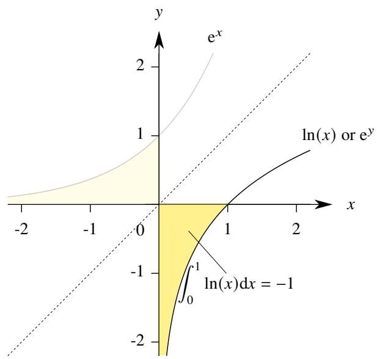  
图5.23：瑕积分示意图 $\ln (x)$ 与 $\mathrm{e}^x$ 互为反函数

# 定义5.7（瑕积分）

设函数 $f$ 在 $(a,b]$ 上有定义.且 $f(a + ) = \infty .$ 对于任一 $c\in (a,b)$ 都有 $f(x)$ 在 $[c,b]$ 上可积.若

$$
\lim  _ {c \rightarrow a +} \int_ {c} ^ {b} f (x) d x
$$

存在且有限，则可以令

$$
\int_ {a} ^ {b} f (x) \mathrm {d} x := \lim  _ {c \rightarrow a +} \int_ {c} ^ {b} f (x) \mathrm {d} x.
$$

并称以上积分收敛, 此时我们称 $f(x)$ 在 $[a,b]$ 上Riemann可积. 否则称以上积分发散. 这样的积分称为瑕积分, 其中 $a$ 称为瑕点. 类似地可以定义瑕点为 $b$ 的情况.

注 无穷积分和瑕积分统称反常积分 (improper integral), 或广义积分.

注即使积分发散 $\int_{a}^{b}f(x)\mathrm{d}x$ 的记号也可以使用，只是此时它不是一个数值

利用可加性, 可以定义积分上限和下限都是瑕点的瑕积分. 设瑕积分

$$
\int_ {a} ^ {c} f (x) \mathrm {d} x, \quad \int_ {c} ^ {b} f (x) \mathrm {d} x,
$$

其中 $a, b$ 分别是它们的瑕点. 若它们都收敛, 则可令

$$
\int_ {a} ^ {b} f (x) \mathrm {d} x := \int_ {a} ^ {c} f (x) \mathrm {d} x + \int_ {c} ^ {b} f (x) \mathrm {d} x.
$$

此时我们称 $f(x)$ 在 $[a,b]$ 上Riemann可积

例 $5.49p$ 积分 讨论以下瑕积分的敛散性：

$$
\int_ {0} ^ {a} \frac {\mathrm {d} x}{x ^ {p}}, \quad a > 0.
$$

解 (i) 当 $p = 1$ 时. 由于

$$
\lim  _ {b \to 0 +} \int_ {b} ^ {a} \frac {\mathrm {d} x}{x} = \lim  _ {b \to 0 +} (\ln a - \ln b) = + \infty .
$$

因此瑕积分发散.

(ii) 当 $p \neq 1$ 时. 由于

$$
\lim  _ {b \to 0 +} \int_ {b} ^ {a} \frac {\mathrm {d} x}{x ^ {p}} = \frac {1}{1 - p} \lim  _ {b \to 0 +} \left(a ^ {1 - p} - b ^ {1 - p}\right) = \left\{ \begin{array}{l l} \frac {a ^ {1 - p}}{1 - p}, & p <   1 \\ + \infty , & p > 1 \end{array} \right..
$$

于是可知，若 $p < 1$ 则原积分收敛，否则发散

注 试比较上例和例 (5.45).

与无穷积分一样, Newton-Leibniz 公式和 Riemann 积分的一系列运算法则和计算技巧也都适用于瑕积分. 下面我们看几个例子.

例5.50 计算以下Riemann积分：

$$
\int_ {0} ^ {1} \ln x d x.
$$

解当 $x\to 0+$ 时， $\ln x\to -\infty$ ，因此 $x = 0$ 是一个瑕点.用分部积分法可得

$$
\text {原 式} = x \ln x \left| _ {0} ^ {1} - \int_ {0} ^ {1} \mathrm {d} x = - \lim  _ {x \rightarrow 0 +} x \ln x - 1 = - \lim  _ {x \rightarrow 0 +} \frac {\ln x}{1 / x} - 1 = \lim  _ {x \rightarrow 0 +} \frac {1 / x}{1 / x ^ {2}} - 1 = - 1. \right.
$$

注 从几何直观上可以看出

$$
\left| \int_ {- \infty} ^ {0} \mathrm {e} ^ {x} \mathrm {d} x \right| = \left| \int_ {0} ^ {1} \ln x \mathrm {d} x \right|.
$$

例 5.51 计算以下瑕积分:

$$
\int_ {a} ^ {b} \frac {\mathrm {d} x}{\sqrt {(x - a) (b - x)}}, \quad b > a.
$$

解当 $x\in (a,b)$ 时

$$
\frac {x - a}{b - a} + \frac {b - x}{b - a} = 1, \quad \frac {x - a}{b - a} > 0, \frac {b - x}{b - a} > 0.
$$

因此可令

$$
\sin^ {2} t = \frac {x - a}{b - a}, \qquad \cos^ {2} t = \frac {b - x}{b - a}, \quad 0 <   t <   \frac {\pi}{2}.
$$

此时

$$
x = (b - a) \sin^ {2} t + a = a (1 - \sin^ {2} t) + b \sin^ {2} t = a \cos^ {2} t + b \sin^ {2} t.
$$

因此当 $t$ 从0变动到 $\pi /2$ 时， $x$ 从 $a$ 变动到 $b$ .于是

$$
\text {原 式} = \int_ {0} ^ {\pi / 2} \frac {\mathrm {d} a \cos^ {2} t + b \sin^ {2} t}{\sqrt {(b - a) ^ {2}} \sin^ {2} t \cos^ {2} t} = \int_ {0} ^ {\pi / 2} \frac {2 (b - a) \sin t \cos t}{(b - a) \sin t \cos t} \mathrm {d} t = 2 \int_ {0} ^ {\pi / 2} \mathrm {d} t = \pi .
$$

例5.52 计算以下瑕积分：

$$
\int_ {0} ^ {1} \ln^ {n} x d x, \quad n \in \mathbb {N} ^ {*}.
$$

解设 $I_{n} = \int_{0}^{1}\ln^{n}x\mathrm{d}x.$ 则

$$
I _ {n} = x \ln^ {n} x \left| _ {0} ^ {1} - \int_ {0} ^ {1} x \mathrm {d} \ln^ {n} x = - n \int_ {0} ^ {1} \ln^ {n - 1} x \mathrm {d} x = - n I _ {n - 1}. \right.
$$

由例5.50)可知 $I_{1} = -1$ 于是可知

$$
I _ {n} = (- 1) ^ {n - 1} n! I _ {1} = (- 1) ^ {n} n!.
$$

下面看一个比较难的例子. 需要多次使用换元法

例5.53 计算以下瑕积分：

$$
\int_ {0} ^ {\pi / 2} \ln \sin x d x.
$$

解设原式等于 $I$ . 令 $x = \pi /2 - t$ . 当 $t$ 从 $\pi /2$ 变动到0时， $x$ 从0变动到 $\pi /2$ . 于是

$$
I = \int_ {\pi / 2} ^ {0} \ln \sin \left(\frac {\pi}{2} - t\right) d \sin \left(\frac {\pi}{2} - t\right) = - \int_ {\pi / 2} ^ {0} \ln \cos t d t = \int_ {0} ^ {\pi / 2} \ln \cos t d t = \int_ {0} ^ {\pi / 2} \ln \cos x d x.
$$

于是

$$
\begin{array}{l} 2 I = \int_ {0} ^ {\pi / 2} \ln \sin x d x + \int_ {0} ^ {\pi / 2} \ln \cos x d x = \int_ {0} ^ {\pi / 2} (\ln \sin x + \ln \cos x) d x = \int_ {0} ^ {\pi / 2} \ln \sin x \cos x d x \\ = \int_ {0} ^ {\pi / 2} \ln \left(\frac {1}{2} \sin 2 x\right) d x = \int_ {0} ^ {\pi / 2} \left(\ln \frac {1}{2} + \ln \sin 2 x\right) d x = - \frac {\pi}{2} \ln 2 + \int_ {0} ^ {\pi / 2} \ln \sin 2 x d x. \\ \end{array}
$$

下面来看 $\int_0^{\pi /2}\ln \sin 2x\mathrm{d}x.$ 令 $t = 2x$ ，则

$$
\int_ {0} ^ {\pi / 2} \ln \sin 2 x \mathrm {d} x = \frac {1}{2} \int_ {0} ^ {\pi} \ln \sin t \mathrm {d} t = \frac {1}{2} \left(\int_ {0} ^ {\pi / 2} \ln \sin t \mathrm {d} t + \int_ {\pi / 2} ^ {\pi} \ln \sin t \mathrm {d} t\right) = \frac {I}{2} + \frac {1}{2} \int_ {\pi / 2} ^ {\pi} \ln \sin t \mathrm {d} t.
$$

令 $t = \pi /2 + u$ ，则

$$
\int_ {0} ^ {\pi / 2} \ln \sin 2 x \mathrm {d} x = \frac {I}{2} + \frac {1}{2} \int_ {0} ^ {\pi / 2} \ln \sin \left(\frac {\pi}{2} + u\right) \mathrm {d} u = \frac {I}{2} + \frac {1}{2} \int_ {0} ^ {\pi / 2} \ln \cos u \mathrm {d} u = \frac {I}{2} + \frac {I}{2} = I.
$$

于是可知

$$
2 I = - \frac {\pi}{2} \ln 2 + \int_ {0} ^ {\pi / 2} \ln \sin 2 x \mathrm {d} x = - \frac {\pi}{2} \ln 2 + I \Longleftrightarrow I = - \frac {\pi}{2} \ln 2.
$$

注 $\ln \sin x$ 的原函数不是一个初等函数. 因此直接使用Newton-Leibniz公式是很困难的.

以上我们对两类广义积分作了粗略的介绍. 研究广义积分的重点实际上是研究它们收敛的条件. 我们将在后面深入展开这个主题.

# 参考文献

[1] DENG E. ElegantLaTeX Templates[Z]. https://elegantlatex.org.

# 致谢

谢谢大家
