# 第 1 章 级数理论与反常积分

# 内容提要

h 研究数项级数的基本性质.  
h 给出正项级数的比较判别法.   
h 通过研究无穷级数和无穷积分的关系可以得到 Cauchy 积分判别法.  
h 通过与 $p$ 级数的比较可得到正项级数的根值判别法和比值判别法.  
h 在根值判别法和比值判别法失效时, 需要用更精细的 Raabe 判别法和 Bertrand 判别法.  
最后在正项级数的基础上可以研究一般级数的收敛判别法.  
h 收敛的级数如果重排不一定收敛到原来的和,

于是引出了绝对收敛和条件收敛的概念.

h 由于级数不能重排可能会改变级数的和, 因此级数相乘展开时也需要讲究排序.  
h 用对数可以把无穷乘积转化为无穷级数来研究.  
h 类似数列和数项级数, 提出了函数列和函数项级数的概念.  
h 为了保证 “换序”, 提出了一致收敛的概念.  
h 研究一类最简单的函数项级数: 幂级数.  
h 用类比的方法可以得到平行的反常积分的判别法.

到目前为止我们已经系统研究了一元函数的微分和积分. 我们知道一个函数可微至少需要连续, 而一个函数可积当且仅当几乎处处连续. 从这里可以看出数学分析中的主要研究对象是连续函数 (至少是几乎处处连续的).而我们之前遇到的函数几乎都是初等函数, 但事实上用初等函数表达的连续函数只是连续函数中很小的一部分.

在学习函数的微分学时, 我们曾提到, 存在处处连续但处处不可导的函数, 但这个函数无法用初等函数表达.在学习积分学时, 我们又知道连续函数一定有原函数, 且可以用变限积分定义, 但很多时候无法用初等函数表达,例如

$$
\int \mathrm {e} ^ {x ^ {2}} \mathrm {d} x, \quad \int \sin x ^ {2} \mathrm {d} x, \quad \int \cos x ^ {2} \mathrm {d} x, \quad \int \frac {\sin x}{x} \mathrm {d} x, \quad \int \frac {\cos x}{x} \mathrm {d} x, \quad \int \frac {\mathrm {d} x}{\ln x}.
$$

因此很多微分方程的解无法用初等函数表达. 变限积分虽然可以定义这样的函数, 但这种方法不利于用初等函数来逼近它. 这就使得数学家希望寻找一种构造非初等函数的方法.

我们已经知道

$$
e = 1 + 1 + \frac {1}{2 !} + \dots + \frac {1}{n !} + \dots .
$$

这表明 “无限个有理数的和” 可以等于一个无理数,“无限个代数数的和” 可以等于一个超越数. 以上形式的 “无穷和式” 称为级数 (series), 在数列极限理论中, 我们已经介绍过调和级数 . 这个例子表明 “无限” 可以产生 “质变”. 另一方面, 我们知道指数函数 $\boldsymbol { \mathrm { e } } ^ { x }$ 的 Taylor 展开式为

$$
\mathrm {e} ^ {x} = 1 + x + \frac {x ^ {2}}{2 !} + \dots + \frac {x ^ {n}}{n !} + \frac {x ^ {n + 1}}{(n + 1) !} \mathrm {e} ^ {\theta x}, \quad 0 <   \theta <   1.
$$

对于任意给定的 $x \in \mathbb { R }$ , 显然有

$$
\lim  _ {n \rightarrow \infty} \frac {x ^ {n + 1}}{(n + 1) !} e ^ {\theta x} = 0.
$$

于是就有

$$
\mathrm {e} ^ {x} = 1 + x + \frac {x ^ {2}}{2 !} + \dots + \frac {x ^ {n}}{n !} + \dots .
$$

这表明一个超越函数可以表达为无穷多个代数函数的和. 这再次说明 “无限” 可以产生 “质变”.

由此很自然地想到, 如果用一系列 (series of) 初等函数作无穷多次的叠加, 是否可以得到一个非初等的函数?1875 年, Weierstrass 首先用级数构造了一个处处连续但处处不可微的函数! 级数理论极大拓展了数学家的研究工具, 从此数学家对函数的认识登上了一个新的高度, 分析学也进入了新时代.

受 Taylor 公式的影响, 人们首先想到的就是用一系列幂函数来构造函数, 这就是幂级数 (power series). 但很快大家就发现这个方法只能表达无限次可微的函数,对于一般的连续函数是无能为力的. 1807年法国数学家Fourier

想到把一个函数表达为一系列三角函数的和, 大名鼎鼎的 Fourier 级数 (Fourier series) 就肇始于此. 很快大家就发现 Fourier 级数有着远超幂级数的优势, 它的应用领域也远不止分析学.

本章就来系统介绍级数理论.先从数项级数开始讲起.数项级数完全可以看作是一种特殊的数列,因此数列的理论和研究方法都适用于它. 本章主要研究它不同于数列的独有的收敛判别法.

另一方面, 无穷级数和无穷积分有着天然的联系, 我们可以把无穷级数看作是 “离散和”, 把无穷积分看作 “连续和”, 从这个视角将它们对照研究会得到一系列有意思的结论.

在数列理论和数项级数理论的基础上, 就可以进一步研究函数列与函数项级数. 函数项级数的核心问题是“换序问题”.

# 1.1 正项级数的敛散性

# 1.1.1 级数及其基本性质

# 定义 1.1 (级数)

设数列 $\left\{ a _ { n } \right\}$ . 令

$$
\sum_ {n = 1} ^ {\infty} a _ {n} = a _ {1} + a _ {2} + \dots + a _ {n} + \dots .
$$

我们称 $\textstyle \sum _ { n = 1 } ^ { \infty } a _ { n }$ 为 $a _ { n }$ 的无穷级数 (infinite series), 简称级数. 其中 $a _ { n }$ 称为级数的通项. 令

$$
S _ {n} = \sum_ {k = 1} ^ {n} a _ {k} = a _ {1} + a _ {2} + \dots + a _ {n}.
$$

称 $S _ { n }$ 为这个数列的前 $n$ 项和, 也称为级数 $\textstyle \sum _ { n = 1 } ^ { \infty } a _ { n }$ 的部分和 (partial sum). 若数列 $\{ S _ { n } \}$ 收敛到 ??, 则称级数$\textstyle \sum _ { n = 1 } ^ { \infty } a _ { n }$ 收敛, 并称该级数的和为 ??, 记作

$$
\sum_ {n = 1} ^ {\infty} a _ {n} = S.
$$

反之我们称该级数是发散的.

从以上定义看出,数项级数本质上就是一种数列.因此判断级数的敛散性就是判断数列的敛散性.下面看几个例子.

例 1.1 几何级数 讨论以下几何级数的敛散性:

$$
\sum_ {n = 0} ^ {\infty} q ^ {n} = 1 + q + q ^ {2} + \dots + q ^ {n} + \dots .
$$

解 当 $q \neq 1$ 时

$$
S _ {n} = \frac {1 - q ^ {n}}{1 - q}.
$$

(i) 若 $| q | < 1$ , 则

$$
\lim  _ {n \rightarrow \infty} S _ {n} = \lim  _ {n \rightarrow \infty} \frac {1 - q ^ {n}}{1 - q} = \frac {1}{1 - q}.
$$

(ii) 若 $| q | > 1$ 则 $\{ S _ { n } \}$ 发散.  
(iii) 若 $q = - 1$ , 则 $S _ { 2 n }  0 , S _ { 2 n - 1 }  1 .$ . 因此 $\{ S _ { n } \}$ 发散.  
(iv) 若 $q = 1$ , 则 $\begin{array} { r } { \operatorname* { l i m } _ { n \to \infty } S _ { n } = \operatorname* { l i m } _ { n \to \infty } n = + \infty . } \end{array}$ .

我们在研究数列时, 还介绍过了 $p$ 级数.

例 $1 . 2 p$ 级数 设 $p$ 级数

$$
\sum_ {n = 1} ^ {\infty} \frac {1}{n ^ {p}} = 1 + \frac {1}{2 ^ {p}} + \frac {1}{3 ^ {p}} + \dots + \frac {1}{n ^ {p}}, \quad n = 1, 2, \dots .
$$

当 $p \leq 1$ 时级数发散, 当 $p > 1$ 时级数收敛. 特别地, 当 $p = 1$ 时, 称它为调和级数.

例 1.3 计算以下级数的和:

$$
\sum_ {n = 1} ^ {\infty} \frac {1}{(s n - p) (s n + q)}, \quad p \geq 0, q > 0, s = p + q.
$$

解 先求级数的部分和

$$
S _ {n} = \sum_ {k = 1} ^ {n} \frac {1}{(s k - p) (s k + q)} = \frac {1}{s} \sum_ {k = 1} ^ {n} \left(\frac {1}{s k - p} - \frac {1}{s (k + 1) - p}\right) = \frac {1}{s} \left(\frac {1}{s - p} - \frac {1}{s (n + 1) - p}\right).
$$

于是可知

$$
\text {原 式} = \lim  _ {n \rightarrow \infty} S _ {n} = \lim  _ {n \rightarrow \infty} {\frac {1}{s}} \left({\frac {1}{s - p}} - {\frac {1}{s (n + 1) - p}}\right) = {\frac {1}{s (s - p)}}.
$$

大部分情况下,级数的和是很难求出的.所以研究级数的重点不是研究如何求出和,而是研究如何判断级数收敛.级数本身就是一种数列,因此判断数列敛散性的方法和结论在级数中都适用.下面我们重点希望从通项来判断级数的敛散性.

# 命题 1.1 (级数收敛的必要条件)

级数 $\textstyle \sum _ { n = 1 } ^ { \infty } a _ { n }$ 收敛的必要条件是 $a _ { n } \to 0$

证明 设级数的和为 ??. 令级数的部分和为 $S _ { n }$ , 则 $a _ { n } = S _ { n } - S _ { n - 1 }$ . 令 $n \to \infty$ 可知 $a _ { n } \to 0$ .

用这个必要条件可以立刻断言很多级数不收敛.

例 1.4 以下级数发散:

$$
\sum_ {n = 0} ^ {\infty} (- 1) ^ {n}.
$$

证明 由于数列 $( - 1 ) ^ { n }$ ${ \mathit { n } } = 1 , 2 , \cdots$ ) 发散, 因此原级数发散.

例 1.5 以下级数发散:

$$
\sum_ {n = 1} ^ {\infty} n \sin \frac {1}{n}.
$$

证明 由于

$$
\lim  _ {n \to \infty} n \sin \frac {1}{n} = 1.
$$

因此原级数发散.

# 命题 1.2 (级数的线性性质)

设级数 $\textstyle \sum _ { n = 1 } ^ { \infty } a _ { n }$ 与 $\textstyle \sum _ { n = 1 } ^ { \infty } b _ { n }$ . 若它们都收敛, 则级数 $\textstyle \sum _ { n = 1 } ^ { \infty } \left( \alpha a _ { n } + \beta b _ { n } \right)$ $\textstyle \sum _ { n = 1 } ^ { \infty }$ 也收敛, 且

$$
\sum_ {n = 1} ^ {\infty} \left(\alpha a _ {n} + \beta b _ {n}\right) = \alpha \sum_ {n = 1} ^ {\infty} a _ {n} + \beta \sum_ {n = 1} ^ {\infty} b _ {n}.
$$

证明 由于

$$
\sum_ {n = 1} ^ {k} \left(\alpha a _ {n} + \beta b _ {n}\right) = \alpha \sum_ {n = 1} ^ {k} a _ {n} + \beta \sum_ {n = 1} ^ {k} b _ {n}.
$$

由于级数 $\textstyle \sum _ { n = 1 } ^ { \infty } a _ { n }$ 与 $\textstyle \sum _ { n = 1 } ^ { \infty } b _ { n }$ 都收敛, 因此令上式的 $k \to \infty$ 即得

$$
\sum_ {n = 1} ^ {\infty} \left(\alpha a _ {n} + \beta b _ {n}\right) = \alpha \sum_ {n = 1} ^ {\infty} a _ {n} + \beta \sum_ {n = 1} ^ {\infty} b _ {n}.
$$

用以上命题可以计算比较复杂的级数.

例 1.6 求以下级数的和

$$
\sum_ {n = 0} ^ {\infty} \frac {(- 1) ^ {n} + 2 ^ {n}}{3 ^ {n + 2}}.
$$

证明 容易计算以下几何级数的和

$$
\sum_ {n = 1} ^ {\infty} \left(- \frac {1}{3}\right) ^ {n} = \frac {1}{1 + 1 / 3} = \frac {3}{4}, \quad \sum_ {n = 1} ^ {\infty} \left(\frac {2}{3}\right) ^ {n} = \frac {1}{1 - 2 / 3} = 3.
$$

于是

$$
\text {原 式} = \frac {1}{9} \left[ \sum_ {n = 0} ^ {\infty} \left(- \frac {1}{3}\right) ^ {n} + \sum_ {n = 1} ^ {\infty} \left(\frac {2}{3}\right) ^ {n} \right] = \frac {1}{9} \times \frac {3}{4} + \frac {1}{9} \times 3 = \frac {5}{1 2}.
$$

由以上命题立刻可知以下推论.

# 推论 1.1

设级数 $\textstyle \sum _ { n = 1 } ^ { \infty } a _ { n }$ 收敛, 级数 $\sum _ { n = 1 } ^ { \infty } b _ { n }$ 发散, 则以下级数发散:

$$
\sum_ {n = 1} ^ {\infty} \left(\alpha a _ {n} + \beta b _ {n}\right), \quad \beta \neq 0.
$$

证明 令 $c _ { n } = \alpha a _ { n } + \beta b _ { n }$ $( n = 1 , 2 , \cdots )$ . 假设 $\sum _ { n = 1 } ^ { \infty } c _ { n }$ 收敛, 由于 $\textstyle \sum _ { n = 1 } ^ { \infty } a _ { n }$ 收敛, 故以下级数收敛

$$
\sum_ {n = 1} ^ {\infty} \left(\frac {1}{\beta} c _ {n} - \frac {\alpha}{\beta} a _ {n}\right) = \sum_ {n = 1} ^ {\infty} b _ {n}.
$$

这与题设矛盾. 因此假设不成立. 于是可知级数 $\begin{array} { r } { \sum _ { n = 1 } ^ { \infty } \left( \alpha a _ { n } + \beta b _ { n } \right) \left( \beta \neq 0 \right) } \end{array}$ $\scriptstyle \sum _ { n = 1 } ^ { \infty }$ $( \beta \neq 0 )$ 不收敛.

如果 $\textstyle \sum _ { n = 1 } ^ { \infty } a _ { n }$ 与 $\textstyle \sum _ { n = 1 } ^ { \infty } b _ { n }$ 都发散, 则 $\textstyle \sum _ { n = 1 } ^ { \infty } \left( \alpha a _ { n } + \beta b _ { n } \right)$ 的敛散性无法判断. 例如:

<table><tr><td>an</td><td>bn</td><td>an + bn</td><td>∑n=1∞(an + bn)</td><td>an</td><td>bn</td><td>an - bn</td><td>∑n=1∞(an - bn)</td></tr><tr><td>n</td><td>2n</td><td>3n</td><td>发散</td><td>2n</td><td>n</td><td>n</td><td>发散</td></tr><tr><td>n</td><td>-n</td><td>0</td><td>收敛</td><td>n2 + 1/n2</td><td>n2</td><td>1/n2</td><td>收敛</td></tr></table>

有限个数的加法满足结合律, 级数是无限个数的 “加法”, 它也有类似结合律的性质.

# 命题 1.3 (级数的结合性)

设级数 $\textstyle \sum _ { n = 1 } ^ { \infty } a _ { n }$ 收敛. 若把级数项任意结合, 但不改变各项的顺序, 则得到的新级数仍收敛, 且与原级数有相同的和.

证明 设新的级数为

$$
\left(a _ {1} + \dots + a _ {k _ {1}}\right) + \left(a _ {k _ {1} + 1} + \dots + a _ {k _ {2}}\right) + \dots + \left(a _ {k _ {n - 1} + 1} + \dots + a _ {k _ {n}}\right) + \dots . \tag {1.1}
$$

其中 $k _ { 1 } < k _ { 2 } < \cdots < k _ { n } < \cdots .$ 若原级数的部分和数列为 $S _ { n }$ $( n ~ = ~ 1 , 2 , \cdots )$ , 则新级数的部分和数列为 $S _ { k _ { n } }$ $( n = 1 , 2 , \cdots )$ , 显然它是 $S _ { n }$ $\mathbf { \Phi } _ { n } = 1 , 2 , \cdots ,$ ) 的一个子列. 因此新级数与原级数同敛散且有相同的和. □

以上命题的逆命题是不成立的. 为了让逆命题成立, 可以考虑加上一些条件.

# 命题 1.4

若级数1.1收敛, 且在同一括号里有相同的符号, 则原级数 $\textstyle \sum _ { n = 1 } ^ { \infty } a _ { n }$ 也收敛, 且两个级数有相同的和.

证明 设级数1.1的部分和数列为 $A _ { n }$ $\mathbf { \Lambda } _ { n } \left( n = 1 , 2 , \cdots \right)$ . 设 $A _ { n } \to S .$ . 设原级数的部分和数列为 $S _ { k }$ . 由于括号中的项都同号, 故当 $k$ 从 $k _ { n - 1 }$ 变动到 $k _ { n }$ 时, $S _ { k }$ 将从 $A _ { n - 1 }$ 单调地变化到 $A _ { n }$ , 即

$$
A _ {n - 1} \leq S _ {k} \leq A _ {n} \text {或} A _ {n} \leq S _ {k} \leq A _ {n - 1}.
$$

当 $k  \infty$ 时 $n \to \infty$ , 由于 $\begin{array} { r } { \operatorname* { l i m } _ { n \to \infty } A _ { n - 1 } = \operatorname* { l i m } _ { n \to \infty } A _ { n } = S . } \end{array}$ 由夹逼定理可知 $S _ { k } \to S$ . 这表明原级数 $\textstyle \sum _ { n = 1 } ^ { \infty } a _ { n }$ 也收敛, 且两个级数有相同的和. ■

以上讨论了级数的结合性, 很自然的问题就是交换性, 这就是 “级数重排” 问题, 我们将在后面详细讨论.

# 命题 1.5

在级数的前面加上或去掉有限项, 不会改变级数的敛散性.

证明 只需证明去掉有限项的情况. 设级数 $\textstyle \sum _ { n = 1 } ^ { \infty } a _ { n }$ . 去掉这个级数的前 $m$ 项后得到新级数

$$
\sum_ {n = m + 1} ^ {\infty} a _ {n} = a _ {m + 1} + a _ {m + 2} + \dots .
$$

令 $\textstyle S _ { k } = \sum _ { n = 1 } ^ { k } a _ { n }$ , $\begin{array} { r } { A _ { k - m } = \sum _ { n = m + 1 } ^ { k } a _ { n } . } \end{array}$ . 则

$$
S _ {k} - A _ {k - m} = a _ {1} + a _ {2} + \dots + a _ {m}.
$$

等式右边是一个与 $n$ 无关的常数, 故 $\{ S _ { k } \}$ , $\left\{ A _ { k - m } \right\}$ 有相同的敛散性.

注 敛散性相同, 但和未必相同.

由一个数列 $\left\{ a _ { n } \right\}$ 可以得到一个级数的部分和数列 $\{ S _ { n } \}$ . 反过来, 已知一个数列 $\{ S _ { n } \}$ , 也可以构造一个数列$\left\{ a _ { n } \right\}$ 使得级数 $\textstyle \sum _ { n = 1 } ^ { \infty } a _ { n }$ 的部分和数列就是 $\{ S _ { n } \}$ . 只需令

$$
a _ {1} = S _ {1}, \qquad a _ {2} = S _ {2} - S _ {1}, \qquad \dots , \qquad a _ {n} = S _ {n} - S _ {n - 1}, \qquad \dots .
$$

如此就得到了数列 $\left\{ a _ { n } \right\}$ . 此时级数 $\textstyle \sum _ { n = 1 } ^ { \infty } a _ { n }$ 的部分和数列就是 $\{ S _ { n } \}$ . 前面我们研究了通过 $\left\{ a _ { n } \right\}$ . 来判断 $\{ S _ { n } \}$ 的敛散性; 反过来有时候通过 $\{ S _ { n } \}$ 的敛散性判断 $\left\{ a _ { n } \right\}$ 的敛散性更方便.

# 1.1.2 比较判别法

下面开始讨论级数收敛的判别法. 为了排除符号的影响. 我们先讨论 “正项级数”.

# 定义 1.2 (正项级数)

设级数 $\textstyle \sum _ { n = 1 } ^ { \infty } a _ { n }$ . 当 $n$ 充分大时, $a _ { n } \geq 0$ , 则称该级数为正项级数 (series of positive terms).

注 由于去掉或加上级数的前面有限项不影响级数的敛散性, 所以我们对前面有限项的符号没有要求.

$n$ 充分大时,正项级数的部分和数列单调递增,故正项级数要么收敛要么趋于 $+ \infty$ .由单调有界收敛定理.反过来如果级数的部分和数列单调递增, 则该级数一定是正项数列. 于是立刻可知以下命题.

# 命题 1.6 (正项级数收敛的充要条件)

正项级数 $\textstyle \sum _ { n = 1 } ^ { \infty } a _ { n }$ 收敛当且仅当它的部分和数列 $\{ S _ { n } \}$ 有界.

我们曾经在证明调和级数 $\textstyle \sum _ { n = 1 } ^ { \infty } 1 / n$ 发散时, 就是先证明它无界. 事实上就用了上述命题.

例 1.7 设 $a _ { n } > 0$ $( n = 1 , 2 , \cdots )$ . 令 $S _ { n } = a _ { 1 } + a _ { 2 } + \cdot \cdot \cdot + a _ { n } .$ . 则以下级数收敛:

$$
\sum_ {n = 1} ^ {\infty} \frac {a _ {n}}{S _ {n} ^ {2}}.
$$

证明 由于

$$
\sum_ {n = 2} ^ {k} \frac {a _ {n}}{S _ {n} ^ {2}} = \sum_ {n = 2} ^ {k} \frac {S _ {n} - S _ {n - 1}}{S _ {n} ^ {2}} \leq \sum_ {n = 2} ^ {k} \frac {S _ {n} - S _ {n - 1}}{S _ {n} S _ {n - 1}} = \sum_ {n = 2} ^ {k} \left(\frac {1}{S _ {n - 1}} - \frac {1}{S _ {n}}\right) = \frac {1}{S _ {1}} - \frac {1}{S _ {k}} = \frac {1}{a _ {1}} - \frac {1}{S _ {k}} <   \frac {1}{a _ {1}}.
$$

因此级数 $\textstyle \sum _ { n = 1 } ^ { \infty } a _ { n } / S _ { n } ^ { 2 }$ 的部分和数列有界. 于是可知该级数收敛.

我们在证明一个数列有界时, 基本的思路是用放大法; 反之证明一个数列无界时, 用缩小法. 这个方法在判断级数敛散性时很有用.

# 定理 1.1 (比较判别法)

设正项级数 $\textstyle \sum _ { n = 1 } ^ { \infty } a _ { n } , \sum _ { n = 1 } ^ { \infty } b _ { n }$ . 当 $n$ 充分大时有 $a _ { n } \leq b _ { n }$

(1) 若 $\textstyle \sum _ { n = 1 } ^ { \infty } b _ { n }$ 收敛, 则 $\textstyle \sum _ { n = 1 } ^ { \infty } a _ { n }$ 也收敛.   
(2) 若 $\textstyle \sum _ { n = 1 } ^ { \infty } a _ { n }$ 发散, 则 $\textstyle \sum _ { n = 1 } ^ { \infty } b _ { n }$ 也发散.

证明 不失一般性, 设 $a _ { n } \ \leq \ b _ { n }$ $( n = 1 , 2 , \cdots )$ . 令 $\textstyle \sum _ { n = 1 } ^ { \infty } a _ { n }$ , $\textstyle \sum _ { n = 1 } ^ { \infty } b _ { n }$ 的部分和分别为 $S _ { n }$ 和 $T _ { n }$ . 则 $S _ { n } ~ \leq ~ T _ { n }$ $\mathbf { \lambda } _ { n } = \mathbf { \lambda } _ { }$ $1 , 2 , \cdots )$ .

(1) 若 $\textstyle \sum _ { n = 1 } ^ { \infty } b _ { n }$ 收敛, 则 $\left\{ T _ { n } \right\}$ 有界, 则 $\{ S _ { n } \}$ 也有界, 故 $\textstyle \sum _ { n = 1 } ^ { \infty } a _ { n }$ 也收敛.   
(2) 若 $\textstyle \sum _ { n = 1 } ^ { \infty } a _ { n }$ 发散, 则 $\{ S _ { n } \}$ 无界, 则 $\left\{ T _ { n } \right\}$ 也无界, 故 $\textstyle \sum _ { n = 1 } ^ { \infty } b _ { n }$ 也发散.

注以上定理只对正项级数成立. 设 $a _ { n } = - 1 / n$ , $b _ { n } = 1 / n ^ { 2 }$ , 则 $a _ { n } \leq b _ { n }$ $( n = 1 , 2 , \cdots )$ . 此时, 虽然 $\textstyle \sum _ { n = 1 } ^ { \infty } b _ { n }$ 收敛, 但$\textstyle \sum _ { n = 1 } ^ { \infty } a _ { n }$ 发散.

使用比较判别法, 关键是要找到一个可比较的级数. 我们来看几个例子.

例 1.8 判断以下级数的敛散性:

$$
\sum_ {n = 1} ^ {\infty} \frac {1}{\sqrt {n (n ^ {2} + 1)}}.
$$

解 由于

$$
\frac {1}{\sqrt {n (n ^ {2} + 1)}} <   \frac {1}{n ^ {3 / 2}}, \quad n = 1, 2, \dots .
$$

且级数 $\scriptstyle \sum _ { n = 1 } ^ { \infty } 1 / n ^ { 3 / 2 }$ 收敛, 由正项级数的比较判别法可知原级数也收敛.

例 1.9 判断以下级数的敛散性:

$$
\sum_ {n = 2} ^ {\infty} (\ln n) ^ {- \ln n}.
$$

解 当 $n > { \mathsf e } ^ { 9 }$ 时

$$
(\ln n) ^ {\ln n} = \mathrm {e} ^ {(\ln n) \ln (\ln n)} = n ^ {\ln (\ln n)} > n ^ {2} \Longrightarrow (\ln n) ^ {- \ln n} <   \frac {1}{n ^ {2}}.
$$

由于 $\scriptstyle \sum _ { n = 1 } ^ { \infty } { \frac { 1 } { n ^ { 2 } } }$ 收敛, 由正项级数的比较判别法可知原级数也收敛.

例 1.10 判断以下级数的敛散性:

$$
\sum_ {n = 1} ^ {\infty} \left(\frac {1}{\sqrt {n}} - \sqrt {\ln \frac {n + 1}{n}}\right).
$$

解 由于

$$
\frac {1}{n + 1} <   \ln \left(1 + \frac {1}{n}\right) <   \frac {1}{n}.
$$

故

$$
0 <   \frac {1}{\sqrt {n}} - \sqrt {\ln \frac {n + 1}{n}} <   \frac {1}{\sqrt {n}} - \frac {1}{\sqrt {1 + n}} = \frac {\frac {1}{n} - \frac {1}{n + 1}}{\frac {1}{\sqrt {n}} + \frac {1}{\sqrt {1 + n}}} <   \frac {\frac {1}{n (n + 1)}}{\frac {2}{\sqrt {n + 1}}} = \frac {1}{2 n \sqrt {n + 1}} <   \frac {1}{2 n ^ {3 / 2}}.
$$

由于 $\scriptstyle \sum _ { n = 1 } ^ { \infty } 1 / \left( 2 n ^ { 3 / 2 } \right)$ 收敛, 由正项级数的比较判别法可知原级数收敛.

比较判别法可以用极限的形式表达.

# 定理 1.2 (比较判别法的极限形式)

设正项级数 $\textstyle \sum _ { n = 1 } ^ { \infty } a _ { n } , \sum _ { n = 1 } ^ { \infty } b _ { n }$ . 若

$$
\lim  _ {n \rightarrow \infty} \frac {a _ {n}}{b _ {n}} = l.
$$

则

(1) 当 $0 < l < + \infty$ 时, 级数 $\textstyle \sum _ { n = 1 } ^ { \infty } a _ { n } , \sum _ { n = 1 } ^ { \infty } b _ { n }$ 同敛散.   
(2) 当 $l = 0$ 时, 若级数 $\sum _ { n = 1 } ^ { \infty } b _ { n }$ 收敛时, 则 $\textstyle \sum _ { n = 1 } ^ { \infty } a _ { n }$ 也收敛.  
(3) 当 $l = + \infty$ 时, 若级数 $\textstyle \sum _ { n = 1 } ^ { \infty } b _ { n }$ 发散时, 则 $\textstyle \sum _ { n = 1 } ^ { \infty } a _ { n }$ 也发散.

证明 (1) 设 $0 < l < + \infty$ . 由于 $a _ { n } / b _ { n } \to l ;$ , 故对于任一 $\varepsilon = l / 2 > 0$ , 当 $n$ 充分大时

$$
\left| \frac {a _ {n}}{b _ {n}} - l \right| <   \frac {l}{2} \iff \frac {1}{2} l <   \frac {a _ {n}}{b _ {n}} <   \frac {3}{2} l \iff \frac {1}{2} l b _ {n} <   a _ {n} <   \frac {3}{2} l b _ {n}.
$$

由以上不等式可知 $\textstyle \sum _ { n = 1 } ^ { \infty } a _ { n } , \sum _ { n = 1 } ^ { \infty } b _ { n }$ 同敛散.

(2) 设 $l = 0$ . 由于 $a _ { n } / b _ { n } \to 0$ , 因此当 $n$ 充分大时

$$
\left| \frac {a _ {n}}{b _ {n}} \right| <   1 \Longleftrightarrow 0 <   a _ {n} <   b _ {n}.
$$

由以上不等式可知, 若 $\textstyle \sum _ { n = 1 } ^ { \infty } b _ { n }$ 收敛, 则 $\textstyle \sum _ { n = 1 } ^ { \infty } a _ { n }$ 也收敛.

(3) 设 $l = + \infty$ . 由于 $a _ { n } / b _ { n } \to + \infty$ , 因此当 $n$ 充分大时

$$
\left| \frac {a _ {n}}{b _ {n}} \right| > 1 \Longleftrightarrow a _ {n} > b _ {n} > 0.
$$

由以上不等式可知, 若 $\textstyle \sum _ { n = 1 } ^ { \infty } b _ { n }$ 发散, 则 $\textstyle \sum _ { n = 1 } ^ { \infty } a _ { n }$ 也发散.

有了以上定理, 判断正项级数的敛散性就转化为找级数通项的同阶无穷小. 下面来看几个例子.

例 1.11 求证以下级数发散:

$$
\sum_ {n = 1} ^ {\infty} \frac {n + 1}{\sqrt {n ^ {3} + 2 n - 1}}.
$$

证明 由于

$$
\frac {n + 1}{\sqrt {n ^ {3} + 2 n - 1}} \sim \frac {1}{\sqrt {n}}.
$$

且 $\textstyle \sum _ { n = 1 } ^ { \infty } 1 / { \sqrt { n } }$ 发散, 于是可知原级数也发散.

例 1.12 判断以下级数的敛散性:

$$
\sum_ {n = 1} ^ {\infty} \left(1 - \cos \frac {x}{n}\right).
$$

解 当 $x = 0$ 时, 级数显然收敛. 下设 $x \neq 0$ . 由于

$$
\lim  _ {n \to \infty} \frac {1 - \cos \frac {x}{n}}{\frac {1}{n ^ {2}}} = \frac {x ^ {2}}{2} > 0.
$$

且级数 $\textstyle \sum _ { n = 1 } ^ { \infty } 1 / n ^ { 2 }$ 收敛, 由正项级数的比较判别法可知对于任一 $x \in \mathbb { R }$ 原级数都收敛.

注 上例表明, 级数可以定义一个函数.

用比较判别法的极限形式可以更方便地解决例1.10.

例 1.13 判断以下级数的敛散性:

$$
\sum_ {n = 1} ^ {\infty} \left(\frac {1}{\sqrt {n}} - \sqrt {\ln \frac {n + 1}{n}}\right).
$$

解 解法二 由于 $\ln ( 1 + 1 / n ) < 1 / n$ , 故知

$$
\frac {1}{\sqrt {n}} - \sqrt {\ln \frac {n + 1}{n}} > 0.
$$

由 Taylor 公式可知当 $n \to \infty$ 时

$$
\sqrt {\ln \frac {n + 1}{n}} = \sqrt {\frac {1}{n} - \frac {1}{2 n ^ {2}} + o \left(\frac {1}{n ^ {2}}\right)} = \frac {1}{\sqrt {n}} \left[ 1 - \frac {1}{2 n} + o \left(\frac {1}{n}\right) \right] ^ {1 / 2} = \frac {1}{\sqrt {n}} \left[ 1 - \frac {1}{4 n} + o \left(\frac {1}{n}\right) \right] = \frac {1}{\sqrt {n}} - \frac {1}{4 n ^ {3 / 2}} + o \left(\frac {1}{n ^ {3 / 2}}\right).
$$

于是当 $n \to \infty$ 时

$$
\frac {1}{\sqrt {n}} - \sqrt {\ln \frac {n + 1}{n}} = \frac {1}{4 n ^ {3 / 2}} + o \left(\frac {1}{n ^ {3 / 2}}\right) \sim \frac {1}{4 n ^ {3 / 2}}.
$$

由于 $\textstyle \sum _ { n = 1 } ^ { \infty } 1 / \left( 4 n ^ { 3 / 2 } \right)$ 收敛, 由正项级数的比较判别法可知原级数收敛.

比较判别法不仅可以直接用于判断正项级数的敛散性性, 还可以派生出很多别的判别法. 如果以几何级数为比较对象, 可以得到所谓的根值判别法 (root test).

# 定理 1.3 (Cauchy 根值判别法)

设正项级数 $\textstyle \sum _ { n = 1 } ^ { \infty } a _ { n }$

(1) 当 $n$ 充分大时, 若 $\sqrt [ n ] { a _ { n } } \leq q$ 其中 $0 < q < 1$ , 则级数收敛.  
(2) 若存在无穷多个 $n$ 满足 $\sqrt [ n ] { a _ { n } } \geq 1$ , 则级数发散.

证明 (1) 若 $0 < q < 1$ , 则几何级数 $q ^ { n }$ 收敛. 当 $n$ 充分大时, 由条件可知

$$
\sqrt [ n ]{a _ {n}} \leq q \iff a _ {n} \leq q ^ {n}.
$$

由正项级数的比较判别法可知 $\textstyle \sum _ { n = 1 } ^ { \infty } a _ { n }$ 收敛.

(2) 若存在无穷多个 $n$ 满足 $\sqrt [ n ] { a _ { n } } \geq 1$ , 则 $a _ { n }$ 不收敛于 0, 于是可知 $\textstyle \sum _ { n = 1 } ^ { \infty } a _ { n }$ 发散.

Cauchy根值判别法也可以写成极限形式.

# 定理 1.4 (Cauchy 根值判别法的极限形式)

设正项级数 $\textstyle \sum _ { n = 1 } ^ { \infty } a _ { n }$ . 令

$$
\limsup_{n\to \infty}\sqrt[n]{a_{n}} = q.
$$

(1) 当 $q < 1$ 时, 级数收敛.   
(2) 当 $q > 1$ 时, 级数发散.

(3) 当 $q = 1$ 时, 无法判断敛散性.

证明 (1) 当 $q < 1$ 时, 存在 $\varepsilon > 0$ 使得 $q + \varepsilon < 1 .$ . 由于 $\scriptstyle \operatorname* { l i m } \operatorname* { s u p } _ { n \to \infty }$ $\sqrt [ n ] { a _ { n } } = q$ , 故当 $n$ 充分大后 $\sqrt [ n ] { a _ { n } } < q + \varepsilon < 1 .$ 于是可知级数收敛.

(2) 当 $q > 1$ 时, 由于 $\begin{array} { r } { \operatorname* { l i m } \operatorname* { s u p } _ { n \to \infty } \sqrt [ n ] { a _ { n } } = q , } \end{array}$ $\sqrt [ n ] { a _ { n } } = q$ , 故数列 $\left\{ \sqrt [ n ] { a _ { n } } \right\}$ 存在一个子列收敛于 $q$ . 这表明有无穷多个 $n$ 满足$\sqrt [ n ] { a _ { n } } \geq 1 .$ . 由正项级数的 Cauchy判别法可知级数发散.

(3) 设

$$
a _ {n} = \frac {1}{n}, \quad b _ {n} = \frac {1}{n ^ {2}}.
$$

则 $\sqrt [ n ] { a _ { n } }  1$ 和 $\sqrt [ n ] { b _ { n } }  1$ , 但级数 $\textstyle \sum _ { n = 1 } ^ { \infty } a _ { n }$ 发散, 而 $\textstyle \sum _ { n = 1 } ^ { \infty } b _ { n }$ 收敛. 于是可知当 $q = 1$ 时, 无法判断敛散性.

注意到 (3) 中举的例子都是 $p$ 级数. 这是因为根值判别法是与几何级数比较后得到的判别法, 因此只能适用于通项与 $q ^ { n }$ $\vert q \vert < 1 )$ 同阶的级数, 对于收敛速度更慢的 $p$ 级数是失效的. 下面看几个例子.

例 1.14 判断以下级数的敛散性:

$$
\sum_ {n = 1} ^ {n} \frac {1}{2 ^ {n}} \left(1 + \frac {1}{n}\right) ^ {n ^ {2}}.
$$

解 设级数的通项为 $a _ { n }$ , 则

$$
\lim  _ {n \rightarrow \infty} \sqrt [ n ]{a _ {n}} = \lim  _ {n \rightarrow \infty} \frac {1}{2} \left(1 + \frac {1}{n}\right) ^ {n} = \frac {\mathrm {e}}{2} > 1.
$$

由正项级数的 Cauchy根值判别法可知原级数发散.

例 1.15 判断以下级数的敛散性:

$$
\frac {1}{2} + \frac {1}{3} + \frac {1}{2 ^ {2}} + \frac {1}{3 ^ {2}} + \dots + \frac {1}{2 ^ {n}} + \frac {1}{3 ^ {n}} + \dots .
$$

解 解法一 设以上级数的通项为 $a _ { n }$ . 则 $a _ { 2 n - 1 } = 1 / 2 ^ { n }$ , $a _ { 2 n } = 1 / 3 ^ { n }$ . 由于

$$
\lim  _ {n \rightarrow \infty} ^ {2 n - 1} \sqrt [ 2 ]{a _ {2 n - 1}} = \frac {1}{2 ^ {\frac {n}{2 n - 1}}} = \frac {1}{\sqrt {2}}. \quad \lim  _ {n \rightarrow \infty} ^ {2 \sqrt [ 2 ]{a _ {2 n}}} = \frac {1}{3 ^ {1 / 2}} = \frac {1}{\sqrt {3}}.
$$

因此

$$
\lim  _ {n \rightarrow \infty} \sup  a _ {n} = \frac {1}{\sqrt {2}} <   1.
$$

由正项级数的 Cauchy根值判别法可知原级数收敛.

解法二 由于几何级数 $\textstyle \sum _ { n = 1 } ^ { \infty } 1 / 2 ^ { n }$ 和 $\textstyle \sum _ { n = 1 } ^ { \infty } 1 / 3 ^ { n }$ 都收敛, 故以下级数也收敛:

$$
\left(\frac {1}{2} + \frac {1}{3}\right) + \left(\frac {1}{2 ^ {2}} + \frac {1}{3 ^ {2}}\right) + \dots + \left(\frac {1}{2 ^ {n}} + \frac {1}{3 ^ {n}}\right) + \dots .
$$

由于 $1 / 2 ^ { n } + 1 / 3 ^ { n }$ 恒为正数, 因此原级数也收敛.

如果以 $p$ 级数为比较对象, 可以得到所谓的对数判别法 (logarithmic test).

# 命题 1.7 (对数判别法)

设正项级数 $\textstyle \sum _ { n = 1 } ^ { \infty } a _ { n }$ . 令

$$
b _ {n} = \frac {\ln (1 / a _ {n})}{\ln n}.
$$

当 $n$ 充分大时,

(1) 若存在 $\delta > 0$ 使得 $b _ { n } \geq 1 + \delta$ , 则级数 $\textstyle \sum _ { n = 1 } ^ { \infty } a _ { n }$ 收敛.

(2) 若 $b _ { n } \leq 1$ , 则级数 $\textstyle \sum _ { n = 1 } ^ { \infty } a _ { n }$ 发散.

证明 (1) 由于存在 $\delta > 0$ 使得 $b _ { n } \geq 1 + \delta$ , 故

$$
\frac {\ln \left(1 / a _ {n}\right)}{\ln n} \geq 1 + \delta \Longleftrightarrow \ln \frac {1}{a _ {n}} \geq \ln n ^ {1 + \delta} \Longleftrightarrow \frac {1}{a _ {n}} \geq n ^ {1 + \delta} \Longleftrightarrow a _ {n} \leq \frac {1}{n ^ {1 + \delta}}.
$$

由于 $\textstyle \sum _ { n = 1 } ^ { \infty } 1 / n ^ { 1 + \delta }$ 收敛, 由正项级数的比较判别法可知 $\textstyle \sum _ { n = 1 } ^ { \infty } a _ { n }$ 收敛.

(2) 由于 $b _ { n } \leq 1$ , 故

$$
\frac {\ln (1 / a _ {n})}{\ln n} \leq 1 \Longleftrightarrow \ln \frac {1}{a _ {n}} \leq \ln n \Longleftrightarrow a _ {n} \geq \frac {1}{n}.
$$

由于调和级数发散, 由正项级数的比较判别法可知 $\textstyle \sum _ { n = 1 } ^ { \infty } a _ { n }$ 发散.

对数判别法也可以写成极限形式.

# 命题 1.8 (对数判别法的极限形式)

设正项级数 $\textstyle \sum _ { n = 1 } ^ { \infty } a _ { n }$ . 若以下极限存在:

$$
\lim  _ {n \rightarrow \infty} \frac {\ln (1 / a _ {n})}{\ln n} = r.
$$

则

(1) 当 $r > 1$ 时, 原级数收敛.  
(2) 当 $r < 1$ 时, 原级数发散.  
(3) 当 $r = 1$ 时, 无法判断.

注 设正项级数 $\textstyle \sum _ { n = 1 } ^ { \infty } a _ { n }$ , 其中

$$
a _ {n} = \frac {1}{n \ln^ {p} n}.
$$

则

$$
b _ {n} = \frac {\ln (n \ln^ {p} n)}{\ln n} = \frac {\ln n + p \ln \ln n}{\ln n} = 1 + \frac {p \ln \ln n}{\ln n} \rightarrow 1.
$$

下一节将看到这样的级数既可能收敛, 也可能发散.

下面看两个对数判别法的例子.

例 1.16 判断以下级数的敛散性:

$$
\sum_ {n = 3} ^ {\infty} \frac {1}{(\ln n) ^ {\ln \ln n}}
$$

解 解法一 由于 $\ln n < { \sqrt { n } }$ , 故 $( \ln n ) ^ { 2 } < n$ . 于是当 $n$ 充分大时

$$
(\ln n) ^ {\ln \ln n} = e ^ {(\ln \ln n) ^ {2}} <   e ^ {\ln n} = n \Longrightarrow \frac {1}{(\ln n) ^ {\ln \ln n}} > \frac {1}{n}.
$$

由于调和级数发散, 由正项级数的比较判别法可知原级数也发散.

解法二 由于

$$
b _ {n} = \frac {\ln (\ln n) ^ {\ln \ln n}}{\ln n} = \frac {(\ln \ln n) ^ {2}}{\ln n} \rightarrow 0.
$$

由对数判别法可知原级数发散.

例 1.17 判断以下级数的敛散性:

$$
\sum_ {n = 1} ^ {\infty} \frac {1}{(\ln n) ^ {\ln n}}.
$$

解 解法二 由于

$$
b _ {n} = \frac {\ln (\ln n) ^ {\ln n}}{\ln n} = \ln \ln n \rightarrow + \infty .
$$

由对数判别法可知原级数收敛.

# 1.1.3 级数与积分的关系

现在我们换一个角度研究级数,我们把级数看作一个无穷和式.如果该级数是正项级数,那么这个和式就是无穷大和式. 为了研究它的敛散性, 我们首先希望估计出它们趋于 $+ \infty$ 的速度, 也就是找到和它们同阶的无穷大. 先看几个简单的例子.

$$
\begin{array}{l} \lim  _ {n \rightarrow \infty} \frac {1 + 1 + \cdots + 1}{n} = 1. \\ \lim  _ {n \rightarrow \infty} \frac {1 + 2 + \cdots + n}{n ^ {2}} = \lim  _ {n \rightarrow \infty} \frac {(1 + n) n}{2 n ^ {2}} = \lim  _ {n \rightarrow \infty} \frac {1 + n}{2 n} = \frac {1}{2}. \\ \lim  _ {n \rightarrow \infty} \frac {1 ^ {2} + 2 ^ {2} + \cdots + n ^ {2}}{n ^ {3}} = \lim  _ {n \rightarrow \infty} \frac {n (n + 1) (2 n + 1)}{6 n ^ {3}} = \lim  _ {n \rightarrow \infty} \frac {(n + 1) (2 n + 1)}{6 n ^ {2}} = \frac {1}{3}. \\ \end{array}
$$

通过以上例子, 我们猜测级数 $\textstyle \sum _ { n = 1 } ^ { \infty } n ^ { p }$ $( p \in \mathbb { N } )$ 和数列 $\left\{ n ^ { p + 1 } \right\}$ 是同阶无穷大. 不难验证这个猜想.

例 1.18 对于任一 $p \in \mathbb { N }$ 都有

$$
\lim  _ {n \rightarrow \infty} \frac {1 ^ {p} + 2 ^ {p} + \cdots + n ^ {p}}{n ^ {p + 1}} = \frac {1}{p + 1}.
$$

证明 令 $a _ { n } = 1 ^ { p } + 2 ^ { p } + \cdot \cdot \cdot + n ^ { p }$ , $b _ { n } = n ^ { p + 1 }$ . 则

$$
a _ {n} - a _ {n - 1} = n ^ {p}, \quad b _ {n} - b _ {n - 1} = n ^ {p + 1} - (n - 1) ^ {p + 1} = (p + 1) n ^ {p} + \dots - (- 1) ^ {p + 1}.
$$

由 Stolz 定理可知

$$
\lim _ {n \to \infty} \frac {1 ^ {p} + 2 ^ {p} + \cdots + n ^ {p}}{n ^ {p + 1}} = \lim _ {n \to \infty} \frac {a _ {n} - a _ {n - 1}}{b _ {n} - b _ {n - 1}} = \lim _ {n \to \infty} \frac {n ^ {p}}{(p + 1) n ^ {p} + \cdots - (- 1) ^ {p + 1}} = \frac {1}{p + 1}.
$$

我们希望得到更一般化的结论. 对于任一的 $p \geq - 1$ 时, 结论是否还成立? 我们还是先看几个具体的例子.

例 1.19 用 Stolz 定理可以证明:

$$
\begin{array}{l} \lim  _ {n \rightarrow \infty} \frac {1 ^ {1 / 2} + 2 ^ {1 / 2} + \cdots + n ^ {1 / 2}}{n ^ {1 / 2 + 1}} = \frac {1}{1 / 2 + 1} = \frac {2}{3}. \\ \lim  _ {n \rightarrow \infty} \frac {1 ^ {- 1 / 2} + 2 ^ {- 1 / 2} + \cdots + n ^ {- 1 / 2}}{n ^ {- 1 / 2 + 1}} = \frac {1}{- 1 / 2 + 1} = 2. \\ \lim  _ {n \rightarrow \infty} \frac {1 ^ {- 1} + 2 ^ {- 1} + \cdots + n ^ {- 1}}{\ln n} = 1. \\ \end{array}
$$

观察以上例子发现, $p$ 级数等价的数列恰好是级数通项的原函数! 因此就会想到用积分来研究发散的 $p$ 级数.如此以来就可以把结论推广到一切 $p \geq - 1$ .

# 命题 1.9

对于任一 $p > - 1$ 都有

且

$$
\lim _ {n \to \infty} \left(1 ^ {p} + 2 ^ {p} + \dots + n ^ {p}\right) = + \infty .
$$

$$
\lim  _ {n \rightarrow \infty} \frac {1 ^ {p} + 2 ^ {p} + \cdots + n ^ {p}}{n ^ {p + 1}} = \frac {1}{p + 1}.
$$

证明 当 $p > 0$ 时 $x ^ { p }$ 在 [0, 1] 上连续且有界. 当 $- 1 < p < 0$ 时, $\textstyle \int _ { 0 } ^ { 1 } x ^ { p } \mathrm { d } x$ 是一个收敛的瑕积分. 因此当 $p > - 1$ 时

$x ^ { p }$ 在 [0,1] 上 Riemann 可积. 于是我们可以利用 Riemann 积分的定义把极限转化为 Riemann 积分:

$$
\lim  _ {n \to \infty} \frac {1 ^ {p} + 2 ^ {p} + \cdots + n ^ {p}}{n ^ {p + 1}} = \lim  _ {n \to \infty} \frac {1}{n} \left[ \left(\frac {1}{n}\right) ^ {p} + \left(\frac {2}{n}\right) ^ {p} + \dots + \left(\frac {n}{n}\right) ^ {p} \right] = \int_ {0} ^ {1} x ^ {p}   \mathrm {d} x = \frac {1}{p + 1} x ^ {p + 1} \Bigg | _ {0} ^ {1} = \frac {1}{p + 1}.
$$

以上的讨论表明用 Riemann 积分是估计无穷大和式的一个有利工具. 下面我们希望研究更一般的情况. 例如,我们想知道以下无穷大和式的阶:

$$
\ln 1 + \ln 2 + \dots + \ln n + \dots .
$$

为此我们需要另想办法. 如图1.1, 当函数 $f ( x )$ 在区间 $[ a , b ]$ 上非负且单调递增时, 我们可以立即从图中的面积关系看出以下不等式:

$$
(b - a) f (a) \leq \int_ {a} ^ {b} f (x) \mathrm {d} x \leq (b - a) f (b).
$$

这个结论不难证明.

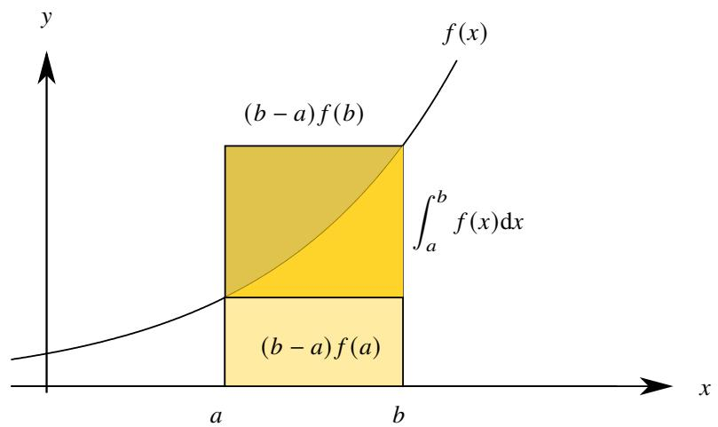  
图 1.1: 面积不等式.

# 命题 1.10 (面积原理)

设函数 $f ( x )$ 在区间 $[ a , b ]$ 上非负. 若 $f ( x )$ 在 $[ a , b ]$ 上单调递增, 则

$$
(b - a) f (a) \leq \int_ {a} ^ {b} f (x) \mathrm {d} x \leq (b - a) f (b).
$$

若 $f ( x )$ 在 $[ a , b ]$ 上单调递减, 则

$$
(b - a) f (a) \geq \int_ {a} ^ {b} f (x) \mathrm {d} x \geq (b - a) f (b).
$$

证明 只证明单调递增的情况. 由于对于任一 $x \in [ a , b ]$ 都有

$$
f (a) \leq f (x) \leq f (b).
$$

由 Riemann 的保序性可知

$$
\int_ {a} ^ {b} f (a) \mathrm {d} x \leq \int_ {a} ^ {b} f (x) \mathrm {d} x \leq \int_ {a} ^ {b} f (b) \mathrm {d} x \Longleftrightarrow (b - a) f (a) \leq \int_ {a} ^ {b} f (x) \mathrm {d} x \leq (b - a) f (b).
$$

注 特别地, 当函数 $f ( x )$ 在区间 $[ a , a + 1 ]$ 上非负且单调递增时

$$
f (a) \leq \int_ {a} ^ {a + 1} f (x) \mathrm {d} x \leq f (a + 1).
$$

如果用和式来近似积分,那么就需要估计这种近似的误差.利用以上的面积原理,可以得到以下和式与积分的误差估计式.

# 定理 1.5 (离散和的误差估计)

设函数 $f$ 在 $[ a _ { 0 } , + \infty )$ 上非负且单调递增. 任取 $a , b$ , 只要 $a _ { 0 } \leq a \leq b$ 且存在 $n \in \mathbb { Z }$ 满足 $a \leq n \leq b$ , 就有

$$
\left| \int_ {a} ^ {b} f (x) \mathrm {d} x - \sum_ {a \leq n \leq b} f (n) \right| \leq f (b). \tag {1.2}
$$

证明 令

$$
A = \left\{ \begin{array}{l l} a, & a \in \mathbb {Z} \\ [ a ] + 1, & a \notin \mathbb {Z} \end{array} \right., \qquad B = \left\{ \begin{array}{l l} b, & b \in \mathbb {Z} \\ [ b ], & b \notin \mathbb {Z} \end{array} \right..
$$

由于 $f ( x )$ 在 $[ a _ { 0 } , + \infty )$ 上非负且单调递增, 由面积原理可知

$$
f (k) \leq \int_ {k} ^ {k + 1} f (x) \mathrm {d} x \leq f (k + 1), \quad k = A, A + 1, \dots , B - 1.
$$

把上述不等式从 $A$ 到 $B - 1$ 全部相加得

$$
f (A) + \dots + f (B - 1) \leq \int_ {A} ^ {B} f (x) d x \leq f (A + 1) + \dots + f (B). \tag {1.3}
$$

由积分的可加性可知

$$
\int_ {a} ^ {b} f (x) \mathrm {d} x = \int_ {a} ^ {A} f (x) \mathrm {d} x + \int_ {A} ^ {B} f (x) \mathrm {d} x + \int_ {B} ^ {b} f (x) \mathrm {d} x. \tag {1.4}
$$

结合不等式1.3和等式1.4可得

$$
\int_ {a} ^ {b} f (x) \mathrm {d} x \geq \int_ {a} ^ {A} f (x) \mathrm {d} x + \int_ {B} ^ {b} f (x) \mathrm {d} x + f (A) + \dots + f (B - 1).
$$

$$
\int_ {a} ^ {b} f (x) \mathrm {d} x \leq \int_ {a} ^ {A} f (x) \mathrm {d} x + \int_ {B} ^ {b} f (x) \mathrm {d} x + f (A + 1) + \dots + f (B).
$$

于是可知

$$
- f (b) \leq \int_ {a} ^ {A} f (x)   \mathrm {d} x + \int_ {B} ^ {b} f (x)   \mathrm {d} x - f (B) \leq \int_ {a} ^ {b} f (x)   \mathrm {d} x - \sum_ {a \leq n \leq b} f (n) \leq \int_ {a} ^ {A} f (x)   \mathrm {d} x + \int_ {B} ^ {b} f (x)   \mathrm {d} x - f (A) \leq f (b).
$$

这就证明了不等式1.2.

注 证明过程中得到的不等式事实上比定理中的不等式更强.

注 以上结论也可以写成带大 $o$ 的等式:

$$
\int_ {a} ^ {b} f (x) \mathrm {d} x = \sum_ {a \leq n \leq b} f (n) + O [ f (b) ].
$$

用以上定理我们可以再来估计和式 $\textstyle \sum _ { n = 1 } ^ { \infty } n ^ { p }$ 以及 $\textstyle \sum _ { n = 1 } ^ { \infty } \ln n$

例 1.20 当 $p > 0$ 时函数 $f ( x ) = x ^ { p }$ 在 $[ 1 , + \infty )$ 上非负且单调递增. 由定理1.5可知

$$
n ^ {p} \geq \left| \sum_ {k = 1} ^ {n} k ^ {p} - \int_ {1} ^ {n} x ^ {p} \mathrm {d} x \right| = \left| \sum_ {k = 1} ^ {n} k ^ {p} - \frac {n ^ {p + 1} - 1}{p + 1} \right| \geq \left| \sum_ {k = 1} ^ {n} k ^ {p} - \frac {n ^ {p + 1}}{p + 1} \right|
$$

以上不等式可以写成

$$
\sum_ {k = 1} ^ {n} k ^ {p} = \frac {n ^ {p + 1}}{p + 1} + O \left(n ^ {p}\right).
$$

注 我们得到了比命题1.9更精密的结果, 不仅知道了

$$
\sum_ {k = 1} ^ {n} k ^ {p} \sim \frac {n ^ {p + 1}}{p + 1}, \quad n \rightarrow \infty .
$$

还知道了误差的阶.

例 1.21 函数 $f ( x ) = \ln x$ 在 $[ 1 , + \infty )$ 上非负且单调递增. 由定理1.5可知

$$
\ln n \geq \left| \sum_ {k = 1} ^ {n} \ln k - \int_ {1} ^ {n} \ln x d x \right| = | \ln n! - n \ln n + n - 1 |.
$$

以上不等式可以写成

$$
\ln n! = n \ln n - n + 1 + O (\ln n).
$$

注 以上不等式可以整理为

$$
| \ln n! - \ln n ^ {n} + \ln e ^ {n} - \ln e | \leq \ln n \iff \ln {\frac {1}{n}} \leq \ln {\frac {n ! e ^ {n - 1}}{n ^ {n}}} \leq \ln n. \iff {\frac {1}{n}} \leq {\frac {n ! e ^ {n - 1}}{n ^ {n}}} \leq n \iff {\frac {n ^ {n - 1}}{e ^ {n - 1}}} \leq n! \leq {\frac {n ^ {n + 1}}{e ^ {n - 1}}}.
$$

这样就得到了阶乘 $n !$ 的一个估计式. 但这个估计式没有 Stirling 公式精确.

前面研究的是被积函数单调递增的情况, 如果被积函数单调递减, 则有更加有趣的结论.

# 定理 1.6

设函数 $f$ 在 $[ a _ { 0 } , + \infty )$ 上非负且单调递减. 则对于任一 $a \geq a _ { 0 }$ 以下极限都存在且有限:

$$
\lim  _ {n \to \infty} \left[ \sum_ {a \leq k \leq n} f (k) - \int_ {a} ^ {n} f (x) \mathrm {d} x \right] = \alpha .
$$

且

$$
- \int_ {a} ^ {A} f (x) \mathrm {d} x \leq \alpha \leq f (A) - \int_ {a} ^ {A} f (x). \tag {1.5}
$$

其中

$$
A = \left\{ \begin{array}{l l} a, & a \in \mathbb {Z} \\ [ a ] + 1, & a \notin \mathbb {Z} \end{array} \right..
$$

如果还满足 $\begin{array} { r } { \operatorname* { l i m } _ { x \to + \infty } f ( x ) = 0 } \end{array}$ , 则对于任一 $x \geq a _ { 0 } + 1$ 都有

$$
\left| \sum_ {a _ {0} \leq k \leq x} f (k) - \int_ {a _ {0}} ^ {x} f (t) \mathrm {d} t - \alpha \right| \leq f (x - 1). \tag {1.6}
$$

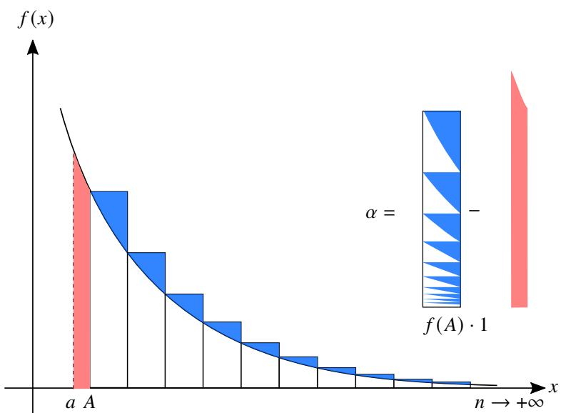  
图 1.2: 被积函数单调递减的情况.

证明 (i) 令

$$
g (n) = \sum_ {a \leq k \leq n} f (k) - \int_ {a} ^ {n} f (x) \mathrm {d} x.
$$

下面来证明数列 $g ( n )$ 单调递减有下界. 由面积原理可知

$$
g (n) - g (n + 1) = \sum_ {a \leq k \leq n} f (k) - \int_ {a} ^ {n} f (x) \mathrm {d} x - \sum_ {a \leq k \leq n + 1} f (k) + \int_ {a} ^ {n + 1} f (x) \mathrm {d} x = \int_ {n} ^ {n + 1} f (x) \mathrm {d} x - f (n + 1) \geq 0.
$$

因此 $g ( n )$ 单调递减. 由于

$$
\begin{array}{l} g (n) = \sum_ {k = A} ^ {n} f (k) - \int_ {a} ^ {n} f (x) d x = \sum_ {k = A} ^ {n - 1} \left[ f (k) - \int_ {k} ^ {k + 1} f (x) d x \right] + f (n) - \int_ {a} ^ {A} f (x) d x \\ \geq \sum_ {k = A} ^ {n - 1} [ f (k) - f (k) ] + f (n) - \int_ {a} ^ {A} f (x) d x \geq - \int_ {a} ^ {A} f (x) d x. \\ \end{array}
$$

由单调有界定理可知 $g ( n )$ 收敛. 由于 $g ( n )$ 单调递减, 故

$$
- \int_ {a} ^ {A} f (x) \mathrm {d} x \leq g (n) \leq g (A) = f (A) - \int_ {a} ^ {A} f (x) \mathrm {d} x.
$$

令 $n \to \infty$ 即知不等式1.5.

(ii) 若 $\textstyle \operatorname* { l i m } _ { x \to + \infty } f ( x ) = 0$ , 则

$$
\begin{array}{l} g (x) - \alpha = \sum_ {a \leq k \leq x} f (k) - \int_ {a} ^ {x} f (t) d t - \lim  _ {n \rightarrow \infty} \left[ \sum_ {a \leq k \leq n} f (k) - \int_ {a} ^ {n} f (t) d t \right] \\ = - \int_ {[ x ]} ^ {x} f (x) d x - \lim  _ {n \rightarrow \infty} \left[ \sum_ {k = [ x ] + 1} ^ {n} f (k) - \int_ {[ x ]} ^ {n} f (t) d t \right] \\ = - \int_ {[ x ]} ^ {x} f (x) d x - \lim  _ {n \rightarrow \infty} \left[ \sum_ {k = [ x ] + 1} ^ {n} \int_ {k - 1} ^ {k} f (k) d t - \sum_ {k = [ x ] + 1} ^ {n} \int_ {k - 1} ^ {k} f (t) d t \right] \\ = - \int_ {[ x ]} ^ {x} f (t) \mathrm {d} t + \lim _ {n \rightarrow \infty} \sum_ {k = [ x ] + 1} ^ {n} \int_ {k - 1} ^ {k} \left[ f (t) - f (k) \right] \mathrm {d} t. \\ \end{array}
$$

下面来估计 $g ( x ) - \alpha$ 的上界和下界.

$$
\begin{array}{l} g (x) - \alpha \leq \lim  _ {n \rightarrow \infty} \sum_ {k = [ x ] + 1} ^ {n} \int_ {k - 1} ^ {k} [ f (t) - f (k) ] d t \leq \lim  _ {n \rightarrow \infty} \sum_ {k = [ x ] + 1} ^ {n} \int_ {k - 1} ^ {k} [ f (k - 1) - f (k) ] d t \\ = \lim  _ {n \rightarrow \infty} \sum_ {k = [ x ] + 1} ^ {n} [ f (k - 1) - f (k) ] = \lim  _ {n \rightarrow \infty} [ f ([ x ]) - f (n) ] = f ([ x ]) \leq f (x - 1). \\ \end{array}
$$

$$
g (x) - \alpha \geq - \int_ {[ x ]} ^ {x} f (t) d t \geq - (x - [ x ]) f ([ x ]) \geq - f ([ x ]) \geq - f (x - 1).
$$

这表明不等式1.5成立.

注 不等式1.5可以用大 $o$ 记号写成

$$
\sum_ {a _ {0} \leq k \leq x} f (k) = \int_ {a _ {0}} ^ {x} f (t) \mathrm {d} t + \alpha + O [ f (x - 1) ].
$$

下面用以上定理研究调和级数.

例 1.22 存在常数 $\gamma$ 满足

$$
\sum_ {k = 1} ^ {n} \frac {1}{k} = \ln n + \gamma + O \left(\frac {1}{n}\right).
$$

证明 由于函数 $f ( x ) = 1 / x$ 在 $[ 1 , + \infty )$ 上非负且单调递减, 由定理1.6可知

$$
\lim  _ {n \rightarrow \infty} \left(\sum_ {k = 1} ^ {n} \frac {1}{k} - \int_ {1} ^ {n} \frac {1}{x} d x\right) = \lim  _ {n \rightarrow \infty} \left(\sum_ {k = 1} ^ {n} \frac {1}{k} - \ln n\right) = \gamma .
$$

这里的 ?? 是 Euler 常数. 由于 $\textstyle \operatorname* { l i m } _ { x \to + \infty } f ( x ) = 0$ , 因此

$$
\left| \sum_ {k = 1} ^ {n} \frac {1}{k} - \ln n - \gamma \right| \leq \frac {1}{n - 1} \leq \frac {2}{n}.
$$

于是可得

$$
\sum_ {k = 1} ^ {n} \frac {1}{k} = \ln n + \gamma + O \left(\frac {1}{n}\right).
$$

注 我们之前只得出了

$$
\sum_ {k = 1} ^ {n} \frac {1}{k} = \ln n + \gamma + \varepsilon_ {n},
$$

其中 $\varepsilon _ { n }$ 是一个无穷小. 但我们并不知道 $\varepsilon _ { n }$ 的具体信息. 由定理1.6我们得到了对调和级数更精确的估计.

以上结论非常有用, 我们来看一个例子.

例 1.23 设数列

$$
S _ {n} = \sum_ {k = 1} ^ {n} (- 1) ^ {k - 1} \frac {1}{k}, \quad n = 1, 2, \dots .
$$

求 $\scriptstyle \operatorname* { l i m } _ { n \to \infty } S _ { n }$ .

解 先计算 $S _ { 2 n }$ 的极限. 由例1.22可知

$$
\begin{array}{l} S _ {2 n} = 1 - \frac {1}{2} + \frac {1}{3} - \frac {1}{4} + \dots - \frac {1}{2 n} = \left(1 + \frac {1}{2} + \frac {1}{3} + \dots + \frac {1}{2 n}\right) - 2 \left(\frac {1}{2} + \frac {1}{4} + \dots + \frac {1}{2 n}\right) \\ = \left(1 + \frac {1}{2} + \frac {1}{3} + \dots + \frac {1}{2 n}\right) - \left(1 + \frac {1}{2} + \dots + \frac {1}{n}\right) \\ = \left[ \ln 2 n + \gamma + O \left(\frac {1}{n}\right) \right] - \left[ \ln n + \gamma + O \left(\frac {1}{n}\right) \right] = \ln 2 + O \left(\frac {1}{n}\right). \\ \end{array}
$$

于是 $\begin{array} { r } { \operatorname* { l i m } _ { n \to \infty } S _ { 2 n } = \ln 2 . } \end{array}$ . 由于

$$
\lim  _ {n \rightarrow \infty} S _ {2 n + 1} = \lim  _ {n \rightarrow \infty} \left(S _ {2 n} + \frac {1}{2 n + 1}\right) = \lim  _ {n \rightarrow \infty} S _ {2 n}.
$$

故知

$$
\lim  _ {n \to \infty} S _ {n} = \lim  _ {n \to \infty} S _ {2 n} = \ln 2.
$$

由定理1.6立刻可知以下重要结论.

# 定理 1.7 (Cauchy 积分判别法)

设函数 $f$ 在 $[ 1 , + \infty )$ 上非负且单调递减, 则以下无穷级数与无穷积分同敛散:

$$
\sum_ {n = 1} ^ {\infty} f (n), \quad \int_ {1} ^ {\infty} f (x) \mathrm {d} x.
$$

用积分判别法可以解决上一节对数判别法无法解决的问题.

例 1.24 讨论以下级数的敛散性:

$$
\sum_ {n = 2} ^ {\infty} \frac {1}{n \ln^ {p} n}.
$$

证明 设函数 $f ( x ) = 1 / ( x \ln ^ { p } x ) .$ , 则 $f ( x )$ 在 $[ 2 , + \infty )$ 上单调递减. 由于

$$
\int_ {2} ^ {+ \infty} \frac {\mathrm {d} x}{x \ln^ {p} x} = \int_ {2} ^ {+ \infty} \frac {\mathrm {d} \ln x}{\ln^ {p} x} = \left\{ \begin{array}{l l} \ln \ln x \Big | _ {2} ^ {+ \infty}, & p = 1 \\ \frac {(\ln x) ^ {1 - p}}{1 - p} \Big | _ {2} ^ {+ \infty}, & p \neq 1 \end{array} \right..
$$

因此当 $p > 1$ 时 $\textstyle \int _ { 2 } ^ { + \infty } f ( x ) \operatorname { d } x$ 收敛, 当 $p \leq 1$ 时发散. 由 Cauchy 积分判别法可知原级数与 $\textstyle \int _ { 2 } ^ { + \infty } f ( x ) \mathrm { d } x$ 有相同的敛散性. ■

注 上例实际上给出了命题1.8中 (3) 的证明.

按前面例子中的方法, 利用 Cauchy 积分判别法可以判断以下类型的级数:

$$
\sum_ {n = 1} ^ {\infty} \frac {1}{n ^ {p}}, \qquad \sum_ {n = 2} ^ {\infty} \frac {1}{n \ln^ {p} n}, \qquad \sum_ {n = 3} ^ {\infty} \frac {1}{n \ln n \ln^ {p} \ln n}, \qquad \sum_ {n = 4} ^ {\infty} \frac {1}{n \ln n \ln \ln n \ln^ {p} \ln \ln n}, \qquad \dots .
$$

它们的结论都是统一的: 当 $p > 1$ 时收敛, 当 $p \leq 1$ 时发散.

# 1.1.4 比值判别法

# 定理 1.8 (比值判别法)

设正项级数 $\textstyle \sum _ { n = 1 } ^ { \infty } a _ { n }$ 和 $\sum _ { n = 1 } ^ { \infty } b _ { n }$ . 当 $n$ 充分大后, 若

$$
\frac {a _ {n + 1}}{a _ {n}} \leq \frac {b _ {n + 1}}{b _ {n}}.
$$

则

(1) 当 $\textstyle \sum _ { n = 1 } ^ { \infty } b _ { n }$ 收敛时, $\textstyle \sum _ { n = 1 } ^ { \infty } a _ { n }$ 也收敛.   
(2) 当 $\textstyle \sum _ { n = 1 } ^ { \infty } a _ { n }$ 发散时, $\textstyle \sum _ { n = 1 } ^ { \infty } b _ { n }$ 也发散.

证明 (1) 存在 $N$ , 当 $n > N$ 时

$$
\frac {a _ {N + 1}}{a _ {N}} \leq \frac {b _ {N + 1}}{b _ {N}}, \quad \frac {a _ {N + 2}}{a _ {N + 1}} \leq \frac {b _ {N + 2}}{b _ {N + 1}}, \quad \dots , \quad \frac {a _ {n}}{a _ {n - 1}} \leq \frac {b _ {n}}{b _ {n - 1}}.
$$

把以上各式相乘得

$$
\frac {a _ {n}}{a _ {N}} \leq \frac {b _ {n}}{b _ {N}} \Longleftrightarrow a _ {n} \leq \frac {a _ {N}}{b _ {N}} b _ {n} \Longleftrightarrow \frac {b _ {N}}{a _ {N}} a _ {n} \leq b _ {n}.
$$

由正项级数的比较判别法可知当 $\textstyle \sum _ { n = 1 } ^ { \infty } b _ { n }$ 收敛时, $\textstyle \sum _ { n = 1 } ^ { \infty } a _ { n }$ 也收敛, 当 $\textstyle \sum _ { n = 1 } ^ { \infty } a _ { n }$ 发散时, $\textstyle \sum _ { n = 1 } ^ { \infty } b _ { n }$ 也发散.

比较判别法或比值判别法都是正项级数通用性的敛散性判别法, 它们的思想非常简单易懂. 使用这两个方法的关键是找到一个” 可比较的级数”.. 因此比较判别法虽然适用于所有正项级数, 但用起来不方便. 比较自然的想法是把正项级数和几类特定的级数相比较后推导出几种定制化的判别法. 我们现在已经熟悉的级数有三类:

$$
\sum_ {n = 0} ^ {\infty} \frac {1}{q ^ {n}}, \quad \sum_ {n = 1} ^ {\infty} \frac {1}{n ^ {p}}, \quad \sum_ {n = 2} ^ {\infty} \frac {1}{n \ln^ {p} n}.
$$

容易知道它们的通项都是无穷小数列, 但趋于零的速度不一样, 按从快到慢依次是

$$
\frac {1}{q ^ {n}}, \quad \frac {1}{n ^ {p}}, \quad \frac {1}{n \ln^ {p} n}.
$$

于是我们想到分别利用这三类级数推导三大类判别法. 首先把比值判别法中的 $b _ { n }$ 用几何级数代替就得到了以下判别法.

# 定理 1.9 (D’Alembert 判别法)

设正项级数 $\textstyle \sum _ { n = 1 } ^ { \infty } a _ { n }$ . 当 $n$ 充分大后

(1) 若存在 $q < 1$ , 满足

$$
\frac {a _ {n + 1}}{a _ {n}} \leq q,
$$

则级数收敛.

(2) 若

$$
\frac {a _ {n + 1}}{a _ {n}} \geq 1,
$$

则级数发散.

注 从以上判别法的条件可知, 只有单调数列 (当 $n$ 充分大后) 才适用以上判别法.

D’Alembert 判别法也可以写成极限形式.

# 定理 1.10 (正项级数 D’Alembert 比值判别法的极限形式)

设正项级数 $\textstyle \sum _ { n = 1 } ^ { \infty } a _ { n }$ . 令

$$
\lim  _ {n \rightarrow \infty} \sup  _ {a _ {n + 1}} \frac {a _ {n + 1}}{a _ {n}} = Q, \quad \lim  _ {n \rightarrow \infty} \inf  _ {a _ {n}} \frac {a _ {n + 1}}{a _ {n}} = q.
$$

(1) 若 $q < Q < 1$ , 则级数收敛.   
(2) 若 $1 < q < Q$ , 则级数趋于 $+ \infty$   
(3) 若 $Q = 1$ 或 $q = 1$ , 则无法判断敛散性.

证明 (1) 当 $Q < 1$ 时, 存在 $\varepsilon > 0$ 使得 $Q + \varepsilon < 1 .$ 由于

$$
\lim  _ {n \rightarrow \infty} \sup  _ {n \rightarrow \infty} \frac {a _ {n + 1}}{a _ {n}} = Q.
$$

故当 $n$ 充分大后 $a _ { n + 1 } / a _ { n } < Q + \varepsilon < 1 .$ 于是可知级数收敛.

(2) 当 $1 < q$ 时, 存在 $\delta > 0$ 使得 $q - \delta > 1 .$ . 由于

$$
\lim  _ {n \rightarrow \infty} \inf  _ {n \rightarrow \infty} \frac {a _ {n + 1}}{a _ {n}} = q.
$$

故当 $n$ 充分大后 $a _ { n + 1 } / a _ { n } > q - \delta > 1 .$ 于是可知级数发散.

(3) 证明同 Cauchy 根值判别法.

注 若 $q < 1 < Q$ , 则说明在 $n$ 充分大后数列不单调, 因此不适用以上判别法.

下面看两个例子.

例 1.25 判断以下级数的敛散性:

$$
\sum_ {n = 1} ^ {\infty} n! x ^ {n}, \quad x \geq 0.
$$

解 当 $x = 0$ 时级数显然收敛, 且和为零. 当 $x > 0$ 时, 由于

$$
\lim  _ {n \rightarrow \infty} \frac {a _ {n + 1}}{a _ {n}} = \lim  _ {n \rightarrow \infty} \frac {(n + 1) ! x ^ {n + 1}}{n ! x ^ {n}} = \lim  _ {n \rightarrow \infty} (n + 1) x = + \infty .
$$

由正项级数的 D’Alembert 判别法可知原级数趋于 $+ \infty$ .

例 1.26 判断以下级数的敛散性:

$$
\sum_ {n = 1} ^ {\infty} \frac {n !}{n ^ {n}} x ^ {n}, \quad x \geq 0.
$$

解 当 $x = 0$ 时级数显然收敛, 且和为零. 当 $x > 0$ 时, 由于

$$
\lim  _ {n \rightarrow \infty} \frac {a _ {n + 1}}{a _ {n}} = \lim  _ {n \rightarrow \infty} \frac {(n + 1) ! x ^ {n + 1}}{(n + 1) ^ {n + 1}} \cdot \frac {n ^ {n}}{n ! x ^ {n}} = \lim  _ {n \rightarrow \infty} \frac {x}{(1 + 1 / n) ^ {n}} = \frac {x}{e}.
$$

由正项级数的 D’Alembert 判别法可知, 当 $x > { \mathfrak { e } }$ 时原级数趋于 $+ \infty$ . 当 $0 < x < \mathtt { e }$ 时原级数收敛. 当 $x = \mathrm { e }$ 时, 由Stirling 公式可知

$$
n! \sim \sqrt {2 n \pi} \left(\frac {n}{\mathrm {e}}\right) ^ {n} \Longleftrightarrow \frac {n !}{n ^ {n}} \mathrm {e} ^ {n} \sim \sqrt {2 n \pi}
$$

因此此时级数发散.

注 以上级数定义了一个函数, 它的定义域是 [0, e).

Cauchy根值判别法和 D’Alembert 判别法都是和几何级数比较得到的, 但前者是直接用比较判别法, 而 D’Alembert判别法用的是比值判别法. 因此 D’Alembert 判别法对于通项不单调 $( n$ 充分大以后) 的级数无效, 因此我们有理由猜测 Cauchy 根值判别法比 D’Alembert 比值判别法强一些.

# 命题 1.11

设正数列 $\left\{ a _ { n } \right\}$ . 则

$$
\liminf_{n\to \infty}\frac{a_{n + 1}}{a_{n}}\leq \liminf_{n\to \infty}\sqrt[n]{a_{n}}\leq \limsup_{n\to \infty}\sqrt[n]{a_{n}}\leq \limsup_{n\to \infty}\frac{a_{n + 1}}{a_{n}}.
$$

证明 只证明最右边的不等式. 令

$$
\lim  _ {n \rightarrow \infty} \sup  _ {n \rightarrow \infty} \frac {a _ {n + 1}}{a _ {n}} = q.
$$

当 $q = + \infty$ 时不等式显然成立. 下设 $q \in \mathbb { R }$ . 对于任一 $\varepsilon > 0$ 存在 $N \in \mathbb { N } ^ { * }$ 当 $n > N$ 时 $a _ { n + 1 } / a _ { n } < q + \varepsilon .$ . 于是

$$
\frac {a _ {N + 1}}{a _ {N}} <   q + \varepsilon , \quad \frac {a _ {N + 2}}{a _ {N + 1}} <   q + \varepsilon , \quad \dots , \quad \frac {a _ {n}}{a _ {n - 1}} <   q + \varepsilon .
$$

把以上各式相乘得

$$
\frac {a _ {n}}{a _ {N}} <   (q + \varepsilon) ^ {n - N} \iff a _ {n} <   a _ {N} (q + \varepsilon) ^ {n - N} \iff \sqrt [ n ]{a _ {n}} <   \sqrt [ n ]{a _ {N} (q + \varepsilon) ^ {- N}} (q + \varepsilon).
$$

令 $n \to \infty$ 取上极限得

$$
\limsup_{n\to \infty}\sqrt[n]{a_{n}}\leq q + \varepsilon
$$

令 $\varepsilon \to 0$ 可知

$$
\limsup_{n\to \infty}\sqrt[n]{a_{n}}\leq q.
$$

以上不等式表明凡是 D’Alembert 比值判别法可以判别的一定可以用 Cauchy 根值判别法判别, 反之不然. 因此 Cauchy根值判别法要比 D’Alembert 判别法更强一些. 我们来看一个例子.

例 1.27 判断以下级数的敛散性:

$$
\sum_ {n = 1} ^ {\infty} \frac {2 + (- 1) ^ {n}}{2 ^ {n}}.
$$

解 设原级数的通项为 $\left\{ a _ { n } \right\}$ .

解法一 由于

$$
\lim  _ {n \rightarrow \infty} \sqrt [ n ]{a _ {n}} = \lim  _ {n \rightarrow \infty} \sqrt [ n ]{\frac {2 + (- 1) ^ {n}}{2 ^ {n}}} = \frac {1}{2} <   1.
$$

由正项级数的 Cauchy根值判别法可知原级数收敛.

解法二 由于

$$
\lim  _ {n \rightarrow \infty} \frac {a _ {2 n}}{a _ {2 n - 1}} = \lim  _ {n \rightarrow \infty} \frac {3 / 2 ^ {2 n}}{1 / 2 ^ {2 n - 1}} = \frac {3}{2}. \quad \lim  _ {n \rightarrow \infty} \frac {a _ {2 n + 1}}{a _ {2 n}} = \lim  _ {n \rightarrow \infty} \frac {1 / 2 ^ {2 n + 1}}{3 / 2 ^ {2 m}} = \frac {1}{6}.
$$

因此

$$
\lim  _ {n \rightarrow \infty} \sup  _ {a _ {n + 1}} \frac {a _ {n + 1}}{a _ {n}} = \frac {3}{2}, \quad \lim  _ {n \rightarrow \infty} \inf  _ {a _ {n + 1}} \frac {a _ {n + 1}}{a _ {n}} = \frac {1}{6}.
$$

故此时正项级数的 D’Alembert 比值判别法无法判断原级数收敛.

以上命题还可以得到有意思的推论.

# 推论 1.2

设数列 $\left\{ a _ { n } \right\}$ . 若

$$
\lim  _ {n \rightarrow \infty} \left| \frac {a _ {n + 1}}{a _ {n}} \right| = l.
$$

则

$$
\lim  _ {n \rightarrow \infty} \sqrt [ n ]{\left| a _ {n} \right|} = l.
$$

用这个推论可以把求一些极限.

例 1.28 求极限:

$$
\lim  _ {n \rightarrow \infty} \sqrt [ n ]{1 + \frac {1}{2} + \dots + \frac {1}{n}}.
$$

解 由 Stolz 定理可知

$$
\lim  _ {n \rightarrow \infty} \frac {1 + \frac {1}{2} + \cdots + \frac {1}{n + 1}}{1 + \frac {1}{2} + \cdots + \frac {1}{n}} = \lim  _ {n \rightarrow \infty} \frac {\frac {1}{n}}{\frac {1}{n + 1}} = 1.
$$

因此所求极限也是 1.

虽然根值判别法比比值判别法强一些. 但这两个判别法有一个共性, 它们都是通过与几何级数比较后得到的,因此直观地可以想到, 一个比几何级数收敛地慢的级数无法用它们判别.

# 命题 1.12

设收敛的正项级数 $\textstyle \sum _ { n = 1 } ^ { \infty } a _ { n }$ . 若它的收敛性可以用 Cauchy 根值判别法或 D’Alembert 判别法判别, 即

$$
\lim  _ {n \to \infty} \sup  _ {n \to \infty} \frac {a _ {n + 1}}{a _ {n}} = q <   1 \quad \text {或} \quad \lim  _ {n \to \infty} \sqrt [ n ]{a _ {n}} = q <   1.
$$

则对于任一 $r \in \left( q , 1 \right)$ 都有 $a _ { n } = o \left( r ^ { n } \right)$ .

证明 若 $\begin{array} { r } { \operatorname* { l i m } \operatorname* { s u p } _ { n \to \infty } ( a _ { n + 1 } / a _ { n } ) = q } \end{array}$ 或 $\scriptstyle \operatorname* { l i m } \operatorname* { s u p } _ { n \to \infty }$ $\sqrt [ n ] { a _ { n } } = q$ , 由于

$$
\limsup_{n\to \infty}\sqrt{a_{n}}\leq \limsup_{n\to \infty}\frac{a_{n + 1}}{a_{n}}.
$$

故 $\begin{array} { r } { \operatorname* { l i m } \operatorname* { s u p } _ { n \to \infty } \sqrt [ n ] { a _ { n } } \leq q . } \end{array}$ . 由于 $q < r < 1$ , 故存在 $\delta > 0$ 使得 $q + \delta < r .$ . 于是当 $n$ 充分大时

$$
\sqrt [ n ]{a _ {n}} <   q + \delta \iff a _ {n} <   (q + \delta) ^ {n}
$$

令

$$
p = \frac {q + \delta}{r} <   1.
$$

则 $q + \delta = p r$ . 于是 $a _ { n } < p ^ { n } r ^ { n }$ . 由于 $p < 1$ , 因此

$$
\lim  _ {n \to \infty} \frac {a _ {n}}{r ^ {n}} = \lim  _ {n \to \infty} p ^ {n} = 0.
$$

这表明对于任一 $r \in \left( q , 1 \right)$ 都有 $a _ { n } = o \left( r ^ { n } \right)$ .

注 以上命题表明, 若一个收敛级数的通项趋于零的速度小于几何级数就无法用 Cauchy 根值判别法或 D’Alembert

于是, 我们需要更加精细的判别法来判别收敛速度比几何级数慢的级数. 考虑把正项级数 $\textstyle \sum _ { n = 1 } ^ { \infty } a _ { n }$ 与收敛的$p$ 级数 $\textstyle \sum _ { n = 1 } ^ { \infty } 1 / n ^ { p }$ $( p > 1 )$ ) 比较. 由比值判别法可知, 若满足

$$
\frac {a _ {n + 1}}{a _ {n}} \leq \frac {1 / (n + 1) ^ {p}}{1 / n ^ {p}} = \left(\frac {n}{n + 1}\right) ^ {p}.
$$

则 $\textstyle \sum _ { n = 1 } ^ { \infty } a _ { n }$ 收敛. 改写以上不等式得

$$
\frac {a _ {n}}{a _ {n + 1}} \geq \left(\frac {n + 1}{n}\right) ^ {p} = \left(1 + \frac {1}{n}\right) ^ {p} = 1 + \frac {p}{n} + o \left(\frac {1}{n}\right), \quad n \rightarrow \infty .
$$

因此

$$
n \left(\frac {a _ {n}}{a _ {n + 1}} - 1\right) \geq p + o (1) > 1, \quad n \rightarrow \infty .
$$

由此引出了以下判别法.

# 定理 1.11 (Raabe 判别法)

设正项级数 $\textstyle \sum _ { n = 1 } ^ { \infty } a _ { n }$ . 令

$$
R _ {n} = n \left(\frac {a _ {n}}{a _ {n + 1}} - 1\right).
$$

当 $n$ 充分大时,

(1) 若存在 $r > 1$ 满足 $R _ { n } \geq r$ , 则级数收敛.   
(2) 若 $R _ { n } \leq 1$ , 则级数发散.

证明 (1) 由于 $r > 1$ , 故存在 $p \in ( 1 , r )$ . 由于

$$
\lim  _ {n \rightarrow \infty} \frac {(1 + 1 / n) ^ {p} - 1}{1 / n} = p <   r.
$$

因此当 $n$ 充分大时

$$
\left(1 + \frac {1}{n}\right) ^ {p} <   1 + \frac {r}{n}.
$$

由于 $R _ { n } \geq r$ , 故

$$
\frac {a _ {n}}{a _ {n + 1}} \geq 1 + \frac {r}{n} > \left(1 + \frac {1}{n}\right) ^ {p} = \frac {(n + 1) ^ {p}}{n ^ {p}} \Longleftrightarrow \frac {a _ {n + 1}}{a _ {n}} \leq \frac {1 / (n + 1) ^ {p}}{1 / n ^ {p}}.
$$

由于 $p > 1$ , 故 $p$ 级数 $\textstyle \sum _ { n = 1 } ^ { \infty } 1 / n ^ { p }$ 收敛, 由正项级数的比值判别法可知级数 $\textstyle \sum _ { n = 1 } ^ { \infty } a _ { n }$ 收敛.

(2) 由于 $R _ { n } \leq 1$ , 故

$$
\frac {a _ {n}}{a _ {n + 1}} \leq 1 + \frac {1}{n} = \frac {n + 1}{n} \Longleftrightarrow \frac {a _ {n + 1}}{a _ {n}} \geq \frac {n}{n + 1} = \frac {1 / (n + 1)}{1 / n}.
$$

由于调和级数 $\textstyle \sum _ { n = 1 } ^ { \infty } 1 / n$ 发散, 由正项级数的比值判别法可知级数 $\textstyle \sum _ { n = 1 } ^ { \infty } a _ { n }$ 发散.

注Raabe判别法和对数判别法都是和 $p$ 级数比较得到的,因此属于同一层级的判别法,它们的关系一如D’Alembert判别法和根值判别法的关系, 即对数判别法比 Raabe 判别法更强一些, 因为 Raabe 判别法也只能处理单调数列 (??充分大以后) 的情况.

注 和 D’Alembert 判别法类似, 以上判别法只能对单调数列 (?? 充分大以后) 有效.

Raabe 判别法也有极限形式.

# 定理 1.12 (Raabe 判别法的极限形式)

设正项级数 $\textstyle \sum _ { n = 1 } ^ { \infty } a _ { n }$ . 若

$$
R _ {n} = n \left(\frac {a _ {n}}{a _ {n + 1}} - 1\right)\rightarrow r.
$$

即

$$
\frac {a _ {n}}{a _ {n + 1}} = 1 + \frac {r}{n} + o \left(\frac {1}{n}\right), \quad n \to \infty .
$$

则

(1) 当 $r > 1$ 时级数收敛.   
(2) 当 $r < 1$ 时级数发散.  
(3) 当 $r = 1$ 时无法判断级数的敛散性.

证明 (1) 当 $r > 1$ 时, 存在 $r _ { 0 } \in ( 1 , r )$ . 由于 $R _ { n } \to r$ , 故当 $n$ 充分大时 $R _ { n } > r _ { 0 } > 1 .$ . 于是可知原级数收敛.

(2) 当 $r < 1$ 时, 由于 $R _ { n } \to r$ , 故当 $n$ 充分大时 $R _ { n } < 1 .$ . 于是可知原级数发散.

(3) 令

$$
a _ {n} = \frac {1}{n \ln^ {p} n}.
$$

则

$$
\frac {a _ {n}}{a _ {n + 1}} = \frac {\frac {1}{n \ln^ {p} n}}{\frac {1}{(n + 1) \ln^ {p} (n + 1)}} = \left(1 + \frac {1}{n}\right) \left[ \frac {\ln (n + 1)}{\ln n} \right] ^ {p}
$$

由于

$$
\frac {\ln (n + 1)}{\ln n} = \frac {\ln n (1 + 1 / n)}{\ln n} = 1 + \frac {1}{\ln n} \ln \left(1 + \frac {1}{n}\right) = 1 + o (1), \quad n \rightarrow \infty .
$$

故

$$
\frac {a _ {n}}{a _ {n + 1}} = 1 + \frac {1}{n} + o \left(\frac {1}{n}\right), \quad n \rightarrow \infty .
$$

此时 $r = 1$ . 我们已经知道, 当 $p > 1$ 时级数收敛, 当 $p \leq 1$ 时级数发散, 因此 $r = 1$ 时 Raabe 判别法无法判断级数的敛散性. ■

注和D’Alembert判别法类似,以上判别法的条件也可以减弱为上极限和下极限的形式.令 $R _ { n }$ 的上极限为 $R$ ,下极 限为 $r$ , 则

(1) 当 $r > 1$ 时, 级数收敛.   
(2) 当 $R < 1$ 时, 级数发散.  
(3) 当 $r = 1$ 或 $R = 1$ 时, 无法判断级数的敛散性.

Raabe 判别法适用于判别和 $p$ 级数可比较的级数. 下面看几个例子.

例 1.29 判断以下级数的敛散性:

$$
\sum_ {n = 0} ^ {\infty} \left| \binom {\alpha} {n} \right|, \quad \alpha > 0.
$$

解 由于当 $n$ 充分大时

$$
n \left(\left| \binom {\alpha} {n} \right| / \left| \binom {\alpha} {n + 1} \right| - 1\right) = n \left(\frac {n + 1}{| \alpha - n |} - 1\right) = \frac {n (1 + \alpha)}{n - \alpha} \rightarrow 1 + \alpha > 1.
$$

由正项级数的 Raabe 判别法可知原级数收敛.

注 如果考虑用 D’Alembert 比值判别法:

$$
\lim  _ {n \to \infty} \left| \binom {\alpha} {n} \right| / \left| \binom {\alpha} {n + 1} \right| = \frac {n + 1}{n - \alpha} = 1.
$$

这说明这个级数收敛的速度比几何级数慢, D’Alembert 判别法无能无力.

这时需要更精细的判别法. 这时, 我们应该让 $\textstyle \sum _ { n = 1 } ^ { \infty } a _ { n }$ 和一个比 $p$ 级数 $\textstyle \sum _ { n = 1 } ^ { \infty } 1 / n ^ { p }$ $\begin{array} { r } { { \bf \Phi } _ { p } > 1 } \end{array}$ ) 级数收敛得更慢的级数来比较. 在例1.24中我们已经知道, 当 $p > 1$ 时级数 $\textstyle \sum _ { n = 2 } ^ { \infty } 1 / ( n \ln ^ { p } n )$ 收敛. 由于

$$
\lim  _ {n \rightarrow \infty} \frac {1 / n ^ {p}}{1 / (n \ln^ {q} n)} = 0, \quad p, q > 1.
$$

因此 $\textstyle \sum _ { n = 2 } ^ { \infty } 1 / ( n \ln ^ { q } n ) ( q > 1 )$ $( q > 1 )$ 是比 $\textstyle \sum _ { n = 1 } ^ { \infty } 1 / n ^ { p }$ $( p > 1 )$ ) 级数收敛得更慢的级数. 考虑用 $\textstyle \sum _ { n = 1 } ^ { \infty } a _ { n }$ 和 $\scriptstyle \sum _ { n = 1 } ^ { \infty } 1 / n \ln n ^ { p }$ $( p > 1 )$ 比较. 若

$$
\frac {a _ {n + 1}}{a _ {n}} \leq \frac {\frac {1}{(n + 1) \ln^ {p} (n + 1)}}{\frac {1}{n \ln^ {p} n}} = \frac {n}{n + 1} \left[ \frac {\ln n}{\ln (n + 1)} \right] ^ {p}.
$$

则由比值判别法可知 $\textstyle \sum _ { n = 1 } ^ { \infty } a _ { n }$ 收敛. 改写以上不等式得

$$
\frac {a _ {n}}{a _ {n + 1}} \geq \frac {n + 1}{n} \left[ \frac {\ln (n + 1)}{\ln n} \right] ^ {p}.
$$

由于

$$
\frac {\ln (n + 1)}{\ln n} = \frac {\ln n (1 + 1 / n)}{\ln n} = 1 + \frac {1}{\ln n} \ln \left(1 + \frac {1}{n}\right) = 1 + \frac {1}{\ln n} \left[ \frac {1}{n} + o \left(\frac {1}{n}\right)\right] = 1 + \frac {1}{n \ln n} + o \left(\frac {1}{n \ln n}\right), \quad n \rightarrow \infty .
$$

故

$$
\frac {a _ {n}}{a _ {n + 1}} \geq \frac {n + 1}{n} \left[ 1 + \frac {1}{n \ln n} + o \left(\frac {1}{n \ln n}\right) \right] ^ {p} = \frac {n + 1}{n} \left[ 1 + \frac {p}{n \ln n} + o \left(\frac {1}{n \ln n}\right) \right] = 1 + \frac {1}{n} + \frac {p}{n \ln n} + o \left(\frac {1}{n \ln n}\right), \quad n \to \infty .
$$

于是

$$
n \ln n \left(\frac {a _ {n}}{a _ {n + 1}} - 1 - \frac {1}{n}\right) \geq p + o (1) > 1, \quad n \rightarrow \infty .
$$

由此引出了以下判别法.

# 定理 1.13 (Bertrand 判别法)

设正项级数 $\textstyle \sum _ { n = 1 } ^ { \infty } a _ { n }$ . 令

$$
B _ {n} = n \ln n \left(\frac {a _ {n}}{a _ {n + 1}} - 1 - \frac {1}{n}\right).
$$

当 $n$ 充分大时,

(1) 若存在 $r > 1$ 满足 $B _ { n } \geq r$ , 则级数收敛.   
(2) 若 $B _ { n } \leq 1$ , 则级数发散.

证明 (1) 由于 $r > 1$ , 故存在 $p \in ( 1 , r )$ . 由于

$$
\frac {n + 1}{n} \left[ \frac {\ln (n + 1)}{\ln n} \right] ^ {p} = 1 + \frac {1}{n} + \frac {p}{n \ln n} + o \left(\frac {1}{n \ln n}\right), \quad n \rightarrow \infty .
$$

故当 $n$ 充分大时

$$
\frac {n + 1}{n} \left[ \frac {\ln (n + 1)}{\ln n} \right] ^ {p} <   1 + \frac {1}{n} + \frac {r}{n \ln n}.
$$

由于 $B _ { n } \geq r$ , 故

$$
\frac {a _ {n + 1}}{a _ {n}} \geq 1 + \frac {1}{n} + \frac {r}{n \ln n} > \frac {n + 1}{n} \left[ \frac {\ln (n + 1)}{\ln n} \right] ^ {p} \Longleftrightarrow \frac {a _ {n + 1}}{a _ {n}} \leq \frac {n}{n + 1} \left[ \frac {\ln n}{\ln (n + 1)} \right] ^ {p} = \frac {\frac {1}{(n + 1) \ln^ {p} (n + 1)}}{\frac {1}{n \ln^ {p} n}}.
$$

当 $p > 1$ 时级数 $\textstyle \sum _ { n = 2 } ^ { \infty } 1 / ( n \ln ^ { p } n )$ 收敛, 由正项级数的比值判别法可知级数 $\textstyle \sum _ { n = 1 } ^ { \infty } a _ { n }$ 收敛.

(2) 由于 $B _ { n } \leq 1$ , 故

$$
\frac {a _ {n}}{a _ {n + 1}} \leq 1 + \frac {1}{n} + \frac {1}{n \ln n} \iff \frac {a _ {n + 1}}{a _ {n}} \geq \frac {n \ln n}{n \ln n + \ln n + 1}.
$$

由于

$$
\begin{array}{l} (n + 1) \ln (n + 1) - (n \ln n + \ln n + 1) \\ = n \ln \left(1 + \frac {1}{n}\right) + \ln \left(1 + \frac {1}{n}\right) - 1 = n \left[ \frac {1}{n} - \frac {1}{2 n ^ {2}} + o \left(\frac {1}{n}\right) \right] + \frac {1}{n} + o \left(\frac {1}{n}\right) - 1 = \frac {1}{2 n} + o \left(\frac {1}{n}\right) > 0. \\ \end{array}
$$

因此

$$
\frac {a _ {n + 1}}{a _ {n}} \geq \frac {n \ln n}{n \ln n + \ln n + 1} \geq \frac {n \ln n}{(n + 1) \ln (n + 1)} = \frac {\frac {1}{(n + 1) \ln (n + 1)}}{\frac {1}{n \ln n}}.
$$

由于级数 $\textstyle \sum _ { n = 2 } ^ { \infty } 1 / ( n \ln n )$ 发散, 由正项级数的比值判别法可知级数 $\textstyle \sum _ { n = 1 } ^ { \infty } a _ { n }$ 发散.

注 和 D’Alembert 判别法类似, 以上判别法只能对单调数列 $( n$ 充分大以后) 有效.

Bertrand 判别法也有极限形式.

# 定理 1.14 (Bertrand 判别法的极限形式)

设正项级数 $\textstyle \sum _ { n = 1 } ^ { \infty } a _ { n }$ . 若

$$
B _ {n} = n \ln n \left(\frac {a _ {n}}{a _ {n + 1}} - 1 - \frac {1}{n}\right)\rightarrow r.
$$

即

$$
\frac {a _ {n}}{a _ {n + 1}} = 1 + \frac {1}{n} + \frac {r}{n \ln n} + o \left(\frac {1}{n \ln n}\right), \quad n \rightarrow \infty .
$$

(1) 当 $r > 1$ 时级数收敛.   
(2) 当 $r < 1$ 时级数发散.  
(3) 当 $r = 1$ 时无法判断级数的敛散性.

证明 (1) 和 (2) 都是显然的. 只证明 (3). 令

$$
a _ {n} = \frac {1}{n \ln n \ln^ {p} \ln n}.
$$

容易知道

$$
\frac {a _ {n}}{a _ {n + 1}} = 1 + \frac {1}{n} + \frac {1}{n \ln n} + o \left(\frac {1}{n \ln n}\right), \quad n \rightarrow \infty .
$$

但我们知道, 当 $p > 1$ 时级数收敛, 当 $p \leq 1$ 时级数发散. 这表明当 $r = 1$ 时无法判断级数的敛散性.

注和D’Alembert判别法类似,以上判别法的条件也可以减弱为上极限和下极限的形式.令 $B _ { n }$ 的上极限为 $R$ ,下极 限为 $r$ , 则

(1) 当 $r > 1$ 时, 级数收敛.   
(2) 当 $R < 1$ 时, 级数发散.  
(3) 当 $r = 1$ 或 $R = 1$ 时, 无法判断级数的敛散性.

下面看两个综合使用三种比值判别法的例子.

例 1.30 设级数

$$
\sum_ {n = 1} ^ {\infty} \frac {p (p + 1) \cdots (p + n - 1)}{n !} \cdot \frac {1}{n ^ {q}}, \quad p > 0, q > 0.
$$

当 $p , q$ 取何值时级数收敛?

解 由于

$$
\begin{array}{l} \frac {a _ {n}}{a _ {n + 1}} = \frac {n + 1}{n + p} \left(1 + \frac {1}{n}\right) ^ {q} = \left(1 + \frac {1 - p}{n + p}\right) \left[ 1 + \frac {q}{n} + \frac {q (q - 1)}{2 n ^ {2}} + o \left(\frac {1}{n ^ {2}}\right) \right] \\ = 1 + \frac {q}{n} + \frac {1 - p}{n + p} + \frac {q (q - 1)}{2 n ^ {2}} + \frac {(1 - p) q}{n (n + p)} + o \left(\frac {1}{n ^ {2}}\right) = 1 + \frac {q + 1 - p}{n} + o \left(\frac {1}{n \ln n}\right), \quad n \to \infty . \\ \end{array}
$$

由 Raabe 判别法可知, 当 $q > p$ 时级数收敛, 当 $q < p$ 是级数发散. 由 Bertrand 判别法可知, 当 $q = p$ 时级数发散.■

例 1.31 超几何级数 讨论以下级数的敛散性:

$$
F (\alpha , \beta , \gamma , x) = 1 + \sum_ {n = 1} ^ {\infty} \frac {\alpha (\alpha + 1) \cdots (\alpha + n - 1) \beta (\beta + 1) \cdots (\beta + n - 1)}{n ! \gamma (\gamma + 1) \cdots (\gamma + n - 1)} x ^ {n}, \quad \alpha , \beta , \gamma , x > 0.
$$

解 (i) 由于

$$
\lim  _ {n \rightarrow \infty} \frac {a _ {n + 1}}{a _ {n}} = \lim  _ {n \rightarrow \infty} \frac {(\alpha + n) (\beta + n)}{(1 + n) (\gamma + n)} x = x.
$$

由 D’Alembert 判别法可知, 当 $x < 1$ 时原级数收敛, 当 $x > 1$ 时原级数发散.

(ii) 下面讨论 $x = 1$ 时的情况. 由于

$$
R _ {n} = n \left(\frac {a _ {n}}{a _ {n + 1}} - 1\right) = \frac {(1 + \gamma - \beta - \alpha) n ^ {2} + (\gamma - \alpha \beta) n}{(\alpha + n) (\beta + n)} \rightarrow 1 + \gamma - \beta - \alpha .
$$

由 Raabe 判别法可知当 $\gamma > \beta + \alpha$ 时原级数收敛, 当 $\gamma < \beta + \alpha$ 时原级数发散.

(iii) 下面讨论 $\gamma = \alpha + \beta$ 时的情况. 由于

$$
B _ {n} = n \ln n \left(\frac {a _ {n}}{a _ {n + 1}} - 1 - \frac {1}{n}\right) = \frac {- \alpha \beta \ln n (n + 1)}{(n + \alpha) (n + \beta)} \rightarrow 0.
$$

由 Bertrand 判别法可知此时原级数发散.

注以上级数定义了一个函数,使得级数收敛的 $x$ 的取值就是这个函数的定义域.当 $\gamma > \beta { + } \alpha$ 时,定义域是 $( - \infty , 1 ]$ .当 $\gamma < \beta + \alpha$ 时, 定义域是 $( - \infty , 1 )$ . 这个函数经常被称为 Gauss 超几何函数 (Gaussian hypergeometric function).“超几何级函数” 这个名称是由 Wallis 于 1655 年首次提出的. 首次系统研究这个函数的是 Gauss, 之后还有包括 Kummer,Riemann, Schwarz 等数学家研究过这个函数.

在 Bertrand 判别法中, 当 $r = 1$ 时 Bertrand 判别法失效. 按之前的讨论思路, 我们可以把正项级数 $\textstyle \sum _ { n = 1 } ^ { \infty } a _ { n }$ 同收敛得更慢的正项级数

$$
\sum_ {n = 3} ^ {\infty} \frac {1}{n \ln n \ln^ {p} \ln n}
$$

比较, 从而得到更精细的判别法. 但这样做的 “边际效益” 越来越小, 所以我们做到 Bertrand 判别法就不再往下讨论了.

那么很自然的想法是, 如果能找到一个收敛得最慢的级数, 那么就可以建立一个 “万能判别法”. 可惜这样的级数是不存在的. 换句话说,“只有更慢, 没有最慢”.

# 命题 1.13 (du Bois-Reymond 定理)

对于任一收敛的正项级数 $\textstyle \sum _ { n = 1 } ^ { \infty } a _ { n }$ , 总存在另一个收敛的正项级数 $\textstyle \sum _ { n = 1 } ^ { \infty } b _ { n }$ , 使得 $a _ { n } = o { \left( b _ { n } \right) }$

证明 设 $\textstyle \sum _ { n = 1 } ^ { \infty } a _ { n } = S .$ 设部分和为 $S _ { n } = a _ { 1 } + \cdots + a _ { n }$ , $S _ { 0 } = 0$ . 令 $\beta _ { n } = S - S _ { n - 1 }$ . 令 $b _ { n } = \sqrt { \beta _ { n } } - \sqrt { \beta _ { n + 1 } } .$ . 由于

$$
\sum_ {k = 1} ^ {n} b _ {k} = \sum_ {k = 1} ^ {n} \left(\sqrt {\beta_ {k}} - \sqrt {\beta_ {k + 1}}\right) = \sqrt {\beta_ {1}} - \sqrt {\beta_ {n + 1}} = \sqrt {S} - \sqrt {S - S _ {n}} \leq \sqrt {S}.
$$

因此 $\textstyle \sum _ { n = 1 } ^ { \infty } b _ { n }$ 也是一个收敛的正项级数. 由于

$$
\lim  _ {n \rightarrow \infty} \frac {a _ {n}}{b _ {n}} = \frac {S _ {n} - S _ {n - 1}}{\sqrt {\beta_ {n}} - \sqrt {\beta_ {n + 1}}} = \frac {\beta_ {n} - \beta_ {n + 1}}{\sqrt {\beta_ {n}} - \sqrt {\beta_ {n + 1}}} = \sqrt {\beta_ {n}} + \sqrt {\beta_ {n + 1}} = 0.
$$

于是可知 $\textstyle \sum _ { n = 1 } ^ { \infty } b _ { n }$ 就是满足要求的正项级数.

以上我们利用比值判别法, 通过与三类级数比较, 得到了三类判别法, 本质上它们都是比值判别法, 因此称之为比值判别法的 De Morgan 层级 (De Morgan hierarchy), 现总结如下.

表 1.1: 比值判别法的 De Morgan 层级  

<table><tr><td>判别法</td><td>判别条件</td><td>结论</td></tr><tr><td>D&#x27;Alembert 判别法</td><td>an/an+1=r+o(1)</td><td rowspan="4">r&gt;1时收敛
r&lt;1时发散
r=1时无法判断</td></tr><tr><td>Raabe 判别法</td><td>an/an+1=1+r/n+o(1/n)</td></tr><tr><td>Bertrand 判别法</td><td>an/an+1=1+r/n+lnn+o(1/n ln n)</td></tr><tr><td>:</td><td>:</td></tr></table>

最后用一个命题来总结本节内容, 它可以统括以上三个判别法.

# 命题 1.14 (Gauss 判别法)

设正项级数 $\textstyle \sum _ { n = 1 } ^ { \infty } a _ { n }$ . 若

$$
\frac {a _ {n}}{a _ {n + 1}} = \lambda + \frac {\mu}{n} + \frac {\theta_ {n}}{n ^ {2}},
$$

其中 $\lambda , \mu$ 都是常数, $\theta _ { n }$ 是一个有界量. 则级数的敛散性为

<table><tr><td></td><td>λ&gt;1</td><td>λ&lt;1</td><td>λ=1</td></tr><tr><td>μ&gt;1</td><td>收敛</td><td>发散</td><td>收敛</td></tr><tr><td>μ&lt;1</td><td>收敛</td><td>发散</td><td>发散</td></tr><tr><td>μ=1</td><td>收敛</td><td>发散</td><td>发散</td></tr></table>

证明 (i) 当 $\lambda \neq 1$ 时, 由于 $\theta _ { n } = { \cal O } ( 1 )$ , 故

$$
\frac {a _ {n + 1}}{a _ {n}} \rightarrow \frac {1}{\lambda}.
$$

D’Alembert 判别法可知, 若 $\lambda > 1$ , 则级数收敛, 若 $\lambda < 1$ , 则级数发散.

(ii) 当 $\lambda = 1$ 且 $\mu \neq 1$ 时, 由于 $\theta _ { n } = { \cal O } ( 1 )$ , 故

$$
R _ {n} = n \left(\frac {a _ {n}}{a _ {n + 1}} - 1\right) = \mu + \frac {\theta_ {n}}{n ^ {2}} \rightarrow \mu .
$$

由 Raabe 判别法可知, 若 $\mu > 1$ , 则级数收敛, 若 $\mu < 1$ , 则级数发散.

(iii) 当 $\lambda = 1$ 且 $\mu = 1$ 时, 由于 $\theta _ { n } = { \cal O } ( 1 )$ , 故

$$
B _ {n} = n \ln n \left(\frac {a _ {n}}{a _ {n + 1}} - 1 - \frac {1}{n}\right) = \frac {\ln n}{n} \theta_ {n} \rightarrow 0.
$$

由 Bertrand 判别法可知级数发散.

注由以上证明可知Gauss判别法的9种情况中有6种属于D’Alembert判别法,两种属于Raabe判别法,只有一种

属于 Bertrand 判别法:

<table><tr><td></td><td>λ &gt; 1</td><td>λ &lt; 1</td><td>λ = 1</td></tr><tr><td>μ &gt; 1</td><td>D&#x27;Alembert</td><td>D&#x27;Alembert</td><td>Raabe</td></tr><tr><td>μ &lt; 1</td><td>D&#x27;Alembert</td><td>D&#x27;Alembert</td><td>Raabe</td></tr><tr><td>μ = 1</td><td>D&#x27;Alembert</td><td>D&#x27;Alembert</td><td>Bertrand</td></tr></table>

因此判别法越精细越不常用.

# 1.2 一般数项级数

# 1.2.1 级数的 Cauchy 收敛原理

下面开始研究一般项级数, 也就是各项符号未必都是非负的级数. 由于级数 $\textstyle \sum _ { n = 1 } ^ { \infty } a _ { n }$ 收敛被定义为它的部分和数列 $\{ S _ { n } \}$ 收敛. 因此对于一个一般项级数, 总是有 Cauchy 收敛原理.

# 定理 1.15 (级数的 Cauchy 收敛原理)

级数 $\textstyle \sum _ { n = 1 } ^ { \infty } a _ { n }$ 收敛当且仅当对于任一 $\varepsilon > 0$ 都存在 $N \in \mathbb { N } ^ { * }$ 当 ?? $, n > N$ $( m < n )$ 时

$$
\left| a _ {m + 1} + \dots + a _ {n} \right| <   \varepsilon .
$$

注 在实际应用时, 条件也可以写成: 当 $n > N$ 时对于任一 $p \in \mathbb { N } ^ { * }$ 都有

$$
\left| a _ {n + 1} + \dots + a _ {n + p} \right| <   \varepsilon .
$$

例 1.32 设单调递减的非负数列 $\left\{ a _ { n } \right\}$ . 若级数 $\textstyle \sum _ { n = 1 } ^ { \infty } a _ { n }$ 收敛, 则

$$
a _ {n} = o \left(\frac {1}{n}\right).
$$

证明 由 Cauchy 收敛原理可知, 对于任一 $\varepsilon > 0$ 都存在 $N \in \mathbb { N } ^ { * }$ 使得当 $n > N$ 时

$$
\left| a _ {n + 1} + \dots + a _ {2 n} \right| = a _ {n + 1} + \dots + a _ {2 n} <   \frac {\varepsilon}{2}.
$$

由于 $\left\{ a _ { n } \right\}$ 单调递减, 故

$$
2 n a _ {2 n} \leq 2 \left(a _ {n + 1} + \dots + a _ {2 n}\right) <   \varepsilon .
$$

故 $2 n a _ { 2 n }  0$ . 另一方面, 由于 $\left\{ a _ { n } \right\}$ 单调递减, 因此

$$
(2 n + 1) a _ {2 n + 1} = 2 n a _ {2 n + 1} + a _ {2 n + 1} \leq 2 n a _ {2 n} + a _ {2 n + 1} \rightarrow 0.
$$

这表明 $\left\{ { n a _ { n } } \right\}$ 的偶子列和奇子列都是无穷小, 于是可知 $n a _ { n } \to 0$ .

注 上例的逆命题不成立. 设 $a _ { n } = 1 / ( n \ln n )$ , 则 $n a _ { n } \to 0$ , 但级数 $\textstyle \sum _ { n = 1 } ^ { \infty } 1 / \ln n$ 发散.

任意项级数中有一种比较特殊的级数, 它的项正负交替, 我们称之为交错级数 (alternating series). 交错级数一般可以记作

$$
\sum_ {n = 1} ^ {\infty} (- 1) ^ {n - 1} a _ {n} = a _ {1} - a _ {2} + a _ {3} - a _ {4} + \dots .
$$

其中 $a _ { n } > 0$ $( n = 1 , 2 , \cdots )$ .

# 定理 1.16 (Leibniz 判别法)

设交错级数

$$
\sum_ {n = 1} ^ {\infty} (- 1) ^ {n - 1} a _ {n}.
$$

若 $\left\{ a _ { n } \right\}$ 是正数列且递减趋于零, 则级数收敛.

证明 证法一 设部分和数列为 $\{ S _ { n } \}$ . 由于 $\left\{ a _ { n } \right\}$ 单调递减, 故 $a _ { 2 n - 1 } - a _ { 2 n } \geq 0 ( n = 1 , 2 , \cdots )$ $\mathbf { \Phi } _ { n } = 1 , 2 , \cdots )$ . 于是

$$
S _ {2 n} = S _ {2 n - 2} + \left(a _ {2 n - 1} - a _ {2 n}\right) \geq S _ {2 n - 2}.
$$

因此 $\left\{ S _ { 2 n } \right\}$ 单调递增. 另一方面

$$
S _ {2 n} = a _ {1} - \left(a _ {2} - a _ {3}\right) - \dots - \left(a _ {2 n - 2} - a _ {2 n - 1}\right) - a _ {2 n} \leq a _ {1}.
$$

因此 $\left\{ S _ { 2 n } \right\}$ 有上界. 因此 $S _ { 2 n }$ 收敛. 设 $S _ { 2 n }  S .$ . 则

$$
S _ {2 n + 1} = S _ {2 n} + a _ {2 n + 1} \rightarrow S.
$$

因此 $\{ S _ { n } \}$ 的偶子列和奇子列分别收敛且极限值相等, 因此 $\{ S _ { n } \}$ 收敛, 于是可知原级数收敛.

证法二 由于 $a _ { n } \to 0$ , 故对于任一 $\varepsilon > 0$ , 存在 $N \in \mathbb { N } ^ { * }$ 使得当 $n > N$ 时 $\left. a _ { n } \right. < \varepsilon$ . 当 $m > N$ 时,

$$
\left| \sum_ {k = m} ^ {m + p} (- 1) ^ {k - 1} a _ {k} \right| = \left| a _ {m} - a _ {m + 1} + \dots + (- 1) ^ {p} a _ {m + p} \right|.
$$

由于 $\left\{ a _ { n } \right\}$ 单调递减, 若 $p$ 为偶数, 则

$$
\left| \sum_ {k = m} ^ {m + p} (- 1) ^ {k - 1} a _ {k} \right| = \left| a _ {m} - \left(a _ {m + 1} - a _ {m + 2}\right) - \dots - \left(a _ {m + p - 1} - a _ {m + p}\right) \right| \leq | a _ {m} | <   \varepsilon .
$$

若 $p$ 为奇数, 则

$$
\left| \sum_ {k = m} ^ {m + p} (- 1) ^ {k - 1} a _ {k} \right| = \left| a _ {m} - \left(a _ {m + 1} - a _ {m + 2}\right) - \dots - \left(a _ {m + p - 2} - a _ {m + p - 1}\right) - a _ {m + p} \right| \leq | a _ {m} | <   \varepsilon .
$$

由 Cauchy 收敛原理可知原级数收敛.

注 满足以上条件的交错级数称为 Leibniz 级数 (Leibniz series).

注在 Leibniz 判别法中, 若 $\left\{ a _ { n } \right\}$ 不是单调递减的, 则结论不成立. 例如, 设级数

$$
\sum_ {n = 3} ^ {\infty} \frac {(- 1) ^ {n - 1}}{\sqrt {\left[ \frac {n + 1}{2} \right] + (- 1) ^ {n}}} = \frac {1}{\sqrt {2} - 1} - \frac {1}{\sqrt {2} + 1} + \frac {1}{\sqrt {3} - 1} - \frac {1}{\sqrt {3} + 1} + \dots .
$$

令

$$
a _ {n - 2} = \frac {1}{\sqrt {\left[ \frac {n + 1}{2} \right] + (- 1) ^ {n}}}, \quad n = 3, 4, \dots .
$$

则 $a _ { n } \to 0$ , 但不是单调递减的. 令 $S _ { n } = a _ { 1 } + \cdots + a _ { n }$ $( n = 1 , 2 , \cdots )$ , 则

$$
\begin{array}{l} S _ {2 n} = \frac {1}{\sqrt {2} - 1} - \frac {1}{\sqrt {2} + 1} + \frac {1}{\sqrt {3} - 1} - \frac {1}{\sqrt {3} + 1} + \dots + \frac {1}{\sqrt {n + 1} - 1} - \frac {1}{\sqrt {n + 1} + 1} \\ = \frac {2}{1} + \frac {2}{2} + \frac {2}{3} + \dots + \frac {2}{n}. \\ \end{array}
$$

因此 $\left\{ S _ { 2 n } \right\}$ 是发散的, 于是可知原级数也是发散的.

下面看一个例子.

例 1.33 判断以下级数的敛散性:

$$
\sum_ {n = 1} ^ {\infty} \sin (\pi \sqrt {n ^ {2} + 1}).
$$

解 由于

$$
\sin \left(\pi \sqrt {n ^ {2} + 1}\right) = (- 1) ^ {n} \sin \left(\pi \sqrt {n ^ {2} + 1} - n \pi\right) = (- 1) ^ {n} \sin \left(\frac {\pi^ {2}}{\pi \sqrt {n ^ {2} + 1} + n \pi}\right).
$$

令

$$
a _ {n} = \sin \left(\frac {\pi^ {2}}{\pi \sqrt {n ^ {2} + 1} + n \pi}\right), \quad n = 1, 2, \dots .
$$

当 $n$ 充分大时 $\left\{ a _ { n } \right\}$ 递减趋于零. 由 Leibniz 判别法可知原级数收敛.

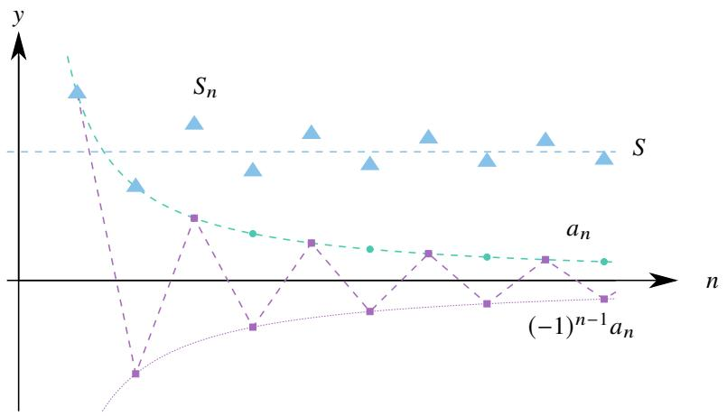  
图 1.3: Leibniz 级数示意图.

Leibniz 级数有很好的性质.

例 1.34 设 Leibniz 级数

$$
\sum_ {n = 1} ^ {\infty} (- 1) ^ {n - 1} a _ {n}.
$$

若它的和为 ??. 则 $| S _ { n } - S | \leq a _ { n + 1 }$ .

证明 由于 $\left\{ S _ { 2 n } \right\}$ 单调递增, 而

$$
S _ {2 n + 1} = S _ {2 n - 1} - \left(a _ {2 n} - a _ {2 n + 1}\right) \leq S _ {2 n - 1}, \quad n = 1, 2, \dots .
$$

因此 $\{ S _ { 2 n + 1 } \}$ 单调递减. 这表明 $\{ S _ { n } \}$ 的偶子列各项在 ?? 的左侧, 奇子列各项在 ?? 的右侧, 因此

$$
\left| S _ {n} - S \right| \leq \left| S _ {n} - S _ {n + 1} \right| = \left| a _ {n + 1} \right| = a _ {n + 1}.
$$

用以上结论在估计 Leibniz 部分和的误差时很有用.

# 1.2.2 Dirichlet 判别法与 Able 判别法

接下来我们来讨论通项形如 $\{ a _ { n } b _ { n } \}$ 的一般项级数. 为此我们先来讨论一下数列 $\{ a _ { n } b _ { n } \}$ 的部分和.

# 定理 1.17 (Abel 分部求和公式)

设数列 {???? }, $\{ b _ { k } \}$ . 则对任一 $n \in \mathbb { N } ^ { * }$ 都有

$$
\sum_ {k = 1} ^ {n} a _ {k} b _ {k} = S _ {n} b _ {n} - \sum_ {k = 1} ^ {n - 1} S _ {k} \left(b _ {k + 1} - b _ {k}\right).
$$

其中 $S _ { k } = a _ { 1 } + \cdots + a _ { k }$

证明 令 $S _ { 0 } = 0 .$ . 则 $a _ { k } = S _ { k } - S _ { k - 1 }$ $k = 1 , 2 , \cdots )$ . 于是

$$
\sum_ {k = 1} ^ {n} a _ {k} b _ {k} = \sum_ {k = 1} ^ {n} (S _ {k} - S _ {k - 1}) b _ {k} = \sum_ {k = 1} ^ {n} S _ {k} b _ {k} - \sum_ {k = 1} ^ {n} S _ {k - 1} b _ {k} = \sum_ {k = 1} ^ {n} S _ {k} b _ {k} - \sum_ {k = 0} ^ {n - 1} S _ {k} b _ {k + 1} = S _ {n} b _ {n} - \sum_ {k = 1} ^ {n - 1} S _ {k} (b _ {k + 1} - b _ {k}).
$$

注 若令 $\Delta S _ { k } = S _ { k } - S _ { k - 1 } = a _ { k }$ , $\Delta b _ { k } = b _ { k + 1 } - b _ { k }$ , 则以上公式可以写成

$$
\sum_ {k = 1} ^ {n} b _ {k} \Delta S _ {k} = S _ {k} b _ {k} \left| _ {0} ^ {n} - \sum_ {k = 1} ^ {n - 1} S _ {k} \Delta b _ {k}. \right.
$$

这个公式在形式上与 Riemann 积分的分部积分公式很相似

$$
\int_ {a} ^ {b} u (x) \mathrm {d} v (x) = v (x) u (x) \left| _ {a} ^ {b} - \int_ {a} ^ {b} v (x) \mathrm {d} u (x). \right.
$$

因此以上公式也称为数列的 Abel 分部求和公式.

要讨论通项为 $\left\{ a _ { n } b _ { n } \right\}$ 的级数的敛散性, 先要讨论它的部分和有界的条件.

# 定理 1.18 (级数的 Abel 引理)

设数列 $\left\{ a _ { n } \right\}$ , $\left\{ b _ { n } \right\}$ . 若满足

$1 ^ { \circ } ~ \{ b _ { n } \}$ 是一个单调数列.  
$2 ^ { \circ } \ \textstyle \sum _ { k = 1 } ^ { n } a _ { k }$ 有界, 即存在 $M > 0$ 使得 $\begin{array} { r } { \left| \sum _ { k = 1 } ^ { n } a _ { k } \right| \leq M \left( n = 1 , 2 , \cdot \cdot \cdot \right) } \end{array}$

则

$$
\left| \sum_ {k = 1} ^ {n} a _ {k} b _ {k} \right| \leq M (| b _ {1} | + 2 | b _ {n} |).
$$

证明 由于存在 $M > 0$ 使得 $\vert S _ { k } \vert \le M \left( k = 1 , 2 , \cdot \cdot \cdot \right)$ $| S _ { k } | \le M$ , 由 Abel 分部求和公式可知

$$
\left| \sum_ {k = 1} ^ {n} a _ {k} b _ {k} \right| = \left| \sum_ {k = 1} ^ {n - 1} S _ {k} \left(b _ {k} - b _ {k + 1}\right) + S _ {n} b _ {n} \right| \leq \sum_ {k = 1} ^ {n - 1} \left| S _ {k} \right| \left| b _ {k} - b _ {k + 1} \right| + \left| S _ {n} \right| \left| b _ {n} \right| \leq M \left(\sum_ {k = 1} ^ {n - 1} \left| b _ {k} - b _ {k + 1} \right| + \left| b _ {n} \right|\right).
$$

若 $\{ b _ { k } \}$ 单调递减, 则

$$
\sum_ {k = 1} ^ {n - 1} \left| b _ {k} - b _ {k + 1} \right| = \sum_ {k = 1} ^ {n - 1} \left(b _ {k} - b _ {k + 1}\right) = b _ {1} - b _ {n} = \left| b _ {1} - b _ {n} \right|.
$$

若 $\{ b _ { k } \}$ 单调递增, 则

$$
\sum_ {k = 1} ^ {n - 1} \left| b _ {k} - b _ {k + 1} \right| = \sum_ {k = 1} ^ {n - 1} \left(b _ {k + 1} - b _ {k}\right) = b _ {n} - b _ {1} = \left| b _ {1} - b _ {n} \right|.
$$

于是可知

$$
\left| \sum_ {k = 1} ^ {n} a _ {k} b _ {k} \right| \leq M \left(\left| b _ {1} - b _ {n} \right| + \left| b _ {n} \right|\right) \leq M \left(\left| b _ {1} \right| + 2 \left| b _ {n} \right|\right).
$$

Abel引理告诉我们,若要数列 $\{ a _ { k } b _ { k } \}$ 的部分和有界只需 $\{ a _ { k } \}$ 的部分和有界且 $\{ b _ { k } \}$ 单调.在这个基础上可以得到以下重要判别法.

# 定理 1.19 (数项级数的 Dirichlet 判别法)

设级数 $\textstyle \sum _ { n = 1 } ^ { \infty } a _ { n } b _ { n }$ . 若满足

1◦ $\left\{ b _ { n } \right\}$ 单调趋于零.   
$2 ^ { \circ } \ \textstyle \sum _ { k = 1 } ^ { n } a _ { k }$ 有界, 即存在 $M > 0$ 使得 $\begin{array} { r } { \left| \sum _ { k = 1 } ^ { n } a _ { k } \right| \leq M \left( n = 1 , 2 , \cdot \cdot \cdot \right) } \end{array}$

则级数 $\textstyle \sum _ { n = 1 } ^ { \infty } a _ { n } b _ { n }$ 收敛.

证明 由 $2 ^ { \circ }$ 可知, 对于任一 ??, $n \in \mathbb { N } ^ { * }$ $( m < n )$ 都有

$$
\left| \sum_ {k = m + 1} ^ {n} a _ {k} \right| = \left| \sum_ {k = 1} ^ {n} a _ {k} - \sum_ {k = 1} ^ {m} a _ {k} \right| \leq \left| \sum_ {k = 1} ^ {n} a _ {k} \right| + \left| \sum_ {k = 1} ^ {m} a _ {k} \right| \leq 2 M.
$$

由于 $\{ b _ { k } \}$ 是一个单调数列, 由 Abel 引理可知

$$
\left| \sum_ {k = m + 1} ^ {n} a _ {k} b _ {k} \right| \leq 2 M \left(\left| b _ {m + 1} \right| + 2 \left| b _ {n} \right|\right).
$$

由于 $b _ { n } \to 0$ , 故对于任一 $\varepsilon > 0$ 存在 $N \in \mathbb { N } ^ { * }$ 使得当 $m > N$ 时 $| b _ { m } | < \varepsilon / ( 6 M )$ . 于是当 $m > N$ 时

$$
\left| \sum_ {k = m + 1} ^ {n} a _ {k} b _ {k} \right| \leq 2 M \left(\left| b _ {m + 1} \right| + 2 \left| b _ {n} \right|\right) <   2 M \cdot \frac {3 \varepsilon}{6 M} = \varepsilon .
$$

由 Cauchy 收敛原理可知级数 $\scriptstyle \sum _ { k = 1 } ^ { \infty } a _ { k } b _ { k }$ 收敛.

用 Dirichlet 判别法可以很容易知道 Leibniz 级数收敛.

例 1.35 设交错级数收敛

$$
\sum_ {n = 1} ^ {\infty} (- 1) ^ {n - 1} a _ {n}.
$$

若 $\left\{ a _ { n } \right\}$ 递减趋于零. 则级数收敛.

证明 令 $b _ { n } = ( - 1 ) ^ { n - 1 }$ $( n = 1 , 2 , \cdots )$ . 显然 $\begin{array} { r } { \left| \sum _ { k = 1 } ^ { n } b _ { k } \right| \leq 1 } \end{array}$ . 由于 $\left\{ a _ { n } \right\}$ 递减趋于零, 由 Dirichlet 判别可知原级数收敛. ■

下面看一个例子.

例 1.36 判断以下级数的敛散性:

$$
\sum_ {n = 1} ^ {\infty} \frac {\cos n x}{n}.
$$

解 (i) 当 $x \neq 2 k \pi$ 时. 设 $a _ { n } = \cos n x$ , $b _ { n } = 1 / n$ $\mathbf { \Phi } _ { n } = 1 , 2 , \cdots )$ ). 由积化和差公式可知

$$
2 \sin \frac {x}{2} \cos k x = \sin \left(k + \frac {1}{2}\right) x - \sin \left(k - \frac {1}{2}\right) x, \quad k = 1, 2, \dots , n.
$$

把上式从 $k = 1$ 到 $k = n$ 叠加得

$$
2 \sin \frac {x}{2} \sum_ {k = 1} ^ {n} \cos k x = \sin \left(n + \frac {1}{2}\right) x - \sin \frac {x}{2}.
$$

于是

$$
\left| \sum_ {k = 1} ^ {n} \cos k x \right| = \left| \frac {\sin \left(n + \frac {1}{2}\right) x - \sin \frac {x}{2}}{2 \sin \frac {x}{2}} \right| \leq \frac {\left| \sin \left(n + \frac {1}{2}\right) x \right| + \left| \sin \frac {x}{2} \right|}{2 \left| \sin \frac {x}{2} \right|} \leq \frac {1}{\left| \sin \frac {x}{2} \right|}.
$$

因此 $\left\{ a _ { n } \right\}$ 的部分和有界. 由于 $\left\{ b _ { n } \right\}$ 单调递减趋于零, 由 Dirichlet 判别法可知, 原级数收敛.

(ii) 当 $x = 2 k \pi$ 时原级数为 $\textstyle \sum _ { n = 1 } ^ { \infty } 1 / n$ , 故原级数发散.

注 以上级数定义了一个函数, 定义域为 $\mathbb { R } \backslash \{ 2 k \pi \} ( k \in \mathbb { Z } )$ .

注 类似上例, 当 $x \neq 2 k \pi$ 时, 还有类似的不等式:

$$
\left| \sum_ {k = 1} ^ {n} \sin k x \right| = \left| \frac {\cos \frac {x}{2} - \cos \left(n + \frac {1}{2}\right) x}{2 \sin \frac {x}{2}} \right| \leq \frac {1}{\left| \sin \frac {x}{2} \right|}.
$$

把 Dirichlet 判别法的两个条件稍加调整, 可以得到 Abel判别法.

# 定理 1.20 (数项级数的 Abel 判别法)

设级数 $\textstyle \sum _ { n = 1 } ^ { \infty } a _ { n } b _ { n }$ . 若

1 ◦ $\left\{ b _ { n } \right\}$ 单调有界.

$2 ^ { \circ } \ \sum _ { n = 1 } ^ { \infty } a _ { n }$

则级数 $\scriptstyle \sum _ { k = 1 } ^ { \infty } a _ { k } b _ { k }$ 收敛.

证明 证法一 由于 $\{ b _ { k } \}$ 单调有界, 因此 $\{ b _ { k } \}$ 收敛. 设 $b _ { k } \to b$ . 因此 $\{ b _ { k } - b \}$ 单调趋于零. 由于 $\textstyle \sum _ { k = 1 } ^ { \infty } a _ { k }$ 收敛, 故

$\textstyle \sum _ { k = 1 } ^ { \infty } a _ { k }$ 有界. 于是由 Dirichlet 判别法可知 $\scriptstyle \sum _ { k = 1 } ^ { \infty } a _ { k } ( b _ { k } - b )$ 收敛. 由于

$$
\sum_ {k = 1} ^ {\infty} a _ {k} b _ {k} = \sum_ {k = 1} ^ {\infty} a _ {k} (b _ {k} - b) + b \sum_ {k = 1} ^ {\infty} a _ {k}.
$$

且 $\textstyle \sum _ { k = 1 } ^ { \infty } a _ { k }$ 收敛. 于是可知 $\scriptstyle \sum _ { k = 1 } ^ { \infty } a _ { k } b _ { k }$ 收敛.

证法二 设 $| b _ { n } | \leq M$ $( n = 1 , 2 , \cdots )$ . 由于 $\textstyle \sum _ { n = 1 } ^ { \infty } a _ { n }$ 在 $I$ 上收敛, 由 Cauchy 收敛原理可知, 对于任一 $\varepsilon > 0$ 都存在 $N \in \mathbb { N } ^ { * }$ 使得当 ??, ?? > ?? $( m < n )$ 时

$$
\left| \sum_ {k = m + 1} ^ {n} a _ {n} \right| <   \frac {\varepsilon}{3 M}.
$$

由 Abel 引理可知

$$
\left| \sum_ {k = m + 1} ^ {n} a _ {n} b _ {n} \right| \leq \frac {\varepsilon}{3 M} \left(\left| b _ {m + 1} \right| + 2 \left| b _ {n} \right|\right) <   \varepsilon .
$$

由 Cauchy 收敛原理可知, 级数 $\textstyle \sum _ { n = 1 } ^ { \infty } a _ { n } b _ { n }$ 在 $I$ 上一致收敛.

注 从证法一可以看出 Abel 判别法可以看作 Dirichlet 判别法的推论.

Dirichlet 判别法和 Abel判别法的的两个条件互有强弱. 使用时需要针对具体问题来选择.

例 1.37 设级数 $\textstyle \sum _ { n = 1 } ^ { \infty } b _ { n }$ 收敛. 则以下级数收敛

$$
\sum_ {n = 1} ^ {\infty} \frac {n ^ {\alpha}}{n ^ {\alpha} + 1} b _ {n}, \quad \alpha > \geq 0.
$$

证明 把级数拆成两部分:

$$
\sum_ {n = 1} ^ {\infty} \frac {n ^ {\alpha}}{n ^ {\alpha} + 1} b _ {n} = \sum_ {n = 1} ^ {\infty} b _ {n} - \sum_ {n = 1} ^ {\infty} \frac {b _ {n}}{n ^ {\alpha} + 1}.
$$

只需证明第二部分收敛. 由于 $1 / ( n ^ { \alpha } + 1 )$ 单调有界且 $\textstyle \sum _ { n = 1 } ^ { \infty } b _ { n }$ 收敛, 由 Ablel 判别法可知, 级数 $\textstyle \sum _ { n = 1 } ^ { \infty } b _ { n } / ( n ^ { \alpha } + 1 )$ 收敛. 于是可知原级数也收敛. ■

例 1.38 判断以下级数的敛散性:

$$
\sum_ {n = 1} ^ {\infty} \frac {\cos 3 n}{n} \left(1 + \frac {1}{n}\right) ^ {n}.
$$

解 由例1.36可知 ${ \textstyle \sum _ { n = 1 } ^ { \infty } ( \cos 3 n ) / n }$ 收敛. 而数列 $\{ ( 1 + 1 / n ) ^ { n } \}$ 单调有界. 由 Abel 判别法可知原级数收敛.

例 1.39 判断以下级数的敛散性:

$$
\sum_ {n = 1} ^ {\infty} (- 1) ^ {n - 1} \frac {\sin^ {2} n}{n}.
$$

解 由于 $\sin ^ { 2 } n = ( 1 - \cos 2 n ) / 2$ . 因此只需分别研究

$$
\sum_ {n = 1} ^ {\infty} (- 1) ^ {n - 1} \frac {1}{n}, \quad \sum_ {n = 1} ^ {\infty} (- 1) ^ {n - 1} \frac {\cos 2 n}{n}.
$$

由于 $\{ 1 / n \}$ 递减趋于零, 由 Leibniz 判别法可知级数 $\scriptstyle \sum _ { n = 1 } ^ { \infty } ( - 1 ) ^ { n - 1 } ( 1 / n )$ 收敛. 由于

$$
\sum_ {n = 1} ^ {\infty} (- 1) ^ {n - 1} \frac {\cos 2 n}{n} = - \sum_ {n = 1} ^ {\infty} \frac {\cos (2 n + n \pi)}{n} = - \sum_ {n = 1} ^ {\infty} \frac {\cos n (2 + \pi)}{n}.
$$

由例1.36可知级数以上级数也收敛. 于是可知原级数收敛.

注 上例中的交错级数收敛但 $\frac { \sin ^ { 2 } n } { n }$ 并非单调递减, 这表明 Leibniz 判别法不是交错级数收敛的必要条件.

# 1.2.3 级数的重排

由 Cauchy 收敛原理不难得到以下结论.

# 定理 1.21

若级数 $\textstyle \sum _ { n = 1 } ^ { \infty } \left| a _ { n } \right|$ 收敛, 则级数 $\textstyle \sum _ { n = 1 } ^ { \infty } a _ { n }$ 也收敛.

证明 若 $\textstyle \sum _ { n = 1 } ^ { \infty } \left| a _ { n } \right|$ 收敛, 由 Cauchy 收敛原理可知, 对于任一 $\varepsilon > 0$ 都存在 $N \in \mathbb { N } ^ { * }$ 使得当 $m , n > N$ 时

$$
\left| a _ {m + 1} \right| + \dots + \left| a _ {n} \right| <   \varepsilon .
$$

由三角不等式可知

$$
\left| a _ {m + 1} + \dots + a _ {n} \right| \leq \left| a _ {m + 1} \right| + \dots + \left| a _ {n} \right| <   \varepsilon .
$$

Cauchy 收敛原理可知 $\textstyle \sum _ { n = 1 } ^ { \infty } a _ { n }$ 也收敛.

根据以上结论, 可以把收敛的级数分为两种.

# 定义 1.3 (级数的绝对收敛和条件收敛)

设级数 $\textstyle \sum _ { n = 1 } ^ { \infty } a _ { n }$ 收敛.

(1) 若 $\textstyle \sum _ { n = 1 } ^ { \infty } \left| a _ { n } \right|$ 也收敛, 则称 $\textstyle \sum _ { n = 1 } ^ { \infty } a _ { n }$ 绝对收敛 (absolutely convergent).   
(2) 若 $\textstyle \sum _ { n = 1 } ^ { \infty } \left| a _ { n } \right|$ 发散, 则称 $\textstyle \sum _ { n = 1 } ^ { \infty } a _ { n }$ 条件收敛 (conditionally convergent).

容易知道以下级数都是条件收敛的:

$$
\sum_ {n = 1} ^ {\infty} (- 1) ^ {n - 1} \frac {1}{n}, \quad \sum_ {n = 1} ^ {\infty} (- 1) ^ {n - 1} \frac {1}{\sqrt {n}}, \quad \sum_ {n = 2} ^ {\infty} (- 1) ^ {n - 1} \frac {1}{\ln n}, \quad \sum_ {n = 2} ^ {\infty} (- 1) ^ {n - 1} \frac {1}{n \ln n}.
$$

因为它们都是满足 Leibniz 条件的收敛交错级数. 但它们对应的正项级数都发散:

$$
\sum_ {n = 1} ^ {\infty} \frac {1}{n}, \quad \sum_ {n = 1} ^ {\infty} \frac {1}{\sqrt {n}}, \quad \sum_ {n = 2} ^ {\infty} \frac {1}{\ln n}, \quad \sum_ {n = 2} ^ {\infty} \frac {1}{n \ln n}, \quad \sum_ {n = 2} ^ {\infty} \frac {1}{n \ln n \ln \ln n}.
$$

例 1.40 以下级数条件收敛

$$
\sum_ {n = 1} ^ {\infty} (- 1) ^ {n} \frac {\sin^ {2} n}{n}.
$$

证明 由例1.39可知原级数收敛. 由例1.36可知 $\scriptstyle \sum _ { n = 1 } ^ { \infty } ( \cos 2 n ) / n$ 收敛. 假设 $\scriptstyle \sum _ { n = 1 } ^ { \infty } \left( \sin ^ { 2 } n \right) / n$ 收敛, 由于

$$
\sum_ {n = 1} ^ {\infty} \frac {\sin^ {2} n}{n} + \frac {1}{2} \sum_ {n = 1} ^ {\infty} \frac {\cos 2 n}{n} = \frac {1}{2} \sum_ {n = 1} ^ {\infty} \frac {1}{n}.
$$

因此 $\textstyle \sum _ { n = 1 } ^ { \infty } 1 / n$ 收敛, 这是不可能的, 因此假设不成立. 于是可知 $\scriptstyle \sum _ { n = 1 } ^ { \infty } \left( \sin ^ { 2 } n \right) / n$ 发散. 这表明原级数条件收敛.

我们已经知道级数有结合性.但我们尚未研究它的交换性.如果我们只交换级数中有限多项的次序,那么既不会改变级数的敛散性, 也不会改变级数的和. 但如果交换无穷多项的次序, 情况就比较复杂了.

# 定义 1.4 (级数的重排)

设级数 $\textstyle \sum _ { n = 1 } ^ { \infty } a _ { n }$ . 令

$$
a _ {n} ^ {\prime} = a _ {\varphi (n)}, \quad n = 1, 2, \dots .
$$

若 $\varphi$ 是 N 到自身的一个双射, 则称原级数作了一次重排 (rearrangement) 后得到了新级数 $\textstyle \sum _ { n = 1 } ^ { \infty } a _ { n } ^ { \prime }$

从级数重排的角度看, 绝对收敛和条件收敛有着根本上的差别.

# 定理 1.22 (绝对收敛级数的重排)

设绝对收敛的级数 $\textstyle \sum _ { n = 1 } ^ { \infty } a _ { n }$ . 则任一重排后得到的级数 $\textstyle \sum _ { n = 1 } ^ { \infty } b _ { n }$ 仍然绝对收敛, 且

$$
\sum_ {n = 1} ^ {\infty} a _ {n} = \sum_ {n = 1} ^ {\infty} b _ {n}.
$$

证明 (i) 设 $\textstyle \sum _ { n = 1 } ^ { \infty } a _ { n }$ 是一个收敛的正项级数. 显然有

$$
\sum_ {n = 1} ^ {N} b _ {n} \leq \sum_ {n = 1} ^ {\infty} a _ {n}.
$$

因此 $\textstyle \sum _ { n = 1 } ^ { \infty } b _ { n }$ 收敛, 且

$$
\sum_ {n = 1} ^ {\infty} b _ {n} \leq \sum_ {n = 1} ^ {\infty} a _ {n}.
$$

反之 $\textstyle \sum _ { n = 1 } ^ { \infty } a _ { n }$ 可以看作 $\textstyle \sum _ { n = 1 } ^ { \infty } b _ { n }$ 重排后得到的, 因此可以同理得到

$$
\sum_ {n = 1} ^ {\infty} a _ {n} \leq \sum_ {n = 1} ^ {\infty} b _ {n}.
$$

于是可知 $\textstyle \sum _ { n = 1 } ^ { \infty } b _ { n }$ 收敛, 且

$$
\sum_ {n = 1} ^ {\infty} a _ {n} = \sum_ {n = 1} ^ {\infty} b _ {n}.
$$

(ii) 设 $\textstyle \sum _ { n = 1 } ^ { \infty } a _ { n }$ 是一个绝对收敛的变号级数. 我们尝试把其中的正项和负项分离出来. 令

$$
a _ {n} ^ {+} = \frac {\left| a _ {n} \right| + a _ {n}}{2}, \quad a _ {n} ^ {-} = \frac {\left| a _ {n} \right| - a _ {n}}{2}, \quad n = 1, 2, \dots . \tag {1.7}
$$

即

$$
a _ {n} ^ {+} = \left\{ \begin{array}{l l} a _ {n}, & a _ {n} \geq 0 \\ 0, & a _ {n} <   0 \end{array} \right., \qquad a _ {n} ^ {-} = \left\{ \begin{array}{l l} - a _ {n}, & a _ {n} \leq 0 \\ 0, & a _ {n} > 0 \end{array} \right..
$$

这样就构造了两个正项级数 $\textstyle \sum _ { n = 1 } ^ { \infty } a _ { n } ^ { + }$ , ∑∞??=1 ??−?? . 由于

$$
0 \leq a _ {n} ^ {+} \leq | a _ {n} |, \quad 0 \leq a _ {n} ^ {-} \leq | a _ {n} |.
$$

且 $\textstyle \sum _ { n = 1 } ^ { \infty } \left| a _ { n } \right|$ 收敛, 由正项级数的比较判别法可知 $\textstyle \sum _ { n = 1 } ^ { \infty } a _ { n } ^ { + }$ , ∑∞??=1 ??−?? 都收敛, 且

$$
\sum_ {n = 1} ^ {\infty} a _ {n} = \sum_ {n = 1} ^ {\infty} a _ {n} ^ {+} - \sum_ {n = 1} ^ {\infty} a _ {n} ^ {-}.
$$

按同样的规则构造 $\textstyle \sum _ { n = 1 } ^ { \infty } b _ { n } ^ { + }$ 和 $\textstyle \sum _ { n = 1 } ^ { \infty } b _ { n } ^ { - }$ , 它们分别可以看作 $\textstyle \sum _ { n = 1 } ^ { \infty } a _ { n } ^ { + }$ 和 $\textstyle \sum _ { n = 1 } ^ { \infty } a _ { n } ^ { - }$ 重排后得到的. 由 (1) 的结论可知

$$
\sum_ {n = 1} ^ {\infty} b _ {n} ^ {+} = \sum_ {n = 1} ^ {\infty} a _ {n} ^ {+}, \quad \sum_ {n = 1} ^ {\infty} b _ {n} ^ {-} = \sum_ {n = 1} ^ {\infty} a _ {n} ^ {-}.
$$

由于 $\left| b _ { n } \right| = b _ { n } ^ { + } + b _ { n } ^ { - }$ , 故 $\scriptstyle \sum _ { n = 1 } ^ { \infty } | b _ { n } |$ 收敛, 即 $\textstyle \sum _ { n = 1 } ^ { \infty } b _ { n }$ 绝对收敛, 且

$$
\sum_ {n = 1} ^ {\infty} b _ {n} = \sum_ {n = 1} ^ {\infty} b _ {n} ^ {+} - \sum_ {n = 1} ^ {\infty} b _ {n} ^ {-} = \sum_ {n = 1} ^ {\infty} a _ {n} ^ {+} - \sum_ {n = 1} ^ {\infty} a _ {n} ^ {-} = \sum_ {n = 1} ^ {\infty} a _ {n}.
$$

根据以上定理, 我们可以通俗地说绝对收敛的级数满足 “交换律”, 绝对收敛的交换性是很有用的. 下面看一个例子.

例 1.41 设正项级数 $\textstyle \sum _ { n = 1 } ^ { \infty } 1 / a _ { n } .$ . 若该级数收敛, 则存在 $K > 0$ 使得对于任一正数列 $\left\{ a _ { n } \right\}$ 都有

$$
\sum_ {n = 1} ^ {\infty} \frac {n}{a _ {1} + a _ {2} + \cdots + a _ {n}} \leq K \sum_ {n = 1} ^ {\infty} \frac {1}{a _ {n}}.
$$

证明 (i) 当 $\left\{ a _ { n } \right\}$ 单调递增时, 有不等式

$$
a _ {1} + a _ {2} + \dots + a _ {2 n - 1} \geq a _ {n} + a _ {n + 1} + \dots + a _ {2 n - 1} \geq n a _ {n}.
$$

于是

$$
\frac {2 n - 1}{a _ {1} + a _ {2} + \cdots + a _ {2 n - 1}} + \frac {2 n}{a _ {1} + a _ {2} + \cdots + a _ {2 n}} \leq \frac {2 n - 1}{n a _ {n}} + \frac {2 n}{n a _ {n} + a _ {2 n}} <   \frac {2 n}{n a _ {n}} + \frac {2 n}{n a _ {n}} = \frac {4}{a _ {n}}.
$$

两边对 $n$ 求和得

$$
\sum_ {n = 1} ^ {N} \left(\frac {2 n - 1}{a _ {1} + a _ {2} + \cdots + a _ {2 n - 1}} + \frac {2 n}{a _ {1} + a _ {2} + \cdots + a _ {2 n}}\right) = \sum_ {n = 1} ^ {2 N} \frac {n}{a _ {1} + a _ {2} + \cdots + a _ {n}} \leq 4 \sum_ {n = 1} ^ {N} \frac {1}{a _ {n}}.
$$

令 $N \to \infty$ 即得

$$
\sum_ {n = 1} ^ {\infty} \frac {n}{a _ {1} + a _ {2} + \cdots + a _ {n}} \leq 4 \sum_ {n = 1} ^ {\infty} \frac {1}{a _ {n}}.
$$

(ii) 当 $\left\{ a _ { n } \right\}$ 为一个一般项数列时. 由于正项级数 $\textstyle \sum _ { n = 1 } ^ { \infty } 1 / a _ { n }$ 收敛, 故 $a _ { n } \to + \infty$ . 由于 $a _ { n } \to + \infty$ , 因此数列中必存在最小项, 取出这项作为第一项, 然后在剩余的项中再取出最小项, 依次下去可以得到一个单调递增的重排数列$\left\{ b _ { n } \right\}$ . 由于正项级数 $\textstyle \sum _ { n = 1 } ^ { \infty } 1 / a _ { n }$ 收敛, 故重排后的级数仍然收敛且它的和不变. 由 (i) 可知

$$
\sum_ {n = 1} ^ {\infty} \frac {n}{b _ {1} + b _ {2} + \cdots + b _ {n}} \leq 4 \sum_ {n = 1} ^ {\infty} \frac {1}{b _ {n}}.
$$

容易知道, 对于任一 $n \in \mathbb { N } ^ { * }$ 都有

$$
b _ {1} + b _ {2} + \dots + b _ {n} \leq a _ {1} + a _ {2} + \dots + a _ {n}.
$$

于是可知

$$
\sum_ {n = 1} ^ {\infty} \frac {n}{a _ {1} + a _ {2} + \cdots + a _ {n}} \leq \sum_ {n = 1} ^ {\infty} \frac {n}{b _ {1} + b _ {2} + \cdots + b _ {n}} \leq 4 \sum_ {n = 1} ^ {\infty} \frac {1}{b _ {n}} = 4 \sum_ {n = 1} ^ {\infty} \frac {1}{a _ {n}}.
$$

注 以上习题表明若正项级数 $\textstyle \sum _ { n = 1 } ^ { \infty } 1 / a _ { n }$ 收敛, 则不等式左边的级数也收敛. 进一步看到, 不等式左边级数的通项是 $1 / a _ { k }$ $( k = 1 , 2 , \cdots , n )$ 的调和平均.

绝对收敛级数重排定理的证明过程可知, 若 $\textstyle \sum _ { n = 1 } ^ { \infty } a _ { n }$ 条件收敛, 则 $\scriptstyle \sum _ { n = 1 } ^ { \infty } \left| a _ { n } \right| = + \infty$ , 由等式1.7可知

$$
\sum_ {n = 1} ^ {\infty} a _ {n} ^ {+} = \sum_ {n = 1} ^ {\infty} a _ {n} ^ {-} = + \infty .
$$

这是条件收敛和绝对收敛的关键区别, 由此可以证明以下重要定理.

# 定理 1.23 (Riemann 定理)

设级数 $\textstyle \sum _ { n = 1 } ^ { \infty } a _ { n }$ . 若级数条件收敛, 则对于任一给定的 $S \in { \overline { { \mathbb { R } } } }$ , 都存在一个重排后的新级数 $\sum _ { n = 1 } ^ { \infty } b _ { n }$ 满足

$$
\sum_ {n = 1} ^ {\infty} b _ {n} = S.
$$

证明 (i) 先证明 $S$ 为有限实数的情况, 不妨设 $S > 0 .$ . 令

$$
a _ {n} ^ {+} = \frac {\left| a _ {n} \right| + a _ {n}}{2}, \quad a _ {n} ^ {-} = \frac {\left| a _ {n} \right| - a _ {n}}{2}, \quad n = 1, 2, \dots .
$$

由于 $\textstyle \sum _ { n = 1 } ^ { \infty } a _ { n }$ 条件收敛, 故

$$
\sum_ {n = 1} ^ {\infty} a _ {n} ^ {+} = \sum_ {n = 1} ^ {\infty} a _ {n} ^ {-} = + \infty .
$$

下面来构造一个收敛到 $S$ 的级数.

由于 $\textstyle \sum _ { n = 1 } ^ { \infty } a _ { n } ^ { + } = + \infty$ , 因此当 $n$ 充分大时 $\textstyle \sum _ { i = 1 } ^ { n } a _ { i } ^ { + }$ 一定可以超过 ??. 于是可以从 $\left\{ a _ { n } ^ { + } \right\}$ 中依次取出 $a _ { 1 } ^ { + }$ , $a _ { 2 } ^ { + }$ , · · · ,

$a _ { k _ { 1 } } ^ { + }$ , 此时所取的各项之和恰好首次超过 ??, 即

$$
\sum_ {i = 1} ^ {k _ {1}} a _ {i} ^ {+} - a _ {k _ {1}} ^ {+} \leq S <   \sum_ {i = 1} ^ {k _ {1}} a _ {i} ^ {+} \Longleftrightarrow 0 <   \sum_ {i = 1} ^ {k _ {1}} a _ {i} ^ {+} - S \leq a _ {k _ {1}} ^ {+}.
$$

令 $\begin{array} { r } { A _ { 1 } ^ { + } = \sum _ { i = 1 } ^ { k _ { 1 } } a _ { i } ^ { + } } \end{array}$ , 则

$$
0 <   A _ {1} ^ {+} - S \leq a _ {k _ {1}} ^ {+}. \tag {1.8}
$$

令 $\begin{array} { r } { A _ { 1 } ^ { - } = \sum _ { i = 1 } ^ { l _ { 1 } } a _ { i } ^ { - } } \end{array}$ . 由于 $\textstyle \sum _ { n = 1 } ^ { \infty } a _ { n } ^ { - } = + \infty$ , 因此当 $n$ 充分大时总能使得 $A _ { 1 } ^ { + } - A _ { 1 } ^ { - }$ 小于 $S .$ 于是可以从 $\{ a _ { n } ^ { - } \}$ 中依次取出 $a _ { 1 } ^ { - } , a _ { 2 } ^ { - } , \cdots , a _ { l _ { 1 } } ^ { - }$ ${ a } _ { 1 } ^ { - }$ , 此时 $A _ { 1 } ^ { + } - A _ { 1 } ^ { - }$ 恰好首次小于 $S .$ , 即

$$
A _ {1} ^ {+} - A _ {1} ^ {-} <   S \leq A _ {1} ^ {+} - A _ {1} ^ {-} + a _ {l _ {1}} ^ {-} \Longleftrightarrow 0 <   S - \left(A _ {1} ^ {+} - A _ {1} ^ {-}\right) \leq a _ {l _ {1}} ^ {-} \tag {1.9}
$$

$\left\{ a _ { n } ^ { + } \right\}$ $\begin{array} { r } { A _ { 2 } ^ { + } = \sum _ { i = k _ { 1 } + 1 } ^ { k _ { 2 } } a _ { i } ^ { + } } \end{array}$

$$
A _ {1} ^ {+} - A _ {1} ^ {-} + A _ {2} ^ {+} - a _ {k _ {2}} ^ {+} \leq S <   A _ {1} ^ {+} - A _ {1} ^ {-} + A _ {2} ^ {+} \Longleftrightarrow 0 <   \left(A _ {1} ^ {+} - A _ {1} ^ {-} + A _ {2} ^ {+}\right) - S \leq a _ {k _ {2}} ^ {+}. \tag {1.10}
$$

不断重复以上操作, 就可以得到一个无穷级数

$$
A _ {1} ^ {+} - A _ {1} ^ {-} + A _ {2} ^ {+} - A _ {2} ^ {-} + \dots .
$$

设该级数的部分和为 $\{ S _ { n } \}$ . 由等式1.8,1.9,1.10可知 $\{ S _ { n } \}$ 应满足

$$
0 <   S _ {2 n - 1} - S \leq a _ {k _ {n}} ^ {+}, \quad 0 <   S - S _ {2 n} \leq a _ {l _ {n}} ^ {-}.
$$

由于 $\textstyle \sum _ { n = 1 } ^ { \infty } a _ { n }$ 收敛, 故 $a _ { n } \to 0$ , 因此 $\begin{array} { r } { \operatorname* { l i m } _ { n \to \infty } a _ { k _ { n } } ^ { + } = \operatorname* { l i m } _ { n \to \infty } a _ { l _ { n } } ^ { - } = 0 . } \end{array}$ . 令以上不等式中的 $n \to \infty$ , 由夹逼定理可知

$$
\lim  _ {n \rightarrow \infty} S _ {2 n - 1} = \lim  _ {n \rightarrow \infty} S _ {2 n - 1} = S.
$$

这表明 $\{ S _ { n } \}$ 的奇子列和偶子列都收敛于 ??, 于是可知 $S _ { n }  S .$ . 由于

$$
S = \left(a _ {1} ^ {+} + \dots + a _ {k _ {1}} ^ {+}\right) + \left(- a _ {1} ^ {-} - \dots - a _ {l _ {1}} ^ {-}\right) + \left(a _ {k _ {1} + 1} ^ {+} \dots + a _ {k _ {2}} ^ {+}\right) + \left(- a _ {l _ {1} + 1} ^ {-} - \dots - a _ {l _ {2}} ^ {-}\right) + \dots .
$$

其中每个括号内的各项符号都相同, 由命题1.4可知

$$
a _ {1} ^ {+} + \dots + a _ {k _ {1}} ^ {+} - a _ {1} ^ {-} - \dots - a _ {l _ {1}} ^ {-} + a _ {k _ {1} + 1} ^ {+} \dots + a _ {k _ {2}} ^ {+} - a _ {l _ {1} + 1} ^ {-} - \dots - a _ {l _ {2}} ^ {-} + \dots = S.
$$

这样我们就通过得到一个收敛于 $S$ 的级数, 它是 $\textstyle \sum _ { n = 1 } ^ { \infty } a _ { n }$ 重排后得到的.

(ii) 下面证明 $S$ 不是实数的情况, 不妨设 $S = + \infty$ . 下面构造趋向于 $+ \infty$ 的数列. 先从 $\left\{ a _ { n } ^ { + } \right\}$ 中依次取出若干项,使得

$$
a _ {1} + \dots + a _ {t _ {1}} > 1.
$$

然后减去 $\{ a _ { n } ^ { - } \}$ 中的第一项 $a _ { 1 } ^ { - }$ . 接着继续从 $\left\{ a _ { n } ^ { + } \right\}$ 中依次取出若干项, 使得

$$
a _ {1} + \dots + a _ {t _ {1}} - a _ {1} ^ {-} + a _ {t _ {1} + 1} + \dots + a _ {t _ {2}} > 2.
$$

然后减去 $\{ a _ { n } ^ { - } \}$ 中的第二项 ${ a } _ { 2 } ^ { - }$ . 接着继续从 $\left\{ a _ { n } ^ { + } \right\}$ 中依次取出若干项, 使得

$$
a _ {1} + \dots + a _ {t _ {1}} - a _ {1} ^ {-} + a _ {t _ {1} + 1} + \dots + a _ {t _ {2}} - a _ {2} ^ {-} + a _ {t _ {2} + 1} + \dots + a _ {t _ {3}} > 3.
$$

然后减去 $\{ a _ { n } ^ { - } \}$ 中的第三项 ${ a } _ { 3 } ^ { - }$ . 不断重复这个过程就可以得到一个新级数, 它是由原级数重排后得到的. 由于当$n$ 充分大时 $a _ { n } ^ { - }$ 可以任意小, 故当 $n$ 充分大时, 负项的出现并不影响级数部分和的增大, 因此构造的新级数趋向于$+ \infty$ . ■

# 例 1.42 设级数

$$
1 - \frac {1}{2} + \frac {1}{3} - \frac {1}{4} + \frac {1}{5} - \frac {1}{6} + \dots .
$$

按以下规则重排级数: 先依次取 $p$ 个正项, 然后依次取 $q$ 个负项, 再依次取 $p$ 个正项, 如此下去. 判断重排后所得的新级数是否收敛? 若收敛, 求级数的和.

解 设重排后的新级数为 $\textstyle \sum _ { n = 1 } ^ { \infty } a _ { n }$ . 对任意给定的 $N \in \mathbb { N } ^ { * }$ , 令 $m = [ N / ( p + q ) ]$ . 则

$$
m (p + q) \leq N <   (m + 1) (p + q).
$$

于是级数的前 $N$ 项部分和可以写成

$$
\sum_ {n = 1} ^ {N} a _ {n} = \sum_ {n = 1} ^ {m (p + q)} a _ {n} + \sum_ {n = m (p + q) + 1} ^ {N} a _ {n}. \tag {1.11}
$$

(i) 先估计等式1.11右边的第二个级数. 由于 $N - m ( p + q ) < p + q$ , 因此 $\textstyle \sum _ { n = m ( p + q ) } ^ { N } a _ { n }$ 总共不超过 $p + q$ 项. 当$N \to \infty$ 时 $m \to \infty$ , 因此当 $N \to \infty$ 时有

$$
\left| \sum_ {n = m (p + q) + 1} ^ {N} a _ {n} \right| \leq \sum_ {n = m (p + q) + 1} ^ {N} | a _ {n} | \leq (p + q) \cdot \frac {1}{m (p + q)} = \frac {1}{m} \rightarrow 0.
$$

(ii) 下面来处理等式1.11右边的第一个级数:

$$
\sum_ {n = 1} ^ {m (p + q)} a _ {n} = \sum_ {n = 1} ^ {m p} \frac {1}{2 n - 1} - \sum_ {n = 1} ^ {m q} \frac {1}{2 n}.
$$

由于

$$
\sum_ {k = 1} ^ {n} \frac {1}{k} = \ln n + \gamma + O \left(\frac {1}{n}\right),
$$

其中 ?? 是 ?????????? 常数. 因此

$$
\begin{array}{l} \sum_ {n = 1} ^ {m q} \frac {1}{2 n} = \frac {1}{2} \sum_ {n = 1} ^ {m q} \frac {1}{n} = \frac {1}{2} \ln (m q) + \frac {1}{2} \gamma + O \left(\frac {1}{m}\right). \\ \sum_ {n = 1} ^ {m p} \frac {1}{2 n - 1} = \sum_ {n = 1} ^ {2 m p} \frac {1}{n} - \sum_ {n = 1} ^ {m p} \frac {1}{2 n} = \ln (2 m p) + \gamma - \frac {1}{2} \ln (m p) - \frac {1}{2} \gamma + O \left(\frac {1}{m}\right) = \ln 2 + \frac {1}{2} \ln (m p) + \frac {1}{2} \gamma + O \left(\frac {1}{m}\right). \\ \end{array}
$$

因此

$$
\sum_ {n = 1} ^ {m (p + q)} a _ {n} = \sum_ {n = 1} ^ {m p} \frac {1}{2 n - 1} - \sum_ {n = 1} ^ {m q} \frac {1}{2 n} = \ln 2 + \frac {1}{2} \ln \frac {p}{q} + O \left(\frac {1}{m}\right).
$$

令等式1.11中的 $N \to \infty$ 可得

$$
\lim  _ {N \rightarrow \infty} \sum_ {n = 1} ^ {N} a _ {n} = \lim  _ {m \rightarrow \infty} \left(\sum_ {n = 1} ^ {m p} \frac {1}{2 n - 1} - \sum_ {n = 1} ^ {m q} \frac {1}{2 n}\right) = \ln 2 + \frac {1}{2} \ln \frac {p}{q}.
$$

于是可知新级数收敛, 且它的和为 $\ln 2 + [ \ln ( p / q ) ] / 2$ .

注 根据以上结果可以求出一些特殊级数的和. 当 $p = q = 1$ 时

$$
1 - \frac {1}{2} + \frac {1}{3} - \frac {1}{4} + \frac {1}{5} - \frac {1}{6} + \dots = \ln 2.
$$

当 $p = 1$ , $q = 2$ 时

$$
1 - \frac {1}{2} - \frac {1}{4} + \frac {1}{3} - \frac {1}{6} - \frac {1}{8} + \frac {1}{5} - \dots = \ln 2 + \frac {1}{2} \ln \frac {1}{2} = \frac {\ln 2}{2}.
$$

# 1.2.4 级数的乘法

我们中学时就已经会求两个和式的乘积:

$$
\left(\sum_ {i = 1} ^ {n} a _ {i}\right) \left(\sum_ {j = 1} ^ {m} b _ {j}\right) = \sum_ {i = 1} ^ {n} \sum_ {j = 1} ^ {m} a _ {i} b _ {j}.
$$

由于有限个数的加法满足交换律和结合律, 因此 $a _ { i } b _ { j }$ $( i = 1 , 2 , n \cdots ~ j = 1 , 2 , m \cdot \cdot \cdot )$ 可以按任意顺序相加, 因此有

$$
\left(\sum_{i = 1}^{n}a_{i}\right)\left(\sum_{j = 1}^{m}b_{j}\right) = \sum_{i = 1}^{n}\sum_{j = 1}^{m}a_{i}b_{j} = \sum_{j = 1}^{m}\sum_{i = 1}^{n}a_{i}b_{j} = \sum_{\substack{1\leq i\leq n\\ 1\leq j\leq m}}a_{i}b_{j}
$$

现在我们想研究两个无穷级数的乘积, 即 $\textstyle \left( \sum _ { n = 1 } ^ { \infty } a _ { n } \right) \left( \sum _ { n = 1 } ^ { \infty } b _ { n } \right)$ . 很自然地, 它应该是 $a _ { i } b _ { j }$ $( i , j = 1 , 2 , \cdots )$ 的和. 现在的问题是这些 $a _ { i } b _ { j }$ 应该以什么样的顺序相加. 我们可以把它们排成一个无穷矩阵

$$
\left[ \begin{array}{c c c c} a _ {1} b _ {1} & a _ {1} b _ {2} & a _ {1} b _ {3} & \dots \\ a _ {2} b _ {1} & a _ {2} b _ {2} & a _ {2} b _ {3} & \dots \\ a _ {3} b _ {1} & a _ {3} b _ {2} & a _ {3} b _ {3} & \dots \\ \vdots & \vdots & \vdots & \ddots \end{array} \right],
$$

$$
\left[ \begin{array}{c c c c} a _ {1} b _ {1} & a _ {1} b _ {2} & a _ {1} b _ {3} & \dots \\ a _ {2} b _ {1} & a _ {2} b _ {2} & a _ {2} b _ {3} & \dots \\ a _ {3} b _ {1} & a _ {3} b _ {2} & a _ {3} b _ {3} & \dots \\ \vdots & \vdots & \vdots & \ddots \end{array} \right]
$$

在研究如何把全体有理数排成一列时, 也遇到了类似问题. 有两种方案可以选择. 如图, 按 “三角形” 相加:

$$
a _ {1} b _ {1} + \left(a _ {1} b _ {2} + a _ {2} b _ {1}\right) + \left(a _ {1} b _ {3} + a _ {2} b _ {2} + a _ {3} b _ {1}\right) + \dots .
$$

也可以按 “方形” 相加:

$$
a _ {1} b _ {1} + \left(a _ {1} b _ {2} + a _ {2} b _ {2} + a _ {2} b _ {1}\right) + \left(a _ {1} b _ {3} + a _ {2} b _ {3} + a _ {3} b _ {3} + a _ {3} b _ {2} + a _ {3} b _ {1}\right) + \dots .
$$

我们将看到第一种按 “三角形” 相加的方式得到的乘积 “性质较好”.

# 定义 1.5 (Cauchy 乘积)

设级数 $\textstyle \sum _ { n = 1 } ^ { \infty } a _ { n } , \sum _ { n = 1 } ^ { \infty } b _ { n } .$ . 令

$$
\sum_ {n = 1} ^ {\infty} c _ {n} := \sum_ {n = 1} ^ {\infty} \sum_ {i + j = n + 1} a _ {i} b _ {j}.
$$

我们称 $\sum _ { n = 1 } ^ { \infty } c _ { n }$ 为 $\textstyle \sum _ { n = 1 } ^ { \infty } a _ { n }$ 和 $\sum _ { n = 1 } ^ { \infty } b _ { n }$ 的 Cauchy 乘积 (Cauchy product).

若两个级数收敛, 我们希望它们的乘积恰好等于它们和的乘积, 而与它们的乘积相加方式无关. 要做到这一点, 仅仅收敛还不够, 需要绝对收敛.

# 定理 1.24 (Cauchy 定理)

设级数 $\textstyle \sum _ { n = 1 } ^ { \infty } a _ { n } , \sum _ { n = 1 } ^ { \infty } b _ { n }$ 都绝对收敛. 若它们的和分别为 $A , B$ . 则 $a _ { i } b _ { j }$ $( i , j = 1 , 2 , \cdots )$ 按任意方式相加所得的级数都是绝对收敛的, 且它的和为 ????.

证明 任意给定一种 $a _ { i } b _ { j }$ $( i , j = 1 , 2 , \cdots )$ 的排列, 把这个排列记作 $a _ { i _ { k } } b _ { j _ { k } }$ $( k = 1 , 2 , \cdots )$ . 对于给定的 $n$ , 令

$$
N = \max  \left\{i _ {1}, \dots , i _ {n}, j _ {1}, \dots , j _ {n} \right\}.
$$

由于 $\textstyle \sum _ { n = 1 } ^ { \infty } a _ { n } , \sum _ { n = 1 } ^ { \infty } b _ { n }$ 都绝对收敛, 于是

$$
\sum_ {k = 1} ^ {n} \left| a _ {i _ {k}} b _ {j _ {k}} \right| \leq \left(\sum_ {i = 1} ^ {N} \left| a _ {i} \right|\right) \left(\sum_ {j = 1} ^ {N} \left| b _ {j} \right|\right) \leq \left(\sum_ {n = 1} ^ {\infty} \left| a _ {n} \right|\right) \left(\sum_ {n = 1} ^ {\infty} \left| b _ {n} \right|\right).
$$

因此 $\textstyle \sum _ { n = 1 } ^ { \infty } a _ { i _ { n } } b _ { j _ { n } }$ 绝对收敛. 由级数重排定理可知任意改变该级数各项的次序它的和不变. 现在按 “方形” 相加的方式重新排列该级数, 就得到

$$
\sum_ {n = 1} ^ {\infty} a _ {i _ {n}} b _ {j _ {n}} = \lim  _ {N \rightarrow \infty} \left(\sum_ {i = 1} ^ {N} a _ {i}\right)\left(\sum_ {j = 1} ^ {N} b _ {j}\right) = \left(\sum_ {n = 1} ^ {\infty} a _ {n}\right)\left(\sum_ {n = 1} ^ {\infty} b _ {n}\right) = A B.
$$

以上定理中的条件只是充分条件.

例 1.43 设级数

$$
1 - \sum_ {n = 1} ^ {\infty} \left(\frac {3}{2}\right) ^ {n}, \quad 1 + \sum_ {n = 1} ^ {\infty} \left(\frac {3}{2}\right) ^ {n - 1} \left(2 ^ {n} + \frac {1}{2 ^ {n + 1}}\right).
$$

这两个级数发散, 但它们的 Cauchy 乘积绝对收敛.

设级数

$$
\sum_ {n = 0} ^ {\infty} \frac {x ^ {n}}{n !}, \quad x \in \mathbb {R}.
$$

则对于任一 $x \in \mathbb { R }$ 都有

$$
\lim  _ {n \rightarrow \infty} \frac {\left| x ^ {n + 1} / (n + 1) ! \right|}{\left| x ^ {n} / n ! \right|} = \lim  _ {n \rightarrow \infty} \frac {| x |}{n + 1} = 0.
$$

由正项级数的 D’Alembert 判别法可知, 级数 $\textstyle \sum _ { n = 0 } ^ { \infty } { \frac { x ^ { n } } { n ! } }$ 对于任一 $x \in \mathbb { R }$ 都绝对收敛. 因此这个级数定义了一个函数(事实上就是指数函数). 令

$$
\exp x := \sum_ {n = 0} ^ {\infty} \frac {x ^ {n}}{n !}.
$$

用级数乘法的知识可以验证以上定义的指数函数的乘法定理.

例 1.44 exp ?? exp ?? = exp(?? + ??).

证明 exp ?? exp ?? 的 Cauchy 乘积通项为

$$
\sum_ {k = 0} ^ {n} \frac {1}{k ! (n - k) !} x ^ {k} y ^ {n - k} = \frac {1}{n !} \sum_ {k = 0} ^ {n} C _ {n} ^ {k} x ^ {k} y ^ {n - k} = \frac {(x + y) ^ {n}}{n !}.
$$

于是可知

$$
\exp x \exp y = \sum_ {n = 0} ^ {\infty} \sum_ {k = 0} ^ {n} \frac {1}{k ! (n - k) !} x ^ {k} y ^ {n - k} = \sum_ {k = 0} ^ {\infty} \frac {(x + y) ^ {n}}{n !} = \exp (x + y).
$$

例 1.45 令

$$
C (x) := \sum_ {n = 0} ^ {\infty} (- 1) ^ {n} \frac {x ^ {2 n}}{(2 n) !}, \qquad S (x) := \sum_ {n = 0} ^ {\infty} (- 1) ^ {n} \frac {x ^ {2 n + 1}}{(2 n + 1) !}.
$$

显然以上两个级数对于任一 $x \in \mathbb { R }$ 都绝对收敛, 因此它们分别定义了两个定义域为 $\mathbb { R }$ 的函数. 求证这两个函数满足:

$$
C (x + y) = C (x) C (y) - S (x) S (y),
$$

$$
S (x + y) = S (x) C (y) + C (x) S (y).
$$

证明 (i) $C ( x )$ 和 $S ( x )$ 都绝对收敛, 用 Cauchy 乘积计算:

$$
\begin{array}{l} C (x) C (y) - S (x) S (y) = \sum_ {n = 0} ^ {\infty} \sum_ {i + j = n} (- 1) ^ {n} \frac {x ^ {2 i}}{(2 i) !} \frac {y ^ {2 j}}{(2 j) !} - \sum_ {n = 0} ^ {\infty} \sum_ {i + j = n} (- 1) ^ {n} \frac {x ^ {2 i + 1}}{(2 i + 1) !} \frac {x ^ {2 j + 1}}{(2 j + 1) !} \\ = \sum_ {n = 0} ^ {\infty} \sum_ {i + j = n} (- 1) ^ {n} \frac {x ^ {2 i}}{(2 i) !} \frac {y ^ {2 j}}{(2 j) !} - \sum_ {n = 0} ^ {\infty} \sum_ {i + j = n + 1} (- 1) ^ {n} \frac {x ^ {2 i + 1}}{(2 i + 1) !} \frac {x ^ {2 j - 1}}{(2 j - 1) !} \\ = \sum_ {n = 1} ^ {\infty} \sum_ {i + j = n} (- 1) ^ {n} \frac {x ^ {2 i}}{(2 i) !} \frac {y ^ {2 j}}{(2 j) !} + \sum_ {n = 1} ^ {\infty} \sum_ {i + j = n} (- 1) ^ {n} \frac {x ^ {2 i + 1}}{(2 i + 1) !} \frac {x ^ {2 j - 1}}{(2 j - 1) !} \\ = \sum_ {n = 1} ^ {\infty} (- 1) ^ {n} \sum_ {i + j = n} \left[ \frac {x ^ {2 i}}{(2 i) !} \frac {y ^ {2 j}}{(2 j) !} + \frac {x ^ {2 i + 1}}{(2 i + 1) !} \frac {x ^ {2 j - 1}}{(2 j - 1) !} \right] \\ = \sum_ {n = 1} ^ {\infty} (- 1) ^ {n} \frac {(x + y) ^ {2 n}}{(2 n) !} = \sum_ {n = 0} ^ {\infty} (- 1) ^ {n} \frac {(x + y) ^ {2 n}}{(2 n) !} = C (x + y). \\ \end{array}
$$

$$
\begin{array}{l} S (x) C (y) + C (x) S (y) = \sum_ {n = 0} ^ {\infty} \sum_ {i + j = n} (- 1) ^ {n} \frac {x ^ {2 i + 1}}{(2 i + 1) !} \frac {y ^ {2 j}}{(2 j) !} + \sum_ {n = 0} ^ {\infty} \sum_ {i + j = n} (- 1) ^ {n} \frac {x ^ {2 i}}{(2 i) !} \frac {y ^ {2 j + 1}}{(2 j + 1) !} \\ = \sum_ {n = 0} ^ {\infty} (- 1) ^ {n} \sum_ {i + j = n} \left[ \frac {x ^ {2 i + 1}}{(2 i + 1) !} \frac {y ^ {2 j}}{(2 j) !} + \frac {x ^ {2 i}}{(2 i) !} \frac {y ^ {2 j + 1}}{(2 j + 1) !} \right] \\ = \sum_ {n = 0} ^ {\infty} (- 1) ^ {n} \frac {(x + y) ^ {2 n + 1}}{(2 n + 1) !} = S (x + y). \\ \end{array}
$$

注 以上给出的就是三角函数的级数定义.

如果是 Cauchy 乘积, 那么 Cauchy 定理的条件可以减弱为 “一个级数绝对收敛, 一个级数条件收敛”.

# 定理 1.25 (Mertens 定理)

设级数 $\textstyle \sum _ { n = 1 } ^ { \infty } a _ { n } , \sum _ { n = 1 } ^ { \infty } b _ { n }$ 都收敛. 若它们的和分别为 ??, ?? 且其中至少一个绝对收敛, 则它们的 Cauchy 乘积 $\sum _ { n = 1 } ^ { \infty } c _ { n }$ 收敛, 且 $\textstyle \sum _ { n = 1 } ^ { \infty } c _ { n } = A B$ .

证明 不妨设 $\textstyle \sum _ { n = 1 } ^ { \infty } a _ { n }$ 绝对收敛, 则 $\textstyle \sum _ { n = 1 } ^ { \infty } \left| a _ { n } \right|$ 收敛, 设它的和为 ??. 令

$$
A _ {n} = \sum_ {k = 1} ^ {n} a _ {k}, \qquad B _ {n} = \sum_ {k = 1} ^ {n} b _ {k}, \qquad C _ {n} = \sum_ {k = 1} ^ {n} c _ {k}.
$$

则

$$
\begin{array}{l} C _ {n} = a _ {1} b _ {1} + \left(a _ {1} b _ {2} + a _ {2} b _ {1}\right) + \left(a _ {1} b _ {3} + a _ {2} b _ {2} + a _ {3} b _ {1}\right) + \dots + \left(a _ {1} b _ {n} + a _ {2} b _ {n - 1} + \dots + a _ {n} b _ {1}\right) \\ = a _ {1} \left(b _ {1} + b _ {2} + \dots + b _ {n}\right) + a _ {2} \left(b _ {1} + b _ {2} + \dots + b _ {n - 1}\right) + \dots + a _ {n} b _ {1} = a _ {1} B _ {n} + a _ {2} B _ {n - 1} + \dots + a _ {n} B _ {1}. \\ \end{array}
$$

令 $B _ { n } = B - \beta _ { n }$ , 其中 $\beta _ { n } \to 0$ . 则

$$
\begin{array}{l} C _ {n} = a _ {1} (B - \beta_ {n}) + a _ {2} (B - \beta_ {n - 1}) + \dots + a _ {n} (B - \beta_ {1}) \\ = \left(a _ {1} + a _ {2} + \dots + a _ {n}\right) B - \left(a _ {1} \beta_ {n} + a _ {n} \beta_ {n - 1} + \dots + a _ {n} \beta_ {1}\right) = A _ {n} B - \sum_ {i = 1} ^ {n} a _ {i} \beta_ {n + 1 - i}. \\ \end{array}
$$

由于 $\beta _ { n } \to 0$ , 故任一 $\varepsilon > 0$ 都存在 $N \in \mathbb { N } ^ { * }$ 当 $n > N$ 时 $\left| \beta _ { n } \right| < \varepsilon$ . 于是

$$
\left| \sum_ {i = 1} ^ {n} a _ {i} \beta_ {n + 1 - i} \right| \leq \left| a _ {1} \beta_ {n} + \dots + a _ {n - N} \beta_ {N + 1} \right| + \left| a _ {n - N + 1} \beta_ {N} + \dots + a _ {n} \beta_ {1} \right| <   \varepsilon M + \left| a _ {n - N + 1} \beta_ {N} + \dots + a _ {n} \beta_ {1} \right|.
$$

对于给定的 $N$ , 令 $n \to \infty$ 取上极限得

$$
\lim  _ {n \rightarrow \infty} \sup  _ {n \rightarrow \infty} \left| \sum_ {i = 1} ^ {n} a _ {i} \beta_ {n + 1 - i} \right| \leq \varepsilon M.
$$

因此 $\textstyle \sum _ { i = 1 } ^ { n } a _ { i } \beta _ { n + 1 - i } \to 0 .$ . 于是可知

$$
\sum_ {n = 1} ^ {\infty} c _ {n} = \lim  _ {n \rightarrow \infty} C _ {n} = \lim  _ {n \rightarrow \infty} \left(A _ {n} B - \sum_ {i = 1} ^ {n} a _ {i} \beta_ {n + 1 - i}\right) = A B.
$$

注 例1.43表明以上定理中的条件只是充分条件.

如果是 Cauchy 乘积且收敛, 那么 Cauchy 定理的条件可以减弱为 “两个级数都条件收敛”.

# 定理 1.26 (Abel 定理)

设级数 $\textstyle \sum _ { n = 1 } ^ { \infty } a _ { n }$ , $\sum _ { n = 1 } ^ { \infty } b _ { n }$ 都收敛. 若它们的和分别为 ??, ?? 且它们的 Cauchy 乘积 $\sum _ { n = 1 } ^ { \infty } c _ { n }$ 收敛, 则$\textstyle \sum _ { n = 1 } ^ { \infty } c _ { n } = A B$ .

证明 令 $\begin{array} { r } { A _ { n } = \sum _ { k = 1 } ^ { n } a _ { n } , B _ { n } = \sum _ { k = 1 } ^ { n } b _ { n } , C _ { n } = \sum _ { k = 1 } ^ { n } c _ { n } \ ( n = 1 , 2 , \cdot \cdot \cdot ) . } \end{array}$ $\begin{array} { r } { B _ { n } = \sum _ { k = 1 } ^ { n } b _ { n } } \end{array}$ $\textstyle C _ { n } = \sum _ { k = 1 } ^ { n } c _ { n }$ 则

$$
C _ {n} = a _ {1} B _ {n} + a _ {2} B _ {n - 1} + \dots + a _ {n} B _ {1}, \quad n = 1, 2, \dots .
$$

因此

$$
C _ {1} = a _ {1} B _ {1},
$$

$$
C _ {2} = a _ {2} B _ {1} + a _ {1} B _ {2},
$$

$$
C _ {3} = a _ {3} B _ {1} + a _ {2} B _ {2} + a _ {1} B _ {3},
$$

$$
C _ {N} = a _ {N} B _ {1} + a _ {N - 1} B _ {2} + \dots + a _ {1} B _ {N}.
$$

于是

$$
\frac {1}{N} \sum_ {n = 1} ^ {N} C _ {n} = \frac {A _ {N} B _ {1} + A _ {N - 1} B _ {2} + \cdots + A _ {1} B _ {N}}{N}. \tag {1.12}
$$

下面来证明上式右侧当 $N \to \infty$ 时的极限就是 ????. 令 $A _ { n } = A + \alpha _ { n }$ , $B _ { n } = B + \beta _ { n }$ , 其中 $\alpha _ { n }  0 , \beta _ { n }  0 .$ . 则

$$
\frac {A _ {N} B _ {1} + A _ {N - 1} B _ {2} + \cdots + A _ {1} B _ {N}}{N} - A B = \frac {\alpha_ {1} \beta_ {N} + \cdots + \alpha_ {N} \beta_ {1}}{N} + \frac {A (\beta_ {1} + \cdots + \beta_ {N})}{N} + \frac {B (\alpha_ {1} + \cdots + \alpha_ {N})}{N} \tag {1.13}
$$

由于 $\alpha _ { n }  0 , \beta _ { n }  0 .$ . 故

$$
\lim  _ {N \rightarrow \infty} \frac {\beta_ {1} + \cdots + \beta_ {N}}{N} = \lim  _ {N \rightarrow \infty} \beta_ {N} = 0. \tag {1.14}
$$

$$
\lim  _ {N \rightarrow \infty} \frac {\alpha_ {1} + \cdots + \alpha_ {N}}{N} = \lim  _ {N \rightarrow \infty} \alpha_ {N} = 0. \tag {1.15}
$$

由于 $\{ \alpha _ { n } \}$ 有界, 可设 $\vert \alpha _ { n } \vert < M$ . 由于 $\beta _ { n } \to 0$ , 因此

$$
\left| \frac {\alpha_ {1} \beta_ {N} + \cdots + \alpha_ {N} \beta_ {1}}{N} \right| \leq \frac {| \alpha_ {1} | | \beta_ {N} | + \cdots + | \alpha_ {N} | | \beta_ {1} |}{N} <   M \frac {| \beta_ {N} | + \cdots + | \beta_ {1} |}{N} \to 0.
$$

因此

$$
\lim  _ {N \rightarrow \infty} \frac {\alpha_ {1} \beta_ {N} + \cdots + \alpha_ {N} \beta_ {1}}{n} = 0. \tag {1.16}
$$

结合等式1.13,1.14,1.15和1.16可知

$$
\lim  _ {N \rightarrow \infty} \frac {A _ {N} B _ {1} + A _ {N - 1} B _ {2} + \cdots + A _ {1} B _ {N}}{N} = 0.
$$

于是由等式1.12可知

$$
\sum_ {n = 1} ^ {\infty} c _ {n} = \lim  _ {N \rightarrow \infty} C _ {N} = \lim  _ {N \rightarrow \infty} \frac {1}{N} \sum_ {n = 1} ^ {N} C _ {n} = \lim  _ {N \rightarrow \infty} \frac {A _ {N} B _ {1} + A _ {N - 1} B _ {2} + \cdots + A _ {1} B _ {N}}{N} = A B.
$$

现在来总结以上三个定理关于级数乘积的定理. 对于两个分别收敛到 ?? 和 $B$ 的级数, 若要它们的乘积收敛到????, 只需让两个级数都绝对收敛, 而对它们的乘积没有任何要求. 如果对这两个级数放宽要求, 就需要对它们的乘积提高要求.如果把条件放宽到一个级数绝对收敛,另一个条件收敛,则它们的乘积必须是Cauchy乘积.如果把条件进一步放宽到两个级数都条件收敛, 则它们的乘积必须是 Cauchy 乘积且收敛.

表 1.2: 三个关于级数乘积的定理  

<table><tr><td></td><td>∑n=1∞bn=A</td><td>∑n=1∞an=B</td><td>∑n=1∞cn=AB</td></tr><tr><td>Cauchy定理</td><td>绝对收敛</td><td>绝对收敛</td><td></td></tr><tr><td>Mertens定理</td><td>绝对收敛</td><td>收敛</td><td>是Cauchy乘积</td></tr><tr><td>Abel定理</td><td>收敛</td><td>收敛</td><td>是Cauchy乘积且收敛</td></tr></table>

# 1.2.5 无穷乘积

我们把有限个数的和推广为无穷级数. 并定义了它的收敛, 研究了它的重排问题. 用同样的方法可以研究无穷乘积.

# 定义 1.6 (无穷乘积)

设数列 $\left\{ a _ { n } \right\}$ 满足 $a _ { n } > 0$ $( n = 1 , 2 , \cdots )$ . 令

$$
\prod_ {n = 1} ^ {\infty} a _ {n} = a _ {1} a _ {2} \dots a _ {n} \dots .
$$

我们称 $\scriptstyle \sum _ { n = 1 } ^ { \infty }$ 为 $a _ { n }$ 的无穷乘积 (infinite product). 其中 $a _ { n }$ 称为级数的通项. 令

$$
P _ {n} = \sum_ {k = 1} ^ {n} a _ {k} = a _ {1} a _ {2} \dots a _ {n}.
$$

称 $P _ { n }$ 为这个无穷乘积 $\prod _ { n = 1 } ^ { \infty }$ 的部分乘积 (partial product). 若数列 $\{ P _ { n } \}$ 收敛到 $P \neq 0$ , 则称无穷乘积 $\prod _ { n = 1 } ^ { \infty }$ 收敛, 记作

$$
\prod_ {n = 1} ^ {\infty} a _ {n} = P.
$$

其中 $P$ 称为该无穷乘积的积. 反之我们称该无穷乘积是发散的.

注 对部分乘积取对数可以把它化为部分和, 于是无穷乘积的问题可以化为无穷级数. 为了这个操作有意义, 所以规定无穷乘积的各乘积因子都是正数.

注 当 $\{ P _ { n } \}$ 收敛到 0 时, 我们规定 $\textstyle \prod _ { n = 1 } ^ { \infty } p _ { n }$ 也是发散的, 这样做的目的是把无穷乘积和无穷级数联系起来研究. 对无穷乘积取对数后就可以把无穷乘积转化为无穷级数, 当 $P _ { n } \to 0$ 时, 它取对数后的无穷级数发散到负无穷.

例 1.46 设 $p _ { n } \equiv 1 / 2$ . 则无穷乘积 $\textstyle \prod _ { n = 1 } ^ { \infty } p _ { n }$ 发散.

证明 设前 $n$ 项部分乘积为 $P _ { n }$ . 由于

$$
P _ {n} = \left(\frac {1}{2}\right) ^ {n} \rightarrow 0.
$$

因此原无穷乘积发散.

例 1.47 判断以下无穷乘积的敛散性:

$$
\prod_ {n = 2} ^ {\infty} \left(1 - \frac {1}{n ^ {2}}\right).
$$

解 由于

$$
\prod_ {k = 2} ^ {n} \left(1 - \frac {1}{k ^ {2}}\right) = \prod_ {k = 2} ^ {n} \left(1 - \frac {1}{k}\right)\left(1 + \frac {1}{k}\right) = \prod_ {k = 2} ^ {n} \frac {k - 1}{k} \prod_ {k = 2} ^ {n} \frac {k + 1}{k} = \left(\frac {1}{2} \cdot \frac {2}{3} \dots \frac {n - 1}{n}\right)\left(\frac {3}{2} \cdot \frac {4}{3} \dots \frac {n + 1}{n}\right) = \frac {1}{2} \cdot \frac {n + 1}{n} \rightarrow \frac {1}{2}.
$$

于是可知原无穷乘积收敛.

例 1.48 求证:

$$
\prod_ {n = 1} ^ {\infty} \cos \frac {x}{2 ^ {n}} = \frac {\sin x}{x}, \quad x \neq 0.
$$

解 设前 $n$ 项部分乘积为 $P _ { n }$ , 则

$$
\left(\sin \frac {x}{2 ^ {n}}\right) P _ {n} = \sin \frac {x}{2 ^ {n}} \cos \frac {x}{2 ^ {n}} \cos \frac {x}{2 ^ {n - 1}} \dots \cos \frac {x}{2} = \frac {1}{2 ^ {n}} \sin x.
$$

因此

$$
P _ {n} = \frac {1}{2 ^ {n}} \cdot \frac {\sin x}{\sin \left(x / 2 ^ {n}\right)} \rightarrow \frac {\sin x}{x}.
$$

Wallis 公式可以写成无穷乘积的形式.

例 1.49 求证:

$$
\prod_ {n = 1} ^ {\infty} \frac {(2 n) ^ {2}}{(2 n - 1) (2 n + 1)} = \frac {\pi}{2}.
$$

证明 设前 $n$ 项部分乘积为 $P _ { n }$ . 由 Wallis 公式可知

$$
P _ {n} = \prod_ {k = 1} ^ {n} \frac {(2 k) ^ {2}}{(2 k - 1) (2 k + 1)} = \prod_ {k = 1} ^ {n} \frac {1}{2 k + 1} \prod_ {k = 1} ^ {n} \frac {(2 k) ^ {2}}{2 k - 1} = \frac {1}{2 n + 1} \prod_ {k = 1} ^ {n} \frac {1}{2 k - 1} \prod_ {k = 1} ^ {n} \frac {(2 k) ^ {2}}{2 k - 1} = \frac {1}{2 n + 1} \prod_ {k = 1} ^ {n} \frac {(2 k) ^ {2}}{(2 k - 1) ^ {2}} \rightarrow \frac {\pi}{2}
$$

类似级数, 无穷乘积收敛的必要条件很容易想到.

# 命题 1.15 (无穷乘积收敛的必要条件)

若无穷乘积 $\textstyle \prod _ { n = 1 } ^ { \infty } a _ { n }$ 收敛则 $\scriptstyle \operatorname* { l i m } _ { n \to \infty } a _ { n } = 1$

证明 若 $\textstyle \prod _ { n = 1 } ^ { \infty } a _ { n }$ 收敛, 可设它的积 $P$ . 则

$$
\lim  _ {n \rightarrow \infty} a _ {n} = \lim  _ {n \rightarrow \infty} \frac {P _ {n}}{P _ {n - 1}} = \frac {P}{P} = 1.
$$

注 为了让无穷乘积和无穷级数统一起来研究, 我们通常把 $\textstyle \prod _ { n = 1 } ^ { \infty } p _ { n }$ 写成 $\textstyle \prod _ { n = 1 } ^ { \infty } ( 1 + a _ { n } )$ . 于是无穷乘积收敛的必要条件就是 $a _ { n } \to 0$ .

对连乘式取对数, 可以把连乘式变成和式. 因此无穷乘积的问题可以归结为无穷级数的问题.

# 定理 1.27

无穷乘积 $\textstyle \prod _ { n = 1 } ^ { \infty } ( 1 + a _ { n } )$ 和无穷级数 $\textstyle \sum _ { n = 1 } ^ { \infty } \ln ( 1 + a _ { n } )$ 同敛散. 当它们收敛时

$$
\sum_ {n = 1} ^ {\infty} \ln (1 + a _ {n}) = S \Longleftrightarrow \prod_ {n = 1} ^ {\infty} (1 + a _ {n}) = e ^ {S}.
$$

证明 设 $\textstyle \prod _ { n = 1 } ^ { \infty } ( 1 + a _ { n } )$ 和 $\textstyle \sum _ { n = 1 } ^ { \infty } \ln ( 1 + a _ { n } )$ 的部分乘积和部分和分别为 $P _ { n }$ 和 $S _ { n }$ . 由于

$$
P _ {n} = \prod_ {k = 1} ^ {n} (1 + a _ {k}) = \exp \left[ \sum_ {k = 1} ^ {n} \ln (1 + a _ {k}) \right] = e ^ {S _ {n}} \iff S _ {n} = \ln P _ {n}, \quad n = 1, 2, \dots .
$$

因此当 $P _ { n } \to P > 0$ 时则 $S _ { n }  \ln { P _ { \cdot } }$ . 反之当 $S _ { n } \to S$ 时 $P _ { n } \to \mathtt { e } ^ { S }$ .

如果 $a _ { n }$ 定号, 则从以上定理容易得到以下结论.

# 命题 1.16

设数列 $\left\{ a _ { n } \right\}$ . 当 $n$ 充分大时, 若 $a _ { n } > 0$ 或 $a _ { n } < 0$ , 则以下无穷级数无穷乘积同敛散:

$$
\sum_ {n = 1} ^ {\infty} \ln (1 + a _ {n}), \quad \sum_ {n = 1} ^ {\infty} a _ {n}, \quad \prod_ {n = 1} ^ {\infty} (1 + a _ {n}).
$$

证明 $\textstyle \prod _ { n = 1 } ^ { \infty } ( 1 + a _ { n } )$ 收敛或 $\textstyle \sum _ { n = 1 } ^ { \infty } a _ { n }$ 收敛都可以推得 $a _ { n } \to 0$ . 于是

$$
\lim  _ {n \to \infty} \frac {\ln (1 + a _ {n})}{a _ {n}} = 1.
$$

由于 $a _ { n } > 0$ 或 $a _ { n } < 0$ , 由正项级数的比较判别法可知 $\scriptstyle \sum _ { n = 1 } ^ { \infty } \ln \left( 1 + a _ { n } \right)$ 和 $\textstyle \sum _ { n = 1 } ^ { \infty } a _ { n }$ 同敛散. 由定理1.27可知 $\prod _ { n = 1 } ^ { \infty } ( 1 +$ $a _ { n . }$ ) 和无穷级数 $\textstyle \sum _ { n = 1 } ^ { \infty } \ln ( 1 + a _ { n } )$ 同敛散. 于是可知命题成立. ■

# 命题 1.17

设数列 $\left\{ a _ { n } \right\}$ . 若 $\textstyle \sum _ { n = 1 } ^ { \infty } a _ { n } ^ { 2 }$ 收敛, 则以下无穷级数无穷乘积同敛散:

$$
\sum_ {n = 1} ^ {\infty} \ln (1 + a _ {n}), \quad \sum_ {n = 1} ^ {\infty} a _ {n}, \quad \prod_ {n = 1} ^ {\infty} (1 + a _ {n}).
$$

证明 由于 $\textstyle \sum _ { n = 1 } ^ { \infty } a _ { n } ^ { 2 }$ 收敛, 故 $a _ { n } ^ { 2 } \to 0$ , 因此 $a _ { n } \to 0$ . 于是

$$
\lim  _ {n \to \infty} \frac {a _ {n} - \ln (1 + a _ {n})}{a _ {n} ^ {2}} = \frac {1}{2}.
$$

由正项级数的比较判别法可知 $\scriptstyle \sum _ { n = 1 } ^ { \infty } \left[ a _ { n } - \ln ( 1 + a _ { n } ) \right]$ 收敛. 因此 $\textstyle \sum _ { n = 1 } ^ { \infty } a _ { n }$ 与 $\textstyle \sum _ { n = 1 } ^ { \infty } \ln ( 1 + a _ { n } )$ 同敛散. 由定理1.27可知 $\textstyle \prod _ { n = 1 } ^ { \infty } ( 1 + a _ { n } )$ 和无穷级数 $\textstyle \sum _ { n = 1 } ^ { \infty } \ln ( 1 + a _ { n } )$ 同敛散. 于是可知命题成立. ■

注 当 $\textstyle \sum _ { n = 1 } ^ { \infty } a _ { n } ^ { 2 } = + \infty$ 时以上结论不一定成立.

下面来看 $\textstyle \prod _ { n = 1 } ^ { \infty } ( 1 + a _ { n } )$ 发散到零的情况.

# 命题 1.18

设无穷乘积 $\textstyle \prod _ { n = 1 } ^ { \infty } ( 1 + a _ { n } )$ 和无穷级数 $\textstyle \sum _ { n = 1 } ^ { \infty } \ln ( 1 + a _ { n } )$ , 则

$$
\sum_ {n = 1} ^ {\infty} \ln (1 + a _ {n}) = - \infty \iff \prod_ {n = 1} ^ {\infty} (1 + a _ {n})   \text {发 散 到 零}.
$$

证明 设 $\textstyle \prod _ { n = 1 } ^ { \infty } ( 1 + a _ { n } )$ 和 $\textstyle \sum _ { n = 1 } ^ { \infty } \ln ( 1 + a _ { n } )$ 的部分乘积和部分和分别为 $P _ { n }$ 和 $S _ { n }$ . 由于

$$
P _ {n} = \mathrm {e} ^ {S _ {n}} \iff S _ {n} = \ln P _ {n}, \quad n = 1, 2, \dots .
$$

因此 $P _ { n } \to 0$ 当且仅当 $S _ { n } \to - \infty$ .

# 命题 1.19

设数列 $\left\{ a _ { n } \right\}$ . 若 $- 1 < a _ { n } < 0 ( n = 1 , 2 , \cdots )$ 且 $\textstyle \sum _ { n = 1 } ^ { \infty } a _ { n }$ 发散, 则 $\textstyle \prod _ { n = 1 } ^ { \infty } ( 1 + a _ { n } )$ 发散到 0.

证明 由于 $a _ { n } < 0$ , 故 $\ln ( 1 + a _ { n } ) < 0 ( n = 1 , 2 , \cdot \cdot \cdot )$ $( n = 1 , 2 , \cdots )$ . 由于 $\textstyle \sum _ { n = 1 } ^ { \infty } a _ { n }$ 发散, 且于 $a _ { n } < 0$ $( n = 1 , 2 , \cdots )$ , 由命题1.16可知$\textstyle \sum _ { n = 1 } ^ { \infty } \ln ( 1 + a _ { n } )$ 也发散. 由于 $\ln ( 1 + a _ { n } ) < 0$ $( n = 1 , 2 , \cdots )$ , 故 $\textstyle \sum _ { n = 1 } ^ { \infty } \ln ( 1 + a _ { n } ) = - \infty .$ 于是可知 $\textstyle \prod _ { n = 1 } ^ { \infty } ( 1 + a _ { n } )$ 发散到 0.

# 命题 1.20

设数列 $\left\{ a _ { n } \right\}$ . 若 $\textstyle \sum _ { n = 1 } ^ { \infty } a _ { n }$ 收敛且 $\textstyle \sum _ { n = 1 } ^ { \infty } a _ { n } ^ { 2 }$ 发散, 则 $\textstyle \prod _ { n = 1 } ^ { \infty } ( 1 + a _ { n } )$ 发散到 0.

证明 由于 $a _ { n } \to 0$ . 于是

$$
\lim  _ {n \to \infty} \frac {a _ {n} - \ln (1 + a _ {n})}{a _ {n} ^ {2}} = \frac {1}{2}.
$$

由于 $\textstyle \sum _ { n = 1 } ^ { \infty } a _ { n } ^ { 2 }$ 发散, 由正项级数的比较判别法可知 $\textstyle \sum _ { n = 1 } ^ { \infty } \left[ a _ { n } - \ln ( 1 + a _ { n } ) \right] = + \infty .$ . 由于 $\textstyle \sum _ { n = 1 } ^ { \infty } a _ { n }$ 收敛, 故 $\scriptstyle \sum _ { n = 1 } ^ { \infty } \ln ( 1 +$ $a _ { n } ) = - \infty$ . 于是可知 $\textstyle \prod _ { n = 1 } ^ { \infty } ( 1 + a _ { n } )$ 发散到 0. ■

下面看几个例子.

例 1.50 判断以下无穷乘积的敛散性:

$$
\prod_ {n = 1} ^ {\infty} \left(1 + \frac {1}{n}\right), \qquad \prod_ {n = 2} ^ {\infty} \left(1 - \frac {1}{n}\right).
$$

解 由于

$$
\sum_ {n = 1} ^ {\infty} \frac {1}{n} = + \infty , \qquad \sum_ {n = 1} ^ {\infty} \left(- \frac {1}{n}\right) = - \infty
$$

且 $1 / n > 0$ $( n = 1 , 2 , \cdots )$ , 因此

$$
\prod_ {n = 1} ^ {\infty} \left(1 + \frac {1}{n}\right) = + \infty , \quad \prod_ {n = 2} ^ {\infty} \left(1 - \frac {1}{n}\right) = 0.
$$

例 1.51 判断以下无穷乘积的敛散性:

$$
\prod_ {n = 1} ^ {\infty} \left(1 + \frac {1}{n ^ {2}}\right), \quad \prod_ {n = 2} ^ {\infty} \left(1 - \frac {1}{n ^ {2}}\right).
$$

解 由于 $\textstyle \sum _ { n = 1 } ^ { \infty } 1 / n ^ { 2 }$ 收敛, 且 $1 / n ^ { 2 } > 0$ $( n = 1 , 2 , \cdots )$ , 故以上两个级数都收敛.

例 1.52 设 $\alpha > - 1$ , 则

$$
\lim  _ {n \to \infty} \left( \begin{array}{c} \alpha \\ n \end{array} \right) = 0.
$$

证明 由于

$$
(- 1) ^ {n} \binom {\alpha} {n} = (- 1) ^ {n} \frac {\alpha (\alpha - 1) \cdots (\alpha - n + 1)}{n !} = \left(1 - \frac {\alpha + 1}{1}\right) \left(1 - \frac {\alpha + 1}{2}\right) \dots \left(1 - \frac {\alpha + 1}{n}\right) = \prod_ {k = 1} ^ {n} \left(1 - \frac {\alpha + 1}{k}\right).
$$

由于 $\scriptstyle \sum _ { n = 1 } ^ { \infty } ( \alpha + 1 ) / n$ 发散, 且 $\alpha + 1 > 0$ , 由命题1.19可知以上无穷乘积发散到零. 这表明 $\scriptstyle \operatorname* { l i m } _ { n \to \infty } { \binom { \alpha } { n } } = 0$ .

例 1.53 判断以下无穷乘积的敛散性:

$$
\prod_ {n = 1} ^ {\infty} \left[ 1 + (- 1) ^ {n - 1} \frac {1}{n ^ {\alpha}} \right].
$$

解 设 $a _ { n } = ( - 1 ) ^ { n - 1 } \left( 1 / n ^ { \alpha } \right)$ $( n = 1 , 2 , \cdots )$ . 由 Leibniz 判别法可知 $\textstyle \sum _ { n = 1 } ^ { \infty } a _ { n }$ 收敛.

(i) 当 $\alpha > 1 / 2$ 时 $\textstyle \sum _ { n = 1 } ^ { \infty } a _ { n } ^ { 2 }$ 收敛, 由命题1.17可知原无穷乘积收敛.  
(ii) 当 $\alpha \leq 1 / 2$ 时 $\textstyle \sum _ { n = 1 } ^ { \infty } a _ { n } ^ { 2 }$ 发散, 由命题1.20可知原无穷乘积发散到零.

无穷乘积也可以定义绝对收敛和条件收敛.

# 定义 1.7 (无穷乘积的绝对收敛)

设无穷乘积 $\textstyle \prod _ { n = 1 } ^ { \infty } ( 1 + a _ { n } )$ 收敛. 若 $\textstyle \prod _ { n = 1 } ^ { \infty } \left( 1 + \left| a _ { n } \right| \right)$ 也收敛, 则称该无穷级数绝对收敛 (absolutely convergent), 反之称它条件收敛 (conditionally convergent).

# 命题 1.21

无穷乘积 $\textstyle \prod _ { n = 1 } ^ { \infty } ( 1 + a _ { n } )$ 绝对收敛当且仅当 $\textstyle \sum _ { n = 1 } ^ { \infty } \ln ( 1 + a _ { n } )$ 绝对收敛.

证明 由于

$$
\lim  _ {n \rightarrow \infty} \frac {\ln (1 + a _ {n})}{a _ {n}} = 1 \Longrightarrow \lim  _ {n \rightarrow \infty} \left| \frac {\ln (1 + a _ {n})}{a _ {n}} \right| = 1.
$$

由正项级数的比较判别法可知 $\textstyle \sum _ { n = 1 } ^ { \infty } \left| \ln ( 1 + a _ { n } ) \right|$ 和 $\textstyle \sum _ { n = 1 } ^ { \infty } \left| a _ { n } \right|$ 同敛散. 由命题1.16可知 $\textstyle \sum _ { n = 1 } ^ { \infty } \left| a _ { n } \right|$ 和 $\textstyle \prod _ { n = 1 } ^ { \infty } \left( 1 + \left| a _ { n } \right| \right)$ 同敛散. 这表明 $\textstyle \sum _ { n = 1 } ^ { \infty } | \ln ( 1 + a _ { n } ) |$ 和 $\textstyle \prod _ { n = 1 } ^ { \infty } \left( 1 + \left| a _ { n } \right| \right)$ 同敛散. 于是可知命题成立. ■

以上命题结合定理1.27立刻可知

# 推论 1.3

无穷乘积 $\textstyle \prod _ { n = 1 } ^ { \infty } ( 1 + a _ { n } )$ 条件收敛当且仅当 $\textstyle \sum _ { n = 1 } ^ { \infty } \ln ( 1 + a _ { n } )$ 条件收敛.

# 命题 1.22

绝对收敛的无穷乘积一定收敛.

证明 设无穷乘积 $\textstyle \prod _ { n = 1 } ^ { \infty } ( 1 + | a _ { n } | )$ 收敛, 则级数 $\textstyle \sum _ { n = 1 } ^ { \infty } \left| \ln ( 1 + a _ { n } ) \right|$ 收敛. 因此 $\textstyle \sum _ { n = 1 } ^ { \infty } \ln ( 1 + a _ { n } )$ 收敛. 由定理1.27可知无穷乘积 $\textstyle \prod _ { n = 1 } ^ { \infty } ( 1 + a _ { n } )$ 收敛. 于是可知命题成立. ■

类似地可以定义无穷乘积的重排. 无穷乘积的重排和无穷级数有类似的结论.

# 定理 1.28

绝对收敛的无穷乘积重排后得到的新无穷乘积仍然绝对收敛, 且它的积不变.

证明 设 $\textstyle \prod _ { n = 1 } ^ { \infty } ( 1 + a _ { n } )$ 绝对收敛, 重排后得到的新无穷乘积为 $\textstyle \prod _ { n = 1 } ^ { \infty } ( 1 + b _ { n } )$ . 由命题1.21可知 $\textstyle \sum _ { n = 1 } ^ { \infty } \ln ( 1 + a _ { n } )$ 绝对收敛. 级数 $\scriptstyle \sum _ { n = 1 } ^ { \infty } \ln ( 1 + b _ { n } )$ 是由 $\textstyle \sum _ { n = 1 } ^ { \infty } \ln ( 1 + a _ { n } )$ 重排后得到的, 由级数重排定理可知 $\scriptstyle \sum _ { n = 1 } ^ { \infty } \ln ( 1 + b _ { n } )$ 也绝对收敛,且

$$
\sum_ {n = 1} ^ {\infty} \ln (1 + b _ {n}) = \sum_ {n = 1} ^ {\infty} \ln (1 + a _ {n}).
$$

由命题1.21可知 $\textstyle \prod _ { n = 1 } ^ { \infty } ( 1 + b _ { n } )$ 绝对收敛, 且

$$
\prod_ {n = 1} ^ {\infty} (1 + b _ {n}) = \prod_ {n = 1} ^ {\infty} (1 + a _ {n}).
$$

# 定理 1.29

条件收敛的无穷乘积经过适当重排后得到的新无穷乘积可以收敛到任一给定的实数 $P$ , 也可以趋于 $+ \infty$ 或0.

证明 设 $\textstyle \prod _ { n = 1 } ^ { \infty } ( 1 + a _ { n } )$ 条件收敛, 重排后得到 $\textstyle \prod _ { n = 1 } ^ { \infty } ( 1 + b _ { n } )$ . 由推论1.3可知 $\scriptstyle \sum _ { n = 1 } ^ { \infty } \ln \left( 1 + a _ { n } \right)$ 条件收敛. 级数 $\scriptstyle \sum _ { n = 1 } ^ { \infty } \ln ( 1 +$ $b _ { n . }$ ) 是由 $\textstyle \sum _ { n = 1 } ^ { \infty } \ln ( 1 + a _ { n } )$ 重排后得到的, 由 Riemann 定理可知 $\scriptstyle \sum _ { n = 1 } ^ { \infty } \ln ( 1 + b _ { n } )$ 可收敛到任一给定的实数 ??, 也可以趋于 $\pm \infty$ .

若给定 $P \neq 0$ , 只需让 $\scriptstyle \sum _ { n = 1 } ^ { \infty } \ln ( 1 + a _ { n } )$ 重排后的级数 $\scriptstyle \sum _ { n = 1 } ^ { \infty } \ln \left( 1 + b _ { n } \right)$ 收敛到 $\ln P$ . 由定理1.27可知 $\textstyle \prod _ { n = 1 } ^ { \infty } \left( 1 + b _ { n } \right)$ 收敛到 $P$ .

若让重排后的级数 $\textstyle \sum _ { n = 1 } ^ { \infty } \ln ( 1 + b _ { n } ) = - \infty$ 就可以使得 $\textstyle \prod _ { n = 1 } ^ { \infty } ( 1 + b _ { n } )$ 发散到 0.

若让重排后的级数 $\textstyle \sum _ { n = 1 } ^ { \infty } \ln ( 1 + b _ { n } ) = + \infty$ 就可以使得 $\textstyle \prod _ { n = 1 } ^ { \infty } ( 1 + b _ { n } )$ 发散到 $+ \infty$ .

# 1.3 函数项级数

下面开始进入本章的正题.在本章开头已经讲过,研究级数理论的主要目的是为了用级数来表示函数,因此我们研究的主要对象就是函数项级数. 前面已经讲过, 数项级数的问题可以转化为部分和数列的问题. 类似地, 研究函数项级数可以转化为研究函数列的问题.

函数项级数和数项级数相比, 难度将大大增加, 这是因为函数项级数的问题本质上 “二元的”—— $- n$ 和 $x$ 都是变量, 虽然在研究的时候我们总是先固定其中一个. 函数项级数的二元本质决定了研究它的关键问题是 “换序问题”——因为研究任何二元函数的分析性质都会涉及到换序问题, 例如二元函数的累次极限和累次积分都会涉及换序问题. 这就是本节的重点和难点.

# 1.3.1 函数列和函数项级数

仿照数列和数项级数, 可以得到函数列和函数项级数的概念.

# 定义 1.8 (函数列与极限函数)

设定义在 $I$ 上的一列函数 $f _ { n } ( x )$ $( n = 1 , 2 , \cdots )$ . 我们称它为 $I$ 上的一个函数项序列 (sequence of functions), 简称函数列, 记作 $\left\{ f _ { n } \right\}$ . 给定一点 $x _ { 0 } \in I .$ , 就可以得到一个数列 $\{ f _ { n } ( x _ { 0 } ) \}$ , 若该数列收敛, 则称函数列 $\left\{ f _ { n } \right\}$ 在 $x _ { 0 }$ 处收敛. $I$ 中使得函数列收敛的点集称为该函数列的收敛域 (domain of convergence) 或收敛点集 .

设函数列 $\{ f _ { n } ( x _ { 0 } ) \}$ 的收敛域为 $I _ { 0 }$ , 则函数列在 $I _ { 0 }$ 上定义了一个函数:

$$
f (x) := \lim  _ {n \to \infty} f _ {n} (x), \quad x \in I _ {0}.
$$

我们把函数 $f$ 称为 $\left\{ f _ { n } \right\}$ 的极限函数 (limit function).

# 定义 1.9 (函数项级数与和函数)

设在 $I$ 上的函数列 $\left\{ f _ { n } \right\}$ . 令

$$
\sum_ {n = 1} ^ {\infty} f _ {n} (x) := f _ {1} (x) + f _ {2} (x) + \dots + f _ {n} (x) + \dots .
$$

我们称 $\scriptstyle \sum _ { n = 1 } ^ { \infty } f _ { n } ( x )$ 为 $I$ 上的一个函数项级数 (series of functions). 给定一点 $x _ { 0 } \in I .$ , 就可以得到一个数项级数$\scriptstyle \sum _ { n = 1 } ^ { \infty } f _ { n } ( x _ { 0 } )$ , 若该数项级数收敛, 则称函数项级数 $\scriptstyle \sum _ { n = 1 } ^ { \infty } f _ { n } ( x )$ 在 $x _ { 0 }$ 处收敛. 若该函数项级数在 $I$ 中的每一点都收敛,则称它在 $I$ 上逐点收敛 (pointwisely convergent). $I$ 中使得函数项级数收敛的点集称为该函数项级数的收敛域 (domain of convergence) 或收敛点集 .

设函数项级数 $\textstyle \sum _ { n = 1 } ^ { \infty } f _ { n } ( x )$ 的收敛域为 $I _ { 0 }$ , 则函数项级数在 $I _ { 0 }$ 上定义了一个函数: 令

$$
S (x) := \sum_ {n = 1} ^ {\infty} f _ {n} (x), \quad x \in I _ {0}.
$$

我们称 $S ( x )$ 是该函数项级数的一个和函数 (sum function).

注 令

$$
S _ {n} (x) := \sum_ {k = 1} ^ {n} f _ {k} (x).
$$

我们称 $\{ S _ { n } ( x ) \}$ 为函数项级数 $\scriptstyle \sum _ { n = 1 } ^ { \infty } f _ { n } ( x )$ 的部分和序列 . 于是函数项级数的和函数可以看作是函数列 $\{ S _ { n } \}$ 的极限函数:

$$
S (x) = \lim  _ {n \rightarrow \infty} S _ {n} (x).
$$

因此函数项级数的命题都可以写成函数列的命题. 后面出现的关于极限函数与和函数的性质都是成对出现, 且只需证明其中一个.

例 1.54 设定义在 $\mathbb { R }$ 上的函数项级数 $\scriptstyle \sum _ { n = 1 } ^ { \infty } x ^ { n }$ . 求它的收敛点集.

解 当 $| x | < 1$ 时几何级数 $\scriptstyle \sum _ { n = 1 } ^ { \infty } x ^ { n }$ 收敛, 于是可知函数项级数 $\scriptstyle \sum _ { n = 1 } ^ { \infty } x ^ { n }$ 的收敛点集为 $( - 1 , 1 )$ .

现在得到了一类用级数定义的函数. 很自然的想法是, 若函数 $f _ { n }$ $( n = 1 , 2 , \cdots )$ 都具有某一种分析性质 (连续、可微或可积), 则它们的和函数应该也具有对应的某种分析性质. 具体来说分析性质主要有三种: 连续、可积、可导 (可微). 于是我们可以对应提出三个关键问题.

设函数项级数 $\scriptstyle \sum _ { n = 1 } ^ { \infty } f _ { n } ( x )$ , 它的部分和序列为 $\{ S _ { n } ( x ) \}$ . 已知它在 $I$ 上逐点收敛到 $S ( x )$ .

第一个问题: 若 $f _ { n } ( x )$ $( n = 1 , 2 , \cdots )$ 在 $I$ 上都连续, 则 $S _ { n } ( x )$ $\mathbf { \Phi } _ { n } = 1 , 2 , \cdots )$ 也在 $I$ 上都连续. 此时 $S ( x )$ 是否在$I$ 上连续? 也即以下等式是否成立:

$$
\lim  _ {x \to x _ {0}} \sum_ {n = 1} ^ {\infty} f _ {n} (x) = \sum_ {n = 1} ^ {\infty} \lim  _ {x \to x _ {0}} f _ {n} (x), \quad \lim  _ {x \to x _ {0}} \lim  _ {n \to \infty} S _ {n} (x) = \lim  _ {n \to \infty} \lim  _ {x \to x _ {0}} S _ {n} (x).
$$

因此以上问题可以称为 “与极限算子的换序问题”.

第二个问题: 若 $f _ { n } ( x )$ $( n = 1 , 2 , \cdots )$ 在 $I$ 上都可积, 则 $S _ { n } ( x )$ $\mathbf { \Phi } _ { n } = 1 , 2 , \cdots ,$ 也在 $I$ 上都可积. 此时 $S ( x )$ 是否在$I$ 上 Riemann 可积? 若可积是否满足

$$
\int_ {I} S (x) \mathrm {d} x = \sum_ {n = 1} ^ {\infty} \int_ {I} f _ {n} (x) \mathrm {d} x = \lim  _ {n \rightarrow \infty} \int_ {I} S _ {n} (x) \mathrm {d} x.
$$

上式也可以写成

$$
\int_ {I} \sum_ {n = 1} ^ {\infty} f _ {n} (x) \mathrm {d} x = \sum_ {n = 1} ^ {\infty} \int_ {I} f _ {n} (x) \mathrm {d} x, \quad \int_ {I} \lim  _ {n \rightarrow \infty} S _ {n} (x) \mathrm {d} x = \lim  _ {n \rightarrow \infty} \int_ {I} S _ {n} (x) \mathrm {d} x. \tag {1.17}
$$

因此以上问题可以称为 “与积分算子的换序问题”.

第三个问题: 若 $f _ { n } ( x )$ $( n = 1 , 2 , \cdots )$ 在 $I$ 上都可微, 则 $S _ { n } ( x )$ ${ \mathit { n } } = 1 , 2 , \cdots$ ) 也在 $I$ 上都可微. 此时 $S ( x )$ 是否在$I$ 上可微? 若可微是否满足

$$
S ^ {\prime} (x) = \sum_ {n = 1} ^ {\infty} f _ {n} ^ {\prime} (x) = \lim  _ {n \rightarrow \infty} S _ {n} ^ {\prime} (x).
$$

上式也可以写成

$$
\frac {\mathrm {d}}{\mathrm {d} x} \sum_ {n = 1} ^ {\infty} f _ {n} (x) = \sum_ {n = 1} ^ {\infty} \frac {\mathrm {d}}{\mathrm {d} x} f _ {n} (x), \quad \frac {\mathrm {d}}{\mathrm {d} x} \lim  _ {n \rightarrow \infty} S _ {n} (x) = \lim  _ {n \rightarrow \infty} \frac {\mathrm {d}}{\mathrm {d} x} S _ {n} (x). \tag {1.18}
$$

因此以上问题可以称为 “与求导算子的换序问题”.

以上三个问题统称为 “换序问题”, 是研究由级数定义的函数的分析性质的基本问题. 我们很快将看到 “算子换序” 在通常情况下是不成立的.

例 1.55 设区间 [0,1] 上的函数列 $S _ { n } ( x ) = x ^ { n }$ $( n = 1 , 2 , \cdots )$ ,它的每个函数都在 [0,1] 上连续可导.研究极限函数的连续性和可导性.

解 容易知道

$$
S (x) = \lim  _ {n \to \infty} S _ {n} (x) = \left\{ \begin{array}{l l} 0, & 0 \leq x <   1 \\ 1, & x = 1 \end{array} \right.
$$

显然 $S ( x )$ 在 $x = 1$ 处不连续, 因此也不可导.

注 上例表明即使函数列中的每个函数都连续, 极限函数也可能不连续. 同时也说明了即使函数列中的每个函数都可导, 极限函数也可能不可导.

注19世纪伟大的数学家Cauchy在他的经典名作《分析教程》中断言:”若连续的函数项级数收敛,则和函数也连续.” 现在我们知道 Cauchy 的论断是错误的. 后来 Abel 举例证明了 Cauchy的错误, 这个例子将在后面给出.

例 1.56 设 [0, 1] 上的全体有理数为 $\{ r _ { 1 } , r _ { 2 } , \cdot \cdot \cdot , r _ { n } , \cdot \cdot \cdot \} _ { . }$ . 设函数列

$$
S _ {n} (x) = \left\{ \begin{array}{l l} 1, & x \in \{r _ {1}, \dots , r _ {n} \} \\ 0, & x \in [ 0, 1 ] \backslash \{r _ {1}, \dots , r _ {n} \} \end{array} \right., \quad n = 1, 2, \dots .
$$

它的每个函数都在 [0, 1] 上可积. 研究极限函数的可积性.

解 容易看出

$$
\lim  _ {n \to \infty} S _ {n} (x) = S (x) = \left\{ \begin{array}{l l} 1, & x \in [ 0, 1 ] \cap \mathbb {Q} \\ 0, & x \in [ 0, 1 ] \cap \mathbb {Q} ^ {c} \end{array} \right..
$$

此时 $S ( x )$ 就是一个 Dirichlet 函数, 它在 [0, 1] 上不可积.

注 上例表明即使函数列中的每个函数都可积, 极限函数也可能不可积.

例 1.57 设 [0, 1] 上的函数列

$$
S _ {n} (x) = 2 n ^ {2} x \mathrm {e} ^ {- n ^ {2} x ^ {2}}, \quad n = 1, 2, \dots .
$$

它的每个函数都可积, 如图1.4所示, 研究极限函数的可积性.

解 容易知道

$$
S (x) = \lim  _ {n \rightarrow \infty} S _ {n} (x) = 0.
$$

因此 $S ( x )$ 可积, 且

$$
\int_ {0} ^ {1} S (x) \mathrm {d} x = 0.
$$

但

$$
\lim  _ {n \rightarrow \infty} \int_ {0} ^ {1} S _ {n} (x) d x = \lim  _ {n \rightarrow \infty} \left(1 - e ^ {- n ^ {2}}\right) = 1.
$$

这表明

$$
\int_ {0} ^ {1} \lim  _ {n \rightarrow \infty} S _ {n} (x)   \mathrm {d} x \neq \lim  _ {n \rightarrow \infty} \int_ {0} ^ {1} S _ {n} (x)   \mathrm {d} x.
$$

注 上例表明, 即使极限函数可积, 等式1.17也不一定成立.

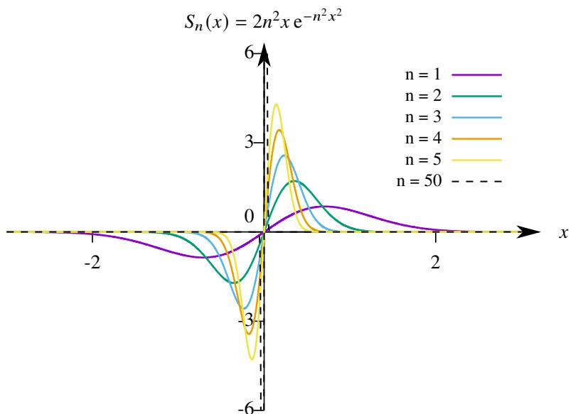  
图 $1 . 4 :$ 极限函数积分不等于各项函数积分之和.

例 1.58 设 $\mathbb { R }$ 上的函数列

$$
S _ {n} (x) = \frac {\sin n x}{\sqrt {n}}, \quad n = 1, 2, \dots .
$$

它的每个函数都在 $\mathbb { R }$ 上可导, 研究极限函数的可导性.

解 由于

$$
\left| \frac {\sin n x}{\sqrt {n}} \right| \leq \frac {1}{\sqrt {n}} \rightarrow 0.
$$

故

$$
S (x) = \lim  _ {n \rightarrow \infty} S _ {n} (x) = 0.
$$

因此 $S ^ { \prime } ( x ) = 0$ . 但

$$
S _ {n} ^ {\prime} (x) = \sqrt {n} \cos n x \not \rightarrow 0.
$$

这表明

$$
\frac {\mathrm {d}}{\mathrm {d} x} \lim  _ {n \rightarrow \infty} S _ {n} (x) \neq \lim  _ {n \rightarrow \infty} \frac {\mathrm {d}}{\mathrm {d} x} S _ {n} (x).
$$

注 上例表明, 即使极限函数可导, 等式1.18也不一定成立.

以上讨论表明函数列逐点收敛到 $S ( x )$ 不足以保证任何一种换序公式成立. 这促使我们想要寻找一个使得上述三种换序公式都成立的充分条件. 这就引出了下一节的内容.

# 1.3.2 一致收敛性

设函数列 $\left\{ f _ { n } \right\}$ 在 $[ a , b ]$ 上收敛于 $f$ .收敛区间 $[ a , b ]$ 中有无穷多个点,每一个点都决定了一个数列.这些数列收敛的速度是不一样的, 有时候它们收敛速度差别 “很悬殊”. 任意给定 $x _ { 0 } \in [ a , b ]$ , 对于任一 $\varepsilon > 0$ 都存在 $N \in \mathbb { N } ^ { * }$ 使得当 $n > N$ 时

$$
\left| f _ {n} \left(x _ {0}\right) - f \left(x _ {0}\right) \right| <   \varepsilon .
$$

一般来说, $N$ 的选取同时依赖于 $x _ { 0 }$ 和 $\varepsilon$ . 举例来说, 考察例1.55中的函数列 $\{ x ^ { n } \}$ , 它在 $( 0 , 1 )$ 逐点收敛到 0, 即对于任意一点 $x _ { 0 } \in ( 0 , 1 )$ 都收敛到 0. 对于任一 $ { \varepsilon } \in ( 0 , 1 )$ 若要

$$
\left| f _ {n} \left(x _ {0}\right) - f \left(x _ {0}\right) \right| = x _ {0} ^ {n} <   \varepsilon .
$$

就需要 $n > ( \ln \varepsilon / \ln x _ { 0 } )$ . 因此需要取

$$
N = \left[ \frac {\ln \varepsilon}{\ln x _ {0}} \right]. \tag {1.19}
$$

现在给定 $\varepsilon = 1 0 ^ { - 1 0 0 }$ , 若 $x _ { 0 } = 1 0 ^ { - 1 0 }$ , 则 $N = 1 0 .$ . 若 $x _ { 0 } = 1 0 ^ { - 4 }$ , 则 $N = 2 5$ . 若 $x _ { 0 } = 1 0 ^ { - 1 }$ , 则 $N = 1 0 0$ . 由此可见对于给定的 $\varepsilon , x _ { 0 }$ 越靠近 0, $\{ x _ { 0 } ^ { n } \}$ 收敛于 0 的速度越快.

那么对于给定的 $\varepsilon$ 是否能找到一个 “统一的 (uniform)” $N$ 使得对于任一 $x _ { 0 }$ 都满足条件呢? 假设存在 $N _ { 0 }$ 使得对于任一 $x _ { 0 } \in ( 0 , 1 )$ 都有 $x _ { 0 } ^ { N _ { 0 } } < \varepsilon$ . 令 $x _ { 0 } = \varepsilon ^ { 1 / N _ { 0 } }$ 则 $\varepsilon \ < \varepsilon$ 出现矛盾, 这就说明无法找到这样的 $N _ { 0 }$ . 事实上令等式1.19中的 $x _ { 0 }  1$ 就有 $N \to + \infty$ , 这也可以说明找不到这样的 $N$ , 而且说明随着 $x _ { 0 }$ 靠近 1, 收敛于速度 “无限变慢”.

从以上的讨论, 一定会让读者联想到 “一致连续” 的概念. 类似地, 可以建立 “一致收敛” 的概念.

# 定义 1.10 (函数列与函数项级数的一致收敛性)

设函数列 $\left\{ f _ { n } \right\}$ 在 $I$ 上收敛于 $f$ . 若对于任一 $\varepsilon > 0$ 都存在 $N _ { \varepsilon } \in \mathbb { N } ^ { * }$ 使得当 $n > N _ { \varepsilon }$ 时对于任一 $x \in I$ 都有

$$
\left| f _ {n} (x) - f (x) \right| <   \varepsilon .
$$

则称函数列 $\left\{ f _ { n } \right\}$ 在 $I$ 上一致收敛 (uniformly convergent) 于 $f$ , 记作

$$
\operatorname * {u n i f} _ {n \to \infty} \lim  _ {n \to \infty} f _ {n} = f, \quad \text {或} \quad f _ {n} \Rightarrow f, \quad n \to \infty .
$$

设 $I$ 上的函数项级数 $\sum _ { n = 1 } ^ { \infty } f _ { n }$ 的部分和函数列为 $\{ S _ { n } ( x ) \}$ . 若 $S _ { n } ( x ) \stackrel { } {  } S ( x )$ , 则称级数 $\sum _ { n = 1 } ^ { \infty } f _ { n }$ 在 $I$ 上一致收敛于 $S ( x )$ .

注 1838 年 Christoph Gudermann 最早用到了 “一致收敛” 这个词. 后来他的学生 Weierstrass 深入研究并发展了一致收敛的概念.

注 函数列 $\left\{ f _ { n } \right\}$ 一致收敛于 $f$ 还可以记作

$$
f _ {n} \xrightarrow {\text {u n i f .}} f, \quad n \to \infty .
$$

根据前面的讨论, 函数项级数 $\{ x ^ { n } \}$ 不一致收敛. 下面来看一个一致收敛的例子.

例 1.59 设函数列

$$
f _ {n} (x) = \frac {1}{n + x}, \quad n = 1, 2, \dots .
$$

则 $\left\{ f _ { n } \right\}$ 在 $( 0 , 1 )$ 上一致收敛于 $f ( x ) \equiv 0$ .

证明 由于

$$
\left| f _ {n} (x) - f (x) \right| = \frac {1}{n + x} <   \frac {1}{n}, \quad \forall x \in (0, 1).
$$

因此对于任一 $ { \varepsilon } \in \left( 0 , 1 \right)$ , 只需取 $N _ { \varepsilon } = [ 1 / \varepsilon ]$ , 当 $n > N$ 时对于任一 $x \in ( 0 , 1 )$ 都有 $| f _ { n } ( x ) - f ( x ) | < \varepsilon .$ . 于是可知$\left\{ f _ { n } \right\}$ 在 $( 0 , 1 )$ 上一致收敛于 $f ( x ) \equiv 0$ . ■

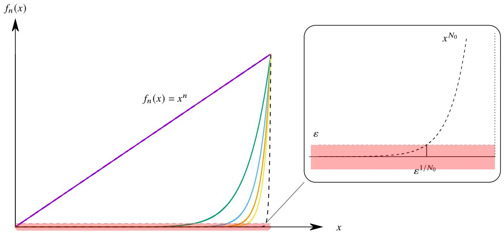  
图 1.5: $x ^ { n }$ 不一致收敛.

下面来看一下一致收敛的几何意义. 设函数列 $\{ f _ { n } ( x ) \}$ 在 $( 0 , 1 )$ 上一致收敛于 $f ( x )$ . 则对于给定的 $\varepsilon > 0$

$$
f (x) - \varepsilon <   f _ {n} (x) <   f (x) + \varepsilon , \quad \forall x \in (0, 1), n = N + 1, N + 2, \dots .
$$

这表明曲线 $y = f _ { n } ( x )$ $( n = N + 1 , N + 2 , \cdots )$ 全部落在曲线 $y = f ( x ) - \varepsilon$ 和 $y = f ( x ) + \varepsilon$ 之间. 如图1.5, 从图中可以看出无论 $n$ 多大, 曲线 $y = x ^ { n }$ 都不会落入 $y = - \varepsilon$ 和 $y = \varepsilon$ 之间 $( \varepsilon \in ( 0 , 1 ) )$ ). 从一致连续的几何意义上可以看出

$\{ x ^ { n } \}$ 在 $( 0 , 1 )$ 上不一致收敛.

从一直收敛的几何意义不难想到以下结论.

# 定理 1.30

设 $I$ 上的函数列 $\left\{ f _ { n } \right\}$ . 令

$$
d \left(f _ {n}, f\right) := \sup  _ {x \in I} | f _ {n} (x) - f (x) |, \quad n = 1, 2, \dots .
$$

则以下三个命题等价:

$1 ^ { \circ } \mathrm { ~ \{ ~ } ~  f _ { n } \}$ 在 $I$ 上一致收敛于 $f$ .  
$2 ^ { \circ }$ $d ( f _ { n } , f ) \to 0$ $( n  \infty ) ,$ ) .   
$3 ^ { \circ }$ 对于任一数列 $\{ x _ { n } \} \subseteq I$ 都有 $f _ { n } ( x _ { n } ) - f ( x _ { n } ) \to 0 ( n \to \infty )$ .

证明 (i) $1 ^ { \circ } \Rightarrow 2 ^ { \circ }$ . 若 $f _ { n } \implies$ 在 $I$ 上一致收敛于 $f$ , 则对于任一 $\varepsilon > 0$ 都存在 $N _ { \varepsilon } \in \mathbb { N } ^ { * }$ 使得当 $n > N _ { \varepsilon }$ 时对于任一$x \in I$ 都有 $| f _ { n } ( x ) - f ( x ) | < \varepsilon .$ . 这表明

$$
d \left(f _ {n}, f\right) = \sup  _ {x \in I} \left| f _ {n} (x) - f (x) \right| \leq \varepsilon .
$$

于是可知 $d ( f _ { n } , f ) \to 0$ .

(ii) $2 ^ { \circ } \Rightarrow 3 ^ { \circ }$ . 对于任一数列 $\{ x _ { n } \} \subseteq I$ 都有

$$
\left| f _ {n} \left(x _ {n}\right) - f \left(x _ {n}\right) \right| \leq d \left(f _ {n}, f\right).
$$

由于 $d ( f _ { n } , f ) \to 0$ , 故 $f _ { n } ( x _ { n } ) - f ( x _ { n } ) \to 0$ .

(iii) $3 ^ { \circ } \Rightarrow 1 ^ { \circ }$ . 用反证法, 假设 $1 ^ { \circ }$ 不成立, 即对于某个 $\varepsilon _ { 0 } > 0$ , 存在 $n _ { k } \in \mathbb { N } ^ { * }$ ( $n _ { k + 1 } > n _ { k }$ ), $x _ { n _ { k } } \in I$ ( ?? = 1, 2, · · · ) 使得

$$
\left| f _ {n _ {k}} \left(x _ {n _ {k}}\right) - f \left(x _ {n _ {k}}\right) \right| \geq \varepsilon_ {0}. \tag {1.20}
$$

对于 $i \in \mathbb { N } ^ { * } \backslash \{ n _ { k } \}$ , 随便选取 $x _ { i } \in I .$ 这样就得到了一个数列 $\left\{ x _ { n } \right\}$ 它有一个子列 $\{ x _ { n _ { k } } \}$ 满足不等式1.20. 因此 $3 ^ { \circ }$ 不成立. 因此假设不成立. 于是就证明了 $3 ^ { \circ } \Rightarrow 1 ^ { \circ }$ . ■

注 $d ( f , f _ { n } )$ 可以看作是函数的一种 “距离”.

注 用证明函数列一致收敛时, 用 $2 ^ { \circ }$ 较方便, 反之证明函数列不一致收敛时, 用 $3 ^ { \circ }$ 更方便.

下面看几个例子.

例 1.60 设函数列

$$
f _ {n} (x) = \frac {n x}{1 + n ^ {2} x ^ {2}}.
$$

它在 $( 0 , + \infty )$ 不一致收敛, 但在 $[ \delta , + \infty )$ 上一致收敛, 其中 $\delta$ 是任一正实数.

证明 容易知道在 $( 0 , + \infty )$ 上 $f  0$ .

(i) 当 $x \in ( 0 , + \infty )$ 时

$$
\left| f _ {n} \left(\frac {1}{n}\right) - f \left(\frac {1}{n}\right) \right| = \frac {1}{2}.
$$

于是可知 $\{ f _ { n } ( x ) \}$ 在 $( 0 , + \infty )$ 不一致收敛.

(ii) 对于任一 $\delta > 0$ , 当 $x \in [ \delta , + \infty )$ 时, 由于

$$
f _ {n} (x) = \frac {n x}{1 + n ^ {2} x ^ {2}} \leq \frac {n x}{n ^ {2} x ^ {2}} = \frac {1}{n x} <   \frac {1}{n \delta}.
$$

因此

$$
d \left(f _ {n}, f\right) = \sup  _ {x \in [ \delta , + \infty)} f _ {n} (x) \leq \frac {1}{n \delta} \rightarrow 0.
$$

因此 $d ( f _ { n } , f ) \to 0 .$ 于是可知在 $[ \delta , + \infty )$ 上 $f _ { n }  0$ 一致收敛.

例 1.61 设 [0, 1] 上的函数列

$$
f _ {n} (x) = 2 n ^ {2} x \mathrm {e} ^ {- n ^ {2} x ^ {2}}, \quad n = 1, 2, \dots .
$$

则 $\{ f ( n ) \}$ 在 [0, 1] 上不一致收敛.

证明 容易知道 $f  0$ . 由于

$$
\left| f _ {n} \left(\frac {1}{n}\right) - f \left(\frac {1}{n}\right)\right| = 2 n e ^ {- 1} \rightarrow + \infty .
$$

因此 $\{ f ( n ) \}$ 在 [0,1] 上不一致收敛.

例 1.62 设 [0, 1] 上的全体有理数为 $\{ r _ { 1 } , r _ { 2 } , \cdot \cdot \cdot , r _ { n } , \cdot \cdot \cdot \}$ . 设函数列

$$
S _ {n} (x) = \left\{ \begin{array}{l l} 1, & x \in \{r _ {1}, \dots , r _ {n} \} \\ 0, & x \in [ 0, 1 ] \backslash \{r _ {1}, \dots , r _ {n} \} \end{array} \right., \quad n = 1, 2, \dots .
$$

则 $\{ S ( n ) \}$ 在 [0,1] 上不一致收敛.

证明 容易看出

$$
\lim  _ {n \to \infty} S _ {n} (x) = S (x) = \left\{ \begin{array}{l l} 1, & x \in [ 0, 1 ] \cap \mathbb {Q} \\ 0, & x \in [ 0, 1 ] \cap \mathbb {Q} ^ {c} \end{array} \right..
$$

因此

$$
d \left(S _ {n} (x) - S (x)\right) = 1.
$$

于是可知 $\{ S ( n ) \}$ 在 [0,1] 上不一致收敛.

# 1.3.3 一致收敛的判别法

前面给出的一致收敛判别法需要事先知道极限函数. 和数列类似, 在不知道极限函数的情况下, 可以用 Cauchy收敛原理判别函数的一致收敛性.

# 定理 1.31 (函数列的 Cauchy 收敛原理)

设 $I$ 上的函数列 $\left\{ f _ { n } \right\}$ . 则 $\left\{ f _ { n } \right\}$ 在 $I$ 上一致收敛当且仅当对于任一 $\varepsilon > 0$ 都存在 $N _ { \varepsilon }$ , 当 $m , n > N _ { \varepsilon }$ 时对于任一 $x \in I$ 都有

$$
\left| f _ {n} (x) - f _ {m} (x) \right| <   \varepsilon .
$$

证明 (i) 证明必要性. 若 $\left\{ f _ { n } \right\}$ 在 $I$ 上一致收敛于 $f ( x )$ . 则对于任一 $\varepsilon > 0$ 都存在 $N _ { \varepsilon }$ , 当 $m , n > N _ { \varepsilon }$ 时对于任一$x \in I$ 都有

$$
\left| f _ {m} (x) - f (x) \right| <   \frac {\varepsilon}{2}, \quad \left| f _ {n} (x) - f (x) \right| <   \frac {\varepsilon}{2}.
$$

于是

$$
\left| f _ {n} (x) - f _ {m} (x) \right| <   \left| f _ {n} (x) - f (x) \right| + \left| f _ {m} (x) - f (x) \right| <   \varepsilon .
$$

(ii) 证明充分性. 对于任一 $\varepsilon > 0$ 都存在 $N _ { \varepsilon }$ , 当 $m , n > N _ { \varepsilon }$ $( n < m )$ 时对于任一 $x \in I$ 都有 $| f _ { n } ( x ) - f _ { m } ( x ) | < \varepsilon$ .由数列的 Cauchy收敛原理可知 $\{ f _ { n } ( x ) \}$ 在 $I$ 上逐点收敛. 设它的极限函数为 $f ( x )$ . 对于给定的 $n > N _ { \varepsilon }$ 有

$$
\left| f _ {n} (x) - f _ {m} (x) \right| <   \varepsilon , \quad m = n + 1, n + 2, \dots .
$$

令 $m \to \infty$ 得

$$
\left| f _ {n} (x) - f (x) \right| \leq \varepsilon .
$$

于是可知 $\left\{ f _ { n } \right\}$ 在 $I$ 上一致收敛.

下面看一个例子.

例 1.63 设函数列 $\left\{ f _ { n } \right\}$ 在 $I$ 上一致收敛. 若函数 $\varphi$ 在 $I$ 上有界. 则函数列 $\{ \varphi f _ { n } \}$ 在 $I$ 上一致收敛.

证明 由于 $\varphi$ 在 $I$ 上有界, 故存在 $M > 0$ 使得对于任一 $x \in I$ 都有 $| \varphi ( x ) | \leq M$ . 由于 $\left\{ f _ { n } \right\}$ 在 $I$ 上一致收敛. 由Cauchy 收敛原理可知, 任一 $\varepsilon > 0$ 都存在 $N _ { \varepsilon }$ , 当 $m , n > N _ { \varepsilon }$ 时对于任一 $x \in I$ 都有

$$
\left| f _ {m} (x) - f _ {n} (x) \right| <   \frac {\varepsilon}{M}.
$$

于是

$$
\left| \varphi (x) f _ {m} (x) - \varphi (x) f _ {n} (x) \right| \leq M \left| f _ {m} (x) - f _ {n} (x) \right| <   \varepsilon .
$$

Cauchy 收敛原理可知 $\{ \varphi ( x ) f _ { n } ( x ) \}$ 在 $I$ 上一致收敛.

下面是对应的函数项级数的 Cauchy 收敛原理.

# 定理 1.32 (函数项级数的 Cauchy 收敛原理)

设 ?? 上的函数项级数 $\sum _ { n = 1 } ^ { \infty } f _ { n }$ . 则 $\sum _ { n = 1 } ^ { \infty } f _ { n }$ 在 $I$ 上一致收敛当且仅当对于任一 $\varepsilon > 0$ 都存在 $N _ { \varepsilon }$ , 当 $m , n > N _ { \varepsilon }$ $( m < n )$ 时对于任一 $x \in I$ 都有

$$
\left| f _ {m + 1} (x) + \dots + f _ {n} (x) \right| <   \varepsilon .
$$

以上定理中, 当 $n - m = 1$ 时就有以下推论.

# 推论 1.4

设 $I$ 上的函数项级数 $\sum _ { n = 1 } ^ { \infty } f _ { n }$ . 若 $\sum _ { n = 1 } ^ { \infty } f _ { n }$ 在 $I$ 上一致收敛, 则 $f _ { n } ( x )$ 在 $I$ 上一致收敛于 0.

用这个必要条件很容看出某些函数项级数不一致收敛, 下面看一个例子.

例 1.64 设函数项级数

$$
\sum_ {n = 1} ^ {\infty} n \mathrm {e} ^ {- n x}.
$$

该级数在 $( 0 , + \infty )$ 上不一致收敛.

证明 由于

$$
d \left(f _ {n}, f\right) = \sup  _ {x \in (0, + \infty)} f _ {n} (x) \geq f _ {n} \left(\frac {1}{n}\right) = n e ^ {- 1} \rightarrow + \infty .
$$

因此 $\{ f _ { n } ( x ) \}$ 在 $( 0 , + \infty )$ 上不一致收敛于 0. 于是可知 $\textstyle \sum _ { n = 1 } ^ { \infty } n \mathrm { e } ^ { - n x }$ 在 $( 0 , + \infty )$ 上不一致收敛.

和数项级数类似, 用 Cauchy 收敛原理可以立刻得到以下推论.

# 推论 1.5

设 $I$ 上的函数项级数 $\scriptstyle \sum _ { n = 1 } ^ { \infty } f _ { n } ( x )$ . 若 $\scriptstyle \sum _ { n = 1 } ^ { \infty } \left| f _ { n } ( x ) \right|$ 在 $I$ 上一致收敛, 则 $\scriptstyle \sum _ { n = 1 } ^ { \infty } f _ { n } ( x )$ 在 $I$ 上一致收敛.

下面来介绍一种非常好用的判别法.

# 定理 1.33 (Weierstrass 判别法)

设 $I$ 上的函数项级数 $\scriptstyle \sum _ { n = 1 } ^ { \infty } f _ { n } ( x )$ . 若存在收敛的正项级数 $\textstyle \sum _ { n = 1 } ^ { \infty } a _ { n }$ , 且对于任一 $x \in I$ 都有

$$
\left| f _ {n} (x) \right| \leq a _ {n}, \quad n = 1, 2, \dots .
$$

则函数项级数在 $I$ 上一致收敛.

证明 由于 $\textstyle \sum _ { n = 1 } ^ { \infty } a _ { n }$ 收敛, 由级数的 Cauchy 收敛原理可知对于任一 $\varepsilon > 0$ 都存在 $N \in \mathbb { N } ^ { * }$ 使得对于任意 $m , n < N$ $( m < n )$ 时都有

$$
0 <   a _ {m + 1} + \dots + a _ {n} <   \varepsilon .
$$

由于 $| f _ { n } ( x ) | \leq a _ { n }$ $( n = 1 , 2 , \cdots )$ . 因此对于任一 $\varepsilon > 0$ 都有

$$
\left| \sum_ {k = m + 1} ^ {n} f _ {k} (x) \right| \leq \sum_ {k = m + 1} ^ {n} | f _ {k} (x) | \leq \sum_ {k = m + 1} ^ {n} a _ {k} <   \varepsilon .
$$

由函数项级数一致收敛的 Cauchy 收敛原理可知 $\textstyle \sum _ { n = 1 } ^ { \infty } f _ { n } ( x )$ 在 $I$ 上一致收敛.

注 以上定理中的数项级数 $\textstyle \sum _ { n = 1 } ^ { \infty } a _ { n }$ 称为函数项级数 $\scriptstyle \sum _ { n = 1 } ^ { \infty } f _ { n } ( x )$ 的一个优级数 , 因此以上判别法也称为优级数判别法 .

下面看几个例子.

例 1.65 判断以下函数项级数在 $\mathbb { R }$ 上的一致收敛性:

$$
\sum_ {n = 1} ^ {\infty} \frac {\cos n x}{n ^ {2}}.
$$

解 由于对于任一 $x \in \mathbb { R }$ 都有

$$
\left| \frac {\cos n x}{n ^ {2}} \right| \leq \frac {1}{n ^ {2}}, \quad n = 1, 2, \dots .
$$

由于 $\textstyle \sum _ { n = 1 } ^ { \infty } 1 / n ^ { 2 }$ 收敛, 由 Weierstrass 判别法可知原级数一致收敛.

例 1.66 判断以下函数项级数在 $\mathbb { R }$ 上的一致收敛性:

$$
\sum_ {n = 1} ^ {\infty} \frac {x}{1 + n ^ {4} x ^ {2}}.
$$

解 当 $x \neq 0$ 时, 由均值不等式可知

$$
\left| \frac {x}{1 + n ^ {4} x ^ {2}} \right| = \left| \frac {1}{1 / x + n ^ {4} x} \right| = \frac {1}{1 / | x | + n ^ {4} | x |} \leq \frac {1}{2 n ^ {2}}, \quad n = 1, 2, \dots .
$$

当 $x = 0$ 时以上不等式显然也成立. 因此对于任一 $x \in \mathbb { R }$ 以上不等式都成立. 由于 $\textstyle \sum _ { n = 1 } ^ { \infty } 1 / n ^ { 2 }$ 收敛, 由 Weierstrass判别法可知原级数一致收敛. ■

和一致连续一样, 函数项级数的一致连续性不仅和通项有关还和所讨论的收敛点集有关. 例1.64已经证明函数项级数 $\textstyle \sum _ { n = 1 } ^ { \infty } n \mathrm { e } ^ { - n x }$ 在 $( 0 , + \infty )$ 上不一致收敛. 但改变所讨论的收敛点集后可使它一致收敛.

例 1.67 设 $( 0 , + \infty )$ 上的函数项级数

$$
\sum_ {n = 1} ^ {\infty} n \mathrm {e} ^ {- n x}.
$$

则对于任一 $\delta > 0$ , 该级数都在 $[ \delta , + \infty )$ 上一致收敛.

证明 由于 $0 < \delta \leq x$ . 因此当 $n$ 充分大时

$$
n \mathrm {e} ^ {- n x} \leq n \mathrm {e} ^ {- n \delta} \leq \frac {1}{n ^ {2}}.
$$

由于 $\textstyle \sum _ { n = 1 } ^ { \infty } 1 / n ^ { 2 }$ 收敛, 由 Weierstrass 判别法可知原级数一致收敛.

结合上例和例1.64表明, 即使一个函数列或函数项级数在区间 ?? 的任一闭子区间上都一致收敛, 也不能推出它在 ?? 上一致收敛,甚至不能推出它在 ?? 上收敛.但反之可以,即若一个函数列或函数项级数在区间 ?? 上一致收敛,则它在 $I$ 的任一子区间上都一致收敛.

# 定义 1.11 (内闭一致收敛)

函数列或函数项级数在开区间 $( a , b )$ 的任意闭子区间都一致收敛, 则称该函数列或函数项级数在 $( a , b )$ 上 内闭一致收敛 (inner closed uniformly convergent).

不难看出, Weierstrass 判别法条件太强. 满足 Weierstrass 判别法条件的级数 $\scriptstyle \sum _ { n = 1 } ^ { \infty } f _ { n } ( x )$ 不仅一致收敛, 而且 它的绝对值级数 $\scriptstyle \sum _ { n = 1 } ^ { \infty } | f _ { n } ( x ) |$ 也一致收敛.

也就是说, 如果级数 $\scriptstyle \sum _ { n = 1 } ^ { \infty } f _ { n } ( x )$ 一致收敛, 但不绝对收敛, 即 $\scriptstyle \sum _ { n = 1 } ^ { \infty } \left| f _ { n } ( x ) \right|$ 发散, 就无法用 Weierstrass 判别法.后面的例1.70就是这样的情况.

如果 $\scriptstyle \sum _ { n = 1 } ^ { \infty } f _ { n } ( x )$ 一致收敛且绝对收敛, 但 $\scriptstyle \sum _ { n = 1 } ^ { \infty } \left| f _ { n } ( x ) \right|$ 不一致收敛, 也无法用 Weierstrass 判别法. 后面的例1.71就是这样的情况.

因此我们还需要寻找要求更低的判别法.在数项级数中有Dirichlet判别法和Abel判别法.在函数项级数中也有类似的判别法. 为此需要先引入 “一致有界” 的概念.

对于数列 $\left\{ a _ { n } \right\}$ , 若存在 $M > 0$ 使得 $\vert a _ { n } \vert \le M \left( n = 1 , 2 , \cdot \cdot \cdot \right)$ , 就说它是有界的. 类似地, 可以定义有界的函数列.设 $I$ 上的函数列 $\{ f _ { n } ( x ) \}$ , 若对于每一个 $x _ { 0 } \in I$ 都存在 ${ M _ { x } } _ { 0 } > 0$ 使得 $| f _ { n } ( x ) | \leq M _ { x _ { 0 } }$ $( n = 1 , 2 , \cdots )$ , 则称该函数列在$I$ 上逐点有界 (pointwise bounded). 一般而言这里的 $M$ 是依赖于 $x _ { 0 }$ 的.如果可以找到不依赖于 $x _ { 0 }$ 的 $M$ 就有如下概念.

# 定义 1.12 (一致有界)

设 $I$ 上的函数列 $\left\{ f _ { n } \right\}$ . 若存在 $M > 0$ 对于任一 $x \in I$ 都有

$$
\left| f _ {n} (x) \right| \leq M, \quad n = 1, 2, \dots
$$

则称该函数列在 $I$ 上一致有界 (uniformly bounded).

通过两个例子可以帮助理解一致有界和逐点有界的差别.

例 1.68 函数列 $\{ x ^ { n } \}$ 在 $( 0 , 1 )$ 上一致有界.

证明 由于对于任一 $x \in ( 0 , 1 )$ 都有

$$
0 <   f _ {n} (x) = x ^ {n} <   1, \quad n = 1, 2, \dots .
$$

因此 $\{ x ^ { n } \}$ 在 $( 0 , 1 )$ 上一致有界.

例 1.69 函数列 $\{ n x ^ { n } \}$ 在 (0, 1) 上逐点有界但不一致有界.

证明 由于 $n x ^ { n }  0$ , 因此 $\{ n x ^ { n } \}$ 在 $( 0 , 1 )$ 上逐点有界. 假设它在 $( 0 , 1 )$ 上一致有界, 则存在 $M > 0$ 使得对于任一$x \in ( 0 , 1 )$ 都有

$$
0 <   n x ^ {n} \leq M, \quad n = 1, 2, \dots .
$$

对于给定的 $n$ , 令 $x  1 -$ 得 $n \leq M$ , 这里 $M$ 是固定的正数, 而 $n = 1 , 2 , \cdots$ , 出现矛盾. 因此 $\{ n x ^ { n } \}$ 在 $( 0 , 1 )$ 上不一致有界. □

类比数项级数的 Dirichlet 判别法和 Abel判别法不难得到函数项级数的 Dirichlet 判别法和 Abel 判别法.

# 定理 1.34 (函数项级数的 Dirichlet 判别法)

设 $I$ 上的函数项级数 $\textstyle \sum _ { n = 1 } ^ { \infty } f _ { n } ( x ) g _ { n } ( x )$ . 若满足

$1 ^ { \circ } \{ g _ { n } ( x ) \}$ 对于任一 $x \in I$ 都是单调的, 且它在 $I$ 上 $g _ { n }  0$ .  
$2 ^ { \circ } \Sigma _ { k = 1 } ^ { n } f _ { k } ( x )$ 一致有界, 即存在 $M$ 对于任一 $x \in I$ 都满足

$$
\left| \sum_ {k = 1} ^ {n} f _ {k} (x) \right| \leq M, \quad n = 1, 2, \dots .
$$

则级数 $\textstyle \sum _ { n = 1 } ^ { \infty } f _ { n } ( x ) g _ { n } ( x )$ 在 $I$ 上一致收敛.

证明 由 $2 ^ { \circ }$ 可知, 对于任一 $1 , n \in \mathbb { N } ^ { * }$ $( m < n )$ 和任一 $x \in I$ 都有

$$
\left| \sum_ {k = m + 1} ^ {n} f _ {k} (x) \right| = \left| \sum_ {k = 1} ^ {n} f _ {k} (x) - \sum_ {k = 1} ^ {m} f _ {k} (x) \right| \leq \left| \sum_ {k = 1} ^ {n} f _ {k} (x) \right| + \left| \sum_ {k = 1} ^ {m} f _ {k} (x) \right| \leq 2 M.
$$

$\{ g _ { n } ( x ) \}$ 对于任一 $x \in I$ 都是单调的, 由 Abel 引理可知

$$
\left| \sum_ {k = m + 1} ^ {n} f _ {k} (x) g _ {k} (x) \right| \leq 2 M \left(\left| g _ {m + 1} (x) \right| + 2 \left| g _ {m} (x) \right|\right).
$$

由于 $\{ g _ { n } ( x ) \}$ 在 $I$ 上一致收敛于 $f ( x ) \equiv 0$ , 故对于任一 $\varepsilon > 0$ 存在 $N _ { \varepsilon } \in \mathbb { N } ^ { * }$ 使得当 $m > N$ 时对于任一 $x \in I$ 都有$| g _ { m } ( x ) | < \varepsilon / ( 6 M ) .$ . 于是当 $m > N$ 时

$$
\left| \sum_ {k = m + 1} ^ {n} f _ {k} (x) g _ {k} (x) \right| \leq 2 M \left(\left| g _ {m + 1} (x) \right| + 2 \left| g _ {m} (x) \right|\right) <   2 M \cdot \frac {3 \varepsilon}{6 M} = \varepsilon , \quad \forall x \in I.
$$

由 Cauchy 收敛原理可知 $\textstyle \sum _ { n = 1 } ^ { \infty } f _ { n } ( x ) g _ { n } ( x )$ 在 $I$ 上一致收敛.

# 定理 1.35 (函数项级数的 Abel 判别法)

设 $I$ 上的函数项级数 $\textstyle \sum _ { n = 1 } ^ { \infty } f _ { n } ( x ) g _ { n } ( x )$ . 若满足

$1 ^ { \circ } \{ g _ { n } ( x ) \}$ 对于任一 $x \in I$ 都是单调的,且它在 $I$ 上一致有界,即存在 $M$ 对于任一 $x \in I$ 都满足 $| g _ { n } ( x ) | \leq$ ?? $t \left( n = 1 , 2 , \cdots \right)$ .  
$2 ^ { \circ } \Sigma _ { n = 1 } ^ { \infty } f _ { n } ( x )$ 在 $I$ 上一致收敛.

则级数 $\textstyle \sum _ { n = 1 } ^ { \infty } f _ { n } ( x ) g _ { n } ( x )$ 在 $I$ 上一致收敛.

证明 由于 $\scriptstyle \sum _ { n = 1 } ^ { \infty } f _ { n } ( x )$ 在 $I$ 上一致收敛, 由 Cauchy 收敛原理可知, 对于任一 $\varepsilon > 0$ 都存在 $N _ { \varepsilon } \in \mathbb { N } ^ { * }$ 使得当 $m$ $n > N _ { \varepsilon }$ $( m < n )$ 时对于任一 $x \in I$ 都有

$$
\left| \sum_ {k = m + 1} ^ {n} f _ {n} (x) \right| <   \frac {\varepsilon}{3 M}.
$$

由 Abel引理可知, 对于任一 $x \in I$ 都有

$$
\left| \sum_ {k = m + 1} ^ {n} f _ {n} (x) g (x) \right| \leq \frac {\varepsilon}{3 M} \left(| g _ {m + 1} (x) | + 2 | g _ {n} (x) |\right) \leq \varepsilon .
$$

于是可知级数 $\textstyle \sum _ { n = 1 } ^ { \infty } f _ { n } ( x ) g _ { n } ( x )$ 在 $I$ 上一致收敛.

下面看几个例子.

例 1.70 以下函数项级数在 $[ \delta , 2 \pi - \delta ]$ $0 < \delta < \pi$ ) 上一致收敛, 但不绝对收敛:

$$
\sum_ {n = 1} ^ {\infty} \frac {\cos n x}{n}.
$$

证明 (i) 令 $f _ { n } ( x ) = \cos n x$ , $g _ { n } ( x ) = 1 / n .$ . 则 $g _ { n } ( x )$ 递减一致趋于零. 当 $x \in [ \delta , 2 \pi - \delta ]$ 时

$$
\left| \sum_ {k = 1} ^ {n} \cos k x \right| \leq \left(\sin \frac {x}{2}\right) ^ {- 1} \leq \left(\sin \frac {\delta}{2}\right) ^ {- 1}.
$$

因此 $\scriptstyle \sum _ { k = 1 } ^ { n } f _ { k } ( x )$ 在 $[ \delta , 2 \pi - \delta ]$ 上一致有界. 由 Dirichlet 判别法可知原级数一致收敛.

(ii) 由于

$$
\sum_ {k = 1} ^ {n} \left| \frac {\cos k x}{k} \right| \geq \sum_ {k = 1} ^ {n} \frac {\cos^ {2} k x}{k} = \frac {1}{2} \sum_ {k = 1} ^ {n} \left(\frac {1}{k} + \frac {\cos 2 k x}{k}\right).
$$

当 $x \in [ \delta , 2 \pi - \delta ]$ 时, 由例1.36可知 $\scriptstyle \sum _ { n = 1 } ^ { \infty } { \frac { \cos 2 n x } { n } }$ 收敛, 而 $\textstyle \sum _ { n = 1 } ^ { \infty } { \frac { 1 } { n } }$ 发散. 因此以上不等式最右边的部分和发散. 于是可知原级数不绝对收敛. ■

# 例 1.71 设函数列

$$
a _ {n} (x) = (- 1) ^ {n} x ^ {n} (1 - x), \quad n = 1, 2, \dots .
$$

则函数项级数 $\textstyle \sum _ { n = 1 } ^ { \infty } a _ { n } ( x )$ 在 [0, 1] 上绝对收敛且一致收敛, 但 $\scriptstyle \sum _ { n = 1 } ^ { \infty } \left| a _ { n } ( x ) \right|$ 在 [0, 1] 上不一致收敛.

证明 (i) 当 $x = 0$ 或 1 时 $\scriptstyle \sum _ { n = 1 } ^ { \infty } \left| a _ { n } ( x ) \right|$ 显然收敛. 当 $x \in ( 0 , 1 )$ 时

$$
\sum_ {n = 1} ^ {\infty} \left| a _ {n} (x) \right| = \sum_ {n = 1} ^ {\infty} x ^ {n} (1 - x) = (1 - x) \sum_ {n = 1} ^ {\infty} x ^ {n} = x.
$$

于是可知 $\textstyle \sum _ { n = 1 } ^ { \infty } a _ { n } ( x )$ 在 [0, 1] 上绝对收敛.

(ii) 令 $f _ { n } ( x ) = ( - 1 ) ^ { n }$ , $g _ { n } ( x ) = x ^ { n } ( 1 - x )$ $( n = 1 , 2 , \cdots )$ . 显然 $\scriptstyle \sum _ { n = 1 } ^ { n } f _ { n } ( x )$ 一致有界. 下面来证明 $g _ { n } ( x )$ 一致趋于零. 求导得

$$
g _ {n} ^ {\prime} (x) = n x ^ {n - 1} (1 - x) - x ^ {n} = x ^ {n - 1} [ n - (n + 1) x ].
$$

令 $g _ { n } ^ { \prime } ( x ) = 0$ 得 $x = 0$ 或 $n / ( n + 1 )$ . 容易知道当 $x = n / ( n + 1 )$ 时 $g _ { n } ( x )$ 在闭区间 [0, 1] 上取到最大值. 于是

$$
g _ {n} (x) \leq g _ {n} \left(\frac {n}{n + 1}\right) = \left(\frac {n}{n + 1}\right) ^ {n} \left(1 - \frac {n}{n + 1}\right) = \frac {1}{(1 + 1 / n) ^ {n}} \cdot \frac {1}{n + 1} \rightarrow 0.
$$

因此 $g _ { n } ( x )$ 一致趋于零. 由 Dirichlet 判别法可知 $\textstyle \sum _ { n = 1 } ^ { \infty } a _ { n } ( x )$ 在 [0, 1] 上一致收敛.

(iii) 容易看出 $\scriptstyle \sum _ { n = 1 } ^ { \infty } \left| a _ { n } ( x ) \right|$ 在 [0, 1] 上的和函数为

$$
S (x) = \left\{ \begin{array}{l l} x, & x \in [ 0, 1) \\ 0, & x = 1. \end{array} \right..
$$

令 $\scriptstyle \sum _ { n = 1 } ^ { \infty } \left| a _ { n } ( x ) \right|$ 的部分和函数列

$$
S _ {n} (x) = \sum_ {k = 1} ^ {n} x ^ {k} (1 - x) = (1 - x) \sum_ {k = 1} ^ {n} x ^ {k} = x - x ^ {n + 1}, \quad n = 1, 2, \dots .
$$

由于

$$
\left| S _ {n} \left(2 ^ {- \frac {1}{n + 1}}\right) - S \left(2 ^ {- \frac {1}{n + 1}}\right) \right| = \left| 2 ^ {- \frac {1}{n + 1}} - 2 ^ {- 1} - 2 ^ {- \frac {1}{n + 1}} \right| = \frac {1}{2}.
$$

于是可知 $\scriptstyle \sum _ { n = 1 } ^ { \infty } \left| a _ { n } ( x ) \right|$ 在 [0, 1] 上不一致收敛.

以上两个例子说明绝对收敛和一致收敛是两个完全不一样的概念. 这两个例子就是无法用 Weierstrass 判别法的情况.

# 1.3.4 极限函数与和函数的连续性

经过前面的讨论我们已经看到, 函数列逐点收敛到 $S ( x )$ , 则函数列中各个函数的分析性质不一定被保持. 为此我们提出了一致收敛的概念. 如果函数列一致收敛到 $S ( x )$ , 那么是否可以让前面提出的 3 个换序公式成立呢?

先来看连续性.

# 定理 1.36 (极限函数的连续性)

设 $I$ 上的函数列 $\{ f _ { n } ( x ) \}$ . 若 $f _ { n }$ $( n = 1 , 2 , \cdots )$ 都在 $I$ 上连续, 且 $f _ { n }  f$ , 则 $f$ 也在 $I$ 上连续, 即

$$
\lim  _ {x \to x _ {0}} \lim  _ {n \to \infty} f _ {n} (x) = \lim  _ {n \to \infty} \lim  _ {x \to x _ {0}} f _ {n} (x), \quad \forall x _ {0} \in I.
$$

证明 由于 $f _ { n }  f .$ , 故对于任一 $\varepsilon > 0$ , 可找到一个充分大的 $N$ 使得对于任一 $x \in I$ 都有

$$
\left| f _ {N} (x) - f (x) \right| <   \frac {\varepsilon}{3}.
$$

任取 $x _ { 0 } \in I ,$ 由于 $f _ { N }$ 在 $I$ 上连续, 故对于以上给定的 $\varepsilon$ , 存在 $\delta > 0$ 使得当 $x \in I \cap N _ { \delta } ( x _ { 0 } )$ 时

$$
\left| f _ {N} (x) - f _ {N} \left(x _ {0}\right) \right| <   \frac {\varepsilon}{3}.
$$

于是当 $x \in I \cap N _ { \delta } ( x _ { 0 } )$ 时有

$$
\left| f (x) - f \left(x _ {0}\right) \right| \leq \left| f (x) - f _ {N} (x) \right| + \left| f _ {N} (x) - f _ {N} \left(x _ {0}\right) \right| + \left| f _ {N} \left(x _ {0}\right) - f \left(x _ {0}\right) \right| <   \frac {\varepsilon}{3} + \frac {\varepsilon}{3} + \frac {\varepsilon}{3} = \varepsilon .
$$

于是可知 $f$ 在 $x _ { 0 }$ 处连续, 这表明 $f$ 在 $I$ 上连续.

注 容易看到, 以上证明实际上并没 “用足” 一致收敛这个条件. 实际上只需找到一个与 $x$ 无关的 $N$ 就可以是上述定理成立. 因此不难想到一致收敛不是极限函数连续的必要条件.

对应到函数项级数就是以下定理.

# 定理 1.37 (和函数的连续性)

设 $I$ 上的函数项级数 $\scriptstyle \sum _ { n = 1 } ^ { \infty } f _ { n } ( x )$ . 若 $f _ { n }$ $\mathbf { \Lambda } _ { \ i } ( n = 1 , 2 , \cdots )$ 在 $I$ 上都连续, 且 $\scriptstyle \sum _ { n = 1 } ^ { \infty } f _ { n } ( x )$ 在 $I$ 上一致收敛于 $S ( x )$ ,则 $S ( x )$ 也在 $I$ 上连续, 即

$$
\lim  _ {x \to x _ {0}} \sum_ {n = 1} ^ {\infty} f _ {n} (x) = \sum_ {n = 1} ^ {\infty} \lim  _ {x \to x _ {0}} f _ {n} (x), \quad \forall x _ {0} \in I.
$$

证明 由于 $f _ { n }$ $\dot { \bar { \textbf { \textit { n } } } } ( n = 1 , 2 , \cdots )$ 在 $I$ 上都连续, 故 $\begin{array} { r } { \sum _ { k = 1 } ^ { n } f _ { k } ( x ) \ ( n = 1 , 2 , \cdot \cdot \cdot ) } \end{array}$ 在 $I$ 上都连续. 由于 $\scriptstyle \sum _ { n = 1 } ^ { \infty } f _ { n } ( x )$ 在 $I$ 上一致收敛于 $S ( x )$ , 因此 $S ( x )$ 也在 $I$ 上连续. 于是对于任一 $x \in I$ 都有

$$
\lim  _ {x \rightarrow x _ {0}} \sum_ {n = 1} ^ {\infty} f _ {n} (x) = \lim  _ {x \rightarrow x _ {0}} S (x) = S (x _ {0}) = \sum_ {n = 1} ^ {\infty} f _ {n} (x _ {0}) = \sum_ {n = 1} ^ {\infty} \lim  _ {x \rightarrow x _ {0}} f _ {n} (x).
$$

以上定理实际上告诉了我们如何用函数项级数表示一个连续函数.

下面看几个例子.

例 1.72 设函数

$$
f (x) = \sum_ {n = 0} ^ {\infty} \frac {x ^ {n}}{3 ^ {n}} \cos n \pi x ^ {2}.
$$

求 $\scriptstyle \operatorname* { l i m } _ { x \to 1 } f ( x )$

证明 当 $x \in [ - 2 , 2 ]$ 时

$$
\left| \frac {x ^ {n}}{3 ^ {n}} \cos n \pi x ^ {2} \right| \leq \left(\frac {2}{3}\right) ^ {n}.
$$

由于正项级数 $\scriptstyle \sum _ { n = 0 } ^ { \infty } ( 2 / 3 ) ^ { n }$ 收敛, 由 Weierstrass 判别法可知原级数在 [−2, 2] 上一致收敛. 于是

$$
\lim  _ {x \rightarrow 1} f (x) = \lim  _ {x \rightarrow 1} \sum_ {n = 0} ^ {\infty} \frac {x ^ {n}}{3 ^ {n}} \cos n \pi x ^ {2} = \sum_ {n = 0} ^ {\infty} \lim  _ {x \rightarrow 1} \frac {x ^ {n}}{3 ^ {n}} \cos n \pi x ^ {2} = \sum_ {n = 0} ^ {\infty} \frac {1}{3 ^ {n}} \cos n \pi = \sum_ {n = 0} ^ {\infty} \frac {(- 1) ^ {n}}{3 ^ {n}} = \frac {3}{4}.
$$

以上两个定理可以推广为更一般的极限算子换序定理.

# 定理 1.38 (Moore-Osgood 定理)

设 $I$ 上的函数列 $\{ f _ { n } ( x ) \} , x _ { 0 }$ 是 $I$ 的一个极限点 $( x _ { 0 }$ 未必属于 ??). 若

$$
\lim  _ {x \to x _ {0}} f _ {n} (x) = a _ {n} \in \mathbb {R}, \quad n = 1, 2, \dots .
$$

且 $f _ { n }  f$ , 则 $a _ { n }$ 收敛, 且

$$
\lim  _ {x \to x _ {0}} f (x) = \lim  _ {n \to \infty} a _ {n}.
$$

证明 (i) 先证明 $a _ { n }$ 收敛. 由于 $f _ { n }  f .$ , 由 Cauchy 收敛原理可知, 对于任一 $\varepsilon > 0$ , 都存在 $N \in \mathbb { N } ^ { * }$ 使得当 $m , n > N$ 时

$$
\left| f _ {m} (x) - f _ {n} (x) \right| <   \frac {\varepsilon}{2}, \quad \forall x \in I.
$$

令 $x \longrightarrow x _ { 0 }$ 得

$$
\left| a _ {m} - a _ {n} \right| \leq \frac {\varepsilon}{2} <   \varepsilon .
$$

由数列的 Cauchy 收敛原理可知 $a _ { n }$ 收敛.

(ii) 设 $a _ { n } \to a$ , 由于 $f _ { n }  f$ , 故对于任一 $\varepsilon > 0$ , 可找到一个充分大的 $N$ 使得当 $n > N$ 时都有

$$
| f (x) - f _ {n} (x) | <   \frac {\varepsilon}{3}, \quad \forall x \in I
$$

$$
\left| a _ {n} - a \right| <   \frac {\varepsilon}{3}.
$$

取定一个 $n > N .$ . 由于 $\begin{array} { r } { \operatorname* { l i m } _ { x \to x _ { 0 } } f _ { n } ( x ) = a _ { n } } \end{array}$ , 故存在 $\delta > 0$ 使得当 $x \in I \cap N _ { \delta } ( x _ { 0 } )$ 就有

$$
\left| f _ {n} (x) - a _ {n} \right| <   \frac {\varepsilon}{3}.
$$

于是当 $x \in I \cap N _ { \delta } ( x _ { 0 } )$ 时有

$$
| f (x) - a | \leq | f (x) - f _ {n} (x) | + | f _ {n} (x) - a _ {n} | + | a _ {n} - a | <   \frac {\varepsilon}{3} + \frac {\varepsilon}{3} + \frac {\varepsilon}{3} = \varepsilon .
$$

于是可知 $\textstyle \operatorname* { l i m } _ { x \to x _ { 0 } } f ( x ) = a$ .

对应的函数项级数有以下定理.

# 定理 1.39 (和函数逐项取极限定理)

设 $I$ 上的函数项级数 $\scriptstyle \sum _ { n = 1 } ^ { \infty } f _ { n } ( x )$ . 若

$$
\lim  _ {x \to x _ {0}} f _ {n} (x) = a _ {n} \in \mathbb {R}, \quad n = 1, 2, \dots .
$$

且 $\scriptstyle \sum _ { n = 1 } ^ { \infty } f _ { n } ( x )$ 在 $I$ 上一致收敛于 $S ( x )$ , 则

$$
\sum_ {n = 1} ^ {\infty} a _ {n} = a \in \mathbb {R}.
$$

且

$$
\lim  _ {x \rightarrow x _ {0}} \sum_ {n = 1} ^ {\infty} f _ {n} (x) = a.
$$

例1.64中已经证明 $\textstyle \sum _ { n = 1 } ^ { \infty } n \mathrm { e } ^ { - n x }$ 在 $( 0 , + \infty )$ 上不一致收敛, 但它的和函数在 $( 0 , + \infty )$ 上连续. 这是因为它在$( 0 , + \infty )$ 上内闭一致收敛.

例 1.73 设函数

$$
f (x) = \sum_ {n = 1} ^ {\infty} n e ^ {- n x}.
$$

则 $f$ 在 $( 0 , + \infty )$ 上连续.

证明 在 $( 0 , + \infty )$ 中任取一点 $x _ { 0 }$ , 则一定存在 $\delta$ , 满足 $0 < \delta < x _ { 0 }$ . 由例1.67可知 $\textstyle \sum _ { n = 1 } ^ { \infty } n \mathrm { e } ^ { - n x }$ 在 $[ \delta , + \infty )$ 上一致收敛.因此 $f ( x )$ 在 $x _ { 0 }$ 处连续. 由于 $x _ { 0 }$ 是 $( 0 , + \infty )$ 中的任意一点, 于是可知 $f ( x )$ 在 $( 0 , + \infty )$ 上连续. ■

从上例可见, 确保连续只需要内闭一致收敛就够了.

# 推论 1.6

若开区间 $I$ 上的连续函数列在开区间 $I$ 上内闭一致收敛于 $f$ , 则 $f$ 在 $I$ 上连续.

# 推论 1.7

若开区间 ?? 上的函数项级数的每一项都在 $I$ 上连续, 且它在开区间 $I$ 上内闭一致收敛于 $S ( x )$ , 则 $S ( x )$ 在 $I$ 上连续.

例 1.74 以下函数在 $\mathbb { R }$ 上连续:

$$
f (x) = \sum_ {n = 1} ^ {\infty} \left(\frac {x}{\ln n}\right) ^ {n}.
$$

证明 对于任一 $M > 0$ , 当 $| x | \le M$ 时

$$
\left(\frac {| x |}{\ln n}\right) ^ {n} \leq \left(\frac {M}{\ln n}\right) ^ {n}.
$$

由于

$$
\sqrt [ n ]{\left(\frac {M}{\ln n}\right) ^ {n}} = \frac {M}{\ln n} \rightarrow 0.
$$

由正项级数的 Cauchy 根值判别法可知 $\scriptstyle \sum _ { n = 1 } ^ { \infty } \left( { \frac { M } { \ln n } } \right) ^ { n }$ 收敛. 于是由 Weierstrass 判别法可知原级数在 $[ - M , M ]$ 上一致收敛. 因此 $f ( x )$ 在 $[ - M , M ]$ 上连续. 由于 $M$ 是任一正数, 于是可知 $f ( x )$ 在 $\mathbb { R }$ 上连续. ■

以上讨论表明, 若 $I$ 上的连续函数列 $\left\{ f _ { n } \right\}$ 一致收敛于 $f$ , 则 $f$ 在 $I$ 上也连续. 那么反过来, 若 $I$ 上的连续函数列 $\left\{ f _ { n } \right\}$ 的极限函数 $f$ 在 $I$ 上连续,是否可以断言 $\left\{ f _ { n } \right\}$ 一致收敛于 $f 2$ 一般来说这是不成立的,比较以下两个例子.

例 1.75 设 $( - 1 , 1 )$ 上的连续函数列 $\{ x ^ { n } \}$ , 它的极限函数是 0, 它在 $( - 1 , 1 )$ 上连续. 但 $\{ x ^ { n } \}$ 在 (−1, 1) 上不一致收敛.

例 1.76 设 $[ - 1 + \varepsilon , 1 - \varepsilon ]$ $( 0 < \varepsilon < 1$ ) 上的连续函数列 $\{ x ^ { n } \}$ 收敛到 0, 此时 $\{ x ^ { n } \}$ 在 $[ - 1 + \varepsilon , 1 - \varepsilon ]$ 上一致收敛.

上例之所以能让 $\{ x ^ { n } \}$ 在 $[ - 1 + \varepsilon , 1 - \varepsilon ]$ 上一致收敛于0.是因为对于每一个 $x \in [ - 1 + \varepsilon , 1 - \varepsilon ]$ 数列 $\{ x ^ { n } \}$ 都递减趋于零, 且 $[ - 1 + \varepsilon , 1 - \varepsilon ]$ 是一个有限闭区间. 于是就有以下定理.

# 定理 1.40 (函数列的 Dini 定理)

设有限闭区间 $[ a , b ]$ 上逐点收敛的函数列 $\left\{ f _ { n } \right\}$ . 若

1◦ $f _ { n }$ $( n = 1 , 2 , \cdots )$ 在 $[ a , b ]$ 上连续.   
$2 ^ { \circ }$ 极限函数 $f$ 在 $[ a , b ]$ 上连续.  
$3 ^ { \circ }$ 对于任意给定的 $x \in [ a , b ]$ , 数列 $\{ f _ { n } ( x ) \}$ 都是单调的.

则在 $[ a , b ]$ 上 $f _ { n }  f$ .

证明 令

$$
\varphi_ {n} (x) = f _ {n} (x) - f (x), \quad n = 1, 2, \dots .
$$

则

(i) $\varphi _ { n } \ ( n = 1 , 2 , \cdots )$ ) 在 $[ a , b ]$ 上连续.

(ii) 在 $[ a , b ]$ 上 $\varphi _ { n } \to 0$ .  
(iii) 对于任意给定的 $x \in [ a , b ]$ , 数列 $\{ \varphi _ { n } ( x ) \}$ 都是单调的, 不妨设 $\{ \varphi _ { n } ( x ) \}$ 单调递减.下面只需证明 $\varphi _ { n }  0$ .

由条件 (ii)(iii) 可知, 对于任一 $\varepsilon > 0$ 与任意给定的 $x _ { 0 } \in [ a , b ]$ 都存在 $N _ { x _ { 0 } }$ 使得 $0 \leq \varphi _ { N _ { x _ { 0 } } } ( x _ { 0 } ) < \varepsilon .$ . 由于 $\varphi _ { N _ { x _ { 0 } } }$ 在 $x _ { 0 }$ 处连续, 故存在 $\delta _ { x _ { 0 } } > 0$ 使得当 $x \in [ a , b ] \cap ( x _ { 0 } - \delta _ { x _ { 0 } } , x _ { 0 } + \delta _ { x _ { 0 } } )$ 时都有 $0 \leq \varphi _ { N _ { x _ { 0 } } } ( x ) < \varepsilon$ . 令

$$
C = \bigcup_ {x \in [ a, b ]} \left(x - \delta_ {x}, x + \delta_ {x}\right).
$$

显然 $C$ 是 $[ a , b ]$ 的一个开覆盖. 由 Heine-Borel 定理可知存在一个有限子覆盖

$$
C ^ {\prime} = \bigcup_ {i = 1} ^ {m} \left(x _ {i} - \delta_ {x _ {i}}, x _ {i} + \delta_ {x _ {i}}\right).
$$

令 $N = \operatorname* { m a x } \{ N _ { x _ { 1 } } , N _ { x _ { 2 } } , \cdot \cdot \cdot , N _ { x _ { m } } \} .$ . 当 $n \geq N$ 时, 任取 $x \in [ a , b ]$ , 由于 $C ^ { \prime }$ 是 $[ a , b ]$ 的一个开覆盖, 故存在 $( x _ { i } - \delta _ { x _ { i } } , x _ { i } +$ $\delta _ { x _ { i } } ) \ni x$ , 因此 $0 \le \varphi _ { N _ { i } } ( x ) < \varepsilon$ . 由于 $n > N \ge N _ { x _ { i } }$ , 且数列 $\{ \varphi _ { n } ( x _ { i } ) \}$ 递减, 因此

$$
0 \leq \varphi_ {n} (x) \leq \varphi_ {N _ {i}} (x) <   \varepsilon .
$$

这表明在 $[ a , b ]$ 上 $\varphi \Longrightarrow 0$ .

注 以上定理是用意大利数学家 Ulisse Dini 命名的.

注 从证明过程可见, 以上定理的成立依赖于有限覆盖定理的成立, 因此依赖于有限闭区间这个条件.

下面是函数项级数的 Dini 定理.

# 定理 1.41 (函数项级数的 Dini 定理)

设有限闭区间 $[ a , b ]$ 上逐点收敛函数项级数 $\scriptstyle \sum _ { n = 1 } ^ { \infty } f _ { n } ( x )$ . 若

1◦ $f _ { n }$ $( n = 1 , 2 , \cdots )$ 在 $[ a , b ]$ 上连续.   
$2 ^ { \circ }$ 和函数 $S ( x )$ 在 $[ a , b ]$ 上连续.  
$3 ^ { \circ }$ $f _ { n }$ $( n = 1 , 2 , \cdots )$ 在 $[ a , b ]$ 非负.

则 $\scriptstyle \sum _ { n = 1 } ^ { \infty } f _ { n } ( x )$ 在 $[ a , b ]$ 上一致收敛.

证明 设部分和函数列为 $S _ { n } ( x )$ $( n = 1 , 2 , \cdots )$ . 由于 $\scriptstyle \sum _ { n = 1 } ^ { \infty } f _ { n } ( x )$ 中的每一项都非负, 因此 $\{ S _ { n } \}$ 单调递增. 由于 $S ( x )$ 在 $[ a , b ]$ 上连续. 由函数列的 Dini 定理可知 $\textstyle \sum _ { n = 1 } ^ { \infty } f _ { n } ( x )$ 在 $[ a , b ]$ 上一致收敛. ■

Dini 定理也提供了一种证明函数列或函数项级数一致收敛的方法. 使用 Dini 定理也需要事先知道极限函数,但是证明过程比直接使用一致收敛的充要条件简单. 下面看一个例子.

例 1.77 设函数列

$$
f _ {n} (x) = \left(1 + \frac {x}{n}\right) ^ {n}, \quad n = 1, 2, \dots .
$$

则 $\left\{ f _ { n } \right\}$ 在 [0, 1] 上一致收敛.

证明 容易知道 $\left\{ f _ { n } \right\}$ 在 [0,1] 上逐点收敛到 $f ( x ) = \mathbf { e } ^ { x }$ .

证法一 对于给定的 $n$ , 令 $g ( x ) = \mathbf { e } ^ { x } - f _ { n } ( x )$ , 由于

$$
g ^ {\prime} (x) = \mathrm {e} ^ {x} - \left(1 + \frac {x}{n}\right) ^ {n - 1} > 0.
$$

故 $g$ 单调递增. 因此当 $x \in [ 0 , 1 ]$ 时

$$
\mathrm {e} ^ {x} - \left(1 + \frac {x}{n}\right) ^ {n} \leq \mathrm {e} - \left(1 + \frac {1}{n}\right) ^ {n} \rightarrow 0
$$

于是可知 $\left\{ f _ { n } \right\}$ 在 [0,1] 上一致收敛.

证法二 由于 $f$ 和 $f _ { n }$ $\mathit { n } = 1 , 2 , \cdots$ ) 都在有限闭区间 [0, 1] 上连续, 因为对于任一 $x \in [ 0 , 1 ]$ , 数列 $\{ f _ { n } ( x ) \}$ 都

是单调递增的, 由 Dini 定理可知 $\left\{ f _ { n } \right\}$ 在 [0, 1] 上一致收敛.

以上的讨论表明一致收敛是一个确保函数项级数连续的一个很好的充分条件, 但不是必要条件. 如果把一致收敛的条件稍加削弱,就可以得到一个函数项级数连续的充要条件.根据Dini定理的证明过程不难想到这个条件.

# 定义 1.13 (准一致收敛)

设函数列 $\left\{ f _ { n } \right\}$ 在有限闭区间 $[ a , b ]$ 上收敛于 $f$ . 若对于任一 $\varepsilon > 0$ 和每一个 $N$ 都存在一个 $[ a , b ]$ 的有限开覆盖

$$
C = \bigcup_ {i = 1} ^ {m} (a _ {i}, b _ {i}).
$$

对于其中每一个开区间 $( a _ { i } , b _ { i } )$ 都存在 $N _ { i } \in \mathbb { N } ^ { * }$ $( N _ { i } > N )$ ) 使得对于任一 $x \in ( a _ { i } , b _ { i } )$ 都有

$$
\left| f _ {N _ {i}} (x) - f (x) \right| <   \varepsilon .
$$

则称函数列 $\left\{ f _ { n } \right\}$ 在 $I$ 上准一致收敛 (quasi uniform convergence).

注 准一致收敛的条件也可以写成: 对于任一 $\varepsilon > 0$ 和每一个 $N$ , 都存在 $N ^ { \prime } > N$ , 使得对于每一个 $x \in [ a , b ]$ , 都有正整数 $n _ { x } \in [ N , N ^ { \prime } ]$ 满足 $| f _ { n _ { x } } ( x ) - f ( x ) | < \varepsilon$ .

容易看出用 Dini 定理的证明方法可以可以立刻知道准一致收敛是函数列在有限闭区间上连续的必要条件.另一方面定理1.36证明过程中用到的条件正是准一致收敛性 (当 $m = 1$ 时的特殊情况), 因此只需稍加修改证明过程就可以证明准一致收敛是函数列在有限闭区间连续的充分条件. 这样就得到以下定理.

# 命题 1.23 (Arzelà 定理)

设有限闭区间 $[ a , b ]$ 上的函数列 $\{ f _ { n } ( x ) \}$ . 若 $f _ { n }$ $( n = 1 , 2 , \cdots )$ 都在 $[ a , b ]$ 上连续, 则 $f$ 也在 $[ a , b ]$ 上连续当且仅当 $f _ { n }$ 准一致收敛到 $f$ .

证明 由 Dini 定理证明过程可知必要性成立. 证明充分性. 设 $f _ { n }$ 准一致收敛到 $f$ . 则对于任一 $\varepsilon > 0$ 都存在一个$[ a , b ]$ 的有限开覆盖 $\{ ( a _ { i } , b _ { i } ) \} _ { i = 1 } ^ { m }$ . 任取一点 $x _ { 0 } \in \left( a _ { k } , b _ { k } \right)$ , 则存在 $N _ { k }$ 对于任一 $x \in \left( a _ { k } , b _ { k } \right)$ 都有

$$
\left| f _ {N _ {k}} (x) - f (x) \right| <   \frac {\varepsilon}{3}.
$$

由于 $f _ { N _ { k } }$ 在 $[ a , b ]$ 上连续, 故对于以上给定的 $\varepsilon .$ , 存在 $\delta > 0$ 使得当 $x \in [ a , b ] \cap N _ { \delta } ( x _ { 0 } )$ 时

$$
\left| f _ {N _ {k}} (x) - f _ {N _ {k}} \left(x _ {0}\right) \right| <   \frac {\varepsilon}{3}.
$$

于是当 $x \in [ a , b ] \cap N _ { \delta } ( x _ { 0 } ) \cap ( a _ { k } , b _ { k } )$ 时有

$$
\left| f (x) - f \left(x _ {0}\right) \right| \leq \left| f (x) - f _ {N _ {k}} (x) \right| + \left| f _ {N _ {k}} (x) - f _ {N _ {k}} \left(x _ {0}\right) \right| + \left| f _ {N _ {k}} \left(x _ {0}\right) - f \left(x _ {0}\right) \right| <   \frac {\varepsilon}{3} + \frac {\varepsilon}{3} + \frac {\varepsilon}{3} = \varepsilon .
$$

于是可知 $f$ 在 $x _ { 0 }$ 处连续, 这表明 $f$ 在 $I$ 上连续.

注 以上定理充分性的证明方法在本小节连续出现了三次, 这个方法俗称 “三分法”.

注 以上定理是意大利数学家 Cesare Arzelà 于 1883 年证明的.

# 1.3.5 极限函数与和函数的积分和微分

接下来讨论积分的问题. 类似地, 一致收敛性是一个可以让逐项积分成立的充分条件.

# 定理 1.42 (极限函数的逐项积分定理)

设 $[ a , b ]$ 上的 Riemann 可积函数列 $\left\{ f _ { n } \right\}$ . 若在 $[ a , b ]$ 上 $f _ { n }  f$ , 则 $f$ 也在 $[ a , b ]$ 上 Riemann 可积, 且

$$
\int_ {a} ^ {b} \lim  _ {n \rightarrow \infty} f _ {n} (x)   d x = \lim  _ {n \rightarrow \infty} \int_ {a} ^ {b} f _ {n} (x)   d x.
$$

证明 (i) 由于在 $[ a , b ]$ 上 $f _ { n }  f$ , 故存在 $N \in \mathbb { N } ^ { * }$ 对于任一 $x \in [ a , b ]$ 都满足

$$
\left| f (x) - f _ {N} (x) \right| \leq 1.
$$

由于 $f _ { N }$ 在 $[ a , b ]$ 上 Riemann 可积, 因此在 $[ a , b ]$ 上有界, 故存在 $M > 0$ 使得 $| f _ { N } ( x ) | \leq M$ . 于是

$$
\left| f (x) \right| \leq \left| f _ {N} (x) \right| + 1 \leq M + 1.
$$

因此 $f$ 也在 $[ a , b ]$ 上有界.

把 $f$ 和 $f _ { n }$ 在 $[ a , b ]$ 上的不连续点的全体分别记作 $D ( f )$ 和 $D ( f _ { n } )$ $D ( f _ { n } ) \ ( n = 1 , 2 , \cdot \cdot \cdot )$ . 任取 $x _ { 0 } ~ \in ~ D ( f )$ . 若 $f _ { n }$ $( n = 1 , 2 , \cdots )$ 都在 $x _ { 0 }$ 处连续, 则 $f$ 也在 $x _ { 0 }$ 处连续. 因此一定存在 $f _ { i }$ 在 $x _ { 0 }$ 处不连续, 即 $x _ { 0 } \in \bigcup _ { n = 1 } ^ { \infty } D ( f _ { n } )$ . 因此

$$
D (f) \subseteq \bigcup_ {n = 1} ^ {\infty} D (f _ {n}).
$$

由于 $f _ { n }$ 在 $[ a , b ]$ 上 Riemann 可积, 由 Lebesgue 定理可知 $D ( f _ { n } )$ $( n = 1 , 2 , \cdots ,$ ) 都是零测集. 因此 $D ( f )$ 也是一个零测集. 由 Lebesgue 定理可知 $f$ 也在 $[ a , b ]$ 上 Riemann 可积.

(ii) 由于 $\{ f _ { n } \}$ 在 $[ a , b ]$ 上一致收敛于 $f$ , 故对于任一 $\varepsilon > 0$ , 存在 $N _ { \varepsilon } \in \mathbb { N } ^ { * }$ 使得当 $n > N _ { \varepsilon }$ 时, 对于任一 $x \in [ a , b ]$ 1都有

$$
\left| f _ {n} (x) - f (x) \right| <   \frac {\varepsilon}{b - a}.
$$

于是

$$
\left| \int_ {a} ^ {b} f _ {n} (x) - \int_ {a} ^ {b} f (x) \right| \leq \int_ {a} ^ {b} | f _ {n} (x) - f (x) | \mathrm {d} x <   \varepsilon .
$$

于是可知

$$
\int_ {a} ^ {b} \lim _ {n \rightarrow \infty} f _ {n} (x) \mathrm {d} x = \int_ {a} ^ {b} f (x) \mathrm {d} x = \lim _ {n \rightarrow \infty} \int_ {a} ^ {b} f _ {n} (x) \mathrm {d} x.
$$

注 由于连续函数一定可积, 因此一致收敛的连续函数列可以逐项积分.

函数项级数对应的结论如下.

# 定理 1.43 (和函数的逐项积分定理)

设函数项级数 $\scriptstyle \sum _ { n = 1 } ^ { \infty } f _ { n } ( x )$ 的每一项都在 $[ a , b ]$ 上 Riemann 可积. 若 $\scriptstyle \sum _ { n = 1 } ^ { \infty } f _ { n } ( x )$ 一致收敛于 $S ( x )$ , 则 $S ( x )$ 也在 $[ a , b ]$ 上 Riemann 可积, 且

$$
\int_ {a} ^ {b} \sum_ {n = 1} ^ {\infty} f _ {n} (x) \mathrm {d} x = \sum_ {n = 1} ^ {\infty} \int_ {a} ^ {b} f _ {n} (x) \mathrm {d} x.
$$

下面看一个例子.

例 1.78 设函数

$$
f (x) = \sum_ {n = 1} ^ {\infty} \frac {\cos n x}{n ^ {2}}.
$$

求 $\textstyle \int _ { 0 } ^ { \pi } f ( x ) \mathrm { d } x$ .

$\scriptstyle \sum _ { n = 1 } ^ { \infty } { \frac { \cos n x } { n ^ { 2 } } }$ 在 $\mathbb { R }$ 上一致收敛, 于是可以对级数逐项积分:

$$
\int_ {0} ^ {\pi} f (x) \mathrm {d} x = \int_ {0} ^ {\pi} \sum_ {n = 1} ^ {\infty} \frac {\cos n x}{n ^ {2}} \mathrm {d} x = \sum_ {n = 1} ^ {\infty} \int_ {0} ^ {\pi} \frac {\cos n x}{n ^ {2}} \mathrm {d} x = 0.
$$

同样地, 一致收敛只是一个充分条件, 而非必要条件. 下面看一个例子.

例 1.79 设函数列 $\{ n x \mathrm { e } ^ { - n x } \}$ , 它虽然不一致收敛, 但

$$
\lim  _ {n \rightarrow \infty} \int_ {a} ^ {b} n x \mathrm {e} ^ {- n x} \mathrm {d} x = \int_ {a} ^ {b} \lim  _ {n \rightarrow \infty} n x \mathrm {e} ^ {- n x} \mathrm {d} x.
$$

证明 容易知道函数列收敛到 0. 设 $f _ { n } ( x ) = n x \operatorname { e } ^ { - n x }$ . 由于

$$
f _ {n} \left(\frac {1}{n}\right) = e ^ {- 1}.
$$

因此函数列不一致收敛. 分别计算等式两边

$$
\lim  _ {n \rightarrow \infty} \int_ {a} ^ {b} n x \mathrm {e} ^ {- n x} \mathrm {d} x = \lim  _ {n \rightarrow \infty} \left(a + \frac {1}{n}\right) \mathrm {e} ^ {- n a} - \left(b + \frac {1}{n}\right) \mathrm {e} ^ {- n b} = 0,
$$

$$
\int_ {a} ^ {b} \lim  _ {n \rightarrow \infty} n x \mathrm {e} ^ {- n x} \mathrm {d} x = \int_ {a} ^ {b} 0 \mathrm {d} x = 0.
$$

于是可知等式成立.

以上例子中的函数虽然不一致收敛, 但一致有界. 一致有界要比一致收敛弱得多, 如果能证明这个条件下满足积分算子换序公式, 那将是一个令人振奋的结果! 1885 年, 意大利数学家 Arzelà 证明了这个结果. 这个结果是如此的美, 而证明却十分曲折. 于是无数数学家试图寻找一个相对简单的证明, 其中不乏著名的数学家:Riesz,Bieberbach, Landau, Hausdorff 等. 但直到现在依旧没有找到相对简洁的证法, 因此大部分《数学分析》教材都没有给出这个定理的证明, 甚至都没有提到这个定理, 非常可惜. 下面给出这个定理的叙述. 考虑到它的证明十分冗长,且实分析中将会证明出一个更一般的定理, 故在此省去它的证明.

# 定理 1.44 (Arzelà 控制收敛定理)

设 $[ a , b ]$ 上的 Riemann 可积函数列 $\left\{ f _ { n } \right\}$ 收敛于一个 Riemann 可积的函数 $f$ . 若 $\left\{ f _ { n } \right\}$ 在 $[ a , b ]$ 上一致有界,则

$$
\lim  _ {n \rightarrow \infty} \int_ {a} ^ {b} f _ {n} (x) \mathrm {d} x = \int_ {a} ^ {b} \lim  _ {n \rightarrow \infty} f _ {n} (x) \mathrm {d} x.
$$

注注意到Arzelà控制收敛定理要求 $f$ 可积,而一致收敛条件下的逐项积分定理不需要,这是因为一致收敛的条件可以将函数列的可积性 “传递给” 极限函数.

下面看一个例子.

例 1.80 求极限

$$
\lim  _ {n \rightarrow \infty} \int_ {0} ^ {\pi / 2} \sin^ {n} x d x.
$$

解 设 $f _ { n } ( x ) = \sin ^ { n } x$ $( n = 1 , 2 , \cdots )$ . 显然 $\left\{ f _ { n } \right\}$ 在 $( 0 , \pi / 2 )$ 逐点收敛于 0. 由于

$$
f _ {n} \left(\frac {\pi}{2} - n \pi\right) = (- 1) ^ {n}.
$$

因此 $\left\{ f _ { n } \right\}$ 不一致收敛. 但显然 $\{ \sin ^ { n } x \}$ 一致有界, 由 Arzelà 控制收敛定理可知

$$
\lim  _ {n \rightarrow \infty} \int_ {0} ^ {\pi / 2} \sin^ {n} x \mathrm {d} x = \int_ {0} ^ {\pi / 2} \lim  _ {n \rightarrow \infty} \sin^ {n} x \mathrm {d} x = 0.
$$

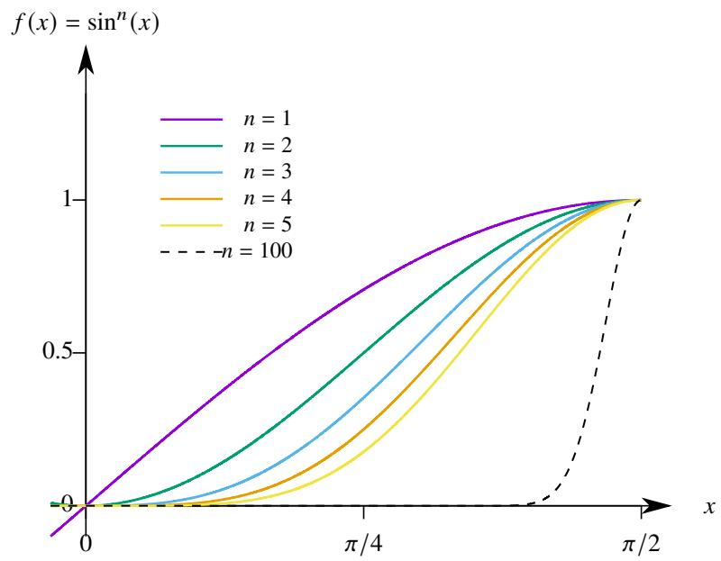  
图 1.6: $\sin ^ { n } x$ 示意图.

最后来讨论逐项微分.

# 定理 1.45 (极限函数的逐项微分定理)

设 $[ a , b ]$ 上函数列 $\left\{ f _ { n } \right\}$ . 若

(1) $f _ { n }$ $( n = 1 , 2 , \cdots )$ 连续可导.   
(2) 在 $[ a , b ]$ 上 $f _ { n } ^ { \prime }  \varphi$   
(3) 存在一点 $x _ { 0 }$ 使得 $\{ f _ { n } ( x _ { 0 } ) \}$ 收敛.

则 $\left\{ f _ { n } \right\}$ 在 $[ a , b ]$ 上一致收敛于连续可导的函数 $f .$ . 且对于任一 $x \in [ a , b ]$ 都满足

$$
\frac {\mathrm {d}}{\mathrm {d} x} \lim  _ {n \rightarrow \infty} f _ {n} (x) = \lim  _ {n \rightarrow \infty} \frac {\mathrm {d}}{\mathrm {d} x} f _ {n} (x).
$$

证明 由于数列 $\{ f _ { n } ( x _ { 0 } ) \}$ 收敛且 $\{ f _ { n } ^ { \prime } \}$ 在 $[ a , b ]$ 上一致收敛, 由 Cauchy 收敛原理可知, 对于任一 $\varepsilon > 0$ 存在充分大的 $N \in \mathbb { N } ^ { * }$ 使得当 $m , n > N$ 时

$$
\left| f _ {n} \left(x _ {0}\right) - f _ {m} \left(x _ {0}\right) \right| <   \frac {\varepsilon}{2}, \quad \left| f _ {n} ^ {\prime} (x) - f _ {m} ^ {\prime} (x) \right| <   \frac {\varepsilon}{2 (b - a)}.
$$

由 Newton-Leibniz 公式可知, 对于任一 $x \in [ a , b ]$ 都有

$$
f _ {n} (x) = f _ {n} \left(x _ {0}\right) + \int_ {x _ {0}} ^ {x} f _ {n} ^ {\prime} (t) \mathrm {d} t. \tag {1.21}
$$

$$
f _ {m} (x) = f _ {m} \left(x _ {0}\right) + \int_ {x _ {0}} ^ {x} f _ {m} ^ {\prime} (t) \mathrm {d} t.
$$

因此当 $m , n > N$ 时

$$
\left| f _ {m} (x) - f _ {n} (x) \right| \leq \left| f _ {m} \left(x _ {0}\right) - f _ {n} \left(x _ {0}\right) \right| + \left| \int_ {x _ {0}} ^ {x} \left[ f _ {m} ^ {\prime} (t) - f _ {n} ^ {\prime} (t) \right] \mathrm {d} t \right| <   \frac {\varepsilon}{2} + \frac {\varepsilon}{2 (b - a)} | x - x _ {0} | <   \varepsilon .
$$

由 Cauchy 收敛原理可知 $\left\{ f _ { n } \right\}$ 在 $[ a , b ]$ 上一致收敛. 设它的极限函数为 $f .$ 由于 $\{ f _ { n } ^ { \prime } \}$ 在 $[ a , b ]$ 一致收敛于 $\varphi$ , 由极限函数逐项积分定理可知

$$
\int_ {x _ {0}} ^ {x} \varphi (x)   d x = \int_ {x _ {0}} ^ {x} \lim  _ {n \to \infty} f _ {n} ^ {\prime} (x)   d x = \lim  _ {n \to \infty} \int_ {x _ {0}} ^ {x} f _ {n} ^ {\prime} (x)   d x.
$$

于是令等式1.21中的 $n \to \infty$ 可得

$$
f (x) = f \left(x _ {0}\right) + \int_ {x _ {0}} ^ {x} \varphi (x) d x.
$$

于是可知

$$
\frac {\mathrm {d}}{\mathrm {d} x} \lim  _ {n \rightarrow \infty} f _ {n} (x) = \frac {\mathrm {d}}{\mathrm {d} x} f (x) = \frac {\mathrm {d}}{\mathrm {d} x} \left[ f \left(x _ {0}\right) + \int_ {x _ {0}} ^ {x} \varphi (x) \mathrm {d} x \right] = \varphi (x) = \lim  _ {n \rightarrow \infty} \frac {\mathrm {d}}{\mathrm {d} x} f _ {n} (x).
$$

函数项级数对应的结论如下.

# 定理 1.46 (和函数的逐项微分定理)

设函数项级数 $\scriptstyle \sum _ { n = 1 } ^ { \infty } f _ { n } ( x )$ . 若

(1) $f _ { n }$ $( n = 1 , 2 , \cdots )$ 连续可导.   
(2) 在 $[ a , b ]$ 上 $\textstyle \sum _ { n = 1 } ^ { \infty } f _ { n } ^ { \prime } ( x ) \Longrightarrow \varphi ( x ) .$   
(3) 存在一点 $x _ { 0 }$ 使得 $\scriptstyle \sum _ { n = 1 } ^ { \infty } f _ { n } ( x _ { 0 } )$ 收敛.

则 $\scriptstyle \sum _ { n = 1 } ^ { \infty } f _ { n } ( x )$ 在 $[ a , b ]$ 上一致收敛于连续可导的函数 $S ( x )$ . 且对于任一 $x \in [ a , b ]$ 都满足

$$
\frac {\mathrm {d}}{\mathrm {d} x} \sum_ {n = 1} ^ {\infty} f _ {n} (x) = \sum_ {n = 1} ^ {\infty} \frac {\mathrm {d}}{\mathrm {d} x} f _ {n} (x).
$$

下面看几个例子.

例 1.81 设函数

$$
f (x) = \sum_ {n = 1} ^ {\infty} \frac {\sin n x}{n ^ {4}}.
$$

则 $f ( x )$ 在 $\mathbb { R }$ 上有连续的二阶导函数, 并计算 $f ^ { \prime \prime } ( x )$ .

解 原级数每一项求导后所得的级数为

$$
\sum_ {n = 1} ^ {\infty} \frac {\cos n x}{n ^ {3}}.
$$

容易看出, 它在 $\mathbb { R }$ 上一致收敛, 因此可以对原级数逐项求导:

$$
f ^ {\prime} (x) = \sum_ {n = 1} ^ {\infty} \frac {\cos n x}{n ^ {3}}.
$$

继续对上述每一项求导后所得的级数为

$$
- \sum_ {n = 1} ^ {\infty} \frac {\sin n x}{n ^ {2}}.
$$

容易看出, 它在 $\mathbb { R }$ 上一致收敛, 因此可以对继续逐项求导:

$$
f ^ {\prime \prime} (x) = - \sum_ {n = 1} ^ {\infty} \frac {\sin n x}{n ^ {2}}.
$$

例 1.82 设函数

$$
\zeta (x) = \sum_ {n = 1} ^ {\infty} \frac {1}{n ^ {x}}.
$$

求证: $\zeta$ 在 $( 1 , + \infty )$ 上是连续的, 并计算 $\zeta$ 的各阶导数.

证明 原级数每一项求导后所得的级数为

$$
- \sum_ {n = 1} ^ {\infty} \frac {\ln n}{n ^ {x}}.
$$

任取 $M > 1$ . 当 $x \in [ M , + \infty )$ 时, 尝试寻找以上级数的优级数:

$$
\left| \frac {\ln n}{n ^ {x}} \right| \leq \frac {\ln n}{n ^ {M}}.
$$

由于

$$
\lim_{n\to \infty}\frac{\frac{\ln n}{n^{M}}}{\frac{1}{n^{\frac{M + 1}{2}}}} = \lim_{n\to \infty}\frac{\ln n}{n^{\frac{M - 1}{2}}} = 0.
$$

且 $\textstyle \sum _ { n = 1 } ^ { \infty } 1 / n ^ { \frac { M + 1 } { 2 } }$ 收敛, 由比较判别法可知 $\scriptstyle \sum _ { n = 1 } ^ { \infty } { \frac { \ln n } { n ^ { M } } }$ 也收敛. 于是由 Weierstrass 判别法可知 $- \sum _ { n = 1 } ^ { \infty } { \frac { \ln n } { n ^ { x } } }$ ∞ ln ?? 一致收敛.显然 $\textstyle { \frac { \ln n } { n ^ { x } } }$ ${ \mathit { n } } = 1 , 2 , \cdots$ ) 都是连续函数, 因此原级数可以在 $[ M , + \infty )$ 上逐项求导. 由于 $M$ 是 $( 1 , + \infty )$ 上任取的, 因此原级数可以在 $( 1 , + \infty )$ 上逐项求导:

$$
\zeta^ {\prime} (x) = - \sum_ {n = 1} ^ {\infty} \frac {\ln n}{n ^ {x}}.
$$

归纳可知原级数任意阶可导且

$$
\zeta^ {(k)} (x) = (- 1) ^ {k} \sum_ {n = 1} ^ {\infty} \frac {(\ln n) ^ {k}}{n ^ {x}}.
$$

注 上题中的 ?? 称为 Riemann 函数.

下面来总结一下本节讨论的 6 个换序定理.

<table><tr><td></td><td>函数列</td><td>函数项级数</td></tr><tr><td>极限</td><td>\(\lim_{x\to x_0}\lim_{n\to\infty}f_n(x)=\lim_{n\to\infty}\lim_{x\to x_0}f_n(x), \forall x_0\in I\)</td><td>\(\lim_{x\to x_0}\sum_{n=1}^{\infty}f_n(x)=\sum_{n=1}^{\infty}\lim_{x\to x_0}f_n(x), \forall x_0\in I\)</td></tr><tr><td>积分</td><td>\(\int_a^b\lim_{n\to\infty}f_n(x)\mathrm{d}x=\lim_{n\to\infty}\int_a^b f_n(x)\mathrm{d}x\)</td><td>\(\int_a^b\sum_{n=1}^{\infty}f_n(x)\mathrm{d}x=\sum_{n=1}^{\infty}\int_a^b f_n(x)\mathrm{d}x\)</td></tr><tr><td>微分</td><td>\(\frac{\mathrm{d}}{\mathrm{d}x}\lim_{n\to\infty}f_n(x)=\lim_{n\to\infty}\frac{\mathrm{d}}{\mathrm{d}x}f_n(x)\)</td><td>\(\frac{\mathrm{d}}{\mathrm{d}x}\sum_{n=1}^{\infty}f_n(x)=\sum_{n=1}^{\infty}\frac{\mathrm{d}}{\mathrm{d}x}f_n(x)\)</td></tr></table>

需要注意以上各个换序定理中给出的条件都是充分不必要条件.

# 1.3.6 Weierstrass 函数

在《数学分析 I》已经

直接处处连续但出处不可导

1872 年, Weierstrass 首先利用函数项级数构造了这样的函数. 原版的 Weierstrass 函数是一个三角级数 (Fourier级数):

$$
f (x) = \sum_ {n = 0} ^ {\infty} a ^ {n} \cos \left(b ^ {n} \pi x\right), \quad 0 <   a <   1, b = 2 k - 1, k = 1, 2, \dots , a b > 1 + \frac {3}{2} \pi .
$$

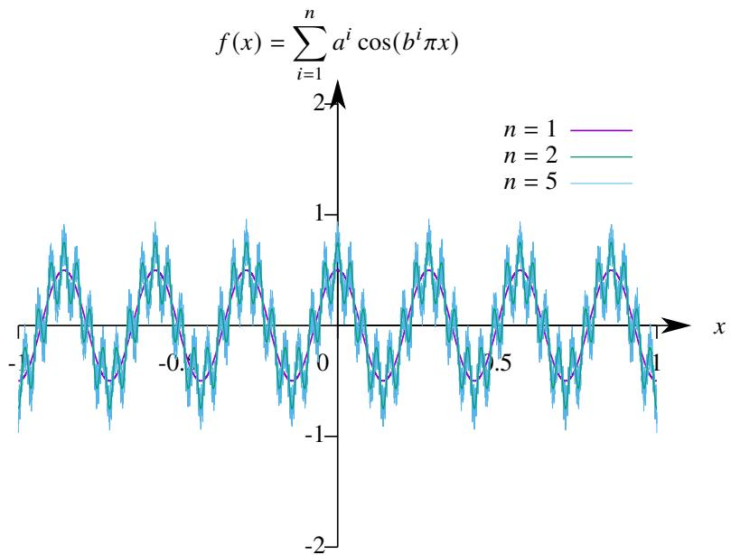  
图 1.7: Weierstrass 的三角级数示意图. 图中选定的参数为 $a = 0 . 5$ , $b = 7$ .

后来不断有数学家构造出更简洁的例子, 但本质上的思想都是 Weierstrass 的, 因此这样的函数都称为 Weierstrass函数 (Weierstrass function).

Weierstrass 函数颠覆了人们长久以来对连续函数的认识, 从此以后对于函数的认知产生了质的飞跃.

下面介绍的一个 Weierstrass 函数是丹麦数学家 Bartel Leendert van der Waerden 1930 年给出的. 我们下面介绍的是 Waerden 的例子.

为了构造处处连续处处不可微的函数, 第一步先写出一个 “锯齿形” 周期函数:

$$
f _ {0} (x) = | x - m |, \quad x \in \left[ m - \frac {1}{2}, m + \frac {1}{2} \right], m \in \mathbb {Z}.
$$

如图 $1 . 8 ( a )$ 所示, 容易看出 $f _ { 0 }$ 是定义在 $\mathbb { R }$ 上的一个最小正周期为 1 的函数锯齿形函数. 函数的值域为

$$
0 \leq f (x) \leq \frac {1}{2}, \quad \forall x \in \mathbb {R}.
$$

在区间 $[ m - 1 / 2 , m ]$ 函数的斜率为 −1, 在 $[ m , m + 1 / 2 ]$ 上函数的斜率为 1. 在点 $x = m / 2 m \in \mathbb { Z }$ 处函数不可微. 如图 $1 . 8 ( b )$ 为了得到更多的不可微点, 我们考虑作一个最小正周期为 1/4 的锯齿形函数.

$$
f _ {1} (x) = \left| x - \frac {m}{4} \right|, \quad x \in \left[ \frac {m}{4} - \frac {1}{2 \cdot 4}, \frac {m}{4} + \frac {1}{2 \cdot 4} \right], m \in \mathbb {Z}.
$$

按这个方法继续做下去就可以得到一个函数列:

$$
f _ {n} (x) = \left| x - \frac {m}{4 ^ {n}} \right|, \quad x \in \left[ \frac {m}{4 ^ {n}} - \frac {1}{2 \cdot 4 ^ {n}}, \frac {m}{4 ^ {n}} + \frac {1}{2 \cdot 4 ^ {n}} \right], m \in \mathbb {Z}, n = 0, 1, \dots .
$$

显然是定义在 $\mathbb { R }$ 上的一个最小正周期为 $1 / 4 ^ { n }$ $( n = 0 , 1 , \cdots ,$ ) 的函数锯齿形函数. 函数的值域为

$$
0 \leq f _ {n} (x) \leq \frac {1}{2 \cdot 4 ^ {n}}, \quad \forall x \in \mathbb {R}, n = 1, 2, \dots .
$$

在区间 $\textstyle { \bigl [ } { \frac { m } { 4 ^ { n } } } - { \frac { 1 } { 2 \cdot 4 ^ { n } } }$ , ??4?? ] $( n = 0 , 1 , \cdots )$ 上函数的斜率为 $^ { - 1 }$ , 在 $\begin{array} { r } { \big [ \frac { m } { 4 ^ { n } } , \frac { m } { 4 ^ { n } } + \frac { 1 } { 2 \cdot 4 ^ { n } } \big ] } \end{array}$ $( n = 0 , 1 , \cdots ,$ ) 上函数的斜率为 1. 在点$\textstyle x = { \frac { m } { 2 \cdot 4 ^ { n } } }$ $( n = 0 , 1 , \cdots )$ 处函数不可微.

由于

$$
\left| f _ {n} (x) \right| \leq \frac {1}{2 \cdot 4 ^ {n}}, \quad n = 0, 1, \dots .
$$

且 $\scriptstyle \sum _ { n = 0 } ^ { \infty } { \frac { 1 } { 2 \cdots 4 ^ { n } } }$ 收敛, 由 Weierstrass 判别法可知级数 $\scriptstyle \sum _ { n = 0 } ^ { \infty } f _ { n } ( x )$ 一致收敛. 令

$$
F (x) = \sum_ {n = 0} ^ {\infty} f _ {n} (x).
$$

由于级数一致收敛, 故 $F ( x )$ 在 $\mathbb { R }$ 上连续. 下面我们要证明 $F ( x )$ 在 $\mathbb { R }$ 上处处不可微, 它正是我们要找的函数.

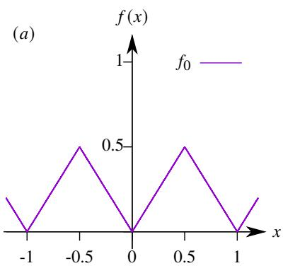

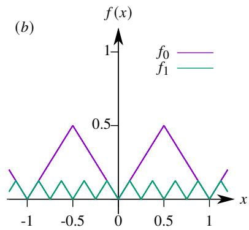

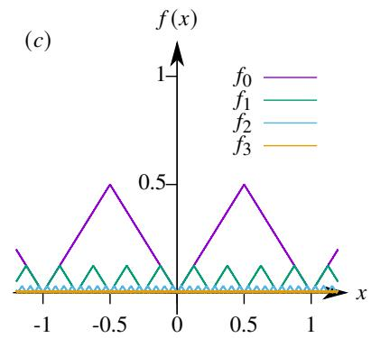  
$F ( x ) = \sum ^ { \infty } f _ { n } ( x )$

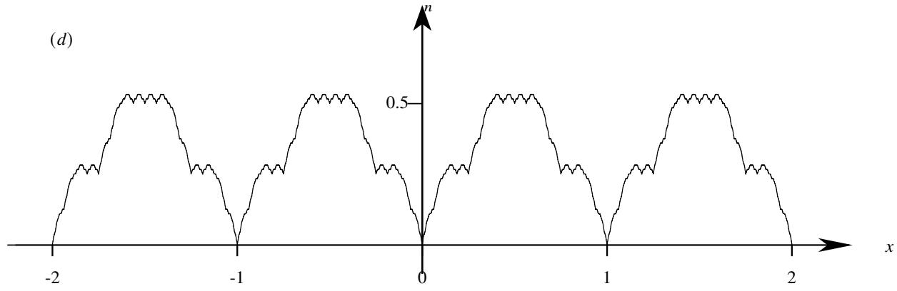  
图 1.8: 锯齿函数的叠加.

# 命题 1.24 (Weierstrass 函数)

设函数

$$
F (x) = \sum_ {n = 0} ^ {\infty} f _ {n} (x).
$$

其中

$$
f _ {n} (x) = \left| x - \frac {m}{4 ^ {n}} \right|, \quad x \in \left[ \frac {m}{4 ^ {n}} - \frac {1}{2 \cdot 4 ^ {n}}, \frac {m}{4 ^ {n}} + \frac {1}{2 \cdot 4 ^ {n}} \right], m \in \mathbb {Z}, n = 0, 1, \dots .
$$

则 $F ( x )$ 在 $\mathbb { R }$ 上处处连续但处处不可微.

证明 任取一点 $c \in \mathbb { R } ,$ , 下面来证明 $F$ 在 $c$ 处不可微. 对于任意取定的 $k \in \mathbb { N } ,$ 都可以确定一个 $m _ { k } \in \mathbb { Z }$ 满足

$$
m _ {k} \leq 2 \cdot 4 ^ {k - 1} \cdot c <   m _ {k} + 1 \Longleftrightarrow \frac {m _ {k}}{2 \cdot 4 ^ {k - 1}} \leq c <   \frac {m _ {k} + 1}{2 \cdot 4 ^ {k - 1}}.
$$

令

$$
I _ {k} = \left[ \frac {m _ {k}}{2 \cdot 4 ^ {k - 1}}, \frac {m _ {k} + 1}{2 \cdot 4 ^ {k - 1}}\right).
$$

容易知道存在 $x _ { k } \in I _ { k }$ 满足

$$
\left| x _ {k} - c \right| = \frac {\left| I _ {k} \right|}{2} = \frac {1}{4 ^ {k}}.
$$

考虑差商

$$
\frac {F \left(x _ {k}\right) - F (c)}{x _ {k} - c} = \sum_ {n = 0} ^ {\infty} \frac {f _ {n} \left(x _ {k}\right) - f _ {n} (c)}{x _ {k} - c}.
$$

当 $n \geq k$ 时 $f _ { n }$ 的最小正周期 $1 / 4 ^ { n }$ 可以整除 $| x _ { n } - c | = 1 / 4 ^ { k } .$ . 这表明 $f _ { n } ( x _ { k } ) = f _ { n } ( c )$ , 此时

$$
\frac {f _ {n} (x _ {k}) - f _ {n} (c)}{x _ {k} - c} = 0, \quad n = k, k + 1, \dots .
$$

当 $n \leq k - 1$ 时 $I _ { n } \supseteq I _ { k }$ . 此时函数 $f _ { n } ( x )$ 在 $I _ { n }$ 上的斜率为 $\pm 1$ , 即

$$
\frac {f _ {n} \left(x _ {k}\right) - f _ {n} (c)}{x _ {k} - c} = \pm 1, \quad n = 1, 2, \dots , k - 1, \dots .
$$

容易知道, 当 $m _ { n }$ 为偶数时, $f _ { n } ( x )$ 在 $I _ { n }$ 上的斜率为 1, 当 $m _ { n }$ 为奇数时, $f _ { n } ( x )$ 在 $I _ { n }$ 上的斜率为 −1. 当 $n \to \infty$ 时$| x _ { k } - c | \to 0$ 时, 因此

$$
\lim  _ {x _ {k} \rightarrow c} \frac {F \left(x _ {k}\right) - F (c)}{x _ {k} - c} = \lim  _ {x _ {k} \rightarrow c} \sum_ {n = 0} ^ {\infty} \frac {f _ {n} \left(x _ {k}\right) - f _ {n} (c)}{x _ {k} - c} = \lim  _ {k \rightarrow \infty} \sum_ {n = 0} ^ {k - 1} (\pm 1). \tag {1.22}
$$

注意到 $\textstyle \sum _ { n = 0 } ^ { k - 1 } ( \pm 1 )$ 的奇偶性被 $k$ 的奇偶性完全决定:

$$
\sum_ {n = 0} ^ {k - 1} (\pm 1) = \left\{ \begin{array}{l l} {\text {偶 数},} & {k \text {为 偶 数}} \\ {\text {奇 数},} & {k \text {为 奇 数}} \end{array} \right..
$$

这表明当 $n \to \infty$ 时等式1.22右侧的极限不存在. 这就证明了 $F$ 在 ?? 不可微.

我们在《数学分析 I》中曾经指出即使一个函数逐点连续, 也可能存在一点, 它的任一邻域内函数都不单调.例如函数

$$
f (x) = \left\{ \begin{array}{l l} x \sin \frac {1}{x} + x, & x \neq 0 \\ 0, & x = 0 \end{array} \right..
$$

我们已经在《数学分析 I》中证明它在 0 的任一邻域上都不单调.

现在进一步问, 是否存在一个函数在区间 $I$ 上处处连续, 但它在 $I$ 的任一子区间上都不单调? 答案是肯定的.但用初等函数很难构造这样的例子的,还是需要利用函数项级数.在《实分析》中,我们将在测度理论的基础上更细致地研究实变函数的可微性.

# 定理 1.47 (Lebesgue 定理)

设 $[ a , b ]$ 上的函数 $f$ . 若 $f$ 在 $[ a , b ]$ 上单调, 则 $f$ 在 $[ a , b ]$ 几乎处处可微.

以上定理表明, $[ a , b ]$ 上的单调函数 $f$ 的不可微点集为零测集. 如果承认这个结论, 不难看出 Weierstrass 函数就是一个在任一区间都不单调的函数. 假设 Weierstrass 函数在某个区间 $I$ 单调, 则它在 $I$ 上的不可微点集是零测集, 但 Weierstrass 函数在 ?? 上处处不可微, 即它的不可微点集就是 $I .$ , 而区间 $I$ 不是零测集, 这就出现了矛盾. 于是Weierstrass 函数就是我们要找的函数.

我们在举一个类似的例子.在《数学分析I》中曾经证明:函数 $f ( x ) = { \sqrt { x } }$ 在 $[ 0 , + \infty )$ 上一致连续, 但不 Lipschitz连续, 事实上出问题的仅仅是 $x = 0$ , 也就是说对于任一 $\delta > 0$ , 函数 $f$ 在 $[ \delta , + \infty )$ 上都是 Lipschitz 连续的. 现在我们进一步追问, 是否存在一个函数在区间 $I$ 上一致连续, 但在 $I$ 的任一子区间上都不 Lipschitz 连续? 这个问题的答案也是肯定的. 而且例子也是 Weierstrass 函数. 在《实分析》中还有一个关于可微性的结论.

# 定理 1.48

设 $[ a , b ]$ 上的函数 $f$ . 若 $f$ 在 $[ a , b ]$ 上 Lipschitz 连续, 则 $f$ 在 $[ a , b ]$ 几乎处处可微.

根据以上定理立刻可知 Weierstrass 函数在任一区间不 Lipschitz 连续.

综上讨论可以看到, Weierstrass 函数虽然是一个人造痕迹很重的函数, 但却可以成为很多个问题的重要反例.这表明 Weierstrass 函数的诞生让人们对函数尤其是对连续函数的理解上升到了新的高度!

# 1.3.7 Peano 曲线

下面来看另一个著名的例子. 1890 年, Peano 发现了一个惊人的事实: 一条连续曲线可以填满一个正方形!用初等函数刻画的曲线当然是无法达到这个效果的, 必须借助函数项级数来构造. 后来又出现了不少更简单的例子, 但我们把这样的曲线都称为 Peano 曲线 (Peano Curve). 下面给出的例子是 1938 年罗马尼亚数学家 Isaac JacobSchoenberg 构造的.

令 $I = [ 0 , 1 ]$ . 我们要构造一条连续参数曲线

$$
\left\{ \begin{array}{l} x = x (t) \\ y = y (t) \end{array} \right., \quad t \in I.
$$

其中 $x ( t )$ 和 $y ( t )$ 都是 $I$ 上的连续函数. 当 $t$ 取遍 $I$ 时 $( x ( t ) , y ( t ) )$ 连续地走遍正方形 $I \times I .$ 曲线的连续性将在命题2.17中严格证明.

我们曾经构造过一个 $I$ 到 $I \times I$ 的双射. 这个例子是把线段上的点与正方形上的点一一对应起来. 我们采用的方法是在 $I \times I$ 上任取一点 $c$ ,它由两个坐标 $a , b \in I$ 确定.把 $a$ 和 $^ b$ 分别写成二进制数,然后把它们的数位交错,就可以得到一个新的二进制实数 $c ^ { \prime } \in I$ , 不难证明 $c$ 到 $c ^ { \prime }$ 的对应法则是一个 $I$ 到 $I \times I$ 的双射. 受这个方法启发我们来构造 $x ( t )$ 和 $y ( t )$ .

在 $I \times I$ 上任取一点 $( a , b )$ , 把 $a$ 和 $^ b$ 写成二进制小数:

$$
a = \sum_ {n = 1} ^ {\infty} \frac {a _ {n}}{2 ^ {n}}, \quad b = \sum_ {n = 1} ^ {\infty} \frac {b _ {n}}{2 ^ {n}}. \tag {1.23}
$$

其中 $a _ { n } , b _ { n } \in \{ 0 , 1 \}$ $a _ { n }$ $( n = 1 , 2 , \cdots )$ , 即

$$
a = 0. a _ {1} a _ {2} \dots a _ {n} \dots , \quad b = 0, b _ {1} b _ {2} \dots b _ {n} \dots .
$$

闭区间套定理确保了等式1.23成立. 下面把 $a$ 和 $^ b$ 的数位交错排列后全部乘以 2, 就可以得到一个三进制实数 $c$ :

$$
c = \sum_ {n = 1} ^ {\infty} \frac {2 c _ {n}}{3 ^ {n}}.
$$

其中 $c _ { 2 n - 1 } = a _ { n }$ , $c _ { 2 n } = b _ { n }$ $\mathbf { \Phi } _ { n } = 1 , 2 , \cdots ,$ ). 显然

$$
0 \leq c \leq \sum_ {n = 1} ^ {\infty} \frac {2}{3 ^ {n}} = 1.
$$

因此 $c \in I .$ 下面的任务是构造两个连续函数 $x ( t )$ 和 $y ( t )$ 使得

$$
x (c) = a, \qquad y (c) = b.
$$

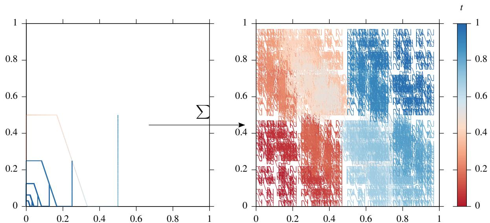  
图 1.9: 其中一种 Peano 曲线的示意图.

# 命题 1.25 (Peano 曲线)

设参数曲线方程

$$
\left\{ \begin{array}{l} x (t) = \sum_ {n = 1} ^ {\infty} \frac {\omega \left(3 ^ {2 n - 2} t\right)}{2 ^ {n}} \\ y (t) = \sum_ {n = 1} ^ {\infty} \frac {\omega \left(3 ^ {2 n - 1} t\right)}{2 ^ {n}} \end{array} , \quad t \in I \right.
$$

其中 $I = [ 0 , 1 ]$ , 并定义

$$
\omega (t) = \left\{ \begin{array}{l l} 0, & t \in \left[ 0, \frac {1}{3} \right] \\ 3 t - 1, & t \in \left[ \frac {1}{3}, \frac {2}{3} \right] \\ 1, & t \in \left[ \frac {2}{3}, \frac {4}{3} \right] \\ - 3 t + 5, & t \in \left[ \frac {4}{3}, \frac {5}{3} \right] \\ 0, & t \in \left[ \frac {5}{3}, 2 \right] \end{array} \right.
$$

如上图所示, 把这个函数按周期 2 延拓到整个 R 上, 即规定

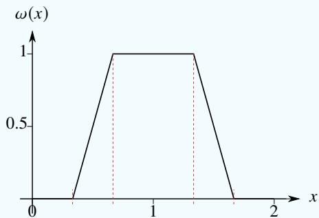  
图 1.10: $\omega ( x )$ 示意图.

$$
\omega (t + 2 k) = \omega (t), \quad t \in [ 0, 2 ], k \in \mathbb {Z}.
$$

则参数曲线连续地铺满正方形区域 $I \times I$ .

证明 (i) 容易看出

$$
\left| \frac {\omega (3 ^ {2 n - 2} t)}{2 ^ {n}} \right| \leq \frac {1}{2 ^ {n}}, \quad \left| \frac {\omega (3 ^ {2 n - 1} t)}{2 ^ {n}} \right| \leq \frac {1}{2 ^ {n}}.
$$

由 Weierstrass 判别法可知两个级数都一致收敛, 因此 $x ( t )$ 和 $y ( t )$ 都是 $I$ 上的连续函数.

(ii) 任取一点 $( a , b ) \in I \times I$ , 用前述方法得到 $c \in I .$ 下面只需证明这样构造的 $c$ 正好满足 $x ( c ) = a$ , $y ( c ) = b$ .为此需要先证明:

$$
\omega \left(3 ^ {k} c\right) = c _ {k + 1}, \quad k = 0, 1, \dots .
$$

对于 $c = 2 \textstyle \sum _ { n = 1 } ^ { \infty } c _ { n } / 3 ^ { n }$ , 可以改写为

$$
3 ^ {k} c = 2 \sum_ {n = 1} ^ {k} 3 ^ {k - n} c _ {n} + 2 \sum_ {n = k + 1} ^ {\infty} \frac {c _ {n}}{3 ^ {n - k}}, \quad k = 0, 1, \dots .
$$

令

$$
A _ {k} = 2 \sum_ {n = 1} ^ {k} 3 ^ {k - n} c _ {n}, \quad B _ {k} = 2 \sum_ {n = k + 1} ^ {\infty} \frac {c _ {n}}{3 ^ {n - k}}, \quad k = 0, 1, \dots .
$$

显然 $A _ { k }$ 是偶数, 而 $\omega$ 的周期为 2, 因此

$$
\omega \left(3 ^ {k} c\right) = B _ {k}.
$$

分两种情况讨论. 若 $c _ { k + 1 } = 0$ , 则

$$
0 \leq B _ {k} \leq \sum_ {n = k + 2} ^ {\infty} \frac {2}{3 ^ {n - k}} = \frac {1}{3}.
$$

因此

$$
\omega \left(3 ^ {k} c\right) = \omega (B _ {k}) = 0 = c _ {k + 1}, \quad k = 0, 1, \dots .
$$

若 $c _ { k + 1 } = 1$ , 则

$$
\frac {2}{3} \leq \frac {2}{3} + 2 \sum_ {n = k + 2} ^ {\infty} \frac {c _ {n}}{3 ^ {n - k}} \leq \frac {2}{3} + \frac {1}{3} = 1.
$$

即 $B _ { k } \in [ 2 / 3 , 1 ]$ , 因此

$$
\omega \left(3 ^ {k} c\right) = \omega (B _ {k}) = 1 = c _ {k + 1}, \quad k = 0, 1, \dots .
$$

于是计算可知

$$
x (c) = \sum_ {n = 1} ^ {\infty} \frac {\omega (3 ^ {2 n - 2} c)}{2 ^ {n}} = \sum_ {n = 1} ^ {\infty} \frac {c _ {2 n - 1}}{2 ^ {n}} = \sum_ {n = 1} ^ {\infty} \frac {a _ {n}}{2 ^ {n}} = a,
$$

$$
y (c) = \sum_ {n = 1} ^ {\infty} \frac {\omega \left(3 ^ {2 n - 1} c\right)}{2 ^ {n}} = \sum_ {n = 1} ^ {\infty} \frac {c _ {2 n}}{2 ^ {n}} = \sum_ {n = 1} ^ {\infty} \frac {b _ {n}}{2 ^ {n}} = b.
$$

这表明正方形区域 $I \times I$ 上的任意一点都会被我们构造的参数曲线经过.

在 20 世纪以前, 大家对函数的理解还停留在经典微积分的视角下. 因此即便 Weierstrass 和 Peano 构造出了两个 “不合乎常理” 的函数, 大家依旧认为这些函数不是数学研究的主流, 并称这样的函数为病态函数 (patholog-ical function). 著名法国数学家 Charles Hermite 在 1893 年甚至说:“我惊恐万分地转头离开这些不可微的病态函数”.(Hermite 逝世于 1901 年, 专门研究病态函数的实变函数论创立于 1902 年, 也许上帝开了个玩笑) 这种对病态函数的反感态度不止 Hermite 一人, 而是 19 世纪末的主流意识. 这导致了当时最厉害的数学家群体集体错过了开辟一个数学新分支的历史性时刻. 事实上 Weierstrass 函数的出现正式这个崭新数学分支的序幕:

(1) 1872 年, Weierstrass 构造了处处不可微的连续函数.  
(2) 1881 年, Jordan 引入了有界变差函数.  
(3) 1883 年, Cantor 构造了三分集.  
(4) 1890 年, Peano 构造了填满正方形的连续曲线.  
(5) 1898 年, Borel’s 提出了可测集.  
(6) 1902 年, Lebesgue 正式提出全新的测度和积分理论.  
(7) 1905 年, Vitali 构造了不可测集.  
(8) 1906 年, Fatou 将 Lebesgue 的实分析理论引入到了复分析.

从此一个崭新的数学分支实分析 (real analysis) 登上历史舞台, 谁曾想到建立这个伟大理论体系的竟然是一个普通的法国中学教师 Lebesgue.(事实上建立数学分析理论体系的 Weierstrass 也是一个普通的德国中学教师).

后来人们逐渐意识到, 光滑性和连续性都很差的所谓的病态函数其实在自然界中是普遍存在的, 甚至是更为一般的. 例如材料的裂纹, 生物组织的表面, 云的边界, 海岸线, 雪花的边界等. 而分子的布朗运动和金融市场的随机波动产生的曲线都是无法用传统微积分观点研究的. 在现代量子物理中, 这样的病态函数几乎存在.

1982 年, 法裔美籍数学家 Benoit Mandelbrot 发表了《大自然的分形几何》标志着现代分形几何的诞生, 而这个新兴分支的起点也是 Weierstrass 函数和 Peano 曲线.可以这么说 Weierstrass 函数和 Peano 曲线是两个数学史上举足轻重的具有承前启后意义的例子.

# 1.4 幂级数

现在我们开始考虑用某类特定的函数项级数来表示一个连续函数. 受 Taylor 展开式的启发, 很容易想到把一个函数表示成一个 “无穷项的多项式”, 即表示为无穷多个幂函数的和, 这就是本节要研究的一类函数项级数.

# 1.4.1 幂级数的敛散性

# 定义 1.14 (幂级数)

设级数

$$
\sum_ {n = 0} ^ {\infty} a _ {n} (x - x _ {0}) ^ {n} = a _ {0} + a _ {1} (x - x _ {0}) + \dots + a _ {n} (x - x _ {0}) ^ {n} + \dots .
$$

它的每一项都是幂函数. 这样的函数项级数称为幂级数 (power series).

注 为了简便, 经常令幂级数 $\textstyle \sum _ { n = 0 } ^ { \infty } a _ { n } ( x - x _ { 0 } ) ^ { n }$ 中的 $x _ { 0 } = 0$ , 得到 $\textstyle \sum _ { n = 0 } ^ { \infty } a _ { n } ^ { n }$ .

注 若 $a _ { n + 1 } = a _ { n + 2 } = \cdot \cdot \cdot = 0 .$ , 则幂级数 $\textstyle \sum _ { n = 0 } ^ { \infty } a _ { n } ( x - x _ { 0 } ) ^ { n }$ 就退化为一个 $n$ 次多项式

$$
\sum_ {k = 0} ^ {n} a _ {k} (x - x _ {0}) ^ {k} = a _ {0} + a _ {1} (x - x _ {0}) + \dots + a _ {n} (x - x _ {0}) ^ {n}.
$$

反之也可以把幂级数看作 “无穷次” 的多项式.

首先来研究幂级数的收敛域.

# 定理 1.49 (Abel 第一定理)

设幂级数 $\scriptstyle \sum _ { n = 0 } ^ { \infty } a _ { n } x ^ { n }$

(1) 级数在 $x = 0$ 处一定绝对收敛.   
(2) 若级数在 $x = x _ { 0 } \neq 0$ 处收敛, 则它一定在区间 $( - | x _ { 0 } | , | x _ { 0 } | )$ 上绝对收敛.  
(3) 若级数在 $x = x _ { 1 }$ 处发散, 则它一定在 $( - \infty , | x _ { 1 } | ) \cup ( | x _ { 1 } | , + \infty )$ 上发散.

证明 (1) 显然成立.

(2) 由于 $\scriptstyle \sum _ { n = 0 } ^ { \infty } a _ { n } x ^ { n }$ 在 $x = x _ { 0 } \neq 0$ 处收敛, 故存在 $M > 0$ 使得 $\left. a _ { n } x _ { 0 } ^ { n } \right. \leq M$ $( n = 1 , 2 , \cdots )$ . 当 $\left. x \right. < \left. x _ { 0 } \right.$ 时

$$
\sum_ {n = 0} ^ {\infty} \left| a _ {n} x ^ {n} \right| = \sum_ {n = 0} ^ {\infty} \left| a _ {n} x _ {0} ^ {n} \right| \left| \frac {x}{x _ {0}} \right| ^ {n} \leq M \sum_ {n = 0} ^ {\infty} \left| \frac {x}{x _ {0}} \right| ^ {n}.
$$

由正项级数的比较判别法可知 $\scriptstyle \sum _ { n = 0 } ^ { \infty } \left| a _ { n } x ^ { n } \right|$ 收敛. 于是可知 $\scriptstyle \sum _ { n = 0 } ^ { \infty } a _ { n } x ^ { n }$ 在区间 $( - | x _ { 0 } | , | x _ { 0 } | )$ 上绝对收敛.

(3) 当 $\left| x \right| > \left| x _ { 1 } \right|$ 时, 假设 $\scriptstyle \sum _ { n = 0 } ^ { \infty } a _ { n } x ^ { n }$ 收敛, 由 (2) 可知 $\scriptstyle \sum _ { n = 0 } ^ { \infty } a _ { n } x ^ { n }$ 绝对收敛, 出现矛盾. 于是可知 $\scriptstyle \sum _ { n = 0 } ^ { \infty } a _ { n } x ^ { n }$ 在区间 $( - \infty , | x _ { 1 } | ) \cup ( | x _ { 1 } | , + \infty )$ 上发散. ■

以上定理表明幂级数的收敛于一定是一个以 $x = 0$ 为中心的区间,且左右半区间长度相等,我们把 $( - R , R )$ 称为幂级数的收敛区间. 事实上幂级数中的 $x$ 可以取复数, 此时它的收敛域就是一个圆, 因此我们可以形象地把 $R$ 称为收敛半径 (radius of convergence).

下面要来研究收敛半径的计算公式.

# 定理 1.50 (Cauchy-Hadamard 定理)

设幂级数 $\scriptstyle \sum _ { n = 0 } ^ { \infty } a _ { n } x ^ { n }$ . 令

$$
R = \frac{1}{\limsup_{n\to\infty}\sqrt[n]{|a_{n}|}}.
$$

(1) 当 $R = 0$ 时, 级数在 $x = 0$ 处绝对收敛, 在 $\mathbb { R } \backslash \{ 0 \}$ 上发散.

(2) 当 $R = + \infty$ 时, 级数在 $\mathbb { R }$ 上绝对收敛.  
(3) 当 $R \in \mathbb { R } ^ { + }$ 时, 级数在 $( - R , R )$ 上绝对收敛, 在 $( - \infty , - R ) \cup ( R , + \infty )$ 上发散.

证明 $x = 0$ 时显然绝对收敛. 下设 $x \neq 0$ . 根据 Abel 第一定理, 只需讨论 $\scriptstyle \sum _ { n = 0 } ^ { \infty } \left| a _ { n } x ^ { n } \right|$ 的情况. 令

$$
q = \limsup_{n\to \infty}\sqrt[n]{|a_{n}x^{n}|} = |x|\limsup_{n\to \infty}\sqrt[n]{|a_{n}|}.
$$

下面只需根据 Cauchy 根值判别法就可以知道结论.

(1) 当 $R = 0$ 时 $q = + \infty$ , 此时级数在 $\mathbb { R } \backslash \{ 0 \}$ 上发散.  
(2) 当 $R = + \infty$ 时 $q = 0$ , 此时级数在 $\mathbb { R }$ 上绝对收敛.  
(3) 当 $R \in \mathbb { R } ^ { + }$ 时

$$
q = | x | \lim  _ {n \rightarrow \infty} \sup  _ {\sqrt [ n ]{| a _ {n} |}} = \frac {| x |}{R}.
$$

若 $| x | < R$ , 则 $q < 1$ , 此时级数绝对收敛. 若 $| x | > R$ , 则 $q > 1$ , 此时级数发散.

注 以上定理是 Cauchy 于 1821 年首次发表的, 但 Cauchy 的成果太多, 这个定理未被人注意到. 后来法国数学家Jacques Salomon Hadamard 从 Cauchy 的故纸堆里发现了这个定理并于 1888 年再度发表. 1892 年他还将这个定理写入了自己的博士论文.

下面来看计算收敛半径的例子.

例 1.83 求以下幂级数的收敛半径:

(1) $\sum _ { n = 1 } ^ { \infty } n x ^ { n } .$ ??????.

(2) $\sum _ { n = 1 } ^ { \infty } n ^ { n } x ^ { n } .$

解 计算得

(1) $R = { \frac { 1 } { \operatorname* { l i m } _ { n \to \infty } { \sqrt [ { n } ] { n } } } } = 1 .$

(2) $R = { \frac { 1 } { \operatorname* { l i m } _ { n \to \infty } { \sqrt [ n ] { | n ^ { n } | } } } } = 0 .$

例 1.84 求以下幂级数的收敛半径

$$
\sum_ {k = 0} ^ {\infty} 2 ^ {k} x ^ {2 k}.
$$

解 当 $n = 2 k$ 时 $a _ { n } = 2 ^ { k }$ , 当 $n = 2 k + 1$ 时 $a _ { n } = 0$ . 于是

$$
R = \frac {1}{\lim  _ {n \rightarrow \infty} \sqrt [ n ]{| a _ {n} |}} = \frac {1}{\lim  _ {n \rightarrow \infty} \sqrt [ 2 k ]{2 ^ {k}}} = 2 \sqrt {2}.
$$

由定理1.11可知不等式:

$$
\liminf_{n\to \infty}\left|\frac{a_{n + 1}}{a_{n}}\right|\leq \liminf_{n\to \infty}\sqrt[n]{|a_{n}|}\leq \limsup_{n\to \infty}\sqrt[n]{|a_{n}|}\leq \limsup_{n\to \infty}\left|\frac{a_{n + 1}}{a_{n}}\right|.
$$

于是可知当 $| a _ { n + 1 } / a _ { n } |$ 收敛时, 有

$$
\limsup_{n\to \infty}\sqrt[n]{|a_{n}|} = \lim_{n\to \infty}\left|\frac{a_{n + 1}}{a_{n}}\right|.
$$

此时就可以更快地计算幂级数的收敛半径.

# 命题 1.26

设幂级数 $\scriptstyle \sum _ { n = 0 } ^ { \infty } a _ { n } x ^ { n }$ . 若

$$
\lim  _ {n \rightarrow \infty} \left| \frac {a _ {n}}{a _ {n + 1}} \right| = R.
$$

则 $\scriptstyle \sum _ { n = 0 } ^ { \infty } a _ { n } x ^ { n }$ 的收敛半径就是 $R$

有时候 $\left| a _ { n } / a _ { n + 1 } \right|$ 的极限比较容易求出. 下面看两个例子.

例 1.85 求以下幂级数的收敛半径:

$$
\sum_ {n = 0} ^ {\infty} \frac {x ^ {n}}{n !}.
$$

解 设 $a _ { n } = 1 / n !$ $( n = 1 , 2 , \cdots )$ . 由于

$$
\left| \frac {a _ {n}}{a _ {n + 1}} \right| = \frac {1}{n !} \cdot (n + 1)! = n + 1 \rightarrow + \infty .
$$

于是可知级数的收敛半径为 $+ \infty$ .

例 1.86 求以下幂级数的收敛半径:

$$
\sum_ {n = 1} \left(1 + \frac {1}{2} + \dots + \frac {1}{n}\right) x ^ {n}.
$$

解 设 $a _ { n } = 1 + 1 / 2 + \cdots + 1 / n$ $( n = 1 , 2 , \cdots )$ . 由于

$$
\left| \frac {a _ {n}}{a _ {n + 1}} \right| = \frac {1 + \frac {1}{2} + \cdots + \frac {1}{n}}{1 + \frac {1}{2} + \cdots + \frac {1}{n + 1}} \rightarrow 1.
$$

于是可知级数的收敛半径为 1.

用收敛半径的知识可以重新研究 Gauss 超几何级数.

例 1.87 超几何级数 计算以下级数的收敛半径:

$$
F (\alpha , \beta , \gamma , x) = 1 + \sum_ {n = 1} ^ {\infty} \frac {\alpha (\alpha + 1) \cdots (\alpha + n - 1) \beta (\beta + 1) \cdots (\beta + n - 1)}{n ! \gamma (\gamma + 1) \cdots (\gamma + n - 1)} x ^ {n}, \quad \alpha , \beta , \gamma , x > 0.
$$

解 由于

$$
\lim  _ {n \rightarrow \infty} \left| \frac {a _ {n}}{a _ {n + 1}} \right| = \lim  _ {n \rightarrow \infty} \frac {(1 + n) (\gamma + n)}{(\alpha + n) (\beta + n)} = 1.
$$

因此级数的收敛半径为 1.

当 $R \in \mathbb { R } ^ { + }$ 时, Cauchy-Hadamard 定理只能确定幂级数 $\scriptstyle \sum _ { n = 0 } ^ { \infty } a _ { n } x ^ { n }$ 在 $( - R , R )$ 上收敛, 在 $( - \infty , - R ) \cup ( R , + \infty )$ 上发散. 对于 $x = \pm R$ 处的情况是无法判断的. 下面举例说明.

例 1.88 设 3 个幂级数

$( 1 ) \sum _ { n = 1 } ^ { \infty } { \frac { x ^ { n } } { n } } .$

(2) $\sum _ { n = 1 } ^ { \infty } { \frac { x ^ { n } } { n ^ { 2 } } } .$

(3) $\sum _ { n = 1 } ^ { \infty } n x ^ { n } .$

它们的收敛半径都是 1. 因此它们都在 $( - 1 , 1 )$ 上收敛. 但

(1) $\scriptstyle \sum _ { n = 1 } ^ { \infty } x ^ { n } / n$ 在 $x = - 1$ 处收敛, 在 $x = 1$ 处发散.  
(2) $\scriptstyle \sum _ { n = 1 } ^ { \infty } x ^ { n } / n ^ { 2 }$ 在 $x = \pm 1$ 处收敛.

(3) $\textstyle \sum _ { n = 1 } ^ { \infty } n x ^ { n }$ 在 $x = \pm 1$ 处发散.

# 1.4.2 幂级数的分析性质

由 Cauchy-Hadamard 定理可知, 幂级数 $\scriptstyle \sum _ { n = 0 } ^ { \infty } a _ { n } x ^ { n }$ 在 $( - R , R )$ 上确定了一个函数 $S ( x )$ . 下面来研究幂级数在收敛区间内确定的和函数的性质. 为此首先要搞清 $S ( x )$ 在 $( - R , R )$ 是否一致收敛. 一般来说, 无法确保一致收敛,例如幂级数 $\scriptstyle \sum _ { n = 0 } ^ { \infty } x ^ { n }$ 在 $( - 1 , 1 )$ 内不一致收敛. 虽然如此, 我们只需把 $( - R , R )$ “缩小一点点” 就可以让幂级数一致收敛.

# 定理 1.51

设幂级数 $\scriptstyle \sum _ { n = 0 } ^ { \infty } a _ { n } x ^ { n }$ . 若它的收敛半径为 $R$ , 则它在 $( - R , R )$ 上内闭一致收敛, 即对于任一 $r \in ( 0 , R )$ , 级数在 $\left[ - r , r \right]$ 上都一致收敛.

证明 当 $x \in [ - r , r ]$ 时,

$$
\left| a _ {n} x ^ {n} \right| \leq \left| a _ {n} \right| r ^ {n}.
$$

由 Cauchy-Hadamard 定理可知 $\scriptstyle \sum _ { n = 0 } ^ { \infty } a _ { n } x ^ { n }$ 在 $( - R , R )$ 内绝对收敛, 因此 $\scriptstyle \sum _ { n = 0 } ^ { \infty } | a _ { n } | r ^ { n }$ 收敛, 由 Weierstrass 判别法可知 $\scriptstyle \sum _ { n = 0 } ^ { \infty } a _ { n } x ^ { n }$ 在 $\left[ - r , r \right]$ 上一致收敛. ■

以上定理确保了幂级数的和函数不仅在收敛区间内是连续的, 而且是任意阶可导的!

# 定理 1.52 (幂级数的逐项求导)

设幂级数 $\scriptstyle \sum _ { n = 0 } ^ { \infty } a _ { n } x ^ { n }$ . 若它的收敛半径为 $R$ , 则和函数 $S ( x )$ 在 $( - R , R )$ 内连续, 且在 $( - R , R )$ 内存在任意阶导数, 且

$$
S ^ {(k)} (x) = \sum_ {n = k} ^ {\infty} n (n - 1) \dots (n - k + 1) a _ {n} x ^ {n - k}, \quad k = 1, 2, \dots . \tag {1.24}
$$

证明 由于 $\scriptstyle \sum _ { n = 0 } ^ { \infty } a _ { n } x ^ { n }$ 在 $( - R , R )$ 上内闭一致收敛, 因此 $S ( x )$ 在 $( - R , R )$ 上连续. 容易知道 $\scriptstyle \sum _ { n = 0 } ^ { \infty } a _ { n } x ^ { n }$ 的各项连续可导, 逐项求导后得级数

$$
\sum_ {n = 0} ^ {\infty} \frac {\mathrm {d}}{\mathrm {d} x} \left(a _ {n} x ^ {n}\right) = \sum_ {n = 1} ^ {\infty} n a _ {n} x ^ {n - 1}.
$$

由于

$$
\limsup_{n\to \infty}\sqrt[n]{|na_{n}|} = \lim_{n\to \infty}\sqrt[n]{n}\limsup_{n\to \infty}\sqrt[n]{|a_{n}|} = \limsup_{n\to \infty}\sqrt[n]{|a_{n}|}.
$$

由 Cauchy-Hadamard 定理可知 $\scriptstyle \sum _ { n = 0 } ^ { \infty } n a _ { n } x ^ { n - 1 }$ 的收敛半径仍旧是 $R$ , 因此该级数也在 $( - R , R )$ 上内闭一致收敛. 于是在 $( - R , R )$ 的任一闭子区间内都有

$$
S ^ {\prime} (x) = \sum_ {n = 1} ^ {\infty} n a _ {n} x ^ {n - 1}.
$$

因此上式在 $( - R , R )$ 上也成立. 用数学归纳法不难知道 $S ( x )$ 在 $( - R , R )$ 内存在任意阶导数, 且等式1.24成立.

# 定理 1.53 (幂级数的逐项积分)

设幂级数 $\scriptstyle \sum _ { n = 0 } ^ { \infty } a _ { n } x ^ { n }$ . 若它的收敛半径为 $R$ , 则它的和函数 $S ( x )$ 对于任一 $x \in ( - R , R )$ 都满足

$$
\int_ {0} ^ {x} S (t) \mathrm {d} t = \sum_ {n = 0} ^ {\infty} \frac {a _ {n}}{n + 1} x ^ {n + 1}.
$$

且上式右边的幂级数的收敛半径仍是 $R$ .

证明 不妨设 $x \in ( 0 , R )$ . 由于 $\scriptstyle \sum _ { n = 0 } ^ { \infty } a _ { n } x ^ { n }$ 在 $( - R , R )$ 上内闭一致收敛, 因此它在 $[ 0 , x ]$ 上一致收敛, 且在 $[ 0 , x ]$ 上可

以逐项积分, 因此

$$
\int_ {0} ^ {x} \sum_ {n = 0} ^ {\infty} a _ {n} x ^ {n} \mathrm {d} t = \sum_ {n = 0} ^ {\infty} \int_ {0} ^ {x} a _ {n} x ^ {n} \mathrm {d} t = \sum_ {n = 0} ^ {\infty} \frac {a _ {n}}{n + 1} x ^ {n + 1}.
$$

由于

$$
\lim  _ {n \rightarrow \infty} \sqrt [ n ]{\left| \frac {a _ {n}}{n + 1} \right|} = \lim  _ {n \rightarrow \infty} \sqrt [ n ]{\frac {1}{n + 1}} \lim  _ {n \rightarrow \infty} \sqrt [ n ]{| a _ {n} |} = \lim  _ {n \rightarrow \infty} \sqrt [ n ]{| a _ {n} |}.
$$

$\scriptstyle \sum _ { n = 0 } ^ { \infty } { \frac { a _ { n } } { n + 1 } } x ^ { n + 1 }$ $R$

以上两个定理表明, 幂级数和多项式从导数与积分两个角度看确有相似之处.

利用幂级数的逐项求导或积分可以求出一些幂级数的和函数.

例 1.89 求以下幂级数的和函数

$$
\sum_ {n = 1} ^ {\infty} n x ^ {n}, \quad | x | <   1.
$$

解 当 $| x | < 1$ 时, 我们有

$$
\sum_ {n = 0} ^ {\infty} x ^ {n} = \frac {1}{1 - x}.
$$

对两边求导得

$$
\frac {\mathrm {d}}{\mathrm {d} x} \sum_ {n = 0} ^ {\infty} x ^ {n} = \frac {\mathrm {d}}{\mathrm {d} x} \left(\frac {1}{1 - x}\right) \Longleftrightarrow \sum_ {n = 1} ^ {\infty} n x ^ {n - 1} = \frac {1}{(1 - x) ^ {2}} \Longleftrightarrow \sum_ {n = 1} ^ {\infty} n x ^ {n} = \frac {x}{(1 - x) ^ {2}}.
$$

利用幂级数的逐项求导或积分也可以把一些初等函数展开成幂级数.

例 1.90 把函数 arctan $x$ $\mathit { \Psi } \left| x \right| < 1 \mathit { \check { \Psi } } ,$ ) 展开成幂级数.

解 当 $| x | < 1$ 时有等式

$$
\sum_ {n = 0} ^ {\infty} (- 1) ^ {n} x ^ {2 n} = \sum_ {n = 0} ^ {\infty} \left(- x ^ {2}\right) ^ {n} = \frac {1}{1 + x ^ {2}}.
$$

对两边求 $[ 0 , x ]$ 上的积分得

$$
\int_ {0} ^ {x} \sum_ {n = 0} ^ {\infty} (- 1) ^ {n} x ^ {2 n} = \int_ {0} ^ {x} \frac {1}{1 + x ^ {2}} \Longleftrightarrow \sum_ {n = 0} ^ {\infty} \frac {(- 1) ^ {n}}{2 n + 1} x ^ {2 n + 1} = \arctan x.
$$

例 1.91 把函数 $\ln ( 1 + x )$ $( | x | < 1 )$ 展开成幂级数.

解 当 $| x | < 1$ 时有等式

$$
\sum_ {n = 0} ^ {\infty} (- 1) ^ {n} x ^ {n} = \sum_ {n = 0} ^ {\infty} (- x) ^ {n} = \frac {1}{1 + x}.
$$

对两边求 $[ 0 , x ]$ 上的积分得

$$
\int_ {0} ^ {x} \sum_ {n = 0} ^ {\infty} (- 1) ^ {n} x ^ {n} = \int_ {0} ^ {x} \frac {1}{1 + x} \Longleftrightarrow \sum_ {n = 0} ^ {\infty} \frac {(- 1) ^ {n}}{n + 1} x ^ {n + 1} = \ln (1 + x) \Longleftrightarrow \sum_ {n = 1} ^ {\infty} \frac {(- 1) ^ {n - 1}}{n} x ^ {n} = \ln (1 + x).
$$

以上例子求出了对数函数的幂级数展开式. 根据这个公式可以求出一些交错级数的和:

$$
\sum_ {n = 1} ^ {\infty} \frac {(- 1) ^ {n - 1}}{n} \left(\frac {1}{2}\right) ^ {n} = \ln \frac {3}{2}.
$$

之前已经用 Euler 常数求出了以下交错级数的和:

$$
\sum_ {n = 1} ^ {\infty} \frac {(- 1) ^ {n - 1}}{n} = \ln 2.
$$

这恰好符合对数函数的幂级数展开式. 这表明 $x = 1$ 时公式也成立.

# 1.4.3 Abel 第二定理和 Tauber 定理

幂级数在收敛区间端点处的收敛性没有统一的判断方法, 需要用数项级数的方法判别.

下面来研究收敛区间端点处的性质.

# 定理 1.54 (Abel 第二定理)

设幂级数 $\textstyle \sum _ { n = 1 } ^ { \infty } a _ { n } x ^ { n }$ 的收敛半径为 ??. 若 $\scriptstyle \sum _ { n = 1 } ^ { \infty } a _ { n } R ^ { n }$ 收敛于 ??. 则

$$
\lim  _ {x \rightarrow R -} \sum_ {n = 1} ^ {\infty} a _ {n} x ^ {n} = A.
$$

证明 我们有等式

$$
\sum_ {n = 1} ^ {\infty} a _ {n} x ^ {n} = \sum_ {n = 1} ^ {\infty} a _ {n} R ^ {n} \left(\frac {x}{R}\right) ^ {n}.
$$

由于 $\scriptstyle \sum _ { n = 1 } ^ { \infty } a _ { n } x ^ { n }$ 在 $x \ : = \ : R$ 处收敛, 故 $\textstyle \sum _ { n = 1 } ^ { \infty } a _ { n } R ^ { n }$ 收敛. 由于对于任一 $x \in [ 0 , R ]$ 数列 $\{ ( x / R ) ^ { n } \}$ 都是递减的, 且$\{ ( x / R ) ^ { n } \}$ 一致有界. 由 Abel 判别法可知 $\textstyle \sum _ { n = 1 } ^ { \infty } a _ { n } x ^ { n }$ 在 $[ 0 , R ]$ 上一致收敛. 因此和函数 $S ( x )$ 在 $x = R$ 处左连续. 于是可知

$$
\lim  _ {x \rightarrow R -} \sum_ {n = 1} ^ {\infty} a _ {n} x ^ {n} = \lim  _ {x \rightarrow R -} S (x) = S (R) = A.
$$

注 由以上定理不难知道, 若级数 $\textstyle \sum _ { n = 1 } ^ { \infty } a _ { n }$ 的和为 $s$ , 则

$$
\lim  _ {x \rightarrow 1 -} \sum_ {n = 1} ^ {\infty} a _ {n} x ^ {n} = S.
$$

注 以上定理表明, 若 $\scriptstyle \sum _ { n = 1 } ^ { \infty } a _ { n } x ^ { n }$ 在 $x = R$ 处收敛, 则它的和函数 $S ( x )$ 在 $x = R$ 处左连续. 同理可知, 若 $\scriptstyle \sum _ { n = 1 } ^ { \infty } a _ { n } x ^ { n }$ 在 $x = - R$ 处收敛, 则 $S ( x )$ 在 $x = - R$ 处右连续.

利用 Abel 第二定理可以再来求级数 $\scriptstyle \sum _ { n = 1 } ^ { \infty } { \frac { ( - 1 ) ^ { n - 1 } } { n } }$ 的和.

例 1.92 求以下级数的和:

$$
\sum_ {n = 1} ^ {\infty} \frac {(- 1) ^ {n - 1}}{n}.
$$

解 由例1.91可知

$$
\sum_ {n = 1} ^ {\infty} \frac {(- 1) ^ {n - 1}}{n} x ^ {n} = \ln (1 + x), \quad \forall x \in (- 1, 1).
$$

由 Leibniz 判别法可知上式左边的级数在 $x = 1$ 处收敛. 因此由 Abel 第二定理可知它的和函数 $S ( x )$ 在 $x = 1$ 处左连续. 于是可知

$$
\sum_ {n = 1} ^ {\infty} \frac {(- 1) ^ {n - 1}}{n} = S (1) = \lim  _ {x \rightarrow 1 -} \ln (1 + x) = \ln 2.
$$

再看一个类似的例子.

例 1.93 求以下级数的和:

$$
\sum_ {n = 1} ^ {\infty} \frac {(- 1) ^ {n}}{2 n + 1}.
$$

解 由例1.90可知

$$
\sum_ {n = 0} ^ {\infty} \frac {(- 1) ^ {n}}{2 n + 1} x ^ {2 n + 1} = \arctan x, \quad \forall x \in (- 1, 1).
$$

由 Leibniz 判别法可知上式左边的级数在 $x = 1$ 处收敛. 因此由 Abel 第二定理可知它的和函数 $S ( x )$ 在 $x = 1$ 处左连续. 于是可知

$$
\sum_ {n = 1} ^ {\infty} \frac {(- 1) ^ {n}}{2 n + 1} = S (1) = \lim  _ {x \rightarrow 1 -} \arctan x = \arctan 1 = \frac {\pi}{4}.
$$

受上例的启发, 有时候为了求级数的和, 可以构造类似的幂级数.

例 1.94 求以下级数的和:

$$
\sum_ {n = 0} ^ {\infty} \frac {(- 1) ^ {n}}{3 n + 1}.
$$

解 设幂级数

$$
\sum_ {n = 0} ^ {\infty} \frac {(- 1) ^ {n}}{3 n + 1} x ^ {3 n + 1}.
$$

容易看出它的收敛半径为 1. 设它在 $( - 1 , 1 )$ 上收敛到 $S ( x )$ . 由 Leibniz 判别法可知以上级数在 $x = 1$ 处收敛. 因此由 Abel第二定理可知 $S ( x )$ 在 $x = 1$ 处左连续, 即

$$
\sum_ {n = 0} ^ {\infty} \frac {(- 1) ^ {n}}{3 n + 1} = S (1) = \lim  _ {x \rightarrow 1 -} S (x).
$$

由于 $S ( 0 ) = 0$ , 且

$$
S ^ {\prime} (x) = \sum_ {n = 0} ^ {\infty} (- 1) ^ {n} x ^ {3 n} = \frac {1}{1 + x ^ {3}}.
$$

于是可知

$$
\sum_ {n = 0} ^ {\infty} \frac {(- 1) ^ {n}}{3 n + 1} = \lim  _ {x \rightarrow 1 -} S (x) = \lim  _ {x \rightarrow 1} \int_ {0} ^ {x} S ^ {\prime} (t)   \mathrm {d} t = \int_ {0} ^ {1} \frac {1}{1 + t ^ {3}}   \mathrm {d} t = \int_ {0} ^ {1} \left[ \frac {1}{3 (t + 1)} + \frac {- t + 2}{3 (t ^ {2} - t + 1)} \right]   \mathrm {d} t = \frac {\ln 2}{3} + \frac {\pi}{3 \sqrt {3}}.
$$

很自然地要问, Abel 第二定理的逆命题是否成立? 为了简单起见, 假设幂级数 $\scriptstyle \sum _ { n = 0 } ^ { \infty } a _ { n } x ^ { n }$ 的收敛半径为 1. 若

$$
\lim  _ {x \rightarrow 1 -} \sum_ {n = 0} ^ {\infty} a _ {n} x ^ {n} = S \in \mathbb {R}.
$$

是否可以断言 $\textstyle \sum _ { n = 0 } ^ { \infty } a _ { n } = S ?$ 我们来看两个例子.

例 1.95 讨论以下两个幂级数是否满足 Abel 第二定理的逆命题:

(1) $\sum _ { n = 0 } ^ { \infty } ( - 1 ) ^ { n } x ^ { n } .$

(2) $\sum _ { n = 0 } ^ { \infty } { \frac { x ^ { n } } { n ^ { 2 } } } .$

解 (1) 级数 $\scriptstyle \sum _ { n = 0 } ^ { \infty } ( - 1 ) ^ { n } x ^ { n }$ 的收敛半径为 1. 因此它在 $( - 1 , 1 )$ 上收敛, 且

$$
\sum_ {n = 0} ^ {\infty} (- 1) ^ {n} x ^ {n} = \frac {1}{1 + x}.
$$

因此

$$
\lim  _ {x \rightarrow 1 -} \sum_ {n = 0} ^ {\infty} (- 1) ^ {n} x ^ {n} = \lim  _ {x \rightarrow 1 -} \frac {1}{1 + x} = \frac {1}{2}.
$$

但 $\scriptstyle \sum _ { n = 0 } ^ { \infty } ( - 1 ) ^ { n } x ^ { n }$ 在 $x = 1$ 处发散. 因此该级数不满足 Abel 第二定理的逆命题.

(2) 级数 $\scriptstyle \sum _ { n = 0 } ^ { \infty } x ^ { n } / n ^ { 2 }$ 的收敛半径为 1. 显然它在 $x = 1$ 处收敛, 由 Abel 第二定理可知它在 $x = 1$ 处左连续. 因此

$$
\lim  _ {x \rightarrow 1 -} \sum_ {n = 0} ^ {\infty} \frac {x ^ {n}}{n ^ {2}} = \sum_ {n = 0} ^ {\infty} \frac {1}{n ^ {2}}.
$$

这表明该级数满足 Abel 第二定理的逆命题.

从上面的讨论可知, Abel 定理的逆命题是不一定成立. 但适当增加条件就可以使 Abel 第二定理的逆命题成立. 观察上例, (2) 中

$$
a _ {n} = 1 / n ^ {2} = o \left(\frac {1}{n}\right).
$$

于是得到以下定理.

# 定理 1.55 (Tauber 定理)

设幂级数 $\scriptstyle \sum _ { n = 0 } ^ { \infty } a _ { n } x ^ { n }$ 的收敛半径为 1. 若 $a _ { n } = o ( 1 / n )$ , 且

$$
\lim  _ {x \rightarrow 1 -} \sum_ {n = 0} ^ {\infty} a _ {n} x ^ {n} = A,
$$

则 $\textstyle \sum _ { n = 0 } ^ { \infty } a _ { n } = A$

证明 设 $\textstyle S ( x ) = \sum _ { n = 0 } ^ { \infty } a _ { n } x ^ { n }$ $0 \leq x < 1 \AA$ ). 则对于任一 $N \in \mathbb { N } ^ { * }$ 都有

$$
\begin{array}{l} \sum_ {n = 0} ^ {N} a _ {n} - A = \sum_ {n = 0} ^ {N} a _ {n} - S (x) + S (x) - A = \sum_ {n = 0} ^ {N} a _ {n} - \sum_ {n = 0} ^ {N} a _ {n} x ^ {n} - \sum_ {n = N + 1} ^ {\infty} a _ {n} x ^ {n} + S (x) - A \\ = \sum_ {n = 1} ^ {N} a _ {n} (1 - x ^ {n}) - \sum_ {n = N + 1} ^ {\infty} a _ {n} x ^ {n} + [ S (x) - A ]. \\ \end{array}
$$

下面来估计上式右边的三项. 令

$$
\delta_ {n} = \sup  _ {k \geq n} \{| k a _ {k} | \}, \quad n = 1, 2, \dots .
$$

由于 $n a _ { n } \to 0$ , 故 $\{ \delta _ { n } \}$ 递减趋于零. 于是对于任一 $x \in [ 0 , 1 )$ 都有

$$
\begin{array}{l} \left| \sum_ {n = 1} ^ {N} a _ {n} (1 - x ^ {n}) \right| \leq \sum_ {n = 1} ^ {N} | a _ {n} (1 - x ^ {n}) | = (1 - x) \sum_ {n = 1} ^ {N} | a _ {n} | (1 + x + \dots + x ^ {n - 1}) \leq (1 - x) \sum_ {n = 1} ^ {N} n | a _ {n} | \leq (1 - x) N \delta_ {1}. \\ \left| \sum_ {n = N + 1} ^ {\infty} a _ {n} x ^ {n} \right| \leq \sum_ {n = N + 1} ^ {\infty} | n a _ {n} | \frac {x ^ {n}}{n} \leq \frac {\delta_ {N}}{N} \sum_ {n = N + 1} ^ {\infty} x ^ {n} = \frac {\delta_ {N}}{N} \cdot \frac {x ^ {N + 1}}{1 - x} \leq \frac {\delta_ {N}}{N (1 - x)}. \\ \end{array}
$$

令

$$
x _ {N} = 1 - \frac {\sqrt {\delta_ {N}}}{N} \Longleftrightarrow N (1 - x _ {N}) = \sqrt {\delta_ {N}}, \quad N = 1, 2, \dots .
$$

于是

$$
\left| \sum_ {n = 1} ^ {N} a _ {n} \left(1 - x _ {N} ^ {n}\right) \right| \leq \delta_ {1} \sqrt {\delta_ {N}}, \quad \left| \sum_ {n = N + 1} ^ {\infty} a _ {n} x _ {N} ^ {n} \right| \leq \frac {\delta_ {N}}{\sqrt {\delta_ {N}}} = \sqrt {\delta_ {N}}.
$$

于是

$$
\left| \sum_ {n = 0} ^ {N} a _ {n} - A \right| \leq \delta_ {1} \sqrt {\delta_ {N}} + \sqrt {\delta_ {N}} + | S (x _ {N}) - A |.
$$

当 $N \to \infty$ 时 $x _ { N }  1 -$ . 由于 $\begin{array} { r } { \operatorname* { l i m } _ { x  1 - } S ( x ) = A } \end{array}$ , 因此令 $N \to \infty$ 即得 $\textstyle \sum _ { n = 0 } ^ { \infty } a _ { n } = A$

注 以上定理是匈牙利数学家 Alfred Tauber 于 1897 年证明的.

注 以上定理的条件可以进一步减弱为 $a _ { n } = O ( 1 / n )$ .

如果 $\left\{ a _ { n } \right\}$ 非负, 意味着 $\textstyle \sum _ { n = 1 } ^ { \infty } a _ { n }$ 单调递增. 这时 Abel 第二定理的逆命题也成立.

# 命题 1.27

设幂级数 $\scriptstyle \sum _ { n = 0 } ^ { \infty } a _ { n } x ^ { n }$ 的收敛半径为 1. 若 $\left\{ a _ { n } \right\}$ 非负, 且

$$
\lim  _ {x \rightarrow 1 -} \sum_ {n = 0} ^ {\infty} a _ {n} x ^ {n} = A,
$$

则 $\textstyle \sum _ { n = 0 } ^ { \infty } a _ { n } = A$

证明 用反证法, 假设 $\textstyle \sum _ { n = 0 } ^ { \infty } a _ { n }$ 发散. 由于 $\left\{ a _ { n } \right\}$ 非负, 故 $\textstyle \sum _ { n = 0 } ^ { \infty } a _ { n } = + \infty$ . 则对于任一正数 $E > A$ , 存在 $N \in \mathbb { N } ^ { * }$ 使得

$$
\sum_ {n = 0} ^ {N} a _ {n} > E > A.
$$

由于 $\left\{ a _ { n } \right\}$ 非负, 因此当 $x > 0$ 时

$$
\sum_ {n = 0} ^ {\infty} a _ {n} x ^ {n} \geq \sum_ {n = 0} ^ {N} a _ {n} x ^ {n}.
$$

于是有

$$
A = \lim  _ {x \rightarrow 1 -} \sum_ {n = 0} ^ {\infty} a _ {n} x ^ {n} \geq \lim  _ {x \rightarrow 1 -} \sum_ {n = 0} ^ {N} a _ {n} x ^ {n} = \sum_ {n = 0} ^ {N} a _ {n} > E > A.
$$

出现矛盾, 因此假设不成立. 故知 $\textstyle \sum _ { n = 0 } ^ { \infty } a _ { n }$ 收敛, 即 $\scriptstyle \sum _ { n = 0 } ^ { \infty } a _ { n } x ^ { n }$ 在 $x = 1$ 处收敛, 由 Abel 第二定理可知和函数 $S ( x )$ 在 $x = 1$ 处左连续, 于是可知

$$
\sum_ {n = 0} ^ {\infty} a _ {n} = S (1) = \lim  _ {x \rightarrow 1 -} \sum_ {n = 0} ^ {\infty} a _ {n} x ^ {n} = A.
$$

Abel 第二定理的逆定理不成立启发我们定义级数的另一种收敛.

# 定义 1.15 (Abel 和)

设级数 $\textstyle \sum _ { n = 1 } ^ { n } a _ { n }$ . 若

$$
\lim  _ {x \rightarrow 1 -} \sum_ {n = 1} ^ {\infty} a _ {n} x ^ {n} = S.
$$

则称 $\textstyle \sum _ { n = 1 } ^ { \infty } a _ { n }$ 是 Abel 可求和的 (Abelian summable). 并称 $s$ 是 $\textstyle \sum _ { n = 1 } ^ { n } a _ { n }$ 的 Abel 和 (Abelian summation).

显然根据 Abel 第二定理, 收敛的级数都是 Abel 可求和的, 且它们在通常意义下的和就等于 Abel 和. 另一方面由于 Abel定理的逆定理不成立, 因此某些在通常意义下不收敛的级数可以在 Abel意义下收敛.

例 1.96 设级数

$$
\sum_ {n = 0} ^ {n} (- 1) ^ {n}.
$$

该级数发散, 但在 ???????? 意义下收敛.

证明 由于

$$
\lim  _ {x \rightarrow 1 -} \sum_ {n = 0} ^ {\infty} (- 1) ^ {n} x ^ {n} = \lim  _ {x \rightarrow 1 -} \sum_ {n = 0} ^ {\infty} (- x) ^ {n} = \lim  _ {x \rightarrow 1 -} \frac {1}{1 + x} = \frac {1}{2}.
$$

因此 $\scriptstyle \sum _ { n = 0 } ^ { n } ( - 1 ) ^ { n }$ 在 ???????? 意义下收敛, 且它的 Abel 和为 1/2.

注 我们后面还将介绍一种 Cesàro 和, 在 Cesàro 意义下以上级数也是收敛的, 而且它的 Cesàro 和也是 1/2.

# 1.4.4 幂级数的运算

由于收敛的级数可以进行线性运算, 因此可以如下进行幂级数的加减运算.

# 命题 1.28 (幂级数的加法)

设幂级数 $\textstyle \sum _ { n = 1 } ^ { \infty } a _ { n } x ^ { n }$ 和 $\textstyle \sum _ { n = 1 } ^ { \infty } b _ { n } x ^ { n }$ 的收敛半径均为分别为 $r _ { 1 } , r _ { 2 }$ . 令 $r = \operatorname* { m i n } \{ r _ { 1 } , r _ { 2 } \}$ . 则当 $| x | < r$ 时有

$$
\sum_ {n = 1} ^ {\infty} a _ {n} x ^ {n} \pm \sum_ {n = 1} ^ {\infty} a _ {n} x ^ {n} = \sum_ {n = 1} ^ {\infty} (a _ {n} \pm b _ {n}) x ^ {n}.
$$

由于幂级数在收敛半径内都是绝对收敛的, 因此根据级数乘积的 Cauchy定理可以进行幂级数的乘法运算.

# 命题 1.29 (幂级数的乘积)

设幂级数 $\textstyle \sum _ { n = 1 } ^ { \infty } a _ { n } x ^ { n }$ 和 $\textstyle \sum _ { n = 1 } ^ { \infty } b _ { n } x ^ { n }$ 的收敛半径均为分别为 $r _ { 1 } , r _ { 2 }$ . 令 $r = \operatorname* { m i n } \{ r _ { 1 } , r _ { 2 } \}$ . 则当 $| x | < r$ 时有

$$
\left(\sum_ {n = 1} ^ {\infty} a _ {n} x ^ {n}\right) \left(\sum_ {n = 1} ^ {\infty} b _ {n} x ^ {n}\right) = \sum_ {n = 1} ^ {\infty} \left(\sum_ {k = 0} ^ {n} a _ {k} b _ {n - k}\right) x ^ {n}.
$$

证明 由定理 Cauchy-Hadamard 定理可知 $\textstyle \sum _ { n = 1 } ^ { \infty } a _ { n } x ^ { n }$ 和 $\textstyle \sum _ { n = 1 } ^ { \infty } b _ { n } x ^ { n }$ 在 $( - r , r )$ 中均绝对收敛. 因此它们的 Cauchy乘积收敛:

$$
\left(\sum_ {n = 1} ^ {\infty} a _ {n} x ^ {n}\right) \left(\sum_ {n = 1} ^ {\infty} b _ {n} x ^ {n}\right) = \sum_ {n = 1} ^ {\infty} \sum_ {k = 0} ^ {n} \left(a _ {k} x ^ {k}\right) \left(b _ {n - k} x ^ {n - k}\right) = \sum_ {n = 1} ^ {\infty} \left(\sum_ {k = 0} ^ {n} a _ {k} b _ {n - k}\right) x ^ {n}.
$$

下面看两个例子.

例 1.97 设幂级数 $\scriptstyle \sum _ { n = 1 } ^ { \infty } a _ { n } x ^ { n }$ 的收敛半径为 1, 则

$$
\frac {1}{1 - x} \sum_ {n = 0} ^ {\infty} a _ {n} x ^ {n} = \sum_ {n = 0} ^ {\infty} \left(\sum_ {k = 0} ^ {n} a _ {k}\right) x ^ {n}.
$$

证明 当 $x \in ( - 1 , 1 )$ 时

$$
\sum_ {n = 0} ^ {\infty} x ^ {n} = \frac {1}{1 - x}.
$$

由于 $\textstyle \sum _ { n = 1 } ^ { \infty } a _ { n } x ^ { n }$ 的收敛半径也是 1, 由幂级数的乘积公式可知

$$
\frac {1}{1 - x} \sum_ {n = 0} ^ {\infty} a _ {n} x ^ {n} = \left(\sum_ {n = 0} ^ {\infty} x ^ {n}\right) \left(\sum_ {n = 0} ^ {\infty} a _ {n} x ^ {n}\right) = \sum_ {n = 0} ^ {\infty} \left(\sum_ {k = 0} ^ {n} a _ {k}\right) x ^ {n}.
$$

例 1.98 当 $x \in ( - 1 , 1 )$ 时

$$
\sum_ {n = 0} ^ {\infty} (n + 1) (n + 2) x ^ {n} = \frac {2}{(1 - x) ^ {3}}.
$$

证明 当 $x \in ( - 1 , 1 )$ 时, 连续 2 次使用1.97的结论可知

$$
\frac {1}{(1 - x) ^ {2}} = \frac {1}{1 - x} \sum_ {n = 0} ^ {\infty} x ^ {n} = \sum_ {n = 0} ^ {\infty} (n + 1) x ^ {n}.
$$

$$
\frac {1}{(1 - x) ^ {3}} = \frac {1}{1 - x} \cdot \frac {1}{(1 - x) ^ {2}} = \frac {1}{1 - x} \sum_ {n = 0} ^ {\infty} (n + 1) x ^ {n} = \sum_ {n = 0} ^ {\infty} \frac {(n + 1) (n + 2)}{2} x ^ {n}.
$$

于是可知

$$
\sum_ {n = 0} ^ {\infty} (n + 1) (n + 2) x ^ {n} = \frac {2}{(1 - x) ^ {3}}.
$$

现在用幂级数的乘积可以使定理1.26的证明大幅简化.

# 定理 1.56 (Abel 定理)

设级数 $\textstyle \sum _ { n = 1 } ^ { \infty } a _ { n }$ , $\sum _ { n = 1 } ^ { \infty } b _ { n }$ 都收敛. 若它们的和分别为 ??, $B$ 且它们的 Cauchy 乘积 $\sum _ { n = 1 } ^ { \infty } c _ { n }$ 收敛, 则$\textstyle \sum _ { n = 1 } ^ { \infty } c _ { n } = A B$ .

证明 证法二 设幂级数 $\begin{array} { r } { \sum _ { n = 1 } ^ { \infty } a _ { n } x ^ { n } , \sum _ { n = 1 } ^ { \infty } b _ { n } x ^ { n } , \sum _ { n = 1 } ^ { \infty } c _ { n } x ^ { n } . } \end{array}$ . 由条件可知它们都在 $x = 1$ 处收敛. 由 Abel 第一定理可知它们都在 $( - 1 , 1 )$ 内收敛. 因此当 $x \in ( - 1 , 1 )$ 时

$$
\left(\sum_ {n = 1} ^ {\infty} a _ {n} x ^ {n}\right) \left(\sum_ {n = 1} ^ {\infty} b _ {n} x ^ {n}\right) = \sum_ {n = 1} ^ {\infty} c _ {n} x ^ {n}.
$$

由于三个幂级数都在 $x = 1$ 处收敛, 由 Abel第二定理可知它们都在 $x = 1$ 处左连续. 令 $x \to 1 -$ 即得

$$
\sum_ {n = 1} ^ {\infty} a _ {n} \sum_ {n = 1} ^ {\infty} b _ {n} = \sum_ {n = 1} ^ {\infty} c _ {n}.
$$

在乘法的基础上, 不难得到幂级数的平方:

$$
\left(\sum_ {n = 0} ^ {\infty} a _ {n} x ^ {n}\right) ^ {2} = \sum_ {n = 0} ^ {\infty} \left(\sum_ {k = 0} ^ {n} a _ {k} a _ {n - k}\right) x ^ {n}.
$$

按此规律继续做下去, 就可以得到幂级数的正整数次幂, 它的形式一定是:

$$
\left(\sum_ {n = 0} ^ {\infty} a _ {n} x ^ {n}\right) ^ {m} = \sum_ {n = 0} ^ {\infty} \left(\sum_ {k = 0} ^ {n} A _ {n}\right) x ^ {n}.
$$

其中 $A _ { n }$ 是关于 $a _ { 0 } , a _ { 1 } , \cdots , a _ { n }$ $a _ { n }$ 的多项式.

# 1.4.5 Taylor 级数

例1.90和1.91中, 把初等函数 arctan $x$ 和 $\ln ( 1 + x )$ $( - 1 < x \leq 1$ ) 展开成了幂级数. 下面继续研究这个问题. 设函数 $f$ 在区间 $( x _ { 0 } - R , x _ { 0 } + R )$ 上可以展开成幂级数

$$
f (x) = \sum_ {n = 0} ^ {\infty} a _ {n} (x - x _ {0}) ^ {n}.
$$

由定理1.52可知 $f$ 在 $( x _ { 0 } - R , x _ { 0 } + R )$ 内有任意阶导数. 于是得到了一个函数能在一个区间内展开成幂级数的一个必要条件. 定理1.52还告诉我们

$$
\begin{array}{l} f ^ {(k)} (x) = \sum_ {n = k} ^ {\infty} n (n - 1) \dots (n - k + 1) a _ {n} (x - x _ {0}) ^ {n - k} \\ = k! a _ {k} + \sum_ {n = k + 1} ^ {\infty} n (n - 1) \dots (n - k + 1) a _ {n} (x - x _ {0}) ^ {n - k}, \quad k = 1, 2, \dots . \\ \end{array}
$$

令 $x = x _ { 0 }$ 得

$$
a _ {k} = \frac {f ^ {(k)} (x _ {0})}{k !}, \quad k = 0, 1, 2, \dots .
$$

这表明, 只要 $f$ 能展开成幂级数, 则一定是以下形式的幂级数:

$$
f (x) = \sum_ {n = 0} ^ {\infty} \frac {f ^ {(n)} \left(x _ {0}\right)}{n !} \left(x - x _ {0}\right) ^ {n}.
$$

容易看出 $f$ 的 $n$ 次 Taylor 多项式就是 $f$ 的幂级数展开式的前 $n$ 项. 于是引出了以下概念.

# 定义 1.16 (Taylor 级数)

设函数 $f ( x )$ 在 $x = x _ { 0 }$ 处有任意阶导数. 令

$$
\sum_ {n = 0} ^ {\infty} \frac {f ^ {(n)} (x _ {0})}{n !} (x - x _ {0}) ^ {n}.
$$

以上级数称为 $f$ 在 $x = x _ { 0 }$ 处的 Taylor 级数 (Taylor series), 记作

$$
f (x) \sim \sum_ {n = 0} ^ {\infty} \frac {f ^ {(n)} \left(x _ {0}\right)}{n !} (x - x _ {0}) ^ {n}.
$$

特别地, $f$ 在 $x = 0$ 处的 Taylor 级数称为 $f$ 的 Maclaurin 级数 (Maclaurin series).

由以上定义可知, 只要 $f$ 在 $x = x _ { 0 }$ 处有任意阶导数, 就存在对应的 Taylor 级数. 但这个级数未必收敛, 即使收敛也未必收敛到 $f$ . 下面看两个例子.

例 1.99 设函数

$$
f (x) = \sum_ {n = 0} ^ {\infty} \frac {\sin \left(2 ^ {n} x\right)}{n !}.
$$

则 $f$ 在 $x = 0$ 处的 Taylor 级数除了 $x = 0$ 以外处处发散.

证明 由于

$$
\frac {\mathrm {d} ^ {m}}{\mathrm {d} x ^ {m}} \sin (2 ^ {n} x) = 2 ^ {m n} \sin \left(2 ^ {n} x + \frac {m}{2} \pi\right).
$$

因此

$$
f ^ {(m)} (0) = \left(\sin \frac {m}{2} \pi\right) \sum_ {n = 0} ^ {\infty} \frac {(2 ^ {m}) ^ {n}}{n !} = \left(\sin \frac {m}{2} \pi\right) e ^ {2 ^ {m}}.
$$

于是可知

$$
f \sim \sum_ {n = 0} ^ {\infty} \frac {(- 1) ^ {n} e ^ {2 ^ {2 n + 1}}}{(2 n + 1) !} x ^ {2 n + 1}.
$$

由 Stirling 公式可知

$$
\frac {\mathrm {e} ^ {2 ^ {m}}}{m !} \sim \frac {\mathrm {e} ^ {2 ^ {m}}}{\sqrt {2 m \pi} \left(\frac {m}{\mathrm {e}}\right) ^ {m}} \rightarrow + \infty .
$$

因此该级数除了 $x = 0$ 以外处处发散.

例 1.100 设函数

$$
f (x) = \left\{ \begin{array}{l l} \mathrm {e} ^ {- 1 / x ^ {2}}, & x \neq 0 \\ 0, & x = 0 \end{array} \right..
$$

已经证明 $f ^ { ( m ) } ( 0 ) = 0$ $( m = 1 , 2 , \cdots )$ ). 故

$$
f \sim 0
$$

显然 $f \neq 0$ , 即 $f$ 的 Taylor 级数虽然存在, 但不收敛到 $f$ .

那么我们要问,函数 $f$ 还需满足什么条件,才能使它的Taylor级数收敛于自己.设 $f$ 在 $( x _ { 0 } - R , x _ { 0 } + R )$ 上有任意阶导数, 则任意一点 $x$ 都有 Taylor 展开式:

$$
f (x) = \sum_ {k = 0} ^ {n} \frac {f ^ {(k)} (x _ {0})}{k !} (x - x _ {0}) ^ {k} + R _ {n} (x),
$$

其中 $R _ { n } ( x )$ 是余项. 令 $n \to \infty$ 可知 $f$ 可以展开为 Taylor 级数当且仅当 $R _ { n } ( x )  0 .$ 于是引出了以下定理.

# 定理 1.57

设函数 $f$ 在 $( x _ { 0 } - R , x _ { 0 } + R )$ 上有任意阶导数. 若存在 $M > 0$ 使得当 $n$ 充分大时对于任一 $x \in ( x _ { 0 } - R , x _ { 0 } + R )$ 都有

$$
\left| f ^ {(n)} (x) \right| \leq M.
$$

则 $f$ 可以在 $( x _ { 0 } - R , x _ { 0 } + R )$ 上展开为 Taylor 级数.

证明 由于 $f$ 在 $( x _ { 0 } - R , x _ { 0 } + R )$ 上有任意阶导数, 于是当 $x \in ( x _ { 0 } - R , x _ { 0 } + R )$ 有以下 Taylor 展开式

$$
f (x) = \sum_ {k = 0} ^ {n} \frac {f ^ {(k)} (x _ {0})}{k !} (x - x _ {0}) ^ {k} + R _ {n} (x),
$$

由带 Lagrange 余项的 Taylor 公式可知, 在 $x _ { 0 }$ 和 $x$ 之间存在 $\xi$ 使得

$$
\left| R _ {n} (x) \right| = \left| \frac {f ^ {(n + 1)} (\xi)}{(n + 1) !} (x - x _ {0}) ^ {n + 1} \right| \leq M \frac {\left| x - x _ {0} \right| ^ {n + 1}}{(n + 1) !} \leq M \frac {R ^ {n + 1}}{(n + 1) !} \rightarrow 0.
$$

因此 $R _ { n } \to 0 .$ . 于是可知 $f$ 可以在 $( x _ { 0 } - R , x _ { 0 } + R )$ 上展开为 Taylor 级数.

下面来看几个初等函数的 Maclaurin 级数.

例 1.101 判断指数函数 $\boldsymbol { \mathrm { e } } ^ { x }$ 是否可以展开为 Maclaurin 级数.

解 任取 $R > 0$ , 当 $| x | < R$ 时

$$
\left| \left(\mathrm {e} ^ {x}\right) ^ {(n)} \right| = \mathrm {e} ^ {x} <   \mathrm {e} ^ {R}, \quad n = 1, 2, \dots .
$$

由定理1.57可知 $\boldsymbol { \mathrm { e } } ^ { x }$ 可以在 $( - R , R )$ 上展开为 Maclaurin 级数

$$
\mathrm {e} ^ {x} = \sum_ {n = 0} ^ {\infty} \frac {x ^ {n}}{n !}.
$$

由于 $R$ 是任一正数, 因此 $\boldsymbol { \mathrm { e } } ^ { x }$ 可以在 $\mathbb { R }$ 上展开为 Maclaurin 级数.

注 上面的展开式可以做为三角函数的定义. 从指数函数的幂级数定义可以立刻看出 $( \mathbf { e } ^ { x } ) ^ { \prime } = \mathbf { e } ^ { x }$ .

例 1.102 判断三角函数 sin ?? 和 cos $x$ 是否可以展开为 Maclaurin 级数.

解 由于

$$
\left| (\sin x) ^ {(n)} \right| = \left| \sin \left(x + \frac {n \pi}{2}\right) \right| \leq 1.
$$

由定理1.57可知 sin ?? 可以在 $\mathbb { R }$ 上展开为 Maclaurin 级数

$$
\sin x = \sum_ {n = 0} ^ {\infty} \frac {(- 1) ^ {n}}{(2 n + 1) !} x ^ {2 n + 1}.
$$

同理可知 cos ?? 可以在 $\mathbb { R }$ 上展开为 Maclaurin 级数

$$
\cos x = \sum_ {n = 0} ^ {\infty} \frac {(- 1) ^ {n}}{(2 n) !} x ^ {2 n}.
$$

注 上面的展开式可以做为三角函数的定义. 从三角函数的幂级数定义可以立刻看出 $( \sin x ) ^ { \prime } = \cos x$ , $( \cos x ) ^ { \prime } =$ − sin ??.

例 1.103 判断函数 $f ( x ) = ( 1 + x ) ^ { \alpha }$ 是否可以展开为 Maclaurin 级数, 其中 $\alpha$ 是任一实数.

解 我们已经在《数学分析 I》中证明

$$
(1 + x) ^ {\alpha} = \sum_ {k = 0} ^ {n} \binom {\alpha} {k} x ^ {k} + R _ {n} (x),
$$

其中

$$
R _ {n} (x) = \frac {\alpha (\alpha - 1) \cdots (\alpha - n)}{n !} \left(\frac {1 - \theta}{1 + \theta x}\right) ^ {n} (1 + \theta x) ^ {\alpha - 1} x ^ {n + 1}, \quad \theta \in (0, 1).
$$

且已经对 $R _ { n }$ 得到了如下估计:

$$
| R _ {n} (x) | \leq \left\{ \begin{array}{l l} \frac {| \alpha (\alpha - 1) \cdots (\alpha - n) |}{n !} (1 + | x |) ^ {\alpha - 1} | x | ^ {n + 1}, & \alpha > 1 \\ \frac {| \alpha (\alpha - 1) \cdots (\alpha - n) |}{n !} (1 - | x |) ^ {\alpha - 1} | x | ^ {n + 1}, & \alpha <   1 \end{array} \right.
$$

当 $| x | < 1$ 时, 由 D’Alembert 判别法可知:

$$
\sum_ {n = 0} ^ {\infty} \frac {| \alpha (\alpha - 1) \cdot \cdot \cdot (\alpha - n) |}{n !} | x | ^ {n + 1} <   + \infty .
$$

因此

$$
\lim  _ {n \rightarrow \infty} \frac {| \alpha (\alpha - 1) \cdots (\alpha - n) |}{n !} | x | ^ {n + 1} = 0.
$$

于是有 $R _ { n } \to 0$ . 于是可知, 当 $| x | < 1$ 时函数可以展开为 Maclaurin 级数:

$$
(1 + x) ^ {\alpha} = \sum_ {n = 0} ^ {\infty} \binom {\alpha} {n} x ^ {n}. \tag {1.25}
$$

下面来看 $x = \pm 1$ 处的情况.

(i) 当 $\alpha \leq - 1$ 时, 由于

$$
\left| \binom {\alpha} {n} \right| = \frac {| \alpha (\alpha - 1) \cdots (\alpha - n + 1) |}{n !} \geq \frac {n !}{n !} = 1.
$$

此时当 $x = \pm 1$ 时级数都发散.

(ii) 当 $- 1 < \alpha < 0$ 且 $x = - 1$ 时, 由于

$$
(- 1) ^ {n} \binom {\alpha} {n} = (- 1) ^ {n} \frac {\alpha (\alpha - 1) \cdots (\alpha - n + 1)}{n !} = \frac {| \alpha | (| \alpha | + 1) \cdots (| \alpha | + n - 1)}{n !} = \frac {| \alpha |}{n} \frac {| \alpha | + 1}{1} \dots \frac {| \alpha | + n - 1}{n - 1} \geq \frac {| \alpha |}{n}.
$$

由比较判别法可知, 此时级数发散.

(iii) 当 $- 1 < \alpha < 0$ 且 $x = 1$ 时, 考察级数

$$
\sum_ {n = 0} ^ {\infty} \binom {\alpha} {n} = 1 + \alpha + \frac {\alpha (\alpha - 1)}{2} + \frac {\alpha (\alpha - 1) (\alpha - 2)}{3 !} + \dots .
$$

显然这是一个交错级数. 例1.52已经证明

$$
\lim_{n\to \infty}\left|\left( \begin{array}{c}\alpha \\ n \end{array} \right)\right| = 0.
$$

下面证明 $\big \{ \big | \big ( _ { n } ^ { \alpha } \big ) \big | \big \}$ 单调递减. 由于

$$
\frac {| \alpha - n |}{n + 1} \leq \frac {| \alpha | + n}{n + 1} \leq 1.
$$

因此

$$
\left| \binom {\alpha} {n} \right| = \left| \frac {\alpha (\alpha - 1) \cdots (\alpha - n + 1)}{n !} \right| \geq \left| \frac {\alpha (\alpha - 1) \cdots (\alpha - n + 1)}{n !} \right| \left| \frac {\alpha - n}{n + 1} \right| = \left| \binom {\alpha} {n + 1} \right|.
$$

这表明 $\left\{ \left| { \binom { \alpha } { n } } \right| \right\}$ 单调递减. 于是由 Leibniz 判别法可知级数收敛.

(iv) 当 $\alpha > 0$ 时, 例1.29已经证明

$$
\sum_ {n = 0} ^ {\infty} \left| \binom {\alpha} {n} \right| <   + \infty .
$$

此时当 $x = \pm 1$ 是级数都收敛.

综上所述, 当 $\alpha \leq - 1$ 时, 等式1.25只在 $( - 1 , 1 )$ 上成立, 当 $- 1 < \alpha < 0$ 时, 等式1.25在 (−1, 1] 上成立. 当 $\alpha > 0$ 时, 等式1.25可以在 [−1, 1] 上成立. ■

例 1.104 求函数 $f ( x ) =$ arcsin ?? 的 Maclaurin 级数展开式.

解 由于

$$
\begin{array}{l} (1 + x) ^ {- 1 / 2} = \sum_ {n = 0} ^ {\infty} \binom {- 1 / 2} {n} x ^ {n} = \sum_ {n = 0} ^ {\infty} \frac {\left(- \frac {1}{2}\right) \left(- \frac {1}{2} - 1\right) \cdots \left(- \frac {1}{2} - n + 1\right)}{n !} x ^ {n} \\ = \sum_ {n = 0} ^ {\infty} (- 1) ^ {n} \frac {1 \cdot 3 \cdots (2 n - 1)}{2 ^ {n} \cdot n !} x ^ {n} = \sum_ {n = 0} ^ {\infty} (- 1) ^ {n} \frac {(2 n - 1) ! !}{(2 n) ! !} x ^ {n}, \quad \forall x \in (- 1, 1 ]. \\ \end{array}
$$

于是

$$
\frac {1}{\sqrt {1 - x ^ {2}}} = \left(1 - x ^ {2}\right) ^ {- 1 / 2} = \sum_ {n = 0} ^ {\infty} \binom {- 1 / 2} {n} \left(- x ^ {2}\right) ^ {n} = \sum_ {n = 0} ^ {\infty} \frac {(2 n - 1) ! !}{(2 n) ! !} x ^ {2 n}, \quad \forall x \in (- 1, 1).
$$

对上式两边积分可知

$$
\arcsin x = \int_ {0} ^ {x} \frac {1}{\sqrt {1 - t ^ {2}}} d t = \int_ {0} ^ {x} \sum_ {n = 0} ^ {\infty} \frac {(2 n - 1) ! !}{(2 n) ! !} t ^ {2 n} d t = \sum_ {n = 0} ^ {\infty} \frac {(2 n - 1) ! !}{(2 n) ! ! (2 n + 1)} x ^ {2 n + 1}, \quad \forall x \in (- 1, 1).
$$

下面来看 $| x | = 1$ 时上式右边的级数是否收敛. 设上式右边的级数的通项为 $a _ { n }$

解法一 由于

$$
n \left(\frac {a _ {n}}{a _ {n + 1}} - 1\right) = n \left[ \frac {(2 n - 1) ! !}{(2 n) ! ! (2 n + 1)} \cdot \frac {(2 n + 2) ! ! (2 n + 3)}{(2 n + 1) ! !} - 1 \right] = n \left[ \frac {(2 n + 2) (2 n + 3)}{(2 n + 1) ^ {2}} - 1 \right] = \frac {n (6 n + 5)}{(2 n + 1) ^ {2}} \rightarrow \frac {3}{2} > 1.
$$

由正项级数的 Rabbe 判别法可知 $\textstyle \sum _ { n = 0 } ^ { \infty } a _ { n }$ 收敛. 于是可知 arcsin $x$ 的展开式在 [−1, 1] 上都成立.

解法二 当 $x \in ( - 1 , 1 )$ 时

$$
\lim  _ {x \rightarrow 1 -} = \lim  _ {x \rightarrow 1 -} \sum_ {n = 0} ^ {\infty} \frac {(2 n - 1) ! !}{(2 n) ! ! (2 n + 1)} x ^ {2 n + 1} = \lim  _ {x \rightarrow 1 -} \arcsin x = \frac {\pi}{2}.
$$

又因为

$$
\frac {(2 n - 1) ! !}{(2 n) ! ! (2 n + 1)} = o \left(\frac {1}{n}\right).
$$

由 Tauber 定理可知级数在 $x = 1$ 处收敛. 同理可知 $x = - 1$ 处也收敛. 于是可知 arcsin?? 的展开式在 [−1,1] 上都成立. ■

以下 10 个函数的 Maclaurin 级数展开式十分重要, 需要牢记.

# 命题 1.30 (重要的 Maclaurin 级数展开式)

∞ (1) 11 − ?? = ?? ?? , ∀?? ∈ (−1, 1). ??=0   
(2) (1 + ??) ?? = ∑∞ ??????, ?? ∀?? ∈ (−1, 1), ?? ∈ R, 其中 ${ \binom { \alpha } { n } } = { \frac { \alpha ( \alpha - 1 ) \cdot \cdot \cdot ( \alpha - n + 1 ) } { n ! } }$ ??=0  
$\operatorname { e } ^ { x } = \sum _ { n = 0 } ^ { \infty } { \frac { x ^ { n } } { n ! } } , \quad \forall x \in \mathbb { R } .$ ???? (3)   
(4) ln(1 + ??) = ∞ (−1)??+1 ????, ∀?? ∈ (−1, 1]. ?? ??=1   
(5) sin ?? = ∞ (−1)?? ??2??+1, ∀?? ∈ R. (2?? + 1)! ， ??=0   
(6) cos ?? = ∞ (−1)?? (2??)! ??2??, ， ∀?? ∈ R. ??=0

(7) ??2??+1, ，  
(8)   
??2??+1 (9)   
??2?? (10   
??2??+1 (11

注 (2) 中, 当 $- 1 < \alpha < 0$ , 等式在 $x = 1$ 处也成立. 当 $\alpha > 0$ , 等式在 $x = \pm 1$ 处也成立.

例 1.105 设函数

$$
f (x) = \frac {1}{(1 - x) (2 - x)}.
$$

求 $f ( x )$ 的 Maclaurin 级数展开式.

解 有等式

$$
\frac {1}{(1 - x) (2 - x)} = \frac {1}{1 - x} - \frac {1}{2 - x}.
$$

上式两部分的展开式

$$
\begin{array}{l} \frac {1}{1 - x} = \sum_ {x = 0} ^ {\infty} x ^ {n}, \quad - 1 <   x <   1. \\ \frac {1}{2 - x} = \frac {1}{2} \cdot \frac {1}{1 - x / 2} = \frac {1}{2} \sum_ {x = 0} ^ {\infty} \left(\frac {x}{2}\right) ^ {n} = \sum_ {x = 0} ^ {\infty} \frac {x ^ {n}}{2 ^ {n + 1}}, \quad - 2 <   x <   2. \\ \end{array}
$$

于是可知

$$
f (x) = \frac {1}{1 - x} - \frac {1}{2 - x} = \sum_ {x = 0} ^ {\infty} x ^ {n} - \sum_ {x = 0} ^ {\infty} \frac {x ^ {n}}{2 ^ {n + 1}} = \sum_ {x = 0} ^ {\infty} \left(1 - \frac {1}{2 ^ {n + 1}}\right) x ^ {n}, \quad - 1 <   x <   1.
$$

例 1.106 设函数

$$
f (x) = \frac {\ln (1 - x)}{1 - x}.
$$

求 $f ( x )$ 的 Maclaurin 级数展开式.

解 由于

$$
\ln (1 + x) = \sum_ {n = 1} ^ {\infty} (- 1) ^ {n - 1} \frac {x ^ {n}}{n}, \quad \forall x \in (- 1, 1 ] \Longleftrightarrow \ln (1 - x) = \sum_ {n = 1} ^ {\infty} (- 1) ^ {n - 1} \frac {(- x) ^ {n}}{n} = - \sum_ {n = 1} ^ {\infty} \frac {x ^ {n}}{n}, \quad \forall x \in [ - 1, 1)
$$

由例1.97可知

$$
f (x) = \frac {\ln (1 - x)}{1 - x} = - \frac {1}{1 - x} \sum_ {n = 1} ^ {\infty} \frac {x ^ {n}}{n} = - \sum_ {n = 1} ^ {\infty} \left(1 + \frac {1}{2} + \dots + \frac {1}{n}\right) x ^ {n}, \quad \forall x \in (- 1, 1).
$$

例 1.107 设函数

$$
f (x) = \ln \frac {1 + x}{1 - x}.
$$

求 $f ( x )$ 的 Maclaurin 级数展开式.

解 由于

$$
\ln (1 + x) = \sum_ {n = 1} ^ {\infty} (- 1) ^ {n - 1} \frac {x ^ {n}}{n}, \quad \forall x \in (- 1, 1 ]
$$

$$
\ln (1 - x) = - \sum_ {n = 1} ^ {\infty} \frac {x ^ {n}}{n}, \quad \forall x \in [ - 1, 1).
$$

因此

$$
\begin{array}{l} f (x) = \ln \frac {1 + x}{1 - x} = \ln (1 + x) - \ln (1 - x) = \sum_ {n = 1} ^ {\infty} (- 1) ^ {n - 1} \frac {x ^ {n}}{n} + \sum_ {n = 1} ^ {\infty} \frac {x ^ {n}}{n} \\ = \left(x - \frac {x ^ {2}}{2} + \frac {x ^ {3}}{3} - \dots\right) + \left(x + \frac {x ^ {2}}{2} + \frac {x ^ {3}}{3} + \dots\right) = 2 \sum_ {n = 0} ^ {\infty} \frac {x ^ {2 n + 1}}{2 n + 1}, \quad \forall x \in (- 1, 1). \\ \end{array}
$$

# 1.4.6 形式幂级数

我们已经知道幂级数可以看作是多项式的推广, 反之多项式可以看作特殊的幂级数. 之前我们是从分析学的角度研究幂级数,我们关心它的收敛域以及和函数的连续性,逐项积分和逐项求导.现在我们从幂级数本身的结构来研究. 设所有实数域上的一元多项式组成的集合为 $\mathbb { R } [ x ]$ , 然后定义 $\mathbb { R } [ x ]$ 中的加法和乘法, 则不难知道 $\mathbb { R } [ x ]$ 是一个环, 而且是一个带单位元的交换环, 更精确地说它是一个整环. 现在我们可以从这个角度来研究幂级数.

# 定义 1.17 (形式幂级数)

形如

$$
\sum_ {n = 0} ^ {\infty} a _ {n} x ^ {n} = a _ {0} + a _ {1} x + \dots + a _ {n} x ^ {n} + \dots
$$

的对象称为形式幂级数 (formal power series). 实数域 $\mathbb { R }$ 上的所有形式幂级数组成的集合记作 $\mathbb { R } [ [ x ] ]$ .

注 实数域 $\mathbb { R }$ 上的所有多项式组成的集合一般记作 $\mathbb { R } [ x ]$ . 不难看出 $\mathbb { R } [ x ] \subsetneq \mathbb { R } [ [ x ] ]$ .

现在我们不再关注幂级数的分析性质, 而把它看作一类代数对象. 我们然后可以在 $\mathbb { R } [ [ x ] ]$ 定义加法和乘法运算:

$$
\begin{array}{l} \sum_ {n = 0} ^ {\infty} a _ {n} x ^ {n} + \sum_ {n = 0} ^ {\infty} a _ {n} x ^ {n} = \sum_ {n = 0} ^ {\infty} \left(a _ {n} + b _ {n}\right) x ^ {n}. \\ \left(\sum_ {n = 0} ^ {\infty} a _ {n} x ^ {n}\right) \left(\sum_ {n = 0} ^ {\infty} b _ {n} x ^ {n}\right) = \sum_ {n = 0} ^ {\infty} \left(\sum_ {k = 0} ^ {n} a _ {k} b _ {n - k}\right) x ^ {n}. \\ \end{array}
$$

不难证明这样定义的加法和乘法满足环公理,因此 $\mathbb { R } [ [ x ] ]$ 对于以上定义的加法和乘法构成一个环.且 $\mathbb { R } [ [ x ] ]$ 中的乘法满足交换律, 因此 $\mathbb { R } [ [ x ] ]$ 还是一个交换环. 我们称 $\mathbb { R } [ [ x ] ]$ 为实数域 $\mathbb { R }$ 上的形式幂级数环 (ring of formal powerseries). 深入研究 $\mathbb { R } [ [ x ] ]$ 的结构和性质是抽象代数中环论的课题.

例 1.108 已知形式幂级数 $A$ 和 $B$ 的前面若干项:

$$
A (x) = 1 - 3 x + 5 x ^ {2} - 7 x ^ {3} + 9 x ^ {4} - 1 1 x ^ {5} + \dots .
$$

$$
B (x) = 2 x + 4 x ^ {3} + 6 x ^ {5} + \dots .
$$

求 $A ( x ) + B ( x )$ 和 $A ( x ) B ( x )$ 的前面若干项.

解 由形式幂级数加法和乘法的定义可知

$$
A (x) + B (x) = 1 - x + 5 x ^ {2} - 3 x ^ {3} + 9 x ^ {4} - 5 x ^ {5} + \dots .
$$

$$
A (x) B (x) = 2 x - 6 x ^ {2} + 1 4 x ^ {3} - 2 6 x ^ {4} + 4 4 x ^ {5} + \dots .
$$

如同多项式可以定义进行 (带余)除法运算一样,形式幂级数也可以定义除法.设幂级数 $A ( x ) , B ( x )$ ,若存在形

式幂级数 $C ( x )$ 满足 $A ( x ) = B ( x ) C ( x )$ , 则称 $C ( x )$ 是 $A ( x )$ 除以 $B ( x )$ 的商, 记作

$$
\frac {A (x)}{B (x)} = C (x).
$$

例 1.109 求证:

$$
\frac {1}{1 + x} = \sum_ {n = 0} ^ {\infty} (- 1) ^ {n} x ^ {n}, \quad \frac {1}{1 - x} = \sum_ {n = 0} ^ {\infty} x ^ {n}
$$

证明 由形式幂级数乘法的定义可知

$$
(1 + x) \sum_ {n = 0} ^ {\infty} (- 1) ^ {n} x ^ {n} = 1 + (1 - 1) x + (1 - 1) x ^ {2} + \dots = 1.
$$

$$
(1 - x) \sum_ {n = 0} ^ {\infty} x ^ {n} = 1 + (1 - 1) x + (1 - 1) x ^ {2} + \dots = 1.
$$

因此所需证明的形式幂级数除法算式成立.

不难发现形式幂级数 $\scriptstyle \sum _ { n = 0 } ^ { \infty } a _ { n } x ^ { n }$ 实质上由数列 $\left\{ a _ { n } \right\}$ 完全决定. 反之一个数列也有一个形式幂级数完全决定.因此数列和形式幂级数之间天然存在一个一一对应关系.

# 定义 1.18 (母函数)

设数列 $\left\{ a _ { n } \right\}$ , 则称形式幂级数 $\scriptstyle \sum _ { n = 0 } ^ { \infty } a _ { n } x ^ { n }$ 是该数列的母函数 (generating function), 或生成函数 .

由于

$$
(1 + x) ^ {\alpha} = \sum_ {n = 0} ^ {\infty} \binom {\alpha} {n} x ^ {n}, \quad | x | <   1.
$$

因此我们知道函数 $( 1 + x ) ^ { \alpha }$ 就是组合数列 $\left\{ \left( { \binom { \alpha } { n } } \right) \right\}$ 的母函数. 利用这个事实可以解决很多组合数学的问题. 下面看几个例子.

首先组合数列的母函数可以证明一些组合恒等式.

# 命题 1.31 (Vandermonde 恒等式)

求证组合恒等式:

$$
\sum_ {k = 0} ^ {n} \binom {\alpha} {k} \binom {\beta} {n - k} = \binom {\alpha + \beta} {n}.
$$

证明 由于数列 $\left\{ \left( { \alpha \atop n } \right) \right\}$ 和 $\big \{ \big ( _ { n } ^ { \beta } \big ) \big \}$ 的母函数分别为 $( 1 + x ) ^ { \alpha }$ 和 $( 1 + x ) ^ { \beta }$ . 因此由形式幂级数的乘法可知

$$
(1 + x) ^ {\alpha + \beta} = (1 + x) ^ {\alpha} (1 + x) ^ {\beta} = \left(\sum_ {n = 0} ^ {\infty} \binom {\alpha} {n} x ^ {n}\right) \left(\sum_ {n = 0} ^ {\infty} \binom {\beta} {n} x ^ {n}\right) = \sum_ {n = 0} ^ {\infty} \left(\sum_ {k = 0} ^ {n} \binom {\alpha} {k} \binom {\beta} {n - k}\right) x ^ {n}
$$

由此看出 $( 1 + x ) ^ { \alpha + \beta }$ 同时是以下两个数列的母函数:

$$
\sum_ {k = 0} ^ {n} \binom {\alpha} {k} \binom {\beta} {n - k}, \qquad \binom {\alpha + \beta} {n}.
$$

于是就证明了 Vandermonde 恒等式.

注 Vandermonde 恒等式也可以写成:

$$
\sum_ {k + l = n} \binom {\alpha} {k} \binom {\beta} {l} = \binom {\alpha + \beta} {n}.
$$

注 Vandermonde 恒等式中, 令 $\alpha = \beta = n$ 可得

$$
\sum_ {k = 0} ^ {n} \binom {n} {k} ^ {2} = \binom {2 n} {n}.
$$

下面用母函数的方法来求著名的 Fibonacci 数列 (Fibonacci sequence) 的通项公式.

例 1.110 Fibonacci 数列 著名的 Fibonacci 数列是由二阶递推公式定义的:

$$
a _ {0} = 1, \quad a _ {1} = 1, \quad a _ {n} = a _ {n - 1} + a _ {n - 2}, \quad n = 2, 3, \dots .
$$

求 Fibonacci 数列 $\left\{ a _ { n } \right\}$ 的通项公式.

解 (i) 设数列 $\left\{ a _ { n } \right\}$ 的母函数为 $\textstyle f ( x ) = \sum _ { n = 0 } ^ { \infty } a _ { n } x ^ { n } .$ . 先求出 $f ( x )$ 的表达式. 我们有以下三个等式:

$$
\begin{array}{l} f (x) = \sum_ {n = 0} ^ {\infty} a _ {n} x ^ {n} = 1 + x + \sum_ {n = 2} ^ {\infty} a _ {n} x ^ {n}, \\ - x f (x) = - \sum_ {n = 0} ^ {\infty} a _ {n} x ^ {n + 1} = - x - \sum_ {n = 2} ^ {\infty} a _ {n - 1} x ^ {n}, \\ - x ^ {2} f (x) = - \sum_ {n = 0} ^ {\infty} a _ {n} x ^ {n + 2} = - \sum_ {n = 2} ^ {\infty} a _ {n - 2} x ^ {n}. \\ \end{array}
$$

把以上三式相加得

$$
\left(1 - x - x ^ {2}\right) f (x) = 1 + \sum_ {n = 2} ^ {\infty} \left(a _ {n} - a _ {n - 1} - a _ {n - 2}\right) x ^ {n} = 1.
$$

因此

$$
f (x) = \frac {1}{1 - x - x ^ {2}}.
$$

(ii) 下面只需把母函数展开成形式幂级数, 即可知道 $\left\{ a _ { n } \right\}$ 的通项公式. 先把 $f ( x )$ 化为部分分式. 设 $1 - x - x ^ { 2 }$ 的两个根为

$$
r _ {1} = \frac {- 1 + \sqrt {5}}{2}, \quad r _ {2} = \frac {- 1 - \sqrt {5}}{2}.
$$

设

$$
f (x) = \frac {1}{r _ {2} - r _ {1}} \left(\frac {1}{x - r _ {1}} - \frac {1}{x - r _ {2}}\right).
$$

由于

$$
\frac {1}{x - r _ {1}} = - \frac {1}{r _ {1}} \frac {1}{1 - \frac {x}{r _ {1}}} = - \frac {1}{r _ {1}} \sum_ {n = 0} ^ {\infty} \left(\frac {x}{r _ {1}}\right) ^ {n} = - \sum_ {n = 0} ^ {\infty} \frac {1}{r _ {1} ^ {n + 1}} x ^ {n}.
$$

$$
\frac {1}{x - r _ {2}} = - \frac {1}{r _ {2}} \frac {1}{1 - \frac {x}{r _ {2}}} = - \frac {1}{r _ {2}} \sum_ {n = 0} ^ {\infty} \left(\frac {x}{r _ {2}}\right) ^ {n} = - \sum_ {n = 0} ^ {\infty} \frac {1}{r _ {2} ^ {n + 1}} x ^ {n}.
$$

因此

$$
f (x) = \frac {1}{r _ {2} - r _ {1}} \left(\sum_ {n = 0} ^ {\infty} \frac {1}{r _ {2} ^ {n + 1}} x ^ {n} - \sum_ {n = 0} ^ {\infty} \frac {1}{r _ {1} ^ {n + 1}} x ^ {n}\right) = \sum_ {n = 0} ^ {\infty} \left[ \frac {1}{r _ {2} - r _ {1}} \left(\frac {1}{r _ {2} ^ {n + 1}} - \frac {1}{r _ {1} ^ {n + 1}}\right) \right] x ^ {n}.
$$

于是就得到了 $\left\{ a _ { n } \right\}$ 的通项公式:

$$
a _ {n} = \frac {1}{r _ {2} - r _ {1}} \left(\frac {1}{r _ {2} ^ {n + 1}} - \frac {1}{r _ {1} ^ {n + 1}}\right) = \frac {1}{\sqrt {5}} \left[ \left(\frac {1 + \sqrt {5}}{2}\right) ^ {n + 1} - \left(\frac {1 - \sqrt {5}}{2}\right) ^ {n + 1} \right], \quad n = 0, 1, \dots .
$$

注 Fibonacci 数列在公元前 200 年就已经被发现了. 意大利数学家 Fibonacci 于 1202 年在他的名著《算盘全书》(Liber Abaci) 中介绍了这个数列. 计算 Fibonacci 数列通项公式的方法有很多, 在《高等代数》课程中还将介绍用行列式求 Fibonacci 数列通项公式的方法.

Fibonacci 数列虽然是一个自然数列的通项公式竟然含有无理数! 从这个事实中可以看到解决问题所需要的观点也许比问题呈现出来的表象高得多.

# 1.4.7 Weierstrass 逼近定理

我们已经知道,用一个函数项级数可以确定一个函数,这样就大大拓宽了表达函数的手段.同时我们总是希望用尽可能简单的函数项级数来表达尽可能多的函数. 幂级数是最简单的, 但局限性非常大 (任意阶可导的函数都不一定可以表示成幂级数), 一般的连续函数无法用幂级数表达. 退而求其次, 把幂函数放宽到多项式函数. 于是问题就转化为是否总是可以找到一个多项式函数列收敛于任意事先指定的连续函数. 更进一步, 为了能逐项积分和逐项微分, 我们希望找到的多项式函数列是一致收敛的. 于是就引出了著名的 “多项式一致逼近” 问题. 由于数学分析的中心课题是研究连续函数的分析性质, 因此这个问题就成了数学分析的基础性问题.

# 定义 1.19 (一致逼近)

设 ?? 上的函数 ?? . 若对于任一 $\varepsilon > 0$ 都存在多项式 $P$ 使得对于任一 $x \in I$ 都有

$$
| f (x) - P (x) | <   \varepsilon .
$$

则称 $f$ 在 $I$ 上能用多项式函数一致逼近 (uniformly approximated).

注 容易看出, 函数 $f$ 在 $[ a , b ]$ 上可以用多形式函数一致逼近当且仅当在 $[ a , b ]$ 上若存在多项式函数列 $P _ { n }  f$ ,

1885 年, Weierstrass 首先证明了任何连续函数在闭区间上都可以被多项式一致逼近, 这个结论称为 Weier-strass 逼近定理 (Weierstrass approximation theorem). 这个定理的奠定了数学分析的关键理论基础, 是数学分析中最重要的结论之一. 从中我们再次看到了 Weierstrass 在数学分析领域的开创性地位. 在计算机普及的当代还具有非常重要的现实应用价值.

1937 年, 美国数学家 Marshall Harvey Stone 进一步推广了 Weierstrass 逼近定理的结论, 并在 1948 年给出了更简单的证明. 这个推广的结论称为 Stone–Weierstrass 定理 (Stone–Weierstrass theorem). 我们将在后面的章节中介绍这个定理.

由于 Weierstrass 逼近定理的重要性, 历史上出现了许多著名的证明方法. 下面先来介绍 Lebesgue 的方法. 证明分为两步, 先证明任一连续函数都可以用折线函数一致逼近, 然后再证明任一折线函数都可以用多项式函数一致逼近.

# 定理 1.58 (Weierstrass 逼近定理)

有限闭区间 $[ a , b ]$ 上的任一连续函数 $f$ 都能在该区间上用多项式一致逼近.

证明 (i) 由于 $f$ 在 $[ a , b ]$ 连续, 因此 $f$ 在 $[ a , b ]$ 上一致连续, 故对于任一 $\varepsilon > 0$ , 都存在 $\delta$ 使得当 $x ^ { \prime } , x ^ { \prime \prime } \in [ a , b ]$ 且$| x ^ { \prime } - x ^ { \prime \prime } | < \delta$ 就有

$$
f \left(x ^ {\prime}\right) - f \left(x ^ {\prime \prime}\right) <   \varepsilon .
$$

把 $[ a , b ]$ 分成 $m + 1$ 段:

$$
a = x _ {0} <   x _ {1} <   \dots <   x _ {m + 1} = b.
$$

使得

$$
x _ {k + 1} - x _ {k} <   \delta , \quad k = 0, 1, \dots , m.
$$

点 $( x _ { k } , f ( x _ { k } ) )$ 和 $( x _ { k + 1 } , f ( x _ { k + 1 } ) )$ 确定的直线记作 $l _ { k }$ , 容易知道

$$
l _ {k} (x) = \frac {x _ {k + 1} - x}{x _ {k + 1} - x _ {k}} f (x _ {k}) + \frac {x - x _ {k}}{x _ {k + 1} - x _ {k}} f (x _ {k + 1}), \quad x \in [ x _ {k}, x _ {k + 1} ], k = 0, 1, \dots , m.
$$

而 $f$ 可以表示为:

$$
f (x) = \frac {x _ {k + 1} - x}{x _ {k + 1} - x _ {k}} f (x) + \frac {x - x _ {k}}{x _ {k + 1} - x _ {k}} f (x).
$$

于是

$$
\left| l _ {k} (x) - f (x) \right| \leq \frac {x _ {k + 1} - x}{x _ {k + 1} - x _ {k}} \left| f \left(x _ {k}\right) - f (x) \right| + \frac {x - x _ {k}}{x _ {k + 1} - x _ {k}} \left| f \left(x _ {k + 1}\right) - f (x) \right| <   \frac {x _ {k + 1} - x}{x _ {k + 1} - x _ {k}} \varepsilon + \frac {x - x _ {k}}{x _ {k + 1} - x _ {k}} \varepsilon = \varepsilon . \tag {1.26}
$$

这就证明了闭区间上的任一连续函数都可以用折线函数逼近.

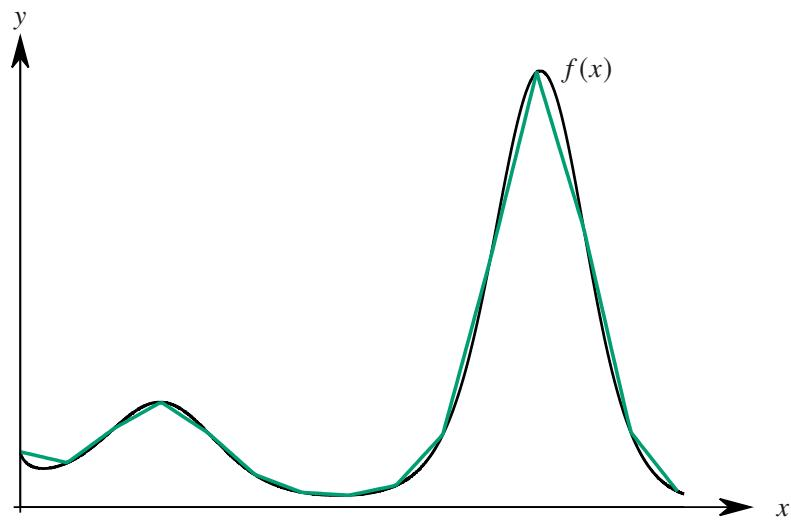  
图 1.11: 第一步, 用折线函数逼近原函数.

(ii) 下面来证明有限闭区间 $[ a , b ]$ 任一折线函数都可以用多项式函数一致逼近. 令

$$
\lambda (x) = \frac {| x | + x}{2} = \left\{ \begin{array}{l l} 0, & x \leq 0 \\ x, & x > 0 \end{array} \right..
$$

用 $\lambda ( x )$ 构造函数:

$$
\Lambda (x) = k + k _ {0} \lambda \left(x - x _ {0}\right) + \dots + k _ {m} \lambda \left(x - x _ {m}\right). \tag {1.27}
$$

容易看出 $\Lambda ( x )$ 表示端点为 $x _ { 0 } , x _ { m + 1 }$ , 转折点为 $x _ { 1 } , \cdots , x _ { m }$ 的折线函数. 现在要证明任一折线函数都可以表达成这样的形式. 我们知道折线函数由它在端点处和所有转折点处的函数值完全决定, 现在任取一个折线函数 $\Lambda _ { 1 } ( x )$ , 设它在 $x _ { 0 } , x _ { 1 } , \cdots , x _ { m } , x _ { m + 1 }$ 处的函数值分别为 $y _ { 0 } , y _ { 1 } , \cdot \cdot \cdot , y _ { m } , y _ { m + 1 } ,$ , 下面只需考察方程组的解的情况:

$$
\begin{array}{l} k + k _ {0} \lambda \left(x _ {i} - x _ {0}\right) + \dots + k _ {m} \lambda \left(x _ {i} - x _ {m}\right) = y _ {i}, \quad i = 0, 1, \dots , m, m + 1. \\ \Longleftrightarrow \left\{ \begin{array}{l} k = y _ {0} \\ k + k _ {0} (x _ {1} - x _ {0}) = y _ {1} \\ \dots \\ k + k _ {0} (x _ {m} - x _ {0}) + \dots + k _ {m - 1} (x _ {m} - x _ {m - 1}) = y _ {m} \\ k + k _ {0} (x _ {m + 1} - x _ {0}) + \dots + k _ {m - 1} (x _ {m + 1} - x _ {m - 1}) + k _ {m} (x _ {m + 1} - x _ {m}) = y _ {m + 1} \end{array} \right. \\ \end{array}
$$

容易看出以上方程组的系数行列式为

$$
(x _ {1} - x _ {0}) \dots (x _ {m} - x _ {m - 1}) (x _ {m + 1} - x _ {m}) \neq 0.
$$

由 Cramer 法则可知以上关于 ??, ??0, · · · , $k _ { m - 1 }$ , $k _ { m }$ 的线性方程组有唯一解. 因此对于任一折线函数都存在确定的一组实数 $k , k _ { 0 } , \cdots , k _ { m - 1 } , k _ { m }$ $k _ { m }$ 使得该折现函数可以表示为形如1.27的形式. 下面只需证明 $\lambda ( x )$ 可以用多项式一致逼近, 为此只需证明 $| x |$ 可以用多项式一致逼近.

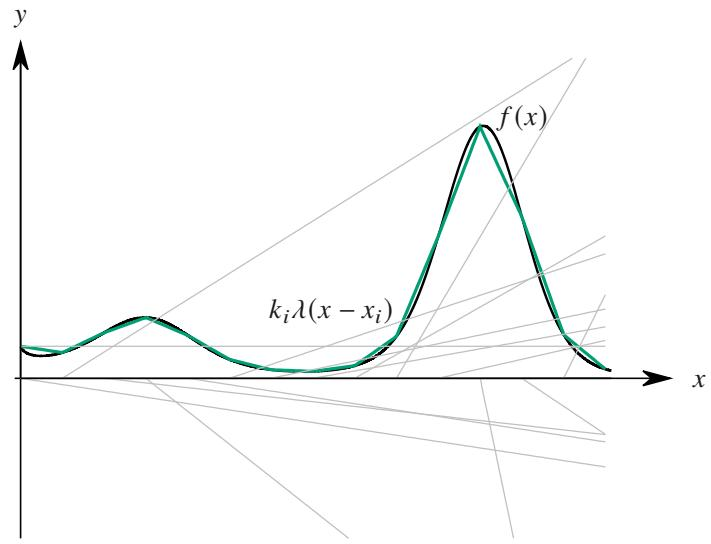  
图 1.12: 第二步, 解方程将折线函数拆成 $k _ { i } \lambda ( x - x _ { i } )$ 的和并确定对应系数.

(iii) 下面来证明 $| x |$ 可以用多项式函数一致逼近. 考察

$$
\sqrt {x} = [ 1 + (x - 1) ] ^ {1 / 2} = \sum_ {n = 0} ^ {+ \infty} \binom {1 / 2} {n} (x - 1) ^ {n}, \quad x \in [ 0, 2 ]. \tag {1.28}
$$

当 $x \in [ 0 , 2 ]$ 时, 由例1.29可知

$$
\sum_ {n = 0} ^ {\infty} \left| \binom {1 / 2} {n} \right| <   + \infty .
$$

显然

$$
\left|\sum_{n = 0}^{+\infty}\binom {1 / 2}{n}(x - 1)^{n}\right|\leq \sum_{n = 0}^{\infty}\left|\binom {1 / 2}{n}\right|.
$$

因此由 Weierstrass 判别法可知等式1.28右侧的级数一致收敛于 ${ \sqrt { x } } .$ . 这表明 $\sqrt { x }$ 可以用多项式函数一致逼近.

现在来考察 $[ - c , c ] \supseteq [ a , b ]$ 上的函数 $| x |$ 能否用多项式函数一致逼近. 设多项式函数列 $\left\{ p _ { n } \right\}$ 一致收敛于 $\sqrt { x }$ .则对于任一 $\varepsilon > 0$ , 存在 $N \in \mathbb { N } ^ { * }$ 使得当 $n > N$ 时对于任一 $x \in [ 0 , 2 ]$ 都有

$$
\left| p _ {n} (x) - \sqrt {x} \right| <   \frac {\varepsilon}{c}.
$$

令

$$
q _ {n} (x) = c p _ {n} \left(\frac {x ^ {2}}{c ^ {2}}\right), \quad n = 1, 2, \dots .
$$

由于 $x ^ { 2 } / c ^ { 2 } \in [ 0 , 1 ]$ , 因此

$$
\left| q _ {n} (x) - | x | \right| = \left| c p _ {n} \left(\frac {x ^ {2}}{c ^ {2}}\right) - c \sqrt {\frac {x ^ {2}}{c ^ {2}}} \right| <   c \cdot \frac {\varepsilon}{c} = \varepsilon .
$$

因此 $\left\{ q _ { n } \right\}$ 在 $\displaystyle [ - c , c ]$ 上可以一致收敛于 $| x |$ .

综上所述, 我们证明了定理的结论

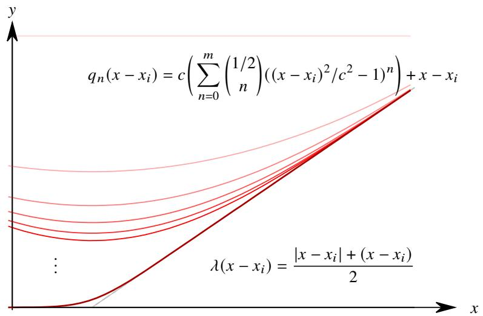  
图 1.13: 第三步, $\lambda ( x - x _ { i } )$ 可用多项式一致逼近.

最终逼近效果如图1.14所示. 需要强调, Weierstrass 逼近定理的成立条件是有限闭区间, 如果在开区间或无限区间上结论都不成立.

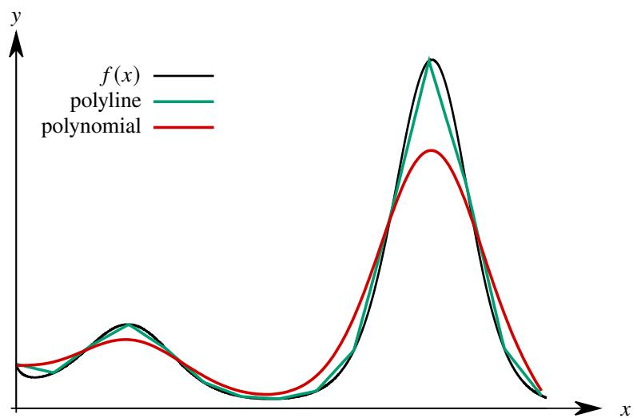  
图 1.14: 最终, 用多项式逼近原函数.

以上证明虽然清晰易懂, 但只是一个非构造性的证明. 俄罗斯数学家 Sergei Natanovich Bernstein 天才地构造了一种多项式序列, 进而给出了 Weierstrass 逼近定理的一个构造性证明!

# 定义 1.20 (Bernstein 多项式)

设 [0, 1] 上的函数 ?? . 令

$$
B _ {n} (f, x) = \sum_ {k = 0} ^ {n} f \left(\frac {k}{n}\right) b _ {k, n}, \quad n = 1, 2, \dots ,
$$

其中

$$
b _ {k, n} = \binom {n} {k} x ^ {k} (1 - x) ^ {n - k}.
$$

我们称 $B _ { n } ( f , x )$ 为 $f$ 的 $n$ 次 Bernstein 多项式 (Bernstein polynomial).

注 $b _ { k , n }$ 显然是非负的.

先来计算几个特殊的 Bernstein 多项式.

# 命题 1.32

令 Bernstein 多项式中的 $f$ 分别为 $1 , x , x ^ { 2 }$ , 则有

(1) $\sum _ { k = 0 } ^ { n } b _ { k , n } = 1 .$

(2) $\sum _ { k = 0 } ^ { n } { \frac { k } { n } } b _ { k , n } = x .$ ????,??

(3) $\sum _ { k = 0 } ^ { n } { \frac { k ^ { 2 } } { n ^ { 2 } } } b _ { k , n } = \left( 1 - { \frac { 1 } { n } } \right) x ^ { 2 } + { \frac { x } { n } } .$ ??2 ??2

证明 (1) 由二项式定理可知

$$
\sum_ {k = 0} ^ {n} \binom {n} {k} p ^ {k} q ^ {n - k} = (p + q) ^ {n}. \tag {1.29}
$$

令 $p = x$ , $q = 1 - x$ 即得

$$
\sum_ {k = 0} ^ {n} \binom {n} {k} x ^ {k} (1 - x) ^ {n - k} = 1.
$$

(2) 在等式1.29两边对 $p$ 求导后再乘以 $p$ 得

$$
\sum_ {k = 0} ^ {n} k \binom {n} {k} p ^ {k} q ^ {n - k} = n p (p + q) ^ {n - 1}. \tag {1.30}
$$

令 $p = x$ , $q = 1 - x$ 即得

$$
\sum_ {k = 0} ^ {n} k \binom {n} {k} x ^ {k} (1 - x) ^ {n - k} = n x \iff \sum_ {k = 0} ^ {n} \frac {k}{n} \binom {n} {k} x ^ {k} (1 - x) ^ {n - k} = x.
$$

(3) 在等式1.30两边对 $p$ 求导后再乘以 $p$ 得

$$
\sum_ {k = 0} ^ {n} k ^ {2} \binom {n} {k} p ^ {k} q ^ {n - k} = n p (p + q) ^ {n - 1} + n (n - 1) p ^ {2} (p + q) ^ {n - 2}.
$$

令 $p = x$ , $q = 1 - x$ 即得

$$
\sum_ {k = 0} ^ {n} k ^ {2} \binom {n} {k} x ^ {k} (1 - x) ^ {n - k} = n x + n (n - 1) x ^ {2} \iff \sum_ {k = 0} ^ {n} \frac {k ^ {2}}{n ^ {2}} \binom {n} {k} x ^ {k} (1 - x) ^ {n - k} = \left(1 - \frac {1}{n}\right) x ^ {2} + \frac {x}{n}.
$$

用上述方法可以继续求出 $f = x ^ { 3 }$ 的 Bernstein 多项式. 用这些特殊的 Bernstein 多项式可以求出更多的 Bern-stein 多项式. 下面看一个例子.

例 1.111 计算 Bernstein 多项式

$$
\sum_ {k = 0} ^ {n} \left(\frac {k}{n} - x\right) ^ {2} b _ {k, n}.
$$

解 由命题1.32可知

$$
\sum_ {k = 0} ^ {n} \left(\frac {k}{n} - x\right) ^ {2} b _ {k, n} = \sum_ {k = 0} ^ {n} \frac {k ^ {2}}{n ^ {2}} b _ {k, n} + x ^ {2} \sum_ {k = 0} ^ {n} b _ {k, n} - 2 x \sum_ {k = 0} ^ {n} \frac {k}{n} b _ {k, n} = \left(1 - \frac {1}{n}\right) x ^ {2} + \frac {x}{n} + x ^ {2} - 2 x ^ {2} = \frac {x (1 - x)}{n}.
$$

下面尝试用 Bernstein 的方法证明 Weierstrass 逼近定理. 对于任一闭区间 $[ a , b ]$ , 只需令

$$
x = \frac {t - a}{b - a}, \quad t \in [ a, b ].
$$

就可以把 $[ a , b ]$ 变成区间 [0, 1]. 因此只需证明在 [0, 1] 上 Weierstrass 逼近定理成立即可.

# 定理 1.59 (Bernstein 定理)

有限闭区间 [0, 1] 上的任一连续函数 $f$ 都能在该区间上用 Bernstein 多项式函数列 $\{ B _ { n } ( f , x ) \}$ 一致逼近.

证明 由于 $f$ 在 [0,1] 上连续, 因此它在 [0,1] 上有界且一致连续, 即存在 $M > 0$ , 对于任一 $x \in [ 0 , 1 ]$ 都有

$$
| f (x) | \leq M.
$$

且对于任一 $\varepsilon > 0$ , 存在 $\delta > 0$ 使得当 $x ^ { \prime } , x ^ { \prime \prime } \in [ 0 , 1 ]$ 时就有

$$
\left| f \left(x ^ {\prime}\right) - f \left(x ^ {\prime \prime}\right) \right| <   \frac {\varepsilon}{2}.
$$

令

$$
\Omega_ {1} = \left\{k: \left| \frac {k}{n} - x \right| \geq \delta , k \in \{0, 1, \dots , n \} \right\}, \quad \Omega_ {2} = \left\{k: \left| \frac {k}{n} - x \right| <   \delta , k \in \{0, 1, \dots , n \} \right\}.
$$

于是

$$
\begin{array}{l} \left| B _ {n} (f, x) - f (x) \right| = \left| \sum_ {k = 0} ^ {n} f \left(\frac {k}{n}\right) b _ {k, n} - \sum_ {k = 0} ^ {n} f (x) b _ {k, n} \right| \leq \sum_ {k = 0} ^ {n} \left| f \left(\frac {k}{n}\right) - f (x) \right| b _ {k, n} \\ = \sum_ {k \in \Omega_ {1}} \left| f \left(\frac {k}{n}\right) - f (x) \right| b _ {k, n} + \sum_ {k \in \Omega_ {2}} \left| f \left(\frac {k}{n}\right) - f (x) \right| b _ {k, n} \leq 2 M \sum_ {k \in \Omega_ {1}} b _ {k, n} + \frac {\varepsilon}{2} \sum_ {k \in \Omega_ {2}} b _ {k, n}. \\ \end{array}
$$

下面分别估计 $\textstyle \sum _ { k \in \Omega _ { 1 } } b _ { k , n }$ 和 $\textstyle \sum _ { k \in \Omega _ { 2 } } b _ { k , n }$ . 由例1.111和均值不等式可知

$$
\sum_ {k \in \Omega_ {1}} b _ {k, n} \leq \frac {1}{\delta^ {2}} \sum_ {k \in \Omega_ {1}} \left(\frac {k}{n} - x\right) ^ {2} b _ {k, n} \leq \frac {1}{\delta^ {2}} \sum_ {k = 0} ^ {n} \left(\frac {k}{n} - x\right) ^ {2} b _ {k, n} = \frac {1}{\delta^ {2}} \frac {x (1 - x)}{n} \leq \frac {1}{4 n \delta^ {2}}.
$$

由命题1.32可知

$$
\sum_ {k \in \Omega_ {2}} b _ {k, n} \leq \sum_ {k = 0} ^ {n} b _ {k, n} = 1.
$$

于是, 当 $n > M / \delta ^ { 2 }$ 时

$$
\left| B _ {n} (f, x) - f (x) \right| \leq 2 M \frac {1}{4 n \delta^ {2}} + \frac {\varepsilon}{2} = \frac {M}{2 n \delta^ {2}} + \frac {\varepsilon}{2} <   \frac {\varepsilon}{2} + \frac {\varepsilon}{2} = \varepsilon .
$$

这就证明了 Bernstein 多项式函数列可以一致逼近 [0,1] 上的任一连续函数.

上述定理不仅证明了一致逼近 $f$ 的多项式函数列的存在性, 还直接构造了这样的多项式函数列. 接下来很自然的问题是研究 Bernstein 多项式的逼近速度, 这关系到 Bernstein 多项式在数值计算上的应用价值.

例 1.112 若用 $f ( x ) = x ^ { 2 }$ 的 Bernstein 多项式逼近 $x ^ { 2 }$ , 则

$$
\left| B _ {n} (f, x) - x ^ {2} \right| = \left| \left(1 - \frac {1}{n}\right) x ^ {2} + \frac {x}{n} - x ^ {2} \right| = \frac {x (1 - x)}{n} \leq \frac {1}{4 n}. \tag {1.31}
$$

即

$$
B _ {n} (f, x) = x ^ {2} + O \left(\frac {1}{n}\right).
$$

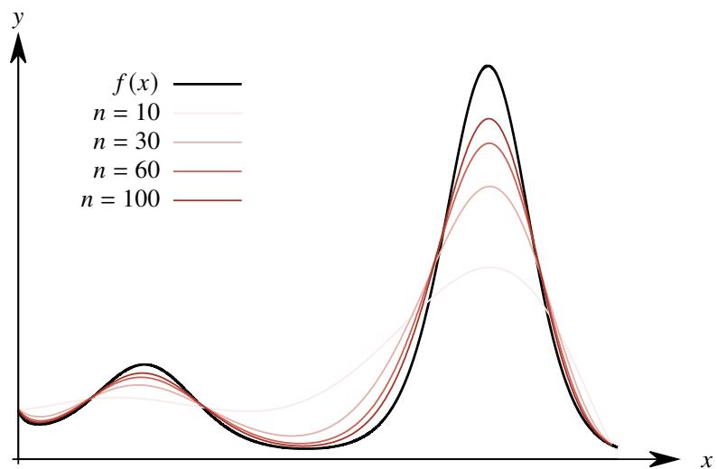  
图 1.15: 用 Bernstein 多项式逼近函数的效果.

上例说明 $f ( x ) = x ^ { 2 }$ 的 Bernstein 多项式逼近 $x ^ { 2 }$ 的阶是 $O ( 1 / n )$ , 这是一个非常慢的逼近速度. 因此如果单纯考虑在数值计算方面的应用, 那么 Bernstein 多项式的价值不大. 然而, Bernstein 多项式还有一些非常优良的性质, 使得它在其他方面具有重要应用价值, 但这超过了本书的主题, 就不详细介绍了.

# 1.5 无穷积分的敛散性

在讨论 Riemann 积分时, 曾经简单介绍过两种反常积分的定义及其计算方法. 下面来讨论反常积分收敛的判别法. 之所以要在级数理论之后讨论反常积分的敛散性, 是因为反常积分收敛判别法几乎完全和级数判别法对应.两者具有很强的可类比性. 很多定理不仅形式相同, 甚至连证明方法也完全相同.

# 1.5.1 无穷积分的概念回顾

先讨论无穷积分的收敛问题. 先来复习一下无穷积分的定义.

# 定义 1.21 (无穷积分)

设函数 $f$ 在 $[ a , + \infty )$ 上有定义. 对于任一 $b > a$ , $f$ 在 $[ a , b ]$ 上都可积. 若

$$
\lim  _ {b \rightarrow + \infty} \int_ {a} ^ {b} f (x) \mathrm {d} x
$$

存在且有限, 则可以引入记号

$$
\int_ {a} ^ {+ \infty} f (x) d x := \lim  _ {b \rightarrow + \infty} \int_ {a} ^ {b} f (x) d x.
$$

并称以上积分收敛, 此时我们称 $f$ 在 $[ a , + \infty )$ 上 Riemann 可积. 否则称以上积分发散. 这样的积分称为无穷积分 (infinite integral).

注 若 $\begin{array} { r } { \operatorname* { l i m } _ { b  + \infty } \int _ { a } ^ { b } f ( x ) \mathrm { d } x } \end{array}$ 极限值是 $\pm \infty$ , 则可以记作

$$
\int_ {a} ^ {+ \infty} f (x) \mathrm {d} x = \pm \infty .
$$

注 类似地可以定义积分下限为 $- \infty$ 的情况.

注 即使积分发散 $\textstyle \int _ { a } ^ { + \infty } f ( x ) \operatorname { d } x$ 的记号也可以使用, 只是此时它不是一个数值.

利用可加性, 可以定义积分上限和下限同时取到无穷的无穷积分. 设无穷积分

$$
\int_ {- \infty} ^ {a} f (x)   d x, \qquad \int_ {a} ^ {+ \infty} f (x)   d x.
$$

若它们都收敛, 则可定义

$$
\int_ {- \infty} ^ {+ \infty} f (x) \mathrm {d} x := \int_ {- \infty} ^ {a} f (x) \mathrm {d} x + \int_ {a} ^ {+ \infty} f (x) \mathrm {d} x.
$$

此时我们称 $f ( x )$ 在 $( - \infty , + \infty )$ 上 Riemann 可积.

关于这个无穷积分, 这里需要多说两句. 首先是定义的合理性. 需要证明此处 ?? 的选取和无穷积分 $\textstyle \int _ { - \infty } ^ { + \infty } f ( x ) \operatorname { d } x$ 的积分值无关.

# 命题 1.33

设函数 $f$ . 若以下积分都收敛:

$$
\int_ {- \infty} ^ {a} f (x) d x, \quad \int_ {a} ^ {+ \infty} f (x) d x.
$$

则对于任一 $a ^ { \prime } \in \mathbb { R }$ 都有

$$
\int_ {- \infty} ^ {a} f (x) \mathrm {d} x + \int_ {a} ^ {+ \infty} f (x) \mathrm {d} x = \int_ {- \infty} ^ {a ^ {\prime}} f (x) \mathrm {d} x + \int_ {a ^ {\prime}} ^ {+ \infty} f (x) \mathrm {d} x.
$$

证明 我们有等式:

$$
\int_ {a ^ {\prime}} ^ {b} f (x) \mathrm {d} x = \int_ {a ^ {\prime}} ^ {a} f (x) \mathrm {d} x + \int_ {a} ^ {b} f (x) \mathrm {d} x.
$$

由于 $\textstyle { \int _ { a } ^ { + \infty } f ( x ) \operatorname { d } x }$ 收敛, 因此令以上等式中的 $b \to \infty$ 得

$$
\int_ {a ^ {\prime}} ^ {+ \infty} f (x) \mathrm {d} x = \int_ {a ^ {\prime}} ^ {a} f (x) \mathrm {d} x + \int_ {a} ^ {+ \infty} f (x) \mathrm {d} x.
$$

这表明 $\textstyle \int _ { a ^ { \prime } } ^ { + \infty } f ( x )$ d ?? 也收敛. 同理可知 $\int _ { - \infty } ^ { a ^ { \prime } } f ( x ) \mathop { } \mathrm { d } x$ 也收敛且

$$
\int_ {- \infty} ^ {a ^ {\prime}} f (x) \mathrm {d} x = \int_ {- \infty} ^ {a} f (x) \mathrm {d} x + \int_ {a} ^ {a ^ {\prime}} f (x) \mathrm {d} x.
$$

两式相加即得

$$
\int_ {- \infty} ^ {a} f (x) \mathrm {d} x + \int_ {a} ^ {+ \infty} f (x) \mathrm {d} x = \int_ {- \infty} ^ {a ^ {\prime}} f (x) \mathrm {d} x + \int_ {a ^ {\prime}} ^ {+ \infty} f (x) \mathrm {d} x.
$$

上面的命题表明我们定义的无穷积分 $\int _ { - \infty } ^ { + \infty } f ( x ) \mathrm { d } x$ 是良定义的.

另一方面, 定义 $\int _ { - \infty } ^ { + \infty } f ( x ) \mathrm { d } x$ 的可积性涉及到了两个极限:

$$
\lim  _ {H \rightarrow + \infty} \int_ {a} ^ {H} f (x)   d x, \quad \lim  _ {H ^ {\prime} \rightarrow - \infty} \int_ {H ^ {\prime}} ^ {c} f (x)   d x.
$$

这里的两个极限过程是彼此独立的. 因此我们实际需要检验的是一个 “二重极限”:

$$
\lim  _ {\begin{array}{c}H \rightarrow + \infty\\H ^ {\prime} \rightarrow - \infty\end{array}} \int_ {H ^ {\prime}} ^ {H} f (x)   d x \tag {1.32}
$$

这和以下极限是不同的:

$$
\lim  _ {H \rightarrow \infty} \int_ {- H} ^ {H} f (x) \mathrm {d} x. \tag {1.33}
$$

不难看出, 即使以上极限存在, 二重极限1.32未必存在.

例 1.113 以下二重极限不存在

$$
\lim_{\substack{H\to +\infty \\ H^{\prime}\to -\infty}}\int_{H^{\prime}}^{H}x  \mathrm{d}x
$$

但以下极限存在:

$$
\lim  _ {H \to \infty} \int_ {- H} ^ {H} x d x = 0.
$$

因此就很自然地得到了一种 “较弱的” 收敛.

# 定义 1.22 (无穷积分的 Cauchy 主值)

设 R 上的函数 $f$ . 令

$$
P V \int_ {- \infty} ^ {+ \infty} f (x) d x := \lim  _ {a \rightarrow + \infty} \int_ {- a} ^ {a} f (x) d x.
$$

若上式右边的极限存在, 则称这个极限为无穷积分 $\textstyle { \int _ { - \infty } ^ { + \infty } f ( x ) \operatorname { d } x }$ 的 Cauchy 主值 (Cauchy principal value).

注 显然存在 Cauchy 主值是 $\int _ { - \infty } ^ { + \infty } f ( x ) \mathrm { d } x$ 收敛的必要但不充分条件.

容易知道以下积分的 Cauchy 主值都是零, 但它们都是不收敛的

$$
P V \int_ {- \infty} ^ {+ \infty} x \mathrm {d} x = 0, \quad P V \int_ {- \infty} ^ {+ \infty} \sin x \mathrm {d} x = 0, \quad P V \int_ {- \infty} ^ {+ \infty} \arctan x \mathrm {d} x = 0.
$$

容易看出它们都是 $\mathbb { R }$ 上的奇函数.

下面看一个例子.

例 1.114 设函数

$$
f (x) = \frac {1 + x}{1 + x ^ {2}}.
$$

求 $\textstyle P V \int _ { - \infty } ^ { + \infty } f ( x ) \operatorname { d } x$

证明 解法一 直接计算不定积分

$$
\int_ {- \infty} ^ {+ \infty} \frac {1 + x}{1 + x ^ {2}} d x = \arctan x + \frac {1}{2} \ln (1 + x ^ {2}) + C.
$$

因此

$$
P V \int_ {- \infty} ^ {+ \infty} f (x) d x = \lim  _ {H \rightarrow + \infty} \int_ {- H} ^ {H} f (x) d x = \lim  _ {H \rightarrow + \infty} \left[ \arctan H + \frac {1}{2} \ln \left(1 + H ^ {2}\right) - \arctan (- H) - \frac {1}{2} \ln \left(1 + H ^ {2}\right)\right] = \pi .
$$

解法二 把 $f$ 分离成一个可积函数和一个奇函数的和:

$$
f (x) = \frac {1 + x}{1 + x ^ {2}} = \frac {1}{1 + x ^ {2}} + \frac {x}{1 + x ^ {2}}.
$$

$$
P V \int_ {- \infty} ^ {+ \infty} f (x) d x = P V \int_ {- \infty} ^ {+ \infty} \frac {1}{1 + x ^ {2}} d x + P V \int_ {- \infty} ^ {+ \infty} \frac {x}{1 + x ^ {2}} d x = \lim  _ {H \rightarrow + \infty} \int_ {- H} ^ {H} \frac {1}{1 + x ^ {2}} d x = \pi .
$$

注 上例中的无穷积分是不收敛的. 只需证明 $\textstyle { \int _ { 1 } ^ { + \infty } f ( x ) \operatorname { d } x }$ 不收敛. 由于 $f$ 在 $[ 1 , + \infty )$ 上非负且递减, 因此根据Cauchy 积分判别法只需证明级数 $\textstyle \sum _ { n = 1 } ^ { \infty } f ( n )$ 不收敛. 由于

$$
\frac {1 + n}{1 + n ^ {2}} \sim \frac {1}{n},
$$

由比较判别法可知 $\textstyle \sum _ { n = 1 } ^ { \infty } f ( n )$ 不收敛. 这就证明了 $\textstyle { \int _ { 1 } ^ { + \infty } f ( x ) \operatorname { d } x }$ 不收敛.

# 1.5.2 非负函数无穷积分的收敛判别法

在讨论级数时, 首先讨论了正项级数. 类似地, 讨论无穷积分时可以先讨论非负函数的无穷积分. 无穷积分本质上也是一个极限, 所以根据单调有界定理也有如下结论.

# 命题 1.34 (非负函数无穷积分收敛的充要条件)

设 $[ a , + \infty )$ 上的一个非负函数 $f$ . 则无穷积分 $\textstyle \int _ { a } ^ { + \infty } f ( x ) \operatorname { d } x$ 收敛当且仅当对于任一 $A > a$ , 函数 $f$ 在 $[ a , A ]$ 上都可积, 且 $\textstyle \int _ { a } ^ { A } f ( x ) \mathrm { d } x$ 在 $[ a , + \infty )$ 上有界.

注 以上命题对应级数中的命题1.6.

由以上命题可以得到非负函数无穷积分的比较判别法.

# 定理 1.60 (非负函数无穷积分的比较判别法)

设 $[ a , + \infty )$ 上的非负函数 $f$ 和 $g$ . 当 $x$ 充分大时有 $0 \leq f ( x ) \leq g ( x )$ . 则

(1) 若 $\textstyle \int _ { a } ^ { + \infty } g ( x ) \mathrm { d } x$ 收敛, 则 $\textstyle \int _ { a } ^ { + \infty } f ( x ) \operatorname { d } x$ 也收敛.   
(2) 若 $\textstyle \int _ { a } ^ { + \infty } f ( x ) \operatorname { d } x$ 发散, 则 $\textstyle \int _ { a } ^ { + \infty } g ( x ) \operatorname { d } x$ 也发散.

注 以上定理对应级数中的定理1.1.

在研究正项级数时, 我们最常用的 “基准级数” 是 $p$ 级数. 类似的有 $_ p$ 积分”.

例 $1 . 1 1 5 p$ $p$ 积分 设 $p$ 积分

$$
\int_ {a} ^ {+ \infty} \frac {\mathrm {d} x}{x ^ {p}}, \quad a > 0.
$$

当 $p \leq 1$ 时积分发散, 当 $p > 1$ 时积分收敛.

下面看一个例子.

例 1.116 判断以下无穷积分的敛散性:

$$
\int_ {a} ^ {+ \infty} \frac {\mathrm {d} x}{\sqrt [ 3 ]{x ^ {2} + x ^ {4}}}, \quad a > 0.
$$

证明 由于

$$
\frac {1}{\sqrt [ 3 ]{x ^ {2} + x ^ {4}}} \leq \frac {1}{x ^ {4 / 3}}.
$$

且积分 $\textstyle \int _ { a } ^ { + \infty } { 1 / x ^ { 4 / 3 } } \mathrm { d } x$ 收敛, 由非负函数无穷积分的比较判别法可知原积分也收敛.

类似地有比较判别法的极限形式.

# 定理 1.61 (非负函数无穷积分比较判别法的极限形式)

设 $[ a , + \infty )$ 上的非负函数 $f$ 和 $g$ . 若

$$
\lim  _ {x \rightarrow + \infty} \frac {f (x)}{g (x)} = l.
$$

(1) 当 $0 < l < + \infty$ 时, 积分 $\textstyle { \int _ { a } ^ { + \infty } f ( x ) \operatorname { d } x }$ , $\textstyle \int _ { a } ^ { + \infty } g ( x ) \operatorname { d } x$ 同敛散.   
(2) 当 $l = 0$ 时, 若积分 $\textstyle \int _ { a } ^ { + \infty } g ( x ) \operatorname { d } x$ 收敛, 则 $\textstyle \int _ { a } ^ { + \infty } f ( x ) \operatorname { d } x$ 也收敛.  
(3) 当 $l = + \infty$ 时, 若积分 $\textstyle \int _ { a } ^ { + \infty } g ( x ) \operatorname { d } x$ 发散, 则 $\textstyle \int _ { a } ^ { + \infty } f ( x ) \operatorname { d } x$ 也发散.

注 以上定理对应级数中的定理1.2.

下面看两个例子.

例 1.117 判断以下无穷积分的敛散性:

$$
\int_ {1} ^ {+ \infty} \frac {x ^ {2}}{x ^ {4} - x ^ {2} + 1} \mathrm {d} x, \quad a > 0.
$$

解 由于

$$
\frac {x ^ {2}}{x ^ {4} - x ^ {2} + 1} \sim \frac {1}{x ^ {2}}, \quad x \rightarrow + \infty .
$$

且积分 $\textstyle \int _ { a } ^ { + \infty } { 1 / x ^ { 2 } } \mathrm { d } x$ 收敛, 由非负函数无穷积分的比较判别法可知原积分也收敛.

例 1.118 判断以下无穷积分的敛散性:

$$
\int_ {1} ^ {+ \infty} \frac {\arctan x}{(1 + x ^ {2}) ^ {3 / 2}} d x, \quad a > 0.
$$

解 由于

$$
\frac {\arctan x}{\left(1 + x ^ {2}\right) ^ {3 / 2}} \sim \frac {\pi / 2}{x ^ {3}}, \quad x \rightarrow + \infty .
$$

且积分 $\textstyle \int _ { a } ^ { + \infty } { 1 / x ^ { 3 } } \mathrm { d } x$ 收敛, 由非负函数无穷积分的比较判别法可知原积分也收敛.

# 1.5.3 无穷积分的归结原理

设无穷积分 $\textstyle { \int _ { a } ^ { + \infty } f ( x ) \operatorname { d } x }$ 收敛. 现在在 $[ a , + \infty )$ 取一个数列, 使得它的首项是 $a$ 且递增趋于 $+ \infty$ . 于是就可以把曲边梯形分割成一列小曲边梯形, 因此

$$
\int_ {a} ^ {a _ {n + 1}} f (x) \mathrm {d} x = \sum_ {k = 1} ^ {n} \int_ {a _ {k}} ^ {a _ {k + 1}} f (x) \mathrm {d} x.
$$

令 $n \to \infty$ 可得

$$
\int_ {a} ^ {+ \infty} f (x) d x = \sum_ {k = 1} ^ {\infty} \int_ {a _ {k}} ^ {a _ {k + 1}} f (x) d x.
$$

这表明收敛的无穷积分总是可以用一个级数表示. 事实上无穷积分可以看作一个函数的极限, 因此由函数极限的Heine 归结原理立刻可以得到无穷积分的归结原理.

# 定理 1.62 (无穷积分的归结原理)

设 $[ a , + \infty )$ 上的函数 $f$ . 则

$$
\int_ {a} ^ {+ \infty} f (x) d x = A \in \mathbb {R}
$$

当且仅当对于任一趋于 $+ \infty$ 的数列 $\{ a _ { n } \} \subseteq [ a , + \infty )$ $( a _ { 1 } = a )$ ) 都有

$$
\sum_ {n = 1} ^ {\infty} \int_ {a _ {n}} ^ {a _ {n + 1}} f (x) \mathrm {d} x = A.
$$

如果只存在一个趋于 $+ \infty$ 的数列 $\left\{ a _ { n } \right\}$ $( a _ { 1 } = a )$ ) 使得

$$
\sum_ {n = 1} ^ {\infty} \int_ {a _ {n}} ^ {a _ {n + 1}} f (x) \mathrm {d} x = A.
$$

则不足以推得对应的积分收敛. 反例是很容易想到的.

例 1.119 设无穷积分

$$
\int_ {0} ^ {+ \infty} \cos x d x.
$$

令 $a _ { n } = n \pi$ $\mathbf { \chi } _ { n } = 1 , 2 , \cdots )$ ), 则

$$
\sum_ {n = 0} ^ {\infty} \int_ {a _ {n}} ^ {a _ {n + 1}} \cos x d x = \sum_ {n = 0} ^ {\infty} \int_ {n \pi} ^ {(n + 1) \pi} \cos x d x = 0.
$$

但是

$$
\lim  _ {a \rightarrow + \infty} \int_ {0} ^ {a} \cos x d x = \lim  _ {a \rightarrow + \infty} \sin a.
$$

因此积分 $\int _ { 0 } ^ { + \infty } \cos x \mathrm { d } x$ 发散.

但如果 $f$ 是一个非负函数, 则只需要一个数列就够了.

# 定理 1.63

设 $[ a , + \infty )$ 上的非负函数 $f$ . 若存在一个递增趋于 $+ \infty$ 的数列 $\left\{ a _ { n } \right\}$ $( a _ { 1 } = a )$ , 使得级数 $\textstyle \sum _ { n = 1 } ^ { \infty } \int _ { a _ { n } } ^ { a _ { n + 1 } } f ( x ) \operatorname { d } x$ 收敛, 则积分 $\textstyle { \int _ { a } ^ { + \infty } f ( x ) \operatorname { d } x }$ 也收敛. 且

$$
\int_ {a} ^ {+ \infty} f (x) \mathrm {d} x = \sum_ {n = 1} ^ {\infty} \int_ {a _ {n}} ^ {a _ {n + 1}} f (x) \mathrm {d} x. \tag {1.34}
$$

证明 由于 $\left\{ a _ { n } \right\}$ 递增趋于 $+ \infty$ , 故对于任一 $E > 0$ , 都存在 $N \in \mathbb { N } ^ { * }$ 使得 $a _ { N } \leq E < a _ { N + 1 }$ . 由于 $f ( x )$ 非负, 故

$$
\sum_ {n = 1} ^ {N - 1} \int_ {a _ {n}} ^ {a _ {n + 1}} f (x) d x = \int_ {a} ^ {a _ {N}} f (x) d x \leq \int_ {a} ^ {E} f (x) d x \leq \int_ {a} ^ {a _ {N + 1}} f (x) d x = \sum_ {n = 1} ^ {N} \int_ {a _ {n}} ^ {a _ {n + 1}} f (x) d x.
$$

由于 $\textstyle \sum _ { n = 1 } ^ { \infty } \int _ { a _ { n } } ^ { a _ { n + 1 } } f ( x ) \operatorname { d } x$ 收敛. 令上式 $N \to \infty$ , 由夹逼定理可知积分 $\textstyle \int _ { a } ^ { + \infty } f ( x ) \operatorname { d } x$ 也收敛. 且等式1.34成立.

尽管无穷级数和无穷积分有那么多相似之处, 但还是有些不同的. 对于无穷级数而言, 如果它收敛, 则它的通项一定趋于零. 很容易猜想无穷积分也有这样的结论, 即无穷积分 $\textstyle \int _ { a } ^ { + \infty } f ( x ) \operatorname { d } x$ 收敛时, $\begin{array} { r } { \operatorname* { l i m } _ { x  + \infty } f ( x ) = 0 . } \end{array}$ 下面看一个例子.

例 1.120 设 $[ 1 / 2 , + \infty )$ 上的函数

$$
f (x) = \left\{ \begin{array}{l l} 4 n ^ {2} (x - n) + 2, & x \in \left[ n - \frac {1}{2 n ^ {2}}, n \right], \quad n = 1, 2, \dots . \\ - 4 n ^ {2} (x - n) + 2, & x \in \left(n, n + \frac {1}{2 n ^ {2}} \right], \quad n = 1, 2, \dots . \\ 0, & \text {其 余 情 况} \end{array} \right..
$$

则积分 $\textstyle { \int _ { 0 } ^ { + \infty } f ( x ) \operatorname { d } x }$ 收敛, 但当 $x \to + \infty$ 时 $f ( x )$ 不收敛于 0.

证明 (i) 令 $a _ { n } = ( 2 n + 1 ) / 2 \ ( n = 0 , 1 , \cdot \cdot \cdot )$ $( n = 0 , 1 , \cdots )$ . 如图1.16可知

$$
\sum_ {n = 1} ^ {\infty} \int_ {a _ {n}} ^ {a _ {n + 1}} f (x) \mathrm {d} x = \sum_ {n = 1} ^ {\infty} \frac {1}{n ^ {2}}.
$$

由定理1.63可知积分 $\textstyle { \int _ { 0 } ^ { + \infty } f ( x ) \operatorname { d } x }$ 收敛, 且

$$
\int_ {0} ^ {+ \infty} f (x) \mathrm {d} x = \sum_ {n = 1} ^ {\infty} \frac {1}{n ^ {2}}.
$$

(ii) 由于 $f ( n ) \equiv 2$ . 由 Heine 定理可知当 $x \to + \infty$ 时 $f ( x )$ 不收敛于 0.

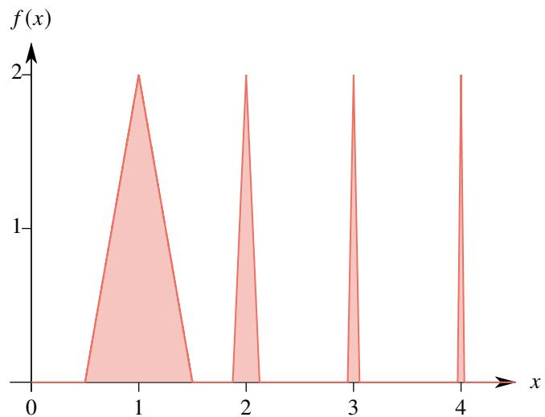  
图 1.16: $\textstyle { \int _ { 0 } ^ { + \infty } f ( x ) \operatorname { d } x }$ 示意图.

由上例可知, 无穷积分在这个问题上和级数很不一样. 下面再看一个例子.

例 1.121 设函数

$$
f (x) = \frac {x}{1 + x ^ {6} \sin^ {2} x}.
$$

则积分 $\textstyle { \int _ { 0 } ^ { + \infty } f ( x ) \operatorname { d } x }$ 收敛, 但当 $x \to + \infty$ 时 $f ( x )$ 不收敛于 0.

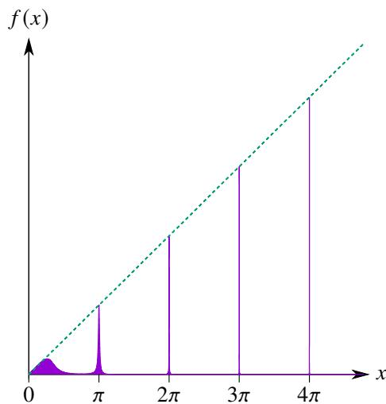  
图 1.17: $x / ( 1 + x ^ { 6 } \sin ^ { 2 } x )$ 示意图.

证明 (i) 由于 $\sin ^ { 2 } x$ 是周期为 $\pi$ 的偶函数, 因此当 $n \geq 1$ 时

$$
\begin{array}{l} \int_ {n \pi} ^ {(n + 1) \pi} \frac {x \mathrm {d} x}{1 + x ^ {6} \sin^ {2} x} \leq (n + 1) \pi \int_ {n \pi} ^ {(n + 1) \pi} \frac {\mathrm {d} x}{1 + n ^ {6} \sin^ {2} x} = 2 (n + 1) \pi \int_ {0} ^ {\pi / 2} \frac {\mathrm {d} x}{1 + n ^ {6} \sin^ {2} x} \\ \leq 2 (n + 1) \pi \int_ {0} ^ {\pi / 2} \frac {\mathrm {d} x}{\cos^ {2} x + n ^ {6} \sin^ {2} x} = \frac {2 (n + 1) \pi}{n ^ {3}} \int_ {0} ^ {\pi / 2} \frac {\mathrm {d} (n ^ {3} \tan x)}{1 + (n ^ {3} \tan x) ^ {2}} \\ = \frac {2 (n + 1) \pi}{n ^ {3}} \int_ {0} ^ {+ \infty} \frac {\mathrm {d} t}{1 + t ^ {2}} = \frac {2 (n + 1) \pi}{n ^ {3}} \cdot \frac {\pi}{2} \leq \frac {2 \pi^ {2}}{n ^ {2}}. \\ \end{array}
$$

由正项级数的比较判别法可知以下级数收敛:

$$
\sum_ {n = 0} ^ {\infty} \int_ {n \pi} ^ {(n + 1) \pi} \frac {x \mathrm {d} x}{1 + x ^ {6} \sin^ {2} x}.
$$

于是由定理1.63可知原积分也收敛.

(ii) 由于

$$
f (n \pi) = \frac {n \pi}{1 + (n \pi) ^ {6} \sin^ {2} (n \pi)} = n \pi \rightarrow + \infty .
$$

由 Heine 定理可知当 $x \to + \infty$ 时 $f ( x )$ 不收敛于 0.

# 1.5.4 无穷积分的 Cauchy 收敛原理

下面通过类比一般项级数的收敛判别法来研究一般的无穷积分的敛散性.

无穷积分本质上也是一个函数的极限, 所以也有对应的 Cauchy 收敛原理.

# 定理 1.64 (无穷积分的 Cauchy 收敛原理)

无穷积分 $\textstyle \int _ { a } ^ { + \infty } f ( x ) \operatorname { d } x$ 收敛当且仅当对于任一 $\varepsilon > 0$ 都存在 $A > a$ , 当 $a _ { 1 } , a _ { 2 } > A$ 时

$$
\left| \int_ {a _ {1}} ^ {a _ {2}} f (x)   d x \right| <   \varepsilon .
$$

注 一个无穷积分收敛当且仅当在充分远处, 不管区间多长, 积分的绝对值都可以任意小.

注 以上定理对应级数中的定理1.15

对照级数, 也可以定义无穷积分的条件收敛和绝对收敛.

# 定义 1.23 (无穷积分的绝对收敛和条件收敛)

设无穷积分 $\textstyle \int _ { a } ^ { + \infty } f ( x ) \operatorname { d } x$ 收敛.

(1) 若 $\textstyle { \int _ { a } ^ { + \infty } { \bigl | } f ( x ) { \bigr | } \mathrm { d } x }$ 也收敛, 则称 $\textstyle \int _ { a } ^ { + \infty } f ( x ) \operatorname { d } x$ 绝对收敛 (absolutely convergent).   
(2) 若 $\textstyle { \int _ { a } ^ { + \infty } { \bigl | } f ( x ) { \bigr | } \mathrm { d } x }$ 发散, 则称 $\textstyle \int _ { a } ^ { + \infty } f ( x ) \operatorname { d } x$ 条件收敛 (conditionally convergent).

无穷积分的绝对收敛和条件收敛也有如下关系.

# 定理 1.65

若无穷积分 $\textstyle { \int _ { a } ^ { + \infty } { \bigl | } f ( x ) { \bigr | } \mathrm { d } x }$ 收敛, 则 $\textstyle \int _ { a } ^ { + \infty } f ( x ) \operatorname { d } x$ 也收敛.

证明 若无穷积分 $\textstyle { \int _ { a } ^ { + \infty } { \bigl | } f ( x ) { \bigr | } \mathrm { d } x }$ 收敛, 则对于任一 $\varepsilon > 0$ , 都存在 $a _ { 0 } > a$ 使得当 $a _ { 1 } , a _ { 2 } > a _ { 0 }$ 时

$$
\int_ {a _ {1}} ^ {a _ {2}} | f (x) | \mathrm {d} x <   \varepsilon .
$$

于是

$$
\left| \int_ {a _ {1}} ^ {a _ {2}} f (x) \mathrm {d} x \right| <   \int_ {a _ {1}} ^ {a _ {2}} | f (x) | \mathrm {d} x <   \varepsilon .
$$

于是可知 $\textstyle \int _ { a } ^ { + \infty } f ( x ) \operatorname { d } x$ 也收敛.

注 以上定理对应级数中的定理1.21.

例 1.122 判断以下积分的敛散性:

$$
\int_ {1} ^ {+ \infty} \frac {\sin x}{x \sqrt {x}} d x.
$$

解 由于

$$
\left| \frac {\sin x}{x \sqrt {x}} \right| \leq \frac {1}{x \sqrt {x}} = \frac {1}{x ^ {3 / 2}}.
$$

由比较判别法可知原积分绝对收敛, 因此原积分收敛.

请注意比较常义积分和广义积分中 $f$ 和 $\vert f \vert$ 的可积性:

常义积分 $\int _ { a } ^ { b } f ( x ) { \mathrm { d } } x$ 可积 $\implies \int _ { a } ^ { b } | f ( x ) | \mathrm { d } x$ 可积.

无穷积分 $\int _ { a } ^ { + \infty } | f ( x ) | { \mathrm { d } } x$ 可积 (收敛) $\implies \int _ { a } ^ { + \infty } f ( x ) \mathrm { d } x$ 可积 (收敛).

以上两个命题的逆命题都是不成立的. 前一个命题的反例是 Dirichlet 函数, 这在《数学分析 I》中已经介绍过. 后一个命题的反例是著名的 Dirichlet 积分, 我们将在后面介绍这个例子.

# 1.5.5 第二积分中值定理

无穷积分也有Dirichlet判别法和Abel判别法.我们知道要用这两个判别法,首先要把被积函数拆成两个函数的乘积. 因此我们先要处理如下形式积分:

$$
\int_ {a} ^ {a} f (x) g (x) \mathrm {d} x.
$$

为了处理这样的问题, 需要使用积分中值定理.

在《数学分析 I》中已经证明了一种积分中值定理: 若 $f$ 和 $g$ 在 $[ a , b ]$ 上连续, 且 $g$ 在 $[ a , b ]$ 上非负, 则存在$\xi \in [ a , b ]$ 使得

$$
\int_ {a} ^ {b} f (x) g (x) \mathrm {d} x = f (\xi) \int_ {a} ^ {b} g (x) \mathrm {d} x.
$$

特别地, 当 $g = 1$ 时, 就有

$$
\int_ {a} ^ {b} f (x) g (x) \mathrm {d} x = f (\xi) (b - a).
$$

此时积分中值定理有明确的几何意义:1.18所示, 函数 $f$ 在 $[ a , b ]$ 上非负, 则存在 $\xi \in [ a , b ]$ 使得 $\textstyle \int _ { a } ^ { b } f ( x ) \operatorname { d } x$ 定义的曲边梯形面积等于一个长和宽分别为 $f ( \xi )$ 和 $b - a$ 的矩形面积.

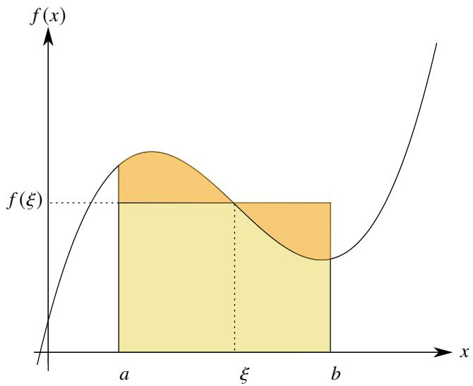  
图 1.18: 第一积分中值定理示意图.

现在换个角度来看.如图1.19,若函数 $g$ 在 $[ a , b ]$ 上非负且单调递减.那么应该存在 $\eta \in ( a , b )$ ,使得 $\textstyle \int _ { a } ^ { b } g ( x ) \operatorname { d } x$ 定义的曲边梯形面积等于一个长和宽分别为 $g ( a )$ 和 $\xi - a$ 的矩形面积. 这个结论可以表述为: 设函数 $g$ 在 $[ a , b ]$ 上非负且单调递减, 则存在 $\eta \in [ a , b ]$ 使得

$$
\int_ {a} ^ {b} g (x) \mathrm {d} x = g (a) (\eta - a).
$$

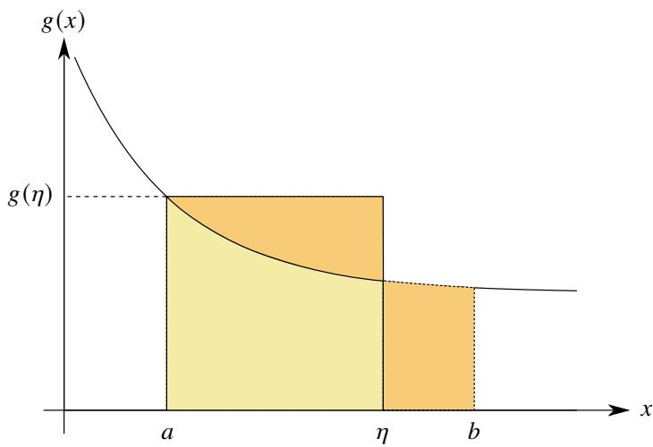  
图 1.19: 第二积分中值定理示意图.

这个结论不难证明. 只需令

$$
\varphi (x) = g (a) (x - a).
$$

显然 $\varphi$ 是一个连续函数. 由于

$$
\varphi (a) \leq \int_ {a} ^ {b} g (x) \mathrm {d} x \leq \varphi (b).
$$

由介值定理可知存在 $\eta \in [ a , b ]$ 使得

$$
\varphi (\eta) = \int_ {a} ^ {b} g (x) d x.
$$

这就是

$$
\int_ {a} ^ {b} g (x) \mathrm {d} x = g (a) (\eta - a).
$$

这就是第二种积分中值定理. 仿照第一种积分中值定理, 我们可以把在上述结论中 “塞入” 另一个函数, 让等式变成:

$$
\int_ {a} ^ {b} f (x) g (x) \mathrm {d} x = g (a) \int_ {a} ^ {\eta} f (x) \mathrm {d} x.
$$

类似地, 可以先令

$$
\varphi (x) = g (a) \int_ {a} ^ {x} f (t) \mathrm {d} t.
$$

显然 $\varphi$ 是一个连续函数, 因此只需证明

$$
\min  _ {x \in [ a, b ]} \varphi (x) \leq \int_ {a} ^ {b} f (x) g (x) d x \leq \max  _ {x \in [ a, b ]} \varphi (x).
$$

然后根据介值定理即可知道结论正确.

# 定理 1.66 (第二积分中值定理 I)

设函数 $f$ 在 $[ a , b ]$ 上 Riemann 可积, $g$ 在 $[ a , b ]$ 上非负.

(1) 若 $g$ 在 $[ a , b ]$ 上单调递减, 则存在 $\xi \in [ a , b ]$ 使得

$$
\int_ {a} ^ {b} f (x) g (x) \mathrm {d} x = g (a) \int_ {a} ^ {\xi} f (x) \mathrm {d} x. \tag {1.35}
$$

(2) 若 $g$ 在 $[ a , b ]$ 上单调递增, 则存在 $\eta \in [ a , b ]$ 使得

$$
\int_ {a} ^ {b} f (x) g (x) \mathrm {d} x = g (b) \int_ {\eta} ^ {b} f (x) \mathrm {d} x. \tag {1.36}
$$

证明 只证明 (1). 令

$$
\varphi (x) = g (a) \int_ {a} ^ {x} f (t) \mathrm {d} t.
$$

下面来证明

$$
\min  _ {x \in [ a, b ]} \varphi (x) \leq \int_ {a} ^ {b} f (x) g (x) d x \leq \max  _ {x \in [ a, b ]} \varphi (x).
$$

由于 $g$ 在 $[ a , b ]$ 上单调递减, 所以 $g$ 在 $[ a , b ]$ 上 Riemann 可积. 由于 $f$ 在 $[ a , b ]$ 上 Riemann 可积, 故 $f g$ 在$[ a , b ]$ 上 Riemann 可积. 作 $[ a , b ]$ 的一个分割

$$
\pi : a = x _ {0} <   x _ {1} <   \dots <   x _ {n} = b.
$$

则

$$
\int_ {a} ^ {b} f (x) g (x) \mathrm {d} x = \sum_ {i = 1} ^ {n} \int_ {x _ {i - 1}} ^ {x _ {i}} f (x) g (x) \mathrm {d} x = \sum_ {i = 1} ^ {n} \int_ {x _ {i - 1}} ^ {x _ {i}} f (x) [ g (x) - g (x _ {i - 1}) ] \mathrm {d} x + \sum_ {i = 1} ^ {n} g \left(x _ {i - 1}\right) \int_ {x _ {i - 1}} ^ {x _ {i}} f (x) \mathrm {d} x. \tag {1.37}
$$

设 $g$ 在 $[ x _ { i - 1 } , x _ { i } ]$ 上的振幅为 $\omega _ { i }$ $( i = 1 , 2 , \cdots , n )$ . 由于存在 $K > 0$ 使得 $| f | \le K$

$$
\left| \sum_ {i = 1} ^ {n} \int_ {x _ {i - 1}} ^ {x _ {i}} f (x) [ g (x) - g (x _ {i - 1}) ] d x \right| \leq \sum_ {i = 1} ^ {n} \int_ {x _ {i - 1}} ^ {x _ {i}} | f (x) | | g (x) - g (x _ {i - 1}) | d x \leq K \sum_ {i = 1} ^ {n} \omega_ {i} (x _ {i} - x _ {i - 1}).
$$

由于 $g$ 在 $[ a , b ]$ 上 Riemann 可积, 故

$$
\lim  _ {\| \pi \| \rightarrow 0} K \sum_ {i = 1} ^ {n} \omega_ {i} (x _ {i} - x _ {i - 1}) = 0.
$$

于是等式1.37可以变为

$$
\int_ {a} ^ {b} f (x) g (x) \mathrm {d} x = \lim  _ {\| \pi \| \rightarrow 0} \sum_ {i = 1} ^ {n} g \left(x _ {i - 1}\right) \int_ {x _ {i - 1}} ^ {x _ {i}} f (x) \mathrm {d} x. \tag {1.38}
$$

令

$$
a _ {i} = \int_ {x _ {i - 1}} ^ {x _ {i}} f (x) \mathrm {d} x, \quad b _ {i} = g (x _ {i - 1}), \quad i = 1, 2, \dots , n.
$$

再令

$$
S _ {n} = \sum_ {i = 1} ^ {n} a _ {i} = \sum_ {i = 1} ^ {n} \int_ {x _ {i - 1}} ^ {x _ {i}} f (x) d x = \int_ {a} ^ {x _ {n}} f (x) d x.
$$

则由 Abel 分部求和公式可知

$$
\sum_ {i = 1} ^ {n} g \left(x _ {i - 1}\right) \int_ {x _ {i - 1}} ^ {x _ {i}} f (x) d x = \sum_ {i = 1} ^ {n} a _ {i} b _ {i} = S _ {n} b _ {n} + \sum_ {i = 1} ^ {n - 1} S _ {i} \left(b _ {i} - b _ {i + 1}\right).
$$

显然 $\textstyle \int _ { a } ^ { x } f ( t ) \ d t$ 在 $[ a , b ]$ 上连续, 由极值定理可知它在 $[ a , b ]$ 可以取到最大值 $M$ 和最小值 $m$ , 则 $m \leq S _ { n } \leq M$ . 由于 $g$ 在 $[ a , b ]$ 上非负递减, 故 $b _ { 1 } \geq b _ { 2 } \geq \cdot \cdot \cdot \geq 0 .$ . 于是

$$
m g (a) = m b _ {1} \leq \sum_ {i = 1} ^ {n} g \left(x _ {i - 1}\right) \int_ {x _ {i - 1}} ^ {x _ {i}} f (x) \mathrm {d} x \leq M b _ {1} = M g (a).
$$

令 $\lVert \boldsymbol { \pi } \rVert \to 0$ , 结合等式1.38可知

$$
\min  _ {x \in [ a, b ]} \varphi (x) = m g (a) \leq \int_ {a} ^ {b} f (x) g (x) d x \leq M g (a) = \max  _ {x \in [ a, b ]} \varphi (x).
$$

由于 $\varphi$ 是 $[ a , b ]$ 上的连续函数, 由介值定理可知存在 $\xi \in [ a , b ]$ 使得

$$
\varphi (\xi) = g (a) \int_ {a} ^ {\xi} f (x) d x = \int_ {a} ^ {b} f (x) g (x) d x.
$$

如果以上定理中的 $g$ 在 $[ a , b ]$ 不定号, 则第二积分中值定理可以推广为以下形式.

# 定理 1.67 (第二积分中值定理 II)

设函数 $f$ 在 $[ a , b ]$ 上 Riemann 可积, $g$ 在 $[ a , b ]$ 上单调, 则存在 $\xi \in [ a , b ]$ 使得

$$
\int_ {a} ^ {b} f (x) g (x) \mathrm {d} x = g (a) \int_ {a} ^ {\xi} f (x) \mathrm {d} x + g (b) \int_ {\xi} ^ {b} f (x) \mathrm {d} x. \tag {1.39}
$$

证明 不妨设 $g$ 在 $[ a , b ]$ 上单调递减, 则对于任一 $x \in [ a , b ]$ 都有 $g ( x ) \geq g ( b )$ . 令

$$
G (x) = g (x) - g (b).
$$

则 $G$ 在 $[ a , b ]$ 上非负且单调递减. 由第二积分中值定理 I 可知, 存在 $\xi \in [ a , b ]$ 使得

$$
\int_ {a} ^ {b} f (x) G (x) \mathrm {d} x = G (a) \int_ {a} ^ {\xi} f (x) \mathrm {d} x.
$$

于是可知

$$
\begin{array}{l} \int_ {a} ^ {b} f (x) [ g (x) - g (b) ] \mathrm {d} x = [ g (a) - g (b) ] \int_ {a} ^ {\xi} f (x) \mathrm {d} x \\ \Longleftrightarrow \int_ {a} ^ {b} f (x) g (x) d x = g (a) \int_ {a} ^ {\xi} f (x) d x + g (b) \int_ {\xi} ^ {b} f (x) d x. \\ \end{array}
$$

注 第二积分中值定理中出现的三个等式1.35、1.36和1.39统称为 Bonnet 公式 .

如果令上述定理中的 $f = 1$ , 则

$$
\int_ {a} ^ {b} g (x) \mathrm {d} x = g (a) (\xi - a) + g (b) (b - \xi).
$$

它的几何意义也是很明确的: 如图1.20, 若函数 $g$ 在 $[ a , b ]$ 上非负且单调. 那么应该存在 $\xi \in ( a , b )$ , 使得 $\textstyle \int _ { a } ^ { b } g ( x ) \operatorname { d } x$

定义的曲边梯形面积等于两个矩形的面积, 其中一个的长和宽分别为 $g ( a )$ 和 $\xi - a$ , 另一个的长和宽分别为 $g ( b )$ 和 $b - \xi$ .

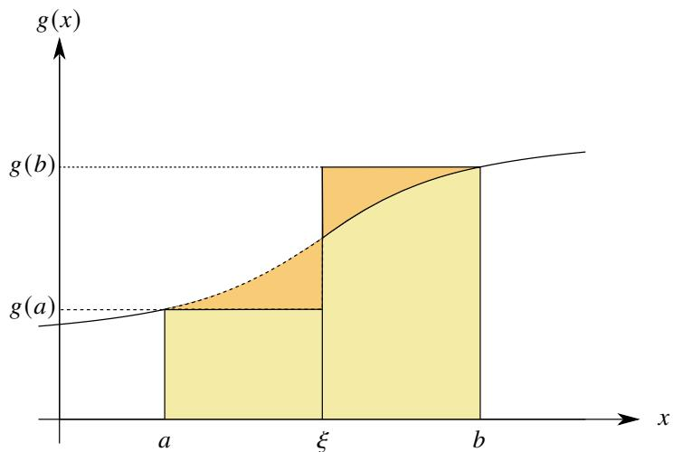  
图 1.20: 第三积分中值定理示意图.

第二积分中值定理 I 和 II 还可以更一般化.

# 命题 1.35

设函数 $f$ 和 $g$ . 若 $f$ 在 $[ a , b ]$ 上 Riemann 可积, $g$ 在 $[ a , b ]$ 上非负.

(1) 设 $A \geq g ( a + )$ . 若 $g$ 在 $[ a , b ]$ 上单调递减, 则存在 $\xi \in [ a , b ]$ 使得

$$
\int_ {a} ^ {b} f (x) g (x) \mathrm {d} x = A \int_ {a} ^ {\xi} f (x) \mathrm {d} x.
$$

(2) 设 $B \geq g ( b - )$ 若 $g$ 在 $[ a , b ]$ 上单调递增, 则存在 $\eta \in [ a , b ]$ 使得

$$
\int_ {a} ^ {b} f (x) g (x) \mathrm {d} x = B \int_ {\eta} ^ {b} f (x) \mathrm {d} x.
$$

证明 只证明 (1). 令

$$
\widetilde {g} (x) = \left\{ \begin{array}{l l} A, & x = a \\ g (x), & x \in (a, b ] \end{array} \right..
$$

由于 $A \geq g ( a + )$ , 因此 $\widetilde { g }$ 和 $f$ 仍然满足第二积分中值定理的条件, 于是就有

$$
\int_ {a} ^ {b} f (x) \widetilde {g} (x) \mathrm {d} x = \widetilde {g} (a) \int_ {a} ^ {\xi} f (x) \mathrm {d} x \Longleftrightarrow \int_ {a} ^ {b} f (x) \widetilde {g} (x) \mathrm {d} x = A \int_ {a} ^ {\xi} f (x) \mathrm {d} x.
$$

注 特别地, $g$ 递减时, 有

$$
\int_ {a} ^ {b} f (x) g (x) \mathrm {d} x = g (a +) \int_ {a} ^ {\xi} f (x) \mathrm {d} x.
$$

$g$ 递增减时, 有

$$
\int_ {a} ^ {b} f (x) g (x) \mathrm {d} x = g (b -) \int_ {\eta} ^ {b} f (x) \mathrm {d} x.
$$

# 命题 1.36

设函数 $f$ 在 $[ a , b ]$ 上 Riemann 可积.

(1) 设 $A \geq g ( a + )$ , $B \leq g ( b - )$ . 若 $g$ 在 $[ a , b ]$ 上单调递减, 则存在 $\xi \in [ a , b ]$ 使得

$$
\int_ {a} ^ {b} f (x) g (x) \mathrm {d} x = A \int_ {a} ^ {\xi} f (x) \mathrm {d} x + B \int_ {\xi} ^ {b} f (x) \mathrm {d} x.
$$

(2) 设 $A \leq g ( a + )$ , $B \geq g ( b - )$ 若 $g$ 在 $[ a , b ]$ 上单调递增, 则存在 $\eta \in [ a , b ]$ 使得

$$
\int_ {a} ^ {b} f (x) g (x) \mathrm {d} x = A \int_ {a} ^ {\xi} f (x) \mathrm {d} x + B \int_ {\xi} ^ {b} f (x) \mathrm {d} x.
$$

# 1.5.6 无穷积分的 Dirichlet 判别法和 Abel 判别法

利用第二积分中值定理可以证明无穷积分中的 Abel 引理.

# 定理 1.68 (积分的 Abel 引理)

设函数 $f$ 在 $[ a , b ]$ 上可积, $g$ 在 $[ a , b ]$ 上单调. 若对任一 $x \in [ a , b ]$ 都有都存在 $M > 0$ 使得

$$
\left| \int_ {a} ^ {x} f (t) \mathrm {d} t \right| \leq M.
$$

则

$$
\left| \int_ {a} ^ {b} f (x) g (x) \mathrm {d} x \right| \leq M [ | g (a) | + 2 | g (b) | ].
$$

证明 由于 $f$ 在 $[ a , b ]$ 上可积, $g$ 在 $[ a , b ]$ 上单调, 由第二积分中值定理 II 可知, 存在 $\xi [ a , b ]$ 使得

$$
\int_ {a} ^ {b} f (x) g (x) \mathrm {d} x = g (a) \int_ {a} ^ {\xi} f (x) \mathrm {d} x + g (b) \int_ {\xi} ^ {b} f (x) \mathrm {d} x.
$$

由于对任一 $x \in [ a , b ]$ 都有都存在 $M > 0$ 使得

$$
\left| \int_ {a} ^ {x} f (t) \mathrm {d} t \right| \leq M.
$$

故

$$
\left| \int_ {\xi} ^ {b} f (x) \mathrm {d} x \right| = \left| \int_ {a} ^ {b} f (x) \mathrm {d} x - \int_ {a} ^ {\xi} f (x) \mathrm {d} x \right| \leq 2 M.
$$

于是可知

$$
\left| \int_ {a} ^ {b} f (x) g (x) d x \right| \leq M (| g (a) | + 2 | g (b) |).
$$

注 以上定理对应级数中的定理1.18.

类似地, 用无穷积分的 Abel 引理可以证明无穷积分的 Dirichlet 判别法.

# 定理 1.69 (无穷积分的 Dirichlet 判别法)

设无穷积分 $\begin{array} { r } { \int _ { a } ^ { + \infty } f ( x ) g ( x ) \mathrm { d } x . } \end{array}$ . 若满足

$1 ^ { \circ }$ 函数 $g$ 在 $[ a , + \infty )$ 上单调, 且

$$
\lim  _ {x \rightarrow + \infty} g (x) = 0.
$$

$2 ^ { \circ }$ 函数 $\textstyle F ( x ) = \int _ { a } ^ { x } f ( t ) \operatorname { d } t$ 在 $( a , + \infty )$ 上有界, 即存在 $M > 0$ 使得对于任一 $x \in ( a , + \infty )$ 都有

$$
\left| \int_ {a} ^ {x} f (t)   \mathrm {d} t \right| \leq M.
$$

则无穷积分 $\textstyle \int _ { a } ^ { + \infty } f ( x ) g ( x ) \mathrm { d } x$ 收敛.

证明 由于 ${ \mathrm { l i m } } _ { x \to + \infty } g ( x ) = 0 $ , 故对于任一 $\varepsilon > 0$ 都存在 $A > 0$ , 只要 $x _ { 1 } > A$ 就有

$$
\left| g \left(x _ {1}\right) \right| <   \frac {\varepsilon}{6 M}.
$$

设 $x _ { 2 } > x _ { 1 } > A$ , 则对于任一 $x \in \left[ x _ { 1 } , x _ { 2 } \right]$ 都有

$$
\left| \int_ {x _ {1}} ^ {x} f (t) \mathrm {d} t \right| = \left| \int_ {x _ {1}} ^ {a} f (t) \mathrm {d} t + \int_ {a} ^ {x} f (t) \mathrm {d} t \right| \leq \left| \int_ {a} ^ {x _ {1}} f (t) \mathrm {d} t \right| + \left| \int_ {a} ^ {x} f (t) \mathrm {d} t \right| \leq 2 M.
$$

由无穷积分的 Abel 引理可知

$$
\left| \int_ {x _ {1}} ^ {x _ {2}} f (x) g (x) d x \right| \leq 2 M [ | g (x _ {1}) + 2 | g (x _ {2}) | ] <   \varepsilon .
$$

于是由 Cauchy 收敛原理可知 $\textstyle \int _ { a } ^ { + \infty } f ( x ) g ( x ) \operatorname { d } x$ 收敛.

注 以上定理对应级数中的定理1.19和定理1.34.

下面看两个用 Dirichlet 判别法的例子.

例 1.123 Dirichlet 积分 判断以下积分的收敛性:

$$
\int_ {0} ^ {+ \infty} \frac {\sin x}{x} d x.
$$

证明 考虑

$$
f (x) = \frac {1}{x}, \quad g (x) = \int_ {0} ^ {x} \sin t \mathrm {d} t.
$$

显然当 $x \to + \infty$ 时 $f$ 递减趋于零. 由于

$$
\left| \int_ {0} ^ {x} \sin t \mathrm {d} t \right| \leq \int_ {0} ^ {\pi} \sin x \mathrm {d} x = 2.
$$

故 $g$ 有界. 由 Dirichlet 判别法可知原积分收敛.

注 以上无穷积分经常被称为 Dirichlet 积分 (Dirichlet integral). 后面将多次用到这个积分.

注 注意到

$$
\left| \frac {\sin x}{x} \right| \geq \frac {\sin^ {2} x}{x} = \frac {1}{2} \left(\frac {1}{x} - \frac {\cos 2 x}{x}\right).
$$

同理可证

$$
\int_ {0} ^ {+ \infty} \frac {\cos 2 x}{x} d x
$$

收敛. 而 $\textstyle \int _ { 0 } ^ { + \infty } { \frac { \mathrm { d } x } { x } }$ 发散. 因此

$$
\int_ {0} ^ {+ \infty} \frac {\sin^ {2} x}{x} d x
$$

发散. 由比较判别法可知

$$
\int_ {0} ^ {+ \infty} \left| \frac {\sin x}{x} \right| d x
$$

也发散. 这就说明 Dirichlet 积分条件收敛.

例 1.124 判断以下积分的敛散性:

$\int _ { 1 } ^ { + \infty } ( - 1 ) ^ { [ x ] } \mathrm { d } x ,$

(2) $\int _ { 1 } ^ { + \infty } ( - 1 ) ^ { \left[ x ^ { 2 } \right] } \mathrm { d } x .$ +∞

证明 (1) 如果该积分收敛, 则

$$
\int_ {1} ^ {+ \infty} (- 1) ^ {[ x ]} d x = \sum_ {n = 1} ^ {\infty} \int_ {n} ^ {n + 1} (- 1) ^ {[ x ]} d x = \sum_ {n = 1} ^ {\infty} (- 1) ^ {n}.
$$

但右侧的级数不收敛, 因此原积分也不收敛.

(2) 令 $t = x ^ { 2 }$ , 则

$$
\int_ {1} ^ {+ \infty} (- 1) ^ {[ x ^ {2} ]} d x = \int_ {1} ^ {+ \infty} (- 1) ^ {[ t ]} d \sqrt {t} = \frac {1}{2} \int_ {1} ^ {+ \infty} \frac {(- 1) ^ {[ t ]}}{\sqrt {t}} d t.
$$

考虑

$$
f (t) = \frac {1}{\sqrt {t}}, \quad g (x) = \int_ {1} ^ {x} (- 1) ^ {[ t ]} d t.
$$

显然, 当 $t \to + \infty$ 时 $f$ 递减趋于零. 下面来看函数 $g$ 的有界性. 任取 $x > 1$ , 都存在 $n \in \mathbb { N } ^ { * }$ 使得 $n \leq x \leq n + 1$ , 故

$$
\left| \int_ {1} ^ {x} (- 1) ^ {[ t ]} \mathrm {d} t \right| = \left| \sum_ {k = 1} ^ {n - 1} \int_ {k} ^ {k + 1} (- 1) ^ {[ t ]} \mathrm {d} t + \int_ {n} ^ {x} (- 1) ^ {n} \mathrm {d} t \right| = \left| \sum_ {k = 1} ^ {n - 1} (- 1) ^ {k} \mathrm {d} t + (- 1) ^ {n} (x - n) \right| \leq 2.
$$

因此 $g$ 有界. 由 Dirichlet 判别法可知原积分收敛.

用无穷积分的 Dirichlet 判别法可以得到无穷积分的 Abel 判别法.

# 定理 1.70 (无穷积分的 Abel 判别法)

设无穷积分 $\begin{array} { r } { \int _ { a } ^ { + \infty } f ( x ) g ( x ) \mathrm { d } x . } \end{array}$ 若满足

$1 ^ { \circ }$ 函数 $g$ 在 $[ a , + \infty )$ 上单调有界.  
$2 ^ { \circ }$ 无穷积分 $\textstyle \int _ { a } ^ { + \infty } f ( x ) \operatorname { d } x$ 收敛.

则无穷积分 $\textstyle \int _ { a } ^ { + \infty } f ( x ) g ( x ) \operatorname { d } x$ 收敛.

证明 由于 $g$ 在 $[ a , + \infty )$ 上单调有界, 故

$$
\lim  _ {x \rightarrow + \infty} g (x) = l \in \mathbb {R} \iff \lim  _ {x \rightarrow + \infty} [ g (x) - l ] = 0.
$$

因此当 $x \to + \infty$ 时, 函数 $g ( x ) - l$ 单调趋于零. 由于 $\textstyle { \int _ { a } ^ { + \infty } f ( x ) \operatorname { d } x }$ 收敛, 故 $\textstyle \int _ { a } ^ { + \infty } f ( x ) \operatorname { d } x$ 有界, 由无穷积分的 Dirichlet判别法可知

$$
\int_ {a} ^ {+ \infty} f (x) [ g (x) - l ] d x
$$

收敛. 由于

$$
\int_ {a} ^ {+ \infty} f (x) g (x) d x = \int_ {a} ^ {+ \infty} f (x) [ g (x) - l ] d x + l \int_ {a} ^ {+ \infty} f (x) d x.
$$

且 $\textstyle \int _ { a } ^ { + \infty } f ( x ) \operatorname { d } x$ 收敛, 因此 $\textstyle \int _ { a } ^ { + \infty } f ( x ) g ( x ) \operatorname { d } x$ 收敛.

注 以上定理对应级数中的定理1.20和定理1.35.

下面看一个用 Abel 判别法的例子.

例 1.125 设 $p , q$ 满足 $\operatorname* { m a x } \{ p , q \} > 1 .$ . 则以下积分收敛:

$$
\int_ {1} ^ {+ \infty} \frac {x \cos x}{x ^ {p} + x ^ {q}} d x.
$$

证明 不妨设 $p \geq q$ , 则 $p > 1$ .

$$
\int_ {1} ^ {+ \infty} \frac {x \cos x}{x ^ {p} + x ^ {q}} d x = \int_ {1} ^ {+ \infty} \frac {\cos x}{x ^ {p - 1}} \cdot \frac {1}{\left(1 + \frac {1}{x ^ {p - q}}\right)} d x.
$$

考虑

$$
\int_ {1} ^ {+ \infty} \frac {\cos x}{x ^ {p - 1}} d x, \quad f (x) = \frac {1}{\left(1 + \frac {1}{x ^ {p - q}}\right)}.
$$

当 $x \to + \infty$ 时 $1 / x ^ { p - 1 }$ 递减趋于零, 且函数 $\textstyle F ( x ) = \int _ { 1 } ^ { x } \cos t \mathrm { d } t$ 有界. 由 Dirichlet 判别法可知

$$
\int_ {1} ^ {+ \infty} \frac {\cos x}{x ^ {p - 1}} d x
$$

收敛. 另一方面 $f$ 在 $[ 1 , + \infty )$ 上单调有界. 故由 Abel判别法可以原积分收敛.

现在来总结三套 Dirichlet 判别法和 Abel 判别法.

<table><tr><td></td><td>Dirichlet判别法</td><td>Abel判别法</td><td>结论</td></tr><tr><td rowspan="2">数项级数 ∑n=1∞anbn</td><td>{bn}单调趋于零</td><td>{bn}单调有界</td><td rowspan="2">收敛</td></tr><tr><td>∑n=1∞an有界</td><td>∑n=1∞an收敛</td></tr><tr><td rowspan="2">函数项级数 ∑n=1∞fn(x)gn(x)</td><td>{gn(x)}单调一致趋于零</td><td>{gn(x)}单调一致有界</td><td rowspan="2">一致收敛</td></tr><tr><td>∑n=1∞fn(x)一致有界</td><td>∑n=1∞fn(x)一致收敛</td></tr><tr><td rowspan="2">无穷积分 ∫a+∞f(x)g(x)</td><td>g单调趋于零</td><td>g单调有界</td><td rowspan="2">收敛</td></tr><tr><td>∫axf(t)dt有界</td><td>∫a+∞f(x)dx收敛</td></tr></table>

# 1.6 瑕积分的敛散性

# 1.6.1 瑕积分的概念回顾

另一类反常积分是瑕积分. 之前已经学过了瑕积分的计算方法. 下面来研究瑕积分收敛的判别法. 先来复习一下瑕积分的定义.

# 定义 1.24 (瑕积分)

设函数 $f$ 在 $[ a , b )$ 上有定义. 对于任一 $0 < \varepsilon < b - a , f$ 在 $[ a , b - \varepsilon ]$ 上都可积. 若

$$
\lim  _ {\varepsilon \rightarrow 0 +} \int_ {a} ^ {b - \varepsilon} f (x) d x
$$

存在且有限, 则可以引入记号

$$
\int_ {a} ^ {b} f (x) \mathrm {d} x := \lim  _ {\varepsilon \rightarrow 0 +} \int_ {a} ^ {b - \varepsilon} f (x) \mathrm {d} x.
$$

并称以上积分收敛, 此时我们称 $f$ 在 $[ a , b )$ 上 Riemann 可积. 否则称以上积分发散. 这样的积分称为瑕积分. 其中 $^ b$ 称为瑕点 .

注 无穷积分和瑕积分统称为反常积分 (improper integral).

注 若 $\begin{array} { r } { \operatorname* { l i m } _ { \varepsilon \to 0 + } \int _ { a } ^ { b - \varepsilon } f ( x ) \operatorname { d } x } \end{array}$ 极限值是 $\pm \infty$ , 则可以记作

$$
\int_ {a} ^ {b} f (x) \mathrm {d} x = \pm \infty .
$$

注 类似地可以定义积分下限为瑕点的情况.

注 即使积分发散 $\textstyle \int _ { a } ^ { b } f ( x ) \operatorname { d } x$ 的记号也可以使用, 只是此时它不是一个数值.

利用可加性, 可以定义瑕点在中间的瑕积分. 设瑕积分

$$
\int_ {a} ^ {c} f (x) \mathrm {d} x, \quad \int_ {c} ^ {b} f (x) \mathrm {d} x.
$$

若它们都收敛, 其中 $c$ 是它们的瑕点, 则可定义

$$
\int_ {a} ^ {b} f (x) \mathrm {d} x := \int_ {a} ^ {c} f (x) \mathrm {d} x + \int_ {c} ^ {b} f (x) \mathrm {d} x.
$$

此时我们称 $f$ 在 $( a , b )$ 上 Riemann 可积. 和无穷积分类似, 定义 $\textstyle \int _ { - \infty } ^ { + \infty } f ( x ) \operatorname { d } x$ 的可积性涉及到了两个极限:

$$
\lim  _ {\varepsilon \rightarrow 0 +} \int_ {a} ^ {c - \varepsilon} f (x)   d x, \quad \lim  _ {\varepsilon \rightarrow 0 +} \int_ {c + \varepsilon} ^ {b} f (x)   d x.
$$

这里的两个极限过程是彼此独立的. 这和以下极限是不同的:

$$
\lim  _ {\varepsilon \rightarrow 0 +} \left[ \int_ {a} ^ {c - \varepsilon} f (x) \mathrm {d} x + \int_ {c + \varepsilon} ^ {b} f (x) \mathrm {d} x \right]. \tag {1.40}
$$

不难看出, 即使以上极限存在, 瑕积分 $\int _ { - \infty } ^ { + \infty } f ( x ) \mathrm { d } x$ 未必收敛. 例子不难想到.

例 1.126 以下瑕积分不收敛

$$
\int_ {- 1} ^ {1} \frac {\mathrm {d} x}{x}.
$$

但

$$
\lim _ {\varepsilon \to 0 +} \left(\int_ {- 1} ^ {- \varepsilon} \frac {\mathrm {d} x}{x} + \int_ {\varepsilon} ^ {1} \frac {\mathrm {d} x}{x}\right) = 0.
$$

于是仿照无穷积分的 Cauchy 主值, 可以定义瑕积分的 Cauchy 主值.

# 定义 1.25 (瑕积分的 Cauchy 主值)

设 R 上的函数 ?? . 令

$$
P V \int_ {a} ^ {b} f (x) \mathrm {d} x := \lim  _ {\varepsilon \rightarrow 0 +} \left[ \int_ {a} ^ {c - \varepsilon} f (x) \mathrm {d} x + \int_ {c + \varepsilon} ^ {b} f (x) \mathrm {d} x \right].
$$

若上式右边的极限存在, 则称这个极限为瑕积分 $\textstyle \int _ { - \infty } ^ { + \infty } f ( x ) \operatorname { d } x$ 的 Cauchy 主值 (Cauchy principal value), 其中$c$ 是瑕点.

注 显然存在 Cauchy 主值是瑕积分 $\textstyle \int _ { a } ^ { b } f ( x ) \mathrm { d } x$ 收敛的必要但不充分条件.

由以上定义可知, 虽然瑕积分 $\int _ { - 1 } ^ { 1 } { \frac { \mathrm { d } x } { x } }$ 不收敛, 但

$$
P V \int_ {- 1} ^ {1} \frac {\mathrm {d} x}{x} = 0.
$$

# 1.6.2 瑕积分与无穷积分的关系

为了讨论简单起见,本节讨论的瑕积分都假定积分下限 $a$ 是瑕点,且被积函数都在 $[ a + \varepsilon , b ]$ 上 Riemann 可积.

例 1.127 判断以下瑕积分的敛散性:

$$
\int_ {0} ^ {1} \frac {\mathrm {d} x}{\sqrt {x}}
$$

解 令 $t = 1 / { \sqrt { x } }$ . 则

$$
\int_ {\varepsilon} ^ {1} \frac {\mathrm {d} x}{\sqrt {x}} = \int_ {1 / \sqrt {\varepsilon}} ^ {1} t \mathrm {d} \left(\frac {1}{t ^ {2}}\right) = 2 \int_ {1} ^ {1 / \sqrt {\varepsilon}} \frac {\mathrm {d} t}{t ^ {2}}.
$$

因此

$$
\lim _ {\varepsilon \rightarrow 0 +} \int_ {\varepsilon} ^ {1} \frac {\mathrm {d} x}{\sqrt {x}} = 2 \lim _ {\varepsilon \rightarrow 0 +} \int_ {1} ^ {1 / \sqrt {\varepsilon}} \frac {\mathrm {d} t}{t ^ {2}} = 2 \int_ {1} ^ {+ \infty} \frac {\mathrm {d} t}{t ^ {2}}
$$

由于无穷积分 $\int _ { 1 } ^ { + \infty } \frac { \mathrm { d } t } { t ^ { 2 } }$ 收敛, 于是可知原积分也收敛.

上例表明, 研究一个瑕积分的敛散性, 可以转化为研究无穷积分的敛散性. 事实上, 对于一个一般的瑕积分$\textstyle \int _ { a } ^ { b } f ( x ) \mathrm { d } x ,$ 若 $a$ 是瑕点, 则可令 $x = a + 1 / t$ , 则

$$
\lim  _ {\varepsilon \rightarrow 0} \int_ {a + \varepsilon} ^ {b} f (x)   \mathrm {d} x = \lim  _ {\varepsilon \rightarrow 0} \int_ {1 / \varepsilon} ^ {1 / (b - a)} f \left(a + \frac {1}{t}\right) \mathrm {d} \left(\frac {1}{t}\right) = \int_ {1 / (b - a)} ^ {+ \infty} f \left(a + \frac {1}{t}\right) \frac {1}{t ^ {2}}   \mathrm {d} t.
$$

以上讨论表明, 任一瑕积分都可以通过变换转化为一个无穷积分. 因此下面可以不加证明地给出和无穷积分对应的结论.

# 定理 1.71 (非负函数瑕积分的比较判别法)

设函数 $f$ 和 $g$ . 当 $x$ 充分靠近 ?? $( a < x )$ 时有 $0 \leq f ( x ) \leq g ( x )$ . 则

(1) 若 $\textstyle \int _ { a } ^ { b } g ( x ) \operatorname { d } x$ 收敛, 则 $\textstyle \int _ { a } ^ { b } f ( x ) \operatorname { d } x$ 也收敛.   
(2) 若 $\textstyle \int _ { a } ^ { b } f ( x ) \operatorname { d } x$ 发散, 则 $\textstyle \int _ { a } ^ { b } g ( x ) \operatorname { d } x$ 也发散.

下面看一个例子.

例 1.128 判断以下积分的敛散性:

$$
\int_ {0} ^ {1} \frac {\ln x}{1 - x ^ {2}} d x.
$$

解 考虑 $x = 1$ 附近的情况. 由 l’Hospital 法则可知

$$
\lim  _ {x \rightarrow 1} \frac {\ln x}{1 - x ^ {2}} = \lim  _ {x \rightarrow 1} \frac {1 / x}{- 2 x} = - \frac {1}{2}.
$$

因此被积函数在 $x = 1$ 附近有界, 故 $x = 1$ 不是瑕点. 下面考虑 $x = 0$ 附近的情况. 当 $x$ 充分接近 0 时, $1 - x ^ { 2 } \geq 1 / 2$ .因此

$$
\left| \frac {\ln x}{1 - x ^ {2}} \right| \leq 2 | \ln x |.
$$

由于

$$
\int_ {0} ^ {1} | \ln x | d x = - \int_ {0} ^ {1} \ln x d x = 1.
$$

由比较判别法可知原积分也收敛.

# 定理 1.72 (非负函数瑕积分比较判别法的极限形式)

设 $( a , b ]$ 上的非负函数 $f$ 和 $g$ . 若

$$
\lim  _ {x \to a +} \frac {f (x)}{g (x)} = l.
$$

(1) 当 $0 < l < + \infty$ 时, 积分 $\textstyle \int _ { a } ^ { b } f ( x ) \operatorname { d } x$ , $\textstyle \int _ { a } ^ { b } g ( x ) \operatorname { d } x$ 同敛散.   
(2) 当 $l = 0$ 时, 若积分 $\textstyle \int _ { a } ^ { b } g ( x ) \operatorname { d } x$ 收敛, 则 $\textstyle \int _ { a } ^ { b } f ( x ) \operatorname { d } x$ 也收敛.  
(3) 当 $l = + \infty$ 时, 若积分 $\textstyle \int _ { a } ^ { b } g ( x ) \operatorname { d } x$ 发散, 则 $\textstyle \int _ { a } ^ { b } f ( x ) \operatorname { d } x$ 也发散.

瑕积分中也有 $p$ 积分. 经常用来作为比较判别法的 “基准”.

例 $1 . 1 2 9 p$ 积分 讨论以下瑕积分的敛散性:

$$
\int_ {0} ^ {a} \frac {\mathrm {d} x}{x ^ {p}}, \quad a > 0.
$$

解 (i) 当 $p = 1$ 时. 由于

$$
\int_ {0} ^ {a} \frac {\mathrm {d} x}{x} = \ln x \Bigg | _ {0} ^ {a} = + \infty .
$$

因此原积分发散.

(ii) 当 $p \neq 1$ 时. 由于

$$
\int_ {0} ^ {a} \frac {\mathrm {d} x}{x ^ {p}} = \frac {1}{1 - p} x ^ {1 - p} \Bigg | _ {0} ^ {a} = \left\{ \begin{array}{l l} \frac {a ^ {1 - p}}{1 - p}, & p <   1 \\ + \infty , & p > 1 \end{array} \right..
$$

因此当 $p < 1$ 时原积分收敛, 当 $p > 1$ 时原积分发散.

综上可知, 原积分收敛当且仅当 $p < 1$ .

下面看两个例子.

例 1.130 判断以下积分的敛散性:

$$
\int_ {0} ^ {1} \frac {\mathrm {d} x}{\sqrt [ 4 ]{1 - x ^ {4}}}
$$

证明 容易看出 $x = 1$ 是瑕点. 当 $x \to 1$ 时

$$
\frac {1}{\sqrt [ 4 ]{1 - x ^ {4}}} = \frac {1}{\sqrt [ 4 ]{1 - x}} \frac {1}{\sqrt [ 4 ]{(1 + x) (1 + x ^ {2})}} \sim \frac {1}{\sqrt {2}} \frac {1}{\sqrt [ 4 ]{1 - x}}.
$$

由于

$$
\int_ {0} ^ {1} \frac {\mathrm {d} x}{\sqrt [ 4 ]{1 - x}} = \int_ {0} ^ {1} \frac {\mathrm {d} t}{t ^ {1 / 4}}.
$$

因此 $\int _ { 0 } ^ { 1 } \frac { \mathrm { d } x } { \sqrt [ 4 ] { 1 - x } }$ √4 1−?? 收敛. 由比较判别法可知原积分也收敛.

例 1.131 判断以下积分的敛散性:

$$
\int_ {0} ^ {1} x ^ {p - 1} (1 - x) ^ {q - 1} \mathrm {d} x.
$$

证明 注意到: 当 $p < 1$ 时 $x = 0$ 是瑕点, 当 $q < 1$ 时 $x = 1$ 是瑕点. 因此考虑把积分拆成两部分:

$$
\int_ {0} ^ {1} x ^ {p - 1} (1 - x) ^ {q - 1} \mathrm {d} x = \int_ {0} ^ {a} x ^ {p - 1} (1 - x) ^ {q - 1} \mathrm {d} x + \int_ {a} ^ {1} x ^ {p - 1} (1 - x) ^ {q - 1} \mathrm {d} x, \quad a \in (0, 1).
$$

(i) 当 $0 < p < 1$ 时

$$
x ^ {p - 1} (1 - x) ^ {q - 1} \sim x ^ {p - 1}, \quad x \rightarrow 0.
$$

此时 $\int _ { 0 } ^ { a } x ^ { p - 1 } \mathrm { d } x$ 收敛, 由比较判别法可知 $\textstyle \int _ { 0 } ^ { a } x ^ { p - 1 } ( 1 - x ) ^ { q - 1 } \operatorname { d } x$ 也收敛.

(ii) 当 $0 < q < 1$ 时

$$
x ^ {p - 1} (1 - x) ^ {q - 1} \sim (1 - x) ^ {q - 1}, \quad x \rightarrow 1
$$

此时 $\textstyle \int _ { a } ^ { 1 } ( 1 - x ) ^ { q - 1 } \mathrm { d } x$ 收敛, 由比较判别法可知 $\begin{array} { r } { \int _ { a } ^ { 1 } x ^ { p - 1 } ( 1 - x ) ^ { q - 1 } \mathrm { d } x } \end{array}$ 也收敛.

综上可知当 $p > 0$ 且 $q > 0$ 时原积分收敛.

注 以上积分定义了一个二元函数 $B ( p , q )$ , 我们称它为 Beta 函数 (Beta function). 根据以上讨论可知 Beta 函数的定义域是

$$
\{(p, q): p > 0, q > 0 \}.
$$

例 1.132 判断以下积分的敛散性:

$$
\int_ {0} ^ {+ \infty} x ^ {s - 1} e ^ {- x} d x.
$$

证明 当 $s < 1$ 时 $x = 0$ 是瑕点, 因此考虑把积分拆成两部分:

$$
\int_ {0} ^ {+ \infty} x ^ {s - 1} e ^ {- x} d x = \int_ {0} ^ {1} x ^ {s - 1} e ^ {- x} d x + \int_ {1} ^ {+ \infty} x ^ {s - 1} e ^ {- x} d x.
$$

(i) 由于

$$
x ^ {s - 1} \mathrm {e} ^ {- x} \sim x ^ {s - 1}, \quad x \rightarrow 1.
$$

因此当 $0 < s < 1$ 时 $\textstyle \int _ { 0 } ^ { 1 } x ^ { s - 1 } \operatorname { e } ^ { - x } \mathrm { d } x$ 收敛. 当 $s > 1$ 时 $\textstyle \int _ { 0 } ^ { 1 } x ^ { s - 1 } \operatorname { e } ^ { - x } \mathrm { d } x$ 时可积的常义积分.

(ii) 由于

$$
\lim  _ {x \rightarrow + \infty} \frac {x ^ {s - 1} \mathrm {e} ^ {- x}}{\frac {1}{x ^ {2}}} = 0
$$

因此 $\textstyle { \int _ { 1 } ^ { + \infty } x ^ { s - 1 } \mathrm { e } ^ { - x } \mathrm { d } x }$ 总是收敛的.

综上可知当 $s > 0$ 时原积分收敛.

注 以上积分定义了一个函数 $\Gamma ( s )$ , 我们称它为 Gamma 函数 (Gamma function). 根据以上讨论可知 Gamma 函数的定义域是 $( 0 , + \infty )$ .

# 定理 1.73 (瑕积分的 Cauchy 收敛原理)

瑕积分 $\textstyle \int _ { a } ^ { b } f ( x ) \operatorname { d } x$ 收敛当且仅当对于任一 $\varepsilon > 0$ 都存在 $\delta > 0$ , 当 $\eta _ { 1 } , \eta _ { 2 } \in ( 0 , \delta )$ 时

$$
\left| \int_ {a + \eta_ {1}} ^ {a + \eta_ {2}} f (x)   d x \right| <   \varepsilon .
$$

# 定义 1.26 (瑕积分的绝对收敛和条件收敛)

设瑕积分 $\textstyle \int _ { a } ^ { b } f ( x ) \operatorname { d } x$ 收敛.

(1) 若 $\textstyle { \int _ { a } ^ { b } | f ( x ) | \mathrm { d } x }$ 也收敛, 则称 $\textstyle \int _ { a } ^ { b } f ( x ) \operatorname { d } x$ 绝对收敛 (absolutely convergent).   
(2) 若 $\textstyle { \int _ { a } ^ { b } | f ( x ) | \mathrm { d } x }$ 发散, 则称 $\textstyle \int _ { a } ^ { b } f ( x ) \operatorname { d } x$ 条件收敛 (conditionally convergent).

# 定理 1.74

若瑕积分 $\textstyle { \int _ { a } ^ { b } | f ( x ) | \mathrm { d } x }$ 收敛, 则 $\textstyle \int _ { a } ^ { b } f ( x ) \operatorname { d } x$ 也收敛.

和无穷积分的情况类似, 以上定理的逆命题不成立. 于是就出现了一个有趣的现象:

$\int _ { a } ^ { b } f ( x ) { \mathrm { d } } x$ $\implies \int _ { a } ^ { b } | f ( x ) | \mathrm { d } x$

瑕积分 $\int _ { a } ^ { b } | f ( x ) | { \mathrm { d } } x$ 可积 (收敛) $\implies \int _ { a } ^ { + \infty } f ( x ) \mathrm { d } x$ 可积 (收敛).

上述命题的逆命题都不成立. 如果瑕积分 $\textstyle { \int _ { a } ^ { b } | f ( x ) | \mathrm { d } x }$ 收敛, 我们称它绝对可积 (absolutely integrable). 于是如果我们会说函数 $f$ 在 $[ a , b ]$ 上可积或绝对可积 (integrable or absolutely integrable) 来覆以上四种情况. 在讨论 Fourier 级数时, 会经常出现这个条件.

下面来看一个例子.

例 1.133 判断以下积分的敛散性:

$$
\int_ {0} ^ {1} \frac {\sin \frac {1}{x}}{x ^ {p}} \mathrm {d} x, \quad p > 0.
$$

证明 容易看出 $x = 0$ 是瑕点, 考虑把它化成无穷积分讨论. 令 $t = 1 / x$ . 则

$$
\int_ {0} ^ {1} \frac {\sin \frac {1}{x}}{x ^ {p}} d x = \int_ {1} ^ {+ \infty} \frac {\sin t}{t ^ {2 - p}} d t.
$$

(i) 先讨论 $2 - p \leq 0$ 时的情况. 假设积分收敛, 由 Cauchy 收敛原理可知, 当 $a _ { 1 } , a _ { 2 }$ 充分大时, 就有

$$
\left| \int_ {a _ {1}} ^ {a _ {2}} t ^ {p - 2} \sin t d t \right| \leq 1.
$$

但是如果令 $a _ { 1 } = 2 k \pi$ , $a _ { 2 } = ( 2 k + 1 ) \pi$ , 则当 $k \to \infty$ 时

$$
\left| \int_ {a _ {1}} ^ {a _ {2}} t ^ {p - 2} \sin t d t \right| = \left| \int_ {2 k \pi} ^ {(2 k + 1) \pi} t ^ {p - 2} \sin t d t \right| \geq (2 k \pi) ^ {p - 2} \int_ {0} ^ {\pi} \sin t d t = 2 (2 k \pi) ^ {p - 2} \geq 2.
$$

出现矛盾, 因此假设不成立, 于是可知原积分发散.

(ii) 再讨论 $0 < p < 1$ 时的情况. 由于

$$
\left| \frac {\sin t}{t ^ {2 - p}} \right| \leq \frac {1}{t ^ {2 - p}}.
$$

容易看出当 $2 - p > 1$ 即 $0 < p < 1$ 时, 原积分绝对收敛.

(iii) 最后讨论 $1 \leq p < 2$ 时的情况. 容易知道当 $t  + \infty$ 时 $1 / t ^ { 2 - p }$ 递减趋于零且 $\textstyle \int _ { 1 } ^ { x }$ sin ?? d ?? 有界, 因此由Dirichlet 判别法可知原积分收敛. 但

$$
\int_ {1} ^ {+ \infty} \left| \frac {\sin t}{t ^ {2 - p}} \right| d t
$$

发散. 因此原积分条件收敛.

综上可知, 当 $0 < p < 1$ 时, 原积分绝对收敛, 当 $1 \leq p < 2$ 时, 积分条件收敛, 当 $p \ge 2$ 时原积分发散.

例 1.134 判断以下积分的敛散性:

$$
I = \int_ {0} ^ {+ \infty} \left[ \left(1 - \frac {\sin x}{x}\right) ^ {- \alpha} - 1 \right] \mathrm {d} x, \quad \alpha > 0.
$$

证明 由于

$$
\lim  _ {x \rightarrow 0} \frac {\sin x}{x} = 1.
$$

因此 $x = 0$ 是一个瑕点. 因此考虑把积分分成两部分:

$$
\int_ {0} ^ {+ \infty} \left[ \left(1 - \frac {\sin x}{x}\right) ^ {- \alpha} - 1 \right] d x = \int_ {0} ^ {1} \left[ \left(1 - \frac {\sin x}{x}\right) ^ {- \alpha} - 1 \right] d x + \int_ {1} ^ {+ \infty} \left[ \left(1 - \frac {\sin x}{x}\right) ^ {- \alpha} - 1 \right] d x.
$$

把以上两个积分分别记作 $I _ { 1 }$ 和 $I _ { 2 }$ .

(i) 当 $x \to 0$ 时

$$
1 - \frac {\sin x}{x} = 1 - \frac {1}{x} \left[ x - \frac {x ^ {3}}{6} + O \left(x ^ {5}\right) \right] = \frac {x ^ {2}}{6} + O \left(x ^ {4}\right) = \frac {x ^ {2}}{6} \left[ 1 + O \left(x ^ {2}\right) \right].
$$

因此

$$
\left(1 - \frac {\sin x}{x}\right) ^ {- \alpha} \sim \left(\frac {1}{6} ^ {- \alpha}\right) x ^ {- 2 \alpha}.
$$

故当 $\alpha < 1 / 2$ 时

$$
\int_ {0} ^ {1} \left(1 - \frac {\sin x}{x}\right) ^ {- \alpha} d x
$$

收敛, 于是 $I _ { 1 }$ 收敛. 当 $x > 0$ 时

$$
1 - \frac {\sin x}{x} \geq 0.
$$

因此 $I _ { 1 }$ 绝对收敛.

(ii) 由于

$$
\left| \frac {\sin x}{x} \right| <   1.
$$

故

$$
\left(1 - \frac {\sin x}{x}\right) ^ {- \alpha} - 1 = \alpha \frac {\sin x}{x} + O \left(\frac {1}{x ^ {2}}\right).
$$

由于

$$
\int_ {1} ^ {+ \infty} \frac {\sin x}{x} d x
$$

条件收敛, 而

$$
\int_ {1} ^ {+ \infty} O \left(\frac {1}{x ^ {2}}\right) d x
$$

绝对收敛, 因此 $I _ { 2 }$ 条件收敛.

综上所述, 当 $0 < \alpha < 1 / 2$ 时, 原积分条件收敛.

