# 第 2 章 收敛性和连续性的一般化

# 内容提要

h 我们首先把 R 推广为 $n$ 维 Euclid 空间 $\mathbb { R } ^ { n }$ .  
h 然后从中抽象出更一般的度量空间, 把 Euclid空间中的点集一般化为度量空间中的开集、闭集等点集.  
研究度量空间中的开集和闭集的性质, 并用公理化的方法把开集的性质作为公理定义一般的拓扑空间.  
h 把一元函数的极限概念推广到多元函数. 相关的结论可以全部类比得到.

h 对于多元函数来说, 可以定义两种不一样的极限: 重极限和累次极限. 它们的存在性和极限值都可以不一样.  
h 一元函数的连续性也可以推广到多元函数. 相关结论都可以成立.  
h 闭区间上连续函数的结论可以推广到紧致集或连通集上的多元连续函数.  
最后我们还可以进一步把连续的概念推广到一般的度量空间, 和更一般的拓扑空间.

在小学时,曾经学过一个很有趣的“一笔画问题”.这个问题便是历史上著名的“柯尼斯堡七桥问题”.如图2.1所示, 柯尼斯堡有一条河穿过, 河上有两个小岛, 有七座桥把两个岛与河岸联系起来. 一个步行者能否不重复、不遗漏地一次走完七座桥? 1735 年 Euler 断言了不可能性, 并于次年发表了论文, 把这个问题转化为了 “一笔画问题”.并给出了可以 “一笔画” 的充要条件: 当 “奇点” 的数目是零或 2.

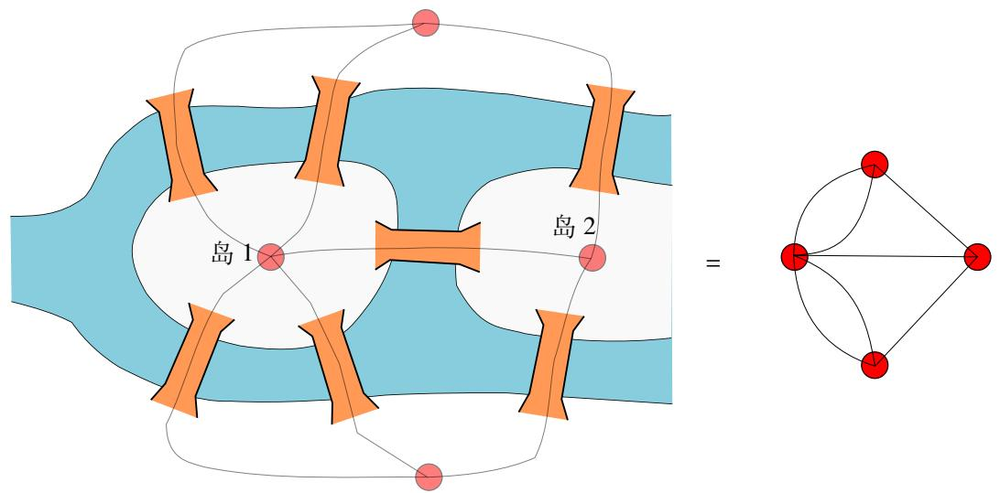  
图 2.1: 七桥问题.

这是一个几何问题,但却与传统Euclid几何迥然不同,它并不关心图形的长度、角度等Euclid几何中的不变量.不严格地说, 在一笔画问题中, 只要两个图形的 “连续性一致”,“节点的相对位置一致”, 就被认为是等价的. 类似的例子在生活中还有地铁线路图或物理学中的电路图.这就是拓扑学的起源.虽然拓扑的思想萌芽已经产生,并且出现了很多著名的拓扑问题 (比如四色问题, 多面体的 Euler 定理等), 但人们尚没有找到精确刻画图形拓扑性质的方法.

十九世纪末集合论和实数理论的完善使得分析学得到了跨越式发展. Cantor 从 1873 年起系统研究了 Euclid空间中的点集.开集、闭集、极限点、稠密、连通这些概念被逐步确立.这些新的思想使得分析学和几何学产生了深刻的联系. 人们逐渐意识到运用分析的方法可以刻画拓扑性质. 设两个点集 ?? 和 ??(任何图形都可以看作点集)之间存在一个可逆映射 $f$ . 若 $f$ 和 $f ^ { - 1 }$ 都是连续的, 那么这两个点集就保持拓扑性质, 在拓扑学中称 ?? 和 $B$ 是同胚的 (homeomorphic), 映射 $f$ 称为同胚 (homeomorphism). 之前我们提到的等价的地铁线路图或电路图就是同胚关系.

我们知道分析学中的连续函数或连续映射是用极限刻画的.1906 年, 法国数学家 René Maurice Fréchet 进一步

从 Euclid 空间中抽象出了度量空间的概念后, 任何一个度量空间都可以用一个度量刻画连续性. 但事实, 在数分 I中已经看到, 用邻域的概念就可以刻画连续性, 但那时我们定义的邻域中还带着度量 (我们把以一点为球心, 距离为 $r$ 的开球称为邻域). 但事实上如果愿意抛弃这个度量, 丝毫不会影响对连续性的刻画, 因为邻域的半径在问题中并不起实际作用. 我们以一元函数为例, 设一元函数 $f : D  \mathbb { R }$ , 取一点 $x _ { 0 } \in D$ . 若对于点 $f ( x _ { 0 } )$ 的任一邻域 $N$ 都存在一个 $x _ { 0 }$ 的邻域 $N _ { 0 }$ 使得 $f ( N _ { 0 } ) \subseteq N$ , 则函数在 $x _ { 0 }$ 连续.

我们来总结一下以上的思想. 保持图形拓扑性质的映射是连续映射. 因此刻画拓扑性质的关键是研究连续映射. 刻画映射连续性只需要用邻域, 更一般地只需要开集. 那么很自然地做法就是, 用公理化的方法把 Cantor 已经研究过的 Euclid 空间的开集的性质抽象为 “开集公理”.1914 年德国数学家 Felix Hausdorff 首次用这个思想定义了一般的拓扑空间, 这标志着用公理化方法研究连续性的一般拓扑学的正式诞生.

本章我们就要把以上探索过程重新在读者面前展示一遍. 一般拓扑学 (general topology) 又称点集拓扑学 (point-set topology), 它已经渗透到现代数学的各个分支, 是处于中心位置的基础理论. 为了进一步推广和一般化分析学的理论, 我们必须先掌握点集拓扑学的基础知识. 这样做在开始时会稍显吃力, 但对于进一步的数学学习是 “磨刀不误砍柴工” 的.

# 2.1 Euclid 空间中点列的收敛性

在研究一元微积分时,我们首先研究了实数集的性质.当时已经提到,实数的几个完备性命题刻画了实数集的拓扑性质. 为了研究多元函数的微积分, 很自然地需要把 $\mathbb { R }$ 的性质推广到 $\mathbb { R } ^ { n }$ 中.

# 2.1.1 ${ \mathbb { R } } ^ { n }$ 空间的线性结构

先把一维二维三维的向量及其运算推广到 $n$ 维.

# 定义 2.1 (有限维实空间 R??)

把所有 $n$ 元有序实数组组成的集合记作 $\mathbb { R } ^ { n }$ , 这些数组称为向量 (vector). 其中 $a _ { i }$ 称为向量 $\pmb { \alpha }$ 的第 $i$ 个分量(component). 规定 $\mathbb { R } ^ { n }$ 上的加法运算

$$
\left(a _ {1}, a _ {2}, \dots , a _ {n}\right) + \left(b _ {1}, b _ {2}, \dots , b _ {n}\right) := \left(a _ {1} + b _ {1}, a _ {2} + b _ {2}, \dots , a _ {n} + b _ {n}\right).
$$

再规定 $\mathbb { R } ^ { n }$ 中的元素与 $\mathbb { R }$ 之间的数乘运算 (scalar multiplication):

$$
k \left(a _ {1}, a _ {2}, \dots , a _ {n}\right) := \left(k a _ {1}, k a _ {2}, \dots , k a _ {n}\right).
$$

注 由于后面要研究 $\mathbb { R }$ 中的点列, 为了避免下标的混淆, 可以考虑把 $\mathbb { R }$ 中的点记作

$$
\boldsymbol {x} = \left(x ^ {1}, x ^ {2}, \dots , x ^ {n}\right).
$$

如果我们采用了这样的表记方法, 就需要注意不要把上标和指数混淆. 如果要表达第 $i$ 个坐标的 $k$ 次方可以记成 $\left( x ^ { i } \right) ^ { k }$ . 这种表记方法在张量分析, 微分几何中是主流, 是 Einstein 在 1916 年引入的, 因此通常称为 Einstein 记号(Einstein notation).

注 有时候为了方便可以把向量记成列向量的形式: ${ \pmb { \alpha } } = [ a _ { 1 } , a _ { 2 } , \cdots , a _ { n } ] ^ { T } .$ . 此时也可以把列向量看作一个 $n \times 1$ 矩阵.

容易验证以上规定的 $\mathbb { R } ^ { n }$ 中的加法运算和 $\mathbb { R } ^ { n }$ 与 $\mathbb { R }$ 之间的数乘运算满足以下八条性质.

# 命题 2.1 (R?? 的线性性质)

对于任意 $\alpha , \beta , \gamma \in \mathbb { R } ^ { n }$ 和 ??, $l \in \mathbb { R }$ 满足:

(1) 加法结合律: $\left( \alpha + \beta \right) + \gamma = \alpha + \left( \beta + \gamma \right)$ .   
(2) 加法交换律: $\alpha + \beta = \alpha + \beta$ .  
(3) 令 $\mathbf { 0 } = ( 0 , \cdots , 0 )$ , 称 0 为零向量 (zero vector), 它满足: $\mathbf { 0 } + \alpha = \alpha$ .

(4) 设 ${ \pmb { \alpha } } = ( a _ { 1 } , \cdots , a _ { n } )$ , 令 $- \pmb { \alpha } = \left( - a _ { 1 } , \cdots , - a _ { n } \right)$ , 称 $- \alpha$ 为 $\alpha$ 的负向量 (negative vector), 它满足 ${ \pmb { \alpha } } + \left( - { \pmb { \alpha } } \right)$   
(5) $1 \cdot \alpha = \alpha$   
(6) $( k l ) \alpha = k ( l \alpha )$   
(7) $( k + l ) \alpha = k \alpha + l \alpha$   
(8) $k ( \alpha + \beta ) = k \alpha + k \alpha .$

注 可以定义减法运算 $\alpha - \beta : = \alpha + ( - \beta )$

$\mathbb { R } ^ { n }$ 的性质可以抽象为一般的向量空间的公理.

# 公理 2.1 (线性空间)

设非空集合 $V$ 和域 $F$ . 定义 $V$ 上的加法运算

$$
+: V \times V \to V.
$$

再定义 $V$ 关于 $F$ 的数乘运算:

$$
\because F \times V \to V.
$$

若这两种运算满足:

(1) 加法结合律: $\left( \alpha + \beta \right) + \gamma = \alpha + \left( \beta + \gamma \right) \left( \forall \alpha , \beta , \gamma \in V \right)$ .   
(2) 加法交换律: $\alpha + \beta = \alpha + \beta \left( \forall \alpha , \beta \in V \right)$ .  
(3) 零元: 存在 $\mathbf { 0 } \in V$ 满足 $\mathbf { 0 } + \alpha = { \boldsymbol { \alpha } } + \mathbf { 0 } = { \boldsymbol { \alpha } }$ $\forall \alpha \in V )$ .   
(4) 负元: 对于任一 $\pmb { \alpha } \in V$ , 都存在 $- \alpha \in V$ 满足 $\pmb { \alpha } + \left( - \pmb { \alpha } \right) = \left( - \pmb { \alpha } \right) + \pmb { \alpha } = \pmb { 0 }$   
(5) 存在 ${ \bf 1 } \in { \cal F }$ 满足 $\mathbf { 1 } \cdot \alpha = \alpha$ $\forall \alpha \in V )$ .   
(6) $( k l ) \pmb { \alpha } = k ( l \pmb { \alpha } ) ( \forall k , l \in F , \pmb { \alpha } \in V )$ .   
(7) $( k + l ) \alpha = k \alpha + l \alpha \ ( \forall k , l \in F , \ \pmb { \alpha } \in V )$ .   
(8) $k ( \alpha + \beta ) = k \alpha + k \beta ( \forall k \in F , \alpha , \beta \in V ) .$

则称 $V$ 是域 $F$ 上的一个向量空间 (vector space), 或线性空间 .

注 线性空间是现代数学最重要的概念之一. 它本质上是一个来自于几何的概念. 因此保留了几何的用词习惯. 线性空间的概念充分体现了现代数学的公理化思维方式.

注线性空间一定要强调是在什么域上的,同一个集合?? 在不同的域上就是不同的空间.最常用的域就是实数域R.实数域上的线性空间简称为实空间 (real space).

注 不难证明单位元 0 是唯一的. 另一方面, 结合律确保了每一个元素都有唯一的负元.

经过公理化以后, 我们就可以把定义了加法和关于实数域 $\mathbb { R }$ 的数乘运算的 $\mathbb { R } ^ { n }$ 构成一个实线性空间.

由于 $\mathbb { R } ^ { n }$ 具有线性结构, 因此可以研究 $\mathbb { R }$ 中向量的线性相关和线性无关, 在三维以内的情况下, 就是共线和共面的问题.

# 定义 2.2 (线性相关与线性无关)

在 $\mathbb { R } ^ { n }$ 中, 设向量组 $\alpha _ { 1 } , \alpha _ { 2 } , \cdots , \alpha _ { m }$ $\alpha _ { 1 }$ . 若存在不全为零的 $k _ { 1 } , k _ { 2 } , \cdots , k _ { m } \in \mathbb { R }$ $k _ { 1 }$ $k _ { m } \in \mathbb { R }$ 使得

$$
k _ {1} \alpha_ {1} + k _ {2} \alpha_ {2} + \dots + k _ {m} \alpha_ {m} = \mathbf {0}.
$$

则称 $\alpha _ { 1 } , \alpha _ { 2 } , \cdots , \alpha _ { m }$ 是线性相关的 (linear dependent). 反之若

$$
k _ {1} \alpha_ {1} + k _ {2} \alpha_ {2} + \dots + k _ {m} \alpha_ {m} = 0 \Longleftrightarrow k _ {1} = k _ {2} = \dots = k _ {m} = 0.
$$

则称 $\alpha _ { 1 } , \alpha _ { 2 } , \cdots , \alpha _ { m }$ 是线性无关的 (linearly independent).

在 $\mathbb { R } ^ { 3 }$ 中, 我们可以选取三个线性无关的向量 $\pmb { e } _ { 1 } = ( 1 , 0 , 0 )$ , $\pmb { e } _ { 2 } = ( 0 , 1 , 0 )$ , $\pmb { e } _ { 3 } = ( 0 , 0 , 1 )$ , 于是 $\mathbb { R } ^ { 3 }$ 中的任一向量

${ \pmb { \alpha } } = ( a , a _ { 2 } , a _ { 3 } )$ 都可以用 $\boldsymbol { e } _ { 1 } , \boldsymbol { e } _ { 2 } , \boldsymbol { e } _ { 3 }$ 线性表示:

$$
\boldsymbol {\alpha} = a _ {1} \boldsymbol {e} _ {1} + a _ {2} \boldsymbol {e} _ {2} + a _ {3} \boldsymbol {e} _ {3}.
$$

因此我们把 $\boldsymbol { e } _ { 1 } , \boldsymbol { e } _ { 2 } , \boldsymbol { e } _ { 3 }$ 称为 $\mathbb { R } ^ { 3 }$ 的一个基. 类似地可以定义 $\mathbb { R } ^ { n }$ 的基.

# 定义 2.3 (R?? 的基)

在 $\mathbb { R } ^ { n }$ 中, $n$ 个线性无关的向量组成的向量组称为 $\mathbb { R } ^ { n }$ 的一个基.

注 一个基所含向量的个数称为这个空间的维数(dimension). 因此 $\mathbb { R } ^ { n }$ 是一个 $n$ 维实空间.

# 2.1.2 ${ \mathbb { R } } ^ { n }$ 空间的内积,范数和度量

如果仅仅规定向量的加法和数乘, 那么只能研究 $\mathbb { R } ^ { n }$ 空间的线性性质 (主要就是线性相关和线性无关). 在 $\mathbb { R } ^ { 3 }$ 中还有向量长度, 向量夹角, 点与点或直线或平面的距离等概念. 如果仅仅有线性结构是无法描述这些概念的. 这些概念本质上都和距离有关, 在抽象的空间中距离也称为 “度量”, 因此我们称这些性质为 $\mathbb { R } ^ { 3 }$ 空间的度量性质. 事实上, 这些概念都与内积相关, 若要把这些概念推广到 $\mathbb { R } ^ { n }$ 空间, 就需要定义 $\mathbb { R } ^ { n }$ 中的内积.

# 定义 2.4 (R 中的内积)

在 $\mathbb { R } ^ { n }$ 中规定一个二元实值函数. 设 ${ \pmb \alpha } = ( a _ { 1 } , a _ { 2 } , \cdots , a _ { n } ) , { \pmb \beta } = ( b _ { 1 } , b _ { 2 } , \cdots , b _ { n } )$ . 令

$$
(\alpha , \beta) := \sum_ {i = 1} ^ {n} a _ {i} b _ {i}.
$$

我们称 $( \alpha , \beta )$ 为向量 $\alpha$ 与 $\beta$ 的标准内积 (standard inner product), 简称内积. 定义了内积的线性空间 $\mathbb { R } ^ { n }$ 称之为 $n$ 维 Euclid 空间 (Euclidean space).

注 1 维、2 维和 3 维的 Euclid 空间通常称为直线 (line)、平面 (plane) 和几何空间 (geometric space).

注 内积也可以记作 $\alpha \cdot \beta$ .

注 如果把行向量 $\alpha ^ { T }$ 看作 $1 \times n$ 的矩阵, 把 $\beta$ 看作 $n \times 1$ 矩阵, 则内积可以用矩阵的乘法表示为 $\alpha ^ { T } \beta$ .

容易验证 $\mathbb { R } ^ { n }$ 中内积具有以下性质.

# 命题 2.2 (内积的性质)

在 Euclid 空间 $\mathbb { R } ^ { n }$ 中, 向量的内积满足

(1) 非负性: $( \alpha , \pmb { \alpha } ) \ge 0$ , 等号成立当且仅当 $\alpha = { \bf 0 }$   
(2) 对称性: $( \alpha , \beta ) = ( \beta , \alpha )$ .  
(3) 双线性: $( \alpha + \gamma , \beta ) = ( \alpha , \beta ) + ( \gamma , \beta )$ ; $( k \alpha , \beta ) = k ( \alpha , \beta ) .$

用内积可以定义 $\mathbb { R } ^ { n }$ 中的长度、夹角和距离. 基于这一点, 定义了内积的 $\mathbb { R } ^ { n }$ 被称为 Euclid 空间.

先用内积定义 $\mathbb { R } ^ { n }$ 中向量的 “长度”

# 定义 2.5 (向量的范数)

在 $\mathbb { R } ^ { n }$ 中, 令

$$
\| \alpha \| := \sqrt {(\alpha , \alpha)}, \quad \forall \alpha \in \mathbb {R} ^ {n}.
$$

我们称 $\| \alpha \|$ 为 $\alpha$ 的长度 (length), 也称为范数 (norm).

注 向量的范数是绝对值概念的推广.

向量的范数满足以下性质.

# 命题 2.3 (向量范数的性质)

在 Euclid 空间 $\mathbb { R } ^ { n }$ 中, 向量的长度满足

(1) 非负性: $\| \alpha \| \geq 0 .$ , 等号成立当且仅当 $\alpha = \mathbf { 0 }$ .  
(2) 绝对一次齐次性: $\| k \alpha \| = | k | \| \alpha \|$ .   
(3) 三角不等式: $\| \alpha + \beta \| \leq \| \alpha \| + \| \beta \|$ . 等号成立当且仅当 $\alpha$ 和 $\beta$ 线性相关.

证明 (1), (2) 显然成立. 由 Minkowski 不等式立刻可知 (3) 成立.

注 三角不等式也可以看作次可加性.

设 $\pmb { \alpha } = ( a _ { 1 } , a _ { 2 } , \cdots , q _ { n } )$ , $\beta = ( b _ { 1 } , b _ { 2 } , \cdot \cdot \cdot , b _ { n } )$ , 则 Cauchy-Schwarz 不等式可以写成内积形式:

$$
\left(\sum_ {k = 1} ^ {n} a _ {k} b _ {k}\right) ^ {2} \leq \sum_ {k = 1} ^ {n} a _ {k} ^ {2} \sum_ {k = 1} ^ {n} b _ {k} ^ {2} \Longleftrightarrow | (\boldsymbol {\alpha}, \boldsymbol {\beta}) | \leq \| \boldsymbol {\alpha} \| \| \boldsymbol {\beta} \|.
$$

若 $\alpha$ 和 $\beta$ 都不是零向量, 则有

$$
\frac {| (\alpha , \beta) |}{\| \alpha \| \| \beta \|} \leq 1.
$$

这表明存在唯一的 $\theta \in [ 0 , \pi ]$ 使得

$$
\cos \theta = \frac {| (\alpha , \boldsymbol {\beta}) |}{\| \boldsymbol {\alpha} \| \| \boldsymbol {\beta} \|}.
$$

于是我们可以把向量夹角的概念推广到 $\mathbb { R } ^ { n }$ 中.

# 定义 2.6 (向量的夹角)

在 $\mathbb { R } ^ { n }$ 中, 令

$$
\langle \alpha , \beta \rangle := \operatorname {a r c c o s} \frac {(\alpha , \beta)}{| \alpha | | \beta |}.
$$

我们称 $\langle \alpha , \beta \rangle$ 为向量 $\alpha$ 和 $\beta$ 的夹角 (angle).

注 当 $( \alpha , \beta )$ 时 $\langle \alpha , \beta \rangle = \pi / 2$ , 此时我们称向量 $\alpha$ 和 $\beta$ 正交 (orthogonal). 因此, 零向量和任一向量都正交.

例 2.1 在 Euclid 空间 $\mathbb { R } ^ { n }$ 中, 向量 $\pmb { x } = ( 1 , 1 , \cdots , 1 )$ 与 $e _ { 1 } , e _ { 2 } , \cdots , e _ { n }$ 的夹角都相等.

证明 设 $\boldsymbol { x }$ 与 $e _ { i }$ 的夹角为 $\theta _ { i }$

$$
\theta_ {i} = \arccos  \frac {\left(\boldsymbol {x} , \boldsymbol {e} _ {i}\right)}{| \boldsymbol {x} | | \boldsymbol {e} _ {i} |} = \arccos  \frac {1}{\sqrt {n}}, \quad i = 1, 2, \dots , n.
$$

这表明向量 $\boldsymbol { x }$ 与 $e _ { 1 } , e _ { 2 } , \cdots , e _ { n }$ 的夹角都相等.

任意 $n$ 个线性无关的向量都可以成为 $\mathbb { R } ^ { n }$ 的一个基,为了计算简便我们通常选取一组两两正交的向量作为基.

# 定义 2.7 (标准正交基)

Euclid 空间 $\mathbb { R } ^ { n }$ 中 $n$ 个两两正交的向量称为 $\mathbb { R } ^ { n }$ 的一个正交基 (orthogonal basis). 若该其中每个向量都是单位向量, 则称它是 $\mathbb { R } ^ { n }$ 的一个标准正交基 (orthonormal basis).

注 最简单的标准正交基就是

$$
\boldsymbol {e} _ {1} = (1, 0, 0, \dots , 0), \quad \boldsymbol {e} _ {2} = (0, 1, 0, \dots , 0), \quad \dots , \quad \boldsymbol {e} _ {1} = (0, 0, 0, \dots , 1).
$$

$\mathbb { R } ^ { n }$ 中的任一向量 $\pmb { \alpha } = ( a _ { 1 } , a _ { 2 } , \cdots , a _ { n } )$ 都可以用这个基表示成

$$
\alpha = a _ {1} \mathbf {e} _ {1} + a _ {2} \mathbf {e} _ {2} + \dots + \mathbf {e} _ {n} a _ {n}.
$$

例 2.2 方向余弦 在 $\mathbb { R } ^ { n }$ 中, 设单位向量 $\pmb { u }$ . 若它与 $e _ { i }$ 的夹角为 $\alpha _ { i }$ $( i = 1 , 2 , \cdots , n )$ , 则

$$
\boldsymbol {u} = (\cos \alpha_ {1}, \cos \alpha_ {2}, \dots , \cos \alpha_ {n}).
$$

证明 设 $\pmb { u } = \left( u _ { 1 } , u _ { 2 } , \cdots , u _ { n } \right)$ . 由于 $| \pmb { u } | = 1$ , 因此

$$
\cos \alpha_ {i} = \langle \boldsymbol {u}, \boldsymbol {e} _ {i} \rangle = \frac {(\boldsymbol {u} , \boldsymbol {e} _ {i})}{| \boldsymbol {u} | | \boldsymbol {e} _ {i} |} = v _ {i}, \quad i = 1, 2, \dots , n.
$$

于是可知 ${ \pmb u } = ( \cos \alpha _ { 1 } , \cos \alpha _ { 2 } , \cdot \cdot \cdot , \cos \alpha _ { n } ) .$

注 $\cos \alpha _ { i } \ ( i = 1 , 2 , \cdot \cdot \cdot , n )$ 称为 $\pmb { u }$ 的方向余弦 (direction cosine).

在 $\mathbb { R } ^ { 3 }$ 中有点 $A = \left( a _ { 1 } , a _ { 2 } , a _ { 3 } \right)$ 到点 $B = \left( b _ { 1 } , b _ { 2 } , b _ { 3 } \right)$ 的距离公式:

$$
\left| A B \right| := \sqrt {\left(a _ {1} - b _ {1}\right) ^ {2} + \left(a _ {2} - b _ {2}\right) ^ {2} + \left(a _ {3} - b _ {3}\right) ^ {2}}.
$$

如果把这两个点分别看作两个向量 $\pmb { \alpha } = ( a _ { 1 } , a _ { 2 } , a _ { 3 } )$ , $\beta = ( b _ { 1 } , b _ { 2 } , b _ { 3 } )$ . 则 $\vert A B \vert$ 就是 ???? ?????? − ?? 的范数. 于是空间中两点的距离可以定义为两个向量差的范数.

例 2.3 在 Euclid 空间中, 设向量 $\pmb { \alpha } = \left( a ^ { 1 } , a ^ { 2 } , \cdots , a ^ { n } \right)$ , 则

$$
\max_{1\leq i\leq n}|a^{i}|\leq \| \boldsymbol {\alpha}\| \leq \sum_{i = 1}^{n}|a^{i}|.
$$

证明 (i) 证明右半边. 由于

$$
\alpha = a ^ {1} \boldsymbol {e} _ {1} + \dots + a ^ {n} \boldsymbol {e} _ {n}.
$$

由三角形不等式可知

$$
\left\| \boldsymbol {\alpha} \right\| \leq \left\| a ^ {1} \boldsymbol {e} _ {1} \right\| + \dots + \left\| a ^ {n} \boldsymbol {e} _ {n} \right\| = \sum_ {i = 1} ^ {n} \left| a ^ {i} \right|.
$$

(ii) 证明左半边. 由于

$$
\left(\max  _ {1 \leq i \leq n} a ^ {i}\right) ^ {2} \leq \sum_ {i = 1} ^ {n} \left(a ^ {i}\right) ^ {2} = \| \alpha \| ^ {2}.
$$

因此

$$
\max  _ {1 \leq i \leq n} | a ^ {i} | \leq \| \boldsymbol {\alpha} \|.
$$

# 定义 2.8 (R?? 中的距离)

在 Euclid 空间 $\mathbb { R } ^ { n }$ 中, $\| \alpha - \beta \|$ 称为向量 $\alpha$ 和 $\beta$ 的距离 (distance) 或度量 (metric).

注 距离也称度量, 因此定理了距离的线性空间也称为 “带度量的线性空间”.

注 向量 $\alpha$ 的长度 $\| \alpha \|$ 也可以看作点 $\pmb { \alpha }$ 到原点的距离.

容易验证 $\mathbb { R } ^ { n }$ 中的距离满足以下性质.

# 命题 2.4 (距离的性质)

在 Euclid 空间 $\mathbb { R } ^ { n }$ 中, 距离满足以下性质

(1) 非负性: $\| { \boldsymbol { \alpha } } - { \boldsymbol { \beta } } \| \geq 0 .$ 等号成立当且仅当 $\alpha = \beta$ .  
(2) 对称性: $\| { \pmb { \alpha } } - { \pmb { \beta } } \| = \| { \pmb { \beta } } - { \pmb { \alpha } } \|$ .  
(3) 三角形不等式: $\| \alpha - \gamma \| \leq \| \alpha - \beta \| + \| \beta - \gamma \|$ .

证明 只证明 (3). 由于 $\alpha - \gamma = ( \alpha - \beta ) + ( \beta - \gamma )$ . 由范数的三角不等式立刻可知

$$
\| \alpha - \gamma \| \leq \| \alpha - \beta \| + \| \beta - \gamma \|.
$$

把距离的概念推广到 Euclid 空间 $\mathbb { R } ^ { n }$ 后有些原来在 $\mathbb { R } ^ { 3 }$ 中成立的几何定理仍可以成立.

例 2.4 余弦定理 在 Euclid 空间 $\mathbb { R } ^ { n }$ 中, 有余弦定理:

$$
\left\| \alpha - \boldsymbol {\beta} \right\| ^ {2} = \left\| \alpha \right\| ^ {2} + \left\| \boldsymbol {\beta} \right\| ^ {2} - 2 \left\| \alpha \right\| \left\| \boldsymbol {\beta} \right\| \cos \theta ,
$$

其中 $\theta = \langle \alpha , \beta \rangle$ .

证明 设 $\pmb { \alpha } = ( x _ { 1 } , x _ { 2 } , \cdots , x _ { n } )$ , $\pmb { \beta } = ( y _ { 1 } , y _ { 2 } , \cdots , y _ { n } )$ . 于是

$$
\begin{array}{l} \left\| \boldsymbol {\alpha} \right\| ^ {2} + \left\| \boldsymbol {\beta} \right\| ^ {2} - 2 \left\| \boldsymbol {\alpha} \right\| \left\| \boldsymbol {\beta} \right\| \cos \theta \\ = \| \alpha \| ^ {2} + \| \beta \| ^ {2} - 2 (\alpha , \beta) = \left(x _ {1} ^ {2} + \dots + x _ {n} ^ {2}\right) + \left(x _ {1} ^ {2} + \dots + x _ {n} ^ {2}\right) - 2 \left(x _ {1} y _ {1} + \dots + x _ {n} y _ {n}\right) \\ = \left(x _ {1} - y _ {1}\right) ^ {2} + \dots + \left(x _ {n} - y _ {n}\right) ^ {2} = \| \alpha - \beta \| ^ {2}. \\ \end{array}
$$

注 当 $\pmb { \alpha }$ 和 $\beta$ 正交时 cos $\theta = 0$ , 因此立刻有 Pythagorean 定理

$$
\| \alpha - \beta \| ^ {2} = \| \alpha \| ^ {2} + \| \beta \| ^ {2}
$$

注 由余弦定理可以得到

$$
\left\| \boldsymbol {\alpha} - \boldsymbol {\beta} \right\| ^ {2} = \left\| \boldsymbol {\alpha} \right\| ^ {2} + \left\| \boldsymbol {\beta} \right\| ^ {2} - 2 \left\| \boldsymbol {\alpha} \right\| \left\| \boldsymbol {\beta} \right\| \cos \theta
$$

$$
\left\| \alpha + \boldsymbol {\beta} \right\| ^ {2} = \left\| \alpha \right\| ^ {2} + \left| \boldsymbol {\beta} \right\| ^ {2} + 2 | \alpha | \| \boldsymbol {\beta} \| \cos \theta .
$$

两式相加即得平行四边形定理

$$
\left\| \boldsymbol {\alpha} - \boldsymbol {\beta} \right\| ^ {2} + \left\| \boldsymbol {\alpha} + \boldsymbol {\beta} \right\| ^ {2} = 2 \left(\left\| \boldsymbol {\alpha} \right\| ^ {2} + \left\| \boldsymbol {\beta} \right\| ^ {2}\right).
$$

# 2.1.3 $\mathbb { R } ^ { n }$ 中的开集

在研究一元函数的极限和连续性时, 邻域在刻画这些概念时起了重要作用. 设函数 $f$ 在 $x _ { 0 }$ 处连续, 则对于$f ( x _ { 0 } )$ 的任一邻域 $N$ 都存在一个 $x _ { 0 }$ 的邻域 $G$ 使得 $f ( G ) \subseteq N .$ . 容易知道, 之所以可以找到一个满足要求的邻域 $G$ ,实际上是因为 $N$ 的原像 $f ^ { - 1 } ( N )$ 中一定能找到一个 $x _ { 0 }$ 的邻域 $G \subseteq f ^ { - 1 } ( N )$ . 于是我们希望把邻域的这个性质抽象出来.

# 定义 2.9 (内点和内部)

设非空集合 $E \subseteq \mathbb { R } ^ { n }$ . 若 $x \in E$ 存在一个邻域 $N ( { \pmb x } ) \subseteq E$ , 则称 $\boldsymbol { x }$ 是 $E$ 的一个内点 (interior point). $E$ 的全体内点组成的集合称为 $E$ 的内部 (interior), 记作 $E ^ { \circ }$ .

注 由定义可知 $E ^ { \circ } \subseteq E$ .

不难证明邻域中的每个点都是内点.

# 命题 2.5

在 $\mathbb { R } ^ { n }$ 中, 任取邻域 $E = N _ { r } ( { \pmb x } )$ , 则 $E$ 中任意一点 $\textbf {  { y } }$ 都是 $E$ 的一个内点, 即 $E \subseteq E ^ { \circ }$ , 从而 $E = E ^ { \circ }$

证明 令 $h = r - \| { \mathbf x } - { \mathbf y } \|$ , 则 $h > 0 .$ . 考虑邻域 $N _ { h } ( \mathbf { y } )$ . 对于任一 $z \in N _ { h } ( \mathfrak { y } )$ 都有 $\| { \mathbf { y } } - { \boldsymbol { z } } \| < h$ . 由三角形不等式可知

$$
\| x - z \| \leq \| x - y \| + \| y - z \| <   r - h + h = r.
$$

因此 $z \in N _ { r } ( x )$ . 故 $N _ { h } ( { \bf y } ) \subseteq N _ { r } ( { \pmb x } )$ . 这表明 $\textbf { y }$ 是 $E$ 的一个内点. 于是可知 $E \subseteq E ^ { \circ }$ , 从而 $E = E ^ { \circ }$ .

把邻域的这个性质抽象出来, 可以定义 $\mathbb { R } ^ { n }$ 上的一类点集.

# 定义 2.10 (开集)

在 $\mathbb { R } ^ { n }$ 中, 设集合 $E \subseteq \mathbb { R } ^ { n }$ . 若 $E$ 中的点都是 $E$ 的内点, 即 $E = E ^ { \circ }$ . 则称 $E$ 是 $\mathbb { R } ^ { n }$ 上的一个开集 (open set).

注 显然空集和 $\mathbb { R } ^ { n }$ 都是开集.

注 说一个集合是开集, 必须指明在什么空间上, 因为一个空间上的开集在另一个空间上未必是开集. 例如开区间是 $\mathbb { R }$ 上的开集, 但不是 $\mathbb { R } ^ { 2 }$ 上的开集.

由定义可知 $\mathbb { R } ^ { n }$ 上的邻域都是开集, $\mathbb { R }$ 中的开区间都是开集. 我们再看几个例子.

例 2.5 设 Euclid 空间 $\mathbb { R } ^ { 2 }$ 的一个子集 $E = \{ ( x , y ) \mid y > 0 \} .$ . 则 $E$ 是 $\mathbb { R } ^ { 2 }$ 上的一个开集.

证明 任取 $\pmb { a } = ( x , y ) \in E$ , 其中 $y > 0$ . 在邻域 $N _ { \mathrm { y } } ( { \pmb a } )$ 内任取一点 $\pmb { b } = ( x _ { 1 } , y _ { 1 } )$ . 则

$$
\left\| \boldsymbol {a} - \boldsymbol {b} \right\| = \sqrt {(x - x _ {1}) ^ {2} + (y - y _ {1}) ^ {2}} <   y \Longrightarrow 2 y y _ {1} > (x - x _ {1}) ^ {2} + y _ {1} ^ {2}.
$$

由于 $y > 0$ , 故 $y _ { 1 } > 0$ . 因此 $\pmb { b } \in E$ . 从而 $N _ { y } ( \pmb { a } ) \subseteq E$ . 因此 $\pmb { a }$ 是 $E$ 的一个内点. 于是可知 $E$ 是 $\mathbb { R } ^ { 2 }$ 上的一个开集.

例 2.6 在 $\mathbb { R } ^ { n }$ 中, 任取 $\pmb { a }$ , 则 $E = \mathbb { R } ^ { n } \backslash \{ a \}$ 都是 $\mathbb { R } ^ { n }$ 上的一个开集.

证明 任取 $x \in E$ . 令 $r = \| { \pmb x } - { \pmb a } \|$ . 显然 $r > 0 .$ . 任取 $\mathbf { y } \in N _ { r } ( \pmb { x } )$ . 则

$$
\left\| \boldsymbol {x} - \boldsymbol {y} \right\| <   r = \left\| \boldsymbol {x} - \boldsymbol {a} \right\|.
$$

故 ${ \bf y } \ne a$ . 因此 $\boldsymbol { y } \in E$ . 因此 $N _ { r } ( { \pmb x } ) \subseteq E$ . 故知 $\boldsymbol { x }$ 是 $E$ 中的一个内点. 于是可知 $E$ 是 $\mathbb { R } ^ { n }$ 上的一个开集.

# 命题 2.6 (内部的简单性质)

在 $\mathbb { R } ^ { n }$ 中, 设集合 $E$ , 则

(1) $E ^ { \circ }$ 是 $\mathbb { R } ^ { n }$ 上的一个开集, 即 $\left( E ^ { \circ } \right) ^ { \circ } = E ^ { \circ }$ .  
(2) $E ^ { \circ }$ 是 $\mathbb { R } ^ { n }$ 上包含于 $E$ 的最大开集, 即任一开集 $F \subseteq E$ 都满足 $F \subseteq E ^ { \circ }$ .

证明 (1) 若 $E ^ { \circ } = \varnothing$ , 则 $E ^ { \circ }$ 是一个开集. 下设 $E ^ { \circ } \neq \varnothing$ . 任取 $\boldsymbol { x } \in E ^ { \circ }$ . 则 $x$ 是 $E$ 的一个内点, 故存在邻域 $N ( { \pmb x } ) \subseteq E$ .由于 $N ( { \pmb x } )$ 也是 $\mathbb { R } ^ { n }$ 上的一个开集,故 $N ( { \pmb x } )$ 中的任意一点都是 $N ( { \pmb x } )$ 的内点,从而也是 $E$ 的内点.因此 $N ( x ) \subseteq E ^ { \circ }$ .因此 $\boldsymbol { x }$ 是 $E ^ { \circ }$ 的一个内点. 于是可知 $E ^ { \circ }$ 是 $\mathbb { R } ^ { n }$ 上的一个开集.

(2) 任取 $x \in F$ , 则存在一个邻域 $N ( { \pmb x } ) \subseteq F \subseteq E$ . 这表明 $x$ 是 $E$ 的一个内点, 即 $\boldsymbol { x } \in E ^ { \circ }$ . 因此 $F \subseteq E ^ { \circ }$ .

用以下定理, 可以得到更多的开集.

# 定理 2.1 (开集的性质)

在 $\mathbb { R } ^ { n }$ 中,

(1) $\mathcal { D }$ 和 $\mathbb { R } ^ { n }$ 都是开集.   
(2) 设开集族 $\{ E _ { \alpha } : \alpha \in I \}$ , 其中 $I$ 是一个指标集. 则 $\cup _ { \alpha \in I } E _ { \alpha }$ 仍是一个开集.  
(3) 设有限个开集 $F _ { 1 } , F _ { 2 } , \cdots , F _ { n }$ . 则 $\cap _ { i = 1 } ^ { n } F _ { i }$ 仍是一个开集.

证明 (1) 显然成立.

(2) 设 $E = \textstyle \bigcup _ { \alpha \in I } E _ { \alpha }$ . 任取 $x \in E$ . 则存在 $\alpha \in I$ 使得 $\boldsymbol { x } \in E _ { \alpha }$ . 因此 $\boldsymbol { x }$ 是 $E _ { \alpha }$ 的一个内点. 因此存在 $N _ { r } ( { \pmb x } )$ 满足

$$
N _ {r} (\boldsymbol {x}) \subseteq E _ {\alpha} \subseteq E.
$$

这表明 $x$ 也是 $E$ 的一个内点. 于是可知 $E$ 仍是一个开集.

(3) 设 $\textstyle F = \bigcap _ { i = 1 } ^ { n } F _ { i } .$ . 对于任一 $x \in F$ 都存在一个邻域 $N _ { r _ { i } } ( { \pmb x } ) \subseteq F _ { i } ( i = 1 , 2 , \cdots , n )$ . 令

$$
r = \min  \left\{r _ {1}, r _ {2}, \dots , r _ {n} \right\}.
$$

则 $N _ { r } ( \pmb { x } ) \subseteq F _ { i } \ ( i = 1 , 2 , \cdots , n )$ $N _ { r } ( { \pmb x } ) \subseteq F _ { i }$ . 因此 $N _ { r } ( { \pmb x } ) \subseteq F .$ 于是可知 $F$ 仍是一个开集.

注 命题 (3) 的条件要求有限个开集, 这使得可以取到最小值 $r$ .

无限个开集的交集未必是开集, 这一点并不直观. 我们举例说明.

例 2.7 在 $\mathbb { R }$ 中, 设一列开区间

$$
E _ {i} = \left(- \frac {1}{n}, \frac {1}{n}\right), \quad i = 1, 2, \dots .
$$

它们都是 $\mathbb { R }$ 上的开集. 由于

$$
\bigcap_ {i = 1} ^ {\infty} E _ {i} = \{0 \}.
$$

因此 $\cap _ { i = 1 } ^ { \infty } E _ { i }$ 不是 $\mathbb { R }$ 上开集.

例 2.8 设投影算子

$$
\mathcal {P}: \mathbb {R} ^ {2} \to \mathbb {R},
$$

$$
(x, y) \mapsto x.
$$

若 $E$ 是 $\mathbb { R } ^ { 2 }$ 上的一个开集, 则 ${ \mathcal { P } } ( E )$ 是 $\mathbb { R }$ 上的一个开集.

证明 任取 $x \in { \mathcal { P } } ( E )$ . 则存在 $\pmb { a } = ( x , y ) \in E$ 满足 $\mathcal { P } ( \pmb { a } ) = \boldsymbol { x }$ . 由于 $E$ 是 $\mathbb { R } ^ { 2 }$ 上的一个开集, 故存在 $N _ { r } ( { \pmb a } ) \subseteq E$ . 下面来看邻域 $N _ { r } ( x )$ 是否包含于 ${ \mathcal { P } } ( E )$ . 任取 $x _ { 1 } \in N _ { r } ( x )$ , 则 $| x - x _ { 1 } | < r .$ . 令 $\pmb { b } = ( x _ { 1 } , y )$ . 则

$$
\left| \boldsymbol {a} - \boldsymbol {b} \right| = \sqrt {\left(x - x _ {1}\right) ^ {2} + \left(y - y\right) ^ {2}} = \left| x - x _ {1} \right| <   r.
$$

因此 $\pmb { b } \in N _ { r } ( \pmb { a } )$ . 于是 $x _ { 1 } = { \mathcal { P } } ( b ) \in { \mathcal { P } } ( E ) .$ . 因此 $N _ { r } ( x ) \in \mathcal { P } ( E )$ . 于是可知 ${ \mathcal { P } } ( E )$ 是 $\mathbb { R }$ 上的一个开集.

# 2.1.4 ${ \mathbb { R } } ^ { n }$ 中的闭集

我们已经知道闭区间上的连续函数有很好的性质: 设闭区间 $I$ 上的连续函数 $f$ , 则

(1) $f$ 在 $I$ 上一致连续.   
(2) $f$ 在 $I$ 上有界.   
(3) $f$ 在 $I$ 上能取到最大值和最小值.

如果回顾这三个定理的证明过程, 会发现它们的关键一步都是 “在区间中的一个数列存在一个子列收敛于区间中的一点. 这个性质是开区间不具备的, 例如在开区间 $( a , b )$ 中可以找到两个数列:

$$
a _ {n} = a + \frac {b - a}{n + 1}, \quad b _ {n} = b - \frac {b - a}{n + 1}, \quad n = 1, 2, \dots .
$$

容易看出 $a _ { n } \to a$ , $b _ { n } \to b$ . 但 $a , b \notin \left( a , b \right)$ . 另一方面, 从证明过程可知, 以上三个定理要成立不一定要在闭区间上,只需要满足“该区间上的任一数列的所有极限点都落在区间内”即可.于是我们希望把闭区间的这个性质抽象出来推广到 $\mathbb { R } ^ { n }$ . 为了叙述方便, 我们可以从点集的角度定义极限点.

# 定义 2.11 (导集和闭包)

在 $\mathbb { R } ^ { n }$ 中, 设集合 $E$ .

(1) 若 $\boldsymbol { x } \in \mathbb { R } ^ { n }$ 任一去心邻域 $\check { N } _ { r } ( { \pmb x } )$ 都满足 $\check { N } _ { r } ( { \pmb x } ) \cap E \neq \emptyset$ , 则称 $\boldsymbol { x }$ 为 $E$ 的一个极限点 (limited point) 或聚点 (accumulation point, cluster point). 否则称 $\boldsymbol { x }$ 为 $E$ 的一个孤立点 (isolatied point). $E$ 的所有极限点组成集合称为 $E$ 的导集 (derived set), 记作 $E ^ { \prime }$ .  
(2) 若 $\boldsymbol { x } \in \mathbb { R } ^ { n }$ 任一邻域 $N _ { r } ( { \pmb x } )$ 都满足 $N _ { r } ( { \pmb x } ) \cap E \neq \emptyset$ , 则称 $\boldsymbol { x }$ 为 $E$ 的一个闭包点 (closure point). 所有闭包点组成的集合称为 $E$ 的闭包 (closure), 记作 $\overline { E }$ .

注 显然 ${ \overline { { E } } } = E \cup E ^ { \prime }$ .

注 $E$ 的极限点不一定在 $E$ 中.

注 容易验证, $\boldsymbol { x }$ 是 $E$ 的一个极限点当且仅当 $\boldsymbol { x }$ 的任一邻域与 $E$ 的交集都包含无穷多个点; $\boldsymbol { x }$ 是 $E$ 的一个孤立点当且仅当 $\boldsymbol { x }$ 存在一个邻域只包含有限个点. 因此有限集没有极限点.

注 在《数学分析 I》中曾经定义过 “数列的极限点”, 这和集合的极限点是不同的概念. 容易看出数列的极限点实际上就是集合的闭包点.

# 命题 2.7

设实数域 $\mathbb { R }$ 的一个非空子集 $E$ . 若它有上界. 则 $\operatorname { s u p } E \in { \overline { { E } } }$ .

证明 设 $m = \operatorname* { s u p } E .$ . 若 $m \in E$ , 则 $m \in { \overline { { E } } }$ . 下设 $m \not \in E$ . 则对于任一 $\varepsilon > 0$ 都存在 $x \in E$ 满足

$$
m - \varepsilon <   x <   m.
$$

这表明 $m$ 的任一去心邻域与 $E$ 的交集都非空, 故 $m \in E ^ { \prime }$ . 于是可知 $m \in { \overline { { E } } }$ .

注 若 $E$ 是一个闭集, 则 sup $E \in E$ .

于是我们可以用极限点来定义 $\mathbb { R } ^ { n }$ 上的一类点集.

# 定义 2.12 (闭集)

在 $\mathbb { R } ^ { n }$ 中, 若集合 $E$ 的极限点都在 $E$ 中, 即 $E = { \overline { { E } } }$ . 则称 $E$ 是 $\mathbb { R } ^ { n }$ 上的一个闭集 (closed set).

注 说某个集合是闭集也要指明在哪个空间上.

下面来看一下开集和闭集的关系.

# 定理 2.2 (开集和闭集的关系)

在 $\mathbb { R } ^ { n }$ 中, 集合 $E$ 是一个开集, 当且仅当 $E ^ { c }$ 是一个闭集.

证明 (i) 证明充分性. 设 $E ^ { c }$ 是一个闭集. 任取 $x \in E$ , 则 $x \notin E ^ { c }$ . 因此 $x$ 不是 $E ^ { c }$ 的闭包点. 故存在一个 $x$ 的邻域$N ( { \pmb x } )$ 满足 $N ( { \pmb x } ) \cap E ^ { c } = \emptyset$ . 故 $N ( { \pmb x } ) \subseteq E$ . 因此 $x$ 是 $E$ 的一个内点. 于是可知 $E$ 是一个开集.

(ii) 证明必要性. 设 $E$ 是一个开集. 任取 $E ^ { c }$ 中的一个闭包点 $\boldsymbol { x }$ , 则 $\boldsymbol { x }$ 的任一邻域 $N ( { \pmb x } )$ 都满足 $N ( { \pmb x } ) \cap E ^ { c } \neq \emptyset$ .因此 $\boldsymbol { x }$ 不是 $E$ 的内点. 由于 $E$ 是一个开集. 故 $x \notin E$ , 从而 $\boldsymbol { x } \in E ^ { c }$ . 于是可知 $E ^ { c }$ 是一个闭集. ■

注 从以上定理可以看出闭集和开集的地位是对称的.

下面看几个闭集的例子.

例 2.9 设 Euclid 空间 $\mathbb { R } ^ { 2 }$ 的一个子集 $E = \{ ( x , y ) \mid y \leq 0 \} .$ . 则 $E$ 是 $\mathbb { R } ^ { 2 }$ 上的一个闭集.

证明 由例 (2.5) 可知 $E ^ { c } = \{ ( x , y ) \mid y > 0 \}$ 是一个开集. 由定理 (2.2) 可知 $E$ 是一个闭集.

例 2.10 在 Euclid 空间 $\mathbb { R } ^ { n }$ 中, 单点集 $\{ a \}$ 是的一个闭集.

证明 由例 (2.6) 可知对于任意 $\pmb { a } \in \mathbb { R } ^ { n }$ 都有 $E = \mathbb { R } ^ { n } \backslash \{ a \}$ 是 $\mathbb { R } ^ { n }$ 上的一个开集. 由定理 (2.2) 可知对于任意 $\pmb { a } \in \mathbb { R } ^ { n }$ 都有 $\{ a \}$ 是一个闭集. ■

与内部的性质平行, 闭包有以下两条性质.

# 命题 2.8 (闭包的简单性质)

在 $\mathbb { R } ^ { n }$ 中, 设集合 $E$ . 则

(1) $\overline { { E } }$ 是一个闭集, 即 ${ \overline { { \overline { { E } } } } } = { \overline { { E } } }$ .  
(2) $\overline { { E } }$ 是包含 $E$ 的最小闭集, 即若对于任一闭集 $F \supseteq E$ 都满足 $F \supseteq { \overline { { E } } }$ .

证明 (1) 任取 $x \in \left( { \overline { { E } } } \right) ^ { c }$ . 则 $x$ 不是 $E$ 的闭包点, 因此存在 $\boldsymbol { x }$ 的一个邻域 $N _ { r } ( { \pmb x } )$ 满足 $N _ { r } ( { \pmb x } ) \cap E = \emptyset$ . 因此 $N _ { r } ( { \pmb x } ) \subseteq E ^ { c }$ 另一方面显然 $N _ { r } ( { \pmb x } )$ 中的任意一点都不是 $E$ 的极限点, 因此 $N _ { r } ( { \pmb x } ) \subseteq \left( { \overline { { \pmb E } } } \right) ^ { c }$ . 因此 $\boldsymbol { x }$ 是 ${ \overline { { E } } } ^ { c }$ 的一个内点. 故 ${ \overline { { E } } } ^ { c }$ 是一个开集. 于是可知 $\overline { E }$ 是一个闭集.

(2) 由于 $F$ 是一个闭集, 故 $F ^ { \prime } \subseteq F$ . 由于 $E \subseteq F$ , 故 $E ^ { \prime } \subseteq F ^ { \prime }$ . 因此 $E ^ { \prime } \subseteq F .$ 于是可知 ${ \overline { { E } } } \subseteq F$ .

类似地,我们可以用闭集的交和并得到更多的闭集.由于开集和闭集是互补的,因此证明闭集的性质时通常只需要用 de Morgan 定律.

# 定理 2.3 (de Morgan 定律)

设集合族 $\{ E _ { \alpha } \mid \alpha \in I \}$ , 其中 $I$ 是一个指标集. 则

(1) $\left( \bigcup _ { \alpha \in I } E _ { \alpha } \right) ^ { c } = \bigcap _ { \alpha \in I } E _ { \alpha } ^ { c } .$

(2) $\left( \bigcap _ { \alpha \in I } E _ { \alpha } \right) ^ { c } = \bigcup _ { \alpha \in I } E _ { \alpha } ^ { c } .$

证明 (1) (i) 任取 $x \in ( \bigcup _ { \alpha \in I } E _ { \alpha } ) ^ { c }$ . 则 $x \not \in \bigcup _ { \alpha \in I } E _ { \alpha }$ . 因此对于任一 $\alpha \in I$ 都有 $x \notin E _ { \alpha }$ . 故对于任一 $\alpha \in I$ 都有$x \in E _ { \alpha } ^ { c }$ . 故 $\textstyle x \in \bigcap _ { \alpha \in I } E _ { \alpha } ^ { c }$ . 于是 $\begin{array} { r } { ( \bigcup _ { \alpha \in I } E _ { \alpha } ) ^ { c } \subseteq \bigcap _ { \alpha \in I } E _ { \alpha } ^ { c } } \end{array}$ .  
(i) 任取 $\textstyle x \in \bigcap _ { \alpha \in I } E _ { \alpha } ^ { c }$ . 则对于任一 $\alpha \in I$ 都有 $x \in E _ { \alpha } ^ { c }$ . 故对于任一 $\alpha \in I$ 都有 $x \notin E _ { \alpha }$ . 因此 $x \not \in \bigcup _ { \alpha \in I } E _ { \alpha }$ . 因此$x \in ( \bigcup _ { \alpha \in I } E _ { \alpha } ) ^ { c }$ . 于是 $\begin{array} { r } { ( \bigcup _ { \alpha \in I } E _ { \alpha } ) ^ { c } \subseteq \bigcap _ { \alpha \in I } E _ { \alpha } ^ { c } } \end{array}$ .

综上可知可知 $\begin{array} { r } { ( \bigcup _ { \alpha \in I } E _ { \alpha } ) ^ { c } = \bigcap _ { \alpha \in I } E _ { \alpha } ^ { c } } \end{array}$

(2) 对等式 $\begin{array} { r } { ( \bigcup _ { \alpha \in I } E _ { \alpha } ) ^ { c } = \bigcap _ { \alpha \in I } E _ { \alpha } ^ { c } } \end{array}$ 两边取补集即得 $\begin{array} { r } { ( \bigcap _ { \alpha \in I } E _ { \alpha } ) ^ { c } = \bigcup _ { \alpha \in I } E _ { \alpha } ^ { c } } \end{array}$

注 以上定理也称为对偶定理 (duality theorem).

# 定理 2.4 (闭集的性质)

在 $\mathbb { R } ^ { n }$ 中,

(1) $\mathcal { D }$ 和 $\mathbb { R } ^ { n }$ 都是闭集.   
(2) 设闭集族 $\{ E _ { \alpha } \mid \alpha \in I \}$ , 其中 $I$ 是一个指标集. 则 $\cap _ { \alpha \in I } E _ { \alpha }$ 仍是一个闭集.  
(3) 设有限个闭集 $F _ { 1 } , F _ { 2 } , \cdots , F _ { n }$ $F _ { n }$ . 则 $\textstyle \bigcup _ { i = 1 } ^ { n } F _ { i }$ 仍是一个闭集.

证明 (1) 显然成立.

(2) 由于 $E _ { \alpha }$ ( $( \alpha \in I )$ 都是闭集, 故 $E _ { \alpha } ^ { c }$ $( \alpha \in I )$ ) 都是开集. 于是 $\textstyle \bigcup _ { \alpha \in I } E _ { \alpha } ^ { c }$ 是一个开集. 由 de Morgan 定律可知

$$
\left(\bigcap_ {\alpha \in I} E _ {\alpha}\right) ^ {c} = \bigcup_ {\alpha \in I} E _ {\alpha} ^ {c}.
$$

因此 $( \cap _ { \alpha \in I } E _ { \alpha } ) ^ { c }$ 是一个开集. 于是可知 $\cap _ { \alpha \in I } E _ { \alpha }$ 是一个闭集.

(3) 由于 $F _ { 1 } , F _ { 2 } , \cdots , F _ { n }$ $F _ { 1 }$ $F _ { 2 }$ $F _ { n }$ 都是闭集, 故 $F _ { 1 } ^ { c } , F _ { 2 } ^ { c } , \cdots , F _ { n } ^ { c }$ $F _ { 1 } ^ { c }$ $F _ { n } ^ { c }$ 都是开集. 于是 $\cap _ { i = 1 } ^ { n } F _ { i } ^ { c }$ 是一个开集. 由 de Morgan 定律可知

$$
\left(\bigcup_ {i = 1} ^ {n} F _ {i}\right) ^ {c} = \bigcap_ {i = 1} ^ {n} F _ {i} ^ {c}.
$$

因此 $\textstyle \left( \bigcup _ { i = 1 } ^ { n } F _ { i } \right) ^ { c }$ 是一个开集. 于是可知 $\textstyle \bigcup _ { i = 1 } ^ { n } F _ { i }$ 是一个闭集.

无限个闭集的并集未必是闭集. 例子并不难举, 只需用 de Morgan 定律改写例2.7.

例 2.11 在 $\mathbb { R }$ 中, 设一列闭集

$$
E _ {i} = \left(- \infty , - \frac {1}{n} \right] \cup \left[ \frac {1}{n}, + \infty\right), \quad i = 1, 2, \dots .
$$

则 $\bigcup _ { i = 1 } ^ { \infty } E _ { i } = \left( - \infty , 0 \right) \cup \left( 0 , + \infty \right)$ 不是 $\mathbb { R }$ 上的闭集.

例 2.12 设投影算子

$$
\mathcal {P}: \mathbb {R} ^ {2} \to \mathbb {R},
$$

$$
(x, y) \mapsto x.
$$

若 $E$ 是 $\mathbb { R } ^ { 2 }$ 上的一个闭集, 则 ${ \mathcal { P } } ( E )$ 一定是 $\mathbb { R }$ 上的一个闭集吗?

解 若 $E$ 是 $\mathbb { R } ^ { 2 }$ 上的一个闭集, 则 ${ \mathcal { P } } ( E )$ 未必是 $\mathbb { R }$ 上的闭集. 设

$$
E = \left\{(1, 1), \left(\frac {1}{2}, 2\right), \left(\frac {1}{3}, 3\right), \dots \right\}.
$$

显然 $E$ 是一个闭集. 容易得到

$$
\mathcal {P} (E) = \left\{1, \frac {1}{2}, \frac {1}{3}, \dots \right\}.
$$

故 ${ \mathcal { P } } ( E )$ 存在极限点 $0 \not \in { \mathcal { P } } ( E )$ . 因此 ${ \mathcal { P } } ( E )$ 不是 $\mathbb { R }$ 上的闭集.

我们曾经说有理数集是 “稠密的”. 现在用闭包的概念可以严格定义稠密集.

# 定义 2.13 (稠密集)

在 $\mathbb { R } ^ { n }$ 中, $E \subseteq X$ . 若 ${ \overline { { E } } } = X$ , 则称 $E$ 是 $X$ 上的一个稠密集 (dense set).

为了讨论问题方便, 我们还可以定义以下概念.

# 定义 2.14 (边界)

在 $\mathbb { R } ^ { n }$ 中,设集合 $E$ . 则 $( E ^ { c } ) ^ { \circ }$ 中的点称为 $E$ 的外点 (exterior point). $E$ 的所有外点组成的集合称为 $E$ 的外部(exterior), 记作 $E ^ { e }$ .既不是 $E$ 的内部,也不是 $E$ 的外部的点称为 $E$ 的边界点 (boundary point). $E$ 的所有边界点组成的集合称为 $E$ 的边界 (boundary), 记作 $\partial E$ .

注 容易看出 $\{ E ^ { \circ } , E ^ { e } , \partial E \}$ 是 $\mathbb { R } ^ { n }$ 的一个划分.

注 根据定义显然有: $_ { \textrm { \tiny 3 } }$ 是 $E$ 的一个边界点当且仅当 $\boldsymbol { x }$ 的任一邻域 $N _ { r } ( { \pmb x } )$ 满足

$$
N _ {r} (\boldsymbol {x}) \cap E \neq \varnothing , \quad N _ {r} (\boldsymbol {x}) \cap E ^ {c} \neq \varnothing .
$$

注边界的符号 $\partial$ 也是偏导数的符号,至于为什么要用偏导符号表示边界在学习了曲线曲面积分和Stoke公式后会明白.

下面通过几个例子来熟悉一下 $\mathbb { R } ^ { n }$ 空间中的一些点集: 导集、闭包、内部、外部、边界.

例 2.13 在 Euclid 空间 $\mathbb { R } ^ { n }$ 中, 令 $\mathbb { R } ^ { n } = E$ . 则 $E$ 是 $\mathbb { R } ^ { n }$ 上的一个闭集也是一个开集, 且

$$
E ^ {\prime} = \mathbb {R} ^ {n}, \qquad \overline {{E}} = \mathbb {R} ^ {n}, \qquad E ^ {\circ} = \mathbb {R} ^ {n}, \qquad E ^ {e} = \varnothing , \qquad \partial E = \varnothing .
$$

例 2.14 在 Euclid 空间 $\mathbb { R } ^ { n }$ 中, 令 ${ \boldsymbol { \mathcal { O } } } = E$ . 则 $E$ 是 $\mathbb { R } ^ { n }$ 上的一个闭集也是一个开集, 且

$$
E ^ {\prime} = \varnothing , \qquad \overline {{E}} = \varnothing , \qquad E ^ {\circ} = \varnothing , \qquad E ^ {e} = \mathbb {R} ^ {n}, \qquad \partial E = \varnothing .
$$

例 2.15 在 Euclid 空间 $\mathbb { R } ^ { 2 }$ 中, 设 $E = \{ \pmb { a } \}$ . 则 $E$ 是 $\mathbb { R } ^ { n }$ 上的一个闭集, 且

$$
E ^ {\prime} = \varnothing , \qquad \overline {{E}} = E, \qquad E ^ {\circ} = \varnothing , \qquad E ^ {e} = E ^ {c}, \qquad \partial E = E.
$$

例 2.16 在 Euclid 空间 $\mathbb { R } ^ { 2 }$ 中设 $E$ 是一条直线. 则 $E$ 是 $\mathbb { R } ^ { n }$ 上的一个闭集, 且

$$
E ^ {\prime} = E, \qquad \overline {{E}} = E, \qquad E ^ {\circ} = \varnothing , \qquad E ^ {e} = E ^ {c}, \qquad \partial E = E.
$$

例 2.17 在 Euclid 空间 $\mathbb { R } ^ { n }$ 中设邻域 $E = N _ { r } ( a )$ . 则 $E$ 是 $\mathbb { R } ^ { n }$ 上的一个开集, 且

$$
E ^ {\prime} = \left\{\boldsymbol {x} \in \mathbb {R} ^ {n}: | \boldsymbol {x} - \boldsymbol {a} | \leq r \right\},
$$

$$
\overline {{E}} = \{\pmb {x} \in \mathbb {R} ^ {n}: | \pmb {x} - \pmb {a} | \leq r \},
$$

$$
E ^ {\circ} = E,
$$

$$
E ^ {e} = \left\{\boldsymbol {x} \in \mathbb {R} ^ {n}: | \boldsymbol {x} - \boldsymbol {a} | > r \right\},
$$

$$
\partial E = \{\boldsymbol {x} \in \mathbb {R} ^ {n}: | \boldsymbol {x} - \boldsymbol {a} | = r \}.
$$

存在很多集合既不是开集也不是闭集. 下面举个最常见的例子.

例 2.18 在 Euclid 空间 $\mathbb { R }$ 中令 $E = \mathbb { Q }$ . 则 $E$ 既不是 $\mathbb { R } ^ { n }$ 上的闭集, 也不是开集, 且

$$
E ^ {\prime} = \mathbb {R}, \qquad \overline {{E}} = \mathbb {R}, \qquad E ^ {\circ} = \varnothing , \qquad E ^ {e} = \varnothing , \qquad \partial E = \mathbb {R}.
$$

# 2.1.5 ${ \mathbb { R } } ^ { n }$ 中点列的收敛性

在讲清楚了 $\mathbb { R } ^ { n }$ 的结构之后, 可以把 $\mathbb { R }$ 中数列的极限概念推广到 $\mathbb { R } ^ { n }$ . 我们 $\mathbb { R } ^ { n }$ 上的元素看作 “点”, 则 N 到 $\mathbb { R } ^ { n }$ 的一个映射就是一个点列 (point sequence), 记作 $\{ \pmb { x } _ { k } \}$ . 在 $\mathbb { R }$ 定义数列的时候, 关键用到了绝对值, 也就是两个实数的距离. 现在我们已经把这个概念推广到了 $\mathbb { R } ^ { n }$ , 因此我们可以依样画葫芦地把极限的概念推广到 $\mathbb { R } ^ { n }$ 中.

# 定义 2.15 (R?? 中点列的极限)

在 $\mathbb { R } ^ { n }$ 中, 设点列 $\{ \pmb { x } _ { k } \}$ . 若存在一点 $\mathbf { \Lambda } _ { l \in \mathbb { R } ^ { n } }$ , 对于任一 $\varepsilon > 0$ 都存在 $N > \mathbb { N } ^ { * }$ 使得当 $k > N$ 时 $\| { \pmb x } _ { k } - { \pmb l } \| < \varepsilon$ ,则称 $\{ \pmb { x } _ { k } \}$ 收敛于点 $\boldsymbol { x }$ . 或称 $\{ \pmb { x } _ { k } \}$ 的极限是 $\boldsymbol { x }$ . 记作

$$
\lim  _ {k \to \infty} x _ {k} = l \quad {\text {或}} \quad x _ {k} \to l   (k \to \infty).
$$

同样地, 在 $\mathbb { R } ^ { n }$ 中也可以定义邻域.

# 定义 2.16 (球形邻域)

在 $\mathbb { R } ^ { n }$ 中, 设 $x \in X$ , $r \in \mathbb { R } ^ { + }$ . 令

$$
N _ {r} (\boldsymbol {x}) := \left\{\boldsymbol {y} \in \mathbb {R} ^ {n}: \| \boldsymbol {y} - \boldsymbol {x} \| <   r \right\}.
$$

我们把 $N _ { r } ( { \pmb x } )$ 称为以 $\boldsymbol { x }$ 为球心, $r$ 为半径的球形邻域 (spherical neighborhood), 简称邻域 (neighborhood).

注 类似地, $N _ { r } ( { \pmb x } ) \backslash \{ { \pmb x } \}$ 为去心邻域 (deleted neighborhood), 记作 $\check { N } _ { r } ( { \pmb x } )$ .

注 $\mathbb { R }$ 中的邻域就是开区间; $\mathbb { R } ^ { 2 }$ 中的邻域称为开圆盘 (open disk); $\mathbb { R } ^ { n }$ 中的邻域称为开球 (open sphere).

用邻域的观点可以更加简洁的叙述这个定义: 在 $\mathbb { R } ^ { n }$ 中, 点列 $\{ x _ { n } \}$ 收敛于 $\boldsymbol { x }$ 当且仅当对于 $\boldsymbol { x }$ 的任一邻域 $N _ { \varepsilon } ( x )$ 都存在 $N \in \mathbb { N } ^ { * }$ 使得当 $n > N$ 时 ${ \pmb x } _ { n } \subseteq N _ { \varepsilon } ( { \pmb x } )$ .

我们类比定义 $\mathbb { R } ^ { n }$ 上的有界点列、子列等概念.

# 定义 2.17 (有界点列)

在 $\mathbb { R } ^ { n }$ 中, 设点列 $\{ \pmb { x } _ { k } \}$ . 若存在 $M > 0$ 使得对于任一 $\boldsymbol { x } \in \mathbb { R } ^ { n }$ 都有

$$
\left\| \boldsymbol {x} _ {k} \right\| \leq M, \quad k = 1, 2, \dots
$$

则称点列 $\{ \pmb { x } _ { k } \}$ 有界.

# 定义 2.18 (子列和极限点)

在 $\mathbb { R } ^ { n }$ 中, 设点列 $\{ \pmb { x } _ { k } \}$ . 若 $i _ { 1 } < i _ { 2 } < \cdots .$ . 则称点列 $\{ \pmb { x } _ { i _ { k } } \} _ { k \in \mathbb { N } ^ { * } }$ 为 $\{ \pmb { x } _ { k } \}$ 的一个子列. 若 $x _ { k }$ 存在一个子列收敛于 $\iota ,$ 则称 $\imath$ 是 $x _ { k }$ 的一个极限点.

数列极限中的一些结论在度量空间的点列中仍旧成立.

# 命题 2.9 (点列极限的简单性质)

在 $\mathbb { R } ^ { n }$ , 设点列 $x _ { k } \to l$ , 则

(1) $\{ \pmb { x } _ { k } \}$ 存在唯一的极限.  
(2) $\{ \pmb { x } _ { k } \}$ 是有界的.   
(3) $\{ \pmb { x } _ { k } \}$ 的任一子列都收敛到 ??, 即 $\{ \pmb { x } _ { k } \}$ 有唯一的极限点.

证明 (1) 设 $x _ { k }$ 还收敛于 $l ^ { \prime }$ . 因此对于任一 $\varepsilon > 0$ , 存在充分大的 $N \in \mathbb { N } ^ { * }$ , 使得当 $k > N$ 时

$$
\left\| l ^ {\prime} - \boldsymbol {x} _ {k} \right\| <   \frac {\varepsilon}{2}, \quad \left\| \boldsymbol {x} _ {k} - l \right\| <   \frac {\varepsilon}{2}.
$$

由三角不等式可知

$$
0 \leq \| l ^ {\prime} - l \| \leq \| l ^ {\prime} - x _ {k} \| + \| x _ {k} - l \| <   \varepsilon .
$$

令 $\varepsilon \to 0$ 得 ${ \mathbf { } } l = l { ' }$ . 这表明 $\{ \pmb { x } _ { k } \}$ 存在唯一的极限.

(2) 由于 $x _ { k } \to l$ , 故存在足够大的 $m > 0$ 使得

$$
\left\| x _ {k} - l \right\| <   m, \quad k = 1, 2, \dots .
$$

令 $M = \lVert l \rVert + m$ , 则

$$
\left\| \boldsymbol {x} _ {k} \right\| \leq \left\| \boldsymbol {x} _ {k} - \boldsymbol {l} \right\| + \left\| \boldsymbol {l} \right\| \leq M.
$$

于是可知 $\{ \pmb { x } _ { k } \}$ 是有界的.

(3) 由于 $x _ { k } \to l$ , 故对于任一 $\varepsilon > 0$ , 存在 $N \in \mathbb { N } ^ { * }$ , 使得当 $k > N$ 时 $\| { \pmb x } _ { k } - { \pmb l } \| < \varepsilon$ . 任取一个收敛的子列 $\{ x _ { i _ { k } } \}$ .由于 $i _ { k } \ge k$ , 因此当 $k > N$ 时 $i _ { k } > N$ , 故 $\| \pmb { x } _ { i _ { k } } - \pmb { l } \| < \varepsilon$ . 这表明 $\{ \pmb { x } _ { k } \}$ 的任一子列都收敛到 ??. ■

由于 $\mathbb { R } ^ { n }$ 有线性结构, 因此可以计算点列极限的线性运算.

# 命题 2.10 (R?? 中极限算子的线性性质)

在 $\mathbb { R } ^ { n }$ 中, 设收敛的点列 $\{ \pmb { x } _ { k } \} , \{ \pmb { y } _ { k } \}$ 和收敛的实数列 $\{ l _ { k } \}$ , 则

(1) $\operatorname* { l i m } _ { k \to \infty } ( { \pmb x } _ { k } + { \pmb y } _ { k } ) = \operatorname* { l i m } _ { k \to \infty } { \pmb x } _ { k } + \operatorname* { l i m } _ { k \to \infty } { \pmb y } _ { k } .$   
(2) $\operatorname* { l i m } _ { k \to \infty } l _ { k } { \pmb x } _ { k } = \operatorname* { l i m } _ { k \to \infty } l _ { k } \operatorname* { l i m } _ { k \to \infty } { \pmb x } _ { k } .$

证明 (1) 设 $\begin{array} { r } { { \pmb x } _ { k }  { \pmb x } , { \pmb y } _ { k }  { \pmb y } , } \end{array}$ , 则对于任一 $\varepsilon > 0$ , 存在足够大的 $N \in \mathbb { N } ^ { * }$ 使得当 $k > N$ 时

$$
\left\| \boldsymbol {x} _ {k} - \boldsymbol {x} \right\| <   \frac {\varepsilon}{2}, \quad \left\| \boldsymbol {y} _ {k} - \boldsymbol {y} \right\| <   \frac {\varepsilon}{2}.
$$

于是

$$
\left\| \left(x _ {k} + y _ {k}\right) - (x + y) \right\| = \left\| \left(x _ {k} - x\right) + \left(y _ {k} - y\right) \right\| \leq \left\| x _ {k} - x \right\| + \left\| y _ {k} - y \right\| <   \varepsilon .
$$

(2) 设 $\boldsymbol { x } _ { k } \to \boldsymbol { x }$ , $l _ { k }  l .$ , 则对于任一 $\varepsilon > 0$ , 存在足够大的 $N \in \mathbb { N } ^ { * }$ 使得当 $k > N$ 时

$$
\left| l _ {k} - l \right| <   \min  \left\{\sqrt {\frac {\varepsilon}{3}}, \frac {\varepsilon}{3 \| \boldsymbol {x} \|}, \frac {\varepsilon}{3 | l |} \right\}, \quad \| \boldsymbol {x} _ {k} - \boldsymbol {x} \| <   \min  \left\{\sqrt {\frac {\varepsilon}{3}}, \frac {\varepsilon}{3 \| \boldsymbol {x} \|}, \frac {\varepsilon}{3 | l |} \right\}.
$$

于是

$$
\| l _ {k} \boldsymbol {x} _ {k} - l \boldsymbol {x} \| = \| (l _ {k} - l) (\boldsymbol {x} _ {k} - \boldsymbol {x}) + (k _ {l} - l) \boldsymbol {x} + l (\boldsymbol {x} _ {k} - \boldsymbol {x}) \| \leq | l _ {k} - l | \| \boldsymbol {x} _ {k} - \boldsymbol {x} \| + | l _ {k} - l | \| \boldsymbol {x} \| + | l | \| \boldsymbol {x} _ {k} - \boldsymbol {x} \| <   \varepsilon .
$$

由于 $\mathbb { R } ^ { n }$ 中没有序关系, 因此保序性、保号性、夹逼定理等在 $\mathbb { R } ^ { n }$ 上无从谈起.

$\mathbb { R } ^ { n }$ 中的点列, 都可以转化为数列极限来研究.

# 定理 2.5

在 $\mathbb { R } ^ { n }$ 中, 设点列 $\pmb { x } _ { k } = \left( x _ { k } ^ { 1 } , x _ { k } ^ { 2 } , \cdot \cdot \cdot , x _ { k } ^ { n } \right)$ $( k = 1 , 2 , \cdots )$ 和点 $l = ( l ^ { 1 } , l ^ { 2 } , \cdots , l ^ { n } )$ . 则 $\{ \pmb { x } _ { k } \}$ 收敛于 ?? 当且仅当$\{ \pmb { x } _ { k } \}$ 按分量收敛于 ??, 即

$$
\lim  _ {k \rightarrow \infty} x _ {k} = l \iff \lim  _ {k \rightarrow \infty} x _ {k} ^ {i} = l ^ {i}, \quad i = 1, 2, \dots , n.
$$

证明 我们有不等式

$$
\max  _ {1 \leq i \leq n} \left| x _ {k} ^ {i} - l ^ {i} \right| \leq \| x _ {k} - l \| \leq \sum_ {i = 1} ^ {n} \left| x _ {k} ^ {i} - l ^ {i} \right|.
$$

因此

$$
\lim  _ {k \rightarrow \infty} x _ {k} = l \Longrightarrow \lim  _ {k \rightarrow \infty} \max  _ {1 \leq i \leq n} \left| x _ {k} ^ {i} - l ^ {i} \right| = 0 \Longrightarrow \lim  _ {k \rightarrow \infty} \left| x _ {k} ^ {i} - l ^ {i} \right| = 0, i = 1, 2, \dots , n.
$$

$$
\lim  _ {k \rightarrow \infty} \left| x _ {k} ^ {i} - l ^ {i} \right| = 0, i = 1, 2, \dots , n \Longrightarrow \lim  _ {k \rightarrow \infty} x _ {k} = l.
$$

这表明 $\{ \pmb { x } _ { k } \}$ 收敛于 $\imath$ 当且仅当 $\{ \pmb { x } _ { k } \}$ 按分量收敛于 ??.

例 2.19 在 Euclid 空间 $\mathbb { R } ^ { 3 }$ 中设点列

$$
\boldsymbol {x} _ {n} = \left(\left(1 + \frac {1}{n}\right) ^ {n}, \frac {n}{n + 1}, \left(1 - \frac {1}{n}\right) ^ {n}\right), \quad n = 1, 2, \dots .
$$

求点列 $\{ x _ { n } \}$ 的极限.

解 由于

$$
\lim  _ {n \rightarrow \infty} \left(1 + \frac {1}{n}\right) ^ {n} = e, \quad \lim  _ {n \rightarrow \infty} \frac {n}{n + 1} = \frac {1}{1 + \frac {1}{n}} = 1, \quad \lim  _ {n \rightarrow \infty} \left(1 - \frac {1}{n}\right) ^ {n} = e ^ {- 1},
$$

于是可知

$$
\lim  _ {n \to \infty} x _ {n} = (e, 1, e ^ {- 1}).
$$

Cauchy 收敛原理在 $\mathbb { R } ^ { n }$ 中仍然成立.

# 定义 2.19 (R?? 中的 Cauchy 列)

在 $\mathbb { R } ^ { n }$ 中, 设点列 $\{ \pmb { x } _ { k } \}$ . 若对于任意 $\varepsilon > 0$ , 都存在 $N \in \mathbb { N } ^ { * }$ , 使得当 ??, $p > N$ 时

$$
\left\| \boldsymbol {x} _ {k} - \boldsymbol {x} _ {p} \right\| <   \varepsilon .
$$

则称该点列是一个 Cauchy 列 (Cauchy sequence) 或基本列 (fundamental sequence).

# 定理 2.6 (R?? 中的 Cauchy 收敛原理)

在 $\mathbb { R } ^ { n }$ 中, 点列 $\{ \pmb { x } _ { k } \}$ 收敛当且仅当 $\{ \pmb { x } _ { k } \}$ 是一个 Cauchy 列.

证明 (i) 证明必要性. 设点列 $\{ \pmb { x } _ { k } \}$ 收敛于 $\boldsymbol { x }$ . 则对于任一 $\varepsilon > 0$ , 都存在 $N \in \mathbb { N } ^ { * }$ 使得当 $m , p > N$ 时就有

$$
\left\| \boldsymbol {x} _ {m} - \boldsymbol {x} \right\| <   \frac {\varepsilon}{2}, \quad \left\| \boldsymbol {x} _ {p} - \boldsymbol {x} \right\| <   \frac {\varepsilon}{2}.
$$

由三角不等式可知

$$
\left\| \boldsymbol {x} _ {m} - \boldsymbol {x} _ {p} \right\| \leq \left\| \boldsymbol {x} _ {m} - \boldsymbol {x} \right\| + \left\| \boldsymbol {x} - \boldsymbol {x} _ {p} \right\| <   \varepsilon .
$$

这表明 $\{ \pmb { x } _ { k } \}$ 是一个 Cauchy 列.

(ii) 证明充分性. 设 $\{ \pmb { x } _ { k } \}$ 是一个 Cauchy列. 则对于任一 $\varepsilon > 0$ , 都存在 $N \in \mathbb { N } ^ { * }$ 使得当 $m , p > N$ 时

$$
\left\| \boldsymbol {x} _ {m} - \boldsymbol {x} _ {p} \right\| <   \varepsilon .
$$

由于

$$
\left| x _ {m} ^ {i} - x _ {p} ^ {i} \right| \leq \| \boldsymbol {x} _ {m} - \boldsymbol {x} _ {p} \|, \quad i = 1, 2, \dots , n.
$$

因此数列 $\left\{ x _ { k } ^ { 1 } \right\}$ , $\left\{ x _ { k } ^ { 2 } \right\}$ , · · · , $\left\{ x _ { k } ^ { n } \right\}$ 都是 Cauchy 列. 于是根据数列的 Cauchy 收敛原理可知它们都是收敛的, 设它们分别收敛到 $x ^ { 1 } , x ^ { 2 } , \cdots , x ^ { n } .$ . 令 $\pmb { x } = \left( x ^ { 1 } , x ^ { 2 } , \cdots , x ^ { n } \right)$ , 则

$$
\lim  _ {k \rightarrow \infty} \boldsymbol {x} _ {k} = \boldsymbol {x}.
$$

这就证明了 $\{ \pmb { x } _ { k } \}$ 收敛.

数列的闭区间套定理可以推广到 $\mathbb { R } ^ { n }$ . R 中的闭区间对应的是 $\mathbb { R } ^ { n }$ 中的有界闭集. 闭区间套的条件中有一条是区间的长度趋于零, 在 $R ^ { n }$ 可以定义 “集合的直径” 来推广区间长度的概念.

# 定义 2.20 (集合的直径)

在 $\mathbb { R } ^ { n }$ 中, 设非空集合 $E$ . 令

$$
\operatorname {diam} E := \sup  _ {\boldsymbol {x}, \boldsymbol {y} \in E} \| \boldsymbol {x} - \boldsymbol {y} \|.
$$

我们称 diam $E$ 为 $E$ 的直径 (diameter).

注 规定空集的直径是零.

注 集合的直径的取值范围是 $[ 0 , + \infty )$ .

下面来证明 $R ^ { n }$ 上的闭集套定理.

# 定理 2.7 (闭集套定理)

在 $\mathbb { R } ^ { n }$ 中设一个闭集列 $\{ F _ { k } \}$ , 其中 $F _ { k } \neq \emptyset \ ( k = 1 , 2 , \cdots )$ . 若 $F _ { k } \supseteq F _ { k + 1 }$ $( k = 1 , 2 , \cdots )$ . 且

$$
\lim  _ {k \rightarrow \infty} \operatorname {d i a m} F _ {k} = 0.
$$

则存在唯一的 $\pmb { \xi } \in \mathbb { R } ^ { n }$ 满足 $\pmb { \xi } \in \bigcap _ { k = 1 } ^ { \infty } F _ { k }$

证明 由于 $F _ { k }$ 非空, 因此存在 $\boldsymbol { x } _ { k } \in F _ { k }$ $( k = 1 , 2 , \cdots )$ . 由于 $F _ { k } \supseteq F _ { k + 1 }$ $( k = 1 , 2 , \cdots )$ , 因此

$$
\left\{\boldsymbol {x} _ {k}, \boldsymbol {x} _ {k + 1}, \dots , \right\} \subseteq F _ {k}.
$$

由条件可知, 当 ??, $m > k$ 时

$$
\left\| \boldsymbol {x} _ {l} - \boldsymbol {x} _ {m} \right\| \leq \operatorname {d i a m} F _ {k} \rightarrow 0.
$$

因此 $\{ \pmb { x } _ { k } \}$ 是一个 Cauchy 列. 设 $x \to x i$ . 由于 $\{ F _ { k } \}$ 是闭集列, 因此 $\pmb { \xi } \in F _ { k }$ $( k = 1 , 2 , \cdots )$ ). 即

$$
\boldsymbol {\xi} \in \bigcap_ {k = 1} ^ {\infty} F _ {k}.
$$

假设还有一定 $\xi ^ { \prime } \in \bigcap _ { k = 1 } ^ { \infty } F _ { k }$ , 则 $\xi , \xi ^ { \prime } \in F _ { k }$ $k = 1 , 2 , \cdots$ ). 因此

$$
\left\| \boldsymbol {\xi} - \boldsymbol {\xi} ^ {\prime} \right\| \leq \operatorname {d i a m} F _ {k}.
$$

令 $k \to \infty$ 即得 $\xi = \xi ^ { \prime }$ . 这表明存在唯一的 $\pmb { \xi } \in \mathbb { R } ^ { n }$ 满足 $\pmb { \xi } \in \bigcap _ { k = 1 } ^ { \infty } F _ { k }$ .

# 2.2 多元函数的极限和连续性

# 2.2.1 多元函数的重极限

下面开始研究多元函数. 所谓多元函数, 就是 $\mathbb { R } ^ { n }$ 的一个子集 $D$ 到 $\mathbb { R }$ 的映射. 它的自变量是 $\mathbb { R } ^ { n }$ 中的点 ${ \textbf { \em x } } =$ $\left( x ^ { 1 } , x ^ { 2 } , \cdots , x ^ { n } \right)$ . 对比一元函数极限的概念, 可以定义多元函数的极限.

# 定义 2.21 (多元函数的重极限)

设函数 $f : D \to \mathbb { R } .$ , 其中 $D \subseteq \mathbb { R } ^ { n }$ . 设 $\scriptstyle { \boldsymbol { x } } _ { 0 }$ 是 $D$ 的一个极限点. 若对于 $l$ 的任一邻域 $N _ { \varepsilon } ( l )$ , 都存在 $\scriptstyle { \boldsymbol { x } } _ { 0 }$ 的一个去心邻域 $\check { N } _ { \delta } ( { \pmb x } _ { 0 } )$ 使得

$$
f \left[ \check {N} _ {\delta} (\boldsymbol {x} _ {0}) \cap D \right] \subseteq N _ {\varepsilon} (l),
$$

则称当 ${ \pmb x }  { \pmb x } _ { 0 }$ 时函数 $f$ 在 $x _ { 0 }$ 处的极限是 ??, 记作

$$
\lim  _ {\pmb {x} \to \pmb {x} _ {0}} f (\pmb {x}) = l \quad {\text {或}} \quad f (\pmb {x}) \to l   (\pmb {x} \to \pmb {x} _ {0}).
$$

注 以上定义也可以用 $\varepsilon - \delta$ 语言写成: 若对于任一 $\varepsilon > 0$ , 存在 $\delta > 0$ 使得当 $\boldsymbol { x } \in D$ 且 $0 < \| \pmb { x } - \pmb { x } _ { 0 } \| < \delta$ 时都有$| f ( { \pmb x } ) - l | < \varepsilon$ . 则

$$
\lim  _ {\boldsymbol {x} \rightarrow \boldsymbol {x} _ {0}} f (\boldsymbol {x}) = l.
$$

注 以上定义中的 $\scriptstyle { \boldsymbol { x } } _ { 0 }$ 是 $D$ 的一个极限点, 但不一定在 $D$ 中.

注 以上定义的极限称为 $n$ 重极限 (multiple limit), 简称重极限.

注 对于二元函数 $f ( x , y )$ 来说, 重极限的极限过程 $( x , y )  ( x _ { 0 } , y _ { 0 } )$ 可以有两种写法:

$$
\lim_{\substack{x\to x_{0}\\ y\to y_{0}}}f(x,y),\qquad \lim_{(x,y)\to (x_{0},y_{0})}f(x,y).
$$

注 和一元函数一样, 讨论 ${ \pmb x }  { \pmb x } _ { 0 }$ 时的极限, 不需要函数 $f$ 在 $\scriptstyle { \boldsymbol { x } } _ { 0 }$ 处有定义.

下面看一个例子.

例 2.20 设二元函数

$$
f (x, y) = \frac {x ^ {2} y ^ {2}}{x ^ {2} + y ^ {2}}, \quad (x, y) \neq (0, 0).
$$

求

$$
\lim  _ {(x, y) \to (0, 0)} f (x, y).
$$

解 解法一 对于任一 $\varepsilon > 0$ , 只需取 $\delta = { \sqrt { \varepsilon } }$ , 则当 $( x , y ) \in N _ { \delta } ( \mathbf { 0 } )$ 时

$$
0 \leq f (x, y) = \frac {x ^ {2} y ^ {2}}{x ^ {2} + y ^ {2}} \leq x ^ {2} + y ^ {2} <   \delta^ {2} = \varepsilon .
$$

因此 $\begin{array} { r } { \operatorname* { l i m } _ { ( x , y ) \to ( 0 , 0 ) } f ( x , y ) = 0 . } \end{array}$

解法二 令 ?? = ?? cos ??, ?? = ?? sin ?? $( 0 \leq \theta < 2 \pi$ ). 则

$$
f (x, y) = r ^ {2} \sin^ {2} \theta \cos^ {2} \theta = \frac {r ^ {2}}{4} \sin^ {2} 2 \theta .
$$

由于 $\sin ^ { 2 } 2 \theta \in [ - 1 , 1 ]$ 有界, 且 $( x , y ) \to ( 0 , 0 )$ 等价于 $r \to 0$ , 因此

$$
\lim  _ {(x, y) \to (0, 0)} f (x, y) = \lim  _ {r \to 0} \frac {r ^ {2}}{4} \sin^ {2} 2 \theta = 0.
$$

在讨论一元函数 $f$ 的自变量 $x  x _ { 0 }$ 时, 自变量只能从 $x _ { 0 }$ 的两侧趋近 $x _ { 0 }$ , 因此有左极限和有极限的概念, 且极限存在当且仅当左右极限都存在且相等. 但对于多元函数 $f$ , 当自变量 ${ \pmb x }  { \pmb x } _ { 0 }$ 时, 自变量可以从多个方向按不

同路径趋近 $x _ { 0 }$ . 因此情况复杂得多. 但一元函数中的 Heine 定理依旧是成立的. 所以我们还是可以把多元函数的极限转化为点列极限来研究.

# 定理 2.8 (多元函数的 Heine 定理)

设函数 $f : D \to \mathbb { R } ,$ , 其中 $D \subseteq \mathbb { R } ^ { n }$ . 设 $\scriptstyle { \boldsymbol { x } } _ { 0 }$ 是 $D$ 的一个极限点. 则 $\begin{array} { r } { \operatorname* { l i m } _ { x \to x _ { 0 } } f ( { \pmb x } ) = l } \end{array}$ 当且仅当对于任一收敛于$\scriptstyle { \boldsymbol { x } } _ { 0 }$ 的点列 $\{ \pmb { x } _ { k } \} \subseteq D$ $( { \pmb x } _ { i } \neq { \pmb x } _ { 0 }$ , $k = 1 , 2 , \cdots ,$ ) 都有

$$
\lim  _ {k \rightarrow \infty} f (\boldsymbol {x} _ {k}) = l.
$$

证明 必要性显然成立. 下面证明充分性. 假设结论不成立, 则存在 $\varepsilon _ { 0 } ~ > ~ 0$ , 对于任一 $k ~ \in ~ \mathbb { N } ^ { * }$ 都存在 $x _ { k }$ 满足$0 < \| \pmb { x } _ { k } - \pmb { x } _ { 0 } \| < 1 / k$ 但

$$
\left| f \left(\boldsymbol {x} _ {k}\right) - l \right| \geq \varepsilon_ {0}.
$$

这样就找到了一个点列 $\{ \pmb { x } _ { k } \}$ 它收敛于 $x _ { 0 }$ , 但 $\{ f ( \pmb { x } _ { k } ) \}$ 不以 $l$ 为极限, 这与条件矛盾, 于是可知充分性成立.

用 Heine 定理证明极限不存在是很方便的. 下面看几个例子.

例 2.21 设二元函数

$$
f (\boldsymbol {x}) = f (x, y) = \frac {x y}{x ^ {2} + y ^ {2}}, \quad \boldsymbol {x} \neq \mathbf {0}.
$$

则 $f$ 在 0 处的极限不存在.

证明 设两个点列

$$
\boldsymbol {a} _ {k} = \left(\frac {1}{k}, 0\right), \quad \boldsymbol {b} _ {k} = \left(\frac {1}{k}, \frac {1}{k}\right), \quad k = 1, 2, \dots .
$$

容易知道

$$
\lim  _ {k \rightarrow \infty} \boldsymbol {a} _ {k} = \lim  _ {k \rightarrow \infty} \boldsymbol {b} _ {k} = \mathbf {0}.
$$

但 $f ( \pmb { a } _ { k } )  0$ , $f ( \pmb { b } _ { k } )  1 / 2$ . 由 Heine 定理可知函数 $f$ 在 0 处的极限不存在.

例 2.22 设函数

$$
f (\boldsymbol {x}) = f (x, y) = \frac {x ^ {2} y}{x ^ {4} + y ^ {2}}, \quad \boldsymbol {x} \neq \mathbf {0}.
$$

则 $f$ 在 0 处的极限不存在.

证明 设两个点列

$$
\boldsymbol {a} _ {k} = \left(\frac {1}{k}, 0\right), \quad \boldsymbol {b} _ {k} = \left(\frac {1}{k}, \frac {1}{i ^ {2}}\right), \quad k = 1, 2, \dots .
$$

容易知道

$$
\lim  _ {k \rightarrow \infty} \boldsymbol {a} _ {k} = \lim  _ {k \rightarrow \infty} \boldsymbol {b} _ {k} = \mathbf {0}.
$$

但 $f ( \pmb { a } _ { k } )  0$ , $f ( \pmb { b } _ { k } )  1 / 2$ . 由 Heine 定理可知函数 $f$ 在 0 处的极限不存在.

一元函数极限的相关结论几乎都可以推广到多元函数. 用 Heine 定理即可证明以下几个结论.

# 定理 2.9 (多元函数的极限运算法则)

设函数 $f , g : D \to \mathbb { R } ( D \subseteq \mathbb { R } ^ { n } ) , x _ { 0 }$ $\scriptstyle { \boldsymbol { x } } _ { 0 }$ 是 $D$ 的一个极限点. 若 $\begin{array} { r } { \operatorname* { l i m } _ { x  x _ { 0 } } f ( { \pmb x } ) = a } \end{array}$ 和 $\begin{array} { r } { \operatorname* { l i m } _ { x \to x _ { 0 } } g ( { \pmb x } ) = b } \end{array}$ , 则

(1) $\operatorname* { l i m } _ { x  x _ { 0 } } ( f \pm g ) ( x ) = a \pm b .$

(2) lim??→?? ( ?? ??) (??) = ????.   
(3) $\operatorname* { l i m } _ { x \to x _ { 0 } } \left( { \frac { f } { g } } \right) ( x ) = { \frac { a } { b } } , \quad b \neq 0 .$

证明 只证明 (3). 任取极限为 $x _ { 0 }$ 的点列 $\left\{ \pmb { x } _ { n } \neq \pmb { x } _ { 0 } : n = 1 , 2 , \cdot \cdot \cdot \right\} .$ . 由于 $\begin{array} { r } { \operatorname* { l i m } _ { x \to x _ { 0 } } f ( { \pmb x } ) = a } \end{array}$ 和 $\begin{array} { r } { \operatorname* { l i m } _ { x \to x _ { 0 } } g ( { \pmb x } ) = b } \end{array}$ , 由Heine 定理可知

$$
\lim  _ {n \to \infty} f (\boldsymbol {x} _ {n}) = a, \quad \lim  _ {n \to \infty} g (\boldsymbol {x} _ {n}) = b \neq 0.
$$

由数列极限的运算法则可知

$$
\lim  _ {n \rightarrow \infty} \frac {f (\boldsymbol {x} _ {n})}{g (\boldsymbol {x} _ {n})} = \frac {a}{b}.
$$

再用 Heine 定理即知命题成立.

# 定理 2.10 (多元函数的 Cauchy 收敛准则)

设函数 $f : D  \mathbb { R }$ $\mathbf { \mathcal { D } } \subseteq \mathbb { R } ^ { n } ,$ ), $x _ { 0 }$ 是 $D$ 的一个极限点. 则 $f$ 在 $\scriptstyle { \boldsymbol { x } } _ { 0 }$ 处有极限当且仅当对于任一 $\varepsilon > 0$ 都存在$\delta > 0$ 使得当 $\mathbf { \boldsymbol { x } } _ { 1 } , \mathbf { \boldsymbol { x } } _ { 2 } \in \check { N } _ { \delta } ( \mathbf { \boldsymbol { x } } _ { 0 } ) \cap { \cal D }$ 时有

$$
\left| f \left(\boldsymbol {x} _ {1}\right) - f \left(\boldsymbol {x} _ {2}\right) \right| <   \varepsilon .
$$

# 定理 2.11 (多元复合函数的极限)

设一元函数 $f$ 和 $n$ 元函数 ??. 若

$$
\lim  _ {x \to x _ {0}} f (x) = l, \quad \lim  _ {\boldsymbol {t} \to \boldsymbol {t} _ {0}} g (\boldsymbol {t}) = x _ {0}.
$$

且存在 $r$ 使得 $g \left[ \check { N } _ { r } ( t _ { 0 } ) \right] \subseteq \check { N } ( x _ { 0 } )$ . 则

$$
\lim  _ {\boldsymbol {t} \rightarrow \boldsymbol {t} _ {0}} f [ g (\boldsymbol {t}) ] = l.
$$

其余的结论包括极限的唯一性、局部有界性、局部保号性等结论不再一一赘述.

和一元函数一样, 多元函数还有其他极限过程. 我们来讨论其中一种极限过程. 模仿一元函数的 $\infty$ 的邻域$N _ { \delta } ( \infty )$ , 可以定义 $\mathbb { R } ^ { n }$ 空间中 $\infty$ 的邻域:

$$
N _ {r} (\infty) := \mathbb {R} ^ {n} \backslash \overline {{N}} _ {r} (\mathbf {0}).
$$

于是可以给出当 $x \to \infty$ 时的极限定义. 设函数 $f : D  \mathbb { R }$ $( D \subseteq \mathbb { R } ^ { n } )$ 在 $\infty$ 的一个邻域上有定义. 若对于 ?? 的任一邻域 $N _ { \varepsilon } ( l )$ , 都存在一个邻域 $N _ { \delta } ( \infty )$ 使得 $f \left[ N _ { \delta } ( \infty ) \right] \subseteq N _ { \varepsilon } ( l ) .$ . 则称当 $x \to \infty$ 时函数 $f$ 的极限是 ??, 记作

$$
\lim  _ {\pmb {x} \to \infty} f (\pmb {x}) = l \quad {\text {或}} \quad f (\pmb {x}) \to l   (\pmb {x} \to \infty).
$$

注意 $+ \infty$ 或 $- \infty$ 是不存在的.

由于多元函数有多个自变量,每个自变量都可以有自己的极限过程,因此不可能枚举每一种情况.另外多元函数也可以定义无穷大, 方法完全类似于一元函数.

所有关于多元函数极限的结论对于不同的极限过程和无穷大也都适用. 再次不再逐个叙述和证明.

# 2.2.2 多元函数的累次极限

我们可以从另一个角度研究多元函数的极限.对于一个二元变量,我们总是可以先固定其中一个,把一个二元变量变成 “累次单变量”.

# 定义 2.22 (二元函数的累次极限)

设二元函数 $f : D  \mathbb { R }$ , $\pmb { x } _ { 0 } = \left( x _ { 0 } , y _ { 0 } \right)$ 是 $D$ 的一个极限点. 对任意给定的 $y$ , 若 $\scriptstyle \operatorname* { l i m } _ { x \to x _ { 0 } } f ( x , y )$ 存在, 则可以定义函数

$$
\varphi (y) = \lim  _ {x \rightarrow x _ {0}} f (x, y).
$$

于是可以考虑当 $y  y _ { 0 }$ 时 $\varphi ( y )$ 的极限, 即

$$
\lim  _ {y \to y _ {0}} \lim  _ {x \to x _ {0}} f (x, y) = \lim  _ {y \to y _ {0}} \varphi (y).
$$

我们称以上极限为函数 $f$ 在点 $( x _ { 0 } , y _ { 0 } )$ 的一个累次极限 (repeated limit).

注 类似地, 可以定义另一个累次极限:

$$
\lim  _ {x \to x _ {0}} \lim  _ {y \to y _ {0}} f (x, y).
$$

二元以上的多元函数也可以类似定义累次极限.

研究累次极限的重点自然是关注两个极限的换序问题. 在函数项级数中我们得到了 Moore-Osgood 定理, 即函数列逐项取极限定理 (见定理1.38). 只需把函数列中的变量 $n$ 改为 $x$ 即得二元累次极限的换序定理.

# 定理 2.12 (Moore-Osgood 定理)

设二元函数 $f : D  \mathbb { R }$ , $\boldsymbol { x } _ { 0 } = \left( x _ { 0 } , y _ { 0 } \right)$ 是 $D$ 的一个极限点. 若 $x  x _ { 0 }$ 时 $f ( x , y )$ 一致收敛, 且 $y  y _ { 0 }$ 时$f ( x , y )$ 逐点收敛. 则

$$
\lim  _ {y \to y _ {0}} \lim  _ {x \to x _ {0}} f (x, y) = \lim  _ {x \to x _ {0}} \lim  _ {y \to y _ {0}} f (x, y).
$$

注 所谓的 “若 $x \longrightarrow x _ { 0 }$ 时 $f ( x , y )$ 一致收敛” 是指: 存在一个函数 $\varphi$ , 对于任一 $\varepsilon > 0$ 都存在 $\delta > 0$ (这个 $\delta$ 只和 $\varepsilon$ 都有关) 使得当 $x \in N _ { \delta } ( x _ { 0 } )$ 时, 对于任一 $y \ne y _ { 0 }$ 都有

$$
| f (x, y) - \varphi (x, y) | <   \varepsilon .
$$

所谓的 “若 $y  y _ { 0 }$ 时 $f ( x , y )$ 逐点收敛” 是指: 存在一个函数 $\psi$ , 对于任一 $x \neq x _ { 0 }$ 和任一 $\varepsilon > 0$ 都存在 $\delta > 0$ (这个$\delta$ 和 $x , \varepsilon$ 都有关) 使得当 $y \in N _ { \delta } ( y _ { 0 } )$ 时都有

$$
\left| f (x, y) - \psi (x, y) \right| <   \varepsilon .
$$

如果重极限存在, 那么还可以得到另一个换序定理.

# 引理 2.1

设二元函数 $f ( x , y )$ 在 $\pmb { x } _ { 0 } = \left( x _ { 0 } , y _ { 0 } \right)$ 的一个邻域 $N _ { r } ( { \pmb x } _ { 0 } )$ 内有定义. 已知重极限 $\scriptstyle \operatorname* { l i m } _ { ( x , y ) \to ( x _ { 0 } , y _ { 0 } ) } f ( x , y )$ 存在.

(1) 当 $y \ne y _ { 0 }$ 时, 若 $\scriptstyle \operatorname* { l i m } _ { x \to x _ { 0 } } f ( x , y )$ 存在, 则

$$
\lim_{y\to y_{0}}\lim_{x\to x_{0}}f(x,y) = \lim_{\substack{x\to x_{0}\\ y\to y_{0}}}f(x,y).
$$

(2) 当 $x \neq x _ { 0 }$ 时, 若 $\scriptstyle \operatorname* { l i m } _ { y \to y _ { 0 } } f ( x , y )$ 存在, 则

$$
\lim_{x\to x_{0}}\lim_{y\to y_{0}}f(x,y) = \lim_{\substack{x\to x_{0}\\ y\to y_{0}}}f(x,y).
$$

证明 只证明 (1). 设 $\begin{array} { r } { \operatorname* { l i m } _ { x  x _ { 0 } } f ( x , y ) = l \in \mathbb { R } , } \end{array}$ 则对于任一 $\varepsilon > 0$ , 存在 $\delta > 0$ 使得当 $| x = x _ { 0 } | < \delta , | y - y _ { 0 } | < \delta$ 时

$$
\left| f (x, y) - l \right| <   \varepsilon . \tag {2.1}
$$

现在固定 $y$ 使它满足 $| y - y _ { 0 } | < \delta$ . 由于 $\scriptstyle \operatorname* { l i m } _ { x \to x _ { 0 } } f ( x , y )$ 存在, 可令

$$
\varphi (y) = \lim  _ {x \rightarrow x _ {0}} f (x, y).
$$

在不等式2.1中, 令 $x \longrightarrow x _ { 0 }$ 可得

$$
\left| \varphi (y) - l \right| \leq \varepsilon .
$$

这表明

$$
\lim  _ {y \to y _ {0}} \lim  _ {x \to x _ {0}} f (x, y) = \lim  _ {y \to y _ {0}} \varphi (y) = l.
$$

由以上引理立刻可知以下结论.

# 定理 2.13

设二元函数 $f ( x , y )$ 在 $\pmb { x } _ { 0 } = \left( x _ { 0 } , y _ { 0 } \right)$ 的一个邻域 $N _ { r } ( { \pmb x } _ { 0 } )$ 内有定义. 若 $f$ 在 $( x _ { 0 } , y _ { 0 } )$ 处的两个累次极限和重极限都存在, 则

$$
\lim_{y\to y_{0}}\lim_{x\to x_{0}}f(x,y) = \lim_{x\to x_{0}}\lim_{y\to y_{0}}f(x,y) = \lim_{\substack{x\to x_{0}\\ y\to y_{0}}}f(x,y).
$$

以上定理可以得到一个二重极限不存在的充分条件.

# 推论 2.1

设二元函数 $f ( x , y )$ 在 $\pmb { x } _ { 0 } = \left( x _ { 0 } , y _ { 0 } \right)$ 的一个邻域 $N _ { r } ( { \pmb x } _ { 0 } )$ 内有定义. 若当两个累次极限都存在且

$$
\lim  _ {y \to y _ {0}} \lim  _ {x \to x _ {0}} f (x, y) \neq \lim  _ {x \to x _ {0}} \lim  _ {y \to y _ {0}} f (x, y).
$$

则重极限一定不存在.

一般情况下, 累次极限和重极限互不相干. 下面列举了二元函数的累次极限和重极限的 6 种可能性.

<table><tr><td>lim x→x0 y→y0 f(x,y) = A</td><td>lim y→y0 lim f(x,y) = B1
lim x→x0 lim f(x,y) = B2</td><td></td><td>极限点
(x→0, y→0)</td></tr><tr><td rowspan="3">存在</td><td>都存在</td><td>A = B1 = B2</td><td>xy</td></tr><tr><td>都不存在</td><td></td><td>(x+y) sin 1/x sin 1/y</td></tr><tr><td>存在其中一个</td><td>A = B1 或 A = B2</td><td>{x sin 1/y, y ≠ 0
0, y = 0}</td></tr><tr><td rowspan="3">不存在</td><td>都存在</td><td>B1 = B2</td><td>x²y²/x²y² + (x-y)²</td></tr><tr><td>都存在</td><td>B1 ≠ B2</td><td>x - y/x + y</td></tr><tr><td>存在其中一个</td><td></td><td>x/y</td></tr></table>

下面逐个看一下表中的例子.

例 2.23 设函数 $f ( x , y ) = x y$ , 则

$$
\lim  _ {y \to 0} \lim  _ {x \to 0} f (x, y) = \lim  _ {x \to 0} \lim  _ {y \to 0} f (x, y) = \lim  _ {(x, y) \to (0, 0)} f (x, y) = 0.
$$

例 2.24 设函数

$$
f (x, y) = (x + y) \sin \frac {1}{x} \sin \frac {1}{y}.
$$

则 $f$ 在 0 处的两个累次极限都不存在, 但 $\begin{array} { r } { \operatorname* { l i m } _ { ( x , y ) \to ( 0 , 0 ) } f ( x , y ) = 0 } \end{array}$ .

证明 (i) 设两个数列

$$
a _ {n} = \frac {1}{2 n \pi}, \quad b _ {n} = \frac {1}{2 n \pi + \pi / 2}, \quad n = 1, 2, \dots .
$$

则 $a _ { n } \to 0$ , $b _ { n } \to 0$ . 然而

$$
\lim  _ {n \rightarrow \infty} f (a _ {n}, y) = \left(\frac {1}{2 n \pi} + y\right) \sin (2 n \pi) \sin \frac {1}{y} = 0.
$$

$$
\lim  _ {n \rightarrow \infty} f (b _ {n}, y) = \left(\frac {1}{2 n \pi + \pi / 2} + y\right) \sin \left(2 n \pi + \frac {\pi}{2}\right) \sin \frac {1}{y} = y \sin \frac {1}{y}.
$$

由 Heine 定理可知当 $y \neq 1 / ( k \pi )$ 时 $\scriptstyle \operatorname* { l i m } _ { x \to 0 } f ( x , y )$ 不存在. 同理可知 $\scriptstyle \operatorname* { l i m } _ { y \to 0 } f ( x , y )$ 不存在. 因此两个累次极限都不存在.

(ii) 由于

$$
0 \leq \left| (x + y) \sin \frac {1}{x} \sin \frac {1}{y} \right| \leq | x + y | \leq | x | + | y |.
$$

因此 $\begin{array} { r } { \operatorname* { l i m } _ { ( x , y ) \to ( 0 , 0 ) } f ( x , y ) = 0 } \end{array}$ .

例 2.25 设函数

$$
f (x, y) = \left\{ \begin{array}{l l} x \sin \frac {1}{y}, & y \neq 0 \\ 0, & y = 0 \end{array} \right..
$$

则

$$
\lim  _ {(x, y) \rightarrow (0, 0)} f (x, y) = \lim  _ {y \rightarrow 0} \lim  _ {x \rightarrow 0} f (x, y) = 0.
$$

但 $\begin{array} { r } { \operatorname* { l i m } _ { x  0 } \operatorname* { l i m } _ { y  0 } f ( x , y ) } \end{array}$ 不存在.

例 2.26 设函数

$$
f (x, y) = \frac {x ^ {2} y ^ {2}}{x ^ {2} y ^ {2} + (x - y) ^ {2}}.
$$

则

$$
\lim  _ {x \to 0} \lim  _ {y \to 0} f (x, y) = \lim  _ {y \to 0} \lim  _ {x \to 0} f (x, y) = 0.
$$

但 $\mathrm { l i m } _ { ( x , y )  ( 0 , 0 ) } f ( x , y )$ 不存在.

证明 累次极限显然都为零. 下面证明 $\mathrm { l i m } _ { ( x , y )  ( 0 , 0 ) } f ( x , y )$ 不存在. 设两个点列

$$
\boldsymbol {a} _ {n} = \left(\frac {1}{n}, 0\right), \quad \boldsymbol {b} _ {n} = \left(\frac {1}{n}, \frac {1}{n}\right), \quad n = 1, 2, \dots .
$$

则 ${ \pmb a } _ { n }  { \pmb 0 }$ , ${ \pmb b } _ { n }  { \bf 0 }$ . 然而 $\begin{array} { r } { \operatorname* { l i m } _ { n \to \infty } f ( { \pmb a } _ { n } ) = 0 } \end{array}$ , $\begin{array} { r } { \operatorname* { l i m } _ { n \to \infty } f ( \pmb { b } _ { n } ) = 1 . } \end{array}$ . 由 Heine 定理可知 $\mathrm { l i m } _ { ( x , y )  ( 0 , 0 ) } f ( x , y )$ $f ( x , y )$ 不存在.

例 2.27 设函数

$$
f (x, y) = \frac {x - y}{x + y}.
$$

则

$$
\lim  _ {x \to 0} \lim  _ {y \to 0} f (x, y) = 1, \quad \lim  _ {y \to 0} \lim  _ {x \to 0} f (x, y) = - 1.
$$

且 $\mathrm { l i m } _ { ( x , y )  ( 0 , 0 ) } f ( x , y )$ 不存在.

例 2.28 设函数

$$
f (x, y) = \frac {x}{y}.
$$

则

$$
\lim  _ {y \to 0} \lim  _ {x \to 0} f (x, y) = 0.
$$

且 $\begin{array} { r } { \operatorname* { l i m } _ { x  0 } \operatorname* { l i m } _ { y  0 } f ( x , y ) } \end{array}$ 和 lim( ??,?? )→(0,0) $f ( x , y )$ 都不存在.

# 2.2.3 多元函数的连续性

我们可以毫不费力地把一元函数的连续性推广到多元函数.

# 定义 2.23 (多元函数的连续性)

设函数 $f : D  \mathbb { R }$ $\mathcal { D } \subseteq \mathbb { R } ^ { n } ,$ ) 在 $\scriptstyle { \boldsymbol { x } } _ { 0 }$ 处有定义. 若对于 $f ( \pmb { x } _ { 0 } )$ 的任一邻域 $N _ { \varepsilon } [ f ( { \pmb x } _ { 0 } ) ]$ , 都存在 $\scriptstyle { \boldsymbol { x } } _ { 0 }$ 的一个邻域 $N _ { \delta } ( { \pmb x } _ { 0 } )$ 使得 $f [ D \cap N _ { \delta } ( { \pmb x } _ { 0 } ) ] ~ \subseteq ~ N _ { \varepsilon } [ f ( { \pmb x } _ { 0 } ) ]$ . 则称 $f$ 在 $\scriptstyle { \boldsymbol { x } } _ { 0 }$ 处连续 (continuous), $\scriptstyle { \boldsymbol { x } } _ { 0 }$ 称为 $f$ 的一个连续点(continuous point).

注 定义中没有规定 $x _ { 0 }$ 是 $D$ 的极限点, 因此可能会出现这样的情况: 存在一个邻域 $N ( \pmb { x } _ { 0 } )$ 满足

$$
N (\boldsymbol {x} _ {0}) \cap D = \{\boldsymbol {x} _ {0} \},
$$

此时称 $\scriptstyle { \mathbf { \mathit { x } } } _ { 0 }$ 为 $D$ 的一个孤立点 (isolated point). 按定义, 此时 $f$ 也在 $x _ { 0 }$ 连续. 但此时不能说 $f$ 在 $\scriptstyle { \boldsymbol { x } } _ { 0 }$ 处有极限. 不难证明有限集中的每一点都是孤立点, 因此 $f$ 在有限集上连续.

当 $x _ { 0 }$ 不是孤立点时, 就可以说 $f$ 在 $\scriptstyle { \boldsymbol { x } } _ { 0 }$ 处连续当且仅当

$$
\lim  _ {\boldsymbol {x} \rightarrow \boldsymbol {x} _ {0}} f (\boldsymbol {x}) = f (\boldsymbol {x} _ {0}).
$$

根据 Heine 定理, 此时可以用点列来刻画函数的连续性: 函数 $f$ 在 $x _ { 0 }$ 处连续当且仅当任一点列 $\{ { \pmb x } _ { n } \} \subseteq N ( { \pmb x } _ { 0 } )$ 只要点列 ${ \pmb x } _ { n }  { \pmb x } _ { 0 }$ 就有数列 $f ( \pmb { x } _ { n } )  f ( \pmb { x } _ { 0 } )$ .

下面先看两个例子.

例 2.29 常值函数 $f$ 在任一集合上都连续.

例 2.30 投影算子的连续性 定义 $\mathbb { R } ^ { n }$ 上的投影算子

$$
\mathcal {P} _ {i} \left(x _ {1}, x _ {2}, \dots , x _ {n}\right) = x _ {i}, \quad i = 1, 2, \dots .
$$

则 $\mathcal { P } _ { i }$ 在 $\mathbb { R } ^ { n }$ 上连续.

证明 任取 $\pmb { a } = ( a _ { 1 } , a _ { 2 } , \cdots , a _ { n } ) \in \mathbb { R } ^ { n } .$ . 则

$$
\left| f (\boldsymbol {x}) - f (\boldsymbol {a}) \right| = \left| x _ {i} - a _ {i} \right| \leq \| \boldsymbol {x} - \boldsymbol {a} \|.
$$

于是可知 $\mathcal { P } _ { i }$ 在 $\mathbb { R } ^ { n }$ 上连续.

与一元函数的连续性相比, 多元函数没有左右连续. 但大部分结论都可以推广到多元函数, 包括: 连续函数四则运算后的连续性、复合函数的连续性. 有了这两条就可以直接得到一大批连续多元函数.

例 2.31 由 $n$ 个变量与实数通过有限次加法和乘法运算得到的代数函数称为 $n$ 元多项式函数. 设 $n$ 元多项式函数$P ( { \pmb x } )$ 和 $Q ( { \pmb x } )$ . 则 $P , Q$ 和 $P / Q$ (假设 $Q$ 在分母上有意义) 都是连续的.

证明 由于投影算子和常值函数的连续性以及多元函数极限的运算法则立刻可知

$$
\lim  _ {\boldsymbol {x} \to \boldsymbol {x} _ {0}} P (\boldsymbol {x}) = P (\boldsymbol {x} _ {0}), \quad \lim  _ {\boldsymbol {x} \to \boldsymbol {x} _ {0}} Q (\boldsymbol {x}) = Q (\boldsymbol {x} _ {0}), \quad \lim  _ {\boldsymbol {x} \to \boldsymbol {x} _ {0}} \frac {P (\boldsymbol {x})}{Q (\boldsymbol {x})} = \frac {P (\boldsymbol {x} _ {0})}{Q (\boldsymbol {x} _ {0})}.
$$

于是可知 $P , Q$ 和 $P / Q$ 都是连续的.

例 2.32 讨论以下二元函数的连续性:

$$
f (x, y) = \frac {x ^ {2} y ^ {2}}{x ^ {2} + y ^ {2}}.
$$

解 $f ( x , y )$ 在 $\mathbb { R } ^ { 2 } \backslash \{ ( 0 , 0 ) \}$ 上都是连续的. 由例2.20可知

$$
\lim  _ {(x, y) \to (0, 0)} f (x, y) = 0.
$$

因此只需令

$$
F (x, y) = \left\{ \begin{array}{l l} \frac {x ^ {2} y ^ {2}}{x ^ {2} + y ^ {2}}, & (x, y) \neq (0, 0) \\ 0, & (x, y) = (0, 0) \end{array} \right..
$$

则 $F$ 在 $\mathbb { R } ^ { 2 }$ 上连续.

如果函数 $f$ 在一点 $\scriptstyle { \boldsymbol { x } } _ { 0 }$ 不连续, 则称 $\scriptstyle { \boldsymbol { x } } _ { 0 }$ 是 $f$ 的一个间断点.

例 2.33 求以下函数的间断点集:

$$
f (x, y) = \left\{ \begin{array}{l l} x \sin \frac {1}{y}, & y \neq 0 \\ 0, & y = 0 \end{array} \right..
$$

解 显然 $f$ 在除去 $x$ 轴的 $\mathbb { R } ^ { 2 }$ 上都是连续的. 由于

$$
| f (x, y) | = \left| x \sin \frac {1}{y} \right| \leq | x |.
$$

因此 $\begin{array} { r } { \operatorname* { l i m } _ { ( x , y ) \to ( 0 , 0 ) } f ( x ) = 0 = f ( 0 , 0 ) } \end{array}$ . 这表明 $f$ 在 0 处也是连续的.

下面考察 $x$ 轴上除去 $\mathbf { 0 }$ 的点. 任取 $( x _ { 0 } , 0 )$ $( x _ { 0 } \neq 0 )$ ). 由于极限

$$
\lim  _ {y \rightarrow 0} f (x _ {0}, y) = \lim  _ {y \rightarrow 0} x _ {0} \sin \frac {1}{y}
$$

不存在, 因此 $f ( x , y )$ 在点 $( x _ { 0 } , 0 )$ 不连续.

综上可知 $f$ 的间断点集为 $\{ ( x , 0 ) : x \neq 0 \}$ .

类似于累次极限的情况, 如果一个多元函数对每个变量都连续, 并不能断言它是一个连续函数. 下面来看一个例子.

例 2.34 设二元函数

$$
f (x, y) = \left\{ \begin{array}{l l} \frac {x y}{x ^ {2} + y ^ {2}}, & (x, y) \neq (0, 0) \\ 0, & (x, y) = (0, 0) \end{array} \right..
$$

则 $f ( x , y )$ 在 $\mathbb { R } ^ { 2 } \backslash \{ ( 0 , 0 ) \}$ 上都是连续的.

证明 显然当 $( x , y ) \neq ( 0 , 0 )$ 时, 函数 $f$ 是连续的. 当由例2.21可知 $f ( x , y )$ 在 0 的极限不存在, 因此 $f$ 在 0 处不连续. 于是可知 $f ( x , y )$ 在 $\mathbb { R } ^ { 2 } \backslash \{ ( 0 , 0 ) \}$ 上都是连续的.

注 由于

$$
\lim  _ {x \to 0} f (x, y) = 0, \qquad \lim  _ {y \to 0} f (x, y) = 0.
$$

因此对于每个单变量来说, 函数都是连续的. 从这个例子可以看出每个单变量都连续不足以推出多元函数连续.

对于二元函数, 可以固定其中一个变量, 根据它对单变量的连续性来判断它作为一个二元函数的连续性.

# 命题 2.11

设 $D \in \mathbb { R } ^ { 2 }$ 上的二元函数 $f ( x , y )$ . 若 $f$ 在 $D$ 上对于 $x$ 连续, 且在 $D$ 上对于 $y$ 一致连续, 则 $f$ 在 $D$ 上连续.

证明 由于 $f$ 在 $D$ 上对于 $y$ 一致连续, 因此对于任一 $\varepsilon > 0$ , 存在 $\delta _ { 1 } > 0$ (只和 $\varepsilon$ 有关), 当 $| y ^ { \prime } - y ^ { \prime \prime } | < \delta _ { 1 }$ 时

$$
\left| f \left(x, y ^ {\prime}\right) - f \left(x, y ^ {\prime \prime}\right) \right| <   \frac {\varepsilon}{2}.
$$

任取 $\pmb { x } _ { 0 } = ( x _ { 0 } , y _ { 0 } ) \in D$ . 由于 $f$ 在 $( x _ { 0 } , y _ { 0 } )$ 上对于 $x$ 连续, 因此对于任一 $\varepsilon > 0 ,$ , 存在 $\delta _ { 2 } > 0$ (和 $\varepsilon$ 和 $x _ { 0 }$ 有关), 当$| x - x _ { 0 } | < \delta _ { 2 }$ 且 $( x , y _ { 0 } ) \in D$ 时

$$
\left| f (x, y _ {0}) - f (x _ {0}, y _ {0}) \right| <   \frac {\varepsilon}{2}.
$$

取 $\delta \leq \operatorname* { m i n } \{ \delta _ { 1 } , \delta _ { 2 } \}$ . 则当 $\| { \pmb x } - { \pmb x } _ { 0 } \| < \delta$ 且 $\boldsymbol { x } \in D$ 时

$$
\left| x - x _ {0} \right| \leq \left\| \boldsymbol {x} - \boldsymbol {x} _ {0} \right\| <   \delta \leq \delta_ {2}, \quad \left| y - y _ {0} \right| \leq \left\| \boldsymbol {x} - \boldsymbol {x} _ {0} \right\| <   \delta \leq \delta_ {1}.
$$

于是

$$
| f (x, y) - f (x _ {0}, y _ {0}) | \leq | f (x, y) - f (x, y _ {0}) | + | f (x, y _ {0}) - f (x _ {0}, y _ {0}) | <   \frac {\varepsilon}{2} + \frac {\varepsilon}{2} = \varepsilon .
$$

# 命题 2.12 (Young 命题)

设 $D \in \mathbb { R } ^ { 2 }$ 上的二元函数 $f ( x , y )$ . 若 $f$ 在 $D$ 上对于 $x$ 和 $y$ 都连续, 且对于其中一个变量单调, 则 $f$ 在 $D$ 上连续.

证明 任取 $( x _ { 0 } , y _ { 0 } ) \in D$ . 由于 $f$ 在 $D$ 上对于 $x$ 连续, 故对于任一 $\varepsilon > 0$ , 存在 $\delta _ { 1 } ~ > ~ 0$ 使得当 $| x - x _ { 0 } | < \delta _ { 1 }$ 且$( x , y _ { 0 } ) \in D$ 时

$$
\left| f (x, y _ {0}) - f (x _ {0}, y _ {0}) \right| <   \frac {\varepsilon}{2}.
$$

$f$ 在 $D$ 上对于 $y$ 都连续, 故对于上述 $\varepsilon _ { \cdot }$ , 存在 $\delta _ { 2 }$ , 使得当 $\left| y - y _ { 0 } \right| < \delta _ { 2 }$ 且 $( x _ { 0 } , y ) \in D$ 时

$$
\left| f \left(x _ {0} - \delta_ {1}, y\right) - f \left(x _ {0} - \delta_ {1}, y _ {0}\right) \right| <   \frac {\varepsilon}{2}, \quad \left| f \left(x _ {0} + \delta_ {1}, y\right) - f \left(x _ {0} + \delta_ {1}, y _ {0}\right) \right| <   \frac {\varepsilon}{2}.
$$

令 $\delta = \operatorname* { m i n } \{ \delta _ { 1 } , \delta _ { 2 } \}$ . 当 $\| ( x _ { 0 } + \Delta x , y _ { 0 } + \Delta y ) - ( x _ { 0 } , y _ { 0 } ) \| < \delta$ 时, $\begin{array} { r } { | \Delta x | < \delta , | \Delta y | < \delta . } \end{array}$ $| \Delta x | < \delta$ 不妨设 $f$ 对于 $x$ 单调, 则

$$
\begin{array}{l} \left| f \left(x _ {0} + \Delta x, y _ {0} + \Delta y\right) - f \left(x _ {0}, y _ {0}\right) \right| \leq \max  \left\{\left| f \left(x _ {0} + \delta_ {1}, y _ {0} + \Delta y\right) - f \left(x _ {0}, y _ {0}\right) \right|, \left| f \left(x _ {0} - \delta_ {1}, y _ {0} + \Delta y\right) - f \left(x _ {0}, y _ {0}\right) \right| \right\} \\ \leq | f (x _ {0} \pm \delta_ {1}, y _ {0} + \Delta y) - f (x _ {0} \pm \delta_ {1}, y _ {0}) | + | f (x _ {0} \pm \delta_ {1}, y _ {0}) - f (x _ {0}, y _ {0}) | <   \varepsilon . \\ \end{array}
$$

于是可知 $f$ 在 $D$ 上连续.

若函数在 $D$ 上每一点都连续, 则称 $f$ 在 $D$ 上连续. 用开集可以刻画函数在一个集合上的连续性.

# 定理 2.14 (函数连续的充要条件)

设函数 $f : D \to \mathbb { R } ,$ 其中 $D$ 是 $\mathbb { R } ^ { n }$ 上的一个开集. 则 $f$ 在 $D$ 上连续当且仅当对于任一开集 $E \in \mathbb { R } .$ , 都有$f ^ { - 1 } ( E )$ 是 $\mathbb { R } ^ { n }$ 中的一个开集.

证明 (i) 证明必要性. 设 $f$ 在 $D$ 上连续. 若 $f ^ { - 1 } ( E ) = \mathcal { O }$ , 则 $f ^ { - 1 } ( E )$ 是开集. 下设 $f ^ { - 1 } ( E ) \neq \emptyset$ . 任取 $x _ { 0 } \in f ^ { - 1 } ( E )$ ,则 $f ( \pmb { x } _ { 0 } ) \in E$ .由于 $E$ 是 $\mathbb { R }$ 中的一个开集,因此存在一个邻域 $N _ { \varepsilon } [ f ( { \pmb x } _ { 0 } ) ] \subseteq E$ .由于 $f$ 在 $x _ { 0 }$ 处连续,且 $D$ 是一个开集,故存在邻域 $N _ { \delta } ( { \pmb x } _ { 0 } ) \subseteq D$ 使得 $f [ N _ { \delta } ( \pmb { x } _ { 0 } ) ] \subseteq N _ { \varepsilon } [ f ( \pmb { x } _ { 0 } ) ] \subseteq E$ .因此 $N _ { \delta } ( { \pmb x } _ { 0 } ) \subseteq f ^ { - 1 } ( E )$ .这表明 $f ^ { - 1 } ( E )$ 是 $\mathbb { R } ^ { n }$ 中的一个开集.  
(ii)证明充分性.任取 $\pmb { x } _ { 0 } \in D$ , 取 $f (  { \boldsymbol { { x } } } _ { 0 } )$ 的一个邻域 $E = N _ { \varepsilon } [ f ( \mathbf { x } _ { 0 } ) ]$ ,它是 $\mathbb { R }$ 中的一个开集.由条件可知 $f ^ { - 1 } ( E )$ 是 $\mathbb { R } ^ { n }$ 中的一个开集.由于 $x _ { 0 } \in f ^ { - 1 } ( E )$ ,故存在 $N _ { \delta } ( { \pmb x } _ { 0 } ) \subseteq f ^ { - 1 } ( E )$ , 即 $f [ N _ { \delta } ( \pmb { x } _ { 0 } ) ] \subseteq E .$ .这表明 $f$ 在 $x _ { 0 }$ 处连续,于是可知 $f$ 在 $D$ 上连续. ■  
注 $f ^ { - 1 } ( E )$ 表示 $E$ 在 $f$ 下的原像集. 这里 $f ^ { - 1 }$ 不表示反函数. 若 $E$ 与 $f$ 的值域无交, 则 $f ^ { - 1 } ( E ) = \mathcal { O }$ .

类比一元函数, 多元函数也可以定义一致连续的概念.

# 定义 2.24 (多元函数的一致连续)

设函数 $f : D  \mathbb { R }$ $\mathbf { \mathcal { D } } \subseteq \mathbb { R } ^ { n } )$ ). 若对于任一 $\varepsilon > 0$ 都存在 $\delta > 0$ 使得对于任意 $\pmb { x } _ { 1 } , \pmb { x } _ { 2 } \in D$ , 只要 $\| \pmb { x } _ { 1 } - \pmb { x } _ { 2 } \| < \delta$ 就有

$$
\left| f \left(\boldsymbol {x} _ {1}\right) - f \left(\boldsymbol {x} _ {2}\right) \right| <   \varepsilon .
$$

则称 $f$ 在 $D$ 上一致连续 (uniformly continuous).

如果要验证一个函数不一致连续, 我们仍旧可以用 Heine 定理把它转化为点列来证明.

# 命题 2.13

设区间 $D$ 上的函数 $f$ . 则 $f$ 在 $D$ 上一致连续, 当且仅当对于任意点列 $\{ x _ { n } \}$ $\} , \{ { \bf y } _ { n } \} \in D$ , 只要 ${ \pmb x } _ { n } - { \pmb y } _ { n }  { \pmb 0 }$ , 就有

$$
\lim  _ {n \rightarrow \infty} [ f (\boldsymbol {x} _ {n}) - f (\boldsymbol {y} _ {n}) ] = 0.
$$

我们只需找到一对点列 $\left\{ { { a } _ { n } } \right\}$ 和 $\left\{ b _ { n } \right\}$ 它们满足 $\pmb { a } _ { n } - \pmb { b } _ { n }  \pmb { 0 }$ 但不满足 $f ( \pmb { a } _ { n } ) - f ( \pmb { b } _ { n } )  0$ .

例 2.35 设二元函数

$$
f (x, y) = \frac {x y}{x ^ {2} + y ^ {2}}, \quad x ^ {2} + y ^ {2} > 0.
$$

则 $f$ 在定义域 $\mathbb { R } ^ { 2 } \backslash \{ \mathbf { 0 } \}$ 上不一致连续.

证明 设点列

$$
\boldsymbol {a} _ {n} = \left(\frac {1}{n}, \frac {1}{n}\right), \quad \boldsymbol {b} _ {n} = \left(\frac {1}{n}, 0\right), \quad n = 1, 2, \dots .
$$

则

$$
\boldsymbol {a} _ {n} - \boldsymbol {b} _ {n} = \left(0, \frac {1}{n}\right)\rightarrow \mathbf {0}. \quad f (\boldsymbol {a} _ {n}) - f (\boldsymbol {b} _ {n}) = \frac {1}{2}.
$$

于是可知 $f$ 在定义域 $\mathbb { R } ^ { 2 } \backslash \{ \mathbf { 0 } \}$ 上不一致连续.

多元函数也可以定义 Lipschitz 连续.

# 定义 2.25 (多元函数的 Lipschitz 连续)

设函数 $f : D \to \mathbb { R } ,$ , 其中 $D \subseteq \mathbb { R } ^ { n }$ . 若存在 $K > 0$ 使得对于任意 $\pmb { x } _ { 1 } , \pmb { x } _ { 2 } \in D$ 都有

$$
\left| f \left(x _ {1}\right) - f \left(x _ {2}\right) \right| \leq K \| x _ {1} - x _ {2} \|.
$$

则 $f$ 在 $D$ 上 Lipschitz 连续.

显然 Lipschitz 连续一定一致连续.

# 命题 2.14

设函数 $f : D \to \mathbb { R } .$ , 其中 $D \subseteq \mathbb { R } ^ { n }$ . 若 $f$ 在 $D$ 上 Lipschitz 连续, 则 $f$ 在 $D$ 上一致连续.

# 2.2.4 有界闭集上连续函数的性质

我们已经知道有限闭区间上的连续函数有一些很好的性质. 我们希望把这些结论推广到多元函数中. 在上一节我们已经讲过, 有限闭区间是一个有界闭集. 因此我们可以考虑把有限闭区间上的某些结论推广到 $\mathbb { R } ^ { n }$ 中的有界闭集上.

连续函数在有限闭区间上一致连续、有界且能取到最大值最小值, 这三条性质的证明都用到了 Bolzano-Weierstrass定理. 为此, 我们首先要把 Bolzano-Weierstrass 定理推广到有界闭集上.

# 定理 2.15 (Bolzano-Weierstrass 定理)

$\mathbb { R } ^ { n }$ 中的有界点列一定有收敛子列.

证明 设点列 $\{ \pmb { x } _ { k } \}$ 有界, 它的各项坐标为

$$
\boldsymbol {x} _ {k} = \left(x _ {k} ^ {1}, x _ {k} ^ {2}, \dots , x _ {k} ^ {n}\right), \quad k = 1, 2, \dots .
$$

考虑 $\{ \pmb { x } _ { k } \}$ 各项第 $i$ 个坐标组成的数列 $\{ x _ { k } ^ { i } \} _ { k = 1 } ^ { \infty }$ . 由于 $\{ \pmb { x } _ { k } \}$ 有界, 故存在 $M$ 满足

$$
\left| x _ {k} ^ {i} \right| \leq \| \boldsymbol {x} _ {k} \| \leq M.
$$

因此 $\{ x _ { k } ^ { i } \} _ { k = 1 } ^ { \infty }$ 也有界. 由数列的 Bolzano-Weierstrass 定理可知 $\{ x _ { k } ^ { 1 } \} _ { k = 1 } ^ { \infty }$ 存在收敛子列 $\{ x _ { p _ { 1 , k } } ^ { 1 } \} _ { k = 1 } ^ { \infty }$ . 考察按同样序号选取的 $\{ x _ { k } ^ { 2 } \} _ { k = 1 } ^ { \infty }$ 的子列 $\{ x _ { p _ { 1 , k } } ^ { 2 } \} _ { k = 1 } ^ { \infty }$ . 它仍然是一个有界数列, 因此也存在一个收敛子列 $\{ x _ { p _ { 2 , k } } ^ { 2 } \} _ { k = 1 } ^ { \infty }$ . 继续这样操作下去, 最后可以从有界数列 $\{ x _ { p _ { n - 1 , k } } ^ { n } \} _ { k = 1 } ^ { \infty }$ 中找到一个收敛子列 $\{ x _ { p _ { n , k } } ^ { n } \} _ { k = 1 } ^ { \infty }$ . 根据以上讨论容易知道 $\{ x _ { p _ { n , k } } ^ { i } \} _ { k = 1 } ^ { \infty }$ $( i { \bf \alpha } =$ $1 , 2 , \cdots , n )$ 是 $\{ x _ { k } ^ { i } \} _ { k = 1 } ^ { \infty }$ $( i = 1 , 2 , \cdots , n )$ 的收敛子列. 这样我们就找到了点列 $\{ \pmb { x } _ { k } \}$ 的一个收敛子列:

$$
\boldsymbol {x} _ {p _ {n, k}} = \left(x _ {p _ {n, k}} ^ {1}, x _ {p _ {n, k}} ^ {2}, \dots , x _ {p _ {n, k}} ^ {n}\right), \quad k = 1, 2, \dots .
$$

用完全一样的方法可以证明 $n$ 元连续函数在有界闭集上一致连续、有界且能取到最大值最小值.

# 定理 2.16 (一致连续定理)

设函数 $f : D \to \mathbb { R }$ $\mathbf { \mathcal { D } } \subseteq \mathbb { R } ^ { n } )$ 在 $D$ 上连续. 若 $D$ 是一个有界闭集, 则 $f$ 在 $D$ 上一致连续.

证明 用反证法. 假设函数 $f$ 在 $D$ 上不一致连续. 则存在 $\varepsilon _ { 0 } > 0$ 对于任一 $k \in \mathbb { N } ^ { * }$ 都存在 ${ \pmb x } _ { k } , { \pmb y } _ { k } \in D$ 使得

$$
\left\| \boldsymbol {x} _ {k} - \boldsymbol {y} _ {k} \right\| <   \frac {1}{k}, \quad | f (\boldsymbol {x} _ {k}) - f (\boldsymbol {y} _ {k}) | \geq \varepsilon_ {0}.
$$

由于 $\{ \pmb { x } _ { k } \} \subseteq D$ , 故 $\{ \pmb { x } _ { k } \}$ 有界, 由 Bolzano-Weierstrass 定理可知 $\{ \pmb { x } _ { k } \}$ 有一个子列 $x _ { p _ { k } } \to \xi .$ . 由于 $D$ 是一个闭集, 故$\pmb { \xi } \in D$ . 由于 $p _ { k } \ge k$ , 因此

$$
\left\| \mathbf {y} _ {p _ {k}} - \boldsymbol {\xi} \right\| \leq \left\| \mathbf {y} _ {p _ {k}} - \mathbf {x} _ {p _ {k}} \right\| + \left\| \mathbf {x} _ {p _ {k}} - \boldsymbol {\xi} \right\| <   \frac {1}{p _ {k}} + \left\| \mathbf {x} _ {p _ {k}} - \boldsymbol {\xi} \right\| \leq \frac {1}{k} + \left\| \mathbf {x} _ {p _ {k}} - \boldsymbol {\xi} \right\|\rightarrow 0.
$$

因此 $y _ { p _ { k } } \to \xi$ . 由于 $f$ 在 $\boldsymbol { \xi }$ 处连续, 故

$$
\lim  _ {n \rightarrow \infty} f (\boldsymbol {x} _ {k _ {n}}) = \lim  _ {n \rightarrow \infty} f (\boldsymbol {y} _ {k _ {n}}) = f (\boldsymbol {\xi}).
$$

这与 $| f ( { \pmb x } _ { n } ) - f ( { \pmb y } _ { n } ) | \geq \varepsilon _ { 0 }$ 矛盾. 于是可知 $f$ 在 $D$ 上一致连续.

例 2.36 设函数 $f$ 在 $\mathbb { R } ^ { n }$ 上连续. 若 $\scriptstyle \operatorname* { l i m } _ { x \to \infty } f ( x )$ 存在且有限, 则 $f$ 在 $\mathbb { R } ^ { n }$ 上一致连续.

证明 由于 $\scriptstyle \operatorname* { l i m } _ { x \to \infty } f ( x )$ 存在且有限, 由 Cauchy 收敛原理可知, 对于任一 $\varepsilon > 0$ , 都存在 $\eta > 0$ 使得当 $\| \pmb { x } _ { 1 } \| > \eta$ ,$\| \pmb { x } _ { 2 } \| > \eta$ 时

$$
\left| f \left(\boldsymbol {x} _ {1}\right) - f \left(\boldsymbol {x} _ {2}\right) \right| <   \varepsilon .
$$

考虑有界闭集 $\overline { { N } } _ { \eta + 1 } ( \mathbf { 0 } )$ .由于 $f$ 在 $\mathbb { R } ^ { n }$ 上连续,故 $f$ 在 $\overline { { N } } _ { \eta + 1 } ( \mathbf { 0 } )$ 上一致连续.因此对于上述给定的 $\varepsilon$ ,存在正数 $\delta < 1$ 使得当 $\| \pmb { x } _ { 1 } - \pmb { x } _ { 2 } \| < \delta$ 且 $\pmb { x } _ { 1 } , \pmb { x } _ { 2 } \in \overline { { N } } _ { \eta + 1 } ( \pmb { 0 } )$ 时

$$
\left| f \left(\boldsymbol {x} _ {1}\right) - f \left(\boldsymbol {x} _ {2}\right) \right| <   \varepsilon .
$$

现在任取两点 $\ b { x } _ { 1 } , \ b { x } _ { 2 } \in \mathbb { R } ^ { n }$ 满足 $\| { \pmb x } _ { 1 } - { \pmb x } _ { 2 } \| < \delta < 1 .$ . 若假设 $x _ { 1 }$ 满足 $\| \boldsymbol { x } _ { 1 } \| \le \eta$ , 则

$$
\left\| \boldsymbol {x} _ {2} \right\| \leq \left\| \boldsymbol {x} _ {2} - \boldsymbol {x} _ {1} \right\| + \left\| \boldsymbol {x} _ {1} \right\| <   \delta + \eta <   \eta + 1.
$$

因此 $x _ { 2 }$ 在 $\overline { { N } } _ { \eta + 1 } ( \mathbf { 0 } )$ . 这表明 $x _ { 1 } , x _ { 2 }$ 要么都在 $\overline { { N } } _ { \eta + 1 } ( \mathbf { 0 } )$ 内, 要么同时满足 $\| \pmb { x } _ { 1 } \| > \eta$ , $\| \pmb { x } _ { 2 } \| > \eta$ . 因此总是有

$$
\left| f \left(\boldsymbol {x} _ {1}\right) - f \left(\boldsymbol {x} _ {2}\right) \right| <   \varepsilon .
$$

这就证明了 $f$ 在 $\mathbb { R } ^ { n }$ 上一致连续.

# 定理 2.17

设函数 $f : D \to \mathbb { R }$ $D \subseteq \mathbb { R } ^ { n } )$ 在 $D$ 上连续. 若 $D$ 是一个有界闭集, 则 $f$ 在 $D$ 上有界.

证明 用反证法. 假设 $f$ 在 $D$ 上无上界. 则任一自然数 $k$ 都不是它的上界. 故存在 $\boldsymbol { x } _ { k } \in D$ 使得

$$
f (\boldsymbol {x} _ {k}) > k, \quad k = 1, 2, \dots .
$$

由于 $\{ \pmb { x } _ { k } \} \subseteq D$ , 故 $\{ \pmb { x } _ { k } \}$ 有界, 由 Bolzano-Weierstrass 定理可知 $\{ \pmb { x } _ { k } \}$ 有一个子列 $x _ { p _ { k } } \to \xi$ , 由于 $D$ 是一个闭集, 因此 $\pmb { \xi } \in D$ . 由于 $f$ 在 $\pmb { \xi }$ 处连续, 故

$$
\lim  _ {n \rightarrow \infty} f (\boldsymbol {x} _ {p _ {k}}) = f (\boldsymbol {\xi}).
$$

另一方面, 由于

$$
f \left(\boldsymbol {x} _ {p _ {k}}\right) > p _ {k} \geq k, \quad k = 1, 2, \dots .
$$

令 $k \to \infty$ 得 $f ( \pmb { x } _ { k _ { n } } )  + \infty$ , 出现矛盾. 于是可知 $f$ 在 $D$ 上有上界.

# 定理 2.18 (极值定理)

设函数 $f : D \to \mathbb { R }$ $D \subseteq \mathbb { R } ^ { n } )$ 在 $D$ 上连续. 若 $D$ 是一个有界闭集, 则 $f$ 在 $D$ 上可以取到最大值和最小值.

证明 只证明最大值的情况. 令

$$
M = \sup  f (D).
$$

由于 $f$ 在 $D$ 上有界, 因此 $M \in \mathbb { R }$ . 故对于任一 $k \in \mathbb { N } ^ { * }$ 都存在 $\boldsymbol { x } _ { k } \in D$ 使得

$$
M - \frac {1}{k} <   f (\boldsymbol {x} _ {k}) \leq M.
$$

由于 $\{ \pmb { x } _ { k } \} \subseteq D$ , 故 $\{ \pmb { x } _ { k } \}$ 有界, 由 Bolzano-Weierstrass 定理可知 $\{ \pmb { x } _ { k } \}$ 有一个子列 $\pmb { x } _ { k _ { k } }  \pmb { \xi } .$ . 由于 $D$ 是一个闭集, 因此 $\pmb { \xi } \in D$ . 我们有

$$
M - \frac {1}{p _ {k}} <   f \left(x _ {p _ {k}}\right) \leq M.
$$

令 $k \to \infty$ 得

$$
\lim  _ {k \rightarrow \infty} f (\boldsymbol {x} _ {p _ {k}}) = M.
$$

由于 $f$ 在 $\pmb { \xi }$ 处连续, 故

$$
\lim  _ {k \rightarrow \infty} f (\boldsymbol {x} _ {p _ {k}}) = f (\boldsymbol {\xi}).
$$

这表明 $f$ 在 $\pmb { \xi }$ 处取得最大值 ??.

# 2.3 度量空间

从上一节的讨论已经知道, 定义多元函数的极限依赖于 $\mathbb { R } ^ { n }$ 中的距离. 如果把距离的概念公理化, 就可以得到更一般的极限概念. 于是就引出了本节的内容.

# 2.3.1 一般的度量

$\mathbb { R } ^ { n }$ 中定义的距离具有三条性质, 分别是非负性、对称性和三角形不等式 (次可加性). 我们可以用公理化的方法把距离的概念一般化.

# 公理 2.2 (度量)

设非空集合 ??. 定义一个映射:

$$
d (\cdot , \cdot): X \times X \to \mathbb {R}.
$$

若 $d$ 满足:

$1 ^ { \circ }$ 非负性: $d ( x , y ) \geq 0$ , 等号成立当且仅当 $x = y \ ( \forall x , y \in X )$ $x = y$ .  
$2 ^ { \circ }$ 对称性: $d ( x , y ) = d ( y , x ) \ ( \forall x , y \in X )$ .  
$3 ^ { \circ }$ 三角形不等式: $d ( x , z ) \leq d ( x , y ) + d ( y , z ) ( \forall x , y , z \in X ) .$ .

则称 $d ( x , y )$ 为 $X$ 上的一个距离 (distance) 或度量 (metric). 定义了一个度量 $d$ 的集合 $X$ 称为度量空间 (metricspace), 记作 $( X , d )$ .

注 度量空间的公理是法国数学家 René Maurice Fréchet 于 1906 年引入的.

注 同一个集合 $X$ 上可以定义不止一个度量. 对于每个度量都可以形成一个不同的度量空间.

注 若 $Y$ 是 $X$ 的一个非空子集, 则把 $d$ 限制到 $Y \times Y$ 上以后就是 ?? 上的一个度量, 因此 $( Y , d )$ 仍是一个度量空间.

注 从一般的集合到数集的映射称为泛函 (functional). 度量就是一个泛函.

最重要的度量空间的例子就是 Euclid 空间 $\mathbb { R } ^ { n }$ , 在没有特别说明的情况下, 它的度量就是通常规定的 $\mathbb { R } ^ { n }$ 中的点与点的距离. 下面来看几个度量空间的例子.

例 2.37 离散度量 设非空集合 ??. 令

$$
d (x, y) = \left\{ \begin{array}{l l} 0, & x = y \\ 1, & x \neq y \end{array} \right., \quad \forall x, y \in X.
$$

则 $( X , d )$ 是一个度量空间.

证明 非负性和对称性显然满足. 任取三点 $x , y , z \in X .$ . 下面来验证三角不等式. 假设三角不等式不成立, 即

$$
d (x, z) > d (x, y) + d (y, z).
$$

$d$ 的定义可知

$$
\begin{array}{l} d (x, z) = 1 \iff x \neq z, \\ d (x, y) + d (y, z) = 0 \Longleftrightarrow d (x, y) = d (y, z) = 0 \Longleftrightarrow x = y = z. \\ \end{array}
$$

出现了矛盾. 这表明三角不等式成立. 综上可知 $d ( x , y )$ 是 $X$ 上的一个度量.

注 上例中的度量 $d$ 称为离散度量 (discrete metric), 此时 $( X , d )$ 称为离散空间 (discrete space).

以上例子说明, 可以在任一非空集合上定义离散度量, 所以 $\mathbb { R } ^ { n }$ 上至少可以定义两种度量.

一般来说, 度量空间总是要求是线性空间, 这样便于讨论更多的问题. 但这个要求不是强制的, 离散度量就可以在任一非空集合中定义.

例 2.38 设正实数集 $\mathbb { R } ^ { + }$ . 令

$$
d (x, y) = \left| \ln \frac {y}{x} \right|.
$$

则 $( \mathbb { R } ^ { + } , d )$ 是一个度量空间.

证明 $d ( x , y ) \geq 0$ 显然成立, 且

$$
d (x, y) = \left| \ln \frac {y}{x} \right| = 0 \Longleftrightarrow \ln \frac {y}{x} = 0 \Longleftrightarrow \frac {y}{x} = 1 \Longleftrightarrow x = y.
$$

因此满足非负性. 由于

$$
d (x, y) = \left| \ln \frac {y}{x} \right| = | \ln y - \ln x | = | \ln x - \ln y | = \left| \ln \frac {x}{y} \right| = d (y, x).
$$

因此满足对称性. 由于

$$
d (x, y) + d (y, z) = \left| \ln \frac {y}{x} \right| + \left| \ln \frac {z}{y} \right| \geq \left| \ln \frac {y}{x} + \ln \frac {z}{y} \right| = \left| \ln \frac {z}{x} \right| = d (x, z).
$$

因此满足三角形不等式. 综上可知 $( \mathbb { R } ^ { + } , d )$ 是一个度量空间.

下面来看一个函数空间的例子.

例 2.39 在连续函数空间 $C [ 0 , 1 ]$ 中, 令

$$
d _ {1} (f, g) = \max  _ {x \in [ 0, 1 ]} | f (x) - g (x) |, \quad d _ {2} (f, g) = \int_ {0} ^ {1} | f (x) - g (x) |   \mathrm {d} x.
$$

则 $( C [ 0 , 1 ] , d _ { 1 } )$ 和 $( C [ 0 , 1 ] , d _ { 2 } )$ 都是度量空间.

证明 (i) 由于 $| f ( x ) - g ( x ) |$ 是连续函数, 因此它在有限闭区间 [0, 1] 上能取到最大值. 因此 $d _ { 1 }$ 的定义是合理的. 非负性和对称性都是显然的. 只需证明三角不等式. 对于任一 $x \in [ 0 , 1 ]$ 都有

$$
|f(x) - h(x)|\leq |f(x) - g(x)| + |g(x) - h(x)|\\ \leq \max_{x\in [0,1]}|f(x) - g(x)| + \max_{x\in [0,1]}|g(x) - h(x)| = d_{1}(f,g) + d_{1}(g,h).
$$

于是可知 $d _ { 1 } ( f , h ) \leq d _ { 1 } ( f , g ) + d _ { 1 } ( g , h ) .$ .

(ii) $d _ { 2 } ( f , g ) \geq 0$ 是显然的. 当 $f = g$ 时 $d _ { 2 } ( f , g ) = 0 .$ . 反之, 若

$$
d _ {2} (f, g) = \int_ {0} ^ {1} | f (x) - g (x) | d x = 0.
$$

由于 $| f ( x ) - g ( x ) |$ 连续且非负, 故 $f = g$ . 这就证明了 $d _ { 2 }$ 的非负性. 对称性是显然的. 下面证明三角不等式. 由于

$$
\left| f (x) - h (x) \right| \leq \left| f (x) - g (x) \right| + \left| g (x) - h (x) \right|, \quad \forall x \in [ 0, 1 ].
$$

因此

$$
\int_ {0} ^ {1} | f (x) - h (x) | \mathrm {d} x \leq \int_ {0} ^ {1} | f (x) - g (x) | \mathrm {d} x + \int_ {0} ^ {1} | g (x) - h (x) | \mathrm {d} x.
$$

综上所述 $( C [ 0 , 1 ] , d _ { 1 } )$ 和 $( C [ 0 , 1 ] , d _ { 2 } )$ 都是度量空间.

注 以上, 我们在同一个函数空间中尝试定义了两种不同的度量. 但 $d _ { 1 }$ 的定义只关注局部, 而 $d _ { 2 }$ 是从函数的 “整体” 考虑的.

用度量可以定义有界集.

# 定义 2.26 (有界集)

在度量空间 $( X , d )$ 中, 设 $E \subseteq X$ . 对于任一 $x \in X$ 都存在 $M > 0$ 使得任一 $\boldsymbol { y } \in E$ 都有 $d ( x , y ) < M$ , 则称 $E$ 是 $X$ 上的一个有界集 (bounded set).

有界集的定义可以削弱为 “存在一点 $x _ { 0 } ^ { \phantom { \dagger } } { } ^ { \dagger }$ .

例 2.40 度量空间 $( X , d )$ 中的集合 $E$ 有界当且仅当存在一点 $x _ { 0 } \in X$ 和 $M > 0$ 使得

$$
d (y, x _ {0}) \leq M, \quad \forall y \in E.
$$

证明 只需证明充分性. 任取一点 $x \in X$ , 令 $M ^ { \prime } = M + d ( x _ { 0 } , x )$ . 由三角不等式可知

$$
d (y, x) \leq d (y, x _ {0}) + d (x _ {0}, x) \leq M + d (x _ {0}, x) = M ^ {\prime}.
$$

这表明 $\{ x _ { n } \}$ 有界.

注 在 $\mathbb { R } ^ { n }$ 中, 为了计算方便, 经常选取 0.

我们还可以引入集合直径的概念来刻画有界集.

# 定义 2.27 (集合的直径)

在度量空间 $( X , d )$ 中, 设非空集合 $E$ . 令

$$
\operatorname {diam} E := \sup  _ {x, y \in E} d (x, y).
$$

我们称 diam $E$ 为 $E$ 的直径 (diameter).

# 命题 2.15

在度量空间 $( X , d )$ 中, 集合 $E$ 有界当且仅当 diam $E \in \mathbb { R }$ .

证明 (i) 证明充分性. 取一定 $x _ { 0 } \in E$ , 令 $M = \dim E \in \mathbb { R } ,$ 则

$$
d (x _ {0}, y) ] \leq M, \quad y \in E.
$$

这表明 $E$ 有界.

(ii) 证明必要性. 若 $E$ 有界, 则存在 $x _ { 0 } \in X$ 都存在 $M > 0$ 使得对于任一 $x \in E$ 都有 $d ( x _ { 0 } , x ) < M$ . 于是对于任意 $x , y \in E$ 满足

$$
d (x, y) \leq d (x, x _ {0}) + d (x _ {0}, y) <   2 M.
$$

由确界原理因此一定存在 diam $E \in \mathbb { R }$ .

在度量空间中还可以定义点到集合的距离以及集合到集合的距离.

# 定义 2.28 (点到集合的距离)

在度量空间 $( X , d )$ 中, 设 $p \in X$ , $A \subseteq X$ . 令

$$
\rho (x,A):= \inf_{a\in A}d(x,a).
$$

我们把 $\rho ( x , A )$ 称为点 $x$ 到集合 ?? 的距离.

注 显然点到集合的距离不是度量.

# 定义 2.29 (集合到集合的距离)

在度量空间 $( X , d )$ 中, 设 ??, $B \subseteq X$ . 令

$$
\rho (A,B):= \inf_{\substack{a\in A\\ b\in B}}d(a,b).
$$

我们把 $\rho ( A , B )$ 称为集合 $A$ 到集合 $B$ 的距离.

注 由定义可知, 点到集合的距离都可以看作集合到集合的距离:

$$
\rho (x, A) = \rho (\{x \}, A).
$$

集合到集合的距离也不是度量, 因为不满足三角不等式. 举例说明: 在 $\mathbb { R }$ 中设

$$
A = [ 0, 1 ], \qquad B = [ 1, 2 ], \qquad C = [ 2, 3 ].
$$

则显然有

$$
\rho (A, C) = 1 > 0 = \rho (A, B) + \rho (B, C).
$$

# 2.3.2 度量空间上的收敛性和连续性

利用度量, 我们可以依样画葫芦地定义度量空间中序列的极限. 首先可以定义一般度量空间中的邻域:

$$
N _ {r} \left(x _ {0}\right) := \{x \in X: d \left(x, x _ {0}\right) <   r \}.
$$

然后就可以定义度量空间中点列的收敛性.

# 定义 2.30 (度量空间中点列的极限)

在度量空间 $( X , d )$ 中, 设序列 $\{ x _ { n } \}$ . 若对于 $x$ 的任一邻域 $U ( x )$ 都存在 $N \in \mathbb { N } ^ { * }$ 使得当 $n > N$ 时 $x _ { n } \subseteq U ( x )$ ,则称 $\{ x _ { n } \}$ 收敛于 $x .$ . 或称 $\left\{ x _ { n } \right\}$ 的极限是 $x$ . 记作

$$
\lim  _ {n \to \infty} x _ {n} = x \quad {\text {或}} \quad x _ {n} \to x (n \to \infty).
$$

集合 $X$ 上除了度量以外, 没有任何其它结构 (包括序结构, 域结构, 线性结构等), 这表明极限的概念只需要度量就可以定义.

我们类比定义一般的度量空间上的有界点列、子列等概念.度量空间中的点列也可以定义子列. $\mathbb { R } ^ { n }$ 中点列的的一些结论如果在证明时只用到了距离, 则在度量空间的点列中仍旧成立, 比如命题2.9.

由于一般的度量空间上没有定义线性运算和乘法运算, 也没有序关系, 因此极限中的四则运算法则、保序性、保号性、夹逼定理等在一般的度量空间上无从谈起.

不难定义度量空间中映射的极限.

# 定义 2.31 (度量空间上的映射的极限)

设设度量空间 $( X , d )$ 到 $( X , d ^ { \prime } )$ 的映射 $f$ . 设 $x _ { 0 }$ 是 $X$ 的一个极限点. 若对于 ?? 的任一邻域 $N _ { \varepsilon } ( l )$ , 都存在 $x _ { 0 }$ 的一个去心邻域 $\check { N } _ { \delta } ( x _ { 0 } )$ 使得

$$
f \left[ \check {N} _ {\delta} (x _ {0}) \cap D \right] \subseteq N _ {\varepsilon} (l),
$$

则称当 $x \longrightarrow x _ { 0 }$ 时映射 $f$ 在 $x _ { 0 }$ 处的极限是 ??, 记作

$$
\lim  _ {x \to x _ {0}} f (x) = l \quad {\text {或}} \quad f (x) \to l     (x \to x _ {0}).
$$

用邻域也不难把连续的概念推广到一般的度量空间.

# 定义 2.32 (度量空间上的连续映射)

设度量空间 $( X , d )$ 到 $( X , d ^ { \prime } )$ 的映射 $f$ . 取一点 $x \in X$ . 若对于 $f ( x _ { 0 } )$ 的任一邻域 $N _ { \varepsilon } [ f ( x _ { 0 } ) ]$ , 都存在 $x _ { 0 }$ 的一个邻域 $N _ { \delta } ( x _ { 0 } )$ 使得

$$
f \left[ N _ {\delta} \left(x _ {0}\right) \right] \subseteq N _ {\varepsilon} \left[ f \left(x _ {0}\right) \right],
$$

则称映射 $f$ 在 $x _ { 0 }$ 处连续. 若 $f$ 在 $X$ 上任意一点连续, 则称 $f$ 在 $X$ 上连续.

注 以上定义中的邻域 $N _ { \delta } ( x _ { 0 } )$ 是由度量 $d$ 定义的, 而邻域 $N _ { \varepsilon } [ f ( x _ { 0 } ) ]$ 是由度量 $d ^ { \prime }$ 定义的.

在数学分析中主要研究的几类映射:

(1) 一元函数: $f : \mathbb { R } \to \mathbb { R }$ .  
(2) $n$ 元函数: $f : \mathbb { R } ^ { n } \to \mathbb { R }$ .   
(3) 平面曲线: $f : \mathbb { R } \to \mathbb { R } ^ { 2 }$ .

(4) 空间曲线: $f : \mathbb { R } \to \mathbb { R } ^ { 3 }$ .  
(5) 空间中的曲面: $f : \mathbb { R } ^ { 2 } \to \mathbb { R } ^ { 3 }$ .  
(6) 平面上的数量场: $f : \mathbb { R } ^ { 2 } \to \mathbb { R }$ .  
(7) 空间上的数量场: $f : \mathbb { R } ^ { 3 }  \mathbb { R }$ .  
(8) 平面上的向量场: $f : \mathbb { R } ^ { 2 } \to \mathbb { R } ^ { 2 }$   
(9) 空间上的向量场: $f : \mathbb { R } ^ { 3 } \to \mathbb { R } ^ { 3 }$

在《数学分析I》中只研究了第一种.本章初步接触了第二种.后面几种会在《数学分析II》和《数学分析III》中研究. 以上这些映射可以统一定义为 “向量值函数”.

# 定义 2.33 (向量值函数)

设映射

$$
f: D \to \mathbb {R} ^ {m}
$$

$$
x \mapsto y.
$$

其中 $D \in \mathbb { R } ^ { n }$ . 我们称映射 $f$ 为向量值函数 ((vector-valued function). 令

$$
\boldsymbol {x} = \left(x ^ {1}, x ^ {2}, \dots , x ^ {n}\right), \qquad \boldsymbol {y} = \left(y ^ {1}, y ^ {2}, \dots , y ^ {m}\right).
$$

则可以把函数 $f$ 看作 $m$ 个 $n$ 元函数组成的方程组:

$$
\left\{ \begin{array}{l} y ^ {1} = f ^ {1} \left(x ^ {1}, x ^ {2}, \dots , x ^ {n}\right) \\ y ^ {2} = f ^ {2} \left(x ^ {1}, x ^ {2}, \dots , x ^ {n}\right) \\ \dots \\ y ^ {m} = f ^ {m} \left(x ^ {1}, x ^ {2}, \dots , x ^ {n}\right) \end{array} \right..
$$

我们称 ???? $( i = 1 , 2 , \cdots , m )$ 为 $f$ 的第 $i$ 个分量函数, 记作 $\pmb { f } = \left( f ^ { 1 } , f ^ { 2 } , \cdot \cdot \cdot , f ^ { m } \right)$ .

向量值函数的极限和连续性可以用在度量空间中统一定义, 而无需再用 $\epsilon - \delta$ 语言逐一定义.

下面看一个 “最简单的” 向量值函数.

例 2.41 线性映射 设向量值函数 $f : D \to \mathbb { R } ^ { m }$ , 其中 $D \in \mathbb { R } ^ { n }$ . 它定义为

$$
\left\{ \begin{array}{l} y ^ {1} = a _ {1 1} x ^ {1} + a _ {1 2} x ^ {2} + \dots + a _ {1 n} x ^ {n} \\ y ^ {2} = a _ {2 1} x ^ {1} + a _ {2 2} x ^ {2} + \dots + a _ {2 n} x ^ {n} \\ \dots \\ y ^ {m} = a _ {m 1} x ^ {1} + a _ {m 2} x ^ {2} + \dots + a _ {m n} x ^ {n} \end{array} \right..
$$

则 $f$ 是一个线性映射 (linear map). 这是线性代数的主要研究对象.

注 用矩阵可以非常简洁地表示线性映射:

$$
f (x) = A x,
$$

其中

$$
\boldsymbol {A} = \left[ \begin{array}{c c c c} a _ {1 1} & a _ {1 2} & \dots & a _ {1 n} \\ a _ {2 1} & a _ {2 2} & \dots & a _ {2 n} \\ \vdots & \vdots & & \vdots \\ a _ {m 1} & a _ {m 2} & \dots & a _ {m n} \end{array} \right].
$$

于是我们可以说一个 $\mathbb { R }$ 上的 $m \times n$ 矩阵决定了一个 $\mathbb { R } ^ { n }$ 的子集到 $\mathbb { R } ^ { m }$ 的线性映射.

向量值函数的极限可以转化为多元函数的极限.

# 命题 2.16

设 $D \subseteq \mathbb { R } ^ { n }$ 上的向量值函数 $\pmb { f } = \big ( f ^ { 1 } , f ^ { 2 } , \cdots , f ^ { m } \big ) . \pmb { x } _ { 0 }$ $\scriptstyle { \boldsymbol { x } } _ { 0 }$ 是 $D$ 的一个极限点. 则

$$
\lim  _ {\boldsymbol {x} \rightarrow \boldsymbol {x} _ {0}} \boldsymbol {f} (\boldsymbol {x}) = \boldsymbol {l} = \left(l ^ {1}, l ^ {2}, \dots , l ^ {m}\right)
$$

当且仅当

$$
\lim  _ {\boldsymbol {x} \to \boldsymbol {x} _ {0}} f ^ {i} (\boldsymbol {x}) = l ^ {i}, \quad i = 1, 2, \dots , m.
$$

证明 由于

$$
\max  _ {1 \leq i \leq m} \left| f ^ {i} (\boldsymbol {x}) - l ^ {i} \right| \leq \| \boldsymbol {f} (\boldsymbol {x}) - \boldsymbol {l} \| \leq \sum_ {i = 1} ^ {m} \left| f ^ {i} (\boldsymbol {x}) - l ^ {i} \right|.
$$

因此不难知道命题成立.

向量值函数的连续性可以转化为多元函数的连续性.

# 命题 2.17

设 $D \subseteq \mathbb { R } ^ { n }$ 上的向量值函数 $\pmb { f } = \left( f ^ { 1 } , f ^ { 2 } , \cdot \cdot \cdot , f ^ { m } \right)$ . $\pmb { x } _ { 0 } \in D$ . 则 $f$ 在 $x _ { 0 }$ 处连续当且仅当 $f ^ { 1 } , f ^ { 2 } , \cdots , f ^ { m }$ 都在$\scriptstyle { \boldsymbol { x } } _ { 0 }$ 连续.

证明 由于

$$
\max  _ {1 \leq i \leq m} \left| f ^ {i} (\boldsymbol {x}) - f ^ {i} \left(\boldsymbol {x} _ {0}\right) \right| \leq \| \boldsymbol {f} (\boldsymbol {x}) - \boldsymbol {f} \left(\boldsymbol {x} _ {0}\right) \| \leq \sum_ {i = 1} ^ {m} \left| f ^ {i} (\boldsymbol {x}) - f ^ {i} \left(\boldsymbol {x} _ {0}\right) \right|.
$$

因此不难知道命题成立.

注 由上述命题立刻可知线性映射是连续映射.

注 在研究构造 Peano 曲线时, 我们提到如果 $x ( t )$ 和 $y ( t )$ 都是连续函数, 则参数曲线 $f ( t ) = ( x ( t ) , y ( t ) )$ 也是连续的.事实上这是上述命题的特例.

# 2.3.3 度量空间上的开集和闭集

有了一般的度量以后, 还可以把 $\mathbb { R } ^ { n }$ 中的开集、闭集以及相关概念推广到一般的度量空间中. 且关于开集、闭集的所有相关结论在度量空间中仍旧成立, 这是因为所有这些概念本质上直和度量有关.

# 定义 2.34 (内点和内部)

在度量空间 $( X , d )$ 中, 设非空集合 $E$ . 若 $x \in E$ 存在一个邻域 $N ( x ) \subseteq E$ , 则称 $x$ 是 $E$ 的一个内点 (interiorpoint). $E$ 的全体内点组成的集合称为 $E$ 的内部 (interior), 记作 $E ^ { \circ }$ .

# 定义 2.35 (开集)

在度量空间 $( X , d )$ 中, 设集合 $E$ . 若 $E$ 中的点都是 $E$ 的内点, 即 $E = E ^ { \circ }$ . 则称 $E$ 是 $X$ 上的一个开集 (openset).

设度量空间 $( X , d )$ . $E \subseteq Y \subseteq X$ . 若 $E$ 是 $X$ 上的一个开集. 则 $E$ 也是 $Y$ 上的一个开集. 但反过来未必成立. 例如, 开区间 $( a , b )$ 是 $\mathbb { R }$ 中的一个开集. 但它不是 $\mathbb { R } ^ { 2 }$ 上的开集. 这表明开集 (或闭集) 是对于某个度量空间来讲的.下面我们就来讨论 $E$ 是 $Y$ 上的一个开集的条件.

# 命题 2.18

设度量空间 $( X , d )$ 的一个子集 ??. 则 $E$ 是 $Y$ 上的一个开集当且仅当存在 $X$ 上的一个开集 $F$ 使得 $E = Y \cap F$

证明 (i) 证明必要性. 设 $E$ 是 $Y$ 上的一个开集. 则对于任一 $x \in E$ 都存在 $r _ { x }$ 使得对于任一 $y \in Y$ 满足 $d ( x , y ) < r _ { x }$

时 $y \in E .$ . 设 $N _ { r _ { x } } ( x )$ 是 $x$ 在 $X$ 上的邻域. 令

$$
F = \bigcup_ {x \in E} N _ {r _ {x}} (x).
$$

则 $F$ 显然是 $X$ 上的一个开集. 显然有 $E \subseteq Y \cap F .$ . 下面只需证明 $Y \cap F \subseteq E .$ 对于任一 $x \in E$ 都有 $Y \cap N _ { r _ { x } } ( x ) \subseteq E$ .因此

$$
Y \cap F = Y \cap \left[ \bigcup_ {x \in E} N _ {r _ {x} (x)} \right] = \bigcup_ {x \in E} \left[ Y \cap N _ {r _ {x} (x)} \right] \subseteq E.
$$

(ii) 证明充分性. 设 $E = Y \cap F$ , 其中 $F$ 是 $X$ 上的一个开集. 则对于任一 $x \in E$ 都存在一个邻域 $N _ { r } ( x ) \subseteq F .$ . 于是 $Y \cap N _ { r } ( x ) \subseteq E .$ 于是可知 $E$ 是 $Y$ 上的一个开集. ■

# 定义 2.36 (导集和闭包)

在度量空间 $( X , d )$ 中, 设集合 $E$ .

(1) 若 $x \in X$ 任一去心邻域 $\check { N } _ { r } ( x )$ 都满足 $\check { N } _ { r } ( x ) \cap E \neq \emptyset$ , 则称 $x$ 为 $E$ 的一个极限点 (limited point) 或聚点(accumulation point, cluster point). 否则称 $x$ 为 $E$ 的一个孤立点 (isolatied point). $E$ 的所有极限点组成集合称为 $E$ 的导集 (derived set), 记作 $E ^ { \prime }$ .  
(2) 若 $x \in X$ 任一邻域 $N _ { r } ( x )$ 都满足 $N _ { r } ( x ) \cap E \neq \emptyset$ , 则称 $x$ 为 $E$ 的一个闭包点 (closure point). 所有闭包点组成的集合称为 $E$ 的闭包 (closure), 记作 $\overline { E }$ .

# 定义 2.37 (闭集)

在度量空间 $( X , d )$ 中, 若集合 $E$ 的极限点都在 $E$ 中, 即 $E = { \overline { { E } } }$ . 则称 $E$ 是 $X$ 上的一个闭集 (closed set).

# 命题 2.19

在度量空间 $( X , d )$ 中, 设集合 $E$ , 则

$$
\operatorname {d i a m} E = \operatorname {d i a m} \overline {{E}}
$$

证明 显然 $\dim E \leq \dim { \overline { { E } } } .$ .故只需证明 $\mathrm { l i a m } \overline { { E } } \leq \mathrm { d i a m } E$ .任取 $x , y \in { \overline { { E } } }$ .由闭包的定义可知,对于任一 $\varepsilon > 0$ 一定存在 $x ^ { \prime } , y ^ { \prime } \in E$ 使得

$$
d (x, x ^ {\prime}) <   \frac {\varepsilon}{2}, \qquad d (y, y ^ {\prime}) <   \frac {\varepsilon}{2}.
$$

于是

$$
d (x, y) \leq d \left(x, x ^ {\prime}\right) + d \left(x ^ {\prime}, y ^ {\prime}\right) + d \left(y ^ {\prime}, y\right) <   \frac {\varepsilon}{2} + \frac {\varepsilon}{2} + \operatorname {d i a m} E = \varepsilon + \operatorname {d i a m} E.
$$

令 $\varepsilon \to 0$ 得 $d ( x , y ) \leq \dim E .$ 这表明

$$
\operatorname {d i a m} \bar {E} \leq \operatorname {d i a m} E.
$$

于是在度量空间中也可以用开集来刻画连续映射.

# 定理 2.19

设向量空间 $( X , d )$ 中的一个开子集 $D$ 到度量空间 $( X , d ^ { \prime } )$ 的映射 $f$ . 则 $f$ 在 $D$ 上连续当且仅当对于任一开集 $E \in X ^ { \prime }$ , 都有 $f ^ { - 1 } ( E )$ 是 $X$ 中的一个开集.

类似地, 度量空间中也可以定义 Lipschitz 连续.

# 定义 2.38 (度量空间上的 Lipschitz 连续映射)

设向量空间 $( X , d )$ 中的一个开子集 $D$ 到度量空间 $( X , d ^ { \prime } )$ 的映射 $f$ . 若对于任意 $x _ { 1 } , x _ { 2 } \in D$ 都存在 $K >$ 使

得

$$
d ^ {\prime} (f (x _ {1}), f (x _ {2})) \leq K d (x _ {1}, x _ {2}).
$$

则称 $f$ 在 $D$ 上 Lipschitz 连续.

下面看一个例子.

例 2.42 设度量空间 $( X , d )$ 中的集合 ??. 设 $X$ 中的点到 ?? 的距离函数 $\rho ( \cdot , A )$ 是 Lipschitz 连续的.

证明 对于任一 $a \in A$ 都有

$$
\rho (x, A) \leq d (x, a) \leq d (x, y) + d (y, a).
$$

对 $a$ 取下确界得

$$
\rho (x, A) \leq d (x, y) + \rho (y, A).
$$

同理可得

$$
\rho (y, A) \leq d (y, x) + \rho (x, A).
$$

于是可知

$$
\left| \rho (x, A) - \rho (y, A) \right| \leq d (x, y).
$$

这表明 $\rho ( \cdot , A )$ 在 $X$ 上 Lipschitz 连续.

# 2.3.4 一般的范数和内积

类似地, 可以把 $\mathbb { R } ^ { n }$ 中的范数用公理化的方法抽象为一般的范数.

# 公理 2.3 (范数)

设实线性空间??. 定义一个映射

$$
\| \cdot \|: V \to \mathbb {R}
$$

若 $\| \cdot \|$ 满足:

$1 ^ { \circ }$ 非负性: $\left\| \alpha \right\| \geq 0$ , 等号成立当且仅当 $\alpha = \mathbf { 0 }$ $\forall \alpha \in V )$ .  
$2 ^ { \circ }$ 绝对齐次性: $\| k \alpha \| = | k | \| \alpha \|$ $\forall \alpha \in V , \ k \in \mathbb { R } )$ ).   
$3 ^ { \circ }$ 三角不等式: $\| \alpha + \beta \| \leq \| \alpha \| + \| \beta \| \ ( \forall \alpha , \beta \in V )$ . 等号成立当且仅当 $\pmb { \alpha }$ 和 $\beta$ 线性相关.

则称 $\| \cdot \|$ 是 $V$ 中的一个范数. 定义了范数的线性空间 $V$ 称为赋范线性空间 (normed vector space), 简称赋范空间 (normed space), 记作 $( V , \parallel \cdot \parallel )$ .

注 范数也是一个泛函.

注 齐次性是范数和度量的本质差别.

$\mathbb { R } ^ { n }$ 中的度量是用范数定义的. 那么在赋范空间 $( V , \parallel \cdot \parallel )$ 中是否一定可以用同样的方法定义一个度量呢?

# 定理 2.20 (用范数诱导的度量)

在赋范空间 (??, k · k) 中, 令

$$
d (\alpha , \beta) = \| \alpha - \beta \|.
$$

则 $d$ 是 $V$ 的一个度量.

证明 $d$ 显然满足非负性和三角不等式. 下面来看对称性. 由范数的绝对齐次性可知

$$
d (\alpha - \beta) = \| \alpha - \beta \| = | - 1 | \| \beta - \alpha \| = \| \beta - \alpha \| = d (\beta - \alpha)
$$

于是可知 $d$ 是 $V$ 中的一个度量.

注 以上定理表明任一范数都可以定义一个度量, 用上述方法定义的度量称为范数诱导的度量 (norm induced metric).这表明赋范空间一定可以成为一个度量空间. 反之有些度量无法用范数诱导. 由范数诱导的度量一定满足以下两个性质

$1 ^ { \circ }$ 平移不变性: $d ( \alpha , \beta ) = d ( \alpha + x , \beta + x )$   
$2 ^ { \circ }$ 绝对齐次性: $d ( k \pmb { \alpha } , k \pmb { \beta } ) = | k | d ( \pmb { \alpha } , \pmb { \beta } )$ .

# 公理 2.4 (内积)

设实线性空间 $V$ . 定义一个映射:

$$
(\cdot , \cdot): V \times V \to \mathbb {R}
$$

若满足

$1 ^ { \circ }$ 非负性: $( \alpha , \pmb { \alpha } ) \ge 0$ , 等号成立当且仅当 $\alpha = { \bf 0 }$ $( \forall \alpha \in V )$   
$2 ^ { \circ }$ 对称性: $( \alpha , \beta ) = ( \beta , \alpha ) ( \forall \alpha , \beta \in V )$ $( \forall \alpha , \beta \in V )$ .  
$3 ^ { \circ }$ 双线性: (?? ?? + ????, ??) = ?? (??, ??) + ?? (??, ??), ( ??, ?? ?? + ????, ) = ?? ( ??, ??) + ?? ( ??, ??) (∀??, ??, ?? ∈ ?? , ??, ?? ∈ R).

则称 $( \cdot , \cdot )$ 为 $V$ 上的一个内积 (inner product). 定义了一个内积 $( \cdot , \cdot )$ 的集合 $V$ 称为实内积空间 (inner productspace), 记作 $( V , ( \cdot , \cdot ) )$ .

注如果是一般的线性空间,那么对称性需要放宽为“共轭对称性”,这是为了让复数域上的线性空间(酉空间)上也能定义内积.

注 内积也是一个泛函.

公理化的内积仍旧满足 Cauchy-Schwartz 不等式.

# 定理 2.21 (Cauchy-Schwartz 不等式)

在内积空间 $( V , ( \cdot , \cdot ) )$ 中有

$$
(\alpha , \beta) ^ {2} \leq (\alpha , \alpha) (\beta , \beta), \quad \forall \alpha , \beta \in V.
$$

等号成立当且仅当 $\alpha$ 和 $\beta$ 线性相关.

证明 当 $\alpha = \mathbf { 0 }$ 或 $\beta = { \bf 0 }$ 时, 显然有

$$
(\alpha , \beta) ^ {2} = (\alpha , \alpha) (\beta , \beta).
$$

下设 $\alpha \neq { \bf 0 }$ 且 $\beta \neq { \bf 0 }$ . 由内积的双线性, 对称性和非负性可知, 对于任一 $k \in \mathbb { R }$ 恒有

$$
(\alpha - k \beta , \alpha - k \beta) = (\alpha , \alpha) - 2 k (\alpha , \beta) + k ^ {2} (\beta , \beta) \geq 0.
$$

若要上述关于 $k$ 的二次方程恒成立, 则

$$
\Delta = 4 (\alpha , \beta) ^ {2} - 4 (\alpha , \alpha) (\beta , \beta) \leq 0 \Longleftrightarrow (\alpha , \beta) ^ {2} \leq (\alpha , \alpha) (\beta , \beta).
$$

由内积的非负性可知, 等号成立当且仅当 $\alpha - k \beta = 0$ , 即 $\alpha$ 和 $\beta$ 线性相关.

$\mathbb { R } ^ { n }$ 中的范数是用内积定义的. 那么在内积空间 $\left( V , \left( \cdot , \cdot \right) \right)$ 中是否一定可以用同样的方法定义一个范数呢?

# 定理 2.22 (用内积诱导的范数)

在内积空间 $( V , ( \cdot , \cdot ) )$ 中, 令

$$
\left\| \alpha \right\| = \sqrt {(\alpha , \alpha)}.
$$

则 $\| \cdot \|$ 是 $V$ 的一个范数.

证明 k · k 的非负性显然成立. 下面来看齐次性和三角不等式. 由内积的双线性可知

$$
\| k \alpha \| = \sqrt {(k \alpha , k \alpha)} = \sqrt {k ^ {2} (\alpha , \alpha)} = | k | \| \alpha \|.
$$

由内积的双线性, 对称性和 Cauchy-Schwartz 不等式可知

$$
\| \alpha + \boldsymbol {\beta} \| = \sqrt {(\alpha + \boldsymbol {\beta} , \alpha + \boldsymbol {\beta})} = \sqrt {(\alpha , \alpha) + 2 (\alpha , \boldsymbol {\beta}) + (\boldsymbol {\beta} , \boldsymbol {\beta})} \leq \sqrt {\| \alpha \| ^ {2} + 2 \| \alpha \| \| \boldsymbol {\beta} \| + \| \boldsymbol {\beta} \| ^ {2}} = \| \alpha \| + \| \boldsymbol {\beta} \|.
$$

于是可知 k · k 是?? 中的一个范数.

注 以上定理表明任一内积都可以定义一个范数, 反之不然. 用上述方法定义的范数称为内积诱导的范数 (inducednorm). 这表明内积空间一定可以成为一个赋范空间. 由内积诱导的范数一定满足平行四边形等式:

$$
\left\| \alpha - \boldsymbol {\beta} \right\| ^ {2} + \left\| \alpha + \boldsymbol {\beta} \right\| ^ {2} = 2 \left(\left\| \boldsymbol {\alpha} \right\| ^ {2} + \left\| \boldsymbol {\beta} \right\| ^ {2}\right).
$$

我们现在已经把度量、范数和内积全部公理化了, 因此在我们熟悉的 $\mathbb { R } ^ { n }$ 中也可以定义不止一种度量、范数和内积. 下面介绍几种 $\mathbb { R } ^ { n }$ 中常见的范数和度量.

例 2.43 $L ^ { p }$ 范数和 $L ^ { p }$ 度量 在 $\mathbb { R } ^ { n }$ 中, 设 $\pmb { \alpha } = \left( a ^ { 1 } , a ^ { 2 } , \cdots , a ^ { n } \right)$ , $\pmb { \beta } = \left( b ^ { 1 } , b ^ { 2 } , \cdots , b ^ { n } \right)$ . 令

$$
\| \boldsymbol {\alpha} \| _ {p} := \left(\sum_ {i = 1} ^ {n} | a ^ {i} | ^ {p}\right) ^ {1 / p}, \quad p \geq 1.
$$

则 $\| \cdot \| _ { p }$ 是 $\mathbb { R } ^ { n }$ 上的一个范数. 从而可以用 $\| \cdot \| _ { p }$ 定义一个度量:

$$
d _ {p} (\alpha , \boldsymbol {\beta}) = \| \alpha - \boldsymbol {\beta} \| _ {p}.
$$

证明 显然有

$$
\left\| \boldsymbol {\alpha} \right\| _ {p} = \left(\sum_ {i = 1} ^ {n} \left| a ^ {i} \right| ^ {p}\right) ^ {1 / p} \geq 0.
$$

等号成立当且仅当 $\alpha = 0 .$ . 因此非负性成立. 对于任一 $k \in \mathbb { R }$ 都有

$$
\left\| k \boldsymbol {\alpha} \right\| _ {p} = \left(\sum_ {i = 1} ^ {n} \left| k a ^ {i} \right| ^ {p}\right) ^ {1 / p} = | k | \left(\sum_ {i = 1} ^ {n} \left| a ^ {i} \right| ^ {p}\right) ^ {1 / p} = | k | \| \boldsymbol {\alpha} \| _ {p}.
$$

因此满足绝对齐次性. 由 Minkowski 不等式可知

$$
\left\| \boldsymbol {\alpha} + \boldsymbol {\beta} \right\| _ {p} = \left(\sum_ {i = 1} ^ {n} \left| a ^ {i} + b ^ {i} \right| ^ {p}\right) ^ {1 / p} \leq \left(\sum_ {i = 1} ^ {n} \left| a ^ {i} \right| ^ {p}\right) ^ {1 / p} + \left(\sum_ {i = 1} ^ {n} \left| b ^ {i} \right| ^ {p}\right) ^ {1 / p} = \left\| \boldsymbol {\alpha} \right\| _ {p} + \left\| \boldsymbol {\beta} \right\| _ {p}.
$$

因此满足三角不等式. 综上可知 $\| \cdot \| _ { p }$ 是 $\mathbb { R } ^ { n }$ 上的一个范数. 从而 $d _ { p } ( \cdot , \cdot )$ 是 $\| \cdot \| _ { p }$ 诱导的一个度量.

注 上例中定义的范数称为 $L ^ { p }$ 范数 , 它诱导出的度量称为 $L ^ { p }$ 度量 . 当 $p = 2$ 时就是我们熟知的通常范数和通常度量. 当 $p = 1$ 时称为 Manhattan 距离 (Manhattan distance).

如果令 $p  \infty$ 可以得到一种有趣的范数和度量.

例 2.44 $L ^ { \infty }$ 范数和 $L ^ { \infty }$ 度量 在 $\mathbb { R } ^ { n }$ 中, 设 $\pmb { \alpha } = \left( a ^ { 1 } , a ^ { 2 } , \cdots , a ^ { n } \right)$ , $\pmb { \beta } = \left( b ^ { 1 } , b ^ { 2 } , \cdots , b ^ { n } \right)$ . 令

$$
\left\| \alpha \right\| _ {\infty} := \max  \left\{\left| a ^ {1} \right|, \left| a ^ {2} \right|, \dots , \left| a ^ {n} \right| \right\}.
$$

则 $\| \cdot \| _ { p }$ 是 $\mathbb { R } ^ { n }$ 上的一个范数. 从而可以用 $\| \cdot \| _ { p }$ 定义一个度量:

$$
d _ {\infty} (\alpha , \beta) = \| \alpha - \beta \| _ {\infty}.
$$

证明 非负性和对称性显然满足. 由 Minkowski 不等式可知

$$
\left(\sum_ {i = 1} ^ {n} \left| a ^ {i} + b ^ {i} \right| ^ {p}\right) ^ {1 / p} \leq \left(\sum_ {i = 1} ^ {n} \left| a ^ {i} \right| ^ {p}\right) ^ {1 / p} + \left(\sum_ {i = 1} ^ {n} \left| b ^ {i} \right| ^ {p}\right) ^ {1 / p}.
$$

令 $p  \infty$ 可得

$$
\| \alpha + \beta \| _ {\infty} \leq \| \alpha \| _ {\infty} + \| \beta \| _ {\infty}.
$$

因此满足三角不等式. 综上可知 $\| \cdot \| _ { \infty }$ 是 $\mathbb { R } ^ { n }$ 上的一个范数. 从而 $d _ { \infty } ( \cdot , \cdot )$ 是 $\| \cdot \| _ { \infty }$ 诱导的一个度量.

注 以上度量也称为 Chebyshev 距离 (Chebyshev distance) 或棋盘距离 , 这是因为国际象棋棋盘上国王从一个格子走到另一个格子所需的最少步数恰好是 Chebyshev 距离.

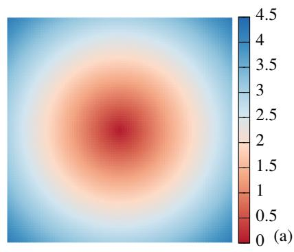

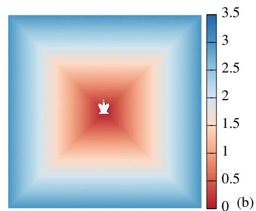

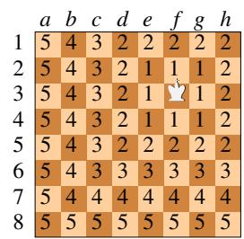  
(c)

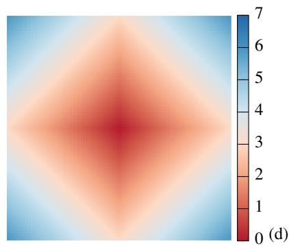

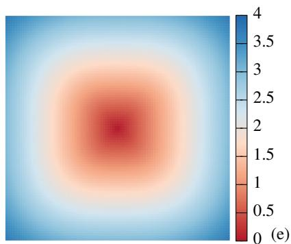

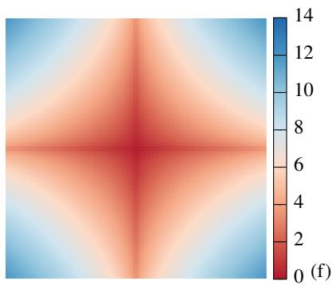  
图 2.2: $\mathbb { R } ^ { n }$ 上 (a) 通常意义下的距离 $( p = 2 )$ ,

(b) Chevyshev 距离 $( p = + \infty )$ ,   
(c) 国际象棋中的 Chevyshev 距离,  
(d) Manhattan 距离 $( p = 1 )$ ,   
(e)“小米-原研哉” 距离 $\left( p = 3 \right)$ ),   
(f) 不能成为度量的“距离” $( p = 1 / 2 )$ ), 这是因为 $p = 1 / 2$ 时 Minkowski 不等式反号

例2.3中已经证明的不等式可以改写为以下形式.

# 命题 2.20

在 $\mathbb { R } ^ { n }$ 中

(1) $\| { \pmb { \alpha } } \| _ { \infty } \leq \| { \pmb { \alpha } } \| _ { 2 } \leq \| { \pmb { \alpha } } \| _ { 1 } .$   
(2) $d ( \alpha , \beta ) _ { \infty } \leq d ( \alpha , \beta ) _ { 2 } \leq d ( \alpha , \beta ) _ { 1 } .$

函数空间中也可以类似地定义 $L ^ { p }$ 范数和 $L ^ { p }$ 度量.

例 2.45 函数空间的 $L ^ { p }$ 范数和 $L ^ { p }$ 度量 在函数空间 $C [ 0 , 1 ]$ 中, 令

$$
\| f \| _ {p} := \left(\int_ {0} ^ {1} | f (x) | ^ {p} d x\right) ^ {1 / p}, \quad p \geq 1
$$

则 $\| \cdot \| _ { p }$ 是 $C [ 0 , 1 ]$ 上的一个范数. 从而可以用 $\| \cdot \| _ { p }$ 定义一个度量:

$$
d _ {p} (f, g) = \| f - g \| _ {p}.
$$

注 上例中定义的范数和度量也称为 $L ^ { p }$ 范数和 $L ^ { p }$ 度量.

令 $p  \infty$ , 也可以定义 $L ^ { \infty }$ 范数和 $L ^ { \infty }$ 度量.

例 2.46 函数空间的 $L ^ { \infty }$ 范数和 $L ^ { \infty }$ 度量 在函数空间 $C [ 0 , 1 ]$ 中, 令

$$
\| f \| _ {\infty} := \max  _ {x \in [ 0, 1 ]} | f (x) |.
$$

则 $\| \cdot \| _ { p }$ 是 $C [ 0 , 1 ]$ 上的一个范数. 从而可以用 $\| \cdot \| _ { p }$ 定义一个度量:

$$
d _ {\infty} (f, g) = \| f - g \| _ {\infty}.
$$

从前面的例子可以看到《数学分析 I》中介绍的两套 Minkowski 不等式本质上就是 $L ^ { p }$ 范数的三角形不等式,因此两套 Minkowski 不等式可以直接写作

$$
\| \boldsymbol {\alpha} + \boldsymbol {\beta} \| _ {p} \leq \| \boldsymbol {\alpha} \| _ {p} + \| \boldsymbol {\beta} \| _ {p}. \quad \| f + g \| _ {p} \leq \| f \| _ {p} + \| g \| _ {p}, \quad 1 \leq p \leq + \infty .
$$

等号成立当且仅当 $\alpha , \beta$ 或 $f , g$ 线性相关. 可以证明, 当 $p < 1$ 时不等号反向.

# 2.3.5 空间的完备化

在研究实数列收敛性时, 我们研究了 Cauchy 列, 并证明实数列收敛当且仅当它是一个 Cauchy 列. 现在可以把Cauchy 列的概念推广到一般的空间.

# 定义 2.39 (Cauchy 列)

在度量空间 $( X , d )$ 中, 设序列 $\left\{ x _ { n } \right\}$ . 若对于任意 $\varepsilon > 0$ , 都存在 $N \in \mathbb { N } ^ { * }$ , 使得当 $n > N$ 时

$$
d \left(\boldsymbol {x} _ {m}, \boldsymbol {x} _ {n}\right) <   \varepsilon .
$$

则称该点列是一个 Cauchy 列 (Cauchy sequence) 或基本列 (fundamental sequence).

注 Cauchy列也可以用集合的直径刻画: 设度量空间 $( X , d )$ 中的序列 $\left\{ x _ { n } \right\}$ 是一个 Cauchy列当且仅当

$$
\lim  _ {n \rightarrow \infty} \operatorname {d i a m} \left\{x _ {k}: k \geq n \right\} = 0.
$$

一般的度量空间中, Cauchy 列未必收敛. 最简单的例子就是 $\mathbb { Q }$ 中的 Cauchy 列可能收敛到 $\mathbb { Q }$ 外边去. 而 $\mathbb { R }$ 中的 Cauchy 列都收敛.

# 定义 2.40 (完备的度量空间)

设度量空间 $( X , d )$ . 若 $X$ 中的任一 Cauchy 列都收敛, 则称 $X$ 是完备的度量空间 (complete metric space), 简称完备空间 (complete space).

注 特别地, 完备的赋范线性空间称为 Banach 空间 (Banach space); 完备的内积空间称为 Hilbert 空间 (Hilbert space),它们都是泛函分析中的主角.

一般的度量空间中没有所谓 Cauchy 收敛原理, 但 Cauchy 收敛原理的必要性仍然是成立的.

# 命题 2.21

在度量空间 $( X , d )$ 中, 收敛的点列一定是 Cauchy列.

证明 设点列 $\{ x _ { n } \}$ 收敛于 $x .$ . 则对于任一 $\varepsilon > 0$ , 都存在 $N \in \mathbb { N } ^ { * }$ 使得当 $n , m > N$ 时就有

$$
d (x _ {n}, x) <   \frac {\varepsilon}{2}, \quad d (x _ {m}, x) <   \frac {\varepsilon}{2}.
$$

由三角不等式可知

$$
d \left(x _ {n}, x _ {m}\right) \leq d \left(x _ {n}, x\right) + d \left(x, x _ {m}\right) <   \varepsilon .
$$

这表明 $\{ x _ { n } \}$ 是一个 Cauchy 列.

虽然一般度量空间中的 Cauchy 列未必收敛, 但一定有界.

# 命题 2.22

在度量空间 $( X , d )$ 中, Cauchy 列一定有界.

证明 设 $\{ x _ { n } \}$ 是一个 Cauchy 列. 则对于给定的 $\varepsilon > 0$ 存在 $N \in \mathbb { N } ^ { * }$ 使得当 $n , m > N$ 时

$$
d \left(x _ {n}, x _ {N}\right) <   \varepsilon .
$$

令

$$
M = \max  \left\{\varepsilon , \max  _ {1 \leq i \leq n - 1} \left\{d \left(x _ {i}, x _ {N} \right\}\right) \right\}.
$$

则对于任一 $n \in \mathbb { N } ^ { * }$ 都有 $d ( x , x _ { N } ) < M$ . 因此 $\left\{ x _ { n } \right\}$ 有界.

在一般的度量空间中, 虽然 Cauchy 列未必收敛, 但如果有收敛子列, 就一定收敛.

# 命题 2.23

在度量空间 $( X , d )$ 中, 存在收敛子列的 Cauchy 列一定收敛.

证明 设 $\left\{ x _ { n } \right\}$ 是一个 Cauchy 列, 它有一个子列 $\{ x _ { k _ { n } } \}$ 收敛于 $x .$ . 则对于任一 $\varepsilon > 0$ , 存在一个充分大的 $N \in \mathbb { N } ^ { * }$ 使得当 $m , n > N$ 时

$$
d \left(x _ {m}, x _ {n}\right) <   \frac {\varepsilon}{2}. \tag {2.2}
$$

同时使得当 $k _ { n } > N$ 时

$$
d \left(x _ {k _ {n}}, x\right) <   \frac {\varepsilon}{2}.
$$

由于 $k _ { n } \geq n > N$ , 根据不等式2.2可知

$$
d \left(x _ {k _ {n}}, x _ {n}\right) <   \frac {\varepsilon}{2}.
$$

于是当 $n > N$ 时有

$$
d \left(x _ {n}, x\right) \leq d \left(x _ {n}, x _ {k _ {n}}\right) + d \left(x _ {k _ {n}}, x\right) <   \varepsilon .
$$

于是可知 $\{ x _ { n } \}$ 也收敛于 $x$ .

显然, 有理数域 $\mathbb { Q }$ 是一个不完备的度量空间. 但只需把所有收敛的有理数列的极限值添加进去, 就可以扩充得到一个完备空间, 这个过程称为完备化 (completion). 显然实数域 $\mathbb { R }$ 就是有理数域 $\mathbb { Q }$ 完备化之后得到的完备空间. 因此在实数理论中, 可以用 Cauchy 列来定义实数. 为此只需把所有收敛到同一个点的有理数列组成的集合定义一个实数.

前面已经证明了 $\mathbb { R } ^ { n }$ 空间中的 Cauchy 收敛原理, 这就说明有限维 Euclid 空间 $\mathbb { R } ^ { n }$ 在通常度量下也是一个完备空间.

下面来研究 $C [ 0 , 1 ]$ 空间的完备性.

例 2.47 函数空间 $C [ 0 , 1 ]$ 在 $L ^ { \infty }$ 度量下是完备的.

证明 在 $L ^ { \infty }$ 度量下,任取一个Cauchy列 $\left\{ f _ { n } \right\}$ ,只需证明它在 $L ^ { \infty }$ 度量下在 $C [ 0 , 1 ]$ 中收敛.不难看出 $\left\{ f _ { n } \right\}$ 在 $L ^ { \infty }$ 度量下收敛等价于一致收敛.由一致收敛的Cauchy收敛原理可知Cauchy列 $\{ f _ { n } \}$ 一致收敛.设 $f _ { n }  f .$ . 由定理1.36可知 $f$ 在 [0, 1] 上连续, 即 $f \in C [ 0 , 1 ]$ . 综上可知 $C [ 0 , 1 ]$ 在 $L ^ { \infty }$ 度量下是完备的. ■

# 2.3.6 等价度量和等价范数

我们发现一个序列 $\{ x _ { n } \}$ 在度量空间 $( X , d )$ 中是否成为一个 Cauchy 实际上和度量 $d$ 的有关. 换句话说, $\{ x _ { n } \}$ 度量 $d$ 下是一个 Cauchy 列, 而在另一个度量 $d ^ { \prime }$ 下, 也许不再是 Cauchy 列. 因此谈度量空间 $( X , d )$ 的完备性时,依赖于其中给定的度量 ??. 那么很自然的想法就是给 $X$ 上的所有度量建立一个等价关系, 如果在 $d$ 和 $d ^ { \prime }$ 下 $X$ 中Cauchy 列完全相同, 就把它们看作一个等价类. 这样一来在等价的度量之下空间就有相同的完备性. 于是引出了以下概念.

# 定义 2.41 (等价度量)

设度量空间 $X$ 上有两种度量 $d _ { 1 }$ 和 $d _ { 2 }$ . 若存在 $M , N > 0$ 使得对于任意 $x , y \in X$ 都满足

$$
M d _ {1} (x, y) \leq d _ {2} (x, y) \leq N d _ {1} (x, y).
$$

则称 $d _ { 1 }$ 和 $d _ { 2 }$ 是等价的, 记作 $d _ { 1 } \cong d _ { 2 }$ .

注 以上定义式通常称为双 Lipschitz 条件 (bilipschitz condition).

先要证明以上定义的合理性, 即证明等价度量确实是一个等价关系.

# 命题 2.24

在度量空间 $X$ 中的等价度量满足反身性、对称性和传递性.

证明 (i) 对于 $X$ 中的任一度量 $d _ { 1 }$ , 显然有

$$
d _ {1} (x, y) \leq d _ {1} (x, y) \leq d _ {1} (x, y), \quad \forall x, y \in X.
$$

因此满足反身性.

(ii) 若 $d _ { 1 } \cong d _ { 2 }$ , 则存在 ??, $N > 0$ 使得对于任意 $x , y \in X$ 都满足

$$
M d _ {1} (x, y) \leq d _ {2} (x, y) \leq N d _ {1} (x, y), \quad \forall x, y \in X.
$$

那么就有

$$
\frac {1}{N} d _ {2} (x, y) \leq d _ {1} (x, y) \leq \frac {1}{M} d _ {2} (x, y), \quad \forall x, y \in X.
$$

这表明 $d _ { 2 } \cong d _ { 1 }$ . 因此满足对称性.

(iii) 若 $d _ { 1 } \cong d _ { 2 }$ 且 $d _ { 2 } \cong d _ { 3 }$ , 则

$$
M _ {1} d _ {1} (x, y) \leq d _ {2} (x, y) \leq N _ {1} d _ {1} (x, y), \quad \forall x, y \in X.
$$

$$
M _ {2} d _ {2} (x, y) \leq d _ {3} (x, y) \leq N _ {2} d _ {2} (x, y), \quad \forall x, y \in X.
$$

于是就有

$$
M _ {2} M _ {1} d _ {1} (x, y) \leq d _ {3} (x, y) \leq N _ {2} N _ {1} d _ {1} (x, y), \quad \forall x, y \in X.
$$

这表明 $d _ { 1 } \cong d _ { 3 }$ . 因此满足传递性.

下面来看我们定义的等价度量是否可以满足我们的预期.

# 命题 2.25

在度量空间 $X$ 中, 所有点列依等价度量同为 Cauchy列.

证明 设两种度量 $d _ { 1 } \cong d _ { 2 }$ . 则存在 $a , b > 0$ 使得对于任意 $x , y \in X$ 都满足

$$
a d _ {1} (x, y) \leq d _ {2} (x, y) \leq b d _ {1} (x, y).
$$

任取一个点列 $\{ x _ { n } \}$

(i) 若 $\{ x _ { n } \}$ 在 $d _ { 1 }$ 下是一个 Cauchy 列, 则对于任一 $\varepsilon > 0$ , 存在 $N \in \mathbb { N } ^ { * }$ , 使得当 $m , n > N$ 时

$$
d _ {1} \left(x _ {m}, x _ {n}\right) <   \frac {\varepsilon}{b}.
$$

于是

$$
d _ {2} \left(x _ {m}, x _ {n}\right) \leq b d _ {1} (x, y) <   \varepsilon .
$$

这表明 $\{ x _ { n } \}$ 在 $d _ { 2 }$ 下也是一个 Cauchy 列.

(ii) 反之, 若 $\{ x _ { n } \}$ 在 $d _ { 2 }$ 下是一个 Cauchy 列, 则对于任一 $\varepsilon > 0$ , 存在 $N \in \mathbb { N } ^ { * }$ , 使得当 $m , n > N$ 时

$$
d _ {2} \left(x _ {m}, x _ {n}\right) <   a \varepsilon .
$$

于是

$$
d _ {1} \left(x _ {m}, x _ {n}\right) \leq \frac {1}{a} d _ {2} (x, y) <   \varepsilon .
$$

这表明 $\{ x _ { n } \}$ 在 $d _ { 1 }$ 下也是一个 Cauchy 列.

综上可知 $X$ 中的所有点在等价的度量下同为 Cauchy 列.

注 在非空集合 $X$ 上定义两个不同的度量 $d _ { 1 }$ 和 $d _ { 2 }$ . 设点列 $\{ x _ { n } \}$ . 若 $d _ { 1 } \cong d _ { 2 }$ . 则 $\left\{ x _ { n } \right\}$ 在两个度量空间 $( X , d _ { 1 } )$ 和$( X , d _ { 2 } )$ 中同敛散.

先来看一个等价度量的例子.

例 2.48 设点集 $X$ 是 $\mathbb { R } ^ { 2 }$ 上的单位圆周, 即

$$
X = \left\{\left(x, y\right) \in \mathbb {R} ^ {2}: x ^ {2} + y ^ {2} = 1 \right\}.
$$

在 $X$ 上定义两种度量: $d _ { 1 }$ 表示两点的直线距离, $d _ { 2 }$ 表示两点之间较短的圆弧的弧长. 则 $d _ { 1 } \cong d _ { 2 }$ .

证明 在 $X$ 中任取两点 $x , y ;$ , 设它们之间的较短的圆弧所对的圆心角为 2??, 则

$$
\frac {d _ {1} (x , y)}{d _ {2} (x , y)} = \frac {2 \sin \theta}{2 \theta} = \frac {\sin \theta}{\theta}.
$$

在《数学分析 I》中已经证明

$$
\frac {2}{\pi} \leq \frac {\sin \theta}{\theta} \leq 1, \quad 0 <   \theta <   \frac {\pi}{2}.
$$

因此

$$
\frac {2}{\pi} \leq \frac {d _ {1} (\boldsymbol {x} , \boldsymbol {y})}{d _ {2} (\boldsymbol {x} , \boldsymbol {y})} \leq 1 \Longleftrightarrow \frac {2}{\pi} d _ {2} (\boldsymbol {x}, \boldsymbol {y}) \leq d _ {1} (\boldsymbol {x}, \boldsymbol {y}) \leq d _ {2} (\boldsymbol {x}, \boldsymbol {y}).
$$

这表明 $d _ { 1 } \cong d _ { 2 }$ .

再来看一个不等价度量的例子.

例 2.49 在函数空间 $C [ 0 , 1 ]$ 中, $L ^ { \infty }$ 度量和 $L ^ { 1 }$ 度量不等价.

证明 证法一 由于

$$
\sup  _ {f, g \in C [ 0, 1 ]} \frac {d _ {\infty} (f , g)}{d _ {1} (f , g)} = \sup  _ {f, g \in C [ 0, 1 ]} \frac {\max  _ {x \in [ 0 , 1 ]} | f (x) - g (x) |}{\int_ {0} ^ {1} | f (x) - g (x) | d x} = + \infty .
$$

因此不存在 $M > 0$ 满足

$$
d _ {\infty} (f, g) <   M d _ {1} (f, g), \quad \forall f, g \in C [ 0, 1 ].
$$

这表明 $L ^ { \infty }$ 度量和 $L ^ { 1 }$ 度量不等价.

证法二 设函数列 ???? (??) = ???? $( n = 1 , 2 , \cdots )$ .

(i) 由于

$$
d _ {1} \left(f _ {n}, f _ {n + p}\right) = \int_ {0} ^ {1} \left(x ^ {n} - x ^ {n + p}\right) \mathrm {d} x = \frac {1}{n + 1} - \frac {1}{n + p + 1} <   \frac {1}{n} \rightarrow 0.
$$

这表明 $\left\{ f _ { n } \right\}$ 在 $L ^ { 1 }$ 度量下是一个 Cauchy 列.

(ii) 由定义

$$
d_{\infty}(f_{n},f_{n + p}) = \max_{x\in [0,1]}\left|x^{n} - x^{n + p}\right|.
$$

求导可知

$$
\left(x ^ {n} - x ^ {n + p}\right) ^ {\prime} = n x ^ {n - 1} \left[ n - (n + p) x ^ {p} \right].
$$

因此不难知道

$$
\max  _ {x \in [ 0, 1 ]} \left| x ^ {n} - x ^ {n + p} \right| = \left| \left(\frac {n}{n + p}\right) ^ {\frac {n}{p}} - \left(\frac {n}{n + p}\right) ^ {\frac {n + p}{p}} \right| = \left(\frac {n}{n + p}\right) ^ {\frac {n}{p}} \frac {p}{n + p}.
$$

对于任一固定的 $n$ 都有

$$
\lim  _ {p \rightarrow \infty} \left(\frac {n}{n + p}\right) ^ {\frac {n}{p}} \frac {p}{n + p} = 1.
$$

这表明 $\left\{ f _ { n } \right\}$ 在 $L ^ { \infty }$ 度量下不是 Cauchy 列.

这表明在函数空间 $C [ 0 , 1 ]$ 中, $L ^ { \infty }$ 度量和 $L ^ { 1 }$ 度量不等价.

注 由例1.121即知证法一中的等式成立.

注由于 $C [ 0 , 1 ]$ 空间在 $L ^ { \infty }$ 度量下是完备的,因此函数列 $f _ { n } ( x ) = x ^ { n }$ 在 [0,1] 上不一致收敛就意味着它在 $L ^ { \infty }$ 度量下不是 Cauchy 列.

数学分析主要在 $\mathbb { R } ^ { n }$ 中讨论, 所以我们更关心 $\mathbb { R } ^ { n }$ 中的度量. 很可惜, $\mathbb { R } ^ { n }$ 也存在不等价的度量.

例 2.50 在 $\mathbb { R } ^ { n }$ 中, 令

$$
d (\boldsymbol {x}, \boldsymbol {y}) = \| \boldsymbol {x} - \boldsymbol {y} \|, \quad d ^ {\prime} (\boldsymbol {x}, \boldsymbol {y}) = \| \boldsymbol {x} - \boldsymbol {y} \| ^ {1 / 2}.
$$

则 $d$ 和 $d ^ { \prime }$ 不等价.

证明 (i) $d$ 是范数诱导的度量. 先来证明 $d ^ { \prime }$ 也是一个度量. 显然 $d ^ { \prime }$ 满足非负性和对称性. 由于

$$
\| \boldsymbol {x} - \boldsymbol {y} \| \leq \| \boldsymbol {x} - \boldsymbol {z} \| + \| \boldsymbol {z} - \boldsymbol {y} \| + 2 \| \boldsymbol {x} - \boldsymbol {z} \| ^ {1 / 2} \| \boldsymbol {z} - \boldsymbol {y} \| ^ {1 / 2} \iff \| \boldsymbol {x} - \boldsymbol {y} \| ^ {1 / 2} \leq \| \boldsymbol {x} - \boldsymbol {z} \| ^ {1 / 2} + \| \boldsymbol {z} - \boldsymbol {y} \| ^ {1 / 2}.
$$

因此 $d ^ { \prime }$ 也是一个度量.

(ii) 下面来证明它们不等价. 由于

$$
\sup  _ {\boldsymbol {x}, \boldsymbol {y} \in \mathbb {R} ^ {n}} \frac {d (\boldsymbol {x} , \boldsymbol {y})}{d ^ {\prime} (\boldsymbol {x} , \boldsymbol {y})} = \sup  _ {\boldsymbol {x}, \boldsymbol {y} \in \mathbb {R} ^ {n}} \frac {\| \boldsymbol {x} - \boldsymbol {y} \|}{\| \boldsymbol {x} - \boldsymbol {y} \| ^ {1 / 2}} = + \infty .
$$

因此不存在 $M > 0$ 满足

$$
d (x, y) <   M d ^ {\prime} (x, y).
$$

这表明 $d$ 和 $d ^ { \prime }$ 不等价.

但是 $\mathbb { R } ^ { n }$ 中由范数诱导的度量都是等价的.

# 定义 2.42 (等价范数)

设赋范空间 $V$ 上有两种范数 $N _ { 1 }$ 和 $N _ { 2 }$ . 若存在 $\alpha , \beta > 0$ 使得对于任意 $x \in V$ 都满足

$$
\alpha N _ {1} (\boldsymbol {x}) \leq N _ {2} (\boldsymbol {x}) \leq \beta N _ {1} (\boldsymbol {x}).
$$

则称 $N _ { 1 }$ 和 $N _ { 2 }$ 是等价的, 记作 $N _ { 1 } \cong N _ { 2 }$ .

不难看出等价范数诱导的度量一定是等价的, 证明是显然的.

# 命题 2.26

设赋范空间 $V$ 上有两种范数 $N _ { 1 }$ 和 $N _ { 2 }$ . 它们分别诱导了度量 $d _ { 1 }$ 和 $d _ { 2 }$ . 若 $N _ { 1 } \cong N _ { 2 }$ , 则 $d _ { 1 } \cong d _ { 2 }$

# 定理 2.23 (有限维线性空间上的等价范数)

$n$ 维线性空间 $V$ 上任一范数都等价. 从而任一由范数诱导的度量也都等价.

证明 取 $V$ 的一个基 $e _ { 1 } , e _ { 2 } , \cdots , e _ { n }$ $e _ { 1 }$ $e _ { n }$ . 则任一向量 $x \in V$ 都可以唯一地表示为

$$
\boldsymbol {x} = x ^ {1} \boldsymbol {e} _ {1} + x ^ {2} \boldsymbol {e} _ {2} + \dots + x ^ {n} \boldsymbol {e} _ {n}.
$$

因此 $\boldsymbol { x }$ 在这个基下的坐标为 $\left( x ^ { 1 } , x ^ { 2 } , \cdots , x ^ { n } \right)$ . 令

$$
\| \boldsymbol {x} \| := \sqrt {\sum_ {i = 1} ^ {n} \left(x ^ {i}\right) ^ {2}}.
$$

显然 $\| \cdot \|$ 是 $V$ 中的一个范数. 任取一个 $V$ 上的另一个范数 $N$ . 下面只需证明 $N \cong \| \cdot \|$ .

(i) 先证明 $N$ 是按范数 k·k 的连续函数. 任取 $\qquad x , y \in V ,$ , 设它们在基 $e _ { 1 } , e _ { 2 } , \cdots , e _ { n }$ 下的坐标分别为 $\left( x ^ { 1 } , x ^ { 2 } , \cdots , x ^ { n } \right)$ ,$\left( y ^ { 1 } , y ^ { 2 } , \cdots , y ^ { n } \right)$ . 于是由范数的三角不等式可知

$$
N (\boldsymbol {x}) \leq N (\boldsymbol {y}) + N (\boldsymbol {x} - \boldsymbol {y}), \quad N (\boldsymbol {y}) \leq N (\boldsymbol {x}) + N (\boldsymbol {x} - \boldsymbol {y}).
$$

因此 $\left| N ( { \pmb x } ) - N ( { \pmb y } ) \right| \le N ( { \pmb x } - { \pmb y } )$ . 于是由范数公理和 Cauchy-Schwarz 不等式可知

$$
\begin{array}{l} | N (\boldsymbol {x}) - N (\boldsymbol {y}) | \leq N (\boldsymbol {x} - \boldsymbol {y}) = N \left[ \sum_ {i = 1} ^ {n} (x ^ {i} - y ^ {i}) \boldsymbol {e} _ {i} \right] \leq \sum_ {i = 1} ^ {n} N \left[ (x ^ {i} - y ^ {i}) \boldsymbol {e} _ {i} \right] = \sum_ {i = 1} ^ {n} \left| x ^ {i} - y ^ {i} \right| N (\boldsymbol {e} _ {i}) \\ \leq \sqrt {\sum_ {i = 1} ^ {n} \left(x ^ {i} - y ^ {i}\right) ^ {2}} \sqrt {\sum_ {i = 1} ^ {n} \left[ N \left(\boldsymbol {e} _ {i}\right) \right] ^ {2}} = \sqrt {\sum_ {i = 1} ^ {n} \left[ N \left(\boldsymbol {e} _ {i}\right) \right] ^ {2}} \| \boldsymbol {x} - \boldsymbol {y} \|, \\ \end{array}
$$

这表明 $N$ 按范数 $\| \cdot \|$ Lipschitz 连续.

(ii) 设单位球面

$$
E = \left\{\boldsymbol {x} \in V \mid \| \boldsymbol {x} \| = 1 \right\}.
$$

显然这是一个有界闭集. 因此 $N$ 在 $E$ 上可以取到最大值 $M$ 和最小值 ??. 于是对于 $E$ 中的任一非零向量 $\boldsymbol { x }$ 都有

$$
0 <   m \leq N (\boldsymbol {x}) \leq M.
$$

容易知道 $V$ 中的任一非零向量 $\boldsymbol { x }$ 经过单位化后都在 $E$ 中, 即

$$
\frac {1}{\| x \|} \boldsymbol {x} \in E.
$$

于是根据范数的齐次性可知

$$
m \leq N \left(\frac {1}{\| x \|} x\right) \leq M \iff m \leq \frac {1}{\| x \|} N (x) \leq M \iff m \| x \| \leq N (x) \leq M \| x \|.
$$

上述右边的不等式对于 $\mathbf { \nabla } \mathbf { x } = \mathbf { 0 }$ 也成立, 即

$$
m \| \boldsymbol {x} \| \leq N (\boldsymbol {x}) \leq M \| \boldsymbol {x} \|, \quad \forall \boldsymbol {x} \in V.
$$

这表明在 $V$ 中 $N \cong \| \cdot \|$ . 这就证明了 $V$ 中的任一范数都等价, 从而 $V$ 中任一由范数诱导的度量也都等价.

注 所谓的 “函数 $N$ 按范数 $\| \cdot \|$ 连续” 是指函数 $N$ 的连续性是在范数 k · k 诱导的度量之下定义的.

以上定理解释了为什么在讨论收敛性时通常倾向于使用范数诱导的度量.

由于 $\mathbb { R } ^ { n }$ 是一个有限维线性空间, 因此立刻可知以下推论.

# 推论 2.2

Euclid 空间 $\mathbb { R } ^ { n }$ 中的任一由范数诱导的度量都等价.

由于 $\mathbb { R } ^ { n }$ 在通常范数下是完备的, 由以上推论就可以进一步得到以下推论.

# 推论 2.3

Euclid 空间 $\mathbb { R } ^ { n }$ 在任何由范数诱导的度量下都是完备的.

由闭集定义立刻知道进一步知道以下推论.

# 推论 2.4

Euclid 空间 $\mathbb { R } ^ { n }$ 任一闭子集在任何由范数诱导的度量下都是完备的.

# 2.3.7 压缩映射原理

最后介绍度量空间中最重要的一个结论.我们在《数学分析I》中已经讲过一个特殊版本的压缩映射原理.下面来介绍一般度量空间中的压缩映射原理.

# 定义 2.43 (压缩映射)

设度量空间 $( X , d )$ . 若存在 $K \in [ 0 , 1 )$ 使得 $X$ 到 $X$ 的映射 $\varphi$ 满足

$$
d [ \varphi (x), \varphi (y) ] \leq K d (x, y), \quad \forall x, y \in X.
$$

则称 $\varphi$ 是一个压缩映射 (contraction mapping).

注 压缩映射显然都是 Lipschitz 连续的, 从而都是一致连续的.

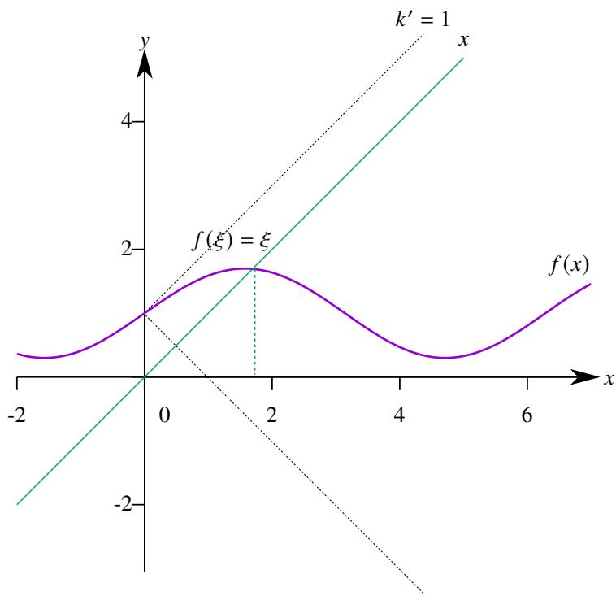  
图 2.3: 压缩映射几何意义.

# 定理 2.24 (压缩映射原理)

在完备的度量空间 $( X , d )$ 中, 压缩映射 $\varphi$ 有且仅有一个不动点, 即存在唯一的 $x \in X$ 满足

$$
\varphi (x) = x.
$$

证明 (i) 证明存在性. 任取 $x _ { 0 } \in X$ . 构造一个点列:

$$
x _ {n + 1} = \varphi (x _ {n}), \quad n = 0, 1, \dots .
$$

由于 $\varphi$ 是一个压缩映射, 因此存在 $K \in [ 0 , 1 )$ 使得

$$
d \left(x _ {n + 1}, x _ {n}\right) = d \left[ \varphi \left(x _ {n}\right), \varphi \left(x _ {n - 1} \right] \leq K d \left(x _ {n}, x _ {n - 1}\right), \quad n = 0, 1, \dots . \right.
$$

于是

$$
d \left(x _ {n + 1}, x _ {n}\right) \leq K d \left(x _ {n}, x _ {n - 1}\right) \leq K ^ {2} d \left(x _ {n - 1}, x _ {n - 2}\right) \dots \leq K ^ {n} d \left(x _ {1}, x _ {0}\right).
$$

由于 $K \in [ 0 , 1 )$ , 因此利用以上不等式可知

$$
d \left(x _ {n + p}, x _ {n}\right) \leq d \left(x _ {n + p}, x _ {n + p - 1}\right) + \dots + d \left(x _ {n + 1}, x _ {n}\right) \leq \left(K ^ {n + p - 1} + \dots + K ^ {n}\right) d \left(x _ {1}, x _ {0}\right) \leq \frac {K ^ {n}}{1 - K} d \left(x _ {1}, x _ {0}\right)\rightarrow 0.
$$

这表明 $\{ x _ { n } \}$ 是一个 Cauchy 列. 由于 $X$ 是完备的,因此 $\{ x _ { n } \}$ 收敛.设 $x _ { n } \to \xi .$ .由于压缩 $\varphi$ 是连续函数,因此令等式$x _ { n + 1 } = \varphi ( x _ { n } )$ 中的 $n \to \infty$ 得

$$
\xi = \varphi (\xi).
$$

这表明不动点是存在的.

(ii) 证明唯一性. 假设还有一个不动点 $\xi ^ { \prime } \in X$ . 则

$$
0 <   d \left(\xi^ {\prime}, \xi\right) = d \left[ \varphi \left(\xi^ {\prime}\right), \varphi (\xi)\right) \leq K d \left(\xi^ {\prime}, \xi\right).
$$

于是得到 $K \geq 1$ , 这与 $K \in [ 0 , 1 )$ 矛盾. 因此 $\xi = \xi ^ { \prime }$ . 这就证明了不动点是唯一的.

注 以上定理称为压缩映射原理 (Contraction mapping ). 这个定理是 1922 年由 Banach 首次提出的, 因此也称为 Ba-nach 不动点定理 (Banach fixed-point theorem).

注 从以上证明可以看出, 压缩映射的不动点至多只有一个. 空间的完备性确保了不动点的存在性, 因此如果取消了完备性, 压缩映射不一定存在不动点. 例如在 $X = ( 0 , 1 ]$ 上, 有一个压缩映射

$$
\varphi (x) = \frac {1}{2} x.
$$

但 $\varphi$ 在 $X$ 中没有不动点, 原因是方程 $x / 2 = x$ 的唯一解 $x = 0 \not \in X$ . 出现这个问题的原因是 $X$ 不是完备空间.

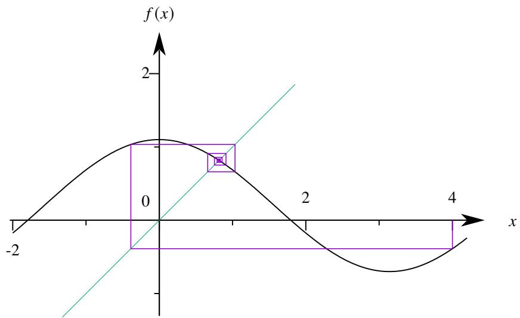  
图 2.4: 不动点定理的证明.

以上证明构造了一个迭代点列, 来逼近不动点. 这个逼近可以成功关键在于压缩映射的 Lipschitz 系数 $K$ 小于1, 使得映射不会膨胀. 因此不难想到压缩映射原理在动力系统中有重要应用. 在本讲义中, 该定理将被用于证明隐映射定理.

下面来看一个有趣的例子.

例 2.51 地图上的不动点 若把某国的地图按比例缩小后印在该原地图内部. 显然 “按比例缩小” 是一个压缩映射.大地图占有的闭区域显然是一个完备的空间. 根据压缩映射原理可以断言: 在地图上有且仅有一点, 它在地图中的位置也恰巧表示它所落在的土地位置.

如果要找到这一点只需模仿压缩映射原理的证明方法,构造一个迭代序列:在大地图上任取一定 $x _ { 0 }$ 然后找到它在小地图上的对应点, 记作 $x _ { 1 }$ . 然后找到大地图上与 $x _ { 1 }$ 重合的点, 并找到这个点在小地图上对应点, 记作 $x _ { 2 }$ . 依次下去, 就得到了一个迭代点列. 这个点列的极限就是这个不动点.

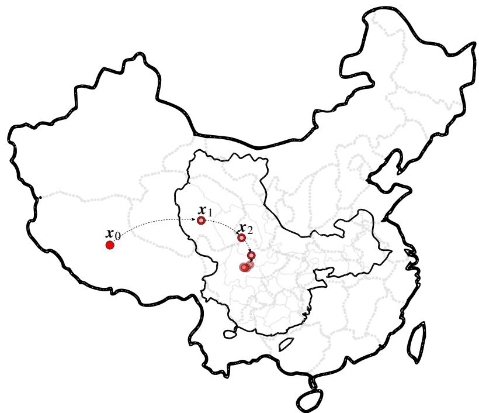  
图 2.5: 地图上的不动点.

# 2.4 拓扑空间

# 2.4.1 开集的公理化定义

我们已经看到, 映射的连续性只需要用开集来刻画. 因此为了把连续的概念一般化, 只需先将开集的概念一般化. 为此我们可以基于定理2.1, 用公理化的方法定义一般的开集. 于是引出了 “拓扑” 的概念.

# 公理 2.5 (拓扑空间)

设集合 $X$ , 设集族 ${ \mathcal { T } } \subseteq { \mathcal { P } } ( X )$ . 若 $\mathcal { T }$ 满足

$1 ^ { \circ } \enspace { \mathcal { O } } , X \in { \mathcal { T } }$ .   
$2 ^ { \circ }$ 若 $U _ { \alpha } \in \mathcal { T } \left( \alpha \in I \right)$ , 则 $\textstyle \bigcup _ { \alpha \in I } U _ { \alpha } \in { \mathcal { T } }$ , 其中 $I$ 是一个指标集.  
$3 ^ { \circ }$ 若 $U _ { 1 } , U _ { 2 } , \cdots , U _ { n } \in { \mathcal { T } }$ , 则 $\textstyle \bigcap _ { i = 1 } ^ { n } U _ { i } \in { \mathcal { T } }$ .

则称 $\mathcal { T }$ 是 $X$ 上的一个拓扑 (topology). $X$ 和 $\mathcal { T }$ 组成的一个序对 $( X , { \mathcal { T } } )$ 称为一个拓扑空间 (topological space).$\mathcal { T }$ 中的元素称为关于拓扑 $\mathcal { T }$ 的开集 (open set), 或集合 $X$ 上的开集. 若 $U$ 是一个开集, 则称 $U$ 在 $X$ 中的补集 $U ^ { c }$ 为闭集 (close set).

注 拓扑公理的形成经历了一个漫长的过程, 在 20 世纪初有无数数学家尝试给出了各种版本的公理, 其中最著名的就是 Fréchet、Hausdorff, 前者定义了度量空间 (1906 年), 后者定义了拓扑空间 (1914 年).

注 拓扑可以看作一个开集系 (system of open sets).

注 如果 $\mathcal { T }$ 的构成默认读者知道时, 可以直接说 $X$ 是一个拓扑空间.

注 由 de Morgan 定律立刻可知闭集仍然满足定理2.4:

(1) $\mathcal { D }$ 和 $X$ 都是闭集.   
(2) 设闭集族 $\{ E _ { \alpha } \mid \alpha \in I \}$ , 其中 $I$ 是一个指标集. 则 $\cap _ { \alpha \in I } E _ { \alpha }$ 仍是一个闭集.  
(3) 设有限个闭集 $F _ { 1 } , F _ { 2 } , \cdots , F _ { n }$ . 则 $\textstyle \bigcup _ { i = 1 } ^ { n } F _ { i }$ 仍是一个闭集.

注 “一个集合和一扇门有什么区别?”— 一扇门不是开的就是闭的, 但存在既不开也不闭的集合.

注 拓扑空间的公理化方法有很多种, 以上是最通行的一种方式, 称为 “开集公理”. 常见的方法还有 “闭集公理”、“邻域公理”、“闭包公理” 和 “导集公理” 等.

任给一个非空集合 $X$ 总是存在两种极端的拓扑.

例 2.52 离散拓扑 设非空集合 $X$ , 令 ${ \mathcal { T } } = { \mathcal { P } } ( X )$ . 则 $( X , \mathcal { T } )$ 是一个拓扑空间. 我们称 $\mathcal { T }$ 为 $X$ 上的离散拓扑 (discretetopology).

注 所谓离散拓扑就是把集合 $X$ “敲得粉碎”, 以至于所有单点集都是开集.

下面来看另一个极端.

例 2.53 平凡拓扑 设非空集合 $X$ , 则 $\{ X , { \mathcal { O } } \}$ 是 $X$ 上的一个拓扑. 我们称它为 $X$ 上的平凡拓扑 (trivial topology), 与离散拓扑相对也可以称为密着拓扑 (indiscrete topology).

注 所谓密着拓扑就是集合 $X$ “混沌未开”, 以至于 $X$ 的任何非空真子集都不是开集.

设度量空间 $( X , d )$ , 则用度量 $d$ 可以定义一种开集, 它当然满足拓扑公理. 令 $X$ 的全体开集组成的集合为 $\mathcal { T }$ ,于是就得到了拓扑空间 $( X , { \mathcal { T } } )$ , 我们称它为度量空间 $( X , d )$ 上由度量 $d$ 诱导的拓扑空间. 如果没有特别说明, 以后我们把度量空间 $( X , d )$ 看作一个拓扑空间时都是指它诱导的拓扑空间.

例 2.54 离散拓扑是由离散度量诱导的拓扑空间.

证明 设非空集合 $X$ . 为了证明它是离散度量诱导来的, 只需证明在离散度量下, $X$ 中的任一单点集 $\{ x \}$ 都是一个

开集. 事实上 $\{ x \} = N _ { 1 / 2 } ( x )$ , 因此 $\{ x \}$ 是一个开集.

对于一个拓扑空间 $( X , { \mathcal { T } } )$ , 如果存在一个度量 $d$ , 使得 $d$ 诱导的拓扑空间正好是 $( X , \mathcal { T } )$ , 则称该拓扑空间是可度量的 (metrizable). 上例说明离散拓扑是可度量化的. 反过来并不是每一个拓扑都是可度量化的. 研究拓扑空间的可度量化的充要条件是点集拓扑学中的重要课题之一.

例 2.55 设集合 $X = \{ x , y \}$ 则, 它的平凡拓扑是不可度量的.

证明 假设它是可度量的, 则 $X$ 上存在一个度量 $d$ 使得 $d$ 诱导的拓扑恰好是 $\{ X , { \mathcal { O } } \}$ . 令

$$
r = \frac {1}{2} d (x, y) > 0.
$$

则 $\{ x \} = N _ { r } ( x )$ 是一个开集, 这与平凡拓扑矛盾. 于是可知 $X$ 的平凡拓扑是不可度量的.

在 Euclid 空间 $\mathbb { R } ^ { n }$ 诱导的拓扑空间称为 $\mathbb { R } ^ { n }$ 上的通常拓扑, 这是我们在数学分析中使用最多的一个拓扑空间.显然 $\mathbb { R } ^ { n }$ 上的通常拓扑既不是平凡拓扑也不是离散拓扑.

至此我们给出了 5 套空间的公理. 它们的关系如下图所示.

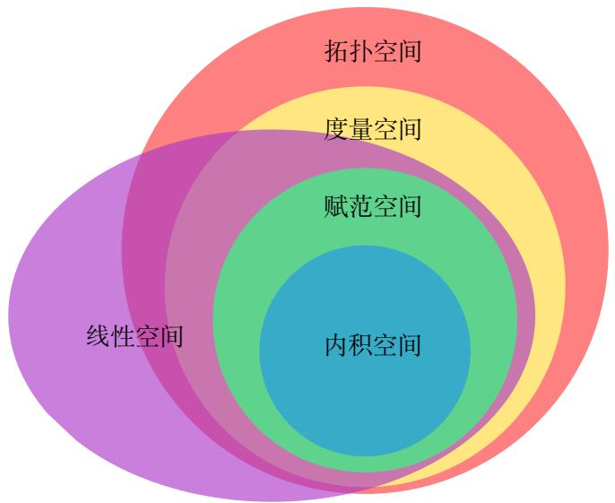  
图 2.6: 各种空间的包含关系示意图.

以上两个例子是平凡的, 没有什么实质性的信息, 但它们给出了两个极端.

# 定义 2.44 (拓扑的粗细)

设 $\mathcal { T } _ { 1 }$ 和 $\mathcal { T } _ { 2 }$ 是集合 $X$ 上的两个拓扑. 若 $\mathcal { T } _ { 1 } \subseteq \mathcal { T } _ { 2 }$ , 则称 $\mathcal { T } _ { 1 }$ 比 $\mathcal { T } _ { 2 }$ 粗 (coarser), 或称 $\mathcal { T } _ { 2 }$ 比 $\mathcal { T } _ { 1 }$ 细 (finer).

注 不难知道离散拓扑是 “最细” 的拓扑, 而平凡拓扑是 “最粗” 的拓扑.

对于非空集合 $X$ , 它产生的各种拓扑并不都能比较粗细. 下面来看一个例子.

例 2.56 设集合 $X = \{ a , b , c \}$ . 举出 $X$ 上所有可能的拓扑. 并比较各个拓扑之间的粗细.

解 除去平凡拓扑 $\mathcal { T } _ { A }$ 和离散拓扑 $\mathcal { T } _ { B }$ , 其余还有 6 类拓扑, 共计 29 种拓扑:

$$
\mathcal {T} _ {A} = \{\varnothing , X \}, \qquad \mathcal {T} _ {B} = \{\varnothing , X, \{a \}, \{b \}, \{c \}, \{a, b \}, \{a, c \}, \{b, c \} \},
$$

$$
\mathcal {T} _ {a 1} = \{\varnothing , X, \{a \} \}, \qquad \mathcal {T} _ {a 2} = \{\varnothing , X, \{b \} \}, \qquad \mathcal {T} _ {a 3} = \{\varnothing , X, \{c \} \},
$$

$$
\mathcal {T} _ {b 1} = \{\varnothing , X, \{a \}, \{b \}, \{a, b \} \}, \quad \mathcal {T} _ {b 2} = \{\varnothing , X, \{a \}, \{c \}, \{a, c \} \}, \quad \mathcal {T} _ {b 3} = \{\varnothing , X, \{b \}, \{c \}, \{b, c \} \},
$$

$$
\mathcal {T} _ {c 1} = \{\varnothing , X, \{a \}, \{b \}, \{a, b \} \}, \{b, c \} \}, \quad \mathcal {T} _ {c 2} = \{\varnothing , X, \{a \}, \{b \}, \{a, b \}, \{a, c \} \},
$$

$$
\mathcal {T} _ {c 3} = \{\varnothing , X, \{a \}, \{c \}, \{a, c \} \}, \{a, b \} \}, \quad \mathcal {T} _ {c 4} = \{\varnothing , X, \{a \}, \{c \}, \{a, c \}, \{b, c \} \},
$$

$$
\mathcal {T} _ {c 5} = \{\varnothing , X, \{b \}, \{c \}, \{b, c \} \}, \{a, b \} \}, \quad \mathcal {T} _ {c 6} = \{\varnothing , X, \{b \}, \{c \}, \{b, c \}, \{a, c \} \},
$$

$$
\mathcal {T} _ {d 1} = \{\varnothing , X, \{a \}, \{a, b \} \}, \qquad \mathcal {T} _ {d 2} = \{\varnothing , X, \{a \}, \{a, c \} \}, \qquad \mathcal {T} _ {d 3} = \{\varnothing , X, \{a \}, \{b, c \} \},
$$

$$
\mathcal {T} _ {d 4} = \{\varnothing , X, \{b \}, \{a, b \} \}, \qquad \mathcal {T} _ {d 5} = \{\varnothing , X, \{b \}, \{a, c \} \}, \qquad \mathcal {T} _ {d 6} = \{\varnothing , X, \{b \}, \{b, c \} \},
$$

$$
\mathcal {T} _ {d 7} = \{\varnothing , X, \{c \}, \{a, b \} \}, \qquad \mathcal {T} _ {d 8} = \{\varnothing , X, \{c \}, \{a, c \} \}, \qquad \mathcal {T} _ {d 9} = \{\varnothing , X, \{c \}, \{b, c \} \},
$$

$$
\mathcal {T} _ {e 1} = \{\varnothing , X, \{a \}, \{a, b \}, \{a, c \} \}, \qquad \mathcal {T} _ {e 2} = \{\varnothing , X, \{b \}, \{a, b \}, \{b, c \} \}, \qquad \mathcal {T} _ {e 3} = \{\varnothing , X, \{c \}, \{a, c \}, \{b, c \} \},
$$

$$
\mathcal {T} _ {f 1} = \{\varnothing , X, \{a, b \} \}, \qquad \mathcal {T} _ {f 2} = \{\varnothing , X, \{a, c \} \}, \qquad \mathcal {T} _ {f 3} = \{\varnothing , X, \{b, c \} \}.
$$

显然上述拓扑在集合的包含关系之下无法构成全序集.

例 2.57 有限补拓扑 设集合 $X$ , 令

$$
\mathcal {T} = \{U \in X: U ^ {c} \text {是 一 个 有 限 集} \} \cup \varnothing .
$$

则 $\mathcal { T }$ 是 $X$ 上的一个拓扑. 我们称之为有限补拓扑 (finite complement topology).

证明 (i) 显然 $X , \mathcal { O } \in \mathcal { T }$ .

(ii) 在 $\mathcal { T }$ 中任取一族非空集合 $\{ U _ { \alpha } \}$ . 由 de Morgan 定律可知

$$
\left(\bigcup U _ {\alpha}\right) ^ {c} = \bigcap U _ {\alpha} ^ {c}.
$$

由于 $U _ { \alpha }$ 都是有限集, 因此 $\cap U _ { \alpha } ^ { c }$ 是一个有限集. 于是 $( \cup U _ { \alpha } ) ^ { c }$ 也是一个有限集. 因此 $\bigcup U _ { \alpha } \in \mathcal T$ .

(iii) 在 $\mathcal { T }$ 中任取非空集合 $U _ { i }$ $U _ { i } \ ( i = 1 , 2 , \cdots , n )$ . 由 de Morgan 定律可知

$$
\left(\bigcap_ {i = 1} ^ {n} U _ {i}\right) ^ {c} = \bigcup_ {i = 1} ^ {n} U _ {i} ^ {c}.
$$

由于 $U _ { \alpha }$ 都是有限集, 因此 $\textstyle \bigcup _ { i = 1 } ^ { n } U _ { i } ^ { c }$ 是一个有限集. 于是 $\textstyle \left( \bigcap _ { i = 1 } ^ { n } U _ { i } \right) ^ { c }$ 也是一个有限集. 因此 $\cap _ { i = 1 } ^ { n } U _ { i } \in { \mathcal { T } }$ .

综上可知 $\mathcal { T }$ 是 $X$ 上的一个拓扑.

# 命题 2.27 (子空间拓扑)

设拓扑空间 $( X , \mathcal { T } )$ , $Y \subseteq X$ , 令

$$
\mathcal {T} _ {Y} := \{Y \cap U: U \in \mathcal {T} \}.
$$

则 $\mathcal { T } _ { Y }$ 是 $Y$ 上的一个拓扑. 这样定义的拓扑称为子空间拓扑 (subspace topology), 或诱导拓扑 (induced topology).具有这种拓扑的子集 ?? 称为 $X$ 的子空间 (subspace).

证明 显然 $\varnothing = Y \cap \varnothing , Y = Y \cap X .$ $Y = Y \cap X$ . 因此 $\textstyle \mathcal { D } , Y \in \mathcal { T } _ { Y }$ . 由于

$$
\bigcup_ {\alpha \in I} (U _ {\alpha} \cap Y) = \left(\bigcup_ {\alpha \in I} U _ {\alpha}\right) \cap Y, \quad \bigcap_ {i = 1} ^ {n} (U _ {i} \cap Y) = \left(\bigcap_ {i = 1} ^ {n} U _ {i}\right) \cap Y.
$$

因此 $\textstyle \bigcup _ { \alpha \in I } U _ { \alpha } , \bigcap _ { i = 1 } ^ { n } U _ { i } \in { \mathcal { T } } _ { Y } .$ 于是可知 $\mathcal { T } _ { Y }$ 是 $Y$ 上的一个拓扑.

今后如果不加说明,则拓扑空间的子集的拓扑都默认为子空间拓扑.在子空间拓扑的意义下,子空间中的闭集也有对称的定义方法.

例 2.58 设拓扑空间 $X , Y \subseteq X$ . 则 $V$ 是 $Y$ 上的一个闭集当且仅当存在一个 $X$ 上的闭集 $V ^ { \prime }$ 使得 $V = Y \cap V ^ { \prime }$ .

证明 (i) 证明充分性. 设 $V = Y \cap V ^ { \prime }$ , 其中 $V ^ { \prime }$ 是 $X$ 上的一个闭集. 则 $X \backslash V ^ { \prime }$ 是 $X$ 上的一个开集. 于是 $Y \cap ( X \backslash V ^ { \prime } )$ 是?? 上的一个开集. 容易知道

$$
Y \cap (X \backslash V ^ {\prime}) = (Y \cap X) \backslash (Y \cap V ^ {\prime}) = Y \backslash V.
$$

因此 $Y \backslash V$ 是 $Y$ 上的一个开集, 因此 $V$ 是 $Y$ 上的一个闭集.

(ii) 证明必要性. 设 $V$ 是 ?? 上的一个闭集, 则 $Y \backslash V$ 是 ?? 上的一个开集, 于是存在 $X$ 上的一个开集 $U$ 满足$Y \backslash V = Y \cap U .$ . 容易知道

$$
V = Y \cap (X \backslash U).
$$

显然 $X \backslash U$ 是 $X$ 上的一个闭集, 于是可知必要性成立.

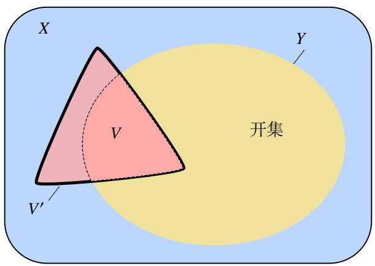  
图 2.7: 子空间拓扑中的闭集.

需要注意, 若 $A$ 是 $X$ 的子空间, 则 $A$ 中的开集未必是 $X$ 中的开集. 这样的例子在讨论 $\mathbb { R } ^ { n }$ 中的开集时已经给过. 但是如果 ?? 本身是 $X$ 的一个开集, 则命题成立.

# 命题 2.28

设拓扑空间 $X$ . 已知 $Y \subseteq X$ . 若 $U$ 是 $Y$ 上的一个开集, 且 $Y$ 是 $X$ 上的一个开集, 则 $U$ 是 $X$ 上的一个开集.

证明 由于 $U$ 是 $Y$ 上的一个开集,则存在 $X$ 上的一个开集 $V$ 使得 $U = V \cap Y .$ 由于 $V$ 和 $Y$ 都是 $X$ 上的一个开集,因此 $U$ 是 $X$ 上的一个开集. ■

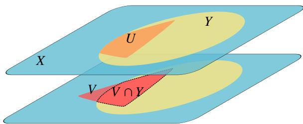  
图 2.8: 开集在更 “大” 的空间仍然是开集.

把开集改成闭集结论仍旧成立.

# 命题 2.29

设拓扑空间 ??. $Y \subseteq X$ . 则 $V$ 是 $Y$ 上的一个闭集, 且 ?? 是 $X$ 上的一个闭集, 则 $V$ 是 $X$ 上的一个闭集.

在公理化的拓扑空间中可以直接把开集定义为邻域.

# 定义 2.45 (邻域)

在拓扑空间 $( X , { \mathcal { T } } )$ 中, 设一点 $x \in X$ . 若存在开集 $U \in \mathcal { T }$ 使得 $x \in U$ , 则称 $U$ 是 $x$ 的一个邻域, 记作 $U ( x )$ .我们称 ${ \check { U } } ( x ) = U ( x ) \backslash \{ x \}$ 为 $x$ 的一个去心邻域.

用邻域可以把度量空间中的内部、闭包等概念的定义平移到拓扑空间中.

# 定义 2.46 (内点和内部)

在拓扑空间 $( X , \mathcal { T } )$ 中, 设非空集合 $E$ . 若 $x \in E$ 存在一个邻域 $U ( x ) \subseteq E$ , 则称 $x$ 是 $E$ 的一个内点 (interiorpoint). $E$ 的全体内点组成的集合称为 $E$ 的内部 (interior), 记作 $E ^ { \circ }$ .

# 定义 2.47 (导集和闭包)

在拓扑空间 $( X , \mathcal { T } )$ 中, 设集合 $E$ .

(1) 若 $x \in X$ 任一去心邻域 $\check { U } ( x )$ 都满足 $\check { U } ( x ) \cap E \neq \emptyset$ , 则称 $x$ 为 $E$ 的一个极限点 (limited point) 或聚点(accumulation point, cluster point). $E$ 的所有极限点组成集合称为 $E$ 的导集 (derived set), 记作 $E ^ { \prime }$ .  
(2) 若 $x \in X$ 任一邻域 $U ( x )$ 都满足 $U ( x ) \cap E \neq \emptyset$ , 则称 $x$ 为 $E$ 的一个闭包点 (closure point). 所有闭包点组成的集合称为 $E$ 的闭包 (closure), 记作 $\overline { E }$ .

注 根据上述定义显然有 ${ \overline { { E } } } = E \cup E ^ { \prime }$ .

# 定义 2.48 (边界)

在拓扑空间 $( X , \mathcal { T } )$ 中, 设集合 $E$ . 则 $\left( E ^ { c } \right) ^ { \circ }$ 中的点称为 $E$ 的外点 (exterior point). $E$ 的所有外点组成的集合称为 $E$ 的外部 (exterior), 记作 $E ^ { e }$ . 既不是 $E$ 的内部, 也不是 $E$ 的外部的点称为 $E$ 的边界点 (boundary point).$E$ 的所有边界点组成的集合称为 $E$ 的边界 (boundary), 记作 $\partial E$ .

命题2.6和2.8的结论在拓扑空间继续成立.

# 命题 2.30 (内部和闭包的简单性质)

在拓扑空间 $( X , \mathcal { T } )$ 中, 设集合 $E$ , 则

(1) $E$ 是一个开集当且仅当 $E = E ^ { \circ }$ .   
(2) $E ^ { \circ }$ 是 $X$ 上的一个开集, 即 $\left( E ^ { \circ } \right) ^ { \circ } = E ^ { \circ }$ .  
(3) $E ^ { \circ }$ 是包含于 $E$ 的最大开集, 即对于任一开集 $U \subseteq E$ 都满足 $U \subseteq E ^ { \circ }$ .   
(4) $E$ 是一个闭集当且仅当 $E = { \overline { { E } } }$ .   
(5) $\overline { { E } }$ 是 $X$ 上一个闭集, 即 ${ \overline { { \left( { \overline { { E } } } \right) } } } = { \overline { { E } } }$   
(6) $\overline { E }$ 是包含 $E$ 的最小闭集, 即对于任一闭集 $V \supseteq E$ 都满足 $V \supseteq { \overline { { E } } }$

证明 如果证明了 (1) 和 (4), 则其余命题的证明同命题2.6和2.8.

(1) (i) 证明必要性. 设 $E$ 是一个开集. 显然有 $E ^ { \circ } \subseteq E$ , 因此只需证明 $E \subseteq E ^ { \circ }$ . 任取 $x \in E$ , 则 $x$ 就是 $E$ 的一个内点, 因此 $E \subseteq E ^ { \circ }$ .  
(ii) 证明充分性. 设 $E = E ^ { \circ }$ . 令

$$
U = \left\{\bigcup U (x): U (x) \subseteq E, x \in E ^ {\circ} \right\}.
$$

显然 $U$ 是一个开集, 下面只需证明 $E ^ { \circ } = U .$ . 显然有 $E ^ { \circ } \subseteq U$ , 因此只需证明 $U \subseteq E ^ { \circ }$ . 任取 $x _ { 0 } \in U$ , 则存在 $U ( x )$ 使得$x _ { 0 } \in U ( x ) \subseteq E$ , 这说明 $x _ { 0 }$ 是 $E$ 的一个内点, 即 $x _ { 0 } \in E ^ { \circ }$ . 于是就证明了 $U \subseteq E ^ { \circ }$ .

(4) (i) 证明必要性. 设 $E$ 是一个闭集. 则 $E ^ { c }$ 是一个开集. 显然有 $E \subseteq { \overline { { E } } }$ , 因此只需证明 ${ \overline { { E } } } \subseteq E$ . 任取 $x \in { \overline { { E } } }$ , 则$x$ 是 $E$ 的一个闭包点,因此 $x$ 的任一邻域都满足 $U ( x ) \cap E \neq \emptyset$ .因此 $x$ 不是 $E ^ { c }$ 的内点.因此 $x \notin E ^ { c }$ ,因此 $x \in E$ . 于是可知 ${ \overline { { E } } } \subseteq E$ .  
(ii)证明充分性.设 $E = { \overline { { E } } }$ .要证明 $E$ 是一个闭集,只需证明 $E ^ { c }$ 是一个开集.任取 $x \in E ^ { c }$ , 则 $x \notin E = { \overline { { E } } }$ .因此 $x$ 不是 $E$ 的闭包点. 因此 $x$ 存在一个邻域 $U ( x ) \cap E = \emptyset$ . 因此 $x$ 是 $E ^ { c }$ 的一个内点. 因此 $E ^ { c }$ 是一个开集. ■

至此公理化后得到的拓扑概念和用度量定义的拓扑概念得到了统一.

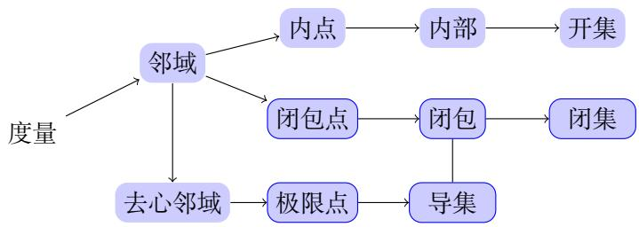

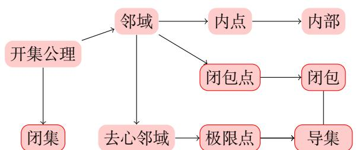  
图 2.9: 用度量定义的拓扑概念和公理化的拓扑概念.

# 2.4.2 拓扑空间中的点列收敛性

在公理化的拓扑空间中也定义了邻域, 因此也可以定义序列的收敛性.

# 定义 2.49 (拓扑空间中点列的收敛)

在拓扑空间 $( X , \mathcal { T } )$ 中,设序列 $\{ x _ { n } \}$ 和一点 $x \in X$ .若对于 $x$ 的任一邻域 $U ( x )$ 都存在 $N \in \mathbb { N } ^ { * }$ ,使得当 $n > N$ 时 $x _ { n } \in U ( x )$ , 则称序列 $\left\{ x _ { n } \right\}$ 收敛到 $x$ .

以上定义是很自然的, 但这样定义的点列收敛性却和我们熟悉的度量空间中点列的收敛很不一样. 下面来看一个例子.

例 2.59 设 $X = \{ a , b , c \}$ 的一个拓扑

$$
\mathcal {T} = \{\varnothing , X, \{a, b \}, \{a, c \}, \{a \} \}.
$$

设点列 $x _ { n } = a$ $( n = 1 , 2 , \cdots )$ . 则 $\{ x _ { n } \}$ 可以同时收敛到 $a , b , c$ .

上例表明公理化之下的拓扑概念和我们熟知的度量空间中的拓扑概念很不一样, 因此对于一般的拓扑空间,不能用之前的 “经验” 直接得到结论. 再举一个例子说明这一点. 在度量空间中单点集一定是闭集, 但这个结论在一般的拓扑空间中是不一定成立.

例 2.60 设 $X = \{ a , b , c \}$ 的一个拓扑

$$
\mathcal {T} = \{\varnothing , X, \{a, b \}, \{a, c \}, \{a \} \}.
$$

则单点集 $\{ a \}$ 不是闭集, 因为它的补集 $\{ b , c \}$ 不是开集.

以上两个例子中的拓扑 $\mathcal { T }$ 无法让收敛点列收敛到唯一的点, 这不需要我们希望看到的事情. 产生这个问题的原因是 $\mathcal { T }$ 中, $^ b$ 和 $c$ 的任一邻域都含有 $a$ ,换言之无法找到分别找到 $a , b , c$ 的邻域使得它们“井水不犯河水”.而这一点在度量空间中是可以做到的. 为此我们只需要为拓扑空间加上这样一个限制条件, 就可以使拓扑空间的收敛性 “变好”.

# 公理 2.6 (Hausdorff 空间)

设拓扑空间 $( X , \mathcal { T } )$ . 若对于任意 $x _ { 1 } , x _ { 2 } \in X$ 都存在邻域 $U ( x _ { 1 } )$ , $U ( x _ { 2 } )$ 满足

$$
U (x _ {1}) \cap U (x _ {2}) = \varnothing .
$$

则称 $X$ 是一个 Hausdorff 空间 (Hausdorff space).

注 事实上 1914 年 Hausdorff 提出的拓扑公里中包含以上公理. 上述公理也称 “Hausdorff 条件” 或 $T _ { 2 }$ 公理.

下面看一个例子.

例 2.61 设集合 $X = \{ a , b , c \}$ . 则拓扑空间 $( X , \mathcal { T } )$ 是一个 Hausdorff 空间当且仅当 $\mathcal { T }$ 是一个离散拓扑.

注 例2.56中 $X = \{ a , b , c \}$ 虽然有 29 种拓扑, 但只有离散拓扑空间是 Hausdorff 空间, 从这个意义上看有限集形成的拓扑都是平凡的.

由上面的例子进一步可以证明以下结论.

# 命题 2.31

有限集是一个 Hausdorff 空间当且仅当它是一个离散拓扑.

证明 充分性显然成立. 只需证明必要性. 设 $( X , { \mathcal { T } } )$ 是一个 Hausdorff 空间, 其中 $X$ 是一个有限集. 假设 $\mathcal { T }$ 不是离散拓扑, 则存在 $x \in X$ 满足 $\{ x \} \notin { \mathcal { T } } .$ . 令

$$
U = \bigcap U (x).
$$

则 $U$ 中至少包含不同于 $x$ 的元素 $y .$ . 于是 $y$ 的任意邻域都与 $U$ 有交集. 这表明 $y$ 的任意邻域和 $x$ 的任意邻域都有交集. 这和 Hausdorff 条件矛盾. 因此假设不成立. 于是可知 $( X , { \mathcal { T } } )$ 是一个离散拓扑. ■

# 定理 2.25

在 Hausdorff 空间中任何点列至多收敛到一个点.

证明 设点列 $\{ x _ { n } \}$ 同时收敛到 $x$ 和 $y .$ . 若 $x \neq y ,$ , 则由 Hausdorff 条件可知存在邻域 $U ( x )$ , $U ( y )$ 满足

$$
U (x) \cap U (y) = \varnothing .
$$

由收敛的定义可知 $U ( x )$ 外只有 $\{ x _ { n } \}$ 的有限项,因此 $U ( y$ 中只有 $\{ x _ { n } \}$ 的有限项,这与 $\{ x _ { n } \}$ 收敛到 $y$ 矛盾.于是可知在 Hausdorff 条件下点列至多收敛到一个点. ■

# 推论 2.5

在 Hausdorff 空间中收敛的点列收敛到唯一一点.

注 在 Hausdorff 空间中由于收敛的唯一性, 所以点列 $\left\{ x _ { n } \right\}$ 收敛到 $x$ 可以像从前一样记作 $x _ { n } \to x$ , 并称 $x$ 是 $\{ x _ { n } \}$ 的极限.

# 定理 2.26

在 Hausdorff 空间中任何单点集都是闭集.

证明 在 Hausdorff 空间 $X$ 中任取一点 $x _ { 0 }$ , 要证明 $\{ x _ { 0 } \}$ 是一个闭集, 只需证明 $\{ x _ { 0 } \} ^ { c }$ 是一个开集. 在 $\{ x _ { 0 } \} ^ { c }$ 中任取一点 $x$ , 由 Hausdorff 条件可知存在邻域 $U ( x )$ 和 $U ( x _ { 0 } )$ 满足

$$
U (x) \cap U (x _ {0}) = \varnothing .
$$

因此 $U ( x ) \subseteq \{ x _ { 0 } \} ^ { c }$ . 这表明 $x$ 是 $\{ x _ { 0 } \} ^ { c }$ 的一个内点, 于是可知 $\{ x _ { 0 } \} ^ { c }$ 是 $X$ 上的一个开集.

# 推论 2.6

在 Hausdorff 空间中任何有限集都是闭集.

不难看出度量空间就是 Hausdorff 空间.

# 命题 2.32

度量空间都是 Hausdorff 空间.

证明 设度量空间 $( X , d )$ . 任取不同的两点 $x , y \in X$ , 令

$$
r = \frac {1}{2} d (x, y).
$$

则邻域 $N _ { r } ( x )$ 和 $N _ { r } ( y )$ 无交. 于是可知 $X$ 是一个 Hausdorff 空间.

从上述证明过程可以看出, 要证明单点集是闭集并不需要用足 Hausdorff 条件. 根据 Hausdorff 条件 $x _ { 0 }$ 是 $U ( x )$ 的一个外点, 但事实上它如果是 $U ( x )$ 的边界点也可以只要它不属于 $U ( x )$ 即可.

于是我们猜测 “任何单点集都是闭集”是一个比Hausdorff条件弱一些的条件.换句话说上述定理和推论的逆命题是不成立的, 换言之拓扑空间中的单点集都是闭集未必就是 Hausdorff 空间. 下面看一个例子.

例 2.62 在 $\mathbb { R }$ 的有限补拓扑中, 单点集都是闭集, 但它不是 Hausdorff 空间.

证明 (i) 任取一个单点集 $\{ x \}$ . 由有限补拓扑的定义可知 $\{ x \} ^ { c }$ 是一个开集. 因此 $\{ x \}$ 是一个闭集.

(ii)任取不同的两点 $x$ 和 $y$ 的邻域 $U ( x ) , U ( y )$ $U ( x )$ .于是 $U ( x ) ^ { c }$ 和 $U ( y ) ^ { c }$ 都是有限集,因此 $U ( y )$ 是一个无限集.因此 $U ( y )$ 不可能包含于 $U ( x ) ^ { c }$ , 这表明

$$
U (x) \cap U (y) \neq \varnothing .
$$

于是可知 $\mathbb { R }$ 的有限补拓扑不是 Hausdorff 空间.

于是 “单点集都是闭集” 可以作为一个比 Hausdorff 条件弱一些的条件. 这个条件被称为 Fréchet 条件 . 无论是 Hausdorff 条件还是 Fréchet 条件目的都是希望把 $X$ 中的点 “分开”. 后来俄罗斯数学家 Andrey Nikolaevich Kol-mogorov 提出了比 Frechet 条件更弱的条件, 称为 Kolmogorov 条件 . Kolmogorov 按从弱到强的顺序把 Kolmogorov条件, Fréchet 条件, Hausdorff 条件分别称为 $T _ { 0 }$ 条件, $T _ { 1 }$ 条件和 $T _ { 2 }$ 条件, 并把它们统称为拓扑空间中 分离公理(Separation axioms) 这是拓扑学中研究的重要主题之一.

# 2.4.3 连续映射

定理2.14和2.19说明, 度量空间中连续映射可以用开集来刻画. 现在可以反过来用开集直接定义拓扑空间中的连续映射.

# 定义 2.50 (拓扑空间之间的连续映射)

设映射 $f : X \to Y$ , 其中 $X$ 和 $Y$ 都是拓扑空间. 则 $f$ 在 $X$ 上连续当且仅当对于任一开集 $E \in Y$ , 都满足$f ^ { - 1 } ( E )$ 是 $X$ 中的一个开集, 其中 $f ^ { - 1 } ( E )$ 表示 $E$ 在 $f$ 下的原像集.

需要注意对于同一个集合, 如果指定不同的拓扑会影响其上映射的连续性.

例 2.63 设 $\mathbb { R }$ 是具有通常拓扑的实数集, $\mathbb { R } _ { d }$ 是具有离散拓扑的实数集. 讨论以下两个恒等映射的连续性:

$$
f _ {1}: \mathbb {R} \to \mathbb {R} _ {d}, \qquad f _ {2}: \mathbb {R} _ {d} \to \mathbb {R}
$$

解 (i) $f _ { 1 }$ 不是连续函数, 因为 $\mathbb { R } _ { d }$ 上的开集 {0} 的原像 {0} 在 $\mathbb { R }$ 上不是开集.

(ii) $f _ { 2 }$ 是一个连续函数, 因为 $\mathbb { R }$ 上的任一开集 $U$ 的原像仍然是 $U$ , 而 $U$ 一定是 $\mathbb { R } _ { d }$ 中的开集.

在拓扑空间中, 连续映射有许多等价的刻画.

# 定理 2.27 (连续映射的等价命题)

设映射 $f : X \to Y$ , 其中 $X$ 和 $Y$ 都是拓扑空间. 则以下命题等价:

$1 ^ { \circ } ~ f$ $f$ 在 $X$ 上连续, 即对于任一开集 $E \subseteq Y$ 都有 $f ^ { - 1 } ( E )$ 是 $X$ 上的一个开集.  
$2 ^ { \circ }$ 对于任一 $D \subseteq X$ 都有 $f \left( { \overline { { D } } } \right) \subseteq { \overline { { f ( D ) } } }$ .  
$3 ^ { \circ }$ 对于任一闭集 $E \subseteq Y$ 都有 $f ^ { - 1 } ( E )$ 是 $X$ 上的一个闭集.  
$4 ^ { \circ }$ 对于任一 $D \subseteq X$ 都有 $f ^ { - 1 } \left( D ^ { \circ } \right) \subseteq \left[ f ^ { - 1 } ( D ) \right] ^ { \circ }$ .  
$5 ^ { \circ }$ 对于任一 $x \in X$ 和 $f ( x )$ 的任一邻域 $U [ f ( x ) ]$ 都存在 $x$ 的一个邻域 $U ( x )$ 使得 $f [ U ( x ) ] \subseteq U [ f ( x ) ]$

证明 $1 ^ { \circ } \Leftrightarrow 5 ^ { \circ }$ 证法同定理2.14. 下面只需证明 $1 ^ { \circ } \Leftrightarrow 2 ^ { \circ } \Leftrightarrow 3 ^ { \circ } \Leftrightarrow 4 ^ { \circ }$ .

(i) 证明 $1 ^ { \circ } \Rightarrow 2 ^ { \circ }$ . 设 $f$ 在 $X$ 上连续. 任取 $x \in \overline { { D } }$ , 只需证明 $f ( x ) \in { \overline { { f ( D ) } } }$ . 设 $f ( x )$ 的一个邻域为 $U$ , 则 $f ^ { - 1 } ( U )$ 是一个包含 $x$ 的开集. 由于 $x \in \overline { { D } }$ , 因此 $x$ 的任何邻域都与 $D$ 有交集, 因此

$$
f ^ {- 1} (U) \cap D \neq \varnothing \Longrightarrow U \cap f (D) \neq \varnothing .
$$

这表明 $f ( x ) \in { \overline { { f ( D ) } } }$ .

(ii) 证明 $2 ^ { \circ } \Rightarrow 3 ^ { \circ }$ . 设 $V = f ^ { - 1 } ( E )$ . 为了证明 $V$ 是 $X$ 上的一个闭集, 只需证明 ${ \overline { { V } } } \subseteq V$ . 由于 $V = f ^ { - 1 } ( E )$ , 故$f ( V ) \subseteq E .$ . 任取 $x \in { \overline { { V } } }$ , 由 $2 ^ { \circ }$ 可知

$$
f (x) \in \overline {{f (V)}} \subseteq \overline {{E}} = E.
$$

因此 $x \in f ^ { - 1 } ( E ) = V .$ . 于是可知 ${ \overline { { V } } } \subseteq V$ .

(iii) 证明 $3 ^ { \circ } \Rightarrow 1 ^ { \circ }$ . 任取一个 $Y$ 上的开集 $U$ , 则 $U ^ { c }$ 是一个闭集. 由 $3 ^ { \circ }$ 可知 $f ^ { - 1 } ( U ^ { c } )$ 是 $X$ 上的一个闭集. 由于

$$
f ^ {- 1} (U ^ {c}) = \left[ f ^ {- 1} (U) \right] ^ {c}.
$$

因此 $\left[ f ^ { - 1 } ( U ) \right] ^ { c }$ 是 $X$ 上的一个闭集, 故 $f ^ { - 1 } ( U )$ 是 $X$ 上的一个开集. 于是可知 $f$ 在 $X$ 上连续.

(iv) 证明 $1 ^ { \circ } \Rightarrow 4 ^ { \circ }$ . 任取 $x \in f ^ { - 1 } ( U ^ { \circ } )$ . 由于 $U ^ { \circ }$ 是 $Y$ 上的一个开集, 由 $1 ^ { \circ }$ 可知 $f ^ { - 1 } ( U ^ { \circ } )$ 是 $X$ 上的一个开集. 因此存在一个邻域 $U ( x ) \subseteq f ^ { - 1 } ( U ^ { \circ } )$ . 于是

$$
f [ U (x) ] \subseteq U ^ {\circ} \subseteq U.
$$

于是 $U ( x ) \subseteq f ^ { - 1 } ( U )$ . 这表明 $x \in \left[ f ^ { - 1 } ( D ) \right] ^ { \circ }$ . 于是可知 $f ^ { - 1 } \left( D ^ { \circ } \right) \subseteq \left[ f ^ { - 1 } ( D ) \right] ^ { \circ }$ .

(v) 证明 $4 ^ { \circ } \Rightarrow 1 ^ { \circ }$ . 任取一个 $Y$ 上的一个开集 $U$ , 则 $U = U ^ { \circ }$ . 于是由 $4 ^ { \circ }$ 可知

$$
f ^ {- 1} (U) = f ^ {- 1} \left(U ^ {\circ}\right) \subseteq \left[ f ^ {- 1} (U) \right] ^ {\circ}.
$$

这表明 $f ^ { - 1 } ( U )$ 是 $X$ 上的一个开集.

注上述四个连续映射的等价命题分别对应了5种拓扑公理:开集公理、闭包公理、闭集公理、开核公理和邻域公理. 由此可见无论使用哪一套公理定义拓扑空间, 得到的连续映射概念都是等价的.

注 (ii) 的证明用到了以下结论

(1) 若 $A = f ^ { - 1 } ( B )$ , 则 $f ( A ) \subseteq B$ , 等号成立当且仅当 $f$ 是一个满射.  
(2) 若 $A = f ( B )$ , 则 $f ^ { - 1 } ( A ) \supseteq B$ , 等号成立当且仅当 $f$ 是一个单射.

注 (iii) 的证明用到了以下结论

(1) $f ^ { - 1 } ( X \backslash A ) = f ^ { - 1 } ( X ) \backslash f ^ { - 1 } ( A ) .$   
(2) $f ( X \backslash A ) \supseteq f ( X ) \backslash f ( A )$ , 等号成立当且仅当 $f$ 是一个单射.

下面介绍一些常见的连续映射.

# 命题 2.33 (常值映射)

设映射 $f : X \to Y$ , 其中 $X , Y$ 为拓扑空间. 若 $f$ 为常值映射, 则 $f$ 连续.

证明 设 $f ( x ) = C \left( \forall x \in X \right)$ $( \forall x \in X )$ . 任取开集 $U \subseteq Y$ , 若 $C \in U$ , 则 $f ^ { - 1 } ( U ) = X$ , 若 $C \notin U$ , 则 $f ^ { - 1 } ( U ) = \emptyset$ . 无论那种情况$f ^ { - 1 } ( U )$ 都是 $X$ 上的一个开集. 于是可知 $f$ 连续. ■

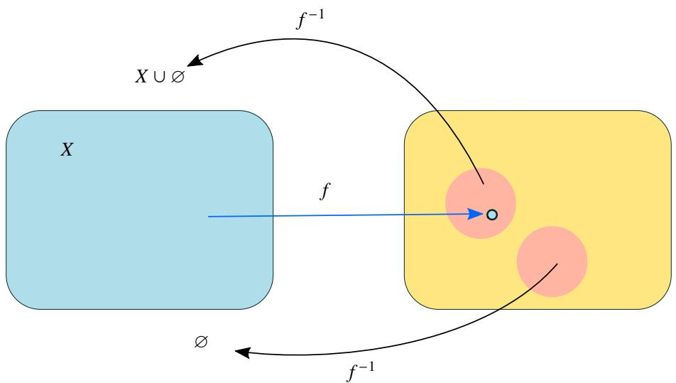  
图 2.10: 常值映射是连续的.

# 命题 2.34 (包含映射)

设包含映射 $i : A \hookrightarrow X$ , 其中 $X$ 为拓扑空间, 且 $A \subseteq X$ 是子空间拓扑. 则 $f$ 连续.

证明 任取开集 $U \subseteq X$ , 由于 $i$ 是一个包含映射, 故

$$
i ^ {- 1} (U) = U \cap A.
$$

根据子空间拓扑的定义可知 $U \cap A$ 是 $A$ 上的一个开集. 因此 $f ^ { - 1 } ( U )$ 是 $A$ 上的一个开集. 于是可知?? 连续.

注 所谓包含映射是指 $X$ 的一个子集 $A$ 映到 $X$ 的一个恒等映射.

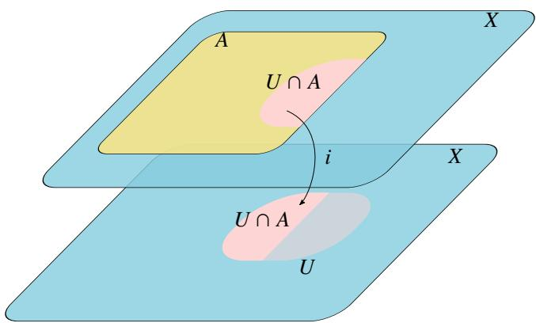  
图 2.11: 包含映射是连续的.

# 命题 2.35 (复合映射)

设映射 $f : X \to Y$ , $g : Y \to Z$ , 其中 $X , Y$ 和 $Z$ 都是拓扑空间. 若 $f$ 和 $g$ 都连续, 则复合映射 $g \circ f$ 连续.

证明 任取开集 $U \subseteq Z$ ,则由于 $g$ 连续,故 $g ^ { - 1 } ( U )$ 是?? 上的一个开集.由于 $f$ 连续,故 $f ^ { - 1 } \left[ g ^ { - 1 } ( U ) \right]$ 是 $X$ 上的一个开集. 由于

$$
f ^ {- 1} \left[ g ^ {- 1} (U) \right] = (g \circ f) ^ {- 1} (U).
$$

因此 $( g \circ f ) ^ { - 1 } ( U )$ 是 $X$ 上的一个开集. 于是可知 $g \circ f$ 连续.

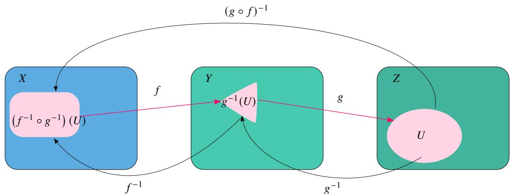  
图 2.12: 复合映射 $g \circ f$ 是连续的.

# 命题 2.36 (限制映射)

设映射 $f : X \to Y$ , 其中 $X , Y$ 为拓扑空间, $A \subseteq X$ . 若映射 $f : X \to Y$ 连续, 则限制映射 $f | _ { A }$ 也连续.

证明 限制映射 $f | _ { A } : A \to Y$ 可以看作包含映射 $i : A \hookrightarrow X$ 与 $f : X \to Y$ 的复合映射. 因此 $f | _ { A }$ 连续.

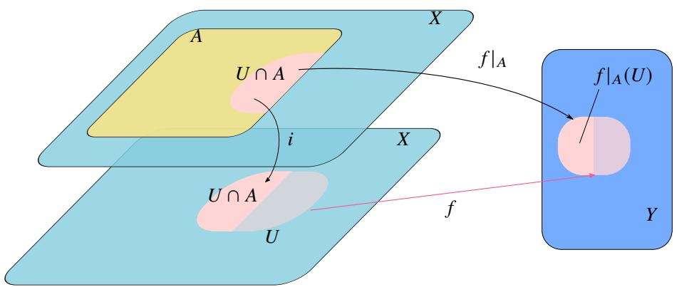  
图 2.13: 限制映射 $f | _ { A } = f \circ i$ 是连续的.

# 命题 2.37 (限制陪域)

设连续映射 $f : X \to Y .$ , 其中 $X , Y$ 为拓扑空间. 若 $f ( X ) \subseteq Z \subseteq Y$ , 则映射 $f : X \to Z$ 也连续.

证明 任取开集 $U \subseteq Z $ , 则存在 ?? 上的一个开集 $V$ 使得 $U = V \cap Z .$ . 由于 $f ( X ) \subseteq Z$ , 因此

$$
f ^ {- 1} (U) = f ^ {- 1} (V).
$$

由于 $f : X \to Y$ 连续, 因此 $f ^ { - 1 } ( V )$ 是 $X$ 上的一个开集. 因此 $f ^ { - 1 } ( U )$ 也是 $X$ 上的一个开集. 于是可知 $f : X \to Z$ 连续. ■

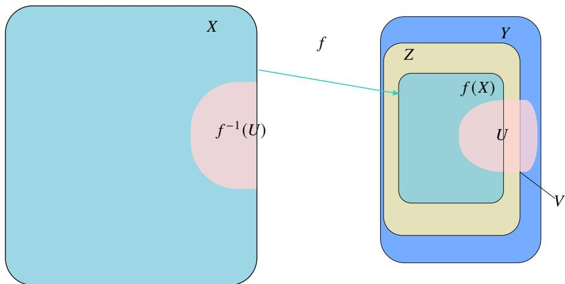  
图 2.14: 限制陪域是连续的.

# 命题 2.38 (扩大陪域)

设连续映射 $f : X \to Y .$ , 其中 $X , Y$ 为拓扑空间. 若 $Y \subseteq Z$ , 则映射 $f : X \to Z$ 也连续.

证明 映射 $f : X \to Z$ 可以看作 $f : X \to Y$ 与包含映射 $i : Y \hookrightarrow Z$ 的复合映射. 因此 $f : X \to Z$ 连续.

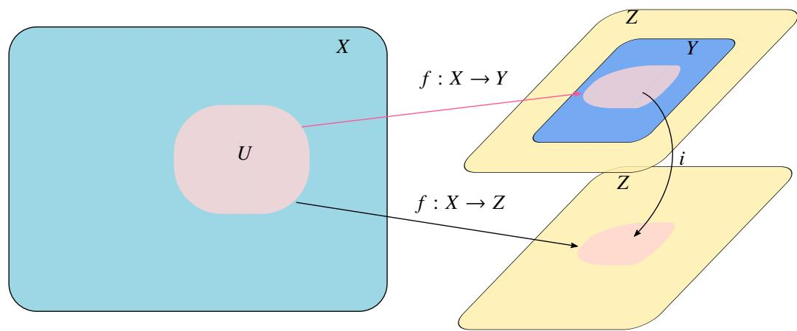  
图 2.15: 扩大陪域 $i \circ f$ 是连续的.

# 定理 2.28 (连续性的局部表示)

设映射 $f : X \to Y .$ . 令

$$
X = \bigcup_ {\alpha \in I} U _ {\alpha},
$$

其中 $U _ { \alpha }$ 都是 $X$ 上的开集. 若对于任一 $\alpha \in I$ 都有限制映射 $f | _ { U _ { \alpha } }$ 连续, 则 $f$ 连续.

证明 任取开集 $U \subseteq Y .$ , 则

$$
(f | _ {U _ {\alpha}}) ^ {- 1} (U) = (f \circ i) ^ {- 1} (U) = i ^ {- 1} [ f ^ {- 1} (U) ] = f ^ {- 1} (U) \cap U _ {\alpha}.
$$

于是

$$
\bigcup_ {\alpha \in I} (f | _ {U _ {\alpha}}) ^ {- 1} (U) = \bigcup_ {\alpha \in I} \left[ f ^ {- 1} (U) \cap U _ {\alpha} \right] = f ^ {- 1} (U) \cap \left(\bigcup_ {\alpha \in I} U _ {\alpha}\right) = f ^ {- 1} (U) \cap X = f ^ {- 1} (U).
$$

由于 $f | _ { U _ { \alpha } }$ 连续, 故 $( f | _ { U _ { \alpha } } ) ^ { - 1 } ( U )$ 是 $U _ { \alpha }$ 上的一个开集, 而 $U _ { \alpha }$ 是 $X$ 上的一个开集, 因此 $( f | _ { U _ { \alpha } } ) ^ { - 1 } ( U )$ 也是 $X$ 上的一个开集. 因此 $f ^ { - 1 } ( U )$ 是 $X$ 中的一个开集. 于是可知 $f$ 连续. ■

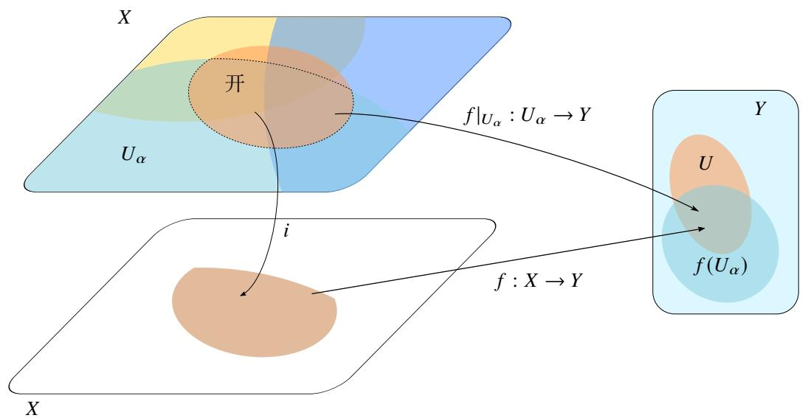  
图 2.16: 连续性局部表示示意图.

以上结论中的任意开集的并改成有限个闭集的并仍旧成立.

# 定理 2.29 (粘接引理)

设映射 $f : X \to Y .$ . 令

$$
X = \bigcup_ {i = 1} ^ {n} V _ {i},
$$

其中 $V _ { i }$ $( i = 1 , 2 , \cdots , n )$ 都是 $X$ 上的闭集. 若限制映射 $f | _ { V _ { i } }$ $( i = 1 , 2 , \cdots , n )$ 都连续, 则映射 $f$ 连续.

证明 任取闭集 $V \subseteq Y .$ . 则

$$
\left(f \mid_ {V _ {i}}\right) ^ {- 1} (V) = \left(f \circ i\right) ^ {- 1} (V) = i ^ {- 1} \left[ f ^ {- 1} (V) \right] = f ^ {- 1} (V) \cap V _ {i}.
$$

于是

$$
\bigcup_ {i = 1} ^ {n} \left(f | _ {V _ {i}}\right) ^ {- 1} (V) = \bigcup_ {i = 1} ^ {n} \left[ f ^ {- 1} (V) \cap V _ {i} \right] = f ^ {- 1} (V) \cap \left(\bigcup_ {i = 1} ^ {n} V _ {i}\right) = f ^ {- 1} (V) \cap X = f ^ {- 1} (V).
$$

由于 $f | _ { V _ { i } }$ 都连续, 因此 $( f | _ { V _ { i } } ) ^ { - 1 } ( V )$ 是 $V _ { i }$ $V _ { i } \ ( i = 1 , 2 , \cdots , n )$ 上的闭集, 而 $V _ { i }$ $( i = 1 , 2 , \cdots , n )$ 是 $X$ 上的闭集, 因此$( f | _ { V _ { i } } ) ^ { - 1 } ( V )$ 也是 $X ( i = 1 , 2 , \cdots , n )$ 上的闭集. 因此 $f ^ { - 1 } ( V )$ 也是 $X$ 上的一个闭集. 于是可知 $f$ 连续. ■

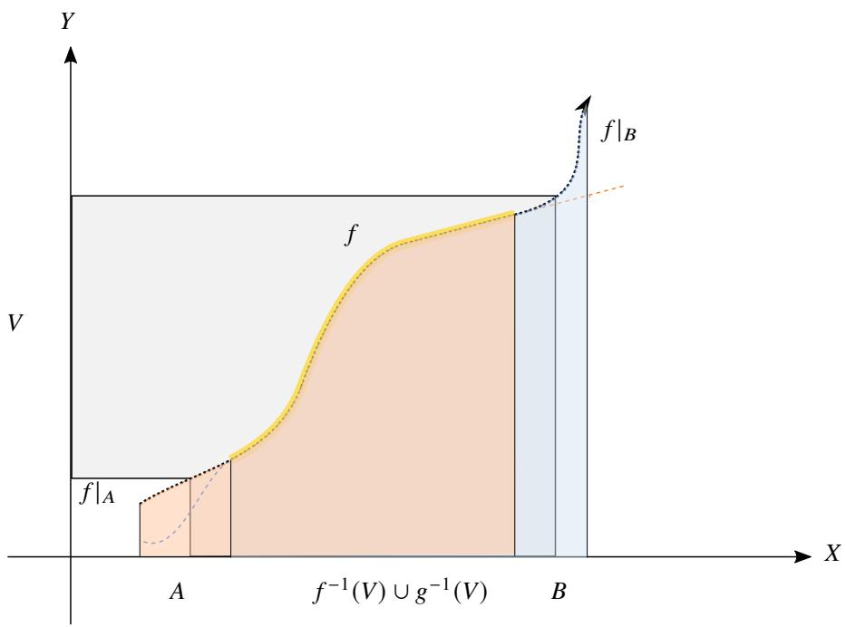  
图 2.17: 粘接的函数 $h$ 是连续的.

# 2.4.4 同胚

回到本章最开头提出的问题, 连续映射可以刻画图形的 “拓扑性质”, 因此连续映射是拓扑学中的一个基础性概念.

# 定义 2.51 (同胚)

设映射 $f : X \to Y$ , 其中 $X$ 和 $Y$ 都是拓扑空间. 若

1 ◦ $f$ 是一个双射.  
$2 ^ { \circ }$ $f$ 是 $X$ 到 $Y$ 的一个连续映射.  
$3 ^ { \circ } \ f ^ { - 1 }$ 是 $Y$ 到 $X$ 的一个连续映射.

则称 $f$ 是拓扑空间 $X$ 到 $Y$ 的一个同胚映射 , 简称同胚 (homeomorphism), 此时称拓扑空间 $X$ 和 $Y$ 是同胚的(homeomorphous).

注 显然拓扑空间之间的同胚关系满足自反性、对称性和传递性, 因此这是一个等价关系.

上述定义同胚的方法对于学过代数学的人来说十分熟悉,我们在定义群同构、环同构和线性空间同构时都采用了类似的方法. 例如设映射 $f : V \to W$ , 其中 $V$ 和?? 都是域 $F$ 上的线性空间. 若

1 ◦ $f$ 是一个双射.  
$2 ^ { \circ }$ $f$ 是 $V$ 到 $W$ 的一个线性映射.  
$3 ^ { \circ }$ $f ^ { - 1 }$ 是 $W$ 到 $V$ 的一个线性映射.

则称 $f$ 是线性空间 $V$ 到?? 的一个同构映射,简称同构(isomorphism),此时称线性空间 $V$ 和 ?? 是同构的 (isomorphic).

在同构的定义中 $1 ^ { \circ }$ 和 $2 ^ { \circ }$ 蕴含着 $3 ^ { \circ }$ , 因此 $3 ^ { \circ }$ 可以省略. 但同胚定义中的 $3 ^ { \circ }$ 是不能省略的!

例 2.64 设映射 $f : X \to Y .$ , 其中 $X = [ 0 , 1 )$ , $Y = \left\{ ( x , y ) : x ^ { 2 } + y ^ { 2 } = 1 \right\}$ . $f$ 定义为

$$
f (t) = (\cos 2 \pi t, \sin 2 \pi t).
$$

则 $f$ 不是同胚.

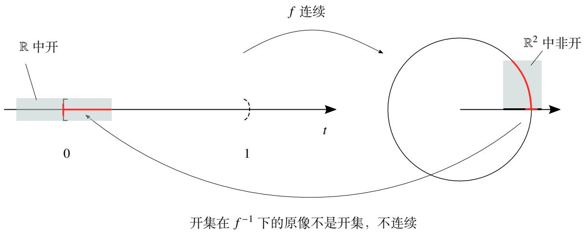  
图 2.18: 双射 $f$ 不一定双向连续.

证明 容易知道 $f$ 是 $X$ 到 $Y$ 的一个连续映射, 且是一个双射. 但 $f ^ { - 1 }$ 不是 $Y$ 到 $X$ 的连续函数, 这是因为 $X$ 中的开集 $U = [ 0 , 1 / 2 )$ 在 $f$ 下的像 $f ( U )$ 不是 $Y$ 中的开集, 而这是因为 $f ( 0 )$ 不是 $f ( U )$ 的内点. ■

在《数学分析 I》中已经证明区间上的连续函数如果存在反函数, 则反函数也是连续的. 这个命题现在用同胚的语言重新叙述.

# 定理 2.30

设一元函数 $f : X \to Y .$ , 其中 $X , Y$ 都是 $\mathbb { R }$ 上的区间. 若

1 ◦ $f$ 是一个双射.  
$2 ^ { \circ }$ $f$ 是 $X$ 到 $Y$ 的一个连续函数.

则 $f$ 是 $X$ 到 $Y$ 的一个同胚.

但是如果 $X , Y$ 都是 $\mathbb { R }$ 的子集, 则命题不一定成立. 请看下面一个例子.

例 2.65 设函数 $f : X \to Y .$ , 其中 $X = [ 0 , 1 ] \cup ( 2 , 3 ]$ , $Y = [ 0 , 2 ]$ . $f$ 定义为

$$
f (x) = \left\{ \begin{array}{l l} x & x \in [ 0, 1 ] \\ x - 1 & x \in (2, 3 ] \end{array} \right..
$$

则 $f$ 不是同胚.

证明 由连续映射的局部化表示定理可知 $f$ 是 $X$ 到 $Y$ 的一个连续映射. 容易验证 $f$ 是一个双射. 但 $f ^ { - 1 }$ 不是?? 到$X$ 的连续函数, 这是因为 $X$ 中的开集 [0,1] 在 $f$ 下的像 [0,1] 不是?? 中的开集. ■

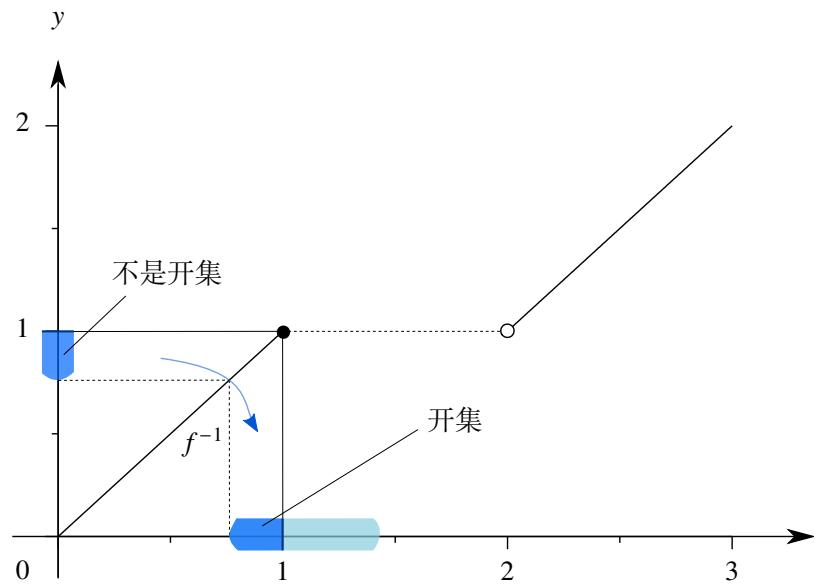  
图 2.19: $f ^ { - 1 }$ 不是连续的.

在《实分析》中我们将证明 $\mathbb { R }$ 上的任一开集都可以分解为可数个开区间的无交并. 因此根据局部表示定理可知, 如果 $X$ 是 $\mathbb { R }$ 的开子集, 则命题也可以成立.

# 定理 2.31

设一元函数 $f : X \to Y .$ , 其中 $X$ 是 $\mathbb { R }$ 上的开子集. 若

1◦ $f$ 是一个双射.

$2 ^ { \circ }$ $f$ 是 $X$ 到 $Y$ 的一个连续函数.

则 $f$ 是 $X$ 到 $Y$ 的一个同胚.

以上事实可以推广到 $\mathbb { R } ^ { n }$ , 但需要学习了代数拓扑的知识后才能证明.

同胚定义中的条件 $3 ^ { \circ }$ 用开集来刻画就是: $X$ 中的任一开集 $U$ 在 $f ^ { - 1 }$ 下的原像 $V$ 都是?? 中的开集. 由于 $f$ 是$X$ 到?? 的一个双射, 因此 $V$ 就是 $U$ 在 $f$ 下的像. 于是同胚可以用开集等价地给出另一个定义.

# 定理 2.32

设 $X$ 到 $Y$ 的一个双射 $f$ . 则 $f$ 是一个同胚当且仅当以下命题成立:

$f ( U )$ 是 $Y$ 上的一个开集 $\Longleftrightarrow \ U$ 是 $X$ 上的一个开集.

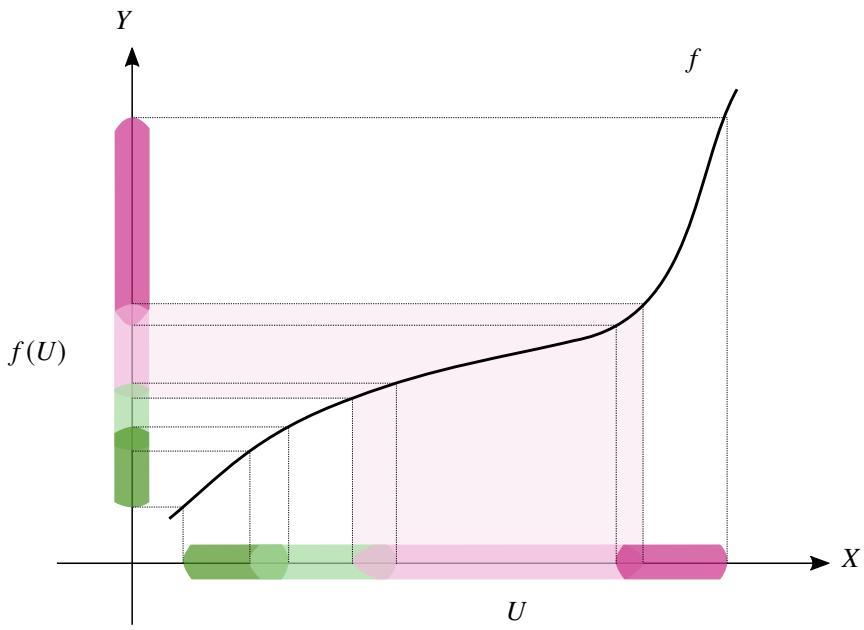  
图 2.20: $f$ 是同胚要求开集的原像是开集，逆映射的开集的原像也是开集.

上述等价定义表明,一个同胚 $f : X \to Y$ 不仅给出了一个 $X$ 和?? 之间的一一对应,还给出了 $X$ 的拓扑和?? 的拓扑之间的一一对应. 因此任何完全依赖于 $X$ 的拓扑得到的性质在?? 中一定存在相应的性质.

# 定义 2.52 (拓扑不变量)

在同胚下保持不变的性质称为拓扑性质 (topological property) 或 拓扑不变量 ( topological invariant).

注 拓扑不变量可以是一个布尔值 (判断一个命题是否成立), 也可以是一个数或任何别的数学对象.

通常来说, 直接用定义证明两个拓扑空间不同胚是困难的, 但如果我们知道它们的某个拓扑性质 $P$ 不相同,则可以断言它们不同胚. 由此可见, 研究研究拓扑性质是有重要意义的. 拓扑学中最基础的几个拓扑性质直接来自于数学分析的发展, 其中包括紧致性、列紧性和连通性.

# 2.5 拓扑不变量

# 2.5.1 紧致性

1817 年, Bolzano 证明了 “有界数列都有收敛子列”. 当时这个结论仅仅是 Bolzano 证明介值定理时的一个引理. 当时的人们尚未意识到这个结论中蕴含的深刻拓扑意义. 大约半个世纪后, Weierstrass 也证明了这个结论, 但Weierstrass 首次让这个结论变成了数学分析中的核心定理, 因此这个结论被称为 “Bolzano-Weierstrass 定理”.

从直观上看 Bolzano-Weierstrass 定理描述了这样一个现象: 如果无限个点被约束在一个有界区域内, 那么这无数个点一定要紧紧靠拢至少一点. 进一步大家发现收敛子列的极限未必在落在集合内, 如果一个集合的所有收敛子列的极限都落在集合内, 就是一个 “密不透风” 的集合, 从直观上看就是 “紧致的”. 例如一个有限闭区间 [0, 1]就是这样的集合. 而以下三种集合不是紧致的:

(1) 不含端点的区间: $( 0 , 1 )$ , (0, 1], [0, 1). 这是因为极限点 0 或 1 不在集合内.  
(2) 穿孔的闭区间: $[ 0 , 0 . 5 ) \cup ( 0 . 5 , 1 ]$ , 这是因为极限点 0.5 不在集合中内.  
(3) 整个实数集: ${ \mathbb R } .$ , 这是因为极限点 $\pm \infty$ 不在 $\mathbb { R }$ 内.

前面已经看到, 把 Bolzano-Weierstrass 定理推广到 $\mathbb { R } ^ { n }$ 是没有实质性困难的. 但数学家还想继续往前. 1880年代, 意大利数学家 Cesare Arzelà 和 Giulio Ascoli 把 Bolzano-Weierstrass 定理推广到了函数空间中, 实数列的收敛子列对应变成了函数列的一致收敛子列, 他们证明的结果称为 Arzelà–Ascoli 定理. 1906 年, Fréchet 抽象出了 Bolzano-Weierstrass 定理和为 Arzelà–Ascoli 定理的本质, 并正式提出了 “紧致性” 的概念——Fréchet 把满足Bolzano-Weierstrass 条件的集合称为 “紧致集”.

另一方面, 在几乎同一时代, 另一波数学家正在研究函数的连续性. 这个主题起初和 Bolzano-Weierstrass 定理不甚相关.富有戏剧性的是函数连续性的研究也发轫于Bolzano,而且也在1817年.那一年, Bolzano首次给出了连续函数的严格定义.随后,在1830年代,他进一步提出了一致连续的概念. 1870年, Heine证明:有限闭区间上的连续函数是一致连续的. 这个结论被称为 Heine-Cantor 定理. 为了证明这个定理, Heine 提出了 “开覆盖” 的构想, 并证明了一个引理,即著名的有限覆盖定理.但当时Heine并未意识到有限覆盖定理的深刻拓扑意义. 1895年, Borel意识到了这个结论的重要意义, 并首次证明了现代形式的有限覆盖定理. 因此这个定理被称为 Heine-Borel 定理.

不久, 人们发现在 R 上 Bolzano-Weierstrass 定理和 Heine-Borel 定理是等价的, 也就是说用 Heine-Borel 条件也可以刻画集合的 “紧致性”, 但角度不一样: Bolzano-Weierstrass 条件是从收敛的角度, 而 Heine-Borel 条件是从开集的角度. 很快大家发现, 更一般的空间中两者并不等价. 因此需要选择其中一种来定义紧致性. 鉴于在一般的拓扑空间中用开集更为便利, 俄罗斯数学家 Pavel Alexandrov 和 Pavel Urysohn 于 1929 年把 Heine-Borel 条件确定为紧致性的标准定义. 而 Bolzano-Weierstrass 条件定义的性质被形象地称为 “序列紧致性”, 简称 “列紧性”.

事实上, 无论是紧致性还是列紧性, 都是拓扑性质. 而紧致性更是现在分析学中居于中心地位的概念, 本节就来研究它们在数学分析中需要了解的性质.

首先正式地给出紧致性和列紧性的定义.

# 定义 2.53 (列紧空间)

设拓扑空间 ??. 若 $X$ 的任一序列 $\{ x _ { n } \}$ 都存在收敛子列, 则称 $X$ 是序列紧致空间 (sequentially compact space),简称列紧空间 .

注 若 $X$ 的一个子空间 ?? 是列紧的 (sequentially compact), 就称 $Y$ 是一个列紧集 (sequentially compact set).

# 定义 2.54 (紧致空间)

设拓扑空间 ??. 若 $X$ 上的一个开集族 $\{ U _ { \alpha } \mid \alpha \in I \}$ 满足

$$
X \subseteq \bigcup_ {\alpha \in I} U _ {\alpha}.
$$

则称 $\{ U _ { \alpha } \}$ 是 $X$ 的一个开覆盖 (open cover). 若存在有限个开集 $U _ { 1 } , U _ { 2 } , \cdots , U _ { n } \in \{ U _ { \alpha } \}$ 使得

$$
X \subseteq \bigcup_ {i = 1} ^ {n} U _ {i}.
$$

则称 $\{ U _ { i } \} _ { i = 1 } ^ { n }$ 是 $X$ 的有限开覆盖 (finite open covering). 此时我们称 $X$ 是一个紧致空间 (compact space), 简称紧空间 .

注 由以上定义立刻可知有限集肯定是紧集.

若 $X$ 的一个子空间 ?? 是紧致的 (compact), 就称 ?? 是一个紧致集 (compact set). 根据子空间拓扑的定义不难知道以下结论.

# 命题 2.39

在拓扑空间 $X$ 中, $Y$ 是 $X$ 中的一个紧致集的充要条件是, 对于 $X$ 中的任一开集族 $\{ U _ { \alpha } \}$ . 若 $\{ U _ { \alpha } \}$ 是 $Y$ 的一个开覆盖, 则 $\{ U _ { \alpha } \}$ 中存在一个有限子集族覆盖??.

上述命题暗示了一个集合是紧致的和它在哪个空间上无关. 因此在谈论紧致集时无需指明在什么空间上, 这是和开集闭集不同的地方.

下面看几个例子.

例 2.66 $\mathbb { R }$ 不是紧致空间, 也不是列紧空间.

证明 (i) 我们有 $\mathbb { R }$ 的一个开覆盖

$$
\mathcal {C} = \{(n, n + 2): n \in \mathbb {Z} \}.
$$

容易看出 $c$ 的任一真子集都不是 $\mathbb { R }$ 的覆盖, 因此 $\mathbb { R }$ 不是紧致空间.

(ii) 容易知道 $\mathbb { R }$ 中存在点列 $\{ n \}$ 趋向于 $+ \infty$ , 因此 $\{ n \}$ 不存在收敛的子列. 于是可知 $\mathbb { R }$ 不是列紧空间.

例 2.67 设 $\mathbb { R }$ 中的集合

$$
E = \{0 \} \cup \left\{\frac {1}{n}: n \in \mathbb {N} ^ {*} \right\}.
$$

则 $E$ 是一个紧致集, 也是一个列紧集.

证明 (i) 任取 $E$ 的一个开覆盖 $c$ . 取出包含 0 的开集 $U .$ . 由于 0 是 $\{ 1 / n \}$ 的一个极限点, 因此 $U$ 肯定覆盖了 $\{ 1 / n \}$ 中有限项以外的所有项.对于没有被 $U$ 盖住的有限项一定可以找到有限个开集覆盖它们.于是可知 $E$ 是一个紧致集.  
(ii) 容易知道 $E$ 只有一个极限点, 因此 $E$ 中任意数列的任意收敛子列都收敛到 $0 \in E$ . 于是可知 $E$ 是一个列紧集. ■

例 2.68 设 $\mathbb { R }$ 中的区间 (0,1] 不是紧致集, 也不是列紧集.

证明 (i) 取 (0, 1] 的一个开覆盖:

$$
\mathcal {C} = \left\{\left(\frac {1}{n}, 1 \right]: n \in \mathbb {Z} \right\}.
$$

显然 $c$ 的任一有限子集族都无法覆盖 (0, 1]. 于是可知 (0, 1] 不是紧致集.

(ii) 容易知道 (0, 1] 存在数列 $\{ 1 / n \}$ 收敛到 $0 \notin ( 0 , 1 ]$ . 于是可知 $E$ 不是列紧集.

前面几个例子看到在 $\mathbb { R }$ 上可以同时谈论紧致性和列紧性. 但在一般的拓扑空间上不容易谈论紧致性, 因为一般的拓扑空间上的收敛性是 “不好的”. 所以在一般的空间上我们只谈紧致性.

例 2.69 紧致集的投影 设拓扑空间 $X$ . 定义投影算子

$$
\mathcal {P}: X ^ {2} \to X
$$

$$
(a, b) \mapsto a.
$$

若 $A \subseteq X ^ { 2 }$ 是紧致的, 则 ${ \mathcal { P } } ( A )$ 也是紧致的.

证明 设 $C _ { 2 } = \lbrace U _ { \alpha } : \alpha \in I \rbrace$ 是 ${ \mathcal { P } } ( A )$ 的一个开覆盖. 令

$$
\mathcal {C} _ {1} = \left\{U _ {\alpha} \times X: U _ {\alpha} \in \mathcal {C} _ {1} \right\}.
$$

则 $C _ { 1 }$ 是 $A$ 的一个开覆盖. 由于 $A$ 是紧致的, 因此可以从 $C _ { 1 }$ 中取出有限个元素 $U _ { 1 } \times X , \cdot \cdot \cdot , U _ { n } \times X$ 满足

$$
A \subseteq \bigcup_ {i = 1} ^ {n} (U _ {i} \times X).
$$

因此 $C _ { 2 }$ 中可以取出一个有限子集 $\{ U _ { 1 } , \cdots , U _ { n } \}$ 覆盖 ${ \mathcal { P } } ( A )$ . 这表明 ${ \mathcal { P } } ( A )$ 也是紧致的.

紧致性也可以用闭集刻画.

# 定义 2.55 (有限交性质)

设集合 ??, C 是 $X$ 的一个子集族. 若 $c$ 的任一有限子集族 $\{ U _ { 1 } , \cdots , U _ { n } \}$ 都有

$$
\bigcap_ {i = 1} ^ {n} U _ {i} \neq \varnothing .
$$

则称 $c$ 具有有限交性质 (finite intersection property).

# 定理 2.33

设拓扑空间 ??. 则 $X$ 是紧致的当且仅当对于任一 $X$ 的具有有限交性质的闭子集族 $\{ V _ { \alpha } : \alpha \in I \}$ 都满足

$$
\bigcap_ {\alpha \in I} V _ {\alpha} \neq \varnothing .
$$

证明 (i) 证明必要性. 用反证法, 假设存在一个 $X$ 的具有有限交性质的闭子集族 $\{ V _ { \alpha } : \alpha \in I \}$ 满足 $\cap _ { \alpha \in I } V _ { \alpha } = \emptyset$ .由 DeMorgan 定理可知

$$
\bigcap_ {\alpha \in I} V _ {\alpha} = \varnothing \iff X = \left(\bigcap_ {\alpha \in I} V _ {\alpha}\right) ^ {c} = \bigcup_ {\alpha \in I} V _ {\alpha} ^ {c}.
$$

因此 $\{ V _ { \alpha } ^ { c } \}$ 是 $X$ 的一个开覆盖. 由于 $X$ 是紧致的, 因此存在有限个 $\left\{ A _ { 1 } ^ { c } , \cdots , A _ { n } ^ { c } \right\}$ 它们也可以覆盖 $X$ . 于是由 De-Morgan 定理可知

$$
X = \bigcup_ {i = 1} ^ {k} V _ {i} ^ {c} \iff \varnothing = \left(\bigcup_ {i = 1} ^ {n} V _ {i} ^ {c}\right) ^ {c} = \bigcap_ {i = 1} ^ {n} V _ {i}.
$$

这表明 $\{ V _ { \alpha } : \alpha \in I \}$ 不满足有限交性质, 出现矛盾. 于是可知必要性成立.

(ii) 证明充分性. 任取一个 $X$ 的开覆盖 $\{ U _ { \alpha } : \alpha \in I \}$ , 则

$$
X = \bigcup_ {\alpha \in I} U _ {\alpha} \iff \varnothing = \bigcap_ {\alpha \in I} U _ {\alpha} ^ {c}.
$$

用反证法, 假设 $X$ 不是紧致空间. 则 $\{ U _ { \alpha } : \alpha \in I \}$ 的任一有限子集 $\{ U _ { 1 } , \cdots , U _ { n } \}$ 都满足

$$
X \neq \bigcup_ {i = 1} ^ {n} U _ {i} \iff \varnothing \neq \bigcap_ {i = 1} ^ {n} U _ {i} ^ {c}
$$

这表明 $\{ U _ { \alpha } ^ { c } : \alpha \in I \}$ 具有有限交性质, 因此 $\cap _ { \alpha \in I } U _ { \alpha } ^ { c } \neq \emptyset$ , 出现矛盾, 于是可知充分性成立.

上述定理在某些场合下是方便的, 下面看一个例子.

例 2.70 在紧致空间 $X$ 中设一列非空闭集 $F _ { 1 } , F _ { 2 } , \cdots , F _ { n } , \cdots .$ . 若

$$
F _ {n} \supseteq F _ {n + 1}, \quad n = 1, 2, \dots .
$$

则

$$
\bigcap_ {n = 1} ^ {\infty} F _ {n} \neq \varnothing .
$$

证明 从 $F _ { 1 } , F _ { 2 } , \cdots , F _ { n } , \cdots$ 中任取有限个集合 $F _ { k _ { 1 } }$ , · · · , $F _ { k _ { m } }$ $k _ { 1 } < \cdots < k _ { m } )$ . 由于 $F _ { n } \supseteq F _ { n + 1 }$ $( n = 1 , 2 , \cdots )$ , 故

$$
\bigcap_ {i = 1} ^ {m} F _ {k _ {i}} = F _ {k _ {m}} \neq \varnothing .
$$

由定理2.33可知

$$
\bigcap_ {n = 1} ^ {\infty} F _ {n} \neq \varnothing .
$$

通常要判断一个集合的紧致性是不容易的, 但紧致空间中的紧致集有一个简便的判别法.

# 命题 2.40

紧致空间中的任一闭子集都是紧致集.

证明 设 ?? 是紧致空间 $X$ 中的一个闭集. 在 $X$ 中任取一个 ?? 的开覆盖 C. 令

$$
\mathcal {C} ^ {\prime} = \mathcal {C} \cup \left\{Y ^ {c} \right\}.
$$

显然 $C ^ { \prime }$ 是 $X$ 的一个开覆盖.由于 $X$ 是紧致的,因此 $C ^ { \prime }$ 中可以取出一个有限子集族 $\mathcal { D }$ 覆盖 $X$ . 若 $Y ^ { c } \notin \mathcal { D }$ , 则 $\mathcal { D }$ 是$c$ 中选出的一个 ?? 的有限开覆盖. 若 $Y ^ { c } \in \mathcal { D }$ , 则 $\mathcal { D } \backslash \{ Y ^ { c } \}$ 是 $c$ 中选出的一个 ?? 的有限开覆盖. 于是可知 $Y$ 是紧致的. ■

以上命题立刻可以有以下推论.

# 推论 2.7

在拓扑空间 $X$ 中, 设 $F$ 是 $X$ 上的一个闭集, $K$ 是一个紧致集. 则 $F \cap K$ 也是紧致的.

证明 由于 $F$ 是 $X$ 上的一个闭集, 故 $F \cap K$ 是 $K$ 上的一个闭集. 由于 $K$ 是紧致的, 由命题2.40可知 $F \cap K$ 也是紧致的. ■

反过来有以下结论.

# 命题 2.41

Hausdorff 空间中的任一紧致集都是闭集.

证明 设 $Y$ 是 Hausdorff 空间 $X$ 中的一个紧致集.下面只需证明 $X \backslash Y$ 是 $X$ 上一个开集.任取 $x _ { 0 } \in X \backslash Y ,$ ,只需证明存在 $x _ { 0 }$ 的一个邻域与 $Y$ 无交. 由于 $Y$ 是一个 Hausdorff 空间, 因此对于任一 $y \in Y$ 都存在 $y$ 的邻域 $V _ { y }$ 和 $x _ { 0 }$ 的邻域$U _ { y }$ 满足 $V _ { y } \cap U _ { y } = \emptyset$ . 显然 $\{ V _ { y } : y \in Y \}$ 是 $Y$ 的一个开覆盖. 由于 ?? 是一个紧致集, 因此 $\{ V _ { y } : y \in Y \}$ 中存在有限子集族 $\{ V _ { \mathrm { y _ { 1 } } } , \cdots , V _ { \mathrm { y _ { n } } } \}$ 覆盖 ?? . 令

$$
V = \bigcup_ {i = 1} ^ {n} V _ {y _ {i}}, \quad U = \bigcap_ {i = 1} ^ {n} U _ {y _ {i}}.
$$

任取 $z \in V$ , 则存在 $i \in \{ 1 , 2 \cdots , n \}$ 使得 $z \in V _ { y _ { i } }$ . 由于 $V _ { y _ { i } } \cap U _ { y _ { i } } = \emptyset$ . 故 $z \notin U _ { y _ { i } }$ , 因此 $z \not \in U .$ . 因此 $U \cap V = \emptyset$ . 于是就证明了 $x _ { 0 }$ 存在一个邻域 $U$ 与 $Y$ 无交. ■

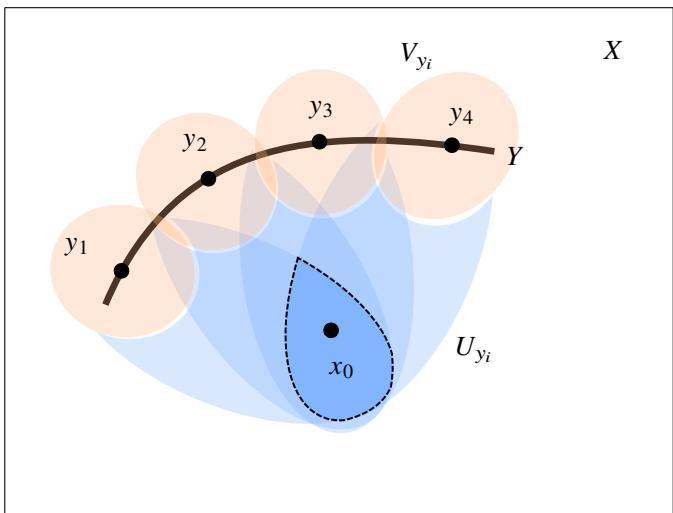  
图 2.21: 定理2.41证明示意图, 其中所有 $x _ { 0 } \in X \backslash Y$ 与 $Y$ 分离.

由以上定理的逆否命题可以判断某些集合不是紧致集.

例 2.71 $\mathbb { R }$ 中, $( a , b )$ , (??, ??], [??, ??) 不是闭集, 从而也不是紧集.

由于度量空间都是 Hausdorff 空间, 因此立刻可以得到以下推论.

# 推论 2.8

度量空间中的任一紧致集都是闭集.

在一般的拓扑空间中紧致集不一定是闭集. 下面看一个反例.

例 2.72 设拓扑空间 $\mathbb { R }$ , 其上的拓扑定义为有限补拓扑. 则 $\mathbb { R }$ 上的任一子集都是紧致的, 但 $\mathbb { R }$ 的真子集中只有有限集才是闭集.

证明 (i) 证明 $\mathbb { R }$ 上的任一子集都是紧致的. 任取 $\mathbb { R }$ 上的子集 $E$ . 设 $c$ 是 $E$ 的一个开覆盖. 取一个与 $E$ 有交集的开集 $U \in C$ . 由补空间拓扑的定义可知 $U ^ { c }$ 是一个有限集. 若 $U ^ { c } \cap E = \emptyset$ , 则 $U$ 覆盖了 $E$ , 否则设

$$
U ^ {c} \cap E = \left\{x _ {1}, \dots , x _ {n} \right\}.
$$

然后从 $c$ 中取出开集 $U _ { i }$ 覆盖 $x _ { i }$ $x _ { i } ( i = 1 , 2 , \cdots , n )$ .于是 $c$ 的有限子集族 $\{ U , U _ { 1 } , U _ { 2 } , \cdots , U _ { n } \}$ 覆盖 $E$ .这表明 $E$ 是紧 致的.

(ii) 例2.62已证明 $\mathbb { R }$ 的单点集都是闭集,因此任一有限集都是闭集.反之任取 $\mathbb { R }$ 上的一个闭的真子集 $E$ , 则 $E ^ { c }$ 是一个非空开集, 因此 $E$ 是一个有限集. 这就说明 $\mathbb { R }$ 上的真子集是一个闭集当且仅当是一个有限集. ■

# 2.5.2 度量空间上的紧致集

在度量空间上, 可以很方便地谈论收敛性, 因此可以同时研究 Bolzano-Weierstrass 条件和 Heine-Borel 条件. 事实上我们可以证明在度量空间上这两个条件是等价的, 因此在度量空间上无需区别紧致性和列紧性. 为了证明这个结论, 我们需要一个很重要的引理.

# 定理 2.34 (Lebesgue 数引理)

在度量空间 $( X , d )$ 中, 设 $K$ 是一个列紧集, $C = \{ U _ { \alpha } : \alpha \in I \}$ 是 $K$ 的一个开覆盖. 则存在 $\delta > 0$ 使得只要集合 ?? 满足

$$
S \cap K \neq \varnothing , \quad \text {d i a m} S <   \delta .
$$

就存在一个开集 $U _ { \alpha } \in C$ 包含 ??.

证明 用反证法. 假设结论不成立, 则对于任一 $n \in \mathbb { N } ^ { * }$ 都存在 $S _ { n }$ , 虽然满足

$$
S _ {n} \cap K \neq \varnothing , \quad \text {d i a m} S _ {n} <   \frac {1}{n}.
$$

但 $S _ { n }$ 不包含于 $c$ 中的任一开集. 选取 $\pmb { x } _ { n } \in S _ { n } \cap K$ $( n = 1 , 2 , \cdots )$ . 由于 $K$ 是列紧的, 因此 $\{ x _ { n } \}$ 中存在一个收敛子列 ${ \pmb x } _ { k _ { n } }  { \pmb \xi } \in K$ . 由于 $c$ 是 $K$ 的一个开覆盖, 因此存在开集 $U \in C$ 使得 $\pmb { \xi } \in U .$ . 于是存在邻域 $N _ { \varepsilon } ( \pmb { \xi } ) \subseteq U$ .

在 $N _ { \varepsilon / 2 } ( \pmb { \xi } )$ 中取 $\boldsymbol { x } _ { k _ { i } }$ 使得 $i > 2 / \varepsilon$ , 则

$$
\operatorname {d i a m} S _ {k _ {i}} <   \frac {1}{k _ {i}} \leq \frac {1}{i} <   \frac {\varepsilon}{2}.
$$

于是对于任一 $\pmb { x } \in S _ { k _ { i } }$ 都有

$$
\left| \boldsymbol {x} - \boldsymbol {\xi} \right| \leq \left| \boldsymbol {x} - \boldsymbol {x} _ {k _ {i}} \right| + \left| \boldsymbol {x} _ {k _ {i}} - \boldsymbol {\xi} \right| <   \frac {\varepsilon}{2} + \frac {\varepsilon}{2} = \varepsilon .
$$

因此 ${ \pmb x } \in N _ { \varepsilon } ( \pmb \xi )$ . 于是可知 $S _ { k _ { i } } \subseteq N _ { \varepsilon } ( \pmb { \xi } ) \subseteq U .$ . 这与假设矛盾. 于是可知命题成立.

注 $\delta$ 称为 Lebesgue 数 (Lebesgue’s number).

下面来证明度量空间中紧致性和列紧性的等价性.

# 定理 2.35 (度量空间中的紧致性和列紧性)

在度量空间 $( X , d )$ 中, 集合 $K$ 是紧致的当且仅当 $K$ 是列紧的.

证明 (i) 证明必要性. 设 $K$ 是紧致的. 任取 $K$ 中的序列 $\{ x _ { n } \}$ . 若存在 $a \in K$ 满足 $a$ 的任一邻域都含有 $\{ x _ { n } \}$ 中的无穷多项, 则 $\{ x _ { n } \}$ 一定存在子列 $x _ { k _ { n } } \to a$ . 因此只需要证明这样的 $a$ 一定存在. 用反证法. 假设结论不成立, 则对于任一 $b \in K$ 都存在一个邻域 $U ( b )$ 只含有 $\{ x _ { n } \}$ 中的有限多项. 令

$$
\mathcal {C} = \{U (b): b \in K \}.
$$

则 $c$ 是 $K$ 的一个开覆盖.由于 $K$ 是紧致的.因此可以 $c$ 中可以选出有限的子集族 $C ^ { \prime }$ 覆盖 $K$ .由于 $C ^ { \prime }$ 中的邻域只含有 $\left\{ x _ { n } \right\}$ 的有限项, 因此有限个邻域组成的 $C ^ { \prime }$ 无法覆盖 $\{ x _ { n } \}$ , 这就出现了矛盾. 于是可知一定存在 $a \in K$ 满足 $a$ 的任一邻域都含有 $\left\{ x _ { n } \right\}$ 中的无穷多项. 于是可知必要性成立.

(ii) 证明充分性. 设 $K$ 是列紧的. 任取 $K$ 的一个开覆盖 $c$ . 设 $c$ 的 Lebesgue 数为 $\delta$ . 令 $\varepsilon = \delta / 2$ . 则对于任一$x \in K$ , 都存在开集 $U \in C$ 使得 $( N _ { \varepsilon } ( x ) \cap K ) \subseteq U .$ 令

$$
\mathcal {D} = \left\{N _ {\varepsilon} (x): x \in K \right\}
$$

若能证明 $\mathcal { D }$ 中可以取出一个有限子集族覆盖 $K$ , 则 $c$ 中就可以取出一个有限子集族覆盖 $K .$ .用反证法,假设 $\mathcal { D }$ 中不存在有限子集族覆盖 $K$ . 任取 $x _ { 1 } \in K$ , 则 $N _ { \varepsilon } ( x _ { 1 } )$ 无法盖住 $K$ . 于是存在 $x _ { 2 } \in K \backslash N _ { \varepsilon } ( x _ { 1 } )$ , 由于 $N _ { \varepsilon } ( x _ { 1 } )$ 和 $N _ { \varepsilon } ( x _ { 2 } )$ 不能盖住 $K$ , 因此存在 $x _ { 2 } \in K \backslash ( N _ { \varepsilon } ( x _ { 1 } ) \cup N _ { \varepsilon } ( x _ { 1 } ) )$ . 继续下去可以得到一个序列 $\{ x _ { n } \}$ . 对于任意 $n , p \in \mathbb { N } ^ { * }$ 都满足

$$
d (x _ {n + p}, x _ {n}) \geq \varepsilon .
$$

因此 $\left\{ x _ { n } \right\}$ 不是 Cauchy列. 因此不可能存在收敛子列, 这表明 $K$ 不是紧致集, 出现矛盾. 于是可知充分性成立.

在 $\mathbb { R }$ 已经看到有界闭区间都是紧致的, 因此我们希望研究紧致集和有界闭集的关系.

# 定理 2.36

在度量空间 $( X , d )$ 中, 若 $E$ 是一个紧致集, 则 $E$ 是一个有界闭集.
证明 由定理2.41可知 $E$ 是一个闭集，因此只需证明 $E$ 有界. 取一点 $x_0 \in E$

证法一 由定理2.35可知 $E$ 是一个列紧集.用反证法，假设 $E$ 无界，则对于任意 $k\in \mathbb{N}^*$ 都存在 $x_{k}\in E$ 满足 $d(x_{k},x_{0}) > k.$ 于是就得到了一个序列 $\{x_k\} \subseteq E.$ 显然 $\{x_k\}$ 没有收敛子列，出现矛盾.于是可知 $E$ 有界

证法一 令

$$
\mathcal {C} = \left\{N _ {i} \left(x _ {0}\right): i \in \mathbb {N} ^ {*} \right\}.
$$

显然 $C$ 是 $E$ 的一个开覆盖. 由于 $E$ 是紧致集, 因此可以选出一个有限子集族 $\{N_{k_1}(x_0), \dots, N_{k_m}(x_0)\}$ 覆盖 $E$ . 令 $r = \max \{k_1, \dots, k_m\}$ . 于是 $E \subseteq N_r(x_0)$ . 这表明 $E$ 有界.

以上定理的逆命题是不成立的. 下面看 2 个例子

例2.73 在离散度量空间 $X$ 中, 若 $E$ 是一个无限集, 则 $E$ 是一个有界闭集, 但不是紧致集.

证明 (i) 显然离散空间中的任一集合都是有界的. 离散空间中间的任一集合都是开集, 因此任一集合都是闭集. 于是可知 $E$ 是一个有界闭集.  
(ii) 由于 $E$ 的每个单点集都是开集, 因此他的所有单点集组成的集合 $C$ 就是 $E$ 的一个开覆盖. 由于 $E$ 是一个无限集, 因此 $C$ 的任一子集族都无法覆盖 $E$ . 因此 $E$ 不是紧致的.

例 2.74 把有理数集 $\mathbb{Q}$ 看作度量空间, 上面的度量定义为

$$
d (a, b) = | a - b |, \quad \forall a, b \in \mathbb {Q}.
$$

令

$$
E = \left\{x \in \mathbb {Q}: 2 <   x ^ {2} <   3 \right\}.
$$

则 $E$ 是 $\mathbb{Q}$ 上的一个有界闭集，但 $E$ 不是紧致集

证明 显然 $E$ 是有界的且不是紧致的. 下面证明 $E$ 是一个闭集. 令

$$
D = \left\{x \in \mathbb {Q}: x ^ {2} \leq 2 \right\}, \quad F = \left\{x \in \mathbb {Q}: x ^ {2} \geq 3 \right\}.
$$

任取 $x_0 \in D$ ，显然存在 $x_1 \in D$ 满足 $x_1 > x_0$ 。令 $r = x_1 - x_0$ ，则 $N_r(x_0) \subseteq D$ ，因此 $D$ 是一个开集。同理可知 $F$ 也是一个开集。因此 $D \cup F$ 仍是一个开集。于是可知 $E = \mathbb{Q} \backslash (D \cup F)$ 是一个闭集。

不难证明，在 $\mathbb{R}^n$ 中有界闭集和紧致集是等价的

# 定理2.37

在 $\mathbb{R}^n$ 中，以下三个命题等价：

$1^{\circ}E$ 是一个有界闭集  
$2^{\circ} E$ 是一个紧致集.  
$3^{\circ} E$ 是一个列紧集.

证明 由定理2.35可知 $2^{\circ} \Leftrightarrow 3^{\circ}$ . 由定理2.36可知 $2^{\circ} \Rightarrow 1^{\circ}, 3^{\circ} \Rightarrow 1^{\circ}$ . 由 $\mathbb{R}^{n}$ 上的 Weierstrass 定理可知有界闭集中的任一点列都存在收敛子列. 因此 $1^{\circ} \Rightarrow 3^{\circ}$ 也成立.

下面把 $\mathbb{R}^n$ 中的闭集套定理推广到一般的度量空间中

# 引理2.2

在度量空间 $X$ 中，设一个子集族 $\{K_{\alpha}:\alpha \in I\}$ .若 $\{K_{\alpha}:\alpha \in I\}$ 具有有限交性质，且 $K_{\alpha}$ 都是紧致集.则

$$
\bigcap_ {\alpha \in I} K _ {\alpha} \neq \varnothing .
$$

证明用反证法，假设结论不成立.则取定一个集合 $K_{1}\in \{K_{\alpha}:\alpha \in I\}$ ，则对于任一 $x\in K_1$ ，都满足

$$
x \notin \bigcap_ {\alpha \in I} K _ {\alpha} \iff x \in \bigcup_ {\alpha \in I} K _ {\alpha} ^ {c}.
$$

因此 $C = \{K_{\alpha}^{c} : \alpha \in I\}$ 就是 $K_{1}$ 的一个开覆盖. 由于 $K_{1}$ 是紧致的, 因此可以从 $C$ 中取出一个有限子集族 $\{K_{\alpha_{1}}^{c}, \dots, K_{\alpha_{n}}^{c}\}$ 覆盖 $K_{1}$ , 即

$$
K _ {1} \subseteq \bigcup_ {i = 1} ^ {n} K _ {\alpha_ {i}} ^ {c} \iff K _ {1} \cap \left(\bigcup_ {i = 1} ^ {n} K _ {\alpha_ {i}}\right) = \varnothing .
$$

这表明 $\{K_{\alpha}:\alpha \in I\}$ 不具备有限交性质，出现矛盾.于是可知命题成立.

# 定理2.38（紧集套定理）

在度量空间 $(X,d)$ 中，设一列紧致集 $\{K_n\}$ . 若 $K_{n+1} \supseteq K_n$ $(n = 1,2,\dots)$ ，且

$$
\lim  _ {n \to \infty} \operatorname {d i a m} K _ {n} = 0.
$$

则存在唯一的 $\xi \in X$ 满足

$$
\{\xi \} = \bigcap_ {n = 1} ^ {\infty} K _ {n}.
$$

证明 令

$$
K = \bigcap_ {n = 1} ^ {\infty} K _ {n}.
$$

由于 $K_{n + 1} \supseteq K_n (n = 1,2,\dots)$ , 因此 $\{K_n\}$ 满足有限交性质. 由引理2.2可知 $K \neq \emptyset$ . 用反证法, 假设 $K$ 中存在不止一个元素, 则 $\operatorname{diam} K > 0$ . 由于 $K_n \supseteq K (n = 1,2,\dots)$ . 因此

$$
\operatorname {d i a m} K _ {n} \geq \operatorname {d i a m} K > 0.
$$

这与 $\mathrm{diam}K_n\to 0$ 矛盾.于是可知存在唯一的 $\xi \in X$ 满足 $\xi \in K$

在 $\mathbb{R}$ 上我们已经证明Heine-Borel定理和Cauchy收敛原理等价.事实上在一般的度量空间中紧致性和完备性也有密切的关系.

# 定理2.39（紧致度量空间）

紧致的度量空间一定是完备的.

证明 设紧致的度量空间 $(X, d)$ , 任取一个 Cauchy 列 $\{x_{n}\}$ . 令 $E_{n} = \{x_{k}: k \geq n\}$ , 则

$$
\lim  _ {n \to \infty} \operatorname {d i a m} E _ {n} = 0.
$$

由于命题2.19可知

$$
\lim  _ {n \to \infty} \operatorname {d i a m} \overline {{E}} _ {n} = 0.
$$

由于 $X$ 是紧致的，由命题2.40可知 $\overline{E}_n$ 是紧致集.由于 $E_{n}\supseteq E_{n + 1}$ ，故 $\overline{E}_n\supseteq \overline{E}_{n + 1}$ .由紧集套定理可知

$$
\bigcap_ {i = n} ^ {\infty} \bar {E} _ {i} = \{\xi \}.
$$

由于

$$
d \left(x _ {n}, \xi\right) <   \operatorname {d i a m} \bar {E} _ {n} = \operatorname {d i a m} E _ {n} \rightarrow 0.
$$

于是可知 $x_{n}\to \xi$ .这表明 $X$ 是完备的.

在 $\mathbb{R}$ 中有7个刻画实数完备性的定理, 它们互相等价. 其中Dedekind定理、确界原理、单调收敛定理都需要序关系, 所以无法推广到一般的度量空间中. 其余的四个定理（Heine-Borel定理、Bolzano-Weierstrass定理、Cauchy收敛原理、闭区间套定理）在一般的度量空间中有对应的内容, 其中:

(i)Heine-Borel条件定义了紧致性  
(ii) Bolzano-Weierstrass 条件定义了列紧性  
(iii) Cauchy 列定义了度量空间的完备性  
(iv) 闭区间套定理被推广为紧集套定理

这样我们就从更高的视角看到了实数理论的本质

# 2.5.3 紧致空间上的连续映射

紧致性的定义只涉及开集, 因此它显然是一个拓扑性质. 如果两个拓扑空间 $X$ 和 $Y$ 不同时为紧致空间, 则它们肯定不是同胚的. 因此例2.64和2.65中的映射显然不是同胚, 这是因为这两个例子中的 $X$ 不是紧致空间, 而 $Y$ 是紧致空间.

事实上, 紧致性不仅在同胚下保持, 在连续映射下也保持.

# 定理2.40（紧空间的连续像）

设连续映射 $f: X \to Y$ , 其中 $X$ 和 $Y$ 都是拓扑空间. 若 $X$ 是紧致的, 则 $f(X)$ 也是紧致的.

证明 任取一个 $f(X)$ 的开覆盖 $C$ 。令

$$
\mathcal {C} ^ {\prime} = \left\{f ^ {- 1} (U): U \in \mathcal {C} \right\}
$$

则 $C^\prime$ 是 $X$ 的一个覆盖.有 $f$ 是连续的，因此 $C^\prime$ 是 $X$ 的一个开覆盖.由于 $X$ 是紧致的，因此可以从 $C^\prime$ 中取出有限个开集 $f^{-1}(U_i)(i = 1,2,\dots ,n)$ 覆盖 $X.$ 因此 $C$ 的子集族 $\{U_1,\dots ,U_n\}$ 覆盖 $f(X).$ 这表明 $f(X)$ 也是紧致的. ■

由以上结论可以得到一个同胚映射的判别法

# 命题2.42

设连续双射 $f: X \to Y$ , 其中 $X$ 和 $Y$ 都是拓扑空间. 若 $X$ 是一个紧致空间, 且 $Y$ 是一个Hausdorff空间, 则 $f$ 是一个同胚.

证明只需证明 $f^{-1}$ 是连续的，也就是要证明 $X$ 中的任一闭集 $V$ 的在 $f$ 下的像 $f(X)$ 是 $Y$ 上的一个闭集.由命题2.40可知 $V$ 是紧致的.由于 $f$ 是连续的，因此 $f(X)$ 仍是紧致的.由于 $Y$ 是一个Hausdorff空间，由命题2.41可知 $f(X)$ 是 $Y$ 上的一个闭集.

我们知道连续函数在有限闭区间上满足三个重要性质: 一致连续性、有界性和极值性. 前面已经证明 $D \subseteq \mathbb{R}^n$ 上的连续函数在有界闭集上继续满足这三个性质. 由于 $\mathbb{R}^n$ 上的有界闭集和紧致集等价, 因此这些性质本质上是紧致集上连续映射的性质. 下面来给出这三个定理的一般形式.

# 定理2.41(Heine-Cantor一致连续性定理)

设连续映射 $f: X \to Y$ , 其中 $X$ 和 $Y$ 都是度量空间. 若 $X$ 是紧致的, 则 $f$ 在 $X$ 上一致连续.

证明由于 $X$ 是度量空间，因此 $X$ 是列紧的.下面只需要用定理2.16相同的方法即知命题成立.

# 定理2.42

设连续映射 $f: X \to \mathbb{R}^n$ , 其中 $X$ 是一个度量空间. 若 $X$ 是紧致的, 则 $\pmb{f}$ 在 $X$ 上有界.

证明由于 $X$ 是紧致的，且 $\pmb{f}$ 在 $X$ 上连续，故 $f(X)$ 是 $\mathbb{R}^n$ 上的一个紧致集.因此 $f(X)$ 是 $\mathbb{R}^n$ 上的一个有界闭集于是可知 $\pmb{f}$ 在 $X$ 上有界

# 定理2.43（极值定理）

设连续函数 $f: D \to \mathbb{R}$ , 其中 $D \subseteq \mathbb{R}^n$ . 若 $D$ 是紧致的, 则 $f$ 在 $D$ 上可以取到最大值和最小值.

上述三个定理成立的要求依次变高. 一致连续性定理中的连续映射可以是一般的映射, 有界定理需要向量值函数, 极值定理必须是多元函数.

# 2.5.4 连通性

在《数学分析I》中介绍了连续函数的介值定理: 设连续函数 $f:[a,b]\to \mathbb{R}$ . 若 $r$ 是 $f(a), f(b)$ 之间的一个实数, 则存在 $\xi \in [a,b]$ 使得 $f(c) = r$ . 这个定理的成立依赖于区间 $[a,b]$ 是“连成一片的”.

我们如果随意把一个区间 $I$ 从 $x_0$ 处切开, 就得到一个 $I$ 的划分 $\{J, K\}$ . 此时 $x_0$ 同时是 $J$ 和 $K$ 的极限点, 它要么属于 $J$ , 要么属于 $K$ . 因此 $J$ 和 $K$ 不可能同时为开集. 于是我们得到了一个刻画连通性的方法.

# 定义2.56（连通集）

设拓扑空间 $X$ . 若 $X$ 的任一划分 $\{U, V\}$ 都满足 $U, V$ 不同时是 $X$ 上的开集, 则称 $X$ 是一个连通空间 (connected space).

图2.22：连通集不能分成开集的无交并   
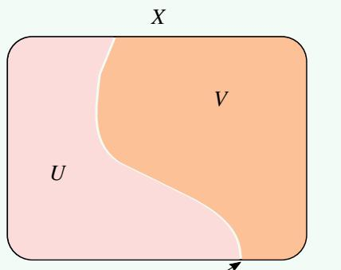  
边界没有被囊括

注 证明一个拓扑空间的连通性通常用反证法.

注若 $X$ 存在一个划分 $\{U,V\}$ 满足 $U$ 和 $V$ 都是 $X$ 上的开集，则称 $U$ 和 $V$ 是分离的 (separated).

刻画连通性的方法有很多, 但上述方法有一个好处, 就是只涉及到开集, 因此立刻可以看出连通性是拓扑不变量. 换句话说, 所有与连通空间 $X$ 同胚的拓扑空间都是连通的. 下面来给出几个连通性的等价定义.

我们知道 $\mathbb{R}^n$ 中既是开集又是闭集的只有 $\mathbb{R}^n$ 和 $\varnothing$ . 事实上这正是 $\mathbb{R}^n$ 连通性的体现.

# 命题2.43

设拓扑空间 $X$ 则 $X$ 是连通的当且仅当 $X$ 中既是开集又是闭集的子集只有 $X$ 和 $\varnothing$ .

证明 只需证明 $X$ 不是连通的当且仅当 $X$ 中存在既是开集又是闭集的非空真子集 $U$ .

(i) 证明充分性. 设存在 $X$ 的非空真子集 $U$ 既是开集又是闭集. 则 $U$ 和 $U^c$ 同时为 $X$ 上的开集. 这就说明 $X$ 不是连通的.

(ii) 证明必要性. 设 $X$ 不是连通的, 则存在一个划分 $\{U, U^c\}, U$ 和 $U^c$ 都是 $X$ 上的开集, 于是可知 $U$ 既是开集又是闭集.

根据前面对区间连通性的研究, 不难得到连通性的另一种等价定义.

# 命题2.44

设拓扑空间 $X$ 则 $X$ 是连通的当且仅当 $X$ 的任一划分 $\{U,V\}$ 都满足 $U\cap \overline{V}\neq \varnothing$ 或 $\overline{U}\cap V\neq \varnothing$

证明 只需证明 $X$ 不是连通的当且仅当 $X$ 中存在一个划分 $\{U, V\}$ 满足 $U \cap \overline{V} = \emptyset$ 且 $\overline{U} \cap V = \emptyset$ .

(i) 证明充分性. 设 $U \cap \overline{V} = \emptyset$ 且 $\overline{U} \cap V = \emptyset$ . 则

$$
\overline {{U}} = \overline {{U}} \cap X = \overline {{U}} \cap (U \cup V) = (\overline {{U}} \cap U) \cup (\overline {{U}} \cap V) = U \cup \varnothing = U.
$$

这表明 $U$ 是一个闭集.同理可知 $V$ 也是一个闭集.于是 $U$ 和 $V$ 都是既开又闭的.于是可知 $X$ 不是连通的.

(ii) 证明必要性. 设 $X$ 不是连通的. 则存在非空真子集 $U$ 既开又闭. 令 $V = U^c$ , 则 $V$ 也是既开又闭的. 因此 $\overline{U} = U$ 且 $\overline{V} = V$ . 于是可知

$$
\varnothing = U \cap V = U \cap \bar {V}, \quad \varnothing = U \cap V = \bar {U} \cap V.
$$

注上面的等价定义表明若 $X$ 是连通的，则 $U$ 包含 $V$ 的极限点或 $V$ 包含 $U$ 的极限点.

下面看几个连通集的例子

例2.75 平凡拓扑空间都是连通的

证明设平凡拓扑空间 $X$ ，由于 $X$ 的开集只有 $\varnothing$ 和 $X$ ，因此 $X$ 不存在划分 $\{A,B\}$ 使得 $A$ 和 $B$ 都是开集，于是可知 $X$ 是连通的.

例2.76 在 $\mathbb{R}$ 中, 集合 $I$ 是连通的当且仅当它是一个区间

证明 (i) 证明必要性. 设 $I$ 是一个连通集. 任取两点 $a, b \in I (a < b)$ . 只需证明 $[a, b] \subseteq I$ . 用反证法, 假设存在一点 $c \in (a, b)$ , 但 $c \notin I$ . 令

$$
A = \{x \in I: x <   c \}, \quad B = \{x \in I: x > c \}.
$$

这样就得到了 $I$ 的一个划分 $\{A, B\}$ . 显然 $A$ 的闭包点小于等于 $c$ , 而 $B$ 的闭包点大于等于 $c$ , 因此

$$
A \cap \bar {B} = \varnothing , \quad \bar {A} \cap B = \varnothing .
$$

因此 $I$ 不是连通集，出现矛盾.于是可知必要性成立

(ii) 证明充分性. 设 $I$ 是一个区间. 任意作一个 $I$ 的划分 $\{A, B\}$ . 取 $a \in A, b \in B$ . 不妨设 $a < b$ . 则 $[a, b] \subseteq I$ . 取 $[a, b]$ 的中点, 若中点属于 $A$ , 则把中点记作 $a_1$ , 并记 $b_1 = b$ , 如果中点属于 $B$ , 则把中点记作 $b_1$ , 并记 $a_1 = a$ . 然后继续取 $[a_1, b_1]$ 的中点, 照前述方法操作. 依次下去可以得到数列 $\{a_n\} \subseteq A, \{b_n\} \subseteq B$ . 由闭区间套定理可知, 存在 $c \in [a_n, b_n]$ ( $n = 1, 2, \dots$ ), 且 $a_n \to c, b_n \to c$ . 因此 $c \in \overline{A}$ 且 $c \in \overline{B}$ . 这表明 $A \cap \overline{B} \neq \emptyset$ 或 $\overline{A} \cap B \neq \emptyset$ . 于是可知 $I$ 是连通的.

例2.77 有理数集 $\mathbb{Q}$ 不是连通的

证明 取一个无理数 $\alpha$ ，令

$$
U = \mathbb {Q} \cap (- \infty , \alpha), \quad V = \mathbb {Q} \cap (\alpha , + \infty).
$$

显然 $U$ 和 $V$ 都是 $\mathbb{Q}$ 上的开集且 $\{U,V\}$ 是 $\mathbb{Q}$ 的一个划分.于是可知 $\mathbb{Q}$ 不是连通的.

在《数学分析I》中已经证明区间在连续函数下的像仍是区间.这个结论可以推广.

# 定理2.44（连通空间的连续像）

设连续映射 $f: X \to Y$ , 其中 $X$ 和 $Y$ 是拓扑空间. 若 $X$ 是连通的, 则 $f(X)$ 也是连通的.

证明用反证法.假设 $f(X)$ 存在一个划分 $\{U,V\}$ ，其中 $U$ 和 $V$ 都是开集.由于 $f$ 连续，因此 $f^{-1}(U),f^{-1}(V)$ 也都是开集.由于 $U\cap V = \emptyset$ ，故 $f^{-1}(U)\cap f^{-1}(V) = \emptyset .$ 容易知道 $\left\{f^{-1}(U),f^{-1}(V)\right\}$ 是 $X$ 的一个划分.因此 $X$ 不是连通的，出现矛盾.于是可知 $f(X)$ 也是连通的.

现在可以把介值定理推广到多元函数

# 定理2.45 (介值定理)

设连续函数 $f: D \to \mathbb{R}$ , 其中 $D \subseteq \mathbb{R}^n$ . 若 $D$ 是一个连通集, 则对于 $f(\pmb{a})$ 和 $f(\pmb{b})$ 之间任一实数 $\gamma$ 都存在 $\pmb{c} \in D$ 使得 $f(\pmb{c}) = \gamma$ .

证明 由于 $D$ 是一个连通集, 且 $f$ 在 $D$ 上连续, 故 $f(D)$ 也是一个连通集. 于是 $f(D)$ 是一个区间. 不妨设 $f(a) < f(b)$ , 则

$$
\gamma \in (f (\boldsymbol {a}), f (\boldsymbol {b})) \subseteq f (D).
$$

于是可知存在 $c \in D$ 使得 $f(c) = \gamma$ .

# 命题2.45

设拓扑空间 $X$ 有一个划分 $\{U,V\}$ ，其中 $U$ 和 $V$ 都是开集.若 $Y$ 是连通的，则 $Y\subseteq U$ 或 $Y\subseteq V$

证明 由于 $\{U, V\}$ 是 $X$ 的一个划分，因此

$$
\left(U \cap Y\right) \cup \left(V \cap Y\right) = Y, \quad \left(U \cap Y\right) \cup \left(V \cap Y\right) = \varnothing .
$$

而 $U \cap Y$ 和 $V \cap Y$ 都是 $Y$ 上的开集, 由于 $Y$ 是连通的, 因此 $U \cap Y$ 和 $V \cap Y$ 必有一个是空集. 这表明 $Y \subseteq U$ 或 $Y \subseteq V$ .

# 命题2.46

在拓扑空间 $X$ 中, 设连通集 $A$ . 若集合 $B$ 满足 $A \subseteq B \subseteq \overline{A}$ . 则 $B$ 也是连通的.

证明用反证法，假设 $B$ 不是连通的，则存在一个划分 $\{V,U\}$ ，其中 $U$ 和 $V$ 都是开集.由于 $A$ 是连通的，由命题2.45可知 $A\subseteq U$ 或 $A\subseteq V.$ 不妨设 $A\subseteq U,$ 则 $\overline{A}\subseteq \overline{U}.$ 由于 $V\cap \overline{U} = \varnothing .$ 因此 $\overline{A}\cap V = \varnothing .$ 由于 $B\subseteq \overline{A},$ 因此 $B\cap V = \varnothing .$ 这表明 $V = \varnothing .$ 这与 $\{V,U\}$ 是一个划分矛盾.于是可知 $B$ 也是连通的.

由以上命题立刻可知以下推论

# 引理2.3

在拓扑空间 $X$ 中，若 $E$ 是连通的，则 $\overline{E}$ 也是连通的

# 2.5.5 道路连通

我们知道区间上的任意两点都可以用一条区间内的连续线段连接起来. 这就好像从一点可以找到一条“道路”通到另一个点.

# 定义2.57（道路连通）

设拓扑空间 $X$ . 设连续映射 $f: [a, b] \to X$ , 其中 $f(a) = x, f(b) = y, (x, y \in X)$ . 则称 $f$ 是 $x$ 到 $y$ 的一条道路 (path). 若 $X$ 中的任意两点都存在一条道路, 则称 $X$ 是道路连通的 (path connected).

注方便起见， $[a,b]$ 可以换成[0,1].

下面看一个常见例子.

例2.78单位球在 $\mathbb{R}^n$ 中，令

$$
B ^ {n} := \left\{\boldsymbol {x}: \| \boldsymbol {x} \| \leq 1 \right\}.
$$

则 $B^n$ 是道路连通的. 我们称 $B^n$ 为 $\mathbb{R}^n$ 中的单位球 (unit ball).

证明 任取 $x, y \in B^n$ . 令

$$
f (t) = (1 - t) \boldsymbol {x} + t \boldsymbol {y}, \quad t \in [ 0, 1 ].
$$

则 $f(0) = x, f(1) = y.$ 对于任一 $t \in [0, 1]$ 都有

$$
\| f (t) \| = \| (1 - t) \boldsymbol {x} + t \boldsymbol {y} \| \leq (1 - t) \| \boldsymbol {x} \| + t \| \boldsymbol {y} \| \leq 1.
$$

因此 $f$ 是 $[0,1] \to B^n$ 的映射. 显然 $f$ 是连续的. 因此它是 $\pmb{x}$ 到 $\pmb{y}$ 的一条道路. 于是可知 $B^n$ 是道路连通的.

注上例中的 $f$ 称为 $\pmb{x}$ 到 $\pmb{y}$ 的直线道路(straight path).

从上面的例子不难想到更一般的情况

# 定义2.58 (凸集)

在 $\mathbb{R}^n$ 中，设非空集合 $E$ 。若对于任意 $x, y \in \mathbb{R}^n$ 和任一 $t \in [0,1]$ ，都有

$$
(1 - t) \boldsymbol {x} + t \boldsymbol {y} \in E.
$$

则称 $E$ 是一个凸集(convex set).

显然凸集一定是连通集. 事实上, 还可以定义更一般的情况

# 定义2.59（星形集）

在 $\mathbb{R}^n$ 中, 设非空集合 $E$ . 若存在 $\pmb{x} \in \mathbb{R}^n$ , 使得任一 $\pmb{y} \in \mathbb{R}^n$ 和任一 $t \in [0,1]$ , 都有

$$
(1 - t) \boldsymbol {x} + t \boldsymbol {y} \in E.
$$

则称 $E$ 是一个星形集（star set）

显然星形集一定是连通集. 需要注意凸集一定是星形集, 反之不然. 例如我们熟悉的五角星, 就是一个星形集,但它不是凸集.

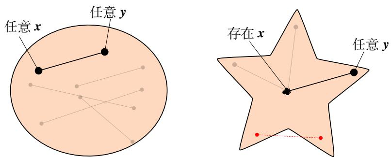  
图2.23：凸集和星形集示意图

例2.79穿孔空间在 $\mathbb{R}^n$ 中，令 $D = \mathbb{R}^n\backslash \{\mathbf{0}\}$ ，则 $D$ 是道路连通的.我们称 $D$ 为 $\mathbb{R}^n$ 中的穿孔空间(punctured space).

证明任取 $x,y\in D$ .作 $\pmb{x}$ 到 $\pmb{y}$ 的直线道路 $f:[0,1]\to D$ 若 $\mathbf{0}\notin f([0,1])$ 则 $D$ 是道路连通的.若 $\mathbf{0}\in f([0,1])$ ，则

取一点 $z \notin f([0,1])$ . 然后作 $x$ 到 $z$ 的直线道路

$$
f _ {1} (t) = (1 - t) \boldsymbol {x} + t z, \quad t \in [ 0, 1 ].
$$

再作 $z$ 到 $\mathcal{V}$ 的直线道路

$$
f _ {2} (t) = (2 - t) z + (t - 1) y, \quad t \in [ 1, 2 ]
$$

这样就找到了一条从 $x$ 到 $z$ 的道路

$$
f (t) = \left\{ \begin{array}{l l} (1 - t) \boldsymbol {x} + t \boldsymbol {z}, & t \in [ 0, 1 ] \\ (2 - t) \boldsymbol {z} + (t - 1) \boldsymbol {y}, & t \in [ 1, 2 ] \end{array} \right..
$$

由粘接引理可知 $f$ 是 $[0,2]$ 上的一个连续映射，且 $f(0) = x,F(2) = y.$ 不难知道 $f([0,2])\subseteq D.$ 因此 $f$ 就是 $\pmb{x}$ 到 $\mathbf{y}$ 的一条道路.于是可知 $D$ 是道路连通的.

注从上述证明过程可知，若存在 $x$ 到 $y$ 和 $y$ 到 $z$ 的道路，则根据粘接引理一定存在一条 $x$ 到 $z$ 的道路.

注穿孔空间显然不是星形集

# 定理2.46（道路连通空间的连续像）

设连续映射 $f: X \to Y$ , 其中 $X$ 和 $Y$ 是拓扑空间. 若 $X$ 是道路连通的, 则 $f(X)$ 也是道路连通的.

证明任取 $f(x), f(y) \in f(X)$ . 由于 $X$ 是道路连通的，因此存在 $x$ 到 $y$ 的道路 $p: [0,1] \to X$ 其中 $p(0) = x$ , $p(1) = y$ . 令

$$
q = f \circ p: [ 0, 1 ] \to f (X).
$$

则

$$
q (0) = f [ p (0) ] = f (x), \quad q (1) = f [ p (1) ] = f (y).
$$

由于 $f$ 和 $p$ 都是连续映射，因此 $q$ 也是连续映射。于是在 $f(X)$ 就找到了 $f(x)$ 到 $f(y)$ 的一条道路 $p: [0,1] \to f(X)$ 。于是可知 $f(X)$ 也是道路连通的。

例2.80单位球面在 $\mathbb{R}^n$ 中，令

$$
S ^ {n - 1} := \left\{\boldsymbol {x}: \| \boldsymbol {x} \| = 1 \right\}.
$$

则 $S^{n - 1}$ 是道路连通的.我们称 $S^{n - 1}$ 为 $\mathbb{R}^n$ 中的单位球面(unit sphere).

证明 定义 $D = \mathbb{R}^n\backslash \{\mathbf{0}\}$ 上的映射

$$
g (\boldsymbol {x}) = \frac {1}{\| \boldsymbol {x} \|} \boldsymbol {x}, \quad \forall \boldsymbol {x} \in D.
$$

显然 $g(D) = S^{n - 1}$ . 由于穿孔空间 $D$ 是道路连通的, 而 $g$ 显然是连续映射, 于是可知 $S^{n - 1}$ 也是道路连通的.

注 $S^{n - 1}$ 的记号暗示了这个球面是 $n - 1$ 维的

从道路连通的角度可以得到一个判断连通性的方法

# 定理2.47

道路连通空间一定是连通空间

证明 设 $X$ 是道路连通的. 用反证法, 假设 $X$ 不是连通的, 则存在一个 $X$ 的划分 $\{U, V\}$ , 其中 $U$ 和 $V$ 都是 $X$ 上的开集. 任取 $x \in U, y \in V$ . 由于 $X$ 是道路连通的, 因此存在 $x$ 到 $y$ 的一条道路 $f: [0,1] \to X$ . 显然 $\left\{f^{-1}(U), f^{-1}(V)\right\}$ 是 $[0,1]$ 的一个划分. 由于 $f$ 是连续映射, 因此 $f^{-1}(U), f^{-1}(V)$ 都是开集. 这表明 $[0,1]$ 不是连通的, 出现矛盾. 于是可知命题成立.

以上定理的逆命题不成立. 下面来看一个重要的反例

例2.81拓扑学家的正弦曲线设 $S$ 是函数 $\sin (1 / x)$ 在(0,1]上的图像.则 $\overline{S}$ 是连通的，但不是道路连通的

证明 显然 $S$ 是道路连通的，因此 $S$ 是连通的. 因此 $\overline{S}$ 也是连通的. 容易知道

$$
\bar {S} = (\{0 \} \times [ - 1, 1 ]) \cup S.
$$

这是因为对于任一 $y \in [-1, 1]$ , 点 $(0, y)$ 都是 $S$ 的极限点.

下面证明 $\overline{S}$ 不是道路连通的. 用反证法, 假设 $\overline{S}$ 是道路连通的, 则存在原点 $(0,0)$ 到 $\overline{S}$ 上某一点的道路 $f: [a,c] \to \overline{S}$ . 由于 $f$ 连续, 因此 $f^{-1}(\{0\} \times [-1,1])$ 是一个闭集, 于是存在最大值, 设这个最大值为 $b$ . 则 $f: [b,c] \to \overline{S}$ 把 $b$ 映到 $\{0\} \times [-1,1]$ 中某一点 $(0,m)$ , 把 $(b,c]$ 映到 $S$ 中. 不失一般性, 令 $[b,c] = [0,1]$ . 设 $f(t) = (x(t),y(t))$ . 则 $x(0) = 0$ , $y(0) = m$ , 且当 $t > 0$ 时

$$
x (t) > 0, \quad y (t) = \sin \frac {1}{x (t)}.
$$

如果能构造数列 $t_n \to 0$ 使得 $y(t_n) = (-1)^n$ , 则 $y(t_n)$ 不收敛, 因此 $y(t)$ 不是连续函数, 这与 $f$ 是连续函数矛盾. 下面来构造 $\{t_n\}$ . 对于任一 $n \in \mathbb{N}^*$ , 取 $u$ 满足

$$
0 <   u <   x \left(\frac {1}{n}\right), \qquad \sin \frac {1}{u} = (- 1) ^ {n}.
$$

由于 $x(t)$ 是连续的，由介值定理可知存在 $t_n$ 满足

$$
0 <   t _ {n} <   \frac {1}{n}, \qquad x (t _ {n}) = u.
$$

这表明 $t_n \to 0$ 且

$$
y \left(t _ {n}\right) = \sin \frac {1}{x \left(t _ {n}\right)} = \frac {1}{u} = (- 1) ^ {n}.
$$

注称为拓扑学家的正弦曲线(topologist's sine curve)或称Warsaw正弦曲线(Warsaw sine curve).

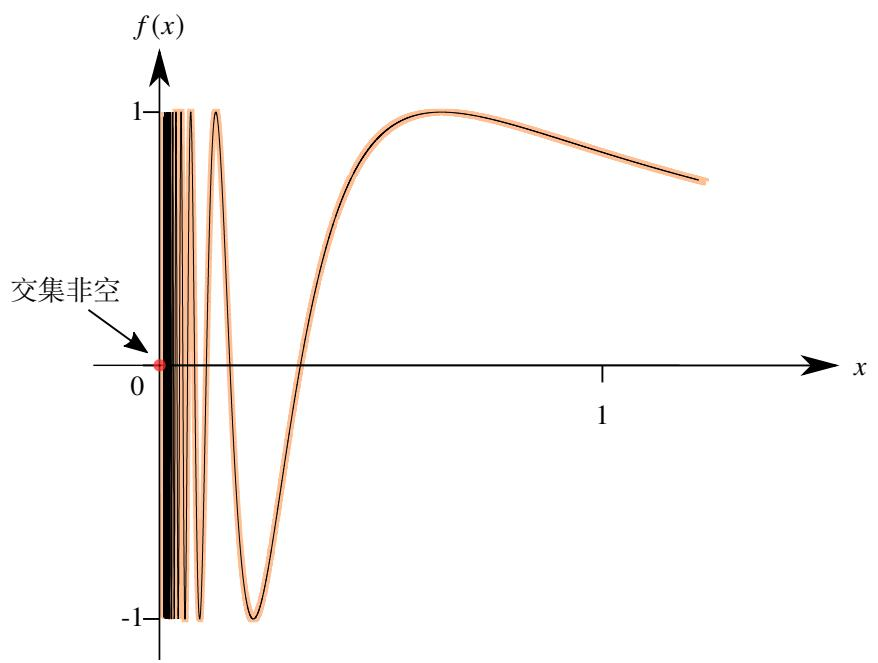  
图2.24: 连通但非道路连通

# 定义2.60（区域）

在拓扑空间 $X$ 中, 若开集 $E$ 是连通的, 则称 $E$ 是一个区域(Domain).

例2.82 在 $\mathbb{R}^n$ 中, 任何邻域都是区域

证明同例2.78的方法可知球形邻域都是道路连通的，因此邻域都是连通集.由于邻域是开集，于是可知 $\mathbb{R}^n$ 中的任

何邻域都是区域

例2.83 区域一定是道路连通的

证明 设区域 $E \subseteq \mathbb{R}^n$ . 任取 $\pmb{x} \in E$ , 令

$$
E _ {x} = \{\mathbf {y} \in E: E \text {中 存 在} x \text {到} y \text {道 路} \}.
$$

下面只需证明 $E_{x} = E$

先证明 $E_{x}$ 是一个开集. 任取 $z \in E_{x}$ , 由于 $E$ 是一个开集, 故存在 $N_{r}(z) \subseteq E$ . 由于邻域都是道路连通的, 因此对于任一 $w \in N_{r}(z)$ , 都存在 $w$ 到 $z$ 的道路, 而 $z$ 到 $x$ 的道路是存在的, 因此存在 $w$ 到 $x$ 的道路. 这表明 $w \in E_{x}$ . 因此 $E_{x}$ 是一个开集.

对于 $E$ 中两个不同的点 $\pmb{x}$ 和 $\pmb{y}$ , 容易知道 $E_{x}$ 和 $E_{y}$ 要么相等, 要么不交. 事实上, 当 $E_{x} \cap E_{y} \neq \emptyset$ 时, 存在一点 $\pmb{a}$ , 它和 $\pmb{x}$ 有一条道路连通, 和 $\pmb{y}$ 也有一条道路连通, 于是 $E_{x}$ 中的任意一点总是可以按 $\pmb{x}, \pmb{a}, \pmb{y}$ 的顺序找到一条道路到达 $\pmb{y}$ , 反之 $E_{y}$ 中的任意一点也都可以找到一条道路达到 $\pmb{x}$ . 这表明 $E_{x} = E_{y}$ .

于是 $E$ 可以拆成以下两个集合的不交并：

$$
E = E _ {x} \cup \left(\bigcup_ {y \in E \backslash E _ {x}} E _ {y}\right).
$$

由于 $E$ 是连通集, 且 $E_{x}$ 和 $\bigcup_{y\in E\setminus E_x}E_y$ 都是开集, 因此 $E_{x} = E$ 或 $E_{x} = \varnothing$ . 显然 $E_{x}$ 非空. 于是就证明了 $E_{x} = E$ . ■

注上例表明，对开集而言，连通等价于道路连通

# 2.5.6 Cantor集

最后讲一个有趣且重要的例子作为本章的尾声

# 定义2.61 (Cantor集)

把 $\mathbb{R}$ 上的闭区间 $[0,1]$ 三等分后，去掉中间的开区间，把剩下的部分记作 $C_1$ ，即

$$
C _ {1} = [ 0, 1 ] \backslash \left(\frac {1}{3}, \frac {2}{3}\right) = \left[ 0, \frac {1}{3} \right] \cup \left[ \frac {2}{3}, 1 \right].
$$

然后把 $C_1$ 中的两个闭区间分别三等分, 然后分别去掉中间的开区间, 把剩下的部分记作 $C_2$ , 即

$$
C _ {2} = C _ {1} \backslash \bigcup_ {k = 1} ^ {3} \left(\frac {3 k - 2}{3 ^ {2}}, \frac {3 k - 1}{3 ^ {2}}\right) = \left[ 0, \frac {1}{3 ^ {2}} \right] \cup \left[ \frac {2}{3 ^ {2}}, \frac {3}{3 ^ {2}} \right] \cup \left[ \frac {6}{3 ^ {2}}, \frac {7}{3 ^ {2}} \right] \cup \left[ \frac {8}{3 ^ {2}}, 1 \right].
$$

按此方法依次操作，就可以得到一列闭集

$$
C _ {n} = C _ {n - 1} \backslash \bigcup_ {k = 1} ^ {3 ^ {n - 1}} \left(\frac {3 k - 2}{3 ^ {n}}, \frac {3 k - 1}{3 ^ {n}}\right), \quad n = 1, 2, \dots .
$$

令

$$
C = \bigcap_ {n = 0} ^ {\infty} C _ {n}.
$$

我们称集合 $C$ 为 Cantor 集 (Cantor set), 或三分集 (middle-thirds set).

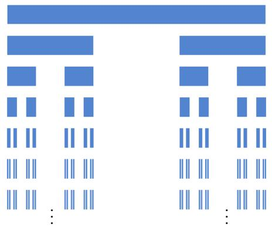  
图2.25: Cantor集示意图

Cantor集是一个经典反例: 它深刻揭示了实数集 $\mathbb{R}$ 的拓扑结构. 它兼具我们已经学过的一连串重要概念: 有限闭集、紧致集、列紧集、完美集 (没有孤立点的闭集)、连通集、零测集、不可数集、分形集.

# 定理2.48

Cantor集是有限闭集、紧致集、列紧集

证明 根据 Cantor 集的定义, $C_n (n = 1,2,\dots)$ 都是 $\mathbb{R}$ 上的闭集, 因此 $C$ 仍是 $\mathbb{R}$ 上的 1 个闭集. 因此 $C$ 是一个有限闭集. 于是可知 $C$ 是紧致的, 也是列紧的.

# 定理2.49

Cantor集不包含任何开区间.

证明 由 Cantor 集的定义可知, 对于任意 $n, k \in \mathbb{N}^*$ , 集合

$$
\left(\frac {3 k - 2}{3 ^ {n}}, \frac {3 k - 1}{3 ^ {n}}\right)
$$

都与 $C$ 无交.任取开区间 $(a,b)\subseteq [0,1]$ .总能找到一个足够大的 $N$ 满足

$$
\frac {1}{3 ^ {N}} <   \frac {b - a}{4}.
$$

此时一定存在 $K \in \mathbb{N}^*$ 使得

$$
\left(\frac {3 K - 2}{3 ^ {N}}, \frac {3 K - 1}{3 ^ {N}}\right) \subseteq (a, b).
$$

因此 $C$ 不可能包含 $(a,b)$ . 这表明 $C$ 不包含任何开区间.

注这样的集合称为完全不连通集(totally disconnected set).

# 定理2.50

Cantor集中没有孤立点.

证明任取 $x\in C$ ，取 $x$ 的一个邻域 $U\subseteq [0,1]$ . $C_n$ 中包含 $\mathcal{X}$ 的那个闭区间记作 $I_{n}$ 存在 $N\in \mathbb{N}^*$ ，当 $n > N$ 时 $I_{n}\subseteq U$ 把 $I_{n}$ 的那个不等于 $x$ 的端点记作 $x_{n}$ .则数列 $\{x_{n}\}_{n > N}\subseteq U.$ 这表明 $\mathcal{X}$ 的任一去心邻域都含有 $C$ 中的无穷多项，因此 $x$ 是 $C$ 的一个极限点.于是可知 $C$ 中没有孤立点.

注 没有孤立点的闭集称为完美集 (perfect set).

# 定理2.51

Cantor集是一个不可数集

证明用反证法，假设 $C$ 是一个可数集，则可以把 $C$ 中的所有点排成一列，记作 $x_{1},x_{2},\dots ,x_{n},\dots$ 下面构造一个开

区间列.

任取一个开区间 $I_{1} \subseteq [0,1]$ 使得 $x_{1} \in I_{1}$ . 假设已经构造了开区间 $I_{n}$ , 它满足 $I_{n} \cap C \neq \emptyset$ . 由于 $C$ 中没有孤立点, 因此总是存在开区间 $I_{n+1}$ 满足

$$
\bar {I} _ {n + 1} \subseteq I _ {n}, \quad x _ {n} \notin \bar {I} _ {n + 1}, \quad I _ {n + 1} \cap C \neq \varnothing .
$$

由于 $I_{n + 1}\cap C\neq \emptyset$ 满足归纳假设，因此过程可以无限进行下去.令

$$
K _ {n} = \bar {I} _ {n} \cap C, \quad n = 1, 2, \dots .
$$

由于 $C$ 是紧致的, 且 $\overline{I}_n$ 是 $\mathbb{R}$ 上的闭集, 由推论2.7可知 $K_n$ ( $n = 1, 2, \dots$ ) 都是紧致的. 由于 $x_n \notin \overline{I}_{n+1}$ , 故 $x_n \notin K_{n+1}$ ( $n = 1, 2, \dots$ ). 因此

$$
\bigcap_ {n = 1} ^ {\infty} K _ {n} = \varnothing .
$$

另一方面由于 $K_{n}$ $(n = 1,2,\dots)$ 非空，且 $K_{n} \supseteq K_{n + 1}$ $(n = 1,2,\dots)$ ，根据引理2.2可知

$$
\bigcap_ {n = 1} ^ {\infty} K _ {n} \neq \varnothing .
$$

出现矛盾.于是可知 $C$ 是一个不可数集

# 定理2.52

Cantor集 $C$ 是一个零测集

证明 由 Cantor 集的定义可知 $C_n$ 是 $2^n$ 个闭区间的并, 其中每个区间长度都是 $1 / 3^n$ . 因此 $C_n$ 的长度为

$$
\left| C _ {n} \right| = 2 ^ {n} \cdot \frac {1}{3 ^ {n}} = \left(\frac {2}{3}\right) ^ {n} \rightarrow 0, \quad n \rightarrow \infty .
$$

由于 $C \subseteq C_n$ ( $n = 1,2,\dots$ ), 因此 $C$ 是一个零测集.

注事实上 $C$ 和 $\mathbb{R}$ 的势是相等的

1874年, 爱尔兰数学家Henry John Stephen Smith首先发现了这种神奇的集合. 1883年Cantor系统研究了三分集的一系列性质. Cantor三分集奠定了现代点集拓扑学(point-set topology)的基础. 另一方面它和Weierstrass函数(1872年)、Peano曲线(1890)共同成为19世纪末三大反例, 直接催生了实分析和分形几何理论.

