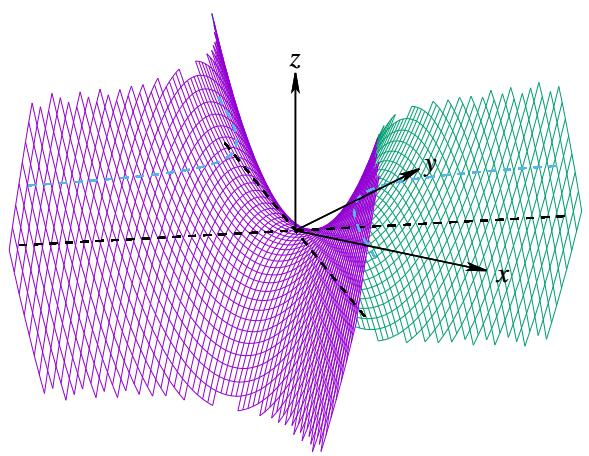
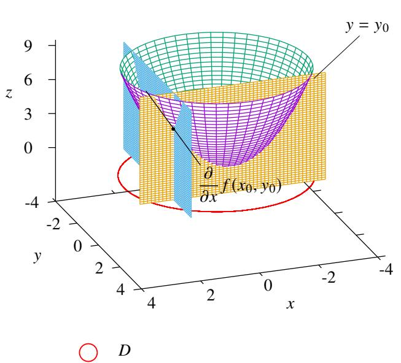

# 第3章 线性代数与空间解析几何简介

# 内容提要

介绍行列式的基本性质.

介绍平面和直线的方程

介绍矩阵的运算法则.

介绍空间中曲线和曲面的方程

□ 介绍向量的运算：包括线性运算、数量级、向量积和混合积.

介绍二次曲线和二次曲面.

学习多元微分学和多元积分学时会涉及一些向量代数和解析几何的知识. 如果对这些知识不熟悉, 学习时会出现很多困难. 这些知识本身不属于《数学分析》, 因此在此仅仅给出相关知识的简要介绍, 详细内容会在《高等代数》和《解析几何》中详细讨论.

# 3.1 矩阵与行列式

# 3.1.1 二阶行列式

设2元线性方程组

$$
\left\{ \begin{array}{l} a _ {1 1} x + a _ {1 2} y = b _ {1} \\ a _ {2 1} x + a _ {2 2} y = b _ {2} \end{array} . \right. \tag {3.1}
$$

我们可以用中学学过的消元法来解这个方程组.[1]方程乘以 $a_{21}$ 减去[2]方程乘以 $a_{11}$ 就可以消去 $x$

$$
\left(a _ {1 1} a _ {2 2} - a _ {1 2} a _ {2 1}\right) y = a _ {1 1} b _ {2} - a _ {2 1} b _ {1}.
$$

下面可以分为三种情况讨论：

(i) 当 $a_{11}a_{22} - a_{12}a_{21} = 0$ 且 $a_{11}b_{2} - a_{21}b_{1} = 0$ 时, 原方程组有无穷多个解;  
(ii)当 $a_{11}a_{22} - a_{12}a_{21} = 0$ 且 $a_{11}b_{2} - a_{21}b_{1}\neq 0$ 时，原方程组无解；  
(iii) 当 $a_{11}a_{22} - a_{12}a_{21} \neq 0$ 时, 原方程组有唯一解.

于是我们发现 $a_{11}a_{22} - a_{12}a_{21}$ 是否为零，决定了方程组是否有唯一解.且这个解为

$$
y = \frac {a _ {1 1} b _ {2} - a _ {2 1} b _ {1}}{a _ {1 1} a _ {2 2} - a _ {1 2} a _ {2 1}}.
$$

代入原方程组可以解出 $x$

$$
x = \frac {a _ {2 2} b _ {1} - a _ {1 2} b _ {2}}{a _ {1 1} a _ {2 2} - a _ {1 2} a _ {2 1}}.
$$

从以上讨论可以看到，线性方程组是否有唯一解只与四个系数组成的多项式 $a_{11}a_{22} - a_{12}a_{21}$ 有关.因此我们可以把它们按顺序排成一个数阵，并把这个多项式作为判别方程组有唯一解的判别式(determinant).

# 定义3.1（矩阵）

由 $s \times m$ 个数排成的 $s$ 行 $m$ 列数阵

$$
\left[ \begin{array}{c c c c} a _ {1 1} & a _ {1 2} & \dots & a _ {1 m} \\ a _ {2 1} & a _ {2 2} & \dots & a _ {2 m} \\ \vdots & \vdots & & \vdots \\ a _ {s 1} & a _ {s 2} & \dots & a _ {s m} \end{array} \right]
$$

称为一个 $s \times m$ 矩阵 (matrix), 记作 $A_{s \times m}$ , 或简记作 $A$ , 其中每一个数称为该矩阵的一个元素 (element), 第 $i$ 行第 $j$ 列的元素称为矩阵的 $(i, j)$ 元, 记作 $A(i; j)$ , 其中 $i$ 称为行指标, $j$ 称为列指标. 若矩阵 $A$ 的 $(i, j)$ 元

是 $a_{ij}$ ，那么矩阵可以记作 $\mathbf{A} = (a_{ij})$

注矩阵 $A = (a_{ij})_{s\times n},B = (b_{ij})_{t\times m}$ 相等当且仅当 $s = t,n = m$ 且

$$
\boldsymbol {A} (i; j) = \boldsymbol {B} (i; j), \quad i = 1, 2, \dots , s, j = 1, 2, \dots , n,
$$

记作 $A = B$

注当矩阵 $A$ 的行数和列数都等于 $n$ 时，称之为 $n$ 阶方阵 (square matrix)，或 $n$ 级矩阵.

# 定义3.2（2阶行列式）

设2级矩阵

$$
\boldsymbol {A} = \left[ \begin{array}{c c} a _ {1 1} & a _ {1 2} \\ a _ {2 1} & a _ {2 2} \end{array} \right].
$$

我们把多项式 $a_{11}a_{22} - a_{12}a_{21}$ 称为矩阵 $\mathbf{A}$ 的2阶行列式(determinant of order 2),记作

$$
\left| \begin{array}{c c} a _ {1 1} & a _ {1 2} \\ a _ {2 1} & a _ {2 2} \end{array} \right| := a _ {1 1} a _ {2 2} - a _ {1 2} a _ {2 1}.
$$

也可简记作 $\operatorname{det} A$ ，或 $|A|$

定义了2阶行列式后，我们就可以用行列式简洁地讨论二元线性方程组.令

$$
\boldsymbol {A} = \left[ \begin{array}{c c} a _ {1 1} & a _ {1 2} \\ a _ {2 1} & a _ {2 2} \end{array} \right], \qquad \boldsymbol {B} _ {1} = \left[ \begin{array}{c c} b _ {1} & a _ {1 2} \\ b _ {2} & a _ {2 2} \end{array} \right], \qquad \boldsymbol {B} _ {2} = \left[ \begin{array}{c c} a _ {1 1} & b _ {1} \\ a _ {2 1} & b _ {2} \end{array} \right].
$$

其中 $\mathbf{A}$ 称为线性方程组的系数矩阵

(i) 当 $\operatorname{det} A = 0, \operatorname{det} B_{1} = 0, \operatorname{det} B_{2} = 0$ 时，原方程组有无穷多个解；  
(ii) 当 $\operatorname{det} A = 0$ 且 $\operatorname{det} B_{1}$ 和 $\operatorname{det} B_{2}$ 中有一个不为零时, 原方程组无解;  
(iii) 当 $\operatorname{det} A \neq 0$ 时, 原方程组有唯一解:

$$
x = \frac {\det  B _ {1}}{\det  A}, \quad y = \frac {\det  B _ {2}}{\det  A}.
$$

上述结论称为Cramer法则(Cramer's rule),在《高等代数》中将看到更一般的结论.

下面看几个例子

例3.1 解下列线性方程组：

(1) $\left\{ \begin{array}{l} 2x + y = 5 \\ 5x + 2y = 12 \end{array} \right.$ .

(2) $\left\{ \begin{array}{l} 2x + y = 5 \\ 4x + 2y = 3 \end{array} \right.$ .

(3) $\left\{ \begin{array}{l} 2x + y = 5 \\ 4x + 2y = 10 \end{array} \right.$ .

解(1)计算

$$
\det  \boldsymbol {A} = \left| \begin{array}{l l} 2 & 1 \\ 5 & 2 \end{array} \right| = - 1, \qquad \det  \boldsymbol {B} _ {1} = \left| \begin{array}{l l} 5 & 1 \\ 1 2 & 2 \end{array} \right| = - 2, \qquad \det  \boldsymbol {B} _ {2} = \left| \begin{array}{l l} 2 & 5 \\ 5 & 1 2 \end{array} \right| = - 1.
$$

于是可知原方程组有唯一解：

$$
\left\{ \begin{array}{l} x = 2 \\ y = 1 \end{array} \right..
$$

(2) 计算

$$
\det  \boldsymbol {A} = \left| \begin{array}{l l} 2 & 1 \\ 4 & 2 \end{array} \right| = 0, \qquad \det  \boldsymbol {B} _ {1} = \left| \begin{array}{l l} 5 & 1 \\ 3 & 2 \end{array} \right| = 7.
$$

于是可知原方程组无解

(3) 计算

$$
\det  \boldsymbol {A} = \left| \begin{array}{l l} 2 & 1 \\ 4 & 2 \end{array} \right| = 0, \qquad \det  \boldsymbol {B} _ {1} = \left| \begin{array}{l l} 5 & 1 \\ 1 0 & 2 \end{array} \right| = 0, \qquad \det  \boldsymbol {B} _ {2} = \left| \begin{array}{l l} 2 & 5 \\ 4 & 1 0 \end{array} \right| = 0.
$$

于是可知原方程组有无穷多个解

# 3.1.2 三阶行列式

接下来我们继续看由3个方程组成的3元线性方程组的情况.设3元线性方程组

$$
\left\{ \begin{array}{l} a _ {1 1} x + a _ {1 2} y + a _ {1 3} z = b _ {1} \\ a _ {2 1} x + a _ {2 2} y + a _ {2 3} z = b _ {2} \\ a _ {3 1} x + a _ {3 2} y + a _ {3 3} z = b _ {3} \end{array} \right..
$$

我们考虑用待定系数法消去 $y$ 和 $z$ . 设第一个方程乘以 $u$ 加第二个方程乘以 $v$ 加第三个方程乘以 $w$ 后可以消去 $y$ 和 $z$ , 即

$$
\left\{ \begin{array}{l} \left(a _ {1 1} u + a _ {2 1} v + a _ {3 1} w\right) x = b _ {1} u + b _ {2} v + b _ {3} w \\ a _ {1 2} u + a _ {2 2} v + a _ {3 2} w = 0 \Longleftrightarrow a _ {1 2} \frac {u}{w} + a _ {2 2} \frac {v}{w} = - a _ {3 2} \\ a _ {1 3} u + a _ {2 3} v + a _ {3 3} w = 0 \Longleftrightarrow a _ {1 3} \frac {u}{w} + a _ {2 3} \frac {v}{w} = - a _ {3 3} \end{array} . \right. \tag {3.2}
$$

把以上方程组中的第二第三个方程看作关于 $u / w$ 和 $\nu /w$ 二元线性方程组.用二元线性方程组的Cramer法则解得

$$
\frac {u}{w} = \frac {\left| \begin{array}{c c} - a _ {3 2} & a _ {2 2} \\ - a _ {3 3} & a _ {2 3} \end{array} \right|}{\left| \begin{array}{c c} a _ {1 2} & a _ {2 2} \\ a _ {1 3} & a _ {2 3} \end{array} \right|} = \frac {\left| \begin{array}{c c} a _ {2 2} & a _ {2 3} \\ a _ {3 2} & a _ {3 3} \end{array} \right|}{\left| \begin{array}{c c} a _ {1 2} & a _ {2 2} \\ a _ {1 3} & a _ {2 3} \end{array} \right|}, \qquad \frac {v}{w} = \frac {\left| \begin{array}{c c} a _ {1 2} & - a _ {3 2} \\ a _ {1 3} & - a _ {3 3} \end{array} \right|}{\left| \begin{array}{c c} a _ {1 2} & a _ {2 2} \\ a _ {1 3} & a _ {2 3} \end{array} \right|} = \frac {- \left| \begin{array}{c c} a _ {1 2} & a _ {1 3} \\ a _ {3 2} & a _ {3 3} \end{array} \right|}{\left| \begin{array}{c c} a _ {1 2} & a _ {2 2} \\ a _ {1 3} & a _ {2 3} \end{array} \right|}.
$$

于是找到了一组满足要求的系数：

$$
u = \left| \begin{array}{c c} a _ {2 2} & a _ {2 3} \\ a _ {3 2} & a _ {3 3} \end{array} \right|, \qquad v = - \left| \begin{array}{c c} a _ {1 2} & a _ {1 3} \\ a _ {3 2} & a _ {3 3} \end{array} \right|, \qquad w = \left| \begin{array}{c c} a _ {1 2} & a _ {2 2} \\ a _ {1 3} & a _ {2 3} \end{array} \right|.
$$

容易想到 $x$ 前面的系数 $a_{11}u + a_{21}\nu +a_{31}w$ 可以决定这个方程组是否有唯一解.设三元线性方程组的系数矩阵为 $\mathbf{A}$ ，我们可以来定义 $\mathbf{A}$ 三阶行列式：

$$
\begin{array}{l} \det  \boldsymbol {A} := a _ {1 1} u + a _ {2 1} v + a _ {3 1} w = a _ {1 1} \left| \begin{array}{c c} a _ {2 2} & a _ {2 3} \\ a _ {3 2} & a _ {3 3} \end{array} \right| - a _ {2 1} \left| \begin{array}{c c} a _ {1 2} & a _ {1 3} \\ a _ {3 2} & a _ {3 3} \end{array} \right| + a _ {3 1} \left| \begin{array}{c c} a _ {1 2} & a _ {2 2} \\ a _ {1 3} & a _ {2 3} \end{array} \right| \\ = a _ {1 1} a _ {2 2} a _ {3 3} + a _ {1 2} a _ {2 3} a _ {3 1} + a _ {1 3} a _ {2 1} a _ {3 2} - a _ {1 1} a _ {2 3} a _ {3 2} - a _ {1 2} a _ {2 1} a _ {3 3} - a _ {1 3} a _ {2 2} a _ {3 1}. \\ \end{array}
$$

# 定义3.3(3阶行列式)

设3级矩阵

$$
\boldsymbol {A} = \left[ \begin{array}{c c c} a _ {1 1} & a _ {1 2} & a _ {1 3} \\ a _ {2 1} & a _ {2 2} & a _ {2 3} \\ a _ {3 1} & a _ {3 2} & a _ {3 3} \end{array} \right],
$$

我们把多项式

$$
a _ {1 1} a _ {2 2} a _ {3 3} + a _ {1 2} a _ {2 3} a _ {3 1} + a _ {1 3} a _ {2 1} a _ {3 2} - a _ {1 1} a _ {2 3} a _ {3 2} - a _ {1 2} a _ {2 1} a _ {3 3} - a _ {1 3} a _ {2 2} a _ {3 1}
$$

称为矩阵 $\mathbf{A}$ 的3阶行列式(determinant of order 3), 记作

$$
\left| \begin{array}{c c c} a _ {1 1} & a _ {1 2} & a _ {1 3} \\ a _ {2 1} & a _ {2 2} & a _ {2 3} \\ a _ {3 1} & a _ {3 2} & a _ {3 3} \end{array} \right|.
$$

也可简记作 $\operatorname{det} A$ ，或 $|\mathbf{A}|$

我们发现2阶行列式2!项的代数和, 其中每一项都是位于不同行、不同列的2个元素的乘积; 而3阶行列式是3!项的代数和, 其中每一项都是位于不同行, 不同列的3个元素的乘积. 我们只需要确定各项的符号即可. 以下给出两个计算2阶与3阶行列式的计算法则.

# 命题3.1(2,3阶行列式的对角线法则)

在 $n$ 级矩阵中, 从左上角到右下角称为主对角线 (element of main diagonal), 从右上角到左下角称为次对角线 (element of minor diagonal).

对于2阶行列式，主对角元所成的项取正号，次对角元的项取负号.

对于3阶行列式，如图3.1所示，凡是“左上右下”的都取正号；“左下右上”的都取负号：

  
图3.1: 3阶行列式的对角线法则

我们看到我们实质上是用2阶行列式定义了3阶行列式，于是很自然地引出了以下概念

# 定义3.4（余子式和代数余子式）

设3级矩阵 $A = (a_{ij})$ ，划去 $\mathbf{A}$ 的第 $i$ 行与第 $j$ 列后剩下的元素按原来顺序组成的2级矩阵的行列式称为矩阵 $\mathbf{A}$ 的 $(i,j)$ 元的余子式(complement minor)，记作 $M_{ij}$ .根据划去的行和列，我们可以给余子式规定一个符号

$$
\boldsymbol {A} _ {i j} = (- 1) ^ {i + j} \boldsymbol {M} _ {i j},
$$

我们称 $A_{ij}$ 为 $\pmb{A}$ 的 $(i,j)$ 元的代数余子式(algebraiccomplementaryminor).

$$
\boldsymbol {A} = \left[ \begin{array}{l l l} a _ {1 1} & a _ {1 2} & a _ {1 3} \\ a _ {2 1} & a _ {1 2} & a _ {1 3} \\ a _ {3 1} & a _ {3 2} & a _ {3 3} \end{array} \right] \quad \boldsymbol {M} _ {2 3} = (- 1) ^ {2 + 3} \left[ \begin{array}{l l} a _ {1 1} & a _ {1 2} \\ a _ {3 1} & a _ {3 2} \end{array} \right]
$$

用代数余子式可以简洁地写出3阶行列式和2阶行列式的关系：

$$
\det  A = a _ {1 1} A _ {1 1} + a _ {2 1} A _ {2 1} + a _ {3 1} A _ {3 1}.
$$

我们可以把上式称为3阶行列式按第一列展开.不难想到3阶行列式也可以按第二列第三列展开

# 命题3.2（行列式的降阶）

设3级矩阵 $A = (a_{ij})$ .则

$$
\begin{array}{l} \det  A \xlongequal {\text {按 第 一 列 展 开}} a _ {1 1} A _ {1 1} + a _ {2 1} A _ {2 1} + a _ {3 1} A _ {3 1}. \\ \xlongequal {\text {按 第 二 列 展 开}} a _ {1 2} \boldsymbol {A} _ {1 2} + a _ {2 2} \boldsymbol {A} _ {2 2} + a _ {3 2} \boldsymbol {A} _ {3 2}. \\ \xlongequal {\text {按 第 三 列 展 开}} a _ {1 3} A _ {1 3} + a _ {2 3} A _ {2 3} + a _ {3 3} A _ {3 3}. \\ \end{array}
$$

现在回到前面的三元线性方程组, 我们希望三元线性方程组的解也可以用三阶行列式来表达. 根据三阶行列

式的定义，由方程组3.2中的第一个方程立刻可知，当方程组的系数行列式不为零时，可以解得

$$
x = \frac {\left| \begin{array}{c c c} b _ {1} & a _ {1 2} & a _ {1 3} \\ b _ {2} & a _ {2 2} & a _ {2 3} \\ b _ {3} & a _ {3 2} & a _ {3 3} \end{array} \right|}{\left| \begin{array}{c c c} a _ {1 1} & a _ {1 2} & a _ {1 3} \\ a _ {2 1} & a _ {2 2} & a _ {2 3} \\ a _ {3 1} & a _ {3 2} & a _ {3 3} \end{array} \right|}.
$$

用完全一样的方法可以得到 $y$ 和 $z$ 的解. 这个结论可以总结为以下定理

# 定理3.1（三元Cramer法则）

设3元线性方程组

$$
\left\{ \begin{array}{l} a _ {1 1} x _ {1 1} + a _ {1 2} x _ {1 1} + a _ {1 3} x _ {1 3} = b _ {1} \\ a _ {2 1} x _ {2 1} + a _ {2 2} x _ {2 2} + a _ {2 3} x _ {2 3} = b _ {2} \\ a _ {3 1} x _ {3 1} + a _ {3 2} x _ {3 2} + a _ {3 3} x _ {3 3} = b _ {3} \end{array} \right..
$$

令

$$
\boldsymbol {A} = \left[ \begin{array}{l l l} a _ {1 1} & a _ {1 2} & a _ {1 3} \\ a _ {2 1} & a _ {2 2} & a _ {2 3} \\ a _ {3 1} & a _ {3 2} & a _ {3 3} \end{array} \right], \quad \boldsymbol {B} _ {1} = \left[ \begin{array}{l l l} b _ {1} & a _ {1 2} & a _ {1 3} \\ b _ {2} & a _ {2 2} & a _ {2 3} \\ b _ {3} & a _ {3 2} & a _ {3 3} \end{array} \right], \quad \boldsymbol {B} _ {2} = \left[ \begin{array}{l l l} a _ {1 1} & b _ {1} & a _ {1 3} \\ a _ {2 1} & b _ {2} & a _ {2 3} \\ a _ {3 1} & b _ {3} & a _ {3 3} \end{array} \right], \quad \boldsymbol {B} _ {3} = \left[ \begin{array}{l l l} a _ {1 1} & a _ {1 2} & b _ {1} \\ a _ {2 1} & a _ {2 2} & b _ {2} \\ a _ {3 1} & a _ {3 2} & b _ {3} \end{array} \right].
$$

当 $\operatorname{det} A \neq 0$ 时方程组有唯一解，且解为

$$
x = \frac {\det  B _ {1}}{A}, \qquad y = \frac {\det  B _ {2}}{A}, \qquad z = \frac {\det  B _ {3}}{A}.
$$

下面看一个例子.

例3.2 解以下3元线性方程组

$$
\left\{ \begin{array}{l} 2 x - 3 y + z = - 1 \\ x + y + z = 6 \\ 3 x + y - 2 z = - 1 \end{array} \right..
$$

解 计算系数行列式：

$$
\det  A = \left| \begin{array}{c c c} 2 & - 3 & 1 \\ 1 & 1 & 1 \\ 3 & 1 & - 2 \end{array} \right| = - 4 - 9 + 1 - 2 - 6 - 3 = - 2 3.
$$

$$
\det  \boldsymbol {B} _ {1} = \left| \begin{array}{c c c} - 1 & - 3 & 1 \\ 6 & 1 & 1 \\ - 1 & 1 & - 2 \end{array} \right| = 2 + 3 + 6 + 1 - 3 6 + 1 = - 2 3.
$$

$$
\det  \boldsymbol {B} _ {2} = \left| \begin{array}{c c c} 2 & - 1 & 1 \\ 1 & 6 & 1 \\ 3 & - 1 & - 2 \end{array} \right| = - 2 4 - 3 - 1 + 2 - 2 - 1 8 = - 4 6.
$$

$$
\det  \boldsymbol {B} _ {3} = \left| \begin{array}{c c c} 2 & - 3 & - 1 \\ 1 & 1 & 6 \\ 3 & 1 & - 1 \end{array} \right| = - 2 - 5 4 - 1 - 1 2 - 3 + 3 = - 6 9.
$$

于是可知原方程组有唯一解，且解为

$$
x = \frac {- 2 3}{- 2 3} = 1, \qquad y = \frac {- 4 6}{- 2 3} = 2, \qquad z = \frac {- 6 9}{- 2 3} = 3.
$$

# 3.1.3 行列式的性质

下面给出行列式的主要性质, 我们只给出 3 阶行列式的情况. 根据 3 阶行列式的定义, 可以很容易证明这些性质. 《高等代数》中将证明一般的 $n$ 阶行列式的性质.

由3阶行列式的定义可以立即知道它有如下性质.利用以下性质可以简化行列式的计算

# 命题3.3（三角行列式）

3阶三角行列式满足

$$
\left| \begin{array}{c c c} a _ {1 1} & a _ {1 2} & a _ {1 3} \\ 0 & a _ {2 2} & a _ {2 3} \\ 0 & 0 & a _ {3 3} \end{array} \right| = \left| \begin{array}{c c c} a _ {1 1} & 0 & 0 \\ a _ {2 1} & a _ {2 2} & 0 \\ a _ {3 1} & a _ {3 2} & a _ {3 3} \end{array} \right| = a _ {1 1} a _ {2 2} a _ {3 3}.
$$

证明 按第一列或第一行展开得

$$
\left| \begin{array}{c c c} a _ {1 1} & a _ {1 2} & a _ {1 3} \\ 0 & a _ {2 2} & a _ {2 3} \\ 0 & 0 & a _ {3 3} \end{array} \right| = a _ {1 1} \left| \begin{array}{c c} a _ {2 2} & a _ {2 3} \\ 0 & a _ {3 3} \end{array} \right| = a _ {1 1} a _ {2 2} a _ {3 3}.
$$

$$
\left| \begin{array}{c c c} a _ {1 1} & 0 & 0 \\ a _ {2 1} & a _ {2 2} & 0 \\ a _ {3 1} & a _ {3 2} & a _ {3 3} \end{array} \right| = a _ {1 1} \left| \begin{array}{c c} a _ {2 2} & 0 \\ a _ {3 2} & a _ {3 3} \end{array} \right| = a _ {1 1} a _ {2 2} a _ {3 3}.
$$

注需要注意以下形式的行列式不是三角行列式：

$$
\left| \begin{array}{c c c} a _ {1 1} & a _ {1 2} & a _ {1 3} \\ a _ {2 1} & a _ {2 2} & 0 \\ a _ {3 1} & 0 & 0 \end{array} \right| = \left| \begin{array}{c c c} 0 & 0 & a _ {1 3} \\ 0 & a _ {2 2} & a _ {2 3} \\ a _ {3 1} & a _ {3 2} & a _ {3 3} \end{array} \right| = - a _ {1 1} a _ {2 2} a _ {3 3}.
$$

行列式的第 $n$ 行变为第 $n$ 列称为转置(transposition).容易验证以下结论

# 定理3.2（行列置换）

3阶行列式满足

$$
\left| \begin{array}{c c c} a _ {1 1} & a _ {1 2} & a _ {1 3} \\ a _ {2 1} & a _ {2 2} & a _ {2 3} \\ a _ {3 1} & a _ {3 2} & a _ {3 3} \end{array} \right| = \left| \begin{array}{c c c} a _ {1 1} & a _ {2 1} & a _ {3 1} \\ a _ {1 2} & a _ {2 2} & a _ {3 2} \\ a _ {1 3} & a _ {2 3} & a _ {3 3} \end{array} \right|.
$$

注 由于行列置换后行列式的值不变, 因为关于行列式 “行” 的性质对于 “列” 都对应成立. 例如行列式既然可以按列展开, 根据这个定理就可以按行展开.

# 定理3.3

3阶行列式满足

(1) 任意一行为零行列式的值为零.   
(2) 任意一行乘以一个非零实数等于行列式的值乘以该非零实数. 例如

$$
\left| \begin{array}{c c c} k a _ {1 1} & k a _ {1 2} & k a _ {1 3} \\ a _ {2 1} & a _ {2 2} & a _ {2 3} \\ a _ {3 1} & a _ {3 2} & a _ {3 3} \end{array} \right| = k \left| \begin{array}{c c c} a _ {1 1} & a _ {1 2} & a _ {1 3} \\ a _ {2 1} & a _ {2 2} & a _ {2 3} \\ a _ {3 1} & a _ {3 2} & a _ {3 3} \end{array} \right|.
$$

(3) 任意一行是两组数的和, 则行列式可以拆分为两个行列式的和, 这两个行列式的这个行分别是这两组数, 而其余各行与原行列式的相应各行相同. 例如

$$
\left| \begin{array}{c c c} a _ {0 1} + a _ {1 1} & a _ {0 2} + a _ {1 2} & a _ {0 3} + a _ {1 3} \\ a _ {2 1} & a _ {2 2} & a _ {2 3} \\ a _ {3 1} & a _ {3 2} & a _ {3 3} \end{array} \right| = \left| \begin{array}{c c c} a _ {0 1} & a _ {0 2} & a _ {0 3} \\ a _ {2 1} & a _ {2 2} & a _ {2 3} \\ a _ {3 1} & a _ {3 2} & a _ {3 3} \end{array} \right| + \left| \begin{array}{c c c} a _ {1 1} & a _ {1 2} & a _ {1 3} \\ a _ {2 1} & a _ {2 2} & a _ {2 3} \\ a _ {3 1} & a _ {3 2} & a _ {3 3} \end{array} \right|.
$$

(4) 任意两行互换行列式的值变号. 例如

$$
\left| \begin{array}{c c c} a _ {1 1} & a _ {1 2} & a _ {1 3} \\ a _ {2 1} & a _ {2 2} & a _ {2 3} \\ a _ {3 1} & a _ {3 2} & a _ {3 3} \end{array} \right| = - \left| \begin{array}{c c c} a _ {2 1} & a _ {2 2} & a _ {2 3} \\ a _ {1 1} & a _ {1 2} & a _ {1 3} \\ a _ {3 1} & a _ {3 2} & a _ {3 3} \end{array} \right|.
$$

(5) 任意两行相同行列式的值为零. 例如

$$
\left| \begin{array}{c c c} a _ {1 1} & a _ {1 2} & a _ {1 3} \\ a _ {1 1} & a _ {1 2} & a _ {1 3} \\ a _ {3 1} & a _ {3 2} & a _ {3 3} \end{array} \right| = 0.
$$

(6) 任意两行成比例行列式的值为零. 例如

$$
\left| \begin{array}{c c c} a _ {1 1} & a _ {1 2} & a _ {1 3} \\ k a _ {1 1} & k a _ {1 2} & k a _ {1 3} \\ a _ {3 1} & a _ {3 2} & a _ {3 3} \end{array} \right| = 0.
$$

(7) 任意一行乘以一个实数加到另一行行列式的值不变.

$$
\left| \begin{array}{c c c} a _ {1 1} & a _ {1 2} & a _ {1 3} \\ a _ {2 1} & a _ {2 2} & a _ {2 3} \\ a _ {3 1} & a _ {3 2} & a _ {3 3} \end{array} \right| = \left| \begin{array}{c c c} a _ {1 1} & a _ {1 2} & a _ {1 3} \\ a _ {2 1} + k a _ {1 1} & a _ {2 2} + k a _ {1 2} & a _ {2 3} + k a _ {1 3} \\ a _ {3 1} & a _ {3 2} & a _ {3 3} \end{array} \right|.
$$

证明 (1) 按零行展开即得.

(2) 按第一行展开得

$$
\left| \begin{array}{c c c} k a _ {1 1} & k a _ {1 2} & k a _ {1 3} \\ a _ {2 1} & a _ {2 2} & a _ {2 3} \\ a _ {3 1} & a _ {3 2} & a _ {3 3} \end{array} \right| = k a _ {1 1} A _ {1 1} + k a _ {1 2} A _ {1 2} + k a _ {1 3} A _ {1 3} = k (a _ {1 1} A _ {1 1} + a _ {1 2} A _ {1 2} + a _ {1 3} A _ {1 3}) = k A.
$$

(3) 按第一行展开得

$$
\begin{array}{l} \left| \begin{array}{c c c} a _ {0 1} + a _ {1 1} & a _ {0 2} + a _ {1 2} & a _ {0 3} + a _ {1 3} \\ a _ {2 1} & a _ {2 2} & a _ {2 3} \\ a _ {3 1} & a _ {3 2} & a _ {3 3} \end{array} \right| = (a _ {0 1} + a _ {1 1}) A _ {1 1} + (a _ {0 2} + a _ {1 2}) A _ {1 2} + (a _ {0 3} + a _ {1 3}) A _ {1 3} \\ = \left(a _ {0 1} A _ {1 1} + a _ {0 2} A _ {1 2} + a _ {0 3} A _ {1 3}\right) + \left(a _ {1 1} A _ {1 1} + a _ {1 2} A _ {1 2} + a _ {1 3} A _ {1 3}\right) \\ = \left| \begin{array}{c c c} a _ {0 1} & a _ {0 2} & a _ {0 3} \\ a _ {2 1} & a _ {2 2} & a _ {2 3} \\ a _ {3 1} & a _ {3 2} & a _ {3 3} \end{array} \right| + \left| \begin{array}{c c c} a _ {1 1} & a _ {1 2} & a _ {1 3} \\ a _ {2 1} & a _ {2 2} & a _ {2 3} \\ a _ {3 1} & a _ {3 2} & a _ {3 3} \end{array} \right|. \\ \end{array}
$$

(4) 按第一行展开得

$$
\left| \begin{array}{c c c} a _ {1 1} & a _ {1 2} & a _ {1 3} \\ a _ {2 1} & a _ {2 2} & a _ {2 3} \\ a _ {3 1} & a _ {3 2} & a _ {3 3} \end{array} \right| = a _ {1 1} \left| \begin{array}{c c c} a _ {2 2} & a _ {2 3} \\ a _ {3 2} & a _ {3 3} \end{array} \right| - a _ {1 2} \left| \begin{array}{c c c} a _ {2 1} & a _ {2 3} \\ a _ {3 1} & a _ {3 3} \end{array} \right| + a _ {1 3} \left| \begin{array}{c c c} a _ {2 1} & a _ {2 2} \\ a _ {3 1} & a _ {3 2} \end{array} \right|
$$

$$
= - \left( \begin{array}{c c c} - a _ {1 1} & a _ {2 2} & a _ {2 3} \\ & a _ {3 2} & a _ {3 3} \end{array} \right) + a _ {1 2} \left| \begin{array}{c c c} a _ {2 1} & a _ {2 3} \\ a _ {3 1} & a _ {3 3} \end{array} \right| - a _ {1 3} \left| \begin{array}{c c c} a _ {2 1} & a _ {2 2} \\ a _ {3 1} & a _ {3 2} \end{array} \right| = - \left| \begin{array}{c c c} a _ {2 1} & a _ {2 2} & a _ {2 3} \\ a _ {1 1} & a _ {1 2} & a _ {1 3} \\ a _ {3 1} & a _ {3 2} & a _ {3 3} \end{array} \right|.
$$

(5) 由 (4) 得

$$
\left| \begin{array}{c c c} a _ {1 1} & a _ {1 2} & a _ {1 3} \\ a _ {1 1} & a _ {1 2} & a _ {1 3} \\ a _ {3 1} & a _ {3 2} & a _ {3 3} \end{array} \right| = - \left| \begin{array}{c c c} a _ {1 1} & a _ {1 2} & a _ {1 3} \\ a _ {1 1} & a _ {1 2} & a _ {1 3} \\ a _ {3 1} & a _ {3 2} & a _ {3 3} \end{array} \right|.
$$

于是可知

$$
\left| \begin{array}{c c c} a _ {1 1} & a _ {1 2} & a _ {1 3} \\ a _ {1 1} & a _ {1 2} & a _ {1 3} \\ a _ {3 1} & a _ {3 2} & a _ {3 3} \end{array} \right| = 0.
$$

(6) 由 (2) 和 (5) 可知

$$
\left| \begin{array}{c c c} a _ {1 1} & a _ {1 2} & a _ {1 3} \\ k a _ {1 1} & k a _ {1 2} & k a _ {1 3} \\ a _ {3 1} & a _ {3 2} & a _ {3 3} \end{array} \right| = k \left| \begin{array}{c c c} a _ {1 1} & a _ {1 2} & a _ {1 3} \\ a _ {1 1} & a _ {1 2} & a _ {1 3} \\ a _ {3 1} & a _ {3 2} & a _ {3 3} \end{array} \right| = 0.
$$

(7) 由 (3) 和 (6) 可知

$$
\left| \begin{array}{c c c} a _ {1 1} & a _ {1 2} & a _ {1 3} \\ a _ {2 1} + k a _ {1 1} & a _ {2 2} + k a _ {1 2} & a _ {2 3} + k a _ {1 3} \\ a _ {3 1} & a _ {3 2} & a _ {3 3} \end{array} \right| = \left| \begin{array}{c c c} a _ {1 1} & a _ {1 2} & a _ {1 3} \\ a _ {2 1} & a _ {2 2} & a _ {2 3} \\ a _ {3 1} & a _ {3 2} & a _ {3 3} \end{array} \right| + \left| \begin{array}{c c c} a _ {1 1} & a _ {1 2} & a _ {1 3} \\ k a _ {1 1} & k a _ {1 2} & k a _ {1 3} \\ a _ {3 1} & a _ {3 2} & a _ {3 3} \end{array} \right| = \left| \begin{array}{c c c} a _ {1 1} & a _ {1 2} & a _ {1 3} \\ a _ {2 1} & a _ {2 2} & a _ {2 3}\\ a _ {3 1} & a _ {3 2} & a _ {3 3} \end{array} \right|.
$$

注 容易验证 3 阶行列式的所有性质 2 阶行列式都满足.

求行列式的值通常有以下几种方法：

(1) 直接用定义展开求解  
(2) 利用行列式的性质把行列式化为三角行列式求解  
(3) 利用行列式的性质把行列式的某一行 (或某一列) 中的数尽量化为零后按该行 (或列) 展开.  
(4) 利用行列式的性质把行列式拆分为两个较为简单的行列式.

例3.3 计算以下矩阵的行列式：

$$
\boldsymbol {A} = \left[ \begin{array}{r r r} 1 & - 4 & - 1 \\ - 1 & 8 & 3 \\ 2 & 0 & 1 \end{array} \right].
$$

解 解法一 由三阶行列式的定义得

$$
\det A = 8 - 2 4 + 0 - 0 - 4 + 1 6 = - 4.
$$

解法二 把行列式化为三角行列式后求解：

$$
\det  A = \left| \begin{array}{r r r} 1 & - 4 & - 1 \\ - 1 & 8 & 3 \\ 2 & 0 & 1 \end{array} \right| = \left| \begin{array}{r r r} 1 & - 4 & - 1 \\ 0 & 4 & 2 \\ 0 & 8 & 3 \end{array} \right| = \left| \begin{array}{r r r} 1 & - 4 & - 1 \\ 0 & 4 & 2 \\ 0 & 0 & - 1 \end{array} \right| = - 4.
$$

解法三 把行列式适当化简后按第一列展开：

$$
\det  A = \left| \begin{array}{r r r} 1 & - 4 & - 1 \\ - 1 & 8 & 3 \\ 2 & 0 & 1 \end{array} \right| = \left| \begin{array}{r r r} 1 & - 4 & - 1 \\ 0 & 4 & 2 \\ 0 & 8 & 3 \end{array} \right| = \left| \begin{array}{r r} 4 & 2 \\ 0 & - 1 \end{array} \right| = - 4.
$$

例3.4 计算行列式：

$$
\left| \begin{array}{c c c} - 2 & 1 & - 3 \\ 9 8 & 1 0 1 & 9 7 \\ 1 & - 3 & 4 \end{array} \right|.
$$

解先将行列式拆分后，然后化简后展开：

原式 $= \left| \begin{array}{rrr} - 2 & 1 & -3\\ 100 & 100 & 100\\ 1 & -3 & 4 \end{array} \right| + \left| \begin{array}{rrr} - 2 & 1 & -3\\ -2 & 1 & -3\\ 1 & -3 & 4 \end{array} \right| = 100\left| \begin{array}{rrr} - 2 & 1 & -3\\ 1 & 1 & 1\\ 1 & -3 & 4 \end{array} \right|$

$$
= 1 0 0 \left| \begin{array}{c c c} - 3 & 1 & - 4 \\ 0 & 1 & 0 \\ 4 & - 3 & 7 \end{array} \right| = 1 0 0 \left| \begin{array}{c c} - 3 & - 4 \\ 4 & 7 \end{array} \right| = - 5 0 0
$$

# 3.2 矩阵理论初步

# 矩阵及其线性运算

前面已经介绍了矩阵. 在数学分析中通常只需要用到 $3 \times 3$ 以内的实矩阵. 因此我们下面用 $3 \times 3$ 以内的矩阵为例来介绍矩阵的一些初步理论. 详细的理论会在高等代数中学到.

矩阵可以进行加法和数乘运算.设 $3\times 3$ 矩阵 $\mathbf{A} = (a_{ij}),\mathbf{B} = (b_{ij})$ ，则它们可以如下作加法运算：

$$
\boldsymbol {A} + \boldsymbol {B} := \left[ \begin{array}{c c c} a _ {1 1} + b _ {1 1} & a _ {1 2} + b _ {1 2} & a _ {1 3} + b _ {1 3} \\ a _ {2 1} + b _ {2 1} & a _ {2 2} + b _ {2 2} & a _ {2 3} + b _ {2 3} \\ a _ {3 1} + b _ {3 1} & a _ {3 2} + b _ {3 2} & a _ {3 3} + b _ {3 3} \end{array} \right].
$$

设 $3 \times 3$ 矩阵 $\mathbf{A} = (a_{ij})$ 和实数 $k$ , 则可以作数乘运算

$$
k \boldsymbol {A} := \left[ \begin{array}{c c c} k a _ {1 1} & k a _ {1 2} & k a _ {1 3} \\ k a _ {2 1} & k a _ {2 2} & k a _ {2 3} \\ k a _ {3 1} & k a _ {3 2} & k a _ {3 3} \end{array} \right].
$$

设 $3 \times 3$ 矩阵 $\mathbf{A} = (a_{ij})$ , 我们称矩阵 $(-a_{ij})$ 为 $\mathbf{A}$ 的负矩阵, 记作 $-\mathbf{A}$ . 这样我们就可以为矩阵定义减法

$$
\boldsymbol {A} - \boldsymbol {B} := \boldsymbol {A} + (- \boldsymbol {B}).
$$

容易验证矩阵加法和数乘运算的简单性质

# 命题3.4（矩阵线性运算的性质）

对于任意 $s \times n$ 矩阵 $\mathbf{A}, \mathbf{B}, \mathbf{C}$ 和任意实数 $k, l \in K$ , 则

1. 加法交换律: $A + B = B + A$ ;  
2. 加法结合律: $(A + B) + C = A + (B + C)$ ;   
3. 零元: $A + 0 = 0 + A = A$ ;   
4. 负元: $A + (-A) = (-A) + A = 0$ ;   
5. $1A = A$   
6. $(kl)\mathbf{A} = k(l\mathbf{A})$   
7. $(k + l)\mathbf{A} = k\mathbf{A} + l\mathbf{A}$   
8. $k(\mathbf{A} + \mathbf{B}) = k\mathbf{A} + k\mathbf{B}$

# 定义3.5（转置矩阵）

设矩阵 $A_{s\times n}$ ，把它的行列互换得到的矩阵称为矩阵 $\pmb{A}$ 的转置(transposition)，记作 $\pmb{A}^{T}$

容易验证矩阵的转置满足以下性质

# 命题3.5（矩阵转置的性质）

矩阵的转置满足

(1) $(\mathbf{A}^T)^T = \mathbf{A}$ .   
(2) $(\mathbf{A} + \mathbf{B})^T = \mathbf{A}^T + \mathbf{B}^T$   
(3) $(k\mathbf{A})^T = k\mathbf{A}^T$

# 定义3.6（对称矩阵）

设 $n$ 级矩阵 $\mathbf{A}$ , 若 $\mathbf{A}^T = \mathbf{A}$ , 则称 $\mathbf{A}$ 是对称矩阵 (symmetric matrix).

把所有 $m \times n$ 实矩阵组成的集合记作 $M_{m \times n}(\mathbb{R})$ , 则容易知道定义了加法和数乘运算的 $M_{m \times n}(\mathbb{R})$ 是实数域 $\mathbb{R}$ 上的一个线性空间, 我们称它为矩阵空间 (matrix space). 于是我们可以想研究向量一样研究矩阵. 为了研究 $M_{m \times n}(\mathbb{R})$

中的度量结构，我们希望定义 $M_{m\times n}(\mathbb{R})$ 中的范数

最自然的想法是把 $m \times n$ 矩阵 $\mathbf{A} = (a_{ij})$ 看作一个 $mn$ 维向量, 令

$$
\left\| \boldsymbol {A} \right\| := \left(\sum_ {i = 1} ^ {m} \sum_ {j = 1} ^ {n} a _ {i j} ^ {2}\right) ^ {1 / 2}.
$$

显然这样定义的矩阵范数满足非负性、绝对一次齐次性和次可加性.

下面看一个例子.

例3.5 设矩阵

$$
\boldsymbol {A} = \left[ \begin{array}{c c c} 3 & - 2 & 7 \\ 1 & 0 & 4 \end{array} \right], \quad \boldsymbol {B} = \left[ \begin{array}{c c c} - 2 & 0 & 1 \\ 5 & - 1 & 7 \end{array} \right].
$$

求 $A + B, A - B, 5A^T + 3B^T$ .

解直接计算得

$$
\boldsymbol {A} + \boldsymbol {B} = \left[ \begin{array}{r r r} 3 & - 2 & 7 \\ 1 & 0 & 4 \end{array} \right] + \left[ \begin{array}{r r r} - 2 & 0 & 1 \\ 5 & - 1 & 7 \end{array} \right] = \left[ \begin{array}{r r r} 1 & - 2 & 8 \\ 6 & - 1 & 1 1 \end{array} \right].
$$

$$
\boldsymbol {A} - \boldsymbol {B} = \left[ \begin{array}{r r r} 3 & - 2 & 7 \\ 1 & 0 & 4 \end{array} \right] - \left[ \begin{array}{r r r} - 2 & 0 & 1 \\ 5 & - 1 & 7 \end{array} \right] = \left[ \begin{array}{r r r} 5 & - 2 & 6 \\ - 4 & 1 & - 3 \end{array} \right].
$$

$$
5 \boldsymbol {A} ^ {T} + 3 \boldsymbol {B} ^ {T} = 5 \left[ \begin{array}{r r} 3 & 1 \\ - 2 & 0 \\ 7 & 4 \end{array} \right] + 3 \left[ \begin{array}{r r} - 2 & 5 \\ 0 & - 1 \\ 1 & 7 \end{array} \right] = \left[ \begin{array}{r r} 1 5 & 5 \\ - 1 0 & 0 \\ 3 5 & 2 0 \end{array} \right] + \left[ \begin{array}{r r} - 6 & 1 5 \\ 0 & - 3 \\ 3 & 2 1 \end{array} \right] = \left[ \begin{array}{r r} 9 & 2 0 \\ - 1 0 & - 3 \\ 3 8 & 4 1 \end{array} \right].
$$

# 线性映射与矩阵的乘法

我们先来研究平面上的旋转变换公式. 在直角坐标系中, 很容易对方程进行平移变换. 而在极坐标系中, 很容易对方程进行旋转变换. 所以当我们需要平移的时候, 尽量用直角坐标系, 当需要旋转时, 优先考虑极坐标系.

# 命题3.6（极坐标下的旋转公式）

在极坐标系中，设点 $P(r,\theta), P$ 绕极点逆时针旋转 $\varphi$ 角度后的坐标为 $P^{\prime}(r^{\prime},\theta^{\prime})$ ，则

$$
\left\{ \begin{array}{l} r ^ {\prime} = r \\ \theta^ {\prime} = \theta + \varphi \end{array} \right..
$$

很显然，一个点在直角坐标系中的坐标和在极坐标系中的坐标可以互相变换.

# 命题3.7（极坐标变换公式）

直角坐标系下的点 $(x,y)$ 和极坐标系下的点 $(r,\theta)$ 满足以下关系式

$$
\left\{ \begin{array}{l} x = r \cos \theta \\ y = r \sin \theta \end{array} \right..
$$

用以上公式可以立刻得到直角坐标系中的旋转公式

# 定理3.4（直角坐标系中的旋转公式）

在直角坐标系中，设点 $P(x,y)$ 绕原点逆时针旋转 $\varphi$ 角度后到达点 $P^{\prime}(x^{\prime},y^{\prime})$ ，则

$$
\left\{ \begin{array}{l} x ^ {\prime} = x \cos \varphi - y \sin \varphi \\ y ^ {\prime} = x \sin \varphi + y \cos \varphi \end{array} . \right. \tag {3.3}
$$

证明 设 $P$ 在极坐标系中的坐标分别为 $(r, \theta)$ ，则

$$
\left\{ \begin{array}{l} x = r \cos \theta \\ y = r \sin \theta \end{array} \right..
$$

设 $P^{\prime}$ 在极坐标系中的坐标为 $(r^{\prime},\theta^{\prime})$ .根据极坐标的换元公式可知

$$
\begin{array}{l} x ^ {\prime} = r ^ {\prime} \cos \theta^ {\prime} = r \cos (\theta + \varphi) = r \cos \theta \cos \varphi - r \sin \theta \sin \varphi = x \cos \varphi - y \sin \varphi , \\ y ^ {\prime} = r ^ {\prime} \sin \theta^ {\prime} = r \sin (\theta + \varphi) = r \sin \theta \cos \varphi + r \cos \theta \sin \varphi = x \sin \varphi + y \cos \varphi . \\ \end{array}
$$

现在从映射的角度来看平面上的旋转变换.我们把平面上一点逆时针旋转角度 $\varphi$ 这个几何变换记作 $\mathcal{T}$ ，则

$$
\begin{array}{l} \mathcal {T}: \mathbb {R} ^ {2} \to \mathbb {R} ^ {2} \\ \boldsymbol {x} \mapsto \mathcal {T} (\boldsymbol {x}). \\ \end{array}
$$

为了记号简洁, 下面把 $\mathcal{T}(\pmb{x})$ 简记作 $\mathcal{T}\pmb{x}$ . 用平面几何的知识不难证明 $\mathcal{T}$ 对于平面上的任意两点 $\pmb{x}$ 和 $\pmb{y}$ 以及任一实数 $k$ 都满足

$$
\begin{array}{l} \mathcal {T} (x + y) = \mathcal {T} x + \mathcal {T} y, \\ \mathcal {T} (k \boldsymbol {x}) = k \mathcal {T} \boldsymbol {x}. \\ \end{array}
$$

这表明 $\mathcal{T}$ 保持向量的两种线性运算：加法和数乘，我们称这样的映射为“线性映射”

# 定义3.7（线性映射）

设实数域 $\mathbb{R}$ 上的线性空间 $V$ 与 $V^{\prime}$ , 以及 $V$ 到 $V^{\prime}$ 的一个映射 $\mathcal{A}$ . 若对于任意 $\alpha, \beta \in V, k \in \mathbb{R}$ 都满足

$$
\begin{array}{l} \mathcal {A} (\alpha + \beta) = \mathcal {A} \alpha + \mathcal {A} \beta , \\ \mathcal {A} (k \alpha) = k \mathcal {A} \alpha . \\ \end{array}
$$

则称 $\mathcal{A}$ 是 $V$ 到 $V^{\prime}$ 的一个线性映射 (linear map).

线性映射 $\mathcal{T}$ 的对应法则实际上就是由公式3.3给出的。公式是一个关于 $x$ 和 $y$ 的二元线性方程组，我们把它系数矩阵记作 $\pmb{T}$ ，通常我们称它为旋转矩阵(rotation matrix)。如果记 $\pmb{x}^{\prime} = (x^{\prime}, y^{\prime}), \pmb{x} = (x, y)$ ，我们希望有以下等式：

$$
\boldsymbol {x} ^ {\prime} = \boldsymbol {T} \boldsymbol {x} \iff \left[ \begin{array}{c} x \cos \varphi - y \sin \varphi \\ x \sin \varphi + y \cos \varphi \end{array} \right] = \left[ \begin{array}{c c} \cos \varphi & - \sin \varphi \\ \sin \varphi & \cos \varphi \end{array} \right] \left[ \begin{array}{c} x \\ y \end{array} \right].
$$

把 $(x,y)$ 和 $(x^{\prime},y^{\prime})$ 分别看作 $2\times 1$ 矩阵，来总结一下上述的算法规则：

(1) 一个 $2 \times 2$ 矩阵“乘以”一个 $2 \times 1$ 矩阵得到了一个 $2 \times 1$ 矩阵.   
(1)“乘积矩阵”的第一行第一列元素是左因子矩阵的第一行向量与右因子矩阵的第一列向量的内积. 参照上面总结的算法规则可以尝试定义矩阵的乘法.

# 定义3.8（矩阵的乘法）

设矩阵 $\mathbf{A} = (a_{ij})_{s\times n},\mathbf{B} = (b_{ij})_{n\times m},\mathbf{C} = (c_{ij})_{s\times m}$ ，若 $\pmb{C}$ 的 $(i,j)$ 元满足

$$
c _ {i j} = \sum_ {k = 1} ^ {n} a _ {i k} b _ {k j}, \quad i = 1, \dots , s, j = 1, \dots , m,
$$

则矩阵 $\pmb{C}$ 称为 $\pmb{A}$ 与 $\pmb{B}$ 的乘积 (product), 记作 $\pmb{C} = \pmb{A}\pmb{B}$ .

定义了矩阵乘法以后，平面上的旋转变换 $\mathcal{T}$ 就可以定义为”

$$
\begin{array}{l} \mathcal {T}: \mathbb {R} ^ {2} \to \mathbb {R} ^ {2} \\ x \mapsto T x. \\ \end{array}
$$

这表明点 $x$ 作一次旋转变换 $\mathcal{T}$ 等价于左乘一个矩阵 $\pmb{T}$ . 如此以来矩阵就和线性映射产生了一种奇妙的联系! 我们把矩阵 $\pmb{T}$ 称为线性映射 $\mathcal{T}$ 的矩阵.

我们希望进一步探索线性映射和矩阵的内在关系.现在我们把平面上逆时针旋转 $\theta$ 角度的变换记作 $S$

$$
\mathcal {S}: \mathbb {R} ^ {2} \to \mathbb {R} ^ {2}
$$

$$
\boldsymbol {x} \mapsto S \boldsymbol {x}.
$$

其中

$$
\boldsymbol {S} = \left[ \begin{array}{c c} \cos \theta & - \sin \theta \\ \sin \theta & \cos \theta \end{array} \right].
$$

现在让点 $x$ 先逆时针旋转 $\varphi$ 角度, 再旋转 $\theta$ 角度得到点 $x^{\prime \prime}$ , 从映射的角度看相当于对 $x$ 作用了复合映射 $S \circ \mathcal{T}$ , 为了记号简便, 我们把 $S \circ \mathcal{T}$ 简记作 $\mathcal{ST}$ . 现在我们想知道这个复合映射 $\mathcal{ST}$ 的公式. 通过简单的代数运算不难知道:

$$
\begin{array}{l} x ^ {\prime \prime} = x ^ {\prime} \cos \theta - y ^ {\prime} \sin \theta = (x \cos \varphi - y \sin \varphi) \cos \theta - (x \sin \varphi + y \cos \varphi) \sin \theta \\ = (\cos \theta \cos \varphi - \sin \theta \sin \varphi) x + (- \cos \theta \sin \varphi - \sin \theta \cos \varphi) y \\ \end{array}
$$

$$
\begin{array}{l} y ^ {\prime \prime} = x ^ {\prime} \sin \theta + y ^ {\prime} \cos \theta = (x \cos \varphi - y \sin \varphi) \sin \theta + (x \sin \varphi + y \cos \varphi) \cos \theta \\ = (\sin \theta \cos \varphi + \cos \theta \sin \varphi) x + (- \sin \theta \sin \varphi + \cos \theta \cos \varphi) y \\ \end{array}
$$

因此复合映射 $\mathcal{ST}$ 的矩阵就是

$$
\left[ \begin{array}{c c} \cos \theta \cos \varphi - \sin \theta \sin \varphi & - \cos \theta \sin \varphi - \sin \theta \cos \varphi \\ \sin \theta \cos \varphi + \cos \theta \sin \varphi & - \sin \theta \sin \varphi + \cos \theta \cos \varphi \end{array} \right]
$$

我们惊喜地发现这个矩阵正式乘积矩阵 $ST$ :

$$
\left[ \begin{array}{c c} \cos \theta \cos \varphi - \sin \theta \sin \varphi & - \cos \theta \sin \varphi - \sin \theta \cos \varphi \\ \sin \theta \cos \varphi + \cos \theta \sin \varphi & - \sin \theta \sin \varphi + \cos \theta \cos \varphi \end{array} \right] = \left[ \begin{array}{c c} \cos \theta & - \sin \theta \\ \sin \theta & \cos \theta \end{array} \right] \left[ \begin{array}{c c} \cos \varphi & - \sin \varphi \\ \sin \varphi & \cos \varphi \end{array} \right].
$$

这就进一步揭示了线性映射和矩阵的深刻联系！线性映射乘积的矩阵恰好是线性映射矩阵的乘积！这说明矩阵的乘法运算是有合理的。关于这个主题将在《高等代数》中深入讨论。基于这个认识，数学家喜欢把线性映射和矩阵同等看待（但仅限有限维的情况）。

下面看几个计算矩阵乘法的例子

例3.6 计算下列矩阵的乘积

$$
\begin{array}{l} \left[ \begin{array}{c c} 5 & 3 \\ 2 & 7 \end{array} \right] \left[ \begin{array}{c c} 0 & 1 \\ 1 & 0 \end{array} \right]. \quad \left[ \begin{array}{c c} 0 & 1 \\ 1 & 0 \end{array} \right] \left[ \begin{array}{c c} 5 & 3 \\ 2 & 7 \end{array} \right]. \\ \left[ \begin{array}{c c} 0 & 2 \\ 0 & 3 \end{array} \right] \left[ \begin{array}{c c} 1 & 1 \\ 0 & 0 \end{array} \right]. \quad \left[ \begin{array}{c c} 1 & 1 \\ 0 & 0 \end{array} \right] \left[ \begin{array}{c c} 0 & 2 \\ 0 & 3 \end{array} \right]. \\ [ - 1, 3, 2 ] \left[ \begin{array}{l} 4 \\ 0 \\ 7 \end{array} \right]. \quad \left[ \begin{array}{l} 4 \\ 0 \\ 7 \end{array} \right] [ - 1, 3, 2 ]. \\ \left[ \begin{array}{c c} 7 & - 1 \\ - 2 & 5 \\ 3 & - 4 \end{array} \right] \left[ \begin{array}{c c} 1 & 4 \\ - 5 & 2 \end{array} \right]. \quad [ x _ {1}, x _ {2}, x _ {3} ] \left[ \begin{array}{c c c} a _ {1 1} & a _ {1 2} & a _ {1 3} \\ a _ {1 2} & a _ {2 2} & a _ {2 3} \\ a _ {1 3} & a _ {2 3} & a _ {3 3} \end{array} \right] \left[ \begin{array}{c} x _ {1} \\ x _ {2} \\ x _ {3} \end{array} \right]. \\ \end{array}
$$

解直接计算得

$$
\left[ \begin{array}{c c} 5 & 3 \\ 2 & 7 \end{array} \right] \left[ \begin{array}{c c} 0 & 1 \\ 1 & 0 \end{array} \right] = \left[ \begin{array}{c c} 3 & 5 \\ 7 & 2 \end{array} \right]. \quad \left[ \begin{array}{c c} 0 & 1 \\ 1 & 0 \end{array} \right] \left[ \begin{array}{c c} 5 & 3 \\ 2 & 7 \end{array} \right] = \left[ \begin{array}{c c} 2 & 7 \\ 5 & 3 \end{array} \right].
$$

$$
\left[ \begin{array}{l l} 0 & 2 \\ 0 & 3 \end{array} \right] \left[ \begin{array}{l l} 1 & 1 \\ 0 & 0 \end{array} \right] = \left[ \begin{array}{l l} 0 & 0 \\ 0 & 0 \end{array} \right]. \quad \left[ \begin{array}{l l} 1 & 1 \\ 0 & 0 \end{array} \right] \left[ \begin{array}{l l} 0 & 2 \\ 0 & 3 \end{array} \right] = \left[ \begin{array}{l l} 0 & 5 \\ 0 & 0 \end{array} \right].
$$

$$
\begin{array}{l} [ - 1, 3, 2 ] \left[ \begin{array}{l} 4 \\ 0 \\ 7 \end{array} \right] = 1 0. \quad \left[ \begin{array}{l} 4 \\ 0 \\ 7 \end{array} \right] [ - 1, 3, 2 ] = \left[ \begin{array}{r r r} - 4 & 1 2 & 8 \\ 0 & 0 & 0 \\ - 7 & 2 1 & 1 4 \end{array} \right]. \\ \left[ \begin{array}{r r} 7 & - 1 \\ - 2 & 5 \\ 3 & - 4 \end{array} \right] \left[ \begin{array}{c c} 1 & 4 \\ - 5 & 2 \end{array} \right] = \left[ \begin{array}{c c} 1 2 & 2 6 \\ - 2 7 & 2 \\ 2 3 & 4 \end{array} \right]. \\ \left[ x _ {1}, x _ {2}, x _ {3} \right] \left[ \begin{array}{l l l} a _ {1 1} & a _ {1 2} & a _ {1 3} \\ a _ {1 2} & a _ {2 2} & a _ {2 3} \\ a _ {1 3} & a _ {2 3} & a _ {3 3} \end{array} \right] \left[ \begin{array}{l} x _ {1} \\ x _ {2} \\ x _ {3} \end{array} \right] = \left[ x _ {1}, x _ {2}, x _ {3} \right] \left[ \begin{array}{l} a _ {1 1} x _ {1} + a _ {1 2} x _ {2} + a _ {1 3} x _ {3} \\ a _ {1 2} x _ {1} + a _ {2 2} x _ {2} + a _ {2 3} x _ {3} \\ a _ {1 3} x _ {1} + a _ {2 3} x _ {2} + a _ {3 3} x _ {3} \end{array} \right] \\ = a _ {1 1} x _ {1} ^ {2} + a _ {1 2} x _ {2} x _ {1} + a _ {1 3} x _ {3} x _ {1} + a _ {1 2} x _ {1} x _ {2} + a _ {2 2} x _ {2} ^ {2} + a _ {2 3} x _ {3} x _ {2} + a _ {1 3} x _ {1} x _ {3} + a _ {2 3} x _ {2} x _ {3} + a _ {3 3} x _ {3} ^ {2}. \\ = a _ {1 1} x _ {1} ^ {2} + a _ {2 2} x _ {2} ^ {2} + a _ {3 3} x _ {3} ^ {2} + 2 a _ {1 2} x _ {1} x _ {2} + 2 a _ {2 3} x _ {2} x _ {3} + 2 a _ {1 3} x _ {3} x _ {1}. \\ \end{array}
$$

# 矩阵乘法的性质

下面来研究矩阵乘法的运算法则. 大部分的运算性质只需用矩阵乘法的定义直接证明

# 命题3.8（矩阵乘积的转置）

设 $\mathbf{A}_{s\times n} = (a_{ij}),\mathbf{B}_{n\times m} = (b_{ij})$ .则

$$
\left(\boldsymbol {A} \boldsymbol {B}\right) ^ {T} = \boldsymbol {B} ^ {T} \boldsymbol {A} ^ {T}.
$$

证明 由矩阵乘法的定义和转置的定义计算得：

$$
\left(\boldsymbol {A} \boldsymbol {B}\right) ^ {T} (i; j) = (\boldsymbol {A} \boldsymbol {B}) (j; i) = \sum_ {k = 1} ^ {n} a _ {j k} b _ {k i}.
$$

$$
\left(\boldsymbol {B} ^ {T} \boldsymbol {A} ^ {T}\right) (i; j) = \sum_ {k = 1} ^ {n} b _ {k i} a _ {j k}. = \sum_ {k = 1} ^ {n} a _ {j k} b _ {k i}.
$$

于是可知 $(\mathbf{A}\mathbf{B})^T = \mathbf{B}^T\mathbf{A}^T$

由于矩阵乘法具有结合律, 因此可以定义 $n$ 级矩阵的方幂. 所实数域上的有 $n$ 级矩阵组成的集合记作 $M_{n}(\mathbb{R})$ .

# 定义3.9 (方阵的幂)

在 $M_{n}(\mathbb{R})$ 中，定义

$$
\boldsymbol {A} ^ {m} := \underbrace {\boldsymbol {A} \cdot \boldsymbol {A} \cdots \boldsymbol {A}} _ {m \text {个} \boldsymbol {A}}, \quad m \in \mathbb {N} ^ {*}.
$$

显然有以下运算性质

# 命题3.9

在 $M_{n}(\mathbb{R})$ 中，对于任意 $k,l\in \mathbb{N}^{*}$ 都有

$$
\boldsymbol {A} ^ {k} \boldsymbol {A} ^ {l} = \boldsymbol {A} ^ {k + l}, \qquad \left(\boldsymbol {A} ^ {k}\right) ^ {l} = \boldsymbol {A} ^ {k l}.
$$

矩阵乘法具有以下运算律

# 命题3.10（矩阵乘法的运算性质）

矩阵乘法满足以下运算律

(1) 结合律: $(\boldsymbol{A}\boldsymbol{B})\boldsymbol{C} = \boldsymbol{A}(\boldsymbol{B}\boldsymbol{C})$   
(2) 左右分配律: $A(B + C) = AB + AC, (B + C)A = BA + CA$ .  
(3) 乘法和数乘的关系: $k(\mathbf{A}\mathbf{B}) = (k\mathbf{A})\mathbf{B} = \mathbf{A}(k\mathbf{B})$

我们看到 $M_{n}(\mathbb{R})$ 中定义了三种运算, 其中加法运算和乘法运算满足 6 条环公理, 因此它是一个环, 我们称它为 $n$ 级矩阵环 (matrix ring). 同时 $M_{n}(\mathbb{R})$ 也是一个实数域上的线性空间, 且数乘和乘法运算满足相容性:

$$
k (\boldsymbol {A} \boldsymbol {B}) = (k \boldsymbol {A}) \boldsymbol {B} = \boldsymbol {A} (k \boldsymbol {B}).
$$

这样的代数结构我们称之为结合代数(associative algebra),简称代数.我们把 $M_{n}(\mathbb{R})$ 称为矩阵代数(matrixalgebra).

矩阵的乘法运算和我们熟悉的实数乘法有两个地方不一样. 第一是不满足交换律, 第二是不满足消去律, 即存在零因子.

不满足交换律是显然的，因为矩阵乘法要有意义首先需要左因子的列数等于右因子的行数，交换后这个条件未必满足.但是即便满足这个条件，一般情况下矩阵乘法也满足交换律.请看一个例子.

例3.7 设矩阵

$$
\boldsymbol {A} = \left[ \begin{array}{c c} 0 & 0 \\ 1 & 1 \end{array} \right], \qquad \boldsymbol {A} = \left[ \begin{array}{c c} 0 & 1 \\ 0 & 1 \end{array} \right].
$$

分别计算 $AB$ 和 $BA$ .

解计算可知

$$
\boldsymbol {A} \boldsymbol {B} = \left[ \begin{array}{c c} 0 & 0 \\ 0 & 2 \end{array} \right], \qquad \boldsymbol {B} \boldsymbol {A} = \left[ \begin{array}{c c} 1 & 1 \\ 1 & 1 \end{array} \right].
$$

事实上, 在 $M_{n}(\mathbb{R})$ 中, 若 $\pmb{A}$ 与任一矩阵都可交换, 则 $\pmb{A}$ 只能形如

$$
\left[ \begin{array}{c c c c} k & 0 & \dots & 0 \\ 0 & k & \dots & 0 \\ \vdots & \vdots & \ddots & \vdots \\ 0 & 0 & \dots & k \end{array} \right].
$$

这种矩阵称为数量矩阵 (quantitative matrix). 在《高等代数》中将给出证明.

下面看消去律和零因子.我们知道实数乘法满足消去律：

$$
a \neq 0, a b = a c \iff b = c.
$$

消去律等价于以下命题

$$
a b \neq 0 \iff a \neq 0, b \neq 0.
$$

这表明实数乘法中没有零因子 (如果非零元满足 $ab = 0$ 则称它们是零因子). 但矩阵乘法中存在零因子, 因此矩阵乘法不满足消去律! 请看一个例子.

例3.8 设矩阵

$$
\boldsymbol {A} = \left[ \begin{array}{c c} 0 & 1 \\ 0 & 1 \end{array} \right], \qquad \boldsymbol {A} = \left[ \begin{array}{c c} 1 & 1 \\ 0 & 0 \end{array} \right].
$$

计算 $AB$

解计算可知

$$
\boldsymbol {A} \boldsymbol {B} = \left[ \begin{array}{c c} 0 & 0 \\ 0 & 0 \end{array} \right].
$$

2级或3级矩阵的乘积的行列式满足以下性质

# 定理3.5 (Binet-Cauchy 公式)

设2级或3级矩阵 $\mathbf{A},\mathbf{B}$ ，则

$$
\det  A B = \det  A \det  B.
$$

证明 只证明 2 级矩阵的情况. 设 $A = (a_{ij}), B = (b_{ij})$

$$
\begin{array}{l} \det  \boldsymbol {A} \boldsymbol {B} = \left| \left[ \begin{array}{c c} a _ {1 1} & a _ {1 2} \\ a _ {2 1} & a _ {2 2} \end{array} \right] \left[ \begin{array}{c c} b _ {1 1} & b _ {1 2} \\ b _ {2 1} & b _ {2 2} \end{array} \right] \right| = \left| \begin{array}{c c} a _ {1 1} b _ {1 1} + a _ {1 2} b _ {2 1} & a _ {1 1} b _ {1 2} + a _ {1 2} b _ {2 2} \\ a _ {2 1} b _ {1 1} + a _ {2 2} b _ {2 1} & a _ {2 1} b _ {1 2} + a _ {2 2} b _ {2 2} \end{array} \right| \\ = \left| \begin{array}{c c} a _ {1 1} b _ {1 1} & a _ {1 1} b _ {1 2} \\ a _ {2 1} b _ {1 1} & a _ {2 1} b _ {1 2} \end{array} \right| + \left| \begin{array}{c c} a _ {1 1} b _ {1 1} & a _ {1 2} b _ {2 2} \\ a _ {2 1} b _ {1 1} & a _ {2 2} b _ {2 2} \end{array} \right| + \left| \begin{array}{c c} a _ {1 2} b _ {2 1} & a _ {1 1} b _ {1 2} \\ a _ {2 2} b _ {2 1} & a _ {2 1} b _ {1 2} \end{array} \right| + \left| \begin{array}{c c} a _ {1 2} b _ {2 1} & a _ {1 2} b _ {2 2} \\ a _ {2 2} b _ {2 1} & a _ {2 2} b _ {2 2} \end{array} \right| \\ = 0 + b _ {1 1} b _ {2 2} \left| \begin{array}{c c} a _ {1 1} & a _ {1 2} \\ a _ {2 1} & a _ {2 2} \end{array} \right| + b _ {2 1} b _ {1 2} \left| \begin{array}{c c} a _ {1 2} & a _ {1 1} \\ a _ {2 2} & a _ {2 1} \end{array} \right| + 0 \\ = b _ {1 1} b _ {2 2} \left| \begin{array}{c c} a _ {1 1} & a _ {1 2} \\ a _ {2 1} & a _ {2 2} \end{array} \right| - b _ {2 1} b _ {1 2} \left| \begin{array}{c c} a _ {1 1} & a _ {1 2} \\ a _ {2 1} & a _ {2 2} \end{array} \right| \\ = \left| \begin{array}{c c} a _ {1 1} & a _ {1 2} \\ a _ {2 1} & a _ {2 2} \end{array} \right| \left| \begin{array}{c c} b _ {1 1} & b _ {1 2} \\ b _ {2 1} & b _ {2 2} \end{array} \right| = \det  A \det  B. \\ \end{array}
$$

注在高等代数中我们将进一步证明任意 $n$ 级矩阵 $\mathbf{A},\mathbf{B}$ 也满足以上结论

矩阵乘法在研究复杂问题时可以起到四两拨千斤的作用. 在很多情况下, 可以使繁杂的算式变得极度简洁, 使我们更容易看清一些问题的数学本质. 例如一个由 $m$ 个方程组成的 $n$ 元线性方程组, 如果它的系数矩阵为 $A_{m \times n}$ , 则这个线性方程组可以用矩阵乘法改写成:

$$
A x = \beta ,
$$

其中

$$
\boldsymbol {x} = \left[ x _ {1}, x _ {2}, \dots , x _ {n} \right] ^ {T}, \quad \boldsymbol {\beta} = \left[ b _ {1}, b _ {2}, \dots , b _ {n} \right] ^ {T}.
$$

也就是说线性方程组的问题可以转化为矩阵方程的问题

在处理问题时, 我们经常用到复合矩阵. 下面看两个例子

例3.9二元二次多项式的矩阵形式设二元二次多项式

$$
F (x, y) = a _ {1 1} x ^ {2} + 2 a _ {1 2} x y + a _ {2 2} y ^ {2} + 2 a _ {1} x + 2 a _ {2} y + a _ {0}.
$$

我们可以用矩阵改写以上方程. 令

$$
\boldsymbol {P} = \left[ \begin{array}{c c c} a _ {1 1} & a _ {1 2} & a _ {1} \\ a _ {1 2} & a _ {2 2} & a _ {2} \\ a _ {1} & a _ {2} & a _ {0} \end{array} \right], \qquad \boldsymbol {A} = \left[ \begin{array}{c c} a _ {1 1} & a _ {1 2} \\ a _ {1 2} & a _ {2 2} \end{array} \right], \qquad \boldsymbol {\delta} = \left[ \begin{array}{c} a _ {1} \\ a _ {2} \end{array} \right], \qquad \boldsymbol {\alpha} = \left[ \begin{array}{c} x \\ y \end{array} \right].
$$

于是原方程表示为三个矩阵的乘积

$$
F (x, y) = [ x, y, 1 ] \left[ \begin{array}{c c c} a _ {1 1} & a _ {1 2} & a _ {1} \\ a _ {1 2} & a _ {2 2} & a _ {2} \\ a _ {1} & a _ {2} & a _ {0} \end{array} \right] \left[ \begin{array}{c} x \\ y \\ 1 \end{array} \right] = \left[ \boldsymbol {\alpha} ^ {T}, 1 \right] \boldsymbol {P} \left[ \begin{array}{c} \boldsymbol {\alpha} \\ 1 \end{array} \right] = \left[ \boldsymbol {\alpha} ^ {T}, 1 \right] \left[ \begin{array}{c c} \boldsymbol {A} & \boldsymbol {\delta} \\ \boldsymbol {\delta} ^ {T} & a _ {0} \end{array} \right] \left[ \begin{array}{c} \boldsymbol {\alpha} \\ 1 \end{array} \right].
$$

矩阵中的每一行可以看作一个向量, 每一列也可以看作一个向量, 在任何时候把矩阵的行列看作向量较为方便.

例3.10 设矩阵 $A_{s \times n}, B_{n \times m}$ , 其中 $\pmb{B}$ 的每一列为 $\beta_{1}, \beta_{2}, \dots, \beta_{m}$ , 则 $\pmb{B}$ 可以写成复合矩阵

$$
\boldsymbol {B} = \left[ \beta_ {1}, \beta_ {2}, \dots , \beta_ {m} \right].
$$

于是 $A, B$ 的乘法运算满足

$$
\boldsymbol {A} \boldsymbol {B} = \boldsymbol {A} \left[ \beta_ {1}, \beta_ {2}, \dots , \beta_ {m} \right] = \left[ A \beta_ {1}, A \beta_ {2}, \dots , A \beta_ {m} \right].
$$

例3.11 设矩阵 $A_{s \times n}, B_{n \times m}$ , 其中 $\mathbf{A}$ 的每一行为 $\alpha_{1}, \alpha_{2}, \dots, \alpha_{s}$ , 则 $\mathbf{A}$ 可以写成复合矩阵

$$
\boldsymbol {A} = \left[ \alpha_ {1}, \alpha_ {2}, \dots , \alpha_ {s} \right] ^ {T}.
$$

于是 $A, B$ 的乘法运算满足

$$
\boldsymbol {A} \boldsymbol {B} = \left[ \begin{array}{c} \alpha_ {1} \\ \alpha_ {2} \\ \vdots \\ \alpha_ {s} \end{array} \right] \boldsymbol {B} = \left[ \begin{array}{c} \alpha_ {1} \boldsymbol {B} \\ \alpha_ {2} \boldsymbol {B} \\ \vdots \\ \alpha_ {s} \boldsymbol {B} \end{array} \right].
$$

矩阵乘积的范数满足以下不等式

# 定理3.6

设 $m \times n$ 矩阵 $\mathbf{A}$ 和 $n \times l$ 矩阵 $\mathbf{B}$ . 则 $\| \mathbf{A} \mathbf{B} \| \leq \| \mathbf{A} \| \| \mathbf{B} \|$ .

证明 设 $A = (a_{ik}), B_{bk_j}$ . 由 Cauchy-Schwarz 不等式可知

$$
[ \boldsymbol {A} \boldsymbol {B} (i; j) ] ^ {2} = \left(\sum_ {k = 1} ^ {n} a _ {i k} b _ {k j}\right) ^ {2} \leq \sum_ {k = 1} ^ {n} a _ {i k} ^ {2} \sum_ {i = 1} ^ {n} b _ {k j} ^ {2}
$$

于是

$$
\| \boldsymbol {A} \boldsymbol {B} \| ^ {2} = \sum_ {i = 1} ^ {m} \sum_ {j = 1} ^ {l} \left(\sum_ {k = 1} ^ {n} a _ {i k} b _ {k j}\right) ^ {2} \leq \left(\sum_ {i = 1} ^ {m} \sum_ {k = 1} ^ {n} a _ {i k} ^ {2}\right) \left(\sum_ {j = 1} ^ {l} \sum_ {i = 1} ^ {n} b _ {k j} ^ {2}\right) = \| \boldsymbol {A} \| ^ {2} \| \boldsymbol {B} \| ^ {2}.
$$

于是可知 $\| AB\| \leq \| A\| \| B\|$

# 矩阵乘法的单位元和逆元

矩阵乘法存在单位元

# 定义3.10（单位矩阵）

设 $n$ 级矩阵

$$
\boldsymbol {I} _ {n} = \left[ \begin{array}{c c c c} 1 & 0 & \dots & 0 \\ 0 & 1 & \dots & 0 \\ \vdots & \vdots & \ddots & \vdots \\ 0 & 0 & \dots & 1 \end{array} \right].
$$

我们称它为 $n$ 级单位矩阵 (identity matrix).

单位矩阵就是矩阵乘法的单位元

# 命题3.11

单位矩阵满足

$$
\boldsymbol {A} _ {s \times n} \boldsymbol {I} _ {n} = \boldsymbol {A} _ {s \times n}. \quad \boldsymbol {I} _ {s} \boldsymbol {A} _ {s \times n} = \boldsymbol {A} _ {s \times n}.
$$

特别地, 对于任意 $n$ 级矩阵 $\mathbf{A}$ 都有

$$
\boldsymbol {A} \boldsymbol {I} = \boldsymbol {I} \boldsymbol {A} = \boldsymbol {A}.
$$

因此 $I_{n}$ 就是 $M_{n}(\mathbb{R})$ 中乘法运算的单位元

注单位元总是唯一的. 证明见《数学分析 I》预备知识

有了乘法单位元, 很自然的想法就是定义乘法运算的逆运算.

# 定义3.11 (可逆矩阵)

在 $M_{n}(\mathbb{R})$ 中，设矩阵 $\mathbf{A}$ .若存在矩阵 $\pmb{B}$ 满足

$$
\boldsymbol {A} \boldsymbol {B} = \boldsymbol {B} \boldsymbol {A} = \boldsymbol {I}.
$$

则 $\mathbf{A}$ 是可逆的 (invertible), 此时称 $\mathbf{A}$ 是一个可逆矩阵 (invertible matrix), $\mathbf{B}$ 是 $\mathbf{A}$ 的一个逆矩阵 (inverse matrix).

注 由于矩阵乘法满足结合律, 因此逆元是唯一的. 证明见《数学分析 I》预备知识. 因此可逆矩阵 $\mathbf{A}$ 的逆矩阵可以记作 $\mathbf{A}^{-1}$ . 由可逆矩阵的定义可知

$$
\left(\boldsymbol {A} ^ {- 1}\right) ^ {- 1} = \boldsymbol {A}.
$$

先来看一下可逆矩阵的一些简单性质

# 命题3.12（可逆矩阵的乘积）

在 $M_{n}(\mathbb{R})$ 中，若矩阵 $\mathbf{A},\mathbf{B}$ 都可逆，则 $\mathbf{AB}$ 也可逆，且

$$
\left(\boldsymbol {A} \boldsymbol {B}\right) ^ {- 1} = \boldsymbol {B} ^ {- 1} \boldsymbol {A} ^ {- 1}.
$$

证明 计算可知

$$
\left(\boldsymbol {A} \boldsymbol {B}\right) \left(\boldsymbol {B} ^ {- 1} \boldsymbol {A} ^ {- 1}\right) = \boldsymbol {I}. \quad \left(\boldsymbol {B} ^ {- 1} \boldsymbol {A} ^ {- 1}\right) \left(\boldsymbol {A} \boldsymbol {B}\right) = \boldsymbol {I}.
$$

于是可知 $(\mathbf{A}\mathbf{B})^{-1} = \mathbf{B}^{-1}\mathbf{A}^{-1}$

# 命题3.13（可逆矩阵的转置）

设 $n$ 级可逆矩阵 $\mathbf{A}$ ，则 $\mathbf{A}^T$ 也可逆，且

$$
\left(\boldsymbol {A} ^ {T}\right) ^ {- 1} = \left(\boldsymbol {A} ^ {- 1}\right) ^ {T}.
$$

证明 计算可知

$$
\boldsymbol {A} ^ {T} \left(\boldsymbol {A} ^ {- 1}\right) ^ {T} = \left(\boldsymbol {A} ^ {- 1} \boldsymbol {A}\right) ^ {T} = \boldsymbol {I}. \quad \left(\boldsymbol {A} ^ {- 1}\right) ^ {T} \boldsymbol {A} ^ {T} = \left(\boldsymbol {A} \boldsymbol {A} ^ {- 1}\right) ^ {T} = \boldsymbol {I}.
$$

于是可知 $\left(\mathbf{A}^T\right)^{-1} = \left(\mathbf{A}^{-1}\right)^T$

# 命题3.14（可逆矩阵的行列式）

设 $n$ 级可逆矩阵 $\mathbf{A}$ ，则

$$
\det  A ^ {- 1} = (\det  A) ^ {- 1}.
$$

证明 由Binet-Cauchy公式可知

$$
\det  \boldsymbol {A} \det  \boldsymbol {A} ^ {- 1} = \det  \left(\boldsymbol {A} \boldsymbol {A} ^ {- 1}\right) = \det  \boldsymbol {I} = 1
$$

于是可知

$$
\det  A ^ {- 1} = (\det  A) ^ {- 1}.
$$

下面来研究可逆线性映射和可逆矩阵的关系. 我们已经知道 $\mathbb{R}^2$ 上逆时针旋转 $\varphi$ 角度的变换 $\mathcal{T}$ 的矩阵是

$$
\boldsymbol {T} = \left[ \begin{array}{c c} \cos \varphi & - \sin \varphi \\ \sin \varphi & \cos \varphi \end{array} \right].
$$

容易知道 $\mathcal{T}$ 是一个可逆线性映射, 它的逆映射 $\mathcal{T}^{-1}$ 就是顺时针旋转 $\varphi$ 角度, 因此立刻可知 $\mathcal{T}^{-1}$ 的矩阵为

$$
\boldsymbol {S} = \left[ \begin{array}{c c} \cos (- \varphi) & - \sin (- \varphi) \\ \sin (- \varphi) & \cos (- \varphi) \end{array} \right] = \left[ \begin{array}{c c} \cos \varphi & \sin \varphi \\ - \sin \varphi & \cos \varphi \end{array} \right].
$$

计算可知

$$
\boldsymbol {S T} = \left[ \begin{array}{c c} \cos \varphi & \sin \varphi \\ - \sin \varphi & \cos \varphi \end{array} \right] \left[ \begin{array}{c c} \cos \varphi & - \sin \varphi \\ \sin \varphi & \cos \varphi \end{array} \right] = \boldsymbol {I},
$$

$$
\boldsymbol {T} \boldsymbol {S} = \left[ \begin{array}{c c} \cos \varphi & - \sin \varphi \\ \sin \varphi & \cos \varphi \end{array} \right] \left[ \begin{array}{c c} \cos \varphi & \sin \varphi \\ - \sin \varphi & \cos \varphi \end{array} \right] = \boldsymbol {I}.
$$

因此 $S = T^{-1}$ .这表明可逆线性映射矩阵的逆矩阵恰好是它的逆映射的矩阵.在《高等代数》中将严格证明这个结论.

下面来研究矩阵可逆的条件. 先来看必要条件. 考虑 $n$ 个方程组成的 $n$ 元线性方程组

$$
A x = \beta .
$$

若 $\mathbf{A}$ 可逆，则可以在上式两边同时左乘 $\mathbf{A}^{-1}$ 得

$$
A ^ {- 1} A x = A ^ {- 1} \beta \Longleftrightarrow I x = A ^ {- 1} \beta \Longleftrightarrow x = A ^ {- 1} \beta .
$$

这表明此时方程组有唯一解. 由Cramer法则可知 $\operatorname{det} A \neq 0$ . 由此得到了 $A$ 可逆的必要条件. 我们称行列式不为零的矩阵为非奇异矩阵 (nonsingular matrix), 反之称为奇异矩阵 (singular matrix). 下面来看 $\operatorname{det} A \neq 0$ 是不是 $A$ 可逆的充分条件.

# 定理3.7（矩阵可逆的充要条件）

在 $M_{n}(\mathbb{R})$ 中，矩阵 $\pmb{A}$ 可逆当且仅当 $\operatorname*{det}A\neq 0$

证明 只证明充分性. 设 $A = (a_{ij})$ . 我们有等式:

$$
\left[ \begin{array}{c c c c} a _ {1 1} & a _ {1 2} & \dots & a _ {1 n} \\ a _ {2 1} & a _ {2 2} & \dots & a _ {2 n} \\ \vdots & \vdots & & \vdots \\ a _ {n 1} & a _ {n 2} & \dots & a _ {n n} \end{array} \right] \left[ \begin{array}{c c c c} A _ {1 1} & A _ {2 1} & \dots & A _ {n 1} \\ A _ {1 2} & A _ {2 2} & \dots & A _ {n 2} \\ \vdots & \vdots & & \vdots \\ A _ {1 n} & A _ {2 n} & \dots & A _ {n n} \end{array} \right] = \left[ \begin{array}{c c c c} \det  A & & & \\ & \det  A & & \\ & & \ddots & \\ & & & \det  A \end{array} \right] = (\det  A) I,
$$

其中 $A_{ij}$ $(i,j = 1,2,\dots ,n)$ 都是代数余子式.令

$$
\boldsymbol {A} ^ {*} := \left[ \begin{array}{c c c c} \boldsymbol {A} _ {1 1} & \boldsymbol {A} _ {2 1} & \dots & \boldsymbol {A} _ {n 1} \\ \boldsymbol {A} _ {1 2} & \boldsymbol {A} _ {2 2} & \dots & \boldsymbol {A} _ {n 2} \\ \vdots & \vdots & & \vdots \\ \boldsymbol {A} _ {1 n} & \boldsymbol {A} _ {2 n} & \dots & \boldsymbol {A} _ {n n} \end{array} \right].
$$

由于 $\operatorname{det} A \neq 0$ ，因此

$$
A A ^ {*} = (\det  A) I \iff A \left(\frac {1}{\det  A} A ^ {*}\right) = I.
$$

同理可得

$$
\left(\frac {1}{\det  A} A ^ {*}\right) A = I.
$$

于是可知 $\mathbf{A}$ 可逆，且

$$
\boldsymbol {A} ^ {- 1} = \frac {1}{\det  \boldsymbol {A}} \boldsymbol {A} ^ {*}.
$$

注 以上证明中构造的 $A^{*}$ 称为矩阵 $\mathbf{A}$ 的伴随矩阵 (adjoint matrix).

# 命题3.15

设 $n$ 级矩阵 $\mathbf{A},\mathbf{B}$ ，若 $\mathbf{AB} = \mathbf{I}$ ，则 $\mathbf{A}$ 可逆，且 $\mathbf{A}^{-1} = \mathbf{B}$

证明 由于 $AB = I$ ，故

$$
\det  A B = \det  I \Longrightarrow \det  A \det  B = 1 \Longrightarrow \det  A \neq 0, \det  B \neq 0,
$$

于是可知 $\mathbf{A}$ 与 $\pmb{B}$ 都可逆.且 $A^{-1} = B$

定理3.7不仅给出了矩阵可逆的充要条件, 还给出了一个计算逆矩阵的方法. 我们只需求出矩阵的伴随矩阵就可以得到逆矩阵. 这个方法在 2 级和 3 级矩阵中很便捷. 设 2 级矩阵 $A = (a_{ij})$ , 则立刻可以写出它的伴随矩阵:

$$
\boldsymbol {A} ^ {*} = \left[ \begin{array}{c c} \boldsymbol {A} _ {1 1} & \boldsymbol {A} _ {2 1} \\ \boldsymbol {A} _ {1 2} & \boldsymbol {A} _ {2 2} \end{array} \right] = \left[ \begin{array}{c c} \boldsymbol {M} _ {1 1} & - \boldsymbol {M} _ {2 1} \\ - \boldsymbol {M} _ {1 2} & \boldsymbol {M} _ {2 2} \end{array} \right] = \left[ \begin{array}{c c} a _ {2 2} & - a _ {1 2} \\ - a _ {2 1} & a _ {1 1} \end{array} \right].
$$

下面看一个例子.

例3.12 判断以下矩阵是否可逆. 若可逆, 求它的逆矩阵

(1) $\mathbf{A} = \left[ \begin{array}{rr}3 & 2\\ -4 & 6 \end{array} \right],$

(2) $\mathbf{A} = \left[ \begin{array}{ll} 2 & 3 \\ 4 & 6 \end{array} \right]$ .

解 (1) 由于 $\operatorname{det} A = 26 \neq 0$ , 因此 $A$ 可逆. 计算可知

$$
\boldsymbol {A} ^ {- 1} = \frac {1}{\det  \boldsymbol {A}} \boldsymbol {A} ^ {*} = \frac {1}{2 6} \left[ \begin{array}{c c} 6 & - 2 \\ 4 & 3 \end{array} \right] = \left[ \begin{array}{c c} \frac {3}{1 3} & - \frac {1}{1 3} \\ \frac {2}{1 3} & \frac {3}{2 6} \end{array} \right].
$$

(2) 由于 $\operatorname{det} A = 0$ ，故知矩阵不可逆。

当矩阵的级数很大时上述办法就会非常繁琐.我们需要想其他的方法.现在观察线性方程组

$$
\boldsymbol {A} \boldsymbol {x} = \boldsymbol {e} _ {1}.
$$

其中 $\mathbf{A}$ 是 $n$ 级矩阵. 若 $\mathbf{A}$ 可逆, 则这个线性方程组的解就是 $\boldsymbol{e}_1\boldsymbol{A}^{-1}$ . 这恰好是 $\mathbf{A}^{-1}$ 的第一列. 于是我们只需要解 $n$ 个线性方程组:

$$
\boldsymbol {A} \boldsymbol {x} _ {i} = \boldsymbol {e} _ {i}, \quad i = 1, 2, \dots , n.
$$

所谓解线性方程组, 就是通过初等行变换把增广矩阵 $[A, e_1]$ 变成 $[I, A^{-1}e_1]$ . 这 $n$ 个线性方程组的系数矩阵是相同的, 因此可以合在一起同时操作.

$$
[ A, I ] = [ A, e _ {1}, e _ {2}, \dots , e _ {n} ] \xrightarrow {\text {初 等 行 变 换}} \left[ I, A ^ {- 1} e _ {1}, A ^ {- 1} e _ {2}, \dots , A ^ {- 1} e _ {n} \right] = \left[ I, A ^ {- 1} \right]
$$

于是我们就得到一种求逆矩阵的有效方法. 下面看一个例子.

例3.13 求以下矩阵的逆矩阵

$$
\boldsymbol {A} = \left[ \begin{array}{c c c} 2 & 1 & - 2 \\ 1 & 2 & 2 \\ 2 & - 2 & 1 \end{array} \right].
$$

解 解法一 先求 $A$ 的行列式

$$
\det  A = \left| \begin{array}{c c c} 2 & 1 & - 2 \\ 1 & 2 & 2 \\ 2 & - 2 & 1 \end{array} \right| = (4 + 4 + 4) - (- 8 + 1 - 8) = 1 2 + 1 5 = 2 7.
$$

再求 $\mathbf{A}$ 的伴随矩阵

$$
\boldsymbol {A} ^ {*} = \left[ \begin{array}{l l l} \boldsymbol {A} _ {1 1} & \boldsymbol {A} _ {2 1} & \boldsymbol {A} _ {3 1} \\ \boldsymbol {A} _ {1 2} & \boldsymbol {A} _ {2 2} & \boldsymbol {A} _ {3 2} \\ \boldsymbol {A} _ {1 3} & \boldsymbol {A} _ {2 3} & \boldsymbol {A} _ {3 3} \end{array} \right] = \left[ \begin{array}{c c c c c c c c c} \left| \begin{array}{r r r r r r r r r} 2 & 2 & - & 1 & - 2 & 1 & - 2 \\ - 2 & 1 & - & - 2 & 1 & 2 & 2 \end{array} \right| & 0 & 0 & 0 \\ - \left| \begin{array}{r r r r r r r r r} 1 & 2 & 2 & - 2 & 1 & - 2 & - 2 \\ 2 & 1 & 2 & 1 & 1 & 1 & 2 \end{array} \right| & - \left| \begin{array}{r r r r r r r r r} 2 & - 2 & 1 & - 2 \\ 2 & 1 & 1 & 1 & 2 \end{array} \right| & 0 \\ \left| \begin{array}{r r r r r r r r r} 1 & 2 & - & 2 & 1 & 2 & 1 \\ 2 & - 2 & - & 2 & - 2 & 1 & 2 \end{array} \right| & - \left| \begin{array}{r r r r r r r r r} 2 & - 2 & 1 & - 2 \\ 2 & - 2 & - 2 & 1 & 2 \end{array} \right| \end{array} \right] = \left[ \begin{array}{r r r r r} 6 & 3 & 6 \\ 3 & 6 & - 6 \\ - 6 & 6 & 3 \end{array} \right].
$$

由定理 (3.7) 可知

$$
\boldsymbol {A} ^ {- 1} = \frac {1}{\det  \boldsymbol {A}} \boldsymbol {A} ^ {*} = \frac {1}{2 7} \left[ \begin{array}{c c c} 6 & 3 & 6 \\ 3 & 6 & - 6 \\ - 6 & 6 & 3 \end{array} \right] = \left[ \begin{array}{c c c} \frac {2}{9} & \frac {1}{9} & \frac {2}{9} \\ \frac {1}{9} & \frac {2}{9} & - \frac {2}{9} \\ - \frac {2}{9} & \frac {2}{9} & \frac {1}{9} \end{array} \right].
$$

解法二 用初等行变换把复合矩阵 $[A, I]$ 化为 $[I, A^{-1}]$

$$
\begin{array}{l} [ \boldsymbol {A}, \boldsymbol {I} ] = \left[ \begin{array}{c c c c c c} 2 & 1 & - 2 & 1 & 0 & 0 \\ 1 & 2 & 2 & 0 & 1 & 0 \\ 2 & - 2 & 1 & 0 & 0 & 1 \end{array} \right] \xrightarrow {[ 1 ], [ 2 ]} \left[ \begin{array}{c c c c c c} 1 & 2 & 2 & 0 & 1 & 0 \\ 2 & 1 & - 2 & 1 & 0 & 0 \\ 2 & - 2 & 1 & 0 & 0 & 1 \end{array} \right] \xrightarrow {[ 2 ] - 2 [ 1 ]} \left[ \begin{array}{c c c c c c} 1 & 2 & 2 & 0 & 1 & 0 \\ 0 & - 3 & - 6 & 1 & - 2 & 0 \\ 0 & - 6 & - 3 & 0 & - 2 & 1 \end{array} \right] \\ \xrightarrow {(- 1 / 3) [ 2 ]} \left[ \begin{array}{c c c c c c} 1 & 2 & 2 & 0 & 1 & 0 \\ 0 & 1 & 2 & - \frac {1}{3} & \frac {2}{3} & 0 \\ 0 & - 6 & - 3 & 0 & - 2 & 1 \end{array} \right] \xrightarrow {[ 1 ] - 2 [ 2 ]} \left[ \begin{array}{c c c c c c} 1 & 0 & - 2 & \frac {2}{3} & - \frac {1}{3} & 0 \\ 0 & 1 & 2 & - \frac {1}{3} & \frac {2}{3} & 0 \\ 0 & 0 & 9 & - 2 & 2 & 1 \end{array} \right] \to \left[ \begin{array}{c c c c c c} 1 & 0 & - 2 & \frac {2}{3} & - \frac {1}{3} & 0 \\ 0 & 1 & 2 & - \frac {1}{3} & \frac {2}{3} & 0 \\ 0 & 0 & 1 & - \frac {2}{9} & \frac {2}{9} & \frac {1}{9} \end{array} \right] \\ \xrightarrow {\stackrel {[ 1 ] + 2 [ 3 ]} {[ 2 ] - 2 [ 3 ]}} \left[ \begin{array}{c c c c c c} 1 & 0 & 0 & \frac {2}{9} & \frac {1}{9} & \frac {2}{9} \\ 0 & 1 & 0 & \frac {1}{9} & \frac {2}{9} & - \frac {2}{9} \\ 0 & 0 & 1 & - \frac {2}{9} & \frac {2}{9} & \frac {1}{9} \end{array} \right] = [ I, A ^ {- 1} ] \iff A ^ {- 1} = \left[ \begin{array}{c c c} \frac {2}{9} & \frac {1}{9} & \frac {2}{9} \\ \frac {1}{9} & \frac {2}{9} & - \frac {2}{9} \\ - \frac {2}{9} & \frac {2}{9} & \frac {1}{9} \end{array} \right]. \\ \end{array}
$$

# 3.3 向量的线性运算和线性关系

在物理学中既有大小, 又有方向的量称为矢量. 物理中常见的矢量包括位移, 速度, 加速度, 力, 动量, 冲量, 力矩, 场强等. 利用“位移”的概念可以直接定义几何空间中的向量概念.

# 向量的线性运算

# 定义3.12（几何空间中的向量）

在几何空间中, 我们称有向线段 (directed line segment) $AB$ 为向量 (vector), 记作 $\overrightarrow{AB}$ . 其中 $AB$ 的长度 (length) 称为向量 $\overrightarrow{AB}$ 的大小, 记作 $|\overrightarrow{AB}|$ 或 $|AB|$ . 起点 $A$ 到终点 $B$ 的方向表示 $\overrightarrow{AB}$ 的方向. 两个向量相等当且仅当它们的大小相等且方向相同. 在不强调起点终点的情况下, 向量通常用加粗的字母 $a, b$ 表示. 特别地, 若向量的起点和终点重合, 即它的长度为零, 则称该向量称为零向量, 记作 0, 零向量的方向不确定. 长度为 1 的向量称为单位向量 (unit vector), 与 $a$ 同向的单位向量记作 $a^0$ . 与 $a$ 长度相等且方向相反的向量称为 $a$ 的负向量 (negative vector), 记作 $-a$ .

注 由定义可知, 向量 $\overline{AB}$ 经过平移后, 大小和方向都没变, 所以表示的还是同一个向量.

注向量 $\pmb{a}$ 表示的方向我们经常简称为“方向 $\pmb{a}$ ”

由位移的加法可以直接得到向量加法的定义. 连续做两次位移 $\overrightarrow{AB}$ 和 $\overrightarrow{BC}$ , 总效果就是做了位移 $\overrightarrow{AC}$ . 由此我们可以定义向量的加法运算.

# 定义3.13(向量的加法)

设向量 $\pmb{a}$ 和 $\pmb{b}$ , 用有向线段 $\overrightarrow{AB}$ 和 $\overrightarrow{BC}$ 分别表示 $\pmb{a}$ 和 $\pmb{b}$ , 则有向线段 $\overrightarrow{AC}$ 表示的向量 $\pmb{c}$ 称为 $\overrightarrow{AB}$ 与 $\overrightarrow{BC}$ 的和 (sum), 记作 $\pmb{c} = \pmb{a} + \pmb{b}$ .

注 以上向量的加法运算规则称为三角形法则 (triangle principle).

注 容易看出向量的加法运算的结果与向量起点的选择无关.

注用负向量可以定义向量的减法： $a - b\coloneqq a + (-b)$

由物理中力的合称也可以定义向量的加法.设向量 $\pmb{a}$ 和 $\pmb{b}$ , 用有向线段 $\overrightarrow{AB}$ 和 $\overrightarrow{AC}$ 分别表示 $\pmb{a}$ 和 $\pmb{b}$ , 以 $\overrightarrow{AB}$ 和 $\overrightarrow{AC}$ 为邻边作平行四边形 $ABDC$ (可以是一个面积为零的平行四边形), 则向量 $AD$ 表示的向量 $\pmb{c}$ 称为 $\overrightarrow{AB}$ 与 $\overrightarrow{AC}$ 的和.这种向量加法的定义称为平行四边形法则 (parallelogram principle). 由于 $\overrightarrow{AC} = \overrightarrow{BD}$ , 因此

$$
\overrightarrow {A B} + \overrightarrow {A C} = \overrightarrow {A B} + \overrightarrow {B D} = \overrightarrow {A D}.
$$

这就证明了向量的三角形法则和平行四边形法则是等价的.

容易证明以下关于向量加法的运算性质

# 命题3.16（向量加法的简单性质）

几何空间中的任意向量 $a, b, c$ 都满足

(1) 结合律: $(\pmb{a} + \pmb{b}) + \pmb{c} = \pmb{a} + (\pmb{a} + \pmb{c})$   
(2) 交换律: $\mathbf{a} + \mathbf{b} = \mathbf{b} + \mathbf{a}$ .  
(3) 零元: $\mathbf{a} + \mathbf{0} = \mathbf{0} + \mathbf{a} = \mathbf{a}$ .   
(4) 负元: $\mathbf{a} + (-\mathbf{a}) = (-\mathbf{a}) + \mathbf{a} = \mathbf{0}$ .

由于向量加法满足三角形法则.因此由三角形的性质可以得到向量加法的“三角形不不等式”.

# 命题3.17（三角形不等式）

对于任意向量 $\pmb{a}$ 和 $\pmb{b}$ , 都有以下三角形不等式 (triangle inequality):

$$
\left| \boldsymbol {a} + \boldsymbol {b} \right| \leq \left| \boldsymbol {a} \right| + \left| \boldsymbol {b} \right|.
$$

当且仅当 $\pmb{a}$ 和 $\pmb{b}$ 同向时等号成立

下面我们来定义一个实数和一个向量的乘法运算

# 定义3.14(向量的数乘运算)

在几何空间中设向量 $\pmb{a}$ ，设 $\lambda \in \mathbb{R}$ 规定 $\lambda$ 和 $\pmb{a}$ 的乘积还是一个向量，记作 $\lambda a$ .它的长度规定为

$$
| \lambda \boldsymbol {a} | := | \lambda | | \boldsymbol {a} |,
$$

它的方向规定为

(1) 当 $\lambda > 0$ 时, $\lambda a$ 与 $a$ 同向.  
(2) 当 $\lambda < 0$ 时, $\lambda a$ 与 $a$ 反向.

特别地, 当 $\lambda = 0$ 时, 规定 $\lambda a = 0$ . 以上规定的一个实数和一个向量的乘法运算称为向量的数量乘法 (scalar multiplication) 运算, 简称数乘运算.

注通过向量的数乘运算，我们可以把一个向量 $\pmb{a}$ 化为与 $\pmb{a}$ 同向的单位向量，即

$$
\boldsymbol {a} ^ {0} = \frac {1}{| \boldsymbol {a} |} \boldsymbol {a} = | \boldsymbol {a} | ^ {- 1} \boldsymbol {a}.
$$

这个过程称为向量的单位化(unitization).

注 容易知道任一实数乘以零向量都是零向量, 即 $\lambda \mathbf{0} = \mathbf{0}$ .

注在几何空间中设向量 $\pmb{a}$ ，设 $\lambda \in \mathbb{R}$ ，若 $\lambda \pmb {a} = \pmb{0}$ ，则 $\lambda = 0$ 或 $\pmb {a} = \pmb{0}$

注在几何空间中设向量 $\pmb{a}$ ，设 $\lambda \in \mathbb{R}$ ，若 $\lambda a = 0$ ，则 $\lambda = 0$ 或 $a = 0$ .理由如下：由于 $\lambda a = 0$ ，故

$$
| \lambda | | \pmb {a} | = | \mathbf {0} | = 0 \Longrightarrow | \lambda | = 0   \text {或}   | \pmb {a} | = 0 \Longrightarrow \lambda = 0   \text {或}   \pmb {a} = \mathbf {0}.
$$

容易得到向量的数乘运算性质

# 命题3.18（向量数乘的简单性质）

对于任意向量 $a, b$ 以及实数 $\lambda, \mu$ , 它们的数乘运算都满足

(1) $1\mathbf{a} = \mathbf{a}, (-1)\mathbf{a} = -\mathbf{a}$ .   
(2) $(\lambda \mu)\pmb {a} = \lambda (\mu \pmb {a})$   
(3) $(\lambda + \mu)\mathbf{a} = \lambda \mathbf{a} + \mu \mathbf{a}$ .   
(4) $\lambda (\pmb {a} + \pmb {b}) = \lambda \pmb {a} + \lambda \pmb{b}$

# 向量的线性关系

为了研究几何空间的结构.我们需要先研究几个向量的关系.我们从它们的共线和共面问题入手

# 定义3.15（向量的共线和共面）

若一个向量组用同一起点的有向线段表示后，在一条直线上，则称该向量组是共线的 (collinear). 若用同一起点的有向线段表示后，在一个平面上，则称该向量组是共面的 (coplaner).

注 显然零向量与任一向量共线

注共线的向量一定共面

注同向或反向的向量共线

由向量加法和数乘运算的定义可知若 $a = \lambda b$ ，则 $a, b$ 同向或反向，因此它们共线.另一方面若 $a + b = c$ ，则 $a, b, c$ 满足三角形法则，显然共面.同理若 $\lambda a + \mu b = d$ ，则 $\lambda a, \mu b, d$ 共面，而 $a$ 和 $\lambda a$ 共线， $b$ 和 $\mu b$ 也共线，因此 $a, b, d$ 共面.由此受到启发，几何空间中向量的共线共面问题可以转化为向量加法和数量乘法的问题

向量的加法和数乘运算通常称为线性运算 (linear operation). 以上我们讨论时用到了一个或几个向量通过线性运算运算“组合”得到另一个向量的方法.

# 定义3.16（向量的线性组合）

在几何空间中设向量 $a_1, a_2, \dots, a_n$ 和实数 $k_1, k_2, \dots, k_n$ , 则称向量

$$
\boldsymbol {b} = k _ {1} \boldsymbol {a} _ {1} + k _ {2} \boldsymbol {a} _ {2} + \dots + k _ {n} \boldsymbol {a} _ {n}
$$

为 $a_1, a_2, \dots, a_s$ 的一个线性组合 (linear combination), 其中 $k_1, k_2, \dots, k_n$ 称为系数 (coefficient). 此时称向量 $\pmb{b}$ 可以由向量 $a_1, a_2, \dots, a_n$ 线性表出 (linear expression).

下面我们将利用向量的线性组合来研究几何空间中向量的共线和共面问题.

# 定理3.8 (向量共线的充要条件)

在几何空间中设向量 $a, b$ ，则它们共线当且仅当存在不全为零的实数 $\lambda, \mu$ 使得

$$
\lambda \boldsymbol {a} + \mu \boldsymbol {b} = \mathbf {0}.
$$

证明 (i) 证明必要性. 若 $a = b = 0$ , 则对于任意 $\lambda, \mu \in \mathbb{R}$ 都有 $\lambda a + \mu b = 0$ . 下设 $a$ 和 $b$ 不全为零. 不妨设 $a \neq 0$ . 由命题 $(\ref{eq:1})$ 可知存在 $\lambda$ 使得 $b = \lambda a$ , 即 $\lambda a + (-1)b = 0$ . 因此必要性成立.  
(ii) 证明充分性. 由于 $\lambda, \mu$ 不全为零, 不妨设 $\lambda \neq 0$ , 若 $\lambda a + \mu b = 0$ , 则 $a = -\frac{\mu}{\lambda} b$ , 因此 $a$ 和 $b$ 共线.

注 以上命题的逆否命题是: $a$ 和 $b$ 不共线当且仅当

$$
\lambda \boldsymbol {a} + \mu \boldsymbol {b} = \mathbf {0} \Longleftrightarrow \lambda = \mu = 0
$$

根据前面的讨论我们已经知道若 $c$ 是 $\pmb{a}$ 和 $\pmb{b}$ 的一个线性组合，即存在 $\lambda, \mu$ 使得 $c = \lambda a + \mu b$ ，则 $a, b, c$ 共面.下面可以用类似研究向量共线的方法可以研究向量的共面的充要条件.

# 定理3.9（向量共面的充要条件）

在几何空间中设向量 $a, b, c$ ，则它们共面当且仅当存在不全为零的实数 $\lambda, \mu, \nu \in \mathbb{R}$ 使得

$$
\lambda \boldsymbol {a} + \mu \boldsymbol {b} + \nu \boldsymbol {c} = \mathbf {0}.
$$

注 以上命题的逆否命题是: $a, b, c$ 不共面当且仅当

$$
\lambda \boldsymbol {a} + \mu \boldsymbol {b} + \nu \boldsymbol {c} = \mathbf {0} \iff \lambda = \mu = \nu = 0.
$$

从以上讨论发现. 向量的共线和共面有着相同的本质. 我们把定理 (3.8) 和定理 (3.9) 的共同点抽象出来可以得到以下概念.

# 定义3.17（向量的线性相关和线性无关）

设几何空间中的向量 $a_1, a_2, \dots, a_n (n \geq 1)$

(1) 若存在不全为零的 $k_{1}, k_{2}, \dots, k_{n} \in K$ , 使得

$$
k _ {1} \boldsymbol {a} _ {1} + k _ {2} \boldsymbol {a} _ {2} + \dots + k _ {n} \boldsymbol {a} _ {n} = \mathbf {0},
$$

则称 $a_1, a_2, \dots, a_n$ 线性相关 (linearly dependent).

(2) 若

$$
k _ {1} \boldsymbol {a} _ {1} + k _ {2} \boldsymbol {a} _ {2} + \dots + k _ {n} \boldsymbol {a} _ {n} = \mathbf {0} \iff k _ {1} = k _ {2} = \dots = k _ {n} = 0.
$$

则称 $a_1, a_2, \dots, a_n$ 线性无关 (linearly independent).

注 由以上定义可知, 包含零向量的向量组一定线性相关.

注 由以上定义可知单个非零向量我们也是线性无关的.

例3.14设几何空间中的点 $A,B,C,D,$ 则它们共面的充要条件是：对于任意一点 $o$ ，存在不全为零的实数 $\lambda ,\mu ,\nu ,$

$\omega$ 使得

$$
\lambda \overrightarrow {O A} + \mu \overrightarrow {O B} + \nu \overrightarrow {O C} + \omega \overrightarrow {O D} = \mathbf {0}, \quad \lambda + \mu + \nu + \omega = 0.
$$

证明 (i) 证明必要性. 若 $A, B, C, D$ 共面, 则向量 $\overrightarrow{AB}, \overrightarrow{AC}, \overrightarrow{AD}$ 共面, 由定理 (3.9) 可知存在实数 $k, l$ 使得 $\overrightarrow{AB} = k\overrightarrow{AC} + l\overrightarrow{AD}$ , 于是

$$
\overrightarrow {O B} - \overrightarrow {O A} = k (\overrightarrow {O C} - \overrightarrow {O A}) + l (\overrightarrow {O D} - \overrightarrow {O A}) \Longrightarrow (k + l - 1) \overrightarrow {O A} + \overrightarrow {O B} - k \overrightarrow {O C} - l \overrightarrow {O D} = \mathbf {0}.
$$

令 $\lambda = k + l - 1, \mu = 1, \nu = -k, \omega = -l,$ 则说明必要性成立.

(ii) 证明充分性. 若 $\lambda + \mu + \nu + \omega = 0$ , 则 $\lambda = -\mu - \nu - \omega$ , 于是有

$$
\begin{array}{l} (- \mu - \nu - \omega) \overrightarrow {O A} + \mu \overrightarrow {O B} + \nu \overrightarrow {O C} + \omega \overrightarrow {O D} = \mathbf {0} \\ \Rightarrow \mu (\overrightarrow {O B} - \overrightarrow {O A}) + \nu (\overrightarrow {O C} - \overrightarrow {O A}) + \omega (\overrightarrow {O D} - \overrightarrow {O A}) = \mathbf {0} \Longrightarrow \mu \overrightarrow {A B} + \nu \overrightarrow {A C} + \omega \overrightarrow {A D} = \mathbf {0}. \\ \end{array}
$$

由于 $\lambda, \mu, \nu, \omega$ 不全为零，且 $\lambda + \mu + \nu + \omega = 0$ 故 $\mu, \nu, \omega$ 不全为零，由定理 (3.9) 可知 $\overrightarrow{AB}, \overrightarrow{AC}, \overrightarrow{AD}$ 共面，即 $A, B, C, D$ 四点共面.

# 几何空间的维数和基

空间中所有点组成的集合称为几何空间 (geometric space), 记作 $V$ . 取一个点 $O$ , 以 $O$ 为起点的向量称为位置向量 (position vector). 显然所有位置向量组成的集合与几何空间 $V$ 有一个一一对应关系, 因此所有位置向量组成的集合也可以看作几何空间 $V$ . 由于所有由位置向量平移得到的向量与原向量相等, 故空间中所有向量组成的集合也可以看作几何空间 $V$ . 本节主要研究几何空间的结构. 如果能找到几个向量, 使得几何空间中所有向量都可以由它们线性表出, 那么 $V$ 的线性结构就清楚了. 这就是我们的研究目标.

前面我们已经讨论了向量的线性运算. 根据定义可知向量的线性运算是几何空间 $V$ 上的运算 (运算后还是几何空间中的向量). 我们利用向量的线性组合讨论了向量的共性和共面问题. 并抽象出了向量的线性相关和线性无关. 这样向量之间的线性关系就清楚了. 我们知道在同一平面上, 任一向量 $\pmb{c}$ 都可以由两个线性无关 (不共线) 的向量 $\pmb{a}$ 和 $\pmb{b}$ 线性表出, 且表法唯一. 我们很自然地猜测在几何空间 $V$ 中也有类似结论.

# 定理3.10

在几何空间中, 任一向量 $\pmb{a}$ 都可以由三个线性无关 (不共面) 的向量 $d_{1}, d_{2}, d_{3}$ 线性表出, 且表法唯一.

于是我们发现, 只需给定三个线性无关 (不共面) 的向量, 几何空间 $V$ 的线性结构就清楚了!

# 定义3.18（几何空间的基和维数）

几何空间 $V$ 中的任一向量都可以由三个线性无关 (不共面) 的向量线性表出, 且表法唯一, 因此我们称几何空间是三维的 (3-dimensional). 在 $V$ 中取三个线性无关的有序向量 $\pmb{d}_1, \pmb{d}_2, \pmb{d}_3$ 我们称它们为 $V$ 的一个有序基 (ordered basis), 简称基.

注特别地，在平面 $\pi$ 中任一向量都可以由两个线性无关(不共线)的向量线性表出，且表法唯一，因此我们称平面是二维的(2-dimensional);在 $\pi$ 中取两个线性无关的有序向量 $d_{1},d_{2}$ ，我们称它们为 $\pi$ 的一个基.

在直线 $l$ 中任一向量都可以由一个线性无关(非零)的向量线性表出，且表法唯一，因此我们称平面是一维的(1-dimensional).任何一点我们通常看作是零维的(0-dimensional).

在几何空间中只需找到一个基, 就可以唯一地表出所有向量. 所谓 “唯一” 是指表出系数是唯一确定的. 也就是说一旦选定了一个有序基, 所有的向量就可以和一个三元有序数组建议一一对应关系. 由此很自然地引出了坐标的概念.

# 定义3.19 (向量的坐标)

几何空间 $V$ 中取一个基 $d_{1}, d_{2}, d_{3}$ , 若向量

$$
\boldsymbol {a} = x \boldsymbol {d} _ {1} + y \boldsymbol {d} _ {2} + z \boldsymbol {d} _ {3},
$$

则称表出系数组成的三元有序实数组为 $\pmb{a}$ 在基 $d_{1}, d_{2}, d_{3}$ 下的坐标 (coordinate), 记作

$$
\pmb {a} = \left[ \begin{array}{l} {{x}} \\ {{y}} \\ {{z}} \end{array} \right]   \text {或}   [ x, y, z ] ^ {T}.
$$

注为了后面讨论时的便利，坐标一般写成列的形式，为了节约空间，通常用 $[x,y,z]^T$ 表示它是一列数组.右上角的 $T$ 表示“转置”

注类似地在平面上也可以取一个基 $d_{1}, d_{2}$ , 若向量

$$
\boldsymbol {a} = x \boldsymbol {d} _ {1} + y \boldsymbol {d} _ {2},
$$

则称表出系数组成的二元有序实数组为 $\pmb{a}$ 在基 $d_{1}, d_{2}$ 下的坐标, 记作 $[x, y]^{T}$ .

进一步我们可以为几何空间建立坐标系，并定义空间中点的坐标

# 定义3.20（仿射坐标系）

在几何空间 $V$ 中取一点 $O$ 和一个基 $\pmb{d}_1, \pmb{d}_2, \pmb{d}_3$ , 把它们合在一起称为 $V$ 的一个仿射坐标系 (affine coordinate system), 也称仿射标架 (affine frame), 记作 $[O, d_1, d_2, d_3]$ .

其中 $O$ 称为坐标系的原点 (origin point). $d_{1}, d_{2}, d_{3}$ 称为基向量 (base vector). 方向为 $d_{1}, d_{2}, d_{3}$ 的直线分别称为 $x$ 轴, $y$ 轴, $z$ 轴, 统称坐标轴 (coordinate axis). 每两根坐标轴确定的平面称为坐标平面 (coordinate plane), 分别记作 $Oxy, Oyz, Ozx$ . 三个坐标平面把 $V$ 分成了八个区域, 称之为八个卦限 (octant). 每个卦限内点的坐标的符号是固定的, 我们根据它们的符号给八个卦限编号如下

<table><tr><td></td><td>I</td><td>II</td><td>III</td><td>IV</td><td>V</td><td>VI</td><td>VII</td><td>VIII</td></tr><tr><td>x</td><td>+</td><td>-</td><td>-</td><td>+</td><td>+</td><td>-</td><td>-</td><td>+</td></tr><tr><td>y</td><td>+</td><td>+</td><td>-</td><td>-</td><td>+</td><td>+</td><td>-</td><td>-</td></tr><tr><td>z</td><td>+</td><td>+</td><td>+</td><td>+</td><td>-</td><td>-</td><td>-</td><td>-</td></tr></table>

对于 $V$ 中任意一点 $M$ , 我们把位置向量 $\overrightarrow{OM}$ 在基 $d_{1}, d_{2}, d_{3}$ 下的坐标称为点 $M$ 在该仿射坐标系下的坐标 (coordinate).

将右手四指从 $x$ 轴方向弯向 $y$ 轴(转角小于 $\pi$ ), 若拇指指向的方向与 $z$ 轴方向在 $Oxy$ 平面同侧, 则称该坐标系为右手坐标系(right-handed coordinate system), 简称右手系(right-handed system); 反之则称该坐标系为左手坐标系(left-handed coordinate system), 简称左手系(left-handed system).

注类似地平面 $\pi$ 中可以取一点 $O$ 和一个基 $d_{1}, d_{2}$ , 把它们合在一起称为 $\pi$ 的一个仿射坐标系, 记作 $[O, d_{1}, d_{2}]$ . 其中 $O$ 称为坐标系的原点. $d_{1}, d_{2}$ 称为基向量. 方向为 $d_{1}, d_{2}$ 的直线分别称为 $x$ 轴, $y$ 轴. $x$ 轴, $y$ 轴把 $\pi$ 分成四个区域, 称为四个象限 (quadrant). 每个象限内点的坐标的符号是固定的, 我们根据它们的符号给四个象限编号如下

<table><tr><td></td><td>I</td><td>II</td><td>III</td><td>IV</td></tr><tr><td>x</td><td>+</td><td>-</td><td>-</td><td>+</td></tr><tr><td>y</td><td>+</td><td>+</td><td>-</td><td>-</td></tr></table>

“四个象限”和“八个卦限”的名称, 来自于“两仪生四象, 四象生八卦”.

注若给定的一个基是两两垂直的单位向量 $\pmb{e}_1, \pmb{e}_2, \pmb{e}_3$ ，则称 $[O, e_1, e_2, e_3]$ 为一个直角坐标系 (rectangular coordinate system)，或称为直角标架 (rectangular frame). 在研究几何空间的线性性质时，通常不需要使用直角坐标系.

注对于平面仿射坐标系 $[O;d_1,d_2]$ ，我们规定若 $d_{1}$ 逆时针旋转小于 $\pi$ 的角就可以与 $d_{2}$ 重合，则称该坐标系为右手坐标系；反之称为左手坐标系.

向量有了坐标就可以用向量的坐标研究几何空间的线性性质. 我们先来看一下向量坐标如何进行线性运算.

# 命题3.19(向量的坐标运算)

在给定的仿射坐标系 $[O, e_1, e_2, e_3]$ 中设向量

$$
\boldsymbol {a} = \left[ a _ {1}, a _ {2}, a _ {3} \right] ^ {T}, \quad \boldsymbol {b} = \left[ b _ {1}, b _ {2}, b _ {3} \right] ^ {T},
$$

和实数 $\lambda$ ，则

$$
\boldsymbol {a} + \boldsymbol {b} = \left[ a _ {1} + b _ {1}, a _ {2} + b _ {2}, a _ {3} + b _ {3} \right] ^ {T}. \quad \lambda \boldsymbol {a} = \left[ \lambda a _ {1}, \lambda a _ {2}, \lambda a _ {3} \right] ^ {T}.
$$

注由向量减法的定义和以上命题可知 $\pmb{a} - \pmb{b} = [a_{1} - b_{1}, a_{2} - b_{2}, a_{3} - b_{3}]^{T}$

几何空间中向量的坐标和该向量起点和终点的坐标的关系是显然的.

# 命题3.20

在给定的仿射坐标系中设点 $A = [x_1,y_1,z_1]^T,B = [x_2,y_2,z_2]^T$ ，则

$$
\overrightarrow {A B} = \left[ x _ {2} - x _ {1}, y _ {2} - y _ {1}, z _ {2} - z _ {1} \right] ^ {T}.
$$

# 用坐标法研究向量的线性关系

有了坐标系, 我们就可以利用坐标法研究向量的线性关系.

# 命题3.21

在给定的平面仿射坐标系中设两个向量

$$
\boldsymbol {a} = \left[ a _ {1}, a _ {2} \right] ^ {T}, \quad \boldsymbol {b} = \left[ b _ {1}, b _ {2} \right] ^ {T}.
$$

则 $a, b$ 共线当且仅当

$$
\left| \begin{array}{c c} a _ {1} & b _ {1} \\ a _ {2} & b _ {2} \end{array} \right| = 0.
$$

证明 (i) 证明必要性. 若 $a, b$ 中存在零向量, 不妨设 $\mathbf{a} = \mathbf{0}$ , 则 $a_1 = a_2 = 0$ , 故 $a_1b_2 - b_1a_2 = 0$ . 若 $\mathbf{a}, \mathbf{b}$ 都是非零向量. 由于 $\mathbf{a}$ 和 $\mathbf{b}$ 共线, 故存在实数 $\lambda$ 使得 $\mathbf{a} = \lambda \mathbf{b}$ , 于是有 $a_1 = \lambda b_1, a_2 = \lambda b_2$ , 因此

$$
a _ {1} b _ {2} - b _ {1} a _ {2} = (\lambda b _ {1}) b _ {2} - b _ {1} (\lambda b _ {2}) = 0.
$$

(ii) 证明充分性. 若 $a, b$ 中存在零向量, 则 $a, b$ 共线. 若 $a, b$ 都是非零向量, 不妨设 $a_1 \neq 0$ . 由于

$$
a _ {1} b _ {2} - b _ {1} a _ {2} = 0 \Longleftrightarrow b _ {2} = \frac {b _ {1}}{a _ {1}} a _ {2}, \quad b _ {1} = \frac {b _ {1}}{a _ {1}} a _ {1}.
$$

因此

$$
\boldsymbol {b} = \frac {b _ {1}}{a _ {1}} \boldsymbol {a}.
$$

于是可知 $a, b$ 共线.

由以上命题我们可以立即得到平面上三点共线的充要条件.

# 推论3.1

在给定的平面仿射坐标系中设三点

$$
A = \left[ x _ {1}, y _ {1} \right] ^ {T}, \qquad B = \left[ x _ {2}, y _ {2} \right] ^ {T}, \qquad C = \left[ x _ {3}, y _ {3} \right] ^ {T}.
$$

则 $A, B, C$ 三点共线当且仅当

$$
\left| \begin{array}{c c c} x _ {1} & x _ {2} & x _ {3} \\ y _ {1} & y _ {2} & y _ {3} \\ 1 & 1 & 1 \end{array} \right| = 0
$$

证明 $A, B, C$ 三点共线当且仅当 $\overrightarrow{CA}, \overrightarrow{CB}$ 共线. 由条件可知

$$
\overrightarrow {C A} = \left[ x _ {1} - x _ {3}, y _ {1} - y _ {3} \right] ^ {T}, \quad \overrightarrow {C B} = \left[ x _ {2} - x _ {3}, y _ {2} - y _ {3} \right] ^ {T}.
$$

因此 $A, B, C$ 三点共线当且仅当

$$
\left| \begin{array}{c c} x _ {1} - x _ {3} & x _ {2} - x _ {3} \\ y _ {1} - y _ {3} & y _ {2} - y _ {3} \end{array} \right| = \left| \begin{array}{c c c} x _ {1} - x _ {3} & x _ {2} - x _ {3} & x _ {3} \\ y _ {1} - y _ {3} & y _ {2} - y _ {3} & y _ {3} \\ 0 & 0 & 1 \end{array} \right| \overline {{\overline {{[ 1 ] + [ 3 ]}}}} \left| \begin{array}{c c c} x _ {1} & x _ {2} & x _ {3} \\ y _ {1} & y _ {2} & y _ {3} \\ 1 & 1 & 1 \end{array} \right| = 0.
$$

几何空间中两个向量的共性也可以用行列式讨论

# 命题3.22（三维向量共线的行列式条件）

在给定的仿射坐标系中设两个向量

$$
\boldsymbol {a} = \left[ a _ {1}, a _ {2}, a _ {3} \right] ^ {T}, \quad \boldsymbol {b} = \left[ b _ {1}, b _ {2}, b _ {3} \right] ^ {T}.
$$

则 $a, b$ 共线当且仅当

$$
\left| \begin{array}{l l} a _ {1} & b _ {1} \\ a _ {2} & b _ {2} \end{array} \right| = \left| \begin{array}{l l} a _ {1} & b _ {1} \\ a _ {3} & b _ {3} \end{array} \right| = \left| \begin{array}{l l} a _ {2} & b _ {2} \\ a _ {3} & b _ {3} \end{array} \right| = 0. \tag {3.4}
$$

证明 (i) 证明必要性. 若 $a, b$ 中存在零向量, 则 $a, b$ 共线时式 (3.4) 显然成立. 若 $a, b$ 都是非零向量且 $a, b$ 共线, 则存在非零实数 $\lambda$ 使得 $a = \lambda b$ , 则

$$
a _ {1} = \lambda b _ {1}, \quad a _ {2} = \lambda b _ {2}, \quad a _ {3} = \lambda b _ {3}.
$$

于是

$$
\left| \begin{array}{c c} a _ {1} & b _ {1} \\ a _ {2} & b _ {2} \end{array} \right| = \left| \begin{array}{c c} \lambda b _ {1} & b _ {1} \\ \lambda b _ {2} & b _ {2} \end{array} \right| = \lambda b _ {1} b _ {2} - \lambda b _ {1} b _ {2} = 0.
$$

$$
\left| \begin{array}{c c} a _ {1} & b _ {1} \\ a _ {3} & b _ {3} \end{array} \right| = \left| \begin{array}{c c} \lambda b _ {1} & b _ {1} \\ \lambda b _ {3} & b _ {3} \end{array} \right| = \lambda b _ {1} b _ {3} - \lambda b _ {1} b _ {3} = 0.
$$

$$
\left| \begin{array}{c c} a _ {2} & b _ {2} \\ a _ {3} & b _ {3} \end{array} \right| = \left| \begin{array}{c c} \lambda b _ {2} & b _ {2} \\ \lambda b _ {3} & b _ {3} \end{array} \right| = \lambda b _ {2} b _ {3} - \lambda b _ {2} b _ {3} = 0.
$$

(ii) 证明充分性. 当式 (3.4) 成立时. 若 $a, b$ 中存在零向量, 则 $a, b$ 共线. 若 $a, b$ 都是非零向量. 不妨设 $a_1 \neq 0$ . 则

$$
\left. \begin{array}{l} b _ {1} = \frac {b _ {1}}{a _ {1}} a _ {1} \\ 0 = \left| \begin{array}{l l} a _ {1} & b _ {1} \\ a _ {2} & b _ {2} \end{array} \right| = a _ {1} b _ {2} - b _ {1} a _ {2} \Longleftrightarrow b _ {2} = \frac {b _ {1}}{a _ {1}} a _ {2} \\ 0 = \left| \begin{array}{l l} a _ {1} & b _ {1} \\ a _ {3} & b _ {3} \end{array} \right| = a _ {1} b _ {3} - b _ {1} a _ {3} \Longleftrightarrow b _ {3} = \frac {b _ {1}}{a _ {1}} a _ {3} \end{array} \right\} \Longrightarrow \boldsymbol {b} = \frac {b _ {1}}{a _ {1}} \boldsymbol {a}.
$$

因此 $a, b$ 共线.

注 事实上式 (3.4) 中三个行列式的任意两个为零, 第三个一定为零.

# 3.4 向量的内积和外积

前面我们运用向量的加法和数乘运算研究了几何空间的线性结构.如果要研究几何空间中的距离，角度等概念，光有向量的线性运算是不够的.这些概念通常称为度量概念.为了研究几何空间的度量概念.我们引入其他概念.

# 向量的内积

物理学中我们知道质点 $A$ 在力 $F$ 的作用下发生位移 $S$ , 若 $F$ 在 $S$ 方向的分力为 $F_{1}$ 则 $F$ 对 $A$ 做的功 $W$ 为 $W = |F_{1}||S|$ . 若 $F$ 与 $S$ 的夹角为 $\alpha$ , 则有以下公式

$$
W = \left| \boldsymbol {F} _ {1} \right| | \boldsymbol {S} | = \left| \boldsymbol {F} \right| | \boldsymbol {S} | \cos \alpha .
$$

由此引出了向量的“分量”，“夹角”以及“内积”的概念.我们可以类比物理中功的公式定义向量的内积

# 定义3.21 (向量的内积)

设几何空间 $V$ .我们定义一个二元实值函数

$$
V \times V \to \mathbb {R}
$$

$$
(a, b) \mapsto a \cdot b := | a | | b | \cos \langle a, b \rangle ,
$$

其中 $\langle a, b \rangle$ 为两个向量的夹角. 我们称以上函数的函数值 $a \cdot b$ 为向量 $a$ 和 $b$ 的内积 (inner product).

注 由于内积是一个实值函数 (不是几何空间上向量的运算), 所以也可以称为数量积 (scalar product); 由于数量积的运算符是 $\cdot$ , 所以也可以称为点积 (dot product).

注 由内积的定义可知, 若向量 $\mathbf{a}$ 与 $\mathbf{b}$ 有一个为零向量, 则 $\mathbf{a} \cdot \mathbf{b} = 0$ . 若非零向量 $\mathbf{a}$ 与 $\mathbf{b}$ 互相垂直, 则 $\cos \langle \mathbf{a}, \mathbf{b} \rangle = 0$ , 故 $\mathbf{a} \cdot \mathbf{b} = 0$ , 由此可见 $\mathbf{a} \cdot \mathbf{b} = 0$ 不能推得 $\mathbf{a} = \mathbf{0}$ 或 $\mathbf{b} = \mathbf{0}$ .

注需要注意, 对于非零向量 $a, b, c$ , 若 $a \perp c$ 且 $b \perp c$ 则 $a \cdot c = b \cdot c = 0$ , 因此由 $a \cdot c = b \cdot c$ , 且 $c \neq 0$ , 无法推出 $a = b$ , 即向量的内积不满足消去律.

由向量内积的定义可以看出，向量内积是依赖于两个向量的长度和角度定义的。所以有了向量的内积的概念才能研究几何空间的长度和角度等“度量概念”。由向量内积的定义可以直接得到向量长度和两个向量夹角的公式。

# 命题3.23（向量的长度和角度）

在几何空间中设向量 $\pmb{a}$ 和 $\pmb{b}$ , 则

$$
| a | = \sqrt {\boldsymbol {a} \cdot \boldsymbol {a}}, \qquad \cos \langle \boldsymbol {a}, \boldsymbol {b} \rangle = \frac {\boldsymbol {a} \cdot \boldsymbol {b}}{| \boldsymbol {a} | | \boldsymbol {b} |}, \quad \boldsymbol {a} \neq \mathbf {0}, \boldsymbol {b} \neq \mathbf {0}.
$$

由以上公式, 可以把向量垂直的问题转化为内积的问题

# 命题3.24 (向量垂直的充要条件)

设几何空间中的非零向量 $\pmb{a}$ 和 $\pmb{b}$ , 则

$$
\boldsymbol {a} \perp \boldsymbol {b} \iff \boldsymbol {a} \cdot \boldsymbol {b} = 0.
$$

下面是内积的一些简单性质

# 命题3.25（向量内积的简单性质）

对于几何空间中的任意向量 $a, b, c$ ，任意实数 $\lambda$ 都有

(1) 对称性: $\pmb{a} \cdot \pmb{b} = \pmb{b} \cdot \pmb{a}$ .   
(2) 正定性: $\pmb{a} \cdot \pmb{a} \geq 0$ , 等号成立当且仅当 $\pmb{a} = \mathbf{0}$ .

(3) 线性: $(\boldsymbol{a} + \boldsymbol{c}) \cdot \boldsymbol{b} = \boldsymbol{a} \cdot \boldsymbol{b} + \boldsymbol{c} \cdot \boldsymbol{b}, (\lambda \boldsymbol{a}) \cdot \boldsymbol{b} = \lambda (\boldsymbol{a} \cdot \boldsymbol{b})$

下面讨论用坐标表示的向量的内积

# 定理3.11(内积的坐标公式)

在直角坐标系 $[O; e_1, e_2, e_3]$ 中设向量

$$
\boldsymbol {a} = \left[ a _ {1}, a _ {2}, a _ {3} \right] ^ {T}, \quad \boldsymbol {b} = \left[ b _ {1}, b _ {2}, b _ {3} \right] ^ {T}.
$$

则它们内积为

$$
\boldsymbol {a} \cdot \boldsymbol {b} = a _ {1} b _ {1} + a _ {2} b _ {2} + a _ {3} b _ {3}.
$$

证明 由内积的运算性质可知

$$
\begin{array}{l} \boldsymbol {a} \cdot \boldsymbol {b} = \left(a _ {1} \boldsymbol {e} _ {1} + a _ {2} \boldsymbol {e} _ {2} + a _ {3} \boldsymbol {e} _ {3}\right) \cdot \left(b _ {1} \boldsymbol {e} _ {1} + b _ {2} \boldsymbol {e} _ {2} + b _ {3} \boldsymbol {e} _ {3}\right) = a _ {1} b _ {1} (\boldsymbol {e} _ {1} \cdot \boldsymbol {e} _ {1}) + a _ {2} b _ {2} (\boldsymbol {e} _ {2} \cdot \boldsymbol {e} _ {2}) + a _ {3} b _ {3} (\boldsymbol {e} _ {3} \cdot \boldsymbol {e} _ {3}) \\ = a _ {1} b _ {1} + a _ {2} b _ {2} + a _ {3} b _ {3}. \\ \end{array}
$$

有了以上公式, 就可以得到直角坐标系中向量的长度和两点的距离公式.

# 推论3.2（向量的长度和两点的距离公式）

在直角坐标系 $[O; e_1, e_2, e_3]$ 中，设向量 $\pmb{a} = [a_1, a_2, a_3]^T$ ，则

$$
| \boldsymbol {a} | = \sqrt {a _ {1} ^ {2} + a _ {2} ^ {2} + a _ {3} ^ {2}}.
$$

设两点 $A = [x_1, x_2, x_3]^T$ , $B = [y_1, y_2, y_3]^T$ , 则

$$
| \overrightarrow {A B} | = \sqrt {(x _ {2} - x _ {1}) ^ {2} + (y _ {2} - y _ {1}) ^ {2} + (z _ {2} - z _ {1}) ^ {2}}.
$$

在直角坐标系 $[O; e_1, e_2, e_3]$ 中，设向量 $\pmb{a} = [a_1, a_2, a_3]^T$ ，容易知道它的三个坐标可以用它与三个基向量的内积表示：

$$
a _ {1} = \boldsymbol {a} \cdot \boldsymbol {e} _ {1}, \quad a _ {2} = \boldsymbol {a} \cdot \boldsymbol {e} _ {2}, \quad a _ {3} = \boldsymbol {a} \cdot \boldsymbol {e} _ {3}.
$$

令

$$
\boldsymbol {a} ^ {0} = \frac {\boldsymbol {a}}{| \boldsymbol {a} |}.
$$

设 $\pmb{a}^{0} = [x,y,z]^{T}$ ，它与 $\pmb{e}_1,\pmb{e}_2,\pmb{e}_3$ 的夹角分别为 $\alpha ,\beta ,\gamma$ ，则

$$
x = \boldsymbol {a} ^ {0} \cdot \boldsymbol {e} _ {1} = | \boldsymbol {a} ^ {0} | | \boldsymbol {e} _ {1} | \cos \alpha = \cos \alpha ,
$$

$$
y = \boldsymbol {a} ^ {0} \cdot \boldsymbol {e} _ {2} = | \boldsymbol {a} ^ {0} | | \boldsymbol {e} _ {2} | \cos \beta = \cos \beta ,
$$

$$
z = \boldsymbol {a} ^ {0} \cdot \boldsymbol {e} _ {3} = | \boldsymbol {a} ^ {0} | | \boldsymbol {e} _ {3} | \cos \gamma = \cos \gamma .
$$

这表明把向量 $\pmb{a}$ 单位化后，单位向量 $a^0$ 的坐标恰好是 $\pmb{a}$ 与三个坐标轴(或三个基向量)夹角的余弦值.这就引出了方向角和方向余弦的概念.

# 定义3.22（方向角和方向余弦）

在直角坐标系 $[O; e_1, e_2, e_3]$ 中，设向量 $a$ ，我们称 $a$ 与基向量 $e_1, e_2, e_3$ 的夹角 $\alpha, \beta, \gamma$ 为方向 $a$ 的方向角 (direction angle)，它们的余弦值 $\cos \alpha, \cos \beta, \cos \gamma$ 称为方向余弦 (direction cosine).

容易验证方向余弦满足以下公式

# 命题3.26（方向余弦公式）

在直角坐标系 $[O; e_1, e_2, e_3]$ 中，设向量 $\pmb{a}$ ，则它的方向角满足

$$
\cos^ {2} \alpha + \cos^ {2} \beta + \cos^ {2} \gamma = 1
$$

证明 设 $\pmb{a}^{0} = [x, y, z]^{T}$ ，则

$$
\cos^ {2} \alpha + \cos^ {2} \beta + \cos^ {2} \gamma = x ^ {2} + y ^ {2} + z ^ {2} = 1.
$$

# 向量外积的意义

在物理中我们知道，关于支点 $O$ 力 $\pmb{F}$ 在点 $A$ 上有一个力矩 $M$ ，若向量 $\overrightarrow{OA}$ 与 $\pmb{F}$ 垂直的分量为 $|\overrightarrow{OA^{\prime}} |$ ，则力矩 $M$ 的大小为 $|M| = |F||\overrightarrow{OA^{\prime}} |.$ 若 $\pmb{F}$ 与 $\overrightarrow{OA}$ 的夹角为 $\alpha$ ，则有以下公式

$$
\left| \boldsymbol {M} \right| = \left| \boldsymbol {F} \right| \left| \overrightarrow {O A ^ {\prime}} \right| = \left| \boldsymbol {F} \right| \left| \overrightarrow {O A} \right| \sin \alpha .
$$

力矩 $M$ 的方向则由右手定则(right-hand rule)确定：用右手四指从 $\overrightarrow{OA}$ 弯向 $F$ (转角小于 $\pi$ )时拇指的方向就是 $M$ 的方向.由此引出了向量的“外积”的概念.

# 定义3.23 (外积)

设几何空间 $V$ .我们定义一个 $V$ 上的二元运算

$$
V \times V \to V
$$

$$
(a, b) \mapsto a \times b.
$$

其中 $a \times b$ 的大小规定为

$$
\left| \boldsymbol {a} \times \boldsymbol {b} \right| := \left| \boldsymbol {a} \right| \left| \boldsymbol {b} \right| \sin \langle \boldsymbol {a}, \boldsymbol {b} \rangle ,
$$

$a \times b$ 的方向规定为用右手四指从 $a$ 弯向 $b$ (转角小于 $\pi$ ) 时拇指的方向 (即同时与 $a$ 和 $b$ 垂直且使 $(a, b, a \times b)$ 成右手系). 我们称以上定义的 $a \times b$ 为向量 $a$ 和 $b$ 的外积 (exterior product).

注 由于外积的结果还是一个向量, 所以也可以称为向量积 (vector product); 由于外积的运算符是 $\times$ , 所以也可以称为叉积 (cross product).

注 由外积的定义可知, 若向量 $\mathbf{a}$ 与 $\mathbf{b}$ 有一个为零向量, 则 $\mathbf{a} \times \mathbf{b} = \mathbf{0}$ . 若非零向量 $\mathbf{a}$ 与 $\mathbf{b}$ 共线 (平行), 则 $\sin \langle \mathbf{a}, \mathbf{b} \rangle = 0$ , 故 $\mathbf{a} \times \mathbf{b} = \mathbf{0}$ , 由此可见 $\mathbf{a} \times \mathbf{b} = \mathbf{0}$ 不能推得 $\mathbf{a} = \mathbf{0}$ 或 $\mathbf{b} = \mathbf{0}$ .

注需要注意, 对于非零向量 $a, b, c$ , 若 $a \perp c$ 且 $b \perp c$ 则 $a \cdot c = b \cdot c = 0$ , 因此由 $a \cdot c = b \cdot c$ , 且 $c \neq 0$ , 无法推出 $a = b$ , 即向量的内积不满足消去律.

由以上公式, 可以把向量共线 (平行) 的问题转化为外积的问题.

# 命题3.27（向量垂直的充要条件）

设几何空间中的非零向量 $\pmb{a}$ 和 $\pmb{b}$ , 则 $\pmb{a}$ 和 $\pmb{b}$ 共线 (平行) 当且仅当 $\pmb{a} \times \pmb{b} = \mathbf{0}$ .

容易发现不共线的非零向量 $\pmb{a}$ 和 $\pmb{b}$ 的外积 $\pmb{a} \times \pmb{b}$ 的大小表示以 $\pmb{a}$ 和 $\pmb{b}$ 为邻边的平行四边形的面积（或者是以 $\pmb{a}$ 和 $\pmb{b}$ 为邻边的三角形面积的两倍），那么 $\pmb{a} \times \pmb{b}$ 的方向表示什么几何意义呢？

在平面中, 绕定点的旋转变换只有两个方向, 我们通常用“顺时针方向”和“逆时针方向”来描述. 但对于几何空间中的平面 $\pi$ , 我们无法用这种方法描述 $\pi$ 上的旋转方向. 因为在 $\pi$ 的一侧看来是顺时针旋转的方向, 在 $\pi$ 的另一侧看来却是逆时针旋转. 为此我们可以先想办法定义平面的方向.

我们可以利用右手坐标系来确定平面的定向. 在平面 $\pi$ 上给定两个不共线的有序向量 $a, b$ . 取右手直角坐标系, 令 $\pi$ 为 $Oxy$ . 若 $a$ 到 $b$ 转角小于 $\pi$ 的旋转方向与 $x$ 轴到 $y$ 轴的旋转方向一致, 则用 $z$ 轴方向表示 $a$ 到 $b$ 的旋转方向. 若不一致, 则用 $z$ 轴的负方向表示 $a$ 到 $b$ 的旋转方向. 这样我们就为几何空间中的任意平面定义了两个方

向. 这个方法的本质是向量 $\pmb{a}$ 旋转到 $\pmb{b}$ 一定会产生一个平面, 我们其实是用垂直于平面的两个方向来定义这个旋转的方向.

现在我们就可以来看向量外积方向的几何意义了. 当 $a, b$ 不共线时, 它们的外积 $a \times b$ 表示的方向就是 $a$ 到 $b$ 的旋转方向, 即向量 $a, b, a \times b$ 成右手系. 我们也可以说外积 $a \times b$ 表示的方向是以 $a, b$ 为邻边的平行四边形 (或三角形) 的方向, 此时我们称该平行四边形 (或三角形) 为有向平行四边形 (directed parallelogram) (有向三角形 (directed triangle)).

由于外积 $a \times b$ 的大小表示以 $a$ 和 $b$ 为邻边的平行四边形的面积（或者是以 $a$ 和 $b$ 为邻边的三角形面积的两倍），而 $a \times b$ 的方向表示平行四边形（或三角形）所在平面的一个方向，所以很自然地我们可以定义“有向面积”。

# 定义3.24（平行四边形的有向面积）

设平面 $\pi$ 上的两个不共线向量 $a, b$ . 规定 $\pi$ 的方向为 $e$ . 则平面 $\pi$ 上的有向平行四边形的面积可以规定一个正负号：

(1) 若该平行四边形的方向与平面 $\pi$ 的方向一致, 则规定它的面积为正;  
(2) 若该平行四边形的方向与平面 $\pi$ 的方向不一致, 则规定它的面积为负;

这样规定的面积称为平行四边形的有向面积(directed area),记作 $(a,b)$

注类似地，也可以定义三角形的有向面积

注按以上定义容易知道以下等式： $a\times b = (a,b)e$

容易发现右手直角坐标系的三个基向量满足以下关系

# 命题3.28（单位正交基的外积）

设右手直角坐标系 $[O; e_1, e_2, e_3]$ ，则

$$
\boldsymbol {e} _ {1} \times \boldsymbol {e} _ {2} = \boldsymbol {e} _ {3}, \quad \boldsymbol {e} _ {2} \times \boldsymbol {e} _ {3} = \boldsymbol {e} _ {1}, \quad \boldsymbol {e} _ {3} \times \boldsymbol {e} _ {1} = \boldsymbol {e} _ {2}.
$$

注 由于外积规定的方向也是右手系的, 即 $a, b, a \times b$ 成右手系. 因此使用右手直角坐标系会带来很多便利. 更重要的是在右手直角坐标系中得出的和外积有关的结论, 在左手坐标系中是不成立的. 所以我们在讨论问题时, 一般默认使用右手坐标系.

# 命题3.29（外积的简单性质）

在几何空间中，任意向量 $a, b, c$ 和任意实数 $\lambda$ 都满足

(1) 反交换律: $a \times b = -b \times a$ .   
(2) $(\lambda \pmb{a}) \times \pmb{b} = \lambda (\pmb{a} \times \pmb{b}) = \pmb{a} \times (\lambda \pmb{b})$   
(3) 左分配律: $\mathbf{a} \times (\mathbf{b} + \mathbf{c}) = \mathbf{a} \times \mathbf{b} + \mathbf{a} \times \mathbf{c}$ .  
(4) 右分配律: $(\pmb{b} + \pmb{c}) \times \pmb{a} = \pmb{b} \times \pmb{a} + \pmb{c} \times \pmb{a}$ .

下面研究用坐标计算外积的方法

# 定理3.12（外积的坐标公式）

在右手直角坐标系 $[O; e_1, e_2, e_3]$ 中，设向量 $\pmb{a} = [a_1, a_2, a_3]^T$ , $\pmb{b} = [b_1, b_2, b_3]^T$ ，则

$$
\boldsymbol {a} \times \boldsymbol {b} = \left| \begin{array}{c c} a _ {2} & b _ {2} \\ a _ {3} & b _ {3} \end{array} \right| \boldsymbol {e} _ {1} - \left| \begin{array}{c c} a _ {1} & b _ {1} \\ a _ {3} & b _ {3} \end{array} \right| \boldsymbol {e} _ {2} + \left| \begin{array}{c c} a _ {1} & b _ {1} \\ a _ {2} & b _ {2} \end{array} \right| \boldsymbol {e} _ {3}.
$$

证明 由外积的左右分配律和反交换律可知

$$
\begin{array}{l} \boldsymbol {a} \times \boldsymbol {b} = \left(a _ {1} \boldsymbol {e} _ {1} + a _ {2} \boldsymbol {e} _ {2} + a _ {3} \boldsymbol {e} _ {3}\right) \times \left(b _ {1} \boldsymbol {e} _ {1} + b _ {2} \boldsymbol {e} _ {2} + b _ {3} \boldsymbol {e} _ {3}\right) \\ = a _ {2} b _ {3} \left(\boldsymbol {e} _ {2} \times \boldsymbol {e} _ {3}\right) + a _ {3} b _ {2} \left(\boldsymbol {e} _ {3} \times \boldsymbol {e} _ {2}\right) + a _ {1} b _ {3} \left(\boldsymbol {e} _ {1} \times \boldsymbol {e} _ {3}\right) + a _ {3} b _ {1} \left(\boldsymbol {e} _ {3} \times \boldsymbol {e} _ {1}\right) + a _ {1} b _ {2} \left(\boldsymbol {e} _ {1} \times \boldsymbol {e} _ {2}\right) + a _ {2} b _ {1} \left(\boldsymbol {e} _ {2} \times \boldsymbol {e} _ {1}\right) \\ = \left(a _ {2} b _ {3} - a _ {3} b _ {2}\right) \boldsymbol {e} _ {1} - \left(a _ {1} b _ {3} - a _ {3} b _ {1}\right) \boldsymbol {e} _ {2} + \left(a _ {1} b _ {2} - a _ {2} b _ {1}\right) \boldsymbol {e} _ {3} \\ \end{array}
$$

$$
= \left| \begin{array}{c c} a _ {2} & b _ {2} \\ a _ {3} & b _ {3} \end{array} \right| \boldsymbol {e} _ {1} - \left| \begin{array}{c c} a _ {1} & b _ {1} \\ a _ {3} & b _ {3} \end{array} \right| \boldsymbol {e} _ {2} + \left| \begin{array}{c c} a _ {1} & b _ {1} \\ a _ {2} & b _ {2} \end{array} \right| \boldsymbol {e} _ {3}.
$$

注 由以上定理可知, 在右手直角坐标系中

$$
| \boldsymbol {a} \times \boldsymbol {b} | = \sqrt {\left| \begin{array}{c c} a _ {2} & b _ {2} \\ a _ {3} & b _ {3} \end{array} \right| ^ {2} + \left| \begin{array}{c c} a _ {1} & b _ {1} \\ a _ {3} & b _ {3} \end{array} \right| ^ {2} + \left| \begin{array}{c c} a _ {1} & b _ {1} \\ a _ {2} & b _ {2} \end{array} \right| ^ {2}}
$$

这个公式同时也是以 $a, b$ 为邻边的平行四边形的面积公式.

注为了记忆方便我们可以把以上公式写成以下形式：

$$
\boldsymbol {a} \times \boldsymbol {b} = \left| \begin{array}{l l} a _ {2} & b _ {2} \\ a _ {3} & b _ {3} \end{array} \right| \boldsymbol {e} _ {1} - \left| \begin{array}{l l} a _ {1} & b _ {1} \\ a _ {3} & b _ {3} \end{array} \right| \boldsymbol {e} _ {2} + \left| \begin{array}{l l} a _ {1} & b _ {1} \\ a _ {2} & b _ {2} \end{array} \right| \boldsymbol {e} _ {3} = \left| \begin{array}{l l l} \boldsymbol {e} _ {1} & a _ {1} & b _ {1} \\ \boldsymbol {e} _ {2} & a _ {2} & b _ {2} \\ \boldsymbol {e} _ {3} & a _ {3} & b _ {3} \end{array} \right|.
$$

注意以上两式右侧不是真正意义上的三阶行列式，因为它们的第一列是向量.

# 向量混合积的意义和性质

我们已经看到用向量的外积可以计算平行四边形(或三角形)的面积. 很自然地, 我们希望用向量计算平行六面体 (或斜三棱柱) 的体积. 设平行六面体 $ABCD - A'B'C'D'$ . 过 $A$ 作平面 $A'B'C'D'$ 的垂线, 垂足为 $H$ . 令 $\overrightarrow{AB} = a$ , $\overrightarrow{AD} = b$ , $\overrightarrow{AA'} = c$ , $\overrightarrow{AH} = h$ . 则该平行六面体的底面积为 $|a \times b|$ . 它的高为 $|h|$ . 由于 $h$ 是 $c$ 在方向 $a \times b$ 上的投影. 于是平行六面体的体积为

$$
V = | \boldsymbol {a} \times \boldsymbol {b} | | \boldsymbol {h} | = | (\boldsymbol {a} \times \boldsymbol {b}) \cdot \boldsymbol {c} |.
$$

这就引出了向量混合积的概念

  
图3.2: 混合积的几何意义

# 定义3.25 (向量的混合积)

在几何空间中设向量 $a, b, c$ , 我们称 $a \times b \cdot c$ 为 $a, b, c$ 的混合积 (mixed product).

注容易知道 $c \cdot a \times b$ 和 $a \times b \cdot c$ 表示的意义不会有歧义, 所以它们都可以表示向量 $a, b, c$ 的混合积. $a, b, c$ 的混合积还可以记作

$$
(a, b, c) := a \times b \cdot c = c \cdot a \times b.
$$

我们已经看到混合积 $a \times b \cdot c$ 的大小表示以 $a, b, c$ 为棱的平行六面体的体积. 同样地, 我们还希望知道 $a \times b \cdot c$ 表示的方向的几何意义.

由混合积的定义容易知道, 当 $a, b, c$ 成右手系时, $a \times b \cdot c > 0$ . 反之当 $a, b, c$ 成左手系时, $a \times b \cdot c < 0$ . 因此 $a \times b \cdot c < 0$ 可以判断 $a, b, c$ 是否成右手系. 于是我们规定平行六面体同一顶点上的三条棱之间的一个序列 $a, b, c$ 为该平行六面体的一个方向. 此时我们称该平行六面体为有向平行六面体 (directed parallelepiped). 类似地我们可以定义平行六面体的“有向体积”.

# 定义3.26（平行四边形的有向面积）

设几何空间上的三个不共面向量 $a, b, c$ . 以 $a, b, c$ 为棱的有向平行六面体的体积可以规定一个正负号：

(1) 若该平行六面体的方向成右手系, 则规定它的体积为正;  
(2) 若该平行六面体的方向成左手系, 则规定它的体积为负.

这样规定的体积称为平行六面体的有向体积 (directed volume).

注 类似地, 也可以定义平行三棱柱的有向体积.

由混合积的几何意义立刻知道以下结论

# 命题3.30

在几何空间中, 向量 $a, b, c$ 共面当且仅当 $\pmb{a} \times \pmb{b} \cdot \pmb{c} = 0$

由混合积的几何意义还可以得到混合积的常用性质

# 命题3.31（混合积的性质）

在几何空间中，任意向量 $a, b, c$ 都满足

$$
\boldsymbol {a} \times \boldsymbol {b} \cdot \boldsymbol {c} = \boldsymbol {b} \times \boldsymbol {c} \cdot \boldsymbol {a} = \boldsymbol {c} \times \boldsymbol {a} \cdot \boldsymbol {b}.
$$

证明 若 $a, b, c$ 共面，则

$$
\boldsymbol {a} \times \boldsymbol {b} \cdot \boldsymbol {c} = \boldsymbol {b} \times \boldsymbol {c} \cdot \boldsymbol {a} = \boldsymbol {c} \times \boldsymbol {a} \cdot \boldsymbol {b} = 0.
$$

命题成立.下设 $a,b,c$ 不共面

由于 $|\pmb{a} \times \pmb{b} \cdot \pmb{c}|, |\pmb{b} \times \pmb{c} \cdot \pmb{a}|, |\pmb{c} \times \pmb{a} \cdot \pmb{b}|$ 表示的是同一个平行六面体的体积，因此

$$
\left| \boldsymbol {a} \times \boldsymbol {b} \cdot \boldsymbol {c} \right| = \left| \boldsymbol {b} \times \boldsymbol {c} \cdot \boldsymbol {a} \right| = \left| \boldsymbol {c} \times \boldsymbol {a} \cdot \boldsymbol {b} \right|.
$$

不妨设 $a, b, c$ 成右手系，则 $a, b, c$ 和 $a, b, c$ 也都成右手系，因此

$$
\boldsymbol {a} \times \boldsymbol {b} \cdot \boldsymbol {c} = \boldsymbol {b} \times \boldsymbol {c} \cdot \boldsymbol {a} = \boldsymbol {c} \times \boldsymbol {a} \cdot \boldsymbol {b}.
$$

下面讨论用坐标计算混合积的方法

# 定理3.13 (混合积的坐标公式)

在右手直角坐标系 $[O; e_1, e_2, e_3]$ 中有

$$
\boldsymbol {a} = \left[ a _ {1}, a _ {2}, a _ {3} \right] ^ {T}, \qquad \boldsymbol {b} = \left[ b _ {1}, b _ {2}, b _ {3} \right] ^ {T}, \qquad \boldsymbol {c} = \left[ c _ {1}, c _ {2}, c _ {3} \right] ^ {T}.
$$

则

$$
\boldsymbol {a} \times \boldsymbol {b} \cdot \boldsymbol {c} = \left| \begin{array}{l l l} a _ {1} & b _ {1} & c _ {1} \\ a _ {2} & b _ {2} & c _ {2} \\ a _ {3} & b _ {3} & c _ {3} \end{array} \right|. \tag {3.5}
$$

证明 (i) 由向量内积和外积的坐标公式可知

$$
\begin{array}{l} \boldsymbol {a} \times \boldsymbol {b} \cdot \boldsymbol {c} = \left(\left| \begin{array}{l l} a _ {2} & b _ {2} \\ a _ {3} & b _ {3} \end{array} \right| \boldsymbol {e} _ {1} - \left| \begin{array}{l l} a _ {1} & b _ {1} \\ a _ {3} & b _ {3} \end{array} \right| \boldsymbol {e} _ {2} + \left| \begin{array}{l l} a _ {1} & b _ {1} \\ a _ {2} & b _ {2} \end{array} \right| \boldsymbol {e} _ {3}\right) \cdot (c _ {1} \boldsymbol {e} _ {1} + c _ {2} \boldsymbol {e} _ {2} + c _ {3} \boldsymbol {e} _ {3}) \\ = c _ {1} \left| \begin{array}{c c} a _ {2} & b _ {2} \\ a _ {3} & b _ {3} \end{array} \right| - c _ {2} \left| \begin{array}{c c} a _ {1} & b _ {1} \\ a _ {3} & b _ {3} \end{array} \right| + c _ {3} \left| \begin{array}{c c} a _ {1} & b _ {1} \\ a _ {2} & b _ {2} \end{array} \right| = \left| \begin{array}{c c c} a _ {1} & b _ {1} & c _ {1} \\ a _ {2} & b _ {2} & c _ {2} \\ a _ {3} & b _ {3} & c _ {3} \end{array} \right|. \\ \end{array}
$$

注 公式 (3.5) 给出了 3 阶行列式的几何意义

下面看两个例子.

例3.15 在右手直角坐标系 $[O; e_1, e_2]$ 中，设

$$
A = \left[ x _ {1}, y _ {1} \right] ^ {T}, \quad B = \left[ x _ {2}, y _ {2} \right] ^ {T}, \quad C = \left[ x _ {3}, y _ {3} \right] ^ {T},
$$

则 $\triangle ABC$ 的面积为

$$
S _ {\triangle A B C} = \pm \frac {1}{2} \left| \begin{array}{c c c} x _ {1} & x _ {2} & x _ {3} \\ y _ {1} & y _ {2} & y _ {3} \\ 1 & 1 & 1 \end{array} \right|.
$$

并说明上式中正负号的意义

证明 右手直角坐标系 $[O; e_1, e_2, e_3]$ 中容易计算得

$$
\overrightarrow {A B} = \left[ x _ {2} - x _ {1}, y _ {2} - y _ {1}, 0 \right] ^ {T}, \quad \overrightarrow {A C} = \left[ x _ {3} - x _ {1}, y _ {3} - y _ {1}, 0 \right] ^ {T}.
$$

于是

$$
S _ {\triangle A B C} = \pm \frac {1}{2} \left| \begin{array}{c c c} x _ {2} - x _ {1} & x _ {3} - x _ {1} & 0 \\ y _ {2} - y _ {1} & y _ {3} - y _ {1} & 0 \\ 0 & 0 & 1 \end{array} \right| = \pm \frac {1}{2} \left| \begin{array}{c c c} x _ {2} - x _ {1} & x _ {3} - x _ {1} & x _ {1} \\ y _ {2} - y _ {1} & y _ {3} - y _ {1} & y _ {1} \\ 0 & 0 & 1 \end{array} \right| = \pm \frac {1}{2} \left| \begin{array}{c c c} x _ {1} & x _ {2} & x _ {3} \\ y _ {1} & y _ {2} & y _ {3} \\ 1 & 1 & 1 \end{array} \right|.
$$

当 $\overrightarrow{AB}$ 到 $\overrightarrow{AC}$ 的旋转方向(转角小于 $\pi$ )为逆时针时，取正号；反之取负号.

例 3.16 在右手直角坐标系中, 设四面体 $ABCD$ 的顶点坐标为

$$
A = [ 1, 2, 0 ] ^ {T}, \qquad B = [ - 1, 3, 4 ] ^ {T}, \qquad C = [ - 1, - 2, - 3 ] ^ {T}, \qquad D = [ 0, - 1, 3 ] ^ {T}.
$$

求四面体ABCD的体积 $V$

证明 容易知道

$$
\overrightarrow {A B} = [ - 2, 1, 4 ] ^ {T}, \quad \overrightarrow {A C} = [ - 2, - 4, - 3 ] ^ {T}, \quad \overrightarrow {A D} = [ - 1, - 3, 3 ] ^ {T}.
$$

由于以 $\overrightarrow{AB},\overrightarrow{AC},\overrightarrow{AD}$ 为棱的四面体体积是以它们为棱的平行六面体的1/6,故

$$
\frac {1}{6} (\overrightarrow {A B} \times \overrightarrow {A C} \cdot \overrightarrow {A D}) = \frac {1}{6} \left| \begin{array}{c c c} - 2 & 1 & 4 \\ - 2 & - 4 & - 3 \\ - 1 & - 3 & 3 \end{array} \right| \xlongequal {\left[ \begin{array}{l} [ 1 ] - 2 [ 3 ] \\ [ 2 ] - 2 [ 3 ] \end{array} \right]} \frac {1}{6} \left| \begin{array}{c c c} 0 & 7 & - 2 \\ 0 & 2 & - 9 \\ - 1 & - 3 & 3 \end{array} \right| = - \frac {1}{6} \left| \begin{array}{c c} 7 & - 2 \\ 2 & - 9 \end{array} \right| = \frac {5 9}{6}.
$$

于是可知体积为 $59 / 6$

我们已经知道了两个向量共线的行列式条件. 由以上推论和向量混合积的几何意义可以立刻得到三个向量共面的行列式条件.

# 定理3.14（三维向量共面的行列式条件）

设几何空间设向量

$$
\boldsymbol {a} = \left[ a _ {1}, a _ {2}, a _ {3} \right] ^ {T}, \quad \boldsymbol {b} = \left[ b _ {1}, b _ {2}, b _ {3} \right] ^ {T}, \quad \boldsymbol {c} = \left[ c _ {1}, c _ {2}, c _ {3} \right] ^ {T}.
$$

则 $a, b, c$ 共面当且仅当

$$
\left| \begin{array}{c c c} a _ {1} & b _ {1} & c _ {1} \\ a _ {2} & b _ {2} & c _ {2} \\ a _ {3} & b _ {3} & c _ {3} \end{array} \right| = 0.
$$

我们已经知道了平面上三点共线的行列式条件. 我们可以由以上推论得到几何空间中四点共面的行列式条件.

# 推论3.3

设几何空间中的4点

$$
A = \left[ x _ {1}, y _ {1}, z _ {1} \right] ^ {T}, \quad B = \left[ x _ {2}, y _ {2}, z _ {2} \right] ^ {T}, \quad C = \left[ x _ {3}, y _ {3}, z _ {3} \right] ^ {T}, \quad D = \left[ x _ {4}, y _ {4}, z _ {4} \right] ^ {T}.
$$

则 $A, B, C, D$ 共面当且仅当

$$
\left| \begin{array}{c c c c} x _ {1} & x _ {2} & x _ {3} & x _ {4} \\ y _ {1} & y _ {2} & y _ {3} & y _ {4} \\ z _ {1} & z _ {2} & z _ {3} & z _ {4} \\ 1 & 1 & 1 & 1 \end{array} \right| = 0.
$$

证明 $A, B, C, D$ 共面当且仅当 $\overrightarrow{DA}, \overrightarrow{DB}, \overrightarrow{DC}$ 共面. 由定理 (3.14) 可知 $\overrightarrow{DA}, \overrightarrow{DB}, \overrightarrow{DC}$ 共面当且仅当

$$
0 = \left| \begin{array}{c c c} x _ {1} - x _ {4} & x _ {2} - x _ {4} & x _ {3} - x _ {4} \\ y _ {1} - y _ {4} & y _ {2} - y _ {4} & y _ {3} - y _ {4} \\ z _ {1} - z _ {4} & z _ {2} - z _ {4} & z _ {3} - z _ {4} \end{array} \right| = \left| \begin{array}{c c c c} x _ {1} - x _ {4} & x _ {2} - x _ {4} & x _ {3} - x _ {4} & x _ {4} \\ y _ {1} - y _ {4} & y _ {2} - y _ {4} & y _ {3} - y _ {4} & y _ {4} \\ z _ {1} - z _ {4} & z _ {2} - z _ {4} & z _ {3} - z _ {4} & z _ {4} \\ 0 & 0 & 0 & 1 \end{array} \right| \overline {{\overline {{[ 1 ] + 1 [ 4 ]}}}} \left| \begin{array}{c c c c} x _ {1} & x _ {2} & x _ {3} & x _ {4} \\ y _ {1} & y _ {2} & y _ {3} & y _ {4} \\ z _ {1} & z _ {2} & z _ {3} & z _ {4} \\ [ 2 ] + 1 [ 4 ] & 1 & 1 & 1 \end{array} \right|.
$$

# 3.5 平面与直线

下面我们将利用这两种方法，研究几何空间中的图形性质。最基本的思路是，在几何空间建立适当的坐标系建立图形的方程，这样就可以利用代数方法研究图形的性质。用线性方程组表示的图形是最简单的，我们称它们为线性流形（linear manifold）。由于几何空间本身是三维的，所以几何空间中的线性流形只有三种：

1. 零维线性流形, 即点  
2. 一维线性流形, 即直线  
3. 二维线性流形, 即平面

在高等代数中我们将看到 $n$ 维的线性流形. 超过二维的线性流形也称为超平面 (hyperplane).

在几何空间中取定一个坐标系, 空间中所有的点就有了唯一确定的坐标. 它们都是 $\mathbb{R}^3$ 中的三元有序实数组. 空间中的一个图形 $\Gamma$ , 我们可以把它看作一个点集. 所以图形 $\Gamma$ 可以看作一个三元有序实数组的集合. 而一个三元方程 (组) 在实数范围内的解集也可以看作 $\mathbb{R}^3$ 中的三元有序实数组的集合. 于是可以建立几何空间中图形方程的概念.

# 定义3.27（图形的方程）

在几何空间中设图形 $\Gamma$ . 若组成 $\Gamma$ 的点集恰为一个三元方程 (组) 在实数范围内的解集, 则称该方程为图形 $\Gamma$ 的一个方程 (equation).

注 由于几何空间是实的, 所以若无特殊说明, 我们所讨论方程的方程的解集都是指实数范围内的.

注类似地，任意一个二元方程(组)唯一确定一个平面上的图形

任意一个三元方程(组)在实数范围内都有唯一确定的解集，所以在几何空间中给定坐标系后，任一三元方程(组)都对应唯一确定的图形.若该方程(组)无解，则说它在几何空间中无轨迹.若它有唯一解，则它的图形就是一个点.

反过来几何空间中的图形可以对应不止一个方程(组).因为不同的方程(组)可以有相同的解集.同一个图形可以根据不同需要建立不同的方程(组).

# 3.5.1 平面的方程

下面来尝试求出平面的方程. 确定一个平面的方法通常有

(1) 过不共面的三点确定一个平面.  
(2) 过一条直线和直线外一点确定一个平面.   
(3) 过两条相交的直线确定一个平面.  
(4) 过两条平行 (不重合) 的直线确定一个平面.

为了综合使用坐标法和向量法，我们可以把以上四种方法归结为“点向式”：过一点平行于两个不共线的向量确定一个平面.下面我们就利用这个思路求出平面的方程

在给定的坐标系中设一点和两个不共线的向量

$$
M _ {0} = \left[ x _ {0}, y _ {0}, z _ {0} \right] ^ {T}, \quad \boldsymbol {v} _ {1} = \left[ X _ {1}, Y _ {1}, Z _ {1} \right] ^ {T}, \quad \boldsymbol {v} _ {2} = \left[ X _ {2}, Y _ {2}, Z _ {2} \right] ^ {T}.
$$

设过点 $M_0$ 且平行于 $\nu_{1},\nu_{2}$ 的平面为 $\pi$ 则点 $M = [x,y,z]^T$ 在平面 $\pi$ 上当且仅当 $\overrightarrow{M_0M},\nu_1,\nu_2$ 共面.由于 $\nu_{1},\nu_{2}$ 不共线,故存在唯一实数 $\lambda ,\mu$ 使得

$$
\overrightarrow {M _ {0} M} = \lambda v _ {1} + \mu v _ {2}. \tag {3.6}
$$

以上方程就是平面 $\pi$ 的一个参数方程, 其中 $\lambda$ 和 $\mu$ 是参数. 如果把方程中的三个向量的坐标分别写出, 则有

$$
\overrightarrow {M _ {0} M} = \lambda \boldsymbol {v} _ {1} + \mu \boldsymbol {v} _ {2} \iff \left\{ \begin{array}{l} x - x _ {0} = \lambda X _ {1} + \mu X _ {2} \\ y - y _ {0} = \lambda Y _ {1} + \mu Y _ {2} \\ z - z _ {0} = \lambda Z _ {1} + \mu Z _ {2} \end{array} \right. \iff \left\{ \begin{array}{l} x = x _ {0} + \lambda X _ {1} + \mu X _ {2} \\ y = y _ {0} + \lambda Y _ {1} + \mu Y _ {2} \\ z = z _ {0} + \lambda Z _ {1} + \mu Z _ {2} \end{array} \right..
$$

其中 $\lambda$ 和 $\mu$ 可以取任意实数. 若 $M_0$ 和 $M$ 的位置向量分别为 $m_0$ 和 $m$ , 则平面 $\pi$ 的参数方程就是

$$
\boldsymbol {m} = \boldsymbol {m} _ {0} + \lambda \boldsymbol {v} _ {1} + \mu \boldsymbol {v} _ {2}.
$$

我们也可以求出不带参数的平面方程. 我们已经知道 $\overline{M_0M}, \nu_1, \nu_2$ 共面当且仅当

$$
\left| \begin{array}{l l l} x - x _ {0} & X _ {1} & X _ {2} \\ y - y _ {0} & Y _ {1} & Y _ {2} \\ z - z _ {0} & Z _ {1} & Z _ {2} \end{array} \right| = 0. \tag {3.7}
$$

这样我们就得到不含参数的平面方程. 由于它是由两个方位向量和平面上的一个点得到的, 所以称为平面的点位式方程 (point direction form equation).

将以上行列式按第一列展开得

$$
(x - x _ {0}) \left| \begin{array}{l l} Y _ {1} & Y _ {2} \\ Z _ {1} & Z _ {2} \end{array} \right| - (y - y _ {0}) \left| \begin{array}{l l} X _ {1} & X _ {2} \\ Z _ {1} & Z _ {2} \end{array} \right| + (z - z _ {0}) \left| \begin{array}{l l} X _ {1} & X _ {2} \\ Y _ {1} & Y _ {2} \end{array} \right| = 0,
$$

令

$$
A = \left| \begin{array}{c c} Y _ {1} & Y _ {2} \\ Z _ {1} & Z _ {2} \end{array} \right|, \qquad B = - \left| \begin{array}{c c} X _ {1} & X _ {2} \\ Z _ {1} & Z _ {2} \end{array} \right|, \qquad C = \left| \begin{array}{c c} X _ {1} & X _ {2} \\ Y _ {1} & Y _ {2} \end{array} \right|, \qquad D = - A x _ {0} - B y _ {0} - C z _ {0},
$$

则得到方程

$$
A x + B y + C z + D = 0.
$$

由于 $\nu_{1},\nu_{2}$ 不共线,故 $A,B,C$ 不全为零,于是可知任意一个平面的方程都是三元线性方程.反之，任意一个三元线性方程都表示一个平面吗？

# 定理3.15

在几何空间中取定一个仿射坐标系, 则任意一个三元线性方程都表示一个平面, 任意一个平面的方程都是三元线性方程.

证明 只需证明任意一个三元线性方程表示一个平面. 设三元一次方程

$$
A x + B y + C z + D = 0,
$$

其中 $A, B, C$ 不全为零，不妨设 $A \neq 0$ . 取一个点和两个不共线性的向量

$$
M _ {0} = \left[ - \frac {D}{A}, 0, 0 \right] ^ {T}, \quad \boldsymbol {v} _ {1} = \left[ - \frac {B}{A}, 1, 0 \right] ^ {T}, \quad \boldsymbol {v} _ {2} = \left[ - \frac {C}{A}, 0, 1 \right] ^ {T}.
$$

它们决定的平面方程为

$$
\left| \begin{array}{c c c} x + \frac {D}{A} & - \frac {B}{A} & - \frac {C}{A} \\ y - 0 & 1 & 0 \\ z - 0 & 0 & 1 \end{array} \right| = 0 \iff A x + B y + C z + D = 0.
$$

这说明所设三元一次方程是过 $M_0$ 且平行于 $\nu_{1},\nu_{2}$ 的平面的方程

注 以上定理表明了平面被称为一次曲面或二维线性流形的原因.

注 以上定理的证明过程给出了把平面的普通方程化为参数方程的方法.

下面我们再讨论几种平面方程的求法. 如果给定三个不共线的点, 则可以立即得到两个方位向量, 于是可以求出这三点决定的平面方程.

# 命题3.32（平面的三点式方程）

在给定的仿射坐标系中设不共线的三点 $[x_i,y_i,z_i]^T (i = 1,2,3)$ ，则过这三点的平面方程为

$$
\left| \begin{array}{c c c c} x & x _ {1} & x _ {2} & x _ {3} \\ y & y _ {1} & y _ {2} & y _ {3} \\ z & z _ {1} & z _ {2} & z _ {3} \\ 1 & 1 & 1 & 1 \end{array} \right| = 0.
$$

证明 由给定的条件可以得到两个方位向量

$$
\boldsymbol {v} _ {1} = \left[ x _ {2} - x _ {1}, y _ {2} - y _ {1}, z _ {2} - z _ {1} \right] ^ {T}, \quad \boldsymbol {v} _ {2} = \left[ x _ {3} - x _ {1}, y _ {3} - y _ {1}, z _ {3} - z _ {1} \right] ^ {T}.
$$

于是可得方程

$$
0 = \left| \begin{array}{c c c} x - x _ {1} & x _ {2} - x _ {1} & x _ {3} - x _ {1} \\ y - y _ {1} & y _ {2} - y _ {1} & y _ {3} - y _ {1} \\ z - z _ {1} & z _ {2} - z _ {1} & z _ {3} - z _ {1} \end{array} \right| = \left| \begin{array}{c c c c} x _ {1} & x - x _ {1} & x _ {2} - x _ {1} & x _ {3} - x _ {1} \\ y _ {1} & y - y _ {1} & y _ {2} - y _ {1} & y _ {3} - y _ {1} \\ z _ {1} & z - z _ {1} & z _ {2} - z _ {1} & z _ {3} - z _ {1} \\ 1 & 0 & 0 & 0 \end{array} \right| \overline {{\begin{array}{l l l l} [ 2 ] + 1 [ 1 ] \\ [ 3 ] + 1 [ 1 ] \\ [ 4 ] + 1 [ 1 ] \end{array} }} \left| \begin{array}{l l l l} x & x _ {1} & x _ {2} & x _ {3} \\ y & y _ {1} & y _ {2} & y _ {3} \\ z & z _ {1} & z _ {2} & z _ {3} \\ 1 & 1 & 1 & 1 \end{array} \right|.
$$

在给定的仿射坐标系中如果一个平面与 $x$ 轴， $y$ 轴， $z$ 轴分别交于不重合的三点，通过这三个特殊点，我们可以求出这三点决定的平面方程.

# 命题3.33（平面的截距式方程）

在给定的仿射坐标系中如果一个平面与 $x$ 轴， $y$ 轴， $z$ 轴分别交于点 $[a,0,0]^T,[0,b,0]^T,[0,0,c]^T$ ，且 $abc\neq 0$ 则该平面的方程为

$$
\frac {x}{a} + \frac {y}{b} + \frac {z}{c} = 1.
$$

证明与 $x$ 轴， $y$ 轴， $z$ 轴分别交于点 $[a,0,0]^T,[0,b,0]^T,[0,0,c]^T$ 的平面方程为

$$
0 = \left| \begin{array}{c c c c} x & a & 0 & 0 \\ y & 0 & b & 0 \\ z & 0 & 0 & c \\ 1 & 1 & 1 & 1 \end{array} \right| \xlongequal {\text {按 第} 1 \text {列 展 开}} x \left| \begin{array}{c c c} 0 & b & 0 \\ 0 & 0 & c \\ 1 & 1 & 1 \end{array} \right| - y \left| \begin{array}{c c c} a & 0 & 0 \\ 0 & 0 & c \\ 1 & 1 & 1 \end{array} \right| + z \left| \begin{array}{c c c} a & 0 & 0 \\ 0 & b & 0 \\ 1 & 1 & 1 \end{array} \right| - \left| \begin{array}{c c c} a & 0 & 0 \\ 0 & b & 0 \\ 0 & 0 & c \end{array} \right| = b c x + a c y + a b z - a b c.
$$

由于 $abc \neq 0$ ，故以上方程可以写成

$$
b c x + a c y + a b z = a b c \iff \frac {x}{a} + \frac {y}{b} + \frac {z}{c} = 1.
$$

注 以上命题中的 $a, b, c$ 分别称为平面在 $x$ 轴, $y$ 轴, $z$ 轴的截距 (intercept).

在前面的讨论中我们已经看到，平面普通方程的一次项系数只和它的两个方位向量有关.因此凭直觉可以想到平面方程的一次项系数决定了平面的方向.下面我们来讨论一下这个问题

在给定的右手直角坐标系 $[O; e_1, e_2, e_3]$ 中设两个不共线的向量

$$
\boldsymbol {v} _ {1} = \left[ X _ {1}, Y _ {1}, Z _ {1} \right] ^ {T}, \quad \boldsymbol {v} _ {2} = \left[ X _ {2}, Y _ {2}, Z _ {2} \right] ^ {T}.
$$

则平行于它们的平面方程 $Ax + By + Cz + D = 0$ 的一次项系数和这两个方位向量有如下关系

$$
A = \left| \begin{array}{c c} Y _ {1} & Y _ {2} \\ Z _ {1} & Z _ {2} \end{array} \right|, \quad B = - \left| \begin{array}{c c} X _ {1} & X _ {2} \\ Z _ {1} & Z _ {2} \end{array} \right|, \quad C = \left| \begin{array}{c c} X _ {1} & X _ {2} \\ Y _ {1} & Y _ {2} \end{array} \right|.
$$

这让我们联想到了向量外积的坐标公式

$$
\boldsymbol {v} _ {1} \times \boldsymbol {v} _ {2} = \left| \begin{array}{c c} Y _ {1} & Y _ {2} \\ Z _ {1} & Z _ {2} \end{array} \right| \boldsymbol {e} _ {1} - \left| \begin{array}{c c} X _ {1} & X _ {2} \\ Z _ {1} & Z _ {2} \end{array} \right| \boldsymbol {e} _ {2} + \left| \begin{array}{c c} X _ {1} & X _ {2} \\ Y _ {1} & Y _ {2} \end{array} \right| \boldsymbol {e} _ {3} = [ A, B, C ] ^ {T}.
$$

我们知道 $\pmb{\nu}_{1} \times \pmb{\nu}_{2}$ 的方向可以表示平面的一个方向. 而基向量 $\pmb{e}_{1}, \pmb{e}_{2}, \pmb{e}_{3}$ 是取定的, 因此平面普通方程的一次项系

数确实决定了平面的方向.上式还表明，平面普通方程的一次项系数组成的向量恰好是垂直于平面，它可以表示平面的方向.于是引出了以下概念.

# 定义3.28（平面的法向量）

在几何空间中设平面 $\pi$ ，则称垂直于 $\pi$ 的向量为平面 $\pi$ 的一个法向量 (normal vector).

根据以上讨论，若在给定的直角坐标系中设一点和一个向量，可以直接写出过该点且垂直于该向量的平面方程.

# 命题3.34（平面的点法式方程）

在给定的右手直角坐标系中，设一点和一个向量：

$$
M _ {0} = \left[ x _ {0}, y _ {0}, z _ {0} \right] ^ {T}, \qquad \boldsymbol {n} = \left[ A, B, C \right] ^ {T}.
$$

则过 $M_0$ 且垂直于 $\pmb{n}$ 的平面方程为

$$
A (x - x _ {0}) + B (y - y _ {0}) + C (z - z _ {0}) = 0.
$$

$\pmb{n}$ 就是该平面的一个法向量.

在几何空间中两个平面的位置关系只有三种: 重合, 平行, 相交 (于一条直线). 根据前面的讨论我们已经知道两个平面的平行与否由平面普通方程的一次项系数决定, 由此我们可以根据两个平面普通方程的系数关系来判断它们的位置关系. 容易得到以下结论.

# 命题3.35（两个平面的位置关系）

在给定的仿射坐标系中设平面 $\pi_1$ 和 $\pi_2$ 的方程

$$
\pi_ {1}: A _ {1} x + B _ {1} y + C _ {1} z + D _ {1} = 0,
$$

$$
\pi_ {2}: A _ {2} x + B _ {2} y + C _ {2} z + D _ {2} = 0.
$$

则

(1) $\pi_1$ 和 $\pi_2$ 相交当且仅当它们的一次项系数不成比例：

$$
A _ {1}: B _ {1}: C _ {1} \neq A _ {2}: B _ {2}: C _ {2}.
$$

(2) $\pi_1$ 和 $\pi_2$ 平行当且仅当它们的一次项系数成比例，但常数项不与这些系数成比例，即

$$
\frac {A _ {1}}{A _ {2}} = \frac {B _ {1}}{B _ {2}} = \frac {C _ {1}}{C _ {2}} \neq \frac {D _ {1}}{D _ {2}}.
$$

(3) $\pi_1$ 和 $\pi_2$ 重合当且仅当它们的所有系数都成比例, 即

$$
\frac {A _ {1}}{A _ {2}} = \frac {B _ {1}}{B _ {2}} = \frac {C _ {1}}{C _ {2}} = \frac {D _ {1}}{D _ {2}}.
$$

下面我们尝试在几何空间中所有平面组成的集合中建立等价类.下面分别介绍三种平面束

平面的平行关系是最容易想到的一种等价关系，由平行关系确定的等价类称为平行平面束.

# 定义3.29（平行平面束）

在几何空间中设平面 $\pi$ , 则所有平行于 $\pi$ 的平面组成的集合称为由 $\pi$ 决定的平行平面束 (pencil of parallel planes).

由前面对平面普通方程一次项系数的讨论可知，判断一个平面是否属于一个平行平面束，只需要看它的普通方程的一次项系数.

# 命题3.36

在给定的仿射坐标系中设平面 $\pi :Ax + By + Cz + D = 0$ ，则一个平面属于由 $\pi$ 决定的平行平面束当且仅当它的方程形如

$$
A x + B y + C z + k = 0.
$$

其中 $k$ 是任一实数

容易验证, 几何空间中所有共线的平面也可以成为一个等价类.

# 定义3.30（有轴平面束）

在几何空间中设直线 $l$ , 则所有过 $l$ 的平面组成的集合称为以 $l$ 为轴的 (或由 $l$ 确定的)有轴平面束 (pencil of parallel planes), 或有轴平面束.

# 命题3.37

在给定的仿射坐标系中设交于直线 $l$ 的两个平面 $\pi_1$ 和 $\pi_2$ 的方程为

$$
\pi_ {1}: A _ {1} x + B _ {1} y + C _ {1} z + D _ {1} = 0,
$$

$$
\pi_ {2}: A _ {2} x + B _ {2} y + C _ {2} z + D _ {2} = 0.
$$

则一个平面属于以 $l$ 为轴的有轴平面束当且仅当它的方程形如

$$
\lambda \left(A _ {1} x + B _ {1} y + C _ {1} z + D _ {1}\right) + \mu \left(A _ {2} x + B _ {2} y + C _ {2} z + D _ {2}\right) = 0, \tag {3.8}
$$

其中 $\lambda, \mu$ 是不全为零的实数

证明 (i) 证明充分性. 设平面 $\pi$ 的方程形如 (3.8). 由于直线 $l$ 是 $\pi_1$ 和 $\pi_2$ 的交线, 因此 $l$ 上的点的坐标同时满足 $\pi_1$ 和 $\pi_2$ 的方程, 从而也满足方程 (3.8), 因此 $\pi$ 也过 $l$ .  
(ii) 证明必要性. 设平面 $\pi$ 经过 $l$ . 在 $\pi$ 上取不在 $l$ 上的一点 $M_0 = [x_0, y_0, z_0]^T$ , 则 $M_0$ 不可能同时在 $\pi_1$ 和 $\pi_2$ 上, 于是

$$
A _ {1} x _ {0} + B _ {1} y _ {0} + C _ {1} z _ {0} + D _ {1} \neq 0 \text {或} A _ {2} x _ {0} + B _ {2} y _ {0} + C _ {2} z _ {0} + D _ {2} \neq 0.
$$

令

$$
k _ {1} = A _ {2} x _ {0} + B _ {2} y _ {0} + C _ {2} z _ {0} + D _ {2}, \quad k _ {2} = - (A _ {1} x _ {0} + B _ {1} y _ {0} + C _ {1} z _ {0} + D _ {1}),
$$

则 $k_{1}, k_{2}$ 不全为零, 因此方程

$$
k _ {1} \left(A _ {1} x + B _ {1} y + C _ {1} z + D _ {1}\right) + k _ {2} \left(A _ {2} x + B _ {2} y + C _ {2} z + D _ {2}\right) = 0. \tag {3.9}
$$

是一个三元线性方程，它表示一个平面.容易看出 $M_0$ 在该平面上.由于 $l$ 上的点的坐标同时满足 $\pi_{1}$ 和 $\pi_{2}$ 的方程，从而也满足方程(3.9).因此方程(3.9)表示的平面过 $l$ 由于直线和直线外一点确定一个平面，因此平面 $\pi$ 的方程就是(3.9).

容易验证, 几何空间中所有共点的平面也可以成为一个等价类.

# 定义3.31(中心平面束)

在几何空间中设点 $M_0$ , 则所有过 $M_0$ 的平面组成的集合称为以 $M_0$ 为中心的 (或由 $M_0$ 确定的) 中心平面束 (central pencil planes), 或称平面把 (bundle of planes), 或平面丛.

# 命题3.38

在给定的仿射坐标系中设一点 $M_0 = [x_0, y_0, z_0]^T$ , 则一个平面属于以 $M_0$ 为中心的平面把当且仅当它的方

程形如

$$
\lambda \left(x - x _ {0}\right) + \mu \left(y - y _ {0}\right) + \nu \left(z - z _ {0}\right) = 0, \tag {3.10}
$$

其中 $\lambda, \mu, \nu$ 是不全为零的实数.

# 命题3.39

在给定的仿射坐标系中设交于一点 $M_0$ 的3个平面 $\pi_1, \pi_2, \pi_3$ 的方程为

$$
\pi_ {1}: A _ {1} x + B _ {1} y + C _ {1} z + D _ {1} = 0,
$$

$$
\pi_ {2}: A _ {2} x + B _ {2} y + C _ {2} z + D _ {2} = 0,
$$

$$
\pi_ {3}: A _ {3} x + B _ {3} y + C _ {3} z + D _ {3} = 0.
$$

则一个平面属于以 $M_0$ 为中心的平面把当且仅当它的方程形如

$$
\lambda \left(A _ {1} x + B _ {1} y + C _ {1} z + D _ {1}\right) + \mu \left(A _ {2} x + B _ {2} y + C _ {2} z + D _ {2}\right) + \nu \left(A _ {3} x + B _ {3} y + C _ {3} z + D _ {3}\right) = 0, \tag {3.11}
$$

其中 $\lambda, \mu, \nu$ 是不全为零的实数.

# 3.5.2 $\mathbb{R}^2$ 上的直线方程

$\mathbb{R}^2$ 上的直线和 $\mathbb{R}^3$ 中的平面的方程和性质完全类似, 我们把它们简要罗列出来.

在给定的平面仿射坐标系中设点 $M_0 = [x_0, y_0]^T$ 和向量 $\pmb{v} = [X, Y]^T$ . 则直线 $l$ 的参数方程为

$$
\overrightarrow {M _ {0} M} = \lambda v \iff \left\{ \begin{array}{l} x - x _ {0} = \lambda X \\ y - y _ {0} = \lambda Y \end{array} \right. \iff \left\{ \begin{array}{l} x = x _ {0} + \lambda X \\ y = y _ {0} + \lambda Y \end{array} \right..
$$

其中 $\lambda$ 可以取任意实数. 向量 $\pmb{\nu}$ 称为 $l$ 的方向向量 (direction vector).

不带参数的直线的方程为:

$$
\left| \begin{array}{c c} x - x _ {0} & X \\ y - y _ {0} & Y \end{array} \right| = 0 \iff (x - x _ {0}) Y - (y - y _ {0}) X = 0 \iff Y x - X y - x _ {0} Y + y _ {0} X = 0.
$$

令

$$
A = Y, \quad B = X, \quad C = - x _ {0} Y + y _ {0} X,
$$

则得到

$$
A x + B y + C = 0.
$$

于是可知平面上的直线方程是一个二元线性方程. 反之, 容易证明平面上任何一个二元线性方程都表示一条直线

# 命题3.40（直线的两点方程）

在给定的平面仿射坐标系中设不共线的两点 $[x_i, y_i, z_i]^T (i = 1,2)$ , 则过这两点的直线方程为

$$
\left| \begin{array}{c c c} x & x _ {1} & x _ {2} \\ y & y _ {1} & y _ {2} \\ 1 & 1 & 1 \end{array} \right| = 0.
$$

# 命题3.41（直线的截距式方程）

在给定的平面仿射坐标系中如果一条直线与 $x$ 轴， $y$ 轴分别交于点 $[a,0]^T, [0,b]^T,$ 且 $ab \neq 0,$ 则该平面的方程为

$$
\frac {x}{a} + \frac {y}{b} = 1.
$$

类似地, 可以讨论直线普通方程的一次项系数的几何意义和两条直线的位置关系.

# 定义3.32（平面上直线的法向量）

设平面上的一条直线 $l$ ，则称垂直于 $l$ 的向量为直线 $l$ 的一个法向量(normal vector).

类似地, 平面上的直线也有点法式方程

# 命题3.42（直线的点法式方程）

在给定的右手直角坐标系中，设一点和一个向量：

$$
M _ {0} = \left[ x _ {0}, y _ {0} \right] ^ {T}, \quad \boldsymbol {n} = \left[ A, B \right] ^ {T}.
$$

则过 $M_0$ 且垂直于 $\pmb{n}$ 的平面方程为

$$
A (x - x _ {0}) + B (y - y _ {0}) = 0.
$$

$\pmb{n}$ 就是该直线的一个法向量.

类似地, 我们可以根据平面上直线普通方程的系数讨论两直线的位置关系.

# 命题3.43（平面上两直线的位置关系）

在给定的平面仿射坐标系中设直线 $l_{1}$ 和 $l_{2}$ 的方程

$$
l _ {1}: A _ {1} x + B _ {1} y + C _ {1} = 0,
$$

$$
l _ {2}: A _ {2} x + B _ {2} y + C _ {2} = 0.
$$

则

(1) $l_{1}$ 和 $l_{2}$ 相交当且仅当它们的一次项系数不成比例：

$$
\frac {A _ {1}}{A _ {2}} \neq \frac {B _ {1}}{B _ {2}}.
$$

(2) $\pi_1$ 和 $\pi_2$ 平行当且仅当它们的一次项系数成比例，但常数项不与这些系数成比例，即

$$
\frac {A _ {1}}{A _ {2}} = \frac {B _ {1}}{B _ {2}} \neq \frac {C _ {1}}{C _ {2}}.
$$

(3) $\pi_1$ 和 $\pi_2$ 重合当且仅当它们的所有系数都成比例, 即

$$
\frac {A _ {1}}{A _ {2}} = \frac {B _ {1}}{B _ {2}} = \frac {C _ {1}}{C _ {2}}.
$$

类似地, 平面上的直线有两种等价类.

# 定义3.33（平行直线束）

在平面上设直线 $l$ , 则所有平行于 $l$ 的直线组成的集合称为由 $l$ 决定的平行直线束 (pencil of parallel straight lines).

# 命题3.44

在给定的平面仿射坐标系中设直线 $l:Ax + By + C = 0$ ，则一条直线属于由 $l$ 决定的平行直线束当且仅当它的方程形如

$$
A x + B y + k = 0.
$$

其中 $k$ 是任一实数

# 定义3.34（中心直线束）

在平面上设点 $M_0$ , 则所有过 $M_0$ 的直线组成的集合称为以 $M_0$ 为中心的 (或由 $M_0$ 确定的) 中心直线束 (pencil of parallel straight lines).

# 命题3.45

在给定的仿射坐标系中设一点 $M_0 = [x_0, y_0]^T$ , 则一条直线属于以 $M_0$ 为中心的中心直线束当且仅当它的方程形如

$$
\lambda (x - x _ {0}) + \mu (y - y _ {0}) = 0,
$$

其中 $\lambda, \mu$ 是不全为零的实数

# 命题3.46

在给定的平面仿射坐标系中设交于一点 $M_0$ 的2条平面 $l_{1}, l_{2}$ 的方程为

$$
l _ {i}: A _ {i} x + B _ {i} y + C _ {i} = 0, \quad i = 1, 2.
$$

则一条直线属于以 $M_0$ 为中心的中心直线束当且仅当它的方程形如

$$
\lambda \left(A _ {1} x + B _ {1} y + C _ {1}\right) + \mu \left(A _ {2} x + B _ {2} y + C _ {2}\right) = 0,
$$

其中 $\lambda, \mu$ 是不全为零的实数

# 3.5.3 空间中的直线方程

在几何空间中，我们用两个方位向量和一个点可以求出平面的参数方程.我们可以用类似的方法求出直线的参数方程.在给定的仿射坐标系中设一个点和一个非零向量

$$
M _ {0} = \left[ x _ {0}, y _ {0}, z _ {0} \right] ^ {T}, \qquad \boldsymbol {v} = \left[ X, Y, Z \right] ^ {T}.
$$

直线 $l$ 过 $M_0$ 且平行于 $\nu$ , 则 $M$ 在 $l$ 上当且仅当 $\overrightarrow{M_0M}, \nu$ 共线. 于是可得直线 $l$ 的参数方程

$$
\overrightarrow {M _ {0} M} = \lambda v \iff \left\{ \begin{array}{l} x - x _ {0} = \lambda X \\ y - y _ {0} = \lambda Y \\ z - z _ {0} = \lambda Z \end{array} \right. \iff \left\{ \begin{array}{l} x = x _ {0} + \lambda X \\ y = y _ {0} + \lambda Y \\ z = z _ {0} + \lambda Z \end{array} \right..
$$

其中参数 $\lambda$ 可以取任意实数. $\lambda$ 的几何意义是 $M$ 在直线 $l$ 上的仿射坐标系 $[M_0; \nu]$ 的坐标. 以上方程中的向量 $\nu$ 称为直线 $l$ 的方向向量 (direction vector). 若设 $M_0$ 和 $M$ 的位置向量为 $\boldsymbol{r}_0$ 和 $\boldsymbol{r}$ , 则直线 $l$ 的参数方程就是

$$
\boldsymbol {r} = \boldsymbol {r} _ {0} + \lambda v.
$$

若 $XYZ \neq 0$ ，则消去参数后可以得到以下方程

$$
\frac {x - x _ {0}}{X} = \frac {y - y _ {0}}{Y} = \frac {z - z _ {0}}{Z}. \tag {3.12}
$$

由于 $\pmb{\nu}$ 是非零向量，因此 $X,Y,Z$ 不全为零，不妨设 $X\neq 0$ ，则

$$
\lambda = \frac {x - x _ {0}}{X}.
$$

此时如果 $Y = 0$ ，则 $y - y_0 = 0.$ 由于 $0x = 0$ 对于任一 $x\in \mathbb{R}$ 都成立，故我们约定 $0 / 0$ 表示任一实数.而 $0x = b(b\neq 0)$ 对于任一 $x\in \mathbb{R}$ 都不成立，因此我们约定当 $b / 0$ 表示 $b$ 必须等于零.在这个约定下即使 $Y = 0$ 或 $Z = 0$ ，我们仍然可以写出等式

$$
\frac {x - x _ {0}}{X} = \frac {y - y _ {0}}{Y} = \frac {z - z _ {0}}{Z}.
$$

由于以上方程是由一个点和一个方向向量得到的, 所以称为直线的点向式方程 (point direction form equation), 也称为直线的标准方程 (canonical equation).

我们还知道两点可以确定一条直线

# 命题3.47（直线的两点式方程）

在给定的仿射坐标系中过两点

$$
M _ {1} = \left[ x _ {1}, y _ {1}, z _ {1} \right] ^ {T}, \qquad M _ {2} = \left[ x _ {2}, y _ {2}, z _ {2} \right] ^ {T}.
$$

证明 则可以立即写出过 $M_{1}, M_{2}$ 的直线方程

$$
\frac {x - x _ {1}}{x _ {2} - x _ {1}} = \frac {y - y _ {1}}{y _ {2} - y _ {1}} = \frac {z - z _ {1}}{z _ {2} - z _ {1}}.
$$

我们已经知道两个一次项系数不成比例的平面相交于一条直线，因此我们可以用两个联立的三元一次方程表示一条直线.设平面

$$
\pi_ {i}: A _ {i} x + B _ {i} y + C _ {i} z + D _ {i} = 0, \quad i = 1, 2.
$$

且 $A_{1}:B_{1}:C_{1}\neq A_{2}:B_{2}:C_{2}$ .则 $\pi_1,\pi_2$ 相交.它们交线 $l$ 的方程就是

$$
\left\{ \begin{array}{l} A _ {1} x + B _ {1} y + C _ {1} z + D _ {1} = 0 \\ A _ {2} x + B _ {2} y + C _ {2} z + D _ {2} = 0 \end{array} \right..
$$

以上形式的方程称为几何空间中直线的普通方程

由直线的标准方程可以立即得到它的普通方程. 在给定的仿射坐标系中设直线 $l$ 的标准方程

$$
\frac {x - x _ {0}}{X} = \frac {y - y _ {0}}{Y} = \frac {z - z _ {0}}{Z}.
$$

不妨设 $X \neq 0$ , 则以上方程可以写成

$$
\left\{ \begin{array}{l} \frac {x - x _ {0}}{X} = \frac {y - y _ {0}}{Y} \\ \frac {x - x _ {0}}{X} = \frac {z - z _ {0}}{Z} \end{array} \right..
$$

它就是 $l$ 的普通方程.其中第一个方程表示的平面平行于 $z$ 轴或过 $z$ 轴，第二个方程表示的平面平行于 $y$ 轴或过 $y$ 轴.

下面来看一下如何把直线的普通方程化为标准方程. 在给定的右手直角坐标系中设直线 $l$ 的普通方程

$$
\left\{ \begin{array}{l} A _ {1} x + B _ {1} y + C _ {1} z + D _ {1} = 0 \\ A _ {2} x + B _ {2} y + C _ {2} z + D _ {2} = 0 \end{array} \right..
$$

不妨设 $A_{1} \neq 0$ . 第一步是在 $l$ 上找一个点 $M_{0}$ . 方法如下: 若

$$
\left| \begin{array}{c c} A _ {1} & B _ {1} \\ A _ {2} & B _ {2} \end{array} \right| \neq 0,
$$

可令 $z = 0$ ，此时方程组

$$
\left\{ \begin{array}{l} A _ {1} x + B _ {1} y + D _ {1} = 0 \\ A _ {2} x + B _ {2} y + D _ {2} = 0 \end{array} \right..
$$

有唯一解 $[x_0, y_0]^T$ , 则 $M_0 = [x_0, y_0, 0]^T$ 是 $l$ 上的一点.

第二步是求出直线的方向向量. 将普通方程看作两个平面 $\pi_1, \pi_2$ , 可以分别得到它们的一个法向量

$$
\boldsymbol {n} _ {1} = \left[ A _ {1}, B _ {1}, C _ {1} \right] ^ {T}, \quad \boldsymbol {n} _ {2} = \left[ A _ {2}, B _ {2}, C _ {2} \right] ^ {T},
$$

容易知道 $n_1 \times n_2$ 就是直线 $l$ 的一个方向向量 $\pmb{\nu}$

有了 $M_0$ 和 $\pmb{\nu}$ , 我们就可以立即得到直线 $l$ 的标准方程. 这样我们得到了把直线的普通方程化为标准方程的通用方法.

# 3.5.4 点、直线和平面的度量关系

前面已经讨论了几何空间中三种线性流形的仿射性质和线性关系.现在来讨论它们之间的度量关系.最重要的度量概念就是距离和角度.其中“距离”主要包括:

(1) 点到点的距离.   
(2) 点到平面的距离.  
(3) 直线到平面的距离 (要求该直线平行于该平面).  
(4) 平面到平面的距离 (要求这两个平面平行).

(5) 点到直线的距离.   
(6) 直线到直线的距离 (分相交, 平行, 异面三种情况讨论).

其中点到点的距离公式使我们熟知的，

“角度”主要包括：

(1) 两条直线所成的角.   
(2) 直线和平面所成的角.  
(3) 平面和平面所成的角.

下面我们先讨论点到平面的距离

# 命题3.48（点到平面的距离公式）

在几何空间中设点 $P_{1}$ 和平面 $\pi$ ，若 $\pi$ 的法向量为 $\pmb{n}, P_0$ 是平面 $\pi$ 上一点，则 $P_{1}$ 到 $\pi$ 的距离为

$$
d = \frac {\left| \overrightarrow {P _ {1} P _ {0}} \cdot \boldsymbol {n} \right|}{\left| \boldsymbol {n} \right|} = \left| \overrightarrow {P _ {1} P _ {0}} \cdot \boldsymbol {n} ^ {0} \right|.
$$

证明 容易知道 $P_{1}$ 到 $\pi$ 的距离就是 $\overrightarrow{P_1P_0}$ 在法向量 $\pmb{n}$ 上的投影的长度. 因此命题成立.

注若在给定的直角坐标系中设

$$
P _ {1} = \left[ x _ {1}, y _ {1}, z _ {1} \right] ^ {T}, \qquad P _ {0} = \left[ x _ {0}, y _ {0}, z _ {0} \right] ^ {T}, \qquad \pi : A x + B y + C z + D = 0.
$$

则 $P_{1}$ 到 $\pi$ 的距离 $d$ 为

$$
\begin{array}{l} d = \frac {\left| \overrightarrow {P _ {1} P _ {0}} \cdot \boldsymbol {n} \right|}{\left| \boldsymbol {n} \right|} = \frac {\left| A \left(x _ {1} - x _ {0}\right) + B \left(y _ {1} - y _ {0}\right) + C \left(z _ {1} - z _ {0}\right) \right|}{\sqrt {A ^ {2} + B ^ {2} + C ^ {2}}} \\ = \frac {\left| A x _ {1} + B y _ {1} + C z _ {1} - \left(A x _ {0} + B y _ {0} + C z _ {0}\right) \right|}{\sqrt {A ^ {2} + B ^ {2} + C ^ {2}}} = \frac {\left| A x _ {1} + B y _ {1} + C z _ {1} + D \right|}{\sqrt {A ^ {2} + B ^ {2} + C ^ {2}}}. \\ \end{array}
$$

注以上命题中的 $\overrightarrow{P_1P_0}\cdot \pmb{n}^0$ 称为 $P_{1}$ 到 $\pi$ 的离差（deviation)，记作 $\delta$

# 定义3.35（直线到平面的距离）

在几何空间中, 若直线 $l$ 平行于平面 $\pi$ , 则称 $l$ 上任意一点到平面的距离为 $l$ 到 $\pi$ 的距离.

由以上定义，若一条直线平行于一个平面，我们只需找到该直线上一点，就可以求出该直线到该平面的距离.

# 定义3.36（平面到平面的距离）

在几何空间中, 若平面 $\pi_1, \pi_2$ 互相平行, 则称 $\pi_1$ 上任意一点到 $\pi_2$ 的距离为 $\pi_1$ 到 $\pi_2$ 的距离.

# 命题3.49（两个平面的距离公式）

在给定的直角坐标系中设两个相互平行的平面

$$
\pi_ {i}: A x + B y + C z + D _ {i} = 0, \quad i = 1, 2.
$$

则它们之间的距离为

$$
d = \frac {\left| D _ {2} - D _ {1} \right|}{\sqrt {A ^ {2} + B ^ {2} + C ^ {2}}}.
$$

证明设 $M = [x_0,y_0,z_0]^T\in \pi_1$ ，故 $Ax_0 + By_0 + Cz_0 + D_1 = 0.$ M到 $\pi_{2}$ 的距离就是 $\pi_1$ 之间 $\pi_{2}$ 的距离.因此

$$
d = \frac {\left| A x _ {0} + B y _ {0} + C z _ {0} + D _ {2} \right|}{\sqrt {A ^ {2} + B ^ {2} + C ^ {2}}} = \frac {\left| D _ {2} - D _ {1} \right|}{\sqrt {A ^ {2} + B ^ {2} + C ^ {2}}}.
$$

由向量的外积公式可以容易地得到点到直线的距离公式

# 命题3.50（点到直线的距离公式）

在几何空间中设直线 $l$ . 若 $l$ 过 $M_0$ 且方向为 $\pmb{\nu}$ , 则点 $M$ 到直线的距离为

$$
d = \frac {\left| \overrightarrow {M _ {0} M} \times v \right|}{\left| v \right|}. \tag {3.13}
$$

证明 容易知道 $|\overrightarrow{M_0M} \times v|$ 表示以 $\overrightarrow{M_0M}, v$ 为邻边的平行四边形的面积. 而点 $M$ 到直线的距离 $d$ 就是底边 $v$ 上的高, 因此可知点 $M$ 到直线的距离公式就是 (3.13).

下面开始讨论直线和直线的距离. 两条直线有 3 种位置关系: 相交, 平行 (或重合), 异面. 我们先要给出直线到直线的距离的合理定义. 若两直线相交, 它们的距离可以看作零. 若两直线平行 (或重合) 则可以作一条与它们同时垂直且相交 (称为正交) 的直线. 连接两交点的线段长度可以看作这两条直线的距离. 以上两种规定的共性是把两条直线上的点之间的最短距离看作它们之间的距离. 对于异面的直线我们也找到这样的“最短距离”. 模仿两平行直线的情况, 很自然的想法是作一条同时垂直与两异面直线的垂线. 于是引出了以下概念.

# 定义3.37（异面直线的公垂线）

在几何空间中设异面直线 $l_{1}, l_{2}$ . 与 $l_{1}, l_{2}$ 垂直相交 (正交) 的直线称为 $l_{1}, l_{2}$ 的公垂线 (common perpendicular). 连接两垂足的线段称为公垂线段 (common perpendicular segment).

可以验证异面直线的公垂线存在且唯一.

# 命题3.51

在几何空间中设异面直线 $l_{1}, l_{2}$ . 则它们的公垂线存在且唯一.

可以验证公垂线段是两条异面直线上的点之间的最短距离

# 命题3.52

在几何空间中设异面直线 $l_{1}, l_{2}$ . 则它们的公垂线段长度就是 $l_{1}, l_{2}$ 上的点之间的最短距离.

于是可以给出直线到直线的距离的合理定义

# 定义3.38（直线到直线的距离）

在几何空间中，两条直线上的点之间的最短距离称为这两条直线的距离.

最后来看一下直线到直线的距离公式. 若两条直线平行或重合, 只需在其中任意一条直线上取一点, 然后求该点到另一条直线的距离即可. 下面给出不平行的两条直线的距离公式.

# 命题3.53（直线到直线的距离公式）

在几何空间中设两条不平行的直线 $l_{1}, l_{2}$ . 若 $l_{i}$ 过 $M_{i}$ 且方向为 $\pmb{\nu}_{i} (i = 1,2)$ . 则 $l_{1}$ 到 $l_{2}$ 的距离为

$$
d = \frac {\left| \overrightarrow {M _ {1} M _ {2}} \cdot v _ {1} \times v _ {2} \right|}{\left| v _ {1} \times v _ {2} \right|}.
$$

证明 (i) 当 $l_{1}, l_{2}$ 异面时. 设 $l_{1}, l_{2}$ 的公垂线段为 $P_{1}P_{2}$ . 其中 $P_{i}$ 在 $l_{i}$ 上 $(i = 1,2)$ . 由于 $\pmb{\nu}_{1} \times \pmb{\nu}_{2}$ 与 $P_{1}P_{2}$ 共线, 故 $l_{1}$ 到 $l_{2}$ 的距离为

$$
\begin{array}{l} d = \left| P _ {1} P _ {2} \right| = \left| \overrightarrow {P _ {1} P _ {2}} \cdot \left(\boldsymbol {v} _ {1} \times \boldsymbol {v} _ {2}\right) ^ {0} \right| = \left| \left(\overrightarrow {P _ {1} M _ {1}} + \overrightarrow {M _ {1} M _ {2}} + \overrightarrow {M _ {2} P _ {2}}\right) \cdot \left(\boldsymbol {v} _ {1} \times \boldsymbol {v} _ {2}\right) ^ {0} \right| \\ = | \overrightarrow {M _ {1} M _ {2}} \cdot (\boldsymbol {v} _ {1} \times \boldsymbol {v} _ {2}) ^ {0} | = \left| \overrightarrow {M _ {1} M _ {2}} \cdot \frac {\boldsymbol {v} _ {1} \times \boldsymbol {v} _ {2}}{| \boldsymbol {v} _ {1} \times \boldsymbol {v} _ {2} |} \right| = \frac {| \overrightarrow {M _ {1} M _ {2}} \cdot \boldsymbol {v} _ {1} \times \boldsymbol {v} _ {2} |}{| \boldsymbol {v} _ {1} \times \boldsymbol {v} _ {2} |}. \\ \end{array}
$$

(ii) 当 $l_{1}, l_{2}$ 相交时, $d = 0$ , 也符合以上公式.

注当 $l_{1}, l_{2}$ 异面时, 以上公式的几何意义是: 以 $\overrightarrow{M_{1}M_{2}}, \nu_{1}, \nu_{2}$ 为棱的平行六面体的高 (以 $\nu_{1}, \nu_{2}$ 为邻边的平行四边

形看作底面)就是 $l_{1}, l_{2}$ 的距离

下面来讨论“角度”的计算

# 定义3.39（两条直线所成的角）

在几何空间中设两条直线, 我们规定它们所成的角是它们的方向向量夹角中不大于 $\pi / 2$ 的那个角.

# 定义3.40（直线和平面所成的角）

在几何空间中设直线 $l$ 和平面 $\pi$ .

(1) 当 $l \perp \pi$ 时, 我们规定它们所成的角为 $\pi / 2$ .  
(2) 当 $l$ 不垂直于 $\pi$ 时, 我们规定它们所成的角为 $l$ 与它在 $\pi$ 上的正投影的夹角.

# 定义3.41(两个平面的夹角)

在几何空间中设两个平面, 则它们的夹角规定为它们形成的四个二面角的任意一个.

# 定理3.16（两个平面的夹角公式）

在几何空间中设两个平面 $\pi_1, \pi_2$ . 若它们的法向量分别为 $n_1, n_2$ , 则它们的夹角 $\theta$ 满足

$$
\cos \theta = \pm \frac {\boldsymbol {n} _ {1} \cdot \boldsymbol {n} _ {2}}{| \boldsymbol {n} _ {1} | | \boldsymbol {n} _ {2} |}.
$$

由以上公式可以立刻知道两个平面垂直的充要条件

# 推论3.4（两个平面垂直的充要条件）

在几何空间中设两个平面 $\pi_1, \pi_2$ . 若它们的法向量分别为 $\pmb{n}_1, \pmb{n}_2$ , 则 $\pi_1 \perp \pi_2$ 当且仅当 $\pmb{n}_1 \cdot \pmb{n}_2 = 0$ .

# 3.6 曲面的方程

本节将介绍一些常见的曲面，并尝试利用他们的几何特征建立它们的方程。在讨论过程中，将接触到研究曲面的常用方法。由于研究时基本都要涉及度量，所以本章所有问题都在右手直角坐标系中讨论。

# 球面

除了平面以外, 最简单的曲面也许就是球面 (sphere) 了. 下面来讨论球面方程. 在给定的右手直角坐标系中设球心为 $M_0 = [x_0, y_0, z_0]^T$ , 半径为 $R$ , 则点 $M = [x, y, z]^T$ 在球面上当且仅当 $|\overrightarrow{M_0M}| = R$ , 于是得

$$
\left(x - x _ {0}\right) ^ {2} + \left(y - y _ {0}\right) ^ {2} + \left(z - z _ {0}\right) ^ {2} = R ^ {2}. \tag {3.14}
$$

上式这就是球面的方程. 把上式展开得

$$
x ^ {2} + y ^ {2} + z ^ {2} - 2 x _ {0} x - 2 y _ {0} y - 2 z _ {0} z + x _ {0} ^ {2} + y _ {0} ^ {2} + z _ {0} ^ {2} - R ^ {2} = 0.
$$

观察上式发现这样几个特征：

(1) 它是一个三元二次方程.  
(2) 它没有交叉项 (没有 $xy, yz, zx$ 项).  
(3) 它的三个平方项系数相同.

所以很自然地要问，任意一个形如

$$
x ^ {2} + y ^ {2} + z ^ {2} + A x + B y + C z + D = 0
$$

的三元二次方程是否都表示一个球面? 将以上方程配方后得

$$
\left(x + \frac {A}{2}\right) ^ {2} + \left(y + \frac {B}{2}\right) ^ {2} + \left(z + \frac {C}{2}\right) ^ {2} = \frac {A ^ {2} + B ^ {2} + C ^ {2}}{4} - D.
$$

令

$$
O = \left[ - \frac {A}{2}, - \frac {B}{2}, - \frac {C}{2} \right] ^ {T}, \quad \Delta = A ^ {2} + B ^ {2} + C ^ {2} - 4 D.
$$

(1) 当 $\Delta > 0$ 时, 方程表示以 $O$ 为球心, 半径为 $\sqrt{\Delta} / 2$ 的球面. 此时我们称以上三元二次方程为球面的普通方程.  
(2) 当 $\Delta = 0$ 时, 方程表示点 $O$ , 此时我们称它是一个退化的圆.  
(3) 当 $\Delta < 0$ 时, 方程在 $\mathbb{R}^3$ 中无解, 因此在几何空间中没有轨迹, 此时我们称它表示一个虚球面 (imaginary sphere).

当 $\Delta > 0$ 时, 令 $z = 0$ 得球面与平面 $Oxy$ 的交线

$$
\left\{ \begin{array}{l} {\left(x + \frac {A}{2}\right) ^ {2} + \left(y + \frac {B}{2}\right) ^ {2} = \frac {A ^ {2} + B ^ {2}}{4} - D} \\ z = 0 \end{array} , \quad \Delta = A ^ {2} + B ^ {2} - 4 D > 0. \right.
$$

它是 $Oxy$ 上的以 $O = [-A / 2, - B / 2]^T$ 为圆心， $\sqrt{\Delta} /2$ 为半径的圆

和圆的参数方程类似, 我们可以利用三角函数得到球面的参数方程.

# 命题3.54（球面的参数方程）

在给定的右手直角坐标系中设球面的球心为原点 $O$ ，半径为 $R$ ，在球面上任取一点 $M = [x,y,z]^T$ ，过 $M$ 作平面 $Oxy$ 的垂线，垂足为 $N$ ，连接 $OM,ON,$ 设 $x$ 正半轴到 $\overrightarrow{ON}$ 的角度为 $\varphi ,\overrightarrow{OM}$ 到 $z$ 轴正半轴的角度为 $\theta$

且规定 $M$ 在 $Oxy$ 上方时 $\theta$ 取正号.此时球面方程为

$$
\left\{ \begin{array}{l} x = R \sin \theta \cos \varphi \\ y = R \sin \theta \sin \varphi \\ z = R \cos \theta \end{array} , \quad 0 \leq \theta \pi , 0 <   \varphi \leq 2 \pi . \right.
$$

我们称以上方程为以 $O$ 为球心， $R$ 为半径的球面的参数方程.其中 $\theta$ 和 $\varphi$ 是它的参数

注在以上球面的参数方程中令纬度 $\theta = \pi /2$ 得

$$
\left\{ \begin{array}{l} x = R \cos \varphi \\ y = R \sin \varphi \\ z = 0 \end{array} , \quad - \pi <   \varphi \leq \pi . \right.
$$

这就是在 $Oxy$ 上的以 $o$ 为圆心， $R$ 为半径的圆的方程

  
图3.3：球面的参数方程

由球面的参数方程可知, 球面上的每一点 (与 $z$ 轴的交点除外) 都对应唯一的二元实数组 $\theta, \varphi$ . 因此我们称 $[\theta, \varphi]^T$ 为球面上点的曲纹坐标 (curvilinear coordinate). 而几何空间中的任意一点必在以原点 $O$ 为球心, $|OM|$ 为半径的球面上. 我们可以模仿平面上的极坐标系, 建立建立空间极坐标.

# 定义3.42（空间极坐标）

在几何空间中, 除去 $z$ 轴外, 任意一点被一个三元有序实数组 $[R, \theta, \varphi]^T$ 唯一确定, 其中 $R$ 表示该点到原点 $O$ 的距离, $[\theta, \varphi]^T$ 表示它所在的球面的曲纹坐标. 我们称 $[R, \theta, \varphi]^T$ 为空间极坐标 (space polar coordinate) 也称为球面坐标 (spherical coordinate). 它与直角坐标系的对应关系为

$$
\left\{ \begin{array}{l} x = R \sin \theta \cos \varphi \\ y = R \sin \theta \sin \varphi \\ z = R \cos \theta \end{array} , \quad R \geq 0, 0 \leq \theta \pi , 0 <   \varphi \leq 2 \pi . \right.
$$

在前一章我们已经看到, 在几何空间中一个平面 (二维线性流形) 的普通方程是一个三元一次方程. 我们又看到球面普通方程是一个三元二次方程. 一般情况下, 几何空间中中的曲面普通方程是一个三元方程 $F(x,y,z) = 0$ .

而曲面的参数方程通常含有两个参数

$$
\left\{ \begin{array}{l} x = x (u, v) \\ y = y (u, v) \\ z = z (u, v) \end{array} \right..
$$

$[u, v]^T$ 称为该曲面上点的曲纹坐标

几何空间中的曲线通常可以看作两个曲面的交线, 所以曲线的方程通常是两个三元方程的联立:

$$
\left\{ \begin{array}{l} F (x, y, z) = 0 \\ G (x, y, z) = 0 \end{array} \right..
$$

而曲线的参数方程通常含有一个参数

$$
\left\{ \begin{array}{l} x = x (t) \\ y = y (t) \quad , \quad a \leq t \leq b. \\ z = z (t) \end{array} \right.
$$

# 旋转面

球面可以看作一个半圆绕它的直径旋转一周所形成的曲面. 很自然地, 我们希望更一般的情况.

# 定义3.43（旋转面）

在几何空间中设一条曲线 $\Gamma$ 和一条直线 $l$ . $\Gamma$ 绕 $l$ 旋转一周所得的曲面称为以 $l$ 为旋转轴 (axis of revolution), 以 $\Gamma$ 为母线 (generatrix) 的旋转面 (surface of revolution). 母线 $\Gamma$ 上任意一点 $M_0$ 绕 $l$ 旋转都可以得到一个圆, 我们称它为 $M_0$ 的纬圆 (parallel circle). 过旋转轴 $l$ 的一个半平面与旋转面的交线称为经线 (longitude) 也称为子午线 (meridian).

注 任意一个纬圆所在平面都与旋转轴垂直.

注 旋转面的一条经线一定可以作为母线, 反之旋转面的母线未必是经线.

注 在古汉语中用地支表示方位, 其中 “子午” 表示 “南北”, “酉卯” 表示 “东西”.

  
图3.4：旋转面示意图

下面我们讨论给如何求旋转面的方程.在给定的右手直角坐标系中设母线 $\Gamma$ 和旋转轴 $l$

$$
\Gamma : \left\{ \begin{array}{l} F (x, y, z) = 0 \\ G (x, y, z) = 0 \end{array} \right. \qquad l: \frac {x - x _ {1}}{l} = \frac {y - y _ {1}}{m} = \frac {z - z _ {1}}{n}.
$$

容易看出 $l$ 是过点 $M_1 = [x_1, y_1, z_1]^T$ , 方向为 $\pmb{v} = [l, m, n]^T$ 的直线. 现在我们来求 $\Gamma$ 绕 $l$ 旋转所得的旋转面.

容易知道点 $M = [x,y,z]^T$ 在旋转面上当且仅当 $M$ 在某一个纬圆上，即 $\Gamma$ 上存在一点 $M_0 = [x_0,y_0,z_0]^T$ 满足 $M$ 到 $l$ 的距离等于 $M_0$ 到 $l$ 的距离且过 $M_0$ 的纬圆的平面垂直于 $l$ (即 $\overrightarrow{MM_0} \perp \nu$ ). 于是有

$$
\left\{ \begin{array}{l} F (x _ {0}, y _ {0}, z _ {0}) = 0 \\ G (x _ {0}, y _ {0}, z _ {0}) = 0 \\ | \overrightarrow {M M _ {1}} \times v | = | \overrightarrow {M _ {0} M _ {1}} \times v | \\ \overrightarrow {M _ {0} M} \cdot v = 0 \end{array} \right..
$$

消去以上方程组中参数 $x_0, y_0, z_0$ 就可以得到一个关于 $x, y, z$ 的三元方程，它就是 $\Gamma$ 绕 $l$ 旋转所得旋转面的方程

为了便于研究, 我们会尽量令母线在平面 $Oxy, Oyz, Ozx$ 上, 旋转轴尽量选取 $x$ 轴, $y$ 轴, $z$ 轴. 我们来看一下在这样的特殊情况下, 旋转面方程会得到怎样的简化. 在给定的右手直角坐标系中设母线在平面 $Oyz$ 上:

$$
\Gamma : \left\{ \begin{array}{l} F (y, z) = 0 \\ x = 0 \end{array} \right.
$$

下面来求 $\Gamma$ 绕 $z$ 轴旋转所得旋转面的方程.由前面的讨论可知点 $M = [x,y,z]^T$ 在旋转面上当且仅当

$$
\left\{ \begin{array}{l} F (y _ {0}, z _ {0}) = 0 \\ x _ {0} = 0 \\ x ^ {2} + y ^ {2} = x _ {0} ^ {2} + y _ {0} ^ {2} \\ z - z _ {0} = 0 \end{array} \right..
$$

消去参数 $x_0, y_0, z_0$ 得

$$
F \left(\pm \sqrt {x ^ {2} + y ^ {2}}, z\right) = 0.
$$

这就是满足要求的旋转面的方程.由此可见平面 $Oyz$ 上的母线 $\Gamma$ 绕 $z$ 轴旋转所得的旋转面方程只需将 $\Gamma$ 在 $Oyz$ 上的方程 $F(y,z) = 0$ 中的 $y$ 改成 $\pm \sqrt{x^2 + y^2}$ 即可.其它类似情况都有类似结论.

下面来看一下平面中的三种圆锥曲线(椭圆，抛物线，双曲线)旋转得到的旋转面.其中圆的旋转面就是球面.平面 $Oxy$ 上的椭圆(关于 $x$ 轴和 $y$ 轴对称)绕 $x$ 轴旋转所得的旋转面是一个“橄榄形”的曲面.

# 命题3.55（旋转椭球面）

在给定的右手直角坐标系中设平面 $Oxy$ 上的椭圆

$$
\Gamma : \left\{ \begin{array}{l} \frac {x ^ {2}}{a ^ {2}} + \frac {y ^ {2}}{b ^ {2}} = 1 \\ z = 0 \end{array} \right., \quad 0 <   b <   a.
$$

则 $\Gamma$ 绕 $x$ 轴旋转所得的旋转面为

$$
\frac {x ^ {2}}{a ^ {2}} + \frac {y ^ {2} + z ^ {2}}{b ^ {2}} = 1.
$$

我们称以上曲面为旋转椭球面(ellipsoid of revolution).

  
图3.5：旋转椭球面示意图

注当 $a = b$ 时，平面 $Oxy$ 上的椭圆变为圆

$$
\Gamma : \left\{ \begin{array}{l} x ^ {2} + y ^ {2} = a ^ {2} \\ z = 0 \end{array} \right., \quad a > 0.
$$

此时 $\Gamma$ 绕 $x$ 轴旋转所得的旋转面就是球面

$$
x ^ {2} + y ^ {2} + z ^ {2} = a ^ {2}.
$$

若平面 $Oxz$ 上的圆不以原点 $O$ 为圆心, 绕 $x$ 轴旋转后可以得到“甜甜圈形”的曲面.

# 命题3.56（环面）

在给定的右手直角坐标系中设平面 $Ozx$ 上的圆

$$
\Gamma : \left\{ \begin{array}{l} (x - a) ^ {2} + z ^ {2} = r ^ {2} \\ y = 0 \end{array} \right., \quad 0 <   r <   a.
$$

则 $\Gamma$ 绕 $z$ 轴旋转所得的旋转面为

$$
\left(\pm \sqrt {x ^ {2} + y ^ {2}} - a\right) ^ {2} + z ^ {2} = r ^ {2} \Longleftrightarrow \left(x ^ {2} + y ^ {2} + z ^ {2} + a ^ {2} - r ^ {2}\right) ^ {2} = 4 a ^ {2} (x ^ {2} + y ^ {2}).
$$

我们称以上曲面为环面(torus).

  
图3.6：环面示意图

平面 $Oyz$ 上的抛物线绕 $z$ 轴旋转所得的旋转面是一个“手电筒反射面形”的曲面.

# 命题3.57（旋转抛物面）

在给定的右手直角坐标系中设平面 $Oyz$ 上的抛物线

$$
\Gamma : \left\{ \begin{array}{l} y ^ {2} = 2 p z \\ x = 0 \end{array} \right., \quad p > 0.
$$

则 $\Gamma$ 绕 $z$ 轴旋转所得的旋转面为

$$
x ^ {2} + y ^ {2} = 2 p z.
$$

我们称以上曲面为旋转抛物面 (revolution paraboloid).

  
图3.7：旋转抛物面示意图

平面 $Oxy$ 上的双曲线分别绕 $x$ 轴旋转和 $y$ 轴旋转可以得到两种重要的旋转面.

# 命题3.58（旋转双曲面）

在给定的右手直角坐标系中设平面 $Oxy$ 上的双曲线

$$
\Gamma : \left\{ \begin{array}{l} \frac {x ^ {2}}{a ^ {2}} - \frac {y ^ {2}}{b ^ {2}} = 1 \\ z = 0 \end{array} \right..
$$

则

(1) $\Gamma$ 绕 $x$ 轴旋转所得的旋转面为

$$
\frac {x ^ {2}}{a ^ {2}} - \frac {y ^ {2} + z ^ {2}}{b ^ {2}} = 1.
$$

我们称以上曲面为旋转双叶双曲面 (hyperboloid of revolution of two sheets).

(2) $\Gamma$ 绕 $y$ 轴旋转所得的旋转面为

$$
\frac {x ^ {2} + z ^ {2}}{a ^ {2}} - \frac {y ^ {2}}{b ^ {2}} = 1.
$$

我们称以上曲面为旋转单叶双曲面 (hyperboloid of revolution of one sheet).

  
图3.8: 旋转双叶和单叶双曲面示意图

# 柱面

下面来看柱面.

# 定义3.44（柱面）

在几何空间中设一条曲线 $C$ ，给定方向 $\pmb{\nu}$ ，则所有平行于 $\pmb{\nu}$ 且与 $C$ 相交的直线组成的曲面称为柱面(cylindrical surface)，其中每一条满足要求的直线都称为该柱面的母线(generatrix)，曲线 $C$ 称为该柱面的准线(di-rectrix).

注 显然平面也是一种柱面.

注 柱面的母线和准线都不唯一. 但母线的方向唯一 (平面除外). 与每一条母线都相交的曲线都可以看作准线.

  
图3.9: 柱面示意图

下面我们来讨论柱面方程.在给定的右手直角坐标系中设方向为 $\pmb {v} = [l,m,n]^T$ 的母线以及准线

$$
C: \left\{ \begin{array}{l} F (x, y, z) = 0 \\ G (x, y, z) = 0 \end{array} \right.
$$

下面来求该柱面的方程

容易知道点 $M = [x,y,z]^T$ 在柱面上当且仅当 $M$ 在某条母线上，即准线 $C$ 上存在一点 $M_0 = [x_0,y_0,z_0]^T$ 满足 $\overrightarrow{MM_0}$ 平行于 $\pmb{\nu}$ . 于是有

$$
\left\{ \begin{array}{l} F (x _ {0}, y _ {0}, z _ {0}) = 0 \\ G (x _ {0}, y _ {0}, z _ {0}) = 0 \\ x = x _ {0} + t l \\ y = y _ {0} + t m \\ z = z _ {0} + t n \end{array} \right..
$$

消去以上方程组中参数 $x_0, y_0, z_0$ 得

$$
\left\{ \begin{array}{l} F (x - t l, y - t m, z - t n) = 0 \\ G (x - t l, y - t m, z - t n) = 0 \end{array} \right..
$$

再消去参数 $t$ 就可以得到一个关于 $x, y, z$ 的三元方程，它就是以 $C$ 为准线母线方向 $\pmb{\nu}$ 的柱面方程

为了便于研究, 我们会尽量令母线方向为 $x$ 轴, $y$ 轴, $z$ 轴. 我们来看一下在这样的特殊情况下, 柱面方程会得到怎样的简化.

# 命题3.59（柱面方程的特征）

在给定的右手直角坐标系中设一个曲面 $S$ ，它是一个平行于 $z$ 轴 $(x$ 轴或 $y$ 轴)的柱面当且仅当它的方程中不含 $z(x$ 或 $y)$ 。

证明 只证明 $z$ 的情况.

(i) 证明必要性. 若 $S$ 一个平行于 $z$ 轴的柱面, 则它的每条母线都与 $Oxy$ 相交, 于是它与 $Oxy$ 的交线 $C$ 就是该柱面的一条准线, 设它的方程为

$$
\left\{ \begin{array}{l} f (x, y) = 0 \\ z = 0 \end{array} \right..
$$

设 $C$ 上一点 $M_0 = [x_0, y_0, z_0]^T$ , 于是柱面方程为

$$
\left\{ \begin{array}{l} f (x _ {0}, y _ {0}) = 0 \\ z _ {0} = 0 \\ x = x _ {0} \\ y = y _ {0} \\ z = z _ {0} + t \end{array} \right. \iff \left\{ \begin{array}{l} f (x, y) = 0 \\ z = t \end{array} \right., \forall t \in \mathbb {R} \iff f (x, y) = 0.
$$

于是该柱面方程不含 $z$

(ii) 证明充分性. 任意一个不含 $z$ 的三元方程 $g(x, y) = 0$ . 容易知道该方程表示以

$$
\left\{ \begin{array}{l} g (x, y) = 0 \\ z = 0 \end{array} \right.
$$

为准线，母线方向为 $z$ 轴的柱面，即该方程表示一个平行于 $z$ 轴的柱面.

下面来看由二次曲线(圆,椭圆,双曲线,抛物线)为准线形成的柱面.其中圆柱面是最简单的一种柱面

# 定义3.45（圆柱面）

在几何空间中设平面 $\pi$ 上的一个圆 $C$ , 以 $C$ 为准线, 母线方向垂直于 $\pi$ 的柱面称为圆柱面 (cylindrical surface). 过圆 $C$ 的圆心 $O$ 垂直于 $\pi$ 的直线 $l$ 称为该圆柱面的对称轴 (symmetry axis). 圆柱面上任意一点到对称轴 $l$ 的距离称为该圆柱面的半径 (radius).

注 圆柱面的准线未必是圆.

  
图3.10：圆柱面示意图

利用前面介绍的方法可以求出圆柱面的方程. 若给了圆柱面的半径, 对称轴, 则可以利用圆柱面的几何特征得出圆柱面的方程. 设圆柱面对称轴 $l$ 过点 $M_0$ , 方向为 $\pmb{\nu}$ , 半径为 $r$ , 则圆柱面的方程为

$$
\frac {| \overrightarrow {M M _ {0}} \times \boldsymbol {v} |}{| \boldsymbol {v} |} = r.
$$

特别地, 若圆柱面的对称轴为 $z$ 轴, 则它的方程就是

$$
x ^ {2} + y ^ {2} = r ^ {2}.
$$

于是不难知道圆柱面的参数方程：

$$
\left\{ \begin{array}{l} x = \cos \theta \\ y = \sin \theta \\ z = z \end{array} \right..
$$

几何空间中任意一点必在一个圆柱面上. 因此我们可以类比球面坐标系建立柱面坐标系

# 定义3.46（柱面坐标系）

在几何空间中，任意一点被一个三元有序实数组 $[R,\theta ,u]^T$ 唯一确定，其中 $R$ 表示该点在 $Oxy$ 上的投影到原点 $o$ 的距离， $[\theta ,z]^T$ 表示它所在的圆柱面的曲纹坐标.我们称 $[R,\theta ,z]^T$ 为柱面坐标(cylindrical coordinate).它与直角坐标系的对应关系为

$$
\left\{ \begin{array}{l} x = R \cos \theta \\ y = R \sin \theta \\ z = z \end{array} , \quad R \geq 0,   0 \leq \theta \leq 2 \pi ,   u \in \mathbb {R}. \right.
$$

类似研究圆柱面的方法我们可以研究椭圆柱面，双曲柱面和抛物柱面.

# 定义3.47（常见柱面）

在几何空间中设平面 $\pi$ 上的一个椭圆, 双曲线和抛物线. 以它们为准线, 母线方向垂直于 $\pi$ 的柱面分别称为椭圆柱面 (elliptic cylindrical surface), 双曲柱面 (hyperbolic cylindrical surface) 和抛物柱面 (parabolic cylindrical surface)

注 在给定的右手直角坐标系中设椭圆, 双曲线和抛物线

$$
\left\{ \begin{array}{l} \frac {x ^ {2}}{a ^ {2}} + \frac {y ^ {2}}{b ^ {2}} = 1 \\ z = 0 \end{array} \right., \quad \left\{ \begin{array}{l} \frac {x ^ {2}}{a ^ {2}} - \frac {y ^ {2}}{b ^ {2}} = 1 \\ z = 0 \end{array} \right., \quad \left\{ \begin{array}{l} x ^ {2} = 2 p y \\ z = 0 \end{array} \right.,
$$

则以它们为准线，母线方向为 $z$ 轴的柱面方程分别为

$$
\frac {x ^ {2}}{a ^ {2}} + \frac {y ^ {2}}{b ^ {2}} = 1, \quad \frac {x ^ {2}}{a ^ {2}} - \frac {y ^ {2}}{b ^ {2}} = 1, \quad x ^ {2} = 2 p y.
$$

# 锥面

下面来看锥面.

# 定义3.48（锥面）

在几何空间中设曲线 $C$ 和一个不在 $C$ 上的定点 $M_0$ , 由曲线 $C$ 上的点和 $M_0$ 的连线组成的曲面称为锥面 (conical surface). 其中 $M_0$ 称为顶点 (vertex), 曲线 $C$ 上的点与 $M_0$ 的连线称为该锥面的母线 (generatrix), 曲线 $C$ 称为该锥面的准线 (directrix).

注一个锥面的准线不唯一. 锥面上与每一条母线都相交的曲线均可看作它的准线

注 由以上定义可知, 圆锥体的侧面只是一个有限锥面. 以上定义中的锥面是连接在顶点处的两支无限延伸的锥面.

注平面也可看作锥面.其上的每一点都可看作顶点.有轴平面束中的两个或多个平面也可以看作锥面.轴上的每一点都可看作顶点.除这两种特殊锥面外一般锥面的顶点都是确定的.

  
图3.11：锥面示意图

下面我们来求锥面的方程. 在给定的右手直角坐标系中设准线和顶点

$$
C: \left\{ \begin{array}{l} F (x, y, z) = 0 \\ G (x, y, z) = 0 \end{array} \right., \qquad M _ {0} = [ x _ {0}, y _ {0}, z _ {0} ] ^ {T}.
$$

容易知道点 $M = [x,y,z]^T$ ( $M \neq M_0$ ) 在该锥面上当且仅当 $M$ 在某条母线上, 即准线 $C$ 上存在一点 $M_1 = [x_1,y_1,z_1]^T$ 满足 $M_1, M, M_0$ 三点共线. 于是有

$$
\left\{ \begin{array}{l} F (x _ {1}, y _ {1}, z _ {1}) = 0 \\ G (x _ {1}, y _ {1}, z _ {1}) = 0 \\ x _ {1} = x _ {0} + t (x - x _ {0}) \\ y _ {1} = y _ {0} + t (y - y _ {0}) \\ z _ {1} = z _ {0} + t (z - z _ {0}) \end{array} \right..
$$

消去以上方程组中参数 $x_{1},y_{1},z_{1}$ 得

$$
\left\{ \begin{array}{l} F (x _ {0} + t (x - x _ {0}), y _ {0} + t (y - y _ {0}), z _ {0} + t (z - z _ {0})) = 0 \\ G (x _ {0} + t (x - x _ {0}), y _ {0} + t (y - y _ {0}), z _ {0} + t (z - z _ {0})) = 0 \end{array} \right..
$$

再消去参数 $t$ 就可以得到一个关于 $x, y, z$ 的三元方程，它就是以 $C$ 为准线 $M_0$ 为顶点的锥面方程(不包括顶点).

用以上方法求得的锥面方程不包含顶点, 所以需要再最后补上. 若准线方程中的 $F(x,y,z)$ 和 $G(x,y,z)$ 是多项式, 则消去参数后求得的去顶点锥面方程通常是一个分式方程. 如果把方程有理化, 则会扩大方程的解集. 很多情况下, 增加的解恰好是锥面的顶点. 如果是这样, 那么有理化后的多项式方程就是锥面的方程. 但有时候有理化后多出来的解并不恰好是锥面的顶点. 我们举例说明. 求以原点为顶点, 准线为

$$
\left\{ \begin{array}{l} x ^ {2} = 2 p y \\ z = 1 \end{array} \right.
$$

的锥面方程.

容易求得去顶点的锥面方程为

$$
\frac {x ^ {2}}{z ^ {2}} = \frac {2 p y}{z}.
$$

若将它有理化得

$$
x ^ {2} = 2 p y z.
$$

则增加的点不仅有原点 $O$ ，还有整条 $y$ 轴.所以求锥面方程时，一旦要对所求方程有理化，一定要进行检验

下面来看一下圆锥面的方程

# 定义3.49（圆锥面）

在几何空间中设平面 $\pi$ 上的一个圆 $C$ , 过圆 $C$ 的圆心 $O$ 作垂直于 $\pi$ 的直线 $l$ , 在 $\pi$ 外取 $l$ 上一点 $M_0$ , 则以 $M_0$ 为顶点, $C$ 为准线的锥面称为圆锥面 (circular conical surface). 其中 $l$ 称为该圆锥面的对称轴 (symmetry axis). 每一条准线与 $l$ 所成的角都相等, 称为该圆锥面的半顶角 (semiapex angle).

  
图3.12：圆锥面示意图

若给了圆锥面的顶点 $M_0$ ，对称轴 $l$ 的方向 $\pmb{\nu}$ 和半顶角 $\alpha$ ，则 $M = [x,y,z]^T (M\neq M_0)$ 在圆锥面上当且仅当

$$
\left\langle \overrightarrow {M _ {0} M}, \pmb {v} \right\rangle = \alpha   \text {或}   \pi - \alpha   \Longleftrightarrow   \frac {\mid \overrightarrow {M _ {0} M} \cdot \pmb {v} \mid}{\mid \overrightarrow {M _ {0} M} \mid \mid \pmb {v} \mid} = \cos \alpha .
$$

以上就是圆锥面的方程(不包括顶点).

例3.17 求半顶角为 $\pi /2$ 的圆锥方程

解设圆锥的顶点为原点，对称轴为 $z$ 轴，则可以立刻写出圆锥方程(不含顶点)：

$$
\frac {| z |}{\sqrt {x ^ {2} + y ^ {2} + z ^ {2}}} = \cos \frac {\pi}{2} \Longleftrightarrow \frac {z ^ {2}}{x ^ {2} + y ^ {2} + z ^ {2}} = \frac {1}{2}.
$$

去分母有理化后恰好使得方程含有顶点，于是可知圆锥的方程为：

$$
x ^ {2} + y ^ {2} - z ^ {2} = 0.
$$

观察以上方程特征，我们发现上述方程是一个只有2次项的多项式.令 $F(x,y,z) = x^{2} + y^{2} - z^{2}$ ，则

$$
F (t x, t y, t z) = t ^ {2} F (x, y, z).
$$

于是可以引出以下概念

# 定义3.50（齐次方程）

设多元函数 $F:\mathbb{R}^n\to \mathbb{R}$ 若对于任一 $\pmb {x}\in \mathbb{R}^n$ 和任一非零实数 $t$ 都有

$$
F (t x) = t ^ {k} F (x),
$$

则称 $F$ 为 $k$ 次齐次函数 (homogeneous function). 此时方程 $F(\pmb{x}) = 0$ 称为齐次方程 (homogeneous equation).

# 定理3.17（锥面方程的特征）

在给定的右手直角坐标系中，一个三元齐次方程表示的曲面是一个以原点为顶点的锥面.

证明设三元 $n$ 次齐次方程 $F(x,y,z) = 0$ 表示的曲面 $S.$ 在 $S$ 上任取与原点不同的一点 $M_0 = [x_0,y_0,z_0]^T.$ 则直线

$OM_0$ 上任意与原点不同的点 $M_{1} = [x_{1},y_{1},z_{1}]^{T}$ 满足

$$
\overrightarrow {O M _ {1}} = \lambda \overrightarrow {O M _ {0}} \iff \left\{ \begin{array}{l} x _ {1} = \lambda x _ {0} \\ y _ {1} = \lambda y _ {0} \\ z _ {1} = \lambda z _ {0} \end{array} \right.,
$$

其中 $\lambda$ 是非零实数. 由于 $F(x, y, z) = 0$ 是 $n$ 次齐次方程，于是有

$$
F (x _ {1}, y _ {1}, z _ {1}) = F (\lambda x _ {0}, \lambda y _ {0}, \lambda z _ {0}) = \lambda^ {n} F (x _ {0}, y _ {0}, z _ {0}) = 0.
$$

于是可知 $M_{1}$ 也在 $S$ 上, 这说明直线 $OM_{0}$ 都在 $S$ 上. 因此 $S$ 是由经过原点的一些直线组成的, 即 $S$ 是以原点为顶点的锥面.

# 二次曲面简介

在上一节我们通过已经看到了二元二次方程表示的曲面可以是各种旋转面(球面，旋转椭球面，旋转抛物面，旋转双叶双曲面，旋转单叶双曲面等)，各种柱面和各种锥面等.本节将研究更多类型的二次方程表示的曲面.并从方程特点对曲面进行归类.

# 定义3.51（椭球面）

在给定的右手直角坐标系中曲面

$$
\frac {x ^ {2}}{a ^ {2}} + \frac {y ^ {2}}{b ^ {2}} + \frac {z ^ {2}}{c ^ {2}} = 1, \quad a, b, c > 0. \tag {3.15}
$$

称为椭球面(ellipsoid).

注特别地，

(1) 当 $a = b = c$ 时, 以上方程表示的就是一个球面 (sphere). 它球心为原点 $O$ , 半径为 1.  
(2) 当 $a, b, c$ 中有两个数相等时，以上方程表示的椭球面就是一个旋转椭球面 (ellipsoid of revolution). 旋转椭球面又分为长球面 (prolate spheroid) (相等的两个数小于另一个数) 和扁球面 (oblate spheroid) (相等的两个数大于另一个数).  
(3) 当 $a, b, c$ 全部不相等时，以上方程表示的椭球面称为三轴椭球面 (3-axes ellipsoid).

下面我们来讨论椭球面(3.15)的性质

(1) 对称性. 在椭球面上任取一点 $M = [x, y, z]^T$ , 显然 $M = [x, y, z]^T$ 关于原点 $O, x$ 轴, $y$ 轴, $z$ 轴, 平面 $Oxy$ , 平面 $Oyz$ , 平面 $Ozx$ 的对称点

$$
[ - x, - y, - z ] ^ {T}, [ x, - y, - z ] ^ {T}, [ - x, y, - z ] ^ {T}, [ - x, - y, z ] ^ {T}, [ x, y, - z ] ^ {T}, [ - x, y, z ] ^ {T}, [ x, - y, z ] ^ {T}
$$

都在该椭球面上, 故知椭球面关于原点 $O, x$ 轴, $y$ 轴, $z$ 轴, 平面 $Oxy$ , 平面 $Oyz$ , 平面 $Ozx$ 对称. 我们称它的 3 条对称轴为主轴 (principal axis), 称它的 3 个对称面为主径面 (principal diametral plane). 称它与主轴的 6 个交点 $[\pm a, 0, 0]^T, [0, \pm b, 0]^T, [0, 0, \pm c]^T$ 为顶点 (vertex).

(2) 范围. 由方程 (3.15) 可以看出

$$
\left\{ \begin{array}{l} \frac {x ^ {2}}{a ^ {2}} \leq 1 \\ \frac {y ^ {2}}{b ^ {2}} \leq 1 \\ \frac {z ^ {2}}{c ^ {2}} \leq 1 \end{array} \right. \iff \left\{ \begin{array}{l} x ^ {2} \leq a ^ {2} \\ y ^ {2} \leq b ^ {2} \\ z ^ {2} \leq c ^ {2} \end{array} \right. \iff \left\{ \begin{array}{l} | x | \leq a \\ | y | \leq b \\ | z | \leq c \end{array} \right..
$$

这表明椭球面可以被限制在一个封闭区域内

(3) 形状. 容易看出椭球面 (3.15) 与 3 个主径面的交线都是椭圆. 椭球面 (3.15) 与平行于 $Oxy$ 的平面 $z = h$ 的

交线为

$$
\left\{ \begin{array}{l} \frac {x ^ {2}}{a ^ {2}} + \frac {y ^ {2}}{b ^ {2}} = 1 - \frac {h ^ {2}}{c ^ {2}} \\ z = h \end{array} , \quad h \neq 0. \right.
$$

若 $0 < |h| < c$ ，则交线是一个椭圆。若 $|h| = c$ ，则交线是一个点。当 $|h| > c$ 时，无轨迹（也可看作虚椭圆）。其余情况可以作类似讨论。与平行于主径面的平面的交线通常称为截口（section）。截口在平面 $Oxy$ 上的投影称为等高线（contour line）。

# 定义3.52（单叶双曲面）

在给定的右手直角坐标系中，曲面

$$
\frac {x ^ {2}}{a ^ {2}} + \frac {y ^ {2}}{b ^ {2}} - \frac {z ^ {2}}{c ^ {2}} = 1, \quad a, b, c > 0. \tag {3.16}
$$

称为单叶双曲面 (hyperboloid of one sheet).

注特别地, 当 $a = b$ 时, 以上方程表示的就是一个旋转单叶双曲面 (hyperboloid of revolution of one sheet). 它的旋转轴是 $z$ 轴.

下面我们来讨论单叶双曲面(3.16)的性质

(1) 对称性. 单叶双曲面 (3.16) 关于原点 $O, 3$ 个坐标轴, 3 个坐标平面对称. 我们称它的 3 条对称轴为主轴, 称它的 3 个对称面为主径面. 称它与主轴的 4 个交点 $[\pm a, 0, 0]^T, [0, \pm b, 0]^T$ 为顶点.

(2) 范围. 由方程 (3.16) 可以看出

$$
\frac {x ^ {2}}{a ^ {2}} + \frac {y ^ {2}}{b ^ {2}} = 1 + \frac {z ^ {2}}{c ^ {2}} \geq 1.
$$

这表明单叶双曲面都在椭圆柱面

$$
\frac {x ^ {2}}{a ^ {2}} + \frac {y ^ {2}}{b ^ {2}} = 1
$$

的外部或柱面上.

(3) 形状. 容易看出单叶双曲面 (3.16) 与主径面 $Oyz, Ozx$ 的交线分别为

$$
\left\{ \begin{array}{l} \frac {y ^ {2}}{b ^ {2}} - \frac {z ^ {2}}{c ^ {2}} = 1 \\ x = 0 \end{array} , \quad \left\{ \begin{array}{l} \frac {x ^ {2}}{a ^ {2}} - \frac {z ^ {2}}{c ^ {2}} = 1 \\ y = 0 \end{array} . \right. \right.
$$

它们都是双曲线. 与主径面 $Oxy$ 的交线为

$$
\left\{ \begin{array}{l} \frac {x ^ {2}}{a ^ {2}} + \frac {y ^ {2}}{b ^ {2}} = 1 \\ z = 0 \end{array} \right.,
$$

它是一个椭圆, 通常称为该单叶双曲面的腰椭圆 (central ellipse). 平行于 $Oxy$ 的平面的截口为

$$
\left\{ \begin{array}{l} \frac {x ^ {2}}{a ^ {2}} + \frac {y ^ {2}}{b ^ {2}} = 1 + \frac {h ^ {2}}{c ^ {2}} \\ z = h \end{array} , \quad h \neq 0. \right.
$$

容易看出，它们都是椭圆.容易知道椭圆的长短半轴分别为

$$
a ^ {\prime} = a \sqrt {1 + \frac {h ^ {2}}{c ^ {2}}}, \quad b ^ {\prime} = b \sqrt {1 + \frac {h ^ {2}}{c ^ {2}}}.
$$

因此它们的长短半轴随着 $|h|$ 的增大而增大

(4) 渐进锥面. 设锥面

$$
\frac {x ^ {2}}{a ^ {2}} + \frac {y ^ {2}}{b ^ {2}} - \frac {z ^ {2}}{c ^ {2}} = 0. \tag {3.17}
$$

它的平行于 $Oxy$ 的平面的截口为

$$
\left\{ \begin{array}{l} \frac {x ^ {2}}{a ^ {2}} + \frac {y ^ {2}}{b ^ {2}} = \frac {h ^ {2}}{c ^ {2}} \\ z = h \end{array} \right.,
$$

它们都是椭圆. 容易知道椭圆的长短半轴分别为

$$
a ^ {\prime \prime} = a \frac {| h |}{c}, \quad b ^ {\prime \prime} = b \frac {| h |}{c}.
$$

于是

$$
a ^ {\prime} - a ^ {\prime \prime} = a \sqrt {1 + \frac {h ^ {2}}{c ^ {2}}} - a \frac {| h |}{c} = \frac {a}{\sqrt {1 + \frac {h ^ {2}}{c ^ {2}}} + \frac {| h |}{c}},
$$

$$
b ^ {\prime} - b ^ {\prime \prime} = b \sqrt {1 + \frac {h ^ {2}}{c ^ {2}}} - b \frac {| h |}{c} = \frac {b}{\sqrt {1 + \frac {h ^ {2}}{c ^ {2}}} + \frac {| h |}{c}}.
$$

故

$$
\lim  _ {| h | \to \infty} (a ^ {\prime} - a ^ {\prime \prime}) = 0, \quad \lim  _ {| h | \to \infty} (b ^ {\prime} - b ^ {\prime \prime}) = 0.
$$

这表明当 $|h|$ 无限增大时, 单叶双曲面 (3.16) 的截口椭圆与锥面 (3.17) 的截口椭圆任意接近, 即单叶双曲面 (3.16) 与锥面 (3.17) 任意接近. 我们称锥面 (3.17) 为单叶双曲面 (3.16) 的渐进锥面 (asymptotic conical surface).

# 定义3.53（双叶双曲面）

在给定的右手直角坐标系中，曲面

$$
\frac {x ^ {2}}{a ^ {2}} + \frac {y ^ {2}}{b ^ {2}} - \frac {z ^ {2}}{c ^ {2}} = - 1, \quad a, b, c > 0. \tag {3.18}
$$

称为双叶双曲面 (hyperboloid of two sheets).

注特别地, 当 $a = b$ 时, 以上方程表示的就是一个旋转双叶双曲面 (hyperboloid of revolution two sheets). 它的旋转轴是 $z$ 轴.

下面我们来讨论双叶双曲面(3.18)的性质

(1) 对称性. 双叶双曲面 (3.18) 关于原点 $O, 3$ 个坐标轴, 3 个坐标平面对称. 我们称它的 3 条对称轴为主轴, 称它的 3 个对称面为主径面. 称它与主轴的 2 个交点 $[0,0,\pm c]^T$ 为顶点.  
(2) 范围. 由方程 (3.18) 可以看出

$$
\frac {x ^ {2}}{a ^ {2}} + \frac {y ^ {2}}{b ^ {2}} = \frac {z ^ {2}}{c ^ {2}} - 1 \geq 0 \Longrightarrow | z | \geq c
$$

这表明双叶双曲面在平面 $z = c$ 的上方和平面 $z = -c$ 的下方.

(3) 形状. 容易看出双叶双曲面 (3.18) 与主径面 $Oyz, Ozx$ 的交线分别为

$$
\left\{ \begin{array}{l} \frac {z ^ {2}}{c ^ {2}} - \frac {y ^ {2}}{b ^ {2}} = 1 \\ x = 0 \end{array} , \quad \left\{ \begin{array}{l} \frac {z ^ {2}}{c ^ {2}} - \frac {x ^ {2}}{a ^ {2}} = 1 \\ y = 0 \end{array} . \right. \right.
$$

它们都是双曲线. 与主径面 $Oxy$ 的交线为

$$
\left\{ \begin{array}{l} \frac {x ^ {2}}{a ^ {2}} + \frac {y ^ {2}}{b ^ {2}} = - 1 \\ z = 0 \end{array} , \right.
$$

它是一个虚椭圆, 即该双叶双曲面与 $Oxy$ 无交点. 平行于 $Oxy$ 的平面的截口为

$$
\left\{ \begin{array}{l} \frac {x ^ {2}}{a ^ {2}} + \frac {y ^ {2}}{b ^ {2}} = \frac {h ^ {2}}{c ^ {2}} - 1 \\ z = h \end{array} , \quad h \neq 0. \right.
$$

容易看出, 当 $0 < |h| < c$ 时截口是虚椭圆, 即没有交线. 当 $|h| = c$ 时截口是一点. 当 $|h| > c$ 时截口都是椭圆, 此时椭圆的长短半轴分别为

$$
a ^ {\prime} = a \sqrt {\frac {h ^ {2}}{c ^ {2}} - 1}, \quad b ^ {\prime} = b \sqrt {\frac {h ^ {2}}{c ^ {2}} - 1}.
$$

因此它们的长短半轴随着 $|h|$ 的增大而增大

(4) 渐进锥面. 设锥面

$$
\frac {x ^ {2}}{a ^ {2}} + \frac {y ^ {2}}{b ^ {2}} - \frac {z ^ {2}}{c ^ {2}} = 0. \tag {3.19}
$$

它的平行于 $Oxy$ 的平面的截口为

$$
\left\{ \begin{array}{l} \frac {x ^ {2}}{a ^ {2}} + \frac {y ^ {2}}{b ^ {2}} = \frac {h ^ {2}}{c ^ {2}} \\ z = h \end{array} \right.,
$$

它们都是椭圆. 容易知道椭圆的长短半轴分别为

$$
a ^ {\prime \prime} = a \frac {| h |}{c}, \quad b ^ {\prime \prime} = b \frac {| h |}{c}.
$$

于是

$$
a ^ {\prime} - a ^ {\prime \prime} = a \sqrt {\frac {h ^ {2}}{c ^ {2}} - 1} - a \frac {| h |}{c} = - \frac {a}{\sqrt {\frac {h ^ {2}}{c ^ {2}} - 1} + \frac {| h |}{c}},
$$

$$
b ^ {\prime} - b ^ {\prime \prime} = b \sqrt {\frac {h ^ {2}}{c ^ {2}} - 1} - b \frac {| h |}{c} = - \frac {b}{\sqrt {\frac {h ^ {2}}{c ^ {2}} - 1} + \frac {| h |}{c}}.
$$

故

$$
\lim  _ {| h | \to \infty} (a ^ {\prime} - a ^ {\prime \prime}) = 0, \quad \lim  _ {| h | \to \infty} (b ^ {\prime} - b ^ {\prime \prime}) = 0.
$$

这表明当 $|h|$ 无限增大时, 双叶双曲面 (3.18) 的截口椭圆与锥面 (3.19) 的截口椭圆任意接近, 即双叶双曲面 (3.18) 与锥面 (3.19) 任意接近. 我们称锥面 (3.19) 为双叶双曲面 (3.18) 的渐进锥面 (asymptotic conical surface). 我们发现单叶双曲面 (3.16) 和双叶双曲面 (3.18) 有相同的渐近锥面.

# 定义3.54（椭圆抛物面）

在给定的右手直角坐标系中，曲面

$$
\frac {x ^ {2}}{p} + \frac {y ^ {2}}{q} = 2 z, \quad p, q > 0. \tag {3.20}
$$

称为椭圆抛物面 (elliptic paraboloid).

注特别地, 当 $p = q$ 时, 以上方程表示的就是一个旋转抛物面 (paraboloid of revolution) 它的旋转轴是 $z$ 轴.

下面我们来讨论椭圆抛物面(3.20)的性质

(1) 对称性: 椭圆抛物面 (3.20) 关于 $z$ 轴, 平面 $Oyz$ , 平面 $Ozx$ 对称. 我们称它的对称轴为主轴, 称它的 2 个对称面为主径面. 它与主轴交于原点 $O$ , 称为顶点.  
(2) 范围: 由方程 (3.20) 可以看出 $z \geq 0$ , 即椭圆抛物面 (3.20) 都在平面 $Oxy$ 上方.

(3) 形状: 容易看出椭圆抛物面 (3.20) 与主径面 $Oyz, Ozx$ 的交线分别为

$$
\left\{ \begin{array}{l} y ^ {2} = 2 q z \\ x = 0 \end{array} \right. \quad \left\{ \begin{array}{l} x ^ {2} = 2 p z \\ y = 0 \end{array} \right.,
$$

它们都是抛物线. 显然与主径面 $Oxy$ 的交线就是原点 $O$ . 平行于 $Oxy$ 的平面的截口为

$$
\left\{ \begin{array}{l} \frac {x ^ {2}}{p} + \frac {y ^ {2}}{q} = 2 h \\ z = h \end{array} \right., \quad h \neq 0.
$$

当 $h < 0$ 时, 截口是虚椭圆, 即此时无交线. 当 $h > c$ 时截口都是椭圆. 此时椭圆的长短半轴分别为

$$
a ^ {\prime} = \sqrt {2 p h}, b ^ {\prime} = \sqrt {2 q h}.
$$

因此它们的长短半轴随着 $|h|$ 的增大而增大

# 定义3.55（双曲抛物面）

在给定的右手直角坐标系中，曲面

$$
\frac {x ^ {2}}{p} - \frac {y ^ {2}}{q} = 2 z, \quad p, q > 0. \tag {3.21}
$$

称为双曲抛物面 (hyperbolic paraboloid), 也称为马鞍面 (saddle surface).

  
图3.13：马鞍面示意图

下面我们来讨论马鞍面(3.21)的性质

(1) 对称性. 马鞍面 (3.21) 关于 $z$ 轴, 平面 $Oyz$ , 平面 $Ozx$ 对称. 我们称它的对称轴为主轴, 称它的 2 个对称面为主径面. 它与主轴交于原点 $O$ , 称为顶点.  
(2) 形状. 容易看出马鞍面 (3.21) 与主径面 $Oyz, Ozx$ 的交线分别为

$$
\left\{ \begin{array}{l} y ^ {2} = - 2 q z \\ x = 0 \end{array} , \right. \tag {3.22}
$$

$$
\left\{ \begin{array}{l} x ^ {2} = 2 p z \\ y = 0 \end{array} \right.. \tag {3.23}
$$

它们都是抛物线.与主径面 $Oxy$ 的交线为

$$
\left\{ \begin{array}{l} \frac {x ^ {2}}{p} - \frac {y ^ {2}}{q} = 0 \Longleftrightarrow \frac {x}{\sqrt {p}} \pm \frac {y}{\sqrt {q}} = 0 \\ z = 0 \end{array} \right.
$$

这是一对过原点相交直线. 平行于 $Oxy$ 的平面的截口为

$$
\left\{ \begin{array}{l} \frac {x ^ {2}}{p} - \frac {y ^ {2}}{q} = 2 h \\ z = h \end{array} \right., \quad h \neq 0.
$$

它们都是双曲线.当 $h > 0$ 时双曲线的实轴平行于 $x$ 轴.当 $h <   0$ 时双曲线的实轴平行于 $_y$ 轴

(3) 将抛物线 (3.22) 沿着抛物线 (3.23) 平移 (使得 (3.22) 的顶点沿着 (3.23)), 我们来求这种平移得到的曲面方程. 设点 $M = [x, y, z]^T$ , 再设 (3.23) 上的一点 $M_0 = [x_0, y_0, z_0]^T$ . 则 $M$ 在这个曲面上当且仅当 $M$ 在一条以 $M_0$ 为顶点由 (3.22) 平移得到的抛物线上, 即

$$
\left\{ \begin{array}{l} x _ {0} ^ {2} = 2 p z _ {0} \\ y _ {0} = 0 \\ y ^ {2} = - 2 q (z - z _ {0}) \\ x = x _ {0} \end{array} \right.
$$

消去参数 $x_0, y_0, z_0$ 得

$$
\frac {x ^ {2}}{p} - \frac {y ^ {2}}{q} = 2 z.
$$

以上讨论表明将抛物线 (3.22) 沿着抛物线 (3.23) 平移得到的曲面就是马鞍面 (3.21). 类似地将抛物线 (3.22) 沿着抛物线 (3.23) 平移得到的曲面也是马鞍面 (3.21).

前面我们一共介绍了一些二次曲面的，它们都是由标准方程定义的.我们根据它们的标准方程可以总结如下.

# 定理3.18（二次曲面的分类）

我们根据二次曲线标准方程的特点，把二次曲面分称了17种(其中有3种无轨迹).

1. 标准方程中三个元都没有消失

(i)三个元都是二次的.

(a) 椭球面类：

椭球面： $\frac{x^2}{a^2} +\frac{y^2}{b^2} +\frac{z^2}{c^2} = 1$ ，虚椭球面： $\frac{x^2}{a^2} +\frac{y^2}{b^2} +\frac{z^2}{c^2} = -1,$ 一个点： $\frac{x^2}{a^2} +\frac{y^2}{b^2} +\frac{z^2}{c^2} = 0.$

(b) 双曲面类:

单叶双曲面： $\frac{x^2}{a^2} +\frac{y^2}{b^2} -\frac{z^2}{c^2} = 1,$ 双叶双曲面： $\frac{x^2}{a^2} +\frac{y^2}{b^2} -\frac{z^2}{c^2} = -1.$

(c) 锥面类：

二次锥面： $\frac{x^2}{a^2} +\frac{y^2}{b^2} -\frac{z^2}{c^2} = 0.$

(ii) 三个元中有一个退化为一次则成为抛物面类.

椭圆抛物面： $\frac{x^2}{p} +\frac{y^2}{q} = 2z,$ 双曲抛物面： $\frac{x^2}{p} -\frac{y^2}{q} = 2z.$

2. 标准方程中三个元有一个消失则成为柱面类

椭圆柱面： $\frac{x^2}{a^2} +\frac{y^2}{b^2} = 1$ ，虚椭圆柱面： $\frac{x^2}{a^2} +\frac{y^2}{b^2} = -1$ 直线： $\frac{x^2}{a^2} +\frac{y^2}{b^2} = 0,$

双曲柱面： $\frac{x^2}{a^2} -\frac{y^2}{b^2} = 1$ ，一对相交平面： $\frac{x^2}{a^2} -\frac{y^2}{b^2} = 0,$ 抛物柱面： $x^{2} = 2py$

3. 标准方程中三个元有两个消失则成为平面类

一对平行平面： $x^{2} = a^{2}$ ，一对虚平行平面： $x^{2} = -a^{2}$ ，一对重合平面： $x^{2} = 0$

注用高等代数的方法进一步研究二次曲面的理论，我们将看到二次曲面有且仅有这17种.

# 内容提要

方向导数

全微分

偏导数

# 4.1 导数和微分的概念

# 4.1.1 方向导数和偏导数

在《数学分析I》中我们用导数研究了一元函数在局部的变化率.我们曾经这样定义函数 $f$ 在 $x_0$ 处的导数

$$
\frac {\mathrm {d} f}{\mathrm {d} x} = \lim  _ {t \rightarrow 0} \frac {f (x _ {0} + t) - f (x _ {0})}{t}.
$$

现在希望研究多元函数在局部的变化率. 多元函数和一元函数最大的不同点是一元函数的自变量只能在同一直线的方向上变动, 而多元函数可以在各个方向上变化. 因此我们考虑研究某一个给定方向上的变化率.

# 定义4.1（方向导数）

设函数 $f: D \to \mathbb{R}$ , 其中 $D$ 是 $\mathbb{R}^n$ 上的一个开集. 给定一个方向向量 $\pmb{u}$ 和一点 $\pmb{x}_0$ . 若存在 $\ell \in \mathbb{R}$ 使得

$$
\lim  _ {t \rightarrow 0} \frac {f (\boldsymbol {x} _ {0} + t \boldsymbol {u}) - f (\boldsymbol {x} _ {0})}{t} = \ell .
$$

则称 $\ell$ 为 $f$ 在点 $\pmb{x}_0$ 沿着 $\pmb{u}$ 的方向导数 (directional derivative), 记作

$$
\frac {\partial f}{\partial \boldsymbol {u}} (\boldsymbol {x} _ {0}) := \lim  _ {t \rightarrow 0} \frac {f (\boldsymbol {x} _ {0} + t \boldsymbol {u}) - f (\boldsymbol {x} _ {0})}{t}.
$$

注方向导数 $\pmb{u}$ 的长度是1.

注 定义中要求函数 $f$ 的定义域是一个开集, 这样做是为了使得 $x_0$ 加上一个很小的增量 $h$ 后 $x_0 + h$ 仍在定义域中.

  
图4.1: 方向导数示意图

若 $f$ 在 $\pmb{x}_0$ 处沿方向 $\pmb{u}$ 的方向导数为 $\ell$ , 则 $f$ 在 $\pmb{x}_0$ 处沿方向 $-\pmb{u}$ 的方向导数为

$$
\lim _ {t \to 0} \frac {f [ \pmb {x} _ {0} + t (- \pmb {u}) ] - f (\pmb {x} _ {0})}{t} = - \lim _ {t \to 0} \frac {f (\pmb {x} _ {0} + (- t) \pmb {u}) - f (\pmb {x} _ {0})}{- t} = - \lim _ {t \to 0} \frac {f (\pmb {x} _ {0} + t \pmb {u}) - f (\pmb {x} _ {0})}{t} = - \ell .
$$

这表明 $f$ 在 $\pmb{x}_0$ 处沿着 $\pmb{u}$ 和 $-\pmb{u}$ 的方向导数绝对值相等，只差一个符号.

令一元函数 $\varphi (t) = f(\pmb {x}_0 + t\pmb {u})$ ，则 $\varphi$ 在 $|t|$ 充分小时有定义，且

$$
\varphi^ {\prime} (0) = \lim  _ {t \rightarrow 0} \frac {\varphi (t) - \varphi (0)}{t} = \lim  _ {t \rightarrow 0} \frac {f \left(\boldsymbol {x} _ {0} + t \boldsymbol {u}\right) - f \left(\boldsymbol {x} _ {0}\right)}{t} = \frac {\partial f}{\partial \boldsymbol {u}} (\boldsymbol {x} _ {0}).
$$

于是方向导数可以转化为一元函数的导数. 下面来看一个例子.

例4.1 设二元函数

$$
f (x, y) = \left\{ \begin{array}{l l} \frac {2 x y}{x ^ {2} + y ^ {2}}, & (x, y) \neq (0, 0) \\ 1, & (x, y) = (0, 0) \end{array} \right..
$$

讨论 $f(x,y)$ 在 $\pmb {x}_0 = \pmb{0}$ 的方向导数

解任一方向向量都可以表示为 $\pmb {u} = (\cos \theta ,\sin \theta)$ ，其中 $\theta \in [0,2\pi)$ .令 $\varphi (t) = f(\pmb {x}_0 + t\pmb {u})$ ，则

$$
\varphi (t) = \left\{ \begin{array}{l l} f (\boldsymbol {x} _ {0}) = f (0, 0) = 1, & t = 0 \\ f (\boldsymbol {x} _ {0} + t \boldsymbol {u}) = f (t \cos \theta , t \sin \theta) = \sin 2 \theta , & t \neq 0 \end{array} \right..
$$

若要 $\varphi (t)$ 在0处可导，则需要 $\varphi (t)$ 在0处连续，因此

$$
1 = \varphi (0) = \lim  _ {t \rightarrow 0} \varphi (t) = \sin 2 \theta .
$$

故 $\theta = \pi /4$ 或 $5\pi /4.$ 此时 $\varphi (t)\equiv 1.$ 故 $\varphi^{\prime}(0) = 0.$ 于是可知 $f$ 在 $\pmb {x}_0 = \pmb{0}$ 处只有在 $\left(\sqrt{2} /2,\sqrt{2} /2\right),\left(-\sqrt{2} /2, - \sqrt{2} /2\right)$ 两个方向上有方向导数，且方向导数都为零.

特别地, 在 $\mathbb{R}^n$ 中, 单位坐标向量是最简单的. 因此它们的方向导数也应该是最容易计算的.

# 定义4.2（偏导数）

设函数 $f: D \to \mathbb{R}$ , 其中 $D$ 是 $\mathbb{R}^n$ 上的一个开集. 我们称 $f$ 在点 $\pmb{x}_0$ 处沿第 $i$ 个单位坐标向量 $\pmb{e}_i$ 的方向导数为 $f$ 在 $\pmb{x}_0$ 处的第 $i$ 个偏导数(partial derivative), 记作

$$
\frac {\partial f}{\partial x _ {i}} (\pmb {x} _ {0}) \quad \text {或} \quad f _ {x _ {i}} ^ {\prime} (\pmb {x} _ {0}) \quad \text {或} \quad \mathcal {D} _ {x _ {i}} f (\pmb {x} _ {0}).
$$

我们来试着计算 $f$ 在 $\pmb{x}_0 = (x_1, x_2, \dots, x_n)$ 处的偏导数 $f_1'(x_0)$ . 由定义可知

$$
\frac {\partial f}{\partial x _ {1}} \left(\boldsymbol {x} _ {0}\right) = \lim  _ {t \rightarrow 0} \frac {f \left(\boldsymbol {x} _ {0} + t \boldsymbol {e} _ {1}\right) - f \left(\boldsymbol {x} _ {0}\right)}{t} = \lim  _ {t \rightarrow 0} \frac {f \left(x _ {1} + t , x _ {2} , \cdots , x _ {n}\right) - f \left(x _ {1} , x _ {2} , \cdots , x _ {n}\right)}{t}.
$$

于是引出了偏导数的等价定义

# 定义4.3（偏导数）

设函数 $f: D \to \mathbb{R}$ , 其中 $D$ 是 $\mathbb{R}^n$ 上的一个开集. 取一点 $\pmb{x}_0 = (x_1, \dots, x_n) \in D$ . 若以下极限存在且有限:

$$
\lim  _ {t \rightarrow 0} \frac {f (x _ {1} , \cdots , x _ {i} + t , \cdots , x _ {n}) - f (x _ {1} , \cdots , x _ {i} , \cdots , x _ {n})}{t}.
$$

则把极限值称为 $f$ 在点 $\pmb{x}_0$ 处关于 $x_{i}$ 的偏导数(partial derivative),记作

$$
\frac {\partial f}{\partial x _ {i}} (x _ {0}) \quad \text {或} \quad f _ {x _ {i}} ^ {\prime} (x _ {0}) \quad \text {或} \quad \mathcal {D} _ {x _ {i}} f (x _ {0}).
$$

注 以上三种记号是沿袭了一元函数的导数,

<table><tr><td></td><td>Lagrange 记号</td><td>Leibnitz 记号</td><td>Euler 记号</td></tr><tr><td>导数</td><td>f&#x27;</td><td>\(\frac{df}{dx}\)</td><td>\(\mathcal{D}f\)</td></tr><tr><td>偏导数</td><td>f&#x27;_x</td><td>\(\frac{\partial f}{\partial x}\)</td><td>\(\mathcal{D}_xf\)</td></tr></table>

$\frac{\partial f}{\partial x}$ 和 $\mathcal{D}_x$ 称为偏微分算子 (partial differential operator). $\mathcal{D}_{x_i}$ 也可以记作 $\mathcal{D}_1, f_{x_i}'$ 也可以记作 $f_1'$ . $\mathcal{D}_x$ 偏微分符号 $\partial$

是微分符号d的变体, 由法国数学家Adrien-MarieLegendre引入, 但直到普鲁士数学家Jacobi重新引入后才得到普遍接受.

以上定义这表明，计算偏导数本质上和计算一元函数的导数没有区别，计算 $f_{i}^{\prime}(\pmb{x}_{0})$ 时，只需对 $x_{i}$ 求导，而把除了 $x_{i}$ 以外的变量看作常数.下面来看几个计算偏导数的例子.

# 例4.2 设三元函数

$$
f (x, y, z) = x ^ {2} + y + \cos y ^ {2} z.
$$

求 $f(x,y,z)$ 的三个偏导数

解计算得

$$
\frac {\partial f}{\partial x} (x, y, z) = 2 x. \quad \frac {\partial f}{\partial y} (x, y, z) = 1 - 2 y z \sin y ^ {2} z. \quad \frac {\partial f}{\partial z} (x, y, z) = - y ^ {2} \sin y ^ {2} z.
$$

例4.3 设 $n$ 元函数

$$
f (\boldsymbol {x}) = \| \boldsymbol {x} \|.
$$

求 $f$ 的偏导数

解设 $x = (x_{1},x_{2},\dots ,x_{n})$ ，则

$$
f (\boldsymbol {x}) = \left(x _ {1} ^ {2} + x _ {2} ^ {2} + \dots + x _ {n} ^ {2}\right) ^ {1 / 2}.
$$

当 $x \neq 0$ 时, $f$ 的第 $i$ 个偏导数为

$$
\frac {\partial f}{\partial x _ {i}} (\boldsymbol {x}) = \frac {1}{2} \left(x _ {1} ^ {2} + x _ {2} ^ {2} + \dots + x _ {n} ^ {2}\right) ^ {- 1 / 2} \cdot 2 x _ {i} = \frac {x _ {i}}{\| \boldsymbol {x} \|}, \quad i = 1, 2, \dots , n.
$$

当 $x = 0$ 时，对于任一方向向量都有

$$
\frac {f (\boldsymbol {x} + t \boldsymbol {u}) - f (\boldsymbol {x})}{t} = \frac {\| t \boldsymbol {u} \|}{t} = \frac {| t |}{t} = \left\{ \begin{array}{l l} 1, & t > 0 \\ - 1, & t <   0 \end{array} \right..
$$

当 $t\to 0$ 时，上式极限不存在.这表明 $f$ 在 $\pmb {x} = \pmb{0}$ 处的任何方向导数都不存在，从而所有偏导数也都不存在

注函数 $f(\pmb {x}) = \| \pmb {x}\|$ 的图像是一个顶点在原点的“圆锥”.

例4.4在三角形中由余弦定理可知以下函数关系：

$$
a = \sqrt {b ^ {2} + c ^ {2} - 2 b c \cos A}.
$$

求 $a$ 的所有偏导数

解计算可知：

$$
\frac {\partial a}{\partial b} = \frac {2 b - 2 c \cos A}{2 \sqrt {b ^ {2} + c ^ {2}} - 2 b c \cos A} = \frac {b - c \cos A}{a}.
$$

对称地可知

$$
\frac {\partial a}{\partial c} = \frac {c - b \cos A}{a}.
$$

计算可知

$$
\frac {\partial a}{\partial A} = \frac {2 b c \sin A}{2 \sqrt {b ^ {2} + c ^ {2} - 2 b c \cos A}} = \frac {b c \sin A}{a}.
$$

物理中的方程大多数涉及2个以上变量，即使是最简单的均速直线运动方程 $v = s / t$ 。在中学时，我们已经知道可以用“控制变量法”研究多变量之间的依赖关系，事实上这就是偏导数的思想——固定其余变量，使得多元函数变成一个一元函数。下面就来看一个物理学的例子。

例 4.5 Clapeyron 方程 热力学中有一个很重要的理想气体的 Clapeyron 方程

$$
p V = R T,
$$

其中 $p$ 是理想气体的压强, $V$ 是体积, $R$ 是理想气体常数. 方程中的 3 个变量分别可以看作其他 2 个变量的函数. 求 $p, V, T$ 的所有偏导数.

解分别写出三个变量的显示函数表达式：

$$
p = R \frac {T}{V}, \qquad V = R \frac {T}{p}, \qquad T = \frac {1}{R} p V.
$$

计算可知

$$
\frac {\partial p}{\partial T} = \frac {R}{V}, \quad \frac {\partial p}{\partial V} = - \frac {R T}{V ^ {2}}.
$$

$$
\frac {\partial V}{\partial T} = \frac {R}{p}, \quad \frac {\partial V}{\partial p} = - \frac {R T}{p ^ {2}}.
$$

$$
\frac {\partial T}{\partial p} = \frac {V}{R}, \qquad \frac {\partial T}{\partial V} = \frac {p}{R}.
$$

注 由以上计算结果可知

$$
\frac {\partial p}{\partial V} \frac {\partial V}{\partial T} \frac {\partial T}{\partial p} = - \frac {R T}{V ^ {2}} \frac {R}{p} \frac {V}{R} = \frac {R T}{p V} = - 1.
$$

这是热力学中的一个重要规律. 从这个等式可知偏导记号中的 $\frac{\partial p}{\partial V}$ 不能看作 $\partial p$ 和 $\partial V$ 的商

分段函数的偏导数只能用偏导数的定义来计算

例4.6 设函数

$$
f (x, y) = \left\{ \begin{array}{l l} y \ln \left(x ^ {2} + y ^ {2}\right), & (x, y) \neq (0, 0) \\ 1, & (x, y) = (0, 0) \end{array} \right..
$$

求 $f$ 在 $(0,0)$ 处的两个偏导数

解 由定义可知

$$
\frac {\partial f}{\partial x} (0, 0) = \lim  _ {t \rightarrow 0} \frac {f (t , 0) - f (0 , 0)}{t} = 0.
$$

由于

$$
\lim  _ {t \rightarrow 0} \frac {f (0 , t) - f (0 , 0)}{t} = \ln t ^ {2} = - \infty .
$$

因此 $f_{y}^{\prime}$ 不存在.

我们知道，一元函数在 $x_0$ 处可导，意味着在这一点连续。但如果多元函数 $f$ 在 $x_0$ 处所有的偏导数都存在，则不意味着 $f$ 在 $x_0$ 处连续，甚至不能推得 $f$ 在 $x_0$ 有极限。下面看一个例子。

例4.7 设函数

$$
f (x, y) = \left\{ \begin{array}{l l} 1, & x y \neq 0 \\ 0, & x y = 0 \end{array} \right..
$$

则在 $(0,0)$ 处 $f_x'$ 和 $f_y'$ 都存在，但 $f$ 在 $(0,0)$ 的极限不存在.

解 由定义可知

$$
\frac {\partial f}{\partial x} (0, 0) = \lim  _ {t \rightarrow 0} \frac {f (t , 0) - f (0 , 0)}{t} = 0.
$$

$$
\frac {\partial f}{\partial y} (0, 0) = \lim  _ {t \rightarrow 0} \frac {f (0 , t) - f (0 , 0)}{t} = 0.
$$

取点列

$$
\boldsymbol {a} _ {n} = \left(0, \frac {1}{n}\right)\rightarrow (0, 0), \quad \boldsymbol {b} _ {n} = \left(\frac {1}{n}, \frac {1}{n}\right)\rightarrow (0, 0).
$$

则

$$
f (\boldsymbol {a} _ {n}) \equiv 0, \qquad f (\boldsymbol {b} _ {n}) \equiv 1.
$$

因此 $f$ 在 $(0,0)$ 处极限不存在.

在偏导数都存在的情况下，需要满足什么条件可以使得函数连续呢？

# 命题4.1

设开集 $D$ 上的二元函数 $f(x,y)$ .若两个偏导数 $f_{x}^{\prime},f_{y}^{\prime}$ 在 $(x_0,y_0)$ 的某个邻域内存在且有界，则 $f$ 在 $(x_0,y_0)$ 处连续.

证明 令 $\Delta f = f(x_0 + \Delta x, y_0 + \Delta y) - f(x_0, y_0)$ . 由一元函数的Lagrange中值定理可知

$$
\begin{array}{l} \Delta f = f \left(x _ {0} + \Delta x, y _ {0} + \Delta y\right) - f \left(x _ {0}, y _ {0} + \Delta y\right) + f \left(x _ {0}, y _ {0} + \Delta y\right) - f \left(x _ {0}, y _ {0}\right) \\ = \frac {\partial f}{\partial x} \left(x _ {0} + \theta_ {1} \Delta x, y _ {0} + \Delta y\right) \Delta x + \frac {\partial f}{\partial y} \left(x _ {0}, y _ {0} + \theta_ {2} \Delta y\right) \Delta y, \\ \end{array}
$$

其中 $\theta_{1},\theta_{2}\in (0,1)$ 由于 $f_x^{\prime},f_y^{\prime}$ 在 $(x_0,y_0)$ 的某个邻域内存在且有界，故

$$
\lim  _ {(\Delta x, \Delta y) \rightarrow (0, 0)} \Delta f = 0.
$$

于是可知 $f$ 在 $(x_0,y_0)$ 处连续

对于二元函数, 偏导数有很清楚的几何意义, 如图4.2所示. 设二元函数 $f: D \to \mathbb{R}$ , 其中 $D$ 是 $\mathbb{R}^2$ 上的一个区域. 此时 $z = f(x, y)$ 在 3 维 Euclid 空间 $\mathbb{R}^3$ 中的图像是点集

$$
G (f) = \{(x, y, f (x, y)) \mid (x, y) \in D \}
$$

它是一张曲面, 平行于 $z$ 轴的直线至多与该曲面有一个交点. 任取一点 $(x_0, y_0) \in D$ , 令 $z_0 = f(x_0, y_0)$ . 现假设 $f$ 在 $(x_0, y_0)$ 处的两个偏导数都存在.

先来看 $f_{y}^{\prime}(x_{0},y_{0})$ 几何意义.作平面 $y = y_0$ 与曲面 $z = f(x,y)$ 的交线：

$$
\Gamma_ {1}: \left\{ \begin{array}{l} z = f (x, y) \\ y = y _ {0} \end{array} \right.
$$

它是一条平面曲线. 过点 $(x_0, y_0, z_0)$ 可以作一条 $\Gamma_1$ 的切线, 切线的方向就是 $(1, 0, f_y'(x_0, y_0))$ , 切线的方程就是

$$
\frac {x - x _ {0}}{1} = \frac {y - y _ {0}}{0} = \frac {z - z _ {0}}{f _ {y} ^ {\prime} (x _ {0} , y _ {0})}.
$$

如果投影到 $xzO$ 平面上看，这条直线就是

$$
\frac {x - x _ {0}}{1} = \frac {z - z _ {0}}{f _ {y} ^ {\prime} (x _ {0} , y _ {0})} \iff z = f _ {y} ^ {\prime} (x _ {0}, y _ {0}) (x - x _ {0}) + z _ {0}.
$$

此时偏导数 $f_{y}^{\prime}(x_0,y_0)$ 就是该直线的斜率

另一个偏导数 $f_{x}^{\prime}(x_{0},y_{0})$ 的几何意义也是类似的.作平面 $x = x_0$ 与曲面 $z = f(x,y)$ 的交线：

$$
\Gamma_ {2}: \left\{ \begin{array}{l} z = f (x, y) \\ x = x _ {0} \end{array} \right.
$$

过点 $(x_0,y_0,f(x_0,y_0))$ 可以作一条 $\Gamma_{2}$ 的切线，切线的方向就是 $(0,1,f_x'(x_0,y_0))$ ，切线方程就是

$$
\frac {x - x _ {0}}{0} = \frac {y - y _ {0}}{1} = \frac {z - z _ {0}}{f _ {x} ^ {\prime} (x _ {0} , y _ {0})}.
$$

如果投影到 $yzO$ 平面上看，这条直线就是

$$
\frac {y - y _ {0}}{1} = \frac {z - z _ {0}}{f _ {x} ^ {\prime} (x _ {0} , y _ {0})} \Longleftrightarrow z = f _ {x} ^ {\prime} (x _ {0}, y _ {0}) (y - y _ {0}) + z _ {0}.
$$

此时偏导数 $f_{x}^{\prime}(x_{0},y_{0})$ 就是该直线的斜率

  
图4.2：偏导数的几何意义

# 4.1.2 多元函数的全微分

现在来回忆一下一元函数微分的概念. 设函数 $y = f(x)$ ，取一点 $x_0$ ，令 $y_0 = f(x_0)$ . 若自变量在 $x_0$ 处有一个增量 $\Delta x$ ，则函数值 $y_0$ 也会产生一个增量 $\Delta y$ ，因此 $\Delta y$ 是 $\Delta x$ 的函数. 如果直接计算 $\Delta y$ 可能是十分复杂的：

$$
\Delta y = f (x _ {0} + \Delta x) - f (x _ {0}).
$$

于是我们考虑当增量 $\Delta x$ 非常小的时候，能不能把增量 $\Delta y$ 近似地看作 $\Delta x$ 的线性映射，即是否存在 $\lambda \in \mathbb{R}$ 使得

$$
\Delta y \approx \lambda \Delta x.
$$

更准确地说就是，能不能找到 $\lambda \in \mathbb{R}$ 使得

$$
\Delta y = \lambda \Delta x + o (\Delta x), \quad \Delta x \rightarrow 0. \tag {4.1}
$$

如果存在这样的 $\lambda$ ，就说函数 $f$ 在 $x_0$ 处可微，线性映射 $\lambda \Delta x$ 就称为 $f$ 在 $x_0$ 处的微分，记作 $\mathrm{d}y = \lambda \Delta x.$ 我们还知道如果函数 $f$ 在 $x_0$ 处可微当且仅当它在 $x_0$ 处可导，且微分的系数恰好就是 $f^{\prime}(x_0)$ .另一方面，可以把 $x$ 看作正比例函数 $f(x) = x$ ，显然它在任一点都可微，且 $\mathrm{d}x = \Delta x.$ 于是我们可以把 $\Delta x$ 都记作 $\mathrm{d}x.$ 于是就有

$$
\mathrm {d} y = f ^ {\prime} \left(x _ {0}\right) \mathrm {d} x.
$$

下面希望把微分的概念推广到多元函数中. 设二元函数 $z = f(x, y)$ . 取一点 $(x_0, y_0)$ , 令 $z_0 = f(x_0, z_0)$ . 若自变量在 $(x_0, y_0)$ 处有一个增量 $(\Delta x, \Delta y)$ , 注意函数的两个自变量同时发生了改变, 这和偏导数中的增量不同, 我们称这样的增量为全增量. 于是函数值 $z_0$ 也会产生一个增量 $\Delta z$ , 因此 $\Delta z$ 是 $(\Delta x, \Delta y)$ 的函数. 如果直接计算 $\Delta y$ 可能是十分复杂的:

$$
\Delta z = f (x _ {0} + \Delta x, y _ {0} + \Delta y) - f (x _ {0}, y _ {0}).
$$

于是我们考虑当增量 $(\Delta x, \Delta y) \to (0, 0)$ 时，把增量 $\Delta z$ 近似地看作 $(\Delta x, \Delta y)$ 的线性映射。这里和一元函数不同，这里的线性映射是一个 $\mathbb{R}^2 \to \mathbb{R}$ 的映射，因此线性映射的“系数”不再是一个实数，而是一个 $1 \times 2$ 的矩阵：

$$
\Delta z \approx [ \lambda_ {1}, \lambda_ {2} ] \left[ \begin{array}{c} \Delta x \\ \Delta y \end{array} \right].
$$

我们希望仿照一元函数的微分定义式, 把上式写成无穷小增量公式. 这里的问题是等式4.1中的 $o(\Delta x)$ 应该变成什么. 注意到此时的极限过程是 $(\Delta x, \Delta y) \to (0, 0)$ , 即两个偏增量同时趋于无穷小, 由于

$$
(\Delta x, \Delta y) \rightarrow (0, 0) \iff \sqrt {\Delta x ^ {2} + \Delta y ^ {2}} \rightarrow 0
$$

因此我们可以考虑用 $o\left(\sqrt{\Delta x^2 + \Delta y^2}\right)$ 代替等式4.1中的 $o(\Delta x)$ . 于是就有

$$
\Delta z = [ \lambda_ {1}, \lambda_ {2} ] \left[ \begin{array}{c} \Delta x \\ \Delta y \end{array} \right] + o \left(\sqrt {\Delta x ^ {2} + \Delta y ^ {2}}\right), \quad (\Delta x, \Delta y) \to (0, 0).
$$

至此我们已经成功地把一元函数的微分推广到了多元函数

# 定义4.4（多元函数的全微分）

设函数 $f: D \to \mathbb{R}$ , 其中 $D$ 是 $\mathbb{R}^n$ 上的一个开集. 给定 $\pmb{x}_0 \in D$ . 若存在 $\lambda = (\lambda_1, \lambda_2, \dots, \lambda_n)$ 使得

$$
f \left(\boldsymbol {x} _ {0} + \boldsymbol {h}\right) - f \left(\boldsymbol {x} _ {0}\right) = \lambda \boldsymbol {h} + o (\| \boldsymbol {h} \|), \quad \| \boldsymbol {h} \| \rightarrow 0,
$$

其中 $\pmb{h} = (h_1, h_2, \dots, h_n)^T$ 是全增量，则称函数 $f$ 在点 $\pmb{x}_0$ 处可微(differentiable). 并称关于 $\pmb{h}$ 的线性映射 $\lambda \pmb{h}$ 为 $f$ 在 $\pmb{x}_0$ 处的全微分(total differential)，简称微分. 记作

$$
\mathrm {d} f \left(\boldsymbol {x} _ {0}\right) = \lambda \boldsymbol {h}.
$$

若 $f$ 在 $D$ 上的每一点都可微，则称 $f$ 是 $D$ 上的一个可微函数(differentiable function).

下面我们先来确定上述定义中的线性映射 $\lambda h$ 的系数 $\lambda$ . 令 $y = f(x)$ . 为了简化问题, 不妨令 $h = (0, \dots, h_i, \dots, 0)$ . 这时

$$
f \left(x _ {1}, \dots , x _ {i} + h _ {i}, \dots , x _ {n}\right) - f \left(x _ {1}, \dots , x _ {i}, \dots , x _ {n}\right) = \lambda_ {i} h _ {i} + o \left(\left| h _ {i} \right|\right).
$$

于是

$$
\frac {\partial y}{\partial x _ {i}} = \lim  _ {h _ {i} \rightarrow 0} \frac {f (x _ {1} , \cdots , x _ {i} + h _ {i} , \cdots , x _ {n}) - f (x _ {1} , \cdots , x _ {i} , \cdots , x _ {n})}{h _ {i}} = \lambda_ {i}, \quad i = 1, 2, \dots , n.
$$

于是我们就完全确定了全微分的系数 $\lambda$ ，它的第 $i$ 个分量 $\lambda_{i}$ 恰好是 $f$ 在 $\mathbf{x}_0$ 处的第 $i$ 个偏导数 $y_{i}^{\prime}$ 。于是我们可以把 $f$ 在 $\mathbf{x}_0$ 的全微分写成

$$
\mathrm {d} y = \left[ \frac {\partial y}{\partial x _ {1}}, \frac {\partial y}{\partial x _ {2}}, \dots , \frac {\partial y}{\partial x _ {n}} \right] \left[ \begin{array}{c} h _ {1} \\ h _ {2} \\ \vdots \\ h _ {n} \end{array} \right].
$$

设投影

$$
f _ {i} \left(x _ {1}, x _ {2}, \dots , x _ {n}\right) = x _ {i}, \quad i = 1, 2, \dots , n.
$$

则

$$
\mathrm {d} x _ {i} = \mathrm {d} f _ {i} = \frac {\partial f}{\partial x _ {1}} h _ {1} + \dots + \frac {\partial f}{\partial x _ {i}} h _ {i} + \dots + \frac {\partial x _ {i}}{\partial x _ {n}} h _ {n} = h _ {i}, \quad i = 1, 2, \dots , n.
$$

因此我们可以把 $h_1$ 看作是自变量 $x_{i}$ 的微分 $\mathrm{d}x_{i}$ . 于是全微分可以表示为

$$
\mathrm {d} y = \left[ \begin{array}{c} \frac {\partial y}{\partial x _ {1}}, \frac {\partial y}{\partial x _ {2}}, \dots , \frac {\partial y}{\partial x _ {n}} \end{array} \right] \left[ \begin{array}{c} \mathrm {d} x _ {1} \\ \mathrm {d} x _ {2} \\ \vdots \\ \mathrm {d} x _ {n} \end{array} \right].
$$

为了简洁，我们可以令

$$
\nabla y := \left[ \frac {\partial y}{\partial x _ {1}}, \frac {\partial y}{\partial x _ {2}}, \dots , \frac {\partial y}{\partial x _ {n}} \right],
$$

或

$$
j y := \left[ \frac {\partial y}{\partial x _ {1}}, \frac {\partial y}{\partial x _ {2}}, \dots , \frac {\partial y}{\partial x _ {n}} \right],
$$

于是

$$
\mathrm {d} y = \nabla y h.
$$

我们把

$$
\frac {\partial y}{\partial x _ {1}} \mathrm {d} x _ {i}, \quad i = 1, 2, \dots , n
$$

称为函数 $f$ 关于 $x_{i}$ 的偏微分(partial differential),记作 $\mathrm{d}_iy (i = 1,2,\dots ,n)$ .如此一来偏导数也可以表示成两个微分的商:

$$
{\frac {\partial y}{\partial x _ {1}}} = {\frac {\mathrm {d} _ {i} y}{\mathrm {d} x _ {i}}}.
$$

现在我们来总结一下以上讨论的内容

# 定理4.1

设函数 $y = f(x)$ 在 $x_0$ 处可微. 则它在 $x_0$ 的全微分等于每个变量偏微分的线性组合, 其中系数分别为各个变量在 $x_0$ 处的偏导数, 即

$$
\mathrm {d} y = \sum_ {i = 1} ^ {n} \mathrm {d} _ {i} y = \sum_ {i = 1} ^ {n} \frac {\partial y}{\partial x _ {i}}   \mathrm {d} x _ {i} = \left[ \frac {\partial y}{\partial x _ {1}}, \frac {\partial y}{\partial x _ {2}}, \dots , \frac {\partial y}{\partial x _ {n}} \right] \left[ \begin{array}{c} \mathrm {d} x _ {1} \\ \mathrm {d} x _ {2} \\ \vdots \\ \mathrm {d} x _ {n} \end{array} \right] = \nabla y \boldsymbol {h}.
$$

有时候函数可微也可以用另一种形式定义

# 定理4.2

设函数 $f: D \to \mathbb{R}$ , 其中 $D$ 是 $\mathbb{R}^n$ 上的一个开集. 给定 $\pmb{x}_0 \in D$ . 则函数 $f$ 在 $\pmb{x}_0$ 可微当且仅当

$$
f (\boldsymbol {x} _ {0} + \boldsymbol {h}) - f (\boldsymbol {x} _ {0}) = \nabla f (\boldsymbol {x} _ {0}) \boldsymbol {h} + \sum_ {i = 1} ^ {n} \varepsilon_ {i} (\boldsymbol {h}) h _ {i}.
$$

当 $\| \pmb {h}\| \to 0$ 时， $\varepsilon_i(\pmb {h})\to 0(i = 1,2,\dots)$

证明 (i) 证明充分性. 由于 $\varepsilon_{i}(\pmb{h}) \to 0 (i = 1,2,\dots)$ , 故

$$
\left| \frac {1}{\| \boldsymbol {h} \|} \sum_ {i = 1} ^ {n} \varepsilon_ {i} (\boldsymbol {h}) h _ {i} \right| = \left| \sum_ {i = 1} ^ {n} \varepsilon_ {i} (\boldsymbol {h}) \frac {h _ {i}}{\| \boldsymbol {h} \|} \right| \leq \sum_ {i = 1} ^ {n} \left| \varepsilon_ {i} (\boldsymbol {h}) \frac {h _ {i}}{\| \boldsymbol {h} \|} \right| \leq \sum_ {i = 1} ^ {n} | \varepsilon_ {i} (\boldsymbol {h}) | \to 0, \quad \| \boldsymbol {h} \| \to 0.
$$

这表明 $\sum_{i=1}^{n} \varepsilon_i(\pmb{h}) h_i = o(\|\pmb{h}\|)$ . 于是可知 $f$ 在 $\pmb{x}_0$ 可微.

(ii) 证明必要性. 设 $f$ 在 $\pmb{x}_0$ 可微, 则

$$
f (\boldsymbol {x} _ {0} + \boldsymbol {h}) - f (\boldsymbol {x} _ {0}) = \nabla f (\boldsymbol {x} _ {0}) \boldsymbol {h} + o (\| \boldsymbol {h} \|), \quad \| \boldsymbol {h} \| \rightarrow 0,
$$

令

$$
r (\boldsymbol {h}) = f (\boldsymbol {x} _ {0} + \boldsymbol {h}) - f (\boldsymbol {x} _ {0}) - \nabla f (\boldsymbol {x} _ {0}) \boldsymbol {h}.
$$

则当 $\| \pmb {h}\| \to 0$ 时， $r(\pmb {h}) = o(\| \pmb {h}\|)$ .由于

$$
r (\boldsymbol {h}) = r (\boldsymbol {h}) \sum_ {i = 1} ^ {n} \frac {h _ {i} ^ {2}}{\| \boldsymbol {h} \| ^ {2}} = \frac {r (\boldsymbol {h})}{\| \boldsymbol {h} \|} \sum_ {i = 1} ^ {n} \frac {h _ {i}}{\| \boldsymbol {h} \|} h _ {i}.
$$

因此可令

$$
\varepsilon_ {i} (\boldsymbol {h}) = \frac {r (\boldsymbol {h})}{\| \boldsymbol {h} \|} \cdot \frac {h _ {i}}{\| \boldsymbol {h} \|}.
$$

由于

$$
\left| \frac {h _ {i}}{\| \boldsymbol {h} \|} \right| \leq 1, \quad i = 1, 2, \dots , n.
$$

因此 $\varepsilon_{i}(\pmb {h})\to 0(i = 1,2,\dots)$ .且满足

$$
f (\boldsymbol {x} _ {0} + \boldsymbol {h}) - f (\boldsymbol {x} _ {0}) = \nabla f (\boldsymbol {x} _ {0}) \boldsymbol {h} + \sum_ {i = 1} ^ {n} \varepsilon_ {i} (\boldsymbol {h}) h _ {i}.
$$

利用全微分和偏导数的关系，可以巧妙地解决一些偏导数的计算问题

例4.8 设Vandermonde行列式

$$
u = \left| \begin{array}{c c c c} 1 & 1 & \dots & 1 \\ x _ {1} & x _ {2} & \dots & x _ {n} \\ x _ {1} ^ {2} & x _ {2} ^ {2} & \dots & x _ {n} ^ {2} \\ \vdots & \vdots & & \vdots \\ x _ {1} ^ {n - 1} & x _ {2} ^ {n - 1} & \dots & x _ {n} ^ {n - 1} \end{array} \right|.
$$

则

(1) $\sum_{i=1}^{n} \frac{\partial u}{\partial x_i} = 0,$

(2) $\sum_{i=1}^{n} x_i \frac{\partial u}{\partial x_i} = \frac{n(n-1)}{2} u.$

解 $u$ 是一个多项式函数，显然可微，故

$$
u \left(\boldsymbol {x} _ {0} + \boldsymbol {h}\right) - u \left(\boldsymbol {x} _ {0}\right) = \left(\frac {\partial y}{\partial x _ {1}}, \frac {\partial y}{\partial x _ {2}}, \dots , \frac {\partial y}{\partial x _ {n}}\right) \boldsymbol {h} + o (\| \boldsymbol {h} \|), \quad \| \boldsymbol {h} \| \rightarrow 0,
$$

其中 $\pmb {h} = (h_1,h_2,\dots ,h_n)^T$

(1) 令 $h_1 = h_2 = \dots = h_n = h$ . 由于

$$
u = \prod_ {1 \leq i <   j \leq n} \left(x _ {j} - x _ {i}\right).
$$

故

$$
u \left(\boldsymbol {x} _ {0} + \boldsymbol {h}\right) - u \left(\boldsymbol {x} _ {0}\right) = \prod_ {1 \leq i <   j \leq n} \left[ \left(x _ {j} + h\right) - \left(x _ {i} + h\right) \right] - \prod_ {1 \leq i <   j \leq n} \left(x _ {j} - x _ {i}\right) = 0.
$$

于是

$$
0 = h \sum_ {i = 1} ^ {n} \frac {\partial u}{\partial x _ {i}} + o (h), \quad h \rightarrow 0,
$$

这表明

$$
\sum_ {i = 1} ^ {n} \frac {\partial u}{\partial x _ {i}} = 0.
$$

(2) 令 $h_i = x_i h (i = 1, 2, \dots, n)$ , 则

$$
u \left(\boldsymbol {x} _ {0} + \boldsymbol {h}\right) - u \left(\boldsymbol {x} _ {0}\right) = \prod_ {1 \leq i <   j \leq n} \left[ \left(x _ {j} + x _ {j} h\right) - \left(x _ {i} + x _ {i} h\right) \right] - \prod_ {1 \leq i <   j \leq n} \left(x _ {j} - x _ {i}\right) = \left[ (h + 1) ^ {\mathrm {C} _ {n} ^ {2}} - 1 \right] u.
$$

于是

$$
\left[ (h + 1) ^ {\mathrm {C} _ {n} ^ {2}} - 1 \right] u = h \sum_ {i = 1} ^ {n} x _ {i} \frac {\partial u}{\partial x _ {i}} + o (h), \quad h \to 0,
$$

于是可知

$$
\sum_ {i = 1} ^ {n} x _ {i} \frac {\partial u}{\partial x _ {i}} = \lim  _ {h \rightarrow 0} \frac {\left[ (h + 1) ^ {\mathrm {C} _ {n} ^ {2}} - 1 \right] u}{h} = \mathrm {C} _ {n} ^ {2} u = \frac {n (n - 1)}{2} u.
$$

我们知道任何一个方向向量都可以用基向量线性表出，而基向量的方向导数就是偏导数.因此很自然地想法是：方向导数能不能用偏导数线性表出？如果函数可微，则这个想法是可以实现的.

# 定理4.3（方向导数的分解）

设函数 $f$ 在 $\pmb{x}_0$ 处可微, 则 $f$ 在 $\pmb{x}_0$ 处沿任一方向 $\pmb{u}$ 的方向导数为

$$
\frac {\partial f}{\partial \boldsymbol {u}} (\boldsymbol {x} _ {0}) = \left[ \frac {\partial f}{\partial x _ {1}} (\boldsymbol {x} _ {0}), \frac {\partial f}{\partial x _ {2}} (\boldsymbol {x} _ {0}), \dots , \frac {\partial f}{\partial x _ {n}} (\boldsymbol {x} _ {0}) \right] \left[ \begin{array}{c} u _ {1} \\ u _ {2} \\ \vdots \\ u _ {n} \end{array} \right] = \nabla f (\boldsymbol {x} _ {0}) \boldsymbol {u}. \tag {4.2}
$$

证明 由于 $f$ 在 $\pmb{x}_0$ 处可微，故

$$
f (\boldsymbol {x} _ {0} + t \boldsymbol {u}) - f (\boldsymbol {x} _ {0}) = \nabla f (\boldsymbol {x} _ {0}) t \boldsymbol {u} + o (t).
$$

于是可知

$$
\frac {\partial f}{\partial \boldsymbol {u}} (\boldsymbol {x} _ {0}) = \lim  _ {t \rightarrow 0} \frac {f (\boldsymbol {x} _ {0} + t \boldsymbol {u}) - f (\boldsymbol {x} _ {0})}{t} = \nabla f (\boldsymbol {x} _ {0}) \boldsymbol {u}.
$$

注对于二元函数，方向向量通常写成 $(\cos \theta ,\sin \theta)$ ，而三元函数的方向通常可以用方向余弦 $(\cos \alpha ,\cos \beta ,\cos \gamma)$ 表示，其中 $\alpha ,\beta ,\gamma$ 分别是这一方向与 $x,y,z$ 轴的夹角.

再次考察一下公式4.2. 设向量 $\nabla f(\pmb{x}_0)$ 和 $\pmb{u}$ 的夹角为 $\theta$ ，则

$$
\frac {\partial f}{\partial \boldsymbol {u}} (\boldsymbol {x} _ {0}) = \nabla f (\boldsymbol {x} _ {0}) \boldsymbol {u} = | \nabla f (\boldsymbol {x} _ {0}) | \cos \theta .
$$

因此当 $\cos \theta = 1$ ，即 $\theta = 0$ 时方向导数取到最大值.这表明函数 $f$ 沿着向量 $\nabla f(\pmb{x}_0)$ 的方向导数是最大的，换句话说函数 $f$ 沿着 $\nabla f(\pmb{x}_0)$ 方向的增速最快.因此向量 $\nabla f(\pmb{x}_0)$ 就有了明确的几何意义，我们称它为梯度(gradient)，因此 $\nabla f(\pmb{x}_0)$ 也可以记作 $\operatorname{grad} f(\pmb{x}_0)$ .

我们来看一个例子. 我们分别用定义和以上公式求函数的一个方向导数

例4.9 设函数

$$
f (x, y) = (x - 1) ^ {2} - y ^ {2}
$$

求 $f$ 在 $\pmb{x}_0 = (0,1)$ 处沿方向 $\pmb{u} = (3 / 5, - 4 / 5)$ 的方向导数

解 解法一 令

$$
\varphi (t) = f \left(\boldsymbol {x} _ {0} + t \boldsymbol {u}\right) = f \left(\frac {3 t}{5}, 1 - \frac {4 t}{5}\right) = \left(\frac {3 t}{5} - 1\right) ^ {2} - \left(1 - \frac {4 t}{5}\right) ^ {2} = - \frac {7}{2 5} t ^ {2} + \frac {2}{5} t.
$$

于是

$$
\frac {\partial f}{\partial \boldsymbol {u}} (\boldsymbol {x} _ {0}) = \varphi^ {\prime} (0) = \frac {2}{5}.
$$

解法二 函数 $f$ 在 $\pmb{x}_0$ 的两个偏导数为

$$
\left. \frac {\partial f}{\partial x} \left(\boldsymbol {x} _ {0}\right) = 2 (x - 1) \right| _ {(0, 1)} = - 2, \quad \left. \frac {\partial f}{\partial y} \left(\boldsymbol {x} _ {0}\right) = - 2 y \right| _ {(0, 1)} = - 2.
$$

于是可知 $f$ 在 $\pmb{x}_0 = (0,1)$ 处沿方向 $\pmb{u} = (3 / 5, - 4 / 5)$ 的方向导数为

$$
\frac {\partial f}{\partial \boldsymbol {u}} (\boldsymbol {x} _ {0}) = \frac {\partial f}{\partial x} (\boldsymbol {x} _ {0}) u _ {1} + \frac {\partial f}{\partial x} (\boldsymbol {x} _ {0}) u _ {2} = \frac {2}{5}.
$$

很多问题用方向导数的偏导数分解公式可以顺利解决. 下面看一个例子.

例4.10 设函数 $f(x,y,z)$ 在 $\mathbb{R}^3$ 上可微. 若 $\pmb{u},\pmb{v},\pmb{w}$ 是三个互相垂直的方向向量. 则

$$
\left(\frac {\partial f}{\partial \boldsymbol {u}}\right) ^ {2} + \left(\frac {\partial f}{\partial \boldsymbol {v}}\right) ^ {2} + \left(\frac {\partial f}{\partial \boldsymbol {w}}\right) ^ {2} = \left(\frac {\partial f}{\partial x}\right) ^ {2} + \left(\frac {\partial f}{\partial y}\right) ^ {2} + \left(\frac {\partial f}{\partial z}\right) ^ {2}.
$$

证明设 $\pmb {u} = [u_{1},u_{2},u_{3}]^{T},\pmb {v} = [\nu_{1},\nu_{2},\nu_{3}]^{T},\pmb {w} = [w_{1},w_{2},w_{3}]^{T}.$ 令 $\pmb {A} = [\pmb {u},\pmb {v},\pmb{w}]$ 则

$$
\left[ \frac {\partial f}{\partial \boldsymbol {u}}, \frac {\partial f}{\partial \boldsymbol {v}}, \frac {\partial f}{\partial \boldsymbol {w}} \right] = \left[ \frac {\partial f}{\partial x}, \frac {\partial f}{\partial y}, \frac {\partial f}{\partial z} \right] \left[ \begin{array}{c c c} u _ {1} & v _ {1} & w _ {1} \\ u _ {2} & v _ {2} & w _ {2} \\ u _ {3} & v _ {3} & w _ {3} \end{array} \right] = \nabla f \boldsymbol {A}.
$$

于是

$$
\left(\frac {\partial f}{\partial \boldsymbol {u}}\right) ^ {2} + \left(\frac {\partial f}{\partial \boldsymbol {v}}\right) ^ {2} + \left(\frac {\partial f}{\partial \boldsymbol {w}}\right) ^ {2} = \nabla f \boldsymbol {A} (\nabla f \boldsymbol {A}) ^ {T} = \nabla f \boldsymbol {A} \boldsymbol {A} ^ {T} \nabla f \boldsymbol {A} ^ {T} = \nabla f (\nabla f) ^ {T} = \left(\frac {\partial f}{\partial x}\right) ^ {2} + \left(\frac {\partial f}{\partial y}\right) ^ {2} + \left(\frac {\partial f}{\partial z}\right) ^ {2}.
$$

我们已经知道, 偏导数是只让一个变量发生改变, 其余变量全部固定. 而全微分是允许所有变量全部发生改变. 现在我们来研究一种中间状态: 让其中一部分变量变得, 固定其余变量. 设开集 $D$ 上的一个 $n + p$ 元函数. 为了简洁, 我们把 $\mathbb{R}^{n + p}$ 看作 $\mathbb{R}^n \times \mathbb{R}^p$ :

$$
f: D \to \mathbb {R} ^ {n}
$$

$$
(x, y) \mapsto f (x, y),
$$

其中 $x = (x_{1},\dots ,x_{n}),y = (y_{1},\dots ,y_{p})$ .模仿偏导数和全微分的定义，可以定义只有 $\pmb{x}$ 变化或只有 $\mathbf{y}$ 变化时的“可微性”.

# 定义4.5（偏微分）

设函数 $f: D \to \mathbb{R}$ , 其中 $D$ 是 $\mathbb{R}^n \times \mathbb{R}^p$ 上的一个开集. 给定 $(\boldsymbol{x}_0, \boldsymbol{y}_0) \in D$ . 若存在 $\lambda = (\lambda_1, \lambda_2, \dots, \lambda_n)$ 使得

$$
f \left(\boldsymbol {x} _ {0} + \boldsymbol {h}, \boldsymbol {y} _ {0}\right) - f \left(\boldsymbol {x} _ {0}, \boldsymbol {y} _ {0}\right) = \lambda_ {\boldsymbol {x}} \boldsymbol {h} + o (\| \boldsymbol {h} \|), \quad \| \boldsymbol {h} \| \rightarrow 0,
$$

其中 $\pmb{h} = (h_{1}, h_{2}, \dots, h_{n})^{T}$ 是 $\pmb{x}$ 的增量，则称函数 $f$ 在 $(x_0, y_0)$ 处对 $\pmb{x}$ 可微(differentiable). 并称关于 $\pmb{h}$ 的线性映射 $\lambda_{\pmb{x}} \pmb{h}$ 为 $f$ 在 $(x_0, y_0)$ 处对 $\pmb{x}$ 的偏微分(partial differential)，记作

$$
\mathrm {d} _ {x} f \left(x _ {0}, y _ {0}\right) = \lambda_ {x} h.
$$

以上定义中的 $n = 1$ 时， $\lambda_{x}$ 就是 $x$ 的偏导数：

$$
f (x _ {0} + h, \mathbf {y} _ {0}) - f (x _ {0}, \mathbf {y} _ {0}) = \frac {\partial f}{\partial x} (x, \mathbf {y} _ {0}) h + o (h), \quad h \to 0,
$$

当 $p = 0$ 时，偏微分就成了全微分.因此不难猜到知道一下结论

# 定理4.4

设函数 $n + p$ 元函数 $f(x,y)$ 在 $(x_0,y_0)\in D$ 处对 $\pmb{x}$ 可微, 则它在 $(x_0,y_0)$ 处对于 $\pmb{x}$ 的偏微分等于 $\pmb{x}$ 的每个变量偏微分的线性组合, 其中系数分别为各个变量在 $(x_0,y_0)$ 处的偏导数, 即

$$
\mathrm {d} _ {\boldsymbol {x}} f (\boldsymbol {x} _ {0}, \boldsymbol {y} _ {0}) = \sum_ {i = 1} ^ {n} \mathrm {d} _ {x _ {i}}   y = \sum_ {i = 1} ^ {n} \frac {\partial f}{\partial x _ {i}} (\boldsymbol {x} _ {0}, \boldsymbol {y} _ {0})   \mathrm {d} x _ {i} = \left[ \frac {\partial f}{\partial x _ {1}} (\boldsymbol {x} _ {0}, \boldsymbol {y} _ {0}), \frac {\partial f}{\partial x _ {2}} (\boldsymbol {x} _ {0}, \boldsymbol {y} _ {0}), \dots , \frac {\partial f}{\partial x _ {n}} (\boldsymbol {x} _ {0}, \boldsymbol {y} _ {0}) \right] \left[ \begin{array}{c} \mathrm {d}   x _ {1} \\ \mathrm {d}   x _ {2} \\ \vdots \\ \mathrm {d}   x _ {n} \end{array} \right].
$$

为了记号简洁, 可以令

$$
\boldsymbol {J} _ {\boldsymbol {x}} f (\boldsymbol {x} _ {0}, \boldsymbol {y} _ {0}) = \left[ \frac {\partial f}{\partial x _ {1}} (\boldsymbol {x} _ {0}, \boldsymbol {y} _ {0}), \dots , \frac {\partial f}{\partial x _ {n}} (\boldsymbol {x} _ {0}, \boldsymbol {y} _ {0}) \right], \quad \boldsymbol {J} _ {\boldsymbol {y}} f (\boldsymbol {x} _ {0}, \boldsymbol {y} _ {0}) = \left[ \frac {\partial f}{\partial y _ {1}} (\boldsymbol {x} _ {0}, \boldsymbol {y} _ {0}), \dots , \frac {\partial f}{\partial y _ {p}} (\boldsymbol {x} _ {0}, \boldsymbol {y} _ {0}) \right].
$$

不难看出，若 $f$ 在 $(\pmb {x}_0,\pmb {y}_0)$ 可微，则

$$
\boldsymbol {J} f (\boldsymbol {x} _ {0}, \boldsymbol {y} _ {0}) = [ \boldsymbol {J} _ {\boldsymbol {x}} f (\boldsymbol {x} _ {0}, \boldsymbol {y} _ {0}), \boldsymbol {J} _ {\boldsymbol {y}} f (\boldsymbol {x} _ {0}, \boldsymbol {y} _ {0}) ].
$$

反之, 若向量值函数 $J_{x}f$ 和 $J_{y}f$ 在 $(x_0,y_0)$ 处连续, 则 $f$ 在 $(x_0,y_0)$ 处可微.

# 4.1.3 全微分的几何意义

下面来讨论微分的几何意义. 还是先来回顾一元函数微分的几何意义. 设函数 $y = f(x)$ , 它的图像是一条平面曲线. 若 $f$ 在 $x_0$ 处可微, 就可以在 $x_0$ 处作一条切线

$$
\ell : y = f ^ {\prime} (x _ {0}) (x - x _ {0}) + y _ {0}.
$$

现在在 $x_0$ 附近给一个增量 $\Delta x$ , 则 $f(x)$ 也会产生一个增量, 这个增量是函数 $f$ 在 $x_0$ 处的差分:

$$
\Delta y = f (x _ {0} + \Delta x) - f (x _ {0}).
$$

而且切线 $\ell$ 也同样会有一个增量, 这个增量就是函数 $f$ 在 $x_0$ 处的微分:

$$
\mathrm {d} y = f ^ {\prime} (x _ {0}) \Delta x.
$$

由于

$$
\lim  _ {\Delta x \to 0} \frac {\Delta y}{\Delta x} = f ^ {\prime} (x _ {0}).
$$

故

$$
\Delta y - \mathrm {d} y = \Delta y - f ^ {\prime} (x _ {0}) \Delta x = o (\Delta x), \quad \Delta x \rightarrow 0.
$$

这表明当 $\Delta x$ 很小时, 差分和微分的误差是 $\Delta x$ 的一个高阶无穷小. 因此当 $\Delta x$ 很小时, 微分可以作为差分的近似. 这就是一元微分的几何意义. 根据以上讨论, 我们可以用新的方法来定义切线.

  
图4.3：微分和差分的几何意义

# 定义4.6（切线）

设曲线 $\Gamma : y = f(x)$ , 取 $\Gamma$ 上一点 $M_0(x_0, y_0)$ . 过 $M_0$ 作直线 $L: y = \ell(x)$ . 任取 $\Gamma$ 上一点 $M(x, y)$ . 若

$$
f (x) - \ell (x) = o (x - x _ {0}), \quad x \to x _ {0}.
$$

则称直线 $L$ 是曲线 $\Gamma$ 在 $x_0$ 处的切线(tangent line).

在以上定义下，不难证明曲线 $y = f(x)$ 在 $x_0$ 处存在切线当且仅当函数 $f$ 在 $x_0$ 处可微，且切线方程的法向量是

$$
\boldsymbol {n} = \left(\frac {\mathrm {d} f}{\mathrm {d} x} (x _ {0}), - 1\right).
$$

从而切线方程是

$$
\frac {\mathrm {d} f}{\mathrm {d} x} (x _ {0}) (x - x _ {0}) - (y - y _ {0}) = 0.
$$

上述切线定义的好处是可以推广到三维空间, 这样就可以讨论二元函数微分的几何意义.

# 定义4.7（切面）

在 $\mathbb{R}^3$ 中设曲面 $S: z = f(x, y)$ , 取 $S$ 上一点 $M_0(x_0, y_0, z_0)$ . 过 $M_0$ 作平面 $\pi: z = p(x, y)$ . 任取 $\Gamma$ 上一点 $M(x, y, z)$ . 若

$$
f (x, y) - p (x, y) = o \left(\sqrt {\Delta x ^ {2} + \Delta y ^ {2}}\right), \quad (x, y) \rightarrow (x _ {0}, y _ {0}).
$$

其中 $\Delta x = x - x_0, \Delta y = y - y_0$ ，则称平面 $\pi$ 是曲面 $S$ 在 $(x_0, y_0)$ 处的切面 (tangent surface).

类比一元函数的情况，我们有理由猜测以下结论

  
图4.4: 二元函数全微分的几何意义

# 定理4.5（二元函数全微分的几何意义）

曲面 $S: z = f(x, y)$ 在 $(x_0, y_0)$ 处存在切面当且仅当二元函数 $f(x, y)$ 在 $(x_0, y_0)$ 处可微，且切面方程的法向量是

$$
\boldsymbol {n} = \left(\frac {\partial f}{\partial x} \left(x _ {0}, y _ {0}\right), \frac {\partial f}{\partial y} \left(x _ {0}, y _ {0}\right), - 1\right).
$$

从而 $S: z = f(x, y)$ 在 $(x_0, y_0)$ 的切面方程是

$$
\frac {\partial f}{\partial x} \left(x _ {0}, y _ {0}\right) \left(x - x _ {0}\right) + \frac {\partial f}{\partial x} \left(x _ {0}, y _ {0}\right) \left(y - y _ {0}\right) - (z - z _ {0}) = 0. \tag {4.3}
$$

其中 $z_0 = f(x_0, y_0)$

证明 (i) 证明充分性. 设二元函数 $f(x, y)$ 在 $(x_0, y_0)$ 处可微，则

$$
f (x, y) = z _ {0} + A \Delta x + B \Delta y + o (r), \quad (\Delta x, \Delta y) \rightarrow (0, 0).
$$

其中

$$
A = \frac {\partial f}{\partial x} (x _ {0}, y _ {0}), \qquad B = \frac {\partial f}{\partial x} (x _ {0}, y _ {0}), \qquad \Delta x = x - x _ {0}, \qquad \Delta y = y - y _ {0}, \qquad r = \sqrt {\Delta x ^ {2} + \Delta y ^ {2}}.
$$

先证明切面的存在性. 设过点 $(x_0, y_0, z_0)$ 的平面方程

$$
p (x, y) = A ^ {\prime} (x - x _ {0}) + B ^ {\prime} (y - y _ {0}) + z _ {0}.
$$

于是

$$
f (x, y) - p (x, y) = \left(A - A ^ {\prime}\right) \Delta x + \left(B - B ^ {\prime}\right) \Delta y + o (r), \quad (\Delta x, \Delta y) \rightarrow (0, 0).
$$

当 $A = A^{\prime}$ ， $B = B^{\prime}$ 时

$$
f (x, y) - p (x, y) = o (r), \quad (\Delta x, \Delta y) \rightarrow (0, 0).
$$

因此方程4.3就是曲面 $S$ 在 $(x_0,y_0)$ 的切面方程.下面证明切面的唯一性.假设存在另一个切面，则

$$
a \Delta x + b \Delta y = o (r), \quad (\Delta x, \Delta y) \rightarrow (0, 0).
$$

其中 $a = A - A^{\prime}\neq 0,b = B - B^{\prime}\neq 0.$ 令 $\Delta x = r\cos \theta ,\Delta y = r\sin \theta$ ，则

$$
0 = \lim  _ {r \rightarrow 0} \frac {a \Delta x + b \Delta y}{r} = \lim  _ {r \rightarrow 0} (a \sin \theta + b \cos \theta).
$$

出现矛盾.于是可知切面是唯一存在的.

(ii) 证明必要性. 设曲面 $S: z = f(x, y)$ 在 $(x_0, y_0)$ 处存在切面，且切面方程是4.3，写成显式方程，即

$$
p (x, y) = \frac {\partial f}{\partial x} \left(x _ {0}, y _ {0}\right) \Delta x + \frac {\partial f}{\partial x} \left(x _ {0}, y _ {0}\right) \Delta y + z _ {0}
$$

其中 $\Delta x = x - x_0, \Delta y = y - y_0$ . 根据切面的定义可知

$$
o \left(\sqrt {\Delta x ^ {2} + \Delta y ^ {2}}\right) = f (x, y) - p (x, y) = f (x, y) - \frac {\partial f}{\partial x} \left(x _ {0}, y _ {0}\right) \Delta x - \frac {\partial f}{\partial x} \left(x _ {0}, y _ {0}\right) \Delta y - z _ {0}, \quad (\Delta x, \Delta y) \rightarrow (0, 0).
$$

这表明 $f(x,y)$ 在 $(x_0,y_0)$ 处可微

  
图4.5: 二元函数全微分分解

# 4.1.4 多元函数可微的条件

下面我们来讨论函数可微的条件.在一元函数中，函数在一点可微至少要求在这一点连续.多元函数的情况也一样.

# 定理4.6（多元函数可微的必要条件）

设 $n$ 元函数 $f$ 在 $\pmb{x}_0$ 处可微，则 $f$ 在 $\pmb{x}_0$ 处连续

证明 由于 $f$ 在 $\pmb{x}_0$ 处可微，因此

$$
f (\boldsymbol {x} _ {0} + \boldsymbol {h}) - f (\boldsymbol {x} _ {0}) = \nabla f (\boldsymbol {x} _ {0}) \boldsymbol {h} + o (\| \boldsymbol {h} \|), \quad \| \boldsymbol {h} \| \rightarrow 0.
$$

因此

$$
\lim  _ {\boldsymbol {h} \to \boldsymbol {0}} [ f (\boldsymbol {x} _ {0} + \boldsymbol {h}) - f (\boldsymbol {x} _ {0}) ] = 0.
$$

于是可知 $f$ 在 $\pmb{x}_0$ 处连续

我们已经知道一元函数 $f$ 在 $x_0$ 处可微当且仅当它在 $x_0$ 处可导.那么如果一个多元函数在 $\mathbf{x}_0$ 处的偏导数都存在是否可以推出函数在这一点可微呢？

例4.11 设二元函数

$$
f (x, y) = \left\{ \begin{array}{l l} \frac {x y}{x ^ {2} + y ^ {2}}, & (x, y) \neq (0, 0) \\ 0, & (x, y) = (0, 0) \end{array} \right..
$$

则 $f$ 在 $\mathbf{0}$ 的两个偏导数都存在，但 $f(x,y)$ 在 $x_0 = 0$ 处不可微

证明 由偏导数的定义可知 $f$ 在 $\mathbf{0}$ 的两个偏导数为：

$$
\frac {\partial f}{\partial x} (\mathbf {0}) = \lim  _ {t \rightarrow 0} \frac {f (0 + t , 0) - f (0 , 0)}{t} = 0,
$$

$$
\frac {\partial f}{\partial y} (\mathbf {0}) = \lim _ {t \to 0} \frac {f (0 , 0 + t) - f (0 , 0)}{t} = 0.
$$

由例2.34可知 $f$ 在0处不连续.因此 $f$ 在0处不可微

  
图4.6: 例题图.

以上例子这说明多元函数在一点的所有偏导数都存在也不足以推出在这里点可微. 事实上, 即使函数 $f$ 在一点 $\pmb{x}_0$ 各个方向的方向导数都存在还是不足以推出函数在 $\pmb{x}_0$ 处可微.

# 例4.12 设函数

$$
f (x, y) = \left\{ \begin{array}{l l} \frac {x ^ {2} y}{x ^ {4} + y ^ {2}}, & (x, y) \neq (0, 0) \\ 0, & (x, y) = (0, 0) \end{array} \right..
$$

则 $f$ 在原点 $\mathbf{0}$ 处各个方向导数都存在，但它在原点处不可微

证明 设方向向量为 $\pmb{u} = (\cos \theta, \sin \theta)$ ，其中 $\theta \in [0, 2\pi)$ 。令

$$
\varphi (t) = f (\mathbf {0} + t \mathbf {u}) = f (t \cos \theta , t \sin \theta).
$$

则

$$
\frac {\varphi (t) - \varphi (0)}{t} = \frac {f (t \cos \theta , t \sin \theta) - f (0 , 0)}{t} = \frac {\cos^ {2} \theta \sin \theta}{t ^ {2} \cos^ {4} \theta + \sin^ {2} \theta}.
$$

于是可知

$$
\varphi^ {\prime} (0) = \left\{ \begin{array}{l l} \frac {\cos^ {2} \theta}{\sin \theta}, & \sin \theta \neq 0 \\ 0, & \sin \theta = 0 \end{array} \right..
$$

于是可知 $f$ 在原点 $\mathbf{0}$ 处各个方向导数都存在. 由例2.22可知 $f$ 在 $\mathbf{0}$ 处不连续, 故它在 $\mathbf{0}$ 处不可微.

如果各个偏导数都存在，且函数连续，是否可以推得函数可微？

# 例4.13 设函数

$$
f (x, y) = \left\{ \begin{array}{l l} \frac {x ^ {2} y}{x ^ {2} + y ^ {2}}, & (x, y) \neq (0, 0) \\ 0, & (x, y) = (0, 0) \end{array} \right..
$$

则

(1) $f$ 在原点 $(0,0)$ 处连续  
(2) $f$ 在原点 $(0,0)$ 处的两个偏导数都存在  
(3) $f$ 在的两个偏导数在原点 $(0,0)$ 处不连续  
(4) $f$ 在 $(0,0)$ 处不可微

证明 (1) 由于

$$
\lim  _ {(x, y) \rightarrow (0, 0)} f (x, y) = \lim  _ {(x, y) \rightarrow (0, 0)} \frac {x ^ {2} y}{x ^ {2} + y ^ {2}} = \lim  _ {r \rightarrow 0} \frac {r ^ {2} \cos \theta \cdot r \sin \theta}{r ^ {2}} = \lim  _ {r \rightarrow 0} r \cos^ {2} \theta \sin \theta = 0.
$$

因此 $f$ 在 $(0,0)$ 连续

(2) 由偏导数的定义可知

$$
\begin{array}{l} \frac {\partial f}{\partial x} (0, 0) = \lim  _ {t \rightarrow 0} \frac {f (0 + t , 0) - f (0 , 0)}{t} = 0. \\ \frac {\partial f}{\partial y} (0, 0) = \lim _ {t \to 0} \frac {f (0 , 0 + t) - f (0 , 0)}{t} = 0. \\ \end{array}
$$

(3) 计算可知, 当 $(x,y) \neq (0,0)$ 时

$$
\frac {\partial f}{\partial x} (x, y) = \frac {2 x y ^ {3}}{\left(x ^ {2} + y ^ {2}\right) ^ {2}}, \quad \frac {\partial f}{\partial x} (x, y) = \frac {x ^ {2} \left(x ^ {2} - y ^ {2}\right)}{\left(x ^ {2} + y ^ {2}\right) ^ {2}}.
$$

对于 $f_{x}^{\prime}$ ，取 $x = 2 / n\to 0,y = 1 / n\to 0$ ，则

$$
\frac {\partial f}{\partial x} \left(\frac {2}{n}, \frac {1}{n}\right) = \frac {4}{2 5} \neq 0, \quad \frac {\partial f}{\partial x} \left(\frac {2}{n}, \frac {1}{n}\right) = \frac {1 2}{2 5} \neq 0.
$$

因此 $f_{x}^{\prime},f_{y}^{\prime}$ 在 $(0,0)$ 处都不连续

(4) 若 $f$ 在 $(0,0)$ 处可微，则

$$
f \left(h _ {1}, h _ {2}\right) - f (0, 0) = \frac {\partial f}{\partial x} (0, 0) h _ {1} + \frac {\partial f}{\partial y} (0, 0) h _ {2} + o \left(\sqrt {h _ {1} ^ {2} + h _ {2} ^ {2}}\right) \Longleftrightarrow \frac {h _ {1} ^ {2} h _ {2}}{h _ {1} ^ {2} + h _ {2} ^ {2}} = o \left(\sqrt {h _ {1} ^ {2} + h _ {2} ^ {2}}\right)
$$

令 $h_1 = h_2 = h$ ，则

$$
\frac {h}{2} = o \left(\sqrt {2} h\right) \Longleftrightarrow \frac {1}{2 \sqrt {2}} = o (1).
$$

这显然不成立.于是可知 $f$ 在 $(0,0)$ 处不可微

很自然的想法是, 把条件再加强一些, 如果偏导数连续, 是否可以确保函数可微?

# 定理4.7（多元函数可微的充分条件）

设函数 $f: D \to \mathbb{R}$ , 其中 $D$ 是 $\mathbb{R}^n$ 中的一个开集. 若 $f$ 的各个偏导数 $f_i'(x) (i = 1, 2, \dots, n)$ 在 $x_0$ 的一个邻域中都存在, 且在点 $x_0$ 处都连续, 则 $f$ 在 $x_0$ 处可微.

证明对 $n$ 进行归纳.当 $n = 1$ 时，显然成立，这是因为一元函数在一点可导当且仅当这一点可微.假设 $n - 1$ 时命题成立.下面来看 $n$ 时的情况.令

$$
f (\boldsymbol {x} _ {0} + \boldsymbol {h}) - f (\boldsymbol {x} _ {0}) = d _ {1} + d _ {2},
$$

其中

$$
d _ {1} = f \left(x _ {1} + h _ {1}, \dots , x _ {n - 1} + h _ {n - 1}, x _ {n} + h _ {n}\right) - f \left(x _ {1} + h _ {1}, \dots , x _ {n - 1} + h _ {n - 1}, x _ {n}\right),
$$

$$
d _ {2} = f \left(x _ {1} + h _ {1}, \dots , x _ {n - 1} + h _ {n - 1}, x _ {n}\right) - f \left(x _ {1}, \dots , x _ {n - 1}, x _ {n}\right).
$$

对 $d_{1}$ 使用一元函数的Lagrange中值定理，即存在 $\theta \in (0,1)$ 使得

$$
d _ {1} = f _ {n} ^ {\prime} (x _ {1} + h _ {1}, \dots , x _ {n - 1} + h _ {n - 1}, x _ {n} + \theta h _ {n}) h _ {n} = \left[ f _ {n} ^ {\prime} (x _ {1} + h _ {1}, \dots , x _ {n - 1} + h _ {n - 1}, x _ {n} + \theta h _ {n}) - f _ {n} ^ {\prime} (\boldsymbol {x} _ {0}) \right] h _ {n} + f _ {n} ^ {\prime} (\boldsymbol {x} _ {0}) h _ {n}.
$$

令

$$
\varepsilon_ {n} (\boldsymbol {h}) = f _ {n} ^ {\prime} \left(x _ {1} + h _ {1}, \dots , x _ {n - 1} + h _ {n - 1}, x _ {n} + \theta h _ {n}\right) - f _ {n} ^ {\prime} \left(\boldsymbol {x} _ {0}\right).
$$

则

$$
d _ {1} = f _ {n} ^ {\prime} (\boldsymbol {x} _ {0}) h _ {n} + \varepsilon_ {n} (\boldsymbol {h}) h _ {n}.
$$

由于 $f$ 的各个偏导数 $f_{i}^{\prime}(\pmb {x})(i = 1,2,\dots ,n)$ 在 $\pmb{x}_0$ 的一个邻域中都存在，且在点 $\pmb{x_0}$ 处都连续，故

$$
\lim  _ {\| \boldsymbol {h} \| \rightarrow 0} \varepsilon_ {n} (\boldsymbol {h}) = \lim  _ {\| \boldsymbol {h} \| \rightarrow 0} f _ {n} ^ {\prime} (x _ {1} + h _ {1}, \dots , x _ {n - 1} + h _ {n - 1}, x _ {n} + \theta h _ {n}) - f _ {n} ^ {\prime} (\boldsymbol {x} _ {0}) = 0.
$$

另一方面，由归纳假设可知

$$
d _ {2} = \sum_ {i = 1} ^ {n - 1} f _ {i} ^ {\prime} (\boldsymbol {x} _ {0}) h _ {i} + \sum_ {i = 1} ^ {n - 1} \varepsilon_ {i} (\boldsymbol {h}) h _ {i},
$$

其中 $\varepsilon_{i}(\pmb {h})\to 0$ （ $\| \pmb {h}\| \to 0$ ） $(i = 1,2,\dots ,n - 1)$ 于是

$$
f \left(\boldsymbol {x} _ {0} + \boldsymbol {h}\right) - f \left(\boldsymbol {x} _ {0}\right) = d _ {1} + d _ {2} = \sum_ {i = 1} ^ {n} f _ {i} ^ {\prime} \left(\boldsymbol {x} _ {0}\right) h _ {i} + \sum_ {i = 1} ^ {n} \varepsilon_ {i} (\boldsymbol {h}) h _ {i}
$$

其中 $\varepsilon_{i}(\pmb {h})\to 0$ $(\| \pmb {h}\| \to 0)$ $(i = 1,2,\dots ,n)$ .于是可知 $f$ 在 $\pmb{x}_0$ 处可微.

由数学归纳原理可知对于任一 $n \in \mathbb{N}^*$ 命题都成立.

偏导连续虽然可以推出函数可微, 却不是必要条件. 我们来看一个例子.

例4.14 设二元函数

$$
f (x, y) = \left\{ \begin{array}{l l} \left(x ^ {2} + y ^ {2}\right) \sin \frac {1}{x ^ {2} + y ^ {2}}, & (x, y) \neq (0, 0) \\ 0, & (x, y) = (0, 0) \end{array} \right..
$$

则 $f$ 在 $\mathbf{0}$ 处可微，但它的两个偏导数在 $\mathbf{0}$ 不连续

证明 (i) 分别计算 $f$ 的两个偏导数. 当 $(x, y) \neq (0, 0)$ 时

$$
\frac {\partial f}{\partial x} (x, y) = 2 x \sin \frac {1}{x ^ {2} + y ^ {2}} - \frac {2 x}{x ^ {2} + y ^ {2}} \cos \frac {1}{x ^ {2} + y ^ {2}}.
$$

$$
\frac {\partial f}{\partial y} (x, y) = 2 y \sin \frac {1}{x ^ {2} + y ^ {2}} - \frac {2 y}{x ^ {2} + y ^ {2}} \cos \frac {1}{x ^ {2} + y ^ {2}}.
$$

当 $(x,y) = (0,0)$ 时

$$
\frac {\partial f}{\partial x} (x, y) = \lim  _ {t \rightarrow 0} \frac {f (0 + t , 0) - f (0 , 0)}{t} = \lim  _ {t \rightarrow 0} t ^ {2} \sin \frac {1}{t ^ {2}} = 0,
$$

$$
\frac {\partial f}{\partial y} (x, y) = \lim  _ {t \rightarrow 0} \frac {f (0 , 0 + t) - f (0 , 0)}{t} = \lim  _ {t \rightarrow 0} t ^ {2} \sin \frac {1}{t ^ {2}} = 0.
$$

设两个点列 $\pmb{a}_{n} = \left(1 / \sqrt{2n\pi},0\right),\pmb{b}_{n} = \left(0,1 / \sqrt{2n\pi}\right)$ 则 $\pmb{a}_{n}\rightarrow \mathbf{0},\pmb{b}_{n}\rightarrow \mathbf{0}.$ 但

$$
\frac {\partial f}{\partial x} \left(\boldsymbol {a} _ {n}\right) = \frac {2}{\sqrt {2 n \pi}} \sin 2 n \pi - 2 \sqrt {2 n \pi} \cos 2 n \pi = - 2 \sqrt {2 n \pi} \rightarrow - \infty .
$$

$$
\frac {\partial f}{\partial y} \left(\boldsymbol {b} _ {n}\right) = \frac {2}{\sqrt {2 n \pi}} \sin 2 n \pi - 2 \sqrt {2 n \pi} \cos 2 n \pi = - 2 \sqrt {2 n \pi} \rightarrow - \infty .
$$

因此两个偏导数在 $\mathbf{0}$ 处的极限都不是0，因此它们在 $\mathbf{0}$ 处都不连续

(ii) 由于

$$
\lim  _ {\| \boldsymbol {h} \| \rightarrow 0} \frac {f \left(h _ {1} , h _ {2}\right) - f (0 , 0) - f _ {x} ^ {\prime} (0 , 0) h _ {1} - f _ {y} ^ {\prime} (0 , 0) h _ {2}}{\| \boldsymbol {h} \|} = \lim  _ {\| \boldsymbol {h} \| \rightarrow 0} \| \boldsymbol {h} \| \sin \frac {1}{\| \boldsymbol {h} \| ^ {2}} = 0.
$$

这表明 $f$ 在0处可微

现在我们可以来总结一下一元函数和多元函数中极限、连续、可导、可微这四个概念的关系了.

  
图4.7：一元函数，可导，可微，连续，有极限的关系

  
图4.8: 多元函数偏导连续, 可微, 连续, 有偏导, 有极限的关系

于是可以总结出证明可微或不可微的方法：

(1) 证明不可微:   
(i) 证明函数的某个偏导不存在.  
(ii) 证明函数不连续   
(iii)直接用定义证明  
(2) 证明可微:   
(i) 证明函数的所有偏导都存在且连续  
(ii)直接用定义证明

# 4.1.5 用全微分估计误差

设一个物理量 $z = f(x,y)$ ，其中 $x$ 和 $y$ 都可以通过测量得到.现在假设测量得到的近似值分别为 $x^{\prime}$ 和 $y^\prime$ ，我们希望估计因此计算出的近似值 $z^{\prime} = f(x^{\prime},y^{\prime})$ 产生的误差.令

$$
\Delta x = x ^ {\prime} - x, \quad \Delta y = y ^ {\prime} - y, \quad \Delta z = z ^ {\prime} - z.
$$

通常我们把 $\Delta x, \Delta y$ 和 $\Delta z$ 称为绝对误差 (absolute error), 把 $\Delta x / x, \Delta y / y$ 和 $\Delta z / z$ 称为相对误差 (relative error). 若存在 $\delta x, \delta y, \delta z > 0$ 使得

$$
| \Delta x | \leq \delta x, \qquad | \Delta y | \leq \delta x, \qquad | \Delta z | \leq \delta z,
$$

则称 $\delta x, \delta y$ 和 $\delta z$ 称为绝对误差限，称 $\delta x / |x|, \delta y / |y|$ 和 $\delta z / |z|$ 称为相对误差限。一般来说，我们可以确定 $\delta x$ 和 $\delta y$ 。我们想要知道的是 $\delta z$ ，这就是多元函数的误差估计问题。

用全微分就可以非常方便地估计误差. 根据全微分的定义可知:

$$
\mathrm {d} z = \frac {\partial z}{\partial x} \Delta x + \frac {\partial z}{\partial y} \Delta y
$$

当 $\Delta x$ 和 $\Delta y$ 非常小的时候， $\Delta z \approx \mathrm{d}z$ ，因此

$$
| \Delta z | \approx | d z | \leq \left| \frac {\partial z}{\partial x} \right| | \Delta x | + \left| \frac {\partial z}{\partial y} \right| | \Delta y | \leq \left| \frac {\partial z}{\partial x} \right| \delta x + \left| \frac {\partial z}{\partial y} \right| \delta y.
$$

于是上述不等式右侧可以看作 $z$ 的绝对误差限，即

$$
\delta z = \left| \frac {\partial z}{\partial x} \right| \delta x + \left| \frac {\partial z}{\partial y} \right| \delta y.
$$

设二元函数 $z = xy$ 。在 $|z| = |x||y|$ 两边取对数

$$
\ln | z | = \ln | x | + \ln | y |.
$$

对两边微分可得

$$
\frac {\Delta z}{| z |} = \frac {\Delta x}{| x |} + \frac {\Delta y}{| y |}
$$

于是

$$
\frac {\delta z}{| z |} = \frac {\delta x}{| x |} + \frac {\delta y}{| y |}.
$$

以上结论表明乘积的相对误差限等于各个因子的相对误差限的和类似可知以下命题. 类似地, 若 $z = x / y$ 则

$$
\frac {\delta z}{| z |} = \frac {\delta x}{| x |} - \frac {\delta y}{| y |}.
$$

下面看一个例子.

例4.15 设直角三角形 $ABC$ ，其中 $B$ 是直角. 已经测得 $|AB| = c$ 和 $\angle A$ . 则可以计算出

$$
a = c \tan A.
$$

请估计 $a$ 的误差

解根据误差估计公式可知

$$
\delta a = \frac {\partial a}{\partial c} \delta c + \frac {\partial a}{\partial A} \delta A = \tan A \delta c + \frac {c}{\cos^ {2} A} \delta A.
$$

注 若实际测量得到

$$
c = 1 2 1. 5 6 \pm 0. 0 5, \quad \angle A = 2 5 ^ {\circ} 2 1 ^ {\prime} 4 0 ^ {\prime \prime} \pm 1 2 ^ {\prime \prime}.
$$

计算可知

$$
a = c \tan A = 1 2 1. 5 6 \times \tan 2 5 ^ {\circ} 2 1 ^ {\prime} 4 0 ^ {\prime \prime} \approx 5 7. 6 2.
$$

下面来根据上例中的公式估计误差. 由于

$$
\delta c = 0. 0 5, \quad \delta A = \frac {1 2}{6 0 \times 6 0} \cdot \frac {2 \pi}{3 6 0} = \frac {\pi}{5 4 0 0 0}.
$$

于是

$$
\delta a = \tan A \delta c + \frac {c}{\cos^ {2} A} \delta A = \tan 2 5 ^ {\circ} 2 1 ^ {\prime} 4 0 ^ {\prime \prime} \times 0. 0 5 + \frac {1 2 1 . 5 6}{\cos^ {2} 2 5 ^ {\circ} 2 1 ^ {\prime} 4 0 ^ {\prime \prime}} \times \frac {\pi}{5 4 0 0 0} \approx 0. 0 3.
$$

因此我们可以把结果记成：

$$
a = 5 7. 6 2 \pm 0. 0 3.
$$

例4.16设三角形ABC.已经测得 $b,c$ 和 $\angle A.$ 用余弦定理可以计算出

$$
a = \sqrt {b ^ {2} + c ^ {2} - 2 b c \cos A}.
$$

请估计 $a$ 的误差

解根据误差估计公式可知

$$
\delta a = \frac {\partial a}{\partial b} \delta b + \frac {\partial a}{\partial c} \delta c + \frac {\partial a}{\partial A} \delta A. = \frac {b - c \cos A}{a} \delta b + \frac {c - b \cos A}{a} \delta c + \frac {b c \sin A}{a} \delta A.
$$

由于

$$
b - c \cos A = a \cos C, \quad c - b \cos A = a \cos B, \quad b c \sin A = a h,
$$

其中 $h$ 是 $a$ 的上的高.于是

$$
\delta a = \cos C \delta b + \cos B \delta c + h \delta A.
$$

这样就得到了 $a$ 的误差估计公式

# 4.1.6 向量值函数的微分和可微映射

下面我们把微分的概念推广到向量值函数中.在此之前，我们先来回顾一下微分的概念

设一元实值函数 $f: D \to \mathbb{R}$ ( $D \in \mathbb{R}$ ) 在 $x_0$ 处可微, 是指 $f$ 在 $x_0$ 附近的增量可以近似为一个 $\mathbb{R} \to \mathbb{R}$ 的线性映射, 即

$$
f (x _ {0} + h) - f (x _ {0}) = \lambda h + o (h), \quad h \to 0.
$$

以上等式等价于

$$
\lim  _ {h \to 0} \frac {f (x _ {0} + h) - f (x _ {0}) - \lambda h}{h} = 0.
$$

我们把关于增量 $h$ 的线性映射 $\lambda h$ 称为 $f$ 在 $x_0$ 处的微分. 其中系数 $\lambda$ 等于 $f$ 在 $x_0$ 处的导数

$$
\lambda = \frac {\mathrm {d} f (x _ {0})}{\mathrm {d} x}.
$$

设 $n$ 元实值函数 $f: D \to \mathbb{R}$ ( $D \in \mathbb{R}^n$ ) 在 $\pmb{x}_0$ 处可微, 是指 $f$ 在 $\pmb{x}_0$ 附近的增量可以近似为一个 $\mathbb{R}^n \to \mathbb{R}$ 的线性映射, 即

$$
f (\boldsymbol {x} _ {0} + \boldsymbol {h}) - f (\boldsymbol {x} _ {0}) = \boldsymbol {\lambda} \cdot \boldsymbol {h} + o (\| \boldsymbol {h} \|), \quad \| \boldsymbol {h} \| \rightarrow 0.
$$

以上等式等价于

$$
\lim_{\| \boldsymbol {h}\| \to 0}\frac{f(\boldsymbol{x}_{0} + \boldsymbol{h}) - f(\boldsymbol{x}_{0}) - \boldsymbol{\lambda}\cdot\boldsymbol{h}}{\|\boldsymbol{h}\|} = 0.
$$

这里的增量 $\pmb{h}$ 是一个 $n$ 维列向量, 为了使极限式有意义, 需要取 $\pmb{h}$ 的范数. 同样, 我们把关于增量 $\pmb{h}$ 的线性映射 $\lambda \cdot \pmb{h}$ 称为 $f$ 在 $\pmb{x}_0$ 处的微分. 这里的 $\lambda$ 是一个行向量, 它的第 $i$ 个分量是 $f$ 在 $\pmb{x}_0$ 处的第 $i$ 个偏导数

$$
\boldsymbol {\lambda} = \left(\frac {\partial f (\boldsymbol {x} _ {0})}{\partial x _ {1}}, \frac {\partial f (\boldsymbol {x} _ {0})}{\partial x _ {2}}, \dots , \frac {\partial f (\boldsymbol {x} _ {0})}{\partial x _ {n}}\right).
$$

我们称这个行向量为 $f$ 在 $\pmb{x}_0$ 的梯度，记作 $\nabla f(\pmb{x}_0)$ 。梯度实际上可以看作一个多元实值函数的导数。

通过以上的复习整理, 我们可以很容易地把微分的概念推广到向量值函数函数 $f: D \to \mathbb{R}^m$ ( $D \in \mathbb{R}^n$ ). 如果 $f$ 在 $x_0$ 处可微则应该有等式

$$
\lim  _ {\| \boldsymbol {h} \| \rightarrow 0} \frac {\| \boldsymbol {f} (\boldsymbol {x} _ {0} + \boldsymbol {h}) - \boldsymbol {f} (\boldsymbol {x} _ {0}) - \boldsymbol {A h} \|}{\| \boldsymbol {h} \|} = 0.
$$

从前面情况类比可知, 此时函数 $f$ 的微分应该是一个 $\mathbb{R}^n \to \mathbb{R}^m$ 的线性映射 $Ah$ , 因此 $A$ 应该是一个 $m \times n$ 矩阵. 与前面两种情况不同的是, 此时 $f(x_0 + h) - f(x_0) - Ah$ 是一个 $m$ 维向量, 因此也需要把它变成范数. 其中分子是 $\mathbb{R}^m$ 中的范数, 分母是 $\mathbb{R}^n$ 中的范数. 前面的一元或多元实值函数的微分与这个定义是一致的. 现在我们可以正式给出微分的定义了.

# 定义4.8（向量值函数的微分）

设向量值函数 $f: D \to \mathbb{R}^m$ ，其中 $D$ 是 $\mathbb{R}^n$ 中的一个开集。给定 $\pmb{x}_0 \in D$ 。若存在 $m \times n$ 矩阵 $\pmb{A}$ 使得

$$
\lim  _ {\| \boldsymbol {h} \| \rightarrow 0} \frac {\| \boldsymbol {f} (\boldsymbol {x} _ {0} + \boldsymbol {h}) - \boldsymbol {f} (\boldsymbol {x} _ {0}) - \boldsymbol {A h} \|}{\| \boldsymbol {h} \|} = 0.
$$

则称 $f$ 在 $\pmb{x}_0$ 处可微，称线性映射 $A h$ 是 $\pmb{f}$ 在 $\pmb{x}_0$ 处的微分.记作 $\mathrm{d}f(x_0) = A h$

注若 $f$ 在 $D$ 上每一点都可微, 则称 $f$ 在 $D$ 上可微, 此时对于给定的 $\pmb{h}$ 微分 $\mathcal{A}h$ 是 $\pmb{x}$ 的向量值函数, 若它在 $D$ 上连续, 则称 $\pmb{f}$ 在 $D$ 上连续可微, 记作 $f\in C^{1}(D)$ .

注 由于 $\mathbb{R}^n$ 中的范数都是等价的, 因此不同范数下的微分都是等价的.

注 由于 $f(\pmb{x}_0 + \pmb{h}) - f(\pmb{x}_0)$ 和 $\pmb{A}\pmb{h}$ 都是 $m$ 维向量, 因此不能写成

$$
f (\boldsymbol {x} _ {0} + \boldsymbol {h}) - f (\boldsymbol {x} _ {0}) = \boldsymbol {A} \boldsymbol {h} + o (\| \boldsymbol {h} \|), \quad \| \boldsymbol {h} \| \rightarrow 0.
$$

但可以写成

$$
\left\| f \left(\boldsymbol {x} _ {0} + \boldsymbol {h}\right) - f \left(\boldsymbol {x} _ {0}\right) - \boldsymbol {A h} \right\| = o (\left\| \boldsymbol {h} \right\|), \quad \left\| \boldsymbol {h} \right\|\rightarrow 0.
$$

如果令

$$
\boldsymbol {r} (\boldsymbol {h}) = f (\boldsymbol {x} _ {0} + \boldsymbol {h}) - f (\boldsymbol {x} _ {0}) - \boldsymbol {A h}.
$$

则 $f$ 可微当且仅当

$$
\lim  _ {\boldsymbol {h} \rightarrow \boldsymbol {0}} \frac {\| \boldsymbol {r} (\boldsymbol {h}) \|}{\| \boldsymbol {h} \|} = 0.
$$

下面我们来看矩阵 $A$ 的元素. 为此只需考虑 $f$ 的分量函数

# 定理4.8

设向量值函数 $f: D \to \mathbb{R}^m$ , 其中 $D$ 是 $\mathbb{R}^n$ 中的一个开集. 给定 $\pmb{x}_0 \in D$ . 则 $\pmb{f} = (f_1, f_2, \dots, f_m)$ 在 $\pmb{x}_0$ 处可微当且仅当分量函数 $f_i (i = 1, 2, \dots, m)$ 都在 $\pmb{x}_0$ 处可微

证明设

$$
\boldsymbol {A} = \left[ \begin{array}{l} \boldsymbol {A} _ {1} \\ \boldsymbol {A} _ {2} \\ \dots \\ \boldsymbol {A} _ {m} \end{array} \right] = \left[ \begin{array}{c c c c} a _ {1 1} & a _ {1 2} & \dots & a _ {1 n} \\ a _ {2 1} & a _ {2 2} & \dots & a _ {2 n} \\ \vdots & \vdots & & \vdots \\ a _ {m 1} & a _ {m 2} & \dots & a _ {m n} \end{array} \right], \qquad \boldsymbol {h} = \left[ \begin{array}{l} h _ {1} \\ h _ {2} \\ \dots \\ h _ {m} \end{array} \right].
$$

由于

$$
\left\| f \left(x _ {0} + h\right) - f \left(x _ {0}\right) - A h \right\| = o (\left\| h \right\|), \quad h \rightarrow 0
$$

当且仅当

$$
\left| f _ {i} \left(\boldsymbol {x} _ {0} + \boldsymbol {h}\right) - f _ {i} \left(\boldsymbol {x} _ {0}\right) - \boldsymbol {A} _ {i} \boldsymbol {h} \right| = o (\| \boldsymbol {h} \|), \quad \boldsymbol {h} \rightarrow 0
$$

因此 $f$ 在 $\pmb{x}_0$ 可微当且仅当 $f_{i}$ $(i = 1,2,\dots ,m)$ 在 $\pmb{x}_0$ 处可微.且

$$
\boldsymbol {A} _ {i} = \left[ \frac {\partial f _ {i}}{\partial x _ {1}} (\boldsymbol {x} _ {0}), \frac {\partial f _ {i}}{\partial x _ {2}} (\boldsymbol {x} _ {0}), \dots , \frac {\partial f _ {i}}{\partial x _ {n}} (\boldsymbol {x} _ {0}) \right], \quad i = 1, 2, \dots , m.
$$

上面的定理引出了以下重要概念

# 定义4.9 (Jacobi矩阵)

设向量值函数 $f: D \to \mathbb{R}^m$ ，其中 $D$ 是 $\mathbb{R}^n$ 中的一个开集。给定 $\pmb{x}_0 \in D$ 。若 $\pmb{f} = (f_1, f_2, \dots, f_m)$ 的所有分量函数在 $\pmb{x}_0$ 处存在所有偏导数，则可令

$$
\boldsymbol {A} = \left[ \begin{array}{c} \nabla f _ {1} (\boldsymbol {x} _ {0}) \\ \nabla f _ {2} (\boldsymbol {x} _ {0}) \\ \vdots \\ \nabla f _ {m} (\boldsymbol {x} _ {0}) \end{array} \right] = \left[ \begin{array}{c c c c} \frac {\partial f _ {1}}{\partial x _ {1}} (\boldsymbol {x} _ {0}) & \frac {\partial f _ {1}}{\partial x _ {2}} (\boldsymbol {x} _ {0}) & \dots & \frac {\partial f _ {1}}{\partial x _ {n}} (\boldsymbol {x} _ {0}) \\ \frac {\partial f _ {2}}{\partial x _ {1}} (\boldsymbol {x} _ {0}) & \frac {\partial f _ {2}}{\partial x _ {2}} (\boldsymbol {x} _ {0}) & \dots & \frac {\partial f _ {2}}{\partial x _ {n}} (\boldsymbol {x} _ {0}) \\ \vdots & \vdots & & \vdots \\ \frac {\partial f _ {m}}{\partial x _ {1}} (\boldsymbol {x} _ {0}) & \frac {\partial f _ {m}}{\partial x _ {2}} (\boldsymbol {x} _ {0}) & \dots & \frac {\partial f _ {m}}{\partial x _ {n}} (\boldsymbol {x} _ {0}) \end{array} \right].
$$

我们把矩阵 $\mathbf{A}$ 称为 $\pmb{f}$ 在 $\pmb{x}_0$ 处的Jacobi矩阵(Jacobian maxtrix),记作 $Jf(x_0)$

注 Jacobi 矩阵可以看作函数 $f$ 在 $x_0$ 的导数, 因此也可以记作 $f'(x_0)$ . 容易看出, 前面定义的多元实值函数的梯度实质上可以看作一个 $1 \times n$ 的 Jacobi 矩阵. 我们在一元实值函数中定义的导数实质上可以看作一个 $1 \times 1$ 的 Jacobi 矩阵, 也可以看作一个 1 维的梯度, 因此这些概念都是一致的.

例4.17 设线性映射 $f: \mathbb{R}^n \to \mathbb{R}^m$ . 求 $Jf$

证明 设 $f(x) = Ax$ ，其中 $A$ 是一个 $m \times n$ 矩阵。由于

$$
\lim  _ {t \rightarrow 0} \frac {\| f (\boldsymbol {x} + t \boldsymbol {h}) - f (\boldsymbol {x}) - \boldsymbol {A} (t \boldsymbol {h}) \|}{t} = \lim  _ {t \rightarrow 0} \frac {\| \boldsymbol {A} (\boldsymbol {x} + t \boldsymbol {h}) - \boldsymbol {A} \boldsymbol {x} - t \boldsymbol {A} \boldsymbol {h} \|}{t} = 0.
$$

于是可知 $Jf = A$

以上例子说明线性映射的微分就是它本身. 下面的例子是上面的特例

例4.18 设恒等映射 $f: \mathbb{R}^n \to \mathbb{R}^n$ . 则 $Jf = I_n$ , 其中 $I_n$ 是 $n$ 级单位矩阵.

导数推广后, 原来求导法则在形式上仍然成立.

# 命题4.2 (Jacobi算子的运算法则)

设向量值函数 $f, g: D \to \mathbb{R}^m$ , 其中 $D$ 是 $\mathbb{R}^n$ 中的一个开集. 则

(1) $J(Af) = AJf$   
(2) $J(f + g) = Jf + Jg$   
(3) $\boldsymbol{J}\left(\boldsymbol{f}^{T}\boldsymbol{g}\right) = \boldsymbol{g}^{T}\boldsymbol{J}\boldsymbol{f} + \boldsymbol{f}^{T}\boldsymbol{J}\boldsymbol{g}$ .

其中 $\mathbf{A}$ 是一个 $p\times m$ 矩阵， $\pmb{f}$ 和 $\pmb{g}$ 都看作列向量

证明设 $f = (f_{1},f_{2},\dots ,f_{m}),g = (g_{1},g_{2},\dots ,g_{m}),A = (a_{ij})(i = 1,2,\dots ,p,j = 1,2,\dots ,m).$

(1) 显然等式两边都是 $p \times n$ 矩阵，下面分别看他们的 $(i; j)$ 元：

$$
\boldsymbol {J} (\boldsymbol {A} \boldsymbol {f}) (i; j) = \boldsymbol {J} \left[ \begin{array}{c} \sum_ {k = 1} ^ {m} a _ {1 k} f _ {k} \\ \vdots \\ \sum_ {k = 1} ^ {m} a _ {p k} f _ {k} \end{array} \right] (i; j) = \frac {\partial \sum_ {k = 1} ^ {m} a _ {i k} f _ {k}}{\partial x _ {j}} = \sum_ {k = 1} ^ {m} a _ {i k} \frac {\partial f _ {k}}{\partial x _ {j}}.
$$

$$
\boldsymbol {A} \boldsymbol {J} \boldsymbol {f} (i; j) = \left[ \begin{array}{c c c} a _ {1 1} & \dots & a _ {1 m} \\ \vdots & & \vdots \\ a _ {p 1} & \dots & a _ {p m} \end{array} \right] \left[ \begin{array}{c c c} \frac {\partial f _ {1}}{\partial x _ {1}} & \dots & \frac {\partial f _ {1}}{\partial x _ {n}} \\ \vdots & & \vdots \\ \frac {\partial f _ {m}}{\partial x _ {1}} & \dots & \frac {\partial f _ {m}}{\partial x _ {n}} \end{array} \right] (i; j) = \sum_ {k = 1} ^ {m} a _ {i k} \frac {\partial f _ {k}}{\partial x _ {j}}.
$$

(2) 显然等式两边都是 $m \times n$ 矩阵，下面分别看它们的 $(i; j)$ 元：

$$
\boldsymbol {J} (\boldsymbol {f} + \boldsymbol {g}) (i; j) = \frac {\partial \left(f _ {i} + g _ {i}\right)}{\partial x _ {j}} = \frac {\partial f _ {i}}{\partial x _ {j}} + \frac {\partial g _ {i}}{\partial x _ {j}}.
$$

$$
\left(J f + J g\right) (i; j) = \frac {\partial f _ {i}}{\partial x _ {j}} + \frac {\partial g _ {i}}{\partial x _ {j}}.
$$

(3) 显然等式两边都是 $1 \times n$ 矩阵，下面分别看它们的 $(1; j)$ 元：

$$
\boldsymbol {J} \left(\boldsymbol {f} ^ {T} \boldsymbol {g}\right) (1; j) = \left(\boldsymbol {J} \sum_ {k = 1} ^ {m} f _ {k} g _ {k}\right) (1; j) = \frac {\partial \sum_ {k = 1} ^ {m} f _ {k} g _ {k}}{\partial x _ {j}} = \sum_ {k = 1} ^ {m} g _ {k} \frac {\partial f _ {k}}{\partial x _ {j}} + \sum_ {k = 1} ^ {m} f _ {k} \frac {\partial g _ {k}}{\partial x _ {j}}.
$$

$$
\begin{array}{l} \left(\boldsymbol {g} ^ {T} \boldsymbol {J} \boldsymbol {f} + \boldsymbol {f} ^ {T} \boldsymbol {J} \boldsymbol {g}\right) (1; j) = (g _ {1}, \dots , g _ {m}) \left[ \begin{array}{c c c} \frac {\partial f _ {1}}{\partial x _ {1}} & \dots & \frac {\partial f _ {1}}{\partial x _ {n}} \\ \vdots & & \vdots \\ \frac {\partial f _ {m}}{\partial x _ {1}} & \dots & \frac {\partial f _ {m}}{\partial x _ {n}} \end{array} \right] (1; j) + (f _ {1}, \dots , f _ {m}) \left[ \begin{array}{c c c} \frac {\partial g _ {1}}{\partial x _ {1}} & \dots & \frac {\partial g _ {1}}{\partial x _ {n}} \\ \vdots & & \vdots \\ \frac {\partial g _ {m}}{\partial x _ {1}} & \dots & \frac {\partial g _ {m}}{\partial x _ {n}} \end{array} \right] (1; j) \\ = \sum_ {k = 1} ^ {m} g _ {k} \frac {\partial f _ {k}}{\partial x _ {j}} + \sum_ {k = 1} ^ {m} f _ {k} \frac {\partial g _ {k}}{\partial x _ {j}}. \\ \end{array}
$$

注若函数 $f$ 和 $\pmb{g}$ 可微，则可以用可微的定义验证.下面来证明(1).由于 $\pmb{f}$ 可微，对于任一 $\varepsilon >0$ 都存在 $\delta >0$ ，当 $0 <   \| h\| <  \delta$ 时就有

$$
\left\| f (x + h) - f (x) - J f (x) h \right\| <   \frac {\varepsilon}{\| A \|} \| h \|.
$$

于是

$$
\left\| (\boldsymbol {A} \boldsymbol {f}) (\boldsymbol {x} + \boldsymbol {h}) - (\boldsymbol {A} \boldsymbol {f}) (\boldsymbol {x}) - \boldsymbol {A} \boldsymbol {J} \boldsymbol {f} (\boldsymbol {x}) \boldsymbol {h} \right\| \leq \left\| \boldsymbol {A} \right\| \left\| \boldsymbol {f} (\boldsymbol {x} + \boldsymbol {h}) - \boldsymbol {f} (\boldsymbol {x}) - \boldsymbol {J} \boldsymbol {f} (\boldsymbol {x}) \boldsymbol {h} \right] \| <   \varepsilon \| \boldsymbol {h} \|.
$$

于是可知 $A f$ 也可微, 且

$$
\boldsymbol {J} (\boldsymbol {A} \boldsymbol {f}) = \boldsymbol {A} \boldsymbol {J} \boldsymbol {f}.
$$

注公式(3)的左边是 $\mathbb{R}^m$ 中的内积, 右边是 $1\times m$ 与 $m\times n$ 的矩阵乘法, 所以这里的 $\pmb {g}\pmb {J}\pmb{f}$ 和 $fJg$ 不能写成 $Jfg$ 和 $Jgf$

至此, 微分和导数的概念都得到了推广. 在学习一元函数微分学时, 我们先介绍了导数. 但在推广到多元函数时微分的概念反而容易推广.

在多元实值函数函数中，我们已经证明各偏导连续是可微的充分条件.这个结论可以进一步推广到向量值函数中.

# 定理4.9

设向量值函数 $f$ . 若 $f$ 在 $x_0$ 的一个邻域内存在 Jacobi 矩阵 $Jf$ , 且 $Jf$ 中的各元素在 $x_0$ 处连续, 则 $f$ 在 $x_0$ 处可微.

证明 由条件可知 $f$ 的所有分量函数都在 $x_0$ 处可微, 于是可知 $f$ 在 $x_0$ 处可微.

多元函数在 $x_0$ 处可微, 则在 $x_0$ 处连续. 这个结论可以进一步推广到向量值函数中.

# 定理4.10

设向量值函数 $f$ . 若 $f$ 在 $\pmb{x}_0$ 处可微, 则 $f$ 在 $\pmb{x}_0$ 处连续.

证明由条件可知 $f$ 的所有分量函数都在 $x_0$ 处可微，故 $f$ 的所有分量函数都在 $x_0$ 处连续，于是可知 $f$ 在 $x_0$ 处连续.

# 定理4.11

设向量值函数 $f: D \to \mathbb{R}^m$ , 其中 $D$ 是 $\mathbb{R}^n$ 中的一个开集. 则 $f \in C^1(D)$ 当且仅当 $f$ 的任一分量函数对任一自变量分量都连续可微.

仿照多元函数的偏微分，可以定义向量值函数的偏微分

# 定义4.10（偏微分）

设向量值函数 $f: D \to \mathbb{R}^m$ , 其中 $D$ 是 $\mathbb{R}^n \times \mathbb{R}^p$ 上的一个开集. 给定 $(x_0, y_0) \in D$ . 若存在 $m \times n$ 矩阵 $\mathbf{A}_x$ 使得

$$
\left\| f \left(\boldsymbol {x} _ {0} + \boldsymbol {h}, \boldsymbol {y} _ {0}\right) - f \left(\boldsymbol {x} _ {0}, \boldsymbol {y} _ {0}\right) - \boldsymbol {A} _ {\boldsymbol {x}} \boldsymbol {h} \right\| = o (\left\| \boldsymbol {h} \right\|), \quad \left\| \boldsymbol {h} \right\|\rightarrow 0,
$$

其中 $\pmb{h} = (h_1, h_2, \dots, h_n)^T$ 是 $\pmb{x}$ 的增量，则称 $f$ 在 $(\pmb{x}_0, \pmb{y}_0)$ 处对 $\pmb{x}$ 可微(differentiable). 并称关于 $\pmb{h}$ 的线性映射 $\pmb{A}_{\pmb{x}}\pmb{h}$ 为 $f$ 在 $(\pmb{x}_0, \pmb{y}_0)$ 处对 $\pmb{x}$ 的偏微分(partial differential), 记作

$$
\mathrm {d} _ {x} f \left(x _ {0}, y _ {0}\right) = A _ {x} h.
$$

容易知道 $A_{x}$ 就是 $f$ 的Jacobi矩阵的一个子矩阵

# 定理4.12

设向量值函数 $f: D \to \mathbb{R}^m$ , 其中 $D$ 是 $\mathbb{R}^n \times \mathbb{R}^p$ 上的一个开集. 若 $f = (f_1, f_2, \dots, f_m)$ 在 $(x_0, y_0) \in D$ 处对 $x$ 可微, 则

$$
\mathrm {d} _ {\boldsymbol {x}} f (\boldsymbol {x} _ {0}, \boldsymbol {y} _ {0}) = \left[ \begin{array}{c c c c} \frac {\partial f _ {1}}{\partial x _ {1}} (\boldsymbol {x} _ {0}, \boldsymbol {y} _ {0}) & \frac {\partial f _ {1}}{\partial x _ {2}} (\boldsymbol {x} _ {0}, \boldsymbol {y} _ {0}) & \dots & \frac {\partial f _ {1}}{\partial x _ {n}} (\boldsymbol {x} _ {0}, \boldsymbol {y} _ {0}) \\ \frac {\partial f _ {2}}{\partial x _ {1}} (\boldsymbol {x} _ {0}, \boldsymbol {y} _ {0}) & \frac {\partial f _ {2}}{\partial x _ {2}} (\boldsymbol {x} _ {0}, \boldsymbol {y} _ {0}) & \dots & \frac {\partial f _ {2}}{\partial x _ {n}} (\boldsymbol {x} _ {0}, \boldsymbol {y} _ {0}) \\ \vdots & \vdots & & \vdots \\ \frac {\partial f _ {m}}{\partial x _ {1}} (\boldsymbol {x} _ {0}, \boldsymbol {y} _ {0}) & \frac {\partial f _ {m}}{\partial x _ {2}} (\boldsymbol {x} _ {0}, \boldsymbol {y} _ {0}) & \dots & \frac {\partial f _ {m}}{\partial x _ {n}} (\boldsymbol {x} _ {0}, \boldsymbol {y} _ {0}) \end{array} \right] \left[ \begin{array}{c} \mathrm {d} x _ {1} \\ \mathrm {d} x _ {2} \\ \vdots \\ \mathrm {d} x _ {n} \end{array} \right].
$$

为了记号简洁，可以令

$$
\boldsymbol {J} _ {\boldsymbol {x}} \boldsymbol {f} (\boldsymbol {x} _ {0}, \boldsymbol {y} _ {0}) = \left[ \begin{array}{c c c} \frac {\partial f _ {1}}{\partial x _ {1}} (\boldsymbol {x} _ {0}, \boldsymbol {y} _ {0}) & \dots & \frac {\partial f _ {1}}{\partial x _ {n}} (\boldsymbol {x} _ {0}, \boldsymbol {y} _ {0}) \\ \vdots & & \vdots \\ \frac {\partial f _ {m}}{\partial x _ {1}} (\boldsymbol {x} _ {0}, \boldsymbol {y} _ {0}) & \dots & \frac {\partial f _ {m}}{\partial x _ {n}} (\boldsymbol {x} _ {0}, \boldsymbol {y} _ {0}) \end{array} \right], \qquad \boldsymbol {J} _ {\boldsymbol {y}} \boldsymbol {f} (\boldsymbol {x} _ {0}, \boldsymbol {y} _ {0}) = \left[ \begin{array}{c c c} \frac {\partial f _ {1}}{\partial y _ {1}} (\boldsymbol {x} _ {0}, \boldsymbol {y} _ {0}) & \dots & \frac {\partial f _ {1}}{\partial y _ {p}} (\boldsymbol {x} _ {0}, \boldsymbol {y} _ {0}) \\ \vdots & & \vdots \\ \frac {\partial f _ {m}}{\partial y _ {1}} (\boldsymbol {x} _ {0}, \boldsymbol {y} _ {0}) & \dots & \frac {\partial f _ {m}}{\partial y _ {p}} (\boldsymbol {x} _ {0}, \boldsymbol {y} _ {0}) \end{array} \right].
$$

不难看出，若 $f$ 在 $(x_0,y_0)$ 可微，则

$$
J f \left(x _ {0}, y _ {0}\right) = \left[ J _ {x} f \left(x _ {0}, y _ {0}\right), J _ {y} f \left(x _ {0}, y _ {0}\right) \right].
$$

反之, 若向量值函数 $J_{x}f$ 和 $J_{y}f$ 在 $(x_0,y_0)$ 处连续, 则 $f$ 在 $(x_0,y_0)$ 处可微.

从微分的定义看出, 只要有范数就可以定义映射的微分, 换句话说, 在一般的赋范线性空间 (一般是Banana空间) 之间的映射都可以定义可微性, 这样一来微分的思想就可以推广到无穷维空间.

# 定义4.11（可微映射）

设赋范线性空间 $(V_{1},N_{1})$ 到 $(V_{2},N_{2})$ 的映射 $f.$ 给定 $\pmb {x}_0\in V_1.$ 若存在线性映射 $\mathcal{A}:V_1\to V_2$ 使得

$$
\lim  _ {N _ {1} (\boldsymbol {h}) \rightarrow 0} \frac {N _ {2} [ \boldsymbol {f} (\boldsymbol {x} _ {0} + \boldsymbol {h}) - \boldsymbol {f} (\boldsymbol {x} _ {0}) - \mathcal {A} \boldsymbol {h} ]}{N _ {1} (\boldsymbol {h})} = 0.
$$

则称 $f$ 在 $\pmb{x}_0$ 处可微, 称线性映射 $\mathcal{A}$ 是 $f$ 在 $\pmb{x}_0$ 处的微分. 记作 $\mathrm{d}f(x_0) = \mathcal{A}h$ .

注以上定义的可微通常称为Frechet可微(Frechetdifferentiable).泛函分析中将深入研究赋范空间中的可微映射.

如果要让命题4.2中的结论在Banach空间中定义的可微映射继续成立，只需定义一个线性映射的范数。设线性映射 $\mathcal{A}:V\to W$ ，令

$$
\| \mathcal {A} \| := \sup  _ {\boldsymbol {x} \in V} \frac {\| \mathcal {A} \boldsymbol {x} \|}{\| \boldsymbol {x} \|}.
$$

显然这样定义的 $\| \cdot \|$ 满足范数的三条公理

# 命题4.3（映射范数的性质）

线性映射的范数满足以下性质

(1) $\| \mathcal{A}\pmb {x}\| \leq \| \mathcal{A}\| \| \pmb {x}\|$   
(2) $\| \mathcal{AB}\| \leq \| \mathcal{A}\| \| \mathcal{B}\|$

证明 (1) 由于

$$
\frac {\| \mathcal {A} x \|}{\| x \|} \leq \sup  _ {x} \frac {\| \mathcal {A} x \|}{\| x \|} = \| \mathcal {A} \|.
$$

因此 $\| \mathcal{A}\pmb {x}\| \leq \| \mathcal{A}\| \| \pmb {x}\|$

(2) 由 (1) 可知

$$
\frac {\| \mathcal {A} \mathcal {B} \boldsymbol {x} \|}{\| \boldsymbol {x} \|} \leq \frac {\| \mathcal {A} \| \| \mathcal {B} \boldsymbol {x} \|}{\| \boldsymbol {x} \|} \leq \frac {\| \mathcal {A} \| \| \mathcal {B} \| \| \boldsymbol {x} \|}{\| \boldsymbol {x} \|} = \| \mathcal {A} \| \| \mathcal {B} \|, \quad \forall \boldsymbol {x}.
$$

因此

$$
\| \mathcal {A} \mathcal {B} \| = \sup  _ {x} \frac {\| \mathcal {A} \mathcal {B} x \|}{\| x \|} \leq \| \mathcal {A} \| \| \mathcal {B} \|.
$$

注以上定义的范数要求 $\| x\| \neq 0$

以上定义的线性映射的范数和矩阵范数满足相同的性质, 因此命题4.2中 (1) 仍旧成立:

$$
\mathcal {J} (\mathcal {A} f) = \mathcal {A J} f.
$$

这里的 $\mathcal{J}f$ 是一个线性映射, 不再是矩阵. 这样一来这个性质就可以推广到无穷维空间.

# 4.2 导数和微分的计算

接下来讨论多元函数导数和微分的计算. 从形式上看多元函数公式和一元函数是一样的.

# 4.2.1 链式法则

下面讨论多元函数的链式法则. 先看最简单的情况. 设 $n$ 元可微函数

$$
u = f \left(x _ {1}, x _ {2}, \dots , x _ {n}\right),
$$

其中 $x_{i}$ 都是 $t$ 的可微函数： $x_{i} = x_{i}(t)(i = 1,2,\dots ,n)$ .于是就有关于 $t$ 的复合函数

$$
u = f [ x _ {1} (t), x _ {2} (t), \dots , x _ {n} (t) ].
$$

设 $t$ 有一个增量 $\Delta t$ ，令

$$
\Delta x _ {i} = x _ {i} (t + \Delta t) - x _ {i} (t), \quad i = 1, 2, \dots , n.
$$

再令

$$
\Delta u = f \left(x _ {1} + \Delta x _ {1}, x _ {2} + \Delta x _ {2}, \dots , x _ {n} + \Delta x _ {n}\right) - f \left(x _ {1}, x _ {2}, \dots , x _ {n}\right).
$$

由于 $u$ 可微, 故

$$
\Delta u = \sum_ {i = 1} ^ {n} \frac {\partial u}{\partial x _ {i}} \Delta x _ {i} + \sum_ {i = 1} ^ {n} \varepsilon_ {i} \Delta x _ {i},
$$

其中 $\varepsilon_{i}\rightarrow 0((\Delta x_{1},\Delta x_{2},\dots ,\Delta x_{n})\to \mathbf{0})(i = 1,2,\dots ,n).$ 在上式两边除以 $\Delta t$ 得

$$
\frac {\Delta u}{\Delta t} = \sum_ {i = 1} ^ {n} \frac {\partial u}{\partial x _ {i}} \frac {\Delta x _ {i}}{\Delta t} + \sum_ {i = 1} ^ {n} \varepsilon_ {i} \frac {\Delta x _ {i}}{\Delta t}.
$$

令 $\Delta t\to 0$ 即得

$$
\frac {\mathrm {d} u}{\mathrm {d} t} = \sum_ {i = 1} ^ {n} \frac {\partial u}{\partial x _ {i}} \frac {\mathrm {d} x _ {i}}{\mathrm {d} t}.
$$

以上结论可以写成矩阵形式(这样做的好处下一节将会看到):

$$
\frac {\mathrm {d} u}{\mathrm {d} t} = \left[ \frac {\partial u}{\partial x _ {1}}, \frac {\partial u}{\partial x _ {2}}, \dots , \frac {\partial u}{\partial x _ {n}} \right] \left[ \begin{array}{c} \frac {\mathrm {d} x _ {1}}{\mathrm {d} t} \\ \frac {\mathrm {d} x _ {2}}{\mathrm {d} t} \\ \vdots \\ \frac {\mathrm {d} x _ {n}}{\mathrm {d} t} \end{array} \right]
$$

进一步, 如果 $x_{i}$ 也是多元函数. 那么如果对 $x_{i}$ 的某个变量求偏导本质上和求一元函数的导数一样, 因此上面的公式可以推广. 下面正式给出多元函数的链式法则.

# 定理4.13（多元函数的链式法则）

设 $m$ 元可微函数

$$
y = f \left(x _ {1}, x _ {2}, \dots , x _ {m}\right),
$$

其中 $x^i$ 都是 $n$ 元可微函数

$$
x _ {i} = g _ {i} \left(t _ {1}, t _ {2}, \dots , t _ {n}\right), \quad i = 1, 2, \dots , m.
$$

则复合函数

$$
y = f \left[ g _ {1} \left(t _ {1}, t _ {2}, \dots , t _ {n}\right), \dots , g ^ {m} \left(t _ {1}, t _ {2}, \dots , t _ {n}\right) \right]
$$

是一个 $n$ 元可微函数，且

$$
\frac {\partial y}{\partial t _ {i}} = \frac {\partial f}{\partial x _ {1}} \frac {\partial x _ {1}}{\partial t _ {i}} + \frac {\partial f}{\partial x _ {2}} \frac {\partial x _ {2}}{\partial t _ {i}} + \dots + \frac {\partial f}{\partial x _ {n}} \frac {\partial x _ {n}}{\partial t _ {i}}, \quad i = 1, 2, \dots , n.
$$

注 以上结论可以用矩阵表示为

$$
\left[ \frac {\partial y}{\partial t _ {1}}, \frac {\partial y}{\partial t _ {2}}, \dots , \frac {\partial y}{\partial t _ {m}} \right] = \left[ \frac {\partial f}{\partial x _ {1}}, \frac {\partial f}{\partial x _ {2}}, \dots , \frac {\partial f}{\partial x _ {n}} \right] \left[ \begin{array}{c c c c} \frac {\partial x _ {1}}{\partial t _ {1}} & \frac {\partial x _ {1}}{\partial t _ {2}} & \dots & \frac {\partial x _ {1}}{\partial t ^ {m}} \\ \frac {\partial x _ {2}}{\partial t _ {1}} & \frac {\partial x _ {2}}{\partial t _ {2}} & \dots & \frac {\partial x _ {2}}{\partial t ^ {m}} \\ \vdots & \vdots & & \vdots \\ \frac {\partial x _ {n}}{\partial t _ {1}} & \frac {\partial x _ {n}}{\partial t _ {2}} & \dots & \frac {\partial x _ {n}}{\partial t _ {m}} \end{array} \right]. \tag {4.4}
$$

令向量值函数 $\pmb {g} = (g_{1},g_{2},\dots ,g_{m})$ ，则等式4.4可以用Jacobi矩阵简洁地写出：

$$
\boldsymbol {J} (f \circ \boldsymbol {g}) = \boldsymbol {J} f \boldsymbol {J} \boldsymbol {g},
$$

其中 $y = f \circ g$ . 如果把 $J$ 看作是作用在映射上的算子, 则它具有类似于“同态”的性质, 我们称这样的性质为“函子性质”.

需要注意如果定理中的函数 $y$ 不可微, 则链式法则不一定成立. 下面看一个反例

例4.19 设函数 $u = f(x,y)$ 满足

$$
f (x, y) = \left\{ \begin{array}{c c} \frac {x ^ {2} y}{x ^ {2} + y ^ {2}}, & x ^ {2} + y ^ {2} > 0 \\ 0, & x ^ {2} + y ^ {2} = 0 \end{array} \right.,
$$

其中 $x = t, y = t$ . 求 $u_{t}^{\prime}$

解由题设可知

$$
u = f (t, t) = \left\{ \begin{array}{c c} \frac {t ^ {2} t}{t ^ {2} + t ^ {2}}, & t \neq 0 \\ 0, & t = 0 \end{array} \right. = \frac {1}{2} t.
$$

于是可知 $u_{t}^{\prime} = 1 / 2$

注例4.13已经计算过 $f_{x}^{\prime} = f_{y}^{\prime} = 0$ . 如果用链式法则计算得到

$$
\frac {\mathrm {d} u}{\mathrm {d} t} = \frac {\partial f}{\partial x} \frac {\mathrm {d} x}{\mathrm {d} t} + \frac {\partial f}{\partial x} \frac {\mathrm {d} x}{\mathrm {d} t} = 0.
$$

计算结果错误的原因是 $f$ 在 $(0,0)$ 处不可微(见例4.13)，因此不能使用链式法则

下面举例说明具体的计算方法

# 例4.20 设幂指函数

$$
u = x ^ {y}.
$$

其中 $x = x(t),y = y(t)$ 求 $u_{t}^{\prime}$

解由链式法则计算可知

$$
\frac {\mathrm {d} u}{\mathrm {d} t} = \frac {\partial u}{\mathrm {d} x} \frac {\mathrm {d} x}{\mathrm {d} t} + \frac {\partial u}{\mathrm {d} y} \frac {\mathrm {d} y}{\mathrm {d} t} = y x ^ {y - 1} x _ {t} ^ {\prime} + x ^ {y} y _ {t} ^ {\prime} \ln x = x ^ {y} \left(\frac {y x _ {t} ^ {\prime}}{x} + y _ {t} ^ {\prime} \ln x\right).
$$

注 以上结论和对数求导法得动的结论一致.

很多时候, 题中没有给我们具体的函数解析式, 只给了变量之间的依赖关系.

例4.21 设可微函数 $u = f(x,y,z)$ ，其中

$$
x = r - s, \quad y = s - t, \quad z = t - r
$$

求 $u_r', u_s', u_t'$ .

解 解法一 由链式法则计算可知

$$
\frac {\partial u}{\partial r} = \frac {\partial f}{\partial x} \frac {\partial x}{\partial r} + \frac {\partial f}{\partial y} \frac {\partial y}{\partial r} + \frac {\partial f}{\partial z} \frac {\partial z}{\partial r} = \frac {\partial f}{\partial x} - \frac {\partial f}{\partial z},
$$

$$
\frac {\partial u}{\partial s} = \frac {\partial f}{\partial x} \frac {\partial x}{\partial s} + \frac {\partial f}{\partial y} \frac {\partial y}{\partial s} + \frac {\partial f}{\partial z} \frac {\partial z}{\partial s} = - \frac {\partial f}{\partial x} + \frac {\partial f}{\partial y},
$$

$$
\frac {\partial u}{\partial t} = \frac {\partial f}{\partial x} \frac {\partial x}{\partial t} + \frac {\partial f}{\partial y} \frac {\partial y}{\partial t} + \frac {\partial f}{\partial z} \frac {\partial z}{\partial t} = - \frac {\partial f}{\partial y} + \frac {\partial f}{\partial z}.
$$

解法二 由Jacobi矩阵等式可知：

$$
\begin{array}{l} \left[ \frac {\partial f}{\partial r}, \frac {\partial f}{\partial s}, \frac {\partial f}{\partial t} \right] = \left[ \frac {\partial f}{\partial x}, \frac {\partial f}{\partial y}, \frac {\partial f}{\partial z} \right] \left[ \begin{array}{c c c} \frac {\partial x}{\partial r} & \frac {\partial x}{\partial s} & \frac {\partial x}{\partial t} \\ \frac {\partial y}{\partial r} & \frac {\partial y}{\partial s} & \frac {\partial y}{\partial t} \\ \frac {\partial z}{\partial r} & \frac {\partial z}{\partial s} & \frac {\partial z}{\partial t} \end{array} \right] = \left[ \frac {\partial f}{\partial x}, \frac {\partial f}{\partial y}, \frac {\partial f}{\partial z} \right] \left[ \begin{array}{r r r} 1 & - 1 & 0 \\ 0 & 1 & - 1 \\ - 1 & 0 & 1 \end{array} \right] \\ = \left[ \frac {\partial f}{\partial x} - \frac {\partial f}{\partial z}, - \frac {\partial f}{\partial x} + \frac {\partial f}{\partial y}, - \frac {\partial f}{\partial y} + \frac {\partial f}{\partial z} \right] \\ \end{array}
$$

于是可知

$$
\frac {\partial u}{\partial r} = \frac {\partial f}{\partial x} - \frac {\partial f}{\partial z}, \quad \frac {\partial u}{\partial s} = - \frac {\partial f}{\partial x} + \frac {\partial f}{\partial y}, \quad \frac {\partial u}{\partial t} = - \frac {\partial f}{\partial y} + \frac {\partial f}{\partial z}.
$$

例4.22 设可微函数

$$
u = f (x + y + z, x ^ {2} + y ^ {2} + z ^ {2}).
$$

求 $u_{x}^{\prime},u_{y}^{\prime},u_{z}^{\prime}$

解 解法一 令 $\xi = x + y + z, \eta = x^2 + y^2 + z^2$ . 由链式法则可知

$$
\frac {\partial u}{\partial x} = \frac {\partial f}{\partial \xi} \frac {\partial \xi}{\partial x} + \frac {\partial f}{\partial \eta} \frac {\partial \eta}{\partial x} = \frac {\partial f}{\partial \xi} + 2 x \frac {\partial f}{\partial \eta}.
$$

$$
\frac {\partial u}{\partial y} = \frac {\partial f}{\partial \xi} \frac {\partial \xi}{\partial y} + \frac {\partial f}{\partial \eta} \frac {\partial \eta}{\partial y} = \frac {\partial f}{\partial \xi} + 2 y \frac {\partial f}{\partial \eta}.
$$

$$
\frac {\partial u}{\partial z} = \frac {\partial f}{\partial \xi} \frac {\partial \xi}{\partial z} + \frac {\partial f}{\partial \eta} \frac {\partial \eta}{\partial z} = \frac {\partial f}{\partial \xi} + 2 z \frac {\partial f}{\partial \eta}.
$$

解法二 令 $\xi = x + y + z, \eta = x^2 + y^2 + z^2$ . 由 Jacobi 矩阵等式可知

$$
\begin{array}{l} \left[ \frac {\partial u}{\partial x}, \frac {\partial u}{\partial y}, \frac {\partial u}{\partial z} \right] = \left[ \frac {\partial f}{\partial \xi}, \frac {\partial f}{\partial \eta} \right] \left[ \begin{array}{c c c} \frac {\partial \xi}{\partial x} & \frac {\partial \xi}{\partial y} & \frac {\partial \xi}{\partial z} \\ \frac {\partial \eta}{\partial x} & \frac {\partial \eta}{\partial y} & \frac {\partial \eta}{\partial z} \end{array} \right] = \left[ \frac {\partial f}{\partial \xi}, \frac {\partial f}{\partial \eta} \right] \left[ \begin{array}{c c c} 1 & 1 & 1 \\ 2 x & 2 y & 2 z \end{array} \right] \\ = \left[ \frac {\partial f}{\partial \xi} + 2 x \frac {\partial f}{\partial \eta}, \frac {\partial f}{\partial \xi} + 2 y \frac {\partial f}{\partial \eta}, \frac {\partial f}{\partial \xi} + 2 z \frac {\partial f}{\partial \eta} \right]. \\ \end{array}
$$

于是可知

$$
\frac {\partial u}{\partial x} = \frac {\partial f}{\partial \xi} + 2 x \frac {\partial f}{\partial \eta}, \quad \frac {\partial u}{\partial y} = \frac {\partial f}{\partial \xi} + 2 y \frac {\partial f}{\partial \eta}, \quad \frac {\partial u}{\partial z} = \frac {\partial f}{\partial \xi} + 2 z \frac {\partial f}{\partial \eta}.
$$

有时候函数变量的依赖关系比较复杂，不是单纯的“两层”。而是会出现“层级混合”。

# 例4.23 设可微函数

$$
u = f (x, y, z).
$$

其中 $y = \varphi (x),z = \psi (x)$ 求 $u_{x}^{\prime}$

解把 $x$ 看作是自身的函数，由链式法则可知

$$
\frac {\partial u}{\partial x} = \frac {\partial f}{\partial x} \frac {\partial x}{\partial x} + \frac {\partial f}{\partial y} \frac {\partial \varphi}{\partial x} + \frac {\partial f}{\partial z} \frac {\partial \psi}{\partial x} = \frac {\partial f}{\partial x} + \frac {\partial f}{\partial y} \frac {\partial \varphi}{\partial x} + \frac {\partial f}{\partial z} \frac {\partial \psi}{\partial x}.
$$

# 例4.24 设可微函数

$$
u = f (x, y, z).
$$

其中 $z = \varphi (x,y)$ .求 $u_x^{\prime},u_y^{\prime}$

解 由链式法则可知

$$
\frac {\partial u}{\partial x} = \frac {\partial f}{\partial x} \frac {\partial x}{\partial x} + \frac {\partial f}{\partial y} \frac {\partial y}{\partial x} + \frac {\partial f}{\partial z} \frac {\partial \varphi}{\partial x} = \frac {\partial f}{\partial x} + \frac {\partial f}{\partial z} \frac {\partial \varphi}{\partial x}.
$$

对称可知

$$
\frac {\partial u}{\partial y} = \frac {\partial f}{\partial y} + \frac {\partial f}{\partial z} \frac {\partial \varphi}{\partial y}.
$$

例4.25 设函数 $u = f(x,y,t)$ ，其中 $x = \varphi (s,t),y = \psi (s,t)$ ，求 $u_{s}^{\prime}$ 和 $u_{t}^{\prime}$

解 由链式法则可知

$$
\frac {\partial u}{\partial s} = \frac {\partial f}{\partial x} \frac {\partial \varphi}{\partial s} + \frac {\partial f}{\partial y} \frac {\partial \psi}{\partial s}, \quad \frac {\partial u}{\partial t} = \frac {\partial f}{\partial x} \frac {\partial \varphi}{\partial t} + \frac {\partial f}{\partial y} \frac {\partial \psi}{\partial t} + \frac {\partial f}{\partial t}.
$$

注需要注意，计算 $u_{t}^{\prime}$ 时，如果 $f$ 写成 $\pmb{u}$ 则

$$
\frac {\partial u}{\partial t} = \frac {\partial u}{\partial x} \frac {\partial \varphi}{\partial t} + \frac {\partial u}{\partial y} \frac {\partial \psi}{\partial t} + \frac {\partial u}{\partial t}.
$$

这样等式右侧也会出现 $\partial u / \partial t$ ，而它的意义和等式左侧的 $\partial u / \partial t$ 不同：左边的 $\partial u / \partial t$ 表示把 $u$ 看作关于 $s$ 和 $t$ 的二元复合函数，然后对 $t$ 求偏导。右侧的 $\frac{\partial f}{\partial t}$ 表示三元函数 $f$ 对第三个位置的 $t$ 求偏导。因此在用链式法则求复合函数的偏导数时应尽量写函数名。

现在我们来总结一下复合函数偏导数的计算方法

(1) 画出复合函数的变量依赖关系图. 如图4.9是上例中的变量关系图.

  
图4.9: 多元函数链式法则

(2) 根据关系图确定复合函数的最终自变量. 图中, $u$ 分出三条“路”分别通往 $x, y, t$ . 而 $x$ 又分出两条路通往 $s$ 和 $t$ , 同样地 $y$ 也分出两条路通往 $s$ 和 $t$ . 因此 $u$ 最终由 $s$ 和 $t$ 决定, 是 $s$ 和 $t$ 的函数. 因此 $u$ 有两个偏导数.  
(3) 先看关于 $t$ 的偏导, 如图从 $u$ 通往 $t$ 的路有三条, 因此计算时分成三块, 用加号连接. 每一条路又会分成若干段, 用链式法则把每一段都写出来. 类似地可以看到从 $u$ 通往 $s$ 的路只有两条, 因此计算时分成两块. 这个计算过程可以类比计数原理中的加法原理和乘法原理.

例4.26 设函数 $u(x,y)$ 有连续的一阶偏导数，其中

$$
x = r \cos \theta , \qquad y = r \sin \theta .
$$

则

$$
\left(\frac {\partial u}{\partial x}\right) ^ {2} + \left(\frac {\partial u}{\partial y}\right) ^ {2} = \left(\frac {\partial u}{\partial r}\right) ^ {2} + \frac {1}{r ^ {2}} \left(\frac {\partial u}{\partial \theta}\right) ^ {2}.
$$

证明 证法一 由链式法则可知

$$
\frac {\partial u}{\partial r} = \frac {\partial u}{\partial x} \frac {\partial x}{\partial r} + \frac {\partial u}{\partial y} \frac {\partial y}{\partial r} = \frac {\partial u}{\partial x} \cos \theta + \frac {\partial u}{\partial y} \sin \theta .
$$

$$
\frac {\partial u}{\partial \theta} = \frac {\partial u}{\partial x} \frac {\partial x}{\partial \theta} + \frac {\partial u}{\partial y} \frac {\partial y}{\partial \theta} = - \frac {\partial u}{\partial x} r \sin \theta + \frac {\partial u}{\partial y} r \cos \theta .
$$

于是计算可知

$$
\left(\frac {\partial u}{\partial r}\right) ^ {2} + \frac {1}{r ^ {2}} \left(\frac {\partial u}{\partial \theta}\right) ^ {2} = \left(\frac {\partial u}{\partial x}\right) ^ {2} + \left(\frac {\partial u}{\partial y}\right) ^ {2}.
$$

证法二 我们有 Jacobi 矩阵等式：

$$
\left[ \frac {\partial u}{\partial r}, \frac {\partial u}{\partial \theta} \right] = \left[ \frac {\partial u}{\partial x}, \frac {\partial u}{\partial y} \right] \left[ \begin{array}{c c} \frac {\partial x}{\partial r} & \frac {\partial x}{\partial \theta} \\ \frac {\partial y}{\partial r} & \frac {\partial y}{\partial \theta} \end{array} \right] = \left[ \frac {\partial u}{\partial x}, \frac {\partial u}{\partial y} \right] \left[ \begin{array}{c c} \cos \theta & - r \sin \theta \\ \sin \theta & r \cos \theta \end{array} \right].
$$

于是可知

$$
\left[ \frac {\partial u}{\partial x}, \frac {\partial u}{\partial y} \right] = \left[ \frac {\partial u}{\partial r}, \frac {\partial u}{\partial \theta} \right] \left[ \begin{array}{c c} \cos \theta & - r \sin \theta \\ \sin \theta & r \cos \theta \end{array} \right] ^ {- 1} = \frac {1}{r} \left[ \frac {\partial u}{\partial r}, \frac {\partial u}{\partial \theta} \right] \left[ \begin{array}{c c} r \cos \theta & r \sin \theta \\ - \sin \theta & \cos \theta \end{array} \right].
$$

于是

$$
\left[ \begin{array}{c} \frac {\partial u}{\partial x} \\ \frac {\partial u}{\partial y} \end{array} \right] = \frac {1}{r} \left[ \begin{array}{c c} r \cos \theta & - \sin \theta \\ r \sin \theta & \cos \theta \end{array} \right] \left[ \begin{array}{c} \frac {\partial u}{\partial r} \\ \frac {\partial u}{\partial \theta} \end{array} \right].
$$

于是可知

$$
\begin{array}{l} \left(\frac {\partial u}{\partial x}\right) ^ {2} + \left(\frac {\partial u}{\partial y}\right) ^ {2} = \left[ \frac {\partial u}{\partial x}, \frac {\partial u}{\partial y} \right] \left[ \begin{array}{l} \frac {\partial u}{\partial x} \\ \frac {\partial u}{\partial y} \end{array} \right] = \frac {1}{r ^ {2}} \left[ \frac {\partial u}{\partial r}, \frac {\partial u}{\partial \theta} \right] \left[ \begin{array}{c c} r \cos \theta & r \sin \theta \\ - \sin \theta & \cos \theta \end{array} \right] \left[ \begin{array}{c c} r \cos \theta & - \sin \theta \\ r \sin \theta & \cos \theta \end{array} \right] \left[ \begin{array}{l} \frac {\partial u}{\partial r} \\ \frac {\partial u}{\partial \theta} \end{array} \right] \\ = \frac {1}{r ^ {2}} \left[ \frac {\partial u}{\partial r}, \frac {\partial u}{\partial \theta} \right] \left[ \begin{array}{l l} r ^ {2} & 0 \\ 0 & 1 \end{array} \right] \left[ \begin{array}{l} \frac {\partial u}{\partial r} \\ \frac {\partial u}{\partial \theta} \end{array} \right] = \left[ \frac {\partial u}{\partial r}, \frac {1}{r ^ {2}} \frac {\partial u}{\partial \theta} \right] \left[ \begin{array}{l} \frac {\partial u}{\partial r} \\ \frac {\partial u}{\partial \theta} \end{array} \right] = \left(\frac {\partial u}{\partial r}\right) ^ {2} + \frac {1}{r ^ {2}} \left(\frac {\partial u}{\partial \theta}\right) ^ {2}. \\ \end{array}
$$

下面来看一个有趣的例子.

例4.27行列式的微分设 $n$ 阶行列式

$$
y = \left| \begin{array}{c c c c} a _ {1 1} & a _ {1 2} & \dots & a _ {1 n} \\ a _ {2 1} & a _ {2 2} & \dots & a _ {2 n} \\ \vdots & \vdots & & \vdots \\ a _ {n 1} & a _ {n 2} & \dots & a _ {n n} \end{array} \right|,
$$

其中 $a_{ik}$ $(i,k = 1,2,\dots ,n)$ 都是 $t$ 的可微函数.求 $y_t^\prime$

解将行列式按第 $k$ 列展开得

$$
y = \sum_ {i = 1} ^ {n} A _ {i k} a _ {i k}.
$$

其中 $A_{ik}$ 是第 $i$ 行第 $k$ 列的代数余子式. 因此

$$
\frac {\partial y}{\partial a _ {i k}} = A _ {i k}.
$$

由链式法则可知

$$
\frac {\mathrm {d} y}{\mathrm {d} t} = \sum_ {k = 1} ^ {n} \sum_ {i = 1} ^ {n} \frac {\partial y}{\partial a _ {i k}} \frac {\mathrm {d} a _ {i k}}{\mathrm {d} t} = \sum_ {k = 1} ^ {n} \sum_ {i = 1} ^ {n} A _ {i k} \frac {\mathrm {d} a _ {i k}}{\mathrm {d} t}.
$$

注容易看出

$$
\sum_ {i = 1} ^ {n} \boldsymbol {A} _ {i k} \frac {\mathrm {d} a _ {i k}}{\mathrm {d} t} = \left| \begin{array}{c c c c c} a _ {1 1} & \dots & a _ {1 k} ^ {\prime} & \dots & a _ {1 n} \\ a _ {2 1} & \dots & a _ {2 k} ^ {\prime} & \dots & a _ {2 n} \\ \vdots & & \vdots & & \vdots \\ a _ {n 1} & \dots & a _ {n k} ^ {\prime} & \dots & a _ {n n} \end{array} \right|.
$$

因此 $y^\prime$ 等于 $n$ 个行列式的和,其中第 $k$ 个行列式是由原行列式的第 $k$ 列求导后得到的.

现在来看向量值函数的链式法则. 设可微的向量值函数 $\mathbb{R}^m \to \mathbb{R}^l: \pmb{f} = (f_1, f_2, \dots, f_\ell)$ , 其中每一个分量函数 $f_i$ 都是 $m$ 元函数:

$$
y _ {i} = f _ {i} \left(x _ {1}, x _ {2}, \dots , x _ {m}\right), \quad i = 1, 2, \dots , \ell .
$$

设其中 $x_{i}$ 都是 $_n$ 元函数

$$
x _ {i} = g _ {i} \left(t _ {1}, t _ {2}, \dots , t _ {n}\right), \quad i = 1, 2, \dots , m.
$$

令 $\pmb{g} = (g_{1}, g_{2}, \dots, g_{n})$ . 若 $\pmb{g}$ 也是一个可微向量值函数, 则复合映射 $f \circ \pmb{g}$ 是可微映射吗? 我们知道 $\pmb{f}$ 可微当且仅当分量函数 $f_{i} (i = 1, 2, \dots, \ell)$ 可微, 根据定理4.13可知

$$
\boldsymbol {J} \left(f _ {i} \circ \boldsymbol {g}\right) = \boldsymbol {J} f _ {i} \boldsymbol {J} \boldsymbol {g}, \quad i = 1, 2, \dots , \ell .
$$

这表明 $f\circ g$ 的每一个分量函数 $f_{i}\circ g(i = 1,2,\dots ,\ell)$ 都可微，于是可知复合映射 $f\circ g$ 可微，且

$$
\boldsymbol {J} (\boldsymbol {f} \circ \boldsymbol {g}) = \left[ \begin{array}{c} \boldsymbol {J} (f _ {1} \circ \boldsymbol {g}) \\ \boldsymbol {J} (f _ {2} \circ \boldsymbol {g}) \\ \vdots \\ \boldsymbol {J} (f _ {\ell} \circ \boldsymbol {g}) \end{array} \right] = \left[ \begin{array}{c} \boldsymbol {J} f _ {1} \boldsymbol {J} \boldsymbol {g} \\ \boldsymbol {J} f _ {2} \boldsymbol {J} \boldsymbol {g} \\ \vdots \\ \boldsymbol {J} f _ {\ell} \boldsymbol {J} \boldsymbol {g} \end{array} \right] = \left[ \begin{array}{c} \boldsymbol {J} f _ {1} \\ \boldsymbol {J} f _ {2} \\ \vdots \\ \boldsymbol {J} f _ {\ell} \end{array} \right] \boldsymbol {J} \boldsymbol {g} = \boldsymbol {J} f \boldsymbol {J} \boldsymbol {g}.
$$

于是就得到了向量值函数的链式法则. 以上证法是从多元函数的链式法则直接推演过来的, 我们还可以直接用向量值函数微分的定义来证明, 这样的证法可以推广到更一般的情况, 因此需要掌握.

# 定理4.14（链式法则）

设函数 $\pmb {g}:D\to \mathbb{R}^m$ 1 $D\subseteq \mathbb{R}^{n}$ )在 $\pmb{t_0}$ 处可微.向量值函数 $f:\pmb {g}(D)\rightarrow \mathbb{R}^l$ 在 $\pmb{x}_0$ 处可微.若 $\pmb {x}_0 = \pmb {g}(\pmb {t}_0)$ ，则复合

映射 $f\circ g$ 在 $\pmb{t_0}$ 处可微，且

$$
\boldsymbol {J} (\boldsymbol {f} \circ \boldsymbol {g}) (\boldsymbol {t} _ {0}) = \boldsymbol {J} f (\boldsymbol {x} _ {0}) \boldsymbol {J} \boldsymbol {g} (\boldsymbol {t} _ {0}).
$$

证明 设 $A = Jf(x_0), B = Jg(t_0)$ . 只需证明

$$
\lim  _ {\| \boldsymbol {h} \| \rightarrow 0} \frac {\| (\boldsymbol {f} \circ \boldsymbol {g}) (\boldsymbol {t} _ {0} + \boldsymbol {h}) - (\boldsymbol {f} \circ \boldsymbol {g}) (\boldsymbol {t} _ {0}) - \boldsymbol {A B h} \|}{\| \boldsymbol {h} \|} = 0. \tag {4.5}
$$

由于 $\pmb{g}$ 和 $\pmb{f}$ 分别在 $t_0$ 和 $x_0$ 处可微，故

$$
\boldsymbol {g} \left(\boldsymbol {t} _ {0} + \boldsymbol {h}\right) - \boldsymbol {g} \left(\boldsymbol {t} _ {0}\right) = \boldsymbol {B} \boldsymbol {h} + \boldsymbol {r} (\boldsymbol {h}).
$$

$$
\boldsymbol {f} (\boldsymbol {x} _ {0} + \boldsymbol {k}) - \boldsymbol {f} (\boldsymbol {x} _ {0}) = \boldsymbol {A} \boldsymbol {k} + \boldsymbol {s} (\boldsymbol {k}).
$$

其中

$$
\lim  _ {\| \boldsymbol {h} \| \rightarrow 0} \frac {\| \boldsymbol {r} (\boldsymbol {h}) \|}{\| \boldsymbol {h} \|} = 0, \quad \lim  _ {\| \boldsymbol {k} \| \rightarrow 0} \frac {\| \boldsymbol {s} (\boldsymbol {k}) \|}{\| \boldsymbol {k} \|} = 0.
$$

令

$$
\varepsilon (\boldsymbol {h}) = \frac {\| \boldsymbol {r} (\boldsymbol {h}) \|}{\| \boldsymbol {h} \|}, \qquad \delta (\boldsymbol {k}) = \frac {\| \boldsymbol {s} (\boldsymbol {k}) \|}{\| \boldsymbol {k} \|}.
$$

对于给定的 $\pmb{h}$ ，令 $\pmb {k} = \pmb {g}(\pmb {t}_0 + \pmb {h}) - \pmb {g}(\pmb {t}_0)$ ，则

$$
\| \boldsymbol {k} \| = \| \boldsymbol {g} (t _ {0} + \boldsymbol {h}) - \boldsymbol {g} (t _ {0}) \| = \| \boldsymbol {B} \boldsymbol {h} + \boldsymbol {r} (\boldsymbol {h}) \| \leq \| \boldsymbol {B} \boldsymbol {h} \| + \| \boldsymbol {r} (\boldsymbol {h}) \| = \| \boldsymbol {B} \boldsymbol {h} \| + \varepsilon (\boldsymbol {h}) \| \boldsymbol {h} \| \leq [ \| \boldsymbol {B} \| + \varepsilon (\boldsymbol {h}) ] \| \boldsymbol {h} \|.
$$

于是

$$
\begin{array}{l} \left\| \left(f \circ g\right) \left(t _ {0} + h\right) - \left(f \circ g\right) \left(t _ {0}\right) - A B h \right\| \\ = \| f [ \boldsymbol {g} (\boldsymbol {t} _ {0} + \boldsymbol {h}) ] - \boldsymbol {f} [ \boldsymbol {g} (\boldsymbol {t} _ {0}) ] - \boldsymbol {A B h} \| = \| \boldsymbol {f} (\boldsymbol {x} _ {0} + \boldsymbol {k}) - \boldsymbol {f} (\boldsymbol {x} _ {0}) - \boldsymbol {A B h} \| = \| \boldsymbol {A k} + s (\boldsymbol {k}) - \boldsymbol {A B h} \| \\ = \| A (\boldsymbol {k} - \boldsymbol {B h}) + s (\boldsymbol {k}) \| \leq \| A (\boldsymbol {k} - \boldsymbol {B h}) \| + \| s (\boldsymbol {k}) \| = \| A r (\boldsymbol {h}) \| + \delta (\boldsymbol {k}) \| \boldsymbol {k} \| \leq \| A \| \| r (\boldsymbol {h}) \| + \delta (\boldsymbol {k}) \| \boldsymbol {k} \| \\ \leq \| A \| \varepsilon (\boldsymbol {h}) \| \boldsymbol {h} \| + \delta (\boldsymbol {k}) \| \boldsymbol {k} \| \leq \| A \| \varepsilon (\boldsymbol {h}) \| \boldsymbol {h} \| + \delta (\boldsymbol {k}) [ \| \boldsymbol {B} \| + \varepsilon (\boldsymbol {h}) ] \| \boldsymbol {h} \|. \\ \end{array}
$$

由于 $\lim_{\| \pmb {h}\| \to 0}\varepsilon (\pmb {h}) = 0,\lim_{\| \pmb {k}\| \to 0}\delta (\pmb {k}) = 0$ ，因此

$$
\lim  _ {\| \boldsymbol {h} \| \rightarrow 0} \frac {\| (\boldsymbol {f} \circ \boldsymbol {g}) (\boldsymbol {t} _ {0} + \boldsymbol {h}) - (\boldsymbol {f} \circ \boldsymbol {g}) (\boldsymbol {t} _ {0}) - \boldsymbol {A B h} \|}{\| \boldsymbol {h} \|} = \lim  _ {\| \boldsymbol {h} \| \rightarrow 0} \left\{\| \boldsymbol {A} \| \varepsilon (\boldsymbol {h}) + \delta (\boldsymbol {k}) [ \| \boldsymbol {B} \| + \varepsilon (\boldsymbol {h}) ] \right\} = 0.
$$

注 以上证明用到了向量范数的三角不等式 (命题2.3) 和矩阵范数的不等式 (3.6):

$$
\| \alpha + \boldsymbol {\beta} \| \leq \| \alpha \| + \| \boldsymbol {\beta} \|, \quad \| \boldsymbol {A} \boldsymbol {B} \| \leq \| \boldsymbol {A} \| \| \boldsymbol {B} \|.
$$

# 4.2.2 一阶微分形式不变性

在一元函数中, 我们讨论过一阶微分形式不变性. 下面来看这个性质是否可以推广到多元函数

设函数 $f(x_{1},x_{2},\dots ,x_{n})$ 可微, 则

$$
\mathrm {d} f = \sum_ {i = 1} ^ {n} \frac {\partial f}{\partial x _ {i}} \mathrm {d} x _ {i}.
$$

假设 $x_{1}, x_{2}, \dots, x_{n}$ 不是自变量，而是 $t_{1}, t_{2}, \dots, t_{m}$ 的函数：

$$
x _ {i} = x _ {i} \left(t _ {1}, t _ {2}, \dots , t _ {m}\right), \quad i = 1, 2, \dots , n.
$$

令

$$
g \left(t _ {1}, t _ {2}, \dots , t _ {m}\right) = f \left[ x _ {1} \left(t _ {1}, t _ {2}, \dots , t _ {m}\right), x _ {2} \left(t _ {1}, t _ {2}, \dots , t _ {m}\right), \dots , x _ {n} \left(t _ {1}, t _ {2}, \dots , t _ {m}\right) \right].
$$

则

$$
\mathrm {d} g = \sum_ {i = 1} ^ {m} \frac {\partial g}{\partial t _ {i}} \mathrm {d} t _ {i}.
$$

由链式法则可知

$$
\frac {\partial g}{\partial t _ {i}} = \sum_ {j = 1} ^ {n} \frac {\partial f}{\partial x _ {j}} \frac {\partial x _ {j}}{\partial t _ {i}}, \quad i = 1, 2, \dots , m.
$$

因此

$$
\mathrm {d} g = \sum_ {i = 1} ^ {m} \left(\sum_ {j = 1} ^ {n} \frac {\partial f}{\partial x _ {j}} \frac {\partial x _ {j}}{\partial t _ {i}}\right) \mathrm {d} t _ {i} = \sum_ {j = 1} ^ {n} \frac {\partial f}{\partial x _ {j}} \sum_ {i = 1} ^ {m} \frac {\partial x _ {j}}{\partial t _ {i}} \mathrm {d} t _ {i} = \sum_ {j = 1} ^ {n} \frac {\partial f}{\partial x _ {j}} \mathrm {d} x _ {j}.
$$

这表明复合函数 $f$ 的微分是

$$
\mathrm {d} f = \sum_ {i = 1} ^ {n} \frac {\partial f}{\partial x _ {i}} \mathrm {d} x _ {i}.
$$

这表明无论 $x_{1}, x_{2}, \cdots, x_{n}$ 是自变量, 还是 $t_{1}, t_{2}, \cdots, t_{m}$ 的函数, $f$ 作为 $x_{1}, x_{2}, \cdots, x_{n}$ 的函数的一阶微分在形式上是不变的. 微分的这个性质被称为一阶微分形式的不变性. 在一元微分中已经见过微分的这个性质.

微分形式不变性结合全微分等式可以大幅简化求导的计算量. 下面看两个例子.

例4.28 设函数

$$
f (x, y) = \arctan \frac {x}{y}.
$$

求 $f_{x}^{\prime}$ 和 $f_{y}^{\prime}$

解 解法一 直接计算可知

$$
\frac {\partial f}{\partial x} = \frac {\frac {1}{y}}{\frac {x ^ {2}}{y ^ {2}} + 1} = \frac {y}{x ^ {2} + y ^ {2}}, \quad \frac {\partial f}{\partial y} = \frac {- \frac {1}{y ^ {2}}}{\frac {x ^ {2}}{y ^ {2}} + 1} = - \frac {1}{x ^ {2} + y ^ {2}}.
$$

解法二 由一阶微分形式不变性可知

$$
\mathrm {d} f (x, y) = \mathrm {d} \arctan \frac {x}{y} = \frac {\frac {1}{y}}{1 + \left(\frac {x}{y}\right)} \mathrm {d} \left(\frac {x}{y}\right) = \frac {y}{x ^ {2} + y ^ {2}} \mathrm {d} x - \frac {x}{x ^ {2} + y ^ {2}} \mathrm {d} y.
$$

由全微分的定义可知

$$
\frac {\partial f}{\partial x} = \frac {y}{x ^ {2} + y ^ {2}}, \quad \frac {\partial f}{\partial y} = - \frac {1}{x ^ {2} + y ^ {2}}.
$$

例4.29 设函数

$$
f (x, y, z) = \frac {x}{x ^ {2} + y ^ {2} + z ^ {2}}
$$

求 $f_{x}^{\prime},f_{y}^{\prime},f_{z}^{\prime}$

解 解法一 直接计算可知

$$
\frac {\partial f}{\partial x} = \frac {\left(x ^ {2} + y ^ {2} + z ^ {2}\right) - 2 x ^ {2}}{\left(x ^ {2} + y ^ {2} + z ^ {2}\right) ^ {2}} = \frac {y ^ {2} + z ^ {2} - x ^ {2}}{\left(x ^ {2} + y ^ {2} + z ^ {2}\right) ^ {2}}.
$$

对称地可知

$$
\frac {\partial f}{\partial y} = - \frac {2 x y}{\left(x ^ {2} + y ^ {2} + z ^ {2}\right) ^ {2}}, \quad \frac {\partial f}{\partial z} = - \frac {2 x z}{\left(x ^ {2} + y ^ {2} + z ^ {2}\right) ^ {2}}.
$$

解法二 由一阶微分形式不变性可知

$$
\mathrm {d} f (x, y, z) = \mathrm {d} \frac {x}{x ^ {2} + y ^ {2} + z ^ {2}} = \frac {\left(x ^ {2} + y ^ {2} + z ^ {2}\right) \mathrm {d} x - x \mathrm {d} \left(x ^ {2} + y ^ {2} + z ^ {2}\right)}{\left(x ^ {2} + y ^ {2} + z ^ {2}\right) ^ {2}}
$$

$$
= \frac {y ^ {2} + z ^ {2} - x ^ {2}}{\left(x ^ {2} + y ^ {2} + z ^ {2}\right) ^ {2}} d x - \frac {2 x y}{\left(x ^ {2} + y ^ {2} + z ^ {2}\right) ^ {2}} d y - \frac {2 x z}{\left(x ^ {2} + y ^ {2} + z ^ {2}\right) ^ {2}} d z
$$

由全微分等式可知

$$
\frac {\partial f}{\partial x} = \frac {y ^ {2} + z ^ {2} - x ^ {2}}{\left(x ^ {2} + y ^ {2} + z ^ {2}\right) ^ {2}}, \quad \frac {\partial f}{\partial y} = - \frac {2 x y}{\left(x ^ {2} + y ^ {2} + z ^ {2}\right) ^ {2}}, \quad \frac {\partial f}{\partial z} = - \frac {2 x z}{\left(x ^ {2} + y ^ {2} + z ^ {2}\right) ^ {2}}.
$$

# 4.2.3 高阶偏导数

设函数 $f$ 在开集 $D$ 上的每一点处存在偏导数

$$
\mathcal {D} _ {i} f (\boldsymbol {x}) = \frac {\partial f}{\partial x _ {i}} (\boldsymbol {x}), \quad i = 1, 2, \dots , n.
$$

这称它们为 $f$ 的一阶偏导函数. 如果这些偏导函数还可以继续求偏导, 就可以得出 $f$ 的二阶偏导函数. 这样依次下去可以定义 $f$ 的各阶偏导数.

有 $n$ 个变量的函数的一阶偏导数有 $n$ 个, 因此它的二阶偏导数有 $n^2$ 个, $k$ 阶偏导数就有 $n^k$ 个. 若一阶偏导 $\frac{\partial f}{\partial x_i}$ $(i = 1,2,\dots ,n)$ 继续对 $x_{j}$ $(j = 1,2,\dots ,n)$ 时, 记作

$$
\frac {\partial^ {2} f}{\partial x _ {i} \partial x _ {j}} := \frac {\partial}{\partial x _ {i}} \left(\frac {\partial f}{\partial x _ {j}}\right), \quad i, j = 1, 2, \dots , n.
$$

也可以记作 $f_{x_j x_i}^{\prime \prime}$ 或 $f_{x_j x_i}$ . 特别地, 当 $i = j$ 时

$$
\frac {\partial^ {2} f}{\partial x _ {i} ^ {2}} := \frac {\partial^ {2} f}{\partial x _ {i} \partial x _ {i}}, \quad i = 1, 2, \dots , n.
$$

下面来看两个例子.

例4.30 求函数 $z = xy^3$ 的全部二阶偏导数

解 先求一阶偏导数：

$$
\frac {\partial z}{\partial x} = y ^ {3}, \quad \frac {\partial z}{\partial y} = 3 x y ^ {2}.
$$

然后再分别计算它们的二阶偏导

$$
\frac {\partial^ {2} z}{\partial x ^ {2}} = 0, \quad \frac {\partial^ {2} z}{\partial x \partial y} = 3 y ^ {2}, \quad \frac {\partial^ {2} z}{\partial y \partial x} = 3 y ^ {2}, \quad \frac {\partial^ {2} z}{\partial y ^ {2}} = 6 x y.
$$

例4.31 设函数

$$
f (x, y) = \left\{ \begin{array}{l l} x y \frac {x ^ {2} - y ^ {2}}{x ^ {2} + y ^ {2}}, & x ^ {2} + y ^ {2} > 0 \\ 0, & x = y = 0 \end{array} \right..
$$

求函数 $f$ 在 $(0,0)$ 处的两个二阶偏导数

$$
\frac {\partial^ {2} f (0 , 0)}{\partial x \partial y}, \qquad \frac {\partial^ {2} f (0 , 0)}{\partial y \partial x}.
$$

解容易验证 $f$ 在 $(0,0)$ 处连续.先求 $f$ 的一阶导函数.当 $x^{2} + y^{2} > 0$ 时

$$
\frac {\partial f (x , y)}{\partial x} = \frac {y \left(x ^ {4} + 4 x ^ {2} y ^ {2} - y ^ {4}\right)}{\left(x ^ {2} + y ^ {2}\right) ^ {2}}, \quad \frac {\partial f (x , y)}{\partial y} = \frac {x \left(x ^ {4} - 4 x ^ {2} y ^ {2} - y ^ {4}\right)}{\left(x ^ {2} + y ^ {2}\right) ^ {2}}.
$$

当 $x = y = 0$ 时

$$
\frac {\partial f (0 , 0)}{\partial x} = \lim  _ {x \rightarrow 0} \frac {f (x , 0) - f (0 , 0)}{x} = 0. \quad \frac {\partial f (0 , 0)}{\partial y} = \lim  _ {y \rightarrow 0} \frac {f (0 , y) - f (0 , 0)}{y} = 0.
$$

于是可以计算 $f$ 在 $(0,0)$ 处的两个二阶偏导数

$$
\frac {\partial^ {2} f (0 , 0)}{\partial x \partial y} = \lim  _ {x \rightarrow 0} \frac {1}{x} \left[ \frac {\partial f (x , 0)}{\partial y} - \frac {\partial f (0 , 0)}{\partial y} \right] = \lim  _ {x \rightarrow 0} \frac {x}{x} = 1.
$$

$$
\frac {\partial^ {2} f (0 , 0)}{\partial y \partial x} = \lim  _ {x \rightarrow 0} \frac {1}{y} \left[ \frac {\partial f (0 , y)}{\partial x} - \frac {\partial f (0 , 0)}{\partial x} \right] = \lim  _ {x \rightarrow 0} \frac {- y}{y} = - 1.
$$

从上例可知，一般来说

$$
\frac {\partial^ {2} f}{\partial x \partial y} \neq \frac {\partial^ {2} f}{\partial y \partial x}.
$$

这样的偏导数称为混合偏导数，对 $x$ 和 $y$ 的求导次序是不能随便交换的.下面来探索偏微分算子可以换序的条件.令

$$
\begin{array}{l} \Phi (h, k) = \frac {1}{h} \left[ \frac {f (x _ {0} + h , y _ {0} + k) - f (x _ {0} + h , y _ {0})}{k} - \frac {f (x _ {0} , y _ {0} + k) - f (x _ {0} , y _ {0})}{k} \right] \\ = \frac {1}{k} \left[ \frac {f (x _ {0} + h , y _ {0} + k) - f (x _ {0} + h , y _ {0})}{h} - \frac {f (x _ {0} , y _ {0} + k) - f (x _ {0} , y _ {0})}{h} \right]. \\ \end{array}
$$

则

$$
\begin{array}{l} \frac {\partial^ {2} f}{\partial x \partial y} = \lim  _ {h \rightarrow 0} \frac {f _ {y} ^ {\prime} (x _ {0} + h , y _ {0}) - f _ {y} ^ {\prime} (x _ {0} , y _ {0})}{h} = \lim  _ {h \rightarrow 0} \lim  _ {k \rightarrow 0} \Phi (h, k). \\ \frac {\partial^ {2} f}{\partial y \partial x} = \lim  _ {k \rightarrow 0} \frac {f _ {x} ^ {\prime} \left(x _ {0} , y _ {0} + k\right) - f _ {x} ^ {\prime} \left(x _ {0} , y _ {0}\right)}{k} = \lim  _ {k \rightarrow 0} \lim  _ {h \rightarrow 0} \Phi (h, k). \\ \end{array}
$$

因此偏微分算子的换序问题本质上就是累次极限的换序问题. 根据引理2.1可知, 只需以下重极限存在即可:

$$
\lim  _ {(h, k) \rightarrow (0, 0)} \Phi (h, k)
$$

# 定理4.15

设函数 $f: D \to \mathbb{R}$ , 其中 $D$ 是 $\mathbb{R}^2$ 中的开集. 若 $f_x', f_y', f_{xy}''$ 在 $(x_0, y_0)$ 的附近存在, 且 $f_{xy}''$ 在 $(x_0, y_0)$ 处连续, 则 $f_{yx}''$ 在 $(x_0, y_0)$ 处存在, 且

$$
{\frac {\partial^ {2} f}{\partial x \partial y}} = {\frac {\partial^ {2} f}{\partial y \partial x}}.
$$

证明 令

$$
\varphi (h, k) = [ f (x _ {0} + h, y _ {0} + k) - f (x _ {0} + h, y _ {0}) ] - [ f (x _ {0}, y _ {0} + k) - f (x _ {0}, y _ {0}) ].
$$

再令

$$
g (x) = f (x, y _ {0} + k) - f (x, y _ {0}).
$$

则由Lagrange中值定理可知，存在 $\theta_{1},\theta_{2}\in (0,1)$ 使得

$$
\begin{array}{l} \varphi (h, k) = g \left(x _ {0} + h\right) - g \left(x _ {0}\right) = g ^ {\prime} \left(x _ {0} + \theta_ {1} h\right) h = \frac {\partial f}{\partial x} \left(x _ {0} + \theta_ {1} h, y _ {0} + k\right) h - \frac {\partial f}{\partial x} \left(x _ {0} + \theta_ {1} h, y _ {0}\right) h \\ = \frac {\partial^ {2} f}{\partial y \partial x} \left(x _ {0} + \theta_ {1} h, y _ {0} + \theta_ {2} k\right) h k. \\ \end{array}
$$

由于 $f_{xy}^{\prime}$ 在 $(x_0,y_0)$ 处连续，因此

$$
\lim  _ {(h, k) \rightarrow (0, 0)} \frac {\varphi (h , k)}{h k} = \lim  _ {(h, k) \rightarrow (0, 0)} \frac {\partial^ {2} f}{\partial y \partial x} \left(x _ {0} + \theta_ {1} h, y _ {0} + \theta_ {2} k\right) = \frac {\partial^ {2} f}{\partial y \partial x} \left(x _ {0}, y _ {0}\right).
$$

另一方面，由于 $f_{x}^{\prime}, f_{y}^{\prime}$ 存在，故由引理2.1可知

$$
\begin{array}{l} \frac {\partial^ {2} f}{\partial x \partial y} = \lim  _ {h \rightarrow 0} \frac {f _ {y} ^ {\prime} \left(x _ {0} + h , y _ {0}\right) - f _ {y} ^ {\prime} \left(x _ {0} , y _ {0}\right)}{h} = \lim  _ {h \rightarrow 0} \lim  _ {k \rightarrow 0} \frac {\varphi (h , k)}{h k} = \lim  _ {(h, k) \rightarrow (0, 0)} \frac {\varphi (h , k)}{h k}, \\ \frac {\partial^ {2} f}{\partial y \partial x} = \lim  _ {k \rightarrow 0} \frac {f _ {x} ^ {\prime} (x _ {0} , y _ {0} + k) - f _ {x} ^ {\prime} (x _ {0} , y _ {0})}{k} = \lim  _ {k \rightarrow 0} \lim  _ {h \rightarrow 0} \frac {\varphi (h , k)}{h k} = \lim  _ {(h, k) \rightarrow (0, 0)} \frac {\varphi (h , k)}{h k}. \\ \end{array}
$$

注从以上证明过程可知，条件减弱为“ $f_{xy}^{\prime \prime}$ 在 $(x_0,y_0)$ 处有极限”，就可以证得结论.

下面把定理推广到一般情况

# 定理4.16（偏导算子的换序定理）

设函数 $f: D \to \mathbb{R}$ , 其中 $D$ 是 $\mathbb{R}^n$ 中的开集. 若 $h - 1$ 阶的一切偏导数和一切 $k$ 阶混合偏导都存在, 且它们都在 $D$ 中连续, 则任一 $k$ 阶混合偏导的计算结果与逐次计算偏导的次序无关.

证明 (i) 证明 $k = 2$ 的情况, 即

$$
\frac {\partial^ {2} f}{\partial x _ {i} \partial x _ {j}} = \frac {\partial^ {2} f}{\partial x _ {j} \partial x _ {i}}.
$$

事实上，只需将 $x_{i}$ 和 $x_{j}$ 以外的变量看作常数，那么就变成了和定理4.15一样的情况。

(ii) 当 $k > 2$ 时, 先证明

$$
\frac {\partial^ {k} f}{\partial x _ {i _ {1}} \partial x _ {i _ {2}} \cdots \partial x _ {i _ {h}} \partial x _ {i _ {h + 1}} \cdots \partial x _ {i _ {k}}} = \frac {\partial^ {k} f}{\partial x _ {i _ {1}} \partial x _ {i _ {2}} \cdots \partial x _ {i _ {h + 1}} \partial x _ {i _ {h}} \cdots \partial x _ {i _ {k}}}
$$

其中 $i_1, i_2, \dots, i_h, i_{h+1}, i_k$ 是 $1, 2, \dots, n$ 个数中 $k$ 个数的某一个排列 (允许重复). 首先前 $h-1$ 阶导数是相等的, 应用 (i) 的结论可以知道进行完 $h$ 阶和 $h+1$ 阶求导后还是相等的. 而剩下的运算是相同的, 因此上式成立.

(iii) 由于任一 $k$ 阶混合偏导的逐次偏导顺序变化总是可以分解为有限次的两个相继元素偏导的互换，于是可知一般情况也是成立的.

例4.32 在物理中有一个很重要的热方程(heat equation), 它描述了一个空间中, 温度随时间的变化规律. 现在我们来看一维直线上的热方程. 设二元函数 $u = u(x,t)$ , 其中 $u$ 是直线上 $x$ 位置, $t$ 时刻的温度, 它们满足方程:

$$
\frac {\partial u}{\partial t} = a ^ {2} \frac {\partial^ {2} u}{\partial x ^ {2}},
$$

其中 $a$ 是非零常数. 试验证对于任一 $t > 0$ , 以下函数是方程的一个解:

$$
u = \frac {1}{2 a \sqrt {\pi t}} \mathrm {e} ^ {- \frac {x ^ {2}}{4 a ^ {2} t}}.
$$

解分别计算函数 $u(x,t)$ 的两个偏导：

$$
\frac {\partial u}{\partial x} = \frac {1}{2 a \sqrt {\pi t}} \mathrm {e} ^ {- \frac {x ^ {2}}{4 a ^ {2} t}} \left(- \frac {2 x}{4 a ^ {2} t}\right) = - \frac {1}{2 a \sqrt {\pi t}} \mathrm {e} ^ {- \frac {x ^ {2}}{4 a ^ {2} t}} \frac {x}{2 a ^ {2} t}.
$$

$$
\frac {\partial u}{\partial t} = - \frac {1}{4 a \sqrt {\pi} t ^ {3 / 2}} \mathrm {e} ^ {- \frac {x ^ {2}}{4 a ^ {2} t}} + \frac {1}{2 a \sqrt {\pi} t} \mathrm {e} ^ {- \frac {x ^ {2}}{4 a ^ {2} t}} \frac {x ^ {2}}{4 a ^ {2} t ^ {2}} = \frac {1}{4 a \sqrt {\pi} t ^ {3 / 2}} \mathrm {e} ^ {- \frac {x ^ {2}}{4 a ^ {2} t}} \left(\frac {x ^ {2}}{2 a ^ {2} t} - 1\right).
$$

计算 $f_{xx}^{\prime}$

$$
\frac {\partial^ {2} u}{\partial x ^ {2}} = \frac {1}{2 a \sqrt {\pi t}} \left(\mathrm {e} ^ {- \frac {x ^ {2}}{4 a ^ {2} t}} \frac {2 x}{4 a ^ {2} t} \frac {x}{2 a ^ {2} t} - \mathrm {e} ^ {- \frac {x ^ {2}}{4 a ^ {2} t}} \frac {1}{2 a ^ {2} t}\right) = \frac {1}{4 a ^ {3} \sqrt {\pi} t ^ {3 / 2}} \mathrm {e} ^ {- \frac {x ^ {2}}{4 a ^ {2} t}} \left(\frac {x ^ {2}}{2 a ^ {2} t} - 1\right).
$$

于是可知

$$
\frac {\partial u}{\partial t} = a ^ {2} \frac {\partial^ {2} u}{\partial x ^ {2}}.
$$

上例中的热方程仅仅是最简单的一维形式. 三维空间中的热方程是

$$
\frac {\partial u}{\partial t} = a ^ {2} \left(\frac {\partial^ {2} u}{\partial x ^ {2}} + \frac {\partial^ {2} u}{\partial y ^ {2}} + \frac {\partial^ {2} u}{\partial z ^ {2}}\right),
$$

其中 $a$ 是非零常数.于是引出了以下概念

# 定义4.12 (Laplace算子)

设 $n$ 元函数 $f(x_{1},x_{2},\dots ,x_{n})$ .令

$$
\Delta f = \sum_ {i = 1} ^ {n} \frac {\partial^ {2} f}{\partial x _ {i} ^ {2}}.
$$

则称 $\Delta$ 为Laplace算子(Laplace operator)

Laplace算子有很多性质.下面来看一些例子

例4.33 设函数

$$
p = \sqrt {x ^ {2} + y ^ {2} + z ^ {2}}, \quad p > 0.
$$

求 $\Delta p, \Delta (\ln p), \Delta (1 / p)$

解 (i) 计算对 $x$ 的导数:

$$
\frac {\partial p}{\partial x} = \frac {2 x}{2 \sqrt {x ^ {2} + y ^ {2} + z ^ {2}}} = \frac {x}{p}, \qquad \frac {\partial^ {2} p}{\partial x ^ {2}} = \frac {p - x \frac {x}{p}}{p ^ {2}} = \frac {p ^ {2} - x ^ {2}}{p ^ {3}}.
$$

对称地可知

$$
\frac {\partial^ {2} p}{\partial y ^ {2}} = \frac {p ^ {2} - y ^ {2}}{p ^ {3}}, \qquad \frac {\partial^ {2} p}{\partial z ^ {2}} = \frac {p ^ {2} - z ^ {2}}{p ^ {3}}.
$$

于是可知

$$
\Delta p = \frac {3 p ^ {2} - x ^ {2} - y ^ {2} - z ^ {2}}{p ^ {3}} = \frac {2}{p}.
$$

(ii) 计算对 $x$ 的导数：

$$
\frac {\partial}{\partial x} \ln p = \frac {1}{p} \cdot \frac {x}{p} = \frac {x}{p ^ {2}}, \quad \frac {\partial^ {2}}{\partial x ^ {2}} \ln p = \frac {\partial}{\partial x} \left(\frac {x}{p ^ {2}}\right) = \frac {p ^ {2} - x \cdot 2 p \cdot \frac {x}{p}}{p ^ {4}} = \frac {p ^ {2} - 2 x ^ {2}}{p ^ {4}}.
$$

对称地可知

$$
\frac {\partial^ {2}}{\partial y ^ {2}} \ln p = \frac {p ^ {2} - 2 y ^ {2}}{p ^ {4}}, \quad \frac {\partial^ {2}}{\partial z ^ {2}} \ln p = \frac {p ^ {2} - 2 z ^ {2}}{p ^ {4}}.
$$

于是可知

$$
\Delta (\ln p) = \frac {3 p ^ {2} - 2 x ^ {2} - 2 y ^ {2} - 2 z ^ {2}}{p ^ {4}} = \frac {1}{p ^ {2}}.
$$

(iii) 计算对 $x$ 的导数：

$$
\frac {\partial}{\partial x} \left(\frac {1}{p}\right) = - \frac {1}{p ^ {2}} \cdot \frac {x}{p} = - \frac {x}{p ^ {3}}, \quad \frac {\partial^ {2}}{\partial x ^ {2}} \left(\frac {1}{p}\right) = \frac {\partial}{\partial x} \left(- \frac {x}{p ^ {3}}\right) = - \frac {p ^ {3} - x \cdot 3 p ^ {2} \cdot \frac {x}{p}}{p ^ {6}} = \frac {3 x ^ {2} - p ^ {2}}{p ^ {5}}.
$$

对称地可知

$$
\frac {\partial^ {2}}{\partial y ^ {2}} \left(\frac {1}{p}\right) = \frac {3 y ^ {2} - p ^ {2}}{p ^ {5}}, \quad \frac {\partial^ {2}}{\partial z ^ {2}} \left(\frac {1}{p}\right) = \frac {3 z ^ {2} - p ^ {2}}{p ^ {5}}.
$$

于是可知

$$
\Delta \left(\frac {1}{p}\right) = \frac {3 x ^ {2} + 3 y ^ {2} + 3 z ^ {2} - 3 p ^ {2}}{p ^ {5}} = 0.
$$

注 形如 $\Delta u = 0$ 的偏微分方程称为 Laplace 方程 (Laplace equation). 从上例可见 $u = 1 / p$ 就是 Laplace 方程的一个解.

例4.34解下列偏微分方程

(1) $\frac{\partial^2 u}{\partial x^2} = 0,$

(2) $\frac{\partial^2 u}{\partial x \partial y} = 0,$

(3) $\frac{\partial^3 u}{\partial x \partial y \partial z} = 0.$

其中 $u$ 是 $x,y,z$ 的函数

解(1)由于

$$
\frac {\partial}{\partial x} \left(\frac {\partial u}{\partial x}\right) = 0,
$$

故 $u_{x}$ 可以是任意一个不含 $x$ 的可微函数，即

$$
\frac {\partial u}{\partial x} = \varphi (y, z).
$$

于是可知

$$
u (x, y, z) = x \varphi (y, z) + \psi (y, z),
$$

其中 $\varphi$ 和 $\psi$ 都是任一可微函数.

(2) 由于

$$
\frac {\partial}{\partial x} \left(\frac {\partial u}{\partial y}\right) = 0,
$$

故

$$
\frac {\partial u}{\partial y} = \varphi_ {1} (y, z).
$$

其中 $\varphi_{1}$ 是任一可微函数.于是可知

$$
u (x, y, z) = \int \varphi_ {1} (y, z) d y + \psi (x, z) = \varphi (y, z) + \psi (y, z),
$$

其中 $\varphi$ 和 $\psi$ 都是任一可微函数

(3) 由于

$$
\frac {\partial}{\partial x} \left(\frac {\partial^ {2} u}{\partial y \partial z}\right) = 0,
$$

故

$$
\frac {\partial^ {2} u}{\partial y \partial z} = \frac {\partial}{\partial y} \left(\frac {\partial u}{\partial z}\right) = \varphi_ {2} (y, z).
$$

其中 $\varphi_{2}$ 是任一可微函数.于是

$$
\frac {\partial u}{\partial z} = \int \varphi_ {2} (y, z) d y + \psi_ {1} (x, z) = \varphi_ {1} (y, z) + \psi_ {1} (x, z),
$$

其中 $\varphi_{1}$ 和 $\psi_{1}$ 都是任一可微函数.于是可知

$$
u (x, y, z) = \int \varphi_ {1} (y, z) d z + \int \psi_ {1} (x, z) d z + \eta (x, y) = \varphi (y, z) + \psi (x, z) + \eta (x, y).
$$

# 4.2.4 复合函数的高阶偏导数

下面来看复合函数的高阶偏导数. 用第二数学归纳法容易证明如果两个函数都有连续偏导, 则它们的复合函数也有连续偏导. 更确切地有以下命题.

# 命题4.4

设函数

$$
y = f (x _ {1}, x _ {2}, \dots , x _ {n}).
$$

和向量值函数

$$
\boldsymbol {x} = \left\{ \begin{array}{l} x _ {1} = x _ {1} \left(t _ {1}, t _ {2}, \dots , t _ {m}\right) \\ x _ {2} = x _ {2} \left(t _ {1}, t _ {2}, \dots , t _ {m}\right) \\ \dots \\ x _ {n} = x _ {n} \left(t _ {1}, t _ {2}, \dots , t _ {m}\right) \end{array} . \right.
$$

若函数 $f$ 和 $\pmb{x}$ 的所有分量函数都有一切 $k$ 阶连续偏导数, 则复合函数 $f\circ x$ 的所有 $k$ 阶偏导都存在, 且都是连续的, 且它们都是关于 $f$ 和 $x_{1},x_{2},\dots ,x_{n}$ 的偏导数的多项式.

计算复合函数的高阶偏导数在理论上没有什么困难，但实际运算时，由于运算量很大，因此快速计算出正确结果并不是一件容易的事情。哪怕是计算复合二元函数的的二阶偏导数，计算量就已经不小了。

例4.35 设函数 $f(x, y)$ ，其中 $x = x(s, t)$ ， $y = y(s, t)$ . 若 $f, x, y$ 都有连续的二阶偏导数，求二阶偏导数： $u_{ss}, u_{tt}, u_{ts}$ .

解计算一阶导：

$$
\frac {\partial u}{\partial s} = f _ {x} x _ {s} + f _ {y} y _ {s}, \quad \frac {\partial u}{\partial t} = f _ {x} x _ {t} + f _ {y} y _ {t}.
$$

计算 $s$ 的二阶导：

$$
\begin{array}{l} \frac {\partial^ {2} u}{\partial s ^ {2}} = \frac {\partial}{\partial s} (f _ {x} x _ {s} + f _ {y} y _ {s}) = \frac {\partial f _ {x}}{\partial s} x _ {s} + f _ {x} x _ {s s} + \frac {\partial f _ {y}}{\partial s} y _ {s} + f _ {y} y _ {s s} \\ = \left(f _ {x x} x _ {s} + f _ {x y} y _ {s}\right) x _ {s} + f _ {x} x _ {s s} + \left(f _ {y x} x _ {s} + f _ {y y} y _ {s}\right) y _ {s} + f _ {y} y _ {s s} \\ = f _ {x x} \left(x _ {s}\right) ^ {2} + 2 f _ {x y} x _ {s} y _ {s} + f _ {y y} \left(y _ {s}\right) ^ {2} + f _ {x} x _ {s s} + f _ {y} y _ {s s}. \\ \end{array}
$$

对称地可知

$$
\frac {\partial^ {2} u}{\partial t ^ {2}} = f _ {x x} (x _ {t}) ^ {2} + 2 f _ {x y} x _ {t} y _ {t} + f _ {y y} (y _ {t}) ^ {2} + f _ {x} x _ {t t} + f _ {y} y _ {t t}.
$$

计算 $s$ 和 $t$ 的混合二阶导：

$$
\begin{array}{l} \frac {\partial^ {2} u}{\partial s \partial t} = \frac {\partial}{\partial s} \left(f _ {x} x _ {t} + f _ {y} y _ {t}\right) = \frac {\partial f _ {x}}{\partial s} x _ {t} + f _ {x} x _ {t s} + \frac {\partial f _ {y}}{\partial s} y _ {t} + f _ {y} y _ {t s} \\ = \left(f _ {x x} x _ {s} + f _ {x y} y _ {s}\right) x _ {t} + f _ {x} x _ {t s} + \left(f _ {y x} x _ {s} + f _ {y y} y _ {s}\right) y _ {t} + f _ {y} y _ {t s} \\ = f _ {x x} x _ {s} x _ {t} + f _ {y y} y _ {s} y _ {t} + f _ {x y} \left(x _ {t} y _ {s} + x _ {s} y _ {t}\right) + f _ {x} x _ {t s} + f _ {y} y _ {t s}. \\ \end{array}
$$

注需要注意 $f_{x}$ 仍然是 $x,y$ 与 $s,t$ 的复合函数，因此计算 $\frac{\partial}{\partial s} f_x$ 时需要继续用链式法则

例 4.36 设 $f(x, y)$ 是具有 $n$ 阶连续偏导数的函数。令

$$
\varphi (t) = f (x + t h, y + t k).
$$

求 $\varphi^{(n)}(t)$

解由链式法则可知

$$
\frac {\mathrm {d}}{\mathrm {d} t} \varphi (t) = \frac {\partial f}{\partial x} h + \frac {\partial f}{\partial y} k = \left(h \frac {\partial}{\partial x} + k \frac {\partial}{\partial y}\right) f.
$$

下面用数学归纳法证明

$$
\varphi^ {(n)} (t) = \left(h \frac {\partial}{\partial x} + k \frac {\partial}{\partial y}\right) ^ {n} f, \tag {4.6}
$$

其中

$$
\left(h \frac {\partial}{\partial x} + k \frac {\partial}{\partial y}\right) ^ {n} = \sum_ {i + j = n} \frac {n !}{i ! j !} \left(h \frac {\partial}{\partial x}\right) ^ {i} \left(k \frac {\partial}{\partial y}\right) ^ {j} = \sum_ {i + j = n} \frac {n !}{i ! j !} h ^ {i} k ^ {j} \frac {\partial^ {n}}{\partial x ^ {i} \partial y ^ {j}}.
$$

假设以上结论成立，则

$$
\begin{array}{l} \varphi^ {(n + 1)} (t) = \frac {\mathrm {d}}{\mathrm {d} t} \left(\sum_ {i + j = n} \frac {n !}{i ! j !} h ^ {i} k ^ {j} \frac {\partial^ {n}}{\partial x ^ {i} \partial y ^ {j}} f\right) = \sum_ {i + j = n} \frac {n !}{i ! j !} h ^ {i + 1} k ^ {j} \frac {\partial^ {n + 1}}{\partial x ^ {i + 1} \partial y ^ {j}} f + \sum_ {i + j = n} \frac {n !}{i ! j !} h ^ {i} k ^ {j + 1} \frac {\partial^ {n + 1}}{\partial x ^ {i} \partial y ^ {j + 1}} f \\ = \sum_ {i + j = n + 1} \frac {n !}{(i - 1) ! j !} h ^ {i} k ^ {j} \frac {\partial^ {n + 1}}{\partial x ^ {i} \partial y ^ {j}} f + \sum_ {i + j = n + 1} \frac {n !}{i ! (j - 1) !} h ^ {i} k ^ {j} \frac {\partial^ {n + 1}}{\partial x ^ {i} \partial y ^ {j}} f \\ = \sum_ {i + j = n + 1} \frac {n ! i}{i ! j !} h ^ {i} k ^ {j} \frac {\partial^ {n + 1}}{\partial x ^ {i} \partial y ^ {j}} f + \sum_ {i + j = n + 1} \frac {n ! j}{i ! j !} h ^ {i} k ^ {j} \frac {\partial^ {n + 1}}{\partial x ^ {i} \partial y ^ {j}} f = \sum_ {i + j = n + 1} \frac {n ! (i + j)}{i ! j !} h ^ {i} k ^ {j} \frac {\partial^ {n + 1}}{\partial x ^ {i} \partial y ^ {j}} f \\ = \sum_ {i + j = n + 1} \frac {(n + 1) !}{i ! j !} h ^ {i} k ^ {j} \frac {\partial^ {n + 1}}{\partial x ^ {i} \partial y ^ {j}} f = \left(h \frac {\partial}{\partial x} + k \frac {\partial}{\partial y}\right) ^ {n + 1} f. \\ \end{array}
$$

由数学归纳原理可知等式4.6对一切 $n \in \mathbb{N}^*$ 都成立

注上例中, 之所以可以用二项式定理展开, 是因为偏微分算子可以换序.

注容易看出，把

$$
\left(h \frac {\partial}{\partial x} + k \frac {\partial}{\partial y}\right) ^ {n}
$$

整体看作一个算子比较简洁. 这个算子很重要, 我们将在二元函数高阶微分和 Taylor 公式中再次看到它.

例4.37 设函数 $u = f(p)$ ，其中

$$
p = \sqrt {x ^ {2} + y ^ {2} + z ^ {2}}, \quad p > 0.
$$

求 $\Delta u$

证明 先计算

$$
\frac {\partial p}{\partial x} = \frac {2 x}{2 \sqrt {x ^ {2} + y ^ {2} + z ^ {2}}} = \frac {x}{p}.
$$

计算一阶导：

$$
\frac {\partial u}{\partial x} = f ^ {\prime} \frac {x}{p}
$$

计算二阶导：

$$
\frac {\partial^ {2} u}{\partial x ^ {2}} = f ^ {\prime \prime} \left(\frac {x}{p}\right) ^ {2} + f ^ {\prime} \frac {p - x \frac {x}{p}}{p ^ {2}} = \frac {x ^ {2}}{p ^ {2}} f ^ {\prime \prime} + \frac {p ^ {2} - x ^ {2}}{p ^ {3}} f ^ {\prime}.
$$

对称地知道

$$
\frac {\partial^ {2} u}{\partial y ^ {2}} = \frac {y ^ {2}}{p ^ {2}} f ^ {\prime \prime} + \frac {p ^ {2} - y ^ {2}}{p ^ {3}} f ^ {\prime}, \quad \frac {\partial^ {2} u}{\partial z ^ {2}} = \frac {z ^ {2}}{p ^ {2}} f ^ {\prime \prime} + \frac {p ^ {2} - z ^ {2}}{p ^ {3}} f ^ {\prime}.
$$

于是可知

$$
\Delta u = \frac {x ^ {2} + y ^ {2} + z ^ {2}}{p ^ {2}} f ^ {\prime \prime} + \frac {3 p ^ {2} - x ^ {2} - y ^ {2} - z ^ {2}}{p ^ {3}} f ^ {\prime} = f ^ {\prime \prime} + \frac {2}{p} f ^ {\prime}.
$$

例4.38波动方程的d'Alembert解设函数

$$
u = \frac {1}{p} [ \varphi (p - a t) + \psi (p + a t) ].
$$

其中 $p = \sqrt{x^2 + y^2 + z^2}$ 则函数 $u$ 满足方程

$$
\frac {\partial^ {2} u}{\partial t ^ {2}} = a ^ {2} \Delta u.
$$

证明 (i) 计算等式左边. 计算一阶导:

$$
\frac {\partial u}{\partial t} = \frac {1}{p} \left[ \varphi^ {\prime} (- a) + \psi^ {\prime} a \right] = \frac {a}{p} \left(- \varphi^ {\prime} + \psi^ {\prime}\right).
$$

计算二阶导：

$$
\frac {\partial^ {2} u}{\partial t ^ {2}} = \frac {a}{p} \left[ (- \varphi^ {\prime \prime}) (- a) + \psi^ {\prime \prime} a \right] = \frac {a ^ {2}}{p} (\varphi^ {\prime \prime} + \psi^ {\prime \prime}).
$$

(ii) 计算等式右边. 先计算

$$
\frac {\partial p}{\partial x} = \frac {2 x}{2 \sqrt {x ^ {2} + y ^ {2} + z ^ {2}}} = \frac {x}{p}.
$$

计算一阶导：

$$
\frac {\partial u}{\partial x} = \frac {\left(\varphi^ {\prime} \frac {x}{p} + \psi^ {\prime} \frac {x}{p}\right) p - (\varphi + \psi) \frac {x}{p}}{p ^ {2}} = \frac {x}{p ^ {2}} \left(\varphi^ {\prime} + \psi^ {\prime}\right) - \frac {x}{p ^ {3}} (\varphi + \psi)
$$

计算二阶导：

$$
\begin{array}{l} \frac {\partial^ {2} u}{\partial x ^ {2}} = \frac {\left[ (\varphi^ {\prime} + \psi^ {\prime}) + x \left(\varphi^ {\prime \prime} \frac {x}{p} + \psi^ {\prime \prime} \frac {x}{p}\right) \right] p ^ {2} - x (\varphi^ {\prime} + \psi^ {\prime}) 2 p \frac {x}{p}}{p ^ {4}} - \frac {\left[ (\varphi + \psi) + x \left(\varphi^ {\prime} \frac {x}{p} + \psi^ {\prime} \frac {x}{p}\right) \right] p ^ {3} - x (\varphi + \psi) 3 p ^ {2} \frac {x}{p}}{p ^ {6}} \\ = \left(- \frac {1}{p ^ {3}} + \frac {3 x ^ {2}}{p ^ {5}}\right) (\varphi + \psi) + \left(\frac {1}{p ^ {2}} - \frac {3 x ^ {2}}{p ^ {4}}\right) (\varphi^ {\prime} + \psi^ {\prime}) + \frac {x ^ {2}}{p ^ {3}} (\varphi^ {\prime \prime} + \psi^ {\prime \prime}). \\ \end{array}
$$

对称地知道

$$
\begin{array}{l} \frac {\partial^ {2} u}{\partial y ^ {2}} = \left(- \frac {1}{p ^ {3}} + \frac {3 y ^ {2}}{p ^ {5}}\right) (\varphi + \psi) + \left(\frac {1}{p ^ {2}} - \frac {3 y ^ {2}}{p ^ {4}}\right) (\varphi^ {\prime} + \psi^ {\prime}) + \frac {y ^ {2}}{p ^ {3}} (\varphi^ {\prime \prime} + \psi^ {\prime \prime}). \\ \frac {\partial^ {2} u}{\partial z ^ {2}} = \left(- \frac {1}{p ^ {3}} + \frac {3 z ^ {2}}{p ^ {5}}\right) (\varphi + \psi) + \left(\frac {1}{p ^ {2}} - \frac {3 z ^ {2}}{p ^ {4}}\right) (\varphi^ {\prime} + \psi^ {\prime}) + \frac {z ^ {2}}{p ^ {3}} (\varphi^ {\prime \prime} + \psi^ {\prime \prime}). \\ \end{array}
$$

于是

$$
a ^ {2} \Delta u = a ^ {2} \left[ \left(- \frac {3}{p ^ {3}} + \frac {3 p ^ {2}}{p ^ {5}}\right) (\varphi + \psi) + \left(\frac {3}{p ^ {2}} - \frac {3 p ^ {2}}{p ^ {4}}\right) (\varphi^ {\prime} + \psi^ {\prime}) + \frac {p ^ {2}}{p ^ {3}} (\varphi^ {\prime \prime} + \psi^ {\prime \prime}) \right] = \frac {a ^ {2}}{p} (\varphi^ {\prime \prime} + \psi^ {\prime \prime}).
$$

综上可知 $u$ 满足方程

注上例中的方程称为波动方程(wave equation). 它可以刻画机械波、声波、光波、引力波、无线电波、水波、和地震波等各种波动的运动规律. 1746年, d'Alembert发现了一维波动方程, 并在不久后给出了一个解(即上例中的函数 $u$ ), 这个解被称为d'Alembert's公式(d'Alembert's formula).

# 4.2.5 齐次函数

在学习锥面的时候我们已经接触到了齐次函数

# 定义4.13 (齐次函数)

设多元函数 $F:\mathbb{R}^n\to \mathbb{R}$ 若对于任一 $\pmb {x}\in \mathbb{R}^n$ 和任一非零实数 $t$ 都有

$$
F (t \boldsymbol {x}) = t ^ {k} F (\boldsymbol {x}),
$$

则称 $F$ 为 $k$ 次齐次函数 (homogeneous function). 此时方程 $F(\pmb{x}) = 0$ 称为齐次方程 (homogeneous equation).

如果函数具有光滑性质，则可以用偏导数来刻画函数的齐次性.

# 定理4.17 (Euler齐次函数定理)

设 $n$ 元函数 $f\in C^{1}(D)$ ，其中 $D$ 是 $\mathbb{R}^n$ 上的一个开集，则 $f$ 是一个 $k$ 次齐次函数当且仅当

$$
\sum_ {i = 1} ^ {n} x _ {i} \frac {\partial}{\partial x _ {i}} f (\boldsymbol {x}) = k f (\boldsymbol {x}). \tag {4.7}
$$

证明 (i) 证明必要性. 设 $f$ 是一个 $k$ 次齐次函数, 则对于任一 $\pmb{x} \in D$ 都有

$$
f (t \boldsymbol {x}) = t ^ {k} f (\boldsymbol {x}). \tag {4.8}
$$

在等式两边求 $t$ 的偏导可得

$$
\sum_ {i = 1} ^ {n} x _ {i} \frac {\partial}{\partial x _ {i}} f (t \boldsymbol {x}) = k t ^ {k - 1} f (\boldsymbol {x}).
$$

令 $t = 1$ ，即得

$$
\sum_ {i = 1} ^ {n} x _ {i} \frac {\partial}{\partial x _ {i}} f (\boldsymbol {x}) = k f (\boldsymbol {x}).
$$

(ii) 证明充分性. 令

$$
\varphi (t) = \frac {f (t \boldsymbol {x})}{t ^ {k}}.
$$

由等式4.7可知

$$
\varphi^ {\prime} (t) = \frac {\left[ \sum_ {i = 1} ^ {n} x _ {i} \frac {\partial}{\partial x _ {i}} f (t \boldsymbol {x}) \right] t ^ {k} - k t ^ {k - 1} f (t \boldsymbol {x})}{t ^ {2 k}} = \frac {\sum_ {i = 1} ^ {n} t x _ {i} \frac {\partial}{\partial x _ {i}} f (t \boldsymbol {x}) - k f (t \boldsymbol {x})}{t ^ {k + 1}} = 0.
$$

因此 $\varphi (t)$ 是常值函数.设 $\varphi (t) = C.$ 令 $t = 1$ 得

$$
C = \varphi (1) = f (\boldsymbol {x}).
$$

于是可知

$$
\frac {f (t \boldsymbol {x})}{t ^ {k}} = \varphi (t) = C = f (\boldsymbol {x}).
$$

这表明 $f$ 是一个 $k$ 次齐次函数

利用齐次函数的性质可以求出一些特定形式的偏导数

例4.39 设Vandermonde行列式

$$
u = \left| \begin{array}{c c c c} 1 & 1 & \dots & 1 \\ x _ {1} & x _ {2} & \dots & x _ {n} \\ x _ {1} ^ {2} & x _ {2} ^ {2} & \dots & x _ {n} ^ {2} \\ \vdots & \vdots & & \vdots \\ x _ {1} ^ {n - 1} & x _ {2} ^ {n - 1} & \dots & x _ {n} ^ {n - 1} \end{array} \right|.
$$

则

$$
\sum_ {i = 1} ^ {n} x _ {i} \frac {\partial u}{\partial x _ {i}} = \frac {n (n - 1)}{2} u.
$$

解 解法二 由于

$$
u = \prod_ {1 \leq i <   j \leq n} \left(x _ {j} - x _ {i}\right),
$$

故

$$
u (t \boldsymbol {x}) = \prod_ {1 \leq i <   j \leq n} \left(t x _ {j} - t x _ {i}\right) = t ^ {C _ {n} ^ {2}} u.
$$

因此 $u$ 是一个 $\mathbf{C}_n^2$ 次齐次函数，于是可知

$$
\sum_ {i = 1} ^ {n} x _ {i} \frac {\partial u}{\partial x _ {i}} = C _ {n} ^ {2} u = \frac {n (n - 1)}{2} u.
$$

例4.40 设可微函数 $u = F(x,y)$ 满足

$$
x \frac {\partial u}{\partial x} + y \frac {\partial u}{\partial y} = 0.
$$

则 $F(x,y)$ 在极坐标下只是 $\theta$ 的函数

解解法一 令 $x = r\cos \theta ,y = r\sin \theta$ ，则

$$
\left\{ \begin{array}{l} \frac {\partial u}{\partial r} = \frac {\partial u}{\partial x} \cos \theta + \frac {\partial u}{\partial y} \sin \theta \\ \frac {\partial u}{\partial \theta} = - \frac {\partial u}{\partial x} r \sin \theta + \frac {\partial u}{\partial y} r \cos \theta \end{array} \right..
$$

由Cramer法则解得

$$
\frac {\partial u}{\partial x} = \frac {1}{r ^ {2}} \left| \begin{array}{c c} \frac {\partial u}{\partial r} & \sin \theta \\ \frac {\partial u}{\partial \theta} & r \cos \theta \end{array} \right|, \qquad \frac {\partial u}{\partial y} = \frac {1}{r ^ {2}} \left| \begin{array}{c c} \cos \theta & \frac {\partial u}{\partial r} \\ - r \sin \theta & \frac {\partial u}{\partial \theta} \end{array} \right|.
$$

于是

$$
0 = x \frac {\partial u}{\partial x} + y \frac {\partial u}{\partial y} = \frac {\cos \theta}{r} \left| \begin{array}{l l} \frac {\partial u}{\partial r} & \sin \theta \\ \frac {\partial u}{\partial \theta} & r \cos \theta \end{array} \right| + \frac {\sin \theta}{r} \left| \begin{array}{l l} \cos \theta & \frac {\partial u}{\partial r} \\ - r \sin \theta & \frac {\partial u}{\partial \theta} \end{array} \right| = \frac {\partial u}{\partial r}.
$$

这表明 $F(x,y)$ 在极坐标下只是 $\theta$ 的函数

解法二 由题意可知 $F(x,y)$ 是一个零次齐次函数，故

$$
F (x, y) = F (t x, t y).
$$

令 $t = 1 / x$ ，则

$$
F (x, y) = F \left(1, \frac {y}{x}\right).
$$

令 $x = r\cos \theta ,y = r\sin \theta$ ，则

$$
F (x, y) = F (1, \tan \theta).
$$

于是可知 $F(x,y)$ 在极坐标下只是 $\theta$ 的函数

根据上题, 可以看出齐次函数满足以下命题

# 命题4.5

$k$ 次齐次函数满足

$$
f (x _ {1}, x _ {2}, \dots , x _ {n}) = x _ {1} ^ {k} \varphi \left(\frac {x _ {2}}{x _ {1}}, \dots , \frac {x _ {n}}{x _ {1}}\right).
$$

如果 $f \in C^{n}(D)$ , 则可以在4.8两边对 $t$ 求 $n$ 次偏导, 这样就可以得到以下命题

# 定理4.18

设 $n$ 元函数 $f\in C^{n}(D)$ ，其中 $D$ 是 $\mathbb{R}^n$ 上的一个开集,若 $f$ 是一个 $k$ 次齐次函数，则

$$
\left(\sum_ {i = 1} ^ {n} x _ {i} \frac {\partial}{\partial x _ {i}}\right) ^ {n} f (\boldsymbol {x}) = k (k - 1) \dots (k - n + 1) f (\boldsymbol {x}).
$$

注 当 $k < n$ 时上式右侧为零

例4.41 设函数

$$
u = \varphi \left(\frac {y}{x}\right) + y \psi \left(\frac {y}{x}\right),
$$

其中 $\varphi, \psi$ 都有二阶连续可微的. 则

$$
\left(x \frac {\partial}{\partial x} + y \frac {\partial}{\partial y}\right) ^ {2} u = 0.
$$

证明 解法一 计算一阶导：

$$
\frac {\partial u}{\partial x} = \varphi^ {\prime} \cdot \left(- \frac {y}{x ^ {2}}\right) + y \psi^ {\prime} \cdot \left(- \frac {y}{x ^ {2}}\right) = - \frac {y}{x ^ {2}} \varphi^ {\prime} - \frac {y ^ {2}}{x ^ {2}} \psi^ {\prime}.
$$

$$
\frac {\partial u}{\partial y} = \frac {1}{x} \varphi^ {\prime} + \psi + y \psi^ {\prime} \frac {1}{x} = \frac {1}{x} \varphi^ {\prime} + \psi + \frac {y}{x} \psi^ {\prime}.
$$

计算二阶导：

$$
\begin{array}{l} \frac {\partial^ {2} u}{\partial x ^ {2}} = \frac {2 y}{x ^ {3}} \varphi^ {\prime} - \frac {y}{x ^ {2}} \varphi^ {\prime \prime} \cdot \left(- \frac {y}{x ^ {2}}\right) + \frac {2 y ^ {2}}{x ^ {3}} \psi^ {\prime} - \frac {y ^ {2}}{x ^ {2}} \psi^ {\prime \prime} \cdot \left(- \frac {y}{x ^ {2}}\right) = \frac {2 y}{x ^ {3}} \varphi^ {\prime} + \frac {y ^ {2}}{x ^ {4}} \varphi^ {\prime \prime} + \frac {2 y ^ {2}}{x ^ {3}} \psi^ {\prime} + \frac {y ^ {3}}{x ^ {4}} \psi^ {\prime \prime}. \\ \frac {\partial^ {2} u}{\partial y ^ {2}} = \frac {1}{x} \varphi^ {\prime \prime} \frac {1}{x} + \psi^ {\prime} \frac {1}{x} + \frac {1}{x} \psi^ {\prime} + \frac {y}{x} \psi^ {\prime \prime} \frac {1}{x} = \frac {1}{x ^ {2}} \varphi^ {\prime \prime} + \frac {2}{x} \psi^ {\prime} + \frac {y}{x ^ {2}} \psi^ {\prime \prime}. \\ \frac {\partial^ {2} u}{\partial x \partial y} = - \frac {x}{x ^ {2}} \varphi^ {\prime} + \frac {1}{x} \varphi^ {\prime \prime} \cdot \left(- \frac {y}{x}\right) + \psi^ {\prime} \cdot \left(- \frac {y}{x ^ {2}}\right) + \left(- \frac {y}{x ^ {2}}\right) \psi^ {\prime} + \frac {y}{x} \psi^ {\prime \prime} \cdot \left(- \frac {y}{x ^ {2}}\right) = - \frac {1}{x ^ {2}} \varphi^ {\prime} - \frac {y}{x ^ {3}} \varphi^ {\prime \prime} - \frac {2 y}{x ^ {2}} \psi^ {\prime} - \frac {y ^ {2}}{x ^ {3}} \psi^ {\prime \prime}. \\ \end{array}
$$

于是

$$
\begin{array}{l} x ^ {2} \frac {\partial^ {2} u}{\partial x ^ {2}} = \frac {2 y}{x} \varphi^ {\prime} + \frac {y ^ {2}}{x ^ {2}} \varphi^ {\prime \prime} + \frac {2 y ^ {2}}{x} \psi^ {\prime} + \frac {y ^ {3}}{x ^ {2}} \psi^ {\prime \prime}, \\ y ^ {2} \frac {\partial^ {2} u}{\partial y ^ {2}} = \frac {y ^ {2}}{x ^ {2}} \varphi^ {\prime \prime} + \frac {2 y ^ {2}}{x} \psi^ {\prime} + \frac {y ^ {3}}{x ^ {2}} \psi^ {\prime \prime}, \\ 2 x y \frac {\partial^ {2} u}{\partial x \partial y} = - \frac {2 y}{x} \varphi^ {\prime} - \frac {2 y ^ {2}}{x ^ {2}} \varphi^ {\prime \prime} - \frac {4 y ^ {2}}{x} \psi^ {\prime} - \frac {2 y ^ {3}}{x ^ {2}} \psi^ {\prime \prime}. \\ \end{array}
$$

于是可知

$$
x ^ {2} \frac {\partial^ {2} u}{\partial x ^ {2}} + y ^ {2} \frac {\partial^ {2} u}{\partial y ^ {2}} + 2 x y \frac {\partial^ {2} u}{\partial x \partial y} = 0.
$$

解法二 显然 $\varphi$ 是一个零次齐次函数， $y\psi$ 是一个一次齐次函数，因此

$$
\begin{array}{l} \left(x \frac {\partial}{\partial x} + y \frac {\partial}{\partial y}\right) ^ {2} \varphi \left(\frac {y}{x}\right) = 0 (0 - 1) \varphi \left(\frac {y}{x}\right) = 0, \\ \left(x \frac {\partial}{\partial x} + y \frac {\partial}{\partial y}\right) ^ {2} \left[ y \psi \left(\frac {y}{x}\right) \right] = 1 (1 - 1) \left[ y \psi \left(\frac {y}{x}\right) \right] = 0. \\ \end{array}
$$

于是可知

$$
\left(x \frac {\partial}{\partial x} + y \frac {\partial}{\partial y}\right) ^ {2} u = \left(x \frac {\partial}{\partial x} + y \frac {\partial}{\partial y}\right) ^ {2} \left[ \varphi \left(\frac {y}{x}\right) + y \psi \left(\frac {y}{x}\right) \right] = 0.
$$

# 4.2.6 高阶全微分

设函数 $y = f(x_{1},x_{2},\dots ,x_{n})$ 在 $\pmb{x}_0$ 处可微，则

$$
\mathrm {d} y = \frac {\partial f (x _ {0})}{\partial x _ {1}} \mathrm {d} x _ {1} + \frac {\partial f (x _ {0})}{\partial x _ {2}} \mathrm {d} x _ {2} + \dots + \frac {\partial f (x _ {0})}{\partial x _ {n}} \mathrm {d} x _ {n}.
$$

若函数 $f$ 在开集 $D$ 上的每一点都可微, 则对于给定的 $\mathrm{d}x_{1},\mathrm{d}x_{2},\dots ,\mathrm{d}x_{n}$ ，全微分 $\mathrm{dy}$ 是 $D$ 上的一个 $n$ 元函数：

$$
\mathrm {d} y = \frac {\partial y}{\partial x _ {1}} \mathrm {d} x _ {1} + \frac {\partial y}{\partial x _ {2}} \mathrm {d} x _ {2} + \dots + \frac {\partial y}{\partial x _ {n}} \mathrm {d} x _ {n}.
$$

若 $f$ 在 $D$ 上有二阶连续偏导数, 则 $\mathrm{d}y$ 就有一阶连续偏导数, 于是函数 $\mathrm{d}y$ 继续可微, 它的微分记作 $\mathrm{d}^2 y$ , 称为 $f$ 的二阶微分 (2-order differential). 二阶微分实际上仍然是函数的全微分, 因此我们只需按照全微分的定义按部就班地计算二阶微分:

$$
\mathrm {d} ^ {2} y = \mathrm {d} (\mathrm {d} y) = \mathrm {d} \left(\sum_ {i = 1} ^ {n} \frac {\partial y}{\partial x _ {i}} \mathrm {d} x _ {i}\right) = \sum_ {i = 1} ^ {n} \mathrm {d} \left(\frac {\partial y}{\partial x _ {i}}\right) \mathrm {d} x _ {i} = \sum_ {i = 1} ^ {n} \left(\sum_ {j = 1} ^ {n} \frac {\partial^ {2} y}{\partial x _ {j} \partial x _ {i}} \mathrm {d} x _ {j}\right) \mathrm {d} x _ {i} = \sum_ {i = 1} ^ {n} \sum_ {j = 1} ^ {n} \frac {\partial^ {2} y}{\partial x _ {j} \partial x _ {i}} \mathrm {d} x _ {j} \mathrm {d} x _ {i}.
$$

用同样的方法可以继续定义三阶微分. 于是用数学归纳法可以定义 $k$ 阶全微分:

$$
\mathrm {d} ^ {k} y = \mathrm {d} \left(\mathrm {d} ^ {k - 1} y\right)
$$

但是随着阶数的增加，计算复杂度呈指数级增长，为了使得形式上的简洁，我们可以把一阶全微分等式的右侧看作一个算子对 $y$ 作用：

$$
\mathrm {d} y = \left(\frac {\partial}{\partial x _ {1}} \mathrm {d} x _ {1} + \frac {\partial}{\partial x _ {2}} \mathrm {d} x _ {2} + \dots + \frac {\partial}{\partial x _ {n}} \mathrm {d} x _ {n}\right) y.
$$

这样一来 $k$ 阶全微分就可以写成

$$
\mathrm {d} ^ {k} y = \left(\frac {\partial}{\partial x _ {1}} \mathrm {d} x _ {1} + \frac {\partial}{\partial x _ {2}} \mathrm {d} x _ {2} + \dots + \frac {\partial}{\partial x _ {n}} \mathrm {d} x _ {n}\right) ^ {k} y.
$$

这里的算子

$$
\left(\frac {\partial}{\partial x _ {1}} \mathrm {d} x _ {1} + \frac {\partial}{\partial x _ {2}} \mathrm {d} x _ {2} + \dots + \frac {\partial}{\partial x _ {n}} \mathrm {d} x _ {n}\right) ^ {k}
$$

可以像多项式那样展开并合并同类项, 这是由定理4.16保证的. 因此计算高阶微分实际上只需知道多项式的 $k$ 次方如何展开.

# 定理4.19（多项式定理）

设多项式 $x_{1} + x_{2} + \dots +x_{n}$ .它的 $k(k\in \mathbb{N}^*)$ 次展开式为

$$
\left(x _ {1} + x _ {2} + \dots + x _ {n}\right) ^ {k} = \sum_ {\alpha_ {1} + \dots + \alpha_ {n} = k} \frac {k !}{\alpha_ {1} ! \cdots \alpha_ {n} !} x _ {1} ^ {\alpha_ {1}} x _ {2} ^ {\alpha_ {2}} \dots x _ {n} ^ {\alpha_ {n}}.
$$

证明对 $n$ 进行归纳.当 $n = 2$ 时命题就是二项式定理.假设 $n - 1$ 的情况命题成立，下面来看 $n$ 的情况.由归纳假设和二项式定理可知

$$
\begin{array}{l} \left(x _ {1} + x _ {2} + \dots + x _ {n}\right) ^ {k} = \left[ \left(x _ {1} + x _ {2} + \dots + x _ {n - 1}\right) + x _ {n} \right] ^ {k} = \sum_ {\alpha_ {n} = 0} ^ {k} \frac {k !}{\alpha_ {n} ! (k - \alpha_ {n}) !} \left(x _ {1} + \dots + x _ {n - 1}\right) ^ {k - \alpha_ {n}} x _ {n} ^ {\alpha_ {n}} \\ = \sum_ {\alpha_ {n} = 0} ^ {k} \frac {k !}{\alpha_ {n} ! (k - \alpha_ {n}) !} \sum_ {\alpha_ {1} + \dots + \alpha_ {n - 1} = k - \alpha_ {n}} \frac {(k - \alpha_ {n}) !}{\alpha_ {1} ! \cdots \alpha_ {n - 1} !} x _ {1} ^ {\alpha_ {1}} \dots x _ {n - 1} ^ {\alpha_ {n - 1}} x _ {n} ^ {\alpha_ {n}} \\ = \sum_ {\alpha_ {1} + \dots + \alpha_ {n} = k} \frac {k !}{\alpha_ {1} ! \cdots \alpha_ {n} !} x _ {1} ^ {\alpha_ {1}} x _ {2} ^ {\alpha_ {2}} \dots x _ {n} ^ {\alpha_ {n}}. \\ \end{array}
$$

由数学归纳原理可知对于任一 $n \in \mathbb{N}^*$ 命题都成立.

为了让表达式简洁, 我们可以引入多重指标记号 (multi-index notation).

# 定义4.14（多重指标记号）

一组指标 $\alpha_{1},\alpha_{2},\dots ,\alpha_{n}$ 可以记作：

$$
\alpha = \left(\alpha_ {1}, \alpha_ {2}, \dots , \alpha_ {n}\right).
$$

这样的记号称为多重指标标记号 (multi-index notation). 规定如下几种记号：

$$
\left| \boldsymbol {\alpha} \right| = \alpha_ {1} + \alpha_ {2} + \dots + \alpha_ {n}.
$$

$$
\alpha! = \alpha_ {1}! \alpha_ {2}! \dots \alpha_ {n}!.
$$

$$
\mathrm {C} _ {k} ^ {\alpha} = \frac {k !}{\alpha !} = \frac {k !}{\alpha_ {1} ! \alpha_ {2} ! \cdots \alpha_ {n} !}, \quad k = | \alpha |.
$$

$$
\boldsymbol {x} ^ {\alpha} = x _ {1} ^ {\alpha_ {1}} x _ {2} ^ {\alpha_ {2}} \dots x _ {n} ^ {\alpha_ {n}}.
$$

$$
\mathcal {D} ^ {\alpha} = \frac {\partial^ {\alpha_ {1}}}{\partial x _ {1} ^ {\alpha_ {1}}} \frac {\partial^ {\alpha_ {2}}}{\partial x _ {2} ^ {\alpha_ {2}}} \dots \frac {\partial^ {\alpha_ {n}}}{\partial x _ {n} ^ {\alpha_ {n}}} = \frac {\partial^ {\alpha}}{\partial x _ {1} ^ {\alpha_ {1}} \partial x _ {2} ^ {\alpha_ {2}} \cdots \partial x _ {n} ^ {\alpha_ {n}}}.
$$

设另一个多重指标 $\pmb {\beta} = (\beta_{1},\beta_{2},\dots ,\beta_{n})$ ，并规定：

$$
\alpha \pm \beta = (\alpha_ {1} \pm \beta_ {1}, \alpha_ {2} \pm \beta_ {2}, \dots , \alpha_ {n} \pm \beta_ {n}).
$$

$$
\alpha \leq \beta \iff \alpha_ {i} \leq \beta_ {i}, \quad i = 1, 2, \dots , n.
$$

$$
C _ {\alpha} ^ {\beta} = C _ {\alpha_ {1}} ^ {\beta_ {1}} C _ {\alpha_ {2}} ^ {\beta_ {2}} \dots C _ {\alpha_ {n}} ^ {\beta_ {n}} = \frac {\alpha !}{\beta ! (\alpha - \beta) !}.
$$

有了多重指标记号就可以把多项式定理写成

$$
\left(x _ {1} + x _ {2} + \dots + x _ {n}\right) ^ {k} = \sum_ {| \alpha | = k} \frac {k !}{\alpha !} \boldsymbol {x} ^ {\alpha} = \sum_ {| \alpha | = k} C _ {k} ^ {\alpha} \boldsymbol {x} ^ {\alpha}
$$

这样就在形式上与二项式定理一致了. 于是就可以写出高阶微分的展开式

$$
\mathrm {d} ^ {k} y = \left(\frac {\partial}{\partial x _ {1}} \mathrm {d} x _ {1} + \frac {\partial}{\partial x _ {2}} \mathrm {d} x _ {2} + \dots + \frac {\partial}{\partial x _ {n}} \mathrm {d} x _ {n}\right) ^ {k} y = \sum_ {| \alpha = k |} C _ {k} ^ {\alpha} \mathcal {D} ^ {\alpha} y.
$$

我们已经知道，利用全微分的定义可以利用全微分来计算偏导数. 类似地，用高阶微分也可以计算高阶偏导数. 下面来看个例子.

例4.42 设函数

$$
u = \arctan \frac {x}{y}.
$$

求 $u_{xxx}, u_{xxy}, u_{xyy}, u_{yyy}$

解计算一阶全微分：

$$
\mathrm {d} u = \frac {y \mathrm {d} x - x \mathrm {d} y}{x ^ {2} + y ^ {2}}.
$$

计算二阶全微分：

$$
\mathrm {d} ^ {2} u = \frac {d (y \mathrm {d} x - x \mathrm {d} y) (x ^ {2} + y ^ {2}) - (y \mathrm {d} x - x \mathrm {d} y) \mathrm {d} (x ^ {2} + y ^ {2})}{(x ^ {2} + y ^ {2}) ^ {2}} = \frac {2 (x \mathrm {d} y - y \mathrm {d} x) (x \mathrm {d} x + y \mathrm {d} y)}{(x ^ {2} + y ^ {2}) ^ {2}}.
$$

计算三阶全微分：

$$
\begin{array}{l} \mathrm {d} ^ {3} u = \frac {2 (x \mathrm {d} y - y \mathrm {d} x) (\mathrm {d} x ^ {2} + \mathrm {d} y ^ {2}) (x ^ {2} + y ^ {2}) ^ {2} - 8 (x \mathrm {d} y - y \mathrm {d} x) (x \mathrm {d} x + y \mathrm {d} y) (x ^ {2} + y ^ {2}) (x \mathrm {d} x + y \mathrm {d} y)}{(x ^ {2} + y ^ {2}) ^ {4}} \\ = \frac {2 (x \mathrm {d} y - y \mathrm {d} x) (\mathrm {d} x ^ {2} + \mathrm {d} y ^ {2}) (x ^ {2} + y ^ {2}) - 8 (x \mathrm {d} y - y \mathrm {d} x) (x \mathrm {d} x + y \mathrm {d} y) ^ {2}}{(x ^ {2} + y ^ {2}) ^ {4}} \\ = \frac {\left(6 x ^ {2} y - 2 y ^ {3}\right) \mathrm {d} x ^ {3} + 3 \left(6 x y ^ {2} - 2 x ^ {3}\right) \mathrm {d} x ^ {2} \mathrm {d} y + 3 \left(2 y ^ {3} - 6 x ^ {2} y\right) \mathrm {d} x \mathrm {d} y ^ {2} + \left(2 x ^ {3} - 6 x y ^ {2}\right) \mathrm {d} y ^ {3}}{\left(x ^ {2} + y ^ {2}\right) ^ {3}}. \\ \end{array}
$$

于是可知

$$
\frac {\partial^ {3} u}{\partial x ^ {3}} = \frac {6 x ^ {2} y - 2 y ^ {3}}{\left(x ^ {2} + y ^ {2}\right) ^ {3}}, \qquad \frac {\partial^ {3} u}{\partial x ^ {2} y} = \frac {6 x y ^ {2} - 2 x ^ {3}}{\left(x ^ {2} + y ^ {2}\right) ^ {3}}, \qquad \frac {\partial^ {3} u}{\partial x y ^ {2}} = \frac {2 y ^ {3} - 3 x ^ {2} y}{\left(x ^ {2} + y ^ {2}\right) ^ {3}}, \qquad \frac {\partial^ {3} u}{\partial y ^ {3}} = \frac {2 x ^ {3} - 6 x y ^ {2}}{\left(x ^ {2} + y ^ {2}\right) ^ {3}}.
$$

和一元函数的情况类似, 多元函数的高阶微分不具有形式不变性. 设函数 $u = f(x_{1},x_{2},\dots ,x_{n})$ ，其中 $x_{i} = x_{i}(t_{1},t_{2},\dots ,t_{m})(i = 1,2,\dots ,n)$ 计算复合函数的二阶微分：

$$
\begin{array}{l} \mathrm {d} ^ {2} u = \mathrm {d} (\mathrm {d} u) = \mathrm {d} \left(\frac {\partial u}{\partial x _ {1}} \mathrm {d} x _ {1} + \frac {\partial u}{\partial x _ {2}} \mathrm {d} x _ {2} + \dots + \frac {\partial u}{\partial x _ {n}} \mathrm {d} x _ {n}\right) \\ = \mathrm {d} \left(\frac {\partial u}{\partial x _ {1}}\right) \mathrm {d} x _ {1} + \mathrm {d} \left(\frac {\partial u}{\partial x _ {2}}\right) \mathrm {d} x _ {2} + \dots + \mathrm {d} \left(\frac {\partial u}{\partial x _ {n}}\right) \mathrm {d} x _ {n} + \frac {\partial u}{\partial x _ {1}} \mathrm {d} (\mathrm {d} x _ {1}) + \frac {\partial u}{\partial x _ {2}} \mathrm {d} (\mathrm {d} x _ {2}) + \dots + \frac {\partial u}{\partial x _ {n}} \mathrm {d} (\mathrm {d} x _ {n}) \\ = \left(\frac {\partial}{\partial x _ {1}} \mathrm {d} x _ {1} + \frac {\partial}{\partial x _ {2}} \mathrm {d} x _ {2} + \dots + \frac {\partial}{\partial x _ {n}} \mathrm {d} x _ {n}\right) ^ {2} u + \frac {\partial u}{\partial x _ {1}} \mathrm {d} ^ {2} x _ {1} + \frac {\partial u}{\partial x _ {2}} \mathrm {d} ^ {2} x _ {2} + \dots + \frac {\partial u}{\partial x _ {n}} \mathrm {d} ^ {2} x _ {n}. \\ \end{array}
$$

通过以上计算可以看到二阶微分不再具有形式不变性, 这是因为当 $x_{i}$ 是一个中间变量时 $\mathrm{d}x_{i}$ 不再是一个常数, 而是一个函数.

特别地, 若 $x_{i}$ 是一个线性函数, 即

$$
x _ {i} = k _ {0} + k _ {1} t _ {1} + \dots + k _ {m} t _ {m}, \quad k _ {0}, k _ {1}, \dots , k _ {m} \in \mathbb {R}, i = 1, 2, \dots , n,
$$

则

$$
\mathrm {d} x _ {i} = k _ {1} \mathrm {d} t _ {1} + \dots + k _ {m} \mathrm {d} t _ {m}.
$$

此时 $\mathrm{d}x_{i}$ $(i = 1,2,\dots ,n)$ 都是常数，因此

$$
\mathrm {d} ^ {k} x _ {1} = \mathrm {d} ^ {k} x _ {2} = \dots = \mathrm {d} ^ {k} x _ {n} \equiv 0, \quad k = 2, 3, \dots .
$$

因此复合函数 $u$ 可以继续保持微分形式的不变性
