# 第 4 章 多元函数微分学

# 内容提要

h 方向导数

h 全微分

h 偏导数

# 4.1 导数和微分的概念

# 4.1.1 方向导数和偏导数

在《数学分析 I》中我们用导数研究了一元函数在局部的变化率. 我们曾经这样定义函数 $f$ 在 $x _ { 0 }$ 处的导数

$$
\frac {\mathrm {d} f}{\mathrm {d} x} = \lim  _ {t \rightarrow 0} \frac {f (x _ {0} + t) - f (x _ {0})}{t}.
$$

现在希望研究多元函数在局部的变化率. 多元函数和一元函数最大的不同点是一元函数的自变量只能在同一直线的方向上变动, 而多元函数可以在各个方向上变化. 因此我们考虑研究某一个给定方向上的变化率.

# 定义 4.1 (方向导数)

设函数 $f : D \to \mathbb { R } ,$ , 其中 $D$ 是 $\mathbb { R } ^ { n }$ 上的一个开集. 给定一个方向向量 $\pmb { u }$ 和一点 $x _ { 0 }$ . 若存在 $\ell \in \mathbb { R }$ 使得

$$
\lim  _ {t \rightarrow 0} \frac {f (\boldsymbol {x} _ {0} + t \boldsymbol {u}) - f (\boldsymbol {x} _ {0})}{t} = \ell .
$$

则称 $\ell$ 为 $f$ 在点 $\scriptstyle { \boldsymbol { x } } _ { 0 }$ 沿着 $\pmb { u }$ 的方向导数 (directional derivative), 记作

$$
\frac {\partial f}{\partial \boldsymbol {u}} (\boldsymbol {x} _ {0}) := \lim  _ {t \rightarrow 0} \frac {f (\boldsymbol {x} _ {0} + t \boldsymbol {u}) - f (\boldsymbol {x} _ {0})}{t}.
$$

注 方向导数 $\pmb { u }$ 的长度是 1.

注定义中要求函数 $f$ 的定义域是一个开集,这样做是为了使得 $\scriptstyle { \mathbf { \mathit { x } } } _ { 0 }$ 加上一个很小的增量 $\pmb { h }$ 后 $\mathbf { \nabla } _ { \boldsymbol { x } _ { 0 } + h }$ 仍在定义域中.

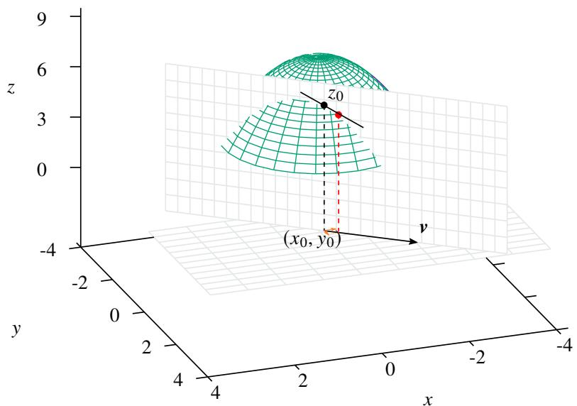  
图 4.1: 方向导数示意图

若 $f$ 在 $x _ { 0 }$ 处沿方向 $\pmb { u }$ 的方向导数为 $\ell .$ , 则 $f$ 在 $x _ { 0 }$ 处沿方向 $- { \pmb u }$ 的方向导数为

$$
\lim _ {t \to 0} \frac {f [ \pmb {x} _ {0} + t (- \pmb {u}) ] - f (\pmb {x} _ {0})}{t} = - \lim _ {t \to 0} \frac {f (\pmb {x} _ {0} + (- t) \pmb {u}) - f (\pmb {x} _ {0})}{- t} = - \lim _ {t \to 0} \frac {f (\pmb {x} _ {0} + t \pmb {u}) - f (\pmb {x} _ {0})}{t} = - \ell .
$$

这表明 $f$ 在 $x _ { 0 }$ 处沿着 $\pmb { u }$ 和 $- { \pmb u }$ 的方向导数绝对值相等, 只差一个符号.

令一元函数 $\varphi ( t ) = f ( \pmb { x } _ { 0 } + t \pmb { u } )$ , 则 $\varphi$ 在 $| t |$ 充分小时有定义, 且

$$
\varphi^ {\prime} (0) = \lim  _ {t \rightarrow 0} \frac {\varphi (t) - \varphi (0)}{t} = \lim  _ {t \rightarrow 0} \frac {f \left(\boldsymbol {x} _ {0} + t \boldsymbol {u}\right) - f \left(\boldsymbol {x} _ {0}\right)}{t} = \frac {\partial f}{\partial \boldsymbol {u}} (\boldsymbol {x} _ {0}).
$$

于是方向导数可以转化为一元函数的导数. 下面来看一个例子.

例 4.1 设二元函数

$$
f (x, y) = \left\{ \begin{array}{l l} \frac {2 x y}{x ^ {2} + y ^ {2}}, & (x, y) \neq (0, 0) \\ 1, & (x, y) = (0, 0) \end{array} \right..
$$

讨论 $f ( x , y )$ 在 $\mathbf { \nabla } \mathbf { x } _ { 0 } = \mathbf { 0 }$ 的方向导数.

解 任一方向向量都可以表示为 $\pmb { u } = ( \cos \theta , \sin \theta )$ , 其中 $\theta \in [ 0 , 2 \pi )$ . 令 $\varphi ( t ) = f ( \pmb { x } _ { 0 } + t \pmb { u } )$ , 则

$$
\varphi (t) = \left\{ \begin{array}{l l} f (\boldsymbol {x} _ {0}) = f (0, 0) = 1, & t = 0 \\ f (\boldsymbol {x} _ {0} + t \boldsymbol {u}) = f (t \cos \theta , t \sin \theta) = \sin 2 \theta , & t \neq 0 \end{array} \right..
$$

若要 $\varphi ( t )$ 在 0 处可导, 则需要 $\varphi ( t )$ 在 0 处连续, 因此

$$
1 = \varphi (0) = \lim  _ {t \rightarrow 0} \varphi (t) = \sin 2 \theta .
$$

故 $\theta = \pi / 4$ 或 $5 \pi / 4$ 此时 $\varphi ( t ) \equiv 1$ . 故 $\varphi ^ { \prime } ( 0 ) = 0$ . 于是可知 $f$ 在 $\mathbf { \delta } _ { \mathbf { \boldsymbol { x } } _ { 0 } } = \mathbf { \delta } \mathbf { \boldsymbol { 0 } }$ 处只有在 $\left( \sqrt { 2 } / 2 , \sqrt { 2 } / 2 \right) , \left( - \sqrt { 2 } / 2 , - \sqrt { 2 } / 2 \right)$ 两个方向上有方向导数, 且方向导数都为零.

特别地, 在 $\mathbb { R } ^ { n }$ 中, 单位坐标向量是最简单的. 因此它们的方向导数也应该是最容易计算的.

# 定义 4.2 (偏导数)

设函数 $f : D \to \mathbb { R } .$ , 其中 $D$ 是 $\mathbb { R } ^ { n }$ 上的一个开集. 我们称 $f$ 在点 $\scriptstyle { \boldsymbol { x } } _ { 0 }$ 处沿第 $i$ 个单位坐标向量 $e _ { i }$ 的方向导数为 $f$ 在 $x _ { 0 }$ 处的第 $i$ 个偏导数 (partial derivative), 记作

$$
\frac {\partial f}{\partial x _ {i}} (\pmb {x} _ {0}) \quad \text {或} \quad f _ {x _ {i}} ^ {\prime} (\pmb {x} _ {0}) \quad \text {或} \quad \mathcal {D} _ {x _ {i}} f (\pmb {x} _ {0}).
$$

我们来试着计算 $f$ 在 $\pmb { x } _ { 0 } = \left( x _ { 1 } , x _ { 2 } , \cdots , x _ { n } \right)$ 处的偏导数 $f _ { 1 } ^ { \prime } ( { \pmb x } _ { 0 } )$ . 由定义可知

$$
\frac {\partial f}{\partial x _ {1}} \left(\boldsymbol {x} _ {0}\right) = \lim  _ {t \rightarrow 0} \frac {f \left(\boldsymbol {x} _ {0} + t \boldsymbol {e} _ {1}\right) - f \left(\boldsymbol {x} _ {0}\right)}{t} = \lim  _ {t \rightarrow 0} \frac {f \left(x _ {1} + t , x _ {2} , \cdots , x _ {n}\right) - f \left(x _ {1} , x _ {2} , \cdots , x _ {n}\right)}{t}.
$$

于是引出了偏导数的等价定义.

# 定义 4.3 (偏导数)

设函数 $f : D \to \mathbb { R } ,$ , 其中 $D$ 是 $\mathbb { R } ^ { n }$ 上的一个开集. 取一点 $\pmb { x } _ { 0 } = ( x _ { 1 } , \cdot \cdot \cdot , x _ { n } ) \in D$ . 若以下极限存在且有限:

$$
\lim  _ {t \rightarrow 0} \frac {f (x _ {1} , \cdots , x _ {i} + t , \cdots , x _ {n}) - f (x _ {1} , \cdots , x _ {i} , \cdots , x _ {n})}{t}.
$$

则把极限值称为 $f$ 在点 $\scriptstyle { \boldsymbol { x } } _ { 0 }$ 处关于 $x _ { i }$ 的偏导数 (partial derivative), 记作

$$
\frac {\partial f}{\partial x _ {i}} (x _ {0}) \quad \text {或} \quad f _ {x _ {i}} ^ {\prime} (x _ {0}) \quad \text {或} \quad \mathcal {D} _ {x _ {i}} f (x _ {0}).
$$

注 以上三种记号是沿袭了一元函数的导数,

<table><tr><td></td><td>Lagrange 记号</td><td>Leibnitz 记号</td><td>Euler 记号</td></tr><tr><td>导数</td><td>f&#x27;</td><td>\(\frac{df}{dx}\)</td><td>\(\mathcal{D}f\)</td></tr><tr><td>偏导数</td><td>f&#x27;_x</td><td>\(\frac{\partial f}{\partial x}\)</td><td>\(\mathcal{D}_xf\)</td></tr></table>

$\frac { \partial f } { \partial x }$ 和 $\mathcal { D } _ { x }$ 称为偏微分算子 (partial differential operator). $\mathcal { D } _ { x _ { i } }$ 也可以记作 $\mathcal { D } _ { 1 }$ , $f _ { x _ { i } } ^ { \prime }$ 也可以记作 $f _ { 1 } ^ { \prime }$ . $\mathcal { D } _ { x }$ 偏微分符号 ??

是微分符号 d 的变体, 由法国数学家 Adrien-Marie Legendre 引入, 但直到普鲁士数学家 Jacobi 重新引入后才得到普遍接受.

以上定义这表明, 计算偏导数本质上和计算一元函数的导数没有区别, 计算 $f _ { i } ^ { \prime } ( { \pmb x } _ { 0 } )$ 时, 只需对 $x _ { i }$ 求导, 而把除了 $x _ { i }$ 以外的变量看作常数. 下面来看几个计算偏导数的例子.

# 例 4.2 设三元函数

$$
f (x, y, z) = x ^ {2} + y + \cos y ^ {2} z.
$$

求 $f ( x , y , z )$ 的三个偏导数.

解 计算得

$$
\frac {\partial f}{\partial x} (x, y, z) = 2 x. \quad \frac {\partial f}{\partial y} (x, y, z) = 1 - 2 y z \sin y ^ {2} z. \quad \frac {\partial f}{\partial z} (x, y, z) = - y ^ {2} \sin y ^ {2} z.
$$

例 4.3 设 $n$ 元函数

$$
f (\boldsymbol {x}) = \| \boldsymbol {x} \|.
$$

求 $f$ 的偏导数.

解 设 $\pmb { x } = ( x _ { 1 } , x _ { 2 } , \cdots , x _ { n } )$ , 则

$$
f (\boldsymbol {x}) = \left(x _ {1} ^ {2} + x _ {2} ^ {2} + \dots + x _ {n} ^ {2}\right) ^ {1 / 2}.
$$

当 $\mathbf { \nabla } _ { \mathbf { \boldsymbol { x } } } \neq \mathbf { \boldsymbol { 0 } }$ 时, $f$ 的第 $i$ 个偏导数为

$$
\frac {\partial f}{\partial x _ {i}} (\boldsymbol {x}) = \frac {1}{2} \left(x _ {1} ^ {2} + x _ {2} ^ {2} + \dots + x _ {n} ^ {2}\right) ^ {- 1 / 2} \cdot 2 x _ {i} = \frac {x _ {i}}{\| \boldsymbol {x} \|}, \quad i = 1, 2, \dots , n.
$$

当 $\mathbf { \nabla } \mathbf { x } = \mathbf { 0 }$ 时, 对于任一方向向量都有

$$
\frac {f (\boldsymbol {x} + t \boldsymbol {u}) - f (\boldsymbol {x})}{t} = \frac {\| t \boldsymbol {u} \|}{t} = \frac {| t |}{t} = \left\{ \begin{array}{l l} 1, & t > 0 \\ - 1, & t <   0 \end{array} \right..
$$

当 $t  0$ 时, 上式极限不存在. 这表明 $f$ 在 $\mathbf { \nabla } \mathbf { x } = \mathbf { 0 }$ 处的任何方向导数都不存在, 从而所有偏导数也都不存在.

注 函数 $f ( \pmb { x } ) = \| \pmb { x } \|$ 的图像是一个顶点在原点的 “圆锥”.

例 4.4 在三角形中由余弦定理可知以下函数关系:

$$
a = \sqrt {b ^ {2} + c ^ {2} - 2 b c \cos A}.
$$

求 $a$ 的所有偏导数.

解 计算可知:

$$
\frac {\partial a}{\partial b} = \frac {2 b - 2 c \cos A}{2 \sqrt {b ^ {2} + c ^ {2}} - 2 b c \cos A} = \frac {b - c \cos A}{a}.
$$

对称地可知

$$
\frac {\partial a}{\partial c} = \frac {c - b \cos A}{a}.
$$

计算可知

$$
\frac {\partial a}{\partial A} = \frac {2 b c \sin A}{2 \sqrt {b ^ {2} + c ^ {2} - 2 b c \cos A}} = \frac {b c \sin A}{a}.
$$

物理中的方程大多数涉及 2 个以上变量, 即使是最简单的均速直线运动方程 $\nu = s / t$ . 在中学时, 我们已经知道可以用“控制变量法”研究多变量之间的依赖关系,事实上这就是偏导数的思想——固定其余变量,使得多元函数变成一个一元函数. 下面就来看一个物理学的例子.

例 4.5 Clapeyron 方程 热力学中有一个很重要的理想气体的 Clapeyron 方程

$$
p V = R T,
$$

其中 $p$ 是理想气体的压强, ?? 是体积, $R$ 是理想气体常数. 方程中的 3 个变量分别可以看作其他 2 个变量的函数.求 $p , V , T$ 的所有偏导数.

解 分别写出三个变量的显示函数表达式:

$$
p = R \frac {T}{V}, \qquad V = R \frac {T}{p}, \qquad T = \frac {1}{R} p V.
$$

计算可知

$$
\frac {\partial p}{\partial T} = \frac {R}{V}, \quad \frac {\partial p}{\partial V} = - \frac {R T}{V ^ {2}}.
$$

$$
\frac {\partial V}{\partial T} = \frac {R}{p}, \quad \frac {\partial V}{\partial p} = - \frac {R T}{p ^ {2}}.
$$

$$
\frac {\partial T}{\partial p} = \frac {V}{R}, \qquad \frac {\partial T}{\partial V} = \frac {p}{R}.
$$

注 由以上计算结果可知

$$
\frac {\partial p}{\partial V} \frac {\partial V}{\partial T} \frac {\partial T}{\partial p} = - \frac {R T}{V ^ {2}} \frac {R}{p} \frac {V}{R} = \frac {R T}{p V} = - 1.
$$

这是热力学中的一个重要规律. 从这个等式可知偏导记号中的 $\frac { \partial p } { \partial V }$ 不能看作 $\partial p$ 和 $\partial V$ 的商.

分段函数的偏导数只能用偏导数的定义来计算.

例 4.6 设函数

$$
f (x, y) = \left\{ \begin{array}{l l} y \ln \left(x ^ {2} + y ^ {2}\right), & (x, y) \neq (0, 0) \\ 1, & (x, y) = (0, 0) \end{array} \right..
$$

求 $f$ 在 $( 0 , 0 )$ 处的两个偏导数.

解 由定义可知

$$
\frac {\partial f}{\partial x} (0, 0) = \lim  _ {t \rightarrow 0} \frac {f (t , 0) - f (0 , 0)}{t} = 0.
$$

由于

$$
\lim  _ {t \rightarrow 0} \frac {f (0 , t) - f (0 , 0)}{t} = \ln t ^ {2} = - \infty .
$$

因此 $f _ { \mathrm { y } } ^ { \prime }$ 不存在.

我们知道, 一元函数在 $x _ { 0 }$ 处可导, 意味着在这一点连续. 但如果多元函数 $f$ 在 $x _ { 0 }$ 处所有的偏导数都存在, 则不意味着 $f$ 在 $\scriptstyle { \boldsymbol { x } } _ { 0 }$ 处连续, 甚至不能推得 $f$ 在 $\scriptstyle { \boldsymbol { x } } _ { 0 }$ 有极限. 下面看一个例子.

例 4.7 设函数

$$
f (x, y) = \left\{ \begin{array}{l l} 1, & x y \neq 0 \\ 0, & x y = 0 \end{array} \right..
$$

则在 $( 0 , 0 )$ 处 $f _ { x } ^ { \prime }$ 和 $f _ { \mathrm { y } } ^ { \prime }$ 都存在, 但 $f$ 在 $( 0 , 0 )$ 的极限不存在.

解 由定义可知

$$
\frac {\partial f}{\partial x} (0, 0) = \lim  _ {t \rightarrow 0} \frac {f (t , 0) - f (0 , 0)}{t} = 0.
$$

$$
\frac {\partial f}{\partial y} (0, 0) = \lim  _ {t \rightarrow 0} \frac {f (0 , t) - f (0 , 0)}{t} = 0.
$$

取点列

$$
\boldsymbol {a} _ {n} = \left(0, \frac {1}{n}\right)\rightarrow (0, 0), \quad \boldsymbol {b} _ {n} = \left(\frac {1}{n}, \frac {1}{n}\right)\rightarrow (0, 0).
$$

则

$$
f (\boldsymbol {a} _ {n}) \equiv 0, \qquad f (\boldsymbol {b} _ {n}) \equiv 1.
$$

因此 $f$ 在 $( 0 , 0 )$ 处极限不存在.

在偏导数都存在的情况下, 需要满足什么条件可以使得函数连续呢?

# 命题 4.1

设开集 $D$ 上的的二元函数 $f ( x , y )$ . 若两个偏导数 $f _ { x } ^ { \prime } , f _ { y } ^ { \prime }$ 在 $( x _ { 0 } , y _ { 0 } )$ 的某个邻域内存在且有界, 则 $f$ 在 $( x _ { 0 } , y _ { 0 } )$ 处连续.

证明 令 $\Delta f = f ( x _ { 0 } + \Delta x , y _ { 0 } + \Delta y ) - f ( x _ { 0 } , y _ { 0 } ) ,$ . 由一元函数的 Lagrange 中值定理可知

$$
\begin{array}{l} \Delta f = f \left(x _ {0} + \Delta x, y _ {0} + \Delta y\right) - f \left(x _ {0}, y _ {0} + \Delta y\right) + f \left(x _ {0}, y _ {0} + \Delta y\right) - f \left(x _ {0}, y _ {0}\right) \\ = \frac {\partial f}{\partial x} \left(x _ {0} + \theta_ {1} \Delta x, y _ {0} + \Delta y\right) \Delta x + \frac {\partial f}{\partial y} \left(x _ {0}, y _ {0} + \theta_ {2} \Delta y\right) \Delta y, \\ \end{array}
$$

其中 $\theta _ { 1 } , \theta _ { 2 } \in ( 0 , 1 )$ . 由于 $f _ { x } ^ { \prime } , f _ { y } ^ { \prime }$ 在 $( x _ { 0 } , y _ { 0 } )$ 的某个邻域内存在且有界, 故

$$
\lim  _ {(\Delta x, \Delta y) \rightarrow (0, 0)} \Delta f = 0.
$$

于是可知 $f$ 在 $( x _ { 0 } , y _ { 0 } )$ 处连续.

对于二元函数, 偏导数有很清楚的几何意义, 如图4.2所示. 设二元函数 $f : D \to \mathbb { R } ,$ , 其中 $D$ 是 $\mathbb { R } ^ { 2 }$ 上的一个区域. 此时 $z = f ( x , y )$ 在 3 维 Euclid 空间 $\mathbb { R } ^ { 3 }$ 中的图像是点集

$$
G (f) = \{(x, y, f (x, y)) \mid (x, y) \in D \}
$$

它是一张曲面, 平行于 $z$ 轴的直线至多与该曲面有一个交点. 任取一点 $( x _ { 0 } , y _ { 0 } ) \in D$ , 令 $z _ { 0 } = f ( x _ { 0 } , y _ { 0 } )$ . 现假设 $f$ 在$( x _ { 0 } , y _ { 0 } )$ 处的两个偏导数都存在.

先来看 $f _ { \mathrm { y } } ^ { \prime } ( x _ { 0 } , y _ { 0 } )$ 几何意义. 作平面 $y = y _ { 0 }$ 与曲面 $z = f ( x , y )$ 的交线:

$$
\Gamma_ {1}: \left\{ \begin{array}{l} z = f (x, y) \\ y = y _ {0} \end{array} \right.
$$

它是一条平面曲线. 过点 $( x _ { 0 } , y _ { 0 } , z _ { 0 } )$ 可以作一条 $\Gamma _ { 1 }$ 的切线, 切线的方向就是 $( 1 , 0 , f _ { \mathrm { y } } ^ { \prime } ( x _ { 0 } , y _ { 0 } ) )$ , 切线的方程就是

$$
\frac {x - x _ {0}}{1} = \frac {y - y _ {0}}{0} = \frac {z - z _ {0}}{f _ {y} ^ {\prime} (x _ {0} , y _ {0})}.
$$

如果投影到 $x z O$ 平面上看, 这条直线就是

$$
\frac {x - x _ {0}}{1} = \frac {z - z _ {0}}{f _ {y} ^ {\prime} (x _ {0} , y _ {0})} \iff z = f _ {y} ^ {\prime} (x _ {0}, y _ {0}) (x - x _ {0}) + z _ {0}.
$$

此时偏导数 $f _ { \mathrm { y } } ^ { \prime } ( x _ { 0 } , y _ { 0 } )$ 就是该直线的斜率.

另一个偏导数 $f _ { x } ^ { \prime } ( x _ { 0 } , y _ { 0 } )$ 的几何意义也是类似的. 作平面 $x = x _ { 0 }$ 与曲面 $z = f ( x , y )$ 的交线:

$$
\Gamma_ {2}: \left\{ \begin{array}{l} z = f (x, y) \\ x = x _ {0} \end{array} \right.
$$

过点 $( x _ { 0 } , y _ { 0 } , f ( x _ { 0 } , y _ { 0 } ) )$ 可以作一条 $\Gamma _ { 2 }$ 的切线, 切线的方向就是 $( 0 , 1 , f _ { x } ^ { \prime } ( x _ { 0 } , y _ { 0 } ) )$ , 切线方程就是

$$
\frac {x - x _ {0}}{0} = \frac {y - y _ {0}}{1} = \frac {z - z _ {0}}{f _ {x} ^ {\prime} (x _ {0} , y _ {0})}.
$$

如果投影到 $y z O$ 平面上看, 这条直线就是

$$
\frac {y - y _ {0}}{1} = \frac {z - z _ {0}}{f _ {x} ^ {\prime} (x _ {0} , y _ {0})} \Longleftrightarrow z = f _ {x} ^ {\prime} (x _ {0}, y _ {0}) (y - y _ {0}) + z _ {0}.
$$

此时偏导数 $f _ { x } ^ { \prime } ( x _ { 0 } , y _ { 0 } )$ 就是该直线的斜率.

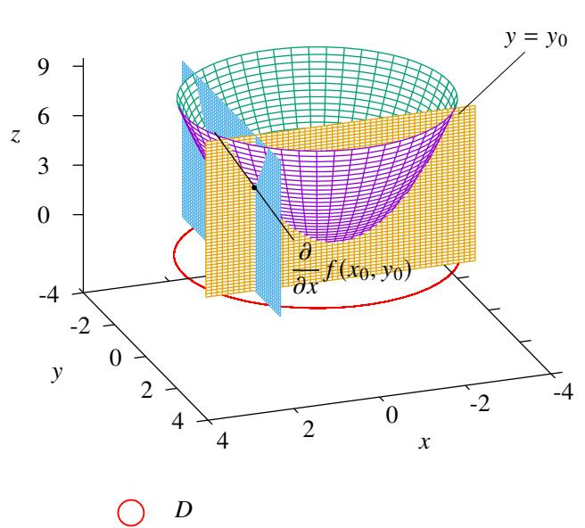

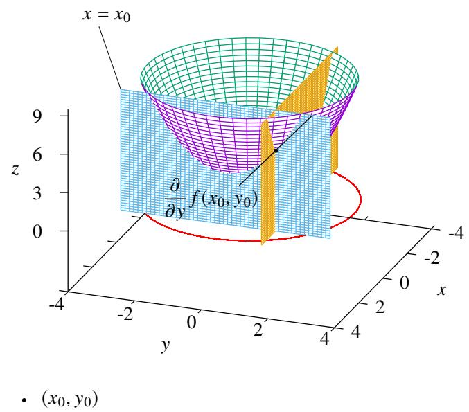  
图 4.2: 偏导数的几何意义

# 4.1.2 多元函数的全微分

现在来回忆一下一元函数微分的概念. 设函数 $y = f ( x )$ , 取一点 $x _ { 0 }$ , 令 $y _ { 0 } = f ( x _ { 0 } )$ . 若自变量在 $x _ { 0 }$ 处有一个增量 $\Delta x$ , 则函数值 $y _ { 0 }$ 也会产生一个增量 $\Delta y$ , 因此 $\Delta y$ 是 $\Delta x$ 的函数. 如果直接计算 $\Delta y$ 可能是十分复杂的:

$$
\Delta y = f (x _ {0} + \Delta x) - f (x _ {0}).
$$

于是我们考虑当增量 $\Delta x$ 非常小的时候, 能不能把增量 $\Delta y$ 近似地看作 $\Delta x$ 的线性映射, 即是否存在 $\lambda \in \mathbb { R }$ 使得

$$
\Delta y \approx \lambda \Delta x.
$$

更准确地说就是, 能不能找到 $\lambda \in \mathbb { R }$ 使得

$$
\Delta y = \lambda \Delta x + o (\Delta x), \quad \Delta x \rightarrow 0. \tag {4.1}
$$

如果存在这样的 $\lambda$ , 就说函数 $f$ 在 $x _ { 0 }$ 处可微, 线性映射 $\lambda \Delta x$ 就称为 $f$ 在 $x _ { 0 }$ 处的微分, 记作 $\mathrm { d } y = \lambda \Delta x .$ . 我们还知道如果函数 $f$ 在 $x _ { 0 }$ 处可微当且仅当它在 $x _ { 0 }$ 处可导, 且微分的系数恰好就是 $f ^ { \prime } ( x _ { 0 } )$ . 另一方面, 可以把 $x$ 看作正比例函数 $f ( x ) = x$ , 显然它在任一点都可微, 且 $\mathrm { d } x = \Delta x$ . 于是我们可以把 $\Delta x$ 都记作 $\mathrm { d } x .$ . 于是就有

$$
\mathrm {d} y = f ^ {\prime} \left(x _ {0}\right) \mathrm {d} x.
$$

下面希望把微分的概念推广到多元函数中. 设二元函数 $z = f ( x , y )$ . 取一点 $( x _ { 0 } , y _ { 0 } )$ , 令 $z _ { 0 } = f ( x _ { 0 } , z _ { 0 } )$ . 若自变量在 $( x _ { 0 } , y _ { 0 } )$ 处有一个增量 $( \Delta x , \Delta y )$ , 注意函数的两个自变量同时发生了改变, 这和偏导数中的增量不同, 我们称这样的增量为全增量.于是函数值 $z _ { 0 }$ 也会产生一个增量 $\Delta z$ ,因此 $\Delta z$ 是 $( \Delta x , \Delta y )$ 的函数.如果直接计算 $\Delta y$ 可能是十分复杂的:

$$
\Delta z = f (x _ {0} + \Delta x, y _ {0} + \Delta y) - f (x _ {0}, y _ {0}).
$$

于是我们考虑当增量 $( \Delta x , \Delta y ) \to ( 0 , 0 )$ 时, 把增量 $\Delta z$ 近似地看作 $( \Delta x , \Delta y )$ 的线性映射. 这里和一元函数不同, 这里的线性映射是一个 $\mathbb { R } ^ { 2 } \to \mathbb { R }$ 的映射, 因此线性映射的 “系数” 不再是一个实数, 而是一个 $1 \times 2$ 的矩阵:

$$
\Delta z \approx [ \lambda_ {1}, \lambda_ {2} ] \left[ \begin{array}{c} \Delta x \\ \Delta y \end{array} \right].
$$

我们希望仿照一元函数的微分定义式, 把上式写成无穷小增量公式. 这里的问题是等式4.1中的 $o ( \Delta x )$ 应该变成什么. 注意到此时的极限过程是 $( \Delta x , \Delta y )  ( 0 , 0 )$ , 即两个偏增量同时趋于无穷小, 由于

$$
(\Delta x, \Delta y) \rightarrow (0, 0) \iff \sqrt {\Delta x ^ {2} + \Delta y ^ {2}} \rightarrow 0
$$

因此我们可以考虑用 $o \left( \sqrt { \Delta x ^ { 2 } + \Delta y ^ { 2 } } \right)$ 代替等式4.1中的 $o ( \Delta x )$ . 于是就有

$$
\Delta z = [ \lambda_ {1}, \lambda_ {2} ] \left[ \begin{array}{c} \Delta x \\ \Delta y \end{array} \right] + o \left(\sqrt {\Delta x ^ {2} + \Delta y ^ {2}}\right), \quad (\Delta x, \Delta y) \to (0, 0).
$$

至此我们已经成功地把一元函数的微分推广到了多元函数.

# 定义 4.4 (多元函数的全微分)

设函数 $f : D \to \mathbb { R } .$ , 其中 $D$ 是 $\mathbb { R } ^ { n }$ 上的一个开集. 给定 $\pmb { x } _ { 0 } \in D$ . 若存在 $\lambda = \left( \lambda _ { 1 } , \lambda _ { 2 } , \cdots , \lambda _ { n } \right)$ 使得

$$
f \left(\boldsymbol {x} _ {0} + \boldsymbol {h}\right) - f \left(\boldsymbol {x} _ {0}\right) = \lambda \boldsymbol {h} + o (\| \boldsymbol {h} \|), \quad \| \boldsymbol {h} \| \rightarrow 0,
$$

其中 $\pmb { h } = ( h _ { 1 } , h _ { 2 } , \cdots , h _ { n } ) ^ { T }$ 是全增量, 则称函数 $f$ 在点 $\scriptstyle { \boldsymbol { x } } _ { 0 }$ 处可微 (differentiable). 并称关于 $\pmb { h }$ 的线性映射 ????为 $f$ 在 $\scriptstyle { \boldsymbol { x } } _ { 0 }$ 处的全微分 (total differential), 简称微分. 记作

$$
\mathrm {d} f \left(\boldsymbol {x} _ {0}\right) = \lambda \boldsymbol {h}.
$$

若 $f$ 在 $D$ 上的每一点都可微, 则称 $f$ 是 $D$ 上的一个可微函数 (differentiable function).

下面我们先来确定上述定义中的线性映射 $\lambda h$ 的系数??.令 $y = f ( { \pmb x } )$ .为了简化问题,不妨令 $\pmb { h } = ( 0 , \cdots , h _ { i } , \cdots , 0 )$ .这时

$$
f \left(x _ {1}, \dots , x _ {i} + h _ {i}, \dots , x _ {n}\right) - f \left(x _ {1}, \dots , x _ {i}, \dots , x _ {n}\right) = \lambda_ {i} h _ {i} + o \left(\left| h _ {i} \right|\right).
$$

于是

$$
\frac {\partial y}{\partial x _ {i}} = \lim  _ {h _ {i} \rightarrow 0} \frac {f (x _ {1} , \cdots , x _ {i} + h _ {i} , \cdots , x _ {n}) - f (x _ {1} , \cdots , x _ {i} , \cdots , x _ {n})}{h _ {i}} = \lambda_ {i}, \quad i = 1, 2, \dots , n.
$$

于是我们就完全确定了全微分的系数 ??,它的第 $i$ 个分量 $\lambda _ { i }$ 恰好是 $f$ 在 $x _ { 0 }$ 处的第 $i$ 个偏导数 $y _ { i } ^ { \prime }$ .于是我们可以把$f$ 在 $\scriptstyle x _ { 0 }$ 的全微分写成

$$
\mathrm {d} y = \left[ \frac {\partial y}{\partial x _ {1}}, \frac {\partial y}{\partial x _ {2}}, \dots , \frac {\partial y}{\partial x _ {n}} \right] \left[ \begin{array}{c} h _ {1} \\ h _ {2} \\ \vdots \\ h _ {n} \end{array} \right].
$$

设投影

$$
f _ {i} \left(x _ {1}, x _ {2}, \dots , x _ {n}\right) = x _ {i}, \quad i = 1, 2, \dots , n.
$$

则

$$
\mathrm {d} x _ {i} = \mathrm {d} f _ {i} = \frac {\partial f}{\partial x _ {1}} h _ {1} + \dots + \frac {\partial f}{\partial x _ {i}} h _ {i} + \dots + \frac {\partial x _ {i}}{\partial x _ {n}} h _ {n} = h _ {i}, \quad i = 1, 2, \dots , n.
$$

因此我们可以把 $h _ { 1 }$ 看作是自变量 $x _ { i }$ 的微分 ${ \mathrm { d } } x _ { i }$ . 于是全微分可以表示为

$$
\mathrm {d} y = \left[ \begin{array}{c} \frac {\partial y}{\partial x _ {1}}, \frac {\partial y}{\partial x _ {2}}, \dots , \frac {\partial y}{\partial x _ {n}} \end{array} \right] \left[ \begin{array}{c} \mathrm {d} x _ {1} \\ \mathrm {d} x _ {2} \\ \vdots \\ \mathrm {d} x _ {n} \end{array} \right].
$$

为了简洁, 我们可以令

$$
\nabla y := \left[ \frac {\partial y}{\partial x _ {1}}, \frac {\partial y}{\partial x _ {2}}, \dots , \frac {\partial y}{\partial x _ {n}} \right],
$$

或

$$
\boldsymbol {j} y := \left[ \frac {\partial y}{\partial x _ {1}}, \frac {\partial y}{\partial x _ {2}}, \dots , \frac {\partial y}{\partial x _ {n}} \right],
$$

于是

$$
\mathrm {d} y = \nabla y h.
$$

我们把

$$
\frac {\partial y}{\partial x _ {1}} \mathrm {d} x _ {i}, \quad i = 1, 2, \dots , n
$$

称为函数 $f$ 关于 $x _ { i }$ 的偏微分 (partial differential), 记作 ${ \mathrm { d } } _ { i } y$ $\mathrm { d } _ { i } y ( i = 1 , 2 , \cdots , n )$ . 如此一来偏导数也可以表示成两个微分的商:

$$
{\frac {\partial y}{\partial x _ {1}}} = {\frac {\mathrm {d} _ {i} y}{\mathrm {d} x _ {i}}}.
$$

现在我们来总结一下以上讨论的内容.

# 定理 4.1

设函数 $y = f ( { \pmb x } )$ 在 $x _ { 0 }$ 处可微. 则它在 $\scriptstyle { \boldsymbol { x } } _ { 0 }$ 的全微分等于每个变量偏微分的线性组合, 其中系数分别为各个变量在 $\scriptstyle { \boldsymbol { x } } _ { 0 }$ 处的偏导数, 即

$$
\mathrm {d} y = \sum_ {i = 1} ^ {n} \mathrm {d} _ {i} y = \sum_ {i = 1} ^ {n} \frac {\partial y}{\partial x _ {i}}   \mathrm {d} x _ {i} = \left[ \frac {\partial y}{\partial x _ {1}}, \frac {\partial y}{\partial x _ {2}}, \dots , \frac {\partial y}{\partial x _ {n}} \right] \left[ \begin{array}{c} \mathrm {d} x _ {1} \\ \mathrm {d} x _ {2} \\ \vdots \\ \mathrm {d} x _ {n} \end{array} \right] = \nabla y \boldsymbol {h}.
$$

有时候函数可微也可以用另一种形式定义.

# 定理 4.2

设函数 $f : D \to \mathbb { R } ,$ , 其中 $D$ 是 $\mathbb { R } ^ { n }$ 上的一个开集. 给定 $\pmb { x } _ { 0 } \in D$ . 则函数 $f$ 在 $x _ { 0 }$ 可微当且仅当

$$
f (\boldsymbol {x} _ {0} + \boldsymbol {h}) - f (\boldsymbol {x} _ {0}) = \nabla f (\boldsymbol {x} _ {0}) \boldsymbol {h} + \sum_ {i = 1} ^ {n} \varepsilon_ {i} (\boldsymbol {h}) h _ {i}.
$$

当 $\| \pmb { h } \|  0$ 时, $\varepsilon _ { i } ( \pmb { h } )  0 ( i = 1 , 2 , \cdots )$ $\varepsilon _ { i } ( \pmb { h } )  0$ .

证明 (i) 证明充分性. 由于 $\varepsilon _ { i } ( \pmb { h } )  0 ( i = 1 , 2 , \cdots )$ , 故

$$
\left| \frac {1}{\| \boldsymbol {h} \|} \sum_ {i = 1} ^ {n} \varepsilon_ {i} (\boldsymbol {h}) h _ {i} \right| = \left| \sum_ {i = 1} ^ {n} \varepsilon_ {i} (\boldsymbol {h}) \frac {h _ {i}}{\| \boldsymbol {h} \|} \right| \leq \sum_ {i = 1} ^ {n} \left| \varepsilon_ {i} (\boldsymbol {h}) \frac {h _ {i}}{\| \boldsymbol {h} \|} \right| \leq \sum_ {i = 1} ^ {n} | \varepsilon_ {i} (\boldsymbol {h}) | \to 0, \quad \| \boldsymbol {h} \| \to 0.
$$

这表明 $\begin{array} { r } { \sum _ { i = 1 } ^ { n } \varepsilon _ { i } ( { \pmb h } ) h _ { i } = o ( \| { \pmb h } \| ) } \end{array}$ . 于是可知 $f$ 在 $x _ { 0 }$ 可微.

(ii) 证明必要性. 设 $f$ 在 $x _ { 0 }$ 可微, 则

$$
f (\boldsymbol {x} _ {0} + \boldsymbol {h}) - f (\boldsymbol {x} _ {0}) = \nabla f (\boldsymbol {x} _ {0}) \boldsymbol {h} + o (\| \boldsymbol {h} \|), \quad \| \boldsymbol {h} \| \rightarrow 0,
$$

令

$$
r (\boldsymbol {h}) = f (\boldsymbol {x} _ {0} + \boldsymbol {h}) - f (\boldsymbol {x} _ {0}) - \nabla f (\boldsymbol {x} _ {0}) \boldsymbol {h}.
$$

则当 $\| h \| \to 0$ 时, $r ( h ) = o ( \left\| h \right\| )$ . 由于

$$
r (\boldsymbol {h}) = r (\boldsymbol {h}) \sum_ {i = 1} ^ {n} \frac {h _ {i} ^ {2}}{\| \boldsymbol {h} \| ^ {2}} = \frac {r (\boldsymbol {h})}{\| \boldsymbol {h} \|} \sum_ {i = 1} ^ {n} \frac {h _ {i}}{\| \boldsymbol {h} \|} h _ {i}.
$$

因此可令

$$
\varepsilon_ {i} (\boldsymbol {h}) = \frac {r (\boldsymbol {h})}{\| \boldsymbol {h} \|} \cdot \frac {h _ {i}}{\| \boldsymbol {h} \|}.
$$

由于

$$
\left| \frac {h _ {i}}{\| \boldsymbol {h} \|} \right| \leq 1, \quad i = 1, 2, \dots , n.
$$

因此 $\varepsilon _ { i } ( h ) \to 0$ $\varepsilon _ { i } ( \pmb { h } )  0 ( i = 1 , 2 , \cdots )$ . 且满足

$$
f (\boldsymbol {x} _ {0} + \boldsymbol {h}) - f (\boldsymbol {x} _ {0}) = \nabla f (\boldsymbol {x} _ {0}) \boldsymbol {h} + \sum_ {i = 1} ^ {n} \varepsilon_ {i} (\boldsymbol {h}) h _ {i}.
$$

利用全微分和偏导数的关系, 可以巧妙地解决一些偏导数的计算问题.

例 4.8 设 Vandermonde 行列式

$$
u = \left| \begin{array}{c c c c} 1 & 1 & \dots & 1 \\ x _ {1} & x _ {2} & \dots & x _ {n} \\ x _ {1} ^ {2} & x _ {2} ^ {2} & \dots & x _ {n} ^ {2} \\ \vdots & \vdots & & \vdots \\ x _ {1} ^ {n - 1} & x _ {2} ^ {n - 1} & \dots & x _ {n} ^ {n - 1} \end{array} \right|.
$$

则

(1) $\sum _ { i = 1 } ^ { n } { \frac { \partial u } { \partial x _ { i } } } = 0 ,$

(2) $\sum _ { i = 1 } ^ { n } x _ { i } { \frac { \partial u } { \partial x _ { i } } } = { \frac { n ( n - 1 ) } { 2 } } u .$

解 $u$ 是一个多项式函数, 显然可微, 故

$$
u \left(\boldsymbol {x} _ {0} + \boldsymbol {h}\right) - u \left(\boldsymbol {x} _ {0}\right) = \left(\frac {\partial y}{\partial x _ {1}}, \frac {\partial y}{\partial x _ {2}}, \dots , \frac {\partial y}{\partial x _ {n}}\right) \boldsymbol {h} + o (\| \boldsymbol {h} \|), \quad \| \boldsymbol {h} \| \rightarrow 0,
$$

其中 $\pmb { h } = ( h _ { 1 } , h _ { 2 } , \cdots , h _ { n } ) ^ { T }$ .

(1) 令 $h _ { 1 } = h _ { 2 } = \cdot \cdot \cdot = h _ { n } = h .$ . 由于

$$
u = \prod_ {1 \leq i <   j \leq n} \left(x _ {j} - x _ {i}\right).
$$

故

$$
u \left(\boldsymbol {x} _ {0} + \boldsymbol {h}\right) - u \left(\boldsymbol {x} _ {0}\right) = \prod_ {1 \leq i <   j \leq n} \left[ \left(x _ {j} + h\right) - \left(x _ {i} + h\right) \right] - \prod_ {1 \leq i <   j \leq n} \left(x _ {j} - x _ {i}\right) = 0.
$$

于是

$$
0 = h \sum_ {i = 1} ^ {n} \frac {\partial u}{\partial x _ {i}} + o (h), \quad h \rightarrow 0,
$$

这表明

$$
\sum_ {i = 1} ^ {n} \frac {\partial u}{\partial x _ {i}} = 0.
$$

(2) 令 $h _ { i } = x _ { i } h$ $( i = 1 , 2 , \cdots , n )$ , 则

$$
u \left(\boldsymbol {x} _ {0} + \boldsymbol {h}\right) - u \left(\boldsymbol {x} _ {0}\right) = \prod_ {1 \leq i <   j \leq n} \left[ \left(x _ {j} + x _ {j} h\right) - \left(x _ {i} + x _ {i} h\right) \right] - \prod_ {1 \leq i <   j \leq n} \left(x _ {j} - x _ {i}\right) = \left[ (h + 1) ^ {\mathrm {C} _ {n} ^ {2}} - 1 \right] u.
$$

于是

$$
\left[ (h + 1) ^ {\mathrm {C} _ {n} ^ {2}} - 1 \right] u = h \sum_ {i = 1} ^ {n} x _ {i} \frac {\partial u}{\partial x _ {i}} + o (h), \quad h \to 0,
$$

于是可知

$$
\sum_ {i = 1} ^ {n} x _ {i} \frac {\partial u}{\partial x _ {i}} = \lim  _ {h \rightarrow 0} \frac {\left[ (h + 1) ^ {\mathrm {C} _ {n} ^ {2}} - 1 \right] u}{h} = \mathrm {C} _ {n} ^ {2} u = \frac {n (n - 1)}{2} u.
$$

我们知道任何一个方向向量都可以用基向量线性表出, 而基向量的方向导数就是偏导数. 因此很自然地想法是: 方向导数能不能用偏导数线性表出? 如果函数可微, 则这个想法是可以实现的.

# 定理 4.3 (方向导数的分解)

设函数 $f$ 在 $\scriptstyle { \boldsymbol { x } } _ { 0 }$ 处可微, 则 $f$ 在 $\scriptstyle { \boldsymbol { x } } _ { 0 }$ 处沿任一方向 $\pmb { u }$ 的方向导数为

$$
\frac {\partial f}{\partial \boldsymbol {u}} (\boldsymbol {x} _ {0}) = \left[ \frac {\partial f}{\partial x _ {1}} (\boldsymbol {x} _ {0}), \frac {\partial f}{\partial x _ {2}} (\boldsymbol {x} _ {0}), \dots , \frac {\partial f}{\partial x _ {n}} (\boldsymbol {x} _ {0}) \right] \left[ \begin{array}{c} u _ {1} \\ u _ {2} \\ \vdots \\ u _ {n} \end{array} \right] = \nabla f (\boldsymbol {x} _ {0}) \boldsymbol {u}. \tag {4.2}
$$

证明 由于 $f$ 在 $x _ { 0 }$ 处可微, 故

$$
f (\boldsymbol {x} _ {0} + t \boldsymbol {u}) - f (\boldsymbol {x} _ {0}) = \nabla f (\boldsymbol {x} _ {0}) t \boldsymbol {u} + o (t).
$$

于是可知

$$
\frac {\partial f}{\partial \boldsymbol {u}} (\boldsymbol {x} _ {0}) = \lim  _ {t \rightarrow 0} \frac {f (\boldsymbol {x} _ {0} + t \boldsymbol {u}) - f (\boldsymbol {x} _ {0})}{t} = \nabla f (\boldsymbol {x} _ {0}) \boldsymbol {u}.
$$

注 对于二元函数, 方向向量通常写成 (cos ??,sin ??), 而三元函数的方向通常可以用方向余弦 $( \cos \alpha , \cos \beta , \cos \gamma ,$ ) 表示, 其中 $\alpha , \beta , \gamma$ 分别是这一方向与 $x , y , z$ 轴的夹角.

再次考察一下公式4.2. 设向量 $\nabla f ( \mathbf { x } _ { 0 } )$ 和 $\pmb { u }$ 的夹角为 $\theta$ , 则

$$
\frac {\partial f}{\partial \boldsymbol {u}} (\boldsymbol {x} _ {0}) = \nabla f (\boldsymbol {x} _ {0}) \boldsymbol {u} = | \nabla f (\boldsymbol {x} _ {0}) | \cos \theta .
$$

因此当 $\cos \theta = 1$ , 即 $\theta = 0$ 时方向导数取到最大值. 这表明函数 $f$ 沿着向量 $\nabla f (  { \mathbf { x } } _ { 0 } )$ 的方向导数是最大的, 换句话说函数 $f$ 沿着 $\nabla f (  { \boldsymbol { { x } } } _ { 0 } )$ 方向的增速最快. 因此向量 $\nabla f (  { \boldsymbol { { x } } } _ { 0 } )$ 就有了明确的几何意义, 我们称它为梯度 (gradient), 因此 $\nabla f (  { \boldsymbol { { x } } } _ { 0 } )$ 也可以记作 grad $f (  { \boldsymbol { { x } } } _ { 0 } )$ .

我们来看一个例子. 我们分别用定义和以上公式求函数的一个方向导数.

例 4.9 设函数

$$
f (x, y) = (x - 1) ^ {2} - y ^ {2}
$$

求 $f$ 在 $\pmb { x } _ { 0 } = ( 0 , 1 )$ 处沿方向 ${ \pmb u } = ( 3 / 5 , - 4 / 5 )$ 的方向导数.

解 解法一 令

$$
\varphi (t) = f \left(\boldsymbol {x} _ {0} + t \boldsymbol {u}\right) = f \left(\frac {3 t}{5}, 1 - \frac {4 t}{5}\right) = \left(\frac {3 t}{5} - 1\right) ^ {2} - \left(1 - \frac {4 t}{5}\right) ^ {2} = - \frac {7}{2 5} t ^ {2} + \frac {2}{5} t.
$$

于是

$$
\frac {\partial f}{\partial \boldsymbol {u}} (\boldsymbol {x} _ {0}) = \varphi^ {\prime} (0) = \frac {2}{5}.
$$

解法二 函数 $f$ 在 $x _ { 0 }$ 的两个偏导数为

$$
\left. \frac {\partial f}{\partial x} \left(\boldsymbol {x} _ {0}\right) = 2 (x - 1) \right| _ {(0, 1)} = - 2, \quad \left. \frac {\partial f}{\partial y} \left(\boldsymbol {x} _ {0}\right) = - 2 y \right| _ {(0, 1)} = - 2.
$$

于是可知 $f$ 在 $\pmb { x } _ { 0 } = ( 0 , 1 )$ 处沿方向 ${ \pmb u } = ( 3 / 5 , - 4 / 5 )$ 的方向导数为

$$
\frac {\partial f}{\partial \boldsymbol {u}} (\boldsymbol {x} _ {0}) = \frac {\partial f}{\partial x} (\boldsymbol {x} _ {0}) u _ {1} + \frac {\partial f}{\partial x} (\boldsymbol {x} _ {0}) u _ {2} = \frac {2}{5}.
$$

很多问题用方向导数的偏导数分解公式可以顺利解决. 下面看一个例子.

例 4.10 设函数 $f ( x , y , z )$ 在 $\mathbb { R } ^ { 3 }$ 上可微. 若 $u , \nu , w$ 是三个互相垂直的方向向量. 则

$$
\left(\frac {\partial f}{\partial \boldsymbol {u}}\right) ^ {2} + \left(\frac {\partial f}{\partial \boldsymbol {v}}\right) ^ {2} + \left(\frac {\partial f}{\partial \boldsymbol {w}}\right) ^ {2} = \left(\frac {\partial f}{\partial x}\right) ^ {2} + \left(\frac {\partial f}{\partial y}\right) ^ {2} + \left(\frac {\partial f}{\partial z}\right) ^ {2}.
$$

证明 设 $\pmb { u } = [ u _ { 1 } , u _ { 2 } , u _ { 3 } ] ^ { T } , \pmb { \nu } = [ \nu _ { 1 } , \nu _ { 2 } , \nu _ { 3 } ] ^ { T } , \pmb { w } = [ w _ { 1 } , w _ { 2 } , w _ { 3 } ] ^ { T } .$ $\pmb { u } = [ u _ { 1 } , u _ { 2 } , u _ { 3 } ] ^ { T }$ . 令 $\pmb { A } = [ \pmb { u } , \pmb { \nu } , \pmb { w } ]$ 则

$$
\left[ \frac {\partial f}{\partial \boldsymbol {u}}, \frac {\partial f}{\partial \boldsymbol {v}}, \frac {\partial f}{\partial \boldsymbol {w}} \right] = \left[ \frac {\partial f}{\partial x}, \frac {\partial f}{\partial y}, \frac {\partial f}{\partial z} \right] \left[ \begin{array}{c c c} u _ {1} & v _ {1} & w _ {1} \\ u _ {2} & v _ {2} & w _ {2} \\ u _ {3} & v _ {3} & w _ {3} \end{array} \right] = \nabla f \boldsymbol {A}.
$$

于是

$$
\left(\frac {\partial f}{\partial \boldsymbol {u}}\right) ^ {2} + \left(\frac {\partial f}{\partial \boldsymbol {v}}\right) ^ {2} + \left(\frac {\partial f}{\partial \boldsymbol {w}}\right) ^ {2} = \nabla f \boldsymbol {A} (\nabla f \boldsymbol {A}) ^ {T} = \nabla f \boldsymbol {A} \boldsymbol {A} ^ {T} \nabla f \boldsymbol {A} ^ {T} = \nabla f (\nabla f) ^ {T} = \left(\frac {\partial f}{\partial x}\right) ^ {2} + \left(\frac {\partial f}{\partial y}\right) ^ {2} + \left(\frac {\partial f}{\partial z}\right) ^ {2}.
$$

我们已经知道, 偏导数是只让一个变量发生改变, 其余变量全部固定. 而全微分是允许所有变量全部发生改变. 现在我们来研究一种中间状态: 让其中一部分变量变得, 固定其余变量. 设开集 $D$ 上的一个 $n + p$ 元函数. 为了简洁, 我们把 $\mathbb { R } ^ { n + p }$ 看作 $\mathbb { R } ^ { n } \times \mathbb { R } ^ { p }$ :

$$
f: D \to \mathbb {R} ^ {n}
$$

$$
(x, y) \mapsto f (x, y),
$$

其中 $\pmb { x } = \left( x _ { 1 } , \cdots , x _ { n } \right)$ , $\boldsymbol { y } = ( y _ { 1 } , \cdots , y _ { p } )$ . 模仿偏导数和全微分的定义, 可以定义只有 $\boldsymbol { x }$ 变化或只有 $\textbf {  { y } }$ 变化时的 “可微性”.

# 定义 4.5 (偏微分)

设函数 $f : D \to \mathbb { R } ,$ , 其中 $D$ 是 $\mathbb { R } ^ { n } \times \mathbb { R } ^ { p }$ 上的一个开集. 给定 $( { \pmb x } _ { 0 } , { \pmb y } _ { 0 } ) \in D$ . 若存在 $\lambda = \left( \lambda _ { 1 } , \lambda _ { 2 } , \cdots , \lambda _ { n } \right)$ 使得

$$
f \left(\boldsymbol {x} _ {0} + \boldsymbol {h}, \boldsymbol {y} _ {0}\right) - f \left(\boldsymbol {x} _ {0}, \boldsymbol {y} _ {0}\right) = \lambda_ {\boldsymbol {x}} \boldsymbol {h} + o (\| \boldsymbol {h} \|), \quad \| \boldsymbol {h} \| \rightarrow 0,
$$

其中 $\pmb { h } = ( h _ { 1 } , h _ { 2 } , \cdots , h _ { n } ) ^ { T }$ 是 $\boldsymbol { x }$ 的增量, 则称函数 $f$ 在 $( \boldsymbol { x } _ { 0 } , \boldsymbol { y } _ { 0 } )$ 处对 $\boldsymbol { x }$ 可微 (differentiable). 并称关于 $\pmb { h }$ 的线性映射 $\lambda _ { x } h$ 为 $f$ 在 $( \boldsymbol { x } _ { 0 } , \boldsymbol { y } _ { 0 } )$ 处对 $\boldsymbol { x }$ 的偏微分 (partial differential), 记作

$$
\mathrm {d} _ {x} f \left(x _ {0}, y _ {0}\right) = \lambda_ {x} h.
$$

以上定义中的 $n = 1$ 时, $\lambda _ { x }$ 就是 $x$ 的偏导数:

$$
f (x _ {0} + h, \mathbf {y} _ {0}) - f (x _ {0}, \mathbf {y} _ {0}) = \frac {\partial f}{\partial x} (x, \mathbf {y} _ {0}) h + o (h), \quad h \to 0,
$$

当 $p = 0$ 时, 偏微分就成了全微分. 因此不难猜到知道一下结论.

# 定理 4.4

设函数 $n + p$ 元函数 $f ( { \pmb x } , { \pmb y } )$ 在 $( { \pmb x } _ { 0 } , { \pmb y } _ { 0 } ) \in D$ 处对 $\boldsymbol { x }$ 可微, 则它在 $( \boldsymbol { x } _ { 0 } , \boldsymbol { y } _ { 0 } )$ 处对于 $\boldsymbol { x }$ 的偏微分等于 $\boldsymbol { x }$ 的每个变量偏微分的线性组合, 其中系数分别为各个变量在 $( \boldsymbol { x } _ { 0 } , \boldsymbol { y } _ { 0 } )$ 处的偏导数, 即

$$
\mathrm {d} _ {\boldsymbol {x}} f (\boldsymbol {x} _ {0}, \boldsymbol {y} _ {0}) = \sum_ {i = 1} ^ {n} \mathrm {d} _ {x _ {i}}   y = \sum_ {i = 1} ^ {n} \frac {\partial f}{\partial x _ {i}} (\boldsymbol {x} _ {0}, \boldsymbol {y} _ {0})   \mathrm {d} x _ {i} = \left[ \frac {\partial f}{\partial x _ {1}} (\boldsymbol {x} _ {0}, \boldsymbol {y} _ {0}), \frac {\partial f}{\partial x _ {2}} (\boldsymbol {x} _ {0}, \boldsymbol {y} _ {0}), \dots , \frac {\partial f}{\partial x _ {n}} (\boldsymbol {x} _ {0}, \boldsymbol {y} _ {0}) \right] \left[ \begin{array}{c} \mathrm {d}   x _ {1} \\ \mathrm {d}   x _ {2} \\ \vdots \\ \mathrm {d}   x _ {n} \end{array} \right].
$$

为了记号简洁, 可以令

$$
\boldsymbol {J} _ {\boldsymbol {x}} f (\boldsymbol {x} _ {0}, \boldsymbol {y} _ {0}) = \left[ \frac {\partial f}{\partial x _ {1}} (\boldsymbol {x} _ {0}, \boldsymbol {y} _ {0}), \dots , \frac {\partial f}{\partial x _ {n}} (\boldsymbol {x} _ {0}, \boldsymbol {y} _ {0}) \right], \quad \boldsymbol {J} _ {\boldsymbol {y}} f (\boldsymbol {x} _ {0}, \boldsymbol {y} _ {0}) = \left[ \frac {\partial f}{\partial y _ {1}} (\boldsymbol {x} _ {0}, \boldsymbol {y} _ {0}), \dots , \frac {\partial f}{\partial y _ {p}} (\boldsymbol {x} _ {0}, \boldsymbol {y} _ {0}) \right].
$$

不难看出, 若 $f$ 在 $( \boldsymbol { x } _ { 0 } , \boldsymbol { y } _ { 0 } )$ 可微, 则

$$
\boldsymbol {J} f (\boldsymbol {x} _ {0}, \boldsymbol {y} _ {0}) = [ \boldsymbol {J} _ {\boldsymbol {x}} f (\boldsymbol {x} _ {0}, \boldsymbol {y} _ {0}), \boldsymbol {J} _ {\boldsymbol {y}} f (\boldsymbol {x} _ {0}, \boldsymbol {y} _ {0}) ].
$$

反之, 若向量值函数 $J _ { x } f$ 和 $J _ { y } f$ 在 $( \boldsymbol { x } _ { 0 } , \boldsymbol { y } _ { 0 } )$ 处连续, 则 $f$ 在 $( \boldsymbol { x } _ { 0 } , \boldsymbol { y } _ { 0 } )$ 处可微.

# 4.1.3 全微分的几何意义

下面来讨论微分的几何意义. 还是先来回顾一元函数微分的几何意义. 设函数 $y = f ( x )$ , 它的图像是一条平面曲线. 若 $f$ 在 $x _ { 0 }$ 处可微, 就可以在 $x _ { 0 }$ 处作一条切线

$$
\ell : y = f ^ {\prime} (x _ {0}) (x - x _ {0}) + y _ {0}.
$$

现在在 $x _ { 0 }$ 附近给一个增量 $\Delta x$ , 则 $f ( x )$ 也会产生一个增量, 这个增量是函数 $f$ 在 $x _ { 0 }$ 处的差分:

$$
\Delta y = f (x _ {0} + \Delta x) - f (x _ {0}).
$$

而且切线 $\ell$ 也同样会有一个增量, 这个增量就是函数 $f$ 在 $x _ { 0 }$ 处的微分:

$$
\mathrm {d} y = f ^ {\prime} \left(x _ {0}\right) \Delta x.
$$

由于

$$
\lim  _ {\Delta x \to 0} \frac {\Delta y}{\Delta x} = f ^ {\prime} (x _ {0}).
$$

故

$$
\Delta y - \mathrm {d} y = \Delta y - f ^ {\prime} (x _ {0}) \Delta x = o (\Delta x), \quad \Delta x \rightarrow 0.
$$

这表明当 $\Delta x$ 很小时, 差分和微分的误差是 $\Delta x$ 的一个高阶无穷小. 因此当 $\Delta x$ 很小时, 微分可以作为差分的近似.这就是一元微分的几何意义. 根据以上讨论, 我们可以用新的方法来定义切线.

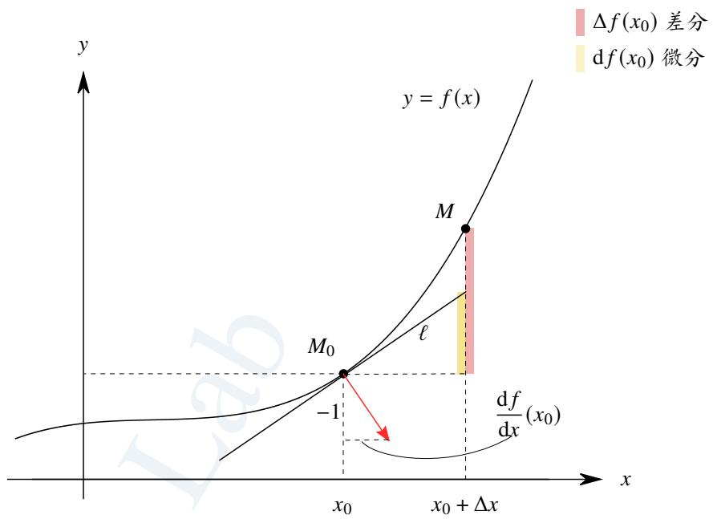  
图 4.3: 微分和差分的几何意义.

# 定义 4.6 (切线)

设曲线 $\Gamma : y = f ( x )$ , 取 $\Gamma$ 上一点 $M _ { 0 } ( x _ { 0 } , y _ { 0 } )$ . 过 $M _ { 0 }$ 作直线 $L : y = \ell ( x )$ . 任取 $\Gamma$ 上一点 $M ( x , y )$ . 若

$$
f (x) - \ell (x) = o (x - x _ {0}), \quad x \to x _ {0}.
$$

则称直线 $L$ 是曲线 $\Gamma$ 在 $x _ { 0 }$ 处的切线 (tangent line).

在以上定义下, 不难证明曲线 $y = f ( x )$ 在 $x _ { 0 }$ 处存在切线当且仅当函数 $f$ 在 $x _ { 0 }$ 处可微, 且切线方程的法向量是

$$
\boldsymbol {n} = \left(\frac {\mathrm {d} f}{\mathrm {d} x} (x _ {0}), - 1\right).
$$

从而切线方程是

$$
\frac {\mathrm {d} f}{\mathrm {d} x} (x _ {0}) (x - x _ {0}) - (y - y _ {0}) = 0.
$$

上述切线定义的好处是可以推广到三维空间, 这样就可以讨论二元函数微分的几何意义.

# 定义 4.7 (切面)

在 $\mathbb { R } ^ { 3 }$ 中设曲面 $S : z = f ( x , y )$ , 取 $s$ 上一点 $M _ { 0 } ( x _ { 0 } , y _ { 0 } , z _ { 0 } )$ . 过 $M _ { 0 }$ 作平面 $\pi : z = p ( x , y )$ . 任取 Γ 上一点$M ( x , y , z )$ . 若

$$
f (x, y) - p (x, y) = o \left(\sqrt {\Delta x ^ {2} + \Delta y ^ {2}}\right), \quad (x, y) \rightarrow (x _ {0}, y _ {0}).
$$

其中 $\Delta x = x - x _ { 0 }$ , $\Delta y = y - y _ { 0 }$ , 则称平面 $\pi$ 是曲面 $s$ 在 $( x _ { 0 } , y _ { 0 } )$ 处的切面 (tangent surface).

类比一元函数的情况, 我们有理由猜测以下结论.

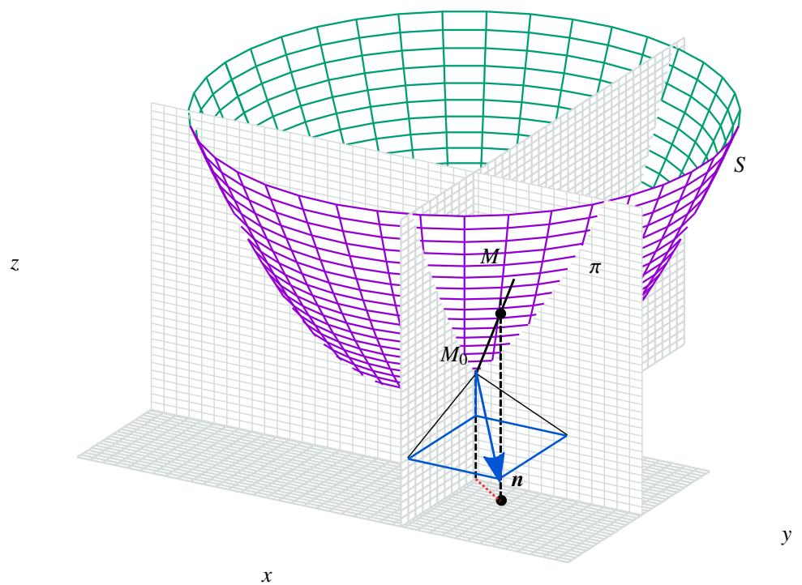  
图 4.4: 二元函数全微分的几何意义.

# 定理 4.5 (二元函数全微分的几何意义)

曲面 $S : z = f ( x , y )$ 在 $( x _ { 0 } , y _ { 0 } )$ 处存在切面当且仅当二元函数 $f ( x , y )$ 在 $( x _ { 0 } , y _ { 0 } )$ 处可微, 且切面方程的法向量是

$$
\boldsymbol {n} = \left(\frac {\partial f}{\partial x} \left(x _ {0}, y _ {0}\right), \frac {\partial f}{\partial y} \left(x _ {0}, y _ {0}\right), - 1\right).
$$

从而 $S : z = f ( x , y )$ 在 $( x _ { 0 } , y _ { 0 } )$ 的切面方程是

$$
\frac {\partial f}{\partial x} \left(x _ {0}, y _ {0}\right) \left(x - x _ {0}\right) + \frac {\partial f}{\partial x} \left(x _ {0}, y _ {0}\right) \left(y - y _ {0}\right) - (z - z _ {0}) = 0. \tag {4.3}
$$

其中 $z _ { 0 } = f ( x _ { 0 } , y _ { 0 } )$

证明 (i) 证明充分性. 设二元函数 $f ( x , y )$ 在 $( x _ { 0 } , y _ { 0 } )$ 处可微, 则

$$
f (x, y) = z _ {0} + A \Delta x + B \Delta y + o (r), \quad (\Delta x, \Delta y) \rightarrow (0, 0).
$$

其中

$$
A = \frac {\partial f}{\partial x} (x _ {0}, y _ {0}), \qquad B = \frac {\partial f}{\partial x} (x _ {0}, y _ {0}), \qquad \Delta x = x - x _ {0}, \qquad \Delta y = y - y _ {0}, \qquad r = \sqrt {\Delta x ^ {2} + \Delta y ^ {2}}.
$$

先证明切面的存在性. 设过点 $( x _ { 0 } , y _ { 0 } , z _ { 0 } )$ 的平面方程

$$
p (x, y) = A ^ {\prime} (x - x _ {0}) + B ^ {\prime} (y - y _ {0}) + z _ {0}.
$$

于是

$$
f (x, y) - p (x, y) = \left(A - A ^ {\prime}\right) \Delta x + \left(B - B ^ {\prime}\right) \Delta y + o (r), \quad (\Delta x, \Delta y) \rightarrow (0, 0).
$$

当 $A = A ^ { \prime }$ , $B = B ^ { \prime }$ 时

$$
f (x, y) - p (x, y) = o (r), \quad (\Delta x, \Delta y) \rightarrow (0, 0).
$$

因此方程4.3就是曲面 $S$ 在 $( x _ { 0 } , y _ { 0 } )$ 的切面方程. 下面证明切面的唯一性. 假设存在另一个切面, 则

$$
a \Delta x + b \Delta y = o (r), \quad (\Delta x, \Delta y) \rightarrow (0, 0).
$$

其中 $a = A - A ^ { \prime } \neq 0$ , $b = B - B ^ { \prime } \neq 0 .$ . 令 $\Delta x = r c o s \theta$ , Δ?? = ?? sin ??, 则

$$
0 = \lim  _ {r \rightarrow 0} \frac {a \Delta x + b \Delta y}{r} = \lim  _ {r \rightarrow 0} (a \sin \theta + b \cos \theta).
$$

出现矛盾. 于是可知切面是唯一存在的.

(ii) 证明必要性. 设曲面 $S : z = f ( x , y )$ 在 $( x _ { 0 } , y _ { 0 } )$ 处存在切面, 且切面方程是4.3, 写成显式方程, 即

$$
p (x, y) = \frac {\partial f}{\partial x} \left(x _ {0}, y _ {0}\right) \Delta x + \frac {\partial f}{\partial x} \left(x _ {0}, y _ {0}\right) \Delta y + z _ {0}
$$

其中 $\Delta x = x - x _ { 0 } , \Delta y = y - y _ { 0 } .$ 根据切面的定义可知

$$
o \left(\sqrt {\Delta x ^ {2} + \Delta y ^ {2}}\right) = f (x, y) - p (x, y) = f (x, y) - \frac {\partial f}{\partial x} \left(x _ {0}, y _ {0}\right) \Delta x - \frac {\partial f}{\partial x} \left(x _ {0}, y _ {0}\right) \Delta y - z _ {0}, \quad (\Delta x, \Delta y) \rightarrow (0, 0).
$$

这表明 $f ( x , y )$ 在 $( x _ { 0 } , y _ { 0 } )$ 处可微.

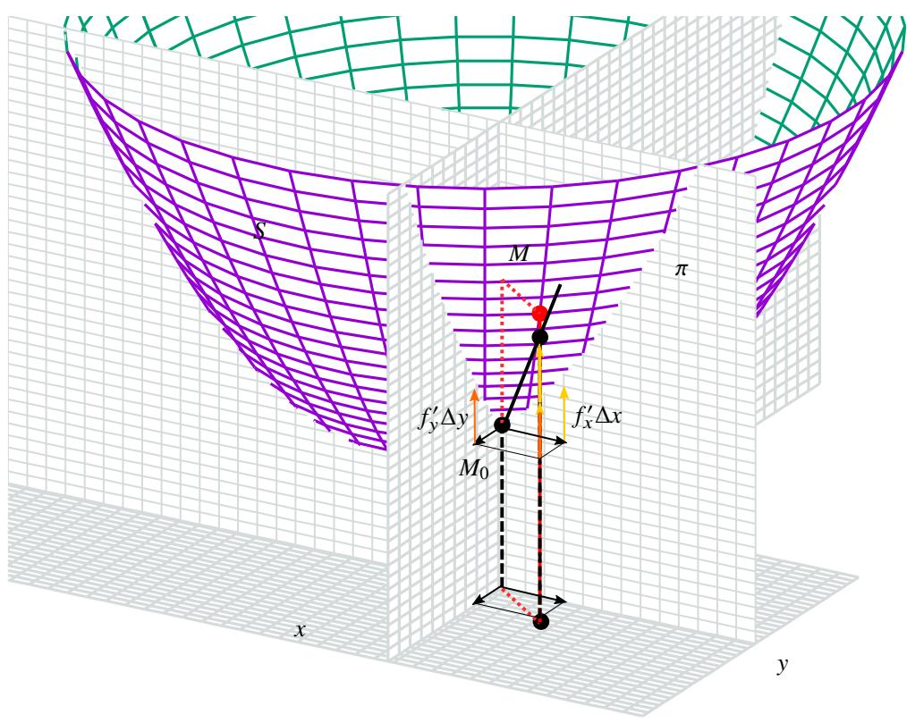  
图 4.5: 二元函数全微分分解.

# 4.1.4 多元函数可微的条件

下面我们来讨论函数可微的条件. 在一元函数中, 函数在一点可微至少要求在这一点连续. 多元函数的情况也一样.

# 定理 4.6 (多元函数可微的必要条件)

设 $n$ 元函数 $f$ 在 $\scriptstyle { \mathbf { \mathit { x } } } _ { 0 }$ 处可微, 则 $f$ 在 $\scriptstyle { \boldsymbol { x } } _ { 0 }$ 处连续.

证明 由于 $f$ 在 $x _ { 0 }$ 处可微, 因此

$$
f (\boldsymbol {x} _ {0} + \boldsymbol {h}) - f (\boldsymbol {x} _ {0}) = \nabla f (\boldsymbol {x} _ {0}) \boldsymbol {h} + o (\| \boldsymbol {h} \|), \quad \| \boldsymbol {h} \| \rightarrow 0.
$$

因此

$$
\lim  _ {\boldsymbol {h} \to \boldsymbol {0}} [ f (\boldsymbol {x} _ {0} + \boldsymbol {h}) - f (\boldsymbol {x} _ {0}) ] = 0.
$$

于是可知 $f$ 在 $\scriptstyle { \boldsymbol { x } } _ { 0 }$ 处连续.

我们已经知道一元函数 $f$ 在 $x _ { 0 }$ 处可微当且仅当它在 $x _ { 0 }$ 处可导. 那么如果一个多元函数在 $x _ { 0 }$ 处的偏导数都存在是否可以推出函数在这一点可微呢?

例 4.11 设二元函数

$$
f (x, y) = \left\{ \begin{array}{l l} \frac {x y}{x ^ {2} + y ^ {2}}, & (x, y) \neq (0, 0) \\ 0, & (x, y) = (0, 0) \end{array} \right..
$$

则 $f$ 在 0 的两个偏导数都存在, 但 $f ( x , y )$ 在 $\mathbf { \delta } _ { \mathbf { \boldsymbol { x } } _ { 0 } } = \mathbf { \delta } \mathbf { \boldsymbol { 0 } }$ 处不可微.

证明 由偏导数的定义可知 $f$ 在 0 的两个偏导数为:

$$
\frac {\partial f}{\partial x} (\mathbf {0}) = \lim  _ {t \rightarrow 0} \frac {f (0 + t , 0) - f (0 , 0)}{t} = 0,
$$

$$
\frac {\partial f}{\partial y} (\mathbf {0}) = \lim _ {t \to 0} \frac {f (0 , 0 + t) - f (0 , 0)}{t} = 0.
$$

由例2.34可知 $f$ 在 0 处不连续. 因此 $f$ 在 0 处不可微.

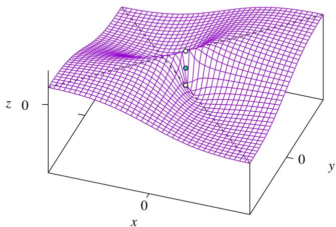  
图 4.6: 例题图.

以上例子这说明多元函数在一点的所有偏导数都存在也不足以推出在这里点可微. 事实上, 即使函数 $f$ 在一点 $\scriptstyle { \boldsymbol { x } } _ { 0 }$ 各个方向的方向导数都存在还是不足以推出函数在 $\scriptstyle { \mathbf { \mathit { x } } } _ { 0 }$ 处可微.

# 例 4.12 设函数

$$
f (x, y) = \left\{ \begin{array}{l l} \frac {x ^ {2} y}{x ^ {4} + y ^ {2}}, & (x, y) \neq (0, 0) \\ 0, & (x, y) = (0, 0) \end{array} \right..
$$

则 $f$ 在原点 0 处各个方向导数都存在, 但它在原点处不可微.

证明 设方向向量为 $\pmb { u } = ( \cos \theta , \sin \theta )$ , 其中 $\theta \in [ 0 , 2 \pi )$ . 令

$$
\varphi (t) = f (\mathbf {0} + t \mathbf {u}) = f (t \cos \theta , t \sin \theta).
$$

则

$$
\frac {\varphi (t) - \varphi (0)}{t} = \frac {f (t \cos \theta , t \sin \theta) - f (0 , 0)}{t} = \frac {\cos^ {2} \theta \sin \theta}{t ^ {2} \cos^ {4} \theta + \sin^ {2} \theta}.
$$

于是可知

$$
\varphi^ {\prime} (0) = \left\{ \begin{array}{l l} \frac {\cos^ {2} \theta}{\sin \theta}, & \sin \theta \neq 0 \\ 0, & \sin \theta = 0 \end{array} \right..
$$

于是可知 $f$ 在原点 0 处各个方向导数都存在. 由例2.22可知 $f$ 在 $\mathbf { 0 }$ 处不连续, 故它在 0 处不可微.

如果各个偏导数都存在, 且函数连续, 是否可以推得函数可微?

# 例 4.13 设函数

$$
f (x, y) = \left\{ \begin{array}{l l} \frac {x ^ {2} y}{x ^ {2} + y ^ {2}}, & (x, y) \neq (0, 0) \\ 0, & (x, y) = (0, 0) \end{array} \right..
$$

则

(1) $f$ 在原点 $( 0 , 0 )$ 处连续.   
(2) $f$ 在原点 $( 0 , 0 )$ 处的两个偏导数都存在.  
(3) $f$ 在的两个偏导数在原点 $( 0 , 0 )$ 处不连续.   
(4) $f$ 在 $( 0 , 0 )$ 处不可微.

证明 (1) 由于

$$
\lim  _ {(x, y) \rightarrow (0, 0)} f (x, y) = \lim  _ {(x, y) \rightarrow (0, 0)} \frac {x ^ {2} y}{x ^ {2} + y ^ {2}} = \lim  _ {r \rightarrow 0} \frac {r ^ {2} \cos \theta \cdot r \sin \theta}{r ^ {2}} = \lim  _ {r \rightarrow 0} r \cos^ {2} \theta \sin \theta = 0.
$$

因此 $f$ 在 $( 0 , 0 )$ 连续.

(2) 由偏导数的定义可知

$$
\begin{array}{l} \frac {\partial f}{\partial x} (0, 0) = \lim  _ {t \rightarrow 0} \frac {f (0 + t , 0) - f (0 , 0)}{t} = 0. \\ \frac {\partial f}{\partial y} (0, 0) = \lim _ {t \to 0} \frac {f (0 , 0 + t) - f (0 , 0)}{t} = 0. \\ \end{array}
$$

(3) 计算可知, 当 $( x , y ) \neq ( 0 , 0 )$ 时

$$
\frac {\partial f}{\partial x} (x, y) = \frac {2 x y ^ {3}}{\left(x ^ {2} + y ^ {2}\right) ^ {2}}, \quad \frac {\partial f}{\partial x} (x, y) = \frac {x ^ {2} \left(x ^ {2} - y ^ {2}\right)}{\left(x ^ {2} + y ^ {2}\right) ^ {2}}.
$$

对于 $f _ { x } ^ { \prime }$ , 取 $x = 2 / n \to 0$ , $y = 1 / n \to 0$ , 则

$$
\frac {\partial f}{\partial x} \left(\frac {2}{n}, \frac {1}{n}\right) = \frac {4}{2 5} \neq 0, \quad \frac {\partial f}{\partial x} \left(\frac {2}{n}, \frac {1}{n}\right) = \frac {1 2}{2 5} \neq 0.
$$

因此 $f _ { x } ^ { \prime } , f _ { y } ^ { \prime }$ 在 $( 0 , 0 )$ 处都不连续.

(4) 若 $f$ 在 $( 0 , 0 )$ 处可微, 则

$$
f \left(h _ {1}, h _ {2}\right) - f (0, 0) = \frac {\partial f}{\partial x} (0, 0) h _ {1} + \frac {\partial f}{\partial y} (0, 0) h _ {2} + o \left(\sqrt {h _ {1} ^ {2} + h _ {2} ^ {2}}\right) \Longleftrightarrow \frac {h _ {1} ^ {2} h _ {2}}{h _ {1} ^ {2} + h _ {2} ^ {2}} = o \left(\sqrt {h _ {1} ^ {2} + h _ {2} ^ {2}}\right)
$$

令 $h _ { 1 } = h _ { 2 } = h .$ , 则

$$
\frac {h}{2} = o \left(\sqrt {2} h\right) \Longleftrightarrow \frac {1}{2 \sqrt {2}} = o (1).
$$

这显然不成立. 于是可知 $f$ 在 $( 0 , 0 )$ 处不可微.

很自然的想法是, 把条件再加强一些, 如果偏导数连续, 是否可以确保函数可微?

# 定理 4.7 (多元函数可微的充分条件)

设函数 $f : D \to \mathbb { R } ,$ 其中 $D$ 是 $\mathbb { R } ^ { n }$ 中的一个开集. 若 $f$ 的各个偏导数 $f _ { i } ^ { \prime } ( x ) ~ ( i = 1 , 2 , \cdots , n )$ $f _ { i } ^ { \prime } ( { \pmb x } )$ 在 $\scriptstyle { \boldsymbol { x } } _ { 0 }$ 的一个邻域中都存在, 且在点 $x _ { 0 }$ 处都连续, 则 $f$ 在 $x _ { 0 }$ 处可微.

证明 对 $n$ 进行归纳. 当 $n = 1$ 时, 显然成立, 这是因为一元函数在一点可导当且仅当这一点可微. 假设 $n - 1$ 时命题成立. 下面来看 $n$ 时的情况. 令

$$
f (\boldsymbol {x} _ {0} + \boldsymbol {h}) - f (\boldsymbol {x} _ {0}) = d _ {1} + d _ {2},
$$

其中

$$
d _ {1} = f \left(x _ {1} + h _ {1}, \dots , x _ {n - 1} + h _ {n - 1}, x _ {n} + h _ {n}\right) - f \left(x _ {1} + h _ {1}, \dots , x _ {n - 1} + h _ {n - 1}, x _ {n}\right),
$$

$$
d _ {2} = f \left(x _ {1} + h _ {1}, \dots , x _ {n - 1} + h _ {n - 1}, x _ {n}\right) - f \left(x _ {1}, \dots , x _ {n - 1}, x _ {n}\right).
$$

对 $d _ { 1 }$ 使用一元函数的 Lagrange 中值定理, 即存在 $\theta \in ( 0 , 1 )$ 使得

$$
d _ {1} = f _ {n} ^ {\prime} (x _ {1} + h _ {1}, \dots , x _ {n - 1} + h _ {n - 1}, x _ {n} + \theta h _ {n}) h _ {n} = \left[ f _ {n} ^ {\prime} (x _ {1} + h _ {1}, \dots , x _ {n - 1} + h _ {n - 1}, x _ {n} + \theta h _ {n}) - f _ {n} ^ {\prime} (\boldsymbol {x} _ {0}) \right] h _ {n} + f _ {n} ^ {\prime} (\boldsymbol {x} _ {0}) h _ {n}.
$$

令

$$
\varepsilon_ {n} (\boldsymbol {h}) = f _ {n} ^ {\prime} \left(x _ {1} + h _ {1}, \dots , x _ {n - 1} + h _ {n - 1}, x _ {n} + \theta h _ {n}\right) - f _ {n} ^ {\prime} \left(\boldsymbol {x} _ {0}\right).
$$

则

$$
d _ {1} = f _ {n} ^ {\prime} (\boldsymbol {x} _ {0}) h _ {n} + \varepsilon_ {n} (\boldsymbol {h}) h _ {n}.
$$

由于 $f$ 的各个偏导数 $f _ { i } ^ { \prime } ( \pmb { x } ) ~ ( i = 1 , 2 , \cdots , n )$ 在 $x _ { 0 }$ 的一个邻域中都存在, 且在点 $x _ { 0 }$ 处都连续, 故

$$
\lim  _ {\| \boldsymbol {h} \| \to 0} \varepsilon_ {n} (\boldsymbol {h}) = \lim  _ {\| \boldsymbol {h} \| \to 0} f _ {n} ^ {\prime} (x _ {1} + h _ {1}, \dots , x _ {n - 1} + h _ {n - 1}, x _ {n} + \theta h _ {n}) - f _ {n} ^ {\prime} (\boldsymbol {x} _ {0}) = 0.
$$

另一方面, 由归纳假设可知

$$
d _ {2} = \sum_ {i = 1} ^ {n - 1} f _ {i} ^ {\prime} (\boldsymbol {x} _ {0}) h _ {i} + \sum_ {i = 1} ^ {n - 1} \varepsilon_ {i} (\boldsymbol {h}) h _ {i},
$$

其中 $\varepsilon _ { i } ( h ) \to 0$ $\varepsilon _ { i } ( h ) \to 0 \left( \left\| h \right\| \to 0 \right) ( i = 1 , 2 , \cdot \cdot \cdot , n - 1 )$ $\| \pmb { h } \|  0 \}$ 于是

$$
f \left(\boldsymbol {x} _ {0} + \boldsymbol {h}\right) - f \left(\boldsymbol {x} _ {0}\right) = d _ {1} + d _ {2} = \sum_ {i = 1} ^ {n} f _ {i} ^ {\prime} \left(\boldsymbol {x} _ {0}\right) h _ {i} + \sum_ {i = 1} ^ {n} \varepsilon_ {i} (\boldsymbol {h}) h _ {i}
$$

其中 $\varepsilon _ { i } ( h ) \to 0 ( \left\| h \right\| \to 0 ) ( i = 1 , 2 , \cdot \cdot \ , n )$ $\| h \|  0 )$ $( i = 1 , 2 , \cdots , n )$ . 于是可知 $f$ 在 $x _ { 0 }$ 处可微.

由数学归纳原理可知对于任一 $n \in \mathbb { N } ^ { * }$ 命题都成立.

偏导连续虽然可以推出函数可微, 却不是必要条件. 我们来看一个例子.

例 4.14 设二元函数

$$
f (x, y) = \left\{ \begin{array}{l l} \left(x ^ {2} + y ^ {2}\right) \sin \frac {1}{x ^ {2} + y ^ {2}}, & (x, y) \neq (0, 0) \\ 0, & (x, y) = (0, 0) \end{array} \right..
$$

则 $f$ 在 0 处可微, 但它的两个偏导数在 0 不连续.

证明 (i) 分别计算 $f$ 的两个偏导数. 当 $( x , y ) \neq ( 0 , 0 )$ 时

$$
\frac {\partial f}{\partial x} (x, y) = 2 x \sin \frac {1}{x ^ {2} + y ^ {2}} - \frac {2 x}{x ^ {2} + y ^ {2}} \cos \frac {1}{x ^ {2} + y ^ {2}}.
$$

$$
\frac {\partial f}{\partial y} (x, y) = 2 y \sin \frac {1}{x ^ {2} + y ^ {2}} - \frac {2 y}{x ^ {2} + y ^ {2}} \cos \frac {1}{x ^ {2} + y ^ {2}}.
$$

当 $( x , y ) = ( 0 , 0 )$ 时

$$
\frac {\partial f}{\partial x} (x, y) = \lim  _ {t \rightarrow 0} \frac {f (0 + t , 0) - f (0 , 0)}{t} = \lim  _ {t \rightarrow 0} t ^ {2} \sin \frac {1}{t ^ {2}} = 0,
$$

$$
\frac {\partial f}{\partial y} (x, y) = \lim  _ {t \rightarrow 0} \frac {f (0 , 0 + t) - f (0 , 0)}{t} = \lim  _ {t \rightarrow 0} t ^ {2} \sin \frac {1}{t ^ {2}} = 0.
$$

设两个点列 ${ \pmb a } _ { n } = \bigg ( 1 / \sqrt { 2 n \pi } , 0 \bigg ) , { \pmb b } _ { n } = \bigg ( 0 , 1 / \sqrt { 2 n \pi } \bigg )$ 则 ${ \pmb a } _ { n }  { \pmb 0 }$ $\mathbf { 0 } _ { n }  \mathbf { 0 } , b _ { n }  \mathbf { 0 } .$ ${ \pmb b } _ { n }  { \pmb 0 }$ 但

$$
\frac {\partial f}{\partial x} \left(\boldsymbol {a} _ {n}\right) = \frac {2}{\sqrt {2 n \pi}} \sin 2 n \pi - 2 \sqrt {2 n \pi} \cos 2 n \pi = - 2 \sqrt {2 n \pi} \rightarrow - \infty .
$$

$$
\frac {\partial f}{\partial y} \left(\boldsymbol {b} _ {n}\right) = \frac {2}{\sqrt {2 n \pi}} \sin 2 n \pi - 2 \sqrt {2 n \pi} \cos 2 n \pi = - 2 \sqrt {2 n \pi} \rightarrow - \infty .
$$

因此两个偏导数在 0 处的极限都不是 0, 因此它们在 0 处都不连续.

(ii) 由于

$$
\lim  _ {\| \boldsymbol {h} \| \rightarrow 0} \frac {f \left(h _ {1} , h _ {2}\right) - f (0 , 0) - f _ {x} ^ {\prime} (0 , 0) h _ {1} - f _ {y} ^ {\prime} (0 , 0) h _ {2}}{\| \boldsymbol {h} \|} = \lim  _ {\| \boldsymbol {h} \| \rightarrow 0} \| \boldsymbol {h} \| \sin \frac {1}{\| \boldsymbol {h} \| ^ {2}} = 0.
$$

这表明 $f$ 在 0 处可微.

现在我们可以来总结一下一元函数和多元函数中极限、连续、可导、可微这四个概念的关系了.

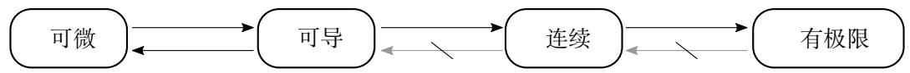  
图 4.7: 一元函数, 可导, 可微, 连续, 有极限的关系.

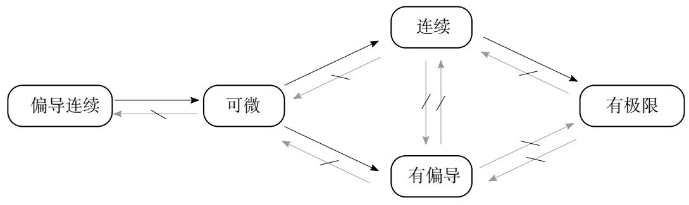  
图 4.8: 多元函数偏导连续, 可微, 连续, 有偏导, 有极限的关系.

于是可以总结出证明可微或不可微的方法:

(1) 证明不可微:   
(i) 证明函数的某个偏导不存在.  
(ii) 证明函数不连续.   
(iii) 直接用定义证明.  
(2) 证明可微:   
(i) 证明函数的所有偏导都存在且连续.  
(ii) 直接用定义证明.

# 4.1.5 用全微分估计误差

设一个物理量 $z = f ( x , y )$ , 其中 $x$ 和 $y$ 都可以通过测量得到. 现在假设测量得到的近似值分别为 $x ^ { \prime }$ 和 $y ^ { \prime }$ , 我们希望估计因此计算出的近似值 $z ^ { \prime } = f ( x ^ { \prime } , y ^ { \prime } )$ 产生的误差. 令

$$
\Delta x = x ^ {\prime} - x, \quad \Delta y = y ^ {\prime} - y, \quad \Delta z = z ^ {\prime} - z.
$$

通常我们把 $\Delta x , \Delta y$ 和 $\Delta z$ 称为绝对误差 (absolute error), 把 $\Delta x / x , \Delta y / y$ 和 $\Delta z / z$ 称为相对误差 (relative error). 若存在$\delta x , \delta y , \delta z > 0$ 使得

$$
| \Delta x | \leq \delta x, \qquad | \Delta y | \leq \delta x, \qquad | \Delta z | \leq \delta z,
$$

则称 $\delta x , \delta y$ 和 $\delta z$ 称为绝对误差限 , 称 $\delta x / | x | , \delta y / | y |$ 和 $\delta z / | z |$ 称为相对误差限.一般来说,我们可以确定 $\delta x$ 和 $\delta y$ . 我们想要知道的是 $\delta z$ , 这就是多元函数的误差估计问题.

用全微分就可以非常方便地估计误差. 根据全微分的定义可知:

$$
\mathrm {d} z = \frac {\partial z}{\partial x} \Delta x + \frac {\partial z}{\partial y} \Delta y
$$

当 $\Delta x$ 和 $\Delta y$ 非常小的时候 ${ \bf \nabla } \mathcal { S } \approx \mathrm { d } z$ , 因此

$$
| \Delta z | \approx | d z | \leq \left| \frac {\partial z}{\partial x} \right| | \Delta x | + \left| \frac {\partial z}{\partial y} \right| | \Delta y | \leq \left| \frac {\partial z}{\partial x} \right| \delta x + \left| \frac {\partial z}{\partial y} \right| \delta y.
$$

于是上述不等式右侧可以看作 ?? 的绝对误差限, 即

$$
\delta z = \left| \frac {\partial z}{\partial x} \right| \delta x + \left| \frac {\partial z}{\partial y} \right| \delta y.
$$

设二元函数 $z = x y$ . 在 $| z | = | x | | y |$ 两边取对数

$$
\ln | z | = \ln | x | + \ln | y |.
$$

对两边微分可得

$$
\frac {\Delta z}{| z |} = \frac {\Delta x}{| x |} + \frac {\Delta y}{| y |}
$$

于是

$$
\frac {\delta z}{| z |} = \frac {\delta x}{| x |} + \frac {\delta y}{| y |}.
$$

以上结论表明乘积的相对误差限等于各个因子的相对误差限的和类似可知以下命题. 类似地, 若 $z = x / y$ 则

$$
\frac {\delta z}{| z |} = \frac {\delta x}{| x |} - \frac {\delta y}{| y |}.
$$

下面看一个例子.

例 4.15 设直角三角形 ??????, 其中 $B$ 是直角. 已经测得 $| A B | = c$ 和 $\angle A$ . 则可以计算出

$$
a = c \tan A.
$$

请估计 $a$ 的误差.

解 根据误差估计公式可知

$$
\delta a = \frac {\partial a}{\partial c} \delta c + \frac {\partial a}{\partial A} \delta A = \tan A \delta c + \frac {c}{\cos^ {2} A} \delta A.
$$

注 若实际测量得到

$$
c = 1 2 1. 5 6 \pm 0. 0 5, \quad \angle A = 2 5 ^ {\circ} 2 1 ^ {\prime} 4 0 ^ {\prime \prime} \pm 1 2 ^ {\prime \prime}.
$$

计算可知

$$
a = c \tan A = 1 2 1. 5 6 \times \tan 2 5 ^ {\circ} 2 1 ^ {\prime} 4 0 ^ {\prime \prime} \approx 5 7. 6 2.
$$

下面来根据上例中的公式估计误差. 由于

$$
\delta c = 0. 0 5, \quad \delta A = \frac {1 2}{6 0 \times 6 0} \cdot \frac {2 \pi}{3 6 0} = \frac {\pi}{5 4 0 0 0}.
$$

于是

$$
\delta a = \tan A \delta c + \frac {c}{\cos^ {2} A} \delta A = \tan 2 5 ^ {\circ} 2 1 ^ {\prime} 4 0 ^ {\prime \prime} \times 0. 0 5 + \frac {1 2 1 . 5 6}{\cos^ {2} 2 5 ^ {\circ} 2 1 ^ {\prime} 4 0 ^ {\prime \prime}} \times \frac {\pi}{5 4 0 0 0} \approx 0. 0 3.
$$

因此我们可以把结果记成:

$$
a = 5 7. 6 2 \pm 0. 0 3.
$$

例 4.16 设三角形 ??????. 已经测得 $b , c$ 和 $\angle A$ . 用余弦定理可以计算出

$$
a = \sqrt {b ^ {2} + c ^ {2} - 2 b c \cos A}.
$$

请估计 $a$ 的误差.

解 根据误差估计公式可知

$$
\delta a = \frac {\partial a}{\partial b} \delta b + \frac {\partial a}{\partial c} \delta c + \frac {\partial a}{\partial A} \delta A. = \frac {b - c \cos A}{a} \delta b + \frac {c - b \cos A}{a} \delta c + \frac {b c \sin A}{a} \delta A.
$$

由于

$$
b - c \cos A = a \cos C, \quad c - b \cos A = a \cos B, \quad b c \sin A = a h,
$$

其中 $h$ 是 $a$ 的上的高. 于是

$$
\delta a = \cos C \delta b + \cos B \delta c + h \delta A.
$$

这样就得到了 $a$ 的误差估计公式.

# 4.1.6 向量值函数的微分和可微映射

下面我们把微分的概念推广到向量值函数中. 在此之前, 我们先来回顾一下微分的概念.

设一元实值函数 $f : D \to \mathbb { R }$ $( D \in \mathbb { R } )$ ) 在 $x _ { 0 }$ 处可微, 是指 $f$ 在 $x _ { 0 }$ 附近的增量可以近似为一个 $\mathbb { R } \to \mathbb { R }$ 的线性映射, 即

$$
f (x _ {0} + h) - f (x _ {0}) = \lambda h + o (h), \quad h \to 0.
$$

以上等式等价于

$$
\lim  _ {h \to 0} \frac {f (x _ {0} + h) - f (x _ {0}) - \lambda h}{h} = 0.
$$

我们把关于增量 $h$ 的线性映射 $\lambda h$ 称为 $f$ 在 $x _ { 0 }$ 处的微分. 其中系数 $\lambda$ 等于 $f$ 在 $x _ { 0 }$ 处的导数

$$
\lambda = \frac {\mathrm {d} f (x _ {0})}{\mathrm {d} x}.
$$

设 $n$ 元实值函数 $f : D \to \mathbb { R } \left( D \in \mathbb { R } ^ { n } \right)$ $D \in \mathbb { R } ^ { n } ,$ 在 $x _ { 0 }$ 处可微, 是指 $f$ 在 $x _ { 0 }$ 附近的增量可以近似为一个 $\mathbb { R } ^ { n } \to \mathbb { R }$ 的线性映射, 即

$$
f (\boldsymbol {x} _ {0} + \boldsymbol {h}) - f (\boldsymbol {x} _ {0}) = \boldsymbol {\lambda} \cdot \boldsymbol {h} + o (\| \boldsymbol {h} \|), \quad \| \boldsymbol {h} \| \rightarrow 0.
$$

以上等式等价于

$$
\lim_{\| \boldsymbol {h}\| \to 0}\frac{f(\boldsymbol{x}_{0} + \boldsymbol{h}) - f(\boldsymbol{x}_{0}) - \boldsymbol{\lambda}\cdot\boldsymbol{h}}{\|\boldsymbol{h}\|} = 0.
$$

这里的增量 $\pmb { h }$ 是一个 $n$ 维列向量, 为了使极限式有意义, 需要取 $\pmb { h }$ 的范数. 同样, 我们把关于增量 $\pmb { h }$ 的线性映射$\lambda \cdot h$ 称为 $f$ 在 $\scriptstyle { \boldsymbol { x } } _ { 0 }$ 处的微分. 这里的 $\lambda$ 是一个行向量, 它的第 $i$ 个分量是 $f$ 在 $x _ { 0 }$ 处的第 $i$ 个偏导数

$$
\boldsymbol {\lambda} = \left(\frac {\partial f (\boldsymbol {x} _ {0})}{\partial x _ {1}}, \frac {\partial f (\boldsymbol {x} _ {0})}{\partial x _ {2}}, \dots , \frac {\partial f (\boldsymbol {x} _ {0})}{\partial x _ {n}}\right).
$$

我们称这个行向量为 $f$ 在 $x _ { 0 }$ 的梯度, 记作 $\nabla f ( \mathbf { x } _ { 0 } )$ . 梯度实际上可以看作一个多元实值函数的导数.

通过以上的复习整理, 我们可以很容易地把微分的概念推广到向量值函数函数 $f : D \to \mathbb { R } ^ { m }$ $\mathbf { \Delta } ^ { \prime } D \in \mathbb { R } ^ { n } ,$ ). 如果$f$ 在 $x _ { 0 }$ 处可微则应该有等式

$$
\lim  _ {\| \boldsymbol {h} \| \rightarrow 0} \frac {\| \boldsymbol {f} (\boldsymbol {x} _ {0} + \boldsymbol {h}) - \boldsymbol {f} (\boldsymbol {x} _ {0}) - \boldsymbol {A h} \|}{\| \boldsymbol {h} \|} = 0.
$$

从前面情况类比可知, 此时函数 $f$ 的微分应该是一个 $\mathbb { R } ^ { n } \to \mathbb { R } ^ { m }$ 的线性映射 $\boldsymbol { A } \boldsymbol { h }$ , 因此 $\pmb { A }$ 应该是一个 $m \times n$ 矩阵.与前面两种情况不同的是,此时 $f ( { \pmb x } _ { 0 } + { \pmb h } ) - f ( { \pmb x } _ { 0 } ) - { \pmb A } { \pmb h }$ 是一个 $m$ 维向量,因此也需要把它变成范数. 其中分子是$\mathbb { R } ^ { m }$ 中的范数, 分母是 $\mathbb { R } ^ { n }$ 中的范数. 前面的一元或多元实值函数的微分与这个定义是一致的. 现在我们可以正式给出微分的定义了.

# 定义 4.8 (向量值函数的微分)

设向量值函数 $f : D \to \mathbb { R } ^ { m }$ , 其中 $D$ 是 $\mathbb { R } ^ { n }$ 中的一个开集. 给定 $\pmb { x } _ { 0 } \in D$ . 若存在 $m \times n$ 矩阵 $\pmb { A }$ 使得

$$
\lim  _ {\| \boldsymbol {h} \| \rightarrow 0} \frac {\| \boldsymbol {f} (\boldsymbol {x} _ {0} + \boldsymbol {h}) - \boldsymbol {f} (\boldsymbol {x} _ {0}) - \boldsymbol {A h} \|}{\| \boldsymbol {h} \|} = 0.
$$

则称 $f$ 在 $\scriptstyle { \boldsymbol { x } } _ { 0 }$ 处可微, 称线性映射 $_ { A h }$ 是 $f$ 在 $\scriptstyle { \boldsymbol { x } } _ { 0 }$ 处的微分. 记作 $\mathrm { d } f ( { \boldsymbol { x } } _ { 0 } ) = A h$ .

注 若 $f$ 在 $D$ 上每一点都可微, 则称 $f$ 在 $D$ 上可微, 此时对于给定的 $\pmb { h }$ 微分 $\mathcal { A } h$ 是 $\boldsymbol { x }$ 的向量值函数, 若它在 $D$ 上连续, 则称 $f$ 在 $D$ 上连续可微, 记作 $f \in C ^ { 1 } ( D )$ .

注 由于 $\mathbb { R } ^ { n }$ 中的范数都是等价的, 因此不同范数下的微分都是等价的.

注 由于 $f ( { \pmb x } _ { 0 } + { \pmb h } ) - f ( { \pmb x } _ { 0 } )$ 和 $_ { A h }$ 都是 $m$ 维向量, 因此不能写成

$$
f \left(\boldsymbol {x} _ {0} + \boldsymbol {h}\right) - f \left(\boldsymbol {x} _ {0}\right) = \boldsymbol {A} \boldsymbol {h} + o (\| \boldsymbol {h} \|), \quad \| \boldsymbol {h} \| \rightarrow 0.
$$

但可以写成

$$
\left\| f \left(\boldsymbol {x} _ {0} + \boldsymbol {h}\right) - f \left(\boldsymbol {x} _ {0}\right) - \boldsymbol {A h} \right\| = o (\left\| \boldsymbol {h} \right\|), \quad \| \boldsymbol {h} \| \rightarrow 0.
$$

如果令

$$
\boldsymbol {r} (\boldsymbol {h}) = f (\boldsymbol {x} _ {0} + \boldsymbol {h}) - f (\boldsymbol {x} _ {0}) - \boldsymbol {A h}.
$$

则 $f$ 可微当且仅当

$$
\lim  _ {\boldsymbol {h} \rightarrow \boldsymbol {0}} \frac {\| \boldsymbol {r} (\boldsymbol {h}) \|}{\| \boldsymbol {h} \|} = 0.
$$

下面我们来看矩阵 ?? 的元素. 为此只需考虑 $f$ 的分量函数.

# 定理 4.8

设向量值函数 $f : D \to \mathbb { R } ^ { m }$ , 其中 $D$ 是 $\mathbb { R } ^ { n }$ 中的一个开集. 给定 $\pmb { x } _ { 0 } \in D$ . 则 $\boldsymbol { f } = ( f _ { 1 } , f _ { 2 } , \cdots , f _ { m } )$ 在 $x _ { 0 }$ 处可微当且仅当分量函数 $f _ { i }$ $( i = 1 , 2 , \cdots , m )$ 都在 $x _ { 0 }$ 处可微.

证明 设

$$
\boldsymbol {A} = \left[ \begin{array}{l} \boldsymbol {A} _ {1} \\ \boldsymbol {A} _ {2} \\ \dots \\ \boldsymbol {A} _ {m} \end{array} \right] = \left[ \begin{array}{c c c c} a _ {1 1} & a _ {1 2} & \dots & a _ {1 n} \\ a _ {2 1} & a _ {2 2} & \dots & a _ {2 n} \\ \vdots & \vdots & & \vdots \\ a _ {m 1} & a _ {m 2} & \dots & a _ {m n} \end{array} \right], \qquad \boldsymbol {h} = \left[ \begin{array}{l} h _ {1} \\ h _ {2} \\ \dots \\ h _ {m} \end{array} \right].
$$

由于

$$
\left\| f \left(x _ {0} + h\right) - f \left(x _ {0}\right) - A h \right\| = o (\left\| h \right\|), \quad h \rightarrow 0
$$

当且仅当

$$
\left| f _ {i} \left(\boldsymbol {x} _ {0} + \boldsymbol {h}\right) - f _ {i} \left(\boldsymbol {x} _ {0}\right) - \boldsymbol {A} _ {i} \boldsymbol {h} \right| = o (\| \boldsymbol {h} \|), \quad \boldsymbol {h} \rightarrow 0
$$

因此 $f$ 在 $x _ { 0 }$ 可微当且仅当 $f _ { i }$ $\ B _ { i } \ ( i = 1 , 2 , \cdots , m )$ 在 $x _ { 0 }$ 处可微. 且

$$
\boldsymbol {A} _ {i} = \left[ \frac {\partial f _ {i}}{\partial x _ {1}} (\boldsymbol {x} _ {0}), \frac {\partial f _ {i}}{\partial x _ {2}} (\boldsymbol {x} _ {0}), \dots , \frac {\partial f _ {i}}{\partial x _ {n}} (\boldsymbol {x} _ {0}) \right], \quad i = 1, 2, \dots , m.
$$

上面的定理引出了以下重要概念.

# 定义 4.9 (Jacobi 矩阵)

设向量值函数 $f : D \to \mathbb { R } ^ { m }$ , 其中 $D$ 是 $\mathbb { R } ^ { n }$ 中的一个开集. 给定 $\pmb { x } _ { 0 } \in D$ . 若 $\ b _ { f } = ( f _ { 1 } , f _ { 2 } , \cdot \cdot \cdot , f _ { m } )$ 的所有分量函数在 $\scriptstyle { \boldsymbol { x } } _ { 0 }$ 处存在所有偏导数, 则可令

$$
\boldsymbol {A} = \left[ \begin{array}{c} \nabla f _ {1} (\boldsymbol {x} _ {0}) \\ \nabla f _ {2} (\boldsymbol {x} _ {0}) \\ \vdots \\ \nabla f _ {m} (\boldsymbol {x} _ {0}) \end{array} \right] = \left[ \begin{array}{c c c c} \frac {\partial f _ {1}}{\partial x _ {1}} (\boldsymbol {x} _ {0}) & \frac {\partial f _ {1}}{\partial x _ {2}} (\boldsymbol {x} _ {0}) & \dots & \frac {\partial f _ {1}}{\partial x _ {n}} (\boldsymbol {x} _ {0}) \\ \frac {\partial f _ {2}}{\partial x _ {1}} (\boldsymbol {x} _ {0}) & \frac {\partial f _ {2}}{\partial x _ {2}} (\boldsymbol {x} _ {0}) & \dots & \frac {\partial f _ {2}}{\partial x _ {n}} (\boldsymbol {x} _ {0}) \\ \vdots & \vdots & & \vdots \\ \frac {\partial f _ {m}}{\partial x _ {1}} (\boldsymbol {x} _ {0}) & \frac {\partial f _ {m}}{\partial x _ {2}} (\boldsymbol {x} _ {0}) & \dots & \frac {\partial f _ {m}}{\partial x _ {n}} (\boldsymbol {x} _ {0}) \end{array} \right].
$$

我们把矩阵 $\pmb { A }$ 称为 $f$ 在 $\scriptstyle { \boldsymbol { x } } _ { 0 }$ 处的 Jacobi 矩阵 (Jacobian maxtrix), 记作 $J f ( \pmb { x } _ { 0 } )$ .

注 Jacobi 矩阵可以看作函数 $f$ 在 $\scriptstyle { \boldsymbol { x } } _ { 0 }$ 的导数, 因此也可以记作 $f ^ { \prime } ( \pmb { x } _ { 0 } )$ . 容易看出, 前面定义的多元实值函数的梯度实质上可以看作一个 $1 \times n$ 的Jacobi矩阵.我们在一元实值函数中定义的导数实质上可以看作一个 $1 \times 1$ 的 Jacobi矩阵, 也可以看作一个 1 维的梯度, 因此这些概念都是一致的.

例 4.17 设线性映射 $f : \mathbb { R } ^ { n }  \mathbb { R } ^ { m }$ . 求 $J f$ .

证明 设 $f ( { \pmb x } ) = A { \pmb x }$ , 其中 $A$ 是一个 $m \times n$ 矩阵. 由于

$$
\lim  _ {t \rightarrow 0} \frac {\| f (\boldsymbol {x} + t \boldsymbol {h}) - f (\boldsymbol {x}) - \boldsymbol {A} (t \boldsymbol {h}) \|}{t} = \lim  _ {t \rightarrow 0} \frac {\| \boldsymbol {A} (\boldsymbol {x} + t \boldsymbol {h}) - \boldsymbol {A} \boldsymbol {x} - t \boldsymbol {A} \boldsymbol {h} \|}{t} = 0.
$$

于是可知 $J f = A$ .

以上例子说明线性映射的微分就是它本身. 下面的例子是上面的特例.

例 4.18 设恒等映射 $f : \mathbb { R } ^ { n } \to \mathbb { R } ^ { n }$ . 则 $J f = I _ { n }$ , 其中 $I _ { n }$ 是 $n$ 级单位矩阵.

导数推广后, 原来求导法则在形式上仍然成立.

# 命题 4.2 (Jacobi 算子的运算法则)

设向量值函数 $\pmb { f } , \pmb { g } : D  \mathbb { R } ^ { m }$ , 其中 $D$ 是 $\mathbb { R } ^ { n }$ 中的一个开集. 则

(1) $J ( A f ) = A J f$ .   
(2) $J ( f + g ) = J f + J g$ .   
(3) $\begin{array} { r } { J \left( f ^ { T } g \right) = g ^ { T } J f + f ^ { T } J g . } \end{array}$

其中 $\pmb { A }$ 是一个 $p \times m$ 矩阵, $f$ 和 $\pmb { g }$ 都看作列向量.

证明 设 ?? = ( ??1, ??2, · · · , ????), ?? = (??1, ??2, · · · , ????), ?? = (???? ?? ) (?? = 1, 2, · · · , ??, $j = 1 , 2 , \cdots , m )$ .

(1) 显然等式两边都是 $p \times n$ 矩阵, 下面分别看他们的 $( i ; j )$ 元:

$$
\boldsymbol {J} (\boldsymbol {A} \boldsymbol {f}) (i; j) = \boldsymbol {J} \left[ \begin{array}{c} \sum_ {k = 1} ^ {m} a _ {1 k} f _ {k} \\ \vdots \\ \sum_ {k = 1} ^ {m} a _ {p k} f _ {k} \end{array} \right] (i; j) = \frac {\partial \sum_ {k = 1} ^ {m} a _ {i k} f _ {k}}{\partial x _ {j}} = \sum_ {k = 1} ^ {m} a _ {i k} \frac {\partial f _ {k}}{\partial x _ {j}}.
$$

$$
\boldsymbol {A} \boldsymbol {J} \boldsymbol {f} (i; j) = \left[ \begin{array}{c c c} a _ {1 1} & \dots & a _ {1 m} \\ \vdots & & \vdots \\ a _ {p 1} & \dots & a _ {p m} \end{array} \right] \left[ \begin{array}{c c c} \frac {\partial f _ {1}}{\partial x _ {1}} & \dots & \frac {\partial f _ {1}}{\partial x _ {n}} \\ \vdots & & \vdots \\ \frac {\partial f _ {m}}{\partial x _ {1}} & \dots & \frac {\partial f _ {m}}{\partial x _ {n}} \end{array} \right] (i; j) = \sum_ {k = 1} ^ {m} a _ {i k} \frac {\partial f _ {k}}{\partial x _ {j}}.
$$

(2) 显然等式两边都是 $m \times n$ 矩阵, 下面分别看它们的 $( i ; j )$ 元 :

$$
\boldsymbol {J} (\boldsymbol {f} + \boldsymbol {g}) (i; j) = \frac {\partial \left(f _ {i} + g _ {i}\right)}{\partial x _ {j}} = \frac {\partial f _ {i}}{\partial x _ {j}} + \frac {\partial g _ {i}}{\partial x _ {j}}.
$$

$$
\left(J f + J g\right) (i; j) = \frac {\partial f _ {i}}{\partial x _ {j}} + \frac {\partial g _ {i}}{\partial x _ {j}}.
$$

(3) 显然等式两边都是 $1 \times n$ 矩阵, 下面分别看它们的 $( 1 ; j )$ 元:

$$
\boldsymbol {J} \left(\boldsymbol {f} ^ {T} \boldsymbol {g}\right) (1; j) = \left(\boldsymbol {J} \sum_ {k = 1} ^ {m} f _ {k} g _ {k}\right) (1; j) = \frac {\partial \sum_ {k = 1} ^ {m} f _ {k} g _ {k}}{\partial x _ {j}} = \sum_ {k = 1} ^ {m} g _ {k} \frac {\partial f _ {k}}{\partial x _ {j}} + \sum_ {k = 1} ^ {m} f _ {k} \frac {\partial g _ {k}}{\partial x _ {j}}.
$$

$$
\begin{array}{l} \left(\boldsymbol {g} ^ {T} \boldsymbol {J} \boldsymbol {f} + \boldsymbol {f} ^ {T} \boldsymbol {J} \boldsymbol {g}\right) (1; j) = (g _ {1}, \dots , g _ {m}) \left[ \begin{array}{c c c} \frac {\partial f _ {1}}{\partial x _ {1}} & \dots & \frac {\partial f _ {1}}{\partial x _ {n}} \\ \vdots & & \vdots \\ \frac {\partial f _ {m}}{\partial x _ {1}} & \dots & \frac {\partial f _ {m}}{\partial x _ {n}} \end{array} \right] (1; j) + (f _ {1}, \dots , f _ {m}) \left[ \begin{array}{c c c} \frac {\partial g _ {1}}{\partial x _ {1}} & \dots & \frac {\partial g _ {1}}{\partial x _ {n}} \\ \vdots & & \vdots \\ \frac {\partial g _ {m}}{\partial x _ {1}} & \dots & \frac {\partial g _ {m}}{\partial x _ {n}} \end{array} \right] (1; j) \\ = \sum_ {k = 1} ^ {m} g _ {k} \frac {\partial f _ {k}}{\partial x _ {j}} + \sum_ {k = 1} ^ {m} f _ {k} \frac {\partial g _ {k}}{\partial x _ {j}}. \\ \end{array}
$$

注 若函数 $f$ 和 $\pmb { g }$ 可微, 则可以用可微的定义验证. 下面来证明 (1). 由于 $f$ 可微, 对于任一 $\varepsilon > 0$ 都存在 $\delta > 0$ , 当$0 < \| h \| < \delta$ 时就有

$$
\left\| f (x + h) - f (x) - J f (x) h \right\| <   \frac {\varepsilon}{\| A \|} \| h \|.
$$

于是

$$
\left\| (\boldsymbol {A} \boldsymbol {f}) (\boldsymbol {x} + \boldsymbol {h}) - (\boldsymbol {A} \boldsymbol {f}) (\boldsymbol {x}) - \boldsymbol {A} \boldsymbol {J} \boldsymbol {f} (\boldsymbol {x}) \boldsymbol {h} \right\| \leq \left\| \boldsymbol {A} \right\| \left\| \boldsymbol {f} (\boldsymbol {x} + \boldsymbol {h}) - \boldsymbol {f} (\boldsymbol {x}) - \boldsymbol {J} \boldsymbol {f} (\boldsymbol {x}) \boldsymbol {h} \right] \| <   \varepsilon \| \boldsymbol {h} \|.
$$

于是可知 $A f$ 也可微, 且

$$
\boldsymbol {J} (\boldsymbol {A} \boldsymbol {f}) = \boldsymbol {A} \boldsymbol {J} \boldsymbol {f}.
$$

注 公式 (3) 的左边是 $\mathbb { R } ^ { m }$ 中的内积, 右边是 $1 \times m$ 与 $m \times n$ 的矩阵乘法, 所以这里的 $g J f$ 和 $f J g$ 不能写成 $J f g$ 和$J g f$ .

至此, 微分和导数的概念都得到了推广. 在学习一元函数微分学时, 我们先介绍了导数. 但在推广到多元函数时微分的概念反而容易推广.

在多元实值函数函数中, 我们已经证明各偏导连续是可微的充分条件. 这个结论可以进一步推广到向量值函数中.

# 定理 4.9

设向量值函数 $f$ . 若 $f$ 在 $\scriptstyle { \boldsymbol { x } } _ { 0 }$ 的一个邻域内存在 Jacobi 矩阵 $J f$ , 且 $J f$ 中的各元素在 $\scriptstyle { \boldsymbol { x } } _ { 0 }$ 处连续, 则 $f$ 在 $x _ { 0 }$ 处可微.

证明 由条件可知 $f$ 的所有分量函数都在 $x _ { 0 }$ 处可微, 于是可知 $f$ 在 $x _ { 0 }$ 处可微.

多元函数在 $\scriptstyle { \boldsymbol { x } } _ { 0 }$ 处可微, 则在 $x _ { 0 }$ 处连续. 这个结论可以进一步推广到向量值函数中.

# 定理 4.10

设向量值函数 $f$ . 若 $f$ 在 $\scriptstyle { \boldsymbol { x } } _ { 0 }$ 处可微, 则 $f$ 在 $x _ { 0 }$ 处连续.

证明 由条件可知 $f$ 的所有分量函数都在 $x _ { 0 }$ 处可微,故 $f$ 的所有分量函数都在 $x _ { 0 }$ 处连续,于是可知 $f$ 在 $x _ { 0 }$ 处连续.

# 定理 4.11

设向量值函数 $\pmb { f } : D  \mathbb { R } ^ { m }$ , 其中 $D$ 是 $\mathbb { R } ^ { n }$ 中的一个开集. 则 $f \in C ^ { 1 } ( D )$ 当且仅当 $f$ 的任一分量函数对任一自变量分量都连续可微.

仿照多元函数的偏微分, 可以定义向量值函数的偏微分.

# 定义 4.10 (偏微分)

设向量值函数 $f : D  \mathbb { R } ^ { m }$ , 其中 $D$ 是 $\mathbb { R } ^ { n } \times \mathbb { R } ^ { p }$ 上的一个开集. 给定 $( { \pmb x } _ { 0 } , { \pmb y } _ { 0 } ) \in D$ . 若存在 $m \times n$ 矩阵 $A _ { x }$ 使得

$$
\left\| f \left(\boldsymbol {x} _ {0} + \boldsymbol {h}, \boldsymbol {y} _ {0}\right) - f \left(\boldsymbol {x} _ {0}, \boldsymbol {y} _ {0}\right) - \boldsymbol {A} _ {\boldsymbol {x}} \boldsymbol {h} \right\| = o (\left\| \boldsymbol {h} \right\|), \quad \left\| \boldsymbol {h} \right\|\rightarrow 0,
$$

其中 $\pmb { h } = ( h _ { 1 } , h _ { 2 } , \cdots , h _ { n } ) ^ { T }$ 是 $\boldsymbol { x }$ 的增量, 则称 $f$ 在 $( \boldsymbol { x } _ { 0 } , \boldsymbol { y } _ { 0 } )$ 处对 $\boldsymbol { x }$ 可微 (differentiable). 并称关于 $\pmb { h }$ 的线性映射 $A _ { x } h$ 为 $f$ 在 $( \boldsymbol { x } _ { 0 } , \boldsymbol { y } _ { 0 } )$ 处对 $\boldsymbol { x }$ 的偏微分 (partial differential), 记作

$$
\mathrm {d} _ {x} f \left(x _ {0}, y _ {0}\right) = A _ {x} h.
$$

容易知道 $A _ { x }$ 就是 $f$ 的 Jacobi 矩阵的一个子矩阵.

# 定理 4.12

设向量值函数 $f : D \to \mathbb { R } ^ { m }$ , 其中 $D$ 是 $\mathbb { R } ^ { n } \times \mathbb { R } ^ { p }$ 上的一个开集. 若 $\ b _ { f } = ( f _ { 1 } , f _ { 2 } , \cdot \cdot \cdot , f _ { m } )$ 在 $( { \pmb x } _ { 0 } , { \pmb y } _ { 0 } ) \in D$ 处对$\boldsymbol { x }$ 可微, 则

$$
\mathrm {d} _ {\boldsymbol {x}} f (\boldsymbol {x} _ {0}, \boldsymbol {y} _ {0}) = \left[ \begin{array}{c c c c} \frac {\partial f _ {1}}{\partial x _ {1}} (\boldsymbol {x} _ {0}, \boldsymbol {y} _ {0}) & \frac {\partial f _ {1}}{\partial x _ {2}} (\boldsymbol {x} _ {0}, \boldsymbol {y} _ {0}) & \dots & \frac {\partial f _ {1}}{\partial x _ {n}} (\boldsymbol {x} _ {0}, \boldsymbol {y} _ {0}) \\ \frac {\partial f _ {2}}{\partial x _ {1}} (\boldsymbol {x} _ {0}, \boldsymbol {y} _ {0}) & \frac {\partial f _ {2}}{\partial x _ {2}} (\boldsymbol {x} _ {0}, \boldsymbol {y} _ {0}) & \dots & \frac {\partial f _ {2}}{\partial x _ {n}} (\boldsymbol {x} _ {0}, \boldsymbol {y} _ {0}) \\ \vdots & \vdots & & \vdots \\ \frac {\partial f _ {m}}{\partial x _ {1}} (\boldsymbol {x} _ {0}, \boldsymbol {y} _ {0}) & \frac {\partial f _ {m}}{\partial x _ {2}} (\boldsymbol {x} _ {0}, \boldsymbol {y} _ {0}) & \dots & \frac {\partial f _ {m}}{\partial x _ {n}} (\boldsymbol {x} _ {0}, \boldsymbol {y} _ {0}) \end{array} \right] \left[ \begin{array}{c} \mathrm {d} x _ {1} \\ \mathrm {d} x _ {2} \\ \vdots \\ \mathrm {d} x _ {n} \end{array} \right].
$$

为了记号简洁, 可以令

$$
\boldsymbol {J} _ {\boldsymbol {x}} \boldsymbol {f} (\boldsymbol {x} _ {0}, \boldsymbol {y} _ {0}) = \left[ \begin{array}{c c c} \frac {\partial f _ {1}}{\partial x _ {1}} (\boldsymbol {x} _ {0}, \boldsymbol {y} _ {0}) & \dots & \frac {\partial f _ {1}}{\partial x _ {n}} (\boldsymbol {x} _ {0}, \boldsymbol {y} _ {0}) \\ \vdots & & \vdots \\ \frac {\partial f _ {m}}{\partial x _ {1}} (\boldsymbol {x} _ {0}, \boldsymbol {y} _ {0}) & \dots & \frac {\partial f _ {m}}{\partial x _ {n}} (\boldsymbol {x} _ {0}, \boldsymbol {y} _ {0}) \end{array} \right], \qquad \boldsymbol {J} _ {\boldsymbol {y}} \boldsymbol {f} (\boldsymbol {x} _ {0}, \boldsymbol {y} _ {0}) = \left[ \begin{array}{c c c} \frac {\partial f _ {1}}{\partial y _ {1}} (\boldsymbol {x} _ {0}, \boldsymbol {y} _ {0}) & \dots & \frac {\partial f _ {1}}{\partial y _ {p}} (\boldsymbol {x} _ {0}, \boldsymbol {y} _ {0}) \\ \vdots & & \vdots \\ \frac {\partial f _ {m}}{\partial y _ {1}} (\boldsymbol {x} _ {0}, \boldsymbol {y} _ {0}) & \dots & \frac {\partial f _ {m}}{\partial y _ {p}} (\boldsymbol {x} _ {0}, \boldsymbol {y} _ {0}) \end{array} \right].
$$

不难看出, 若 $f$ 在 $( \boldsymbol { \mathfrak { x } } _ { 0 } , \boldsymbol { \mathfrak { y } } _ { 0 } )$ 可微, 则

$$
J f \left(x _ {0}, y _ {0}\right) = \left[ J _ {x} f \left(x _ {0}, y _ {0}\right), J _ {y} f \left(x _ {0}, y _ {0}\right) \right].
$$

反之, 若向量值函数 $J _ { x } f$ 和 $J _ { y } f$ 在 $( \boldsymbol { \mathfrak { x } } _ { 0 } , \boldsymbol { \mathfrak { y } } _ { 0 } )$ 处连续, 则 $f$ 在 $( \boldsymbol { x } _ { 0 } , \boldsymbol { y } _ { 0 } )$ 处可微.

从微分的定义看出,只要有范数就可以定义映射的微分,换句话说,在一般的赋范线性空间(一般是Banana空间) 之间的映射都可以定义可微性, 这样一来微分的思想就可以推广到无穷维空间.

# 定义 4.11 (可微映射)

设赋范线性空间 $( V _ { 1 } , N _ { 1 } )$ 到 $( V _ { 2 } , N _ { 2 } )$ 的映射 $f$ . 给定 $\pmb { x } _ { 0 } \in V _ { 1 }$ . 若存在线性映射 $\mathcal { A } : V _ { 1 } \to V _ { 2 }$ 使得

$$
\lim  _ {N _ {1} (\boldsymbol {h}) \rightarrow 0} \frac {N _ {2} [ \boldsymbol {f} (\boldsymbol {x} _ {0} + \boldsymbol {h}) - \boldsymbol {f} (\boldsymbol {x} _ {0}) - \mathcal {A} \boldsymbol {h} ]}{N _ {1} (\boldsymbol {h})} = 0.
$$

则称 $f$ 在 $\scriptstyle { \boldsymbol { x } } _ { 0 }$ 处可微, 称线性映射 $\mathcal { A }$ 是 $f$ 在 $\scriptstyle { \boldsymbol { x } } _ { 0 }$ 处的微分. 记作 $\mathrm { d } f ( { \pmb x } _ { 0 } ) = \mathcal { A } { \pmb h }$

注 以上定义的可微通常称为 Fréchet可微 (Fréchet differentiable). 泛函分析中将深入研究赋范空间中的可微映射.

如果要让命题4.2中的结论在 Banach 空间中定义的可微映射继续成立, 只需定义一个线性映射的范数. 设线性映射 $\mathcal { A } : V \to W$ , 令

$$
\| \mathcal {A} \| := \sup  _ {\boldsymbol {x} \in V} \frac {\| \mathcal {A} \boldsymbol {x} \|}{\| \boldsymbol {x} \|}.
$$

显然这样定义的 $\| \cdot \|$ 满足范数的三条公理.

# 命题 4.3 (映射范数的性质)

线性映射的范数满足以下性质

(1) $\| { \mathcal { A } } x \| \leq \| { \mathcal { A } } \| \| x \|$ .   
(2) $\| \mathcal { A B } \| \leq \| \mathcal { A } \| \| \mathcal { B } \| .$

证明 (1) 由于

$$
\frac {\| \mathcal {A} x \|}{\| x \|} \leq \sup  _ {x} \frac {\| \mathcal {A} x \|}{\| x \|} = \| \mathcal {A} \|.
$$

因此 $\| { \mathcal { A } } x \| \leq \| { \mathcal { A } } \| \| x \|$ .

(2) 由 (1) 可知

$$
\frac {\| \mathcal {A} \mathcal {B} \boldsymbol {x} \|}{\| \boldsymbol {x} \|} \leq \frac {\| \mathcal {A} \| \| \mathcal {B} \boldsymbol {x} \|}{\| \boldsymbol {x} \|} \leq \frac {\| \mathcal {A} \| \| \mathcal {B} \| \| \boldsymbol {x} \|}{\| \boldsymbol {x} \|} = \| \mathcal {A} \| \| \mathcal {B} \|, \quad \forall \boldsymbol {x}.
$$

因此

$$
\| \mathcal {A} \mathcal {B} \| = \sup  _ {x} \frac {\| \mathcal {A} \mathcal {B} x \|}{\| x \|} \leq \| \mathcal {A} \| \| \mathcal {B} \|.
$$

注 以上定义的范数要求 $\| { \boldsymbol x } \| \neq 0$ .

以上定义的线性映射的范数和矩阵范数满足相同的性质, 因此命题4.2中 (1) 仍旧成立:

$$
\mathcal {J} (\mathcal {A} f) = \mathcal {A J} f.
$$

这里的 $\mathcal { T } f$ 是一个线性映射, 不再是矩阵. 这样一来这个性质就可以推广到无穷维空间.

# 4.2 导数和微分的计算

接下来讨论多元函数导数和微分的计算. 从形式上看多元函数公式和一元函数是一样的.

# 4.2.1 链式法则

下面讨论多元函数的链式法则. 先看最简单的情况. 设 $n$ 元可微函数

$$
u = f \left(x _ {1}, x _ {2}, \dots , x _ {n}\right),
$$

其中 $x _ { i }$ 都是 $t$ 的可微函数: $x _ { i } = x _ { i } ( t ) ~ ( i = 1 , 2 , \cdot \cdot \cdot , n )$ . 于是就有关于 $t$ 的复合函数

$$
u = f [ x _ {1} (t), x _ {2} (t), \dots , x _ {n} (t) ].
$$

设 $t$ 有一个增量 $\Delta t$ , 令

$$
\Delta x _ {i} = x _ {i} (t + \Delta t) - x _ {i} (t), \quad i = 1, 2, \dots , n.
$$

再令

$$
\Delta u = f \left(x _ {1} + \Delta x _ {1}, x _ {2} + \Delta x _ {2}, \dots , x _ {n} + \Delta x _ {n}\right) - f \left(x _ {1}, x _ {2}, \dots , x _ {n}\right).
$$

由于 $u$ 可微, 故

$$
\Delta u = \sum_ {i = 1} ^ {n} \frac {\partial u}{\partial x _ {i}} \Delta x _ {i} + \sum_ {i = 1} ^ {n} \varepsilon_ {i} \Delta x _ {i},
$$

其中 $\varepsilon _ { i } \to 0$ ( (Δ??1, Δ??2, · · · , Δ????) → 0) $( i = 1 , 2 , \cdots , n )$ . 在上式两边除以 $\Delta t$ 得

$$
\frac {\Delta u}{\Delta t} = \sum_ {i = 1} ^ {n} \frac {\partial u}{\partial x _ {i}} \frac {\Delta x _ {i}}{\Delta t} + \sum_ {i = 1} ^ {n} \varepsilon_ {i} \frac {\Delta x _ {i}}{\Delta t}.
$$

令 $\Delta t \to 0$ 即得

$$
\frac {\mathrm {d} u}{\mathrm {d} t} = \sum_ {i = 1} ^ {n} \frac {\partial u}{\partial x _ {i}} \frac {\mathrm {d} x _ {i}}{\mathrm {d} t}.
$$

以上结论可以写成矩阵形式 (这样做的好处下一节将会看到):

$$
\frac {\mathrm {d} u}{\mathrm {d} t} = \left[ \frac {\partial u}{\partial x _ {1}}, \frac {\partial u}{\partial x _ {2}}, \dots , \frac {\partial u}{\partial x _ {n}} \right] \left[ \begin{array}{c} \frac {\mathrm {d} x _ {1}}{\mathrm {d} t} \\ \frac {\mathrm {d} x _ {2}}{\mathrm {d} t} \\ \vdots \\ \frac {\mathrm {d} x _ {n}}{\mathrm {d} t} \end{array} \right]
$$

进一步, 如果 $x _ { i }$ 也是多元函数. 那么如果对 $x _ { i }$ 的某个变量求偏导本质上和求一元函数的导数一样, 因此上面的公式可以推广. 下面正式给出多元函数的链式法则.

# 定理 4.13 (多元函数的链式法则)

设 $m$ 元可微函数

$$
y = f \left(x _ {1}, x _ {2}, \dots , x _ {m}\right),
$$

其中 $x ^ { i }$ 都是 $n$ 元可微函数

$$
x _ {i} = g _ {i} \left(t _ {1}, t _ {2}, \dots , t _ {n}\right), \quad i = 1, 2, \dots , m.
$$

则复合函数

$$
y = f \left[ g _ {1} \left(t _ {1}, t _ {2}, \dots , t _ {n}\right), \dots , g ^ {m} \left(t _ {1}, t _ {2}, \dots , t _ {n}\right) \right]
$$

是一个 $n$ 元可微函数, 且

$$
\frac {\partial y}{\partial t _ {i}} = \frac {\partial f}{\partial x _ {1}} \frac {\partial x _ {1}}{\partial t _ {i}} + \frac {\partial f}{\partial x _ {2}} \frac {\partial x _ {2}}{\partial t _ {i}} + \dots + \frac {\partial f}{\partial x _ {n}} \frac {\partial x _ {n}}{\partial t _ {i}}, i = 1, 2, \dots , n.
$$

注 以上结论可以用矩阵表示为

$$
\left[ \frac {\partial y}{\partial t _ {1}}, \frac {\partial y}{\partial t _ {2}}, \dots , \frac {\partial y}{\partial t _ {m}} \right] = \left[ \frac {\partial f}{\partial x _ {1}}, \frac {\partial f}{\partial x _ {2}}, \dots , \frac {\partial f}{\partial x _ {n}} \right] \left[ \begin{array}{c c c c} \frac {\partial x _ {1}}{\partial t _ {1}} & \frac {\partial x _ {1}}{\partial t _ {2}} & \dots & \frac {\partial x _ {1}}{\partial t ^ {m}} \\ \frac {\partial x _ {2}}{\partial t _ {1}} & \frac {\partial x _ {2}}{\partial t _ {2}} & \dots & \frac {\partial x _ {2}}{\partial t ^ {m}} \\ \vdots & \vdots & & \vdots \\ \frac {\partial x _ {n}}{\partial t _ {1}} & \frac {\partial x _ {n}}{\partial t _ {2}} & \dots & \frac {\partial x _ {n}}{\partial t _ {m}} \end{array} \right]. \tag {4.4}
$$

令向量值函数 $\pmb { g } = ( g _ { 1 } , g _ { 2 } , \cdot \cdot \cdot , g _ { m } )$ , 则等式4.4可以用 Jacobi 矩阵简洁地写出:

$$
\boldsymbol {J} (f \circ \boldsymbol {g}) = \boldsymbol {J} f \boldsymbol {J} \boldsymbol {g},
$$

其中 $y = f \circ g$ . 如果把 $J$ 看作是作用在映射上的算子, 则它具有类似于 “同态” 的性质, 我们称这样的性质为 “函子性质”.

需要注意如果定理中的函数 $y$ 不可微, 则链式法则不一定成立. 下面看一个反例.

例 4.19 设函数 $u = f ( x , y )$ 满足

$$
f (x, y) = \left\{ \begin{array}{c c} \frac {x ^ {2} y}{x ^ {2} + y ^ {2}}, & x ^ {2} + y ^ {2} > 0 \\ 0, & x ^ {2} + y ^ {2} = 0 \end{array} \right.,
$$

其中 $x = t$ , $y = t$ . 求 $u _ { t } ^ { \prime }$

解 由题设可知

$$
u = f (t, t) = \left\{ \begin{array}{c c} \frac {t ^ {2} t}{t ^ {2} + t ^ {2}}, & t \neq 0 \\ 0, & t = 0 \end{array} \right. = \frac {1}{2} t.
$$

于是可知 $u _ { t } ^ { \prime } = 1 / 2$ .

注 例4.13已经计算过 $f _ { x } ^ { \prime } = f _ { y } ^ { \prime } = 0$ . 如果用链式法则计算得到

$$
\frac {\mathrm {d} u}{\mathrm {d} t} = \frac {\partial f}{\partial x} \frac {\mathrm {d} x}{\mathrm {d} t} + \frac {\partial f}{\partial x} \frac {\mathrm {d} x}{\mathrm {d} t} = 0.
$$

计算结果错误的原因是 $f$ 在 $( 0 , 0 )$ 处不可微 (见例4.13), 因此不能使用链式法则.

下面举例说明具体的计算方法.

# 例 4.20 设幂指函数

$$
u = x ^ {y}.
$$

其中 $x = x ( t )$ , $y = y ( t )$ . 求 $u _ { t } ^ { \prime }$ .

解 由链式法则计算可知

$$
\frac {\mathrm {d} u}{\mathrm {d} t} = \frac {\partial u}{\mathrm {d} x} \frac {\mathrm {d} x}{\mathrm {d} t} + \frac {\partial u}{\mathrm {d} y} \frac {\mathrm {d} y}{\mathrm {d} t} = y x ^ {y - 1} x _ {t} ^ {\prime} + x ^ {y} y _ {t} ^ {\prime} \ln x = x ^ {y} \left(\frac {y x _ {t} ^ {\prime}}{x} + y _ {t} ^ {\prime} \ln x\right).
$$

注 以上结论和对数求导法得动的结论一致.

很多时候, 题中没有给我们具体的函数解析式, 只给了变量之间的依赖关系.

例 4.21 设可微函数 $u = f ( x , y , z )$ , 其中

$$
x = r - s, \qquad y = s - t, \qquad z = t - r
$$

求 $u _ { r } ^ { \prime } , u _ { s } ^ { \prime } , u _ { t } ^ { \prime }$ .

解 解法一 由链式法则计算可知

$$
\frac {\partial u}{\partial r} = \frac {\partial f}{\partial x} \frac {\partial x}{\partial r} + \frac {\partial f}{\partial y} \frac {\partial y}{\partial r} + \frac {\partial f}{\partial z} \frac {\partial z}{\partial r} = \frac {\partial f}{\partial x} - \frac {\partial f}{\partial z},
$$

$$
\frac {\partial u}{\partial s} = \frac {\partial f}{\partial x} \frac {\partial x}{\partial s} + \frac {\partial f}{\partial y} \frac {\partial y}{\partial s} + \frac {\partial f}{\partial z} \frac {\partial z}{\partial s} = - \frac {\partial f}{\partial x} + \frac {\partial f}{\partial y},
$$

$$
\frac {\partial u}{\partial t} = \frac {\partial f}{\partial x} \frac {\partial x}{\partial t} + \frac {\partial f}{\partial y} \frac {\partial y}{\partial t} + \frac {\partial f}{\partial z} \frac {\partial z}{\partial t} = - \frac {\partial f}{\partial y} + \frac {\partial f}{\partial z}.
$$

解法二 由 Jacobi 矩阵等式可知:

$$
\begin{array}{l} \left[ \frac {\partial f}{\partial r}, \frac {\partial f}{\partial s}, \frac {\partial f}{\partial t} \right] = \left[ \frac {\partial f}{\partial x}, \frac {\partial f}{\partial y}, \frac {\partial f}{\partial z} \right] \left[ \begin{array}{c c c} \frac {\partial x}{\partial r} & \frac {\partial x}{\partial s} & \frac {\partial x}{\partial t} \\ \frac {\partial y}{\partial r} & \frac {\partial y}{\partial s} & \frac {\partial y}{\partial t} \\ \frac {\partial z}{\partial r} & \frac {\partial z}{\partial s} & \frac {\partial z}{\partial t} \end{array} \right] = \left[ \frac {\partial f}{\partial x}, \frac {\partial f}{\partial y}, \frac {\partial f}{\partial z} \right] \left[ \begin{array}{r r r} 1 & - 1 & 0 \\ 0 & 1 & - 1 \\ - 1 & 0 & 1 \end{array} \right] \\ = \left[ \frac {\partial f}{\partial x} - \frac {\partial f}{\partial z}, - \frac {\partial f}{\partial x} + \frac {\partial f}{\partial y}, - \frac {\partial f}{\partial y} + \frac {\partial f}{\partial z} \right] \\ \end{array}
$$

于是可知

$$
\frac {\partial u}{\partial r} = \frac {\partial f}{\partial x} - \frac {\partial f}{\partial z}, \quad \frac {\partial u}{\partial s} = - \frac {\partial f}{\partial x} + \frac {\partial f}{\partial y}, \quad \frac {\partial u}{\partial t} = - \frac {\partial f}{\partial y} + \frac {\partial f}{\partial z}.
$$

例 4.22 设可微函数

$$
u = f (x + y + z, x ^ {2} + y ^ {2} + z ^ {2}).
$$

求 $u _ { x } ^ { \prime } , u _ { y } ^ { \prime } , u _ { z } ^ { \prime }$

解 解法一 令 $\xi = x + y + z$ , $\eta = x ^ { 2 } + y ^ { 2 } + z ^ { 2 }$ . 由链式法则可知

$$
\frac {\partial u}{\partial x} = \frac {\partial f}{\partial \xi} \frac {\partial \xi}{\partial x} + \frac {\partial f}{\partial \eta} \frac {\partial \eta}{\partial x} = \frac {\partial f}{\partial \xi} + 2 x \frac {\partial f}{\partial \eta}.
$$

$$
\frac {\partial u}{\partial y} = \frac {\partial f}{\partial \xi} \frac {\partial \xi}{\partial y} + \frac {\partial f}{\partial \eta} \frac {\partial \eta}{\partial y} = \frac {\partial f}{\partial \xi} + 2 y \frac {\partial f}{\partial \eta}.
$$

$$
\frac {\partial u}{\partial z} = \frac {\partial f}{\partial \xi} \frac {\partial \xi}{\partial z} + \frac {\partial f}{\partial \eta} \frac {\partial \eta}{\partial z} = \frac {\partial f}{\partial \xi} + 2 z \frac {\partial f}{\partial \eta}.
$$

解法二 令 ?? = ?? + ?? + ??, $\eta = x ^ { 2 } + y ^ { 2 } + z ^ { 2 }$ . 由 Jacobi 矩阵等式可知

$$
\begin{array}{l} \left[ \frac {\partial u}{\partial x}, \frac {\partial u}{\partial y}, \frac {\partial u}{\partial z} \right] = \left[ \frac {\partial f}{\partial \xi}, \frac {\partial f}{\partial \eta} \right] \left[ \begin{array}{c c c} \frac {\partial \xi}{\partial x} & \frac {\partial \xi}{\partial y} & \frac {\partial \xi}{\partial z} \\ \frac {\partial \eta}{\partial x} & \frac {\partial \eta}{\partial y} & \frac {\partial \eta}{\partial z} \end{array} \right] = \left[ \frac {\partial f}{\partial \xi}, \frac {\partial f}{\partial \eta} \right] \left[ \begin{array}{c c c} 1 & 1 & 1 \\ 2 x & 2 y & 2 z \end{array} \right] \\ = \left[ \frac {\partial f}{\partial \xi} + 2 x \frac {\partial f}{\partial \eta}, \frac {\partial f}{\partial \xi} + 2 y \frac {\partial f}{\partial \eta}, \frac {\partial f}{\partial \xi} + 2 z \frac {\partial f}{\partial \eta} \right]. \\ \end{array}
$$

于是可知

$$
\frac {\partial u}{\partial x} = \frac {\partial f}{\partial \xi} + 2 x \frac {\partial f}{\partial \eta}, \quad \frac {\partial u}{\partial y} = \frac {\partial f}{\partial \xi} + 2 y \frac {\partial f}{\partial \eta}, \quad \frac {\partial u}{\partial z} = \frac {\partial f}{\partial \xi} + 2 z \frac {\partial f}{\partial \eta}.
$$

有时候函数变量的依赖关系比较复杂, 不是单纯的 “两层”. 而是会出现 “层级混合”.

# 例 4.23 设可微函数

$$
u = f (x, y, z).
$$

其中 $y = \varphi ( x )$ , $z = \psi ( x )$ . 求 $u _ { x } ^ { \prime }$ .

解 把 $x$ 看作是自身的函数, 由链式法则可知

$$
\frac {\partial u}{\partial x} = \frac {\partial f}{\partial x} \frac {\partial x}{\partial x} + \frac {\partial f}{\partial y} \frac {\partial \varphi}{\partial x} + \frac {\partial f}{\partial z} \frac {\partial \psi}{\partial x} = \frac {\partial f}{\partial x} + \frac {\partial f}{\partial y} \frac {\partial \varphi}{\partial x} + \frac {\partial f}{\partial z} \frac {\partial \psi}{\partial x}.
$$

# 例 4.24 设可微函数

$$
u = f (x, y, z).
$$

其中 $z = \varphi ( x , y )$ . 求 $u _ { x } ^ { \prime } , u _ { y } ^ { \prime }$ .

解 由链式法则可知

$$
\frac {\partial u}{\partial x} = \frac {\partial f}{\partial x} \frac {\partial x}{\partial x} + \frac {\partial f}{\partial y} \frac {\partial y}{\partial x} + \frac {\partial f}{\partial z} \frac {\partial \varphi}{\partial x} = \frac {\partial f}{\partial x} + \frac {\partial f}{\partial z} \frac {\partial \varphi}{\partial x}.
$$

对称可知

$$
\frac {\partial u}{\partial y} = \frac {\partial f}{\partial y} + \frac {\partial f}{\partial z} \frac {\partial \varphi}{\partial y}.
$$

例 4.25 设函数 $u = f ( x , y , t )$ , 其中 $x = \varphi ( s , t )$ , $y = \psi ( s , t )$ , 求 $u _ { s } ^ { \prime }$ 和 $u _ { t } ^ { \prime }$ .

解 由链式法则可知

$$
\frac {\partial u}{\partial s} = \frac {\partial f}{\partial x} \frac {\partial \varphi}{\partial s} + \frac {\partial f}{\partial y} \frac {\partial \psi}{\partial s}, \quad \frac {\partial u}{\partial t} = \frac {\partial f}{\partial x} \frac {\partial \varphi}{\partial t} + \frac {\partial f}{\partial y} \frac {\partial \psi}{\partial t} + \frac {\partial f}{\partial t}.
$$

注 需要注意, 计算 $u _ { t } ^ { \prime }$ 时, 如果 $f$ 写成 $u$ 则

$$
\frac {\partial u}{\partial t} = \frac {\partial u}{\partial x} \frac {\partial \varphi}{\partial t} + \frac {\partial u}{\partial y} \frac {\partial \psi}{\partial t} + \frac {\partial u}{\partial t}.
$$

这样等式右侧也会出现 $\partial u / \partial t$ , 而它的意义和等式左侧的 $\partial u / \partial t$ 不同: 左边的 $\partial u / \partial t$ 表示把 $u$ 看作关于 $s$ 和 $t$ 的二元复合函数, 然后对 $t$ 求偏导. 右侧的 $\frac { \partial f } { \partial t }$ 表示三元函数 $f$ 对第三个位置的 $t$ 求偏导. 因此在用链式法则求复合函数的偏导数时应尽量写函数名.

现在我们来总结一下复合函数偏导数的计算方法.

(1) 画出复合函数的变量依赖关系图. 如图4.9是上例中的变量关系图.

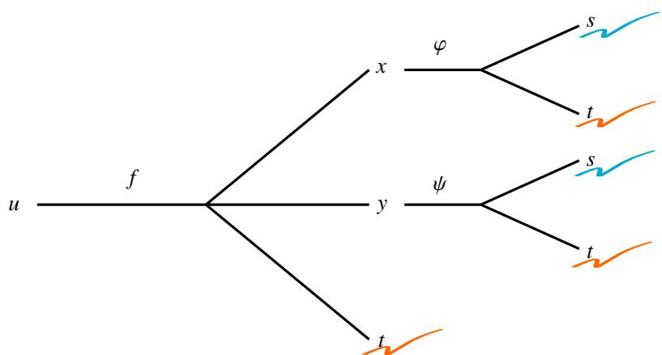  
图 4.9: 多元函数链式法则.

(2) 根据关系图确定复合函数的最终自变量. 图中, $u$ 分出三条 “路” 分别通往 $x , y , t .$ 而 $x$ 又分出两条路通往 ??和 $t ,$ , 同样地 $y$ 也分出两条路通往 $s$ 和 $t .$ 因此 $u$ 最终由 $s$ 和 $t$ 决定, 是 $s$ 和 $t$ 的函数. 因此 $u$ 有两个偏导数.  
(3) 先看关于 $t$ 的偏导, 如图从 $u$ 通往 $t$ 的路有三条, 因此计算时分成三块, 用加号连接. 每一条路又会分成若干段, 用链式法则把每一段都写出来. 类似地可以看到从 $u$ 通往 $s$ 的路只有两条, 因此计算时分成两块. 这个计算过程可以类比计数原理中的加法原理和乘法原理.

例 4.26 设函数 $u ( x , y )$ 有连续的一阶偏导数, 其中

$$
x = r \cos \theta , \qquad y = r \sin \theta .
$$

则

$$
\left(\frac {\partial u}{\partial x}\right) ^ {2} + \left(\frac {\partial u}{\partial y}\right) ^ {2} = \left(\frac {\partial u}{\partial r}\right) ^ {2} + \frac {1}{r ^ {2}} \left(\frac {\partial u}{\partial \theta}\right) ^ {2}.
$$

证明 证法一 由链式法则可知

$$
\frac {\partial u}{\partial r} = \frac {\partial u}{\partial x} \frac {\partial x}{\partial r} + \frac {\partial u}{\partial y} \frac {\partial y}{\partial r} = \frac {\partial u}{\partial x} \cos \theta + \frac {\partial u}{\partial y} \sin \theta .
$$

$$
\frac {\partial u}{\partial \theta} = \frac {\partial u}{\partial x} \frac {\partial x}{\partial \theta} + \frac {\partial u}{\partial y} \frac {\partial y}{\partial \theta} = - \frac {\partial u}{\partial x} r \sin \theta + \frac {\partial u}{\partial y} r \cos \theta .
$$

于是计算可知

$$
\left(\frac {\partial u}{\partial r}\right) ^ {2} + \frac {1}{r ^ {2}} \left(\frac {\partial u}{\partial \theta}\right) ^ {2} = \left(\frac {\partial u}{\partial x}\right) ^ {2} + \left(\frac {\partial u}{\partial y}\right) ^ {2}.
$$

证法二 我们有 Jacobi 矩阵等式:

$$
\left[ \frac {\partial u}{\partial r}, \frac {\partial u}{\partial \theta} \right] = \left[ \frac {\partial u}{\partial x}, \frac {\partial u}{\partial y} \right] \left[ \begin{array}{l l} \frac {\partial x}{\partial r} & \frac {\partial x}{\partial \theta} \\ \frac {\partial y}{\partial r} & \frac {\partial y}{\partial \theta} \end{array} \right] = \left[ \frac {\partial u}{\partial x}, \frac {\partial u}{\partial y} \right] \left[ \begin{array}{l l} \cos \theta & - r \sin \theta \\ \sin \theta & r \cos \theta \end{array} \right].
$$

于是可知

$$
\left[ \frac {\partial u}{\partial x}, \frac {\partial u}{\partial y} \right] = \left[ \frac {\partial u}{\partial r}, \frac {\partial u}{\partial \theta} \right] \left[ \begin{array}{c c} \cos \theta & - r \sin \theta \\ \sin \theta & r \cos \theta \end{array} \right] ^ {- 1} = \frac {1}{r} \left[ \frac {\partial u}{\partial r}, \frac {\partial u}{\partial \theta} \right] \left[ \begin{array}{c c} r \cos \theta & r \sin \theta \\ - \sin \theta & \cos \theta \end{array} \right].
$$

于是

$$
\left[ \begin{array}{c} \frac {\partial u}{\partial x} \\ \frac {\partial u}{\partial y} \end{array} \right] = \frac {1}{r} \left[ \begin{array}{c c} r \cos \theta & - \sin \theta \\ r \sin \theta & \cos \theta \end{array} \right] \left[ \begin{array}{c} \frac {\partial u}{\partial r} \\ \frac {\partial u}{\partial \theta} \end{array} \right].
$$

于是可知

$$
\begin{array}{l} \left(\frac {\partial u}{\partial x}\right) ^ {2} + \left(\frac {\partial u}{\partial y}\right) ^ {2} = \left[ \frac {\partial u}{\partial x}, \frac {\partial u}{\partial y} \right] \left[ \begin{array}{l} \frac {\partial u}{\partial x} \\ \frac {\partial u}{\partial y} \end{array} \right] = \frac {1}{r ^ {2}} \left[ \frac {\partial u}{\partial r}, \frac {\partial u}{\partial \theta} \right] \left[ \begin{array}{c c} r \cos \theta & r \sin \theta \\ - \sin \theta & \cos \theta \end{array} \right] \left[ \begin{array}{c c} r \cos \theta & - \sin \theta \\ r \sin \theta & \cos \theta \end{array} \right] \left[ \begin{array}{l} \frac {\partial u}{\partial r} \\ \frac {\partial u}{\partial \theta} \end{array} \right] \\ = \frac {1}{r ^ {2}} \left[ \frac {\partial u}{\partial r}, \frac {\partial u}{\partial \theta} \right] \left[ \begin{array}{l l} r ^ {2} & 0 \\ 0 & 1 \end{array} \right] \left[ \begin{array}{l} \frac {\partial u}{\partial r} \\ \frac {\partial u}{\partial \theta} \end{array} \right] = \left[ \frac {\partial u}{\partial r}, \frac {1}{r ^ {2}} \frac {\partial u}{\partial \theta} \right] \left[ \begin{array}{l} \frac {\partial u}{\partial r} \\ \frac {\partial u}{\partial \theta} \end{array} \right] = \left(\frac {\partial u}{\partial r}\right) ^ {2} + \frac {1}{r ^ {2}} \left(\frac {\partial u}{\partial \theta}\right) ^ {2}. \\ \end{array}
$$

下面来看一个有趣的例子.

例 4.27 行列式的微分 设 $n$ 阶行列式

$$
y = \left| \begin{array}{c c c c} a _ {1 1} & a _ {1 2} & \dots & a _ {1 n} \\ a _ {2 1} & a _ {2 2} & \dots & a _ {2 n} \\ \vdots & \vdots & & \vdots \\ a _ {n 1} & a _ {n 2} & \dots & a _ {n n} \end{array} \right|,
$$

其中 $a _ { i k }$ $( i , k = 1 , 2 , \cdots , n )$ 都是 $t$ 的可微函数. 求 $y _ { t } ^ { \prime }$ .

解 将行列式按第 $k$ 列展开得

$$
y = \sum_ {i = 1} ^ {n} A _ {i k} a _ {i k}.
$$

其中 $\boldsymbol { A } _ { i k }$ 是第 $i$ 行第 $k$ 列的代数余子式. 因此

$$
\frac {\partial y}{\partial a _ {i k}} = A _ {i k}.
$$

由链式法则可知

$$
\frac {\mathrm {d} y}{\mathrm {d} t} = \sum_ {k = 1} ^ {n} \sum_ {i = 1} ^ {n} \frac {\partial y}{\partial a _ {i k}} \frac {\mathrm {d} a _ {i k}}{\mathrm {d} t} = \sum_ {k = 1} ^ {n} \sum_ {i = 1} ^ {n} A _ {i k} \frac {\mathrm {d} a _ {i k}}{\mathrm {d} t}.
$$

注 容易看出

$$
\sum_ {i = 1} ^ {n} \boldsymbol {A} _ {i k} \frac {\mathrm {d} a _ {i k}}{\mathrm {d} t} = \left| \begin{array}{c c c c c} a _ {1 1} & \dots & a _ {1 k} ^ {\prime} & \dots & a _ {1 n} \\ a _ {2 1} & \dots & a _ {2 k} ^ {\prime} & \dots & a _ {2 n} \\ \vdots & & \vdots & & \vdots \\ a _ {n 1} & \dots & a _ {n k} ^ {\prime} & \dots & a _ {n n} \end{array} \right|.
$$

因此 $y ^ { \prime }$ 等于 $n$ 个行列式的和, 其中第 $k$ 个行列式是由原行列式的第 $k$ 列求导后得到的.

现在来看向量值函数的链式法则. 设可微的向量值函数 $\mathbb { R } ^ { m } \to \mathbb { R } ^ { l } : f = ( f _ { 1 } , f _ { 2 } , \cdot \cdot \cdot , f _ { \ell } )$ , 其中每一个分量函数$f _ { i }$ 都是 $m$ 元函数:

$$
y _ {i} = f _ {i} \left(x _ {1}, x _ {2}, \dots , x _ {m}\right), \quad i = 1, 2, \dots , \ell .
$$

设其中 $x _ { i }$ 都是 $n$ 元函数

$$
x _ {i} = g _ {i} \left(t _ {1}, t _ {2}, \dots , t _ {n}\right), \quad i = 1, 2, \dots , m.
$$

令 $\pmb { g } = ( g _ { 1 } , g _ { 2 } , \cdots , g _ { n } ) .$ . 若 $\pmb { g }$ 也是一个可微向量值函数, 则复合映射 $f \circ g$ 是可微映射吗? 我们知道 $f$ 可微当且仅当分量函数 $f _ { i }$ $\dot { \mathbf { \rho } } _ { i } \left( i = 1 , 2 , \cdots , \ell \right)$ 可微, 根据定理4.13可知

$$
\boldsymbol {J} \left(f _ {i} \circ \boldsymbol {g}\right) = \boldsymbol {J} f _ {i} \boldsymbol {J} \boldsymbol {g}, \quad i = 1, 2, \dots , \ell .
$$

这表明 $f \circ g$ 的每一个分量函数 $f _ { i } \circ g$ $f _ { i } \circ g \ ( i = 1 , 2 , \cdots , \ell )$ 都可微, 于是可知复合映射 $f \circ g$ 可微, 且

$$
\boldsymbol {J} (\boldsymbol {f} \circ \boldsymbol {g}) = \left[ \begin{array}{c} \boldsymbol {J} (f _ {1} \circ \boldsymbol {g}) \\ \boldsymbol {J} (f _ {2} \circ \boldsymbol {g}) \\ \vdots \\ \boldsymbol {J} (f _ {\ell} \circ \boldsymbol {g}) \end{array} \right] = \left[ \begin{array}{c} \boldsymbol {J} f _ {1} \boldsymbol {J} \boldsymbol {g} \\ \boldsymbol {J} f _ {2} \boldsymbol {J} \boldsymbol {g} \\ \vdots \\ \boldsymbol {J} f _ {\ell} \boldsymbol {J} \boldsymbol {g} \end{array} \right] = \left[ \begin{array}{c} \boldsymbol {J} f _ {1} \\ \boldsymbol {J} f _ {2} \\ \vdots \\ \boldsymbol {J} f _ {\ell} \end{array} \right] \boldsymbol {J} \boldsymbol {g} = \boldsymbol {J} f \boldsymbol {J} \boldsymbol {g}.
$$

于是就得到了向量值函数的链式法则. 以上证法是从多元函数的链式法则直接推演过来的, 我们还可以直接用向量值函数微分的定义来证明, 这样的证法可以推广到更一般的情况, 因此需要掌握.

# 定理 4.14 (链式法则)

设函数 $\pmb { g } : D  \mathbb { R } ^ { m }$ $( D \subseteq \mathbb { R } ^ { n } )$ 在 $t _ { 0 }$ 处可微.向量值函数 $f : \pmb { g } ( D )  \mathbb { R } ^ { l }$ 在 $x _ { 0 }$ 处可微.若 $\boldsymbol { x } _ { 0 } = \boldsymbol { g } ( t _ { 0 } )$ ,则复合

映射 $f \circ g$ 在 $t _ { 0 }$ 处可微, 且

$$
\boldsymbol {J} (\boldsymbol {f} \circ \boldsymbol {g}) (\boldsymbol {t} _ {0}) = \boldsymbol {J} f (\boldsymbol {x} _ {0}) \boldsymbol {J} \boldsymbol {g} (\boldsymbol {t} _ {0}).
$$

证明 设 $A = J f ( x _ { 0 } )$ , $B = J g ( t _ { 0 } )$ . 只需证明

$$
\lim  _ {\| \boldsymbol {h} \| \rightarrow 0} \frac {\| (\boldsymbol {f} \circ \boldsymbol {g}) (\boldsymbol {t} _ {0} + \boldsymbol {h}) - (\boldsymbol {f} \circ \boldsymbol {g}) (\boldsymbol {t} _ {0}) - \boldsymbol {A B h} \|}{\| \boldsymbol {h} \|} = 0. \tag {4.5}
$$

由于 $\pmb { g }$ 和 $f$ 分别在 $t _ { 0 }$ 和 $\scriptstyle { \boldsymbol { x } } _ { 0 }$ 处可微, 故

$$
\boldsymbol {g} \left(\boldsymbol {t} _ {0} + \boldsymbol {h}\right) - \boldsymbol {g} \left(\boldsymbol {t} _ {0}\right) = \boldsymbol {B} \boldsymbol {h} + \boldsymbol {r} (\boldsymbol {h}).
$$

$$
\boldsymbol {f} (\boldsymbol {x} _ {0} + \boldsymbol {k}) - \boldsymbol {f} (\boldsymbol {x} _ {0}) = \boldsymbol {A} \boldsymbol {k} + \boldsymbol {s} (\boldsymbol {k}).
$$

其中

$$
\lim  _ {\| \boldsymbol {h} \| \rightarrow 0} \frac {\| \boldsymbol {r} (\boldsymbol {h}) \|}{\| \boldsymbol {h} \|} = 0, \quad \lim  _ {\| \boldsymbol {k} \| \rightarrow 0} \frac {\| \boldsymbol {s} (\boldsymbol {k}) \|}{\| \boldsymbol {k} \|} = 0.
$$

令

$$
\varepsilon (\boldsymbol {h}) = \frac {\| \boldsymbol {r} (\boldsymbol {h}) \|}{\| \boldsymbol {h} \|}, \qquad \delta (\boldsymbol {k}) = \frac {\| \boldsymbol {s} (\boldsymbol {k}) \|}{\| \boldsymbol {k} \|}.
$$

对于给定的 $\pmb { h }$ , 令 $k = g ( t _ { 0 } + \pmb { h } ) - g ( t _ { 0 } )$ , 则

$$
\| \boldsymbol {k} \| = \| \boldsymbol {g} (t _ {0} + \boldsymbol {h}) - \boldsymbol {g} (t _ {0}) \| = \| \boldsymbol {B} \boldsymbol {h} + \boldsymbol {r} (\boldsymbol {h}) \| \leq \| \boldsymbol {B} \boldsymbol {h} \| + \| \boldsymbol {r} (\boldsymbol {h}) \| = \| \boldsymbol {B} \boldsymbol {h} \| + \varepsilon (\boldsymbol {h}) \| \boldsymbol {h} \| \leq [ \| \boldsymbol {B} \| + \varepsilon (\boldsymbol {h}) ] \| \boldsymbol {h} \|.
$$

于是

$$
\begin{array}{l} \left\| \left(\boldsymbol {f} \circ \boldsymbol {g}\right) \left(\boldsymbol {t} _ {0} + \boldsymbol {h}\right) - \left(\boldsymbol {f} \circ \boldsymbol {g}\right) \left(\boldsymbol {t} _ {0}\right) - \boldsymbol {A B h} \right\| \\ = \| f [ \boldsymbol {g} (\boldsymbol {t} _ {0} + \boldsymbol {h}) ] - \boldsymbol {f} [ \boldsymbol {g} (\boldsymbol {t} _ {0}) ] - \boldsymbol {A B h} \| = \| \boldsymbol {f} (\boldsymbol {x} _ {0} + \boldsymbol {k}) - \boldsymbol {f} (\boldsymbol {x} _ {0}) - \boldsymbol {A B h} \| = \| \boldsymbol {A k} + s (\boldsymbol {k}) - \boldsymbol {A B h} \| \\ = \| A (\boldsymbol {k} - \boldsymbol {B h}) + s (\boldsymbol {k}) \| \leq \| A (\boldsymbol {k} - \boldsymbol {B h}) \| + \| s (\boldsymbol {k}) \| = \| A r (\boldsymbol {h}) \| + \delta (\boldsymbol {k}) \| \boldsymbol {k} \| \leq \| A \| \| r (\boldsymbol {h}) \| + \delta (\boldsymbol {k}) \| \boldsymbol {k} \| \\ \leq \| A \| \varepsilon (\boldsymbol {h}) \| \boldsymbol {h} \| + \delta (\boldsymbol {k}) \| \boldsymbol {k} \| \leq \| A \| \varepsilon (\boldsymbol {h}) \| \boldsymbol {h} \| + \delta (\boldsymbol {k}) [ \| \boldsymbol {B} \| + \varepsilon (\boldsymbol {h}) ] \| \boldsymbol {h} \|. \\ \end{array}
$$

由于 $\begin{array} { r } { \operatorname* { l i m } _ { \| \pmb { h } \|  0 } \varepsilon ( \pmb { h } ) = 0 } \end{array}$ , $\begin{array} { r } { \operatorname* { l i m } _ { \| \pmb { k } \|  0 } \delta ( \pmb { k } ) = 0 } \end{array}$ , 因此

$$
\lim  _ {\| \boldsymbol {h} \| \rightarrow 0} \frac {\| (\boldsymbol {f} \circ \boldsymbol {g}) (\boldsymbol {t} _ {0} + \boldsymbol {h}) - (\boldsymbol {f} \circ \boldsymbol {g}) (\boldsymbol {t} _ {0}) - \boldsymbol {A B h} \|}{\| \boldsymbol {h} \|} = \lim  _ {\| \boldsymbol {h} \| \rightarrow 0} \left\{\| \boldsymbol {A} \| \varepsilon (\boldsymbol {h}) + \delta (\boldsymbol {k}) [ \| \boldsymbol {B} \| + \varepsilon (\boldsymbol {h}) ] \right\} = 0.
$$

注 以上证明用到了向量范数的三角不等式 (命题2.3) 和矩阵范数的不等式 (3.6):

$$
\left\| \alpha + \boldsymbol {\beta} \right\| \leq \left\| \alpha \right\| + \left\| \boldsymbol {\beta} \right\|, \quad \left\| \boldsymbol {A} \boldsymbol {B} \right\| \leq \left\| \boldsymbol {A} \right\| \left\| \boldsymbol {B} \right\|.
$$

# 4.2.2 一阶微分形式不变性

在一元函数中, 我们讨论过一阶微分形式不变性. 下面来看这个性质是否可以推广到多元函数.

设函数 $f ( x _ { 1 } , x _ { 2 } , \cdots , x _ { n } )$ 可微, 则

$$
\mathrm {d} f = \sum_ {i = 1} ^ {n} \frac {\partial f}{\partial x _ {i}} \mathrm {d} x _ {i}.
$$

假设 $x _ { 1 } , x _ { 2 } , \cdots , x _ { n }$ 不是自变量, 而是 $t _ { 1 } , t _ { 2 } , \cdots , t _ { m }$ 的函数:

$$
x _ {i} = x _ {i} \left(t _ {1}, t _ {2}, \dots , t _ {m}\right), \quad i = 1, 2, \dots , n.
$$

令

$$
g \left(t _ {1}, t _ {2}, \dots , t _ {m}\right) = f \left[ x _ {1} \left(t _ {1}, t _ {2}, \dots , t _ {m}\right), x _ {2} \left(t _ {1}, t _ {2}, \dots , t _ {m}\right), \dots , x _ {n} \left(t _ {1}, t _ {2}, \dots , t _ {m}\right) \right].
$$

则

$$
\mathrm {d} g = \sum_ {i = 1} ^ {m} \frac {\partial g}{\partial t _ {i}} \mathrm {d} t _ {i}.
$$

由链式法则可知

$$
\frac {\partial g}{\partial t _ {i}} = \sum_ {j = 1} ^ {n} \frac {\partial f}{\partial x _ {j}} \frac {\partial x _ {j}}{\partial t _ {i}}, \quad i = 1, 2, \dots , m.
$$

因此

$$
\mathrm {d} g = \sum_ {i = 1} ^ {m} \left(\sum_ {j = 1} ^ {n} \frac {\partial f}{\partial x _ {j}} \frac {\partial x _ {j}}{\partial t _ {i}}\right) \mathrm {d} t _ {i} = \sum_ {j = 1} ^ {n} \frac {\partial f}{\partial x _ {j}} \sum_ {i = 1} ^ {m} \frac {\partial x _ {j}}{\partial t _ {i}} \mathrm {d} t _ {i} = \sum_ {j = 1} ^ {n} \frac {\partial f}{\partial x _ {j}} \mathrm {d} x _ {j}.
$$

这表明复合函数 $f$ 的微分是

$$
\mathrm {d} f = \sum_ {i = 1} ^ {n} \frac {\partial f}{\partial x _ {i}} \mathrm {d} x _ {i}.
$$

这表明无论 $x _ { 1 } , x _ { 2 } , \cdots , x _ { n }$ 是自变量, 还是 $t _ { 1 } , t _ { 2 } , \cdots , t _ { m }$ 的函数, $f$ 作为 $x _ { 1 } , x _ { 2 } , \cdots , x _ { n }$ 的函数的一阶微分在形式上是不变的. 微分的这个性质被称为一阶微分形式的不变性. 在一元微分中已经见过微分的这个性质.

微分形式不变性结合全微分等式可以大幅简化求导的计算量. 下面看两个例子.

例 4.28 设函数

$$
f (x, y) = \arctan \frac {x}{y}.
$$

求 $f _ { x } ^ { \prime }$ 和 $f _ { \mathrm { y } } ^ { \prime }$

解 解法一 直接计算可知

$$
\frac {\partial f}{\partial x} = \frac {\frac {1}{y}}{\frac {x ^ {2}}{y ^ {2}} + 1} = \frac {y}{x ^ {2} + y ^ {2}}, \quad \frac {\partial f}{\partial y} = \frac {- \frac {1}{y ^ {2}}}{\frac {x ^ {2}}{y ^ {2}} + 1} = - \frac {1}{x ^ {2} + y ^ {2}}.
$$

解法二 由一阶微分形式不变性可知

$$
\mathrm {d} f (x, y) = \mathrm {d} \arctan \frac {x}{y} = \frac {\frac {1}{y}}{1 + \left(\frac {x}{y}\right)} \mathrm {d} \left(\frac {x}{y}\right) = \frac {y}{x ^ {2} + y ^ {2}} \mathrm {d} x - \frac {x}{x ^ {2} + y ^ {2}} \mathrm {d} y.
$$

由全微分的定义可知

$$
\frac {\partial f}{\partial x} = \frac {y}{x ^ {2} + y ^ {2}}, \quad \frac {\partial f}{\partial y} = - \frac {1}{x ^ {2} + y ^ {2}}.
$$

例 4.29 设函数

$$
f (x, y, z) = \frac {x}{x ^ {2} + y ^ {2} + z ^ {2}}
$$

求 ?? 0?? , ?? 0?? , ?? 0??

解 解法一 直接计算可知

$$
\frac {\partial f}{\partial x} = \frac {\left(x ^ {2} + y ^ {2} + z ^ {2}\right) - 2 x ^ {2}}{\left(x ^ {2} + y ^ {2} + z ^ {2}\right) ^ {2}} = \frac {y ^ {2} + z ^ {2} - x ^ {2}}{\left(x ^ {2} + y ^ {2} + z ^ {2}\right) ^ {2}}.
$$

对称地可知

$$
\frac {\partial f}{\partial y} = - \frac {2 x y}{\left(x ^ {2} + y ^ {2} + z ^ {2}\right) ^ {2}}, \quad \frac {\partial f}{\partial z} = - \frac {2 x z}{\left(x ^ {2} + y ^ {2} + z ^ {2}\right) ^ {2}}.
$$

解法二 由一阶微分形式不变性可知

$$
\mathrm {d} f (x, y, z) = \mathrm {d} \frac {x}{x ^ {2} + y ^ {2} + z ^ {2}} = \frac {\left(x ^ {2} + y ^ {2} + z ^ {2}\right) \mathrm {d} x - x \mathrm {d} \left(x ^ {2} + y ^ {2} + z ^ {2}\right)}{\left(x ^ {2} + y ^ {2} + z ^ {2}\right) ^ {2}}
$$

$$
= \frac {y ^ {2} + z ^ {2} - x ^ {2}}{\left(x ^ {2} + y ^ {2} + z ^ {2}\right) ^ {2}} d x - \frac {2 x y}{\left(x ^ {2} + y ^ {2} + z ^ {2}\right) ^ {2}} d y - \frac {2 x z}{\left(x ^ {2} + y ^ {2} + z ^ {2}\right) ^ {2}} d z
$$

由全微分等式可知

$$
\frac {\partial f}{\partial x} = \frac {y ^ {2} + z ^ {2} - x ^ {2}}{\left(x ^ {2} + y ^ {2} + z ^ {2}\right) ^ {2}}, \quad \frac {\partial f}{\partial y} = - \frac {2 x y}{\left(x ^ {2} + y ^ {2} + z ^ {2}\right) ^ {2}}, \quad \frac {\partial f}{\partial z} = - \frac {2 x z}{\left(x ^ {2} + y ^ {2} + z ^ {2}\right) ^ {2}}.
$$

# 4.2.3 高阶偏导数

设函数 $f$ 在开集 $D$ 上的每一点处存在偏导数

$$
\mathcal {D} _ {i} f (\boldsymbol {x}) = \frac {\partial f}{\partial x _ {i}} (\boldsymbol {x}), \quad i = 1, 2, \dots , n.
$$

这称它们为 $f$ 的一阶偏导函数 . 如果这些偏导函数还可以继续求偏导, 就可以得出 $f$ 的二阶偏导函数 . 这样依次下去可以定义 $f$ 的各阶偏导数.

有 $n$ 个变量的函数的一阶偏导数有 $n$ 个, 因此它的二阶偏导数有 $n ^ { 2 }$ 个, $k$ 阶偏导数就有 $n ^ { k }$ 个. 若一阶偏导$\frac { \partial f } { \partial x _ { i } }$ $( i = 1 , 2 , \cdots , n )$ 继续对 $x _ { j }$ $( j = 1 , 2 , \cdots , n )$ 时, 记作

$$
\frac {\partial^ {2} f}{\partial x _ {i} \partial x _ {j}} := \frac {\partial}{\partial x _ {i}} \left(\frac {\partial f}{\partial x _ {j}}\right), \quad i, j = 1, 2, \dots , n.
$$

也可以记作 $f _ { x _ { j } x _ { i } } ^ { \prime \prime }$ 或 $f _ { x _ { j } x _ { i } }$ . 特别地, 当 $i = j$ 时

$$
\frac {\partial^ {2} f}{\partial x _ {i} ^ {2}} := \frac {\partial^ {2} f}{\partial x _ {i} \partial x _ {i}}, \quad i = 1, 2, \dots , n.
$$

下面来看两个例子.

例 4.30 求函数 $z = x y ^ { 3 }$ 的全部二阶偏导数.

解 先求一阶偏导数:

$$
\frac {\partial z}{\partial x} = y ^ {3}, \quad \frac {\partial z}{\partial y} = 3 x y ^ {2}.
$$

然后再分别计算它们的二阶偏导

$$
\frac {\partial^ {2} z}{\partial x ^ {2}} = 0, \quad \frac {\partial^ {2} z}{\partial x \partial y} = 3 y ^ {2}, \quad \frac {\partial^ {2} z}{\partial y \partial x} = 3 y ^ {2}, \quad \frac {\partial^ {2} z}{\partial y ^ {2}} = 6 x y.
$$

例 4.31 设函数

$$
f (x, y) = \left\{ \begin{array}{l l} x y \frac {x ^ {2} - y ^ {2}}{x ^ {2} + y ^ {2}}, & x ^ {2} + y ^ {2} > 0 \\ 0, & x = y = 0 \end{array} \right..
$$

求函数 $f$ 在 $( 0 , 0 )$ 处的两个二阶偏导数

$$
\frac {\partial^ {2} f (0 , 0)}{\partial x \partial y}, \qquad \frac {\partial^ {2} f (0 , 0)}{\partial y \partial x}.
$$

解 容易验证 $f$ 在 $( 0 , 0 )$ 处连续. 先求 $f$ 的一阶导函数. 当 $x ^ { 2 } + y ^ { 2 } > 0$ 时

$$
\frac {\partial f (x , y)}{\partial x} = \frac {y \left(x ^ {4} + 4 x ^ {2} y ^ {2} - y ^ {4}\right)}{\left(x ^ {2} + y ^ {2}\right) ^ {2}}, \quad \frac {\partial f (x , y)}{\partial y} = \frac {x \left(x ^ {4} - 4 x ^ {2} y ^ {2} - y ^ {4}\right)}{\left(x ^ {2} + y ^ {2}\right) ^ {2}}.
$$

当 $x = y = 0$ 时

$$
\frac {\partial f (0 , 0)}{\partial x} = \lim  _ {x \rightarrow 0} \frac {f (x , 0) - f (0 , 0)}{x} = 0. \quad \frac {\partial f (0 , 0)}{\partial y} = \lim  _ {y \rightarrow 0} \frac {f (0 , y) - f (0 , 0)}{y} = 0.
$$

于是可以计算 $f$ 在 $( 0 , 0 )$ 处的两个二阶偏导数

$$
\frac {\partial^ {2} f (0 , 0)}{\partial x \partial y} = \lim  _ {x \rightarrow 0} \frac {1}{x} \left[ \frac {\partial f (x , 0)}{\partial y} - \frac {\partial f (0 , 0)}{\partial y} \right] = \lim  _ {x \rightarrow 0} \frac {x}{x} = 1.
$$

$$
\frac {\partial^ {2} f (0 , 0)}{\partial y \partial x} = \lim  _ {x \rightarrow 0} \frac {1}{y} \left[ \frac {\partial f (0 , y)}{\partial x} - \frac {\partial f (0 , 0)}{\partial x} \right] = \lim  _ {x \rightarrow 0} \frac {- y}{y} = - 1.
$$

从上例可知, 一般来说

$$
\frac {\partial^ {2} f}{\partial x \partial y} \neq \frac {\partial^ {2} f}{\partial y \partial x}.
$$

这样的偏导数称为混合偏导数 , 对 $x$ 和 $y$ 的求导次序是不能随便交换的. 下面来探索偏微分算子可以换序的条件.令

$$
\begin{array}{l} \Phi (h, k) = \frac {1}{h} \left[ \frac {f (x _ {0} + h , y _ {0} + k) - f (x _ {0} + h , y _ {0})}{k} - \frac {f (x _ {0} , y _ {0} + k) - f (x _ {0} , y _ {0})}{k} \right] \\ = \frac {1}{k} \left[ \frac {f (x _ {0} + h , y _ {0} + k) - f (x _ {0} + h , y _ {0})}{h} - \frac {f (x _ {0} , y _ {0} + k) - f (x _ {0} , y _ {0})}{h} \right]. \\ \end{array}
$$

则

$$
\begin{array}{l} \frac {\partial^ {2} f}{\partial x \partial y} = \lim  _ {h \rightarrow 0} \frac {f _ {y} ^ {\prime} (x _ {0} + h , y _ {0}) - f _ {y} ^ {\prime} (x _ {0} , y _ {0})}{h} = \lim  _ {h \rightarrow 0} \lim  _ {k \rightarrow 0} \Phi (h, k). \\ \frac {\partial^ {2} f}{\partial y \partial x} = \lim  _ {k \rightarrow 0} \frac {f _ {x} ^ {\prime} \left(x _ {0} , y _ {0} + k\right) - f _ {x} ^ {\prime} \left(x _ {0} , y _ {0}\right)}{k} = \lim  _ {k \rightarrow 0} \lim  _ {h \rightarrow 0} \Phi (h, k). \\ \end{array}
$$

因此偏微分算子的换序问题本质上就是累次极限的换序问题. 根据引理2.1可知, 只需以下重极限存在即可:

$$
\lim  _ {(h, k) \rightarrow (0, 0)} \Phi (h, k)
$$

# 定理 4.15

设函数 $f : D \to \mathbb { R } ,$ 其中 $D$ 是 $\mathbb { R } ^ { 2 }$ 中的开集. 若 $f _ { x } ^ { \prime } , f _ { y } ^ { \prime } , f _ { x y } ^ { \prime \prime }$ $f _ { x } ^ { \prime }$ 在 $( x _ { 0 } , y _ { 0 } )$ 的附近存在, 且 $f _ { x y } ^ { \prime \prime }$ 在 $( x _ { 0 } , y _ { 0 } )$ 处连续,则 $f _ { y x } ^ { \prime \prime }$ 在 $( x _ { 0 } , y _ { 0 } )$ 处存在, 且

$$
\frac {\partial^ {2} f}{\partial x \partial y} = \frac {\partial^ {2} f}{\partial y \partial x}.
$$

证明 令

$$
\varphi (h, k) = [ f (x _ {0} + h, y _ {0} + k) - f (x _ {0} + h, y _ {0}) ] - [ f (x _ {0}, y _ {0} + k) - f (x _ {0}, y _ {0}) ].
$$

再令

$$
g (x) = f (x, y _ {0} + k) - f (x, y _ {0}).
$$

则由 Lagrange 中值定理可知, 存在 $\theta _ { 1 }$ $\mathbf { \xi } _ { 1 } , \theta _ { 2 } \in ( 0 , 1 )$ 使得

$$
\begin{array}{l} \varphi (h, k) = g \left(x _ {0} + h\right) - g \left(x _ {0}\right) = g ^ {\prime} \left(x _ {0} + \theta_ {1} h\right) h = \frac {\partial f}{\partial x} \left(x _ {0} + \theta_ {1} h, y _ {0} + k\right) h - \frac {\partial f}{\partial x} \left(x _ {0} + \theta_ {1} h, y _ {0}\right) h \\ = \frac {\partial^ {2} f}{\partial y \partial x} \left(x _ {0} + \theta_ {1} h, y _ {0} + \theta_ {2} k\right) h k. \\ \end{array}
$$

由于 $f _ { x y } ^ { \prime }$ 在 $( x _ { 0 } , y _ { 0 } )$ 处连续, 因此

$$
\lim  _ {(h, k) \rightarrow (0, 0)} \frac {\varphi (h , k)}{h k} = \lim  _ {(h, k) \rightarrow (0, 0)} \frac {\partial^ {2} f}{\partial y \partial x} \left(x _ {0} + \theta_ {1} h, y _ {0} + \theta_ {2} k\right) = \frac {\partial^ {2} f}{\partial y \partial x} \left(x _ {0}, y _ {0}\right).
$$

另一方面, 由于 $f _ { x } ^ { \prime } , f _ { y } ^ { \prime }$ 存在, 故由引理2.1可知

$$
\begin{array}{l} \frac {\partial^ {2} f}{\partial x \partial y} = \lim  _ {h \rightarrow 0} \frac {f _ {y} ^ {\prime} \left(x _ {0} + h , y _ {0}\right) - f _ {y} ^ {\prime} \left(x _ {0} , y _ {0}\right)}{h} = \lim  _ {h \rightarrow 0} \lim  _ {k \rightarrow 0} \frac {\varphi (h , k)}{h k} = \lim  _ {(h, k) \rightarrow (0, 0)} \frac {\varphi (h , k)}{h k}, \\ \frac {\partial^ {2} f}{\partial y \partial x} = \lim  _ {k \rightarrow 0} \frac {f _ {x} ^ {\prime} (x _ {0} , y _ {0} + k) - f _ {x} ^ {\prime} (x _ {0} , y _ {0})}{k} = \lim  _ {k \rightarrow 0} \lim  _ {h \rightarrow 0} \frac {\varphi (h , k)}{h k} = \lim  _ {(h, k) \rightarrow (0, 0)} \frac {\varphi (h , k)}{h k}. \\ \end{array}
$$

注 从以上证明过程可知, 条件减弱为 “ $f _ { x y } ^ { \prime \prime }$ 在 $( x _ { 0 } , y _ { 0 } )$ 处有极限”, 就可以证得结论.

下面把定理推广到一般情况.

# 定理 4.16 (偏导算子的换序定理)

设函数 $f : D \to \mathbb { R } ,$ 其中 $D$ 是 $\mathbb { R } ^ { n }$ 中的开集. 若 ℎ −1 阶的一切偏导数和一切 $k$ 阶混合偏导都存在, 且它们都在 $D$ 中连续, 则任一 $k$ 阶混合偏导的计算结果与逐次计算偏导的次序无关.

证明 (i) 证明 $k = 2$ 的情况, 即

$$
\frac {\partial^ {2} f}{\partial x _ {i} \partial x _ {j}} = \frac {\partial^ {2} f}{\partial x _ {j} \partial x _ {i}}.
$$

事实上, 只需将 $x _ { i }$ 和 $x _ { j }$ 以外的变量看作常数, 那么就变成了和定理4.15一样的情况.

(ii) 当 $k > 2$ 时, 先证明

$$
\frac {\partial^ {k} f}{\partial x _ {i _ {1}} \partial x _ {i _ {2}} \cdots \partial x _ {i _ {h}} \partial x _ {i _ {h + 1}} \cdots \partial x _ {i _ {k}}} = \frac {\partial^ {k} f}{\partial x _ {i _ {1}} \partial x _ {i _ {2}} \cdots \partial x _ {i _ {h + 1}} \partial x _ {i _ {h}} \cdots \partial x _ {i _ {k}}}
$$

其中 $i _ { 1 } , i _ { 2 } , \cdots , i _ { h } , i _ { h + 1 } , i _ { k }$ 是 $1 , 2 , \cdots , n$ 个数中 $k$ 个数的某一个排列 (允许重复). 首先前 ℎ − 1 阶导数是相等的, 应用 (i) 的结论可以知道进行完 $h$ 阶和 $h + 1$ 阶求导后还是相等的. 而剩下的运算是相同的, 因此上式成立.  
(iii) 由于任一 $k$ 阶混合偏导的逐次偏导顺序变化总是可以分解为有限次的两个相继元素偏导的互换, 于是可知一般情况也是成立的. ■

例 4.32 在物理中有一个很重要的热方程 (heat equation), 它描述了一个空间中, 温度随时间的变化规律. 现在我们来看一维直线上的热方程. 设二元函数 $u = u ( x , t )$ , 其中 $u$ 是直线上 $x$ 位置, $t$ 时刻的温度, 它们满足方程:

$$
\frac {\partial u}{\partial t} = a ^ {2} \frac {\partial^ {2} u}{\partial x ^ {2}},
$$

其中 $a$ 是非零常数. 试验证对于任一 $t > 0$ , 以下函数是方程的一个解:

$$
u = \frac {1}{2 a \sqrt {\pi t}} \mathrm {e} ^ {- \frac {x ^ {2}}{4 a ^ {2} t}}.
$$

解 分别计算函数 $u ( x , t )$ 的两个偏导:

$$
\frac {\partial u}{\partial x} = \frac {1}{2 a \sqrt {\pi t}} \mathrm {e} ^ {- \frac {x ^ {2}}{4 a ^ {2} t}} \left(- \frac {2 x}{4 a ^ {2} t}\right) = - \frac {1}{2 a \sqrt {\pi t}} \mathrm {e} ^ {- \frac {x ^ {2}}{4 a ^ {2} t}} \frac {x}{2 a ^ {2} t}.
$$

$$
\frac {\partial u}{\partial t} = - \frac {1}{4 a \sqrt {\pi} t ^ {3 / 2}} \mathrm {e} ^ {- \frac {x ^ {2}}{4 a ^ {2} t}} + \frac {1}{2 a \sqrt {\pi} t} \mathrm {e} ^ {- \frac {x ^ {2}}{4 a ^ {2} t}} \frac {x ^ {2}}{4 a ^ {2} t ^ {2}} = \frac {1}{4 a \sqrt {\pi} t ^ {3 / 2}} \mathrm {e} ^ {- \frac {x ^ {2}}{4 a ^ {2} t}} \left(\frac {x ^ {2}}{2 a ^ {2} t} - 1\right).
$$

计算 $f _ { x x } ^ { \prime }$

$$
\frac {\partial^ {2} u}{\partial x ^ {2}} = \frac {1}{2 a \sqrt {\pi t}} \left(\mathrm {e} ^ {- \frac {x ^ {2}}{4 a ^ {2} t}} \frac {2 x}{4 a ^ {2} t} \frac {x}{2 a ^ {2} t} - \mathrm {e} ^ {- \frac {x ^ {2}}{4 a ^ {2} t}} \frac {1}{2 a ^ {2} t}\right) = \frac {1}{4 a ^ {3} \sqrt {\pi} t ^ {3 / 2}} \mathrm {e} ^ {- \frac {x ^ {2}}{4 a ^ {2} t}} \left(\frac {x ^ {2}}{2 a ^ {2} t} - 1\right).
$$

于是可知

$$
\frac {\partial u}{\partial t} = a ^ {2} \frac {\partial^ {2} u}{\partial x ^ {2}}.
$$

上例中的热方程仅仅是最简单的一维形式. 三维空间中的热方程是

$$
\frac {\partial u}{\partial t} = a ^ {2} \left(\frac {\partial^ {2} u}{\partial x ^ {2}} + \frac {\partial^ {2} u}{\partial y ^ {2}} + \frac {\partial^ {2} u}{\partial z ^ {2}}\right),
$$

其中 $a$ 是非零常数. 于是引出了以下概念.

# 定义 4.12 (Laplace 算子)

设 $n$ 元函数 $f ( x _ { 1 } , x _ { 2 } , \cdots , x _ { n } )$ . 令

$$
\Delta f = \sum_ {i = 1} ^ {n} \frac {\partial^ {2} f}{\partial x _ {i} ^ {2}}.
$$

则称 $\Delta$ 为 Laplace 算子 (Laplace operator)

Laplace 算子有很多性质. 下面来看一些例子.

例 4.33 设函数

$$
p = \sqrt {x ^ {2} + y ^ {2} + z ^ {2}}, \quad p > 0.
$$

求 Δ??, Δ(ln ??), $\Delta ( 1 / p )$ .

解 (i) 计算对 $x$ 的导数:

$$
\frac {\partial p}{\partial x} = \frac {2 x}{2 \sqrt {x ^ {2} + y ^ {2} + z ^ {2}}} = \frac {x}{p}, \qquad \frac {\partial^ {2} p}{\partial x ^ {2}} = \frac {p - x \frac {x}{p}}{p ^ {2}} = \frac {p ^ {2} - x ^ {2}}{p ^ {3}}.
$$

对称地可知

$$
\frac {\partial^ {2} p}{\partial y ^ {2}} = \frac {p ^ {2} - y ^ {2}}{p ^ {3}}, \quad \frac {\partial^ {2} p}{\partial z ^ {2}} = \frac {p ^ {2} - z ^ {2}}{p ^ {3}}.
$$

于是可知

$$
\Delta p = \frac {3 p ^ {2} - x ^ {2} - y ^ {2} - z ^ {2}}{p ^ {3}} = \frac {2}{p}.
$$

(ii) 计算对 $x$ 的导数:

$$
\frac {\partial}{\partial x} \ln p = \frac {1}{p} \cdot \frac {x}{p} = \frac {x}{p ^ {2}}, \quad \frac {\partial^ {2}}{\partial x ^ {2}} \ln p = \frac {\partial}{\partial x} \left(\frac {x}{p ^ {2}}\right) = \frac {p ^ {2} - x \cdot 2 p \cdot \frac {x}{p}}{p ^ {4}} = \frac {p ^ {2} - 2 x ^ {2}}{p ^ {4}}.
$$

对称地可知

$$
\frac {\partial^ {2}}{\partial y ^ {2}} \ln p = \frac {p ^ {2} - 2 y ^ {2}}{p ^ {4}}, \quad \frac {\partial^ {2}}{\partial z ^ {2}} \ln p = \frac {p ^ {2} - 2 z ^ {2}}{p ^ {4}}.
$$

于是可知

$$
\Delta (\ln p) = \frac {3 p ^ {2} - 2 x ^ {2} - 2 y ^ {2} - 2 z ^ {2}}{p ^ {4}} = \frac {1}{p ^ {2}}.
$$

(iii) 计算对 $x$ 的导数:

$$
\frac {\partial}{\partial x} \left(\frac {1}{p}\right) = - \frac {1}{p ^ {2}} \cdot \frac {x}{p} = - \frac {x}{p ^ {3}}, \quad \frac {\partial^ {2}}{\partial x ^ {2}} \left(\frac {1}{p}\right) = \frac {\partial}{\partial x} \left(- \frac {x}{p ^ {3}}\right) = - \frac {p ^ {3} - x \cdot 3 p ^ {2} \cdot \frac {x}{p}}{p ^ {6}} = \frac {3 x ^ {2} - p ^ {2}}{p ^ {5}}.
$$

对称地可知

$$
\frac {\partial^ {2}}{\partial y ^ {2}} \left(\frac {1}{p}\right) = \frac {3 y ^ {2} - p ^ {2}}{p ^ {5}}, \quad \frac {\partial^ {2}}{\partial z ^ {2}} \left(\frac {1}{p}\right) = \frac {3 z ^ {2} - p ^ {2}}{p ^ {5}}.
$$

于是可知

$$
\Delta \left(\frac {1}{p}\right) = \frac {3 x ^ {2} + 3 y ^ {2} + 3 z ^ {2} - 3 p ^ {2}}{p ^ {5}} = 0.
$$

注 形如 $\Delta u = 0$ 的偏微分方程称为 Laplace 方程 (Laplace equation). 从上例可见 $u = 1 / p$ 就是 Laplace 方程的一个解.

例 4.34 解下列偏微分方程

(1) $\frac { \partial ^ { 2 } u } { \partial x ^ { 2 } } = 0 ,$

(2) $\frac { \partial ^ { 2 } u } { \partial x \partial y } = 0 ,$

(3) $\frac { \partial ^ { 3 } u } { \partial x \partial y \partial z } = 0 .$

其中 $u$ 是 $x , y , z$ 的函数.

解 (1) 由于

$$
\frac {\partial}{\partial x} \left(\frac {\partial u}{\partial x}\right) = 0,
$$

故 $u _ { x }$ 可以是任意一个不含 $x$ 的可微函数, 即

$$
\frac {\partial u}{\partial x} = \varphi (y, z).
$$

于是可知

$$
u (x, y, z) = x \varphi (y, z) + \psi (y, z),
$$

其中 $\varphi$ 和 $\psi$ 都是任一可微函数.

(2) 由于

$$
\frac {\partial}{\partial x} \left(\frac {\partial u}{\partial y}\right) = 0,
$$

故

$$
\frac {\partial u}{\partial y} = \varphi_ {1} (y, z).
$$

其中 $\varphi _ { 1 }$ 是任一可微函数. 于是可知

$$
u (x, y, z) = \int \varphi_ {1} (y, z) d y + \psi (x, z) = \varphi (y, z) + \psi (y, z),
$$

其中 $\varphi$ 和 $\psi$ 都是任一可微函数.

(3) 由于

$$
\frac {\partial}{\partial x} \left(\frac {\partial^ {2} u}{\partial y \partial z}\right) = 0,
$$

故

$$
\frac {\partial^ {2} u}{\partial y \partial z} = \frac {\partial}{\partial y} \left(\frac {\partial u}{\partial z}\right) = \varphi_ {2} (y, z).
$$

其中 $\varphi _ { 2 }$ 是任一可微函数. 于是

$$
\frac {\partial u}{\partial z} = \int \varphi_ {2} (y, z) d y + \psi_ {1} (x, z) = \varphi_ {1} (y, z) + \psi_ {1} (x, z),
$$

其中 $\varphi _ { 1 }$ 和 $\psi _ { 1 }$ 都是任一可微函数. 于是可知

$$
u (x, y, z) = \int \varphi_ {1} (y, z) d z + \int \psi_ {1} (x, z) d z + \eta (x, y) = \varphi (y, z) + \psi (x, z) + \eta (x, y).
$$

# 4.2.4 复合函数的高阶偏导数

下面来看复合函数的高阶偏导数. 用第二数学归纳法容易证明如果两个函数都有连续偏导, 则它们的复合函数也有连续偏导. 更确切地有以下命题.

# 命题 4.4

设函数

$$
y = f (x _ {1}, x _ {2}, \dots , x _ {n}).
$$

和向量值函数

$$
\boldsymbol {x} = \left\{ \begin{array}{l} x _ {1} = x _ {1} \left(t _ {1}, t _ {2}, \dots , t _ {m}\right) \\ x _ {2} = x _ {2} \left(t _ {1}, t _ {2}, \dots , t _ {m}\right) \\ \dots \\ x _ {n} = x _ {n} \left(t _ {1}, t _ {2}, \dots , t _ {m}\right) \end{array} . \right.
$$

若函数 $f$ 和 $\boldsymbol { x }$ 的所有分量函数都有一切 $k$ 阶连续偏导数, 则复合函数 $f \circ x$ 的所有 $k$ 阶偏导都存在, 且都是连续的, 且它们都是关于 $f$ 和 $x _ { 1 } , x _ { 2 } , \cdots , x _ { n }$ 的偏导数的多项式.

计算复合函数的高阶偏导数在理论上没有什么困难, 但实际运算时, 由于运算量很大, 因此快速计算出正确结果并不是一件容易的事情. 哪怕是计算复合二元函数的的二阶偏导数, 计算量就已经不小了.

例 4.35 设函数 $f ( x , y )$ , 其中 $x = x ( s , t )$ , $y = y ( s , t )$ . 若 $f , x , y$ 都有连续的二阶偏导数, 求二阶偏导数: $u _ { s s }$ , $u _ { t t }$ , $u _ { t s }$

解 计算一阶导:

$$
\frac {\partial u}{\partial s} = f _ {x} x _ {s} + f _ {y} y _ {s}, \quad \frac {\partial u}{\partial t} = f _ {x} x _ {t} + f _ {y} y _ {t}.
$$

计算 $s$ 的二阶导:

$$
\begin{array}{l} \frac {\partial^ {2} u}{\partial s ^ {2}} = \frac {\partial}{\partial s} (f _ {x} x _ {s} + f _ {y} y _ {s}) = \frac {\partial f _ {x}}{\partial s} x _ {s} + f _ {x} x _ {s s} + \frac {\partial f _ {y}}{\partial s} y _ {s} + f _ {y} y _ {s s} \\ = \left(f _ {x x} x _ {s} + f _ {x y} y _ {s}\right) x _ {s} + f _ {x} x _ {s s} + \left(f _ {y x} x _ {s} + f _ {y y} y _ {s}\right) y _ {s} + f _ {y} y _ {s s} \\ = f _ {x x} \left(x _ {s}\right) ^ {2} + 2 f _ {x y} x _ {s} y _ {s} + f _ {y y} \left(y _ {s}\right) ^ {2} + f _ {x} x _ {s s} + f _ {y} y _ {s s}. \\ \end{array}
$$

对称地可知

$$
\frac {\partial^ {2} u}{\partial t ^ {2}} = f _ {x x} (x _ {t}) ^ {2} + 2 f _ {x y} x _ {t} y _ {t} + f _ {y y} (y _ {t}) ^ {2} + f _ {x} x _ {t t} + f _ {y} y _ {t t}.
$$

计算 $s$ 和 $t$ 的混合二阶导:

$$
\begin{array}{l} \frac {\partial^ {2} u}{\partial s \partial t} = \frac {\partial}{\partial s} \left(f _ {x} x _ {t} + f _ {y} y _ {t}\right) = \frac {\partial f _ {x}}{\partial s} x _ {t} + f _ {x} x _ {t s} + \frac {\partial f _ {y}}{\partial s} y _ {t} + f _ {y} y _ {t s} \\ = \left(f _ {x x} x _ {s} + f _ {x y} y _ {s}\right) x _ {t} + f _ {x} x _ {t s} + \left(f _ {y x} x _ {s} + f _ {y y} y _ {s}\right) y _ {t} + f _ {y} y _ {t s} \\ = f _ {x x} x _ {s} x _ {t} + f _ {y y} y _ {s} y _ {t} + f _ {x y} \left(x _ {t} y _ {s} + x _ {s} y _ {t}\right) + f _ {x} x _ {t s} + f _ {y} y _ {t s}. \\ \end{array}
$$

注 需要注意 $f _ { x }$ 仍然是 $x , y$ 与 $s , t$ 的复合函数, 因此计算 $\textstyle { \frac { \partial } { \partial s } } f _ { x }$ 时需要继续用链式法则.

例 4.36 设 $f ( x , y )$ 是具有 $n$ 阶连续偏导数的函数. 令

$$
\varphi (t) = f (x + t h, y + t k).
$$

求 $\varphi ^ { ( n ) } ( t )$ .

解 由链式法则可知

$$
\frac {\mathrm {d}}{\mathrm {d} t} \varphi (t) = \frac {\partial f}{\partial x} h + \frac {\partial f}{\partial y} k = \left(h \frac {\partial}{\partial x} + k \frac {\partial}{\partial y}\right) f.
$$

下面用数学归纳法证明

$$
\varphi^ {(n)} (t) = \left(h \frac {\partial}{\partial x} + k \frac {\partial}{\partial y}\right) ^ {n} f, \tag {4.6}
$$

其中

$$
\left(h \frac {\partial}{\partial x} + k \frac {\partial}{\partial y}\right) ^ {n} = \sum_ {i + j = n} \frac {n !}{i ! j !} \left(h \frac {\partial}{\partial x}\right) ^ {i} \left(k \frac {\partial}{\partial y}\right) ^ {j} = \sum_ {i + j = n} \frac {n !}{i ! j !} h ^ {i} k ^ {j} \frac {\partial^ {n}}{\partial x ^ {i} \partial y ^ {j}}.
$$

假设以上结论成立, 则

$$
\begin{array}{l} \varphi^ {(n + 1)} (t) = \frac {\mathrm {d}}{\mathrm {d} t} \left(\sum_ {i + j = n} \frac {n !}{i ! j !} h ^ {i} k ^ {j} \frac {\partial^ {n}}{\partial x ^ {i} \partial y ^ {j}} f\right) = \sum_ {i + j = n} \frac {n !}{i ! j !} h ^ {i + 1} k ^ {j} \frac {\partial^ {n + 1}}{\partial x ^ {i + 1} \partial y ^ {j}} f + \sum_ {i + j = n} \frac {n !}{i ! j !} h ^ {i} k ^ {j + 1} \frac {\partial^ {n + 1}}{\partial x ^ {i} \partial y ^ {j + 1}} f \\ = \sum_ {i + j = n + 1} \frac {n !}{(i - 1) ! j !} h ^ {i} k ^ {j} \frac {\partial^ {n + 1}}{\partial x ^ {i} \partial y ^ {j}} f + \sum_ {i + j = n + 1} \frac {n !}{i ! (j - 1) !} h ^ {i} k ^ {j} \frac {\partial^ {n + 1}}{\partial x ^ {i} \partial y ^ {j}} f \\ = \sum_ {i + j = n + 1} \frac {n ! i}{i ! j !} h ^ {i} k ^ {j} \frac {\partial^ {n + 1}}{\partial x ^ {i} \partial y ^ {j}} f + \sum_ {i + j = n + 1} \frac {n ! j}{i ! j !} h ^ {i} k ^ {j} \frac {\partial^ {n + 1}}{\partial x ^ {i} \partial y ^ {j}} f = \sum_ {i + j = n + 1} \frac {n ! (i + j)}{i ! j !} h ^ {i} k ^ {j} \frac {\partial^ {n + 1}}{\partial x ^ {i} \partial y ^ {j}} f \\ = \sum_ {i + j = n + 1} \frac {(n + 1) !}{i ! j !} h ^ {i} k ^ {j} \frac {\partial^ {n + 1}}{\partial x ^ {i} \partial y ^ {j}} f = \left(h \frac {\partial}{\partial x} + k \frac {\partial}{\partial y}\right) ^ {n + 1} f. \\ \end{array}
$$

由数学归纳原理可知等式4.6对一切 $n \in \mathbb { N } ^ { * }$ 都成立.

注 上例中, 之所以可以用二项式定理展开, 是因为偏微分算子可以换序.

注 容易看出, 把

$$
\left(h \frac {\partial}{\partial x} + k \frac {\partial}{\partial y}\right) ^ {n}
$$

整体看作一个算子比较简洁. 这个算子很重要, 我们将在二元函数高阶微分和 Taylor 公式中再次看到它.

例 4.37 设函数 $u = f ( p )$ , 其中

$$
p = \sqrt {x ^ {2} + y ^ {2} + z ^ {2}}, \quad p > 0.
$$

求 $\Delta u$

证明 先计算

$$
\frac {\partial p}{\partial x} = \frac {2 x}{2 \sqrt {x ^ {2} + y ^ {2} + z ^ {2}}} = \frac {x}{p}.
$$

计算一阶导:

$$
\frac {\partial u}{\partial x} = f ^ {\prime} \frac {x}{p}
$$

计算二阶导:

$$
\frac {\partial^ {2} u}{\partial x ^ {2}} = f ^ {\prime \prime} \left(\frac {x}{p}\right) ^ {2} + f ^ {\prime} \frac {p - x \frac {x}{p}}{p ^ {2}} = \frac {x ^ {2}}{p ^ {2}} f ^ {\prime \prime} + \frac {p ^ {2} - x ^ {2}}{p ^ {3}} f ^ {\prime}.
$$

对称地知道

$$
\frac {\partial^ {2} u}{\partial y ^ {2}} = \frac {y ^ {2}}{p ^ {2}} f ^ {\prime \prime} + \frac {p ^ {2} - y ^ {2}}{p ^ {3}} f ^ {\prime}, \quad \frac {\partial^ {2} u}{\partial z ^ {2}} = \frac {z ^ {2}}{p ^ {2}} f ^ {\prime \prime} + \frac {p ^ {2} - z ^ {2}}{p ^ {3}} f ^ {\prime}.
$$

于是可知

$$
\Delta u = \frac {x ^ {2} + y ^ {2} + z ^ {2}}{p ^ {2}} f ^ {\prime \prime} + \frac {3 p ^ {2} - x ^ {2} - y ^ {2} - z ^ {2}}{p ^ {3}} f ^ {\prime} = f ^ {\prime \prime} + \frac {2}{p} f ^ {\prime}.
$$

例 4.38 波动方程的 d’Alembert 解 设函数

$$
u = \frac {1}{p} [ \varphi (p - a t) + \psi (p + a t) ].
$$

其中 $p = { \sqrt { x ^ { 2 } + y ^ { 2 } + z ^ { 2 } } }$ . 则函数 $u$ 满足方程

$$
\frac {\partial^ {2} u}{\partial t ^ {2}} = a ^ {2} \Delta u.
$$

证明 (i) 计算等式左边. 计算一阶导:

$$
\frac {\partial u}{\partial t} = \frac {1}{p} \left[ \varphi^ {\prime} (- a) + \psi^ {\prime} a \right] = \frac {a}{p} \left(- \varphi^ {\prime} + \psi^ {\prime}\right).
$$

计算二阶导:

$$
\frac {\partial^ {2} u}{\partial t ^ {2}} = \frac {a}{p} \left[ (- \varphi^ {\prime \prime}) (- a) + \psi^ {\prime \prime} a \right] = \frac {a ^ {2}}{p} (\varphi^ {\prime \prime} + \psi^ {\prime \prime}).
$$

(ii) 计算等式右边. 先计算

$$
\frac {\partial p}{\partial x} = \frac {2 x}{2 \sqrt {x ^ {2} + y ^ {2} + z ^ {2}}} = \frac {x}{p}.
$$

计算一阶导:

$$
\frac {\partial u}{\partial x} = \frac {\left(\varphi^ {\prime} \frac {x}{p} + \psi^ {\prime} \frac {x}{p}\right) p - (\varphi + \psi) \frac {x}{p}}{p ^ {2}} = \frac {x}{p ^ {2}} \left(\varphi^ {\prime} + \psi^ {\prime}\right) - \frac {x}{p ^ {3}} (\varphi + \psi)
$$

计算二阶导:

$$
\begin{array}{l} \frac {\partial^ {2} u}{\partial x ^ {2}} = \frac {\left[ (\varphi^ {\prime} + \psi^ {\prime}) + x \left(\varphi^ {\prime \prime} \frac {x}{p} + \psi^ {\prime \prime} \frac {x}{p}\right) \right] p ^ {2} - x (\varphi^ {\prime} + \psi^ {\prime}) 2 p \frac {x}{p}}{p ^ {4}} - \frac {\left[ (\varphi + \psi) + x \left(\varphi^ {\prime} \frac {x}{p} + \psi^ {\prime} \frac {x}{p}\right) \right] p ^ {3} - x (\varphi + \psi) 3 p ^ {2} \frac {x}{p}}{p ^ {6}} \\ = \left(- \frac {1}{p ^ {3}} + \frac {3 x ^ {2}}{p ^ {5}}\right) (\varphi + \psi) + \left(\frac {1}{p ^ {2}} - \frac {3 x ^ {2}}{p ^ {4}}\right) (\varphi^ {\prime} + \psi^ {\prime}) + \frac {x ^ {2}}{p ^ {3}} (\varphi^ {\prime \prime} + \psi^ {\prime \prime}). \\ \end{array}
$$

对称地知道

$$
\begin{array}{l} \frac {\partial^ {2} u}{\partial y ^ {2}} = \left(- \frac {1}{p ^ {3}} + \frac {3 y ^ {2}}{p ^ {5}}\right) (\varphi + \psi) + \left(\frac {1}{p ^ {2}} - \frac {3 y ^ {2}}{p ^ {4}}\right) (\varphi^ {\prime} + \psi^ {\prime}) + \frac {y ^ {2}}{p ^ {3}} (\varphi^ {\prime \prime} + \psi^ {\prime \prime}). \\ \frac {\partial^ {2} u}{\partial z ^ {2}} = \left(- \frac {1}{p ^ {3}} + \frac {3 z ^ {2}}{p ^ {5}}\right) (\varphi + \psi) + \left(\frac {1}{p ^ {2}} - \frac {3 z ^ {2}}{p ^ {4}}\right) (\varphi^ {\prime} + \psi^ {\prime}) + \frac {z ^ {2}}{p ^ {3}} (\varphi^ {\prime \prime} + \psi^ {\prime \prime}). \\ \end{array}
$$

于是

$$
a ^ {2} \Delta u = a ^ {2} \left[ \left(- \frac {3}{p ^ {3}} + \frac {3 p ^ {2}}{p ^ {5}}\right) (\varphi + \psi) + \left(\frac {3}{p ^ {2}} - \frac {3 p ^ {2}}{p ^ {4}}\right) (\varphi^ {\prime} + \psi^ {\prime}) + \frac {p ^ {2}}{p ^ {3}} (\varphi^ {\prime \prime} + \psi^ {\prime \prime}) \right] = \frac {a ^ {2}}{p} (\varphi^ {\prime \prime} + \psi^ {\prime \prime}).
$$

综上可知 $u$ 满足方程.

注上例中的方程称为波动方程(wave equation).它可以刻画机械波、声波、光波、引力波、无线电波、水波、和地震波等各种波动的运动规律. 1746 年, d’Alembert 发现了一维波动方程, 并在不久后给出了一个解 (即上例中的函数 $u _ { \cdot }$ ), 这个解被称为 d’Alembert’s 公式 (d’Alembert’s formula).

# 4.2.5 齐次函数

在学习锥面的时候我们已经接触到了齐次函数.

# 定义 4.13 (齐次函数)

设多元函数 $F : \mathbb { R } ^ { n } \to \mathbb { R }$ . 若对于任一 $\boldsymbol { x } \in \mathbb { R } ^ { n }$ 和任一非零实数 $t$ 都有

$$
F (t \boldsymbol {x}) = t ^ {k} F (\boldsymbol {x}),
$$

则称 $F$ 为 $k$ 次齐次函数 (homogeneous function). 此时方程 $F ( { \pmb x } ) = 0$ 称为齐次方程 (homogeneous equation).

如果函数具有光滑性质, 则可以用偏导数来刻画函数的齐次性.

# 定理 4.17 (Euler 齐次函数定理)

设 $n$ 元函数 $f \in C ^ { 1 } ( D )$ , 其中 $D$ 是 $\mathbb { R } ^ { n }$ 上的一个开集, 则 $f$ 是一个 $k$ 次齐次函数当且仅当

$$
\sum_ {i = 1} ^ {n} x _ {i} \frac {\partial}{\partial x _ {i}} f (\boldsymbol {x}) = k f (\boldsymbol {x}). \tag {4.7}
$$

证明 (i) 证明必要性. 设 $f$ 是一个 $k$ 次齐次函数, 则对于任一 $\boldsymbol { x } \in D$ 都有

$$
f (t \boldsymbol {x}) = t ^ {k} f (\boldsymbol {x}). \tag {4.8}
$$

在等式两边求?? 的偏导可得

$$
\sum_ {i = 1} ^ {n} x _ {i} \frac {\partial}{\partial x _ {i}} f (t \boldsymbol {x}) = k t ^ {k - 1} f (\boldsymbol {x}).
$$

令 $t = 1$ , 即得

$$
\sum_ {i = 1} ^ {n} x _ {i} \frac {\partial}{\partial x _ {i}} f (\boldsymbol {x}) = k f (\boldsymbol {x}).
$$

(ii) 证明充分性. 令

$$
\varphi (t) = \frac {f (t \boldsymbol {x})}{t ^ {k}}.
$$

由等式4.7可知

$$
\varphi^ {\prime} (t) = \frac {\left[ \sum_ {i = 1} ^ {n} x _ {i} \frac {\partial}{\partial x _ {i}} f (t \boldsymbol {x}) \right] t ^ {k} - k t ^ {k - 1} f (t \boldsymbol {x})}{t ^ {2 k}} = \frac {\sum_ {i = 1} ^ {n} t x _ {i} \frac {\partial}{\partial x _ {i}} f (t \boldsymbol {x}) - k f (t \boldsymbol {x})}{t ^ {k + 1}} = 0.
$$

因此 $\varphi ( t )$ 是常值函数. 设 $\varphi ( t ) = C$ . 令 $t = 1$ 得

$$
C = \varphi (1) = f (\boldsymbol {x}).
$$

于是可知

$$
\frac {f (t \boldsymbol {x})}{t ^ {k}} = \varphi (t) = C = f (\boldsymbol {x}).
$$

这表明 $f$ 是一个 $k$ 次齐次函数.

利用齐次函数的性质可以求出一些特定形式的偏导数.

例 4.39 设 Vandermonde 行列式

$$
u = \left| \begin{array}{c c c c} 1 & 1 & \dots & 1 \\ x _ {1} & x _ {2} & \dots & x _ {n} \\ x _ {1} ^ {2} & x _ {2} ^ {2} & \dots & x _ {n} ^ {2} \\ \vdots & \vdots & & \vdots \\ x _ {1} ^ {n - 1} & x _ {2} ^ {n - 1} & \dots & x _ {n} ^ {n - 1} \end{array} \right|.
$$

则

$$
\sum_ {i = 1} ^ {n} x _ {i} \frac {\partial u}{\partial x _ {i}} = \frac {n (n - 1)}{2} u.
$$

解 解法二 由于

$$
u = \prod_ {1 \leq i <   j \leq n} \left(x _ {j} - x _ {i}\right),
$$

故

$$
u (t \boldsymbol {x}) = \prod_ {1 \leq i <   j \leq n} \left(t x _ {j} - t x _ {i}\right) = t ^ {C _ {n} ^ {2}} u.
$$

因此 $u$ 是一个 ${ \mathrm { C } } _ { n } ^ { 2 }$ 次齐次函数, 于是可知

$$
\sum_ {i = 1} ^ {n} x _ {i} \frac {\partial u}{\partial x _ {i}} = C _ {n} ^ {2} u = \frac {n (n - 1)}{2} u.
$$

例 4.40 设可微函数 $u = F ( x , y )$ 满足

$$
x \frac {\partial u}{\partial x} + y \frac {\partial u}{\partial y} = 0.
$$

则 $F ( x , y )$ 在极坐标下只是 $\theta$ 的函数.

解 解法一 令 ?? = ?? cos ??, $y = r \sin \theta$ , 则

$$
\left\{ \begin{array}{l} \frac {\partial u}{\partial r} = \frac {\partial u}{\partial x} \cos \theta + \frac {\partial u}{\partial y} \sin \theta \\ \frac {\partial u}{\partial \theta} = - \frac {\partial u}{\partial x} r \sin \theta + \frac {\partial u}{\partial y} r \cos \theta \end{array} \right..
$$

由 Cramer 法则解得

$$
\frac {\partial u}{\partial x} = \frac {1}{r ^ {2}} \left| \begin{array}{c c} \frac {\partial u}{\partial r} & \sin \theta \\ \frac {\partial u}{\partial \theta} & r \cos \theta \end{array} \right|, \qquad \frac {\partial u}{\partial y} = \frac {1}{r ^ {2}} \left| \begin{array}{c c} \cos \theta & \frac {\partial u}{\partial r} \\ - r \sin \theta & \frac {\partial u}{\partial \theta} \end{array} \right|.
$$

于是

$$
0 = x \frac {\partial u}{\partial x} + y \frac {\partial u}{\partial y} = \frac {\cos \theta}{r} \left| \begin{array}{c c} \frac {\partial u}{\partial r} & \sin \theta \\ \frac {\partial u}{\partial \theta} & r \cos \theta \end{array} \right| + \frac {\sin \theta}{r} \left| \begin{array}{c c} \cos \theta & \frac {\partial u}{\partial r} \\ - r \sin \theta & \frac {\partial u}{\partial \theta} \end{array} \right| = \frac {\partial u}{\partial r}.
$$

这表明 $F ( x , y )$ 在极坐标下只是 $\theta$ 的函数.

解法二 由题意可知 $F ( x , y )$ 是一个零次齐次函数, 故

$$
F (x, y) = F (t x, t y).
$$

令 $t = 1 / x$ , 则

$$
F (x, y) = F \left(1, \frac {y}{x}\right).
$$

令 $x = r$ cos ??, ?? = ?? sin ??, 则

$$
F (x, y) = F (1, \tan \theta).
$$

于是可知 $F ( x , y )$ 在极坐标下只是 $\theta$ 的函数.

根据上题, 可以看出齐次函数满足以下命题.

# 命题 4.5

$k$ 次齐次函数满足

$$
f (x _ {1}, x _ {2}, \dots , x _ {n}) = x _ {1} ^ {k} \varphi \left(\frac {x _ {2}}{x _ {1}}, \dots , \frac {x _ {n}}{x _ {1}}\right).
$$

如果 $f \in C ^ { n } ( D )$ , 则可以在4.8两边对 $t$ 求 $n$ 次偏导, 这样就可以得到以下命题.

# 定理 4.18

设 $n$ 元函数 $f \in C ^ { n } ( D )$ , 其中 $D$ 是 $\mathbb { R } ^ { n }$ 上的一个开集, 若 $f$ 是一个 $k$ 次齐次函数, 则

$$
\left(\sum_ {i = 1} ^ {n} x _ {i} \frac {\partial}{\partial x _ {i}}\right) ^ {n} f (\boldsymbol {x}) = k (k - 1) \dots (k - n + 1) f (\boldsymbol {x}).
$$

注 当 $k < n$ 时上式右侧为零.

例 4.41 设函数

$$
u = \varphi \left(\frac {y}{x}\right) + y \psi \left(\frac {y}{x}\right),
$$

其中 $\varphi , \psi$ 都有二阶连续可微的. 则

$$
\left(x \frac {\partial}{\partial x} + y \frac {\partial}{\partial y}\right) ^ {2} u = 0.
$$

证明 解法一 计算一阶导:

$$
\frac {\partial u}{\partial x} = \varphi^ {\prime} \cdot \left(- \frac {y}{x ^ {2}}\right) + y \psi^ {\prime} \cdot \left(- \frac {y}{x ^ {2}}\right) = - \frac {y}{x ^ {2}} \varphi^ {\prime} - \frac {y ^ {2}}{x ^ {2}} \psi^ {\prime}.
$$

$$
\frac {\partial u}{\partial y} = \frac {1}{x} \varphi^ {\prime} + \psi + y \psi^ {\prime} \frac {1}{x} = \frac {1}{x} \varphi^ {\prime} + \psi + \frac {y}{x} \psi^ {\prime}.
$$

计算二阶导:

$$
\begin{array}{l} \frac {\partial^ {2} u}{\partial x ^ {2}} = \frac {2 y}{x ^ {3}} \varphi^ {\prime} - \frac {y}{x ^ {2}} \varphi^ {\prime \prime} \cdot \left(- \frac {y}{x ^ {2}}\right) + \frac {2 y ^ {2}}{x ^ {3}} \psi^ {\prime} - \frac {y ^ {2}}{x ^ {2}} \psi^ {\prime \prime} \cdot \left(- \frac {y}{x ^ {2}}\right) = \frac {2 y}{x ^ {3}} \varphi^ {\prime} + \frac {y ^ {2}}{x ^ {4}} \varphi^ {\prime \prime} + \frac {2 y ^ {2}}{x ^ {3}} \psi^ {\prime} + \frac {y ^ {3}}{x ^ {4}} \psi^ {\prime \prime}. \\ \frac {\partial^ {2} u}{\partial y ^ {2}} = \frac {1}{x} \varphi^ {\prime \prime} \frac {1}{x} + \psi^ {\prime} \frac {1}{x} + \frac {1}{x} \psi^ {\prime} + \frac {y}{x} \psi^ {\prime \prime} \frac {1}{x} = \frac {1}{x ^ {2}} \varphi^ {\prime \prime} + \frac {2}{x} \psi^ {\prime} + \frac {y}{x ^ {2}} \psi^ {\prime \prime}. \\ \frac {\partial^ {2} u}{\partial x \partial y} = - \frac {x}{x ^ {2}} \varphi^ {\prime} + \frac {1}{x} \varphi^ {\prime \prime} \cdot \left(- \frac {y}{x}\right) + \psi^ {\prime} \cdot \left(- \frac {y}{x ^ {2}}\right) + \left(- \frac {y}{x ^ {2}}\right) \psi^ {\prime} + \frac {y}{x} \psi^ {\prime \prime} \cdot \left(- \frac {y}{x ^ {2}}\right) = - \frac {1}{x ^ {2}} \varphi^ {\prime} - \frac {y}{x ^ {3}} \varphi^ {\prime \prime} - \frac {2 y}{x ^ {2}} \psi^ {\prime} - \frac {y ^ {2}}{x ^ {3}} \psi^ {\prime \prime}. \\ \end{array}
$$

于是

$$
\begin{array}{l} x ^ {2} \frac {\partial^ {2} u}{\partial x ^ {2}} = \frac {2 y}{x} \varphi^ {\prime} + \frac {y ^ {2}}{x ^ {2}} \varphi^ {\prime \prime} + \frac {2 y ^ {2}}{x} \psi^ {\prime} + \frac {y ^ {3}}{x ^ {2}} \psi^ {\prime \prime}, \\ y ^ {2} \frac {\partial^ {2} u}{\partial y ^ {2}} = \frac {y ^ {2}}{x ^ {2}} \varphi^ {\prime \prime} + \frac {2 y ^ {2}}{x} \psi^ {\prime} + \frac {y ^ {3}}{x ^ {2}} \psi^ {\prime \prime}, \\ 2 x y \frac {\partial^ {2} u}{\partial x \partial y} = - \frac {2 y}{x} \varphi^ {\prime} - \frac {2 y ^ {2}}{x ^ {2}} \varphi^ {\prime \prime} - \frac {4 y ^ {2}}{x} \psi^ {\prime} - \frac {2 y ^ {3}}{x ^ {2}} \psi^ {\prime \prime}. \\ \end{array}
$$

于是可知

$$
x ^ {2} \frac {\partial^ {2} u}{\partial x ^ {2}} + y ^ {2} \frac {\partial^ {2} u}{\partial y ^ {2}} + 2 x y \frac {\partial^ {2} u}{\partial x \partial y} = 0.
$$

解法二 显然 $\varphi$ 是一个零次齐次函数, ???? 是一个一次齐次函数, 因此

$$
\begin{array}{l} \left(x \frac {\partial}{\partial x} + y \frac {\partial}{\partial y}\right) ^ {2} \varphi \left(\frac {y}{x}\right) = 0 (0 - 1) \varphi \left(\frac {y}{x}\right) = 0, \\ \left(x \frac {\partial}{\partial x} + y \frac {\partial}{\partial y}\right) ^ {2} \left[ y \psi \left(\frac {y}{x}\right) \right] = 1 (1 - 1) \left[ y \psi \left(\frac {y}{x}\right) \right] = 0. \\ \end{array}
$$

于是可知

$$
\left(x \frac {\partial}{\partial x} + y \frac {\partial}{\partial y}\right) ^ {2} u = \left(x \frac {\partial}{\partial x} + y \frac {\partial}{\partial y}\right) ^ {2} \left[ \varphi \left(\frac {y}{x}\right) + y \psi \left(\frac {y}{x}\right) \right] = 0.
$$

# 4.2.6 高阶全微分

设函数 $y = f ( x _ { 1 } , x _ { 2 } , \cdot \cdot \cdot , x _ { n } )$ 在 $x _ { 0 }$ 处可微, 则

$$
\mathrm {d} y = \frac {\partial f (x _ {0})}{\partial x _ {1}} \mathrm {d} x _ {1} + \frac {\partial f (x _ {0})}{\partial x _ {2}} \mathrm {d} x _ {2} + \dots + \frac {\partial f (x _ {0})}{\partial x _ {n}} \mathrm {d} x _ {n}.
$$

若函数 $f$ 在开集 $D$ 上的每一点都可微, 则对于给定的 $\mathrm { d } x _ { 1 }$ $, \mathrm { d } x _ { 2 } , \cdots , \mathrm { d } x _ { n }$ , 全微分 ${ \mathrm { d } } y$ 是 $D$ 上的一个 $n$ 元函数:

$$
\mathrm {d} y = \frac {\partial y}{\partial x _ {1}} \mathrm {d} x _ {1} + \frac {\partial y}{\partial x _ {2}} \mathrm {d} x _ {2} + \dots + \frac {\partial y}{\partial x _ {n}} \mathrm {d} x _ {n}.
$$

若 $f$ 在 $D$ 上有二阶连续偏导数, 则 $\mathrm { d } y$ 就有一阶连续偏导数, 于是函数 ${ \mathrm { d } } y$ 继续可微, 它的微分记作 $\mathrm { d } ^ { 2 } \boldsymbol { y }$ , 称为 $f$ 的二阶微分 (2-order differential). 二阶微分实际上仍然是函数的全微分, 因此我们只需按照全微分的定义按部就班地计算二阶微分:

$$
\mathrm {d} ^ {2} y = \mathrm {d} (\mathrm {d} y) = \mathrm {d} \left(\sum_ {i = 1} ^ {n} \frac {\partial y}{\partial x _ {i}} \mathrm {d} x _ {i}\right) = \sum_ {i = 1} ^ {n} \mathrm {d} \left(\frac {\partial y}{\partial x _ {i}}\right) \mathrm {d} x _ {i} = \sum_ {i = 1} ^ {n} \left(\sum_ {j = 1} ^ {n} \frac {\partial^ {2} y}{\partial x _ {j} \partial x _ {i}} \mathrm {d} x _ {j}\right) \mathrm {d} x _ {i} = \sum_ {i = 1} ^ {n} \sum_ {j = 1} ^ {n} \frac {\partial^ {2} y}{\partial x _ {j} \partial x _ {i}} \mathrm {d} x _ {j} \mathrm {d} x _ {i}.
$$

用同样的方法可以继续定义三阶微分. 于是用数学归纳法可以定义 $k$ 阶全微分:

$$
\mathrm {d} ^ {k} y = \mathrm {d} \left(\mathrm {d} ^ {k - 1} y\right)
$$

但是随着阶数的增加,计算复杂度呈指数级增长,为了使得形式上的简洁,我们可以把一阶全微分等式的右侧看作一个算子对 ?? 作用:

$$
\mathrm {d} y = \left(\frac {\partial}{\partial x _ {1}} \mathrm {d} x _ {1} + \frac {\partial}{\partial x _ {2}} \mathrm {d} x _ {2} + \dots + \frac {\partial}{\partial x _ {n}} \mathrm {d} x _ {n}\right) y.
$$

这样一来 $k$ 阶全微分就可以写成

$$
\mathrm {d} ^ {k} y = \left(\frac {\partial}{\partial x _ {1}} \mathrm {d} x _ {1} + \frac {\partial}{\partial x _ {2}} \mathrm {d} x _ {2} + \dots + \frac {\partial}{\partial x _ {n}} \mathrm {d} x _ {n}\right) ^ {k} y.
$$

这里的算子

$$
\left(\frac {\partial}{\partial x _ {1}} \mathrm {d} x _ {1} + \frac {\partial}{\partial x _ {2}} \mathrm {d} x _ {2} + \dots + \frac {\partial}{\partial x _ {n}} \mathrm {d} x _ {n}\right) ^ {k}
$$

可以像多项式那样展开并合并同类项, 这是由定理4.16保证的. 因此计算高阶微分实际上只需知道多项式的 $k$ 次方如何展开.

# 定理 4.19 (多项式定理)

设多项式 $x _ { 1 } + x _ { 2 } + \cdots + x _ { n }$ . 它的 $k$ $( k \in \mathbb { N } ^ { * } ,$ ) 次展开式为

$$
\left(x _ {1} + x _ {2} + \dots + x _ {n}\right) ^ {k} = \sum_ {\alpha_ {1} + \dots + \alpha_ {n} = k} \frac {k !}{\alpha_ {1} ! \cdots \alpha_ {n} !} x _ {1} ^ {\alpha_ {1}} x _ {2} ^ {\alpha_ {2}} \dots x _ {n} ^ {\alpha_ {n}}.
$$

证明 对 $n$ 进行归纳. 当 $n = 2$ 时命题就是二项式定理. 假设 $n - 1$ 的情况命题成立, 下面来看 $n$ 的情况. 由归纳假设和二项式定理可知

$$
\begin{array}{l} \left(x _ {1} + x _ {2} + \dots + x _ {n}\right) ^ {k} = \left[ \left(x _ {1} + x _ {2} + \dots + x _ {n - 1}\right) + x _ {n} \right] ^ {k} = \sum_ {\alpha_ {n} = 0} ^ {k} \frac {k !}{\alpha_ {n} ! (k - \alpha_ {n}) !} \left(x _ {1} + \dots + x _ {n - 1}\right) ^ {k - \alpha_ {n}} x _ {n} ^ {\alpha_ {n}} \\ = \sum_ {\alpha_ {n} = 0} ^ {k} \frac {k !}{\alpha_ {n} ! (k - \alpha_ {n}) !} \sum_ {\alpha_ {1} + \dots + \alpha_ {n - 1} = k - \alpha_ {n}} \frac {(k - \alpha_ {n}) !}{\alpha_ {1} ! \cdots \alpha_ {n - 1} !} x _ {1} ^ {\alpha_ {1}} \dots x _ {n - 1} ^ {\alpha_ {n - 1}} x _ {n} ^ {\alpha_ {n}} \\ = \sum_ {\alpha_ {1} + \dots + \alpha_ {n} = k} \frac {k !}{\alpha_ {1} ! \cdots \alpha_ {n} !} x _ {1} ^ {\alpha_ {1}} x _ {2} ^ {\alpha_ {2}} \dots x _ {n} ^ {\alpha_ {n}}. \\ \end{array}
$$

由数学归纳原理可知对于任一 $n \in \mathbb { N } ^ { * }$ 命题都成立.

为了让表达式简洁, 我们可以引入多重指标记号 (multi-index notation).

# 定义 4.14 (多重指标记号)

一组指标 $\alpha _ { 1 } , \alpha _ { 2 } , \cdots , \alpha _ { n }$ $\alpha _ { n }$ 可以记作:

$$
\alpha = \left(\alpha_ {1}, \alpha_ {2}, \dots , \alpha_ {n}\right).
$$

这样的记号称为多重指标记号 (multi-index notation). 规定如下几种记号:

$$
\left| \boldsymbol {\alpha} \right| = \alpha_ {1} + \alpha_ {2} + \dots + \alpha_ {n}.
$$

$$
\alpha! = \alpha_ {1}! \alpha_ {2}! \dots \alpha_ {n}!.
$$

$$
\mathrm {C} _ {k} ^ {\alpha} = \frac {k !}{\alpha !} = \frac {k !}{\alpha_ {1} ! \alpha_ {2} ! \cdots \alpha_ {n} !}, \quad k = | \alpha |.
$$

$$
\boldsymbol {x} ^ {\alpha} = x _ {1} ^ {\alpha_ {1}} x _ {2} ^ {\alpha_ {2}} \dots x _ {n} ^ {\alpha_ {n}}.
$$

$$
\mathcal {D} ^ {\alpha} = \frac {\partial^ {\alpha_ {1}}}{\partial x _ {1} ^ {\alpha_ {1}}} \frac {\partial^ {\alpha_ {2}}}{\partial x _ {2} ^ {\alpha_ {2}}} \dots \frac {\partial^ {\alpha_ {n}}}{\partial x _ {n} ^ {\alpha_ {n}}} = \frac {\partial^ {\alpha}}{\partial x _ {1} ^ {\alpha_ {1}} \partial x _ {2} ^ {\alpha_ {2}} \cdots \partial x _ {n} ^ {\alpha_ {n}}}.
$$

设另一个多重指标 $\beta = ( \beta _ { 1 } , \beta _ { 2 } , \cdot \cdot \cdot , \beta _ { n } ) .$ , 并规定:

$$
\alpha \pm \beta = (\alpha_ {1} \pm \beta_ {1}, \alpha_ {2} \pm \beta_ {2}, \dots , \alpha_ {n} \pm \beta_ {n}).
$$

$$
\alpha \leq \beta \iff \alpha_ {i} \leq \beta_ {i}, \quad i = 1, 2, \dots , n.
$$

$$
\mathsf {C} _ {\alpha} ^ {\beta} = \mathsf {C} _ {\alpha_ {1}} ^ {\beta_ {1}} \mathsf {C} _ {\alpha_ {2}} ^ {\beta_ {2}} \dots \mathsf {C} _ {\alpha_ {n}} ^ {\beta_ {n}} = \frac {\alpha !}{\beta ! (\alpha - \beta) !}.
$$

有了多重指标记号就可以把多项式定理写成

$$
\left(x _ {1} + x _ {2} + \dots + x _ {n}\right) ^ {k} = \sum_ {| \alpha | = k} \frac {k !}{\alpha !} \boldsymbol {x} ^ {\alpha} = \sum_ {| \alpha | = k} C _ {k} ^ {\alpha} \boldsymbol {x} ^ {\alpha}
$$

这样就在形式上与二项式定理一致了. 于是就可以写出高阶微分的展开式

$$
\mathrm {d} ^ {k} y = \left(\frac {\partial}{\partial x _ {1}} \mathrm {d} x _ {1} + \frac {\partial}{\partial x _ {2}} \mathrm {d} x _ {2} + \dots + \frac {\partial}{\partial x _ {n}} \mathrm {d} x _ {n}\right) ^ {k} y = \sum_ {| \alpha = k |} C _ {k} ^ {\alpha} \mathcal {D} ^ {\alpha} y.
$$

我们已经知道, 利用全微分的定义可以利用全微分来计算偏导数. 类似地, 用高阶微分也可以计算高阶偏导数. 下面来看个例子.

例 4.42 设函数

$$
u = \arctan \frac {x}{y}.
$$

求 $u _ { x x x }$ , $u _ { x x y }$ , ???? ????, ????????.

解 计算一阶全微分:

$$
\mathrm {d} u = \frac {y \mathrm {d} x - x \mathrm {d} y}{x ^ {2} + y ^ {2}}.
$$

计算二阶全微分:

$$
\mathrm {d} ^ {2} u = \frac {d (y \mathrm {d} x - x \mathrm {d} y) (x ^ {2} + y ^ {2}) - (y \mathrm {d} x - x \mathrm {d} y) \mathrm {d} (x ^ {2} + y ^ {2})}{(x ^ {2} + y ^ {2}) ^ {2}} = \frac {2 (x \mathrm {d} y - y \mathrm {d} x) (x \mathrm {d} x + y \mathrm {d} y)}{(x ^ {2} + y ^ {2}) ^ {2}}.
$$

计算三阶全微分:

$$
\begin{array}{l} \mathrm {d} ^ {3} u = \frac {2 (x \mathrm {d} y - y \mathrm {d} x) (\mathrm {d} x ^ {2} + \mathrm {d} y ^ {2}) (x ^ {2} + y ^ {2}) ^ {2} - 8 (x \mathrm {d} y - y \mathrm {d} x) (x \mathrm {d} x + y \mathrm {d} y) (x ^ {2} + y ^ {2}) (x \mathrm {d} x + y \mathrm {d} y)}{(x ^ {2} + y ^ {2}) ^ {4}} \\ = \frac {2 (x \mathrm {d} y - y \mathrm {d} x) (\mathrm {d} x ^ {2} + \mathrm {d} y ^ {2}) (x ^ {2} + y ^ {2}) - 8 (x \mathrm {d} y - y \mathrm {d} x) (x \mathrm {d} x + y \mathrm {d} y) ^ {2}}{(x ^ {2} + y ^ {2}) ^ {4}} \\ = \frac {\left(6 x ^ {2} y - 2 y ^ {3}\right) \mathrm {d} x ^ {3} + 3 \left(6 x y ^ {2} - 2 x ^ {3}\right) \mathrm {d} x ^ {2} \mathrm {d} y + 3 \left(2 y ^ {3} - 6 x ^ {2} y\right) \mathrm {d} x \mathrm {d} y ^ {2} + \left(2 x ^ {3} - 6 x y ^ {2}\right) \mathrm {d} y ^ {3}}{\left(x ^ {2} + y ^ {2}\right) ^ {3}}. \\ \end{array}
$$

于是可知

$$
\frac {\partial^ {3} u}{\partial x ^ {3}} = \frac {6 x ^ {2} y - 2 y ^ {3}}{\left(x ^ {2} + y ^ {2}\right) ^ {3}}, \qquad \frac {\partial^ {3} u}{\partial x ^ {2} y} = \frac {6 x y ^ {2} - 2 x ^ {3}}{\left(x ^ {2} + y ^ {2}\right) ^ {3}}, \qquad \frac {\partial^ {3} u}{\partial x y ^ {2}} = \frac {2 y ^ {3} - 3 x ^ {2} y}{\left(x ^ {2} + y ^ {2}\right) ^ {3}}, \qquad \frac {\partial^ {3} u}{\partial y ^ {3}} = \frac {2 x ^ {3} - 6 x y ^ {2}}{\left(x ^ {2} + y ^ {2}\right) ^ {3}}.
$$

和一元函数的情况类似, 多元函数的高阶微分不具有形式不变性. 设函数 $u \ : = \ : f ( x _ { 1 } , x _ { 2 } , \cdot \cdot \cdot , x _ { n } )$ , 其中 $\begin{array} { r l } { x _ { i } } & { { } = } \end{array}$ $x _ { i } ( t _ { 1 } , t _ { 2 } , \cdots , t _ { m } )$ $( i = 1 , 2 , \cdots , n )$ . 计算复合函数的二阶微分:

$$
\begin{array}{l} \mathrm {d} ^ {2} u = \mathrm {d} (\mathrm {d} u) = \mathrm {d} \left(\frac {\partial u}{\partial x _ {1}} \mathrm {d} x _ {1} + \frac {\partial u}{\partial x _ {2}} \mathrm {d} x _ {2} + \dots + \frac {\partial u}{\partial x _ {n}} \mathrm {d} x _ {n}\right) \\ = \mathrm {d} \left(\frac {\partial u}{\partial x _ {1}}\right) \mathrm {d} x _ {1} + \mathrm {d} \left(\frac {\partial u}{\partial x _ {2}}\right) \mathrm {d} x _ {2} + \dots + \mathrm {d} \left(\frac {\partial u}{\partial x _ {n}}\right) \mathrm {d} x _ {n} + \frac {\partial u}{\partial x _ {1}} \mathrm {d} (\mathrm {d} x _ {1}) + \frac {\partial u}{\partial x _ {2}} \mathrm {d} (\mathrm {d} x _ {2}) + \dots + \frac {\partial u}{\partial x _ {n}} \mathrm {d} (\mathrm {d} x _ {n}) \\ = \left(\frac {\partial}{\partial x _ {1}} \mathrm {d} x _ {1} + \frac {\partial}{\partial x _ {2}} \mathrm {d} x _ {2} + \dots + \frac {\partial}{\partial x _ {n}} \mathrm {d} x _ {n}\right) ^ {2} u + \frac {\partial u}{\partial x _ {1}} \mathrm {d} ^ {2} x _ {1} + \frac {\partial u}{\partial x _ {2}} \mathrm {d} ^ {2} x _ {2} + \dots + \frac {\partial u}{\partial x _ {n}} \mathrm {d} ^ {2} x _ {n}. \\ \end{array}
$$

通过以上计算可以看到二阶微分不再具有形式不变性, 这是因为当 $x _ { i }$ 是一个中间变量时 ${ \mathrm { d } } x _ { i }$ 不再是一个常数, 而是一个函数.

特别地, 若 $x _ { i }$ 是一个线性函数, 即

$$
x _ {i} = k _ {0} + k _ {1} t _ {1} + \dots + k _ {m} t _ {m}, \quad k _ {0}, k _ {1}, \dots , k _ {m} \in \mathbb {R}, i = 1, 2, \dots , n,
$$

则

$$
\mathrm {d} x _ {i} = k _ {1} \mathrm {d} t _ {1} + \dots + k _ {m} \mathrm {d} t _ {m}.
$$

此时 ${ \mathrm { d } } x _ { i }$ $( i = 1 , 2 , \cdots , n )$ 都是常数, 因此

$$
\mathrm {d} ^ {k} x _ {1} = \mathrm {d} ^ {k} x _ {2} = \dots = \mathrm {d} ^ {k} x _ {n} \equiv 0, \quad k = 2, 3, \dots .
$$

因此复合函数 $u$ 可以继续保持微分形式的不变性.

# 4.3 中值定理和 Taylor 公式

# 4.3.1 多元函数的微分中值定理和 Taylor 公式

我们已经学过一元函数的微分中值定理. 设一元函数 $f$ 在开区间 ?? 上可微, 则对于任一 $x , x + h \in I$ 都有

$$
f (x + h) - f (x) = f ^ {\prime} (x + \theta h) h,
$$

其中 $\theta \in ( 0 , 1 )$ . 这个结论称为 Lagrange 中值定理, 也称为有限增量公式. 以上公式可以改写成微分形式:

$$
f (x + h) - f (x) = \mathrm {d} f (x + \theta h).
$$

以上形式的有限增量公式很容易推广到多元函数中.

# 定理 4.20 (多元函数的微分中值定理)

设函数 $f : D \to \mathbb { R } ,$ , 其中 $D \subseteq \mathbb { R } ^ { n }$ 是一个凸区域. 则对于任意 ${ \pmb x } , { \pmb x } + { \pmb h } \in D$ , 则存在 $\theta \in ( 0 , 1 )$ 使得

$$
f (\boldsymbol {x} + \boldsymbol {h}) - f (\boldsymbol {x}) = \mathrm {d} f (\boldsymbol {x} + \theta \boldsymbol {h}). \tag {4.9}
$$

证明 令

$$
\varphi (t) = f (\boldsymbol {x} + t \boldsymbol {h}), \quad t \in [ 0, 1 ].
$$

显然 $\varphi$ 是 [0,1] 上的一个可微函数. 由一元函数的 Lagrange 中值定理可知, 存在 $\theta \in ( 0 , 1 )$ 使得

$$
\varphi^ {\prime} (\theta) = \varphi (1) - \varphi (0) = f (\boldsymbol {x} + \boldsymbol {h}) - f (\boldsymbol {x}).
$$

设 $\pmb { x } = ( x _ { 1 } , x _ { 2 } , \cdots , x _ { n } )$ , $\pmb { h } = \left( h _ { 1 } , h _ { 2 } , \cdots , h _ { n } \right)$ , 由链式法则可知

$$
\varphi^ {\prime} (\theta) = \frac {\partial f}{\partial x _ {1}} (\boldsymbol {x} + \theta \boldsymbol {h}) h _ {1} + \frac {\partial f}{\partial x _ {2}} (\boldsymbol {x} + \theta \boldsymbol {h}) h _ {2} + \dots + \frac {\partial f}{\partial x _ {n}} (\boldsymbol {x} + \theta \boldsymbol {h}) h _ {n} = \mathrm {d} f (\boldsymbol {x} + \theta \boldsymbol {h}).
$$

注 微分形式的有限增量公式更加简洁.

对于一个一元函数 $f _ { : }$ ,若它在开区间 $I$ 上的导数为零,则 $f$ 在 $I$ 上为常值函数.在多元函数中也有类似的结论.

# 定理 4.21

设函数 $f : D \to \mathbb { R }$ , 其中 $D$ 是 $\mathbb { R } ^ { n }$ 中的一个区域. 若对于任一 $\boldsymbol { x } \in D$ 都有

$$
\frac {\partial f}{\partial x _ {1}} (\boldsymbol {x}) = \frac {\partial f}{\partial x _ {2}} (\boldsymbol {x}) = \dots = \frac {\partial f}{\partial x _ {n}} (\boldsymbol {x}) = 0.
$$

则 $f$ 是 $D$ 上的一个常值函数.

证明 (i) 当 $D$ 是 $\mathbb { R } ^ { n }$ 上的一个凸区域时, 由多元函数的微分中值定理立刻可知 $f$ 是 $D$ 上的一个常值函数.

(ii) 当 $D$ 不是 $\mathbb { R } ^ { n }$ 上的一个凸区域时. 任取 $\pmb { x } _ { 0 } \in D$ . 令

$$
A = \left\{\boldsymbol {x} \in D: f (\boldsymbol {x}) = f \left(\boldsymbol {x} _ {0}\right) \right\}, \quad B = \left\{\boldsymbol {x} \in D: f (\boldsymbol {x}) \neq f \left(\boldsymbol {x} _ {0}\right) \right\}.
$$

下面来证明 $B = \neq \emptyset$ . 显然 $A \neq \emptyset$ . 任取 $a \in A \subseteq D$ . 由于 $D$ 是一个开集, 因此存在邻域 $N _ { r } ( { \pmb a } ) \subseteq D$ . 由于邻域都是凸区域, 因此 $f$ 在 $N _ { r } ( { \pmb a } )$ 上是常值函数. 因此对于任一 ${ \pmb x } \in N _ { r } ( { \pmb a } )$ 都有

$$
f (\boldsymbol {x}) = f (\boldsymbol {a}) = f (\boldsymbol {x} _ {0}).
$$

因此 $N _ { r } ( { \pmb a } ) \subseteq A$ , 这表明 $A$ 是一个开集. 同理可证 $B$ 也是一个开集. 由于 $A \cup B = D$ , $A \cap B = \emptyset$ , $A \neq \emptyset$ , 且 $D$ 是一个连通集, 因此 $B = \varnothing$ . ■

对于一个一元函数 $f$ , 如果它有连续的高阶导数, 则可以把 Lagrange 中值定理推广为带 Lagrange 余项的 Tay-lor 公式. 设 $f$ 有 $k + 1$ 阶导数, 则存在 $\theta \in ( 0 , 1 )$ 使得

$$
f (x + h) - f (x) = \sum_ {i = 1} ^ {k} \frac {1}{i !} f ^ {(i)} (x) h ^ {i} + \frac {1}{(k + 1) !} f ^ {(k + 1)} (x + \theta h) h ^ {k + 1}.
$$

现在也把上式改写成微分形式:

$$
f (x + h) - f (x) = \sum_ {i = 1} ^ {k} \frac {1}{i !} \mathrm {d} ^ {i} f (x) + \frac {1}{(k + 1) !} \mathrm {d} ^ {k + 1} f (x + \theta h).
$$

上式立刻可以推广到多元函数.

# 定理 4.22 (多元函数的带 Lagrange 余项的 Taylor 公式)

设函数 $f : D \to \mathbb { R } .$ , 其中 $D \subseteq \mathbb { R } ^ { n }$ 是一个凸区域. $f \in C ^ { k + 1 } ( D )$ , 任取 ${ \pmb x } , { \pmb x } + { \pmb h } \in D$ , 则存在 $\theta \in ( 0 , 1 )$ 使得

$$
f (\boldsymbol {x} + \boldsymbol {h}) - f (\boldsymbol {x}) = \sum_ {i = 1} ^ {k} \frac {1}{i !} \mathrm {d} ^ {i} f (\boldsymbol {x}) + \frac {1}{(k + 1) !} \mathrm {d} ^ {k + 1} f (\boldsymbol {x} + \theta \boldsymbol {h}). \tag {4.10}
$$

证明 令

$$
\varphi (t) = f (\boldsymbol {x} + t \boldsymbol {h}), \quad t \in [ 0, 1 ].
$$

显然 $\varphi \in C ^ { k + 1 } ( [ 0 , 1 ] )$ . 由一元函数的带 Lagrange 余项的 Taylor 公式可知, 存在 $\theta \in ( 0 , 1 )$ 使得

$$
f (\boldsymbol {x} + \boldsymbol {h}) - f (\boldsymbol {x}) = \varphi (1) - \varphi (0) = \sum_ {i = 1} ^ {k} \frac {1}{i !} \mathrm {d} ^ {i} \varphi (0) + \frac {1}{(m + 1) !} \mathrm {d} ^ {k + 1} \varphi (\theta).
$$

由于 $\varphi ( t )$ 是多元函数 $f$ 和线性函数 $x + t h$ 的复合函数, 因此它的高阶微分继续保持形式不变性, 即

$$
\mathrm {d} ^ {k} \varphi (t) = \mathrm {d} ^ {k} f (\boldsymbol {x} + t \boldsymbol {h}), \quad k = 0, 1, 2, \dots .
$$

于是可知

$$
f (\boldsymbol {x} + \boldsymbol {h}) - f (\boldsymbol {x}) = \sum_ {i = 1} ^ {k} \frac {1}{i !} \mathrm {d} ^ {i} \varphi (0) + \frac {1}{(m + 1) !} \mathrm {d} ^ {k + 1} \varphi (\theta) = \sum_ {i = 1} ^ {k} \frac {1}{i !} \mathrm {d} ^ {i} f (\boldsymbol {x}) + \frac {1}{(k + 1) !} \mathrm {d} ^ {k + 1} f (\boldsymbol {x} + \theta \boldsymbol {h}).
$$

注 以上定理也可以写成偏导数形式:

$$
\begin{array}{l} f (\boldsymbol {x} + \boldsymbol {h}) - f (\boldsymbol {x}) = \sum_ {i = 1} ^ {k} \frac {1}{i !} \left(h _ {i} \frac {\partial}{\partial x _ {i}}\right) ^ {i} f (\boldsymbol {x}) + \frac {1}{(k + 1) !} \left(h _ {i} \frac {\partial}{\partial x _ {i}}\right) ^ {k + 1} f (\boldsymbol {x} + \theta \boldsymbol {h}) \\ = \sum_ {i = 1} ^ {k} \frac {1}{i !} \sum_ {\alpha_ {1} + \dots + \alpha_ {n} = i} \frac {i !}{\alpha_ {1} ! \cdots \alpha_ {n} !} h _ {1} ^ {\alpha_ {1}} \dots h _ {n} ^ {\alpha_ {n}} \frac {\partial^ {\alpha_ {1}}}{\partial x _ {1} ^ {\alpha_ {1}}} \dots \frac {\partial^ {\alpha_ {n}}}{\partial x _ {n} ^ {\alpha_ {n}}} f (\boldsymbol {x}) \\ + \frac {1}{(k + 1) !} \sum_ {\alpha_ {1} + \dots + \alpha_ {n} = k + 1} \frac {(k + 1) !}{\alpha_ {1} ! \cdots \alpha_ {n} !} h _ {1} ^ {\alpha_ {1}} \dots h _ {n} ^ {\alpha_ {n}} \frac {\partial^ {\alpha_ {1}}}{\partial x _ {1} ^ {\alpha_ {1}}} \dots \frac {\partial^ {\alpha_ {n}}}{\partial x _ {n} ^ {\alpha_ {n}}} f (\boldsymbol {x} + \theta \boldsymbol {h}) \\ = \sum_ {i = 1} ^ {k} \sum_ {| \alpha | = i} \frac {h ^ {\alpha}}{\alpha !} \mathcal {D} ^ {\alpha} f (\boldsymbol {x}) + \sum_ {| \alpha | = k + 1} \frac {h ^ {\alpha}}{\alpha !} \mathcal {D} ^ {\alpha} f (\boldsymbol {x} + \theta \boldsymbol {h}). \\ \end{array}
$$

和一元函数一样,多元函数的Taylor公式可以带积分余项.设函数 $f \in C ^ { k + 1 } ( a , b )$ ,则对于任一给定的 $x , x + h \in$ $( a , b )$ 都有

$$
f (x + h) - f (x) = \sum_ {i = 1} ^ {k} \frac {1}{i !} f ^ {(i)} (x) h ^ {i} + \frac {1}{n !} \int_ {0} ^ {1} (1 - t) ^ {n} f ^ {(n + 1)} (x + t h) h ^ {n + 1} d t.
$$

把它改写成微分形式

$$
f (x + h) - f (x) = \sum_ {i = 1} ^ {k} \frac {1}{i !} \mathrm {d} ^ {i} f (x) + \frac {1}{n !} \int_ {0} ^ {1} (1 - t) ^ {n} \mathrm {d} ^ {n + 1} f (x + t h) \mathrm {d} t.
$$

上式可以推广到多元函数中.

# 定理 4.23 (多元函数的带积分余项的 Taylor 公式)

设函数 $f : D \to \mathbb { R } ,$ , 其中 $D \subseteq \mathbb { R } ^ { n }$ 是一个凸区域. $f \in C ^ { k + 1 } ( D )$ , 任取 ${ \pmb x } , { \pmb x } + { \pmb h } \in D$ , 则存在 $\theta \in ( 0 , 1 )$ 使得

$$
f (\boldsymbol {x} + \boldsymbol {h}) - f (\boldsymbol {x}) = \sum_ {i = 1} ^ {k} \frac {1}{i !} \mathrm {d} ^ {i} f (\boldsymbol {x}) + \frac {1}{n !} \int_ {0} ^ {1} (1 - t) ^ {n} \mathrm {d} ^ {n + 1} f (\boldsymbol {x} + t \boldsymbol {h}) \mathrm {d} t. \tag {4.11}
$$

和一元函数的情况一元, 一个多元 $n$ 次多项式展开到第 $n + 1$ 项时余项为零.

例 4.43 将下列多项式在 (1, 1, 1) 处展开成 Taylor 多项式:

$$
f (x, y, z) = x ^ {3} + y ^ {3} + z ^ {3} - 3 x y z.
$$

解 先求各个偏导数:

$$
\frac {\partial f}{\partial x} = 3 x ^ {2} - 3 y z, \quad \frac {\partial f}{\partial y} = 3 y ^ {2} - 3 x z, \quad \frac {\partial f}{\partial z} = 3 z ^ {2} - 3 x y,
$$

$$
\frac {\partial^ {2} f}{\partial x ^ {2}} = 6 x, \qquad \frac {\partial^ {2} f}{\partial y ^ {2}} = 6 y, \qquad \frac {\partial^ {2} f}{\partial z ^ {2}} = 6 z, \qquad \frac {\partial^ {2} f}{\partial x \partial y} = - 3 z, \qquad \frac {\partial^ {2} f}{\partial y \partial z} = - 3 x, \qquad \frac {\partial^ {2} f}{\partial z \partial x} = - 3 y,
$$

$$
\frac {\partial^ {3} f}{\partial x ^ {3}} = 6, \quad \frac {\partial^ {3} f}{\partial y ^ {3}} = 6, \quad \frac {\partial^ {3} f}{\partial z ^ {3}} = 6, \quad \frac {\partial^ {3} f}{\partial x \partial y \partial z} = - 3,
$$

其余各阶偏导都是零. 计算 (1, 1, 1) 处的各阶偏导数:

$$
f (1, 1, 1) = \frac {\partial f}{\partial x} (1, 1, 1) = \frac {\partial f}{\partial y} (1, 1, 1) = \frac {\partial f}{\partial z} (1, 1, 1) = 0,
$$

$$
\frac {\partial^ {2} f}{\partial x ^ {2}} (1, 1, 1) = \frac {\partial^ {2} f}{\partial y ^ {2}} (1, 1, 1) = \frac {\partial^ {2} f}{\partial z ^ {2}} (1, 1, 1) = 6,
$$

$$
\frac {\partial^ {2} f}{\partial x \partial y} (1, 1, 1) = \frac {\partial^ {2} f}{\partial y \partial z} (1, 1, 1) = \frac {\partial^ {2} f}{\partial z \partial x} (1, 1, 1) - 3.
$$

由 Taylor 公式可知

$$
\begin{array}{l} f (\boldsymbol {x}) = \frac {1}{2} \left(6 h _ {1} ^ {2} + 6 h _ {2} ^ {2} + 6 h _ {3} ^ {2} - 6 h _ {1} h _ {2} - 6 h _ {2} h _ {3} - 6 h _ {3} h _ {1}\right) + \frac {1}{6} \left(6 h _ {1} ^ {3} + 6 h _ {2} ^ {3} + 6 h _ {3} ^ {3} - 1 8 h _ {1} h _ {2} h _ {3}\right) \\ = h _ {1} ^ {3} + h _ {2} ^ {3} + h _ {3} ^ {3} + 3 h _ {1} ^ {2} + 3 h _ {2} ^ {2} + 3 h _ {3} ^ {2} - 3 h _ {1} h _ {2} - 3 h _ {2} h _ {3} - 3 h _ {3} h _ {1} - 3 h _ {1} h _ {2} h _ {3} \\ = (x - 1) ^ {3} + (y - 1) ^ {3} + (z - 1) ^ {3} + 3 (x - 1) ^ {2} + 3 (y - 1) ^ {2} + 3 (z - 1) ^ {2} \\ - 3 (x - 1) (y - 1) - 3 (y - 1) (z - 1) - 3 (z - 1) (x - 1) - 3 (x - 1) (y - 1) (z - 1). \\ \end{array}
$$

在实际应用时, 只需要把 Taylor 公式展开到二阶, 具体写出来就是

$$
\begin{array}{l} f (\boldsymbol {x} + \boldsymbol {h}) = f (\boldsymbol {x}) + \left(h _ {1} \frac {\partial}{\partial x} + \dots + h _ {n} \frac {\partial}{\partial x _ {n}}\right) f (\boldsymbol {x}) + \frac {1}{2} \left(h _ {1} \frac {\partial}{\partial x _ {1}} + \dots + h _ {n} \frac {\partial}{\partial x _ {n}}\right) ^ {2} f (\boldsymbol {x}) + R _ {2} (\boldsymbol {x}) \\ = f (\boldsymbol {x} + \boldsymbol {h}) + h _ {1} \frac {\partial}{\partial x} f (\boldsymbol {x}) + \dots + h _ {n} \frac {\partial}{\partial x _ {n}} f (\boldsymbol {x}) + \frac {1}{2} \sum_ {i + j = 2} ^ {n} h _ {i} h _ {j} \frac {\partial^ {2}}{\partial x _ {i} \partial y _ {j}} f (\boldsymbol {x}) + R _ {2} (\boldsymbol {x}). \tag {4.12} \\ \end{array}
$$

其中 $R _ { 2 } ( { \pmb x } )$ 是 Lagrange 余项.

用矩阵和向量可以进一步简化上式.

# 定义 4.15 (Hesse 矩阵)

设函数 $f : D \to \mathbb { R }$ , 其中 $D \subseteq \mathbb { R } ^ { n }$ 是一个开集. $f \in C ^ { 2 } ( D )$ . 令

$$
\boldsymbol {H} f = \left[ \begin{array}{c c c} \frac {\partial^ {2} f}{\partial x _ {1} ^ {2}} & \dots & \frac {\partial^ {2} f}{\partial x _ {1} \partial x _ {n}} \\ \vdots & & \vdots \\ \frac {\partial^ {2} f}{\partial x _ {n} \partial x _ {1}} & \dots & \frac {\partial^ {2} f}{\partial x _ {n} ^ {2}} \end{array} \right].
$$

我们称矩阵 $H f$ 为 $f$ 的 Hesse 矩阵 (Hessian matrix).

注 Hesse 矩阵是以德国数学家 Ludwig Otto Hesse 命名的.

注 不难看出, Hesse 矩阵可以看作是 $f$ 的梯度 $\nabla f$ 的 Jacobi 矩阵, 也可以看作 $f$ 的 Jacobi 矩阵的 Jacobi 矩阵:

$$
\boldsymbol {H} f = \boldsymbol {J} (\nabla f) = \boldsymbol {J} (\boldsymbol {J} f).
$$

函数的 Jacobi 矩阵就是多元函数的导数, 因此 Hesse 矩阵实质上就是函数的二阶导.

用函数 $f$ 的梯度和 Hesse 矩阵可以把等式4.12记作

$$
f (\boldsymbol {x}) = f \left(\boldsymbol {x} _ {0}\right) + \nabla f \left(\boldsymbol {x} _ {0}\right) \boldsymbol {h} + \frac {1}{2} \boldsymbol {h} ^ {T} \boldsymbol {H} f \left(\boldsymbol {x} _ {0}\right) \boldsymbol {h} + R _ {2} (\boldsymbol {x}).
$$

由于 Hesse 矩阵是一个对称矩阵, 因此 ${ \pmb { h } } ^ { T } { \pmb { H } } f ( { \pmb { x } } _ { \mathbf { 0 } } ) { \pmb { h } }$ 表示一个二次型. 如果用导数符号就可以把上式写成

$$
f (\boldsymbol {x}) = f \left(\boldsymbol {x} _ {0}\right) + f ^ {\prime} \left(\boldsymbol {x} _ {0}\right) \boldsymbol {h} + \frac {1}{2} \boldsymbol {h} ^ {T} f ^ {\prime \prime} \left(\boldsymbol {x} _ {0}\right) \boldsymbol {h} + R _ {2} (\boldsymbol {x}).
$$

这样就在形式上和一元函数的 Taylor 展开式一致起来了. 但这个形式无法继续推广到 Taylor 展开式的第四项, 这是因为“三次形式”没有对应的线性代数表示工具.但在物理中二阶导就已经足够,所以在场论中将会大量出现梯度和 Hesse 矩阵, 因为它们分别是多元函数的一阶导和二阶导.

例 4.44 设二次多项式

$$
f (x, y, z) = [ x, y, z ] \left[ \begin{array}{c c c} A & D & F \\ D & B & E \\ F & E & C \end{array} \right] \left[ \begin{array}{c} x \\ y \\ z \end{array} \right].
$$

将 $f ( x + \Delta x , y + \Delta y , z + \Delta z )$ 按 $\Delta x , \Delta y , \Delta z$ 的正整数次幂展开.

解 先求各个偏导数:

$$
\frac {\partial f}{\partial x} = 2 A x + 2 D y + 2 F z, \quad \frac {\partial f}{\partial y} = 2 D x + 2 B y + 2 E z, \quad \frac {\partial f}{\partial z} = 2 F x + 2 E y + 2 C z,
$$

$$
\frac {\partial f ^ {2}}{\partial x ^ {2}} = 2 A, \quad \frac {\partial f ^ {2}}{\partial y ^ {2}} = 2 B, \quad \frac {\partial f ^ {2}}{\partial z ^ {2}} = 2 C,
$$

$$
\frac {\partial^ {2} f}{\partial x \partial y} = 2 D \quad \frac {\partial^ {2} f}{\partial y \partial z} = 2 E, \quad \frac {\partial^ {2} f}{\partial z \partial x} = 2 F.
$$

令 $\pmb { x } = ( x , y , z ) ^ { T }$ , $\Delta \pmb { x } = ( \Delta x , \Delta y , \Delta z ) ^ { T }$ , 再令 $f ( { \pmb x } )$ 的系数矩阵为 ??. 则

$$
\nabla f = \left[ 2 A x + 2 D y + 2 F z, 2 D x + 2 B y + 2 E z, 2 F x + 2 E y + 2 C z \right] = 2 A x.
$$

$$
\boldsymbol {H} f = \left[ \begin{array}{c c c} 2 A & 2 D & 2 F \\ 2 D & 2 B & 2 E \\ 2 F & 2 E & 2 C \end{array} \right] = 2 \boldsymbol {A}.
$$

由 Taylor 公式可知

$$
f (\boldsymbol {x} + \Delta \boldsymbol {x}) = f (\boldsymbol {x}) + 2 \Delta \boldsymbol {x} ^ {T} \boldsymbol {A} \boldsymbol {x} + \frac {1}{2} \Delta \boldsymbol {x} ^ {T} (2 \boldsymbol {A}) \Delta \boldsymbol {x} = f (\boldsymbol {x}) + 2 \Delta \boldsymbol {x} ^ {T} \boldsymbol {A} \boldsymbol {x} + f (\Delta \boldsymbol {x}).
$$

由带 Lagrange 余项的 Taylor 公式可以得到带 Peano 余项的 Taylor 公式, 这是多元函数微分的推广.

# 定理 4.24 (带 Peano 余项的 Taylor 公式)

设函数 $f : D \to \mathbb { R } ,$ , 其中 $D \subseteq \mathbb { R } ^ { n }$ 是一个凸区域. $f \in C ^ { m } ( D )$ , 任取 $\pmb { x } = ( x _ { 1 } , \cdot \cdot \cdot , x _ { n } ) , \pmb { x } _ { 0 } \in D$ $\boldsymbol { x } _ { 0 } \in D$ , 令 $\pmb { h } = \pmb { x } - \pmb { x } _ { 0 } =$ $( h _ { 1 } , \cdots , h _ { n } )$ , 则

$$
f (\boldsymbol {x}) = \sum_ {k = 0} ^ {m} \frac {1}{k !} \left(\sum_ {i = 1} ^ {n} h _ {i} \frac {\partial}{\partial x _ {i}}\right) ^ {k} f (\boldsymbol {x} _ {0}) + o \left(\| \boldsymbol {h} \| ^ {m}\right) = \sum_ {k = 0} ^ {m} \sum_ {| \alpha | = k} \frac {\boldsymbol {h} ^ {\alpha}}{\alpha !} \mathcal {D} ^ {\alpha} f (\boldsymbol {x} _ {0}) + o \left(\| \boldsymbol {h} \| ^ {m}\right), \quad \| \boldsymbol {h} \| \rightarrow 0.
$$

证明 由于 $f \in C ^ { m } ( D )$ , 由带 Lagrange 余项的 Taylor 公式可知

$$
f (\boldsymbol {x}) = \sum_ {k = 0} ^ {m - 1} \sum_ {| \alpha | = k} \frac {\boldsymbol {h} ^ {\alpha}}{\alpha !} \mathcal {D} ^ {\alpha} f (\boldsymbol {x} _ {0}) + \sum_ {| \alpha | = m} \frac {\boldsymbol {h} ^ {\alpha}}{\alpha !} \mathcal {D} ^ {\alpha} f (\boldsymbol {x} _ {0} + \theta \boldsymbol {h}).
$$

因此只需证明

$$
\sum_ {| \alpha | = m} \frac {\boldsymbol {h} ^ {\alpha}}{\alpha !} \mathcal {D} ^ {\alpha} f (\boldsymbol {x} _ {0} + \theta \boldsymbol {h}) = \sum_ {| \alpha | = m} \frac {\boldsymbol {h} ^ {\alpha}}{\alpha !} \mathcal {D} ^ {\alpha} f (\boldsymbol {x} _ {0}) + o \left(\| \boldsymbol {h} \| ^ {m}\right), \quad \| \boldsymbol {h} \| \rightarrow 0.
$$

由于 $f \in C ^ { m } ( D )$ , 因此

$$
\begin{array}{l} \lim  _ {\| \boldsymbol {h} \| \rightarrow 0} \mathcal {D} ^ {\alpha} f (\boldsymbol {x} _ {0} + \theta \boldsymbol {h}) = \mathcal {D} ^ {\alpha} f (\boldsymbol {x} _ {0}) \iff \mathcal {D} ^ {\alpha} f (\boldsymbol {x} _ {0} + \theta \boldsymbol {h}) = \mathcal {D} ^ {\alpha} f (\boldsymbol {x} _ {0}) + o (1), \| \boldsymbol {h} \| \rightarrow 0 \\ \Longleftrightarrow \frac {\boldsymbol {h} ^ {\alpha}}{\alpha !} \mathcal {D} ^ {\alpha} f (\boldsymbol {x} _ {0} + \theta \boldsymbol {h}) = \frac {\boldsymbol {h} ^ {\alpha}}{\alpha !} \mathcal {D} ^ {\alpha} f (\boldsymbol {x} _ {0}) + o \left(\boldsymbol {h} ^ {\alpha}\right), \quad \| \boldsymbol {h} \| \rightarrow 0 \\ \Longleftrightarrow \sum_ {| \alpha | = m} \frac {\boldsymbol {h} ^ {\alpha}}{\alpha !} \mathcal {D} ^ {\alpha} f (\boldsymbol {x} _ {0} + \theta \boldsymbol {h}) = \sum_ {| \alpha | = m} \frac {\boldsymbol {h} ^ {\alpha}}{\alpha !} \mathcal {D} ^ {\alpha} f (\boldsymbol {x} _ {0}) + o \left(\boldsymbol {h} ^ {\alpha}\right), \| \boldsymbol {h} \| \rightarrow 0. \\ \end{array}
$$

由于

$$
\left| \boldsymbol {h} ^ {\alpha} \right| = \left| h _ {1} ^ {\alpha_ {1}} \dots h _ {n} ^ {\alpha_ {n}} \right| = \left| h _ {1} \right| ^ {\alpha_ {1}} \dots \left| h _ {n} \right| ^ {\alpha_ {n}} \leq \| \boldsymbol {h} \| ^ {\alpha_ {1} + \alpha_ {n}} = \| \boldsymbol {h} \| ^ {m}.
$$

因此

$$
\sum_ {| \alpha | = m} \frac {\boldsymbol {h} ^ {\alpha}}{\alpha !} \mathcal {D} ^ {\alpha} f (\boldsymbol {x} _ {0} + \theta \boldsymbol {h}) = \sum_ {| \alpha | = m} \frac {\boldsymbol {h} ^ {\alpha}}{\alpha !} \mathcal {D} ^ {\alpha} f (\boldsymbol {x} _ {0}) + o \left(\| \boldsymbol {h} \| ^ {m}\right), \quad \| \boldsymbol {h} \| \rightarrow 0.
$$

于是可知命题成立.

注 一元函数的带 Peano 余项的 Taylor 公式只要求函数 $f$ 在 $x _ { 0 }$ 处有 $m$ 阶导数, 但多元函数的带 Peano 余项的 Taylor公式要求 $m$ 阶连续可导. 这是因为在多元函数下, 有偏导这个条件是很弱的, 连函数连续都无法保证, 这在前面已经讨论过.

# 4.3.2 向量值函数的拟微分中值定理

既然多元函数也有微分中值定理, 那么很自然地想法是想把微分中值定理进一步推广到向量组函数中. 下面先看一个例子.

例 4.45 设向量值函数 $f ( t ) = \left( t ^ { 2 } , t ^ { 3 } \right)$ ( $0 \leq t \leq 1 \}$ . 则

$$
\boldsymbol {J} \boldsymbol {f} (t) = \left[ \begin{array}{c} 2 t \\ 3 t ^ {2} \end{array} \right].
$$

假设存在 $\xi \in ( 0 , 1 )$ 使得

$$
\boldsymbol {f} (1) - \boldsymbol {f} (0) = \boldsymbol {J} \boldsymbol {f} (\xi) (1 - 0) = \boldsymbol {J} \boldsymbol {f} (\xi).
$$

则

$$
\left[ \begin{array}{c} 1 \\ 1 \end{array} \right] = \left[ \begin{array}{c} 2 \xi \\ 3 \xi^ {2} \end{array} \right].
$$

出现矛盾, 因此这样的 $\xi$ 不存在.

上例表明向量组函数是不满足微分中值定理的.

# 定理 4.25 (1 维的拟微分中值定理)

设连续映射 $f : [ a , b ] \to { \mathbb { R } } ^ { m }$ . 若 $f$ 在 $( a , b )$ 上可微, 则存在 $\xi \in ( a , b )$ 使得

$$
\| \boldsymbol {f} (b) - \boldsymbol {f} (a) \| \leq \| \boldsymbol {J} \boldsymbol {f} (\xi) \| (b - a).
$$

证明 令 ${ \pmb u } = f ( b ) - f ( a )$ , 再令

$$
\varphi (t) = \left\langle \boldsymbol {u}, \boldsymbol {f} (t) \right\rangle , \quad a \leq t \leq b.
$$

容易知道 $\varphi ( t )$ 是 $[ a , b ]$ 上连续, 在 $( a , b )$ 上可导. 由 Lagrange 中值定理可知, 存在 $\xi \in ( a , b )$ 使得

$$
\varphi (b) - \varphi (a) = (b - a) \varphi^ {\prime} (\xi) = (b - a) \langle \boldsymbol {u}, \boldsymbol {J} \boldsymbol {f} (t) \rangle .
$$

另一方面

$$
\varphi (b) - \varphi (a) = \langle \boldsymbol {u}, \boldsymbol {f} (b) \rangle - \langle \boldsymbol {u}, \boldsymbol {f} (a) \rangle = \langle \boldsymbol {u}, \boldsymbol {f} (b) - \boldsymbol {f} (a) \rangle = \langle \boldsymbol {u}, \boldsymbol {u} \rangle = \| \boldsymbol {u} \| ^ {2}.
$$

由 Cauchy-Schwarz 不等式可知

$$
\| \boldsymbol {u} \| ^ {2} = (b - a) \langle \boldsymbol {u}, \boldsymbol {J} \boldsymbol {f} (t) \rangle \leq (b - a) \| \boldsymbol {u} \| \| \boldsymbol {J} \boldsymbol {f} (t) \|.
$$

当 $\| u \| \neq 0$ 时就得到

$$
\| \boldsymbol {u} \| \leq (b - a) \| \boldsymbol {J} \boldsymbol {f} (t) \| \Longleftrightarrow \| \boldsymbol {f} (b) - \boldsymbol {f} (a) \| \leq \| \boldsymbol {J} \boldsymbol {f} (\xi) \| (b - a).
$$

当 $\| u \| = 0$ 时上式也成立, 于是可知命题成立.

# 定理 4.26 (?? 维的拟微分中值定理)

设映射 $f : D \to \mathbb { R } ^ { m }$ , 其中 $D$ 是 $\mathbb { R } ^ { n }$ 上的凸区域. 若 $f$ 在 $D$ 上可微, 则对于任意 ${ \pmb a } , { \pmb b } \in D$ , 在由 $\pmb { a }$ 和 $\pmb { b }$ 决定的线段上存在一点 $\pmb { \xi }$ 使得

$$
\left\| f (\boldsymbol {b}) - \boldsymbol {f} (\boldsymbol {a}) \right\| \leq \left\| J \boldsymbol {f} (\boldsymbol {\xi}) \right\| (\boldsymbol {b} - \boldsymbol {a}).
$$

证明 令

$$
\boldsymbol {r} (t) = \boldsymbol {a} + t (\boldsymbol {b} - \boldsymbol {a}), \quad 0 \leq t \leq 1.
$$

则 $\boldsymbol { r } ( t )$ 是 $\pmb { a }$ 和 $\pmb { b }$ 决定的线段上的点. 令

$$
\boldsymbol {g} (t) = \boldsymbol {f} [ \boldsymbol {r} (t) ], \quad 0 \leq t \leq 1.
$$

容易知道 $\pmb { g }$ 在 [0, 1] 上连续, 在 (0, 1) 上可微. 由链式法则可知

$$
\boldsymbol {J} \boldsymbol {g} (t) = \boldsymbol {J} \boldsymbol {f} [ \boldsymbol {r} (t) ] \boldsymbol {J} \boldsymbol {r} (t) = \boldsymbol {J} \boldsymbol {f} [ \boldsymbol {r} (t) ] \cdot (\boldsymbol {b} - \boldsymbol {a}).
$$

对于 $\pmb { g }$ , 由 1 维的拟微分中值定理可知, 存在 $\xi \in ( 0 , 1 )$ 使得

$$
\| \boldsymbol {g} (1) - \boldsymbol {g} (0) \| \leq \| \boldsymbol {J} \boldsymbol {g} (\xi) \| (1 - 0) = \| \boldsymbol {J} \boldsymbol {g} (\xi) \|.
$$

由于

$$
\boldsymbol {g} (1) = \boldsymbol {f} [ \boldsymbol {r} (1) ] = \boldsymbol {f} (\boldsymbol {b}), \quad \boldsymbol {g} (0) = \boldsymbol {f} [ \boldsymbol {r} (0) ] = \boldsymbol {f} (\boldsymbol {a}), \quad \boldsymbol {J} \boldsymbol {g} (\xi) = \boldsymbol {J} \boldsymbol {f} [ \boldsymbol {r} (\xi) ] \cdot (\boldsymbol {b} - \boldsymbol {a}).
$$

令 $\xi = r ( \xi )$ , 则

$$
\left\| f (\boldsymbol {b}) - \boldsymbol {f} (\boldsymbol {a}) \right\| = \left\| \boldsymbol {g} (1) - \boldsymbol {g} (0) \right\| \leq \left\| J \boldsymbol {g} (\xi) \right\| = J f (\xi) \cdot (\boldsymbol {b} - \boldsymbol {a}) \leq \left\| J f (\xi) \right\| \left\| \boldsymbol {b} - \boldsymbol {a} \right\|.
$$

注意到多元函数的微分中值定理是等式, 而向量值函数的拟微分中值定理是不等式.

# 4.3.3 多元函数的极值问题

用多元函数的微分中值定理和 Taylor 公式可以研究多元函数的极值问题.

# 定义 4.16 (多元函数的极值)

设函数 $f : D \to \mathbb { R } ,$ , 其中 $D$ 是 $\mathbb { R } ^ { n }$ 中的一个开集.

(1) 若点 $\pmb { x } _ { 0 } \in D$ 存在一个邻域 $U \subseteq D$ 使得对于任一 $x \in U$ 都有 $f ( \pmb { x } ) \geq f ( \pmb { x } _ { 0 } )$ , 则称 $f$ 在 $x _ { 0 }$ 处取到极小值, 称 $x _ { 0 }$ 是 $f$ 的一个极小值点.  
(2) 若点 $\pmb { x } _ { 0 } \in D$ 存在一个邻域 $U \subseteq D$ 使得对于任一 $x \in U$ 都有 $f ( \pmb { x } ) \leq f ( \pmb { x } _ { 0 } )$ , 则称 $f$ 在 $x _ { 0 }$ 处取到极大值, 称 $\scriptstyle { \boldsymbol { x } } _ { 0 }$ 是 $f$ 的一个极大值点.

注 如果 $\leq$ 改为 $< ,$ , 则称为 “严格的极大值”. $\geq$ 改为 $>$ , 则称为 “严格的极小值”.

在多元函数中也有类似 Fermat 引理的结论.

# 定理 4.27 (多元函数的 Fermat 引理)

设 $n$ 元函数 $f$ 在 $\pmb { a }$ 处取得极值, 且 $f$ 在 $\pmb { a }$ 处的各个偏导数都存在, 则

$$
\frac {\partial f}{\partial x _ {i}} (\boldsymbol {a}) = 0, \quad i = 1, 2, \dots , n.
$$

证明 只证明 $\pmb { a }$ 是极小值点的情况.有极小值点的定义可知存在 $\pmb { a }$ 的一个球形邻域 $N _ { r } ( { \pmb a } )$ 使得对于任一 ${ \pmb x } \in N _ { r } ( { \pmb a } )$ 都有 $f ( { \pmb x } ) \geq f ( { \pmb a } )$ . 设 $\pmb { a } = ( a _ { 1 } , \cdots , a _ { n } ) .$ . 令

$$
\varphi (t) = f \left(a _ {1}, \dots , a _ {i - 1}, t, a _ {i + 1}, \dots , a _ {n}\right).
$$

取 $\pmb { x } = ( a _ { 1 } , \cdots , a _ { i - 1 } , t , a _ { i + 1 } , \cdots , a _ { n } )$ 满足 $| t - a _ { i } | < r$ . 则

$$
\left\| \boldsymbol {x} - \boldsymbol {a} \right\| = \left| t - a _ {i} \right| <   r.
$$

因此 ${ \pmb x } \in N _ { r } ( { \pmb x } )$ . 故 $f ( { \pmb x } ) \geq f ( { \pmb a } )$ , 即 $\varphi ( t ) \geq \varphi ( a _ { i } )$ . 这表明 $\varphi$ 在 $a _ { i }$ 处取到极小值, 由 Fermat 引理可知

$$
\varphi^ {\prime} (a _ {i}) = 0 \iff \frac {\partial f}{\partial x _ {i}} (\boldsymbol {a}) = 0.
$$

同理可证其余偏导数也都为零.

注 若函数 $f$ 在 $\pmb { a }$ 可微, 则取得极值的必要条件可以写作

$$
\mathrm {d} f (\boldsymbol {a}) = 0.
$$

和一元函数一样,为了方便叙述,我们也称满足以上条件的点为驻点.同样地,驻点只是极值点的必要条件.下面看一个例子.

例 4.46 设二元函数 $f ( x , y ) = x y$ . 由于

$$
\frac {\partial f}{\partial x} = y, \quad \frac {\partial f}{\partial y} = x.
$$

因此 $( 0 , 0 )$ 是 $f$ 的唯一驻点. 由于第一第三象限的点取正值, 第二第四象限取负值, 因此 $( 0 , 0 )$ 任一邻域内都同时存在正值点和负值点. 这表明 $( 0 , 0 )$ 不是 $f$ 的极值点.

注 事实上 $f ( x , y ) = x y$ 的图像是一张马鞍面, 如图所示

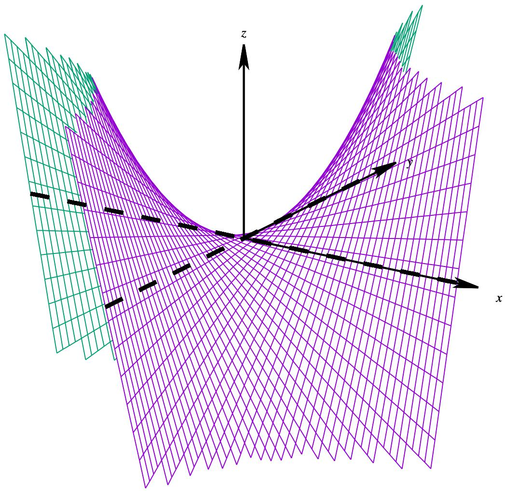  
图 4.10: ???? 示意图.

下面

# 例 4.47 设 $D$ 上的一个二元函数

$$
f (x, y) = \sin x \sin y \sin (x + y).
$$

其中 $D = \{ ( x + y ) : 0 \leq x , y , x + y \leq \pi \}$ . 求函数 $f$ 的最大值和最小值.

解 容易看出在 $D$ 上 $f \geq 0$ . 当 $\pmb { x } \in \partial D$ 时 $f ( \pmb { x } ) = 0$ , 当 $\boldsymbol { x } \in D ^ { \circ }$ 时 $f ( \pmb { x } ) > 0$ . 因此 $f$ 的最小值在 $\partial D$ 上取到.

为了求出 $f$ 的最大值, 先求驻点. 为此先求偏导数:

$$
\frac {\partial f}{\partial x} (x, y) = \sin y [ \cos x \sin (x + y) + \sin x \cos (x + y) ] = \sin y \sin (2 x + y),
$$

$$
\frac {\partial f}{\partial x} (x, y) = \sin x [ \cos y \sin (x + y) + \sin y \cos (x + y) ] = \sin x \sin (x + 2 y).
$$

令偏导数都为零, 由于 sin ?? ≠ 0, sin ?? ≠ 0, 故

$$
\sin (2 x + y) = 0, \qquad \sin (x + 2 y) = 0.
$$

由于 $0 < 2 x + y < 2 \pi$ , $0 < x + 2 y < 2 \pi$ , 所以

$$
2 x + y = \pi , \qquad x + 2 y = \pi .
$$

解得 $x = y = \pi / 3$ . 因此 $( \pi / 3 , \pi / 3 )$ 是 $f$ 的唯一驻点. 且

$$
f \left(\frac {\pi}{3}, \frac {\pi}{3}\right) = \sin \frac {\pi}{3} \sin \frac {\pi}{3} \sin \frac {2 \pi}{3} = \frac {3}{8} \sqrt {3}.
$$

由于 $f$ 是连续函数,因此它在有界闭集上的一定可以取到最大值,因此 $f$ 一定在 $( \pi / 3 , \pi / 3 )$ 上取到最大值3 3/8.■

研究多元函数的极值需要线性代数中的二次型理论, 由于这部分内容在《高等代数》中已经详细介绍, 因此相关定理的证明不再赘述.

# 定义 4.17 (实二次型)

设 $n$ 级实对称矩阵 $A = \left( a _ { i j } \right)$ 和实数域 $\mathbb { R }$ 上的 $n$ 维列向量 $\pmb { x } = ( x _ { 1 } , x _ { 2 } , \cdots , x _ { n } ) ^ { T }$ . 令

$$
Q (\boldsymbol {x}) = \boldsymbol {x} ^ {T} \boldsymbol {A} \boldsymbol {x} = \sum_ {i, j} ^ {n} a _ {i j} x _ {i} x _ {j}.
$$

我们称 $Q ( { \pmb x } )$ 为 $x _ { 1 } , x _ { 2 } , \cdots , x _ { n }$ 的一个实二次型 (real quadratic form), 其中 $\pmb { A }$ 称为 $Q ( { \pmb x } )$ 的系数矩阵 (coefficientmatrix).

# 定义 4.18 (正定矩阵、负定矩阵和不定矩阵)

设 $n$ 元实二次型 $Q ( { \pmb x } )$ .

(1) 若对于任一 $\boldsymbol { x } \in \mathbb { R } ^ { n }$ 都有 $Q ( { \pmb x } ) > 0$ , 则称 $Q$ 是正定的 (positive definite), 此时称它的系数矩阵为正定矩阵 (positive definite matrix).  
(2) 若对于任一 $\boldsymbol { x } \in \mathbb { R } ^ { n }$ 都有 $Q ( { \pmb x } ) < 0$ , 则称 $Q$ 是负定的 (negative definite), 此时称它的系数矩阵为负定矩阵 (negative definite matrix).  
(3) 若存在 $\pmb { a } , \pmb { b } \in \mathbb { R } ^ { n }$ 使得 $Q ( { \pmb a } ) < 0 < Q ( { \pmb b } ) .$ , 则称 $Q$ 是不定的 (indefinite ), 此时称它的系数矩阵为不定矩阵 (indefinite matrix).

注 如果 $>$ 改为 $\geq$ , 则称为半正定的 (positive semi-definite). 如果 $<$ 改为 $\leq$ , 则称为半负定的 (negative semi-definite).

下面是线性代数中判断正定矩阵和负定矩阵的充要条件.

# 定理 4.28

设 $n$ 级实对称矩阵 $A = \left( a _ { i j } \right)$ . 则 $\pmb { A }$ 是正定的当且仅当它的各阶顺序主子式均大于零:

$$
a _ {1 1} > 0, \qquad \left| \begin{array}{c c} a _ {1 1} & a _ {1 2} \\ a _ {2 1} & a _ {2 2} \end{array} \right| > 0, \qquad \left| \begin{array}{c c c} a _ {1 1} & a _ {1 2} & a _ {1 3} \\ a _ {2 1} & a _ {2 2} & a _ {2 3} \\ a _ {3 1} & a _ {3 2} & a _ {3 3} \end{array} \right| > 0, \qquad \dots , \qquad \det  A > 0.
$$

用以上两个结论可以证明二级不定矩阵的充要条件.

# 定理 4.29

设 $n$ 级实对称矩阵 $A = \left( a _ { i j } \right)$ . 则 $\pmb { A }$ 是负定的当且仅当它的奇数阶顺序主子式均小于零,偶数阶顺序主子式 均大于零:

$$
a _ {1 1} <   0, \quad \left| \begin{array}{l l} a _ {1 1} & a _ {1 2} \\ a _ {2 1} & a _ {2 2} \end{array} \right| > 0, \quad \left| \begin{array}{l l l} a _ {1 1} & a _ {1 2} & a _ {1 3} \\ a _ {2 1} & a _ {2 2} & a _ {2 3} \\ a _ {3 1} & a _ {3 2} & a _ {3 3} \end{array} \right| <   0, \quad \dots .
$$

下面给出一个判断二级不定矩阵的充要条件, 这个命题在线性代数中没有介绍.

# 定理 4.30

设 2 级实对称矩阵 $A = \left( a _ { i j } \right)$ , 则 $\pmb { A }$ 是不定矩阵当且仅当 det $A < 0$ .

证明 由题意 $A$ 对应的二次型为

$$
Q (x, y) = a _ {1 1} x ^ {2} + 2 a _ {1 2} x y + a _ {2 2} y ^ {2}.
$$

(i) 证明必要性. 若 $\pmb { A }$ 是不定的, 则由定理4.28和4.29可知 det $A = a _ { 1 1 } a _ { 2 2 } - a _ { 1 2 } ^ { 2 } \leq 0 .$ . 现假设 $a _ { 1 1 } a _ { 2 2 } - a _ { 1 2 } ^ { 2 } = 0$ .

若 $a _ { 1 1 } = 0 ,$ , 则 $a _ { 1 2 } = 0$ , 于是

$$
Q (x, y) = a _ {2 2} y ^ {2} \geq 0.
$$

显然这时 $Q ( x , y )$ 不是不定的.

若 $a 1 1 \neq 0$ , 则

$$
Q (x, y) = a _ {1 1} \left(x + \frac {a _ {1 2}}{a _ {1 1}} y\right) ^ {2} + \left(\frac {a _ {1 1} a _ {2 2} - a _ {1 2} ^ {2}}{a _ {1 1}}\right) y ^ {2} = a _ {1 1} \left(x + \frac {a _ {1 2}}{a _ {1 1}}\right) ^ {2} \geq 0.
$$

显然这时 $Q ( x , y )$ 不是不定的. 于是可知当 $\pmb { A }$ 不定时, det $A < 0$ .

(ii) 证明充分性. 设 d $\mathfrak { t } A = a _ { 1 1 } a _ { 2 2 } - a _ { 1 2 } ^ { 2 } < 0 .$ .

若 $a _ { 1 1 } = 0$ , 则 $a _ { 1 2 } \neq 0$ , 于是

$$
Q (x, y) = \left(2 a _ {1 2} x + a _ {2 2} y\right) y.
$$

取

$$
x _ {1} <   - \frac {a _ {1 1}}{2 a _ {1 2}}, \quad x _ {2} > \frac {a _ {1 1}}{2 a _ {1 2}}.
$$

则

$$
Q \left(x _ {1}, 1\right) = 2 a _ {1 2} x + a _ {2 2} <   0, \quad Q \left(x _ {2}, 1\right) = 2 a _ {1 2} x _ {2} + a _ {2 2} > 0.
$$

因此 $Q ( x , y )$ 是正定的.

若 $a _ { 1 1 } \neq 0$ , 则

$$
Q (x, y) = a _ {1 1} \left[ \left(x + \frac {a _ {1 2}}{a _ {1 1}} y\right) ^ {2} + \left(\frac {a _ {1 1} a _ {2 2} - a _ {1 2} ^ {2}}{a _ {1 1} ^ {2}}\right) y ^ {2} \right].
$$

若 $a _ { 1 1 } > 0$ , 则

$$
Q \left(\frac {- a _ {1 2}}{a _ {1 1}}, 1\right) = a _ {1 1} \left[ \left(x + \frac {a _ {1 2}}{a _ {1 1}} y\right) ^ {2} + \left(\frac {a _ {1 1} a _ {2 2} - a _ {1 2} ^ {2}}{a _ {1 1} ^ {2}}\right) y ^ {2} \right] = \frac {a _ {1 1} a _ {2 2} - a _ {1 2} ^ {2}}{a _ {1 1}} <   0., \quad Q (1, 0) = a _ {1 1} > 0.
$$

若 $a _ { 1 1 } < 0$ , 则

$$
Q \left(\frac {- a _ {1 2}}{a _ {1 1}}, 1\right) = a _ {1 1} \left[ \left(x + \frac {a _ {1 2}}{a _ {1 1}} y\right) ^ {2} + \left(\frac {a _ {1 1} a _ {2 2} - a _ {1 2} ^ {2}}{a _ {1 1} ^ {2}}\right) y ^ {2} \right] = \frac {a _ {1 1} a _ {2 2} - a _ {1 2} ^ {2}}{a _ {1 1}} > 0., \quad Q (1, 0) = a _ {1 1} <   0.
$$

因此 $Q ( x , y )$ 是正定的.

XXXX

# 定理 4.31 (多元函数极值的充分条件)

设 $n$ 元函数 $f , { \pmb x } _ { 0 }$ 是 $f$ 的一个驻点. $f$ 在 $x _ { 0 }$ 的一个邻域内有连续的二阶偏导数.

(1) 若 $H f ( { \pmb x } ) _ { 0 }$ 是正定的, 则 $x _ { 0 }$ 是 $f$ 的一个严格极小值点.  
(2) 若 $H f ( x ) _ { 0 }$ 是负定的, 则 $\scriptstyle { \boldsymbol { x } } _ { 0 }$ 是 $f$ 的一个严格极大值点.  
(3) 若 $H f ( { \pmb x } ) _ { 0 }$ 是不定的, 则 $x _ { 0 }$ 不是 $f$ 的极值点.

证明 由于 $f$ 在 $x _ { 0 }$ 的一个邻域内有连续的二阶偏导数, 故

$$
f (\boldsymbol {x}) = f \left(\boldsymbol {x} _ {0}\right) + \boldsymbol {J} f \left(\boldsymbol {x} _ {0}\right) \boldsymbol {h} + \frac {1}{2} \boldsymbol {h} ^ {T} \boldsymbol {H} f \left(\boldsymbol {x} _ {0}\right) \boldsymbol {h} + o \left(\| \boldsymbol {h} \| ^ {2}\right), \quad \| \boldsymbol {h} \| \rightarrow 0.
$$

其中 $\pmb { h } = \pmb { x } - \pmb { x } _ { 0 }$ 由于 $x _ { 0 }$ 是 $f$ 的一个驻点, 故 $\begin{array} { r } { J f ( \pmb { x } _ { 0 } ) \pmb { 0 } , } \end{array}$ 于是

$$
f (\boldsymbol {x}) - f \left(\boldsymbol {x} _ {0}\right) = \frac {1}{2} \boldsymbol {h} ^ {T} \boldsymbol {H} f \left(\boldsymbol {x} _ {0}\right) \boldsymbol {h} + o \left(\| \boldsymbol {h} \| ^ {2}\right), \quad \| \boldsymbol {h} \| \rightarrow 0. \tag {4.13}
$$

(1) 设 $\left\| \mathbf { y } \right\| = 1$ , 它的全体就是单位球面 $\partial N _ { 1 } ( \mathbf { 0 } )$ . 由于 $H f ( { \pmb x } _ { 0 } )$ 是正定的, 因此

$$
\boldsymbol {y} ^ {T} \boldsymbol {H} f (\boldsymbol {x} _ {0}) \boldsymbol {y} > 0.
$$

这是单位球面上的连续函数, 且单位球面是一个有界闭集, 因此该函数在单位球面上的某点取得最小值, 设这个最小值是 $m > 0 .$ , 于是

$$
\boldsymbol {y} ^ {T} \boldsymbol {H} f (\boldsymbol {x} _ {0}) \boldsymbol {y} \geq m > 0.
$$

于是

$$
\frac {1}{2} \boldsymbol {h} ^ {T} \boldsymbol {H} f (\boldsymbol {x} _ {0}) \boldsymbol {h} = \frac {1}{2} \| \boldsymbol {h} \| ^ {2} \left(\frac {\boldsymbol {h} ^ {T}}{\| \boldsymbol {h} \|} \boldsymbol {H} f (\boldsymbol {x} _ {0}) \frac {\boldsymbol {h}}{\| \boldsymbol {h} \|}\right) \geq \frac {m}{2} \| \boldsymbol {h} \| ^ {2}.
$$

把上式代入等式4.13可知

$$
f (\boldsymbol {x}) - f \left(\boldsymbol {x} _ {0}\right) \geq \| \boldsymbol {h} \| ^ {2} \left[ \frac {m}{2} + o (1) \right], \quad \| \boldsymbol {h} \| \rightarrow 0.
$$

因此 $f ( \pmb { x } ) > f ( \pmb { x } _ { 0 } )$ . 这表明 $f$ 在 $x _ { 0 }$ 这点取到严格的极小值点. 同理可知 2 成立.

(3) 由于 $H f ( x ) _ { 0 }$ 是不定的, 故存在 $\pmb { p } , \pmb { q } \in \mathbb { R } ^ { n }$ 使得

$$
\boldsymbol {p} ^ {T} \boldsymbol {H} f (\boldsymbol {x} _ {0}) \boldsymbol {p} <   0 <   \boldsymbol {q} ^ {T} \boldsymbol {H} f (\boldsymbol {x} _ {0}) \boldsymbol {q}.
$$

等式4.13中的 $\pmb { h }$ 分别取 $\varepsilon p$ 和 $\varepsilon q$ 得

$$
f \left(\boldsymbol {x} _ {0} + \varepsilon \boldsymbol {p}\right) - f \left(\boldsymbol {x} _ {0}\right) = \frac {1}{2} \left[ \boldsymbol {p} ^ {T} \boldsymbol {H} f \left(\boldsymbol {x} _ {0}\right) \boldsymbol {p} \right] \varepsilon^ {2} + o \left(\varepsilon^ {2}\right) = \left[ \frac {1}{2} \boldsymbol {p} ^ {T} \boldsymbol {H} f \left(\boldsymbol {x} _ {0}\right) \boldsymbol {p} + o (1) \right] \varepsilon^ {2}.
$$

$$
f \left(\boldsymbol {x} _ {0} + \varepsilon \boldsymbol {q}\right) - f \left(\boldsymbol {x} _ {0}\right) = \frac {1}{2} \left[ \boldsymbol {q} ^ {T} \boldsymbol {H} f \left(\boldsymbol {x} _ {0}\right) \boldsymbol {q} \right] \varepsilon^ {2} + o \left(\varepsilon^ {2}\right) = \left[ \frac {1}{2} \boldsymbol {q} ^ {T} \boldsymbol {H} f \left(\boldsymbol {x} _ {0}\right) \boldsymbol {q} + o (1) \right] \varepsilon^ {2}.
$$

当 $\varepsilon$ 充分小时

$$
f \left(\boldsymbol {x} _ {0} + \varepsilon \boldsymbol {p}\right) <   f \left(\boldsymbol {x} _ {0}\right) <   f \left(\boldsymbol {x} _ {0} + \varepsilon \boldsymbol {q}\right).
$$

这表明 $x _ { 0 }$ 不是 $f$ 的极值点.

对于二元函数, 以上定理可以写成如下形式.

# 定理 4.32

设 2 元函数 $f , x _ { 0 }$ 是 $f$ 的一个驻点. $f$ 在 $\scriptstyle { \boldsymbol { x } } _ { 0 }$ 的一个邻域内有连续的二阶偏导数. 令

$$
a = \frac {\partial^ {2}}{\partial x ^ {2}} f (\boldsymbol {x} _ {0}), \qquad b = \frac {\partial^ {2}}{\partial x \partial y} f (\boldsymbol {x} _ {0}), \qquad c = \frac {\partial^ {2}}{\partial y ^ {2}} f (\boldsymbol {x} _ {0}).
$$

(1) 当 $a c - b ^ { 2 } > 0$ 且 $a > 0$ 时, $x _ { 0 }$ 是 $f$ 的一个严格极小值点.  
(2) 当 $a c - b ^ { 2 } > 0$ 且 $a < 0$ 时, $x _ { 0 }$ 是 $f$ 的一个严格极大值点.  
(3) 当 $a c - b ^ { 2 } < 0$ 时, $\scriptstyle { \boldsymbol { x } } _ { 0 }$ 不是 $f$ 的极值点.

下面看一个例子.

例 4.48 设二元函数

$$
f (x, y) = 2 x ^ {4} + y ^ {4} - 2 x ^ {2} - 2 y ^ {2}.
$$

求 $f$ 的所有极值点.

解 建立驻点方程:

$$
\frac {\partial f}{\partial x} (x, y) = 8 x ^ {3} - 4 x = 0, \quad \frac {\partial f}{\partial y} (x, y) = 4 y ^ {3} - 4 y = 0.
$$

解得 $x = 0$ 或 $\pm { \sqrt { 2 } } / 2$ , $y = 0$ 或 $\pm 1$ . 因此一共有九个驻点. 求二阶偏导数:

$$
a = \frac {\partial^ {2}}{\partial x ^ {2}} f (x, y) = 2 4 x ^ {2} - 4, \quad b = \frac {\partial^ {2}}{\partial x \partial y} f (x, y) = 0, \quad c = \frac {\partial^ {2}}{\partial y ^ {2}} f (x, y) = 1 2 y ^ {2} - 4.
$$

下面来检验 $a c - b ^ { 2 }$ 和 $a$ 的正负性:

<table><tr><td>x</td><td>0</td><td>0</td><td>±√2/2</td><td>±√2/2</td></tr><tr><td>y</td><td>0</td><td>±1</td><td>0</td><td>±1</td></tr><tr><td>a</td><td>-4</td><td>-4</td><td>8</td><td>8</td></tr><tr><td>b</td><td>0</td><td>0</td><td>0</td><td>0</td></tr><tr><td>c</td><td>-4</td><td>8</td><td>-4</td><td>8</td></tr><tr><td>ac-b2</td><td>16&gt;0</td><td>-32&lt;0</td><td>-32&lt;0</td><td>64&gt;0</td></tr></table>

于是可知 $( 0 , 0 )$ 是严格极大值点, $( \pm { \sqrt { 2 } } / 2 , \pm 1 )$ 四点是严格极小值点. 其余的不是极值点.

多元函数的极值有很广泛的应用, 下面介绍一个在数学上的应用. 在平面上有一组点 $( x _ { i } , y _ { 1 } ) \ ( i = 1 , 2 , \cdot \cdot \cdot , n )$ $( x _ { i } , y _ { 1 } )$ ,发现这组点的近似地分布在某一条直线附近.现在我们希望找到一条直线来拟合这组点.那么很自然的想法是,所有点与这条直线的 “偏差” 之和应最小. 为了取消正负性的影响, 于是我们考虑 “偏差” 的平方和. 设满足要求的直线为 $y = a x + b$ , 令

$$
\varphi (a, b) = \sum_ {i = 1} ^ {n} \left(a x _ {i} + b - y _ {i}\right) ^ {2}.
$$

则问题就是讨论二元函数 $\varphi$ 是否存在最小值. 建立驻点方程:

$$
\frac {\partial \varphi}{\partial a} (a, b) = 2 \sum_ {i = 1} ^ {n} (a x _ {i} + b - y _ {i}) x _ {i} = 0, \quad \frac {\partial \varphi}{\partial b} (a, b) = 2 \sum_ {i = 1} ^ {n} (a x _ {i} + b - y _ {i}) = 0.
$$

整理得到

$$
\left\{ \begin{array}{l} {\left(\sum_ {i = 1} ^ {n} x _ {i} ^ {2}\right) a + \left(\sum_ {i = 1} ^ {n} x _ {i}\right) b = \sum_ {i = 1} ^ {n} x _ {i} y _ {i}} \\ {\left(\sum_ {i = 1} ^ {n} x _ {i}\right) a + n b = \sum_ {i = 1} ^ {n} y _ {i}} \end{array} . \right. \tag {4.14}
$$

根据 Cramer 法则, 需要看系数行列式是否为零. 由 Cauchy-Schwarz 不等式可知

$$
\left(\sum_ {i = 1} ^ {n} x _ {i}\right) ^ {2} = \left(\sum_ {i = 1} ^ {n} 1 \cdot x _ {i}\right) ^ {2} \leq \sum_ {i = 1} ^ {n} 1 ^ {2} \sum_ {i = 1} ^ {n} x _ {i} ^ {2} = n \left(\sum_ {i = 1} ^ {n} x _ {i} ^ {2}\right).
$$

现在假设 $x _ { 1 }$ , ??2, · · · , $x _ { n }$ 不全相等, 则上述 $\leq$ 取到严格 $< .$ 于是可知线性方程组的系数矩阵不为零, 因此方程组4.14有唯一解, 这表明 $\varphi$ 有唯一驻点. 下面来看这个驻点是不是极值点. 计算 Hesse 矩阵:

$$
\boldsymbol {H} \varphi (a, b) = 2 \left[ \begin{array}{c c} \frac {\partial^ {2} \varphi}{\partial a ^ {2}} & \frac {\partial^ {2} \varphi}{\partial a \partial b} \\ \frac {\partial^ {2} \varphi}{\partial a \partial b} & \frac {\partial^ {2} \varphi}{\partial b ^ {2}} \end{array} \right] _ {(a, b)} = 2 \left[ \begin{array}{c c} \sum_ {i = 1} ^ {n} x _ {i} ^ {2} & \sum_ {i = 1} ^ {n} x _ {i} \\ \sum_ {i = 1} ^ {n} x _ {i} & n \end{array} \right].
$$

由于

$$
n \left(\sum_ {i = 1} ^ {n} x _ {i} ^ {2}\right) - \left(\sum_ {i = 1} ^ {n} x _ {i}\right) ^ {2} > 0, \quad \sum_ {i = 1} ^ {n} x _ {i} ^ {2} > 0.
$$

由此可知 $\varphi$ 的唯一驻点正是它的极小值. 由直线的两点式方程可知满足要求的直线方程为

$$
\left| \begin{array}{c c c} x & y & 1 \\ \sum_ {i = 1} ^ {n} x _ {i} ^ {2} & \sum_ {i = 1} ^ {n} x _ {i} y _ {i} & \sum_ {i = 1} ^ {n} x _ {i} \\ \sum_ {i = 1} ^ {n} x _ {i} & \sum_ {i = 1} ^ {n} y _ {i} & n \end{array} \right| = 0.
$$

以上用直线拟合一组点的方法称为最小二乘法 (least squares method). 1801 年, 年仅 24 岁的 Gauss 用最小二乘法计算了谷神星的轨道, 根据他计算出来的轨道, 人们重新发现了谷神星. 1806 年法国数学家 Adrien-Marie Legendre独立提出了最小二乘法, 而 Gauss 是在 1809 年的著作《天体运动论》中第一次介绍了最小二乘法. 1829 年, 高斯

证明了最小二乘法的拟合效果强于其他方法, 这就是 Gauss-Markov 定理. 因此最小二乘法通常归功于 Gauss.

# 定理 4.33

# 证明

# 定理 4.34

# 证明

# 定理 4.35

# 证明

例 4.49

解 XXX

例 4.50

解 XXX

例 4.51

解 XXX

例 4.52

解 XXX

# 4.4 隐函数和隐映射的存在性及其微分

# 4.4.1 隐函数定理

我们在《数学分析1》中已经看到,不是每个函数都可以写成显式表达式,在更多情况下函数会写成隐式表达式, 这样的函数称为 “隐函数”. 因此我们专门讨论了隐函数的求导法则. 但对隐函数求导的前提是隐函数的存在性, 这是本节要讨论的主要问题.

设开集 $D \subseteq \mathbb { R } ^ { 2 }$ 上的一个二元函数 $F ( x , y )$ . 则二元方程 $F ( x , y ) = 0 $ 给出了 $x$ 和 $y$ 的一个隐式关系式. 但我们无法从这个关系式中一眼看出 $y$ 是不是 $x$ 的函数——对于给定的 $x \in D$ , 无法一眼看出是否存在唯一的 $y \in D$ 满足方程 $F ( x , y ) = 0 $ . 这就是隐函数存在性问题. 进一步, 我们还希望方程确定的隐函数可导.

数分中研究隐函数存在问题, 只需研究局部的存在性, 因为可导是一个局部概念, 如果隐函数能在局部存在,就已经足够研究它的导数了. 设一点 $( x _ { 0 } , y _ { 0 } )$ 满足 $F ( x , y ) = 0 $ . 若存在一个 $( x _ { 0 } , y _ { 0 } )$ 的邻域, 使得在这个邻域内$F ( x , y ) = 0 $ 能确定一个函数, 就可以把这个函数写成 $y = f ( x )$ . 这个 $f$ 表示 $x$ 到 $y$ 的对应法则, 它客观存在, 但却无法表达出来 (因为初等函数的符号有限, 并非我们的能力有限).

下面先看一个简单的例子. 设二元函数

$$
F (x, y) = x ^ {2} + y ^ {2} - 1.
$$

则方程 $F ( x , y ) = 0 $ 确定了一个单位圆.容易知道除了 $( 1 , 0 )$ 和 $( - 1 , 0 )$ 之外的每一点都存在一个邻域使得 $F ( x , y ) =$ 0 在这个邻域内确定了一个函数 $y = f ( x )$ . 很容易看出这两个的特殊之处, 在这两点的切线是平行于 $y$ 轴的, 换句话说, 这两点的偏导数

$$
\mathcal {D} _ {y} (1, 0) = \mathcal {D} _ {y} (- 1, 0) = 0.
$$

反之, 除了 $( 0 , 1 )$ 和 $( 0 , - 1 )$ 之外的每一点都存在一个邻域使得 $F ( x , y ) = 0 $ 在这个邻域内确定了一个函数 $x = g ( y )$ .类似地可以看出这两点的切线是平行于 $x$ 轴的, 即这两点的偏导数

$$
\mathcal {D} _ {x} (0, 1) = \mathcal {D} _ {x} (0, - 1) = 0.
$$

于是不难想到隐函数 $y = f ( x )$ 在 $( x _ { 0 } , y _ { 0 } )$ 附近存在且可导的条件. 下面尝试求出 $f ^ { \prime } ( x )$ . 对方程 $F ( x , y ) = 0 $ 两边求导, 由链式法则可知

$$
\frac {\partial F}{\partial x} (x, y) + \frac {\partial F}{\partial y} \frac {\partial f}{\partial x} (x, y) = 0 \iff f ^ {\prime} (x) = \frac {\mathcal {D} _ {x} (x , y)}{\mathcal {D} _ {y} (x , y)}.
$$

上面的计算能成立, 是因为 $F ( x , y )$ 的两个偏导数都存在且连续.

把以上的讨论整理后就是以下定理.

# 定理 4.36 (1 维的隐函数定理)

设函数 $F : D  \mathbb { R }$ , 其中 $D$ 是 $\mathbb { R } ^ { 2 }$ 中的一个开集. 若 $F$ 满足

${ \ v O } ^ { \circ } ~ F \in C ^ { 1 } ( D )$   
$2 ^ { \circ }$ 存在 $( x _ { 0 } , y _ { 0 } ) \in D$ 使得 $F ( x _ { 0 } , y _ { 0 } ) = 0$   
$3 ^ { \circ } \mathcal { D } _ { y } F ( x _ { 0 } , y _ { 0 } ) \neq 0 .$

则存在一个包含 $( x _ { 0 } , y _ { 0 } )$ 的开矩形 $I _ { x } \times I _ { y } \subseteq D$ 使得

$1 ^ { \circ }$ 对于任一 $x \in I _ { x }$ 方程 $F ( x , y ) = 0 $ 在 $I _ { y }$ 中都有唯一的解 $f ( x )$ .  
$2 ^ { \circ } \ y _ { 0 } = f ( x _ { 0 } )$   
3◦ $f \in C ^ { 1 } ( I _ { x } ) .$   
$4 ^ { \circ }$ 当 $x \in I _ { x }$ 时, 有

$$
f ^ {\prime} (x) = - \frac {\mathcal {D} _ {x} (x , y)}{\mathcal {D} _ {y} (x , y)},
$$

其中 $y = f ( x )$ .

证明 (i) 证明隐函数的存在性. 由于 $\mathcal { D } _ { y } F ( x _ { 0 } , y _ { 0 } ) \neq 0$ , 不妨设 $\mathcal { D } _ { y } ( x _ { 0 } , y _ { 0 } ) > 0 .$ . 由于 $F$ 在 $D$ 上连续, 故存在包含

$( x _ { 0 } , y _ { 0 } )$ 的开矩形 $I _ { x } ^ { \prime } \times I _ { y } \subseteq D$ 使得在 $I _ { x } ^ { \prime } \times I _ { y }$ 上保持 $\mathcal { D } _ { \mathrm { y } } F > 0 .$ . 因此对于任意给定的 $x \in I _ { x } ^ { \prime }$ , 关于 $y$ 的函数 $F ( x , y )$ 在闭区间 $\overline { { I } } _ { y }$ 都是严格递增的. 设 $\overline { { I } } _ { y } = \left[ c , d \right]$ , 由于 $F ( x _ { 0 } , y _ { 0 } ) = 0$ , 因此

$$
F (x _ {0}, c) <   0, \qquad F (x _ {0}, d) > 0.
$$

由于 $F$ 在 $D$ 上连续, 因此存在含有 $x _ { 0 }$ 的开区间 $I _ { x } \subseteq I _ { x } ^ { \prime }$ 使得当 $x \in I _ { x }$ 时

$$
F (x, c) <   0, \qquad F (x, d) > 0.
$$

有零点定理可知, 对于任一 $x \in I _ { x }$ 都存在 $f ( x ) \in I _ { y }$ 使得 $F ( x , f ( x ) ) = 0$ . 由于函数是严格递增的, 故这样的 $f ( x )$ 是唯一存在的. 这就证明了 $1 ^ { \circ }$ . 特别地, 当 $x = x _ { 0 }$ 时存在唯一的 $f ( x _ { 0 } )$ 满足 $F ( x , y ) = 0 $ , 因此 $y _ { 0 } = f ( x _ { 0 } )$ . 这就证明了 $2 ^ { \circ }$ .

(ii) 证明 $3 ^ { \circ }$ 和 $4 ^ { \circ }$ . 先证明 $f$ 在 $I _ { x }$ 上连续. 先看 $f$ 在 $x _ { 0 }$ 的情况. 事实上 (i) 的证明过程已经证明了 $f$ 在 $x _ { 0 }$ 连续.对于任一 $\varepsilon > 0$ ,只需令 $I _ { y } = ( f ( x _ { 0 } ) - \varepsilon , f ( x _ { 0 } ) + \varepsilon )$ ,就存在满足(i)中证明过程中要求的 $I _ { x }$ ,因此只需取 $\delta$ 满足$N _ { \delta } ( x _ { 0 } ) \subseteq I _ { x }$ , 就有当 $x \in N _ { \delta } ( x _ { 0 } )$ 时

$$
f (x _ {0}) - \varepsilon <   f (x) <   f (x _ {0}) + \varepsilon .
$$

这表明 $f$ 在 $x _ { 0 }$ 处连续.

现任取 $x _ { 1 } \in I _ { x }$ ,下面证明 $f$ 在 $x _ { 1 }$ 连续.设 $y _ { 1 } = f ( x _ { 1 } )$ .对于 $( x _ { 1 } , y _ { 1 } )$ 可以重复前面对 $( x _ { 0 } , y _ { 0 } )$ 的讨论过程.这样就可以知道以下事实: 存在包含 $( x _ { 1 } , y _ { 1 } )$ 的开矩形 $\widetilde { I _ { x } } \times \widetilde { I _ { y } } \subseteq I _ { x } \times I _ { y }$ 使得当 $x \in \widetilde { I _ { x } }$ 时方程 $F ( x , y ) = 0 $ 在 $\widetilde { I _ { \mathrm { y } } }$ 上有唯一解 $g ( x )$ , 且函数 $g$ 在 $x _ { 1 }$ 处连续. 由于当 $x \in \widetilde { I _ { x } }$ 时 $f = g$ , 这表明 $f$ 在 $x _ { 1 }$ 处连续.

下面证明 $4 ^ { \circ }$ . 设 $x \in I _ { x }$ , 取充分小的 $h$ 使得 $x + h \in I _ { x }$ . 设 $y = f ( x )$ , 则 $F ( x , y ) = 0 .$ 令

$$
k = f (x + h) - f (x).
$$

则 $F ( x + h , y + k ) = F ( x + h , f ( x + h ) ) = 0 .$ 由于 $F \in C ^ { 1 } ( D )$ , 故 $F$ 在 $D$ 上可微, 因此

$$
0 = F (x + h, y + k) - F (x, y) = \mathcal {D} _ {x} F (x, y) h + \mathcal {D} _ {y} F (x, y) k + \alpha h + \beta k,
$$

其中 $\alpha , \beta$ 满足当 $( h , k ) \to ( 0 , 0 )$ 时 $\alpha \to 0$ , $\beta \to 0$ . 由于 $f$ 在 $I _ { x }$ 上连续, 因此当 $h  0$ 时, $k  0$ . 这表明当 $h  0$ 时 $\alpha  0 , \beta  0$ . 于是可知

$$
f ^ {\prime} (x) = \lim _ {h \to 0} \frac {f (x + h) - f (x)}{h} = \lim _ {h \to 0} \frac {k}{h} = - \lim _ {h \to 0} \frac {\mathcal {D} _ {x} F (x , y) + \alpha}{\mathcal {D} _ {y} F (x , y) + \beta} = - \frac {\mathcal {D} _ {x} F (x , y)}{\mathcal {D} _ {y} F (x , y)}.
$$

由上式立刻可知 $f ^ { \prime }$ 在 $I _ { x }$ 上连续, 这表明 $f \in C ^ { 1 } ( I _ { x } )$ . 这就证明了 $3 ^ { \circ }$ .

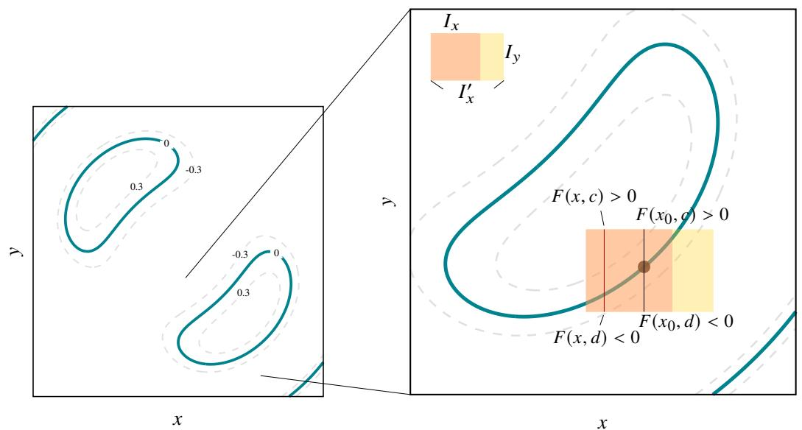  
图 4.11: 隐函数在局部的存在性

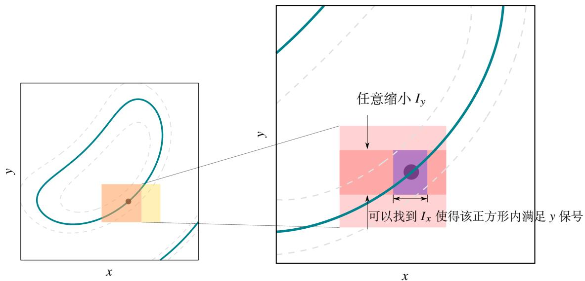  
图 4.12: 隐函数的连续性

下面看两个例子.

例 4.53 设方程

$$
x ^ {2} y ^ {2} - 3 y + 2 x ^ {3} = 0.
$$

判断方程是否在点 $( 1 , 1 )$ 和 (1, 2) 附近确定了函数 $y = f ( x )$ . 如果是, 则求出 $f ^ { \prime } ( 1 )$ .

解 令 $F ( x , y ) = x ^ { 2 } y ^ { 2 } - 3 y + 2 x ^ { 3 } .$ . 计算得 $F ( 1 , 1 ) = F ( 1 , 2 ) = 0 .$ . 由于

$$
\frac {\partial F}{\partial y} (x, y) = 2 x ^ {2} y - 3.
$$

故

$$
\frac {\partial F}{\partial y} (1, 1) = - 1 \neq 0, \quad \frac {\partial F}{\partial y} (1, 2) = 1 \neq 0.
$$

由隐函数定理可知方程在点 $( 1 , 1 )$ 和 $( 1 , 2 )$ 附近都可以确定函数 $y = f ( x )$ . 分别计算点 $( 1 , 1 )$ 和 $( 1 , 2 )$ 附近确定的函数在 $x = 1$ 处的导数:

$$
f ^ {\prime} (1) = - \frac {\frac {\partial F}{\partial x} (1 , 1)}{\frac {\partial F}{\partial x} (1 , 1)} = - \frac {8}{- 1} = 8. f ^ {\prime} (1) = - \frac {\frac {\partial F}{\partial x} (1 , 2)}{\frac {\partial F}{\partial x} (1 , 2)} = - \frac {1 4}{1} = - 1 4.
$$

以上例子是一个关于 $y$ 的二次方程, 因此我们可以用公式解出 $y .$ . 但更多情况下, 解出 $y$ 是行不通的, 这时就只能用隐函数定理解决问题.

例 4.54 设方程

$$
\sin x + \ln y - x y ^ {3} = 0.
$$

判断方程是否在 $( 0 , 1 )$ 附近确定了函数 $y = f ( x )$ . 如果是, 则求出 $f ^ { \prime } ( 0 )$ .

解 令 $F ( x , y ) = \sin x + \ln y - x y ^ { 3 } .$ 计算得 $F ( 0 , 1 ) = 0 $ . 由于

$$
\frac {\partial F}{\partial y} (0, 1) = \left. \frac {1}{y} - 3 x y ^ {2} \right| _ {(0, 1)} = 1 \neq 0
$$

由隐函数定理可知方程在点 $( 0 , 1 )$ 附近可以确定函数 $y = f ( x )$ . 于是

$$
f ^ {\prime} (0) = - \frac {\frac {\partial F}{\partial x} (0 , 1)}{\frac {\partial F}{\partial x} (0 , 1)} = - \frac {0}{1} = 0.
$$

需要注意隐函数定理给出的隐函数存在条件只是一个充分条件. 请看下面一个例子.

例 4.55 设方程组

$$
\left\{ \begin{array}{l} x = t + \frac {1}{t} \\ y = t ^ {2} + \frac {1}{t ^ {2}} \end{array} \right..
$$

判断以上方程组是否确定了 $y$ 关于 $x$ 的函数.

解

上例表明, 不满足隐函数定理的条件也未必不能确定隐函数.

# 4.4.2 隐函数的导数

# 4.4.3 隐映射定理

现在可以来看更复杂的情况, 设函数 $F ( x _ { 1 } , x _ { 2 } , \cdots , x _ { n } , y )$ . 若要研究方程 $F ( x _ { 1 } , x _ { 2 } , \cdot \cdot \cdot , x _ { n } , y ) = 0$ 是否能在局部确定一个隐函数, 只需令 $\pmb { x } = \left( x _ { 1 } , x _ { 2 } , \cdots , x _ { n } \right)$ , 则方程就记成了 $F ( x , y ) = 0 $ . 然后把 1 维的隐函数定理证明中的 $x$ 用 $\boldsymbol { x }$ 替换就可以很容易地证明 $n$ 维的隐函数定理.

# 定理 4.37 (?? 维的隐函数定理)

设函数 $F : D  \mathbb { R }$ , 其中 $D$ 是 $\mathbb { R } ^ { n + 1 }$ 中的一个开集. 若 $F$ 满足

$1 ^ { \circ } ~ F \in C ^ { 1 } ( D )$   
$2 ^ { \circ }$ 存在 $( x _ { 0 } , y _ { 0 } ) \in D$ 使得 $F ( x _ { 0 } , y _ { 0 } ) = 0$ , 其中 $\pmb { x } _ { 0 } \in \mathbb { R } ^ { n }$ , $y _ { 0 } \in \mathbb { R }$   
$3 ^ { \circ } \mathcal { D } _ { y } F ( \pmb { x } _ { 0 } , y _ { 0 } ) \neq 0 .$

则存在一个包含 $( x _ { 0 } , y _ { 0 } )$ 的邻域 $I _ { x } \times I _ { y } \subseteq D$ , 其中 $I _ { x }$ 是 $\scriptstyle { \boldsymbol { x } } _ { 0 }$ 在 $\mathbb { R } ^ { n }$ 上的一个邻域, $I _ { y }$ 是 $y _ { 0 }$ 在 $\mathbb { R }$ 上的一个开区间, 使得

$1 ^ { \circ }$ 对于任一 $\boldsymbol { x } \in I _ { x }$ 方程 $F ( x , y ) = 0 $ 在 $I _ { y }$ 中都有唯一的解 $f ( { \pmb x } )$ .  
2 ◦ $y _ { 0 } = f ( \pmb { x } _ { 0 } )$   
$3 ^ { \circ }$ $f \in C ^ { 1 } ( I _ { x } )$   
$4 ^ { \circ }$ 当 $\boldsymbol { x } \in I _ { x }$ 时, 有

$$
\mathcal {D} _ {x _ {i}} f (\boldsymbol {x}) = - \frac {\mathcal {D} _ {x _ {i}} (\boldsymbol {x} , y)}{\mathcal {D} _ {y} (\boldsymbol {x} , y)}, \quad i = 1, 2, \dots , n.
$$

其中 $y = f ( { \pmb x } )$ .

在确定隐函数存在的情况下, 若要求各个偏导, 我们可以对方程直接求导, 而不必套用定理中的公式. 下面看两个例子.

例 4.56 设方程 $\sin u - x y u = 0$ 确定了隐函数 $u = u ( x , y )$ . 求 $\textstyle { \frac { \partial u } { \partial x } } , { \frac { \partial u } { \partial y } }$ .

解 解法一 把方程中的 $u$ 看作是关于 $x , y$ 的函数, 对方程求 $x$ 的偏导数得

$$
\frac {\partial u}{\partial x} \cos u - y u - x y \frac {\partial u}{\partial x} = 0 \Longleftrightarrow \frac {\partial u}{\partial x} = \frac {y u}{\cos u - x y}.
$$

同理可得

$$
\frac {\partial u}{\partial y} = \frac {x u}{\cos u - x y}.
$$

解法二 设 $F ( x , y , u ) = \sin u - x y u .$ . 把 $x , y , u$ 看成独立变量, 对方程两边分别求 $x , y , u$ 的偏导数

$$
\frac {\partial F}{\partial x} = - y u, \quad \frac {\partial F}{\partial y} = - x u, \quad \frac {\partial F}{\partial u} = \cos u - x y.
$$

由隐函数定理可知

$$
\frac {\partial u}{\partial x} = - \frac {\frac {\partial F}{\partial x}}{\frac {\partial F}{\partial u}} = \frac {y u}{\cos u - x y}, \quad \frac {\partial u}{\partial y} = - \frac {\frac {\partial F}{\partial y}}{\frac {\partial F}{\partial u}} = \frac {x u}{\cos u - x y}.
$$

例 4.57 设方程 $f ( x + z y ^ { - 1 } , y + z x ^ { - 1 } ) = 0$ 确定了隐函数 $z = z ( x , y )$ . 求 $\begin{array} { r } { \frac { \partial z } { \partial x } , \frac { \partial z } { \partial y } } \end{array}$ .

解 设 $\xi = x + z y ^ { - 1 }$ , $\eta = y + z x ^ { - 1 }$ .

解法一 对方程两边求 $x$ 的偏导数:

$$
\frac {\partial f}{\partial \xi} \frac {\partial \xi}{\partial x} + \frac {\partial f}{\partial \eta} \frac {\partial \eta}{\partial x} = 0 \iff \frac {\partial f}{\partial \xi} \left(1 + \frac {\partial z}{\partial x} y ^ {- 1}\right) + \frac {\partial f}{\partial \xi} \left(\frac {\partial z}{\partial x} x ^ {- 1} - \frac {z}{x ^ {2}}\right) = 0 \iff \frac {\partial z}{\partial x} = - \frac {\frac {\partial f}{\partial \xi} - \frac {\partial f}{\partial \eta} \frac {z}{x ^ {2}}}{\frac {\partial f}{\partial \xi} \frac {1}{y} + \frac {\partial f}{\partial \eta} \frac {1}{x}}.
$$

同理可知

$$
\frac {\partial z}{\partial y} = - \frac {\frac {\partial f}{\partial \eta} - \frac {\partial f}{\partial \xi} \frac {z}{y ^ {2}}}{\frac {\partial f}{\partial \xi} \frac {1}{y} + \frac {\partial f}{\partial \eta} \frac {1}{x}}.
$$

解法二 设 $F ( x , y , z ) = f ( x + z y ^ { - 1 } , y + z x ^ { - 1 } )$ . 把 $x , y , z$ 看成独立变量, 对方程两边分别求 $x , y$ 和 ?? 的偏导数

$$
\frac {\partial F}{\partial x} = \frac {\partial f}{\partial \xi} \frac {\partial \xi}{\partial x} + \frac {\partial f}{\partial \eta} \frac {\partial \eta}{\partial x} = \frac {\partial f}{\partial \xi} - \frac {\partial f}{\partial \eta} \frac {z}{x ^ {2}},
$$

$$
\frac {\partial F}{\partial y} = \frac {\partial f}{\partial \xi} \frac {\partial \xi}{\partial y} + \frac {\partial f}{\partial \eta} \frac {\partial \eta}{\partial y} = - \frac {\partial f}{\partial \xi} \frac {z}{y ^ {2}} + \frac {\partial f}{\partial \eta},
$$

$$
\frac {\partial F}{\partial x} = \frac {\partial f}{\partial \xi} \frac {\partial \xi}{\partial z} + \frac {\partial f}{\partial \eta} \frac {\partial \eta}{\partial z} = \frac {\partial f}{\partial \xi} \frac {1}{y} + \frac {\partial f}{\partial \eta} \frac {1}{x}.
$$

由隐函数定理可知

$$
\frac {\partial z}{\partial x} = - \frac {\frac {\partial F}{\partial x}}{\frac {\partial F}{\partial z}} = - \frac {\frac {\partial f}{\partial \xi} - \frac {\partial f}{\partial \eta} \frac {z}{x ^ {2}}}{\frac {\partial f}{\partial \xi} \frac {1}{y} + \frac {\partial f}{\partial \eta} \frac {1}{x}}. \qquad \frac {\partial z}{\partial y} = - \frac {\frac {\partial F}{\partial y}}{\frac {\partial F}{\partial z}} = - \frac {\frac {\partial f}{\partial \eta} - \frac {\partial f}{\partial \xi} \frac {z}{y ^ {2}}}{\frac {\partial f}{\partial \xi} \frac {1}{y} + \frac {\partial f}{\partial \eta} \frac {1}{x}}.
$$

下面尝试把隐函数定理推广到更一般的情况. 设 $m$ 个方程组成的方程组

$$
\left\{ \begin{array}{l} F _ {1} \left(x _ {1}, \dots , x _ {n}, y _ {1}, \dots , y _ {m}\right) = 0 \\ \dots \\ F _ {m} \left(x _ {1}, \dots , x _ {n}, y _ {1}, \dots , y _ {m}\right) = 0 \end{array} . \right. \tag {4.15}
$$

假设这个方程可以确定一个向量值函数

$$
\left\{ \begin{array}{l} y _ {1} = f _ {1} \left(x _ {1}, \dots , x _ {n}\right) \\ \dots \\ y _ {m} = f _ {1} \left(x _ {1}, \dots , x _ {n}\right) \end{array} . \right. \tag {4.16}
$$

令

$$
\boldsymbol {F} = \left[ F _ {1}, \dots , F _ {m} \right] ^ {T}, \qquad \boldsymbol {x} = \left[ x _ {1}, \dots , x _ {n} \right] ^ {T}, \qquad \boldsymbol {y} = \left[ y _ {1}, \dots , y _ {m} \right] ^ {T}, \qquad \boldsymbol {f} = \left[ f _ {1}, \dots , f _ {m} \right] ^ {T}.
$$

于是方程组4.22可以记作 $F ( x , y ) = \mathbf { 0 } $ , 其中 0 是 $m$ 元零向量. 而向量值函数4.23可以记作 $\mathbf { \boldsymbol { y } } = \mathbf { \boldsymbol { f } } ( \mathbf { \boldsymbol { x } } )$

隐函数定理一共有三个条件, 前两个条件不难推广到向量值函数的情况. 关键是第三个条件:

$$
\frac {\partial F \left(x _ {0} , y _ {0}\right)}{\partial y} \neq 0. \tag {4.17}
$$

隐函数定理的四个结论中前三个结论也不难推广. 关键是第四个结论:

$$
\frac {\partial f (\pmb {x})}{\partial x _ {i}} = - \left[ \frac {\partial F (\pmb {x} , y)}{\partial y} \right] ^ {- 1} \left[ \frac {\partial F (\pmb {x} , y)}{\partial x _ {i}} \right], i = 1, 2, \dots , n.
$$

上式可以写成矩阵形式

$$
\boldsymbol {J} f (\boldsymbol {x}) = - \left[ \frac {\partial F (\boldsymbol {x} , y)}{\partial y} \right] ^ {- 1} \left[ \frac {\partial F (\boldsymbol {x} , y)}{\partial x _ {1}}, \dots , \frac {\partial F (\boldsymbol {x} , y)}{\partial x _ {1}} \right]. \tag {4.18}
$$

令

$$
\boldsymbol {J} _ {y} f := \left[ \frac {\partial F}{\partial y} \right], \quad \boldsymbol {J} _ {\boldsymbol {x}} f := \left[ \frac {\partial F}{\partial x _ {1}}, \dots , \frac {\partial F}{\partial x _ {1}} \right].
$$

则条件4.24可以写成 det $J _ { y } f ( x _ { 0 } , y _ { 0 } ) \neq$ , 结论4.25可以写成

$$
\boldsymbol {J} f (\boldsymbol {x}) = - \left[ \boldsymbol {J} _ {y} f (\boldsymbol {x}, y) \right] ^ {- 1} \boldsymbol {J} _ {x} f (\boldsymbol {x}, y).
$$

要推广条件4.24和结论4.25, 只需把以上的 $J _ { y } f$ 和 $J _ { x } f$ 分别推广为以下两个矩阵:

$$
\boldsymbol {J} _ {\boldsymbol {y}} \boldsymbol {F} := \left[ \begin{array}{c c c} \frac {\partial F _ {1}}{\partial y _ {1}} & \dots & \frac {\partial F _ {1}}{\partial y _ {m}} \\ \vdots & & \vdots \\ \frac {\partial F _ {m}}{\partial y _ {1}} & \dots & \frac {\partial F _ {m}}{\partial y _ {m}} \end{array} \right], \qquad \boldsymbol {J} _ {\boldsymbol {x}} \boldsymbol {F} := \left[ \begin{array}{c c c} \frac {\partial F _ {1}}{\partial x _ {1}} & \dots & \frac {\partial F _ {1}}{\partial x _ {n}} \\ \vdots & & \vdots \\ \frac {\partial F _ {m}}{\partial x _ {1}} & \dots & \frac {\partial F _ {m}}{\partial x _ {n}} \end{array} \right].
$$

它们合起来就是 $\boldsymbol { F }$ 的 Jocobi 矩阵, 即 $J F = [ J _ { x } F , J _ { y } F ]$ . 注意到 $J _ { y } F$ 是一个方阵. 如此以来条件4.24就可以推广为det $J _ { y } F \neq 0$ , 结论4.25可以推广为

$$
J f (\boldsymbol {x}) = - \left[ J _ {y} F (\boldsymbol {x}, \boldsymbol {y}) \right] ^ {- 1} J _ {x} F (\boldsymbol {x}, \boldsymbol {y}).
$$

下面我们用数学归纳法把隐函数定理推广到向量值函数中.

# 定理 4.38 (隐映射定理)

设向量值函数 $F : D  \mathbb { R } ^ { m }$ , 其中 $D$ 是 $\mathbb { R } ^ { n + m }$ 中的一个开集. 若满足

$1 ^ { \circ } \ F \in C ^ { 1 } ( D )$ .   
$2 ^ { \circ }$ 存在 $( { \pmb x } _ { 0 } , { \pmb y } _ { 0 } ) \in D$ 使得 $\pmb { F } ( \pmb { x } _ { 0 } , \pmb { y } _ { 0 } ) = \pmb { 0 }$ , 其中 $\boldsymbol { x } _ { 0 } \in \mathbb { R } ^ { n }$ , $\boldsymbol { y } _ { 0 } \in \mathbb { R } ^ { m }$ .  
$3 ^ { \circ }$ det $J _ { y } F ( { \pmb x } _ { 0 } , { \pmb y } _ { 0 } ) \not = 0 \qquad $ .

则存在一个包含 $( \boldsymbol { x } _ { 0 } , \boldsymbol { y } _ { 0 } )$ 的邻域 $J _ { x } \times J _ { y } \subseteq D$ 使得

$1 ^ { \circ }$ 对于任一 $\boldsymbol { x } \in J _ { x }$ , 方程 $F ( x , y ) = \mathbf { 0 }$ 在 $J _ { y }$ 中都有唯一的解 $f ( x )$ .  
2 ${ \ v y } ^ { \mathrm { ~ ~ } } ( { \ v y } ) = f ( { \ v x } _ { 0 } )$ .   
3 ${ \ v O } ^ { \circ } \ f \in C ^ { 1 } ( J _ { x } ) ,$   
$4 ^ { \circ }$ 当 $\boldsymbol { x } \in J _ { x }$ 时, 有

$$
J f (x) = - \left[ J _ {y} F (x, y) \right] ^ {- 1} J _ {x} F (x, y),
$$

其中 $\mathbf { \boldsymbol { y } } = \mathbf { \boldsymbol { f } } ( \mathbf { \boldsymbol { x } } )$ .

证明 用数学归纳法对方程个数 $m$ 进行归纳,当 $m = 1$ 时就是 $n$ 维的隐函数定理.假设方程个数为 $m - 1$ 时命题成立, 下面来看 $m$ 个方程的情况.

(i) 由于 det $J _ { y } F ( { \pmb x } _ { 0 } , { \pmb y } _ { 0 } ) \not = 0 ,$ , 且 $F \in C ^ { 1 } ( D )$ , 故存在一个 $( \boldsymbol { x } _ { 0 } , \boldsymbol { y } _ { 0 } )$ 的邻域 $D _ { 1 } \subseteq D$ 使得对于任一 $( { \pmb x } , { \pmb y } ) \in D _ { 1 }$ 都有 det $J _ { y } F ( x , y ) \neq 0 .$ . 不是一般性, 下面就把 $D _ { 1 }$ 看作 $D$ .

设 $F$ 的分量函数分别为 $F _ { 1 } , \cdots , F _ { m }$ . 由于 det $J _ { y } F ( { \pmb x } _ { 0 } , { \pmb y } _ { 0 } ) \not = 0 .$ , 因此以下矩阵中的元素不全等于零:

$$
\left(\frac {\partial F _ {i}}{\partial y _ {j}} \left(\boldsymbol {x} _ {0}, \boldsymbol {y} _ {0}\right)\right).
$$

不妨设

$$
\frac {\partial F _ {m}}{\partial y _ {m}} \left(\boldsymbol {x} _ {0}, \boldsymbol {y} _ {0}\right) \neq 0.
$$

下面我们先把 $y _ { m }$ 解出来. 为了叙述方便, 我们令 $\mathbf { y } = \left( \pmb { u } , t \right)$ , 其中

$$
\boldsymbol {u} = (y _ {1}, \dots , y _ {m - 1}), \qquad t = y _ {m}.
$$

令 ${ \bf y } _ { 0 } = ( u _ { 0 } , t _ { 0 } )$ , 其中 $\pmb { u } _ { 0 } \in \mathbb { R } ^ { m - 1 }$ , $t _ { 0 } \in \mathbb { R }$ . 于是

$$
\frac {\partial F _ {m}}{\partial t} \left(\boldsymbol {x} _ {0}, \boldsymbol {u} _ {0}, t _ {0}\right) \neq 0.
$$

且 $F _ { m } ( \pmb { x } _ { 0 } , \pmb { u } _ { 0 } , t _ { 0 } ) = 0$ . 由多元函数的隐函数定理可知, 存在一个包含 $( { \pmb x } _ { 0 } , { \pmb u } _ { 0 } , t _ { 0 } )$ 的邻域 $I _ { x } \times I _ { u } \times I _ { t } \subseteq D$ , 其中 $I _ { x }$ 是$\scriptstyle { \boldsymbol { x } } _ { 0 }$ 在 $\mathbb { R } ^ { n }$ 上的一个邻域, $I _ { u }$ 是 $\pmb { u } _ { 0 }$ 在 $\mathbb { R } ^ { m - 1 }$ 上的一个邻域, $I _ { t }$ 是 $t _ { 0 }$ 在 $\mathbb { R }$ 上的一个开区间, 使得

$1 ^ { \circ }$ 对于任一 $( x , u ) \in I _ { x } \times I _ { u }$ , 方程 $F _ { m } ( x , \pmb { u } , t ) = 0$ 在 $I _ { t }$ 中都有唯一的解 $\varphi ( { \pmb x } , { \pmb u } )$ .

$$
2 ^ {\circ} t _ {0} = \varphi (\boldsymbol {x} _ {0}, \boldsymbol {u} _ {0}).
$$

$$
3 ^ {\circ} \varphi \in C ^ {1} \left(I _ {x} \times I _ {u}\right).
$$

(ii) 下面我们把解出来的 $t$ 代入前面的 $m - 1$ 个方程, 消去 $t$ :

$$
\left\{ \begin{array}{l} F _ {1} (\boldsymbol {x}, \boldsymbol {u}, \varphi (\boldsymbol {x}, \boldsymbol {u})) = 0 \\ \dots \\ F _ {m - 1} (\boldsymbol {x}, \boldsymbol {u}, \varphi (\boldsymbol {x}, \boldsymbol {u})) = 0 \end{array} \right..
$$

令

$$
\Phi_ {i} (\boldsymbol {x}, \boldsymbol {u}) = F _ {i} (\boldsymbol {x}, \boldsymbol {u}, \varphi (\boldsymbol {x}, \boldsymbol {u})), \quad i = 1, 2, \dots , m - 1. \tag {4.19}
$$

再令 $\Phi = ( \Phi _ { 1 } , \cdot \cdot \cdot , \Phi _ { m - 1 } ) ^ { T } ,$ 这是 $I _ { x } \times I _ { u }$ 到 $\mathbb { R } ^ { m - 1 }$ 的映射. 下面只需证明 $\Phi$ 满足定理的三个条件, 就可以用归纳假设了. 显然 $\Phi \in C ^ { 1 }$ . 由于

$$
\Phi_ {i} \left(\boldsymbol {x} _ {0}, \boldsymbol {u} _ {0}\right) = F _ {i} \left(\boldsymbol {x} _ {0}, \boldsymbol {u} _ {0}, \varphi \left(\boldsymbol {x} _ {0}, \boldsymbol {u} _ {0}\right)\right) = F _ {i} \left(\boldsymbol {x} _ {0}, \boldsymbol {u} _ {0}, t _ {0}\right) = F _ {i} \left(\boldsymbol {x} _ {0}, \boldsymbol {y} _ {0}\right) = 0.
$$

因此定理的前两个条件都满足.

下面验证满足定理的第三个条件, 即要证明 det $J _ { u } \Phi ( { \boldsymbol { x } } _ { 0 } , { \boldsymbol { y } } _ { 0 } ) \neq 0 .$ . 在等式4.22两边对 $y _ { j }$ 求导:

$$
\frac {\partial \Phi_ {i}}{\partial y _ {j}} = \frac {\partial F _ {i}}{\partial y _ {j}} + \frac {\partial F _ {i}}{y _ {m}} \frac {\partial \varphi}{\partial y _ {j}}, \quad i, j = 1, 2, \dots m - 1. \tag {4.20}
$$

在 $F _ { m } ( { \pmb x } , { \pmb u } , \varphi ( { \pmb x } , { \pmb u } ) ) = 0$ 两边对 $y _ { j }$ 求导:

$$
\frac {\partial F _ {m}}{\partial y _ {j}} + \frac {\partial F _ {m}}{\partial y _ {m}} \frac {\partial \varphi}{\partial u _ {j}} = 0, \quad j = 1, 2, \dots m - 1. \tag {4.21}
$$

结合等式4.23和4.24可知

$$
\det  J _ {y} F (x _ {0}, y _ {0}) = \left| \begin{array}{c c c} \frac {\partial F _ {1}}{\partial y _ {1}} & \dots & \frac {\partial F _ {1}}{\partial y _ {m}} \\ \vdots & & \vdots \\ \frac {\partial F _ {m}}{\partial y _ {1}} & \dots & \frac {\partial F _ {m}}{\partial y _ {m}} \end{array} \right| _ {(x _ {0}, y _ {0})}
$$

$$
\begin{array}{l} \begin{array}{c} \frac {\partial F _ {1}}{\partial y _ {1}} + \frac {\partial F _ {1}}{\partial y _ {m}} \frac {\partial \varphi}{\partial y _ {1}} \\ \vdots \\ \frac {\partial F _ {m - 1}}{\partial y _ {1}} + \frac {\partial F _ {m - 1}}{\partial y _ {m}} \frac {\partial \varphi}{\partial y _ {1}} \\ \frac {\partial F _ {m}}{\partial y _ {1}} + \frac {\partial F _ {m}}{\partial y _ {m}} \frac {\partial \varphi}{\partial y _ {1}} \end{array} \dots \begin{array}{c} \frac {\partial F _ {1}}{\partial y _ {m - 1}} + \frac {\partial F _ {1}}{\partial y _ {m}} \frac {\partial \varphi}{\partial y _ {m - 1}} \\ \vdots \\ \frac {\partial F _ {m - 1}}{\partial y _ {1}} + \frac {\partial F _ {m - 1}}{\partial y _ {m}} \frac {\partial \varphi}{\partial y _ {1}} \\ \dots \end{array} \begin{array}{c} \frac {\partial F _ {1}}{\partial y _ {m - 1}} + \frac {\partial F _ {1}}{\partial y _ {m}} \frac {\partial \varphi}{\partial y _ {m - 1}} \\ \vdots \\ \frac {\partial F _ {m - 1}}{\partial y _ {1}} + \frac {\partial F _ {m - 1}}{\beta_ {m - 1}} \frac {\partial \varphi}{\partial y _ {m - 1}} \\ \dots \end{array} \begin{array}{c} \frac {\partial F _ {1}}{\partial y _ {m - 1}} + \frac {\partial F _ {1}}{\partial y _ {m}} \frac {\partial \varphi}{\partial y _ {m - 1}} \\ \vdots \\ \frac {\partial F _ {m - 1}}{\beta_ {m - 1}} + \frac {\partial F _ {m - 1}}{\beta_ {m - 1}} \frac {\partial \varphi}{\partial y _ {m - 1}} \\ \dots \end{array} \\ = \left| \begin{array}{c c c c} \frac {\partial \Phi_ {1}}{\partial y _ {1}} & \dots & \frac {\partial \Phi_ {1}}{\partial y _ {m - 1}} & \frac {\partial F _ {1}}{\partial y _ {m}} \\ \vdots & & \vdots & \vdots \\ \frac {\partial \Phi_ {m - 1}}{\partial y _ {1}} & \dots & \frac {\partial \Phi_ {m - 1}}{\partial y _ {m - 1}} & \frac {\partial F _ {m - 1}}{\partial y _ {m}} \\ 0 & \dots & 0 & \frac {\partial F _ {m}}{\partial y _ {m}} \end{array} \right| _ {\left(\boldsymbol {x} _ {0}, \boldsymbol {y} _ {0}\right)} \xrightarrow {\text {按 第} m \text {行 展 开}} \frac {\partial F _ {m}}{\partial y _ {m}} \left(\boldsymbol {x} _ {0}, \boldsymbol {u}, t _ {0}\right) \det  J _ {\boldsymbol {u}} \boldsymbol {\Phi} \left(\boldsymbol {x} _ {0}, \boldsymbol {u} _ {0}\right). \\ \end{array}
$$

由于

$$
\det  J _ {y} F (x _ {0}, y _ {0}) \neq 0, \quad \frac {\partial F _ {m}}{\partial y _ {m}} (x _ {0}, u, t _ {0}) \neq 0.
$$

故 det $J _ { u } \Phi ( { \pmb x } _ { 0 } , { \pmb u } _ { 0 } ) \neq 0 .$ . 综上可知 $\Phi$ 满足归纳假设的三个条件. 因此由归纳假设可知存在 $( x _ { 0 } , \pmb { u } _ { 0 } )$ 的一个邻域$J _ { x } \times J _ { u } \subseteq I _ { x } \times I _ { u }$ 使得

$1 ^ { \circ }$ 对于任一 $\boldsymbol { x } \in J _ { x }$ , 方程 $\Phi ( { \pmb x } , { \pmb u } ) = { \bf 0 }$ 在 $J _ { u }$ 中都有唯一的解 ${ \pmb g } ( { \pmb x } )$ .

$$
\begin{array}{l} 2 ^ {\circ} \boldsymbol {u} _ {0} = \boldsymbol {g} (\boldsymbol {x} _ {0}). \\ 3 ^ {\circ} \mathbf {g} \in C ^ {1} (J _ {x}). \\ \end{array}
$$

(iii) 令 $f ( x ) = ( g ( x ) , \varphi ( x , g ( x ) ) ( x \in J _ { x } ) .$ $( x \in J _ { x } )$ . 下面只需证明 $f$ 满足定理的四条结论.

当 $x \ \in \ J _ { x }$ 时, $( x , g ( x ) ) \in J _ { x } \times J _ { u } \subseteq I _ { x } \times I _ { u }$ . 由于对任一 $x \ \in \ J _ { x }$ , 方程 $\Phi ( x , u ) = 0$ 在 $J _ { u }$ 中都有唯一的解$\pmb { u } = \pmb { g } ( \pmb { x } )$ , 故

$$
F _ {i} (\boldsymbol {x}, \boldsymbol {f} (x)) = F _ {i} (\boldsymbol {x}, \boldsymbol {g} (\boldsymbol {x}), \varphi (\boldsymbol {x}, \boldsymbol {g} (\boldsymbol {x}))) = \Phi_ {i} (\boldsymbol {x}, \boldsymbol {g} (\boldsymbol {x})) = 0, \quad i = 1, 2, \dots , m - 1.
$$

又由于对任一 $( x , u ) \in I _ { x } \times I _ { u }$ , 方程 $F _ { m } ( { \pmb x } , { \pmb u } , t ) = 0$ 在 $I _ { t }$ 中都有唯一的解 $t = \varphi ( \pmb { x } , \pmb { u } )$ , 故

$$
F _ {m} (\boldsymbol {x}, \boldsymbol {f} (\boldsymbol {x})) = F _ {m} (\boldsymbol {x}, \boldsymbol {g} (\boldsymbol {x}), \varphi (\boldsymbol {x}, \boldsymbol {g} (\boldsymbol {x}))) = 0.
$$

这表明当 $\boldsymbol { x } \in J _ { x }$ 时 $F ( x , f ( x ) ) = 0 .$ 于是可知 $f ( x )$ 是方程 $F ( x , y ) = \mathbf { 0 }$ 的唯一解. 因此 $f$ 满足定理的第一个结论.

由于 $t _ { 0 } = \varphi ( { \pmb x } _ { 0 } , { \pmb u } _ { 0 } )$ , ${ \pmb u } _ { 0 } = { \pmb g } ( { \pmb x } _ { 0 } )$ , 因此

$$
\boldsymbol {f} (\boldsymbol {x} _ {0}) = \left(\boldsymbol {g} \left(\boldsymbol {x} _ {0}\right), \varphi \left(\boldsymbol {x} _ {0}, \boldsymbol {g} \left(\boldsymbol {x} _ {0}\right)\right)\right) = \left(\boldsymbol {u} _ {0}, \varphi \left(\boldsymbol {x} _ {0}, \boldsymbol {u} _ {0}\right)\right) = \left(\boldsymbol {u} _ {0}, t _ {0}\right) = \boldsymbol {y} _ {0}.
$$

因此 $f$ 满足定理的第二个结论.

由于 $\varphi \in C ^ { 1 } ( I _ { x } \times I _ { u } )$ , ${ \pmb g } \in C ^ { 1 } ( J _ { x } )$ , 因此 $f \in C ^ { 1 } ( J _ { x } )$ . 因此 $f$ 满足定理的第三个结论.

当 $\boldsymbol { x } \in J _ { x }$ 时 $F ( x , f ( x ) ) = 0 .$ . 在等式两边复合求导:

$$
[ J _ {x} F, J _ {y} F ] \left[ \begin{array}{c} I _ {n} \\ f (x) \end{array} \right] = \mathbf {0} \Longleftrightarrow J _ {x} F (x, f (x)) + J _ {y} F (x, f (x)) J f (x) = \mathbf {0}.
$$

由于 det $J _ { y } F$ 在 $D$ 上处处不为零, 故 $J _ { y } F$ 可逆. 于是由上式可知

$$
J f (x) = - \left[ J _ {y} F (x, y) \right] ^ {- 1} J _ {x} F (x, y).
$$

于是可知 $f$ 满足定理的第四条结论.

注 以上证明实际上给出了一个求非线性方程组的近似解的方法.

注 隐映射定理在非线性泛函中将被进一步推广, 推广后的隐映射定理是非线性泛函的一个基石性定理.

下面来看两个例子.

例 4.58 设方程组

$$
\left\{ \begin{array}{l} x _ {1} y _ {2} - 4 x _ {2} + 2 e ^ {y _ {1}} + 3 = 0 \\ 2 x _ {1} - x _ {3} - 6 y _ {1} + y _ {2} \cos y _ {1} = 0 \end{array} \right..
$$

令 $\pmb { x } = ( x _ { 1 } , x _ { 2 } , x _ { 3 } )$ , $\boldsymbol { \textbf { y } } = \left( y _ { 1 } , y _ { 2 } \right)$ . 以上方程确定了向量值函数 $\begin{array} { r } { \mathbf { y } \ = \ f ( \pmb { x } ) } \end{array}$ . 当 ${ \pmb x } _ { 0 } = ( - 1 , 1 , - 1 )$ , $\mathbf { y } _ { 0 } ~ = ~ ( 0 , 1 )$ 时, 求$J f ( { \pmb x } _ { 0 } , { \pmb y } _ { 0 } )$ .

解 设方程组中两个方程左边的函数为 $F _ { 1 } , F _ { 2 }$ , 令 $\boldsymbol { F } = [ F _ { 1 } , F _ { 2 } ] ^ { T }$ . 于是

$$
\boldsymbol {J} _ {\boldsymbol {x}} \boldsymbol {F} (\boldsymbol {x} _ {0}, \boldsymbol {y} _ {0}) = \left[ \begin{array}{c c c} y _ {2} & - 4 & 0 \\ 2 & 0 & - 1 \end{array} \right] _ {(\boldsymbol {x} _ {0}, \boldsymbol {y} _ {0})} = \left[ \begin{array}{c c c} 1 & - 4 & 0 \\ 2 & 0 & - 1 \end{array} \right],
$$

$$
\boldsymbol {J} _ {\boldsymbol {y}} \boldsymbol {F} (\boldsymbol {x} _ {0}, \boldsymbol {y} _ {0}) = \left[ \begin{array}{c c} 2   \mathrm {e} ^ {y _ {1}} & x _ {1} \\ - 6 - y _ {2}   \sin y _ {1} & \cos y _ {1} \end{array} \right] _ {(\boldsymbol {x} _ {0}, \boldsymbol {y} _ {0})} = \left[ \begin{array}{c c} 2 & - 1 \\ - 6 & 1 \end{array} \right].
$$

由隐映射定理可知

$$
J f (\boldsymbol {x} _ {0}, \boldsymbol {y} _ {0}) = - \left[ \begin{array}{c c} 2 & - 1 \\ - 6 & 1 \end{array} \right] ^ {- 1} \left[ \begin{array}{c c c} 1 & - 4 & 0 \\ 2 & 0 & - 1 \end{array} \right] = \frac {1}{4} \left[ \begin{array}{c c} 1 & 1 \\ 6 & 2 \end{array} \right] \left[ \begin{array}{c c c} 1 & - 4 & 0 \\ 2 & 0 & - 1 \end{array} \right] = \frac {1}{4} \left[ \begin{array}{c c c} 3 & - 4 & - 1 \\ 1 0 & - 2 4 & - 2 \end{array} \right].
$$

例 4.59 设方程组

$$
\left\{ \begin{array}{l} z = f (x, y) \\ g (x, y) = 0 \end{array} \right..
$$

其中 $f$ 和 $g$ 都是可微的. 以上方程组确定了一个 $z$ 关于 $x$ 的函数. 求 $\frac { \mathrm { d } z } { \mathrm { d } x }$ .

解 解法一 方程 $g ( x , y ) = 0$ 确定了一个函数 $y = \varphi ( x )$ . 代入方程 [1] 得 $z = f ( x , \varphi ( x ) )$ . 此时 ?? 是关于 $x$ 的函数. 对$x$ 求导得

$$
\frac {\mathrm {d} z}{\mathrm {d} x} = \frac {\partial f}{\partial x} (x, y) + \frac {\partial f}{\partial y} (x, y) \varphi^ {\prime} (x).
$$

另一方面, 由隐函数定理可知

$$
\varphi^ {\prime} (x) = - \frac {\frac {\partial g}{\partial x}}{\frac {\partial g}{\partial y}}.
$$

于是可知

$$
\frac {\mathrm {d} z}{\mathrm {d} x} = \frac {\frac {\partial f}{\partial x} \frac {\partial g}{\partial y} - \frac {\partial f}{\partial y} \frac {\partial g}{\partial x}}{\frac {\partial g}{\partial y}} = \left(\frac {\partial g}{\partial y}\right) ^ {- 1} \left| \begin{array}{c c} \frac {\partial f}{\partial x} & \frac {\partial f}{\partial y} \\ \frac {\partial g}{\partial x} & \frac {\partial g}{\partial y} \end{array} \right|.
$$

解法二 设

$$
F _ {1} (x, y, z) = f (x, y) - z, \quad F _ {2} (x, y, z) = g (x, y), \quad \boldsymbol {F} = \left[ F _ {1}, F _ {2} \right] ^ {T}.
$$

于是

$$
\boldsymbol {J} \boldsymbol {F} = \left[ \begin{array}{c c c} \frac {\partial f}{\partial x} & \frac {\partial f}{\partial x} & - 1 \\ \frac {\partial f}{\partial x} & \frac {\partial f}{\partial x} & 0 \end{array} \right].
$$

当

$$
\left| \begin{array}{c c} \frac {\partial f}{\partial x} & - 1 \\ \hline \frac {\partial f}{\partial x} & 0 \end{array} \right| = \frac {\partial g}{\partial y} \neq 0.
$$

由隐映射定理可知方程 ${ \pmb F } = { \pmb 0 }$ 确定函数 ${ f } = ( y ( x ) , z ( x ) )$ . 由隐映射定理可知

$$
\boldsymbol {J} \boldsymbol {f} = \left[ \begin{array}{c} \frac {\mathrm {d} y}{\mathrm {d} x} \\ \frac {\mathrm {d} z}{\mathrm {d} x} \end{array} \right] = - \left[ \begin{array}{c c} \frac {\mathrm {d} f}{\mathrm {d} y} & - 1 \\ \frac {\mathrm {d} g}{\mathrm {d} y} & 0 \end{array} \right] ^ {- 1} \left[ \begin{array}{c} \frac {\mathrm {d} f}{\mathrm {d} x} \\ \frac {\mathrm {d} g}{\mathrm {d} x} \end{array} \right] = \left(\frac {\mathrm {d} g}{\mathrm {d} y}\right) ^ {- 1} \left[ \begin{array}{c c} 0 & - 1 \\ \frac {\mathrm {d} g}{\mathrm {d} y} & - \frac {\mathrm {d} f}{\mathrm {d} y} \end{array} \right] \left[ \begin{array}{c} \frac {\mathrm {d} f}{\mathrm {d} x} \\ \frac {\mathrm {d} g}{\mathrm {d} x} \end{array} \right].
$$

比较上式两边的第二行元素可知

$$
\frac {\mathrm {d} z}{\mathrm {d} x} = \left(\frac {\partial g}{\partial y}\right) ^ {- 1} \left(\frac {\partial f}{\partial x} \frac {\partial g}{\partial y} - \frac {\partial f}{\partial y} \frac {\partial g}{\partial x}\right) = \left(\frac {\partial g}{\partial y}\right) ^ {- 1} \left| \begin{array}{c c} \frac {\partial f}{\partial x} & \frac {\partial f}{\partial y} \\ \frac {\partial g}{\partial x} & \frac {\partial g}{\partial y} \end{array} \right|.
$$

注 解法一 只用到了隐函数定理.

例 4.60 设方程组

$$
\left\{ \begin{array}{l} u = f (x, y, z, t) \\ g (y, z, t) = 0 \\ h (z, t) = 0 \end{array} \right..
$$

若以上方程组确定了函数 $u = u ( x , y )$ . 计算 $u _ { x } ^ { \prime } , u _ { y } ^ { \prime }$ .

解 解法一 在三个方程两边分别微分

$$
\left\{ \begin{array}{l} \mathrm {d} u = f _ {x} ^ {\prime} \mathrm {d} x + f _ {y} ^ {\prime} \mathrm {d} y + f _ {z} ^ {\prime} \mathrm {d} z + f _ {t} ^ {\prime} \mathrm {d} t \\ g _ {y} ^ {\prime} \mathrm {d} y + g _ {z} ^ {\prime} \mathrm {d} z + g _ {t} ^ {\prime} \mathrm {d} t = 0 \\ h _ {z} ^ {\prime} \mathrm {d} z + h _ {t} ^ {\prime} \mathrm {d} t = 0 \end{array} \right..
$$

由以上方程组中的方程 [2] 和 [3] 解出 $\mathrm { d } y$ 和 $\mathrm { d } z$ :

$$
\mathrm {d} z = \frac {- g _ {y} ^ {\prime} h _ {t} ^ {\prime}}{g _ {z} ^ {\prime} h _ {t} ^ {\prime} - g _ {t} ^ {\prime} h _ {z} ^ {\prime}} \mathrm {d} y, \quad \mathrm {d} t = \frac {g _ {y} ^ {\prime} h _ {z} ^ {\prime}}{g _ {z} ^ {\prime} h _ {t} ^ {\prime} - g _ {t} ^ {\prime} h _ {z} ^ {\prime}} \mathrm {d} y.
$$

代入方程 [1] 得

$$
\mathrm {d} u = f _ {x} ^ {\prime} \mathrm {d} x + \left(f _ {y} ^ {\prime} + f _ {z} ^ {\prime} \frac {- g _ {y} ^ {\prime} h _ {t} ^ {\prime}}{g _ {z} ^ {\prime} h _ {t} ^ {\prime} - g _ {t} ^ {\prime} h _ {z} ^ {\prime}} + f _ {t} ^ {\prime} \frac {g _ {y} ^ {\prime} h _ {z} ^ {\prime}}{g _ {z} ^ {\prime} h _ {t} ^ {\prime} - g _ {t} ^ {\prime} h _ {z} ^ {\prime}}\right) \mathrm {d} y.
$$

于是可知

$$
u _ {x} ^ {\prime} = f _ {x} ^ {\prime}, \qquad u _ {y} ^ {\prime} = f _ {y} ^ {\prime} + g _ {y} ^ {\prime} \frac {f _ {t} ^ {\prime} h _ {z} ^ {\prime} - f _ {z} ^ {\prime} h _ {t} ^ {\prime}}{g _ {z} ^ {\prime} h _ {t} ^ {\prime} - g _ {t} ^ {\prime} h _ {z} ^ {\prime}}.
$$

解法二 在三个方程两边对 $x$ 求导

$$
\left\{ \begin{array}{l} u _ {x} ^ {\prime} = f _ {x} ^ {\prime} + f _ {z} ^ {\prime} z _ {x} ^ {\prime} + f _ {t} ^ {\prime} t _ {x} ^ {\prime} \\ g _ {z} ^ {\prime} z _ {x} ^ {\prime} + g _ {t} ^ {\prime} t _ {x} ^ {\prime} = 0 \\ h _ {z} ^ {\prime} z _ {x} ^ {\prime} + h _ {t} ^ {\prime} t _ {x} ^ {\prime} = 0 \end{array} \right..
$$

由以上方程组中的方程 [2] 和 [3] 可以解得 $z _ { x } ^ { \prime } = t _ { x } ^ { \prime } = 0$ , 代入方程 [1] 可知 $u _ { x } ^ { \prime } = f _ { x } ^ { \prime }$ . 在三个方程两边对 $x$ 求导

$$
\left\{ \begin{array}{l} u _ {y} ^ {\prime} = f _ {y} ^ {\prime} + f _ {z} ^ {\prime} z _ {y} ^ {\prime} + f _ {t} ^ {\prime} t _ {y} ^ {\prime} \\ g _ {y} ^ {\prime} + g _ {z} ^ {\prime} z _ {y} ^ {\prime} + g _ {t} ^ {\prime} t _ {y} ^ {\prime} = 0 \\ h _ {z} ^ {\prime} z _ {y} ^ {\prime} + h _ {t} ^ {\prime} t _ {y} ^ {\prime} = 0 \end{array} \right..
$$

由以上方程组中的方程 [2] 和 [3] 可以解得

$$
z _ {y} ^ {\prime} = \frac {- g _ {y} ^ {\prime} h _ {t} ^ {\prime}}{g _ {z} ^ {\prime} h _ {t} ^ {\prime} - g _ {t} ^ {\prime} h _ {z} ^ {\prime}}, \qquad t _ {y} ^ {\prime} = \frac {g _ {y} ^ {\prime} h _ {z} ^ {\prime}}{g _ {z} ^ {\prime} h _ {t} ^ {\prime} - g _ {t} ^ {\prime} h _ {z} ^ {\prime}}
$$

代入方程 [1] 得

$$
u _ {y} ^ {\prime} = f _ {y} ^ {\prime} + f _ {z} ^ {\prime} \frac {- g _ {y} ^ {\prime} h _ {t} ^ {\prime}}{g _ {z} ^ {\prime} h _ {t} ^ {\prime} - g _ {t} ^ {\prime} h _ {z} ^ {\prime}} + f _ {t} ^ {\prime} \frac {g _ {y} ^ {\prime} h _ {z} ^ {\prime}}{g _ {z} ^ {\prime} h _ {t} ^ {\prime} - g _ {t} ^ {\prime} h _ {z} ^ {\prime}} = f _ {y} ^ {\prime} + g _ {y} ^ {\prime} \frac {f _ {t} ^ {\prime} h _ {z} ^ {\prime} - f _ {z} ^ {\prime} h _ {t} ^ {\prime}}{g _ {z} ^ {\prime} h _ {t} ^ {\prime} - g _ {t} ^ {\prime} h _ {z} ^ {\prime}}.
$$

从上例看到, 微分可以把一个一般的方程组变成一个 “线性方程组”. 非线性的问题经过微分可以变成线性的问题.

下面来看一种特殊情况. 设 $m$ 个方程组成的 $m + n$ 元线性方程组

$$
\left\{ \begin{array}{l} a _ {1 1} x _ {1} + \dots + a _ {1 n} x _ {n} + b _ {1 1} y _ {1} + \dots + b _ {1 m} y _ {m} = c _ {1} \\ \dots \\ a _ {m 1} x _ {1} + \dots + a _ {m n} x _ {n} + b _ {m 1} y _ {1} + \dots + b _ {m m} y _ {m} = c _ {m} \end{array} \right..
$$

设每个方程依次为 $F _ { 1 } , \cdots , F _ { m }$ , 令 $\pmb { F } = ( F _ { 1 } , \cdots , F _ { m } ) , \pmb { x } = ( x _ { 1 } , \cdots , x _ { n } ) , \pmb { y } = ( y _ { 1 } , \cdots , y _ { m } )$ . 容易看到

$$
\boldsymbol {J} _ {\boldsymbol {x}} \boldsymbol {F} = \left[ \begin{array}{c c c} a _ {1 1} & \dots & a _ {1 n} \\ \vdots & & \vdots \\ a _ {m 1} & \dots & a _ {m n} \end{array} \right]. \qquad \boldsymbol {J} _ {\boldsymbol {y}} \boldsymbol {F} = \left[ \begin{array}{c c c} b _ {1 1} & \dots & b _ {1 m} \\ \vdots & & \vdots \\ b _ {m 1} & \dots & b _ {m m} \end{array} \right].
$$

也就是说线性方程组的系数矩阵就是 $[ J _ { x } F , J _ { y } F ]$ . 如果给定一组 $x _ { 1 } , \cdots , x _ { n }$ , 由隐映射定理可知, 当 det $J _ { y } F \ne 0$ 时, 方程组可以解出唯一的 $\textbf {  { y } }$ . 这恰好就是线性代数中的 Cramer 法则! 但 Cramer 法则给出的是一个充要条件, 而隐映射定理只给出了一个充分条件, 从中可以看出线性结构的优美!

# 4.4.4 用压缩映射研究隐映射定理

前面已经看到研究方程是否可以确定一个函数,本质上就是研究方程的解.如果是非线性方程,一般是无法得到解析解的. 历史上著名的 Newton 法是一种很有价值的研究方程解的方法. 设方程

$$
f (x) = 0.
$$

若 $f$ 连续可导且 $f ^ { \prime } \neq 0$ , 则可以构造迭代序列:

$$
x _ {n + 1} = x _ {n} - \frac {f (x _ {n})}{f ^ {\prime} (x _ {n})}, \quad n = 1, 2, \dots .
$$

若 $x _ { n } \to x _ { 0 }$ ,则在递推公式两边取极限即得 $f ( x _ { 0 } ) = 0$ .这表明我们构造的数列如果收敛,则收敛到方程 $f ( x ) = 0$ 的一个根.

接下来的问题就是, 满足什么条件时, 数列 $\left\{ x _ { n } \right\}$ 收敛? 涉及迭代序列收敛性的问题很容易联想到我们之前讲过的压缩映射原理. 现在把刚刚构造数列的迭代公式看作一个映射, 令

$$
\varphi (x) = x - \frac {f (x)}{f ^ {\prime} (x)}.
$$

若存在 $K \in [ 0 , 1 )$ 使得

$$
\left| \varphi (x) - \varphi (y) \right| \leq K | x - y |, \quad \forall x, y \in \mathbb {R}.
$$

则 $\varphi$ 是一个压缩映射, 此时 $x _ { n } \to x _ { 0 }$ , 且 $x _ { 0 }$ 就是 $\varphi$ 的唯一不动点. 这个结论就是压缩映射原理.

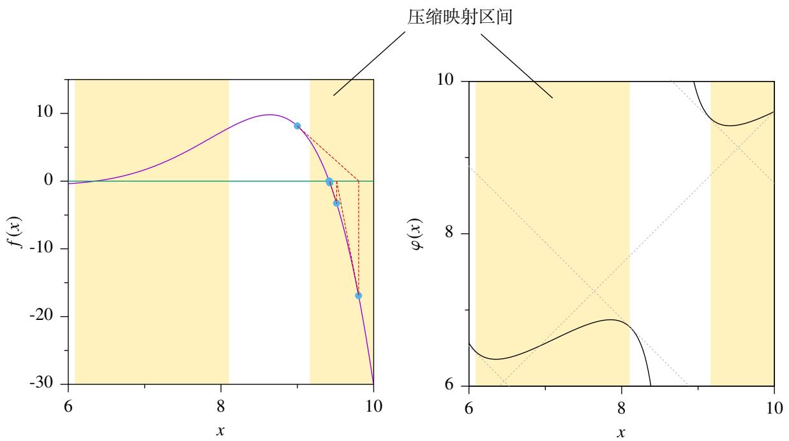  
图 4.13: 用压缩映射的视角思考牛顿迭代法.

现在重新考虑隐函数定理的问题. 设连续可微二元函数 $F ( x , y )$ 满足

$$
F (x _ {0}, y _ {0}) = 0, \quad \frac {\partial F}{\partial y} (x _ {0}, y _ {0}) \neq 0.
$$

现在要确定在 $( x _ { 0 } , y _ { 0 } )$ 的一个邻域 $I \times J$ 上确定了一个隐含函数 $y = f ( x )$ , 即对于任一 $x \in I .$ , 在是否存在唯一的$y \in J$ 使得方程 $F ( x , y ) = 0 $ 成立. 现在用牛顿法来考虑这个问题. 令

$$
y _ {n + 1} = y _ {n} - \frac {F (x , y _ {n})}{F _ {y} ^ {\prime} (x , y _ {n})}, \quad n = 1, 2, \dots .
$$

下面只需研究数列 $\left\{ y _ { n } \right\}$ 的收敛性. 令

$$
\varphi (y) = y - \frac {F (x , y)}{F _ {y} ^ {\prime} (x , y)}.
$$

下面只需研究函数 $\varphi$ 是不是一个压缩映射.为了让计算简便,我们可以考虑简化牛顿法.由于 $( x , y _ { n } )$ 很接近 $( x _ { 0 } , y _ { 0 } )$ ,因此考虑用 $F _ { \mathrm { y } } ^ { \prime } ( x _ { 0 } , y _ { 0 } )$ 代替 $F _ { y } ^ { \prime } ( x , y _ { n } )$ :

$$
y _ {n + 1} = y _ {n} - \frac {F (x , y _ {n})}{F _ {y} ^ {\prime} (x _ {0} , y _ {0})}, \quad n = 1, 2, \dots .
$$

如果 $y _ { n } \to y$ , 则 $y$ 显然满足 $F ( x , y ) = 0 $ . 因此这要的简化是可以的. 于是相应的函数就变成了

$$
\Phi (y) = y - \frac {F (x , y)}{F _ {y} ^ {\prime} \left(x _ {0} , y _ {0}\right)}.
$$

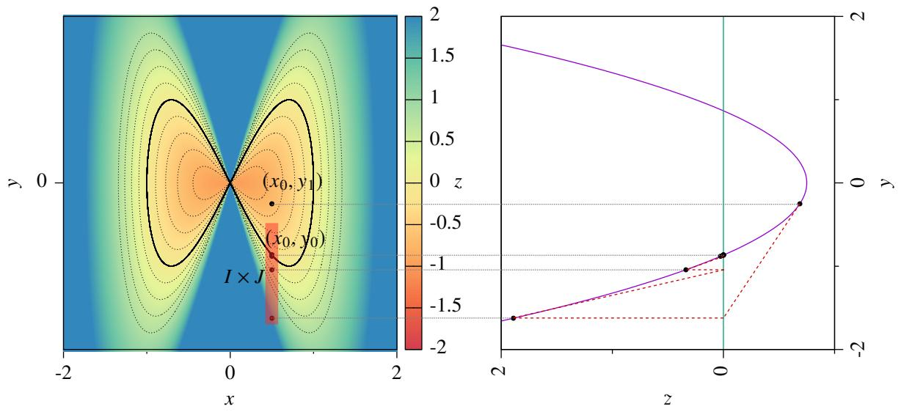  
图 $4 . 1 4 :$ 用牛顿迭代研究隐函数.

下来进一步考虑向量值函数的隐映射定理. 设连续可微向量值函数 $F : D  \mathbb { R } ^ { m }$ , 其中 $D \subseteq \mathbb { R } ^ { n } \times \mathbb { R } ^ { m }$ 满足

$$
\boldsymbol {F} \left(\boldsymbol {x} _ {0}, \boldsymbol {y} _ {0}\right) = \boldsymbol {0}, \quad \det  \left[ \boldsymbol {J} _ {\boldsymbol {y}} \boldsymbol {F} \left(\boldsymbol {x} _ {0}, \boldsymbol {y} _ {0}\right) \right] \neq 0.
$$

令

$$
\boldsymbol {\Phi} (\boldsymbol {y}) = \boldsymbol {y} - \left[ J _ {\boldsymbol {y}} \boldsymbol {F} \left(\boldsymbol {x} _ {0}, \boldsymbol {y} _ {0}\right) \right] ^ {- 1} \boldsymbol {F} (\boldsymbol {x}, \boldsymbol {y}).
$$

则只需要证明 $\Phi$ 是一个压缩映射, 就可以断言隐映射在局部的存在性.

# 定理 4.39 (隐映射定理)

设向量值函数 $F : D  \mathbb { R } ^ { m }$ , 其中 $D$ 是 $\mathbb { R } ^ { n + m }$ 中的一个开集. 若满足

$1 ^ { \circ } \ F \in C ^ { 1 } ( D )$ .   
$2 ^ { \circ }$ 存在 $( { \pmb x } _ { 0 } , { \pmb y } _ { 0 } ) \in D$ 使得 $\pmb { F } ( \pmb { x } _ { 0 } , \pmb { y } _ { 0 } ) = \pmb { 0 }$ , 其中 $\boldsymbol { x } _ { 0 } \in \mathbb { R } ^ { n }$ , $\boldsymbol { y } _ { 0 } \in \mathbb { R } ^ { m }$ .  
$3 ^ { \circ }$ det $J _ { y } F ( { \pmb x } _ { 0 } , { \pmb y } _ { 0 } ) \not = 0 .$ .

则存在一个包含 $( \boldsymbol { x } _ { 0 } , \boldsymbol { y } _ { 0 } )$ 的邻域 $I \times J \subseteq D$ 使得

$1 ^ { \circ }$ 对于任一 $x \in I$ , 方程 $F ( x , y ) = \mathbf { 0 }$ 在 $J$ 中都有唯一的解 $f ( x )$ .  
$\ 、 \mathbf { \psi } ^ { \circ } \mathbf { y } _ { 0 } = f ( \pmb { x } _ { 0 } )$   
$3 ^ { \circ } \ f \in C ^ { 1 } ( I )$   
$4 ^ { \circ }$ 当 $x \in I$ 时, 有

$$
J f (x) = - \left[ J _ {y} F (x, y) \right] ^ {- 1} J _ {x} F (x, y),
$$

其中 $\mathbf { \boldsymbol { y } } = \mathbf { \boldsymbol { f } } ( \mathbf { \boldsymbol { x } } )$ .

证明 (i) 证明 $1 ^ { \circ }$ 和 $2 ^ { \circ }$ . 令

$$
\varphi (\boldsymbol {x}, \boldsymbol {y}) = \boldsymbol {y} - \left[ J _ {\boldsymbol {y}} \boldsymbol {F} \left(\boldsymbol {x} _ {0}, \boldsymbol {y} _ {0}\right) \right] ^ {- 1} \boldsymbol {F} (\boldsymbol {x}, \boldsymbol {y}). \tag {4.22}
$$

计算可知

$$
J _ {y} \varphi (x, y) = I _ {m} - \left[ J _ {y} F \left(x _ {0}, y _ {0}\right) \right] ^ {- 1} J _ {y} F (x, y).
$$

因此

$$
\boldsymbol {J} _ {\mathcal {Y}} \boldsymbol {\varphi} (\boldsymbol {x} _ {0}, \boldsymbol {y} _ {0}) = \boldsymbol {I} _ {m} - \left[ \boldsymbol {J} _ {\mathcal {Y}} \boldsymbol {F} (\boldsymbol {x} _ {0}, \boldsymbol {y} _ {0}) \right] ^ {- 1} \boldsymbol {J} _ {\mathcal {Y}} \boldsymbol {F} (\boldsymbol {x} _ {0}, \boldsymbol {y} _ {0}) = \boldsymbol {I} _ {m} - \boldsymbol {I} _ {m} = \mathbf {0}.
$$

由于 $F \in C ^ { 1 } ( D )$ , 因此任一 $K \in ( 0 , 1 )$ , 都存在 $\delta > 0$ , 当 $\| { \pmb x } - { \pmb x } _ { 0 } \| \le \delta$ 且 $\| \mathbf { y } - \mathbf { y } _ { 0 } \| \leq \delta$ 时, 都有

$$
\| J _ {y} \varphi (x, y) \| <   K.
$$

另一方面, 由于 $F ( \pmb { x } _ { 0 } , \pmb { y } _ { 0 } ) = 0$ , 故

$$
\varphi (x _ {0}, y _ {0}) = y - \left[ J _ {y} F (x _ {0}, y _ {0}) \right] ^ {- 1} F (x _ {0}, y _ {0}) = y _ {0}.
$$

因此存在正数 $\eta < \delta$ , 使当 $\| { \pmb x } - { \pmb x } _ { 0 } \| \le \eta$ 时, 都有

$$
\left\| \varphi (\boldsymbol {x}, \boldsymbol {y} _ {0}) - \boldsymbol {y} _ {0} \right\| <   (1 - K) \delta .
$$

令

$$
I = \left\{\boldsymbol {x} \in \mathbb {R} ^ {n}: \| \boldsymbol {x} - \boldsymbol {x} _ {0} \| \leq \eta \right\}, \quad J = \left\{\boldsymbol {y} \in \mathbb {R} ^ {m}: \| \boldsymbol {y} - \boldsymbol {y} _ {0} \| \leq \delta \right\}.
$$

任意取定 $x \in I ,$ , 令

$$
\boldsymbol {\Phi} (\boldsymbol {y}) = \varphi (\boldsymbol {x}, \boldsymbol {y}).
$$

下面证明 $\Phi ( J ) \subseteq J .$ 任取 $y \in J ,$ , 由拟微分中值定理可知, 存在 $\pmb { \xi }$ 使得

$$
\| \boldsymbol {\Phi} (\mathbf {y}) - \mathbf {y} _ {0} \| \leq \| \boldsymbol {\Phi} (\mathbf {y}) - \boldsymbol {\Phi} (\mathbf {y} _ {0}) \| + \| \boldsymbol {\Phi} (\mathbf {y} _ {0}) - \mathbf {y} _ {0} \| \leq \| \boldsymbol {J} \boldsymbol {\Phi} (\boldsymbol {\xi}) \| \| \mathbf {y} - \mathbf {y} _ {0} \| + \| \boldsymbol {\Phi} (\mathbf {y} _ {0}) - \mathbf {y} _ {0} \| <   K \delta + (1 - K) \delta = \delta .
$$

这表明 $\Phi ( \mathbf { y } ) \in J .$ . 显然 $E$ 是一个完备空间. 下面来证明 $\Phi$ 是以个完备空间 $J$ 上的一个压缩映射. 由拟微分中值定理可知, 存在 $\pmb { \xi } ^ { \prime }$ 使得

$$
\| \Phi (\mathbf {y} ^ {\prime}) - \Phi (\mathbf {y} ^ {\prime \prime}) \| \leq \| J \Phi (\boldsymbol {\xi} ^ {\prime}) \| \| \mathbf {y} ^ {\prime} - \mathbf {y} ^ {\prime \prime} \| \leq K \| \mathbf {y} ^ {\prime} - \mathbf {y} ^ {\prime \prime} \|, \quad \forall \mathbf {y} ^ {\prime}, \mathbf {y} ^ {\prime \prime} \in E.
$$

这就证明了 $\Phi$ 是以个完备空间 $J$ 上的一个压缩映射. 由压缩映射原理可知存在唯一的 $\boldsymbol { y } \in E$ 使得

$$
\boldsymbol {y} = \boldsymbol {\Phi} (\boldsymbol {y}) = \varphi (\boldsymbol {x}, \boldsymbol {y}).
$$

由于 det $J _ { y } F ( { \pmb x } _ { 0 } , { \pmb y } _ { 0 } ) \not = 0$ , 故由等式4.22可知

$$
\boldsymbol {F} (\boldsymbol {x}, \boldsymbol {y}) = \boldsymbol {0}.
$$

这表明 $F ( { \boldsymbol { \mathbf { \mathit { x } } } } , { \boldsymbol { \mathbf { \mathit { y } } } } )$ 确定了一个 $I$ 到 $J$ 的映射, 记作 $f _ { : }$ , 则显然有 $\mathbf { y } _ { 0 } = f ( \pmb { x } _ { 0 } )$ .

(ii) 证明 $f \in C ( I )$ . 我们有

$$
f (x) = \varphi (x, f (x)), \quad \forall x \in I.
$$

由拟微分中值定理可知, 存在 $\pmb { \xi } ^ { \prime \prime }$ 使得

$$
\begin{array}{l} \left\| f (x + h) - f (x) \right\| = \left\| \varphi (x + h, f (x + h)) - \varphi (x, f (x)) \right\| \\ \leq \left\| \varphi (x + h, f (x + h)) - \varphi (x + h, f (x)) \right\| + \left\| \varphi (x + h, f (x)) - \varphi (x, f (x)) \right\| \\ \leq K \| f (x + h) - f (x) \| + \| J _ {x} \varphi (\xi^ {\prime \prime}, f (x)) \| \| h \|. \\ \end{array}
$$

令

$$
A = \sup_{(x,y)\in \bar{I}\times \bar{J}}\| J_{x}\varphi (x,y)\| .
$$

则

$$
\left\| f (\boldsymbol {x} + \boldsymbol {h}) - f (\boldsymbol {x}) \right\| \leq B \| \boldsymbol {h} \|. \tag {4.23}
$$

其中 $B = A / ( 1 - K )$ . 这表明 $f$ 连续.

(iii) 证明 $4 ^ { \circ }$ . 取 $\begin{array} { r } { { \boldsymbol { x } } \in I , { \boldsymbol { y } } = f ( { \boldsymbol { x } } ) \in J , } \end{array}$ , 取一个充分小的 $\pmb { h }$ 使得 $x + h \in I .$ 令

$$
\boldsymbol {k} = \boldsymbol {f} (\boldsymbol {x} + \boldsymbol {h}) - \boldsymbol {f} (\boldsymbol {x}). \tag {4.24}
$$

则

$$
\boldsymbol {F} (\boldsymbol {x} + \boldsymbol {h}, \boldsymbol {y} + \boldsymbol {k}) - \boldsymbol {F} (\boldsymbol {x}, \boldsymbol {y}) = \boldsymbol {F} [ \boldsymbol {x} + \boldsymbol {h}, \boldsymbol {f} (\boldsymbol {x} + \boldsymbol {h}) ] - \boldsymbol {F} [ \boldsymbol {x}, \boldsymbol {f} (\boldsymbol {x}) ] = \mathbf {0}. \tag {4.25}
$$

由于 $F$ 可微, 故

$$
\left\| \boldsymbol {F} (\boldsymbol {x} + \boldsymbol {h}, \boldsymbol {y} + \boldsymbol {k}) - \boldsymbol {F} (\boldsymbol {x}, \boldsymbol {y}) - \boldsymbol {J} _ {\boldsymbol {x}} \boldsymbol {F} (\boldsymbol {x}, \boldsymbol {y}) \boldsymbol {h} - \boldsymbol {J} _ {\boldsymbol {y}} \boldsymbol {F} (\boldsymbol {x}, \boldsymbol {y}) \boldsymbol {k} \right\| = \alpha \| \boldsymbol {h} \| + \beta \| \boldsymbol {k} \|, \tag {4.26}
$$

其中 $\alpha  0 , \beta  0 ( h , k )  \mathbf { 0 } .$ $\alpha \to 0$ . 由于 $f$ 连续, 故由等式4.24可知, 当 $\mathbf { \Sigma } _ { h }  \mathbf { \emptyset }$ 时, $k  0$ . 因此当 $\mathbf { \Sigma } _ { h }  \mathbf { \emptyset }$ 时 $\alpha \to 0$ ,

$\beta \to 0$ . 结合等式4.25,4.26和4.23可知

$$
\left\| J _ {x} \boldsymbol {F} (x, y) \boldsymbol {h} + J _ {y} \boldsymbol {F} (x, y) \boldsymbol {k} \right\| = \alpha \| \boldsymbol {h} \| + \beta \| \boldsymbol {k} \| \leq (\alpha + \beta B) \| \boldsymbol {h} \|.
$$

令 $C = [ J _ { y } F ( x , y ) ] ^ { - 1 } ,$ , 则

$$
\begin{array}{l} \left\| f (x + h) - f (x) + \left[ J _ {y} F (x, y) \right] ^ {- 1} J _ {x} F (x, y) h \right\| \\ = \left\| k + \left[ J _ {y} F (x, y) \right] ^ {- 1} J _ {x} F (x, y) h \right\| = \left\| \left[ J _ {y} F (x, y) \right] ^ {- 1} \left[ J _ {x} F (x, y) h + J _ {y} F (x, y) k \right] \right\| \\ \leq | C | | \alpha + \beta B | | \mathbf {h} |. \\ \end{array}
$$

显然, 当 $\mathbf { \nabla } _ { h }  \mathbf { 0 }$ 时 $| C | | \alpha + \beta B |  0 .$ 这表明 $f$ 可微, 且

$$
\boldsymbol {J} \boldsymbol {f} (\boldsymbol {x}) = - [ \boldsymbol {J} _ {\boldsymbol {y}} \boldsymbol {F} (\boldsymbol {x}, \boldsymbol {y}) ] ^ {- 1} \boldsymbol {J} _ {\boldsymbol {x}} \boldsymbol {F} (\boldsymbol {x}, \boldsymbol {y}).
$$

# 推论 4.1

证明

# 4.4.5 逆映射定理

# 定义 4.19 (微分同胚)

设函数 $f : ( a , b )  \mathbb { R }$ , 我们经常需要知道它有没有反函数. 这个问题我们在《数学分析 I》中我们已经研究过这个问题.如果 $f$ 在 $\boldsymbol { I } = \left( a , b \right)$ 上严格单调,则一定存在反函数 $f ^ { - 1 }$ ,它的定义域为 $f ( I )$ ,且它在定义域上也严格单调.这个结论很难推广到多元函数和向量值函数中,因为在多元函数和向量值函数没有单调性.因此需要换个角度看这个问题.

如果把函数 $y = f ( x )$ 看作隐函数, 那么反函数存在其实就是可以从方程中解出 $x = f ^ { - 1 } ( y )$ . 因此我们看作先用隐函数定理的视角重新叙述反函数定理. 但是隐函数定理只讨论了局部存在性, 因此我们暂时也先讨论反函数的局部存在性.

# 定理 4.40 (1 维的局部反函数定理)

设函数 $f : I \to \mathbb { R }$ . 若满足

$1 ^ { \circ } \ f \in C ^ { 1 } ( I )$   
$2 ^ { \circ }$ 存在 $x _ { 0 } \in I$ 使得 $f ^ { \prime } ( x _ { 0 } ) \neq 0$ .

设 $y _ { 0 } = f ( x _ { 0 } )$ , 则存在包含 $x _ { 0 }$ 的一个开区间 $U \subseteq ( a , b )$ 和包含 $y _ { 0 }$ 的一个开区间?? 使得

1◦ $f ( U ) = V$ 且 $f$ 是 $U$ 上的单射, 即 $f$ 在 $U$ 上可逆.  
$2 ^ { \circ } \ f ^ { - 1 } \in C ^ { 1 } ( V )$   
$3 ^ { \circ }$ 当 $y \in V$ 时

$$
\left(f ^ {- 1}\right) ^ {\prime} (y) = \frac {1}{f ^ {\prime} (x)},
$$

其中 $x = f ^ { - 1 } ( y )$

证明 证法一 已知 $f ^ { \prime } ( x _ { 0 } ) \neq 0 .$ , 不妨设 $f ^ { \prime } ( x _ { 0 } ) > 0 .$ . 由于 $f \in C ^ { 1 } ( I )$ , 故存在 $x _ { 0 }$ 的一个开区间 $U \subseteq I$ 使得 $f ^ { \prime } ( U ) > 0$ .这表明 $f$ 在 $U$ 上严格递增. 令 $V = f ( U )$ . 由于 $y _ { 0 } = f ( x _ { 0 } )$ , 故 $V$ 包含 $y _ { 0 }$ . 由于 $f$ 在 $U$ 上连续, 因此 $V$ 也是开区间.这就证明了 $1 ^ { \circ }$ . 由于 $f \in C ^ { 1 } ( a , b )$ , 根据《数学分析 I》中反函数的导数相关结论就知道 $2 ^ { \circ }$ 和 $3 ^ { \circ }$ .

证法二 令二元函数

$$
F (x, y) = f (x) - y.
$$

它的定义域是 $D = I \times \mathbb { R } \subseteq \mathbb { R } ^ { 2 } .$ 先来检验 $F$ 满足隐函数定理的条件. 容易知道 $F \in C ^ { 1 } ( D )$ . 由于 $y _ { 0 } = f ( x _ { 0 } )$ , 因此点$( x _ { 0 } , y _ { 0 } ) \in D$ 满足

$$
F (x _ {0}, y _ {0}) = f (x _ {0}) - y _ {0} = 0.
$$

由于 $f ^ { \prime } ( x _ { 0 } ) \neq 0 .$ , 故

$$
\frac {\partial F}{\partial x} \left(x _ {0}, y _ {0}\right) = f ^ {\prime} \left(x _ {0}\right) \neq 0.
$$

于是 $F$ 满足隐函数定理的条件, 因此存在一个包含 $( x _ { 0 } , y _ { 0 } )$ 的开矩形 $H \times V \subseteq D$ 使得

$1 ^ { \circ }$ 对于任一 $y \in V$ 方程 $F ( x , y ) = 0 $ 在 $H$ 中都有唯一的解 $x = f ^ { - 1 } ( y )$

$$
2 ^ {\circ} f ^ {- 1} \in C ^ {1} (V).
$$

$3 ^ { \circ }$ 当 $y \in V$ 时, 有

$$
\left(f ^ {- 1}\right) ^ {\prime} (y) = - \frac {\frac {\partial F}{\partial y} (x , y)}{\frac {\partial F}{\partial x} (x , y)} = \frac {1}{f ^ {\prime} (x)},
$$

其中 $x = f ^ { - 1 } ( y )$ .

令 $U = f ^ { - 1 } ( V )$ , 则 $f ( U ) = V$ . 由于 $f ^ { - 1 }$ 是以个连续函数, 且?? 是一个开区间, 因此 $V$ 在 $f ^ { - 1 }$ 下的象 $U$ 也是一个开区间. 综上可知定理成立. ■

以上定理的证法二可以推广到局部的逆映射定理.

# 定理 4.41 (局部逆映射定理)

设映射 $f : D \to \mathbb { R } ^ { n }$ , 其中 $D$ 是 $\mathbb { R } ^ { n }$ 中的一个开集. 若满足

1 ${ } ^ { \circ } \ f \in C ^ { 1 } ( D )$   
$2 ^ { \circ }$ 存在 $\pmb { x } _ { 0 } \in D$ 使得 d $\operatorname { e t } J f ( \pmb { x } _ { 0 } ) \neq 0$ .

设 $\mathbf { y } _ { 0 } = f ( \pmb { x } _ { 0 } )$ , 则存在 $x _ { 0 }$ 的一个邻域 $U$ 和 $\scriptstyle { \mathfrak { y } } _ { 0 }$ 的一个邻域 $V$ 使得

$1 ^ { \circ } \ f ( U ) = V$ 且 $f$ 是 $U$ 上的单射, 即 $f$ 可逆.

$$
2 ^ {\circ} f ^ {- 1} \in C ^ {1} (V).
$$

$3 ^ { \circ }$ 当 ${ \pmb y } \in V$ 时

$$
J f ^ {- 1} (y) = \frac {1}{J f (x)},
$$

其中 $\pmb { x } = \pmb { f } ^ { - 1 } ( \mathbf { y } )$ .

证明 令

$$
\boldsymbol {F} (x, y) = \boldsymbol {f} (x) - y.
$$

它的定义域是 $E = D \times \mathbb { R } ^ { n } \subseteq \mathbb { R } ^ { 2 n } .$ . 先来检验 $F$ 满足隐映射定理的条件. 容易知道 $F \in C ^ { 1 } ( E )$ . 由于 $\mathbf { y } _ { 0 } = f ( \pmb { x } _ { 0 } )$ , 因此点 $( { \pmb x } _ { 0 } , { \pmb y } _ { 0 } ) \in D$ 满足

$$
F \left(\boldsymbol {x} _ {0}, \boldsymbol {y} _ {0}\right) = f \left(\boldsymbol {x} _ {0}\right) - \boldsymbol {y} _ {0} = \mathbf {0}.
$$

设 $F = \left( F _ { 1 } , \cdots , F _ { n } \right)$ , $\ b _ { f } = ( f _ { 1 } , \cdots , f _ { n } )$ . 由于 det $J f ( { \boldsymbol { x } } _ { 0 } ) \neq 0$ , 故

$$
\det  J _ {x} \boldsymbol {F} (\boldsymbol {x} _ {0}, \boldsymbol {y} _ {0}) = \left| \begin{array}{c c c} \frac {\partial F _ {1}}{\partial x _ {1}} & \dots & \frac {\partial F _ {1}}{\partial x _ {n}} \\ \vdots & & \vdots \\ \frac {\partial F _ {n}}{\partial x _ {1}} & \dots & \frac {\partial F _ {n}}{\partial x _ {n}} \end{array} \right| _ {(\boldsymbol {x} _ {0}, \boldsymbol {y} _ {0})} = \left| \begin{array}{c c c} \frac {\partial f _ {1}}{\partial x _ {1}} & \dots & \frac {\partial f _ {1}}{\partial x _ {n}} \\ \vdots & & \vdots \\ \frac {\partial f _ {n}}{\partial x _ {1}} & \dots & \frac {\partial f _ {n}}{\partial x _ {n}} \end{array} \right| _ {(\boldsymbol {x} _ {0}, \boldsymbol {y} _ {0})} = \det  J \boldsymbol {f} (\boldsymbol {x} _ {0}) \neq 0.
$$

于是 $F$ 满足隐映射定理的条件, 因此存在一个包含 $( \boldsymbol { x } _ { 0 } , \boldsymbol { y } _ { 0 } )$ 的邻域 $H \times V \subseteq E$ 使得

$1 ^ { \circ }$ 对于任一 $y \in V$ 方程 $F ( x , y ) = 0 $ 在 $H$ 中都有唯一的解 $\pmb { x } = \pmb { f } ^ { - 1 } ( \mathbf { y } )$ .

$$
2 ^ {\circ} f ^ {- 1} \in C ^ {1} (V).
$$

$3 ^ { \circ }$ 当 $\pmb { y } \in V$ 时, 有

$$
\begin{array}{l} \boldsymbol {J} \boldsymbol {f} ^ {- 1} (\boldsymbol {y}) = - \left[ \begin{array}{c c c} \frac {\partial F _ {1}}{\partial x _ {1}} & \dots & \frac {\partial F _ {1}}{\partial x _ {n}} \\ \vdots & & \vdots \\ \frac {\partial F _ {n}}{\partial x _ {1}} & \dots & \frac {\partial F _ {n}}{\partial x _ {n}} \end{array} \right] _ {(\boldsymbol {x}, \boldsymbol {y})} ^ {- 1} \left[ \begin{array}{c c c} \frac {\partial F _ {1}}{\partial y _ {1}} & \dots & \frac {\partial F _ {1}}{\partial y _ {n}} \\ \vdots & & \vdots \\ \frac {\partial F _ {n}}{\partial y _ {1}} & \dots & \frac {\partial F _ {n}}{\partial y _ {n}} \end{array} \right] _ {(\boldsymbol {x}, \boldsymbol {y})} \\ = - \left[ \begin{array}{c c c} \frac {\partial f _ {1}}{\partial x _ {1}} & \dots & \frac {\partial f _ {1}}{\partial x _ {n}} \\ \vdots & & \vdots \\ \frac {\partial f _ {n}}{\partial x _ {1}} & \dots & \frac {\partial f _ {n}}{\partial x _ {n}} \end{array} \right] _ {(x, y)} ^ {- 1} \left[ \begin{array}{c c c} - 1 & \dots & 0 \\ \vdots & \ddots & \vdots \\ 0 & \dots & - 1 \end{array} \right] _ {(x, y)} = - [ J f (x) ] ^ {- 1} (- I) = \frac {1}{J f (x)}, \\ \end{array}
$$

其中 $\pmb { x } = \pmb { f } ^ { - 1 } ( \mathbf { y } )$ .

令 $U = f ^ { - 1 } ( V )$ , 则 $f ( U ) = V .$ 由于 $f$ 是一个连续映射, 且 $V$ 是一个开集, 因此 $V$ 在 $f$ 下的原象 $U$ 也是一个开集.综上可知定理成立. ■

前面的逆映射定理只是局部的, 局部的逆映射定理是无法简单推出整体的逆映射定理的. 下面看一个例子.

例 4.61 研究向量值函数

$$
\boldsymbol {f} (x, y) = \left(\mathrm {e} ^ {x} \cos y, \mathrm {e} ^ {x} \sin y\right).
$$

的逆映射.

解 由于对于任一 $( x , y ) \in \mathbb { R } ^ { 2 }$ 都有

$$
\det  J f (x, y) = \left| \begin{array}{c c} \mathrm {e} ^ {x} \cos y & - \mathrm {e} ^ {x} \sin y \\ \mathrm {e} ^ {x} \sin y & \mathrm {e} ^ {x} \cos y \end{array} \right| = \mathrm {e} ^ {2 x} \neq 0.
$$

因此由局部的逆映射定理可知, 每一点 $( x , y ) \in \mathbb { R } ^ { 2 }$ 的局部都存在 $f$ 的逆映射. 但是由于

$$
\boldsymbol {f} (x, y + 2 \pi) = \boldsymbol {f} (x, y).
$$

故 $f$ 在 $\mathbb { R } ^ { 2 }$ 上不是单射.

上例表明即使把局部逆映射的条件 $2 ^ { \circ }$ 加强为 det $J F$ 在每一点都不为零仍然无法推出整体的逆映射定理. 但这组条件可以推出 $f$ 的象是开集.

# 定理 4.42 (开映射定理)

设映射 $f : D \to \mathbb { R } ^ { n }$ , 其中 $D$ 是 $\mathbb { R } ^ { n }$ 中的一个开集. 若满足

$$
1 ^ {\circ} f \in C ^ {1} (D).
$$

$2 ^ { \circ }$ 对于任一 $\boldsymbol { x } \in D$ 都有 det $J f ( { \pmb x } ) \neq 0$ .

令 $G = f ( D )$ , 则 $G$ 是一个开集.

证明 任取 $y \in G$ , 则存在 $\boldsymbol { x }$ 使得 $f ( x ) = y$ . 由局部逆映射定理可知, 存在 $\boldsymbol { x }$ 的一个邻域 $U$ 和 $\textbf { y }$ 的一个邻域 $V$ 满足$V = f ( U )$ . 因此

$$
V = \boldsymbol {f} (U) \subseteq \boldsymbol {f} (D) = G.
$$

这表明 $\textbf {  { y } }$ 是 $G$ 的一个内点. 于是可知 $G$ 是一个开集.

因此满足局部逆映射条件的映射称为 “开映射”.

# 定义 4.20 (开映射)

设映射 $f : D \to \mathbb { R } ^ { n }$ , 其中 $D$ 是 $\mathbb { R } ^ { n }$ 中的一个开集. 若 $f$ 把开集映成开集, 则称 $f$ 是一个开映射 (open map).

如果加上 $f$ 是单射这个条件, 就可以立刻推出全局的逆映射定理.

# 定理 4.43 (逆映射定理)

设映射 $f : D \to \mathbb { R } ^ { n }$ , 其中 $D$ 是 $\mathbb { R } ^ { n }$ 中的一个开集. 若满足

${ \ v O } ^ { \circ } ~ f \in C ^ { 1 } ( D )$ .   
$2 ^ { \circ }$ 对于任一 $\boldsymbol { x } \in D$ 都有 det $J f ( { \pmb x } ) \neq 0$ .  
$3 ^ { \circ } ~ f$ 是 $D$ 上的一个单射.

令 $G = f ( D )$ , 则

$1 ^ { \circ } ~ f$ 是 $D$ 到 $G$ 的可逆映射.   
$2 ^ { \circ } \ f ^ { - 1 } \in C ^ { 1 } ( G )$   
$3 ^ { \circ }$ 当 $y \in G$ 时

$$
J f ^ {- 1} (\mathbf {y}) = [ J f (\mathbf {x}) ] ^ {- 1}, \tag {4.27}
$$

其中 $\pmb { x } = \pmb { f } ^ { - 1 } ( \mathbf { y } )$ .

注 事实上条件 $3 ^ { \circ } \colon f$ 是 $D$ 上的一个单射就是一元函数反函数定理中的条件: $f$ 是严格单调的.

注 以上定理中的等式4.27两边取行列式即可得到

$$
\det  J f ^ {- 1} (y) = \frac {1}{\det  [ J f (x) ]}.
$$

如果用 Jacobi 行列式的记号可以记作

$$
\frac {\partial (x _ {1} , \cdots , x _ {n})}{\partial (y _ {1} , \cdots , y _ {n})} = \frac {1}{\frac {\partial (y _ {1} , \cdots , y _ {n})}{\partial (x _ {1} , \cdots , x _ {n})}}.
$$

为了叙述方面, 我们把满足逆映射定理条件的映射称为 “正则映射”.

# 定义 4.21 (正则映射)

设映射 $f : D \to \mathbb { R } ^ { n }$ , 其中 $D$ 是 $\mathbb { R } ^ { n }$ 中的一个开集. 若满足

1 ${ } ^ { \circ } \ f \in C ^ { 1 } ( D )$ .   
$2 ^ { \circ } ~ f$ 是 $D$ 上的一个单射.  
$3 ^ { \circ }$ 对于任一 $\boldsymbol { x } \in D$ 都有 det $J F ( x ) \neq 0$ .

则称 $f$ 是 $D$ 上的一个正则映射 .

注 容易知道正则映射的逆映射也是一个正则映射.

从另一个角度看,逆映射定理实际上是在讨论一个方程组在怎样的点上,在多大范围内存在唯一解,并给出了求近似解的方法. 因此线性方程组的 Cramer 法则也可以看作是逆映射定理的特例.

不仅如此逆映射定理还告诉我们, 对于正则映射 $f$ , 如果方程组 $f ( x ) = y _ { 0 }$ 有唯一解 $x _ { 0 }$ , 则这个解对 $\scriptstyle { \mathfrak { y } } _ { 0 }$ 的取值有着 “连续的依赖性”——对于任一 $\varepsilon > 0$ , 存在一个范数充分小的 $\delta$ 使得方程组 $\pmb { f } ( \pmb { x } ) = \pmb { y } _ { 0 } + \delta$ 的解 $\pmb { x } _ { 0 } ^ { \prime }$ 满足

$$
\left\| \boldsymbol {x} _ {0} ^ {\prime} - \boldsymbol {x} _ {0} \right\| <   \varepsilon .
$$

下面看两个例子.

例 4.62 极坐标变换公式为:

$$
\left\{ \begin{array}{l} x = r \cos \theta \\ y = r \sin \theta \end{array} \right..
$$

求 $r$ 和 $\theta$ 关于 $x$ 和 $y$ 的偏导数.

解 由逆映射定理可知

$$
\left[ \begin{array}{c c} \frac {\partial r}{\partial x} & \frac {\partial r}{\partial y} \\ \frac {\partial \theta}{\partial x} & \frac {\partial \theta}{\partial y} \end{array} \right] = \left[ \begin{array}{c c} \frac {\partial x}{\partial r} & \frac {\partial x}{\partial \theta} \\ \frac {\partial y}{\partial r} & \frac {\partial y}{\partial \theta} \end{array} \right] ^ {- 1} = \left[ \begin{array}{c c} \cos \theta & - r \sin \theta \\ \sin \theta & r \cos \theta \end{array} \right] ^ {- 1} = \frac {1}{r} \left[ \begin{array}{c c} r \cos \theta & r \sin \theta \\ - \sin \theta & \cos \theta \end{array} \right].
$$

例 4.63 设方程组

$$
\left\{ \begin{array}{l} x ^ {2} = v y \\ y ^ {2} = u x \end{array} \right..
$$

求:

$$
\begin{array}{c} \frac {\partial (x , y)}{\partial (u , v)}. \end{array}
$$

解 解出 $u$ 和 $\nu$ :

$$
u = \frac {y ^ {2}}{x}, \qquad v = \frac {x ^ {2}}{y}.
$$

因此

$$
\frac {\partial (u , v)}{\partial (x , y)} = \left| \begin{array}{c c} \frac {\partial u}{\partial x} & \frac {\partial u}{\partial y} \\ \frac {\partial v}{\partial x} & \frac {\partial v}{\partial y} \end{array} \right| = \left| \begin{array}{c c} - \frac {y ^ {2}}{x ^ {2}} & \frac {2 y}{x} \\ \frac {2 x}{y} & - \frac {x ^ {2}}{y ^ {2}} \end{array} \right| = - 3.
$$

于是可知

$$
\frac {\partial (x , y)}{\partial (u , v)} = \frac {1}{\frac {\partial (u , v)}{\partial (x , y)}} = - \frac {1}{3}.
$$

# 4.4.6 函数的独立性

现在来讨论函数的独立性.这个问题在线性代数中已经出现过,不过那时候研究的是最简单的情况.设线性方程组

$$
\left\{ \begin{array}{c} y _ {1} = a _ {1 1} x _ {1} + a _ {1 2} x _ {2} + \dots + a _ {1 n} x _ {n} \\ y _ {2} = a _ {2 1} x _ {1} + a _ {2 2} x _ {2} + \dots + a _ {2 n} x _ {n} \\ \dots \\ y _ {m} = a _ {m 1} x _ {1} + a _ {m 2} x _ {2} + \dots + a _ {m n} x _ {n} \end{array} \right..
$$

# 4.5 多元函数微分学的几何应用

# 4.5.1 曲线的曲率

下面来研究光滑曲线的 “弯曲程度”. 我们称曲线的 “弯曲程度” 为 “曲率”. 首先来看最简单的光滑曲线—圆. 圆的形状只由半径 $r$ 一个参数决定. 显然当 $r$ 越大, 圆的 “曲率” 越小. 当 $r  + \infty$ , 可以认为圆变成了直线, 而直线显然是不弯曲的, 因此 “曲率” 应定义为零. 不难想到用 $1 / r$ 来定义圆的 “曲率”. 显然, 圆的每一点有一样的“曲率”, 因此 $1 / r$ 表示的是圆上任意一点的 “曲率”. 当 $r  + \infty$ 时 $1 / r \to 0$ , 因此在这个定义之下, 直线上任意一点的 “曲率” 都是零.

对于一般的光滑曲线 Γ, 如果要定义其上一点 $P$ 处的曲率, 可以先考虑这一点附近的 “平均曲率”. 在 $P$ 的附近两侧分别取 $P _ { 1 }$ , ??2. 若这三点共线, 则认为 $P _ { 1 }$ 到 $^ 2$ 这段曲线的 “平均曲率” 为零. 若它们不共线, 则把它们确定的圆的 “曲率” 定义为这段曲线的 “平均曲率”. 当 $\operatorname* { m a x } \{ | P P _ { 1 } | , | P P _ { 2 } | \}  0$ 时,“平均曲率” 的极限值可以定义为这段曲线的 “曲率”.

以上定义 “曲率” 的方法虽然直观, 但不易用公式表达. 因此我们可以考虑用另一种办法刻画 “曲率”. 还是回到圆, 不难发现圆的圆心角 $\theta$ 和它所对的弧长 $r \theta$ 的比值是

$$
\frac {\theta}{r \theta} = \frac {1}{r}.
$$

恰好是我们定义的圆的 “曲率”. 而圆心角 $\theta$ 等于它所对的弧的起点和终点的切线的夹角. 对于一条直线, 它的任意两点的切线夹角都是零,因此用这个方法定义的直线“曲率”也是零.这个定义方法可以容易推广到一般光滑曲线中. 为此需要先研究曲线上一点的切向量.

设曲线

$$
\Gamma : \boldsymbol {r} = \boldsymbol {r} (t), \quad \alpha \leq t \leq \beta ,
$$

其中 $\pmb { r } = ( x , y , z ) , \pmb { r } ( t ) = ( x ( t ) , y ( t ) , z ( t ) )$ . 函数 $x ( t ) , y ( t ) , z ( t )$ 都在 $[ \alpha , \beta ]$ 上连续可导. 在 Γ 上任取定一点 $P _ { 0 } ( x ( t _ { 0 } ) , y ( t _ { 0 } ) , z ( t _ { 0 } ) )$ .在 $P _ { 0 }$ 附近取一点 $P ( x ( t ) , y ( t ) , z ( t ) )$ . 则 $P _ { 0 } P$ 的方向向量为

$$
\frac {\boldsymbol {r} (t) - \boldsymbol {r} (t _ {0})}{t - t _ {0}}.
$$

当 $t \longrightarrow t _ { 0 }$ 时, 若以上向量值函数的极限存在, 则可以定义为 “切向量”.

# 定义 4.22 (切向量)

设曲线

$$
\Gamma : \boldsymbol {r} = \boldsymbol {r} (t), \quad \alpha \leq t \leq \beta ,
$$

其中 $\boldsymbol { r } = ( x , y , z )$ , $\pmb { r } ( t ) = ( x ( t ) , y ( t ) , z ( t ) )$ . 令

$$
\boldsymbol {r} ^ {\prime} (t _ {0}) = \lim  _ {t \rightarrow t _ {0}} \frac {\boldsymbol {r} (t) - \boldsymbol {r} (t _ {0})}{t - t _ {0}} = \left(x ^ {\prime} (t _ {0}), y ^ {\prime} (t _ {0}), z ^ {\prime} (t _ {0})\right).
$$

则称 $\boldsymbol { r } ^ { \prime } ( t _ { 0 } )$ 为 $\Gamma$ 在点 $r ( x _ { 0 } )$ 处的切向量 (tangent vector).

注 若 $t _ { 0 } = \alpha$ , 则 $r ^ { \prime } ( t _ { 0 } )$ 表示

$$
\lim  _ {t \rightarrow t _ {0} +)} \frac {\boldsymbol {r} (t) - \boldsymbol {r} (t _ {0})}{t - t _ {0}} = \left(x _ {+} ^ {\prime} (t _ {0}), y _ {+} ^ {\prime} (t _ {0}), z _ {+} ^ {\prime} (t _ {0})\right).
$$

若 $t _ { 0 } = \beta$ , 则 $r ^ { \prime } ( t _ { 0 } )$ 表示

$$
\lim  _ {t \rightarrow t _ {0} -}) \frac {\boldsymbol {r} (t) - \boldsymbol {r} (t _ {0})}{t - t _ {0}} = \left(x _ {-} ^ {\prime} (t _ {0}), y _ {-} ^ {\prime} (t _ {0}), z _ {-} ^ {\prime} (t _ {0})\right).
$$

如果 $\Gamma$ 在 $\boldsymbol { r } ( t _ { 0 } )$ 处的切向量为 $\pmb { r } ^ { \prime } ( t _ { 0 } ) = ( x ^ { \prime } ( t _ { 0 } ) , y ^ { \prime } ( t _ { 0 } ) , z ^ { \prime } ( t _ { 0 } ) )$ , 则可以立刻写出 $\Gamma$ 在 $\boldsymbol { r } ( t _ { 0 } )$ 处的切线:

$$
\frac {x - x (t _ {0})}{x ^ {\prime} (t _ {0})} = \frac {y - y (t _ {0})}{y ^ {\prime} (t _ {0})} = \frac {z - z (t _ {0})}{z ^ {\prime} (t _ {0})}.
$$

由此可见,如果 $x ^ { \prime } ( t _ { 0 } ) , y ^ { \prime } ( t _ { 0 } ) , z ^ { \prime } ( t _ { 0 } )$ $x ^ { \prime } ( t _ { 0 } )$ $z ^ { \prime } ( t _ { 0 } )$ 同时为零,则切线不存在.为了保证曲线每一点都有切线,我们希望它在每一点

的切向量都不为零.

# 定义 4.23 (正则曲线)

设曲线 $\Gamma : \boldsymbol { r } ( t )$ $( \alpha \leq t \leq \beta )$ . 若 $\Gamma$ 在 $t _ { 0 }$ 处的切向量 $\mathbf { } r ^ { \prime } ( t _ { 0 } ) \neq \mathbf { 0 }$ , 则称 $t _ { 0 }$ 是 $\Gamma$ 的一个正则点. 若 $\boldsymbol { r } ( t )$ 的分量函数都连续可导, 且曲线上的每一个点都是正则点, 即对于任一 $t \in [ \alpha , \beta ]$ 都有 $\mathbf { } r ^ { \prime } ( t ) \neq \mathbf { 0 }$ , 则称 $\Gamma$ 是一条正则曲线 (regular curve).

注 若一个点不是正则点, 则称为奇异点 (singular point).

下面看一个例子, 虽然曲线的各分量方程都连续可导, 但曲线不是正则曲线.

例 4.64 设曲线

$$
\Gamma : \left\{ \begin{array}{l} x = t ^ {3} \\ y = t ^ {2} \end{array} \right..
$$

虽然 $x = t ^ { 3 }$ , $y = t ^ { 2 }$ 都连续可导, 但 $t = 0$ 不是 Γ 的正则点.

注 如图, 曲线 $\Gamma$ 在 $x = 0$ 没有切线, 因此它在 $x = 0$ 处切向量为零.

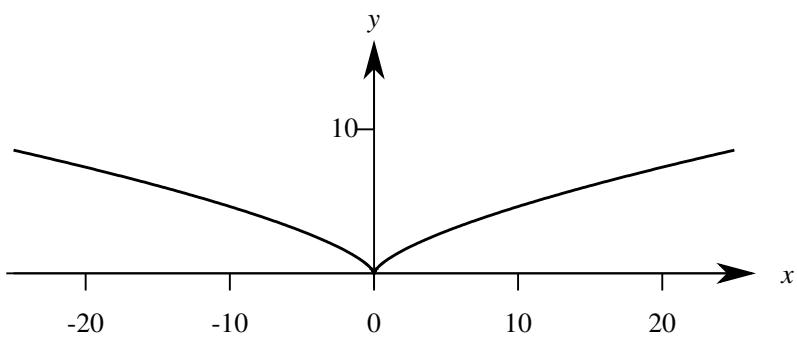  
图 4.15: Γ 曲线示意图.

现在可以用切向量和弧长来刻画曲线的 “曲率”.

# 定义 4.24 (曲率)

设正则曲线 $\Gamma : r = r ( t )$ $( \alpha \leq t \leq \beta )$ . 令 $\boldsymbol { r } ( t _ { 0 } )$ 与 $r ( t _ { 0 } + \Delta t )$ 之间的弧长为 $\Delta s$ , 令 $\boldsymbol { r } ^ { \prime } ( t _ { 0 } )$ 与 $r ^ { \prime } ( t _ { 0 } + \Delta t )$ 之间的夹角为 $\Delta \theta$ . 若以下极限存在

$$
\lim  _ {\Delta s \rightarrow 0} \left| \frac {\Delta \theta}{\Delta s} \right|.
$$

则极限值称为 $\Gamma$ 在 $\boldsymbol { r } ( t _ { 0 } )$ 处的曲率 (curvature), 记作 $\kappa ( t _ { 0 } )$ .

注 $r ^ { \prime } ( t _ { 0 } )$ 与 $r ^ { \prime } ( t _ { 0 } + \Delta t )$ 之间的夹角可能是负值, 但刻画曲率的时候并不关心角度的正负.

定义了切向量以后, 曲线的弧长公式就可以表示为

$$
S (\Gamma) = \int_ {\alpha} ^ {\beta} \sqrt {\left[ x ^ {\prime} (t) \right] ^ {2} + \left[ ^ {\prime} (t) \right] ^ {2} + \left[ z ^ {\prime} (t) \right] ^ {2}} d t = \int_ {\alpha} ^ {\beta} \| r ^ {\prime} (t) \| d t.
$$

令

$$
s (t) = \int_ {\alpha} ^ {t} \| r ^ {\prime} (\tau) \| d \tau . \tag {4.28}
$$

则 $s ( t )$ 表示从 $r ( \alpha )$ 出发沿着曲线到达 $\boldsymbol { r } ( t )$ 时所路过的弧长.由于 $\| r ^ { \prime } ( \tau ) \|$ 连续,由微积分基本定理可知 $s ( t )$ 可导,

且

$$
\frac {\mathrm {d} s (t)}{\mathrm {d} t} = \left\| r ^ {\prime} (t) \right\|, \quad \alpha \leq t \leq \beta . \tag {4.29}
$$

此时若 Γ 是一条正则曲线, 则 $\| r ^ { \prime } ( t ) \| > 0 .$ . 这表明当 $\Gamma$ 正则时, $s ( t )$ 严格递增. 此时 $s ( t )$ 存在反函数 $t = t ( s )$ . 这表明如果 $\Gamma$ 是正则的, 则弧长可以作为曲线方程的参数. 令

$$
\boldsymbol {R} (s) = \boldsymbol {r} [ t (s) ].
$$

则等式4.28变为

$$
s = \int_ {\alpha} ^ {s} \| \boldsymbol {R} ^ {\prime} (\rho) \| d \rho .
$$

两边对 $s$ 求导可得 $1 = \| R ^ { \prime } ( s ) \|$ . 这表明如果用弧长 $s$ 作参数, $\pmb { R } ^ { \prime } ( s )$ 就可以成为 $\Gamma$ 上各点处的单位切向量. 反之,若 $\| r ^ { \prime } ( t ) \| = 1$ , 则由弧长公式可知

$$
s = \int_ {\alpha} ^ {t} \| \boldsymbol {r} ^ {\prime} (\tau) \| \mathrm {d} \tau = t - \alpha .
$$

因此 $t = s + \alpha$ . 和表明 $t$ 是从 $\alpha$ 起算的弧长.

以上讨论表明用弧长作为参数可以使计算大大简化. 这是因为弧长是 “正交不变量”, 用物理学的视角看就是“运动不变量”. 因此弧长称为曲线的自然参数 (natural parameter). 向量值函数对自然参数的导数可以简记作:

$$
\dot {\boldsymbol {r}} := \frac {\mathrm {d} \boldsymbol {r}}{\mathrm {d} s}, \quad \ddot {\boldsymbol {r}} := \frac {\mathrm {d} ^ {2} \boldsymbol {r}}{\mathrm {d} s ^ {2}}.
$$

在实际计算时应尽量选用弧长作曲线方程的参数. 在引入弧度制时充分考虑了这一点. 我们把单位元中弧长为 1的圆弧所对的圆心角定义为 1 弧度. 这样一来很容易写出自然参数下的圆的参数方程.

例 4.65 写出半径为 $r$ 的自然参数方程.

解 以圆心角 $\theta$ 为参数的方程为

$$
\left\{ \begin{array}{l} x = r \cos \theta \\ y = r \sin \theta \end{array} \right..
$$

在弧度制下, 弧长 $s = r \theta$ , 因此圆在自然参数下的方程就是

$$
\boldsymbol {r} (s) = \left(r \cos \frac {s}{r}, r \sin \frac {s}{r}\right).
$$

注 此时

$$
\boldsymbol {r} ^ {\prime} (s) = \left(- \sin \frac {s}{r}, \cos \frac {s}{r}\right).
$$

因此 $\| r ^ { \prime } ( s ) \| = 1$ .

下面很自然地要研究曲线在自然参数下的曲率公式.

# 定理 4.44 (自然参数方程的曲率公式)

设正则曲线的自然参数方程为 $\Gamma : r = r ( s )$ . 若 $r ^ { \prime \prime } ( s )$ 存在, 则

$$
\kappa (s) = \left\| r ^ {\prime \prime} (s) \right\|.
$$

证明 由于 ??¥ 存在, 故 $\dot { \boldsymbol { r } }$ 可导. 设 $r ^ { \prime } ( s + \Delta s )$ 和 $\boldsymbol { r } ^ { \prime } ( s )$ 之间的夹角为 $\Delta \theta$ . 由于 $\| r ^ { \prime } ( s ) \| = 1$ , 如图4.16可知:

$$
\begin{array}{l} \| \boldsymbol {r}^{\prime \prime}(s)\| = \left\| \lim_{\Delta s\to 0}\frac{\boldsymbol{r}^{\prime}(s + \Delta s) - \boldsymbol{r}^{\prime}(s)}{\Delta s}\right\| = \lim_{\Delta s\to 0}\frac{\| \boldsymbol{r}^{\prime}(s + \Delta s) - \boldsymbol{r}^{\prime}(s)\|}{|\Delta s|} = \lim_{\Delta s\to 0}\left|\frac{2\sin(\Delta\theta / 2)}{\Delta s}\right| \\ = \lim  _ {\Delta s \rightarrow 0} \left| \frac {\sin (\Delta \theta / 2)}{\Delta \theta / 2} \right|\left| \frac {\Delta \theta}{\Delta s} \right| = \lim  _ {\Delta s \rightarrow 0} \left| \frac {\Delta \theta}{\Delta s} \right|. \\ \end{array}
$$

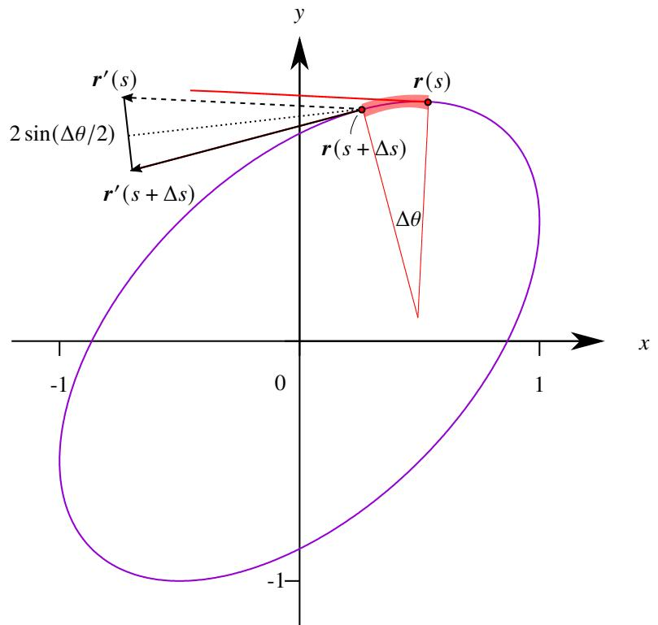  
图 4.16: 曲率示意图.

用以上公式可以再次计算圆和直线的曲率.

例 4.66 设自然参数下的直线方程为

$$
L: \boldsymbol {r} (s) = \boldsymbol {u} s + v,
$$

其中 $\left\| \boldsymbol { u } \right\| = 1$ . 由于 $\pmb { r } ^ { \prime } ( s ) = \pmb { u }$ , 故 $r ^ { \prime \prime } ( s ) = \mathbf { 0 } .$ 因此直线上任何一点的曲率都是 0.

例 4.67 设圆的自然参数方程为

$$
\boldsymbol {r} (s) = \left(r \cos \frac {s}{r}, r \sin \frac {s}{r}\right).
$$

由于

$$
\boldsymbol {r} ^ {\prime} (s) = \left(- \sin \frac {s}{r}, \cos \frac {s}{r}\right), \qquad \boldsymbol {r} ^ {\prime \prime} (s) = \left(- \frac {1}{r} \cos \frac {s}{r}, - \frac {1}{r} \sin \frac {s}{r}\right).
$$

因此

$$
\kappa (s) = \left\| r ^ {\prime \prime} (s) \right\| = \frac {1}{r}.
$$

于是可知圆上任何一点的曲率都是 $1 / r$ .

一般情况下, 给出的曲线方程中的参数不一定是自然参数. 下面来讨论非自然参数下曲线的曲率计算方法.

# 定理 4.45 (一般参数方程的曲率公式)

设正则曲线的参数方程为 $\Gamma : t = r ( t )$ . 若 $\boldsymbol { r } ^ { \prime \prime } ( t )$ 存在, 则

$$
\kappa (t) = \frac {\| \boldsymbol {r} ^ {\prime} (t) \times \boldsymbol {r} ^ {\prime \prime} (t) \|}{\| \boldsymbol {r} ^ {\prime} (t) \| ^ {3}}.
$$

证明 设 $t = t ( s )$ . 由于 $\| r ^ { \prime } ( s ) \| = 1$ , 因此

$$
\boldsymbol {r} ^ {\prime} (s) \cdot \boldsymbol {r} ^ {\prime} (s) = 1.
$$

对两边求导得

$$
\boldsymbol {r} ^ {\prime \prime} (s) \cdot \boldsymbol {r} ^ {\prime} (s) + \boldsymbol {r} ^ {\prime} (s) \cdot \boldsymbol {r} ^ {\prime \prime} (s) = 0 \Longleftrightarrow \boldsymbol {r} ^ {\prime \prime} (s) \cdot \boldsymbol {r} ^ {\prime} (s) = 0
$$

因此 $\boldsymbol { r } ^ { \prime } ( s )$ 和 $r ^ { \prime \prime } ( s )$ 正交. 于是

$$
\| \boldsymbol {r} ^ {\prime} (s) \times \boldsymbol {r} ^ {\prime \prime} (s) \| = \| \boldsymbol {r} ^ {\prime} (s) \| \| \boldsymbol {r} ^ {\prime \prime} (s) \| = \| \boldsymbol {r} ^ {\prime \prime} (s) \| = \kappa (s) = \kappa (t).
$$

根据链式法则相继求出 $r ^ { \prime } ( s )$ 和 $r ^ { \prime \prime } ( s )$ :

$$
\begin{array}{l} \boldsymbol {r} ^ {\prime} (s) = \frac {\mathrm {d} \boldsymbol {r}}{\mathrm {d} s} = \frac {\mathrm {d} \boldsymbol {r}}{\mathrm {d} t} \frac {\mathrm {d} t}{\mathrm {d} s} = \boldsymbol {r} ^ {\prime} (t) t ^ {\prime} (s). \\ \boldsymbol {r} ^ {\prime \prime} (s) = \frac {\mathrm {d} ^ {2} \boldsymbol {r}}{\mathrm {d} s ^ {2}} = \frac {\mathrm {d} ^ {2} \boldsymbol {r}}{\mathrm {d} t ^ {2}} \left(\frac {\mathrm {d} t}{\mathrm {d} s}\right) ^ {2} + \frac {\mathrm {d} \boldsymbol {r}}{\mathrm {d} t} \frac {\mathrm {d} ^ {2} t}{\mathrm {d} s ^ {2}} = \boldsymbol {r} ^ {\prime \prime} (t) [ t ^ {\prime} (s) ] ^ {2} + \boldsymbol {r} ^ {\prime} (t) t ^ {\prime \prime} (s). \\ \end{array}
$$

于是

$$
\left\| \boldsymbol {r} ^ {\prime} (s) \times \boldsymbol {r} ^ {\prime \prime} (s) \right\| = \left\| \boldsymbol {r} ^ {\prime} (t) \times \boldsymbol {r} ^ {\prime \prime} (t) \right\| \left\| t ^ {\prime} (s) \right\| ^ {3}
$$

由于 $s ^ { \prime } ( t ) = \| r ^ { \prime } ( t ) \|$ , 因此

$$
\left| t ^ {\prime} (s) \right| ^ {3} = \frac {1}{\left| s ^ {\prime} (t) \right| ^ {3}} = \frac {1}{\left\| \boldsymbol {r} ^ {\prime} (t) \right\| ^ {3}}.
$$

于是可知

$$
\kappa (t) = \frac {\| \boldsymbol {r} ^ {\prime} (t) \times \boldsymbol {r} ^ {\prime \prime} (t) \|}{\| \boldsymbol {r} ^ {\prime} (t) \| ^ {3}}.
$$

下面来看一个例子.

例 4.68 设圆柱螺旋线:

$$
\Gamma : \boldsymbol {r} (t) = (a \cos t, a \sin t, b t), \quad a > 0.
$$

求它的曲率.

解 先计算 $\boldsymbol { r } ^ { \prime } ( t )$ 和 $\boldsymbol { r } ^ { \prime \prime } ( t )$ :

$$
\boldsymbol {r} ^ {\prime} (t) = (- a \sin t, a \cos t, b), \quad \boldsymbol {r} ^ {\prime \prime} (t) = (- a \cos t, - a \sin t, 0)
$$

因此

$$
\boldsymbol{r}^{\prime}(t)\times \boldsymbol{r}^{\prime \prime}(t) = \left(\left| \begin{array}{cc}a\cos t & -a\sin t\\ b & 0 \end{array} \right|, - \left| \begin{array}{cc}a\sin t & -a\cos t\\ b & 0 \end{array} \right|,\left| \begin{array}{cc} - a\sin t & -a\cos t\\ a\cos t & -a\sin t \end{array} \right|\right) = (ab\sin t, - ab\cos t,a^{2}).
$$

于是可知

$$
\kappa (t) = \frac {\| \boldsymbol {r} ^ {\prime} (t) \times \boldsymbol {r} ^ {\prime \prime} (t) \|}{\| \boldsymbol {r} ^ {\prime} (t) \| ^ {3}} = \frac {\left(a ^ {2} b ^ {2} + a ^ {4}\right) ^ {1 / 2}}{\left(a ^ {2} + b ^ {2}\right) ^ {3 / 2}} = \frac {a}{a ^ {2} + b ^ {2}}.
$$

注 以上计算结果表明圆柱螺旋线每一点的曲率都相等.

如果曲线是用两个曲面方程表示的, 例如

$$
\Gamma : \left\{ \begin{array}{l} F (x, y, z) = 0 \\ G (x, y, z) = 0 \end{array} \right..
$$

我们可以设它的参数方程为 $\boldsymbol { r } = ( x , y , z )$ , 其中 $x$ 和 $y$ 都看成是 $t$ 的函数. 则

$$
\kappa = \frac {\| \boldsymbol {r} ^ {\prime} \times \boldsymbol {r} ^ {\prime \prime} \|}{\| \boldsymbol {r} ^ {\prime} \| ^ {3}} = \frac {\left[ (y ^ {\prime} z ^ {\prime \prime} - y ^ {\prime \prime} z ^ {\prime}) ^ {2} + (x ^ {\prime} z ^ {\prime \prime} - x ^ {\prime \prime} z ^ {\prime}) ^ {2} + (x ^ {\prime} y ^ {\prime \prime} - x ^ {\prime \prime} y ^ {\prime}) ^ {2} \right] ^ {1 / 2}}{\left(x ^ {\prime 2} + y ^ {\prime 2} + z ^ {\prime 2}\right) ^ {3 / 2}}.
$$

如果把 $x$ 看作参数, 以上公式可以简化为

$$
\kappa = \frac {\left[ (y ^ {\prime} z ^ {\prime \prime} - y ^ {\prime \prime} z ^ {\prime}) ^ {2} + z ^ {\prime \prime 2} + y ^ {\prime \prime 2} \right] ^ {1 / 2}}{\left(1 + y ^ {\prime 2} + z ^ {\prime 2}\right) ^ {3 / 2}}.
$$

下面看一个例子.

例 4.69 设两个曲面确定的一条曲线:

$$
\Gamma : \left\{ \begin{array}{l} x ^ {2} + y ^ {2} + z ^ {2} = 9 \\ x ^ {2} - y ^ {2} = 3 \end{array} \right..
$$

求 $\Gamma$ 在点 $\pmb { p } _ { 0 } = ( 2 , 1 , 2 )$ 处的曲率.

解 把 $x , y$ 和 $z$ 都看作关于 $x$ 的方程. 对两个方程分别求导

$$
\left\{ \begin{array}{l} x + y y ^ {\prime} + z z ^ {\prime} = 0 \\ x - y y ^ {\prime} = 0 \end{array} \right., \quad \left\{ \begin{array}{l} 1 + y ^ {\prime 2} + y y ^ {\prime \prime} + z ^ {\prime 2} + z z ^ {\prime \prime} = 0 \\ 1 - y ^ {\prime 2} - y y ^ {\prime \prime} = 0 \end{array} \right..
$$

把 $x = 2$ , $y = 1$ , $z = 2$ 代入得

$$
y ^ {\prime} = 2, \qquad y ^ {\prime \prime} = - 3, \qquad z ^ {\prime} = - 2, \qquad z ^ {\prime \prime} = - 3.
$$

于是可知

$$
\kappa = \frac {\left[ \left(y ^ {\prime} z ^ {\prime \prime} - y ^ {\prime \prime} z ^ {\prime}\right) ^ {2} + z ^ {\prime \prime 2} + y ^ {\prime \prime 2} \right] ^ {1 / 2}}{\left(1 + y ^ {\prime 2} + z ^ {\prime 2}\right) ^ {3 / 2}} = \frac {\left[ (- 6 - 6) ^ {2} + 9 + 9 \right] ^ {1 / 2}}{(1 + 4 + 4) ^ {3 / 2}} = \frac {\sqrt {2}}{3}.
$$

如果平面曲线, 可以得到更简洁的公式. 设平面曲线 $\boldsymbol { r } = ( x , y )$ . 其中 $x$ 和 $y$ 都看成是 $t$ 的函数. 则

$$
\kappa = \frac {\| \boldsymbol {r} ^ {\prime} \times \boldsymbol {r} ^ {\prime \prime} \|}{\| \boldsymbol {r} ^ {\prime} \| ^ {3}} = \frac {\left| x ^ {\prime} y ^ {\prime \prime} - x ^ {\prime \prime} y ^ {\prime} \right|}{\left(x ^ {\prime 2} + y ^ {\prime 2}\right) ^ {3 / 2}}.
$$

如果给出了显式方程 $y = f ( x )$ . 以上公式就进一步简化为

$$
\kappa = \frac {| y ^ {\prime \prime} |}{\left(1 + y ^ {\prime 2}\right) ^ {3 / 2}}.
$$

下面来看几个例子.

例 4.70 抛物线的曲率 设抛物线

$$
y ^ {2} = 2 p x, \quad p > 0.
$$

求它的曲率.

解 对方程两边连续两次求导得

$$
y y ^ {\prime} = p, \qquad y ^ {\prime 2} + y y ^ {\prime \prime} = 0.
$$

因此

$$
y ^ {\prime} = \frac {p}{y}, \quad y ^ {\prime \prime} = - \frac {y ^ {\prime 2}}{y} = - \frac {p ^ {2}}{y ^ {3}}.
$$

于是可知

$$
\kappa = \frac {\left| y ^ {\prime \prime} \right|}{\left(1 + y ^ {\prime 2}\right) ^ {3 / 2}} = \frac {\left| \frac {p ^ {2}}{y ^ {3}} \right|}{\left(1 + \frac {p ^ {2}}{y ^ {2}}\right) ^ {3 / 2}} = \frac {p ^ {2}}{\left(y ^ {2} + p ^ {2}\right) ^ {3}}.
$$

例 4.71 椭圆的曲率 设椭圆:

$$
\frac {x ^ {2}}{a ^ {2}} + \frac {y ^ {2}}{b ^ {2}} = 1, \quad a, b > 0.
$$

求它的曲率.

解 解法一 对方程两边连续两次求导得

$$
\frac {x}{a ^ {2}} + \frac {y y ^ {\prime}}{b ^ {2}} = 0, \quad \frac {1}{a ^ {2}} + \frac {y ^ {\prime 2} + y y ^ {\prime \prime}}{b ^ {2}} = 0.
$$

因此

$$
y ^ {\prime 2} = \frac {b ^ {4} x ^ {2}}{a ^ {4} y ^ {2}}, \quad y ^ {\prime \prime} = - \frac {b ^ {2}}{a ^ {2} y} - \frac {y ^ {\prime 2}}{y} = - \frac {b ^ {2}}{a ^ {2} y} - \frac {b ^ {4} x ^ {2}}{a ^ {4} y ^ {3}}.
$$

于是可知

$$
\kappa = \frac {| y ^ {\prime \prime} |}{(1 + y ^ {\prime 2}) ^ {3 / 2}} = \frac {\frac {b ^ {2}}{a ^ {2} y} + \frac {b ^ {4} x ^ {2}}{a ^ {4} y ^ {3}}}{\left(1 + \frac {b ^ {4} x ^ {2}}{a ^ {4} y ^ {2}}\right) ^ {3 / 2}} = \frac {a ^ {4} b ^ {2} y ^ {2} + a ^ {2} b ^ {4} x ^ {2}}{\left(a ^ {4} y ^ {2} + b ^ {4} x ^ {2}\right) ^ {3 / 2}} = \frac {a ^ {4} b ^ {4}}{\left(a ^ {4} y ^ {2} + b ^ {4} x ^ {2}\right) ^ {3 / 2}}.
$$

解法二 把椭圆写成空间参数方程 $\pmb { r } ( t ) = ( a \cos t , b \sin t , 0 )$ . 计算 $\boldsymbol { r } ^ { \prime } ( t )$ 和 $\boldsymbol { r } ^ { \prime \prime } ( t )$ :

$$
\boldsymbol {r} ^ {\prime} (t) = (- a \sin t, b \cos t, 0), \quad \boldsymbol {r} ^ {\prime \prime} (t) = (- a \cos t, - b \sin t, 0).
$$

于是

$$
\| \boldsymbol {r} ^ {\prime} \times \boldsymbol {r} ^ {\prime \prime} \| = \sqrt {(a b \sin^ {2} t + a b \cos^ {2} t)} = a b.
$$

于是可知

$$
\kappa (t) = \frac {a b}{\left(a ^ {2} \sin^ {2} t + b ^ {2} \cos^ {2} t\right) ^ {3 / 2}} = \frac {a b}{\left(a ^ {2} \frac {y ^ {2}}{b ^ {2}} + b ^ {2} \frac {x ^ {2}}{a ^ {2}}\right) ^ {3 / 2}} = \frac {a ^ {4} b ^ {4}}{\left(a ^ {4} y ^ {2} + b ^ {4} x ^ {2}\right) ^ {3 / 2}}.
$$

如果曲线是用极坐标方程 $r = r ( \theta )$ 给出的, 则可以把它写成一般的参数方程

$$
\left\{ \begin{array}{l} x = r (\theta) \cos \theta \\ y = r (\theta) \sin \theta \end{array} \right.,
$$

其中 $r$ 看成是 $\theta$ 的函数. 计算导数

$$
x ^ {\prime} = r ^ {\prime} \cos \theta - r \sin \theta , \quad x ^ {\prime \prime} = r ^ {\prime \prime} \cos \theta - 2 r ^ {\prime} \sin \theta - r \cos \theta .
$$

$$
y ^ {\prime} = r ^ {\prime} \sin \theta + r \cos \theta , \quad y ^ {\prime \prime} = r ^ {\prime \prime} \sin \theta + 2 r ^ {\prime} \cos \theta - r \sin \theta .
$$

于是

$$
x ^ {\prime} y ^ {\prime \prime} - x ^ {\prime \prime} y ^ {\prime} = r ^ {2} + 2 r ^ {\prime 2} - r r ^ {\prime \prime}, \quad x ^ {\prime 2} + y ^ {\prime 2} = r ^ {2} + r ^ {\prime 2}
$$

于是就得到了极坐标的曲率公式

$$
\kappa = \frac {\left| x ^ {\prime} y ^ {\prime \prime} - x ^ {\prime \prime} y ^ {\prime} \right|}{\left(x ^ {\prime 2} + y ^ {\prime 2}\right) ^ {3 / 2}} = \frac {\left| r ^ {2} + 2 r ^ {\prime 2} - r r ^ {\prime \prime} \right|}{\left(r ^ {2} + r ^ {\prime 2}\right) ^ {3 / 2}}.
$$

下面看一个例子.

例 4.72 心脏线的曲率 设心脏线

$$
r = a (1 + \cos \theta), \quad a > 0.
$$

求它的曲率.

解 计算导数

$$
r ^ {\prime} (\theta) = - a \sin \theta , \quad r ^ {\prime \prime} (\theta) = - a \cos \theta .
$$

于是

$$
r ^ {2} (\theta) + 2 r ^ {\prime 2} (\theta) - r (\theta) r ^ {\prime \prime} (\theta) = a ^ {2} (1 + \cos \theta) ^ {2} + 2 a ^ {2} \sin^ {2} \theta + a ^ {2} \cos \theta (1 + \cos \theta) = 3 a ^ {2} + 3 a ^ {2} \cos \theta .
$$

$$
r ^ {2} (\theta) + r ^ {\prime 2} (\theta) = a ^ {2} (1 + \cos \theta) ^ {2} + a ^ {2} \sin^ {2} \theta = 2 a ^ {2} + 2 a ^ {2} \cos \theta .
$$

于是可知

$$
\kappa = \frac {\left| r ^ {2} + 2 r ^ {\prime 2} - r r ^ {\prime \prime} \right|}{\left(r ^ {2} + r ^ {\prime 2}\right) ^ {3 / 2}} = \frac {\left| 3 a ^ {2} + 3 a ^ {2} \cos \theta \right|}{\left(2 a ^ {2} + 2 a ^ {2} \cos \theta\right) ^ {3 / 2}} = \frac {3}{2 ^ {3 / 2} a (1 + \cos \theta) ^ {1 / 2}} = \frac {3}{4 a | \cos (\theta / 2) |}.
$$

化曲为直和化曲为圆. 在曲率大的地方化曲为圆的近似效果更好.

# 定义 4.25 (密切圆)

密切圆 ()

# 4.5.2 曲面的切平面

下面来研究曲面的切平面.为此先来简单介绍一下曲面的表示方法.和平面曲线类似.空间曲面也有三种表示方法: 显式方程、隐式方程和参数方程. 一个定义在 $D \subseteq \mathbb { R } ^ { 2 }$ 的二元函数 $z = f ( x , y )$ 就是曲面的显式方程. 例如以下二元函数表示原点为中心半径为 $r$ 的上半球面:

$$
z = \sqrt {r ^ {2} - x ^ {2} - y ^ {2}}, \quad x ^ {2} + y ^ {2} \leq r ^ {2}.
$$

和平面曲线的显式方程一样, 曲面显式方程的缺点也是无法表达完整的封闭曲面, 因为它表达的曲面与平行于 ??轴的直线至多只能有一个交点.

用隐式方程可以克服这个缺点.定义在 $\boldsymbol { \omega } \in \mathbb { R } ^ { 3 }$ 上的方程 $F ( x , y , z ) = 0$ 就确定了一个曲面.这就是曲面的隐式方程. 例如球面的隐式方程就是

$$
x ^ {2} + y ^ {2} + z ^ {2} = r ^ {2}.
$$

隐式方程的优点就是可以表达完整的封闭曲面,而不受“函数定义”的约束.同样的隐式方程的第二个好处是可以把空间分成三个部分: 用 $F ( x , y , z ) < 0$ 表示曲面内部, $F ( x , y , z ) > 0$ 表示曲面外部. 隐式方程的缺点是不容易缺点曲面上的点.

同样地, 用参数方程也可以表示曲面:

$$
\left\{ \begin{array}{l} x = x (u, v) \\ y = y (u, v) \quad , \quad (u, v) \in D \subseteq \mathbb {R} ^ {2}. \\ z = z (u, v) \end{array} \right.
$$

. 参数方程同时克服显式方程和隐式方程的缺点而同时保留它们各自的有点. 所以在讨论问题时总是以参数方程为主来讨论. 曲面的参数方程也可以简记作

$$
\boldsymbol {r} = \boldsymbol {r} (u, v).
$$

和空间曲线的参数方程比较发现, 曲线的参数方程是 4 个变量 $x , y , z , t$ 组成的 3 个方程, 因此它表示的图像只有1个“自由度”.而曲面的参数方程是5个变量 $x , y , z , u , \nu$ 组成的3个方程,因此他表示的图像有2个“自由度”.从另一个角度看,空间曲线的参数方程是一个 $I \to { \mathbb { R } } ^ { 3 }$ 的映射,其中 $I$ 是 $\mathbb { R }$ 中的一个区间.如果 $I$ 上的不同点映成 $\mathbb { R } ^ { 3 }$ 中的同一点,则这条曲线出现了自交现象.而曲面的参数方程实质上是一个 $D \to \mathbb { R } ^ { 3 }$ 的映射,其中 $D$ 是 $\mathbb { R } ^ { 2 }$ 中的一个区域. 如果 $D$ 上的不同点映成 $\mathbb { R } ^ { 3 }$ 中的同一点, 则这个曲面出现了自交现象.

下面来看两个曲面参数方程的例子.

例 4.73 平面的参数方程 设一点 $\pmb { p } _ { 0 }$ 以及两个不共线的向量 $\nu _ { 1 } , \nu _ { 2 }$ . 求过点 $\pmb { p } _ { 0 }$ 且平行于量 $\nu _ { 1 } , \nu _ { 2 }$ 的平面方程.

解 设所求的平面上一点为 $r$ . 则 $r$ 在平面上当且仅当

$$
\boldsymbol {r} - \boldsymbol {p} _ {0} = u \boldsymbol {v} _ {1} + v \boldsymbol {v} _ {2}.
$$

这就是过点 $\pmb { p } _ { 0 }$ 且平行于向量 $\nu _ { 1 } , \nu _ { 2 }$ 的平面参数方程.

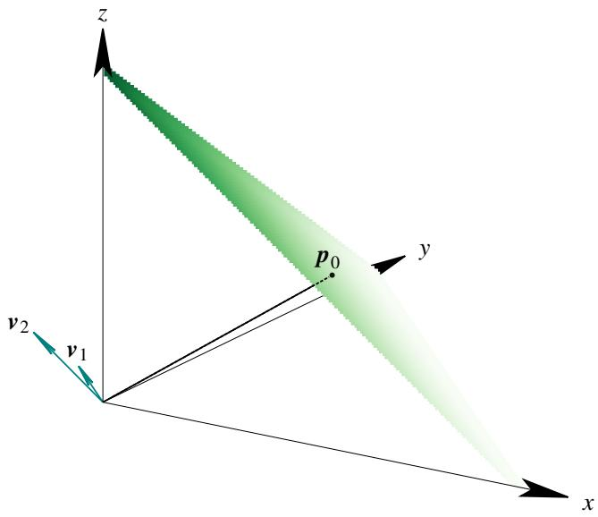  
图 4.17: 用向量和参数方程构建的平面.

例 4.74 球面的参数方程 求球心为坐标原点, 半径为 $r$ 的球面参数方程.

解 设一点 $\boldsymbol { r } = ( x , y , z )$ . 它的径向量与 ?? 轴的夹角为 ??. 它在 $x O y$ 平面的投影 $\pmb { p } ^ { \prime }$ 与 $x$ 轴的夹角为 $\varphi$ . 则 $r$ 在球面上当且仅当

$$
\left\{ \begin{array}{l} x = r \sin \theta \cos \varphi \\ y = r \sin \theta \sin \varphi \\ z = r \cos \theta \end{array} , \quad \theta \in [ 0, \pi ],   \varphi \in [ 0, 2 \pi ]. \right.
$$

以上就是球面的参数方程.

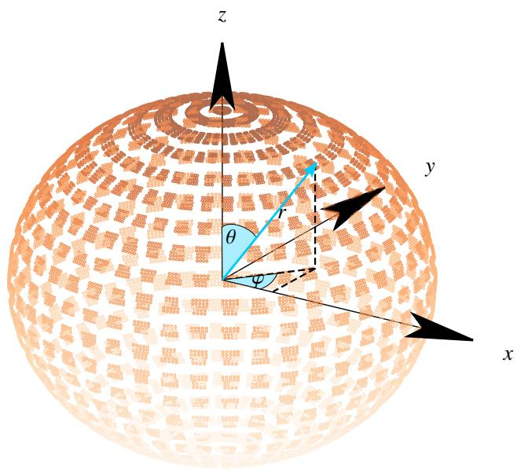  
图 4.18: 参数方程构建的球面.

下面来讨论空间曲面的切平面. 设曲面 $\Sigma : F ( x , y , z ) = 0 .$ . 在曲面上取一点 $\pmb { p } _ { 0 } = ( x _ { 0 } , y _ { 0 } , z _ { 0 } )$ . 在曲面上任取一

条过 $\pmb { p } _ { 0 }$ 的曲线 Γ:

$$
\left\{ \begin{array}{l} x = x (t) \\ y = y (t) \\ z = z (t) \end{array} \right..
$$

设 $x _ { 0 } = x \big ( t _ { 0 } \big )$ , $y _ { 0 } = y \big ( t _ { 0 } \big )$ , $z _ { 0 } = z ( t _ { 0 } )$ . 把 $\Gamma$ 的参数方程代入曲面 $\Sigma$ 的方程得

$$
F (x (t), y (t), z (t)) = 0.
$$

在方程两边求 $t _ { 0 }$ 处的导数:

$$
\begin{array}{l} \frac {\partial F}{\partial x} \left(\boldsymbol {p} _ {0}\right) x ^ {\prime} (t _ {0}) + \frac {\partial F}{\partial y} \left(\boldsymbol {p} _ {0}\right) y ^ {\prime} (t _ {0}) + \frac {\partial F}{\partial z} \left(\boldsymbol {p} _ {0}\right) z ^ {\prime} (t _ {0}) = 0 \\ \Longleftrightarrow \left(\frac {\partial F}{\partial x} (\boldsymbol {p} _ {0}), \frac {\partial F}{\partial y} (\boldsymbol {p} _ {0}), \frac {\partial F}{\partial z} (\boldsymbol {p} _ {0})\right) \cdot \left(x ^ {\prime} (t _ {0}), y ^ {\prime} (t _ {0}), z ^ {\prime} (t _ {0})\right) = 0 \\ \Longleftrightarrow J F \left(\boldsymbol {p} _ {0}\right) \cdot \left(x ^ {\prime} \left(t _ {0}\right), y ^ {\prime} \left(t _ {0}\right), z ^ {\prime} \left(t _ {0}\right)\right) = 0. \\ \end{array}
$$

因此曲线 $\Gamma$ 在 $\pmb { p } _ { 0 }$ 处的切向量 $( x ^ { \prime } ( t _ { 0 } ) , y ^ { \prime } ( t _ { 0 } ) , z ^ { \prime } ( t _ { 0 } ) )$ 与向量 $J F ( p _ { 0 } )$ 垂直. 由于以上讨论中的曲线 Γ 是任取的, 因此曲面 $\Sigma$ 上任意一条过 $\pmb { p } _ { 0 }$ 的曲线在 $\pmb { p } _ { 0 }$ 的切向量都与向量 $J F ( p _ { 0 } )$ 垂直, 这表明曲面 $\Sigma$ 上任意一条过 $\pmb { p } _ { 0 }$ 的曲线在 $\pmb { p } _ { 0 }$ 的切向量都共面. 这些切向量决定的平面就称为曲面 $\Sigma$ 在 $\pmb { p } _ { 0 }$ 处的切平面 (tangent plane). 向量 $J F ( p _ { 0 } )$ 称为$\pmb { p } _ { 0 }$ 处的一个法向量 (normal vector). 于是我们可以立刻写出切平面的点法式方程:

$$
(x - x _ {0}) \frac {\partial F}{\partial x} + (y - y _ {0}) \frac {\partial F}{\partial y} + (z - z _ {0}) \frac {\partial F}{\partial z} = 0.
$$

下面看一个简单的例子.

例 4.75 设球面:

$$
x ^ {2} + y ^ {2} + z ^ {2} = a ^ {2}.
$$

求球面上一点 $\pmb { p } _ { 0 } = ( x _ { 0 } , y _ { 0 } , z _ { 0 } )$ 处的切平面.

解 设 $F = x ^ { 2 } + y ^ { 2 } + z ^ { 2 } - a ^ { 2 } .$ 先求点 $\pmb { p } _ { 0 }$ 处的法向量:

$$
J F (\boldsymbol {p} _ {0}) = \left(\frac {\partial F}{\partial x} (\boldsymbol {p} _ {0}), \frac {\partial F}{\partial y} (\boldsymbol {p} _ {0}), \frac {\partial F}{\partial z} (\boldsymbol {p} _ {0})\right) = (2 x _ {0}, 2 y _ {0}, 2 z _ {0}).
$$

因此 $( x _ { 0 } , y _ { 0 } , z _ { 0 } )$ 就是 $\pmb { p } _ { 0 }$ 的一个法向量. 于是切面方程为

$$
(x - x _ {0}) x _ {0} + (y - y _ {0}) y _ {0} + (z - z _ {0}) z _ {0} = 0 \Longleftrightarrow x _ {0} x + y _ {0} y + z _ {0} z = a ^ {2}.
$$

注 注意到球面上任意一点的法向量恰好就是它的径向量. 这个结论是符合几何直观的. 另外. 上例中求得的法向量是指向球外的, 因此也称为外法向量 (outer normal vector).

如果给曲面方程是显式的: $z = f ( x , y )$ $( ( x , y ) \in D )$ , 那么只需令

$$
F (x, y, z) = z - f (x, y) = 0.
$$

任取 $( x _ { 0 } , y _ { 0 } ) \in D$ , 设 $z _ { 0 } = f ( x _ { 0 } , y _ { 0 } )$ , 则过 $( x _ { 0 } , y _ { 0 } , z _ { 0 } )$ 的法向量为

$$
\left(\frac {\partial F}{\partial x} \left(\boldsymbol {p} _ {0}\right), \frac {\partial F}{\partial y} \left(\boldsymbol {p} _ {0}\right), \frac {\partial F}{\partial z} \left(\boldsymbol {p} _ {0}\right)\right) = \left(- \frac {\partial f}{\partial x} \left(x _ {0}, y _ {0}\right), - \frac {\partial f}{\partial y} \left(x _ {0}, y _ {0}\right), 1\right).
$$

因此过 $( x _ { 0 } , y _ { 0 } , z _ { 0 } )$ 的切平面方程为:

$$
\begin{array}{l} - (x - x _ {0}) \frac {\partial f}{\partial x} (x _ {0}, y _ {0}) - (y - y _ {0}) \frac {\partial f}{\partial y} (x _ {0}, y _ {0}) + (z - z _ {0}) = 0 \\ \Longleftrightarrow z - f (x _ {0}, y _ {0}) = (x - x _ {0}) \frac {\partial f}{\partial x} (x _ {0}, y _ {0}) + (y - y _ {0}) \frac {\partial f}{\partial y} (x _ {0}, y _ {0}). \\ \end{array}
$$

注意到, 以上求得的法向量的第三个分量是正数, 因此它与 ?? 轴的正方向夹角不会超过 $\pi / 2$ . 我们称这样的法向量为上法向量. 相应地令上法向量反向就可以得到下法向量.

# 定理 4.46

证明

# 定义 4.26 (正则曲面)

例 4.76

解 XXX

例 4.77

解 XXX

# 定义 4.27 (曲面的夹角)

设曲面 $\Sigma _ { 1 }$ 和 $\Sigma _ { 2 }$ 有一个交点 $\pmb { p } _ { 0 }$ . 我们称 $\Sigma _ { 1 }$ 和 $\Sigma _ { 2 }$ 在 $\pmb { p } _ { 0 }$ 的法向量夹角为这两个曲面在这一点的夹角.

例 4.78 设两个曲面:

$$
x ^ {2} + y ^ {2} = a ^ {2}, a > 0, \quad b z = x y, b > 0.
$$

求这两个曲面的夹角.

解 容易知道两个曲面交线的参数方程:

$$
\left\{ \begin{array}{l} x = a \cos t \\ y = a \sin t \\ z = \frac {a ^ {2}}{b} \cos t \sin t \end{array} . \right.
$$

设交线上任意一点 $\begin{array} { r } { \pmb { p } _ { 0 } = \left( a \cos t , a \sin t , \frac { a ^ { 2 } } { b } \cos t \sin t \right) } \end{array}$ . 求出两个曲面在这一点的法向量:

$$
\boldsymbol {n} _ {1} = (\cos t, \sin t, 0), \quad \boldsymbol {n} _ {2} = (a \sin t, a \cos t, - b).
$$

它们的夹角为

$$
\cos \langle \boldsymbol {n} _ {1}, \boldsymbol {n} _ {2} \rangle = \frac {\boldsymbol {n} _ {1} \cdot \boldsymbol {n} _ {2}}{\| \boldsymbol {n} _ {1} \| \| \boldsymbol {n} _ {2} \|} = \frac {a \sin 2 t}{\sqrt {a ^ {2} + b ^ {2}}}.
$$

# 4.5.3 切向量和切空间的公理化

# 内容提要

h 介绍一阶常微分方程的几种初等解法.
