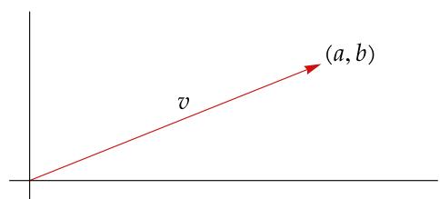
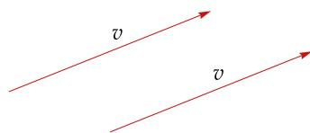
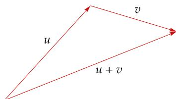
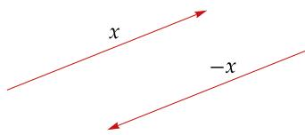
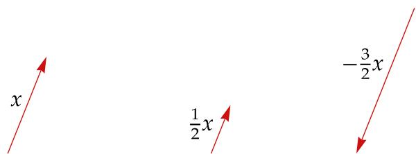

# 第1章 向量空间

线性代数是研究有限维向量空间上的线性映射的学问．我们终会了解所有这些术语是何含义．在本章中，我们将定义向量空间并讨论它们的基本性质

在线性代数中，如果将复数与实数放在一起研究，就会得到更好的定理和更深刻的见解因此，我们将从介绍复数及其基本性质开始

我们将把平面和三维空间这些例子推广到 $\mathbf { R } ^ { n }$ 和 $\mathbf { C } ^ { n }$ ，再进一步推广得到向量空间的概念我们将会明白，向量空间是具有满足自然的代数性质的加法和标量乘法运算的集合

接着，我们将讨论子空间．子空间之于向量空间，就类似子集之于集合．最后，我们将关注子空间的和（类似于子集的并集）与子空间的直和（类似于不相交集合的并集）

  
图为勒内·笛卡尔（René Descartes）向瑞典女王克里斯蒂娜（QueenChristina of Sweden）讲解他的工作．笛卡尔于 1637 年发表了用两个坐标来描述平面的观点，向量空间就是这一观点的推广

# 1A $\mathbf { R } ^ { n }$ 和 $\mathbf { C } ^ { n }$

# 复数

你应该已经熟悉了实数集合 R 的基本性质．发明复数，是为了让我们可以取负数的平方根．我们的想法是，假设 −1 有平方根，将其用 i 表示，并且它遵守通常的算术规则．正式的定义如下

# 1.1 定义：复数（complex numbers）、C

一个复数是一个有序对 $( a , b )$ ，其中 $a , b \in \mathbf { R }$ ，不过我们会把这写成 $a + b \mathrm { i }$   
全体复数所构成的集合用C表示：

$$
\mathbf {C} = \{a + b \mathrm {i}: a, b \in \mathbf {R} \}.
$$

C 上的加法（addition）和乘法（multiplication）定义为

$$
(a + b \mathrm {i}) + (c + d \mathrm {i}) = (a + c) + (b + d) \mathrm {i},
$$

$$
(a + b \mathrm {i}) (c + d \mathrm {i}) = (a c - b d) + (a d + b c) \mathrm {i};
$$

其中 $a , b , c , d \in \mathbf { R }$

如果 $a \in \mathbf { R }$ ，那么我们将 $a + 0 \mathrm { i }$ 等同于实数 $a$ ．由此，我们将R视为C的子集．我们通常将 $0 + b \mathrm { i }$ 简写作 $b \mathrm { i }$ ，将 $0 + 1 \mathrm { i }$ 简写作i

上述复数乘法定义式的来由可以这样说明：先假设已知 $\mathrm { i } ^ { 2 } = - 1$ ，并用一般的算术规

莱昂哈德·欧拉（Leonhard Euler）于 1777年首先使用符号i来代表 $\sqrt { - 1 }$

则来导出两复数乘积的公式，再用它反过来验证定义式的确满足

$$
\mathbf {i} ^ {2} = - 1.
$$

不要去背两个复数乘积的公式：只要回忆起 $\mathrm { i } ^ { 2 } = - 1$ ，再运用一般的算术规则 （在 1.3 中给出），你总是可以把它重新推导出来．接下来的示例说明了此过程

# 1.2 例：复数的算术运算

运用1.3中给出的分配性质和可交换性，可以算出 $( 2 + 3 \mathrm { i } ) ( 4 + 5 \mathrm { i } )$ 的值：

$$
\begin{array}{l} (2 + 3 \mathrm {i}) (4 + 5 \mathrm {i}) = 2 \cdot (4 + 5 \mathrm {i}) + (3 \mathrm {i}) (4 + 5 \mathrm {i}) \\ = 2 \cdot 4 + 2 \cdot 5 \mathrm {i} + 3 \mathrm {i} \cdot 4 + (3 \mathrm {i}) (5 \mathrm {i}) \\ = 8 + 1 0 \mathrm {i} + 1 2 \mathrm {i} - 1 5 \\ = - 7 + 2 2 \mathrm {i}. \\ \end{array}
$$

我们的第一个结果指出，复数加法和复数乘法具有我们熟悉的性质，正如我们所预期的那样．

# 1.3 复数的算术性质

可交换性（commutativity）

对于所有 $\alpha , \beta \in \mathbf { C }$ ，都有 $\alpha + \beta = \beta + \alpha$ 以及 $\alpha \beta = \beta \alpha$

可结合性（associativity）

对于所有 $\alpha , \beta , \lambda \in \mathbf { C }$ ，都有 $( \alpha + \beta ) + \lambda = \alpha + ( \beta + \lambda )$ 以及 $( \alpha \beta ) \lambda = \alpha ( \beta \lambda )$

恒等元（identities）

对于所有 $\lambda \in \mathbf { C }$ ，都有 $\lambda + 0 = \lambda$ 以及 $\lambda 1 = \lambda$

加法逆元（additive inverse）

对于每个 $\alpha \in \mathbf { C }$ ，都存在唯一的 $\beta \in \mathbf { C }$ 使得 $\alpha + \beta = 0$ .

乘法逆元（multiplicative inverse）

对于每个 $\alpha \in \mathbf { C }$ 且 $\alpha \neq 0$ ，都存在唯一的 $\beta \in \mathbf { C }$ 使得 $\alpha \beta = 1$

分配性质（distributive property）

对于所有 $\lambda , \alpha , \beta \in \mathbf { C }$ ，都有 $\lambda ( \alpha + \beta ) = \lambda \alpha + \lambda \beta .$

上述性质可用我们熟悉的实数性质和复数加法、复数乘法的定义证明．接下来的例子展示了如何证明复数乘法的可交换性，而其他性质的证明则留作习题

# 1.4 例：复数乘法的可交换性

为了说明对于所有 $\alpha , \beta \in \mathbf { C }$ 均有 $\alpha \beta = \beta \alpha$ ，假设

$$
\alpha = a + b \mathrm {i} \quad \text {且} \quad \beta = c + d \mathrm {i},
$$

其中 $a , b , c , d \in \mathbf { R }$ ．接着由复数乘法的定义得

$$
\begin{array}{l} \alpha \beta = (a + b \mathrm {i}) (c + d \mathrm {i}) \\ = (a c - b d) + (a d + b c) \mathrm {i} \\ \end{array}
$$

以及

$$
\begin{array}{l} \beta \alpha = (c + d i) (a + b i) \\ = (c a - d b) + (c b + d a) \mathrm {i}. \\ \end{array}
$$

将上面两式结合实数乘法与实数加法的可交换性可得 $\alpha \beta = \beta \alpha$

接下来，我们定义复数的加法逆元和乘法逆元，然后用这些逆元定义复数的减法和除法运算．

# 1.5 定义：−??、减法（subtraction），1/??、除法（division）

假设 $\alpha , \beta \in \mathbf { C }$ .

令 $- \alpha$ 表示 $\alpha$ 的加法逆元．于是 $- \alpha$ 是唯一使得

$$
\alpha + (- \alpha) = 0
$$

成立的复数

转下页

C上的减法的定义为

$$
\beta - \alpha = \beta + (- \alpha).
$$

对于 $\alpha \neq 0$ ，令 $1 / \alpha$ 和 $\textstyle { \frac { 1 } { \alpha } }$ 表示 $\alpha$ 的乘法逆元．于是 $1 / \alpha$ 是唯一使得

$$
\alpha (1 / \alpha) = 1
$$

成立的复数

对于 $\alpha \neq 0$ ，除以 $\alpha$ 的定义为

$$
\beta / \alpha = \beta (1 / \alpha).
$$

为便于下定义，也便于证明对于实数和复数都适用的定理，我们采用以下记号

# 1.6 记号：F

在全书中，F 代表 R 或 C

因此，如果我们证明了一个涉及F的定理，我们就会知道当F被替换为R或C时，这个定理也是成立的

称 F 中的元素为标量（scalar）．通常，当我们想要强调一个对象是数，而不是向量

使用字母 F 是因为 R 和 C 都是所谓域（field）的实例

（稍后将给出定义）时，就使用“标量”这个词（它只是“数”的一个花哨的表达法）

对于 $\alpha \in \mathbf { F }$ 以及一个正整数 $m$ ，我们定义 $\alpha ^ { m }$ 表示 $\alpha$ 自乘 $m$ 次：

$$
\alpha^ {m} = \underbrace {\alpha \cdots \alpha} _ {m \text {个} \alpha}.
$$

这个定义蕴涵着，对于所有 $\alpha , \beta \in \mathbf { F }$ 和所有正整数 $m , n$ ，有

$$
(\alpha^ {m}) ^ {n} = \alpha^ {m n} \quad {\text {及}} \quad (\alpha \beta) ^ {m} = \alpha^ {m} \beta^ {m}.
$$

组

在定义 $\mathbf { R } ^ { n }$ 和 $\mathbf { C } ^ { n }$ 之前，我们先看两个重要的例子

# 1.7 例： $\mathbf { R } ^ { 2 }$ 和 $\mathbf { R } ^ { 3 }$

集合 $\mathbf { R } ^ { 2 }$ （你可以将其视作一个平面）是全体有序实数对所构成的集合：

$$
\mathbf {R} ^ {2} = \{(x, y): x, y \in \mathbf {R} \}.
$$

集合 $\mathbf { R } ^ { 3 }$ （你可以将其视作通常的三维空间）是全体有序实数三元组所构成的集合：

$$
\mathbf {R} ^ {3} = \left\{\left(x, y, z\right): x, y, z \in \mathbf {R} \right\}.
$$

为了将 $\mathbf { R } ^ { 2 }$ 和 $\mathbf { R } ^ { 3 }$ 推广至更高维数，我们首先需要讨论组的概念

# 1.8 定义：组（list）、长度（length）

假设 $n$ 是非负整数．一个长度为 $n$ 的组是 $n$ 个有顺序的元素，这些元素可能是数、其他组或是更抽象的对象  
两个组是相等的，当且仅当它们具有相同的长度和按相同顺序排列的相同元素

组的通常写法，是将其中元素以逗号分隔并用圆括号括起来．于是，长度为2的组就

许多数学家将长度为 $n$ 的组称为 $n$ 元组（??-tuple）．

是一个有序对，可以写成 $( a , b )$ ．长度为 3 的组就是一个有序三元组，可以写成 $( x , y , z )$ ．长度为 $n$ 的组可能看起来是这样的：

$$
\left(z _ {1}, \dots , z _ {n}\right).
$$

有时我们会单用组这一个词而不明说其长度．但请记住，根据定义，每个组都具有有限长度，且这长度是非负整数．从而，对于形如 $( x _ { 1 } , x _ { 2 } , \dots )$ 的对象，我们可以说它“具有无限的长度”，所以它不是组

一个长度是 0 的组看起来是这样的：( )．我们将这样的对象看成组，是为了使一些定理不出现平凡的例外情形

组与有限集有两方面差异：在组中，顺序很重要，并且重复是有含义的；而在集合里，顺序和重复都无关紧要

# 1.9 例：组 VS 集合

组 (3, 5) 和 (5, 3) 是不相等的，但集合 {3, 5} 和 {5, 3} 是相等的  
组 (4,4) 和 (4,4,4) 是不相等的（长度不等），但集合 $\{ 4 , 4 \}$ 和 {4, 4, 4} 都等于集合 {4}

# F??

要定义与 $\mathbf { R } ^ { 2 }$ 和 $\mathbf { R } ^ { 3 }$ 类似的高维对象，我们将 R 换成 F（它等于 R 或 C）并且将 2 或 3 换成任意的正整数即可

# 1.10 记号：??

在本章剩余内容中，将 $n$ 取为某一固定的正整数

# 1.11 定义：F??、坐标（coordinate）

$\mathbf { F } ^ { n }$ 是全体具有 $n$ 个F中元素的组所构成的集合：

$$
\mathbf {F} ^ {n} = \{(x _ {1}, \dots , x _ {n}): \text {对 于} k = 1, \dots , n \text {有} x _ {k} \in \mathbf {F} \}.
$$

对于 $( x _ { 1 } , \ldots , x _ { n } ) \in \mathbf { F } ^ { n }$ 和 $k \in \{ 1 , \ldots , n \}$ ，我们称 $x _ { k }$ 是 $( x _ { 1 } , \ldots , x _ { n } )$ 的第 $k$ 个坐标

如果 $\mathbf { F } = \mathbf { R }$ ，且 $n$ 等于2或3，那么 $\mathbf { F } ^ { n }$ 的上述定义就与前面 $\mathbf { R } ^ { 2 }$ 和 $\mathbf { R } ^ { 3 }$ 的定义相吻合

# 1.12 例： $\mathbf { C } ^ { 4 }$

$\mathbf { C } ^ { 4 }$ 就是全体由四个复数组成的组所构成的集合：

$$
\mathbf {C} ^ {4} = \left\{\left(z _ {1}, z _ {2}, z _ {3}, z _ {4}\right): z _ {1}, z _ {2}, z _ {3}, z _ {4} \in \mathbf {C} \right\}.
$$

如果 $n \geq 4$ ，我们就无法将 $\mathbf { R } ^ { n }$ 可视化为物理实体；类似地， $\mathbf { C } ^ { 1 }$ 可以被视作一个平面，但是对于 $n \geq 2$ 情形，人脑就不能想象出 $\mathbf { C } ^ { n }$ 的全貌了．然而，即便 $n$ 很大，我们也可以如在 $\mathbf { R } ^ { 2 }$ 或 $\mathbf { R } ^ { 3 }$ 中那样简便地在 $\mathbf { F } ^ { n }$ 中进行代数运算．例如， $\mathbf { F } ^ { n }$ 中的加法运算定义如下

可阅读埃德温·A·艾勃特（Edwin A. Ab-bott）的《平面国》（Flatland: A Romance ofMany Dimensions），其中有趣地描述了生活在 $\mathbf { R } ^ { 2 }$ 的生物是如何认知 $\mathbf { R } ^ { 3 }$ 的．这本发表于 1884 年的小说也许能帮助你想象四维或更高维的物理空间

# 1.13 定义：F?? 中的加法（addition in F??）

$\mathbf { F } ^ { n }$ 中的加法定义为将对应坐标分别相加：

$$
\left(x _ {1}, \dots , x _ {n}\right) + \left(y _ {1}, \dots , y _ {n}\right) = \left(x _ {1} + y _ {1}, \dots , x _ {n} + y _ {n}\right).
$$

如果我们使用单个字母来表示 $n$ 个数组成的组，而不是显式地写出坐标的话，往往可以更简洁地表达有关 $\mathbf { F } ^ { n }$ 的数学内容．例如，在陈述接下来的结果时，我们用的是 $\mathbf { F } ^ { n }$ 中的 $x$ 和 $y$ ，即便其证明仍需 $( x _ { 1 } , \ldots , x _ { n } )$ 和 $( y _ { 1 } , \ldots , y _ { n } )$ 这些更繁琐的记号

# 1.14 F?? 中加法的可交换性

如果 $x , y \in \mathbf { F } ^ { n }$ ，那么 $x + y = y + x$

证明 假设 $x = ( x _ { 1 } , \ldots , x _ { n } ) \in \mathbf { F } ^ { n }$ 且 $y = \left( y _ { 1 } , \ldots , y _ { n } \right) \in \mathbf { F } ^ { n }$ ．那么

$$
\begin{array}{l} x + y = \left(x _ {1}, \dots , x _ {n}\right) + \left(y _ {1}, \dots , y _ {n}\right) \\ = \left(x _ {1} + y _ {1}, \dots , x _ {n} + y _ {n}\right) \\ = \left(y _ {1} + x _ {1}, \dots , y _ {n} + x _ {n}\right) \\ = \left(y _ {1}, \dots , y _ {n}\right) + \left(x _ {1}, \dots , x _ {n}\right) \\ = y + x, \\ \end{array}
$$

其中第二个和第四个等号成立是由于 $\mathbf { F } ^ { n }$ 中的加法定义，第三个等号成立是因为F中加法的通常的可交换性 ■

如果用单个字母来表示 $\mathbf { F } ^ { n }$ 中的元素，那 符号 ■ 表示“证明完毕”

么在必须列出坐标时，就用同一个字母加上合适的下标来表示．例如，如果 $x \in \mathbf { F } ^ { n }$ ，那么令 $x$ 等于 $( x _ { 1 } , \ldots , x _ { n } )$ 是个好的记法，如上面的证明所示．如果可行的话，只使用 $x$ 并避免显式使用坐标则更好

# 1.15 记号：0

令0表示长度为 $n$ 且所有坐标都是0的组：

$$
0 = (0, \dots , 0).
$$

这里我们以两种不同的方式使用符号 0：在上面等式的左边，符号 0 表示长度为 $n$ 的组，它是 $\mathbf { F } ^ { n }$ 中的元素；而在右边，每个 0 都表示一个数．这种可能令人困惑的做法，实际上不会造成任何问题，因为根据上下文就能明确使用的是哪种0

# 1.16 例：根据上下文确定使用的是哪种 0

考虑“0 是 $\mathbf { F } ^ { n }$ 中的加法恒等元”这一表达式：

对于所有的 $x \in \mathbf { F } ^ { n }$ ，有 $x + 0 = x$

此处式中的0是1.15中定义的组，而不是数0，因为我们并未定义 $\mathbf { F } ^ { n }$ 中元素（此处即 $x$ ）和数0的加法

图形有助于我们直观理解．我们将在 $\mathbf { R } ^ { 2 }$ 中绘制图形，因为我们可以在二维的表面（如纸和电脑屏幕上）勾画这个空间． $\mathbf { R } ^ { 2 }$ 中的典型元素是点 $\nu = ( a , b )$ ．有时我们不将 $\nu$ 看成点，而看成从原点开始、到 $( a , b )$ 结束的箭头，如图所示．当我们把 $\mathbf { R } ^ { 2 }$ 中的元素看作箭头时，我们就称它为向量（vector）

  
可将 $\mathbf { R } ^ { 2 }$ 的元素视为点或向量

当我们把 $\mathbf { R } ^ { 2 }$ 中的向量看作箭头时，我们可以把箭头平行移动（不改变它的长度或方向），并且仍然认为它是同一个向量带着这个观点，摒除坐标轴和显式的坐标而只考虑向量（如图所示），你常常可以获得更好的理解．这里展示的两个箭头有相同的长度和方向，所以我们认为它们是相同的向量

  
一个向量

当我们利用 $\mathbf { R } ^ { 2 }$ 中的图形或使用点和向量这种有些模糊的说法时，请记住，这些只是辅助我们理解，而不能代替我们将要研究的真正数学内容．虽然我们画不好高维空间中的图形，但是这些空间的元素和 $\mathbf { R } ^ { 2 }$ 的元素一样有着严格的定义

例如， $( 2 , - 3 , 1 7 , \pi , \sqrt { 2 } )$ 是 $\mathbf { R } ^ { 5 }$ 的一个元素，我们偶尔也将其称为 $\mathbf { R } ^ { 5 }$ 中的一个点或 $\mathbf { R } ^ { 5 }$ 中的一个向量，而无需担心 $\mathbf { R } ^ { 5 }$ 的几何是否有任何物理意义

经济学中的数学模型可能有数千个变量，例如 ?? , . . . , ?? ，也就是说，我们必须在 R5000 $x _ { 1 } , \ldots , x _ { 5 0 0 0 }$ $\mathbf { R } ^ { 5 0 0 0 }$ 中研究．这样的空间无法用几何方法来处理然而，代数方法效果很好．因此，我们的学科叫做线性代数

回忆一下，我们将 $\mathbf { F } ^ { n }$ 中两个元素之和定

义为，由对应的坐标相加得到的 $\mathbf { F } ^ { n }$ 中的元素（见 1.13）．现在我们将看到，在 $\mathbf { R } ^ { 2 }$ 这个特殊情形中，加法具有简洁的几何解释

假设我们想把 $\mathbf { R } ^ { 2 }$ 中的两个向量 $u$ 和 $\nu$ 相加．把 $\nu$ 平行移动，使它的起点与向量 $u$ 的终点重合，如右图所示．那么， $u$ 与 $\nu$ 之和 $u + \nu$ 就等于始于 $u$ 的起点，止于 $\nu$ 的终点的向量

  
两向量之和

在接下来的定义中，单行列出的等式右侧的0是组 $0 \in \mathbf { F } ^ { n }$

# 1.17 定义：F?? 中的加法逆元（additive inverse in F??）、−??

对于 $x \in \mathbf { F } ^ { n }$ ， $x$ 的加法逆元，记作 $- x$ ，是满足下式的向量 $- x \in \mathbf { F } ^ { n }$ ：

$$
x + (- x) = 0.
$$

由此，如果 $x = ( x _ { 1 } , \ldots , x _ { n } )$ ，那么 $- x = \left( - x _ { 1 } , \ldots , - x _ { n } \right)$

$\mathbf { R } ^ { 2 }$ 中一向量的加法逆元是一个长度相同但指向相反方向的向量．这里的图说明了这种思考 $\mathbf { R } ^ { 2 }$ 中加法逆元的方式．正如你所见，标记为 $- x$ 的向量与标记为 $x$ 的向量具有相同的长度，但是指向相反的方向

  
一向量及其加法逆元. 一向量及其加法逆元

讨论完 $\mathbf { F } ^ { n }$ 中的加法后，我们现在转而研究乘法．我们本可以用与加法类似的方式定义 $\mathbf { F } ^ { n }$ 中的乘法：取出 $\mathbf { F } ^ { n }$ 的两个元素，将它们对应的坐标相乘，得出$\mathbf { F } ^ { n }$ 中的另一个元素．经验表明，这种定义无助于实现我们的目的．另一类乘法，称为标量乘法，将成为我们讨论的核心．具体地说，我们需要定义将 $\mathbf { F } ^ { n }$ 中的一个元素乘以F中的一个元素是什么含义

# 1.18 定义：F?? 中的标量乘法（scalar multiplication in F??）

数 $\lambda$ 与 $\mathbf { F } ^ { n }$ 中的向量之乘积（product）是通过将这向量的每一个坐标都乘以?? 计算得到的：

$$
\lambda (x _ {1}, \dots , x _ {n}) = (\lambda x _ {1}, \dots , \lambda x _ {n}),
$$

此处 $\lambda \in \mathbf { F }$ 且 $( x _ { 1 } , \ldots , x _ { n } ) \in \mathbf { F } ^ { n }$

标量乘法在 $\mathbf { R } ^ { 2 }$ 中具有很漂亮的几何解释．如果 $\lambda > 0$ 且 $\boldsymbol { x } \in \mathbf { R } ^ { 2 }$ ，那么 $\lambda x$ 就是与 $x$ 指向相同且长度是 $x$ 的 $\lambda$ 倍的向量．换句话说，为了得到 $\lambda x$ ，我们把 $x$ 缩短或者延长到

$\mathbf { F } ^ { n }$ 中的标量乘法将一个标量和一个向量相乘，得到一个向量．相比之下， $\mathbf { R } ^ { 2 }$ 或 $\mathbf { R } ^ { 3 }$ 中的点积将两个向量相乘，得到一个标量．在第6章中，点积的推广形式将变得很重要．

原来的 $\lambda$ 倍，至于是缩短还是延长取决于 $\lambda$ 是小于 1 还是大于 1

如果 $\lambda < 0$ 且 $\boldsymbol { x } \in \mathbf { R } ^ { 2 }$ ，那么 $\lambda x$ 就是与 $x$ 指向相反且长度是 $x$ 的 $| \lambda |$ 倍的向量，如此处所示

  
标量乘法

# 关于域的题外话

一个域是这样一种集合：它包含至少两个不同的元素（称作0和1），且带有满足1.3中列出的所有性质的加法和乘法运算．因此， $\mathbf { R }$ 和C都是域，定义了通常的加法和乘法运算的有理数集合也是域．域的另一个例子是集合 $\{ 0 , 1 \}$ ，它具有通常的加法和乘法运算，除了 $1 + 1$ 被定义为等于0

在这本书中我们将不会与除 R 和 C 之外的域打交道．然而，线性代数中许多适用于域 R和 C 的定义、定理和证明无需更改即可在其他任意的域中成立．在这本书中的多半部分（除了第 6 章和第 7 章，这两章研究内积空间），你都可以将 F 看成代表任意的域（而非 R 和 C），如果你喜欢这样做的话．有些结果以“F是C”为前提，对于这些结果（除在关于内积的章节外），你大概率可以将这一前提替换成“F是代数闭域”（意即每个不是常值且系数在F中的多项式都有零点）．一些结果，例如 1C节习题13，需要在F 上假定 $1 + 1 \neq 0$

# K习题 1A k

1 证明： $\alpha + \beta = \beta + \alpha$ 对所有 $\alpha , \beta \in \mathbf { C }$ 成立  
2 证明： $( \alpha + \beta ) + \lambda = \alpha + ( \beta + \lambda )$ 对所有 $\alpha , \beta , \lambda \in \mathbf { C }$ 成立  
3 证明： $( \alpha \beta ) \lambda = \alpha ( \beta \lambda )$ 对所有 $\alpha , \beta , \lambda \in \mathbf { C }$ 成立  
4 证明： $\lambda ( \alpha + \beta ) = \lambda \alpha + \lambda \beta$ 对所有 $\lambda , \alpha , \beta \in \mathbf { C }$ 成立  
5 证明：对任一 $\alpha \in \mathbf { C }$ ，都存在唯一的 $\beta \in \mathbf { C }$ 使得 $\alpha + \beta = 0$ .  
6 证明：对任一 $\alpha \in \mathbf { C }$ （ $\alpha \neq 0$ ），都存在唯一的 $\beta \in \mathbf { C }$ 使得 $\alpha \beta = 1$   
7 证明：

$$
\frac {- 1 + \sqrt {3} \mathrm {i}}{2}
$$

是1的立方根（意即它的立方等于 1）

8 求 i的两个相异平方根  
9 求 $\boldsymbol { x } \in \mathbf { R } ^ { 4 }$ 使得

$$
(4, - 3, 1, 7) + 2 x = (5, 9, - 6, 8).
$$

10 解释为什么不存在 $\lambda \in \mathbf { C }$ 使得

$$
\lambda (2 - 3 \mathrm {i}, 5 + 4 \mathrm {i}, - 6 + 7 \mathrm {i}) = (1 2 - 5 \mathrm {i}, 7 + 2 2 \mathrm {i}, - 3 2 - 9 \mathrm {i}).
$$

11 证明： $( x + y ) + z = x + ( y + z )$ 对所有 $x , y , z \in \mathbf { F } ^ { n }$ 成立  
12 证明： $( a b ) x = a ( b x )$ 对所有 $x \in \mathbf { F } ^ { n }$ 和 $a , b \in \mathbf { F }$ 成立  
13 证明： $1 x = x$ 对所有 $x \in \mathbf { F } ^ { n }$ 成立  
14 证明： $\lambda ( x + y ) = \lambda x + \lambda y$ 对所有 $\lambda \in \mathbf { F }$ 和 $x , y \in \mathbf { F } ^ { n }$ 成立  
15 证明： $( a + b ) x = a x + b x$ 对所有 $a , b \in \mathbf { F }$ 和 $x \in \mathbf { F } ^ { n }$ 成立

“你会加法吗？”白皇后问道，“一加一加一加一加一加一加一加一加一加一等于多少？”“我不知道．”爱丽丝回答，“我数不清了．”

——刘易斯·卡罗尔（Lewis Carroll）《爱丽丝镜中奇遇记》（Through the Looking Glass）

# 1B 向量空间的定义

定义向量空间的动机源于 $\mathbf { F } ^ { n }$ 中加法和标量乘法的性质：加法满足交换律和结合律，并且有恒等元；每个元素都有一个加法逆元；标量乘法满足结合律；与1作标量乘法就像我们预期的那样不改变被乘的元素；加法和标量乘法通过分配性质联系起来

我们将向量空间定义为一个集合 $V$ ，这个集合 $V$ 具有满足上一段所述性质的加法和标量乘法运算

# 1.19 定义：加法（addition）、标量乘法（scalar multiplication）

集合 $V$ 上的加法是一个函数，它将每一对 $u , \nu \in V$ 对应到一个元素 $u + \nu \in V$   
集合 $V$ 上的标量乘法是一个函数，它将每个 $\lambda \in \textbf { F }$ 和每个 $\nu ~ \in ~ V$ 对应到一个元素???? ∈ ??

现在我们做好了充足的准备，可以给出向量空间的正式定义了

# 1.20 定义：向量空间（vector space）

一个向量空间是一个集合 $V$ ， $V$ 上的加法和标量乘法满足下列性质：

可交换性（commutativity）

对于所有 $u , \nu \in V$ ，都有 $u + \nu = \nu + u$

可结合性（associativity）

对于所有 $u , \nu , w \in V$ 以及所有 $a , b \in \mathbf { F }$ ，都有 $\left( u + \nu \right) + w = u + \left( \nu + w \right)$ 以及 $( a b ) \nu =$ $a ( b \nu )$

加法恒等元（additive identity）

对于所有 $\nu \in V$ ，都存在 $0 \in V$ 使得 $\nu + 0 = \nu$

加法逆元（additive inverse）

对于每个 $\nu \in V$ ，都存在 $w \in V$ 使得 $\nu + w = 0$

乘法恒等元（multiplicative identity）

对于所有 $\nu \in V$ ，都有 $1 \nu = \nu$

分配性质（distributive properties）

对于所有 $u , \nu \in V$ 以及所有 $a , b \in \mathbf { F }$ ，都有 $a ( u + \nu ) = a u + a \nu$ 且 $( a + b ) \nu = a \nu + b \nu$

以下的几何语言有时有助于我们直观理解

# 1.21 定义：向量（vector）、点（point）

向量空间的元素被称作向量或点

向量空间上的标量乘法依赖于F的选取．由此，当我们需要描述得更确切时，我们会说 $V$ 是 F 上的向量空间（vector space over F），而不是仅仅说?? 是一个向量空间．例如， $\mathbf { R } ^ { n }$ 是 R上的向量空间，而 $\mathbf { C } ^ { n }$ 是C上的向量空间

# 1.22 定义：实向量空间（real vector space）、复向量空间（complex vector space）

R上的向量空间称作实向量空间  
C上的向量空间称作复向量空间

通常，F的选取要么可以从上下文明确得知，要么无关紧要．因此我们一般假定F暗含于语境中，而无需专门提及它

带有通常的加法和标量乘法运算的 $\mathbf { F } ^ { n }$ 最简单的向量空间是 $\{ 0 \}$ ，它只包含一个点．是 F 上的向量空间（你应自行验证这一点）． $\mathbf { F } ^ { n }$ 这个例子为我们定义向量空间提供了动因

# 1.23 例： $\mathbf { F } ^ { \infty }$

$\mathbf { F } ^ { \infty }$ 定义为全体由 F 中元素组成的序列所构成的集合：

$$
\mathbf {F} ^ {\infty} = \{(x _ {1}, x _ {2}, \ldots): x _ {k} \in \mathbf {F}, \text {其 中} k = 1, 2, \ldots \}.
$$

$\mathbf { F } ^ { \infty }$ 上的加法和标量乘法的定义也和我们预期的一样：

$$
\left(x _ {1}, x _ {2}, \dots\right) + \left(y _ {1}, y _ {2}, \dots\right) = \left(x _ {1} + y _ {1}, x _ {2} + y _ {2}, \dots\right),
$$

$$
\lambda \left(x _ {1}, x _ {2}, \dots\right) = \left(\lambda x _ {1}, \lambda x _ {2}, \dots\right).
$$

有了这些定义， $\mathbf { F } ^ { \infty }$ 就成为 F 上的向量空间（你应自行验证）．这个向量空间中的加法恒等元是全0序列

接下来这个向量空间的实例涉及一个函数集合

# 1.24 记号：F??

如果 ?? 是一个集合，那么 $\mathbf { F } ^ { S }$ 表示从 ?? 到F 的所有函数构成的集合  
对于 $f , g \in \mathbf { F } ^ { S }$ ，和 $f + g \in \mathbf { F } ^ { S }$ 是由下式定义的函数：对于所有 $x \in S$ ，

$$
(f + g) (x) = f (x) + g (x).
$$

对于 $\lambda \in \mathbf { F }$ 与 $f \in \mathbf { F } ^ { S }$ ，乘积 $\lambda f \in \mathbf { F } ^ { S }$ 是由下式定义的函数：对于所有 $x \in S$ ，

$$
(\lambda f) (x) = \lambda f (x).
$$

举个上述记号的具体例子：如果 ?? 是区间 [0,1] 且 $\mathbf { F } = \mathbf { R }$ ，那么 $\mathbf { R } ^ { [ 0 , 1 ] }$ 是全体定义在区间[0,1] 上的实值函数所构成的集合

你应当自行验证下面例子中给出的三点结论

# 1.25 例： $\mathbf { F } ^ { S }$ 是一个向量空间

如果 ?? 是一个非空集合，那么 $\mathbf { F } ^ { S }$ （带有定义如上的加法和标量乘法）是F 上的向量空间  
· $\mathbf { F } ^ { S }$ 的加法恒等元是由下式定义的函数 $0 : S  \mathbf { F }$ ：对于所有 $x \in S$ ，

$$
0 (x) = 0.
$$

转下页

对于 $f \in \mathbf { F } ^ { S }$ ， $f$ 的加法逆元是由下式定义的函数 $- f : S \to \mathbf { F }$ ：对于所有 $x \in S$ ，

$$
(- f) x = - f (x).
$$

向量空间 $\mathbf { F } ^ { n }$ 是向量空间 $\mathbf { F } ^ { S }$ 的一个特例，因为每个 $( x _ { 1 } , \ldots , x _ { n } ) \ \in \ \mathbf { F } ^ { n }$ 都可被视作一个从集合 $\{ 1 , 2 , \ldots , n \}$ 到 $\mathbf { F }$ 的函数 $x$ ，只要将$( x _ { 1 } , \ldots , x _ { n } )$ 的第 $k$ 个坐标写成 $x ( k )$ 而不是 $x _ { k }$

向量空间 $\mathbf { R } ^ { [ 0 , 1 ] }$ 的元素是区间 [0,1] 上的实值函数，而不是组．通常，向量空间是一个抽象实体，其元素可能是组、函数或奇怪的对象．

就可看出．换句话说，我们可以将 $\mathbf { F } ^ { n }$ 看成 $\mathbf { F } ^ { \{ 1 , 2 , . . . , n \} }$ ．类似地，我们可以将 $\mathbf { F } ^ { \infty }$ 看成 $\mathbf { F } ^ { \{ 1 , 2 , \dots \} }$

稍后我们将看到向量空间的更多例子，但在此之前，我们需要先探究向量空间的一些基本性质

向量空间的定义要求它存在加法恒等元，而接下来的结果表明这个恒等元是唯一的

# 1.26 加法恒等元唯一

一个向量空间有唯一的加法恒等元

证明 设0和 $0 ^ { \prime }$ 是同一个向量空间 $V$ 的加法恒等元．那么

$$
0 ^ {\prime} = 0 ^ {\prime} + 0 = 0 + 0 ^ {\prime} = 0,
$$

其中第一个等号成立是因为0是加法恒等元，第二个等号成立是因为可交换性，第三个等号成立是因为 $0 ^ { \prime }$ 是加法恒等元．于是 $0 ^ { \prime } = 0$ ，证明了 $V$ 仅有一个加法恒等元 ■

向量空间中的每个元素 $\nu$ 都存在加法逆元 $w$ ，它是向量空间中使得 $\nu + w = 0$ 成立的元素接下来的结果表明，向量空间中的每个元素都只有一个加法逆元

# 1.27 加法逆元唯一

向量空间里的每个元素都有唯一的加法逆元

证明 设 $V$ 是向量空间．令 $\nu \in V$ ．假设 $w$ 和 $w ^ { \prime }$ 都是 $\nu$ 的加法逆元．那么

$$
w = w + 0 = w + \left(v + w ^ {\prime}\right) = (w + v) + w ^ {\prime} = 0 + w ^ {\prime} = w ^ {\prime},
$$

由此 $w = w ^ { \prime }$ ，命题得证

因为加法逆元是唯一的，所以下面的记号现在就有意义了

# 1.28 记号：−??、?? − ??

令 $\nu , w \in V$ ，那么

$- \nu$ 表示 $\nu$ 的加法逆元；  
$w - \nu$ 定义为 $w + \left( - \nu \right)$

本书中几乎所有的结果都涉及向量空间．为了避免频繁地重申 $V$ 是向量空间，我们现在作出以下声明，便可一劳永逸：

# 1.29 记号：??

在本书的剩余部分中，?? 表示F上的向量空间

在接下来的结果中，等式左侧的0表示的是标量（数 $0 \in \mathbf { F }$ ），等式右侧的0表示的是向量（ $V$ 的加法恒等元）

# 1.30 向量与数0相乘

对于每个 $\nu \in V$ ，都有 $0 \nu = 0$

证明 对于 $\nu \in V$ ，我们有

$$
0 v = (0 + 0) v = 0 v + 0 v.
$$

在此式两边都加上 $0 \nu$ 的加法逆元就得到 $0 = 0 \nu$ ，命题得证

在接下来的结果中，0 表示 $V$ 的加法恒等元．虽然1.30和1.31的证明是相似的，但它们并不完全相同．更准确地说，1.30 表明标量0和任何向量的乘积等于向量0，而1.31表明任何标量和向量0的乘积等于向量0

1.30 中的结果涉及 ?? 的加法恒等元和标量乘法．在向量空间的定义中，只有分配性质将向量加法和标量乘法关联起来．因此，在1.30的证明中必须使用分配性质

# 1.31 数与向量0相乘

对于每个 $a \in \mathbf { F }$ ，都有 $a 0 = 0$

证明 对于 $a \in \mathbf { F }$ ，我们有

$$
a 0 = a (0 + 0) = a 0 + a 0.
$$

在此式两边都加上 $a 0$ 的加法逆元就得到 $0 = a 0$ ，命题得证

现在我们证明，如果 $V$ 中的一个元素乘以标量−1，那么结果就是该元素的加法逆元

# 1.32 向量与数 −1 相乘

对于每个 $\nu \in V$ ，都有 $( - 1 ) \nu = - \nu$

证明 对于 $\nu \in V$ ，我们有

$$
v + (- 1) v = 1 v + (- 1) v = (1 + (- 1)) v = 0 v = 0.
$$

这个式子说明 $( - 1 ) \nu$ 加上 $\nu$ 会得到0．那么 $( - 1 ) \nu$ 就是 $\nu$ 的加法逆元，命题得证

# K习题 1Bk

1 证明： $- ( - \nu ) = \nu$ 对任一 $\nu \in V$ 都成立  
2 设 $a \in \mathbf { F }$ ， $\nu \in V$ 且 $a \nu = 0$ ，证明： $a = 0$ 或 $\nu = 0$   
3 设 $\nu , w \in V$ ，解释为什么存在唯一的 $x \in V$ 使得 $\nu + 3 x = w$   
4 空集不是向量空间．对于列写在向量空间定义（1.20）中的要求，空集仅不满足其中的一条．是哪一条？  
5 证明：在向量空间的定义（1.20）中，加法逆元条件可以替换成这一条件—

$0 \nu = 0$ 对所有 $\nu \in V$ 成立

这里，左侧的0是数0，而右侧的0是 $V$ 的加法恒等元

注 在定义中“条件可以替换”，指原来的条件换成新条件后，满足定义的对象还是原来那些

6 令 $\infty$ 和 $- \infty$ 表示不在R中的两个不同对象．根据记号就能猜到 $\scriptstyle \mathbf { R } \cup \{ \infty , - \infty \}$ 上的加法和标量乘法可以如何定义．具体而言，两个实数的和与积照常定义，而对于 $t \in \mathbf { R }$ ，我们定义：

$$
t \infty = \left\{ \begin{array}{l l} - \infty , & \text {若} t <   0, \\ 0, & \text {若} t = 0, \\ \infty , & \text {若} t > 0; \end{array} \right. \quad t (- \infty) = \left\{ \begin{array}{l l} \infty , & \text {若} t <   0, \\ 0, & \text {若} t = 0, \\ - \infty , & \text {若} t > 0; \end{array} \right.
$$

以及

$$
t + \infty = \infty + t = \infty + \infty = \infty ,
$$

$$
t + (- \infty) = (- \infty) + t = (- \infty) + (- \infty) = - \infty ,
$$

$$
\infty + (- \infty) = (- \infty) + \infty = 0.
$$

具有这样的加法和标量乘法运算的 $\mathbf { R } \cup \{ \infty , - \infty \}$ 是 $\mathbf { R }$ 上的向量空间吗？解释一下

7 设 ?? 是一个非空集合，令 $V ^ { S }$ 表示从 $S$ 到 $V$ 的函数构成的集合．在 $V ^ { S }$ 上定义自然的加法和标量乘法，并证明具有这些定义的 $V ^ { S }$ 是向量空间

8 设 $V$ 是实向量空间

$V$ 的复化（complexification）记为 $V _ { \mathbf { C } }$ ，等于 $V \times V$ ． $V _ { \mathbf { C } }$ 中的元素为有序对 $( u , \nu )$ ，其中$u , \nu \in V$ ，不过我们把它写作 $u + \mathrm { i } \nu$

$V _ { \mathbf { C } }$ 上的加法定义为

$$
\left(u _ {1} + \mathrm {i} v _ {1}\right) + \left(u _ {2} + \mathrm {i} v _ {2}\right) = \left(u _ {1} + u _ {2}\right) + \mathrm {i} \left(v _ {1} + v _ {2}\right)
$$

对所有 $u _ { 1 } , \nu _ { 1 } , u _ { 2 } , \nu _ { 2 } \in V$ 成立

$V _ { \mathbf { C } }$ 上的复标量乘法定义为

$$
(a + b \mathrm {i}) (u + \mathrm {i} v) = (a u - b v) + \mathrm {i} (a v + b u)
$$

对所有 $a , b \in \mathbf { R }$ 和所有 $u , \nu \in V$ 成立

证明具有如上加法和标量乘法定义的 $V _ { \mathbf { C } }$ 是复向量空间

注 将 $u \in V$ 等同于 $u + \mathrm { i 0 }$ 从而将 $V$ 视为 $V _ { \mathbf { C } }$ 的一个子集．这样一来，由 $V$ 构造 $V _ { \mathbf { C } }$ 就可以视作由 $\mathbf { R } ^ { n }$ 构造 $\mathbf { C } ^ { n }$ 的推广

# 1C 子空间

通过考虑子空间，我们可以大大扩充向量空间的例子

# 1.33 定义：子空间（subspace）

如果 $V$ 的子集 $U$ 是与 $V$ 具有相同的加法恒等元、加法和标量乘法运算的向量空间，那么 $U$ 就称为 $V$ 的子空间

接下来的结果给出了检验向量空间的子集是否为子空间的最简单方法

有人使用术语“线性子空间”（linear sub-space），这和子空间意思一样．

# 1.34 子空间的条件

当且仅当 $V$ 的子集 $U$ 满足以下三个条件时， $U$ 是?? 的子空间

加法恒等元（additive identity）

$$
0 \in U.
$$

对于加法封闭（closed under addition）

$u , w \in U$ 意味着 $u + w \in U$ .

对于标量乘法封闭（closed under scalar multiplication）

$a \in \mathbf { F }$ 且 $u \in U$ 意味着 $a u \in U$

证明 如果 $U$ 是 $V$ 的一个子空间，那么根据向量空间的定义， $U$ 必满足上述三个条件

反之，假设 $U$ 满足上述三个条件．第一个条件保证了 $V$ 的加法恒等元必在 $U$ 中．第二个条件保证了 $V$ 上的加法在 $U$ 上是有意义

上面的加法恒等元条件，可以用 $U$ 非空来代替（因为取 $u \in U$ 并将其乘0意味着 $0 \in U$ ）然而，如果 $V$ 的一个子集 $U$ 确实是一个子空间，那么通常证明 $U$ 非空的最快方法就是证明 $0 \in U$

的．第三个条件保证了 $V$ 上的标量乘法在 $U$ 上是有意义的

如果 $u \in U$ ，那么由上述第三个条件， $- u$ 【由1.32可得其等于 $( - 1 ) u$ 】也在 $U$ 中．因此 $U$ 中的每个元素均有在 $U$ 中的加法逆元

向量空间定义的其余部分，如可结合性和可交换性，对于 $U$ 自动满足，因为它们在更大的空间 $V$ 中成立．因此， $U$ 是向量空间，进而是 $V$ 的子空间

给定 $V$ 的一个子集，用上述结果中的三个条件即可快速确定它是否为 $V$ 的子空间．你应该自行验证接下来这个示例中的所有结论

# 1.35 例：子空间

(a) 如果 $b \in \mathbf { F }$ ，那么当且仅当 $b = 0$ 时，

$$
\left\{\left(x _ {1}, x _ {2}, x _ {3}, x _ {4}\right) \in \mathbf {F} ^ {4}: x _ {3} = 5 x _ {4} + b \right\}
$$

是 $\mathbf { F } ^ { 4 }$ 的子空间

(b) 定义在区间 [0, 1] 上的全体连续实值函数构成的集合是 $\mathbf { R } ^ { [ 0 , 1 ] }$ 的子空间  
(c) 定义在R上的全体可微实值函数构成的集合是 $\mathbf { R } ^ { \mathbf { R } }$ 的子空间

转下页

(d) 当且仅当 $b = 0$ 时，定义在区间 (0,3) 上且满足 $f ^ { \prime } ( 2 ) = b$ 的全体可微实值函数 $f$ 构成的集合是 $\mathbf { R } ^ { ( 0 , 3 ) }$ 的子空间  
(e) 极限为 0 的所有复数序列所构成的集合是 $\mathbf { C } ^ { \infty }$ 的子空间

验证上面的某些结论，可让我们一瞥隐含在微积分中的线性结构．例如，上面的(b)需要用到“两个连续函数的和是连续的”这一结论；又例如，上面的(d)需要用到“对于

集合 $\{ 0 \}$ 是 $V$ 的最小子空间，而 $V$ 本身是 $V$ 的最大子空间．空集不是 $V$ 的子空间，因为子空间必须是向量空间，因此必须包含至少一个元素，即加法恒等元

常数 $c$ ， $c f$ 的导数等于 $c$ 乘以 $f$ 的导数”这一结论

$\mathbf { R } ^ { 2 }$ 的子空间恰有 $\{ 0 \}$ ， $\mathbf { R } ^ { 2 }$ 中所有过原点的直线，以及 $\mathbf { R } ^ { 2 }$ 本身． $\mathbf { R } ^ { 3 }$ 的子空间恰有 $\{ 0 \}$ ， $\mathbf { R } ^ { 3 }$ 中所有过原点的直线， $\mathbf { R } ^ { 3 }$ 中所有过原点的平面，以及 $\mathbf { R } ^ { 3 }$ 本身．证明这些是子空间很容易，困难的是证明 $\mathbf { R } ^ { 2 }$ 和 $\mathbf { R } ^ { 3 }$ 仅有这些子空间．当我们在下一章中引进更多工具之后，这项工作会变得更容易些

# 子空间的和

讨论向量空间时，我们通常只对子空间而不是任意子集感兴趣．子空间之和的概念会很有用

子空间的并往往不是一个子空间（见习题12），这也就是我们通常讨论和而不是并的原因．

# 1.36 定义：子空间的和（sum of subspaces）

假设 $V _ { 1 } , \ldots , V _ { m }$ 是 $V$ 的子空间． $V _ { 1 } , \ldots , V _ { m }$ 的和是由 $V _ { 1 } , \ldots , V _ { m }$ 中元素所有可能的和所构成的集合，记作 $V _ { 1 } + \cdots + V _ { m }$ ．更确切地说，

$$
V _ {1} + \dots + V _ {m} = \left\{v _ {1} + \dots + v _ {m}: v _ {1} \in V _ {1}, \dots , v _ {m} \in V _ {m} \right\}.
$$

我们看几个有关子空间之和的例子

# 1.37 例： $\mathbf { F } ^ { 3 }$ 的子空间之和

假设 $U$ 是 $\mathbf { F } ^ { 3 }$ 中第二个和第三个坐标等于 0 的所有元素构成的集合， ?? 是 $\mathbf { F } ^ { 3 }$ 中第一个和第三个坐标等于0的所有元素构成的集合：

$$
U = \{(x, 0, 0) \in \mathbf {F} ^ {3}: x \in \mathbf {F} \}, W = \{(0, y, 0) \in \mathbf {F} ^ {3}: y \in \mathbf {F} \}.
$$

那么，

$$
U + W = \left\{\left(x, y, 0\right) \in \mathbf {F} ^ {3}: x, y \in \mathbf {F} \right\},
$$

你应自行验证

# 1.38 例： $\mathbf { F } ^ { 4 }$ 的子空间之和

假设

$$
U = \{(x, x, y, y) \in \mathbf {F} ^ {4}: x, y \in \mathbf {F} \}, W = \{(x, x, x, y) \in \mathbf {F} ^ {4}: x, y \in \mathbf {F} \}.
$$

转下页

如果使用语言而不是符号，我们可以说， $U$ 是由 $\mathbf { F } ^ { 4 }$ 中前两个坐标相等且后两个坐标也相等的所有元素构成的集合；类似地，?? 是由 $\mathbf { F } ^ { 4 }$ 中前三个坐标相等的所有元素构成的集合

为求出 $U + W$ 的表达式，考虑 $U$ 中的一个元素 $( a , a , b , b )$ 和 ?? 中的一个元素 $( c , c , c , d )$ ，其中 $a , b , c , d \in \mathbf { F }$ ．我们有

$$
(a, a, b, b) + (c, c, c, d) = (a + c, a + c, b + c, b + d),
$$

这表明 $U + W$ 中每个元素的前两个坐标都相等．因此

$$
U + W \subseteq \left\{\left(x, x, y, z\right) \in \mathbf {F} ^ {4}: x, y, z \in \mathbf {F} \right\}. \tag {1.39}
$$

为证明 $\{ ( x , x , y , z ) \in \mathbf { F } ^ { 4 } : x , y , z \in \mathbf { F } \}$ 同样含于 $U + W$ ，假设 $x , y , z \in \mathbf { F }$ ，那么

$$
(x, x, y, z) = (x, x, y, y) + (0, 0, 0, z - y),
$$

上式右端第一个向量在 $U$ 中，第二个向量在 ?? 中．于是 $( x , x , y , z ) \in U + W$ ，说明式 (1.39) 表示的包含关系反过来也成立．因此

$$
U + W = \left\{\left(x, x, y, z\right) \in \mathbf {F} ^ {4}: x, y, z \in \mathbf {F} \right\},
$$

这表明， $U + W$ 是由 $\mathbf { F } ^ { 4 }$ 中前两个坐标相等的所有元素构成的集合

接下来的结果表明，子空间的和还是子空间，实际上也是包含了其中所有求和项的最小子空间（意即，任一子空间，如果包含所有求和项，也就包含这些求和项之和）

# 1.40 子空间的和是包含这些子空间的最小子空间

假设 $V _ { 1 } , \ldots , V _ { m }$ 是 $V$ 的子空间，那么 $V _ { 1 } + \cdots + V _ { m }$ 是最小的包含 $V _ { 1 } , \ldots , V _ { m }$ 的子空间．

证明 读者可自行验证 $V _ { 1 } + \cdots + V _ { m }$ 包含加法恒等元 0 且对于加法和标量乘法都是封闭的进而1.34表明， $V _ { 1 } + \cdots + V _ { m }$ 是 $V$ 的子空间

$V _ { 1 } , \ldots , V _ { m }$ 都包含于 $V _ { 1 } + \cdots + V _ { m }$ 中（为了看出这点，考虑 $\nu _ { 1 } + \cdots + \nu _ { m }$ ，其中除某个

向量空间理论中子空间的和类似于集合论中子集的并集．给定一向量空间的两个子空间，包含它们的最小子空间是它们的和．类似地，给定一集合的两个子集，包含它们的最小子集是它们的并集

$\nu _ { k }$ 不是0外剩余各项都是0）．反之，每个包含 $V _ { 1 } , \ldots , V _ { m }$ 的子空间都包含 $V _ { 1 } + \cdots + V _ { m }$ （因为子空间必须包含其中有限个元素的和）．由此， $V _ { 1 } + \cdots + V _ { m }$ 是最小的包含 $V _ { 1 } , \ldots , V _ { m }$ 的子空间．■

# 直和

设 $V _ { 1 } , \ldots , V _ { m }$ 是 $V$ 的子空间． $V _ { 1 } + \cdots + V _ { m }$ 的每个元素都可以被写成这种形式

$$
v _ {1} + \dots + v _ {m},
$$

其中每个 $\nu _ { k } \in V _ { k }$ ．我们特别感兴趣的是 $V _ { 1 } + \cdots + V _ { m }$ 中的每个向量都能唯一地用上述形式表示的情况．这种情况十分重要，所以它获得了专属的名称（直和）以及专属的符号 $\left( \oplus \right)$ ）

# 1.41 定义：直和（direct sum）、⊕

设 $V _ { 1 } , \ldots , V _ { m }$ 是 $V$ 的子空间

如果 $V _ { 1 } + \cdots + V _ { m }$ 中的每个元素都能用 $\nu _ { 1 } + \cdots + \nu _ { m }$ （其中各 $\nu _ { k } \in V _ { k }$ ）这种形式唯一地表示出来，则称子空间之和 $V _ { 1 } + \cdots + V _ { m }$ 为直和  
如果 $V _ { 1 } + \cdots + V _ { m }$ 是直和，那么用 $V _ { 1 } \oplus \cdots \oplus V _ { m }$ 来表示 $V _ { 1 } + \cdots + V _ { m }$ ，其中记号 $\oplus$ 表示此处的和是直和

# 1.42 例：两个子空间的直和

假设 $U$ 是 $\mathbf { F } ^ { 3 }$ 中最后一个坐标等于 0 的所有向量构成的子空间， ?? 是 $\mathbf { F } ^ { 3 }$ 中前两个坐标等于0的所有向量构成的子空间：

$$
U = \{(x, y, 0) \in \mathbf {F} ^ {3}: x, y \in \mathbf {F} \}, W = \{(0, 0, z) \in \mathbf {F} ^ {3}: z \in \mathbf {F} \}.
$$

那么 $\mathbf { F } ^ { 3 } = U \oplus W$ ．你应自行验证

# 1.43 例：多个子空间的直和

假设 $V _ { k }$ 是 $\mathbf { F } ^ { n }$ 中除了第 $k$ 个坐标外，其 输入\oplus即可在 TEX 中打出 $\oplus$ 余坐标均为 0 的所有向量构成的子空间．例如， $V _ { 2 } = \{ ( 0 , x , 0 , \ldots , 0 ) \in \mathbf { F } ^ { n } : x \in \mathbf { F } \}$ ．那么$\mathbf { F } ^ { n } = V _ { 1 } \oplus \cdots \oplus V _ { n }$ ． 你应自行验证

有时反例能同正例一样增进我们的理解

# 1.44 例：一个不是直和的和

假设

$$
V _ {1} = \left\{\left(x, y, 0\right) \in \mathbf {F} ^ {3}: x, y \in \mathbf {F} \right\},
$$

$$
V _ {2} = \{(0, 0, z) \in \mathbf {F} ^ {3}: z \in \mathbf {F} \},
$$

$$
V _ {3} = \left\{\left(0, y, y\right) \in \mathbf {F} ^ {3}: y \in \mathbf {F} \right\}.
$$

那么 $\mathbf { F } ^ { 3 } = V _ { 1 } + V _ { 2 } + V _ { 3 }$ ，因为每个向量 $( x , y , z ) \in \mathbf { F } ^ { 3 }$ 都可以写成

$$
(x, y, z) = (x, y, 0) + (0, 0, z) + (0, 0, 0),
$$

上述等式右端的第一个向量在 $V _ { 1 }$ 中，第二个向量在 $V _ { 2 }$ 中，第三个向量在 $V _ { 3 }$ 中

然而， $\mathbf { F } ^ { 3 }$ 不等于 $V _ { 1 } , V _ { 2 } , V _ { 3 }$ 的直和，因为将向量 $( 0 , 0 , 0 )$ 写成和式 $\nu _ { 1 } + \nu _ { 2 } + \nu _ { 3 }$ （其中各$\nu _ { k } \in V _ { k }$ ）的方式不止一种．具体地说，我们有

$$
(0, 0, 0) = (0, 1, 0) + (0, 0, 1) + (0, - 1, - 1),
$$

并且显然也有

$$
(0, 0, 0) = (0, 0, 0) + (0, 0, 0) + (0, 0, 0),
$$

上面两个等式右端的第一个向量在 $V _ { 1 }$ 中，第二个向量在 $V _ { 2 }$ 中，第三个向量在 $V _ { 3 }$ 中．进而$V _ { 1 } + V _ { 2 } + V _ { 3 }$ 不是直和

直和的定义要求每个向量都能唯一地表示成一个适当的和．接下来的结果表明，在判断子空间的和是否为直和时，我们只需考虑是否能将0唯一地表示成一个适当的和

符号 $\oplus$ 由一个圆圈和其中的加号组成，它提醒我们正在讨论一种特殊类型的子空间之和——直和中的每个元素只能唯一地由给定子空间的元素之和表示

# 1.45 直和的条件

假定 $V _ { 1 } , \ldots , V _ { m }$ 是 $V$ 的子空间．那么 $V _ { 1 } + \cdots + V _ { m }$ 是直和，当且仅当用 $\nu _ { 1 } + \cdots + \nu _ { m }$ （其中各 $\nu _ { k } \in V _ { k }$ ）表示0的唯一方式是将每个 $\nu _ { k }$ 都取0

证明 首先假定 $V _ { 1 } + \cdots + V _ { m }$ 是直和．那么直和的定义就表明用 $\nu _ { 1 } + \cdots + \nu _ { m }$ （其中各 $\nu _ { k } \in V _ { k }$ ）表示0的唯一方式是将每个 $\nu _ { k }$ 都取0

现在假设用 $\nu _ { 1 } + \cdots + \nu _ { m }$ （其中各 $\nu _ { k } \in V _ { k }$ ）表示 0 的唯一方式是将每个 $\nu _ { k }$ 都取 0．为了说明 $V _ { 1 } + \cdots + V _ { m }$ 是直和，令 $\nu \in V _ { 1 } + \cdots + V _ { m }$ ，则对某 $\nu _ { 1 } \in V _ { 1 } , \ldots , \nu _ { m } \in V _ { m }$ ，有

$$
v = v _ {1} + \dots + v _ {m}.
$$

为了说明这个表示法是唯一的，假设对 $u _ { 1 } \in V _ { 1 } , \dots , u _ { m } \in V _ { m }$ ，我们也有

$$
v = u _ {1} + \dots + u _ {m},
$$

将这两个式子相减，我们就得到

$$
0 = \left(v _ {1} - u _ {1}\right) + \dots + \left(v _ {m} - u _ {m}\right).
$$

因为 $\nu _ { 1 } - u _ { 1 } \in V _ { 1 } , \ldots , \nu _ { m } - u _ { m } \in V _ { m }$ ，所以上式表明，每个 $\nu _ { k } - u _ { k }$ 都等于 0．进而 $\nu _ { 1 } = u _ { 1 } , . . . , . . _ { m } =$ $u _ { m }$ ，唯一性得证

接下来的结果给出了检验两个子空间的和是否为直和的一个简单条件

下面使用的符号 $\Longleftrightarrow$ 意思是“当且仅当”；也可以认为这个符号是“等价于”的意思．

# 1.46 两个子空间的直和

假定 $U$ 和?? 是 $V$ 的子空间．那么

$$
U + W \text {是 直 和} \iff U \cap W = \{0 \}.
$$

证明 首先假定 $U + W$ 是直和．如果 $\nu \in U \cap W$ ，那么 $0 = \nu + \left( - \nu \right)$ （其中 $\nu \in U$ 且 $- \nu \in W$ ）因为 0 要被 $U$ 中向量与?? 中向量的和唯一表示，所以我们得到 $\nu = 0$ ．由此 $U \cap W = \{ 0 \}$ ，我们完成了一个方向的证明

为了证明另一方向，现在假设 $U \cap W = \{ 0 \}$ ．为了证明 $U + W$ 是直和，假设 $u \in U , w \in W$ 且有

$$
0 = u + w.
$$

为了完成证明，我们只需说明 $u = w = 0$ （根据1.45）．上式表明 $u = - w \in W$ ．由此 $u \in U \cap W$ 因此 $u = 0$ ，结合上式又可得 $w = 0$ ，这样就完成了证明 ■

上面的结果只适用于两个子空间的情况当考虑有两个以上子空间的直和的问题时，仅仅检验每一对子空间只交于 0 处是不够的想想例 1.44 就能明白：在这个反例中，我们有 $V _ { 1 } \cap V _ { 2 } = V _ { 1 } \cap V _ { 3 } = V _ { 2 } \cap V _ { 3 } = \{ 0 \} .$

子空间的和类似于子集的并集．类似地，子空间的直和类似于子集的不相交并．向量空间的两个子空间不可能不相交，因为它们都包含0．所以至少在两个子空间这种情形下，“不相交”被替换成“交集为 $\{ 0 \}$ ”

# K习题 1C k

1 对于 $\mathbf { F } ^ { 3 }$ 的下列各子集，判断其是否为 $\mathbf { F } ^ { 3 }$ 的子空间：

(a) (??1, ??2, ??3) ∈ F3 : ??1 + 2??2 + 3??3 = 0   
(b) $\left\{ \left( x _ { 1 } , x _ { 2 } , x _ { 3 } \right) \in \mathbf { F } ^ { 3 } : x _ { 1 } + 2 x _ { 2 } + 3 x _ { 3 } = 4 \right\}$   
(c) $\left\{ ( x _ { 1 } , x _ { 2 } , x _ { 3 } ) \in \mathbf { F } ^ { 3 } : x _ { 1 } x _ { 2 } x _ { 3 } = 0 \right\}$   
(d) $\left\{ ( x _ { 1 } , x _ { 2 } , x _ { 3 } ) \in \mathbf { F } ^ { 3 } : x _ { 1 } = 5 x _ { 3 } \right\}$

2 验证例1.35中关于子空间的所有结论  
3 证明在区间 (−4,4) 上的满足 $f ^ { \prime } ( - 1 ) = 3 f ( 2 )$ 的可微实值函数 $f$ 的集合是 $\mathbf { R } ^ { ( - 4 , 4 ) }$ 的子空间  
4 设 $b \in \mathbf { R }$ ，证明：在区间 [0,1] 上的满足 $\begin{array} { r } { \int _ { 0 } ^ { 1 } f = b } \end{array}$ 的连续实值函数 $f$ 的集合是 $\mathbf { R } ^ { [ 0 , 1 ] }$ 的子空间，当且仅当 $b = 0$ .  
$\textbf { 5 } \mathbf { R } ^ { 2 }$ 是不是复向量空间 $\mathbf { C } ^ { 2 }$ 的子空间？  
6 (a) $\left\{ ( a , b , c ) \in \mathbf { R } ^ { 3 } : a ^ { 3 } = b ^ { 3 } \right\}$ 是不是 $\mathbf { R } ^ { 3 }$ 的子空间？  
(b) $\left\{ ( a , b , c ) \in \mathbf { C } ^ { 3 } : a ^ { 3 } = b ^ { 3 } \right\}$ 是不是 $\mathbf { C } ^ { 3 }$ 的子空间？  
7 证明或给出一反例：如果 $U$ 是 $\mathbf { R } ^ { 2 }$ 的非空子集，满足对加法封闭和对“取加法逆元”封闭（意即只要 $u \in U$ 就有 $- u \in U$ ），那么 $U$ 是 $\mathbf { R } ^ { 2 }$ 的子空间  
8 给出一例： $\mathbf { R } ^ { 2 }$ 的非空子集 $U$ ，满足对标量乘法封闭，但不是 $\mathbf { R } ^ { 2 }$ 的子空间  
9 函数 $f : \mathbf { R }  \mathbf { R }$ 称为周期的（periodic），如果存在一正数 $p$ 使得 $f ( x ) = f ( x + p )$ 对所有$x \in \mathbf { R }$ 成立．从 $\mathbf { R }$ 到 $\mathbf { R }$ 的周期函数构成的集合是不是 $\mathbf { R } ^ { \mathbf { R } }$ 的子空间？请作解释  
10 设 $V _ { 1 }$ 和 $V _ { 2 }$ 是 $V$ 的子空间，证明：交集 $V _ { 1 } \cap V _ { 2 }$ 是 $V$ 的子空间   
11 证明： $V$ 的任意一族子空间的交集都是 $V$ 的子空间   
12 证明： $V$ 的两个子空间的并集是 $V$ 的子空间，当且仅当其中一个包含于另一个  
13 证明： $V$ 的三个子空间的并集是 $V$ 的子空间，当且仅当其中一个包含另两个

注 这道习题比习题 12 难多了，也许是因为如果我们把 F 换成仅含两个元素的域，这道习题的结论就不对了

14 设

$$
U = \left\{(x, - x, 2 x) \in \mathbf {F} ^ {3}: x \in \mathbf {F} \right\} \quad {\text {与}} \quad W = \left\{(x, x, 2 x) \in \mathbf {F} ^ {3}: x \in \mathbf {F} \right\}.
$$

用符号描述 $U + W$ ，并给出不使用符号的描述2

15 设 $U$ 是 $V$ 的子空间，那么 $U + U$ 是什么？  
16 $V$ 的“子空间加法”运算3可交换吗？换句话说，如果 $U$ 和?? 是 $V$ 的子空间，是否有 $U + W =$ $W + U ?$

17 ?? 的“子空间加法”运算可结合吗？换句话说，如果 $V _ { 1 } , V _ { 2 } , V _ { 3 }$ 是 $V$ 的子空间，是否有

$$
(V _ {1} + V _ {2}) + V _ {3} = V _ {1} + (V _ {2} + V _ {3})?
$$

18 ?? 的“子空间加法”运算有没有加法恒等元？哪些子空间有加法逆元？  
19 证明或给出一反例：如果是 $V _ { 1 } , V _ { 2 } , U$ 是 $V$ 的子空间，并满足

$$
V _ {1} + U = V _ {2} + U,
$$

则有 $V _ { 1 } = V _ { 2 }$

20 设

$$
U = \left\{\left(x, x, y, y\right) \in \mathbf {F} ^ {4}: x, y \in \mathbf {F} \right\},
$$

求 $\mathbf { F } ^ { 4 }$ 的一个子空间 ??，使得 $\mathbf { F } ^ { 4 } = U \oplus W$

21 设

$$
U = \left\{\left(x, y, x + y, x - y, 2 x\right) \in \mathbf {F} ^ {5}: x, y \in \mathbf {F} \right\},
$$

求 $\mathbf { F } ^ { 5 }$ 的一个子空间 ??，使得 $\mathbf { F } ^ { 5 } = U \oplus W$

22 设

$$
U = \left\{(x, y, x + y, x - y, 2 x) \in \mathbf {F} ^ {5}: x, y \in \mathbf {F} \right\},
$$

求 $\mathbf { F } ^ { 5 }$ 的三个都不为 $\{ 0 \}$ 的子空间 $W _ { 1 } , W _ { 2 } , W _ { 3 }$ ，使得 $\mathbf { F } ^ { 5 } = U \oplus W _ { 1 } \oplus W _ { 2 } \oplus W _ { 3 }$

23 证明或给出一反例：如果 $V _ { 1 } , V _ { 2 } , U$ 是 $V$ 的子空间，并满足

$$
V = V _ {1} \oplus U \quad {\text {且}} \quad V = V _ {2} \oplus U  ,
$$

则有 $V _ { 1 } = V _ { 2 }$

提示 在尝试发现线性代数中的一个猜测是对是错时，先在 $\mathbf { F } ^ { 2 }$ 里试试，经常是很有帮助的

24 函数 $f : \mathbf { R }  \mathbf { R }$ 被称为偶的（even），若

$$
f (- x) = f (x)
$$

对所有 $x \in \mathbf { R }$ 成立．函数 $f : \mathbf { R }  \mathbf { R }$ 被称为奇的（odd），若

$$
f (- x) = - f (x)
$$

对所有 $x \in \mathbf { R }$ 成立．令 $V _ { \mathrm { e } }$ 代表 $\mathbf { R }$ 上的实值偶函数构成的集合，令 $V _ { \mathrm { o } }$ 代表 R 上的实值奇函数构成的集合，证明： $\mathbf { R ^ { R } } = V _ { \mathrm { e } } \oplus V _ { \mathrm { o } }$

