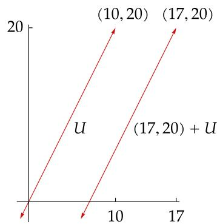

# 第3章 线性映射

到目前为止，我们的注意力都集中在向量空间上．不会有人为向量空间而兴奋．线性代数中真正有趣的部分，是我们现在要转而研究的主题——线性映射

我们将频繁地运用线性映射基本定理这一强大工具．它指出，线性映射的定义空间的维数，等于被映射到0的子空间的维数再加上值域的维数．由此可得一个非同寻常的结论：对于从有限维向量空间到其本身的线性映射，当且仅当它的值域为它所作用的整个空间时，它才是一对一的映射1

我们将在本章引入一个重要概念——矩阵，它与线性映射、定义空间的基及目标空间的基这三者相关联2．线性映射和矩阵的对应关系有助于我们深入理解线性代数的关键方面内容

本章最后引入向量空间的积、商空间以及对偶空间

在本章中，除了 $V$ ，我们还需用到另外几个向量空间，并称它们为 $U$ 和??．于是，现在开始我们总采用以下假定

# 以下假设在本章中总是成立：

F 代表 R 或 C  
$U , V$ 和?? 代表F上的向量空间

  
Stefan Schäfer CC BY-SA

图为建于 12 世纪的丹克沃德罗德城堡（Dankwarderode Castle），坐落于不伦瑞克（Brunswick或 Braunschweig），卡尔·弗里德里希·高斯（Carl Friedrich Gauss，1777-1855）在此出生并长大1809年，高斯发表了一种求解线性方程组的方法．这种方法【现被称为高斯消元法（Gaussianelimination）】在一部中国古籍3里已有运用，比高斯早1600多年

# 3A 线性映射的向量空间

# 线性映射的定义和实例

现在我们给出线性代数中的一个关键定义

# 3.1 定义：线性映射（linear map）

一个从 $V$ 到?? 的线性映射是一个满足下列性质的函数 $T : V \to W$ .

可加性（additivity）

对于所有 $u , \nu \in V$ ，均有 $T ( u + \nu ) = T u + T \nu$

齐次性（homogeneity）

对于所有 $\lambda \in \mathbf { F }$ 和所有 $\nu \in V$ ，均有 $T ( \lambda \nu ) = \lambda ( T \nu )$

注意，对于线性映射，我们常常用记号$T \nu$ ，也会用一般的函数记号 $T ( \nu )$

有些数学家使用术语“线性变换”（lineartransformation），这和线性映射同义

# 3.2 记号：L(??, ??)、L (??)

从 $V$ 到 ?? 的全体线性映射构成的集合记作 $\mathcal { L } ( V , W )$   
从 $V$ 到 $V$ 的全体线性映射构成的集合记作 $\mathcal { L } ( V )$ ．换言之， ${ \mathcal { L } } ( V ) = { \mathcal { L } } ( V , V ) .$

我们看些线性映射的实例．请务必自行验证下面的例子中定义的每个函数都确实是线性映射

# 3.3 例：线性映射

# 零映射（zero）

除做其他用途，我们令符号 0 表示一个这样的线性映射：它将某向量空间中每个元素都对应到另一个（也可能是同一个）向量空间的加法恒等元．具体而言， $0 \in { \mathcal { L } } ( V , W )$ 定义为

$$
0 v = 0.
$$

上式左侧的 0 是从 $V$ 到?? 的函数，而右侧的 0 是?? 中的加法恒等元．如往常一样，你根据上下文就可区分符号0的多种用法

# 恒等算子（identity operator）

恒等算子记作 $I$ ，是某个向量空间上的一个这样的线性映射：它将该空间中每个元素都对应到该元素本身．具体而言， $I \in { \mathcal { L } } ( V )$ 定义为

$$
I v = v.
$$

# 微分映射（differentiation）

定义 $D \in { \mathcal { L } } { \big ( } { \mathcal { P } } ( \mathbf { R } ) { \big ) }$ 为

$$
D p = p ^ {\prime}.
$$

断言该函数为线性映射，是用另一种方式表达了有关微分的这个基本结论：对于任意可微函数 $f , g$ 和常数 $\lambda$ ， $( f + g ) ^ { \prime } = f ^ { \prime } + g ^ { \prime }$ 和 $( \lambda f ) ^ { \prime } = \lambda f ^ { \prime }$ 总成立 转下页 转下页回

积分映射（integration）

定义 $T \in \mathcal { L } ( \mathcal { P } ( { \bf R } ) , { \bf R } )$ 为

$$
T p = \int_ {0} ^ {1} p.
$$

断言该函数是线性的，是用另一种方式表达了有关积分的这两个基本结论：两个函数之和的积分等于这两个函数的积分之和，以及一个函数乘以常数再作积分等于该函数作积分后乘以同一常数

与 $x ^ { 2 }$ 相乘映射（multiplication by $x ^ { 2 }$ ）

定义线性映射 $T \in \mathcal { L } \big ( \mathcal { P } ( { \bf R } ) \big )$ 为：对于所有 $x \in \mathbf { R }$ ，

$$
(T p) (x) = x ^ {2} p (x).
$$

后向移位映射（backward shift）

回忆一下， $\mathbf { F } ^ { \infty }$ 表示元素属于 $\mathbf { F }$ 的全体序列构成的向量空间．定义线性映射 $T \in { \mathcal { L } } ( \mathbf { F } ^ { \infty } )$ 为：

$$
T \left(x _ {1}, x _ {2}, x _ {3}, \dots\right) = \left(x _ {2}, x _ {3}, \dots\right).
$$

从 $\mathbf { R } ^ { 3 }$ 到 $\mathbf { R } ^ { 2 }$ 的映射

定义线性映射 $T \in \mathcal { L } ( \mathbf { R } ^ { 3 } , \mathbf { R } ^ { 2 } )$ 为

$$
T (x, y, z) = (2 x - y + 3 z, 7 x + 5 y - 6 z).
$$

从 $\mathbf { F } ^ { n }$ 到 $\mathbf { F } ^ { m }$ 的映射

为推广上个例子，令 $m$ 和 $n$ 为正整数，并令 $A _ { j , k } \in \mathbf { F }$ （ $j = 1 , \ldots , m$ 且 $k = 1 , \ldots , n \ ,$ ），定义线性映射 $T \in \mathcal { L } ( \mathbf { F } ^ { n } , \mathbf { F } ^ { m } )$ 为

$$
T (x _ {1}, \dots , x _ {n}) = \left(A _ {1, 1} x _ {1} + \dots + A _ {1, n} x _ {n}, \dots , A _ {m, 1} x _ {1} + \dots + A _ {m, n} x _ {n}\right).
$$

实际上，每个从 $\mathbf { F } ^ { n }$ 到 $\mathbf { F } ^ { m }$ 的线性映射都是这种形式

多项式复合映射（composition）

取定一个多项式 $q \in { \mathcal { P } } ( \mathbf { R } )$ ．定义线性映射 $T \in \mathcal { L } \big ( \mathcal { P } ( { \bf R } ) \big )$ 为

$$
(T p) (x) = p \big (q (x) \big).
$$

下个结论的存在性部分意味着我们总能构造一个线性映射，以将一个基中各向量对应到任意我们想要的值上，唯一性部分则表明一个线性映射完全决定于它将一个基映射到的值

# 3.4 线性映射引理（linear map lemma）

假定 $\nu _ { 1 } , \ldots , \nu _ { n }$ 是 $V$ 的基且 $w _ { 1 } , \ldots , w _ { n } \in W$ ．那么存在唯一的线性映射 $T : V \to W$ 使得对每个 $k = 1 , \ldots , n$ 都有

$$
T v _ {k} = w _ {k}.
$$

证明 首先我们证明具有我们所期望性质的线性映射 $T$ 存在．定义 $T : V \to W$ 为

$$
T \left(c _ {1} v _ {1} + \dots + c _ {n} v _ {n}\right) = c _ {1} w _ {1} + \dots + c _ {n} w _ {n},
$$

其中 $c _ { 1 } , \ldots , c _ { n }$ 是 F 中任意元素．组 $\nu _ { 1 } , \ldots , \nu _ { n }$ 是 $V$ 的基，由此，上述方程的确定义了一个从 $V$

到 ?? 的函数 $T$ （因为 $V$ 中每个元素都能被唯一地写成 $c _ { 1 } \nu _ { 1 } + \cdot \cdot \cdot + c _ { n } \nu _ { n }$ 的形式）

对于每个 $k$ ，取上式中 $c _ { k } = 1$ 且其他各 $c$ 都等于 0 就证明了 $T \nu _ { k } = w _ { k }$

如果 $u , \nu \in V$ ，且有 $u = a _ { 1 } \nu _ { 1 } + \cdot \cdot \cdot + a _ { n } \nu _ { n }$ 和 $\nu = c _ { 1 } \nu _ { 1 } + \cdot \cdot \cdot + c _ { n } \nu _ { n }$ ，则

$$
\begin{array}{l} T (u + v) = T \left(\left(a _ {1} + c _ {1}\right) v _ {1} + \dots + \left(a _ {n} + c _ {n}\right) v _ {n}\right) \\ = \left(a _ {1} + c _ {1}\right) w _ {1} + \dots + \left(a _ {n} + c _ {n}\right) w _ {n} \\ = \left(a _ {1} w _ {1} + \dots + a _ {n} w _ {n}\right) + \left(c _ {1} w _ {1} + \dots + c _ {n} w _ {n}\right) \\ = T u + T v. \\ \end{array}
$$

类似地，如果 $\lambda \in \mathbf { F }$ 且 $\nu = c _ { 1 } \nu _ { 1 } + \cdot \cdot \cdot + c _ { n } \nu _ { n }$ ，那么

$$
\begin{array}{l} T (\lambda v) = T \left(\lambda c _ {1} v _ {1} + \dots + \lambda c _ {n} v _ {n}\right) \\ = \lambda c _ {1} w _ {1} + \dots + \lambda c _ {n} w _ {n} \\ = \lambda \left(c _ {1} w _ {1} + \dots + c _ {n} w _ {n}\right) \\ = \lambda T v. \\ \end{array}
$$

于是， $T$ 就是从 $V$ 到?? 的线性映射

为了证明唯一性，现在假设 $T \in { \mathcal { L } } ( V , W )$ 且对于每个 $k = 1 , \ldots , n$ 都有 $T \nu _ { k } ~ = ~ w _ { k }$ ．令 $c _ { 1 } , \dotsc , c _ { n } \in \mathbf { F }$ ．那么 $T$ 的齐次性表明对于每个 $k = 1 , \ldots , n$ ，都有 $T ( c _ { k } \nu _ { k } ) = c _ { k } w _ { k }$ ．现结合 $T$ 的 可加性可得

$$
T \left(c _ {1} v _ {1} + \dots + c _ {n} v _ {n}\right) = c _ {1} w _ {1} + \dots + c _ {n} w _ {n}.
$$

于是 $T$ 在 $\operatorname { s p a n } ( \nu _ { 1 } , \ldots , \nu _ { n } )$ 上由上式唯一确定．因为 $\nu _ { 1 } , \ldots , \nu _ { n }$ 是 $V$ 的基，所以这表明 $T$ 在 $V$ 上唯一确定，即 $T$ 的唯一性得证 ■

# $\mathcal { L } ( V , W )$ 上的代数运算

我们从定义 $\mathcal { L } ( V , W )$ 上的加法和标量乘法开始

# 3.5 定义：L (??, ??) 上的加法和标量乘法【addition and scalar multiplication onL (??, ??)】

假设 $S , T \in { \mathcal { L } } ( V , W )$ 且 $\lambda \in \mathbf { F }$ ．和 $S + T$ 与积???? 都是从?? 到?? 的线性映射，分别定义如下：对于所有 $\nu \in V$ ，

$$
(S + T) (v) = S v + T v, \quad (\lambda T) (v) = \lambda (T v).
$$

你应该验证定义如上的 $S + T$ 和 $\lambda T$ 确实是线性映射．换言之，如果 $S , T \in { \mathcal { L } } ( V , W )$ 且$\lambda \in \mathbf { F }$ ，那么 $S { + } T \in { \mathcal { L } } ( V , W )$ 且 $\lambda T \in { \mathcal { L } } ( V , W )$

因为我们特地在 $\mathcal { L } ( V , W )$ 上定义了加法和标量乘法，所以下面结果就不足为奇了

线性映射在数学中普遍存在．然而，它们并不如有些人想象的那般无处不在．当这些人错误地写出 $\cos ( x + y )$ 等于 $\cos x + \cos y$ 和cos $2 x$ 等于 $2 \cos x$ 时，似乎连 cos 都能看成从 R 到 R 的线性映射

# 3.6 L(??, ??) 是向量空间

有了上面定义的加法和标量乘法， $\mathcal { L } ( V , W )$ 就是向量空间

上述结论的证明很常规，留给读者完成．注意 $\mathcal { L } ( V , W )$ 的加法恒等元是例3.3中定义的零线性映射

通常，将一个向量空间中的两个元素相乘没有意义．不过，某些线性映射两两之间存在一个有用的乘积，接下来给出定义

# 3.7 定义：线性映射的乘积（product of linear maps）

如果 $T \in { \mathcal { L } } ( U , V )$ 且 $S \in { \mathcal { L } } ( V , W )$ ，那么乘积 $S T \in { \mathcal { L } } ( U , W )$ 就定义为：对于所有 $u \in U$ ，

$$
(S T) (u) = S (T u).
$$

由此可见，???? 就是一般的两函数复合 $S \circ T$ ，不过当两个函数都是线性函数时，我们通常使用 ???? 这个记号而不用 $S \circ T$ ．用 ???? 这样的乘积表示法，有助于使下个结果中的分配性质看起来更自然些

注意只有当 $T$ 映射到 ?? 的定义空间中时，???? 才有定义．你应该验证对于任意 $T \in { \mathcal { L } } ( U , V )$ 和 $S \in { \mathcal { L } } ( V , W )$ ，???? 的确是从 $U$ 到?? 的线性映射

# 3.8 线性映射乘积的代数性质

可结合性（associativity）

对于任意使乘积有意义的线性映射 $T _ { 1 } , T _ { 2 } , T _ { 3 }$ （意即 $T _ { 3 }$ 映射到 $T _ { 2 }$ 的定义空间中， $T _ { 2 }$ 映射到 $T _ { 1 }$ 的定义空间中），有 $( T _ { 1 } T _ { 2 } ) T _ { 3 } = T _ { 1 } ( T _ { 2 } T _ { 3 } )$

恒等元（identity）

对于任意 $T \in { \mathcal { L } } ( V , W )$ ，有 $T I = I T = T$ ．这里第一个 $I$ 是 $V$ 上的恒等算子，而第二个 $I$ 是 $W$ 上的恒等算子

分配性质（distributive properties）

对于任意 $T , T _ { 1 } , T _ { 2 } \in \mathcal { L } ( U , V )$ 和 $S , S _ { 1 } , S _ { 2 } \in \mathcal { L } ( V , W )$ ，有 $( S _ { 1 } + S _ { 2 } ) T = S _ { 1 } T + S _ { 2 } T$ 且$S ( T _ { 1 } + T _ { 2 } ) = S T _ { 1 } + S T _ { 2 } .$

上述结论的证明很常规，留给读者完成

线性映射的乘法不满足交换律．换言之， $S T = T S$ 并不一定正确，即便式子两侧的乘积都是有意义的

# 3.9 例：不可交换的两个从 $\mathcal { P } ( \mathbf { R } )$ 到 $\mathcal { P } ( \mathbf { R } )$ 的线性映射

假设 $D \in { \mathcal { L } } { \big ( } { \mathcal { P } } ( \mathbf { R } ) { \big ) }$ 是例 3.3 中定义的微分映射， $T \in \mathcal { L } \big ( \mathcal { P } ( { \bf R } ) \big )$ 是例 3.3 中定义的“与 $x ^ { 2 }$ 相乘”映射．那么

$$
\big ((T D) p \big) (x) = x ^ {2} p ^ {\prime} (x) \quad \text {但} \quad \big ((D T) p \big) (x) = x ^ {2} p ^ {\prime} (x) + 2 x p (x).
$$

于是 $T D \neq D T \cdot$ ——先作微分再乘以 $x ^ { 2 }$ ，和先乘以 $x ^ { 2 }$ 再作微分是不一样的

# 3.10 线性映射将0映射为0

假设 $T$ 是由 $V$ 到?? 的线性映射．那么 $T ( 0 ) = 0$

证明 根据可加性，我们有

$$
T (0) = T (0 + 0) = T (0) + T (0).
$$

在等式两侧同时加上 $T ( 0 )$ 的加法逆元，即可得出结论 $T ( 0 ) = 0$ .

假设 $m , b \in \mathbf { R }$ ．当且仅当 $b = 0$ 时，由

$$
f (x) = m x + b
$$

定义的函数 $f : \mathbf { R }  \mathbf { R }$ 是线性映射（利用 3.10）．由此可见，高中代数中的线性函数和线性代数所考虑的线性映射是不一样的

# K习题 3A k

1 设 $b , c \in \mathbf { R }$ ，定义 $T : \mathbf { R } ^ { 3 }  \mathbf { R } ^ { 2 }$ 为：

$$
T (x, y, z) = (2 x - 4 y + 3 z + b, 6 x + c x y z).
$$

证明： $T$ 是线性的，当且仅当 $b = c = 0$

2 设 $b , c \in \mathbf { R }$ ，定义 $T : \mathcal { S } ( \mathbf { R } )  \mathbf { R } ^ { 2 }$ 为：

$$
T p = \left(3 p (4) + 5 p ^ {\prime} (6) + b p (1) p (2), \int_ {- 1} ^ {2} x ^ {3} p (x) d x + c \sin p (0)\right).
$$

证明： $T$ 是线性的，当且仅当 $b = c = 0$

3 设 $T \in \mathcal { L } ( \mathbf { F } ^ { n } , \mathbf { F } ^ { m } )$ ，证明：存在标量 $A _ { j , k } \in \mathbf { F }$ $\mathbf { \Phi } _ { j , k } \in \mathbf { F } \ ( \textit { j } = 1 , \ldots , m , \ k = 1 , \ldots , n \ )$ $k = 1 , \ldots , n$ ），使得

$$
T \left(x _ {1}, \dots , x _ {n}\right) = \left(A _ {1, 1} x _ {1} + \dots + A _ {1, n} x _ {n}, \dots , A _ {m, 1} x _ {1} + \dots + A _ {m, n} x _ {n}\right)
$$

对任一 $( x _ { 1 } , \ldots , x _ { n } ) \in \mathbf { F } ^ { n }$ 都成立

注 这道习题表明线性映射 $T$ 具有在例3.3的倒数第二例中预示的形式

4 设 $T \in { \mathcal { L } } ( V , W )$ 且 $\nu _ { 1 } , \ldots , \nu _ { m }$ 是 $V$ 中一组向量，使得 $T \nu _ { 1 } , \ldots , T \nu _ { m }$ 是 ?? 中一线性无关组．证明 $\nu _ { 1 } , \ldots , \nu _ { m }$ 线性无关  
5 证明 $\mathcal { L } ( V , W )$ 是向量空间，即3.6的结论  
6 证明线性映射的乘法具有可结合性、恒等元以及分配性质，即3.8的结论  
7 证明：任何从一维向量空间到其自身的线性映射，就是乘以某一标量．更准确地说，证明：如果 $\dim V = 1$ 且 $T \in { \mathcal { L } } ( V )$ ，那么存在 $\lambda \in \mathbf { F }$ 使得对所有 $\nu \in V$ 有 $T \nu = \lambda \nu$   
8 给出一例：函数 $\varphi : { \bf R } ^ { 2 }  { \bf R }$ ，使得

$$
\varphi (a v) = a \varphi (v)
$$

对所有 $a \in \mathbf { R }$ 和所有 $ { \boldsymbol \nu } \in { \mathbf { R } } ^ { 2 }$ 成立，但 $\varphi$ 不是线性的

注 本题和下一题表明，仅有齐次性或仅有可加性，都不足以推导出一个函数是线性映射

9 给出一例：函数 $\varphi : \mathbf { C } \to \mathbf { C }$ ，使得

$$
\varphi (w + z) = \varphi (w) + \varphi (z)
$$

对所有 $w , z \in \mathbf { C }$ 成立，但 $\varphi$ 不是线性的．（此处将 C 视为复向量空间．）

注 满足上述可加性条件而不是线性的函数 $\varphi : \mathbf { R }  \mathbf { R }$ 也是存在的．然而，证明这样一个函数的存在性涉及更高等（高等得多）的工具

10 证明或给出一反例：如果 $q \in { \mathcal { P } } ( \mathbf { R } )$ ， $T : \mathcal { P } ( \mathbf { R } )  \mathcal { S } ( \mathbf { R } )$ 定义为 $T p = q \circ p$ ，那么 $T$ 是线性 映射．   
注 这里定义的函数 $T$ ，不同于3.3中最后一例定义的函数 $T$ ，区别在于函数复合的次序  
11 设 $V$ 是有限维的， $T \in { \mathcal { L } } ( V )$ ．证明： $T$ 是恒等算子的标量倍，当且仅当 $S T = T S$ 对任意$S \in { \mathcal { L } } ( V )$ 都成立  
12 设 $U$ 是 $V$ 的子空间（ $U \neq V$ ），设 $S \in { \mathcal { L } } ( U , W )$ 且 $S \ne 0$ （意即对某个 $u \in U$ 有 $S u \ne 0$ ）．定义 $T : V \to W$ 如下：

$$
T v = \left\{ \begin{array}{l l} S v & \text {若} v \in U, \\ 0 & \text {若} v \in V \text {且} v \notin U. \end{array} \right.
$$

证明 $T$ 不是 $V$ 上的线性映射

13 设 $V$ 是有限维的．证明： $V$ 的子空间上的任一线性映射都可以扩充为 $V$ 上的线性映射．换句话说，证明：如果 $U$ 是 $V$ 的子空间，且 $S \in { \mathcal { L } } ( U , W )$ ，那么存在 $T \in { \mathcal { L } } ( V , W )$ 使得 $T u = S u$ 对所有 $u \in U$ 成立

注 3.125的证明会用到本题的结果

14 设 $V$ 是有限维的（ $\dim V > 0$ ），又设?? 是无限维的．证明 $\mathcal { L } ( V , W )$ 是无限维的  
15 设 $\nu _ { 1 } , \ldots , \nu _ { m }$ 是 $V$ 中的线性相关组，又设 $W \neq \{ 0 \}$ ．证明：存在 $w _ { 1 } , \dots , w _ { m } \in W$ 使得不存在 $T \in { \mathcal { L } } ( V , W )$ 对每个 $k = 1 , \ldots , m$ 都满足 $T \nu _ { k } = w _ { k }$   
16 设 $V$ 是有限维的（ $\dim V > 1$ ）．证明存在 $S , T \in { \mathcal { L } } ( V )$ 使得 $S T \neq T S$   
17 设 $V$ 是有限维的，证明 $\mathcal { L } ( V )$ 仅有的双边理想是 $\{ 0 \}$ 和 $\mathcal { L } ( V )$

注 $\mathcal { L } ( V )$ 的子空间 $\varepsilon$ 被称为 $\mathcal { L } ( V )$ 的双边理想（two-sided ideal），如果 $T E \in { \mathcal { E } }$ 且 $E T \in { \mathcal { E } }$ 对所有 $E \in { \mathcal { E } }$ 和所有 $T \in { \mathcal { L } } ( V )$ 都成立

# 3B 零空间和值域

# 零空间和单射性

在这一节中，我们将学习与每个线性映射都紧密相关的两个子空间．首先是被映射为 0 的向量所构成的集合

# 3.11 定义：零空间（null space）、null ??

对于 $T \in { \mathcal { L } } ( V , W )$ ， $T$ 的零空间记为 null??，是 $V$ 的子集，其由被 $T$ 映射到 0 的所有向量构成：

$$
\operatorname {n u l l} T = \left\{v \in V: T v = 0 \right\}.
$$

# 3.12 例：零空间

如果 $T$ 是从 $V$ 到?? 的零映射，意即对于每个 $\nu \in V$ 都有 $T \nu = 0$ ，那么 null $T = V$   
假设 $\varphi \in \mathcal { L } ( \mathbf { C } ^ { 3 } , \mathbf { C } )$ ，定义为 $\varphi ( z _ { 1 } , z _ { 2 } , z _ { 3 } ) = z _ { 1 } + 2 z _ { 2 } + 3 z _ { 3 }$ ．那么 null $\varphi$ 等于 $\{ ( z _ { 1 } , z _ { 2 } , z _ { 3 } ) \in \mathbf { C } ^ { 3 }$ :$z _ { 1 } + 2 z _ { 2 } + 3 z _ { 3 } = 0 \}$ ，它是 $\varphi$ 的定义空间的子空间．我们很快就会看到，每个线性映射的零空间都是其定义空间的子空间  
。 假设 $D \in \mathcal { L } \big ( \mathcal { P } ( \mathbf { R } ) \big )$ 是微分映射，即其定义为 $D p = p ^ { \prime }$ ．导函数为 0 的函数仅有常值函数于是， $D$ 的零空间等于常值函数构成的集合  
假设 $T \in \mathcal { L } \big ( \mathcal { P } ( { \bf R } ) \big )$ 是与 $x ^ { 2 }$ 相乘映射，即其定义为 $T p ( x ) = x ^ { 2 } p ( x )$ ．唯一使得 $x ^ { 2 } p ( x ) = 0$ 对所有 $x \in \mathbf { R }$ 都成立的多项式 $p$ 是多项式 0．于是 $\mathrm { { 1 u l l } } T = \{ 0 \}$   
假设 $T ~ \in ~ \mathcal { L } ( \mathbf { F } ^ { \infty } )$ 是后向移位映射，即其定义为 $T ( x _ { 1 } , x _ { 2 } , x _ { 3 } , \ldots ) \ = \ ( x _ { 2 } , x _ { 3 } , \ldots )$ ．那么$T ( x _ { 1 } , x _ { 2 } , x _ { 3 } , \dots )$ 等于 0 当且仅当数 $x _ { 2 } , x _ { 3 } , \ldots .$ 全为 0．于是 ${ \mathrm { n u l l } } T = \{ ( a , 0 , 0 , \ldots ) : a \in \mathbf { F } \}$

接下来的结果说明，每个线性映射的零空间都是其定义空间的子空间．特别地，每个线性映射的零空间都包含0

# 3.13 零空间是子空间

假设 $T \in { \mathcal { L } } ( V , W )$ ．那么 null $T$ 是 $V$ 的子空间

证明 因为 $T$ 是一个线性映射，所以 $T ( 0 ) = 0$ （由 3.10）．于是 $0 \in \mathrm { { n u l l } } T$

假定 $u , \nu \in \mathrm { n u l l } T$ ．那么

$$
T (u + v) = T u + T v = 0 + 0 = 0.
$$

所以 $u + \nu \in \mathrm { n u l l } T$ ．于是 null?? 对于加法封闭

假定 $u \in \mathrm { { n u l l } } T$ 且 $\lambda \in \mathbf { F }$ ．那么

“null” 的意思是“零”．于是，“null space” 这个术语应该能让你想起它和0的联系．有些数学家使用术语“核”（kernel）而不是零空间．

$$
T (\lambda u) = \lambda T u = \lambda 0 = 0.
$$

所以 $\lambda u \in \mathrm { { n u l l } } T$ ．于是null?? 对于标量乘法封闭

我们证明了 null?? 含有 0，并且对于加法和标量乘法运算都封闭．因此 null?? 是 $V$ 的子空间（由 1.34）

我们很快就会看到，对于线性映射来说，接下来这条定义和零空间紧密相关

# 3.14 定义：单射（injective）

对于函数 $T : V \to W$ ，若 $T u = T \nu$ 蕴涵 $u = \nu$ ，则称该函数是单射4

我们可以将上述定义重新表述为：如果 $u \neq \nu$ 蕴涵 $T u \ne T \nu$ ，那么 $T$ 是单射．于是，当且仅当 $T$ 将不同的输入映射到不同的输出时，它才是单射

接下来的结果是说，我们可以通过检验0是否为唯一被映射为0的向量，来检验一个

术语“一对一的”（one-to-one）和单射的意思一样．

线性映射是否为单射．在例3.12中，我们计算了一些线性映射的零空间，应用下面结论即可看出，这些线性映射中仅有与 $x ^ { 2 }$ 相乘映射是单射（在特殊情况 $V = \{ 0 \}$ 下，零映射也是单射）

# 3.15 单射性 ⇐⇒ 零空间等于 {0}

令 $T \in { \mathcal { L } } ( V , W )$ ．那么 $T$ 是单射当且仅当 nul $T = \{ 0 \}$ .

证明 首先假设 $T$ 是单射．我们想要证明 $\boldsymbol { \mathrm { n u l l } } T = \{ 0 \}$ ．我们已知 $\{ 0 \} \subseteq \mathrm { { n u l l } } T$ （由3.10）．为了证明这个包含关系反过来也成立，假设 $\nu \in \mathrm { n u l l } T$ ．那么

$$
T (v) = 0 = T (0).
$$

因为 $T$ 是单射，所以上述等式表明 $\nu = 0$ ．于是我们能得出 $\boldsymbol { \mathrm { n u l l } } T = \{ 0 \}$ ，此方向得证

为了证明另一方向的蕴涵关系，现在假设nul $T = \{ 0 \}$ ．我们想要证明 $T$ 是单射．为此，假设 $u , \nu \in V$ 且 $T u = T \nu$ ．那么

$$
0 = T u - T v = T (u - v).
$$

于是 $u - \nu$ 在 null $T$ 中，而 null $T$ 等于 $\{ 0 \}$ ．因此 $u - \nu = 0$ ，则 $u = \nu$ ．所以 $T$ 是单射，证毕

# 值域和满射性

现在我们给线性映射的输出所构成的集合起个名字

# 3.16 定义：值域（range）

对于 $T \in { \mathcal { L } } ( V , W )$ ， $T$ 的值域是?? 的子集，由所有等于 $T \nu$ （其中 $\nu \in V$ ）的向量构成：

$$
\operatorname {r a n g e} T = \{T v: v \in V \}.
$$

# 3.17 例：值域

如果 $T$ 是从 $V$ 到 ?? 的零映射，意即对于所有的 $\nu \in V$ 都有 $T \nu = 0$ ，那么 range $T = \{ 0 \}$   
。 假设 $T \in \mathcal { L } ( \mathbf { R } ^ { 2 } , \mathbf { R } ^ { 3 } )$ 定义为 $T ( x , y ) = ( 2 x , 5 y , x + y )$ ．那么

$$
\operatorname {r a n g e} T = \left\{\left(2 x, 5 y, x + y\right): x, y \in \mathbf {R} \right\}.
$$

转下页

注意到 range $T$ 是 $\mathbf { R } ^ { 3 }$ 的子空间．我们很快将看到， $\mathcal { L } ( V , W )$ 中每个线性映射的值域都是??的子空间

假设 $D \in { \mathcal { L } } { \big ( } { \mathcal { P } } ( \mathbf { R } ) { \big ) }$ 是由 $D p = p ^ { \prime }$ 定义的微分映射．因为对于每个多项式 $q \in { \mathcal { P } } ( \mathbf { R } )$ 都存在一个多项式 $p \in \mathcal { P } ( \mathbf { R } )$ 使得 $p ^ { \prime } = q$ ，所以 $D$ 的值域是 $\mathcal { P } ( \mathbf { R } )$

接下来的结果表明，每个线性映射的值域都是它所映射到5的向量空间的子空间

# 3.18 值域是子空间

如果 $T \in { \mathcal { L } } ( V , W )$ ，那么 range $T$ 是 ?? 的子空间

证明 假设 $T \in { \mathcal { L } } ( V , W )$ ．那么 $T ( 0 ) = 0$ （根据 3.10），意味着 $0 \in \mathrm { r a n g e } T$

如果 $w _ { 1 }$ $w _ { 1 } , w _ { 2 } \in \mathrm { r a n g e } T$ ，那么存在 $\nu _ { 1 } , \nu _ { 2 } \in V$ 使 $T \nu _ { 1 } = w _ { 1 }$ 和 $T \nu _ { 2 } = w _ { 2 }$ 成立．于是

$$
T \left(v _ {1} + v _ {2}\right) = T v _ {1} + T v _ {2} = w _ {1} + w _ {2}.
$$

所以 $w _ { 1 } + w _ { 2 } \in \mathrm { r a n g e } T$ ，于是 range $T$ 对于加法封闭

如果 $w \in$ range $T$ 且 $\lambda \in \mathbf { F }$ ，那么存在 $\nu \in V$ 使 $T \nu = w$ 成立．于是

$$
T (\lambda v) = \lambda T v = \lambda w.
$$

所以 $\lambda w \in \mathrm { r a n g e } T$ ，于是 range $T$ 对于标量乘法封闭

我们证明了 range $T$ 含有 0 以及对于加法和标量乘法运算都封闭．因此 range?? 是?? 的子空间（由1.34） ■

# 3.19 定义：满射（surjective）

如果函数 $T : V \to W$ 的值域等于??，则称该函数为满射6

我们举些实例来阐释上述定义：留意在 3.17 中计算过值域的那些映射，其中只有微分映射是满射（对于特殊情况 $W = \{ 0 \}$ ，零映射也是满射）

一个线性映射是否为满射，取决于我们认为它映射到哪个向量空间

有些人使用术语“映成”（onto），这和满射意思一样

# 3.20 例：是否为满射取决于目标空间的选取

定义为 $D p = p ^ { \prime }$ 的微分映射 $D \in \mathcal { L } \big ( \mathcal { P } _ { 5 } ( \mathbf { R } ) \big )$ 不是满射，因为多项式 $x ^ { 5 }$ 不在 $D$ 的值域中然而，定义为 $S p = p ^ { \prime }$ 的微分映射 $S \in \mathcal { L } \big ( \mathcal { P } _ { 5 } ( \mathbf { R } ) , \mathcal { P } _ { 4 } ( \mathbf { R } ) \big )$ 是满射，因为它的值域等于 $\mathcal { P } _ { 4 } ( \mathbf { R } )$ ，恰是 ?? 映射到的向量空间

# 线性映射基本定理

下个结果十分重要，所以它有个引人注目的名字

# 3.21 线性映射基本定理（fundamental theorem of linear maps）

假设 $V$ 是有限维的且 $T \in { \mathcal { L } } ( V , W )$ ．那么 range?? 是有限维的，且

$$
\dim V = \dim \operatorname {n u l l} T + \dim \operatorname {r a n g e} T.
$$

证明 令 $u _ { 1 } , \ldots , u _ { m }$ 是 null ?? 的一个基，于是 dim null $T = m$ ．由 2.32，线性无关组 $u _ { 1 } , \ldots , u _ { m }$ 可被扩充成 $V$ 的一个基

$$
u _ {1}, \dots , u _ {m}, v _ {1}, \dots , v _ {n}.
$$

于是 $\mathrm { d i m } V = m + n$ ．为了完成证明，我们需要证明 range $T$ 是有限维的且 dim range $T = n$ ．为此，我们证明 $T \nu _ { 1 } , \ldots , T \nu _ { n }$ 是 range $T$ 的基

令 $\nu \in V$ ．因为 $u _ { 1 } , \ldots , u _ { m } , \nu _ { 1 } , \ldots , \nu _ { n }$ 张成 $V$ ，所以我们可以写出

$$
v = a _ {1} u _ {1} + \dots + a _ {m} u _ {m} + b _ {1} v _ {1} + \dots + b _ {n} v _ {n},
$$

其中各 $a$ 和 $b$ 都属于 $\mathbf { F }$ ．将 $T$ 作用于等式两侧，可得

$$
T v = b _ {1} T v _ {1} + \dots + b _ {n} T v _ {n},
$$

其中形如 $T u _ { k }$ 的项消失了，因为各 $u _ { k }$ 均属于 null??．上述方程表明组 $T \nu _ { 1 } , \ldots , T \nu _ { n }$ 张成 range ??特别地，range $T$ 是有限维的

为了证明 $T \nu _ { 1 } , \ldots , T \nu _ { n }$ 是线性无关的，假设 $c _ { 1 } , \ldots , c _ { n } \in \mathbf { F }$ 且

$$
c _ {1} T v _ {1} + \dots + c _ {n} T v _ {n} = 0.
$$

那么，

$$
T \left(c _ {1} v _ {1} + \dots + c _ {n} v _ {n}\right) = 0.
$$

因此，

$$
c _ {1} v _ {1} + \dots + c _ {n} v _ {n} \in \operatorname {n u l l} T.
$$

因为 $u _ { 1 } , \ldots , u _ { m }$ 张成 null??，所以我们可以写出

$$
c _ {1} v _ {1} + \dots + c _ {n} v _ {n} = d _ {1} u _ {1} + \dots + d _ {m} u _ {m},
$$

其中各 $d$ 都属于 F．这个等式表明，所有各 $c$ （以及各 $d$ ）都是 0（因为 $u _ { 1 } , \ldots , u _ { m } , \nu _ { 1 } , \ldots , \nu _ { n }$ 是线性无关的）．于是 $T \nu _ { 1 } , \ldots , T \nu _ { n }$ 是线性无关的，进而它是range $T$ 的一个基．则原命题得证．■

现在我们可以证明，将一个有限维向量空间映射到比它“更小”的向量空间的线性映射都不是单射，这里的“更小”是用维数来度量的

# 3.22 映到更低维空间上的线性映射不是单射

假设 $V$ 和?? 是有限维向量空间且满足 $\dim V > \dim W$ ．那么从?? 到?? 的线性映射都不是单射

证明 令 $T \in { \mathcal { L } } ( V , W )$ ．那么

$$
\begin{array}{l} \dim \operatorname {n u l l} T = \dim V - \dim \operatorname {r a n g e} T \\ \geq \dim V - \dim W \\ > 0, \\ \end{array}
$$

上述第一行来自线性映射基本定理（3.21），第二行来自2.37．上述不等式表明，dim null $T > 0$ 这就意味着null?? 包含除了0以外的其他向量．于是 $T$ 不是单射（由3.15） ■

# 3.23 例：从 $\mathbf { F } ^ { 4 }$ 到 $\mathbf { F } ^ { 3 }$ 的线性映射不是单射

按下式定义一个线性映射 $T : \mathbf { F } ^ { 4 }  \mathbf { F } ^ { 3 }$ ：

$$
T \left(z _ {1}, z _ {2}, z _ {3}, z _ {4}\right) = \left(\sqrt {7} z _ {1} + \pi z _ {2} + z _ {4}, 9 7 z _ {1} + 3 z _ {2} + 2 z _ {3}, z _ {2} + 6 z _ {3} + 7 z _ {4}\right).
$$

因为 $\dim \mathbf { F } ^ { 4 } > \dim \mathbf { F } ^ { 3 }$ ，我们可以利用3.22来断言 $T$ 不是单射，而无需任何计算

接下来的结果表明，从一个有限维向量空间映射到一个“更大”的向量空间的线性映射都不是满射，这里的“更大”是从维数上来度量的

# 3.24 映到更高维空间上的线性映射不是满射

假设 $V$ 和 ?? 是有限维向量空间且满足 $\dim V < \dim W$ ．那么从 $V$ 到 ?? 的线性映射都不是满射

证明 令 $T \in { \mathcal { L } } ( V , W )$ ．那么

$$
\begin{array}{l} \dim \operatorname {r a n g e} T = \dim V - \dim \operatorname {n u l l} T \\ \leq \dim V \\ <   \dim W, \\ \end{array}
$$

上述式子中的等号源于线性映射基本定理（3.21）．该不等式表明，dim range $T < \dim W$ ．这就意味着range?? 不会等于??．于是 $T$ 不是满射 ■

我们马上就会看到，3.22 和 3.24 在线性方程理论中有一些重要推论，其中的想法是将有关线性方程组的问题用线性映射的语言来表达．首先，我们将齐次线性方程组是否有非零解这个问题用线性映射的语言来改写

固定正整数 $m$ 和 $n$ ，并令 $A _ { j , k } \in \mathbf { F }$ （ $j =$ $1 , \ldots , m$ 且 $k = 1 , \ldots , n$ ）．考虑齐次线性方程组

齐次的（homogeneous），在这个语境里，意为下面每个方程右端的常数项都是0

$$
\sum_ {k = 1} ^ {n} A _ {1, k} x _ {k} = 0
$$

$$
\sum_ {k = 1} ^ {n} A _ {m, k} x _ {k} = 0.
$$

显然， $x _ { 1 } = \cdot \cdot \cdot = x _ { n } = 0$ 是上述方程组的一个解．此处的问题是，是否存在其他的解

定义 $T : \mathbf { F } ^ { n }  \mathbf { F } ^ { m }$ 为

$$
T \left(x _ {1}, \dots , x _ {n}\right) = \left(\sum_ {k = 1} ^ {n} A _ {1, k} x _ {k}, \dots , \sum_ {k = 1} ^ {n} A _ {m, k} x _ {k}\right). \tag {3.25}
$$

方程 $T ( x _ { 1 } , \ldots , x _ { n } ) = 0$ （此处的 0 是 $\mathbf { F } ^ { m }$ 中的加法恒等元，也就是长度为 $m$ 的全由 0 构成的组）与上面的齐次线性方程组是一样的．于是我们就想知道 null?? 是否严格大于 {0}，这也就等价于 $T$ 不是单射（由3.15）．接下来的结果给出了保证 $T$ 不是单射的条件

# 3.26 齐次线性方程组

未知数个数多于方程个数的齐次线性方程组具有非零解

证明 沿用前面讨论中所用的记号和结论．于是 $T$ 是从 $\mathbf { F } ^ { n }$ 到 $\mathbf { F } ^ { m }$ 的线性映射，且我们有共含 $m$ 个方程、 $n$ 个未知数 $x _ { 1 } , \ldots , x _ { n }$ 的齐次线性方程组．由3.22即可知若 $n > m$ 则 $T$ 就不是单射．■

上述结果的一个实例：具有四个方程和五个未知数的齐次线性方程组具有非零解

现在我们考虑这个问题：一个线性方程组是否在常数项取某些值时会是无解的．为将这个问题用线性映射的语言来描述，固定正整数 $m$ 和 $n$ ，并令 $A _ { j , k } \in \mathbf { F } ( \mathbf { \ } j = 1 , \ldots , m$ $A _ { j , k } \in \mathbf { F }$ 且 $k = 1 , \ldots , n \ ,$ ）对于 $c _ { 1 } , \ldots , c _ { m } \in \mathbf { F }$ ，考虑线性方程组

$$
\sum_ {k = 1} ^ {n} A _ {1, k} x _ {k} = c _ {1}
$$

$$
\vdots \tag {3.27}
$$

$$
\sum_ {k = 1} ^ {n} A _ {m, k} x _ {k} = c _ {m}.
$$

用这样的记号，我们可将问题表述成：是否存在常数项 $c _ { 1 } , \ldots , c _ { m } \in \mathbf { F }$ 的某些取值，使得上述方程组无解

如式 (3.25) 一样定义 $T : \mathbf { F } ^ { n }  \mathbf { F } ^ { m }$ ．方程$T ( x _ { 1 } , \ldots , x _ { n } ) \ = \ ( c _ { 1 } , \ldots , c _ { m } )$ 与上面式 (3.27)所示的方程组是一样的．于是我们想知道是否有 range $T \mathrm { ~ \bf ~ \neq ~ } \mathbf { F } ^ { m }$ ．所以我们可以将问题

${ \big ( } c _ { 1 } , \ldots , c _ { m } \in \mathbf { F }$ 的某些取值使得方程组无解）改写成这样：什么条件能使 ?? 一定不是满射？接下来的结论就给出了一个这样的条件

结论 3.26 和 3.28 都将未知数的个数和方程的个数作比较．它们也可利用高斯消元法证明，但此处所用的抽象方法似乎提供了更简洁的证明

# 3.28 方程个数多于未知数个数的线性方程组

方程个数多于未知数个数的线性方程组当常数项取某些值时无解

证明 沿用前面讨论中所用的记号和结论．于是 $T$ 是从 $\mathbf { F } ^ { n }$ 到 $\mathbf { F } ^ { m }$ 的线性映射，且我们有共含$m$ 个方程、 $n$ 个未知数 $x _ { 1 } , \ldots , x _ { n }$ 的线性方程组【见式 (3.27)】．若 $n < m$ ，由 3.24 即可知 $T$ 不是满射．按照上面的讨论，这表明，如果一个线性方程组中，方程个数多于未知数个数，那么当常数项取某些值时该方程组无解 ■

上述结果的一个实例：具有五个方程和四个未知数的线性方程组在常数项取某些值时会是无解的

# K习题 3Bk

1 给出一例：满足 dim null $T = 3$ 且 dim range $T = 2$ 的线性映射 $T$   
2 设 $S , T \in { \mathcal { L } } ( V )$ 使得 range $S \subseteq { \mathrm { n u l l } } T$ ，证明 $\left( S T \right) ^ { 2 } = 0$   
3 设 $\nu _ { 1 } , \ldots , \nu _ { m }$ 是 $V$ 中一组向量，定义 $T \in \mathcal { L } ( \mathbf { F } ^ { m } , V )$ 为：

$$
T \left(z _ {1}, \dots , z _ {m}\right) = z _ {1} v _ {1} + \dots + z _ {m} v _ {m}.
$$

(a) $T$ 的什么性质对应于 $\nu _ { 1 } , \ldots , \nu _ { m }$ 张成 ??？  
(b) $T$ 的什么性质对应于 $\nu _ { 1 } , \ldots , \nu _ { m }$ 是线性无关组？

4 证明： $\left\{ T \in \mathcal { L } ( \mathbf { R } ^ { 5 } , \mathbf { R } ^ { 4 } ) : \mathrm { d i m } \mathrm { n u l l } T > 2 \right\}$ 不是 $\mathcal { L } ( \mathbf { R } ^ { 5 } , \mathbf { R } ^ { 4 } )$ 的子空间  
5 给出一例：使得 range $T = \mathrm { n u l l } T$ 的 $T \in \mathcal { L } ( \mathbf { R } ^ { 4 } )$   
6 证明不存在 $T \in \mathcal { L } ( \mathbf { R } ^ { 5 } )$ 使得 range $T = \mathrm { n u l l } T$   
7 设 $V$ 和 ?? 是有限维的（ $2 \leq \dim V \leq \dim W$ ），证明： $\left\{ T \in { \mathcal { L } } ( V , W ) : T \right.$ 不是单射	 不是$\mathcal { L } ( V , W )$ 的子空间  
8 设 $V$ 和 ?? 是有限维的（ $\dim V \geq \dim W \geq 2 .$ ），证明： $\left\{ T \in { \mathcal { L } } ( V , W ) : T \right.$ 不是满射	 不是$\mathcal { L } ( V , W )$ 的子空间  
9 设 $T \in { \mathcal { L } } ( V , W )$ 是单射， $\nu _ { 1 } , \ldots , \nu _ { n }$ 在 $V$ 中线性无关，证明 $T \nu _ { 1 } , \ldots , T \nu _ { n }$ 在 ?? 中线性无关  
10 设 $\nu _ { 1 } , \ldots , \nu _ { n }$ 张成 $V$ ， $T \in { \mathcal { L } } ( V , W )$ ，证明 $T \nu _ { 1 } , \ldots , T \nu _ { n }$ 张成 range $T$   
11 设 $V$ 是有限维的， $T \in { \mathcal { L } } ( V , W )$ ，证明存在 $V$ 的一子空间 $U$ 使得

$$
U \cap \mathrm {n u l l}   T = \{0 \} \quad \text {且} \quad \mathrm {r a n g e}   T = \{T u: u \in U \}.
$$

12 设 $T$ 是从 $\mathbf { F } ^ { 4 }$ 到 $\mathbf { F } ^ { 2 }$ 的线性映射，使得

$$
\mathrm {n u l l}   T = \left\{(x _ {1}, x _ {2}, x _ {3}, x _ {4}) \in \mathbf {F} ^ {4}: x _ {1} = 5 x _ {2}   \text {且}   x _ {3} = 7 x _ {4} \right\}.
$$

证明 $T$ 是满射

13 设 $U$ 是 $\mathbf { R } ^ { 8 }$ 的三维子空间， $T$ 是从 $\mathbf { R } ^ { 8 }$ 到 $\mathbf { R } ^ { 5 }$ 的线性映射，null $T = U$ ．证明 $T$ 是满射   
14 证明：不存在从 $\mathbf { F } ^ { 5 }$ 到 $\mathbf { F } ^ { 2 }$ 的线性映射，满足其零空间等于

$$
\left\{\left(x _ {1}, x _ {2}, x _ {3}, x _ {4}, x _ {5}\right) \in \mathbf {F} ^ {5}: x _ {1} = 3 x _ {2} \text {且} x _ {3} = x _ {4} = x _ {5} \right\}.
$$

15 设存在 $V$ 上的线性映射，其零空间和值域都是有限维的．证明 $V$ 是有限维的  
16 设 $V$ 和?? 都是有限维的．证明：存在从 $V$ 到?? 的单的线性映射，当且仅当 $\dim V \leq \dim W$   
17 设 $V$ 和?? 都是有限维的．证明：存在从 $V$ 到?? 的满的线性映射，当且仅当 $\dim V \geq \dim W$   
18 设 $V$ 和?? 都是有限维的， $U$ 是 $V$ 的子空间．证明：存在 $T \in { \mathcal { L } } ( V , W )$ 使得 nul $T = U$ ，当且仅当 $\dim U \geq \dim V - \dim W$   
19 设?? 是有限维的， $T \in { \mathcal { L } } ( V , W )$ ．证明： $T$ 是单射，当且仅当存在 $S \in { \mathcal { L } } ( W , V )$ 使得 ???? 是$V$ 上的恒等算子  
20 设?? 是有限维的， $T \in { \mathcal { L } } ( V , W )$ ．证明： $T$ 是满射，当且仅当存在 $S \in { \mathcal { L } } ( W , V )$ 使得 ?? ?? 是?? 上的恒等算子  
21 设 $V$ 是有限维的， $T \in { \mathcal { L } } ( V , W )$ ， $U$ 是?? 的子空间．证明： $\{ \nu \in V : T \nu \in U \}$ 是 $V$ 的子空间，且

$$
\dim \left\{\nu \in V: T \nu \in U \right\} = \dim \operatorname {n u l l} T + \dim (U \cap \operatorname {r a n g e} T).
$$

22 设 $U$ 和 $V$ 都是有限维向量空间， $S \in { \mathcal { L } } ( V , W )$ 和 $T \in { \mathcal { L } } ( U , V )$ ，证明：

$$
\dim \operatorname {n u l l} S T \leq \dim \operatorname {n u l l} S + \dim \operatorname {n u l l} T.
$$

23 设 $U$ 和 $V$ 都是有限维向量空间， $S \in { \mathcal { L } } ( V , W )$ 和 $T \in { \mathcal { L } } ( U , V )$ ，证明：

$$
\dim \operatorname {r a n g e} S T \leq \min  \left\{\dim \operatorname {r a n g e} S, \dim \operatorname {r a n g e} T \right\}.
$$

24 (a) 设 $\dim V = 5$ ，且 $S , T \in { \mathcal { L } } ( V )$ 使得 $S T = 0$ ．证明 dim range $T S \le 2$

(b) 给出一例： $S , T \in \mathcal { L } ( \mathbf { F } ^ { 5 } )$ ， $S T = 0$ 且 dim range $T S = 2$

25 设 ?? 是有限维的， $S , T \in \mathcal { L } ( V , W )$ ．证明： $\mathrm { { n u l l } } S \subseteq \mathrm { { n u l l } } T$ ，当且仅当存在 $E \in { \mathcal { L } } ( W )$ 使得$T = E S ,$

26 设 $V$ 是有限维的， $S , T \in { \mathcal { L } } ( V , W )$ ．证明：range $S \subseteq$ range $T$ ，当且仅当存在 $E \in { \mathcal { L } } ( V )$ 使得$S = T E$

27 设 $P \in { \mathcal { L } } ( V )$ 且 $P ^ { 2 } = P$ ．证明 ?? = null ?? ⊕ range $P$

28 设 $D \in { \mathcal { L } } { \big ( } { \mathcal { P } } ( \mathbf { R } ) { \big ) }$ 使得对任一非常数多项式 $p \in \mathcal { P } ( \mathbf { R } )$ 有 $\deg D p = ( \deg p ) - 1$ ．证明 $D$ 是满 射

注 上面的记号 $D$ 是用来让你想起微分映射，它将多项式 $p$ 对应到 $p ^ { \prime }$

29 设 $p \in \mathcal { P } ( \mathbf { R } )$ ．证明：存在多项式 $q \in { \mathcal { P } } ( \mathbf { R } )$ ，使得 $5 q ^ { \prime \prime } + 3 q ^ { \prime } = p$

注 做这道习题可以不用到线性代数，但是用线性代数来做更有意思

30 设 $\varphi \in { \mathcal { L } } ( V , \mathbf { F } )$ （ $\varphi \neq 0$ ）， $u \in V$ 不在 $\mathrm { \ n u l l } \varphi$ $\varphi$ 里．证明：

$$
V = \operatorname {n u l l} \varphi \oplus \left\{a u: a \in \mathbf {F} \right\}.
$$

31 设 $V$ 是有限维的， $X$ 是 $V$ 的子空间， $Y$ 是 ?? 的有限维子空间．证明：存在 $T \in { \mathcal { L } } ( V , W )$ 使得 $\mathrm { \ n u l l } T = X$ 且 range $T = Y$ ，当且仅当 $\dim X + \dim Y = \dim V$

32 设 $V$ 是有限维的（ $\dim V > 1$ ），证明：如果 $\varphi : { \mathcal { L } } ( V ) \to \mathbf { F }$ 是线性映射，使得 $\varphi ( S T ) = \varphi ( S ) \varphi ( T )$ 对所有 $S , T \in { \mathcal { L } } ( V )$ 成立，那么 $\varphi = 0$

提示 3A节的习题17中给出了关于 $\mathcal { L } ( V )$ 的双边理想的描述，或许有用

33 设 $V$ 和 $W$ 是实向量空间， $T \in { \mathcal { L } } ( V , W )$ ．定义 $T _ { \mathbf { C } } : V _ { \mathbf { C } } \to W _ { \mathbf { C } }$ ：

$$
T _ {\mathrm {C}} (u + \mathrm {i} v) = T u + \mathrm {i} T v
$$

对所有 $u , \nu \in V$ 成立

(a) 证明： $T _ { \mathbf { C } }$ 是从 $V _ { \mathbf { C } }$ 到 $W _ { \mathbf { C } }$ 的（复）线性映射   
(b) 证明： $T _ { \mathbf { C } }$ 是单射，当且仅当 $T$ 是单射   
(c) 证明：range $T _ { \mathbf { C } } = W _ { \mathbf { C } }$ ，当且仅当 range $T = W$

注 复化 $V _ { \mathbf { C } }$ 的定义见 1B 节的习题 8．线性映射 $T _ { \mathbf { C } }$ 称为线性映射 $T$ 的复化

# 3C 矩阵

# 用矩阵表示线性映射

我们知道，如果 $\nu _ { 1 } , \ldots , \nu _ { n }$ 是 $V$ 的基且 $T : V \to W$ 是线性的，那么 $T \nu _ { 1 } , \ldots , T \nu _ { n }$ $T \nu _ { 1 }$ 的取值决定了 $T$ 将 $V$ 中任意向量所映射到的值——见线性映射引理（3.4）．我们马上会看到，利用??的基，矩阵可以高效地记录各 $T \nu _ { k }$ 的值

# 3.29 定义：矩阵（matrix）、????,??

假设 $m$ 和 $n$ 是非负整数． $m \times n$ 矩阵 $A$ 是由 $\mathbf { F }$ 中元素构成的 $m$ 行 $n$ 列的矩形阵列：

$$
A = \left( \begin{array}{c c c} A _ {1, 1} & \dots & A _ {1, n} \\ \vdots & & \vdots \\ A _ {m, 1} & \dots & A _ {m, n} \end{array} \right).
$$

记号 $A _ { j , k }$ 表示 $A$ 的第 $j$ 行第 $k$ 列中的元素

3.30 例： $A _ { j , k }$ 等于 $A$ 的第 $j$ 行第 $k$ 列中的元素

假设 $\begin{array}{c} A = { \binom { 8 } { 1 } } \quad 4 \quad 5 - 3 \mathrm { i }  \\ { \quad 9 \quad 7 \quad } \end{array} .$ ．于是 $A _ { 2 , 3 }$ 表示?? 的第二行第三列中的元素，意即 $A _ { 2 , 3 } = 7$

在讨论矩阵时，第一个下标代表第几行，第二个坐标代表第几列

现在我们给出本节中的关键定义

# 3.31 定义：线性映射的矩阵（matrix of a linear map）、M (??)

假设 $T \in { \mathcal { L } } ( V , W )$ ， $\nu _ { 1 } , \ldots , \nu _ { n }$ 是 $V$ 的基， $w _ { 1 } , \ldots , w _ { m }$ 是 ?? 的基， $T$ 关于这些基的矩阵是 $m \times n$ 矩阵 $M ( T )$ ，其中各元素 $A _ { j , k }$ 由下式定义：

$$
T v _ {k} = A _ {1, k} w _ {1} + \dots + A _ {m, k} w _ {m}.
$$

如 果 从 上 下 文 无 法 明 确 得 知 基 $\nu _ { 1 } , \ldots , \nu _ { n }$ 和 $w _ { 1 } , \ldots , w _ { m }$ 取 什 么， 那 么 就 用$M ( T , ( \nu _ { 1 } , \ldots , \nu _ { n } )$ , (??1, . . . , ?? )  这个记号

一个线性映射 $T \in { \mathcal { L } } ( V , W )$ 的矩阵 $M ( T )$ 决定于 $V$ 的基 $\nu _ { 1 } , \ldots , \nu _ { n }$ ，?? 的基 $w _ { 1 } , \ldots , w _ { m }$ ，以及 $T$ ．不过，从上下文中往往能明确得知这些基，因此常常把它们从记号里省去

为了记住 $M ( T )$ 是如何由 $T$ 构造出来的，你可以在矩阵的上方横着标上定义空间的基向量 $\nu _ { 1 } , \ldots , \nu _ { n }$ ，并在矩阵的左侧竖着列出 $T$ 映射到的向量空间的基向量 $w _ { 1 } , \ldots , w _ { m }$ ，就像下面这样：

$$
v _ {1} \dots v _ {k} \dots v _ {n}
$$

$$
\mathcal {M} (T) = \begin{array}{c} w _ {1} \\ \vdots \\ w _ {m} \end{array} \left( \begin{array}{c c c} & A _ {1, k} & \\ & \vdots & \\ & A _ {m, k} \end{array} \right).
$$

我们只展示了上述矩阵的第 $k$ 列，于是此处矩阵各元素的第二个下标都是 $k$ ．上面这种描述还会让你想出由 $M ( T )$ 计算 $T \nu _ { k }$ 的方法：先将第 $k$ 列中的各元素分别与它们左侧对应的 $w _ { j }$ 相乘，再将所得各向量都加起来

如果 $T$ 是从 $\mathbf { F } ^ { n }$ 到 $\mathbf { F } ^ { m }$ 的线性映射，那么除非另有说明，总假定所讨论的基都是标准

$M ( T )$ 的 第 $k$ 列 包 含 了 将 $T \nu _ { k }$ 写 成$w _ { 1 } , \ldots , w _ { m }$ 的线性组合所需的各标量：

$$
T v _ {k} = \sum_ {j = 1} ^ {m} A _ {j, k} w _ {j}.
$$

如果 $T$ 是从 $n$ 维向量空间到 $m$ 维向量空间的线性映射，那么 $M ( T )$ 是 $m \times n$ 矩阵

基（其中第 $k$ 个向量的第 $k$ 个坐标是 1 而其他各坐标都是 0）．如果你将 $\mathbf { F } ^ { m }$ 中的元素看成由$m$ 个数组成的列，那么你可以将 $M ( T )$ 中的第 $k$ 列看成将 $T$ 作用于第 $k$ 个标准基向量所得

# 3.32 例：从 $\mathbf { F } ^ { 2 }$ 到 $\mathbf { F } ^ { 3 }$ 的线性映射的矩阵

假设 $T \in \mathcal { L } ( \mathbf { F } ^ { 2 } , \mathbf { F } ^ { 3 } )$ 定义为

$$
T (x, y) = (x + 3 y, 2 x + 5 y, 7 x + 9 y).
$$

因为 $T ( 1 , 0 ) = ( 1 , 2 , 7 )$ 且 $T ( 0 , 1 ) = ( 3 , 5 , 9 )$ ，所以 $T$ 关于标准基的矩阵就是如下所示的 $3 \times 2$ 矩阵：

$$
\mathcal {M} (T) = \left( \begin{array}{c c} 1 & 3 \\ 2 & 5 \\ 7 & 9 \end{array} \right).
$$

在研究 $\mathcal { P } _ { m } ( \mathbf { F } )$ 时，除非上下文有另作说明，都取标准基 $1 , x , x ^ { 2 } , \ldots , x ^ { m }$

# 3.33 例：从 $\mathcal { P } _ { 3 } ( \mathbf { R } )$ 到 $\mathcal { P } _ { 2 } ( \mathbf { R } )$ 的微分映射的矩阵

假设 $D \in \mathcal { L } \big ( \mathcal { P } _ { 3 } ( \mathbf { R } ) , \mathcal { P } _ { 2 } ( \mathbf { R } ) \big )$ 是由 $D p = p ^ { \prime }$ 所定义的微分映射．因为 $( x ^ { n } ) ^ { \prime } = n x ^ { n - 1 }$ ，所以 $D$ 关于标准基的矩阵就是如下所示的 $3 \times 4$ 矩阵：

$$
\mathcal {M} (D) = \left( \begin{array}{c c c c} 0 & 1 & 0 & 0 \\ 0 & 0 & 2 & 0 \\ 0 & 0 & 0 & 3 \end{array} \right).
$$

# 矩阵的加法和标量乘法

在本节的剩余部分，假定 $U , V , W$ 是有限维的且对于其中每个向量空间都已选定了一个基于是对于每个从 $V$ 到?? 的线性映射，我们都能够讨论它们（关于所选择的基）的矩阵

两个线性映射之和的矩阵，是否等于这两个映射的矩阵之和呢？这个问题目前还没有意义，因为尽管我们已定义两个线性映射的和，但我们还没定义两个矩阵的和．幸运的是，按一种很自然的方式来作出两矩阵之和的定义，它便具备我们期望的性质．具体而言，我们给出以下定义

# 3.34 定义：矩阵加法（matrix addition）

两个相同大小的矩阵之和，是将两矩阵对应位置上的元素相加所得的矩阵：

$$
\begin{array}{l} \left( \begin{array}{c c c} A _ {1, 1} & \dots & A _ {1, n} \\ \vdots & & \vdots \\ A _ {m, 1} & \dots & A _ {m, n} \end{array} \right) + \left( \begin{array}{c c c} C _ {1, 1} & \dots & C _ {1, n} \\ \vdots & & \vdots \\ C _ {m, 1} & \dots & C _ {m, n} \end{array} \right) \\ = \left( \begin{array}{c c c} A _ {1, 1} + C _ {1, 1} & \dots & A _ {1, n} + C _ {1, n} \\ \vdots & & \vdots \\ A _ {m, 1} + C _ {m, 1} & \dots & A _ {m, n} + C _ {m, n} \end{array} \right). \\ \end{array}
$$

在接下来这条结果中，假设对于 $S + T , S$ 和 $T$ 这三个线性映射都选取相同的基

# 3.35 线性映射之和的矩阵

假设 $S , T \in { \mathcal { L } } ( V , W )$ ．那么 $\boldsymbol { \mathcal { M } } ( \boldsymbol { S } + \boldsymbol { T } ) = \boldsymbol { \mathcal { M } } ( \boldsymbol { S } ) + \boldsymbol { \mathcal { M } } ( \boldsymbol { T } )$

由定义即可验证上面这条结论，验证过程留给读者完成

仍然假设我们已选取了某些基．一标量与线性映射之积的矩阵，是否等于同一标量与该线性映射的矩阵之积？同样，这个问题现在也没有意义，因为我们还没有定义矩阵的标量乘法幸运的是，再次按自然的方式作出定义，所得定义仍有我们期望的性质

# 3.36 定义：矩阵的标量乘法（scalar multiplication of a matrix）

一个标量和一个矩阵的乘积，是将矩阵的各元素都乘以那个标量所得的矩阵：

$$
\lambda \left( \begin{array}{c c c} A _ {1, 1} & \dots & A _ {1, n} \\ \vdots & & \vdots \\ A _ {m, 1} & \dots & A _ {m, n} \end{array} \right) = \left( \begin{array}{c c c} \lambda A _ {1, 1} & \dots & \lambda A _ {1, n} \\ \vdots & & \vdots \\ \lambda A _ {m, 1} & \dots & \lambda A _ {m, n} \end{array} \right).
$$

# 3.37 例：矩阵的加法和标量乘法

$$
2 \left( \begin{array}{c c} 3 & 1 \\ - 1 & 5 \end{array} \right) + \left( \begin{array}{c c} 4 & 2 \\ 1 & 6 \end{array} \right) = \left( \begin{array}{c c} 6 & 2 \\ - 2 & 1 0 \end{array} \right) + \left( \begin{array}{c c} 4 & 2 \\ 1 & 6 \end{array} \right) = \left( \begin{array}{c c} 1 0 & 4 \\ - 1 & 1 6 \end{array} \right)
$$

在接下来的结果中，假设对于 $\lambda T$ 和 $T$ 这两个线性映射都选取相同的基

# 3.38 标量与线性映射之积的矩阵

假设 $\lambda \in \mathbf { F }$ 且 $T \in { \mathcal { L } } ( V , W )$ ．那么 $\boldsymbol { \mathcal { M } } ( \lambda T ) = \lambda M ( T )$

上述结论的验证同样留给读者完成

因为现已定义了矩阵的加法和标量乘法，由此产生一个向量空间也就不足为奇了．我们先引入个记号，给这个新的向量空间取个名字，然后得出这个新的向量空间的维数

# 3.39 记号：F??,??

对于正整数 $m$ 和 $n$ ，各元素均属于F 的所有 $m \times n$ 矩阵构成的集合记作 $\mathbf { F } ^ { m , n }$ .

# 3.40 dim F??,?? = ????

假设 $m$ 和 $n$ 为正整数．按上面定义的加法和标量乘法， ${ \bf F } ^ { m , n }$ 是维数为 ???? 的向量空间

证明 验证 $\mathbf { F } ^ { m , n }$ 是向量空间留给读者完成．注意 $\mathbf { F } ^ { m , n }$ 的加法恒等元是所有元素都等于 0 的$m \times n$ 矩阵

读者也应自行验证，互不相同的除某元素等于1外其余各元素都等于0的全体 $m \times n$ 矩阵构成 $\mathbf { F } ^ { m , n }$ 的一个基．这样的矩阵共有 ???? 个，因此 $\mathbf { F } ^ { m , n }$ 的维数等于 ???? ■

# 矩阵乘法

与之前一样，假设 $\nu _ { 1 } , \ldots , \nu _ { n }$ 是 $V$ 的基， $w _ { 1 } , \ldots , w _ { m }$ 是 ?? 的基．另设 $u _ { 1 } , \ldots , u _ { p }$ 是 $U$ 的基

考虑线性映射 $T : U \to V$ 和 $S : V  W$ ．复合映射 ???? 是一个从 $U$ 到 ?? 的映射．那么$M ( S T )$ 等于 $\mathbf { \mathcal { M } } ( S ) \mathbf { \mathcal { M } } ( T )$ 吗？这个问题目前还没有意义，因为我们还没有定义两矩阵的乘积我们将选定一种矩阵乘法的定义，来让上面的问题必有肯定的回答．现在来看该怎么做

假设 $\boldsymbol { \mathscr { M } } ( \boldsymbol { S } ) = \boldsymbol { \mathscr { A } }$ 且 $\mathcal { M } ( T ) = B$ ．对于 $1 \leq k \leq p$ ，我们有

$$
\begin{array}{l} (S T) u _ {k} = S \left(\sum_ {r = 1} ^ {n} B _ {r, k} v _ {r}\right) \\ = \sum_ {r = 1} ^ {n} B _ {r, k} S v _ {r} \\ = \sum_ {r = 1} ^ {n} B _ {r, k} \sum_ {j = 1} ^ {m} A _ {j, r} w _ {j} \\ = \sum_ {j = 1} ^ {m} \left(\sum_ {r = 1} ^ {n} A _ {j, r} B _ {r, k}\right) w _ {j}. \\ \end{array}
$$

于是 $M ( S T )$ 是一个 $m \times p$ 矩阵，其中第 $j$ 行第 $k$ 列的元素等于

$$
\sum_ {r = 1} ^ {n} A _ {j, r} B _ {r, k}.
$$

现在我们就明白如何定义矩阵乘法才能使我们期望的等式 $\mathcal { M } ( S T ) = \mathcal { M } ( S ) \mathcal { M } ( T )$ 成立

# 3.41 定义：矩阵乘法（matrix multiplication）

假设 $A$ 是 $m \times n$ 矩阵且 $B$ 是 $n \times p$ 矩阵．那么 $A B$ 定义为一个 $m \times p$ 矩阵，其中第 $j$ 行第 $k$ 列的元素由下式给出：

$$
(A B) _ {j, k} = \sum_ {r = 1} ^ {n} A _ {j, r} B _ {r, k}.
$$

于是，取 $A$ 的第 $j$ 行和 $B$ 的第 $k$ 列，将它们对应位置上的元素分别相乘再相加，就得到了 ???? 第 $j$ 行第 $k$ 列的元素

注意，只有当第一个矩阵的列数等于第二个矩阵的行数时，我们才能定义这两个矩阵的乘积

你可能在之前的课程中已经学过矩阵乘法的定义，尽管你可能并没看出这里所说的定义它的动机

# 3.42 例：矩阵乘积

这里，我们将一个 $3 { \times } 2$ 矩阵和一个 $2 { \times } 4$ 矩阵相乘，得到一个 $3 { \times } 4$ 矩阵：

$$
\left( \begin{array}{c c} 1 & 2 \\ 3 & 4 \\ 5 & 6 \end{array} \right) \left( \begin{array}{c c c c} 6 & 5 & 4 & 3 \\ 2 & 1 & 0 & - 1 \end{array} \right) = \left( \begin{array}{c c c c} 1 0 & 7 & 4 & 1 \\ 2 6 & 1 9 & 1 2 & 5 \\ 4 2 & 3 1 & 2 0 & 9 \end{array} \right).
$$

矩阵乘法不满足交换律——???? 并不一定等于 $B A$ ，即使两个乘积都有定义（见习题 10）矩阵乘法满足分配律和结合律（见习题 11、12）

在接下来的结果中，我们假设，考虑 $T \in { \mathcal { L } } ( U , V )$ 和 $S \in { \mathcal { L } } ( V , W )$ 时取 $V$ 中的同一个基，考虑 $S \in { \mathcal { L } } ( V , W )$ 和 $S T \in { \mathcal { L } } ( U , W )$ 时取?? 中的同一个基，考虑 $T \in { \mathcal { L } } ( U , V )$ 和 $S T \in { \mathcal { L } } ( U , W )$ 时取 $U$ 中的同一个基

# 3.43 线性映射之积的矩阵

如果 $T \in { \mathcal { L } } ( U , V )$ 且 $S \in { \mathcal { L } } ( V , W )$ ，那么 $\boldsymbol { \mathcal { M } } ( \boldsymbol { S } \boldsymbol { T } ) = \boldsymbol { \mathcal { M } } ( \boldsymbol { S } ) \boldsymbol { \mathcal { M } } ( \boldsymbol { T } )$

上述结果的证明，就是在定义矩阵乘法之前，我们说明其动机时所做的计算

在下面的记号中，注意，如往常一样，第一个下标代表行，第二个下标代表列；垂直居中的点“·”用于占位

# 3.44 记号：????,·、??·,??

假设 $A$ 是一个 $m \times n$ 矩阵

如果 $1 \leq j \leq m$ ，那么 $A _ { j , }$ · 表示由 $A$ 的第 $j$ 行构成的 $1 { \times } n$ 矩阵  
如果 $1 \leq k \leq n$ ，那么 $A . _ { , k }$ 表示由 $A$ 的第 $k$ 列构成的 $m { \times } 1$ 矩阵

3.45 例： $A _ { j , }$ · 等于 $A$ 的第 $j$ 行且 $A _ { \cdot , k }$ 等于 $A$ 的第 $k$ 列

记号 $A _ { 2 , }$ , · 表示 $A$ 的第 2 行， $A _ { \cdot , 2 }$ 表示 $A$ 的第 2 列．于是如果 $A \ = \ { \left( \begin{array} { l l l } { 8 } & { 4 } & { 5 } \\ { 1 } & { 9 } & { 7 } \end{array} \right) }$ ，那么$A _ { 2 , \cdot } = \left( 1 \begin{array} { l l l } { { } } & { { 9 } } & { { 7 } } \end{array} \right) , A _ { \cdot , 2 } = \left( \begin{array} { l } { { 4 } } \\ { { 9 } } \end{array} \right) .$

$1 \times n$ 矩阵和 $n \times 1$ 矩阵的乘积是 $1 \times 1$ 矩阵．然而，我们常常会把 $1 \times 1$ 矩阵与其元素等同起来看．例如，

$$
\left( \begin{array}{c c} 3 & 4 \end{array} \right) \left( \begin{array}{c} 6 \\ 2 \end{array} \right) = (2 6)
$$

因为 $3 { \cdot } 6 { + } 4 { \cdot } 2 = 2 6 .$ ．然而，我们可以把 (26) 与 26 等同起来看，也就是将上式写成 ${ \bigg ( } 3 4 { \bigg ) } { \binom { 6 } { 2 } } = 2 6 .$

接下来的结论就采用了上段里讨论的这个约定，从而给出了另一种思考矩阵乘法的方式举一实例：将接下来的结论结合上段所作的计算，就能解释为什么例 3.42 中所得乘积的第 2行第1列中的元素等于26

# 3.46 矩阵之积的元素等于行乘以列

假设 $A$ 是 $m \times n$ 矩阵且 $B$ 是 $n \times p$ 矩阵．那么如果 $1 \leq j \leq m$ 且 $1 \leq k \leq p$ ，则

$$
(A B) _ {j, k} = A _ {j,}. B _ {. k}.
$$

换言之， $A B$ 中第 $j$ 行第 $k$ 列的元素等于：(?? 的第 $j$ 行) 乘以 $B$ 的第 $k$ 列)

证明 假设 $1 \leq j \leq m$ 且 $1 \leq k \leq p$ ．矩阵乘法的定义表明

$$
(A B) _ {j, k} = A _ {j, 1} B _ {1, k} + \dots + A _ {j, n} B _ {n, k}. \tag {3.47}
$$

矩阵乘法的定义还表明， $1 \times n$ 矩阵 $A _ { j , }$ 和 $n \times 1$ 矩阵 $B _ { \cdot , k }$ 的乘积是一个 $1 \times 1$ 矩阵，且该矩阵的元素就是上述等式的右端．于是 $A B$ 中第 $j$ 行第 $k$ 列的元素就等于：(??的第 $j$ 行)乘以 $B$ 的第 $k$ 列)． ■

接下来的结论又给出了另一种思考矩阵乘法的方式．在下面的结论中， $( A B ) _ { \cdot , k }$ 是 $m \times p$ 矩阵 $A B$ 的第 $k$ 列，于是 $( A B ) _ { \cdot , k }$ 是 $m \times 1$ 矩阵．同时，因为 $A B _ { \cdot , k }$ 是 $m \times n$ 矩阵和 $n \times 1$ 矩阵的乘积，所以它也是 $m \times 1$ 矩阵．于是下述结论中等式两侧的矩阵大小相同，猜测它们相等就是合理的了

# 3.48 矩阵之积的列等于矩阵与列之积

假设 $A$ 是 $m \times n$ 矩阵且 $B$ 是 $n \times p$ 矩阵．那么如果 $1 \leq k \leq p$ ，则

$$
(A B) _ {., k} = A B _ {., k}.
$$

换言之， $A B$ 的第 $k$ 列等于 $A$ 乘以 $B$ 的第 $k$ 列

证明 上面已讨论过， $( A B ) _ { \cdot , k }$ 和 $A B _ { \cdot , k }$ 都是 $m \times 1$ 矩阵．如果 $1 \leq j \leq m$ ，那么 $( A B ) _ { \cdot , k }$ 中第 $j$ 行的元素是式 (3.47) 的左端项， $A B _ { \cdot , k }$ 中第 $j$ 行的元素是式 (3.47) 的右端项．于是 $( A B ) _ { \cdot , k } = A B _ { \cdot , k } .$ ．■

接下来的结论由下面例子所启发，给出了另一种思考 $m \times n$ 矩阵和 $n \times 1$ 矩阵之积的方式

# 3.49 例： $3 \times 2$ 矩阵和 $2 \times 1$ 矩阵的乘积

利用定义和基础的算术运算，我们可验证下式：

$$
\left( \begin{array}{c c} 1 & 2 \\ 3 & 4 \\ 5 & 6 \end{array} \right) \left( \begin{array}{c} 5 \\ 1 \end{array} \right) = \left( \begin{array}{c} 7 \\ 1 9 \\ 3 1 \end{array} \right) = 5 \left( \begin{array}{c} 1 \\ 3 \\ 5 \end{array} \right) + 1 \left( \begin{array}{c} 2 \\ 4 \\ 6 \end{array} \right).
$$

于是在本例中， $3 \times 2$ 矩阵和 $2 \times 1$ 矩阵的乘积是 $3 \times 2$ 矩阵各列的线性组合，而与各列相乘的标量（5和1）则来自 $2 \times 1$ 矩阵

下面的结论推广了上述例子

# 3.50 列的线性组合

假设 $A$ 是 $m \times n$ 矩阵且 $b = { \left( \begin{array} { l } { b _ { 1 } } \\ { \vdots } \\ { b _ { n } } \end{array} \right) }$ 是 $n \times 1$ 矩阵．那么

$$
A b = b _ {1} A _ {\cdot , 1} + \dots + b _ {n} A _ {\cdot , n}.
$$

换言之， $A b$ 是 $A$ 中各列的线性组合，而与这些列相乘的标量则来自 $^ b$

证明 如果 $k \in \{ 1 , \ldots , m \}$ ，那么由矩阵乘法的定义知，所得 $m \times 1$ 矩阵 $A b$ 的第 $k$ 行中的元素是

$$
A _ {k, 1} b _ {1} + \dots + A _ {k, n} b _ {n}.
$$

而 $b _ { 1 } A _ { \cdot , 1 } + \cdot \cdot \cdot + b _ { n } A _ { \cdot , n }$ 的第 $k$ 行中的元素也等于该数

因为对于每个 $k \in \{ 1 , \ldots , m \}$ ， $A b$ 和 $b _ { 1 } A _ { \cdot , 1 } + \cdot \cdot \cdot + b _ { n } A _ { \cdot , n }$ 的第 $k$ 行元素都相等，所以我们得出结论 $A b = b _ { 1 } A . _ { , 1 } + \cdot \cdot \cdot + b _ { n } A . _ { , n } .$ ■

前述两个结论重点关注矩阵的列．类似的结论对于矩阵的行也是成立的，详见习题第8、9题．只要适当修改3.48和3.50的证明过程，即可证明它们

接下来的结论，是在下个小节中证明行列分解（3.56）及矩阵的列秩等于行秩（3.57）时，所用的主要工具．为了和叙述行列分解时所常用的记号保持一致，下面结论乃至下个小节中的矩阵记作 $C$ 和 $R$ 而不是 $A$ 和 $B$

# 3.51 将矩阵乘法视为列或行的线性组合

假设 $C$ 是 $m \times c$ 矩阵且 $R$ 是 $c \times n$ 矩阵

(a) 如果 $k \in \{ 1 , \ldots , n \}$ ，那么 $C R$ 的第 $k$ 列是 $C$ 的各列的线性组合，其中各系数来自 $R$ 的第 $k$ 列  
(b) 如果 $j \in \{ 1 , \ldots , m \}$ ，那么 $C R$ 的第 $j$ 行是 $R$ 的各行的线性组合，其中各系数来自$C$ 的第 $j$ 行

证明 假设 $k \in \{ 1 , \ldots , n \}$ ．那么 $C R$ 的第 $k$ 列等于 $C R . _ { , k }$ （由3.48）．而 $C R . _ { , k }$ 还等于 $C$ 中各列的线性组合，其中系数取自 $R _ { \cdot , k }$ （由3.50）．于是(a)成立

要证明 (b)，仿照 (a) 的证明即可，只需用行代替列，并用习题第 8、9 题的结论代替 3.48和 3.50

# 行列分解和矩阵的秩

我们从定义与每个矩阵都相关的两个非负整数开始

# 3.52 定义：列秩（column rank）、行秩（row rank）

假设 $A$ 是 $m \times n$ 矩阵，其各元素属于F

$A$ 的列秩是 $A$ 的各列在 $\mathbf { F } ^ { m , 1 }$ 中的张成空间的维数  
$A$ 的行秩是 $A$ 的各行在 $\mathbf { F } ^ { 1 , n }$ 中的张成空间的维数

如果 $A$ 是 $m \times n$ 矩阵，那么 $A$ 的列秩不超过 $n$ （因为 $A$ 有 $n$ 列）同时不超过 $m$ （因为$\mathrm { d i m } { \bf F } ^ { m , 1 } = m$ ）．类似地， $A$ 的行秩也不超过 $\operatorname* { m i n } \{ m , n \}$

# 3.53 例：一个 $2 \times 4$ 矩阵的列秩和行秩

假设

$$
A = \left( \begin{array}{c c c c} 4 & 7 & 1 & 8 \\ 3 & 5 & 2 & 9 \end{array} \right).
$$

?? 的列秩是 $\mathbf { F } ^ { 2 , 1 }$ 中的

$$
\operatorname {s p a n} \left(\left( \begin{array}{c} 4 \\ 3 \end{array} \right), \left( \begin{array}{c} 7 \\ 5 \end{array} \right), \left( \begin{array}{c} 1 \\ 2 \end{array} \right), \left( \begin{array}{c} 8 \\ 9 \end{array} \right)\right)
$$

的维数．上面列出的 $\mathbf { F } ^ { 2 , 1 }$ 中各向量的前两个不成标量倍数关系．于是这个长度为 4 的向量组的张成空间的维数至少是 2．而该向量组在 $\mathbf { F } ^ { 2 , 1 }$ 中，则其张成空间的维数不超过 2，因为$\mathrm { d i m } { \bf F } ^ { 2 , 1 } = 2 \quad$ ．于是这个组的张成空间的维数就是 2，意味着 ?? 的列秩是2

$A$ 的行秩是 $\mathbf { F } ^ { 1 , 4 }$ 中的

$$
\operatorname {s p a n} \left(\left( \begin{array}{l l l l} 4 & 7 & 1 & 8 \end{array} \right), \left( \begin{array}{l l l l} 3 & 5 & 2 & 9 \end{array} \right)\right)
$$

的维数．上面列出的 $\mathbf { F } ^ { 1 , 4 }$ 中的两个向量不成标量倍数关系．于是这个长度为 2 的向量组的张成空间的维数是2，这意味着 ?? 的行秩是2

我们现在定义矩阵的转置

# 3.54 定义：转置（transpose）、??t

矩阵 $A$ 的转置记为 $A ^ { \mathfrak { t } }$ ，是互换 $A$ 的行和列所得的矩阵．具体地说，如果 $A$ 是 $m \times n$ 矩阵，那么 $A ^ { \mathfrak { t } }$ 是 $n \times m$ 矩阵，其中各元素由下面等式给出：

$$
\left(A ^ {\mathrm {t}}\right) _ {k, j} = A _ {j, k}.
$$

# 3.55 例：矩阵的转置

如果 $A = { \left( \begin{array} { l l } { 5 } & { - 7 } \\ { 3 } & { 8 } \\ { - 4 } & { 2 } \end{array} \right) } ,$ ，那么 $A ^ { \mathrm { t } } = { \left( \begin{array} { l l l } { 5 } & { 3 } & { - 4 } \\ { - 7 } & { 8 } & { 2 } \end{array} \right) } .$

注意此处 $A$ 是 $3 \times 2$ 矩阵而 $A ^ { \mathfrak { t } }$ 是 $2 \times 3$ 矩阵

矩阵的转置有着很好的代数性质：对于所有 $m \times n$ 矩阵 $A , B$ 、所有 $\lambda \in \mathbf { F }$ 和所有 $n \times p$ 矩阵 $C$ ，都有 $( A + B ) ^ { \mathrm { t } } = A ^ { \mathrm { t } } + B ^ { \mathrm { t } }$ ， $( \lambda A ) ^ { \mathfrak { t } } = \lambda A ^ { \mathfrak { t } }$ 以及 $( A C ) ^ { \mathfrak { t } } = C ^ { \mathfrak { t } } A ^ { \mathfrak { t } }$ （见习题第14、15题）

接下来的结果将是用于证明列秩等于行秩的主要工具（见3.57）

# 3.56 行列分解（column-row factorization）

假设 $A$ 是 $m \times n$ 矩阵，其中各元素均在 $\mathbf { F }$ 中且列秩 $c \geq 1$ ．那么存在各元素均属于 F 的$m \times c$ 矩阵 $C$ 和 $c \times n$ 矩阵 $R$ ，使得 $A = C R$ 成立

证明 $A$ 的各列都是 $m \times 1$ 矩阵．由 $A$ 的各列构成的组 $A . , _ { 1 } , . . . . , A . _ { . , n }$ 可以被削减成 $A$ 的各列的张成空间的一个基（由2.30）．由列秩的定义，这个基的长度是 $c$ ．将该基中的 $c$ 个列向量合在一起就形成了 $m \times c$ 矩阵 $C$

如果 $k \in \{ 1 , \ldots , n \}$ ，那么 $A$ 的第 $k$ 列是 $C$ 的各列的线性组合．令该线性组合中的系数组成一个 $c \times n$ 矩阵的第 $k$ 列，并记该矩阵为 $R$ ．那么由 3.51 (a) 得， $A = C R$ ■

例3.53中的矩阵满足列秩等于行秩．接下来的结论表明，这一点对于每个矩阵都成立

# 3.57 列秩等于行秩

假设 $A \in \mathbf { F } ^ { m , n }$ ．那么 $A$ 的列秩等于 $A$ 的行秩

证明 令 $c$ 表示 $A$ 的列秩．令 $A = C R$ 是由 3.56 给出的 $A$ 的行列分解式，其中 $C$ 是 $m \times c$ 矩阵且 $R$ 是 $c \times n$ 矩阵．那么 3.51 (b) 告诉我们， $A$ 的每一行都是 $R$ 的各行的线性组合．因为 $R$ 有 $c$ 行，所以这表明 ?? 的行秩小于或等于 $c$ （也就是 $A$ 的列秩）

为了证明上面这个不等关系反过来也成立，将上一段中的结论应用于 $A ^ { \mathfrak { t } }$ ，可得

$$
\begin{array}{l} A \text {的 列 秩} = A ^ {\mathrm {t}} \text {的 行 秩} \\ \leq A ^ {\mathrm {t}} \text {的 列 秩} \\ = A \text {的 行 秩}. \\ \end{array}
$$

于是 ?? 的列秩就等于 ?? 的行秩

由于列秩等于行秩，所以我们无需使用“列秩”和“行秩”这两个术语，而用更简单的术语“秩”代替它们，其定义如下

# 3.58 定义：秩（rank）

矩阵 $A \in \mathbf { F } ^ { m , n }$ 的秩是 ?? 的列秩

列秩等于行秩的其他证明见于3.133和7A节的习题8

# K习题 3C k

1 设 $T \in { \mathcal { L } } ( V , W )$ ．证明：任取 $V$ 和 ?? 的基， $T$ 所对应的矩阵都至少有 dim range $T$ 个非零元素  
2 设 $V$ 和 $W$ 是有限维的， $T \in { \mathcal { L } } ( V , W )$ ．证明：dim range $T = 1$ ，当且仅当存在 $V$ 的一个基和?? 的一个基，使得关于这些基的 $M ( T )$ 的所有元素都是1  
3 设 $\nu _ { 1 } , \cdots , \nu _ { n }$ 是 $V$ 的基， $w _ { 1 } , \ldots , w _ { m }$ 是 ?? 的基

(a) 证明：如果 $S , T \in { \mathcal { L } } ( V , W )$ ，那么 $\boldsymbol { \mathcal { M } } ( \boldsymbol { S } + \boldsymbol { T } ) = \boldsymbol { \mathcal { M } } ( \boldsymbol { S } ) + \boldsymbol { \mathcal { M } } ( \boldsymbol { T } ) ,$   
(b) 证明：如果 $\lambda \in \mathbf { F }$ ， $T \in { \mathcal { L } } ( V , W )$ ，那么 $\boldsymbol { \mathcal { M } } ( \lambda T ) = \lambda M ( T )$

注 本题是在让你验证3.35和3.38

4 设 $D \in \mathcal { L } \big ( \mathcal { P } _ { 3 } ( \mathbf { R } ) , \mathcal { P } _ { 2 } ( \mathbf { R } ) \big )$ 是微分映射，定义为 $D p = p ^ { \prime }$ ．求 $\mathcal { P } _ { 3 } ( \mathbf { R } )$ 的一个基和 $\mathcal { P } _ { 2 } ( \mathbf { R } )$ 的 一个基，使得 $D$ 关于这些基的矩阵为：

$$
\left( \begin{array}{c c c c} 1 & 0 & 0 & 0 \\ 0 & 1 & 0 & 0 \\ 0 & 0 & 1 & 0 \end{array} \right).
$$

注 和例3.33比较一下．下一题推广了本题

5 设 $V$ 和?? 是有限维的， $T \in { \mathcal { L } } ( V , W )$ ．证明：存在 $V$ 的一个基和?? 的一个基，使得关于这些基的 $M ( T )$ ，除了在第 $k$ 行第 $k$ 列（ $1 \leq k \leq \dim \tt { r a n g e } T$ $T$ ）的元素等于 1 外，其他所有元素都是 0

6 设 $\nu _ { 1 } , \ldots , \nu _ { m }$ 是 $V$ 的基，?? 是有限维的．设 $T \in { \mathcal { L } } ( V , W )$ ．证明：存在 ?? 的一个基 $w _ { 1 } , \ldots , w _ { n }$ 使得 $M ( T )$ 【关于基 $\nu _ { 1 } , \ldots , \nu _ { m }$ 和 $w _ { 1 } , \ldots , w _ { n }$ 】除了第一行第一列可能有个 1 以外，第一列所有元素都是0

注 不同于第5题，在本题中， $V$ 的基是给定的而不是由你选择的

7 设 $w _ { 1 } , \ldots , w _ { n }$ 是 ?? 的基， $V$ 是有限维的． $T \in { \mathcal { L } } ( V , W )$ ．证明：存在 $V$ 的一个基 $\nu _ { 1 } , \ldots , \nu _ { m }$ 使得 $M ( T )$ 【关于基 $\nu _ { 1 } , \ldots , \nu _ { m }$ 和 $w _ { 1 } , \ldots , w _ { n } ~ .$ 】除了第一行第一列可能有个 1 以外，第一行所有元素都是 0

注 不同于第 5 题，在本题中，?? 的基是给定的而不是由你选择的

8 设 $A$ 是 $m \times n$ 矩阵， $B$ 是 $n \times p$ 矩阵，证明：

$$
(A B) _ {j, \cdot} = A _ {j, \cdot} B
$$

对 $1 \leq j \leq m$ 均成立．换句话说，证明 $A B$ 的第 $j$ 行等于 $A$ 的第 $j$ 行乘以 $B$

注 本题给出了3.48的行版本

9 设 $a = { \left( \begin{array} { l } { } \\ { a _ { 1 } } \end{array} \right) }$ · · · $a _ { n }$ ) 是 $1 \times n$ 矩阵， $B$ 是 $n \times p$ 矩阵．证明：

$$
a B = a _ {1} B _ {1, \cdot} + \dots + a _ {n} B _ {n, \cdot}.
$$

换句话说，证明： $a B$ 是 $B$ 各行的线性组合，各行所乘的标量来自 $a$

注 本题给出了3.50的行版本

10 给出一例：使得 $A B \neq B A$ 的 $2 \times 2$ 矩阵 $A$ 和 $B$ .

11 证明分配性质对矩阵加法和矩阵乘法仍成立．换句话说，设矩阵 $A , B , C , D , E , F$ 的大小使得 $A ( B + C )$ 和 $( D + E ) F$ 都有意义，解释为什么 $A B + A C$ 和 ${ D F + E F }$ 都有意义，并证明：

$$
A (B + C) = A B + A C \quad {\text {且}} \quad (D + E) F = D F + E F.
$$

12 证明矩阵乘法是可结合的．换句话说，设矩阵 $A , B , C$ 的大小使得 $( A B ) C$ 有意义．解释为什么 $A ( B C )$ 有意义，并证明：

$$
(A B) C = A (B C).
$$

注 试着找到一个简洁的证明，来说明下面引用的埃米尔·阿廷（Emil Artin）这句话：“我的经验是，如果抛开矩阵的话，可将一个原本用矩阵完成的证明缩短 $5 0 \%$ ．”

13 设 $A$ 是 $n \times n$ 矩阵， $1 \leq j , k \leq n$ ．证明： $A ^ { 3 }$ （定义为 ??????）的第 $j$ 行第 $k$ 列的元素是

$$
\sum_ {p = 1} ^ {n} \sum_ {r = 1} ^ {n} A _ {j, p} A _ {p, r} A _ {r, k}.
$$

14 设 $m$ 和 $n$ 是正整数．证明：函数 $A \mapsto A ^ { \mathfrak { t } }$ 是从 $\mathbf { F } ^ { m , n }$ 到 $\mathbf { F } ^ { n , m }$ 的线性映射   
15 证明：如果 $A$ 是 $m \times n$ 矩阵， $C$ 是 $n \times p$ 矩阵，那么

$$
\left(A C\right) ^ {\mathrm {t}} = C ^ {\mathrm {t}} A ^ {\mathrm {t}}.
$$

注 本题表明，两矩阵乘积的转置，等于两矩阵各自转置然后按反方向相乘

16 设 $A$ 是 $m \times n$ 矩阵（ $A \ \ne \ 0$ ），证明： $A$ 的秩为 1，当且仅当存在 $( c _ { 1 } , \ldots , c _ { m } ) \in \mathbf { F } ^ { m }$ 和$( d _ { 1 } , \cdots , d _ { n } ) \in \mathbf { F } ^ { n }$ 使得 $A _ { j , k } = c _ { j } d _ { k }$ 对任意 $j = 1 , \ldots , m$ 和任意 $k = 1 , \ldots , n$ 都成立  
17 设 $T \in { \mathcal { L } } ( V )$ ， $u _ { 1 } , \ldots , u _ { n }$ 和 $\nu _ { 1 } , \ldots , \nu _ { n }$ 是 $V$ 的基．证明下列是等价的

(a) $T$ 是单射   
(b) $M ( T )$ 的列在 $\mathbf { F } ^ { n , 1 }$ 中线性无关   
(c) $M ( T )$ 的列张成 $\mathbf { F } ^ { n , 1 }$   
(d) $M ( T )$ 的行张成 $\mathbf { F } ^ { 1 , n }$   
(e) $M ( T )$ 的行在 $\mathbf { F } ^ { 1 , n }$ 中线性无关

这里的 $M ( T )$ 意即 $\begin{array} { r } { \boldsymbol { \mathcal { M } } \big ( T , ( u _ { 1 } , \ldots , u _ { n } ) , ( \nu _ { 1 } , \ldots , \nu _ { n } ) \big ) . } \end{array}$

# 3D 可逆性和同构

# 可逆线性映射

我们从线性映射的可逆和逆的概念开启这一节

# 3.59 定义：可逆的（invertible）、逆（inverse）

对于线性映射 $T \in { \mathcal { L } } ( V , W )$ ，如果存在线性映射 $S \in { \mathcal { L } } ( W , V )$ ，使得 ???? 等于 $V$ 上的恒等算子且?? ?? 等于?? 上的恒等算子，则称 $T$ 是可逆的  
一个满足 $S T = I$ 及 $T S = I$ 的线性映射 $S \in { \mathcal { L } } ( W , V )$ 被称为 $T$ 的一个逆．（注意，第一个 $I$ 是 $V$ 上的恒等算子，第二个 $I$ 是 $W$ 上的恒等算子）

上面的定义中用的说法是线性映射的“一个逆”．然而，接下来的结果表明，我们可以将这个说法换成线性映射的“逆”．7

# 3.60 逆是唯一的

可逆的线性映射具有唯一的逆

证明 假设 $T \in { \mathcal { L } } ( V , W )$ 是可逆的，且 $S _ { 1 }$ 和 $S _ { 2 }$ 是 $T$ 的逆．那么

$$
S _ {1} = S _ {1} I = S _ {1} \left(T S _ {2}\right) = \left(S _ {1} T\right) S _ {2} = I S _ {2} = S _ {2}.
$$

于是 $S _ { 1 } = S _ { 2 }$

既然我们知道逆是唯一的，那就可以给它一个记号

# 3.61 记号：??−1

如果 $T$ 是可逆的，那么它的逆记作 $T ^ { - 1 }$ ．换言之，如果 $T \in { \mathcal { L } } ( V , W )$ 是可逆的，那么 $T ^ { - 1 }$ 是 $\mathcal { L } ( W , V )$ 中唯一使得 $T ^ { - 1 } T = I$ 和 $T T ^ { - 1 } = I$ 成立的元素

# 3.62 例：一个从 $\mathbf { R } ^ { 3 }$ 到 $\mathbf { R } ^ { 3 }$ 的线性映射的逆

假设 $T \in \mathcal { L } ( { \bf R } ^ { 3 } )$ 定义为 $T ( x , y , z ) = ( - y , x , 4 z )$ ．于是 $T$ 就将向量在 $x y$ 平面上逆时针旋转$9 0 ^ { \circ }$ 并将其沿 $z$ 轴的分量拉伸至原先长度的 4倍

因此，逆映射 $T ^ { - 1 } \in \mathcal { L } ( { \mathbf { R } } ^ { 3 } )$ 就将向量在 $x y$ 平面上顺时针旋转 $9 0 ^ { \circ }$ 并将其沿 ?? 轴的分量压缩至原先长度的 $\textstyle { \frac { 1 } { 4 } }$ 倍：

$$
T ^ {- 1} (x, y, z) = (y, - x, \frac {1}{4} z).
$$

下个结果表明，一个线性映射是可逆的，当且仅当它既是单射又是满射

# 3.63 可逆性 ⇐⇒ 单射性和满射性

一个线性映射是可逆的，当且仅当它既是单射又是满射

证明 假设 $T \in { \mathcal { L } } ( V , W )$ ．我们需要证明， $T$ 是可逆的当且仅当它既是单射又是满射

首先假设 $T$ 是可逆的．为了证明 $T$ 是单射，假设 $u , \nu \in V$ 且 $T u = T \nu$ ．那么

$$
u = T ^ {- 1} (T u) = T ^ {- 1} (T v) = v,
$$

所以 $u = \nu$ ．所以 $T$ 是单射

仍假设 $T$ 是可逆的，现在我们欲证 $T$ 是满射．为此，令 $w \in W$ ．那么 $w = T ( T ^ { - 1 } w )$ ，这就表明 $w$ 在 $T$ 的值域中．于是range $T = W$ ．所以 $T$ 是满射，这就完成了此方向的证明

现在假设 $T$ 既是单射又是满射．我们欲证 $T$ 是可逆的．对于每个 $w \in W$ ，定义 $S ( w )$ 是 $V$ 中唯一使得 $T \bigl ( S ( w ) \bigr ) = w$ 成立的元素（这样一个元素的存在性和唯一性分别来自 $T$ 的满射性和单射性）．根据 $S$ 的定义可得， $T \circ S$ 就等于?? 上的恒等算子

为了证明 $S \circ T$ 等于 $V$ 上的恒等算子，令 $\nu \in V$ ．那么

$$
T \big ((S \circ T) v \big) = (T \circ S) (T v) = I (T v) = T v.
$$

此式表明 $( S \circ T ) \nu = \nu$ （因为 $T$ 是单射）．从而 $S \circ T$ 等于 $V$ 上的恒等算子

为了完成整个证明，我们还需要证明 ?? 是线性的．为此，假设 $w _ { 1 } , w _ { 2 } \in W$ ．那么

$$
T \left(S \left(w _ {1}\right) + S \left(w _ {2}\right)\right) = T \left(S \left(w _ {1}\right)\right) + T \left(S \left(w _ {2}\right)\right) = w _ {1} + w _ {2}.
$$

于是 $S ( w _ { 1 } ) \ – S ( w _ { 2 } )$ 是 $V$ 中唯一被 $T$ 映射到 $w _ { 1 } + w _ { 2 }$ 的元素．根据 $S$ 的定义，这意味着 $S ( w _ { 1 } + w _ { 2 } ) =$ $S ( w _ { 1 } ) + S ( w _ { 2 } )$ ．所以 $S$ 满足可加性，这是证明其线性所必需的

齐次性的证明也是类似的．具体而言，如果 $w \in W$ 且 $\lambda \in \mathbf { F }$ ，那么

$$
T (\lambda S (w)) = \lambda T (S (w)) = \lambda w.
$$

于是 $\lambda S ( w )$ 是 $V$ 中唯一被 $T$ 映射到 $\lambda w$ 的元素．由 ?? 的定义，这意味着 $S ( \lambda w ) = \lambda S ( w )$ ．所以?? 是线性的，则原命题得证

你可能会好奇，对于从某向量空间映射到该空间本身的线性映射，是否仅凭单射性或满射性就可以推出可逆性．在无限维向量空间中，只凭两个条件之一不能推出可逆性．接下来这个例子，就用例3.3中我们所熟知的两个线性映射，说明了这一点

# 3.64 例：仅凭单射性或满射性不能推出可逆性

从 $\mathcal { P } ( \mathbf { R } )$ 到 $\mathcal { P } ( \mathbf { R } )$ 的与 $x ^ { 2 }$ 相乘线性映射（见例3.3）是单射，但它不可逆，因为它不是满射（多项式1不在其值域内）  
从 $\mathbf { F } ^ { \infty }$ 到 $\mathbf { F } ^ { \infty }$ 的后向移位线性映射（见例 3.3）是满射，但它不可逆，因为它不是单射【向量 $( 1 , 0 , 0 , 0 , \ldots )$ 在其零空间中】

鉴于上面例子，下个结果就非同寻常——它指出，对于从某有限维向量空间映射到与之维数相同的向量空间的线性映射，单射性和满射性可以互推．注意，对于 $V$ 是有限维的且 $W = V$ 这一特殊情形，下面的前提条件 $\dim V = \dim W$ 自动满足

# 3.65 若 dim ?? $\cdot$ dim?? < ∞，则单射性与满射性等价

假设?? 和?? 都是有限维向量空间， $\dim V = \dim W$ ，且 $T \in { \mathcal { L } } ( V , W )$ ．那么

$T$ 可逆 $\Longleftrightarrow T$ 是单射 $\Longleftrightarrow T$ 是满射

证明 线性映射基本定理（3.21）表明

$$
\dim V = \dim \operatorname {n u l l} T + \dim \operatorname {r a n g e} T. \tag {3.66}
$$

如果 $T$ 是单射（由 3.15，这就等价于 dim null $T = 0$ ），那么由上式可得

$$
\dim \operatorname {r a n g e} T = \dim V - \dim \operatorname {n u l l} T = \dim V = \dim W,
$$

这就表明 $T$ 是满射（根据2.39）

反之，如果 $T$ 是满射，那么式(3.66)就表明

$$
\dim \operatorname {n u l l} T = \dim V - \dim \operatorname {r a n g e} T = \dim V - \dim W = 0,
$$

这就表明 $T$ 是单射

于是，我们证明了 $T$ 是单射当且仅当 $T$ 是满射．于是只要 $T$ 满足单射性或满射性之一，那么 $T$ 就既是单射又是满射，由此可推出 $T$ 是可逆的．所以， $T$ 是可逆的当且仅当 $T$ 是单射当且仅当 $T$ 是满射 ■

下面的例子说明了上述结论有多么强大．尽管不用线性代数也可以证明下例中的结论，但是利用线性代数能让证明更为简洁容易

# 3.67 例：存在多项式 $p$ 使得 $\left( ( x ^ { 2 } + 5 x + 7 ) p \right) ^ { \prime \prime } = q$

从 $\mathcal { P } ( \mathbf { R } )$ 到该空间本身的线性映射

$$
p \mapsto \left(\left(x ^ {2} + 5 x + 7\right) p\right) ^ {\prime \prime}
$$

是单射，你可自行证明．于是我们想用3.65来证明这个映射是满射．然而，例3.64表明，不能在无限维向量空间 $\mathcal { P } ( \mathbf { R } )$ 上发挥 3.65 之妙处．我们通过将考虑的范围限制在有限维向量空间 $\mathcal { P } _ { m } ( \mathbf { R } )$ 来绕开这个问题

假设 $q \in { \mathcal { P } } ( \mathbf { R } )$ ．存在非负整数 $m$ 使得 $q \in \mathcal { P } _ { m } ( \mathbf { R } )$ ．定义 $T : \mathcal { P } _ { m } ( \mathbf { R } ) \to \mathcal { P } _ { m } ( \mathbf { R } )$ 为

$$
T p = \left(\left(x ^ {2} + 5 x + 7\right) p\right) ^ {\prime \prime}.
$$

将一个非零的多项式乘以 $( x ^ { 2 } + 5 x + 7 )$ 会将其次数增加2，再求两次微分又会将其次数降低2于是 $T$ 的确是从 $\mathcal { P } _ { m } ( \mathbf { R } )$ 到该空间本身的线性映射

二阶导函数等于0的每个多项式都形如 $a x + b$ ，其中 $a , b \in \mathbf { R } .$ ．于是 nul $T = \{ 0 \}$ ，所以 $T$ 是单射，进而 $T$ 是满射（由 3.65），这意味着存在一个多项式 $p \in \mathcal { P } _ { m } ( \mathbf { R } )$ 使得 $\left( ( x ^ { 2 } + 5 x + 7 ) p \right) ^ { \prime \prime } = q$ ，正如本例标题所言

6A节的习题35给出了类似但是更精彩的3.65应用实例

下面结论中的前提 $\dim V = \dim W$ ，对于 $V$ 是有限维的且 $W = V$ 这一特殊情形，是自动满足的．那么，在这种情况下，等式 $S T = I$ 蕴涵 $S T = T S$ ，即便乘法交换律并不对于从 $V$ 到 $V$ 的任意线性映射都成立

# 3.68 ???? = ?? ⇐⇒ ?? ?? = ??（?? 和 ?? 作用于维数相同的向量空间）

假设 $V$ 和 ?? 是维数相同的有限维向量空间， $S \in { \mathcal { L } } ( W , V )$ 且 $T \in { \mathcal { L } } ( V , W )$ ．那么 $S T = I$ 当且仅当 $T S = I$

证明 先设 $S T = I .$ ．如果 $\nu \in V$ 且 $T \nu = 0$ ，那么

$$
v = I v = (S T) v = S (T v) = S (0) = 0.
$$

于是 $T$ 是单射（由3.15）．因为 $V$ 和?? 维数相同，故可得 $T$ 是可逆的（由3.65）

现在将 $S T = I$ 的两侧都右乘 $T ^ { - 1 }$ ，得

$$
S = T ^ {- 1}.
$$

于是 $T S = T T ^ { - 1 } = I .$

为了证明另一方向的蕴涵关系，只要将上面的证明中 ?? 和 $T$ 以及 $V$ 和?? 的角色互换，即可证明如果 $T S = I$ 那么 $S T = I$ ■

# 同构向量空间

接下来的定义有助于描述除了元素名称不同外本质上相同的两个向量空间

# 3.69 定义：同构（isomorphism）、同构的（isomorphic）

一个同构就是一个可逆线性映射  
对于两个向量空间，若存在将其中一个向量空间映成另一个向量空间的同构，则称它们是同构的8

可以将同构 $T : V \to W$ 看成将 $\nu \in V$ 改写成 $T \nu \in W$ ．这个观点能解释为何两个同构的向量空间有相同的性质．“同构”和“可逆线性映射”这两个术语同义，当你想强调两个空间本质上相同时，就用“同构”这个词

对于两个数学结构（例如群或拓扑空间），要判定它们（除了基础集合 9 中元素的名称不同外）在本质上相同，可能很困难．然而，接下来的结论说明了，要判定两个向量空间是否同构，我们只需要关注一个数——维数——即可

# 3.70 维数表明了向量空间是否同构

对于F上的两个有限维向量空间，当且仅当它们的维数相同时，它们才是同构的

证明 先设 $V$ 和?? 是同构的有限维向量空间．于是，存在将 $V$ 映成?? 的同构??．因为 $T$ 是可逆的，所以我们有 $\boldsymbol { \mathrm { n u l l } } T = \{ 0 \}$ 且 range $T = W$ ．于是

$$
\dim \operatorname {n u l l} T = 0 \quad {\text {且}} \quad \dim \operatorname {r a n g e} T = \dim W.
$$

公式

$$
\dim V = \dim \operatorname {n u l l} T + \dim \operatorname {r a n g e} T
$$

（线性映射基本定理，3.21）就可以化成 $\dim V = \dim W$ ．这就完成了一个方向的证明

为了证明另一方向，假设 $V$ 和 ?? 是维数相同的有限维向量空间．令 $\nu _ { 1 } , \ldots , \nu _ { n }$ 是 $V$ 的基，$w _ { 1 } , \ldots , w _ { n }$ 是?? 的基．令 $T \in { \mathcal { L } } ( V , W )$ 定义为

$$
T \left(c _ {1} v _ {1} + \dots + c _ {n} v _ {n}\right) = c _ {1} w _ {1} + \dots + c _ {n} w _ {n}.
$$

那么由于 $\nu _ { 1 } , \ldots , \nu _ { n }$ 是 $V$ 的基，所以 $T$ 就是一个定义完善的线性映射．而且，由于 $w _ { 1 } , \ldots , w _ { n }$ 张成 $W$ ，所以 $T$ 是满射；由于 $w _ { 1 } , \ldots , w _ { n }$ 线性无关，可得 $\boldsymbol { \mathrm { n u l l } } T = \{ 0 \}$ ，所以 $T$ 是单射．因为$T$ 既是单射又是满射，所以它就是一个同构（见3.63）．所以 $V$ 和?? 是同构的 ■

上面结论表明，每个有限维向量空间 $V$ 都与 $\mathbf { F } ^ { n }$ 同构（其中 $n = \dim V$ ）．例如，如果 $m$ 是非负整数，那么 $\mathcal { P } _ { m } ( \mathbf { F } )$ 与 $\mathbf { F } ^ { m + 1 }$ 同构

回顾一下，记号 $\mathbf { F } ^ { m , n }$ 代表各元素都属于 $\mathbf { F }$ 的 $m \times n$ 矩阵所构成的向量空间．如果 $\nu _ { 1 } , \ldots , \nu _ { n }$ 是 $V$ 的基且 $w _ { 1 } , \ldots , w _ { m }$ 是 ?? 的基，那么每个 $T \in { \mathcal { L } } ( V , W )$ 都有一对应的矩阵 $\boldsymbol { \mathcal { M } } ( \boldsymbol { T } ) \in \mathbf { F } ^ { m , n }$ ．于是，一旦为 $V$ 和?? 取定了基， $M$ 就成为了一个从 $\mathcal { L } ( V , W )$ 到 $\mathbf { F } ^ { m , n }$ 的函数．又注意到 3.35 和 3.38 表明 $M$ 是一个

既然每个有限维向量空间都与某个 $\mathbf { F } ^ { n }$ 同构，那么为何不只研究 $\mathbf { F } ^ { n }$ ，而还要研究更一般的向量空间呢？要回答这个问题，就要看到对$\mathbf { F } ^ { n }$ 的研究势必引入其他向量空间．例如，我们会碰上线性映射的零空间和值域．尽管这些向量空间都分别和某个 $\mathbf { F } ^ { m }$ 同构，但这样考虑问题往往更复杂且并不带来新的见解

线性映射．现在我们证明，这个线性映射其实是一个同构

# 3.71 L(??, ??) 与 F??,?? 是同构的

设 $\nu _ { 1 } , \ldots , \nu _ { n }$ 是 $V$ 的基且 $w _ { 1 } , \ldots , w _ { m }$ 是 ?? 的基．那么 $M$ 是 $\mathcal { L } ( V , W )$ 与 $\mathbf { F } ^ { m , n }$ 间的同构

证明 我们已经注意到 $M$ 是线性的，则只需证明 $\mathcal { M }$ 既是单射又是满射

我们从证明单射性开始．如果 $T \in { \mathcal { L } } ( V , W )$ 且 $\mathbf { \mathcal { M } } ( T ) = 0$ ，那么对每个 $k = 1 , \ldots , n$ 均有$T \nu _ { k } = 0$ ．因为 $\nu _ { 1 } , \ldots , \nu _ { n }$ 是 $V$ 的基，故可得 $T = 0$ ．于是 $\mathcal { M }$ 是单射（由3.15）

为了证明 $M$ 是满射，假设 $A \in \mathbf { F } ^ { m , n }$ ．由线性映射引理（3.4），存在 $T \in { \mathcal { L } } ( V , W )$ 使得对每个 $k = 1 , \ldots , n$ 均有

$$
T v _ {k} = \sum_ {j = 1} ^ {m} A _ {j, k} w _ {j}.
$$

因为 $M ( T )$ 等于 $A$ ，所以M 的值域等于 $\mathbf { F } ^ { m , n }$ ，满射性得证

现在我们可以确定两个有限维向量空间之间的线性映射所构成的向量空间的维数了

# 3.72 dim L(??, ??) = (dim ??) (dim ??)

假设 $V$ 和?? 是有限维的．那么 $\mathcal { L } ( V , W )$ 是有限维的，且

$$
\dim \mathcal {L} (V, W) = (\dim V) (\dim W).
$$

证明 由 3.71、3.70 和 3.40 可证

# 将线性映射视为矩阵乘法

之前我们定义了线性映射的矩阵，现在我们定义向量的矩阵

# 3.73 定义：向量的矩阵（matrix of a vector）、M (??)

假设 $\nu \in V$ 且 $\nu _ { 1 } , \ldots , \nu _ { n }$ 是 $V$ 的基． $\nu$ 关于该基的矩阵是 $n \times 1$ 矩阵

$$
\mathcal {M} (v) = \left( \begin{array}{c} b _ {1} \\ \vdots \\ b _ {n} \end{array} \right),
$$

其中 $b _ { 1 } , \ldots , b _ { n }$ 是使得下式成立的标量：

$$
v = b _ {1} v _ {1} + \dots + b _ {n} v _ {n}.
$$

一个向量 $\nu \in V$ 的矩阵 $M ( \nu )$ 取决于 $V$ 的基 $\nu _ { 1 } , \ldots , \nu _ { n }$ ，也取决于 $\nu$ ．然而，由上下文应该可明确基取什么，因此它没被包含在记号里

# 3.74 例：向量的矩阵

多项式 $2 - 7 x + 5 x ^ { 3 } + x ^ { 4 }$ 关于 $\mathcal { P } _ { 4 } ( \mathbf { R } )$ 的标准基的矩阵是

$$
\left( \begin{array}{c} 2 \\ - 7 \\ 0 \\ 5 \\ 1 \end{array} \right).
$$

一向量 $x \in \mathbf { F } ^ { n }$ 关于标准基的矩阵可通过将 $x$ 的各坐标写成 $n \times 1$ 矩阵的各元素来获得．换言之，如果 $x = ( x _ { 1 } , \ldots , x _ { n } ) \in \mathbf { F } ^ { n }$ ，那么

$$
\mathcal {M} (x) = \left( \begin{array}{c} x _ {1} \\ \vdots \\ x _ {n} \end{array} \right).
$$

有时，我们想把 $V$ 中的元素改写成 $n \times 1$ 矩阵．一旦取定一个基 $\nu _ { 1 } , \ldots , \nu _ { n }$ ，将 $\nu \in V$ 对应到 $M ( \nu )$ 的函数 $M$ 就是（用以实现这种改写的）将 $V$ 映成 $\mathbf { F } ^ { n , 1 }$ 的同构

回忆一下，如果 $A$ 是一个 $m \times n$ 矩阵，那么 $A _ { \cdot , k }$ 代表 $A$ 的第 $k$ 列，我们可将它看成一个$m \times 1$ 矩阵．下面结论计算了关于?? 的基 $w _ { 1 } , \ldots , w _ { m }$ 的 $\boldsymbol { \mathcal { M } } ( \boldsymbol { T } \nu _ { k } )$

# 3.75 M (?? )·,?? = M (?? ????)

设 $T \in { \mathcal { L } } ( V , W )$ ， $\nu _ { 1 } , \ldots , \nu _ { n }$ 是 $V$ 的基且 $w _ { 1 } , \ldots , w _ { m }$ 是 ?? 的基．令 $1 \leq k \leq n$ ．那么 $M ( T )$ 的第 $k$ 列，记作 $M ( T ) _ { \cdot , k }$ ，就等于 $\begin{array} { r } { \mathcal { M } ( T \nu _ { k } ) } \end{array}$

证明 由 $M ( T )$ 和 ${ \cal M } ( T \nu _ { k } )$ 的定义可立刻推得上述结论

下面结果展示了线性映射的矩阵、向量的矩阵以及矩阵乘法的概念是怎样融合在一起的

# 3.76 线性映射的作用就像矩阵乘法

假设 $T \in { \mathcal { L } } ( V , W )$ 且 $\nu \in V$ ．假设 $\nu _ { 1 } , \ldots , \nu _ { n }$ 是 $V$ 的基且 $w _ { 1 } , \ldots , w _ { m }$ 是 ?? 的基．那么

$$
\mathcal {M} (T v) = \mathcal {M} (T) \mathcal {M} (v).
$$

证明 假设 $\nu = b _ { 1 } \nu _ { 1 } + \cdot \cdot \cdot + b _ { n } \nu _ { n }$ ，其中 $b _ { 1 } , \dotsc , b _ { n } \in \mathbf { F }$ ．于是

$$
T v = b _ {1} T v _ {1} + \dots + b _ {n} T v _ {n}. \tag {3.77}
$$

因此

$$
\begin{array}{l} \mathcal {M} (T v) = b _ {1} \mathcal {M} (T v _ {1}) + \dots + b _ {n} \mathcal {M} (T v _ {n}) \\ = b _ {1} \mathcal {M} (T) _ {., 1} + \dots + b _ {n} \mathcal {M} (T) _ {., n} \\ = \mathcal {M} (T) \mathcal {M} (v), \\ \end{array}
$$

其中第一个等号来自式(3.77)和 $M$ 的线性，第二个等号来自3.75，最后一个等号来自3.50．■

每个 $m \times n$ 矩阵 $A$ 都能诱导出一个从 $\mathbf { F } ^ { n , 1 }$ 到 $\mathbf { F } ^ { m , 1 }$ 的线性映射，也就是将 $x \in \mathbf { F } ^ { n , 1 }$ 对应至$A x \in \mathbf { F } ^ { m , 1 }$ 的矩阵乘法函数．利用上述结论，通过同构 $M$ 作适当的改写后，可以将任何（从一个有限维向量空间到另一个有限维向量空间的）线性映射看成矩阵乘法映射．具体而言，如果$T \in { \mathcal { L } } ( V , W )$ 且我们把 $\nu \in V$ 与 $\boldsymbol { \mathcal { M } } ( \boldsymbol { \nu } ) \in \mathbf { F } ^ { n , 1 }$ 等同起来看，那么上述结论就告诉我们，可以把$T \nu$ 和 $\mathcal { M } ( T ) \mathcal { M } ( \nu )$ 等同起来看

因为上述结论使我们得以（通过同构）将每个线性映射都看成在 $\mathbf { F } ^ { n , 1 }$ 上与某矩阵 $A$ 相乘，所以要谨记这个矩阵 $A$ 不仅依赖于该线性映射，还依赖于基的选取．后续章节中，许多至关重要的结论的主旨之一，就是选取使矩阵 $A$ 尽可能简单的基

在本书中，我们专注于线性映射而不是矩阵．然而，有时将线性映射看成矩阵（或将矩阵看成线性映射）能得出许多重要且有用的见解

注意，下面结论的表述中没出现“基”．尽管下面结论中的 $M ( T )$ 依赖于 $V$ 和?? 的基的选取，但是该结论表明，对于所有的选取方式来说， $M ( T )$ 的列秩总是相同的（因为 range?? 并不依赖于基的选取）

# 3.78 range?? 的维数等于 M (??) 的列秩

假设 $V$ 和 ?? 是有限维的， $T \in { \mathcal { L } } ( V , W )$ ．那么 dim range $T$ 等于 $M ( T )$ 的列秩

证明 假设 $\nu _ { 1 } , \ldots , \nu _ { n }$ 是 $V$ 的基且 $w _ { 1 } , \ldots , w _ { m }$ 是 $W$ 的基．将 $w \in W$ 对应到 $M ( w )$ 的线性映射是一个同构，它将?? 映成由 $m \times 1$ 向量构成的空间 $\mathbf { F } ^ { m , 1 }$ ．将该同构限制于range $T$ 【由3B节的习题 10，它等于 $\operatorname { s p a n } ( T \nu _ { 1 } , \ldots , T \nu _ { n } ) \ )$ 】，该同构就成为将 range $T$ 映成 $\operatorname { s p a n } \left( \mathcal { M } ( T \nu _ { 1 } ) , \dots , \mathcal { M } ( T \nu _ { n } ) \right)$ 的同构．对于每个 $k \in \{ 1 , \ldots , n \}$ ， $m \times 1$ 矩阵 $\boldsymbol { \mathcal { M } } ( \boldsymbol { T \nu _ { k } } )$ 就等于 $M ( T )$ 的第 $k$ 列．于是

$$
\dim \operatorname {r a n g e} T = \mathcal {M} (T) \text {的 列 秩},
$$

原命题得证

# 换基

在 3C 节中，我们定义了由 $V$ 到可能与之不同的向量空间 ?? 的线性映射 $T$ 的矩阵

$$
\left. \mathcal {M} \left(T, \left(v _ {1}, \dots , v _ {n}\right), \left(w _ {1}, \dots , w _ {m}\right)\right), \right.
$$

其中 $\nu _ { 1 } , \ldots , \nu _ { n }$ 是 $V$ 的基且 $w _ { 1 } , \ldots , w _ { m }$ 是?? 的基．对于从一个向量空间到其本身的线性映射，我们通常为其定义空间和目标空间选择相同的基．这时，我们通常只将所选的基写出一次．换言之，如果 $T \in { \mathcal { L } } ( V )$ 且 $\nu _ { 1 } , \ldots , \nu _ { n }$ 是 $V$ 的基，那么记号 $M ( T , ( \nu _ { 1 } , \ldots , \nu _ { n } ) )$ 定义如下式：

$$
\mathcal {M} \left(T, \left(v _ {1}, \dots , v _ {n}\right)\right) = \mathcal {M} \left(T, \left(v _ {1}, \dots , v _ {n}\right), \left(v _ {1}, \dots , v _ {n}\right)\right).
$$

如果从上下文能确知基 $\nu _ { 1 } , \ldots , \nu _ { n }$ 取什么，那么我们只写 $M ( T )$ 即可

# 3.79 定义：恒等矩阵（identity matrix）、??

设 $n$ 为正整数．仅对角线上（即那些行号和列号相等的位置）的元素为1而其他各元素均为0的 $n \times n$ 矩阵

$$
\left( \begin{array}{c c c} 1 & & 0 \\ & \ddots & \\ 0 & & 1 \end{array} \right)
$$

就称为恒等矩阵，记作 ??

在上述定义中，矩阵左下角的0表示对角线下方的所有元素都是0，右上角的0则表示对角线上方的元素都是0

恒等算子 $I \in { \mathcal { L } } ( V )$ 关于 $V$ 的每个基的矩阵都是恒等矩阵 ??．注意，符号 $I$ 既被用于表示恒等算子，又被用于表示恒等矩阵．根据上下文即可知 $I$ 指的是什么意思．例如，等式 $\boldsymbol { \mathscr { M } } ( \boldsymbol { I } ) = \boldsymbol { I }$ 中，左侧的 $I$ 表示恒等算子，右侧的 $I$ 则表示恒等矩阵

如果 $A$ 是与 $I$ 大小相同的方阵（各项仍均属于F），那么 $A I = I A = A$ （你应自行验证）

# 3.80 定义：可逆的（invertible），逆（inverse）、??−1

称方阵 $A$ 是可逆的，如果存在与之大小相等的方阵 $B$ 使得 $A B = B A = I$ ．我们称 $B$ 是 $A$ 的逆且将其记为 $A ^ { - 1 }$

利用与证明 3.60 相同的方法，可以证明如果 $A$ 是可逆的方阵，那么就存在唯一的矩阵 $B$ 使得 $A B = B A = I$ 成立（由此亦得 $B =$ $A ^ { - 1 }$ 这个记号是合理的）

有些数学家使用术语“非奇异”（nonsingu-lar）和“奇异”（singular），它们分别与“可逆”和“不可逆”同义

如果 $A$ 是一个可逆矩阵，那么 $\left( A ^ { - 1 } \right) ^ { - 1 } = A$ ，这是因为

$$
A ^ {- 1} A = A A ^ {- 1} = I.
$$

并且，如果 $A$ 和 $C$ 是相同大小的可逆方阵，那么 ???? 也可逆，且 $( A C ) ^ { - 1 } = C ^ { - 1 } A ^ { - 1 }$ ，这是因为

$$
\begin{array}{l} (A C) \left(C ^ {- 1} A ^ {- 1}\right) = A \left(C C ^ {- 1}\right) A ^ {- 1} \\ = A I A ^ {- 1} \\ = A A ^ {- 1} \\ = I, \\ \end{array}
$$

类似地，可得 $( C ^ { - 1 } A ^ { - 1 } ) ( A C ) = I$

下面结果成立，是因为我们定义矩阵乘法就是为了使其成立——见 3.43 及其前面的内容现在我们只是把与之有关的基写得更明确些

# 3.81 线性映射之积的矩阵

设 $T \in { \mathcal { L } } ( U , V )$ 且 $S ~ \in ~ { \mathcal { L } } ( V , W )$ ．如果 $u _ { 1 } , \ldots , u _ { m }$ 是 $U$ 的基， $\nu _ { 1 } , \ldots , \nu _ { n }$ 是 $V$ 的基且$w _ { 1 } , \ldots , w _ { p }$ 是 $W$ 的基，那么

$$
\begin{array}{l} \mathcal {M} \left(S T, \left(u _ {1}, \dots , u _ {m}\right), \left(w _ {1}, \dots , w _ {p}\right)\right) \\ = \mathcal {M} \left(S, \left(v _ {1}, \dots , v _ {n}\right), \left(w _ {1}, \dots , w _ {p}\right)\right) \mathcal {M} \left(T, \left(u _ {1}, \dots , u _ {m}\right), \left(v _ {1}, \dots , v _ {n}\right)\right). \\ \end{array}
$$

接下来的结论讨论的是恒等算子 $I$ 关于两个不同的基的矩阵．注意到

$$
\mathcal {M} \left(I, \left(u _ {1}, \dots , u _ {n}\right), \left(v _ {1}, \dots , v _ {n}\right)\right)
$$

的第 $k$ 列是由将 $u _ { k }$ 写成基 $\nu _ { 1 } , \ldots , \nu _ { n }$ 的线性组合所需的标量构成的

下面结论的表述中， $I$ 表示由 $V$ 到 $V$ 的恒等算子．在证明中， $I$ 也表示 $n \times n$ 恒等矩阵

# 3.82 恒等算子关于两个基的矩阵

假设 $u _ { 1 } , \ldots , u _ { n }$ 和 $\nu _ { 1 } , \ldots , \nu _ { n }$ 是 $V$ 的两个基．那么矩阵

$M ( I , ( u _ { 1 } , \dots , u _ { n } ) , ( \nu _ { 1 } , \dots , \nu _ { n } ) )$ 和 $M ( I , ( \nu _ { 1 } , \ldots , \nu _ { n } ) , ( u _ { 1 } , \ldots , u _ { n } ) )$

都是可逆的，且互为对方的逆

证明 在3.81中，将各 $w _ { k }$ 替换成 $u _ { k }$ 并将 $S$ 和 $T$ 换成 $I$ ，可得

$$
I = \mathcal {M} \left(I, \left(v _ {1}, \dots , v _ {n}\right), \left(u _ {1}, \dots , u _ {n}\right)\right) \mathcal {M} \left(I, \left(u _ {1}, \dots , u _ {n}\right), \left(v _ {1}, \dots , v _ {n}\right)\right).
$$

现在将 $u$ 和 $\nu$ 的角色互换，可得

$$
I = \mathcal {M} \left(I, \left(u _ {1}, \dots , u _ {n}\right), \left(v _ {1}, \dots , v _ {n}\right)\right) \mathcal {M} \left(I, \left(v _ {1}, \dots , v _ {n}\right), \left(u _ {1}, \dots , u _ {n}\right)\right).
$$

上面两个等式就给出了我们想要的结果

# 3.83 例： $\mathbf { F } ^ { 2 }$ 上的恒等算子关于两个基的矩阵

考虑 $\mathbf { F } ^ { 2 }$ 的基 (4, 2), (5, 3) 和 (1, 0), (0, 1)．因为 $I ( 4 , 2 ) = 4 ( 1 , 0 ) + 2 ( 0 , 1 )$ 且 $I ( 5 , 3 ) = 5 ( 1 , 0 ) +$ $3 ( 0 , 1 )$ ，所以我们有

$$
\mathcal {M} \Big (I, \big ((4, 2), (5, 3) \big), \big ((1, 0), (0, 1) \big) \Big) = \left( \begin{array}{c c} 4 & 5 \\ 2 & 3 \end{array} \right)
$$

转下页

你应自行验证，上述矩阵的逆是

$$
\left( \begin{array}{c c} \frac {3}{2} & - \frac {5}{2} \\ - 1 & 2 \end{array} \right).
$$

于是3.82就表明

$$
\mathcal {M} \Big (I, \big ((1, 0), (0, 1) \big), \big ((4, 2), (5, 3) \big) \Big) = \left( \begin{array}{c c} \frac {3}{2} & - \frac {5}{2} \\ - 1 & 2 \end{array} \right).
$$

下面的结果展示了当我们改变所选的基时， $T$ 的矩阵是如何改变的．在下面结果中，我们取 $V$ 的两个不同的基，其中每个基都被同时用作 $T$ 的定义空间和目标空间的基．回忆一下，这种情况下，使用下面的简短记号就只需将基写出一次：

$$
\mathcal {M} \left(T, \left(u _ {1}, \dots , u _ {n}\right)\right) = \mathcal {M} \left(T, \left(u _ {1}, \dots , u _ {n}\right), \left(u _ {1}, \dots , u _ {n}\right)\right).
$$

# 3.84 换基公式（change-of-basis formula）

设 $T \in { \mathcal { L } } ( V )$ ．假设 $u _ { 1 } , \ldots , u _ { n }$ 和 $\nu _ { 1 } , \ldots , \nu _ { n }$ 都是 $V$ 的基．令

$A = { \mathcal { M } } { \big ( } T , ( u _ { 1 } , \ldots \ldots , u _ { n } ) { \big ) }$ 且 $B = \mathcal { M } \big ( T , ( \nu _ { 1 } , \ldots \dots , \nu _ { n } ) \big )$

且 $C = \mathcal { M } \big ( I , ( u _ { 1 } , \dots , u _ { n } ) , ( \nu _ { 1 } , \dots , \nu _ { n } ) \big )$ ．那么

$$
A = C ^ {- 1} B C.
$$

证明 在3.81中，将各 $w _ { k }$ 替换成 $u _ { k }$ 并将 $S$ 替换为 $I$ ，可得

$$
A = C ^ {- 1} \mathcal {M} (T, (u _ {1}, \dots , u _ {n}), (v _ {1}, \dots , v _ {n})), \tag {3.85}
$$

其中用到了3.82

再次利用 3.81，这次将各 $w _ { k }$ 替换成 $\nu _ { k }$ ，并将 $T$ 替换为 ??、?? 替换为 $T$ ，可得

$$
\mathcal {M} \left(T, \left(u _ {1}, \dots , u _ {n}\right), \left(v _ {1}, \dots , v _ {n}\right)\right) = B C.
$$

将上式代入式(3.85)，即得等式 $A = C ^ { - 1 } B C$

下面结论的证明留作习题

# 3.86 逆的矩阵等于矩阵的逆

设 $\nu _ { 1 } , \ldots , \nu _ { n }$ 是 $V$ 的基且 $T \in { \mathcal { L } } ( V )$ 是可逆的．那么 $\boldsymbol { \mathcal { M } } ( \boldsymbol { T } ^ { - 1 } ) = \left( \boldsymbol { \mathcal { M } } ( \boldsymbol { T } ) \right) ^ { - 1 }$ ，式中两个矩阵均是关于基 $\nu _ { 1 } , \ldots , \nu _ { n }$ 的

# K习题 3D k

1 设 $T \in { \mathcal { L } } ( V , W )$ 可逆，证明 $T ^ { - 1 }$ 可逆，且 $\left( T ^ { - 1 } \right) ^ { - 1 } = T$   
2 设 $T \in { \mathcal { L } } ( U , V )$ 和 $S \in { \mathcal { L } } ( V , W )$ 都是可逆线性映射，证明： $S T \in { \mathcal { L } } ( U , W )$ 可逆，且 $\left( S T \right) ^ { - 1 } =$ $T ^ { - 1 } S ^ { - 1 }$   
3 设 $V$ 是有限维的， $T \in { \mathcal { L } } ( V )$ ．证明下列是等价的

(a) $T$ 可逆   
(b) 对于 $T$ 的任一个基 $\nu _ { 1 } , \ldots , \nu _ { n }$ ，有 $T \nu _ { 1 } , \ldots , T \nu _ { n }$ 是 $V$ 的基  
(c) 对于 $T$ 的某一个基 $\nu _ { 1 } , \ldots , \nu _ { n }$ ，有 $T \nu _ { 1 } , \ldots , T \nu _ { n }$ 是 $V$ 的基

4 设 $V$ 是有限维的，且 $\dim V > 1$ ．证明：从 $V$ 到自身的不可逆线性映射构成的集合不是 $\mathcal { L } ( V )$ 的子空间  
5 设 $V$ 是有限维的， $U$ 是 $V$ 的子空间， $S \in { \mathcal { L } } ( U , V )$ ．证明：存在从 $V$ 到自身的一可逆映射使得对每个 $u \in U$ 有 $T u = S u$ ，当且仅当 $S$ 是单射  
6 设?? 是有限维的，且 $S , T \in { \mathcal { L } } ( V , W )$ ．证明： $1 \mathrm { u l l } \ S = \mathrm { n u l l } \ T$ ，当且仅当存在一可逆的 $E \in { \mathcal { L } } ( W )$ 使得 $S = E T$   
7 设 $V$ 是有限维的，且 $S , T \in \mathcal { L } ( V , W )$ ．证明：range $S =$ range $T$ ，当且仅当存在一可逆的$E \in { \mathcal { L } } ( V )$ 使得 $S = T E$   
8 设 $V$ 和 ?? 是有限维的，且 $S , T \in { \mathcal { L } } ( V , W )$ ．证明：存在可逆的 $E _ { 1 } \in { \mathcal { L } } ( V )$ 和 $E _ { 2 } \in \mathcal { L } ( W )$ 使得 $S = E _ { 2 } T E _ { 1 }$ ，当且仅当 dim null $S = \mathrm { d i m } \mathrm { n u l l } T$ $S =$   
9 设 $V$ 是有限维的，且 $T : V \to W$ 是由 $V$ 映成?? 的满的线性映射．证明：存在 $V$ 的一子空间?? 使得 $T | _ { U }$ 是由 $U$ 映成?? 的同构

注 这里 $T | _ { U }$ 意即限制在 $U$ 中的函数 $T$ ．因此， $T | _ { U }$ 是以 $U$ 为定义域的函数，其定义是对任一 $u \in U$ 有 $T | _ { U } ( u ) = T u$

10 设 $V$ 和 $W$ 是有限维的，且 $U$ 是 $V$ 的子空间．令

$$
\mathcal {E} = \left\{T \in \mathcal {L} (V, W): U \subseteq \operatorname {n u l l} T \right\}.
$$

(a) 证明 $\varepsilon$ 是 $\mathcal { L } ( V , W )$ 的子空间   
(b) 求 $\operatorname { d i m } \mathcal { E }$ 关于 $\dim V$ 、dim?? 和 $\mathrm { d i m } U$ 的表达式

提示 定义 $\Phi : \mathcal { L } ( V , W ) \to \mathcal { L } ( U , W )$ 为 $\Phi ( T ) = T | _ { U }$ ．null $\Phi$ 是什么？range $\Phi$ 是什么？

11 设 $V$ 是有限维的，且 $S , T \in { \mathcal { L } } ( V )$ ．证明：

$$
S T \text {可 逆} \iff S \text {和} T \text {可 逆}.
$$

12 设 $V$ 是有限维的，且 $S , T , U \in { \mathcal { L } } ( V )$ ，且 $S T U = I$ ．证明： $T$ 可逆，且 $T ^ { - 1 } = U S$   
13 证明：没有“?? 是有限维的”这一假设，第 12 题的结果可能不成立  
14 证明或给出一反例：如果 $V$ 是有限维向量空间且 $R , S , T \in { \mathcal { L } } ( V )$ 使得 $R S T$ 是满射，那么 ??是单射  
15 设 $T \in { \mathcal { L } } ( V )$ ，且 $\nu _ { 1 } , \ldots , \nu _ { m }$ 是 $V$ 中一向量组，使得 $T \nu _ { 1 } , \ldots , T \nu _ { m }$ 张成 $V$ ．证明 $\nu _ { 1 } , \ldots , \nu _ { m }$ 张成 $V$ ．  
16 证明：从 $\mathbf { F } ^ { n , 1 }$ 到 $\mathbf { F } ^ { m , 1 }$ 的每个线性映射都能由一矩阵乘法给出．换句话说，证明：如果 $T \in$ $\mathcal { L } ( \mathbf { F } ^ { n , 1 } , \mathbf { F } ^ { m , 1 } )$ ，那么存在一 $m \times n$ 矩阵 $A$ 使得 $T x = A x$ 对每个 $x \in \mathbf { F } ^ { n , 1 }$ 成立  
17 设 $V$ 是有限维的，且 $S \in { \mathcal { L } } ( V )$ ．定义 $\mathcal { A } \in \mathcal { L } ( \mathcal { L } ( V ) )$ 如下：

$$
\mathcal {A} (T) = S T
$$

对 $T \in { \mathcal { L } } ( V )$ 成立

(a) 证明 dim null ${ \mathcal { A } } = ( \dim V )$ ) (dim null ??)   
(b) 证明 dim range ${ \mathcal { A } } = ( \dim V )$ (dim range ??)

18 证明 $V$ 和 $\mathcal { L } ( \mathbf { F } , V )$ 是同构向量空间． 10   
19 设 $V$ 是有限维的，且 $T \in { \mathcal { L } } ( V )$ ．证明： $T$ 关于 $V$ 每一个基的矩阵都是同一个，当且仅当 $T$ 是恒等算子的标量倍  
20 设 $q \in { \mathcal { P } } ( \mathbf { R } )$ ，证明：存在一个多项式 $p \in \mathcal { P } ( \mathbf { R } )$ 使得

$$
q (x) = \left(x ^ {2} + x\right) p ^ {\prime \prime} (x) + 2 x p ^ {\prime} (x) + p (3)
$$

对所有 $x \in \mathbf { R }$ 成立

21 设 $n$ 是一正整数，且 $A _ { j , k } \in \mathbf { F } \ ( \ j , k = 1 , \ldots , n )$ $A _ { j , k } \in \mathbf { F }$ ）．证明下列是等价的．注意，在以下两点结论中，方程和未知数的个数相等

(a) 平凡解 $x _ { 1 } = \cdot \cdot \cdot = x _ { n } = 0$ 是下列齐次方程组的唯一解

$$
\sum_ {k = 1} ^ {n} A _ {1, k} x _ {k} = 0
$$

$$
\sum_ {k = 1} ^ {n} A _ {n, k} x _ {k} = 0.
$$

(b) 对任意 $c _ { 1 } , \ldots , c _ { n } \in \mathbf { F }$ ，下列方程组都有解

$$
\sum_ {k = 1} ^ {n} A _ {1, k} x _ {k} = c _ {1}
$$

$$
\sum_ {k = 1} ^ {n} A _ {n, k} x _ {k} = c _ {n}.
$$

22 设 $T \in { \mathcal { L } } ( V )$ 且 $\nu _ { 1 } , \ldots , \nu _ { n }$ 是 $V$ 的基，证明：

$$
\mathcal {M} \big (T, (v _ {1}, \ldots , v _ {n}) \big)   \text {可 逆} \iff T   \text {可 逆}.
$$

23 设 $u _ { 1 } , \ldots , u _ { n }$ 和 $\nu _ { 1 } , \ldots , \nu _ { n }$ 是 $V$ 的基．令 $T \in { \mathcal { L } } ( V )$ 使得 $T \nu _ { k } = u _ { k }$ 对任意 $k = 1 , \ldots , n$ 成立，证明：

$$
\mathcal {M} \left(T, \left(v _ {1}, \dots , v _ {n}\right)\right) = \mathcal {M} \left(I, \left(u _ {1}, \dots , u _ {n}\right), \left(v _ {1}, \dots , v _ {n}\right)\right).
$$

24 设 $A$ 和 $B$ 是相同大小的方阵且 $A B = I$ ，证明 $B A = I$

# 3E 向量空间的积和商

# 向量空间的积

通常，与多个向量空间打交道时，这些向量空间都应在相同的域上

# 3.87 定义：向量空间的积（product of vector spaces）

设 $V _ { 1 } , \ldots , V _ { m }$ 都是 $\mathbf { F }$ 上的向量空间

乘积 $V _ { 1 } \times \cdots \times V _ { m }$ 定义为

$$
V _ {1} \times \dots \times V _ {m} = \left\{\left(v _ {1}, \dots , v _ {m}\right): v _ {1} \in V _ {1}, \dots , v _ {m} \in V _ {m} \right\}.
$$

$V _ { 1 } \times \cdots \times V _ { m }$ 上的加法定义为

$$
\left(u _ {1}, \dots , u _ {m}\right) + \left(v _ {1}, \dots , v _ {m}\right) = \left(u _ {1} + v _ {1}, \dots , u _ {m} + v _ {m}\right).
$$

$V _ { 1 } \times \cdots \times V _ { m }$ 上的标量乘法定义为

$$
\lambda (v _ {1}, \dots , v _ {m}) = (\lambda v _ {1}, \dots , \lambda v _ {m}).
$$

# 3.88 例：向量空间 $\mathcal { P } _ { 5 } ( \mathbf { R } )$ 和 $\mathbf { R } ^ { 3 }$ 的乘积

$\mathcal { P } _ { 5 } ( { \bf R } ) \times { \bf R } ^ { 3 }$ 的元素是长度为 2 的组，组中第一项是 $\mathcal { P } _ { 5 } ( \mathbf { R } )$ 的元素，第二项是 $\mathbf { R } ^ { 3 }$ 的元素

例如， $\left( 5 - 6 x + 4 x ^ { 2 } , \left( 3 , 8 , 7 \right) \right)$ 和 $\left( x + 9 x ^ { 5 } , \left( 2 , 2 , 2 \right) \right)$ 都是 $\mathcal { P } _ { 5 } ( { \bf R } ) \times { \bf R } ^ { 3 }$ 的元素．它们的和定义为

$$
\begin{array}{l} \left(5 - 6 x + 4 x ^ {2}, (3, 8, 7)\right) + \left(x + 9 x ^ {5}, (2, 2, 2)\right) \\ = \left(5 - 5 x + 4 x ^ {2} + 9 x ^ {5}, (5, 1 0, 9)\right). \\ \end{array}
$$

此外， $2 { \left( 5 - 6 x + 4 x ^ { 2 } , ( 3 , 8 , 7 ) \right) } = { \left( 1 0 - 1 2 x + 8 x ^ { 2 } , ( 6 , 1 6 , 1 4 ) \right. }$ 

下面结论应解释成：在按3.87定义的加法和标量乘法运算下，向量空间的积是向量空间

# 3.89 向量空间的积是向量空间

设 $V _ { 1 } , \ldots , V _ { m }$ 都是 F 上的向量空间．那么 $V _ { 1 } \times \cdots \times V _ { m }$ 是 $\mathbf { F }$ 上的向量空间

上述结论的证明留给读者完成．注意， $V _ { 1 } \times \cdots \times V _ { m }$ 的加法恒等元是 $( 0 , \ldots , 0 )$ ，其中第 $k$ 个坐标中的 0 是 $V _ { k }$ 的加法恒等元． $( \nu _ { 1 } , \ldots , \nu _ { m } ) \in V _ { 1 } \times \cdot \cdot \cdot \times V _ { m }$ 的加法逆元是 $( - \nu _ { 1 } , \ldots , - \nu _ { m } )$

# 3.90 例： $\mathbf { R } ^ { 2 } \times \mathbf { R } ^ { 3 } \neq \mathbf { R } ^ { 5 }$ ，但 $\mathbf { R } ^ { 2 } \times \mathbf { R } ^ { 3 }$ 与 $\mathbf { R } ^ { 5 }$ 是同构的

向量空间 $\mathbf { R } ^ { 2 } \times \mathbf { R } ^ { 3 }$ 的元素是这样的组：

$$
\left(\left(x _ {1}, x _ {2}\right), \left(x _ {3}, x _ {4}, x _ {5}\right)\right),
$$

其中 $x _ { 1 } , x _ { 2 } , x _ { 3 } , x _ { 4 } , x _ { 5 } \in \mathbf { R }$ ． $\mathbf { R } ^ { 5 }$ 的元素是这样的组：

$$
\left(x _ {1}, x _ {2}, x _ {3}, x _ {4}, x _ {5}\right),
$$

其中 $x _ { 1 } , x _ { 2 } , x _ { 3 } , x _ { 4 } , x _ { 5 } \in \mathbf { R }$

转下页

尽管 $\mathbf { R } ^ { 2 } \times \mathbf { R } ^ { 3 }$ 的元素和 $\mathbf { R } ^ { 5 }$ 的元素看起来很像，它们却不是同类对象： $\mathbf { R } ^ { 2 } \times \mathbf { R } ^ { 3 }$ 的元素是长度为 2 的组（其中第一项本身就是长度为 2 的组，而第二项是长度为 3 的组），但 $\mathbf { R } ^ { 5 }$ 的元

素是长度为 5 的组．因此， $\mathbf { R } ^ { 2 } \times \mathbf { R } ^ { 3 }$ 不等于 $\mathbf { R } ^ { 5 }$

线性映射

$$
\left(\left(x _ {1}, x _ {2}\right), \left(x _ {3}, x _ {4}, x _ {5}\right)\right) \mapsto \left(x _ {1}, x _ {2}, x _ {3}, x _ {4}, x _ {5}\right)
$$

是将向量空间 $\mathbf { R } ^ { 2 } \times \mathbf { R } ^ { 3 }$ 映成向量空间 $\mathbf { R } ^ { 5 }$ 的同

构．于是，这两个向量空间是同构的，尽管它们并不相等

这个同构非常自然，我们把它看成改写即可．有些人通俗地说“ $\mathbf { \ddot { R } } ^ { 2 } \times \mathbf { R } ^ { 3 }$ 等于 $\mathbf { R } ^ { 5 } \mathbf { \Phi } ^ { \prime \prime }$ ”，尽管严格来讲这说法并不正确，但它体现了通过改写将两个向量空间等同起来看的思想．

下面例子形象地展示了我们将在3.92的证明中使用的思想

# 3.91 例： $\mathscr { P } _ { 2 } ( { \bf R } ) \times { \bf R } ^ { 2 }$ 的一个基

考虑 $\mathscr { P } _ { 2 } ( { \bf R } ) \times { \bf R } ^ { 2 }$ 中这个长度为 5 的向量组：

$$
\left(1, (0, 0)\right), \left(x, (0, 0)\right), \left(x ^ {2}, (0, 0)\right), \left(0, (1, 0)\right), \left(0, (0, 1)\right).
$$

上述组是线性无关的，且张成 $\mathscr { P } _ { 2 } ( { \bf R } ) \times { \bf R } ^ { 2 }$ ．所以它是 $\mathscr { P } _ { 2 } ( { \bf R } ) \times { \bf R } ^ { 2 }$ 的一个基

# 3.92 向量空间之积的维数是各向量空间维数之和

设 $V _ { 1 } , \ldots , V _ { m }$ 都是有限维向量空间．那么 $V _ { 1 } \times \cdots \times V _ { m }$ 是有限维的，且

$$
\dim (V _ {1} \times \dots \times V _ {m}) = \dim V _ {1} + \dots + \dim V _ {m}.
$$

证明 为每个 $V _ { k }$ 选定一个基．对于每个 $V _ { k }$ 的每个基向量，考虑 $V _ { 1 } \times \cdots \times V _ { m }$ 中这样一个元素：它的第 $k$ 个坐标等于这个基向量，其他坐标都等于0．所有这样的元素组成的向量组，是线性无关的且张成 $V _ { 1 } \times \cdots \times V _ { m }$ ，从而该组是 $V _ { 1 } \times \cdots \times V _ { m }$ 的一个基．这个基的长度是 $\dim V _ { 1 } + \cdot \cdot \cdot + \dim V _ { m }$ ，原命题得证 ■

在下面结果中，由 $V _ { 1 } + \cdots + V _ { m }$ 的定义可得映射 Γ 是满射．于是下述结论的最后一个词可以由“单射”替换成“可逆的”

# 3.93 积与直和

设 $V _ { 1 } , \ldots , V _ { m }$ 都是 $V$ 的子空间．由下式定义线性映射 $\Gamma : V _ { 1 } \times \cdot \cdot \cdot \times V _ { m } \to V _ { 1 } + \cdot \cdot \cdot + V _ { m }$

$$
\Gamma (v _ {1}, \dots , v _ {m}) = v _ {1} + \dots + v _ {m}.
$$

那么 $V _ { 1 } + \cdots + V _ { m }$ 是直和，当且仅当 $\Gamma$ 是单射

证明 由3.15可得， $\Gamma$ 是单射，当且仅当以 $\nu _ { 1 } + \cdots + \nu _ { m }$ （式中各向量 $\nu _ { k }$ 属于 $V _ { k }$ ）表达0的唯一方式是将其中的每个向量都取0．于是1.45表明， $\Gamma$ 是单射，当且仅当 $V _ { 1 } + \cdots + V _ { m }$ 是直和，此即待证命题 ■

# 3.94 向量空间的和是直和，当且仅当该和的维数等于各求和项维数之和

设 $V$ 是有限维的， $V _ { 1 } , \ldots , V _ { m }$ 都是 $V$ 的子空间．那么 $V _ { 1 } + \cdots + V _ { m }$ 是直和，当且仅当

$$
\dim (V _ {1} + \dots + V _ {m}) = \dim V _ {1} + \dots + \dim V _ {m}.
$$

证明 3.93中的映射 Γ 是满射．于是根据线性映射基本定理（3.21），Γ 是单射，当且仅当

$$
\dim (V _ {1} + \dots + V _ {m}) = \dim (V _ {1} \times \dots \times V _ {m}).
$$

将3.93和3.92相结合，就证明了 $V _ { 1 } + \cdots + V _ { m }$ 是直和，当且仅当

$$
\dim (V _ {1} + \dots + V _ {m}) = \dim V _ {1} + \dots + \dim V _ {m},
$$

原命题得证

在 $m = 2$ 这个特殊情形下，“ ${ } ^ { \cdot } V _ { 1 } + V _ { 2 }$ 是直和当且仅当 $\dim ( V _ { 1 } + V _ { 2 } ) = \dim V _ { 1 } + \dim V _ { 2 } ^ { \prime }$ ”这个命题还可以通过将1.46与2.43相结合来证明

# 商空间

我们从定义向量与子集之和开启迈向商空间的第一步

3.95 记号：?? + ??

设 $\nu \in V$ 且 $U \subseteq V$ ．那么 $\nu + U$ 是 $V$ 的一个由下式定义的子集：

$$
v + U = \{v + u: u \in U \}.
$$

# 3.96 例：一向量和 $\mathbf { R } ^ { 2 }$ 的一个一维的子空间之和

假设

$$
U = \{(x, 2 x) \in \mathbf {R} ^ {2}: x \in \mathbf {R} \}.
$$

所以 $U$ 是 $\mathbf { R } ^ { 2 }$ 中过原点且斜率为2的直线．从而

$$
(1 7, 2 0) + U
$$

是 $\mathbf { R } ^ { 2 }$ 中过点 (17,20) 且斜率为2的直线

因为

$( 1 0 , 2 0 ) \in U$ 且 $( 1 7 , 2 0 ) \in ( 1 7 , 2 0 ) + U$

我们可知 $( 1 7 , 2 0 ) + U$ 是由 $U$ 向右平移7个单位所得到

  
$( 1 7 , 2 0 ) + U$ 平行于子空间 $U$

# 3.97 定义：平移（translate）

对于 $\nu \in V$ 和 $V$ 的一个子集 $U$ ，称集合 $\nu + U$ 是 $U$ 的一个平移

# 3.98 例：平移

如果 $U$ 是 $\mathbf { R } ^ { 2 }$ 中定义为 $U = \{ ( x , 2 x ) \in \mathbf { R } ^ { 2 } : x \in \mathbf { R } \}$ 的直线，那么 $\mathbf { R } ^ { 2 }$ 中所有斜率为 2 的直线都是 $U$ 的平移． $U$ 和其一个平移的图形如上面的例3.96所示  
更一般地说，如果 $U$ 是 $\mathbf { R } ^ { 2 }$ 中的直线，那么 $U$ 的所有平移构成的集合就是 $\mathbf { R } ^ { 2 }$ 中所有与 $U$ 平行的直线构成的集合  
如果 $U = \{ ( x , y , 0 ) \in \mathbf { R } ^ { 3 } : x , y \in \mathbf { R } \}$ ，那么 $U$ 的平移是 $\mathbf { R } ^ { 3 }$ 中所有与 $x y$ 平面平行的平面  
更一般地说，如果 $U$ 是 $\mathbf { R } ^ { 3 }$ 中的平面，那么 $U$ 的所有平移构成的集合就是 $\mathbf { R } ^ { 3 }$ 中所有与 $U$ 平行的平面构成的集合（实例见本节习题 7）

# 3.99 定义：商空间（quotient space）、??/??

设 $U$ 是 $V$ 的子空间．那么商空间 $V / U$ 是由 $U$ 的所有平移构成的集合．从而

$$
V / U = \{v + U: v \in V \}.
$$

# 3.100 例：商空间

如果 $U = \{ ( x , 2 x ) \in \mathbf { R } ^ { 2 } : x \in \mathbf { R } \}$ ，那么 ${ \bf R } ^ { 2 } / U$ 是 $\mathbf { R } ^ { 2 }$ 中所有斜率为2的直线所构成的集合  
如果 $U$ 是 $\mathbf { R } ^ { 3 }$ 中过原点的直线，那么 ${ \bf R } ^ { 3 } / U$ 是 $\mathbf { R } ^ { 3 }$ 中所有与 $U$ 平行的直线所构成的集合  
如果 $U$ 是 $\mathbf { R } ^ { 3 }$ 中过原点的平面，那么 ${ \bf R } ^ { 3 } / U$ 是 $\mathbf { R } ^ { 3 }$ 中所有与 $U$ 平行的平面所构成的集合

我们接下来的目标，是让 $V / U$ 成为向量空间．为此，我们需要下面这个结果

# 3.101 子空间的两个平移要么相等要么不相交

设 $U$ 是 $V$ 的一个子空间且 $\nu , w \in V$ ．那么

$$
v - w \in U \iff v + U = w + U \iff (v + U) \cap (w + U) \neq \varnothing .
$$

证明 先设 $\nu - w \in U$ ．如果 $u \in U$ ，那么

$$
v + u = w + \left(\left(v - w\right) + u\right) \in w + U.
$$

从而 $\nu + U \subseteq w + U$ ．类似地， $w + U \subseteq \nu + U$ ．于是 $\nu + U = w + U$ ，也就证明了 $\nu - w \in U$ 蕴涵$\nu + U = w + U$

等式 $\nu + U = w + U$ 蕴涵 $\left( \nu + U \right) \cap \left( w + U \right) \neq \emptyset$

现在设 $\left( \nu + U \right) \cap \left( w + U \right) \neq \emptyset$ ．于是存在 $u _ { 1 } , u _ { 2 } \in U$ 使得

$$
v + u _ {1} = w + u _ {2}.
$$

于是 $\nu - w = u _ { 2 } - u _ { 1 }$ ．所以 $\nu - w \in U$ ，这表明 $\left( \nu + U \right) \cap \left( w + U \right) \neq \emptyset$ 蕴涵 $\nu - w \in U$ ，证毕

现在我们可以定义 $V / U$ 上的加法和标量乘法了

# 3.102 定义：??/?? 上的加法和标量乘法（addition and scalar multiplication on ??/??）

设 $U$ 是 $V$ 的一个子空间．那么 $V / U$ 上的加法和标量乘法分别由下面两式定义：对所有$\nu , w \in V$ 和所有 $\lambda \in \mathbf { F }$ ，

$$
(v + U) + (w + U) = (v + w) + U
$$

$$
\lambda (v + U) = (\lambda v) + U.
$$

以上定义是有意义的——对这一点的证明，是对接下来这条结果的证明中的一部分

# 3.103 商空间是向量空间

假设 $U$ 是 $V$ 的一个子空间．那么带有定义如上的加法和标量乘法的 $V / U$ 就是一个向量空间．

证明 上述 $V / U$ 上加法和标量乘法的定义可能存在一个问题，就是 $U$ 的同一个平移存在不唯一的表达法．更具体地说，为了证明上面给出的 $V / U$ 上的加法定义是合理的，假设有向量??1, ??2, ??1, ??2 ∈ ?? 满足 $\nu _ { 1 } , \nu _ { 2 } , w _ { 1 } , w _ { 2 } \in V$

$$
v _ {1} + U = v _ {2} + U \quad {\text {且}} \quad w _ {1} + U = w _ {2} + U,
$$

我们必须证明 $\left( \nu _ { 1 } + w _ { 1 } \right) + U = \left( \nu _ { 2 } + w _ { 2 } \right) + U .$

由 3.101，我们有

$$
v _ {1} - v _ {2} \in U \quad {\text {且}} \quad w _ {1} - w _ {2} \in U.
$$

因为 $U$ 是 $V$ 的子空间，从而对加法封闭，所以此式表明 $( \nu _ { 1 } - \nu _ { 2 } ) + ( w _ { 1 } - w _ { 2 } ) \in U .$ ．于是$\left( \nu _ { 1 } + w _ { 1 } \right) - \left( \nu _ { 2 } + w _ { 2 } \right) \in U$ ．再次利用3.101可见

$$
\left(v _ {1} + w _ {1}\right) + U = \left(v _ {2} + w _ {2}\right) + U,
$$

即我们欲证的结论成立．于是 $V / U$ 上加法的定义是合理的

类似地，假设 $\lambda \in \mathbf { F }$ ．仍假设 $\nu _ { 1 } + U = \nu _ { 2 } + U$ ．因为 $U$ 是 $V$ 的子空间，从而对标量乘法封闭，所以我们有 $\lambda ( \nu _ { 1 } - \nu _ { 2 } ) \in U$ ．于是 $\lambda \nu _ { 1 } - \lambda \nu _ { 2 } \in U$ ．所以 3.101 表明

$$
\left(\lambda v _ {1}\right) + U = \left(\lambda v _ {2}\right) + U.
$$

于是 $V / U$ 上加法和标量乘法的定义都是合理的

既然 $V / U$ 上的加法和标量乘法运算已定义清楚，那么验证这些运算使 $V / U$ 成为向量空间就很简单了，请读者自行完成．注意， $V / U$ 的加法恒等元是 $0 + U$ （也就等于 $U$ ）， $\nu + U$ 的加法逆元是 $( - \nu ) + U$ ■

接下来的概念将引出 $V / U$ 的维数计算方法

# 3.104 定义：商映射（quotient map）、??

设 $U$ 是 $V$ 的一个子空间．商映射 $\pi : V \to V / U$ 是由下式定义的线性映射：对每个 $\nu \in V$ ，

$$
\pi (v) = v + U.
$$

读者应自行验证 $\pi$ 的确是一个线性映射．尽管 $\pi$ 既依赖于 $U$ 又依赖于 $V$ ，记号中却省略了这些向量空间，因为根据上下文就能明确它们是什么

# 3.105 商空间的维数

设 $V$ 是有限维的， $U$ 是 $V$ 的子空间．那么

$$
\dim V / U = \dim V - \dim U.
$$

证明 令 $\pi$ 表示从 $V$ 到 $V / U$ 的线性映射．如果 $\nu \in V$ ，那么 $\nu + U = 0 + U$ 当且仅当 $\nu \in U$ （由3.101），这表明 $\mathrm { \ n u l l } \pi = U$ ． $\pi$ 的定义表明 range $\pi = V / U$ ．现在，线性映射基本定理（3.21）表明 $\dim V = \dim U + \dim V / U$ ，这正是我们想要的结果 ■

?? 上的每个线性映射 $T$ 都能在 $V / \mathrm { n u l l } T$ 上诱导出一个线性映射 $\widetilde { T }$ ．我们现在给出其定义

# 3.106 记号：??

设 $T \in { \mathcal { L } } ( V , W )$ ． $\widetilde { T } : V / ( \mathrm { n u l l } T ) \to W$ 由下式定义：

$$
\widetilde {T} (v + \text {n u l l} T) = T v.
$$

为了说明上述 $\widetilde { T }$ 的定义是合理的，假设 $u , \nu \in V$ 满足 $u + { \mathrm { n u l l } } T = \nu + { \mathrm { n u l l } } T$ ．由 3.101，我们有 $u - \nu \in \mathrm { n u l l } T$ ．于是 $T ( u - \nu ) = 0$ ．所以 $T u = T \nu$ ．于是 $\widetilde { T }$ 的定义确实是合理的．验证 $\widetilde { T }$ 是一个从 $V / \mathrm { n u l l } T$ 到?? 的线性映射的过程很常规，留给读者完成

下面的结果说明，我们可以将 $\widetilde { T }$ 看成 $T$ 的修改版——换了定义空间，从而变为单射

# 3.107 ?? 的零空间和值域

设 $T \in { \mathcal { L } } ( V , W )$ ．那么

(a) ${ \widetilde { T } } \circ \pi = T$ ，其中 $\pi$ 是将 $V$ 映成 $V / ( \mathrm { n u l l } T )$ 的商映射；  
(b) $\widetilde { T }$ 是单射；  
(c) range ${ \widetilde { T } } = \mathrm { r a n g e } T$ ；  
(d) $V / ( \mathrm { n u l l } T )$ 和 range $T$ 是同构的向量空间

# 证明

(a) 如果 $\nu \in V$ ，那么 $( \widetilde { T } \circ \pi ) ( \nu ) = \widetilde { T } \bigl ( \pi ( \nu ) \bigr ) = \widetilde { T } ( \nu + \mathrm { n u l l } T ) = T \nu$ ，命题得证；  
(b) 设 $\nu \in V$ 且 $\widetilde T ( \nu { \mathrm { + n u l l } } T ) = 0 .$ ．那么 $T \nu = 0 .$ ．于是 $\nu \in \mathrm { n u l l } T .$ ．所以3.101表明 $\nu + \mathrm { n u l l } \ T = 0 { + } \mathrm { n u l l } \ T$ 由此推出 $\boldsymbol { \mathrm { n u l l } } \widetilde { T } = \left\{ 0 + \mathrm { n u l l } T \right\}$ ．所以 $\widetilde { T }$ 是单射，命题得证；  
(c) $\widetilde { T }$ 的定义即表明 range $\widetilde { T } =$ ${ \widetilde { T } } = \mathrm { r a n g e } T$   
(d) 现在由(b)和(c)可得，如果我们将 $\widetilde { T }$ 视作映射到 range $T$ ，那么 $\widetilde { T }$ 就是将 $V / ( \mathrm { n u l l } T )$ 映成 range $T$ 的同构 ■

# K习题 3Ek

1 设 $T$ 是从 $V$ 到 ?? 的函数． $T$ 的图（graph）是 $V \times W$ 的子集，定义为

$T$ 的图 $= \left\{ ( \nu , T \nu ) \in V \times W : \nu \in V \right\}$

证明： $T$ 是线性映射，当且仅当 $T$ 的图是 $V \times W$ 的子空间

注 正式而言，从 $V$ 到?? 的函数 $T$ ，是 $V \times W$ 的一个子集 $T$ ，使得对每个 $\nu \in V$ 存在恰好一个元素 $( \nu , w ) \in T$ ．换句话说，函数正式而言就是上面所谓的图．我们通常不把函数看成这种正式形式，然而，如果我们确实要正式些的话，那么这道习题可以重写如下：证明从$V$ 到?? 的函数 $T$ 是线性映射当且仅当 $T$ 是 $V \times W$ 的子空间

2 设 $V _ { 1 } , \ldots , V _ { m }$ 是向量空间，使得 $V _ { 1 } \times \cdots \times V _ { m }$ 是有限维的．证明： $V _ { k }$ （ $k = 1 , \ldots , m \ ,$ ）是有限维的  
3 设 $V _ { 1 } , \ldots , V _ { m }$ 是向量空间．证明 $\mathcal { L } ( V _ { 1 } \times \cdots \times V _ { m } , W )$ 和 $\mathcal { L } ( V _ { 1 } , W ) \times \cdot \cdot \cdot \times \mathcal { L } ( V _ { m } , W )$ 是同构向量空间

4 设 $W _ { 1 } , \ldots , W _ { m }$ 是向量空间．证明 $\mathcal { L } ( V , W _ { 1 } \times \cdots \times W _ { m } )$ 和 $\mathcal { L } ( V , W _ { 1 } ) \times \cdots \times \mathcal { L } ( V , W _ { m } )$ 是同构向量空间

5 对于正整数 $m$ ，定义 $V ^ { m }$ 为：

$$
V ^ {m} = \underbrace {V \times \cdots \times V} _ {m {\text {个}}}.
$$

证明： $V ^ { m }$ 和 ${ \mathcal { L } } ( \mathbf { F } ^ { m } , V )$ 是同构向量空间

6 设 $\nu , x$ 是 $V$ 中的向量， $U , W$ 是 $V$ 的子空间，使得 $\nu + U = x + W$ ．证明 $U = W$

7 令 $U = \left\{ ( x , y , z ) \in \mathbf { R } ^ { 3 } : 2 x + 3 y + 5 z = 0 \right\}$ ．设 $A \subseteq \mathbf { R } ^ { 3 }$ ．证明： $A$ 是 $U$ 的平移，当且仅当存在$c \in \mathbf { R }$ 使得

$$
A = \left\{(x, y, z) \in \mathbf {R} ^ {3}: 2 x + 3 y + 5 z = c \right\}.
$$

8 (a) 设 $T \in { \mathcal { L } } ( V , W )$ ， $c \in W$ ．证明： $\{ x \in V : T x = c \}$ 或是空集或是 null?? 的平移  
(b) 解释为什么线性方程组【如式 (3.27)】的解集或是空集或是 $\mathbf { F } ^ { n }$ 的某个子空间的平移  
9 证明： $V$ 的一非空子集 $A$ 是 $V$ 的某个子空间的平移，当且仅当 $\lambda \nu + ( 1 - \lambda ) w \in A$ 对所有$\nu , w \in A$ 和所有 $\lambda \in \mathbf { F }$ 成立  
10 设 $A _ { 1 } = \nu + U _ { 1 }$ 且 $A _ { 2 } = w + U _ { 2 }$ ，其中 $\nu , w \in V$ ， $U _ { 1 } , U _ { 2 }$ 是 $V$ 的子空间．证明交集 $A _ { 1 } \cap A _ { 2 }$ 是$V$ 的某个子空间的平移或者空集  
11 设 $U = \left\{ ( x _ { 1 } , x _ { 2 } , \ldots ) \in \mathbf { F } ^ { \infty } : x _ { k } \neq 0 \right.$ 仅对有限多个 $k$ 成立

(a) 证明 $U$ 是 $\mathbf { F } ^ { \infty }$ 的子空间   
(b) 证明 $\mathbf { F } ^ { \infty } / U$ 是无限维的

12 设 $\nu _ { 1 } , \dots , \nu _ { m } \in V$ ．令

$$
A = \left\{\lambda_ {1} v _ {1} + \cdot \cdot \cdot + \lambda_ {m} v _ {m}: \lambda_ {1}, \ldots , \lambda_ {m} \in \mathbf {F}   \text {且}   \lambda_ {1} + \cdot \cdot \cdot + \lambda_ {m} = 1 \right\}.
$$

(a) 证明： $A$ 是 $V$ 的某个子空间的平移   
(b) 证明：如果 $B$ 是 $V$ 的某个子空间的平移且 $\{ \nu _ { 1 } , \ldots , \nu _ { m } \} \subseteq B$ ，那么 $A \subseteq B$   
(c) 证明： $A$ 是 $V$ 的某个子空间的平移，且该子空间的维数小于 $m$

13 设 $U$ 是 $V$ 的子空间，使得 $V / U$ 是有限维的．证明 $V$ 和 $U \times ( V / U )$ 同构  
14 设 $U$ 和 $W$ 是 $V$ 的子空间，且 $V = U \oplus W$ ．设 $w _ { 1 } , \ldots , w _ { m }$ 是 $W$ 的基．证明 $w _ { 1 } + U , \dots , w _ { m } + U$ 是 $V / U$ 的基   
15 设 $U$ 是 $V$ 的子空间， $\nu _ { 1 } { + } U , \dots , \nu _ { m } { + } U$ 是 $V / U$ 的基， $u _ { 1 } , \ldots , u _ { n }$ 是 $U$ 的基．证明 $\nu _ { 1 } , \ldots , \nu _ { m } , u _ { 1 } , \ldots , u _ { n }$ 是 $V$ 的基  
16 设 $\varphi \in { \mathcal { L } } ( V , \mathbf { F } )$ ， $\varphi \neq 0$ ．证明 $\dim V / ( \mathrm { n u l l } \varphi ) = 1$   
17 设 $U$ 是 $V$ 的子空间，使得 $\dim V / U = 1$ ．证明：存在 $\varphi \in { \mathcal { L } } ( V , \mathbf { F } )$ 使得 null $\varphi = U$   
18 设 $U$ 是 $V$ 的子空间，使得 $V / U$ 是有限维的

(a) 证明：如果 ?? 是 $V$ 的有限维子空间且 $V = U + W$ ，那么 $\mathrm { d i m } { \cal W } \geq \mathrm { d i m } { \cal V } / U$   
(b) 证明：存在 $V$ 的一有限维子空间 $W$ ，使得 $\dim W = \dim V / U$ 且 $V = U \oplus W$

19 设 $T \in { \mathcal { L } } ( V , W )$ 且 $U$ 是 $V$ 的子空间．令 $\pi$ 表示由 $V$ 映成 $V / U$ 的商映射．证明：存在$S \in { \mathcal { L } } ( V / U , W )$ 使得 $T = S \circ \pi$ ，当且仅当 $U \subseteq { \mathrm { n u l l } } T$

# 3F 对偶

# 对偶空间和对偶映射

映射到标量域 F 中的线性映射在线性代数中扮演着特殊的角色，于是，我们赋予它们特殊的名称

# 3.108 定义：线性泛函（linear functional）

$V$ 上的线性泛函是从 $V$ 到 $\mathbf { F }$ 的线性映射．换言之，线性泛函是 $\mathcal { L } ( V , \mathbf { F } )$ 的元素

# 3.109 例：线性泛函

定义 $\varphi : \mathbf { R } ^ { 3 }  \mathbf { R }$ 为 $\varphi ( x , y , z ) = 4 x - 5 y + 2 z$ ．那么 $\varphi$ 是 $\mathbf { R } ^ { 3 }$ 上的线性泛函  
固定 $( c _ { 1 } , \ldots , c _ { n } ) \in \mathbf { F } ^ { n }$ ．定义 $\varphi : \mathbf { F } ^ { n } \to \mathbf { F }$ 为 $\varphi ( x _ { 1 } , \ldots , x _ { n } ) = c _ { 1 } x _ { 1 } + \cdot \cdot \cdot + c _ { n } x _ { n }$ ．那么 $\varphi$ 是 $\mathbf { F } ^ { n }$ 上的线性泛函  
定义 $\varphi : { \mathcal { P } } ( \mathbf { R } )  \mathbf { R }$ 如下：

$$
\varphi (p) = 3 p ^ {\prime \prime} (5) + 7 p (4).
$$

那么 $\varphi$ 是 $\mathcal { P } ( \mathbf { R } )$ 上的线性泛函

定义 $\varphi : { \mathcal { P } } ( \mathbf { R } )  \mathbf { R }$ 如下：对每个 $p \in \mathcal { P } ( \mathbf { R } )$ ，

$$
\varphi (p) = \int_ {0} ^ {1} p.
$$

那么 $\varphi$ 是 $\mathcal { P } ( \mathbf { R } )$ 上的线性泛函

向量空间 $\mathcal { L } ( V , \mathbf { F } )$ 同样有特殊的名称和特殊的记号

# 3.110 定义：对偶空间（dual space）、??′

?? 的对偶空间记作 $V ^ { \prime }$ ，是 $V$ 上全体线性泛函所构成的向量空间．换言之， $V ^ { \prime } = \mathcal { L } ( V , \mathbf { F } )$

# 3.111 dim ??′ = dim ??

假设?? 是有限维的．那么 $V ^ { \prime }$ 也是有限维的，且

$$
\dim V ^ {\prime} = \dim V.
$$

证明 由 3.72 我们有

$$
\dim V ^ {\prime} = \dim \mathcal {L} (V, \mathbf {F}) = (\dim V) (\dim \mathbf {F}) = \dim V,
$$

命题得证

在下面定义中，线性映射引理（3.4）表明每个 $\varphi _ { j }$ 都具有明确的定义

# 3.112 定义：对偶基（dual basis）

如果 $\nu _ { 1 } , \ldots , \nu _ { n }$ 是 $V$ 的基，那么 $\nu _ { 1 } , \ldots , \nu _ { n }$ 的对偶基是 $V ^ { \prime }$ 中的元素 $\varphi _ { 1 } , \ldots , \varphi _ { n }$ 所构成的组，其中各 $\varphi _ { j }$ 是 $V$ 上满足下式的线性泛函：

$$
\varphi_ {j} (v _ {k}) = {\left\{ \begin{array}{l l} {1} & {{\text {若}} k = j,} \\ {0} & {{\text {若}} k \neq j.} \end{array} \right.}
$$

# 3.113 例： $\mathbf { F } ^ { n }$ 的标准基的对偶基

设 $n$ 是正整数．对 $1 \leq j \leq n$ ，将 $\varphi _ { j }$ 定义为将 $\mathbf { F } ^ { n }$ 中的向量对应至它的第 $k$ 个坐标的 $\mathbf { F } ^ { n }$ 上的线性泛函．于是对于各 $( x _ { 1 } , \ldots , x _ { n } ) \in \mathbf { F } ^ { n }$ ，

$$
\varphi_ {j} \left(x _ {1}, \dots , x _ {n}\right) = x _ {j}.
$$

令 $e _ { 1 } , \ldots , e _ { n }$ 是 $\mathbf { F } ^ { n }$ 的标准基．那么

$$
\varphi_ {j} (e _ {k}) = {\left\{ \begin{array}{l l} {1} & {{\text {若}} k = j,} \\ {0} & {{\text {若}} k \neq j.} \end{array} \right.}
$$

于是 $\varphi _ { 1 } , \ldots , \varphi _ { n }$ 就是 $\mathbf { F } ^ { n }$ 的标准基 $e _ { 1 } , \ldots , e _ { n }$ 的对偶基

下面结论说明了，对于 $V$ 的基而言，组成其对偶基的线性泛函，给出了用基向量的线性组合来表示 $V$ 中向量时所取的系数

# 3.114 对偶基给出了线性组合的系数

假设 $\nu _ { 1 } , \ldots , \nu _ { n }$ 是 $V$ 的基，且 $\varphi _ { 1 } , \ldots , \varphi _ { n }$ 是其对偶基．那么对每个 $\nu \in V$ ，有

$$
v = \varphi_ {1} (v) v _ {1} + \dots + \varphi_ {n} (v) v _ {n}.
$$

证明 设 $\nu \in V$ ．那么存在 $c _ { 1 } , \ldots , c _ { n } \in \mathbf { F }$ 使得

$$
v = c _ {1} v _ {1} + \dots + c _ {n} v _ {n}. \tag {3.115}
$$

如果 $j \in \{ 1 , \ldots , n \}$ ，那么在等式两端同时作用 $\varphi _ { j }$ 可得

$$
\varphi_ {j} (v) = c _ {j}.
$$

将由上式给出的 $c _ { 1 } , \ldots , c _ { n }$ 表达式代入式 (3.115) 即可知道 $\nu = \varphi _ { 1 } ( \nu ) \nu _ { 1 } + \cdot \cdot \cdot + \varphi _ { n } ( \nu ) \nu _ { n }$

接下来的结论表明对偶基的确是对偶空间的基．于是使用术语“对偶基”就是恰当的

# 3.116 对偶基是对偶空间的基

假设 $V$ 是有限维的．那么 $V$ 的基的对偶基是 $V ^ { \prime }$ 的基

证明 设 $\nu _ { 1 } , \ldots , \nu _ { n }$ 是 $V$ 的基．令 $\varphi _ { 1 } , \ldots , \varphi _ { n }$ 表示其对偶基

为了证明 $\varphi _ { 1 } , \ldots , \varphi _ { n }$ 是由 $V ^ { \prime }$ 中元素构成的线性无关组，设 $a _ { 1 } , \ldots , a _ { n } \in \mathbf { F }$ 满足

$$
a _ {1} \varphi_ {1} + \dots + a _ {n} \varphi_ {n} = 0. \tag {3.117}
$$

而对于各 $k \in { 1 , \ldots , n }$ ，有

$$
\left(a _ {1} \varphi_ {1} + \dots + a _ {n} \varphi_ {n}\right) \left(v _ {k}\right) = a _ {k}.
$$

于是式 (3.117) 表明 $a _ { 1 } = \cdots = a _ { n } = 0$ ．所以 $\varphi _ { 1 } , \ldots , \varphi _ { n }$ 是线性无关的

因为 $\varphi _ { 1 } , \ldots , \varphi _ { n }$ 是 $V ^ { \prime }$ 中的线性无关组且其长度等于 $\dim V ^ { \prime }$ （由 3.111），我们可得出结论$\varphi _ { 1 } , \ldots , \varphi _ { n }$ 是 $V ^ { \prime }$ 的一个基（见 2.38） ■

在接下来的定义中，注意如果 $T$ 是从 $V$ 到?? 的线性映射，那么 $T ^ { \prime }$ 是从 $W ^ { \prime }$ 到 $V ^ { \prime }$ 的线性映射

# 3.118 定义：对偶映射（dual map）、??′

设 $T \in { \mathcal { L } } ( V , W )$ . $T$ 的对偶映射是由下式定义的线性映射 $T ^ { \prime } \in \mathcal { L } ( W ^ { \prime } , V ^ { \prime } )$ ：对每个 $\varphi \in W ^ { \prime }$ ，

$$
T ^ {\prime} (\varphi) = \varphi \circ T.
$$

如果 $T \in { \mathcal { L } } ( V , W )$ 且 $\varphi \in W ^ { \prime }$ ，那么 $T ^ { \prime } ( \varphi )$ 就是线性映射 $\varphi$ 和 $T$ 的复合．于是 $T ^ { \prime } ( \varphi )$ 的确是一个从 $V$ 到 $\mathbf { F }$ 的线性映射；换言之， $T ^ { \prime } ( \varphi ) \in$ $V ^ { \prime }$

有些书籍中用于表示对偶的记号是 $V ^ { * }$ 和 $T ^ { * }$ 而不是 $V ^ { \prime }$ 和 $T ^ { \prime }$ ．但我们将 $T ^ { * }$ 这个记号预留给伴随——到了第7章，我们学习内积空间上的线性映射时，将引入伴随这个概念．

下面两点结论表明 $T ^ { \prime }$ 是从 $W ^ { \prime }$ 到 $V ^ { \prime }$ 的线性映射：

若 $\varphi , \psi \in W ^ { \prime }$ ，那么

$$
T ^ {\prime} (\varphi + \psi) = (\varphi + \psi) \circ T = \varphi \circ T + \psi \circ T = T ^ {\prime} (\varphi) + T ^ {\prime} (\psi).
$$

若 $\lambda \in \mathbf { F }$ 且 $\varphi \in W ^ { \prime }$ ，那么

$$
T ^ {\prime} (\lambda \varphi) = (\lambda \varphi) \circ T = \lambda (\varphi \circ T) = \lambda T ^ {\prime} (\varphi).
$$

下例中撇号（′）有两种不相关的意思：在 $D ^ { \prime }$ 中表示线性映射 $D$ 的对偶，在 $p ^ { \prime }$ 中则表示多项式 $p$ 的导数

# 3.119 例：微分线性映射的对偶映射

定义 $D : \mathcal { P } ( \mathbf { R } )  \mathcal { P } ( \mathbf { R } )$ 为 $D p = p ^ { \prime }$

设 $\varphi$ 是 $\mathcal { P } ( \mathbf { R } )$ 上的线性泛函，定义为 $\varphi ( p ) = p ( 3 )$ ．那么 $D ^ { \prime } ( \varphi )$ 是由下式定义的 $\mathcal { P } ( \mathbf { R } )$ 上的线性泛函：

$$
\left(D ^ {\prime} (\varphi)\right) (p) = (\varphi \circ D) (p) = \varphi (D p) = \varphi \left(p ^ {\prime}\right) = p ^ {\prime} (3).
$$

于是 $D ^ { \prime } ( \varphi )$ 是 $\mathcal { P } ( \mathbf { R } )$ 上将 $p$ 对应到 $p ^ { \prime } ( 3 )$ 的线性泛函

设 $\varphi$ 是 $\mathcal { P } ( \mathbf { R } )$ 上的线性泛函，定义为 $\begin{array} { r } { \varphi ( \boldsymbol { p } ) = \int _ { 0 } ^ { 1 } p } \end{array}$ ．那么 $D ^ { \prime } ( \varphi )$ 是由下式定义的 $\mathcal { P } ( \mathbf { R } )$ 上的线性泛函：

$$
\begin{array}{l} \left(D ^ {\prime} (\varphi)\right) (p) = (\varphi \circ D) (p) \\ = \varphi (D p) \\ = \varphi (p ^ {\prime}) \\ = \int_ {0} ^ {1} p ^ {\prime} \\ = p (1) - p (0). \\ \end{array}
$$

于是 $D ^ { \prime } ( \varphi )$ 是 $\mathcal { P } ( \mathbf { R } )$ 上将 $p$ 对应到 $p ( 1 ) - p ( 0 )$ 的线性泛函

在下面结果中，(a) 和 (b) 表明将 $T$ 对应到 $T ^ { \prime }$ 的函数是一个从 $\mathcal { L } ( V , W )$ 到 $\mathcal { L } ( W ^ { \prime } , V ^ { \prime } )$ 的 线性映射

在下述 (c) 中，注意从等式左侧的 ???? 到右侧的 $T ^ { \prime } S ^ { \prime }$ ， $S$ 和 $T$ 的顺序是相反的

# 3.120 对偶映射的代数性质

设 $T \in { \mathcal { L } } ( V , W )$ ．那么

(a) 对所有 $S \in { \mathcal { L } } ( V , W )$ ，均有 $( S + T ) ^ { \prime } = S ^ { \prime } + T ^ { \prime }$ ；  
(b) 对所有 $\lambda \in \mathbf { F }$ ，均有 $( \lambda T ) ^ { \prime } = \lambda T ^ { \prime }$ ；  
(c) 对所有 $S \in { \mathcal { L } } ( W , U )$ ，均有 $( S T ) ^ { \prime } = T ^ { \prime } S ^ { \prime }$

证明 (a)和(b) 的证明留给读者完成

为证明 (c)，设 $\varphi \in U ^ { \prime }$ ．那么

$$
(S T) ^ {\prime} (\varphi) = \varphi \circ (S T) = (\varphi \circ S) \circ T = T ^ {\prime} (\varphi \circ S) = T ^ {\prime} \left(S ^ {\prime} (\varphi)\right) = \left(T ^ {\prime} S ^ {\prime}\right) (\varphi),
$$

其中第1、3、4个等号成立是因为对偶映射的定义，第2个等号成立是因为函数的复合满足结合律，而最后一个等号是由复合的定义得来

上式表明对于所有 $\varphi \in U ^ { \prime }$ ，均有 $( S T ) ^ { \prime } ( \varphi ) = ( T ^ { \prime } S ^ { \prime } ) ( \varphi )$ ．于是 $( S T ) ^ { \prime } = T ^ { \prime } S ^ { \prime }$

# 线性映射的对偶的零空间和值域

本小节中，我们的目标是用 range $T$ 和 null $T$ 来刻画 null $T ^ { \prime }$ 和 range $T ^ { \prime }$ ．为达成这个目标，我们需要给出下面这个定义

# 3.121 定义：零化子（annihilator）、??0

对 $U \subseteq V$ ， $U$ 的零化子，记作 $U ^ { 0 }$ ，定义为

$$
U ^ {0} = \{\varphi \in V ^ {\prime}: \text {对 所 有} u \in U, \varphi (u) = 0 \}.
$$

# 3.122 例：一个零化子的元素

设 $U$ 是 $\mathcal { P } ( \mathbf { R } )$ 的由 $x ^ { 2 }$ 的多项式倍 11所构成的子空间．如果 $\varphi$ 是 $\mathcal { P } ( \mathbf { R } )$ 上定义为 $\varphi ( p ) =$ $p ^ { \prime } ( 0 )$ 的线性泛函，那么 $\varphi \in U ^ { 0 }$

对 $U \subseteq V$ ，零化子 $U ^ { 0 }$ 是对偶空间 $V ^ { \prime }$ 的一个子集．于是 $U ^ { 0 }$ 依赖于包含 $U$ 的那个向量空间$V$ ，所以形如 $U _ { V } ^ { 0 }$ 的记号会更准确些．然而，根据上下文我们总能明确包含 $U$ 的那个空间是什么，所以我们常用 $U ^ { 0 }$ 这个更简单的记号

# 3.123 例： $\mathbf { R } ^ { 5 }$ 的一个二维子空间的零化子

令 $e _ { 1 } , e _ { 2 } , e _ { 3 } , e _ { 4 } , e _ { 5 }$ 表示 $\mathbf { R } ^ { 5 }$ 的标准基，并令 $\varphi _ { 1 } , \varphi _ { 2 } , \varphi _ { 3 } , \varphi _ { 4 } , \varphi _ { 5 } \in ( \mathbf { R } ^ { 5 } ) ^ { \prime }$ 表示 $e _ { 1 } , e _ { 2 } , e _ { 3 } , e _ { 4 } , e _ { 5 }$ 的对偶基．设

$$
U = \operatorname {s p a n} \left(e _ {1}, e _ {2}\right) = \left\{\left(x _ {1}, x _ {2}, 0, 0, 0\right) \in \mathbf {R} ^ {5}: x _ {1}, x _ {2} \in \mathbf {R} \right\}.
$$

转下页

我们想要证明 $U ^ { 0 } = \operatorname { s p a n } ( \varphi _ { 3 } , \varphi _ { 4 } , \varphi _ { 5 } )$

回忆一下（参见例 3.113） ， $\varphi _ { j }$ 是 $\mathbf { R } ^ { 5 }$ 上将向量对应到其第 $j$ 个坐标的线性泛函：$\varphi _ { j } ( x _ { 1 } , x _ { 2 } , x _ { 3 } , x _ { 4 } , x _ { 5 } ) = x _ { j }$

先设 $\varphi \in \operatorname { s p a n } ( \varphi _ { 3 } , \varphi _ { 4 } , \varphi _ { 5 } )$ ．那么存在 $c _ { 3 } , c _ { 4 } , c _ { 5 } \in \mathbf { R }$ 使得 $\varphi = c _ { 3 } \varphi _ { 3 } + c _ { 4 } \varphi _ { 4 } + c _ { 5 } \varphi _ { 5 }$ 成立．如果$( x _ { 1 } , x _ { 2 } , 0 , 0 , 0 ) \in U$ ，那么

$$
\varphi (x _ {1}, x _ {2}, 0, 0, 0) = \left(c _ {3} \varphi_ {3} + c _ {4} \varphi_ {4} + c _ {5} \varphi_ {5}\right) (x _ {1}, x _ {2}, 0, 0, 0) = 0.
$$

于是 $\varphi \in U ^ { 0 }$ ．由此我们证明了 span $( \varphi _ { 3 } , \varphi _ { 4 } , \varphi _ { 5 } ) \subseteq U ^ { 0 }$

为了证明这个包含关系反过来也成立，设 $\varphi \in U ^ { 0 }$ ．因为对偶基是 $( \mathbf { R } ^ { 5 } ) ^ { \prime }$ 的基，所以存在$c _ { 1 } , c _ { 2 } , c _ { 3 } , c _ { 4 } , c _ { 5 } \in \mathbf { R }$ 使得 $\varphi = c _ { 1 } \varphi _ { 1 } + c _ { 2 } \varphi _ { 2 } + c _ { 3 } \varphi _ { 3 } + c _ { 4 } \varphi _ { 4 } + c _ { 5 } \varphi _ { 5 }$ 成立．因为 $e _ { 1 } \in U$ 且 $\varphi \in U ^ { 0 }$ ，所以我们有

$$
0 = \varphi (e _ {1}) = \left(c _ {1} \varphi_ {1} + c _ {2} \varphi_ {2} + c _ {3} \varphi_ {3} + c _ {4} \varphi_ {4} + c _ {5} \varphi_ {5}\right) (e _ {1}) = c _ {1}.
$$

类似地， $e _ { 2 } \in U$ 从而 $c _ { 2 } = 0$ ．所以 $\varphi = c _ { 3 } \varphi _ { 3 } + c _ { 4 } \varphi _ { 4 } + c _ { 5 } \varphi _ { 5 }$ ．于是 $\varphi \in \operatorname { s p a n } ( \varphi _ { 3 } , \varphi _ { 4 } , \varphi _ { 5 } )$ ，说明$U ^ { 0 } \subseteq \operatorname { s p a n } ( \varphi _ { 3 } , \varphi _ { 4 } , \varphi _ { 5 } )$

于是， $U ^ { 0 } = \operatorname { s p a n } ( \varphi _ { 3 } , \varphi _ { 4 } , \varphi _ { 5 } )$

# 3.124 零化子是子空间

设 $U \subseteq V$ ．那么 $U ^ { 0 }$ 是 $V ^ { \prime }$ 的子空间

证明 注意到 $0 \in U ^ { 0 }$ （此处0是 $V$ 上的零线性泛函），因为将零线性泛函作用于 $U$ 中每个向量都会得到 $0 \in \mathbf { F }$

设 $\varphi , \psi \in U ^ { 0 }$ ．于是 $\varphi , \psi \in V ^ { \prime }$ 且对每个 $u \in U$ 都有 $\varphi ( u ) = \psi ( u ) = 0$ ．如果 $u \in U$ ，那么

$$
(\varphi + \psi) (u) = \varphi (u) + \psi (u) = 0 + 0 = 0.
$$

于是 $\varphi + \psi \in U ^ { 0 }$

类似可证 $U ^ { 0 }$ 对于标量乘法封闭．于是1.34表明 $U ^ { 0 }$ 是 $V ^ { \prime }$ 的一个子空间

下面结果说明 $\dim U ^ { 0 }$ 是 $\dim V$ 和 $\mathrm { d i m } U$ 之差．例如，若 $U$ 是 $\mathbf { R } ^ { 5 }$ 的一个二维子空间，那么$U ^ { 0 }$ 就是 $( \mathbf { R } ^ { 5 } ) ^ { \prime }$ 的一个三维子空间——见例3.123

下面的结论可以遵循例 3.123 的思考方式来证明：选取 $U$ 的基 $u _ { 1 } , \ldots , u _ { m }$ ，将其扩充成 $V$ 的基 $u _ { 1 } , \ldots , u _ { m } , \ldots , u _ { n }$ ，令 $\varphi _ { 1 } , \ldots , \varphi _ { m } , \ldots , \varphi _ { n }$ 为 $V ^ { \prime }$ 的对偶基，然后证明 $\varphi _ { m + 1 } , \ldots , \varphi _ { n }$ 是 $U ^ { 0 }$ 的基，即可得到欲证的结论．即便下面给出了一个更取巧的证明，你还是应该按上面概述的思路自行构造一个证明

# 3.125 零化子的维数

设 $V$ 是有限维的且 $U$ 是 $V$ 的一个子空间．那么

$$
\dim U ^ {0} = \dim V - \dim U.
$$

证明 令 $i \in \mathcal { L } ( U , V )$ 是包含映射（inclusion map）12，定义为 $i ( u ) = u$ （对于任一 $u \in U$ 均成立）．于是 $i ^ { \prime }$ 是从 $V ^ { \prime }$ 到 $U ^ { \prime }$ 的线性映射．将线性映射基本定理（3.21）应用于 $i ^ { \prime }$ 可得

$$
\dim \operatorname {r a n g e} i ^ {\prime} + \dim \operatorname {n u l l} i ^ {\prime} = \dim V ^ {\prime}.
$$

而 $\mathrm { \ n u l l } i ^ { \prime } = U ^ { 0 }$ （思考定义即可想出此式）且 $\dim V ^ { \prime } = \dim V$ （由 3.111），所以我们可以将上述等式改写成

$$
\dim \text {r a n g e} i ^ {\prime} + \dim U ^ {0} = \dim V. \tag {3.126}
$$

如果 $\varphi \in U ^ { \prime }$ ，那么 $\varphi$ 可以被扩充为 $V$ 上的一个线性泛函 $\psi$ （实例见于 3A 节习题 13）．??′的定义表明 $i ^ { \prime } ( \psi ) = \varphi$ ．由此 $\varphi \in { \mathrm { r a n g e } } i ^ { \prime }$ ，这表明 range $i ^ { \prime } = U ^ { \prime }$ ，所以

$$
\dim \operatorname {r a n g e} i ^ {\prime} = \dim U ^ {\prime} = \dim U,
$$

那么式(3.126)就可改写成 $\dim U + \dim U ^ { 0 } = \dim V$ ，原命题得证

下面结果可作一个有力工具，用以证明某个子空间是最大子空间【见 (a)】或是最小子空间【见 (b)】．

# 3.127 零化子等于 {0} 或整个空间的条件

设 $V$ 是有限维的，且 $U$ 是 $V$ 的一个子空间．那么

(a) $U ^ { 0 } = \{ 0 \} \iff U = V \colon$ ；  
(b) $U ^ { 0 } = V ^ { \prime } \Longleftrightarrow U = \{ 0 \} .$

证明 为证明(a)，我们有

$$
\begin{array}{l} U ^ {0} = \{0 \} \iff \dim U ^ {0} = 0 \\ \Longleftrightarrow \dim U = \dim V \\ \Longleftrightarrow U = V, \\ \end{array}
$$

其中，第二个等价来自3.125而第三个等价来自2.39

类似地，为证明(b)，我们有

$$
\begin{array}{l} U ^ {0} = V ^ {\prime} \iff \dim U ^ {0} = \dim V ^ {\prime} \\ \Longleftrightarrow \dim U ^ {0} = \dim V \\ \Longleftrightarrow \dim U = 0 \\ \Longleftrightarrow U = \{0 \}, \\ \end{array}
$$

其中，第一个等价中的一个方向源于2.39，第二个等价来自3.111，而第三个等价来自3.125．■

下面结果中(a)的证明无需假设 $V$ 和?? 是有限维的

# 3.128 ??′ 的零空间

设 $V$ 和 ?? 是有限维的且 $T \in { \mathcal { L } } ( V , W )$ ．那么

(a) $\mathrm { n u l l } T ^ { \prime } = ( \mathrm { r a n g e } T ) ^ { 0 }$   
(b) dim null $T ^ { \prime } =$ dim null ?? + dim ?? − dim??

# 证明

(a) 先设 $\varphi \in \mathrm { { n u l l } } T ^ { \prime }$ ．于是 $0 = T ^ { \prime } ( \varphi ) = \varphi \circ T$ ．因此

$$
\text {对 每 个} v \in V, \quad 0 = (\varphi \circ T) (v) = \varphi (T v).
$$

于是 $\varphi \in ( { \mathrm { r a n g e } } T ) ^ { 0 }$ ．这意味着 $\mathrm { n u l l } T ^ { \prime } \subseteq ( \mathrm { r a n g e } T ) ^ { 0 }$ .

为了证明这个包含关系反过来也成立，现设 $\varphi ~ \in ~ ( \mathrm { r a n g e } T ) ^ { 0 }$ ．于是对每个 $\nu \in \ V$ 都有$\varphi ( T \nu ) = 0$ ．所以 $0 = \varphi \circ T = T ^ { \prime } ( \varphi )$ ．换言之， $\varphi \in \mathrm { { n u l l } } T ^ { \prime }$ ，这表明 $( { \mathrm { r a n g e } } T ) ^ { 0 } \subseteq { \mathrm { n u l l } } T ^ { \prime }$ , 这样就完成了 (a) 的证明

(b) 我们有

$$
\begin{array}{l} \dim \operatorname {n u l l} T ^ {\prime} = \dim (\operatorname {r a n g e} T) ^ {0} \\ = \dim W - \dim \operatorname {r a n g e} T \\ = \dim W - (\dim V - \dim \operatorname {n u l l} T) \\ = \dim \operatorname {n u l l} T + \dim W - \dim V, \\ \end{array}
$$

其中第一个等号源于 (a)，第二个等号源于 3.125，第三个等号则源于线性映射基本定理（3.21）

下面结果在某些情况下有用处，因为有时验证 $T ^ { \prime }$ 是单射比直接验证?? 是满射更容易

# 3.129 ?? 是满射等价于 ??′ 是单射

设 $V$ 和?? 是有限维的且 $T \in { \mathcal { L } } ( V , W )$ ．那么

??是满射 $\Longleftrightarrow T$ 是单射

# 证明 我们有

$$
\begin{array}{l} T \in \mathcal {L} (V, W) \text {是 满 射} \iff \operatorname {r a n g e} T = W \\ \Longleftrightarrow (\operatorname {r a n g e} T) ^ {0} = \{0 \} \\ \Longleftrightarrow \operatorname {n u l l} T ^ {\prime} = \{0 \} \\ \Longleftrightarrow T ^ {\prime} \text {是 单 射}, \\ \end{array}
$$

其中第二个等价来源于 3.127 (a) 而第三个等价源于 3.128 (a)

# 3.130 ??′ 的值域

设 $V$ 和?? 是有限维的且 $T \in { \mathcal { L } } ( V , W )$ ．那么

(a) dim range $T ^ { \prime } =$ dim range $T$ ；  
(b) range $T ^ { \prime } = ( \mathrm { n u l l } T ) ^ { 0 }$

# 证明

(a) 我们有

$$
\begin{array}{l} \dim \operatorname {r a n g e} T ^ {\prime} = \dim W ^ {\prime} - \dim \operatorname {n u l l} T ^ {\prime} \\ = \dim W - \dim (\operatorname {r a n g e} T) ^ {0} \\ = \dim \operatorname {r a n g e} T, \\ \end{array}
$$

其中第一个等号源于3.21，第二个等号源于3.111和3.128(a)，第三个等号则源于3.125

(b) 先设 $\varphi \in$ range $T ^ { \prime }$ ．于是存在 $\psi \in W ^ { \prime }$ 使得 $\varphi = T ^ { \prime } ( \psi )$ 成立．如果 $\nu \in \mathrm { n u l l } T$ ，那么

$$
\varphi (v) = \left(T ^ {\prime} (\psi)\right) v = (\psi \circ T) (v) = \psi (T v) = \psi (0) = 0.
$$

因此 $\varphi \in ( \mathrm { n u l l } T ) ^ { 0 }$ ．这意味着 range $T ^ { \prime } \subseteq ( \mathrm { n u l l } T ) ^ { 0 }$

我们将通过说明 range $T ^ { \prime }$ 和 $( \mathrm { \ n u l l } T ) ^ { 0 }$ 的维数相同来完成证明．为此，注意到

$$
\begin{array}{l} \dim \operatorname {r a n g e} T ^ {\prime} = \dim \operatorname {r a n g e} T \\ = \dim V - \dim \operatorname {n u l l} T \\ = \dim (\operatorname {n u l l} T) ^ {0}, \\ \end{array}
$$

其中第一个等号来源于(a)，第二个等号来源于3.21，第三个等号则源于3.125

下个结果应和3.129对照起来看

# 3.131 ?? 是单射等价于 ??′ 是满射

设?? 和?? 是有限维的且 $T \in { \mathcal { L } } ( V , W )$ ．那么

??是单射 $\Longleftrightarrow T$ 是满射

证明 我们有

??是单射 $\Longleftrightarrow$ null ?? = {0}

$$
\begin{array}{l} \Longleftrightarrow (\operatorname {n u l l} T) ^ {0} = V ^ {\prime} \\ \Longleftrightarrow \operatorname {r a n g e} T ^ {\prime} = V ^ {\prime}, \\ \end{array}
$$

其中第二个等价来源于 3.127 (b) 而第三个等价源于 3.130 (b)

# 线性映射的对偶的矩阵

下面结论的背景是，假设我们有 $V$ 的基 $\nu _ { 1 } , \ldots , \nu _ { n }$ 及其在 $V ^ { \prime }$ 中的对偶基 $\varphi _ { 1 } , \ldots , \varphi _ { n }$ ，也有?? 的基 $w _ { 1 } , \ldots , w _ { m }$ 及其在 $W ^ { \prime }$ 中的对偶基 $\psi _ { 1 } , . . . , \psi _ { m }$ ．于是可按上述 $V$ 和 ?? 的基计算出 $M ( T )$ ，按上述 $V ^ { \prime }$ 和 $W ^ { \prime }$ 中的对偶基计算出 $M ( T ^ { \prime } )$ ．利用这些基可以得出下面这个漂亮的结论

# 3.132 ??′ 的矩阵是 ?? 的矩阵的转置

设 $V$ 和?? 是有限维的且 $T \in { \mathcal { L } } ( V , W )$ ．那么

$$
\mathcal {M} (T ^ {\prime}) = \left(\mathcal {M} (T)\right) ^ {\mathrm {t}}.
$$

证明 令 $A = { \mathcal { M } } ( T )$ 且 $C = \mathcal { M } ( T ^ { \prime } )$ ．设 $1 \leq j \leq m$ 且 $1 \leq k \leq n$

由 $M ( T ^ { \prime } )$ 的定义，我们有

$$
T ^ {\prime} (\psi_ {j}) = \sum_ {r = 1} ^ {n} C _ {r, j} \varphi_ {r}.
$$

上式左侧等于 $\psi _ { j } \circ T$ ．于是将上式两侧均作用于 $\nu _ { k }$ 上，可得

$$
\begin{array}{l} \left(\psi_ {j} \circ T\right) \left(v _ {k}\right) = \sum_ {r = 1} ^ {n} C _ {r, j} \varphi_ {r} \left(v _ {k}\right) \\ = C _ {k, j}. \\ \end{array}
$$

我们还可写出

$$
\begin{array}{l} (\psi_ {j} \circ T) (v _ {k}) = \psi_ {j} (T v _ {k}) \\ = \psi_ {j} \left(\sum_ {r = 1} ^ {m} A _ {r, k} w _ {r}\right) \\ = \sum_ {r = 1} ^ {m} A _ {r, k} \psi_ {j} \left(w _ {r}\right) \\ = A _ {j, k}. \\ \end{array}
$$

比照上面两组等式的最后一行，我们有 $C _ { k , j } = A _ { j , k }$ ．于是 $C = A ^ { \mathrm { t } }$ ．换言之， $\begin{array} { r } { \pmb { \mathscr { M } } ( T ^ { \prime } ) = \big ( \pmb { \mathscr { M } } ( T ) \big ) ^ { \mathrm { t } } . } \end{array}$ ．■

现在，我们利用对偶给出矩阵的列秩等于行秩的另一种证法．我们之前用别的工具证明了该结论——见3.57

# 3.133 列秩等于行秩

设 $A \in \mathbf { F } ^ { m , n }$ ．那么 $A$ 的列秩等于 $A$ 的行秩

证明 定义 $T : \mathbf { F } ^ { n , 1 } \to \mathbf { F } ^ { m , 1 }$ 为 $T x = A x$ ．于是 $\mathcal { M } ( T ) = A$ ，其中 $M ( T )$ 是关于 $\mathbf { F } ^ { n , 1 }$ 和 $\mathbf { F } ^ { m , 1 }$ 的标准基计算得到的．这样一来，

$$
\begin{array}{l} A \text {的 列 秩} = \mathcal {M} (T) \text {的 列 秩} \\ = \dim \operatorname {r a n g e} T \\ = \dim \operatorname {r a n g e} T ^ {\prime} \\ = \mathcal {M} (T ^ {\prime}) \text {的 列 秩} \\ = A ^ {\mathrm {t}} \text {的 列 秩} \\ = A \text {的 行 秩 ，} \\ \end{array}
$$

其中第二个等号源于3.78，第三个等号源于3.130(a)，第四个等号源于3.78，第五个等号源于3.132，最后一个等号则源于列秩和行秩的定义 ■

上述结果的另一种证明方法见于 7A节的习题8

# K习题3Fk

1 解释为什么线性泛函不是满射就是零映射  
2 给出三个不同的例子： $\mathbf { R } ^ { [ 0 , 1 ] }$ 上的线性泛函  
3 设 $V$ 是有限维的，且 $\nu \in V$ （ $\nu \neq 0$ ）．证明存在 $\varphi \in V ^ { \prime }$ 使得 $\varphi ( \nu ) = 1$   
4 设 $V$ 是有限维的，且 $U$ 是 $V$ 的子空间， $U \neq V$ ．证明：存在 $\varphi \in V ^ { \prime }$ 使得 $\varphi ( u ) = 0$ 对任意$u \in U$ 成立但 $\varphi \neq 0$

5 设 $T \in \mathcal { L } ( V , W ) , w _ { 1 } , \dots , w _ { m }$ 是 range $T$ 的基．于是对每个 $\nu \in V$ ，存在唯一的 $\varphi _ { 1 } ( \nu ) , \ldots , \varphi _ { m } ( \nu )$ 使得

$$
T v = \varphi_ {1} (v) w _ {1} + \dots + \varphi_ {m} (v) w _ {m},
$$

从而定义了从 $V$ 到 $\mathbf { F }$ 的函数 $\varphi _ { 1 } , \ldots , \varphi _ { m }$ ．证明函数 $\varphi _ { 1 } , \ldots , \varphi _ { m }$ 中的每个都是 $V$ 上的线性泛函

6 设 $\varphi , \beta \in V ^ { \prime }$ ．证明： $\mathrm { n u l l } \varphi \subseteq \mathrm { n u l l } \beta$ 当且仅当存在 $c \in \mathbf { F }$ 使得 $\beta = c \varphi$   
7 设 $V _ { 1 } , \ldots , V _ { m }$ 是向量空间．证明： $( V _ { 1 } \times \cdots \times V _ { m } ) ^ { \prime }$ 和 $V _ { 1 } ^ { \prime } \times \cdots \times V _ { m } ^ { \prime }$ 是同构向量空间  
8 设 $\nu _ { 1 } , \ldots , \nu _ { n }$ 是 $V$ 的基， $\varphi _ { 1 } , \ldots , \varphi _ { n }$ 是 $V ^ { \prime }$ 的对偶基．定义 $\Gamma : V \to \mathbf { F } ^ { n }$ 和 $\Lambda : \mathbf { F } ^ { n } \to V$ 为

$$
\Gamma (v) = \left(\varphi_ {1} (v), \dots , \varphi_ {n} (v)\right) \quad {\text {和}} \quad \Lambda (a _ {1}, \dots , a _ {n}) = a _ {1} v _ {1} + \dots + a _ {n} v _ {n}.
$$

解释为什么 $\Gamma$ 和 $\Lambda$ 是彼此的逆

9 设 $m$ 是一正整数．证明： $\mathcal { P } _ { m } ( \mathbf { R } )$ 的基 $1 , x , \ldots , x ^ { m }$ 的对偶基是 $\varphi _ { 0 } , \varphi _ { 1 } , \ldots , \varphi _ { m }$ ，其中

$$
\varphi_ {k} (p) = \frac {p ^ {(k)} (0)}{k !}.
$$

注 这里 $p ^ { ( k ) }$ 表示 $p$ 的 $k$ 阶导数， $p$ 的 0 阶导数应理解为 $p$ 本身

10 设 $m$ 是一正整数

(a) 证明 $1 , x - 5 , \ldots , ( x - 5 ) ^ { m }$ 是 $\mathcal { P } _ { m } ( \mathbf { R } )$ 的基  
(b) (a)中的基的对偶基是什么？

11 设 $\nu _ { 1 } , \ldots , \nu _ { n }$ 是 $V$ 的基， $\varphi _ { 1 } , \ldots , \varphi _ { n }$ 是 $V ^ { \prime }$ 相应的对偶基．设 $\psi \in V ^ { \prime }$ ．证明

$$
\psi = \psi (v _ {1}) \varphi_ {1} + \dots + \psi (v _ {n}) \varphi_ {n}.
$$

12 设 $S , T \in { \mathcal { L } } ( V , W )$

(a) 证明 $( S + T ) ^ { \prime } = S ^ { \prime } + T ^ { \prime }$   
(b) 证明 $( \lambda T ) ^ { \prime } = \lambda T ^ { \prime }$ 对所有 $\lambda \in \mathbf { F }$ 成立

注 这道习题是让你验证 3.120 的 (a) 和 (b)

13 证明： $V$ 上的恒等算子的对偶映射是 $V ^ { \prime }$ 上的恒等算子  
14 定义 $T : \mathbf { R } ^ { 3 }  \mathbf { R } ^ { 2 }$ 为

$$
T (x, y, z) = (4 x + 5 y + 6 z, 7 x + 8 y + 9 z).
$$

设 $\varphi _ { 1 } , \varphi _ { 2 }$ 表示 $\mathbf { R } ^ { 2 }$ 的标准基的对偶基， $\psi _ { 1 } , \psi _ { 2 } , \psi _ { 3 }$ 表示 $\mathbf { R } ^ { 3 }$ 的标准基的对偶基

(a) 描述 $T ^ { \prime } \bigl ( \varphi _ { 1 } \bigr )$ 和 $T ^ { \prime } ( \varphi _ { 2 } )$ 这两个线性泛函   
(b) 将 $T ^ { \prime } { \left( { \varphi _ { 1 } } \right) }$ 和 $T ^ { \prime } ( \varphi _ { 2 } )$ 都写成 $\psi _ { 1 } , \psi _ { 2 } , \psi _ { 3 }$ 的线性组合

15 定义 $T : \mathcal { S } ( \mathbf { R } )  \mathcal { S } ( \mathbf { R } )$ 为

$$
(T p) (x) = x ^ {2} p (x) + p ^ {\prime \prime} (x)
$$

对每个 $x \in \mathbf { R }$ 成立

(a) 设 $\varphi \in { \mathcal { P } } ( \mathbf { R } ) ^ { \prime }$ 定义为 $\varphi ( p ) = p ^ { \prime } ( 4 )$ ．描述 $\mathcal { P } ( \mathbf { R } )$ 上的线性泛函 $T ^ { \prime } ( \varphi )$   
(b) 设 $\varphi \in { \mathcal { P } } ( \mathbf { R } ) ^ { \prime }$ 定义为 $\begin{array} { r } { \varphi ( \boldsymbol { p } ) = \int _ { 0 } ^ { 1 } \boldsymbol { p } } \end{array}$ ．计算 $\left( T ^ { \prime } ( \varphi ) \right) ( x ^ { 3 } )$

16 设?? 是有限维的， $T \in { \mathcal { L } } ( V , W )$ ．证明

$$
T ^ {\prime} = 0 \iff T = 0.
$$

17 设 $V$ 和 ?? 是有限维的， $T \in { \mathcal { L } } ( V , W )$ ．证明： $T$ 可逆，当且仅当 $T ^ { \prime } \in \mathcal { L } ( W ^ { \prime } , V ^ { \prime } )$ 可逆  
18 设 $V$ 和?? 是有限维的，证明：将 $T \in { \mathcal { L } } ( V , W )$ 映到 $T ^ { \prime } \in \mathcal { L } ( W ^ { \prime } , V ^ { \prime } )$ 的映射是将 $\mathcal { L } ( V , W )$ 映成 $\mathcal { L } ( W ^ { \prime } , V ^ { \prime } )$ 的同构映射  
19 设 $U \subseteq V$ ，解释为什么

$$
U ^ {0} = \left\{\varphi \in V ^ {\prime}: U \subseteq \operatorname {n u l l} \varphi \right\}.
$$

20 设 $V$ 是有限维的，且 $U$ 是 $V$ 的子空间．证明：

$$
U = \left\{v \in V: \varphi (v) = 0 \text {对 任 一} \varphi \in U ^ {0} \text {都 成 立} \right\}.
$$

21 设 $V$ 是有限维的，且 $U$ 和 $W$ 是 $V$ 的子空间

(a) 证明： $W ^ { 0 } \subseteq U ^ { 0 }$ 当且仅当 $U \subseteq W$   
(b) 证明： $W ^ { 0 } = U ^ { 0 }$ 当且仅当 $U = W$

22 设 $V$ 是有限维的，且 $U$ 和 $W$ 是 $V$ 的子空间

(a) 证明 $\left( U + W \right) ^ { 0 } = U ^ { 0 } \cap W ^ { 0 }$   
(b) 证明 $\left( U \cap W \right) ^ { 0 } = U ^ { 0 } + W ^ { 0 }$

23 设 $V$ 是有限维的，且 $\varphi _ { 1 } , \ldots , \varphi _ { m } \in V ^ { \prime }$ ．证明以下三个集合彼此相等：

(a) $\operatorname {span} ( \varphi _ { 1 } , \ldots , \varphi _ { m } )$   
(b) $\left( ( \operatorname {null} \varphi _ { 1 } ) \cap \cdots \cap ( \operatorname {null} \varphi _ { m } ) \right) ^ {0}$   
(c) $\left\{\varphi \in V ^ { \prime } : ( \operatorname {null} \varphi _ { 1 } ) \cap \cdots \cap ( \operatorname {null} \varphi _ { m } ) \subseteq \operatorname {null} \varphi \right\}$

24 设 $V$ 是有限维的，且 $\nu _ { 1 } , \ldots , \nu _ { m } \in V $ ．定义一线性映射 $\Gamma : V ^ { \prime } \to \mathbf { F } ^ { m }$ 为 $\Gamma ( \varphi ) = \big ( \varphi ( \nu _ { 1 } ) , \dots , \varphi ( \nu _ { m } ) \big )$

(a) 证明： $\nu _ { 1 } , \ldots , \nu _ { m }$ 张成 $V$ 当且仅当 $\Gamma$ 是单射   
(b) 证明： $\nu _ { 1 } , \ldots , \nu _ { m }$ 线性无关当且仅当 $\Gamma$ 是满射

25 设 $V$ 是有限维的，且 $\varphi _ { 1 } , \ldots , \varphi _ { m } \in V ^ { \prime }$ ．定义一线性映射 $\Gamma : V \to \mathbf { F } ^ { m }$ 为 $\Gamma ( \nu ) = \bigl ( \varphi _ { 1 } ( \nu ) , \dots , \varphi _ { m } ( \nu ) \bigr )$

(a) 证明： $\varphi _ { 1 } , \ldots , \varphi _ { m }$ 张成 $V ^ { \prime }$ 当且仅当 $\Gamma$ 是单射   
(b) 证明： $\varphi _ { 1 } , \ldots , \varphi _ { m }$ 线性无关当且仅当 $\Gamma$ 是满射

26 设 $V$ 是有限维的，且 $\Omega$ 是 $V ^ { \prime }$ 的子空间．证明

$$
\Omega = \left\{v \in V: \varphi (v) = 0 \text {对 任 一} \varphi \in \Omega \text {成 立} \right\} ^ {0}.
$$

27 设 $T \in { \mathcal { L } } { \big ( } { \mathcal { P } } _ { 5 } ( R ) { \big ) }$ 且 null $T ^ { \prime } = \operatorname { s p a n } ( \varphi )$ ，其中 $\varphi$ 是 $\mathcal { P } _ { 5 } ( \mathbf { R } )$ 上的线性泛函，定义为 $\varphi ( p ) = p ( 8 )$ 证明

$$
\operatorname {r a n g e} T = \left\{p \in \mathcal {P} _ {5} (\mathbf {R}): p (8) = 0 \right\}.
$$

28 设 $V$ 是有限维的，且 $\varphi _ { 1 } , \ldots , \varphi _ { m }$ 是 $V ^ { \prime }$ 中的线性无关组．证明

$$
\dim \bigl ((\text {n u l l} \varphi_ {1}) \cap \dots \cap (\text {n u l l} \varphi_ {m}) \bigr) = (\dim V) - m.
$$

29 设 $V$ 和 ?? 是有限维的，且 $T \in { \mathcal { L } } ( V , W )$

(a) 证明：如果 $\varphi \in W ^ { \prime }$ 且 null $T ^ { \prime } = \operatorname { s p a n } ( \varphi )$ ，那么 range $T = { \mathrm { n u l l } } \varphi$   
(b) 证明：如果 $\psi \in V ^ { \prime }$ 且 range $T ^ { \prime } = \operatorname { s p a n } ( \psi )$ ，那么 null $T = \mathrm { n u l l } \psi$

30 设 $V$ 是有限维的，且 $\varphi _ { 1 } , \ldots , \varphi _ { n }$ 是 $V ^ { \prime }$ 的基．证明 $V$ 有一个基，其对偶基为 $\varphi _ { 1 } , \ldots , \varphi _ { n }$

31 设 $U$ 是 $V$ 的子空间，令 $i : U \to V$ 是定义为 $i ( u ) = u$ 的包含映射13．从而 $i ^ { \prime } \in \mathcal { L } ( V ^ { \prime } , U ^ { \prime } )$

(a) 证明 $\mathrm { \ n u l l } i ^ { \prime } = U ^ { 0 }$   
(b) 证明：如果 $V$ 是有限维的，那么 range $i ^ { \prime } = U ^ { \prime }$   
(c) 证明：如果 $V$ 是有限维的，那么 $\tilde { i ^ { \prime } }$ 是从 $V ^ { \prime } / U ^ { 0 }$ 映到 $U ^ { \prime }$ 的同构映射

注 (c) 中的同构映射是自然的，因为它不依赖于其中任一向量空间的基的选取

$3 2 \ V$ 的双重对偶空间（double dual space），记为 $V ^ { \prime \prime }$ ，定义为 $V ^ { \prime }$ 的对偶空间．换句话说，$V ^ { \prime \prime } = ( V ^ { \prime } ) ^ { \prime }$ ．定义 $\Lambda : V \to V ^ { \prime \prime }$ 为

$$
(\Lambda v) (\varphi) = \varphi (v)
$$

对任一 $\nu \in V$ 和任一 $\varphi \in V ^ { \prime }$ 成立

(a) 证明 $\Lambda$ 是从 $V$ 到 $V ^ { \prime \prime }$ 的线性映射   
(b) 证明：如果 $T \in { \mathcal { L } } ( V )$ ，那么 $T ^ { \prime \prime } \circ \Lambda = \Lambda \circ T$ ，其中 $T ^ { \prime \prime } = ( T ^ { \prime } ) ^ { \prime }$   
(c) 证明：如果 $V$ 是有限维的，那么 $\Lambda$ 是从 $V$ 到 $V ^ { \prime \prime }$ 的同构映射

注 设 $V$ 是有限维的．那么 $V$ 和 $V ^ { \prime }$ 同构，但是找到从 $V$ 到 $V ^ { \prime }$ 的同构映射一般需要选取??的基．相反，从 $V$ 到 $V ^ { \prime \prime }$ 的同构映射 $\Lambda$ 不需要选取基，因而被认为是更加自然的

33 设 $U$ 是 $V$ 的子空间．令 $\pi : V \to V / U$ 为通常的商映射．从而 $\pi ^ { \prime } \in \mathcal L \big ( ( V / U ) ^ { \prime } , V ^ { \prime } \big )$

(a) 证明 $\pi ^ { \prime }$ 是单射   
(b) 证明 range $\pi ^ { \prime } = U ^ { 0 }$   
(c) 得出结论： $\pi ^ { \prime }$ 是从 $( V / U ) ^ { \prime }$ 映成 $U ^ { 0 }$ 的同构映射

注 (c) 中的同构映射是自然的，因为它不依赖于其中任一向量空间的基的选取．实际上，此处还没有假设这些向量空间里的任何一个是有限维的
