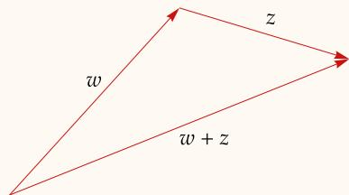

# 第 4 章 多项式

本章包含有关多项式的内容，我们将利用它们来研究从一个向量空间映射到其自身的线性映射．本章中有许多结果可能已在其他课程中为你所熟悉，仍将它们纳入本书中是为了体系完整起见

因为本章主题与线性代数无关，所以你的老师可能会很快讲完它，并可能不会要求你细究所有证明．但是，请确保你至少阅读并理解本章中所有结果的表述——后续章节中会用到它们

本章从简要讨论复数的代数性质开始．然后，我们证明了不为常值的多项式的零点个数不超过它的次数．我们还基于线性代数证明了多项式带余除法，即使你已经熟悉不用线性代数的证法，这也值得一读

我们将看到，由代数基本定理，可将每个多项式分解为一次因式之积（若标量域为C）或不高于二次的因式之积（若标量域为 R）

# 以下假设在本章中总是成立：

F 代表 R 或 C

Alireza Javaheri CC BY   
  
图为数学家和诗人奥马尔·海亚姆（Omar Khayyam，1048-1131）的雕像．由他著于1070年的代数书首度包含了对三次多项式的严谨研究

在讨论复系数多项式或实系数多项式之前，我们需要再学习一点有关复数的知识

4.1 定义：实部（real part）、Re ??，虚部（imaginary part）、Im ??

设 $z = a + b \mathrm { i }$ ，其中 $a$ 和 $^ b$ 为实数

?? 的实部，记作 $\mathrm { R e } z$ ，定义为 $\boldsymbol { \mathrm { R e } } _ { \mathrm { \mathcal { Z } } } = \boldsymbol { a }$   
?? 的虚部，记作 $\operatorname { I m } z$ ，定义为 $\operatorname { I m } z = b$

于是，对于每个复数 $z$ ，我们有

$$
z = \operatorname {R e} z + (\operatorname {I m} z) \mathrm {i}.
$$

4.2 定义：复共轭（complex conjugate）、??，绝对值（absolute value）、|??|

设 $z \in \mathbf { C }$

$z \in \mathbf { C }$ 的复共轭，记作 ??，定义为

$$
\bar {z} = \operatorname {R e} z - (\operatorname {I m} z) \mathrm {i}.
$$

复数 $z$ 的绝对值，记作 |??|，定义为

$$
| z | = \sqrt {(\operatorname {R e} z) ^ {2} + (\operatorname {I m} z) ^ {2}}.
$$

# 4.3 例：实部和虚部、复共轭、绝对值

设 $z = 3 + 2 \mathrm { i }$ ．那么

。 Re $z = 3$ ， $\tan z = 2$ ；  
$\overline { z } = 3 - 2 \mathrm i$ ；  
· $| z | = { \sqrt { 3 ^ { 2 } + 2 ^ { 2 } } } = { \sqrt { 1 3 } } .$

将复数 $z \in \mathbf { C }$ 与有序对 $( \mathrm { R e } z , \mathrm { I m } z ) \in \mathbf { R } ^ { 2 }$ 等同起来看，就是把 C 和 $\mathbf { R } ^ { 2 }$ 等同起来看．注意，C是一个1维复向量空间，但我们也可以把C（将其等同于 $\mathbf { R } ^ { 2 }$ ）视作一个2维的实向量空间

每个复数的绝对值都是非负数．具体而言，如果 $z \in \mathbf { C }$ ，那么 $| z |$ 等于由 $\mathbf { R } ^ { 2 }$ 中的原点到 $\mathbf { R } ^ { 2 }$ 中的点 $\left( \mathbb { R e } z , \operatorname { I m } z \right)$ 的距离

实部和虚部、复共轭和绝对值的若干性 你应该验证一下， $z = { \overline { { z } } }$ 当且仅当 ?? 为实数．质列在下面的结果框中

# 4.4 复数的性质

设 $w , z \in \mathbf { C }$ ．那么有下面等式和不等式成立

?? 与 $\overline { { z } }$ 之和（sum of ?? and ??）

$$
z + \bar {z} = 2 \operatorname {R e} z.
$$

?? 与 ?? 之差（difference of ?? and ??）

$$
z - \bar {z} = 2 (\operatorname {I m} z) \mathrm {i}.
$$

?? 与 ?? 之积（product of ?? and ??）

$$
z \overline {{z}} = | z | ^ {2}.
$$

转下页

复共轭的可加性和可乘性（additivity and multiplicativity of complex conjugate）

$$
\overline {{{w + z}}} = \overline {{{w}}} + \overline {{{z}}}   \text {且}   \overline {{{w z}}} = \overline {{{w}}}   \overline {{{z}}}.
$$

复共轭的复共轭（double complex conjugate）

$$
\begin{array}{c} \overline {{\overline {{z}}}} = z. \end{array}
$$

实部和虚部以 $| z |$ 为界（real and imaginary parts are bounded by |??|）

$$
| \operatorname {R e} z | \leq | z | \text {且} | \operatorname {I m} z | \leq | z |.
$$

复共轭的绝对值（absolute value of the complex conjugate）

$$
| \bar {z} | = | z |.
$$

绝对值的可乘性（multiplicativity of absolute value）

$$
| w z | = | w | | z |.
$$

三角不等式（triangle inequality）

$$
\left| w + z \right| \leq \left| w \right| + \left| z \right|.
$$

证明 除去上述最后一项以外，其余结论的验证都很常规，留给读者完成．为验证三角不等式，我们有

三角不等式的几何解释：三角形的一边长小于或等于另两边长之和

$$
\begin{array}{l} \left| w + z \right| ^ {2} = (w + z) (\overline {{w}} + \overline {{z}}) \\ = w \bar {w} + z \bar {z} + w \bar {z} + z \bar {w} \\ = | w | ^ {2} + | z | ^ {2} + w \bar {z} + \overline {{w \bar {z}}} \\ = | w | ^ {2} + | z | ^ {2} + 2 \operatorname {R e} (w \bar {z}) \\ \leq | w | ^ {2} + | z | ^ {2} + 2 | w \bar {z} | \\ = | w | ^ {2} + | z | ^ {2} + 2 | w | | z | \\ = \left(\left| w \right| + \left| z \right|\right) ^ {2}. \\ \end{array}
$$

两边开平方根即得我们欲证的不等式 反向三角不等式见于章末习题 2$| w + z | \leq | w | + | z | .$

# 多项式的零点

回忆一下，对于一个函数 $p : \mathbf { F }  \mathbf { F }$ ，如果存在 $a _ { 0 } , \ldots , a _ { m } \in \mathbf { F }$ 且 $a _ { m } \neq 0$ 使得对所有 $z \in \mathbf { F }$ 都有

$$
p (z) = a _ {0} + a _ {1} z + \dots + a _ {m} z ^ {m},
$$

则称 $p$ 是次数为 $m$ 的多项式．如果按上述形式表达 $p$ 的方式不止一种，那么多项式的次数可能不唯一．我们的首项任务就是证明这不可能发生

方程 $p ( z ) = 0$ 的解在对多项式 $p \in { \mathcal { P } } ( \mathbf { F } )$ 的研究中扮演关键角色．于是，我们给这些解赋予特殊的名称

# 4.5 定义：多项式的零点（zero of a polynomial）

称一个数 $\lambda \in \mathbf { F }$ 为多项式 $p \in { \mathcal { P } } ( \mathbf { F } )$ 的零点【或根（root）】，若

$$
p (\lambda) = 0.
$$

下面结论将成为我们证明多项式的次数唯一性时所用的关键工具

# 4.6 多项式的每个零点都对应一个一次因式

设 $m$ 是正整数且 $p \in { \mathcal { P } } ( \mathbf { F } )$ 是次数为 $m$ 的多项式．设 $\lambda \in \mathbf { F }$ ．那么 $p ( \lambda ) = 0$ 当且仅当存在一个次数为 $m - 1$ 的多项式 $q \in { \mathcal { P } } ( \mathbf { F } )$ 使得对每个 $z \in \mathbf { F }$ 都有

$$
p (z) = (z - \lambda) q (z).
$$

证明 先设 $p ( \lambda ) = 0$ ．令 $a _ { 0 } , a _ { 1 } , \ldots , a _ { m } \in \mathbf { F }$ 使得对全体 $z \in \mathbf { F }$ 都有

$$
p (z) = a _ {0} + a _ {1} z + \dots + a _ {m} z ^ {m}.
$$

那么对全体 $z \in \mathbf { F }$ 都有

$$
p (z) = p (z) - p (\lambda) = a _ {1} (z - \lambda) + \dots + a _ {m} \left(z ^ {m} - \lambda^ {m}\right). \tag {4.7}
$$

对每个 $k \in \{ 1 , \ldots , m \}$ ，等式

$$
z ^ {k} - \lambda^ {k} = (z - \lambda) \sum_ {j = 1} ^ {k} \lambda^ {j - 1} z ^ {k - j}
$$

表明， $z ^ { k } - \lambda ^ { k }$ 等于 $z - \lambda$ 乘以某个次数为 $k - 1$ 的多项式．于是式 (4.7) 表明 $p$ 等于 $z - \lambda$ 乘以某个次数为 $m - 1$ 的多项式，该方向得证

为了证明另一方向的蕴涵关系，现假设存在多项式 $q ~ \in ~ \mathcal { P } ( \mathbf { F } )$ 使得对每个 $z \in \textbf { F }$ 都有$p ( z ) = ( z - \lambda ) q ( z )$ ．那么 $p ( \lambda ) = ( \lambda - \lambda ) q ( \lambda ) = 0$ ，该方向得证 ■

现在我们就能证明多项式不会有太多零点了

# 4.8 次数为 ?? 表明最多有 ?? 个零点

假定 $m$ 是正整数且 $p \in { \mathcal { P } } ( \mathbf { F } )$ 是次数为 $m$ 的多项式．那么 $p$ 在 $\mathbf { F }$ 中最多有 $m$ 个零点

证明 对 $m$ 用归纳法．我们欲证的结论当 $m = 1$ 时是成立的，因为若 $a _ { 1 } \neq 0$ 那么多项式 $a _ { 0 } + a _ { 1 } z$ 仅有一个零点（等于 $- a _ { 0 } / a _ { 1 }$ ）．从而，假定 $m > 1$ 且欲证的结论对于 $m - 1$ 情形成立

如果 $p$ 在F中无零点，那么欲证结论成立，证明完成．于是假设 $p$ 有一个零点 $\lambda \in \mathbf { F }$ ．由4.6，存在次数为 $m - 1$ 的多项式 $q \in { \mathcal { P } } ( \mathbf { F } )$ 使得对于每个 $z \in \mathbf { F }$ 都有

$$
p (z) = (z - \lambda) q (z).
$$

我们所作的归纳假设表明， $q$ 在 $\mathbf { F }$ 中至多有 $m - 1$ 个零点．而上述等式表明， $p$ 在F中的零点恰为 $q$ 在 $\mathbf { F }$ 中的零点以及??．于是 $p$ 在 $\mathbf { F }$ 中至多有 $m$ 个零点

上述结论表明，一个多项式的系数是唯一确定的（因为如果一个多项式有两组不同的系数，那么将该多项式的这两种表示形式相减，就会得到一个某些系数非零却有无穷多个零点的多项式）．特别地，多项式的次数是唯一确定的

回忆一下，多项式 0 的次数定义为 $- \infty$ 必要情况下，应用有关 $- \infty$ 的一般算术规则即可．例如，对每个整数 $m$ 有 $- \infty < m$ 且

规定多项式 0 的次数为 $- \infty$ ，于是对于许多结论【例如 $\deg ( p q ) = \deg p + \deg q \rfloor$ 就不需要考虑例外情况

$$
- \infty + m = - \infty .
$$

# 多项式的带余除法

如果 $p$ 和 $s$ 是非负整数且 $s \neq 0$ ，那么存在非负整数 $q$ 和 $r$ 满足

$$
p = s q + r
$$

且 $r \textless s$ ．可把此式看成将 $p$ 除以 $s$ 并得到商 $q$ 和余数 $r$ ．接下来的结果给出了适用于多项式的类似结论．因而，接下来的结果常被称为多项式的带余除法，尽管这里所说的并不真是一种计算法，而仅仅是个有用的结论

多项式的带余除法可以不用任何线性代数知识来证明．然而，此处的证明使用了线性

可把多项式的带余除法看成：将多项式 $p$ 除以多项式 $s$ ，并得到余多项式 $r$

代数的技巧，并巧妙利用了 $\mathcal { P } _ { n } ( \mathbf { F } )$ 的基 ${ \big [ } { \mathcal { P } } _ { n } ( \mathbf { F } )$ 是由系数在F中且次数至多为 $n$ 的多项式所构成的 $n + 1$ 维向量空间】．这种证法对一本线性代数教材来说很合适

# 4.9 多项式的带余除法（division algorithm for polynomials）

设 $p , s \in \mathcal { P } ( \mathbf { F } )$ ，其中 $s \neq 0$ ．那么存在唯一的多项式 $q , r \in { \mathcal { P } } ( \mathbf { F } )$ 满足

$$
p = s q + r
$$

且 $\deg r < \deg s .$

证明 令 $n = \deg p$ 且 $m = \deg s$ ．如果 $n < m$ ，那么取 $q = 0$ 与 $r = p$ 即可得欲证等式 $p = s q + r$ 并有 $\deg r < \deg s$ ．从而我们现在假设 $n \geq m$

向量组

$$
1, z, \dots , z ^ {m - 1}, s, z s, \dots , z ^ {n - m} s \tag {4.10}
$$

在 $\mathcal { P } _ { n } ( \mathbf { F } )$ 中线性无关，因为该组中每个多项式都有不同的次数．同时，组(4.10)的长度是 $n + 1$ ，这等于 $\dim { \mathcal { P } } _ { n } ( \mathbf { F } )$ ．所以，(4.10) 就是 $\mathcal { P } _ { n } ( \mathbf { F } )$ 的一个基（由2.38）

因为 $p \in \mathcal { P } _ { n } ( \mathbf { F } )$ 且 (4.10) 是 $\mathcal { P } _ { n } ( \mathbf { F } )$ 的一个基，故存在唯一的常数 $a _ { 0 } , a _ { 1 } , \dotsc , a _ { m - 1 } \in \mathbf { F }$ 和$b _ { 0 } , b _ { 1 } , \dotsc , b _ { n - m } \in \mathbf { F }$ 使得

$$
\begin{array}{l} p = a _ {0} + a _ {1} z + \dots + a _ {m - 1} z ^ {m - 1} + b _ {0} s + b _ {1} z s + \dots + b _ {n - m} z ^ {n - m} s \tag {4.11} \\ = \underbrace {a _ {0} + a _ {1} z + \cdots + a _ {m - 1} z ^ {m - 1}} _ {r} + s (\underbrace {b _ {0} + b _ {1} z + \cdots + b _ {n - m} z ^ {n - m}} _ {q}). \\ \end{array}
$$

按照 $r$ 和 $q$ 的上述定义，我们发现 $p$ 可被写成 $p = s q + r$ 且 $\deg r < \deg s$ ，存在性得证

满足这些条件的 $q , r \in \mathcal { P } ( \mathbf { F } )$ 的唯一性，源于满足式 (4.11) 的常数 $a _ { 0 } , a _ { 1 } , \dotsc , a _ { m - 1 } \in \mathbf { F }$ 和$b _ { 0 } , b _ { 1 } , \dotsc , b _ { n - m } \in \mathbf { F }$ 的唯一性 ■

# 多项式在C上的分解

通过令 F 指代 R 或 C，我们一直在同时跟实系数多项式与复系数多项式打交道．现在我们将看到这两种情形的区别．我们先讨论复系数多项式，然后用适于复系数多项式的结论来证明适于实系数多项式的对应结论

我们对代数基本定理的证明隐式地用到

代数基本定理是个存在性定理．它的证明并不能引出求解零点的方法．二次多项式的零点由二次求根公式明确给出；对于三次和四次多项式也有与之相似但更为复杂的公式对于五次及以上的多项式，这样的求根公式就不存在了．

了“连续实值函数在 $\mathbf { R } ^ { 2 }$ 中的闭圆盘上取得最小值”这一结论．通过上网搜索，你还能看到代数基本定理的一些其他证法．如果你对解析函数得心应手，那么利用刘维尔定理（Liouville’stheorem）的证法尤其好用．代数基本定理的所有证明都需要用到一些分析学的知识，因为如果C被替换掉【例如换成形如 $c + d \mathrm { i }$ （ $c$ 和 $d$ 为有理数）的数的集合】，那么这个结论就不再成立了

# 4.12 代数基本定理，版本一（fundamental theorem of algebra, first version）

每个不是常值的复系数多项式都在 C中有零点

证明 棣莫弗定理（De Moivre’s theorem）的内容是，如果 $k$ 为正整数且 $\theta \in \mathbf { R }$ ，那么

$$
\left(\cos \theta + i \sin \theta\right) ^ {k} = \cos k \theta + i \sin k \theta .
$$

该定理可通过对 $k$ 作数学归纳法并用余弦和正弦的加法公式来证明

假设 $w \in \mathbf { C }$ 且 $k$ 为正整数．利用极坐标，我们可知存在 $r \geq 0$ 且 $\boldsymbol \theta \in \mathbf { R }$ 使得

$$
r (\cos \theta + \mathrm {i} \sin \theta) = w.
$$

棣莫弗定理表明

$$
\left(r ^ {1 / k} \left(\cos \frac {\theta}{k} + \mathrm {i} \sin \frac {\theta}{k}\right)\right) ^ {k} = w.
$$

于是每个复数都有 $k$ 次方根．我们很快就会利用到这个结论

假设 $p$ 是不为常值的复系数多项式且最高次非零项为 $c _ { m } z ^ { m }$ ．那么当 $| z | \to \infty$ 时 $| p ( z ) | \to \infty$ （因为当 $| z | \to \infty$ 时 $| p ( z ) | / | z ^ { m } | \to | c _ { m } |$ ）．于是连续函数 $z \mapsto | p ( z ) |$ 在某点 $\zeta \in \mathbf { C }$ 处取得全局最小值．为了说明 $p ( \zeta ) = 0$ ，先假设 $p ( \zeta ) \neq 0$

定义一个新的多项式 $q$ 为

$$
q (z) = \frac {p (z + \zeta)}{p (\zeta)}.
$$

函数 $z \mapsto | q ( z ) |$ 在 $z = 0$ 处有全局最小值1．将 $q ( z )$ 写成

$$
q (z) = 1 + a _ {k} z ^ {k} + \dots + a _ {m} z ^ {m},
$$

其中 $k$ 是满足 $z ^ { k }$ 的系数非零的最小正整数，换言之， $a _ { k } \neq 0$

令 $\beta \in \mathbf { C }$ 使得 $\beta ^ { k } = - \frac { 1 } { a _ { k } }$ ．那么存在常数 $c > 1$ 满足：若 $t \in ( 0 , 1 )$ ，那么 ????

$$
\begin{array}{l} \left| q (t \beta) \right| \leq \left| 1 + a _ {k} t ^ {k} \beta^ {k} \right| + t ^ {k + 1} c \\ = 1 - t ^ {k} (1 - t c). \\ \end{array}
$$

从而，在上述不等式中取 $t$ 为 $1 / ( 2 c )$ ，我们就可得 $| q ( t \beta ) | < 1$ ，与 $z \mapsto | q ( z ) |$ 的全局最小值为1 的假设相矛盾．由该矛盾就可推出 $p ( \zeta ) = 0$ ，证明了 $p$ 有一个零点，则原命题得证 ■

计算机能通过精巧的数值计算方法求出任何多项式的零点的充分近似值，即便确切的零点是求不出来的．例如，对于定义为

$$
p (x) = x ^ {5} - 5 x ^ {4} - 6 x ^ {3} + 1 7 x ^ {2} + 4 x - 7
$$

的多项式 $p$ ，人们就无法求出其零点的确切求解公式．但计算机可以求得 $p$ 的零点大致是−1.87, −0.74, 0.62, 1.47, 5.51 这五个数

代数基本定理的版本一引导我们得到复系数多项式的如下分解定理．注意，在该分解式中， $p$ 的零点恰为数 $\lambda _ { 1 } , \ldots , \lambda _ { m }$ ，只有当 $z$ 取这些数时才能让下面结论中等式的右侧等于 0

# 4.13 代数基本定理，版本二（fundamental theorem of algebra, second version）

如果 $p \in \mathcal { P } ( \mathbf { C } )$ 是不恒为常数的多项式，那么 $p$ 可被唯一分解为（不计因式的顺序）

$$
p (z) = c \left(z - \lambda_ {1}\right) \dots \left(z - \lambda_ {m}\right),
$$

其中 $c , \lambda _ { 1 } , \ldots , \lambda _ { m } \in \mathbf { C }$

证明 设 $p \in \mathcal { P } ( \mathbf { C } )$ 且 $m = \deg p$ ．我们对 $m$ 用数学归纳法．若 $m = 1$ ，那么我们所期望的分解式存在且唯一．因此，设 $m > 1$ ，并设对于所有 $m - 1$ 次多项式，我们所期望的分解式都存在且唯一

首先我们证明，我们所期望的 $p$ 的分解式是存在的．由代数基本定理的版本一（4.12）， $p$ 具有零点 $\lambda \in \mathbf { C }$ ．由4.6，存在 $m - 1$ 次多项式 $q$ 使得对所有 $z \in \mathbf { C }$ 都有

$$
p (z) = (z - \lambda) q (z).
$$

我们的归纳假设表明， $q$ 可分解为我们所期望的形式，将其分解式代入上式即得到我们所期望的 $p$ 的分解式

现在我们转而考虑唯一性问题． $c$ 就是 $p$ 中 $z ^ { m }$ 前的系数，因此是唯一确定的．所以我们只需证明 $\lambda _ { 1 } , \ldots , \lambda _ { m }$ 仅有一种选取方法（不考虑次序）．若

$$
(z - \lambda_ {1}) \dots (z - \lambda_ {m}) = (z - \tau_ {1}) \dots (z - \tau_ {m})
$$

对所有 $z \in \mathbf { C }$ 都成立，那么由于当 $z = \lambda _ { 1 }$ 时此式左侧等于0，所以此式右侧会有某个 $\tau$ 等于 $\lambda _ { 1 }$ 我们把下标改一下，即可假设 $\tau _ { 1 } = \lambda _ { 1 }$ ．那么如果 $z \neq \lambda _ { 1 }$ ，我们就可以将上式两侧同除以 $z - \lambda _ { 1 }$ ，得

$$
(z - \lambda_ {2}) \dots (z - \lambda_ {m}) = (z - \tau_ {2}) \dots (z - \tau_ {m})
$$

除在 $z = \lambda _ { 1 }$ 可能不成立外，对其他所有 $z \in \mathbf { C }$ 都成立．事实上，上式一定对所有 $z \in \mathbf { C }$ 都成立，否则，将上式左端减去右端，就会得到一个非零却有无限多个零点的多项式．上面等式和我们的归纳假设表明，各 $\lambda$ 与各 $\tau$ 相同（不考虑次序），这就完成了唯一性的证明 ■

# 多项式在R上的分解

一个实系数多项式可能没有实数零点．例如，多项式 $1 + x ^ { 2 }$ 没有实数零点

我们会利用 C 上的分解定理来得出 R 上的分解定理．我们从下面结论开始

代数基本定理在 R 上不成立，由此可解释线性代数在实向量空间和复向量空间上的差异．在之后的章节中我们将对此作进一步了解．

# 4.14 实系数多项式的非实数零点成对出现

设 $p \in \mathcal { P } ( \mathbf { C } )$ 为实系数多项式．若 $\lambda \in \mathbf { C }$ 是 $p$ 的零点，那么 $\overline { { \lambda } }$ 也是 $p$ 的零点

证明 令

$$
p (z) = a _ {0} + a _ {1} z + \dots + a _ {m} z ^ {m},
$$

其中 $a _ { 0 } , \ldots , a _ { m }$ 是实数．设 $\lambda \in \mathbf { C }$ 是 $p$ 的零点，那么

$$
a _ {0} + a _ {1} \lambda + \dots + a _ {m} \lambda^ {m} = 0.
$$

等式两边同取复共轭得

$$
a _ {0} + a _ {1} \bar {\lambda} + \dots + a _ {m} \bar {\lambda} ^ {m} = 0.
$$

其中我们用到了复共轭的基本性质（见 4.4）．上式就表明 $\overline { { \lambda } }$ 是 $p$ 的零点

我们想得到实系数多项式的分解定理．我 将二次求根公式和下面结论结合起来思考们从下面的结论出发

# 4.15 二次多项式的分解

设 $b , c \in \mathbf { R }$ ．那么当且仅当 $b ^ { 2 } \geq 4 c$ 时，存在 $\lambda _ { 1 } , \lambda _ { 2 } \in \mathbf { R }$ 使得形如

$$
x ^ {2} + b x + c = (x - \lambda_ {1}) (x - \lambda_ {2})
$$

的分解式成立

证明 注意到

$$
x ^ {2} + b x + c = \left(x + \frac {b}{2}\right) ^ {2} + \left(c - \frac {b ^ {2}}{4}\right).
$$

先设 $b ^ { 2 } < 4 c$ ．于是对每个 $x \in \mathbf { R }$ ，上式 上式是配方法这个技巧的基础

右侧均为正．因此多项式 $x ^ { 2 } + b x + c$ 没有实数零点，从而也就不能被分解成 $( x - \lambda _ { 1 } ) ( x - \lambda _ { 2 } )$ （其中 $\lambda _ { 1 } , \lambda _ { 2 } \in \mathbf { R }$ ）的形式

反之，现假设 $b ^ { 2 } \geq 4 c$ ．那么存在实数 $d$ 使得 $\begin{array} { r } { d ^ { 2 } = \frac { b ^ { 2 } } { 4 } - c } \end{array}$ ．根据上面单行列出的公式有，

$$
\begin{array}{l} x ^ {2} + b x + c = \left(x + \frac {b}{2}\right) ^ {2} - d ^ {2} \\ = \left(x + \frac {b}{2} + d\right) \left(x + \frac {b}{2} - d\right), \\ \end{array}
$$

即得我们想要的分解式

下面结论给出了多项式在 R 上的分解式．该结论的证明思想是利用代数基本定理的版本二（4.13），这个定理给出的是将 $p$ 视作复系数多项式时的分解式．由 4.14 知， $p$ 的非实数复

零点总是成对出现．于是，如果将 $p$ 视作 $\mathcal { P } ( \mathbf { C } )$ 的元素时，所得分解式含有形如 $( x - \lambda )$ 的项（其中?? 为非实数的复数），那么 $( x - { \overline { { \lambda } } } )$ 也是分解式的一项．将这两项相乘可得

$$
\left(x ^ {2} - 2 (\operatorname {R e} \lambda) x + | \lambda | ^ {2}\right),
$$

这个二次的项正是我们所需要的形式

根据上段概述的思路基本上能证明我们所期望的分解式是存在的．然而，有一点需要注意：设 ?? 是非实数的复数，且 $( x - \lambda )$ 是将 $p$ 视作 $\mathcal { P } ( \mathbf { C } )$ 的元素时所得分解式的其中一项，那么根据4.14我们可以保证 $( x - { \overline { { \lambda } } } )$ 肯定也是分解式中的一项，但是4.14并没说这两个因式出现的次数相同，而要使上段的思路可行，这一点是必需的．不过我们将证明这一点的确成立

在下面结果中， $m$ 和 $M$ 中可能会有一个等于 0．数 $\lambda _ { 1 } , \ldots , \lambda _ { m }$ 恰是 $p$ 的实数零点，因为 $x$ 仅有取这些实数值时才能使下面结论中等式的右侧等于 0

# 4.16 多项式在R上的分解

设 $p \in \mathcal { P } ( \mathbf { R } )$ 是一个不恒为常数的多项式．那么 $p$ 可被唯一分解为（不计因式的顺序）

$$
p (x) = c (x - \lambda_ {1}) \cdot \cdot \cdot (x - \lambda_ {m}) (x ^ {2} + b _ {1} x + c _ {1}) \cdot \cdot \cdot (x ^ {2} + b _ {M} x + c _ {M}),
$$

其中 $c , \lambda _ { 1 } , \ldots , \lambda _ { m } , b _ { 1 } , \ldots , b _ { M } , c _ { 1 } , \ldots , c _ { M } \in \mathbf { R }$ 且对各 $k = 1 , \dots , M$ 均有 $b _ { k } ^ { 2 } < 4 c _ { k }$

证明 首先我们证明我们所期望的分解式是存在的，然后证明其唯一性

将 $p$ 视作 $\mathcal { P } ( \mathbf { C } )$ 的一个元素．如果 $p$ 的所有（复）零点都是实的，那么根据 4.13 就得到了我们想要的分解式．于是，设 $p$ 存在零点 $\lambda \in \mathbf { C }$ 且 $\lambda \not \in \mathbf { R }$ ．由 4.14 可得 $\overline { { \lambda } }$ 也是 $p$ 的零点．于是我们可写出

$$
\begin{array}{l} p (x) = (x - \lambda) (x - \overline {{\lambda}}) q (x) \\ = \left(x ^ {2} - 2 (\operatorname {R e} \lambda) x + | \lambda | ^ {2}\right) q (x) \\ \end{array}
$$

其中 $q \in { \mathcal { P } } ( \mathbf { C } )$ 是比 $p$ 低2次的多项式．如果我们可以证明 $q$ 的系数为实数，那么对 $p$ 的次数用归纳法即可完成存在性部分的证明

为了证明 $q$ 的系数是实数，通过上述方程解出 $q$ ，可得对于所有 $x \in \mathbf { R }$ ，

$$
q (x) = \frac {p (x)}{x ^ {2} - 2 (\operatorname {R e} \lambda) x + | \lambda | ^ {2}}.
$$

上式意味着对于所有 $x \in \mathbf { R }$ 都有 $q ( x ) \in \mathbf { R }$ ．将 $q$ 写成

$$
q (x) = a _ {0} + a _ {1} x + \dots + a _ {n - 2} x ^ {n - 2},
$$

其中 $n = \deg p$ 且 $a _ { 0 } , \dotsc , a _ { n - 2 } \in \mathbf { C }$ ．由此我们可得

$$
0 = \operatorname {I m} q (x) = (\operatorname {I m} a _ {0}) x + (\operatorname {I m} a _ {1}) x + \dots + (\operatorname {I m} a _ {n - 2}) x ^ {n - 2}
$$

对所有 $x \in \mathbf { R }$ 都成立．这就意味着 $\operatorname { I m } a _ { 0 } , \operatorname { I m } a _ { 1 } , \dots , \operatorname { I m } a _ { n - 2 }$ 都等于 0（由 4.8）．于是 $q$ 的所有系数都是实数．因此，我们所期望的分解式存在

现在我们转而考虑分解式的唯一性问题． $p$ 的一个形如 $x ^ { 2 } + b _ { k } x + c _ { k }$ 且满足 $b _ { k } ^ { 2 } < 4 c _ { k }$ 的因式，可以被唯一地表示为 $( x - \lambda _ { k } ) ( x - \overline { { \lambda _ { k } } } )$ ，其中 $\lambda _ { k } \in \mathbf { C }$ ．不难想到，若将 $p$ 作为 $\mathcal { P } ( \mathbf { R } )$ 中元素来看时存在两个不同的分解式，会导致将其作为 $\mathcal { P } ( \mathbf { C } )$ 中元素来看时，也有两个不同的分解式，而这与4.13矛盾 ■

# K习题 4k

1 设 $w , z \in \mathbf { C }$ ．验证下列等式和不等式：

(a) $z + \overline { { z } } = 2 \ \mathsf { R e } z$   
(b) $z - \overline { { z } } = 2 ( \operatorname { I m } z ) \mathrm { i }$   
(c) $z { \overline { { z } } } = | z | ^ { 2 }$   
(d) $\overline { { w + z } } = \overline { { w } } + \overline { { z } }$ 且 $\overline { { w z } } = \overline { { w } } \overline { { z } }$   
(e) ${ \overline { { \overline { { z } } } } } = z$   
(f) $| \mathsf { R e } z | \leq | z |$ 且 $| \mathrm { I m } z | \leq | z |$   
(g) $| \overline { { z } } | = | z |$   
(h) $| w z | = | w | | z |$

注 以上结果是4.4留给读者的部分

2 证明：如果 $w , z \in \mathbf { C }$ ，那么 $\left| | w | - | z | \right| \leq | w - z |$

注 以上不等式称为反向三角不等式（reverse triangle inequality）

3 设 $V$ 是复向量空间且 $\varphi \in V ^ { \prime }$ ．定义 $\sigma : V  \mathbf { R }$ 为 $\sigma ( \nu ) = \operatorname { R e } \varphi ( \nu )$ 对任一 $\nu \in V$ 都成立．证明

$$
\varphi (v) = \sigma (v) - \mathrm {i} \sigma (\mathrm {i} v)
$$

对所有 $\nu \in V$ 成立

4 设 $m$ 是一正整数，集合

$$
\{0 \} \cup \left\{p \in \mathcal {P} (\mathbf {F}): \deg p = m \right\}
$$

是 $\mathcal { P } ( \mathbf { F } )$ 的子空间吗？

5 集合

$\{ 0 \} \cup \{ p \in { \mathcal { P } } ( \mathbf { F } ) : \deg p$ 为偶数

是 $\mathcal { P } ( \mathbf { F } )$ 的子空间吗？

6 设 $m$ 和 $n$ 是正整数（ $m \le n \ O$ ， $\lambda _ { 1 } , \ldots , \lambda _ { m } \in \mathbf { F }$ ．证明：存在多项式 $p \in { \mathcal { P } } ( \mathbf { F } )$ （deg $p = n$ ），使得 $0 = p ( \lambda _ { 1 } ) = \cdot \cdot \cdot = p ( \lambda _ { m } )$ 且 $p$ 没有其他零点  
7 设 $m$ 是一非负整数， $z _ { 1 } , \dots , z _ { m + 1 }$ 是 $\mathbf { F }$ 中的不同元素， $w _ { 1 } , \dotsc , w _ { m + 1 } \in \mathbf { F }$ ．证明：存在唯一的多项式 $p \in \mathscr { P } _ { m } ( \mathbf { F } )$ 使得

$$
p (z _ {k}) = w _ {k}
$$

对每个 $k = 1 , \ldots , m + 1$ 成立

注 这个结果可以不用线性代数证明．但是试试看，用上些线性代数，找到更简洁明了的证明

8 设 $p \in \mathcal { P } ( \mathbf { C } )$ 的次数为 $m$ ．证明： $p$ 有 $m$ 个不同零点，当且仅当 $p$ 和其导数 $p ^ { \prime }$ 没有共同的零点  
9 证明：每个实系数奇次多项式都有实零点

10 对于 $p \in \mathcal { P } ( \mathbf { R } )$ ，定义 $T p : \mathbf { R }  \mathbf { R }$ 为

$$
(T p) (x) = \left\{ \begin{array}{l l} \frac {p (x) - p (3)}{x - 3} & \text {若} x \neq 3, \\ p ^ {\prime} (3) & \text {若} x = 3 \end{array} \right.
$$

对每个 $x \in \mathbf { R }$ 都成立．证明 $T p \in { \mathcal { P } } ( \mathbf { R } )$ 对每个多项式 $p \in \mathcal { P } ( \mathbf { R } )$ 成立，以及 $T : \mathcal { P } ( \mathbf { R } )  \mathcal { P } ( \mathbf { R } )$ 是线性映射

11 设 $p \in \mathcal { P } ( \mathbf { C } )$ ．定义 $q : \mathbf { C } \to \mathbf { C }$ 为

$$
q (z) = p (z) \overline {{p (\bar {z})}}.
$$

证明 $q$ 是实系数多项式

12 设 $m$ 是一非负整数， $p \in \mathcal { P } _ { m } ( \mathbf { C } )$ ，存在不同的实数 $x _ { 0 } , x _ { 1 } , \ldots , x _ { m }$ 使得 $p ( x _ { k } ) \ \in \ \mathbf { R }$ 对每个$k = 0 , 1 , \ldots , m$ 都成立．证明 $p$ 的所有系数都是实的  
13 设 $p \in { \mathcal { P } } ( \mathbf { F } )$ （ $p \neq 0$ ），令 $U = \{ p q : q \in { \mathcal { P } } ( \mathbf { F } ) \}$

(a) 证明 $\dim { \mathcal { P } } ( \mathbf { F } ) / U = \deg p$   
(b) 求 $\mathcal { P } ( \mathbf { F } ) / U$ 的一个基

14 设 $p , q \in \mathcal { P } ( \mathbf { C } )$ 是不为常值的多项式，且没有共同的零点．令 $m = \deg p$ ， $n = \deg { q }$ ．按照下面 (a)–(c) 的方式，使用线性代数证明：存在 $r \in { \mathcal { P } } _ { n - 1 } ( \mathbf { C } )$ 和 $s \in \mathcal { P } _ { m - 1 } ( \mathbf { C } )$ 使得

$$
r p + s q = 1.
$$

(a) 定义 $T : \mathcal { P } _ { n - 1 } ( \mathbf { C } ) \times \mathcal { P } _ { m - 1 } ( \mathbf { C } ) \to \mathcal { P } _ { m + n - 1 } ( \mathbf { C } )$ 为

$$
T (r, s) = r p + s q.
$$

证明线性映射 $T$ 是单射

(b) 证明(a)中的线性映射 $T$ 是满射  
(c) 利用 (b) 得出结论：存在 $r \in { \mathcal { P } } _ { n - 1 } ( \mathbf { C } )$ 和 $s \in \mathcal { P } _ { m - 1 } ( \mathbf { C } )$ 使得 $r p + s q = 1$

