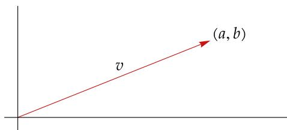
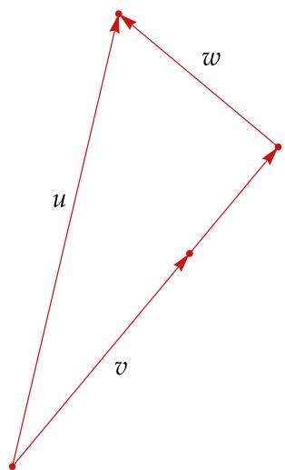
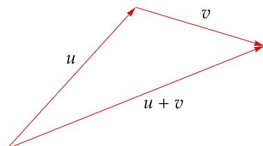
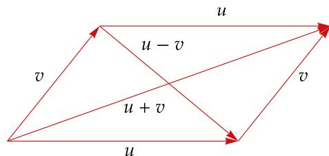
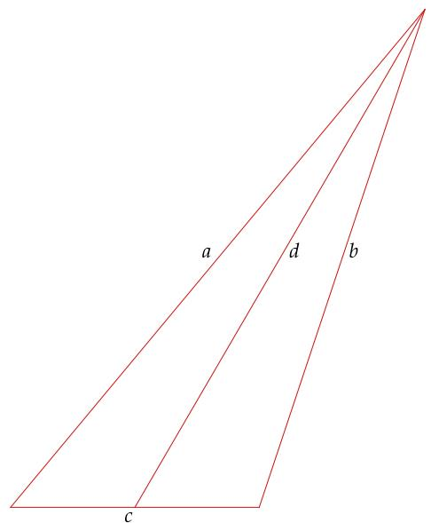
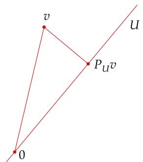
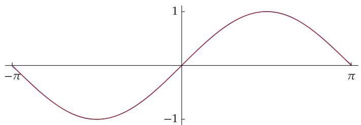
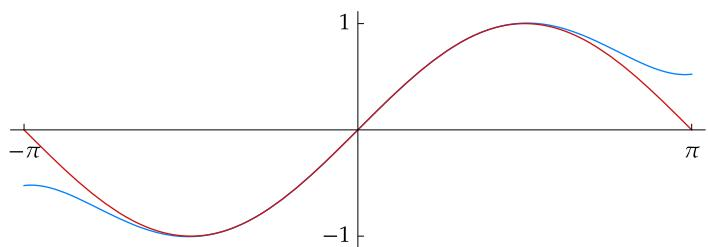

# 第6章 内积空间

在定义向量空间时，我们推广了 $\mathbf { R } ^ { 2 }$ 和 $\mathbf { R } ^ { 3 }$ 的线性结构（加法和标量乘法），而未顾及几何上的特性，例如长度和角度等概念．内积的概念就蕴含了这些几何层面的想法，它是我们本章研究的主题

每种内积都可诱导出一种范数（你可以把范数看成长度）．范数满足一些重要的性质，例如毕达哥拉斯定理、三角不等式、平行四边形等式和柯西-施瓦兹不等式

在讨论内积空间时，我们将欧几里得几何中的垂直向量这一概念，重命名为正交向量．我们将看到，规范正交基在内积空间中非常有用．格拉姆-施密特过程可构造出这样的基．本章结尾处，我们将综合运用上述工具来解决最小化问题

# 以下假设在本章中总是成立：

F 代表 R 或 C  
?? 和?? 代表F上的向量空间

Matthew Petroff CC BY-SA   
  
图为乔治·皮博迪图书馆（The George Peabody Library），现在是约翰·霍普金斯大学（JohnsHopkins University）的一部分．该图书馆开馆时，詹姆斯·西尔维斯特（James Sylvester，1814-1897）正担任这所大学的首位数学教授．西尔维斯特在他发表的著作中首次将“矩阵”（matrix）一词引入数学领域

# 6A 内积和范数

# 内积

首先说明定义内积这个概念的动机．将 $\mathbf { R } ^ { 2 }$ 和 $\mathbf { R } ^ { 3 }$ 中的向量看成始于原点的箭头． $\mathbf { R } ^ { 2 }$ 或 $\mathbf { R } ^ { 3 }$ 中向量 $\nu$ 的长度被称为 $\nu$ 的范数（norm）并记作 $\| \nu \|$ ．于是对 $\nu =$ $( a , b ) \in \mathbf { R } ^ { 2 }$ ，我们有

$$
\left\| v \right\| = \sqrt {a ^ {2} + b ^ {2}}.
$$

类似地，若 $\nu = ( a , b , c ) \in \mathbf { R } ^ { 3 }$ ，那么 $\left\| \nu \right\| = { \sqrt { a ^ { 2 } + b ^ { 2 } + c ^ { 2 } } }$ .

  
图中的向量 $\nu$ 的范数为 $\sqrt { a ^ { 2 } + b ^ { 2 } }$

尽管我们画不出高维空间中的图形，但将上面概念推广到 $\mathbf { R } ^ { n }$ 并不难：我们定义 $x \_ =$ $( x _ { 1 } , \ldots , x _ { n } ) \in \mathbf { R } ^ { n }$ 的范数为

$$
\left\| x \right\| = \sqrt {x _ {1} ^ {2} + \cdots + x _ {n} ^ {2}}.
$$

范数在 $\mathbf { R } ^ { n }$ 上不是线性的．为了把线性引入讨论中，我们引入点积

# 6.1 定义：点积（dot product）

对 $x , y \in \mathbf { R } ^ { n }$ ， $x$ 和 $y$ 的点积记作 $x \cdot y$ ，由下式定义：

$$
x \cdot y = x _ {1} y _ {1} + \dots + x _ {n} y _ {n},
$$

其中 $x = ( x _ { 1 } , \ldots , x _ { n } ) $ ， $y = ( y _ { 1 } , \ldots , y _ { n } ) .$

$\mathbf { R } ^ { n }$ 中两个向量的点积是数而不是向量注意，对所有 $x \in \mathbf { R } ^ { n }$ ，有 $x \cdot x \ = \ \| x \| ^ { 2 }$ ．此外， $\mathbf { R } ^ { n }$ 上的点积还满足下列性质

如果我们把向量视为一个点而不是一个箭头，那么应将 $\| x \|$ 解释为从原点到点 $x$ 的距离．

对所有 $x \in \mathbf { R } ^ { n }$ ，均有 $x \cdot x \geq 0$   
$x \cdot x = 0$ 当且仅当 $x = 0$   
对于固定的 $\boldsymbol { y } \in \mathbf { R } ^ { n }$ ， $\mathbf { R } ^ { n }$ 到 $\mathbf { R }$ 的将 $x \in \mathbf { R } ^ { n }$ 对应到 $x \cdot y$ 的映射是线性的  
对所有 $x , y \in \mathbf { R } ^ { n }$ ，均有 $x \cdot y = y \cdot x$

内积是对点积的推广．现在你可能会猜测，内积的定义就是通过将上一段讨论的点积性质抽象化得出的．对于实向量空间，这个猜想没错．然而，为了让我们所作的定义同时适用于实向量空间和复向量空间，我们需要在下定义之前考虑复数的情况

回忆一下，如果 $\lambda = a + b \mathrm { i }$ ，其中 $a , b \in \mathbf { R }$ ，那么

$\lambda$ 的绝对值记作 |??|，定义为 $\vert \lambda \vert = { \sqrt { a ^ { 2 } + b ^ { 2 } } }$ ；  
$\lambda$ 的复共轭记作 $\overline { { \lambda } }$ ，定义为 ${ \overline { { \lambda } } } = a - b \mathrm { i }$ ；  
。 $| \lambda | ^ { 2 } = \lambda { \overline { { \lambda } } }$

绝对值和复共轭的定义及基本性质见于第 4章

对于 $z = ( z _ { 1 } , \dots , z _ { n } ) \in \mathbf { C } ^ { n }$ ，我们定义 $z$ 的范数为

$$
\left\| z \right\| = \sqrt {\left| z _ {1} \right| ^ {2} + \cdots + \left| z _ {n} \right| ^ {2}}.
$$

上式中需要用到绝对值，因为我们想让 ∥??∥ 是个非负实数．注意到

$$
\left\| z \right\| ^ {2} = z _ {1} \overline {{z _ {1}}} + \dots + z _ {n} \overline {{z _ {n}}}.
$$

我们想将 $\| z \| ^ { 2 }$ 视为 ?? 与自身的内积，就如在 $\mathbf { R } ^ { n }$ 中那般．于是上式表明，向量 $w = ( w _ { 1 } , \ldots , w _ { n } ) \in$ $\mathbf { C } ^ { n }$ 和 $z$ 的内积应等于

$$
w _ {1} \overline {{z _ {1}}} + \dots + w _ {n} \overline {{z _ {n}}}.
$$

如果将 $w$ 和 $z$ 的角色互换，上述表达式就会被其复共轭所替代．于是，我们期望内积满足： $w$ 和 $z$ 的内积等于 ?? 和 $w$ 的内积的复共轭．说明这点动机后，我们现在可以定义任意实向量空间或复向量空间 $V$ 上的内积了

关于下面定义中所用的记号，有一点需要注意：

对于 $\lambda \in \mathbf { C }$ ，记号 $\lambda \geq 0$ 意为 $\lambda$ 是非负实数

# 6.2 定义：内积（inner product）

$V$ 上的内积是一个函数，它将由 $V$ 中元素构成的每个有序对 $( u , \nu )$ 对应至一个数 $\langle u , \nu \rangle \in$ F，并满足如下性质

正性（positivity）

对于所有 $\nu \in V$ ，均有 $\langle \nu , \nu \rangle \geq 0$

定性（definiteness）

$\langle \nu , \nu \rangle = 0$ 当且仅当 $\nu = 0$

第一个位置上的可加性（additivity in first slot）

对于所有 $u , \nu , w \in V$ ，均有 $\left. u + \nu , w \right. = \left. u , w \right. + \left. \nu , w \right.$

第一个位置上的齐次性（homogeneity in first slot）

对于所有 $\lambda \in \mathbf { F }$ 和所有 $u , \nu \in V$ ，均有 $\langle \lambda u , \nu \rangle = \lambda \langle u , \nu \rangle$

共轭对称性（conjugate symmetry）

对于所有 $u , \nu \in V$ ，均有 $\left. u , \nu \right. = \overline { { \left. \nu , u \right. } }$

每个实数都等于其复共轭．因此如果我们讨论的是实向量空间，那么我们可以从上面最后一个条件中省去复共轭，并直接把它

表述为：对于所有 $u , \nu \in V$ ，均有 $\langle u , \nu \rangle = \langle \nu , u \rangle$

大部分数学家都把内积定义如上．不过，许多物理学家使用的定义中，要求齐次性在第二个位置上成立，而不是第一个位置

# 6.3 例：内积

(a) $\mathbf { F } ^ { n }$ 上的欧几里得内积（Euclidean inner product）定义为：对所有 $\left( w _ { 1 } , \ldots , w _ { n } \right)$ ,

$$
\left(z _ {1}, \dots , z _ {n}\right) \in \mathbf {F} ^ {n},
$$

$$
\left\langle \left(w _ {1}, \dots , w _ {n}\right), \left(z _ {1}, \dots , z _ {n}\right) \right\rangle = w _ {1} \bar {z _ {1}} + \dots + w _ {n} \bar {z _ {n}}.
$$

(b) 若 $c _ { 1 } , \ldots , c _ { n }$ 是正数，那么可在 $\mathbf { F } ^ { n }$ 上定义内积如下：对所有 $( w _ { 1 } , \ldots , w _ { n } ) , ( z _ { 1 } , \ldots , z _ { n } ) \in \mathbf { F } ^ { n }$

$$
\left\langle \left(w _ {1}, \dots , w _ {n}\right), \left(z _ {1}, \dots , z _ {n}\right) \right\rangle = c _ {1} w _ {1} \bar {z _ {1}} + \dots + c _ {n} w _ {n} \bar {z _ {n}}.
$$

转下页

(c) 在由定义在区间 [−1,1] 上的全体连续实值函数构成的向量空间上，可定义内积如下：对所有定义在区间 [−1, 1] 上的连续实值函数 $f , g$ ，

$$
\langle f, g \rangle = \int_ {- 1} ^ {1} f g.
$$

(d) 在 $\mathcal { P } ( \mathbf { R } )$ 上，可定义内积如下：对所有 $p , q \in \mathcal { P } ( \mathbf { R } )$ ，

$$
\langle p, q \rangle = p (0) q (0) + \int_ {- 1} ^ {1} p ^ {\prime} q ^ {\prime}.
$$

(e) 在 $\mathcal { P } ( \mathbf { R } )$ 上，还可定义内积如下：对所有 $p , q \in \mathcal { P } ( \mathbf { R } )$ ，

$$
\langle p, q \rangle = \int_ {0} ^ {\infty} p (x) q (x) e ^ {- x} d x.
$$

# 6.4 定义：内积空间（inner product space）

一个内积空间是带有内积的向量空间??

内积空间的最重要的例子，就是带有如上例 (a) 所示欧几里得内积的 $\mathbf { F } ^ { n }$ ．当称 $\mathbf { F } ^ { n }$ 是内积空间时，除非另有说明，你都应假设其上定义的内积是欧几里得内积

为了让我们不用反复重申?? 和?? 是内积空间这个前提条件，我们作出如下假设

# 6.5 记号：??、??

在本章的剩余部分和下章中， $V$ 和?? 都指代F上的内积空间

注意，这里稍微有些滥用术语．一个内积空间是带有内积的向量空间．当我们称一向量空间 $V$ 为内积空间时，我们或是将 $V$ 上的内积隐含于其中，或是由上下文可明确 $V$ 上的内积如何定义（又或者，如果这个向量空间是 $\mathbf { F } ^ { n }$ ，那么所用内积就是欧几里得内积）

# 6.6 内积的基本性质

(a) 对每个固定的 $\nu \in V$ ，将 $u \in V$ 对应到 $\langle u , \nu \rangle$ 的函数都是 $V$ 到F的线性映射  
(b) 对每个 $\nu \in V$ ，均有 $\langle 0 , \nu \rangle = 0$ .   
(c) 对每个 $\nu \in V$ ，均有 $\langle \nu , 0 \rangle = 0$   
(d) 对所有 $u , \nu , w \in V$ ，均有 $\left. u , \nu + w \right. = \left. u , \nu \right. + \left. u , w \right.$   
(e) 对所有 $\lambda \in \mathbf { F }$ 和 $u , \nu \in V$ ，均有 $\langle u , \lambda \nu \rangle = { \overline { { \lambda } } } \langle u , \nu \rangle$

# 证明

(a) 对 $\nu \in V$ ，由内积定义中第一个位置上的可加性和齐次性，即可得 $u \mapsto \langle u , \nu \rangle$ 的线性  
(b) 每个线性映射都将0对应到0．所以由(a)即知(b)成立  
(c) 若 $\nu \in V$ ，那么由内积定义中的共轭对称性质和 (b) 即得 $\left. \nu , 0 \right. = \overline { { \left. 0 , \nu \right. } } = \overline { { 0 } } = 0$

(d) 设 $u , \nu , w \in V$ ．则

$$
\begin{array}{l} \langle u, v + w \rangle = \overline {{\langle v + w , u \rangle}} \\ = \overline {{\langle v , u \rangle + \langle w , u \rangle}} \\ = \overline {{\langle v , u \rangle}} + \overline {{\langle w , u \rangle}} \\ = \langle u, v \rangle + \langle u, w \rangle . \\ \end{array}
$$

(e) 设 $\lambda \in \mathbf { F }$ 及 $u , \nu \in V$ ．则

$$
\begin{array}{l} \langle u, \lambda v \rangle = \overline {{\langle \lambda v , u \rangle}} \\ = \overline {{\lambda \langle v , u \rangle}} \\ = \bar {\lambda} \overline {{\langle v , u \rangle}} \\ = \bar {\lambda} \langle u, v \rangle . \\ \end{array}
$$

# 范数

我们定义内积的动机最初来源于 $\mathbf { R } ^ { 2 }$ 和 $\mathbf { R } ^ { 3 }$ 上向量的范数．现在我们就会看到，每种内积都能确定一种范数

# 6.7 定义：范数（norm）、∥??∥

对 $\nu \in V$ ， $\nu$ 的范数记作 $\| \nu \|$ ，定义为

$$
\left\| v \right\| = \sqrt {\langle v , v \rangle}.
$$

# 6.8 例：范数

(a) 若 $( z _ { 1 } , \ldots , z _ { n } ) \in \mathbf { F } ^ { n }$ （其上定义了欧几里得内积），那么

$$
\left\| \left(z _ {1}, \dots , z _ {n}\right) \right\| = \sqrt {\left| z _ {1} \right| ^ {2} + \cdots + \left| z _ {n} \right| ^ {2}}.
$$

(b) 定义在区间 [−1,1] 上的连续实值函数所构成的向量空间【其上内积定义如6.3(c)】中的元素 $f$ 满足

$$
\| f \| = \sqrt {\int_ {- 1} ^ {1} f ^ {2}}.
$$

# 6.9 范数的基本性质

设 $\nu \in V$

(a) $\| \nu \| = 0$ 当且仅当 $\nu = 0$   
(b) 对所有 $\lambda \in \mathbf { F }$ ，均有 $\| \lambda \nu \| = \left| \lambda \right| \| \nu \|$

# 证明

(a) 因为 $\langle \nu , \nu \rangle = 0$ 当且仅当 $\nu = 0$ ，所以原命题成立

(b) 设 $\lambda \in \mathbf { F }$ ．那么

$$
\begin{array}{l} \left\| \lambda v \right\| ^ {2} = \langle \lambda v, \lambda v \rangle \\ = \lambda \langle v, \lambda v \rangle \\ = \lambda \bar {\lambda} \langle v, v \rangle \\ = | \lambda | ^ {2} \| v \| ^ {2}. \\ \end{array}
$$

两边开平方根即得我们欲证的等式

上述结论中(b)的证明形象说明了一个普遍适用的道理：处理范数的平方通常比直接处理范数来得容易

现在我们给出一个关键的定义

# 6.10 定义：正交（orthogonal）

称两个向量 $u , \nu \in V$ 是正交的，若 $\langle u , \nu \rangle = 0$ .

在上述定义中，两个向量的顺序是无关紧要的，因为 $\langle u , \nu \rangle = 0$ 当且仅当 $\left. \nu , u \right. = 0 \mathrm { ~ }$

除了说“ $u$ 和 $\nu$ 是正交的”，我们有时也说“ $\dot { u }$ 正交于 $\nu ^ { \prime \prime }$ ”

“orthogonal” 这个词来自希腊语中的 “or-thogonios”，后者意为“直角的”

习题 15 要求你证明若 $u , \nu$ 是 $\mathbf { R } ^ { 2 }$ 中的非零向量，那么

$$
\langle u, v \rangle = \| u \| \| v \| \cos \theta ,
$$

其中 $\theta$ 是 $u$ 和 $\nu$ 间的夹角（将 $u$ 和 $\nu$ 看成始于原点的箭头）．于是 $\mathbf { R } ^ { 2 }$ 中两个非零向量（在欧几里得内积下）是正交的，当且仅当它们之间夹角的余弦值是0，这又等价于通常讨论平面几何时所说的两向量垂直．于是，你可将正交这个词看成表达垂直（perpendicular）之意的一个更炫的说法

我们从一个简单的结论开始研究正交性

# 6.11 正交性和 0

(a) 0 与 $V$ 中每个向量都正交  
(b) 0 是 $V$ 中唯一与自身正交的向量

# 证明

(a) 回忆一下，6.6 (b) 曾提到，对每个 $\nu \in V$ 都有 $\langle 0 , \nu \rangle = 0$   
(b) 若 $\nu \in V$ 且 $\langle \nu , \nu \rangle = 0$ ，那么 $\nu = 0$ （由内积的定义可得）

下面的定理在 $V = \mathbf { R } ^ { 2 }$ 时的特殊情形，早在3500多年前就已经为古巴比伦人所知，在2500余年前又被希腊人重新发现并证明．当然，下面的证明用的不是原始的证法

# 6.12 毕达哥拉斯定理（Pythagorean theorem）

设 $u , \nu \in V$ ．若 $u$ 和 $\nu$ 是正交的，那么

$$
\left\| u + v \right\| ^ {2} = \left\| u \right\| ^ {2} + \left\| v \right\| ^ {2}.
$$

证明 设 $\langle u , \nu \rangle = 0$ ．那么

$$
\begin{array}{l} \left\| u + v \right\| ^ {2} = \langle u + v, u + v \rangle \\ = \langle u, u \rangle + \langle u, v \rangle + \langle v, u \rangle + \langle v, v \rangle \\ = \| u \| ^ {2} + \| v \| ^ {2}. \\ \end{array}
$$

设 $u , \nu \in V$ 且 $\nu \neq 0$ ．我们想将 $u$ 写成 $\nu$ 的标量倍加上正交于 $\nu$ 的向量 $w$ 的形式，如下图所示

正交分解：将 $u$ 表示成 $\nu$ 的标量倍加上正交于 $\nu$ 的向量的形式

为探究如何将 $u$ 写成 $\nu$ 的标量倍加上正交于 $\nu$ 的向量的形式，令 $c \in \mathbf { F }$ 表示一标量．则

$$
u = c v + (u - c v).
$$

于是我们需选取 $c$ 使得 $\nu$ 与 $u - c \nu$ 正交．因此我们希望有

$$
0 = \langle u - c v, v \rangle = \langle u, v \rangle - c \| v \| ^ {2}.
$$

上式表明，我们应将 $c$ 取为 $\langle u , \nu \rangle / \| \nu \| ^ { 2 }$ ．取定该 $c$ 后，我们就可写出

$$
u = \frac {\langle u , v \rangle}{\| v \| ^ {2}} v + \left(u - \frac {\langle u , v \rangle}{\| v \| ^ {2}} v\right).
$$

你可验证得，上述等式将 $u$ 显式地写成了 $\nu$ 的标量倍加上正交于 $\nu$ 的向量的形式．于是我们就证明了下面这个关键的结论

# 6.13 一种正交分解

设 $u , \nu \in V$ ，且 $\nu \neq 0$ ．取 $c = \frac { \langle u , \nu \rangle } { \| \nu \| ^ { 2 } }$ 及 $w = u - { \frac { \langle u , \nu \rangle } { \| \nu \| ^ { 2 } } } \nu$ ．那么

$$
u = c v + w \quad {\text {且}} \quad \langle w, v \rangle = 0.
$$

我们将利用正交分解 6.13 来证明下面的柯西-施瓦兹不等式，它是数学中最重要的不等式之一．

# 6.14 柯西-施瓦兹不等式（Cauchy-Schwarz inequality）

设 $u , \nu \in V$ ．那么

$$
| \langle u, v \rangle | \leq \| u \| \| v \|.
$$

当且仅当 $u , \nu$ 成标量倍数关系时，上述不等式取得等号

证明 若 $\nu = 0$ ，那么欲证不等式的两端都等于 0，即得证．于是我们可假设 $\nu \neq 0$ ．考察6.13给出的正交分解式

$$
u = \frac {\langle u , v \rangle}{\| v \| ^ {2}} v + w
$$

其中 $w$ 正交于 $\nu$ ．由毕达哥拉斯定理，

$$
\begin{array}{l} \left\| u \right\| ^ {2} = \left\| \frac {\langle u , v \rangle}{\| v \| ^ {2}} v \right\| ^ {2} + \left\| w \right\| ^ {2} \\ = \frac {| \langle u , v \rangle | ^ {2}}{\| v \| ^ {2}} + \| w \| ^ {2} \\ \geq \frac {\left| \langle u , v \rangle \right| ^ {2}}{\| v \| ^ {2}}. \tag {6.15} \\ \end{array}
$$

1821 年，奥古斯汀-路易·柯西（Augustin-Louis Cauchy, 1789-1857）证明了 6.16 (a)1859 年，柯西的学生维克多·布尼亚科夫斯基（Viktor Bunyakovsky，1804-1889）证明了类似于6.16(b)的积分不等式．几十年后，赫尔曼·施瓦兹（Hermann Schwarz，1843-1921）发现了类似的结论并引发了更多的关注，柯西-施瓦兹不等式由此得名

将上式两边都乘以 $\| \nu \| ^ { 2 }$ 并同时开平方根即得欲证的不等式

由上段的证明可得柯西-施瓦兹不等式取得等号当且仅当式 (6.15) 取得等号，这又等价于$w = 0$ ．而 $w = 0$ 当且仅当 $u$ 是 $\nu$ 的标量倍（见6.13）．于是柯西-施瓦兹不等式取得等号，当且仅当 $u$ 是 $\nu$ 的标量倍或 $\nu$ 是 $u$ 的标量倍（或互成标量倍数关系）．这样说可以涵盖 $u$ 或 $\nu$ 等于0这个特殊情形 ■

# 6.16 例：柯西-施瓦兹不等式

(a) 若 $x _ { 1 } , \dotsc , x _ { n } , y _ { 1 } , \dotsc , y _ { n } \in \mathbf { R }$ ，那么

$$
\left(x _ {1} y _ {1} + \dots + x _ {n} y _ {n}\right) ^ {2} \leq \left(x _ {1} ^ {2} + \dots + x _ {n} ^ {2}\right) \left(y _ {1} ^ {2} + \dots + y _ {n} ^ {2}\right),
$$

这就是将柯西-施瓦兹不等式应用于向量 $( x _ { 1 } , \ldots , x _ { n } ) , ( y _ { 1 } , \ldots , y _ { n } ) \in \mathbf { R } ^ { n }$ 的结果（所用内积是通常的欧几里得内积）

(b) 若 $f , g$ 是定义在 [−1, 1] 上的连续实值函数，那么

$$
\left| \int_ {- 1} ^ {1} f g \right| ^ {2} \leq \left(\int_ {- 1} ^ {1} f ^ {2}\right) \left(\int_ {- 1} ^ {1} g ^ {2}\right),
$$

这就是将柯西-施瓦兹不等式应用于例6.3(c)的结果

接下来的结论被称为三角不等式，从几何角度解释，就是三角形任意一边的长度都小于另外两边的长度之和

注意，三角不等式表明，连接两点的折线路径中，最短的是一条线段（可视作由共线的线段构成的折线）

在这个三角形里， $u + \nu$ 的长度小于 $u$ 的长度加上 $\nu$ 的长度

# 6.17 三角不等式（triangle inequality）

设 $u , \nu \in V$ ．那么

$$
\left\| u + v \right\| \leq \left\| u \right\| + \left\| v \right\|.
$$

该不等式取得等号，当且仅当 $u , \nu$ 中任意一者是另一者的非负实数倍

证明 我们有

$$
\begin{array}{l} \left\| u + v \right\| ^ {2} = \langle u + v, u + v \rangle \\ = \langle u, u \rangle + \langle v, v \rangle + \langle u, v \rangle + \langle v, u \rangle \\ = \langle u, u \rangle + \langle v, v \rangle + \langle u, v \rangle + \overline {{\langle u , v \rangle}} \\ = \| u \| ^ {2} + \| v \| ^ {2} + 2 \operatorname {R e} \langle u, v \rangle \\ \leq \| u \| ^ {2} + \| v \| ^ {2} + 2 | \langle u, v \rangle | (6.18) \\ \leq \| u \| ^ {2} + \| v \| ^ {2} + 2 \| u \| \| v \| (6.19) \\ = \left(\left\| u \right\| + \left\| v \right\|\right) ^ {2}, \\ \end{array}
$$

其中式(6.19)源自柯西-施瓦兹不等式（6.14）．将上式两侧同时开平方根，即得欲证的不等式

上述证明表明，三角不等式取得等号，当且仅当式(6.18)和(6.19)取得等号．于是三角不等式取得等号等价于

$$
\langle u, v \rangle = \| u \| \| v \|. \tag {6.20}
$$

如果 $u , \nu$ 之一是另一者的非负实数倍，那么式 (6.20) 成立．反之，设式 (6.20) 成立．那么柯西-施瓦兹不等式（6.14）取等号的条件就表明， $u , \nu$ 必成标量倍数关系．由式(6.20)又可知该标量必须是非负实数，这就完成了证明

反向三角不等式见于本节习题 20

下面结果因其几何解释而被称作平行四边形等式：在每个平行四边形中，对角线的长度平方之和等于四条边的长度平方之和．注意，此处的证明比欧几里得几何中的证明更直截了当

  
图示平行四边形的对角线是 $u + \nu$ 和 $u - \nu$

# 6.21 平行四边形等式（parallelogram equality）

设 $u , \nu \in V$ ．那么

$$
\left\| u + v \right\| ^ {2} + \left\| u - v \right\| ^ {2} = 2 \left(\left\| u \right\| ^ {2} + \left\| v \right\| ^ {2}\right).
$$

证明 我们有

$$
\begin{array}{l} \left\| u + v \right\| ^ {2} + \left\| u - v \right\| ^ {2} = \langle u + v, u + v \rangle + \langle u - v, u - v \rangle \\ = \| u \| ^ {2} + \| v \| ^ {2} + \langle u, v \rangle + \langle v, u \rangle \\ + \| u \| ^ {2} + \| v \| ^ {2} - \langle u, v \rangle - \langle v, u \rangle \\ = 2 \left(\| u \| ^ {2} + \| v \| ^ {2}\right), \\ \end{array}
$$

命题得证

# K习题 6A k

1 证明或给出一反例：如果 $\nu _ { 1 } , \dots , \nu _ { m } \in V$ ，那么

$$
\sum_ {j = 1} ^ {m} \sum_ {k = 1} ^ {m} \langle v _ {j}, v _ {k} \rangle \geq 0.
$$

2 设 $S \in { \mathcal { L } } ( V )$ ．定义 $\langle \cdot , \cdot \rangle _ { 1 }$ 为

$$
\langle u, v \rangle_ {1} = \langle S u, S v \rangle
$$

对所有 $u , \nu \in V$ 成立．证明： $\langle \cdot , \cdot \rangle _ { 1 }$ 是 $V$ 上的内积，当且仅当 ?? 是单射

3 (a) 证明：将 $\mathbf { R } ^ { 2 }$ 中元素的有序对 ${ \big ( } ( x _ { 1 } , x _ { 2 } ) , ( y _ { 1 } , y _ { 2 } ) { \big ) }$ 映到 $\left| x _ { 1 } y _ { 1 } \right| + \left| x _ { 2 } y _ { 2 } \right|$ 的函数，不是 $\mathbf { R } ^ { 2 }$ 上的内积  
(b) 证明：将 $\mathbf { R } ^ { 3 }$ 中元素的有序对 ${ \big ( } ( x _ { 1 } , x _ { 2 } , x _ { 3 } ) , ( y _ { 1 } , y _ { 2 } , y _ { 3 } ) { \big ) }$ 映到 $x _ { 1 } y _ { 1 } + x _ { 3 } y _ { 3 }$ 的函数，不是 $\mathbf { R } ^ { 3 }$ 上的内积

4 设 $T \in { \mathcal { L } } ( V )$ 使得 $\| T \nu \| \leq \| \nu \|$ 对每个 $\nu \in V$ 成立．证明： $T - { \sqrt { 2 } } I$ 是单射

5 设 $V$ 是实内积空间

(a) 证明： $\langle u + \nu , u - \nu \rangle = \| u \| ^ { 2 } - \| \nu \| ^ { 2 }$ 对任意 $u , \nu \in V$ 成立  
(b) 证明：如果 $u , \nu \in V$ 范数相同，那么 $u + \nu$ 正交于 $u - \nu$   
(c) 利用(b) 证明：菱形的对角线相互垂直

6 设 $u , \nu \in V$ ．证明： $\langle u , \nu \rangle = 0 \iff$ 对所有 $a \in \mathbf { F }$ 都有 $\| u \| \leq \| u + a \nu \|$   
7 设 $u , \nu \in V$ ．证明： $\| a u + b \nu \| = \| b u + a \nu \|$ 对所有 $a , b \in \mathbf { R }$ 成立，当且仅当 $\| u \| = \| \nu \|$   
8 设 $a , b , c , x , y \in \mathbf { R }$ 且 $a ^ { 2 } + b ^ { 2 } + c ^ { 2 } + x ^ { 2 } + y ^ { 2 } \leq 1$ ．证明： $a + b + c + 4 x + 9 y \leq 1 0$   
9 设 $u , \nu \in V$ ， $\left\| u \right\| = \left\| \nu \right\| = 1$ 且 $\langle u , \nu \rangle = 1$ ．证明： $u = \nu$   
10 设 $u , \nu \in V$ ， $\left\| u \right\| \leq 1$ 且 $\| \nu \| \leq 1$ ．证明：

$$
\sqrt {1 - \left\| u \right\| ^ {2}} \sqrt {1 - \left\| v \right\| ^ {2}} \leq 1 - \left| \langle u, v \rangle \right|.
$$

11 求向量 $u , \nu \in \mathbf { R } ^ { 2 }$ ，使得 $u$ 是 (1, 3) 的标量倍， $\nu$ 正交于 (1, 3)，且 $( 1 , 2 ) = u + \nu$   
12 设 $a , b , c , d$ 是正数

(a) 证明： $( a + b + c + d ) \left( { \frac { 1 } { a } } + { \frac { 1 } { b } } + { \frac { 1 } { c } } + { \frac { 1 } { d } } \right) \geq 1 6 .$   
(b) $a , b , c , d$ 取多少时，以上不等式取等？

13 证明：均值的平方小于或等于平方的均值．更准确地说，是证明：如果 $a _ { 1 } , \dotsc , a _ { n } \in \mathbf { R }$ ，那么 $a _ { 1 } , \ldots , a _ { n }$ 的均值的平方小于或等于 $a _ { 1 } ^ { 2 } , \ldots , a _ { n } ^ { 2 }$ 的均值

14 设 $\nu \in V$ （ $\nu \neq 0$ ）．证明： $\nu / \Vert \nu \Vert$ 是 $V$ 的单位球上唯一最接近 $\nu$ 的元素．更准确地说，是证明：如果 $u \in V$ 且 $\left\| u \right\| = 1$ ，那么

$$
\left\| v - \frac {v}{\| v \|} \right\| \leq \| v - u \|,
$$

且仅当 $u = \nu / \| v \|$ 时取等

15 设 $u , \nu$ 是 $\mathbf { R } ^ { 2 }$ 中的非零向量．证明：

$$
\langle u, v \rangle = \| u \| \| v \| \cos \theta ,
$$

其中 $\theta$ 是 $u$ 和 $\nu$ 的夹角（将 $u$ 和 $\nu$ 视为从原点出发的箭头）

提示 在由 $u , \nu$ 和 $u - \nu$ 形成的三角形上应用余弦定理

16 $\mathbf { R } ^ { 2 }$ 或 $\mathbf { R } ^ { 3 }$ 中两向量（视为从原点出发的箭头）的夹角可以用几何方法定义．然而，当 $n > 3$ 时， $\mathbf { R } ^ { n }$ 中的几何就不那样清晰了．因此，定义两非零向量 $x , y \in \mathbf { R } ^ { n }$ 的夹角为

$$
\arccos  \frac {\langle x , y \rangle}{\| x \| \| y \|}.
$$

这一定义的动机来自第 15 题．请解释，为什么证明这一定义有意义需要用到柯西-施瓦兹不等式

17 证明：

$$
\left(\sum_ {k = 1} ^ {n} a _ {k} b _ {k}\right) ^ {2} \leq \left(\sum_ {k = 1} ^ {n} k a _ {k} ^ {2}\right) \left(\sum_ {k = 1} ^ {n} \frac {b _ {k} ^ {2}}{k}\right)
$$

对所有实数 $a _ { 1 } , \ldots , a _ { n }$ 和 $b _ { 1 } , \ldots , b _ { n }$ 成立

18 (a) 设 $f : [ 1 , \infty ) \to [ 0 , \infty )$ 连续．证明：

$$
\left(\int_ {1} ^ {\infty} f\right) ^ {2} \leq \int_ {1} ^ {\infty} x ^ {2} (f (x)) ^ {2} d x.
$$

(b) 当连续函数 $f : [ 1 , \infty ) \to [ 0 , \infty )$ 是什么函数时，以上不等式取等且两边均有限？

19 设 $\nu _ { 1 } , \ldots , \nu _ { n }$ 是 $V$ 的一个基，且 $T \in { \mathcal { L } } ( V )$ ．证明：如果 $\lambda$ 是 $T$ 的特征值，那么

$$
| \lambda | ^ {2} \leq \sum_ {j = 1} ^ {n} \sum_ {k = 1} ^ {n} \left| \mathcal {M} (T) _ {j, k} \right| ^ {2},
$$

其中 ${ \mathbf { \mathcal { M } } } ( T ) _ { j , k }$ 表示 $T$ 关于基 $\nu _ { 1 } , \ldots , \nu _ { n }$ 的矩阵 $j$ 行 $k$ 列的元素

20 证明：如果 $u , \nu \in V$ ，那么 $\left| \left\| u \right\| - \left\| \nu \right\| \right| \leq \left\| u - \nu \right\|$

注 以上不等式称为反向三角不等式．当 $V = \mathbf { C }$ 时的反向三角不等式，见第 4 章习题 2

21 设 $u , \nu \in V$ 使得

$$
\left\| u \right\| = 3, \quad \left\| u + v \right\| = 4, \quad \left\| u - v \right\| = 6.
$$

请问 $\| \nu \|$ 等于多少？

22 证明：如果 $u , \nu \in V$ ，那么

$$
\left\| u + v \right\| \left\| u - v \right\| \leq \left\| u \right\| ^ {2} + \left\| v \right\| ^ {2}.
$$

23 设 $\nu _ { 1 } , \dots , \nu _ { m } \in V$ 使得 $\| \nu _ { k } \| \leq 1$ 对任一 $k = 1 , \ldots , m$ 都成立．证明：存在 $a _ { 1 } , \dotsc , a _ { m } \in \{ 1 , - 1 \}$ 使得

$$
\left\| a _ {1} v _ {1} + \dots + a _ {m} v _ {m} \right\| \leq \sqrt {m}.
$$

24 证明或给出一反例：如果 ∥·∥ 是与 $\mathbf { R } ^ { 2 }$ 上的一内积关联的范数，那么存在 $( x , y ) \in \mathbf { R } ^ { 2 }$ 使得$\| ( x , y ) \| \neq \operatorname* { m a x } { \{ | x | , | y | \} } .$

25 设 $p > 0$ ．证明： $\mathbf { R } ^ { 2 }$ 上存在一内积，使得与其关联的范数由下式给出：对所有 $( x , y ) \in \mathbf { R } ^ { 2 }$ ，

$$
\left\| (x, y) \right\| = \left(| x | ^ {p} + | y | ^ {p}\right) ^ {1 / p},
$$

当且仅当 $p = 2$

26 设 $V$ 是实内积空间．证明：

$$
\langle u, v \rangle = \frac {\left\| u + v \right\| ^ {2} - \left\| u - v \right\| ^ {2}}{4}
$$

对所有 $u , \nu \in V$ 成立

27 设 $V$ 是复内积空间，证明：

$$
\langle u, v \rangle = \frac {\| u + v \| ^ {2} - \| u - v \| ^ {2} + \| u + i v \| ^ {2} i - \| u - i v \| ^ {2} i}{4}
$$

对所有 $u , \nu \in V$ 成立

28 对于向量空间 $U$ ，其上的范数是这样一个函数

$$
\left\| \cdot \right\|: U \to [ 0, \infty).
$$

其满足下列性质： $\| u \| = 0$ 当且仅当 $u = 0$ ； $\left\| \alpha u \right\| = \left| \alpha \right| \left\| u \right\|$ 对所有 $\alpha \in \mathbf { F }$ 和所有 $u \in U$ 成立；$\| u + \nu \| \leq \| u \| + \| \nu \|$ 对所有 $u , \nu \in U$ 成立．证明：满足平行四边形等式的范数来自内积—换句话说，是要证明，如果 ∥·∥ 是 $U$ 上满足平行四边形等式的范数，那么 $U$ 上就存在一内积 $\langle \cdot , \cdot \rangle$ 使得对所有 $u \in U$ 有 $\Vert u \Vert = \left. u , u \right. ^ { 1 / 2 }$

29 设 $V _ { 1 } , \ldots , V _ { m }$ 是内积空间．证明等式

$$
\left\langle \left(u _ {1}, \dots , u _ {m}\right), \left(v _ {1}, \dots , v _ {m}\right) \right\rangle = \left\langle u _ {1}, v _ {1} \right\rangle + \dots + \left\langle u _ {m}, v _ {m} \right\rangle
$$

定义了在 $V _ { 1 } \times \cdots \times V _ { m }$ 上的一内积

注 上式右侧的表达式中，对于每个 $k = 1 , \ldots , m$ ， $\langle u _ { k } , \nu _ { k } \rangle$ 表示 $V _ { k }$ 上的内积．尽管这里用了同样的记号，但是 $V _ { 1 } , \ldots , V _ { m }$ 中每个空间可能有不同的内积

30 设 $V$ 是实内积空间．对于 $u , \nu , w , x \in V$ ，定义

$$
\langle u + \mathrm {i} v, w + \mathrm {i} x \rangle_ {\mathbf {C}} = \langle u, w \rangle + \langle v, x \rangle + (\langle v, w \rangle - \langle u, x \rangle) \mathrm {i}.
$$

(a) 证明： $\langle \cdot , \cdot \rangle _ { \mathbf { C } }$ 使 $V _ { \mathbf { C } }$ 成为复内积空间  
(b) 证明：如果 $u , \nu \in V$ ，那么

$$
\langle u, v \rangle_ {\mathbf {C}} = \langle u, v \rangle
$$

且 $\left\| u + \mathrm { i } \nu \right\| _ { \mathbf { C } } ^ { 2 } = \left\| u \right\| ^ { 2 } + \left\| \nu \right\| ^ { 2 }$

注 复化 $V _ { \mathbf { C } }$ 的定义见1B节的习题8

31 设 $u , \nu , w \in V$ ．证明：

$$
\left\| w - \frac {1}{2} (u + v) \right\| ^ {2} = \frac {\| w - u \| ^ {2} + \| w - v \| ^ {2}}{2} - \frac {\| u - v \| ^ {2}}{4}.
$$

32 设 $E$ 是 $V$ 的子集，具有这一性质： $u , \nu \in E$ 蕴涵 ${ \frac { 1 } { 2 } } \left( u + \nu \right) \in E$ ．令 $w \in V$ ．证明： $E$ 中至多有一个最接近 $w$ 的点．换句话说，是要证明，至多存在一个 $u \in E$ 使得

$$
\left\| w - u \right\| \leq \left\| w - x \right\|
$$

对所有 $x \in E$ 成立

33 设 $f , g$ 是从 $\mathbf { R }$ 到 $\mathbf { R } ^ { n }$ 的可微函数

(a) 证明：

$$
\left\langle f (t), g (t) \right\rangle^ {\prime} = \left\langle f ^ {\prime} (t), g (t) \right\rangle + \left\langle f (t), g ^ {\prime} (t) \right\rangle .
$$

(b) 设 $c$ 是一正数，且 $\| f ( t ) \| = c$ 对任意 $t \in \mathbf { R }$ 成立．证明： $\left. f ^ { \prime } ( t ) , f ( t ) \right. = 0$ 对任意 $t \in \mathbf { R }$ 成立．  
(c) 用几何的方式，从 $\mathbf { R } ^ { n }$ 中以原点为心的球上一曲线的切向量这一角度，解释(b)中的结果

注 函数 $f : \mathbf { R }  \mathbf { R } ^ { n }$ 被称为可微的，如果存在从R到 $\mathbf { R }$ 的可微函数 $f _ { 1 } , \ldots , f _ { n }$ 使得 $f ( t ) =$ $\left( f _ { 1 } ( t ) , \ldots , f _ { n } ( t ) \right)$ 对任意 $t ~ \in ~ \mathbf { R }$ 成立．进一步，对任意 $t ~ \in ~ \mathbf { R }$ ，导数 $f ^ { \prime } ( t ) \ \in \ \mathbf { R } ^ { n }$ 定义为$f ^ { \prime } ( t ) = \left( f _ { 1 } ^ { \prime } ( t ) , \ldots , f _ { n } ^ { \prime } ( t ) \right)$

34 利用内积证明阿波罗尼斯恒等式（Apollonius’s identity）：在三边长为 $a , b , c$ 的三角形中，令 $d$ 为从长为 $c$ 的边中点到其对顶点的线段长度，则有

$$
a ^ {2} + b ^ {2} = \frac {1}{2} c ^ {2} + 2 d ^ {2}.
$$

35 取定一正整数 $n$ ． $\mathbf { R } ^ { n }$ 上的二阶可微实值函数 $p$ 的拉普拉斯算子（Laplacian） $\Delta p$ 是 $\mathbf { R } ^ { n }$ 上的函数，定义为

$$
\Delta p = \frac {\partial^ {2} p}{\partial x _ {1} ^ {2}} + \dots + \frac {\partial^ {2} p}{\partial x _ {n} ^ {2}}.
$$

如果 $\Delta p = 0$ ，则称函数 $p$ 为调和的（harmonic）

$\mathbf { R } ^ { n }$ 上的多项式是形如 $x _ { 1 } ^ { m _ { 1 } } \cdots x _ { n } ^ { m _ { n } }$ 的函数的线性组合（其系数在 $\mathbf { R }$ 中），其中 $m _ { 1 } , \ldots , m _ { n }$ 是非负整数

设 $q$ 是 $\mathbf { R } ^ { n }$ 上的多项式．证明： $\mathbf { R } ^ { n }$ 上存在一调和多项式 $p$ ，使得 $p ( x ) = q ( x )$ 对每个满足 $\| { \boldsymbol x } \| = 1$ 的 $x \in \mathbf { R } ^ { n }$ 成立

注 就本题而言，关于调和函数，你只需要知道，如果 $p$ 是 $\mathbf { R } ^ { n }$ 上的调和函数且 $p ( x ) = 0$ 对所有满足 $\| { \boldsymbol x } \| = 1$ 的 $x \in \mathbf { R } ^ { n }$ 成立，那么 $p = 0$ .

提示 一个合理的猜测是，待求的调和多项式 $p$ 形如 $q + ( 1 - \| x \| ^ { 2 } ) r$ ，其中 $r$ 是某个多项式通过在合适的向量空间上定义算子 $T$ 为

$$
T r = \Delta \left(\left(1 - \| x \| ^ {2}\right) r\right)
$$

并证明 $T$ 是单射从而是满射，以证明存在 $\mathbf { R } ^ { n }$ 上的多项式 $r$ 使得 $q + ( 1 - \| x \| ^ { 2 } ) r$ 是调和的

In realms of numbers, where the secrets lie,

A noble truth emerges from the deep,

Cauchy and Schwarz, their wisdom they apply,

An inequality for all to keep.

Two vectors, by this bond, are intertwined,

As inner products weave a gilded thread,

Their magnitude, by providence, confined,

A bound to which their destiny is wed.

Though shadows fall, and twilight dims the day,

This inequality will stand the test,

To guide us in our quest, to light the way,

And in its truth, our understanding rest.

So sing, ye muses, of this noble feat,

Cauchy-Schwarz, the bound that none can beat.

柯西施瓦显真章，

数学领域绽光芒

向量序列皆适用，

点积模长不等长

解析几何显神通，

优化问题倚为强

统计分析多应用，

数学之美尽飘扬

左：由 ChatGPT 所作，输入提示词为“Shakespearean sonnet on Cauchy–Schwarz inequality”（主题为柯西-施瓦兹不等式的莎士比亚风格十四行诗）

右：由文心一言所作，输入提示词为“就‘柯西-施瓦兹不等式’写一首七言律诗”

1经过讨论，译者决定保持诗歌的原貌，并仿照作者，利用 AI大模型生成一首诗，但采用中文的诗体，读者可比照阅读

# 6B 规范正交基

# 规范正交组和格拉姆-施密特过程

# 6.22 定义：规范正交（orthonormal）

如果一个向量组中所有向量的范数都是 1，且每个向量与其他向量都正交，则称该向量组是规范正交的  
换言之， $V$ 中向量组 $e _ { 1 } , \ldots , e _ { m }$ 是规范正交的，若对所有 $j , k \in \{ 1 , \dots , m \}$ ，

$$
\langle e _ {j}, e _ {k} \rangle = {\left\{ \begin{array}{l l} {1,} & {{\text {若}} j = k,} \\ {0,} & {{\text {若}} j \neq k.} \end{array} \right.}
$$

# 6.23 例：规范正交组

(a) $\mathbf { F } ^ { n }$ 的标准基是一个规范正交组  
(b) $\begin{array} { r l } { \left( \frac { 1 } { \sqrt { 3 } } , \frac { 1 } { \sqrt { 3 } } , \frac { 1 } { \sqrt { 3 } } \right) , \left( - \frac { 1 } { \sqrt { 2 } } , \frac { 1 } { \sqrt { 2 } } , 0 \right) } & { { } } \end{array}$ 是 $\mathbf { F } ^ { 3 }$ 中的规范正交组．  
(c) $\begin{array} { r l r } & { } & { \left( \frac { 1 } { \sqrt { 3 } } , \frac { 1 } { \sqrt { 3 } } , \frac { 1 } { \sqrt { 3 } } \right) , \left( - \frac { 1 } { \sqrt { 2 } } , \frac { 1 } { \sqrt { 2 } } , 0 \right) , \left( \frac { 1 } { \sqrt { 6 } } , \frac { 1 } { \sqrt { 6 } } , - \frac { 2 } { \sqrt { 6 } } \right) } \end{array}$ 是 $\mathbf { F } ^ { 3 }$ 中的规范正交组．  
(d) 设 $n$ 是正整数．那么，正如习题 4 要求你验证的那样，

$$
\frac {1}{\sqrt {2 \pi}}, \frac {\cos x}{\sqrt {\pi}}, \frac {\cos 2 x}{\sqrt {\pi}}, \dots , \frac {\cos n x}{\sqrt {\pi}}, \frac {\sin x}{\sqrt {\pi}}, \frac {\sin 2 x}{\sqrt {\pi}}, \dots , \frac {\sin n x}{\sqrt {\pi}}
$$

是 $C [ - \pi , \pi ]$ 中的规范正交向量组． $C [ - \pi , \pi ]$ 是由定义在区间 $[ - \pi , \pi ]$ 上的连续实值函数所构成的向量空间，且其上内积定义为

$$
\langle f, g \rangle = \int_ {- \pi} ^ {\pi} f g.
$$

上述规范正交组经常用于建立潮汐等周期现象的数学模型

(e) 假设我们在 $\mathcal { P } _ { 2 } ( \mathbf { R } )$ 上定义内积为：对于所有 $p , q \in \mathcal { P } _ { 2 } ( \mathbf { R } )$ ，

$$
\langle p, q \rangle = \int_ {- 1} ^ {1} p q.
$$

这样 $\mathcal { P } _ { 2 } ( \mathbf { R } )$ 便成为内积空间． $\mathcal { P } _ { 2 } ( \mathbf { R } )$ 的标准基 $1 , x , x ^ { 2 }$ 不是规范正交组，因为该组中向量的范数不是1．将其中每个向量都除以各自的范数，可得组 $1 / \sqrt { 2 } , \sqrt { 3 / 2 } x , \sqrt { 5 / 2 } x ^ { 2 }$ ，其中每个向量的范数都是1，并且第二个向量与第一个、第三个向量正交．然而，第一个向量和第三个向量不正交，从而该组不是规范正交组．很快我们就会知道如何由标准基 $1 , x , x ^ { 2 }$ 构造一个规范正交组（见例 6.34）

处理规范正交组很容易，如下面结论所示

# 6.24 规范正交组线性组合的范数

设 $e _ { 1 } , \ldots , e _ { m }$ 是 $V$ 中的规范正交向量组．那么对所有 $a _ { 1 } , \dotsc , a _ { m } \in \mathbf { F }$ ，有

$$
\left\| a _ {1} e _ {1} + \dots + a _ {m} e _ {m} \right\| ^ {2} = \left| a _ {1} \right| ^ {2} + \dots + \left| a _ {m} \right| ^ {2}.
$$

证明 因为各 $e _ { k }$ 的范数都是1，所以只要反复利用毕达哥拉斯定理（6.12）即可得欲证等式．■

下面结论是上述结论的一个重要推论

# 6.25 规范正交组是线性无关的

每个规范正交向量组都是线性无关的

证明 设 $e _ { 1 } , \ldots , e _ { m }$ 是 $V$ 中的规范正交向量组，且 $a _ { 1 } , \dotsc , a _ { m } \in \mathbf { F }$ 满足

$$
a _ {1} e _ {1} + \dots + a _ {m} e _ {m} = 0.
$$

那么 $| a _ { 1 } | ^ { 2 } + \cdot \cdot \cdot + | a _ { m } | ^ { 2 } = 0$ （由 6.24），这表明各 $a _ { k }$ 都等于 0．于是 $e _ { 1 } , \ldots , e _ { m }$ 是线性无关的

现在我们给出一个重要的不等式

# 6.26 贝塞尔不等式（Bessel’s inequality）

设 $e _ { 1 } , \ldots , e _ { m }$ 是 $V$ 中的规范正交向量组．若 $\nu \in V$ ，那么

$$
\left| \langle v, e _ {1} \rangle \right| ^ {2} + \dots + \left| \langle v, e _ {m} \rangle \right| ^ {2} \leq \| v \| ^ {2}.
$$

证明 设 $\nu \in V$ ．那么

$$
v = \underbrace {\left\langle v , e _ {1} \right\rangle e _ {1} + \cdots + \left\langle v , e _ {m} \right\rangle e _ {m}} _ {u} + \underbrace {v - \left\langle v , e _ {1} \right\rangle e _ {1} - \cdots - \left\langle v , e _ {m} \right\rangle e _ {m}} _ {w}.
$$

令 $u$ 和 $w$ 按上式定义．若 $k \in \{ 1 , \ldots , m \}$ ，那么 $\langle w , e _ { k } \rangle = \langle \nu , e _ { k } \rangle - \langle \nu , e _ { k } \rangle \langle e _ { k } , e _ { k } \rangle = 0$ ．这意 味着 $\langle w , u \rangle = 0$ ．现由毕达哥拉斯定理可得

$$
\begin{array}{l} \left\| v \right\| ^ {2} = \left\| u \right\| ^ {2} + \left\| w \right\| ^ {2} \\ \geq \left\| u \right\| ^ {2} \\ = \left| \langle v, e _ {1} \rangle \right| ^ {2} + \dots + \left| \langle v, e _ {m} \rangle \right| ^ {2}, \\ \end{array}
$$

其中最后一行来自6.24

我们在下面定义中引入研究内积空间时最有用的概念之一

# 6.27 定义：规范正交基（orthonormal basis）

?? 的一个规范正交基，就是 $V$ 中既是规范正交组又是基的向量组

例如，标准基是 $\mathbf { F } ^ { n }$ 的一个规范正交基

# 6.28 长度恰好的规范正交组是规范正交基

设 $V$ 是有限维的．那么 $V$ 中每个长度为 $\dim V$ 的规范正交向量组都是 $V$ 的规范正交基

证明 由 6.25， $V$ 中每个规范正交向量组都是线性无关的．于是每个这样的组，只要长度恰好，就是一个基——见2.38

# 6.29 例： $\mathbf { F } ^ { 4 }$ 的一个规范正交基

上面提到，标准基是 $\mathbf { F } ^ { 4 }$ 的规范正交基．我们现在说明

$$
\left(\frac {1}{2}, \frac {1}{2}, \frac {1}{2}, \frac {1}{2}\right), \left(\frac {1}{2}, \frac {1}{2}, - \frac {1}{2}, - \frac {1}{2}\right), \left(\frac {1}{2}, - \frac {1}{2}, - \frac {1}{2}, \frac {1}{2}\right), \left(- \frac {1}{2}, \frac {1}{2}, - \frac {1}{2}, \frac {1}{2}\right)
$$

转下页

同样是 $\mathbf { F } ^ { 4 }$ 的规范正交基

我们有

$$
\left\| \left(\frac {1}{2}, \frac {1}{2}, \frac {1}{2}, \frac {1}{2}\right) \right\| = \sqrt {\frac {1}{2 ^ {2}} + \frac {1}{2 ^ {2}} + \frac {1}{2 ^ {2}} + \frac {1}{2 ^ {2}}} = 1.
$$

类似地，上述组中其余三个向量的范数也为 1

注意到

$$
\left\langle \left(\frac {1}{2}, \frac {1}{2}, \frac {1}{2}, \frac {1}{2}\right), \left(\frac {1}{2}, \frac {1}{2}, - \frac {1}{2}, - \frac {1}{2}\right) \right\rangle = \frac {1}{2} \cdot \frac {1}{2} + \frac {1}{2} \cdot \frac {1}{2} + \frac {1}{2} \cdot \left(- \frac {1}{2}\right) + \frac {1}{2} \cdot \left(- \frac {1}{2}\right) = 0.
$$

类似地，上述组中任意两个不同向量的内积都等于0

于是上述组是规范正交的．因为该组是4维向量空间 $\mathbf { F } ^ { 4 }$ 中长度为4的规范正交组，所以由6.28可得该组是 $\mathbf { F } ^ { 4 }$ 的规范正交基

一般来说，给定 $V$ 的基 $e _ { 1 } , \ldots , e _ { n }$ 与向量 $\nu \in V$ ，我们知道存在一组标量 $a _ { 1 } , \ldots , a _ { n } \in \mathbf { F }$ 满足

$$
v = a _ {1} e _ {1} + \dots + a _ {n} e _ {n}.
$$

对于 $V$ 的一个任取的基来说，计算出满足上述等式的数 $a _ { 1 } , \ldots , a _ { n }$ 可能很麻烦．然而，下面结论表明，若取的是规范正交基，各系数的计算就很容易了——只需取 $a _ { k } = \langle \nu , e _ { k } \rangle$

下面结论中， $\langle \nu , e _ { 1 } \rangle , \ldots , \langle \nu , e _ { n } \rangle$ 充当 $\mathbf { F } ^ { n }$ 中向量坐标的角色，从而使得维数为 $n$ 的内积空间看起来就像 $\mathbf { F } ^ { n }$ 一样．请注意观察下面结论是如何体现这点的

下面关于 $\| \nu \|$ 的公式被称为帕塞瓦尔恒等式（Parseval’s identity），它于 1799 年发表在研究傅里叶级数（Fourier series）的文章中

# 6.30 将向量写成规范正交基的线性组合

设 $e _ { 1 } , \ldots , e _ { n }$ 是 $V$ 的规范正交基且 $u , \nu \in V$ ．那么

(a) $\nu = \langle \nu , e _ { 1 } \rangle e _ { 1 } + \cdot \cdot \cdot + \langle \nu , e _ { n } \rangle e _ { n } ,$ ，  
(b) $\| \nu \| ^ { 2 } = | \langle \nu , e _ { 1 } \rangle | ^ { 2 } + \cdot \cdot \cdot + | \langle \nu , e _ { n } \rangle | ^ { 2 }$   
(c) $\langle u , \nu \rangle = \langle u , e _ { 1 } \rangle { \overline { { \langle \nu , e _ { 1 } \rangle } } } + \cdot \cdot \cdot + \langle u , e _ { n } \rangle { \overline { { \langle \nu , e _ { n } \rangle } } } .$

证明 因为 $e _ { 1 } , \ldots , e _ { n }$ 是 $V$ 的一个基，所以存在标量 $a _ { 1 } , \ldots , a _ { n }$ 满足

$$
v = a _ {1} e _ {1} + \dots + a _ {n} e _ {n}.
$$

因为 $e _ { 1 } , \ldots , e _ { n }$ 是规范正交的，所以将上式两端同时与 $e _ { k }$ 作内积，可得 $\langle \nu , e _ { k } \rangle = a _ { k }$ ．于是 (a)成立

由 (a) 和 6.24 立刻可知 (b) 成立

将 $u$ 同时与式(a)两侧作内积，并利用内积在第二个位置上的共轭线性【6.6(d)和6.6(e)】即可得 (c) ■

# 6.31 例：求出一个线性组合的系数

设我们想将向量 $( 1 , 2 , 4 , 7 ) \in \mathbf { F } ^ { 4 }$ 写成 $\mathbf { F } ^ { 4 }$ 中规范正交基（见例6.29）

$$
\left(\frac {1}{2}, \frac {1}{2}, \frac {1}{2}, \frac {1}{2}\right), \left(\frac {1}{2}, \frac {1}{2}, - \frac {1}{2}, - \frac {1}{2}\right), \left(\frac {1}{2}, - \frac {1}{2}, - \frac {1}{2}, \frac {1}{2}\right), \left(- \frac {1}{2}, \frac {1}{2}, - \frac {1}{2}, \frac {1}{2}\right)
$$

的线性组合．如果我们用的是非规范正交基，我们一般需要解含有四个方程、四个未知数的方程组来得到系数．而此处我们用的是规范正交基，所以只需求四个内积并利用6.30(a)，即可得 (1, 2, 4, 7) 等于

$$
7 \left(\frac {1}{2}, \frac {1}{2}, \frac {1}{2}, \frac {1}{2}\right) - 4 \left(\frac {1}{2}, \frac {1}{2}, - \frac {1}{2}, - \frac {1}{2}\right) + \left(\frac {1}{2}, - \frac {1}{2}, - \frac {1}{2}, \frac {1}{2}\right) + 2 \left(- \frac {1}{2}, \frac {1}{2}, - \frac {1}{2}, \frac {1}{2}\right).
$$

既然我们懂得了规范正交基很有用，那么我们怎么求出它们呢？例如，带有例6.3(c)中内积的 $\mathcal { P } _ { m } ( \mathbf { R } )$ 具有规范正交基吗？接下来这个结论会将我们引向这些问题的答案

下面证明中所用的算法称作格拉姆-施密特过程．它给出了将一个线性无关组转化成与之张成空间相同的规范正交组的方法

约根·格拉姆（Jørgen Gram，1850-1916）和埃哈德·施密特（Erhard Schmidt，1876-1959）推广了这个构造规范正交组的算法

# 6.32 格拉姆-施密特过程（Gram-Schmidt procedure）

设 $\nu _ { 1 } , \ldots , \nu _ { m }$ 是 $V$ 中的线性无关向量组．令 $f _ { 1 } = \nu _ { 1 }$ ．对 $k = 2 , \ldots , m$ ，依次定义 $f _ { k }$ 为

$$
f _ {k} = v _ {k} - \frac {\left\langle v _ {k} , f _ {1} \right\rangle}{\left\| f _ {1} \right\| ^ {2}} f _ {1} - \dots - \frac {\left\langle v _ {k} , f _ {k - 1} \right\rangle}{\left\| f _ {k - 1} \right\| ^ {2}} f _ {k - 1}.
$$

对每个 $k = 1 , \ldots , m$ ， 令 ???? $e _ { k } = { \frac { f _ { k } } { \| f _ { k } \| } }$ ．那么 $e _ { 1 } , \ldots , e _ { m }$ 是 $V$ 中的规范正交向量组，且对每个 $k = 1 , \ldots , m$ 满足

$$
\operatorname {s p a n} \left(v _ {1}, \dots , v _ {k}\right) = \operatorname {s p a n} \left(e _ {1}, \dots , e _ {k}\right).
$$

证明 我们通过对 $k$ 用归纳法来证明欲证结论成立．首先从 $k = 1$ 开始，注意因为 $e _ { 1 } = f _ { 1 } / \| f _ { 1 } \|$ 所以我们有 $\| e _ { 1 } \| = 1$ ；另外， $\operatorname { s p a n } ( \nu _ { 1 } ) = \operatorname { s p a n } ( e _ { 1 } )$ 因为 $e _ { 1 }$ 是 $\nu _ { 1 }$ 的非零倍

设 $1 < k \leq m$ ，并设由 6.32 构造出的组 $e _ { 1 } , \ldots , e _ { k - 1 }$ 是规范正交组且满足下式：

$$
\operatorname {s p a n} \left(v _ {1}, \dots , v _ {k - 1}\right) = \operatorname {s p a n} \left(e _ {1}, \dots , e _ {k - 1}\right). \tag {6.33}
$$

因为 $\nu _ { 1 } , \ldots , \nu _ { m }$ 是线性无关的，所以我们有 $\nu _ { k } \notin \operatorname { s p a n } ( \nu _ { 1 } , \ldots , \nu _ { k - 1 } )$ ．于是 $\nu _ { k } \notin \operatorname { s p a n } ( e _ { 1 } , . . . , e _ { k - 1 } ) =$ span $( f _ { 1 } , \dotsc , f _ { k - 1 } )$ ，这意味着 $f _ { k } \neq 0$ ．于是 6.32 中定义 $e _ { k }$ 时就不会出现除以零的问题．将一个向量除以其范数会得到范数为 1的向量，因而 $\| e _ { k } \| = 1$

令 $j \in \left\{ 1 , \ldots , k - 1 \right\}$ ．那么

$$
\begin{array}{l} \langle e _ {k}, e _ {j} \rangle = \frac {1}{\| f _ {k} \| \| f _ {j} \|} \langle f _ {k}, f _ {j} \rangle \\ = \frac {1}{\| f _ {k} \| \| f _ {j} \|} \left\langle v _ {k} - \frac {\left\langle v _ {k} , f _ {1} \right\rangle}{\| f _ {1} \| ^ {2}} f _ {1} - \dots - \frac {\left\langle v _ {k} , f _ {k - 1} \right\rangle}{\| f _ {k - 1} \| ^ {2}} f _ {k - 1}, f _ {j} \right\rangle \\ = \frac {1}{\left\| f _ {k} \right\| \left\| f _ {j} \right\|} \left(\left\langle v _ {k}, f _ {j} \right\rangle - \left\langle v _ {k}, f _ {j} \right\rangle\right) \\ = 0. \\ \end{array}
$$

于是 $e _ { 1 } , \ldots , e _ { k }$ 是规范正交组

由 6.32 给出的 $e _ { k }$ 定义，可见 $\nu _ { k } \in \operatorname { s p a n } ( e _ { 1 } , . . . , e _ { k } )$ ．将其与式 (6.33) 相结合可得

$$
\operatorname {s p a n} \left(v _ {1}, \dots , v _ {k}\right) \subseteq \operatorname {s p a n} \left(e _ {1}, \dots , e _ {k}\right).
$$

上式中的两个组都是线性无关的（各 $\nu$ 线性无关是由于前提条件，各 $e$ 线性无关是由于它们规范正交和 6.25）．于是这两个子空间的维数都为 $k$ ，因此它们相等，这就完成了归纳步骤的证明，由此完成了整个证明 ■

# 6.34 例： $\mathcal { P } _ { 2 } ( \mathbf { R } )$ 的一个规范正交基

假设我们在 $\mathcal { P } _ { 2 } ( \mathbf { R } )$ 上定义内积为：对于所有 $p , q \in \mathcal { P } _ { 2 } ( \mathbf { R } )$ ，

$$
\langle p, q \rangle = \int_ {- 1} ^ {1} p q.
$$

这样 $\mathcal { P } _ { 2 } ( \mathbf { R } )$ 便成为内积空间．我们知道 $1 , x , x ^ { 2 }$ 是 $\mathcal { P } _ { 2 } ( \mathbf { R } )$ 的基，但不是规范正交基．我们将通过把格拉姆-施密特过程应用在 $\nu _ { 1 } = 1 , \nu _ { 2 } = x , \nu _ { 3 } = x ^ { 2 }$ $\nu _ { 3 } = x ^ { 2 }$ 上来求出 $\mathcal { P } _ { 2 } ( \mathbf { R } )$ 的一个规范正交基

首先，取 $f _ { 1 } = \nu _ { 1 } = 1$ ．于是 $\begin{array} { r } { \| f _ { 1 } \| ^ { 2 } = \int _ { - 1 } ^ { 1 } 1 = 2 } \end{array}$ ．则由 6.32 中的公式得

$$
f _ {2} = v _ {2} - \frac {\langle v _ {2} , f _ {1} \rangle}{\| f _ {1} \| ^ {2}} f _ {1} = x - \frac {\langle x , 1 \rangle}{\| f _ {1} \| ^ {2}} = x,
$$

式中最后一个等号成立是由于 $\textstyle \left. x , 1 \right. = \int _ { - 1 } ^ { 1 } t \mathrm { d } t = 0$ .

由上述 $f _ { 2 }$ 的表达式得 $\begin{array} { r } { \| f _ { 2 } \| ^ { 2 } = \int _ { - 1 } ^ { 1 } t ^ { 2 } \mathrm { d } t = \frac { 2 } { 3 } } \end{array}$ ．现在由 6.32 中的公式得

$$
f _ {3} = v _ {3} - \frac {\langle v _ {3} , f _ {1} \rangle}{\| f _ {1} \| ^ {2}} f _ {1} - \frac {\langle v _ {3} , f _ {2} \rangle}{\| f _ {2} \| ^ {2}} f _ {2} = x ^ {2} - \frac {1}{2} \langle x ^ {2}, 1 \rangle - \frac {3}{2} \langle x ^ {2}, x \rangle x = x ^ {2} - \frac {1}{3}.
$$

由上述 $f _ { 3 }$ 的表达式得

$$
\left\| f _ {3} \right\| ^ {2} = \int_ {- 1} ^ {1} \left(t ^ {2} - \frac {1}{3}\right) ^ {2} d t = \int_ {- 1} ^ {1} \left(t ^ {4} - \frac {2}{3} t ^ {2} + \frac {1}{9}\right) d t = \frac {8}{4 5}.
$$

现在将 $f _ { 1 } , f _ { 2 } , f _ { 3 }$ 都除以其范数，可得规范正交组

$$
\sqrt {\frac {1}{2}}, \sqrt {\frac {3}{2}} x, \sqrt {\frac {4 5}{8}} \left(x ^ {2} - \frac {1}{3}\right).
$$

这个规范正交组的长度是 3，恰等于 $\mathcal { P } _ { 2 } ( \mathbf { R } )$ 的维数．因此该规范正交组就是 $\mathcal { P } _ { 2 } ( \mathbf { R } )$ 的规范正交基（由6.28）

现在我们可以回答有关规范正交基存在性的问题了

# 6.35 规范正交基的存在性

每个有限维内积空间都有规范正交基

证明 设 $V$ 是有限维的．选取 ?? 的一个基，对其应用格拉姆-施密特过程（6.32），可得长为$\dim V$ 的规范正交组．由6.28，这个规范正交组就是 $V$ 的一个规范正交基 ■

有时我们不仅需要知道规范正交基存在，还要知道每个规范正交组都能被扩充成一个规范正交基．在下面的推论中，格拉姆-施密特过程表明，这样的扩充总是可以完成的

# 6.36 每个规范正交组都可被扩充为规范正交基

设 $V$ 是有限维的．那么 $V$ 中每个规范正交向量组都能被扩充为 $V$ 的一个规范正交基

证明 设 $e _ { 1 } , \ldots , e _ { m }$ 是 $V$ 中的一个规范正交向量组．那么 $e _ { 1 } , \ldots , e _ { m }$ 是线性无关的（由 6.25）因此该组可被扩充为 $V$ 的一个基 $e _ { 1 } , \ldots , e _ { m } , \nu _ { 1 } , \ldots , \nu _ { n }$ （见 2.32）．现在对 $e _ { 1 } , \ldots , e _ { m } , \nu _ { 1 } , \ldots , \nu _ { n }$ 应用格拉姆-施密特过程（6.32），可得规范正交组

$$
e _ {1}, \dots , e _ {m}, f _ {1}, \dots , f _ {n}.
$$

格拉姆-施密特过程所用的公式保持组中前 $m$ 个向量不变，因为这些向量已经是规范正交的了由6.28可知上述组是 $V$ 的规范正交基 ■

回忆一下，称一个矩阵为上三角矩阵，如果它形如

$$
\left( \begin{array}{c c c} * & & * \\ & \ddots & \\ 0 & & * \end{array} \right),
$$

其中的0指的是对角线之下的所有元素均为 0，星号代表对角线及其上方的各元素

在上章中，我们给出了一个算子关于某个基具有上三角矩阵的充要条件（见 5.44）．既然我们现在研究内积空间，我们就想知道是否存在一个规范正交基，使得算子关于它存在上三角矩阵．下面结论说明，算子关于某规范正交基具有上三角矩阵的条件，和关于一个任取的基具有上三角矩阵的条件是一样的

# 6.37 关于某个规范正交基有上三角矩阵

设 $V$ 是有限维的， $T \in { \mathcal { L } } ( V )$ ．那么 $T$ 关于 $V$ 的某个规范正交基有上三角矩阵，当且仅当 $T$ 的最小多项式等于 $( z - \lambda _ { 1 } ) \cdots ( z - \lambda _ { m } )$ ，其中 $\lambda _ { 1 } , \ldots , \lambda _ { m } \in \mathbf { F }$

证明 设 $T$ 关于 $V$ 的某个基 $\nu _ { 1 } , \ldots , \nu _ { n }$ 具有上三角矩阵．于是对各 $k = 1 , \ldots , n$ ，span(??1, . . . , ????)在 $T$ 下是不变的（见5.39）

对 $\nu _ { 1 } , \ldots , \nu _ { n }$ 应用格拉姆-施密特过程，可得 $V$ 的一个规范正交基 $e _ { 1 } , \ldots , e _ { n }$ ．因为

$$
\operatorname {s p a n} \left(e _ {1}, \dots , e _ {k}\right) = \operatorname {s p a n} \left(v _ {1}, \dots , v _ {k}\right)
$$

对每个 $k$ 都成立（见 6.32），所以我们可推断出，对各 $k = 1 , \ldots , n$ ，span(??1, . . . , ?? ) 在 $T$ 下是不变的．从而由 5.39， $T$ 关于规范正交基 $e _ { 1 } , \ldots , e _ { n }$ 具有上三角矩阵．现在利用 5.44 即可完成证明． ■

对于复向量空间，下面结论是上述结论的重要应用．舒尔定理适用于多个算子的版本见于习题20

伊赛·舒尔（Issai Schur，1875-1941）于 1909年发表了下述结论的证明

# 6.38 舒尔定理（Schur’s theorem）

有限维复内积空间上的每个算子都关于某个规范正交基有上三角矩阵

证明 由代数基本定理的版本二（4.13）和6.37即可证明

# 内积空间上的线性泛函

因为映射至标量域 F 的线性映射扮演特殊的角色，所以我们在 3F 节中，为它们以及它们构成的向量空间起了特殊的名称．因为你可能跳过 3F节，所以下面重述一下这两个定义

# 6.39 定义：线性泛函（linear functional），对偶空间（dual space）、??′

?? 上的一个线性泛函是一个从 $V$ 到F的线性映射  
$V$ 的对偶空间记作 $V ^ { \prime }$ ，是 $V$ 上全体线性泛函所构成的向量空间．换言之， $V ^ { \prime } = \mathcal { L } ( V , \mathbf { F } )$

# 6.40 例： $\mathbf { F } ^ { 3 }$ 上的线性泛函

定义为

$$
\varphi \left(z _ {1}, z _ {2}, z _ {3}\right) = 2 z _ {1} - 5 z _ {2} + z _ {3}
$$

的函数 $\varphi : \mathbf { F } ^ { 3 }  \mathbf { F }$ 是 $\mathbf { F } ^ { 3 }$ 上的线性泛函．我们可将该泛函写成如下形式：对每个 $z \in \mathbf { F } ^ { 3 }$ ，

$$
\varphi (z) = \langle z, w \rangle
$$

其中 $w = \left( 2 , - 5 , 1 \right)$

# 6.41 例： $\mathcal { P } _ { 5 } ( \mathbf { R } )$ 上的线性泛函

定义为

$$
\varphi (p) = \int_ {- 1} ^ {1} p (t) (\cos (\pi t)) \mathrm {d} t
$$

的函数 $\varphi : { \mathcal { P } } _ { 5 } ( \mathbf { R } )  \mathbf { R }$ 是 $\mathcal { P } _ { 5 } ( \mathbf { R } )$ 上的线性泛函

如果 $\nu \in V$ ，那么将 $u$ 对应至 $\langle u , \nu \rangle$ 的映射是 $V$ 上的线性泛函．下面结论说明， $V$ 上每个线性泛函都可写成该形式．例如，对于例6.40，我们可取 $\nu = ( 2 , - 5 , 1 )$

为纪念弗里杰什·里斯（Frigyes Riesz，1880-1956），下面结论用他的名字命名．里斯在20 世纪早期证明了几个类似于下述结论的定理

设我们通过定义 $\textstyle \langle p , q \rangle = \int _ { - 1 } ^ { 1 } p q$ 使向量空间 $\mathcal { P } _ { 5 } ( \mathbf { R } )$ 成为内积空间．令 $\varphi$ 定义如例 6.41．我们没法一眼看出存在 $q \in { \mathcal { P } } _ { 5 } ( \mathbf { R } )$ 使得

$$
\int_ {- 1} ^ {1} p (t) (\cos (\pi t)) \mathrm {d} t = \langle p, q \rangle
$$

对每个 $p \in \mathcal { P } _ { 5 } ( \mathbf { R } )$ 都成立【我们不能取 $q ( t ) = \cos ( \pi t )$ ，因为该 $q$ 不属于 $\mathcal { P } _ { 5 } ( \mathbf { R } )$ 】．下面结论却能给出一个惊人的结果，那就是的确存在多项式 $q \in \mathcal { P } _ { 5 } ( \mathbf { R } )$ 使得上式对于所有 $p \in \mathcal { P } _ { 5 } ( \mathbf { R } )$ 都成立

# 6.42 里斯表示定理（Riesz representation theorem）

设 $V$ 是有限维的， $\varphi$ 是 $V$ 上的线性泛函．那么存在唯一的向量 $\nu \in V$ ，使得对每个 $u \in V$ 都有

$$
\varphi (u) = \langle u, v \rangle .
$$

证明 首先我们证明存在向量 $\nu \in V$ 使得对每个 $u \in V$ 有 $\varphi ( u ) = \langle u , \nu \rangle$ ．设 $e _ { 1 } , \ldots , e _ { n }$ 是 $V$ 的规范正交基．那么对每个 $u \in V$ 有

$$
\begin{array}{l} \varphi (u) = \varphi \left(\langle u, e _ {1} \rangle e _ {1} + \dots + \langle u, e _ {n} \rangle e _ {n}\right) \\ = \langle u, e _ {1} \rangle \varphi (e _ {1}) + \dots + \langle u, e _ {n} \rangle \varphi (e _ {n}) \\ = \left\langle u, \overline {{\varphi (e _ {1})}} e _ {1} + \dots + \overline {{\varphi (e _ {n})}} e _ {n} \right\rangle , \\ \end{array}
$$

其中第一个等号源于6.30(a)．从而，设

$$
v = \overline {{\varphi (e _ {1})}} e _ {1} + \dots + \overline {{\varphi (e _ {n})}} e _ {n}, \tag {6.43}
$$

我们就可得对每个 $u \in V$ ，都有 $\varphi ( u ) = \langle u , \nu \rangle$ ，存在性得证

下面我们证明上述表示式中的向量 $\nu \in V$ 是唯一的．设 $\nu _ { 1 } , \nu _ { 2 } \in V$ 使得对于每个 $u \in V$ ，有

$$
\varphi (u) = \langle u, v _ {1} \rangle = \langle u, v _ {2} \rangle .
$$

那么对每个 $u \in V$ ，有

$$
0 = \langle u, v _ {1} \rangle - \langle u, v _ {2} \rangle = \langle u, v _ {1} - v _ {2} \rangle .
$$

取 $u = \nu _ { 1 } - \nu _ { 2 }$ 就可得 $\nu _ { 1 } - \nu _ { 2 } = 0$ ．于是 $\nu _ { 1 } = \nu _ { 2 }$ ，这就完成了原命题唯一性部分的证明

# 6.44 例：里斯表示定理的计算演示

假设我们想求出多项式 $q \in \mathcal { P } _ { 2 } ( \mathbf { R } )$ 使得

$$
\int_ {- 1} ^ {1} p (t) (\cos (\pi t)) \mathrm {d} t = \int_ {- 1} ^ {1} p q \tag {6.45}
$$

对所有多项式 $p \in \mathcal { P } _ { 2 } ( \mathbf { R } )$ 都成立．为此，我们定义对于 $p , q \in \mathcal { P } _ { 2 } ( \mathbf { R } )$ ， $\langle p , q \rangle$ 等于上式右侧，从而使 $\mathcal { P } _ { 2 } ( \mathbf { R } )$ 成为内积空间．注意到上式左侧并不等于 $p$ 与函数 $t \mapsto \cos ( \pi t )$ 在 $\mathcal { P } _ { 2 } ( \mathbf { R } )$ 上的内积，因为后者并不是多项式

定义 $\mathcal { P } _ { 2 } ( \mathbf { R } )$ 上的线性泛函 $\varphi$ 使得对于每个 $p \in \mathcal { P } _ { 2 } ( \mathbf { R } )$ 都有

$$
\varphi (p) = \int_ {- 1} ^ {1} p (t) (\cos (\pi t)) d t.
$$

现在，选用例 6.34 中的规范正交基并运用里斯表示定理证明过程中的式 (6.43)，我们就能得出，若 $p \in \mathcal { P } _ { 2 } ( \mathbf { R } )$ ，那么 $\varphi ( p ) = \langle p , q \rangle$ ，其中

$$
\begin{array}{l} q (x) = \left(\int_ {- 1} ^ {1} \sqrt {\frac {1}{2}} \cos (\pi t) \mathrm {d} t\right) \sqrt {\frac {1}{2}} + \left(\int_ {- 1} ^ {1} \sqrt {\frac {3}{2}} t \cos (\pi t) \mathrm {d} t\right) \sqrt {\frac {3}{2}} x \\ + \left(\int_ {- 1} ^ {1} \sqrt {\frac {4 5}{8}} \left(t ^ {2} - \frac {1}{3}\right) \cos (\pi t) d t\right) \sqrt {\frac {4 5}{8}} \left(x ^ {2} - \frac {1}{3}\right). \\ \end{array}
$$

运用一些微积分的知识，即可解出

$$
q (x) = \frac {1 5}{2 \pi^ {2}} \left(1 - 3 x ^ {2}\right).
$$

运用相同的步骤，即可说明如果想让 $q \in { \mathcal { P } } _ { 5 } ( \mathbf { R } )$ 使得式 (6.45) 对所有 $p \in \mathcal { P } _ { 5 } ( \mathbf { R } )$ 都成立，那么应取

$$
q (x) = \frac {1 0 5}{8 \pi^ {4}} \left((2 7 - 2 \pi^ {2}) + (2 4 \pi^ {2} - 2 7 0) x ^ {2} + (3 1 5 - 3 0 \pi^ {2}) x ^ {4}\right).
$$

设 $V$ 是有限维的且 $\varphi$ 是 $V$ 上的线性泛函．那么式 (6.43) 给出了使得

$$
\varphi (u) = \langle u, v \rangle
$$

对所有 $u \in V$ 都成立的向量 $\nu$ 的公式．具体而言，我们有

$$
v = \overline {{\varphi (e _ {1})}} e _ {1} + \dots + \overline {{\varphi (e _ {n})}} e _ {n}.
$$

上式右侧似乎同时依赖于规范正交基 $e _ { 1 } , \ldots , e _ { n }$ 与 $\varphi$ ．然而，6.42 告诉我们， $\nu$ 由 $\varphi$ 唯一确定于是上式右端同样与 $V$ 的规范正交基 $e _ { 1 } , \ldots , e _ { n }$ 的选取无关

里斯表示定理的另外两种不同证法见于 6.58和6C节习题13

# K习题 6Bk

1 设 $e _ { 1 } , \ldots , e _ { m }$ 是 $V$ 中的一向量组，使得

$$
\left| \left| a _ {1} e _ {1} + \dots + a _ {m} e _ {m} \right| \right| ^ {2} = \left| a _ {1} \right| ^ {2} + \dots + \left| a _ {m} \right| ^ {2}
$$

对所有 $a _ { 1 } , \dotsc , a _ { m } \in \mathbf { F }$ 成立．证明 $e _ { 1 } , \ldots , e _ { m }$ 是规范正交组

注 本题提出了6.24的逆命题

2 (a) 设 $\boldsymbol \theta \in \mathbf { R }$ ．证明：

$$
(\cos \theta , \sin \theta), (- \sin \theta , \cos \theta) \quad {\text {和}} \quad (\cos \theta , \sin \theta), (\sin \theta , - \cos \theta)
$$

都是 $\mathbf { R } ^ { 2 }$ 的规范正交基

(b) 证明： $\mathbf { R } ^ { 2 }$ 的每个规范正交基都具有(a)中两者之一的形式

3 设 $e _ { 1 } , \ldots , e _ { m }$ 是 $V$ 中的一规范正交组，且 $\nu \in V$ ．证明：

$$
\left\| v \right\| ^ {2} = \left| \langle v, e _ {1} \rangle \right| ^ {2} + \dots + \left| \langle v, e _ {m} \rangle \right| ^ {2} \Longleftrightarrow v \in \operatorname {s p a n} \left(e _ {1}, \dots , e _ {m}\right).
$$

4 设 $n$ 为正整数．证明：

$$
\frac {1}{\sqrt {2 \pi}}, \frac {\cos x}{\sqrt {\pi}}, \frac {\cos 2 x}{\sqrt {\pi}}, \dots , \frac {\cos n x}{\sqrt {\pi}}, \frac {\sin x}{\sqrt {\pi}}, \frac {\sin 2 x}{\sqrt {\pi}}, \dots , \frac {\sin n x}{\sqrt {\pi}}
$$

是 $C [ - \pi , \pi ]$ 中的一组规范正交向量． $C [ - \pi , \pi ]$ 是 $[ - \pi , \pi ]$ 上的连续实值函数构成的向量空间，具有这样的内积—

$$
\langle f, g \rangle = \int_ {- \pi} ^ {\pi} f g.
$$

提示 下列公式应该会有用

$$
(\sin x) (\cos y) = \frac {\sin (x - y) + \sin (x + y)}{2}
$$

$$
(\sin x) (\sin y) = \frac {\cos (x - y) - \cos (x + y)}{2}
$$

$$
(\cos x) (\cos y) = \frac {\cos (x - y) + \cos (x + y)}{2}
$$

5 设 $f : [ - \pi , \pi ] \to \mathbf { R }$ 是连续的．对任一非负整数 $k$ ，定义

$$
a _ {k} = \frac {1}{\sqrt {\pi}} \int_ {- \pi} ^ {\pi} f (x) \cos (k x) \mathrm {d} x \quad \text {和} \quad b _ {k} = \frac {1}{\sqrt {\pi}} \int_ {- \pi} ^ {\pi} f (x) \sin (k x) \mathrm {d} x.
$$

证明：

$$
\frac {a _ {0} ^ {2}}{2} + \sum_ {k = 1} ^ {\infty} \left(a _ {k} ^ {2} + b _ {k} ^ {2}\right) \leq \int_ {- \pi} ^ {\pi} f ^ {2}.
$$

注 以上不等式实际上是对所有连续函数 $f : [ - \pi , \pi ] \to \mathbf { R }$ 成立的等式．然而，证明这个不等式取等，涉及傅里叶级数方法，这超出了本书的范围

6 设 $e _ { 1 } , \ldots , e _ { n }$ 是 $V$ 的规范正交基

(a) 证明：如果 $\nu _ { 1 } , \ldots , \nu _ { n }$ 是 $V$ 中的向量，使得

$$
\left\| e _ {k} - v _ {k} \right\| <   \frac {1}{\sqrt {n}}
$$

对任一 $k$ 成立，那么 $\nu _ { 1 } , \ldots , \nu _ { n }$ 是 $V$ 的基

(b) 证明：存在 $\nu _ { 1 } , \ldots , \nu _ { n } \in V$ ，使得

$$
\left\| e _ {k} - v _ {k} \right\| \leq \frac {1}{\sqrt {n}}
$$

对任一 $k$ 成立，但 $\nu _ { 1 } , \ldots , \nu _ { n }$ 不是线性无关的

注 本题的 (a) 指出，规范正交基带有适当小的扰动仍是基．然后 (b) 说明，(a) 中不等式右侧的 $1 / { \sqrt { n } }$ 不能再改进了

7 设 $T \in \mathcal { L } ( { \bf R } ^ { 3 } )$ 关于基 $( 1 , 0 , 0 ) , ( 1 , 1 , 1 ) , ( 1 , 1 , 2 )$ 有上三角矩阵．求 $\mathbf { R } ^ { 3 }$ 的一规范正交基，使得$T$ 关于它有上三角矩阵

8 定义内积——对所有 $p , q \in \mathcal { P } _ { 2 } ( \mathbf { R } )$ 都有 $\textstyle \langle p , q \rangle = \int _ { 0 } ^ { 1 } p q$ ，使 $\mathcal { P } _ { 2 } ( \mathbf { R } )$ 成为内积空间

(a) 对基 $1 , x , x ^ { 2 }$ 应用格拉姆-施密特过程，得到 $\mathcal { P } _ { 2 } ( \mathbf { R } )$ 的一规范正交基  
(b) $\mathcal { P } _ { 2 } ( \mathbf { R } )$ 上的微分算子（该算子由 $p$ 得 $p ^ { \prime }$ ）关于基 $1 , x , x ^ { 2 }$ （不是规范正交基）有上三角矩阵．求 $\mathcal { P } _ { 2 } ( \mathbf { R } )$ 上的微分算子关于 (a) 中所求规范正交基的矩阵，并验证其为上三角矩阵，这一点可以从6.37的证明中预料到

9 设 $e _ { 1 } , \ldots , e _ { m }$ 是对 $V$ 中的线性无关组 $\nu _ { 1 } , \ldots , \nu _ { m }$ 应用格拉姆-施密特过程得到的结果．证明：$\langle \nu _ { k } , e _ { k } \rangle > 0$ 对任一 $k = 1 , \ldots , m$ 成立

10 设 $\nu _ { 1 } , \ldots , \nu _ { m }$ 是 $V$ 中的线性无关组．解释为什么：通过格拉姆-施密特过程的公式，得到的规范正交组 $e _ { 1 } , \ldots , e _ { m }$ ，是仅有的对任一 $k = 1 , \ldots , m$ 都有 $\langle \nu _ { k } , e _ { k } \rangle > 0$ 且 span $\left( \nu _ { 1 } , \ldots , \nu _ { k } \right) =$ span $( e _ { 1 } , \ldots , e _ { k } )$ 的规范正交组

注 本题的结果将用于7.58的证明

11 求一多项式 $q \in \mathcal { P } _ { 2 } ( \mathbf { R } )$ ，使得 $\begin{array} { r } { p ( \frac { 1 } { 2 } ) = \int _ { 0 } ^ { 1 } p q } \end{array}$ 对任一 $p \in \mathcal { P } _ { 2 } ( \mathbf { R } )$ 都成立  
12 求一多项式 $q \in \mathcal { P } _ { 2 } ( \mathbf { R } )$ ，使得

$$
\int_ {0} ^ {1} p (x) \cos (\pi x) d x = \int_ {0} ^ {1} p q
$$

对任一 $p \in \mathcal { P } _ { 2 } ( \mathbf { R } )$ 都成立

13 证明： $V$ 中一组向量 $\nu _ { 1 } , \ldots , \nu _ { m }$ 线性相关，当且仅当 6.32 中的格拉姆-施密特公式对某个$k \in \{ 1 , \ldots , m \}$ 得到 $f _ { k } = 0$

注 关于确定内积空间中一组向量是否线性相关，本题提供了高斯消元法的一种替代方法

14 设 $V$ 是实内积空间，且 $\nu _ { 1 } , \ldots , \nu _ { m }$ 是 $V$ 中的一个线性无关向量组．证明： $V$ 中存在恰好 $2 ^ { m }$ 个规范正交向量组 $e _ { 1 } , \ldots , e _ { m }$ 使得

$$
\operatorname {s p a n} \left(v _ {1}, \dots , v _ {k}\right) = \operatorname {s p a n} \left(e _ {1}, \dots , e _ {k}\right)
$$

对所有 $k \in \{ 1 , \ldots , m \}$ 成立

15 设 $\langle \cdot , \cdot \rangle _ { 1 }$ 和 $\langle \cdot , \cdot \rangle _ { 2 }$ 是 $V$ 上的内积，使得 $\left. u , \nu \right. _ { 1 } = 0$ 当且仅当 $\langle u , \nu \rangle _ { 2 } = 0$ ．证明：存在正数 $c$ 使得 $\langle u , \nu \rangle _ { 1 } = c \langle u , \nu \rangle _ { 2 }$ 对任意 $u , \nu \in V$ 成立

注 本题表明，如果两个内积下的正交向量对相同，那么其中一个内积是另一个的标量倍  
16 设 $V$ 是有限维的．设 $\langle \cdot , \cdot \rangle _ { 1 }$ 和 $\langle \cdot , \cdot \rangle _ { 2 }$ 是 $V$ 上的内积，与之关联的范数是 $\left\| \cdot \right\| _ { 1 }$ 和 $\lVert \cdot \rVert _ { 2 }$ ．证明存在正数 $c$ 使得 $\left\| \nu \right\| _ { 1 } \leq c \| \nu \| _ { 2 }$ 对任一 $\nu \in V$ 成立  
17 设 $\mathbf { F } = \mathbf { C }$ 且 $V$ 是有限维的．证明：如果 $T$ 是 $V$ 上一算子，使得其唯一特征值是1且对所有$\nu \in V$ 有 $\| T \nu \| \leq \| \nu \|$ ，那么 $T$ 是恒等算子  
18 设 $u _ { 1 } , \ldots , u _ { m }$ 是 $V$ 中一线性无关组．证明：存在 $\nu \in V$ 使得 $\langle u _ { k } , \nu \rangle = 1$ 对所有 $k \in \{ 1 , \ldots , m \}$ 成立．  
19 设 $\nu _ { 1 } , \ldots , \nu _ { n }$ 是 $V$ 的基．证明：存在 $V$ 的一个基 $u _ { 1 } , \ldots , u _ { n }$ 使得

$$
\langle v _ {j}, u _ {k} \rangle = {\left\{ \begin{array}{l l} {0} & {{\text {若}} j \neq k,} \\ {1} & {{\text {若}} j = k.} \end{array} \right.}
$$

20 设 $\mathbf { F } = \mathbf { C }$ ， $V$ 是有限维的，且 $\mathcal { E } \subseteq \mathcal { L } ( V )$ 使得

$$
S T = T S
$$

对所有 $S , T \in { \mathcal { E } }$ 成立．证明：存在 $V$ 的一规范正交基使得 E 的每个元素关于它都有上三角矩阵．

注 本题证明了 5E 节的习题 9 (b) 中的基可以选定为规范正交基，从而（在内积空间的背景下）加强了那道题的结论

21 设 $\mathbf { F } = \mathbf { C }$ ， $V$ 是有限维的， $T \in { \mathcal { L } } ( V )$ ，且 $T$ 的所有特征值绝对值都小于1．令 $\epsilon > 0$ ，证明：存在一正整数 $m$ 使得 $\| T ^ { m } \nu \| \leq \epsilon \| \nu \|$ 对任一 $\nu \in V$ 成立  
22 设 $C [ - 1 , 1 ]$ 是区间 [−1, 1] 上的连续实值函数构成的向量空间，具有内积——对所有 $f , g \in$ $C [ - 1 , 1 ]$ 成立的

$$
\langle f, g \rangle = \int_ {- 1} ^ {1} f g.
$$

令 $\varphi$ 为 $C [ - 1 , 1 ]$ 上的线性泛函，定义为 $\varphi ( f ) = f ( 0 )$ ．证明：不存在 $g \in C [ - 1 , 1 ]$ 使得

$$
\varphi (f) = \langle f, g \rangle
$$

对任一 $f \in C [ - 1 , 1 ]$ 成立

注 本题表明，里斯表示定理（6.42）在对 $V$ 和 $\varphi$ 没有额外假设的无限维向量空间上不成立

23 对所有 $u , \nu \in V$ ，定义 $d ( u , \nu ) = \lVert u - \nu \rVert$

(a) 证明： $d$ 是 $V$ 上的度量  
(b) 证明：如果 $V$ 是有限维的，那么 $d$ 是 $V$ 上的完备度量（意即任一柯西序列都收敛）  
(c) 证明： $V$ 的每个有限维子空间都是 $V$ （关于度量 $d$ ）的闭子集

注 本题需要对度量空间比较熟悉

# 美国最高法院上的“正交”

2010 年，法学教授理查德·弗里德曼上诉到美国最高法院的一个案子：

弗里德曼先生：我认为那个议题和这个议题完全正交．因为州政府承认——

罗伯茨首席大法官：对不起，完全什么？

弗里德曼先生：正交．就是直角、不相干、不相关

罗伯茨首席大法官：噢

斯卡利亚大法官：那个形容词是什么？我喜欢它

弗里德曼先生：正交的

罗伯茨首席大法官：正交的

弗里德曼先生：对，对

斯卡利亚大法官：正交的，嚯．（大笑）

肯尼迪大法官：我意识到这件案子给我们出了个难题．（大笑）

# 6C 正交补和最小化问题

# 正交补

# 6.46 定义：正交补（orthogonal complement）、??⊥

若 $U$ 是 $V$ 的子集，那么 $U$ 的正交补，记作 $U ^ { \perp }$ ，是与 $U$ 中的每个向量都正交的所有??中向量所构成的集合：

$$
U ^ {\perp} = \{v \in V: \text {对 于 每 个} u \in U, \langle u, v \rangle = 0 \}.
$$

正交补 $U ^ { \perp }$ 同时依赖于 $V$ 和 $U$ ．然而，我们总会由上下文明确得知内积空间 $V$ 的选取，于是我们可从记号中省去它

# 6.47 例：正交补

若 $V = \mathbf { R } ^ { 3 }$ ， $U$ 是仅包含点 (2, 3, 5) 的 $V$ 的子集，那么 $U ^ { \perp }$ 就是平面 $\{ ( x , y , z ) \in \mathbf { R } ^ { 3 } : 2 x + 3 y + 5 z =$ $0 \}$ ．  
若 $V = \mathbf { R } ^ { 3 }$ ， $U$ 是平面 $\{ ( x , y , z ) \in \mathbf { R } ^ { 3 } : 2 x + 3 y + 5 z = 0 \}$ ，那么 $U ^ { \perp }$ 就是直线 $\{ ( 2 t , 3 t , 5 t ) : t \in \mathbf { R } \}$   
更一般地说，若 $U$ 是 $\mathbf { R } ^ { 3 }$ 中过原点的平面，那么 $U ^ { \perp }$ 是过原点且垂直于 $U$ 的直线  
若 $U$ 是 $\mathbf { R } ^ { 3 }$ 中过原点的直线，那么 $U ^ { \perp }$ 是过原点且垂直于 $U$ 的平面  
若 $V = \mathbf { F } ^ { 5 }$ 且 $U = \{ ( a , b , 0 , 0 , 0 ) \in \mathbf { F } ^ { 5 } : a , b \in \mathbf { F } \}$ ，那么

$$
U ^ {\perp} = \{(0, 0, x, y, z) \in \mathbf {F} ^ {5}: x, y, z \in \mathbf {F} \}.
$$

若 $e _ { 1 } , \ldots , e _ { m } , f _ { 1 } , \ldots , f _ { n }$ 是 $V$ 的规范正交基，那么

$$
\left(\operatorname {s p a n} \left(e _ {1}, \dots , e _ {m}\right)\right) ^ {\perp} = \operatorname {s p a n} \left(f _ {1}, \dots , f _ {n}\right).
$$

我们首先介绍一些由定义即可推出的简单结论

# 6.48 正交补的性质

(a) 若 $U$ 是 $V$ 的子集，那么 $U ^ { \perp }$ 是 $V$ 的子空间  
(b) $\{ 0 \} ^ { \perp } = V$   
(c) $V ^ { \perp } = \{ 0 \}$   
(d) 若 $U$ 是 $V$ 的子集，那么 $U \cap U ^ { \bot } \subseteq \{ 0 \}$   
(e) 若 $G$ 和 $H$ 是 $V$ 的子集且 $G \subseteq H$ ，那么 $H ^ { \bot } \subseteq G ^ { \bot }$

# 证明

(a) 设 $U$ 是 $V$ 的子集．那么对每个 $u \in U$ 有 $\langle u , 0 \rangle = 0$ ，从而 $0 \in U ^ { \perp }$ ．设 $\nu , w \in U ^ { \perp }$ ．若 $u \in U$ ， 那么

$$
\langle u, v + w \rangle = \langle u, v \rangle + \langle u, w \rangle = 0 + 0 = 0.
$$

于是 $\nu + w \in U ^ { \perp }$ ，表明 $U ^ { \perp }$ 对于加法封闭

类似地，设 $\lambda \in \mathbf { F }$ 且 $\nu \in U ^ { \perp }$ ．若 $u \in U$ ，那么

$$
\langle u, \lambda v \rangle = \bar {\lambda} \langle u, v \rangle = \bar {\lambda} \cdot 0 = 0.
$$

于是 $\lambda \nu \in U ^ { \perp }$ ，表明 $U ^ { \perp }$ 对于标量乘法封闭．于是 $U ^ { \perp }$ 是 $V$ 的子空间

(b) 设 $\nu \in V$ ．那么 $\langle 0 , \nu \rangle = 0$ ，这表明 $\nu \in \{ 0 \} ^ { \perp }$ ．于是 $\{ 0 \} ^ { \perp } = V$   
(c) 设 $\nu \in V ^ { \perp }$ ．那么 $\langle \nu , \nu \rangle = 0$ ，这表明 $\nu = 0$ ．于是 $V ^ { \perp } = \{ 0 \}$   
(d) 设 $U$ 是 $V$ 的子集，且 $u \in U \cap U ^ { \perp }$ ．那么 $\langle u , u \rangle = 0$ ，这表明 $u = 0$ ．于是 $U \cap U ^ { \bot } \subseteq \{ 0 \}$

(e) 设 $G$ 和 $H$ 是 $V$ 的子集且 $G \subseteq H$ ．设 $\nu \in H ^ { \perp }$ ．那么对每个 $u \in H$ 有 $\langle u , \nu \rangle = 0$ ，这表明对 每个 $u \in G$ 也有 $\langle u , \nu \rangle = 0$ ．因而 $\nu \in G ^ { \perp }$ ．于是 $H ^ { \bot } \subseteq G ^ { \bot }$ ■

回忆一下，若 $U$ 和 $W$ 是 $V$ 的子空间，那么如果 $V$ 中每个元素都能被唯一地写成 $U$ 中的一个向量加上?? 中的一个向量的形式，那么 $V$ 就是 $U$ 和?? 的直和（记为 $V = U \oplus W$ ）（见 1.41）这还等价于 $V = U + W$ 且 $U \cap W = \{ 0 \}$ （见 1.46）

下面结论表明， $V$ 的每个有限维子空间都能引出 $V$ 的一个很自然的直和分解．习题 16 举例说明了如果没有子空间 $U$ 是有限维这个前提条件，下面的结论可能没法成立

# 6.49 子空间及其正交补的直和

设 $U$ 是 $V$ 的有限维子空间．那么

$$
V = U \oplus U ^ {\perp}.
$$

证明 首先我们证明

$$
V = U + U ^ {\perp}.
$$

为此，设 $\nu \in V$ ．令 $e _ { 1 } , \ldots , e _ { m }$ 是 $U$ 的规范正交基．我们想将 $\nu$ 写成 $U$ 中的向量与正交于 $U$ 的向量之和

我们有

$$
v = \underbrace {\left\langle v , e _ {1} \right\rangle e _ {1} + \cdots + \left\langle v , e _ {m} \right\rangle e _ {m}} _ {u} + \underbrace {v - \left\langle v , e _ {1} \right\rangle e _ {1} - \cdots - \left\langle v , e _ {m} \right\rangle e _ {m}} _ {w}. \tag {6.50}
$$

令 $u$ 和 $w$ 定义如上式（在 6.26 的证明中我们也曾这样做）．因为各 $e _ { k } \in U$ ，所以我们可知$u \in U$ ．因为 $e _ { 1 } , \ldots , e _ { m }$ 是规范正交组，所以对各 $k = 1 , \ldots , m$ 我们有

$$
\begin{array}{l} \langle w, e _ {k} \rangle = \langle v, e _ {k} \rangle - \langle v, e _ {k} \rangle \\ = 0. \\ \end{array}
$$

从而 $w$ 与 $\operatorname { s p a n } ( e _ { 1 } , \ldots , e _ { m } )$ 中的每个向量都正交，这表明 $w \in U ^ { \perp }$ ．因此我们可写出 $\nu = u + w$ ，其中 $u \in U$ 且 $w \in U ^ { \perp }$ ，这就完成了 $V = U + U ^ { \bot }$ 的证明

由 6.48 (d)，我们可知 $U \cap U ^ { \bot } = \{ 0 \}$ ，则由 $V = U + U ^ { \bot }$ 便可得 $V = U \oplus U ^ { \perp }$ （见 1.46）

现在我们可知如何由 $\mathrm { d i m } U$ 计算出 $\dim U ^ { \perp }$ 了

# 6.51 正交补的维数

设 $V$ 是有限维的， $U$ 是 $V$ 的子空间．那么

$$
\dim U ^ {\perp} = \dim V - \dim U.
$$

证明 由 6.49 和 3.94 立刻可得 $\dim U ^ { \perp }$ 的公式

下面结论是6.49的一个重要推论

# 6.52 正交补的正交补

设 $U$ 是 $V$ 的一个有限维子空间．那么

$$
U = \left(U ^ {\perp}\right) ^ {\perp}.
$$

证明 首先我们证明

$$
U \subseteq (U ^ {\perp}) ^ {\perp}. \tag {6.53}
$$

为此，设 $u \in U$ ．那么对每个 $w \in U ^ { \perp }$ 都有 $\langle u , w \rangle = 0$ （由 $U ^ { \perp }$ 的定义即得）．因为 $u$ 与 $U ^ { \perp }$ 中的每个向量都正交，所以我们有 $u \in ( U ^ { \perp } ) ^ { \perp }$ ，这就证明了式(6.53)

为了证明这个包含关系反过来也成立，设 $\nu \in ( U ^ { \perp } ) ^ { \perp }$ ．由 6.49，我们可写出 $\nu = u + w$ ，其中 $u \in U$ 且 $w \in U ^ { \perp }$ ，则有 $\nu - u = w \in U ^ { \perp }$ ．因为 $\nu \in ( U ^ { \perp } ) ^ { \perp }$ 且 $u \in ( U ^ { \bot } ) ^ { \bot }$ 【由式 (6.53)】，故可得 $\nu - u \in ( U ^ { \bot } ) ^ { \bot }$ ．于是 $\nu - u \in U ^ { \perp } \cap ( U ^ { \perp } ) ^ { \perp }$ ，这表明 $\nu - u = 0$ 【由 6.48 (d)】，进而表明 $\nu = u$ 因此 $\nu \in U$ ．因此 $( U ^ { \bot } ) ^ { \bot } \subseteq U$ ，结合式(6.53)即完成了整个证明

设 $U$ 是 $V$ 的一个子空间，且我们想证明$U = V$ ．在某些情况下，最简单的证法是先证

明与 $U$ 正交的向量只有 0，然后运用下述结论．例如，下述结论在习题 4 中就很有用处

习题16(a)表明，去掉 $U$ 是有限维这个前提条件后，下面结论就不成立了

# 6.54 对 ?? 的有限维子空间 ??，有 ??⊥ = {0} ⇐⇒ ?? = ??

设 $U$ 是 $V$ 的有限维子空间．那么

$$
U ^ {\perp} = \{0 \} \iff U = V.
$$

证明 先设 $U ^ { \perp } = \{ 0 \}$ ．那么由6.52， $U = ( U ^ { \perp } ) ^ { \perp } = \{ 0 \} ^ { \perp } = V$ ，得证

反之，若 $U = V$ ，则由 6.48 (c) 知 $U ^ { \perp } = V ^ { \perp } = \{ 0 \}$

我们现在为 $V$ 的每个有限维子空间 $U$ 定义算子 $P _ { U }$

# 6.55 定义：正交投影（orthogonal projection）、????

设 $U$ 是 $V$ 的一个有限维子空间．将 $V$ 映成 $U$ 的正交投影是定义如下的算子 $P _ { U } \in { \mathcal { L } } ( V )$ ：对每个 $\nu \in V$ ，将其写成 $\nu = u + w$ ，其中 $u \in U$ 且 $w \in U ^ { \perp }$ ，然后令 $P _ { U } \nu = u$

6.49给出的直和分解式 $V = U \oplus U ^ { \perp }$ 表明， $\nu \in V$ 可以被唯一表示为 $\nu = u + w$ （其中 $u \in U$ 且 $w \in U ^ { \perp }$ ）的形式．由此可见 $P _ { U } \nu$ 的定义是完善的．请看6.61的证明中所附的示意图——你应该将这张描述 $P _ { U } \nu$ 的图像牢记于心

# 6.56 例：映成一维子空间的正交投影

设 $u \in V$ 且 $u \ne 0$ ， $U$ 是 $V$ 的一维子空间，定义为 $U = \operatorname { s p a n } ( u )$

若 $\nu \in V$ ，那么

$$
v = \frac {\langle v , u \rangle}{\| u \| ^ {2}} u + \left(v - \frac {\langle v , u \rangle}{\| u \| ^ {2}} u\right),
$$

转下页

式中右侧第一项属于 span $( u )$ （从而属于 $U$ ），第二项正交于 $u$ （从而属于 $U ^ { \perp }$ ）．于是 $P _ { U } \nu$ 等于上式右侧第一项．换言之，对每个 $\nu \in V$ ，有

$$
P _ {U} v = \frac {\langle v , u \rangle}{\| u \| ^ {2}} u.
$$

取 $\nu = u$ ，上式变为 $P _ { U } u = u$ ；取 $\nu \in \{ u \} ^ { \perp }$ ，上式则变为 $P _ { U } \nu = 0$ ．这是下面结果中 (b) 与(c) 的具体例子

# 6.57 正交投影 ?? 的性质

设 $U$ 是 $V$ 的有限维子空间．那么

(a) $P _ { U } \in { \mathcal { L } } ( V )$ ；  
(b) 对每个 $u \in U$ ，都有 $P _ { U } u = u$ ；  
(c) 对每个 $w \in U ^ { \perp }$ ，都有 $P _ { U } w = 0$ ；  
(d) range $P _ { U } = U$ ；   
(e) null $P _ { U } = U ^ { \perp }$ ；  
(f) 对每个 $\nu \in V$ ，都有 $\nu - P _ { U } \nu \in U ^ { \perp }$ ；  
(g) $P _ { U } ^ { 2 } = P _ { U }$   
(h) 对每个 $\nu \in V$ ，都有 $\| P _ { U } \nu \| \leq \| \nu \|$ ；  
(i) 若 $e _ { 1 } , \ldots , e _ { m }$ 是 $U$ 的一个规范正交基且 $\nu \in V$ ，那么

$$
P _ {U} v = \langle v, e _ {1} \rangle e _ {1} + \dots + \langle v, e _ {m} \rangle e _ {m}.
$$

# 证明

(a) 为证明 $P _ { U }$ 是 $V$ 上的线性映射，设 $\nu _ { 1 } , \nu _ { 2 } \in V$ ．将 $\nu _ { 1 } , \nu _ { 2 }$ 写成

$$
v _ {1} = u _ {1} + w _ {1} \quad \text {与} \quad v _ {2} = u _ {2} + w _ {2},
$$

其中 $u _ { 1 } , u _ { 2 } \in U$ 且 $w _ { 1 } , w _ { 2 } \in U ^ { \perp }$ ．从而 $P _ { U } \nu _ { 1 } = u _ { 1 }$ 且 $P _ { U } \nu _ { 2 } = u _ { 2 }$ ．则有

$$
v _ {1} + v _ {2} = \left(u _ {1} + u _ {2}\right) + \left(w _ {1} + w _ {2}\right),
$$

其中 $u _ { 1 } + u _ { 2 } \in U$ 且 $w _ { 1 } + w _ { 2 } \in U ^ { \perp }$ ．于是

$$
P _ {U} \left(v _ {1} + v _ {2}\right) = u _ {1} + u _ {2} = P _ {U} v _ {1} + P _ {U} v _ {2}.
$$

类似地，设 $\lambda \in \mathbf { F }$ 且 $\nu \in V$ ．将 $\nu$ 写成 $\nu = u + w$ ，其中 $u \in U$ 且 $w \in U ^ { \perp }$ ．那么 $\lambda \nu = \lambda u + \lambda w$ ，其中 $\lambda u \in U$ ， $\lambda w \in U ^ { \perp }$ ．因此 $P _ { U } ( \lambda \nu ) = \lambda u = \lambda P _ { U } \nu$

因此 $P _ { U }$ 是从 $V$ 到 $V$ 的线性映射

(b) 设 $u \in U$ ．我们可将 $u$ 写为 $u = u + 0$ ，其中 $u \in U$ 且 $0 \in U ^ { \perp }$ ．于是 $P _ { U } u = u$   
(c) 设 $w \in U ^ { \perp }$ ．我们可将 $w$ 写为 $w = 0 + w$ ，其中 $0 \in U$ 且 $w \in U ^ { \perp }$ ．于是 $P _ { U } w = 0$   
(d) 由 $P _ { U }$ 的定义得 range $P _ { U } \subseteq U$ ．又由 (b) 可知 $U \subseteq$ range $P _ { U }$ ．于是 range $P _ { U } = U$   
(e) 由 (c) 可知 $U ^ { \perp } \subseteq \mathrm { n u l l } P _ { U }$ ．为证明这个包含关系反过来也成立，注意到若 $\nu \in \mathrm { n u l l } P _ { U }$ ，那么6.49给出的分解式必为 $\nu = 0 + \nu$ ，其中 $0 \in U$ 且 $\nu \in U ^ { \perp }$ ．于是 null $P _ { U } \subseteq U ^ { \bot }$   
(f) 若 $\nu \in V$ ，且有 $\nu = u + w$ （其中 $u \in U$ 且 $w \in U ^ { \perp }$ ），那么

$$
v - P _ {U} v = v - u = w \in U ^ {\perp}.
$$

(g) 若 $\nu \in V$ ，且有 $\nu = u + w$ （其中 $u \in U$ 且 $w \in U ^ { \perp }$ ），那么

$$
\left(P _ {U} ^ {2}\right) v = P _ {U} \left(P _ {U} v\right) = P _ {U} u = u = P _ {U} v.
$$

(h) 若 $\nu \in V$ ，且有 $\nu = u + w$ （其中 $u \in U$ 且 $w \in U ^ { \perp }$ ），那么

$$
\| P _ {U} v \| ^ {2} = \| u \| ^ {2} \leq \| u \| ^ {2} + \| w \| ^ {2} = \| v \| ^ {2},
$$

式中最后一个等号源于毕达哥拉斯定理

(i) 由 6.49 证明中的式 (6.50) 即可得 $P _ { U } \nu$ 的表达式

在上节中我们证明了里斯表示定理（6.42），它的关键内容是，有限维内积空间上的每个线性泛函，都可由与某个固定向量的内积式来表示．了解不同的证明往往能带给我们新的理解于是，我们现在改用正交补（而非之前所用的规范正交基）来重新证明里斯表示定理

下面重述的里斯表示定理使我们能将 $V$ 与 $V ^ { \prime }$ 等同起来看．我们只证明下述结论的“映成”部分，因为“一对一”部分的证明很常规——按6.42的证法即可

这个新证法背后的直观想法是：若 $\varphi \in V ^ { \prime }$ ， $\nu \in V$ 且 $\varphi ( u ) = \langle u , \nu \rangle$ 对所有 $u \in V$ 都成立，那么 $\nu \in ( \mathrm { n u l l } \varphi ) ^ { \perp }$ ．而由 6.51 和 3.21， $( \mathrm { n u l l } \varphi ) ^ { \perp }$ 是 $V$ 的一维子空间（除 $\varphi = 0$ 的平凡情形外）．于是我们可通过取 $( \mathrm { n u l l } \varphi ) ^ { \perp }$ 中的任一非零元素并将其与一适当的标量相乘而得到 $\nu$ ．下面证明正是这样做的

# 6.58 里斯表示定理再讨论

设 $V$ 是有限维的．对每个 $\nu \in V$ ，定义 $\varphi _ { \nu } \in V ^ { \prime }$ 为：对每个 $u \in V$ ，

$$
\varphi_ {v} (u) = \langle u, v \rangle .
$$

那么 $\nu \mapsto \varphi _ { \nu }$ 是将 $V$ 映成 $V ^ { \prime }$ 的一对一函数

# 证明

为证明 $\nu \mapsto \varphi _ { \nu }$ 是满射，设 $\varphi \in V ^ { \prime }$ ．若$\varphi = 0$ ，那么 $\varphi = \varphi _ { 0 }$ ．从而假设 $\varphi \neq 0$ ．因此null $\varphi \neq V$ ，这表明 $( \mathrm { n u l l } \varphi ) ^ { \perp } \ne \{ 0 \}$ （由 6.49，其中取 $U = { \mathrm { n u l l } } \varphi$ ）

注意：若 $\mathbf { F } = \mathbf { R }$ ，则函数 $\nu \mapsto \varphi _ { \nu }$ 是从 $V$ 到$V ^ { \prime }$ 的线性映射．然而，若 $\mathbf { F } = \mathbf { C }$ ，则该函数不是线性的，因为若 $\lambda \in \mathbf { C }$ ，则 $\varphi _ { \lambda \nu } = { \overline { { \lambda } } } \varphi _ { \nu }$ ．

令 $w \in ( \mathrm { n u l l } \varphi ) ^ { \perp }$ 且 $w \ne 0$ ．令

$$
v = \frac {\overline {{\varphi (w)}}}{\| w \| ^ {2}} w. \tag {6.59}
$$

那么 $\nu \in ( \mathrm { n u l l } \varphi ) ^ { \perp }$ ，并且 $\nu \neq 0$ （因为 $w \not \in \mathrm { n u l l } \varphi$ ）

在式(6.59)两侧同取范数可得

$$
\| v \| = \frac {\left| \varphi (w) \right|}{\| w \|}. \tag {6.60}
$$

将 $\varphi$ 同时作用于式(6.59)两端并利用式(6.60)，可得

$$
\varphi (v) = \frac {\left| \varphi (w) \right| ^ {2}}{\| w \| ^ {2}} = \| v \| ^ {2}.
$$

现在设 $u \in V$ ．利用上式可得

$$
u = \left(u - \frac {\varphi (u)}{\varphi (v)} v\right) + \frac {\varphi (u)}{\| v \| ^ {2}} v.
$$

式中带括号的一项属于 null $\varphi$ ，因此与 $\nu$ 正交．于是将此式两边都与 $\nu$ 作内积可得

$$
\langle u, v \rangle = \frac {\varphi (u)}{\| v \| ^ {2}} \langle v, v \rangle = \varphi (u).
$$

因此 $\varphi = \varphi _ { \nu }$ ，表明 $\nu \mapsto \varphi _ { \nu }$ 是满射，则原命题得证

里斯表示定理的另一种不同证法见于习题 13

# 最小化问题

我们常会遇到下面问题：给定 $V$ 的子空间 $U$ 与一点 $\nu ~ \in ~ V$ ，求出一点 $u \in U$ 使得

这个最小化问题的解特别简洁，由此产生了内积空间在纯粹数学以外的很多重要应用．

$\lVert \nu - u \rVert$ 尽可能小．下面结论表明， $u = P _ { U } \nu$ 是该最小化问题的唯一解

# 6.61 到子空间的最短距离

设 $U$ 是 $V$ 的有限维子空间， $\nu \in V$ 且 $u \in U$ ．那么

$$
\left\| v - P _ {U} v \right\| \leq \left\| v - u \right\|.
$$

此外，上述不等式取得等号当且仅当 $u = P _ { U } \nu$

证明 我们有

$$
\begin{array}{l} \left\| v - P _ {U} v \right\| ^ {2} \leq \left\| v - P _ {U} v \right\| ^ {2} + \left\| P _ {U} v - u \right\| ^ {2} \tag {6.62} \\ = \left\| \left(v - P _ {U} v\right) + \left(P _ {U} v - u\right) \right\| ^ {2} \\ = \| v - u \| ^ {2}, \\ \end{array}
$$

其中第一行成立是因为 $0 \leq \| P _ { U } \nu - u \| ^ { 2 }$ ，第二行源于毕达哥拉斯定理【可以运用它是因为由6.57(f)知 $\nu - P _ { U } \nu \in U ^ { \perp }$ ，又有 $P _ { U } \nu - u \in U$ 】，简单计算即知第三行成立．两边开平方根就得到了我们欲证的不等式

上面证明的不等式取得等号当且仅当式 (6.62) 取得等号，这等价于 $\| P _ { U } \nu - u \| = 0$ ，又等价于 $u = P _ { U } \nu$ □

$P _ { U } \nu$ 是 $U$ 中距离 $\nu$ 最近的点

我们常将上述结论与公式6.57(i)相结合来计算出最小化问题的显式解，如下例所示

# 6.63 例：利用线性代数来逼近正弦函数

假如我们想要求出次数不高于5的实系数多项式 $u$ ，使其在区间 $[ - \pi , \pi ]$ 上尽可能逼近正弦函数，这里的“逼近”指的是使

$$
\int_ {- \pi} ^ {\pi} | \sin x - u (x) | ^ {2} d x
$$

尽可能小

令 $C [ - \pi , \pi ]$ 表示定义在 $[ - \pi , \pi ]$ 上的全体连续实值函数所构成的实内积空间，其上内积定义为

$$
\langle f, g \rangle = \int_ {- \pi} ^ {\pi} f g. \tag {6.64}
$$

转下页

令 $\nu \in C [ - \pi , \pi ]$ 是定义为 $\nu ( x ) = \sin x$ 的函数．令 $U$ 表示由次数不高于5的所有实系数多项式所构成的 $C [ - \pi , \pi ]$ 的子空间．现在可将问题重新表述为：

求出 $u \in U$ 使得 $\lVert \nu - u \rVert$ 尽可能小

为了计算出这个逼近问题的解，首先对 一台可计算积分的电脑对此很有用处

$U$ 的基 $1 , x , x ^ { 2 } , x ^ { 3 } , x ^ { 4 } , x ^ { 5 }$ 用格拉姆-施密特过程【所用内积定义如式 (6.64)】，得到 $U$ 的一个规范正交基 $e _ { 1 } , e _ { 2 } , e _ { 3 } , e _ { 4 } , e _ { 5 } , e _ { 6 }$ ．接着，再采用式 (6.64) 给出的内积并利用 6.57 (i) 来计算 $P _ { U } \nu$ （其中 $m = 6$ ）．计算得 $P _ { U } \nu$ 就是定义如下的函数 $u$ ：

$$
u (x) = 0. 9 8 7 8 6 2 x - 0. 1 5 5 2 7 1 x ^ {3} + 0. 0 0 5 6 4 3 1 2 x ^ {5}, \tag {6.65}
$$

这里我们把精确解中出现的含 $\pi$ 系数用足够准确的十进制近似值来代替．由 6.61，上述多项式 $u$ 是利用不超过 5 次的多项式在区间 $[ - \pi , \pi ]$ 上对正弦函数的最佳逼近 （此处“最佳逼近”是就 $\begin{array} { r } { \int _ { - \pi } ^ { \pi } | \sin x - u ( x ) | ^ { 2 } \mathrm { d } x } \end{array}$ 最小而言的）

为了观察逼近程度有多高，我们在下图中同时绘出正弦函数和式 (6.65) 给出的逼近函数$u$ 在区间 $[ - \pi , \pi ]$ 上的图像

$[ - \pi , \pi ]$ 区间上正弦函数（红线）和式 (6.65)给出的最佳逼近五次多项式 $u$ （蓝线）的图像

逼近式 (6.65) 准确到使得两函数的图像几乎一致——我们用肉眼只能看到一个图像！此处红色图像几乎覆盖掉了蓝色图像．如果你在电子设备上查看这张图，你可以在 $\pi$ 或 $- \pi$ 附近将它放大至原先的 $4 0 0 \%$ ，以便观察两函数图像的细微差别

用五次多项式来逼近正弦函数的另一种著名方法，就是利用定义如下的泰勒多项式（Tay-lor polynomial） $p$ ：

$$
p (x) = x - \frac {x ^ {3}}{3 !} + \frac {x ^ {5}}{5 !}. \tag {6.66}
$$

为了观察逼近程度有多高，我们在下图中同时绘出正弦函数和泰勒多项式 $p$ 在区间 $[ - \pi , \pi ]$ 上的图像

$[ - \pi , \pi ]$ 区间上正弦函数（红线）和式 (6.66)所示的泰勒多项式（蓝线）的图像

在 $x$ 接近 0 时，泰勒多项式能很好地逼近 $\sin x$ ．然而上述图像表明，对于 $| x | > 2$ ，泰勒多项式就不那么准确了，特别是与式(6.65)相比．例如，取 $x = 3$ ，逼近式 (6.65) 对于 sin 3 的估计的误差约为 0.001，而泰勒多项式 (6.66) 对于 sin 3 的估计的误差约是 0.4．于是在 $x = 3$ 处，泰勒多项式的误差比式 (6.65) 误差大数百倍．线性代数帮助我们找到了正弦函数的新的逼近方法，这个方法改进了我们在微积分中学过的方法！

# 伪逆

设 $T \in { \mathcal { L } } ( V , W )$ 且 $w \in W$ ．考虑这个问题：求出 $\nu \in V$ 使得

$$
T v = w.
$$

例如，若 $V = \mathbf { F } ^ { n }$ 且 $W = \mathbf { F } ^ { m }$ ，那么上式可表示含有 $m$ 个线性方程， $n$ 个未知数 $\nu _ { 1 } , \ldots , \nu _ { n }$ 的方程组，其中 $\nu = \left( \nu _ { 1 } , \ldots , \nu _ { n } \right)$

若 $T$ 可逆，那么上述方程的唯一解就是 $\nu = T ^ { - 1 } w$ ．然而，若 $T$ 不可逆，那么对于某些$w \in W$ ，上述方程可能无解；对于另外一些 $w \in W$ ，上述方程可能有无穷多解

当 $T$ 不可逆时，我们仍可尝试尽可能好地处理上述方程．例如，若上述方程无解，那么我们就不求解方程 $T \nu - w = 0$ ，而是尝试解出使 $\| T \nu - w \|$ 尽可能小的 $\nu \in V$ ．又例如，如果有无穷多个 $\nu \in V$ 满足上述方程，那么我们可以选出这些解中使得 $\| \nu \|$ 最小的那个

伪逆就为我们尽可能好地求解上述方程提供了有力工具，即便 $T$ 并不可逆．为定义伪逆，我们需要下面的结论

在接下来的两个证明中，我们将不加注解地使用这个结论：若 $V$ 是有限维的，且 $T \in$ $\mathcal { L } ( V , W )$ ，那么 null??， $( \mathrm { n u l l } T ) ^ { \perp }$ 与 range $T$ 都是有限维的

# 6.67 限制线性映射以获得既单又满的映射

设 $V$ 是有限维的，且 $T \in { \mathcal { L } } ( V , W )$ ．那么 $T | _ { \mathrm { ( n u l l } } _ { T ) ^ { \perp } }$ 是将 $( \mathrm { n u l l } T ) ^ { \perp }$ 映成 range $T$ 的单射

证明 设 $\nu \in ( \mathrm { n u l l } T ) ^ { \perp }$ 且 $T | _ { ( \mathrm { n u l l } \ T ) ^ { \bot } } \nu = 0$ ．因此 $T \nu = 0$ ，进而 $\nu \in ( \mathrm { n u l l } T ) \cap ( \mathrm { n u l l } T ) ^ { \perp }$ ，从而 $\nu = 0$ 【由 6.48 (d)】．因此 null $T | _ { ( \mathrm { n u l l } T ) ^ { \perp } } = \{ 0 \}$ ，这表明 $T | _ { \mathrm { ( n u l l } } _ { T ) ^ { \perp } }$ 是单射

显然，range $T | _ { \mathrm { ( n u l l } \cdot \mathrm { ) ^ { \perp } } } \subseteq$ range??．为证明这个包含关系反过来也成立，设 ?? ∈ range??．因此存在 $\nu \in V$ 满足 $w = T \nu$ ．由6.49，存在 $u \in \mathrm { { n u l l } } T$ 和 $x \in ( \mathrm { n u l l } T ) ^ { \perp }$ 使得 $\nu = u + x$ ．则

$$
T | _ {(\text {n u l l} T) ^ {\perp}} x = T x = T v - T u = w - 0 = w,
$$

这表明 $w \in$ range $T | _ { \mathrm { ( n u l l } } _ { T ) ^ { \perp } }$ ．因此 range $T \subseteq$ range $T | _ { \mathrm { ( n u l l } } _ { T ) ^ { \perp } }$ ，这就证明了 range $T | _ { ( \mathrm { n u l l } T ) ^ { \perp } } = \mathrm { r a n g e } T$ ．■

现在我们可定义线性映射 $T$ 的伪逆 $T ^ { \dagger }$ 在 $\mathrm { T } \mathrm { E } ^ { \mathrm { X } }$ 中输入 T^\dagger 即可打出 $T ^ { \dagger }$

了．在下面定义（乃至之后的章节）中，将 $T | _ { \mathrm { ( n u l l } } _ { T ) ^ { \perp } }$ 看成把 $( \mathrm { n u l l } T ) ^ { \perp }$ 映成 range $T$ 的可逆线性映射（上面证明了这一点）

# 6.68 定义：伪逆（pseudoinverse）、??†

设 $V$ 是有限维的， $T \in { \mathcal { L } } ( V , W )$ ． $T$ 的伪逆 $T ^ { \dagger } \in { \mathcal { L } } ( W , V )$ 是定义如下的从 ?? 到 $V$ 的线性映射：对每个 $w \in W$ ，

$$
T ^ {\dagger} w = \left(T \big | _ {(\operatorname {n u l l} T) ^ {\perp}}\right) ^ {- 1} P _ {\text {r a n g e} T} w.
$$

回忆一下，若 $w \in ( \mathrm { r a n g e } T ) ^ { \perp }$ ，则 $P _ { \mathrm { r a n g e } T } w = 0$ ；若 ?? ∈ range??，则 $P _ { \mathrm { r a n g e } T } w = w$ ．于是，如果 $w \in ( \mathrm { r a n g e } T ) ^ { \perp }$ ，则 $T ^ { \dagger } w = 0$ ；若 ?? ∈ range $T$ ，则 $T ^ { \dagger } w$ 是 $( \mathrm { n u l l } T ) ^ { \perp }$ 中唯一满足 $T ( T ^ { \dagger } w ) = w$ 的元素

我们将看到，伪逆看上去很像一般的逆

# 6.69 伪逆的代数性质

设 $V$ 是有限维的且 $T \in { \mathcal { L } } ( V , W )$

(a) 若 $T$ 可逆，则 $T ^ { \dagger } = T ^ { - 1 }$   
(b) $T T ^ { \dagger } = P _ { \mathrm { r a n g e } T } =$ 将 ?? 映成 range $T$ 的正交投影  
(c) $T ^ { \dagger } T = P _ { ( \mathrm { n u l l } T ) ^ { \perp } } =$ 将 $V$ 映成 $( \mathrm { n u l l } T ) ^ { \perp }$ 的正交投影

# 证明

(a) 设 $T$ 可逆．那么 $( \mathrm { n u l l } T ) ^ { \perp } = V$ ，且 range $T = W$ ．从而 $T \vert _ { \mathrm { ( n u l l } T ) ^ { \perp } } = T$ 且 $P _ { \mathrm { r a n g e } T }$ 是 ?? 上的恒等算子．因此 $T ^ { \dagger } = T ^ { - 1 }$   
(b) 设 $w \in$ range $T$ ．于是

$$
T T ^ {\dagger} w = T \left(T | _ {(\text {n u l l} T) ^ {\pm}}\right) ^ {- 1} w = w = P _ {\text {r a n g e} T} w.
$$

若 $w \in ( \mathrm { r a n g e } T ) ^ { \perp }$ ，那么 $T ^ { \dagger } w = 0$ ．因此 $T T ^ { \dagger } w = 0 = P _ { \mathrm { r a n g e } T } w$ ．于是，在 range $T$ 和 (range ??)⊥上， $T T ^ { \dagger }$ 和 $P _ { \mathrm { r a n g e } T }$ 都相同．因此这两个线性映射相等（由 6.49）

(c) 设 $\nu \in ( \mathrm { n u l l } T ) ^ { \perp }$ ．因为 $T \nu \in { \mathrm { r a n g e } } T$ ，所以由 $T ^ { \dagger }$ 定义可知

$$
T ^ {\dagger} (T v) = \left(T \mid_ {(\operatorname {n u l l} T) ^ {\perp}}\right) ^ {- 1} (T v) = v = P _ {(\operatorname {n u l l} T) ^ {\perp}} v.
$$

若 $\nu \in \mathrm { n u l l } T$ ，那么 $T ^ { \dagger } T \nu = 0 = P _ { ( \mathrm { n u l l } T ) ^ { \perp } } \nu$ ．于是，在 $( \mathrm { n u l l } T ) ^ { \perp }$ 和 null $T$ 上， $T ^ { \dagger } T$ 和 $P _ { \mathrm { ( n u l l } \ : T ) ^ { \perp } }$ 都相同．因此这两个线性映射相等（由 6.49） ■

设 $T \in { \mathcal { L } } ( V , W )$ ．如果 $T$ 是满射，那么由上面结论的 (b) 可得， $T T ^ { \dagger }$ 是 ?? 上的恒等算

伪逆 也 被 称 作摩 尔-彭 罗 斯 逆 （Moore-Penrose inverse）

子．如果 $T$ 是单射，那么由上面结论的(c)可得， $T ^ { \dagger } T$ 是 $V$ 上的恒等算子．伪逆的更多代数性质见于习题19至23

对于 $T \in { \mathcal { L } } ( V , W )$ 和 $w \in W$ ，我们现在回到求出满足方程 $T \nu = w$ 的 $\nu \in V$ 这个问题上来前面提过，若 $T$ 是可逆的，那么 $\nu = T ^ { - 1 } w$ 就是方程的唯一解，但若 $T$ 不可逆，那么 $T ^ { - 1 }$ 没有定义．然而，伪逆 $T ^ { \dagger }$ 是有定义的．下面结论的 (a) 就会告诉我们，取 $\nu = T ^ { \dagger } w$ 可使 $T \nu$ 尽可能接近 $w$ ．于是伪逆给出了上述方程的所谓最佳拟合（best fit）

结合下面的 (b) 以及 (a) 中不等式取等号的条件可知，在所有使得 $T \nu$ 尽可能接近 $w$ 的向量 $\nu \in V$ 中，向量 $T ^ { \dagger } w$ 具有最小的范数

# 6.70 伪逆可给出最佳近似解或最优解

设 $V$ 是有限维的， $T \in { \mathcal { L } } ( V , W )$ ， $w \in W$

(a) 若 $\nu \in V$ ，则

$$
\left\| T \left(T ^ {\dagger} w\right) - w \right\| \leq \left\| T v - w \right\|,
$$

当且仅当 $\nu \in T ^ { \dagger } w + \mathrm { n u l l } T$ 时，上式取得等号

(b) 若 $\nu \in T ^ { \dagger } w + \mathrm { n u l l } T$ ，则

$$
\left\| T ^ {\dagger} w \right\| \leq \left\| v \right\|,
$$

当且仅当 $\nu = T ^ { \dagger } w$ 时，上式取得等号

# 证明

(a) 设 $\nu \in V$ ．那么

$$
T v - w = (T v - T T ^ {\dagger} w) + (T T ^ {\dagger} w - w).
$$

上式第一个括号中的项属于 range??．因为算子 $T T ^ { \dagger }$ 是将 ?? 映成 range?? 的正交投影【由6.69 (b)】，所以上式第二个括号中的项属于 (range ??)⊥【见 6.57 (f)】

于是，由毕达哥拉斯定理可知，上式第二个括号中的项的范数小于或等于 $\| T \nu - w \|$ ，并且当且仅当上式第一个括号中的项等于0时方可取得等号．因此上述不等式取得等号，当且仅当 $\nu - T ^ { \dagger } w \in \mathrm { n u l l } T$ ，这等价于 $\nu \in T ^ { \dagger } w + \mathrm { n u l l } T$ ．这就完成了(a)的证明

(b) 设 $\nu \in T ^ { \dagger } w + \mathrm { n u l l } T$ ．因此 $\nu - T ^ { \dagger } w \in \mathrm { n u l l } T$ ．我们有

$$
v = (v - T ^ {\dagger} w) + T ^ {\dagger} w.
$$

$T ^ { \dagger }$ 的定义表明， $T ^ { \dagger } w \in ( \mathrm { n u l l } T ) ^ { \perp }$ ．于是由毕达哥拉斯定理得 $\| T ^ { \dagger } w \| \leq \| \nu \|$ ，并且当且仅当$\nu = T ^ { \dagger } w$ 时取得等号 ■

下章将给出 $T ^ { \dagger }$ 的一个计算公式（见7.78）

# 6.71 例： $\mathbf { F } ^ { 4 }$ 到 $\mathbf { F } ^ { 3 }$ 的线性映射的伪逆

设 $T \in \mathcal { L } ( \mathbf { F } ^ { 4 } , \mathbf { F } ^ { 3 } )$ 定义为

$$
T (a, b, c, d) = (a + b + c, 2 c + d, 0).
$$

该线性映射既不是单射也不是满射，但我们仍可计算其伪逆．为此，首先注意到 range $T =$ $\{ ( x , y , 0 ) : x , y \in \mathbf { F } \}$ ．从而对每个 $( x , y , z ) \in \mathbf { F } ^ { 3 }$ ，

$$
P _ {\text {r a n g e} T} (x, y, z) = (x, y, 0).
$$

并且，

$$
\operatorname {n u l l} T = \{(a, b, c, d) \in \mathbf {F} ^ {4}: a + b + c = 0 \text {且} 2 c + d = 0 \}.
$$

由 null?? 中的两个向量构成的组 $( - 1 , 1 , 0 , 0 ) , ( - 1 , 0 , 1 , - 2 )$ 张成 null??，因为若 $( a , b , c , d ) \ \in$ null??，那么

$$
(a, b, c, d) = b (- 1, 1, 0, 0) + c (- 1, 0, 1, - 2).
$$

转下页
又由于组 $( - 1 , 1 , 0 , 0 ) , ( - 1 , 0 , 1 , - 2 )$ 线性无关，所以该组是 null?? 的一个基

现设 $( x , y , z ) \in \mathbf { F } ^ { 3 }$ ．那么

$$
T ^ {\dagger} (x, y, z) = \left(T \mid_ {(\text {n u l l} T) ^ {\perp}}\right) ^ {- 1} P _ {\text {r a n g e} T} (x, y, z) = \left(T \mid_ {(\text {n u l l} T) ^ {\perp}}\right) ^ {- 1} (x, y, 0). \tag {6.72}
$$

上式右侧就是满足 $T ( a , b , c , d ) = ( x , y , 0 )$ 和 $( a , b , c , d ) \in ( \mathrm { n u l l } T ) ^ { \perp }$ 的向量 $( a , b , c , d ) \in { \bf F } ^ { 4 }$ ．换言之， $a , b , c , d$ 必满足下列方程：

$$
\begin{array}{l} a + b + c = x \\ 2 c + d = y \\ - a + b = 0 \\ - a + c - 2 d = 0, \\ \end{array}
$$

其中前两个方程等价于方程 $T ( a , b , c , d ) = ( x , y , 0 )$ ，后两个方程则是由于 $( a , b , c , d )$ 正交于null?? 的基向量 $( - 1 , 1 , 0 , 0 )$ , $( - 1 , 0 , 1 , - 2 )$ ．将 $x , y$ 视为常数，并将 $a , b , c , d$ 视为未知量，上述方程组便含有四个方程、四个未知数，解之得

$$
a = \frac {1}{1 1} (5 x - 2 y), b = \frac {1}{1 1} (5 x - 2 y), c = \frac {1}{1 1} (x + 4 y), d = \frac {1}{1 1} (- 2 x + 3 y).
$$

因此由式 (6.72)，

$$
T ^ {\dagger} (x, y, z) = \frac {1}{1 1} (5 x - 2 y, 5 x - 2 y, x + 4 y, - 2 x + 3 y).
$$

由上述 $T ^ { \dagger }$ 的计算公式可得，对所有 $( x , y , z ) \in \mathbf { F } ^ { 3 }$ ，有 $T T ^ { \dagger } ( x , y , z ) = ( x , y , 0 )$ ，这形象阐释了6.69 (b) 中的 $T T ^ { \dagger } = P _ { \mathrm { r a n g e } T }$ 这个式子

# K习题 6C k

1 设 $\nu _ { 1 } , \dots , \nu _ { m } \in V$ ．证明：

$$
\left\{v _ {1}, \dots , v _ {m} \right\} ^ {\perp} = \left(\operatorname {s p a n} \left(v _ {1}, \dots , v _ {m}\right)\right) ^ {\perp}.
$$

2 设 $U$ 是 $V$ 的子空间，且有一个基 $u _ { 1 } , \ldots , u _ { m }$ ，且

$$
u _ {1}, \dots , u _ {m}, v _ {1}, \dots , v _ {n}
$$

是 $V$ 的基．证明：如果对以上 $V$ 的基应用格拉姆-施密特过程，得到组 $e _ { 1 } , \ldots , e _ { m } , f _ { 1 } , \ldots , f _ { n }$ ；那么 $e _ { 1 } , \ldots , e _ { m }$ 是 $U$ 的规范正交基，而 $f _ { 1 } , \ldots , f _ { n }$ 是 $U ^ { \perp }$ 的规范正交基

3 设 $U$ 是 $\mathbf { R } ^ { 4 }$ 的子空间，其定义为

$$
U = \operatorname {s p a n} \big ((1, 2, 3, - 4), (- 5, 4, 3, 2) \big).
$$

求 $U$ 的一规范正交基，与 $U ^ { \perp }$ 的一规范正交基

4 设 $e _ { 1 } , \ldots , e _ { n }$ 是 $V$ 中一组向量，其满足： $\| e _ { k } \| = 1$ 对任一 $k = 1 , \ldots , n$ 都成立以及

$$
\left\| v \right\| ^ {2} = \left| \langle v, e _ {1} \rangle \right| ^ {2} + \dots + \left| \langle v, e _ {n} \rangle \right| ^ {2}
$$

对所有 $\nu \in V$ 成立．证明： $e _ { 1 } , \ldots , e _ { n }$ 是 $V$ 的规范正交基

注 本题提出了6.30(b)的逆命题

5 设 $V$ 是有限维的，且 $U$ 为 $V$ 的子空间．证明： $P _ { U ^ { \perp } } = I - P _ { U }$ ，其中 $I$ 是 $V$ 中的恒等算子  
6 设 $V$ 是有限维的，且 $T \in { \mathcal { L } } ( V , W )$ ．证明：

$$
T = T P _ {(\text {n u l l} T) ^ {\perp}} = P _ {\text {r a n g e} T} T.
$$

7 设 $X$ 和 $Y$ 是 $V$ 的有限维子空间．证明： $P _ { X } P _ { Y } = 0$ ，当且仅当 $\langle x , y \rangle = 0$ 对所有 $x \in X$ 和$y \in Y$ 成立  
8 设 $U$ 是 $V$ 的有限维子空间，且 $\nu \in V$ ．定义线性映射 $\varphi : U \to { \bf F }$ 为：

$$
\varphi (u) = \langle u, v \rangle
$$

对所有 $u \in U$ 成立．将里斯表示定理（6.42）应用于内积空间 $U$ 可得，存在唯一的向量$w \in U$ ，使得

$$
\varphi (u) = \langle u, w \rangle
$$

对所有 $u \in U$ 成立．证明： $w = P _ { U } \nu$

9 设 $V$ 是有限维的．设 $P \in { \mathcal { L } } ( V )$ 使得 $P ^ { 2 } = P$ 且 null $P$ 中任一向量都正交于range $P$ 中任一向 量．证明：存在 $V$ 的子空间 $U$ 使得 $P = P _ { U }$

10 设 $V$ 是有限维的， $P \in { \mathcal { L } } ( V )$ 使得 $P ^ { 2 } = P$ 且

$$
\| P v \| \leq \| v \|
$$

对任一 $\nu \in V$ 成立．证明存在 $V$ 的子空间 $U$ 使得 $P = P _ { U }$

11 设 $T \in { \mathcal { L } } ( V )$ 且 $U$ 是 $V$ 的有限维子空间．证明：

$U$ 在 $T$ 下不变 $\iff P _ { U } T P _ { U } = T P _ { U }$

12 设 $V$ 是有限维的， $T \in { \mathcal { L } } ( V )$ ，且 $U$ 是 $V$ 的子空间．证明：

$U$ 和 $U ^ { \perp }$ 都在 $T$ 下不变 $\Longleftrightarrow P _ { U } T = T P _ { U } .$

13 设 $\mathbf { F } = \mathbf { R }$ ，且 $V$ 是有限维的．对任一 $\nu \in V$ ，令 $\varphi _ { \nu }$ 表示 $V$ 上的线性泛函，其定义为

$$
\varphi_ {v} (u) = \langle u, v \rangle
$$

对所有 $u \in V$ 成立

(a) 证明： $\nu \mapsto \varphi _ { \nu }$ 是从 $V$ 到 $V ^ { \prime }$ 的单的线性映射   
(b) 利用(a)并结合对维数的计算，证明 $\nu \mapsto \varphi _ { \nu }$ 是把 $V$ 映成 $V ^ { \prime }$ 的同构

注 本题的目的是，给出里斯表示定理（6.42 和 6.58）在 $\mathbf { F } = \mathbf { R }$ 条件下的另一证明．因此你不应该在解答中将里斯表示定理用作工具

14 设 $e _ { 1 } , \ldots , e _ { n }$ 是 $V$ 的规范正交基．解释为什么：在由里斯表示定理（6.58）提供的 $V ^ { \prime }$ 与 $V$ 的等同关系下， $e _ { 1 } , \ldots , e _ { n }$ 的对偶基 （见 3.112）是 $e _ { 1 } , \ldots , e _ { n }$ 2  
15 在 $\mathbf { R } ^ { 4 }$ 中，令

$$
U = \operatorname {s p a n} \bigl ((1, 1, 0, 0), (1, 1, 1, 2) \bigr).
$$

求 $u \in U$ 使得 $\| u - ( 1 , 2 , 3 , 4 ) \|$ 尽可能小

16 设 $C [ - 1 , 1 ]$ 是区间 [−1, 1] 上的连续实值函数构成的向量空间，具有内积——对所有 $f , g \in$ $C [ - 1 , 1 ]$ 成立的

$$
\langle f, g \rangle = \int_ {- 1} ^ {1} f g.
$$

令 $U$ 是 $C [ - 1 , 1 ]$ 的子空间，其定义为

$$
U = \{f \in C [ - 1, 1 ]: f (0) = 0 \}.
$$

(a) 证明： $U ^ { \perp } = \{ 0 \}$   
(b) 证明：不假设有限维的情况下，6.49和6.52不再成立

17 求 $p \in \mathcal { P } _ { 3 } ( \mathbf { R } )$ 使得 $p ( 0 ) = 0 , p ^ { \prime } ( 0 ) = 0$ ，且 $\int _ { 0 } ^ { 1 } | 2 + 3 x - p ( x ) | ^ { 2 } \mathrm { d } x$ 尽可能小

18 求 $p \in \mathcal { P } _ { 5 } ( \mathbf { R } )$ 使 $\int _ { - \pi } ^ { \pi } | \sin x - p ( x ) | ^ { 2 } \mathrm { d } x$ 尽可能小

注 式 (6.65) 这一多项式是对本题答案很不错的近似，但在这里你需要求出精确解，其中涉及 $\pi$ 的幂．可演算符号积分的计算机应该会有帮助

19 设 $V$ 是有限维的，且 $P \in { \mathcal { L } } ( V )$ 是将 $V$ 映成其某个子空间的正交投影．证明： $P ^ { \dagger } = P$   
20 设 $V$ 是有限维的，且 $T \in { \mathcal { L } } ( V , W )$ ．证明：

$$
\operatorname {n u l l} T ^ {\dagger} = (\operatorname {r a n g e} T) ^ {\perp} \quad \text {且} \quad \operatorname {r a n g e} T ^ {\dagger} = (\operatorname {n u l l} T) ^ {\perp}.
$$

21 设 $T \in \mathcal { L } ( \mathbf { F } ^ { 3 } , \mathbf { F } ^ { 2 } )$ 定义为

$$
T (a, b, c) = (a + b + c, 2 b + 3 c).
$$

(a) 对于 $( x , y ) \in \mathbf { F } ^ { 2 }$ ，求 $T ^ { \dagger } ( x , y )$ 的表达式  
(b) 由 (a) 中得到的 $T ^ { \dagger }$ 的表达式，验证：6.69 (b) 中的等式 $T T ^ { \dagger } = P _ { \mathrm { r a n g e } T }$ 成立  
(c) 由 (a) 中得到的 $T ^ { \dagger }$ 的表达式，验证：6.69 (c) 中的等式 $T ^ { \dagger } T = P _ { \mathrm { ( n u l l } T ) ^ { \perp } }$ 成立

22 设 $V$ 是有限维的，且 $T \in { \mathcal { L } } ( V , W )$ ．证明：

$$
T T ^ {\dagger} T = T \quad \text {且} \quad T ^ {\dagger} T T ^ {\dagger} = T ^ {\dagger}.
$$

注 以上公式在 $T$ 可逆时显然都成立，因为在那种情形下我们可以将 $T ^ { \dagger }$ 替换成 $T ^ { - 1 }$

23 设 $V$ 和?? 是有限维的，且 $T \in { \mathcal { L } } ( V , W )$ ．证明：

$$
\left(T ^ {\dagger}\right) ^ {\dagger} = T.
$$

注 上式类似于 $\left( T ^ { - 1 } \right) ^ { - 1 } = T$ （ $T$ 可逆时成立）

