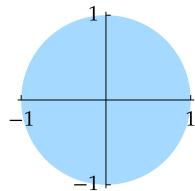
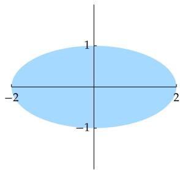
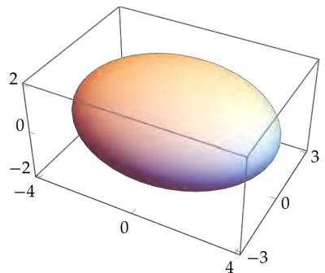
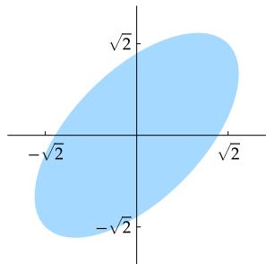
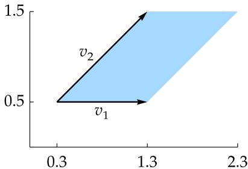
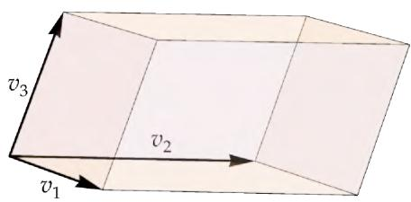
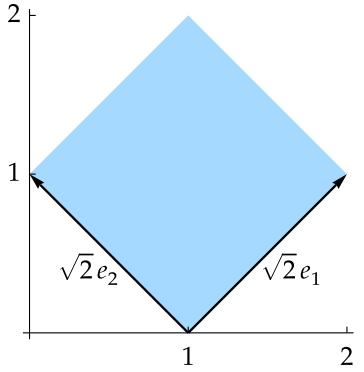
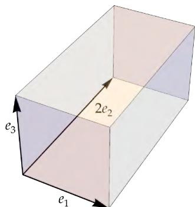
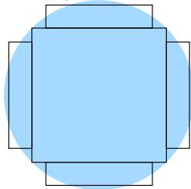
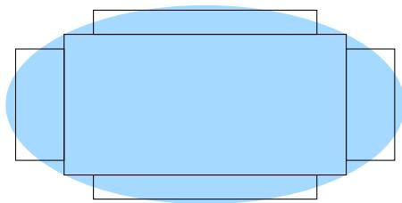

# 第7章 内积空间上的算子

与内积空间有关的最深刻的结果，涉及我们现在所要讨论的主题——内积空间上的线性映射和算子．我们将会看到，利用伴随的性质，可以证明一些很好的定理

极其重要的谱定理将全面地描述实内积空间上的自伴算子和复内积空间上的正规算子．然后我们将借助谱定理以理解正算子和幺正算子，这将引出幺正矩阵和矩阵分解．谱定理也将引出相当常用的奇异值分解，奇异值分解又将引出极分解

本书剩余部分最重要的结果都只在有限的维数下成立．所以从现在开始我们假设?? 和??是有限维的

# 以下假设在本章中总是成立：

F 表示 R 或 C  
$V$ 和?? 是F上的非零有限维内积空间

  
Petar Milošević CC BY-SA

图为利沃夫（Lviv）的集市广场．由于国界线的变化，这座城市曾有过多个名字，也曾被划进过多个国家．从1772年到1918年，这座城市位于奥地利，并被称为伦贝格（Lemberg）．在第一次世界大战和第二次世界大战之间，这座城市位于波兰，并被称为利沃夫（Lwów）．在此期间，利沃夫的数学家们，特别是斯特凡·巴拿赫（Stefan Banach，1892-1945）和他的同事们利用分析学的工具研究无限维向量空间，逐步建立了现代泛函分析的基本结论．自第二次世界大战结束以来，利沃夫一直位于乌克兰，而后者在1991年宣告独立之前曾是苏联的一部分

# 7A 自伴算子和正规算子

# 伴随

# 7.1 定义：伴随（adjoint）、??∗

设 $T \in { \mathcal { L } } ( V , W )$ ． $T$ 的伴随是使得对任一 $\nu \in V$ 和任一 $w \in W$ 都有

$$
\langle T v, w \rangle = \langle v, T ^ {*} w \rangle
$$

的函数 $T ^ { * } : W \to V$

下面看看以上定义为什么是有意义的：设 $T \in { \mathcal { L } } ( V , W )$ ，取定 $w ~ \in ~ W$ ，考虑 $V$ 上的线性泛函

“伴随”这个词在线性代数里还有另一种含义，你要是在别的地方遇到了，要注意它和此处的“伴随”互不相关

$$
v \mapsto \langle T v, w \rangle ,
$$

它将 $\nu \in V$ 映射到 $\langle T \nu , w \rangle$ ．该线性泛函依赖于 $T$ 和 $w$ ．根据里斯表示定理（6.42）， $V$ 中存在唯一的向量，使得该线性泛函由与它的内积给出．我们称这唯一的向量为 $T ^ { * } w$ ．换句话说， $T ^ { * } w$ 是 $V$ 中使得对任一 $\nu \in V$ 都有

$$
\langle T v, w \rangle = \langle v, T ^ {*} w \rangle
$$

的唯一向量

上式中，左侧的内积是在?? 上的，右侧的内积是在 $V$ 上的．不过，我们对这两种内积用相同的记号 $\langle \cdot , \cdot \rangle$

# 7.2 例：从 $\mathbf { R } ^ { 3 }$ 到 $\mathbf { R } ^ { 2 }$ 的一线性映射之伴随

定义 $T : \mathbf { R } ^ { 3 }  \mathbf { R } ^ { 2 }$ 为

$$
T \left(x _ {1}, x _ {2}, x _ {3}\right) = \left(x _ {2} + 3 x _ {3}, 2 x _ {1}\right).
$$

为了计算 $T ^ { * }$ ，设 $( x _ { 1 } , x _ { 2 } , x _ { 3 } ) \in \mathbf { R } ^ { 3 }$ 和 $( y _ { 1 } , y _ { 2 } ) \in \mathbf { R } ^ { 2 }$ ．从而有

$$
\begin{array}{l} \left\langle T \left(x _ {1}, x _ {2}, x _ {3}\right), \left(y _ {1}, y _ {2}\right) \right\rangle = \left\langle \left(x _ {2} + 3 x _ {3}, 2 x _ {1}\right), \left(y _ {1}, y _ {2}\right) \right\rangle \\ = x _ {2} y _ {1} + 3 x _ {3} y _ {1} + 2 x _ {1} y _ {2} \\ = \left\langle \left(x _ {1}, x _ {2}, x _ {3}\right), \left(2 y _ {2}, y _ {1}, 3 y _ {1}\right) \right\rangle . \\ \end{array}
$$

根据上式以及伴随的定义可得

$$
T ^ {*} \left(y _ {1}, y _ {2}\right) = \left(2 y _ {2}, y _ {1}, 3 y _ {1}\right).
$$

# 7.3 例：值域维数至多为1的一线性映射之伴随

取定 $u \in V$ 和 $x \in W$ ．定义 $T \in { \mathcal { L } } ( V , W )$ 为：对任一 $\nu \in V$ 都有

$$
T v = \langle v, u \rangle x.
$$

转下页

为了计算 $T ^ { * }$ ，设 $\nu \in V$ 和 $w \in W$ ．从而有

$$
\begin{array}{l} \langle T v, w \rangle = \left\langle \langle v, u \rangle x, w \right\rangle \\ = \langle v, u \rangle \langle x, w \rangle \\ = \left\langle v, \langle w, x \rangle u \right\rangle . \\ \end{array}
$$

因此，

$$
T ^ {*} w = \langle w, x \rangle u.
$$

在以上两例中，最后得到的 $T ^ { * }$ 不但是从?? 到 $V$ 的函数，还是从 ?? 到 $V$ 的线性映射下个结果表明，这在一般情况下都是成立的

以上两例以及下面的证明用到了计算 $T ^ { * }$ 的常用方法：从 $\langle T \nu , w \rangle$ 的表达式开始，然后处理一番，使得 $\langle \cdot , \cdot \rangle$ 的前一个位置里只有 $\nu$ ，那么后一个位置里就是 $T ^ { * } w$ 了

# 7.4 线性映射的伴随是线性映射

如果 $T \in { \mathcal { L } } ( V , W )$ ，那么 $T ^ { * } \in { \mathcal { L } } ( W , V )$

证明 设 $T \in { \mathcal { L } } ( V , W )$ ．如果 $\nu \in V$ 且 $w _ { 1 } , w _ { 2 } \in W$ ，那么

$$
\begin{array}{l} \langle T v, w _ {1} + w _ {2} \rangle = \langle T v, w _ {1} \rangle + \langle T v, w _ {2} \rangle \\ = \langle v, T ^ {*} w _ {1} \rangle + \langle v, T ^ {*} w _ {2} \rangle \\ = \langle v, T ^ {*} w _ {1} + T ^ {*} w _ {2} \rangle . \\ \end{array}
$$

上式表明

$$
T ^ {*} \left(w _ {1} + w _ {2}\right) = T ^ {*} w _ {1} + T ^ {*} w _ {2}.
$$

如果 $\nu \in V$ 、 $\lambda \in \mathbf { F }$ 且 $w \in W$ ，那么

$$
\begin{array}{l} \langle T v, \lambda w \rangle = \bar {\lambda} \langle T v, w \rangle \\ = \bar {\lambda} \langle v, T ^ {*} w \rangle \\ = \left\langle v, \lambda T ^ {*} w \right\rangle . \\ \end{array}
$$

上式表明

$$
T ^ {*} (\lambda w) = \lambda T ^ {*} w.
$$

因此， $T ^ { * }$ 是线性映射，命题得证

# 7.5 伴随的性质

设 $T \in { \mathcal { L } } ( V , W )$ ，那么有：

(a) $( S + T ) ^ { * } = S ^ { * } + T ^ { * }$ 对所有 $S \in { \mathcal { L } } ( V , W )$ 成立；  
(b) $( \lambda T ) ^ { * } = { \overline { { \lambda } } } T ^ { * }$ 对所有 $\lambda \in \mathbf { F }$ 成立；  
(c) $\left( T ^ { * } \right) ^ { * } = T$   
(d) $\left( S T \right) ^ { \ast } = T ^ { \ast } S ^ { \ast }$ 对所有 $S \in { \mathcal { L } } ( W , U )$ 成立（这里 $U$ 是 $\mathbf { F }$ 上的有限维内积空间）；  
(e) $I ^ { * } = I$ ，其中 $I$ 是 $V$ 上的恒等算子；  
(f) 如果 $T$ 可逆，那么 $T ^ { * }$ 可逆且 $\left( T ^ { * } \right) ^ { - 1 } = \left( T ^ { - 1 } \right) ^ { * }$

证明 设 $\nu \in V$ 且 $w \in W$

(a) 如果 $S \in { \mathcal { L } } ( V , W )$ ，那么

$$
\begin{array}{l} \left\langle (S + T) v, w \right\rangle = \left\langle S v, w \right\rangle + \left\langle T v, w \right\rangle \\ = \langle v, S ^ {*} w \rangle + \langle v, T ^ {*} w \rangle \\ = \langle v, S ^ {*} w + T ^ {*} w \rangle . \\ \end{array}
$$

因此 $\left( S + T \right) ^ { * } w = S ^ { * } w + T ^ { * } w$ ，命题得证

(b) 如果 $\lambda \in \mathbf { F }$ ，那么

$$
\left\langle (\lambda T) v, w \right\rangle = \lambda \langle T v, w \rangle = \lambda \langle v, T ^ {*} w \rangle = \langle v, \bar {\lambda} T ^ {*} w \rangle .
$$

因此 $( \lambda T ) ^ { * } w = { \overline { { \lambda } } } T ^ { * } w$ ，命题得证

(c) 因为

$$
\langle T ^ {*} w, v \rangle = \overline {{\langle v , T ^ {*} w \rangle}} = \overline {{\langle T v , w \rangle}} = \langle w, T v \rangle ,
$$

所以 $\left( T ^ { * } \right) ^ { * } \nu = T \nu$ ，命题得证

(d) 设 $S \in { \mathcal { L } } ( W , U )$ 和 $u \in U$ ，从而有

$$
\left\langle (S T) v, u \right\rangle = \left\langle S (T v), u \right\rangle = \left\langle T v, S ^ {*} u \right\rangle = \left\langle v, T ^ {*} \left(S ^ {*} u\right) \right\rangle .
$$

因此 $( S T ) ^ { * } u = T ^ { * } ( S ^ { * } u )$ ，命题得证

(e) 设 $u \in V$ ．从而有

$$
\langle I u, v \rangle = \langle u, v \rangle .
$$

因此 $I ^ { * } \nu = \nu$ ，命题得证

(f) 设 $T$ 可逆．对等式 $T ^ { - 1 } T = I$ 两边取伴随，然后用(d)和(e)证得 $T ^ { * } { \left( T ^ { - 1 } \right) } ^ { * } = I$ ．类似地，由$T T ^ { - 1 } = I$ 可得 $\left( T ^ { - 1 } \right) ^ { * } T ^ { * } = I .$ ．因此， $\left( T ^ { - 1 } \right) ^ { * }$ 是 $T ^ { * }$ 的逆，命题得证

如果 $\mathbf { F } = \mathbf { R }$ ，那么根据以上结果的 (a) 和 (b)， $T \mapsto T ^ { * }$ 这一映射是从 $\mathcal { L } ( V , W )$ 到 $\mathcal { L } ( W , V )$ 的线性映射．然而，如果 $\mathbf { F } = \mathbf { C }$ ，那么该映射不是线性的，这是由于(b) 中出现的复共轭

下面的结果揭示了线性映射同其伴随的零空间和值域之间的关系

# 7.6 ??∗ 的零空间和值域

设 $T \in { \mathcal { L } } ( V , W )$ ，那么有：

(a) $\mathrm { n u l l } T ^ { * } = ( \mathrm { r a n g e } T ) ^ { \perp }$ ；  
(b) range $T ^ { * } = ( \mathrm { n u l l } T ) ^ { \perp }$ ；  
(c) null ?? = (range ??∗)⊥；   
(d) range $T = ( \mathrm { n u l l } T ^ { * } ) ^ { \perp }$

证明 我们先证明(a)．令 $w \in W$ ，从而有

$$
\begin{array}{l} w \in \operatorname {n u l l} T ^ {*} \iff T ^ {*} w = 0 \\ \Longleftrightarrow \langle v, T ^ {*} w \rangle = 0 \text {对 所 有} v \in V \text {成 立} \\ \Longleftrightarrow \langle T v, w \rangle = 0 \text {对 所 有} v \in V \text {成 立} \\ \Longleftrightarrow w \in (\operatorname {r a n g e} T) ^ {\perp}. \\ \end{array}
$$

因此， $\mathrm { n u l l } T ^ { * } = ( \mathrm { r a n g e } T ) ^ { \perp }$ ，(a) 得证

如果我们对(a)的两侧求正交补，我们就得到了(d)，其中用到了6.52．在(a)中将 $T$ 替换成 $T ^ { * }$ ，就得到了(c)，其中用到了7.5(c)．最后，在(d)中将 $T$ 替换成 $T ^ { * }$ ，就得到了(b) ■

我们很快会看到，接下来的定义与线性映射的伴随的矩阵密切相关

# 7.7 定义：共轭转置（conjugate transpose）、??∗

$m \times n$ 矩阵 $A$ 的共轭转置是将其行列互换再对每个元素取复共轭得到的 $n \times m$ 矩阵 $A ^ { * }$ 换句话说，如果 $j \in \{ 1 , \ldots , n \}$ 且 $k \in \{ 1 , \ldots , m \}$ ，那么有

$$
\left(A ^ {*}\right) _ {j, k} = \overline {{A _ {k , j}}}.
$$

# 7.8 例：一个 $2 \times 3$ 矩阵的共轭转置

$2 \times 3$ 矩阵 $\left( \begin{array} { c c c } { { 2 } } & { { 3 + 4 \mathrm { i } } } & { { 7 } } \\ { { 6 } } & { { 5 } } & { { 8 \mathrm { i } } } \end{array} \right)$ 的共轭转置 是 $3 \times 2$ 矩阵

若矩阵 ?? 只含有实元素，则 $A ^ { * } = A ^ { \mathfrak { t } }$ ，其中$A ^ { \mathfrak { t } }$ 表示 ?? 的转置（行列互换得到的矩阵）．

$$
\left( \begin{array}{c c} 2 & 6 \\ 3 - 4 \mathrm {i} & 5 \\ 7 & - 8 \mathrm {i} \end{array} \right).
$$

接下来这条结果展示了如何从 $T$ 的矩阵计算出 $T ^ { * }$ 的矩阵．注意：关于非规范正交基，$T ^ { * }$ 的矩阵不一定等于 $T$ 的矩阵的共轭转置

线性映射的伴随不依赖于基的选取．因此我们经常强调的是线性映射的伴随，而不是矩阵的转置或共轭转置

# 7.9 ??∗ 的矩阵等于 ?? 的矩阵的共轭转置

令 $T \in { \mathcal { L } } ( V , W )$ ．设 $e _ { 1 } , \ldots , e _ { n }$ 是 $V$ 的规范正交基， $f _ { 1 } , \ldots , f _ { m }$ 是 ?? 的规范正交基．那么 $M ( T ^ { * } , ( f _ { 1 } , \dots , f _ { m } ) , ( e _ { 1 } , \dots , e _ { n } ) )$ 是 $M ( T , ( e _ { 1 } , \ldots , e _ { n } ) , ( f _ { 1 } , \ldots , f _ { m } ) )$ 的共轭转置．换句话说，

$$
\mathcal {M} (T ^ {*}) = \left(\mathcal {M} (T)\right) ^ {*}.
$$

证明 在本证明中，我们把 $M ( T , ( e _ { 1 } , \ldots , e _ { n } ) , ( f _ { 1 } , \ldots , f _ { m } ) )$ 和 $M ( T ^ { * } , ( f _ { 1 } , \dots , f _ { m } ) , ( e _ { 1 } , \dots , e _ { n } ) )$ $\left( e _ { 1 } , \ldots , e _ { n } \right) \Biggr )$ 这两个较长的表达式，分别写成 $M ( T )$ 和 $M ( T ^ { * } )$

回顾一下， $M ( T )$ 的第 $k$ 列，是通过把 $T e _ { k }$ 写成各 $f _ { j }$ 的线性组合得到的——该线性组合中所用的标量就成为 $M ( T )$ 的第 $k$ 列．因为 $f _ { 1 } , \ldots , f _ { m }$ 是 $W$ 的规范正交基，所以我们知道如何把 $T e _ { k }$ 写成各 $f _ { j }$ 的线性组合【见6.30(a)】：

$$
T e _ {k} = \left\langle T e _ {k}, f _ {1} \right\rangle f _ {1} + \dots + \left\langle T e _ {k}, f _ {m} \right\rangle f _ {m}.
$$

因此

$M ( T )$ 的 $j$ 行 $k$ 列元素是 $\langle T e _ { k } , f _ { j } \rangle$

在以上表述中，将 $T$ 替换成 $T ^ { * }$ ，并互换 $e _ { 1 } , \ldots , e _ { n }$ 和 $f _ { 1 } , \ldots , f _ { m }$ ，就证得 $M ( T ^ { * } )$ 的 $j$ 行 $k$ 列元素为 $\langle T ^ { * } f _ { k } , e _ { j } \rangle$ ．这等于 $\langle f _ { k } , T e _ { j } \rangle$ ，进而等于 $\overline { { \langle T e _ { j } , f _ { k } \rangle } }$ ，而这就等于 $M ( T )$ 的 $k$ 行 $j$ 列元素的复共轭．因此 $\boldsymbol { \mathcal { M } } ( T ^ { * } ) = \left( \boldsymbol { \mathcal { M } } ( T ) \right) ^ { * }$ ■

里斯表示定理（6.58 中所述）指出了 $V$ 和其对偶空间 $V ^ { \prime }$ （在 3.110 中定义）的等同关系在这一等同关系下，子集 $U \subseteq V$ 的正交补 $U ^ { \perp }$ 对应于 $U$ 的零化子 $U ^ { 0 }$ ．如果 $U$ 是 $V$ 的子空间，那么在这一等同关系下， $U ^ { \perp }$ 和 $U ^ { 0 }$ 的维数公式就等同起来了——见3.125和6.51

设 $T : V \to W$ 是一线性映射．在 $V$ 和 $V ^ { \prime }$ 的等同关系与?? 和 $W ^ { \prime }$ 的等同关系之下，伴随映射 $T ^ { * } : W \to V$ 对应于对偶映射 $T ^ { \prime } : W ^ { \prime } \to { }$

比起零化子和对偶映射，正交补和伴随更容 易处理．所以在内积空间的背景下，就不需 要处理零化子和对偶映射了

$V ^ { \prime }$ （在 3.118 中定义），这也是你在本节习题 32 中所要验证的．在这一等同关系下，null $T ^ { * }$ 和range $T ^ { * }$ 的公式【7.6 (a) 和 (b)】就跟 null $T ^ { \prime }$ 和 range $T ^ { \prime }$ 的公式【3.128 (a) 和 3.130 (b)】完全一致．此外，有关 $T ^ { * }$ 的矩阵的定理（7.9）也类似于有关 $T ^ { \prime }$ 的矩阵的定理（3.132）

# 自伴算子

现在，我们把注意力转向内积空间上的算子．我们关注的不是从?? 到?? 的线性映射，而是从 $V$ 到 $V$ 的线性映射．回顾一下，这样的线性映射就叫做算子

# 7.10 定义：自伴（self-adjoint）

算子 $T \in { \mathcal { L } } ( V )$ 称为自伴的，如果 $T = T ^ { * }$ .

如果 $T \in { \mathcal { L } } ( V )$ 且 $e _ { 1 } , \ldots , e _ { n }$ 是 $V$ 的规范正交基，那么 $T$ 是自伴的当且仅当 $\boldsymbol { \mathcal { M } } ( T , ( e _ { 1 } , \ldots , e _ { n } ) ) =$ $M ( T , ( e _ { 1 } , \ldots , e _ { n } ) ) ^ { * }$ ．这是由7.9推得的

# 7.11 例：根据 $T$ 的矩阵确定其是否自伴

设 $c \in \mathbf { F }$ 且 $T$ 是 $\mathbf { F } ^ { 2 }$ 上的算子，其关于标准基的矩阵是

$$
\mathcal {M} (T) = \left( \begin{array}{c c} 2 & c \\ 3 & 7 \end{array} \right).
$$

$T ^ { * }$ 关于标准基的矩阵是

$$
\mathcal {M} (T ^ {*}) = \left( \begin{array}{c c} 2 & 3 \\ \overline {{c}} & 7 \end{array} \right).
$$

因此 $\mathcal { M } ( T ) = \mathcal { M } ( T ^ { * } )$ 当且仅当 $c = 3$ ．于是，算子 $T$ 自伴当且仅当 $c = 3$

有个值得一记的好类比： $\mathcal { L } ( V )$ 上的伴随扮演了类似于C上的复共轭的角色．复数 $z$ 是实的当且仅当 $z = { \overline { { z } } }$ ；自伴算子（ $T = T ^ { * }$ ）就类似于实数

我们将看到，以上所讨论的类比，会在自伴算子的一些重要性质上体现出来，首先是下一条结果中的特征值

算子 $T \in { \mathcal { L } } ( V )$ 自伴，当且仅当

$$
\langle T v, w \rangle = \langle v, T w \rangle
$$

对所有 $\nu , w \in V$ 成立

如果 $\mathbf { F } = \mathbf { R }$ ，那么根据定义每个特征值都是实的．所以接下来这条结果只在 $\mathbf { F } = \mathbf { C }$ 的情形下引人兴趣

# 7.12 自伴算子的特征值

自伴算子的每个特征值都是实的

证明 设 $T$ 是 $V$ 上的自伴算子．令 ?? 是 $T$ 的特征值，再令 $\nu$ 是 $V$ 中使得 $T \nu = \lambda \nu$ 的非零向量那么有

$$
\lambda \| v \| ^ {2} = \langle \lambda v, v \rangle = \langle T v, v \rangle = \langle v, T v \rangle = \langle v, \lambda v \rangle = \overline {{\lambda}} \| v \| ^ {2}.
$$

因此 $\lambda = \overline { { \lambda } }$ ，意即 $\lambda$ 是实的，命题得证

接下来这条结果对于实内积空间而言是假命题．举个例子，考虑“绕原点逆时针旋转 $9 0 ^ { \circ ^ { \prime \prime } }$ ”这一算子 $T \in \mathcal { L } ( { \bf R } ^ { 2 } )$ ，那么 $T ( x , y ) = ( - y , x )$ ．注意到， $T \nu$ 正交于 $\nu$ 对任一 $ { \boldsymbol \nu } \in { \mathbf { R } } ^ { 2 }$ 都成立，尽管 $T \neq 0$

# 7.13 对所有 ?? 都有 ???? 正交于 ?? ⇐⇒ ?? = 0（假设 F = C）

设 $V$ 是复内积空间以及 $T \in { \mathcal { L } } ( V )$ ，那么

$$
\langle T v, v \rangle = 0 \text {对 任 一} v \in V \text {都 成 立} \iff T = 0.
$$

证明 如果 $u , w \in V$ ，那么有

$$
\begin{array}{l} \langle T u, w \rangle = \frac {\langle T (u + w) , u + w \rangle - \langle T (u - w) , u - w \rangle}{4} \\ + \frac {\left\langle T (u + \mathrm {i} w) , u + \mathrm {i} w \right\rangle - \left\langle T (u - \mathrm {i} w) , u - \mathrm {i} w \right\rangle}{4} \mathrm {i}. \\ \end{array}
$$

这可以通过计算右侧来验证．注意到，右侧的每一项都具有 $\langle T \nu , \nu \rangle$ （ $\nu \in V$ ）的形式

现在设 $\left. T \nu , \nu \right. = 0$ 对任一 $\nu \in V$ 都成立，那么上式意味着 $\langle T u , w \rangle = 0$ 对所有 $u , w \in V$ 成立．这意味着 $T u = 0$ 对任一 $u \in V$ 都成立（取 $w = T u$ ）．于是 $T = 0$ ，命题得证 ■

接下来这条结果对于实内积空间而言是假命题．考虑实内积空间上任何一个非自伴的算子，都能说明这点

关于自伴算子如何表现得像实数，下面这条结果给出了又一个好例子

# 7.14 ⟨????, ??⟩ 对所有 ?? 都是实的 ⇐⇒ ?? 是自伴的（假设 F = C）

设 $V$ 是复内积空间以及 $T \in { \mathcal { L } } ( V )$ ，那么

$$
T \text {是 自 伴 的} \iff \langle T v, v \rangle \in \mathbf {R} \text {对 任 一} v \in V \text {都 成 立}.
$$

证明 如果 $\nu \in V$ ，那么

$$
\langle T ^ {*} v, v \rangle = \overline {{\langle v , T ^ {*} v \rangle}} = \overline {{\langle T v , v \rangle}}. \tag {7.15}
$$

这样一来，就有

$$
\begin{array}{l} T \text {是 自 伴 的} \iff T - T ^ {*} = 0 \\ \Longleftrightarrow \langle (T - T ^ {*}) v, v \rangle = 0 \text {对 任 一} v \in V \text {都 成 立} \\ \Longleftrightarrow \langle T v, v \rangle - \overline {{\langle T v , v \rangle}} = 0 \text {对 任 一} v \in V \text {都 成 立} \\ \Longleftrightarrow \langle T v, v \rangle \in \mathbf {R} \text {对 任 一} v \in V \text {都 成 立}. \\ \end{array}
$$

其中第二个等价关系通过对 $T - T ^ { * }$ 应用7.13得到，第三个等价关系由式(7.15) 得到

在实内积空间 $V$ 上，一个非零算子 $T$ 也许会对所有 $\nu \in V$ 都满足 $\left. T \nu , \nu \right. = 0$ ．但是接下来这条结果表明，这不会发生在自伴算子上

# 7.16 ?? 自伴且 ⟨????, ??⟩ = 0 对所有 ?? 成立 ⇐⇒ ?? = 0

设 $T$ 是 $V$ 上的自伴算子，那么

$$
\langle T v, v \rangle = 0 \text {对 任 一} v \in V \text {都 成 立} \iff T = 0.
$$

证明 在 $V$ 是复内积空间的条件下，我们已经证明过这一定理，且无需假设 $T$ 自伴（见7.13）因此我们可以假设 $V$ 是实内积空间．如果 $u , w \in V$ ，那么有

$$
\langle T u, w \rangle = \frac {\langle T (u + w) , u + w \rangle - \langle T (u - w) , u - w \rangle}{4}. \tag {7.17}
$$

这可以通过计算右侧来证明．计算过程需用到下式：

$$
\langle T w, u \rangle = \langle w, T u \rangle = \langle T u, w \rangle ,
$$

其中第一个等号成立是因为 $T$ 自伴，第二个等号成立是因为我们在实内积空间里操作

现在设 $\left. T \nu , \nu \right. = 0$ 对任一 $\nu \in V$ 都成立．因为式(7.17)的右侧每一项都具有 $\langle T \nu , \nu \rangle$ （ $\nu \in V$ ）的形式，所以这意味着 $\langle T u , w \rangle = 0$ 对所有 $u , w \in V$ 成立．这又意味着 $T u = 0$ 对任一 $\nu \in V$ 都成立（取 $w = T u$ ）．于是， $T = 0$ ，命题得证 ■

# 正规算子

# 7.18 定义：正规（normal）

内积空间上的算子被称为正规的，如果它与它的伴随可交换  
换句话说， $T \in { \mathcal { L } } ( V )$ 是正规的，如果 $T T ^ { * } = T ^ { * } T$

每个自伴算子都是正规的，这是因为，如果 $T$ 自伴，那么 $T ^ { * } = T$ ，于是 $T$ 和 $T ^ { * }$ 可交换

# 7.19 例：正规但不自伴的算子

令 $T$ 是 $\mathbf { F } ^ { 2 }$ 上的算子，其关于标准基的矩阵是

$$
\left( \begin{array}{c c} 2 & - 3 \\ 3 & 2 \end{array} \right).
$$

因此 $T ( w , z ) = ( 2 w - 3 z , 3 w + 2 z )$

该算子 $T$ 并不是自伴的，因为其矩阵第 2 行第 1 列的元素（等于 3）不等于第 1 行第 2列的元素（等于−3）的复共轭

$T T ^ { * }$ 的矩阵等于

$$
\left( \begin{array}{c c} {{2}} & {{- 3}} \\ {{3}} & {{2}} \end{array} \right) \left( \begin{array}{c c} {{2}} & {{3}} \\ {{- 3}} & {{2}} \end{array} \right),     \text {等 于}   \left( \begin{array}{c c} {{1 3}} & {{0}} \\ {{0}} & {{1 3}} \end{array} \right).
$$

类似地， $T ^ { * } T$ 的矩阵等于

$$
\left( \begin{array}{c c} {{2}} & {{3}} \\ {{- 3}} & {{2}} \end{array} \right) \left( \begin{array}{c c} {{2}} & {{- 3}} \\ {{3}} & {{2}} \end{array} \right),     \text {等 于}   \left( \begin{array}{c c} {{1 3}} & {{0}} \\ {{0}} & {{1 3}} \end{array} \right).
$$

因为 $T T ^ { * }$ 和 $T ^ { * } T$ 的矩阵相同，我们得知 $T T ^ { * } = T ^ { * } T$ ．因此 $T$ 是正规的

在下一节，我们将看到正规算子为什么值得特别关注．接下来这条结果给出了对正规算子的一个很有用的刻画

# 7.20 ?? 是正规的当且仅当 ???? 和 ??∗?? 的范数相同

设 $T \in { \mathcal { L } } ( V )$ ，那么有

$T$ 是正规的 $\iff \| T \nu \| = \| T ^ { * } \nu \|$ 对任一 $\nu \in V$ 都成立

# 证明

$$
\begin{array}{l} T \text {是 正 规 的} \Longleftrightarrow T ^ {*} T - T T ^ {*} = 0 \\ \Longleftrightarrow \langle \left(T ^ {*} T - T T ^ {*}\right) v, v \rangle = 0 \text {对 任 一} v \in V \text {都 成 立} \\ \Longleftrightarrow \langle T ^ {*} T v, v \rangle = \langle T T ^ {*} v, v \rangle \text {对 任 一} v \in V \text {都 成 立} \\ \Longleftrightarrow \langle T v, T v \rangle = \langle T ^ {*} v, T ^ {*} v \rangle \text {对 任 一} v \in V \text {都 成 立} \\ \Longleftrightarrow \| T \nu \| ^ {2} = \| T ^ {*} \nu \| ^ {2} \text {对 任 一} \nu \in V \text {都 成 立} \\ \Longleftrightarrow \| T v \| = \| T ^ {*} v \| \text {对 任 一} v \in V \text {都 成 立}. \\ \end{array}
$$

其中，我们用到了7.16来建立第二个等价关系（注意到算子 $T ^ { * } T - T T ^ { * }$ 是自伴的）

下一条结果展示了以上结果的几个推论．将下一条结果的 (e) 和本节习题 3 相比较：那道习题指出每个算子的伴随的特征值（作为集合）都等于该算子特征值的复共轭 1，而没有提及特征向量，因为算子同它的伴随可以有不同的特征向量．然而，下一条结果中的 (e) 表明，正规算子和它的伴随有完全相同的特征向量

# 7.21 正规算子的值域、零空间和特征向量

设 $T \in { \mathcal { L } } ( V )$ 是正规的，那么有：

(a) null $T = \mathrm { \ n u l l } T ^ { * }$ ；  
(b) range $T =$ range $T ^ { * }$ ；  
(c) $V = { \mathrm { n u l l } } T \oplus$ range $T$ ；  
(d) 对任一 $\lambda \in \mathbf { F }$ ， $T - \lambda I$ 都是正规的；   
(e) 如果 $\nu \in V$ 且 $\lambda \in \mathbf { F }$ ，那么 $T \nu = \lambda \nu$ 当且仅当 $T ^ { * } \nu = \overline { { \lambda } } \nu$

# 证明

(a) 设 $\nu \in V$ ，那么有

$$
v \in \operatorname {n u l l} T \iff \| T v \| = 0 \iff \| T ^ {*} v \| = 0 \iff v \in \operatorname {n u l l} T ^ {*}.
$$

以上等价关系的中间那个由 7.20得到．因此，null $T = \mathrm { n u l l } T ^ { * }$

(b)

$$
\operatorname {r a n g e} T = \left(\operatorname {n u l l} T ^ {*}\right) ^ {\perp} = \left(\operatorname {n u l l} T\right) ^ {\perp} = \operatorname {r a n g e} T ^ {*}.
$$

其中，第一个相等关系来自 7.6 (d)，第二个相等关系来自本结果的 (a)，第三个相等关系来自 7.6 (b)

(c)

$$
V = (\operatorname {n u l l} T) \oplus (\operatorname {n u l l} T) ^ {\perp} = \operatorname {n u l l} T \oplus \operatorname {r a n g e} T ^ {*} = \operatorname {n u l l} T \oplus \operatorname {r a n g e} T.
$$

其中，第一个相等关系来自6.49，第二个相等关系来自7.6(b)，第三个相等关系来自本结果的 (b)

(d) 设 $\lambda \in \mathbf { F }$ ，那么有

$$
\begin{array}{l} (T - \lambda I) (T - \lambda I) ^ {*} = (T - \lambda I) (T ^ {*} - \bar {\lambda} I) \\ = T T ^ {*} - \bar {\lambda} T - \lambda T ^ {*} + | \lambda | ^ {2} I \\ = T ^ {*} T - \bar {\lambda} T - \lambda T ^ {*} + | \lambda | ^ {2} I \\ = \left(T ^ {*} - \bar {\lambda} I\right) (T - \lambda I) \\ = (T - \lambda I) ^ {*} (T - \lambda I). \\ \end{array}
$$

因此， $T - \lambda I$ 和它的伴随可交换．于是 $T - \lambda I$ 是正规的

(e) 设 $\nu \in V$ 且 $\lambda \in \mathbf { F }$ ．那么 (d) 和 7.20 蕴涵

$$
\left\| (T - \lambda I) v \right\| = \left\| (T - \lambda I) ^ {*} v \right\| = \left\| (T ^ {*} - \bar {\lambda} I) v \right\|.
$$

因此， $\| ( T - \lambda I ) \nu \| = 0$ 当且仅当 $\| \big ( T ^ { * } - \overline { { \lambda } } I \big ) \nu \| = 0$ ．于是 $T \nu = \lambda \nu$ 当且仅当 $T ^ { * } \nu = \overline { { \lambda } } \nu$

因为每个自伴算子都是正规的，所以下一条结果也适用于自伴算子

# 7.22 正规算子的正交特征向量

设 $T \in { \mathcal { L } } ( V )$ 是正规的．那么 $T$ 的对应于不同特征值的特征向量正交

证明 设 $\alpha , \beta$ 是 $T$ 的不同特征值，对应的特征向量是 $u , \nu$ ．因此 $T u = \alpha u$ 且 $T \nu = \beta \nu$ ．根据 7.21(e)，有 $T ^ { * } \nu = \overline { { \beta } } \nu$ ．因此

$$
\begin{array}{l} (\alpha - \beta) \langle u, v \rangle = \langle \alpha u, v \rangle - \langle u, \bar {\beta} v \rangle \\ = \langle T u, v \rangle - \langle u, T ^ {*} v \rangle \\ = 0. \\ \end{array}
$$

因为 $\alpha \neq \beta$ ，所以上式表明 $\langle u , \nu \rangle = 0$ ．因此 $u$ 和 $\nu$ 正交，命题得证

如下所述，下一条结果仅在 $\mathbf { F } = \mathbf { C }$ 条件下有意义．然而在本节习题 12 中，可以看到一个不论 $\mathbf { F } = \mathbf { C }$ 还是 $\mathbf { F } = \mathbf { R }$ 都有意义的版本

设 $\mathbf { F } = \mathbf { C }$ 且 $T \in { \mathcal { L } } ( V )$ ．将 $\mathcal { L } ( V )$ 类比为 $\mathbf { C }$ ， $\mathcal { L } ( V )$ 上的伴随就如同C上的复共轭，那么由式 (7.24) 定义的算子 $A$ 和 $B$ 也就相当于 $T$ 的“实部”和“虚部”．这样一来，以下结果的非正式标题才有了意义

# 7.23 ?? 是正规的 ⇐⇒ ?? 的实部和虚部可交换

设 $\mathbf { F } = \mathbf { C }$ 且 $T \in { \mathcal { L } } ( V )$ ．那么， $T$ 是正规的当且仅当存在可交换的自伴算子 ?? 和 $B$ 使得$T = A + \mathrm { i } B$

证明 首先，设 $T$ 是正规的．令

$$
A = \frac {T + T ^ {*}}{2} \quad \text {且} \quad B = \frac {T - T ^ {*}}{2 \mathrm {i}}. \tag {7.24}
$$

那么 $A$ 和 $B$ 是自伴的且 $T = A + \mathrm { i } B$ ．可以很快计算得

$$
A B - B A = \frac {T ^ {*} T - T T ^ {*}}{2 \mathrm {i}}. \tag {7.25}
$$

因为 $T$ 是正规的，所以上式右侧等于 0．因此，算子 ?? 和 $B$ 可交换，此方向得证

为了证明另一方向的蕴涵关系，现在假设存在可交换的自伴算子 ?? 和 $B$ 使得 $T = A + \mathrm { i } B$ ，那么 $T ^ { * } = A - \mathrm { i } B$ ．将前面这两个式子相加再除以2，得到式(7.24)中 $A$ 的式子；将前面这两个式子相减再除以 2i，得到式 (7.24) 中 $B$ 的式子．这样一来，式 (7.24) 就蕴涵式 (7.25)．因为 $B$ 和 $A$ 可交换，所以式(7.25)蕴涵 $T$ 是正规的，此方向得证 ■

# K习题 7Ak

1 设 $n$ 是一正整数．定义 $T \in { \mathcal { L } } ( \mathbf { F } ^ { n } )$ 为

$$
T \left(z _ {1}, \dots , z _ {n}\right) = \left(0, z _ {1}, \dots , z _ {n - 1}\right).
$$

求 $T ^ { * } ( z _ { 1 } , \ldots , z _ { n } )$ 的表达式

2 设 $T \in { \mathcal { L } } ( V , W )$ ．证明：

$$
T = 0 \iff T ^ {*} = 0 \iff T ^ {*} T = 0 \iff T T ^ {*} = 0.
$$

3 设 $T \in { \mathcal { L } } ( V )$ 和 $\lambda \in \mathbf { F }$ ．证明：

$\lambda$ 是 $T$ 的特征值 $\Longleftrightarrow \bar { \lambda }$ 是 $T ^ { * }$ 的特征值

4 设 $T \in { \mathcal { L } } ( V )$ 且 $U$ 是 $V$ 的子空间．证明：

$U$ 在 $T$ 下不变 $\Longleftrightarrow \ U ^ { \perp }$ 在 $T ^ { * }$ 下不变

5 设 $T \in { \mathcal { L } } ( V , W )$ ．设 $e _ { 1 } , \ldots , e _ { n }$ 是 $V$ 的规范正交基， $f _ { 1 } , \ldots , f _ { m }$ 是 $W$ 的规范正交基．证明：

$$
\left\| T e _ {1} \right\| ^ {2} + \dots + \left\| T e _ {n} \right\| ^ {2} = \left\| T ^ {*} f _ {1} \right\| ^ {2} + \dots + \left\| T ^ {*} f _ {m} \right\| ^ {2}.
$$

注 上式中的 $\| T e _ { 1 } \| ^ { 2 } , \ldots , \| T e _ { n } \| ^ { 2 }$ 各项依赖于规范正交基 $e _ { 1 } , \ldots , e _ { n }$ ，但右侧不依赖于 $e _ { 1 } , \ldots , e _ { n }$ 因此上式表明，左侧的和不取决于 $e _ { 1 } , \ldots , e _ { n }$ 选择的是哪个规范正交基

6 设 $T \in { \mathcal { L } } ( V , W )$ ．证明：

(a) $T$ 是单射 $ T ^ { * }$ 是满射；  
(b) $T$ 是满射 $\Longleftrightarrow T ^ { * }$ 是单射

7 证明：如果 $T \in { \mathcal { L } } ( V , W )$ ，那么

(a) dim null ??∗ = dim null ?? + dim ?? − dim ??；  
(b) dim range ??∗ = dim range $T$

8 设 $A$ 为 $m \times n$ 矩阵，其元素在 $\mathbf { F }$ 中．用第7题的(b)证明：?? 的行秩等于 ?? 的列秩

注 题述结果在3.57和3.133中已经证明过了，本题要求换种方式证明

9 证明： $V$ 上的两自伴算子的乘积是自伴的，当且仅当这两个算子可交换

10 设 $\mathbf { F } = \mathbf { C }$ 且 $T \in { \mathcal { L } } ( V )$ ．证明： $T$ 是自伴的，当且仅当

$$
\langle T v, v \rangle = \langle T ^ {*} v, v \rangle
$$

对所有 $\nu \in V$ 成立

11 定义算子 $S : \mathbf { F } ^ { 2 }  \mathbf { F } ^ { 2 }$ 为 $S ( w , z ) = ( - z , w )$

(a) 求 $S ^ { * }$ 的表达式  
(b) 证明：?? 正规但不自伴  
(c) 求 ?? 的所有特征值

注 如果 $\mathbf { F } = \mathbf { R }$ ，那么 $S$ 是 $\mathbf { R } ^ { 2 }$ 上“逆时针旋转 $9 0 ^ { \circ }$ ”这一算子

12 称算子 $B \in { \mathcal { L } } ( V )$ 是斜的（skew）2，如果

$$
B ^ {*} = - B.
$$

设 $T \in { \mathcal { L } } ( V )$ ，证明： $T$ 是正规的，当且仅当存在可交换算子 $A$ 和 $B$ 使得 $A$ 是自伴的， $B$ 是斜算子，且 $T = A + B$

13 设 $\mathbf { F } = \mathbf { R }$ ．定义 $\mathcal { A } \in \mathcal { L } ( \mathcal { L } ( V ) )$ 为：对所有 $T \in { \mathcal { L } } ( V )$ 都有 $\mathcal { A } T = T ^ { * }$

(a) 求 $\mathcal { A }$ 的所有特征值  
(b) 求 $\mathcal { A }$ 的最小多项式

14 在 $\mathcal { P } _ { 2 } ( \mathbf { R } )$ 上定义一内积为 $\textstyle \langle p , q \rangle = \int _ { 0 } ^ { 1 } p q$ ．定义算子 $T \in \mathcal { L } \big ( \mathcal { P } _ { 2 } ( { \bf R } ) \big )$ 为

$$
T \left(a x ^ {2} + b x + c\right) = b x.
$$

(a) 证明：该内积下， $T$ 不是自伴的  
(b) $T$ 关于基 $1 , x , x ^ { 2 }$ 的矩阵是

$$
\left( \begin{array}{c c c} 0 & 0 & 0 \\ 0 & 1 & 0 \\ 0 & 0 & 0 \end{array} \right).
$$

这个矩阵等于它的共轭转置，尽管 $T$ 不是自伴的．解释为什么这不矛盾

15 设 $T \in { \mathcal { L } } ( V )$ 可逆．证明：

(a) $T$ 自伴 $\Longleftrightarrow T ^ { - 1 }$ 自伴；  
(b) $T$ 正规 $\Longleftrightarrow T ^ { - 1 }$ 正规

16 设 $\mathbf { F } = \mathbf { R }$

(a) 证明： $V$ 上的自伴算子构成的集合是 $\mathcal { L } ( V )$ 的子空间  
(b) (a) 中这个子空间的维数是多少？（用 $\dim V$ 表示）

17 设 $\mathbf { F } = \mathbf { C }$ ．证明： $V$ 上的自伴算子构成的集合不是 $\mathcal { L } ( V )$ 的子空间  
18 设 $\dim V \geq 2$ ．证明： $V$ 上的正规算子构成的集合不是 $\mathcal { L } ( V )$ 的子空间  
19 设 $T \in { \mathcal { L } } ( V )$ 且对任一 $\nu \in V$ 都有 $\left\| T ^ { * } \nu \right\| \leq \left\| T \nu \right\|$ ．证明： $T$ 是正规的

注 本题在无限维内积空间上不成立，从而引出了所谓亚正规算子（hyponormal opera-tors）．关于此类算子，已有较完善的理论

20 设 $P \in { \mathcal { L } } ( V )$ 使得 $P ^ { 2 } = P$ ．证明下列等价：

(a) $P$ 是自伴的  
(b) $P$ 是正规的  
(c) 存在 $V$ 的子空间 $U$ 使得 $P = P _ { U }$

21 设 $D : \mathcal { P } _ { 8 } ( \mathbf { R } )  \mathcal { P } _ { 8 } ( \mathbf { R } )$ 是定义为 $D p = p ^ { \prime }$ 的微分算子．证明： $\mathcal { P } _ { 8 } ( \mathbf { R } )$ 上不存在能使 $D$ 成为正规算子的内积  
22 给出一例：算子 $T \in \mathcal { L } ( { \bf R } ^ { 3 } )$ 正规但不自伴   
23 设 $T$ 是 $V$ 上的正规算子．设 $\nu , w \in V$ 满足下列各式：

$$
\| v \| = \| w \| = 2, \quad T v = 3 v, \quad T w = 4 w.
$$

证明： $\| T ( \nu + w ) \| = 1 0$

24 设 $T \in { \mathcal { L } } ( V )$ 且

$$
a _ {0} + a _ {1} z + a _ {2} z ^ {2} + \dots + a _ {m - 1} z ^ {m - 1} + z ^ {m}
$$

是 $T$ 的最小多项式．证明： $T ^ { * }$ 的最小多项式是

$$
\overline {{a _ {0}}} + \overline {{a}} _ {1} z + \overline {{a}} _ {2} z ^ {2} + \dots + \overline {{a}} _ {m - 1} z ^ {m - 1} + z ^ {m}.
$$

注 本题表明，如果 $\mathbf { F } = \mathbf { R }$ ，那么 $T ^ { * }$ 的最小多项式等于 $T$ 的最小多项式

25 设 $T \in { \mathcal { L } } ( V )$ ．证明： $T$ 可对角化，当且仅当 $T ^ { * }$ 可对角化  
26 给定 $u , x \in V$ ．定义 $T \in { \mathcal { L } } ( V )$ 为：对任一 $\nu \in V$ 都有 $T \nu = \langle \nu , u \rangle x$

(a) 证明：如果 $V$ 是实向量空间，那么 $T$ 自伴当且仅当组 $u , x$ 线性相关  
(b) 证明： $T$ 正规，当且仅当组 $u , x$ 线性相关

27 设 $T \in { \mathcal { L } } ( V )$ 是正规的．证明：

$$
\mathrm {n u l l}   T ^ {k} = \mathrm {n u l l}   T \quad {\text {和}} \quad \mathrm {r a n g e}   T ^ {k} = \mathrm {r a n g e}   T
$$

对任一正整数 $k$ 都成立

28 设 $T \in { \mathcal { L } } ( V )$ 是正规的，证明：如果 $\lambda \in \mathbf { F }$ ，那么 $T$ 的最小多项式不是 $( x - \lambda ) ^ { 2 }$ 的多项式倍  
29 证明或给出一反例：如果 $T \in { \mathcal { L } } ( V )$ 且 $V$ 有一规范正交基 $e _ { 1 } , \ldots , e _ { n }$ 使得 $\| T e _ { k } \| = \| T ^ { * } e _ { k } \|$ 对任一 $k = 1 , \ldots , n$ 都成立，那么 $T$ 是正规的

30 设 $T \in \mathcal { L } ( \mathbf { F } ^ { 3 } )$ 是正规的且 $T ( 1 , 1 , 1 ) = ( 2 , 2 , 2 )$ ．设 $( z _ { 1 } , z _ { 2 } , z _ { 3 } ) \in \mathrm { n u l l } T$ ．证明： $z _ { 1 } + z _ { 2 } + z _ { 3 } = 0$   
31 给定一正整数 $n$ ．在由 $[ - \pi , \pi ]$ 上全体连续实值函数构成的、具有内积 $\textstyle \left. f , g \right. = \int _ { - \pi } ^ { \pi } f g$ 的内积空间中，令

$$
V = \operatorname {s p a n} (1, \cos x, \cos 2 x, \dots , \cos n x, \sin x, \sin 2 x, \dots , \sin n x).
$$

(a) 定义 $D \in { \mathcal { L } } ( V )$ 为 $D f = f ^ { \prime }$ ．证明 $D ^ { * } = - D$ ，并得出结论： $D$ 正规但不自伴  
(b) 定义 $T \in { \mathcal { L } } ( V )$ 为 $T f = f ^ { \prime \prime }$ ．证明： $T$ 是自伴的

32 设 $T : V \to W$ 是一线性映射．证明：在 $V$ 和 $V ^ { \prime }$ 的标准等同关系（见 6.58）以及相应的??和 $W ^ { \prime }$ 的等同关系下，伴随映射 $T ^ { * } : W \to V$ 对应于对偶映射 $T ^ { * } : W ^ { \prime } \to V ^ { \prime }$ ．更准确地说，证明：

$$
T ^ {\prime} \left(\varphi_ {w}\right) = \varphi_ {T ^ {*} w}
$$

对所有 $w \in W$ 成立，其中 $\varphi _ { w }$ 和 $\varphi _ { T ^ { * } w }$ 如 6.58 所定义

# 7B 谱定理

回顾一下：对角矩阵是对角线外处处为0的方阵； $V$ 上的算子若关于 $V$ 的某个基有对角矩阵就被称为可对角化的，而这种情况当且仅当 $V$ 有由该算子的特征向量组成的基时才会发生（见 5.55）

?? 上最好的算子，就是关于 $V$ 中的某个规范正交基有对角矩阵的算子．也正是这些算子，其特征向量可用来组成 $V$ 的规范正交基．本节我们的目标是，证明用以刻画这些算子的谱定理——它指出，当 $\mathbf { F } = \mathbf { R }$ 时这些算子即自伴算子，当 $\mathbf { F } = \mathbf { C }$ 时这些算子即正规算子

在对内积空间上的算子的研究中，谱定理也许是最有用的工具．它在特定的无限维内积空间上的推广——例如，见作者的《测度、积分与实分析》（Measure, Integration & Real Analysis）一书的章节10D——在泛函分析中起到了关键作用

由于谱定理的结论依赖于 F，所以我们将谱定理划成两块，分别称作实谱定理和复谱定理

# 实谱定理

为证明实谱定理，我们需要两个引理．它们在实内积空间和复内积空间上都成立，但是在复谱定理的证明中不需要用到

对于接下来这条结果，你只要想到实系数二次多项式，就能猜到它是正确的，甚至还能给出它的证明．具体而言，设 $b , c \in \mathbf { R }$ 且 $b ^ { 2 } < 4 c$ ，令 $x$ 是一实数，从而有

$$
x ^ {2} + b x + c = \left(x + \frac {b}{2}\right) ^ {2} + \left(c - \frac {b ^ {2}}{4}\right) > 0.
$$

特别地， $x ^ { 2 } + b x + c$ 是一可逆实数（这不过是 这种配方法可以用于推导二次求根公式

把“非 0”往复杂了说）．将实数 $x$ 替换为自伴算子（回想一下实数和自伴算子之间的类比），就引出了下面这条结果

# 7.26 可逆二次表达式

设 $T \in { \mathcal { L } } ( V )$ 是自伴的，且 $b , c \in \mathbf { R }$ 使得 $b ^ { 2 } < 4 c$ ．那么

$$
T ^ {2} + b T + c I
$$

是可逆算子

证明 令 $\nu$ 是 $V$ 中的非零向量，那么

$$
\begin{array}{l} \left\langle \left(T ^ {2} + b T + c I\right) v, v \right\rangle = \left\langle T ^ {2} v, v \right\rangle + b \left\langle T v, v \right\rangle + c \left\langle v, v \right\rangle \\ = \langle T v, T v \rangle + b \langle T v, v \rangle + c \| v \| ^ {2} \\ \geq \| T v \| ^ {2} - | b | \| T v \| \| v \| + c \| v \| ^ {2} \\ = \left(\| T v \| - \frac {| b | \| v \|}{2}\right) ^ {2} + \left(c - \frac {b ^ {2}}{4}\right) \| v \| ^ {2} \\ > 0, \\ \end{array}
$$

其中第三行成立是由柯西-施瓦兹不等式（6.14）得到的．最后一个不等号意味着 $( T ^ { 2 } { + } b T { + } c I ) \nu \neq$ 0．因此 $T ^ { 2 } + b T + c I$ 是单射，这意味着它是可逆的（见3.65） ■

接下来这条结果将是我们证明实谱定理所用的关键工具

# 7.27 自伴算子的最小多项式

设 $T \in { \mathcal { L } } ( V )$ 是自伴的．那么 $T$ 的最小多项式等于 $\left( z - \lambda _ { 1 } \right) \cdot \cdot \cdot \left( z - \lambda _ { m } \right)$ ，其中 $\lambda _ { 1 } , \ldots , \lambda _ { m } \in \mathbf { R } .$

证明 首先，设 $\mathbf { F } = \mathbf { C }$ ． $T$ 的最小多项式的零点即 $T$ 的特征值【根据 5.27 (a)】．而 $T$ 的所有特征值都是实的（根据 7.12）．因此代数基本定理的版本二（见 4.13）告诉我们 $T$ 的最小多项式具有待证的形式

现在假设 $\mathbf { F } = \mathbf { R }$ ．由 $\mathbf { R }$ 上的多项式分解（见 4.16）可得，存在 $\lambda _ { 1 } , \ldots , \lambda _ { m } \in \mathbf { R }$ 和 $b _ { 1 } , \dots , b _ { N }$ ,$c _ { 1 } , \dotsc , c _ { N } \in \mathbf { R }$ （对任一 $k$ 都有 $b _ { k } ^ { 2 } < 4 c _ { k }$ ）使得 $T$ 的最小多项式等于

$$
\left(z - \lambda_ {1}\right) \dots \left(z - \lambda_ {m}\right) \left(z ^ {2} + b _ {1} z + c _ {1}\right) \dots \left(z ^ {2} + b _ {N} z + c _ {N}\right). \tag {7.28}
$$

其中 $m$ 或 $N$ 可能等于 0，也就是没有相应形式的项．这样一来，就有

$$
\left(T - \lambda_ {1} I\right) \dots \left(T - \lambda_ {m} I\right) \left(T ^ {2} + b _ {1} T + c _ {1} I\right) \dots \left(T ^ {2} + b _ {N} T + c _ {N} I\right) = 0.
$$

如果 $N > 0$ ，那么我们可以对上式两边同时乘以 $T ^ { 2 } + b _ { N } T + c _ { N } I$ （由 7.26 可知其为可逆算子）的逆，这样得到的 $T$ 的多项式仍等于 0，但其次数比式 (7.28) 低 2，这和最小多项式“次数最小”的性质相违背．所以必然有 $N = 0$ ，这意味着式 (7.28) 中的最小多项式具有的形式是$\left( z - \lambda _ { 1 } \right) \cdots \left( z - \lambda _ { m } \right)$ ，命题得证 ■

以上结果连同 5.27 (a) 蕴涵了“每个自伴算子都有特征值”这一命题．事实上，我们在接下来的结果中还会看到，自伴算子有足够的特征向量以形成一个基

接下来这条结果，是线性代数中的主要定理之一．它全面地描述了实内积空间上的自伴算子

# 7.29 实谱定理（real spectral theorem）

设 $\mathbf { F } = \mathbf { R }$ 且 $T \in { \mathcal { L } } ( V )$ ．那么下列等价：

(a) $T$ 是自伴的  
(b) $T$ 关于 $V$ 的某个规范正交基有对角矩阵   
(c) $V$ 有由 $T$ 的特征向量构成的规范正交基

证明 首先假设 (a) 成立，那么 $T$ 是自伴的．根据 6.37 和 7.27 这两条有关最小多项式的结果，可得 $T$ 关于 $V$ 的某个规范正交基有上三角矩阵．关于这一规范正交基， $T ^ { * }$ 的矩阵是 $T$ 的矩阵的转置．然而， $T ^ { * } = T$ ．因此， $T$ 的矩阵的转置等于 $T$ 的矩阵．又因为 $T$ 的矩阵是上三角的，所以这意味着该矩阵对角线上方和下方的元素都为 0．于是， $T$ 关于这一规范正交基的矩阵是对角矩阵．因此，(a)蕴涵(b)

相反，现在假设(b)成立，那么 $T$ 关于 $V$ 的某个规范正交基有对角矩阵．这个对角矩阵和它的转置相等．所以关于那个基， $T ^ { * }$ 的矩阵等于 $T$ 的矩阵．于是， $T ^ { * } = T$ ，证得 (b) 蕴涵 (a)

(b) 和(c)之间的等价关系，由定义可得【或者参见5.55(a)和(b) 等价的证明】

# 7.30 例：一算子的特征向量所成的规范正交基

考虑 $\mathbf { R } ^ { 3 }$ 上的算子 $T$ ，其矩阵（关于标准基）为

$$
\left( \begin{array}{c c c} 1 4 & - 1 3 & 8 \\ - 1 3 & 1 4 & 8 \\ 8 & 8 & - 7 \end{array} \right).
$$

该矩阵等于自身的转置且其元素都为实数，所以 $T$ 是自伴的．可以验证，

$$
\frac {(1 , - 1 , 0)}{\sqrt {2}}, \frac {(1 , 1 , 1)}{\sqrt {3}}, \frac {(1 , 1 , - 2)}{\sqrt {6}}
$$

是 $\mathbf { R } ^ { 3 }$ 的规范正交基，且由?? 的特征向量组成．关于这个基，?? 的矩阵是对角矩阵

$$
\left( \begin{array}{c c c} 2 7 & 0 & 0 \\ 0 & 9 & 0 \\ 0 & 0 & - 1 5 \end{array} \right).
$$

实谱定理同时应用于不止一个算子的版本，见本节习题 17

# 复谱定理

接下来这条结果，全面地描述了复内积空间上的正规算子

# 7.31 复谱定理（complex spectral theorem）

设 $\mathbf { F } = \mathbf { C }$ 且 $T \in { \mathcal { L } } ( V )$ ．那么下列等价：

(a) $T$ 是正规的  
(b) $T$ 关于 $V$ 的某个规范正交基有对角矩阵   
(c) $V$ 有由 $T$ 的特征向量构成的规范正交基

证明 首先假设 (a) 成立，那么 $T$ 是正规的．由舒尔定理（6.38），存在 $V$ 的一规范正交基$e _ { 1 } , \ldots , e _ { n }$ ，使得 $T$ 关于它有上三角矩阵．于是我们可以写出

$$
\mathcal {M} \left(T, \left(e _ {1}, \dots , e _ {n}\right)\right) = \left( \begin{array}{c c c} a _ {1, 1} & \dots & a _ {1, n} \\ & \ddots & \vdots \\ 0 & & a _ {n, n} \end{array} \right). \tag {7.32}
$$

我们将证明这个矩阵实际上是对角矩阵

我们从以上这个矩阵可以得到

$$
\left\| T e _ {1} \right\| ^ {2} = \left| a _ {1, 1} \right| ^ {2},
$$

$$
\left\| T ^ {*} e _ {1} \right\| ^ {2} = \left| a _ {1, 1} \right| ^ {2} + \left| a _ {1, 2} \right| ^ {2} + \dots + \left| a _ {1, n} \right| ^ {2}.
$$

因为 $T$ 是正规的，所以 $\| T e _ { 1 } \| = \| T ^ { * } e _ { 1 } \|$ （见7.20）．因此由以上两个等式可得，式(7.32)中的矩阵第一行除了第一个元素 $a _ { 1 , 1 }$ 可能不为0外都为0

这样一来，式(7.32)蕴涵了

$$
\left\| T e _ {2} \right\| ^ {2} = \left| a _ {2, 2} \right| ^ {2}
$$

（因为我们在上一段证明了 $a _ { 1 , 2 } = 0$ ）和

$$
\left\| T ^ {*} e _ {2} \right\| ^ {2} = \left| a _ {2, 2} \right| ^ {2} + \left| a _ {2, 3} \right| ^ {2} + \dots + \left| a _ {2, n} \right| ^ {2}.
$$

因为 $T$ 是正规的，所以 $\| T e _ { 2 } \| = \| T ^ { * } e _ { 2 } \|$ ．因此由以上两个等式可得，式(7.32)中的矩阵第二行除了对角线元素 $a _ { 2 , 2 }$ 可能不为0外都为0

按这种方式继续下去，我们可以得到，矩阵 (7.32) 的所有非对角线元素都等于 0．因此 (b)成立，也就完成了(a)蕴涵(b)的证明

现在假设(b)成立，那么 $T$ 关于 $V$ 的某个规范正交基有一对角矩阵．取 $T$ 的矩阵的共轭转置，可以得到 $T ^ { * }$ （关于同一个基）的矩阵；于是 $T ^ { * }$ 也有对角矩阵．任意两个对角矩阵都可交换，从而 $T$ 和 $T ^ { * }$ 可交换，意即 $T$ 是正规的．换句话说，(a)成立．这也就完成了(b)蕴涵(a)的证明

(b) 和 (c) 的等价关系，由定义可得（也见 5.55）

关于前述结果中的(a)蕴涵(b)，可在本节习题13和20找到其他方式的证明

本节习题 14 和 15 通过将定义空间表达成特征空间的正交直和，来解释实谱定理和复谱定理

复谱定理同时应用于不止一个算子的版本，见习题 16

复谱定理的主要结论是：有限维复内积空间上的每个正规算子，都可由规范正交基对角化．接下来的例子呈现了这一点

# 7.33 例：一算子的特征向量所成的规范正交基

考虑算子 $T \in \mathcal { L } ( \mathbf { C } ^ { 2 } )$ ，其定义为： $T ( w , z ) = ( 2 w - 3 z , 3 w + 2 z )$ . $T$ （关于标准基）的矩阵为

$$
\left( \begin{array}{c c} 2 & - 3 \\ 3 & 2 \end{array} \right).
$$

正如我们在例7.19中所见， $T$ 是正规算子

可以验证，

$$
\frac {1}{\sqrt {2}} (\mathrm {i}, 1), \frac {1}{\sqrt {2}} (- \mathrm {i}, 1)
$$

是 $\mathbf { C } ^ { 2 }$ 的规范正交基，且由 $T$ 的特征向量组成．关于这个基，?? 的矩阵是对角矩阵

$$
\left( \begin{array}{c c} 2 + 3 \mathrm {i} & 0 \\ 0 & 2 - 3 \mathrm {i} \end{array} \right).
$$

# K习题 7Bk

1 证明：复内积空间上的正规算子是自伴的，当且仅当它的所有特征值是实的  
注 在假设算子正规的前提下，本题加强了自伴算子和实数之间的类比  
2 设 $\mathbf { F } = \mathbf { C }$ ．设 $T \in { \mathcal { L } } ( V )$ 是正规的，且只有一个特征值．证明： $T$ 是恒等算子的标量倍  
3 设 $\mathbf { F } = \mathbf { C }$ 且 $T \in { \mathcal { L } } ( V )$ 是正规的．证明： $T$ 的特征值所构成的集合包含于 $\{ 0 , 1 \}$ ，当且仅当存在 $V$ 的子空间 $U$ 使得 $T = P _ { U }$

4 证明：复内积空间上的正规算子是斜的（意即等于其伴随的负3），当且仅当它的所有特征值都是纯虚数（意即它们的实部都等于 0）  
5 证明或给出一反例：如果 $T \in \mathcal { L } ( \mathbf { C } ^ { 3 } )$ 是可对角化的算子，那么 $T$ （关于通常的内积）是正规的  
6 设 $V$ 是复内积空间， $T \in { \mathcal { L } } ( V )$ 是使得 $T ^ { 9 } = T ^ { 8 }$ 的正规算子．证明： $T$ 是自伴的且 $T ^ { 2 } = T$   
7 给出一例：复内积空间上的算子 $T$ 使得 $T ^ { 9 } = T ^ { 8 }$ 而 $T ^ { 2 } \neq T$   
8 设 $\mathbf { F } = \mathbf { C }$ 且 $T \in { \mathcal { L } } ( V )$ ．证明： $T$ 是正规的，当且仅当 $T$ 的每个特征向量都是 $T ^ { * }$ 的特征向量  
9 设 $\mathbf { F } = \mathbf { C }$ 且 $T \in { \mathcal { L } } ( V )$ ．证明： $T$ 是正规的，当且仅当存在一多项式 $p \in \mathcal { P } ( \mathbf { C } )$ 使得 $T ^ { * } = p ( T )$

10 设 $V$ 是复内积空间．证明： $V$ 上每个正规算子都有平方根

注 算子 $S \in { \mathcal { L } } ( V )$ 称为 $T \in { \mathcal { L } } ( V )$ 的平方根（square root），如果 $S ^ { 2 } = T$ ．关于算子的平方根，我们将在章节7C和8C 讨论更多的内容

11 证明： $V$ 上的每个自伴算子都有立方根

注 算子 $S \in { \mathcal { L } } ( V )$ 称为 $T \in { \mathcal { L } } ( V )$ 的立方根（cube root），如果 $S ^ { 3 } = T$

12 设 $V$ 是复向量空间，且 $T \in { \mathcal { L } } ( V )$ 是正规的．证明：如果 $S$ 是 $V$ 上与 $T$ 可交换的算子，那么 $S$ 和 $T ^ { * }$ 可交换

注 本题的结果称为富格里德定理（Fuglede’s theorem）

13 不用复谱定理，而是用舒尔定理应用于两个可交换算子的版本（6B 节习题 20 中，取 $\varepsilon =$ $\{ T , T ^ { * } \}$ ），给出该命题的另一证明：如果 $\mathbf { F } = \mathbf { C }$ 且 $T \in { \mathcal { L } } ( V )$ 是正规的，那么 $T$ 关于 $V$ 的某个规范正交基有对角矩阵  
14 设 $\mathbf { F } = \mathbf { R }$ 且 $T \in { \mathcal { L } } ( V )$ ．证明： $T$ 是自伴的，当且仅当 $T$ 的对应于不同特征值的特征向量两两正交，且 $V = E ( \lambda _ { 1 } , T ) \oplus \cdots \oplus E ( \lambda _ { m } , T )$ ，其中 $\lambda _ { 1 } , \ldots , \lambda _ { m }$ 表示 $T$ 的所有互异特征值  
15 设 $\mathbf { F } = \mathbf { C }$ 且 $T \in { \mathcal { L } } ( V )$ ．证明： $T$ 是正规的，当且仅当 $T$ 的对应于不同特征值的特征向量两两正交，且 $V = E ( \lambda _ { 1 } , T ) \oplus \cdots \oplus E ( \lambda _ { m } , T )$ ，其中 $\lambda _ { 1 } , \ldots , \lambda _ { m }$ 表示 $T$ 的所有互异特征值  
16 设 $\mathbf { F } = \mathbf { C }$ 且 $\mathcal { E } \subseteq \mathcal { L } ( V )$ ．证明： $V$ 有一个规范正交基使得 E 中每个元素关于它都有对角矩阵，当且仅当对于所有 $S , T \in { \mathcal { E } }$ 都有 $S$ 和 $T$ 是可交换的正规算子

注 本题将复谱定理扩展到了可交换正规算子的集合中

17 设 $\mathbf { F } = \mathbf { R }$ 且 $\mathcal { E } \subseteq \mathcal { L } ( V )$ ．证明： $V$ 有一个规范正交基使得 E 中每个元素关于它都有对角矩阵，当且仅当对于所有 $S , T \in { \mathcal { E } }$ 都有 ?? 和 $T$ 是可交换的自伴算子

注 本题将实谱定理扩展到了可交换自伴算子的集合中

18 给出一例：实内积空间 $V$ ，算子 $T \in { \mathcal { L } } ( V )$ ，以及实数 $b , c$ （ $b ^ { 2 } < 4 c$ ）使得

$$
T ^ {2} + b T + c I
$$

不是可逆的

注 本题表明，即使是在实向量空间中，7.26 中“ $T$ 是自伴的”这一条件也不能删去

19 设 $T \in { \mathcal { L } } ( V )$ 是自伴的， $U$ 是 $V$ 的在 $T$ 下不变的子空间

(a) 证明： $U ^ { \perp }$ 在 $T$ 下不变   
(b) 证明； $T | _ { U } \in { \mathcal { L } } ( U )$ 是自伴的  
(c) 证明： $T | _ { U ^ { \perp } } \in { \mathcal { L } } ( U ^ { \perp } )$ 是自伴的

20 设 $T \in { \mathcal { L } } ( V )$ 是正规的， $U$ 是 $V$ 的在 $T$ 下不变的子空间

(a) 证明： $U ^ { \perp }$ 在 $T$ 下不变   
(b) 证明： $U$ 在 $T ^ { * }$ 下不变   
(c) 证明： $( T | _ { U } ) ^ { * } = ( T ^ { * } ) | _ { U }$   
(d) 证明： $T | _ { U } \in { \mathcal { L } } ( U )$ 和 $T | _ { U ^ { \perp } } \in { \mathcal { L } } ( U ^ { \perp } )$ 是正规算子

注 本题可用于给出复谱定理的又一证明（对 $\dim V$ 用数学归纳法，而且要用到“?? 有特征向量”这一结果）

21 设 $T$ 是有限维内积空间上的自伴算子，且 2和3是 $T$ 仅有的特征值．证明：

$$
T ^ {2} - 5 T + 6 I = 0.
$$

22 给出一例： $T \in \mathcal { L } ( \mathbf { C } ^ { 3 } )$ ，2 和 3 是 $T$ 仅有的特征值，而 $T ^ { 2 } - 5 T + 6 I \neq 0$   
23 设 $T \in { \mathcal { L } } ( V )$ 是自伴的， $\lambda \in \mathbf { F }$ 且 $\epsilon > 0$ ．设存在 $\nu \in V$ ，使得 $\left\| \nu \right\| = 1$ 且

$$
\left\| T v - \lambda v \right\| <   \epsilon .
$$

证明： $T$ 有特征值 $\lambda ^ { \prime }$ 使得 $| \lambda - \lambda ^ { \prime } | < \epsilon$

注 本题表明，对于自伴算子而言，一个数如果接近于满足使其成为特征值的等式，那么它就接近于特征值

24 设 $U$ 是有限维向量空间， $T \in { \mathcal { L } } ( U )$

(a) 设 $\mathbf { F } = \mathbf { R }$ ．证明： $T$ 是可对角化的，当且仅当存在 $U$ 的一个基使得 $T$ 关于这个基的矩阵等于其转置  
(b) 设 $\mathbf { F } = \mathbf { C }$ ．证明： $T$ 是可对角化的，当且仅当存在 $U$ 的一个基使得 $T$ 关于这个基的矩阵与其共轭转置是可交换的

注 本题在 5.55 所示的可对角化的一系列等价条件之上又添加了一条

25 设 $T \in { \mathcal { L } } ( V )$ 且 $V$ 有一规范正交基 $e _ { 1 } , \ldots , e _ { n }$ 由 $T$ 的对应于特征值 $\lambda _ { 1 } , \ldots , \lambda _ { n }$ 的特征向量构成．证明：如果 $k \in \{ 1 , \ldots , n \}$ ，那么伪逆 $T ^ { \dagger }$ 满足等式

$$
T ^ {\dagger} e _ {k} = \left\{ \begin{array}{l l} { \frac {1}{\lambda_ {k}} e _ {k}} & {\text {若}   \lambda_ {k} \neq 0,} \\ {0} & {\text {若}   \lambda_ {k} = 0.} \end{array} \right.
$$

# 7C 正算子

# 7.34 定义：正算子（positive operator）

算子 $T \in { \mathcal { L } } ( V )$ 称为正的，如果 $T$ 是自伴的且对所有 $\nu \in V$ 有

$$
\langle T v, v \rangle \geq 0.
$$

如果 $V$ 是复向量空间，那么以上定义中“ $T$ 是自伴的”这一条件可以去掉（根据7.14）

# 7.35 例：正算子

(a) 令算子 $T ~ \in ~ \mathcal { L } ( \mathbf { F } ^ { 2 } )$ 的矩阵（关于标准基）是 ${ \left( \begin{array} { l l } { 2 } & { - 1 } \\ { - 1 } & { 1 } \end{array} \right) } .$ ．那么 $T$ 是自伴的，而且$\left. T ( w , z ) , ( w , z ) \right. \ = \ 2 | w | ^ { 2 } - 2 \mathrm { R e } ( w \overline { { z } } ) + | z | ^ { 2 } \ = \ | w - z | ^ { 2 } + | w | ^ { 2 } \ \ge \ 0$ 对所有 $( w , z ) \in \mathbf { F } ^ { 2 }$ 成立．因此 $T$ 是正算子  
(b) 如果 $U$ 是 $V$ 的子空间，那么正交投影 $P _ { U }$ 是正算子．你应该验证一下  
(c) 如果 $T \in { \mathcal { L } } ( V )$ 是自伴的，且 $b , c \in \mathbf { R }$ 使得 $b ^ { 2 } < 4 c$ ，那么 $T ^ { 2 } + b T + c I$ 是正算子，如7.26的证明所示

# 7.36 定义：平方根（square root）

算子 $R$ 称为算子 $T$ 的平方根，如果 $R ^ { 2 } = T$

# 7.37 例：算子的平方根

如果 $T \in \mathcal { L } ( \mathbf { F } ^ { 3 } )$ 定义为 $T ( z _ { 1 } , z _ { 2 } , z _ { 3 } ) = ( z _ { 3 } , 0 , 0 )$ ，那么定义为 $R ( z _ { 1 } , z _ { 2 } , z _ { 3 } ) = ( z _ { 2 } , z _ { 3 } , 0 )$ 的算子 $R \in \mathcal L ( \mathbf F ^ { 3 } )$ 是 $T$ 的一个平方根，因为 $R ^ { 2 } = T$ （你可以验证）

接下来这条结果中的正算子的特性，对应于 C 中非负数的特性．具体而言， $z \in \mathbf { C }$ 非负当且仅当它有非负平方根，这对应于条件 (d)；?? 非负当且仅当它有实平方根，这对应于条件 (e)；?? 非负当且仅当存在 $w \in \mathbf { C }$ 使

因为正算子对应于非负数，所以更好的术语应该是“非负算子”．然而，算子理论家们一贯称之为正算子，所以我们也遵循习惯．一些数学家用的是“正半定算子”（positive semidef-inite operator），意思和“正算子”一样

得 $z = { \overline { { w } } } w$ ，这对应于条件 (f)．等价于“某算子是正算子”的又一条件，见本节习题 20

# 7.38 正算子的特性

令 $T \in { \mathcal { L } } ( V )$ ．那么下列等价：

(a) $T$ 是正算子  
(b) $T$ 自伴且所有特征值非负  
(c) 关于 $V$ 的某个规范正交基， $T$ 的矩阵是对角矩阵且对角线上仅有非负数  
(d) $T$ 有正平方根   
(e) $T$ 有自伴平方根  
(f) 存在某个 $R \in { \mathcal { L } } ( V )$ 使得 $T = R ^ { * } R$

证明 我们将证明： ${ \mathrm { ( a ) } } \implies { \mathrm { ( b ) } } \implies { \mathrm { ( c ) } } \implies { \mathrm { ( d ) } } \implies { \mathrm { ( e ) } } \implies { \mathrm { ( f ) } } \implies$ (a)

首先假设 (a) 成立，那么 $T$ 是正的，也就意味着 $T$ 是自伴的（根据正算子的定义）．为证明(b) 中的另一条件，设 $\lambda$ 是 $T$ 的特征值．令 $\nu$ 是 $T$ 的对应于 $\lambda$ 的特征向量．那么

$$
0 \leq \langle T v, v \rangle = \langle \lambda v, v \rangle = \lambda \langle v, v \rangle .
$$

因此， $\lambda$ 是非负数．于是，(b) 成立，也就表明 (a) 蕴涵 (b)

现在假设(b)成立，那么 $T$ 自伴且所有特征值非负．由谱定理（7.29和7.31）， $V$ 有一规范正交基 $e _ { 1 } , \ldots , e _ { n }$ 由 $T$ 的特征向量组成．令 $\lambda _ { 1 } , \ldots , \lambda _ { n }$ 是 $T$ 的对应于 $e _ { 1 } , \ldots , e _ { n }$ 的特征值，那么每个 $\lambda _ { k }$ 都是非负数． $T$ 关于 $e _ { 1 } , \ldots , e _ { n }$ 的矩阵是以 $\lambda _ { 1 } , \ldots , \lambda _ { n }$ 为对角线元素的对角矩阵，这表明 (b) 蕴涵 (c)

现在假设 (c) 成立．设 $e _ { 1 } , \ldots , e _ { n }$ 是 $V$ 的规范正交基，使得 $T$ 关于这个基的矩阵是对角矩阵，且对角线上是非负数 $\lambda _ { 1 } , \ldots , \lambda _ { n }$ ．由线性映射引理（3.4）可得，存在 $R \in { \mathcal { L } } ( V )$ 使得

$$
R e _ {k} = \sqrt {\lambda_ {k}} e _ {k}
$$

对任一 $k = 1 , \ldots , n$ 都成立．你应自行验证， $R$ 是正算子．此外，有 $R ^ { 2 } \boldsymbol { e } _ { k } = \lambda _ { k } \boldsymbol { e } _ { k } = T \boldsymbol { e } _ { k }$ 对任一$k$ 都成立．这意味着 $R ^ { 2 } = T$ ．因此， $R$ 是 $T$ 的正平方根．于是，(d)成立，这表明(c)蕴涵(d)

每个正算子都是自伴的（根据正算子的定义），于是 (d) 蕴涵 (e)

现在假设(e)成立，意即 $V$ 上存在一自伴算子 $R$ 使得 $T = R ^ { 2 }$ ．那么 $T = R ^ { * } R$ （因为 $R ^ { * } = R$ ）于是 (e) 蕴涵 (f)

最后，假设 (f) 成立．令 $R \in { \mathcal { L } } ( V )$ 使得 $T = R ^ { * } R$ ．那么 $T ^ { * } = \left( R ^ { * } R \right) ^ { * } = R ^ { * } ( R ^ { * } ) ^ { * } = R ^ { * } R = T$ 于是 $T$ 自伴．离证明(a)成立就差一步——注意到

$$
\langle T v, v \rangle = \langle R ^ {*} R v, v \rangle = \langle R v, R v \rangle \geq 0
$$

对任一 $\nu \in V$ 都成立．因此 $T$ 是正的，这表明 (f) 蕴涵 (a)

每个非负数都有唯一非负平方根．接下来这条结果表明正算子也有类似的性质

# 7.39 每个正算子都只有一个正平方根

$V$ 上的每个正算子都有唯一正平方根

证明 设 $T \in { \mathcal { L } } ( V )$ 是正的．设 $\nu \in V$ 是 $T$ 的特征向量．于是存在一实数 $\lambda \geq 0$ 使得 $T \nu = \lambda \nu$

令 $R$ 是 $T$ 的正平方根．我们将证明 $R \nu =$ $\sqrt { \lambda } \nu$ ，这意味着 $R$ 对 $T$ 的特征向量的作用是唯一确定的．因为 $V$ 中存在由 $T$ 的特征向量组成的基（根据谱定理），所以这意味着 $R$ 是唯一确定的

一个正算子可以有无穷多个平方根（但是它们当中只能有一个是正的）．例如，如果$\dim V \geq 1$ 的话， $V$ 上的恒等算子就有无穷多个平方根

为了证明 $R \nu = \sqrt { \lambda } \nu$ ，注意到，谱定理指出 $V$ 中存在由 $R$ 的特征向量组成的规范正交基 $e _ { 1 } , \ldots , e _ { n }$ ．因为 $R$ 是正算子，所以它的所有特征值非负．因此存在非负数 $\lambda _ { 1 } , \ldots , \lambda _ { n }$ 使得$R e _ { k } = \sqrt { \lambda _ { k } } e _ { k }$ 对任一 $k = 1 , \ldots , n$ 成立

因为 $e _ { 1 } , \ldots , e _ { n }$ 是 $V$ 的基，所以我们可以写出

$$
v = a _ {1} e _ {1} + \dots + a _ {n} e _ {n},
$$

其中 $a _ { 1 } , \ldots , a _ { n } \in \mathbf { F }$ ．因此

$$
R v = a _ {1} \sqrt {\lambda_ {1}} e _ {1} + \dots + a _ {n} \sqrt {\lambda_ {n}} e _ {n}.
$$

于是，

$$
\lambda v = T v = R ^ {2} v = a _ {1} \lambda_ {1} e _ {1} + \dots + a _ {n} \lambda_ {n} e _ {n}.
$$

上式表明

$$
a _ {1} \lambda e _ {1} + \dots + a _ {n} \lambda e _ {n} = a _ {1} \lambda_ {1} e _ {1} + \dots + a _ {n} \lambda_ {n} e _ {n}.
$$

因此， $a _ { k } ( \lambda - \lambda _ { k } ) = 0$ 对任一 $k = 1 , \ldots , n$ 都成立．于是

$$
v = \sum_ {\{k: \lambda_ {k} = \lambda \}} a _ {k} e _ {k}.
$$

因此，

$$
R v = \sum_ {\{k: \lambda_ {k} = \lambda \}} a _ {k} \sqrt {\lambda} e _ {k} = \sqrt {\lambda} v,
$$

命题得证

由于上面这条结果，下面定义的这个记号就有了意义

# 7.40 记号： ??

对于正算子 $T$ ， $\sqrt { T }$ 表示 $T$ 的唯一正平方根

# 7.41 例：正算子的平方根

在（具有通常的欧几里得内积的） $\mathbf { R } ^ { 2 }$ 上定义算子 ??, ?? 为

$$
S (x, y) = (x, 2 y) \quad {\text {和}} \quad T (x, y) = (x + y, x + y).
$$

那么，关于 $\mathbf { R } ^ { 2 }$ 的标准基，我们有

$$
\mathcal {M} (S) = \left( \begin{array}{c c} {{1}} & {{0}} \\ {{0}} & {{2}} \end{array} \right) \quad \text {和} \quad \mathcal {M} (T) = \left( \begin{array}{c c} {{1}} & {{1}} \\ {{1}} & {{1}} \end{array} \right). \qquad \qquad (7. 4 2)
$$

这两个矩阵都等于自身的转置，因此 ?? 和 $T$ 都是自伴的

如果 $( x , y ) \in \mathbf { R } ^ { 2 }$ ，那么

$$
\langle S (x, y), (x, y) \rangle = x ^ {2} + 2 y ^ {2} \geq 0
$$

且

$$
\langle T (x, y), (x, y) \rangle = x ^ {2} + 2 x y + y ^ {2} = (x + y) ^ {2} \geq 0.
$$

因此， $S$ 和 $T$ 都是正算子

$\mathbf { R } ^ { 2 }$ 的标准基是由 ?? 的特征向量组成的规范正交基．注意到

$$
\left(\frac {1}{\sqrt {2}}, \frac {1}{\sqrt {2}}\right), \left(\frac {1}{\sqrt {2}}, - \frac {1}{\sqrt {2}}\right)
$$

是 $T$ 的特征向量所成的规范正交基，其中第一个特征向量对应的特征值为 2，第二个对应的特征值为0．因此 $\sqrt { T }$ 的特征向量与 $T$ 的相同，而特征值为 $\sqrt { 2 }$ 和 0 转下页 转下页回

通过证明以下这些矩阵的平方就是式 (7.42) 中的矩阵，并且以下每个矩阵都是正算子关于标准基的矩阵，你可以验证：

$$
\mathcal {M} \left(\sqrt {S}\right) = \left( \begin{array}{l l} {{1}} & {{0}} \\ {{0}} & {{\sqrt {2}}} \end{array} \right) \quad \text {和} \quad \mathcal {M} \left(\sqrt {T}\right) = \left( \begin{array}{l l} {{\frac {1}{\sqrt {2}}}} & {{\frac {1}{\sqrt {2}}}} \\ {{\frac {1}{\sqrt {2}}}} & {{\frac {1}{\sqrt {2}}}} \end{array} \right).
$$

接下来这条结果的表述并不涉及平方根，但是这个简洁的证明很好地利用了正算子的平方根．

7.43 ?? 是正的且 $( 1 1 0 - 1 ) \div ( 1 ) = 1 1 0 - ( 1 ) = 1 1$

设 $T$ 是 $V$ 上的正算子且 $\nu \in V$ 使得 $\left. T \nu , \nu \right. = 0$ ，那么 $T \nu = 0$ .

证明

$$
0 = \langle T v, v \rangle = \left\langle \sqrt {T} \sqrt {T} v, v \right\rangle = \left\langle \sqrt {T} v, \sqrt {T} v \right\rangle = \left\| \sqrt {T} v \right\| ^ {2}.
$$

于是， $\sqrt { T } \nu = 0$ ．所以 $T \nu = \sqrt { T } \left( \sqrt { T } \nu \right) = 0$ ，命题得证

# K习题 7C k

1 设 $T \in { \mathcal { L } } ( V )$ ．证明：如果 $T$ 和 $- T$ 都是正算子，那么 $T = 0$   
2 设算子 $T \in \mathcal { L } ( \mathbf { F } ^ { 4 } )$ （关于标准基）的矩阵是

$$
\left( \begin{array}{c c c c} 2 & - 1 & 0 & 0 \\ - 1 & 2 & - 1 & 0 \\ 0 & - 1 & 2 & - 1 \\ 0 & 0 & - 1 & 2 \end{array} \right).
$$

证明： $T$ 是可逆正算子

3 设 $n$ 是正整数，算子 $T \in { \mathcal { L } } ( \mathbf { F } ^ { n } )$ （关于标准基）的矩阵的各元素全为1．证明： $T$ 是正算子  
4 设 $n$ 是整数， $n > 1$ ．证明：存在 $n \times n$ 矩阵 $A$ ，其所有元素都为正数且 $A = A ^ { * }$ ，但是 $\mathbf { F } ^ { n }$ 上（关于标准基）以 $A$ 为矩阵的算子不是正算子  
5 设 $T \in { \mathcal { L } } ( V )$ 是自伴的．证明： $T$ 是正算子，当且仅当对于 $V$ 的任一规范正交基 $e _ { 1 } , \ldots , e _ { n }$ ，都有 $\displaystyle M \big ( ( e _ { 1 } , \ldots , e _ { n } ) \big )$ 的对角线元素全为非负数  
6 证明： $V$ 上的两正算子之和是正算子  
7 设 $S \in { \mathcal { L } } ( V )$ 是可逆正算子， $T \in { \mathcal { L } } ( V )$ 是正算子．证明： $S + T$ 可逆  
8 设 $T \in { \mathcal { L } } ( V )$ ．证明： $T$ 是正算子，当且仅当伪逆 $T ^ { \dagger }$ 是正算子  
9 设 $T \in { \mathcal { L } } ( V )$ 是正算子， $S \in { \mathcal { L } } ( W , V )$ ．证明： $S ^ { \ast T S }$ 是 ?? 上的正算子  
10 设 $T$ 是 $V$ 上的正算子．设 $\nu , w \in V$ 使得

$$
T v = w \quad {\text {且}} \quad T w = v.
$$

证明： $\nu = w$

11 设 $T$ 是 $V$ 上的正算子， $U$ 是 $V$ 的在 $T$ 下不变的子空间．证明： $T | _ { U } \in { \mathcal { L } } ( U )$ 是 $U$ 上的正算子  
12 设 $T \in { \mathcal { L } } ( V )$ 是正算子．证明：对于任一正整数 $k$ ， $T ^ { k }$ 都是正算子  
13 设 $T \in { \mathcal { L } } ( V )$ 是自伴的， $\alpha \in \mathbf { R }$

(a) 证明： $T - \alpha I$ 是正算子，当且仅当 $\alpha$ 小于或等于 $T$ 的每个特征值   
(b) 证明： $\alpha I - T$ 是正算子，当且仅当 $\alpha$ 大于或等于 $T$ 的每个特征值

14 设 $T$ 是 $V$ 上的正算子， $\nu _ { 1 } , \dots , \nu _ { m } \in V$ ．证明：

$$
\sum_ {j = 1} ^ {m} \sum_ {k = 1} ^ {m} \left\langle T v _ {k}, v _ {j} \right\rangle \geq 0.
$$

15 设 $T \in { \mathcal { L } } ( V )$ 是自伴的．证明：存在正算子 $A , B \in { \mathcal { L } } ( V )$ 使得

$$
T = A - B \quad {\text {且}} \quad \sqrt {T ^ {*} T} = A + B \quad {\text {且}} \quad A B = B A = 0.
$$

16 设 $T$ 是 $V$ 上的正算子．证明：

$$
\mathrm {n u l l} \sqrt {T} = \mathrm {n u l l} T \quad \text {且} \quad \mathrm {r a n g e} \sqrt {T} = \mathrm {r a n g e} T.
$$

17 设 $T \in { \mathcal { L } } ( V )$ 是正算子．证明：存在实系数多项式 $p$ 使得 ${ \sqrt { T } } = p ( T )$   
18 设 ?? 和 $T$ 是 $V$ 上的正算子．证明： $S T$ 是正算子，当且仅当 ?? 和 $T$ 可交换  
19 证明： $\mathbf { F } ^ { 2 }$ 上的恒等算子具有无穷多个自伴的平方根  
20 设 $T \in { \mathcal { L } } ( V )$ ， $e _ { 1 } , \ldots , e _ { n }$ 是 $V$ 的规范正交基．证明： $T$ 是正算子，当且仅当存在 $\nu _ { 1 } , . . . . , \nu _ { n } \in V$ 使得

$$
\left\langle T e _ {k}, e _ {j} \right\rangle = \left\langle v _ {k}, v _ {j} \right\rangle
$$

对所有 $j , k = 1 , \ldots , n$ 成立

注 $\left\{ \left. T e _ { k } , e _ { j } \right. \right\} _ { j , k = 1 , \dots , n }$ 就是 $T$ 关于规范正交基 $e _ { 1 } , \ldots , e _ { n }$ 的矩阵元素

21 设 $n$ 是正整数． $n \times n$ 的希尔伯特矩阵（Hilbert matrix），是第 $j$ 行第 $k$ 列元素为 $\frac { 1 } { j + k - 1 }$ 的$n \times n$ 矩阵．设算子 $T \in { \mathcal { L } } ( V )$ 关于 $V$ 的某个规范正交基的矩阵是 $n \times n$ 希尔伯特矩阵．证明： $T$ 是可逆正算子

注 例如： $4 \times 4$ 希尔伯特矩阵是

$$
\left( \begin{array}{c c c c} 1 & \frac {1}{2} & \frac {1}{3} & \frac {1}{4} \\ \frac {1}{2} & \frac {1}{3} & \frac {1}{4} & \frac {1}{5} \\ \frac {1}{3} & \frac {1}{4} & \frac {1}{5} & \frac {1}{6} \\ \frac {1}{4} & \frac {1}{5} & \frac {1}{6} & \frac {1}{7} \end{array} \right).
$$

22 设 $T \in { \mathcal { L } } ( V )$ 是正算子， $u \in V$ 满足 $\left\| u \right\| = 1$ 且 $\| T u \| \geq \| T \nu \|$ 对所有 $\left\| \nu \right\| = 1$ 的 $\nu \in V$ 成立证明： $u$ 是 $T$ 的特征向量，对应于其最大的特征值  
23 对于 $T \in { \mathcal { L } } ( V )$ 和 $u , \nu \in V$ ，定义 $\langle u , \nu \rangle _ { T }$ 为 $\langle u , \nu \rangle _ { T } = \langle T u , \nu \rangle .$

(a) 设 $T \in { \mathcal { L } } ( V )$ ．证明： $\langle \cdot , \cdot \rangle _ { T }$ 是 $V$ 上的内积，当且仅当 $T$ 是（关于原始内积 ⟨·,·⟩ 的）可逆正算子  
(b) 证明： $V$ 上的任一内积都具有 $\langle \cdot , \cdot \rangle _ { T }$ 的形式，其中 $T \in { \mathcal { L } } ( V )$ 是某个可逆正算子

24 设 $S$ 和 $T$ 是 $V$ 上的正算子．证明：

$$
\operatorname {n u l l} (S + T) = \operatorname {n u l l} S \cap \operatorname {n u l l} T.
$$

25 令 $T$ 是7A节习题31(b)中的二阶求导算子．证明： $- T$ 是正算子

# 7D 等距映射、幺正算子和矩阵分解

# 等距映射

保持范数的线性映射实在重要，值得有个名字

# 7.44 定义：等距映射（isometry）

线性映射 $S \in { \mathcal { L } } ( V , W )$ 被称为等距映射，如果

$$
\| S v \| = \| v \|
$$

对任一 $\nu \in V$ 都成立．换句话说，保持范数的线性映射就是等距映射

如果 $S \in { \mathcal { L } } ( V , W )$ 是等距映射且 $\nu ~ \in ~ V$ 使得 $S \nu = 0$ ，那么 $\| \nu \| = \| S \nu \| = \| 0 \| = 0$ ，这意味着 $\nu = 0$ ．因此每个等距映射都是单射

希腊语单词 isos 意为相等、metron 意为度量，所以 isometry 的字面意思就是度量相等．

# 7.45 例：将规范正交基映射到规范正交组 $\Longrightarrow$ 等距映射

设 $e _ { 1 } , \ldots , e _ { n }$ 是 $V$ 的规范正交基， $g _ { 1 } , \ldots , g _ { n }$ 是 ?? 中的规范正交组．令 $S \in { \mathcal { L } } ( V , W )$ 是使得对任一 $k = 1 , \ldots , n$ 都有 $S e _ { k } = g _ { k }$ 的线性映射．下面证明 ?? 是等距映射．设 $\nu \in V$ ．那么有

$$
v = \left\langle v, e _ {1} \right\rangle e _ {1} + \dots + \left\langle v, e _ {n} \right\rangle e _ {n} \tag {7.46}
$$

以及

$$
\left\| v \right\| ^ {2} = \left| \langle v, e _ {1} \rangle \right| ^ {2} + \dots + \left| \langle v, e _ {n} \rangle \right| ^ {2}. \tag {7.47}
$$

其中我们用到了6.30(b)．将 ?? 作用于式(7.46)的两侧，得到

$$
S v = \langle v, e _ {1} \rangle S e _ {1} + \dots + \langle v, e _ {n} \rangle S e _ {n} = \langle v, e _ {1} \rangle g _ {1} + \dots + \langle v, e _ {n} \rangle g _ {n}.
$$

因此，

$$
\left\| S v \right\| ^ {2} = \left| \langle v, e _ {1} \rangle \right| ^ {2} + \dots + \left| \langle v, e _ {n} \rangle \right| ^ {2}. \tag {7.48}
$$

对比式 (7.47) 和式 (7.48)，可知 $\| \nu \| = \| S \nu \|$ ．因此，?? 是等距映射

下一条结果给出了“某线性映射是等距映射”的等价条件．(a)和(c)的等价关系表明，线性映射是等距映射当且仅当它是保持内积的．(a)和(d)的等价关系表明，线性映射是等距映射当且仅当它将某个规范正交基映射为规范正交组．因此例7.45涵盖了所有等距映射．更进一步还有，线性映射是等距映射，当且仅当它将每个规范正交基都映射为规范正交组——因为 (a)的成立与否并不依赖于基 $e _ { 1 } , \ldots , e _ { n }$ 的选取

接下来这条结果中，(a)和(e)的等价关系表明，线性映射是等距映射当且仅当它（关于任一规范正交基）的矩阵的列形成一规范正交组．这里我们将 $m \times n$ 矩阵的列等同于 $\mathbf { F } ^ { m }$ 的元素，然后应用 $\mathbf { F } ^ { m }$ 上的欧几里得内积

# 7.49 等距映射的特性

设 $S \in { \mathcal { L } } ( V , W )$ ．设 $e _ { 1 } , \ldots , e _ { n }$ 是 $V$ 的规范正交基， $f _ { 1 } , \ldots , f _ { m }$ 是 ?? 的规范正交基．那么下列等价：

(a) $S$ 是等距映射   
(b) $S ^ { * } S = I$   
(c) $\langle S u , S \nu \rangle = \langle u , \nu \rangle$ 对所有 $u , \nu \in V$ 成立  
(d) $S e _ { 1 } , \ldots , S e _ { n }$ 是?? 中的规范正交组  
(e) $M ( S , ( e _ { 1 } , \ldots , e _ { n } ) , ( f _ { 1 } , \ldots , f _ { m } ) )$ 的列形成 $\mathbf { F } ^ { m }$ 中关于欧几里得内积的规范正交组

证明 首先假设(a)成立，那么 $S$ 是等距映射．如果 $\nu \in V$ ，那么

$$
\langle (I - S ^ {*} S) v, v \rangle = \langle v, v \rangle - \langle S ^ {*} S v, v \rangle = \| v \| ^ {2} - \langle S v, S v \rangle = \| v \| ^ {2} - \| S v \| ^ {2} = 0.
$$

于是自伴算子 $I - S ^ { * } S$ 等于 0（根据 7.16）．因此 $S ^ { * } S = I$ ，证明了 (a) 蕴涵 (b)

现在假设 (b) 成立，那么 $S ^ { * } S = I$ ．如果 $u , \nu \in V$ ，那么

$$
\langle S u, S v \rangle = \langle S ^ {*} S u, v \rangle = \langle I u, v \rangle = \langle u, v \rangle ,
$$

证明了 (b) 蕴涵 (c)

现在假设 (c) 成立，那么 $\langle S u , S \nu \rangle = \langle u , \nu \rangle$ 对所有 $u , \nu \in V$ 成立．因此，如果 $j , k \in \{ 1 , \ldots , n \}$ 那么

$$
\left\langle S e _ {j}, S e _ {k} \right\rangle = \left\langle e _ {j}, e _ {k} \right\rangle .
$$

于是， $S e _ { 1 } , \ldots , S e _ { n }$ 是 ?? 中的规范正交组，证明了 (c) 蕴涵 (d)

现在假设(d)成立，那么 $S e _ { 1 } , \ldots , S e _ { n }$ 是?? 中的规范正交组．令 $A = \mathcal { M } \big ( S , ( e _ { 1 } , . . . , e _ { n } ) , ( f _ { 1 } , . . . , f _ { m } ) \big )$ 如果 $k , r \in \{ 1 , \ldots , n \}$ ，那么

$$
\sum_ {j = 1} ^ {m} A _ {j, k} \overline {{A _ {j , r}}} = \left\langle \sum_ {j = 1} ^ {m} A _ {j, k} f _ {j}, \sum_ {j = 1} ^ {m} A _ {j, r} f _ {j} \right\rangle = \langle S e _ {k}, S e _ {r} \rangle = \left\{ \begin{array}{l l} 1 & \text {若} k = r, \\ 0 & \text {若} k \neq r. \end{array} \right. \tag {7.50}
$$

式 (7.50) 的左侧是 $A$ 的第 $k$ 列和第 $r$ 列在 $\mathbf { F } ^ { m }$ 中的内积．因此 $A$ 的列形成了 $\mathbf { F } ^ { m }$ 中的规范正交组，证明了(d)蕴涵(e)

现在假设(e)成立，那么上一段定义的矩阵 $A$ 的列形成 $\mathbf { F } ^ { m }$ 中的规范正交组．那么式(7.50)表明 $S e _ { 1 } , \ldots , S e _ { n }$ 是?? 中的规范正交组．所以，根据例 $7 . 4 5 \ : ( \ : S e _ { 1 } , \ldots , S e _ { n }$ 相当于其中的 $g _ { 1 } , \ldots , g _ { n } )$ ，可得 ?? 是等距映射，证明了(e)蕴涵(a) ■

“某线性映射是等距映射”的更多等价条件，见本节习题第1、11题

# 幺正算子

在本小节，我们将注意力限制在从向量空间到自身的映射．换句话说，我们讨论算子

# 7.51 定义：幺正算子（unitary operator）

算子 $S \in { \mathcal { L } } ( V )$ 被称为幺正的，如果 ?? 是可逆等距映射

前面提到过，每个等距映射都是单射．而有限维向量空间上的每个单射算子都是可逆的（见 3.65），“?? 是有限维内积空间”又是本章总成立的一个假设，因此我们可以从上面的定义中移去“可逆”一词，而不改变其含

虽然对于有限维内积空间上的算子而言，幺正（unitary）和等距（isometry）是同一个意思；但是要记得，幺正算子将向量空间映射到自身，而等距映射将向量空间映射到另一（可能不同的）向量空间

义．但这里保留“可逆”这个不必要的词，是为了定义的一致性，毕竟读者在学习不一定有限维的内积空间时，遇到的应该还是上面这个定义

# 7.52 例： $\mathbf { R } ^ { 2 }$ 的旋转

设 $\boldsymbol \theta \in \mathbf { R }$ 且 $S$ 是 $\mathbf { F } ^ { 2 }$ 上的算子，其关于 $\mathbf { F } ^ { 2 }$ 的标准基的矩阵是

$$
\left( \begin{array}{c c} \cos \theta & - \sin \theta \\ \sin \theta & \cos \theta \end{array} \right).
$$

该矩阵的这两列形成了 $\mathbf { F } ^ { 2 }$ 中的规范正交组，于是 ?? 是等距映射【根据 7.49 中 (a) 和 (e) 的等价关系】．因此， $S$ 是幺正算子

如果 $\mathbf { F } = \mathbf { R }$ ，那么 $S$ 是“绕 $\mathbf { R } ^ { 2 }$ 的原点逆时针旋转 $\theta$ 弧度”这一算子．观察到这一点，能让我们用另一种方式来思考 ?? 为什么是等距映射——因为绕 $\mathbf { R } ^ { 2 }$ 的原点旋转是保持范数的

下一条结果（7.53）列出了“某算子是幺正算子”的几个等价条件．7.49中所有等价于“某线性映射是等距映射”的条件都应该纳入其中；除此之外，7.53 中出现了另一些条件，这是因为我们将讨论的范围限制在从向量空间到自身的线性映射当中．例如，7.49 表明线性映射$S \in { \mathcal { L } } ( V , W )$ 是等距映射当且仅当 $S ^ { * } S = I$ ，而 7.53 表明算子 $S \in { \mathcal { L } } ( V )$ 是幺正算子当且仅当$S ^ { * } S = S S ^ { * } = I .$

7.49 与 7.53 的差异还有：7.49 (d) 提到的是规范正交组，而 7.53 (d) 提到的是规范正交基；7.49 (e) 提到的是 $M ( T )$ 的列，而 7.53 (e) 提到的是 $M ( T )$ 的行；7.49 (e) 中的 $M ( T )$ 是关于 $V$ 中一个规范正交基和?? 中一个规范正交基的，而 7.53 (e) 中的 $M ( T )$ 是仅关于 $V$ 中一个基的这个基“身兼二职”

# 7.53 幺正算子的特性

设 $S \in { \mathcal { L } } ( V )$ ．设 $e _ { 1 } , \ldots , e _ { n }$ 是 $V$ 的规范正交基．那么下列等价：

(a) $S$ 是幺正算子  
(b) $S ^ { * } S = S S ^ { * } = I$   
(c) $S$ 可逆且 $S ^ { - 1 } = S ^ { * }$   
(d) $S e _ { 1 } , \ldots , S e _ { n }$ 是 $V$ 的规范正交基   
(e) $M ( S , ( e _ { 1 } , \ldots , e _ { n } ) )$ 的行形成 $\mathbf { F } ^ { n }$ 中关于欧几里得内积的规范正交基  
(f) $S ^ { * }$ 是幺正算子

证明 首先假设 (a) 成立，那么 $S$ 是幺正算子．于是，根据 7.49 中 (a) 和 (b) 的等价关系，有

$$
S ^ {*} S = I.
$$

等式两侧同时右乘 $S ^ { - 1 }$ 可得 $S ^ { * } = S ^ { - 1 }$ ．因此 $S S ^ { * } = S S ^ { - 1 } = I$ ，待证等式得证，进而 (a) 蕴涵 (b) 得证．

可逆性和逆的定义表明，(b) 蕴涵 (c)

现在假设 (c) 成立，那么 $S$ 可逆且 $S ^ { - 1 } = S ^ { * }$ ．因此， $S ^ { * } S = I$ ．于是，根据 7.49 中 (b) 和(d) 的等价关系，可得 $S e _ { 1 } , \ldots , S e _ { n }$ 是 $V$ 中的规范正交组．这个组的长度又等于 dim??，因此$S e _ { 1 } , \ldots , S e _ { n }$ 是 $V$ 的规范正交基，证明了(c)蕴涵(d)

现在假设(d)成立，那么 $S e _ { 1 } , \ldots , S e _ { n }$ 是 $V$ 的规范正交基．7.49中(a)和(d)的等价关系表明 ?? 是幺正算子．因此

$$
(S ^ {*}) ^ {*} S ^ {*} = S S ^ {*} = I.
$$

其中最后一个等号成立，是因为我们已经证明了本结果中的 (a) 蕴涵 (b)．上式和 7.49 中 (a)和 (b) 的等价关系表明 $S ^ { * }$ 是等距映射．因此， $M { \bigl ( } S ^ { * } , ( e _ { 1 } , \ldots , e _ { n } ) { \bigr ) }$ 的列形成了 $\mathbf { F } ^ { n }$ 的规范正交基【根据 7.49 中 (a) 和 (e) 的等价关系】． $M ( S , ( e _ { 1 } , \ldots , e _ { n } ) )$ 的行是 $M { \bigl ( } S ^ { * } , ( e _ { 1 } , \ldots , e _ { n } ) { \bigr ) }$ 的列的复共轭．因此， $M ( S , ( e _ { 1 } , \ldots , e _ { n } ) )$ 的行形成 $\mathbf { F } ^ { n }$ 的规范正交基，证明了 (d) 蕴涵 (e)

现在假设 (e) 成立，那么 $M { \bigl ( } S ^ { * } , ( e _ { 1 } , \ldots , e _ { n } ) { \bigr ) }$ 的列形成 $\mathbf { F } ^ { n }$ 的规范正交基．7.49 中 (a) 和 (e)之间的等价关系表明， $S ^ { * }$ 是等距映射，证明了(e) 蕴涵(f)

现在假设(f)成立，那么 $S ^ { * }$ 是幺正算子．在这一结果中，我们已经证明了的蕴涵关系链表明 (a) 蕴涵 (f)．对 $S ^ { * }$ 应用这一结果，可证明 $\left( S ^ { * } \right) ^ { * }$ 是幺正算子，也就证明了(f)蕴涵(a)

我们证明了 ${ \mathrm { ( a ) } } \implies { \mathrm { ( b ) } } \implies { \mathrm { ( c ) } } \implies { \mathrm { ( d ) } } \implies { \mathrm { ( e ) } } \implies { \mathrm { ( f ) } } \implies$ (a)，从而完成了证明

回顾一下我们所做的C与 $\mathcal { L } ( V )$ 之间的类比．在这一类比下，复数 $z$ 对应于算子 $S \in { \mathcal { L } } ( V )$ ，?? 对应于 $S ^ { * }$ ．实数（ $z = { \overline { { z } } }$ ）对应于自伴算子（ $S = S ^ { * }$ ），而非负数对应于（没取对名字的）正算子

C的另一个重要的子集是单位圆（unit circle），由满足 $| z | = 1$ 的复数 $z$ 构成． $| z | = 1$ 这一条件等价于 $\overline { { z } } z = 1$ 这一条件．在我们的类比下，这对应于 $S ^ { * } S = I$ 这一条件，等价于 ?? 是幺正算子．于是，这一类比表明，C中的单位圆对应于幺正算子构成的集合．在接下来的两条结果中，这一类比体现在了幺正算子的特征值上．这一类比的另一例子见习题15

# 7.54 幺正算子的特征值绝对值是 1

设 $\lambda$ 是幺正算子的特征值，那么 $| \lambda | = 1$

证明 设 $S \in { \mathcal { L } } ( V )$ 是幺正算子且 $\lambda$ 是 ?? 的特征值．令 $\nu \in V$ （ $\nu \neq 0$ ）使得 $S \nu = \lambda \nu$ ．那么有

$$
| \lambda | \| v \| = \| \lambda v \| = \| S v \| = \| v \|.
$$

因此， $| \lambda | = 1$ ，命题得证

接下来这条结果，以复谱定理为主要工具，刻画了有限维复内积空间上的幺正算子

# 7.55 对复内积空间上的幺正算子的描述

设 $\mathbf { F } = \mathbf { C }$ 且 $S \in { \mathcal { L } } ( V )$ ．那么下列等价：

(a) $S$ 是幺正算子  
(b) 存在 $V$ 的一规范正交基由 ?? 的特征向量组成，其对应的特征值的绝对值都是1

证明 假设(a)成立，那么 ?? 是幺正算子．7.53中(a)和(b)的等价关系表明 ?? 是正规的．因此，由复谱定理（7.31）可得，存在 $V$ 的一规范正交基由 ?? 的特征向量组成．而 ?? 的每个特征值的绝对值都是1（根据7.54），也就完成了(a)蕴涵(b) 的证明

现在假设 (b) 成立．令 $e _ { 1 } , \ldots , e _ { n }$ 是 $V$ 的规范正交基，由 ?? 的特征向量组成，其对应特征值 $\lambda _ { 1 } , \ldots , \lambda _ { n }$ 的绝对值都为 1．那么 $S e _ { 1 } , \ldots , S e _ { n }$ 也是 $V$ 的规范正交基，这是因为

$$
\left\langle S e _ {j}, S e _ {k} \right\rangle = \left\langle \lambda_ {j} e _ {j}, \lambda_ {k} e _ {k} \right\rangle = \lambda_ {j} \overline {{\lambda_ {k}}} \left\langle e _ {j}, e _ {k} \right\rangle = \left\{ \begin{array}{l l} 0 & \text {若} j \neq k, \\ 1 & \text {若} j = k, \end{array} \right.
$$

对所有 $j , k = 1 , \ldots , n$ 成立．因此，由7.53中(a)和(d)的等价关系可得，?? 是幺正的，证明了(b) 蕴涵 (a) ■

# QR 分解

在本小节，我们将注意力从算子转向矩阵．这有助于你培养将算子等同于方阵的思维方式（在选取了算子的定义空间的基之后）．你还应该更加熟练地在算子和方阵之间，将种种概念和结果来回转换

当我们从 $n \times n$ 矩阵而非算子出发时，除非另有说明，否则假设相关的算子都在（具有欧几里得内积的） $\mathbf { F } ^ { n }$ 上，并且它们的矩阵都是关于 $\mathbf { F } ^ { n }$ 的标准基得到的

我们首先做如下定义，将幺正算子的概念转换为幺正矩阵

# 7.56 定义：幺正矩阵（unitary matrix）

一 $n \times n$ 矩阵被称为幺正的，如果它的列形成 $\mathbf { F } ^ { n }$ 中的规范正交组

在以上定义中，我们可以把“F?? 中的规范正交组”替换为“ $\mathbf { F } ^ { n }$ 的规范正交基”，因为 $n$ 维内积空间中的长度为 $n$ 的每个规范正交组都是规范正交基．如果 $S \in { \mathcal { L } } ( V )$ 且 $e _ { 1 } , \ldots , e _ { n }$ 和$f _ { 1 } , \ldots , f _ { n }$ 是 $V$ 的规范正交基，那么 ?? 是幺正算子当且仅当 $M ( S , ( e _ { 1 } , \dots , e _ { n } ) , ( f _ { 1 } , \dots , f _ { n } ) )$ 是幺正矩阵，这可由 7.49 中 (a) 和 (e) 的等价关系得到．还要注意，我们可以将定义中的“列”替换为“行”，这用到了7.53中(a)和(e)的等价关系

接下来这条结果，给出了“某方阵是幺正矩阵”的一些等价条件，其证明留作读者的习题在 (c) 中， $Q \nu$ 表示 $Q$ 和 $\nu$ 的矩阵乘积，这里将 $\mathbf { F } ^ { n }$ 的元素等同于 $n \times 1$ 矩阵（有时也称为列向量）．下面的 (c) 中的范数是 $\mathbf { F } ^ { n }$ 上通常的欧几里得范数，其来自欧几里得内积．在 (d) 中， $Q ^ { * }$ 表示矩阵 $Q$ 的共轭转置，对应于其所关联的算子的伴随

# 7.57 幺正矩阵的特性

设 $Q$ 是 $n \times n$ 矩阵．那么下列等价：

(a) $Q$ 是幺正矩阵   
(b) $Q$ 的行形成 $\mathbf { F } ^ { n }$ 中的规范正交组  
(c) $\| Q \nu \| = \left\| \nu \right\|$ 对任一 $\nu \in \mathbf { F } ^ { n }$ 都成立  
(d) $Q ^ { * } Q = Q Q ^ { * } = I$ ， $I$ 是对角线上为1、其余处处为0的 $n \times n$ 矩阵

下面陈述并证明的 QR 分解，是被广泛使用的 QR 算法（此处不作讨论）中的主要工具，该算法用于求出方阵特征值和特征向量的良好近似．在下面的结果中，如果矩阵 ?? 属于 $\mathbf { F } ^ { n , n }$ ，那么矩阵 $Q$ 和 $R$ 也属于 $\mathbf { F } ^ { n , n }$

# 7.58 QR 分解（QR factorization）

设 $A$ 是各列线性无关的方阵．那么存在唯一一对矩阵 $Q$ 和 $R$ ，其中 $Q$ 是幺正的，而 $R$ 是上三角的且对角线上仅有正数，使得

$$
A = Q R.
$$

证明 令 $\nu _ { 1 } , \ldots , \nu _ { n }$ 表示 $A$ 的列，并将其视为 $\mathbf { F } ^ { n }$ 的元素．对 $\nu _ { 1 } , \ldots , \nu _ { n }$ 应用格拉姆-施密特过程（6.32），得到 $\mathbf { F } ^ { n }$ 的规范正交基 $e _ { 1 } , \ldots , e _ { n }$ ，使得

$$
\operatorname {s p a n} \left(v _ {1}, \dots , v _ {k}\right) = \operatorname {s p a n} \left(e _ {1}, \dots , e _ {k}\right) \tag {7.59}
$$

对任一 $k = 1 , \ldots , n$ 都成立．令 $R$ 是 $n \times n$ 矩阵，定义为

$$
R _ {j, k} = \left\langle v _ {k}, e _ {j} \right\rangle ,
$$

其中 $R _ { j , k }$ 表示 $R$ 的第 $j$ 行第 $k$ 列的元素．如果 $j > k$ ，那么 $e _ { j }$ 正交于 $\operatorname { s p a n } ( e _ { 1 } , \ldots , e _ { k } )$ 从而正交于 $\nu _ { k }$ 【根据式 (7.59)】．换句话说，如果 $j > k$ ，那么 $\left. \nu _ { k } , e _ { j } \right. = 0$ ．因此， $R$ 是上三角矩阵

令 $Q$ 是各列为 $e _ { 1 } , \ldots , e _ { n }$ 的幺正矩阵．如果 $k \in \{ 1 , \ldots , n \}$ ，那么 $\boldsymbol { Q R }$ 的第 $k$ 列等于 $Q$ 各列的线性组合，其系数来自 $R$ 的第 $k$ 列——见 3.51 (a)．于是 $\boldsymbol { Q R }$ 的第 $k$ 列等于

$$
\left\langle v _ {k}, e _ {1} \right\rangle e _ {1} + \dots + \left\langle v _ {k}, e _ {k} \right\rangle e _ {k},
$$

也就等于 $\nu _ { k }$ 【根据 6.30 (a)】，即 $A$ 的第 $k$ 列．因此， $A = Q R$ ，即待证等式

格拉姆-施密特过程的定义式（见 6.32）表明，每个 $\nu _ { k }$ 都等于 $e _ { k }$ 的正数倍加上 $e _ { 1 } , \ldots , e _ { k - 1 }$ 的线性组合．因此 $\langle \nu _ { k } , e _ { k } \rangle$ 是正数，于是 $R$ 的对角线上所有元素都是正数，这一点也得证

最后，为证明 $Q$ 和 $R$ 是唯一的，假设我们还有 $A = { \widehat { Q } } { \widehat { R } }$ ，其中 $\widehat { Q }$ 是幺正的，而 $\widehat { R }$ 是上三角的且对角线上仅有正数．令 $q _ { 1 } , \ldots , q _ { n }$ 表示 $\widehat { Q }$ 的列．像上面那样看待矩阵乘法，可以得到，每个 $\nu _ { k }$ 都是 $q _ { 1 } , \ldots , q _ { k }$ 的线性组合，其系数来自 $\widehat { R }$ 的第 $k$ 列．这意味着 $\operatorname { s p a n } ( \nu _ { 1 } , \dots , \nu _ { k } ) = \operatorname { s p a n } ( q _ { 1 } , \dots , q _ { k } )$ 且 $\left. \nu _ { k } , q _ { k } \right. > 0$ ．而满足这些条件的规范正交组具有唯一性（见 6B 节习题 10），这表明 $q _ { k } = e _ { k }$ 对任一 $k = 1 , \ldots , n$ 都成立．于是， ${ \widehat { Q } } = Q$ ，也就意味着 ${ \widehat { R } } = R$ ，从而完成了唯一性的证明 ■

QR分解的证明表明，将格拉姆-施密特过程应用于待分解矩阵的列，可以得到其分解式中幺正矩阵的列．接下来这个例子，基于我们刚刚完成的证明，呈现了QR分解的计算过程

# 7.60 例： $3 \times 3$ 矩阵的 QR 分解

下面求矩阵

$$
A = \left( \begin{array}{c c c} 1 & 2 & 1 \\ 0 & 1 & - 4 \\ 0 & 3 & 2 \end{array} \right)
$$

的QR分解．我们按照7.58的证明，令 $\nu _ { 1 } , \nu _ { 2 } , \nu _ { 3 }$ 等于 $A$ 的列：

$$
v _ {1} = (1, 0, 0), \quad v _ {2} = (2, 1, 3), \quad v _ {3} = (1, - 4, 2).
$$

转下页

对 $\nu _ { 1 } , \nu _ { 2 } , \nu _ { 3 }$ 应用格拉姆-施密特过程，得到规范正交组

$$
e _ {1} = (1, 0, 0), \quad e _ {2} = \left(0, \frac {1}{\sqrt {1 0}}, \frac {3}{\sqrt {1 0}}\right), \quad e _ {2} = \left(0, - \frac {3}{\sqrt {1 0}}, \frac {1}{\sqrt {1 0}}\right).
$$

顺着 7.58 的证明，令 $Q$ 是以 $e _ { 1 } , e _ { 2 } , e _ { 3 }$ 为列的幺正矩阵：

$$
Q = \left( \begin{array}{c c c} 1 & 0 & 0 \\ 0 & \frac {1}{\sqrt {1 0}} & - \frac {3}{\sqrt {1 0}} \\ 0 & \frac {3}{\sqrt {1 0}} & \frac {1}{\sqrt {1 0}} \end{array} \right).
$$

再按 7.58 的证明，令 $R$ 是 $3 \times 3$ 矩阵，第 $j$ 行第 $k$ 列的元素为 $\left. \nu _ { k } , e _ { j } \right.$ ，得到

$$
R = \left( \begin{array}{c c c} 1 & 2 & 1 \\ 0 & \sqrt {1 0} & \frac {\sqrt {1 0}}{5} \\ 0 & 0 & \frac {7 \sqrt {1 0}}{5} \end{array} \right).
$$

注意到 $R$ 确实是对角线上仅有正数的上三角矩阵，这正是QR 分解所保证的

现在，做矩阵乘法即可验证 $A = Q R$ 就是待求的分解：

$$
Q R = \left( \begin{array}{c c c} 1 & 0 & 0 \\ 0 & \frac {1}{\sqrt {1 0}} & - \frac {3}{\sqrt {1 0}} \\ 0 & \frac {3}{\sqrt {1 0}} & \frac {1}{\sqrt {1 0}} \end{array} \right) \left( \begin{array}{c c c} 1 & 2 & 1 \\ 0 & \sqrt {1 0} & \frac {\sqrt {1 0}}{5} \\ 0 & 0 & \frac {7 \sqrt {1 0}}{5} \end{array} \right) = \left( \begin{array}{c c c} 1 & 2 & 1 \\ 0 & 1 & - 4 \\ 0 & 3 & 2 \end{array} \right) = A.
$$

因此， $A = Q R$ ，正如我们预期的那般

在下一小节科列斯基分解（7.63）的证明中，QR分解将是主要工具．QR分解的另一个很好的应用，见阿达马不等式（9.66）的证明

若一矩阵有QR分解，那么求解该矩阵对应的线性方程组就可以用这一分解式而不用高斯消元法．具体来说，设 $A$ 是各列线性无关的 $n \times n$ 方阵， $b \in \mathbf { F } ^ { n }$ ，我们想要求解方程 $A x = b$ ，其中 $x = ( x _ { 1 } , \ldots , x _ { n } ) \in \mathbf { F } ^ { n }$ （我们还是照常把 $\mathbf { F } ^ { n }$ 的元素等同于 $n \times 1$ 列向量）

设 $A = Q R$ ，其中 $Q$ 是幺正的，而 $R$ 是上三角的且对角线上仅有正数（ $Q$ 和 $R$ 可以用格拉姆-施密特过程由 $A$ 得到，如 7.58 的证明所示）．方程 $A x = b$ 等价于 $Q R x = b$ ．等式两边同时左乘 $Q ^ { * }$ ，再用上7.57(d)，就可得到方程

$$
R x = Q ^ {*} b.
$$

因为矩阵 $Q ^ { * }$ 是 $Q$ 的共轭转置，所以计算 $Q ^ { * } b$ 是很简单的．因为 $R$ 是对角线上为正数的上三角矩阵，所以以上方程所表示的线性方程组，求解起来很快——先求 $x _ { n }$ ，然后求 $x _ { n - 1 }$ ，依次类推

# 科列斯基分解

我们以从内积角度对可逆正算子的刻画作为本小节的开始

# 7.61 可逆正算子

自伴算子 $T \in { \mathcal { L } } ( V )$ 是可逆正算子，当且仅当 $\left. T \nu , \nu \right. > 0$ 对任意非零 $\nu \in V$ 都成立

证明 首先假设 $T$ 是可逆正算子．如果 $\nu \in V$ 且 $\nu \neq 0$ ，那么由 $T$ 可逆则有 $T \nu \neq 0$ ．这意味着$\langle T \nu , \nu \rangle \neq 0$ （根据7.43）．于是 $\left. T \nu , \nu \right. > 0$

为了证明另一方向的蕴涵关系，现在假设 $\langle T \nu , \nu \rangle > 0$ 对任意非零 $\nu ~ \in ~ V$ 都成立．那么$T \nu \neq 0$ 对任意非零 $\nu \in V$ 都成立．于是 $T$ 是单射，从而 $T$ 可逆，命题得证 ■

接下来的定义将以上结果转换为矩阵语言．这里我们用的是 $\mathbf { F } ^ { n }$ 上通常的欧几里得内积，并且将 $\mathbf { F } ^ { n }$ 中的元素等同于 $n \times 1$ 列向量

# 7.62 定义：正定（positive definite）

矩阵 $B \in \mathbf { F } ^ { n , n }$ 称为正定的，如果 $B ^ { * } = B$ 且

$$
\langle B x, x \rangle > 0
$$

对任意非零 $x \in \mathbf { F } ^ { n }$ 都成立

矩阵是上三角的当且仅当它的共轭转置是下三角的（意即对角线上方所有元素为 0）．下面的这个分解，将正定矩阵写成下三角矩阵和它的共轭转置的乘积，它在数值线性代数4 中具有重要意义

接下来这条结果完全是关于矩阵的，不过它的证明也利用了算子和矩阵两者结论之间的等同关系．在下面这条结果中，如果矩阵 $B$ 属于 $\mathbf { F } ^ { n , n }$ ，那么矩阵 $R$ 也属于 $\mathbf { F } ^ { n , n }$

# 7.63 科列斯基分解（Cholesky factorization）

设 $B$ 是正定矩阵．那么存在唯一一个对角线上仅含正数的上三角矩阵 $R$ 使得

$$
B = R ^ {*} R.
$$

证明 因为 $B$ 是正定的，所以存在与 $B$ 大小相同的可逆矩阵 $A$ 使得 $B = A ^ { * } A$ 【根据 7.38 中 (a)和(f) 之间的等价关系】

令 $A = Q R$ 是 $A$ 的QR分解（见7.58），其中 $Q$ 是幺正的，而 $R$ 是上三角的且对角线上仅有正数．那么， $A ^ { * } = R ^ { * } Q ^ { * }$

因此，

$$
B = A ^ {*} A = R ^ {*} Q ^ {*} Q R = R ^ {*} R,
$$

即待证等式

这一分解由安德烈-路易·科列斯基（André-Louis Cholesky，1875-1918）发现，在他去世后发表于1924年

为证明该结果的唯一性部分，设 ?? 是对角线上仅含正数的上三角矩阵，且 $B = S ^ { * } S$ ．因为矩阵 $B$ 可逆，所以矩阵 ?? 可逆（见 3D 节的习题 11）．在等式 $B = S ^ { * } S$ 两侧右乘 $S ^ { - 1 }$ 可得$B S ^ { - 1 } = S ^ { * }$

令 ?? 是该证明第一段的那个矩阵 $A$ ，那么有

$$
\begin{array}{l} \left(A S ^ {- 1}\right) ^ {*} \left(A S ^ {- 1}\right) = \left(S ^ {*}\right) ^ {- 1} A ^ {*} A S ^ {- 1} \\ = (S ^ {*}) ^ {- 1} B S ^ {- 1} \\ = \left(S ^ {*}\right) ^ {- 1} S ^ {*} \\ = I. \\ \end{array}
$$

因此， $A S ^ { - 1 }$ 是幺正的

于是， $A = ( A S ^ { - 1 } ) S$ 这一分解，将 ?? 化为一个幺正矩阵和对角线上仅含正数的一个上三角矩阵的乘积．而正如7.58中所述，QR分解具有唯一性，这也就意味着 $S = R$ ■

以上证明的第一段中，我们本可以将 ??选定为 $B$ 的平方根当中唯一的正定矩阵（见7.39）然而这一证明选择了更一般的 $A$ ，这是因为对于特定的正定矩阵 $B$ ，求出不那么特殊的 $A$ 可能更容易

# K习题 7D k

1 设 $\dim V \geq 2$ ， $S \in { \mathcal { L } } ( V , W )$ ．证明： $S$ 是等距映射，当且仅当对于 $V$ 中任一长度为 2 的规范正交组 $e _ { 1 } , e _ { 2 }$ ，都有 $S e _ { 1 } , S e _ { 2 }$ 是 $W$ 中的规范正交组  
2 设 $T \in { \mathcal { L } } ( V , W )$ ．证明： $T$ 是一等距映射的标量倍，当且仅当 $T$ 保持正交性

注 “ $T$ 保持正交性”的意思是，对于所有满足 $\langle u , \nu \rangle = 0$ 的 $u , \nu \in V$ 都有 $\langle T u , T \nu \rangle = 0 \nonumber$

3 (a) 证明： $V$ 上的两幺正算子之积是幺正算子  
(b) 证明： $V$ 上的幺正算子的逆是幺正算子

注 本题表明， $V$ 上的幺正算子构成的集合是一个群，这个群上的运算就是两算子之间通常的乘法

4 设 $\mathbf { F } = \mathbf { C }$ ，且 $A , B \in { \mathcal { L } } ( V )$ 是自伴的．证明： $A + \mathrm { i } B$ 是幺正的，当且仅当 $A B = B A$ 且 $A ^ { 2 } + B ^ { 2 } = I $   
5 设 $S \in { \mathcal { L } } ( V )$ ．证明以下是等价的

(a) $S$ 是自伴的幺正算子  
(b) $S = 2 P - I$ ，其中 $P$ 是 $V$ 上的某个正交投影  
(c) 存在 $V$ 的子空间 $U$ ，使得 $S u = u$ 对于任一 $u \in U$ 都成立而 $S w = - w$ 对任一 $w \in U ^ { \perp }$ 都成立．

6 设 $T _ { 1 } , T _ { 2 }$ 都是 $\mathbf { F } ^ { 3 }$ 上以 2、5、7 为特征值的正规算子．证明：存在幺正算子 $S \in \mathcal { L } ( \mathbf { F } ^ { 3 } )$ 使得$T _ { 1 } = S ^ { * } T _ { 2 } S .$   
7 给出一例：两个自伴算子 $T _ { 1 } , T _ { 2 } \in \mathcal { L } ( \mathbf { F } ^ { 4 } )$ ，其特征值都是 2、5、7，但是不存在一幺正算子$S \in \mathcal { L } ( \mathbf { F } ^ { 4 } )$ 使得 $T _ { 1 } = S ^ { * } T _ { 2 } S$ ．务必解释，为什么不存在满足所需性质的幺正算子  
8 证明或给出一反例：如果 $S \in { \mathcal { L } } ( V )$ 且存在 $V$ 的一规范正交基 $e _ { 1 } , \ldots , e _ { n }$ 使得任一 $e _ { k }$ 都有$\| S e _ { k } \| = 1$ ，那么 $S$ 是幺正算子  
9 设 $\mathbf { F } = \mathbf { C }$ 且 $T \in { \mathcal { L } } ( V )$ ．设 $T$ 的每个特征值的绝对值都是1，且 $\| T \nu \| \leq \| \nu \|$ 对任一 $\nu \in V$ 都成立．证明： $T$ 是幺正算子

10 设 $\mathbf { F } = \mathbf { C }$ 且 $T \in { \mathcal { L } } ( V )$ 是使得 $\| T \nu \| \leq \| \nu \|$ 对所有 $\nu \in V$ 都成立的自伴算子

(a) 证明： $I - T ^ { 2 }$ 是正算子  
(b) 证明： $T + \mathrm { i } \sqrt { I - T ^ { 2 } }$ 是幺正算子

11 设 $S \in { \mathcal { L } } ( V )$ ．证明：?? 是幺正算子，当且仅当

$$
\left\{S v: v \in V \text {且} \| v \| \leq 1 \right\} = \left\{v \in V: \| v \| \leq 1 \right\}.
$$

12 证明或给出一反例：如果 $S \in { \mathcal { L } } ( V )$ 可逆且 $\left\| S ^ { - 1 } \nu \right\| = \left\| S \nu \right\|$ 对任一 $\nu \in V$ 都成立，那么 ?? 是幺正的  
13 解释为什么：复数构成的方阵的列可组成 $\mathbf { C } ^ { n }$ 中的规范正交组，当且仅当其行可组成 $\mathbf { C } ^ { n }$ 中的规范正交组  
14 设 $\nu \in V$ ， $\left\| \nu \right\| = 1$ ， $b \in \mathbf { F }$ ．又设 $\dim V \geq 2$ ．证明：存在幺正算子 $S \in { \mathcal { L } } ( V )$ 使得 $\langle S \nu , \nu \rangle = b$ ，当且仅当 $| b | \leq 1$   
15 设 $T$ 是 $V$ 上的幺正算子， $T - I$ 可逆

(a) 证明： $( T + I ) ( T - I ) ^ { - 1 }$ 是斜算子（意即等于其伴随的负）  
(b) 证明：如果 $\mathbf { F } = \mathbf { C }$ ，那么 $\mathrm { i } ( T + I ) ( T - I ) ^ { - 1 }$ 是自伴算子

注 函数 $z \mapsto \mathbf { i } ( z + 1 ) ( z - 1 ) ^ { - 1 }$ 将 $\mathbf { C }$ 中的单位圆（除了 1 这个点）映到 R 中．因此 (b) 呈现了幺正算子和 $\mathbf { C }$ 中的单位圆之间的类比，以及自伴算子和 R之间的类比

16 设 $\mathbf { F } = \mathbf { C }$ ，且 $T \in { \mathcal { L } } ( V )$ 是自伴的．证明： $( T + \mathrm { i } I ) ( T - \mathrm { i } I ) ^ { - 1 }$ 是幺正算子且 1 不是该算子的特征值  
17 解释为什么7.57给出的幺正矩阵的特性是成立的  
18 方阵 $A$ 被称为对称的（symmetric），如果它等于它的转置．证明：如果 $A$ 是元素为实数的对称矩阵，那么存在元素为实数的幺正矩阵 $Q$ 使得 $\boldsymbol { Q } ^ { * } \boldsymbol { A } \boldsymbol { Q }$ 是对角矩阵 5  
19 设 $n$ 是正整数．本题中，我们采用这一记号：将 $\mathbf { C } ^ { n }$ 的元素 $z$ 记为 $z = \left( z _ { 0 } , z _ { 1 } , \dotsc , z _ { n - 1 } \right)$ ．定义 $\mathbf { C } ^ { n }$ 上的线性泛函 $\omega _ { 0 } , \omega _ { 1 } , \ldots , \omega _ { n - 1 }$ 为

$$
\omega_ {j} \left(z _ {0}, z _ {1}, \dots , z _ {n - 1}\right) = \frac {1}{\sqrt {n}} \sum_ {m = 0} ^ {n - 1} z _ {m} \mathrm {e} ^ {- 2 \pi \mathrm {i} j m / n}.
$$

离散傅里叶变换（discrete Fourier transform）即定义为

$$
\mathcal {F} z = \left(\omega_ {0} (z), \omega_ {1} (z), \dots , \omega_ {n - 1} (z)\right)
$$

的算子 $\mathcal { F } : \mathbf { C } ^ { n } \to \mathbf { C } ^ { n }$

(a) 证明： $\mathbf { F }$ 是 $\mathbf { C } ^ { n }$ 上的幺正算子  
(b) 证明：如果 $( z _ { 0 } , \dotsc , z _ { n - 1 } ) \in \mathbf { C } ^ { n }$ 且规定 $z _ { n }$ 等于 $z _ { 0 }$ ，那么

$$
\mathcal {F} ^ {- 1} \left(z _ {0}, z _ {1}, \dots , z _ {n - 1}\right) = \mathcal {F} \left(z _ {n}, z _ {n - 1}, \dots , z _ {1}\right).
$$

(c) 证明： $\mathcal { F } ^ { 4 } = I$

注 离散傅里叶变换在数据分析中有许多重要应用．通常的傅里叶变换涉及形如

$$
\int_ {- \infty} ^ {\infty} f (x) e ^ {- 2 \pi i t x} d x
$$

的表达式，其中 $f$ 是定义在R 上的复值可积函数

20 设 $A$ 是各列线性无关的方阵．证明：存在唯一的矩阵 $R$ 和 $Q$ 使得 $A = R Q$ ，其中 $R$ 是下三角的且对角线上仅有正数，而 $Q$ 是幺正的

# 7E 奇异值分解

# 奇异值

本节我们将用到以下这条结果

# 7.64 ??∗?? 的性质

设 $T \in { \mathcal { L } } ( V , W )$ ，那么

(a) $T ^ { * } T$ 是 $V$ 上的正算子；  
(b) null $T ^ { * } T = \mathrm { n u l l } T$ ；  
(c) range $T ^ { * } T = \mathrm { r a n g e } T ^ { * }$ $T ^ { * }$ ；  
(d) dim range $T =$ dim range $T ^ { * } =$ dim range $T ^ { * } T$

# 证明

(a) 因为

$$
\left(T ^ {*} T\right) ^ {*} = T ^ {*} \left(T ^ {*}\right) ^ {*} = T ^ {*} T,
$$

所以 $T ^ { * } T$ 是自伴的

如果 $\nu \in V$ ，那么

$$
\langle (T ^ {*} T) v, v \rangle = \langle T ^ {*} (T v), v \rangle = \langle T v, T v \rangle = \| T v \| ^ {2} \geq 0.
$$

因此， $T ^ { * } T$ 是正算子

(b) 首先设 $\nu \in \mathrm { n u l l } T ^ { * } T$ ，那么

$$
\left\| T v \right\| ^ {2} = \langle T v, T v \rangle = \langle T ^ {*} T v, v \rangle = \langle 0, v \rangle = 0.
$$

因此 $T \nu = 0$ ，证明了 null $T ^ { \ast } T \subseteq \mathrm { { n u l l } } T$

另一方向的包含关系是显然的，因为如果 $\nu \in V$ 且 $T \nu = 0$ 就有 $T ^ { * } T \nu = 0$

因此，n $\mathrm { u l l } T ^ { * } T = \mathrm { n u l l } T$ ，这就完成了 (b) 的证明

(c) 我们已经从(a)中知道了 $T ^ { * } T$ 是自伴的．那么

$$
\operatorname {r a n g e} T ^ {*} T = \left(\operatorname {n u l l} T ^ {*} T\right) ^ {\perp} = \left(\operatorname {n u l l} T\right) ^ {\perp} = \operatorname {r a n g e} T ^ {*},
$$

其中第一个和最后一个相等关系来自7.6，而第二个相等关系来自(b)

(d) 注意到

$$
\dim \operatorname {r a n g e} T = \dim \left(\operatorname {n u l l} T ^ {*}\right) ^ {\perp} = \dim W - \dim \operatorname {n u l l} T ^ {*} = \dim \operatorname {r a n g e} T ^ {*},
$$

其中第一个相等关系来自 7.6 (d)，第二个来自 6.51，最后一个来自线性映射基本定理（3.21），从而验证了(d)中的第一个等式

等式 dim range $T ^ { * } =$ dim range $T ^ { * } T$ 由 (c) 可得

算子的特征值可以反映算子的一些性质．还有一种被称为“奇异值”的数，也是很有用的下面提到的特征空间和记号 $E$ （在示例中会用到）已在5.52中定义

# 7.65 定义：奇异值（singular values）

设 $T \in { \mathcal { L } } ( V , W )$ ． $T$ 的奇异值是 $T ^ { * } T$ 的特征值的非负平方根，按降序排列，而且每个奇异值的出现次数，等于 $T ^ { * } T$ 对应特征空间的维数

# 7.66 例： $\mathbf { F } ^ { 4 }$ 上一算子的奇异值

定义 $T \in \mathcal { L } ( \mathbf { F } ^ { 4 } )$ 为 $T ( z _ { 1 } , z _ { 2 } , z _ { 3 } , z _ { 4 } ) = ( 0 , 3 z _ { 1 } , 2 z _ { 2 } , - 3 z _ { 4 } )$ ．计算可得

$$
T ^ {*} T \left(z _ {1}, z _ {2}, z _ {3}, z _ {4}\right) = \left(9 z _ {1}, 4 z _ {2}, 0, 9 z _ {4}\right),
$$

你应该自行验证这一点．那么，我们用 $\mathbf { F } ^ { 4 }$ 的标准基对角化 $T ^ { * } T$ ，可得 $T ^ { * } T$ 的特征值是 9、4、0．以及，对应于这些特征值的特征空间维数是

$$
\dim E (9, T ^ {*} T) = 2, \quad \dim E (4, T ^ {*} T) = 1, \quad \dim E (0, T ^ {*} T) = 1.
$$

取 $T ^ { * } T$ 的这些特征值的非负平方根，并用到以上的维数信息，我们可以得出结论： $T$ 的奇异值是3、3、2、0

$T$ 仅有的特征值是 $^ { - 3 }$ 和0．所以在这个例子中，特征值并没有包含出现在 $T$ 的定义中的2，而奇异值中却包含了2

# 7.67 例：从 $\mathbf { F } ^ { 4 }$ 到 $\mathbf { F } ^ { 3 }$ 的一线性映射的奇异值

设 $T \in \mathcal { L } ( \mathbf { F } ^ { 4 } , \mathbf { F } ^ { 3 } )$ （关于标准基）的矩阵是

$$
\left( \begin{array}{c c c c} 0 & 0 & 0 & - 5 \\ 0 & 0 & 0 & 0 \\ 1 & 1 & 0 & 0 \end{array} \right).
$$

你可以验证， $T ^ { * } T$ 的矩阵是

$$
\left( \begin{array}{c c c c} 1 & 1 & 0 & 0 \\ 1 & 1 & 0 & 0 \\ 0 & 0 & 0 & 0 \\ 0 & 0 & 0 & 2 5 \end{array} \right),
$$

特征值是 25、2、0；而 $\dim E ( 2 5 , T ^ { * } T ) = 1$ ，dim $E ( 2 , T ^ { * } T ) = 1$ ， $\dim E ( 0 , T ^ { * } T ) = 2$ ．所以，??的奇异值是5、 2、0、0

本节习题2给出了正奇异值的一种刻画

# 7.68 正奇异值的作用

设 $T \in { \mathcal { L } } ( V , W )$ ，那么

(a) $T$ 是单射 $\Longleftrightarrow 0$ 不是 $T$ 的奇异值；  
(b) $T$ 的正奇异值个数等于 dim range??；  
(c) $T$ 是满射 $\Longleftrightarrow T$ 的正奇异值个数等于dim??

证明 线性映射 $T$ 是单射当且仅当 $\mathrm { \ n u l l } T = \{ 0 \}$ ，当且仅当 null $T ^ { * } T = \{ 0 \}$ 【根据 7.64 (b)】，当且仅当0不是 $T ^ { * } T$ 的特征值，当且仅当0不是 $T$ 的奇异值，这就完成了(a)的证明

将谱定理应用于 $T ^ { * } T$ 可得 dim range $T ^ { * } T$ 等于 $T ^ { * } T$ 的正特征值个数（考虑重复）．那么，由 7.64 (d) 可得 dim range $T$ 等于 $T$ 的正奇异值个数，证明了 (b)

利用 (b) 和 2.39 可证明 (c) 成立

以下表格对比了特征值和奇异值

<table><tr><td>由特征值构成的组</td><td>由奇异值构成的组</td></tr><tr><td>背景:向量空间</td><td>背景:内积空间</td></tr><tr><td>仅对从向量空间到自身的线性映射有定义</td><td>对于从内积空间到可能不同的内积空间的线性映射都有定义</td></tr><tr><td>组中元素可以是任意实数(若F=R)或复数(若F=C)</td><td>组中元素必为非负数</td></tr><tr><td>如果F=R,可以为空组</td><td>组的长度等于定义空间维数</td></tr><tr><td>包含0↔算子不可逆</td><td>包含0↔线性映射不是单射</td></tr><tr><td>没有标准顺序,特别是当F=C时</td><td>总是降序排列</td></tr></table>

接下来这条结果，用奇异值很好地刻画了等距映射

# 7.69 所有奇异值都等于1是等距映射的特征

设 $S \in { \mathcal { L } } ( V , W )$ ，那么

$$
S \text {是 等 距 映 射} \Longleftrightarrow S \text {的 所 有 奇 异 值 都 等 于} 1.
$$

# 证明

$$
\begin{array}{l} S \text {是 等 距 映 射} \Longleftrightarrow S ^ {*} S = I \\ \Longleftrightarrow S ^ {*} S \text {的 所 有 特 征 值 都 等 于} 1 \\ \Longleftrightarrow S \text {的 所 有 奇 异 值 都 等 于} 1. \\ \end{array}
$$

其中，第一个等价关系来自7.49，第二个由谱定理（7.29或7.31）应用于自伴算子 $S ^ { \ast } S$ 可得．■

# 线性映射和矩阵的奇异值分解

接下来这条结果表明，对于从?? 到?? 的每个线性映射，都可以用它的奇异值以及 $V$ 和?? 中的规范正交组，给出非常干净利落的描述．在下一节，我们将看到奇异值分解（也经常称作SVD）的一些重要应用

奇异值分解在数值线性代数中很有用，因为有很好的工具可用于逼近正算子的特征值和特征向量，而正算子 $T ^ { * } T$ 的特征值和特征向量又能引出奇异值分解

# 7.70 奇异值分解（singular value decomposition）

设 $T \in { \mathcal { L } } ( V , W )$ 且 $T$ 的正奇异值是 $s _ { 1 } , \ldots , s _ { m }$ ．那么存在 $V$ 中的规范正交组 $e _ { 1 } , \ldots , e _ { m }$ 和?? 中的规范正交组 $f _ { 1 } , \ldots , f _ { m }$ 使得

$$
T v = s _ {1} \left\langle v, e _ {1} \right\rangle f _ {1} + \dots + s _ {m} \left\langle v, e _ {m} \right\rangle f _ {m} \tag {7.71}
$$

对任一 $\nu \in V$ 都成立

证明 令 $s _ { 1 } , \ldots , s _ { n }$ 表示 $T$ 的奇异值（则 $n = \dim V$ ）．因为 $T ^ { * } T$ 是正算子【见7.64(a)】，由谱定理可得，存在 $V$ 中的规范正交基 $e _ { 1 } , \ldots , e _ { n }$ 使得

$$
T ^ {*} T e _ {k} = s _ {k} ^ {2} e _ {k} \tag {7.72}
$$

对任一 $k = 1 , \ldots , n$ 都成立

对于任一 $k = 1 , \ldots , m$ ，令

$$
f _ {k} = \frac {T e _ {k}}{s _ {k}}. \tag {7.73}
$$

如果 $j , k \in \{ 1 , \dots , m \}$ ，那么

$$
\left\langle f _ {j}, f _ {k} \right\rangle = \frac {1}{s _ {j} s _ {k}} \left\langle T e _ {j}, T e _ {k} \right\rangle = \frac {1}{s _ {j} s _ {k}} \left\langle e _ {j}, T ^ {*} T e _ {k} \right\rangle = \frac {s _ {k}}{s _ {j}} \left\langle e _ {j}, e _ {k} \right\rangle = \left\{ \begin{array}{l l} 0 & \text {若} j \neq k, \\ 1 & \text {若} j = k. \end{array} \right.
$$

那么， $f _ { 1 } , \ldots , f _ { m }$ 是 $W$ 中的规范正交组

如果 $k \in \{ 1 , \ldots , n \}$ 且 $k > m$ ，那么 $s _ { k } = 0$ ，从而 $T ^ { * } T e _ { k } = 0$ （根据 7.72），也就意味着$T e _ { k } = 0$ 【根据 7.64 (b)】

设 $\nu \in V$ ，那么

$$
\begin{array}{l} T v = T \left(\langle v, e _ {1} \rangle e _ {1} + \dots + \langle v, e _ {n} \rangle e _ {n}\right) \\ = \left\langle v, e _ {1} \right\rangle T e _ {1} + \dots + \left\langle v, e _ {m} \right\rangle T e _ {m} \\ = s _ {1} \left\langle v, e _ {1} \right\rangle f _ {1} + \dots + s _ {m} \left\langle v, e _ {m} \right\rangle f _ {m}. \\ \end{array}
$$

其中，最后一个下标从第一行的 $n$ 变为第二行的 $m$ 是因为如果 $k > m$ 就有 $T e _ { k } = 0$ （见上一段），而第三行是根据式(7.73)得到的．上式就是我们预期的结果 ■

设 $T \in { \mathcal { L } } ( V , W )$ ， $T$ 的正奇异值是 $s _ { 1 } , \ldots , s _ { m }$ ，而 $e _ { 1 } , \ldots , e _ { m }$ 和 $f _ { 1 } , \ldots , f _ { m }$ 是奇异值分解（7.70）中的那两组向量．规范正交组 $e _ { 1 } , \ldots , e _ { m }$ 可以扩充为 $V$ 的规范正交基 $e _ { 1 } , \ldots , e _ { \dim V }$ ，规范正交组 $f _ { 1 } , \ldots , f _ { m }$ 可以扩充为 ?? 的规范正交基 $f _ { 1 } , \ldots , f _ { \dim W }$ ．公式 (7.71) 表明

$$
T e _ {k} = \left\{ \begin{array}{l l} s _ {k} f _ {k} & \text {若} 1 \leq k \leq m, \\ 0 & \text {若} m <   k \leq \dim V. \end{array} \right.
$$

那么 $T$ 关于规范正交基 $( e _ { 1 } , \dots , e _ { \dim V } )$ 和 $( f _ { 1 } , \ldots , f _ { \dim W } )$ 的矩阵具有如下简单形式：

$$
\mathcal {M} \big (T, (e _ {1}, \ldots , e _ {\dim V}), (f _ {1}, \ldots , f _ {\dim W}) \big) _ {j, k} = \left\{ \begin{array}{l l} s _ {k} & \text {若} 1 \leq j = k \leq m, \\ 0 & \text {其 他}. \end{array} \right.
$$

如果 $\dim V = \dim W$ （比如，如果 $W = V$ 就是这样），那么上一段描述的矩阵就是对角矩阵．如果我们像下面这样推广对角矩阵的定义，使其适用于那些不一定是方阵的矩阵，那么我们就证明了一个极好的结果——每个从 $V$ 到?? 的线性映射关于恰当的规范正交基都有对角矩阵

# 7.74 定义：对角矩阵（diagonal matrix）

$M \times N$ 矩阵 ?? 被称为对角矩阵，如果除了 $A _ { k , k }$ （ $k = 1 , \ldots , \operatorname* { m i n } { \{ M , N \} }$ ）可能不为 0 以外，所有元素都为0

以下表格对比了谱定理（7.29和7.31）和奇异值分解（7.70）

<table><tr><td>谱定理</td><td>奇异值分解</td></tr><tr><td>只描述自伴算子 (F = R 的情形下) 或正规算子 (F = C 的情形下)</td><td>描述任意从内积空间到可能不同的内积空间的线性映射</td></tr><tr><td>得到一个规范正交基</td><td>得到两个规范正交组,一个是定义空间的,一个是值域的,而且即使在值域等于定义空间的情况下也不一定是同一个</td></tr><tr><td>取决于F = R还是F = C而有不同的证明</td><td>不管是F = R还是F = C,证明都是一样的</td></tr></table>

奇异值分解让我们能以一种新的方式来理解线性映射的伴随和逆．具体而言，接下来的结果表明，给出线性映射 $T \in { \mathcal { L } } ( V , W )$ 的奇异值分解之后，只需交换各 $e$ 和各 $f$ 的角色【见式(7.77)】，我们就可以得到 $T$ 的伴随；类似地，通过交换各 $e$ 和各 $f$ 的角色再把 $T$ 的每个正奇异值 $s _ { k }$ 替换成 $1 / s _ { k }$ 【见式(7.78)】，我们就可以得到 $T$ 的伪逆 $T ^ { \dagger }$ （见 6.68）

回想一下，如果 $T$ 可逆，那么以下的式 (7.78) 中的伪逆 $T ^ { \dagger }$ 就等于逆 $T ^ { - 1 }$ 【见 6.69 (a)】

# 7.75 伴随和伪逆的奇异值分解

设 $T \in { \mathcal { L } } ( V , W )$ 且 $T$ 的正奇异值是 $s _ { 1 } , \ldots , s _ { m }$ ．设 $e _ { 1 } , \ldots , e _ { m }$ 和 $f _ { 1 } , \ldots , f _ { m }$ 是 $V$ 和 ?? 中的规范正交组，使得对任一 $\nu \in V$ 都有

$$
T v = s _ {1} \left\langle v, e _ {1} \right\rangle f _ {1} + \dots + s _ {m} \left\langle v, e _ {m} \right\rangle f _ {m}. \tag {7.76}
$$

那么，对任一 $w \in W$ 都有

$$
T ^ {*} w = s _ {1} \left\langle w, f _ {1} \right\rangle e _ {1} + \dots + s _ {m} \left\langle w, f _ {m} \right\rangle e _ {m} \tag {7.77}
$$

和

$$
T ^ {\dagger} w = \frac {\langle w , f _ {1} \rangle}{s _ {1}} e _ {1} + \dots + \frac {\langle w , f _ {m} \rangle}{s _ {m}} e _ {m}. \tag {7.78}
$$

证明 如果 $\nu \in V$ 且 $w \in W$ ，那么

$$
\begin{array}{l} \langle T v, w \rangle = \left\langle s _ {1} \left\langle v, e _ {1} \right\rangle f _ {1} + \dots + s _ {m} \left\langle v, e _ {m} \right\rangle f _ {m}, w \right\rangle \\ = s _ {1} \left\langle v, e _ {1} \right\rangle \left\langle f _ {1}, w \right\rangle + \dots + s _ {m} \left\langle v, e _ {m} \right\rangle \left\langle f _ {m}, w \right\rangle \\ = \left\langle v, s _ {1} \left\langle w, f _ {1} \right\rangle e _ {1} + \dots + s _ {m} \left\langle w, f _ {m} \right\rangle e _ {m} \right\rangle . \\ \end{array}
$$

这意味着

$$
T ^ {*} w = s _ {1} \left\langle w, f _ {1} \right\rangle e _ {1} + \dots + s _ {m} \left\langle w, f _ {m} \right\rangle e _ {m},
$$

证明了式 (7.77)

为证式 (7.78)，设 $w \in W$ ．令

$$
v = \frac {\langle w , f _ {1} \rangle}{s _ {1}} e _ {1} + \dots + \frac {\langle w , f _ {m} \rangle}{s _ {m}} e _ {m}.
$$

将 $T$ 作用于上式两侧，得到

$$
\begin{array}{l} T v = \frac {\langle w , f _ {1} \rangle}{s _ {1}} T e _ {1} + \dots + \frac {\langle w , f _ {m} \rangle}{s _ {m}} T e _ {m} \\ = \langle w, f _ {1} \rangle f _ {1} + \dots + \langle w, f _ {m} \rangle f _ {m} \\ = P _ {\text {r a n g e} T} w. \\ \end{array}
$$

其中，第二行成立是因为式 (7.76) 蕴涵了若 $k = 1 , \ldots , m$ 则 $T e _ { k } = s _ { k } f _ { k }$ ，最后一行成立是因为式 (7.76) 蕴涵了 $f _ { 1 } , \ldots , f _ { m }$ 张成 range $T$ 从而是 range $T$ 的规范正交基【这样就可以用到 6.57 (i)了】．有了上式，并且观察到 $\nu \in ( \mathrm { n u l l } T ) ^ { \perp }$ 【见本节习题 8 (b)】，再结合 $T ^ { \dagger } w$ 的定义（见 6.68），可得 $\nu = T ^ { \dagger } w$ ，证明了式 (7.78) ■

# 7.79 例：求奇异值分解

定义 $T \in \mathcal { L } ( \mathbf { F } ^ { 4 } , \mathbf { F } ^ { 3 } )$ 为 $T ( x _ { 1 } , x _ { 2 } , x _ { 3 } , x _ { 4 } ) = ( - 5 x _ { 4 } , 0 , x _ { 1 } + x _ { 2 } )$ ．我们想求 $T$ 的奇异值分解．??（关于标准基）的矩阵是

$$
\left( \begin{array}{c c c c} 0 & 0 & 0 & - 5 \\ 0 & 0 & 0 & 0 \\ 1 & 1 & 0 & 0 \end{array} \right).
$$

那么，正如例7.67讨论过的那样， $T ^ { * } T$ 的矩阵是

$$
\left( \begin{array}{c c c c} 1 & 1 & 0 & 0 \\ 1 & 1 & 0 & 0 \\ 0 & 0 & 0 & 0 \\ 0 & 0 & 0 & 2 5 \end{array} \right),
$$

正特征值是 25 和 2；而 $\dim E ( 2 5 , T ^ { * } T ) = 1$ ，dim $E ( 2 , T ^ { * } T ) = 1$ ．所以， $T$ 的正奇异值是 5 和$\sqrt { 2 }$

所以，为求出 $T$ 的奇异值分解，我们必须求出 $\mathbf { F } ^ { 4 }$ 中的一规范正交组 $e _ { 1 } , e _ { 2 }$ 和 $\mathbf { F } ^ { 3 }$ 中的一规范正交组 $f _ { 1 } , f _ { 2 }$ 使得

$$
T v = 5 \left\langle v, e _ {1} \right\rangle f _ {1} + \sqrt {2} \left\langle v, e _ {2} \right\rangle f _ {2}
$$

对所有 $\nu \in \mathbf { F } ^ { 4 }$ 成立

$E ( 2 5 , T ^ { * } T )$ 的一规范正交基是向量 $( 0 , 0 , 0 , 1 )$ ， $E ( 2 , T ^ { * } T )$ 的一规范正交基是向量$\textstyle { \bigl ( } { \frac { 1 } { \sqrt { 2 } } } , { \frac { 1 } { \sqrt { 2 } } } , 0 , 0 { \bigr ) }$ ．所以，根据 7.70 的证明，我们可以取

$$
e _ {1} = (0, 0, 0, 1) \quad {\text {和}} \quad e _ {2} = \left({\frac {1}{\sqrt {2}}}, {\frac {1}{\sqrt {2}}}, 0, 0\right)
$$

以及

$$
f _ {1} = \frac {T e _ {1}}{5} = (- 1, 0, 0) \quad \text {和} \quad f _ {2} = \frac {T e _ {2}}{\sqrt {2}} = (0, 0, 1).
$$

然后，不出所料，我们可以看到 $e _ { 1 } , e _ { 2 }$ 就是 $\mathbf { F } ^ { 4 }$ 中的规范正交组， $f _ { 1 } , f _ { 2 }$ 就是 $\mathbf { F } ^ { 3 }$ 中的规范正交组，而且

$$
T v = 5 \left\langle v, e _ {1} \right\rangle f _ {1} + \sqrt {2} \left\langle v, e _ {2} \right\rangle f _ {2}
$$

对所有 $\nu \in \mathbf { F } ^ { 4 }$ 成立．那么，我们就求出了 $T$ 的奇异值分解

接下来的结果，将奇异值分解从线性映射背景下迁移到矩阵背景下．具体而言，它给出了对任意矩阵的分解，将其化为三个性质良好的矩阵的乘积．这里的证明过程利用线性映射奇异值分解的语言给出了这三个矩阵的具体构造方法

接下来这条结果中，“列规范正交”一词应该解释为，各列关于标准欧几里得内积是规范正交的

# 7.80 奇异值分解（SVD）的矩阵版本

设 $A$ 是 $p \times n$ 矩阵（秩 $m \geq 1$ ）．那么，存在列规范正交的 $p \times m$ 矩阵 $B$ ，对角线上为正数的 $m \times m$ 对角矩阵 $D$ 以及列规范正交的 $n \times m$ 矩阵 $C$ 使得

$$
A = B D C ^ {*}.
$$

证明 令线性映射 $T : \mathbf { F } ^ { n }  \mathbf { F } ^ { p }$ 关于标准基的矩阵等于 $A$ ．那么，dim range $T = m$ （根据 3.78）令

$$
T v = s _ {1} \left\langle v, e _ {1} \right\rangle f _ {1} + \dots + s _ {m} \left\langle v, e _ {m} \right\rangle f _ {m} \tag {7.81}
$$

是 $T$ 的奇异值分解．令

$B =$ 各列为 $f _ { 1 } , \ldots , f _ { m }$ 的 $p \times m$ 矩阵，

$D =$ 对角线元素为 $s _ { 1 } , \ldots , s _ { m }$ 的 $m \times m$ 对角矩阵，

$C =$ 各列为 $e _ { 1 } , \ldots , e _ { m }$ 的 $n \times m$ 矩阵

令 $u _ { 1 } , \ldots , u _ { m }$ 表示 $\mathbf { F } ^ { m }$ 的标准基．如果 $k \in \{ 1 , \ldots , m \}$ ，那么

$$
(A C - B D) u _ {k} = A e _ {k} - B \left(s _ {k} u _ {k}\right) = s _ {k} f _ {k} - s _ {k} f _ {k} = 0.
$$

所以， $A C = B D$

在前式两侧右乘 $C ^ { * }$ （ $C$ 的共轭转置），得到

$$
A C C ^ {*} = B D C ^ {*}.
$$

注意到 $C ^ { * }$ 的行是 $e _ { 1 } , \ldots , e _ { m }$ 的复共轭．因此，如果 $k \in \{ 1 , \ldots , m \}$ ，那么由矩阵乘法的定义可得 $C ^ { * } e _ { k } = u _ { k }$ ，于是 $C C ^ { * } e _ { k } = e _ { k }$ ．因此， $A C C ^ { * } \nu = A \nu$ 对所有 $\nu \in \operatorname { s p a n } ( e _ { 1 } , \ldots , e _ { m } )$ 成立

如果 $\nu \in \bigl ( \operatorname { s p a n } ( e _ { 1 } , \ldots , e _ { m } ) \bigr ) ^ { \perp }$ ，那么（由 7.81 可得） $A \nu = 0$ ，（由矩阵乘法的定义可得）$C ^ { * } \nu = 0$ ．于是， $A C C ^ { * } \nu = A \nu$ 对所有 $\nu \in \bigl ( \operatorname { s p a n } ( e _ { 1 } , \ldots , e _ { m } ) \bigr ) ^ { \perp }$ 成立

因为 $A C C ^ { * }$ 和 $A$ 在 $\operatorname { s p a n } ( e _ { 1 } , \ldots , e _ { m } )$ 和 $\left( \operatorname { s p a n } ( e _ { 1 } , \ldots , e _ { m } ) \right) ^ { \perp }$ 上都是一致的，我们可以得出结论 $A C C ^ { * } = A$ ．因此前面那个行间公式就变成了

$$
A = B D C ^ {*},
$$

命题得证

注意，以上结果中的矩阵 $A$ 有 $p n$ 个元素．相比之下，以上的矩阵 $B , D , C$ 总共有

$$
m (p + m + n)
$$

个元素．因此，如果 $p$ 和 $n$ 是很大的数而秩 $m$ 比 $p$ 和 $n$ 小得多，那么为了表示 $A$ 而必须存储在电脑中的元素个数就比 $p n$ 小得多

1 设 $T \in { \mathcal { L } } ( V , W )$ ．证明： $T = 0$ ，当且仅当 $T$ 的所有奇异值都为 0  
2 设 $T \in { \mathcal { L } } ( V , W )$ ， $s > 0$ ．证明： $s$ 是 $T$ 的奇异值，当且仅当存在非零向量 $\nu \in V$ 和非零向量$w \in W$ ，使得

$T \nu = s w$ 且 $T ^ { * } w = s \nu$

注 满足以上两式的向量 $\nu , w$ 被称为施密特对（Schmidt pair）．埃哈德·施密特在 1907年引入了奇异值的概念

3 给出一例： $T \in \mathcal { L } ( \mathbf { C } ^ { 2 } )$ ，0 是 $T$ 的唯一特征值，而 $T$ 的奇异值是 5 和 0  
4 设 $T \in { \mathcal { L } } ( V , W )$ ， $s _ { 1 }$ 是 $T$ 的最大奇异值， $s _ { n }$ 是 $T$ 的最小奇异值．证明：

$$
\left\{\| T v \|: v \in V   \text {且}   \| v \| = 1 \right\} = [ s _ {n}, s _ {1} ].
$$

5 设 $T \in \mathcal { L } ( \mathbf { C } ^ { 2 } )$ 定义为 $T ( x , y ) = ( - 4 y , x )$ ．求 $T$ 的奇异值

6 求定义为 $D p = p ^ { \prime }$ 的微分算子 $D \in \mathcal { L } ( \mathcal { P } _ { 2 } ( { \bf R } ) )$ 的奇异值．其中 $\mathcal { P } _ { 2 } ( \mathbf { R } )$ 上的内积如例 6.34 所示．  
7 设 $T \in { \mathcal { L } } ( V )$ 是自伴的，或者设 $\mathbf { F } = \mathbf { C }$ 且 $T \in { \mathcal { L } } ( V )$ 是正规的．令 $\lambda _ { 1 } , \ldots , \lambda _ { n }$ 是 $T$ 的特征值，每个特征值的出现次数等于其对应特征空间的维数．证明： $T$ 的奇异值是按降序排列后的$\left| \lambda _ { 1 } \right| , \ldots , \left| \lambda _ { n } \right|$   
8 设 $T \in { \mathcal { L } } ( V , W )$ ．设 $s _ { 1 } \geq s _ { 2 } \geq \cdot \cdot \cdot \geq s _ { m } > 0$ ， $e _ { 1 } , \ldots , e _ { m }$ 是 $V$ 中的规范正交组， $f _ { 1 } , \ldots , f _ { m }$ 是?? 中的规范正交组，使得

$$
T v = s _ {1} \left\langle v, e _ {1} \right\rangle f _ {1} + \dots + s _ {m} \left\langle v, e _ {m} \right\rangle f _ {m}
$$

对任一 $\nu \in V$ 都成立

(a) 证明： $f _ { 1 } , \ldots , f _ { m }$ 是 range $T$ 的规范正交基  
(b) 证明： $e _ { 1 } , \ldots , e _ { m }$ 是 $( \mathrm { n u l l } T ) ^ { \perp }$ 的规范正交基  
(c) 证明： $s _ { 1 } , \ldots , s _ { m }$ 是 $T$ 的正奇异值   
(d) 证明：如果 $k \in \{ 1 , \ldots , m \}$ ，那么 $e _ { k }$ 是 $T ^ { * } T$ 的特征向量，对应特征值是 $s _ { k } ^ { 2 }$   
(e) 证明：

$$
T T ^ {*} w = s _ {1} ^ {2} \left\langle w, f _ {1} \right\rangle f _ {1} + \dots + s _ {m} ^ {2} \left\langle w, f _ {m} \right\rangle f _ {m}
$$

对所有 $w \in W$ 成立

9 设 $T \in { \mathcal { L } } ( V , W )$ ．证明： $T$ 和 $T ^ { * }$ 的正奇异值相同

10 设 $T \in { \mathcal { L } } ( V , W )$ 的奇异值是 $s _ { 1 } , \ldots , s _ { n }$ ．证明：如果 $T$ 是可逆线性映射，那么 $T ^ { - 1 }$ 的奇异值是

$$
\frac {1}{s _ {n}}, \dots , \frac {1}{s _ {1}}.
$$

11 设 $T \in { \mathcal { L } } ( V , W )$ ， $\nu _ { 1 } , \ldots , \nu _ { n }$ 是 $V$ 的规范正交基．令 $s _ { 1 } , \ldots , s _ { n }$ 表示 $T$ 的奇异值

(a) 证明： $\| T \nu _ { 1 } \| ^ { 2 } + \cdot \cdot \cdot + \| T \nu _ { n } \| ^ { 2 } = s _ { 1 } ^ { 2 } + \cdot \cdot \cdot + s _ { n } ^ { 2 } .$   
(b) 证明：如果 $W = V$ 且 $T$ 是正算子，那么

$$
\left\langle T v _ {1}, v _ {1} \right\rangle + \dots + \left\langle T v _ {n}, v _ {n} \right\rangle = s _ {1} + \dots + s _ {n}.
$$

注 见7A节习题5的小注部分

12 (a) 给出一例：一个有限维向量空间，其上一算子 $T$ ，使得 $T ^ { 2 }$ 的奇异值不等于 $T$ 的奇异值的平方．  
(b) 设 $T \in { \mathcal { L } } ( V )$ 是正规的．证明： $T ^ { 2 }$ 的奇异值等于 $T$ 的奇异值的平方

13 设 $T _ { 1 } , T _ { 2 } \in { \mathcal { L } } ( V )$ ．证明： $T _ { 1 }$ 和 $T _ { 2 }$ 的奇异值相同，当且仅当存在幺正算子 $S _ { 1 } , S _ { 2 } \in { \mathcal { L } } ( V )$ 使得$T _ { 1 } = S _ { 1 } T _ { 2 } S _ { 2 }$   
14 设 $T \in { \mathcal { L } } ( V , W )$ ．令 $s _ { n }$ 表示 $T$ 的最小奇异值．证明： $s _ { n } \left\| \nu \right\| \leq \left\| T \nu \right\|$ 对任一 $\nu \in V$ 都成立  
15 设 $T \in { \mathcal { L } } ( V )$ ， $s _ { 1 } \geq \cdots \geq s _ { n }$ 是 $T$ 的奇异值．证明：如果 $\lambda$ 是 $T$ 的特征值，那么 $s _ { 1 } \geq | \lambda | \geq s _ { n }$   
16 设 $T \in { \mathcal { L } } ( V , W )$ ．证明： $\left( T ^ { * } \right) ^ { \dagger } = \left( T ^ { \dagger } \right) ^ { * }$

注 将本题结果与可逆线性映射的类似结果【见7.5(f)】比较一下

17 设 $T \in { \mathcal { L } } ( V )$ ．证明： $T$ 是自伴的，当且仅当 $T ^ { \dagger }$ 是自伴的

Matrices unfold

Singular values gleam like stars

Order in chaos shines

矩阵藏奥秘，

SVD 解玄机

左右奇异向，

数据显真迹

# 7F 奇异值分解的推论

# 线性映射的范数

奇异值分解引出了接下来的 $\| T \nu \|$ 的上界

# 7.82 ∥????∥ 的上界

设 $T \in { \mathcal { L } } ( V , W )$ ．令 $s _ { 1 }$ 是 $T$ 的最大奇异值．那么

$$
\left\| T v \right\| \leq s _ {1} \| v \|
$$

对所有 $\nu \in V$ 成立

证明 令 $s _ { 1 } , \ldots , s _ { m }$ 表示 $T$ 的正奇异值，令 $\| T \nu \|$ 的一个下界，见 7E 节的习题 14

$e _ { 1 } , \ldots , e _ { m }$ 是 $V$ 中的规范正交组， $f _ { 1 } , \ldots , f _ { m }$ 是 ?? 中的规范正交组，且由此可给出 ?? 的奇异值分解．那么

$$
T v = s _ {1} \left\langle v, e _ {1} \right\rangle f _ {1} + \dots + s _ {m} \left\langle v, e _ {m} \right\rangle f _ {m} \tag {7.83}
$$

对所有 $\nu \in V$ 成立．于是，若 $\nu \in V$ 则有

$$
\begin{array}{l} \left\| T v \right\| ^ {2} = s _ {1} ^ {2} | \langle v, e _ {1} \rangle | ^ {2} + \dots + s _ {m} ^ {2} | \langle v, e _ {m} \rangle | ^ {2} \\ \leq s _ {1} ^ {2} \left(\left| \langle v, e _ {1} \rangle \right| ^ {2} + \dots + \left| \langle v, e _ {m} \rangle \right| ^ {2}\right) \\ \leq s _ {1} ^ {2} \left\| v \right\| ^ {2}. \\ \end{array}
$$

其中最后一个不等关系由贝塞尔不等式（6.26）得到．不等式两侧取平方根，可得 $\| T \nu \| \leq s _ { 1 } \| \nu \|$ ，命题得证 ■

设 $T \in { \mathcal { L } } ( V , W )$ 且 $s _ { 1 }$ 是 $T$ 的最大奇异值．以上结果表明

$$
\| T v \| \leq s _ {1} \text {对 所 有 满 足} \| v \| \leq 1 \text {的} v \in V \tag {7.84}
$$

在式 (7.83) 中，取 $\nu = e _ { 1 }$ ，可得 $T e _ { 1 } = s _ { 1 } f _ { 1 }$ ．因为 $\| f _ { 1 } \| = 1$ ，所以这意味着 $\| T e _ { 1 } \| = s _ { 1 }$ ．那么，由于 $\| e _ { 1 } \| = 1$ ，7.84中的不等式可以引出等式

$$
\max  \left\{\| T v \|: v \in V   \text {且}   \| v \| \leq 1 \right\} = s _ {1}. \tag {7.85}
$$

上式促使我们直接将 $T$ 的范数定义为上式的左侧，而不需要提到（右侧的）奇异值或者奇异值分解，如下所示

# 7.86 定义：线性映射的范数（norm of a linear map）、∥·∥

设 $T \in { \mathcal { L } } ( V , W )$ ．那么， $T$ 的范数，记为 $\lVert \boldsymbol { T } \rVert$ ，定义为

$$
\| T \| = \max  \left\{\| T v \|: v \in V   \text {且}   \| v \| \leq 1 \right\}.
$$

一般地，由非负数构成的无限集不一定存在最大值．然而，7.86前的讨论表明，从?? 到??的线性映射 $T$ 的范数定义中的最大值确实存在（且等于 $T$ 的最大奇异值）

关于“范数”一词和 ∥·∥ 这一记号，我们现在有两种不同用法：第一种用法跟 ?? 上的内积相关，我们定义的是 $\| \nu \| = \sqrt { \langle \nu , \nu \rangle }$ 对任一 $\nu \in V$ 都成立；第二种用法，则是用我们刚刚为

$T \in { \mathcal { L } } ( V , W )$ 所作的 $\lVert \boldsymbol { T } \rVert$ 的定义． $T \in { \mathcal { L } } ( V , W )$ 的范数 $\lVert \boldsymbol { T } \rVert$ 通常不是通过对 $T$ 和其本身取内积得到的（见习题21）．从上下文和所用的符号中，你应该能够判断出其中的范数是何种含义

$\mathcal { L } ( V , W )$ 上的范数性质列出如下，和内积空间上的范数性质（见 6.9 和 6.17）看起来是一样的．(d) 中的不等式称为三角不等式，这就和我们对 $V$ 上的范数用的术语是一样的．至于反向三角不等式，见本节习题 1

# 7.87 线性映射范数的基本性质

设 $T \in { \mathcal { L } } ( V , W )$ ，那么

(a) $\| T \| \geq 0$ ；  
(b) $\| T \| = 0 \iff T = 0$ ；  
(c) $\| \lambda T \| = \left| \lambda \right| \| T \|$ 对所有 $\lambda \in \mathbf { F }$ 成立；  
(d) $\| S + T \| \leq \| S \| + \| T \|$ 对所有 $S \in { \mathcal { L } } ( V , W )$ 成立

# 证明

(a) 因为 $\| T \nu \| \ge 0$ 对任一 $\nu \in V$ 都成立，所以由 $T$ 的定义可得 $\| T \| \geq 0$   
(b) 设 $\| T \| = 0$ ．那么 $T \nu = 0$ 对所有满足 $\| \nu \| \leq 1$ 的 $\nu \in V$ 成立．如果 $u \in V$ （ $u \ne 0$ ），那么

$$
T u = \| u \| T \left(\frac {u}{\| u \|}\right) = 0.
$$

其中最后一个相等关系成立是因为 $u / \Vert u \Vert$ 范数为 1．因为 $T u = 0$ 对所有 $u \in V$ 成立，所以我们有 $T = 0$

反之，如果 $T = 0$ ，那么 $T \nu = 0$ 对所有 $\nu \in V$ 成立，于是 $\| T \| = 0$

(c) 设 $\lambda \in \mathbf { F }$ ，那么

$$
\begin{array}{l} \| \lambda T \| = \max  \left\{\| \lambda T v \|: v \in V   \text {且}     \| v \| \leq 1 \right\} \\ = | \lambda | \max  \left\{\| T v \|: v \in V   \text {且}   \| v \| \leq 1 \right\} \\ = | \lambda | \| T \|. \\ \end{array}
$$

(d) 设 $S \in { \mathcal { L } } ( V , W )$ ．由 $\| S + T \|$ 的定义可知，存在 $\nu \in V$ 使得 $\lVert \nu \rVert \leq 1$ 且 $\| S + T \| = \| ( S + T ) \nu \|$ 这样一来，

$$
\| S + T \| = \| (S + T) v \| = \| S v + T v \| \leq \| S v \| + \| T v \| \leq \| S \| + \| T \|,
$$

完成了(d)的证明

对于 $S , T \in \mathcal { L } ( V , W ) , \| S - T \|$ $\| S - T \|$ 这个量常常被称为?? 和 $T$ 之间的距离．不正式地说， $\| S - T \|$ 这个数比较小就意味着 ?? 和 $T$ 比较接近．例如本节习题 9 中指出，对于任一 $T \in { \mathcal { L } } ( V )$ ，总可以找到与 $T$ 任意接近的可逆算子

# 7.88 ∥?? ∥ 的多种表达式

设 $T \in { \mathcal { L } } ( V , W )$ ，那么：

(a) $\| T \| = T$ 的最大奇异值；  
(b) $\| T \| = \operatorname* { m a x } { \big \{ } \| T \nu \| : \nu \in V $ 且 $\| \nu \| = 1 \}$ ；  
(c) $\| T \| =$ 使得 $\| T \nu \| \leq c \| \nu \|$ 对所有 $\nu \in V$ 成立的最小数 $c$

# 证明

(a) 见 7.85   
(b) 令 $\nu \in V$ ， $0 < \| \nu \| \leq 1$ ．令 $u = \nu / \| v \|$ ．那么有

$$
\| u \| = \left\| \frac {v}{\| v \|} \right\| = 1 \quad \text {和} \quad \| T u \| = \left\| T \left(\frac {v}{\| v \|}\right) \right\| = \frac {\| T v \|}{\| v \|} \geq \| T v \|  .
$$

因此，求 $\| T \nu \|$ 在 $\| \nu \| \leq 1$ 条件下的最大值时，我们可以只关注?? 中范数为 1 的那些向量，也就是证明了 (b)

(c) 设 $\nu \in V$ 且 $\nu \neq 0$ ．那么由 $\lVert \boldsymbol { T } \rVert$ 的定义可得

$$
\left\| T \left(\frac {v}{\| v \|}\right) \right\| \leq \| T \|,
$$

从而可得

$$
\| T v \| \leq \| T \| \| v \|. \tag {7.89}
$$

现在设 $c \geq 0$ 且 $\| T \nu \| \leq c \| \nu \|$ 对所有 $\nu \in V$ 成立．这意味着，

$$
\left\| T v \right\| \leq c
$$

对所有满足 $\| \nu \| \leq 1$ 的 $\nu \in V$ 成立．遍历所有满足 $\| \nu \| \leq 1$ 的 $\nu \in V$ ，取得的以上不等式左侧最大值 $\| T \| \leq c$ ．因此， $\lVert \boldsymbol { T } \rVert$ 是使得 $\| T \nu \| \leq c \| \nu \|$ 对所有 $\nu \in V$ 成立的最小数 $c$ ■

在处理线性映射的范数时，你可能会经常用到不等式 (7.89)

给定一线性映射 $T$ 关于某个规范正交基的矩阵，要计算 $T$ 的范数近似值，7.88 (a) 可能是最有用的．用矩阵乘法可以很快算出 $T ^ { * } T$ 的矩阵，用计算机可以求出 $T ^ { * } T$ 的最大特征值的近似值（为此已有极好的数值算法），然后开平方根，再用 7.88 (a) 便可得到 $T$ 的范数的近似值（这通常无法确切计算）

你应该自行验证下面例子中的所有结论

# 7.90 例：范数

如果 $I$ 表示 $V$ 上通常的恒等算子，那么 $\left\| I \right\| = 1$   
如果 $T \in { \mathcal { L } } ( \mathbf { F } ^ { n } )$ 且 $T$ 关于 $\mathbf { F } ^ { n }$ 的标准基的矩阵各元素全为 1，那么 $\| T \| = n$   
如果 $T \in { \mathcal { L } } ( V )$ 且 $V$ 有一规范正交基由 $T$ 的对应于特征值 $\lambda _ { 1 } , \ldots , \lambda _ { n }$ 的特征向量组成，那么$\lVert \boldsymbol { T } \rVert$ 是 $\left| \lambda _ { 1 } \right| , \ldots , \left| \lambda _ { n } \right|$ 中的最大值  
设算子 $T \in \mathcal { L } ( \mathbf { R } ^ { 5 } )$ （关于标准基）的 $5 \times 5$ 矩阵第 $j$ 行第 $k$ 列的元素是 $1 / ( j ^ { 2 } + k )$ ．通用的数学软件显示， $T$ 的最大奇异值约等于 0.8，而最小的约等于 $1 0 ^ { - 6 }$ ．因此， $\Vert T \Vert \approx 0 . 8$ 以及（用7E节的习题10所述结论可得） $\left. T ^ { - 1 } \right. \approx 1 0 ^ { 6 }$ ．而求出这些范数的确切表达式是不可能的

接下来这条结论表明，线性映射和它的伴随范数相同

# 7.91 伴随的范数

设 $T \in { \mathcal { L } } ( V , W )$ ，那么 $\| T ^ { * } \| = \| T \|$ .

证明 设 $w \in W$ ，那么

$$
\left\| T ^ {*} w \right\| ^ {2} = \langle T ^ {*} w, T ^ {*} w \rangle = \langle T T ^ {*} w, w \rangle \leq \left\| T T ^ {*} w \right\| \left\| w \right\| \leq \left\| T \right\| \left\| T ^ {*} w \right\| \left\| w \right\|.
$$

以上不等式意味着

$$
\left\| T ^ {*} w \right\| \leq \left\| T \right\| \left\| w \right\|,
$$

结合 7.88 (c) 可得 $\| T ^ { * } \| \leq \| T \|$

将 $\| T ^ { * } \| \leq \| T \|$ 中的 $T$ 替换成 $T ^ { * }$ ，再用上 $\left( T ^ { * } \right) ^ { * } = T$ ，可得 $\| T \| \leq \| T ^ { * } \|$ ．因此， $\| T ^ { * } \| = \| T \|$ ，命题得证

你可能还想用 7E 节的习题 9 构造以上结果的另一证明．那道习题指出，线性映射和它的伴随的正奇异值相同

# 用具有较低维值域的线性映射进行逼近

接下来的结果是奇异值分解的精彩应用．它说的是，削去奇异值分解中前 $k$ 项之后的项，从而用值域维数至多为 $k$ 的线性映射，得到线性映射的最佳逼近．具体而言，接下来这条结果中，线性映射 $T _ { k }$ 满足这样的性质——dim range $T _ { k } = k$ ，并且在值域维数至多为 $k$ 的所有线性映射中， $T _ { k }$ 到 $T$ 的距离最小．这条结果引出了用以压缩巨大矩阵并同时保留其重要信息的算法

# 7.92 用值域维数至多为 ?? 的线性映射得到的最佳逼近

设 $T \in { \mathcal { L } } ( V , W )$ 且 $s _ { 1 } \geq \cdots \geq s _ { m }$ 是 $T$ 的正奇异值．设 $1 \leq k < m$ ，那么有

$$
\min  \left\{\| T - S \|: S \in \mathcal {L} (V, W)   \text {且}   \dim \operatorname {r a n g e} S \leq k \right\} = s _ {k + 1}.
$$

进一步，如果

$$
T v = s _ {1} \left\langle v, e _ {1} \right\rangle f _ {1} + \dots + s _ {m} \left\langle v, e _ {m} \right\rangle f _ {m}
$$

是 $T$ 的奇异值分解，而 $T _ { k } \in \mathcal { L } ( V , W )$ 定义为

$$
T _ {k} v = s _ {1} \left\langle v, e _ {1} \right\rangle f _ {1} + \dots + s _ {k} \left\langle v, e _ {k} \right\rangle f _ {k}
$$

对任一 $\nu \in V$ 都成立，那么 dim range $T _ { k } = k$ 且 $\lVert \boldsymbol { T } - \boldsymbol { T } _ { k } \rVert = s _ { k + 1 } .$

证明 如果 $\nu \in V$ ，那么

$$
\begin{array}{l} \left\| \left(T - T _ {k}\right) v \right\| ^ {2} = \left\| s _ {k + 1} \langle v, e _ {k + 1} \rangle f _ {k + 1} + \dots + s _ {m} \langle v, e _ {m} \rangle f _ {m} \right\| ^ {2} \\ = s _ {k + 1} ^ {2} \left| \langle v, e _ {k + 1} \rangle \right| ^ {2} + \dots + s _ {m} ^ {2} \left| \langle v, e _ {m} \rangle \right| ^ {2} \\ \leq s _ {k + 1} ^ {2} \left(\left| \langle v, e _ {k + 1} \rangle \right| ^ {2} + \dots + \left| \langle v, e _ {m} \rangle \right| ^ {2}\right) \\ \leq s _ {k + 1} ^ {2} \| v \| ^ {2}. \\ \end{array}
$$

因此， $\lvert \lvert T - T _ { k } \rvert \rvert \leq s _ { k + 1 }$ ．又由 $( T - T _ { k } ) e _ { k + 1 } = s _ { k + 1 } f _ { k + 1 }$ ，可得 $\lVert \boldsymbol { T } - \boldsymbol { T } _ { k } \rVert = s _ { k + 1 }$

设 $S \in { \mathcal { L } } ( V , W )$ 且 dim range $S \leq k$ ．则长度为 $k + 1$ 的组 $S e _ { 1 } , \ldots , S e _ { k + 1 }$ 线性相关．因此，存在不全为 0 的 $a _ { 1 } , \dotsc , a _ { k + 1 } \in \mathbf { F }$ 使得

$$
a _ {1} S e _ {1} + \dots + a _ {k + 1} S e _ {k + 1} = 0.
$$

这样一来，因为 $a _ { 1 } , \ldots , a _ { k + 1 }$ 不全为 0，所以 $a _ { 1 } e _ { 1 } + \cdot \cdot \cdot + a _ { k + 1 } e _ { k + 1 } \neq 0 .$ ．我们有

$$
\begin{array}{l} \left\| \left(T - S\right) \left(a _ {1} e _ {1} + \dots + a _ {k + 1} e _ {k + 1}\right) \right\| ^ {2} = \left\| T \left(a _ {1} e _ {1} + \dots + a _ {k + 1} e _ {k + 1}\right) \right\| ^ {2} \\ = \left\| s _ {1} a _ {1} f _ {1} + \dots + s _ {k + 1} a _ {k + 1} f _ {k + 1} \right\| ^ {2} \\ = s _ {1} ^ {2} \left| a _ {1} \right| ^ {2} + \dots + s _ {k + 1} ^ {2} \left| a _ {k + 1} \right| ^ {2} \\ \geq s _ {k + 1} ^ {2} \left(\left| a _ {1} \right| ^ {2} + \dots + \left| a _ {k + 1} \right| ^ {2}\right) \\ = s _ {k + 1} ^ {2} \left\| a _ {1} e _ {1} + \dots + a _ {k + 1} e _ {k + 1} \right\| ^ {2}. \\ \end{array}
$$

因为 $a _ { 1 } e _ { 1 } + \cdot \cdot \cdot + a _ { k + 1 } e _ { k + 1 } \neq 0$ ，所以以上不等式就意味着

$$
\left\| T - S \right\| \geq s _ {k + 1}.
$$

因此，在 dim range $S \leq k$ 的 $S \in { \mathcal { L } } ( V , W )$ 当中， $S = T _ { k }$ 使得 $\| T - S \|$ 最小

奇异值分解用于最佳逼近的其他例子，见本节习题 22、27．前一题是求给定维数的子空间，使得限制在其上的线性映射尽可能小；而后一题是求一幺正算子，使其跟给定的算子尽可能近

# 极分解

回顾一下，我们在 7.54 前讨论了满足 $| z | = 1$ 的复数 $z$ 和幺正算子之间的类比．我们继续用这个类比，并注意到除0以外每个复数 $z$ 都可以写成这样的形式：

$$
\begin{array}{l} z = \left(\frac {z}{| z |}\right) | z | \\ = \left(\frac {z}{| z |}\right) \sqrt {\bar {z} z}, \\ \end{array}
$$

其中第一个因子，也就是 $z / | z |$ ，绝对值为1

根据上段，我们这样猜测：每个算子 $T \in { \mathcal { L } } ( V )$ 都可以写成一幺正算子乘以 $\sqrt { T ^ { * } T }$ 的形式这样猜确实是对的．相应的结果就称为极分解，它很漂亮地描述了 $V$ 上的任意算子

注意，如果 $T \in { \mathcal { L } } ( V )$ ，那么 $T ^ { * } T$ 是正算子【如 7.64 (a) 中所示】．因此，算子 $\sqrt { T ^ { * } T }$ 是有意义的，而且明确定义为 $V$ 上的正算子

我们将要陈述并证明的极分解，说的是 $V$ 上的每个算子都是一幺正算子和一正算子的乘积．这样，我们就能将 $V$ 上的任意算子写成两个性质良好的算子的乘积，并且这两种算子我们既能全面地描述也能很清楚地理解．幺正算子由 $\mathbf { F } = \mathbf { C }$ 情形下的 7.55 描述，而正算子由实谱定理（7.29）和复谱定理（7.31）描述

具体而言，考虑 $\mathbf { F } = \mathbf { C }$ 的情形，设

$$
T = S \sqrt {T ^ {*} T}
$$

是算子 $T \in { \mathcal { L } } ( V )$ 的极分解，其中 ?? 是一幺正算子．那么就存在 $V$ 的规范正交基使得 ?? 关于其有对角矩阵，也存在 $V$ 的规范正交基使得 $\sqrt { T ^ { * } T }$ 关于其有对角矩阵．注意：可能并不存在一个规范正交基，能同时将?? 和 $\sqrt { T ^ { * } T }$ 的矩阵都化为对角矩阵这样的好形式——可能?? 需要一个规范正交基，而 $\sqrt { T ^ { * } T }$ 需要另一个规范正交基

不过（仍然假设 $\mathbf { F } = \mathbf { C }$ ），如果 $T$ 是正规的，那就可以选出一个规范正交基，使得 $S$ 和$\sqrt { T ^ { * } T }$ 关于这一个基都有对角矩阵——见本节习题 31．逆命题也是对的：如果 $T \in { \mathcal { L } } ( V )$ 且$T = S \sqrt { T ^ { * } T }$ ，其中 $S \in { \mathcal { L } } ( V )$ 是幺正算子且 ?? 和 $\sqrt { T ^ { * } T }$ 关于同一规范正交基有对角矩阵，那么 $T$ 是正规的．具体而言，在这一逆命题的条件下，可得 $T$ 关于同一规范正交基有对角矩阵，也就可得 $T$ 是正规的【根据7.31中(c)和(a)的等价关系】，即结论成立

下面的极分解在实内积空间和复内积空间上都成立，对这些空间上的所有算子都适用

# 7.93 极分解（polar decomposition）

设 $T \in { \mathcal { L } } ( V )$ ，那么存在幺正算子 $S \in { \mathcal { L } } ( V )$ 使得

$$
T = S \sqrt {T ^ {*} T}.
$$

证明 令 $s _ { 1 } , \ldots , s _ { m }$ 是 $T$ 的正奇异值，令 $e _ { 1 } , \ldots , e _ { m }$ 和 $f _ { 1 } , \ldots , f _ { m }$ 是 $V$ 中的规范正交组，使得

$$
T v = s _ {1} \left\langle v, e _ {1} \right\rangle f _ {1} + \dots + s _ {m} \left\langle v, e _ {m} \right\rangle f _ {m} \tag {7.94}
$$

对任一 $\nu \in V$ 都成立．将 $e _ { 1 } , \ldots , e _ { m }$ 和 $f _ { 1 } , \ldots , f _ { m }$ 扩充为 $V$ 的规范正交基 $e _ { 1 } , \ldots , e _ { n }$ 和 $f _ { 1 } , \ldots , f _ { n }$ 定义 $S \in { \mathcal { L } } ( V )$ 为

$$
S v = \left\langle v, e _ {1} \right\rangle f _ {1} + \dots + \left\langle v, e _ {n} \right\rangle f _ {n}
$$

对任一 $\nu \in V$ 都成立．那么

$$
\begin{array}{l} \| S v \| ^ {2} = \left\| \langle v, e _ {1} \rangle f _ {1} + \dots + \langle v, e _ {n} \rangle f _ {n} \right\| ^ {2} \\ = | \langle v, e _ {1} \rangle | ^ {2} + \dots + | \langle v, e _ {n} \rangle | ^ {2} \\ = \left\| v \right\| ^ {2}. \\ \end{array}
$$

因此，?? 是幺正算子

将 $T ^ { * }$ 作用于式(7.94)两侧，再用由式(7.77)给出的 $T ^ { * }$ 的表达式，可得

$$
T ^ {*} T v = s _ {1} ^ {2} \left\langle v, e _ {1} \right\rangle e _ {1} + \dots + s _ {m} ^ {2} \left\langle v, e _ {m} \right\rangle e _ {m}
$$

对任一 $\nu \in V$ 都成立．那么，如果 $\nu \in V$ 就有

$$
\sqrt {T ^ {*} T} v = s _ {1} \left\langle v, e _ {1} \right\rangle e _ {1} + \dots + s _ {m} \left\langle v, e _ {m} \right\rangle e _ {m}.
$$

这是因为，将 $\nu$ 映成上式右侧这一表达式的算子为正算子且其平方就等于 $T ^ { * T }$ ．这样一来，就有

$$
\begin{array}{l} S \sqrt {T ^ {*} T} v = S \left(s _ {1} \left\langle v, e _ {1} \right\rangle e _ {1} + \dots + s _ {m} \left\langle v, e _ {m} \right\rangle e _ {m}\right) \\ = s _ {1} \left\langle v, e _ {1} \right\rangle f _ {1} + \dots + s _ {m} \left\langle v, e _ {m} \right\rangle f _ {m} \\ = T v, \\ \end{array}
$$

其中最后一个等式由式(7.94)得到

本节习题27表明，以上这一证明中得到的幺正算子 ??，是最接近 $T$ 的幺正算子

极分解还有其他的证法，其中直接使用了谱定理而回避了奇异值分解．然而，以上的证明看起来比那些证明更简洁

# 作用于椭球和平行体的算子

# 7.95 定义：球（ball）、??

?? 中半径为1、以0为心的球（ball），记为 ??，定义为

$$
B = \left\{v \in V: \| v \| \leq 1 \right\}.
$$

如果 $\dim V = 2$ ，那么我们有时候用的词是“圆盘”（disk）而不是“球”然而，在所有维度中都用“球”这个词可以避免混乱．类似地，如果 $\dim V = 2$ ，那么我们有时候用的词是“椭圆”（ellipse）而不是我们将要定义的“椭球”同样，在所有维度中都用“椭球”这个词可以避免混乱

以下定义的椭球可以视为将球 $B$ 沿每个 $f _ { k }$ 轴伸缩至 $s _ { k }$ 倍得到的

  
$\mathbf { R } ^ { 2 }$ 中的球 $B$

# 7.96 定义：椭球（ellipsoid）、?? (??1 ??1, . . . , ???? ????)，主轴（principal axes）

设 $f _ { 1 } , \ldots , f _ { n }$ 是 $V$ 的规范正交基， $s _ { 1 } , \ldots , s _ { n }$ 是正数．主轴为 $s _ { 1 } f _ { 1 } , \ldots , s _ { n } f _ { n }$ 的椭球$E ( s _ { 1 } f _ { 1 } , \dots , s _ { n } f _ { n } )$ 定义为

$$
E \left(s _ {1} f _ {1}, \dots , s _ {n} f _ {n}\right) = \left\{v \in V: \frac {\left| \langle v , f _ {1} \rangle \right| ^ {2}}{s _ {1} ^ {2}} + \dots + \frac {\left| \langle v , f _ {n} \rangle \right| ^ {2}}{s _ {n} ^ {2}} <   1 \right\}.
$$

椭球的记号 $E ( s _ { 1 } f _ { 1 } , \dots , s _ { n } f _ { n } )$ 并没有显式地包含内积空间 $V$ ，尽管以上的定义依赖于 $V .$ ．然而，从上下文以及“ $f _ { 1 } , \ldots , f _ { n }$ 是 $V$ 的规范正交基”这一要求来看，内积空间 $V$ 应该是明确的

# 7.97 例：椭球

$\mathbf { R } ^ { 2 }$ 中的椭球 $E ( 2 f _ { 1 } , f _ { 2 } )$ ，其中 $f _ { 1 } , f _ { 2 }$ 是$\mathbf { R } ^ { 2 }$ 的标准基

$\mathbf { R } ^ { 2 }$ 中的椭球 $E ( 2 f _ { 1 } , f _ { 2 } )$ ，其中 $f _ { 1 } ~ =$ $\begin{array} { r } { \left( \frac { 1 } { \sqrt { 2 } } , \frac { 1 } { \sqrt { 2 } } \right) , f _ { 2 } = \left( - \frac { 1 } { \sqrt { 2 } } , \frac { 1 } { \sqrt { 2 } } \right) } \end{array}$ ．

$\mathbf { R } ^ { 3 }$ 中的椭球 $E ( 4 f _ { 1 } , 3 f _ { 2 } , 2 f _ { 3 } )$ ，其中$f _ { 1 } , f _ { 2 } , f _ { 3 }$ 是 $\mathbf { R } ^ { 3 }$ 的标准基

对于 $V$ 的任一规范正交基 $f _ { 1 } , \ldots , f _ { n }$ ，椭球 $E ( f _ { 1 } , \dots , f _ { n } )$ 都等于 $V$ 中的球 $B$ 【根据帕塞瓦尔恒等式 6.30 (b)】

# 7.98 记号：?? (Ω)

对于定义在 $V$ 上的函数 $T$ ，以及 $\Omega \subseteq V$ ，定义 $T ( \Omega )$ 为

$$
T (\Omega) = \left\{T v: v \in \Omega \right\}.
$$

那么，如果 $T$ 是定义在 $V$ 上的函数，就有 $T ( V ) = \mathrm { r a n g e } T .$

接下来这条结果指出，每个可逆算子 $T \in { \mathcal { L } } ( V )$ 都将 $V$ 中的球 $B$ 映成 $V$ 中的椭球．其证明表明这个椭球的主轴就由 $T$ 的奇异值分解得到

# 7.99 可逆算子化球为椭球

设 $T \in { \mathcal { L } } ( V )$ 可逆，那么 $T$ 将 $V$ 中的球 $B$ 映成 $V$ 中的椭球

证明 设 $T$ 有如下奇异值分解：

$$
T v = s _ {1} \left\langle v, e _ {1} \right\rangle f _ {1} + \dots + s _ {n} \left\langle v, e _ {n} \right\rangle f _ {n} \tag {7.100}
$$

对所有 $\nu \in V$ 成立，其中 $s _ { 1 } , \ldots , s _ { n }$ 是 $T$ 的奇异值，而 $e _ { 1 } , \ldots , e _ { n }$ 和 $f _ { 1 } , \ldots , f _ { n }$ 都是 $V$ 的规范正交基．我们将证明 $T ( B ) = E ( s _ { 1 } f _ { 1 } , . . . , s _ { n } f _ { n } )$

首先设 $\nu \in B$ ．因为 $T$ 可逆，所以奇异值 $s _ { 1 } , \ldots , s _ { n }$ 都不等于 0（见 7.68）．那么，由式(7.100) 可得

$$
\frac {| \langle T v , f _ {1} \rangle | ^ {2}}{s _ {1} ^ {2}} + \dots + \frac {| \langle T v , f _ {n} \rangle | ^ {2}}{s _ {n} ^ {2}} = | \langle v, e _ {1} \rangle | ^ {2} + \dots + | \langle v, e _ {n} \rangle | ^ {2} <   1.
$$

因此， $T \nu \in E ( s _ { 1 } f _ { 1 } , . . . , s _ { n } f _ { n } )$ ．于是， $T ( B ) \subseteq E ( s _ { 1 } f _ { 1 } , . . . , s _ { n } f _ { n } )$

为证明另一方向的包含关系，现在设 $w \in E ( s _ { 1 } f _ { 1 } , \dotsc , s _ { n } f _ { n } )$ ，令

$$
v = \frac {\langle w , f _ {1} \rangle}{s _ {1}} e _ {1} + \dots + \frac {\langle w , f _ {n} \rangle}{s _ {n}} e _ {n}.
$$

那么，由 $\| \nu \| < 1$ 和式 (7.100)，可得 $T \nu = \left. w , f _ { 1 } \right. f _ { 1 } + \cdot \cdot \cdot + \left. w , f _ { n } \right. f _ { n } = w$ ．于是， $T ( B ) \supseteq$ $E ( s _ { 1 } f _ { 1 } , \dots , s _ { n } f _ { n } ) .$ ■

我们现在用前一条结果证明，可逆算子将所有椭球——不只是半径为 1 的球——都映成椭球

# 7.101 可逆算子化椭球为椭球

设 $T \in { \mathcal { L } } ( V )$ 可逆，且 $E$ 是 $V$ 中的椭球．那么 $T ( E )$ 是 $V$ 中的椭球

证明 存在 $V$ 的规范正交基 $f _ { 1 } , \ldots , f _ { n }$ 和正数 $s _ { 1 } , \ldots , s _ { n }$ 使得 $E = E ( s _ { 1 } f _ { 1 } , . . . , s _ { n } f _ { n } )$ ．定义 $S \in$ $\mathcal { L } ( V )$ 为

$$
S \left(a _ {1} f _ {1} + \dots + a _ {n} f _ {n}\right) = a _ {1} s _ {1} f _ {1} + \dots + a _ {n} s _ {n} f _ {n}.
$$

那么，?? 将 $V$ 中的球 $B$ 映成 $E$ （你可以验证）．因此，

$$
T (E) = T \bigl (S (B) \bigr) = (T S) (B).
$$

结合上式，并将7.99应用于?? ??，就可得到 $T ( E )$ 是 $V$ 中的椭球

回顾一下（见 3.95），如果 $u \in V$ ， $\Omega \subseteq V$ ，那么 $u + \Omega$ 定义为

$$
u + \Omega = \left\{u + w: w \in \Omega \right\}.
$$

几何上，集合 $\Omega$ 和 $u + \Omega$ 看起来一样，但是位置不同

在接下来的定义中，如果 $\dim V = 2$ ，那么我们经常用“平行四边形”（parallelogram）一词而不是“平行体”

# 7.102 定义：??(??1, . . . , ????)、平行体（parallelepiped）

设 $\nu _ { 1 } , \ldots , \nu _ { n }$ 是 $V$ 的基，令

$$
P \left(v _ {1}, \dots , v _ {n}\right) = \left\{a _ {1} v _ {1} + \dots + a _ {n} v _ {n}: a _ {1}, \dots , a _ {n} \in (0, 1) \right\}.
$$

平行体是形如 $u + P ( \nu _ { 1 } , \ldots , \nu _ { n } ) $ 的集合，其中 $u \in V$ ．向量 $\nu _ { 1 } , \ldots , \nu _ { n }$ 称为该平行体的边（edges）．

# 7.103 例：平行体

$\mathbf { R } ^ { 2 }$ 中的平行体 $( 0 . 3 , 0 . 5 ) + P \big ( ( 1 , 0 ) , ( 1 , 1 ) \big )$

$\mathbf { R } ^ { 3 }$ 中的一个平行体

# 7.104 可逆算子化平行体为平行体

设 $u \in V$ 且 $\nu _ { 1 } , \ldots , \nu _ { n }$ 是 $V$ 的基．设 $T \in { \mathcal { L } } ( V )$ 可逆，那么

$$
T \left(u + P \left(v _ {1}, \dots , v _ {n}\right)\right) = T u + P \left(T v _ {1}, \dots , T v _ {n}\right).
$$

证明 因为 $T$ 可逆，所以组 $T \nu _ { 1 } , . . . , T \nu _ { n }$ 是 $V$ 的基． $T$ 是线性的，就意味着

$$
T \left(u + a _ {1} v _ {1} + \dots + a _ {n} v _ {n}\right) = T u + a _ {1} T v _ {1} + \dots + a _ {n} T v _ {n}
$$

对所有 $a _ { 1 } , \ldots , a _ { n } \in ( 0 , 1 )$ 成立．因此， $T \bigl ( u + P ( \nu _ { 1 } , \ldots , \nu _ { n } ) \bigr ) = T u + P ( T \nu _ { 1 } , \ldots , T \nu _ { n } ) .$

正如我们把矩形从 $\mathbf { R } ^ { 2 }$ 中的平行四边形里特别区分出来一样，我们也给 $V$ 中定义边（defin-ing edges）6互相正交的平行体取一个特别的名字

# 7.105 定义：长方体（box）

$V$ 中的长方体7是形如

$$
u + P \left(r _ {1} e _ {1}, \dots , r _ {n} e _ {n}\right)
$$

的集合，其中 $u \in V$ ， $r _ { 1 } , \ldots , r _ { n }$ 是正数， $e _ { 1 } , \ldots , e _ { n }$ 是 $V$ 的规范正交基

注意到，在 $\mathbf { R } ^ { 2 }$ 这一特殊情形中，长方体就是矩形，但是“长方体”这一术语适用于所有维度

# 7.106 例：长方体

长方体 $( 1 , 0 ) + P ( { \sqrt { 2 } } e _ { 1 } , { \sqrt { 2 } } e _ { 2 } )$ ，其中$\begin{array} { r } { e _ { 1 } = \big ( \frac { 1 } { \sqrt { 2 } } , \frac { 1 } { \sqrt { 2 } } \big ) , e _ { 2 } = \big ( - \frac { 1 } { \sqrt { 2 } } , \frac { 1 } { \sqrt { 2 } } \big ) } \end{array}$

长方体 $P ( e _ { 1 } , 2 e _ { 2 } , e _ { 3 } )$ ，其中 $e _ { 1 } , e _ { 2 } , e _ { 3 }$ 是$\mathbf { R } ^ { 3 }$ 的标准基

设 $T \in { \mathcal { L } } ( V )$ 可逆．那么 $T$ 将 $V$ 中每个平行体都映成 $V$ 中的平行体（根据7.104）．特别地，$T$ 将 $V$ 中每个长方体都映成 $V$ 中的平行体．这就提出一个问题： $T$ 是否把 $V$ 中的某些长方体映成 $V$ 中的长方体？接下来这条结果借助奇异值分解回答了这个问题

# 7.107 每个可逆算子都将某些长方体化成长方体

设 $T \in { \mathcal { L } } ( V )$ 可逆．设 $T$ 有奇异值分解

$$
T v = s _ {1} \left\langle v, e _ {1} \right\rangle f _ {1} + \dots + s _ {n} \left\langle v, e _ {n} \right\rangle f _ {n},
$$

其中， $s _ { 1 } , \ldots , s _ { n }$ 是 $T$ 的奇异值， $e _ { 1 } , \ldots , e _ { n }$ 和 $f _ { 1 } , \ldots , f _ { n }$ 是 $V$ 的规范正交基，上式对所有$\nu \in V$ 成立．那么，对于所有正数 $r _ { 1 } , \ldots , r _ { n }$ 和所有 $u \in V , T$ $T$ 将长方体 $u { + } P ( r _ { 1 } e _ { 1 } { + } \cdot \cdot \cdot + r _ { n } e _ { n } )$ 映成长方体 $T u + P ( r _ { 1 } s _ { 1 } f _ { 1 } , \dots , r _ { n } s _ { n } f _ { n } )$

证明 如果 $a _ { 1 } , \ldots , a _ { n } \in ( 0 , 1 )$ ， $r _ { 1 } , \ldots , r _ { n }$ 是正数， $u \in V$ ，那么

$$
T \left(u + a _ {1} r _ {1} e _ {1} + \dots + a _ {n} r _ {n} e _ {n}\right) = T u + a _ {1} r _ {1} s _ {1} f _ {1} + \dots + a _ {n} r _ {n} s _ {n} f _ {n}.
$$

因此， $T \bigl ( u + P ( r _ { 1 } e _ { 1 } + \cdot \cdot \cdot + r _ { n } e _ { n } ) \bigr ) = T u + P ( r _ { 1 } s _ { 1 } f _ { 1 } , \cdot \cdot \cdot , r _ { n } s _ { n } f _ { n } ) .$

# 通过奇异值计算体积

本小节我们的目标是，理解算子如何改变其定义域子集的体积．因为体积的概念属于分析学而非线性代数，所以我们仅仅讨论体积的直觉概念．而在分析学的体系之下，我们用来处理体积的直观方法可以转化为适当的正确定义、正确陈述和正确证明

我们关于体积的直觉，在实内积空间上最有效．因此在本小节的剩余部分，经常会出现$\mathbf { F } = \mathbf { R }$ 这一假设

如果 $\dim V = n$ ，那么我们说的“体积”指的是 $n$ 维体积．你应该很熟悉 $\mathbf { R } ^ { 3 }$ 中的这一概念当 $n = 2$ 时，我们通常称之为“面积”而不是“体积”，但是为了保持一致，我们在所有维度上都用“体积”这个词．关于体积最基本的直觉就是，长方体（根据定义，其定义边互相正交）的体积是所有定义边长度的乘积．因此，我们做出以下定义

# 7.108 定义：长方体的体积（volume of a box）

设 $\mathbf { F } = \mathbf { R }$ ．如果 $u \in V$ ， $r _ { 1 } , \ldots , r _ { n }$ 是正数， $e _ { 1 } , \ldots , e _ { n }$ 是 $V$ 的规范正交基，那么

$$
\operatorname {v o l u m e} \left(u + P \left(r _ {1} e _ {1}, \dots , r _ {n} e _ {n}\right)\right) = r _ {1} \times \dots \times r _ {n}.
$$

以上定义跟常见的 $\mathbf { R } ^ { 2 }$ 中矩形面积（这里我们称为体积）公式和 $\mathbf { R } ^ { 3 }$ 中长方体的体积公式是一致的．例如，例7.106中第一个长方体具有二维体积（或面积），其值为2，因为其定义边的长度为 $\sqrt { 2 }$ 和 $\sqrt { 2 }$ ；第二个长方体具有三维体积，其值为 2，因为其定义边的长度为 1、2、1

为了定义 $V$ 的子集的体积，我们用有限个互不相交的长方体来逼近这一子集，并且将用于逼近的这些长方体的体积加起来．我们对越多的不相交长方体取并集，就能越准确地逼近 $V$ 的一子集，对其体积的逼近也越好

这些想法应该让你想起了黎曼积分（Riemann integral）是怎样定义的——用若干互不相交的矩形来逼近曲线下的面积．上面的讨论引出了以下不严谨但合乎直觉的定义

该球的体积 $\approx$ 五个长方体的体积之和

# 7.109 定义：体积（volume）

设 $\mathbf { F } = \mathbf { R }$ ， $\Omega \subseteq V$ ．那么 $\Omega$ 的体积，记为volumeΩ，约等于逼近 $\Omega$ 的若干个不相交长方 体的体积之和．

我们用一种直观的方法处理体积，如此就忽略了许多值得推敲的问题．例如，如果我们用关于一个基的长方体逼近 $\Omega$ ，那么我们再用关于另一个基的长方体逼近 $\Omega$ 又能否得到相同的体积？如果 $\Omega _ { 1 }$ 和 $\Omega _ { 2 }$ 是 $V$ 的不相交子集，那么是否有volume $( \Omega _ { 1 } \cup \Omega _ { 2 } ) =$ volume $\Omega _ { 1 } +$ volume $\Omega _ { 2 }$ ？假如我们仅考虑 $V$ 的性质相当好的子集，那么借助分析学的手段可以说明，这两个问题都有肯定的回答，和我们对体积的直觉一致

# 7.110 例：线性映射改变体积

设 $T \in \mathcal { L } ( { \bf R } ^ { 2 } )$ 定义为 $T \nu = 2 \left. \nu , e _ { 1 } \right. e _ { 1 } + \left. \nu , e _ { 2 } \right. e _ { 2 }$ ，其中 $e _ { 1 } , e _ { 2 }$ 是 $\mathbf { R } ^ { 2 }$ 的标准基．这一线性映射使向量沿 $e _ { 1 }$ 轴拉伸至2倍而沿 $e _ { 2 }$ 轴不变．上面那个由五个长方体逼近的球，由 $T$ 映射为此处展示的椭球．原始图片中的五个长方体，每一个都被映射为宽度为原来的两倍而高度跟原来相同的长方体．于是每个长方体都被映射为体积（面积）为原来两倍的长方体．这五个新长方体的体积总和就近似为这个椭球的体积．所以， $T$ 将球的体积改变为原来的2倍

此图中每个长方体的宽度都是上一张图中的两倍，而其高度不变

在以上例子中， $T$ 将关于基 $e _ { 1 } , e _ { 2 }$ 的长方体映射为关于同一基的长方体，我们可以从中看出 $T$ 是怎样改变体积的．一般来说，算子将长方体映射为不是长方体的平行体．然而，如果我们选取适当的基（来自奇异值分解的基！），那么关于该基的长方体就能被映射为关于可能不同的一个基的长方体，如 7.107 所示．观察到这一点，就能得出接下来这条结果的自然证明

# 7.111 体积变化倍数是奇异值的乘积

设 $\mathbf { F } = \mathbf { R }$ ， $T \in { \mathcal { L } } ( V )$ 可逆，且 $\Omega \subseteq V$ ．那么

$$
\operatorname {v o l u m e} T (\Omega) = (T \text {的 奇 异 值 的 乘 积}) (\operatorname {v o l u m e} \Omega).
$$

证明 设 $T$ 有奇异值分解

$$
T v = s _ {1} \left\langle v, e _ {1} \right\rangle f _ {1} + \dots + s _ {n} \left\langle v, e _ {n} \right\rangle f _ {n}
$$

对所有 $\nu \in V$ 成立，其中 $e _ { 1 } , \ldots , e _ { n }$ 和 $f _ { 1 } , \ldots , f _ { n }$ 是 $V$ 的规范正交基

用形如 $u + P ( r _ { 1 } e _ { 1 } , \ldots , r _ { n } e _ { n } )$ 的长方体逼近 $\Omega$ ，这些长方体的体积是 $r _ { 1 } \times \cdots \times r _ { n }$ ．算子 $T$ 将每个长方体 $u + P ( r _ { 1 } e _ { 1 } , \ldots , r _ { n } e _ { n } )$ 都映成长方体 $T u + P ( r _ { 1 } s _ { 1 } f _ { 1 } , \dots , r _ { n } s _ { n } f _ { n } )$ ，其体积为 $( s _ { 1 } \times \cdots \times$ $s _ { n } ) ( r _ { 1 } \times \cdots \times r _ { n } ) .$

算子 $T$ 将用于逼近 $\Omega$ 的那些长方体映成用于逼近 $T ( \Omega )$ 的那些长方体．因为 $T$ 改变了用于逼近 $\Omega$ 的每个长方体的体积，对应倍数为 $s _ { 1 } \times \cdots \times s _ { n }$ ，所以线性映射 $T$ 按同样的倍数改变$\Omega$ 的体积

设 $T \in { \mathcal { L } } ( V )$ ．等我们讨论到行列式的时候，我们就会看到， $T$ 的奇异值的乘积就等于$\lvert \operatorname* { d e t } T \rvert$ ，见 9.60 和 9.61

# 取决于特征值的算子性质

我们以下面这个表格结束本章．注意，这个表格描述的是有限维复内积空间中的情形．表格的第一列显示的是正规算子在有限维复内积空间上可能具有的性质；表格的第二列显示的是相应的 C 的子集——当且仅当一算子的所有特征值都属于这一特定子集，该算子才具有左边那列中相应的性质．例如，表格的第一行指出，正规算子可逆当且仅当它的所有特征值非零（这第一行是表格中唯一不需要假设算子正规的）

你得确保自己可以解释表格里所有结果为什么都成立．例如，表格的最后一行成立，是因为算子的范数等于它的最大奇异值（根据 7.85），而正规算子的奇异值——假定 $\mathbf { F } = \mathbf { C } \mathbf { \partial }$ ——等于特征值的绝对值（根据7E节习题7）

<table><tr><td>正规算子的性质</td><td>特征值属于</td></tr><tr><td>可逆</td><td>C\{0}</td></tr><tr><td>自伴</td><td>R</td></tr><tr><td>斜</td><td>{λ∈C:Reλ=0}</td></tr><tr><td>正交投影</td><td>{0,1}</td></tr><tr><td>正</td><td>[0,∞)</td></tr><tr><td>幺正</td><td>{λ∈C:|λ|=1}</td></tr><tr><td>范数小于1</td><td>{λ∈C:|λ&lt;1}</td></tr></table>

# K习题 7Fk

1 证明：如果 $S , T \in { \mathcal { L } } ( V , W )$ ，那么 $\left| \left\| S \right\| - \left\| T \right\| \right| \leq \left\| S - T \right\|$

注 以上不等式被称为反向三角不等式

2 设 $T \in { \mathcal { L } } ( V )$ 是自伴的，或者设 $\mathbf { F } = \mathbf { C }$ 且 $T \in { \mathcal { L } } ( V )$ 是正规的．证明：

$\| T \| = \operatorname* { m a x } { \big \{ } | \lambda | : \lambda$ 是 $T$ 的特征值

3 设 $T \in { \mathcal { L } } ( V , W )$ ， $\nu \in V$ ．证明：

$$
\| T v \| = \| T \| \| v \| \Longleftrightarrow T ^ {*} T v = \| T \| ^ {2} v.
$$

4 设 $T \in { \mathcal { L } } ( V , W )$ ， $\nu \in V$ 且 $\| T \nu \| = \| T \| \| \nu \|$ ．证明：如果 $u \in V$ 且 $\langle u , \nu \rangle = 0$ ，那么 $\langle T u , T \nu \rangle = 0 \nonumber$

5 设 $U$ 是有限维内积空间， $T \in { \mathcal { L } } ( V , U )$ ， $S \in { \mathcal { L } } ( U , W )$ ．证明：

$$
\| S T \| \leq \| S \| \| T \|.
$$

6 证明或给出一反例：如果 $S , T \in { \mathcal { L } } ( V )$ ，那么 $\| S T \| = \| T S \|$   
7 证明：定义为 $d ( S , T ) = \lVert S - T \rVert$ （ $S , T \in { \mathcal { L } } ( V , W )$ ）的 $d$ 是 $\mathcal { L } ( V , W )$ 上的度量

注 本题是为熟悉度量空间的读者准备的

8 (a) 证明：如果 $T \in { \mathcal { L } } ( V )$ 且 $\| I - T \| < 1$ ，那么 $T$ 可逆

(b) 设 $S \in { \mathcal { L } } ( V )$ 可逆．证明：如果 $T \in { \mathcal { L } } ( V )$ 且 $\| S - T \| < 1 / \big \| S ^ { - 1 } \big \|$ ，那么 $T$ 是可逆的

注 本题表明， $\mathcal { L } ( V )$ 中的可逆算子构成的集合是 $\mathcal { L } ( V )$ 的开子集，这里所用的是第7题中定义的度量

9 设 $T \in { \mathcal { L } } ( V )$ ．证明：对于任意 $\epsilon > 0$ ，都存在可逆算子 $S \in { \mathcal { L } } ( V )$ 使得 $0 < \| T - S \| < \epsilon$   
10 设 $\dim V > 1 , T \in { \mathcal { L } } ( V )$ 不可逆．证明：对于任意 $\epsilon > 0$ ，都存在 $S \in { \mathcal { L } } ( V )$ 使得 $0 < \| T - S \| < \epsilon$ 且 $S$ 不可逆  
11 设 $\mathbf { F } = \mathbf { C }$ ， $T \in { \mathcal { L } } ( V )$ ．证明：对于任意 $\epsilon > 0$ ，都存在可对角化算子 $S \in { \mathcal { L } } ( V )$ 使得 $0 ~ <$ $\| T - S \| < \epsilon$   
12 设 $T \in { \mathcal { L } } ( V )$ 是正算子．证明： $\left. { \sqrt { T } } \right. = { \sqrt { \| T \| } }$   
13 设 $S , T \in { \mathcal { L } } ( V )$ 是正算子．证明：

$$
\left\| S - T \right\| \leq \max  \left\{\| S \|, \| T \| \right\} \leq \| S + T \|.
$$

14 设 $U$ 和 ?? 是 $V$ 的子空间且 $\| P _ { U } - P _ { W } \| < 1$ ．证明： $\dim U = \dim W$   
15 定义 $T \in \mathcal { L } ( \mathbf { F } ^ { 3 } )$ 是

$$
T \left(z _ {1}, z _ {2}, z _ {3}\right) = \left(z _ {3}, 2 z _ {1}, 3 z _ {2}\right).
$$

求出使得 $T = S \sqrt { T ^ { * } T }$ 的幺正算子 $S \in \mathcal { L } ( \mathbf { F } ^ { 3 } )$ 的显式表达式

16 设 $S ~ \in ~ { \mathcal { L } } ( V )$ 是可逆正算子．证明：存在 $\delta > 0$ 使得任一满足 $\| S - T \| < \delta$ 的自伴算子$T \in { \mathcal { L } } ( V )$ 都是正算子  
17 证明：如果 $u \in V$ 而 $\varphi _ { u }$ 是 $V$ 上定义为 $\varphi _ { u } ( \nu ) = \langle \nu , u \rangle$ 的线性泛函，那么 $\left. \varphi _ { u } \right. = \left. u \right.$

注 这里我们将标量域 $\mathbf { F }$ 视为内积空间，其内积为 $\langle \alpha , \beta \rangle = \alpha \overline { { \beta } }$ 对所有 $\alpha , \beta \in \mathbf { F }$ 成立．因此，$\| \varphi _ { u } \|$ 意即 $\varphi _ { u }$ 作为从 $V$ 到 $\mathbf { F }$ 的线性映射的范数

18 设 $e _ { 1 } , \ldots , e _ { n }$ 是 $V$ 的规范正交基， $T \in { \mathcal { L } } ( V , W )$

(a) 证明：ma $\begin{array} { r } { \mathrm { x } \left\{ \| T e _ { 1 } \| , . . . , \| T e _ { n } \| \right\} \leq \| T \| \leq \Big ( \| T e _ { 1 } \| ^ { 2 } + \cdot \cdot \cdot + \| T e _ { n } \| ^ { 2 } \Big ) ^ { 1 / 2 } . } \end{array}$   
(b) 证明： $\| T \| = \left( \left\| T e _ { 1 } \right\| ^ { 2 } + \cdot \cdot \cdot + \left\| T e _ { n } \right\| ^ { 2 } \right) ^ { 1 / 2 }$ ，当且仅当 dim range $T \leq 1$

注 这里的 $e _ { 1 } , \ldots , e _ { n }$ 是 $V$ 的任意一个规范正交基，而不一定跟 $T$ 的奇异值分解有关．如果 $s _ { 1 } , \ldots , s _ { n }$ 是 $T$ 的奇异值，那么以上不等式的右侧就等于 $\left( s _ { 1 } ^ { 2 } + \cdot \cdot \cdot + s _ { n } ^ { 2 } \right) ^ { 1 / 2 }$ ，如 7E 节习题11 (a) 所示

19 证明：如果 $T \in { \mathcal { L } } ( V , W )$ ，那么 $\| T ^ { * } T \| = \| T \| ^ { 2 }$

注 $\| T ^ { * } T \|$ 的这个表达式，引出了 $C ^ { * }$ -代数（ $C ^ { * }$ -algebras）这一重要学科

20 设 $T \in { \mathcal { L } } ( V )$ 是正规的．证明：对于任一正整数 $k$ ，都有 $\left\| T ^ { k } \right\| = \| T \| ^ { k }$ 成立  
21 设 $\dim V > 1$ 且 $\dim W > 1$ ．证明： $\mathcal { L } ( V , W )$ 上的范数并不来自内积．换句话说，是证明：不存在 $\mathcal { L } ( V , W )$ 上的内积使得

$$
\max  \left\{\| T v \|: v \in V   \text {且}   \| v \| \leq 1 \right\} = \sqrt {\langle T , T \rangle}
$$

对所有 $T \in { \mathcal { L } } ( V , W )$ 成立

22 设 $T \in { \mathcal { L } } ( V , W )$ ．令 $n = \dim V$ ，令 $s _ { 1 } \geq \cdots \geq s _ { n }$ 表示 $T$ 的奇异值．证明：如果 $1 \leq k \leq n$ 那么

$$
\min  \left\{\| T | _ {U} \|: U \text {是} V \text {的 子 空 间 且} \dim U = k \right\} = s _ {n - k + 1}.
$$

23 设 $T \in { \mathcal { L } } ( V , W )$ ．证明：关于 $V$ 和?? 上源自其范数的度量（见6B节习题23）， $T$ 是一致连续的．  
24 设 $T \in { \mathcal { L } } ( V )$ 可逆．证明：

$$
\left\| T ^ {- 1} \right\| = \| T \| ^ {- 1} \Longleftrightarrow \frac {T}{\| T \|} \text {是 幺 正 算 子}.
$$

25 取定 $u , x \in V$ ，其中 $u \ne 0$ ．定义 $T \in { \mathcal { L } } ( V )$ 为：对任一 $\nu \in V$ 都有 $T \nu = \left. \nu , u \right. x$ ．证明：

$$
\sqrt {T ^ {*} T} v = \frac {\| x \|}{\| u \|} \langle v, u \rangle u
$$

对任一 $\nu \in V$ 都成立

26 设 $T \in { \mathcal { L } } ( V )$ ．证明： $T$ 可逆，当且仅当存在唯一幺正算子 $S \in { \mathcal { L } } ( V )$ 使得 $T = S \sqrt { T ^ { * } T }$   
27 设 $T \in { \mathcal { L } } ( V )$ ， $s _ { 1 } , \ldots , s _ { n }$ 是 $T$ 的奇异值．令 $e _ { 1 } , \ldots , e _ { n }$ 和 $f _ { 1 } , \ldots , f _ { n }$ 都是 $V$ 的规范正交基，使得

$$
T v = s _ {1} \left\langle v, e _ {1} \right\rangle f _ {1} + \dots + s _ {n} \left\langle v, e _ {n} \right\rangle f _ {n}
$$

对所有 $\nu \in V$ 成立．定义 $S \in { \mathcal { L } } ( V )$ 为

$$
S v = \langle v, e _ {1} \rangle f _ {1} + \dots + \langle v, e _ {n} \rangle f _ {n}.
$$

(a) 证明：?? 是幺正的且 $\left\| T - S \right\| = \operatorname* { m a x } \left\{ \left| s _ { 1 } - 1 \right| , \ldots , \left| s _ { n } - 1 \right| \right\}$   
(b) 证明：如果 $E \in { \mathcal { L } } ( V )$ 是幺正的，那么 $\| T - E \| \geq \| T - S \|$

注 本题所求的是，（在幺正算子当中）尽可能接近给定算子 $T$ 的幺正算子 ??

28 设 $T \in { \mathcal { L } } ( V )$ ．证明：存在幺正算子 $S \in { \mathcal { L } } ( V )$ 使得 $T = \sqrt { T T ^ { * } } S$

29 设 $T \in { \mathcal { L } } ( V )$

(a) 用极分解证明：存在幺正算子 $S \in { \mathcal { L } } ( V )$ 使得 $T T ^ { * } = S T ^ { * } T S ^ { * }$   
(b) 证明：(a) 蕴涵着 $T$ 和 $T ^ { * }$ 的奇异值相同

30 设 $T \in { \mathcal { L } } ( V )$ ，而 $S \in { \mathcal { L } } ( V )$ 是幺正算子， $R \in { \mathcal { L } } ( V )$ 是使得 $T = S R$ 的正算子．证明： $R = \sqrt { T ^ { * } T }$ 注 本题表明，如果我们将 $T$ 写成一个幺正算子和一个正算子的乘积（如7.93的极分解所示），那么其中的正算子就等于 $\sqrt { T ^ { * } T }$   
31 设 $\mathbf { F } = \mathbf { C }$ 且 $T \in { \mathcal { L } } ( V )$ 是正规的．证明：存在幺正算子 $S \in { \mathcal { L } } ( V )$ 使得 $T = S \sqrt { T ^ { * } T }$ ，并且 ??和 $\sqrt { T ^ { * } T }$ 关于 $V$ 的同一个规范正交基有对角矩阵  
32 设 $T \in { \mathcal { L } } ( V , W )$ ， $T \neq 0$ ．令 $s _ { 1 } , \ldots , s _ { m }$ 表示 $T$ 的正奇异值．证明：存在 $( \mathrm { n u l l } T ) ^ { \perp }$ 的规范正交基 $e _ { 1 } , \ldots , e _ { m }$ 使得

$$
T \left(E \left(\frac {e _ {1}}{s _ {1}}, \dots , \frac {e _ {m}}{s _ {m}}\right)\right)
$$

等于 range $T$ 中以 0 为心而半径为 1 的球

