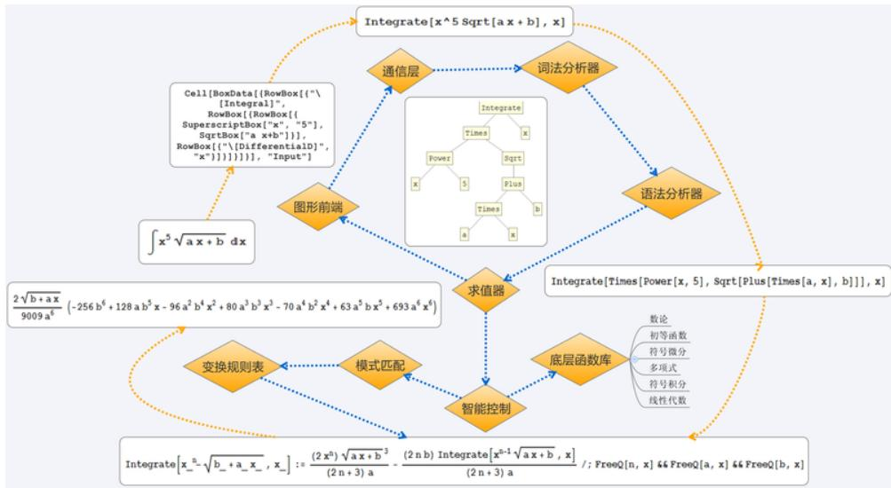
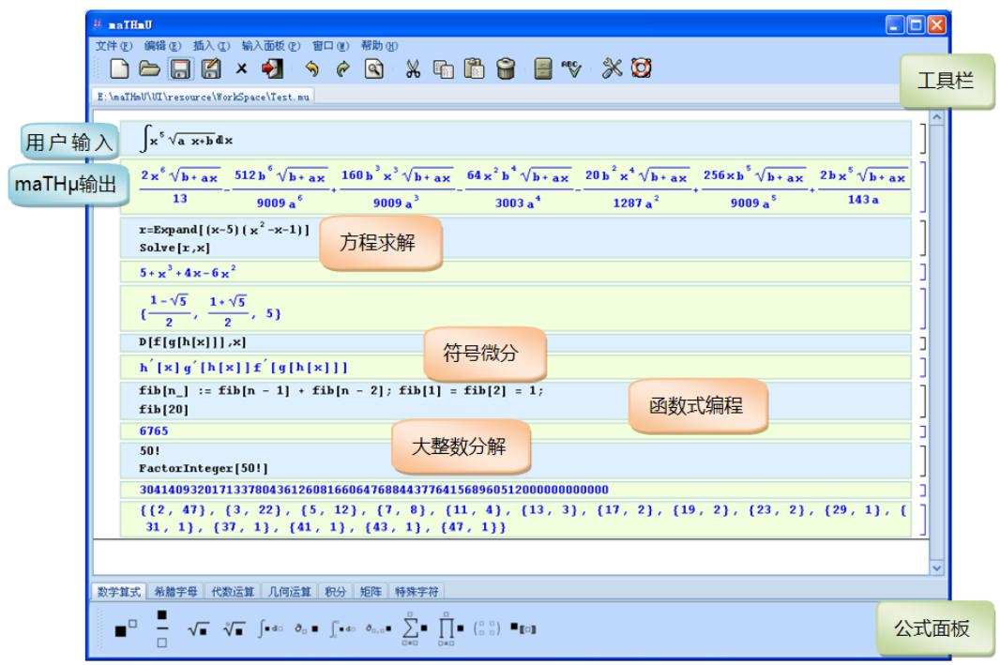
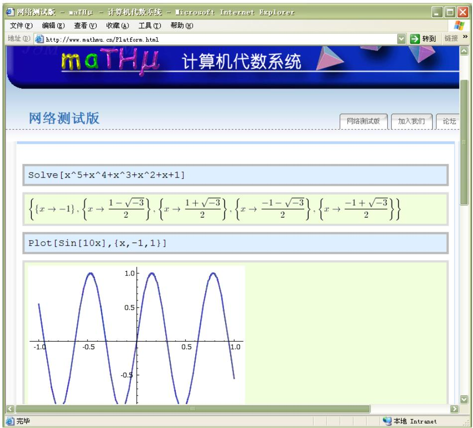

# A

# maTHµ 系统简介

maTHµ 项目组由来自清华大学数学, 物理, 计算机, 电子, 自动化等不同院系的学子所组成, 在清华大学团委科创中心及清华大学学生科协的支持和指导下, 致力于开发具有自主知识产权的计算机代数系统 $\operatorname * { m a T H } \mu ^ { 1 }$ . 自 2007 年 9 月学生立项以来, $\mathrm { m a T H } \mu$ 项目已经持续运行了近两年时间, 设计并开发了 $\mathrm { m a T H } \mu 1 . 0$ 版本的内核与用户图形界面, 部分功能已经可以通过网络计算平台测试版2进行免费访问.本附录将会对 $\mathrm { m a T H } \mu$ 系统的主要特点与功能进行一个概要性的介绍.

# A.1 系统架构与特点

# 系统架构设计

$\mathrm { m a T H } \mu$ 的整体系统架构设计如图A.1所示. 图中内层箭头表示了数据流在系统内部各模块中传递的过程, 而外层箭头则展示了当用户在图形界面中中输入一个的积分命令

$$
\int x ^ {5} \sqrt {a x + b} d x
$$

之后, 数据流在各个模块中的具体表现形式. 用户的输入命令在图形前端中被储存为适宜使用类 TEX 算法绘制的盒子模型对象, 输入命令线性化后通过通信层传递给解释器. 解释器通过词法分析及语法分析将命令解析为表达式树, 然后由求值器进行逐层求值, 将计算结果再通过通信层传回图形前端显示为图形公式. 求

  
图 A.1: maTH $\overset { \cdot } { \mu }$ 系统架构

值模型主要分为底层函数库和模式匹配两部分, 两者由智能控制模块进行控制. 图形前端则采用 MVC(Model-View-Controller)架构, 能够将任意对象(如字符, 图形,控件等)作为数学表达式参与运算.

# 可移植性

计算机代数系统结构复杂, 功能繁多, $\mathrm { m a T H } \mu$ 系统遵循着各层分离, 统一接口的设计思想. 举例来说, 所有底层数据结构都来自var, 使得无论底层函数的实现如何变动, 例如将所有 GMP 导出函数换为 NTL 导出函数, 所有函数接口都仍可以保持不变而不影响上一层符号框架及解释器. 正是因为如此, 系统各层子系统内部都有足够的灵活性, 同一个图形前端可以与不同类型的解释器交互, 除了通信部分以外无需改动.

同样的, 同一个解释器也可以与不同实现的底层函数库进行交互. 通过更换词法/语法分析器, 还可以方便地支持不同语法的输入而无需改动计算内核. $\mathrm { m a T H } \mu$ 目前已经能够接收类 Mathematica 语法与类 Lisp 语法等不同语言的输入, 未来还可以更广泛的支持 Maple, Matlab 等通用计算语言. 目前 $\mathrm { m a T H } \mu$ 的词法定义通过手工编码的有限状态自动机(DFA)来描述, 具体实现时对忽略空格, 删除嵌套注释, 识别 Unicode 转义字符以及识别字符串中 C 风格的转义字符等功能做了特殊处理. 文法定义可以通过手工编写的 LL(1)递归下降分析框架来描述, 为了简洁起见, 具体实现时对表达式主体采用算符优先分析, 原子表达式以及大量上下文相关的特殊文法则采用手工处理. 目前支持60余种算符的类Mathematica语法可使程

序的编写更加接近于数学思维.

# 可扩展性

maTHµ 的内核可支持动态链接库和程序包等多种类型的模块扩展, 这样可以使内核在保持足够轻便的同时拥有可扩展的计算能力. 从开发者的角度来看, 扩展模块可以独立编译, 大大缩短了调试周期, 使得二次开发灵活方便. 从用户的角度来看, 同一个扩展功能, 既可以由 $\mathrm { m a T H } \mu$ 语言的程序包提供, 又可以由动态链接库等二进制模块提供以获得更高的效率, 还可以设定启动配置, 使得扩展模块在启动时自动加载, 这样就完全屏蔽了内核和扩展模块的差别. 事实上, 除了词法/语法分析器, 求值器, 模式匹配器和一些最基本的函数之外, $\mathrm { m a T H } \mu$ 绝大部分功能都由扩展模块提供.

# A.2 基本功能

$\mathrm { m a T H } \mu$ 包含了高精度运算, 数论, 线性代数, 初等函数, 多项式, 方程求解, 符号微积分, 函数图形, 数据可视化等等的计算机代数系统的核心功能, 并且支持过程式, 规则式, 函数式等多模式编程. $\mathrm { m a T H } \mu$ 用户界面如图 A.3所示.

  
图 A.2: 系统用户界面

# 基本运算与函数

$\mathrm { m a T H } \mu$ 能高效地进行任意精度整数, 实数运算, 支持大量数论函数, 组合函数, 初等函数和数学常数的任意精度计算, 符号表达式展开, 合并同类项, 表达式化简等. 限于篇幅, 我们仅在此举几个简单的例子:

Input：40！（\*阶乘\*）  
Output：81591528324789773434561126959611589427200000000  
Input：FactorInteger $[2^{2^6} + 1]$ （\*整数因子分解\*）  
Output：{274177,1}, {67280421310721,1}\}  
Input：Expand $[(x + 2y)^4]$ （\*表达式展开\*）  
Output： $81 + 216x + 216x^2 + 96x^3 + 16x^4$ Input：N[π，100]（\*求圆周率至100位精度\*）  
Output：3.141592653589793238462643383279502884197169399375105820974944592307816406286208998628034825342117068

# 多项式与方程

功能包括多项式的最大公因子, 因子分解, 复合分解, Gr¨obner 基, 特征列, 多项式方程(组)求解等等. 示例如下:

Input:Factor[x20-1]（\*多项式因子分解\*)  
Output:(1+x)(1+x²)(-1+x)(1+x+x²+x³+x4)  
(1-x+x²-x³+x⁴)(1-x²+x⁴-x⁶+x8)  
Input:GroebnerBasis[ $\{\mathbf{x}^2 -2\mathbf{y}^2$ ，xy-4}, $\{\mathbf{x},\mathbf{y}\}$ 1 （\*Gröbner基\*)  
Output:-8+y4,-y3+2x}  
Input:Solve[25+35x+11x²+x³](\*方程求解\*)  
Output:{ $\{\{\mathrm{x}\to -1\} ,\{\mathrm{x}\to -5\} ,\{\mathrm{x}\to -5\} \}$

# 符号微积分

功能包括求导数(包括高阶导数和偏导数等), 不定积分和定积分, 将函数展成幂级数, 求函数极限等.

```txt
Input：D[f[g[h[x]]]，x]（\*函数微分\*)Output：f'[g[h[x]]]g'[h[x]]h'[x] 
```

Input: $\int (\mathrm{Sin}[3\mathrm{x} + 2] - \frac{1}{\sqrt{\mathrm{x}^2 + 1}})\mathrm{dx}$ (*函数积分*)  
Output: -ArcSinh[x] - $\frac{1}{3}\mathrm{Cos}[2 + 3\mathrm{x}]$

# 多模式编程

支持过程式, 规则式, 函数式等多模式编程, 示例如下:

Input: $3^{10}$ （\*直接计算\*）  
Output: 59049  
Input: pow[x_, m_] := x pow[x, m - 1]; pow[x_, 0] := 1; pow[3, 10] （\*规则式编程\*）  
Output: 59049  
Input: Clear[pow]; pow[x_, m_] := Module{r = x, t = x, n = m}, If[n <= 0, Return[1]]; --n; While[n > 0, If[OddQ[n], r *= t]; If[n > 1, t *= t]; n = IntegerPart[n/2)]; r]; pow[3, 10] （\*过程式编程\*）  
Output: 59049

利用 $\mathrm { m a T H } \mu$ 提供的符合数学思维的编程方式, 我们可以非常方便进行符号计算. 例如以下一段从符号微分程序包中摘取的代码片断, 便完全定义好了符号微分的数学规则:

( $^ { * }$ 常数 *)

```verilog
$D[a_, x_]:= 0 /; FreeQ[a, x];
$D[a_f_, x_]:= a $D[f, x] /; FreeQ[a, x] &&! FreeQ[f, x];
(* 线性*) 
```

```javascript
$D[f_+ + g_, x_]:= $D[f, x] + $D[g, x]; 
```

$^ { * }$ 乘法规则 $\ast _ { \cdot }$ )

```txt
$D[f_g_, x_]:= $D[f, x] g + f $D[g, x] /; ! FreeQ[f, x] &&! FreeQ[g, x]; 
```

( $^ { * }$ 链式法则 *)

```javascript
\(D[f\_ [g\_ ], x\_] := (g / .\)DC[f]) \)D[g, x] /;MemberQ[\(D\)headlist, f] && g = != x;  
\)D[f\_ [g\_ ], x\_] := Derivative[1][f][g] \(D[g, x] /;MemberQ[\)D$headlist, f]; 
```

# A.3 网络计算平台

$\mathrm { m a T H } \mu$ 内核支持文件, 共享内存, 管道和网络套接字等多种进程间通信方式,并以输入输出流的方式将它们抽象出来, 可以采用统一的通信层接口来调用用这些内部原理极不相同的通信方式. 对多种进程间通信方式的支持大大降低了系统的耦合度, 例如解释器内核是用 ${ \mathsf { C } } { + } { + }$ 编写, 而用户图形前端使用 Java编写, 不过两者的不同平台并没有阻碍前端与内核的通信. 内核中还内建了对多线程运算的完整支持, 可以基于这些特点搭建由运行着 $\mathrm { m a T H } \mu$ 的机群组成的大规模并行计算环境.

在如上的设计之下, $\mathrm { m a T H } \mu$ 项目组开发了基于 $\mathrm { m a T H } \mu$ 内核的网络计算平台,用户可以通过 http://www.mathmu.cn/Platform.html 访问该平台的测试版(如图 A.3). 用户无需安装任何软件, 只需一个标准的网络浏览器即可方便地享受$\mathrm { m a T H } \mu$ 内核的计算功能,

  
图 A.3: 网络测试版
