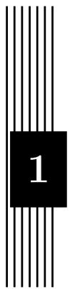

# 计算机代数系统

# 数学原理

李超 阮威 张龙 张翔

maTHµ Project Group

www.mathmu.cn

# 摘要

本文主要讨论计算机代数系统的数学原理, 由十六个章节组成. 内容包含高精度运算, 数论, 数学常数, 精确线性代数, 多项式, 方程求解, 符号求和, 符号积分,微分方程符号解等九大部分, 涵盖了构建计算机代数系统的最基础也是最重要的内容. 许多内容是第一次被系统地整理出现在中文文献中, 一些领域也追踪到了最新进展.

# 绪言

计算机代数(Computer Algebra)在很多时候又被广义地理解为“符号计算”(Symbolic Computation), 成为与所谓“数值计算”(Numerical Computation)相对的概念. “符号”的运算在这里代替了“数”的运算. 这是一种智能化的计算. 符号可以代表整数, 有理数, 实数和复数, 也可以代表多项式, 函数, 还可以代表数学结构如集合, 群, 环, 代数等等. 我们在学习和研究中用笔和纸进行的数学运算多为符号运算.

利用计算机代数, 我们可以完成许多不可思议的事情, 例如可以对代数方程组进行精确的求解, 对多项式进行因子分解, 对复杂代数表达式进行化简归约, 对函数进行符号积分(求出原函数), 对微分方程求出精确解等等.

传统的代数计算冗长繁杂, 而现代的计算机技术为大型的符号计算提供了可能性. 关键的问题就在于如何把抽象的代数理论算法化, 使其高效地处理形形色色的代数问题. 强大的计算机代数系统不仅是各类工程技术的助手, 对纯粹科学研究也起着不可忽略的推动作用.

经过数十年的发展, 在国外已经形成了诸如 Wolfram Research1, Maplesoft2等巨型的商业软件公司, 其产品具有可观的经济效益; 其他一些研究者的专用系统开发也具有了相当的规模. 然而, 在我们国内, 科学软件领域则远远落后, 能够与国外产品相抗衡的通用计算机代数系统还暂时没有出现. 而另一方面, 国内对科学软件的需求量却是巨大的, 昂贵的进口产品意味着大量的科研, 工程经费的无奈外流. 从某种意义上来说, 对国外系统的依赖对国家信息安全也有着潜在的威胁.

在我们看来, 造成这种状况的原因一方面是由于科学软件的复杂性, 另一方面则反映了国内创新能力的缺乏. 就这一点来说, 国内的大环境是一个很重要的因素:

• 在国内盗版软件获取容易, 而大型的科学软件开发却需要长期, 大量的投入,其复杂程度及难以预料的经济前景使得企业少有问津;

• 一个更重要的原因是, 在中国往往出现这种情况: 软件写得顺手的人, 未必有很强的科学计算背景, 而科学背景强的人又没有较高的计算机和软件水平,使得科学软件的开发难以进行;  
• 少有“不切实际的幻想”. 由于科学软件的复杂程度, 企业少有问津, 单独的科研人员也不得不认为完成这样一件工作是“不切实际的幻想”. 然而我们回顾 Wolfram Research, Maplesoft, Mathworks 等大公司的发展道路, 无不是从一个人或几个人的的微薄之力逐渐发展到现在令人赞叹的规模. 或许“不切实际的幻想”正是创新氛围的一个绝佳体现吧！

尽管我们力量渺小, 但对这种状况也不愿意置若罔闻. 清华大学作为一所综合大学, 众多学子具有综合性的能力, 也理应在此领域有所作为. 我们希望利用自身的数学基础与应用背景, 整理出一份较为完整的计算机代数理论文档, 进行较为完整系统设计, 并实现一个计算机代数系统核心maTH $\mu ^ { 3 }$ . 希望在此过程中也能广阔我们的眼界, 提高我们自身的理论和技术水平, 为更进一步的工作打下良好基础.

这份计算机代数系统数学原理, 作为 $\mathrm { m a T H } \mu$ 系统的理论文档, 便是 maTHµ项目组成员通过近一年半时间集体整理撰写的成果. 计算机代数理论方面的中文文献稀缺. 即使在英文文献中, 能够足以支撑一个通用计算机代数系统的系统论述也少见, 更多的内容散见在专著, 博士论文及专业期刊中. 花大力气整理文档的初衷十分简单: 理论不清, 则后续的设计与开发阶段根本无法进行, 更何况计算机代数理论本身复杂而相互交织. 举例来说, 求微分方程的符号解需要符号积分的支持, 而有理函数符号积分需要借助精确线性代数, 多项式因子分解, 代数方程组求解等算法, 其中 $\mathbb { Z } [ x ]$ 上的多项式因子分解依赖有限域上的因子分解, 从而需要数论中模算法的支持, 而数论算法又建立在任意精度的快速运算上. 整个文稿的内容组织也大体符合构建计算机代数系统的逻辑顺序.

本文中大部分的算法都有理论的推导, 努力做到自成体系并阐明各种方法背后的想法. 对于若干深刻的结果(如 Hilbert 零点定理, Liouville 定理, Lie-Kolchin定理等等), 鉴于篇幅和目的, 我们选择只给出相关参考文献而略去了严格证明.

本文中的部分算法已经在 $\mathrm { m a T H } \mu 1 . 0$ 版的内核中实现. 计算机代数系统$\mathrm { m a T H } \mu$ 项目在 2009 年清华大学第二十七届“挑战杯”课外学术科技竞赛中, 经过4 轮评审, 最终在 344 件作品中脱颖而出, 获得了特等奖的第一名, 并代表清华大学参加两年一度的全国“挑战杯”竞赛. 项目未来的长期发展规划也已经得到了学校的大力支持. 项目团队感受到了来自各方的鼓励与期望, 希望能踏实地继续努力进行我们的工作. 在理论文档部分, 除了继续丰富与完善呈现在这里的内容, 其他

一些我们认为同样重要的主题也正在整理中, 包括初等与特殊函数的任意精度计算, 组合函数, 代数函数积分, 更一般的符号求和理论, 表达式化简等等.

作者 于清华园

maTHµ Project Group

maTHmU@gmail.com

2009年8月17日

# 目录

# 第一章 高精度运算 1

1.1 整数 2

1.1.1 进制转换 2   
1.1.2 四则运算 3

1.2 快速乘法 1

1.2.1 一元多项式乘法 7  
1.2.2 Karatsuba 乘法 . . . 9  
1.2.3 Toom-Cook 乘法 . . 11   
1.2.4 FFT 乘法 12

# 第二章 素数判定 18

2.1 Fermat 检测 19   
2.2 Euler 检测 20   
2.3 Lehmer $N - 1$ 型检测 21   
2.4 Lucas 伪素数检测与 $N + 1$ 型检测 23  
2.5 概率性的检测方法 26

2.5.1 Solovay-Strassen 检测 26   
2.5.2 Rabin-Miller 检测 27   
2.5.3 Baillie-PSW 检测 . . 28

# 第三章 整数因子分解 30

3.1 试除法 . 30  
3.2 Euclid 算法 31   
3.3 Pollard $p - 1$ 方法 31  
3.4 Pollard $\rho$ 方法 32  
3.5 平方型分解(SQUFOF) 35

3.6 连分式方法(CFRAC) . . . . 35  
3.7 Lenstra 椭圆曲线方法(ECM) 37  
3.8 二次筛法(QS) 41

3.8.1 单个多项式二次筛法(SPQS) . . 41  
3.8.2 多个多项式二次筛法(MPQS) 42

3.9 数域筛法(NFS) 43

# 第四章 基础数论算法 44

4.1 快速求幂 44

4.1.1 二进方法 44  
4.1.2 m 进方法, 窗口方法及加法链 45  
4.1.3 Montgomery 约化 47

4.2 幂次检测 48

4.2.1 整数开方 49   
4.2.2 平方检测 49  
4.2.3 素数幂检测 50

4.3 最大公因子 51

4.3.1 Euclid 算法 . . . 51  
4.3.2 Lehmer 加速算法 . 52  
4.3.3 二进方法(Binary GCD) 54  
4.3.4 扩展 Euclid 算法 55  
4.3.5 dmod 与 bmod 56  
4.3.6 Jebelean-Weber-Sorenson 加速算法 . 57

4.4 Legendre-Jacobi-Kronecker 符号 59   
4.5 中国剩余定理 63  
4.6 连分数展式 . . 64   
4.7 素数计数函数 $\pi ( x )$ . . 65

4.7.1 部分筛函数 66  
4.7.2 计算 $P _ { 2 } ( x , a )$ 67  
4.7.3 计算 $\phi ( x , a )$ . . 67   
4.7.4 计算 $S$ . . 68   
4.7.5 计算 $S _ { 1 }$ 69  
4.7.6 计算 $S _ { 3 }$ 69  
4.7.7 计算 $S _ { 2 }$ 69  
4.7.8 计算 $V$ . . . 70

4.7.9 计算 $V _ { 2 }$ 70

4.8 第 $n$ 个素数 $p _ { n }$ 71  
4.9 M¨obius 函数 $\mu ( n )$ 和 Euler 函数 $\varphi ( n )$ 72

# 第五章 数学常数 73

5.1 圆周率 73

5.1.1 级数方法 73  
5.1.2 迭代方法 80

5.2 自然对数底 85

5.2.1 级数方法 85

5.3 对数常数 86

5.3.1 级数方法 86  
5.3.2 迭代方法 88

5.4 Euler 常数 . 88  
5.4.1 级数方法 88

5.5 其他常数 90

# 第六章 线性代数 91

6.1 快速矩阵乘法 91

6.1.1 基于向量内积算法的 Winograd 算法 92  
6.1.2 Strassen 算法 . 92

6.2 线性方程组与消元法 94

6.2.1 基于中国剩余定理的消元法 . . 95  
6.2.2 Pad´e 逼近与有理函数重建 105   
6.2.3 Hensel 提升算法 107  
6.2.4 数值算法求精确解 110

6.3 Wiedemann 算法与黑箱方法 . . 115

6.3.1 概率性算法与预处理步骤概述 116  
6.3.2 线性递推列 120   
6.3.3 线性方程组的 Wiedemann 算法 . . 122

# 第七章 一元多项式求值和插值 127

7.1 求值算法 127   
7.2 插值算法 129

# 第八章 一元多项式的最大公因子 132

8.1 Euclid 算法 132   
8.2 域上多项式的快速 Euclid 算法 . . . 135  
8.3 结式性质及其计算 139

8.3.1 结式 139   
8.3.2 Euclid 算法计算结式 . . 142

8.4 Z[x] 中的模 GCD 算法 146

8.4.1 Mignotte 界 . . 146  
8.4.2 大素数模公因子算法 . . 149  
8.4.3 小素数模公因子算法 . 151

8.5 多项式组的概率算法 . . . 153

# 第九章 有限域上多项式因子分解 156

9.1 不同次数因子分解 156

9.1.1 有限域 $\mathbb { F } _ { p }$ 和 $\mathbb { F } _ { p ^ { d } }$ 157  
9.1.2 不同次因子分解 158

9.2 同次因子分解 . 159

9.2.1 特征为奇素数的有限域 . . . 160  
9.2.2 特征为 2 的有限域 162

9.3 一个完整的因子分解算法及其应用 163  
9.4 无平方因子分解 . . . 165

9.4.1 特征为零的域上无平方分解 . . 165  
9.4.2 特征有限的域上无平方分解 . . 167

9.5 Berlekamp 算法 . 170

9.5.1 Frobenius 映射和 Berlekamp 子代数 170  
9.5.2 Berlekamp 算法的实现 . 172

9.6 各算法复杂度比较 173  
9.7 不可约性检测和不可约多项式的构造 . . 173

# 第十章 整系数多项式因子分解 177

10.1 大素数模方法和因子组合算法 . . 178  
10.2 Hensel 提升理论 181

10.2.1 Hensel 单步算法 182  
10.2.2 利用因子树进行多因子 Hensel 提升 . . . 186

10.3 应用 Hensel 提升的 Zassenhaus 算法 188

10.4 格中短向量理论 . . . 190

10.4.1 问题的引入 190   
10.4.2 约化基算法 192  
10.4.3 约化基算法的一些细节说明 195

10.5 应用格中短向量的分解算法 197

# 第十一章 多元多项式 201

11.1 多元多项式插值方法 201

11.1.1 稠密插值 202   
11.1.2 稀疏插值 202

11.2 Euclid 算法和一般模算法 206

11.2.1 概述 206   
11.2.2 $\mathbb { F } _ { p } [ x _ { 1 } , \ldots , x _ { n } ]$ 上最大公因子 208   
11.2.3 多元多项式的“Mignotte”界 209  
11.2.4 $\mathbb { Z } [ x _ { 1 } , \ldots , x _ { n } ]$ 上最大公因子 210

11.3 Zippel 稀疏插值算法 211

11.3.1 一个具体的例子 212  
11.3.2 算法描述 213

11.4 求 GCD 的其它方法 215

11.4.1 启发式算法(Heuristic GCD) . . 216   
11.4.2 EZ-GCD 216

11.5 多元多项式因子分解的 Kronecker 算法 216  
11.6 利用Hensel 提升的因子分解算法 217

11.6.1 概述 217   
11.6.2 扩展 Zassenhaus 算法 218   
11.6.3 因子还原 221  
11.6.4 预先确定因子的首项系数 222

# 第十二章 一元多项式求根算法 227

12.1 多项式零点模估计 228  
12.2 Jenkins-Traub 算法 230

12.2.1 算法引入 230   
12.2.2 收敛速度和一些细节说明 233

12.3 Laguerre 算法 . 235  
12.4 代数模方程求解 . . . 236

12.4.1 $\mathbb { F } _ { p }$ 中的开平方算法 . 237  
12.4.2 模 $p$ 代数方程求解 238

# 12.5 实一元多项式实根隔离算法 239

12.5.1 Sturm 序列 239   
12.5.2 由 Sturm 序列给出的实根隔离算法 . . . 241

# 12.6 分圆多项式 242

12.6.1 分圆多项式的定义及生成 242  
12.6.2 分圆多项式的 Graeffe 检测方法 . . 244  
12.6.3 Euler 反函数方法 . . 246  
12.6.4 位移分圆多项式检测 247

# 12.7 (一元)复合函数分解 247

12.7.1 复合函数分解算法 247  
12.7.2 形式幂级数的一些基本操作 250

# 第十三章 代数方程组求解 253

# 13.1 结式 . 254

# 13.2 吴方法 255

13.2.1 一些基本概念 . . . 255  
13.2.2 升列 256   
13.2.3 基本列 . . . 257  
13.2.4 特征列与解方程 258

# 13.3 Gr¨obner 基 260

13.3.1 一些概念与介绍 260  
13.3.2 单项式理想及一些准备定理 262  
13.3.3 Gr¨obner 基及其性质 264  
13.3.4 Buchberger 算法及约化 Gr¨obner 基 . . 266  
13.3.5 Buchberger 算法的两个改进 . . 267  
13.3.6 Gr¨obner 基的应用 273  
13.3.7 Gr¨obner 基和特征值法解方程组 . . . 276

# 第十四章 符号求和 278

# 14.1 多项式级数求和 . . 278

# 14.2 超几何级数 281

14.2.1 极大阶乘分解 . 282  
14.2.2 Gosper 算法 . . 283

# 第十五章 符号积分 286

15.1 有理函数积分 287

15.1.1 部分分式分解 . 287  
15.1.2 Hermite 方法 288  
15.1.3 Horowitz-Ostrogradsky 方法 . . 289  
15.1.4 Rothstein-Trager 方法 289  
15.1.5 Lazard-Rioboo-Trager 方法 291

15.2 Liouville 定理 292  
15.3 超越对数函数积分 294

15.3.1 分解引理 294  
15.3.2 多项式部分 295  
15.3.3 有理部分与对数部分 296

15.4 超越指数函数积分 298

15.4.1 分解引理 299  
15.4.2 多项式部分 . . 300  
15.4.3 有理部分和对数部分 . 300

# 第十六章 微分方程符号解 302

16.1 Risch 微分方程 302

16.1.1 有理函数域 303  
16.1.2 一般情形 305

16.2 一阶线性微分方程 306  
16.3 微分 Galois 理论 307  
16.4 Lie-Kolchin 定理 309  
16.5 二阶线性微分方程 310  
16.6 高阶线性微分方程的多项式解和有理解 319

16.6.1 多项式解 320  
16.6.2 有理解 . . 321  
16.6.3 平衡分解 323

16.7 高阶线性微分方程的指数解 324

16.7.1 Riccati 指数与 Riccati 界 324   
16.7.2 多项式部分 . . 326  
16.7.3 有理部分 326

16.8 二阶微分方程的特殊函数解 327

16.8.1 变量替换 327

16.8.2 有理函数 $Z$ 的求解 . . . 328  
16.8.3 经典特殊函数 . . 329

# 附录 A maTHµ 系统简介 331

A.1 系统架构与特点 . 331  
A.2 基本功能 333  
A.3 网络计算平台 336

# 参考文献 337

索引 347  
致谢 352

