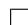

# 素数判定

素数判定(Primality Test)是一个数论中十分基本, 却又趣味盎然的问题. 判定一个整数是否是素数, 最为朴素的想法是直接利用素数的定义, 用小的素数去一一试除, 如果能整除的话, 那就能确定无疑为合数了. 根据 Mertens 定理(参见 [119]),可以估算出大约有 $7 6 \%$ 的奇数有小于 100 的素因子, 可见这种最平凡的方法有时十分有效. 在本章中, 我们将用 $N$ 来表示待判定的目标数.

相比整数的因子分解, 素数判定一直以来被认为是较为容易的问题. 2002 年三位印度计算机科学家 Agrawal, Kayal, Saxena[19] 找到了素数判定的多项式算法(被称为 AKS 算法), 其时间复杂度为 $O ( \ln ^ { 1 2 } N )$ . AKS 算法在理论上有重要的意义, 不过实践中还要更多地考虑效率问题. 实践中的素数检测方法大致分为两类, 一类是确定性的, 例如Lehmer $N - 1$ 检测, Lucas $N + 1$ 检测, 椭圆曲线素性证明(ECPP)等等, 当输出结果为“素数”时, 能够保证被检测数一定为素数; 另一类是概率性的, 如 Rabin-Miller 检测, Baillie-PSW 检测等等, 当输出结果为“素数”时,仅以一定的高概率保证被检测数的素性. 不过概率性检测一般要比确定性检测快得多.

APRCL 方法将 Fermat 类型的想法运用到分圆域中, 最先由 Adleman,Pomerance, Rumely[18] 提出, 后经 Cohen, Lenstra[57] 的改进, 时间复杂度为“近似”多项式的 $O ( ( \ln N ) ^ { c \ln \ln \ln N } )$ , 其中 $c$ 为一个常数. 椭圆曲线素数证明最早由Goldwasser, Kilian[75] 提出, 后经 Atikin, Morain[20] 改进和实现, 平均时间复杂度达到了 $O ( \ln ^ { 6 } N )$ . 这两种方法已经成为目前实践上最快的确定性检测方法, 并在密码学等领域有重要的应用. 鉴于我们的目的, 不能用太多篇幅来介绍这两种方

法, 详细可参阅文献 [56].

有些素数判定方法严格来说应当是合性检测(Compositeness Test), 这类方法总可以有效地把素数判定出来, 而有可能把一个合数判定为素数. 也就是说, 此类方法判定一个数为合数总是准确无误的, 而“漏网的”, 即无法判定的合数往往称为伪素数(Pseudoprimes).

阅读本章需要读者初等数论和抽象代数的基础知识(例如 [10], [6]). 本章的主要参考书是 [146], [56] 和 [8]. 读者也可以参考写的十分通俗易懂的 [15] 及其他算法/计算数论方面的相关文献.

# 2.1 Fermat 检测

几乎所有素数检测的想法之基石均为著名的 Fermat 小定理, 即若 $p$ 为素数,$( a , p ) = 1$ , 则

$$
a ^ {p - 1} \equiv 1 \pmod {p}.
$$

由此我们得到最简单的检测算法 — Fermat合性检测.

算法2.1 (Fermat 小定理作为合性检测).

任取整数 $a$ , 如果 $( a , N ) = 1$ 且 $a ^ { N - 1 } \not \equiv 1$ (mod $N$ ), 则输出 $N$ 为合数, 否则输出 $N$ 可能为素数.

定义2.1 (Fermat 伪素数). 满足 $a ^ { N - 1 } \equiv 1$ (mod $N$ ) 的合数 $N$ 称为一个(对于基$a )$ 的 Fermat 伪素数.

在 $2 5 \times 1 0 ^ { 9 }$ 以下, 有 21853 个对于基 $a = 2$ 的 Fermat 伪素数(参考 [144]), 如果对其再进行基为 $a = 3$ 的检测的话, 伪素数将还剩下 4709 个, 对于 $a = 2 , 3 , 5$ 有2552 个, $a = 2 , 3 , 5 , 7$ 有 1770 个.

运用 Fermat 检测的关键是如何快速计算 $a ^ { d }$ mod $N$ . 求幂运算采取二进算法 4.1 , 4.2 , 可以使 Fermat 检测的算法复杂度降到平均 $1 . 5 \log N \cdot M ( N )$ (其中$M ( N )$ 表示乘法运算的复杂度), 已经为多项式阶的算法了. 使用 Montgomery 约化算法4.3可以更进一步地提高速度.

Camichael 数是看起来比 Fermat 伪素数条件更“苛刻”的一类数.

定义2.2 (Camichael 数). 如果合数 $N$ , 对任意满足 $( a , N ) = 1$ 的整数 $a$ 都有$a ^ { N - 1 } \equiv 1$ (mod $N$ ), 则称 $N$ 为 Camichael 数.

也就是说, Camichael数都将会是Fermat检测的“漏网之鱼”. 最小的Camichael数的例子是 $5 6 1 = 3 \cdot 1 1 \cdot 1 7$ . 在 $2 5 \times 1 0 ^ { 9 }$ 以下一共有 2163 个 Camichael 数, 它比对基 $a = 2 , 3 , 5 , 7$ 的 Fermat 伪素数还要来得多的原因是, 如果恰巧 N 有 2, 3, 5, 7的因子, $N$ 便可以是 Camichael 数而非 Fermat 伪素数.

# 2.2 Euler 检测

Euler 检测基于 Euler 的二次剩余定理, 即若 $p$ 为奇素数, $( a , p ) = 1$ , 则

$$
a ^ {(p - 1) / 2} \equiv \left(\frac {a}{p}\right) \pmod {p}.
$$

其中 $\textstyle { \left( { \frac { a } { p } } \right) }$ 是 Legendre 符号.

算法2.2 (Euler 判则作为合性检测).

设 $N$ 为奇数, 任取整数 $a$ , 满足 $( a , N ) = 1$ :

1. 如果 $a ^ { ( N - 1 ) / 2 } \not \equiv \pm 1$ (mod $N$ ), 则输出 $N$ 为合数.   
2. 如果 $a ^ { ( N - 1 ) / 2 } \equiv \pm 1$ (mod $N$ ) 且 $a ^ { ( N - 1 ) / 2 } \not \equiv \left( \frac { a } { N } \right)$ (mod $N$ ), 则输出 $N$ 为合 数.   
3. 如果 $\begin{array} { r } { a ^ { ( N - 1 ) / 2 } \equiv \left( \frac { a } { N } \right) } \end{array}$ (mod $N$ ), 则输出 $N$ 可能为素数.

定义2.3 (Euler 伪素数). 如果合数 $N$ , $( a , N ) = 1$ , 满足 $\begin{array} { r } { a ^ { ( N - 1 ) / 2 } \equiv \left( \frac { a } { N } \right) } \end{array}$ (mod $N$ ),则称 $N$ 为(对于基 $a$ 的)Euler 伪素数.

定义2.4 (强伪素数). 设 $N$ 奇合数, $N - 1 = d \cdot 2 ^ { s }$ , $d$ 为奇数. $N$ 被称为(对于基 $a$ 的)强伪素数, 如果

$$
a ^ {d} \equiv 1 \pmod {N}
$$

或者对于某一个 $r ( 0 \leq r \leq s - 1 )$ 有

$$
a ^ {d \cdot 2 ^ {r}} \equiv - 1 \pmod {N}.
$$

注16. 强伪素数的定义可以这样看出: 若 $N$ 为素数, 则

$$
\begin{array}{l} a ^ {N - 1} - 1 = (a ^ {d} - 1) (a ^ {d} + 1) (a ^ {2 d} + 1) (a ^ {4 d} + 1) \dots (a ^ {2 ^ {s - 1} d} + 1) \\ \equiv 0 \pmod {N}. \\ \end{array}
$$

对于 Euler 伪素数和强伪素数均不会出现类似 Fermat 伪素数的情况, 也就是说, 只要测试的基 $a$ 足够多, 最终总可以将合数和素数分辩开来. $2 5 \times 1 0 ^ { 9 }$ 以下只有13 个同时为对基 2, 3, 5 的强伪素数.

注17. [144] 证明了, Euler 伪素数必定是强伪素数.

# 2.3 Lehmer $N - 1$ 型检测

有时候 $N$ 的素性很难判定, 而 $N \pm 1$ 的分解却很容易得到. 这一节的方法便是依赖于 $N - 1$ 的素因子分解.

定理2.1 (Fermat 小定理逆定理, Lehmer). 设有素因子分解 $N - 1 = q _ { 1 } ^ { \beta _ { 1 } } \cdot \cdot \cdot q _ { n } ^ { \beta _ { n } }$ .如果对 $a$ 有

$$
a ^ {(N - 1) / q _ {j}} \not \equiv 1 \pmod {N}, \quad \forall j = 1, 2, \dots , n,
$$

$$
a ^ {N - 1} \equiv 1 \pmod {N}. \tag {2.1}
$$

则 $N$ 为素数.

证明. 从简化剩余系的乘法群 $M _ { N } = ( \mathbb { Z } / N \mathbb { Z } ) ^ { * }$ 角度来看, 条件保证了 $a$ 为 $M _ { N }$ 的一个 $N - 1$ 阶元素, 而 $| M _ { N } | = \varphi ( N ) ( \varphi$ 为 Euler 函数), 从而有 $\varphi ( N ) \geq N - 1$ , 这就保证了 $N$ 为素数. □

注18. 这里不要 $( a , N ) = 1$ 的条件, 是因为其已经被包括在式 (2.1) 之中了.

寻找 $M _ { N }$ 的生成元(甚至只寻找模 $N$ 的一个二次剩余)都是非常困难的事情,目前还没有有效的确定性的方法. 一个现实的问题是如果 $N$ 为伪素数, 如何才能快速的找到 Lehmer $N - 1$ 检测中符合条件的 $a$ , 即 $M _ { N }$ 的一个生成元呢？有一些步骤可以采用:

1. 排除所有 $\begin{array} { r } { \left( { \frac { a } { N } } \right) = 1 } \end{array}$ 的 $a$ , 这就排除了一半可能的 $a !$   
2. 从较小的 $q _ { j }$ 开始检测, 因为 $q _ { j }$ 越小, 失败的可能性越大.

定理2.2 (Selfridge 的多基推广). 如果 $\forall q _ { j }$ , $\exists a _ { j }$ 使得

$$
a _ {j} ^ {(N - 1) / q _ {j}} \not \equiv 1 \pmod {N}
$$

且

$$
a _ {j} ^ {N - 1} \equiv 1 \pmod {N}.
$$

则 $N$ 为素数.

证明. 设 $a _ { j }$ 模 $N$ 的阶为 $r _ { j }$ , 则以上两式表明 $r _ { j }$ - $\frac { N - 1 } { q _ { j } }$ 且 $r _ { j } ~ \mid ~ N - 1 _ { : }$ , 从 而$q _ { j } ^ { \beta _ { j } } \mid r _ { j } \Rightarrow N - 1 \mid \varphi ( N ) \Rightarrow \varphi ( N ) = N - 1 .$ □

注19. 这个方法对 $M _ { N }$ 的生成元很大的时候非常有用, 因为我们不必找出一个“共同”的 $a$ 来.

定理2.3 (Pepin 定理). 设 $F _ { n } = 2 ^ { 2 ^ { n } } + 1$ 为 Fermat 素数 $( n \geq 1 )$ . 则 $F _ { n }$ 为素数当且仅当

$$
3 ^ {2 ^ {2 ^ {n - 1}}} \equiv - 1 \pmod {F _ {n}}
$$

证明. 用定理2.1即可, 只需注意到3 必为 $1 2 n \pm 5$ 型素数的二次非剩余.

注20. 使用这个方法, 在 1963 年 [159] 证明了 $F _ { 1 4 }$ (有 4933 个十进制位)是合数, 尽管但现在为止还不知道其任何一个因子.

下面的定理让我们可以拥有不必完全分解 $N - 1$ 的便利.

定理2.4 (Lehmer 定理的放宽版本). 设 $N - 1 = R F$ , $( R , F ) = 1$ 且 $R < F$ , 有素因子分解 $\displaystyle { \overline { { F } } = \prod _ { j = 1 } ^ { n } q _ { j } ^ { \beta _ { j } } }$ . 若有 $a$ 使得

$$
a ^ {(N - 1) / q _ {j}} \not \equiv 1 \pmod {N}, \quad \forall j = 1, 2, \dots , n
$$

且

$$
a ^ {N - 1} \equiv 1 \pmod {N},
$$

则 $N$ 为素数.

证明. 设 $p$ 为素数, $p \mid N$ , 设 $a$ 模 $p$ 的阶是 $d$ , 则由条件有 $d \mid N - 1$ , 但 $d \nmid \frac { N - 1 } { q _ { j } }$ . 从而 $\forall j , d \mid \prod _ { i = 1 } ^ { n } q _ { i }$ , 但 $d \nmid R \cdot q _ { j } ^ { \beta _ { j } - 1 } \prod _ { i \neq j } q _ { i } ^ { \beta _ { i } }$ . 故有

$$
q _ {j} ^ {\beta_ {j}} \mid d \Rightarrow F \mid d \Rightarrow F \mid p - 1 \Rightarrow F \leq \sqrt {N}.
$$

矛盾！

定理2.5 (Proth 定理). 设 $N = h \cdot 2 ^ { n } + 1$ , 其中 $h$ 为奇数, $2 ^ { n } > h$ . 如果存在 $a$ 使得

$$
a ^ {(N - 1) / 2} \equiv - 1 \pmod {N}.
$$

则 $N$ 为素数.

证明. 在定理2.4中令 $F = 2 ^ { n }$ 即得.

# 2.4 Lucas 伪素数检测与 $N + 1$ 型检测

如果 $N - 1$ 也是很难分解的, 这里的方法就将分解的困难转移到 $N + 1$ 上去.想法是与 $N - 1$ 型检测是类似的, 不过要将Fermat小定理从Z上推广到二次域的代数整数环上去, 替代那里的 $a ^ { N - 1 } - 1$ 的则是所谓 Lucas 序列 $U _ { N + 1 }$ .

设 $D$ 为无平方整数, 记 $O$ 为二次域 $\mathbb { Q } ( { \sqrt { D } } )$ 的代数整数环, 我们熟知(参见 [6],P139)当 $D \equiv 2 , 3$ (mod 4) 时,

$$
O = \left\{m + n \sqrt {D} \mid m, n \in \mathbb {Z} \right\},
$$

而当 $D \equiv 1$ (mod 4) 时,

$$
O = \left\{\frac {m + n \sqrt {D}}{2} \Big | m, n \in \mathbb {Z}, m \equiv n \pmod {2} \right\}.
$$

在 $O$ 中可以很容易地讨论同余的概念, 称 $a \equiv b$ (mod $M$ ), 若 $a - b$ 属于 $M$ 在 $O$ 中生成的理想. 记 $\bar { a }$ 为 $a$ 在 $O$ 中的共轭, 即 ${ \overline { { r + s { \sqrt { D } } } } } = r - s { \sqrt { D } }$ , 则在 $O$ 中我们有如下 Fermat小定理的类比.

定理2.6 (二次域中的 Fermat 小定理). 设 $a \in O$ , $p$ 为奇素数, $p \nmid D$ , 则有

$$
a ^ {p} \equiv \left\{ \begin{array}{l l} a & \text {若} \left(\frac {D}{p}\right) = 1 \\ \bar {a} & \text {若} \left(\frac {D}{p}\right) = - 1 \end{array} \right. (\mathrm {m o d} p).
$$

证明. 设 $2 a = r + s { \sqrt { D } }$ , $r , s \in \mathbb { Z }$ , 则由 $\mathbb { Z }$ 上的 Fermat 小定理, 二项展开及 Euler二次剩余定理得

$$
\begin{array}{l} 2 a ^ {p} \equiv (2 a) ^ {p} \equiv (r + s \sqrt {D}) ^ {p} \equiv r ^ {p} + (s \sqrt {D}) ^ {p} \\ \equiv r + s D ^ {\frac {p - 1}{2}} \sqrt {D} \\ \equiv r + s \left(\frac {D}{p}\right) \sqrt {D} \pmod {p}. \\ \end{array}
$$

从而得到所要结论.

定理 2.6 中的乘幂不容易计算, 为了有效地利用定理 2.6 的结论, 我们引入Lucas 序列的概念, Lucas 序列实际上是一类简单的二阶递推序列.

定义2.5 (Lucas 序列). 设 $P , Q \in \mathbb { Z }$ , 特征方程 $\lambda ^ { 2 } - P \lambda + Q = 0$ 的两根为 $a , b .$ . 则$P$ , $Q$ 对应的 Lucas 序列定义为

$$
U _ {n} = \frac {a ^ {n} - b ^ {n}}{a - b}, \qquad V _ {n} = a ^ {n} + b ^ {n}.
$$

注21. 由特征方程对应的递推关系, 知道 $\{ U _ { n } \} , \{ V _ { n } \}$ 均为 $\mathbb { Z }$ 中的序列.

引理2.1. 记号同定义 2.5 , 设整数 $M$ 满足 $( Q D , M ) = 1$ , 则 $a , b , a - b$ 均模 $M$ 可逆. 并且 $U _ { k } \equiv 0$ (mod $M$ ) 当且仅当 $( a b ^ { - 1 } ) ^ { k } \equiv 1$ (mod $M$ ).

证明. 由 $( Q , M ) = 1$ 知 $Q$ 模 $M$ 可逆, 而 $a b = Q$ , 知 $a b \cdot Q ^ { - 1 } \equiv 1$ (mod $M$ ), 从而 $a , b$ 均模 $M$ 可逆. 又 $a - b = { \sqrt { D } }$ , 而 $D \mathscr { S } ^ { ( M ) } \equiv 1$ (mod $M$ ), 可知 $( a - b ) ^ { 2 \varphi ( N ) } \equiv 1$ (mod $M$ ), 从而 $a - b$ 也模 $M$ 可逆.

由于 $a - b$ 模 $M$ 可逆, $U _ { k } \equiv ( a - b ) ^ { - 1 } ( a ^ { k } - b ^ { k } )$ (mod $M$ ), 从而

$$
U _ {k} \equiv 0 \pmod {M} \Longleftrightarrow a ^ {k} \equiv b ^ {k} \pmod {M} \Longleftrightarrow (a b ^ {- 1}) ^ {k} \equiv 1 \pmod {M}.
$$

引理得证.

定理2.7. 设 $p$ 为素数, 满足 $( 2 Q D , p ) = 1$ , 记 $\begin{array} { r } { \varepsilon = { \binom { D } { p } } } \end{array}$ , 则有 $U _ { p - \varepsilon } \equiv 0 { \pmod { p } }$ .

证明. 若 $\begin{array} { r } { \left( { \frac { D } { p } } \right) = 1 } \end{array}$ , 则由定理 2.6 可知 $a ^ { p - 1 } \equiv b ^ { p - 1 } \equiv 1$ (mod p), 从而 $( a b ^ { - 1 } ) ^ { p - 1 } \equiv 1$ (mod $p$ ), 由引理 2.1 知 $U _ { p - 1 } \equiv 0$ (mod p).

若 $\textstyle \left( { \frac { D } { p } } \right) = - 1$ , 则由定理 2.6 可知 $a ^ { p + 1 } \equiv a \bar { a } \equiv a b$ (mod p), 同理 $b ^ { p + 1 } \equiv b a$ (mod $p$ ), 从而 $( a b ^ { - 1 } ) ^ { p + 1 } \equiv 1$ (mod $p$ ), 由引理 2.1 知 $U _ { p + 1 } \equiv 0$ (mod p), 这就完成了证明. □

由上面的定理我们自然地得到 Lucas 伪素数的概念.

定义2.6 (Lucas 伪素数). 设 $N$ 为奇合数, 若存在 Lucas 序列 $\left\{ U _ { n } \right\}$ 使得 $\begin{array} { r } { \varepsilon = \left( \frac { D } { N } \right) \neq } \end{array}$ 0 且 $U _ { N - \varepsilon } \equiv 0$ (mod $N$ ), 则称 $N$ 为 Lucas 伪素数.

正如我们在 Fermat 检测和 Euler 检测中看到的, 一个伪素数概念对应着一个合性检测算法, 由此我们立即可以得到 Lucas 伪素数检测算法.

算法2.3 (Lucas 伪素数检测).

选取 Lucas 序列参数 $P , Q$ , 使得 $\begin{array} { r } { \varepsilon = \left( \frac { D } { N } \right) \neq 0 } \end{array}$ . 若 $U _ { N - \varepsilon } \not \equiv 0$ (mod $N$ ) 则输出$N$ 为合数, 否则输出 $N$ 可能为素数.

注22. 由于来源的不同, 我们可以期望一个数同时为 Lucas 伪素数和 Fermat 伪素数(或强伪素数)的可能情形不大, 这样的观察也被用于 Baillie-PSW 检测算法 2.6中.

我们已经得到了 Lucas 伪素数合性检测, 和 $N - 1$ 型检测类似, 我们还能够进行素性的确证. 在这里, 替代 $N - 1$ 的分解的是 $N + 1$ 的分解, 我们可以看到下面的定理与定理 2.1是多么的“形似”.

定理2.8 (Lucas 检测). 设有素因子分解 $N + 1 = \prod _ { j = 1 } ^ { n } q _ { j } ^ { \beta _ { j } }$ , 若有 Lucas 序列 $\left\{ U _ { n } \right\}$ ,使 $( 2 Q D , N ) = 1$ , 满足

$$
\left(U _ {(N + 1) / q _ {j}}, N\right) = 1, \quad \forall j = 1, 2, \dots , n
$$

且

$$
U _ {N + 1} \equiv 0 \pmod {N},
$$

则 $N$ 为素数.

证明. 设 $p$ 为 $N$ 的一个素因子, 设 $k$ 为最小的正整数使得 $( a b ^ { - 1 } ) ^ { k } \equiv 1$ (mod $p$ ). 由条件知 $U _ { N + 1 } \equiv 0$ (mod $p$ ), $U _ { ( N + 1 ) / q _ { j } } \not \equiv 0$ (mod $p$ ), 从而根据引理 2.1 知 $k \mid N { + 1 }$ ,$k \uparrow ( N + 1 ) / q _ { j }$ , $\forall j$ , 从而 $k = N + 1$ . 但根据 $k$ 的最小性, 由定理 2.7 必有 $k \mid q + 1$ 或 $k \mid q - 1$ . 从而 $q = N$ , $N$ 为素数. □

与 $N - 1$ 型检测完全类似还可以得到以下结果.

定理2.9 (Lucas 检测的放宽版本). 设 $N + 1 = R F$ , $( R , F ) = 1$ 且 $R < F$ , 有素因子分解 $\displaystyle { F = \prod _ { j = 1 } ^ { n } q _ { j } ^ { \beta _ { j } } }$ . 若有 $\{ U _ { k } \}$ 为 Lucas 序列, $( 2 Q D , N ) = 1$ , 满足

$$
\left(U _ {(N + 1) / q _ {j}}, N\right) = 1, \quad \forall j = 1, \ldots , n
$$

且

$$
U _ {N + 1} \equiv 0 \pmod {N}.
$$

则 $N$ 为素数.

注23. Lucas 检测的一个优势在于 Lucas 序列可以通过递推快速地计算. 设

$$
A _ {k} = \left[ \begin{array}{c c} U _ {k + 1} & V _ {k + 1} \\ U _ {k} & V _ {k} \end{array} \right],
$$

则有

$$
A _ {k} = \left[ \begin{array}{c c} P & - Q \\ 1 & 0 \end{array} \right] A _ {k - 1} = \dots = \left[ \begin{array}{c c} P & - Q \\ 1 & 0 \end{array} \right] ^ {k} A _ {0}.
$$

可以使用快速求幂的方法在 $O ( \log k )$ 步中完成序列的计算.

注24. 上述基于 $N + 1$ 分解的算法对 Mersenne 素数 $2 ^ { n } - 1$ 尤其简单, 因此也被著名的GIMPS1(Great Internet Mersenne Prime Search)所采用. 目前为止已知的最大的 Mersenne 素数是 GIMPS 计划在 2008 年 8 月 23 日找到的第 45 个 Mersenne素数, 共有 12978189 个十进制位. 有趣的是, 2009 年 4 月 12 日找到的第 47 个Mersenne 素数要比第 45 个来的小.

定理2.10 (对 Mersenne 素数的 Lucas-Lehmer 检测). 设 $n$ 为奇数, $v _ { 0 } = 4$ , $v _ { k } =$ $v _ { k - 1 } ^ { 2 } - 2$ . 则 $M _ { n } = 2 ^ { n } - 1$ 为素数当且仅当

$$
v _ {n - 2} \equiv 0 \pmod {M _ {n}}.
$$

证明. 证明主要部分来源于定理 2.8 , 然而仍有一些技术上的区别, 这里就不赘述了. 完整的可见 Lehmer 在 1930 的证明 [112]. 另外 J. W. Bruce 在 1993 年给出了一个短至 2 页的“trival”版证明 [47]. □

# 2.5 概率性的检测方法

更加富有趣味的是素性的概率性检测方法. Knuth[104] 这样评价概率性的算法: “与其说算法重复地猜测错, 倒不如说由于硬件的失灵或宇宙射线的原因, 我们的计算机在它的计算中丢了一位. ”概率性的算法使我们对传统的可靠性产生疑问: 我们是否真的需要“素性”的严格确证？概率性算法最早由 Solovay,Strassen[163] 于 1974 年提出, Rabin-Miller 的改进方法为 Mathematica 软件所采用. Baillie-PSW 检测则综合了各种概率性检测方法, 目前为止仍没有找到失败的反例, 并且已经验证检测对于 $1 0 ^ { 1 5 }$ 以下的整数均是正确的.

# 2.5.1 Solovay-Strassen 检测

# 算法2.4 (Solovay-Strassen 检测).

1. 随机生成满足 $1 \leq a \leq N$ 的整数 $a$ ;   
2. 若 $( a , N ) = 1$ 且 $\textstyle \left( { \frac { a } { N } } \right) \equiv a ^ { ( N - 1 ) / 2 }$ (mod $N$ ), 则输出 $N$ 为素数, 否则输出 $N$ 可能为合数.

定理2.11. 算法 2.4 重复执行 $k$ 次, 给出错误的概率为0(当 $N$ 为素数时)或 $2 ^ { - k }$ (当$N$ 为合数时)

证明. 只需证明当 $N$ 为合数, $( a , N ) = 1$ 时, $\textstyle \left( { \frac { a } { N } } \right) \equiv a ^ { ( N - 1 ) / 2 }$ (mod $N$ ) 的概率不超过 $\frac { 1 } { 2 }$ 即可. 设

$$
G = \left\{a + N \mathbb {Z} \mid a \in \mathbb {Z}, (a, N) = 1, a ^ {(N - 1) / 2} \equiv \left(\frac {a}{N}\right) \pmod {N} \right\}.
$$

则 $G < M _ { N }$ , 因此只需证明 $G \neq M _ { N }$ 即可.

如果 $N$ 能分解为两个互素的非平凡因子 $r , s$ , 我们证明必有 $\forall a$ 满足 $( a , N ) =$ 1 都有 $\begin{array} { r } { a ^ { ( N - 1 ) / 2 } \equiv 1 \equiv \left( \frac { a } { N } \right) } \end{array}$ (mod $N$ )(由 Jacobi 符号的性质便知这是不可能的).若不然, 由中国剩余定理找到 $b$ 满足 $b \equiv 1$ (mod r) 且 $b \equiv a$ (mod s). 则有$b ^ { ( N - 1 ) / 2 } \equiv 1$ (mod r) 且 $b ^ { ( N - 1 ) / 2 } \equiv - 1$ (mod s), 而这与 $b ^ { ( N - 1 ) / 2 } \equiv \pm 1$ (mod $N$ )是矛盾的！

如果 $N = p ^ { e }$ 为素数幂, 则 $\forall a$ 满足 $( a , N ) = 1$ 都有 $a ^ { p ^ { e } - 1 } \equiv 1$ (mod $p ^ { e }$ ), 再由Euler 定理知道 $p ^ { e - 1 } ( p - 1 ) \mid p ^ { e } - 1$ . 而这也是不可能的. □

# 2.5.2 Rabin-Miller 检测

Solovay-Strassen 检测利用了 Euler 伪素数“并不多”的性质, 使用随机给出的基 $a$ 多次重复进而给出高成功率的素性检测结果. 同样的想法也可以施用于强伪素数与 Lucas 伪素数, 前者便是著名的 Rabin-Miller 检测, 后者则被运用到Baillie-PSW 检测中.

Rabin-Miller检测可以看成我们在注 16中的想法的一个具体化.

算法2.5 (Rabin-Miller 强伪素数检测).

设 $N - 1 = d \cdot 2 ^ { s }$ ,

1. 随机生成满足 $1 \leq a \leq N$ 的整数 $a$ ;   
2. 顺次计算

$$
a ^ {d}, a ^ {2 d}, a ^ {4 d}, \dots , a ^ {2 ^ {s} \cdot d}.
$$

若计算到第 $k$ 步时有

(a) $k = 1$ 且 $\boldsymbol { a } ^ { d } \equiv 1$ (mod $N$ ), 输出 $N$ 可能为素数;   
(b) $k > 1$ 且 $a ^ { 2 ^ { k - 1 } \cdot d } \equiv - 1$ (mod $N$ ), 输出 $N$ 可能为素数;   
(c) $k > s$ , 输出 $N$ 为合数.

注25. Rabin[145] 证明了算法 2.5 重复 $k$ 遍, 给出正确判断的概率大于 $1 - 4 ^ { - k }$ .  
注26. 使用单个基 $a$ 的 Rabin-Miller 检测可能会遗漏许多基 $a$ 下的强伪素数, 因此实践中的确需要使用多基的 Rabin-Miller 测试. 例如使用前 7 个素数组成的多基Rabin-Miller 测试, 可以保证算法在 $3 4 1 5 5 0 0 7 1 7 2 8 3 2 1 \approx 3 . 4 \times 1 0 ^ { 1 4 }$ 以下均是有效的, 而且这个数在用前 8 个素数为基的 Rabin-Miller测试下没有改进.

# 2.5.3 Baillie-PSW 检测

只是使用多基的 Rabin-Miller 测试可能得不到好的效率. Baillie[23] 将基为 2的 Rabin-Miller 检测与 Lucas 伪素数检测结合起来, 得到更为有效的素数检测方法. Pomerance, Selfridge, Wagstaff 在 [144] 中对小于 $2 5 \times 1 0 ^ { 9 }$ 的数验证了算法的正确性. 尽管 Pomerance[143] 指出对于充分大的 $N$ , 必定有 Baillie-PSW 检测的反例, 并且以 30 美元悬赏找出一个算法失败的反例(后来增加到 620 美元), 不过反例至今没有找到, 并且有经验估计认为第一个反例如果被找到的话, 至少得有10000 个十进位长度(参见 [120]).

下面我们正式给出 Baillie-PSW 检测.

# 算法2.6 (Baillie-PSW 检测).

1. 使用小素数试除 N, 若能整除, 输出 $N$ 为合数.  
2. 使用基为 2 的 Rabin-Miller 强伪素数检测 2.5 , 若 $N$ 非强伪素数, 输出 $N$ 为合数.  
3. 选择以下两种方法之一确定 Lucas 序列的参数 $P , Q$ :

• (Selfridge 建议)取 $D$ 为 $5 , - 7 , 9 , - 1 1 , 1 3 , . . .$ 中使得 $\textstyle \left( { \frac { D } { N } } \right) = - 1$ 的第一个数, 选择 $P = 1$ , $\begin{array} { r } { Q = \frac { 1 - D } { 4 } } \end{array}$ ;  
(Baillie 建议)取 $D$ 为 $5 , 9 , 1 3 , 1 7 , 2 1 , \ldots$ 中使得 $\textstyle \left( { \frac { D } { N } } \right) = - 1$ 的第一个数,选择 $P$ 为 $> \sqrt { D }$ 的最小奇数, $\begin{array} { r } { Q = \frac { P ^ { 2 } - D } { 4 } } \end{array}$ .

4. 使用 $P$ , $Q$ 为参数的Lucas伪素数检测算法2.3, 若 $N$ 非 Lucas 伪素数, 输出$N$ 为合数, 否则输出 $N$ 可能为合数. 用算法4.5检测 $N$ 是否为完全平方数.

注27. 由于 $D = P ^ { 2 } - 4 Q ^ { 2 }$ , 只需尝试模 4 余 1 的数. Selfridge 建议方法中不使用$^ { - 3 }$ 是因为当 $D = - 3$ 时有 $P = Q = 1$ , 将会产生以 $\{ 1 , 1 , 0 , - 1 , - 1 , 0 \}$ 为循环节的

周期 Lucas 序列, 这将使得每个奇合数变成关于 $P , Q$ 的 Lucas 伪素数, 并非我们所想要的.

注28. 若第三步中尝试过程中计算出前若干个 $\left( { \frac { D } { N } } \right)$ 均为 1, 则 $N$ 很可能为完全平方数, 此时可用算法 4.5 对 $N$ 进行平方检测以防止额外的计算, 若 $N$ 不是平方数则继续寻找 $D$ 的过程. 另外尝试过程中若计算得 $\begin{array} { r } { \left( \frac { D } { N } \right) = 0 } \end{array}$ , 则意味着 $N$ 必为合数,可直接终止计算.

注29. [23]证明了, 在第三步中, 两种方法取到合适的 $D$ 的平均尝试次数小于 2.
