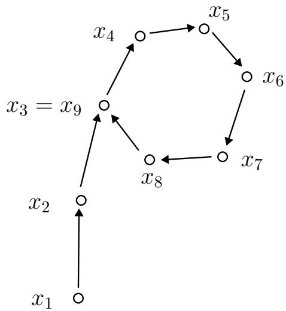
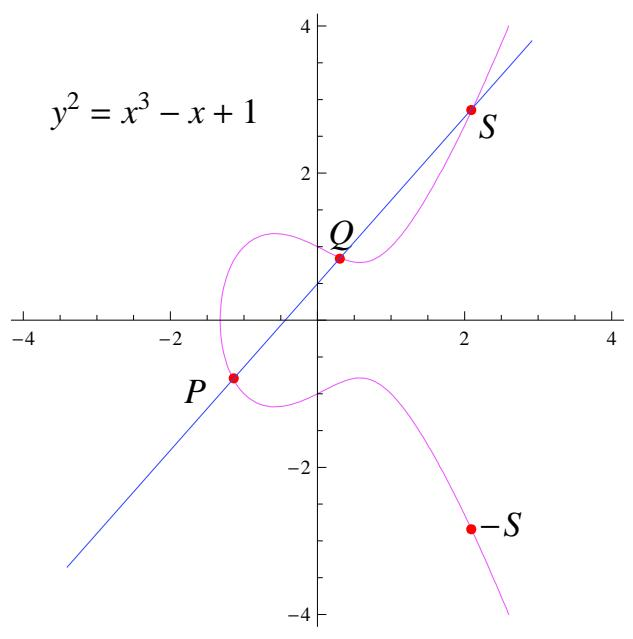

# 整数因子分解

相对于素数判定来说, 因子分解的实现就没办法达到那么快速了. 因子分解至今仍没有类似于素数判定的多项式算法, 这也成为了 RSA 公钥系统安全得以保障的基础. 鉴于这两个问题的难度相差较大, 在我们施行分解之前, 最好是预先知道目标整数的确不是一个素数, 否则很可能花费了很大力气只干了素数判定的活— 杀鸡用牛刀了.

因子分解的方法分为一般方法和特殊方法两大类, 通常倾向于先针对数的特殊性(例如 $N = 2 ^ { n } - 1 )$ 使用特殊方法, 如果目标数的形式不那么特殊, 再尝试使用一般方法. 当然, 前者往往要比后者快上许多.

我们在本章中着重介绍因子分解的一般方法, 且总是用 $N$ 表示待分解的目标数. 阅读本章需要读者具有初等数论和抽象代数的基础知识(例如 [10], [6]). 本章的主要参考书是 [56], [174]. 读者也可以参考写的十分通俗易懂的 [15] 及其他算法/计算数论方面的相关文献.

# 3.1 试除法

无论素数判定还是因子分解, 试除法(Trial Division)都是首先要进行的步骤.在试除的策略上有两种不同的选择:

• 用足够大的空间来储存试除用的素数因子. 储存方法可以相当紧凑, 比如使用一个大整数, 此大整数二进制表达的第 $2 k - 1 , 2 k$ 位来代表 $6 k \pm 1$ 是否为素数.

• 不耗费大量空间来储存所有需要的素因子, 这时需要一个快速生成素数的子程序, 或者干脆只用2, 3 以及 $6 k \pm 1$ 型的整数来作为试除因子.

很少能发生一个数没有小因子的情况, 例如根据 Mertens 定理(参见 [119]), 奇数中没有 $x$ 以下因子的比例

$$
P = \prod_ {p \geq 3} ^ {x} (1 - \frac {1}{p}) \sim \frac {2 e ^ {- \gamma}}{\ln x}, \quad x \to + \infty .
$$

可以知道 $7 6 \%$ 的奇数都有小于 100 的素因子, 而没有小于 $1 0 ^ { 8 }$ 因子的奇数比例仅为 $6 . 1 \%$ (可参看 [146]). 因此在大多数情况, 试除法的第二种选择已经足够, 实现也是最为简单的.

# 3.2 Euclid 算法

Euclid算法用于因子分解也非常简单. 我们预先计算好小于 100 的素数之积

$$
p _ {0} = \prod_ {\substack {2 \leq p \leq 9 7 \\ p \text{为系数}}} p = 2 3 0 5 5 6 7 9 6 3 9 4 5 5 1 8 4 2 4 7 5 3 1 0 2 1 4 7 3 3 1 7 5 6 0 7 0.
$$

然后将 $p _ { 0 }$ 与目标数 $N$ 进行 Euclid 算法, 最终得到 $p _ { 0 }$ 与 $N$ 的最大公因子, 继续分解公因子就可以得到在 100 以下的因子分解了. 同样可以预先计算出 100 到 200,200 到 300 的素数乘积 $p _ { 1 }$ , $p _ { 2 }$ 等等. 这本质上是试除法的一个实现, 当 $N$ 非常大时, 必须借助高精度算术来进行 $N$ 除以 $p$ 的操作, 因此频繁的试除会十分耗时, 而Euclid方法可以施行很少次数, 再在机器精度上完成最终的分解, 提高效率.

# 3.3 Pollard $p - 1$ 方法

Pollard $p - 1$ 方法由 Pollard[140] 于 1974 年提出, 其基本想法是这样的: 设素数 $p \mid N$ , 由 Fermat 小定理, 又有 $p \mid a ^ { p - 1 } - 1$ , 因此 $( a ^ { p - 1 } - 1 , N )$ 就可能是 $N$ 的一个非平凡因子. 当然, 问题在于我们并不知道 $p$ 是多少. 一个合理的假设是 $p - 1$ 的因子都很小, 比如说, $p - 1$ 所有素因子都包含在因子基 $F B = \{ p 1 , p 2 , \hdots p _ { m } \}$ 中, 我们来尝试着找到一个 $c = \prod _ { i = 1 } ^ { m } p _ { i } ^ { \alpha _ { i } }$ 能够“覆盖” $p - 1$ , 即是说 $p - 1 \mid c ,$ , 从 而$a ^ { p - 1 } - 1 \mid a ^ { c } - 1$ , 因此我们可以转而求 $( a ^ { c } - 1 , N )$ 来获得所要的非平凡因子. 例如设素因子上限为 $B$ , 便可以简单的取 $c = B !$ 或是最小公倍数 $\operatorname { L C M } \{ 1 , 2 , \dots , B \}$ .

下面给出 Pollard $p - 1$ 方法的一个版本:

算法3.1 (Pollard $p - 1$ 方法).

1. 设素因子搜索的上限为 $B$ , 生成 $B$ 以下的形如 $p _ { i } ^ { \alpha _ { i } }$ 数对应的素数因子之表$\{ p _ { i } \}$ , 其中 $p _ { i }$ 的幂次用 $p _ { i }$ 代表, 即: 2, 3, 2, 5, 7, 2, 3, 11, 13, 2. . .  
2. 随机选择正整数 $a$ , 顺次计算

$$
\begin{array}{l} b _ {1} = a \\ b _ {i + 1} \equiv b _ {i} ^ {p _ {i}} \pmod {N} i = 1, 2, \ldots \\ \end{array}
$$

3. 定期检查(例如每当 $n$ 为 20 的倍数时) $( b _ { n } - 1 , N )$ , 若 $( b _ { n } - 1 , N ) > 1$ , 则得到一个 $N$ 的因子; 否则继续第2 步中的递推计算.

注30. 由于越小素数在 $p - 1$ 分解中出现的幂次可能越高, $F B$ 中小素数(例如 2,3)应当较多重复出现, 第 1 步中的生成方法便考虑到了这一点. (实际上最终计算了 $\operatorname { L C M } \{ 1 , 2 , \dots , B \}$ . )  
注31. 在极少的情形, 也可能出现 $( b _ { n } - 1 , N ) = N$ , 即所有 $N$ 的素因子都同时出现在了 $b _ { n } - 1$ 之中, 这时可以重新选取定期检查的时机或者换一个 $a$ 进行计算.  
注32. 另一种类似的 Williams $p + 1$ 方法依赖于 $p + 1$ 只有小的因子, 著名的Lucas序列替代了这里的 $a$ 的幂次, 乘法群 $\mathbb { Z } / p \mathbb { Z } ( { \sqrt { t } } ) ^ { * } ( t$ 为 $p$ 的二次非剩余)代替了乘法群 $\mathbb { Z } / p \mathbb { Z } ^ { * }$ . 因此 Pollard $p - 1$ 方法与 Williams $p + 1$ 方法的关系就好像素数检测中的 Lehmer $N - 1$ 型检测与 Lucas $N + 1$ 型检测的关系一样. 具体可参看 [185].  
注33. 实践中 $B$ 一般取 $1 0 ^ { 6 }$ 左右.  
注34. Pollard $p - 1$ 方法的时间复杂度为 $O ( N ^ { 1 / 4 + \varepsilon } )$ , 其中 $\varepsilon$ 为一个正数(参见[174]).

# 3.4 Pollard $\rho$ 方法

目前几乎所有实用的分解方法都是概率性的算法, 目标是找到能计算 $x$ 的算法, 使得 $( x , N ) > 1$ 的概率较大(而最大公因子可以很快地计算). 上面的 Pollard$p - 1$ 就是一例, 下面即将看到的 Pollard $\rho$ 方法也不例外.

Pollard $\rho$ 方法由 Pollard[141] 在 1975 年提出, 它来自一个有趣的事实: 随机选取大约 $c _ { \sqrt { p } }$ 个整数 $\dot { c }$ 为一个常数), 就有很大概率在这些整数中找到两个是模 $p$

同余的. 实践中可以采用同余递推序列

$$
x _ {i + 1} \equiv f (x _ {i}) \pmod {N}
$$

来产生伪随机数, 其中 $f$ 为映射: $\mathbb { Z } / N \mathbb { Z } \to \mathbb { Z } / N \mathbb { Z }$ . 设 $p$ 是 $N$ 的一个因子, 且找到$x _ { j } \equiv x _ { i }$ (mod $p$ ), 则计算 $( x _ { j } - x _ { i } , N )$ 便可能得到 $N$ 的一个非平凡因子.

  
图 3.1: Pollard $\rho$ 方法

由 $\mathbb { Z } / p \mathbb { Z }$ 的有限性, 如上定义的一阶的递推序列 $\{ x _ { i } \}$ 在模 $p$ 意义下必定是最终循环的(如图, 看上去就像希腊字母 $\rho$ ). 设其开头的非循环部分长度为 $m$ , 循环节长度为 l. 著名的 Floyd 算法可以在 $m + l$ 步内高效地找出序列中的两个重复元素, 并且只用常数的储存空间.

# 算法3.2 (Floyd).

1. 依次判断是否 $x _ { 2 i } = x _ { i }$ , $i = 1 , 2 , 3 , \cdots$   
2. 若相等, 则终止; 否则继续第1 步.

算法的有效性. 只需证明必定存在 $i$ 满足 $m < i \leq m + l$ 且 $x _ { 2 i } = x _ { i }$ . 由于 $x _ { 2 i } = x _ { i }$ 等价于 $l \mid i$ , 因此取 $i$ 为 $( m , m + l ]$ 中 $l$ 的倍数即可. 算法过程中不必保存所有 $\{ x _ { i } \}$ ,可以存下当前的 $x _ { i } , x _ { 2 i }$ 并递推计算 $x _ { i + 1 } = f ( x _ { i } )$ , $x _ { 2 ( i + 1 ) } = f ( f ( x _ { 2 i } ) )$ . □

实践中常采用的 $f$ 为

$$
x _ {i + 1} \equiv x _ {i} ^ {2} + a \pmod {N},
$$

选择二次的递推序列一方面能提供足够的随机性, 另一方面计算起来也非常简便.

# 算法3.3 (Pollard $\rho$ ).

1. 随机选取 $a$ 与 $x _ { 1 }$ .   
2. 顺次计算 $x _ { i + 1 } = x _ { i } ^ { 2 } + a$ mod $N$ .   
3. 计算

$$
Q _ {n} = \prod_ {i = 1} ^ {n} \left(x _ {2 i} - x _ {i}\right) \mod N.
$$

4. 每隔一段时间(例如 $k = 2 0$ ), 检测 $( Q _ { n k } , N )$ , 若非平凡则算法终止, 否则继续第 2 步.

注35. 当 $N$ 较大时, 对每个 $i$ 都去检测 $( x _ { 2 i } - x _ { i } , N )$ 可能会耗费大量时间, 因为我们的目标只是得到 $N$ 的非平凡因子, 可以通过计算 $Q _ { n }$ , 再定时检测 $( Q _ { n k } , N )$ 来减少计算次数.  
注36. 如同 Pollard $p - 1$ 方法, 也可能出现计算出来的最大公因子 $( Q _ { n } , N ) = N$ ,这时可改变检测间隔 $k$ 或干脆改变 $a$ 重新进行计算.  
注37. Pollard $\rho$ 方法的时间复杂度为 $O ( N ^ { 1 / 4 + \varepsilon } )$ (参见 [174]). 实际上复杂度依赖于 $N$ 的最小素因子 $P ^ { - } ( N )$ , 在分离 $N$ 的小因子时尤其有效.  
注38. 1980 年, Brent[39] 给出了 Pollard $\rho$ 方法的一个改进, 在分解整数时, 该方法平均能够加速 $2 4 \%$ . 这个改进是针对Floyd的算法3.2的, 因为在Floyd算法中,往往要重复计算 $x _ { 2 } , x _ { 4 } , x _ { 6 } , \cdots$ 等, Brent 有如下改进, 无需重复计算, 但仍能同样有效地找出重复元素, 并且只要常数的储存空间.

# 算法3.4 (Brent 的改进).

1. 令 $j = 2$ , $i = 1$ , 若 $x _ { j } = x _ { i }$ , 则算法终止.  
2. 若 $j$ 为 2 的幂, 即 $j = 2 ^ { k }$ , 令 $i = j$ , 依次令 $j = { 3 \cdot 2 ^ { k - 1 } } + 1 , { 3 \cdot 2 ^ { k - 1 } } + 2 , \cdot \cdot \cdot , { 2 ^ { k + 1 } } ,$ 判断是否有 $x _ { j } = x _ { i }$ , 若相等则算法终止.

算法的有效性. 注意算法过程中 $j - i$ 能够依次遍历所有正整数, 重复算法 3.2 的论证可知. □

# 3.5 平方型分解(SQUFOF)

平方型分解(SQUare FOrm Factorization)是由 Shanks 在大约三十前发展的算法, 但他从来没有正式发表过(参见 [79]). 尽管 SQUFOF 复杂度为 $O ( N ^ { 1 / 4 + \varepsilon } )$ 也是一个指数级的算法(而下面介绍的 CFRAC, ECM, QS 等都是次指数级的), 但其仍有自身的优势: 一方面算法十分简洁优美, 便于实现(甚至可以在袖珍计算器上实现), 并且在 $1 0 ^ { 1 0 }$ 到 $1 0 ^ { 1 8 }$ 范围的整数分解仍然是最快的.

SQUFOF依赖于对二次域结构的分析, 我们在这里仅给出算法的描述, 略去证明, 具体可参见 [79]:

# 算法3.5 (SQUFOF).

设 $N$ 非平方数, 非素数, 以下算法输出 $N$ 的一个非平凡因子.

1. 设 $P _ { 0 } = \lfloor \sqrt { N } \rfloor$ , $Q _ { 0 } = 1$ , $Q _ { 1 } = N - P _ { 0 } ^ { 2 }$ .   
2. 顺次计算 $\begin{array} { r } { b _ { i } = \left\lfloor \frac { \lfloor \sqrt { N } \rfloor + P _ { i - 1 } } { Q _ { i } } \right\rfloor } \end{array}$ , $P _ { i } = b _ { i } Q _ { i } - P _ { i - 1 }$ , Qi+1 = Qi−1 + bi(Pi−1 − Pi), 直到 $Q _ { k }$ 为完全平方数. $( i = 1 , 2 , \dots$ )   
3. 计算 $\begin{array} { r } { b _ { 0 } = \left\lfloor \frac { \lfloor \sqrt { N } \rfloor - P _ { i - 1 } } { \sqrt { Q _ { k } } } \right\rfloor } \end{array}$ $\begin{array} { r } { \mathbf { \Omega } = \left\lfloor \frac { \lfloor \sqrt { N } \rfloor - P _ { i - 1 } } { \sqrt { Q _ { k } } } \right\rfloor , P _ { 0 } = b _ { o } \sqrt { Q _ { k } } + P _ { i - 1 } , Q _ { 0 } = \sqrt { Q _ { k } } , Q _ { 1 } = \frac { N - P _ { 0 } ^ { 2 } } { Q _ { 0 } } . } \end{array}$   
4. 重复第二步中的计算, 直到 $P _ { i + 1 } = P _ { i }$ , 输出 $( N , P _ { i } )$ .

# 3.6 连分式方法(CFRAC)

连分式方法(Continued FRACtion)是由 Morrison, Brillhart[127] 于 1975 年提出的, 他们运用此方法成功地分解了 Fermat 数 $F _ { 7 }$ . 它以及之后要介绍的二次筛(QS)以及数域筛(NFS)都基于如下一个简单的事实: 如果

$$
x ^ {2} \equiv y ^ {2} \pmod {N}, \quad {\text {且}} x \not \equiv y \pmod {N}.
$$

则 $( N , x \pm y )$ 就是 $N$ 的一个非平凡因子.

当然, 寻找这样的 $x , y$ 不能只靠运气, CFRAC方法要构造一组同余式

$$
x _ {k} ^ {2} \equiv (- 1) ^ {e _ {0 k}} p _ {1} ^ {e _ {1 k}} \dots p _ {m} ^ {e _ {m k}} \quad (\mathrm {m o d} N), \tag {3.1}
$$

其中 $p _ { i }$ 都是因子基 $F B$ 中较小的素数. 如果找到足够多这样的同余式(例如个数$n > m + 1 \}$ , 那么利用二元域 $\mathbb { F } _ { 2 }$ 上的 Gauss 消元法, 可以找到组合系数 $\varepsilon _ { k } \in { \mathbb { F } } _ { 2 }$ 使

得

$$
\sum_ {k = 1} ^ {n} \varepsilon_ {k} \left(e _ {0 k}, e _ {1 k}, \dots , e _ {m k}\right) \equiv (0, 0, \dots , 0) \pmod {2}.
$$

我们记

$$
(v _ {0}, \dots , v _ {m}) = \frac {1}{2} \sum_ {k = 1} ^ {n} \varepsilon_ {k} (e _ {0 k}, e _ {1 k}, \dots , e _ {m k}),
$$

此时若令

$$
x = \prod_ {k = 1} ^ {n} x _ {k} ^ {\varepsilon_ {k}}, \quad y = (- 1) ^ {v _ {0}} \prod_ {i = 1} ^ {m} p _ {i} ^ {v _ {i}}, \tag {3.2}
$$

便有我们所需要的

$$
x ^ {2} \equiv y ^ {2} \pmod {N}.
$$

如何构造这么多同余式呢？我们知道用连分式部分展式可以得到二次无理数$\sqrt { K N } ( K \in \mathbb { N } )$ 的好的有理数逼近. 设 $\frac { P } { Q }$ 为其近似分数, 那么 $t = P ^ { 2 } - K N Q ^ { 2 }$ 的绝对值就很小, 从而 $t$ 很可能在因子基 $F B$ 下分解, 同时 $P ^ { 2 } \equiv t$ (mod $N$ ), 便能得到我们所期望的同余式 (3.1) .

# 算法3.6 (CFRAC 方法).

1. 选择适当的 $K \in \mathbb { N }$ (通常取为 1, 当连分式展式周期太小而无法产生足够的同余式时选择另一个 $K$ ), 令 $F B = \{ p _ { 1 } , p _ { 2 } , . . . p _ { m } \}$ , 使得 $\left( { \frac { K N } { p _ { i } } } \right) \neq - 1 , i =$ $1 , \ldots , m$ .  
2. 计算 $\sqrt { K N }$ 的连分式展式, 得到一系列近似分式 $\frac { P _ { k } } { Q _ { k } }$ PkQk  
3. 计算 $t _ { k } = P _ { k } ^ { 2 } - K N Q _ { k } ^ { 2 }$ , 尝试在 $F B$ 下得到 $t _ { k }$ 的分解, 若分解成功则有

$$
P _ {k} ^ {2} \equiv (- 1) ^ {e _ {0 k}} \prod_ {i = 1} ^ {m} p _ {i} ^ {e _ {i k}}.
$$

4. 当得到足够多的同余式时 $( n > m + 1$ 即可), 用 $\mathbb { F } _ { 2 }$ 上的 Gauss 消元法得到(3.2) 中的 $x , y$ .  
5. 若 $x \not \equiv \pm y$ (mod $N$ ), 输出 $N$ 的非平凡因子 $( N , x \pm y )$ .

注39. 由于 $( P _ { k } , Q _ { k } ) = 1$ , 因此若 $p _ { i } \mid t _ { k } = P _ { k } ^ { 2 } - K N Q _ { k } ^ { 2 }$ , 必有 $p _ { i } \nmid Q _ { k }$ , 因此 $K N$ 必定为模 $p$ 的平方数, 从而第一步中可以只选择限定条件的素数 $p _ { i }$ .

注40. 连分式的计算可以只用简单的四则运算, Gauss 消元法可以用一些稀疏矩阵的专用算法来加速, 因此 CFRAC 最花时间的部分在 $t _ { k }$ 的分解上, 当分解 $t _ { k }$ 花去太久时间时可以直接放弃, 转而求下一个同余式.

注41. CFRAC 方法的时间复杂度为 $L _ { N } [ { \frac { 1 } { 2 } } , { \sqrt { 2 } } ]$ (见 [174]), 其中 $L$ 记号如下定义:

$$
L _ {N} [ \alpha , c ] = O \left(\exp \left((c + o (1)) (\ln N) ^ {\alpha} (\ln \ln N) ^ {1 - \alpha}\right)\right).
$$

注42. 寻找同余式 (3.1) 来进行分解的想法首先来自 Dixon[68], 他当时的做法是直接随机地选取 $x$ , 然后在 $F B$ 下分解 $x ^ { 2 }$ , 算法复杂度为 $L _ { N } [ \frac { 1 } { 2 } , 2 \sqrt { 2 } ]$ , 这也是第一个次指数阶的一般整数分解方法.

# 3.7 Lenstra 椭圆曲线方法(ECM)

因子分解说到底就是寻找 $x$ , 使得 $( x , N )$ 非平凡, 关键在于提高寻找的 $x$ 的成功率. Pollard $p - 1$ 方法通过计算 $a ^ { p - 1 } - 1$ 来提高成功率, 实质上是在群 $\mathbb { Z } / p \mathbb { Z } ^ { * }$ 中考虑问题. Lenstra[118] 提出的椭圆曲线方法(Elliptic Curve Method)转而在有限域上随机的椭圆曲线群中考虑问题. 由于椭圆曲线可以有许多不同的选择,ECM方法要比 Pollard $p - 1$ 高效许多, 到目前为止是第三快的因子分解方法, 仅次于数域筛和二次筛.

首先我们给出域上椭圆曲线的定义:

定义3.1 (域 $F$ 上的椭圆曲线). 设 $F$ 是特征不为 2, 3 的域, $x ^ { 3 } + a x + b \in F [ x ]$ 无平方因子, $O$ 表示无穷远点, 则

$$
E = \{(x, y) \in F ^ {2} \mid y ^ {2} = x ^ {3} + a x + b \} \cup \{O \}
$$

称为 $F$ 上的一条椭圆曲线.

注43. $x ^ { 3 } + a x + b$ 无平方因子等价于判别式 $- 1 6 ( 4 a ^ { 3 } + 2 7 b ^ { 2 } ) \neq 0$ , 即椭圆曲线是非奇异的, 在几何上看没有“尖点”.

椭圆曲线既是代数曲线又是一个加法群:

定义3.2 (椭圆曲线上的加法运算). 设 $E$ 为一椭圆曲线, $P , Q \in E$ , 过 $P , Q$ 的直线交 $E$ 于三点 $\{ P , Q , S \}$ . $- S$ 表示 $S$ 关于 $x$ 轴的对称点. 定义加法

$$
P + Q = - S.
$$

另有三种特殊约定:

1. 若 $P = Q$ , 则直线视为 $P$ 处的切线;  
2. 若 $P = - Q$ , 则定义 $P + Q$ 为无穷远点 $O$ ;  
3. 若 $Q = O$ , 则定义 $P + O = - ( - P ) = P$ .

  
图 3.2: 椭圆曲线

由定义通过简单的计算我们可以得到:

命题3.1 (加法的显式表达). 设 $P = ( x _ { 1 } , y _ { 1 } )$ , $Q = ( x _ { 2 } , y _ { 2 } )$ , $P + Q = ( x _ { 3 } , y _ { 3 } )$ , 则

$$
\left\{ \begin{array}{l} x _ {3} = \lambda^ {2} - x _ {1} - x _ {2}, \\ y _ {3} = \lambda \left(x _ {1} - x _ {3}\right) - y _ {1}. \end{array} \right. \tag {3.3}
$$

其中

$$
\lambda = {\left\{ \begin{array}{l l} {{\frac {y _ {1} - y _ {2}}{x _ {1} - x _ {2}}}} & {{\text {若}} P \neq Q,} \\ {{\frac {3 x _ {1} ^ {2} + a}{2 y _ {1}}}} & {{\text {若}} P = Q.} \end{array} \right.}
$$

注44. 可以知道以上加法定义确实使 $E$ 成为了一个加法交换群(尽管结合性的验证需要一些繁琐的计算).

上面我们考虑了域上的椭圆曲线, 然而对于因子分解的任务来说, 我们需要考虑 Z/NZ 上的椭圆曲线. 由于 $x _ { 1 } - x _ { 2 }$ 等在 $\mathbb { Z } / N \mathbb { Z }$ 中未必可逆, 此时上面的加法运

算未必能定义好, 不过这无关紧要, 例如当 $x _ { 1 } - x _ { 2 }$ 不可逆时, 我们已经可以通过计算 $( x _ { 1 } - x _ { 2 } , N )$ 来得到 $N$ 的非平凡因子, 从而直接完成分解的目标; 而当 $x _ { 1 } - x _ { 2 }$ 可逆时, 一切可以正常按照上面的显式表达进行运算. 因此在这里我们不再花功夫用严格的语言来定义 $\mathbb { Z } / N \mathbb { Z }$ 上的椭圆曲线了.

下面我们将 Pollard $p - 1$ 中类似的想法用在椭圆曲线中.

定义3.3 (整数的光滑性). 整数 $n$ 称为是 $B .$ -光滑, 若其最大素因子 $P ^ { + } ( n ) \leq B$ .

Pollard $p - 1$ 方法的实质就是期望整数 $p - 1$ 足够光滑而能在因子基 $F B$ 下分解. 和 Pollard $p - 1$ 方法中的想法类似, ECM中首先从椭圆曲线 $E$ 中随机取一点 $P$ , 我们期望 $P$ 的阶 $n$ 是足够光滑的, 从而可以在 $F B$ 下分解, 然后通过加法规则计算 $n P$ (当然我们预先并不知道 $n$ ), 利用计算过程中出现的不可逆元, 求得 $N$ 的一个因子.

# 算法3.7 (Lenstra ECM).

设 $( N , 6 ) = 1$ , $B$ 为给定的搜索极限, $p _ { 1 } , \ldots , p _ { m }$ 为 $B$ 以下的所有素数.

1. 随机选取整数 a, $E$ 为曲线 $y ^ { 2 } = x ^ { 3 } + a x + 1$ .  
2. 设 $P = ( 0 , 1 )$ , $e _ { k } = \lfloor \ln _ { p _ { k } } B \rfloor$ , 根据式 (3.3) 递推地计算 $\left( \prod _ { k = 1 } ^ { m } p _ { k } ^ { e _ { k } } \right) P$ . 若计算过程中出现不可逆元 $t$ , 则到第三步, 否则到第一步.  
3. 计算 $d = ( t , N )$ . 如果 $d \neq N$ 则输出 $d$ , 算法终止; 如果 $d = N$ 则到第一步.

下面我们谈一下搜索极限 $B$ 的取法, 和 Pollard $p - 1$ 方法中一样, 我们需要知道有限域 $\mathbb { Z } / p \mathbb { Z }$ 上群 $E$ 的阶, 下面有限域上椭圆曲线最主要的定理归功于 Hasse,告诉我们群 $E$ 的阶在 $p$ 左右(参见 [56]):

定理3.1 (Hasse). 设 $E$ 为一有限域 $\mathbb { Z } / p \mathbb { Z }$ 上的椭圆曲线, 则 $| E | = p + 1 - a _ { p }$ , 其中$| a _ { p } | < 2 { \sqrt { p } }$ .

下面的定理则给出了关于光滑性的一个估计(参见 [56]):

定理3.2 (Canfield-Erd˝os-Pomerance). 记

$$
\psi (x, y) = \# \{n <   x \mid P ^ {+} (x) \leq y \},
$$

其中 $P ^ { + } ( x )$ 表示 $x$ 的最大素因子, 再设

$$
L (x) = \exp \left(\sqrt {\ln x \ln \ln x}\right),
$$

则有估计

$$
\psi (x, L (x) ^ {a}) = x L (x) ^ {- \frac {1}{2 a} + o (1)}, \quad x \to + \infty .
$$

其中 $a$ 为正实数.

由上面两个定理我们可以得到选取 $B$ 的一些信息, 设素数 $p \mid N$ , 而 $B =$ $L ( p ) ^ { a }$ , 由定理 3.1 和 3.2 知道平均要试 $L ( p ) ^ { \frac { 1 } { 2 a } + o ( 1 ) }$ 条曲线可以得到一个阶为 $B .$ -光滑的椭圆曲线, 算法 3.7 计算总共需要 $L ( p ) ^ { a + \frac { 1 } { 2 a } + o ( 1 ) }$ 个群运算, 为使运算量最小,因此可取 $\begin{array} { r } { a = \frac { 1 } { \sqrt { 2 } } } \end{array}$ . 实践中 $B$ 的选择依赖于时间的承受限度, 例如我们将搜索的素数因子限制在 $1 0 ^ { 2 0 }$ 以下, 那么可取 $B = 1 2 0 0 0$ (接近 $L ( 1 0 ^ { 2 0 } ) ^ { 1 / \sqrt { 2 } } )$ ).

由上面的讨论可以看出, ECM 的时间复杂度依赖于 $N$ 的最小素因子 $P ^ { - } ( N )$ 而非 $N$ 本身(为 $L _ { P ^ { - } ( N ) } [ \frac { 1 } { 2 } , 1 ] )$ ), 因此很适宜在试除法和 Pollard $\rho$ 方法之后用 ECM来找出较小的因子(10–20个十进制位左右).

ECM 算法的效率很大程度取决于群运算的快慢, 最关键的是模 $N$ 的求逆运算. 我们在本节最后给出 Montgomery[126] 的一个加速算法, 使得我们能够同时对多条椭圆曲线进行求逆运算.

# 算法3.8 (Montgomery).

设 $a _ { 1 } , \ldots , a _ { k }$ 为不能被 $N$ 整除的整数, 本算法求出其逆 $b _ { 1 } , \ldots , b _ { k }$ 或给出 $N$ 的一个非平凡因子.

1. 递推计算

$$
c _ {1} \equiv a _ {1} \pmod {N},
$$

$$
c _ {2} \equiv a _ {1} a _ {2} \pmod {N},
$$

$$
c _ {k} \equiv a _ {1} \dots a _ {k} \pmod {N}.
$$

2. 施行一次扩展 Euclid 算法求出 $( u , v , d )$ 满足 $d = ( c _ { k } , N )$ , $u c _ { k } + v N = d$ .

• 若 $d = 1$ , 则 $a _ { i }$ 均有逆, 到第三步;  
• 若 $d > 1$ , 依次计算 $( d , a _ { 1 } ) , ( d , a _ { 2 } ) , \ldots$ 直到 $( d , a _ { i } ) > 1$ , 输出 $( d , a _ { i } )$ 为 $N$ 的一个非平凡因子.

3. 递推计算逆 $b _ { i }$ 并输出:

$$
b _ {k} \equiv u c _ {k - 1} \pmod {N},
$$

$$
b _ {k - 1} \equiv (u a _ {k}) c _ {k - 2} \pmod {N},
$$

$$
b _ {1} \equiv (u a _ {k} \dots a _ {2}) \pmod {N}.
$$

# 3.8 二次筛法(QS)

二次筛法(Quadratic Seive)是由 Pomerance[142] 于 1982 年提出的, 直到 1993年仍然是世界上渐进最快的通用大整数因子分解方法, 第一的位置后来被数域筛法(NFS)所取代, 不过对于120 位以下的整数, 二次筛法还是要比数域筛法快一些.

# 3.8.1 单个多项式二次筛法(SPQS)

正如我们在CFRAC方法中提到的, QS方法也要构造一组同余式(3.1) , 但通过筛法避免了其中 $y$ 在因子基 $F B$ 下的分解, 而这种分解在不存在的情况下常常会大量消耗时间. 设 $Q ( a ) \in \mathbb { Z } [ a ]$ , 若 $m \mid Q ( a )$ , 则不难验证对于任意 $k \in \mathbb { Z }$ , 也有$m \mid Q ( a + k \cdot m )$ . 于是我们找到了一系列数都有因子 $m$ , 这样一个事实构成了 QS方法的基础.

我们取 $y = Q ( a )$ , 为了使其与某个 $x ^ { 2 }$ 模 $N$ 同余, 且尽可能小以便在 $F B$ 下分解, 考虑二次多项式 $Q ( a ) = L ) ( \lfloor { \sqrt { N } } \rfloor + a ) ^ { 2 } - N$ , $x = \lfloor { \sqrt { N } } \rfloor + a$ , 则 $x ^ { 2 } \equiv Q ( a )$ (mod $N$ ) 且 $Q ( a )$ 为 $O ( N ^ { 1 / 2 + \varepsilon } )$ 的阶, 符合我们的要求. 接下来是筛法的过程:对于 $F B$ 中满足搜索极限 $B > p ^ { e }$ 的素数 $p$ 及幂次 $e$ , 首先求解方程 $z ^ { 2 } \equiv N$ (mod $p ^ { e }$ ), 其解数(如果有解的话)

$$
n (p, e) = \left\{ \begin{array}{l l} 1 & p = 2, e = 1, 2, \\ 4 & p = 2, e \geq 3, \\ 2 & p \geq 3. \end{array} \right.
$$

并且解都可以快速地求得. 对方程的任一个解 $z$ , 令 $a _ { 0 } = z - \lfloor { \sqrt { N } } \rfloor$ , 则有$p ^ { k } \mid Q ( a _ { 0 } )$ . 给定一个搜索区间 $I$ (通常很长), 则对任意与 $a _ { 0 }$ 差 $p ^ { e }$ 的整数倍的$a \in I$ , $Q ( a )$ 都有因子 $p ^ { e }$ . 可用一张表储存区间 $I$ 中每个整数对应的因子, 当对所

有 $p$ 与 $e$ 进行如上过程后, 通过检查表, 即可得到许多 $I$ 中在 $F B$ 下完全分解的整数了. 接下来的步骤则与 CFRAC的后半部分完全相同.

注45. 实践过程中可以构造这样一张表, 若 $p ^ { e } \mid Q ( a )$ , 则对应 $a$ 的表项增加 $\ln { p }$ (这可预先计算), 最后检查表项若接近 $\ln Q ( a )$ , 即可知道 $Q ( a )$ 在 $F B$ 可完全分解, 此处的对数函数的计算可以不那么精确, 只要绝对误差在 1以下即可.  
注46. 在一些启发性假设下, 利用 Canfield-Erd˝os-Pomerance 的定理 3.2 , 可以知道 QS 的时间复杂度为 $L _ { N } [ \frac { 1 } { 2 } , 1 ]$ , 与 ECM 差不多. 但由于筛法的运用, QS 的运算更简单一些, 实践中要快于 ECM, 除非是在 $P ^ { - } ( N )$ 较小的情形.

# 3.8.2 多个多项式二次筛法(MPQS)

MPQS 是对上述只用一个二次多项式的 SPQS 方法的一个改进, 使用更多的二次多项式来减小 $Q ( a )$ 的值, 从而减小 $F B$ 的大小和搜索区间的长度. 考虑$Q ( a ) = A a ^ { 2 } + 2 B a + C$ 形式的多项式 $( A > 0 )$ , 配方得 $A Q ( a ) = ( A a + B ) ^ { 2 } - ( B ^ { 2 } -$ $A C )$ , 因此可选取系数使 $N \mid B ^ { 2 } - A C$ , 设 $x = A a + b$ , 则 $A Q ( a ) \equiv x ^ { 2 }$ (mod $N$ ).我们需要 $Q ( a )$ 尽可能的小, 设搜索区间的长度 $| I | = 2 M$ , 自然地把 $I$ 的中心设置在 $Q ( a )$ 的极小点 $- { \frac { B } { A } }$ 处, 此时

$$
\left| Q \left(- B / a\right) \right| = \frac {B ^ {2} - A C}{A},
$$

且 $Q ( a )$ 在 $I$ 上的最大值与最小值之差为

$$
Q \left(- \frac {B}{A} + M\right) - Q \left(- \frac {B}{A}\right) = A M ^ {2} - 2 \frac {B ^ {2} - A C}{A},
$$

从而宜取 $B ^ { 2 } - A C = N$ , 且 $A$ 接近 $\sqrt { 2 N } / M$ . 因此选择系数的过程可以如下进行

1. 选择区间长度 $M$ .   
2. 选择接近于 ${ \sqrt { 2 N } } / M$ 的素数 $A$ .  
3. 求解 $B ^ { 2 } \equiv N$ (mod $A$ )(例如利用 Shanks 算法 12.2 ).  
4. 令 $C = ( B ^ { 2 } - N ) / A$ .

接下来的步骤便是对这样选取的多个多项式进行筛法, 最终得到足够多的同余式进行 $\mathbb { F } _ { 2 }$ 上的 Gauss 消元法.

注47. MPQS的过程明显有着并行化的特性.

# 3.9 数域筛法(NFS)

数域筛法(Number Field Sieve)是由 [117] 在 1993 年提出的, 为目前渐进最快的通用因子分解方法, 其时间复杂度为 $L _ { N } [ \frac { 1 } { 3 } , c ]$ , 其中常数 $c$ 依赖于不同的算法实现. 例如对于针对 $r ^ { e } - s$ 形式整数的特殊数域筛法(SNFS)有 $\begin{array} { r } { c = \left( \frac { 3 2 } { 9 } \right) ^ { \frac { 1 } { 3 } } } \end{array}$ , 而对于一般数域筛法(GNFS)有 $\begin{array} { r } { c = ( \frac { 6 4 } { 9 } ) ^ { \frac { 1 } { 3 } } } \end{array}$ . 对于120位以上的大数, NFS是最强有力的分解算法. 例如互联网上的分布式大整数分解项目NFSNet1采用的便是此法. 由于数域筛法涉及代数数域理论, 需要较多的准备, 限于篇幅我们不再赘述, 感兴趣的读者可参看 [56], [8]或其他相关文献.
