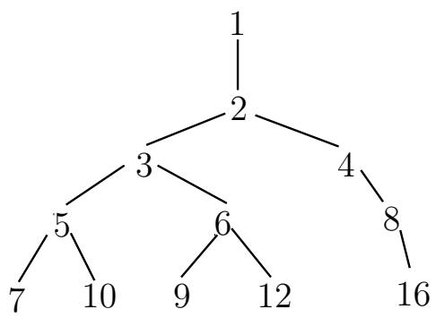
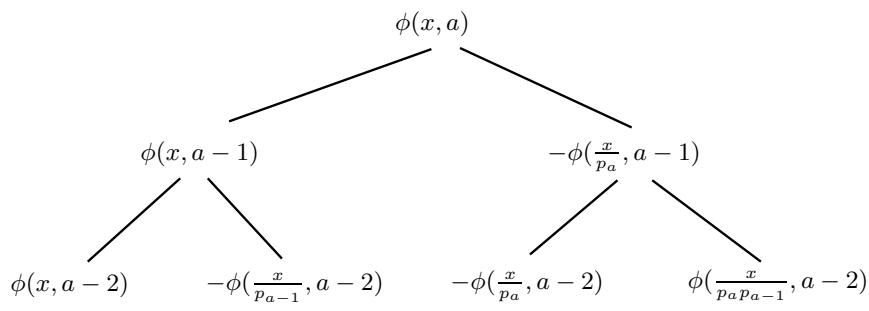

# 基础数论算法

本章将讨论素数判定, 因子分解以外的许多基础数论算法, 包括快速求幂, 幂次检测, 整数的最大公因子(GCD), Legendre-Jacobi-Kronecker 符号, 中国剩余定理, 连分数展式及一些常用的数论函数的计算. 这些问题和算法不仅有其本身的趣味, 而且在计算机代数系统中也起着非常基础性的作用, 为许多其他更复杂的问题和算法所依赖.

阅读本章要求读者有基本的初等数论知识(例如 [10]), 本章的主要参考书为[56] 和 [104].

# 4.1 快速求幂

# 4.1.1 二进方法

设 $G$ 为一乘法群, $n \in \mathbb { Z } ( G$ 可只为乘法半群, 此时限定 $n \in \mathbb { N }$ ), 计算 $g \in G$ 的幂次 $g ^ { n }$ 是在计算机代数系统中到处出现的运算(尤其是 $G = \mathbb { Z } / N \mathbb { Z }$ 的情形), 因此快速进行求幂起着非常基本的作用. 最平凡的方法需要 $n - 1$ 个乘法, 不过我们有办法大幅地改进乘法的次数.

一个启发性的想法是二分策略. 例如我们要求 $g ^ { 1 1 }$ , 而 11 的二进制表示为$1 1 = 2 ^ { 3 } + 2 + 1$ , 可以依次求出 $g ^ { 1 } , g ^ { 2 } , g ^ { 4 } , g ^ { 8 }$ , 再计算 $g ^ { 3 } = g ^ { 1 } \cdot g ^ { 2 }$ 及 $g ^ { 1 1 } = g ^ { 3 } \cdot g ^ { 8 }$ , 总共只用了 5 次乘法便得到了结果. 这种方法被称为自右向左的二进方法(Right-leftBinary). 另外还有一种自左向右的二进方法(Left-right Binary): 对于上面的例子依次求出 $g ^ { 1 }$ , $g ^ { 2 }$ , $g ^ { 4 } = ( g ^ { 2 } ) ^ { 2 }$ , $g ^ { 5 } = g ^ { 4 } \cdot g ^ { 1 }$ , $g ^ { 1 0 } = ( g ^ { 5 } ) ^ { 2 }$ , $g ^ { 1 1 } = g ^ { 1 0 } \cdot g ^ { 1 }$ , 同样用 5 次乘

法得到结果.

算法4.1 (自右向左的二进方法).

设二进表示 $n = \sum _ { k = 0 } ^ { m } \varepsilon _ { k } 2 ^ { k }$ (假定 $n > 0$ , 否则考虑 $( g ^ { - 1 } ) ^ { | n | }$ ), $a = 1$ , 重复以下步骤, 第 $k$ 步 $( k = 0 , 1 , \ldots , m )$ 执行:

1. 计算 $g ^ { 2 ^ { k } } = ( g ^ { 2 ^ { k - 1 } } ) ^ { 2 }$ .   
2. 若 $\varepsilon _ { k } = 1$ , 则令 $a \gets a \cdot g ^ { 2 ^ { k } }$ .  
3. 若 $k = m$ , 输出 $g ^ { n } = a$ , 算法终止.

注48. 实践中 $n$ 的二进表达式不需要预先存储, 其计算(通过位操作)可以与 $g ^ { 2 ^ { k } }$ 的计算同步进行.  
注49. 不难验证 G 中进行求 n 次幂的乘法次数为 m − 1 + $G$ $n$ $m - 1 + \sum _ { k = 0 } ^ { m } \varepsilon _ { k } = { \cal O } ( \log n )$ , 这要远小于平凡算法的 $n - 1$ .

算法4.2 (自左向右的二进方法).

设二进表示 $n = \sum _ { k = 0 } ^ { m } \varepsilon _ { k } 2 ^ { k }$ (假定 $n > 0$ , 否则考虑 $( g ^ { - 1 } ) ^ { | n | }$ ), $a = g$ , 重复以下步骤, 第 $k$ 步 $( k = m - 1 , m - 2 , \ldots , 0 )$ 执行:

1. 若 $\varepsilon _ { k } = 0$ , 则 $a \gets a ^ { 2 }$ .  
2. 若 $\varepsilon _ { k } = 1$ , 则 $a \gets a ^ { 2 }$ , $a \gets a \cdot g$   
3. 若 $k = 0$ , 输出 $g ^ { n } = a$ , 算法中止.

注50. 算法 4.1 与算法 4.2 求 $n$ 次幂所用的乘法次数相同, 但在算法 4.2 第二步累乘时乘上的因子 $g$ 要比算法4.1乘上的因子 $g ^ { 2 ^ { k } }$ 小一些.

# 4.1.2 $m$ 进方法, 窗口方法及加法链

二进方法的一个很自然的推广就是 $m$ 进方法, 利用 $n$ 的 $m$ 进表示, 类似二进方法的平方而不断地进行 $m$ 次幂. $m = 2 ^ { k }$ 的情形尤其简单, 因此在实践中也很常用. 不同于二进方法, $m$ 进方法还需要额外储存 $g ^ { 2 } , g ^ { 3 } , \ldots , g ^ { m - 1 }$ 的值. $2 ^ { k }$ 进方法的进一步改进是所谓窗口方法(Window Method), 取一个固定长度 $k + 1$ 的“窗

口”, 用窗口自左向右扫描 $n$ 的二进表达, 计算窗口内的乘幂(往往预先计算好$g ^ { 3 } , \ldots , g ^ { 2 ^ { k } - 1 } )$ , 然后通过乘幂将窗口向右平移(遇零即为平方), 将下一个窗口内的数乘以已经得到的幂, 再重复平移过程. 例如考虑 n = 26235947428953663183191.用 8 进方法需要 102 次乘法, 而通过长度 4 的窗口方法可以减少到 93 次(参见[77]), 包括预先的 $2 ^ { 4 } - 1$ 次计算, 71 次平方和 14 次中间过程中的乘法. 下式表示了此窗口方法的过程. 其中除去最左边的一条, 剩下的 14 条下划线各代表一次中间过程的乘法:

$$
\frac {1 0 1 1}{1 1} \quad 0 0 0 \frac {1 1 1}{7} \quad 0 0 \frac {1}{1} \quad 0 0 0 0 0 0 \frac {1 1 1}{7} \quad 0 \frac {1}{9} \quad 0 \frac {1}{9} \quad 0 \frac {1}{1 3} \quad 0 \frac {1}{1} \quad 0 0 0 0 0 0 \frac {1 0 1 1}{1 1} \quad 1 1 \frac {1}{3} \quad 0 0 0 0 0 \frac {1 1 1 1}{1 5} \quad 1 0 0 1 \frac {1}{9} \quad 1 0 0 1 \frac {1}{9} \quad 0 \frac {1}{5} \quad 0 \frac {1 1 1}{7}
$$

二进方法的乘法次数较平凡算法有本质的减少, 一个很自然的问题是: 计算 $n$ 次幂所需要的最少乘法次数是多少？这等价于求 $n$ 的加法链的最短长度$l ( n )$ (参见 [104]). 构造最短长度的加法链是较为困难的问题, 在实践中只能构造“近似”最短的加法链. 一个构造方法是通过“幂树”, 其构造方法是: 首先在第一层置 1, 当置完 $k$ 层后, 从左到右依次取第 $k$ 层每个节点 $n$ , 在其下附加节点$n + 1 , n + a _ { 1 } , \ldots , n + a _ { k - 1 } = 2 n$ , 其中 $1 , a _ { 1 } , a _ { 2 } , \ldots , a _ { k - 1 }$ 是树根到 $n$ 的到 $n$ 的通路上的点, 但已出现的节点不予添加. 下图显示了前 4 层幂树.

  
图 4.1: 前 4 层幂树

有了幂树之后, 当我们要计算某个 $n$ 次幂时, 只需要在该树上找到 $n$ , 依次计算从根节点到 $n$ 的路径上的幂次即可.

幂树构造简单, 但对较大的 $n$ 树的规模会很大(实际得到了 $n$ 以下所有数的近似加法链). 有许多启发性的算法来构造直接 $n$ 的近似最短加法链(参见 [77], [36]).

另外窗口方法和加法链也可以结合起来使用. 由于当窗口长度增加时, 需要预先计算的 $g$ 的幂数量增多, 可以构造加法序列(含所需幂次的加法链)来减少预先的

计算量. 使用长度较大的窗口的确能够减少乘法的次数, 例如对前面的例子, 可以将93 次乘法进一步减少到 89次. 下式显示了长度为 8 的窗口方法过程.

$$
\frac {1 0 1 1 0 0 0 1 1 1 0 0 1}{5 6 8 9} \frac {0 0 0 0 0 0}{9 3 3} \frac {1 1 1 0 1 0 0 1 0 1}{1 1 7} \frac {0 0 1 1 1 0 1 0 1}{4 7} \frac {0 0 0 0 0 0}{4 7} \frac {1 0 1 1 1 1}{4 9 9} \frac {0 0 0 0 0}{4 9 9} \frac {1 1 1 1 1 0 0 1 1}{3 4 3} \frac {0 0 1 0 1 0 1 0 1 1}{3 4 3}
$$

注51. 前面所述的乘幂算法对一般的乘法半群均适用(例如矩阵乘法, 多项式乘法). 考虑乘幂运算对象的特性, 还有更多可能改进的空间. 例如 $G$ 为椭圆曲线的特殊情形(在这里是加法群), 由于元素的逆较为容易求得, 可以考虑形如$n = \sum _ { i \geq 0 } \varepsilon _ { i } 2 ^ { i } \left( \varepsilon _ { i } \in \left\{ 0 , \pm 1 \right\} \right)$ 的冗余二进制表示, 来减少乘法次数. 对于 $G = \mathbb { Z } / N \mathbb { Z }$ 的特殊情形则有下面将要介绍的著名的 Montgomery约化过程.

# 4.1.3 Montgomery 约化

乘幂运算最常见的是出现在 $G = \mathbb { Z } / N \mathbb { Z }$ 中. Montgomery[125] 提出一个避免试除的计算模乘法的方法, 对于 $N$ 固定, 需要大量乘法的模幂运算尤其有效. 主要想法是将模 $N$ 的运算转化为模机器字长(例如 $2 ^ { 3 2 }$ )的运算, 而后者是硬件快速实现的.

定义4.1. 记 ${ \overline { { x } } } = x$ mod $N \in \{ 0 , 1 , \ldots , N - 1 \}$ , 即 $x$ 模 $N$ 的余数. 设 $R$ 为一个进制的基(通常取为机器字长或其幂次), 满足 $( R , N ) = 1$ , $R > N$ . 则 $\exists 0 \leq u < N$ ,$0 \leq v < R$ 成立 Bezout 等式 $u \cdot R - v \cdot N = 1$ , 我们定义 $\widetilde { x } : = \overline { { x u } }$ , 称为 $x$ 的Montgomery 表示.

注52. 由定义可知 $\overline { { u R } } = 1$ 以及 ${ \overline { { x } } } = { \widetilde { x R } }$ . 并且当 $x$ 跑遍模 $N$ 的一个完全剩余系时,$\widetilde { x }$ 也跑遍模 $N$ 的完全剩余系, 因此 $\widetilde { x }$ 这种表示不会损失信息.

下面的快速计算 $\widetilde { x }$ 的算法是 Montgomery 模幂乘法的核心.

算法4.3 (Montgomery 约化).

设 $0 \leq x < R N$ , 以下步骤计算 $\widetilde { x }$ .

1. 计算 $m = ( x { \bmod { R } } ) \cdot v$ mod $R$ , $0 \leq m < R$ .   
2. 计算 $t = ( x + m N ) / R$ .   
3. 若 $t \geq N$ 输出 $t - N$ , 否则输出 $t$ , 算法终止.

注53. 当 $R$ 取为机器字长时, 第一, 二步中的模运算和除法运算都可直接通过位操作快速进行.

算法的有效性. 首先由 $x + m N \equiv x + x v N \equiv x ( 1 + v N ) \equiv x u R \equiv 0$ (mod $R$ ) 知$t$ 为整数. 再由 $t = ( x + m N ) / R$ , 知 $u R t = ( x u + u m N )$ , 从而 ${ \overline { { u R t } } } = { \overline { { x u } } }$ , 即有$\bar { t } = \widetilde x$ . 最后由 $0 \leq x < R N$ , $0 \leq m < R$ , 知 $0 \leq t < 2 N$ , 可得算法的有效性.

下面的命题表明, 在 Montgomery 表示下, $\widetilde { m n }$ 即表示 $m$ 与 $n$ 的乘积.

命题4.1. 设 $m , n \in \mathbb { Z }$ , 则

$$
\overline {{\widetilde {m} \cdot \widetilde {n}}} = \widetilde {\overline {{m}} \cdot n}.
$$

证明. 由定义, ${ \overline { { { \widetilde { m } } \cdot { \widetilde { n } } } } } = { \overline { { m u } } } \cdot { \overline { { n u } } } = { \overline { { m n u ^ { 2 } } } } = { \widetilde { m n u } } = { \widetilde { \widetilde { m \cdot n } } } .$

为求 ${ \overline { { x \cdot y } } } .$ 首先将 $\overline { { x } } , \overline { { y } }$ 逆变换为 Montgomery 表示 ${ \widetilde { x R } } , { \widetilde { y R } }$ , 再利用命题 4.1 和算法 4.3 即可.

注54. 应用算法 4.3 时要注意保证输入满足在 0 和 $R N$ 之间, 而 $x R \cdot y R$ 并不满足此条件. 可对两乘数先做一个模 $N$ 处理, 这可利用 ${ \overline { { x R } } } = { \widetilde { x R ^ { 2 } } }$ 来完成, 而 $\overline { { R ^ { 2 } } }$ 作为一个固定的常数可预先计算好, 反复使用. 在求幂的过程中, 由于 $R , N$ 固定, 只需要在第一步逆变换为 Montgomery 表示, 中间结果全部用 Montgomery 表示来运算(运用算法 4.1 或 4.2 ), 并对最终结果变换回正常表示即可, 由此加快了求幂的运算速度.

注55. 当 $( R , N ) \neq 1$ , 通常即 $N$ 为偶数的情形, 模幂运算可通过将 $N$ 分解为$2 ^ { d } \cdot N _ { 0 } ( N _ { 0 }$ 为奇数), 先对用算法 4.3 对 $N _ { 0 }$ 模幂, 再对 $2 ^ { d }$ 模幂(位操作本身就很快),最后用中国剩余定理 4.16重构出结果来.

注56. [87] 提出了比 Montgomery 方法更快的模幂算法, 执行效率约能提升 $3 0 \%$ 到$5 0 \%$ .

# 4.2 幂次检测

在许多算法中(例如 SQUFOF 算法 3.5 ), 需要判断一个整数是否是完全平方数(更一般地判断是否为素数幂), 如果是的话, 还要求出其平方根. 对于很大的整数, 这些算法都要更有针对性, 更高效一些才能满足需要.

# 4.2.1 整数开方

对于整数开方, 直接动用浮点数运算显然是低效而且不精确的, 但我们可以将经典的 Newton 迭代法做一个改进使之变得更经济.

算法4.4 (整数开方).

输入整数 $n$ , 以下算法计算 $\lfloor { \sqrt { n } } \rfloor$ .

1. 令 $x _ { 0 } = n$ .   
2. 顺次计算 xk+1 = $x _ { k + 1 } = \left\lfloor { \frac { x _ { k } + \lfloor n / x _ { k } \rfloor } { 2 } } \right\rfloor .$   
3. 若 $x _ { k + 1 } \geq x _ { k }$ , 输出 $x _ { k }$ , 算法终止, 否则跳到第二步.

注57. 算法中所有运算均为整数运算, 没有动用浮点数运算.

算法的有效性. 由

$$
\left\lfloor \frac {x _ {k - 1} + \lfloor n / x _ {k - 1} \rfloor}{2} \right\rfloor > \frac {x _ {k - 1} + n / x _ {k - 1} - 1}{2} - \frac {1}{2} \geq \sqrt {n} - 1,
$$

可知对于任意 $k$ , 均有 $x _ { k } \geq \lfloor { \sqrt { n } } \rfloor$ . 若 $x _ { k + 1 } \geq x _ { k }$ 且 $x _ { k } \neq \lfloor { \sqrt { n } } \rfloor$ , 则必有 $x _ { k } \geq$ $\lfloor { \sqrt { n } } \rfloor + 1$ . 于是

$$
x _ {k + 1} - x _ {k} = \left\lfloor \frac {\left\lfloor n / x _ {k} \right\rfloor - x _ {k}}{2} \right\rfloor <   \left\lfloor \frac {n - x _ {k} ^ {2}}{2 x _ {k}} \right\rfloor <   0,
$$

矛盾！从而必有 $x _ { k } = \lfloor { \sqrt { n } } \rfloor$

# 4.2.2 平方检测

我们要判断给定的整数 $n$ 是否是一个完全平方数, 直接用算法4.4计算 $\lfloor { \sqrt { n } } \rfloor ^ { 2 }$ 是一个办法, 不过我们在这样做之前可以首先排除许多非平方数的情形. 以下方法运用一个简单的事实: 如果 $n$ 是一个平方数, 那么对任意整数 $k$ , $n$ 在 $\mathbb { Z } / k \mathbb { Z }$ 中都是一个平方数.

算法4.5 (平方检测).

输入整数 $n$ , 判断其是否为平方数, 若是, 求之.

1. 枚举生成数组 $q _ { 6 4 }$ , 满足

$$
q _ {6 4} [ k ] = {\left\{ \begin{array}{l l} {1} & {{\text {若}} k {\text {为}} \mathbb {Z} / 6 4 \mathbb {Z} {\text {中 的 平 方 数}},} \\ {0} & {{\text {若}} k {\text {为}} \mathbb {Z} / 6 4 \mathbb {Z} {\text {中 的 非 平 方 数}}.} \end{array} \right.}
$$

类似生成另外三个数组 $q _ { 6 3 } , q _ { 6 5 } , q _ { 1 1 }$ .

2. 若 $q _ { 6 4 } [ n \mathrm { m o d } 6 4 ] = 0$ , 输出非平方数, 算法终止; 否则计算 $r ~ = ~ n$ mod$4 5 0 4 5 ( = 6 3 \times 6 5 \times 1 1 )$ .  
3. 若 $q _ { 6 3 } [ r \ \mathrm { m o d } \ 6 3 ] = 0$ 或 $q _ { 6 5 } [ r \ \mathrm { m o d } \ 6 5 ] = 0$ 或 $q _ { 1 1 } [ r$ $q _ { 1 1 } [ r \ \mathrm { m o d } \ 1 1 ] = 0$ , 输出非平方数, 算法终止.  
4. 用算法 4.4 计算 $\lfloor { \sqrt { n } } \rfloor ^ { 2 }$ , 若不等于 $n$ 输出非平方数, 否则输出平方根, 算法终止.

注58. 若 $n$ 非平方数, 则算法进行到最后一步的可能性非常小, 因为模 64, 63, 65,11的平方数个数分别为 12, 16, 21, 6, 从而这种情况发生的概率大约仅为为

$$
\frac {1 2}{6 4} \cdot \frac {1 6}{6 3} \cdot \frac {2 1}{6 5} \cdot \frac {6}{1 1} = \frac {6}{7 1 5}.
$$

我们从上式也可以看出选取四个数 64, 63, 65, 11的缘由.

注59. 在实际算法中, 我们往往是通过实验来获取更佳的常数选择方案.

# 4.2.3 素数幂检测

我们有时会需要检测一个整数 $n$ 是否为素数幂 $p ^ { k }$ , 例如素数幂检测可以作为一般整数因子分解算法的子算法. 若 $n = p ^ { k }$ , 则由 Fermat 小定理, 对于任意整数$a$ 都有 $p \mid a ^ { p } - a .$ , 从而 $p \mid ( a ^ { n } - a , n )$ .

例4.1. 取 $n = p ^ { k }$ , 我们计算 $( a ^ { n } - a , n )$ :

1. $n = 3 ^ { 3 }$ , 取 $a = 2$ , 则 $( a ^ { n } - a , n ) = ( 2 ^ { 2 7 } - 2 , 2 7 ) = ( 1 3 4 2 1 7 7 2 6 , 2 7 ) = 3 .$   
2. $n = 5 ^ { 2 }$ , 取 $a = 3$ , 则 $( a ^ { n } - a , n ) = ( 3 ^ { 2 5 } - 3 , 2 5 ) = ( 8 4 7 2 8 8 6 0 9 4 4 0 , 2 5 ) = 5 .$   
3. $n = 2 ^ { 6 }$ , 取 $a = 2$ , 则 $( a ^ { n } - a , n ) = ( 2 ^ { 6 4 } - 2 , 6 4 ) = ( 1 8 4 4 6 7 4 4 0 7 3 7 0 9 5 5 1 6 1 4 , 6 4 ) =$ 2.

但实际上通过试算几个例子可以发现大部分情况下都有 $( a ^ { n } - a , n ) = p$ . 这就启发我们得到如下的算法.

# 算法4.6 (素数幂检测).

输入整数 $n$ , 判断其是否为素数幂, 若是, 输出素数 $p$ .

1. 取 $a = 2$ .   
2. 用算法 4.3 计算 $b = a ^ { n }$ mod $n$ 并计算 $p = ( b - a , n )$ .  
3. 若 $p = 1$ , 输出非素数幂, 算法终止; 否则用对 $p$ 进行合性检测(例如 Rabin-Miller 检测, 算法 2.5 ), 若 $p$ 为合数, 则令 $a \gets a + 1$ , 跳到第二步.  
4. 对 $p$ 进行素性检测(例如 Lehmer $N - 1$ 检测, 定理 2.1 ), 若 $p$ 不一定为素数,则令 $a \gets a + 1$ , 跳到第二步.  
5. $p$ 为素数, 依次计算 $p , p ^ { 2 } , \ldots , p ^ { 2 ^ { k } }$ 直到 $p ^ { 2 ^ { k } } > n$

• 若 $p ^ { 2 ^ { k - 1 } } \nmid n$ , 输出非素数幂, 算法终止;   
否则令 $n  { \frac { n } { p ^ { 2 ^ { k - 1 } } } }$ ← np2k−1 , 重复第五步, 直到 n = 1. $n = 1$

6. 输出素数 $p$ , 算法终止.

注60. 若 $p$ 为素数, 第四步的跳转实际上很少发生.

# 4.3 最大公因子

相对于因子分解, 求两个整数 a, b 的最大公因子 $\operatorname { g c d } ( a , b )$ (Greatest CommonDivisor, GCD)要快上许多, 甚至往往超出我们的想象. 用普通的个人电脑在 2 秒以内计算两个十万位的整数的最大公因子也不是一件难事.

据 [91] 的数据, 一个典型的代数运算(例如求多元多项式组的 Gr¨obner 基)通常要花上一半以上时间用来计算某两个大整数的最大公因子, 或许正因为最大公因子在计算机代数系统中的重要性, 对它的研究才能如此深入.

为了避免混淆, 在本节中始终用 $\operatorname { g c d } ( a , b )$ 代表最大公因子, 而出现在算法的描述中的 $( a , b )$ 则仅仅代表二元有序数对.

# 4.3.1 Euclid 算法

最平凡的求整数 a, b 的 GCD 的办法是直接将两数分解, 但这实在是太慢了,只在 $a , b$ 都小于 100 或者已知其中之一为素数的时候才可能有些用处. 早在古希

腊时代人们就已经知道如何进行更高效的计算了, 经典的 Euclid 算法虽最古老却也是最本质最有效的方法之一.

# 算法4.7 (Euclid).

输入正整数 $a , b ,$ , 计算 $\operatorname { g c d } ( a , b )$ .

1. 若 $b = 0$ , 则输出 $a$ , 算法终止.  
2. 令 $( a , b )  ( b , a \mathrm { m o d } b )$ , 跳到第一步.

Knuth[104]通过一系列分析给出了 Euclid算法终止前除法步数的精确估计.

定理4.1 (Euclid 算法的步数). 设 $a , b$ 随机分布于 $[ 1 , N ]$ , 则

1. Euclid 算法的平均步数为 $\frac { 1 2 \ln 2 } { \pi ^ { 2 } } \ln N + O ( 1 ) \approx 0 . 8 4 3 \ln N + O ( 1 ) .$ π2  
2. Euclid 算法在最坏情况下的步数至多为 $\lfloor \log _ { \phi } ( 3 - \phi ) N \rfloor \approx 2 . 0 7 8 \ln N +$ 0.6723, 其中 φ = 1+ 5 . $\textstyle \phi = { \frac { 1 + { \sqrt { 5 } } } { 2 } }$

# 4.3.2 Lehmer 加速算法

由定理4.1可见GCD可以在多项式时间内求出, 但Euclid算法中每一步的大整数试除还是相当耗费时间, Lehmer 针对这一点给出了加速的方法, 其基本想法是试除的商 $\left\lfloor { \frac { a } { b } } \right\rfloor$ 很大程度上只与 a, b 的前若干位有关, 从而可以用单精度的运算代替高精度的大整数试除.

例4.2. 我们想要计算 $\operatorname* { g c d } ( a , b ) = \operatorname* { g c d } ( 2 7 1 8 2 8 1 8 , 1 0 0 0 0 0 0 0 )$ , 假设计算机的字长为 4个十进制数字, 令 $\hat { a } = 2 7 1 8$ , $\hat { b } = 1 0 0 0$ , 对 $\hat { a } + 1$ , $\hat { b }$ 进行 Euclid 算法的试商结果很可能与 $a , b$ 进行的结果是一致的, 如下表.

<table><tr><td>a</td><td>b</td><td>q</td><td>ˆa+1</td><td>ˆb</td><td>ˆq</td></tr><tr><td>27182818</td><td>10000000</td><td>2</td><td>2719</td><td>1000</td><td>2</td></tr><tr><td>10000000</td><td>7182818</td><td>1</td><td>1000</td><td>719</td><td>1</td></tr><tr><td>7182818</td><td>2817182</td><td>2</td><td>719</td><td>281</td><td>2</td></tr><tr><td>2817182</td><td>1548454</td><td>1</td><td>281</td><td>157</td><td>1</td></tr><tr><td>1548454</td><td>1268728</td><td>1</td><td>157</td><td>124</td><td>1</td></tr><tr><td>1268728</td><td>279726</td><td>1</td><td>124</td><td>33</td><td>3</td></tr></table>

我们看到直到第 6 步试除, $q$ 与 $\hat { q }$ 才不相等, 因此可以利用 $a$ 与 $b$ 的前若干位来快速求得试除的商. 一个存在问题是如何判断试商的正确性？解决方法是可以同时求另一组 $\operatorname* { g c d } ( \hat { a } , \hat { b } + 1 ) = \operatorname* { g c d } ( 2 7 1 8 , 1 0 0 1 )$ 的试商.

<table><tr><td>ˆa+1</td><td>ˆb</td><td>ˆq</td><td>ˆa</td><td>ˆb+1</td><td>ˆq</td></tr><tr><td>2719</td><td>1000</td><td>2</td><td>2178</td><td>1001</td><td>2</td></tr><tr><td>1000</td><td>719</td><td>1</td><td>1001</td><td>716</td><td>1</td></tr><tr><td>719</td><td>281</td><td>2</td><td>716</td><td>285</td><td>2</td></tr><tr><td>281</td><td>157</td><td>1</td><td>285</td><td>146</td><td>1</td></tr><tr><td>157</td><td>124</td><td>1</td><td>146</td><td>139</td><td>1</td></tr><tr><td>124</td><td>33</td><td>3</td><td>139</td><td>7</td><td>19</td></tr></table>

显然若两组求得的商相同, 即可判定试商是准确无误的. 上表也验证了这一点.

# 算法4.8 (Lehmer 加速算法).

输入正整数 a, b, 且 $a > b$ , 计算 $\operatorname { g c d } ( a , b )$ . 设 $M$ 为单精度整数的上限(例如$2 ^ { 3 2 } )$ ), 以下 $\hat { a } , \hat { b } , A , B , C , D$ $D$ 均为单精度整数(即 $< M$ ).

1. 若 $b < M$ , 直接用Euclid算法计算输出 $\operatorname { g c d } ( a , b )$ , 算法终止; 若 $b \geq M$ , 记 $\hat { a }$ ,$\hat { b }$ 为 $M$ 进制下 a, b 的最高位, ${ \binom { A C } { B D } } \gets { \binom { 1 0 } { 0 1 } }$   
2. 若 $\hat { b } + C \neq 0$ , $\hat { b } + D \neq 0$ , 则令 $q \gets \left\lfloor { \frac { { \hat { a } } + A } { { \hat { b } } + C } } \right\rfloor$ , 否则跳到跳到第四步. 若还有$q = \left\lfloor { \frac { { \hat { a } } + B } { { \hat { b } } + D } } \right\rfloor$ , 则跳到第三步, 否则跳到第四步.  
3. 令 ${ \binom { A C } { B D } } \gets { \binom { A C } { B D } } \left( { \begin{array} { l } { 0 } \\ { 1 - q } \end{array} } \right)$ $( \hat { a } , \hat { b } ) \gets ( \hat { a } , \hat { b } ) \left( { 0 \atop 1 - q } \right)$ , 跳到第二步.  
4. 若 $B \neq 0$ , 令 $( a , b )  ( a , b ) ( { A C } )$ 跳到第一步; 否则用高精度运算直接求出 $( a , b )  ( b , a \mathrm { m o d } b )$ , 跳到第一步.

注61. Lehmer 的加速算法虽然步数和普通的 Euclid 算法是一样的, 但除了第四步后一种情形外, 都只需要单精度运算或单精度与高精度数的乘法, 这起到了“加速”的作用.

注62. 注意算法的陈述中忽略了一种特殊情形, 即当 $\hat { a } = M - 1 , A = 1$ 或$\hat { b } = M - 1 , D = 1$ 时, 计算可能超出单精度的范围, 可以将 $M$ 取为略小与单精度整数上限即可.

# 4.3.3 二进方法(Binary GCD)

另一种二进方法(Binary GCD)在实践中也很有用, 其主要想法是用减法和移位来代替代价较大的试除. 尽管需要的运算步数增多了, 但由于减法和位移运算的简单性节省出的是时间还是很可观的.

下面的定理精确地叙述了只用减法的合理性(参考 [104]).

定理4.2. 设 $b$ 固定, $a$ 随机分布. 对 a, b 施行 Euclid 算法, 其中间步骤试商为 $q$ 的概率记为 $P _ { b } ( q )$ , 则有

$$
\lim _ {b \to \infty} P _ {b} (q) = \log {\frac {(q + 1) ^ {2}}{(q + 1) ^ {2} - 1}}.
$$

注63. 由定理 4.2 , 粗略地估计试商值为 1 的概率为 $\log { \frac { 4 } { 3 } } \approx 0 . 4 1 5$ , 试商值为 2 的概率为 $\log { \frac { 9 } { 8 } } \approx 0 . 1 7 0$ . 可见大部分情况下除数和被除数都是比较接近的, 可以用减法来替代试除.

# 算法4.9 (Binary GCD).

输入正整数 $a , b ,$ , 且 $a > b$ , 计算 $\operatorname { g c d } ( a , b )$ .

1. 用高精度直接计算 $( a , b )  ( b , a \mathrm { m o d } b )$ .  
2. 若 $b = 0$ , 输出 $a$ , 算法终止; 否则设 $a = 2 ^ { m } a _ { 0 } , b = 2 ^ { n } b _ { 0 } , a _ { 0 } , b _ { 0 }$ $a = 2 ^ { m } a _ { 0 }$ $b = 2 ^ { n } b _ { 0 }$ $a _ { 0 }$ $b _ { 0 }$ 为奇数. 设$k = \operatorname* { m i n } \{ m , n \}$ , 通过位操作计算 $( a , b ) \gets ( a \cdot 2 ^ { - m } , b \cdot 2 ^ { - n } )$ .  
3. 令 $t \gets a - b$ , 若 $t = 0$ , 输出 $a \cdot 2 ^ { k }$ , 算法终止.  
4. 设 $t = 2 ^ { s } t _ { 0 }$ , $t _ { 0 }$ 为奇数, 若 $t _ { 0 } > 0$ , 令 $a \gets t _ { 0 }$ , 否则令 $b \gets - t _ { 0 }$ , 跳到第三步.

注64. 由于初始的 $a$ 和 $b$ 可能相差很大, 不适宜反复做减法, 因此还是需要第一步的高精度试除.

注65. Gosper 提出了一个将 Binary GCD 想法与 Lehmer 加速算法结合起来的方法, 参见 [104].

# 4.3.4 扩展 Euclid 算法

在很多问题中(例如求模 $N$ 的逆)不仅需要知道 $\operatorname { g c d } ( a , b )$ , 还要求出 Bezout 等式中的系数 $u , v$ , 使得成立

$$
u a + v b = d (= \operatorname * {g c d} (a, b)).
$$

这样的算法称为扩展 Euclid 算法. 在原始的 Euclid 算法过程中保留所有的商和余数即可倒推出 $u$ 和 $v$ 来, 不过这样做需要较大的空间开销. 可以在计算过程中保留类似于 Lehmer 加速算法中的矩阵 $\binom { A C } { B D }$ , 矩阵的列实际上就是新操作数作为 $a$ $b$ 线性组合的系数.

Lehmer 加速算法本身就就具有了“扩展”的特性, 但 Binary GCD 的“扩展”能力表面上看来就没有那么直接了. 不过仔细追踪算法的行进过程, 还是能够求出系数 u, $v$ 来的.

# 算法4.10 (扩展 Binary GCD).

输入正整数 $a , b$ , 且 $a > b$ , 计算三元组 $( u , v , d )$ .

1. 用高精度直接计算 $( a , b )  ( b , a \mathrm { m o d } b )$ .  
2. 若 $b = 0$ , 输出 $( 0 , 1 , b )$ , 算法终止; 否则设 $a = 2 ^ { m } a _ { 0 }$ $a = 2 ^ { m } a _ { 0 } , b = 2 ^ { n } b _ { 0 } , a _ { 0 } , b _ { 0 }$ $b = 2 ^ { n } b _ { 0 }$ $a _ { 0 }$ $b _ { 0 }$ 为奇数.设 $k = \operatorname* { m i n } \{ m , n \}$ , 通过位操作计算 $( a , b ) \gets ( a \cdot 2 ^ { - k } , b \cdot 2 ^ { - k } )$ .  
3. 令 $( u _ { 1 } , v _ { 1 } , d _ { 1 } ) \ \gets \ ( 1 , 0 , a )$ , $( u _ { 2 } , v _ { 2 } , d _ { 2 } ) \ \gets \ ( b , 1 - a , b )$ . 若 $a$ 为奇数, 令$( u _ { 0 } , v _ { 0 } , d _ { 0 } ) \gets ( 0 , - 1 , - b )$ , 跳到第五步; 否则令 $( u _ { 0 } , v _ { 0 } , d _ { 0 } ) \gets ( 1 , 0 , a )$ .  
4. 若 $u _ { 0 } , v _ { 0 }$ 均为偶数, 令 $( u _ { 0 } , v _ { 0 } , d _ { 0 } ) \gets ( u _ { 0 } , v _ { 0 } , d _ { 0 } ) / 2$ ; 否则令 $( u _ { 0 } , v _ { 0 } , d _ { 0 } ) \gets$ $( u _ { 0 } + b , v _ { 0 } - a , d _ { 0 } ) / 2$ .  
5. 若 $d _ { 0 }$ 为偶数, 跳到第四步.  
6. 若 $d _ { 0 } > 0$ , 令 $( u _ { 1 } , v _ { 1 } , d _ { 1 } ) \gets ( u _ { 0 } , v _ { 0 } , d _ { 0 } )$ ; 否则令 $( u _ { 2 } , v _ { 2 } , d _ { 2 } )  ( b - u _ { 0 } , - a -$ $v _ { 0 } , - d _ { 0 } )$ .  
7. 令 $( u _ { 0 } , v _ { 0 } , d _ { 0 } ) \gets ( u _ { 1 } - u _ { 2 } , v _ { 1 } - v _ { 2 } , d _ { 1 } - d _ { 2 } )$ , 若 $u _ { 0 } \leq 0$ , 令 $( u _ { 0 } , v _ { 0 } )  ( u _ { 0 } +$ $b , v _ { 0 } - a )$ . 若 $d _ { 0 } = 0$ , 输出 $( u _ { 1 } , v _ { 1 } , d _ { 1 } \cdot 2 ^ { k } )$ , 算法终止; 否则跳到第四步.

算法的有效性. 可以仔细验证每一步后都满足 $0 \leq u _ { 1 } , u _ { 2 } , u _ { 0 } \leq b , - a \leq v _ { 1 } , v _ { 2 } , v _ { 0 } \leq$ 0, $0 < d _ { 1 } \le a$ , $0 < d _ { 2 } \leq b$ , 且满足 $u _ { i } a + v _ { i } b = d _ { i }$ , 对 $i = { 1 , 2 , 3 }$ . 算法的终止性是明

显的.

注66. 与原始的Binary GCD有区别的是第四步, 这是为了保证系数也能除以2而做的微小改动.

# 4.3.5 dmod 与 bmod

首先我们引进某种程度上相当于 mod 的运算 dmod(digit mod)和 bmod(bitmod).

定义4.2 (dmod 和 bmod). 设 $\beta$ 为一个进制的基, 正整数 a, b, 满足 $a \ > \ b$ ,$\operatorname* { g c d } ( a , \beta ) = 1$ , $\operatorname* { g c d } ( b , \beta ) = 1$ , $l _ { \beta } ( a )$ 表示 $a$ 在 $\beta .$ -进制表示下的位数, 记 $\delta \ =$ $l _ { \beta } ( a ) - l _ { \beta } ( b ) + 1$ . 定义

$$
a \operatorname {d m o d} _ {\beta} b := \frac {| a - (a b ^ {- 1} \bmod \beta^ {\delta}) b |}{\beta^ {\delta}}.
$$

当 $\beta = 2$ 时(最常用的情形), 简记为

$$
a \operatorname {b m o d} b := a \operatorname {d m o d} _ {2} b.
$$

注67. 由于 $a - ( a b ^ { - 1 } \bmod \beta ^ { \delta } ) b \equiv a - a \equiv 0$ (mod $\beta ^ { \delta }$ ), 故 dmod 和 bmod 是可以定义好的.

例4.3. 设 $a = 1 5 5 = ( 1 0 0 1 1 0 1 1 ) _ { 2 }$ , $b = 1 5 = ( 1 1 1 ) _ { 2 }$ , 则 $l _ { 2 } ( a ) = 8$ , $l _ { 2 } ( b ) = 4$ ,$2 ^ { \delta } = 2 ^ { l _ { 2 } ( a ) - l _ { 2 } ( b ) + 1 } = 3 2$ , $1 5 ^ { - 1 } \equiv 1 5$ (mod 32). 从而

$$
\begin{array}{l} 1 5 5 \mathrm {b m o d} 1 5 = \frac {\left| 1 5 5 - (1 5 5 \cdot 1 5 \mathrm {m o d} 3 2) \cdot 1 5 \right|}{3 2} \\ = \frac {| 1 5 5 - 2 1 \cdot 1 5 |}{3 2} = 5. \\ \end{array}
$$

恰巧有 $\operatorname* { g c d } ( 1 5 5 , 1 5 ) = 5$ .

可以直接验证 $\operatorname* { g c d } ( a \operatorname { d m o d } _ { \beta } b , b ) = \operatorname* { g c d } ( a , b )$ , 而且 $a \mathrm { d } \mathrm { m o d } _ { \beta } b < b$ , 因此新定义的运算的确在某种程度上相当于 mod. 而且我们可以避免试除, 只用减法和位操作来计算出 $a$ bmod b. 最关键的是如何快速计算 $m = a b ^ { - 1 } { \bmod { 2 ^ { \delta } } }$ $2 ^ { \delta }$ , 接下来的算法只用减法和位操作解决了这个问题, 想法类似于待定系数法求解 $b m \equiv a$ (mod $2 ^ { \delta }$ ), 从低到高将 $m$ 的二进表达依次求出.

算法4.11 (计算 $a b ^ { - 1 } \bmod { 2 ^ { \delta } } )$ $a b ^ { - 1 }$ $2 ^ { \delta }$ ).

输入正奇数 $a , b ,$ , 计算 $a b ^ { - 1 }$ mod $2 ^ { \delta }$ .

1. 令 $d \gets a$ , $m \gets 0$ .   
2. 重复以下步骤 $( i = 0 , 1 , \ldots \delta - 1 )$ : 若 $2 ^ { i + 1 } \nmid d$ , 则令 $d  d - 2 ^ { i } \cdot b$ , $m \gets m + 2 ^ { i }$ .  
3. 输出 $m$ , 算法终止.

算法的有效性. 每次第二步的操作后均有 $d = a - m b \equiv 0$ (mod $2 ^ { i + 1 }$ ), 可知算法的有效性. □

注68. Weber[180] 仅仅采用 bmod 代替 Euclid 算法中的 mod 操作, 修改得到的算法比 Binary GCD 还要快一些.  
注69. 设 $M = 2 ^ { w }$ 为单精度整数的上界, 当 $a \gg b$ $, l _ { 2 } ( a ) - l _ { 2 } ( b ) + 1 \gg w$ 时, 可以将 bmod 操作限制在 $M$ 下以提高速度, 即取 $\delta \ : = \ : w$ , 降低 $l _ { 2 } ( a )$ 若干次直到$l _ { 2 } ( a ) - l _ { 2 } ( b ) + 1 \leq w .$ .

# 4.3.6 Jebelean-Weber-Sorenson 加速算法

Jebelean-Weber-Sorenson 加速算法的基本想法来自 Sorenson[164]. 设 $a , b$ 与$n$ 互素, 如果存在 u, $v$ 满足 $| u | , | v | < { \sqrt { n } }$ 使得 $u a \equiv v b$ (mod $n$ ), 为求 $\operatorname { g c d } ( a , b )$ ,考虑新的问题 $\begin{array} { r } { \operatorname* { g c d } ( \frac { u a - v b } { n } , b ) } \end{array}$ 可以将 $a$ 缩小大约 $\sqrt { n }$ 倍(这类似于 Binary GCD 中除以 2 的过程, 被称为 $n \cdot$ -约化). 这样的 $u$ , $v$ 很可能是存在的, 例如考虑满足$| u _ { 0 } | , | v _ { 0 } | < \sqrt { n } / 2$ 二元组 $( u _ { 0 } , v _ { 0 } )$ , 这样的二元组共有 $n$ 个, 计算 $u _ { 0 } a - v _ { 0 } b$ 其中必有两组模 $n$ 同余, 将其相减即得满足条件的 $( u , v )$ . 下面的算法严格地构造出了$( u , v )$ .

# 算法4.12.

输入正整数 $a , b , n$ , 满足 $a , b$ 与 $n$ 互素, 计算 $( u , v )$ 满足 $0 < u , | v | < \sqrt { n }$ 且 ua ≡ vb (mod n).

1. 计算 $c \gets a b ^ { - 1 }$ (mod $n$ )(当 $n$ 为 2 的幂时可使用算法 4.11 ).  
2. 令 $( u _ { 1 } , v _ { 1 } )  ( n , 0 )$ , $( u _ { 2 } , v _ { 2 } )  ( c , 1 ) .$   
3. 若 $u _ { 2 } \geq \sqrt { n }$ , 则令 $( u _ { 1 } , v _ { 1 } )  ( u _ { 1 } , v _ { 1 } ) - \lfloor { \frac { u _ { 1 } } { u _ { 2 } } } \rfloor ( u _ { 2 } , v _ { 2 } )$ , 交换 $( u _ { 1 } , v _ { 1 } )$ 与 $( u _ { 2 } , v _ { 2 } )$ ,跳到第三步.  
4. 输出 $( u _ { 2 } , v _ { 2 } )$ , 算法终止.

算法的有效性. 算法本质上就是一个 Euclid 算法. 由于正数 $u _ { 1 }$ 的严格递降,算法必在有限步后终止. 终止时有 $u _ { 2 } ~ < ~ \sqrt { n } ~ \le ~ u _ { 1 }$ , 而算法过程中始终保持$u _ { 1 } | v _ { 2 } | + u _ { 2 } | v _ { 1 } | = n$ , 可知 $u _ { 1 } | v _ { 2 } | < n$ , 从而 $| v _ { 2 } | < { \sqrt { n } }$ . □

注70. 算法 4.12 的第三步还可以用减法和位操作来避免试除, 当 u, $v$ 相差不大时更加高效.

现在我们可以高效的计算 $\begin{array} { r } { \operatorname* { g c d } ( \frac { u a - v b } { n } , b ) } \end{array}$ 了, 不过还有一个问题, 一般来说$\operatorname* { g c d } ( a , b ) \mid \operatorname* { g c d } ( \frac { u a - v b } { n } , b )$ , 但两者未必相等. 如果直接计算前者, 可能结果会包含“假因子”. 通常情况下可以在最后一步处理假因子, 因为根据 Dirichlet 的优美定理(参考 [104]), 通常求出的最大公因子都会很小 $\leq 3$ 的比例为 $8 2 . 7 \%$ ), 最后一步的处理只花很少时间.

定理4.3 (Dirichlet, 最大公因子的分布). 设 $q _ { n } ( d )$ 表示在 $1 \leq a , b \leq n$ 范围内使$\operatorname* { g c d } ( a , b ) \leq d$ 的有序数对 $( a , b )$ 的个数, 则有

$$
\lim _ {n \to \infty} \frac {q _ {n} (d)}{n ^ {2}} = \frac {6}{\pi^ {2}} \sum_ {k = 1} ^ {d} \frac {1}{k ^ {2}}.
$$

算法4.13 (Jebelean-Weber-Sorenson 加速算法).

设正整数 $a _ { 0 }$ , $b _ { 0 }$ 满足 $a _ { 0 } > b _ { 0 }$ 且 $\beta$ 互素, 依据 $b _ { 0 }$ 的长度选取 $s ( b )$ 与 $t ( b )$ (例如当 $\beta = 2$ 可固定为 10 与 32).

1. 令 $a \gets a _ { 0 }$ , $b \gets b _ { 0 }$ .   
2. 若 $b = 0$ , 跳到第五步.  
3. 若 $l _ { \beta } ( a ) - l _ { \beta } ( b ) > s ( b )$ , 则令 $a  a { \mathrm { ~ d m o d } } _ { \beta } b .$ $a \gets a$ , 跳到第三步; 否则根据算法4.12求得 $( u , v )$ 使 $u a \equiv v b$ (mod $\beta ^ { 2 t ( b ) }$ ), 令 $a \gets \frac { | u a - v b | } { \beta ^ { 2 t ( b ) } }$   
4. 将 $a$ 中的 $\beta$ 因子去除(当 $\beta = 2$ 时移位即可), 并交换 $a$ 与 $b$ , 跳到第二步.  
5. 计算 $x = \operatorname* { g c d } ( a , b _ { 0 } \operatorname { d m o d } _ { \beta } a )$ , 计算输出 $\operatorname* { g c d } ( x , a _ { 0 } \operatorname { d m o d } _ { \beta } x )$ , 算法终止.

注71. 第五步相当于用 dmod 运算快速求得了 $\operatorname* { g c d } ( \operatorname* { g c d } ( a , b _ { 0 } ) , a _ { 0 } )$ .

注72. 根据 Weber[180] 的实验结果, 在 8 个单精度整数长度时(大约 77 个十进制位), Jebelean-Weber-Sorenson 加速算法开始超过 Binary GCD.

尽管一般来说“假因子”都很小, 但也有例外的时候, Sedjelmaci[157] 以相邻的Fibonacci 数 $\left( F _ { N } , F _ { N + 1 } \right)$ 为例, 当 $N = 3 0 0$ 时, 假因子为 5, $N = 2 0 0 0$ 时, 假因子为 122542875, 而当 $N = 3 0 0 0$ 时, 假因子已高达 $1 . 0 2 \times 1 0 ^ { 1 5 }$ , 而实际上相邻的Fibonacci 数总是互素的.

不过 Sedjelmaci 给出了一个改进来避免假因子的影响, 这依赖于以下他证明的命题.

命题4.2 (Sedjelmaci). 设算法 4.12 终止时得到了 $( u _ { 1 } , v _ { 1 } )$ , $( u _ { 2 } , v _ { 2 } )$ , 若有 ${ \frac { a } { b } } < { \sqrt { n } }$ , 则满足

$$
\operatorname * {g c d} (a, b) = \operatorname * {g c d} \left(\frac {| u _ {1} a - v _ {1} b |}{n}, \frac {| u _ {2} a - v _ {2} b |}{n}\right).
$$

因此可以的到改进版的 Jebelean-Weber-Sorenson 加速算法:

算法4.14 (Sedjelmaci 改进算法).

设正整数 $a _ { 0 }$ , $b _ { 0 }$ 满足 $a _ { 0 } > b _ { 0 }$ 且 $\beta$ 互素, 依据 $b _ { 0 }$ 的长度选取与 $t ( b )$ (例如当$\beta = 2$ 可固定为 32).

1. 令 $a \gets a _ { 0 }$ , $b \gets b _ { 0 }$ .   
2. 若 $a b = 0$ , 跳到第五步; 否则令 $( a , b ) \gets ( \operatorname* { m a x } \{ a , b \} , \operatorname* { m i n } \{ a , b \} )$ .  
3. 若 $\frac { a } { b } \geq \beta ^ { t ( b ) }$ , 则 令 $( a , b )  ( b , a \mathrm { d m o d } _ { \beta } b )$ ; 否则根据算法 4.12 求得 $( u _ { 1 } , v _ { 1 } )$ ,$( u _ { 2 } , v _ { 2 } )$ , 使 $u _ { 2 } a \equiv v _ { 2 } b$ (mod $\beta ^ { 2 t ( b ) }$ ), 令 $( a , b )  \bigg ( \frac { | u _ { 1 } a - v _ { 1 } b | } { n } , \frac { | u _ { 2 } a - v _ { 2 } b | } { n } \bigg ) .$   
4. 将 $a , b$ 中的 $\beta$ 因子去除(当 $\beta = 2$ 时移位即可), 跳到第二步.  
5. 输出 $a , b$ 中不为零的数, 算法终止.

注73. 在算法的第三步可能牺牲了一些时间, 但保证了最终得到的最大公因子是不掺“假”的.

# 4.4 Legendre-Jacobi-Kronecker 符号

Legendre符号不仅本身很重要, 而且在素性检测, 因子分解等领域中也经常被用到.

定义4.3 (Legendre 符号). 设 $p$ 为奇素数, $a \in \mathbb { Z }$ , Legendre 符号定义为

$$
\left(\frac {a}{p}\right) := \left\{ \begin{array}{l l} 1 & a \text {为 模} p \text {的 二 次 剩 余 ，} \\ - 1 & a \text {为 模} p \text {的 二 次 非 剩 余 ，} \\ 0 & p \mid a. \end{array} \right.
$$

下面的性质是我们在初等数论教程中熟知的.

命题4.3 (Legendre 符号的基本性质). Legendre 符号满足:

1. (积性)

$$
\left(\frac {a}{p}\right) \left(\frac {b}{p}\right) = \left(\frac {a b}{p}\right).
$$

2. 若 $a \equiv b$ (mod $p$ ), 则

$$
\left( \begin{array}{c} a \\ p \end{array} \right) = \left( \begin{array}{c} b \\ p \end{array} \right).
$$

3. (Euler 准则)

$$
\left(\frac {a}{p}\right) \equiv a ^ {(p - 1) / 2} \pmod {p}.
$$

利用命题 4.3 中的第三条便可以通过模幂运算用来计算 Legendre 符号, 时间复杂度为 $O ( \log ^ { 3 } p )$ . 对此方法本质上的改进依赖于著名的二次互反律.

定理4.4 (二次互反律). 1. 若 p, $q$ 为不相等的素数, 则

$$
\left(\frac {p}{q}\right) \left(\frac {q}{p}\right) = (- 1) ^ {\frac {(p - 1) (q - 1)}{4}}.
$$

2. (二次互反律的补充)

$$
\left(\frac {- 1}{p}\right) = (- 1) ^ {\frac {p - 1}{2}}, \quad \left(\frac {2}{p}\right) = (- 1) ^ {\frac {p ^ {2} - 1}{8}}.
$$

利用命题 4.3 中的第一, 二条及二次互反律可以得到一个直接的计算 $\textstyle { \left( { \frac { a } { p } } \right) }$ 的方法(这也是我们在初等数论课程中掌握的). 不过此方法依赖于 $a$ 以及某些中间结果的因子分解, 而分解往往不是一件易事. 但幸运的是我们还有更好的方法, 可以将时间复杂度降到 $O ( \log ^ { 2 } { p } )$ , 这依赖于 Legendre 符号的推广 — Kronecker-Jacobi符号 .

定义4.4 (Kronecker-Jacobi 符号). 设 $a , b \in \mathbb { Z }$ , 定义 Kronecker-Jacobi 符号:

1. 若 $b = - 1$ ,

$$
\left(\frac {a}{- 1}\right) := \left\{ \begin{array}{l l} 1 & a \geq 0, \\ - 1 & a <   0. \end{array} \right.
$$

2. 若 $b = 2$

$$
\left(\frac {a}{2}\right) := \left\{ \begin{array}{l l} 0 & 2 \mid a, \\ (- 1) ^ {\frac {a ^ {2} - 1}{8}} & 2 \nmid a. \end{array} \right.
$$

3. 若 $b = 1$

$$
\left(\frac {a}{1}\right) := 1.
$$

4. 若 $b$ 为奇素数, $\left( { \frac { a } { b } } \right)$ 定义为 Legendre 符号.  
5. 设 $b = \varepsilon \cdot \prod _ { i = 1 } ^ { m } p _ { i } ^ { e _ { i } }$ , 其中 $\varepsilon = \pm 1$ , $p _ { i }$ 为素数, 根据前四条定义

$$
\left(\frac {a}{b}\right) := \left(\frac {a}{\varepsilon}\right) \prod_ {i = 1} ^ {m} \left(\frac {a}{p _ {i}}\right) ^ {e _ {i}}.
$$

6. 约定当 $b = 0$ 时,

$$
\left(\frac {a}{0}\right) := \left\{ \begin{array}{l l} 1 & a = \pm 1, \\ 0 & a \neq \pm 1. \end{array} \right.
$$

注74. 设 $b$ 为奇数, 和 Legendre 符号一致, 若 $\textstyle \left( { \frac { a } { b } } \right) = - 1$ 则 $a$ 必为模 $b$ 的二次非剩余. 但需要注意的是, $\begin{array} { r } { \left( \frac { a } { b } \right) = 1 } \end{array}$ 并不意味着 $a$ 为模 $b$ 的二次剩余.

Kronecker-Jacobi 符号将 Legendre 符号推广到了所有整数的情形, 并且成立以下良好的性质.

定理4.5 (Kronecker-Jacobi 符号的基本性质). 如下几条成立:

1. $\textstyle \left( { \frac { a } { b } } \right) = 0$ 当且仅当 $( a , b ) \neq 1$ .   
2. 对任意 $a , b , c \in \mathbb { Z }$ , 有

$$
\left(\frac {a b}{c}\right) = \left(\frac {a}{c}\right) \left(\frac {b}{c}\right).
$$

若还有 $b \neq 0 , c \neq 0$ , 则

$$
\left(\frac {a}{b c}\right) = \left(\frac {a}{b}\right) \left(\frac {a}{c}\right).
$$

3. 设 $b > 0$ , $x$ 为任意整数. 若 $b \not \equiv 2$ (mod 4), 则

$$
\left(\frac {x + b}{b}\right) = \left(\frac {x}{b}\right),
$$

若 $b \equiv 2$ (mod 4), 则

$$
\left(\frac {x + 4 b}{b}\right) = \left(\frac {x}{b}\right).
$$

4. 设 $a \neq 0$ , $x$ 为任意整数. 若 $a \equiv 0 , 1$ (mod 4), 则

$$
\left(\frac {a}{x + | a |}\right) = \left(\frac {a}{x}\right),
$$

若 $a \equiv 2 , 3$ (mod 4), 则

$$
\left(\frac {a}{x + 4 | a |}\right) = \left(\frac {a}{x}\right).
$$

5. 设 $a , b$ 为正奇数, 则有二次互反律:

$$
\left(\frac {a}{b}\right) \left(\frac {b}{a}\right) = (- 1) ^ {\frac {(a - 1) (b - 1)}{4}},
$$

且

$$
\left(\frac {- 1}{b}\right) = (- 1) ^ {\frac {n - 1}{2}}, \quad \left(\frac {2}{b}\right) = (- 1) ^ {\frac {n ^ {2} - 1}{8}}.
$$

有了如上更一般的二次互反律, 我们可以得到计算 Legendre-Jacobi-Kronecker符号的算法了.

算法4.15 (Legendre-Jacobi-Kronecker 符号).

输入 $a , b \in \mathbb { Z }$ , 计算 $\left( { \frac { a } { b } } \right)$ .

1. 若 $b = 0$ , 输出 1, 算法终止; 若 $a , b$ 均为偶数, 输出 0, 算法终止.  
2. 设 $b = \varepsilon \cdot 2 ^ { d } \cdot b _ { 0 }$ , 使 $b _ { 0 }$ 为正奇数. 由定义直接计算 $\begin{array} { r } { m = \left( \frac { a } { \varepsilon } \right) \left( \frac { a } { 2 } \right) ^ { d } } \end{array}$   
3. 若 $a = 0$ , 由定义直接计算 $m \gets \left( \frac { 0 } { b _ { 0 } } \right) \cdot m$ , 输出 $m$ , 算法终止; 若 $a \neq 0$ , 设$a = \epsilon \cdot 2 ^ { e } a _ { 0 }$ , $a _ { 0 }$ 为正奇数, 计算 $\begin{array} { r } { m \gets \left( \frac { \epsilon } { b _ { 0 } } \right) \left( \frac { 2 } { b _ { 0 } } \right) ^ { e } \cdot m } \end{array}$ .  
4. 运用二次互反律递归地求

$$
\left(\frac {a _ {0}}{b _ {0}}\right) = \left(\frac {b _ {0} \bmod a _ {0}}{a _ {0}}\right) (- 1) ^ {\frac {(a _ {0} - 1) (b _ {0} - 1)}{4}}.
$$

计算 $\begin{array} { r } { m \gets \left( \frac { a _ { 0 } } { b _ { 0 } } \right) \cdot m } \end{array}$ , 输出 $m$ , 算法终止.

注75. 在算法的第四步, 我们保证了 $a _ { 0 }$ 为奇数, 从而可以使用定理 4.5的第三条.

注76. $( - 1 ) ^ { \frac { a - 1 } { 2 } }$ , $( - 1 ) ^ { \frac { a ^ { 2 } - 1 } { 8 } }$ 和 $( - 1 ) ^ { \frac { ( a - 1 ) ( b - 1 ) } { 4 } }$ 均可通过位操作和查表获得, 例如(&表示位与操作):

$$
(- 1) ^ {\frac {(a - 1) (b - 1)}{4}} = \left\{ \begin{array}{l l} - 1 & \text {若} \mathrm {a} \& \mathrm {b} \& 2, \\ 1 & \text {其 它 情 况}. \end{array} \right.
$$

注77. 可以看出算法 4.15 与 Euclid 算法的复杂度相同, 为 $O ( \log ^ { 2 } n )$ , 其中 $n$ 为 $a$ ,$b$ 的一个上界, 比直接用 Legendre 符号计算要高效一些.

注78. 算法 4.15 中第四步也可以用类似于 Binary GCD 的方法, 不用 Euclid 算法µ ¶ µ ¶计算 $\left( { \frac { b _ { 0 } \ { \bmod { \ a _ { 0 } } } } { a _ { 0 } } } \right)$ , 而转而计算 $\left( { \frac { b _ { 0 } - a _ { 0 } } { a _ { 0 } } } \right)$ , 分 离 $b _ { 0 } - a _ { 0 }$ 中 2 的幂, 再用二次互反律. 当 $a _ { 0 }$ , $b _ { 0 }$ 较大时, 也可采用 bmod 操作.

# 4.5 中国剩余定理

中国剩余定理是为数不多以“中国”命名的重要定理 — 关于交换幺环结构的经典结果. 为了完整性, 我们以常用的 $\mathbb { Z }$ 上的语言叙述如下.

# 算法4.16 (中国剩余定理).

设整数 $m _ { i } ( i = 1 , \ldots , n )$ 两两互素, 则对任意的 $x _ { i } ( i = 1 , \ldots , n )$ , 存在唯一的整数 $x$ (在模 $M = \prod _ { i = 1 } ^ { n } m _ { i }$ 的意义下), 满足 $x \equiv x _ { i }$ (mod $m _ { i } ) ( i = 1 , \ldots , n )$ .

证明. 记 $M _ { i } = M / m _ { i }$ , 则对于任意 $i$ , 存在 $a _ { i }$ , 满足 $a _ { i } M _ { i } \equiv 1$ (mod $m _ { i }$ ), 从而 $x = \sum _ { i = 1 } ^ { n } a _ { i } M _ { i } x _ { i }$ 即满足条件. 唯一性是显然的.

这个构造性的证明可以得到一个直接的中国剩余定理算法, 不过如果 $M _ { i }$ 很大的话, 直接求逆或许不那么划算, 我们可以稍作改进.

# 算法4.17.

记号如定理 4.16 .

1. 设 $p _ { i } = m _ { 1 } \cdot \cdot \cdot m _ { i - 1 }$ mod $m _ { i } ( i = 2 , \cdots , n )$ , 用扩展 Euclid 算法计算 $u _ { i }$ , $v _ { i }$ 使得 $u _ { i } p _ { i } + v _ { i } m _ { i } = 1$ .

2. 顺次计算

$$
\begin{array}{l} y _ {1} = x _ {1} \bmod m _ {1}, \\ y _ {2} = \left(x _ {2} - y _ {1}\right) u _ {2} \bmod m _ {2}, \\ \begin{array}{c} \vdots \\ \vdots \end{array} \\ y _ {i} = \left(x _ {i} - \left(y _ {1} + m _ {1} \left(y _ {2} + m _ {2} \left(y _ {2} + \dots m _ {i - 2} y _ {i - 1}\right) \dots\right)\right)\right) u _ {i} \bmod m _ {i}. \\ \end{array}
$$

3. 输出 $x = y _ { 1 } + m _ { 1 } ( y _ { 2 } + m _ { 2 } ( y _ { 3 } + \cdots m _ { n - 1 } y _ { n } ) \cdot \cdot \cdot ) .$

算法本质上是求出 $x = \sum _ { i = 1 } ^ { n } y _ { i } p _ { i }$ 中的系数 $y _ { i }$ , 用 $p _ { i }$ 代替原来的 $M _ { i }$ 减小了求逆的复杂度. 但由于需要第一步较复杂的预处理, 因此更适合在 $m _ { i }$ 给定的情况下进行多次求解的问题. 如果 $m _ { i }$ 总是变化的话, 将 $n$ 个方程的方程组化为 $n - 1$ 组两个方程的方程组更适合一些, 也就是说先求出满足 $x \equiv x _ { i }$ (mod mi)(i = 1, 2)的解$x _ { 1 2 }$ , 再求出满足

$$
\left\{ \begin{array}{l l} x \equiv x _ {1 2} \pmod {m _ {1} m _ {2}}, \\ x \equiv x _ {3} \pmod {m _ {3}}. \end{array} \right.
$$

的解 $x _ { 1 2 3 }$ 等等, 如此递推即可.

# 4.6 连分数展式

任一实数的(简单)连分数展式可以按照定义逐项计算(倒数, 取整). 我们熟知数论中一个优美的结论: 一个数的连分数展式为循环的当且仅当其为二次无理数(二次整系数方程的根). 代数系统中尤其关心的也是二次无理数的展式可否有高效稳定的算法(例如应用在因子分解的 CFRAC方法, Pell方程的求解).

不失一般性, 设 $b _ { 0 } = \frac { \sqrt { d } + p _ { 0 } } { q _ { 0 } }$ d + p0 为二次无理数, 假设 $q _ { 0 } \ | \ d - p _ { 0 } ^ { 2 }$ (否则考虑$\frac { \sqrt { d q _ { 0 } ^ { 2 } } + p _ { 0 } | q _ { 0 } | } { q _ { 0 } | q _ { 0 } | } )$ 且有连分数展式

$$
\begin{array}{l} b _ {0} = a _ {0} + \frac {1}{b _ {1}} = a _ {0} + \frac {1}{a _ {1} + \frac {1}{b _ {2}}} = \dots = a _ {0} + \frac {1}{a _ {1} + \frac {1}{1}}, \\ + - \\ 1 \\ a _ {3} + \begin{array}{c} \hline \\ \ddots \end{array} \\ \end{array}
$$

则由定义得到

$$
b _ {i} = a _ {i} + \frac {1}{b _ {i + 1}}.
$$

设 $b _ { i } = \frac { \sqrt { d } + p _ { i } } { q _ { i } }$ d + pi , 则有

$$
\frac {\sqrt {d} + p _ {i}}{q _ {i}} = a _ {i} + \frac {q _ {i + 1}}{\sqrt {d} + p _ {i + 1}}.
$$

比较有理部分和无理部分可知

$$
\left\{ \begin{array}{l} d + p _ {i} p _ {i + 1} = a _ {i} q _ {i} q _ {i + 1} + q _ {i} q _ {i + 1}, \\ p _ {i} + p _ {i + 1} = a _ {i} q _ {i}. \end{array} \right. \tag {4.1}
$$

将式(4.1)的第二式乘以 $p _ { i + 1 }$ 减去第一式得到

$$
d - p _ {i + 1} ^ {2} = q _ {i} q _ {i + 1}. \tag {4.2}
$$

在式 (4.2) 中以 $i$ 代 $i + 1$ 并作差得到

$$
p _ {i} ^ {2} - p _ {i + 1} ^ {2} = q _ {i} \left(q _ {i + 1} - q _ {i - 1}\right).
$$

再由(4.1)中第二式可知

$$
a _ {i} \left(p _ {i} - p _ {i + 1}\right) = q _ {i + 1} - q _ {i - 1}.
$$

最终得到

$$
\left\{ \begin{array}{l} a _ {i} = \left\lfloor \frac {\sqrt {d} + p _ {i}}{q _ {i}} \right\rfloor , \\ p _ {i + 1} = a _ {i} q _ {i} - p _ {i}, \\ q _ {i + 1} = a _ {i} (p _ {i} - p _ {i + 1}) + q _ {i - 1}. \end{array} \right.
$$

其中约定 $q _ { - 1 } = \frac { d - p _ { 0 } ^ { 2 } } { q _ { 0 } }$ (利用 $\frac { d - p _ { 0 } ^ { 2 } } { q _ { 0 } }$ 为整数).

注79. 若 $q _ { i } = 1$ , 则 $a _ { i } = \lfloor { \sqrt { d } } \rfloor + p _ { i }$ , 而若 $q _ { i } > 1$ , 不难验证 $a _ { i } = \left\lfloor { \frac { \lfloor { \sqrt { d } } \rfloor + p _ { i } } { q _ { i } } } \right\rfloor .$ , 利用整数开方算法 4.4 可以只动用整数运算来递推计算展式中的 $a _ { i }$ .

# 4.7 素数计数函数 $\pi ( x )$

很早人们就考虑计算小于等于 $x$ 的素数个数 $\pi ( x )$ 的问题, 并且数论中的一个基本问题便是研究 $\pi ( x )$ 的性质(例如著名的素数定理). 古希腊人有一个直接的方

法: 用 Eratosthenes 筛将所有 $x$ 以下的素数给找出来, 最后统计一下总数. 根据Mertens 第二定理(参考 [119]),

$$
\sum_ {p \leq x} \frac {1}{p} = \ln \ln x + a + O \left(\frac {1}{\ln x}\right),
$$

其中 $a$ 为常数, 求和针对素数 $p$ . 因此这种完全筛法需要的操作次数为

$$
\sum_ {p \leq \sqrt {x}} \frac {x}{p} = x \ln \ln \sqrt {x} + a x + O \left(\frac {x}{\ln \sqrt {x}}\right) = O (x \ln \ln x).
$$

除了直接把所有素数求出还有没有其他办法呢？可以使用组合的工具. 设 $p _ { i }$ 代表第 $i$ 个素数, 根据容斥原理计算 $x$ 以下的合数个数可以得到

$$
\begin{array}{l} 1 + \pi (x) - \pi (\sqrt {x}) = \lfloor x \rfloor - \sum_ {p _ {i} \leq \sqrt {x}} \left\lfloor \frac {x}{p _ {i}} \right\rfloor + \sum_ {p _ {i} <   p _ {j} \leq \sqrt {x}} \left\lfloor \frac {x}{p _ {i} p _ {j}} \right\rfloor \\ - \sum_ {p _ {i} <   p _ {j} <   p _ {k} \leq \sqrt {x}} \left\lfloor \frac {x}{p _ {i} p _ {j} p _ {k}} \right\rfloor + \dots . \\ \end{array}
$$

等式右端称为 Legendre 和. 然而 Lengendre 和中的非零项非常多(大约有 ${ \frac { 6 } { \pi } } ( 1 -$ $\ln 2 ) x$ 项,可参考[110]),并不适合直接应用于 $\pi ( x )$ 的计算. 为了减少Legendre和中的项数, 19 世纪德国天文学家 Meissel 提出了部分筛法并正确求得了 $\pi ( 1 0 ^ { 8 } )$ . 1959年, Lehmer 改进了 Meissel 的方法, 并用计算机求得了 $\pi ( 1 0 ^ { 1 0 } )$ . 1985 年, Lagarias,Miller, Odlyzko[110] 用更精细的 Meissel-Lehmer 方法求得了 $\pi ( 4 \times 1 0 ^ { 1 6 } )$ , 1996 年,Del´eglise 和 Rivat[65] 证明了可以在 $O \left( { \frac { x ^ { 2 / 3 } } { \ln ^ { 2 } x } } \right)$ x2/3 时间和 $O ( x ^ { 1 / 3 } \ln ^ { 3 } x \ln \ln x )$ 空间内计算 $\pi ( x )$ , 并将计算记录提高到了 $\pi ( 1 0 ^ { 1 8 } )$ . 目前的世界纪录为分布式计算项目pi $( \mathrm { x } ) ^ { 1 }$ 保持的 $\pi ( 4 \times 1 0 ^ { 2 2 } )$ .

# 4.7.1 部分筛函数

部分筛函数定义为

$$
\phi (x, a) := \# \{\text {正 整 数} n \leq x \mid n \text {的 所 有 素 因 子} > p _ {a} \},
$$

再设

$$
P _ {k} (x, a) := \# \left\{\text {正 整 数} n \leq x \mid n \text {恰 有} k \text {个 素 因 子 且 所 有 素 因 子} > p _ {a} \right\}.
$$

约定 $P _ { 0 } ( x , a ) : = 1$ , 根据定义可以得到

$$
\phi (x, a) = \sum_ {k = 0} ^ {\infty} P _ {k} (x, a),
$$

其中的求和实际上是有限和, 因为当 $k \geq \log _ { p _ { a } } x$ 时 $P _ { k } ( x , a )$ 恒为零. 为了减少求和的项数, 我们取 $y$ 满足 $x ^ { 1 / 3 } \leq y \leq x ^ { 1 / 2 }$ , $a = \pi ( y )$ , 则求和只有三项非零:

$$
\begin{array}{l} \phi (x, a) = P _ {0} (x, a) + P _ {1} (x, a) + P _ {2} (x, a) \\ = 1 + (\pi (x) - a) + P _ {2} (x, a). \\ \end{array}
$$

从而

$$
\pi (x) = \phi (x, a) + P _ {2} (x, a) + a - 1,
$$

我们只需要高效地求出 $\phi ( x , a )$ 与 $P _ { 2 } ( x , a )$ 即可.

# 4.7.2 计算 $P _ { 2 } ( x , a )$

由定义(总假定 $n$ 为正整数),

$$
P _ {2} (x, a) = \# \{n \leq x \mid n = p q, \text {素 数} p, q > p _ {a} \},
$$

故有

$$
\begin{array}{l} P _ {2} (x, a) = \sum_ {y <   p \leq {\sqrt {x}}} \# \{\mathrm {素 数} q \mid p \leq q \leq {\frac {x}{p}} \} \\ = \sum_ {y <   p \leq \sqrt {x}} \pi \left(\frac {x}{p}\right) - \pi (p) + 1. \\ \end{array}
$$

由于 ${ \frac { x } { p } } \leq x ^ { 2 / 3 }$ , $p \leq x ^ { 1 / 2 }$ , 因此可用直接用 $[ 1 , x ^ { 2 / 3 } ]$ 上的完全筛法在 $O ( x ^ { 2 / 3 + \varepsilon } )$ 时间内求得 $P _ { 2 } ( x , a )$ .

# 4.7.3 计算 $\phi ( x , a )$

部分筛函数最重要的组合性质之一是如下的等式

$$
\phi (x, a - 1) = \phi (x, a) + \phi (\frac {x}{p _ {a}}, a - 1),
$$

右边第一项的组合意义为 $\phi ( x , a - 1 )$ 对应的数中不含有因子 $p _ { a }$ 的那部分, 而第二项则表示含有因子 $p _ { a }$ 的那部分. 从而可得递推关系

$$
\left\{ \begin{array}{l} \phi (x, a) = \phi (x, a - 1) - \phi (\frac {x}{p _ {a}}, a - 1), \\ \phi (x, 0) = \lfloor x \rfloor . \end{array} \right.
$$

  
图 4.2: 计算 $\phi ( x , a )$ 的二叉树

由此可画出 $\phi ( x , a )$ 的二叉树(仅画出前三层), 递归到二叉树的叶结点最终得到

$$
\phi (x, a) = \sum_ {\substack {n \leq x \\ P ^ {+} (n) \leq y}} \mu (n) \left\lfloor \frac {x}{n} \right\rfloor , \tag{4.3}
$$

其中 $\mu ( n )$ 为 M¨obius 函数, $P ^ { + } ( n )$ 表示 $n$ 的最大素因子.

但 (4.3) 中的求和项仍然太多, 例如有三个素因子均 $\leq y$ 的数的个数为$O ( ( x ^ { 1 / 3 } / \ln x ^ { 1 / 3 } ) ^ { 3 } ) = O ( x / \ln ^ { 3 } x )$ . 因此我们需要对二叉树进行剪枝, 例如可以采取如下的剪枝规则:

1. $a = 0$ 且 $n \leq y$ ; (叶结点)   
2. $n > y$ . (层数过深)

由如上的剪枝规则可得 $\phi ( x , a ) = S _ { 0 } + S $ , 其中

$$
S _ {0} = \sum_ {n \leq y} \mu (n) \left\lfloor \frac {x}{n} \right\rfloor ,
$$

$$
S = \sum_ {n / P ^ {-} (n) \leq y <   n} \mu (n) \phi \left(\frac {x}{n}, \pi \left(P ^ {-} (n)\right) - 1\right), \tag {4.4}
$$

$P ^ { - } ( n )$ 表示 $n$ 的最小素因子.

由于 $n \leq x ^ { 1 / 2 }$ , ${ \frac { x } { n } } \leq x ^ { 2 / 3 }$ , 可以在 $O ( x ^ { 2 / 3 } )$ 的时间内计算 $S _ { 0 }$

# 4.7.4 计算 $S$

设 $p = P ^ { - } ( n )$ , $n = m p$ , 则 $\mu ( n ) = - \mu ( m )$ 且 $P ^ { - } ( m ) > p$ , 式 (4.4) 变为

$$
S = -\sum_{p\leq y}\sum_{\substack{P^{-}(m) > p\\ m\leq y <   mp}}\mu (m)\phi \left(\frac{x}{mp},\pi (p) - 1\right).
$$

可将 $S$ 的外层求和拆为三项 $S _ { 1 } + S _ { 2 } + S _ { 3 }$ , 求和分别对 $x ^ { 1 / 3 } < p \leq y$ , $x ^ { 1 / 4 } <$ $p \leq x ^ { 1 / 3 }$ 及 $p \leq x ^ { 1 / 4 }$ . 注意到当 $p > x ^ { 1 / 4 }$ 时, 若 $m$ 非素数, 由 $P ^ { - } ( m ) > p$ 可知$m > p ^ { 2 } > x ^ { 1 / 2 } \ge y$ , 从而内层的求和为零, 因此对 $S _ { 1 }$ 和 $S _ { 2 }$ 可以考虑 $m$ 为素数 $q$ 的情形, 且此时 $\mu ( m ) = - 1$ .

# 4.7.5 计算 $S _ { 1 }$

我们需要计算

$$
S _ {1} = \sum_ {x ^ {1 / 3} <   p \leq y} \sum_ {p <   q \leq y} \phi \left(\frac {x}{p q}, \pi (p) - 1\right).
$$

注意到当 $q > p > x ^ { 1 / 3 }$ 时, ${ \frac { x } { p q } } < x ^ { 1 / 3 } < p$ , 故 $\phi \left( { \frac { x } { p q } } , \pi ( p ) - 1 \right) = 1$ . 由 $x ^ { 1 / 3 } < p <$ $q \leq y$ 可知

$$
S _ {1} = \left( \begin{array}{c} \pi (y) - \pi (x ^ {1 / 3}) \\ 2 \end{array} \right),
$$

可直接计算.

# 4.7.6 计算 $S _ { 3 }$

我们需要计算

$$
S_{3} = -\sum_{p\leq x^{1 / 4}}\sum_{\substack{P^{-}(m) > p\\ m\leq y <   mp}}\mu (m)\phi \left(\frac{x}{mp},\pi (p) - 1\right).
$$

可以如下进行: 首先用 $x ^ { 1 / 4 }$ 以下的素数对 $[ 1 , { \frac { x } { y } } ]$ 进行一次筛法, 每次用一个素数$p _ { k }$ 筛选过后, 对所有 $[ \textstyle { \frac { y } { p } } , y ]$ 中的无平方因子且还没有被之前素数筛出的的 $m$ 累加$\begin{array} { r } { \mu ( m ) \phi \left( \frac { x } { m p } , \pi ( p ) - 1 \right) } \end{array}$ (这些值可在前面量的计算过程中进行保存). 由于 $m \le y$ ,$p \leq x ^ { 1 / 4 }$ , 计数过程的时间复杂度为 $O ( y x ^ { 1 / 4 } )$ .

# 4.7.7 计算 $S _ { 2 }$

我们需要计算

$$
S _ {2} = \sum_ {x ^ {1 / 4} <   p \leq x ^ {1 / 3}} \sum_ {p <   q \leq y} \phi \left(\frac {x}{p q}, \pi (p) - 1\right).
$$

注意到当 $q > \frac { x } { p ^ { 2 } }$ 时, 有 ${ \frac { x } { p q } } < p$ , 从而 $\begin{array} { r } { \phi ( \frac { x } { p q } , \pi ( p ) - 1 ) } \end{array}$ 恒为 1. 从而可将内层的求和

分为 $q > \frac { x } { p ^ { 2 } }$ 与 $q \leq { \frac { x } { p ^ { 2 } } }$ 两段, 记为 $S _ { 2 } = U + V$ . 立即可知

$$
\begin{array}{l} U = \sum_ {x ^ {1 / 4} <   p \leq x ^ {1 / 3}} \# \{\text {素 数} q \mid \frac {x}{p ^ {2}} <   q \leq y \} \\ = \sum_ {x ^ {1 / 4} <   p \leq x ^ {1 / 3}} \pi (y) - \pi (\frac {x}{p ^ {2}}). \\ \end{array}
$$

由 于 xp2 , y ≤ √x, 因此可以通过完全筛法在 O(x1/2+ε) 时间内求得 U . $\frac { x } { p ^ { 2 } } , y \leq \sqrt { x }$ $O ( x ^ { 1 / 2 + \varepsilon } )$ $U$

# 4.7.8 计算 $V$

此时有 $q \leq \frac { x } { p ^ { 2 } }$ p 2 , 即 $p \leq \frac { x } { p q } < x ^ { 1 / 2 } < p ^ { 2 }$ , 从而

$$
\begin{array}{l} \phi \left(\frac {x}{p q}, \pi (p) - 1\right) = P _ {0} \left(\frac {x}{p q}, \pi (p) - 1\right) + P _ {1} \left(\frac {x}{p q}, \pi (p) - 1\right) \\ = 1 + \pi \left(\frac {x}{p q}\right) - (\pi (p) - 1) \\ = 2 - \pi (p) + \pi \left(\frac {x}{p q}\right). \\ \end{array}
$$

因此有

$$
\begin{array}{l} V = \sum_{x^{1 / 4} <   p\leq x^{1 / 3}}\sum_{\substack{p <   q\leq y\\ q\leq x / p^{2}}}(2 - \pi (p)) + \sum_{x^{1 / 4} <   p\leq x^{1 / 3}}\sum_{\substack{p <   q\leq y\\ q\leq x / p^{2}}}\pi \left(\frac{x}{pq}\right) \\ =: V _ {1} + V _ {2}. \\ \end{array}
$$

由于 $p \leq x ^ { 1 / 3 }$ , $V _ { 1 }$ 可以通过之前的筛法结果直接求得.

# 4.7.9 计算 $V _ { 2 }$

我们需要计算

$$
V_{2} = \sum_{x^{1 / 4} <   p\leq x^{1 / 3}}\sum_{\substack{p <   q\leq y\\ q\leq x / p^{2}}}\pi \left(\frac{x}{pq}\right).
$$

这里求和的项数非常之多, 因此也是算法中最复杂的部分. 首先简化关于 $q$ 的两个限制, 改写为

$$
V _ {2} = \sum_ {x ^ {1 / 4} <   p <   \sqrt {\frac {x}{y}}} \sum_ {p <   q \leq y} \pi \left(\frac {x}{p q}\right) + \sum_ {\sqrt {\frac {x}{y}} <   p <   x ^ {1 / 3}} \sum_ {p <   q \leq y} \pi \left(\frac {x}{p q}\right).
$$

将内外层求和分为五段, 分别记为(省去求和项)

$$
\begin{array}{l} W_{1} = \sum_{x^{1 / 4} <   p\leq \frac{x}{y^{2}}}\sum_{p <   q\leq y}, \\ W_{2} = \sum_{\substack{\frac{x}{y^{2}} <  p\leq \sqrt{\frac{x}{y}}\\ }}\sum_{p <  q\leq \sqrt{\frac{x}{p}}}, \\ W _ {3} = \sum_ {\frac {x}{y ^ {2}} <   p \leq \sqrt {\frac {x}{y}}} \sum_ {\sqrt {\frac {x}{p}} <   q \leq y}, \\ W _ {4} = \sum_ {\frac {x}{y ^ {2}} <   p \leq x ^ {1 / 3}} \sum_ {p <   q \leq \sqrt {\frac {x}{p}}}, \\ W_{5} = \sum_{\substack{\frac{x}{y^{2}} <  p\leq x^{1 / 3}}}\sum_{\sqrt{\frac{x}{p}} <  q\leq \frac{x}{p^{2}}}. \\ \end{array}
$$

$W _ { 1 }$ , $W _ { 2 }$ 中的求和项满足 $\begin{array} { r } { y < \frac { x } { p q } < x ^ { 1 / 2 } } \end{array}$ , 可以通过的筛法结果进行计算, 而$W _ { 3 }$ , $W _ { 4 }$ , $W _ { 5 }$ 只能“老老实实”地通过求和进行计算了. 由于 $W _ { 3 }$ 与 $W _ { 5 }$ 中当固定$p$ 遍历时 $\textstyle \pi \left( { \frac { x } { p q } } \right)$ 变化不大, 因此可以做一个略微的改进: 通过查表来确定下一个$\textstyle \pi \left( { \frac { x } { p q } } \right)$ 值改变的 $q$ , 从而减小计算量. 至此我们已经得到了计算 $\pi ( x )$ 的完整算法.注80. 1987 年 Lagarias 和 Odlyzko[111] 提出了完全不同的分析方法来计算 $\pi ( x )$ ,方法基于对 Riemann $\zeta$ 函数的积分变换的数值积分, 其中一个版本的算法需要$O ( x ^ { 3 / 5 + \varepsilon } )$ 时间与 $O ( x ^ { \varepsilon } )$ 空间, 另一个版本的算法需要 $O ( x ^ { 1 / 2 + \varepsilon } )$ 时间与 $O ( x ^ { 1 / 4 + \varepsilon } )$ 空间. 但目前为止还没有被真正实现, 并且估计在 $1 0 ^ { 1 7 }$ 以下还是要比 Lagarias-Miller-Odlyzko 方法慢.

注81. Gourdon[78] 在 2001 年提出了一个新的改进方法(主要是针对 $V _ { 2 }$ 的计算),并给出了可行的并行化算法.

# 4.8 第 $n$ 个素数 $p _ { n }$

相对对给定的数进行素性判定来说, 给出第 $n$ 个素数是更为困难的事情, 对于很大的 $n$ 来说, 纯粹使用素性检测挨个找素数, 或者利用筛法找出所有素数, 都不切实际. 不过我们已经知道 $\pi ( n )$ 如何计算, 而 $p _ { n }$ 在某种意义上是 $\pi ( n )$ 的“反函数” $\left( \pi ( p _ { n } ) = n \right.$ , $p _ { \pi ( n ) } \leq n$ 且当 $n$ 为素数时等号成立), 我们利用这一点可以反过来计算 $p _ { n }$ .

Lehmer[113]提出了一个一般的求此类“逆函数”的算法, 他考虑迭代

$$
S _ {k} = S _ {k - 1} + n - \pi (S _ {k - 1}),
$$

取适当的初值 $S _ { 0 } < \pi ( n )$ , 容易看出 $S _ { k }$ 严格单调递增, 直到 $S _ { k } = \pi ( n )$ 后恒为常数. 然而此迭代过程收敛过慢, 例如求 $n = 1 0 0 0$ 时的 $p _ { n } = 7 9 1 9$ , 取 $S _ { 0 } = 7 0 0 0$ 仍需要49步迭代.

我们可以考虑二分搜索的办法, 估计一个区间范围 $[ a , b ]$ 使得 $p _ { n }$ 落在其中, (可通过计算 $\pi ( a ) \leq n \leq \pi ( b )$ 来确证). 然后二分区间 $[ a , b ]$ 为 $[ a , \lfloor \frac { a + b } { 2 } \rfloor ] , [ \lfloor \frac { a + b } { 2 } \rfloor , b ]$ $[ a , \textstyle { \left\lfloor { \frac { a + b } { 2 } } \right\rfloor } ]$ , 并计算 $\pi { \big ( } { \big \lfloor } { \frac { a + b } { 2 } } { \big \rfloor } { \big ) }$ 判断 $p _ { n }$ 落在哪一个子区间中, 如此续行, 最终搜索出 $p _ { n }$ 的位置.

# 4.9 M¨obius 函数 $\mu ( n )$ 和 Euler 函数 $\varphi ( n )$

M¨obius 函数 $\mu ( n )$ 和 Euler 函数 $\varphi ( n )$ 均为重要的数论函数. M¨obius 函数定义为

$$
\mu (n) = {\left\{ \begin{array}{l l} {0} & {{\text {若}} n {\text {有 平 方 因 子}},} \\ {1} & {{\text {若}} n = 1,} \\ {(- 1) ^ {k}} & {{\text {若}} n {\text {为}} k {\text {个 不 同 素 因 子 的 乘 积}}.} \end{array} \right.}
$$

Euler 函数定义为

$$
\varphi (n) = n \prod_ {p | n} (1 - \frac {1}{p}).
$$

可以用类似于计算 $\pi ( x )$ 的方法计算 $M ( n ) = \sum _ { k = 1 } ^ { n } \mu ( k )$ , 从而反求出 $\mu ( n )$ (参见[66]). 这种组合方法的时间复杂度为 $O ( x ^ { 2 / 3 + \varepsilon } )$ , 但实践中未必比直接对 $n$ 分解根据定义计算更优, 因为就算 $n$ 很大(例如 $n > 1 0 ^ { 2 0 }$ ), 往往也有机会可以快速地分解,然而组合方法则由于规模太大而无法使用.

对于Euler函数, 我们熟知理论上重要的反演公式

$$
\varphi (n) = \sum_ {d \mid n} \mu (d) \cdot \frac {n}{d},
$$

但同样无法直接用于 $\varphi ( n )$ 的计算. 实践中宜直接采取分解并根据定义计算的方法.

#
