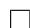
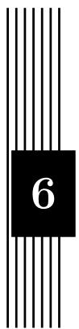

# 数学常数

数学常数凝集着数学研究的精华, 计算任意精度的数学常数是符号计算中一项重要的内容, 许多涉及到微积分, 特殊函数和函数求值的运算都会涉及到数学常数. 特别地, 如果运算结果关于这些数学常数是非线性的, 那么数学常数的精度就显得尤为重要, 下面主要以圆周率为例介绍一下计算数学常数时用到的主要方法.

# 5.1 圆周率

人们对于计算圆周率 $\pi$ 的兴趣似乎从远古时代就开始了, 如果只从较为系统的研究看起, 刘徽的割圆术大概是微积分被发现之前用来计算 $\pi$ 的最佳方法, 祖冲之利用它求出了著名的密率 355, 一共有 8 位有效数字.1706 年 Taylor 的私人教师 Machin 利用反正切函数的 Taylor 级数展开式借助纸笔演算求出了 $\pi$ 的小数点后 100 位数字, 1949 年美国使用早期的电子计算机算出 $\pi$ 的小数点后的 2037 位数, 目前计算 $\pi$ 的小数位数的世界纪录(参见 [98])保持者是日本科学家 YasumasaKanada(金田康正), 他于 2002 年在一台超级并行计算机上将 $\pi$ 的小数位数推进到了惊人的 12411 亿位.

# 5.1.1 级数方法

# 折半求和

折半求和(Binary Splitting)(参见 [55])是用来计算超几何级数(参见 [1])在有理点处的值的一项重要方法.

超几何级数是一类特殊的幂级数.

定义5.1 (升阶乘). $\alpha$ 的 $n$ 阶升阶乘定义为

$$
(\alpha) _ {n} = \frac {\Gamma (\alpha + n)}{\Gamma (\alpha)} = \alpha (\alpha + 1) \dots (\alpha + n - 1).
$$

定义5.2 (超几何级数). 称形如

$$
{ } _ { p } F _ { q } ( a _ { 1 } , \cdots , a _ { p } ; b _ { 1 } , \cdots , b _ { q } ; z ) = \sum _ { n = 0 } ^ { \infty } \frac { ( a _ { 1 } ) _ { n } \cdots ( a _ { p } ) _ { n } z ^ { n } } { ( b _ { 1 } ) _ { n } \cdots ( b _ { q } ) _ { n } n ! }
$$

的级数为超几何级数.

注82. 许多函数都具有超几何级数的展开式, 最简单的例子是 $e ^ { z } = { _ 0 F _ { 0 } } ( z )$ . 除此之外, 初等函数一般都具有 ${ } _ { 2 } F _ { 1 }$ 形式的展开式.

许多数学常数可以看作超几何级数在某个有理点处的值. 一般来说, 超几何级数都可以改写成如下形式

$$
S = \sum_ {n = 0} ^ {\infty} \frac {a (n)}{b (n)} \frac {p (0) \cdots p (n)}{q (0) \cdots q (n)},
$$

其中 $a ( n ) , b ( n ) , p ( n ) , q ( n )$ 都是整系数多项式.

例5.1. 以 Chudnovsky 公式为例, 先将通项改写成

$$
s (n) = \frac {(- 1) ^ {n} (A n + B)}{1} \cdot \frac {(6 n) ! / (3 n) !}{(n !) ^ {3} C ^ {3 n}},
$$

于是

$$
\begin{array}{l} a (n) = (- 1) ^ {n} (A n + B). \\ b (n) = 1, \\ p (0) \dots p (n) = \frac {(6 n) !}{(3 n) !}, \\ q (0) \dots q (n) = (n!) ^ {3} C ^ {3 n}. \\ \end{array}
$$

相邻两项相除就可以解出 $p ( n ) = ( 6 n - 1 ) ( 6 n - 3 ) ( 6 n - 5 )$ , q (n) = n3 C 3 .

考虑部分和

$$
S = S \left(n _ {1}, n _ {2}\right) = \sum_ {n _ {1} \leq n <   n _ {2}} \frac {a (n)}{b (n)} \frac {p \left(n _ {1}\right) \cdots p (n)}{q \left(n _ {1}\right) \cdots q (n)}.
$$

记

$$
P = P (n _ {1}, n _ {2}) = p (n _ {1}) \dots p (n _ {2} - 1),
$$

$$
Q = Q (n _ {1}, n _ {2}) = q (n _ {1}) \dots q (n _ {2} - 1),
$$

$$
B = B (n _ {1}, n _ {2}) = b (n _ {1}) \cdot \cdot \cdot b (n _ {2} - 1),
$$

再设 $T = T ( n _ { 1 } , n _ { 2 } ) = B Q S .$ , 那么 $\begin{array} { r } { S = \frac { T } { B Q } } \end{array}$

折半求和使用了一种类似于通分的方法构造出递推公式来计算 $P , Q , B , T$ .

定理5.1. 设 $n _ { m }$ 满足 $n _ { 1 } < n _ { m } < n _ { 2 }$ , 将区间 $n _ { 1 } \leq x < n _ { 2 }$ 分成两段 $n _ { 1 } \le x < n _ { m }$ 及 $n _ { m } \le x < n _ { 2 }$ , 分别用下标 $l , r$ 来表示对应这两个子区间的 $P , Q , B , T$ 的值, 例如 $P _ { l } = P ( n _ { 1 } , n _ { m } ) , P _ { r } = P ( n _ { m } , n _ { 2 } )$ , 那么存在递推公式

$$
P = P _ {l} \cdot P _ {r},
$$

$$
Q = Q _ {l} \cdot Q _ {r},
$$

$$
B = B _ {l} \cdot B _ {r},
$$

$$
T = T _ {l} \cdot B _ {r} Q _ {r} + T _ {r} \cdot B _ {l} P _ {l}.
$$

现在可以写出折半求和算法的详细过程了.

算法5.1 (折半求和).

输入:通项公式 $a ( n ) , b ( n ) , p ( n ) , q ( n )$ , 区间 $[ n _ { 1 } , n _ { 2 } )$ .

输出:部分和 $P ( n _ { 1 } , n _ { 2 } ) , Q ( n _ { 1 } , n _ { 2 } ) , B ( n _ { 1 } , n _ { 2 } ) , T ( n _ { 1 } , n _ { 2 } ) .$

1. 如果 $n _ { 2 } - n _ { 1 } < 5$ , 直接根据定义计算出 $( P , Q , B , T )$ 并返回.  
2. 设 $\begin{array} { c c } { { n _ { m } ~ = ~ \left[ \frac { n _ { 1 } + n _ { 2 } } { 2 } \right] } } \end{array}$ , $( P _ { l } , Q _ { l } , B _ { l } , T _ { l } )$ , $( P _ { r } , Q _ { r } , B _ { r } , T _ { r } )$ 分别是对应于子区间$[ n _ { 1 } , n _ { m } )$ 和 $[ n _ { m } , n _ { 2 } )$ 上的 $( P , Q , B , T )$ , 在两个子区间上分别应用折半求和计算出它们.  
3. 计 算 $\begin{array} { r } { P = P _ { l } P _ { r } } \end{array}$ , $Q \ = \ Q _ { l } Q _ { r }$ , ${ \cal B } = B _ { l } B _ { r }$ 和 $T = T _ { l } B _ { r } Q _ { r } + T _ { r } B _ { l } P _ { l }$ , 返 回$( P , Q , B , T )$ .

注83. 使用折半求和计算出 $[ n _ { 1 } , n _ { 2 } )$ 上的部分和 $( P , Q , B , T )$ 后, 再利用 $\begin{array} { r } { S = \frac { T } { B Q } } \end{array}$ 做一次除法就可以求出原级数的部分和 $S$ .

注意到最终结果 $S$ 只依赖于 $T$ 和 $B Q$ 的比值,因此在折半求和计算 $( P , Q , B , T )$ 的过程中, 最后一步应用递推公式之前可以将 $P _ { l } , Q _ { r }$ 先“约分”, 即将它们同时除

以其最大公因子 $\operatorname* { g c d } ( P _ { l } , Q _ { r } )$ , 这样一来由递推公式求出的 $P , Q , T$ 都变为原来的$\frac { 1 } { \operatorname* { g c d } ( P _ { l } , Q _ { r } ) }$ 倍, 而比值 $\frac { T } { B Q }$ 则保持不变.

为了快速地计算出 $\operatorname* { g c d } ( P _ { l } , Q _ { r } )$ , 常用的方法是在计算过程中保留 $P , Q$ 的部分素因子分解式, 并在递推相乘时同步更新其部分素因子分解式.

从整体上来看, 折半求和并没有减少运算次数, 它只是让参与乘法的两个数的数量级更接近, 这样就可以充分发挥 Karatsuba, Toom-Cook 和 FFT 等大整数快速乘法算法的优势. 如果大整数乘法采用古典乘法算法, 那么折半求和是不起作用的, 甚至可能比普通的级数求和方法更慢. 除此之外, 折半求和实际上是将截断的级数先乘上分母的最小公倍数后再计算, 这样可以避免对中间结果进行除法等不精确计算, 而只需要在最后做一次除法. 可以证明, 采用折半求和算法计算出部分和 $S$ 的前 $N$ 位有效数字大约需要 $O ( ( \log N ) ^ { 2 } M ( N ) )$ 次基本运算, 其中 $M ( N )$ 代表两个 $N$ 位整数相乘所需要的基本运算的次数(如果采用有限域上的 FFT 乘法,那么 $M ( N ) = O ( N \log N \log \log N ) )$ ). 折半求和利用两个独立的子区间的数据来合成整个区间的数据, 因此也很适合于并行计算.

# Machin 型公式

John Machin 用来计算 $\pi$ 的公式是

定理5.2 (Machin 公式).

$$
{\frac {\pi}{4}} = 4 \tan^ {- 1} {\frac {1}{5}} - \tan^ {- 1} {\frac {1}{2 3 9}}.
$$

证明. 考虑恒等式 $\begin{array} { r } { \tan ( \frac { \pi } { 4 } - x ) = \frac { 1 - \tan x } { 1 + \tan x } } \end{array}$ , 两边同时取反正切得到

$$
{\frac {\pi}{4}} = x + \tan^ {- 1} {\frac {1 - \tan x}{1 + \tan x}},
$$

再令 $x = 4 \tan ^ { - 1 } { \frac { 1 } { 5 } }$ 就可以证明 Machin 公式.

在 Machin 公式(定理 5.2 )中利用 $\tan ^ { - 1 } x$ 的 Taylor 展开式

$$
\tan^ {- 1} x = x - \frac {x ^ {3}}{3} + \frac {x ^ {5}}{5} + \dots + (- 1) ^ {n} \frac {x ^ {2 n + 1}}{2 n + 1} + O (x ^ {2 n + 3}),
$$

可以得到

定理5.3.

$$
\frac {\pi}{4} = 4 \sum_ {k = 0} ^ {\infty} \frac {(- 1) ^ {k}}{(2 k + 1) 5 ^ {2 k + 1}} - \sum_ {k = 0} ^ {\infty} \frac {(- 1) ^ {k}}{(2 k + 1) 2 3 9 ^ {2 k + 1}}.
$$

注84. 这个公式的优点是第二项收敛得很快, 而第一项的分母中含有 5 的方幂, 便于手工在十进制下计算.

定义5.3 (Machin 型公式). 形如

$$
\frac {\pi}{4} = \sum_ {k = 0} ^ {n - 1} a _ {k} \tan^ {- 1} \frac {1}{b _ {k}}, \quad a _ {k}, b _ {k} \in \mathbb {N} _ {+},
$$

的公式, 或者写成复数形式

$$
i = \prod_ {k = 0} ^ {n - 1} \left(\frac {b _ {k} + i}{b _ {k} - i}\right) ^ {a _ {k}}, \quad a _ {k}, b _ {k} \in \mathbb {N} _ {+},
$$

统称为 Machin型公式或 $n$ 阶 Machin 型公式.

例5.2. 以 $n = 2$ 为例, 其他三个2 阶 Machin型公式是

$$
\begin{array}{l} {\frac {\pi}{4}} = \tan^ {- 1} {\frac {1}{2}} + \tan^ {- 1} {\frac {1}{3}} \\ = 2 \tan^ {- 1} \frac {1}{2} - \tan^ {- 1} \frac {1}{7} \\ = 2 \tan^ {- 1} {\frac {1}{3}} + \tan^ {- 1} {\frac {1}{7}}. \\ \end{array}
$$

将 Machin 型公式(定义 5.3 )的复数形式展开, 并注意到 $a _ { k } , b _ { k } \in \mathbb { N } _ { + }$ , ,我们就可以将寻找 Machin 型公式的问题转化成寻找高阶不定方程整数解的问题. 据此还可以证明 $n = 2$ 的 Machin 型公式一共只有以上四种, 而 $n$ 从 1 到 21 所有的Machin 型公式共有 1500 种(参见 [182]).

定义5.4 (Lehmer 数). Machin 型公式

$$
\frac {\pi}{4} = \sum_ {k = 0} ^ {n - 1} a _ {k} \tan^ {- 1} \frac {1}{b _ {k}}, \quad a _ {k}, b _ {k} \in \mathbb {N} _ {+}
$$

的 Lehmer 数(参见 [115])为

$$
\sum_ {k = 0} ^ {n - 1} \frac {1}{\log_ {1 0} b _ {k}}
$$

注85. 不同 Machin 型公式的收敛速度可以用 Lehmer 数来衡量, Lehmer 数越小,公式的收敛速度越快.

例5.3. 目前已知收敛最快的 Machin型公式是由黄见利(参见 [90])发现的

$$
\begin{array}{l} \frac {\pi}{4} = 1 8 3 \tan^ {- 1} \frac {1}{2 3 9} + 3 2 \tan^ {- 1} \frac {1}{1 0 2 3} - 6 8 \tan^ {- 1} \frac {1}{5 8 3 2} \\ + 1 2 \tan^ {- 1} \frac {1}{1 1 0 4 4 3} - 1 2 \tan^ {- 1} \frac {1}{4 8 4 1 1 8 2} - 1 0 0 \tan^ {- 1} \frac {1}{6 8 2 6 3 1 8}, \\ \end{array}
$$

它对应的 Lehmer 数是 1.51244.

与其他的计算方法相比, Machin 型公式更适合于并行计算. 目前计算 $\pi$ 的位数的世界纪录是 2002 年 12 月 6 日由东京大学信息基础中心超级计算研究部门的Yasumasa Kanada(金田康正)教授正式发表的, 他利用日本日立公司(HITACHI)制作提供的超级计算机“SR8000/MPP”花了大约 600 个小时进行计算和验算, 计算时采用了如下两个 $n = 4$ 的 Machin 型公式

$$
\begin{array}{l} \frac {\pi}{4} = 1 2 \tan^ {- 1} \frac {1}{4 9} + 3 2 \tan^ {- 1} \frac {1}{5 7} - 5 \tan^ {- 1} \frac {1}{2 3 9} + 1 2 \tan^ {- 1} \frac {1}{1 1 0 4 4 3} \\ = 4 4 \tan^ {- 1} \frac {1}{5 7} + 7 \tan^ {- 1} \frac {1}{2 3 9} - 1 2 \tan^ {- 1} \frac {1}{6 8 2} + 2 4 \tan^ {- 1} \frac {1}{1 2 9 4 3}. \\ \end{array}
$$

# Ramanujan 型公式

Ramanujan 构造过一个 $\frac { 1 } { \pi }$ 的超几何级数展开式(参见 [29]).

定理5.4.

$$
\frac {1}{\pi} = \frac {2 \sqrt {2}}{9 8 0 1} \sum_ {n = 0} ^ {\infty} \frac {(4 n) !}{(n !) ^ {4}} \cdot \frac {1 1 0 3 + 2 6 3 9 0 n}{3 9 6 ^ {4 n}}.
$$

注86. 后来 Chudnovsky 兄弟(参见 [54])和 Borwein 兄弟(参见 [34])又分别给出形如

$$
\frac {1}{\pi} = 1 2 \sum_ {n = 0} ^ {\infty} \frac {(- 1) ^ {n} (6 n) !}{(3 n) ! (n !) ^ {3}} \cdot \frac {A n + B}{C ^ {3 n + \frac {3}{2}}}
$$

的三组公式, 这三组公式的参数分别为 $A = 5 4 5 1 4 0 1 3 4 , B = 1 3 5 9 1 4 0 9 , C =$ 640320,

$$
\begin{array}{l} A = 1 6 5 7 1 4 5 2 7 7 3 6 5 + 2 1 2 1 7 5 7 1 0 9 1 2 \sqrt {6 1}, \\ B = 1 0 7 5 7 8 2 2 9 8 0 2 7 5 0 + 1 3 7 7 3 9 8 0 8 9 2 6 7 2 \sqrt {6 1}, \\ C = 5 2 8 0 (2 3 6 6 7 4 + 3 0 3 0 3 \sqrt {6 1}) \\ \end{array}
$$

和

$$
\begin{array}{l} A = 6 3 3 6 5 0 2 8 3 1 2 9 7 1 9 9 9 5 8 5 4 2 6 2 2 0 \\ + 2 8 3 3 7 7 0 2 1 4 0 8 0 0 8 4 2 0 4 6 8 2 5 6 0 0 \sqrt {5} \\ + 3 8 4 \sqrt {5} (1 0 8 9 1 7 2 8 5 5 1 1 7 1 1 7 8 2 0 0 4 6 7 4 3 6 2 1 2 3 9 5 2 0 9 1 6 0 3 8 5 6 5 6 0 1 7 \\ + 4 8 7 0 9 2 9 0 8 6 5 7 8 8 1 0 2 2 5 0 7 7 3 3 8 5 3 4 5 4 1 6 8 8 7 2 1 3 5 1 2 5 5 0 4 0 \sqrt {5}) ^ {1 / 2}, \\ \end{array}
$$

$$
\begin{array}{l} B = 7 8 4 9 9 1 0 4 5 3 4 9 6 6 2 7 2 1 0 2 8 9 7 4 9 0 0 0 \\ + 3 5 1 0 5 8 6 6 7 8 2 6 0 9 3 2 0 2 8 9 6 5 6 0 6 4 0 0 \sqrt {5} \\ + 2 5 1 5 9 6 8 \sqrt {3 1 1 0} (6 2 6 0 2 0 8 3 2 3 7 8 9 0 0 1 6 3 6 9 9 3 3 2 2 6 5 4 4 4 4 0 2 0 8 8 2 1 6 1 \\ + 2 7 9 9 6 5 0 2 7 3 0 6 0 4 4 4 2 9 6 5 7 7 2 0 6 8 9 0 7 1 8 8 2 5 1 9 0 2 3 5 \sqrt {5}) ^ {1 / 2}, \\ \end{array}
$$

$$
\begin{array}{l} C = - 2 1 4 7 7 2 9 9 5 0 6 3 5 1 2 2 4 0 \\ - 9 6 0 4 9 4 0 3 3 3 8 6 4 8 0 3 2 \sqrt {5} \\ - 1 2 9 6 \sqrt {5} (1 0 9 8 5 2 3 4 5 7 9 4 6 3 5 5 0 3 2 3 7 1 3 3 1 8 4 7 3 \\ \left. + 4 9 1 2 7 4 6 2 5 3 6 9 2 3 6 2 7 5 4 6 0 7 3 9 5 9 1 2 \sqrt {5}\right) ^ {1 / 2}. \\ \end{array}
$$

注87. 以上四个公式统称为 Ramanujan 型公式, 利用代数数论和二次域的知识还可以构造出更多这样的 Ramanujan 型公式(参见 [183]), 不同 Ramanujan 型公式的收敛速度可以用每计算一个级数项后结果所增加的十进制有效位数来衡量, 以上这四个公式每向后计算一项, 结果的有效位数分别大约增加 8 位, 14 位, 31 位和50 位(参见 [183]).

在个人计算机上计算 $\pi$ 时, Ramanujan 型公式是最常用的级数展开式, 它可以利用折半求和的方法来计算(参见算法 5.1 ). 目前个人计算机上 $\pi$ 的小数位数世界纪录的保持者是由 Steve Pagliarulo 开发的 QPI[133], 它仅需数秒就能求出 $\pi$ 的前 100 万位, 计算时采用的就是第二个 Ramanujan 型公式, 它是由 Chudnovsky兄弟发现的, 因此常常也被称为 Chudnovsky公式.

# BBP 公式

最后值得一提的是 Borwein 兄弟和其合作者共同发现的 BBP 公式(参见 [22]).定理5.5.

$$
\pi = \sum_ {k = 0} ^ {\infty} \frac {1}{1 6 ^ {k}} \left(\frac {4}{8 k + 1} - \frac {2}{8 k + 4} - \frac {1}{8 k + 5} - \frac {1}{8 k + 6}\right).
$$

注88. 注意到通项前的系数是 $\frac { 1 } { 1 6 ^ { k } }$ , 因此可以利用它直接求出 $\pi$ 在十六进制下某一个指定位上的数字, 而不必先求出所有之前位上的数字.

在此基础上 F. Bellard 又提出了一个公式(参见 [26]).

定理5.6.

$$
\begin{array}{l} \pi = \frac {1}{2 ^ {6}} \sum_ {n = 0} ^ {\infty} \frac {(- 1) ^ {n}}{2 ^ {1 0 n}} (- \frac {2 ^ {5}}{4 n + 1} - \frac {1}{4 n + 3} + \frac {2 ^ {8}}{1 0 n + 1} \\ - \frac {2 ^ {6}}{1 0 n + 3} - \frac {2 ^ {2}}{1 0 n + 5} - \frac {2 ^ {2}}{1 0 n + 7} + \frac {1}{1 0 n + 9}). \\ \end{array}
$$

注89. 用它计算要比 BBP 公式快 40

# 5.1.2 迭代方法

顾名思义, 迭代方法就是利用递推公式来计算 $\pi$ , 通过迭代逐步提高精度.

将递推公式设法改写成 $\pi _ { n + 1 } = f ( \pi _ { n } )$ 的形式, 则存在正实数 $m$ 使得 $| \pi _ { n + 1 } -$ $\pi | = | f ( \pi _ { n } ) - \pi | \sim | \pi _ { n } - \pi | ^ { m }$ , 于是每迭代一步后的误差将变为原来误差的 $m$ 次幂, 如果换一个角度来看, 这就是说有效位数将变为原来有效位数的 $m$ 倍, 因此可以用 $m$ 的大小作为衡量迭代法性能的指标.

# 代数几何平均值

首先来看 Brent-Salamin 算法(参见 [38]), 这是一个二阶收敛的迭代算法, 它用到了 Gauss-Legendre 的代数几何平均值(AGM)迭代(参见 [33]).

定义5.5 (代数几何平均值). 设 $a , b \in \mathbb { R } ^ { + }$ , $a > b$ . 令 $a _ { 0 } = a$ , $b _ { 0 } = b$ , $a _ { n + 1 } =$ ${ \frac { 1 } { 2 } } ( a _ { n } + b _ { n } )$ , $b _ { n + 1 } = { \sqrt { a _ { n } b _ { n } } }$ , 则 $a , b$ 的代数几何平均值定义为

$$
\operatorname {A G M} (a, b) = \lim  _ {n \rightarrow \infty} a _ {n} = \lim  _ {n \rightarrow \infty} b _ {n}.
$$

注90. 如果将代数平均值或几何平均值换成更高阶的平均值, 例如

$$
(\frac {a _ {n} ^ {3} b _ {n} + b _ {n} ^ {3} a _ {n}}{2}) ^ {1 / 4},
$$

还可以得到更高阶的迭代算法.

# 完全椭圆积分

为了利用代数几何平均值来计算圆周率, 还需要用到完全椭圆积分的概念.

定义5.6 (完全椭圆积分). 设 $R ( x , y )$ 是有理函数, 其中 $y ^ { 2 } = P ( x )$ 是 $x$ 的三次或四次多项式, 那么称形如 $\textstyle \int R ( x , y ) d x$ 积分为椭圆积分. 特别地, 如下两个积分

$$
K (k) = \int_ {0} ^ {1} \frac {d x}{\sqrt {(1 - x ^ {2}) (1 - k ^ {2} x ^ {2})}} = \int_ {0} ^ {\frac {\pi}{2}} \frac {d \phi}{\sqrt {1 - k ^ {2} \sin^ {2} \phi}},
$$

$$
E (k) = \int_ {0} ^ {1} \sqrt {\frac {1 - k ^ {2} x ^ {2}}{1 - x ^ {2}}} d x = \int_ {0} ^ {\frac {\pi}{2}} \sqrt {1 - k ^ {2} s i n ^ {2} \phi} d \phi ,
$$

分别称为第一类和第二类完全椭圆积分, 其中 $| k | < 1$ .

定义5.7.

$$
I (a, b) = \frac {1}{a} K (\sqrt {1 - \frac {b ^ {2}}{a ^ {2}}}).
$$

定理5.7.

$$
I (a, b) = \frac {\pi}{2 \operatorname {A G M} (a , b)}.
$$

证明. 根据第一类完全椭圆积分的定义(定义5.6)我们有

$$
\begin{array}{l} I (a, b) = \int_ {0} ^ {\frac {\pi}{2}} \frac {d \phi}{\sqrt {a ^ {2} - (a ^ {2} - b ^ {2}) \sin^ {2} \phi}} \\ = \int_ {0} ^ {\frac {\pi}{2}} \frac {d \phi}{\sqrt {a ^ {2} \cos^ {2} \phi + b ^ {2} \sin^ {2} \phi}}. \\ \end{array}
$$

通过变量替换

$$
u = \frac {1}{2} (t - \frac {a b}{t})
$$

可以得出 $\begin{array} { r } { I ( a , b ) = I ( \frac { a + b } { 2 } , \sqrt { a b } ) } \end{array}$ .

故 $I ( a _ { 0 } , b _ { 0 } ) = I ( a _ { n } , b _ { n } ) = I ( a _ { n + 1 } , b _ { n + 1 } )$ , 两边取极限得到

$$
\begin{array}{l} I (a, b) = I (\operatorname {A G M} (a, b), \operatorname {A G M} (a, b)) \\ = \frac {1}{\operatorname {A G M} (a , b)} K (0) = \frac {\pi}{2 \operatorname {A G M} (a , b)}. \\ \end{array}
$$

注91. 注意到 $\begin{array} { r } { I ( 1 , \frac { 1 } { \sqrt { 2 } } ) = K ( \frac { 1 } { \sqrt { 2 } } ) } \end{array}$ , 因此

$$
K (\frac {1}{\sqrt {2}}) = \frac {\pi}{2 \mathrm {A G M} (1 , \frac {1}{\sqrt {2}})}.
$$

定义5.8.

$$
J (a, b) = a E \left(\sqrt {1 - \frac {b ^ {2}}{a ^ {2}}}\right).
$$

定理5.8.

$$
E (\frac {1}{\sqrt {2}}) = K (\frac {1}{\sqrt {2}}) (1 - \sum_ {n = 0} ^ {\infty} 2 ^ {n - 1} c _ {n} ^ {2}).
$$

证明. 根据第二类完全椭圆积分的定义(定义 5.6 )我们有

$$
J (a, b) = \int_ {0} ^ {\frac {\pi}{2}} \sqrt {a ^ {2} \cos^ {2} \phi + b ^ {2} \sin^ {2} \phi} d \phi .
$$

令 $a = 1 , b = \cos \phi$ , 于是 $\begin{array} { r } { K ( \sin \phi ) = \frac { \pi } { 2 \mathrm { A G M } ( a , b ) } } \end{array}$ , 再令 $c _ { 0 } = \sin \phi , c _ { n + 1 } = a _ { n } - a _ { n + 1 }$ 可以证明

$$
\sum_ {n = 0} ^ {\infty} 2 ^ {n - 1} c _ {n} ^ {2} = 1 - \frac {E (\sin \phi)}{K (\sin \phi)}.
$$

因此

$$
E (\frac {1}{\sqrt {2}}) = K (\frac {1}{\sqrt {2}}) (1 - \sum_ {n = 0} ^ {\infty} 2 ^ {n - 1} c _ {n} ^ {2}).
$$

定理5.9.

$$
\pi = \frac {(2 \mathrm {A G M} (1 , \frac {1}{\sqrt {2}}) ^ {2}}{2 - 4 \sum_ {n = 0} ^ {\infty} 2 ^ {n - 1} c _ {n} ^ {2}}.
$$

证明. 若 $\textstyle \phi + \psi = { \frac { \pi } { 2 } }$ , 那么第一类与第二类完全椭圆积分之间存在 Legendre 关系

$$
K (\sin \phi) E (\sin \psi) + E (\sin \phi) K (\sin \psi) - K (\sin \phi) K (\sin \psi) = \frac {\pi}{2}.
$$

令 $\textstyle \phi = \psi = { \frac { \pi } { 4 } }$ 就可以得到 $\pi = 4 K ( \textstyle { \frac { 1 } { \sqrt { 2 } } } ) E ( \textstyle { \frac { 1 } { \sqrt { 2 } } } ) - 2 K ( \textstyle { \frac { 1 } { \sqrt { 2 } } } ) ^ { 2 }$ , 即

$$
\pi = K ^ {2} (2 - 4 \sum_ {n = 0} ^ {\infty} 2 ^ {n - 1} c _ {n} ^ {2}),
$$

也可以写成

$$
\pi = \frac {(2 \mathrm {A G M} (1 , \frac {1}{\sqrt {2}}) ^ {2}}{2 - 4 \sum_ {n = 0} ^ {\infty} 2 ^ {n - 1} c _ {n} ^ {2}}.
$$

# Brent-Salamin 算法

根据定理5.9, 我们现在可以写出 Brent-Salamin算法的详细过程了.

算法5.2 (Brent-Salamin 算法).

输入:迭代次数 $m$ .

输出:迭代 $m$ 次后得到的 $\pi$ 的近似值.

1. 令 $\begin{array} { r } { a _ { 0 } = 1 , b _ { 0 } = \frac { 1 } { \sqrt { 2 } } , t _ { 0 } = \frac { 1 } { 4 } , p _ { 0 } = 1 . } \end{array}$   
2. $n$ 从 0 到 $m - 1$ , 顺次计算 $\textstyle a _ { n + 1 } = { \frac { a _ { n } + b _ { n } } { 2 } }$ , $b _ { n + 1 } = { \sqrt { a _ { n } b _ { n } } }$ , $t _ { n + 1 } = t _ { n } - p _ { n } ( a _ { n } -$ $a _ { n + 1 } ) ^ { 2 }$ $a _ { n + 1 } ) ^ { 2 } , p _ { n + 1 } = 2 p _ { n } .$ .  
3. 返回 $\begin{array} { r } { \pi _ { m } = \frac { ( a _ { m } + b _ { m } ) ^ { 2 } } { 4 t _ { m } } } \end{array}$ .

注92. 使用Brent-Salamin算法计算时, 前三次迭代可以得到近似值

3.14,   
3.1415926,   
3.14159265358979.

# 高阶迭代公式

除了利用代数几何平均值之外, 人们还发现了许多其他的高阶迭代公式, 例如下面的三个著名的迭代公式就是由 Borwein 兄弟发现的(参见 [35]).

定理5.10 (Borwein 公式). 1. 令 $x _ { 0 } = { \sqrt { 2 } }$ , $y _ { 0 } = \sqrt [ 4 ] { 2 }$ , $p _ { 0 } = 2 + { \sqrt { 2 } }$ . 递推公式为

$$
x _ {n + 1} = \frac {1}{2} (x _ {n} ^ {\frac {1}{2}} + x _ {n} ^ {- \frac {1}{2}}),
$$

$$
y _ {n + 1} = \frac {x _ {n} ^ {\frac {1}{2}} y _ {n} + x _ {n} ^ {- \frac {1}{2}}}{y _ {n} + 1},
$$

$$
p _ {n + 1} = p _ {n} \frac {x _ {n + 1} + 1}{y _ {n + 1} + 1}.
$$

$$
\left| p _ {n + 1} - \pi \right| <   \frac {2 ^ {- n - 1}}{\pi^ {2}} \left| p _ {n} - \pi \right| ^ {2},
$$

$$
\begin{array}{l} | p _ {n} - \pi | <   \frac {\pi^ {2} 2 ^ {n + 4} e ^ {- 2 ^ {n + 1} \pi}}{\operatorname {A G M} (1 , \frac {1}{\sqrt {2}}) ^ {2}} \\ <   1 0 ^ {- 2 ^ {n}}. \\ \end{array}
$$

2. 令 $p _ { 0 } = 6 - 4 \sqrt { 2 }$ , $x _ { 0 } = { \sqrt { 2 } } - 1$ . 递推公式为

$$
x _ {n + 1} = \frac {1 - (1 - x _ {n} ^ {4}) ^ {\frac {1}{4}}}{1 + (1 - x _ {n} ^ {4}) ^ {\frac {1}{4}}},
$$

$$
p _ {n + 1} = p _ {n} (1 + x _ {n + 1}) ^ {4} - 2 ^ {2 n + 3} x _ {n + 1} (1 + x _ {n + 1} + x _ {n + 1} ^ {2}).
$$

那么 $| p _ { n } - { \textstyle \frac { 1 } { \pi } } | < 4 ^ { n + 2 } e ^ { - 2 ^ { 2 n + 1 } \pi }$ .

$\begin{array} { r } { a _ { 0 } = \frac { 1 } { 3 } } \end{array}$ , $\begin{array} { r } { r _ { 0 } = \frac { \sqrt { 3 } - 1 } { 2 } } \end{array}$ , $s _ { 0 } = ( 1 - r _ { 0 } ^ { 3 } ) ^ { \frac { 1 } { 3 } }$

$$
t _ {n + 1} = 1 + 2 r _ {n},
$$

$$
u _ {n + 1} = \left(9 r _ {n} \left(1 + r _ {n} + r _ {n} ^ {2}\right)\right) ^ {\frac {1}{3}},
$$

$$
v _ {n + 1} = t _ {n + 1} ^ {2} + t _ {n + 1} u _ {n + 1} + u _ {n + 1} ^ {2},
$$

$$
w _ {n + 1} = \frac {2 7 (1 + s _ {n} + s _ {n} ^ {2})}{v _ {n + 1}},
$$

$$
a _ {n + 1} = w _ {n + 1} a _ {n} + 3 ^ {2 n - 1} (1 - w _ {n + 1}),
$$

$$
s _ {n + 1} = \frac {\left(1 - r _ {n}\right) ^ {3}}{\left(t _ {n + 1} + 2 u _ {n + 1}\right) v _ {n + 1}},
$$

$$
r _ {n + 1} = \left(1 - s _ {n + 1} ^ {3}\right) ^ {\frac {1}{3}}.
$$

那么 $\textstyle | a _ { n } - { \frac { 1 } { \pi } } |$ 9阶收敛.

# Beeler 公式

最后值得一提的是 Beeler 利用不动点定理和反正切函数的 Taylor 展开式给出的一系列收敛到 $\pi$ 的递推公式(参见 [25]).

# 定理5.11.

$$
\begin{array}{l} p _ {n + 1} = p _ {n} - \tan p _ {n}, \\ p _ {n + 1} = p _ {n} - \tan p _ {n} + \frac {1}{3} \tan^ {3} p _ {n}, \\ p _ {n + 1} = p _ {n} - \tan p _ {n} + \frac {1}{3} \tan^ {3} p _ {n} - \frac {1}{5} \tan^ {5} p _ {n}, \\ \dots , \\ \end{array}
$$

其中初始值 $p _ { 0 }$ 应该取为 $\pi$ 的一个普通的近似值, 例如 $\frac { 2 2 } { 7 }$ , 355 等.

# 5.2 自然对数底

# 5.2.1 级数方法

自然对数底常记为 e.

定义5.9 (自然对数底).

$$
e = \lim _ {n \to \infty} e _ {n} = \lim _ {n \to \infty} (1 + \frac {1}{n}) ^ {n}.
$$

根据 Newton 二项式公式可以得到

$$
\begin{array}{l} e _ {n} = (1 + \frac {1}{n}) ^ {n} = \sum_ {k = 0} ^ {n} C _ {n} ^ {k} (\frac {1}{n}) ^ {k} \\ = \sum_ {k = 0} ^ {n} \frac {n (n - 1) \cdots (n - k + 1)}{k !} \cdot \frac {1}{n ^ {k}} \\ = \sum_ {k = 0} ^ {n} \frac {1}{k !} (1 - \frac {1}{n}) \dots (1 - \frac {k - 1}{n}). \\ \end{array}
$$

记

$$
s _ {n} = \sum_ {k = 0} ^ {n} \frac {1}{k !},
$$

那么 $e _ { n } < s _ { n } \leq e$ , 即

$$
e = \lim  _ {n \rightarrow \infty} s _ {n} = \lim  _ {n \rightarrow \infty} 1 + \frac {1}{1 !} + \frac {1}{2 !} + \dots + \frac {1}{n !}.
$$

进一步还可以推出

$$
\left| e - s _ {n} \right| <   \frac {1}{n n !}.
$$

和计算圆周率 $\pi$ 用到的很多级数的误差项不同, 这个误差项很小, 它关于 $n$ 是指数级收敛的, 因此我们可以直接利用级数 $s _ { n }$ 来计算自然对数底 $e$ .

除此之外, 另一个级数

$$
e ^ {- 1} = \lim _ {n \to \infty} 1 - \frac {1}{1 !} + \frac {1}{2 !} + \dots + (- 1) ^ {n} \frac {1}{n !}
$$

也可以求出 $e$ , 它常常被用来验证第一个级数的计算结果. 这两个级数都可以使用折半求和方法来计算.

通过级数 $s _ { n }$ 的计算公式还可以得到关于自然对数底 $e$ 和圆周率 $\pi$ 一个有趣的递推公式.

定理5.12. 令 $u _ { 0 } = v _ { 0 } = 0$ , $u _ { 1 } = v _ { 1 } = 1$ , 递推公式为

$$
u _ {n + 2} = u _ {n + 1} + \frac {1}{n} u _ {n},
$$

$$
v _ {n + 2} = \frac {1}{n} v _ {n + 1} + v _ {n},
$$

那么

$$
\lim  _ {n \to \infty} \frac {n}{u _ {n}} = e,
$$

$$
\lim  _ {n \to \infty} \frac {2 n}{v _ {n} ^ {2}} = \pi .
$$

# 5.3 对数常数

# 5.3.1 级数方法

对数常数指的是 $\ln 2$ , 在计算机被发明之前, 科学家和工程师们只能借助于对数表和对数尺之类的工具来完成繁杂的乘除运算, 注意到

$$
\ln x = \ln {\frac {x}{2 ^ {n}}} + n \ln 2,
$$

可以适当的选取 $n$ 使得 $\textstyle 0 < { \frac { x } { 2 ^ { n } } } < 1$ , 这样就需要计算 ln 2 来完成大数与标准 $( 0 , 1 )$ 区间之间的转换.

利用 $\ln ( 1 + x )$ 的 Taylor 展开式

$$
\ln (1 + x) = x - \frac {x ^ {2}}{2} + \frac {x ^ {3}}{3} - \dots ,
$$

令 $x = 1$ 就可以得到 $\ln 2$ 的形式化定义.

定义5.10 (对数常数).

$$
\ln 2 = \lim _ {n \to \infty} 1 - \frac {1}{2} + \frac {1}{3} + \dots + (- 1) ^ {n + 1} \frac {1}{n}.
$$

注93. 如果令 $x = - { \frac { 1 } { 2 } }$ , 那么有

$$
\ln 2 = - \ln {\frac {1}{2}} = \sum_ {k = 1} ^ {\infty} {\frac {1}{k 2 ^ {k}}}.
$$

利用恒等式

$$
\ln 2 = - \frac {1}{2} \ln \left(1 - \frac {1}{4}\right) + \tanh ^ {- 1} \frac {1}{2},
$$

还可以得到类似于计算圆周率时提到过的 BBP 公式的两个公式.

定理5.13.

$$
\ln 2 = \sum_ {k = 0} ^ {\infty} \frac {1}{4 ^ {k}} (\frac {1}{4 k + 2} + \frac {1}{8 k + 8}),
$$

$$
\ln 2 = \frac {2}{3} + \sum_ {k = 1} ^ {\infty} \frac {1}{1 6 ^ {k}} \left(\frac {1}{1 6 k + 1 2} + \frac {1}{8 k + 4} + \frac {1}{4 k + 1} + \frac {1}{2 k}\right).
$$

与计算圆周率 $\pi$ 类似, 计算对数常数 $\ln 2$ 也有相应的Machin型公式.

首先来看反正切函数的 Taylor 展开式

$$
\tanh ^ {- 1} x = \frac {1}{2} \ln \frac {1 + x}{1 - x} = \sum_ {k = 0} ^ {\infty} \frac {x ^ {2 k + 1}}{2 k + 1},
$$

令 $\begin{array} { r } { x = \frac { 1 } { 3 } } \end{array}$ 就可以得到一个关于 $\ln 2$ 的 Machin 型公式.

定理5.14.

$$
\ln 2 = 2 \tanh ^ {- 1} \frac {1}{3} = \frac {2}{3} \sum_ {k = 0} ^ {\infty} \frac {1}{(2 k + 1) 9 ^ {k}}.
$$

注94. 如果考虑类似于 $\begin{array} { r } { \operatorname { t a n h } ^ { - 1 } { \frac { 1 } { x } } = \operatorname { t a n h } ^ { - 1 } { \frac { 1 } { 2 x - 1 } } + \operatorname { t a n h } ^ { - 1 } { \frac { 1 } { 2 x + 1 } } } \end{array}$ 的初等变换, 还可以得到一系列 $n = 2$ 的 Machin 型公式, 其中最有名的是 Euler 用来计算 $\ln 2$ 时用到的

$$
\ln 2 = 2 \tanh ^ {- 1} {\frac {1}{5}} + 2 \tanh ^ {- 1} {\frac {1}{7}}.
$$

除此之外, 人们最近还发现了一些高阶的 Machin型公式.

定理5.15.

$$
\ln 2 = 1 8 \coth^ {- 1} 2 6 - 2 \coth^ {- 1} 4 8 0 1 + 8 \coth^ {- 1} 8 7 4 9,
$$

$$
\ln 2 = 1 4 4 \coth^ {- 1} 2 5 1 + 5 4 \coth^ {- 1} 4 4 9 - 3 8 \coth^ {- 1} 4 8 0 1 + 6 2 \coth^ {- 1} 8 7 4 9,
$$

$$
\ln 2 = 7 2 \coth^ {- 1} 1 2 7 + 5 4 \coth^ {- 1} 4 4 9 + 3 4 \coth^ {- 1} 4 8 0 1 - 1 0 \coth^ {- 1} 8 7 4 9.
$$

前面介绍超几何级数时提到过

$$
\begin{array}{l} \tanh ^ {- 1} x = x F (\frac {1}{2}, 1, \frac {3}{2}, x ^ {2}) \\ = \frac {x}{1 - x ^ {2}} F (1, 1, \frac {3}{2}, \frac {x ^ {2}}{x ^ {2} - 1}). \\ \end{array}
$$

定理5.16.

$$
\ln 2 = 2 \tanh ^ {- 1} \frac {1}{3} = \frac {3}{4} (1 - \frac {1}{4} \cdot \frac {1}{3} + \frac {1}{4 ^ {2}} \cdot \frac {1 \cdot 2}{3 \cdot 5} - \frac {1}{4 ^ {3}} \cdot \frac {1 \cdot 2 \cdot 3}{3 \cdot 5 \cdot 7} + \dots).
$$

注95. 这个公式结构简单, 很容易利用折半求和方法来计算它.

# 5.3.2 迭代方法

代数几何平均值迭代同样适用于计算对数常数 ln 2(参见 [38]).

记

$$
\frac {1}{R (a , b)} = 1 - \sum_ {n = 0} ^ {\infty} 2 ^ {n - 1} (a _ {n} ^ {2} - b _ {n} ^ {2}),
$$

可以看出 $R ( a , b )$ 实际上就是 $\frac { \pi } { 2 \mathrm { A G M } ( a , b ) }$ . 那么

$$
| \ln x - R (1, 1 0 ^ {- N}) + R (1, 1 0 ^ {- N} x) | \leq \frac {N}{1 0 ^ {2 (N - 2)}}.
$$

取 $R ( 1 , 1 0 ^ { - N } ) - R ( 1 , 2 \cdot 1 0 ^ { - N } )$ 作为 $\ln 2$ 的近似值, 依然借用计算 $\operatorname { A G M } ( a , b )$ 时的迭代结构, 那么在计算 $\operatorname { A G M } ( a , b )$ 的同时就可以计算出 $a _ { n } , b _ { n }$ , 进而可以计算出$R ( a , b )$ , 这样就得到了计算 $\ln 2$ 的一个二阶收敛的迭代算法.

# 5.4 Euler 常数

# 5.4.1 级数方法

定义5.11 (Euler 常数).

$$
\gamma = \lim  _ {n \rightarrow \infty} \left(1 + \frac {1}{2} + \dots + \frac {1}{n} - \ln n\right) =: \lim  _ {n \rightarrow \infty} \left(H _ {n} - \ln n\right).
$$

注96. Euler 常数常记为 $\gamma$ . 如果直接按照这个定义来计算 $\gamma$ 将会发现它收敛得太慢了.

利用 Euler-Maclaurin 求和对调和级数 $H _ { n }$ 做渐进展开可以得到关于 $\gamma$ 的一个更好的近似公式.

定义5.12 (Bernoulli 数). Bernoulli 数 $B _ { n }$ 是级数展开式

$$
\frac {x}{e ^ {x} - 1} = \sum_ {n = 0} ^ {\infty} \frac {B _ {n} x ^ {n}}{n !}
$$

中第 $n$ 项的系数.

定理5.17.

$$
\gamma = H _ {n} - \ln n - {\frac {1}{2 n}} + \sum_ {k = 1} ^ {\infty} {\frac {B _ {2 k}}{2 k}} \cdot {\frac {1}{n ^ {2 k}}}, \quad B _ {2 k} \text {为} B e r n o u l l i \text {数},
$$

它的误差项是

$$
\epsilon_ {k}, n = \frac {B _ {2 k + 2}}{(2 k + 2) n ^ {2 k + 2}} \approx \frac {2 (2 k + 2) !}{(2 k + 2) (2 \pi n) ^ {2 k + 2}}.
$$

将 $\gamma = - \Gamma ^ { \prime } ( 1 )$ 分部积分后可以得到

$$
\gamma + \ln n = I _ {n} - R _ {n},
$$

$$
I _ {n} = \int_ {0} ^ {n} \frac {1 - e ^ {- t}}{t} d t,
$$

$$
R _ {n} = \int_ {n} ^ {\infty} \frac {e ^ {- t}}{t} d t.
$$

注意到 $R _ { n } = O ( e ^ { - n } )$ , 利用 $\frac { 1 - e ^ { - t } } { t }$ 的级数展开式可以得到

$$
I _ {n} = \sum_ {k = 1} ^ {\infty} (- 1) ^ {k - 1} \frac {n ^ {k}}{k k !},
$$

于是

$$
\gamma = \sum_ {k = 1} ^ {\alpha n} (- 1) ^ {k - 1} \frac {n ^ {k}}{k k !} - \ln n + O (e ^ {- n}), \quad \alpha (\ln \alpha - 1) = 1.
$$

引入常数 $\alpha$ 是为了使 nαn $\frac { n ^ { \alpha n } } { ( \alpha n ) ! }$ 是 $e ^ { - n }$ 阶的, 其近似值为 $\alpha = 3 . 5 9 1 1$ . 如果考虑 $R _ { n }$ 的渐进展开式, 还可以得到收敛更快的公式, 不过公式的形式同时也会变得很复杂.

使用 Bessel 函数做类似的工作, 我们将得到

$$
\gamma = \frac {A _ {n}}{B _ {n}} - \ln n + O (e ^ {- 4 n}),
$$

其中

$$
A _ {n} = \sum_ {k = 0} ^ {\alpha n} \left(\frac {n ^ {k}}{k !}\right) ^ {2} H _ {k},
$$

$$
B _ {n} = \sum_ {k = 0} ^ {\alpha n} (\frac {n ^ {k}}{k !}) ^ {2},
$$

$$
H _ {k} = 1 + \frac {1}{2} + \frac {1}{3} + \dots + \frac {1}{k},
$$

这里 $\alpha$ 的定义与上面相同, 这个级数收敛得很快, 并且很容易计算.

使用类似于 Richard 外推加速法(参见 [7])的方法对误差项进行渐进展开, 可以得到

$$
\gamma = \frac {A _ {n}}{B _ {n}} - \frac {C _ {n}}{B _ {n} ^ {2}} - \ln n + O (e ^ {- 8 n}),
$$

其中

$$
C _ {n} = \frac {1}{4 n} \sum_ {k = 0} ^ {2 n} \frac {\left(\left(2 k\right) !\right) ^ {3}}{\left(k !\right) ^ {4} \left(1 6 n\right) ^ {2 k}},
$$

并且 $\alpha$ 满足 $\alpha ( \ln \alpha - 1 ) = 3$ , 其近似值为 α = 4.970625759, 利用这个公式可以计算 $\gamma$ 到小数点后1 亿位.

# 5.5 其他常数

下面是一些其他数学常数的定义或常用计算公式.

• Catalan 常数.

$$
\begin{array}{l} C = 1 - \frac {1}{3 ^ {2}} + \frac {1}{5 ^ {2}} - \frac {1}{7 ^ {2}} + \frac {1}{9 ^ {2}} - \dots . \\ C = \int_ {0} ^ {1} \frac {\tan^ {- 1} x}{x} \mathrm {d} x. \\ C = \frac {3}{8} \sum_ {k = 0} ^ {\infty} \frac {(k !) ^ {2}}{(2 k) ! (2 k + 1) ^ {2}} + \frac {\pi \ln (2 + \sqrt {3})}{8}. \\ \end{array}
$$

• Brun 常数.

$$
B = (\frac {1}{3} + \frac {1}{5}) + (\frac {1}{5} + \frac {1}{7}) + (\frac {1}{1 1} + \frac {1}{1 3}) + \dots .
$$

• Mertsen 常数.

$$
\mu = \lim _ {p \to \infty} \left(\frac {1}{2} + \frac {1}{3} + \frac {1}{5} + \dots + \frac {1}{p} - \ln \ln p\right).
$$

