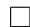
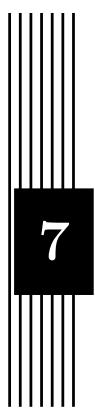

# 线性代数

在计算机代数系统中, 涉及线性代数的内容主要包括两方面的问题:一是线性方程组的求解, 二是矩阵各种标准形的约化. 其中线性方程组不仅作为许多应用问题的数学模型, 还是众多算法的基础, 支撑着整个通用计算机代数系统. 矩阵的标准形主要是指整环或域上矩阵的 Hermite 标准形, Smith 标准形, Frobenius 标准形以及 Jordan 标准形等1. 矩阵到这些标准形的约化过程与 Diophantine 方程求解以及更广泛的计算数论, 计算群论等问题有着密切的联系.

本章主要讨论快速矩阵乘法与线性方程组求解的算法. 对矩阵标准形约化算法感兴趣的读者可以参考 [80]2.3.2节中所列出的参考文献.

# 6.1 快速矩阵乘法

在线性代数问题中, 矩阵乘法具有基础性的意义. 在代数复杂性理论中, 大部分线性代数问题都可约化为矩阵乘法([32]2.2 节, [48] 第 16 章), 因此矩阵乘法构成了复杂性理论中一个重要的研究模型([48] 第 15 章). 对于 $n$ 阶一般矩阵的乘法,由定义得到的常规算法具有 $O ( n ^ { 3 } )$ 的复杂度2. 自 1968 年 Strassen[165] 发现一种基于分治策略的快速矩阵乘法算法以来, 矩阵乘法算法复杂度的指数已由 3 降到2.376[59]. 下面我们回顾两个经典算法, 它们在实际中有着重要的应用. 而更多算法虽然渐进复杂度更低, 对于代数复杂性理论研究有着重要意义, 但由于算法过于

复杂, 且对于有限规模的问题所需运算更多, 因而并不实用, 可参考[134]及[48]第15 章.

# 6.1.1 基于向量内积算法的 Winograd 算法

以下讨论主要根据文献 [186].

算法6.1 (Winograd 内积算法).

设 $\begin{array} { r } { \boldsymbol { x } ~ = ~ ( x _ { 1 } , \cdot \cdot \cdot , x _ { n } ) ^ { T } } \end{array}$ , $\begin{array} { c } { { y } } \end{array} = \begin{array} { c } { { ( y _ { 1 } , \cdot \cdot \cdot , y _ { n } ) ^ { T } } } \end{array}$ , 记 $\xi ~ = ~ \sum _ { j = 1 } ^ { \lfloor n / 2 \rfloor } x _ { 2 j - 1 } x _ { 2 j } , ~ \eta ~ =$ $\sum _ { j = 1 } ^ { \lfloor n / 2 \rfloor } y _ { 2 j - 1 } y _ { 2 j }$ , 则内积 $( x , y )$ 可由下式给出:

$$
(x, y) = \left\{ \begin{array}{l l} \sum_ {j = 1} ^ {\lfloor n / 2 \rfloor} (x _ {2 j - 1} + y _ {2 j}) (x _ {2 j} + y _ {2 j - 1}) - \xi - \eta , & n \text {为 偶 数}, \\ \sum_ {j = 1} ^ {\lfloor n / 2 \rfloor} (x _ {2 j - 1} + y _ {2 j}) (x _ {2 j} + y _ {2 j - 1}) - \xi - \eta + x _ {n} y _ {n}, & n \text {为 奇 数}. \end{array} \right.
$$

将这种算法用于 $C = A B$ 的矩阵元素运算时, 由于减少重复计算 ξ, η, 可使计算所需的乘法次数减半, 但同时使所需的加法运算增加. Winograd 算法也是$O ( n ^ { 3 } )$ 的算法, 仅适用于小规模的矩阵求积运算.

# 6.1.2 Strassen 算法

Strassen 算法是一种分治策略的算法. 它以分块矩阵运算为基础.

下面介绍改进型 Strassen 算法, 它较原始算法 [165] 需要更少的矩阵加法运算([174]12.1 节).

算法6.2 (Strassen 算法).

设 A, $B$ 为 $n$ 阶矩阵, 必要时通过补充零行零列加以扩充, 将其分块:

$$
A = \left[ \begin{array}{c c} A _ {1 1} & A _ {1 2} \\ A _ {2 1} & A _ {2 2} \end{array} \right], B = \left[ \begin{array}{c c} B _ {1 1} & B _ {1 2} \\ B _ {2 1} & B _ {2 2} \end{array} \right], C = A B = \left[ \begin{array}{c c} C _ {1 1} & C _ {1 2} \\ C _ {2 1} & C _ {2 2} \end{array} \right].
$$

进行如下递归运算:

1. 若 $n \leq l ( l$ 为递归下界), 采用直接算法进行计算.

2. 计算

$$
S _ {1} = A _ {2 1} + A _ {2 2}, S _ {2} = S _ {1} - A _ {1 1}, S _ {3} = A _ {1 1} - A _ {2 1}, S _ {4} = A _ {1 2} - S _ {2},
$$

$$
T _ {1} = B _ {1 2} - B _ {1 1}, T _ {2} = B _ {2 2} - T _ {1}, T _ {3} = B _ {2 2} - B _ {1 2}, T _ {4} = T _ {2} - B _ {2 1}.
$$

3. 计算

$$
P _ {1} = A _ {1 1} B _ {1 1}, P _ {2} = A _ {1 2} B _ {2 1}, P _ {3} = S _ {4} B _ {2 2}, P _ {4} = A _ {2 2} T _ {4},
$$

$$
P _ {5} = S _ {1} T _ {1}, P _ {6} = S _ {2} T _ {2}, P _ {7} = S _ {3} T _ {3}.
$$

4. 计算

$$
U _ {1} = P _ {1} + P _ {2}, U _ {2} = P _ {1} + P _ {6}, U _ {3} = U _ {2} + P _ {7}, U _ {4} = U _ {2} + P _ {5},
$$

$$
U _ {5} = U _ {4} + P _ {3}, U _ {6} = U _ {3} - P _ {4}, U _ {7} = U _ {3} + P _ {5}.
$$

5. 返回

$$
\left[ \begin{array}{c c} U _ {1} & U _ {5} \\ U _ {6} & U _ {7} \end{array} \right].
$$

以上算法的正确性通过直接代入即可验证. 可以看出, 每次递归需要 7 次乘法与 15 次加法, 从而其算法复杂度是 $O ( n ^ { \log _ { 2 } 7 } ) \simeq O ( n ^ { 2 . 8 0 8 } )$ .

下面考虑一个技术细节, 即对于阶数 $n$ 不是 $2 ^ { k }$ 的矩阵添加零行零列的问题.很容易想到两种方案, 一是在必要时才考虑添加, 即在递归过程中, 遇到矩阵阶数为奇数的情形则给它添加一个零行(或零列);二是统一添加, 即在计算的开始首先考察矩阵的阶数, 若它不满足 $2 ^ { k }$ 的要求, 即给它添加若干个零行零列, 使之满足,而在递归过程中则不需再考虑矩阵阶数的问题. 简单的分析可以知道, 由于第一种方式将添加零行零列的工作分成许多次完成, 造成其计算效率大大下降, 因此实际中应采用第二种方法.

J. Demmel 等指出, 以 Strassen 算法为代表的快速矩阵乘法在一定意义下(所谓“弱”意义下)是数值稳定的 [67]. 我们对随机生成的浮点数矩阵进行了测试, 并与经典算法给出的结果做对比, 确实未见数值稳定性有明显下降.

可以看到, Strassen 算法与“高精度计算”中的 Karatsuba 算法的“神似”. 读者可能会提出这样的问题:能不能类似 Toom-Cook 算法一样推广 Strassen 算法到高阶从而降低算法的渐进复杂度呢?这个问题要从两方面来回答. 直接的类比和推广由于矩阵乘法不可交换而受到限制, 但将矩阵分块推广到 $n \times n$ 块重新构造快速算

法的确是可行的, 然而这种从 2 到 $n$ 的推广却不像整数运算那么直接. 例如, 对于$n = 3$ 的情形, Laderman[109] 给出了需要 23 次乘法的算法, 若采用递归计算, 其渐进复杂度指数为 $\log _ { 3 } 2 3 > \log _ { 2 } 7 .$ , 反而不及 Strassen 算法. 类似的这种尝试可参考 [134], 这方面的研究及相关理论分析最终导致了双线性算法 概念及其复杂性理论的诞生. 此后对于矩阵乘法复杂度的研究主要是沿着这个方向进行, 迄今为止已经达到的最优渐进复杂度为 $O ( n ^ { 2 . 3 7 6 } )$ [59]. 但在实际中, 仅当 $n$ 极大时才有价值,故通常并不采用. 可参考[134][48]及其中所引用的参考文献.

# 6.2 线性方程组与消元法

线性方程组求解是线性代数的中心问题之一. 它是许多实际问题的数学模型,还构成许多数值与符号算法的基础, 从而在工程计算与计算机代数系统中都占据着重要的位置. 因此, 人们对线性方程组求解算法进行了深入的研究, 针对不同的问题提出了大量的高效算法. 其中, 数值算法主要包括一般系数矩阵的消元法以及应用于稀疏或有结构系数矩阵的算法, 读者可以参考 [76] 和 [32]. 我们在随后几节中主要介绍精确求解线性方程组的算法. 这些算法大多可直接应用于整系数, 有理系数, 多项式系数或有限域上的方程组, 并可以推广到一般整环, 商域及其扩域上.

概括说来, 精确算法可分为以下几类(其算法归纳可参考 [80]2.3 节以及 [171]),我们将分别选取典型的算法进行介绍.

• 消元法. 这一类算法以 Gauss 消元算法为基础, 但由于直接的消元步骤对于精确计算会遭遇“中间表达式膨胀”的困难, 而往往通过特定的映射对问题进行约化.  
• 黑箱算法. 这相当于数值计算中大量运用的迭代法.  
• 应用于稀疏或有结构的系数矩阵的特殊算法.

关于有结构系数矩阵的线性方程组的求解, 在 [76] 和 [32] 中, 针对不同的系数矩阵(Vandermonde 阵, Toeplitz 阵和 Hilbert 阵等3)给了详尽的讨论. 另外,与求解线性方程组密切相关的一个问题是求解整系数不定线性方程的整数解(Diophantine 解), 它与矩阵的 Hermite 标准形约化有密切的关系, 也请读者参考[80]2.3节列出的有关文献.

本节将要介绍的消元法也可称为直接法, 这是相对于下节中要介绍的黑箱算法来说的. 这些消元算法以 Gauss 消元法为基础, 通过对系数矩阵元素的直接运

算对矩阵进行约化, 得到方程组的解. 不同算法的区别体现在实施约化的过程. 概括来说, 本节介绍的三种算法都是通过某种映射将消元过程归结到更易计算的有限域或浮点数系统中进行. 除这些算法之外, 还有一种称为 Exact Division 算法,是通过细致分析整系数方程组的消元过程, 从每一步消元的结果中除掉它们的公因子, 从而控制矩阵元素规模的增长, 可以参考[24]和 [187]第 10章.

# 6.2.1 基于中国剩余定理的消元法

我们先简要回顾求解线性方程组的一般方法, 即 Gauss 消元法, 并给出一些相关概念, 这在任何一本线性代数教材中都可以找到([12] 第 3 章). 为了讨论最一般的情形, 我们设要求解的方程组为 $A X = B$ , 其中 $A$ 为 $m \times n$ 阶矩阵, $B$ 为 $m \times q$ 阶矩阵, 未知元排列成 $n \times q$ 的矩阵 $X$ , 并设 $A$ 与 $B$ 为 $s$ 元多项式系数的矩阵, 对于整系数矩阵只要将 $s$ 取为 0.

根据线性代数的知识, 线性方程组的的一般解集合由一个特解与系数矩阵的零空间表征, 即该方程组的任意解都可表达为该特解与零空间中向量的和. 因此,我们要求线性方程组的一般解, 就要同时求出其特解和零空间的一组基. Gauss 消元的基本做法是对线性方程组的系数矩阵与增广矩阵进行行初等变换, 将其化为相抵的行既约阶梯形阵(row-reduced echelon, RRE), 即如下形式(最后的 0 可能是子方阵, 也可能没有):

$$
\left[ \begin{array}{c c c c c c c c c} 0 & \dots & 0 & * & \dots & 0 & \dots & 0 & \dots \\ & & & & & * & \dots & 0 & \dots \\ & & & & & & \dots & \dots & \dots \\ & & & & & & & * & \dots \\ & & & & & & & & 0 \end{array} \right]
$$

它具有如下特点:

• 非 0 行的最左非 0 元素所在列的其余元素均为 0, 且最左非 0 元素的位置随行号增加而右移;4  
• 各非0 行最左非 0 元素的位置, 随行号增加而右移, 若有0 行均排在最后.

详言之, 若非零矩阵 $B$ 满足:存在一列整数 $1 \leq k _ { 1 } < k _ { 2 } < \cdot \cdot \cdot < k _ { r } \leq n$ , 其中 $1 \leq r \leq m ( r$ 即矩阵 $B$ 的秩), 使得 $B ( i , k _ { i } ) \neq 0$ , $B ( i , j ) = 0$ , $1 \le j < k _ { i }$ , 且若 $r < m$ , 则第 $r + 1 , \ldots , m$ 行均为 0. 称 $K = \{ k _ { 1 } , k _ { 2 } , \cdot \cdot \cdot , k _ { r } \}$ 为 $B$ 的既约阶

梯(reduced echelon, RE)序列, $B ( i , k _ { i } ) , 1 \leq i \leq r$ 称为 RRE 矩阵的对角元素5. 若$A$ 与 $B$ 行相抵, 则也称 $B$ 为 $A$ 的 RRE, $K$ 为 $A$ 的 RRE 序列. 对于已经化为这种形式的系数矩阵与增广矩阵, 我们很容易判断线性方程组是否有解并求出其一般解. 在下面我们考察的情形中, 非 0 行往往以一个公共元素 $d$ 开始, 从而对于整系数线性方程组的求解可以避免中间计算过程出现分数.

在本小节中, 我们将介绍一种适用于整系数与多元多项式系数线性方程组求解的算法 [121], 这种算法通过同态映射将系数矩阵约化到有限域上进行消元运算.在如下算法中, 我们需要判断给定同态映射是否可用, 其判断标准由如下定义的序列 $( J _ { A } , I _ { A } )$ 表征.

为了叙述方便, 我们首先引入子阵的记号:设 $1 \leq i _ { 1 } < i _ { 2 } \dotsm < i _ { p } \leq m$ ,$1 \leq j _ { 1 } < j _ { 2 } < \dots < j _ { q } \leq n . \ m \times n$ $m \times n$ 阶矩阵 $A = \left( a _ { i j } \right)$ 中位于第 $i _ { 1 } , \cdots , i _ { p }$ 行和第$j _ { 1 } , \cdots , j _ { p }$ 列交叉处的元素按原序排成的方阵称为 $A$ 的一个 $p \times q$ 阶子阵, 记为

$$
A \left( \begin{array}{c c c} i _ {1} & \dots & i _ {p} \\ j _ {1} & \dots & j _ {q} \end{array} \right).
$$

记 $M _ { j }$ 为矩阵 $A$ 的前 $j$ 列构成的子矩阵. 定义序列 $J _ { A } = \left\{ j _ { 1 } , \cdots , j _ { r } \right\}$ , 其中 $j _ { h }$ 为最小的整数 $j$ 使得 $\operatorname { r a n k } ( M _ { j } ) = h $ . 由于行变换不改变列向量之间的线性相关性, $J$ 即上文定义的行 RE 序列, 而且是唯一的. 对于非零矩阵 $A$ , 可以找到一列互异整数 $h _ { 1 } , \cdots , h _ { r }$ , $1 \leq h _ { t } \leq m , 1 \leq t \leq r$ 满足

$$
A \left( \begin{array}{c c c} h _ {1} & \dots & h _ {s} \\ j _ {1} & \dots & j _ {s} \end{array} \right) \neq 0, 1 \leq s \leq r.
$$

若记 $h _ { r + 1 } , \cdots , h _ { m }$ 为其余的整数, 则 $H = ( h _ { 1 } , \cdots , h _ { m } )$ 构成 $1 , \cdots , m$ 的一个排列.记所有这样的序列 $H$ 构成集合 ${ \mathcal { P } } _ { A }$ , 则 ${ \mathcal { P } } _ { A }$ 中, 存在一个按照字典序最小的序列$I _ { A } = \{ i _ { 1 } , \cdots , i _ { m } \}$ . 等价地说, 对于 $1 \leq t \leq r$ , $i _ { t }$ 为依次选出来的最小的整数使得这些行向量线性无关, 而对于 $r + 1 \leq t \leq m , i$ $i _ { t }$ 被按照原序排好. 若 $A$ 为零矩阵, 我们很自然地定义 $I _ { A } = \{ 1 , \cdots , m \}$ . 再定义 $J _ { A } \times I _ { A }$ 的字典序, $\left( J _ { A } , I _ { A } \right) > \left( J _ { B } , I _ { B } \right)$ ,当且仅当 $J _ { A } > J _ { B }$ , 或 $J _ { A } = J _ { B } , I _ { A } > I _ { B }$ .

在定义了序列 $( J _ { A } , I _ { A } )$ 之后, 我们引入如下的正则 RRE 矩阵. 对于 $m \times n$ 阶矩阵 $A$ , 定义

$$
\bar {A} _ {H} (k, j) = \left\{ \begin{array}{l l} A \left( \begin{array}{c c c c c c} {{h _ {1}}} & {{\dots}} & {{\dots}} & {{\dots}} & {{\dots}} & {{\dots}} \\ {{j _ {1}}} & {{\dots}} & {{j _ {k - 1}}} & {{j}} & {{j _ {k + 1}}} & {{\dots}} \\ {{0,}} & {} & {} & {} & {} & {{j _ {r}}} \end{array} \right), & 1 \leq k \leq r, \\ {} & {\text {其 他}.} \end{array} \right.
$$

由 $J _ { A } , H _ { A }$ 的定义可知, $\bar { A } _ { H }$ 为 RRE 矩阵, 且可以证明, $\bar { A } _ { H }$ 与 $A$ 行相抵. 特别地,对于 $H _ { A } = I _ { A }$ , 将其记为 $\bar { A }$ , 并称为 $A$ 的正则 RRE(CRRE). 很显然, 这一标准形式是唯一确定的. 对于 $H = ( h _ { 1 } , \cdots , h _ { m } )$ , 定义

$$
\delta_ {H} (A) = A \left( \begin{array}{c c c} h _ {1} & \dots & h _ {r} \\ j _ {1} & \dots & j _ {r} \end{array} \right),
$$

若 $A$ 为零矩阵, 则定义 $\delta _ { H } ( A ) = 0$ . 我们看到 $\bar { A } _ { H }$ 的对角线元素都等于 $\delta _ { H } ( A )$ . 特别地, 对于 $H = I _ { A }$ , 将 $\delta _ { H } ( A )$ 简记为 $\delta ( A )$ 或 $d$ .

该算法的整体思路, 就是计算线性方程组增广矩阵的 CRRE, 并利用其得到线性方程组的一般解. 其中, 前者是算法最核心的部分. 我们首先来看, 若已知增广矩阵的CRRE, 怎样求线性方程组的一般解, 即一个特解和系数矩阵的零空间.

首先考察一个 RRE 矩阵 $E$ 的零空间. 设 $E$ 为 $m \times n$ 阶非零 RRE 矩阵, 其RE 序列为 $J _ { E } = \{ j _ { 1 } , \cdot \cdot \cdot , j _ { r } \} , r < n$ , 公共的对角元素为 $d$ . 记 1 到 $n$ 中除 RE 序列之外的元素为 $1 \leq k _ { 1 } < \cdots < k _ { n - r }$ . 如下构造 $n \times ( n - r )$ 矩阵 $Z$ ,

$$
Z \left(j _ {i}, j\right) = E \left(i, k _ {j}\right), Z \left(k _ {j}, u\right) = \left\{ \begin{array}{l l} - d, & u = j, \\ 0, & u \neq j. \end{array} \right. \tag {6.1}
$$

容易证明 $E Z = 0$ 且 $Z$ 为列独立阵. 当 $E$ 作为矩阵 $A$ 的 RRE 形, 即存在 $m \times m$ 阶可逆阵 $U$ 使得 $A = U E$ 时, 则 $A Z = ( U E ) Z = 0$ , 从而 $Z$ 给出了 $A$ 的零空间的一组基. 利用这一结论, 可以对线性方程组的增广矩阵 $C = ( A , B )$ 做出如下结论:

定理6.1. 设 $C = ( A , B )$ 为线性方程组 $A X = B$ 的增广矩阵, 其中 $A$ 为 $m \times n$ 阶矩阵, $B$ 为 $m \times q$ 阶矩阵. 并设 $C$ 的秩为 $r$ , $E$ 为 $C$ 的 RRE 形, 公共的对角元为$d$ . 当线性方程组有解时, 设 $Z ^ { \prime }$ 为根据 $E$ 与 $J _ { C }$ 按如上方式构造出的矩阵, 设 $Z$ 为$Z ^ { \prime }$ 的前 $n$ 行与前 $n - r$ 列的子阵, $Y$ 为 $Z ^ { \prime }$ 的前 $n$ 行与后 $q$ 列的子阵, 则 $( d , Y , Z )$ 是 $A X = B$ 的一般解, 即 $A Y = d B$ 且 $Z$ 张成 $A$ 的零空间.

证明. 依定理所述, 将 $Z ^ { \prime }$ 划分为 $\left[ \begin{array} { l l } { Z } & { Y } \\ { U } & { V } \end{array} \right]$ , 则应用前述结论可得

$$
C Z ^ {\prime} = (A Z + B U, A Y + B V) = (A Z, A Y - d B) = 0.
$$

$Z$ 的列无关性容易验证.

然而, 对于整系数线性方程组, 如果直接对整系数矩阵进行行变换, 并保持中间表达式为整系数, 则很容易出现类似“高精度运算”部分中提到过的中间表达式膨胀(intermediate expression swell)的问题, 即经过多次乘法后, 中间表达式的位

数急速增长, 从而严重影响程序执行的效率. 多项式系数的矩阵也有类似情形. 为了避免此问题, 自 20 世纪 60 年代起已经发展了系统的模算法, 即通过如下两种同态映射: $\mathbb { Z }$ 到 $F _ { p }$ 的模同态与 $F _ { p } [ x _ { 1 } , \dots , x _ { s } ]$ 到 $F _ { p } [ x _ { 1 } , \dots , x _ { s - 1 } ]$ 的计值运算(这也等价于 $F _ { p } [ x _ { 1 } , \dots , x _ { s } ]$ 模 $x _ { s } - a _ { s }$ 的同态映射), 将整数环与多项式环上的问题化到有限域 $F _ { p }$ 上, 然后在 $F _ { p }$ 上执行 Gauss 消元步骤, 这样就限制了主要计算的规模. 由于矩阵的初等变换归根到底只涉及矩阵元素的乘法与加减法6, 因此模映射使得如下的图交换:

$$
\begin{array}{l} M _ {n} (\mathbb {Z} [ x _ {1}, \ldots , x _ {s} ]) \xrightarrow {\mathrm {m o d} p} M _ {n} (F _ {p} [ x _ {1}, \ldots , x _ {s} ]) \xrightarrow {\text {计 值}} M _ {n} (F _ {p}) \\ \downarrow \text {行 变 换} \quad \downarrow \text {行 变 换} \quad \downarrow \text {行 变 换} \tag {6.2} \\ \end{array}
$$

$$
M _ {n} (\mathbb {Z} [ x _ {1}, \ldots , x _ {s} ]) \xrightarrow {\mathrm {m o d} p} M _ {n} (F _ {p} [ x _ {1}, \ldots , x _ {s} ]) \xrightarrow {\text {计 值}} M _ {n} (F _ {p})
$$

为了从以上计算的结果得到有理数解或有理分式解, 可采用模同态的中国剩余定理与多项式插值来“恢复”应有结果. 这种思路可以判断线性方程组是否有解并求得其一般解. 整体来讲, 我们的算法包含如下的三个层次, 相应于 (6.2)中的三个映射:

1. (算法的最外层)利用模映射, 将 Z 上的多元多项式系数的矩阵映射到 $F _ { p }$ 上的多元多项式系数的矩阵, 引用中层算法得到其标准行阶梯形, 再通过中国剩余定理得到整系数或有理系数多元多项式矩阵的 RRE. 据此得到线性方程组的通解;  
2. (算法的中层, 应用于多元多项式系数的线性方程组)对于 $F _ { p }$ 上的多元多项式系数的矩阵, 通过计值映射将其化为 $F _ { p }$ 上的矩阵, 引用内层算法将其化为RRE, 再通过多元多项式的插值算法得到 $F _ { p }$ 上的多元多项式系数的RRE矩阵;

3. (算法的内层)通过 $F _ { p }$ 上的 Gauss 消去法, 将 $F _ { p }$ 上的矩阵化为 RRE.

对这个思路可以打一个比方:为了减小“信息处理”的工作量, 我们先对原问题中需要处理的 Z 上的多元多项式矩阵先做一个“压缩”映射, 对这个“压缩包”进行相应的处理之后, 再通过“解压缩”将其恢复为我们需要的处理之后的结果. 这时,我们将面临一个重要问题, 即怎样保证这样的压缩处理是“无损压缩”, 从而可以从压缩包中重新恢复我们需要的结果呢?也就是说, 我们使用怎样的模映射, 才能保证可以通过中国剩余定理与插值算法得到原矩阵的 RRE 呢?详细说来, 可以归纳为如下的三个问题:

1. 我们所谓“无损压缩”, 究竟保持什么“信息”稳定, 从而可以据此恢复应有结果?  
2. 什么样的模映射构成我们所需的“无损压缩”?  
3. 我们需要多少这样的模映射才能得到真正的“无损压缩”?实际存在的这种模映射够不够用?特别地, 对于 $F _ { p } [ X ]$ 到 $F _ { p }$ 的约化, 这个考虑是很重要的.

下面我们回答这些问题, 并给出线性方程组的求解详细算法.

首先讨论脚注 3 中提到的模映射的交换性. 引入如下记号:以 $\theta : A \longmapsto A ^ { * }$ 表示模映射, 以 $\Gamma : A \longmapsto { \bar { A } }$ 表示计算 REE 形的行变换. 若 $\theta$ 与 $\Gamma$ 可交换, 则称模映射 $\theta$ 具有交换性. 在这种情况下, 我们对 $A ^ { * }$ 进行行变换得到 ${ \bar { A } } ^ { * } = ( { \bar { A } } ) ^ { * }$ , 从而可以对 $\bar { A } ^ { * }$ 应用中国剩余定理恢复原矩阵 $A$ 的 REE 形. 下述定理给出了模映射的交换性的充分条件:

定理6.2. 设 $A$ 为 $m \times n$ 阶矩阵, 在模映射 $\theta$ 下的像为 $A ^ { * } = \theta ( A )$ . 若 $( J _ { A } , I _ { A } ) =$ $\left( J _ { A ^ { * } } , I _ { A ^ { * } } \right)$ , 则 ${ \bar { A } } ^ { * } = ( { \bar { A } } ) ^ { * }$ , 即 $\theta$ 可交换.

证明. 注意到在模映射下, 求子矩阵的行列式与模映射可交换. 利用 $J _ { A } , I _ { A }$ 的定义可知定理成立. □

我们称满足 $\left( J _ { A } , I _ { A } \right) = \left( J _ { A ^ { * } } , I _ { A ^ { * } } \right)$ 的模映射称为“可行的(accepted)”, 否则称为不可行的(rejected). 注意到可行性并非模映射交换的必要条件, 例如下述矩阵

$$
A = \left[ \begin{array}{l l l} p & 1 & 0 \\ 0 & p & 1 \\ 1 & 0 & p \end{array} \right]
$$

在模 $p$ 映射下不满足上述条件, 但模 $p$ 映射对于 $A$ 交换. 尽管如此, 我们仍然得到了一个有效的判别条件.

下面的论述表明, 不可行的模映射是有限的. 在模映射下, 矩阵子阵的行列式只可能从非 0 映为 0. 根据矩阵秩以及 $J _ { A } , I _ { A }$ 的定义可知, 必有 $r ( A ^ { * } ) < r ( A )$ 或$\left( J _ { A ^ { * } } , I _ { A ^ { * } } \right) \geq \left( J _ { A } , I _ { A } \right)$ . 模映射 $\theta$ 可行当且仅当对于 $1 \leq k \leq r ( A )$ ,

$$
A ^ {*} \left( \begin{array}{c c c} i _ {1} & \dots & i _ {k} \\ j _ {1} & \dots & j _ {k} \end{array} \right) \neq 0.
$$

换句话说, 模映射 $\theta$ 不可行当且仅当对某个 $k$ ,

$$
A ^ {*} \left( \begin{array}{c c c} i _ {1} & \dots & i _ {k} \\ j _ {1} & \dots & j _ {k} \end{array} \right) = 0,
$$

这样的模映射在整数环与多项式环上都是有限的, 分别由整数的素因子个数与多项式的次数给出上限. 因此, 我们可以期望能够得到充分多的可行的模映射完成计算. 当然, 这里的“充分多”由中国剩余定理与多项式插值公式来决定.

然而, 以上给出的条件依赖于事先知道 $A$ 的 $( J _ { A } , I _ { A } )$ , 而这是不可能的. 我们在计算中已知的只能是模映射后的矩阵的 RE 序列等. 因此, 我们还需要将以上条件换成其他等价条件, 用模映射后的矩阵表达出来. 确切地说, 有以下两个定理,它们分别处理了对 $J _ { A }$ 和 $I _ { A }$ 的检测.

定理6.3. 设 $C$ 为 $m \times n$ 阶非零矩阵, 秩 $r < n$ . $E$ 为 $m \times n$ 阶 RRE 矩阵, 其秩$r ^ { \prime } < r$ 或 $r ^ { \prime } = r , J _ { E } \geq J _ { C }$ . 设 $Z$ 为由 $E$ 根据 (6.1) 构造出来的矩阵. 若 $C Z = 0$ ,则 $J _ { C } = J _ { E }$ .

证明. 若 $r ^ { \prime } < r$ 或 $r ^ { \prime } = r , J _ { E } > J _ { C }$ , 则很容易通过代入得到不可能有 $C Z = 0$ 的结果. □

根据这一定理, 我们在计算中, 只要将每步得到的 $Z$ 代入 $C Z = 0$ 进行验证即可. 通过如下的构造, 可以减少该验证步骤的计算. 设 RRE 形矩阵 $E$ 的 RE 序列为 $J _ { E } = \left( j _ { 1 } , \cdots , j _ { r } \right)$ , 其余行记为 $k _ { 1 } , \cdots , k _ { n - r }$ , 公共对角元为 $d$ , 定义 $E$ 的非对角部分 $\tilde { E }$ 如下:

$$
\tilde {E} = E \left( \begin{array}{c c c} 1 & \dots & r \\ k _ {1} & \dots & k _ {n - r} \end{array} \right), \tag {6.3}
$$

我们知道, $E$ 中其余部分除对角元 $d$ 外均为 0元素. 又定义 $C$ 的两个子阵如下:

$$
C ^ {\prime} = \left( \begin{array}{c c c} 1 & \dots & m \\ j _ {1} & \dots & j _ {r} \end{array} \right), \quad C ^ {\prime \prime} = \left( \begin{array}{c c c} 1 & \dots & m \\ k _ {1} & \dots & k _ {n - r} \end{array} \right).
$$

若 $Z$ 定义如上, 则 $C Z = C ^ { \prime } \tilde { E } - d C ^ { \prime \prime }$ , 从而与代入 $C Z = 0$ 验证等价的条件是

$$
C \tilde {E} = d C ^ {\prime \prime}. \tag {6.4}
$$

我们将采用此式进行代入验证.

定理6.4. 设 $C$ 为 $F _ { p } [ x _ { 1 } , \cdot \cdot \cdot , x _ { s } ] , s > 1$ 上的矩阵, $b + 1$ 为根据插值公式的次数要求给出的所需计值点数的上界(将在下面给出). 设 $\Psi _ { a _ { i } }$ 为点 $a _ { i }$ 处的计值映射,$0 \leq i \leq b$ , 且 $C ^ { ( i ) } = \Psi _ { a _ { i } } ( C )$ 的 $R E$ 序列 $J _ { C ^ { ( i ) } } = J _ { C }$ , 而 $I _ { C ^ { ( i ) } } = H$ . 则 $H = I _ { C }$ . 进一步, 若 $E$ 是根据 $\bar { C ^ { ( 0 ) } } , \cdot \cdot \cdot , \bar { C ^ { ( b ) } }$ 运用插值方法构造出的 RRE 矩阵, 则 $E = \bar { C }$ .

证明. 反证法. 记 $H = ( h _ { 1 } , \cdot \cdot \cdot , h _ { m } ) , I _ { C } = ( i _ { 1 } , \cdot \cdot \cdot , i _ { m } )$ . 若 $H \neq I _ { C }$ , 不妨设最先有$h _ { k } \neq i _ { k }$ , 也即 $h _ { k } > i _ { k }$ , 显然应有 $1 \leq k \leq r$ . 则存在 $b + 1$ 个计值映射 $\Psi _ { a _ { i } }$ 使得

$$
\Psi_ {a _ {i}} (\delta_ {k} (C)) = \Psi_ {a _ {i}} \left(\det C \left( \begin{array}{c c c} i _ {1} & \dots & i _ {k} \\ j _ {1} & \dots & j _ {k} \end{array} \right)\right) = 0.
$$

但由于不可行映射数目的限制(也即上述方程解个数的限制), 由 $\deg ( \delta _ { k } ( C ) ) \leq b$ 知道这是不可能的. 从而 $H = I _ { C }$ . 根据映射的交换性即得由插值方法构造的$E = \bar { C }$ . □

上述定理给出了算法过程中的另一个检验步骤.

设 $C = ( A , B )$ 为 $m \times n + q$ 阶增广矩阵, 且 $\tilde { E }$ 与 $d$ 满足 (6.4) . 则方程组$A X = B$ 的一般解 $( d , Y , Z )$ 可以如下构造:

$$
Z (j _ {i}, j) = \tilde {E} (i, j), \quad Z (k _ {j}, u) = \left\{ \begin{array}{l l} - d, & u = j, \\ 0, & u \neq j; \end{array} \right. \tag {6.5}
$$

$$
Y (j _ {i}, j) = \tilde {E} (i, n - r + j), \quad Y (k _ {j}, u) = 0. \tag {6.6}
$$

下面我们给出插值方法所需的模同态的个数, 也即给出矩阵中某些子行列式或多项式次数的上界. 以下命题的证明都不困难, 只要注意到细节问题即可, 故略去. 读者可以参考 [121].

定理6.5. 设 $B$ 为 $I [ x ]$ 上的 $m \times m$ 阶矩阵, 则对于任意整数 $i : 1 \leq i \leq m$ ,

$$
\deg (\det (B)) \leq \max _ {1 \leq k \leq m} \deg (B (i, k)) + \sum_ {u = 1} ^ {m} e _ {u} - \min _ {1 \leq u \leq m} e _ {u},
$$

其中, $e _ { u } = \operatorname* { m a x } _ { 1 \leq t \leq m , t \neq i } \deg ( B ( t , u ) ) , 1 \leq u \leq m .$

定理6.6. 设 $C$ 为 $m \times n$ 阶非零矩阵, $J _ { C } = \left( j _ { 1 } , \cdots , j _ { r } \right)$ . 定义 $f = \underset { j \neq j _ { t } } { \operatorname* { m a x } } \ \underset { 1 \leq i \leq m } { \operatorname* { m a x } } \deg ( C ( i , j ) ) .$ ,$e _ { u } = \operatorname* { m a x } _ { 1 \leq i \leq m } \deg ( C ( i , j _ { u } ) ) , 1 \leq u \leq r$ , 以及 $e \sum _ { u = 1 } ^ { r } e _ { u } , e _ { 0 } = \operatorname* { m i n } e _ { u } .$ , 令 $g = f - e _ { 0 }$ . 定义

$$
b = \left\{ \begin{array}{l l} e, & g \leq 0, \\ e + g, & g > 0. \end{array} \right.
$$

则对任意 $H \in { \mathcal { P } } _ { C }$ , $b$ 构成 $\bar { C } _ { H }$ 中元素次数的上界.

以上两个定理提供了插值算法所需的对于多项式矩阵的元素次数的估计. 一般来讲, 中国剩余定理也要求相应的元素上界估计7. 然而, 在本算法中由于有了(6.4)的代入检验, 就不再需要上界估计了.

这样, 我们可将算法整理叙述如下.

# 算法6.3 (最外层算法 PLES).

输入: $\mathopen : \mathbb { Z } [ x _ { 1 } , \cdot \cdot \cdot , x _ { s } ] , s \leq 0$ 上的 $m \times n ^ { \prime }$ 阶矩阵 $C$ , 整数 $n : 1 \leq n < n ^ { \prime }$ . 其中,$C = ( A , B )$ 为线性方程组 $A X = B$ 的增广矩阵, $A$ 为 $m \times n$ 阶非零矩阵, $B$ 为$m \times q$ 阶矩阵, $q = n ^ { \prime } - n$ . 我们还需要一个相当规模的素数库 $\mathcal { L }$ .

输出:三元组 $( d , Y , Z )$ . 若线性方程组有解, 则 $( d , Y )$ 构成 $A X = B$ 的特解, $Z$ 为 $A$ 的零空间的基. 若线性方程组无解, 则 $d , Y , Z$ 全部设为 0.

1. (初始化)置 $r = 0$ .   
2. (模 $p$ 映射)若前述计算已经穷尽素数库 $\mathcal { L }$ , 则算法失败. 否则, 取出下一个素数 $p \in { \mathcal { L } }$ , 计算 $C ^ { * } \equiv C$ (mod $p$ ). 若 $C ^ { * }$ 为零矩阵, 转到第 2 步.  
3. (应用计值插值算法)运用 CPRRE 算法, 计算 $d ^ { * } = \delta ( C ^ { * } ) , J ^ { * } = J _ { C ^ { * } } , I ^ { * } = I _ { C ^ { * } }$ 以及 $\bar { C } ^ { * }$ 的非对角部分 $W ^ { * }$ .  
4. (进行模算法的可行性检测)置 $r ^ { * } = { \mathrm { r a n k } } ( C ^ { * } )$ . 若 $J ^ { * } ( r ^ { * } ) > n$ , 置 $d = 0 , Y =$ $0 , Z = 0$ , 返回 $( d , Y , Z )$ , 此时方程组无解. 若 $r ^ { * } > r$ , 转至第 5 步. 若 $r ^ { * } < r$ ,转至第 2 步. 若 $( J ^ { \ast } , I ^ { \ast } ) < ( J , I )$ , 转至第 5 步;若 $( J ^ { * } , I ^ { * } ) > ( J , I )$ , 转至第 2步. 其余情形, 转至第 6步.  
5. (中国剩余定理算法初始化)置 $r = r ^ { * } , d = 0 , J = J ^ { * } , I = I ^ { * } , h = 1$ , 置 $W$ 为 $\boldsymbol { r } \times ( \boldsymbol { n } ^ { \prime } - \boldsymbol { r } )$ 阶零矩阵.   
6. 由中国剩余定理的算法迭代步骤, 由 $d , d ^ { * } , h , p$ 计算 $d ^ { \prime }$ . 采用类似的步骤, 由$W , W ^ { * } , h , p$ 计算 $\boldsymbol { r } \times ( \boldsymbol { n } ^ { \prime } - \boldsymbol { r } )$ 阶矩阵 $W ^ { \prime }$ 的元素. 置 $h$ 为 $p \cdot h$ .  
7. (相等检验)若 $d ^ { \prime } = d$ , $W ^ { \prime } = W$ , 转至第 8 步. 否则, 置 $d = d ^ { \prime }$ , $W = W ^ { \prime }$ , 转 至 第 2 步.   
8. (代入检验)根据 (6.3) , 由 $C$ 与 $J$ 构造 $C ^ { \prime }$ 与 $C ^ { \prime \prime }$ . 计算 $C ^ { \prime } W$ 与 $d \cdot C ^ { \prime \prime }$ . 若$C ^ { \prime } W \neq d \cdot C ^ { \prime \prime }$ , 转至第 2 步.

9. (构造一般解)若 $r < n$ , 根据 (6.5) , 由 $J , d , W$ 构造 $r \times ( n - r )$ 阶矩阵 $Z$ ;若 $r = n$ , 置 $Z$ 为零矩阵. 根据 (6.6) 构造 $n \times q$ 阶矩阵 $Y$ . 返回 $( d , Y , Z )$ .   
注97. 通常素数库 $\mathcal { L }$ 中的素数 $p$ 满足 $p ^ { 2 } \lesssim \ell$ , 其中 $\ell$ 为计算机硬件计算的字长, 从而保证计算中能够充分利用机器精度运算的能力. 这样的素数库可以预先存储在程序中, 也可以动态生成. 该库的生成并非本算法讨论的内容.  
注98. 前述“相等检验”通过是中国剩余定理算法结束的必要条件(而不是充分条件). 此处引入该检验, 是为了让随后的“代入检验”成功的可能性更大, 从而减少代入检验的运算量.

下面的算法给出 $F _ { p } [ x _ { 1 } , \cdot \cdot \cdot , x _ { s } ] , s \geq 0$ 上矩阵 RRE 形的计算, 其中大部分步骤与PLES算法是类似的.

算法6.4 (中层算法 CPRRE).

输入: $F _ { p } [ x _ { 1 } , \cdot \cdot \cdot , x _ { s } ] , s \geq 0$ 上的 $n \times n$ 阶非零矩阵 $C$ .

输出: $\begin{array} { r } { \dot { \mathbf { \nabla } } d = \delta ( C ) , J = J _ { C } , I = I _ { C } } \end{array}$ , 以及 $\bar { C }$ 的非对角部分 $W$ .

1. (应用 Gauss 消去法)若 $C$ 为 $F _ { p }$ 上的矩阵, 由下面介绍的 CRRE 算法计算$d = \delta ( C ) , J = J _ { C } , I = I _ { C }$ 与 $W$ .  
2. (算法初始化)置 $r = 0 , a = p , k = 0$ .   
3. (计值同态)置 $a = a - 1$ . 若 $a < 0$ , 则算法失败返回. 否则, 置 $C ^ { * } = \Psi _ { a } ( C )$ .若 $C ^ { * } = 0$ , 转至第 3 步.  
4. 递 归 调 用 CPRRE 算 法, 计 算 关 于 $C ^ { * }$ 的 相 应 结 果: $: d ^ { * } ~ = ~ \delta ( C ^ { * } ) , J ^ { * } ~ =$ $J _ { C ^ { * } } , I ^ { * } = I _ { C ^ { * } }$ 以及 $\bar { C } ^ { * }$ 的非对角部分 $W ^ { * }$ .  
5. (计值同态的可行性检测)置 $r ^ { * } = { \mathrm { r a n k } } ( C ^ { * } )$ . 若 $r ^ { * } > r$ , 转至第6步;若 $r ^ { * } < r$ ,转至第 3 步. 若 $( J ^ { \ast } , I ^ { \ast } ) < ( J , I )$ , 转至第 6 步;若 $( J ^ { * } , I ^ { * } ) > ( J , I )$ , 转至第 3步. 其余情况, 转至第7 步.  
6. (插值算法初始化)置 $r = r ^ { * } , d = 0 , J = J ^ { * } , I = I ^ { * }$ . 若 $r < n$ , 构造 $r \times ( n - r )$ 阶零矩阵 $W$ , 若 $r = n$ , 置 $W = 0$ . 置 $E ( x ) = 1$ .  
7. 通过插值算法的迭代步骤, 由 $d , d ^ { * } , E ( x ) , a$ 构造 $d ^ { \prime }$ . 若 $r \ < \ n$ , 通过类似的计算用 $W , W ^ { * } , E ( x ) , a$ 构造 $W ^ { \prime }$ . 若 $r ~ = ~ n$ , 置 $W ^ { \prime } = 0$ . 更新 $E ( x ) \gets$ $E ( x ) \cdot ( x - a )$ . 若 $k = 1$ , 转至第 11 步.

8. (相等检验)若 $d ^ { \prime } = d$ , $W ^ { \prime } = W$ , 转至第 9 步. 否则, 置 $d = d ^ { \prime } , W = W ^ { \prime }$ , 转 至 第 3 步.   
9. (代入检验)若 $r = n$ , 转至第 10 步. 根据 (6.3) , 由 $C$ 和 $J$ 构造 $C ^ { \prime }$ 和 $C ^ { 9 9 }$ . 代入 $C ^ { \prime } W$ 与 $d \cdot C ^ { \ast }$ 中进行检验, 若 $C ^ { \prime } W \neq d \cdot C ^ { \prime \prime }$ , 转至第 3 步, 否则置 $k = 1$ .  
10. (次数上界)根据 6.6 计算 DRRE 形矩阵元素次数的上界 $b$ .   
11. (次数检验)若 $\deg ( E ( x ) ) \leq b$ , 转到第 3 步. 否则, 置 $d = d ^ { \prime } , W = W ^ { \prime }$ , 返回.

注99. 注意到在算法的第 3 步中可能有算法失败返回的结果. 这里包含一个与PLES算法很重要的不同:由于 PLES算法中被模掉的素数可以在全体整数中选取,因此其算法主体总能成功(只要它调用的 CPREE 算法成功);然而, 由于 CPREE算法的计值点只能在 $F _ { p }$ 中选取, 而这是有限的, 因此可能不成功. 鉴于此, 通常我们选取模同态时, 要求模掉的素数 $p$ 充分大:同时满足 $p ^ { 2 } \lesssim \ell$ 的条件.

在算法的最内层, 我们应用 $F _ { p }$ 上的 Gauss 消去法给出矩阵的 REE 形. 由于这是一个标准的算法, 我们只要给出几个关键步骤的详细描述即可.

# 算法6.5 (内层算法, CRRE).

输入: $F _ { p }$ 上的 $m \times n$ 阶矩阵 $C$ .

输出:表征 $C$ 的 RRE 形的 $\delta ( C ) , J _ { C } , I _ { C } .$ , 以及非对角元素 $W$ .

1. (初始化)置 $J = \emptyset , I = ( 1 , \cdot \cdot \cdot , m ) , d = 1 .$ . 记 $C ^ { ( 0 ) } = C$ .   
2. (向前消去步骤)设在向前消去的前 $k - 1$ 步, 我们已经得到了 $C ^ { ( k - 1 ) }$ , 并各有$k - 1$ 个元素添加到 $J$ 与 $I$ 中. 在向前消去的第 $k$ 步, 执行如下步骤:

(寻找主元)在第 $k , k + 1 , \cdots , m$ 行中, 按自左向右逐列扫描的顺序, 找到第一个非零元素 $C ^ { ( k - 1 ) } ( t , s )$ . 将 $s$ 添加到 $J$ 中, 即令 $j _ { k } = J _ { C } ( k ) = s$ ;置$d  d \cdot C ^ { ( k - 1 ) } ( t , s )$ ;交换第 $k$ 行至第 $m$ 行的排列顺序得到 $C ^ { ( k ) }$ 的一个“预备”形式:将第 $t$ 行排到第 $k$ 行, 其余各行依原序排列, 也即进行如下置换:

$$
\tau_ {k} (h) = \left\{ \begin{array}{l l} h, & 1 \leq h <   k \text {或} t <   h \leq m, \\ k, & h = t, \\ h + 1, & k \leq h <   t. \end{array} \right.
$$

随后将 $I$ 中的元素进行类似的重排:将 $I ( \tau _ { k } ( h ) )$ 换成 $I ( h )$ .

• 令 $e = ( C ^ { ( k ) } ( t , s ) ) ^ { - 1 }$ $C ^ { ( k ) } ( t , s ) ) ^ { - 1 } , C ^ { ( k ) } ( k , j ) \gets C ^ { ( k ) } ( k , j ) \cdot e , s \le j \le n$   
• (向前消去)对于 $h > k$ 行中第 $s$ 列元素非零者, $C ^ { ( k ) } ( h , j )  C ^ { ( k ) } ( h , j ) -$ $C ^ { ( k ) } ( h , s ) \cdot C ^ { ( k ) } ( k , j ) , s \leq j \leq n .$

3. (向后消去)经过向前消去后, 我们已经得到了 $C$ 的阶梯形式. 设 $\operatorname { r a n k } ( C ) =$ $r$ , 则须执行 $r - 1$ 个向后消去步骤以得到 $C$ 的 RRE 形式. 在向后消去的第$k : 1 \leq k \leq r - 1$ 步, 利用第 $r - k + 1$ 行将前 $r - k$ 行的第 $j _ { r - k + 1 }$ 列元素消去. 可以证明, 由此得到的 RRE 矩阵记为 $\bar { C }$ , 据此可以得到其非对角元素$W$ .

至此, 我们已完成了全部算法的叙述. McClellan 在 [121] 中给出了详细的算法复杂性分析, 我们不再给出具体结果. 我们仅指出, 这种算法的实际执行效率高度依赖于素数库的选择与插值映射的选择. 对于 $m \times n$ 阶系数矩阵的线性方程组,其平均时间效率与借助整数严格除法执行的 Exact Division 算法等相比, 大致提高了 $m$ 倍.

# 6.2.2 Pad´e 逼近与有理函数重建

由于下面将要介绍的几个算法都要通过一定形式的“逼近”与“恢复”过程, 它们都以 Pad´e逼近以及有理函数重建算法为基础. 我们先来介绍这两个问题.

# 有理函数重建

有理函数重建(Rational Function Reconstruction)要解决的问题是:对于域上$n$ 次多项式 $m \in F [ x ]$ 以及次数小于 $n$ 的多项式 $f \in F [ x ]$ , 我们要找到多项式$r , t \in F [ x ]$ 使得有理函数 $r / t \in F ( x )$ 满足 $\operatorname* { g c d } ( t , m ) = 1$ 且

$$
r t ^ {- 1} \equiv f \bmod m, \quad \deg r <   k, \quad \deg t \leq n - k, \tag {6.7}
$$

其中 $t ^ { - 1 }$ 是指 $t$ 在模 $m$ 下的逆. 如果将 $k$ 取为 $n$ , 则 $r = f$ , $t = 1$ 显然是该问题的一个解. 如果我们不考虑 $\operatorname* { g c d } ( t , m ) = 1$ 的约束, 则问题可以等效需要满足下面一个较弱的条件

$$
r \equiv t f \bmod m, \quad \deg r <   k, \quad \deg t \leq n - k. \tag {6.8}
$$

下面给出一个引理.

引理6.1. 设有多项式 $f , g , r , s , t \in F [ x ]$ 满足 $\deg f = n , r = s f + t g , t \neq 0$ $t \neq 0$ 并且

$$
\deg r + \deg t <   n = \deg f.
$$

再令 $r _ { i } , s _ { i } , t _ { i } ( 0 \leq i \leq l + 1 )$ 是扩展 Euclid 算法中相应的多项式(各多项式定义见 8.3.2 节开头), 设 $j \le \{ 1 , \dots , l + 1 \}$ 满足 $\deg r _ { j } \leq \deg r < \deg r _ { j - 1 }$ , 则存在非零多 项式 $\alpha \in F [ x ]$ 满足

$$
r = \alpha r _ {j}, \quad s = \alpha s _ {j}, \quad t = \alpha t _ {j}.
$$

证明. 首先必然成立 $\mathbf { \boldsymbol { s t } } _ { j } = t \mathbf { \boldsymbol { s } } _ { j }$ , 若不然, 则有关于 $f , g$ 非奇异的线性方程

$$
\left( \begin{array}{c c} s _ {j} & t _ {j} \\ s & t \end{array} \right) \left( \begin{array}{c} f \\ g \end{array} \right) = \left( \begin{array}{c} r _ {j} \\ r \end{array} \right),
$$

于是 f = rj t − rtj , $f = { \frac { r _ { j } t - r t _ { j } } { s _ { j } t - s t _ { j } } }$ 而

$$
\begin{array}{l} \deg \frac {r _ {j} t - r t _ {j}}{s _ {j} t - s t _ {j}} \leq \deg (r _ {j} t - r t _ {j}) \leq \max  \{\deg r _ {j} + \deg t, \deg r + \deg t _ {j} \} \\ \leq \max  \left\{\deg r + \deg t, \deg r + n - \deg r _ {j - 1} \right\} \\ <   \max \{n, \deg r _ {j - 1} + n - \deg r _ {j - 1} \} = n = \deg f, \\ \end{array}
$$

注意其中用到了 $\deg t _ { j } = n - \deg r _ { j - 1 }$ , 此式可以用辗转相除的过程归纳证明. 于是, 我们得到了矛盾 $\deg f < \deg f .$ , 因而 $s _ { j } t = s t _ { j }$ .

由 [174] 引理 3.8 知 $\operatorname* { g c d } ( s _ { j } , t _ { j } ) = 1$ , 由此可知 $t _ { j } \mid s _ { j } t \Rightarrow t _ { j } \mid t ,$ , 于是非零多项式 $\alpha \in F [ x ]$ 使得 $t = \alpha t _ { j }$ , 由 $s t _ { j } = s _ { j } t = \alpha s _ { j } t _ { j }$ 得到 $s = \alpha s _ { j }$ , 从而

$$
r = s f + t g = \alpha \left(s _ {j} f + t _ {j} g\right) = \alpha r _ {j}.
$$

证毕.

定义6.1 (有理函数正则形式). 有理函数 $r / t \in F ( x )$ 称为正则的, 如果 $r , t \in F [ x ]$ 满足 $t$ 首一且 $\operatorname* { g c d } ( r , t ) = 1$ .

下面的定理给出了扩展 Euclid 算法和有理函数重建问题的关系, 同时也给出了有理函数重建算法.

定理6.7. 设有 $n$ 次多项式 $m \in F [ x ]$ 和次数小于 $n$ 的多项式 $f \in F [ x ]$ , $r _ { j } , s _ { j } , t _ { j }$ 的定义同引理 6.1 , 这里取为关于 $f$ 和 $m$ 的扩展 Euclid 算法中的各个多项式(相当于令 $g = m _ { , }$ ), 其中 $j$ 取为最小的整数使得 $\deg r _ { j } < k$ , 那么:

1. 存在多项式 $r , t$ 满足 (6.8) 式, 即 $r = r _ { j }$ , $t = t _ { j }$ , 若还有 $\operatorname* { g c d } ( r _ { j } , t _ { j } ) = 1$ , 则 $r , t$ 也满足 (6.8) 式, 即求得了有理函数重建问题的解.   
2. 若 $r _ { j } / t _ { j } \in F ( x )$ 满足 (6.8) , 设 $\tau = \mathrm { l c } ( t _ { j } ) \neq 0$ , 令 $r = r _ { j } / \tau$ , $t = t _ { j } / \tau$ , 那么$r / t$ 是一组正则解. 特别地, 有理函数重建问题可解当且仅当 $\operatorname* { g c d } ( r _ { j } , t _ { j } ) = 1$ .

证明过程较容易, 用到了扩展Euclid算法内容以及引理6.1. 有兴趣的读者可以参考 [174]5.7 节.

# Pad´e 逼近

已知域上一形式幂级数 $f \in F [ [ x ] ]$ , 那么 Pad´e 逼近(Pad´e Approximation)要解决的问题是求一有理函数 $\rho = r / t \in F ( x )$ 去逼近该级数, 即 $\rho$ 的 Taylor 展开中能有足够多的 $x$ 的幂次与 $f$ 符合.

定义6.2 (Pad´e 逼近). 设 $f \in F [ [ x ] ]$ , 如果有理函数 $r / t$ 满足

$$
x \nmid t, \quad r / t \equiv f \bmod x ^ {n}, \quad \deg r <   k, \quad \deg t \leq n - k, \tag {6.9}
$$

则称 $r / t$ 是 $f$ 的一个 $( k , n - k )$ -Pad´e 逼近.

注意到如果令 $m = x ^ { n }$ , 则 Pad´e 逼近问题 (6.9) 化为有理函数重建问题 (6.7) .因此, 我们完全采用上一节的算法就可以求出 Pad´e 逼近了. 关于 Pad´e 逼近性质及其算法更详细的介绍可以参考 [5].

# 6.2.3 Hensel 提升算法

求解非奇异整系数线性方程组 $A x = b$ 的模算法的另一种思路是对解进行 $p$ 进制( $p$ -adic, $p$ 为素数)展开, 然后“恢复”精确的有理数解. 这一算法相当于多项式计算中介绍的 Hensel 提升算法, 是 Moenck, Carter[123] 与 Dixon[69] 提出的. 本小节介绍 Dixon 提出的应用于整系数方程组的算法, 又称为 $p$ -adic 算法. 对于一元多项式系数的方程组, 可完全类似地利用 Hensel 提升实施约化过程, 再借助一元多项式的 Pad´e逼近得到有理函数解, 这就是一般的 Moenck-Carter算法.

该算法包括三个主要步骤:

1. 合理选定素数 $p$ , 要求 $p \nmid \operatorname* { d e t } A$ . 在 $F _ { p }$ 上计算 $A$ 的逆 $C$ , 即 $A C \equiv I$ (mod $p$ ),$C$ 的存在性由 $C \equiv A ^ { * } / \mathrm* { d e t } A$ (mod $p$ ) 保证, 其中 $A ^ { * }$ 是 $A$ 的古典伴随方阵.这一步可以利用 $F _ { p }$ 上的 Gauss 消元法实现, 也可采用其他有限域上求逆的算法得到.  
2. 对于选定的充分大的 $m$ , 计算 $\bar { x }$ , 使得 $A { \bar { x } } \equiv b$ (mod $p ^ { m }$ ). $\bar { x }$ 称为 $x$ 的 $p$ 进展式.  
3. 利用连分式展开的方法(如下所述)由 $x$ 的 $p$ 进展式得到其有理解.

首先考察如何得到 $x$ 的 $p$ 进展式. 执行如下步骤:

$$
b _ {0} \leftarrow b,
$$

$$
x _ {i} \leftarrow C b _ {i} \pmod {p},
$$

$$
b _ {i + 1} \leftarrow p ^ {- 1} \left(b _ {i} - A x _ {i}\right), i = 0, 1, 2, \dots .
$$

注意到由于 $b _ { i } - A x _ { i } = b _ { i } - A C b _ { i } \equiv 0$ (mod p), 故上式最后一步中的除法是严格的, 所得到的 $b _ { i + 1 }$ 为整数. 这样的循环步骤将在计算得到 $x _ { m - 1 }$ 与 $b _ { m }$ 之后结束(m要取多大在后面给出). 这时, 令

$$
\bar {x} = \sum_ {i = 0} ^ {m - 1} x _ {i} p ^ {i},
$$

我们有

$$
A \bar {x} = \sum_ {i = 0} ^ {m - 1} p ^ {i} A x _ {i} = \sum_ {i = 0} ^ {m - 1} p ^ {i} (b _ {i} - p b _ {i + 1}) = b _ {0} - p ^ {m} b _ {m},
$$

从而得到

$$
A \bar {x} \equiv b \pmod {p ^ {m}}.
$$

为了从 $\bar { x }$ 得到 $x$ , 注意到 $x$ 一般为有理系数向量, 可以表达为 $x = f / g$ , 其中 $f$ 为整系数向量, $g | \mathrm { d e t } A$ . 由此可得 $g { \bar { x } } \equiv f$ (mod $p ^ { m }$ ). 有如下定理:

定理6.8. 设 $s , h > 1$ 为整数, 存在整数 $f , g$ 满足

$$
g s \equiv f {\pmod {h}}, \mathrm {且} | f |, | g | \leq \lambda h ^ {\frac {1}{2}},
$$

其中 $\lambda = 0 . 6 1 8 \dots$ . 为方程 $\lambda ^ { 2 } + \lambda - 1 = 0$ 的一个根. 设既约分数 $w _ { i } / v _ { i } ( i = 1 , 2 , . . . )$ 为 $s / h$ 的连分式展式序列, 并记 $u _ { i } = v _ { i } s - w _ { i } h$ . 若该序列中 $k$ 第一个满足$\left| u _ { k } \right| < h ^ { \frac { 1 } { 2 } }$ , 则 $f / g = u _ { k } / v _ { k }$ .

证明. 根据连分式展式的性质, 我们知道序列 $\{ w _ { i } \}$ 与 $\{ v _ { i } \}$ 递增而 $\{ u _ { i } \}$ 则正负交替而绝对值递降, $w _ { i } / v _ { i }$ 收敛于 $s / h$ . 关于连分式展开的基本性质, 可以参考[150].

记 $f = g s - t h$ , 则

$$
\left| \frac {s}{h} - \frac {t}{g} = \frac {f g}{h g ^ {2}} <   \frac {1}{2 g ^ {2}}, \right|
$$

从而对任意 $t ^ { \prime } , g ^ { \prime } < g$ , 由

$$
\begin{array}{l} \left| \frac {s}{h} - \frac {t ^ {\prime}}{g ^ {\prime}} \right| = \left| \frac {s}{h} - \frac {t}{g} + \frac {t}{g} - \frac {t ^ {\prime}}{g ^ {\prime}} \right| \\ \geq \left| \frac {t}{g} - t ^ {\prime} g ^ {\prime} \right| - \left| \frac {s}{h} - \frac {t}{g} \right| \\ \geq \frac {1}{g g ^ {\prime}} - \frac {1}{2 g ^ {2}} \\ \geq \frac {1}{2 g ^ {2}} \\ \end{array}
$$

得到, $t / g$ 为 $s / h$ 的一个最佳逼近, 这只能是 $t / g$ 等于 $s / h$ 的一个连分式展式([150]第二章定理 1), 记为 $w _ { j } / v _ { j }$ . 由于 $w _ { j }$ 与 $v _ { j }$ 互素, $| u _ { j } | \leq | f | \leq \lambda h ^ { \frac { 1 } { 2 } }$ , 由 $k$ 的定义知 $j \geq k$ . 另一方面, 由 $u _ { j } = v _ { j } s - w _ { j } h$ 及 $u _ { k } = v _ { k } s - w _ { k } h$ 得到 ${ { u } _ { j } } { { v } _ { k } } - { { u } _ { k } } { { v } _ { j } } \equiv 0$ (mod $h$ ). 由于 $j \geq k$ , $| u j v _ { k } - u _ { k } v _ { j } | \leq ( | u _ { j } | + | u _ { k } | ) | v _ { j } | < \lambda ( \lambda + 1 ) h = h _ { \mathrm { t } }$ , 从 而$u _ { j } v _ { k } = u _ { k } v _ { j }$ , 即 $j = k$ . 从而 $f / g = u _ { k } / v _ { k }$ . 证毕. □

在上述定理中取 $h = p ^ { m }$ , 即可给出求 $f / g$ 的一种算法. 其中 $m$ 由定理中要求的不等式定义: $\delta \leq \lambda p ^ { m / 2 }$ , 其中 $\delta$ 为 $g$ 与 $f$ 的元素绝对值的上界, 可由 Hadamard不等式(定理10.4)给出:对任意实系数 $n$ 阶可逆阵 $B = \left( b _ { i j } \right)$ 有

$$
| \det  B | \leq \prod_ {i = 1} ^ {n} \left(\sum_ {k = 1} ^ {n} b _ {k i} ^ {2}\right) ^ {1 / 2} = \prod_ {i = 1} ^ {n} l _ {i},
$$

其中 $l _ { i }$ 为列向量的 2-范数, 即 Eulid 长度. 由 Cramer 法则知道, $g$ 与 $f$ 中的元素均为增广矩阵的 $n$ 阶子式, 从而可以选取 $n + 1$ 个列向量中最长的 $n$ 个向量的长度求得 Hadamard 界δ, 并计算得到 $m = \lceil 2 \log ( \delta \lambda ^ { - 1 } ) / \log p \rceil$ . 随后通过连分式展开的步骤, $s$ 取为 $\bar { x }$ 的元素, 执行如下过程:

• $u _ { - 1 } \gets h , u _ { 0 } \gets s , v _ { - 1 } \gets 0 , v _ { 0 } \gets 1 ;$   
• 对 $i = 0 , 1 , \ldots$ 执行

$$
q _ {i} = \left\lfloor u _ {i} / u _ {i - 1} \right\rfloor , u _ {i + 1} = u _ {i - 1} - q _ {i} u _ {i}, v _ {i + 1} = v _ {i - 1} + q _ {i} v _ {i},
$$

直到 $u _ { k } \le h ^ { 1 / 2 }$ . 则

$$
f / g = (- 1) ^ {k} u _ {k} / v _ {k}.
$$

在实用中, 对于连分式展式部分可以采用 Lehmer 加速算法, 可以参考 [104].经过详细的分析, Dixon 指出这种算法的复杂度为 $O ( n ^ { 3 } ( \log n ) ^ { 2 } )$ , 接近数值算法的渐近复杂度 $O ( n ^ { 3 } )$ , 而优于采用基于中国剩余定理的模算法的算法复杂度.

# 6.2.4 数值算法求精确解

与 Hensel 提升方法类似的另一种思路是将消元步骤化归为机器精度的浮点数运算. 由于现代计算机往往具有很强的浮点数运算能力, 通过将高精度的整数通过一定的近似手段化归为机器精度的浮点数运算可以大大提高计算的效率. 我们在下面给出的这一算法 [176], 对于适当良态的非奇异矩阵, 通过近似与迭代步骤得到足够精度的浮点数解后, 通过连分式展开的方法恢复有理数解. 而对于病态的矩阵, 则很快判断并退出执行. 相较于Wan给出的原始算法有效性证明, 下面给出的证明充分利用了连分式展开的性质, 因而更简洁.

对于良态矩阵解的迭代逼近, 在 [76] 中有一些介绍. 然而, 这种方法并没有将全部计算化归为单精度(或者说, 机器精度)的计算, 特别在将历次修正累加时, 仍需要利用高精度的计算. 因此, 对我们目前的要求来说还不够. 我们的迭代计算过程如下:对于输入非奇异整系数矩阵 $A$ 与整数向量 $b$ , 将解初始化为 $x = n / d$ , 其中 $n = 0$ , $d = 1$ , 将余量 $r$ 置为 $b$ . 随后在每次迭代中, 执行如下的步骤:在机器精度运算中找到近似解 $\Delta x$ 满足 $A \Delta x = r$ , 选择合适的量 $\alpha$ , 对方程进行放大, 即令 $\Delta d = \alpha$ , $\Delta n = ( \approx \Delta \alpha \cdot x _ { 1 } , \cdot \cdot \cdot , \approx \Delta \alpha \cdot x _ { n } )$ , 将方程解修正为 $n = \alpha n + \Delta n$ ,$d = \Delta d \cdot d .$ , 余量修正为 $r = \alpha r - A \cdot \Delta n$ . 这样, 在每步迭代步骤之后, 出现在结果中的数, 包括近似解的分子与分母以及(扩大后的)余量, 都是不超过 $\| A \| _ { \infty } + \| b \| _ { \infty }$ 的整数. 从而, 迭代过程中我们不需要高精度运算. 当近似解达到足够精度之后,我们进行如下算法中叙述的过程得到方程组的精确解.

算法6.6 (数值方法求稠密线性方程组有理解).

输入:A 为 $m \times m$ 非奇异整系数矩阵, $b$ 为整系数向量.

输出:当 $A$ 为良态矩阵时, 快速输出方程 $A x = b$ 的有理解 $x$ ;否则, 快速退出并输出“数值精度不足”的信息.

1. 使用机器精度的浮点运算得到 $A$ 的 $L U P$ 分解(其他分解也可使用).  
2. 置解向量的公分母 $d ^ { ( 0 ) } = 1$ .   
3. 置余向量 $r ^ { ( 0 ) } = 0$ .   
4. 置计数器 $i = 0$ .   
5. 计算 $A$ 的 Hadamard 界.  
6. 重复执行以下步骤, 直到 $d ^ { ( i ) } > 2 m B ^ { 2 } \left( 2 ^ { - i } \| b \| _ { \infty } + \| A \| _ { \infty } \right)$

• $\mathrm { i } { : = } \mathrm { i } { + } 1$ .   
• 利用第1 步得到的 LUP 分解, 用浮点运算计算 $\bar { x } ^ { ( i ) } = A ^ { - 1 } r ^ { ( i - 1 ) }$ .  
计利用浮点运算算 $\alpha ^ { ( i ) } : = \operatorname* { m i n } \left( 2 ^ { 3 0 } , 2 ^ { \left\lfloor l o g _ { 2 } \left( \frac { \| r ^ { ( i - 1 ) } \| _ { \infty } } { \| r ^ { ( i - 1 ) } - A \bar { x } ^ { ( i ) } \| _ { \infty } } \right) - 1 \right\rfloor } \right) .$ 230,  
• 若 $\alpha ^ { ( i ) } < 2$ , 则退出并提示信息“数值精度不足”.  
• 严格计算整系数向量 $\boldsymbol { x } ^ { ( i ) } : = ( \approx \alpha ^ { ( i ) } \cdot \bar { x } _ { 1 } ^ { ( i ) } , \cdot \cdot \cdot , \approx \alpha ^ { ( i ) } \cdot \bar { x } _ { m } ^ { ( i ) } )$ , 也即使得 $\boldsymbol { x } ^ { ( i ) }$ 为满足 $\| x ^ { ( i ) } - \alpha ^ { ( i ) } \cdot \bar { x } ^ { ( i ) } \| _ { \infty } \leq 0 . 5$ 的向量.   
• 严格计算整数 $d ^ { ( i ) } : = d ^ { ( i - 1 ) } \cdot \Delta \alpha ^ { ( i ) }$ .  
• 严格计算整系数向量 $r ^ { ( i ) } : = \alpha ^ { ( i ) } \cdot r ^ { ( i - 1 ) } - A x ^ { ( i ) }$ , 这时余量扩大了 $\boldsymbol { d } ^ { ( i ) }$ 倍.

7. 置 $k : = i$

8. 计算整系数向量 $n ^ { ( k ) } : = \sum _ { 1 \leq i \leq k } \frac { d ^ { ( k ) } } { d ^ { ( i ) } } \cdot x ^ { ( i ) }$ , 注意到 $\frac { d ^ { ( k ) } } { d ^ { ( i ) } } = \prod _ { i < j \leq k } \alpha ^ { ( j ) }$ (k) =  α ( j ) .  
9. 此时, 精确解 $x$ 构成 $\frac { 1 } { d ^ { ( k ) } } \cdot n ^ { ( k ) }$ 的一个最佳逼近, 且其分母有上界 $B$ . 可利用连分式展开的方法得到 $x$ .  
10. 返回 $x$

注100. 第 6 步中 $\alpha ^ { ( i ) }$ 的选择是基于如下考虑:选择 2 的幂次使得以下的计算变为简单的移位过程, 从而更为高效;若 $A$ 为良态矩阵, 则余量可能已经非常小, 必须加一个限制以保证以下的乘法不会溢出, 这一限制被选择为 $2 ^ { 3 0 }$ 同样是为了保证计算结果在机器精度之内.

首先我们来估计每次迭代过后余量的上界, 并由此导出以上算法的正确性.

定理6.9 (算法的正确性). 若以上算法中每步计算得到的 $\boldsymbol { \alpha } ^ { ( i ) }$ 都有

$$
\alpha^ {(i)} \leq \frac {\left\| r ^ {(i - 1)} \right\| _ {\infty}}{2 \left\| r ^ {i - 1} - A \bar {x} ^ {(i)} \right\| _ {\infty}}, \tag {6.10}
$$

则以上算法将正确执行, 即正常地由于矩阵病态而退出, 或者得到正确的结果. 且在第 $i$ 步迭代中

$$
\| r ^ {(i)} \| _ {\infty} = \| d ^ {(i)} (b - A \frac {1}{d ^ {(i)}} \cdot n ^ {(i)}) \| _ {\infty} \leq 2 ^ {- i} \| b \| _ {\infty} + \| A \| _ {\infty}.
$$

证明. 对于输入 $A$ 与 $b$ , 我们只需要证明若每次计算出的 $\alpha ^ { ( i ) } \geq 2$ , 则算法能够顺利执行完毕并得到正确结果. 此时, 由

$$
d ^ {(i)} = \prod_ {1 \leq j \leq i} \alpha^ {(j)} \geq 2 ^ {i}
$$

可知循环步骤只能执行有限次而最终退出.

记 $n ^ { ( i ) } = \textstyle \sum _ { 1 \leq j \leq i } \frac { d ^ { ( i ) } } { d ^ { ( j ) } } \cdot x ^ { ( j ) }$ d(j) 为 $i$ 步迭代之后解的分子. 我们要估计绝对误差ke(i)k∞ = k 1d(i) $\begin{array} { r } { \| e ^ { ( i ) } \| _ { \infty } = \| \frac { 1 } { d ^ { ( i ) } } \cdot n ^ { ( i ) } - A ^ { - 1 } b \| _ { \infty } } \end{array}$ , 由归纳法容易得到

$$
r ^ {(i)} = d ^ {(i)} (b - A \frac {1}{d ^ {(i)}} \cdot n ^ {(i)}),
$$

$$
e ^ {(i)} = \| \frac {1}{d ^ {(i)}} \cdot n ^ {(i)} \| _ {\infty} = \frac {1}{d ^ {(i)}} \| A ^ {- 1} r ^ {(i)} \| _ {\infty}.
$$

在每步迭代中, 根据定理的假设, $\begin{array} { r } { \| A \bar { x } ^ { ( i ) } - r ^ { ( i - 1 ) } \| _ { \infty } \leq \frac { 1 } { 2 \alpha ^ { ( i ) } } \cdot \| r ^ { ( i - 1 ) } \| _ { \infty } } \end{array}$ . 根据 $x ^ { ( i ) }$ 的定义, 我们有 $\| x ^ { ( i ) } - \alpha ^ { ( i ) } \bar { x } ^ { ( i ) } \| _ { \infty } \leq 0 . 5 .$ 从而,

$$
\begin{array}{l} \| r ^ {(i)} \| _ {\infty} = \left\| A x ^ {(i)} - \alpha^ {(i)} \cdot r ^ {(i - 1)} \right\| _ {\infty} \\ \leq \left\| \alpha^ {(i)} \cdot A \bar {x} ^ {(i)} - \alpha^ {(i)} \cdot r ^ {(i - 1)} \right\| _ {\infty} + \left\| A x ^ {(i)} - \alpha^ {(i)} \cdot A \bar {x} ^ {(i)} \right\| _ {\infty} \\ \leq \frac {1}{2} \| r ^ {(i - 1)} \| _ {\infty} + \frac {1}{2} \| A \| _ {\infty}, \\ \end{array}
$$

据此, 可以得到

$$
\| r ^ {(i)} \| _ {\infty} \leq \frac {1}{2 ^ {i}} \| b \| _ {\infty} + \| A \| _ {\infty}.
$$

误差

$$
e ^ {(i)} = \frac {1}{d ^ {(i)}} \| A ^ {- 1} r ^ {(i)} \| _ {\infty} \leq \frac {1}{d ^ {(i)}} \| A ^ {- 1} \| _ {\infty} \left(\frac {1}{2 ^ {i}} \| b \| _ {\infty} + \| A \| _ {\infty}\right), \forall i \leq 1.
$$

设 $k$ 为循环停止时计数值, 则

$$
2 B \det  (A) e ^ {k} <   \frac {2}{d ^ {(k)}} \| B \det  (A) \cdot A ^ {- 1} \| _ {\infty} \left(2 ^ {- k} \| b \| _ {\infty} + \| A \| _ {\infty}\right).
$$

根据 Cramer 法则, $\operatorname* { d e t } ( A ) A ^ { - 1 }$ 正是 $A$ 的古典伴随矩阵, 它的每个元素都是 $A$ 的$m - 1$ 阶子式, 从而,

$$
2 B \det (A) e ^ {(k)} \leq \frac {2 m B ^ {2} (2 ^ {- k} \| b \| _ {\infty} + \| A \| _ {\infty})}{d ^ {(k)}} <   1.
$$

这样就得到 e(k) < 1 , $\begin{array} { r } { e ^ { ( k ) } < \frac { 1 } { 2 B \operatorname* { d e t } ( A ) } } \end{array}$ 也即 $\begin{array} { r } { \| \frac { n ^ { ( k ) } } { d ^ { ( k ) } } - A ^ { - 1 } b \| _ { \infty } < \frac { 1 } { 2 B \operatorname* { d e t } ( A ) } } \end{array}$ n(k) . 同样根据 Cramer法则, 我们知道 $\operatorname* { d e t } ( A ) A ^ { - 1 } b$ 为整系数向量. 于是根据定理 6.8 , 知道 $A ^ { - 1 } b$ 构成d(k) $\frac { n ^ { ( k ) } } { d ^ { ( k ) } }$ 的一个最佳逼近, 从而可以由 $\frac { n ^ { ( k ) } } { d ^ { ( k ) } }$ 的连分式展开得到 $A ^ { - 1 } b$ . 这就完成了证明. □

在利用近似解恢复精确有理解的阶段, 可以采用 [179] 中建议的一种方法, 可以概括为:首先利用概率性算法得到矩阵 $A$ 的最大的不变因子(定义见下, 也可见[12])或它的一个因子, 随后可以更快地计算上述恢复过程.

定理6.10 (整系数矩阵的 Smith 标准形). 设 $A$ 为 $\mathbb { Z }$ 上的矩阵, 秩 $\operatorname { r a n k } ( A ) = r$ . 存在 $\mathbb { Z }$ 上的可逆方阵 $P$ 和 $Q$ , 使得

$$
B = P A Q = \left[ \begin{array}{c c c c c c} s _ {1} & & & & & \\ & \ddots & & & & \\ & & s _ {r} & & & \\ & & & 0 & & \\ & & & & \ddots & \\ & & & & & 0 \end{array} \right],
$$

其中 $s _ { i } | s _ { i + 1 }$ , $i = 1 , \cdots , r - 1$ . $\left( s _ { 1 } , \cdots , s _ { r } \right)$ 称为 $A$ 的不变因子组, $B$ 称为 $A$ 的Smith 标准形.

证明. 证明可参见 [12] 定理 7.13.

注101. 为了使如上定义的 Smith 标准形唯一, 常常规定整系数矩阵的不变因子$s _ { i } \geq 0 , 1 \leq i \leq r$ . 以下我们将采用这一规定.

定理6.11. 对于 $m \times m$ 阶非奇异非奇异方阵 $A$ , 设其最大不变因子为 $s _ { n }$ , 则 $s _ { n } A ^ { - 1 }$ 为整系数矩阵.

证明. 设 $B = P A Q$ 为 $A$ 的 Smith 标准形, 则 $s _ { n } B ^ { - 1 }$ 为整系数矩阵, 而 P, $Q$ 为整系数可逆方阵, 从而 $s _ { n } A ^ { - 1 } = Q ( s _ { n } B ^ { - 1 } ) P$ 为整系数方阵. □

根据该定理, 若 $s _ { n }$ 已知, 则算法 6.6 中由近似解恢复精确解成为平凡的, 因为这时 $s _ { n } A ^ { - 1 } b$ 为整系数向量, 从而在计算足够精度之后将近似解截断即可. 即使仅能得到 $s _ { n }$ 的一个非平凡因子 $s _ { n } ^ { * }$ , 将其乘到近似解 n(k) $\frac { n ^ { ( k ) } } { d ^ { ( k ) } }$ 上, 就只要计算 $s _ { n } ^ { * } \frac { n ^ { ( k ) } } { d ^ { ( k ) } }$ 的一个分母不超过 $B / s _ { n } ^ { * }$ 的最佳逼近即可. 下面给出随机性地计算 $A$ 最大不变因子的算法.

算法6.7 (最大不变因子).

输入: $n$ 阶非奇异整系数矩阵 $A$ .

输出:正整数 $s _ { n } ^ { * } | s _ { n }$

1. (初 始 化 $) M \ : = \ \operatorname* { m a x } \{ \lceil \sqrt { n \log \| A \| _ { \infty } } \rceil , 4 0 0 0 \}$ , $p$ 为 约 为 $n \log A$ 的 素数, $b ^ { ( 1 ) } , b ^ { ( 2 ) } , c ^ { ( 1 ) } , c ^ { ( 2 ) }$ 为 随 机 生 成 的 $n$ 维 整 系 数 列 向 量. $h : =$ $\lceil 2 \log _ { p } ( \| A \| _ { \infty } ^ { 2 n - 1 } M ) \rceil$ , 从而 $q : = p ^ { h } \geq \| A \| _ { \infty } ^ { 2 n - 1 } M$ .

2. 对 $k = 1 , 2$ , 执行如下计算步骤:

• $x ^ { ( k ) } = ( x _ { i } ^ { ( k ) } ) _ { i = 1 } ^ { n } : = A ^ { - 1 } b ^ { ( k ) } \in F _ { q } ^ { n } .$   
• $y ^ { ( k ) } : = c ^ { ( k ) T } x ^ { ( k ) } = \sum _ { i = 1 } ^ { n } c _ { i } ^ { ( k ) } x _ { i } ^ { ( k ) } \in F _ { q } .$   
• 取 $t _ { n } ^ { ( k ) }$ 为 $y ^ { ( k ) }$ 的分母, $t _ { n } ^ { ( k ) } : = \delta ( y ^ { ( k ) } )$ , 从而 $0 \leq t _ { n } ^ { ( k ) } \leq \| A \| _ { \infty } ^ { n }$

3. 输出 $s _ { n } ^ { * } : = \mathrm { l c m } ( t _ { n } ^ { ( 1 ) } , t _ { 2 } ^ { ( 2 ) } )$ .

定理6.12 (算法的有效性). 算法 6.7 中, $s _ { n } ^ { * } | s _ { n }$ , 且能以不小于 $1 / 2$ 的概率给出$s _ { n } ^ { * } = s _ { n }$ 的结果.

为了证明 6.7 算法的有效性, 首先证明如下引理, 它给出了以上随机化过程带来的结果. 为了叙述方便, 我们引入如下记号:对整数 $x$ 与素数 $p$ , 定义 $g = { \mathrm { o r d } } _ { p } x$ 满足 $p ^ { g } | x , p ^ { g + 1 } \nmid x$ , 称为 $x$ 关于 $p$ 的阶. 用 $P$ 表示概率.

引理6.2. 记 $\delta ^ { ( k ) } : = \mathrm { l c m } ( \delta ( x _ { 1 } ^ { ( k ) } ) , \cdot \cdot \cdot , \delta ( x _ { n } ^ { ( k ) } ) )$ , 显然 $t _ { n } ^ { ( k ) } | \delta ^ { ( k ) }$ . 则对任意素数 $\bar { p }$ , 有结论如下:

1. $P ( \mathrm { o r d } _ { p } s _ { n } \neq \mathrm { o r d } _ { p } \delta ^ { ( k ) } ) \leq \mathrm { m a x } \{ 1 / M , 1 / p \} ;$   
2. $P ( \operatorname { o r d } _ { p } t _ { n } ^ { ( k ) } \neq \operatorname { o r d } _ { p } \delta ^ { ( k ) } ) \leq \operatorname* { m a x } \{ 1 / M , 1 / p \} .$

该引理证明参见 [179].

算法有效性的证明. $s _ { n } ^ { * } | s _ { n }$ 根据计算过程容易归纳得到. 只需证明后一论断.

$$
\begin{array}{l} P \left(s _ {n} \neq s _ {n} ^ {*}\right) \leq \sum_ {\bar {p} | s _ {n}, \bar {p} \text {p r i m e}} P \left(\operatorname {o r d} _ {\bar {p}} s _ {n} ^ {*} <   \operatorname {o r d} _ {\bar {p}} s _ {n}\right) \\ = \sum_ {\bar {p} | s _ {n}, \bar {p} \mathrm {p r i m e}} P (\operatorname {o r d} _ {\bar {p}} t _ {n} ^ {(1)} <   \operatorname {o r d} _ {\bar {p}} s _ {n} \wedge \operatorname {o r d} _ {\bar {p}} t _ {n} ^ {(2)} <   \operatorname {o r d} _ {\bar {p}} s _ {n}) \\ \leq \sum_ {\bar {p} | s _ {n}, \bar {p} \text {p r i m e}} \left(\max  \{1 / M, 1 / \bar {p} \}\right) ^ {2} \\ <   \frac {1}{2}. \\ \end{array}
$$

□

在算法6.7中, 我们仍然需要求解线性方程组, 这是不是陷入了一种循环呢?注意到, 在算法中, 我们只需在 $F _ { q }$ 上求解两个线性方程组, 而 $y ^ { ( k ) } , k = 1 , 2$ 的恢复只需要少量运算, 而不像之前算法中需要 $n$ 次恢复运算. 这样, 当 $n$ 很大时, 我们可以利用这种方法进行加速.

注102. 由定义可知, $\boldsymbol { \alpha } ^ { ( i ) }$ 大致只与矩阵 $A$ 的条件数有关. 因此, 我们可以只计算一次 $\alpha$ , 而将之后的计算中取 $\alpha$ 相同. 这可能造成得到的 $\alpha$ 不满足定理 (6.9) 中(6.10) 式的要求. 然而, 我们可以通过检查余量的范数是否达到理论预测的值来发现这种情形. 每当这种情形发生时, 我们将 $\alpha$ 减半, 再次代入运算即可.

注103. 算法 6.6 的数值求解算法不限于 LUP 分解. 任何具有一定数值稳定性的算法都可以用来求近似解, 这种算法可以包括稠密线性方程组的多种分解方法以及稀疏线性方程组的迭代算法等, 可参考 [76]. 在 [176] 一文中就利用这种思想构造了一个稀疏线性方程组的求解算法.

注104. 如果不要求精确解的话, 算法 6.6 不需要执行完毕, 而仅作为一个可扩展精度的数值型求解算法, 它具有较高的执行效率并能有效地估计解的精度.

注105. [176] 指出, 这一算法的渐近复杂度与 Dixon $p$ -adic 算法相同, 均为 $O ^ { \sim } ( m ^ { 3 } )$ 阶的, 其中 $\sim$ 符号表示忽略了一个可能含有的 $\log m$ 的幂次, 也可记为 $O ( m ^ { 3 + \epsilon } )$ 阶. 但实际测试表明, 本算法的执行效率比 $p { \cdot }$ -adic 算法好很多.

# 6.3 Wiedemann 算法与黑箱方法

在数值线性代数中, 黑箱(black box)算法已经广为人知. 这一类算法的基本特点是, 在算法执行过程中, 不涉及对矩阵元素的直接操作(例如直接的消元步骤),矩阵的作用仅体现为能够对向量施行线性变换, 体现为一个“黑箱”. 在数值运算中, 黑箱方法往往与迭代法紧密相连, 通过迭代操作使中间结果快速收敛. 对于稀疏矩阵或有结构的矩阵(如 Vandermonde 阵或 Toeplitz 阵), 由于存在黑箱作用的快速算法, 在作用过程中不会破坏矩阵的稀疏性或结构性质, 因而与消元法等直接算法相比, 能够大大减少计算量. 关于数值计算中的黑箱算法, 读者可以参考[76][169].

自 1986 年 Wiedemann[184] 将黑箱算法用于计算有限域上的稀疏线性方程组的精确解以来, 精确线性代数中的黑箱型算法已经得到了很大的发展. 针对不同的问题, 出现了大量高效的黑箱算法;另一方面, 随机化预处理步骤在精确计算中得到广泛运用. 在本节中, 我们将首先简述概率性算法与预处理步骤的概念, 随后着重介绍 Wiedemann 算法[184].

# 6.3.1 概率性算法与预处理步骤概述

在传统的计算中, 算法往往是“确定性”的, 即只要能够正确地按照算法步骤执行, 总能得到正确的结果. 但当我们试图考虑一些复杂的问题时, 要求“万无一失”的确定性算法往往复杂性很高, 难于应用. 而另一方面, 我们总能够构造一些算法, 它们能够高效地执行, 并以一定的概率得到正确的结果, 这就是我们所称的概率性算法. 我们在设计这种算法的同时, 必须给出得到正确结果的概率下界, 从而了解这种算法的可靠性. 在“素性判定”一节中, 我们讲过很多这样的算法, 如Solovay-Strassen 算法等. 上一节中的最大不变因子求解过程中也采用了随机化的步骤. 这里, “一定的概率”可能体现为两种情形:一是算法总能快速地执行完毕,但可能得不到正确的结果, 而是返回错误的结果或者只返回一条警告信息, 这称为 Monte Carlo 型算法;二是当算法执行完毕时总能返回正确的结果, 但是并非总能快速地执行, 而只能在平均意义下或对一些好的情形快速给出结果, 这称为 LasVegas 型算法.

注意到, 以上两种类型算法的区别并不是绝对的. 比如说, 如果我们能够快速检验计算结果的正确性(如整数因子分解中的乘法检验), 则我们只要反复执行该算法, 直到我们得到一个正确结果, 则该算法成为 Las Vegas 型的. 而对于 Las Vegas型算法, 如果我们发现程序执行了过长的时间而没有返回结果, 我们令算法中止同时返回一个警告信息(随后可以重开一个随机化步骤执行算法或者跳转到其他的算法), 这时我们可以认为它成为了一个 Monte Carlo型的算法.

那么, 为什么算法会带有随机的性质呢?这是因为算法中包含了随机化的步骤.在线性代数领域, 这种随机化步骤往往是在中间步骤中通过随机产生向量或矩阵进行运算实现的. 对于黑箱算法以及更广泛的算法而言, 最重要的随机化过程称为预处理步骤, 这是指对输入矩阵 $A$ 施行一个带有随机性的变换 ${ \mathcal { P } } : A \longmapsto A ^ { \prime }$ ,使得经过预处理后 $A ^ { \prime }$ 具有一定的代数性质, 能够满足进一步运算的要求. 由于这种变换存在的随机性, 其结果可能并不满足要求, 这往往体现为它具有一定的奇异性. 为了控制这种奇异情形的概率, 我们往往通过与有关多项式的零点数的Schwartz-Zippel 定理来做估计.

接下来我们介绍上面提到的 Schwartz-Zippel 定理[156].

定理6.13 (Schwartz-Zippel). 设 $Q \in F [ x _ { 1 } , \cdots , x _ { n } ]$ , $Q \neq 0$ 是 $n$ 元多项式. 设 $Q _ { 1 }$ 是 $Q$ 按照 $x _ { 1 }$ 的降幂排列得到的多项式, $d _ { 1 }$ 为 $x _ { 1 }$ 在 $Q _ { 1 }$ 中的次数, $Q _ { 2 }$ 为 $x _ { 1 } ^ { d _ { 1 } }$ 在 $Q _ { 1 }$ 中的系数多项式. 归纳地说, 令 $d _ { i }$ 为 $Q _ { i }$ 中 $x _ { i }$ 的次数, $Q _ { i + 1 }$ 为 $Q _ { i }$ 中 $x _ { i } ^ { d _ { i } }$ 的系数,$1 \leq i \leq n$ . 对 $1 \leq i \leq n$ , 令 $x _ { i }$ 在 $I _ { i } \subseteq F$ 中取值, 则在 $I _ { 1 } \times \cdots \times I _ { n }$ 中 $Q$ 至多有

$$
\left| I _ {1} \times \dots \times I _ {n} \right| \left(\frac {d _ {1}}{\left| I _ {1} \right|} + \dots + \frac {d _ {n}}{\left| I _ {n} \right|}\right)
$$

个零点.

这一定理给出了多元多项式在其定义集合上零点个数的上界. 在我们采取的随机化步骤中, 往往需要在某个集合中随机取值构造向量或矩阵. 在此过程中,可能导致算法失败的奇异情形往往表现为取到了某个多元多项式的零点. 根据Schwartz-Zippel定理, 我们就可以对此失败的概率做出上限估计.

证明. 归纳法. $n = 1$ 的情形由代数基本定理可得.

设以上命题对 $Q _ { 2 } \in F [ x _ { 2 } , \cdots , x _ { n } ]$ 成立, 即其零点集 $\mathrm { N u l l } ( Q _ { 2 } )$ 有 $\# \mathrm { N u l l } ( Q _ { 2 } ) \leq$ $\begin{array} { r } { | I _ { 2 } \times \cdot \cdot \cdot \times I _ { n } | \big ( \frac { d _ { 2 } } { | I _ { 2 } | } + \cdot \cdot \cdot + \frac { d _ { n } } { | I _ { n } | } \big ) } \end{array}$ . 若 $( z _ { 2 } , \cdot \cdot \cdot , z _ { n } ) \in \mathrm { N u l l } ( Q _ { 2 } )$ , 则 $\forall x _ { 1 } \in I _ { 1 }$ , $( x _ { 1 } , z _ { 2 } , \cdots , z _ { n } ) \in$ $I _ { 1 } \times \cdots \times I _ { n }$ 都可能是 $Q _ { 1 } \in F [ x _ { 1 } , \cdots , x _ { n } ]$ 的零点. 若 $( z _ { 2 } , \cdot \cdot \cdot , z _ { n } ) \not \in \mathrm { N u l l } ( Q _ { 2 } )$ , 则至多有 $d _ { 1 }$ 个 $x _ { 1 } \in I _ { 1 }$ 使得 $( x _ { 1 } , z _ { 2 } , \cdot \cdot \cdot , z _ { n } ) \in \mathrm { N u l l } ( Q _ { 1 } )$ . 从而 $Q _ { 1 }$ 在 $I _ { 1 } \times \cdots I _ { n }$ 中至多有

$$
\begin{array}{l} \left| I _ {1} \right| \left| I _ {2} \times \dots \times I _ {n} \right| \left(\frac {d _ {2}}{\left| I _ {2} \right|} + \dots + \frac {d _ {n}}{\left| I _ {n} \right|}\right) + d _ {1} \left| I _ {2} \times \dots \times I _ {n} \right| \\ = \left| I _ {1} \times I _ {n} \right| \left(\frac {d _ {1}}{\left| I _ {1} \right|} + \dots + \frac {d _ {n}}{\left| I _ {n} \right|}\right). \\ \end{array}
$$

个零点.

Schwartz-Zippel定理有以下直接的推论, 对于概率性算法的分析有重要意义.推论6.1. 设 $Q \in F [ x _ { 1 } , \cdots , x _ { n } ]$ , $Q \neq 0$ , 且 $x _ { 1 } , \cdots , x _ { n }$ 均在 $U \subseteq F$ 中随机选取. $Q$ 结果为零的概率不超过 $\textstyle { \frac { D } { \# U } }$ , 其中 $D$ 为 $Q$ 的次数.

推论6.2. 若 $F = \mathbb { R }$ 或 $F = \mathbb { C }$ , $Q \in F [ x _ { 1 } , \cdots , x _ { n } ]$ , $Q \neq 0$ . 若 $( x _ { 1 } , \cdots , x _ { n } )$ 在非零测集 $U \subseteq F$ 上随机选取, 则 $Q ( x _ { 1 } , \cdots , x _ { n } )$ 在概率 1 的意义下非 $\boldsymbol { \theta }$ .

下面, 我们通过几个例子说明预处理步骤的应用. 关于线性代数中涉及到的更广泛的预处理问题以及相应的预处理方法, 读者可以参考 [51].

# 分块 Gauss 消元法

我们已经熟悉带选主元的 Gauss 消元法. 理论上, 我们每个消元步骤也可不限于单个元素, 考虑如下的块消元过程:

$$
\left[ \begin{array}{c c} A & B \\ C & D \end{array} \right] \left[ \begin{array}{c c} I & - A ^ {- 1} B \\ O & I \end{array} \right] = \left[ \begin{array}{c c} A & O \\ C & D - C A ^ {- 1} B \end{array} \right].
$$

这样的消元有如下好处:它借助分块矩阵计算可将消元化为递归的过程, 这有利于算法复杂度的降低;同时, 经过化归后, 算法容易并行化. 然而, 这样的算法应用于

一般矩阵时将遭遇重大的困难:算法步骤中要求 A 必须可逆, 而这并非普遍得到满足的. 事实上, 按元素进行的 Gauss 消元法必要的选主元过程, 正是为了保证主子式的可逆性, 从而能够顺利执行消元步骤.

如果对系数矩阵 $M$ 进行预处理:

$$
\mathcal {P}: M \longmapsto M ^ {\prime} x = U M V,
$$

其中 $U$ 和 $V$ 为在一定范围内随机选取的矩阵, 使得 $M ^ { \prime }$ 满足主子式非奇异, 则块消元过程可以执行下去.

例6.1 (随机四分变换). 若

$$
M = \left[ \begin{array}{c c} A & B \\ C & D \end{array} \right]
$$

为 $( 2 n ) \times ( 2 n )$ 阶非奇异实矩阵, $R = \operatorname { d i a g } ( r _ { 1 } , . . . , r _ { n } )$ , ${ \cal S } = \mathrm { d i a g } ( s _ { 1 } , \ldots , s _ { n } )$ 为 $n \times n$ 阶对角阵, 其元素在 $U \subseteq \mathbb { R }$ 中随机选取. 则

$$
M ^ {\prime} = \left[ \begin{array}{c c} \tilde {A} & \tilde {B} \\ \tilde {C} & \tilde {D} \end{array} \right] = \left[ \begin{array}{c c} I & R \\ I & - R \end{array} \right] \left[ \begin{array}{c c} A & B \\ C & D \end{array} \right] \left[ \begin{array}{c c} I & I \\ S & - S \end{array} \right]
$$

的任意阶主子阵均以概率 1 非奇异.

证明. 可以证明, 以上得到的 $M ^ { \prime }$ 每一主子阵的行列式均可表示为 $( r _ { 1 } , \cdots , r _ { n } )$ 和$( s _ { 1 } , \cdots , s _ { n } )$ 的非零多项式, 由推论得到对它进行计值时以概率 1 非0. □

以上的随机四分变换是一类更普遍的随机蝶形变换(random butterfly trans-formation)的特例. 这类变换的思想来源于一类复杂网络问题. 由于随机四分矩阵相当稀疏, 其乘法计算量很小, 因此它提供了一个很方便的分块矩阵预处理器, 可以参考 [136].

类似地, 下面给出的Toeplitz 预处理步骤也可达到同样的效果 [96].

例6.2. 设 $F$ 为域(通常为有限域). $M \in F ^ { n \times n }$ , 取 $F$ 中的子集 $S \subset F$ . 考虑如下的线性变换:

$$
M ^ {\prime} := U M V ^ {T},
$$

其中

$$
U := \left( \begin{array}{c c c c c} 1 & u _ {2} & u _ {3} & \dots & u _ {n} \\ & 1 & u _ {2} & \dots & u _ {n - 1} \\ & & 1 & \ddots & \vdots \\ & & & \ddots & u _ {2} \\ & & & & 1 \end{array} \right),
$$

$$
V := \left( \begin{array}{c c c c c} 1 & v _ {2} & v _ {3} & \dots & v _ {n} \\ & 1 & v _ {2} & \dots & v _ {n - 1} \\ & & 1 & \ddots & \vdots \\ & & & \ddots & v _ {2} \\ & & & & 1 \end{array} \right),
$$

未定元 $u _ { 2 } , \ldots , u _ { n } , v _ { 2 } , \ldots , v _ { n }$ 从 $S$ 中随机选取. 记 $r = { \mathrm { r a n k } } ( A )$ , 记 $A _ { i } ^ { \prime }$ 为 $A ^ { \prime }$ 的 $i$ 阶 前主子阵(leading principal minors), 则

$$
\operatorname {P r o b} (\det  (A _ {i} ^ {\prime}) \neq 0, \forall 1 \leq i \leq r) \geq 1 - \frac {r (r + 1)}{\# S}.
$$

证明参考 [96]. 由于 Toeplitz 阵与向量的乘法等价于两个多项式的乘法, 可用$O ^ { \sim } ( n )$ 步计算得到, 从而在对 M 施行如上预处理步骤后, 得到的 $M ^ { \prime }$ 仍是一个好的黑箱矩阵.

# 一个概率性的求秩算法

秩是矩阵的一个重要的不变量, 许多线性代数的算法都假定矩阵的秩已知. 通常的求秩算法是以 Gauss 消元法为基础的. 为了适应黑箱算法的应用, 下面给出一个基于极小多项式计算的概率性的矩阵求秩算法 [96].

我们知道, 对于一般矩阵 $M$ 而言, 由于特征值的简并性质, 秩 $r$ 与极小多项式的次数 $m _ { A }$ 没有直接的关系. 但如果矩阵的特征多项式除 0 以外没有重根, 且矩阵的Jordan标准形中没有超过1阶的幂零Jordan块(即0的代数重数等于其几何重数 [12]), 则总有 $r = m _ { M } - 1$ . 下面给出的对角阵预处理步骤事实上将矩阵转化为这种情形. 证明同样参见 [96].

例6.3. 设 $M \in F ^ { n \times n }$ 具有直到 $r$ 阶的非奇异前主子阵, 其中 $r = { \mathrm { r a n k } } ( M )$ (未知),并设 $r < n$ . 令 $X = \operatorname { d i a g } ( x _ { 1 } , \cdot \cdot \cdot , x _ { n } )$ , 其中 $x _ { 1 } , \cdots , x _ { n }$ 在子集 $S \subset F$ 中随机选取,记 $M ^ { \prime } = M X$ , 则

$$
\operatorname {P r o b} (r = \deg (m _ {M ^ {\prime}}) - 1) \geq 1 - \frac {n (n - 1)}{\# S}.
$$

对一个一般的方阵, 在进行如上两个预处理步骤之后, 利用后面两节中介绍的矩阵极小多项式算法即可得到矩阵的秩. 对于稀疏或有结构的矩阵, 这一概率性算法的效率要高于直接的消去法.

从以上例子中我们可以归纳出预处理器的构造思路:

1. 预处理过程即对矩阵 $M \in F ^ { m \times n }$ 进行如下的线性变换 $\mathcal { P } : M \longmapsto P M Q$ ,

$$
P \in F [ x _ {1}, \dots , x _ {s} ] ^ {m \times m}, Q \in F [ y _ {1}, \dots , y _ {t} ] ^ {n \times n}.
$$

2. 其中 $x _ { 1 } , \cdots , x _ { s } , y _ { 1 } , \cdots , y _ { t }$ 在 $F$ (或 $U \subseteq F )$ )上随机选取.

3. 由于要证明的性质对应于 $F [ x _ { 1 } , \cdots , y _ { t } ]$ 上非零多项式, 因此变换后的矩阵在一定概率下满足我们要求的性质.

在构造 $P$ , $Q$ 的过程中, 有一些原则是要遵守的:

• P , $Q$ 的选取要尽量简单.   
• P , $Q$ 要具有好的性质, 如易于求逆, 能够快速施行矩阵-向量乘法等.

关于预处理步骤的全面的论述, 请读者参阅 [51].

# 6.3.2 线性递推列

在本节中, 我们首先介绍线性递推序列(linear recurrent sequences)及其极小多项式的概念以及相关算法.

定义6.3 (线性递推列). 设 $F$ 为域, $V$ 为 $F$ 上的线性空间, 记 $V$ 上的无穷序列$( a _ { i } ) _ { i \in \mathbb { N } }$ , $a _ { i } \in V , i \in \mathbb { N }$ 全体构成的线性空间为 $V ^ { \mathbb { N } }$ . 称 $a = ( a _ { i } ) \in V ^ { \mathbb { N } }$ 为线性递推列,若存在 $n \in \mathbb { N }$ 及 $f _ { 0 } , \dots , f _ { n } \in F , f _ { n } \neq 0$ , 使得

$$
\sum_ {0 \leq j \leq n} f _ {j} a _ {i + j} = f _ {n} a _ {i + n} + \dots + f _ {1} a _ {i + 1} + f _ {0} a _ {i} = 0
$$

对于任意的 $i \in \mathbb N$ 都成立. $n$ 阶多项式 $\begin{array} { r } { f \equiv \sum _ { 0 \leq j \leq n } f _ { j } x ^ { j } \in F [ X ] } \end{array}$ 称为 $a$ 的特征多项式, 也称为零化多项式或生成多项式.

根据以上定义, 将 $F$ 和 $V$ 均取为 $\mathbb { Q }$ , 则我们熟悉的Fibonacci序列是线性递推列, $x ^ { 2 } - x - 1$ 构成它的一个特征多项式. 我们知道, 对于一个线性递推列, 在已知其特征多项式及最初的几个取值时, 可以通过递推的方法快速计算其后继序列. 下面我们举一些线性代数中涉及的线性递推列的例子, 它们在下面的算法中将扮演重要角色.

例6.4. 本例给出线性代数中一些重要的线性递推列. 这里最关键的是利用了线性代数中的 Caley-Hamilton 定理 [12]. 以下 $F$ 均表示一般域.

1. 取 $V = F ^ { n \times n }$ , $A \in V$ 为任意方阵. 则 $a = ( A ^ { i } ) , i \in \mathbb { N }$ 为线性递推列, $A$ 的极小多项式与特征多项式都是 $a$ 的特征多项式.  
2. 设 $V = F ^ { n }$ , $A \in F ^ { n \times n }$ , $b \in F ^ { n }$ 为任意向量. 注意到 $( A ^ { i } )$ 的任意特征多项式也将 $( A ^ { i } b )$ 化为零, 故 $( A ^ { j } b )$ 也为线性递推列. 由 $a$ 的元素生成的 $V$ 中的线性子空间称为 $A$ 与 $b$ 的 Krylov 子空间.

3. 设 $V = F ^ { n }$ , $A \in F ^ { n \times n }$ , $b , u \in F ^ { n }$ 为 $V$ 中的任意向量. 则 $( A ^ { i } b )$ 的任意特征多项式同样将 $( u ^ { T } A ^ { i } b )$ 化为零, 故 $( u ^ { T } A ^ { i } ) b$ 也为线性递推列.

我们可以通过引入多项式对序列的作用, 将无穷序列与多项式更紧密地联系起来.

定义6.4 (多项式对序列的作用). 设 $\begin{array} { r } { f = \sum _ { 0 \leq j \leq n } f _ { j } x ^ { j } \in F [ X ] } \end{array}$ 以及序列 $a =$ $( a _ { i } ) _ { i \in \mathbb { N } } \in V ^ { \mathbb { N } }$ , 定义 $f$ 对 $a$ 的作用如下

$$
f \bullet a = \left(\sum_ {0 \leq j \leq n} f _ {j} a _ {i + j}\right) _ {i \in \mathbb {N}} \in V ^ {\mathbb {N}}.
$$

注意到, 在此定义下, 常系数对序列的作用即数乘作用, 而未定元 $x$ 对 $a$ 的作用相当于平移算子. 在此作用下, $V ^ { \mathbb { N } }$ 成为 $F [ X ]$ 上的模.

固定 $a \in V ^ { \mathbb { N } }$ , 容易验证 $a$ 的特征多项式的集合与 0 一起, 构成了 $F [ X ]$ 中的理想, 我们称之为 $a$ 的零化子理想, 记为 $\mathrm { A n n } ( a )$ . 由于 $F [ X ]$ 为主理想整环, 记$\mathrm { A n n } ( a )$ 首项系数为一的生成元为 $m _ { a }$ , 则 $m _ { a }$ 的倍数全体构成了 $a$ 的特征多项式集合, $m _ { a }$ 是其中次数最低的首一多项式, 我们称之为 $a$ 的极小多项式. $m _ { a }$ 的次数称为 $a$ 的递推阶数. 结合例6.4中的几个例子, 我们可以对线性代数中的特征多项式,极小多项式等概念有更深刻的理解.

本节的主要目的是给出线性递推序列的极小多项式的构造性算法. 以下定理给出了 $V = F$ 时线性递推列的极小多项式的一个判别法则.

定义6.5 (多项式的倒逆). 设 $f ( x ) = f _ { d } x ^ { d } + \cdot \cdot \cdot + f _ { 0 } \in F [ X ]$ 为 $d$ 阶多项式, 记 $\operatorname { r e v } ( f ) \equiv x ^ { d } f ( x ^ { - 1 } ) = f _ { 0 } x ^ { d } + \cdot \cdot \cdot + f _ { d } \in F [ X ]$ , 称为 $f$ 的倒逆.

定理6.14. 设 $a = ( a _ { i } ) _ { i \in \mathbb { N } } \in F ^ { \mathbb { N } }$ 为线性递推序列, $\begin{array} { r } { \boldsymbol { h } = \sum _ { i \in \mathbb { N } } { a _ { i } } x ^ { i } \in F [ \mathrm { ~ } [ X ] \mathrm { ~ } ] } \end{array}$ , f ∈ F [X]\0, deg f = d, $r = \operatorname { r e v } ( f )$ .

1. 以下命题等价:

• $f$ 为 $a$ 的特征多项式;   
• r, h 为低于 $d$ 阶的多项式;  
• $h = g / r$ , 其中 $g \in F [ X ]$ , 且 $\deg g < d$ .

2. 若 $f$ 为 $a$ 的极小多项式, 则 $d = \operatorname* { m a x } \{ 1 + \deg g , \deg r \}$ , 且 $\operatorname* { g c d } ( g , r ) = 1$ .证明. 1. 直接代入按照形式幂级数的乘法规则验证即可.

2. $d \geq \deg { r }$ , 故 $d \geq \operatorname* { m a x } \{ 1 + \deg g , \deg r \}$ . 若 $d > \deg { r }$ , 则 $x | f$ , 且 $f / x$ 为 $a$ 的特征多项式, 与 $f$ 极小矛盾. 设 $u = \operatorname* { g c d } ( g , r )$ , 则 $f ^ { * } \equiv f / \mathrm { r e v } ( u )$ 为 $d - \deg { r }$ 次多项式, $r / u = \operatorname { r e v } ( f ^ { * } )$ , 且 $( r / u ) \cdot h = g / u$ 为 $\deg g - \deg u$ 次多项式. 于是$r / u$ 为 $a$ 的特征多项式, $u \in F$ .

在域 $F$ 上, 若给定一个线性递推列 $a \in F ^ { \mathbb { N } }$ , 且我们能够预先知道其极小多项式 $m _ { a }$ 的次数上界. 例如在前面的例 6.4 的 3 中, $m _ { a }$ 的最高次数不会超过矩阵 $A$ 的阶数. 在这种情况下, $m _ { a }$ 可以通过求解如下的 Pad´e逼近问题得到解答:

$$
h \equiv \frac {s}{t} \quad (\operatorname {m o d} x ^ {2 n}), x \nmid t, \deg s <   n, \deg t \leq n, \operatorname * {g c d} (s, t) = 1. \tag {6.11}
$$

我们看到, $( s , t ) = ( g , r )$ 正是如上问题的一组解. 由Pad´e逼近问题解的唯一性, 即得如下算法.

# 算法6.8 (Berlekamp-Massey).

输入:域 $F$ 上线性递推列 $a \in F ^ { \mathbb { N } }$ , 给定 $a$ 的递推阶数的一个上界 $n$ 以及 $a$ 的前 $2 n$ 个元素 $a _ { 0 } , \cdots , a _ { 2 n - 1 } \in F$ .

输出: $a$ 的极小多项式 $m _ { a } \in F [ X ]$ .

1. $h : = a _ { 2 n - 1 } x ^ { 2 n - 1 } + \cdot \cdot \cdot + a _ { 1 } x + a _ { 0 }$ , 使用扩展 Euclid 算法计算 $s , t \in F [ X ]$ 且$t ( 0 ) = 1$ , 使得 (6.11) 成立.  
2. $d : = \operatorname* { m a x } \{ 1 + \deg s , \deg t \}$ .   
3. 返回 $\mathrm { r e v } _ { d } ( t ) = x ^ { d } t ( 1 / x )$ .

经过分析, 这一算法能在 $O ( n ^ { 2 } )$ 的域 $F$ 运算步骤内给出 $a$ 的极小多项式.

# 6.3.3 线性方程组的 Wiedemann 算法

下面我们考虑线性方程组 $A x \ = \ b$ , 其中系数矩阵 $A \in F ^ { n \times n }$ 非奇异, 则该线性方程组有唯一解. 设 $\begin{array} { r } { m = m _ { b } = \sum _ { 0 \leq j \leq d } m _ { j } x ^ { j } \in F [ X ] } \end{array}$ 为线性递推序列$a _ { b } = ( A ^ { i } b ) _ { i \in \mathbb { N } }$ 的极小多项式, 则 $\begin{array} { r } { m \bullet a = m ( A ) b = \sum _ { 0 \leq j \leq d } m _ { j } A ^ { j } b = 0 } \end{array}$ , 从而我们得到

$$
A \cdot (- m _ {0} ^ {- 1}) \sum_ {1 \leq j \leq d} m _ {j} A ^ {j - 1} b = b,
$$

即 $x = - m _ { 0 } ^ { - 1 } \sum _ { 1 \leq j \leq d } m _ { j } A ^ { j - 1 } b$ 为方程组的解. 据此分析, 我们得到如下算法:

# 算法6.9.

给定域 $F$ 上的非奇异 $n$ 阶方阵 $A$ 与任意 $n$ 维向量 $b$ , 本算法计算线性方程组$A x = b$ 的解 $x = A ^ { - 1 } b$ .

1. 计算线性递推列 $( A ^ { i } b ) _ { i \in \mathbb { N } }$ 的极小多项式 $m \in F [ X ]$ .  
2. 返回 $\begin{array} { r } { x : = - m _ { 0 } ^ { - 1 } \sum _ { 1 \leq j \leq d } m _ { j } A ^ { j - 1 } b . } \end{array}$

以上给出了 Wiedemann 算法的整体过程, 但还有一个重要问题没有解决, 即算法第一步中要求的 $n$ 维向量组成的线性递推列的极小多项式的计算. 由例6.4中3, 我们知道 $a _ { b } \equiv ( A ^ { j } b ) _ { j \in \mathbb { N } }$ 与 $\boldsymbol { a } _ { u b } \equiv ( \boldsymbol { u } ^ { T } \boldsymbol { A } ^ { j } \boldsymbol { b } ) _ { \mathbb { N } }$ , $u \in F ^ { \mathbb { N } }$ 的特征多项式有很重要的联系. 详言之, 我们知道 $a _ { b }$ 的每个特征多项式都将 $a _ { u b }$ 零化, 即 $\mathrm { A n n } ( a _ { b } ) \subseteq \mathrm { A n n } ( a _ { u b } )$ ,从而 $m _ { u b } | m _ { b }$ ;另一方面, 若 $f \in \mathrm { A n n } ( a _ { u b } ) , \forall u \in F ^ { \mathbb { N } }$ , 则 $f \in \mathrm { A n n } ( a _ { b } )$ , 否则总可取$u = f \bullet a _ { b }$ 使得 $f \bullet a _ { u b } \neq 0$ . 这样, 我们有如下的随机性算法, 若该算法顺利执行完毕, 则能给出正确的结果.

# 算法6.10.

给定域 $F$ 上 $n$ 阶方阵 $A$ 与 $n$ 维向量 $b$ , 该算法计算线性递推序列 $a _ { b } \equiv$ $( A ^ { j } b ) _ { j \in \mathbb { N } }$ 的极小多项式 $m _ { b }$ .

1. 随机选取 $u \in F ^ { n }$ , 计算 $( u ^ { T } A ^ { i } b ) _ { i \in \mathbb { N } } \longrightarrow a$ .   
2. 运用算法 6.8 计算 $m : = m _ { u b } \in F [ X ]$ .  
3. 校验步骤:若 $m ( A ) b \neq 0$ , 进行步骤 1.  
4. 返回 $m$

注106. 如果计算结果在校验步骤中失败, 意味着 $m _ { u b } | m _ { b }$ 但 $m _ { u b } \neq m _ { b }$ . 在以上算法中我们采取的是丢弃策略. 事实上, 注意到 $m _ { u b }$ 提供了 $m _ { b }$ 的一个非平凡因子.因此我们也可以尝试如下两种改进方案, 将第 3 步的校验步骤扩展为以下两种方式中的任意一种:

• $m : = m \cdot m _ { u b }$ , 若 $m ( A ) b \neq 0$ , 则令 $b : = m ( A ) b$ , 返回步骤 1.  
• $m : = \operatorname { l c m } ( m , m _ { u b } )$ , 若 $m ( A ) b \neq 0$ , 则返回步骤 1. [184]

以上两种做法的正确性都很容易证明.

我们还需要知道以上算法到底以多大概率得到正确结果. 为此, 我们需要对$F ^ { \mathbb { N } }$ 作为 $F [ X ]$ 上模的结构有更清楚的认识.

设 $f \in F [ X ]$ 为 $d$ 次多项式, 记 $\langle f \rangle = F [ X ] \cdot f$ 为由 $f$ 生成的多项式理想. 定义 $M _ { f } : = \{ a \in F ^ { \mathbb { N } } | f \bullet a = 0 \}$ , 则 $M _ { f }$ 为 $F [ X ]$ 上的循环模, 且 $M _ { f } = F [ X ] \bullet c .$ , 其中 $c = ( 0 , \cdot \cdot \cdot , 0 , 1 , c _ { d } , c _ { d + 1 } , \cdot \cdot \cdot )$ , $c _ { d } , c _ { d + 1 } , \cdot \cdot \cdot$ 为根据前 $d$ 个元素递推得到的序列元素. 这时 $c , x \bullet c , \cdot \cdot \cdot , x ^ { d - 1 } \bullet c$ 构成了 $M _ { f }$ 的一组基. 我们看到, $F [ X ]$ 在 $M _ { f }$ 上的作用给出了 $F [ X ]$ 到 $M _ { f }$ 的满同态, 从而决定了如下的模同构:

$$
M _ {f} \cong F [ X ] / \mathrm {A n n} (M _ {f}) = F [ X ] / \langle f \rangle .
$$

这样的结构给出了如下的引理, 它是我们分析算法有效性的基础.

引理6.3. 设 $A \in F ^ { n \times n }$ , $b \in F ^ { n } \backslash 0$ . $f \in F [ X ]$ 为 $( A ^ { i } b ) _ { i \in \mathbb { N } }$ 的极小多项式. 存在 $F -$ 线性的满射 $\psi : F ^ { n } \to F [ X ] / \langle f \rangle$ , 使得 $\forall u \in F ^ { n }$ , 以下两个命题等价:

• $f$ 为 $( u ^ { T } A ^ { i } b ) _ { i \in \mathbb { N } } \in F ^ { \mathbb { N } }$ 的极小多项式.  
• $\psi ( u )$ 为单位, 即 $( \psi ( u ) , f ) = 1$ .

证明. 由前面的讨论, 存在 $F [ X ] / \langle f \rangle$ 到 $M _ { f }$ 的同构 $\phi : F [ X ] / \langle f \rangle \to M _ { f }$ . 我们还可定义 $F -$ 线性映射

$$
\psi^ {*}: F ^ {n} \ni u \longmapsto \psi^ {*} (u) = \left(u ^ {T} A ^ {i} b\right) _ {i \in \mathbb {N}} \in M _ {f}
$$

, 并由 $f$ 为 $M _ { f }$ 的极小多项式得到 $\psi ^ { * }$ 为满射. 因此可以构造 $F -$ 线性满映射

$$
\psi = \phi^ {- 1} \circ \psi^ {*}: F ^ {n} \to M _ {f},
$$

用交换图表示如下:

$$
F [ X ] / \langle f \rangle \xleftarrow { \begin{array}{c} \psi = \phi^ {- 1} \circ \psi^ {*} \\ \phi \end{array} } F ^ {n}.
$$

这时, 我们有

$$
\begin{array}{l} f = m _ {\psi^ {*} (u)} \Longleftrightarrow \forall g \in F [ X ] (g \bullet \psi^ {*} (u) = 0 \Leftrightarrow f | g) \\ \iff \forall g \in F [ X ] ((g \bmod f) \bullet \psi (u) = 0 \Leftrightarrow g \bmod f = 0) \\ \Longleftrightarrow \forall h \in F [ X ] / \langle f \rangle (h \bullet \psi (u) = 0 \leftrightarrow h = 0) \\ \Longleftrightarrow \psi (u) \text {为 单 位}. \\ \end{array}
$$

定理6.15. 设 $U \subseteq F$ , $A \in F ^ { n \times n }$ , $b \in F ^ { n } \backslash 0 .$ , $f$ 为 $( A ^ { i } b ) _ { i \in \mathbb { N } }$ 的极小多项式, $d =$ $\deg f$ , 则 $u$ 从 $U ^ { n }$ 中随机选取时, $f$ 为 $( u ^ { T } A ^ { i } b ) _ { i \in \mathbb { N } }$ 的极小多项式的概率 $p \geq$ $1 - d / \# U$ .

这一定理给出了算法有效性的估计, 并可据此给出 Wiedemann 算法的平均复杂度估计.

证明. 记

$$
u = \left(u _ {1}, \dots , u _ {n}\right) ^ {T} = u _ {1} e _ {1} + \dots + u _ {n} e _ {n} \in F ^ {n}
$$

为 $F ^ { n }$ 中的任意向量, 由 $\psi$ 线性得到

$$
\begin{array}{l} \psi (u) = u _ {1} \psi (e _ {1}) + \dots + u _ {n} \psi (e _ {n}) \\ = \left(u _ {1} h _ {1} + \dots + u _ {n} h _ {n}\right) \bmod f, \\ \end{array}
$$

其中 $h _ { 1 } , \cdot \cdot \cdot , h _ { n } \in F [ X ]$ , 且次数低于 $d$ . $\psi ( e _ { j } ) = h _ { j }$ mod $h _ { j }$ . 令 $y _ { 1 } , \cdots , y _ { n }$ 为不定元, $r = \mathrm { r e s } _ { x } ( y _ { 1 } h _ { 1 } + \cdot \cdot \cdot + y _ { n } h _ { n } , f ) \in F [ y _ { 1 } , \cdot \cdot \cdot , y _ { n } ]$ , 则 $r$ 的总次数不超过 $d$ . 由于 $\psi ( u )$ 单位 $\Leftrightarrow r ( u _ { 1 } , \cdot \cdot \cdot , u _ { n } ) \neq 0$ , 但 $\psi$ 满, 故 $r \neq 0$ . 从而 $u _ { i } \in U$ 随机选择时,$p \geq 1 - d / \# U .$ . □

根据该定理, 可以给出 Wiedemann 算法 6.9 的平均复杂度估计, 证明可参考[174].

定理6.16. 若 $F$ 中含有不少于 $2 n$ 个元素, 则算法 6.9 的复杂度为 $4 n c ( A ) + O ( n ^ { 2 } )$ ,其中 $c ( A )$ 为矩阵 $A$ 左乘向量所需的计算量, 与矩阵 $A$ 的结构有关.

以上我们给出了有限域上适用于稀疏非奇异矩阵的 Wiedemann 算法及其有效性分析. 在此之后, 黑箱算法成为精确线性代数研究领域发展的主流. 首先是将这类算法应用于更广泛的情形, 如奇异系数矩阵的方程组, 元素很少的系数域上的方程组等, 并被用于解决线性代数中相关联的其他问题, 如矩阵的秩, 行列式等.可参考 [80]2.3节和[171]中包含的有关参考文献.

对于系数矩阵奇异情形, Wiedemann 本人在 [184] 中给出了一种基于随机蝶形变换(Benes 变换)的预处理步骤, 在此之后其他形式的预处理步骤以及相当于数值算法中的 Lanczos 迭代, 共轭梯度法等迭代方法的黑箱算法得到广泛的应用,并在此基础上发展了块形式的相应算法, 如 [71][96][58][95] 等. 以上算法大多已经在LinBox8系统中得到实现 [70].

对于系数域元素很少的情形, 在同样预处理步骤下以上的有效性分析将失效.这时, 一种做法是将系数域进行适当的扩张(这在 [184] 中有了初步的描述), 保证

以上分析成立. 但这样做的代价是域扩张带来的复杂计算步骤. 在 LinBox系统中,并未采用域扩张的方法, 而是在前述方法上增加适当的校验步骤, 保证计算结果以较高的概率正确 [70].

