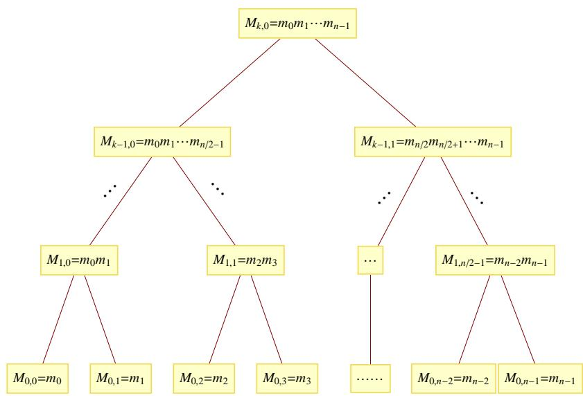

# 一元多项式求值和插值

本章主要介绍一元多项式求值和插值的快速算法 [174], 它们本身都不是很复杂, 因此不打算用太多的篇幅介绍. 关于这一方面, 有兴趣的读者也可以参阅 [72],[88].

由于我们从本章开始将进入多项式的相关算法, 首先对一些通用的多项式记号作一简单说明. 设有多项式

$$
f = \sum_ {i = 0} ^ {n} a _ {n} x ^ {n} = a _ {0} + a _ {1} x + \dots + a _ {n} x ^ {n},
$$

则称 $n$ 为 $f$ 的次数, 记为 $\deg f$ , 称 $a _ { n }$ 为 $f$ 的领项系数(Leading Coefficient), 记为 $\operatorname { l c } ( f )$ , 称 $x ^ { n }$ 为 $f$ 的领项单项式(Leading Monomial), 记为 $\ln ( f )$ , 称 $\boldsymbol { a _ { n } } \boldsymbol { x } ^ { n }$ 为 $f$ 的 领项(Leading Term), 记为 $\operatorname { l t } ( f )$ , 后文中也会提到首项, 即领项. 定义 $f$ 的首一化 多项式为

$$
\operatorname {m o n i c} (f) = \frac {f}{\operatorname {l c} (f)}.
$$

# 7.1 求值算法

提起一元多项式的求值算法, 我们都会想起最著名的 Horner 规则, 即对于$\begin{array} { r } { f ( x ) = \sum _ { 0 \leq i < n } f _ { i } x ^ { i } } \end{array}$ , 利用下式来求其值:

$$
f (x) = (\dots (f _ {n - 1} x + f _ {n - 2}) x + \dots + f _ {1}) x + f _ {0}.
$$

在该算法中, 需要计算总共 $n - 1$ 次乘法和 $n - 1$ 次加法. 如果要同时计算多项式在 $n$ 个不同点处的值, 则需要 $O ( n ^ { 2 } )$ 的计算量.

对于一般多项式的单点求值问题来说, Horner 规则已经是最优的了. Pan[135]于 1966 年证明了 Horner 规则使用乘法的次数是最少的, 即 $n$ 次多项式的求值至少要 $n$ 次乘法.

但是对于多点求值来说, Horner 规则就不一定是最优的了. 下面给出一种快速多点求值算法, 其计算复杂度为 $O ( M ( n ) \log n )$ , 其中 $M ( n )$ 表示 $n$ 次多项式乘法计算的复杂度(参考 [174] 封三说明). 为了说明算法, 我们取 $n = 2 ^ { k }$ 是 2 的一整数次幂, 需要求值的点为 $u _ { 0 } , u _ { 1 } , \ldots , u _ { n - 1 }$ , 并且令 $m _ { j } = x - u _ { j } ( j = 0 , \ldots , n - 1 )$ .下面构造一棵完全二叉树, 以 $M _ { i , j }$ 表示从叶 $( i = 0 )$ )往上数第 $i$ 层, 从该层左往右数第 $j$ 个结点, 结点值为

$$
M_{i,j} = \prod_{\substack{j\cdot 2^{i}\leq l <   (j + 1)\cdot 2^{i}}}m_{l},
$$

  
图7.1表示其结构.  
图 7.1: $M _ { i , j }$ 二叉树示意图

其中每个叶结点都是一次式 $M _ { 0 , j } = m _ { j }$ . 算法 7.1 给出了上面树的构造算法.

# 算法7.1 ( $M _ { i , j }$ 二叉树构造算法).

1. 对 $0 \leq j < n$ , 令 $M _ { 0 , j } = m _ { j }$   
2. 对 $i$ 从 1循环到 $k$ , 做下面第 3 步,

3. 对 $j$ 从 0 循环到 $2 ^ { k - i }$ , $M _ { i , j } = M _ { i - 1 , 2 j } M _ { i - 1 , 2 j + 1 }$

利用上面的构造的二叉树, 我们可以实现快速求值算法.

算法7.2 (快速求值算法).

输入:多项式 $f$ 和 $n$ (满足 $\deg f < n )$ )个点 $u _ { 0 } , \ldots , u _ { n - 1 }$ , 输出: $f ( u _ { 0 } ) , \ldots , f ( u _ { n - 1 } )$ .

1. 若 $n = 1$ 则输出 $f$ (此时 $f$ 为常数),  
2. $r _ { 0 } = f$ mod $M _ { k - 1 , 0 }$ , $r _ { 1 } = f$ mod $M _ { k - 1 , 1 }$   
3. 递归调用本算法求 $r _ { 0 } ( u _ { 0 } ) , \ldots , r _ { 0 } ( u _ { n / 2 - 1 } )$ ,   
4. 递归调用本算法求 $r _ { 1 } ( u _ { n / 2 } ) , \ldots , r _ { 1 } ( u _ { n - 1 } )$ ,   
5. 输出上面两步求出的 $n$ 个值.

我们举例来说明上述算法.

例7.1. 求多项式 $f ( x ) = x ^ { 3 } + 2 x ^ { 2 } + 3 x + 4$ 在 $\{ u _ { 0 } , u _ { 1 } , u _ { 2 } , u _ { 3 } \} = \{ 1 , 2 , 3 , 4 \}$ 四个点处的值.

解: 首先由 $f$ mod $M _ { 1 , 0 } = f$ mod $( x - 1 ) ( x - 2 ) = 1 6 x - 6$ 和 $f$ mod $M _ { 1 , 1 } =$ $f$ mod $( x - 3 ) ( x - 4 ) = 5 4 x - 1 0 4$ 可以将问题化为求 $1 6 x - 6$ 在 1,2 处的值和$5 4 x - 1 0 4$ 在 3,4 处的值. 再做一次模运算(模一次多项式实际上相当于求值)可以求出四个点处的值分别为 10, 26, 58, 112. $\diamondsuit$

注107. 以上讨论的都是 $n$ 为 2 的整数次幂的情况, 而一般情况下这是不能满足的,这时, 我们可以采取添一些项, 例如在多点求值时添一些不同的求值点以凑成 2 的整数次幂情形, 或者不必得到完全二叉树, 在递归建立 $M _ { i , j }$ 的树或求值时每次将待处理的点分成数目大致相同的两组进行处理. 下一小节的插值算法当 $n$ 不是 2的整数次幂时, 也可同样处理.

# 7.2 插值算法

多项式的插值是指已知多项式在 $n$ 个不同点处的值, 求出此多项式, 当然是在模 $x ^ { n }$ 的意义下, 即次数不超过 $n$ 时, 此多项式是唯一的. 首先我们想到了著名

的 Lagrange 插值算法, 设已知 $n$ 个点 $u _ { 0 } , \ldots , u _ { n - 1 }$ 和 $n$ 次多项式 $f$ 在这些点上的值 v0, . . . , vn−1, 记 mj = x − uj , m = Q0≤j<n mj , si = Qj6=i,0≤j<n 1ui − uj , $v _ { 0 } , \ldots , v _ { n - 1 }$ $m _ { j } = x - u _ { j }$ $\begin{array} { r } { m = \prod _ { 0 \leq j < n } m _ { j } } \end{array}$ $s _ { i } = \prod _ { j \neq i , 0 \leq j < n } { \frac { 1 } { u _ { i } - u _ { j } } }$ 则Lagrange插值的结果可以表示为:

$$
f = \sum_ {0 \leq i <   n} \frac {v _ {i} s _ {i} m}{m _ {i}}.
$$

这是一个复杂度 $O ( n ^ { 2 } )$ 的算法(见 [174] 定理 5.1). 一元插值的方法还有 Newton 插值法, 其复杂度也是 $O ( n ^ { 2 } )$ 的 [191], 见多元多项式插值部分的算法 11.1 .

下面提出的快速插值算法, 其复杂度与求值算法一样, 也为 $O ( M ( n ) \log n )$ . 为求插值多项式, 首先我们要求出 $s _ { i }$ , 因为

$$
m ^ {\prime} (u _ {i}) = \sum_ {0 \leq j <   n} \frac {m}{m _ {j}} \Big | _ {x = u _ {i}} = \left. \frac {m}{m _ {i}} \right| _ {x = u _ {i}} = \frac {1}{s _ {i}},
$$

故 $s _ { i } = { \frac { 1 } { m ^ { \prime } ( u _ { i } ) } }$ . 现在令 $c _ { i } = v _ { i } s _ { i }$ , 并设 $n = 2 ^ { k }$ 是 2 的整数次幂.

算法7.3 (快速插值算法).

输入: $\mathbf { \mathcal { U } } _ { 0 } , \dots , \mathcal { U } _ { n - 1 }$ , $c _ { 0 } , \ldots , c _ { n - 1 }$

输出: $\sum _ { 0 \leq i < n } { \frac { c _ { i } m } { m _ { i } } }$ mi

1. 若 $n = 1$ 则输出 $c _ { 0 }$   
2. 递归调用本算法, 输入前 $n / 2$ 个点, 求出 $r _ { 0 }$ ,   
3. 递归调用本算法, 输入后 $n / 2$ 个点, 求出 $r _ { 1 }$   
4. 输出 $M _ { k - 1 , 1 } r _ { 0 } + M _ { k - 1 , 0 } r _ { 1 }$

算法有效性. 我们只需证明算法能返回结果 $\begin{array} { r } { \sum _ { 0 \leq i < n } c _ { i } \prod _ { 0 \leq j < n , j \neq i } m _ { j } } \end{array}$ . 采用递归论证的方法, 我们假设在每一次递归调用执行下一级算法时, 均会得到正确的结果, 即

$$
r _ {0} = \sum_ {0 \leq i <   n / 2} c _ {i} \prod_ {0 \leq j <   n / 2, j \neq i} m _ {j}, \quad r _ {1} = \sum_ {n / 2 \leq i <   n} c _ {i} \prod_ {n / 2 \leq j <   n, j \neq i} m _ {j}.
$$

那么该步算法将返回结果:

$$
M _ {k - 1, 1} r _ {0} + M _ {k - 1, 0} r _ {1} = r _ {0} \prod_ {n / 2 \leq j <   n} m _ {j} + r _ {1} \prod_ {0 \leq j <   n / 2} m _ {j} = \sum_ {0 \leq i <   n} c _ {i} \prod_ {0 \leq j <   n, j \neq i} m _ {j},
$$

即若下一级递归结果正确, 则该步算法也将返回正确结果. 另外, 在算法递归终止处, 即 $n = 1$ 情况下, 算法返回 $c _ { 0 }$ , 此结果显然是正确的. 算法有效性得证. □

同样地, 我们给出一个具体的例子来说明本算法.

例7.2. 考虑 $\{ u _ { 0 } , u _ { 1 } , u _ { 2 } , u _ { 3 } \} = \{ 1 , 2 , 3 , 4 \}$ , $\{ v _ { 0 } , v _ { 1 } , v _ { 2 } , v _ { 3 } \} = \{ 1 0 , 2 6 , 5 8 , 1 1 2 \}$ , 求 次数小于 4 的多项式 $f$ 使得 $f ( u _ { i } ) = v _ { i } ( 1 \leq i \leq 4 )$ .

解: 首先 $\begin{array} { r } { m = \prod _ { 0 \leq i < 4 } ( x - u _ { i } ) = x ^ { 4 } - 1 0 x ^ { 3 } + 3 5 x ^ { 2 } - 5 0 x + 2 4 , } \end{array}$ , 则 $m ^ { \prime } = 4 x ^ { 3 } - 3 0 x ^ { 2 } +$ $7 0 x - 5 0$ . 于是

$$
s _ {0} ^ {- 1} = m ^ {\prime} (1) = - 6, s _ {1} ^ {- 1} = m ^ {\prime} (2) = 2, s _ {2} ^ {- 1} = m ^ {\prime} (3) = - 2, s _ {3} ^ {- 1} = m ^ {\prime} (4) = 6.
$$

由 $c _ { i } = v _ { i } s _ { i }$ 可得

$$
c _ {0} = - \frac {5}{3}, c _ {1} = 1 3, c _ {2} = - 2 9, c _ {3} = \frac {5 6}{3}.
$$

由于 $n = 4 \cdot$ , 情况比较简单, 只需递归两次, 很容易得到第一级算法中的

$$
r _ {0} = - \frac {5}{3} (x - 2) + 1 3 (x - 1) = \frac {3 4}{3} x - \frac {2 9}{3}, r _ {1} = - 2 9 (x - 4) + \frac {5 6}{3} (x - 3) = - \frac {3 1}{3} x + 6 0,
$$

则最后插值结果为:

$$
(x - 3) (x - 4) r _ {0} + (x - 1) (x - 2) r _ {1} = x ^ {3} + 2 x ^ {2} + 3 x + 4.
$$

可以看到, 此结果与例 7.1是相符合的.

✸
