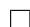
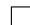

# 一元多项式的最大公因子

设 $D$ 为 UFD(即唯一析因整环, 例如 $\mathbb { Z }$ ), $F$ 为域(例如 $\mathbb { R }$ ), 则 $D [ x ] , F [ x ]$ 也是UFD, 对其上两多项式可讨论最大公因子(GCD)问题. 最古典的方法即是 Euclid算法. 然而, 在上世纪六十年代末一些试验中(参见 [174] 注记6.1)发现这种算法在$D [ x ]$ 或 $F [ x ]$ 中的系数增长很快, 甚至于指数阶增长. 本书开头即展示了这样的“中间表示膨胀”的例子.

为了解决计算过程中系数膨胀的问题, Collins, Brown 发现了 UFD 上的多项式模最大公因子算法, 并首先由 Brown[46] 于 1971 年提出. 对于多元情形, Mozes和 Yun[130] 于 1973 年提出了基于 Hensel 提升方法的模因子算法. 下面对经典的Euclid算法和改进算法进行论述.

本章假设读者具有一定的代数知识, 对 UFD, PID(主理想整环), 多项式及其GCD 以及 Euclid 算法等有一定的了解. 关于基本的代数知识, 可参考高等代数学方面的书, 如 [12].

# 8.1 Euclid 算法

在 Euclid 整环 $F [ x ]$ 中, 我们有如下的 Euclid除法:

定义8.1 (Euclid 除法). 设 $f , g \in F [ x ]$ , 其中 $g \neq 0$ , 则存在唯一的 $q , r \in F [ x ]$ 使得

$$
f = q g + r,
$$

其中 $\deg r < \deg g$ . 我们称此除法过程为 Euclid 除法, 并以 $f { \mathrm { q u o } } g$ $f$ 记商 $q$ $l , f \operatorname { r e m } g$ 记余式 $r$ .

在一般高等代数教材(如 [12])中都证明了如下定理.

定理8.1. 在 Euclid 整环 $F [ x ]$ 中, 若 $h = \operatorname* { g c d } ( f , g )$ , 则有唯一的非平凡多项式 $s , t$ 使得

$$
s f + t g = h
$$

且 $\deg s < \deg g , \deg t < \deg f$ . 等式 $s f + t g = h$ 称为 Bezout 等式, $s , t$ 称为Bezout 系数.

对于 Euclid 整环 $F [ x ]$ , 我们熟知有以下的扩展 Euclid 算法 8.1 . 注意到将算法中的 $s , t$ 等计算舍去即为普通的 Euclid 算法.

算法8.1 (扩展 Euclid 算法).

输入: $F [ x ]$ 上多项式 $f , g$

输出: $f , g$ $g$ 的最大公因子 $u$ , Bezout 等式中的系数 $S = ( s , t )$ 使得 $s f + t g = u$

1. $\begin{array} { r } { u = f , v = g , S = ( 1 , 0 ) , T = ( 0 , 1 ) , } \end{array}$ ,   
2. 如果 $v = 0$ , 则转到第 4 步,  
3. $r = u \operatorname { r e m } v , q = u \operatorname { q u o } v , L = S - q T , u = v , v = r , S = T , T = L ,$ $q = u$ , 并转回第 2步,  
4. 输出 $u , S$ .

由于我们要讨论的是“精确”的符号计算, 所以多项式的系数一般为整数或有理数. 而对于 $\mathbb { Q } [ x ]$ 中的多项式, 我们总可以找到整数乘以该多项式使其化为 $\mathbb { Z } [ x ]$ 中的问题. 因此, 后面关于多项式的符号运算集中讨论 $\mathbb { Z } [ x ]$ 中的情形.

为了引出 $\mathbb { Z } [ x ]$ 中求 GCD的算法, 我们先引进如下一些定义和定理.

定义8.2 (本原多项式). 容度 $\operatorname { c o n t } ( f )$ 定义为:

$$
\operatorname {c o n t} (f) = \operatorname {s g n} \left(a _ {n}\right) \operatorname * {g c d} \left(a _ {0}, a _ {1}, \dots , a _ {n}\right),
$$

其中 $f = \sum a _ { i } x ^ { i } \in \mathbb { Z } [ x ]$ , 且 gcd 对单项的定义为

$$
\operatorname * {g c d} (a _ {0}) = a _ {0},
$$

$f$ 的本原部分(primitive part)定义为 $\operatorname { p p } ( f ) = f / \operatorname { c o n t } ( f )$ , 若 $f = \operatorname { p p } ( f )$ , 则称其为本原多项式.

注108. 定义中关于多个整数的 GCD 是指取了绝对值之后的最大公因子, 之所以在容度的定义中乘上 $\operatorname { s g n } ( a _ { n } )$ 一项, 是为了使得其后定义的本原多项式的首项系数为正数.

命题8.1. 设 $f \in \mathbb { Z } [ x ] , c \in \mathbb { Z } _ { \mathrm { : } }$ , 我们有 $\operatorname { c o n t } ( c f ) = \operatorname { c o n t } ( c ) \operatorname { c o n t } ( f ) , \operatorname { p p } ( c f ) = \operatorname { p p } ( c ) \operatorname { p p } ( f ) .$

定理8.2 (Gauss 引理). 设 $f , g \in \mathbb { Z } [ x ]$ , 若 $f , g$ 本原, 则 $h = f g$ 也是本原的.

类似还有以下一些命题, 相关内容可参阅相关的高等代数学内容(例如 [6]).

命题8.2. 设 $f , g \in \mathbb { Z } [ x ] , \operatorname { c o n t } ( f g ) = \operatorname { c o n t } ( f ) \mathrm { c o n t } ( g ) , \operatorname { p p } ( f g ) = \operatorname { p p } ( f ) \mathrm { p p } ( g ) .$

命题8.3. 设 $f , g \in \mathbb { Z } [ x ] , h = \operatorname* { g c d } ( f , g ) \in \mathbb { Z } [ x ]$ , 则

$$
\operatorname {c o n t} (h) = \operatorname * {g c d} (\operatorname {c o n t} (f), \operatorname {c o n t} (g)) \in \mathbb {Z},
$$

$$
\operatorname {p p} (h) = \operatorname * {g c d} (\operatorname {p p} (f), \operatorname {p p} (g)) \in \mathbb {Z} [ x ].
$$

于是有下面的:

算法8.2 (一个整系数多项式的 Euclid 算法).

输入: $\mathbb { Z } [ x ]$ 上的多项式 $f , g$ ,

输出: $f , g$ 在 $\mathbb { Z } [ x ]$ 上的最大公因子 $h$ .

1. $h = \operatorname* { g c d } ( f , g ) \in \mathbb { Q } [ x ]$ ,   
2. $\boldsymbol { b } = \operatorname* { g c d } ( \operatorname { l c } ( \boldsymbol { f } ) , \operatorname { l c } ( \boldsymbol { g } ) )$ ,   
3. 输出 $b h$

尽管 $\mathbb { Z } [ x ]$ 不是 Euclid 整环, 但我们可引入 $\mathbb { Z } [ x ]$ 上的伪除法, 来构造类似Euclid 余式序列, 以此来求总大公因子. 当然这里的 $\mathbb { Z }$ 换为一般的 UFD 也是可以的.

定义8.3 (伪除法). 设 $f , g \in \mathbb { Z } [ x ]$ , 若有 $\alpha , \beta \in \mathbb { Z }$ , $q , r \in \mathbb { Z } [ x ]$ 使得

$$
\alpha f = q g + \beta r,
$$

其中 $\deg r < \deg g$ , $r$ 是本原多项式, 我们称此过程为多项式的伪除法, 并以f pquo $g$ 记伪商 $q$ $q , f \mathrm { p r e m } g$ $f$ 记伪余式 $r$ .

定义8.4 (多项式余式序列). 若 $f , g \in \mathbb { Z } [ x ]$ , 且 $\deg ( f ) \geq \deg ( g )$ , 令 $R _ { 0 } = f , R _ { 1 } = g$ ,依次作伪除法 $\alpha _ { i } R _ { i - 1 } = Q _ { i } R _ { i } + \beta _ { i } R _ { i + 1 }$ , $i = 1 , 2 , \ldots , k$ , 满足 $R _ { k - 1 }$ prem $R _ { k } = 0$ ,则 $R _ { 0 } , R _ { 1 } , \ldots , R _ { k }$ 称为 $f , g$ 的多项式余式序列.

使用伪除法求最大公因子时就会导致余式序列的系数增长很快, 我们可以用下面定义的几种多项式余式序列一定程度上减小系数增长速度(参见 [13]). 本章稍后介绍的素数模方法能够有效抑制系数膨胀效应.

定义8.5 (几种多项式余式序列). 若记 $\delta _ { i } = \deg ( R _ { i - 1 } ) - \deg ( R _ { i } )$ , 则有如下定义:

(1)通常的伪余式序列: $\alpha _ { i } = ( \operatorname { l c } ( R _ { i } ) ) ^ { \delta _ { i } + 1 } , \beta _ { i } = \operatorname { c o n t } ( R _ { i - 1 } \operatorname { p r e m } R _ { i } ) .$   
(2)子结式余式序列:

$$
\alpha_ {i} = (\operatorname {l c} (R _ {i})) ^ {\delta_ {i} + 1}, \beta_ {1} = (- 1) ^ {\delta_ {1} + 1},
$$

$$
\beta_ {i} = - \left(\operatorname {l c} \left(R _ {i - 1}\right)\right) \psi_ {i} ^ {\delta_ {i}}, (2 \leq i \leq k),
$$

$$
\psi_ {1} = - 1, \psi_ {i} = (- \operatorname {l c} (R _ {i - 1})) ^ {\delta_ {i - 1}} \psi_ {i - 1} ^ {1 - \delta_ {i - 1}}, (2 \leq i \leq k),
$$

此方法计算量最小.

(3)约化多项式余式序列:

$$
\alpha_ {i} = (\operatorname {l c} (R _ {i - 1})) ^ {\delta_ {i} + 1},
$$

$$
\beta_ {1} = 1, \beta_ {i} = \alpha_ {i - 1}, (2 \leq i \leq k).
$$

# 8.2 域上多项式的快速 Euclid 算法

1938 年 Lehmer 最先提出了快速 Euclid 算法[114], 后来 Knuth[103], Sch¨onhage[155],Moenck[124], Schwartz[156], Strassen[166] 对这些算法也有论述.

在域 $F$ (例如 $\mathbb { F } _ { p }$ )上的多项式环中, Euclid 算法可表示为(其中各 $r _ { i }$ 均为首一的):

$$
r _ {0} = f, \quad r _ {1} = g, \quad s _ {0} = t _ {1} = 1, \quad s _ {1} = t _ {0} = 0,
$$

及

$$
\rho_ {2} r _ {2} = r _ {0} - q _ {1} r _ {1}, \quad \rho_ {2} s _ {2} = s _ {0} - q _ {1} s _ {1}, \quad \rho_ {2} t _ {2} = t _ {0} - q _ {1} t _ {1},
$$

$$
\vdots \quad \vdots \quad \vdots \tag {8.1}
$$

$$
0 = r _ {l - 1} - q _ {l} r _ {l}, \quad \rho_ {l + 1} s _ {l + 1} = s _ {l - 1} - q _ {l} s _ {l}, \quad \rho_ {l + 1} t _ {l + 1} = t _ {l - 1} - q _ {l} t _ {l},
$$

若设 $\rho _ { l + 1 } = 1 , r _ { l + 1 } = 0$ , 记

$$
Q _ {i} = \left( \begin{array}{c c} 0 & 1 \\ \rho_ {i + 1} ^ {- 1} & - q _ {i} \rho_ {i + 1} ^ {- 1} \end{array} \right),
$$

则有

$$
\left( \begin{array}{c} r _ {i} \\ r _ {i + 1} \end{array} \right) = Q _ {i} \left( \begin{array}{c} r _ {i - 1} \\ r _ {i} \end{array} \right).
$$

记 $R _ { i } = Q _ { i } Q _ { i - 1 } \cdot \cdot \cdot Q _ { 1 }$ , 则有

$$
R _ {i} = \left( \begin{array}{c c} s _ {i} & t _ {i} \\ s _ {i + 1} & t _ {i + 1} \end{array} \right), \quad \left( \begin{array}{c} r _ {i} \\ r _ {i + 1} \end{array} \right) = R _ {i} \left( \begin{array}{c} r _ {0} \\ r _ {1} \end{array} \right).
$$

在随机情况下, 可证明域 $\mathbb { F } _ { p }$ 中 $\deg r _ { 2 } < \deg r _ { 1 } - 1$ 的概率 $\mathrm { P } ( \deg r _ { 2 } < \deg r _ { 1 } -$ $1 ) = \frac { 1 } { p }$ , 当素数 $p$ 很大时, 可认为 $r _ { i }$ 序列的下降速度很慢. 如果是有理数域上的多项式, 可以想到, 余式次数下降得应该更慢. 引入快速 Euclid 算法能在一定程度上补偿次数下降过慢导致的计算代价. 为了说明快速 Euclid 算法, 我们先引入下面一些定义和定理. 该算法的基本原理在于利用多项式的前若干项系数来计算余式序列.

以下我们简记多项式系数域为 $F$ , 当然, 它可以是 $\mathbb { F } _ { p }$ 或者 $\mathbb { Q }$ .

定义8.6 (截式). 对于 $\begin{array} { r } { f = \sum _ { i = 0 } ^ { n } f _ { i } x ^ { i } \in F [ x ] , k \in \mathbb { Z } , k \mathrm { . } } \end{array}$ -截式 $k$ -truncated polynomial)定义为

$$
f \upharpoonright k = f _ {n} x ^ {k} + f _ {n - 1} x ^ {k - 1} + \dots + f _ {n - k},
$$

当 $i < 0$ 我们约定 $f _ { i } = 0$ . 因此当 $k \geq 0$ 时, $f \ \harpoonright k$ 即取 $f$ 的前 $k + 1$ 个系数作一个新的 $k$ 次多项式, 而当 $k < 0$ 时 $f \ \lceil k = 0$ .

注109. 当 $k \leq n$ 时, 有 $f \mid k = f \operatorname { q u o } x ^ { n - k }$ , 而当 $k > n$ 时有 $f \mid k = f x ^ { k - n }$ .

注110. $\forall i \geq 0 , ( f x ^ { i } ) \mid \vdash k = f \mid k$ .

定义8.7 ( $k \mathrm { . }$ -度重合). 设非零多项式 $f , g , f ^ { * } , g ^ { * } \in F [ x ]$ , 且 $\deg f \geq \deg g , \deg f ^ { * } \geq$ $\deg g ^ { * } , k \in \mathbb { Z }$ , 则称 $( f , g )$ 与 $( f ^ { * } , g ^ { * } ) \ k \cdot$ $k \mathrm { . }$ -度重合(coincide up to $k$ ), 如果

$$
f \mid k = f ^ {*} \mid k
$$

$$
g \upharpoonright (k - \deg f + \deg g) = g ^ {*} \upharpoonright (k - \deg f ^ {*} + \deg g ^ {*}), \tag {8.2}
$$

此时记为 $\left( f , g \right) \stackrel { k } { \sim } \left( f ^ { \ast } , g ^ { \ast } \right)$ , 可验证 $\sim$ 为一等价关系.

根据式(8.2) , 此等价关系有如下性质:

命题8.4. 若 $\left( f , g \right) \stackrel { k } { \sim } \left( f ^ { \ast } , g ^ { \ast } \right)$ 且 $k \geq \deg f { - } \deg g .$ , 则 $\deg f - \deg g = \deg f ^ { * } - \deg g ^ { * }$ .

关于 $k \mathrm { . }$ -度重合, 有如下重要的命题:

定理8.3. 对于 $k \in \mathbb { Z }$ , 若非零多项式 $f , g , f ^ { * } , g ^ { * }$ 满足 $\left( f , g \right) \stackrel { 2 k } { \sim } \left( f ^ { \ast } , g ^ { \ast } \right)$ , 且 $k \geq$ $\deg f - \deg g \geq 0$ , 若有 Euclid 除法

$$
f = q g + r, \quad f ^ {*} = q ^ {*} g ^ {*} + r ^ {*},
$$

则

1. $q = q ^ { * }$ ,   
2. $\left( g , r \right) ^ { 2 \left( k - \mathrm { d e g } q \right) } \left( g ^ { \ast } , r ^ { \ast } \right)$ 或者 $r = 0$ 或者 $k - \deg q < \deg g - \deg r$ .

证明. 对 $( f , g )$ 和 $( f ^ { * } , g ^ { * } )$ 乘以 $x$ 的适当幂次后, 可使 $\deg f = \deg f ^ { * } > 2 k$ 成 立,不妨设命题中的多项式已满足此式, 则由命题 8.4 有 $\deg g = \deg g ^ { * }$ 及 $k \geq \deg { q } =$ $\deg f - \deg g = \deg f ^ { * } - \deg g ^ { * } = \deg q ^ { * }$ . 下面分两部分证明本定理.

(1)首先我们有如下三个不等式

$\deg ( f - f ^ { * } ) < \deg f - 2 k \leq \deg g - k$ (注意 $k \mathrm { . }$ -截式取多项式的前 $k + 1$ 项),

$$
\begin{array}{l} \deg (g - g ^ {*}) <   \deg g - (2 k - (\deg f - \deg g)) \\ = \deg f - 2 k \leq \deg g - k \leq \deg g - \deg q, \\ \end{array}
$$

$$
\deg (r - r ^ {*}) \leq \max  \left\{\deg r, \deg r ^ {*} \right\} <   \deg g,
$$

根据上面的不等式, 由 $f - f ^ { * } = q ( g - g ^ { * } ) + ( q - q ^ { * } ) g ^ { * } + ( r - r ^ { * } )$ 可知 $\deg [ ( q - q ^ { * } ) g ^ { * } ] <$ $\deg g$ , 故 $q = q ^ { * }$ .

(2)假定 $r \neq 0$ 且 $k - \deg q \geq \deg g - \deg r$ , 则由 $\left( f , g \right) \stackrel { 2 k } { \sim } \left( f ^ { \ast } , g ^ { \ast } \right)$ 有

$$
g \upharpoonright 2 (k - \deg q) = g ^ {*} \upharpoonright 2 (k - \deg q),
$$

另外

$$
\begin{array}{l} \deg (r - r ^ {*}) \leq \max  \left\{\deg (f - f ^ {*}), \deg q + \deg (g - g ^ {*}) \right\} \\ <   \deg q + \deg f - 2 k \\ = \deg g - 2 (k - \deg q) \\ = \deg r - \left[ 2 (k - \deg q) - (\deg g - \deg r) \right], \\ \end{array}
$$

又由假设有 $\deg r \geq \deg q + \deg g - k \geq \deg q + \deg f - 2 k \Rightarrow \deg r = \deg r ^ { * }$ , 于是 $r \mid [ 2 ( k - \deg q ) - ( \deg g - \deg r ) ] = r ^ { * } \mid [ 2 ( k - \deg q ) - ( \deg g ^ { * } - \deg r ^ { * } ) ] ,$ 故 $\left( g , r \right) ^ { 2 \left( k - \mathrm { d e g } q \right) } \left( g ^ { \ast } , r ^ { \ast } \right)$ .

下面考虑两个首一的多项式 Euclid 余式序列

$$
r _ {0} = q _ {1} r _ {1} + \rho_ {2} r _ {2} \qquad \qquad r _ {0} ^ {*} = q _ {1} ^ {*} r _ {1} ^ {*} + \rho_ {2} ^ {*} r _ {2} ^ {*}
$$

$$
\vdots \qquad \qquad \qquad \qquad \qquad \qquad \qquad \qquad \qquad \qquad \qquad \qquad \qquad \qquad \qquad \qquad \qquad \qquad \qquad \qquad \qquad \qquad \qquad \qquad \qquad \qquad \qquad \qquad \qquad \qquad \qquad \qquad \qquad \qquad
$$

$$
r _ {l - 1} = q _ {l} r _ {l} \quad r _ {l ^ {*} - 1} ^ {*} = q _ {l ^ {*}} ^ {*} r _ {l ^ {*}} ^ {*}
$$

分别令 $m _ { i } = \deg q _ { i } , m _ { i } ^ { * } = \deg q _ { i } ^ { * } , n _ { i } = \deg r _ { i } = n _ { 0 } - m _ { 1 } - \cdot \cdot \cdot - m _ { i }$ , 对 $k \in \mathbb N$ , 定义 $\begin{array} { r } { \eta ( k ) = \operatorname* { m a x } \{ 0 \leq j \leq l \mid \sum _ { 1 \leq i \leq j } m _ { i } \leq k \} } \end{array}$ , 则我们有

$$
n _ {0} - n _ {\eta (k)} = \sum_ {1 \leq i \leq \eta (k)} m _ {i} \leq k <   \sum_ {1 \leq i \leq \eta (k) + 1} m _ {i} = n _ {0} - n _ {\eta (k) + 1}.
$$

下面的定理是快速 Euclid算法的基础:

定理8.4. 对于 $k \in \mathbb { N } , h = \eta ( k ) , h ^ { * } = \eta ^ { * } ( k )$ , 若

$$
\left(r _ {0}, r _ {1}\right) \stackrel {2 k} {\sim} \left(r _ {0} ^ {*}, r _ {1} ^ {*}\right),
$$

则 $h = h ^ { * }$ , $q _ { i } = q _ { i } ^ { * } , \rho _ { i + 1 } = \rho _ { i + 1 } ^ { * }$ 对 $1 \leq i \leq h$ 成立.

证明. 只需对 $0 \le j \le h$ 的 $j$ 进行归纳, 证明如下命题: $j \le h ^ { * } , q _ { i } = q _ { i } ^ { * } , \rho _ { i + 1 } = \rho _ { i + 1 } ^ { * }$ 对于 $1 \leq i \leq j$ 成立, 且 $j = h$ 或

$$
(r _ {j}, r _ {j + 1}) \stackrel {s} {\sim} (r _ {j} ^ {*}, r _ {j + 1} ^ {*}), \text {其 中} s = 2 (k - \sum_ {1 \leq i \leq j} m _ {i}).
$$

$j = 0$ 时命题无须论证, 由定理 8.3 可以证明归纳过程. 另外

$$
\sum_ {1 \leq i \leq j} \deg q _ {i} ^ {*} = \sum_ {1 \leq i \leq j} \deg q _ {i} \leq \sum_ {1 \leq i \leq h} \deg q _ {i} \leq k
$$

可知 $j \le \eta ^ { * } ( k ) = h ^ { * }$ , 证毕.

由此我们可以得到下面的算法:

算法8.3 (快速扩展 Euclid 算法).

输入: 首一多项式 $r _ { 0 } , r _ { 1 } \in F [ x ] , k \in \mathbb { N } ( 0 \leq k \leq n )$ , 其中 $n = n _ { 0 } = \deg r _ { 0 } >$ $n _ { 1 } = \deg r _ { 1 } .$ ,

输出: $h = \eta ( k )$ 以及 $R _ { h } \in M _ { 2 \times 2 } ( F [ x ] )$ .

1. 如果 $r _ { 1 } = 0$ 或 $k < n _ { 0 } - n _ { 1 }$ , 则输出 $0 , \left( \begin{array} { l l } { 1 } & { 0 } \\ { 0 } & { 1 } \end{array} \right) .$

2. $d = \lfloor k / 2 \rfloor$   
3. 递归调用本算法, 输入 $r _ { 0 } ~ \lceil ~ 2 d , r _ { 1 } ~ \rceil ~ ( 2 d - ( n _ { 0 } - n _ { 1 } ) ) , d ,$ 并将结果输出至 $j - 1 = \eta ( d ) , R = Q _ { j - 1 } \cdot \cdot \cdot Q _ { 1 } ,$ ,   
4. 赋值 ${ \binom { r _ { j - 1 } } { r _ { j } } } = R { \binom { r _ { 0 } } { r _ { 1 } } } , { \binom { n _ { j - 1 } } { n _ { j } } } = { \binom { \deg r _ { j - 1 } } { \deg r _ { j } } } ,$ ${ \binom { r _ { j - 1 } } { r _ { j } } } = R \left( { { r _ { 0 } } \atop { r _ { 1 } } } \right)$   
5. 如果 $r _ { j } = 0$ 或者 $k < n _ { 0 } - n _ { j }$ 则输出 $j - 1 , R$   
6. 赋值 $q _ { j } = r _ { j - 1 } { \mathrm { q u o } } r _ { j } , \rho _ { j + 1 } = { \mathrm { l c } } ( r _ { j - 1 } { \mathrm { r e m } } r _ { j } ) , r _ { j + 1 } = { \mathrm { m o n i c } } ( r _ { j - 1 } { \mathrm { r e m } } r _ { j } ) ,$ $\rho _ { j + 1 } = \mathrm { l c } ( r _ { j - 1 } \mathrm { r e m } r _ { j } ) , r _ { j + 1 } = \mathrm { m o n i c } ( r _ { j - 1 } \mathrm { r e m } r _ { j } ) { } _ { \mathrm { t } { } }$ $n _ { j + 1 } = \deg r _ { j + 1 } , d ^ { * } = k - ( n _ { 0 } - n _ { j } )$ ,   
7. 递归调用本算法, 输入 $r _ { j } ~ \lceil ~ 2 d ^ { * } , r _ { j + 1 } ~ \rceil ~ ( 2 d ^ { * } - ( n _ { j } - n _ { j + 1 } ) ) , d ^ { * }$ , 并将结果输出 至 $h - j = \eta ( d ^ { * } ) , S = Q _ { h } \cdot \cdot \cdot Q _ { j + 1 }$ ,   
$Q _ { j } = \left( \begin{array} { c c } { { 0 } } & { { 1 } } \\ { { \rho _ { j + 1 } ^ { - 1 } } } & { { - q _ { j } \rho _ { j + 1 } ^ { - 1 } } } \end{array} \right) ,$   
9. 输出 $h , S Q _ { j } R$

注111. 理论上每次取 $k$ 时应当使恰好只计算一步, 这样可以达到最高的效率, 即既不多取了不必要的系数进行计算, 又不致于系数取得不够. 当余式序列的次数$n _ { i }$ 下降得缓慢时, 相应的 $k$ 就可以取得比较小. 实际中无法根据 $n _ { i }$ 的信息选择, 因而有上面的二分递归的策略来选择.  
注112. 初始进行函数调用时, 我们可取 $k = n$ , 根据 $\eta ( k )$ 的定义我们知道 $\eta ( k ) = l$ ,因而算法必将返回 $l$ 和 $R _ { l }$ , 根据 $R _ { l }$ 可以得到 $r _ { l }$ , 即最大公因子.

本章稍后将会介绍 $\mathbb { Z } [ x ]$ 上的素数模公因子算法, 由于 $\mathbb { F } _ { p }$ 为域, 可利用本节所提到的快速 Euclid算法提高计算效率.

# 8.3 结式性质及其计算

# 8.3.1 结式

对于多项式最大公因子问题, 结式理论纯粹是一个概念上的工具, 并没有直接用于实际算法中. 但结式理论对后面的 GCD 算法理论有重要的作用. 另外结式的计算在某些问题中也十分重要, 如符号积分中的 Rothstein-Trager 结式等等. 本小

节先介绍结式的定义及一些相关性质, 后面将会介绍利用多项式余式序列(PRS)来计算它的方法.

引理8.1. 设 $F$ 是域, 非零多项式 $f$ , $g \in F [ x ]$ . 那 么 $\operatorname* { g c d } ( f , g ) \neq 1$ 当且仅当$\exists s , t \in F [ x ] \setminus \{ 0 \}$ 使得 $s f + t g = 0$ , 且 $\deg s < \deg g$ , $\deg t < \deg f$ .

证明. 令 $h = \operatorname* { g c d } ( f , g )$ , 若 $f \neq 1$ , 则 $\deg h \geq 1$ , 令 $s = - g / h$ , $t = f / h$ 则满足.

反过来, 设存在这样的 $s , t ,$ , 若 $f$ , $g$ 互素, 则 $s f = - t g \Rightarrow f \mid t$ , 这与 $t \neq 0$ 且$\deg f > \deg t$ 矛盾, 因此 $h = 1$ . □

注113. 当 $F$ 只是 UFD 时上面的引理仍成立, 不过引理的条件 $\operatorname* { g c d } ( f , g ) \neq 1$ 应理解为 $f , g$ 在该 UFD 分式域为系数的多项式环中的最大公因子, 或者说 $\operatorname { g c d } ( f , g )$ 非平凡, 即非常数多项式.

为了引出结式的定义, 我们仍需给出如下一些定义及定理.

定义8.8. 对于 $d \in \mathbb { N } .$ , 定义 $P _ { d } = \{ a \in F [ x ] | \deg a < d \}$ .

定义8.9. 对于给定的 $n , m$ 次多项式 $f$ $f , g \in F [ x ]$ , 定义

$$
\varphi = \varphi_ {f, g}: F [ x ] \times F [ x ] \to F [ x ], \qquad (s, t) \mapsto s f + t g,
$$

并令 $\varphi _ { 0 } : P _ { m } \times P _ { n } \to P _ { n + m }$ 为 $\varphi$ 在 $P _ { m } \times P _ { n }$ 上的限制.

定理8.5. 设 $f$ , $g \in F [ x ]$ 为 $n , ~ m$ 次非零多项式, 那么有下面的结论:

1. $\operatorname* { g c d } ( f , g ) = 1 \Leftrightarrow \varphi _ { 0 }$ 是同构.   
2. 若 $\operatorname* { g c d } ( f , g ) = 1$ , 则 f , g 的 Bezout 系数 s, t 构成 $\varphi _ { 0 } ( s , t ) = 1$ 的唯一解.

证明. 由引理8.1知 $\operatorname* { g c d } ( f , g ) = 1 \Leftrightarrow \varphi _ { 0 }$ 是单射.

因为对于相同维数线性空间之间的线性映射, 单射等价于同构, 所以第一条结论满足. 由 $\varphi _ { 0 }$ 为同构知这样的 $s , t$ 也是唯一的. □

如果记 $( s , t ) = ( y _ { m - 1 } , \ldots , y _ { 0 } , z _ { n - 1 } , \ldots , z _ { 0 } ) ^ { T }$ , 其 中 $\begin{array} { r } { s } = \sum _ { 0 \leq j < m } y _ { j } x ^ { j }  \end{array}$ , $t \ =$ $\textstyle \sum _ { 0 \leq j < n } z _ { j } x ^ { j }$ , 则线性映射 $\varphi _ { 0 }$ 可在自然基 $\{ ( x ^ { j } , 0 ) \} _ { 0 \leq j \leq m - 1 } , \{ ( 0 , x ^ { j } ) \} _ { 0 \leq j \leq n - 1 }$ 下 表示为如下矩阵 $S$ , 称为 $f , g$ 的 Sylvester 矩阵:

$$
S = \left( \begin{array}{c c c c c c c c c c} f _ {n} & & & g _ {m} & & & & & \\ f _ {n - 1} & f _ {n} & & g _ {m - 1} & g _ {m} & & & & \\ \vdots & \vdots & \ddots & & \vdots & \vdots & \ddots & & \\ \vdots & \vdots & & f _ {n} & g _ {1} & \vdots & & \ddots & & \\ \vdots & \vdots & & f _ {n - 1} & g _ {0} & \vdots & & & \ddots & \\ \vdots & \vdots & & \vdots & & g _ {0} & & & & g _ {m} \\ f _ {0} & \vdots & & \vdots & & & \ddots & & & \vdots \\ & f _ {0} & & \vdots & & & & \ddots & & \vdots \\ & & \ddots & \vdots & & & & & \ddots & \vdots \\ & & & f _ {0} & & & & & & g _ {0} \end{array} \right).
$$

上面的定理用矩阵语言描述即为:

推论8.1. 设 $S$ 为 $f , g$ 的 Sylvester 矩阵, 则有

$1 . \operatorname* { g c d } ( f , g ) = 1 \Leftrightarrow \operatorname* { d e t } S \neq 0 ,$   
2. 若 $\operatorname* { g c d } ( f , g ) = 1$ , 且 $y _ { 0 } , y _ { 1 } , \dotsc , y _ { m - 1 } , z _ { 0 } , \dotsc , z _ { n - 1 } \in F$ 满足

$$
S (y _ {m - 1}, \dots , y _ {0}, z _ {n - 1}, \dots , z _ {0}) ^ {T} = (0, 0, \dots , 0, 1) ^ {T},
$$

那么 s = Pm−ki=0 yixi, t = P $\begin{array} { r } { s = \sum _ { i = 0 } ^ { m - k } y _ { i } x ^ { i } } \end{array}$ $t = \textstyle \sum _ { i = 0 } ^ { n - k } z _ { i } x ^ { i }$ 为 $f , g$ 的 Bezout 系数, 使得 $s f + t g = 1$

到此, 我们可以给出结式的定义了.

定义8.10. 设 $R$ 为 UFD, $f , g \in R [ x ]$ , $S = \operatorname { S y l } ( f , g )$ 为它们的 Sylvester 矩阵, 我们称行列式 $\operatorname* { d e t } S$ 为结式, 记作 $\operatorname { r e s } ( f , g )$ .

注114. 当 $n = m = 0$ 时 $S$ 是空矩阵, 我们约定结式为 1. 若 $f$ 为 0 或非常数多项式, 我们约定 $\operatorname { r e s } ( f , 0 ) = \operatorname { r e s } ( 0 , f ) = 0$ , 若 $f$ 是非零常数则约定 $\operatorname { r e s } ( f , 0 ) =$ $\operatorname { r e s } ( 0 , f ) = 1$ . 前面定理在这些情形下仍然成立.

下面是一些关于结式的性质, 对于以后的算法分析是很有用的.

推论8.2. 设 $F$ 为域, 非零多项式 $f , g \in F [ x ]$ , 则下面各条件等价:

1. gcd(f, g) = 1,   
2. res(f, g) = deg S 6= 0,

3. 不存在非零多项式 $s , t \in F [ x ]$ 使得

$$
s f + t g = 0, \quad \deg s <   \deg g, \quad \deg t <   \deg f.
$$

推论8.3. 设 $R$ 为 UFD, 非零多项式 $f , g \in R [ x ]$ . 则 $\operatorname { g c d } ( f , g )$ 非平凡当且仅当$\operatorname { r e s } ( f , g ) = 0 $ .

推论8.4. 若 $R$ 为 UFD, 非零多项式 $f , g \in R [ x ]$ , 则存在非零多项式 $s , t \in R [ x ]$ 使得 $s f + t g = \operatorname { r e s } ( f , g )$ 且 $\deg s < \deg g , \deg t < \deg f .$ .

证明. 令 $F$ 是 $R$ 的分式域. 若 $r = \operatorname { r e s } ( f , g ) = 0$ , 则由推论 8.2 知存在满足要求的$s , t \in F [ x ]$ , 再将其乘一个公分母即可. 若 $r \neq 0$ , 则 $f , g$ 互素, 于是存在 $s ^ { * } , t ^ { * } \in F [ x ]$ 满足 $\deg s ^ { * } < \deg g , \deg t ^ { * } < \deg f$ 且 $s ^ { * } f + t ^ { * } g = 1$ , 由线性方程组的 Cramer 法则知 $s = r s ^ { * } , t = r t ^ { * }$ 满足所需要求. □

引理8.2. 设 $R$ 为 UFD, 非零多项式 $f , g \in R [ x ]$ , $r = \operatorname { r e s } ( f , g ) \in R$ , $I \subset R$ 为一理想, 记 $R$ 中元素 $a$ 模 $I$ 的像为 $\overline { { a } }$ , 设 $\overline { { \mathrm { l c } ( f ) } } \neq 0$ . 则

$1 . \ \overline { { { r } } } = 0 \Leftrightarrow \mathrm { r e s } ( \overline { { { f } } } , \overline { { { g } } } ) = 0 ,$   
2. 若 $R / I$ 是 UFD, 则 $\overline { { r } } = 0 \Leftrightarrow \operatorname* { g c d } ( \overline { { f } } , \overline { { g } } )$ 非平凡.

证明. 由 $\overline { { \mathrm { l c } ( f ) } } \neq 0$ 可知 $\operatorname { S y l } ( { \overline { { f } } } , { \overline { { g } } } )$ 的“尺寸”并不会减小, 因此有 $\overline { { { r } } } = 0 \Leftrightarrow \mathrm { r e s } ( \overline { { { f } } } , \overline { { { g } } } ) =$ 0.

再假设 $\overline { { g } } \ne 0$ , 令 $i$ 为最小的指标使得 $\overline { { g _ { m - i } } } \neq 0$ , 此时将 Sylvester 矩阵分块, 去掉左 $i$ 列和上 $i$ 行, 只留下右下 $( m + n - i ) \times ( m + n - i )$ 的方阵 $M$ , 显然$M = \operatorname { S y l } ( { \overline { { f } } } , { \overline { { g } } } )$ , 于是 $\overline { { r } } = \overline { { f _ { n } ^ { i } \operatorname* { d e t } M } } = \overline { { f _ { n } ^ { i } } } \mathrm { r e s } ( \overline { { f } } , \overline { { g } } )$ , 可知第一条成立. 再由推论 8.3可知第二条成立. □

# 8.3.2 Euclid 算法计算结式

下面我们将要介绍用 Euclid 辗转相除算法计算结式的方法, 即多项式余式序列算法(PRS).

我们先对Euclid辗转相除求最大公因子的过程作一些细致的考虑. 设 $F$ 为域,f , $g$ 是 $F [ x ]$ 上非零多项式, $\deg f = n > m = \deg g$ . 我们仍采用式(8.1)中的记号,将Euclid算法的过程表示为

$$
\rho_ {0} r _ {0} = f, \quad \rho_ {1} r _ {1} = g, \quad \rho_ {0} s _ {0} = \rho_ {1} t _ {1} = 1, \quad \rho_ {1} s _ {1} = \rho_ {0} t _ {0} = 0,
$$

及

$$
\begin{array}{l} \rho_ {2} r _ {2} = r _ {0} - q _ {1} r _ {1}, \qquad \rho_ {2} s _ {2} = s _ {0} - q _ {1} s _ {1}, \qquad \rho_ {2} t _ {2} = t _ {0} - q _ {1} t _ {1}, \\ \vdots \qquad \qquad \qquad \vdots \qquad \qquad \vdots \\ 0 = r _ {l - 1} - q _ {l} r _ {l}, \qquad \rho_ {l + 1} s _ {l + 1} = s _ {l - 1} - q _ {l} s _ {l}, \qquad \rho_ {l + 1} t _ {l + 1} = t _ {l - 1} - q _ {l} t _ {l}, \\ \end{array}
$$

注115. 注意此时各 $r _ { i }$ 均为首一的, 由于我们没有假设 $f , g$ 是首一的, 因此 $\rho _ { 0 } , \rho _ { 1 }$ 的出现是使得 $f , g$ 首一化.

定义8.11. $n _ { i } = \deg r _ { i } ( 0 \leq i \leq l + 1 )$ 称为次数序列.

定理8.6. 设 $0 \leq k \leq m \leq n$ , 则 $k$ 不出现在次数序列当且仅当存在 $s$ , $t \in F [ x ]$ , 满足

$$
t \neq 0, \quad \deg s <   m - k, \quad \deg t <   n - k, \quad \deg (s f + t g) <   k.
$$

证明. 必要性:若 $k$ 不在次数序列中, 则存在 $i ( 2 \leq i \leq l + 1 )$ 使得 $n _ { i } < k < n _ { i - 1 }$ ,于是 $s _ { i } f + t _ { i } g = r _ { i } , \deg r _ { i } = n _ { i } < k$ , 且 $\deg s _ { i } = m - n _ { i - 1 } < m - k$ , $\deg t _ { i } =$ $n - n _ { i - 1 } < n - k$ . 最后两个不等式可以用 Euclid 辗转相除的过程归纳证明. 这样的 $s _ { i } , t _ { i }$ 即可当作满足定理条件的 $s , t$ . 而当 $i = l + 1$ 时, 情况稍有不同, 此时令$s = g / r _ { l } , t = - f / r _ { l } , k < n _ { l }$ 则 $s f + t g = r _ { l + 1 } = 0$ , 于是 $\deg r _ { l + 1 } = - \infty < k$ 仍然满足定理条件.

充分性:由 [174] 引理 5.15 可知 $\exists i ( 1 \leq i \leq l + 1 )$ 和 $\alpha \in F [ x ] \backslash \{ 0 \}$ 使得 $t = \alpha t _ { i }$ ,,$s = \alpha s _ { i }$ , $r = s f + t g = \alpha r _ { i }$ , 于

$$
\begin{array}{l} n - n _ {i - 1} \leq \deg \alpha + n - n _ {i - 1} = \deg (\alpha t _ {i}) = \deg t <   n - k, \\ n _ {i} \leq \deg \alpha + n _ {i} = \deg (\alpha r _ {i}) = \deg r <   k, \\ \end{array}
$$

故 $n _ { i } < k < n _ { i - 1 }$

为了将上面的内容翻译成一种代数语言, 我们考虑上一节定义的线性映射 $\varphi$ 在 $P _ { m - k } \times P _ { n - k }$ 上的限制. 容易知道, $\varphi$ 的象是在空间 $P _ { n + m - k }$ 中, 为了使得其成为同构, 我们要使两个空间维数相等. 进而我们考虑了如下的线性映射:

$$
\varphi_ {k}: P _ {m - k} \times P _ {n - k} \to P _ {n + m - 2 k}, \quad (s, t) \mapsto (s f + t g) \mathrm {q u o} x ^ {k}.
$$

我们有如下的推论:

推论8.5. 记号同前, 我们有:

1. $k$ 在次数序列 $\{ n _ { i } \}$ 中当且仅当 $\varphi _ { k }$ 是同构.

2. 若 $k = n _ { i }$ , 则 $s _ { i } , t _ { i }$ 是 $\varphi _ { k } ( s _ { i } , t _ { i } ) = 1$ 的唯一解.

我们记 $\varphi _ { k }$ 的在自然基下的矩阵为 $S _ { k }$ , 则 $S _ { k }$ 为 Sylvester 矩阵的子矩阵:

$$
\left( \begin{array}{c c c c c c c c} f _ {n} & & & g _ {m} & & & \\ f _ {n - 1} & f _ {n} & & g _ {m - 1} & g _ {m} & & \\ \vdots & & \ddots & \vdots & & \ddots & \\ f _ {n - m + k + 1} & \dots & \dots & f _ {n} & g _ {k + 1} & \dots & \dots & g _ {m} \\ \vdots & & & \vdots & \vdots & & & \vdots \\ f _ {k + 1} & \dots & \dots & f _ {m} & g _ {m - n + k + 1} & & & \vdots \\ \vdots & & & \vdots & \vdots & & & \vdots \\ f _ {2 k - m + 1} & \dots & \dots & f _ {k} & g _ {2 k - n + 1} & \dots & \dots & g _ {k} \end{array} \right). \tag {8.3}
$$

推论8.6. 记号同前, 我们有

1. $k$ 在次数序列中当且仅当 $\operatorname* { d e t } S _ { k } \neq 0$ .   
2. 若 $k = n _ { i }$ , 且 $y _ { 0 } , \dots , y _ { m - k - 1 } , z _ { 0 } , \dots , z _ { n - k - 1 } \in F$ 是下面的线性方程

$$
S _ {k} \left(y _ {m - k - 1}, \dots , y _ {0}, z _ {n - k - 1}, \dots , z _ {0}\right) ^ {T} = (0, \dots , 0, 1) ^ {T}
$$

的唯一解, 则 $s _ { i } = \sum y _ { j } x ^ { j }$ , $t _ { i } = \sum z _ { j } x ^ { j }$ .

定义8.12. 记 $\sigma _ { k } = \operatorname* { d e t } S _ { k }$ .

现在我们来逐步推导 $\sigma _ { k }$ 的计算方法, 注意到求出 $\sigma _ { 0 }$ 即是求出了结式. 首先我们有如下引理:

引理8.3. 设 $f , g , r \in F [ x ]$ 首一且次数分别为 $n , m , d ,$ 其中 $n \geq m$ , 且

$$
\rho r = f \operatorname {r e m} g, \rho \in F \setminus \{0 \},
$$

则对于 $k ( 0 \leq k \leq d )$ 有

$$
\sigma_ {k} (f, g) = (- 1) ^ {(n - k) (m - k)} \rho^ {m - k} \sigma_ {k} (g, r).
$$

证明. 设 $f = q g + \rho r , \cdot$ $q$ 为 $( n - m )$ 次多项式, 于是

$$
\left( \begin{array}{c} 1 \\ f _ {n - 1} \\ \vdots \\ f _ {0} \end{array} \right) - \left( \begin{array}{c c c} 1 & & \\ g _ {m - 1} & \ddots & \\ \vdots & & 1 \\ g _ {0} & & \vdots \\ & \ddots & \vdots \\ & & g _ {0} \end{array} \right) \left( \begin{array}{c} q _ {n - m} \\ \vdots \\ q _ {0} \end{array} \right) = \left( \begin{array}{c} 0 \\ \vdots \\ 0 \\ \rho r _ {d} \\ \vdots \\ \rho r _ {0} \end{array} \right).
$$

对 ${ \mathrm { d e t } } S _ { k }$ $S _ { k }$ 作初等列变换, 并交换一些列的顺序, 以式(8.3)为例, 将左边 $( m - k )$ 列 $f$ 的系数依照上式减去 $g$ 系数列的倍数, 可以消为 $\rho r$ 的系数列, 将 $\rho r$ 的 $( m - k )$ 个系数列向右平移 $( n - k )$ 列, 移动到右边, 与 $g$ 的系数列交换. 于是我们可得到

$$
\sigma_ {k} = \det  S _ {k} = (- 1) ^ {(n - k) (m - k)} \det  \left( \begin{array}{c c c c c c} 1 & & & & \\ g _ {m - 1} & \ddots & & \rho r _ {d} & & \\ \vdots & & 1 & \vdots & \ddots & \\ \vdots & & \vdots & \vdots & & \rho r _ {d} \\ g _ {2 k - n + 1} & \dots & g _ {k} & \rho r _ {2 k - m + 1} & \dots & \rho r _ {k} \end{array} \right).
$$

上面的矩阵用分块可表示为如下形式:

$$
\left( \begin{array}{c c} \Lambda & 0 \\ * & S _ {k} (g, \rho r) \end{array} \right),
$$

其中 $\Lambda$ 为下三角阵, 且对角元均为 1, 从而 $\operatorname* { d e t } \Lambda = 1$ . 因此, $\sigma _ { k } = ( - 1 ) ^ { ( n - k ) ( m - k ) } \sigma _ { k } ( g , \rho r ) =$ $( - 1 ) ^ { ( n - k ) ( m - k ) } \rho ^ { m - k } \sigma _ { k } ( g , r ) .$

进而我们有下面的定理:

定理8.7. 设 $f = \rho _ { 0 } r _ { 0 } , g = \rho _ { 1 } r _ { 1 } \in F [ x ] , \deg f = n \geq \deg g = m _ { \mathit { l } }$ $\deg f = n \geq \deg g = m$ , 且 $r _ { 0 } , r _ { 1 }$ 首一, 则:

1. 对于 $k ( 0 \leq k \leq m )$ , 有

$$
\sigma_ {k} = \det  S _ {k} = \left\{ \begin{array}{l l} (- 1) ^ {\tau_ {i}} \rho_ {0} ^ {m - n _ {i}} \prod_ {1 \leq j \leq i} \rho_ {j} ^ {n _ {j - 1} - n _ {j}}, & k = n _ {i}, \\ 0, & k \not \in \{n _ {i} \}, \end{array} \right.
$$

其中 $\begin{array} { r } { \tau _ { i } = \sum _ { 1 \leq j < i } ( n _ { j - 1 } - n _ { i } ) ( n _ { j } - n _ { i } ) . } \end{array}$

$$
2. \sigma_ {m} = \rho_ {1} ^ {n - m}, \sigma_ {n _ {i + 1}} = (- 1) ^ {(n _ {i} - n _ {i + 1}) (n - n _ {i + 1} + i + 1)} (\rho_ {0} \dots \rho_ {i + 1}) ^ {n _ {i} - n _ {i + 1}} \sigma_ {n _ {i}}.
$$

证明. 对于1中第一种情况, 只需归纳证明并且注意 $\sigma _ { k } ( r _ { i - 1 } , r _ { i } ) = 1$ . 根据推论 8.6可得第二种情况.

对于 2, 只需化简 $\tau _ { i + 1 } - \tau _ { i }$ (mod 2), 我们有

$$
\begin{array}{l} \tau_ {i + 1} - \tau_ {i} \equiv \sum_ {1 \leq j <   i + 1} (n _ {j - 1} - n _ {i + 1}) (n _ {j} - n _ {i + 1}) - \sum_ {1 \leq j <   i} (n _ {j - 1} - n _ {i}) (n _ {j} - n _ {i}) \\ \equiv n _ {i - 1} n _ {i} - n _ {0} n _ {i + 1} - n _ {i} n _ {i + 1} + i n _ {i + 1} ^ {2} + n _ {0} n _ {i} + n _ {i - 1} n _ {i} - (i - 1) n _ {i} ^ {2} \\ \equiv n (n _ {i} - n _ {i + 1}) - n _ {i} n _ {i + 1} + i n _ {i + 1} ^ {2} - (i - 1) n _ {i} ^ {2} \\ \equiv (n - n _ {i + 1}) (n _ {i} - n _ {i + 1}) + (i + 1) (n _ {i + 1} ^ {2} - n _ {i} ^ {2}) \\ \equiv (n - n _ {i + 1} + i + 1) (n _ {i} - n _ {i + 1}) \pmod {2}, \\ \end{array}
$$

于是可以得到(2)中的递推式.

取 $k = 0$ , 则 $\sigma _ { k }$ 即为结式, 因此我们很自然地得到如下计算结式的方法:

推论8.7. 若 $\deg \operatorname* { g c d } ( f , g ) \geq 1$ , 则 $\operatorname { r e s } ( f , g ) = 0$ , 否则

$$
\operatorname {r e s} (f, g) = (- 1) ^ {\tau} \rho_ {0} ^ {n _ {1}} \prod_ {1 \leq j \leq l} \rho_ {j} ^ {n _ {j - 1}},
$$

其中 τ = 1≤j<l nj−1nj . $\begin{array} { r } { \tau = \sum _ { 1 \leq j < l } n _ { j - 1 } n _ { j } } \end{array}$

事实上, 对于 $F$ 是 UFD 的情况, 若在该 UFD 的分式域为系数的多项式环中计算, 上面推论一般也是成立的. 我们举一个 $F = \mathbb { R } [ y ]$ 的例子作为说明, 计算时,我们在 $\mathbb { R } ( y ) [ x ]$ 中计算.

例8.1. 考虑 $f = x ^ { 2 } - y$ , $g = y x + 1$ , 二者的结式为:

$$
\operatorname {r e s} _ {x} (f, g) = 1 - y ^ {3}.
$$

当用上面的推论来计算时, 我们有

$$
\begin{array}{l} n _ {0} = 2 \quad r _ {0} = x ^ {2} - y \quad \rho_ {0} = 1, \\ n _ {1} = 1 \qquad \qquad r _ {1} = x + \frac {1}{y} \qquad \qquad \rho_ {1} = y, \\ n _ {2} = 0 \qquad r _ {2} = 1 \qquad \rho_ {2} = \frac {1}{y ^ {2}} - y. \\ \end{array}
$$

于是结式为 $\mathrm { r e s } ( f , g ) = ( - 1 ) ^ { 2 \cdot 1 } 1 ^ { 1 } \times y ^ { 2 } \times ( 1 / y ^ { 2 } - y ) ^ { 1 } = 1 - y ^ { 3 } .$

# 8.4 $\mathbb { Z } [ x ]$ 中的模 GCD 算法

模算法基于的思想是将整数环中的运算化为有限域上的运算, 通过中国剩余定理算法将有限域中结果还原到整数环中. 设 $f , g \in \mathbb { Z } [ x ]$ , $p$ 为素数, 令$h = \operatorname* { g c d } ( f , g ) , h _ { p } = h$ mod $p , v _ { p } = \operatorname* { g c d } ( f _ { p } , g _ { p } )$ , 若有 $h = h _ { p } = v _ { p }$ , 那么就可以用有限域中的计算结果 $v _ { p }$ 来代替 $h$ . 我们需要 Mignotte 界条件来保证 $h = h _ { p }$ , 而对于$h _ { p } = v _ { p }$ 成立的条件, 我们后面也会在每个算法后面具体给出理论上的分析.

# 8.4.1 Mignotte 界

首先我们简要说明一下为什么我们需要对多项式系数的上界作出估计. 根据前面的分析, 利用模算法求最大公因子需要保证 $h = h _ { p } ( = h { \bmod { p } } )$ . 很自然地,在取对称表示时, 只需要 $h$ 的系数绝对值的上界比 $p / 2$ 小即可. Mignotte 界即是关于整系数多项式任一非平凡因子的系数绝对值上界的一个估计. 读者可以选择跳过本小节只接阅读模算法, 只需要记住定理 8.9的结论即可.

定义8.13 (多项式的范数). 设 $f = \sum _ { i = 0 } ^ { n } f _ { i } x ^ { i } \in \mathbb { C } [ x ]$ , 定义其 $k \mathrm { . }$ -范数为:

$$
\| f \| _ {k} = \left(\sum_ {i = 0} ^ {n} | f _ {i} | ^ {k}\right) ^ {\frac {1}{k}}.
$$

注116. 由线性赋范空间的相关内容, 我们熟知有如下结论:

$$
\| f \| _ {\infty} \leq \| f \| _ {2} \leq \| f \| _ {1} \leq (n + 1) \| f \| _ {\infty}.
$$

首先我们有如下的引理:

引理8.4. 设 $f \in \mathbb { C } [ x ]$ , $z \in \mathbb { C }$ , 我们有 $\| ( x - z ) f \| _ { 2 } = \| ( \overline { { z } } x - 1 ) f \| _ { 2 }$

证明. 设 $\deg f = n$ , 并记 $f _ { - 1 } = f _ { n + 1 } = 0$ , 则

$$
\begin{array}{l} \left\| (x - z) f \right\| _ {2} ^ {2} = \sum_ {i = 0} ^ {n + 1} \left| f _ {i - 1} - z f _ {i} \right| ^ {2} = \sum_ {i = 0} ^ {n + 1} \left(f _ {i - 1} - z f _ {i}\right) \left(\overline {{f _ {i - 1}}} - \bar {z} \overline {{f _ {i}}}\right) \\ = \| f \| _ {2} ^ {2} (1 + | z | ^ {2}) - \sum_ {i = 0} ^ {n + 1} (z \overline {{f _ {i - 1}}} f _ {i} + \overline {{z}} f _ {i - 1} \overline {{f _ {i}}}) \\ = \sum_ {i = 0} ^ {n + 1} (\bar {z} f _ {i - 1} - f _ {i}) (z \overline {{f _ {i - 1}}} - \overline {{f _ {i}}}) \\ = \sum_ {i = 0} ^ {n + 1} | \bar {z} f _ {i - 1} - f _ {i} | ^ {2} \\ = \| (\bar {z} x - 1) f \| _ {2} ^ {2}, \\ \end{array}
$$

证毕.

注117. 对于上面的引理, 我们可以给出如下更加巧妙的证明:

证明. 我们给出断言, $\forall f \in \mathbb { C } [ x ]$ ,

$$
\| f \| _ {2} ^ {2} = \frac {1}{2 \pi} \int_ {0} ^ {2 \pi} | f (e ^ {i \phi}) | ^ {2} \mathrm {d} \phi .
$$

此由三角函数系的正交归一性显然可以看出. 于是

$$
\begin{array}{l} \| (x - z) f \| _ {2} ^ {2} = \frac {1}{2 \pi} \int_ {0} ^ {2 \pi} | (e ^ {i \phi} - z) f (e ^ {i \phi}) | ^ {2} \mathrm {d} \phi = \frac {1}{2 \pi} \int_ {0} ^ {2 \pi} | (z e ^ {- i \phi} - 1) f (e ^ {i \phi}) | ^ {2} \mathrm {d} \phi \\ = \frac {1}{2 \pi} \int_ {0} ^ {2 \pi} | (\overline {{z}} e ^ {i \phi} - 1) f (e ^ {i \phi}) | ^ {2} \mathrm {d} \phi \\ = \| (\bar {z} x - 1) f \| _ {2} ^ {2}, \\ \end{array}
$$

证毕.

定义8.14. 设 $f \in \mathbb { C } [ x ]$ , $z _ { 1 } , z _ { 2 } , \ldots , z _ { n }$ 是 $f ( x ) = 0$ 的 $n$ 个复根, 定义 $M ( f ) =$ $| f _ { n } | \prod _ { i = 1 } ^ { n } \operatorname* { m a x } \{ 1 , | z _ { i } | \}$ .

由定义可知 $M ( f ) \geq | f _ { n } |$ 且 $f = g h \Rightarrow M ( f ) = M ( g ) M ( h )$ . 关于 $M ( f )$ , 还有下面的 Landau不等式成立.

定理8.8 (Landau 不等式). $\forall f \in \mathbb { C } [ x ]$ , $M ( f ) \leq \| f \| _ { 2 }$ .

证明. 不妨设 $| z _ { 1 } | , | z _ { 2 } | , \dotsc , | z _ { k } | > 1$ 且 $| z _ { k + 1 } | , \ldots , | z _ { n } | \leq 1$ , 则

$$
M (f) = \left| f _ {n} z _ {1} z _ {2} \dots z _ {k} \right|.
$$

令 $g = f _ { n } \prod _ { i = 1 } ^ { k } ( { \overline { { z _ { i } } } } x - 1 ) \prod _ { k + 1 } ^ { n } ( x - z _ { i } ) = g _ { n } x ^ { n } + \dots + g _ { 0 } \in \mathbb { C } [ x ]$ , 则由引理 8.4 有

$$
\begin{array}{l} M ^ {2} (f) = | f _ {n} \overline {{z _ {1} z _ {2}}} \dots \overline {{z _ {k}}} | ^ {2} = | g _ {n} | ^ {2} \leq \| g \| _ {2} ^ {2} \\ = \left\| \frac {g}{(\overline {{z _ {1}}} x - 1)} (x - z _ {1}) \right\| _ {2} ^ {2} \\ = \dots = \left\| \frac {g}{(\bar {z _ {1}} x - 1) (\bar {z _ {2}} x - 1) \cdots (\bar {z _ {k}} x - 1)} (x - z _ {1}) (x - z _ {2}) \dots (x - z _ {k}) \right\| _ {2} ^ {2} \\ = \| f \| _ {2} ^ {2}, \\ \end{array}
$$

证毕.

由Landau不等式易得出下面的命题.

引理8.5. 若 $h = \sum _ { i = 0 } ^ { m } h _ { i } x ^ { i } \in \mathbb { C } [ x ]$ 整除 $f = \sum _ { i = 0 } ^ { n } f _ { i } x ^ { i } \in \mathbb { C } [ x ]$ , $n \geq m$ , 则 $\| h \| _ { 2 } ~ \le$ $\| h \| _ { 1 } \leq 2 ^ { m } M ( h ) \leq \left| { \frac { h _ { m } } { f _ { n } } } \right| 2 ^ { m } \| f \| _ { 2 } .$ ¯¯ hm ¯¯ 2mkf k2.

证明. 设 $h = h _ { m } \prod _ { i = 1 } ^ { m } \left( x - u _ { i } \right)$ , 则由韦达定理,

$$
h_{i} = (-1)^{m - i}h_{m}\sum_{\substack{S\subset \{1,2,\ldots ,m\} \\ \# S = m - i}}\prod_{j\in S}u_{j},
$$

于是 $| h _ { i } | \leq | h _ { m } | \sum _ { S } \prod _ { j \in S } | u _ { j } | \leq | h _ { m } | { \binom { m } { i } } \prod _ { i = 1 } ^ { m } | u _ { j } | \leq { \binom { m } { i } } M ( h )$ , 故有

$$
\| h \| _ {2} \leq \| h \| _ {1} = \sum_ {i = 0} ^ {m} | h _ {i} | \leq 2 ^ {m} M (h) \leq \left| \frac {h _ {m}}{f _ {n}} \right| 2 ^ {m} M (f) \leq \left| \frac {h _ {m}}{f _ {n}} \right| 2 ^ {m} \| f \| _ {2}.
$$

证毕.

由此, 我们可以得到 Mignotte 界.

定理8.9 (Mignotte 界). 设 $f , g , h \in \mathbb { Z } [ x ]$ 且 $\deg f = n \geq 1$ , $\deg g = m$ , $\deg h = k$ ,$g h \mid f$ , 则:

1. $\| g \| _ { \infty } \| h \| _ { \infty } \leq \| g \| _ { 2 } \| h \| _ { 2 } \leq \| g \| _ { 1 } \| h \| _ { 1 } \leq 2 ^ { m + k } \| f \| _ { 2 } \leq ( n + 1 ) ^ { 1 / 2 } 2 ^ { m + k } \| f \| _ { \infty } ,$   
2. $\| h \| _ { \infty } \leq \| h \| _ { 2 } \leq 2 ^ { k } \| f \| _ { 2 } \leq 2 ^ { n } \| f \| _ { 1 } ,$ ,   
3. $\| h \| _ { \infty } \leq \| h \| _ { 2 } \leq ( n + 1 ) ^ { 1 / 2 } 2 ^ { k } \| f \| _ { \infty } .$

证明. 由引理 8.5, 我们有

$$
\| g \| _ {1} \| h \| _ {1} \leq 2 ^ {m + k} M (g) M (h) \leq 2 ^ {m + k} M (f) \leq 2 ^ {m + k} \| f \| _ {2},
$$

此即第一式. 再令 $g = 1$ 可得后两式.

# 8.4.2 大素数模公因子算法

如不作特殊说明, 本小节中 $\mathbb { F } _ { p }$ 域取对称代表元 $\mathbb { F } _ { p } = \left\{ i \in \mathbb { Z } \mid - \frac { p } { 2 } < i < \frac { p } { 2 } \right\}$ 2大素数模算法要用到 $\mathbb { F } _ { p }$ 中 Euclid 算法, 但是素数 $p$ 一般会很大, 尤其对于次数较高的多项式, 其 Mignotte 界会变得很大, 这样在大素数有限域中的计算未必那么划算. 事实上, 我们采用的一般都是小素数模方法, 该方法将在下一小节介绍. 尽管如此, 我们还是要介绍一下大素数模方法, 以使读者能对模方法的基本思路有一个直观的认识, 便于后面理解小素数模方法.

我们先给出大素数模算法, 再对其进行分析.

算法8.4 (大素数模公因子算法).

输入: $\mathbb { Z } [ x ]$ 中本原式 $f , g$ , 且 $\deg f = n \geq \deg g \geq 1$ , $\| f \| _ { \infty } \leq A$ , $\| g \| _ { \infty } \leq A$ , 输出: $h = \operatorname* { g c d } ( f , g ) \in \mathbb { Z } [ x ]$ .

1. 赋值 $b = \operatorname* { g c d } ( \operatorname { l c } ( f ) , \operatorname { l c } ( g ) ) , B = ( n + 1 ) ^ { 1 / 2 } 2 ^ { n } A b ,$ $b = \operatorname* { g c d } ( \operatorname { l c } ( f ) , \operatorname { l c } ( g ) )$   
2. 任取素数 $p \in ( 2 B , 4 B ]$ ,  
3. $f _ { p } = f$ mod $p$ , $g _ { p } = g$ mod $p$   
4. $v _ { p } = \operatorname* { g c d } ( f _ { p } , g _ { p } ) \in \mathbb { F } _ { p } [ x ]$ ,   
5. 计算 $w , f ^ { * } , g ^ { * } \in \mathbb { F } _ { p } [ x ]$ 使得

$$
w \equiv b v _ {p} \pmod {p}, \quad f ^ {*} w \equiv b f \pmod {p}, \quad g ^ {*} w \equiv b g \pmod {p},
$$

6. 若 $\| f ^ { * } \| _ { 1 } \| w \| _ { 1 } \leq B$ 且 $\| g ^ { * } \| _ { 1 } \| w \| _ { 1 } \leq B$ 则继续下步, 否则跳回第 2 步,  
7. 输出 $\operatorname { p p } ( w )$

注118. 之所以在 $( 2 B , 4 B ]$ 任取素数, 可以参考 [174]18.4 节有关内容. 该处提供了在此区间中随机生成素数的方法并且作了相关复杂度的分析.

下面的定理保证了算法 8.4中判定条件的正确性.

定理8.10. 算法 8.4 中给定的条件

$$
\left\| f ^ {*} \right\| _ {1} \left\| w \right\| _ {1} \leq B, \quad \left\| g ^ {*} \right\| _ {1} \left\| w \right\| _ {1} \leq B
$$

等价于 $p \nmid r$ , 且此时算法 8.4 输出正确的最大公因子.

证明. 若条件满足, 则

$$
\| f ^ {*} w \| _ {\infty} \leq \| f ^ {*} w \| _ {1} \leq \| f ^ {*} \| _ {1} \| w \| _ {1} \leq B <   p / 2.
$$

同理 $\| b f \| _ { \infty } < p / 2$ , 由于 $f ^ { * } w \equiv b f$ (mod $p$ ), 可知 $f ^ { * } w = b f$ , 同样我们也可证明$g ^ { * } w = b g$ . 于是 $\deg w = \deg \operatorname* { g c d } ( b f , b g ) \Rightarrow \operatorname { p p } ( w ) = \operatorname* { g c d } ( f , g ) .$

另一方面, 若 $\operatorname { p p } ( w ) = \operatorname* { g c d } ( f , g )$ , 则由定理 8.9 可推出所需条件.

定理中所说的条件即是用来保证本节开始提到的 $h _ { p } = v _ { p }$ 的条件, 这从定理8.10的证明可以看出. 我们还可以用试除法来代替这一条件, 算法及其说明见下:

算法8.5 (大素数模公因子算法).

可将算法 8.4 第 6 步中条件改为 $\operatorname { p p } ( w _ { p } ) \mid f$ 且 $\operatorname { p p } ( w _ { p } ) \mid g$ , 第 5 步只计算 $w$ .

算法有效性. 在 $\mathbb { Q } [ x ]$ 中首一多项式的意义下, 由试除条件有 $v _ { p } \mid \operatorname* { g c d } ( f , g )$ . 其次, 由 $\operatorname* { g c d } ( f , g ) \mid f$ 知 $\operatorname* { g c d } ( f , g ) = \operatorname* { g c d } ( f , g ) _ { p } \mid f _ { p }$ , 同样地, $\operatorname* { g c d } ( f , g ) \mid g _ { p }$ . 于是,$\operatorname* { g c d } ( f , g ) \mid \operatorname* { g c d } ( f _ { p } , g _ { p } ) = v _ { p }$ , 因而 $v _ { p } = \operatorname* { g c d } ( f , g )$ . □

算法中是随机从区间 $( 2 B , 4 B ]$ 中选取一个素数, 这种随机性是否保证我们能较快地得到正确的结果呢？下面的定理作出了回答.

定理8.11. 使得算法 8.5 条件满足的素数 $p$ 是素数集中仅除了有限个素数后的集合.

证明. 设 $h = { \mathrm { m o n i c } } ( \operatorname* { g c d } ( f , g ) ) , h _ { p } = h$ mod $p$ . 只需证若 $p$ 不同时整除 $\operatorname { l c } ( f ) , \operatorname { l c } ( g )$ ,且 $p \nmid \operatorname { r e s } ( f / h , g / h )$ , 则 $h = h _ { p } = v _ { p }$ . 首先显然有 $h _ { p } \mid v _ { p }$ . 若 $\deg v _ { p } = \deg h _ { p } = 0$ ,则由首一性知 $v _ { p } = h _ { p }$ , 否则 $\deg v _ { p } \ge 1$ , 此时由 $p \mid \operatorname* { g c d } ( \operatorname { l c } ( f ) , \operatorname { l c } ( g ) )$ 可得 $h _ { p } \neq 0$ .而存在 $s , t$ 使

$$
\begin{array}{l} s f / h + t g / h = \operatorname {r e s} (f / h, g / h) \\ \Rightarrow s f + t g = \operatorname {r e s} (f / h, g / h) h \\ \Rightarrow \quad s _ {p} f _ {p} + t _ {p} g _ {p} = \operatorname {r e s} (f / h, g / h) _ {p} h _ {p} \\ \Rightarrow \quad v _ {p} \mid h _ {p}, \\ \end{array}
$$

故有 hp = vp. $h _ { p } = v _ { p }$

# 8.4.3 小素数模公因子算法

小素数阶有限域上的多项式计算实现起来显然要比大素数高效很多. 本节将要提到的算法基于的思想很简单. 考虑 $h = \operatorname* { g c d } ( f , g )$ , 我们随机选取一系列的小素数 $p 1 , p 2 , \ldots , p _ { k }$ , 在诸有限域 $\mathbb { Z } _ { p _ { i } } ( 1 \le i \le k )$ 上计算 $v _ { p _ { i } } = \operatorname* { g c d } ( f _ { p _ { i } } , g _ { p _ { i } } )$ , 由定理8.11 , 我们可以期望 $h _ { p _ { i } } = v _ { p _ { i } }$ 有很大概率是成立的. 命 $\begin{array} { r } { m = \prod _ { 1 \leq i \leq k } p _ { i } } \end{array}$ , 利用中国剩余定理, 可以由诸多 $v _ { p _ { i } }$ 求出 $h _ { m } = h$ mod $m$ , 它满足 $h _ { m } \equiv v _ { p _ { i } }$ (mod $p _ { i }$ ). 当 $m$ 大于 Mignotte 界时, 即有 $h = h _ { m }$ .

下面仅给出小素数模算法的两种实现. 其中算法 8.6 参考 [174], 算法 8.7参考 [13], 两者的思想基本上是一样的. 两个算法中任取素数时都加上了限制$p < 2 k \ln k$ , 此参看 [174] 生成素数的有关章节. 从算法的实现细节上来说, 第二个算法比第一个算法略优, 其能减少很多不必要的计算.

# 算法8.6 (小素数模公因子算法).

输入: $\mathbb { Z } [ x ]$ 上本原多项式 f, $g$ , 且 $\deg f = n \geq \deg g \geq 1$ , $\| f \| _ { \infty } \leq A$ ,$\| g \| _ { \infty } \leq A$ ,

输出: $h = \operatorname* { g c d } ( f , g ) \in \mathbb { Z } [ x ]$

1. 赋值 $b = \operatorname* { g c d } ( \mathrm { l c } ( f ) , \mathrm { l c } ( g ) ) , k = \lceil 2 \log _ { 2 } ( ( n + 1 ) ^ { n } b A ^ { 2 n } ) \rceil , B = ( n + 1 ) ^ { 1 / 2 } 2 ^ { n } A b ,$ $l = \lceil \log _ { 2 } ( 2 B + 1 ) \rceil ,$   
2. 任取含 $2 l$ 个不同的素数的集合 $S$ , 且 $\forall p \in S , p < 2 k \ln k$ ,  
3. $S = \{ p \in S \mid p \nmid b \}$ ,

4. $\forall p \in S$ , $v _ { p } = \operatorname* { g c d } ( f _ { p } , g _ { p } ) \in \mathbb { F } _ { p } [ x ]$ ,   
5. $e = \operatorname* { m i n } \{ \deg v _ { p } \mid p \in S \} , S = \{ p \in S \mid \deg v _ { p } = e \} ,$ ,   
6. 若 $\vert S \vert > l$ 则去掉 $S$ 中 $( | S | - l )$ 个元素, 只保留 $l$ 个, 否则转到第 2 步,  
7. 用中国剩余定理计算 $w$ , f ∗ , $g ^ { \ast } \in \mathbb { Z } [ x ]$ 使得(对三者取对称表示)

$$
\| w \| _ {\infty}, \| f ^ {*} \| _ {\infty}, \| g ^ {*} \| _ {\infty} \leq \frac {1}{2} \prod_ {p \in S} p =: \frac {m}{2},
$$

且 $\forall p \in S$ 有

$$
w \equiv b v _ {p} \pmod {p}, f ^ {*} w \equiv b f \pmod {m}, g ^ {*} w \equiv b g \pmod {m},
$$

8. 若 $\| f ^ { * } \| _ { 1 } \| w \| _ { 1 } \leq B$ 且 $\| g ^ { * } \| _ { 1 } \| w \| _ { 1 } \leq B$ 则继续下一步, 否则转到第 2 步,  
9. 输出 $\operatorname { p p } ( w )$ .

注119. l 的选取使得 $2 ^ { l } > 2 B$ , 因而可见 $S$ 中 $l$ 个元素相乘之积必大于 $2 B$ , 于是$m / 2 > B$ .

算法有效性. 由 $\| f ^ { * } \| _ { 1 } \| w \| _ { 1 } \leq B$ 可知 $\| f ^ { * } w \| _ { \infty } \leq B < m / 2$ . 另一方面, 由算法第 1步计算 $B$ 的方法可知 $\| b f \| _ { \infty } \leq B < m / 2$ . 于是

$$
f ^ {*} w \equiv b f \pmod {m} \Rightarrow f ^ {*} w = b f,
$$

同理我们也有 $g ^ { * } w = b g$ , 由此 $w | \operatorname* { g c d } ( b f , b g ) = b \operatorname* { g c d } ( f , g )$ . 如果取多项式的本原部分, 很容易得到 $\operatorname { p p } ( w ) | \operatorname { g c d } ( f , g )$ . 我们已假定对于所取的 $p$ 有 $v _ { p } = h _ { p } = h$ mod $p$ ,其中 $h = \operatorname* { g c d } ( f , g )$ , 则 $\deg w = \deg v _ { p } = \deg h .$ , 因而 $\operatorname { p p } ( w ) = h$ .

反过来我们假设 $\operatorname { p p } ( w ) = \operatorname* { g c d } ( f , g )$ 时, 易知算法也会因为第 8 步中的条件满足而输出. □

算法8.7 (小素数模公因子算法).

输入: $\mathbb { Z } [ x ]$ 中本原多项式 f, $g$ , 且 $\deg f = n \geq \deg g \geq 1$ , $\| f \| _ { \infty } \leq A$ $\| f \| _ { \infty } \leq A$ ,

输出: $h = \operatorname* { g c d } ( f , g ) \in \mathbb { Z } [ x ]$ .

1. $b = \operatorname* { g c d } ( \operatorname { l c } ( f ) , \operatorname { l c } ( g ) ) , B = ( n + 1 ) ^ { 1 / 2 } 2 ^ { n } A b , k = \lceil 2 \log _ { 2 } ( ( n + 1 ) ^ { n } b A ^ { 2 n } ) \rceil ,$ $\boldsymbol { b } = \operatorname* { g c d } ( \operatorname { l c } ( \boldsymbol { f } ) , \operatorname { l c } ( \boldsymbol { g } ) )$

2. 任取素数 $p > b$ (实际上 $p \nmid b$ 即可), 且 $p < 2 k \ln k$ ,  
3. $v _ { p } = \operatorname* { g c d } ( f _ { p } , g _ { p } ) \in \mathbb { F } _ { p } [ x ]$ ,   
4. 若 $\deg v _ { p } = 0$ 则输出 1,  
5. p1 = p, $v _ { 1 } = v _ { p }$   
6. 若 $p _ { 1 } \leq 2 B$ , 则执行下一步, 否则跳转第 12 步,  
7. 再取素数 $p > b$ (或者 $p \nmid b )$ , 且 $p < 2 k \ln k , p \nmid p _ { 1 } .$ $p \nmid p _ { 1 }$ , 令 $v _ { p } = \operatorname* { g c d } ( f _ { p } , g _ { p } ) \in \mathbb { F } _ { p } [ x ]$ ,  
8. 若 $\deg v _ { p } = 0$ 则输出 1,  
9. 若 $\deg v _ { p } < \deg v _ { 1 }$ , 则 $p _ { 1 } = p$ , $v _ { 1 } = v _ { p }$ , 并跳至第 6 步,  
10. 若 $\deg v _ { p } = \deg v _ { 1 }$ 则由中国剩余定理计算 $V$ 使得

$$
V \equiv v _ {1} \pmod {p _ {1}}, \quad V \equiv v _ {p} \pmod {p},
$$

并赋值 $p _ { 1 } = p _ { 1 } p$ , $v _ { 1 } = V$ ,

11. 转回第 6 步,  
12. 计算 $w = b v _ { 1 }$ mod $p _ { 1 }$ , 若 $w \mid b f$ 且 $w \mid b g$ 则继续, 否则转回第 2 步,  
13. 输出 $\operatorname { p p } ( w )$ .

算法的有效性同样可由 $w \mid b \operatorname* { g c d } ( f , g )$ 且 $\deg w = \deg \operatorname* { g c d } ( f , g )$ 看出, 可见前面小素数模方法和上一节大素数模方法的证明, 这里不再详细叙述了.

注120. 对于大素数和小素数模算法的复杂度, 可见 [174] 第 6 章的相关分析, 在该文献 6.13 节给出了具体实现之后算法复杂度的比较, 其中大素数模方法的复杂度为 $n ^ { 4 }$ , 而小素数模方法的复杂度为 $n ^ { 3 }$ ([174] 表 6.4).

注121. 关于大, 小素数模方法的扩展算法(即同时计算 Bezout 系数), 这里就不再加以介绍了, 因为在后文的因子分解算法中一般只需要求最大公因子即可. 有兴趣的读者可以参考 [174]6.11 等章节.

# 8.5 多项式组的概率算法

下面引进又一个概率性的一元多项式 GCD 算法. 对于多项式组来说, 我们当

然可以一步一步求每两个多项式的最大公因子得到整个多项式组的最大公因子,然而下面介绍概率算法虽然得到的是可能解, 效率却更高. 首先, 我们给出:

引理8.6. 设 $R$ 为 UFD, $n \in \mathbb N$ , $S \subset R$ 为有限集且令 $s = \# S$ , $r \in R [ x _ { 1 } , \ldots , x _ { n } ]$ 次数不超过 $d$ , 那么

1. 若 $r$ 非零, 则 $r$ 在 $S ^ { n }$ 中最多有 $d s ^ { n - 1 }$ 个零点.  
2. 若 $s > d$ 且 $r$ 在 $S ^ { n }$ 上取值为零, 则 $r = 0$

证明. 先证第一条, $n = 1$ 情形显然. 将 $r$ 写成 $x _ { n }$ 的多项式 $\begin{array} { r } { r = \sum _ { 0 \leq i \leq k } r _ { i } x _ { n } ^ { i } } \end{array}$ , 其中$r _ { i } \in R [ x _ { 1 } , \dotsc , x _ { n - 1 } ]$ 且 $r _ { k } \neq 0$ , 由于 $\deg r _ { k } \leq d - k .$ , 则由归纳假设, $r _ { k }$ 在 $S ^ { n - 1 }$ 中至多有 $( d - k ) s ^ { n - 2 }$ 个零点, 于是 $r$ 和 $r _ { k }$ 至多在 $S ^ { n }$ 中有 $( d - k ) s ^ { n - 1 }$ 个零点. 并且$\forall a \in S ^ { n - 1 } ( r _ { k } ( a ) \neq 0 )$ , $\begin{array} { r } { r _ { a } = \sum _ { 0 \leq i \leq k } r _ { i } ( a ) x _ { n } ^ { i } \in R [ x _ { n } ] } \end{array}$ 至多有 $k$ 个零点, 因此零点数目上限可估为:

$$
(d - k) s ^ {n - 1} + k s ^ {n - 1} = d s ^ {n - 1}.
$$

而由第一条可以直接得到第二条的结论.

根据引理 8.6 可知, 若从 $S ^ { n }$ 中随机选取 $a$ , 则有概率 $\mathrm { P } \{ r ( a ) = 0 \mid a \in S ^ { n } \} \leq$ $d / \# S$ . 假设我们有一个有限集 $S \subset F$ 和一个 $S$ 上随机数发生器, 则有下面的:

算法8.8 (多项式组最大公因子的概率算法).

输入: $f _ { 1 } , \ldots , f _ { n } \in F [ x ]$ , $F$ 是域,

输出: 首一多项式 $h$ , 且 $h = \operatorname* { g c d } ( f _ { 1 } , . . . , f _ { n } )$ 可能正确.

1. 任取 $a _ { 3 } , \ldots , a _ { n } \in S$   
2. 令 $\begin{array} { r } { g = f _ { 2 } + \sum _ { 3 \leq i \leq n } a _ { i } f _ { i } } \end{array}$ ,   
3. 输出 $\operatorname { g c d } ( f _ { 1 } , g )$

注122. 实践中使用快速 Euclid算法来提高效率.

定理8.12. 设 $h$ 为算法 8.8 中的输出结果, $h ^ { * } = \operatorname* { g c d } ( f _ { 1 } , . . . , f _ { n } )$ . 则 $h ^ { * } \mid h$ , 且$\operatorname { P } \{ h \neq h ^ { * } \} \leq d / \# S .$ .

证明. $h ^ { * } \mid h$ 显然. 通过将 $f _ { i }$ 除以 $h ^ { * }$ 我们可以假设整个函数组最大公因子为 1, 设 $f _ { 1 } \neq 0$ , 令 $A _ { 3 } , \ldots , A _ { n }$ 为 $F [ x ]$ 上新的未定元, 令 $R = F [ A _ { 3 } , \ldots , A _ { n } ]$ ,

再令 $K = F ( A _ { 3 } , \ldots , A _ { n } )$ 为 $R$ 的分式域, 命 $\begin{array} { r } { G = f _ { 2 } + \sum _ { 3 \leq i \leq n } A _ { i } f _ { i } \in R [ x ] } \end{array}$ ,$r = \operatorname { r e s } _ { x } ( f _ { 1 } , G ) \in R$ , 则 $r$ 是关于 $A _ { 3 } , \ldots , A _ { n }$ 的次数不超过 $d$ 的多项式. 令理想$I = \langle A _ { 3 } - a _ { 3 } , \ldots , A _ { n } - a _ { n } \rangle$ , 有 $R / I \cong F$ , 由引理 8.2 有

$$
\bar {r} = r \left(a _ {3}, \dots , a _ {n}\right) \neq 0 \Leftrightarrow \operatorname {r e s} _ {x} \left(f _ {1}, g\right) \neq 0 \Leftrightarrow \operatorname * {g c d} \left(f _ {1}, g\right) = 1,
$$

设 $u$ 为 $f _ { 1 }$ , $G$ 在 $R [ x ]$ 中的公因子, 由于 $u \mid f _ { 1 }$ , 知它的系数都属于 $f _ { 1 }$ 在 $F$ 的分裂域$E$ , 但是 $E [ x ] \cap K [ x ] = F [ x ]$ , 因此 $u \in F [ x ]$ . 于是由 $u \mid G$ 推知 $u \mid f _ { i } ( i = 1 , \ldots , n )$ ,又由于 $\operatorname* { g c d } ( f _ { 1 } , . . . , f _ { n } ) = 1$ , 知 $u \in F$ , 因此 $\operatorname* { g c d } ( f _ { 1 } , G )$ 为一常数, $r$ 是 $R$ 中一非零元. 由引理8.6可得定理中对于概率的估计. □

实际过程中, 可以取 $f _ { 1 }$ 为最小次数的多项式, 以使错误概率降低, 并且在算法结束后检验 $h$ 是否为所求的最大公因子, 若不是, 则重新选取随机数计算, 直至输出正确结果.
