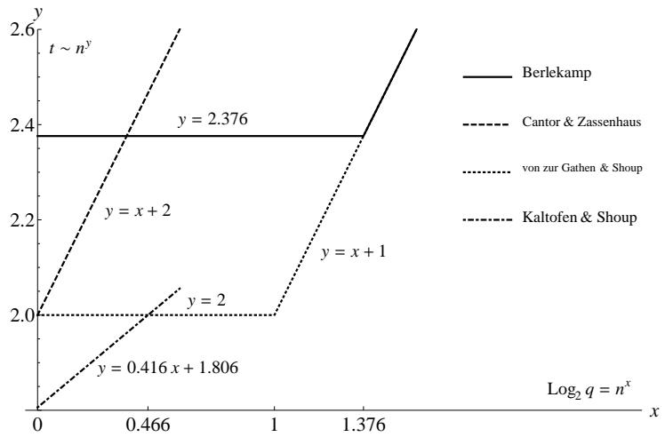

# 有限域上多项式因子分解

多项式因子分解问题比最大公因子问题要复杂也更困难一些. 然而令人惊喜的是, 相对于整数上多项式来说, 在有限域上多项式的因子分解问题却较为简单.这给我们提供了一种将整数环或有理数域上的多项式因子分解问题转化到较简单的有限域情况上来解决的可能性.

这一部分我们首先解决 $\mathbb { F } _ { p }$ 域上的多项式因子分解问题. 这些内容是 $\mathbb { Z } [ x ]$ ,$\mathbb { Q } [ x ]$ , $\mathbb { Z } _ { m } [ x ]$ 乃至 $\mathbb { R } [ x ]$ $\mathbb { R } [ x ] , \mathbb { C } [ x ]$ $\mathbb { C } [ x ]$ 和多元多项式因子分解的基础.

在有限域上进行因子分解的方法很多, 一般来说, 有限域上多项式因子分解要经过下面三个步骤:

1. 无平方因子分解(Squarefree Factorization)  
2. 不同次因子分解(Distinct-degree Factorization)  
3. 同次因子分解(Equal-degree Factorization)

其中第 2, 3 步或者单独第 3 步可以由 Berlekamp 算法代替. 这一章首先将从上面三个方面介绍有限域上的因子分解问题, 然后讨论 Berlekamp算法.

本章我们假定读者具有有限域及群论等基本知识, 这方面可以参考相关的抽象代数或数论等书籍. 当然, 我们下面也会对一些较重要的知识作一些简单介绍.

# 9.1 不同次数因子分解

首先我们假定多项式是无平方因子的(Squarefree), 即无重因子. 这一点很容

易做到, 如果 $f$ 含重因子, 那么取 $f / \operatorname* { g c d } ( f , f ^ { \prime } )$ , 则可消去重因子, 得到无重因子的多项式. 不同次因子分解即是在无平方因子分解的基础上, 将多项式中各不同次数因子的乘积逐一剥离出来. 这一算法, 最早出现在Zassenhaus[189]的论述中.

首先我们介绍一些有限域的准备知识, 它们对于理解本章的算法是必要的.

# 9.1.1 有限域 $\mathbb { F } _ { p }$ 和 $\mathbb { F } _ { p ^ { d } }$

在数论教程中, 我们熟知如下的 Fermat 小定理.

定理9.1 (Fermat 小定理). 对于非零元 $a \in \mathbb { F } _ { p }$ , 我们有 $a ^ { p - 1 } = 1$ . 对于 $a \in \mathbb { F } _ { p }$ , 我们有 $a ^ { p } = a$ , 且

$$
x ^ {p} - x = \prod_ {a \in \mathbb {F} _ {p}} (x - a).
$$

注123. 我们知道, 有限域的阶数只可能是素数以及素数的幂, 对于 $d \geq 1 \in \mathbb { N }$ , 可以构造 $p ^ { d }$ 阶的域如下:

$$
\mathbb {F} _ {p ^ {d}} = \mathbb {F} _ {p} [ x ] / \langle f \rangle ,
$$

其中 $f \in \mathbb { F } _ { p } [ x ]$ 是 $d$ 次不可约多项式.

注124. Fermat 小定理 $p$ 对于素数以及素数的幂均成立, 素数的幂情况证明同素数情况.

下面的定理是 Fermat小定理的推广, Fermat小定理是其 $d = 1$ 的特殊情形.

定理9.2 (Fermat 小定理推广). 对于任何 $d \geq 1$ , $\boldsymbol { x } ^ { p ^ { d } } - \boldsymbol { x } \in \mathbb { F } _ { p } [ \boldsymbol { x } ]$ 是 $\mathbb { F } _ { p } [ \boldsymbol { x } ]$ 中所有次数整除 $d$ 的不可约首一多项式的乘积. 其中 $p$ 是素数或素数幂.

证明. 由 Fermat 小定理知 $h = x ^ { p ^ { d } } - x$ 是所有的一次因子 $x - a$ 的乘积, 其中 $a$ 取遍 $\mathbb { F } _ { p ^ { d } }$ 中的元素. 因此, $h$ 是无平方因子的, 于是我们只须证明对任何 $\mathbb { F } _ { p } [ \boldsymbol { x } ]$ 中首一不可约 $n$ 次多项式 $f$ :

$$
f \mid x ^ {p ^ {d}} - x \Leftrightarrow n \mid d.
$$

充分性: 若 $f \ | \ x ^ { p ^ { d } } - x$ , 则由 Fermat 小定理, 可以取 $\mathbb { F } _ { p ^ { d } }$ 的子集 $A$ 使 得$\begin{array} { r } { f = \prod _ { a \in A } ( x - a ) } \end{array}$ . 任取 $a \in A$ , 令 $\mathbb { F } _ { p } [ x ] / \langle f \rangle \cong \mathbb { F } _ { p } ( a ) \subset \mathbb { F } _ { p ^ { d } }$ , 其中 $\mathbb { F } _ { p } ( a )$ 是 $\mathbb { F } _ { p ^ { d } }$ 中包含 $a$ 的最小子域, 有 $p ^ { n }$ 个元素, $\mathbb { F } _ { p ^ { d } }$ 是它的扩域, 因此存在正整数 $e$ 使得$p ^ { d } = ( p ^ { n } ) ^ { e }$ , 即有 $n \mid d$ .

必要性: 若 $n \mid d ,$ , 令 $\mathbb { F } _ { p ^ { n } } = \mathbb { F } _ { p } [ x ] / \langle f \rangle$ , 且 $a = ( x { \bmod { f } } ) \in \mathbb { F } _ { p ^ { n } }$ 为 $f$ 的一个根.于是 $a ^ { p ^ { n } } = a \Rightarrow ( x - a ) \mid ( x ^ { p ^ { n } } - x ) .$ , 由于 $p ^ { n } - 1 \mid p ^ { d } - 1$ , 设

$$
p ^ {d} - 1 = (p ^ {n} - 1) e = (p ^ {n} - 1) (p ^ {d - n} + p ^ {d - 2 n} + \dots + 1),
$$

则

$$
x ^ {p ^ {d} - 1} - 1 = (x ^ {p ^ {n} - 1} - 1) (x ^ {(p ^ {n} - 1) (e - 1)} + \dots + 1).
$$

将上式乘以 $x$ 则可得 $( x - a ) \mid ( x ^ { p ^ { n } } - x ) \mid ( x ^ { p ^ { d } } - x )$ . 因此在 $\mathbb { F } _ { p ^ { n } } [ x ]$ 中 $\left( x - a \right) \ 1$ $\operatorname* { g c d } ( f , x ^ { p ^ { d } } - x )$ , 由于 $\mathbb { F } _ { p } [ \boldsymbol { x } ]$ 中多项式的最大公因子应该也在 $\mathbb { F } _ { p } [ \boldsymbol { x } ]$ 中, 于是由其非平凡可推出 $\operatorname* { g c d } ( f , x ^ { p ^ { d } } - x ) = f$ , 即 $f \mid x ^ { p ^ { d } } - x$ . □

# 9.1.2 不同次因子分解

不同次因子分解算法的目标即是要求出多项式的不同次因子序列, 其定义如下:

定义9.1 (不同次因子序列). $\mathbb { F } _ { p } [ \boldsymbol { x } ]$ 中非平凡多项式 $f$ 的不同次因子分解是指得到如下的不同次因子序列 $( g _ { 1 } , \ldots , g _ { s } )$ , 其中 $g _ { i }$ 是 $f$ 在 $\mathbb { F } _ { p } [ \boldsymbol { x } ]$ 中所有首一不可约 $i$ 次多项式的乘积, 且 $g _ { s } \neq 1$ .

由定理9.2, 我们很容易构造出如下不同次因子分解算法.

算法9.1 (不同次因子分解).

输入: 无平方因子 $n ( n > 0 )$ 次首一多项式 $f \in \mathbb { F } _ { p } [ x ]$ ,

输出: $f$ 的不同次因子序列 $( g _ { 1 } , \ldots , g _ { s } )$ .

1. $h _ { 0 } = x$ , f0 = f , i = 0,   
2. $i = i + 1$ , 在 环 $R = \mathbb { F } _ { p } [ x ] / \langle f \rangle$ 中调用快速求幂算法(例如算法 4.1 )计算$h _ { i } = h _ { i - 1 } ^ { p } \mathrm { m o d } f ,$ $f$ ,  
3. $g _ { i } = \ * { \ * { \mathrm { g c d } } } ( h _ { i } - x , f _ { i - 1 } ) , f _ { i } = { \frac { f _ { i - 1 } } { g _ { i } } } ,$   
4. 若 $f _ { i } \neq 1$ 则转到第 2 步,  
5. $s = i$ , 输出 $( g _ { 1 } , \ldots , g _ { s } )$

算法有效性. 设 $( G _ { 1 } , \ldots , G _ { t } )$ 是 $f$ 的不同次因子序列, 考虑命题

$$
P _ {i}: h _ {i} \equiv x ^ {p ^ {i}} \pmod {f}, \quad f _ {i} = G _ {i + 1} \dots G _ {t}, \quad g _ {i} = G _ {i} (\text {若} i > 0).
$$

显然 $P _ { 0 }$ 成立, 设 $P _ { 0 } , \ldots , P _ { i - 1 }$ 均成立, 则对 $i \geq 1$ , 有 $h _ { i } \equiv h _ { i - 1 } ^ { p } \equiv x ^ { p ^ { i } }$ (mod $f$ )且

$$
g _ {i} = \operatorname * {g c d} (h _ {i} - x, f _ {i - 1}) = \operatorname * {g c d} (x ^ {p ^ {i}} - x, f _ {i - 1}).
$$

由定理 9.2 , $g _ { i }$ 是 $\mathbb { F } _ { p } [ x ]$ 中所有首一不可约且次数整除 $i$ 的多项式的乘积且能整除 $f _ { i - 1 } = G _ { i } \cdot \cdot \cdot G _ { t }$ , 因此 $g _ { i } = G _ { i }$ (低于 $i$ 次的因子已在前面提出了). 于是归纳证明了 $P _ { i } ( 0 \leq i \leq s )$ 成立. 同时也可得到 $s = t$ . □

注125. 算法 9.1 可在 $\deg f _ { i } < 2 ( i + 1 )$ 时即终止, 因为 $f _ { i }$ 所有不可约因子次数至少为 $i + 1$ , 因此 $f _ { i }$ 已经是不可约的了.

注126. 算法 9.1 第 2 步求 $h _ { i - 1 } ^ { p }$ mod $f$ 时也可利用 $\mathbb { F } _ { p }$ 中 $p$ 次幂的特殊性质来计算,即对于 $f = a _ { 0 } + a _ { 1 } x + \cdot \cdot \cdot + a _ { n } x ^ { n }$ , 有

$$
f ^ {p} = a _ {0} + a _ {1} x ^ {p} + \dots + a _ {n} x ^ {n p}.
$$

例9.1. 考虑多项式 $f = x ^ { 5 } + x ^ { 3 } + x ^ { 2 } + x - 1 \in \mathbb { F } _ { 3 } [ x ] .$

解: 我们将单步执行算法 9.1的步骤列于下:

$$
f _ {0} = f = x ^ {5} + x ^ {3} + x ^ {2} + x - 1,
$$

$$
h _ {0} = x,
$$

$$
h _ {1} = h _ {0} ^ {3} \bmod f = x ^ {3} \bmod f = x ^ {3},
$$

$$
g _ {1} = \operatorname * {g c d} (h _ {1} - x, f _ {0}) = x ^ {2} - 1,
$$

$$
f _ {1} = \frac {f _ {0}}{g _ {1}} = x ^ {3} - x + 1,
$$

$$
h _ {2} = h _ {1} ^ {3} \bmod f = x ^ {9} \bmod f = - x ^ {3} - x,
$$

$$
g _ {2} = \operatorname * {g c d} (h _ {2} - x, f _ {1}) = 1,
$$

$$
f _ {2} = x ^ {3} - x + 1.
$$

此时算法已可以终止, 得到不同次因子序列为 $( x ^ { 2 } - 1 , 1 , x ^ { 3 } - x + 1 )$ .

不同次因子分解算法利用快速求幂算法以及快速 Euclid 算法, 其复杂度可以达到 $O ( s M ( n ) \log ( n q ) )$ 次 $\mathbb { F } _ { p }$ 中的运算([174] 定理 14.4), 其中 $s$ 是 $f$ 不可约因子最大的次数.1998 年, Kaltofen 和 Shoup[97] 提出了一种改进的不同次因子分解算法(Baby step-Giant step 算法), 其复杂度达到了 $O ( n ^ { 1 . 8 1 5 } \log p )$ , 当有限域的阶 $p$ 小于多项式次数 $n$ 时, 该算法的效率较高.

# 9.2 同次因子分解

本节对上一节不同次因子分解的结果继续进行同次因子分解, 或称为 Cantor-Zassenhaus 算法[50], 最终将 $f$ 完全分解为不可约多项式的积. 由于域的特征为奇素数与 2 的两种情况在处理中有一点微小的技术区别, 因此本节分成两部分来讨论.

# 9.2.1 特征为奇素数的有限域

首先, 我们给出一些必要的群论方面的准备命题.

引理9.1. 设 $q$ 为一素数幂, $k$ 为 $q - 1$ 的因子, 记 $\mathbb { F } _ { q } ^ { * }$ 为 $\mathbb { F } _ { q }$ 中除去零元素所构成的乘法群, $S = \{ b ^ { k } \mid b \in \mathbb { F } _ { q } ^ { * } \}$ 为 $\mathbb { F } _ { q } ^ { * }$ 中的 $k$ 次幂集合, 则:

1. $S$ 为 $( q - 1 ) / k$ 阶子群.   
2. $S = \{ a \in \mathbb { F } _ { q } ^ { * } \mid a ^ { ( q - 1 ) / k } = 1 \} .$

证明. $S$ 为 $k$ 次幂同态映射 $\sigma _ { k } : \mathbb { F } _ { q } ^ { * } \to \mathbb { F } _ { q } ^ { * }$ 的象, 从而为 $\mathbb { F } _ { q } ^ { * }$ 的子群. $\sigma _ { k }$ 的核为 $k$ 次单位根:

$$
\ker \sigma_ {k} = \left\{a \in \mathbb {F} _ {q} ^ {*} \mid \sigma_ {k} (a) = 1 \right\}.
$$

由于 $\mathbb { F } _ { q }$ 为域, 可知多项式 $x ^ { k } - 1 \in \mathbb { F } _ { q } [ x ]$ 的根至多有 $k$ 个, 于是 $\# \ker \sigma _ { k } \leq k$ .

因为 $( b ^ { k } ) ^ { ( q - 1 ) / k } = b ^ { q - 1 } = 1$ 对于任何 $b \in \mathbb { F } _ { q } ^ { * }$ 均成立, 由 Fermat 小定理得$S \subset \ker \sigma _ { ( q - 1 ) / k }$ , 可知 $\# S \leq ( q - 1 ) / k$ . 于是由群同态定理得

$$
q - 1 = \# \mathbb {F} _ {q} ^ {*} = \# \ker \sigma_ {k} \cdot \# \operatorname {i m} \sigma_ {k} = \# \ker \sigma_ {k} \cdot \# S \leq k (q - 1) / k = q - 1,
$$

可知 $\# \ker \sigma _ { k } = k$ 且 $\# S = ( q - 1 ) / k$ , $S = \ker \sigma _ { ( q - 1 ) / k } .$

作为引理9.1的推论, 我们有

引理9.2. 设 $q$ 为一奇素数幂, $S = \{ a \in \mathbb { F } _ { q } ^ { * } \mid \exists b \in \mathbb { F } _ { q } ^ { * } ( a = b ^ { 2 } ) \}$ , 则

1. $S \subset \mathbb { F } _ { q } ^ { * }$ 是 $( q - 1 ) / 2$ 阶子群.   
2. $S = \{ a \in \mathbb { F } _ { q } ^ { * } \mid a ^ { ( q - 1 ) / 2 } = 1 \}$   
$\begin{array} { r } { \mathcal { S } . \forall a \in \mathbb { F } _ { q } ^ { * } , a ^ { ( q - 1 ) / 2 } \in \{ 1 , - 1 \} . } \end{array}$

下面的概率性算法给出 $f$ 的可能因子, 其中 $f$ 是经上节算法给出的无平方首一同次因子乘积, 即存在 $n = \deg f$ 的一个因子 $d$ 使得 $f$ 可分解为 $r = n / d$ 个 $d$ 次首一不可约因子 $f _ { 1 } , \ldots f _ { r }$ .

算法9.2 (同次因子分解概率算法).

输入: $f , d$

输出: $f$ 的首一因子 $g$ , 或者失败.

1. 随机选取 $a \in \mathbb { F } _ { q } [ x ]$ 使得 $\deg a < n$ . 若 $a \in \mathbb { F } _ { q }$ 则输出失败,  
2. $g _ { 1 } = \operatorname* { g c d } ( a , f )$ , 若 $g _ { 1 } \neq 1$ 且 $g _ { 1 } \neq f$ 则输出 $g _ { 1 }$   
3. 调用快速求幂算法在环 $R = \mathbb { F } _ { q } [ x ] / \langle f \rangle$ 中计算 $b = a ^ { ( q ^ { d } - 1 ) / 2 }$ mod $f$   
4. $g _ { 2 } = \operatorname* { g c d } ( b - 1 , f )$ , 若 $g _ { 2 } \neq 1$ 且 $g _ { 2 } \neq f$ 则输出 $g _ { 2 }$ , 否则输出失败.

设 $f = f _ { 1 } f _ { 2 } \cdot \cdot \cdot f _ { r }$ , 则由中国剩余定理有如下的环同构:

$$
\chi : R = \mathbb {F} _ {q} [ x ] / \langle f \rangle \to \mathbb {F} _ {q} [ x ] / \langle f _ {1} \rangle \times \dots \times \mathbb {F} _ {q} [ x ] / \langle f _ {r} \rangle = R _ {1} \times \dots \times R _ {r},
$$

其中 $\mathbb { F } _ { q ^ { d } } \cong R _ { i } = \mathbb { F } _ { q } [ x ] / \langle f _ { i } \rangle \supset \mathbb { F } _ { q }$ . 引入下面记号:

$$
\chi (a \bmod f) = (a \bmod f _ {1}, \dots , a \bmod f _ {r}) = (\chi_ {1} (a), \dots , \chi_ {r} (a)),
$$

其中 $\chi _ { i } ( a ) = a$ mod $f _ { i }$ . 记 $e = ( q ^ { d } - 1 ) / 2$ , 则对任意 $\beta \in R _ { i } ^ { * } = \mathbb { F } _ { q ^ { d } } ^ { * }$ , 我 们 有$\beta ^ { e } \in \{ - 1 , 1 \}$ , 且等概率地取两个值之一. 如果我们随机任意选取 $a \in \mathbb { F } _ { q } [ x ]$ 使得$\deg a < n$ 且 $\operatorname* { g c d } ( a , f ) = 1$ , 则 $\chi _ { 1 } ( a ) , \ldots , \chi _ { r } ( a )$ 是 $\mathbb { F } _ { q ^ { d } } ^ { * }$ 中随机元素, 且 $\varepsilon _ { i } = \chi _ { i } ( a ^ { e } ) \in$ $R _ { i }$ 等概率取1 或 $^ { - 1 }$ , 因此

$$
\chi (a ^ {e} - 1) = (\varepsilon_ {1} - 1, \dots , \varepsilon_ {r} - 1),
$$

此时 $a ^ { e } - 1$ 是 $f$ 的一个因子(不一定不可约), 除非 $\varepsilon _ { 1 } = \cdots = \varepsilon _ { r }$ . 因为若只有部分 $\varepsilon _ { i } = 1 ( i \in T \subset \{ 1 , 2 , . . . , r \} )$ , 则 $\chi _ { i } ( a ^ { e } - 1 ) = 0 \Rightarrow f _ { i } \mid \operatorname* { g c d } ( a ^ { e } - 1 , f )$ , 那么$\begin{array} { r } { \operatorname* { g c d } ( a ^ { e } - 1 , f ) = \prod _ { i \in T } f _ { i } } \end{array}$ 给出 $f$ 的一个非平凡因子. 因此算法发生错误的概率为$\varepsilon _ { i }$ 全相等的概率, 即 $2 \cdot ( 1 / 2 ) ^ { r } = 2 ^ { - r + 1 } \leq 1 / 2$ , 这里一般有 $r \geq 2$ .

算法9.3 (同次因子分解).

输入: $f , d$ ,

输出: $f$ 在 $\mathbb { F } _ { q } [ x ]$ 中的首一不可约因子.

1. 若 $n = d$ 则输出 $f$   
2. 重复调用算法 9.2 , 输入 $f$ 和 $d .$ , 直至返回 $f$ 的一个因子 $g$ ,  
3. 递归调用本算法, 分别求出 $g$ 和 $f / g$ 分解的结果并输出所有的结果.

例9.2. 我们讨论 $f = x ^ { 4 } + x ^ { 3 } + x - 1 \in \mathbb { F } _ { 3 } [ x ]$ , $d = 2$ (因为我们可以假定这里的 $f$ 是上节因子算法已分解出的 $g _ { 2 }$ , 从而此处可设 $d = 2$ ).

解: 随机取 $a = x$ , 则 $g _ { 1 } = \operatorname* { g c d } ( a , f ) = 1$ ,

$$
b = a ^ {(3 ^ {2} - 1) / 2} \bmod f = a ^ {4} \bmod f = - x ^ {3} - x + 1,
$$

$$
g _ {2} = \operatorname * {g c d} (b - 1, f) = x ^ {2} + 1,
$$

我们找到了一个因子 $x ^ { 2 } + 1$ , 另一个因子为 $f / ( x ^ { 2 } + 1 ) = x ^ { 2 } + x + 2$ .

注127. 算法 9.2 的复杂度为 $O ( ( d \log q + \log n ) M ( n ) )$ 次 $\mathbb { F } _ { q }$ 中运算([174] 定理14.9), 而同次因子分解算法 9.3 的复杂度为 $O ( ( d \log q + \log n ) M ( n ) \log r )$ 次 $\mathbb { F } _ { q }$ 中运算([174] 定理 14.11).

注128. Gathen 和 Shoup[175] 提出了一种 Frobenius 迭代算法(iterated Frobe-nius algorithm), 对 于 环 $R \ = \ \mathbb { F } _ { q } [ x ] / \langle f \rangle$ 中的元素 $\alpha$ , 能够快速地求出序列$\alpha , \alpha ^ { q } , \ldots , \alpha ^ { q ^ { d } }$ , 其中 $d$ 不超过无平方因子多项式 $f$ 的次数 $n$ . 该算法复杂度约为 $O ( M ( n ) ^ { 2 } \log n \log d )$ 个 $\mathbb { F } _ { q }$ 中运算. 将其应用到不同次因子分解的求幂计算上时, 复杂度为 $O ( M ( n ^ { 2 } ) \log n + M ( n ) \log q )$ . 在同次因子分解中, 由于求幂可用下式计算:

$$
\alpha^ {(q ^ {d} - 1) / 2} = \left(\alpha^ {q ^ {d - 1}} \dots \alpha^ {q} \alpha\right) ^ {(q - 1) / 2},
$$

因此, 其复杂度变为 $O ( ( M ( n d ) r \log d + M ( n ) \log q ) \log r )$ . 以上复杂度的分析均可参考 [174]14.7 节相关定理.

# 9.2.2 特征为 2 的有限域

注意到引理 9.1 和引理 9.2 均是在奇素数阶有限域中成立的, 对于阶为 2 及其幂次的有限域, 上一小节提到的算法已不适用, 因此这里我们要单独讨论一下.

以下设 $\mathbb { F } _ { q }$ 是一特征为 2 的域, 且 $q = 2 ^ { k }$ , $k$ 是一正整数. $\mathbb { F } _ { q }$ 上多项式 $f$ 是无平方因子 $n$ 次多项式, 且是 $r$ 个 $d$ 次不可约多项式之积.

定义9.2. 对于正整数 $m$ , 定义 $\mathbb { F } _ { 2 }$ 上 $m$ 阶迹多项式(mth trace polynomial) $T _ { m }$ 为

$$
T _ {m} = x ^ {2 ^ {m - 1}} + x ^ {2 ^ {m - 2}} + \dots + x ^ {4} + x ^ {2} + x.
$$

注129. $x ^ { 2 ^ { m } } + x = T _ { m } ( T _ { m } + 1 )$ . 此式可直接验证.

注130. $\forall \alpha \in \mathbb { F } _ { 2 ^ { m } }$ , $T _ { m } ( \alpha ) = 0$ 或 1, 且各有一半概率. 这是因为 $\alpha$ 一定是 $x ^ { 2 ^ { m } } + x$ 的根, 因而 $T _ { m } ( \alpha ) = 0$ 或 $T _ { m } ( \alpha ) + 1 = 0$ , 且二者次数均为 $2 ^ { m - 1 }$ , 因此各有 $2 ^ { m - 1 }$ 个根.

引理9.3. 设 $a$ 是 $R = \mathbb { F } _ { q } [ x ] / \langle f \rangle$ 上随机选取的一个多项式, $b = T _ { k d } ( a )$ , 则 $\operatorname* { g c d } ( b -$ $1 , f )$ 可能给出 $f$ 的一个非平凡因子, 且失败概率不超过 $1 / 2$ .

证明. 首先, $\chi _ { i } ( b ) = \chi _ { i } ( T _ { k d } ( a ) ) = T _ { k d } ( \chi _ { i } ( a ) ) = 0$ 或 1, 而由中国剩余定理所得到的环同构可知, 当且仅当 $\chi _ { i } ( b ) ( 1 \leq i \leq r )$ 同时为 0 或 1 时, $b \in \mathbb { F } _ { 2 }$ , 此概率为$2 \times 2 ^ { - r } = 2 ^ { 1 - r } \leq \frac { 1 } { 2 }$ . □

算法9.4 (特征为 2 的域上同次因子分解).

算法基本同算法 9.2 和 9.3 , 只需将算法 9.2 中第 3 步改为计算 $b = T _ { k d } ( a )$ 即可.

例9.3. 作为例子, 我们计算 $f = ( x ^ { 3 } + x ^ { 2 } + 1 ) ( x ^ { 3 } + x + 1 ) = x ^ { 6 } + x ^ { 5 } + x ^ { 4 } + x ^ { 3 } +$ $x ^ { 2 } + x + 1 \in \mathbb { F } _ { 2 } [ x ]$ 的同次因子分解, 其中 $d = 3$ , $k = 1$ .

解: 若取 $a = x$ , 则 $b = T _ { 2 } ( a ) = x ^ { 4 } + x ^ { 2 } + x$ mod $f = x ^ { 4 } + x ^ { 2 } + x$ , 而

$$
g = \operatorname * {g c d} (b, f) = x ^ {3} + x + 1,
$$

故 $f _ { 1 } = x ^ { 3 } + x + 1$ , $f _ { 2 } = f / f _ { 1 } = x ^ { 3 } + x ^ { 2 } + 1 .$

# 9.3 一个完整的因子分解算法及其应用

对于一般有重因子的多项式 $f \in \mathbb { F } _ { q } [ x ]$ , 利用上两节的方法可以完全将其分解. 设 $f$ 是首一的, 并且 $f$ 的首一不可约因子分解为 $\begin{array} { r } { f = \prod _ { i = 1 } ^ { m } g _ { i } ^ { e _ { i } } } \end{array}$ , 记$U = \{ ( g _ { 1 } , e _ { 1 } ) , . . . , ( g _ { m } , e _ { m } ) \}$ 表示它的分解, 则可利用下面的算法 9.5 给出此分解:

算法9.5 (一个完整的分解算法).

输入: 首一多项式 $f \in \mathbb { F } _ { q } [ x ]$ , $q$ 为一素数幂.

输出: $f$ 的分解 $U$ .

1. $h _ { 0 } = x , f _ { 0 } = f , i = 0 , u = \emptyset .$   
2. $i = i + 1$   
3. (不同次因子分解)利用快速求幂算法计算 $h _ { i } = h _ { i - 1 } ^ { q }$ mod $f$ , $g = \operatorname* { g c d } ( h _ { i } -$ $x , f _ { i - 1 } )$ ,  
4. 若 $g \neq 1$ 则利用算法 9.3 求出 $g$ 的所有同次首一不可约因子 $g _ { 1 } , g _ { 2 } , \ldots , g _ { s }$

5. $f _ { i } = f _ { i - 1 }$ , 并不断除以 $g$ 的同次因子求出 $g _ { 1 } , \ldots , g _ { s }$ 的次数 $e _ { 1 } , \ldots , e _ { s }$ , 每求出一个 $e _ { i }$ , 将 $( g _ { i } , e _ { i } )$ 添入 $u$ ,  
6. 若 $f _ { i } \neq 1$ 则转第 2 步,  
7. 输出 $U$

注131. 算法 9.5 中每次循环的过程中, 都会先利用不同次因子分解求出 $f$ 中所包含的 $i$ 次不可约因子, 这些不可约因子的(一次)乘积即为 $g$ , 然后依次求出 $f$ 中包含 $g$ 的不可约因子的次数. 此算法用试除法代替了无平方因子分解, 以求得不可约因子在待分解多项式中的重数.

作为前面提过的诸多因子分解算法的应用, 下面讨论 $\mathbb { F } _ { q } [ x ]$ 中的多项式求根问题. 设 $f$ 为 $\mathbb { F } _ { q } [ x ]$ 上一非平凡多项式, 下面的算法 9.6给出其所有 $\mathbb { F } _ { q }$ 中的根.

算法9.6 ( $\mathbb { F } _ { q }$ 上多项式求根算法).

利用快速求幂算法(例算法如 4.1 )求出 $h = x ^ { q }$ mod $f$ , 令 $g = \operatorname* { g c d } ( h - x , f )$ ,若 $\deg g \ = \ 0$ 则无根, 否则利用同次因子分解算法 9.3 其出所有不可约因子$x - u _ { 1 } , \ldots , x - u _ { r }$ , 则 $u _ { 1 } , \ldots , u _ { r }$ 即为其所有 $\mathbb { F } _ { q }$ 上的根.

算法避免了将 $f$ 完全分解来求根, 求根实际上只要求出所有一次不可约因子,因此先将其与 $x ^ { q } - x$ 取最大公因子. 由此而衍生出下面的 $\mathbb { Z } [ x ]$ 中求整数根的算法.引入该算法之前, 我们先证明

引理9.4. 设 $\mathbb { Z } [ x ]$ 上非平凡 $n$ 次多项式 $f , \| f \| _ { \infty } = A$ $f$ , 且 $u \in \mathbb { Z }$ 是 $f$ 的非零根,$f = ( x - u ) g$ , 则 $\| g \| _ { \infty } \leq n A$ .

证明. 设 $\textstyle g = \sum _ { i = 0 } ^ { n - 1 } g _ { i } x ^ { i }$ , 则 $f = ( x - u ) g = g _ { n - 1 } x ^ { n } + ( g _ { n - 2 } - u g _ { n - 1 } ) x ^ { n - 1 } + \cdot \cdot \cdot +$ $( g _ { 0 } - u g _ { 1 } ) x - u g _ { 0 }$ . 式中每项系数绝对值均不超过 $A$ , 于是

$$
\left| g _ {0} \right| \leq \frac {A}{\left| u \right|},
$$

$$
| g _ {1} | \leq \frac {A + | g _ {0} |}{| u |} \leq \frac {2 A}{| u |},
$$

$$
\left| g _ {n - 1} \right| \leq \frac {n A}{\left| u \right|}.
$$

由 $| u | \geq 1$ 可知 $\| g \| _ { \infty } \leq n A$ .

算法9.7 (整数多项式整数根算法).

输入: 非平凡 $n$ 次多项式 $f \in \mathbb { Z } [ x ]$ , 且 $\| f \| _ { \infty } = A$ .

输出: 中 $f$ 的不同的整数根.

1. $B = 2 n ( A + A ^ { 2 } )$ , 任取奇素数 $p \in ( B + 1 , 2 B ]$ .  
2. 使用算法 9.6 找出 $\mathbb { F } _ { p } [ \boldsymbol { x } ]$ 上 $f$ mod $p$ 的所有根 $\{ u _ { 1 }$ mod $p , \ldots , u _ { r }$ mod $p \}$ , 其中 $u _ { i } \in \mathbb { Z }$ 且 $| u _ { i } | < p / 2 ( 1 \leq i \leq r )$ .  
3. 对于每个 $i$ , 计算 $n - 1$ 次多项式 $v _ { i } \in \mathbb { Z } [ x ]$ 且 $\| v _ { i } \| _ { \infty } \leq p / 2$ 使得 $f \equiv ( x - u _ { i } ) v _ { i }$ (mod $p$ ).  
4. 输出 $\{ u _ { i } \mid 1 \leq i \leq r , | u _ { i } | \leq A , \| v _ { i } \| _ { \infty } \leq n A \} .$

算法有效性. 不妨设 $f$ 无零根, 则对于其任何一个非零根 $u \in \mathbb { Z }$ , 其能整除 $f$ 的常数项, 因而 $| u | \le A < p / 2$ , 因此所有整数根都可以从其在模 $p$ 下的象还原出来. 现在我们只需证明 $f ( u _ { i } ) = 0$ 当且仅当 $| u _ { i } | \le A$ 且 $\| v _ { i } \| _ { \infty } \leq n A$ .

若 $f ( u _ { i } ) = 0$ , 则显然有 $| u _ { i } | \le A$ . 可 设 $f / ( x - u _ { i } ) = g$ , 则由引理 9.4 知$\| f / ( x - u _ { i } ) \| _ { \infty } = \| g \| _ { \infty } \leq n A < p / 2$ . 但由于 $f / ( x - u _ { i } ) \equiv v _ { i }$ (mod p), 且两边多项式系数均比 $p / 2$ 小, 知有 $f / ( x - u _ { i } ) = v _ { i }$ , 故也有 $\| v _ { i } \| _ { \infty } \leq n A$ .

另一方面, 若 $| u _ { i } | \le A$ 且 $\| v _ { i } \| _ { \infty } \leq n A .$ , 则 $\| ( x - u _ { i } ) v _ { i } \| _ { \infty } \leq ( 1 + A ) n A < p / 2$ ,因此 $f \equiv ( x - u _ { i } ) v _ { i }$ (mod $p$ ), 可知 $f = ( x - u _ { i } ) v _ { i }$ . □

# 9.4 无平方因子分解

这一小节详细介绍无平方因子分解, 我们分特征为零的域和有限域上多项式这两种情况进行介绍.

# 9.4.1 特征为零的域上无平方分解

定义9.3. 多项式 $\textstyle f = \sum _ { i = 0 } ^ { n } f _ { i } x ^ { i } \in \mathbb { F } [ x ] ( \mathbb { F }$ 可以是环, 域等)的形式微商定义为:

$$
f ^ {\prime} = \sum_ {i = 0} ^ {n} i f _ {i} x ^ {i - 1}.
$$

我们先假定 $\mathbb { F }$ 是一特征为零的域, 那么我们已经知道若 $u \in \mathbb { F }$ 是 $f$ 的 $m$ 阶零点, 则其是 $f ^ { \prime }$ 的 $m - 1$ 阶零点, 于是 $f / f ^ { \prime }$ 中将只含 $( x - u )$ 的一次因子. 我们可以在任一域 $\mathbb { F }$ 内证明如下的命题:

定理9.3. F 是任一域, 若 $g \in \mathbb { F } [ x ]$ 是 $f \in \mathbb { F } [ x ]$ 的一不可约因子, 且 $f = g ^ { e } h$ ,$h \in \mathbb { F } [ x ]$ , $g , h$ 互素, 则有 $g ^ { e - 1 } \mid f ^ { \prime }$ , 并且 $g ^ { e } \nmid f ^ { \prime }$ 当且仅当 $\boldsymbol { e g ^ { \prime } \neq 0 }$ .

证明. 由 $f$ 的表达式我们得到

$$
f ^ {\prime} = e h g ^ {e - 1} g ^ {\prime} + g ^ {e} h ^ {\prime},
$$

则显然 $g ^ { e - 1 } \mid f ^ { \prime }$ . 另一方面 $g ^ { e }$ 对 $f ^ { \prime }$ 的整除性等价于对 $e h g ^ { e - 1 } g ^ { \prime }$ 的整除性, 即 $g$ 是否能整除 $e g ^ { \prime }$ , 由于 $\deg e g ^ { \prime } < \deg g .$ , 则 $g \mid e g ^ { \prime } \Leftrightarrow e g ^ { \prime } = 0$ . □

注132. 我们注意到, 在特征为零的域中, 当 $g$ 是一非平凡多项式时, $g ^ { \prime } \neq 0$ , 但在特征有限的域中, 这一点并不一定正确, 如 $g = x ^ { 3 } + 1 \in \mathbb { F } _ { 3 } [ x ]$ 的形式微商 $g ^ { \prime } = 0$ . 这正是我们下面将要提到的算法不适合于有限域上的原因.

有了上面的定理, 则首先我们可以在特征为零的域上求出 $f$ 的无平方因子部分.

算法9.8 (无平方因子部分).

对于输入的特征为零的域 $\mathbb { F }$ 上的 $n$ 次首一多项式 $f$ , 输出无平方因子部分${ \frac { f } { \operatorname* { g c d } ( f , f ^ { \prime } ) } } .$ .

因子分解时, 我们往往不仅需要求出无平方因子部分, 还要求出下面所谓的无平方因子分解. 即若首一非平凡多项式 $f = g _ { 1 } g _ { 2 } ^ { 2 } \cdot \cdot \cdot g _ { m } ^ { m }$ , 其 中 $g _ { 1 } , \ldots , g _ { m }$ 两两互素且无平方因子, $g _ { m } \neq 1$ , 则称 $( g _ { 1 } , \ldots , g _ { m } )$ 为 $f$ 的无平方分解(SquarefreeDecompositon). Yun[188] 提出了一种较快的算法以求出无平方分解.

# 算法9.9 (无平方分解).

1. $u = \operatorname* { g c d } ( f , f ^ { \prime } )$ , v1 = f /u, $w _ { 1 } = f ^ { \prime } / u , i = 1 \mathrm { . }$   
2. $h _ { i } = \operatorname* { g c d } ( v _ { i } , w _ { i } - v _ { i } ^ { \prime } )$ , vi+1 = vi/hi, wi+1 = (wi − v0i)/hi, i = i + 1,   
3. 若 $v _ { i } \neq 1$ 则转第 2步,  
4. 输出 $( h _ { 1 } , \ldots , h _ { i - 1 } )$ .

注133. 上述两个算法的复杂度均为 $O ( M ( n ) \log n )$ (参见 [174]14.6 节).

注134. 该算法的思想是简单的, 但要给出严格证明比较繁琐. 其基本思想是利求导运算将不同次幂的不可约因子的次数变成某项前的系数, 利用系数的不同将这些因子一层一层“剥离”出来. 这个思想对于理解后面有限域上无平方分解算法的原理是很重要的. 下面我们用一个例子来具体展示这一过程.

例9.4. 求 $f = a b c ^ { 2 } d ^ { 3 }$ 的无平方分解.

解: 顺次计算可得:

$$
f ^ {\prime} = a ^ {\prime} b c ^ {2} d ^ {3} + a b ^ {\prime} c ^ {2} d ^ {3} + 2 a b c c ^ {\prime} d ^ {3} + 3 a b c ^ {2} d ^ {2} d ^ {\prime}, w _ {2} - v _ {2} ^ {\prime} = c d ^ {\prime},
$$

$$
u = \operatorname * {g c d} (f, f ^ {\prime}) = c d ^ {2}, \quad h _ {2} = \operatorname * {g c d} (c d, c d ^ {\prime}) = c,
$$

$$
v _ {1} = f / u = a b c d, \quad v _ {3} = v _ {2} / h _ {2} = d,
$$

$$
w _ {1} = f ^ {\prime} / u = a ^ {\prime} b c d + a b ^ {\prime} c d + 2 a b c ^ {\prime} d + 3 a b c d ^ {\prime}, \quad w _ {3} = \left(w _ {2} - v _ {2} ^ {\prime}\right) / h _ {2} = d ^ {\prime},
$$

$$
w _ {1} - v _ {1} ^ {\prime} = a b c ^ {\prime} d + 2 a b c d ^ {\prime}, \quad w _ {3} - v _ {3} ^ {\prime} = 0,
$$

$$
h _ {1} = \operatorname * {g c d} (a b c d, a b c ^ {\prime} d + 2 a b c d ^ {\prime}) = a b, \quad h _ {3} = \operatorname * {g c d} (d, 0) = d,
$$

$$
v _ {2} = v _ {1} / h _ {1} = c d, \quad v _ {4} = v _ {3} / h _ {3} = 1,
$$

$$
w _ {2} = \left(w _ {1} - v _ {1} ^ {\prime}\right) / h _ {1} = c ^ {\prime} d + 2 c d ^ {\prime}, \quad w _ {4} = \left(w _ {3} - v _ {3} ^ {\prime}\right) / h = 0.
$$

最后输出为 $( a b , c , d )$ .

# 9.4.2 特征有限的域上无平方分解

我们再来考虑特征有限的域上无平方分解. 在注 132 中我们已经看到特征有限与特征为零的域的区别为对于一个非平凡的多项式 $f ( \deg f \geq 1 )$ , 它的形式微商仍然可能是零. 下面探讨一下什么情况下形式微商为零, 以及此时的多项式有什么特点.

考虑多项式 $\begin{array} { r } { f = \sum _ { i = 0 } ^ { n } f _ { i } x ^ { i } \in \mathbb { F } _ { p } [ x ] } \end{array}$ , $p$ 是一素数. 若其微商为零, 则 $f ^ { \prime } =$ ${ \textstyle \sum _ { i = 0 } ^ { n } } i f _ { i } x ^ { i - 1 } = 0$ , 若 $f _ { i } \neq 0$ , 则须有 $i$ mod $p = 0$ , 于是 $f$ 中所含的单项均是 $x$ 的 $p$ 的倍数的幂次项, 亦即 $\textstyle f = \sum _ { i = 0 } ^ { n / p } f _ { i } x ^ { i p }$ . 于是

$$
f = \sum_ {i = 0} ^ {n / p} (f _ {i} x ^ {i}) ^ {p} = \left(\sum_ {i = 0} ^ {n / p} f _ {i} x ^ {i}\right) ^ {p}.
$$

即 $f$ 是一个多项式的 $p$ 次幂, 注意到上一小节提到的例子 $g = x ^ { 3 } + 1 = ( x + 1 ) ^ { 3 }$ .对于素数幂阶的域 $\mathbb { F } _ { q } ( q = p ^ { d } )$ , 也有下面的结论:

定理9.4. 设 $q = p ^ { d }$ 为素数 $p$ 的幂, 非平凡多项式 $f \in \mathbb { F } _ { q } [ x ]$ 且 $f ^ { \prime } = 0$ , 那么 $f$ 为一$p$ 次幂.

注135. 该定理的证明要点在于注意到同 $\mathbb { F } _ { p }$ 一样, $\mathbb { F } _ { q }$ 中的元 $a$ 均有 $p$ 次根.

推论9.1. F 为任一域, 则其上非平凡多项式 $f$ 是无平方因子的当且仅当 $\operatorname* { g c d } ( f , f ^ { \prime } ) =$ 1.

由上面的定理我们知道不可约非平凡多项式的形式微商一定非零. 现在前面的算法唯一不可行之处即是对于 $\boldsymbol { p } \mathbin { \mid } \boldsymbol { e } _ { i }$ 的情形. 设 $\textstyle f = \prod _ { i = 1 } ^ { r } f _ { i } ^ { e _ { i } }$ , 式中 $f _ { i }$ 两两互素且不可约, $\deg f = n \geq 1$ , $e _ { 1 } , \ldots , e _ { r }$ 均是正整数. 显然我们有

$$
f ^ {\prime} = \prod_ {p \nmid e _ {i}} e _ {i} \frac {f}{f _ {i}} f _ {i} ^ {\prime},
$$

可知 $\begin{array} { r } { u = \operatorname* { g c d } ( f , f ^ { \prime } ) = \prod _ { p \dag e _ { i } } f _ { i } ^ { e _ { i } - 1 } \prod _ { p | e _ { i } } f _ { i } ^ { e _ { i } } } \end{array}$ , 于是

$$
v = \frac {f}{u} = \prod_ {p \nmid e _ {i}} f _ {i},
$$

其中乘积中缺少了某些项, 这些项的次数均是 $p$ 的倍数. 我们注意到多项式 $u$ 中含有我们需要的这些幂次, 且 $e _ { i } \leq n$ , 则有如下关系:

$$
w = u / \operatorname * {g c d} (u, v ^ {n}) = \prod_ {p | e _ {i}} f _ {i} ^ {e _ {i}},
$$

从而 $w$ 为 $p$ 次幂. 由此我们可以得到如下算法:

算法9.10 (有限域无平方部分算法).

输入: 有限域 $\mathbb { F } _ { q } [ x ]$ 上首一非平凡多项式 $f$ , $\deg f = n$

输出: $f$ 的无平方部分 $g$

1. $u = \operatorname* { g c d } ( f , f ^ { \prime } ) , v = f / u , w = u / \operatorname* { g c d } ( u , v ^ { n } ) ,$ $u = \operatorname* { g c d } ( f , f ^ { \prime } )$   
2. 若 $w = 1$ , 则输出 $v$ , 否则递归调用本算法计算 $w ^ { 1 / p }$ 的无平方部分 $v _ { 1 }$   
3. 输出 $v v _ { 1 }$

例9.5. 求 $f = a ^ { 2 } b ^ { 3 } c ^ { 6 } d ^ { 9 } \in \mathbb { F } _ { 3 } [ x ]$ 的无平方部分, 其中 $a , b , c , d$ 是互素且不可约首一多项式.

解: 顺次计算得:

$$
f ^ {\prime} = 2 a a ^ {\prime} b ^ {3} c ^ {6} d ^ {9},
$$

$$
u = \operatorname * {g c d} (f, f ^ {\prime}) = a b ^ {3} c ^ {6} d ^ {9},
$$

$$
v = f / u = a,
$$

$$
w = u / \operatorname * {g c d} (u, v ^ {n}) = u / a = b ^ {3} c ^ {6} d ^ {9},
$$

递归调用算法, 计算得

$$
f _ {1} = w ^ {1 / 3} = b c ^ {2} d ^ {3},
$$

$$
f _ {1} ^ {\prime} = b ^ {\prime} c ^ {2} d ^ {3} + 2 b c c ^ {\prime} d ^ {3},
$$

$$
u _ {1} = c d ^ {3},
$$

$$
v _ {1} = b c,
$$

$$
w _ {1} = d ^ {3},
$$

再次递归调用的结果为 $v _ { 2 } = d$ . 故最后输出 $v v _ { 1 } v _ { 2 } = a b c d$ .

上节中的例 9.4 给了我们对于算法 9.9 的理解: $v _ { i }$ 序列包含了要处理的无平方部分, $g = v _ { 1 } = g _ { 1 } \cdot \cdot \cdot g _ { m }$ , $\begin{array} { r } { w _ { 1 } = \sum _ { i = 1 } ^ { m } e _ { i } g _ { i } ^ { \prime } g / g _ { i } } \end{array}$ , $e _ { i }$ 是 $g _ { i }$ 在 $f$ 中的次数(在下面的说明中 $e _ { i } = i$ ), 每处理一次, $v _ { i }$ 中去掉次数 $i$ 的项, 如果是在有限域中, 该算法就只能在 $m < p$ 时正确, 因为它会将模 $p$ 相同的次数 $i$ 归于同一个次数 $i$ mod $p$ 上, 即有下面的结果:

$$
h _ {i} = \prod_ {j \equiv i \pmod {p}} g _ {j} \quad (1 \leq i <   p),
$$

$$
h _ {i} = 1 \quad (i \geq p).
$$

假设 $m > p$ , $\textstyle f = \prod _ { i = 1 } ^ { m } g _ { i } ^ { i }$ , 则算出 $h _ { 1 } , h _ { 2 } , \ldots , h _ { p - 1 }$ 后, 令 $f _ { 1 } = f h _ { 1 } ^ { - 1 } h _ { 2 } ^ { - 2 } \cdot \cdot \cdot h _ { p - 1 } ^ { - p + 1 }$ 则

$$
f _ {1} = \prod_ {i \geq p} g _ {i} ^ {i - i \bmod p},
$$

于是

$$
f _ {1} ^ {\frac {1}{p}} = \prod_ {i \geq p} g _ {i} ^ {\left[ \frac {i}{p} \right]}.
$$

如果我们能够构造递归算法以得到 $f _ { 1 } ^ { 1 / p }$ 的无平方分解 $( s _ { 1 } , \ldots , s _ { l } )$ , 则显然有

$$
s _ {j} = \prod_ {\left[ \frac {i}{p} \right] = j} g _ {i},
$$

于是 $\operatorname* { g c d } ( h _ { i } , s _ { j } ) = g _ { j p + i }$

通过前面的讨论, 我们得到了如下一种利用递归进行分解的算法.

算法9.11 (有限域无平方分解).

输入: 有限域 $\mathbb { F } _ { q }$ 上首一不可约多项式 $f$

输出: $f$ 的无平方分解 $\left( g _ { 1 } , g _ { 2 } , \ldots , g _ { m } \right)$

1. 调用算法 9.9 计算出 $h _ { k } ( 1 \le k < p )$ , $f _ { 1 } = { \frac { f } { h _ { 1 } h _ { 2 } ^ { 2 } \cdot \cdot \cdot h _ { k } ^ { k } } }$ . 若 $f _ { 1 } = 1$ 则输出$( h _ { 1 } , \ldots , h _ { k } ) ,$ ,  
2. 递归调用本算法得到 $f _ { 1 } ^ { 1 / p }$ 的无平方分解 $( s _ { 1 } , s _ { 2 } , \ldots , s _ { l } )$   
3. 令 $h _ { k + 1 } , \ldots , h _ { p - 1 } = 1$ ,   
4. $g _ { j p + i } = \operatorname* { g c d } ( h _ { i } , s _ { j } ) \quad ( 1 \leq i < p , 1 \leq j \leq l ) ,$ ,   
5. gjp = $g _ { j p } = { \frac { s _ { j } } { g _ { j p + 1 } g _ { j p + 2 } \cdot \cdot \cdot g _ { ( j + 1 ) p - 1 } } } \quad ( 1 \leq j \leq l ) ,$   
$g _ { i } = { \frac { h _ { i } } { g _ { p + i } g _ { 2 p + i } \cdot \cdot \cdot g _ { l p + i } } } \quad ( 1 \leq i < p ) ,$ hi 6.   
7. 令 $m$ 为最大的使 $g _ { m } \neq 1$ 的下标, 输出 $( g _ { 1 } , \ldots , g _ { m } )$ .

# 9.5 Berlekamp 算法

最早的有限域上多项式因子分解算法是 Berlekamp 于 1967, 1970 年提出的[27][28]. 为了引入这个算法, 我们先做一些代数上的准备.

# 9.5.1 Frobenius 映射和 Berlekamp 子代数

定义9.4. $\mathbb { F } _ { q ^ { n } }$ 或 $\mathbb { F } _ { q } [ x ]$ 上 $\dot { \boldsymbol { q } }$ 为一素数幂)的映射 $\sigma : a \mapsto a ^ { q }$ 称为 Frobenius 映射.

注136. 注意到 Frobenius 映射 $\sigma$ 是线性映射, 且保持加法和乘法.

以下设 $f \in \mathbb { F } _ { q } [ x ]$ 是一首一无平方因子多项式, $\deg f = n$ 且 $\textstyle f = \prod _ { i = 1 } ^ { r } f _ { i }$ , $f _ { i }$ 为两两互素且不可约首一多项式. 由中国剩余定理有下面的环同构:

$$
R = \mathbb {F} _ {q} [ x ] / \langle f \rangle \cong \mathbb {F} _ {q} [ x ] / \langle f _ {1} \rangle \times \dots \times \mathbb {F} _ {q} [ x ] / \langle f _ {r} \rangle = R _ {1} \times \dots \times R _ {r},
$$

通过同构映射:

$$
\chi : a \bmod f \in R \mapsto (a \bmod f _ {1}, \dots , a \bmod f _ {r}).
$$

定理9.5. $\sigma$ 是 $R$ 的自同构.

证明. 由于 $\chi$ 是 $R$ 到 $\textstyle \prod _ { i = 1 } ^ { r } R _ { i }$ 的同构, 故可由 $\sigma$ 在 $R _ { i }$ 上诱导出相应的线性映射 $\sigma _ { i } : a _ { i } \mapsto a _ { i } ^ { q } ( a _ { i } \in R _ { i } )$ , 于 是 $\begin{array} { r } { \ker \sigma \cong \prod _ { i = 1 } ^ { r } \ker \sigma _ { i } } \end{array}$ . 又由于 $R _ { i }$ 为域, 那么$\sigma _ { i } ( a _ { i } ) = a _ { i } ^ { q } = 0$ 仅有 $q$ 重根 0, 即 $\mathrm { d i m } \ker \sigma _ { i } = 0$ $\sigma _ { i } = 0$ , 因此 $\mathrm { d i m } \ker \sigma = 0$ , $\sigma$ 是单射. 由于有限维线性空间上的线性变换若是单射则必为同构, 可知 $\sigma$ 是 $R$ 的自同构.

定义9.5. 记 $B = \ker ( \sigma - \operatorname { i d } )$ , 其是 $\mathbb { F } _ { q }$ 上 $R$ 的子代数, 也被称为 Berlekamp 子代数.定理9.6. $\dim B = r$ .

证明. 由于 $\chi$ 是 $R$ 到 $\otimes _ { i = 1 } ^ { r } R _ { i }$ 上的同构, 因此我们实际上将两者等同看待, 则 $\sigma$ 等同于

$$
(a \bmod f _ {1}, \dots , a \bmod f _ {r}) \mapsto (a ^ {q} \bmod f _ {1}, \dots , a ^ {q} \bmod f _ {r}).
$$

$\forall a \in B$ , 记 $a _ { i } = a$ mod $f _ { i }$ , 则 $a ^ { q } = a \Rightarrow a _ { i } ^ { q } = a _ { i }$ . 但是 $a _ { i } \in R _ { i } = \mathbb { F } _ { q } [ x ] / \langle f _ { i } \rangle$ , $R _ { i }$ 实际上是一个域, 其上的代数方程 $x ^ { q } - x = 0$ 至多有 $q$ 个根, 全体根恰好组成 $\mathbb { F } _ { q }$ 这个子域, 即有 $a _ { i } \in \mathbb { F } _ { q }$ . 于是 $a \in \bigotimes _ { i = 1 } ^ { r } \mathbb { F } _ { q } \Rightarrow B \subset \bigotimes _ { i = 1 } ^ { r } \mathbb { F } _ { q }$ . 而显然后者也包含于前者, 于是有两者相等, 从而 $\dim B = r$ . □

定义9.6. Frobenius 映射在 $R$ 上自然基 $\{ 1 , x , \ldots , x ^ { n - 1 } \}$ 下的表示矩阵记作 $Q \in$ $\mathbb { F } _ { q } ^ { n \times n }$ , 称为 Petr-Berlekamp 矩阵.

推论9.2. $\mathbb { F } _ { q }$ 上无平方因子 $n$ 次多项式 $f$ 不可约当且仅当 $\operatorname { r a n k } ( Q - I ) = n - 1$ .

推论9.3. $\mathbb { F } _ { q }$ 上无平方因子 $n$ 次多项式 $f$ 的不可约因子的个数为 $\ker B = n -$ $\operatorname { r a n k } ( Q - I )$ .

取 $\boldsymbol { B }$ 的一组基 $\{ b _ { 1 } , b _ { 2 } , \ldots , b _ { r } \}$ , 因为 $\pmb { { B } } = \bigotimes _ { i = 1 } ^ { r } \mathbb { F } _ { q }$ , 可设这组基在 $R _ { 1 } \times R _ { 2 } \times$ $\cdots \times R _ { r }$ 中的表示矩阵为

$$
B = (b _ {1}, \ldots , b _ {r}) = \left( \begin{array}{c c c c} b _ {1 1} & b _ {2 1} & \dots & b _ {r 1} \\ \vdots & \vdots & & \vdots \\ b _ {1 r} & b _ {2 r} & \dots & b _ {r r} \end{array} \right) \in \mathbb {F} _ {q} ^ {n \times n}.
$$

此为一可逆矩阵, 于是 $\forall 1 \ \leq \ i < \ j \ \leq \ r$ , $\exists k ( 1 \leq k \leq r )$ 使得 $b _ { i k } \neq b _ { j k }$ , 即$b _ { k }$ mod $f _ { i } \neq b _ { k }$ mod $f _ { j }$ , 则对于 $b _ { k } - b _ { i k }$ 有

$$
f _ {i} \mid (b _ {k} - b _ {i k}), \quad f _ {j} \nmid (b _ {k} - b _ {i k}).
$$

则 $b _ { i } - b _ { i k }$ 是可以分离 $f$ 的一个多项式.

推论9.4. 任取 $\boldsymbol { B }$ 的一个基矢 $b _ { k }$ , 任取 $a \in \mathbb { F } _ { q }$ , 则 $\operatorname* { g c d } ( b _ { k } - a , f )$ 可能给出 $f$ 的一个非平凡因子.

# 9.5.2 Berlekamp 算法的实现

有了上面的准备工作, 下面我们可以来引入 Berlekamp 算法了. 由推论 9.4 可以得到如下算法.

算法9.12 (Berlekamp 算法 1).

输入: $\mathbb { F } _ { q }$ 上无平方因子首一 $n$ 次非平凡多项式 $f$ ,

输出: $f$ 可能的非平凡因子, 或者失败.

1. 构作环 $R = \mathbb { F } _ { q } [ x ] / \langle f \rangle$ 上的 Frobenius 映射的表示矩阵 $Q$ , 即 Petr-Berlekamp矩阵,  
2. 对 $Q - I$ 进行高斯消元法, 求出 $B = \ker ( Q - I )$ 的 $r$ 个基矢 $\{ b _ { 1 } , \ldots , b _ { r } \}$   
3. 随机任取一个基矢 $b _ { k } ( 1 \leq k \leq r )$ , 任取 $a \in \mathbb { F } _ { q }$ , 对 $U$ 中任何一个元素 $u$ , 计算 $v = \operatorname* { g c d } ( b _ { k } - a , u )$ , 若 $v \neq 1$ 且 $v \neq u$ , 则输出 $v$ , 否则输出失败.

注137. 求 Petr-Berlekamp 矩阵时可先用快速求幂算法算出 $x ^ { q }$ mod $f$ , 进而求出$x ^ { q i } ( 1 \leq i \leq n ) .$ .

下面是另外一种概率性的 Berlekamp 算法 [174], 能给出 $f$ 的可能因子.

算法9.13 (Berlekamp 算法 2).

输入: $\mathbb { F } _ { q }$ 上无平方因子首一 $n$ 次非平凡多项式 $f$

输出: $f$ 的可能非平凡因子, 或者失败.

1. 构作环 $R = \mathbb { F } _ { q } [ x ] / \langle f \rangle$ 上的 Petr-Berlekamp 矩阵 Q,  
2. 对 $Q - I$ 进行高斯消元法, 求出 $B = \ker ( Q - I )$ 的 $r$ 个基矢 $b _ { 1 } , \ldots , b _ { r }$   
3. 独立地随机选取 $c _ { 1 } , c _ { 2 } , \ldots , c _ { r } \in \mathbb { F } _ { q }$ , 计算 $\begin{array} { r } { a = \sum _ { i = 1 } ^ { r } c _ { i } b _ { i } } \end{array}$   
4. $g _ { 1 } = \operatorname* { g c d } ( a , f )$ , 若 $g _ { 1 } \neq 1$ 且 $g _ { 1 } \neq f$ 则输出 $g _ { 1 }$   
5. $b = a ^ { ( q - 1 ) / 2 }$ mod f, $g _ { 2 } = \operatorname* { g c d } ( b - 1 , f )$ ,   
6. 若 $g _ { 2 } \neq 1$ 且 $g _ { 2 } \neq f$ 则输出 $g _ { 2 }$ , 否则输出失败.

该算法的正确性证明与奇素数幂同次因子分解(算法 9.2 )类似, 只须注意到$\chi _ { i } ( a ) \in \mathbb { F } _ { q }$ , 这样我们有 $a ^ { ( q - 1 ) / 2 } = 0$ 或 1, 两种取值等概率为 $1 / 2$ .

为了引入特征为 2 的域上与算法 9.13 对应的 Berlekamp 算法, 我们证明如下引理.

引理9.5. 设 $a$ 是 $B = \ker ( Q - I )$ 中任意一随机元素, $b = T _ { k } ( a )$ 为迹多项式, 则$\operatorname* { g c d } ( b - 1 , f )$ 可能给出 $f$ 的一个非平凡因子, 且失败概率不超过 $1 / 2$ .

证明. 首先, 由于 $\chi _ { i } ( a ) \in \mathbb { F } _ { 2 ^ { k } } = \mathbb { F } _ { q }$ , 有 $\chi _ { i } ( T _ { k } ( a ) ) = T _ { k } ( \chi _ { i } ( a ) ) = 0$ 或 1, 且两值等概率. 当且仅当 $\chi _ { i } ( b )$ 全为 0 或 1 时, $b = 0$ 或 1, 此概率为 $2 ^ { 1 - r } \leq 1 / 2$ . 易知, 当且仅当 $b \notin \mathbb { F } _ { 2 }$ 时, $\operatorname* { g c d } ( b - 1 , f )$ 含有 $f$ 的非平凡因子. □

于是对于特征为 2 的域 $\mathbb { F } _ { q } = \mathbb { F } _ { 2 ^ { k } }$ , 有如下的:

算法9.14 (Berlekamp 算法 3).

将算法 9.13中第5 步改为计算 $b = T _ { k } ( a )$ , 其余不变.

# 9.6 各算法复杂度比较

在前面几节, 我们着重介绍了不同次因子分解算法, 同次因子分解算法(Cantor-Zassenhaus 算法)以及 Berlekamp 算法, 并且也提到了 von zur Ga-then 和 Shoup 的 Frobenius 迭代算法, Kaltofen 和 Shoup 的 Baby Step-Giant Step算法. 这些算法渐近复杂度可用图9.1表示(参见[174]14.8节).

由图9.1我们可以看出, 在有限域的阶较小时, 即 $q$ 比起 $n$ 较小时, 较优的算法是 Kaltofen 和 Shoup 的算法, 然后是 Frobenius 迭代算法, 在 $q$ 很大时, 各算法的渐近复杂度是一样的.

# 9.7 不可约性检测和不可约多项式的构造

若要检测一个多项式的不可约性, 前面的因子分解的方法当然也是适用的, 只需修改相应的算法终止条件即可, 下面再介绍一个比较简单的检测方法 [174].

推论9.5. $n$ 次非平凡多项式 $f \in \mathbb { F } _ { q } [ x ]$ 是不可约的当且仅当:

1. $f \mid x ^ { q ^ { n } } - x$   
2. 对满足 $t \mid n$ 的素数 $t$ , 都有 $\operatorname* { g c d } ( x ^ { q ^ { n / t } } - x , f ) = 1$

  
图 9.1: 各种算法渐近复杂度比较

证明. 由定理 9.2 知道上面两个条件是必要的. 再设两个条件满足, 则首先由条件1 及定理 9.2 知 $f$ 的不可约因子次数均整除 $n$ , 不妨设有这样一个非平凡因子 $g$ 且$\deg g = d < n$ , 则存在 $n$ 的素因子 $t$ 使 $d \mid ( n / t )$ , 于是 $g \mid \operatorname* { g c d } ( x ^ { q ^ { n / t } } - x , f )$ , 矛盾,于是 $f$ 不可约. □

算法9.15 (有限域上不可约性检测).

输入: $n$ 次多项式 $f \in \mathbb { F } _ { q } [ x ]$ ,

输出: 不可约或可约.

1. 调用快速求幂算法计算 $x ^ { q }$ mod $f$ ,  
2. 调用模复合算法 9.16 计算 $a = x ^ { q ^ { n } }$ mod $f$ , 若 $a \neq x$ 则输出可约,  
3. 对于所有 $n$ 的素因子 $t$ , 调用模复合算法计算 $a = x ^ { q ^ { n / t } }$ mod $f$ , 若 $\operatorname* { g c d } ( b -$ $x , f ) \neq 1$ 则输出可约,  
4. 输出不可约.

注138. 模复合(Modular composition)算法 [174] 是快速矩阵乘法的应用, 这里不加证明地给出如下.

算法9.16 (模复合算法).

输入: 设 $R$ 为环, f , g, $h \in R [ x ]$ , 且 $\deg g$ , $\deg h < \deg f = n$ , $f$ 首一且不为 零,

输出: $g ( h )$ mod $f \in R [ x ]$ .

1. $m = [ n ^ { 1 / 2 } ]$ , 并设 $\begin{array} { r } { g = \sum _ { 0 \leq i < m } g _ { i } x ^ { m i } } \end{array}$ , 其中 $g _ { 0 } , \ldots , g _ { m - 1 } \in R [ x ]$ 的次数少于$m$ ,  
2. 对于 $2 \leq i \leq m$ , 计算 $h ^ { i }$ mod $f$ ,  
3. 令 $A \in R ^ { m \times n }$ , 其行由 1, $h$ mod $f , \cdots , h ^ { m - 1 }$ $h ^ { m - 1 }$ mod $f$ 的系数组成, $B \in R ^ { m \times m }$ ,其行由 $g _ { 0 } , \ldots , g _ { m - 1 }$ 的系数组成, 计算 $B A \in R ^ { m \times n }$ ,  
4. 对于 $0 \leq i < m$ 循环, 令 $r _ { i }$ 为 $B A$ 第 $i$ 行作为系数构成的多项式, 并利用Horner 规则计算 $\begin{array} { r } { b = \sum _ { 0 \leq i < m } r _ { i } ( h ^ { m } ) ^ { i } } \end{array}$ mod $f$ ,  
5. 输出 $b$

构造一个不可约多项式的最基本的想法就是随机取一个多项式, 再对其作不可约性检测. 于是我们必须要对随机选取取到不可约多项式的概率进行估计.

引理9.6. 设 $q$ 是一素数幂, $n$ 是正整数, 则 $\mathbb { F } _ { q } [ x ]$ 中 $n$ 次首一不可约多项式的个数$I ( n , q )$ 满足

$$
\frac {q ^ {n} - 2 q ^ {n / 2}}{n} \leq I (n, q) \leq \frac {q ^ {n}}{n},
$$

因此随机选取 $\mathbb { F } _ { q } [ x ]$ 中 $n$ 次首一多项式为不可约的概率 $p _ { n }$ 满足

$$
\frac {1}{n} \left(1 - \frac {2}{q ^ {n / 2}}\right) \leq p _ {n} \leq \frac {1}{n}.
$$

证明. 令 $f _ { n }$ 为 $\mathbb { F } _ { q } [ x ]$ 中所有首一不可约 $n$ 次多项式的乘积, 则 $\deg f _ { n } = n \cdot I ( n , q )$ ,由定理9.2知

$$
x ^ {q ^ {n}} - x = \prod_ {d | n} f _ {d} = f _ {n} \cdot \prod_ {d | n, d <   n} f _ {d}.
$$

对上式取次数, 有

$$
q ^ {n} = \deg f _ {n} + \sum_ {d | n, d <   n} \deg f _ {d},
$$

因此

$$
q ^ {n} \geq \deg f _ {n} = n \cdot I (n, q) \Rightarrow I (n, q) \leq \frac {q ^ {n}}{n}.
$$

另外,

$$
\sum_ {d \mid n, d <   n} \deg f _ {d} \leq \sum_ {1 \leq d \leq n / 2} \deg f _ {d} \leq \sum_ {1 \leq d \leq n / 2} q ^ {d} <   \frac {q ^ {n / 2 + 1} - 1}{q - 1} \leq 2 q ^ {n / 2},
$$

因此

$$
n \cdot I (n, q) = \deg f _ {n} = q ^ {n} - \sum_ {d | n, d <   n} \deg f _ {d} \geq q ^ {n} - 2 q ^ {n / 2},
$$

由此可得到关于 $I ( n , q )$ 下界的估计.

由于 $n$ 次首一多项式共有 $q ^ { n }$ 个, 因此不可约的概率为 $p _ { n } = I ( n , q ) / q ^ { n }$ , 由此得到关于概率的估计. □

注139. 由于 $\begin{array} { r } { q ^ { n } = \sum _ { d \mid n } \deg f _ { d } } \end{array}$ , 则由 Mobius 反演公式可给出 $I ( n , q )$ 的精确表达(参见 [10]26–29 页)

$$
n I (n, q) = \deg f _ {n} = \sum_ {d | n} \mu \left(\frac {n}{d}\right) q ^ {d}.
$$

由引理 9.6 我们看到当 $n$ 很大时, $n$ 次多项式不可约的概率趋向于 $1 / n$ . 因此在 $n$ 不是很大时, 可以用下面的算法来产生不可约多项式.

算法9.17 (产生不可约多项式算法).

输入: 素数幂 $q$ 和正整数 $n$ ,

输出: 一个随机生成的 $n$ 次首一多项式 $f \in \mathbb { F } _ { q } [ x ]$ .

1. 随机生成一个首一 $n$ 次多项式 $f \in \mathbb { F } _ { q } [ x ]$ ,  
2. 对于 $i = 1 , \ldots , [ n / 2 ]$ 循环, 令 $g _ { i } = \operatorname* { g c d } ( x ^ { q ^ { i } } - x , f )$ , 若 $g _ { i } \neq 1$ 则转 1,  
3. 输出 $f$

10
