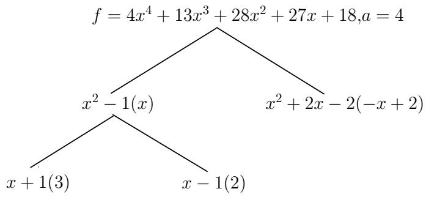
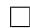

# 整系数多项式因子分解

下面我们讨论 $\mathbb { Z }$ 和 $\mathbb { Q }$ 上的多项式的因子分解. 由高等代数学知识, 我们知道对于 $\mathbb { Z } [ x ]$ 上的多项式 $f$ , 其在 $\mathbb { Q } [ x ]$ 中的不可约因子分解可对应于在 $\mathbb { Z } [ x ]$ 中的不可约因子分解, 设 $f$ 是本原多项式, 其在 $\mathbb { Q } [ x ]$ 中的不可约因子分解为若

$$
f = f _ {1} f _ {2} \dots f _ {r} (f _ {i} \in \mathbb {Q} [ x ]),
$$

则有

$$
f = f _ {1} ^ {\prime} f _ {2} ^ {\prime} \dots f _ {r} ^ {\prime} (f _ {i} ^ {\prime} \in \mathbb {Z} [ x ]).
$$

其中 $f _ { i } ^ { \prime }$ 可由 $f _ { i }$ 乘以其各个系数既约分母的最小公倍数再本原化得到. 于是 $\mathbb { Z } [ x ]$ 上任一多项式 $f$ 的因子分解归结于 Z 上的因子分解和 $\mathbb { Z } [ x ]$ 上本原多项式的因子分解.

很自然的, 由前面的最大公因子模方法我们可以想到用模方法来求解因子分解问题. 我们可以利用有限域上无平方因子分解的方法得到 $\mathbb { Z } [ x ]$ 上的无平方因子本原多项式 $f$ , 这时, 我们会遇到如下一些问题:

1. 素数 $p$ 的选取要足够大, 以使我们能从 $f$ mod $p$ 得到 $f$ , 这一点我们可由模公因子算法中介绍的 Mignotte界理论得到.  
2. 虽然 $f$ 已是无平方因子, 但 $f$ $f \bmod p$ $p$ 却不一定是无平方因子的. 如多项式$f = x ^ { 2 } + 5 x + 4$ 无平方因子, 但 $f$ $f \ \mathrm { m o d } \ 3 = x ^ { 2 } + 2 x + 1 = ( x + 1 ) ^ { 2 }$ . 那么在随机选取素数 $p$ 的时候如何使得 $f$ mod $p$ 也是无平方因子呢？这一点依赖于结式理论并且将在后文中回答.

3. 当我们在 $\mathbb { F } _ { p } [ \boldsymbol { x } ]$ 中将多项式分解后, 因为若 $f$ 有不可约分解 $f = f _ { 1 } f _ { 2 } \cdot \cdot \cdot f _ { r }$ ,则 ${ \overline { { f } } } = { \overline { { f _ { 1 } } } } \cdot \cdot \cdot { \overline { { f _ { r } } } }$ , 但 $\overline { { f _ { i } } }$ 不一定不可约. 因此还要考虑如何将 $f$ mod $p$ 的分解对应到 $f$ 的分解. 最简单的方法是尝试每一种可能的因子组合. 当然, 用这种尝试的方法, 其复杂度是指数阶的.

综上, 我们首先要进入 $\mathbb { F } _ { p } [ \boldsymbol { x } ]$ 中求得因子分解, 这一步我们可以利用“大素数”方法和“小素数”方法. . 第二步是由 $\mathbb { F } _ { p } [ \boldsymbol { x } ]$ 返回 $\mathbb { Z } [ x ]$ 中, 求得最终结果, 可以用因子组合的方法. 后面还会介绍一种多项式复杂度的格中短向量方法, 尽管其理论上十分优美, 但是没有因子组合算法实用.

# 10.1 大素数模方法和因子组合算法

利用结式理论, 我们先讨论 $f$ mod $p$ 在什么情况下是无平方因子的.

定义10.1. 对于域 $F$ 上的多项式 $f$ , 定义其判别式为 $\operatorname { d i s c } ( f ) = \operatorname { r e s } ( f , f ^ { \prime } )$ .

由推论 9.1 知, ${ \overline { { f } } } = f$ mod $p$ 是无平方因子的当且仅当 $\operatorname { d i s c } ( { \overline { { f } } } ) \neq 0$ .

引理10.1. 设 0 表示形式微商, 则有 ${ \overline { { f ^ { \prime } } } } = { \overline { { f } } } ^ { \prime }$ .

定理10.1. 令 $f \in \mathbb { Z } [ x ]$ 是一非零无平方因子多项式, $p$ 为素数且 $p \nmid \operatorname { l c } ( f )$ , 则 $\overline { { f } }$ 是无平方因子的当且仅当 $p \nmid \operatorname { d i s c } ( f )$ .

证明. $\overline { { f } }$ 无平方因子 $\Leftrightarrow \operatorname { d i s c } ( { \overline { { f } } } ) \neq 0 \Leftrightarrow \operatorname { r e s } ( { \overline { { f } } } , { \overline { { f } } } ^ { \prime } ) \neq 0$ , 再由上面引理知:

$$
\operatorname {r e s} (\overline {{f}}, \overline {{f}} ^ {\prime}) \neq 0 \Leftrightarrow \operatorname {r e s} (\overline {{f}}, \overline {{f ^ {\prime}}}) \neq 0.
$$

又 $p \nmid \mathrm { l c } ( f )$ , 则由引理8.2知

$$
\operatorname {r e s} (\overline {{f}}, \overline {{f ^ {\prime}}}) \neq 0 \Leftrightarrow \overline {{\operatorname {r e s} (f , f ^ {\prime})}} \neq 0 \Leftrightarrow p \nmid \operatorname {d i s c} (f).
$$

证毕.

由于 $\mathrm { l c } ( f ) \mid \mathrm { r e s } ( f , f ^ { \prime } )$ , 我们有下面的:

推论10.1. $f$ 是 $\mathbb { Z } [ x ]$ 上非零无平方因子多项式, 则 $\overline { { f } }$ 无平方因子当且仅当 $p \nmid$ $\operatorname { d i s c } ( f ) = \operatorname { r e s } ( f , f ^ { \prime } ) \in \mathbb { Z } \setminus \{ 0 \} .$ .

注140. 由推论 10.1 可知, $p$ 可以随机选取, 只有很小概率会使得 $\overline { { f } }$ 是有重因子的. 实际检测时, 我们不需要计算结式以判别选择的 $p$ 是否可行, 只需要直接计算$\operatorname* { g c d } ( { \overline { { f } } } , { \overline { { f } } } ^ { \prime } )$ 即可.

设 $f \in \mathbb { Z } [ x ]$ 为本原多项式, 有分解 $f = f _ { 1 } f _ { 2 } \cdot \cdot \cdot f _ { k }$ , 且在模 $p$ 下有:

$$
\overline {{f}} = \overline {{f _ {1} f _ {2}}} \dots \overline {{f _ {k}}} = \overline {{\operatorname {l c} (f)}} g _ {1} g _ {2} \dots g _ {r},
$$

其中 $g _ { i }$ 为 $\mathbb { F } _ { p } [ \boldsymbol { x } ]$ 上首一不可约多项式. 若 $p / 2$ 比 Mignotte 界 $( n + 1 ) ^ { 1 / 2 } 2 ^ { n } | \mathrm { l c } ( f ) |$ ·$\| f \| _ { \infty }$ 小, 则有下面的等式:

$$
\frac {\operatorname {l c} (f)}{\operatorname {l c} \left(f _ {1}\right)} f _ {1} = \operatorname {l c} (f) \prod_ {i \in S} g _ {i} \in \mathrm {Z} [ x ],
$$

该式原先在 $\mathbb { F } _ { p } [ x ]$ 上就已成立了. 其中指标集 $S$ 为 $S = \{ i \in \{ 1 , . . . , r \} | g _ { i } \mid { \overline { { f _ { 1 } } } } \}$ . 由此启发我们得到算法 10.1.

算法10.1 (整系数多项式因子分解 1:大素数和因子组合算法).

输入: 无平方因子 $n$ 次本原多项式 $f \in \mathbb { Z } [ x ]$ , 其中 $\operatorname { l c } ( f ) > 0$ 且 $\| f \| _ { \infty } = A$ ,输出: $f$ 在 $\mathbb { Z } [ x ]$ 上的不可约因子 $\{ f _ { 1 } , \ldots , f _ { k } \}$ .

1. 若 $n = 1$ 则输出 $f$ , 否则 $b = \operatorname { l c } ( f ) , B = ( n + 1 ) ^ { 1 / 2 } 2 ^ { n } A b ,$   
2. 随机任取一个奇素数 $p \in ( 2 B , 4 B )$ , 直至 $\operatorname* { g c d } ( { \overline { { f } } } , { \overline { { f } } } ^ { \prime } ) = 1 \in \mathbb { F } _ { p } [ x ]$ , 即满足推论10.1 条件,  
3. 利用有限域上因子分解算法求出 $g _ { 1 } , \ldots , g _ { r } \in \mathbb { Z } [ x ]$ , 其无穷范数均比 $p / 2$ 要小, 且在 $\mathbb { F } _ { p }$ 上不可约, 于是 $f \equiv b g _ { 1 } \cdots g _ { r }$ (mod $p$ ),  
4. $T = \{ 1 , \ldots , r \}$ , $s = 1$ , $G = \emptyset$ , $f ^ { * } = f$ , (此步之后即为因子组合)  
5. 当 $2 s \le \# T$ 时循环执行下面 4 步, 否则转第10 步,  
6. 枚举 $T$ 的所有 $s$ 元子集 $S$ , 并做下两步7, 8 循环:  
7. 计算 $g ^ { * }$ , $h ^ { \ast } \in \mathbb { Z } [ x ]$ 使得其无穷范数比 $p / 2$ 要小并且 $\begin{array} { r } { g ^ { * } \equiv b \prod _ { i \in S } g _ { i } } \end{array}$ (mod $p$ ), $\begin{array} { r } { h ^ { * } \equiv b \prod _ { i \in T \setminus S } g _ { i } ( \mathrm { m o d } p ) , } \end{array}$   
8. 若 $\| g ^ { * } \| _ { 1 } \| h ^ { * } \| _ { 1 } \leq B$ 则 $T = T \backslash S$ , $G = G \cup \{ \mathrm { p p } ( g ^ { * } ) \}$ , f ∗ = pp(h∗), $b = \mathrm { l c } ( f ^ { * } )$ ,跳出 6, 7, 8 循环并转第 5 步,  
9. $s = s + 1$   
10. 输出 $G \cup \{ f ^ { * } \}$

算法有效性. 由第 2 步 $p > B \Rightarrow p \nmid b$ 我们已经知道 $\overline { { f } }$ 是无平方因子的. 在第8 步中, 若条件真则有 $g ^ { * } h ^ { * } = b f ^ { * }$ , 因为由 $g ^ { * } h ^ { * } \equiv b f ^ { * }$ (mod $p$ ) 和 $\| g ^ { * } h ^ { * } \| _ { \infty } \leq$ $\| g ^ { * } h ^ { * } \| _ { 1 } \le \| g ^ { * } \| _ { 1 } \| h ^ { * } \| _ { 1 } \le B < p / 2$ 知等式是成立的. 记 $f$ 的因子 $u \in \mathbb { Z } [ x ]$ , 其在$\mathbb { F } _ { p } [ \boldsymbol { x } ]$ 中不可约因子个数为 $\mu ( u )$ . 现在我们要归纳证明在每次到第 5 步时, 有下面命题成立:

1. $\begin{array} { r } { f ^ { * } \equiv b \prod _ { i \in T } g _ { i } \ ( \mathrm { m o d } p ) , \quad b = \operatorname { l c } ( f ^ { * } ) , \quad f = f ^ { * } \prod _ { g \in G } g , } \end{array}$ $\begin{array} { r } { f ^ { * } \equiv b \prod _ { i \in T } g _ { i } } \end{array}$   
2. $G$ 中多项式均不可约,  
3. $f ^ { * }$ 本原且它的任何一个不可约因子 $u \in \mathbb { Z } [ x ]$ 有 $\mu ( u ) \geq s$ .

初始时命题显然成立, 假设命题在每次循环进行到第 7 步前均是成立的, 此时经过第 7 步后当第 8 步的条件成立时, 各量均要发生变化, 根据前面的分析则有$g ^ { * } h ^ { * } = b f ^ { * }$ , 于是 $\operatorname { p p } ( g ^ { * } )$ 是 $\mathrm { p p } ( b f ^ { * } ) = f ^ { * }$ 的因子. 由于 $\mu ( g ^ { * } ) = s$ 且对任何 $f ^ { * }$ 的不可约因子 $u$ 有 $\mu ( u ) \geq s$ , 则 $\operatorname { p p } ( g ^ { * } )$ 是 $f ^ { * }$ 的不可约因子. 当 $f ^ { * }$ 有一个不可约因子 $g$ 满足 $\mu ( g ) = s$ 时, 当循环到 $s$ 时必然能将此因子选出, 这一点可以构造来证明, 即取指标集 $S$ 为 $g$ 在 $\mathbb { F } _ { p } [ \boldsymbol { x } ]$ 中不可约因子的编号.

最后一步是证明在第 5 步时, 若 $2 s > \# T$ , 则 $f ^ { * }$ 是不可约的. 令 $g \in \mathbb { Z } [ x ]$ 是 $f ^ { * }$ 的一个不可约因子且 $h = f ^ { \ast } / g$ 非平凡, 于是 $s \leq \mu ( g ) , \mu ( h ) \leq \# T$ . 但 是$\mu ( g ) + \mu ( h ) = \# T$ , 且 $s > \# T / 2$ , 则 $h$ 必为常数, $f ^ { * }$ 必不可约. □

例10.1. 求 $f = 4 x ^ { 4 } + 1 3 x ^ { 3 } + 2 8 x ^ { 2 } + 2 7 x + 1 8$ 在 $\mathbb { Z } [ x ]$ 上的分解.

解: $f$ 是本原的, 且 $f ^ { \prime } = 1 6 x ^ { 3 } + 3 9 x ^ { 2 } + 5 6 x + 2 7$ , $\operatorname { d i s c } ( f ) = 1 6 5 6 2 8 8$ , 于是 $f$ 无平方因子. 此时 $n = 4$ , $A = 2 8$ , $b = \operatorname { l c } ( f ) = 4$ , 则 $B = ( n + 1 ) ^ { 1 / 2 } 2 ^ { n } A b = 1 7 9 2 { \sqrt { 5 } } =$ 4007.03, 取素数 $p = 8 0 1 7 > 2 B$ 且 $p \nmid \operatorname { d i s c } ( f )$ , 此时可以得到 $\mathbb { F } _ { 8 0 1 7 }$ 上的分解:

$$
f \equiv 4 (x - 9 5 5) (x + 9 5 7) (x ^ {2} - 2 0 0 3 x - 4 0 0 7) \pmod {p}.
$$

首先 $s = 1$ , 若取 $S = \{ 1 \}$ , 则

$$
\begin{array}{l} g ^ {*} \equiv 4 (x - 9 5 5) \equiv 4 x - 3 8 2 0 \pmod {p}, \\ h ^ {*} \equiv 4 (x + 9 5 7) \left(x ^ {2} - 2 0 0 3 x - 4 0 0 7\right) \equiv 4 x ^ {3} + 3 8 3 3 x ^ {2} - 3 2 2 6 x - 2 2 7 5 (\mathrm {m o d} p), \\ \left\| g ^ {*} \right\| _ {1} \left\| h ^ {*} \right\| _ {1} = (4 + 3 8 2 0) (4 + 2 8 3 3 + 3 2 2 6 + 2 2 7 5) > B, \\ \end{array}
$$

同样的取 $S = \{ 2 \}$ 时也可验证是不可行的. 若取 $S = \{ 3 \}$ , 则

$$
g ^ {*} \equiv 4 (x ^ {2} - 2 0 0 3 x - 4 0 0 7) \equiv 4 x ^ {2} + 5 x + 6 (\mathrm {m o d} p),
$$

$$
h ^ {*} \equiv 4 (x - 9 5 5) (x + 9 5 7) \equiv 4 x ^ {2} + 8 x + 1 2 \pmod {p},
$$

此时 $\| g ^ { * } \| _ { 1 } \| h ^ { * } \| _ { 1 } = 1 5 * 2 4 = 3 6 0 < B$ , 则 $G = \{ 4 x ^ { 2 } + 5 x + 6 \}$ , $f ^ { * } = \mathrm { p p } ( h ^ { * } ) =$ x2 + 2x + 3, $b = \operatorname { l c } ( f ^ { * } ) = 1$ , $T = \{ 1 , 2 \}$ . 下一步 $s = 2$ , 循环条件不满足, 则$G = G \bigcup \{ f ^ { * } \} = \{ x ^ { 2 } + 2 x + 3 , 4 x ^ { 2 } + 5 x + 6 \} .$ . $\diamondsuit$

利用算法 10.1我们可以得到如下对于一般的多项式的分解算法.

算法10.2 (整系数多项式的因子分解 2).

输入: $f \in \mathbb { Z } [ x ]$ , $\deg f = n > 1$ 且 $\| f \| _ { \infty } = A$ ,

输出: 常数 $c \in \mathbb { Z }$ 和序对集 $\{ ( f _ { 1 } , e _ { 1 } ) , \ldots , ( f _ { k } , e _ { k } ) \}$ , 其中 $f _ { i } \in \mathbb { Z } [ x ]$ 均是不可约两两互素的多项式, $e _ { i } \in \mathbb { N }$ , 且 $\begin{array} { r } { f = c \prod _ { i = 1 } ^ { k } f _ { i } ^ { e _ { i } } } \end{array}$ .

1. $c = \operatorname { c o n t } ( f )$ , $g = \operatorname { p p } ( f )$ , 若 $\operatorname { l c } ( f ) < 0$ 则 $c = - c$ , $g = - g$ ,  
2. 调用算法 9.9 得到分解 $\begin{array} { r } { g = \prod _ { 1 \leq i \leq s } g _ { i } ^ { i } } \end{array}$ , 且 $\operatorname { l c } ( g _ { i } ) > 0$ , $g _ { s }$ 非平凡,  
3. $G = \emptyset$   
4. 对 $1 \leq i \leq s$ 循环, 调用上面算法 10.1 得到 $g _ { i }$ 的所有不可约因子 $h _ { 1 } , \ldots , h _ { t } \in$ $\mathbb { Z } [ x ] , G = G \bigcup \{ ( h _ { 1 } , i ) , \ldots , ( h _ { t } , i ) \} ,$ ,  
5. 输出 $c$ 和 $G$ .

注141. 当然, 在算法第4步分解无平方因子多项式时, 也可以调用后面几节将要介绍的Hensel 提升或格中短向量算法进行因子分解.

# 10.2 Hensel 提升理论

首先我们来简单介绍一下为什么要用 Hensel 提升算法以及 Hensel 提升大致要解决的是什么问题.

依照我们前面介绍的求整系数多项式最大公因子的小素数模算法的思想, 如果要对本原多项式 $f \in \mathbb { Z } [ x ]$ 进行因子分解, 应当选取一系列小素数 $p 1 , p 2 , \ldots , p _ { k }$ 并在相应的环 $\mathbb { F } _ { p _ { i } } [ \boldsymbol { x } ]$ 中作分解

$$
f \equiv b _ {i} h _ {1 i} h _ {2 i} \dots h _ {r _ {i} i} \pmod {p _ {i}},
$$

其中 $h _ { j i }$ 均为首一不可约多项式, $b _ { i }$ 是领项系数, $r _ { i }$ 是 $f$ 在 $\mathbb { F } _ { p _ { i } } [ \boldsymbol { x } ]$ 中分解得到的不可约多项式个数. 然后利用中国剩余定理, 将各个环中的分解合并, 设

$\begin{array} { r } { m = \prod _ { 1 \leq i \leq k } p _ { i } } \end{array}$ , 我们将得到

$$
f \equiv b h _ {1} h _ {2} \dots h _ {r} \pmod {m},
$$

只要 $m$ 依照 Mignotte 界选取, 那么由此进行因子组合算法可还原到得 $\mathbb { Z } [ x ]$ 中的分解. 这样的设想虽然很好, 但是会存在如下问题:

• 在不同的环 $\mathbb { F } _ { p _ { i } } [ \boldsymbol { x } ]$ 中分解得到的不可约因子的个数未必相同, 即 $r _ { i }$ 未必全相等.  
• 即使各个 $r _ { i }$ 均是相等的, 但是不同环中得到的不可约因子不能一一对应起来, 这会给中国剩余定理算法带来麻烦.例如考虑多项式 $f = ( x + 3 ) ( x + 5 )$ 的分解, 在 $\mathbb { F } _ { 3 } [ x ]$ 和 $\mathbb { F } _ { 5 } [ x ]$ 中有

$$
f \equiv x (x + 2) \pmod {3}, \quad f \equiv x (x + 3) \pmod {5},
$$

虽然分解得到相同的因子 $x$ , 而实际上两个分解中的 $x$ 并不是对应的.

基于以上考虑, 我们需要换一个思路. 假设对于某个小素数 $p$ , 我们已有分解

$$
f \equiv b h _ {1} h _ {2} \dots h _ {r} \pmod {p},
$$

如果能通过某种方法将其“提升”, 从而得到分解

$$
f \equiv a g _ {1} g _ {2} \dots g _ {r} \pmod {p ^ {l}},
$$

其中 $a \equiv b$ (mod $p$ ), $g _ { i } \equiv h _ { i }$ (mod $p$ ), 而 $p ^ { l }$ 已足够大, 那么亦能达到同样的目的.Hensel[83]于 1918年提出了提升算法, 用以解决这样的问题.

# 10.2.1 Hensel 单步算法

当我们已知一个分解 $f \equiv g h { \pmod { p } } ( g , h$ $f \equiv g h$ 互素)时, 最简单的问题是如何获得分解 $f \equiv g ^ { * } h ^ { * }$ (mod $p ^ { 2 }$ ), 即将其“提升”. 由于 $p$ 是素数, 则存在 $s$ , $t \in \mathbb { Z } [ x ]$ 使得$s g + t h \equiv 1$ (mod $p$ ), 如果我们取:

$$
e = f - g h, \quad g ^ {*} = g + t e, \quad h ^ {*} = h + s e,
$$

则有

$$
\begin{array}{l} f - g ^ {*} h ^ {*} = f - (g + t e) (h + s e) = f - g h - (s g + t h) e - s t e ^ {2} \\ = (1 - s g - t h) e - s t e ^ {2} \equiv 0 \pmod {p ^ {2}}, \\ \end{array}
$$

这样可以达到我们的要求, 下面是一个具体计算的例子.

例10.2. 考虑 $f = x ^ { 4 } - 1$ , $m = 5$ , $h = x - 2$ , $g = x ^ { 3 } + 2 x ^ { 2 } - x - 2$ , $s = - 2$ ,$t = 2 x ^ { 2 } - 2 x - 1$ 的情况.

解: 顺次计算有

$$
e = f - g h = 5 x ^ {2} - 5,
$$

$$
g ^ {*} = g + t e = 1 0 x ^ {4} - 9 x ^ {3} - 1 3 x ^ {2} + 9 x + 3,
$$

$$
h ^ {*} = h + s e = - 1 0 x ^ {2} + x + 8.
$$

我们看到, $\deg g ^ { * } > \deg g$ , $\deg h ^ { * } > \deg h$ , 这种规模的增大无疑对后续的提升造成更多的计算负担, 并且次数的提高时我们无法得到正确的因子分解结果. ✸

鉴于提升时 $g$ 和 $h$ 的次数增长, 我们需要对此方法作一些改动, 在提出改动后的Hensel 单步提升算法之前, 我们先给出如下引理.

引理10.2. 在 $\mathbb { Z } [ x ]$ 中, 我们有如下结论:

1. 设 $f$ , $g \in \mathbb { Z } [ x ]$ , 其中 $g$ 非零且首一, 则存在唯一的多项式 $q$ , $r \in \mathbb { Z } [ x ]$ 使 得$f = q g + r$ 且 $\deg r < \deg g$ .  
2. f , g, q, $r$ 同上, 若对于某个整数 $m$ 有 $f \equiv 0$ (mod $m$ ), 则 $q \equiv r \equiv 0$ (mod m).

证明. 第一条基本同 Euclid 环中的证明方法, 只要注意到 $g$ 是首一的即可. 对于第二条, 由 $f \equiv 0$ (mod $m$ )知必有 $\mathbb { Z } [ x ]$ 中的多项式 $f ^ { * }$ 使得 $f = m f ^ { * }$ , 于是必存在唯一的 $q ^ { * } , r ^ { * }$ 使得

$$
f ^ {*} = q ^ {*} g + r ^ {*}, \quad \deg r ^ {*} <   \deg q ^ {*},
$$

此时有 $f = m f ^ { * } = ( m q ^ { * } ) g + ( m r ^ { * } )$ , 由唯一性得 $q = m q ^ { * }$ , $r = m r ^ { * }$ .

注142. 将 2 的条件改为 $f \equiv q g + r$ (mod $m ^ { 2 }$ ), 结论也是正确的. 只需将证明中的$\mathbb { Z } [ x ]$ 相应地改为 $\mathbb { Z } _ { m ^ { 2 } } [ x ]$ 即可.

我们可以给出如下的单步 Hensel 提升(Hensel Step)算法.

算法10.3 (单步 Hensel 提升).

输入: 整数 $m \in \mathbb { Z }$ , 多项式 $f , g , h , s , t \in \mathbb { Z } [ x ]$ 使得

$$
f \equiv g h \pmod {m}, \quad s g + t h \equiv 1 \pmod {m},
$$

其中 $h$ 首一, 且 $\deg f = n = \deg g + \deg h , \deg s < \deg h , \deg t < \deg g .$ $\deg f = n = \deg g + \deg h$

输出: 多项式 $g ^ { * } , h ^ { * } , s ^ { * } , t ^ { * } \in \mathbb { Z } [ x ]$ 使得

$$
f \equiv g ^ {*} h ^ {*} (\mathrm {m o d} m ^ {2}), s ^ {*} g ^ {*} + t ^ {*} h ^ {*} \equiv 1 (\mathrm {m o d} m ^ {2}),
$$

$h ^ { * }$ 首一, $g ^ { * } \equiv g$ (mod $m$ ), $h ^ { * } \equiv h$ (mod $m$ ), $s ^ { * } \equiv s$ (mod $m$ ), $t ^ { * } \equiv t$ (mod $m$ ), $\deg g ^ { * } = \deg g$ , $\deg h ^ { * } = \deg h$ , $\deg s ^ { * } < \deg h ^ { * }$ , $\deg t ^ { * } < \deg g ^ { * }$ .

1. 计算 $e , q , r , g ^ { * } , h ^ { * } \in \mathbb { Z } [ x ]$ 使得 $\deg r < \deg h$ 且

$$
\begin{array}{l} e \equiv f - g h \pmod {m ^ {2}}, \qquad s e \equiv q h + r \pmod {m ^ {2}}, \\ g ^ {*} \equiv g + t e + q g \pmod {m ^ {2}}, \qquad h ^ {*} \equiv h + r \pmod {m ^ {2}}, \\ \end{array}
$$

2. 计算 $b , c , d , s ^ { * } , t ^ { * } \in \mathbb { Z } [ x ]$ 使得 $\deg d < \deg h ^ { * }$ 且

$$
\begin{array}{l} b \equiv s g ^ {*} + t h ^ {*} - 1 \pmod {m ^ {2}}, \qquad s b \equiv c h ^ {*} + d \pmod {m ^ {2}}, \\ s ^ {*} \equiv s - d (\mathrm {m o d} m ^ {2}), t ^ {*} \equiv t - t b - c g ^ {*} (\mathrm {m o d} m ^ {2}), \\ \end{array}
$$

3. 输出 $g ^ { * } , h ^ { * } , s ^ { * } , t ^ { * }$ .

算法有效性. 我们验证各项输出的确满足要求. 首先验证 $f \equiv g ^ { * } h ^ { * }$ (mod $m ^ { 2 }$ ),

$$
\begin{array}{l} f - g ^ {*} h ^ {*} \equiv f - (g + t e + q g) (h + r) \equiv f - (g + t e + q g) (h + s e - q h) \\ \equiv (f - g h) - (s g + t h) e - s t e ^ {2} + q ^ {2} g h + (t h - s g) e q + q g h - q g h \\ \equiv (1 - s g - t h) e - s t e ^ {2} + q ^ {2} g h + (t h - s g) e q \equiv 0 \pmod {m ^ {2}}, \\ \end{array}
$$

这是因为根据注 142 及 $s e \equiv q h + r$ (mod $m ^ { 2 }$ ), 我们由 $s e \equiv 0$ (mod $m$ ) 得 到$q \equiv r \equiv 0 { \pmod { m } }$ .

由 $\deg r < \deg h$ 知 $h ^ { * }$ 也是首一的, 且

$$
g ^ {*} - g \equiv t e + q g \equiv 0 \pmod {m},
$$

$$
h ^ {*} - h \equiv r \equiv 0 \pmod {m},
$$

由 $h ^ { * } \equiv h + r$ (mod $m ^ { 2 }$ ) 也可得到 $\deg h ^ { * } = \deg h .$ , 于是 $\deg g ^ { * } = \deg f - \deg h ^ { * } =$ $\deg f - \deg h = \deg g .$ .

其次验证 $s ^ { * } g ^ { * } + t ^ { * } h ^ { * } \equiv 1$ (mod m),

$$
\begin{array}{l} s ^ {*} g ^ {*} + t ^ {*} h ^ {*} \equiv (s - d) g ^ {*} + (t - t b - c g ^ {*}) h ^ {*} \\ \equiv (s - s b + c h ^ {*}) g ^ {*} + (t - t b - c g ^ {*}) h ^ {*} \equiv (s g ^ {*} + t h ^ {*}) (1 - b) \\ \equiv (s g ^ {*} + t h ^ {*}) (2 - s g ^ {*} - t h ^ {*}) \equiv 1 - (s g ^ {*} + t h ^ {*} - 1) ^ {2} \equiv 1 - (s g + t h - 1) ^ {2} \\ \equiv 1 \pmod {m ^ {2}}, \\ \end{array}
$$

由 $s b \equiv 0$ (mod $m$ ) 可知 $c \equiv d \equiv 0$ (mod $m$ ), 于是

$$
s ^ {*} - s \equiv d \equiv 0 \pmod {m},
$$

$$
t ^ {*} - t \equiv t b + c g ^ {*} \equiv 0 \pmod {m},
$$

而 $\deg d < \deg h ^ { * }$ , 于是 $\deg s ^ { * } \leq \deg ( s - d ) < \deg h ^ { * }$ , 由 $s ^ { * } g ^ { * } + t ^ { * } h ^ { * } \equiv 1$ (mod $m ^ { 2 }$ )知 $\deg t ^ { * } < \deg g ^ { * }$ . 所有结论证毕. □

既然本节开始提出的方法已经能够解决问题, 为什么还要引入上面的算法呢？我们通过下面一个例子来说明问题:

例10.3. 仍然考虑例 $1 0 . 2 \ f = x ^ { 4 } - 1$ , $m = 5$ , $h = x - 2$ , $g = x ^ { 3 } + 2 x ^ { 2 } - x - 2$ ,$s = - 2$ , $t = 2 x ^ { 2 } - 2 x - 1$ 的情况.

解: 我们用算法 10.3来进行提升:

$e$ 任取为 $5 x ^ { 2 } - 5$ , 则对 $s e$ 进行 $h$ 的带余除法有:

$$
s e = - 1 0 x ^ {2} + 1 \equiv (- 1 0 x + 5) h - 5 {\pmod {2 5}},
$$

于是 $q = - 1 0 x + 5$ , $r = - 5$ , 故

$$
g ^ {*} \equiv g + t e + q g \equiv x ^ {3} + 7 x ^ {2} - x - 7 {\pmod {2 5}},
$$

$$
h ^ {*} \equiv h + r \equiv x - 7 {\pmod {2 5}},
$$

$$
b \equiv s g ^ {*} + t h ^ {*} - 1 \equiv - 5 x ^ {2} - 1 0 x - 5,
$$

$$
c = 1 0 x - 1 0, \quad d = - 1 0,
$$

$$
s ^ {*} \equiv s - d \equiv 8 \pmod {2 5},
$$

$$
t ^ {*} \equiv t - t b - c g ^ {*} \equiv - 8 x ^ {2} - 1 2 x - 1.
$$

正如 Hensel 单步提升算法所提到的, 我们有 $\deg g ^ { * } = \deg g$ , $\deg h ^ { * } = \deg h$ .

✸

我们可归纳地利用单步 Hensel 算法, 依次对 $m$ , $m ^ { 2 }$ , $m ^ { 4 }$ , · · · 使用. 由于对任何正整数l, 我们总可找到比其大的 2 的幂次, 于是有下面的:

定理10.2 (Hensel 引理). 对于给定的正整数 $l$ 以及算法 10.3 中输入的条件, 我们可以将 $m ^ { 2 }$ 用 $m ^ { l }$ 代替, 仍然得到满足条件的输出.

定理10.3 (Hensel 提升的唯一性). 对于非零整数 $m$ 和正整数 $l$ 以及非零多项式$g , h , g ^ { * } , h ^ { * } , s , t \in \mathbb { Z } [ x ]$ , 其中 $s g + t h \equiv 1$ (mod $m$ ), $\operatorname { l c } ( g )$ 和 $\mathrm { l c } ( h )$ 不是 $\mathbb { Z } _ { m }$ 中的零因子, $g$ 和 $g ^ { * }$ 有同样的领项和次数, 且模 $m$ 同余; 对于 $h$ 和 $h ^ { * }$ 也有相似的条件.此时若 $g h \equiv g ^ { * } h ^ { * }$ (mod $m ^ { l }$ ), 则 $g \equiv g ^ { * }$ (mod $m ^ { l }$ ), $h \equiv h ^ { * }$ (mod $m ^ { l }$ ).

证明. 假设结论不成立, 即 $g \not \equiv g ^ { * }$ (mod $m ^ { l }$ ) 或 $h \not \equiv h ^ { * }$ (mod $m ^ { l }$ ), 不妨假设前者不成立, 于是我们可以找到最大的指标 $i ( 1 \leq i < l )$ 使得 $m ^ { i } \mid g - g ^ { * }$ 且 $m ^ { i } \mid h - h ^ { * }$ ,不妨设 $g ^ { * } - g = u m ^ { i }$ , $h ^ { * } - h = v m ^ { i }$ 且 $m \nmid u$ . 则

$$
0 \equiv g ^ {*} h ^ {*} - g h \equiv g ^ {*} (h ^ {*} - h) + h (g ^ {*} - g) \equiv (g ^ {*} v + h u) m ^ {i} \pmod {m ^ {l}},
$$

于是 $m \mid m ^ { l - i } \mid ( g ^ { * } v + h u )$ , 若 $f$ 将模 $m$ 的象以 $\overline { { f } }$ 来记, 则有

$$
\overline {{s g}} + \overline {{t h}} = 1, \quad \overline {{g ^ {*}}} = \overline {{g}}, \quad \overline {{g ^ {*} v}} + \overline {{h u}} = 0.
$$

因此

$$
0 = \bar {t} (\overline {{g ^ {*} v}} + \overline {{h u}}) = \overline {{t g v}} + (1 - \overline {{s g}}) \overline {{u}} = (\overline {{t v}} - \overline {{s u}}) \overline {{g}} + \overline {{u}},
$$

于是 ${ \overline { { g } } } \mid { \overline { { u } } } ,$ , 又 $g$ 和 $g ^ { * }$ 的领项和次数均相同, 我们有 $\deg \overline { { u } } < \deg \overline { { g } }$ , 于是由整除性知$\overline { { u } } = 0$ , 这与 $m \nmid u$ 矛盾. □

# 10.2.2 利用因子树进行多因子 Hensel 提升

前面所说的均是二因子的 Hensel 提升, 对于多因子, 情况有些不同. VictorShoup 提出了一种利用“因子树”进行提升的方法, 最早在 NTL 库中实现(参见[174]15.5 节), von zur Gathen[172] 于 1984 年提出了同时提升多个因子的算法. 本节我们介绍因子树方法.

我们先给出因子树的定义:

定义10.2 (因子树(Factor Tree)). 对于 $\mathbb { Z } [ x ]$ 中的多项式 $f$ , 以及正整数 $m$ (例如我们可以取作素数 $p$ ), 设有整数 $a$ 使得 $a \mathrm { l c } ( f ) \equiv 1$ (mod $m$ ), 则 $f$ 模 $m$ 的因子树是指一个二叉树 $\tau$ :其根结点是 $a f$ ;每个结点的两个子结点均是该结点在 $\mathbb { Z } _ { m } [ x ]$ 中的非平凡首一因子;叶结点均为 $\mathbb { Z } _ { m } [ x ]$ 的不可约因子.
注143. 实际我们用模素数的因子分解生成因子树时, 需要用扩展 Euclid 算法算出各个属于同一中间结点的两个子结点的 Bezout 系数, 以便进行下面的多因子Hensel 提升算法. 一个典型的因子树如图10.1所示. 其中每个结点的括号中显示了其相应的 Bezout 系数.

  
图 10.1: 模 5 因子树

当然由模 $m$ 的因子树我们可以由单步Hensel算法得到模 $m ^ { 2 }$ 乃至更高次幂的因子树, 只要我们由根结点依次在每个结点做 Hensel 提升即可. 下面给出该算法:

算法10.4 (多因子 Hensel 提升).

输入: 整数 $m$ 和 $n$ 次多项式 $f \in \mathbb { Z } [ x ]$ , $a _ { 0 } \in \mathbb { Z }$ 使得 $a _ { 0 } \mathrm { l c } ( f ) \equiv 1$ (mod $m$ ), 正 整数 $l$ , 一个 $f$ 模 $m$ 的因子树 $\tau$ , 共有 $r$ 个叶子.

输出: 整数 $a ^ { * }$ 使得 $a ^ { * } \mathrm { l c } ( f ) \equiv 1$ (mod $m ^ { l }$ ) 和一个 $f$ 模 $m ^ { l }$ 的因子树 $\tau ^ { * }$ , 各个新结点 $v ^ { * }$ 和原结点 $v$ 满足 $v ^ { * } \equiv v$ (mod $m$ ).

1. $d = \lceil \log _ { 2 } l \rceil$ , $\tau _ { 0 } = \tau$ ,   
2. 对 $j$ 从 1循环到 $d$ , 执行第3 至5 步,  
3. 计算整数 $a _ { j }$ 使得 $a _ { j } \equiv 2 a _ { j - 1 } - \operatorname { l c } ( f ) a _ { j - 1 } ^ { 2 }$ (mod $m ^ { 2 ^ { j } }$ ), $\tau _ { j } = \tau _ { j - 1 }$ , 将 $\tau _ { j }$ 的根 结点换为 $a _ { j } f$ ,   
4. 从根结点遍历 $\tau _ { j }$ 的结点, 对每个非叶结点 $v$ , 执行第 5 步(由根向叶结点方向进行),  
5. 调用算法 10.3 , 输入 $m ^ { 2 ^ { j - 1 } }$ 来提升 $v = g _ { v } h _ { v }$ 和 $s _ { v } g _ { v } + t _ { v } h _ { v } \equiv 1$ (mod $m ^ { 2 ^ { j - 1 } }$ ), 提升到模 $m ^ { 2 ^ { j } }$ ,   
6. 输出 $a _ { d }$ , $\tau _ { d }$

注144. 注意到 $d$ 的选取能够使 $2 ^ { d } \geq l$ , 即我们已将因子树提升到足够高的次数.  
注145. 为说明算法的有效性, 我们只需要说明每一步求得的 $a _ { j }$ 确实满足要求. 这是因为 $a _ { j } \mathrm { l c } ( f ) \equiv 2 a _ { j - 1 } \mathrm { l c } ( f ) - \mathrm { l c } ^ { 2 } ( f ) a _ { j - 1 } ^ { 2 } \equiv 1 - ( 1 - a _ { j - 1 } \mathrm { l c } ( f ) ) ^ { 2 } \equiv 1$ (mod $m ^ { 2 ^ { j } }$ ).

# 10.3 应用 Hensel 提升的 Zassenhaus 算法

有了前面的Hensel提升理论,我们就可以利用它取代大素数模算法. Zassenhaus[189]在1969年将Hensel提升算法引入到整系数多项式因子分解算法中, 下面我们就来介绍 Zassenhaus 算法.

算法10.5 (整系数多项式分解 3:素数幂和因子组合算法).

输入: 一个无平方因子本原 $n$ 次多项式 $f \in \mathbb { Z } [ x ]$ , $\operatorname { l c } ( f ) > 0$ 且 $\| f \| _ { \infty } = A$ ,输出: $f$ 的不可约因子 $\{ f _ { 1 } , \ldots , f _ { k } \} \subset \mathbb { Z } [ x ]$ .

1. 若 $n = 1$ 则输出 $f$ , 否则 $b = \operatorname { l c } ( f )$ , $B = ( n + 1 ) ^ { 1 / 2 } 2 ^ { n } A b$ , $C = ( n + 1 ) ^ { 2 n } A ^ { 2 n - 1 }$ ,$\gamma = \lceil 2 \log _ { 2 } C \rceil ,$ ,  
2. 任意选取素数 $p \leq 2 \gamma \ln \gamma$ , ${ \overline { { f } } } = f$ mod $p$ , 直到 $p \nmid b$ 且 $\operatorname* { g c d } ( { \overline { { f } } } , { \overline { { f } } } ^ { \prime } ) = 1 \in \mathbb { F } _ { p } [ x ]$ ,然后令 $l = \lceil \log _ { p } ( 2 B + 1 ) \rceil$ ,  
3. 调用有限域上因子分解算法计算 $h _ { 1 } , \ldots , h _ { r } \in \mathbb { Z } [ x ]$ , 各因子均是首一不可约因子, 且无穷范数小于 $p / 2$ , 于是 $f \equiv b h _ { 1 } \cdot \cdot \cdot h _ { r }$ (mod $p$ ),  
4. $a \ = \ b ^ { - 1 }$ mod $p$ , 利用扩展 Euclid 算法建立 $f$ 模 $p$ 的因子树, 叶结点为$h _ { 1 } , \ldots , h _ { r }$ , 再调用算法 10.4 计算分解 $f \equiv b g _ { 1 } \cdots g _ { r }$ (mod $p ^ { l }$ ), 其中 $g _ { i } \in \mathbb { Z } [ x ]$ 为首一且无穷范数小于 $p ^ { l } / 2$ , $g _ { i } \equiv h _ { i }$ (mod $p$ ),  
5. 调用因子组合算法并输出. (此处同算法 10.1 第 $4 \sim 1 0$ 步. ) $T = \{ 1 , \ldots , r \}$ ,$s = 1$ , G = ∅, $f ^ { * } = f$ ,  
6. 当 $2 s \leq \# T$ 时循环执行下面 4 步, 否则转第 11 步,  
7. 枚举 $T$ 的所有 $s$ 元子集 $S$ , 并做下两步 8, 9 循环:  
8. 计算 $g ^ { * }$ , $h ^ { \ast } \in \mathbb { Z } [ x ]$ 使得其无穷范数比 $p ^ { l } / 2$ 要小并且 $\begin{array} { r } { g ^ { * } \equiv b \prod _ { i \in S } g _ { i } } \end{array}$ (mod $p ^ { l }$ ), $\begin{array} { r } { h ^ { * } \equiv b \prod _ { i \in T \setminus S } g _ { i } ( \mathrm { m o d } p ^ { l } ) , } \end{array}$   
9. 若 $\| g ^ { * } \| _ { 1 } \| h ^ { * } \| _ { 1 } \leq B$ 则 $T = T \backslash S$ , $G = G \cup \{ \mathrm { p p } ( g ^ { * } ) \}$ , f ∗ = pp(h∗), b = lc(f ∗),跳出 7, 8, 9 循环并转第 6 步,

10. $s = s + 1$ ,   
11. 输出 $G \cup \{ f ^ { * } \}$ .

注146. 步骤 2 中 $\gamma$ 的引入见 [174]18.4 节.

注147. 关于素数的选取, 我们也可以由序列 3,5,7, . . . 依次选取, 或者预先准备好小素数表. 为了降低因子组合的复杂性, 选取 $p$ 并进行分解

$$
f \equiv b h _ {1} \dots h _ {r} \pmod {p}
$$

后, 我们可以多选几个适合的 $p$ 分解, 取 $r$ 最小的那个 $p$ 进行后面的 Hensel 提升.

注148. 我们还可以在进行 Hensel 提升的过程中一边检查各个因子是不是 $f$ 在$\mathbb { Z } [ x ]$ 中的因子, 如果是则将其从树中移除, 仅提升剩余的因子. 这样, 我们有可能在提升到 $l$ 次幂之前就已经分解完全了.

算法有效性. 记 $f$ 的因子 $u \in \mathbb { Z } [ x ]$ , 其在 $\mathbb { F } _ { p } [ \boldsymbol { x } ]$ 中不可约因子个数 $\mu ( u )$ . 现在我们要归纳证明在每次到第 6 步时, 有下面命题成立:

1. $\begin{array} { r } { f ^ { * } \equiv b \prod _ { i \in T } g _ { i } \ ( \mathrm { m o d } \ p ^ { l } ) , \quad b = \mathrm { l c } ( f ^ { * } ) , \quad f = f ^ { * } \prod _ { g \in G } g , } \end{array}$ $\begin{array} { r } { f ^ { * } \equiv b \prod _ { i \in T } g _ { i } } \end{array}$   
2. $G$ 中多项式均不可约,  
3. $f ^ { * }$ 本原且它的任何一个不可约因子 $u \in \mathrm { Z } [ x ]$ 有 $\mu ( u ) \geq s$

主要证法和算法10.1的证明一致, 我们只需证明当 $f ^ { * }$ 有一个不可约因子 $g$ 满足 $\mu ( g ) = s$ 时, 当循环到 s 时必然能将此因子选出, 这一点可以构造来证明, 即取指标集 $S$ 为 $g$ 在 $\mathbb { F } _ { p } [ \boldsymbol { x } ]$ 中不可约因子的编号. 当然这里与前面的证法有所不同, 因为 $\mathbb { Z } _ { p ^ { l } } [ x ]$ 并不是 UFD, 要证明唯一性还需要用 Hensel 提升的唯一性定理. 首先可设 $\begin{array} { r } { \mathrm { l c } ( h ) g \equiv b \prod _ { i \in S } g _ { i } } \end{array}$ (mod p), $\begin{array} { r } { \mathrm { l c } ( g ) h \equiv b \prod _ { i \in T \backslash S } g _ { i } } \end{array}$ (mod p), 再设 $\begin{array} { r } { g ^ { * } \equiv b \prod _ { i \in S } g _ { i } } \end{array}$ (mod $p ^ { l }$ ), $\begin{array} { r } { h ^ { * } \equiv b \prod _ { i \in T \backslash S } g _ { i } } \end{array}$ (mod $p ^ { l }$ ). 由 $f ^ { * } = g h$ 可知

$$
b f ^ {*} = \operatorname {l c} (h) g \operatorname {l c} (g) h,
$$

另外

$$
b f ^ {*} \equiv g ^ {*} h ^ {*} \pmod {p ^ {l}},
$$

以上两式均是 $b f ^ { * }$ mod $p$ 的提升, 于是 $\begin{array} { l } { \operatorname { l c } ( h ) g \ \equiv \ g ^ { * } } \end{array}$ (mod $p ^ { l }$ ) 且 $\mathrm { l c } ( g ) h \equiv h ^ { * }$ (mod $p ^ { l }$ ), 再由所定的 Mignotte 界和 $l$ 的选择可知9 中的条件必然成立. □

例10.4. 仍然考虑例 10.1 中 $f = 4 x ^ { 4 } + 1 3 x ^ { 3 } + 2 8 x ^ { 2 } + 2 7 x + 1 8 \in \mathbb { Z } [ x ]$ 的分解.

解: 首先, $n = 4$ , $A = 2 8$ , $b = 4$ , $B = 1 7 9 2 \sqrt { 5 } = 4 0 0 7 . 0 3$ , $\gamma = 1 0 4$ , 而 $2 , 3 \mid \operatorname { d i s c } ( f )$ ,故取 $p = 5$ , 此时 $l = \lceil \log _ { 5 } ( 2 B + 1 ) \rceil = 6$ , 要提升 3 次. 首先利用模 5 因子分解和扩展 Euclid 算法得到如下模 5 因子树(图10.1):

$$
4 f = \left\{ \begin{array}{l} s = x, g = x ^ {2} - 1 \left\{ \begin{array}{l} s = 3, g = x + 1 \\ t = 2, h = x - 1 \end{array} \right. \\ t = - x + 2, h = x ^ {2} + 2 x - 2 \end{array} \right.
$$

利用多因子提升算法提升为模 25 因子树:

$$
1 9 f = \left\{ \begin{array}{l} s = 6 x, g = x ^ {2} - 5 x - 1 1 \left\{ \begin{array}{l} s = - 2, g = x - 9 \\ t = 2, h = x + 4 \end{array} \right. \\ t = - 6 x - 8, h = x ^ {2} + 2 x + 3 \end{array} \right.
$$

以此类推有模 $5 ^ { 4 } = 6 2 5$ 因子树:

$$
4 6 9 f = \left\{ \begin{array}{l} s = - 6 9 x, g = x ^ {2} - 1 5 5 x - 3 1 1 \\ t = 6 9 x - 2 0 8, h = x ^ {2} + 2 x + 3 \end{array} \right. \left\{ \begin{array}{l} s = - 1 7 7, g = x - 1 3 4 \\ t = 1 7 7, h = x - 2 1 \end{array} \right.
$$

模 $5 ^ { 8 } = 3 9 0 6 2 5$ 因子树:

$$
2 9 2 9 6 9 f = \left\{ \begin{array}{l} s = 8 6 8 0 6 x, g = x ^ {2} - 9 7 6 5 5 x - 1 9 5 3 1 1 \\ t = - 8 6 8 0 6 x - 1 3 0 2 0 8, h = x ^ {2} + 2 x + 3 \end{array} \left\{ \begin{array}{l} s = - 1 0 8 9 2 7, g = x + 8 2 9 9 1 \\ t = 1 0 8 9 2 7, h = x - 1 8 0 6 4 6 \end{array} \right. \right.
$$

于是我们有 $f \equiv 4 ( x + 8 2 9 9 1 ) ( x - 1 8 0 6 4 6 ) ( x ^ { 2 } + 2 x + 3 )$ (mod $5 ^ { 8 }$ ). 这里我们再对其进行还原时, 显然有 $s \ = \ 1$ 时可得到不可约因子 $( x ^ { 2 } + 2 x + 3 )$ , 此时$f ^ { * } = h ^ { * } \equiv 4 ( x + 8 2 9 9 1 ) ( x - 1 8 0 6 4 6 ) \equiv 4 x ^ { 2 } + 5 x + 6$ (mod $5 ^ { 8 }$ ). 于是再一次得到分解 $f = ( x ^ { 2 } + 2 x + 3 ) ( 4 x ^ { 2 } + 5 x + 6 )$ . ✸

# 10.4 格中短向量理论

# 10.4.1 问题的引入

通过大素数模方法或 Hensel 提升方法, 我们都可以得到多项式 $f \in \mathbb { Z } [ x ]$ 在模某个整数 $m$ 后的分解, 即 $f \equiv b g _ { 1 } \cdots g _ { r }$ (mod $m$ ). 这时候我们用因子组合的算法

将它们拼起来还原. 很显然, 因子组合算法的时间复杂度是指数级的, 在某些情况下这种方法的效率很低, 如 Swinnerton-Dyer 多项式(见 [174]15.3 节), 这个例子是最坏的情况, 即多项式不可约但是在有限域上却分解为一次不可约因子的乘积, 组合时要尝试所有 $2 ^ { n }$ 种情况才能得到结果. 下面几小节将要介绍的格中短向量方法是一种多项式时间算法, 它从理论上改进了原先因子组合算法的指数时间复杂度,尽管我们实际仍然使用因子组合算法([56]3.5.5节).

按照定义 8.13 , 以下我们取默认的范数 $\| f \|$ 为 2-范数, 即 $\| f \| _ { 2 }$ . 我们将多项式的系数看作列向量, 则多项式范数等同于该向量的范数. 首先我们有:

定理10.4 (Hadamard 不等式). 设 $n$ 阶方阵 $A$ 用 $n$ 个列向量表示为

$$
A = \left(a _ {1}, a _ {2}, \dots , a _ {n}\right),
$$

则 $\deg A \leq \| a _ { 1 } \| \| a _ { 2 } \| \cdot \cdot \cdot \| a _ { n } \|$ .

证明参见高等代数学教材, 如可参考 [12]278 页 48 题.

引理10.3. 设 $f$ , $g \in \mathbb { Z } [ x ]$ 分别是 $n$ , $k$ 次多项式, $u \in \mathbb { Z } [ x ]$ 是一非平凡首一多项式, $m$ 为一正整数, 若在 $\mathbb { Z } _ { m } [ x ]$ 中有 $a \mid f$ (mod $m$ ), $a \mid g$ (mod m), $\| f \| ^ { k } \| g \| ^ { n } < m$ . 则 $f$ 和 $g$ 有非平凡公因子.

证明. 假设 f , $g$ 没有非平凡的公因子, 则在 $\mathbb { Q } [ x ]$ 中有 $\operatorname* { g c d } ( f , g ) = 1$ , 由结式理论推论 8.4 可知存在 $s$ , $t \in \mathbb { Z } [ x ]$ 使得 $s f + t g \equiv \operatorname { r e s } ( f , g )$ (mod $m$ ), 由于 $u$ 在模 $m$ 下能整除 $f$ 和 $g$ , 则 $u \mid \operatorname { r e s } ( f , g )$ mod $m$ . 但 $u$ 是非平凡首一多项式, 于是必有$\operatorname { r e s } ( f , g ) \equiv 0$ (mod $m$ ), 再由 Hadamard 不等式有 $| \mathrm { r e s } ( f , g ) | < \| f \| ^ { k } \| g \| ^ { n } < m$ , 此即说明 $\operatorname { r e s } ( f , g ) = 0$ , 与 $\operatorname* { g c d } ( f , g ) = 1 \in \mathbb { Q } [ x ]$ 矛盾. 于是二者在 $\mathbb { Z } [ x ]$ 中有非平凡公因子. □

由前面我们已得出的分解结果和上面的引理, 我们产生如下的分解的想法. 首先我们已经有待分解的 $n$ 次多项式 $f \in \mathbb { Z } [ x ]$ 和 $f$ 在模 $m$ 下的一个因子 $u \in \mathbb { Z } [ x ]$ ,此时我们需要找到一个较“短”的 $k$ 次多项式 $g \in \mathbb { Z } [ x ]$ 使得 $\| g \| ^ { n } < m \| f \| ^ { - k }$ , 且$u \mid g \bmod m$ , 于是可通过 $\operatorname { g c d } ( f , g )$ 得到 $f$ 的一个非平凡因子. 为了叙述方便, 以后记号 $f$ 既可以表示 $n$ 次多项式, 也可以表示 $n + 1$ 维系数列向量. 引入下面的定义:

定义10.3. 设有正整数 $n$ 和向量 $f _ { 1 } , \ldots , f _ { n } \in \mathbb { R } ^ { n }$ , 则

$$
L = \sum_ {1 \leq i \leq n} \mathbb {Z} f _ {i} = \left\{\sum_ {1 \leq i \leq n} r _ {i} f _ {i} \mid r _ {1}, \dots , r _ {n} \in \mathbb {Z} \right\}
$$

称为由 $f _ { 1 } , \ldots , f _ { n }$ 生成的格(Lattice). $f _ { 1 } , \ldots , f _ { n }$ 称为 $L$ 的基. 而 $L$ 的范数是定义为

$$
\left| L \right| = \left| \det  \left(f _ {1}, \dots , f _ {n}\right) \right| \in \mathbb {R}.
$$

后面将看到范数的定义是与基的选择无关的.

现在我们考虑寻找一个次数小于 $j$ 的多项式 $g \in \mathbb { Z } ^ { j }$ , 设 $L \subset \mathbb { Z } ^ { j }$ 是由 $u$ 和 $m$ 生成的, 即

$$
L = \left\{g = q u + r m \mid q, r \in \mathbb {Z} [ x ], \deg q <   j - d, \deg r <   d \right\},
$$

其中 $d = \deg { u }$ . 这时我们有下面的定理:

定理10.5. 对于任何一个次数小于 $j$ 的多项式 $g , u \mid g$ mod $m \Leftrightarrow g \in L$

证明. 对于 $\Rightarrow$ 显然, 对于 $\Leftarrow$ , 我们有 $g = q ^ { * } u + r ^ { * } m$ , 再由 $r ^ { * }$ 对首一多项式 $u$ 的除法可得 $r ^ { * } = q ^ { * * } u + r ^ { * * }$ , 其中 $\deg r ^ { * * } < \deg u$ . 令 $q = q ^ { * } + m q ^ { * * }$ , $r = r ^ { * * }$ , 则有$g = q u + r m$ , 且 $\deg q < j - d , \deg r < d ,$ $\deg r < d$ , 于是 $g \in L$ . □

现在我们的问题化为在 $L$ 中寻找一种约化的基, 以使得基向量长度较短, 满足要求.

# 10.4.2 约化基算法

下面要介绍的约化基算法即是所谓的 3-L(Lenstra, Lenstra and Lov´asz)算法.

引理10.4. 令 $N \subset M \subset \mathbb { R } ^ { n }$ 为两个格, 分别由 $g _ { 1 } , \cdots g _ { n }$ 和 $f _ { 1 } , \ldots , f _ { n }$ 生成, 则 $\lvert M \rvert$ 整除 $| N |$ .

证明. 由 $N \subset M$ 知 $N$ 的生成元 $g _ { i }$ 均是 $M$ 的生成元 $f _ { i }$ 的线性组合, 即存在整系数矩阵 $A$ 使得 $( g _ { 1 } , \ldots , g _ { n } ) = A ( f _ { 1 } , \ldots , f _ { n } )$ , 于是 $\begin{array} { r } { | N | = \operatorname* { d e t } A | M | } \end{array}$ , $\deg A \in \mathbb { Z }$ .

取 $N \ = \ M$ 可知格的范数与生成元无关. 由 Hadamard 不等式我们知道$| M | \leq \left\| f _ { 1 } \right\| \cdot \cdot \cdot \left\| f _ { n } \right\| .$ .

因为范数与基的选择无关, 因而我们想到, 如果选取的基越“正交”, 那么某种程度上这组基向量的长度越短. 因而, 向量基的正交化可以启示我们得到一种求约化基(即所谓的短向量)的方法.

现在我们已知由 $f _ { 1 } , \ldots , f _ { n }$ 生成的格, 若取内积为 $\langle f , g \rangle = f ^ { T } g$ , 由高等代数学(例如参见 [12]281 页)的内容我们知道可以对它们进行 Gram-Schmidt 正交化,正交化的过程可以归纳地进行, 即令 $f _ { 1 } ^ { * } = f _ { 1 }$ , 对于 $i \geq 2$ , 有

$$
f _ {i} ^ {*} = f _ {i} - \sum_ {1 \leq j <   i} f _ {j} ^ {*} \mu_ {j i}, \text {其 中} \mu_ {j i} = \frac {\langle f _ {i} , f _ {j} ^ {*} \rangle}{\langle f _ {j} ^ {*} , f _ {j} ^ {*} \rangle}.
$$

于是存在一个上三角阵 $M = \left( \mu _ { i j } \right)$ , 其对角元为 1, 使得

$$
\left(f _ {1}, \dots , f _ {n}\right) = \left(f _ {1} ^ {*}, \dots , f _ {n} ^ {*}\right) M,
$$

其中 $f _ { i } ^ { * }$ 张成同样的空间, 且两两互相正交. 由正交化的几何意义我们可以很明显地看到, 每个向量的长度都不大于原向量的长度, 即基向量的长度缩短了. 但是光作 GSO(Gram-Schmidt orthogonalization)是不行的, 因为正交化后所得的向量的组合系数可以为有理数, 并不一定是原先格中的向量. 但是首先, 我们有下面的估计:

引理10.5. 设 $L$ 为由 $( f _ { 1 } , \ldots , f _ { n } )$ 生成的格, $( f _ { 1 } ^ { * } , \ldots , f _ { n } ^ { * } )$ 是对其进行 GSO 所得的基, 则对任意非零向量 $f \in L$ , 我们有

$$
\left\| f \right\| \geq \min  \left\{\left\| f _ {1} ^ {*} \right\|, \dots , \left\| f _ {n} ^ {*} \right\| \right\}.
$$

证明. 由 GSO 过程知道有对角元为 1 的上三角阵 $M = \left( \mu _ { i j } \right)$ 满足

$$
\left(f _ {1}, \dots , f _ {n}\right) = \left(f _ {1} ^ {*}, \dots , f _ {n} ^ {*}\right) M,
$$

则 $\begin{array} { r } { f _ { i } = \sum _ { 1 \leq j \leq n } f _ { j } ^ { * } \mu _ { j i } = \sum _ { 1 \leq j \leq i } f _ { j } ^ { * } \mu _ { j i } } \end{array}$ . 对于非零向量 $f \in L$ , 存在 $k \leq n$ 使得

$$
f = \sum_ {1 \leq i \leq k} \lambda_ {i} f _ {i}, \quad \lambda_ {k} \neq 0, \lambda_ {1} \dots \lambda_ {k} \in \mathbb {Z}.
$$

于是 $\begin{array} { r } { f = \sum _ { 1 \leq i \leq k } \lambda _ { i } f _ { i } = \sum _ { 1 \leq i \leq k } \lambda _ { i } \sum _ { 1 \leq j \leq i } f _ { j } ^ { * } \mu _ { j i } = \lambda _ { k } f _ { k } ^ { * } + \sum _ { 1 \leq i < k } \gamma _ { i } f _ { i } ^ { * } \mu _ { k } } \end{array}$ , 其中 $\gamma _ { i } \in \mathbb { R }$ , 将此式代入 $\| f \|$ 可得:

$$
\begin{array}{l} \| f \| ^ {2} = \left(\lambda_ {k} f _ {k} ^ {*} + \sum_ {1 \leq i <   k} \gamma_ {i} f _ {i} ^ {*}\right) \left(\lambda_ {k} f _ {k} ^ {*} + \sum_ {1 \leq i <   k} \gamma_ {i} f _ {i} ^ {*}\right) \\ = \lambda_ {k} ^ {2} \| f _ {k} ^ {*} \| ^ {2} + \sum_ {1 \leq i <   k} \gamma_ {i} ^ {2} \| f _ {i} ^ {*} \| ^ {2} \geq \lambda_ {k} ^ {2} \| f _ {k} ^ {*} \| ^ {2} \\ \geq \| f _ {k} ^ {*} \| ^ {2} \geq \min  \left\{\| f _ {1} ^ {*} \| ^ {2}, \dots , \| f _ {n} ^ {*} \| ^ {2} \right\}. \\ \end{array}
$$

证毕.

既然我们用 GSO 得到的不一定是格中的向量, 那么我们可以放宽条件, 下面给出一种约化基的定义方式:

定义10.4. 设 $f _ { 1 } , \ldots , f _ { n } \in \mathbb { R } ^ { n }$ 线性无关且 $( f _ { 1 } ^ { * } , \ldots , f _ { n } ^ { * } )$ 是其对应的 GS 正交基. 则称 $( f _ { 1 } , \ldots , f _ { n } )$ 是约化基, 如果对于 $1 \leq i < n$ 有 $\| f _ { i } ^ { * } \| ^ { 2 } \leq 2 \| f _ { i + 1 } ^ { * } \| ^ { 2 }$ 且对于 $\mu _ { j i }$ 的非零元均有 $| \mu _ { j i } | < 1 / 2$ .

下面给出的定理对于后面利用约化基算法进行因子分解是有用的.

定理10.6. 设 $( f _ { 1 } , \ldots , f _ { n } )$ 是其所生成的格 ∈ Rn 的约化基且 $f \in L \setminus \{ 0 \}$ , 则$\| f _ { 1 } \| \leq 2 ^ { ( n - 1 ) / 2 } \| f \|$ .

证明. 由于

$$
\| f _ {1} \| ^ {2} = \| f _ {1} ^ {*} \| ^ {2} \leq 2 \| f _ {2} ^ {*} \| ^ {2} \leq 2 ^ {2} \| f _ {3} ^ {*} \| ^ {2} \leq \dots \leq 2 ^ {n - 1} \| f _ {n} ^ {*} \| ^ {2},
$$

可设 $\| f _ { m } ^ { * } \| = \operatorname* { m i n } \{ \| f _ { 1 } ^ { * } \| , . . . , \| f _ { n } ^ { * } \| \}$ , 则由引理 10.5 可得

$$
2 ^ {n - 1} \| f \| ^ {2} \geq 2 ^ {n - 1} \| f _ {m} ^ {*} \| ^ {2} \geq 2 ^ {m - 1} \| f _ {m} ^ {*} \| ^ {2} \geq \| f _ {1} ^ {*} \| ^ {2} = \| f _ {1} \| ^ {2},
$$

于是命题得证.

下面给出生成约化基的算法:

算法10.6 (约化基算法).

输入: 线性无关的向量 $f _ { 1 } , \ldots , f _ { n } \in \mathbb { Z } ^ { n }$ ,

输出: 由输入向量所生成的格的约化基 $( g _ { 1 } , \ldots , g _ { n } )$ .

1. 将 $g _ { 1 } , \ldots , g _ { n }$ 初始化为 $f _ { 1 } , \ldots , f _ { n }$ , 并进行相应的 GSO 过程, 得到约化基$G ^ { * } = ( g _ { 1 } ^ { * } , \ldots , g _ { n } ^ { * } )$ 和变换矩阵 $M \in \mathbb { Q } ^ { n \times n }$ 使得 $G = G ^ { * } M$ , $i = 2$ ,  
2. 当 $i \leq n$ 时, 执行下面 $3 \sim 5$ 步,  
3. 让 $j$ 从 $i - 1$ 循环到1, 执行下面 4 步,  
4. $g _ { i } = g _ { i } - g _ { j } \lceil \mu _ { j i } \rfloor$ (最接近 $\mu _ { j i }$ 的整数), 重新计算 GSO 得到 $G ^ { * }$ , M ,  
5. 若 $i > 1$ 且 $\| g _ { i - 1 } ^ { * } \| ^ { 2 } > 2 \| g _ { i } ^ { * } \| ^ { 2 }$ 则交换 $g _ { i - 1 }$ 和 $g _ { i }$ , 并重新计算 GSO 得到 $G ^ { * }$ ,$M$ , $i = i - 1$ , 否则 $i = i + 1$ ,  
6. 输出 $( g _ { 1 } , \ldots , g _ { n } )$ .

注149. 也可以由 GSO 过程求得变换矩阵 $M$ 使得 $( f _ { 1 } ^ { * } , \ldots , f _ { n } ^ { * } ) = ( f _ { 1 } , \ldots , f _ { n } ) M _ { ! }$ ,再将 $M$ 中元素均取整后代替算法10.6第4步中的计算. 下面举的几个例子用此算法, 当然算法 10.6中的矩阵 $M$ 更好计算一些.

例10.5. 记 a = 219914302784468853031851163930189578018051741, $b = 5 ^ { 6 4 }$ , 设 $L$ 由 $( 1 , a )$ 和 $( 0 , b )$ 生成, 用上面的算法求其约化基.

解: 通过计算可得如下约化基:

$$
g _ {1} = (- 6 9 9 9 5 7 0 4 4 1 1 8 3 1 0 8 9 4 2 9 9 3, - 1 3 3 8 4 3 1 3 5 3 2 7 6 7 3 0 2 7 7 5 8 1 3),
$$

$$
g _ {2} = (- 3 2 5 3 8 5 4 2 8 0 7 5 1 9 8 8 4 2 7 4 2 7 3, 1 5 2 2 8 7 9 5 5 8 1 5 6 4 0 4 8 1 0 6 3 3 2),
$$

其中

$$
g _ {1} = - 6 9 9 9 5 7 0 4 4 1 1 8 3 1 0 8 9 4 2 9 9 3 (1, a) + 2 8 3 9 5 1 7 7 4 3 8 8 1 1 8 6 8 1 1 6 2 4 (0, b).
$$

我们取 $g ^ { * } = g _ { 1 }$ 作为短矢量, 有

$$
g ^ {*} = - 6 9 9 9 5 7 0 4 4 1 1 8 3 1 0 8 9 4 2 9 9 3 x - 1 3 3 8 4 3 1 3 5 3 2 7 6 7 3 0 2 7 7 5 8 1 3.
$$

如果我们再考虑由 $( 1 , a , 0 ) , ( 0 , 1 , a ) , ( 0 , 0 , b )$ 生成的格, 则按照算法可得如下约化基:

$$
g _ {1} = (4, 5, 6),
$$

$$
g _ {2} = (5 9 8 9 8 0 4 3 3 2 5 9 8 4 0 8 3 8 2 8 4 8, 4 8 7 6 8 4 9 7 4 5 6 4 9 0 1 5 3 5 5 6 7, - 4 3 9 9 6 0 7 0 3 3 8 6 9 6 9 0 2 0 1 5 4 1),
$$

$$
g _ {3} = (- 3 9 2 1 1 3 5 1 6 0 4 3 1 8 6 8 2 5 2 8 9 5, 6 7 3 3 0 0 1 9 7 1 9 3 1 6 9 0 2 2 3 9 4 6, - 2 9 9 6 7 4 4 8 6 9 6 5 5 1 6 3 0 1 8 0 1 9),
$$

其中

$$
\begin{array}{l} g _ {1} = 4 (1, a, 0) - 8 7 9 6 5 7 2 1 1 1 3 7 8 7 5 4 1 2 1 2 7 4 0 4 6 5 5 7 2 0 7 5 8 3 1 2 0 7 2 2 0 6 9 5 9 (0, 1, a) \\ + 3 5 6 8 5 0 7 9 2 5 6 6 1 8 5 4 5 0 2 6 9 5 2 4 4 1 6 9 6 9 1 3 6 1 1 9 1 6 8 9 4 0 3 1 3 (0, 0, b), \\ \end{array}
$$

此时得到短矢量 $g ^ { * } = 4 x ^ { 2 } + 5 x + 6$ .

# 10.4.3 约化基算法的一些细节说明

约化基算法 10.6 大致说明了生成约化基的思路, 实际计算约化基时我们需要对它的细节描述推敲一下. 例如仔细分析一下我们会发现该算法第 4 步中的 GSO更新是不必要的, 可以将这一步省去. 而且在每一步交换两个基向量时对 GSO 的更新也是有很多冗余计算的.

事实上, 关于格的约化基的定义方式在各文献中不一致, 上小节所提的定义方式是 [174] 给出的. A. K. Lenstra, H. W. Lenstra 和 L. Lov´asz[116] 最初给出如下定义:

定义10.5. 设 $f _ { 1 } , \ldots , f _ { n } \in \mathbb { R } ^ { n }$ 线性无关且 $( f _ { 1 } ^ { * } , \ldots , f _ { n } ^ { * } )$ 是其对应的 GS 正交基, 并且记 $\mu _ { i j } = \langle f _ { i } , f _ { j } ^ { * } \rangle / \langle f _ { j } ^ { * } , f _ { j } ^ { * } \rangle$ 则称 $( f _ { 1 } , \ldots , f _ { n } )$ 是约化基, 如果满足以下条件:

1. $| \mu _ { i j } | \leq 1 / 2 , \forall 1 \leq j < i \leq n$ ,   
2. $\begin{array} { r } { | f _ { i } ^ { * } + \mu _ { i , i - 1 } f _ { i - 1 } ^ { * } | ^ { 2 } \geq \frac { 3 } { 4 } | f _ { i - 1 } ^ { * } | ^ { 2 } , \forall 1 < i \leq n . } \end{array}$

注150. 这里关于矩阵元 $\mu _ { i j }$ 的定义与上小节有略微不同, 这是由于上小节将 $f _ { i }$ 视为列向量, 而本节视为行向量, 只是叙述语言的不同, 并无本质差别.

从定义中我们明显看出, 本小节定义的约化基一定是上一小节定义的约化基,其条件更强, 因此对后面的算法是没有影响的. 下面我们给出新的约化基算法, 它在细节处理上比前节的算法要节省很多计算.

算法10.7 (约化基算法).

输入输出同算法 10.6.

1. 初始化工作. 首先将各 $g _ { i }$ 初化为 $f _ { i }$ , 并且 $i$ 顺次由 1 循环到 $n$ , 执行第 2 至 4步,  
2. $g _ { i } ^ { * } = g _ { i }$   
3. 将 $j$ 顺次由 1 循环到 $i - 1$ , 计算 $\mu _ { i j } = \langle g _ { i } , g _ { j } ^ { * } \rangle / G _ { j }$ , $g _ { i } ^ { * } = g _ { i } ^ { * } - \mu _ { i j } g _ { j } ^ { * }$ ,  
4. $G _ { i } = \langle g _ { i } ^ { * } , g _ { i } ^ { * } \rangle$ ,   
5. $k = 2$ , 并循环做下面 6–10 步,  
6. 将 $l$ 顺次由 $k - 1$ 递减到 1, 做如下7–8 步,  
7. 若 $| \mu _ { k l } | > 1 / 2$ , 则

$$
r = \lfloor \mu_ {k l} \rfloor , g _ {k} = g _ {k} - r g _ {l},
$$

对 $j = 1 , 2 , \dots , l - 1$ 顺次计算 $\mu _ { k j } = \mu _ { k j } - r \mu _ { l j }$ , 并且 $\mu _ { k l } = \mu _ { k l } - r$

8. 若 $l = k - 1$ 则检验 $\begin{array} { r } { G _ { k } < ( \frac { 3 } { 4 } - \mu _ { k , k - 1 } ^ { 2 } ) G _ { k - 1 } } \end{array}$ 是否成立, 若成立则交换 $g _ { k }$ 与$g _ { k - 1 }$ 并更新此时的各 GSO结果, 并直接转第 6 步,  
9. 若 $k = n$ 则终止算法并输出 $( g _ { 1 } , \ldots , g _ { n } )$   
10. $k = k + 1$ .

算法的终止性证明可参见 [116].

本算法仅在初始化时需要计算诸 $g _ { i } ^ { * }$ , 在后面的算法中实际上已不需要它们, 只要保存 $\mu _ { i j }$ 矩阵以及各 $g _ { i } ^ { * }$ 的模 $G _ { i }$ 即可. 在本节的开始, 我们也提到了在交换两个

基矢时对整个 GSO 的更新实际上包含了很多不必要的计算, 因此本算法第 8 步所提的到的更新 GSO步骤是很重要的, 我们在下面给出:

算法10.8 (约化基算法第八步的更新).

各符号同算法 10.7 .

1. $\mu ~ = ~ \mu _ { k , k - 1 }$ , $G = G _ { k } + \mu ^ { 2 } G _ { k - 1 }$ , µk,k−1 = µGk−1/G, $G _ { k } \ = \ G _ { k - 1 } G _ { k } / G$ ,

$$
G _ {k - 1} = G,
$$

2. 交换两个基矢 $\left( g _ { k - 1 } , g _ { k } \right) = \left( g _ { k } , g _ { k - 1 } \right)$   
3. 对 $j = 1 , 2 , \dots , k - 2$ 顺次交换 $( \mu _ { k - 1 , j } , \mu _ { k j } ) = ( \mu _ { k j } , \mu _ { k - 1 , j } )$ ,  
4. 对 $i = k + 1 , k + 2 , \ldots , n$ 顺次计算

$$
\left( \begin{array}{c} \mu_ {i, k - 1} \\ \mu_ {i k} \end{array} \right) = \left( \begin{array}{c c} 1 & \mu_ {k, k - 1} \\ 0 & 1 \end{array} \right) \left( \begin{array}{c c} 0 & 1 \\ 1 & - \mu \end{array} \right) \left( \begin{array}{c} \mu_ {i, k - 1} \\ \mu_ {i k} \end{array} \right)
$$

5. 若 $k > 2$ 则 $k = k - 1$ .

更新算法的正确性可通过一些计算证明, 限于篇幅, 我们也不在这里验证了,感兴趣的读者可以参考 [116]520页.

# 10.5 应用格中短向量的分解算法

下面以 Hensel 提升和格中短向量方法为例说明约化基算法如何用于因子分解. 这里我们先证明一个引理, 用于后面算法正确性的证明.

引理10.6. $p \in \mathbb Z$ 是素数, $l$ 是正整数, $f$ , g, $u \in \mathbb { Z } [ x ]$ 是非零多项式且 $p \nmid \operatorname { l c } ( f )$ ,$f$ mod $p$ 无平方, $g \mid f$ , $u$ 是首一非平凡多项式, 且 u | f mod $p ^ { l }$ , u | g mod $p$ . 则$u \mid g \bmod p ^ { l }$ $p ^ { l }$ .

证明. 令 $h , v , w \in \mathbb { Z } [ x ]$ 使得 $f = g h \equiv u w$ (mod $p ^ { l }$ ) 且 $g \equiv u v$ (mod p). $f$ mod $p$ 无平方, 则 $g$ mod $p$ 也无平方因子, $\operatorname* { g c d } ( u \mathrm { m o d } p , v \mathrm { m o d } p ) = 1 \in \mathbb { F } _ { p } [ x ]$ . 由 Hensel引理知有 $u ^ { * }$ , $v ^ { \ast } \in \mathbb { Z } [ x ]$ 使得 $u ^ { * } \equiv u$ (mod p), $\boldsymbol { v } ^ { * } \equiv \boldsymbol { v }$ (mod p) 且 $g \equiv u ^ { * } v ^ { * }$ (mod $p ^ { l }$ ). 于是 $u v h \equiv g h \equiv u w$ (mod $p$ ) 推出 $v h \equiv w$ (mod p). $v ^ { * } h \equiv v h \equiv w$ (mod $p$ ) 且 $u ^ { * } ( v ^ { * } h ) \equiv g h = f \equiv u w$ (mod $p ^ { l }$ ). 再由 $u , v$ $v$ 在模 $p$ 下互素, 我们由提升的唯一性知 $u ^ { * } \equiv u$ (mod $p ^ { l }$ ), $g \equiv u { v } ^ { * }$ (mod $p ^ { l }$ ). □

下面给出算法 [174]477 页.

算法10.9 (整系数因子分解算法 4:Hensel 提升和格中短向量算法).

输入: 一个无平方因子本原 $n ( \geq 1 )$ 次多项式 $f \in \mathbb { Z } [ x ] , \operatorname { l c } ( f ) > 0$ 且 $\| f \| _ { \infty } = A$ ,输出: $f$ 的不可约因子 $\{ f _ { 1 } , \ldots , f _ { k } \} \subset \mathbb { Z } [ x ]$ .

1. 若 $n = 1$ 则输出 $\{ f \}$ , 否则 $b = \operatorname { l c } ( f )$ $\cdot ( f ) , B = ( n + 1 ) ^ { 1 / 2 } 2 ^ { n } A , C = ( n + 1 ) ^ { 2 n } A ^ { 2 n - 1 } ,$ $B = ( n + 1 ) ^ { 1 / 2 } 2 ^ { n } A$ $C = ( n + 1 ) ^ { 2 n } A ^ { 2 n - 1 }$ $\gamma = \lceil 2 \log _ { 2 } C \rceil ,$ ,  
2. 任选素数 $p \leq 2 \gamma \ln \gamma$ , ${ \overline { { f } } } = f$ mod $p$ , 直至 $p \nmid b$ 且 $\operatorname* { g c d } ( { \overline { { f } } } , { \overline { { f } } } ^ { \prime } ) = 1 \in \mathbb { F } _ { p } [ x ]$ , 再令 $l = \lceil \log _ { p } ( 2 ^ { n ^ { 2 } } B ^ { 2 n } ) \rceil$ ,  
3. 在 $\mathbb { F } _ { p } [ \boldsymbol { x } ]$ 上得到分解 $f \equiv b h _ { 1 } \cdot \cdot \cdot h _ { r }$ (mod $p$ ), 各因子无穷范数小于 $p / 2$ 且 首  
4. 利用 Hensel 提升得到分解 $f \equiv b g _ { 1 } \cdots g _ { r }$ (mod $p ^ { l }$ ), 各因子不可约且无穷范数小于 $p ^ { l } / 2$ , 首一,  
5. $T = \{ 1 , \ldots , r \}$ , G = ∅, $f ^ { * } = f$ ,   
6. 当 $T \neq \emptyset$ 时, 做下面 $7 \sim 1 0$ 步,  
7. 在 $\{ g _ { t } \ | \ t \ \in \ T \}$ 中选择次数最大的因子 $u$ , $d = \deg { u }$ , $n ^ { * } = \deg f ^ { * }$ , 对$d < j \le n ^ { * }$ 的 $j$ 循环做下面 8, 9 步,  
8. 调用算法 10.6计算一个短矢量 $g ^ { * } \in L$ , 其中 $L$ 为

$$
\left\{u x ^ {i} \mid 0 \leq i <   j - d \right\} \cup \left\{p ^ {l} x ^ {i} \mid 0 \leq i <   d \right\},
$$

9. 用 试 除 法 得 到 $\textit { S } \subset \textit { T }$ , 其 中 $S ~ = ~ \{ i ~ \in ~ T | h _ { i } | g ^ { * } \mathrm { m o d } p \} .$ , 计 算 $h ^ { \ast } \in$ $\mathbb { Z } [ x ]$ 使 得 其 无 穷 范 数 小 于 $p ^ { l } / 2$ 且 满 足 $\begin{array} { r } { h ^ { * } ~ \equiv ~ b \prod _ { i \in T \backslash S } g _ { i } } \end{array}$ (mod $p ^ { l }$ ), 若$\| \mathrm { p p } ( g ^ { * } ) \| _ { 1 } \| \mathrm { p p } ( h ^ { * } ) \| _ { 1 } \leq B$ 则 $T = T \setminus S$ , $G = G \cup \{ \mathrm { p p } ( g ^ { * } ) \}$ , $f ^ { * } = \mathrm { p p } ( h ^ { * } )$ ,$b = \operatorname { l c } ( f ^ { * } )$ , 转第 6 步,

10. $T = \emptyset$ , $G = G \cup \{ f ^ { * } \}$ ,   
11. 输出 $G$

注151. 算法复杂度为 [174]

$$
O \left(n ^ {6} (n + \log A) M (n ^ {2} (n + \log A)) (\log n + \log \log A)\right).
$$

算法有效性: 只需证明每次执行第 6 步时, 我们有

$$
f ^ {*} \equiv b \prod_ {i \in T} g _ {i} \pmod {p ^ {l}}, \quad b = \operatorname {l c} (f ^ {*}), \quad f = \pm f ^ {*} \prod_ {g \in G} g,
$$

且 $G$ 中多项式均不可约. 初始时显然满足, 假设每次到第 7 步时均满足, 令 $g \in$ $\mathbb { Z } [ x ]$ 为 $f ^ { * }$ 的一个不可约因子且 $u \mid g \bmod p { \mathrm { : } }$ , 则由本节开始的引理知 $u \mid g \bmod p ^ { l }$ $p ^ { l }$ .相反地, 若 $v \in \mathbb { Z } [ x ]$ 是 $f$ 的因子且在模 $p$ 下能被 $u$ 整除, 则 $g \mid v \in \mathbb { Z } [ x ]$ . 我们可以证明第 9 步中的条件成立当且仅当 $\operatorname { p p } ( g ^ { * } ) \mathrm { p p } ( h ^ { * } ) = \pm f ^ { * }$ , 又 $\deg g ^ { * } < j$ , 我们知道只要 $j \leq \deg g$ 则条件不满足. 同样地, 第 10 步能使得上述条件在算法循环结束时也是成立的, 如果 $\# T = 1$ 且 $g = f ^ { * }$ 是不可约的.

假设 $\deg g < n ^ { * }$ , 令 $j = 1 + \deg g$ . 则 $g \in L$ . 于是由定理 10.6 有 $\| g ^ { * } \| \leq$ $2 ^ { ( j - 1 ) / 2 } \| g \| < 2 ^ { n } B$ . 再由 $l$ 的选择, 我们有

$$
\| g ^ {*} \| ^ {j - 1} \| g \| ^ {\deg g ^ {*}} <   (2 ^ {n} B) ^ {n} B ^ {n} \leq p ^ {l},
$$

于是由引理 10.3 知 $\operatorname* { g c d } ( g , g ^ { * } )$ 非平凡, 由 $g$ 不可约以及 $\deg g ^ { * } \leq j - 1 = \deg g$ 得$g = \pm \mathrm { p p } ( g ^ { * } )$ .

令 $h = f ^ { * } / g$ , 则由 Hensel 提升唯一性知在第 9 步有 $\mathrm { l c } ( g ) h \equiv h ^ { * }$ (mod $p ^ { l }$ ).再由 $p ^ { l } / 2$ 大于 $\| b h \| _ { \infty }$ 的 Mignotte 界 bB, 于是 $\mathrm { l c } ( g ) h = h ^ { \ast } , h = \mathrm { p p } ( h ^ { \ast } )$ , 且 $f ^ { * } =$ $\pm \mathrm { p p } ( g ^ { * } ) \mathrm { p p } ( h ^ { * } )$ , 算法会到到 $f$ 的不可约因子 $g$ . □

例10.6. 利用算法 10.9 分解例 10.1 和例 10.4 中的例子 $f = 4 x ^ { 4 } + 1 3 x ^ { 3 } + 2 8 x ^ { 2 } +$ $2 7 x + 1 8 \in \mathbb { Z } [ x ]$ .

解: 首先, 此时 $l = \log _ { 5 } ( 2 ^ { n ^ { 2 } } B ^ { 2 n } ) = 4 8 . 1 2 6 6$ , 故需提升 6 次, 我们在例 10.4 的结果上再提升三次, 可以得到如下结果:

$$
\begin{array}{l} f \equiv 4 (x ^ {2} + 2 x + 3) (x + 2 1 9 9 1 4 3 0 2 7 8 4 4 6 8 8 5 3 0 3 1 8 5 1 1 6 3 9 3 0 1 8 9 5 7 8 0 1 8 0 5 1 7 4 1) \\ (x + 1 8 6 6 6 1 5 1 1 8 9 7 5 9 5 3 0 9 7 2 0 9 4 3 6 3 6 3 9 6 0 3 8 5 6 3 7 6 6 6 1 6 2 2 9) \pmod {5 ^ {6 4}}, \\ \end{array}
$$

另外由前面例 10.4结果我们知道

$$
f \equiv 4 (x ^ {2} + 2 x - 2) (x + 1) (x - 1) \pmod {5}.
$$

首先 $u = x ^ { 2 } + 2 x + 3$ , $d = 2$ , 则 $L$ 的生成元为

$$
\{(1, 2, 3), (0, 5 ^ {6 4}, 0), (0, 0, 5 ^ {6 4}) \}.
$$

很显然 (1, 2, 3) 应该是一个短向量, 由试除法得到 $S = \{ 1 \}$ , $h ^ { * } = 4 \prod _ { i = 2 , 3 } g _ { i }$ mod$5 ^ { 6 4 } = 4 x ^ { 2 } + 5 x + 6$ , 显然满足条件, 得到一个不可约因子 $x ^ { 2 } + 2 x + 3$ , 此时$f ^ { * } = 4 x ^ { 2 } + 5 x + 6$ , $b = 4$ . 此时我们再取因子

$$
u = x + 2 1 9 9 1 4 3 0 2 7 8 4 4 6 8 8 5 3 0 3 1 8 5 1 1 6 3 9 3 0 1 8 9 5 7 8 0 1 8 0 5 1 7 4 1,
$$

$d = 1$ , $n ^ { * } = 2$ , $j$ 只能取 2, 则得到 $L$ 的生成元 $\{ u , ( 0 , 5 ^ { 6 4 } ) \}$ , 由例 10.5 得到

$$
g ^ {*} = - 6 9 9 9 5 7 0 4 4 1 1 8 3 1 0 8 9 4 2 9 9 3 x - 1 3 3 8 4 3 1 3 5 3 2 7 6 7 3 0 2 7 7 5 8 1 3,
$$

$g ^ { * }$ 是本原的且是 $g ^ { * } \equiv 2 x + 2$ (mod 5), 由试除法知 $S = \{ 2 \}$ , 但此时已有 $\| g ^ { * } \| _ { 1 } >$ $B$ , 故此时无解, 循环结束, 第二个不可约因子为此时的 $f ^ { * } = 4 x ^ { 2 } + 5 x + 6$ .

其实我们第一步如果不取最大次数的 $u$ , 可以对短向量方法有更深的体会. 若取 $u = g _ { 2 }$ , 当 $j = 3$ 时则由例 10.5 后半部分的讨论可知此时得到短向量$g ^ { * } = 4 x ^ { 2 } + 5 x + 6 .$ . ✸

# 11
