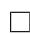

# 多元多项式

在前面的章节中, 我们已经具体地讨论了各种一元多项式环上的 GCD 问题以及因子分解问题, 本章我们讨论多元多项式的相关问题, 即在 $\mathbb { Z } [ x _ { 1 } , \ldots , x _ { n } ]$ 中讨论.

对于多元多项式的最大公因子和因子分解问题, 和一元问题类似, 我们也主要采用各种同态象的方法, 以求将多元问题转化为一元问题求解.

# 11.1 多元多项式插值方法

回忆我们在 $\mathbb { Z } [ x ]$ 中处理问题时所用的方法. 为了有效避免系数膨胀问题, 我们无论求最大公因子还是做因子分解, 都采用了模算法, 将其化为有限域上多项式问题, 并且最后用中国剩余定理, Hensel 提升以及若干特殊的技术(如因子组合, 格中短矢量等)将其恢复. 对于多元多项式环, 不仅要在 $\mathbb { F } _ { p }$ 中讨论问题, 还要将多元问题化为一元问题, 这里我们主要采用赋值同态的方法. 即同态映射

$$
\Phi_ {x _ {i} - a} (f) = f \bmod (x _ {i} - a) = f (x _ {1}, \ldots , x _ {i - 1}, a, x _ {i + 1}, \ldots , x _ {n}).
$$

这样相当于给某些未定元取赋值点, 最后我们需要用中国剩余定理, 或者说是插值的方法还原多项式. 为了便于后文叙述, 我们引入记号 $\Phi _ { I } ( f )$ 表示 $f$ mod $I$ , 其中$I$ 为多项式环中的理想. 对于整数 $m$ 引入记号 $\Phi _ { m } ( f )$ 表示 $f$ mod $m$ .

前面我们曾经介绍过多点的 Lagrange 插值快速算法. 由于我们后面的算法会利用逐点插值, 甚至所谓的“稀疏插值”, 因此本节将介绍稠密插值和稀疏插值算法(参考[190]), 它们对于多元多项式最大公因子的模算法是很有用的.

# 11.1.1 稠密插值

插值问题要解决的问题是已知若干个点 $u _ { 1 } , u _ { 2 } , \ldots , u _ { k }$ 和 $v _ { 1 } , v _ { 2 } , \ldots , v _ { k }$ , 求 多项式 $f$ 使得 $\forall i = 1 , 2 , \ldots , k$ 有 $f ( u _ { i } ) = v _ { i }$ . 下面直接给出 Newton 插值算法, 很容易验证算法的正确性.

# 算法11.1 (Newton 插值).

输入和输出同前描述.

1. 赋初值 $f ( x ) = v _ { 1 }$ , $q ( x ) = \left( x - u _ { 1 } \right)$ ,   
2. 对于 $i = 2 , 3 , \ldots , k .$ , 顺次计算

$$
f (x) = f (x) + \frac {q (x) \left(v _ {i} - f \left(u _ {i}\right)\right)}{q \left(u _ {i}\right)}, \quad q (x) = \left(x - u _ {i}\right) q (x),
$$

3. 输出 $f ( x )$

多元多项式的稠密插值基于的思想十分简单, 例如我们有一个函数 $F ( x _ { 1 } , \ldots , x _ { n } )$ ,可以求得它在某些点上的函数值, 我们的任务是找到一个各个变元次数均不超过 $d$ 的多元多项式 $P ( x _ { 1 } , \ldots , x _ { n } )$ , 使得它们在各整点上的值相同. 注意到我们在这里的问题的提法是很具有一般性的, 不仅可以将 GCD 问题化为这种形式, 甚至也可以将诸如多项式的乘法等问题化为这种形式. 稠密插值的基本思想就是递归地依次将各个变元插值回来, 假设我们有一初值点 $( x _ { 1 0 } , x _ { 2 0 } , \ldots , x _ { n 0 } )$ , 我 们首先可以固定 $x _ { 2 0 } , \ldots , x _ { n 0 }$ , 而再取 $d$ 个 $x _ { 1 }$ 的值, 由一元插值方法(Newton 法或Lagrange 法)求得多项式 $P ( x _ { 1 } , x _ { 2 0 } , \ldots , x _ { n 0 } )$ , 依次再确定各变元 $x _ { 2 } , \ldots , x _ { n }$ 即可.若我们设 $d$ 次一元多项式插值问题的复杂度为 $M ( d )$ , 则可知本算法的复杂度为$O ( n ( d + 1 ) ^ { n - 1 } M ( d ) )$ (参见 [191]).

# 11.1.2 稀疏插值

# 问题引入

我们先用一个例子来介绍稀疏插值算法, 以便对它有一个更好的了解.

从上节稠密插值算法过程我们可以看出, 对 $n$ 个变元次数不超过 $d$ 的多项式的插值我们大约要对函数 $F$ 求值 $( d + 1 ) ^ { n }$ 次. 例如[191]中所用的多项式

$$
P (x, y, z) = x ^ {5} z ^ {2} + x ^ {5} z + x y ^ {4} + x y z ^ {5} + y ^ {5} z,
$$

其需要计算函数值 $( 5 + 1 ) ^ { 3 } = 2 1 6$ 次！事实上, 这么多插值次数对于这样稀疏的多项式显然是极其不划算的. 我们重复一下插值的过程以说明稀疏插值是如何减少插值次数的.

首先可以由赋值点 $( x _ { i } , y _ { 0 } , z _ { 0 } ) , i = 0 , \dots , 5$ 通过稠密插值得到 $P ( x , y _ { 0 } , z _ { 0 } ) =$ $a x ^ { 5 } + b x + c .$ . 下一步即要再选择 5 个 $y$ 的赋值点 $y _ { i }$ , 计算 $P ( x , y _ { i } , z _ { 0 } )$ 才能由此插值得到 $P ( x , y , z _ { 0 } )$ . 如果是稠密插值法, 此时对于每个 $y _ { i }$ , 我们都需取 6 个 $x _ { i }$ 来插值, 但是如果 $y _ { i }$ 选的值恰当(所谓恰当的意义, 后文定义11.2和定理11.1将会给出说明), 我们完全可以假设对于 $y _ { i } ( 1 \leq i \leq 5 )$ , 也有

$$
P (x, y _ {i}, z _ {0}) = a _ {i} x ^ {5} + b _ {i} x + c,
$$

于是, 对每个 $y _ { i }$ 只需取 3 个 $x$ 的赋值点来插值, 通过解方程的方法计算系数$a _ { i } , b _ { i } , c _ { i }$ .

这样, 我们总共计算函数值的次数为 $6 + 3 \times 5 = 2 1$ , 即可得到 $P ( x , y , z _ { 0 } )$ , 注意从这一步开始, 我们已经节省了插值次数, 从原来的需要求值 $6 \times 6 = 3 6$ 次降到了 21 次. 并且可设求得的 $P ( x , y , z _ { 0 } )$ 具有形式:

$$
P (x, y, z _ {0}) = a x ^ {5} + b x y ^ {4} + c x y + d y ^ {5}.
$$

接下来的步骤就比较顺理成章了, 我们同样要再计算 $P ( x , y , z _ { i } ) , 1 \leq i \leq 5$ , 此时可假设各多项式具有形式

$$
P (x, y, z _ {i}) = a _ {i} x ^ {5} + b _ {i} x y ^ {4} + c _ {i} x y + d _ {i} y ^ {5},
$$

则需再求值 $4 \times 5 = 2 0$ 次, 总共求值次数 41 次, 比起 216 次已大大减少了.

# 稀疏插值算法

为了叙述方便, 给出如下记号. 设多项式 $P ( X ) = P ( X _ { 1 } , X _ { 2 } , \ldots , X _ { n } ) \in F [ X ]$ ,$F$ 为某个域, 每个变元 $X _ { i }$ 的次数都不超过 $d$ , 并且 $P$ 的的单项式项数为 $T$ (对于稀疏多项式有 $T \ll ( d + 1 ) ^ { n } )$ . 设 $v = ( v _ { 1 } , \ldots , v _ { n } )$ 为一 $n$ 元有序对, 定义单项式记号

$$
X ^ {v} = X _ {1} ^ {v _ {1}} X _ {2} ^ {v _ {2}} \dots X _ {n} ^ {v _ {n}},
$$

则多项式 $P$ 可记为

$$
P = c _ {1} X ^ {e _ {1}} + c _ {2} X ^ {e _ {2}} + \dots + c _ {T} X ^ {e _ {T}},
$$

其中 $e _ { 1 } , \ldots , e _ { T }$ 均为 $n$ 元序对.

从某种意义上说, 集合 $\{ e _ { 1 } , e _ { 2 } , \dots , e _ { T } \}$ 反映了多项式 $P$ 的“结构”, 因而我们定义下面的:

定义11.1 (模板). 记多项式指数的集合为

$$
\operatorname {s k e l} P = \left\{e _ {1}, e _ {2}, \dots , e _ {T} \right\},
$$

简称其模板(也可译作骨架, 见[191]skeleton定义). 并记其在前 $k$ 维上的投影为

$$
\operatorname {s k e l} _ {k} P = \left\{\left(e _ {1}, \dots , e _ {k}\right) | \exists e = \left(e _ {1}, \dots , e _ {T}\right) \in \operatorname {s k e l} P \right\}.
$$

定义11.2 (精确求值点). 设 $( x _ { 1 } , \ldots , x _ { n } ) \in F ^ { n }$ , 若 $\forall k ( 1 < k < n )$ , 有

$$
\operatorname {s k e l} P \left(X _ {1}, \dots , X _ {k}, x _ {k + 1}, \dots , x _ {n}\right) = \operatorname {s k e l} _ {k} P (X),
$$

则称其为精确求值点(Precise Evaluation Point).

注意到一般情况下只有

$$
\operatorname {s k e l} P (X _ {1}, \ldots , X _ {k}, x _ {k + 1}, \ldots , x _ {n}) \subset \operatorname {s k e l} _ {k} P (X),
$$

欲使两者相等, 则必须 $x _ { k + 1 } , \ldots , x _ { n }$ 的取值满足以 $X _ { 1 } , \ldots , X _ { k }$ 为主变元的多项式 $P$ 的各项系数 $( \in F [ X _ { k + 1 } , \ldots , X _ { n } ] )$ 均在其上不为零. 据此, 我们可以给出精确求值 点的概率估计.

定理11.1 (精确求值点概率估计). 设 $P ( X )$ 是一整环上的 $n$ 元多项式, 其每个变元次数不超过 $d$ , 总共有 $T$ 项, 设 $S$ 为一有限赋值点集合, $\# S = s$ , 取求值点$x = ( x _ { 1 } , \ldots , x _ { n } ) \in S ^ { n }$ , 则其不是精确求值点的概率不超过

$$
\frac {n (n - 1) d T}{2 s}.
$$

证明. 根据引理 8.6 我们知道对于 $P$ 以 $X _ { 1 } , \ldots , X _ { k }$ 为主变元的某个系数多项式来说, $x _ { k + 1 } , \ldots , x _ { k }$ 为其零点的概率不超过 $( n - k ) d / s$ . 因为系数最多有 $T$ 项, 则概率不超过 $( n - k ) d T / s$ . 再对 $k = 1 , 2 , \ldots , n - 1$ 求和即有概率不超过

$$
\frac {(n - 1) d T}{s} + \frac {(n - 2) d T}{s} + \dots + \frac {d T}{s} = \frac {n (n - 1) d T}{2 s}.
$$

证毕.

取足够大的 $s$ 可以减小此概率, 这正是我们每一步稀疏插值时假设目标多项式具有同样的模板的概率依据.

下面, 我们把整个插值还原的过程描述如下:

# 算法11.2 (稀疏插值算法).

输入:一个可以求值的函数 $f ( X _ { 1 } , \ldots , X _ { n } )$ , 精确求值点 $( x _ { 1 0 } , \ldots , x _ { n 0 } )$ , 各变元次数均不超过的 $d$ ,

输出:多项式 $P ( X _ { 1 } , \dots , X _ { n } ) \in F [ X ]$ , 使得 $P$ 和 $f$ 在求值点上的值相同.

1. 随机任取 $d$ 个值 $x _ { 1 1 } , x _ { 1 2 } , \ldots , x _ { 1 d }$ , 利用求得的值 $f ( x _ { 1 i } , x _ { 2 0 } , \ldots , x _ { n 0 } ) ( 0 \leq i \leq$ d), 用一元插值算法(如算法 11.1 )求出多项式 $P ( X _ { 1 } , x _ { 2 0 } , . . . , x _ { n 0 } )$ ,  
2. $S = \mathrm { s k e l } P ( X _ { 1 } , x _ { 2 0 } , \ldots , x _ { n 0 } )$ , 设 $S = \{ s _ { 1 } , s _ { 2 } , . . . , s _ { q } \}$ ,   
3. 将 $i$ 顺次由2 循环到 $n$ , 做如下 4–6 步,  
4. 随机任取 $d$ 个值 $x _ { i 1 } , x _ { i 2 } , \ldots , x _ { i d }$ , 对于每个 $x _ { i j } ( 1 \leq j \leq d )$ , 设

$$
P \left(X _ {1}, \dots , X _ {i - 1}, x _ {i j}, x _ {i + 1, 0}, \dots , x _ {n 0}\right)
$$

具有如下形式

$$
p _ {1} X ^ {s _ {1}} + p _ {2} X ^ {s _ {2}} + \dots + p _ {q} X ^ {s _ {q}},
$$

取 $q$ 组赋值点 $( x _ { 1 k } , x _ { 2 k } , \ldots , x _ { i - 1 , k } ) ( 1 \leq k \leq q )$ 构造独立的线性方程组来求出 $p _ { 1 } , \dotsc , p _ { q } \in F $ , 于是得到 $d$ 个多项式

$$
P \left(X _ {1}, \dots , X _ {i - 1}, x _ {i j}, x _ {i + 1, 0}, \dots , x _ {n 0}\right), (1 \leq j \leq d)
$$

5. 利用第 4 步求出的 $d$ 个多项式对每个系数 $p _ { k } ( 1 \leq k \leq q )$ 进行一元插值算法求出 $p _ { k } ( X _ { i } )$ , 则

$$
P \left(X _ {1}, \dots , X _ {i}, x _ {i + 1, 0}, \dots , x _ {n 0}\right) = p _ {1} \left(X _ {i}\right) X ^ {s _ {1}} + p _ {2} \left(X _ {i}\right) X ^ {s _ {2}} + \dots + p _ {q} \left(X _ {i}\right) X ^ {s _ {q}},
$$

6. $S = \mathrm { s k e l } P ( X _ { 1 } , \ldots , X _ { i } , x _ { i + 1 , 0 } , \ldots , x _ { n 0 } )$ , 设 $S = \{ s _ { 1 } , \ldots , s _ { q } \}$ ,

7. 输出 $P$ .

注152. 在算法第 4 步取 $q$ 组赋值点时, 要使得它们对于要求解的变元 $p _ { 1 } , \ldots , p _ { q }$ 构成非奇异的独立线性方程组, 否则需要重新选取某些赋值点.

注153. 我们可以选取一组赋值点 $( x _ { 1 } , x _ { 2 } , \ldots , x _ { i - 1 } )$ , 然后令 $q$ 组赋值点为

$$
(1, \ldots , 1), (x _ {1} ^ {1}, \ldots , x _ {i - 1} ^ {1}), (x _ {1} ^ {2}, \ldots , x _ {i - 1} ^ {2}), \ldots , (x _ {1} ^ {q - 1}, \ldots , x _ {i - 1} ^ {q - 1}),
$$

这样对需求解的 $q$ 个变元来说, 可以得到如下 Vandermonde线性方程

$$
\begin{array}{l} \left( \begin{array}{c c c c} 1 & 1 & \dots & 1 \\ X ^ {s _ {1}} & X ^ {s _ {2}} & \dots & X ^ {s _ {q}} \\ \vdots & \vdots & & \vdots \\ (X ^ {s _ {1}}) ^ {q - 1} & (X ^ {s _ {2}}) ^ {q - 1} & \dots & (X _ {s _ {q}}) ^ {q - 1} \end{array} \right) \left( \begin{array}{c} p _ {1} \\ p _ {2} \\ \vdots \\ p _ {q} \end{array} \right) \\ = \left( \begin{array}{c} f (1, \ldots , 1, x _ {i j}, x _ {i + 1, 0}, \ldots , x _ {n 0}) \\ f (x _ {1}, \ldots , x _ {i - 1}, x _ {i j}, x _ {i + 1, 0}, \ldots , x _ {n 0}) \\ \vdots \\ f (x _ {1} ^ {q - 1}, \ldots , x _ {i - 1} ^ {q - 1}, x _ {i j}, x _ {i + 1, 0}, \ldots , x _ {n 0}) \end{array} \right). \\ \end{array}
$$

利用此方法的好处是求解线性方程时, Vandermonde 方程其系数矩阵具有特殊性, 因而有特别的线性代数的处理方法(参加 [191]), 求解复杂度低于一般的线性方程. 另一方面, Vandermonde 行列式的非奇异性很容易得到保证, 只需$X ^ { s _ { 1 } } , \ldots , X ^ { s _ { q } }$ 各不相同即可.

对于特征为零的域, 这一点是很容易做到的, 只需将 $x _ { 1 } , \ldots , x _ { i - 1 }$ 取为前 $i - 1$ 个素数即可, 或者当有限域的特征足够大(特征 $p > ( 2 \times 3 \times \cdot \cdot \cdot \times p _ { n } ) ^ { d } ) $ )时也可如此取赋值点, 此时算法仅可能当初始点非精确赋值点时失败, 因此根据定理 11.1 , 我们知道失败的概率

$$
\varepsilon <   \frac {n (n - 1) d T}{2 s}.
$$

另一方面, 当域的特征 $p$ 有限时, 此时我们随机选取这样 $i - 1$ 个赋值点, 当其非精确赋值点或 Vandermonde 行列式奇异时均会失败, 其概率(见 [191]240–242页)

$$
\varepsilon <   \frac {n (n - 1) d T}{p - 1} + \frac {d T (T - 1)}{2 (p - 1)} <   \frac {d T (2 n ^ {2} + T)}{p - 1}.
$$

如果是有限域 $\mathbb { F } _ { p }$ , 并且 $p \leq d$ 或者 $p$ 太小不能提供足够多的插值点, 则可以取$\mathbb { F } _ { p }$ 的扩域, 例如 $\mathbb { F } _ { p ^ { k } }$ , 在其中取插值点来进行计算.

# 11.2 Euclid 算法和一般模算法

# 11.2.1 概述

我们已经解决了一元多项式的 GCD 问题, 现在我们考虑多元情形, 即$\mathbb { Z } [ X ] = \mathbb { Z } [ x _ { 1 } , . . . , x _ { n } ]$ 中的多项式. 首先根据Gauss 引理, 我们有:

$$
\begin{array}{l} \operatorname * {g c d} (f, g) = \operatorname {c o n t} _ {x _ {n}} (\operatorname * {g c d} _ {x _ {n}} (f, g)) \mathrm {p p} _ {x _ {n}} (\operatorname * {g c d} _ {x _ {n}} (f, g)) \\ = \operatorname * {g c d} (\operatorname {c o n t} _ {x _ {n}} (f), \operatorname {c o n t} _ {x _ {n}} (g)) \operatorname * {g c d} _ {x _ {n}} (\operatorname {p p} _ {x _ {n}} (f), \operatorname {p p} _ {x _ {n}} (g)). \\ \end{array}
$$

于是, 我们顺利地将 $n$ 元问题化为了 $n - 1$ 元子问题. 将此过程递归地进行, 最终化为一元问题可求解. 显而易见, 这种算法系数的增长是十分迅速的, 不宜采用.

回忆前面处理一元问题采用模算法的思想, 我们希望利用 $\mathbb { Z } [ x _ { 1 } , \ldots , x _ { n } ]$ 上的模算术来简化问题的计算. 若我们取一个一次多项式 $p = y - a ( a \in \mathbb { Z } ) , .$ $D$ 为 UFD,考虑 $R = D [ y ] [ x ]$ 中的多项式, 并记 $R$ 到 $R / \langle p \rangle$ 的同态像为 $\Phi _ { p } ( f )$ 或 $\overline { { f } }$ , 则有下面的定理:

定理11.2. $f , g \in R$ 均为本原多项式, $h = \operatorname* { g c d } ( f , g )$ , 设 $\overline { { h } } \neq 0$ , 则 $\begin{array} { r } { \overline { { h } } = h _ { p } ( = } \end{array}$ $\operatorname { g c d } ( { \overline { { f } } } , { \overline { { g } } } ) )$ 当且仅当 $p = y - a \not \mid \mathrm { r e s } _ { x } ( f / h , g / h )$ .

证明. 本定理是定理 8.11 的推广, 证明也与其类似. 首先根据模同态的性质,我们显然有 $\textstyle { \overline { { h } } } \ | \ h _ { p }$ , 若 $\deg _ { x } h _ { p } = 0$ , 则 $\overline { { h } } \ : = \ : h _ { p }$ 显然. 设 $\deg _ { x } h _ { p } \geq 1$ , 此 是 有$s , t$ 使得 $s f / h + t g / h = \mathrm { r e s } _ { x } ( f / h , g / h )$ , 因 此 $\overline { { s } } \overline { { f } } + \overline { { t } } \overline { { g } } = \overline { { \mathrm { r e s } _ { x } ( f / h , g / h ) } } \overline { { h } }$ , 由 于${ \overline { { \operatorname { r e s } _ { x } ( f / h , g / h ) } } } \neq 0$ , 所以 $h _ { p } \mid { \overline { { h } } }$ , 即 $\overline { { h } } = h _ { p }$ , 充分性得证. 必要性是容易的, 留给读者自行证明. □

于是我们可以得到类似于一元情形的一种赋值同态模算法[13], 这里不再详细将算法列出, 然而我们需要注意的是这里会有一个领项系数的问题, 例如若两多项式的最大公因子为 $h ( x , y ) = ( y - 1 ) x$ , 对 $y$ 进行赋值同态时我们可能会取如下值:

$$
y = 5, \quad h (x, 5) = 4 x,
$$

$$
y = 7, \quad h (x, 7) = 6 x,
$$

这样, 通过两次赋值进行插值即得 $h ( x , y ) = ( y - 1 ) x$ , 然而若是我们“不幸”取了一个负值:

$$
y = - 5, \quad h (x, - 5) = 6 x,
$$

注意在 $\mathbb { Z } [ x ]$ 中 $\pm 1$ 为可逆元, 因而求其中的 GCD 问题时可相差正负号, 一般情况我们取首项系数为正, 此时将 $h ( x , - 5 ) = 6 x$ 和 $h ( x , 5 ) = 4 x$ 插值则得不到正确的结果, 只有取 $h ( x , - 5 ) = - 6 x$ 时才是正确的. 这个问题仅在最大公因子对主变元$x$ 的领项系数是一非平凡多项式才会出现, 对于这种情况, 若要比较好地处理, 则须在赋值之前对领项系数进行处理. 后面提到的诸多算法中我们将看到一种领项系数正则化的处理方法.

$\mathbb { F } _ { p }$ 作为一个域较环 $\mathbb { Z }$ 性质更简单, 且其能有效抑制 Z 上系数膨胀问题. 我们可以综合使用模方法和赋值同态的综合算法来解决题.

# 11.2.2 $\mathbb { F } _ { p } [ x _ { 1 } , \ldots , x _ { n } ]$ 上最大公因子

根据前面的分析, 我们先要解决 $\mathbb { F } _ { p } [ x _ { 1 } , x _ { 2 } , \ldots , x _ { n } ]$ 上求最大公因子的问题, 此要先通过赋值同态将其转化为 $\mathbb { F } _ { p } [ x _ { 1 } ]$ 上的问题.

为了说明算法的方便, 本算法中提到的容度cont, 本原部分pp, 首项系数lc等都是就多项式环 $\mathbb { F } _ { p } [ x _ { n } ] [ x _ { 1 } , \dots , x _ { n - 1 } ]$ 而言的, 亦即 cont 及 lc 都应是 $\mathbb { F } _ { p } [ x _ { n } ]$ 中的元素.

为了处理领项系数的问题, 算法中采用了正则化的方法. 即对于本原多项式$f , g$ , 若 $h = \operatorname* { g c d } ( f , g )$ , 则 $h$ 必然也是本原的, 并且 $\operatorname { l c } ( h ) \mid b = \operatorname* { g c d } ( \operatorname { l c } ( f ) , \operatorname { l c } ( g ) )$ , 因此将模方法求得的 $\overline { { h } }$ 领项系数化归到 $\bar { b }$ 上再插值还原, 可以得到 $b h / \operatorname { l c } ( h )$ , 再对其进行本原化处理, 就可以得到结果. 后文中 GCD 算法以及因子分解算法也多次使用了这种正则化方法, 到时将不再说明. 下面将要给出的算法可参考 [74].

算法11.3 (有限域上多元多项式最大公因子算法).

输入: $f$ , $g \in \mathbb { F } _ { p } [ x _ { 1 } , \dots , x _ { n } ]$ ,

输出: $h = \operatorname* { g c d } ( f , g )$

1. 若 $n = 1$ 则是一元问题, 直接调用相关算法求得首一的 $h = \operatorname* { g c d } ( f , g )$ , 输出$h$ ,  
2. 初始化 $a = \operatorname* { g c d } ( \operatorname { c o n t } ( f ) , \operatorname { c o n t } ( g ) ) \in \mathbb { F } _ { p } [ x _ { n } ] \vert$ (注意这是一元问题), $f = \operatorname { p p } ( f )$ $g = \mathrm { p p } ( g ) , b = \operatorname* { g c d } ( \mathrm { l c } ( f ) , \mathrm { l c } ( g ) ) \in \mathbb { F } _ { p } [ x _ { n } ] ,$ ,  
3. 赋初值 $q = 1$ , $h = 1$ , $m = \operatorname* { m i n } ( \deg _ { 1 } f , \deg _ { 1 } g ) + 1 , v l i s t = \{ \} ,$   
4. 循环做下面 5–10 步,  
5. 随机任取 $v \in \mathbb { F } _ { p }$ 使得 $b ( v ) \neq 0$ 且 $v \not \in v l i s t$ , 将 $v$ 添入 vlist 中,  
6. $f _ { v } = f$ mod $( x _ { n } - v )$ , $g _ { v } = g$ mod $( x _ { n } - v )$ , 递归调用本算法求解 $n - 1$ 元子问题 $h = \operatorname* { g c d } ( f _ { v } , g _ { v } )$ , 令 $m _ { 1 } = \deg _ { 1 } h _ { v }$ , $b _ { v } = b ( v )$ ,  
7. 将 $h _ { v }$ 正则化使得 $\mathrm { l c } ( h _ { v } ) = b _ { v }$ , 即令 $h _ { v } = b _ { v } h _ { v } / \operatorname { l c } ( h _ { v } )$ ,   
8. 若 $m _ { 1 } < m$ 则令 $ { \boldsymbol { q } } =  { \boldsymbol { x } } _ { n } -  { \boldsymbol { v } }$ , $h = h _ { v }$ , $m = m _ { 1 }$   
9. 若上一步不成立且 $m _ { 1 } = m$ , 则利用中国剩余定理或插值算法其出 $h$ , 使得$h$ mod $q$ 不变且 $h$ mod $( x _ { n } - v ) = h _ { v }$ , 即令

$$
h = h + \frac {\left(h _ {v} - h \bmod \left(x _ {n} - v\right)\right) q \left(x _ {n}\right)}{q (v)}, \quad q \left(x _ {n}\right) = \left(x _ {n} - v\right) q \left(x _ {n}\right),
$$

10. 若 $\operatorname { l c } ( h ) = b$ 则:若 $\operatorname { p p } ( h ) \mid f$ 且 $\operatorname { p p } ( h ) \mid g$ 则输出 $a { \mathrm { p p } } ( h )$ , 否则若 $m = 0$ 则输出 $a$ .

# 11.2.3 多元多项式的“Mignotte”界

在处理整系数一元多项式最大公因子时我们曾经引进所谓的 Mignotte 界, 这是 Mignotte 于 1974 年提出的对一元多项式因子系数界的估计. 这一节我们来讨论对于整系数多元多项式同样的问题. 为了后文叙述的方便, 我们先回忆一下对于一元情形的 Mignotte 界, 并表述为如下定理(见定理 8.9 ):

定理11.3 (Mignotte). 设非零多项式 $f , g \in \mathbb { Z } [ x ]$ 且 $g \mid f$ , $\deg g \leq d$ , 则有

$$
\| f \| _ {2} \geq 2 ^ {- d} \| g \| _ {\infty}.
$$

为了讨论多元情形, 我们给出:

定义11.3 (多元多项式 $p$ -范数). 设有多元多项式

$$
f = \sum_ {i _ {1}, i _ {2}, \dots , i _ {n}} a _ {i _ {1}, i _ {2}, \dots , i _ {n}} x _ {1} ^ {i _ {1}} \cdot \cdot \cdot x _ {n} ^ {i _ {n}},
$$

则定义其 p-范数为:

$$
\| f \| _ {p} = \left(\sum_ {i _ {1}, \dots , i _ {n}} a _ {i _ {1}, \dots , i _ {n}} ^ {p}\right) ^ {1 / p}.
$$

Coron 于 2004 年提出了二元情形下对 Mignotte 界的推广, 有如下定理(见[84] 和 [61]3.2 节):

定理11.4 (Coron). 设有非零多项式 $f , g \in \mathbb { Z } [ x , y ]$ , 且 $g \mid f , d = \operatorname* { m a x } ( \deg _ { x } f , \deg _ { y } f )$ ,则有

$$
\| f \| _ {2} \geq 2 ^ {- (d + 1) ^ {2}} \| g \| _ {\infty}.
$$

证明. 令 $f ^ { * } ( x ) = f ( x , x ^ { d + 1 } )$ , 则有 $\deg f ^ { * } \leq ( d + 1 ) ^ { 2 }$ 且 $f ^ { * } ( x )$ 和 $f ( x , y )$ 有相同的整系数, 因而 $\| f ^ { * } \| _ { 2 } = \| f \| _ { 2 }$ , 同理令 $g ^ { * } ( x ) = g ( x , x ^ { d + 1 } )$ , 则有 $\| g ^ { * } \| _ { \infty } = \| g \| _ { \infty }$ . 并且有 $g ( x , y ) \mid f ( x , y )$ 可知 $g ^ { * } ( x ) \mid f ^ { * } ( x )$ , 因此根据 Mignotte 界有

$$
\| f \| _ {2} \geq 2 ^ {- (d + 1) ^ {2}} \| g \| _ {\infty}.
$$

证毕.

我们很容易再从二元情况推广到多元情况, 有如下定理:

定理11.5 (多元多项式因子系数界). 设有非零多项式 $f , g \in \mathbb { Z } [ x _ { 1 } , \dots , x _ { n } ]$ , 且 $g \mid f$ ,$d = \operatorname* { m a x } \{ \deg _ { 1 } f , . . . , \deg _ { n } f \}$ , 则有

$$
\| f \| _ {2} \geq 2 ^ {- (d + 1) ^ {n} + 1} \| g \| _ {\infty}.
$$

证明过程是类似的, 只需作相应的替换 $f ^ { * } ( x ) = f ( x , x ^ { d + 1 } , \dots , x ^ { ( d + 1 ) ^ { n - 1 } } )$ , 并且注意到 $f ^ { * }$ 的次数实际上是不超过

$$
d + d (d + 1) + \dots + d (d + 1) ^ {n - 1} = d \frac {(d + 1) ^ {n} - 1}{(d + 1) - 1} = (d + 1) ^ {n} - 1
$$

即可.

有了多元多项式的“Mignotte”界, 我们在用模素数方法处理多元多项式时, 至少多了一个用对系数界的估计的方法, 来帮助判断多项式是否能还原到整系数中.当然, 我们知道 Mignotte 界是对一元情形一个相当好的估计, 本节定理对多元情形的估计虽从其推广而来, 却不一定是最好的估计, 而且其随多项式规模和未定元的个数增长有可能会变得很大, 我们在实际算法中仅将其作为一个参考.

# 11.2.4 $\mathbb { Z } [ x _ { 1 } , \ldots , x _ { n } ]$ 上最大公因子

在我们计算最大公因子的步骤

$$
\mathbb {Z} [ x _ {1}, \dots , x _ {n} ] \to \mathbb {F} _ {p} [ x _ {1}, \dots , x _ {n} ] \to \mathbb {F} _ {p} [ x _ {1} ] \to \mathbb {F} _ {p} [ x _ {1}, \dots , x _ {n} ] \to \mathbb {Z} [ x _ {1}, \dots , x _ {n} ]
$$

中, 第二环节和第三环节已由算法 11.3 完成, 本节将要讨论首尾两个环节, 如无特别说明, 本节中 cont, pp等均是就整系数而言的.

算法11.4 (整系数多元多项式最大公因子算法).

输入: $f , g \in \mathbb { Z } [ x _ { 1 } , \dots , x _ { n } ]$

输出: $h = \operatorname* { g c d } ( f , g )$

1. 初 始 化 a = gcd(cont(f ), cont(g)), f = pp(f ), g = pp(g), b = $\operatorname* { g c d } ( \operatorname { l c } ( f ) , \operatorname { l c } ( g ) )$ ,   
2. 赋 初 值 $ { \boldsymbol { h } } \quad = \quad 0$ , q = 1, m = min(degn f, degn g), limit $2 ^ { m } | b | \operatorname* { m i n } ( \| f \| _ { \infty } , \| g \| _ { \infty } ) , p l i s t = \{ \} .$ ,   
3. 循环做下面 4 ― 9 步,

4. 任取比较大的素数 $p$ 直至 $p \nmid b$ 且 $p \notin p l i s t$ ,  
5. 令 $f _ { p } = f$ mod $p$ , $g _ { p } = g$ mod $p$ , $b _ { p } = b \bmod p$ , 调用算法 11.3 计算 $h _ { p } =$ $\operatorname* { g c d } ( f _ { p } , g _ { p } ) \in \mathbb { F } _ { p } [ x _ { 1 } , \dots , x _ { n } ]$ , 并令 $m _ { 1 } = \deg _ { n } h _ { p }$ ,  
6. $h _ { p } = b _ { p } h _ { p } / \operatorname { l c } ( h _ { p } )$ ,   
7. 若 $m _ { 1 } < m$ 则令 $q = p$ , $h = h _ { p }$ , $m = m _ { 1 }$   
8. 若上步判断不成立且 $m _ { 1 } = m$ , 则用中国剩余定理计算 $h$ 使得 $h$ mod $q$ 不变且 $h$ mod $p = h _ { p }$ , 再令 $q = p q$ ,  
9. 若 $q > l i m i t$ 则:令 $p p h = \mathrm { p p } ( h )$ , 若 pph $\mid f$ 且 pph $\mid g$ 则输出 apph, 否则若$m = 0$ 则输出 $a$ .

关于本算法需要做一点说明. 首先在 $m$ 和 $m _ { 1 }$ 的计算中都是取了对变元 $x _ { n }$ 的次数 [74], 实际上对所有的变元都取次数来比较也是可行的, 并且可能更准确. 其次, limit 的计算本身并不是多元多项式因子系数的界, 我们可以用前一节的“Mignotte”界来代替, 也可以就用此限制. 这只是一个预判断, 因为当 $q > l i m i t$ $q >$ 后还有判断. 我们还可以加上一项预判断, 即 $h$ 在中国剩余定理计算前后是否变化, 当不变时再继续后面的算法过程.

# 11.3 Zippel 稀疏插值算法

Zippel 稀疏算法是求多元多项式最大公因子一个相当有效的算法, 有关这方面的文献可以参见 Zippel 本人的论文及著作 [190], [191]. [14]80–82 页, [74]312–313 页均引用了下面一个具体的例子, 鉴于该算法的理论描述比较复杂, 为了对此算法有一个直观的认识, 我们先看这个具体的例子. 它相当于将稀疏插值一节问题引入中的例子具体化, 取“黑箱”函数

$$
h (x, y, z) = F (x, y, z) = \operatorname * {g c d} (f (x, y, z), g (x, y, z)).
$$

# 11.3.1 一个具体的例子

例11.1. 求多项式 $f , g$ 的最大公因子 $h$ . 其中

$$
\begin{array}{l} f = x ^ {5} + 2 y z x ^ {4} + (1 3 y z ^ {2} - 2 1 y ^ {3} z + 3) x ^ {3} \\ + (2 6 y ^ {2} z ^ {3} - 4 2 y ^ {4} z ^ {2} + 2) x ^ {2} + (3 9 y z ^ {2} - 6 3 y ^ {3} z + 4 y z) x + 6, \\ \end{array}
$$

$$
\begin{array}{l} g = x ^ {6} + (1 3 y z ^ {2} - 2 1 y ^ {3} z + z + y) x ^ {4} + 3 x ^ {3} \\ + (1 3 y z ^ {3} + 1 3 y ^ {2} z ^ {2} - 2 1 y ^ {3} z ^ {2} - 2 1 y ^ {4} z) x ^ {2} \\ + (1 3 y z ^ {2} - 2 1 y ^ {3} z + 2 z + 2 y) x + 2. \\ \end{array}
$$

解: 首先我们取素数 $p _ { 1 } = 1 1$ , 并得如下关系:

$$
h _ {1 1} (x, 1, 2) \equiv x ^ {3} - x + 2 \pmod {1 1},
$$

$$
h _ {1 1} (x, 3, 2) \equiv x ^ {3} + x + 2 \pmod {1 1},
$$

$$
h _ {1 1} (x, 5, 2) \equiv x ^ {3} + 4 x + 2 \pmod {1 1},
$$

$$
h _ {1 1} (x, - 4, 2) \equiv x ^ {3} + 5 x + 2 \pmod {1 1},
$$

$$
h _ {1 1} (x, 4, 2) \equiv x ^ {3} - 5 x + 2 \pmod {1 1}.
$$

用普通的稠密插值算法可以求得 $h _ { 1 1 } ( x , y , 2 ) = x ^ { 3 } + ( - 3 y + 2 y ^ { 3 } ) x + 2$ (mod 11).然后我们再对 $z$ 取其它赋值点来计算, 此时我们假定 $h _ { 1 1 } ( x , y , z _ { i } )$ 具有形式$x ^ { 3 } + ( a y + b y ^ { 3 } ) x + 2$ , 不必对每个 $z$ 的赋值点 $z _ { i }$ 都取5个 $y$ 的赋值点来算, 只需取2 个点来计算即可. 例如当 $z = - 5$ 时, 计算得下面两个式子:

$$
h _ {1 1} (x, - 3, - 5) \equiv x ^ {3} - 4 x + 2 \pmod {1 1},
$$

$$
h _ {1 1} (x, 2, - 5) \equiv x ^ {3} + 5 x + 2 \pmod {1 1}.
$$

于是我们得到下面的方程组:

$$
- 3 a - 5 b \equiv - 4 \pmod {1 1},
$$

$$
2 a - 3 b \equiv 5 \pmod {1 1},
$$

解得 $a = b = - 5$ , 因此得到 $h _ { 1 1 } ( x , y , - 5 ) = x ^ { 3 } + ( - 5 y - 5 y ^ { 3 } ) x + 2$ (mod 11). 同理我们还可以得到

$$
h _ {1 1} (x, y, - 3) \equiv x ^ {3} + (- 4 y - 3 y ^ {3}) x + 2 \pmod {1 1},
$$

$$
h _ {1 1} (x, y, 5) \equiv x ^ {3} + (- 5 y + 5 y ^ {3}) x + 2 \pmod {1 1}.
$$

此时利用 $z$ 在 4 个赋值点计算的结果, 利用稠密插值可以得到

$$
h _ {1 1} (x, y, z) \equiv x ^ {3} + (2 y z ^ {2} + y ^ {3} z) x + 2 {\pmod {1 1}}.
$$

其次, 我们再取素数 $p _ { 2 } = 1 7$ , 此时也不必取前面那么多赋值点, 利用稀疏性假设, 我们可以认为 $h _ { 1 7 } ( x , y , z )$ 具有形式 $x ^ { 3 } + ( c y z ^ { 2 } + d y ^ { 3 } z ) x + 2$ , 只需取两组 $( y , z )$ 进行插值, 例如:

$$
h _ {1 7} (x, 7, - 4) \equiv x ^ {3} + 8 x + 2 \pmod {1 7},
$$

$$
h _ {1 7} (x, - 2, 4) \equiv x ^ {3} + x + 2 \pmod {1 7},
$$

于是解方程可得 $h _ { 1 7 } ( x , y , z ) = x ^ { 3 } + ( - 4 y z ^ { 2 } - 4 y ^ { 3 } z ) x + 2 { \mathrm { ~ ( m o d ~ } } 1$ 7).

注154. 利用中国剩余定理将 $\mathbb { F } _ { 1 1 }$ 和 $\mathbb { F } _ { 1 7 }$ 中的结果合起来, 即为 $h = x ^ { 3 } + ( 1 3 y z ^ { 2 } -$ $2 1 y ^ { 3 } z ) x + 2$ , 经验算, 其恰为所欲求的最大公因子. 这里只用了 13 次一元多项式GCD 问题求解, 而若用通常的模算法, 则需将近 40 次. 由此可见, 稀疏插值模算法确能有效地减少计算次数.

# 11.3.2 算法描述

上小节中我们介绍了 Zippel 稀疏插值算法的思想以及具体操作的方法, 现在我们只需稍加改动, 具体给出求值函数的形式, 就可以用来计算最大公因子. 本节中将要给出的算法描述可以参考 [191]15.3节.

先对记号做一些说明, 在下面将要介绍的插值算法中, 我们保留变元 $X _ { n }$ , 并记之为Z. 对集合

$$
\left\{\left(u _ {1}, v _ {1}\right), \ldots , \left(u _ {n}, v _ {n}\right) \right\}
$$

的插值即求多项式 $f$ 使得 $\forall i ( 1 \leq i \leq n ) , f ( u _ { i } ) = v _ { i } .$ .

下面的稀疏插值算法 1 和稀疏插值算法 2 两者互相递归调用.

算法11.5 (稀疏插值算法 1).

输入: $l ( X _ { 1 } , \ldots , X _ { k } )$ , $f ( X _ { 1 } , \dots , X _ { k } , Z )$ , $g ( X _ { 1 } , \dots , X _ { k } , Z )$ , 其中 $0 \leq k < n$ ,输出:多项式 $f , g$ 的最大公因子的某个倍数, 使得其关于 $Z$ 的首项系数为 $l$ .

1. 若 $k = 0$ 则输出 $l \operatorname* { g c d } ( f , g )$ ,  
2. 令 $d = \operatorname* { m i n } ( \deg _ { k } f , \deg _ { k } g ) + \deg _ { k } l$ , 并任取一赋值点 $x _ { k }$   
3. 递归调用本算法计算 $f ( X _ { 1 } , \dots , X _ { k - 1 } , x _ { k } , Z ) , g ( X _ { 1 } , \dots , X _ { k - 1 } , x _ { k } , Z )$ 的最大公因子 $I ( X _ { 1 } , \dots , X _ { k - 1 } , Z )$ , 其中第一个参数输入 $l ( X _ { 1 } , \dots , X _ { k - 1 } , x _ { k } )$ ,

4. 令 $T$ 为多项式 $I$ 关于 $Z$ 的系数 $( \in F [ X _ { 1 } , \ldots , X _ { k - 1 } ] )$ 中含最多单项式的系数的单项式个数, 同时对 $j$ 从 0 循环到 $D$ 顺次命 $\mathcal { H } _ { j } = \left\{ ( \boldsymbol { x } _ { k } , I \right.$ 关于 $Z ^ { j }$ 的系数)},  
5. 对 $i$ 从 1 循环到 $d$ 顺次做下面 6, 7 步,  
6. 随机取不重复的赋值点 $y _ { i }$ , 调用算法 11.6 , 输入 skelI, $l ( X _ { 1 } , \dots , X _ { k - 1 } , y _ { i } )$ ,F (X1, . . . , Xk−1, yi, Z ), $G ( X _ { 1 } , \dots , X _ { k - 1 } , y _ { i } , Z ) , \mathcal { T }$ $T$ , 得到稀疏插值求得的多项式 $W$ ,  
7. 对 $j$ 从 0 循环到 $D$ 顺次命 $\mathcal { H } _ { j } = \mathcal { H } _ { j } \cup \{ ( y _ { i } , W _ { } \mathrm { ~ }$ 关于 $Z ^ { j }$ 的系数)},  
8. 对 $j$ 从 0 循环到 $D$ 顺次利用稠密插值算法由 $\mathcal { H } _ { j }$ 计算到到多项式 $h _ { j } \in$ $F [ X _ { 1 } , \ldots , X _ { k } ]$ , 令 $h = h _ { D } Z ^ { D } + \cdot \cdot \cdot + h _ { 0 }$ ,  
9. 若 $h$ 不能同时整除 $f$ 和 $g$ 则退出整个算法重新选取赋值点(整个算法失败),否则输出 $h$ .

# 算法11.6 (稀疏插值算法 2).

输入:模板 $S$ , 多项式 $l ( X _ { 1 } , \ldots , X _ { k } )$ , $f ( X _ { 1 } , \dots , X _ { k } , Z )$ , g(X1, . . . , Xk, Z ), T ,

输出:由它们计算得到稀疏插值的结果 $h$ , 也即 $f , g$ $g$ 的最大公因子的某个倍数,其关于 $Z$ 的首项系数为 $l$ .

1. 若 $k = 0$ 则输出 $l \operatorname* { g c d } ( f , g )$   
2. 任取 $k$ 个赋值点 $y _ { 1 } , \ldots , y _ { k }$   
3. 对 $i$ 从 1循环到 $T$ 顺次做下面 4, 5 步,  
4. 令 $W = l ( y _ { 1 } ^ { i } , \ldots , y _ { k } ^ { i } ) \times \operatorname* { g c d } ( f ( y _ { 1 } ^ { i } , \ldots , y _ { k } ^ { i } , Z ) , g ( y _ { 1 } ^ { i } , \ldots , y _ { k } ^ { i } , Z ) ) ,$   
5. 对 $j$ 从 0 循环到 $D$ 顺次命 $\mathcal { H } _ { j } = \mathcal { H } _ { j } \cup \{ W _ { \ell } \}$ 关于 $Z ^ { j }$ 的系数 $\}$ ,  
6. 对 $j$ 从0循环到 $D$ , 由 $\mathcal { H } _ { j }$ , 以及 $S$ 中含 $Z ^ { j }$ 的项和 $y _ { 1 } , \ldots , y _ { k }$ 计算出 Vander-monde 矩阵各元素, 解线性方程组可得 $h _ { j }$ (具体方法见注 156 ),  
7. 输出 $h _ { D } Z ^ { D } + \cdots + h _ { 0 }$

注155. 算法 11.5 第 1 步, 算法 11.6 第 1 步, 第 4 步等计算一元 GCD 时均是指求得其首一化的 GCD. 其 $l \operatorname* { g c d } ( f , g )$ 时, 可以先乘上 l 再除以原先多项式的领项系

数, 避免出现分数.

注156. 算法 11.6 第 6 步计算的具体方法是:令 $S _ { j }$ 为输入模板 $S$ 中最后一项指标为$j$ (即 $Z$ 的次数为 $j$ )的元素在前 $k$ 维上投影的集合. 例如对于模板

$$
\{(1, 1), (1, 0), (0, 0) \}
$$

有 $S _ { 0 } = \{ ( 1 ) , ( 0 ) \}$ , $S _ { 1 } = \{ ( 1 ) \}$ . 设 $S _ { j }$ 的元素个数为 $s _ { j }$ , 由赋值点 $y _ { 1 } , \ldots , y _ { k }$ 和指标集 $S _ { j }$ 可以计算得到一个 $s _ { j }$ 阶的 Vandermonde矩阵(若此矩阵奇异, 则返回算法第2 步重新选取赋值点). 再取 $\mathcal { H } _ { j }$ 的前 $s _ { j }$ (肯定小于 $T$ )项, 以此可得一线性方程组.其解配上相应的模板 $S _ { j }$ 即到多项式 $h _ { j }$ .

如果 $f$ 和 $g$ 都是关于 $Z$ 的首一多项式, 则直接调用算法 11.5 , 输入参数 $1 , f , g$ 即可, 但是对于关于 $Z$ 的首项系数不为1的多项式, 我们可如下给出它们的最大公因子. 其中为了使我们每一步最后的试除法能够成功, 调用算法11.5时我们输入l,$l f , l g$ . 此时, 因为要使稠密插值结果的首项系数为 $l$ , 所以我们在算法 11.5 第 2 步中令 $d = \operatorname* { m i n } ( \deg _ { k } f , \deg _ { k } g ) + \deg _ { k } l .$ .

# 算法11.7 (稀疏插值算法).

输入:多项式 $f , g \in F [ X _ { 1 } , \ldots , X _ { n } ]$ ,

输出: $f , g$ 的最大公因子.

1. 递归调用本算法计算 $f _ { 1 } = \mathrm { c o n t } _ { Z } ( f )$ , $g _ { 1 } = \mathrm { c o n t } _ { Z } ( g )$ , $a = \operatorname* { g c d } ( f _ { 1 } , g _ { 1 } )$ , 并 令$f = f / f 1 , g = g / g 1 ,$   
2. 递归调用本算法计算 $l = \operatorname* { g c d } ( \operatorname { l c } _ { Z } ( f ) , \operatorname { l c } _ { Z } ( g ) )$ , 调用算法 11.5 , 输入参数$l , l f , l g$ , 得到 $h$ ,  
3. 输出 $a { \mathrm { p p } } ( h )$ .

# 11.4 求 GCD 的其它方法

关于多元多项式的 GCD 问题, 前述的一般算法以及 Zippel 稀疏插值模算法已经能够相当有效地处理, 限于篇幅, 这一节所说的方法仅是作一些补充说明, 算法的细节不再详细说明, 有兴趣可以参考列出的一些文献.

# 11.4.1 启发式算法(Heuristic GCD)

启发式算法是一种将多元多项式 GCD 问题转化为大整数问题的算法. 此算法的优势在于它将问题化为整数计算问题, 若能够高效处理整数运算则可以提高计算效率. 其次, 对于一般的小规模问题来说, 用启发式算法还是比插值算法可能来得快. 读者可以参考[13]. 至于算法的具体实现, 可参考 [74]7.7节.

# 11.4.2 EZ-GCD

EZ-GCD算法即 Extended Zassenhaus 算法(参考 [130]), 它利用 Hensel 提升来计算多元多项式的 GCD. 此算法的具体实现可以参考 [74]7.6节.

# 11.5 多元多项式因子分解的 Kronecker 算法

由多元 Mignotte 界一节我们很容易想到用 $x$ 的幂次代替其它变元的同态方法, 即 Kronecker 算法.

对于给定的多项式 $f \in \mathbb { Z } [ x _ { 1 } , x _ { 2 } , \ldots , x _ { n } ]$ , 我们取主变元为 $x _ { 1 }$ , 并记之为 $x$ . 设

$$
d = \max _ {1 \leq i \leq n} \deg_ {x _ {i}} f,
$$

如果我们取多项式

$$
\tilde {f} (x) = f (x, x ^ {d + 1}, x ^ {(d + 1) ^ {2}}, \dots , x ^ {(d + 1) ^ {n - 1}}),
$$

易知如果有不可约因子分解 $f = f _ { 1 } f _ { 2 } \cdot \cdot \cdot f _ { r }$ , 这里我们假设 $f$ 关于 $x$ 是无平方因子本原多项式, 那么有

$$
\tilde {f} = \tilde {f} _ {1} \dots \tilde {f} _ {r}.
$$

然而当我们对 $\tilde { f }$ 进行因子分解时, 得到的不一定是上式, 因为 $\tilde { f } _ { i }$ 不一定均是不可约的. 设 $\tilde { f }$ 的不可约因子分解为

$$
\tilde {f} = g _ {1} g _ {2} \dots g _ {t},
$$

则由因子组合算法可以还原在 $\mathbb { Z } [ x _ { 1 } , \ldots , x _ { n } ]$ 中的分解.

由此可见, Kronecker算法的思想本身是简单的, 下面给出具体的算法.

算法11.8 (Kronecker 因子分解算法).

输入:关于 $x = x _ { 1 }$ 本原且无平方因子的多项式 $f \in \mathbb { Z } [ x _ { 1 } , \ldots , x _ { n } ]$

输出:其各不可约因子 $\{ f _ { 1 } , \ldots , f _ { r } \}$ .

1. 令 $d$ 为各变元次数的上界, 求得多项式

$$
\tilde {f} (x) = f \left(x, x ^ {d + 1}, x ^ {(d + 1) ^ {2}}, \dots , x ^ {(d + 1) ^ {n - 1}}\right)
$$

的因子分解

$$
\tilde {f} = g _ {1} g _ {2} \dots g _ {t}.
$$

2. 令 $T = \{ 1 , 2 , \ldots , t \}$ $T = \{ 1 , 2 , \ldots , t \} , s = 1 , r e s u l t = \{ \} , h = f ,$ $s = 1$   
3. 若 $2 s \le \# T$ , 则循环做下面4–6 步, 否则转第 7 步,  
4. 枚举 $T$ 的所有 $s$ 元子集 $S$ , 并做下面第 5 步,  
5. 由多项式 $\textstyle \prod _ { i \in S } g _ { i } \in \mathbb { Z } [ x ]$ 我们可以还原得到多项式 $g \in \mathbb { Z } [ x _ { 1 } , \ldots , x _ { n } ]$ (见注157 ), 若 $g \mid h$ 则令 $r e s u l t = r e s u l t \cup \{ g \}$ , $h = h / g$ , $T = T \setminus S$ , 并转第 3 步,  
6. $s = s + 1$ , 转第 3 步,   
7. 输出 $r e s u l t \cup \{ h \}$ .

注157. 由某一多项式 $\tilde { f } ( x )$ 还原得到多项式 $f ( x _ { 1 } , \ldots , x _ { n } )$ 的方法是:对 $\tilde { f }$ 中的任何一个单项式 $a x ^ { b }$ , 由连续对 $d + 1$ 的除法可以得到 $n$ 元序对 $\left( b _ { 1 } , \ldots , b _ { n } \right)$ , 其中$0 \leq b _ { i } \leq d$ 使得

$$
b = b _ {1} + b _ {2} (d + 1) + b _ {3} (d + 1) ^ {2} + \dots + b _ {n} (d + 1) ^ {n - 1},
$$

将此单项用 axb11 xb22 $a x _ { 1 } ^ { b _ { 1 } } x _ { 2 } ^ { b _ { 2 } } \cdot \cdot \cdot \cdot x _ { n } ^ { b _ { n } }$ xn 代替即可还原多项式.

# 11.6 利用 Hensel 提升的因子分解算法

# 11.6.1 概述

类似于多元 GCD 求解, 利用赋值同态的方法, 我们也可以将多元因子分解问题转化为一元问题. 我们很容易会产生如下一般性的想法, 这里假设我们考虑$f \in \mathbb { Z } [ x _ { 1 } , x _ { 2 } , \ldots , x _ { n } ]$ 的分解, 并将变元 $x _ { 1 }$ 视为主变元 $x$ .

• 将 $f$ 化为关于主变元 $x$ 本原以及无平方因子的多项式. 这一点是很容易做到的, 由多元 GCD 算法可以求出 $f$ 关于 $x$ 各系数多项式的最大公因子, 而由$\operatorname* { g c d } ( f , \partial f / \partial x )$ 可以将其化为无平方因子多项式的分解问题.

• 利用 $I = \langle x _ { 2 } - a _ { 2 } , \ldots , x _ { n } - a _ { n } \rangle$ 对应的赋值同态将 $f$ 化为 $\tilde { f } = f$ mod $I$ , 即$\tilde { f } ( x ) = f ( x , a _ { 2 } , \ldots , a _ { n } )$ , 使得 $\tilde { f }$ 无平方因子并且 $\deg _ { x } { \tilde { f } } = \deg _ { x } f$ .  
• 处理一元分解问题, 得到不可约分解 $\tilde { f } = g _ { 1 } g _ { 2 } \cdot \cdot \cdot g _ { r }$ , 这里可以将 $\operatorname { c o n t } \tilde { f }$ 任意分配到不可约因子 $g _ { i }$ 上.  
• 利用类似于 Hensel 提升的方法, 将模 $I$ 下的分解提升到足够高的模 $I ^ { k }$ 下的分解, 得到多元因子, 最后采取诸如因子组合的方法将其还原到整系数多项式中的因子.

关于赋值点和主变元的选取, 这里做一些补充. 赋值点应优先选择 $\pm 1 , 0$ , 以保证 $\tilde { f }$ 无平方因子且关于 $x$ 次数不变. 选择 $\pm 1 , 0$ 的好处是使得系数较小, 由后面的算法我们看出对于非零赋值点, 我们将对变量做一平移, 以使提升算法的模运算也便于进行. 其次还要考虑使得 $\tilde { f }$ 的不可约因子数尽可能少, $\tilde { f }$ 关于 $x$ 的首项系数尽可能小, 如果是1 更好, 此时所有的不可约因子的首项系数都将为 1.

# 11.6.2 扩展 Zassenhaus 算法

现在我们要介绍的扩展 Zassenhaus 算法([178] 第 8 节)解决如下问题. 设$\tilde { f } \in Z [ x ]$ 有分解 $\tilde { f } = g h$ , 其中 $\operatorname* { g c d } ( g , h ) = 1$ , 亦即

$$
f \equiv g h \pmod {I},
$$

现在需找到 $g _ { k }$ , $h _ { k }$ 使得

$$
f \equiv g _ {k} h _ {k} \pmod {I ^ {k}}, f _ {k} \equiv f \pmod {I}, g _ {k} \equiv g \pmod {I}.
$$

对于 $i = 2 , 3 , \ldots , n$ , 记 $y _ { i } = x _ { i } – a _ { i }$ ,则此时 $I = \langle y _ { 2 } , \ldots , y _ { n } \rangle$ ,并记 $f ^ { * } ( x _ { 1 } , y _ { 2 } , \dots , y _ { n } ) =$ $f ( x _ { 1 } , y _ { 2 } + a _ { 2 } , \ldots , y _ { n } + a _ { n } )$ . 基于这些符号上的说明, 我们可以提出一种归纳的算法如下:

# 算法11.9 (EZ 算法).

输入:多项式 $f ^ { * }$ (即 $f$ ), $g _ { k - 1 }$ , $h _ { k - 1 }$ , 并且满足前述相应条件,

输出:提升后的 $g _ { k }$ , $h _ { k }$ .

1. 计算 $r _ { k - 1 }$ , $e _ { k - 1 }$ 使得

$$
r _ {k - 1} = g _ {k - 1} h _ {k - 1} - f ^ {*}, \quad e _ {k - 1} \equiv r _ {k - 1} \pmod {I ^ {k}},
$$

2. 利用扩展Euclid算法计算唯一的 $\alpha _ { i } ( x )$ , $\beta _ { i } ( x )$ 使得

$$
\alpha_ {i} (x) g (x) + \beta_ {i} (x) h (x) = x ^ {i},
$$

并且 $\deg \alpha _ { i } < \deg h$ . (命 $\alpha _ { i } = \alpha _ { 0 } x ^ { i }$ mod $h$ , 即可. 此时若 $i < \deg g + \deg h$ 则有 $\deg \beta _ { i } < \deg g$ . 并且此步可略去, 因为可以在整个算法开始提升的第步计算足够多的 $\alpha _ { i }$ , $\beta _ { i }$ , 保存起来并供后面各步提升时使用. )

3. 将 $e _ { k - 1 }$ 中的 $x ^ { i }$ 用 $\alpha _ { i } ( x )$ 代替得到多项式 $A ( e _ { k - 1 } )$ , 同理将 $e _ { k - 1 }$ 中的 $x ^ { i }$ 用$\beta _ { i } ( x )$ 代替得到多项式 $B ( e _ { k - 1 } )$ .  
4. 令 $g _ { k } = g _ { k - 1 } - B ( e _ { k - 1 } )$ , $h _ { k } = h _ { k - 1 } - A ( e _ { k - 1 } )$ 并输出 $g _ { k }$ , $h _ { k }$

算法有效性. 首先由 $A ( e _ { k - 1 } )$ 和 $B ( e _ { k - 1 } )$ 的定义可知有

$$
A \left(e _ {k - 1}\right) g (x) + B \left(e _ {k - 1}\right) h (x) = e _ {k - 1}
$$

成立. 由 $e _ { k - 1 }$ mod $I ^ { k - 1 } = r _ { k - 1 }$ mod $I ^ { k - 1 } = 0$ 知 $e _ { k - 1 }$ 是 $y _ { 2 } , y _ { 3 } , \dotsc , y _ { n }$ 的 $k - 1$ 次齐次多项式. 因而 $A ( e _ { k - 1 } )$ 和 $B ( e _ { k - 1 } )$ 也是它们的 $k - 1$ 次齐次式. 由

$$
g _ {k - 1} = g - B \left(e _ {1}\right) - B \left(e _ {2}\right) - \dots - B \left(e _ {k - 2}\right)
$$

可知

$$
A \left(e _ {k - 1}\right) g _ {k - 1} (x) \equiv A \left(e _ {k - 1}\right) g (x) \quad (\mathrm {m o d} I ^ {k}),
$$

同理有

$$
B \left(e _ {k - 1}\right) h _ {k - 1} (x) \equiv B \left(e _ {k - 1}\right) h (x) \pmod {I ^ {k}},
$$

因而

$$
r _ {k - 1} \equiv e _ {k - 1} \equiv A (e _ {k - 1}) g (x) + B (e _ {k - 1}) h (x) \pmod {I ^ {k}}.
$$

并且我们有 $A ( e _ { k - 1 } ) B ( e _ { k - 1 } ) \equiv 0$ (mod $I ^ { k }$ ). 命 $r _ { k } = g _ { k } h _ { k } - f ^ { * }$ , 则

$$
r _ {k} \equiv r _ {k - 1} - A \left(e _ {k - 1}\right) g _ {k - 1} - B \left(e _ {k - 1}\right) h _ {k - 1} + A \left(e _ {k - 1}\right) B \left(e _ {k - 1}\right) \equiv 0 \pmod {I ^ {k}}.
$$

亦即 $f ^ { * } \equiv g _ { k } h _ { k }$ (mod $I ^ { k }$ ).

在向 $I ^ { k }$ 提升的过程中, 倘若有某一步 $r _ { l } = 0$ , 则之后无须提升.

我们在利用算法 11.9 处理 $\mathbb { Z } [ x ]$ 中的多项式时, 实际上已经是在 $\mathbb { Q } [ x ]$ 中进行运算了, 这一点可以从算法 11.9 第 2 步中要计算 Bezout 系数可以看出来. 在最后进行因子还原时, 由于领项系数的处理可以使得求出的因子仍然是在 $\mathbb { Z } [ x ]$ 中. 本

章开始曾提到我们不仅利用赋值同态, 还可以利用模同态来简化计算, 那么扩展Zassenhaus 算法还适用吗?事实上, 只要成立 Bezout 等式(未必为 Euclid 整环)即可. 如果多项式的系数在模环 $\mathbb { Z } _ { m }$ 中, 其中 $m$ 为一素数幂 $p ^ { l }$ , 那么条件是满足的,下面我们来说明这一事实.

引理11.1. $a \in \mathbb { Z } _ { p ^ { l } }$ 可逆当且仅当 $p \nmid a$ .

证明. 充分性:若 $p \nmid a$ , 则 $\operatorname* { g c d } ( a , p ^ { l } ) = 1$ , 由 Bezout 等式可知 $a$ 在 $\mathbb { Z } _ { p ^ { l } }$ 中可逆.

必要性:若 $p \mid a$ , 则在 $\mathbb { Z } _ { p ^ { l } }$ 中有 $p ^ { l - 1 } \cdot a = 0$ , 从而 $a$ 不可逆.

下面给出的定理揭示了 $\mathbb { Z } _ { p ^ { l } } [ x ]$ 类似于 Euclid 整环的性质.

定理11.6. 设 $g , h \in \mathbb { Z } _ { p ^ { l } } [ x ]$ 满足 $p \nmid \mathrm { l c } ( g ) , p \nmid \mathrm { l c } ( h )$ , 且 $\operatorname* { g c d } ( \Phi _ { p } ( g ) , \Phi _ { p } ( h ) ) = 1$ , 则$\forall f \in \mathbb { Z } _ { p ^ { l } } [ x ]$ 都存在唯一的多项式 $s , t \in \mathbb { Z } _ { p ^ { l } } [ x ]$ 使得 $s g + t h \equiv f$ (mod $p ^ { l }$ ), 且$\deg s < \deg h$ . 若 $\deg f < \deg g + \deg h$ , 还有 $\deg t < \deg g$ .

证明. 存在性:首先由 $\mathbb { F } _ { p } [ \boldsymbol { x } ]$ 是 Euclid 整环我们知道 $\exists s ^ { ( 1 ) } , t ^ { ( 1 ) } \in \mathbb { F } _ { p } [ x ]$ 使得

$$
s ^ {(1)} g + t ^ {(1)} h \equiv 1 \pmod {p}.
$$

设 $s ^ { ( k ) } , t ^ { ( k ) }$ 已求得并使 $s ^ { ( k ) } g + t ^ { ( k ) } h \equiv 1$ (mod $p ^ { k }$ ), 则定义迭代算法如下:

设 $s _ { k } , t _ { k } \in \mathbb { F } _ { p } [ x ]$ 是

$$
s _ {k} g + t _ {k} h \equiv \frac {1 - s ^ {(k)} g - t ^ {(k)} h}{p ^ {k}} \pmod {p}
$$

的解, 再令

$$
s ^ {(k + 1)} = s ^ {(k)} + s _ {k} p ^ {k}, \quad t ^ {(k + 1)} = t ^ {(k)} + t _ {k} p ^ {k}.
$$

显然

$$
s ^ {(k + 1)} g + t ^ {(k + 1)} h = s ^ {(k)} g + t ^ {(k)} h + p ^ {k} (s _ {k} g + t _ {k} h) \equiv 1 \pmod {p ^ {k + 1}}.
$$

因此 $f s ^ { ( l ) } g + f t ^ { ( l ) } h \equiv f$ (mod $p ^ { l }$ ). 由题设条件和引理 11.1 知 $\mathrm { l c } ( h )$ 是 $\mathbb { Z } _ { p ^ { l } }$ 中可逆元, 我们可以作除法:

$$
f s ^ {(l)} = u h + s \pmod {p ^ {l}},
$$

其中 $\deg s < \deg h$ . 再定义 $t = f t ^ { ( l ) } + u g$ , 即知 $s , t$ 满足定理.

唯一性:由 $s ^ { ( l ) } , t ^ { ( l ) }$ 的存在知道在 $\mathbb { Z } _ { p ^ { l } }$ 中 $g$ 和 $h$ 也互素, 设满足定理的还有$s ^ { \prime } , t ^ { \prime }$ , 则易得 $( s - s ^ { \prime } ) g \ = \ ( t ^ { \prime } - t ) h$ , 由 $\deg ( s - s ^ { \prime } ) ~ < ~ \deg h$ 且 $h \ | \ ( s - s ^ { \prime } )$ 知$s - s ^ { \prime } = t - t ^ { \prime } = 0$ . □

于是, 在 $\mathbb { Z } _ { p ^ { l } }$ 中我们可以用扩展 Zassenhaus 算法, 利用该算法之前, 我们先取小素数 $p$ 计算 $\mathbb { F } _ { p }$ 中 $\tilde { f } = \Phi _ { I } ( f )$ 的分解, 再利用 Hensel 提升算法(Zassenhaus 算法)可以得到进行扩展 Zassenhaus 算法需要输入的分解.

下面给出一个利用扩展 Zassenhaus 算法求因子分解的简单的例子.

例11.2. 设 $f = x ^ { 2 } - 3 x z ^ { 2 } + 2 x - y x + 3 y z ^ { 2 } - 2 y + z x - 3 z ^ { 3 } + 2 z$ . 取 $p = 7$ , $l = 1$ ,$I = \langle y , z \rangle$ , 有

$$
f \equiv x (x + 2) \pmod {I, p ^ {l}},
$$

记 $g = g _ { 1 } = x$ , $h = h _ { 1 } = x + 2$ , 因为在 $\mathbb { Z } _ { p ^ { l } } [ x ]$ 中有 $3 g _ { 1 } - 3 h _ { 1 } \equiv 1$ (mod $p ^ { l }$ ), 即$\alpha _ { 0 } = 3 , \beta _ { 0 } = - 3$ , 这里预先将各个 $\alpha _ { i } , \beta _ { i }$ 计算好, 可得

$$
\alpha_ {1} = x \alpha_ {0} \bmod h = 1,
$$

$$
\beta_ {1} = x \beta_ {1} \bmod g = 0.
$$

第一步提升, 计算得

$$
e _ {1} \equiv g _ {1} h _ {1} - f \equiv (x + 2) y - (x + 2) z \pmod {I ^ {2}, p ^ {l}},
$$

因此

$$
A (e _ {1}) = (y - z) \times 1 + 2 (y - z) \times 3 = 0,
$$

$$
B (e _ {1}) = (y - z) \times 0 + 2 (y - z) \times (- 3) = y - z,
$$

于是 $g _ { 2 } = g _ { 1 } - B ( e _ { 1 } ) = x - y + z , h _ { 2 } = h _ { 1 } - A ( e _ { 1 } ) = x + 2 .$

再一次提升计算, 可得

$$
e _ {2} \equiv g _ {2} h _ {2} - f \equiv 3 z ^ {2} x \pmod {I ^ {3}, p ^ {l}},
$$

因此

$$
g _ {3} = g _ {2} - B (e _ {2}) = g _ {2} - 3 z ^ {2} \times 0 = x - y + z,
$$

$$
h _ {3} = h _ {2} - A \left(e _ {2}\right) = h _ {2} - 3 z ^ {2} \times 1 = x + 2 - 3 z ^ {2},
$$

此时已有 $f = g _ { 3 } h _ { 3 }$ .

# 11.6.3 因子还原

不妨设我们已得到因子分解

$$
f \equiv g _ {1} g _ {2} \dots g _ {t} \pmod {m, I ^ {k}},
$$

其中模去一个整数 $m$ , 是指在计算提升之前可以选择模掉一足够大的 $m$ 进行运算,以减小系数膨胀. 当然也可以直接在整数环中计算, 此种情况我们统一用 $m = 0$ 表示.

因子还原的过程也是一个因子组合算法, 这一算法已经多次出现, 因此这里直接给出还原的算法.

算法11.10 (EZ 算法结果的因子还原).

输入:已知分解 $f \equiv g _ { 1 } \cdots g _ { t }$ (mod m, Ik),

输出: $f$ 的不可约因子集合 $\{ f _ { 1 } , f _ { 2 } , \ldots , f _ { r } \}$ .

1. 令 $\cdot T = \{ 1 , 2 , \ldots , t \} , s = 1 , r e s u l t = \{ \} , h = f , h ^ { * } = \operatorname { l c } ( h ) h ,$ $T = \{ 1 , 2 , \ldots , t \}$ $s = 1$   
2. 若 $2 s \leq \# T$ , 则循环做下面 3–5 步, 否则转第6 步,  
3. 枚举 $T$ 的所有 $s$ 元子集 $S$ , 并做下面第 4 步,  
4. $\begin{array} { r } { g = \prod _ { i \in S } g _ { i } } \end{array}$ mod $( m , I ^ { k } )$ $m , I ^ { k } ) , g ^ { * } = \operatorname { l c } ( h ) \operatorname { l c } ( g ) ^ { - 1 } g$ mod $( m , I ^ { k } )$ , 若 $g ^ { * } \mid h ^ { * }$ 则 令result = result ∪ {pp(g∗)}, $h = h / \mathrm { p p } ( g ^ { * } )$ , $h ^ { * } = \mathrm { l c } ( h ) h$ , $T = T \setminus S$ , 并转第 2步,  
5. $s = s + 1$ , 转第 2 步,  
6. 输出 $r e s u l t \cup \{ h \}$ .

# 11.6.4 预先确定因子的首项系数

前几节组合起来可以给出一个完整的因子分解算法, 然而其仍有一些效率上的不足. 其中因子还原之后我们要将在模 $I ^ { k }$ 中的结果回复到正常的多项式, 这涉及到 Taylor 展开, 所以我们前面尽量选择较小的赋值点, 以减轻此处计算形如$( x - u ) ^ { k }$ 展开的负担. 另外, 首项系数的不确定使得 EZ 算法提升时的中间多项式将会比较复杂, 我们可以看下面一个因子分解的例子.

例11.3. 考虑多项式 $f = ( y + 2 ) ^ { 2 } x ^ { 2 } - 1$ 的因子分解.

解: 这里取 $x$ 为主变元, $y$ 取赋值点0, 则有分解 $f \equiv ( 2 x + 1 ) ( 2 x - 1 )$ (mod y). 设$g = 2 x + 1$ , $h = 2 x - 1$ , 提升算法给出

$$
g _ {2} = \frac {1}{2} (2 + y + 4 x (1 + y)), \quad h _ {2} = \frac {1}{2} (- 2 + 4 x + y),
$$

$$
g _ {3} = \frac {1}{2} (2 + y) (1 + x (2 + y)), \quad h _ {3} = \frac {1}{4} (- 4 + 8 x + 2 y - y ^ {2}).
$$

这时再经过一次首项系数的处理并取本原部分方可得到真正的因子 $( 1 + x ( 2 + y ) )$ 和 $( - 1 + x ( 2 + y ) )$ . $\diamondsuit$

对于上例而言, 若我们能预先确定各因子的首项系数, 在提升之前就将 $g , h$ 中的首项系数代替为实际首项系数, 即 $g = ( 2 + y ) x + 1$ , $h = ( 2 + y ) x - 1$ , 则提升算法大大简化(对于此特例恰好无需任何提升).

Paul S. Wang[177] 于 1978 年改进原先的 EZ 算法, 提出了在提升之前预先确定因子首项系数多项式的方法(在 [177] 中, Wang 还提出了改进的 EZ 算法, 即EEZ算法, 有兴趣的读者可见该文第 5, 6, 7 节), 下面我们就来介绍这一方法.

设多项式 $f$ 关于主变元的首项系数为 $J = \operatorname { l c } ( f , x ) \in \mathbb { Z } [ x _ { 2 } , \dots , x _ { n } ]$ , 设其不可约因子分解为

$$
J = \Omega \prod_ {1 \leq i \leq k} J _ {i} ^ {e _ {i}},
$$

其中 $\Omega = \mathrm { c o n t } _ { \mathbb { Z } } ( J )$ , $J _ { i } ( 1 \leq i \leq k )$ 为其各不可约因子. 此时对于 $\tilde { f } = f$ mod $I$ 有分解

$$
\tilde {f} = \delta g _ {1} g _ {2} \dots g _ {r},
$$

其中 $\delta = \cot \tilde { f }$ . 我们的目的即是要确定各 $g _ { i }$ 的首项系数, 并将 $\delta$ 合理地分配到各个 $g _ { i }$ 上. 我们在选择赋值点时, 需要满足如下几个条件:

定理11.7. 选取赋值点 a2, a3, . . . , an, $\tilde { f } = f ( x , a _ { 2 } , \ldots , a _ { n } )$ 使得:

1. $\deg \tilde { f } = \deg f$ , 即 $J ( a _ { 2 } , \ldots , a _ { n } ) \neq 0$ ,   
2. $\tilde { f }$ 无平方因子, 即 $\mathrm { r e s } _ { x } ( f , \partial f / \partial x ) ( a _ { 2 } , \ldots , a _ { n } ) \neq 0 ,$   
3. 对任意 $J _ { i }$ , $\tilde { J } _ { i } = J _ { i } ( a _ { 2 } , \ldots , a _ { n } )$ 至少一有个素因子 $p _ { i }$ , 其不能整除 $J _ { j } ( \forall j < i )$ 和 $\Omega , \delta$ .

这样的赋值点有无穷多组.

显然满足前两个条件的有无穷多组, 若要说明满足第三个条件的点有无穷多组, 可见[177]1218页的说明, 这里不再花篇幅叙述了.

选取赋值点时要满足前两个条件的原因我们在前文已经论述过了, 而第三个条件看上去不那么直观, 实际上, 它是为了保证各因子首项系数能够正确地定下来. 设 $g _ { 1 } , \cdots , g _ { r }$ 中没有无关的因子, 即它们都对应了 $f$ 分解的得到的 $r$ 个因子,无须组合就能还原, 设 $f$ 有分解

$$
f = f _ {1} f _ {2} \dots f _ {r},
$$

令 $C _ { i } = \operatorname { l c } ( f _ { i } , x )$ , $\tilde { C } _ { i } = { C _ { i } } ( a _ { 2 } , \dots , a _ { n } )$ , 且

$$
\tilde {f} _ {i} = f _ {i} \left(x, a _ {2}, \dots , a _ {n}\right) = \delta_ {i} g _ {i},
$$

其中 $\begin{array} { r } { \prod _ { 1 \leq i \leq r } \delta _ { i } = \delta } \end{array}$ . 那么, 我们有如下的引理:

引理11.2. 对任何 $i ( 1 \leq i \leq r )$ 和 $m \in \mathbb { N } .$ , 我们有 $J _ { k } ^ { m } \mid C _ { i }$ 当且仅当 $\tilde { J } _ { k } ^ { \ m } \mid \mathrm { l c } ( g _ { i } ) \delta$ .

证明. 若 $J _ { k } ^ { m } \mid C _ { i }$ , 则 $\tilde { J } _ { k } ^ { \ m } \mid \tilde { C } _ { i } = \mathrm { l c } ( \tilde { f } _ { i } , x ) = \mathrm { l c } ( g _ { i } ) \delta _ { i } \mid \mathrm { l c } ( g _ { i } ) \delta .$

若 $J _ { k } ^ { m } \dag C _ { i }$ , 可设 $\tilde { C } _ { i } = \tilde { J } _ { 1 } ^ { s _ { 1 } } \cdot \cdot \cdot \tilde { J } _ { k } ^ { s _ { k } } \omega$ , 其中 $\omega \mid \Omega$ $\omega \mid \Omega , s _ { i } \geq 0$ $s _ { i } \geq 0$ 且 $s _ { k } < m$ . 于 是$p _ { k } ^ { m } \nmid \tilde { C } _ { i }$ , 故 $\tilde { J _ { k } } ^ { m } \dag \mathrm { l c } ( g _ { i } ) \delta$ . □

由引理11.2, 我们可以从 $J _ { k }$ 开始分配, 一直将 $J _ { 1 }$ 分配完, 这样得到各个 $C _ { i }$ 的本原部分 $D _ { i } = \operatorname { p p } ( C _ { i } )$ . 设记号都同前, 我们将这一算法叙述如下:

算法11.11 (分配首项系数算法 1).

计算 $D _ { i } ( 1 \leq i \leq r )$

1. 令各个 $D _ { i } = 1$   
2. 命 $j$ 由 $k$ 递减到 1, 依次执行第 3 步,  
3. 求出 $m _ { i }$ 使得 ${ \tilde { J } _ { j } } ^ { m _ { i } } \mid \mathrm { l c } ( g _ { i } ) \delta$ 且 ${ \tilde { J } _ { j } } ^ { m _ { i } + 1 } \nmid \mathrm { { k } } ( g _ { i } ) \delta$ , 命 $D _ { i } = D _ { i } J _ { i } ^ { m _ { i } }$   
4. 输出各个 $D _ { i }$

经过这一算法后, $J$ 的各个非平凡因子已经分配完, 只余下整数容度 $\Omega$ 没有分配. 此时有

$$
\Omega D _ {1} D _ {2} \dots D _ {r} = \delta \operatorname {l c} (g _ {1}) \operatorname {l c} (g _ {2}) \dots \operatorname {l c} (g _ {r}).
$$

若要得到最终结果 $C _ { i }$ , 则仍需将 $\Omega$ 和 $\delta$ 合理分配到诸因子上. 如果 $\delta = 1$ , 则这一过程很简单, 只要作一些正则化的手续即可, 即命

$$
C _ {i} = \frac {\operatorname {l c} (g _ {i})}{\tilde {D} _ {i}} D _ {i},
$$

这样, 各个 $C _ { i }$ 就能和分解得到的 $g _ { i }$ 对应上.

但若 $\delta \neq 1$ , 则这一过程稍微复杂一些, 我们用下面的算法来求得 $C _ { i }$ :

算法11.12 (分配首项系数算法 2).

1. 令 $d = \operatorname* { g c d } ( \operatorname { l c } ( g _ { i } ) , \tilde { D } _ { i } )$ , $C _ { i } = \operatorname { l c } ( g _ { i } ) D _ { i } / d ,$   
2. 令 $g _ { i } = \tilde { D } _ { i } g _ { i } / d$ ,   
3. 令 $\delta = \delta / ( \tilde { D } _ { i } / d )$ .

算法 11.12 为了将 $D _ { i }$ 对应到相应的 $g _ { i }$ 上, 实际上是将 ${ \tilde { D _ { i } } }$ 和 $\operatorname { l c } ( g _ { i } )$ 均对应到它们的最小公倍数上去, 对应过程中, $D _ { i }$ 将 $\Omega$ 分配, $g _ { i }$ 将 $\delta$ 分配.

经过算法 11.12 后, 一般情况下 $\delta$ 应该为 1. 如果不为 1, 说明 $f$ 不是本原多项式. 此时令 $C _ { i } = \delta C _ { i }$ , $g _ { i } = \delta g _ { i }$ , $f = \delta ^ { r - 1 } f$ 即可. 进行 Hensel 提升之前, 将各个 $g _ { i }$ 的领项系数换为 $C _ { i }$ , 后续算法的计算将会得到简化.

现在, 我们回到定理 11.7 的第三个条件上来. 上文我们已经解释了第三个条件的作用以及怎样利用它完成各因子首项系数的确定, 然而如何选取求值点才能满足第三个条件呢?若按照条件所叙述的来进行检测, 势必要进行很多整数的因子分解过程, 这样不一定划算, 下面我们给出一个算法, 只需要用到整数的最大公因子计算.

算法11.13 (分配首项系数算法 3).

输入:Ω, ${ \tilde { J } } _ { i }$ , $\delta$ ,

输出:定理11.7第三个条件是否满足以及整数序列 $d _ { i } ( 1 \leq i \leq k )$ , 其中 $d _ { i }$ 的任一素因子均可视作满足条件的 $p _ { i }$ .

1. 命 $d _ { 0 } = \delta \Omega$   
2. 命 $i$ 由1 递增到 $k$ , 执行 3–8 步,  
3. 命 $q = | \tilde { J } _ { i } |$ ,   
4. 命 $j$ 由 $i - 1$ 递减到 0, 执行 5–7 步,  
5. 命 $r = d _ { j }$   
6. 命 $r = \operatorname* { g c d } ( r , q )$ , $q = q / r$ , 若 $r \neq 1$ , 则一直执行本步,  
7. 若 $q = 1$ , 返回条件不满足,

8. 命 $d _ { i } = q$   
9. 返回条件满足和 $d _ { 1 } , d _ { 2 } , \ldots , d _ { k }$ .

注158. 由于 $d _ { i }$ 中任一素因子均不整除其它的 $\tilde { J } _ { j } ( j \neq i )$ , 因此在算法 11.11 第三步通过试除得到 $m _ { i }$ 时完全可以用 $d _ { i }$ 代替 ${ \tilde { J } } _ { i }$ 进行试除.

# 12
