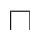
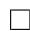

# 一元多项式求根算法

一元多项式求根是计算机代数中一个重要的问题, 同时, 它也是代数方程组求解以及代数数表示和运算的基础. 本章将围绕这一问题, 从数值解和符号解两个方面进行阐述.

一元多项式方程的数值求根所采用的方法同大部分数值算法一样, 都是用迭代的方法. 对于一般的方程 $f ( x ) = 0$ 的求解 $f$ 可导), 我们熟知有 Newton 迭代算法:

$$
x _ {\lambda + 1} = x _ {\lambda} - \frac {f (x _ {\lambda})}{f ^ {\prime} (x _ {\lambda})},
$$

多项式求根也可采用此迭代算法, 并且其收敛阶数可以利用 Taylor 公式进行估计.设 $x$ 为方程的一根, 由于

$$
\begin{array}{l} f (x _ {\lambda}) = f (x) + f ^ {\prime} (x) \left(x _ {\lambda} - x\right) + O \left(\left(x _ {\lambda} - x\right) ^ {2}\right) \\ = \left(f ^ {\prime} \left(x _ {\lambda}\right) + f ^ {\prime \prime} \left(x _ {\lambda}\right) \left(x - x _ {\lambda}\right) + O \left(\left(x _ {\lambda} - x\right) ^ {2}\right)\right) \left(x _ {\lambda} - x\right) + O \left(\left(x _ {\lambda} - x\right) ^ {2}\right) \\ = f ^ {\prime} \left(x _ {\lambda}\right) \left(x _ {\lambda} - x\right) + O \left(\left(x _ {\lambda} - x\right) ^ {2}\right), \\ \end{array}
$$

我们有

$$
x _ {\lambda + 1} - x = x _ {\lambda} - x - \frac {f (x _ {\lambda})}{f ^ {\prime} (x _ {\lambda})} = \frac {O ((x _ {\lambda} - x) ^ {2})}{f ^ {\prime} (x _ {\lambda})},
$$

当 $f ^ { \prime } ( x ) \neq 0$ , 即 $x$ 是单重根时, 由上式可知迭代是二阶收敛的. 若 $f ^ { \prime } ( x ) = 0$ , 即 $x$ 是多重根时, 我们有

$$
\begin{array}{l} x _ {\lambda + 1} - x = x _ {\lambda} - x - \frac {f (x _ {\lambda})}{f ^ {\prime} (x _ {\lambda})} \\ = x _ {\lambda} - x - \frac {O ((x _ {\lambda} - x) ^ {2})}{O (x _ {\lambda} - x)} \\ = O \left(x _ {\lambda} - x\right), \\ \end{array}
$$

可知其为一阶线性收敛的.

本章我们将着重介绍 Jenkins-Traub 数值求根算法, 简单介绍 Laguerre 等算法.

关于一元多项式方程的符号求根, 大致上我们采取这样一种思路:将复杂的多项式通过函数复合的解和因子分解化为较为简单的可精确求解的多项式. 目前我们已知的可精确求解的多项式有不高于四次的多项式以及分圆多项式. 对于前者,我们利用求根公式可以将解用根式表达出来, 对于后者利用 1 的单位根也可以表示出来.

在本章中间, 我们也会插入有限域上多项式求根以及根的区间隔离算法. 区间隔离算法可以帮助数值算法的迭代初始点的选取, 并且可用于多元多项式组求根以及代数数的运算.

# 12.1 多项式零点模估计

在后面的数值算法以及区间隔离等算法中, 我们均需要对多项式零点的模估计其上界或下界, 因此本节介绍若干对零点模的估计. 首先下面的 Cauchy 不等式给出了 $\mathbb { C } [ x ]$ 上多项式根的模的一个估计.

定理12.1. 设 $\begin{array} { r } { f = \sum _ { 0 \leq i \leq n } f _ { i } x ^ { i } \in \mathbb { C } [ x ] } \end{array}$ , $r _ { 1 } , \ldots , r _ { n }$ 是它的根, 则对任何一个根 $r$ 均有

$$
r <   1 + \frac {\operatorname* {m a x} (| f _ {0} | , | f _ {1} | , \ldots , | f _ {n - 1} |)}{| f _ {n} |}.
$$

证明. 若 $| r | \leq 1$ , 则无需证明. 下面假设 $| r | > 1$ , 由 $\begin{array} { r } { \sum _ { 0 \leq i \leq n } f _ { i } r ^ { i } = 0 } \end{array}$ 可得

$$
\begin{array}{l} |f_{n}r^{n}| = \left|\sum_{0\leq i\leq n - 1}f_{i}r^{i}\right|\leq \max_{0\leq i\leq n - 1}|f_{i}|\cdot (1 + |r| + \dots +|r|^{n - 1}) \\ = \max  _ {0 \leq i \leq n - 1} | f _ {i} | \cdot \frac {| r | ^ {n} - 1}{| r | - 1} <   \max  _ {0 \leq i \leq n - 1} | f _ {i} | \frac {| r | ^ {n}}{| r | - 1}, \\ \end{array}
$$

因此得到估计 $| r | < 1 + { \frac { \operatorname* { m a x } _ { 0 \leq i \leq n - 1 } | f _ { i } | } { | f _ { n } | } }$ .

考虑多项式 $r ^ { n } f ( 1 / r )$ 很容易得到:

推论12.1. 各记号同定理 12.1 , 对任何 $f$ 的根 $r$ , 我们均有

$$
r > \left(1 + \frac {\operatorname* {m a x} (| f _ {1} | , | f _ {2} | , \ldots , | f _ {n} |)}{| f _ {0} |}\right) ^ {- 1}.
$$

我们再对多项式零点模的大小做一估计, 首先有下面的引理:

引理12.1. 设 $a _ { k - 1 } , \ldots , a _ { 0 }$ 均非负, 且 $a _ { k - 1 } , \ldots , a _ { l }$ 不全为零, $a _ { l - 1 } , \ldots , a _ { 0 }$ 不全为零, 则方程

$$
P (z) = z ^ {k} + a _ {k - 1} z ^ {k - 1} + \dots + a _ {l} z ^ {l} - a _ {l - 1} z ^ {l - 1} - \dots - a _ {1} z - a _ {0} = 0
$$

有唯一正根 $r _ { 0 }$ , 且 $P ( r ) < 0 ( \forall 0 < r < r _ { 0 } )$ , P (r) > 0(∀r > r0).

证明. 考虑函数

$$
Q (z) = \frac {P (z)}{z ^ {l}} = z ^ {k - l} + a _ {k - 1} z ^ {k - l - 1} + \dots + a _ {l + 1} z + a _ {l} - \frac {a _ {l - 1}}{z} - \dots - \frac {a _ {0}}{z ^ {l}},
$$

易知其在 $( 0 , + \infty )$ 上单调递增, 且

$$
\lim  _ {z \rightarrow 0} Q (z) = - \infty , \quad \lim  _ {z \rightarrow + \infty} Q (z) = + \infty ,
$$

故 $Q ( z )$ 有唯一正实根 $r _ { 0 }$ , 从而也是 $P ( z )$ 的唯一正根, 且由单调性可知 $\{ r | r >$ $0 \land P ( r ) > 0 \} = ( r _ { 0 } , + \infty ) .$ □

定理12.2. 设 $a _ { k - 1 } , \ldots , a _ { 0 } \in \mathbb { C }$ , $r$ 为多项式方程

$$
P (z) = z ^ {k} + a _ {k - 1} z ^ {k - 1} + \dots + a _ {1} z + a _ {0} = 0
$$

的任一根, 并设 $r _ { 0 }$ 是方程

$$
Q (z) = z ^ {k} - \left| a _ {k - 1} \right| z ^ {k - 1} - \dots - \left| a _ {1} \right| z - \left| a _ {0} \right| = 0
$$

的唯一正根, 则 $| r | \leq r _ { 0 }$

再设 $r _ { 1 }$ 是方程

$$
R (z) = z ^ {k} + \left| a _ {k - 1} \right| z ^ {k - 1} + \dots + \left| a _ {1} \right| z - \left| a _ {0} \right| = 0
$$

的唯一正根, 则 $| r | \geq r _ { 1 }$

证明. 首先由 $P ( r ) = 0$ 可知

$$
\begin{array}{l} \left| r \right| ^ {k} = | - a _ {k - 1} r ^ {k - 1} - \dots - a _ {1} r - a _ {0} | \\ \leq \left| a _ {k - 1} \right| | r | ^ {k - 1} + \dots + \left| a _ {1} \right| | r | + \left| a _ {0} \right|, \\ \end{array}
$$

即 $Q ( | r | ) \leq 0$ , 故 $| r | \leq r _ { 0 }$ .

由 $r$ 和 $r _ { 1 }$ 的定义知道 $1 / r , 1 / r _ { 1 }$ 分别是方程

$$
z ^ {k} + \frac {a _ {1}}{a _ {0}} z ^ {k - 1} + \dots + \frac {a _ {k - 1}}{a _ {0}} z + \frac {1}{a _ {0}} = 0
$$

和

$$
z ^ {k} - \frac {| a _ {1} |}{| a _ {0} |} z ^ {k - 1} - \dots - \frac {| a _ {k - 1} |}{| a _ {0} |} - \frac {1}{| a _ {0} |}
$$

的根, 则根据上面的证明我们有 $1 / | r | \leq 1 / r _ { 1 }$ , 亦即 $| r | \geq r _ { 1 }$ .

# 12.2 Jenkins-Traub 算法

# 12.2.1 算法引入

Traub 最初在一系列论文中提出一种两步骤的迭代算法用以数值求解一元多项式方程, 之后 Jenkins 和 Traub[93] 在此基础上发展出一种三步骤的迭代算法,下面我们就来对此进行介绍. 该算法收敛比二阶要快.

为了方便起见, 首先我们引入下面一些记号:

定义12.1. 对于我们考虑的多项式 $\begin{array} { r } { P ( z ) = \prod _ { j = 1 } ^ { k } ( z - \alpha _ { j } ) ^ { m _ { j } } \in \mathbb { C } [ x ] } \end{array}$ , 记 $P _ { j } ( z ) =$ $P ( z ) / ( z - \alpha _ { j } )$ , 易知 $\begin{array} { r } { P ^ { \prime } ( z ) = \sum _ { j = 1 } ^ { k } m _ { j } P _ { j } ( z ) } \end{array}$ .

定义12.2. 定义多项式序列 $\{ H ^ { ( \lambda ) } ( z ) | \lambda \in \mathbb { N } \}$ 满足

$$
\exists c _ {j} ^ {(\lambda)} \in \mathbb {C} \left(H ^ {(\lambda)} (z) = \sum_ {j = 1} ^ {k} c _ {j} ^ {(\lambda)} P _ {j} (z)\right).
$$

且 $H ^ { ( 0 ) } ( z ) = P ^ { \prime } ( z )$ . 我们具体构造时可任取某一特定的复数序列 $\{ s _ { \lambda } \}$ , 使得多项式序列由下面递推关系生成:

$$
H ^ {(\lambda + 1)} (z) = \frac {1}{z - s _ {\lambda}} \left[ H ^ {(\lambda)} (z) - \frac {H ^ {(\lambda)} (s _ {\lambda})}{P (s _ {\lambda})} P (z) \right].
$$

为了说明用序列 $\{ s _ { \lambda } \}$ 来构造多项式序列 $\{ H _ { \lambda } \}$ 的合理性, 我们考虑如下关系:

$$
\begin{array}{l} H ^ {(\lambda + 1)} = \frac {P (z)}{z - s _ {\lambda}} \left[ \sum_ {j = 1} ^ {k} \frac {c _ {j} ^ {(\lambda)}}{z - \alpha_ {j}} - \sum_ {j = 1} ^ {k} \frac {c _ {j} ^ {(\lambda)}}{s _ {\lambda} - \alpha_ {j}} \right] \\ = \sum_ {j = 1} ^ {k} \frac {c _ {j} ^ {(\lambda)} P (z)}{(z - \alpha_ {j}) (\alpha_ {j} - s _ {\lambda})} \\ = \sum_ {j = 1} ^ {k} c _ {j} ^ {(\lambda + 1)} P _ {j} (z). \\ \end{array}
$$

由此可以看出 $H _ { \lambda }$ 确实如定义所说的那样, 能写成 $P _ { j } ( z )$ 的线性组合, 于是这样定义是合理的. 我们顺便得到了系数 $c _ { j } ^ { ( \lambda ) }$ 的递推关系:

$$
c _ {j} ^ {(\lambda + 1)} = \frac {c _ {j} ^ {(\lambda)}}{\alpha_ {j} - s _ {\lambda}} = \dots = \frac {m _ {j}}{\prod_ {t = 0} ^ {\lambda} (\alpha_ {j} - s _ {t})}.
$$

Jenkins 和 Traub给出如下算法, 其中一些具体的细节如 $M , L , \beta$ $\beta$ 的选取等参见下一节有关注记.

定义12.3. 多项式 $f \in \mathbb { C } [ x ]$ 的首一化多项式定义为 ${ \overline { { f } } } = f / \operatorname { l c } ( f )$ .

算法12.1 (Jenkins-Traub 算法).

步骤 1:No-shift process

$$
H ^ {(0)} (z) = P ^ {\prime} (z),
$$

$$
H ^ {(\lambda + 1)} (z) = \frac {1}{z} \left[ H ^ {(\lambda)} (z) - \frac {H ^ {(\lambda)} (0)}{P (0)} P (z) \right] (\lambda = 0, 1, \dots , M - 1).
$$

步骤 2:Fixed-shift process

取正数 $\beta$ 满足 $\beta \leq \mathrm { m i n } _ { 1 \leq j \leq k } \left| \alpha _ { j } \right|$ , 随机选取复数 $s$ 满足 $| s | = \beta$ , 且 $| s - \alpha _ { 1 } | \leq$ $| s - \alpha _ { j } | ( j = 2 , 3 , \ldots , k )$ , 即 $\alpha _ { 1 }$ 取为离所选 $s$ 最近的根. 再做如下迭代:

$$
H ^ {(\lambda + 1)} (z) = \frac {1}{z - s} \left[ H ^ {(\lambda)} (z) - \frac {H ^ {(\lambda)} (s)}{P (s)} P (z) \right], (\lambda = M, M + 1, \ldots , L - 1).
$$

步骤 3:Variable-shift process

记 $\begin{array} { r } { s _ { L } = s - \frac { P ( s ) } { H ^ { ( L ) } ( s ) } } \end{array}$ 再做如下迭代:

$$
H ^ {(\lambda + 1)} (z) = \frac {1}{z - s _ {\lambda}} \left[ H ^ {(\lambda)} - \frac {H ^ {(\lambda)} (s _ {\lambda})}{P (s _ {\lambda})} P (z) \right],
$$

$$
s _ {\lambda + 1} = s _ {\lambda} - \frac {P (s _ {\lambda})}{\overline {{H ^ {(\lambda + 1)}}} (s _ {\lambda})}, \quad (\lambda = L, L + 1, \dots).
$$

我们得到 $s _ { \lambda } \to \alpha _ { 1 }$

定理12.3. 记 $R = \mathrm { m i n } _ { 2 \leq j \leq k } | \alpha _ { 1 } - \alpha _ { j } |$ , 若 $| s _ { L } - \alpha _ { 1 } | < R / 2$ , $c _ { 1 } ^ { ( L ) } \neq 0$ , $D _ { L } =$ $\textstyle \sum _ { j = 2 } ^ { k } | c _ { j } ^ { ( L ) } | / | c _ { 1 } ^ { ( L ) } | < 1 / 3$ , 则 $s _ { \lambda } \to \alpha _ { 1 }$ .

证明. 若记 r(λ) = sλ − α1 , $r _ { j } ^ { ( \lambda ) } = \frac { s _ { \lambda } - \alpha _ { 1 } } { s _ { \lambda } - \alpha _ { j } }$ d(λ) $d _ { j } ^ { ( \lambda ) } = \frac { c _ { j } ^ { ( \lambda ) } } { c _ { 1 } ^ { ( \lambda ) } }$ = jc( λ) , T λ = ¯¯ c(λ) $T _ { \lambda } = \left| \frac { s _ { \lambda + 1 } - \alpha _ { 1 } } { s _ { \lambda } - \alpha _ { 1 } } \right| ,$ 则我们只需要证明存在 $\tau$ 使得 $\forall \lambda \ge L ( T _ { \lambda } \le \tau < 1 )$ 即可证明收敛性.

而

$$
\begin{array}{l} \frac {s _ {\lambda + 1} - \alpha_ {1}}{s _ {\lambda} - \alpha_ {1}} = \frac {s _ {\lambda} - \frac {P (s _ {\lambda})}{H ^ {(\lambda + 1)} (s _ {\lambda})} - \alpha_ {1}}{s _ {\lambda} - \alpha_ {1}} \\ = 1 - \frac {P (s _ {\lambda})}{\overline {{H ^ {(\lambda + 1)}}} (s _ {\lambda}) (s _ {\lambda} - \alpha_ {1})} \\ = 1 - \frac {P (s _ {\lambda}) \sum_ {1 \leq j \leq k} c _ {j} ^ {(\lambda)} / (\alpha_ {j} - s _ {\lambda})}{P (s _ {\lambda}) \sum_ {1 \leq j \leq k} \frac {c _ {j} ^ {(\lambda)}}{(\alpha_ {j} - s _ {\lambda}) (s _ {\lambda} - \alpha_ {j})} (s _ {\lambda} - \alpha_ {1})} \\ = 1 - \frac {\sum_ {1 \leq j \leq k} c _ {j} ^ {(\lambda)} \left(s _ {\lambda} - \alpha_ {1}\right) / \left(s _ {\lambda} - \alpha_ {j}\right)}{\sum_ {1 \leq j \leq k} c _ {j} ^ {(\lambda)} \left(s _ {\lambda} - \alpha_ {1}\right) ^ {2} / \left(s _ {\lambda} - \alpha_ {j}\right) ^ {2}} \\ = 1 - \frac {1 + \sum_ {2 \leq j \leq k} d _ {j} ^ {(\lambda)} r _ {j} ^ {(\lambda)}}{1 + \sum_ {2 \leq j \leq k} d _ {j} ^ {(\lambda)} [ r _ {j} ^ {(\lambda)} ] ^ {2}} \\ = \frac {\sum_ {2 \leq j \leq k} [ r _ {j} ^ {(\lambda)} ] ^ {2} d _ {j} ^ {(\lambda)} - \sum_ {2 \leq j \leq k} r _ {j} ^ {(\lambda)} d _ {j} ^ {(\lambda)}}{1 + \sum_ {2 \leq j \leq k} [ r _ {j} ^ {(\lambda)} ] ^ {2} d _ {j} ^ {(\lambda)}}, \\ \end{array}
$$

由于 $| r _ { j } ^ { ( L ) } | < 1$ , 则

$$
T _ {L} \leq \frac {\sum_ {2 \leq j \leq k} | d _ {j} ^ {(L)} | + \sum_ {2 \leq j \leq k} | d _ {j} ^ {(L)} |}{1 - \sum_ {2 \leq j \leq k} | d _ {j} ^ {(L)} |} = \frac {2 D _ {L}}{1 - D _ {L}} <   1,
$$

令 $\tau = 2 D _ { L } / ( 1 - D _ { L } )$ , 即得 $T _ { L } \le \tau < 1$

假设 $T _ { L } , T _ { L + 1 } , \dots , T _ { \lambda - 1 } \leq \tau < 1 ,$ , 则对 $t = L , L + 1 , \ldots , \lambda .$ , 有

$$
\left| s _ {t} - \alpha_ {1} \right| \leq \left| s _ {L} - \alpha_ {1} \right| <   R / 2,
$$

$$
\left| s _ {t} - \alpha_ {j} \right| \geq \left| \alpha_ {1} - \alpha_ {j} \right| - \left| s _ {t} - \alpha_ {1} \right| > R / 2,
$$

即仍有 $| r _ { j } ^ { ( t ) } | < 1 ( t = L , L + 1 , \dots , \lambda )$ , 又由于

$$
d _ {j} ^ {(\lambda)} = \frac {c _ {j} ^ {(\lambda)}}{c _ {1} ^ {(\lambda)}} = \frac {c _ {j} ^ {(\lambda - 1)}}{\alpha_ {j} - s _ {\lambda - 1}} \frac {\alpha_ {1} - s _ {\lambda - 1}}{c _ {1} ^ {(\lambda - 1)}} = r _ {j} ^ {(\lambda - 1)} d _ {j} ^ {(\lambda - 1)},
$$

则 $\begin{array} { r } { \sum _ { 2 \leq j \leq k } | d _ { j } ^ { ( \lambda ) } | \leq D _ { L } } \end{array}$ , 于是 $T _ { \lambda } \le \tau < 1$ , 从而我们归纳证明了 $T _ { \lambda } \le \tau < 1 ( \forall \lambda \ge$ $L$ ).

为了说明迭代的合理性, 我们仍要证明 $H ^ { ( \lambda ) } ( s _ { \lambda } ) \neq 0$ , 因为

$$
\begin{array}{l} \overline {{H ^ {(\lambda)}}} (s _ {\lambda}) = \frac {\sum_ {1 \leq j \leq k} c _ {j} ^ {(\lambda)} / (\alpha_ {j} - s _ {\lambda}) \cdot P _ {j} (s _ {\lambda})}{\sum_ {1 \leq j \leq k} c _ {j} ^ {(\lambda)} / (\alpha_ {j} - s _ {\lambda})} \\ = P _ {1} (s _ {\lambda}) \left[ \frac {1 + \sum_ {2 \leq j \leq k} d _ {j} ^ {(\lambda)} [ r _ {j} ^ {(\lambda)} ] ^ {2}}{1 + \sum_ {2 \leq j \leq k} d _ {j} ^ {(\lambda)} r _ {j} ^ {(\lambda)}} \right], \\ \end{array}
$$

我们假定 $P ( s _ { \lambda } ) \neq 0$ , 且又由 $| \textstyle \sum _ { 2 \leq j \leq k } d _ { j } ^ { ( \lambda ) } [ r _ { j } ^ { ( \lambda ) } ] ^ { 2 } | < 1 / 3$ 知 $| \overline { { H ^ { ( \lambda + 1 ) } } } ( s _ { \lambda } ) | > 0$ .

有了上面的定理, 下面证明收敛性:

定理12.4. 令 $s$ 为满足算法 12.1 步骤 $\mathcal { Q }$ 中条件的复数, 则当迭代步数 $L$ 足够大时,步骤 3 中迭代是收敛的.

证明. 很容易知道:

$$
H ^ {(L)} (z) = \sum_ {1 \leq j \leq k} m _ {j} \alpha_ {j} ^ {- M} (\alpha_ {j} - s) ^ {- (L - M)} P _ {j} (z) = \sum_ {1 \leq j \leq k} c _ {j} ^ {(L)} p _ {j} (z),
$$

于是

$$
\sum_ {2 \leq j \leq k} d _ {j} ^ {(L)} = \sum_ {2 \leq j \leq k} \frac {m _ {j}}{m _ {1}} \left(\frac {\alpha_ {1}}{\alpha_ {j}}\right) ^ {M} \left(\frac {\alpha_ {1} - s}{\alpha_ {j} - s}\right) ^ {L - M},
$$

固定 $M$ 后, 取 $L$ 充分大, 可使上式足够小, 故我们可以取到 $L$ 使得 $D _ { L } < 1 / 3$ .

我们再取 $L$ 足够大使 $2 D _ { L } / ( 1 - D _ { L } )$ 足够小使 $\begin{array} { r } { | s _ { L } - \alpha _ { 1 } | = | s - \alpha _ { 1 } | \frac { 2 D _ { L } } { 1 - D _ { L } } < R / 2 . } \end{array}$ 则前述定理条件均满足, 由是, $s _ { \lambda } \to \alpha _ { 1 }$ . □

# 12.2.2 收敛速度和一些细节说明

下面给出对收敛速度的估计,

定理12.5. 设 $D _ { L } < 1 / 3$ , $c _ { 1 } ^ { ( L ) } \neq 0$ , $| s _ { L } - \alpha _ { 1 } | < R / 2$ , 则

$$
C (\lambda) = \frac {\left| s _ {L + \lambda + 1} - \alpha_ {1} \right|}{\left| s _ {L + \lambda} - \alpha_ {1} \right| ^ {2}} \leq \frac {2}{R} \tau^ {\lambda (\lambda - 1) / 2}.
$$

证明. 首先

$$
\frac {s _ {L + \lambda + 1} - \alpha - 1}{s _ {L + \lambda} - \alpha - 1} = \frac {\sum_ {2 \leq j \leq k} \frac {r _ {j} ^ {(L + \lambda)} d _ {j} ^ {(L + \lambda)}}{s _ {L + \lambda} - \alpha_ {j}} - \sum_ {2 \leq j \leq k} \frac {d _ {j} ^ {(L + \lambda)}}{s _ {L + \lambda} - \alpha_ {j}}}{{1 + \sum_ {2 \leq j \leq k} [ r _ {j} ^ {(L + \lambda)} ] ^ {2} d _ {j} ^ {(L + \lambda)}}},
$$

由于 $| s _ { L } - \alpha _ { 1 } | < R / 2$ , 则 $| s _ { L + \lambda } - \alpha _ { 1 } | < \tau ^ { \lambda } R / 2$ , 又 $| s _ { L + \lambda } - \alpha _ { j } | > R / 2$ , 则 $| r _ { j } ^ { ( L + \lambda ) } | <$ $\tau ^ { \lambda }$ . 于是

$$
| d _ {j} ^ {(L + \lambda)} | = | r _ {j} ^ {(L + \lambda - 1)} | | d _ {j} ^ {(L + \lambda - 1)} | = \dots \leq \tau^ {\lambda - 1} \tau^ {\lambda - 2} \dots \tau | d _ {j} ^ {(L)} | = \tau^ {(\lambda - 1) \lambda / 2} | d _ {j} ^ {(L)} |,
$$

则 $\begin{array} { r } { \sum _ { 2 \leq j \leq k } | d _ { j } ^ { ( L + \lambda ) } | \leq \tau ^ { \lambda ( \lambda - 1 ) / 2 } D _ { L } \leq \frac { 1 } { 3 } \tau ^ { \lambda ( \lambda - 1 ) / 2 } } \end{array}$ . 且 由 $\begin{array} { r } { \frac { 1 } { | s _ { L + \lambda } - \alpha _ { j } | } \le \frac { 2 } { R } } \end{array}$ | ≤ 2R , 代入前面表达式可得

$$
C (\lambda) \leq \frac {2}{R} \tau^ {\lambda (\lambda - 1) / 2}.
$$

证毕.

由此可以看到, Jenkins-Traub 算法是至少二阶收敛的, 它比普通的 Newton迭代法要快.

推论12.2. 当上面定理条件满足时, 对于 $\lambda \geq 1$ 有 $| s _ { L + \lambda } - \alpha _ { 1 } | \leq { \textstyle { \frac { 1 } { 2 } } } R \tau ^ { \eta }$ , 其 中$\eta = { \textstyle { \frac { 1 } { 2 } } } [ 3 \cdot 2 ^ { \lambda } - ( \lambda ^ { 2 } + \lambda + 2 ) ] .$ .

对于算法细节的说明:

注159. 步骤 1 中 $M$ 的选取是非必需的, 此处只是要强调模较小的零点. 计算的经验表明一般取 $M = 5$ 较合适.

注160. 关于在步骤 2 中对于方程 $P ( z ) = z ^ { k } + a _ { k - 1 } z ^ { k - 1 } + \cdot \cdot \cdot + a _ { 1 } z + a _ { 0 } = 0$ 零点最小模的估计, 根据定理 12.2 , 我们取 $\beta$ 为方程 $z ^ { k } + | a _ { k - 1 } | z ^ { k - 1 } + \cdot \cdot \cdot + | a _ { 1 } | z - | a _ { 0 } | = 0$ 的唯一正根, 该根可由Newton 迭代求出.

注161. 关于步骤 2 的终止, 即 $L$ 的选取, 前面给出的应当来说是一个充分条件, 而且在算法实现时我们并不知道所有根的分布情况, 因此在实践中取下面的收敛性判别条件: 令 $\begin{array} { r } { t _ { \lambda } = s - \frac { P ( s ) } { H ^ { ( \lambda ) } ( s ) } } \end{array}$ 若在一定迭代步数(例如 20 步)内能够满足下面条件:

$$
\left| t _ {\lambda + 1} - t _ {\lambda} \right| \leq \left| t _ {\lambda} \right| / 2, \quad \left| t _ {\lambda + 2} - t _ {\lambda + 1} \right| \leq \left| t _ {\lambda + 1} \right| / 2,
$$

则终止.

注162. 步骤 3终止的条件根据计算精度要求决定.

步骤3 中的迭代事实上是 Newton 迭代, 我们有下面的

定理12.6. 设 $\begin{array} { r } { w ^ { ( \lambda ) } ( z ) = \frac { P ( z ) } { H ^ { ( \lambda ) } ( z ) } } \end{array}$ P(z)(λ) , 则每一步迭代过程相当于

$$
s _ {\lambda + 1} = s _ {\lambda} - \frac {P (s _ {\lambda})}{\overline {{H ^ {(\lambda + 1)}}} (s _ {\lambda})} = s _ {\lambda} - \frac {w ^ {\lambda} (s _ {\lambda})}{(w ^ {\lambda}) ^ {\prime} (s _ {\lambda})}.
$$

证明. 定义 $\begin{array} { r } { v ^ { ( \lambda ) } ( z ) = \frac { H ^ { ( \lambda ) } ( z ) } { P ( z ) } = 1 / w ^ { ( \lambda ) } ( z ) } \end{array}$ , 则由 $H ^ { ( \lambda ) } ( z )$ 的递推生成式可知: $v ^ { ( \lambda + 1 ) } =$ $( v ^ { ( \lambda ) } ) ^ { \prime }$ $\mathbf { \lambda } ^ { \lambda ) } ) ^ { \prime } , \operatorname { l c } ( H ^ { ( \lambda + 1 ) } ( z ) ) = - v ^ { ( \lambda ) } ( s _ { \lambda } )$ .

于是

$$
\begin{array}{l} s _ {\lambda + 1} = s _ {\lambda} - \frac {P (s _ {\lambda}) \operatorname {l c} (H ^ {(\lambda + 1)} (z))}{H ^ {(\lambda + 1)} (s _ {\lambda})} = s _ {\lambda} + \frac {v ^ {(\lambda)} (s _ {\lambda})}{v ^ {(\lambda + 1)} (s _ {\lambda})} = s _ {\lambda} + \frac {v ^ {(\lambda)} (s _ {\lambda})}{(v ^ {(\lambda)} (s _ {\lambda}))}, \\ = s _ {\lambda} - \frac {w ^ {(\lambda)} (s _ {\lambda})}{(w ^ {(\lambda)} (s _ {\lambda})) ^ {\prime}}. \\ \end{array}
$$

证毕.

对实一元多项式, Jenkins和Traub[92]扩展了已有的迭代算法, 发展了一套二次因子的迭代算法, 仅仅利用实数运算计算多项式的所有根(包括共轭复根), 当将两种 Jenkins-Traub算法应用于同一实一元多项式上时, 新算法能将效率提高达四倍.

# 12.3 Laguerre 算法

一元多项式数值求根的迭代算法有很多, 利如 Bairstow 算法, Graeffe 算法,M¨uller 算法, Laguerre 算法等, [122] 对各个算法均有介绍, 有兴趣的读者可以参考该文以及文后所引的参考文献.

下面我们简单介绍 Laguerre 算法, 它也是一种比 Newton 迭代快的算法([122]2.9 节), 用到了多项式的二阶导数. 考虑复多项式 $P ( z )$ , 其有 $n$ 个根r1, r2, . . . , rn, 定义如下一些函数: $r _ { 1 } , r _ { 2 } , \ldots , r _ { n }$

$$
S _ {1} (z) = \frac {P ^ {\prime} (z)}{P (z)} = \sum_ {i = 1} ^ {n} \frac {1}{z - r _ {i}},
$$

$$
S _ {2} (z) = - S _ {1} ^ {\prime} (z) = \sum_ {i = 1} ^ {n} \frac {1}{(z - r _ {i}) ^ {2}},
$$

对于某个固定的 $j$ , 记

$$
\alpha (z) = \frac {1}{z - r _ {j}}, \quad \beta (z) = \frac {1}{n - 1} \sum_ {1 \leq i \leq n, i \neq j} \frac {1}{z - r _ {i}}, \quad \delta_ {i} (z) = \frac {1}{z - r _ {i}} - \beta (z), (i \neq j),
$$

于是 $S _ { 1 } = \alpha + ( n - 1 ) \beta$ , 若定义 $\begin{array} { r } { \delta ^ { 2 } = \sum _ { i \neq j } \delta _ { i } ^ { 2 } } \end{array}$ , 则还有

$$
\begin{array}{l} S _ {2} = \alpha^ {2} + \sum_ {i \neq j} (\beta + \delta_ {i}) ^ {2} = \alpha^ {2} + (n - 1) \beta^ {2} + 2 \beta \sum_ {i \neq j} \delta_ {i} + \sum_ {i \neq j} \delta_ {i} ^ {2} \\ = \alpha^ {2} + (n - 1) \beta^ {2} + \delta^ {2}. \\ \end{array}
$$

若消去 $\beta$ , 可得到关于 $\alpha$ 的二次方程:

$$
n \alpha^ {2} - 2 S _ {1} \alpha + S _ {1} ^ {2} - (n - 1) (S _ {2} - \delta^ {2}) = 0
$$

解之得

$$
\alpha = \frac {S _ {1} \pm \sqrt {(n - 1) (n S _ {2} - S _ {1} ^ {2} - n \delta^ {2})}}{n}.
$$

由 $\alpha$ 的定义我们可以得到

$$
r _ {j} = z - \frac {n}{S _ {1} \pm \sqrt {(n - 1) (n S _ {2} - S _ {1} ^ {2} - n \delta^ {2})}},
$$

但若我们令 $\delta ^ { 2 } = 0$ , 注意到当 $z$ 接近零点 $r _ { j }$ 时, 在 $S _ { 1 }$ , $S _ { 2 }$ 表达式中各项只有含 $r _ { j }$ 的一项占主导地位, 是奇异部分, 因此迭代过程中这样的假设是合理的. 于是我们得到逼近 $r _ { j }$ 的序列 $\{ z _ { j } ^ { ( k ) } \}$ 的迭代式, 即 Laguerre 迭代公式:

$$
z _ {j} ^ {(k + 1)} = z _ {j} ^ {(k)} - \frac {n}{S _ {1} \pm \sqrt {(n - 1) (n S _ {2} - S _ {1} ^ {2})}}.
$$

该迭代算法对于单根是三阶收敛, 对于多重根是一阶线性收敛. 下面的改进算法给出单根时的四阶收敛:

$$
z _ {j} ^ {(k + 1)} = z _ {j} ^ {(k)} - \frac {n}{S _ {1} \pm \sqrt {(n - 1) (n S _ {2} - S _ {1} ^ {2} - n \delta_ {j} ^ {2})}},
$$

其中

$$
\delta_ {j} = \sum_ {i \neq j} \left[ \frac {1}{z _ {j} ^ {(k)} - z _ {i} ^ {(k)}} - \beta_ {j} \right] ^ {2}, \quad \beta_ {j} = \frac {1}{n - 1} \sum_ {i \neq j} \frac {1}{z _ {j} ^ {(k)} - z _ {i} ^ {(k)}}.
$$

# 12.4 代数模方程求解

这一小节我们讨论有限域中的代数方程求解. 对于一次模方程, 我们可以很简单地直接解出, 下面我们先介绍一下有限域中的开平方算法, 这些均与数论中的二次剩余理论有联系.

# 12.4.1 $\mathbb { F } _ { p }$ 中的开平方算法

先看一些比较特殊的情况. 我们考虑问题 $x ^ { 2 } \equiv a$ (mod $p$ ), 其中 $a$ 是模 $p$ 的二次剩余, 其 Jacobi 符号 $\left( { \frac { a } { p } } \right) = 1$ . 此时必有 $a ^ { ( p - 1 ) / 2 } \equiv 1$ (mod p).

若素数 $p \equiv 3$ (mod 4), 则令 $x \equiv a ^ { ( p + 1 ) / 4 }$ (mod $p$ ) 即可.

若素数 $p \equiv 5$ (mod 8), 此时 $a ^ { ( p - 1 ) / 4 } \equiv \pm 1$ (mod p), 若取正号, 则命 $x =$ $a ^ { ( p + 3 ) / 8 }$ (mod $p$ ), 否则由 $p \equiv 5$ (mod 8) 有 $2 ^ { ( p - 1 ) / 2 } \equiv - 1$ (mod $p$ ), 于是命 $x =$ $2 a ( 4 a ) ^ { ( p - 5 ) / 8 }$ (mod p).

对于一般情况, 我们可以尝试有限域上的因子分解算法. Schoof 提出了一种多项式时间的非概率性方法, 因为它要利用椭圆曲线, 过程过于复杂, 所以我们介绍另一种概率性的 Tonelli $\&$ Shanks 算法 [56].

首先我们可以将 $p - 1$ 中的 2 的幂次分离出来, 即存在 $e , q , q$ $q$ 是奇数, $e$ 是自然数使得 $p - 1 = 2 ^ { e } q$ . 因为乘法群 $\mathbb { F } _ { p } ^ { * }$ 与加群 $\mathbb { Z } / ( p - 1 ) \mathbb { Z }$ 同构, 则其 Sylow 2-子群$G$ 是一个 $2 ^ { e }$ 阶的循环群, 设 $z$ 是 $G$ 的生成元, 则 $G$ 中平方数的阶整除 $2 ^ { e - 1 }$ 且是 $z$ 的偶数次幂.

当 $a$ 是模 $p$ 中的二次剩余时, 我们有 $a ^ { ( p - 1 ) / 2 } = ( a ^ { q } ) ^ { ( 2 ^ { e - 1 } ) } \equiv 1$ (mod $p$ ), 于是$b = a ^ { q }$ mod $p$ 是 $G$ 中的平方数, 故存在偶数 $k ( 0 \leq k < 2 ^ { e } )$ 使得 $a ^ { q } z ^ { k } = 1$ . 此时若令

$$
x = a ^ {(q + 1) / 2} z ^ {k / 2},
$$

则有 $x ^ { 2 } = a ^ { q + 1 } z ^ { k } \equiv a$ (mod p).

下面给出求平方根的算法:

算法12.2 (Shanks 算法).

输入:奇素数 $p , a .$ , 以及 $e , q$ 使得 $p - 1 = 2 ^ { e } q ,$ $q$ 是奇数,

输出: $x$ 满足 $x ^ { 2 } \equiv a$ (mod $p$ ), 或者不存在.

1. 随机选取 $n$ 使得 $\left( { \frac { n } { p } } \right) = - 1$ , 令 $z = n ^ { q }$ mod $p$ ,  
2. 令 $y = z$ , $r = e$ , $x = a ^ { ( q - 1 ) / 2 }$ mod $p$ , $b = a x ^ { 2 }$ mod p, $x = a x$ mod $p$   
3. 若 $b \equiv 1$ (mod p), 则输出 $x$ 并终止, 否则找到最小的 $m \geq 1$ 使得 $b ^ { 2 ^ { m } } \equiv 1$ (mod $p$ ), 若 $m = r$ , 则输出 $a$ 非二次剩余并终止,   
4. 令 $t = y ^ { 2 ^ { r - m - 1 } }$ $t = y ^ { 2 ^ { r - m - 1 } } \operatorname { m o d } p , y = t ^ { 2 } \operatorname { m o d } p , r = m \operatorname { m o d } p , x = x t \operatorname { m o d } p , b =$ $y = t ^ { 2 }$ by mod $p$ , 并转 3 步.

注163. 算法第 1 步是用随机算法求 $G$ 的生成元 $z$ . 可以看出 $z$ 是生成元当且仅当$n$ 非模 $p$ 二次剩余. (等价于 $z ^ { 2 ^ { e - 1 } } \equiv - 1$ (mod p))

注164. 显式地找 $k$ 比较困难, 因此 Shanks 提出了上面的算法. 注意到在算法开始时, 有下面的等式成立:

$$
a b = x ^ {2}, \quad y ^ {2 ^ {r - 1}} = - 1, \quad b ^ {2 ^ {r - 1}} = 1.
$$

记 $G _ { r }$ 是群 $G$ 中阶整除 $2 ^ { r }$ 的元素组成的子群, 则 $y$ 是 $G _ { r }$ 的生成元且 $b \in G _ { r - 1 }$ , 因此 $b$ 是群 $G _ { r }$ 中的二次剩余.

显然每次循环之后, $r$ 都会严格地减小. 设某次循环前各量用下标 0 表示, 循环后各量用下标 1 表示, 则 $b _ { 1 } = b _ { 0 } y _ { 0 } ^ { 2 ^ { r - m } }$ , $x _ { 1 } = x _ { 0 } y _ { 0 } ^ { 2 ^ { r - m - 1 } }$ , $y _ { 1 } = y _ { 0 } ^ { 2 ^ { r - m } }$ , 于是

$$
a b _ {1} = a b _ {0} y _ {0} ^ {2 ^ {r - m}} = x _ {0} ^ {2} y _ {0} ^ {2 ^ {r - m}} = x _ {1} ^ {2},
$$

$$
y _ {1} ^ {2 ^ {m - 1}} = y _ {0} ^ {2 ^ {r - 1}} = - 1,
$$

$$
b _ {1} ^ {2 ^ {m - 1}} = b _ {0} ^ {2 ^ {m - 1}} y _ {0} ^ {2 ^ {r - 1}} = (- 1) (- 1) = 1,
$$

从而由归纳可知每次循环后上面三个等式均成立. 当 $r \leq 1$ 时, 我们有 $b = 1$ , 于是算法是可终止的.

例12.1. 求 $x$ 使 $x ^ { 2 } \equiv 1 0$ (mod 13).

解: $1 3 - 1 = 2 ^ { 2 } \times 3$ , 故 $e = 2 , q = 3$ . 取 $n = 2$ , 则 $\left( { \frac { 2 } { 1 3 } } \right) = - 1$ , $z = 2 ^ { 3 }$ mod $1 3 = 8$ .

首先令 $y = 8$ , $r = 2$ , $x = 1 0 ^ { ( 3 - 1 ) / 2 }$ mod $1 3 = 1 0$ , $b = 1 0 \times 1 0 ^ { 2 }$ mod $1 3 = 1 2$ , $x = 1 0 \times 1 0$ mod 13 = 9.

因为 $b \neq 1$ , 且使 $b ^ { 2 ^ { m } } = 1$ 的最小的 $m$ 为 $m = 1$ , 故 $t = 8 ^ { 2 ^ { 2 - 1 - 1 } }$ mod $1 3 = 8$ $y = 8 ^ { 2 }$ mod $1 3 = 1 2$ , $r = 1$ , $x = 9 \times 8$ mod $1 3 = 7$ , $b = 1 2 \times 1 2$ mod $1 3 = 1$ . 故此时输出 $x = 7$ . ✸

# 12.4.2 模 $p$ 代数方程求解

实际上在域中解多项式方程时, 可以看作是求多项式的因子分解问题. 而在有限域上, 因子分解算法本身是简单的(见有限域上因子分解有关章节, 事实上当时提出了一个 $\mathbb { F } _ { p }$ 上代数方程求根算法), 因此我们期望用因子分解的算法来求根. 事实上我们将看到下面给出的求根算法 [56] 就是有限域因子分解算法. 我们将在给出算法后再对算法中的每一步进行分析.

算法12.3 (模 $p$ 代数方程求根算法).

输入:素数 $p \geq 3$ , $f \in \mathbb { F } _ { p } [ x ]$ ,

输出: $\mathbb { F } _ { p }$ 中 $f$ 的根.

1. 求 $g = \operatorname* { g c d } ( x ^ { p } - x , f )$ , 若 $g ( 0 ) = 0$ , 输出 0 并令 $g = g / x$ ,  
2. 若 $\deg g = 0$ , 则结束, 若 $\deg g = 1$ , 即 $g = g _ { 1 } x + g _ { 0 }$ , 则输出 $- g _ { 0 } / g _ { 1 }$ 并终止,若 $\deg g = 2$ , $g = g _ { 2 } x ^ { 2 } + g _ { 1 } x + g _ { 0 }$ , 则令 $d = g _ { 1 } ^ { 2 } - 4 g _ { 0 } g _ { 2 }$ , 计算 $e = { \sqrt { d } }$ , 输出$\frac { - g _ { 1 } \pm e } { 2 g _ { 2 } }$ 并终止,2g2  
3. 随机取 $a \in \mathbb { F } _ { p }$ , $h ( x ) = \operatorname* { g c d } ( ( x + a ) ^ { ( p - 1 ) / 2 } - 1 , g )$ , 若 $\deg h = 0$ 或 $\deg h =$ $\deg g$ , 则重新执行此步,  
4. 递归调用本算法输出 $b$ 和 $a / b$ 的根, 注意调用时不必再执行第 1 步.

注165. 第1步实际上是将 $f$ 中一次不可约因子的乘积提取出来, 只考虑在 $\mathbb { F } _ { p }$ 中的根, 并且将 0 根做了预处理, 从而从 $g$ 中排除掉.

第 2 步是进行一些平凡的处理, 即对于一次和二次的 $g$ 直接由代数运算或求根公式求得其根.

第 3 步实际上是同次因子分解算法. 只不过这里随机取的多项式是 $x + a$ , 因为一次因子的幂次计算起来要容易一些 [56].

注166. 该算法与同次因子分解算法不同之处再于对于二次多项式有一个直接处理过程, 而不必再通过概率算法分解为两个一次因子.

# 12.5 实一元多项式实根隔离算法

# 12.5.1 Sturm 序列

Sturm 序列可用来在实轴上隔离实一元多项式的根, 这一节我们先介绍这方面的理论. 首先定义(见 [14]170 页):

定义12.4 (广义 Sturm 序列). 我们考虑闭区间 $[ a , b ]$ 上一无平方因子实多项式 $p$ 称 $p _ { 0 } ( = p ) , \ldots , p _ { k }$ 为广义 Sturm 序列, 如果它们满足

1. $p ( a ) p ( b ) \neq 0$ ,   
1. $p _ { k }$ 在 $[ a , b ]$ 上不变号,

2. 若 $p _ { i } ( \xi ) = 0 ( 1 \leq i \leq k - 1 , \xi \in [ a , b ] )$ , 则 $p _ { i - 1 } ( \xi ) p _ { i + 1 } ( \xi ) < 0$

3. 对于 $c \in [ a , b ]$ , 若 $p ( c ) = 0$ , 则 $p ( x ) p _ { 1 } ( x )$ 在 $c$ 的邻域内与 $x - c$ 符号相同.

此时对于 $y \in \mathbb { R }$ , 定义 $V ( y )$ 为序列 $p _ { 0 } ( y ) , p _ { 1 } ( y ) , \dots , p _ { k } ( y )$ 的变号次数, 即

$$
V (y) = \# \left\{i \mid p _ {i} (y) p _ {i + 1} (y) <   0 \right\}.
$$

对于 $y = \pm \infty$ 可在极限意义下类似定义.

广义 Sturm 序列有如下性质:

定理12.7. 对于 $[ a , b ]$ 上的广义 Sturm 序列, $V ( a ) - V ( b )$ 为 $p$ 在 $[ a , b ]$ 上实根的个数.

证明. 设 $x _ { 1 } , x _ { 2 } \in [ a , b ]$ , $x _ { 1 } < x _ { 2 }$ , 若 $[ x _ { 1 } , x _ { 2 } ]$ 中无 $p _ { i } ( 0 \leq i \leq k )$ 的根, 则 $V ( x _ { 1 } ) =$ $V ( x _ { 2 } )$ , 此时函数 $V ( x )$ 不发生变化.

1. 设 $a < c < b$ 且 $p ( c ) = 0$ , 则由定义中第 4 条知存在 $\varepsilon > 0$ 使得 $x \in \left( c - \varepsilon , c \right)$ 时, $p ( x ) p _ { 1 } ( x ) < 0$ , 此区间内变一次号, 当 $x \in ( c , c + \varepsilon )$ 时 $p ( x ) p _ { 1 } ( x ) > 0$ , 此区间内不变号, 此时若将 $V ( x )$ 限定在从 $p ( x )$ 到 $p _ { 1 } ( x )$ 的变号, 则有 $V ( x )$ 会减小 1.

2. 设 $a < c < b$ 且对某个 $i ( 1 \leq i \leq k - 1 )$ , $p _ { i } ( c ) = 0$ , 则由定义中第 3 条知$x \in ( c - \varepsilon , c + \varepsilon )$ 时, $p _ { i - 1 } ( x ) p _ { i + 1 } ( x ) < 0$ , 此时若将 $V ( x )$ 限定在从 $p _ { i - 1 } ( x )$ 到$p _ { i + 1 } ( x )$ 的变号上时, 函数 $V ( x )$ 在小区间上不变.

证毕.

需要郑重说明的一点是, 从上面定理的证明过程来看, 实际上我们不仅要求 $p$ 在 $a , b$ 两点上不为零, 还要求诸 $p _ { i }$ 在此两点也不为零. 因为根据我们对于变号的定义, 序列

$$
- 1, \pm \varepsilon , 1
$$

的变号数为 1, 对于连续函数情形我们可以对 $x$ 进行微小移动使得序列成为

$$
- 1 + \varepsilon_ {1}, 0, 1 + \varepsilon_ {2},
$$

则变号数变为 0. 于是对于序列中各个多项式 $p _ { i }$ , 需要满足 $p _ { i } ( a ) p _ { i } ( b ) \neq 0$ .

如何找到一个这样的广义 Sturm序列呢？下面的定义给出了一个具体的实例.

定义12.5 (Sturm 序列). 对于无平方因子多项式 $p \in \mathbb { R } [ x ]$ , 其 Sturm 序列是指多项式序列 $p _ { 0 } ( x ) = p , p _ { 1 } ( x ) , \ldots , p _ { k } ( x ) \in \mathbb { R } [ x ]$ , 其中

$$
p _ {1} = p ^ {\prime}, p _ {i} = - p _ {i - 2} \bmod p _ {i - 1} (2 \leq i \leq k),
$$

直至 $p _ { k } ( x )$ 为一常数多项式.

定理12.8. Sturm 序列是广义 Sturm 序列.

证明. 第一个条件 $p ( a ) p ( b ) \neq 0$ 我们总可以取到, 只需要取一组满足条件的 $a , b$ 即可.

第二个条件由 $p _ { k } \in \mathbb { R }$ 也可得到.

第三个条件:对于 $p _ { i } ( \xi ) = 0 ( \xi \in [ a , b ] )$ , 首先 $p _ { i - 1 } ( \xi ) p _ { i + 1 } ( \xi ) \neq 0$ . 倘若其中有一个是零, 不妨设 $p _ { i - 1 } ( \xi ) = 0$ , 则 $( x - \xi ) | \operatorname* { g c d } ( p _ { i - 1 } , p _ { i } ) = \operatorname* { g c d } ( p , p ^ { \prime } ) \Rightarrow p$ 有重因子,矛盾. 再由 $p _ { i + 1 } = - p _ { i - 1 }$ mod $p _ { i }$ 知 $p _ { i - 1 } ( \xi ) p _ { i + 1 } ( \xi ) < 0$ .

第四个条件:对于 $p ( c ) = 0 ( c \in [ a , b ] )$ , 由于其无平方, $p _ { 1 } ( c ) = p ^ { \prime } ( c ) \neq 0$ , 由导数的定义知

$$
p _ {1} (c) = \lim  _ {x \to c} \frac {p (x) - p (c)}{x - c} = \lim  _ {x \to c} \frac {p (x)}{x - c},
$$

则在 $c$ 的某个去心邻域内有 $p ( x ) / ( x - c )$ 与 $p _ { 1 } ( x )$ 同号.

由上面的定理可以得到如下推论:

定理12.9 (Sturm 定理). $p$ 是无平方多项式, $V ( x )$ 是 $p$ 的 Sturm 序列在 $x$ 点的变号数, 则 $p$ 在区间 $[ a , b ]$ 上实根的个数为 $V ( a ) - V ( b )$ .

这里变号数 $V ( x )$ 定义为:

$$
V (x) = \# \{i | p _ {i} (x) p _ {i + 1} (x) <   0 \} + \# \{i | p _ {i} (x) = 0 \}.
$$

我们对这里变号数 $V ( x )$ 的重新定义做一些说明. 前文我们已经说过, 对于各个 $p _ { i }$ 也需要它们在 $a , b$ 两点不为零. 事实上, 假若 $p _ { i }$ 在 $a$ 点值为零, 则在 $a$ 的足够小的邻域内是可以得到正确变号数的. 其实若根据广义 Sturm 序列满足的第 3 个条件可知, 此时必有 $p _ { i - 1 } ( a ) p _ { i + 1 } ( a ) < 0$ , 此处 $p _ { i - 1 } ( a ) , p _ { i } ( a ) , p _ { i + 1 } ( a )$ 应取为 1. 显然我们可以得到重新定义的 $V ( x )$ 的表达式.

# 12.5.2 由 Sturm 序列给出的实根隔离算法

区间隔离算法本质上是一种分治法的思想. 我们利用 Sturm 序列不断将根的隔离, 最终将每个根都隔离开(见 [13]).

算法12.4 (实根隔离算法).

输入:无平方因子多项式 $p$ , 区间 $[ x _ { 1 } , x _ { 2 } ]$ , 且 $p ( x _ { 1 } ) p ( x _ { 2 } ) \neq 0$ ,

输出: $[ x _ { 1 } , x _ { 2 } ]$ 上所有根的隔离区间的集合 $S = \{ [ a _ { 1 } , b _ { 1 } ] , [ a _ { 2 } , b _ { 2 } ] , \ldots , [ a _ { k } , b _ { k } ] \}$ ,其中 $[ a _ { i } , b _ { i } ] ( 1 \leq i \leq k )$ 中含有且仅含有一个 $p$ 的实根.

1. $T = \{ [ x _ { 1 } , x _ { 2 } ] \}$ ,   
2. 任取区间 $[ a , b ] \in T$ , 令 $T = T \setminus \{ [ a , b ] \}$ , 若 $V ( a ) - V ( b ) = 1$ , 则 $S =$ $S \cup \{ [ a , b ] \}$ , 转 6 步, 若 $V ( a ) - V ( b ) = 0$ 则直接转第 6 步,  
3. 此时必有 $V ( a ) - V ( b ) > 1$ , 令 $c = ( a + b ) / 2$ , $T = T \setminus \{ [ a , b ] \} .$ ,  
4. 若 $p ( c ) \neq 0$ , 考虑 $V ( a ) - V ( c ) , V ( c ) - V ( b )$ , 若 $V ( a ) - V ( c ) = 1$ 则 $S =$ $S \cup \{ [ a , c ] \}$ , 否则 $T = T \bigcup \{ [ a , c ] \}$ , 对于 $V ( c ) - V ( b )$ 和 $[ c , b ]$ 同样操作, 转 6步,  
5. 否则有 $p ( c ) = 0$ , $S = S \cup \{ [ c , c ] \}$ , 作代换 $y = x - c$ , 并令 $p _ { 1 } ( y ) = p ( y + c ) / y$ ,则 $p _ { 1 } ( 0 ) \neq 0$ , 求其根的绝对值的下界 $M$ , 则对于 $p$ 有 $V ( c - M ) = V ( c + M ) +$ 1. 若 $V ( a ) { - } V ( c { - } M ) = 1$ 则 $S = S \cup \{ [ a , c - M ] \}$ , 否则 $T = T \bigcup \{ [ a , c - M ] \}$ .同样利用 $V ( c + M ) - V ( b )$ 来决定将 $[ c + M , b ]$ 放在 $S$ 或 $T$ 中,  
6. 若 $T = \emptyset$ 则输出 $S$ , 否则转2 步.

接下来我们可以用二分法缩小区间, 或用Newton 迭代法求根的数值解.

# 12.6 分圆多项式

本章开头我们已经提到过, 对于“原子”级的多项式, 即不可约并且不可进行复合分解的多项式, 可以得到根式解或者符号解的只有不高于四次的多项式以及的分圆多项式. 对于前者有求根公式, 可以参考相关代数书或者数学手册. 这里我们着重介绍分圆多项式的检测.

# 12.6.1 分圆多项式的定义及生成

定义12.6. 定义多项式

$$
\Phi_{n} = \prod_{\substack{1\leq k <   n\\ \gcd (k,n) = 1}}\left(x - e^{2\pi ik / n}\right)
$$

为 $n$ 阶分圆多项式(nth cyclotomic polynomial).

定理12.10. 分圆多项式都是整系数不可约多项式(见 [6]224–227 页).

很容易看出, $\Phi _ { n }$ 的次数为 $\phi ( n )$ , $\phi$ 为Euler函数. 分圆多项式与 $n$ 次单位根有很大的联系, 我们有下面的引理.

引理12.2. $x ^ { n } - 1 = \prod _ { d \mid n } \Phi _ { d } .$

证明. 不妨设 $\omega$ 为一 $n$ 次单位根, 其阶为 $d$ , 显然 $d | n$ , 并且 $\Phi _ { d } ( \omega ) = 1$ . 由此可以知道欲证等式的两端有相同的根. 再由两端均是无平方因子多项式且首一, 故等式成立. □

引理的等式可以写为 $\begin{array} { r } { \ln ( x ^ { n } - 1 ) \ : = \ : \sum _ { d \mid n } \ln \Phi _ { d } } \end{array}$ , 由 Mobius 反演变换可得$\begin{array} { r } { \ln \Phi _ { n } = \sum _ { d \mid n } \mu ( n / d ) \ln ( x ^ { d } - 1 ) } \end{array}$ , 即

$$
\Phi_ {n} = \prod_ {d | n} (x ^ {d} - 1) ^ {\mu (n / d)}.
$$

推论12.3. $\Phi _ { n } = \prod _ { d | n } ( x ^ { d } - 1 ) ^ { \mu ( n / d ) } .$

引理12.3. 设 $n , k$ 是正整数, 我们有:

1. 若 $n$ 是素数, 则 $\Phi _ { n } = x ^ { n - 1 } + x ^ { n - 2 } + \cdots + x + 1$   
2. 若 $n$ 是奇数, 则 $\Phi _ { 2 n } = \Phi _ { n } ( - x )$   
3. 若 $\operatorname* { g c d } ( k , n ) = 1$ , 则 $\Phi _ { k n } \Phi _ { n } = \Phi _ { n } ( x ^ { k } )$ ,  
4. 若 $k$ 的素因子均整除 $n$ , 则 $\Phi _ { k n } = \Phi _ { n } ( x ^ { k } )$ .

证明. 逐条证明如下:

(1)当 $n$ 是素数时, 由 $\phi ( n ) = n - 1$ 即得.  
(2)可以验证 $\omega$ 的阶是 $n$ 当且仅当 $- \omega$ 的阶是 $2 n$   
(3)当 $\operatorname* { g c d } ( k , n ) = 1$ 时有 $\phi ( k n ) = \phi ( k ) \phi ( n ) = ( k - 1 ) \phi ( n )$ (假设 $k$ 是一素数).若 $\omega$ 的阶是 $k n$ , 则 $\omega ^ { k }$ 的阶是 $n$ . 同样地若 $\omega$ 的阶是 $n$ , 则 $\omega ^ { k }$ 的阶也是 $n$ , 因此由二者均无平方因子, 次数相同且首一可知等号成立.  
(4)由条件可知 $\phi ( k n ) = k \phi ( n )$ . 若 $\omega$ 的阶是 $k n$ , 可得 $\omega ^ { k }$ 的阶是 $n$ . 同样由二者均无平方因子, 次数相同且首一可知等号成立. □

引理表明各分圆多项式实际上都是整系数的, 并且我们可以构造如下分圆多项式生成算法[174]:

算法12.5 (分圆多项式的生成算法).

输入:正整数 $n$ 和它的互不相同的素因子 $p _ { 1 } , \ldots , p _ { r }$ , 输出: $\boldsymbol { n }$ 阶分圆多项式 $\Phi _ { n }$ .

1. $f _ { 0 } = x - 1$ ,   
2. 对 $i$ 从 1 循环到 $r$ , 做 $f _ { i } = { \frac { f _ { i - 1 } ( x ^ { p _ { i } } ) } { f _ { i - 1 } } }$   
3. 输出 $f _ { r } ( x ^ { n / ( p _ { 1 } p _ { 2 } \cdots p _ { r } ) } )$ .

# 12.6.2 分圆多项式的 Graeffe 检测方法

要精确求解多项式方程, 我们就要能有效地进行分圆多项式检测. [37] 提出了两种有效的检测方法, 并给出了有位移的分圆多项式(Shifted cyclotomicpolynomial)的检测方法. 下面介绍其中一个算法:Graeffe 方法. 下一节将介绍另一算法:Euler 反函数(Inverse $\phi \dot { }$ )方法. 我们在以下三个小节中分别介绍.

算法12.6 (Graeffe 过程).

输入:多项式 $f$ ,

输出:多项式 $f _ { 1 } = \mathrm { g r a e f f e } ( f )$ , 其根的集合为 $f$ 的根的平方的集合.

1. 将 $f ( x )$ 表达为奇偶两部分和的形式, 即 $f ( x ) = g ( x ^ { 2 } ) + x h ( x ^ { 2 } )$ , 其中 $g ( x ^ { 2 } )$ 和 $x h ( x ^ { 2 } )$ 分别是 $f ( x )$ 的偶和奇函数部分,  
2. 令 $f _ { 1 } ( x ) = g ( x ) ^ { 2 } - x h ( x ) ^ { 2 }$ ,   
3. 乘以适当常数使 $\operatorname { l c } ( f _ { 1 } )$ 为正数并输出.

算法有效性. 设 $f ( x ) = 0$ , 则 $f _ { 1 } ( x ^ { 2 } ) = g ( x ^ { 2 } ) ^ { 2 } - x ^ { 2 } h ( x ^ { 2 } ) ^ { 2 } = ( g ( x ^ { 2 } ) - x h ( x ^ { 2 } ) ) ( g ( x ^ { 2 } ) +$ $x h ( x ^ { 2 } ) ) = 0$ .

设 $f _ { 1 } ( x ^ { 2 } ) = 0$ , 则我们有 $g ( x ^ { 2 } ) - x h ( x ^ { 2 } ) = 0$ 或 $g ( x ^ { 2 } ) + x h ( x ^ { 2 } ) = 0$ , 无论哪种情形, 均有 $f ( x ) = 0$ 或 $f ( - x ) = 0$ .

由证明过程还可以看出, 这两者之间是一一对应的.

算法12.7 (Graeffe 检测方法).

输入:不可约多项式 $f \in \mathbb { Z } [ x ]$

输出: $f$ 是否是分圆多项式.

设 $f _ { 1 } = \mathrm { g r a e f f e } ( f )$ , 则:

1. 若 $f _ { 1 } ( x ) = f ( x )$ , 则 $f$ 是分圆多项式.  
2. 若 $f _ { 1 } ( x ) = f ( - x ) .$ , 且 $f ( - x )$ 是分圆多项式, 则 $f$ 是分圆多项式.   
3. 若 $f _ { 1 } = f _ { 2 } ^ { 2 }$ , 其中 $f _ { 2 }$ 是分圆多项式, 则 $f$ 是分圆多项式.  
4. 对于其它情况, $f$ 均不是分圆多项式.

算法有效性. (1)任取 $f$ 的一个根 $\alpha$ , 由 $f _ { 1 } = f$ 可知 $\alpha ^ { 2 } , \alpha ^ { 4 } , \ldots , \alpha ^ { 2 ^ { k } } , \cdot \cdot \cdot$ 均是 $f$ 的根, 故必存在 $k \geq 1$ 使得 $\alpha ^ { k } = 1$ . 再由 $f$ 的不可约性可知 $f$ 是以 $\alpha$ 为一本原单位根生成的分圆多项式.

(2)若 $n$ 是奇数, 则 $( - x ) ^ { n } - 1 \ : = \ : - ( x ^ { n } + 1 ) | ( x ^ { 2 n } - 1 )$ , 否 则 $( - x ) ^ { n } - 1 =$ $x ^ { n } - 1 | ( x ^ { 2 n } - 1 )$ , 无论哪种情况均可由 $f ( - x )$ 是分圆多项式得到 $f ( x )$ 是分圆多项式.  
(3)此时 $f$ 的根是一个分圆多项式根的平方根, 且 $f$ 不可约, 因此 $f$ 也是分圆多项式.  
(4)反过来我们设 $f$ 是一个分圆多项式, 设 $f | x ^ { n } - 1$ , 若 $n$ 是奇数, 则将 2 乘到 $n$ 的简化剩余系上仍然是一个简化剩余系, 即 $f$ 的根的平方均列出了 $f$ 的根,因此 $f _ { 1 } = f$ . 若 $n = 2 q$ , $q$ 是奇数, 则 $f _ { 1 }$ 的根是 $q$ 次的本原单位根, 故其相反数是 $n = 2 q$ 次本原单位根. 若 $4 | n$ , 由于 $f _ { 1 }$ 的根均是 $n / 2$ 次本原单位根, 但是$\phi ( n ) = 2 \phi ( n / 4 ) = 2 \phi ( n / 2 )$ , 每个根均出现 2 次, 因而是一分圆多项式的平方.

注167. 对 Graeffe 检测方法我们这里尚需说明一点, 由于 Graeffe 过程产生的多项式 $f _ { 1 }$ 其首项系数为正, 故在算法前 3 步三个判断中我们需使相应的多项式首项系数也为正, 即第 1 步中的 $f$ , 第 2 步中的 $f ( - x )$ 和第 3 步中的 $f _ { 2 }$ .

下面我们举例说明算法.

例12.2. 考虑 $f = x ^ { 8 } - x ^ { 7 } + x ^ { 5 } - x ^ { 4 } + x ^ { 3 } - x + 1 .$

解: 由于 $f = x ^ { 8 } - x ^ { 4 } + 1 + x ( - x ^ { 6 } + x ^ { 4 } + x ^ { 2 } - 1 )$ , 则

$$
f _ {1} (x) = \left(x ^ {4} - x ^ {2} + 1\right) ^ {2} - x \left(- x ^ {3} + x ^ {2} + x - 1\right) ^ {2} = x ^ {8} - x ^ {7} + x ^ {5} - x ^ {4} + x ^ {3} - x + 1 = f (x),
$$

故 $f$ 是分圆多项式. 事实上 $f = \Phi _ { 1 5 }$

例12.3. 我们再举一个例子, 取 $f = x ^ { 8 } - x ^ { 6 } + x ^ { 4 } - x ^ { 2 } + 1$ .

解:

$$
f _ {1} (x) = \left(x ^ {4} - x ^ {3} + x ^ {2} - x + 1\right) ^ {2} = f _ {2} ^ {2},
$$

而对于 $f _ { 2 } = ( x ^ { 4 } + x ^ { 2 } + 1 ) + x ( - x ^ { 2 } - 1 )$ , 可得

$$
f _ {3} = (x ^ {2} + x + 1) ^ {2} - x (- x - 1) ^ {2} = x ^ {4} + x ^ {3} + x ^ {2} + x + 1 = f _ {2} (- x)
$$

是分圆多项式, 综上 $f$ 是分圆多项式. 事实上 $f = \Phi _ { 2 0 }$ .

# 12.6.3 Euler 反函数方法

细心的读者可能已经注意到只用上节所说的方法虽然能够检测出多项式是否为分圆多项式, 但不能判断其阶数. 如果是为了精确求解方程, 那么我们仍需知道其阶数 $n$ . 本节介绍的方法可以解决这一问题.

Euler 反函数方法本质上是简单的. 假设 $f$ 是一 $d$ 次不可约多项式, 倘若其为$n$ 阶分圆多项式, 那么我们有 $d = \phi ( n )$ , 且 $f | x ^ { n } - 1$ . 因此一个比较朴素的想法就是列举可能的 $n$ , 再进行试除. 为了列举所有可能的 $n$ 值, 我们给出对函数 $\phi ( n )$ 的一个估计:

定理12.11 (Euler 函数的估计). 对于函数 $\phi ( n )$ , 我们有如下估计([37]247 页):

1. $n \leq 3 \phi ( n ) ^ { 3 / 2 } , \quad \forall n \geq 2 ,$   
2. 直接计算可得 $n \leq 5 \phi ( n )$ , $\forall n < 3 0 0 0$ .

除了利用试除法检测, 我们还可以通过提升多项式根的幂次来检测. 即对于 $n$ 阶的分圆多项式, 其根经过 $n$ 次幂后, 必为1. 由上一小节的Graeffe过程我们可以知道, Graeffe 多项式

$$
f _ {1} = \operatorname {g r a e f f e} (f)
$$

的所有根恰为 $f$ 的根的平方. 事实上通过下面的定理, 我们可以利用结式来计算 $n$ 阶 Graeffe 多项式

$$
f _ {1} = \operatorname {g r a e f f e} _ {n} (f),
$$

使得其所有的根恰为 $f$ 的根的 $n$ 次幂.

定理12.12 (n 阶 Graeffe 多项式).

$$
\mathrm {g r a e f f e} _ {n} (f (x)) = \mathrm {r e s} _ {y} (f (y), y ^ {n} - x).
$$

例12.4. 仍然考虑 $f = x ^ { 8 } - x ^ { 7 } + x ^ { 5 } - x ^ { 4 } + x ^ { 3 } - x + 1 .$

解: $d = \deg f = 8$ , 于是 $n < 5 d = 4 0$ , 经检验发现 $f | x ^ { 1 5 } - 1$ , 因此 $f = \Phi _ { 1 5 }$

如果不用试除法, 则通过计算 $n$ 阶 Graeffe 多项式可以知道

$$
\operatorname {g r a e f f e} _ {1 5} (f) = (1 - x) ^ {8},
$$

于是也可得到 $f = \Phi _ { 1 5 }$

# 12.6.4 位移分圆多项式检测

设 $f ( x )$ 是一个分圆多项式, $m$ 为一整数, 则我们如何才能检测出如 $f ( x + m )$ 的形式呢?

首先我们注意到分圆多项式的常数项均为 $\pm 1$ , 因此对于给定的任何一个整系数多项式 $f ( x )$ , 若要找到 $m$ 使 $f ( x + m )$ 是分圆多项式, 则必有 $f ( m ) = \pm 1$ . 因此我们要求解方程 $f ( x ) \pm 1 = 0$ 的整数根, 这可以用有限域因子分解算法一章中提到的算法, 也可以取 $f ( x ) \pm 1$ 的常系数的所有整数因子来尝试其是不是该方程的根.

下面给出一个具体的例子来说明这一方法.

例12.5. 考虑 $f = x ^ { 8 } + 1 6 x ^ { 7 } + 1 1 1 x ^ { 6 } + 4 3 6 x ^ { 5 } + 1 0 6 1 x ^ { 4 } + 1 6 4 0 x ^ { 3 } + 1 5 7 5 x ^ { 2 } + 8 6 0 + 2 0 5 x ^ { 5 }$

解: 可以求出 $f ( x ) + 1 = 0$ 无整根, 而 $f ( x ) - 1 = 0$ 有整根 $- 1 , - 2 , - 3 ,$ , 其中将 −2代入可得

$$
f (x - 2) = x ^ {8} - x ^ {6} + x ^ {4} - x ^ {2} + 1,
$$

正是分圆多项式 $\Phi _ { 2 0 }$ .

# 12.7 (一元)复合函数分解

# 12.7.1 复合函数分解算法

这一小节我们来处理一些复合函数分解的问题. 函数复合我们已经很了解了,即对于两个多项式 $g , h$ , 我们可以求出它们的复合函数 $f = g \circ h = g ( h )$ . 现在我们要考虑的是它的逆问题, 即对于给定的 $f$ , 能不能找到这样的 $g$ 和 $h$ , 以及如何找到他们.

为什么要考虑这个问题呢?我们知道, 对于代数方程精确求解来说, 我们已知能精确求解的有低于 4 次的多项式以及前面所述的分圆多项式, 事实上, 某些高于4 次的多项式, 如

$$
f = x ^ {6} + 2 x ^ {3} + 1,
$$

也可以看作 2 次方程来精确求解, 这里就要用到复合函数分解的算法. 我们容易看出 $f = g \circ h$ , 其中 $g = x ^ { 2 } + 2 x + 1$ , $h = x ^ { 3 }$ .

本节内容可参考 [173].

我们来考虑一元情形. 设一元 $n$ 次多项式 $f \in F [ x ]$ , 对于 $n$ 的一个因子$r > 0$ , 令 $s = n / r$ , 我们要找到多项式 $g , h \in F [ x ]$ 使得它们的次数分别为 $r , s$ 且$f = g \circ h = g ( h )$ . 我们这里考虑非病态的情形(tame case, 见 [173]), 即域 $F$ 的特征 $p = \operatorname { c h a r } ( F )$ 不整除 $r$ .

我们有下面的关于复合函数分解的唯一性定理:

定理12.13 (Ritt 第一定理). 完全分解(complete decomposition) $f = f _ { 1 } \circ f _ { 2 } \circ \cdots \circ$ $f _ { k }$ (其中 $f _ { 1 } , \ldots , f _ { k }$ 均为不可分解的)在不计以下变换的意义下是唯一的:

$$
\forall f \in F [ x ], c, d \in F (c \neq 0), r, m \geq 2,
$$

$$
\begin{array}{l} 1. f \circ (c x + d) \circ ((x - d) / c) = f. \\ 2. \left(x ^ {m} \cdot f ^ {r}\right) \circ x ^ {r} = x ^ {r} \circ \left(x ^ {m} \cdot f \left(x ^ {r}\right)\right). \\ 3. T _ {r} \circ T _ {m} = T _ {m} \circ T _ {r} = T _ {r m}, \text {其 中} T _ {i} \text {是} i \text {阶 C h e b y s h e v 多 项 式}. \\ \end{array}
$$

注168. Chebyshev 多项式的定义为

$$
T _ {n} (x) = \cos (n \cos^ {- 1} x),
$$

于是有

$$
T _ {r} \circ T _ {m} = \cos (r \cos^ {- 1} (\cos (m \cos^ {- 1} x))) = \cos (r m \cos^ {- 1} x) = T _ {r m}.
$$

考虑到分解在上述变换下的不定性, 下面我们设 $f = g \circ h$ , 且 $a = \operatorname { l c } ( f )$ ,$c = \operatorname { l c } ( h )$ , 于是我们有

$$
\frac {f}{a} = \left(\frac {1}{a} g (c x + h (0))\right) \circ \frac {h - h (0)}{c},
$$

这相当于将一个首一多项式分解为两个首一多项式的复合, 并且第二个多项式 $( h )$ 常数项为0. 考虑下面给出的定义:

定义12.7. 记 $M$ 为 $F [ x ]$ 中所有首一多项式的集合, 设有 $f \in M$ , 定义如下集合

$$
\mathrm {D E C} _ {n, r} ^ {F} = \{(f, (g, h)) \in M \times M ^ {2} | f = g \circ h, \deg f = n, \deg g = r, h (0) = 0 \},
$$

称为 $f$ 的分解问题的解.

下面在提出分解算法之前, 为了方便先给出一个定义:

定 义12.8 (The reversal of $f$ ). 设 $f = x ^ { n } + a _ { n - 1 } x ^ { n - 1 } + \dots + a _ { 0 } \in F [ x ]$ , 记 $\tilde { f } = a _ { 0 } x ^ { n } + \cdot \cdot \cdot + a _ { n - 1 } x + 1 = x ^ { n } f ( 1 / x )$ .

算法12.8 (一元复合函数分解).

输入:首一多项式 $f \in F [ x ]$ , 其次数 $n = r s$ , 并且 $\operatorname { c h a r } ( F ) ~ \chi _ { r }$ , 输出: $\mathrm { \cdot D E C } _ { n , r } ^ { F }$ .

1. 计算 ${ \tilde { h } } \in F [ x ]$ , $\deg \tilde { h } < s$ 且 $\tilde { h } ^ { r } \equiv \tilde { f }$ mod $x ^ { s }$ , $\tilde { h } ( 0 ) = 1$ , 令 $h = x ^ { s } \tilde { h } ( 1 / x ) \in$ $F [ x ]$ ,  
2. 计算“Taylor 展开”的系数 $b _ { 0 } , \dots , b _ { r } \in F [ x ]$ 如下:

$$
f = \sum_ {0 \leq i \leq r} b _ {i} h ^ {i}, \quad \deg b _ {i} <   \deg h (\forall i).
$$

3. 若 $b _ { 0 } , \dots , b _ { r } \in F$ , 令 $\begin{array} { r } { g = \sum _ { 0 \leq i \leq r } b _ { i } x ^ { i } \in F [ x ] } \end{array}$ , 并输出 $( f , ( g , h ) )$ 终止, 否则输出 $\emptyset$ 终止.

算法有效性. 由 $\tilde { h } ( 0 ) = 1$ 知 $\mathrm { l c } ( h ) = 1$ , 由 $\deg \tilde { h } < s$ 知 $h ( 0 ) = 0$ . 反过来设$f = g \circ h$ , 并且满足相应条件, 则 $f$ 和 $h ^ { r }$ 的最高 $s$ 项相同, 即 $\deg ( f - h ^ { r } ) \leq n - s$ .仍记 $\tilde { h } = x ^ { s } h ( 1 / x )$ , 于是 $x ^ { n } h ( 1 / x ) ^ { r } = ( x ^ { s } h ( 1 / x ) ) ^ { r } = \tilde { h } ^ { r }$ , 且

$$
\deg (f - h ^ {r}) \leq n - s \Leftrightarrow x ^ {n} ((f - h ^ {r}) (1 / x)) \equiv 0 \pmod {x ^ {s}} \Leftrightarrow \tilde {f} - \tilde {h} ^ {r} \equiv 0 \pmod {x ^ {s}}.
$$

证毕.

注169. 利用相关的快速算法([173]283 页事实 2.1), 则整个算法的复杂度为$O ( M ( n ) \log n )$ , 其中 $M ( n )$ 是两个次数为 $n$ 的多项式相乘所需的代数运算. Taylor展开只需由 Euclid 除法一步步计算即可. 算法中要用到的多项式开方算法等一些需要补充的问题将在下一小节介绍. 该算法结果的唯一性是由于开方得到的常数项为1 的 $r$ 次根 $\tilde { h }$ 唯一.

进而我们有下面的推论:

推论12.4. 1. 设有两个分解 $f = g _ { 1 } \circ h _ { 1 } = g _ { 2 } \circ h _ { 2 }$ 且 $\deg g _ { 1 } = \deg g _ { 2 } = r _ { 1 }$ ,则两个分解是相似的, 即它们之间可以通过三个变换中的仿射变换相联系:∃c, $d \in F ( c \neq 0 )$ , 使得 $g _ { 1 } = g _ { 2 } ( c x + d )$ , $h _ { 1 } = ( h _ { 2 } - d ) / c$ .

$\# \mathrm { D E C } _ { n , r } ^ { F } \leq 1 .$ .

3. 设 $k$ 是 $F$ 的某个扩域, 且 $( f , ( g , h ) ) \in \mathrm { D E C } _ { n , r } ^ { k }$ , $h = c x ^ { s } + \cdot \cdot \cdot + d \in k [ x ]$ , 则 $g _ { 1 } = g ( c x + d ) \in F [ x ] , h _ { 1 } = ( h - d ) / c \in F [ x ] ,$ $h _ { 1 } = ( h - d ) / c \in F [ x ]$ , 且 $( f , ( g _ { 1 } , h _ { 1 } ) ) \in \mathrm { D E C } _ { n , r } ^ { F }$ .

利用复合分解算法, 我们可以进行一元多项式的完全复合分解.

算法12.9 (完全复合分解).

输入:首一 $n$ 次多项式 $f \in M \subset F [ x ]$ , 且 $\operatorname { c h a r } ( F ) ~ \chi _ { n }$

输出: $f$ 的完全复合函数分解.

1. 计算整数 $n$ 的因子分解 $n = p _ { 1 } ^ { e _ { 1 } } \cdot \cdot \cdot p _ { k } ^ { e _ { k } }$ , 令 $d ( n ) = ( e _ { 1 } + 1 ) \cdot \cdot \cdot ( e _ { k } + 1 )$ 为 $n$ 的 正因子个数, 且记 $r _ { 1 } = 1 < r _ { 2 } < \cdot \cdot \cdot < r _ { d ( n ) } = n$ 为其正因子,   
2. 对 $j$ 从 2 循环到 $d ( n ) - 1$ , 求解问题 $\mathrm { D E C } _ { n , r _ { j } } ^ { F }$ , 对于寻找到的第一个解$( f , ( g , h ) )$ , 递归调用本算法求解 $h$ 的分解问题, 得到分解 $h = f _ { 2 } \circ f _ { 3 } \circ \cdot \cdot \cdot \circ f _ { k }$ ,  
3. 输出 $( f _ { 1 } , \ldots , f _ { k } )$ .

# 12.7.2 形式幂级数的一些基本操作

[104]中对形式幂级数的一些基本的算术作了介绍.

定义12.9. $f = a _ { 0 } + a _ { 1 } x + a _ { 2 } x ^ { 2 } + \cdot \cdot \cdot + a _ { n } x ^ { n } + \cdot \cdot \cdot$ 称为形式幂级数(formal powerseries), 其中系数 $a _ { i }$ 在域中.

我们可以考虑有限域或复数域上的形式幂级数, 这里我们假定都是在 C 上讨论. 虽然一般计算机上是无法表达无穷项的形式幂级数, 好似浮点数表示的实数都是有限精度的, 但我们仍有讨论它们的必要. 一般而言, 我们也只考虑形式幂级数的前若干项. 这样, 问题就化为了在模 $x ^ { N } ( N \in \mathbb { N } )$ 下的多项式算术问题.

首先, 我们可以得到形式幂级数的乘法算法:

算法12.10 (形式幂级数乘法算法).

输入:形式幂级数 $\begin{array} { r } { g = \sum _ { 0 \leq i \leq \infty } g _ { i } x ^ { i } } \end{array}$ , $\begin{array} { r } { h = \sum _ { 0 \leq i \leq \infty } h _ { i } x ^ { i } . } \end{array}$

输出: $f = g h$ 的第 $n$ 次幂的系数 $f _ { n }$ .

$$
f _ {n} = \sum_ {k = 0} ^ {n} g _ {k} h _ {n - k}.
$$

由上面算法, 我们可以很方便地得到除法算法:

算法12.11 (形式幂级数除法算法).

输入:形式幂级数 $g , h .$ , 各符号意义同上, 其中 $h _ { 0 } \neq 0$

输出: $f = g / h$

由

$$
f _ {n} = \left(g _ {n} - \sum_ {k = 0} ^ {n - 1} f _ {k} h _ {n - k}\right) / h _ {0}
$$

依次可得 $f _ { 0 } , f _ { 1 } , \cdots$

下面考虑求幂算法, 此算法可用于前文复合函数分解中所依赖的开方. 考虑一个幂级数 $g ( x )$ , 对于某个实数 $\alpha$ , 欲求级数 $f ( x ) = g ( x ) ^ { \alpha }$ , 首先我们可设 $g ( x )$ 有如下形式:

$$
g (x) = g _ {m} x ^ {m} \left(1 + \frac {g _ {m + 1}}{g _ {m}} x ^ {m + 1} + \dots\right),
$$

则其 $\alpha$ 次幂为:

$$
f (x) = g _ {m} ^ {\alpha} x ^ {m \alpha} \left(1 + \frac {g _ {m + 1}}{g _ {m}} x ^ {m + 1} + \dots\right) ^ {\alpha},
$$

由上式可以看出问题归结为一个常数项为 1 的形式幂级数的幂次计算, 下面给出两种方法. 设 $g ( x ) = 1 + h ( x )$ , 其中 $h ( 0 ) = 0$ , 利用二项式定理展开, 我们可以可得:

$$
g (x) ^ {\alpha} = (1 + h (x)) ^ {\alpha} = 1 + \binom {\alpha} {1} h (x) + \dots + \binom {\alpha} {n} h (x) ^ {n} + \dots .
$$

另一种方法由 Euler 发现, 由 $f ( x ) = g ( x ) ^ { \alpha }$ , 我们求其微分可以得到:

$$
f ^ {\prime} (x) = \alpha g (x) ^ {\alpha - 1} g ^ {\prime} (x),
$$

亦即

$$
f ^ {\prime} (x) g (x) = \alpha f (x) g ^ {\prime} (x),
$$

若将其系数展开, 并取 $x ^ { n - 1 }$ 项的系数可得等式:

$$
\sum_ {k = 0} ^ {n} k f _ {k} g _ {n - k} = \alpha \sum_ {k = 0} ^ {n} (n - k) f _ {k} g _ {n - k},
$$

于是

$$
\begin{array}{l} f _ {n} = \sum_ {k = 1} ^ {n} \left(\frac {\alpha + 1}{n} k - 1\right) g _ {k} f _ {n - k} \\ = \left(\left(\alpha + 1 - n\right) g _ {1} f _ {n - 1} + \left(2 \alpha + 2 - n\right) g _ {2} f _ {n - 2} + \dots + n \alpha g _ {n} f _ {0}\right) / n. \\ \end{array}
$$

从上式可以看出, Euler 给出的算法复杂度为 $O ( n ^ { 2 } )$ , 一般地, 我们采用上面的二项式展开算法或 Euler给出的方法即可, 但若要追求效率, [173] 中提到该算法复杂度可达 $O ( M ( n ) \log r )$ , 其中 $n$ 是考虑的项数, $r$ 是开方次数 $\mathbf { \boldsymbol { \alpha } } = 1 / r$ 情形), 此由文献 [40] 给出的 Newton 迭代等算法可以达到. 关于形式幂级数操作的快速算法可以参考该文, 另外对于形式幂级数的求逆也可参考 [108] 等文献, 这里就不再赘述了.

# 13
