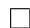

# 代数方程组求解

本章名为代数方程组的求解, 所以我们将从求解代数方程组的角度来引出一系列概念和算法. 根据我们从解线性方程组得到的经验, 我们需要发展一套消元方法, 以使将方程组化为类似于三角阵的形状, 这样引出两种算法. 一是吴文俊院士于上世纪七十年代为实现几何定理机器证明而提出的吴方法, 它不仅能进行机器证明, 同时特征列是一种三角列, 也可以用于代数方程组的求解. 另外一种是Gr¨obner 基方法, 它除了将多项式组化为三角形的基可用于解方程外, 还可用于多项式理想的计算等.

如果只从几何证明的角度, 吴方法无疑比 Gr¨obner 基要高效很多, 正是如此,吴方法在几何证明领域中在世界上都是十分有名的. 然而, 吴方法毕竟相当于一种不完全的约化, 其除法用的是伪除法, 因而在解方程, 多项式理想计算等方面不如Gr¨obner 基方法.

另外, 由高等代数学 [12] 我们知道还可以利用结式的计算来进行消元, 这一过程及其理论本身比较简单, 因此本章第一节我们先介绍结式消元法, 第二节和第三节分别介绍吴方法和 Gr¨obner基.

在介绍消元方法之前, 我们简单说明一下多元方程组求解的思路. 首先经过消元方法, 将问题化为一元方程, 利用上一章介绍的各种数值方法和精确求解方法可以分别求解. 这里值得一提的是如果要求精确解, 设 $n$ 个变元为 $x _ { 1 } , x _ { 2 } , \ldots , x _ { n }$ , 一般我们将方程组消元 $n$ 次, 每次化为只含其中某一变元 $x _ { i }$ 的一元方程, 以此求出$x _ { i }$ 的精确解. 实际中, 我们有可能对每个 $x _ { i }$ 都求出了一系列的解, 剩下的任务是将它们搭配成 $n$ 元序对, 即原方程组的解. 如果是根式解或单位根, 我们可以很容易

地用一定精度的数值方法来搭配. 如果没有根式解或不是单位根, 一般情况下我们表示代数数的方法是用极小多项式 $f$ (或者化零多项式)和 $i$ 表示 $f$ 的第 $i$ 个根(我们可以自己规定一种根的排序). 于是配对的过程可以用数值方法, 即在一定精度数值求解此根, 或者用区间隔离的方法, 将区间分得足够小来逼近根, 用区间算术代替根的运算以搭配. 我们举一个简单的例子来说明:

$$
\left\{ \begin{array}{l l} x ^ {2} + y ^ {2} - 1 & = 0 \\ x ^ {2} - 2 x + y ^ {2} - 2 y + 1 & = 0 \end{array} \right.
$$

消元方法给出 $x ^ { 2 } - x = 0$ 和 $y ^ { 2 } - y = 0$ , 因此 $x = 0 , 1$ 且 $y = 0 , 1$ , 我们需要将$2 \times 2$ 共四种情况进行搭配, 当然, 这里举的例子很简单, 更多的情况下解为复杂的根式或者为一高次不可约方程的某个根. 我们很容易搭配出两组解 $( x , y ) = ( 0 , 1 )$ 或 $( 1 , 0 )$ .

# 13. 1 结式

我们所说的结式一般都是指 Sylvester 结式, 利用结式进行消元基于我们以前提过的一个命题(见推论8.3), 现在重述如下:

定理13.1. 设 $R$ 是 UFD, 且有非零多项式 $f , g \in R [ x ]$ , 则 $\operatorname { g c d } ( f , g )$ 非平凡当且仅当 $\operatorname { r e s } ( f , g ) = 0$ .

现在我们考虑一个二元多项式方程组. 设 $f , g \in \mathbb { C } [ x , y ] = \mathbb { C } [ y ] [ x ]$ , 我们可以把它们看成 $\mathbb { C } [ y ]$ 上关于 $x$ 的一元多项式. 那么利用上面的定理, 我们有 $\operatorname { g c d } _ { x } ( f , g )$ 非平凡当且仅当 $\mathrm { r e s } _ { x } ( f , g ) = 0$ . 现在我们要求它们的公共根, 不妨设 $x _ { 0 }$ 是其一根,则有 $( x - x _ { 0 } ) | \operatorname* { g c d } _ { x } ( f , g )$ , 故有关于 $y$ 的方程

$$
\operatorname {r e s} _ {x} (f, g) = 0.
$$

由此, 我们实际上进行了消元, 将方程组化为一个只含有 $y$ 的方程.

事实上, 我们可以将这种消元方法推广到 $n$ 个变元的情形. 设变元分别为$x _ { 1 } , x _ { 2 } , \ldots , x _ { n }$ , 则我们首先可以从 $n$ 个方程中取出 $( n - 1 )$ 对方程, 两两用结式法消去 $x _ { 1 }$ , 之后得到 $( n - 1 )$ 个关于 $x _ { 2 } , \ldots , x _ { n }$ 的方程, 再将此过程递归做下去, 最终可求出方程的解.

例13.1. 考虑多项式方程组

$$
\left\{ \begin{array}{l} f _ {1} (x, y, z) = x ^ {2} + y ^ {2} + z ^ {2} - 1 = 0, \\ f _ {2} (x, y, z) = x + y + z = 0, \\ f _ {3} (x, y, z) = x ^ {2} - 2 x + y ^ {2} - 2 y + z ^ {2} + 2 z = 0. \end{array} \right.
$$

计算得

$$
\begin{array}{l} f _ {4} = \operatorname {r e s} _ {z} \left(f _ {1}, f _ {2}\right) = 2 x ^ {2} + 2 x y + 2 y ^ {2} - 1, \\ f _ {5} = \operatorname {r e s} _ {z} \left(f _ {2}, f _ {3}\right) = 2 x ^ {2} + 2 x y + 2 y ^ {2} - 4 x - 4 y, \\ \end{array}
$$

可见变元 $z$ 已被消去, 再计算上面二式关于 $y$ 的结式可将 $y$ 消去:

$$
f _ {6} = \operatorname {r e s} _ {y} \left(f _ {4}, f _ {5}\right) = 4 \left(1 6 x ^ {2} - 4 x - 7\right).
$$

于是得到一元方程 $1 6 x ^ { 2 } - 4 x - 7 = 0$ .

# 13.2 吴方法

# 13.2.1 一些基本概念

吴方法也称为特征列方法, 这原本是由 J. F. Ritt 在他的关于微分代数的工作中引入, 上个世纪 70 年代末, 吴文俊在建立几何定理机器证明时大大发展了这一领域. 它同 Gr¨obner 基类似, 也是一种消元方法, 在几何定理证明, 代数方程求解等方面均有很重要的应用. 关于吴方法, 可以参考 [14], [13], 也可见吴文俊本人的著作 [3]4.3 节.

下面设 $k$ 是一特征为 0 的域, $k [ X ] = k [ x _ { 1 } , \dots , x _ { n } ] = R$ , 并取字典序为$x _ { 1 } < x _ { 2 } < \cdots < x _ { n } .$

定义13.1. 对于单项式 $t$ , 记 $t$ 中含 $x _ { i }$ 最大的下标 $i$ 为 $p$ , 定义它的类 $\mathrm { c l } ( t ) = p$ . 即

$$
\operatorname {c l} (t) = p = \max  \{i: x _ {i} | t \},
$$

其中非 0 常数的类定义为 0.

定义13.2. 对于多项式 $f \in R$ , 定义其类为 $\operatorname { c l } ( f ) = \operatorname { c l } ( \operatorname { l t } ( f ) )$ .

定义13.3. 定义一种全序关系 $< \subset { \cal R } \times { \cal R }$ , 对于 $f , g \in R$ , 称 $f < g$ 如果下列条件之一满足:

1. $\operatorname { c l } ( f ) < \operatorname { c l } ( g )$   
2. $\operatorname { c l } ( f ) = \operatorname { c l } ( g ) = p > 0 \land \deg _ { p } { f } < \deg _ { p } { g } .$

若 $f \not \prec g \wedge g \not \ll f$ , 则称 $f$ 和 $g$ 级别相同, 记作 $f \sim g$

注170. 若 $f < g$ , 则 $\operatorname { l t } ( f ) < \operatorname { l t } ( g )$ . 反之则不然, 例如 $f = x _ { 1 } x _ { 2 } ^ { 2 } x _ { 3 }$ , $g = x _ { 1 } ^ { 2 } x _ { 3 }$ 级别相同.

注171. 这样的序不仅是全序, 而且是良序.

定义13.4. 设 $\operatorname { c l } ( f ) = p > 0$ , 若 $\deg _ { p } g \ < \ \deg _ { p } f$ , 则 称 $g$ 对 $f$ 是约化的, 记为$g ( \mathrm { r e d } f )$ .

注172. 若 $g \ < \ f$ , 则显然 $g ( \mathrm { r e d } f )$ . 但 当 $g ( \mathrm { r e d } f )$ 时, 不一定有 $\textit { g } < \textit { f }$ . 例如$g = x _ { 1 } x _ { 3 }$ , $f = x _ { 2 }$ .

下面记 $\operatorname { c l } ( f ) = p > 0$ , 且

$$
\begin{array}{l} f = f _ {0} x _ {p} ^ {m} + f _ {1} x _ {p} ^ {m - 1} + \dots + f _ {m}, \\ g = g _ {0} x _ {p} ^ {M} + g _ {1} x _ {p} ^ {M - 1} + \dots + g _ {M}, \\ \end{array}
$$

首先

定义13.5. $f _ { 0 } \in k [ x _ { 1 } , x _ { 2 } , \ldots , x _ { p - 1 } , x _ { p + 1 } , \ldots , x _ { n } ]$ 称为 $f$ 的初式.

当 $g$ 相对 $f$ 不约化时, 即 $M > m$ , 我们可由下面定义的伪除法将其约化.

定义13.6. ∃s ∈ N 使得 $f _ { 0 } ^ { s } g = q f + r$ , 其中 $r ( \mathrm { r e d } f )$ . 将 $g$ 化为 $r$ 的过程称为约化,此处 $s$ 宜取 $M - m + 1$ .

# 13.2.2 升列

我们引入一系列的定义.

定义13.7. 多项式序列 $F = \{ f _ { 1 } , f _ { 2 } , \dots , f _ { r } \}$ 称为升列(ascending set), 若下列条件之一满足:

1. $r = 1$ 且 $f _ { 1 } \neq 0$   
2. $r > 1$ , 且 $0 < \operatorname { c l } ( f _ { 1 } ) < \operatorname { c l } ( f _ { 2 } ) < \cdots < \operatorname { c l } ( f _ { r } )$ , 且 $\forall j > i$ , 有 $f _ { j } ( \mathrm { r e d } f _ { i } )$ .

由升列的定义我们知道升列的项数 $r$ 必然不大于未定元个数 $n$ .

定义13.8. 升列称为矛盾列, 如果升列只由一个非零常数组成. 矛盾列构成的多项式方程组是无解的.

定义13.9. 设 $F$ 是升列, 对多项式 $g \in R$ , 若 $\forall f \in F$ 有 $g ( \mathrm { r e d } f )$ , 则称 $g$ 相对于 $F$ 是约化的, 记为 $g ( \mathrm { r e d } F )$ .

定义13.10. 定义升列上的全序关系 $\prec$ , 对于两个升列 $F = \{ f _ { 1 } , \ldots , f _ { r } \}$ , $G =$ $\{ g _ { 1 } , \ldots , g _ { s } \}$ , 称 $F \succ G$ , 若下列条件之一满足:

1. $\exists j \leq \operatorname* { m i n } ( r , s )$ , 使得

$$
f _ {1} \sim g _ {1}, f _ {2} \sim g _ {2}, \dots , f _ {j - 1} \sim g _ {j - 1}, f _ {j} > g _ {j},
$$

2. $s > r$ 且 $f _ { 1 } \sim g _ { 1 } , . . . , f _ { r } \sim g _ { r }$ .

若 $F \not \times G \wedge G \not \times F$ , 则称二者级别相同, 记为 $F \sim G$ .

注173. 若 $F \sim G$ , 显然有 $r = s$ 且 $f _ { i } \sim g _ { i } ( \forall i )$

下面的定理很重要, 是特征列方法的基础.

定理13.2 (Ritt 引理). 设 $F _ { 1 } , F _ { 2 } , \ldots , F _ { q } , \cdot \cdot \cdot$ 是不增升列的序列, 即 $\forall q$ , 有 $F _ { q + 1 } \prec$ $F _ { q } \vee F _ { q + 1 } \sim F _ { q }$ , 则 $\exists q ^ { \prime }$ , $\forall q > q ^ { \prime }$ , 有 $F _ { q } \sim F _ { q ^ { \prime } }$ , 即有极小升列 $F _ { q ^ { \prime } }$ .

证明. 记 $r _ { q } = \# F _ { q }$ , $f _ { q } \in F _ { q }$ 是每个升列中第一个多项式, 则

$$
f _ {1}, f _ {2}, \dots , f _ {q}, \dots
$$

是一个不增列. 对于良序下的不增列我们显然有 $q _ { 1 } \in \mathbb { N }$ 使得 $\forall q > q _ { 1 }$ 时, $f _ { q _ { 1 } } \sim f _ { q }$ 我们再考虑 $q \geq q _ { 1 }$ 时 $F _ { q }$ 中第 2 个多项式构成的序列

$$
f _ {q _ {1}} ^ {(1)}, \ldots , f _ {q} ^ {(1)}, \dots ,
$$

同样的分析给出 $q _ { 2 } \in \mathbb { N }$ 使得 $q \geq q _ { 2 }$ 时有 $f _ { q } ^ { ( 1 ) } \sim f _ { a _ { 2 } } ^ { ( 1 ) }$ . 由于每个升列都有 $r _ { q } \leq n$ ,我们将这个过程继续下去总会终止, 于是可找到 $q ^ { \prime } \in \mathbb { N }$ , 使得 $q \geq q ^ { \prime }$ 时, $r _ { q } = r _ { q ^ { \prime } }$ 且$F _ { q } \sim F _ { q ^ { \prime } }$ . □

推论13.1. 严格下降的升列序列必为有限的.

# 13.2.3 基本列

设 $A$ 是一有限非零多项式的集合, 其中必含有升列, 我们记从中选出的升列的全体集合为 $A S ( A )$ .

定义13.11. 若 $F \in A S ( A )$ 是当中的一个极小元, 则称 $F$ 是 $A$ 的基本列(basic set).

定理13.3. $A$ 上的基本列存在, 且能在有限步内构造出来.

证明. 我们只需给出构造性的证明即可. 设 $A _ { 1 } = A$ .

先取 $f _ { 1 }$ 为 $A _ { 1 }$ 中的某个最小元, 若 $\operatorname { c l } ( f _ { 1 } ) = 0$ 则 $\{ f _ { 1 } \}$ 已是基本列. 若 $\operatorname { c l } ( f _ { 1 } ) >$ 0, 记 $B _ { 1 } = A _ { 1 } \setminus \{ f _ { 1 } \}$ . 若 $B _ { 1 }$ 中元素对 $f _ { 1 }$ 均未约化, 则 $\{ f _ { 1 } \}$ 仍然是基本列, 否则记$B _ { 1 }$ 中对 $f _ { 1 }$ 约化的多项式全体为 $A _ { 2 }$ .

$\forall f _ { 2 } \in A _ { 2 }$ , 显然有 $f _ { 2 } \geq f _ { 1 }$ . 倘若 $f _ { 2 } \sim f _ { 1 }$ , 则与 $f _ { 2 } ( \mathrm { r e d } f _ { 1 } )$ 矛盾. 故 $f _ { 2 } > f _ { 1 }$ , 由于 $f _ { 2 } ( \mathrm { r e d } f _ { 1 } )$ , 则只能 $\operatorname { c l } ( f _ { 2 } ) > \operatorname { c l } ( f _ { 1 } )$ .

再取 $f _ { 2 }$ 为 $A _ { 2 }$ 中的某个最小元, 若 $B _ { 2 } = A _ { 2 } \setminus \{ f _ { 2 } \}$ 中元素关于 $f _ { 2 }$ 都未约化,则 $\{ f _ { 1 } , f _ { 2 } \}$ 已是基本列, 否则可以构造出 $A _ { 3 } \cdots$

由于 $f _ { 1 } , f _ { 2 } , \cdots$ 的类是严格增加的, 则上述过程必能有限步终止, 得到基本列. □

鉴于基本列的存在性, 我们记集合 $A$ 的全体基本列的集合为 $B S ( A )$ . 定理13.3的构造性证明过程实际上已给出了求多项式集合 $A$ 的基本列的方法.

定理13.4. $A$ 是由非零多项式构成的有限集, $F = \{ f _ { 1 } , \dots , f _ { r } \} \in B S ( A )$ , $\operatorname { c l } ( f _ { 1 } ) >$ 0, 设 $g$ 是一非零多项式, 且 $g ( \mathrm { r e d } f _ { i } ) ( \forall f _ { i } \ \in \ F )$ , 设 $B \ = \ A \bigcup \{ g \}$ , 则 $\exists G \in$ $B S ( B ) , G \prec F$ .

证明. 若 $\operatorname { c l } ( g ) = 0$ , 则 $G = \{ g \}$ 满足要求.

若 $\operatorname { c l } ( g ) = p > 0$ , 则 $\exists s ( 1 \leq s \leq r )$ 使得 $\operatorname { c l } ( f _ { s - 1 } ) < p \leq \operatorname { c l } ( f _ { s } )$ , 又 由 于$g ( \mathrm { r e d } f _ { s } )$ , 则 $g < f _ { s }$ , 故 $G = \{ f _ { 1 } , f _ { 2 } , \dotsc , f _ { s - 1 } , g \}$ 满足要求.

若 $\operatorname { c l } ( g ) > \operatorname { c l } ( f _ { r } )$ , 则 $G = \{ f _ { 1 } , \dots , f _ { r } , g \}$ 满足要求.

# 13.2.4 特征列与解方程

定义13.12. 若 $g$ 对升列 $F = \{ f _ { 1 } , \ldots , f _ { r } \}$ 不是约化的, 设 $I _ { i }$ 为 $f _ { i } \in F$ 的初式, 则有带余除法:

$$
I _ {r} ^ {s _ {r}} g = Q _ {r} f _ {r} + R _ {r}, \quad R _ {r} (\operatorname {r e d} f _ {r}),
$$

$$
I _ {r - 1} ^ {s _ {r - 1}} R _ {r} = Q _ {r - 1} f _ {r - 1} + R _ {r - 1}, \quad R _ {r - 1} (\operatorname {r e d} f _ {r - 1}),
$$

$$
I _ {1} ^ {s _ {1}} R _ {2} = Q _ {1} f _ {1} + R _ {1}, \quad R _ {1} (\operatorname {r e d} f _ {1}).
$$

显然 $R _ { 1 }$ 对 $F$ 是约化的, 我们称其为 $g$ 对 $F$ 的余式, 记为 $g \mathrm { r e m } F$ .

下面给出特征列的定义:

定义13.13. 设 $P$ 为由非零多项式构成的有限集, 称升列 $C \in A S ( P )$ 为其特征列(characteristic set), 如果 $C \subset \langle P \rangle$ 且 $\forall p \in P$ 有 $p \operatorname { r e m } C = 0$ .

# 算法13.1 (求特征列的算法).

输入:非零有限多项式集合 $P$ ,

输出: $P$ 的特征列 $F$

1. $P _ { 1 } = P$ , $i = 1$   
2. 求出 $P _ { i }$ 的一个基本列 $F _ { i } \in B S ( P _ { i } )$ ,  
3. 将 $P _ { i } \setminus F _ { i }$ 中的多项式对 $F _ { i }$ 求余式, 其非零项构成集合 $R _ { i }$ ,  
4. 若 $R _ { i } \neq \varnothing$ , 令 $P _ { i + 1 } = P _ { i } \bigcup R _ { i } , i = i + 1 ,$ $i = i + 1$ , 转 2 步,  
5. 输出 $F _ { i }$

对于上面的算法过程, 设其在 $i = m$ 时终止, 我们很容易有如下断言:

$$
V \left(P _ {1}\right) = V \left(P _ {2}\right) = \dots = V \left(P _ {m}\right).
$$

而对于算法的终止性, 由定理 13.4可知我们得到如下的递降基本列:

$$
F _ {1} \succ F _ {2} \succ \dots
$$

由于 Ritt 引理, 我们可以断言在某一步, 例如 $i = m$ 时, 算法会终止, 即此时会得到 $R _ { i } = \varnothing$ .

关于特征列和多项式零点的关系, 有如下的定理:

定理13.5. 设 $F = \{ f _ { 1 } , f _ { 2 } , . . . , f _ { r } \}$ 为求得的基本列, 且 $f _ { i }$ 的初式为 $I _ { i }$ , ${ \boldsymbol { J } } =$ $I _ { 1 } I _ { 2 } \cdots I _ { r }$ , 则 $V ( P ) = ( V ( F ) \setminus V ( J ) ) { \bigcup { V ( P , I _ { 1 } ) \bigcup { V ( P , I _ { 2 } ) \bigcup \cdots \bigcup { V ( P , I _ { r } ) } } } } .$ .

证明. 由伪除法的定义, 我们知道对于多项式 $p \in P$ , 由于 $p ( \mathrm { r e d } F )$ , 则存在$q _ { r } , \ldots , q _ { 1 }$ 使得

$$
I _ {r} ^ {s _ {r}} \dots I _ {1} ^ {s _ {1}} p = q _ {r} f _ {r} + \dots + q _ {1} f _ {1},
$$

由此等式显然可以看出右边任何一项都是左边的子集, 因此右 $\subset$ 左. 现在 $\forall a \in$ $V ( P )$ , 若 $a \in V ( J )$ , 则必有某个 $i$ 使得 $a \in V ( I _ { i } )$ , 此时易知 $a \in V ( P , I _ { i } )$ , 若$a \not \in V ( J )$ , 则 $a \in V ( F ) \setminus V ( J )$ , 因此有左 $\subset$ 右. □

注174. 若 $F$ 是矛盾列, 则有 $V ( P ) \subset V ( F ) = \emptyset$

定理13.6. 对于有限非零多项式集合 $P$ , 存在一系列的特征列 $F _ { 1 } , F _ { 2 } , \cdots$ 使得

$$
V (P) = \bigcup [ V (F _ {i}) \backslash V (J _ {i}) ],
$$

其中 $J _ { i }$ 为 $F _ { i }$ 中各多项式初式之积.

证明. 根据前面定理, 我们已有分解

$$
V (P) = \left(V (F) \backslash V (J)\right) \bigcup \left(\bigcup V (P, I _ {i})\right).
$$

首先我们证明若 $I _ { i } \neq 0$ , 则 $I _ { i } ( \mathrm { r e d } P )$ . 由于 $I _ { i }$ 是特征列 $F$ 中 $f _ { i }$ 的初式, 则显然有 $I _ { i } ( \mathrm { r e d } F )$ . 因此 $I _ { i } ( \mathrm { r e d } P )$ .

再用递归思想, 对每个不为零的 $I _ { i }$ , 分解 $V ( P , I _ { i } )$ , 若其特征列不是矛盾列, 则可得到递减的特征列序列, 由定理 13.4 可知其必有限终止, $V ( P )$ 可化为本定理形式. □

# 13.3 Gr¨obner 基

Gr¨obner 基是 Buchberger 于 1965 年在其博士毕业论文中提出, 最初是用来解决多项式方程组的问题. 其后经过发展, 它在多元多项式环的理想等问题上也有重要的应用. [17]一书对此有详细介绍, 另外 [174], [13]对此也有介绍.

# 13.3.1 一些概念与介绍

我们主要是为了处理多元多项式而引入 Gr¨obner 基, 为了方便起见, 我们先给出一些记号上的说明.

设 $F$ 为一域, 以 $X$ 表示 $n$ 个不定元 $x _ { 1 } , x _ { 2 } , \ldots , x _ { n }$ , 则记多项式环 $R = F [ X ] =$ $F [ x _ { 1 } , x _ { 2 } , \ldots , x _ { n } ]$ , 设有 $s$ 个多项式 $f _ { 1 } , \dots , f _ { s } \in R$ , 由它们生成的理想记作

$$
I = \left\langle f _ {1}, f _ {2}, \dots , f _ {s} \right\rangle = \left\{\sum_ {1 \leq i \leq s} q _ {i} f _ {i} | q _ {i} \in R \right\}.
$$

定义13.14. 对于上面的理想 $I$ , 定义其仿射簇为

$$
V (I) = \left\{a = \left(a _ {1}, a _ {2}, \dots , a _ {n}\right) \in F ^ {n} \mid f _ {i} (a) = 0, i = 1, 2, \dots , s \right\}.
$$

显然我们有 $V ( f _ { 1 } , f _ { 2 } , \ldots , f _ { s } ) = \bigcap _ { i = 1 } ^ { s } V ( f _ { i } )$ , 且 $\forall f \in I ( f ( V ( I ) ) = 0 )$ ).

采用上面的记号, $f _ { 1 } , \ldots , f _ { s }$ 显然是 $I$ 的基, 我们知道, 在一元多项式环中, 由于其是主理想环, 我们有

$$
\langle f _ {1}, \ldots , f _ {s} \rangle = \langle \operatorname * {g c d} (f _ {1}, \ldots , f _ {s}) \rangle = \langle g \rangle ,
$$

且对于任何一个多项式 $f$ , 将其对 $g$ 作 Euclid 除法得到 $f = q g + r$ , 则 $f \in \langle g \rangle \Leftrightarrow$ $r = 0$ . 但对于多元情形, 这些良好的性质未必成立, 比如

$$
\langle x, y \rangle \neq F [ x, y ] = \langle 1 \rangle = \langle \operatorname * {g c d} (x, y) \rangle .
$$

对于指标 $\alpha = ( \alpha _ { 1 } , \alpha _ { 2 } , \ldots , \alpha _ { n } ) \in \mathbb { N } ^ { n }$ , 定 义 $X ^ { \alpha } = x _ { 1 } ^ { \alpha _ { 1 } } x _ { 2 } ^ { \alpha _ { 2 } } \cdot \cdot \cdot x _ { n } ^ { \alpha _ { n } }$ , 称 为 单 项式(Monomial), 将全体单项式集合记作 $M \subset R$ .

我们可以定义 $M$ 中的一种良序 $<$ <, 使其满足与加法的和谐性, 即对任何三个指标 $\alpha , \beta , \gamma \in \mathbb { N } ^ { n }$ $\alpha$ , 有 $\alpha < \beta \Rightarrow \alpha + \gamma < \beta + \gamma$ . 下面给出几个序的例子:

例13.2. $M$ 上的字典序(Lexicographic order) $< _ { l e x } : \alpha < _ { l e x } \beta \Leftrightarrow \alpha - \beta$ 左边第一非零分量为负.  
例13.3. M 上的分级字典序(Graded lexicographic order) $< _ { l e x 1 }$ $\forall _ { l e x 1 } \colon \alpha < _ { l e x 1 } \beta \Leftrightarrow \| \alpha \| <$ $\| \beta \| \vee ( \| \alpha \| = \| \beta \| \wedge \alpha < _ { l e x } \beta )$ , 其中 $\| \cdot \|$ 是 1-范数.  
例13.4. $M$ 上的分级逆字典序(Graded reverse lexicographic order) $< _ { l e x 2 } : \alpha < _ { l e x 2 } \beta \Leftrightarrow$ $\| { \boldsymbol { \alpha } } \| < \| { \boldsymbol { \beta } } \| \lor ( \| { \boldsymbol { \alpha } } \| = \| { \boldsymbol { \beta } } \| \land { \boldsymbol { \alpha } } - \beta$ 最右非零分量为零).

我们一般取字典序即可, 就以 $<$ 来表示. 在该序下, 我们可以定义多项式 $f$ 的领项 $\operatorname { l t } ( f )$ 为 $f$ 最大的单项式, 类似地可定义领项系数 $\operatorname { l c } ( f )$ 和领项单项式 $\ln ( f )$ .一个多项式次数的定义为 $\deg f = \deg \mathrm { l t } ( f ) \in \mathbb { N } ^ { n }$ . 有了这些概念, 我们可以像在一元多项式环中那样做带余除法, 下面给出 $R$ 中带余除法的算法:

# 算法13.2 (带余除法).

输入: $f , f _ { 1 } , f _ { 2 } , \ldots , f _ { s } \in R$ ,

输出: $q _ { 1 } , q _ { 2 } , \dotsc , q _ { s } , r \in R$ 使得 $f = q _ { 1 } f _ { 1 } + \cdot \cdot \cdot + q _ { s } f _ { s } + r$ 且 $r$ 中任何单项不被$\operatorname { l t } ( f _ { 1 } ) , \dots , \operatorname { l t } ( f _ { s } )$ 中任何一个整除, 即不可再约化.

1. $r = 0$ , $p = f$ , $q _ { i } = 0 ( i = 1 , \ldots , s )$   
2. 当 $p \neq 0$ 时, 循环做第3 步,  
3. 若存在某个 $i$ 使 $\operatorname { l t } ( f _ { i } ) | \operatorname { l t } ( p )$ 则

$$
q _ {i} = q _ {i} + \frac {\operatorname {l t} (p)}{\operatorname {l t} (f _ {i})}, \quad p = p - \frac {\operatorname {l t} (p)}{\operatorname {l t} (f _ {i})} f _ {i},
$$

否则 $r = r + \operatorname { l t } ( p )$ , $p = p - \operatorname { l t } ( p )$

4. 输出 $q _ { 1 } , q _ { 2 } , \ldots , q _ { s } , r$

例13.5. 考虑 $f = x ^ { 2 } y + x y ^ { 2 } + y ^ { 2 } , f _ { 1 } = x y - 1 , f _ { 2 } = y ^ { 2 } - 1 .$ $f = x ^ { 2 } y + x y ^ { 2 } + y ^ { 2 }$

解: 用上面的算法计算除法, 我们发现, 第一步只可以用 $f _ { 1 }$ 来约化, 得到 $f =$ $x f _ { 1 } + ( x y ^ { 2 } + x + y ^ { 2 } )$ , 第二步我们可以用 $f _ { 1 }$ 或 $f _ { 2 }$ 来约化, 简单计算我们发现若这

一步用 $f _ { 1 }$ 来约化, 得到结果

$$
f = (x + y) f _ {1} + f _ {2} + (x + y + 1),
$$

反之则得到

$$
f = x f _ {1} + (x + 1) f _ {2} + (2 x + 1),
$$

我们看到, 约化的顺序不同会导致结果不同, 这也是多元多项式环区别于一元多项式环的性质之一. ✸

定义13.15. 在算法 13.2 第 3 步中若选取满足领项能整除 $\operatorname { l t } ( p )$ 的最小的指标 $i$ 对应的多项式进行约化, 则定义此时得到的 $r$ 为余式 $f \operatorname { r e m } ( f _ { 1 } , f _ { 2 } , \dots , f _ { s } ) = r$ .

由前面约化结果的不唯一性我们知道, 并不能用余式是否为零来判断一个多项式是否在所考察的理想中, 为了解决种种在多元多项式环中出现的问题, 我们需要引入 Gr¨obner 基.

# 13.3.2 单项式理想及一些准备定理

单项理想即是指由一些单项式生成的理想, 若 $A$ 是 $N ^ { n }$ 的一个子集, 定义$\langle x ^ { A } \rangle = \langle \{ x ^ { \alpha } | \alpha \in A \} \rangle .$ .

引理13.1. $x ^ { \beta } \in I \Leftrightarrow \exists \alpha \in A ( x ^ { \alpha } | x ^ { \beta } )$ .

引理13.2. 设 $I$ 是一个单项理想, 以下三个命题是等价的:

$( 1 ) f \in I ,$   
$( 2 ) f$ 中每个单项都属于理想 $I$ ,  
$( 3 ) f$ 是 $I$ 中某些多项式的 $F$ -线性组合.

证明. $( 1 ) \Rightarrow ( 2 )$ 设 $I = \langle x ^ { A } \rangle$ , 则必有 $\textstyle f = \sum _ { \alpha \in A } q _ { \alpha } x ^ { \alpha }$ , 其中 $q _ { \alpha }$ 是多项式. 由此可知$f$ 中每个单项必可被某个 $x ^ { \alpha }$ 整除.

(2)⇒(3)和(3)⇒(1)均显然.

由引理第二个等价条件得到:

推论13.2. 两个单项理想 $I _ { 1 }$ , $I _ { 2 }$ 相等的充要条件是它们含有相同的单项式.

定理13.7 (Dickson 引理). $\forall A \subset \mathbb { N } ^ { n }$ , ∃ 有限集 $B \subset A$ 使得 $\langle x ^ { A } \rangle = \langle x ^ { B } \rangle$ .

证明. 为了便于证明, 我们引入 $\mathbb { N } ^ { n }$ 上的偏序 $\preccurlyeq$ 满足 $\alpha \prec \beta \Leftrightarrow \forall i \in \{ 1 , 2 , \ldots , n \} ( \alpha _ { i } \leq$ $\beta _ { i } )$ . 由此我们知道 $\alpha \prec \beta \Leftrightarrow x ^ { \alpha } | x ^ { \beta }$ .

设 $B$ 为 $A$ 的极小元集合, 即 $B = \{ \beta \in A | \forall \alpha \in A ( \alpha \neq \beta ) \}$ .

于是 $\forall \alpha \in A , \exists \beta \in B ( \beta \prec \alpha )$ , 如若不然, 首先 $\beta \neq \alpha \Rightarrow \alpha \notin B$ , 即 $\alpha$ 非极小元, 必存在 $\beta ^ { \prime } \in B ( \beta ^ { \prime } \prec \alpha ) .$ , 矛盾. 因此 $\forall \alpha \in A , \exists \beta \in B ( x ^ { \beta } | x ^ { \alpha } )$ , 即$x ^ { \alpha } \in \langle x ^ { B } \rangle \Rightarrow \langle x ^ { A } \rangle \subset \langle x ^ { B } \rangle$ . 又 $B \subset A \Rightarrow \langle x ^ { B } \rangle \subset \langle x ^ { A } \rangle$ , 因而 $\langle x ^ { A } \rangle = \langle x ^ { B } \rangle$ .

下面我们证明 $B$ 是有限集. 对于 $n = 1$ 的情况, 由于 $\preccurlyeq$ 是全序, 则 $B$ 是单元集, 命题显然成立. 下面假设命题对于 $n - 1$ 的情况也是成立的, 命

$$
A ^ {*} = \left\{\left(\alpha_ {1}, \alpha_ {2}, \dots , \alpha_ {n - 1} \in \mathbb {N} ^ {n - 1} \right\rvert   \exists \alpha_ {n} \in \mathbb {N}, \left(\alpha_ {1}, \dots , \alpha_ {n}\right) \in A \right\},
$$

则 $A ^ { * }$ 的极小元集 $B ^ { * }$ 是有限集. $\forall \beta ^ { * } = ( \beta _ { 1 } , \ldots , \beta _ { n - 1 } ) \in B ^ { * }$ , 我们可取 $b _ { \beta ^ { * } } \in \mathbb { N }$ 使得 $( \beta ^ { * } , b _ { \beta ^ { * } } ) \in A$ , 由于 $B ^ { * }$ 的有限性, 我们可取最大值

$$
b = \max  \left\{b _ {\beta^ {*}} | \beta^ {*} \in B ^ {*} \right\}.
$$

于是 $\forall \alpha \in A$ , $\exists \beta ^ { * } \in B ^ { * }$ 使得 $\beta ^ { * } \preccurlyeq \left( \alpha _ { 1 } , \ldots , \alpha _ { n - 1 } \right)$ , 假设 $\alpha _ { n } > b$ , 则

$$
\left(\beta^ {*}, b _ {\beta^ {*}}\right) \preccurlyeq \left(\beta^ {*}, b\right) <   \alpha ,
$$

即 $\alpha$ 不是极小元. 因此 $A$ 中任一极小元 $\alpha$ 必满足 $\alpha _ { n } \leq b$ , 那么 $\# B \leq ( \# B ^ { * } ) \times$ $( b + 1 )$ 是有限的. 由归纳法, 本定理得证. □

引理13.3. $I$ 是 $R$ 中任一理想, 若 $G \subset I$ 是有限集且 $\langle \mathrm { l t } ( G ) \rangle = \langle \mathrm { l t } ( I ) \rangle$ , 则 $\langle G \rangle = I$ .证明. 设 $G = \{ g _ { 1 } , \ldots , g _ { t } \}$ , 则 $\forall f \in I$ , 由带余除法可得到

$$
f = q _ {1} g _ {1} + \dots + q _ {t} g _ {t} + r,
$$

其中 $r$ 不可再被 $G$ 约化. 而由于 $r = f - q _ { 1 } g _ { 1 } - \cdot \cdot \cdot - q _ { t } g _ { t } \in I .$ , 于是 $\operatorname { l t } ( r ) \in \operatorname { l t } ( I ) \Rightarrow$ $\operatorname { l t } ( r ) \in \left. \operatorname { l t } ( G ) \right.$ , 即 $r$ 中每个单项都在 $\langle \operatorname { l t } ( G ) \rangle$ 中, 因此 $r = 0$ , 则 $f \in \left. G \right. \Rightarrow \left. G \right. =$ $I$ . □

由于任何单项理想均可有限生成, 我们有下面的:

定理13.8 (Hilbert 基定理). $R$ 中任何理想 $I$ 均可有限生成.

推论13.3 (理想升链定理). 设 $R$ 中有一理想升链 $I _ { 1 } \subset I _ { 2 } \subset \cdots \subset I _ { n } \subset \cdots$ , 则存在 $n \in \mathbb { N } ( \forall m > n , I _ { m } = I _ { n } )$ .

这可由 $I = \textstyle \bigcup _ { i = 1 } ^ { \infty } I _ { i }$ 是有限生成的得到. 满足这样条件的环也叫 Noether环(Noetherian Domain).

# 13.3.3 Gr¨obner 基及其性质

现在引入 Gr¨obner 基的定义:

定义13.16. 设有多项式环 $R$ 中的理想 $I$ 和某一单项序 $<$ , $I$ 的有限子集 $G$ 当满足$\langle \mathrm { l t } ( G ) \rangle = \langle \mathrm { l t } ( I ) \rangle$ 时, 称为 $I$ 的 Gr¨onber 基.

我们记理想 $I$ 的全体 Gr¨obner 基为 $G B ( I )$ , 即

$$
G B (I) = \{G \in 2 ^ {I} | G \text {是} I \text {的} \mathrm {G r o n b e r} \text {基} \}.
$$

Gr¨obner基的存在性是由 Hilbert基定理和引理 13.3保证的, 它有如下的性质:

定理13.9. 设 $G \in G B ( I )$ , $\forall f \in R$ , 存在唯一的 $r \in R$ 使得 $f - r \in I$ 且 $r$ 中无单项可被 $\operatorname { l t } ( G )$ 中元素整除, 即不可被 $G$ 约化.

当考察的 $G$ 是 Gr¨obner 基时, 我们也记 $f \operatorname { r e m } G = { \overline { { f } } } ^ { G }$ 或 $\overline { { f } }$ .

证明. 存在性由带余除法算法得到, 对于唯一性, 可令 $f = h _ { 1 } + r _ { 1 } = h _ { 2 } + r _ { 2 }$ , 其中$r _ { 1 }$ , $r _ { 2 }$ 分别是两种不同途径约化的结果. 则 $r _ { 1 } - r _ { 2 } = h _ { 2 } - h _ { 1 } \in I \Rightarrow \operatorname { l t } ( r _ { 1 } - r _ { 2 } )$ 可被 $\operatorname { l t } ( G )$ 中元素整除. 由 $r _ { 1 } , r _ { 2 }$ 的定义可知 $r _ { 1 } - r _ { 2 } = 0$ . □

推论13.4. $f \in I \Leftrightarrow r = { \overline { { f } } } = f \operatorname { r e m } G = 0 .$

至此, 我们得到了Gr¨obner基的一个优美的性质.

构造理想的Gr¨obner基需要所谓的 S-多项式, 下面简要讨论之.

定义13.17. 对于非零多项式 $g , h$ , 设 $\alpha = \deg g$ , $\beta = \deg h$ , $x ^ { \gamma } = \operatorname { l c m } ( x ^ { \alpha } , x ^ { \beta } )$ , 即$\gamma = ( \operatorname* { m a x } ( \alpha _ { 1 } , \beta _ { 1 } ) , \dots , \operatorname* { m a x } ( \alpha _ { n } , \beta _ { n } ) )$ , 则定义 $g , h$ 的 S-多项式为

$$
S (g, h) = \left(\frac {x ^ {\gamma}}{\operatorname {l t} (g)} g - \frac {x ^ {\gamma}}{\operatorname {l t} (h)} h\right) \in R.
$$

引理13.4. 设 $g _ { 1 } , \ldots , g _ { s } \in R , \alpha _ { 1 } , \ldots , \alpha _ { s } \in \mathbb { N } ^ { n } , c _ { 1 } , \ldots , c _ { s } \in F \setminus \{ 0 \} ,$ $g _ { 1 } , \dotsc , g _ { s } \in R$

$$
f = \sum_ {1 \leq i \leq s} c _ {i} x ^ {\alpha_ {i}} g _ {i} \in R,
$$

且有 $\delta \in \mathbb { N } ^ { n }$ 使 $\alpha _ { i } + \deg g _ { i } = \delta ( 1 \leq i \leq s )$ , $\deg f < \delta$ , 即这些多项式求和后领项消 去(Leading term cancellation).

令 $x ^ { \gamma _ { i j } } = \operatorname { l c m } ( \operatorname { l m } ( g _ { i } ) , \operatorname { l m } ( g _ { j } ) )$ , 则存在 $c _ { i j } \in F$ 使得 $x ^ { \gamma _ { i j } } \vert x ^ { \delta }$ 且

$$
f = \sum_ {1 \leq i <   j \leq s} c _ {i j} x ^ {\delta - \gamma_ {i j}} S (g _ {i}, g _ {j}),
$$

且 $\deg x ^ { \delta - \gamma _ { i j } } S ( g _ { i } , g _ { j } ) < \delta , ( 1 \leq i < j \leq s ) .$

证明. 可假定 $\operatorname { l c } ( g _ { i } ) = 1$ , 否则可将其归并入 $c _ { i }$ 中而使定理条件形式仍不变, 于是$\operatorname { l t } ( g _ { i } ) = \operatorname { l m } ( g _ { i } ) = x ^ { \deg g _ { i } }$ . 由于 $x ^ { \delta } = x ^ { \alpha _ { i } } \ln ( g _ { i } ) = x ^ { \alpha _ { j } } \ln ( g _ { j } )$ , 则有 $x ^ { \gamma _ { i j } } | x ^ { \delta }$ .

由于

$$
S \left(g _ {i}, g _ {j}\right) = \frac {x ^ {\gamma_ {i j}}}{\operatorname {l t} \left(g _ {i}\right)} g _ {i} - \frac {x ^ {\gamma_ {i j}}}{\operatorname {l t} \left(g _ {j}\right)} g _ {j},
$$

首项消去告诉我们 $\deg S ( g _ { i } , g _ { j } ) < \gamma _ { i j }$ , 因此 $\deg x ^ { \delta - \gamma _ { i j } } S ( g _ { i } , g _ { j } ) \prec \delta$

不妨设 $s \geq 2$ , 则

$$
\begin{array}{l} g = f - c _ {1} x ^ {\delta - \gamma_ {i j}} S (g _ {1}, g _ {2}) \\ = c _ {1} x ^ {\alpha_ {1}} g _ {1} + c _ {2} x ^ {\alpha_ {2}} g _ {2} + \sum_ {3 \leq i \leq s} c _ {i} x ^ {\alpha_ {i}} g _ {i} - c _ {1} x ^ {\delta - \gamma_ {1 2}} \left(\frac {x ^ {\gamma_ {1 2}}}{\operatorname {l t} (g _ {1})} g _ {1} - \frac {x ^ {\gamma_ {1 2}}}{\operatorname {l t} (g _ {2})} g _ {2}\right) \\ = c _ {1} \left(x ^ {\alpha_ {1}} - x ^ {\delta - \deg g _ {1}}\right) g _ {1} + \left(c _ {2} x ^ {\alpha_ {2}} + c _ {1} x ^ {\delta - \deg g _ {2}}\right) g _ {2} + \sum_ {3 \leq i \leq s} c _ {i} x ^ {\alpha_ {i}} g _ {i} \\ = (c _ {1} + c _ {2}) x ^ {\alpha_ {2}} g _ {2} + \sum_ {3 \leq i \leq s} c _ {i} x ^ {\alpha_ {i}} g _ {i}, \\ \end{array}
$$

显然 $\deg g < \delta$ , 由此时 $g$ 的形式和归纳法, 我们可以证明 $f$ 可以表成定理中的形式. □

下面的定理给出了判别 Gr¨obner基的一个充要条件:

定理13.10. $G = \{ g _ { 1 } , \dots , g _ { s } \} \in G B ( I ) \Leftrightarrow \forall ( 1 \leq i < j \leq s ) , S ( g _ { i } , g _ { j } ) \mathrm { r e m } G = 0 .$

证明. $\Rightarrow$ . $S ( g _ { i } , g _ { j } ) \in I = \langle G \rangle \Rightarrow { \overline { { S ( g _ { i } , g _ { j } ) } } } = 0$ .

$\Leftarrow$ . 令 $f \in I \backslash \{ 0 \}$ , 由定义只需证明 $\operatorname { l t } ( f ) \in \left. \operatorname { l t } ( G ) \right.$ 即可.

不妨设 $\begin{array} { r } { f = \sum _ { 1 \leq i \leq s } q _ { i } g _ { i } } \end{array}$ , $\delta = \operatorname* { m a x } \{ \deg ( q _ { i } g _ { i } ) | 1 \leq i \leq s \}$ , 则显然 $\deg f \leq \delta$ . 倘若等号不成立, 即 $\deg f < \delta$ , 定义

$$
f^{*} = \sum_{1\leq i\leq s,\deg (q_{i}g_{i}) = \delta}\operatorname {lt}(q_{i})g_{i},
$$

它显然满足引理 13.4 的条件, 可写为 $S ( g _ { i } , g _ { j } )$ 的线性组合, 因而其在 $G$ 下约化为零. 由带余除法, 存在 $q _ { i } ^ { * }$ 使得 $\begin{array} { r } { f ^ { * } = \sum _ { 1 \leq i \leq s } q _ { i } ^ { * } g _ { i } } \end{array}$ 且 $\mathrm { m a x } \{ \deg ( q _ { i } ^ { * } g _ { i } ) | 1 \leq i \leq s \} \leq$ $\deg f ^ { * } < \delta$ . 由 $f ^ { * }$ 的定义可知 $\begin{array} { r } { f - f ^ { * } = \sum _ { 1 \leq i \leq s } q _ { i } ^ { * * } g _ { i } } \end{array}$ , $\begin{array} { r } { \operatorname* { m a x } \{ \deg ( q _ { i } ^ { * * } g _ { i } ) | 1 \leq i \leq } \end{array}$ $s \} < \delta$ . 于是 $f$ 也可以表示成

$$
f = \sum_ {1 \leq i \leq s} q _ {i} g _ {i}, \quad \max  \left\{\deg \left(q _ {i} g _ {i}\right) | 1 \leq i \leq s \right\} <   \delta ,
$$

这与 $\delta$ 的定义矛盾, 故 $\deg f = \delta$ , 即 $\exists i$ 使 $\deg f = \deg ( q _ { i } g _ { i } )$ , 因此

$$
\operatorname {l t} (f) = \sum_ {1 \leq i \leq s, \deg (q _ {i} g _ {i}) = \delta} \operatorname {l t} (q _ {i}) \operatorname {l t} (g _ {i}) \in \langle \operatorname {l t} (G) \rangle .
$$

证毕.

# 13.3.4 Buchberger 算法及约化 Gr¨obner 基

Buchberger 提出了 Gr¨obner 基的概念并给出了计算它的方法, 即下面的Buchberger 算法:

算法13.3 (Buchberger 算法).

输入: $f _ { 1 } , \dots , f _ { s } \in R$ ,

输出: $I = \langle f _ { 1 } , \dots , f _ { s } \rangle$ 的一个 Gr¨onber 基 $G$ .

1. $G = \{ f _ { 1 } , \ldots , f _ { s } \}$ ,   
2. 循环作后面所有步骤,  
3. $S = \emptyset$ , 将 $G$ 中元素编号为 $G = \{ g _ { 1 } , \ldots , g _ { t } \}$ ,   
4. 对于所有的序对 $( i , j ) , 1 \leq i < j \leq t$ 计算 $r = S ( g _ { i } , g _ { j } ) \operatorname { r e m } G$ , 若 $r \neq 0$ 则$S = S \cup \{ r \} ,$   
5. 若 $S = \emptyset$ 则输出 $G$ , 否则 $G = G \cup S$ .

算法有效性. 我们只需证明该算法循环是可以终止的, 因为终止时由定理 13.10 可知 $G$ 即是 Gr¨obner 基. 因为每步循环之后我们都可以得到一个新的集合 $G$ , 我们给它们编上号, 记为 $G _ { 1 } \subset G _ { 2 } \subset \cdots$ , 显然

$$
\langle \operatorname {l t} (G _ {1}) \rangle \subset \langle \operatorname {l t} (G _ {2}) \rangle \subset \dots ,
$$

由理想升链定理, $\exists n \in \mathbb { N }$ 使得 $\forall m > n$ 有 $\langle \mathrm { l t } ( G _ { n } ) \rangle = \langle \mathrm { l t } ( G _ { m } ) \rangle$ , 此时 $\forall g , h \in G _ { n }$ , 令$r = S ( g , h ) \operatorname { r e m } G _ { n }$ , 则显然 $r = 0 \lor r \in G _ { n + 1 }$ , 于是 $\operatorname { l t } ( r ) \in \langle \operatorname { l t } ( G _ { n + 1 } ) \rangle = \langle \operatorname { l t } ( G _ { n } ) \rangle$ ,由 $r$ 是多项式对 $G _ { n }$ 的约化结果知道 $r = 0$ , 于是算法终止. □

多项式理想的 Gr¨obner 基并不是唯一的, 而且在上面的算法中 $G$ 的规模的增长是十分迅速的, 求出的结果中可能含有大量的多项式, 因此我们要对 Gr¨obner 基做一定的优化, 下面我们一步一步对其进行约化化简.

引理13.5. 设 $G \in G B ( I )$ , $g \in G$ 且 $\operatorname { l t } ( g ) \in \left. \operatorname { l t } ( G \setminus \{ g \} ) \right.$ , 则 $G \backslash \{ g \} \in G B ( I )$ .

证明. l $\operatorname { t } ( g ) \in \langle \operatorname { l t } ( G \setminus \{ g \} ) \rangle \Rightarrow \langle \operatorname { l t } ( G \setminus \{ g \} ) \rangle = \langle \operatorname { l t } ( G ) \rangle = \langle \operatorname { l t } ( I ) \rangle \Rightarrow G \setminus \{ g \} \in$ $G B ( I )$ . □

定义13.18. 设 $G \in G B ( I )$ , 且 $\forall g \in G$ , 有 $\operatorname { l c } ( g ) = 1 \wedge \operatorname { l t } ( g ) \not \in \left. \operatorname { l t } ( G \setminus \{ g \} ) \right.$ , 则称 $G$ 是 $I$ 的极小 Gr¨obner 基(Minimal Gr¨obner basis), 并简记为 $G \in M G B ( I )$ .

定义13.19. 设 $G \in M G B ( I )$ , 若对于 $g \in G$ , $g$ 不可再被 $G \setminus \{ g \}$ 约化, 即 $g$ 中任何一单项均不在理想 $\langle \operatorname { l t } ( G \setminus \{ g \} ) \rangle$ 中, 则称 $g$ 关于 $G$ 是约化的. 若 $\forall g \in G$ , $g$ 关于 $G$ 都是约化的, 则称 $G$ 是约化 Gr¨obner 基(Reduced Gr¨obner basis), 并简记为$G \in R G B ( I )$ (或由下面的唯一性可记为 $G = R G B ( I ) )$ ).

定理13.11. 每个多项式理想 $I$ 都有唯一的约化 Gr¨obner 基.

证明. 存在性. 由引理 13.5 可将 $G$ 化为 $I$ 的极小 Gr¨obner 基, 设此时 $G =$ $\{ g _ { 1 } , g _ { 2 } , \ldots , g _ { s } \}$ , 然后对 $1 \leq i \leq s$ 归纳地做 $h _ { i } = g _ { i } \operatorname { r e m } \{ h _ { 1 } , \dots , h _ { i - 1 } , g _ { i + 1 } , \dots , g _ { s } \}$ .由极小 Gr¨obner 基的条件知道 $\operatorname { l t } ( h _ { i } ) = \operatorname { l t } ( g _ { i } )$ , $( 1 \leq i \leq s )$ . 于是由 $h _ { i }$ 相对于$\left\{ h _ { 1 } , \ldots , h _ { i - 1 } , g _ { i + 1 } , \ldots , g _ { s } \right\}$ 约化可知其相对于 $G _ { s } = \{ h _ { 1 } , \ldots , h _ { s } \}$ 也是约化的.

唯一性. 设 $G , G ^ { * }$ 均是 $I$ 的约化 Gr¨obner 基, 则 $\forall g \in \operatorname { l t } ( G ) \subset \langle \operatorname { l t } ( G ) \rangle \ =$ $\langle \operatorname { l t } ( G ^ { * } ) \rangle$ , $\exists g ^ { * } \in G ^ { * }$ 使 $\operatorname { l t } ( g ^ { * } ) | \operatorname { l t } ( g )$ , 同 样 地, $\exists g ^ { * * } \in G$ 使 $\operatorname { l t } ( g ^ { * * } ) | \operatorname { l t } ( g ^ { * } )$ , 因 此$\operatorname { l t } ( g ^ { * * } ) | \operatorname { l t } ( g )$ , 由于约化 Gr¨obner 基也是极小 Gr¨obner 基, 我们知道 $\operatorname { l t } ( g ) = \operatorname { l t } ( g ^ { * * } ) =$ $\operatorname { l t } ( g ^ { * } ) \in \operatorname { l t } ( G ^ { * } ) \Rightarrow \operatorname { l t } ( G ) \subset \operatorname { l t } ( G ^ { * } )$ , 再由对称可证 $\operatorname { l t } ( G ) = \operatorname { l t } ( G ^ { * } )$ .

$\forall g \in G$ , 取 $g ^ { \ast } \in G ^ { \ast }$ 使得 $\operatorname { l t } ( g ) = \operatorname { l t } ( g ^ { * } )$ . 由于 $G , G ^ { * }$ 约化, 则 $g - g ^ { * } \in I$ 中任一单项式均不能被 $\operatorname { l t } ( G \setminus \{ g \} ) = \operatorname { l t } ( G ^ { * } \setminus \{ g ^ { * } \} )$ 中元素约化. 于是 $g - g ^ { * } =$ $g - g ^ { * } \operatorname { r e m } G = 0 \Rightarrow g = g ^ { * } \in G ^ { * } \Rightarrow G \subset G ^ { * } \Rightarrow G = G ^ { * } .$ □

引理 13.5 给出了由 Gr¨obner 基求极小 Gr¨obner 基的方法, 定理 13.11 的存在性证明中也给出了极小 Gr¨obner基构造约化 Gr¨obner基的方法.

# 13.3.5 Buchberger 算法的两个改进

Buchberger 算法计算过程中集合 $G$ 中的多项式会越来越多, 呈指数规模增长,因而需要对其作一定的优化. [17]3.3 节提出了两种改进的方法. 首先我们将算法13.3重新描述如下, 以便于我们后面叙述改进算法.

# 算法13.4 (Buchberger 算法).

输入输出同算法 13.3,

1. $G = \{ f _ { 1 } , \ldots , f _ { s } \}$ , $H = \{ \{ i , j \} | i \neq j \land 1 \leq i , j \leq s \} .$   
2. 当 $H \neq \emptyset$ 时循环做后面两步,  
3. 任取 $h = \{ i , j \} \in H$ $\iota = \{ i , j \} \in H , H = H \setminus \{ h \} , r = S ( f _ { i } , f _ { j } ) \operatorname { r e m } G .$ $H = H \setminus \{ h \}$

4. 若 $r \neq 0$ 则 $f _ { s + 1 } = r$ , $H = H \cup \{ \{ i , s + 1 \} | 1 \leq i \leq s \}$ , $G = G \cup \{ f _ { s + 1 } \}$ ,$s = s + 1 ,$   
5. 输出 $G$

注175. 设 $E = \{ f _ { 1 } , \ldots , f _ { s } \}$ , 如果我们要得到矩阵 $M$ 使得 $G = E M$ , 那么首先令 $M _ { s } = I _ { s \times s }$ , 然后在上面算法每次第 4 步判断成功后, 设带余除法给出$r = S ( f _ { i } , f _ { j } ) \operatorname { r e m } G = S ( f _ { i } , f _ { j } ) - q _ { 1 } f _ { 1 } - \cdot \cdot \cdot - q _ { s } f _ { s }$ , 设 $\begin{array} { r } { S ( f _ { i } , f _ { j } ) = \sum _ { 1 \le k \le s } S _ { k } f _ { k } } \end{array}$ , 其中 $S _ { i } = x ^ { \gamma _ { i j } } / \operatorname { l t } ( g _ { i } )$ , $S _ { j } = - x ^ { \gamma _ { i j } } / \operatorname { l t } ( g _ { j } )$ , 其余的 $S _ { k } = 0$ . 则由

$$
(f _ {1}, \ldots , f _ {s}, r) = (f _ {1}, \ldots , f _ {s}) \left( \begin{array}{c c c c} 1 & & & S _ {1} - q _ {1} \\ & 1 & & S _ {2} - q _ {2} \\ & & \ddots & \vdots \\ & & & 1 \end{array} \right) =: (f _ {1}, \ldots , f _ {s}) Q _ {s},
$$

可知有迭代 $M _ { s + 1 } = M _ { s } Q _ { s }$ , 输出最后的 $M = M _ { s }$ 即可.

注176. 产生极小 Gr¨obner 基时只要从 $M$ 中去掉相应的列, 而对于约化过程, 同样由带余除法得到 $q _ { 1 } , \ldots , q _ { s }$ , 乘以相应的迭代矩阵.

# 第一个改进

引理13.6. 设有多项式 $f _ { 1 } , \ldots , f _ { s }$ 和 $d$ , $I = \langle f _ { 1 } , \ldots , f _ { s } \rangle$ , $J = \langle f _ { 1 } d , \ldots , f _ { s } d \rangle$ , 则$\{ f _ { 1 } , \dots , f _ { s } \} \in G B ( I ) \Leftrightarrow \{ f _ { 1 } d , \dots , f _ { s } d \} \in G B ( J ) .$ .

此引理由 Gr¨obner 基的定义 $\langle \mathrm { l t } ( G ) \rangle = \langle \mathrm { l t } ( I ) \rangle$ 可证.

引理13.7. 设有非零多项式 f, g, $I = \langle f , g \rangle$ , $d = \operatorname* { g c d } ( f , g )$ , 则下面两个条件等价:

(1) $\ln ( f / d )$ 与 $\ln ( g / d )$ 互素,   
(2) $S ( f , g ) \operatorname { r e m } \{ f , g \} = 0$ , 即 $\{ f , g \} \in G B ( I )$ .

证明. $( 1 ) \Rightarrow ( 2 )$ . 先设 $d = \operatorname* { g c d } ( f , g ) = 1$ , 且 $f = a X + f ^ { \prime }$ , $g = b Y + g ^ { \prime }$ , 其 中$\operatorname { l c } ( f ) = a , \operatorname { l m } ( f ) = X , \operatorname { l c } g = b , \operatorname { l m } ( g ) = Y$ , $f ^ { \prime }$ , $g ^ { \prime }$ 是余下的部分, 于是

$$
X = \frac {f - f ^ {\prime}}{a}, Y = \frac {g - g ^ {\prime}}{b}.
$$

(I)若 $f ^ { \prime } = g ^ { \prime } = 0$ , 则 $S ( f , g ) = 0$ ,   
(II)若 $f ^ { \prime } = 0 , g ^ { \prime } \neq 0$ , 由 $\operatorname* { g c d } ( \ln ( f ) , \ln ( g ) ) = 1$ 得

$$
S (f, g) = \frac {1}{a} Y f - \frac {1}{b} X g = \frac {1}{a b} (g - g ^ {\prime}) f - \frac {1}{a b} f g = - \frac {1}{a b} g ^ {\prime} f,
$$

若它能被 $g$ 约化, 则由 $\operatorname { l m } ( g ) | \ln ( g ^ { \prime } f ) \land \operatorname* { g c d } ( \operatorname { l m } ( g ) , \operatorname { l m } ( f ) ) = 1$ 知 $\ln ( g ) | \ln ( g ^ { \prime } )$ , 这与 $\deg g ^ { \prime } < \deg g \land g ^ { \prime } \neq 0$ 矛盾.

(III)若 $f ^ { \prime } \neq 0 , g ^ { \prime } = 0$ , 这与情形(II)类似.  
(IV)若 $f ^ { \prime } \neq 0 \land g ^ { \prime } \neq 0$ , 此时经过计算可知

$$
S (f, g) = \frac {1}{a b} (f ^ {\prime} g - g ^ {\prime} f),
$$

我们断言 $\ln ( f ^ { \prime } g ) \neq \ln ( g ^ { \prime } f )$ . 假设二者相等, 则 $\ln ( f ^ { \prime } ) \ln ( g ) = \ln ( g ^ { \prime } ) \ln ( f )$ , 由于$\ln ( f )$ 和 $\ln ( g )$ 互素, 我们得到 $\ln ( f ) | \ln ( f ^ { \prime } )$ , 矛盾. 不妨设此时 $\ln ( f ^ { \prime } g ) > \ln ( g ^ { \prime } f )$ ,则第一步仅可通过 $g$ 约化, 其结果为

$$
S (f, g) \rightarrow \frac {1}{a b} [ (f ^ {\prime} - \mathrm {l t} (f ^ {\prime})) g - g ^ {\prime} f ],
$$

对于相反的情形如法炮制, 得到第一步的约化结果仍然可进行同样的讨论, 只需将其中的 $f ^ { \prime } - \mathrm { l t } ( f ^ { \prime } )$ 看作 $f ^ { \prime }$ 即可. 于是这样的约化过程可一直继续, 直至约化为 0.

综上,我们在 $d = 1$ 的情况下证明了(1)⇒(2). 当 $d \neq 1$ 时,我们有 $\operatorname* { g c d } ( f / d , g / d ) =$ 1, 于是 $S ( f / d , g / d ) \operatorname { r e m } \{ f / d , g / d \} = 0$ , 即 $\{ f / d , g / d \}$ 是 Gr¨obner 基, 由引理 13.6可知 $\{ f , g \}$ 也是 Gr¨obner 基, 命题得证.

(2)⇒(1). (I)首先我们仍然设 $d = \operatorname* { g c d } ( f , g ) = 1$ , 取单项式 $D , X , Y \in M$ 满足

$$
\operatorname {l m} (f) = D X, \quad \operatorname {l m} (g) = D Y, \quad \operatorname * {g c d} (X, Y) = 1,
$$

于是 $\begin{array} { r } { S ( f , g ) = \frac { Y } { \mathrm { l c } ( f ) } f - \frac { X } { \mathrm { l c } ( g ) } g } \end{array}$ Y , 由假设 $\{ f , g \}$ 是 Gr¨obner 基, 我们进行带余除法可以得到多项式 $u , v$ 使得 $S ( f , g ) = u f + v g .$ , 且 $\ln ( u f ) , \ln ( v g ) \leq \ln ( S ( f , g ) )$ . 整理可得

$$
\left(\frac {X}{\operatorname {l c} (g)} + v\right) g = \left(\frac {Y}{\operatorname {l c} (f)} - u\right) f,
$$

因此 $g | ( Y / \operatorname { l c } ( f ) - u )$ , 又

$$
\operatorname {l m} (u) D X = \operatorname {l m} (u f) \leq \operatorname {l m} (S (f, g)) <   \operatorname {l m} (Y f) = \operatorname {l m} (X g) = D X Y \Rightarrow \operatorname {l m} (u) <   Y,
$$

则 $g | ( Y / \operatorname { l c } ( f ) - u ) \Rightarrow D Y | Y \Rightarrow D = 1 ;$ , 亦即 $\ln ( f )$ , $\ln ( g )$ 互素.

(II)当 $d \ne 1$ 时, 则 $\operatorname* { g c d } ( f / d , g / d ) = 1$ , 于是由 $\{ f , g \}$ 是 Gr¨obner 基可知$\{ f / d , g / d \}$ 是 Gr¨obner 基, 因而 $\ln ( f / d )$ , $\ln ( g / d )$ 互素. □

定理13.12. $S ( f , g ) \operatorname { r e m } \{ f , g \} = 0$ 的一个充分条件是 $\operatorname* { g c d } ( \ln ( f ) , \ln ( g ) ) = 1$

注177. 只需注意到 $\operatorname* { g c d } ( \ln ( f ) , \ln ( g ) ) = 1 \Rightarrow \operatorname* { g c d } ( f , g ) = 1 .$

我们可以由此得到 Buchberger 算法的第一个修正, 在计算 S-多项式并约化之前由 $\ln ( f ) , \ln ( g )$ 是否互素来决定是否要计算.

# 第二个改进

定义13.20. 对于多项式 $f _ { 1 } , \ldots , f _ { s }$ , 设 $f = ( f _ { 1 } , \dots , f _ { s } ) \in R ^ { s }$ , 定义 $\mathrm { S y z } ( E ) = \{ h =$ $( h _ { 1 } , \ldots , h _ { s } ) \in R ^ { s } | h \cdot f = 0 \} .$ .

定理13.13. 设 $c _ { 1 } , \dotsc , c _ { s } \in F \ \backslash \ \{ 0 \} , \ X _ { 1 } , \dotsc , X _ { s } \in M ,$ $X _ { i j } = \operatorname { l c m } ( X _ { i } , X _ { j } )$ , 则$\mathrm { S y z } ( c _ { 1 } X _ { 1 } , \dots , c _ { s } X _ { s } )$ 由

$$
\left\{\tau_ {i j} = \frac {X _ {i j}}{c _ {i} X _ {i}} e _ {i} - \frac {X _ {i j}}{c _ {j} X _ {j}} e _ {j} \in R ^ {s} | 1 \leq i <   j \leq s \right\}
$$

生成, 其中 $e _ { i } , e _ { j }$ 为 $R ^ { s }$ 中的自然基矢.

证明. 首先易验证 $\langle \tau _ { i j } \rangle \subset \mathrm { S y z } ( c _ { 1 } X _ { 1 } , \ldots , c _ { s } X _ { s } )$ . 现在假设 $h = ( h _ { 1 } , \ldots , h _ { s } ) \in$ $\mathrm { S y z } ( c _ { 1 } X _ { 1 } , \dots , c _ { s } X _ { s } )$ , 于是有

$$
h _ {1} c _ {1} X _ {1} + \dots + h _ {s} c _ {s} X _ {s} = 0.
$$

考虑任一单项式 $X \in M$ , 则在上式中含 $X$ 的同类项合并之后为0, 因此我们可只考虑这些项, 将其分离出来. 可设 $h _ { i } = c _ { i } ^ { \prime } X _ { i } ^ { \prime }$ , 其中 $c _ { i } ^ { \prime } = 0$ 或 $X _ { i } ^ { \prime } X _ { i } = X$ , 设 $c _ { i _ { 1 } } ^ { \prime } , \ldots , c _ { i _ { t } } ^ { \prime }$ 是 $c _ { i } ^ { \prime }$ 中不为零的系数重新编号, 于是有 $c _ { 1 } ^ { \prime } c _ { 1 } + \cdot \cdot \cdot + c _ { s } ^ { \prime } c _ { s } = c _ { i _ { 1 } } ^ { \prime } c _ { i _ { 1 } } + \cdot \cdot \cdot + c _ { i _ { t } } ^ { \prime } c _ { i _ { t } } = 0$ ,则

$$
\begin{array}{l} h = \left(h _ {1}, \dots , h _ {s}\right) = c _ {i _ {1}} ^ {\prime} X _ {i _ {1}} ^ {\prime} e _ {i _ {1}} + \dots + c _ {i _ {t}} ^ {\prime} X _ {i _ {t}} ^ {\prime} e _ {i _ {t}} \\ = c _ {i _ {1}} ^ {\prime} c _ {i _ {1}} \frac {X}{c _ {i _ {1}} X _ {i _ {1}}} e _ {i _ {1}} + \dots + c _ {i _ {t}} ^ {\prime} c _ {i _ {t}} \frac {X}{c _ {i _ {t}} X _ {i _ {t}}} e _ {i _ {t}} \\ = c _ {i _ {1}} ^ {\prime} c _ {i _ {1}} \frac {X}{X _ {i _ {1} i _ {2}}} \left(\frac {X _ {i _ {1} i _ {2}}}{c _ {i _ {1}} X _ {i _ {1}}} e _ {i _ {1}} - \frac {X _ {i _ {1} i _ {2}}}{c _ {i _ {2}} X _ {i _ {2}}} e _ {i _ {2}}\right) \\ + \left(c _ {i _ {1}} ^ {\prime} c _ {i _ {1}} + c _ {i _ {2}} ^ {\prime} c _ {i _ {2}}\right) \frac {X}{X _ {i _ {2} i _ {3}}} \left(\frac {X _ {i _ {2} i _ {3}}}{c _ {i _ {2}} X _ {i _ {2}}} e _ {i _ {2}} - \frac {X _ {i _ {2} i _ {3}}}{C _ {i _ {3}} X _ {i _ {3}}} e _ {i _ {3}}\right) + \dots \\ + \left(c _ {i _ {1}} ^ {\prime} c _ {i _ {1}} + \dots + c _ {i _ {t - 1}} ^ {\prime} c _ {i _ {t - 1}}\right) \frac {X}{X _ {i _ {t - 1} i _ {t}}} \left(\frac {X _ {i _ {t - 1} i _ {t}}}{c _ {i _ {t - 1}} X _ {i _ {t - 1}}} e _ {i _ {t - 1}} - \frac {X _ {i _ {t - 1} i _ {t}}}{c _ {i _ {t}} X _ {i _ {t}}} e _ {i _ {t}}\right) \\ + \left(c _ {i _ {1}} ^ {\prime} c _ {i _ {1}} + \dots + c _ {i _ {t}} ^ {\prime} c _ {i _ {t}}\right) \frac {X}{c _ {i _ {t}} X _ {i _ {t}}} e _ {i _ {t}}. \\ \end{array}
$$

注意到上式最后一项为零, 得证.

定理13.14. 设 $G = \{ g _ { 1 } , \dots , g _ { s } \} , B \{ \tau _ { i j } | 1 \leq i < j \leq s \}$ $G = \{ g _ { 1 } , \ldots , g _ { s } \}$ 是 $\operatorname { S y z } ( \operatorname { l t } ( g _ { 1 } ) , \dots , \operatorname { l t } ( g _ { s } ) )$ 的生成元集, 则 $G \in G B ( \langle G \rangle ) \Leftrightarrow \forall h = ( h _ { 1 } , \ldots , h _ { s } ) \in B ( h _ { 1 } g _ { 1 } + \cdot \cdot \cdot + h _ { s } g _ { s } \operatorname { r e m } G = 0 )$ ).证明. 注意到 $\tau _ { i j } \cdot ( g _ { 1 } , \dots , g _ { s } ) = S ( g _ { i } , g _ { j } )$ , 则命题显然.

引理13.8. 记 $X _ { i j } = \operatorname { l c m } ( X _ { i } , X _ { j } )$ , $X _ { i j l } = \operatorname { l c m } ( X _ { i } , X _ { j } , X _ { l } )$ , 则

$$
\frac {X _ {i j l}}{X _ {i j}} \tau_ {i j} + \frac {X _ {i j l}}{X _ {j l}} \tau_ {j l} + \frac {X _ {i j l}}{X _ {l i}} \tau_ {l i} = 0,
$$

若 $X _ { l } | X _ { i j }$ , 则 $\tau _ { i j }$ 在 $\tau _ { j l }$ 和 $t _ { l i }$ 生成的 $R ^ { s }$ 的子模中.

注178. 等式可以由 $\tau _ { i j }$ 的定义式直接验证, 对于第二个断言利用 $X _ { l } | X _ { i j }$ 时 $X _ { i j l } =$ $X _ { i j }$ 代入等式直接得.

推论13.5. 设 $B \subset \{ \tau _ { i j } | 1 \leq i < j \leq s \}$ 是 $\operatorname { S y z } ( c _ { 1 } X _ { 1 } , \dots , x _ { s } X _ { s } )$ 的生成元集, 若$\exists i , j , l$ 使 $\tau _ { i j } , \tau _ { j l } , \tau _ { l i } \in B$ , 且 $X _ { l } | X _ { i j }$ , 则 $B \setminus \{ \tau _ { i j } \}$ 也是 $\operatorname { S y z } ( c _ { 1 } X _ { 1 } , \dots , c _ { s } X _ { s } )$ 的生成元集.

由此推论我们可以得到 Buchberger 算法的第二个改进, 即某些 S-多项式可能是其它两个 S-多项式的线性组合, 可以不予计算. 这一步, 能够显著提高Buchberger 算法的效率.

# 改进后的算法

鉴于前文的分析, 我们现在可以给出 Buchberger 算法的改进算法.

算法13.5 (改进 Buchberger 算法).

输入:多项式 $f _ { 1 } , \ldots , f _ { s }$ ,

输出:理想 $\langle f _ { 1 } , \ldots , f _ { s } \rangle$ 的 Gr¨obner 基 $G$ .

1. $G = \{ f _ { 1 } , \ldots , f _ { s } \}$ , $C = \varnothing$ , $N C = \{ \{ 1 , 2 \} \}$ , i = 2,   
2. 当 $i < s$ 时, 循环做 $: N C = N C \bigcup \{ \{ j , i + 1 \} | 1 \leq j \leq i \} , N C = \mathrm { c r i t } ( N C , C , i +$ 1), $i = i + 1$ ,   
3. 当 $N C \neq \emptyset$ 时, 循环做后面所有步骤, 否则输出 $G$ 退出,  
4. 任选 $\{ i , j \} \in N C$ , 令 $N C = N C \setminus \{ \{ i , j \} \} , C = C \bigcup \{ \{ i , j \} \} ,$ ,  
5. 若 $\operatorname* { g c d } ( \ln ( f _ { i } ) , \ln ( f _ { j } ) ) \neq 1$ , 则做下面 6, 7 步,  
6. $r = S ( f _ { i } , f _ { j } ) \operatorname { r e m } G$ ,   
7. 若 $r \neq 0$ 则 $f _ { s + 1 } = r , G = G \bigcup \{ f _ { s + 1 } \}$ , $s = s + 1$ , N C = N C {{i, s}|1 ≤ i ≤ $s - 1 \}$ $1 \} , N C = \mathrm { c r i t } ( N C , C , s )$ .

上面算法中 crit 函数是第二个改进判别法, 由下面算法给出, 其中的 $X _ { i } =$ $\ln ( f _ { i } )$ :

# 算法13.6 (crit 函数).

$\operatorname { c r i t } ( N C , C , s )$ , 输出简化后的NC.

1. $l = 1$   
2. 当 $l < s$ 时循环做下面3–7 步, 否则转 8 步,  
3. 若 $\{ l , s \} \in N C$ 则令 $i = 1$ 并做下面 4–6 步, 否则转 7 步,  
4. 当 $i < s$ 时循环做下面 5, 6 步, 否则转7 步,  
5. 若 $\{ i , l \} \in N C \bigcup \wedge \{ i , s \} \in N C$ 则看 $X _ { l } | \mathrm { l c m } ( X _ { i } , X _ { s } )$ 是否成立, 是则令 $N C =$ $N C \setminus \{ \{ i , s \} \} .$ ,  
6. $i = i + 1$   
7. $l = l + 1$   
8. $i = 1$   
9. 若 $i < s$ 则做下面 10–14 步, 否则转 15 步,  
10. 若 $\{ i , s \} \in N C$ 则令 $j = i + 1$ 并做下面 11–13 步, 否则转 14 步,  
11. 当 $j < s$ 时做下面 12, 13 步, 否则转 14 步,  
12. 若 $\{ j , s \} \in N C \land \{ i , j \} \in N C$ 则看 $X _ { s } | \mathrm { l c m } ( X _ { i } , X _ { j } )$ 是否成立, 是则令 $N C =$ $N C \setminus \{ \{ i , j \} \}$ ,  
13. $j = j + 1$   
14. $i = i + 1$   
15. 输出 $N C$ .

# 13.3.6 Gr¨obner 基的应用

# 一些简单的应用

现在我们可以回到本章开头所提出的一些关于多元多项式理想的问题上来了.我们要解决的第一个问题是对于任何一个多项式 $f$ , 如何判断它在不在一个已知的理想 $I = \langle f _ { 1 } , \dots , f _ { s } \rangle$ 中, 以及找出多项式 $v _ { 1 } , \ldots , v _ { s }$ 使得 $f = v _ { 1 } f _ { 1 } + \cdot \cdot \cdot + v _ { s } f _ { s }$ .

首先我们根据前面生成 Gr¨obner 基的算法, 不仅得到了约化的 Gr¨obner 基$G = \{ g _ { 1 } , \ldots , g _ { t } \}$ , 而且可以得到变换矩阵 $M _ { t \times s }$ 使得 $( g _ { 1 } , \ldots , g _ { t } ) = ( f _ { 1 } , \ldots , f _ { s } ) M$ .由推论 13.4 利用带余除法可判定 $f$ 是不是在理想 $I$ 中. 若 $f \in I$ , 设利用除法算法得到的多项式为 $u _ { 1 } , \ldots , u _ { t }$ , 满足 $f = u _ { 1 } g _ { 1 } + \cdot \cdot \cdot + u _ { t } g _ { t }$ , 于是由

$$
f = (g _ {1}, \ldots , g _ {t}) \left( \begin{array}{c} u _ {1} \\ \vdots \\ u _ {t} \end{array} \right) = (f _ {1}, \ldots , f _ {s}) M \left( \begin{array}{c} u _ {1} \\ \vdots \\ u _ {t} \end{array} \right)
$$

知 $( v _ { 1 } , \ldots , v _ { s } ) ^ { T } = M ( u _ { 1 } , \ldots , u _ { t } ) ^ { T } .$ .

对于两个多项式理想是否相等的判定, 也可由它们唯一的约化 Gr¨obner 基来进行. 而在商环 $R / I$ 中的算术需要用到代表元, 我们也可取为 ${ \overline { { f } } } = f \operatorname { r e m } G$ . 下面定理给出了商环 $R / I$ 的一组基.

定理13.15. $B = \{ \overline { { g } } | g \in M \land g \notin \langle \operatorname { l t } ( G ) \rangle \}$ 是 $R / I$ 在 $F$ 上的一组基.

$R / I$ 中的求逆问题. 设 $f \in R / I$ , 我们既已知道了该环的基, 则可设 $f ^ { - 1 }$ 为 $\boldsymbol { B }$ 的元素的线性组合来求解, 这比较复杂. 我们设 $g$ 是 $f$ 的逆, 注意到

$$
f g - 1 \in I \Leftrightarrow 1 \in \langle I, f \rangle \Leftrightarrow \langle I, f \rangle = R,
$$

则我们可以求 $\langle I , f \rangle$ 的 Gr¨obner 基, 看 1 是否在其中来确定是否存在逆. 再求出 1在 $\langle I , f \rangle$ 中的线性表示, 即 $1 = v _ { 1 } f _ { 1 } + \cdot \cdot \cdot + v _ { s } f _ { s } + g f$ , $g$ 即是 $f$ 在 $R / I$ 中的逆.

# Hilbert 零点定理及 Gr¨obner 基在解方程中的应用

现在考虑 $F$ 的某个扩域 $k \supset F$ (或 $k = F _ { , }$ ).

定义13.21. $V _ { k } ( I ) = \{ a \in k ^ { n } | \forall f \in I ( f ( a ) = 0 ) \} .$ .

对于 $F ^ { n }$ 中子集 $V$ , 定义 $R$ 的理想 $I ( V ) = \{ f \in R | f ( V ) = 0 \}$ .

定理13.16 (弱 Hilbert 零点定理). $I \subset R$ , $k$ 是 $F$ 的代数闭域, 则 $V _ { k } ( I ) = \emptyset \Leftrightarrow$ $I = R = F [ x ]$ .

定义13.22. 定义多项式理想 $I$ 的根理想(radical)为 ${ \sqrt { I } } = \{ f \in R | \exists e \in \mathbb { N } ( f ^ { e } \in I ) \}$ .

显然有 $\forall k \supset F$ , $V _ { k } ( I ) = V _ { k } ( \sqrt { I } )$ .

定理13.17 (强 Hilbert 零点定理). $I ( V _ { k } ( I ) ) = \sqrt { I }$ .

推论13.6. $V _ { k } ( I ) = V _ { k } ( J ) \Leftrightarrow { \sqrt { I } } = { \sqrt { J } } .$ .

注179. 强, 弱 Hilbert 零点定理的证明见有关代数几何的书, 如 [89] 及其中译本[4].

定理13.18. 设 $G = \{ g _ { 1 } , \dots , g _ { t } \} \in G B ( I )$ , 下面三个命题等价:

$( 1 ) V _ { k } ( I )$ 是有限集,  
$( 2 ) \forall i \in \left\{ 1 , \ldots , n \right\}$ , $\exists v _ { i } \in \mathbb { N } , j \in \left\{ 1 , \dots , t \right\}$ 使得 $\ln ( g _ { j } ) = x _ { i } ^ { v _ { i } }$   
$( \mathcal { 3 } ) R / I$ 有限维.

当上面任何一个条件满足时, 我们也称理想 $I$ 是零维理想(zero-dimensional).证明. $( 1 ) \Rightarrow ( 2 )$ . 若 $V _ { k } ( I ) = \emptyset$ 则 $1 \in G$ , 取 $v _ { i } = 0$ 即可. 下面假设 $V _ { k } ( I ) \neq \emptyset$ , 取某个 $i \in \{ 1 , \ldots , n \}$ , 对于 $l = \# V _ { k } ( I )$ , 取 $a _ { i m } ( m = 1 , 2 , \ldots , l )$ 为 $V _ { k } ( I )$ 中点的第$i$ 个分量, 取非零多项式 $f _ { m } \in F [ x _ { i } ] \subset F [ x ]$ 使得 $f _ { m } ( a _ { i m } ) = 0$ , 令 $f = f _ { 1 } \cdot \cdot \cdot f _ { l } \in$ $F [ x _ { i } ] \subset F [ x ]$ , 则 $f \in I ( V _ { k } ( I ) ) = \sqrt { I }$ , 于是 $\exists e \in \mathbb { N }$ 使得 $f ^ { e } \in I$ , 则 $\ln ( f ^ { e } )$ 是 $x _ { i }$ 的幂, $G$ 中有元素 $g _ { j }$ 满足 $g _ { j } = x _ { i } ^ { v _ { i } }$ 为 $x _ { i }$ 的幂.

(2)⇒(3). 对于 $R / I$ 的基 $\textstyle \prod _ { 1 \leq i \leq n } x _ { i } ^ { \alpha _ { i } }$ , 一定满足 $\alpha _ { i } < v _ { i }$ , 维数不超过 $\prod _ { 1 \leq i \leq n } v _ { i }$ 因此它是有限维的.  
(3)⇒(1). 考虑多项式集合 $\{ \overline { { x _ { i } ^ { j } } } | j \in \mathbb { N } \}$ , 由于在 $R / I$ 中维数有限, 则它们一定线性相关, 即存在 $m \in \mathbb { N }$ 使得 $\begin{array} { r } { \sum _ { 0 \leq j \leq m } c _ { j } \overline { { x _ { i } ^ { j } } } = 0 } \end{array}$ , 亦即 $\textstyle \sum _ { 0 \leq j \leq m } c _ { j } x _ { i } ^ { j } \in I$ , 该多项式在 $F [ x _ { i } ]$ 中零点有限, 至多为 $m$ 个, 不妨设其零点集为 $V _ { i }$ , 于是 $\begin{array} { r } { V _ { k } ( I ) \subset \prod _ { 1 \leq i \leq n } V _ { i } } \end{array}$ 是有限集. □

推论13.7. 设 $I$ 是零维理想, $G = \{ g _ { 1 } , . . . , g _ { t } \} = R G B ( I )$ , 规定的字典序为 $x _ { 1 } < x _ { 2 } < \cdots < x _ { n }$ , 则 $t \geq n$ , 并可将 $g _ { 1 } , \dotsc , g _ { t } \in G$ 重新编号使得 $g _ { i } ( 1 \leq i \leq n )$ 只含 $x _ { 1 } , x _ { 2 } , \ldots , x _ { i }$ 且 $\ln ( g _ { i } )$ 为 $x _ { i }$ 的幂.

例13.6. 考虑由 $f _ { 1 } = x ^ { 2 } + y ^ { 2 } + z ^ { 2 } - 1 , f _ { 2 } = x + y + z , f _ { 3 } = x ^ { 2 } - 2 x + y ^ { 2 } - 2 y + z ^ { 2 } + 2 z$ 生成的理想的 Gr¨obner 基.

解: 由 Buchberger 算法可得其 Gr¨obner 基为

$$
G = \left\{g _ {1}, g _ {2}, g _ {3} \right\} = \left\{1 6 x ^ {2} - 4 x - 7, 4 x + 4 y - 1, 4 z + 1 \right\}.
$$

显然, $V ( I )$ 是一有限集, 此基的形式正如推论所说, 由此我们可以由第一个一元多项式方程解出其根, 代入第二个方程解出第二个变元, 依次迭代下去即可解出所有的根. 这里消元的结果和例 13.1利用结式消元得到的结果是一样的. $\diamondsuit$

# 方程组解的结构的一些讨论

现在为了方便起见, 将所讨论的域限定为复数域 $\mathbb { C }$ , 由上一小节所讨论的内容,我们很容易推广到如下结论:

定理13.19. $I$ 是零维理想当且仅当 $\forall i \in \left\{ 1 , \ldots , n \right\}$ , 消元理想 $I \cap \mathbb { C } [ x ] \neq \{ 0 \}$ .

证明. $( \Rightarrow )$ 显然. 我们只要选取相应的字典序 $x _ { i } < x _ { 1 } < \cdot \cdot \cdot < x _ { i - 1 } < x _ { i + 1 } <$ $\cdots < x _ { n }$ 即可.

$( \Leftarrow )$ . 当消元理想是非平凡理想时, 其是一元多项式环 $\mathbb { C } [ x _ { i } ]$ 上的理想, 因而是一个主理想, 可设其由 $f _ { i }$ 生成, $f _ { i }$ 首一且 $\deg f _ { i } = m _ { i }$ , 则对任何单项序有$x _ { i } ^ { m _ { i } } \in \left. \mathrm { l t } ( I ) \right. = \left. \mathrm { l t } ( G ) \right.$ . 由此易得 $R / I$ 是 $\mathbb { C }$ 上有限维线性空间. □

注180. $f _ { i }$ 可由满足 $\begin{array} { r } { \sum _ { j = 0 } ^ { m _ { i } } { c _ { j } \overline { { x _ { i } } } ^ { j } } = \overline { { 0 } } } \end{array}$ 的极小多项式得到.

定义13.23. 记 $p _ { r e d }$ 为多项式 $p$ 的无平方部分, 即 $p _ { r e d } : = p / \operatorname* { g c d } ( p , p ^ { \prime } )$

定理13.20. 当 $p$ 是一元多项式时, 有 $\sqrt { \langle p \rangle } = \langle p _ { r e d } \rangle$ .

证明. 首先由 $V ( p ) ~ = ~ V ( p _ { r e d } ) ~ \Rightarrow ~ \sqrt { \langle p \rangle } ~ = ~ I ( V ( p _ { r e d } ) ) ~ = ~ \sqrt { \langle p _ { r e d } \rangle } ~$ . 而显然有$\sqrt { \langle p _ { r e d } \rangle } = \langle p _ { r e d } \rangle .$ . □

[9]46页给出了如下定理:

定理13.21. 设 $I \subset \mathbb { C } [ x _ { 1 } , x _ { 2 } , . . . , x _ { n } ]$ 是一多项式理想, 则有

$$
\sqrt {I} = I + \langle p _ {1, r e d}, p _ {2, r e d}, \dots , p _ {n, r e d} \rangle ,
$$

其中 $p _ { i }$ 是消元理想 $I \cap \mathbb { C } [ x _ { i } ]$ 的唯一首一生成元, 且 $p _ { i , r e d }$ 是 $p _ { i }$ 的无平方部分.

证明. 设上面等式右边的理想为 $J$ , 先证其为一根理想. 我们先将诸 $p _ { i }$ (记 $n _ { i } =$ $\deg p _ { i } )$ 进行 $\mathbb { C }$ 上的因子分解, 得到

$$
p _ {i, r e d} = \prod_ {1 \leq j \leq n _ {i}} \left(x _ {i} - a _ {i j}\right),
$$

其中由无平方部分的性质可知 $a _ { i 1 } , a _ { i 2 } , \dots , a _ { i n _ { i } }$ 互不相同. 由 $p _ { 1 , r e d } \in J$ 可得

$$
J = J + \langle p _ {1, r e d} \rangle = \bigcap_ {1 \leq j \leq n _ {1}} (J + \langle x _ {1} - a _ {1 j} \rangle),
$$

同样地对于其它 $p _ { i , r e d }$ 可得

$$
J = \bigcap_ {1 \leq j _ {i} \leq n _ {i}, 1 \leq i \leq n} (J + \langle x _ {1} - a _ {1 j _ {1}}, x _ {2} - a _ {2 j _ {2}}, \dots , x _ {n} - a _ {n j _ {n}} \rangle).
$$

对于每一项, $\langle x _ { 1 } - a _ { 1 j _ { 1 } } , \ldots , x _ { n } - a _ { n j _ { n } } \rangle$ 都是极大理想, 因而 $J$ 是有限个极大理想的交集, 即有限个根理想的交集, 仍然是根理想.

由 $J$ 的定义显然有 $I \subset J$ , 又由于 $J$ 的零点全在 $V ( I )$ 中, 于是 $I \subset J \subset { \sqrt { I } }$ ,取根理想有 ${ \sqrt { I } } = { \sqrt { J } } = J$ . □

下面我们给出一个有用的引理:

引理13.9. 设 $S = \{ p _ { 1 } , p _ { 2 } , \dotsc , p _ { m } \} \subset \mathbb { C } ^ { n }$ 是 $m$ 个互不相同的点的集合, 则存在多项式组 $g _ { i } \in \mathbb { C } [ x _ { 1 } , . . . , x _ { n } ] ( 1 \leq i \leq m )$ , 使得 $g _ { i } ( p _ { j } ) = \delta _ { i j }$ .

证明. 回忆一元多项式情形下的 Lagrange 插值的构造方法, 我们可以类似地构造.首先考虑 $p _ { 1 } , p _ { 2 }$ 两个点, 两个点肯定有某个分量不同, 不妨设 $p _ { 1 , k } \neq p _ { 2 , k }$ , 则定义

$$
g _ {1, 2} = \frac {x _ {k} - p _ {2 , k}}{p _ {1 , k} - p _ {2 , k}},
$$

其满足 $g _ { 1 , 2 } ( p _ { 1 } ) = 1$ , $g _ { 1 , 2 } ( p _ { 2 } ) = 0$ , 同样构造出 $g _ { 1 , j } ( 2 \leq j \leq m )$ 后, 取 $g _ { 1 } =$ $g _ { 1 , 2 } g _ { 1 , 3 } \cdots g _ { 1 , m }$ 即可.

对于 $g _ { i } ( 2 \leq i \leq m )$ 可类似构造.

下面的定理给出了方程组根的个数的估计([9]47 页).

定理13.22. $I$ 是 $\mathbb { C } [ X ]$ 中的零维理想, $A = R / I$ , 则 $\mathrm { d i m } A \geq \# V ( I )$ , 取等号当且仅当 $I = { \sqrt { I } }$ .

证明. 设 $V ( I ) = \{ p _ { 1 } , . . . , p _ { m } \}$ , 其中 $m = \# V ( I )$ , 考虑线性映射:

$$
\delta \subset \mathbb {C} [ X ] / I \times \mathbb {C} ^ {m}: \overline {{f}} \mapsto (\overline {{f}} (p _ {1}), \dots , \overline {{f}} (p _ {m})).
$$

根据引理 13.9 设 $g _ { 1 } , \ldots , g _ { m }$ 满足 $g _ { i } ( p _ { j } ) = \delta _ { i j }$ , 则 $\overline { { g _ { i } } } ( p _ { j } ) = \delta _ { i j }$ . 由于 $\forall ( \lambda _ { 1 } , \ldots , \lambda _ { m } ) \in$ $\mathbb { C } ^ { m }$ , $\begin{array} { r } { \exists f = \sum _ { 1 \leq i \leq m } \lambda _ { i } g _ { i } } \end{array}$ , 使得 $\delta ( { \overline { { f } } } ) = ( \lambda _ { 1 } , \ldots , \lambda _ { m } )$ , 因此 $\delta$ 是满射. 于是 $\dim A \geq$ $\dim \mathbb { C } ^ { m } = m = \# V ( I )$ .

对于第二个等价条件, 先设 $I = { \sqrt { I } }$ , 令 ${ \overline { { f } } } \in \ker \delta$ , 则 $f ( V ( I ) ) = 0 \Rightarrow f \in$ $I ( V ( I ) ) = \sqrt { I } = I \Rightarrow \overline { { f } } = 0$ , 从而 $\delta$ 是单射, 因而是同构, $\mathrm { d i m } A = m$ .

若 $\dim A \ : = \ : m$ , 首 先 $I \subset \sqrt { I }$ , $\forall f \in \sqrt { I } \ : = \ : I ( V ( I ) )$ , 有 $f ( V ( I ) ) = 0$ , 则$\delta ( { \overline { { f } } } ) = ( 0 , \ldots , 0 ) \Rightarrow { \overline { { f } } } \in \ker \delta \Rightarrow f \in I \Rightarrow I = { \sqrt { I } } .$ . □

# 13.3.7 Gr¨obner 基和特征值法解方程组

在用 Gr¨obner 基理论将方程组化为三角形列后, 采用一步步代入来算会引入累积误差, [9]2.4节给出了一种方法, 用于求解的任何一个分量, 同时也给出了求消元理想 $I \cap \mathbb { C } [ x _ { i } ]$ 的首一生成元的快速方法. 设 $A = R / I$ , 首先我们定义

定义13.24. 线性映射 $m _ { f } \subset A \times A$ 使得 $m _ { f } ( \overline { { g } } ) = \overline { { f } } \overline { { g } }$ , 显然 $m _ { f } = 0 \Leftrightarrow \overline { { f } } = 0$ . 以后$m _ { f }$ 既指线性映射, 也可指其在 $A$ 的某组基上的矩阵表示.

很显然可以验证这样定义的线性映射具有一定的和谐性, 即 $\forall h ( t ) \in \mathbb { C } [ t ]$ , 有$m _ { h ( f ) } = h ( m _ { f } )$ . 只需逐一验证 $m _ { f + g } = m _ { f } + m _ { g }$ , $m _ { f g } = m _ { f } m _ { g }$ 即可.

下面的定理给出了求解的方法:

定理13.23. 设 $h _ { f }$ 是 $m _ { f }$ 的极小多项式, $\forall \lambda \in \mathbb { C }$ , $I$ 是一零维理想, 则下面三个命题是等价的:

1. $h _ { f } ( \lambda ) = 0$   
2. $\lambda$ 是 $m _ { f }$ 的特征值,   
3. $f$ 在 $V ( I )$ 上取得值 $\lambda$ , 即 $\lambda \in f ( V ( I ) )$ .

证明. 由高等代数知识知道 1 和2 等价是显然的.

$2 \Rightarrow 3$ . 不妨设 $\lambda \not \in f ( V ( I ) )$ , 由特征值的定义知 $\exists { \overline { { z } } } \in A \setminus \{ 0 \}$ , 使得特征方程$\overline { { f - \lambda } } \overline { { z } } = 0$ 成立. 令 $V ( I ) = \{ p 1 , \dots , p _ { m } \}$ , 则 $f ( p _ { i } ) \neq \lambda ( \forall p _ { i } \in V ( I ) )$ . 令 $g = f - \lambda$ ,有 $g ( p _ { i } ) \neq 0$ , 设 $g _ { i } ( 1 \leq i \leq m )$ 满足 $g _ { i } ( p _ { j } ) = \delta _ { i j }$ , 定义

$$
g ^ {\prime} = \sum_ {i = 1} ^ {m} \frac {1}{g (p _ {i})} g _ {i},
$$

则 $g ^ { \prime } ( p _ { i } ) g ( p _ { i } ) = 1 \Rightarrow 1 - g ^ { \prime } g \in I ( V ( I ) ) = \sqrt { I } \Rightarrow \exists l \in \mathbb { N } ( ( 1 - g ^ { \prime } g ) ^ { l } \in I )$ . 将其做二 项式展开, 可得 $g ^ { \prime \prime }$ 满足 $1 - g ^ { \prime \prime } g \in I$ , 即 $\overline { { g ^ { \prime \prime } } } \overline { { g } } = 1$ , 故

$$
\overline {{f - \lambda}} \overline {{z}} = 0 \Rightarrow \overline {{g ^ {\prime \prime}}} \overline {{g z}} = 0 = \overline {{z}},
$$

矛盾.

$3 \Rightarrow 1$ . 设 $\lambda = f ( p ) ( p \in V ( I ) )$ , 由 $h _ { f } ( m _ { f } ) = 0 \Rightarrow h _ { f } ( \overline { { f } } ) = 0 \Rightarrow h _ { f } ( f ) \in I$ , 故$h _ { f } ( \lambda ) = h _ { f } ( f ( p ) ) = 0 .$ □

推论13.8. 设 $I$ 是零维理想, 则 $m _ { x _ { i } }$ 的特征值集合 $V _ { i }$ 即为 $V ( I )$ 中点的 $x _ { i }$ 分量, 且$h _ { x _ { i } } ( x _ { i } )$ 是消元理想 $I \cap \mathbb { C } [ x _ { i } ]$ 的唯一首一生成元.

注181. 使用上面方法的好处在于, 当我们只用 Gr¨obner 基方法时, 由于要求指定的字典序下的 Gr¨obner 基, 其计算是较为复杂的. 而我们的定理仅涉及 $A$ 的代数结构, 我们可以用计算量较小的分级字典序求出 Gr¨obner 基, 得到 $A$ 上的基, 以此来进行特征值的计算 [9].

注182. 特征值法另一优点是符号求解时不不多次计算多项式组的 Gr¨obner基即可得到各个消元理想 $I \cap \mathbb { C } [ x _ { i } ]$ 的首一生成元, 从而精确求解出 $x _ { i }$ .

14
