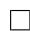
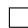

# 符号求和

我们接下来要讨论的符号求和问题是指符号表达式级数的求和, 它包括部分和问题以及无穷和(即部分和序列的极限)问题两部分. 如果求和上界 $n$ 不出现在待求和的级数项中, 则称为不定求和, 这里我们只讨论不定求和的部分和问题.

# 14.1 多项式级数求和

为了解决多项式级数求和问题, 我们先来看一看单项式级数求和, 以下是我们熟知的几个求和公式, 公式的证明请参阅 [2].

定理14.1. 1. P k = n(n−1) $\begin{array} { r } { \boldsymbol { \mathscr { 1 } } . \sum _ { 0 \leq k < n } k = \frac { n ( n - 1 ) } { 2 } } \end{array}$

2. P k2 = n(n−1)(2n−1) $\mathcal { Q } . \sum _ { 0 \leq k < n } k ^ { 2 } = \frac { n ( n - 1 ) ( 2 n - 1 ) } { 6 }$   
3. P k3 = n2(n−1)2 $\mathcal { B } . \sum _ { 0 \leq k < n } k ^ { 3 } = \frac { n ^ { 2 } ( n - 1 ) ^ { 2 } } { 4 }$   
4. P k4 = n(n−1)(2n−1)(3n2−3n−1) $\mathcal { L } . \sum _ { 0 \leq k < n } k ^ { 4 } = \frac { n ( n - 1 ) ( 2 n - 1 ) ( 3 n ^ { 2 } - 3 n - 1 ) } { 3 0 }$

注183. 这些公式容易用归纳法证明, 但很难直接从中找出显明的规律.

为了进一步地讨论, 我们引入差分算子和差分原函数的定义.

定义14.1 (差分算子). 1. 平移算子 $E$ 定义为

$$
E (f) (x) = f (x + 1),
$$

另外定义 $E ^ { n } = E \circ E ^ { n - 1 }$ , $E ^ { 1 } = E$ , $E ^ { 0 } = e$

2. 定义差分算子 $\Delta = E ^ { 1 } - E ^ { 0 }$ , 如果 $g = \Delta ( f )$ , 那么称 $f$ 为 $g$ 的差分原函数.定理14.2.

$$
\Delta (f \cdot g) = \Delta (f) \cdot g + f \cdot \Delta (g) - \Delta (f) \cdot \Delta (g).
$$

证明.

$$
\begin{array}{l} \Delta (f \cdot g) = E (f \cdot g) - f \cdot g \\ = (E (f) - f) \cdot g + f \cdot (E (g) - g) - (E (f) - f) \cdot (E (g) - g) \\ = \Delta (f) \cdot g + f \cdot \Delta (g) - \Delta (f) \cdot \Delta (g). \\ \end{array}
$$

定理14.3. 如果 $g$ 是 $f$ 的差分原函数, 即 $g = \Delta ( f )$ , 那么

$$
\sum_ {i = a} ^ {b - 1} g (i) = f (b) - f (a).
$$

证明.

$$
\sum_ {i = a} ^ {b - 1} g (i) = \sum_ {i = a} ^ {b - 1} (f (i + 1) - f (i)) = f (b) - f (a).
$$

注184.

$$
g = \Delta (f) \Leftrightarrow f = \Sigma (g),
$$

这和微积分的互逆定理

$$
g = D (f) \Leftrightarrow f = \int g
$$

是类似的.

定义14.2 (函数降阶乘). 函数 $f$ 的 $m$ 阶降阶乘

$$
f ^ {\underline {{m}}} = f (x) \cdot f (x - 1) \dots f (x - m + 1).
$$

定理14.4.

$$
\Delta (x ^ {\underline {{m}}}) = m x ^ {\underline {{m - 1}}}.
$$

证明.

$$
\begin{array}{l} \Delta (x ^ {\underline {{m}}}) = (x + 1) ^ {\underline {{m}}} - x ^ {\underline {{m}}} \\ = ((x + 1) - (x - m + 1)) x ^ {\underline {{m - 1}}} \\ = m x ^ {m - 1}. \\ \end{array}
$$

注185.

$$
\sum_ {i = 0} ^ {n - 1} i ^ {\underline {{m}}} = \frac {1}{m + 1} n ^ {\underline {{m + 1}}}.
$$

设

$$
x ^ {m} = \sum_ {i = 0} ^ {m} a _ {m, i} x ^ {\underline {{i}}},
$$

则

$$
\begin{array}{l} x ^ {m} = x \cdot x ^ {m - 1} \\ = \sum_ {i = 0} ^ {m - 1} a _ {m - 1, i} (x - i + i) \cdot x ^ {i} \\ = \sum_ {i = 0} ^ {m - 1} a _ {m - 1, i} x ^ {\underline {{i + 1}}} + \sum_ {i = 0} ^ {m - 1} a _ {m - 1, i} i \cdot x ^ {\underline {{i}}} \\ = x ^ {m} + \sum_ {i = 1} ^ {m - 1} \left(a _ {m - 1, i - 1} + i \cdot a _ {m - 1, i}\right) x ^ {\underline {{i}}}, \\ \end{array}
$$

于是有递推公式

$$
a _ {m, i} = a _ {m - 1, i - 1} + i \cdot a _ {m - 1, i},
$$

其中 $a _ { m , 0 } = 1$

$a _ { m , i }$ 在组合数学中被称为第二类 Stirling 数(参见 [174]), 它表示将一个 $m$ 元有限集划分为 $i$ 个非空子集的方法数.

例14.1. 以 $m = 1 , 2$ 为例.

1. nP− 1i=0 i = i=0 i1 = 12 n 2 = 12 n (n − 1), 三 nP−1   
$2 . \sum _ { i = 0 } ^ { n - 1 } i ^ { 2 } = \sum _ { i = 0 } ^ { n - 1 } ( i ^ { 2 } + i ^ { \perp } ) = \textstyle { \frac { 1 } { 3 } } n ^ { 3 } + \frac { 1 } { 2 } n ^ { 2 } = \frac { 1 } { 6 } n ( n + 1 ) ( 2 n + 1 ) .$

定理14.5 (多项式级数部分和). 设

$$
g (x) = \sum_ {m = 0} ^ {d} g _ {m} x ^ {m},
$$

则

$$
\sum_ {k = 0} ^ {n - 1} g (k) = \sum_ {0 \leq i \leq m \leq d} g _ {m} a _ {m, i} \frac {n ^ {i + 1}}{i + 1}.
$$

证明. 根据注 185 有

$$
\begin{array}{l} \sum_ {k = 0} ^ {n - 1} g (k) = \sum_ {k = 0} ^ {n - 1} (\sum_ {m = 0} ^ {d} g _ {m} (\sum_ {i = 0} ^ {m} a _ {m, i} k ^ {i})) \\ = \sum_ {0 \leq i \leq m \leq d} g _ {m} a _ {m, i} (\sum_ {k = 0} ^ {n - 1} k ^ {\dot {i}}) \\ = \sum_ {0 \leq i \leq m \leq d} g _ {m} a _ {m, i} \frac {n ^ {\underline {{i + 1}}}}{i + 1}. \\ \end{array}
$$

# 14.2 超几何级数

和多项式级数的情形一样, 首先研究超几何单项式级数求和.

定义14.3 (超几何单项式). 单项式级数通项 $g _ { n }$ 称为超几何单项式, 如果相邻项之比

$$
r (n) = \frac {g _ {n + 1}}{g _ {n}}
$$

是关于 $n$ 的有理函数.

例14.2. 二项式系数 $\binom { m } { n }$ 是超几何单项式, 因为

$$
\begin{array}{l} \frac {\binom {m} {n + 1}}{\binom {m} {n}} = \frac {\Gamma (m + 1) \Gamma (n + 1) \Gamma (m - n + 1)}{\Gamma (n + 2) \Gamma (m + n) \Gamma (m)} \\ = \frac {- n + m}{n + 1}. \\ \end{array}
$$

设

$$
r (n) = \frac {g _ {n + 1}}{g _ {n}} = \frac {a (n)}{b (n)} \cdot \frac {c (n + 1)}{c (n)},
$$

并且满足 $\operatorname* { g c d } ( a ( n ) , b ( n + k ) ) = 1$ , $\forall k \in \mathbb { N }$ . 设 $\Delta ( f ) = g$ , 则 $f _ { n } = f _ { 0 } + \sum _ { k = 0 } ^ { n - 1 } g _ { k } .$ ,

$$
\frac {f _ {n}}{g _ {n}} = \frac {f _ {n}}{f _ {n + 1} - f _ {n}} = \frac {1}{\frac {f _ {n + 1}}{f _ {n}} - 1}.
$$

$\begin{array} { r } { y ( n ) = \frac { f _ { n } } { g _ { n } } } \end{array}$

$$
y (n + 1) g (n + 1) = f _ {n + 1} = (y (n) + 1) g (n),
$$

$r ( n ) y ( n + 1 ) = y ( n ) + 1$ . 所以可取 $\begin{array} { r } { y ( n ) = \frac { b ( n - 1 ) } { c ( n ) } x ( n ) } \end{array}$ , 其中 $x ( n ) \neq 0$

$$
a (n) x (n + 1) - b (n - 1) x (n) = c (n).
$$

# 14.2.1 极大阶乘分解

极大阶乘分解(Greatest Factorial Factorization)是多项式的一种特殊分解.

定义14.4 (极大阶乘分解). 设 $f$ 为首一多项式, 记 $f$ 的极大阶乘分解为

$$
\operatorname {g f f} (f) = \langle f _ {1}, \dots , f _ {m} \rangle ,
$$

它满足:

1. $f = f _ { 1 } ^ { \underline { { 1 } } } \cdot \cdot \cdot f _ { m } ^ { \underline { { m } } }$   
2. $f _ { 1 } , \cdots , f _ { m }$ 为首一多项式且 $f _ { m } \neq 1$ .   
3. $\operatorname* { g c d } ( f _ { i } ^ { i } , E ( f _ { j } ) ) = 1 .$ .   
4. $\operatorname* { g c d } ( f _ { i } ^ { i } , E ^ { - j } f _ { j } ) = 1 , 1 \leq i , j \leq m .$

注186. 这样定义是为了保证

$$
f _ {j} ^ {j} = f _ {j} \cdot E ^ {- 1} f _ {j} \dots E ^ {- j + 1} f _ {j}
$$

没有更小的降阶乘因子, 因为如果 $g = \operatorname* { g c d } ( f _ { i } ^ { i } , E ^ { - j } f _ { j } ) \neq 1 .$ , 则 $g { \frac { j + 1 } { \vert f \vert } }$ .

关于极大阶乘分解有如下定理, 定理的证明请参阅 [174].

定理14.6. 1. 设 $f$ 为首一多项式且 $f \neq 0$ , 则 $f$ 至多有一种极大阶乘分解.

${ \mathrm { ~ \mathcal { Q } . ~ } } \operatorname { g f f } ( \operatorname* { g c d } ( f , E ( f ) ) ) = \langle f _ { 2 } , \cdot \cdot \cdot , f _ { m } \rangle .$

# 14.2.2 Gosper 算法

引理14.1. 给定超几何单项式 $g$ , 设 $\begin{array} { r } { \sigma = \frac { E ( g ) } { g } } \end{array}$ g , $f = \tau \cdot g$ , 则

$$
\Delta (f) = g \Leftrightarrow E (\tau) \cdot \sigma - \tau = 1.
$$

证明.

$$
\begin{array}{l} \Delta (f) = E (f) - f \\ = E (\tau) \cdot E (g) - \tau \cdot g \\ = (E (\tau) \cdot \sigma - \tau) g. \\ \end{array}
$$

□

注187. 由超几何单项式的性质可以设 $\begin{array} { r } { \sigma = \frac { a } { b } } \end{array}$ , $\textstyle { \tau = { \frac { u } { v } } }$ , 其中 $( a , b ) = ( u , v ) = 1$ , 并且$b , v$ 均为首一多项式, 上式化为

$$
a \cdot v \cdot E (u) - b \cdot u \cdot E (v) = b \cdot v \cdot E (v).
$$

这样我们就把求解差分原函数的问题归结为求解多项式方程. 理论上可以直接通过待定系数法解出这个方程, 但是计算量很大.

Gosper 算法利用极大阶乘分解来求解注 187 中的多项式方程.

记 $\operatorname* { g c d } ( E ( f ) ) = \operatorname* { g c d } ( f , E ( f ) )$ , 设 $\begin{array} { r } { v _ { 0 } = \frac { v } { \operatorname* { g c d } ( E ( v ) ) } } \end{array}$ , $\begin{array} { r } { v _ { 1 } = \frac { E ( v ) } { \operatorname* { g c d } ( E ( v ) ) } } \end{array}$ , 则 $( v _ { 0 } , v _ { 1 } ) = 1$ 方程两边同除以 $\operatorname* { g c d } ( E ( v ) )$ 得

$$
a \cdot v _ {0} \cdot E (u) - b \cdot v _ {1} \cdot u = b \cdot v _ {0} \cdot v _ {1} \cdot \operatorname * {g c d} (E (v)),
$$

其中

$$
(u, v _ {0}) = (E (u), v _ {1}) = (u, v) = 1,
$$

于是有

$$
v _ {0} | b, v _ {1} | a.
$$

设 $\operatorname { g f f } ( v ) = \langle h _ { 1 } , \cdot \cdot \cdot , h _ { m } \rangle$ , 则

$$
\begin{array}{l} v _ {0} = \frac {h _ {1} ^ {\frac {1}{2}} h _ {2} ^ {\frac {2}{2}} \cdots h _ {m} ^ {\frac {m}{m - 1}}}{h _ {2} ^ {\frac {1}{2}} \cdots h _ {m} ^ {\frac {m - 1}{m}}} \\ = h _ {1} \cdot E ^ {- 1} \left(h _ {2}\right) \dots E ^ {- (m - 1)} \left(h _ {m}\right), \\ v _ {1} = \frac {E (h _ {1}) ^ {\underline {{1}}} E (h _ {2}) ^ {\underline {{2}}} \cdots E (h _ {m}) ^ {\underline {{m}}}}{h _ {2} ^ {\underline {{1}}} \cdots h _ {m} ^ {\underline {{m - 1}}}} \\ = E \left(h _ {1}\right) \cdot E \left(h _ {2}\right) \dots E \left(h _ {m}\right), \\ \end{array}
$$

再由 $v _ { 0 } | b , v _ { 1 } | a$ 可得

$$
h _ {i} | E ^ {- 1} (a), h _ {i} | E ^ {i - 1} (b).
$$

若 $v \neq 1$ , 则

$$
\begin{array}{l} 1 \neq h _ {m} | \operatorname * {g c d} (E ^ {- 1} (a), E ^ {m - 1} (b)) \\ = E ^ {- 1} \left(\operatorname {g c d} (a (x), b (x + m))\right), \\ \end{array}
$$

而这等价于

$$
\left. \operatorname {r e s} _ {x} (a (x), b (x + y)) \right| _ {y = m} = 0.
$$

现在我们可以写出求 $v$ 的某一个倍数 $V$ 的 Gosper 算法.

算法14.1 (Gosper 算法).

输入: $( a , b ) { = } 1$ , 其中 $b$ 为首一多项式.

输出:首一多项式 $V$ , 满足 $v | V$ , 其中 $( u , v ) = 1$ 且

$$
a \cdot v \cdot E (u) - b \cdot u \cdot E (v) = b \cdot v \cdot E (v).
$$

1. 设 $R = \operatorname { r e s } _ { x } ( a ( x ) , b ( x + y ) )$ , $d = \operatorname* { m a x } \{ k \in \mathbb { N } ; k = 0$ 或 $R ( k ) = 0 \}$ . 若 $d = 1$ ,输出 1.  
2. 设 $a _ { 0 } = a$ , $b _ { 0 } = b$ , 对 $i = 1 , 2 , \cdots , d$ 依次计算

$$
H _ {i} = \operatorname * {g c d} (E ^ {- 1} (a _ {i - 1}), E ^ {i - 1} (b _ {i - 1})),
$$

$$
a _ {i} = \frac {a _ {i - 1}}{E (H _ {i})}, b _ {i} = \frac {b _ {i - 1}}{E ^ {- (i - 1)} (H _ {i})}.
$$

3. 输出 $H _ { 1 } ^ { \underline { { 1 } } } \cdot \cdot \cdot H _ { d } ^ { \underline { { d } } }$

注188. 不难看出 $h _ { i } | H _ { i }$ , 因此

$$
v = h _ {1} ^ {\frac {1}{m}} \dots h _ {m} ^ {\frac {m}{m}} H _ {1} ^ {\frac {1}{m}} \dots H _ {m} ^ {\frac {m}{m}} \dots H _ {d} ^ {\frac {d}{m}} = V.
$$

在算法实际运行过程中, 一旦 $a _ { i } = 1$ 或 $b _ { i } = 1$ , 可以预计 $H _ { j } = 1$ , 其中 $j =$ $i + 1 , \cdots , d ,$ , 此时可以直接结束计算.

现在我们将方程化成了

$$
a \cdot V \cdot E (U) - b \cdot E (V) \cdot U = b \cdot V \cdot E (V),
$$

其中 $V$ 为已知的首一多项式. 左右同除以 $g = \operatorname* { g c d } ( a \cdot V , b \cdot E ( V ) )$ , 得

$$
r \cdot E (U) - s \cdot U = t,
$$

其中 $\begin{array} { r } { r = { \frac { a \cdot V } { g } } } \end{array}$ a·Vg , s = $\begin{array} { r } { s = { \frac { b \cdot E ( V ) } { g } } } \end{array}$ b·E(V ) , $t = s \cdot V$ .

设

$$
U = U _ {e} x ^ {e} + \dots + U _ {0},
$$

其中 $e$ 可以通过如下定理确定, 定理的证明请参阅 [174].

定理14.7. 设 $m = \operatorname* { m a x } \{ \deg ( r ) - 1 , \deg ( s - r ) \}$ , $\delta$ 为 $( s - r )$ 中 $\boldsymbol { x } ^ { m }$ 的系数.

1. 若 $\deg ( r ) - 1 < \deg ( s - r )$ 或 $\delta \notin \mathbb { N }$ , 则 $e = \deg ( t ) - m$   
2. 若 $\deg ( t ) - m = \delta$ , 则多项式方程不可解.  
3. 若 $\deg ( t ) - m \neq \delta$ , 则 $e = \operatorname* { m a x } \{ \deg ( t ) - m , \delta \}$ , 如果 $e < 0$ , 则多项式方程不可解.

注189. 对多项式方程比较对应项系数将得到一个上三角阵的线性方程组, 这时就可以解出 $U$ 来. 通过这一系列手续, 最终求得

$$
u = \frac {U}{\operatorname * {g c d} (U , V)}, v = \frac {V}{\operatorname * {g c d} (U , V)}.
$$

除了多项式级数与超几何级数的求和算法之外, 还有许多其他的求和算法. 例如 Wilf-Zeilberger 算法(参见 [138]), 它可以解决求和上界 $n$ 出现在待求和的级数项中的超几何级数求和问题, 求出和函数所满足的递推方程, 因此也常常用于组合恒等式的自动证明. 再如针对有理函数级数的求和问题, 现有的算法包括 Moenck算法, Horowitz 算法, Paule 算法(参见 [137])和 Karr 算法(参见 [100])等, Karr 算法的扩展版本还可以解决含根式的级数求和问题(参见 [101])以及嵌套求和问题(参见 [153]), 关于有理函数求和 更详细的介绍请参阅 [138] 和 [139].
