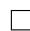

# 微分方程符号解

微分方程在数学, 自然科学乃至社会科学中的都起着重要作用, 求解微分方程的方法被广泛地发展起来. 在计算机代数中, 求出微分方程的符号解也是一个令人众多研究者着迷的课题. 微分 Galois 理论, Lie 对称理论等众多理论被发展并应用在此领域. 关于这方面更详细的综述和文献目录, 我们推荐读者参考 [158] 和 [80]的 2.11 节.

本章主要介绍微分方程符号解中最基本的问题, 包括 Risch 微分方程, 一阶线性微分方程, 微分 Galois 理论简介, 二阶微分方程的 Kovacic 算法, 高阶线性微分方程的多项式解, 有理解与指数解以及二阶微分方程的特殊解, 主要参考书为 [62],[105] 和 [170]. 阅读本章需要读者具备基本的微分方程, 抽象代数知识(例如 [11],[6]), 对于 Laurent 展式, 极点, Puiseux 展式等概念有所了解.

# 16.1 Risch 微分方程

在考虑超越指数函数积分时我们遇到了形如

$$
A _ {i} (x) = B _ {i} (x) ^ {\prime} + i B _ {i} (x) \eta^ {\prime} (x)
$$

的微分方程 15.6 , 其中数 $A _ { i } , \eta ^ { \prime } \in K$ (基域)为已知函数, $B _ { i } \in K$ 为未知函数. 这是一个 Risch 微分方程的求解问题. 一般地, 设 $f , g \in K$ , Risch 微分方程问题就是要判断

$$
y ^ {\prime} + f y = g \tag {16.1}
$$

在 $K$ 中是否有解, 如果有解则构造出解. 此问题是最简单的一类微分方程, 同时对于符号积分的求解过程也是本质上重要的.

# 16.1.1 有理函数域

首先我们考虑最简单的有理函数域情形, 即设 $K = \mathbb { Q } ( x )$ , $\mathbb { R } ( x )$ 或 $\mathbb { C } ( x )$ . 记$\mathrm { d e n } ( y )$ 表示有理函数 $y$ 的既约分母, 对于任意不可约多项式 $p \in K$ 且 $p \mid \operatorname { d e n } ( y )$ ,我们希望求出 p 的次数. 设 pαk den(y), pβk den(f), pγk den(g). 可令 y = $p$ $p ^ { \alpha } \| \operatorname { d e n } ( y ) , p ^ { \beta } \| \operatorname { d e n } ( f ) , p ^ { \gamma } \| \operatorname { d e n } ( g )$ $y = \frac { v } { p ^ { \alpha } u }$ , 其中 $( p , u ) = 1$ , 则 $y ^ { \prime } = \frac { v ^ { \prime } p u - v ( p u ^ { \prime } + \alpha p ^ { \prime } u ) } { p ^ { \alpha + 1 } u ^ { 2 } }$ , 由 $( p , p ^ { \prime } ) = 1$ 可知 $p ^ { \alpha + 1 } \| \mathrm { d e n } ( y ^ { \prime } )$ . 故方程 (16.1) 中三项 $y ^ { \prime }$ , f y , $g$ 的分母中 $p$ 的次数分别为 $\alpha + 1$ $\alpha + 1 , \alpha + \beta , \gamma .$ . 比较两端分母中 $p$ 的次数, 分为三种情形:

1. $\beta > 1$ 时, 必有 $\gamma = \alpha + \beta$ ;   
2. $\beta < 1$ 时, 必有 $\gamma = \alpha + 1$   
3. $\beta = 1$ 时,

• 若左端求和后无约分, 则 $\gamma = \alpha + 1$ ;   
• 若左端求和后有约分. 由 $( p , u ) = 1$ 可找到 $a , b ,$ , 使得 $a p ^ { \alpha } + b u = 1$ , 从而

$$
y = \frac {v}{p ^ {\alpha} u} = \frac {v (a p ^ {\alpha} + b u)}{p ^ {\alpha} u} = \frac {v b}{p ^ {\alpha}} + \frac {v a}{u} =: \frac {Y}{p ^ {\alpha}} + \tilde {y},
$$

满足 $\deg Y < \deg p , \ p ^ { \alpha } \ \nmid \deg ( \tilde { y } )$ $p ^ { \alpha } \nmid \mathrm { d e n } ( \tilde { y } )$ . 同理可设 $f = \frac { F } { p } + \tilde { f }$ 满足 $\deg F <$ $\deg p , p \dag \mathrm { d e n } ( \tilde { f } )$ . 从而

$$
y ^ {\prime} + f y = - \frac {\alpha Y p ^ {\prime}}{p ^ {\alpha + 1}} + \frac {Y ^ {\prime}}{p ^ {\alpha}} + \tilde {y} ^ {\prime} + \frac {F Y}{p ^ {\alpha + 1}} + \frac {F \tilde {y}}{p} + \frac {Y \tilde {f}}{p ^ {\alpha}} + \tilde {f} \tilde {y},
$$

由于有约分, 左端求和分母为 $p ^ { \alpha + 1 }$ 的项之和必定可以约分, 于是

$$
p \mid - \alpha Y p ^ {\prime} + F Y,
$$

而 $p$ 不可约, $\deg Y < \deg p$ , 故 $( p , Y ) = 1$ , 可得

$$
p \mid - \alpha p ^ {\prime} + F.
$$

又由 $\deg F < \deg p$ 可知必有 $F = \alpha p ^ { \prime }$ , 即 $\alpha = { \frac { F } { p ^ { \prime } } }$ p 0 .

由此得到了未知函数 $y$ 分母中 $p$ 的次数 $\alpha$ 的上界, 使我们便于使用待定系数法. 通过上面的讨论, 我们实际上证明了 [147]中的如下引理.

引理16.1. 若 $\frac { F } { p ^ { \prime } }$ 为整数且 $\beta = 1$ , 则

$$
\alpha \leq \max  \left\{\gamma - 1, \frac {F}{p ^ {\prime}} \right\},
$$

否则

$$
\alpha \leq \min  \left\{\gamma - 1, \gamma - \beta \right\}.
$$

仔细验证可以发现, 只有在论证 $( p , Y ) = 1$ 时用到了 $p$ 为不可约多项式,其他地方均可以将条件减弱为 $p$ 为无平方因子的多项式. 因此可以首先用$\operatorname { d e n } ( f ) , \operatorname { d e n } ( g )$ 的无平方因子分解代替完全分解. 需要处理的是对幂次 $\beta = 1$ 的无平方因子 $p$ , 求出 $p$ 的不可约因子 $q _ { i }$ , 使得 $z = \frac { F } { q _ { i } ^ { \prime } }$ 为整数. 与 Rothstein-Trager 方法类似得论证可以得到

$$
F = z q _ {i} ^ {\prime} \Leftrightarrow (F - z p ^ {\prime}, p) \mathrm {非 平 凡} \Leftrightarrow \operatorname {R e s} _ {x} (F - z p ^ {\prime}, p) = 0.
$$

从而我们只需求结式 $\operatorname { R e s } _ { x } ( F - z p ^ { \prime } , p ) = 0$ 关于 $z$ 的整数根即可. 我们得到了如下计算 $\mathrm { d e n } ( y )$ 的一个倍数的方法.

算法16.1 (计算 $\mathrm { d e n } ( y )$ 的一个倍数).

1. 计算无平方分解 $\operatorname { d e n } ( f ) = \prod _ { i = 1 } ^ { n } p _ { i } ^ { \beta _ { i } }$ , $\operatorname { d e n } ( g ) = \prod _ { i = 1 } ^ { n } p _ { i } ^ { \gamma _ { i } }$ , 其中 $\beta _ { i } , \gamma _ { i } \geq 0$ , $p _ { i }$ 无平方因子.  
2. 对每个 $1 \leq i \leq n$ , 令 $p = p _ { i }$ , $\beta = \beta _ { i }$ , $\gamma = \gamma _ { i }$ .

• 若 $\beta \neq 1$ , 令 $\alpha = \operatorname* { m i n } \{ \gamma - 1 , \gamma - \beta \} , r = \jmath$ $r = p ^ { \alpha }$ ;  
否 则 计 算 分 解 $f ~ = ~ { \frac { F } { p } } + { \tilde { f } }$ F , 求 出 $\operatorname { R e s } _ { x } ( F - z p ^ { \prime } , p ) \ = \ 0$ 的 整 数根 $z _ { 1 } , \ldots , z _ { m }$ (例 如 利 用 算 法 9.7 ). 令 $\alpha _ { j } ~ = ~ \operatorname* { m a x } \{ \gamma - 1 , z _ { j } \}$ , $q _ { j } =$ $( F - z _ { j } p ^ { \prime } , p ) , r = p ^ { \gamma - 1 } \cdot \prod _ { j = 1 } ^ { m } q _ { j } ^ { \alpha _ { j } - ( \gamma - 1 ) } .$ Qm qαj −(γ−1)j .

3. 累乘所有 $r$ 并输出, 算法终止.

在得到 $\operatorname { d e n } ( y )$ 的一个倍数之后, 只要确定 $y$ 分子次数的一个上界, 即可使用待定系数法求出 y 的分子来了. 设 y = a, $y$ $y = { \frac { a } { b } }$ 我们希望求出 $\alpha = \deg { a }$ . 将其带入方程(16.1)并两端乘以最小公分母可以得到形如

$$
R a ^ {\prime} + S a = T
$$

的等式, 其中 $R , S , T$ 为多项式, 记 $\beta = \deg R$ , $\gamma = \deg S$ , $\delta = \deg T$ , 则 $R a ^ { \prime }$ , S a , T的次数分别为 $\beta + \alpha - 1 , \gamma + \alpha , \delta .$ . 比较等式两端的次数, 分为三种情形:

1. $\gamma < \beta - 1$ 时, 必有 $\delta = \beta + \alpha - 1$   
2. $\gamma > \beta - 1$ 时, 必有 $\delta = \gamma + \alpha$ ;   
3. $\gamma = \beta - 1$ 时 ,

• 若左端求和后最高项未被消去, 则 $\delta = \gamma + \alpha$ ;  
• 若左则有 消去. , 从而 $a = \sum _ { i = 1 } ^ { \alpha } a _ { i } x ^ { i }$ , R = Pi=1 r i xi , S = Pi=1 si xi , 则有 $\alpha r _ { \beta } a _ { \alpha } + s _ { \gamma } a _ { \alpha } = 0$ ，从而 $\alpha = - \frac { s _ { \gamma } } { r _ { \beta } }$

由此我们得到了 $y$ 分母次数 $\alpha$ 的一个上界:

引理16.2. 若 $\gamma = \beta - 1$ 且 $- \frac { s _ { \gamma } } { r _ { \beta } }$ sγ 为正整数, 则

$$
\alpha \leq \max  \left\{\delta - \beta + 1, - \frac {s _ {\gamma}}{r _ {\beta}} \right\},
$$

否则

$$
\alpha \leq \min  \{\delta - \beta + 1, \delta - \gamma \}.
$$

有了引理 16.2 , 接下来便可以对 $y$ 的分子进行待定系数法求解了, 最终可得到方程 (16.1) 在 $K = \mathbb { Q } ( x )$ , $\mathbb { R } ( x )$ 或 $\mathbb { C } ( x )$ 的解 $y$ .

# 16.1.2 一般情形

上面我们讨论了 $K$ 为最简单的有理函数域的情形. 对于一般情形, Bronstein[41]证明了如下定理.

定理16.1 (Bronstein). 若在 $K$ 的任意有限次代数扩张中初等积分和Risch方程问题都可解, 设 $\theta$ 为 $K$ 上的超越初等生成元, 则在 $K ( \theta )$ 的任意有限次代数扩张中初等积分和 Risch 方程问题也都可解.

由于 Risch[147], Rothstein[151], Davenport[63] 解决了超越初等扩张的积分问题和 Risch 方程问题, Trager[21], Davenport[62] 解决了代数扩张的积分问题和Risch 方程问题. 从而根据定理 16.1 , 便可以从理论上得到所有初等函数的初等积分和Risch方程问题的解决方案了.

# 16.2 一阶线性微分方程

管求积分实际上就是最简单的一阶方程 $y ^ { \prime } ( x ) = f ( x )$ , 但仅仅此问题解决起来难度已经相当大了. Risch 微分方程是最简单的一类一阶微分方程(线性方程), 当然我们求的仅仅是 $K$ 中的解, 而非一般的 $K$ 上的初等函数解. 虽然我们知道一阶线性方程 (16.1) 有通解表达式(参考 [11])

$$
y = e ^ {- \int f} \cdot \left(c + \int g e ^ {\int f}\right),
$$

但这并没有解决一般问题, 因为为了算出表达式中的指数积分, 我们还得回到解Risch 方程问题上.

不过以下的定理 [64] 使我们能够避免循环论证而得到 $K$ 上可能的初等函数解.

定理16.2 (Davenport). 设 $K$ 上的 Risch 方程在 $K$ 上有初等函数解, 则有一个解$y \in K$ 或者 $e ^ { \int f }$ 在 $K$ 上代数(从而可以求出 $y _ { , }$ ).

证明. 记 $F = K ( \textstyle \int f )$ .

1. 若 $e ^ { \int f }$ 在 $F$ 上代数, 则由 Liouville 定理(定理 15.1 ), $\textstyle \int f$ 必为 $\hat { K }$ 上对数函数的和, 从而 $e ^ { \int f }$ 必也在 $K$ 上代数.  
2. 若 $e ^ { \int f }$ 在 $F$ 上超越, 由于 $y$ 在 $K$ 上初等, 自然在 $F$ 上初等, 故 $\int g e ^ { \int f } = y e ^ { \int f }$ 也在 $F$ 上初等. 记 $\theta \ : = \ : e ^ { \int f }$ 为 $F$ 上的超越指数函数, 由分解引理可知$\textstyle { \int g \theta = h \theta }$ , 其中 $h \in F$ (注意指数函数求导后次数不变), 从而有解 $y = h \in F$ .若 $F = K$ , 则有 $y \in K$ , 否则 $\textstyle \int f$ 中必有 $\hat { K }$ 上的对数函数. 可设 $\textstyle y = p { \bigl ( } \int f { \bigr ) }$ ,其中 $p ( x ) \in K ( x )$ , 而由方程 (16.1) 可得

$$
p ^ {\prime} \left(\int f\right) + p \left(\int f\right) = \frac {g}{f} \in K,
$$

可知必有 $p ^ { \prime } + p \in K$ , 也有 $y \in K$ .

这就完成了证明.

因此求一阶线性方程可以通过求 $K$ 中的解, 或是 $K$ 上的代数函数积分来完成.

注200. 由于 $\textstyle { \int g \theta = h \theta }$ 中积分常数的存在, 注意并没有要求所有解 $y$ 都属于 $K$ , 例如方程

$$
y ^ {\prime} (x) + y (x) = x + 1
$$

的通解为 $x + c e ^ { - x }$ , 的确有属于 $K = \mathbb { Q } ( x )$ 的解 $y ( x ) = x$ , 但并非解所有都是.

# 16.3 微分 Galois 理论

接下来要讨论的自然是一般高阶线性方程如何求解的问题. 对一般的高阶线性方程

$$
y ^ {(n)} + a _ {1} (x) y ^ {(n - 1)} + \dots + a _ {n} (x) y = f (x),
$$

可化为线性方程组矩阵形式

$$
\mathbf {y} ^ {\prime} = \mathbf {A} (x) \mathbf {y} + \mathbf {f} (x),
$$

其中

$$
\mathbf {y} = \left[ \begin{array}{c} y \\ y ^ {\prime} \\ \vdots \\ y ^ {(n - 2)} \\ y ^ {(n - 1)} \end{array} \right], \mathbf {f} (x) = \left[ \begin{array}{c} 0 \\ 0 \\ \vdots \\ 0 \\ f (x) \end{array} \right],
$$

$$
\mathbf {A} (x) = \left[ \begin{array}{c c c c c} 0 & 1 & 0 & \dots & 0 \\ 0 & 0 & 1 & \dots & 0 \\ \dots & \dots & \dots & & \dots \\ 0 & 0 & 0 & \dots & 1 \\ - a _ {n} (x) & - a _ {n - 1} (x) & - a _ {n - 2} (x) & \dots & - a _ {1} (x) \end{array} \right].
$$

设对应的齐次方程的基本解矩阵为 $\Phi ( x )$ , 则非齐次线性方程的通解为(参考[11])

$$
\mathbf {y} (x) = \Phi (x) \left(\mathbf {c} + \int \Phi^ {- 1} (s) \mathbf {f} (s)\right) d s.
$$

因此我们可以首先考虑齐次方程的求解. 在求解多项式方程的过程中诞生了伟大的 Galios 理论, 解线性微分方程也有一个对应物 — 微分 Galois 理论. 在这里我们做一个简要介绍, 这些理论也是 Kovacic 著名的二阶线性方程求解算法的基础(尽管最终的算法可以完全摆脱微分 Galois 理论的语言). 首先引入几个重要的概念(可参看 [170]).

定义16.1 (Picard-Vessiot 域). 设 $\mathbf { y } ^ { \prime } = \mathbf { A } \mathbf { y }$ 为 $K$ 上的齐次线性方程组, 微分代数$L \supseteq K$ 称为关于此方程的 Picard-Vessiot 域, 如果 $C ( K )$ 为代数闭域, 且存在方程的基本解矩阵 $F \in G L _ { n } ( L )$ , 使得 $F$ 的矩阵元在 $K$ 上生成 $L$ .

例16.1. 考虑 $K = \mathbb { C } ( x )$ 上的二阶线性微分方程 $y ^ { \prime \prime } = r y$ , 设 $\eta , \zeta$ 为方程的一个基础解系, 则一个基本解矩阵为

$$
\Phi = \left[ \begin{array}{l l} \eta & \zeta \\ \eta^ {\prime} & \zeta^ {\prime} \end{array} \right]
$$

故 Picard-Vessiot 域为 $\mathbb { C } ( x ) ( \eta , \zeta , \eta ^ { \prime } , \zeta ^ { \prime } )$ .

定义16.2 (微分 Galois 群). 设 $\mathbf { y } ^ { \prime } = \mathbf { A } \mathbf { y }$ 为 $K$ 上的齐次线性方程组, 其微分Galois群 $G = \operatorname { G a l } ( L / K )$ 定义为其 Picard-Vessiot 域 $L$ 上的微分 $K \cdot$ -代数自同构群, 即 $G$ 的元素为 $L$ 上的所有 $K \cdot$ -代数自同构 $\sigma$ , 满足 $\sigma ( f ^ { \prime } ) = ( \sigma ( f ) ) ^ { \prime }$ .

例16.2. (续例 16.1 )设 $\sigma \in G$ 为微分 Galois 群中的元素, 则 $\sigma ( \eta ) , \sigma ( \zeta )$ 仍为方程的基础解系, 可在基 $\eta , \zeta$ 下表示为

$$
\sigma (\eta) = a _ {\sigma} \eta + b _ {\sigma} \zeta , \quad \sigma (\zeta) = c _ {\sigma} \eta + d _ {\sigma} \zeta ,
$$

将其写为

$$
\sigma (\eta \zeta) = (\eta \zeta) \left[ \begin{array}{c c} a _ {\sigma} & c _ {\sigma} \\ b _ {\sigma} & d _ {\sigma} \end{array} \right] = (\eta \zeta) M _ {\sigma},
$$

其中 $M _ { \sigma }$ 为 $\mathbb { C }$ 上的 $2 \times 2$ 矩阵, 于是 $\sigma$ 可视为 $G L _ { 2 } ( \mathbb { C } )$ 元素.

下面的结果将微分 Galois群与代数群建立了联系, 具有根本的重要性.

定义16.3 (代数群). 若 $G$ 既是群又是仿射簇, 且群的乘法与求逆运算为仿射簇的态射, 则称 $G$ 为代数群.

注201. 关于仿射簇(定义 13.14 )及其态射, 感兴趣的读者可参看 [82] 的第一章. 直观而言, 代数群同时具备群和仿射簇结构, 并且这两种结构在某种意义下是“相容”的.

例16.3. 例如特殊线性群 $S L _ { n } ( \mathbb { C } )$ 为多项式方程 $\operatorname* { d e t } ( x _ { i j } ) = 1$ 决定的仿射簇, 且群运算为态射, 故 $S L _ { 2 } ( \mathbb { C } )$ 即为一个代数群. 同样的, 也可以知道特殊正交群 $S O _ { n } ( \mathbb { C } )$ 也是一个代数群.

定理16.3. 微分 Galois 群 $G$ (视为 $G L _ { n } ( C ( K ) )$ 的子群)为代数群, 且 $L$ 的 $G$ -不变域为 $K$ .

定理的证明需要较多的准备(感兴趣的读者可参看 [170]), 因此我们在这里只给出几个例子.

例16.4. 考虑 $\mathbb { C } ( x )$ 上的方程 $y ^ { \prime \prime } = y$ , 则 Picard-Vessiot 域 $L = \mathbb { C } ( x ) ( e ^ { x } , e ^ { - x } ) =$ $\mathbb { C } ( x , e ^ { x } )$ , 且由 $( \sigma ( e ^ { x } ) ) ^ { \prime } = \sigma ( ( e ^ { x } ) ^ { \prime } ) = \sigma ( e ^ { x } )$ 知

$$
\sigma (e ^ {x}) = a _ {\sigma} e ^ {x}, \quad \sigma (e ^ {- x}) = a _ {\sigma} ^ {- 1} e ^ {- x},
$$

即有

$$
M _ {\sigma} = \left[ \begin{array}{c c} a _ {\sigma} & \\ & a _ {\sigma} ^ {- 1} \end{array} \right].
$$

可知 $M _ { \sigma }$ 全体的确构成 $G L _ { 2 } ( \mathbb { C } )$ 的代数子群.

例16.5. 考虑 $\mathbb { C } ( x )$ 上的方程 $y ^ { \prime \prime } = - { \frac { 1 } { 4 x ^ { 2 } } } y .$ − 14x2 y, 则 Picard-Vessiot 域 L = C(x)(√x, √x ln x), $L = \mathbb { C } ( x ) ( { \sqrt { x } } , { \sqrt { x } } \ln x )$ 且由 $( \sigma ( \sqrt { x } ) ) ^ { \prime } = \sigma \left( \frac { 1 } { 2 \sqrt { x } } \right) = \frac { 1 } { 2 \sigma ( \sqrt { x } ) }$ 解得

$$
\sigma (\sqrt {x}) = \pm \sqrt {x}.
$$

又由 $( \sigma ( { \sqrt { x } } \ln x ) ) ^ { \prime } = \sigma \left( { \frac { \ln x } { 2 { \sqrt { x } } } } + { \frac { 1 } { \sqrt { x } } } \right) = { \frac { \sigma ( { \sqrt { x } } \ln x ) } { 2 x } } + { \frac { 1 } { \sigma ( { \sqrt { x } } ) } }$ + 解得

$$
\sigma (\sqrt {x} \ln x) = c _ {\sigma} \sqrt {x} \pm \sqrt {x} \ln x.
$$

所以方程对应的微分 Galois群

$$
G = \left\{\left[ \begin{array}{c c} 1 & c \\ & 1 \end{array} \right] \Bigg | c \in \mathbb {C} \right\} \bigcup \left\{\left[ \begin{array}{c c} - 1 & c \\ & - 1 \end{array} \right] \Bigg | c \in \mathbb {C} \right\},
$$

的确也是 $G L _ { 2 } ( \mathbb { C } )$ 的代数子群.

例16.6. (续例 16.1 )设

$$
W = \left| \begin{array}{c c} \eta & \zeta \\ \eta^ {\prime} & \zeta^ {\prime} \end{array} \right|
$$

为 Wronsky 行列式(参考 [11]), 由于 $\eta , \zeta$ 为方程的一个基础解系, 可知 W 为非零常数, 而

$$
\sigma \left[ \begin{array}{c c} \eta & \zeta \\ \eta^ {\prime} & \zeta^ {\prime} \end{array} \right] = \left[ \begin{array}{c c} \eta & \zeta \\ \eta^ {\prime} & \zeta^ {\prime} \end{array} \right] \left[ \begin{array}{c c} a _ {\sigma} & c _ {\sigma} \\ b _ {\sigma} & d _ {\sigma} \end{array} \right],
$$

可知 $\sigma ( W ) = W \operatorname* { d e t } M _ { \sigma }$ $M _ { \sigma }$ . 又 $\sigma ( W ) = W \neq 0$ , 可知 d $\Re M _ { \sigma } = 1$ , $M _ { \sigma }$ 全体实际上构成 $S L _ { 2 } ( \mathbb { C } )$ 的一个代数子群.

# 16.4 Lie-Kolchin 定理

我们可以考虑比初等函数更广的一类函数, 应用起来也更加方便.

定义16.4 (Liouville 函数). 设 $K$ 为一个微分代数, $K ( \eta )$ 为 $K$ 的微分扩张, 满足$C ( K ( \eta ) ) = C ( K )$ . $\eta$ 称为在 $K$ 上的 Liouville 生成元, 若 $\eta$ 满足以下条件之一

1. $\eta$ 在 $K$ 上是代数的, 即有 $f ( x ) \in K [ x ]$ 使得 $f ( \eta ) = 0$ ;  
2. $\eta$ 在 $K$ 上是原函数, 即有 $\eta ^ { \prime } \in K$ ;  
3. $\eta$ 在 $K$ 上是原函数的指数, 即有 ${ \frac { \eta ^ { \prime } } { \eta } } \in K$ .

称 $K ( \eta _ { 1 } , \dots , \eta _ { n } )$ 为 $K$ 上 的 一 个 Liouville 函 数 域, 若 $\forall 1 \ \leq \ i \ \leq \ n .$ , $\eta _ { i }$ 为$K ( \eta _ { 1 } , \dots , \eta _ { i - 1 } )$ 上的 Liouville 生成元(约定 $K ( \eta _ { 0 } ) = K )$ ). $K$ 上的任一个 Liou-ville函数域中的元素称为 $K$ 上的 Liouville 函数.

注202. 因为对数函数满足第二条, 指数函数满足第三条, 因此初等函数一定也是Liouville 函数. 但反之则不然, 例如 $\textstyle \int e ^ { x ^ { 2 } }$ 是 Liouville 函数而非初等函数.

线性微分方程的优美理论将引导我们, 把方程 Liouville 解与一般线性群$G L _ { n } ( \mathbb { C } )$ 的代数子群联系到一起. 下面的 Lie-Kolchin 定理(参见 [107])给出了线性微分方程的解是 Liouville解的充要条件, 在理论上十分重要.

定理16.4 (Lie-Kolchin). 设 $G$ 为线性微分方程对应的微分 Galois 群, $G _ { 0 }$ 为 $G$ 的包含单位的连通分支, 则以下条件是等价的:

1. 线性微分方程对应的解都是 Liouville 的;  
2. $G _ { 0 }$ 可解;   
3. $G _ { 0 }$ 可上三角化.

因此为了研究线性微分方程的Liouville解, 我们可以转向代数子群的研究. 比如说对于二阶线性方程, 我们便需要对特殊线性群 $S L _ { 2 } ( \mathbb { C } )$ 的代数子群有所了解.

# 16.5 二阶线性微分方程

考虑二阶齐次线性方程

$$
z ^ {\prime \prime} + a z ^ {\prime} + b z = 0,
$$

其中 $a , b \in K = \mathbb { C } ( x )$ , 通过标准的变换 $y = e ^ { \frac { 1 } { 2 } \int a } z ( \mathbb { C } ( x )$ 中的积分总可以求出), 可化为缺项形式

$$
y ^ {\prime \prime} = (b - \frac {1}{4} a ^ {2} - \frac {1}{2} a ^ {\prime}) y.
$$

因此我们下面可以只考虑形如

$$
y ^ {\prime \prime} = r y, \tag {16.2}
$$

其中 $r \in K$ 的二阶线性方程. 在这样的特殊形式下我们知道, 若 $\eta$ 是一个 Liouville解的话, 那么 $\zeta = \eta \int \frac { 1 } { \eta ^ { 2 } }$ 是与 $\eta$ 线性无关的另一个解(参考 [11]), 从而方程所有的解都是 $K$ 上的 Liouville 解.

正如上面所说的, 特殊线性群 $S L _ { 2 } ( \mathbb { C } )$ 的代数子群对于我们很重要, 事实上有下面的定理(参见 [106]).

定理16.5 ( $S L _ { 2 } ( \mathbb { C } )$ 代数子群的分类). 设 $G$ 为 $S L _ { 2 } ( \mathbb { C } )$ 的代数子群, 则 $G$ 满足以下之一:

$G$ 共轭于 $\{ { [ \begin{array} { l l } { c } & { d } \\ & { c ^ { - 1 } } \end{array} ] } | c , d \in \mathbb { C } , c \neq 0 \}$ 的子群, 即 $G$ 可上三角化;  
2. G 共轭于 $\left\{ \left[ c \atop \begin{array} { r } \\ \end{array} \right] _ { \ast } \right\} \left\{ c \in \mathbb { C } , c \neq 0 \right\} \bigcup \left\{ \left[ \begin{array} { r } { c } \\ { - c ^ { - 1 } } \end{array} \right] \Bigg | c \in \mathbb { C } , c \neq 0 \right\}$ 的子群,   
3. $G$ 是前两类以外的有限群(四面体群, 八面体群, 十二面体群);  
4. $G = S L _ { 2 } ( \mathbb { C } )$ .

对应于代数子群的四个类型, 如下定理就不令人意外了.

定理16.6. 方程 (16.2) 的解只有四种可能性:

1. 有一个解 $y = e ^ { \int \omega }$ 为 Liouville 解, 其中 $\omega \in \mathbb { C } ( x )$ ;  
2. 有一个解 $y = e ^ { \int \omega }$ 为 Liouville 解, 其中 $\omega$ 为 $\mathbb { C } ( x )$ 上的二次代数元, 且第一类情形不成立;  
3. 所有解 $y$ 在 $\mathbb { C } ( x )$ 上是代数的, 为 Liouville 解, 且前两类情形不成立;  
4. 无 Liouville 解.

证明. 我们分别讨论对应于定理 16.5的四种情形. 设 $\eta , \zeta$ 为方程的基础解系.

1. 可假设 $G$ 是上三角的, 由 $\forall \sigma \in G$ , $\sigma \eta = c _ { \sigma } \eta$ , 可知 $\sigma \left( \frac { \eta ^ { \prime } } { \eta } \right) = \frac { \eta ^ { \prime } } { \eta } \in \mathbb { C } ( x )$ , 令$\omega = \frac { \eta ^ { \prime } } { \eta }$ , 即得 $\eta = e ^ { \int \omega }$ .  
2. 可假 $G$ $\left\{ \left[ c \textnormal { \texttt { c } } _ { c ^ { - 1 } } \right] \bigg | c \in \mathbb { C } , c \neq 0 \right\} \bigcup \left\{ \left[ \begin{array} { c } { { \texttt { c } } } \\ { { - c ^ { - 1 } } } \end{array} \right] \bigg | c \in \mathbb { C } , c \neq 0 \right\}$ $\forall \sigma \in G$

$$
\sigma (\eta) = c _ {\sigma} (\eta), \quad \sigma (\zeta) = c _ {\sigma} ^ {- 1} \zeta
$$

或者

$$
\sigma (\eta) = - c _ {\sigma} ^ {- 1} (\zeta), \quad \sigma (\zeta) = c _ {\sigma} \eta .
$$

于是总有 $\sigma ( \eta \zeta ) = \pm \eta \zeta$ , $\sigma ( ( \eta \zeta ) ^ { 2 } ) = ( \eta \zeta ) ^ { 2 }$ . 由定理 16.3 可知必有 $( \eta \zeta ) ^ { 2 } \in$ $\mathbb { C } ( x )$ . 设 $\phi = \frac { \eta ^ { \prime } } { \eta } + \frac { \zeta ^ { \prime } } { \zeta }$ , 则

$$
\phi = \frac {(\eta \zeta) ^ {\prime}}{\eta \zeta} = \frac {1}{2} \cdot \frac {((\eta \zeta) ^ {2}) ^ {\prime}}{(\eta \zeta) ^ {2}} \in \mathbb {C} (x).
$$

且由

$$
\left(\frac {\eta^ {\prime}}{\eta}\right) ^ {\prime} = r + \left(\frac {\eta^ {\prime}}{\eta}\right) ^ {2}
$$

可计算得

$$
- \phi^ {\prime \prime} - 3 \phi \phi^ {\prime} - \phi^ {3} + 4 r \phi + 2 r ^ {\prime} = 0. \tag {16.3}
$$

设 $\omega$ 为方程

$$
\omega^ {2} - \phi \omega + \frac {1}{2} \phi^ {\prime} + \frac {1}{2} \phi^ {2} + r = 0
$$

的一个解, 对方程两端求导可得

$$
(2 \omega - \phi) \omega^ {\prime} = \phi^ {\prime} \omega - \frac {1}{2} \phi^ {\prime \prime} - \phi \phi^ {\prime} + r ^ {\prime},
$$

从而

$$
2 (2 \omega - \phi) (\omega^ {\prime} + \omega^ {2} - r) = - \phi^ {\prime \prime} - 3 \phi \phi^ {\prime} - \phi^ {3} + 4 r \phi + 2 r ^ {\prime} = 0.
$$

可假定 $2 \omega \neq \phi$ (这是第一类情形), 于是有

$$
\omega^ {\prime} + \omega^ {2} = r,
$$

令 $y = e ^ { \int \omega }$ 即为原方程的解, 且 $\omega$ 为 $\mathbb { C } ( x )$ 上的二次代数元.

3. 只须证扩张次数 $[ L : K ]$ 有限即可. 由于 $G$ 为有限群, 可设 $G = \{ \sigma _ { 1 } , \ldots , \sigma _ { n } \}$ .取 $L$ 中的 $n + 1$ 个元素 $u _ { 1 } , \ldots , u _ { n + 1 }$ , 令

$$
v _ {k} = \left[ \begin{array}{c} \sigma_ {1} (u _ {k}) \\ \vdots \\ \sigma_ {n} (u _ {k}) \end{array} \right],
$$

则必存在 $1 \leq m \leq n$ 使得 $v _ { 1 } , \ldots , v _ { m }$ 线性无关, $v _ { 1 } , \ldots , v _ { m + 1 }$ 在 $L$ 上线性相关. 设 $v _ { m + 1 } = c _ { 1 } v _ { 1 } + \cdot \cdot \cdot + c _ { m } v _ { m }$ , 则 $\sigma ( v _ { m + 1 } ) = \sigma ( c _ { 1 } ) \sigma ( v _ { 1 } ) + \cdot \cdot \cdot \sigma ( c _ { m } ) \sigma ( v _ { m } ) ,$ ,而由于 $\{ \sigma _ { 1 } , \ldots , \sigma _ { n } \}$ 在任一个 $\sigma \in G$ 作用下仍为 $\{ \sigma _ { 1 } , \ldots , \sigma _ { n } \}$ 的一个排列,故由 $v _ { k }$ 的构造知道 $\forall 1 \leq i \leq m , \sigma ( c _ { i } ) = c _ { i }$ , 由定理 16.3 知 $c _ { i } \in K$ , 从而任$n + 1$ 个 $L$ 中的元素在 $K$ 上线性相关, $[ L : K ]$ 自然是有限的.

4. 由于对二阶线性方程来说, 如果有一个 Liouville 解的话, 那么所有解都是Liouville 的. 由 Lie-Kolchin 定理 16.4 可知在这种情况下 $G _ { 0 }$ 是可解的. 但$G = G L _ { 2 } ( \mathbb { C } )$ 对应的 $G _ { 0 } = S L _ { 2 } ( \mathbb { C } )$ 是不可解的. 这个矛盾便证明了方程无Liouville 解.

定理得证.

在知道了 Liouville 解的形式之后, 对 Liouville 解的存在性的判定便有了一些依据. 下面的必要条件主要是通过对解的奇点分析得到的. 我们知道, 设r = p ∈ C(x), 其中 p, q 为互素的多项式, 则 r 的极点即为 q 的零点, 且在极点 a $r = \frac { p } { q } \in \mathbb { C } ( x )$ $p , \ q$ $q$ $r$ $q$ $a$ 处的阶数等于 $a$ 作为 $q$ 零点的重数. $r$ 在 $\infty$ 处阶数定义为 $\deg q - \deg p$ . 这实际上是更一般的离散赋值的特殊情形.

定义16.5 (阶数). 设 $q \in \mathbb { C } [ x ] \backslash \{ 0 \}$ , 定义 $q$ 在 $\infty$ 处的阶数

$$
\nu_ {\infty} (q) = - \deg (q).
$$

设 $p \in \mathbb { C } [ x ]$ 为不可约多项式, 定义 $q$ 在 $p$ 处的阶数

$$
\nu_ {p} (q) = \max  \{n \in \mathbb {Z}: p ^ {n} \mid q \}.
$$

并约定 $\nu _ { \infty } ( 0 ) = \infty$ , $\nu _ { p } ( 0 ) = \infty$ .

设 $r = { \frac { s } { t } } \in \mathbb { C } ( x )$ , 定义 $r$ 的阶数 $\nu ( r ) = \nu ( s ) - \nu ( t )$ (其中 $\nu$ 可以是 $\nu _ { \infty }$ 或 $\nu _ { p }$ ).

在这样的定义下, $r$ 在 $a$ 处的极点阶数实际上等于 $| \nu _ { x - a } ( r ) |$ .

定理16.7. 定理 16.6 的前三种情形成立的必要条件分别是:

1. $r$ 的所有极点阶数为偶数或 1, 在 $\infty$ 处的阶数为偶数或大于 $\mathcal { Q }$ ;  
2. $r$ 至少有一个极点的阶数为 2 或大于 2 的奇数;  
3. $r$ 在极点处的阶数小于等于 2, 在 $\infty$ 处的阶数大于等于 2. 可设部分分式分解

$$
r = \sum_ {i} \frac {\alpha_ {i}}{(x - c _ {i}) ^ {2}} + \sum_ {j} \frac {\beta_ {j}}{x - d _ {j}},
$$

则 $\sqrt { 1 + 4 \alpha _ { i } } \in \mathbb { Q } , \sum _ { j } \beta _ { j } = 0$ . 令

$$
\gamma = \sum_ {i} \alpha_ {i} + \sum_ {j} \beta_ {j} d _ {j},
$$

有 $\sqrt { 1 + 4 \gamma } \in \mathbb { Q }$ .

证明. 所有记号与定理 16.6的证明中一致.

1. 不妨设 0 为极点, 考虑 $r$ 和 $\omega$ 在 0 处的 Laurent 展式(其它点处类似考虑)

$$
r = \alpha x ^ {n} + \dots , \tag {16.4}
$$

$$
\omega = b x ^ {m} + \dots .
$$

由 $\omega ^ { \prime } + \omega ^ { 2 } = r$ 可得

$$
m b x ^ {m - 1} + \dots + b ^ {2} x ^ {2 m} + \dots = \alpha x ^ {n} + \dots .
$$

从而 $n \geq \operatorname* { m i n } \{ m - 1 , 2 m \}$ . 故当 $n \le - 3$ 时, 必有 $m < - 1$ , $2 m < m - 1$ ,知 $n = 2 m$ . 所以极点阶数为偶数或者 1. 再考虑作为 $\infty$ 处的 Laurent 展式 (16.4) , 则有 $n \leq \operatorname* { m a x } \{ m - 1 , 2 m \}$ . 故 当 $n \geq - 1$ 时, 必有 $m > - 1$ ,$2 m > m - 1 .$ , 知 $n = 2 m$ . 所以 $\infty$ 处的阶数为偶数或大于 2.

2. 由 $( \eta \zeta ) ^ { 2 } \in \mathbb { C } ( x )$ 但 $\eta \zeta \in \mathbb { C } ( x )$ (否则为第一类情形), 不失一般性, 可设

$$
(\eta \zeta) ^ {2} = x ^ {e} \prod_ {i} (x - c _ {i}) ^ {e _ {i}},
$$

其中 $e$ 为奇数. 则

$$
\phi = \frac {1}{2} e x ^ {- 1} \dots .
$$

由式 (16.3) 及展式 (16.4) 可得

$$
\left(e - \frac {3}{4} e ^ {2} + \frac {1}{8}\right) x ^ {- 3} + \dots = 2 \alpha (e + n) x ^ {n - 1} + \dots .
$$

而 $e$ 为奇数, $e - \frac { 3 } { 4 } e ^ { 2 } + \frac { 1 } { 8 } x ^ { - 3 } = \frac { 1 } { 8 } e ( e - 2 ) ( e - 4 ) \neq 0 ,$ , 可 知 $n = - 2$ 或$n = - e , n < - 2$ . 所以 $r$ 至少有一个极点阶数为 2 或为大于2 的奇数.

3. 不妨设 0 为一个极点(其它极点类似考虑), 由于解为 $\mathbb { C } ( x )$ 上的代数函数, 可设在 0 处的 Puiseux 展式

$$
\eta = c x ^ {\mu} + \dots ,
$$

其中 $\mu \in \mathbb { Q }$ , 由 $\eta ^ { \prime \prime } = r \eta$ 及展式 (16.4) 可得

$$
\mu (\mu - 1) c x ^ {\mu - 2} + \dots = \alpha c x ^ {\mu + n}.
$$

可知 $n \ \geq \ - 2$ , 即 $r$ 在极点处的阶数小于等于 2. 并且若 $n = - 2$ 则有$\mu ( \mu - 1 ) = \alpha$ , 可知 $\sqrt { 1 + 4 \alpha } \in \mathbb { Q }$ . 于是可设

$$
r = \sum_ {i} \frac {\alpha_ {i}}{(x - c _ {i}) ^ {2}} + \sum_ {j} \frac {\beta_ {j}}{x - d _ {j}} + P,
$$

其中 $P \in \mathbb { C } [ x ]$ . 再考虑 $\infty$ 处 $r$ 的 Laurent 展式(为了不混淆, 我们将 $r$ 的系数换一个记号)

$$
r = \gamma x ^ {m} + \dots .
$$

同样可得

$$
\mu (\mu - 1) c x ^ {m - 2} + \dots = \gamma c x ^ {\mu + m}.
$$

可知 $m \le - 2$ , $P = 0$ , 即有 $r$ 在 $\infty$ 处的阶数大于等于 2. 由

$$
\begin{array}{l} r = \sum_ {i} \frac {\alpha_ {i}}{(x - c _ {i}) ^ {2}} + \sum_ {j} \frac {\beta_ {j}}{x - d _ {j}} \\ = \sum_ {j} \beta_ {j} x ^ {- 1} + \left(\sum_ {i} \alpha_ {i} + \sum_ {j} \beta_ {j} d _ {j}\right) x ^ {- 2} + \dots \\ \end{array}
$$

可知 $\sum _ { j } \beta _ { j } = 0$ , $\gamma = \sum _ { i } \alpha _ { i } + \sum _ { j } \beta _ { j } d _ { j }$ . 再由 $\mu ( \mu - 1 ) = \gamma$ 知 $\sqrt { 1 + 4 \gamma } \in \mathbb { Q }$ .

证毕.

例16.7. 考虑 Airy 方程

$$
y ^ {\prime \prime} = x y,
$$

则 $r = x$ 无极点(阶数均为零)且在 $\infty$ 处的阶数为-1, 不满足任一条必要条件, 故方程无 Liouville 解, 其一组基解称为 Airy 函数. 同样可以知道, 当 $n \geq 1$ 时, 方程$y ^ { \prime \prime } = x ^ { n } y$ 都没有 Liouville 解.

下面我们来说明如何通过类似的奇点分析具体构造出所需要的 Liouville 解.首先设 $r$ 满足第一类必要条件, 即 $r$ 的所有极点阶数为偶数或 1, 在 $r$ 处的阶数为偶数或大于 2.

设解 $\eta = e ^ { \int \omega }$ , $\omega \in \mathbb { C } ( x )$ . 则 $\omega$ 在 $c$ 处的部分分式项可写为

$$
\sum_ {i = 2} ^ {\nu} \frac {a _ {i}}{(x - c) ^ {i}} + \frac {\alpha}{x - c} =: [ \omega ] _ {c} + \frac {\alpha}{x - c}.
$$

不妨仅考虑 0 处, 简记 $[ \omega ] = [ \omega ] _ { 0 }$ , 则 $\omega$ 在 0 处的 Laurent 展式可写为

$$
\omega = [ \omega ] + \frac {\alpha}{x} + \overline {{\omega}},
$$

其中 $\overline { { \omega } }$ 为 $x$ 的非负幂次项级数. 以下分几种情况讨论.

$\left( c _ { 1 } \right)$ 设 0 处极点阶数为 1, $r = * x ^ { - 1 } + \cdot \cdot \cdot$ , 由 $\omega ^ { \prime } + \omega ^ { 2 } = r$ 得到

$$
- \frac {\nu a _ {\nu}}{x ^ {\nu + 1}} + \dots + \frac {a _ {\nu} ^ {2}}{x ^ {2 \nu}} = \frac {*} {x} + \dots .
$$

可知 $\nu \leq 1$ , $[ \omega ] = 0$ . 从而有

$$
- \frac {\alpha}{x ^ {2}} + \overline {{\omega^ {\prime}}} + \frac {\alpha^ {2}}{x ^ {2}} + \frac {2 \alpha}{x} \overline {{\omega}} + \overline {{\omega}} ^ {2} = \frac {*} {x},
$$

可知 $\alpha ^ { 2 } - \alpha = 0$ , 而 0 是极点, 故只能有 $\alpha = 1$ . 从而 $\omega$ 在 0 处的部分分式为 $\frac { 1 } { x }$ . 为了统一起见, 记 $\alpha ^ { \pm } = 1$ .

$\left( c _ { 2 } \right)$ 设 0 处极点阶数为 2, $r = b x ^ { - 2 } + * x ^ { - 1 } + \cdot \cdot \cdot$ , 同样的推理可以得到 $[ \omega ] = 0$ ,$\alpha ^ { 2 } - \alpha = b$ , 从而 $\omega$ 在 0 处的部分分式为 α± $\frac { \alpha ^ { \pm } } { x }$ , 其中 $\alpha ^ { \pm } = \textstyle { \frac { 1 } { 2 } } ( 1 \pm \sqrt { 1 + 4 b } )$ .

$\left( c _ { 3 } \right)$ 设 0 处极点阶数为 $2 \nu \geq 4$ , 可设

$$
[ \sqrt {r} ] = \frac {a}{x ^ {\nu}} + \dots + \frac {*}{{x} ^ {2}}.
$$

由 $( { \sqrt { r } } - \omega ) ( { \sqrt { r } } + \omega ) = \omega ^ { \prime }$ 可得 $[ \omega ] = \pm [ \sqrt { r } ]$ . 设 $\omega$ 在 0 处的部分分式为 $\pm [ \sqrt { r } ] + \frac { \alpha ^ { \pm } } { x }$ α± ，经过计算可得 $\alpha ^ { \pm } = { \textstyle { \frac { 1 } { 2 } } } ( \pm { \frac { b } { a } } + \nu )$ , 其中 $b$ 为 $r - [ \sqrt { r } ] ^ { 2 }$ 中 $\scriptstyle { \frac { 1 } { x ^ { \nu + 1 } } }$ 的系数.

$\left( c _ { 4 } \right)$ 设 0 非极点, 与 $\left( c _ { 1 } \right)$ 同样的推理可得 $[ \omega ] = 0$ , $\alpha = 0$ 或 $\alpha = 1$ . $\omega$ 在 0 处的部分分式是 0 或者 $\frac { 1 } { x }$ .

综合以上四种情况得到

$$
\omega = \sum_ {c \in \Gamma} \left(s (c) [ \sqrt {r} ] _ {c} + \frac {\alpha_ {c} ^ {s (c)}}{x - c}\right) + \sum_ {i = 1} ^ {d} \frac {1}{x - d _ {i}} + R,
$$

其中 $\Gamma$ 表示 $r$ 的极点集合, $R \in \mathbb { C } [ x ]$ , 记号 $s ( c )$ 可取 $+$ 或 −. 因此下面的任务就是确定 $d , d _ { i }$ $d _ { i }$ 和 $R$ 了, 为此我们还需考虑 $r$ 在 $\infty$ 处 Laurent 展式

$$
\omega = R + \frac {\alpha_ {\infty}}{x} \dots +.
$$

$\left( \infty _ { 1 } \right)$ 设 $\infty$ 处阶数为 $\nu$ 大于 2,

$$
r = \frac {*} {x ^ {\nu}} + \frac {*} {x ^ {\nu + 1}} + \dots ,
$$

代入 $\omega ^ { \prime } + \omega ^ { 2 } = r$ 可得 $R = 0$ , $\alpha _ { \infty } = 0$ 或 $\alpha _ { \infty } = 1$

$\left( \infty _ { 2 } \right)$ 设 $\infty$ 处阶数为 2, $r = b x ^ { - 2 } + * x ^ { - 3 } + \cdot \cdot \cdot$ , 同样的可得 $R = 0$ , $\alpha _ { \infty } ^ { 2 } - \alpha _ { \infty } = b$ ,$\alpha _ { \infty } ^ { \pm } = \textstyle { \frac { 1 } { 2 } } ( 1 \pm \sqrt { 1 + 4 b } ) .$ .

$\left( \infty _ { 3 } \right)$ 设 $\infty$ 处阶数为 $- 2 \nu \leq 0$ , $[ \sqrt { r } ] _ { \infty } = a x ^ { \nu } + \cdot \cdot \cdot$ 表示 $\sqrt { r }$ 在 $\infty$ 处展式的多项式部分. 类似 $\left( c _ { 3 } \right)$ 可得 $R = [ \sqrt { r } ] _ { \infty }$ , $\begin{array} { r } { a _ { \infty } ^ { \pm } = \frac { 1 } { 2 } ( \pm \frac { b } { a } - \nu ) } \end{array}$ , 其中 $b$ 为 $r - [ \sqrt { r } ] _ { \infty } ^ { 2 }$ 中$x ^ { \nu - 1 }$ 的系数.

综合以上三条可得到

$$
\omega = \underbrace {\sum_ {c \in \Gamma} \left(s (c) [ \sqrt {r} ] _ {c} + \frac {\alpha_ {c} ^ {s (c)}}{x - c}\right) + s (\infty) [ \sqrt {r} ] _ {\infty}} _ {\theta} + \underbrace {\sum_ {i = 1} ^ {d} \frac {1}{x - d _ {i}}} _ {P ^ {\prime} / P}.
$$

再比较两边 $\infty$ 展式的 $\frac { 1 } { x }$ 的系数可得

$$
d = \alpha_ {\infty} ^ {s (\infty)} - \sum_ {c \in \Gamma} \alpha_ {c} ^ {s (c)} \in \mathbb {N}.
$$

最后还需要确定 $d _ { i }$ , 设 $P = \prod _ { i = 1 } ^ { d } ( x - d _ { i } )$ , 则 $\omega$ 可写为 $\theta + { \frac { P ^ { \prime } } { P } }$ , 代入 $\omega ^ { \prime } + \omega ^ { 2 } = r$ 得到

$$
P ^ {\prime \prime} + 2 \theta P ^ {\prime} + (\theta^ {\prime} + \theta^ {2} - r) P = 0.
$$

用待定系数法求出多项式 $P$ 即可. 得解 $\eta = e ^ { \int \omega } = P e ^ { \int \theta }$ .

以上对构造第一类解的讨论, 我们可以稍作一些总结. 为了求解 $\eta = e ^ { \int \omega }$ , 首先通过奇点分析得到 $\theta$ (即每个奇点贡献的总和), 再通过待定系数法求解关于多项式 $P$ 的一个微分方程, 最后根据 $\theta$ 和 $P$ 计算 $\omega$ . 在构造另外两类解时过程也大抵如此, 只不过奇点分析更复杂一些, 关于 $P$ 的微分方程次数会较高, 而通过 $\theta$ 和 $P$ 计算 $\omega$ 的过程也更复杂, 需要解一个代数方程. 我们不再一一详述, 具体可参见[106], 不过为了完整起见, 这里给出 Saunders[152] 对 Kovacic 算法的一个简化版本, 不仅利于实现, 也避免了具体求出所有奇点.

算法16.2 (Kovacic 算法简化版本).

求微分方程 $y ^ { \prime \prime } = r y$ 的 Liouville 解.

1. 预处理与必要条件检测.

(a) 设 $r = { \frac { s } { t } }$ 为既约分式, 作无平方分解(例如算法 9.9 ) $t = \prod _ { i = 1 } ^ { m } t _ { i } ^ { i }$   
(b) 构造 $L \subseteq \{ 1 , 2 , 4 , 6 , 1 2 \}$ 为 $\omega$ 在 $\mathbb { C } ( x )$ 上代数次数可能的取值.

• 若 $\forall i \geq 3$ 为奇数有 $t _ { 1 } = 1$ , 且 $\nu _ { \infty } ( r )$ 大于 2 或为偶数, 则 $1 \in L$ ;  
• 若 $t _ { 2 } \neq 1$ , 或 $\exists i \geq 3$ 为奇数有 $t _ { i } \neq 1$ , 则 $2 \in L$ ;  
• 若 $m \le 2$ 且 $\nu _ { \infty } ( r ) \ge 2$ , 则 $4 , 6 , 1 2 \in L$ .

2. 构造 $\theta$ 和 $d$ 的组成部分.

(a) 构造固定部分

$$
\begin{array}{l} d _ {\text {f i x}} = \frac {1}{4} \left(\min  \left(\nu_ {\infty} (r), 2\right) - \deg t - 3 \deg t _ {1}\right), \\ \theta_ {\mathrm {f i x}} = \frac {1}{4} \left(\frac {t ^ {\prime}}{t} + \frac {3 t _ {1} ^ {\prime}}{t _ {1}}\right). \\ \end{array}
$$

(b) 构造 2 阶极点对应项. 设 $t _ { 2 }$ 的根为 $c _ { 1 } , \ldots , c _ { k _ { 2 } }$ , 设 $b _ { i } ( i = 1 , \dots , k _ { 2 } )$ 为 $r$ 中 $\frac { 1 } { ( x - c _ { i } ) ^ { 2 } }$ 的系数, 令

$$
d _ {i} = \sqrt {1 + 4 b _ {i}}, \quad \theta_ {i} = \frac {d _ {i}}{x - c _ {i}}.
$$

(c) 构造大于等于 3 阶极点对应项. 当 $1 \in L$ 时求得 $t _ { 4 } , t _ { 6 } , \ldots$ 的根为$c _ { k _ { 2 } + 1 } , \ldots , c _ { k }$ . 设在 $c _ { i } ( i = k _ { 2 } + 1 , \cdots , k )$ 处的阶数为 $l _ { i }$ , 设 $\nu _ { i } = l / 2$ , $a _ { i }$ 为 $[ \sqrt { r } ] _ { c _ { i } }$ 中 $\frac { 1 } { ( x - c _ { i } ) ^ { \nu _ { i } } }$ 的系数, $b _ { i }$ 为 $r - [ \sqrt { r } ] _ { c _ { i } } ^ { 2 }$ 中 $\frac { 1 } { x ^ { \nu _ { i } + 1 } }$ 的系数. 令xνi+1

$$
d _ {i} = \frac {b _ {i}}{a _ {i}}, \quad \theta_ {i} = 2 [ \sqrt {r} ] _ {c _ {i}} + \frac {d _ {i}}{x - c _ {i}}.
$$

(d) 构造 $\infty$ 处阶数为 2 的对应项. 若 $\nu _ { \infty } ( r ) = 2$ , 令 $b _ { 0 }$ 为 $r$ 中 $\frac { 1 } { x ^ { 2 } }$ 的系数, 令 x2

$$
d _ {0} = \sqrt {1 + 4 b _ {0}}, \quad \theta_ {0} = 0.
$$

(e) 构造 $\infty$ 处阶数小于 2 的对应项. 若 $\nu _ { \infty } ( R ) < 2$ , 设 $\nu _ { 0 } = \nu _ { \infty } ( r ) / 2$ , $a _ { 0 }$ 为$[ \sqrt { r } ] _ { \infty }$ 中 $x ^ { \nu _ { 0 } }$ 的系数, $b _ { 0 }$ 为 $r - [ \sqrt { r } ] _ { \infty } ^ { 2 }$ 中 $x ^ { \nu _ { 0 } - 1 }$ 的系数, 令

$$
d _ {0} = \frac {b _ {0}}{a _ {0}}, \quad \theta_ {0} = 2 [ \sqrt {r} ] _ {\infty}.
$$

3. 构造 $\theta$ 和 $d$

(a) 取 $n \in L$ , 若 $n = 1$ 则 $m = k$ , 否则 $m = k _ { 2 }$ .   
(b) 其中任取 $s _ { i } \in \{ - \frac { 1 } { 2 } n , - \frac { 1 } { 2 } n + 1 , \ldots , \frac { 1 } { 2 } n \}$ , 令 ${ \cal S } = ( s _ { 0 } , \dots , s _ { m } )$ . 构造

$$
d _ {s} = n \cdot d _ {\mathrm {f i x}} - \sum_ {i = 0} ^ {m} s _ {i} d _ {i},
$$

(c) 若 $d _ { s } \in \mathbb { N }$ , 则令

$$
\theta_ {s} = n \cdot \theta_ {\mathrm {f i x}} - \sum_ {i = 0} ^ {m} s _ {i} \theta_ {i},
$$

进行第四步的求解, 否则换一组不同的 $S$ . 若已尝试所有 $S$ 则换一个不同的 $n \in L$ , 若已尝试所有的 $n$ , 则算法终止.

4. 求解. 记 $\theta = \theta _ { s }$ .

(a) 若 $n = 1$ , 求解 $d _ { s }$ 次首一多项式 $P$ , 使

$$
P ^ {\prime \prime} + 2 \theta P ^ {\prime} + (\theta^ {\prime} + \theta^ {2} - r) P = 0.
$$

输出解 $\eta = P e ^ { \int \theta }$ .

(b) 若 $n = 2$ , 求解 $d _ { s }$ 次首一多项式 $P$ , 使

$$
P ^ {\prime \prime} + 3 \theta P ^ {\prime \prime} + (3 \theta^ {2} + 3 \theta^ {\prime} - 4 r) P ^ {\prime} + (\theta^ {\prime \prime} + 3 \theta \theta^ {\prime} + \theta^ {3} - 4 r \theta - 2 r ^ {\prime}) P = 0.
$$

$\phi = \theta + { \frac { P ^ { \prime } } { P } }$ 刀令 , 求解方程

$$
\omega^ {2} - \phi \omega + \left(\frac {1}{2} \phi^ {\prime} + \frac {1}{2} \phi^ {2} - r\right) = 0.
$$

输出解 $\eta = e ^ { \int \omega }$ .

(c) 若 $n = 4 , 6 , 1 2$ , 求解 $d _ { s }$ 次首一多项式 $P$ , 使

$$
\left\{ \begin{array}{l} P _ {n} = - P, \\ P _ {i - 1} = - Q P _ {i} ^ {\prime} + ((n - i) Q ^ {\prime} - Q \theta) P _ {i} - (n - i) (i + 1) Q ^ {2} r P _ {i + 1}, \\ P _ {- 1} = 0. \end{array} \right.
$$

其中 $i = 1 , \ldots , n$ , $Q = \prod _ { i = 1 } ^ { m } t _ { i }$ . 求解方程

$$
\sum_ {i = 0} ^ {n} \frac {Q ^ {i} P _ {i}}{(n - i) !} \omega^ {i} = 0.
$$

输出解 $\eta = e ^ { \int \omega }$ .

# 16.6 高阶线性微分方程的多项式解和有理解

Kovacic 算法成功地解决了二阶线性方程的 Liouville 解, 我们看到了微分Galois 理论的巨大威力. 尽管更加困难, 使用微分 Galois 理论也的确可以用来求解高阶线性微分方程. 例如早在 1981 年 Singer[160] 就在理论上提出了一个确定性的过程来求出所有的 Liouville 解, 在此基础上还有许多发展, 但复杂度仍太高以至于无法实际应用. 因此需要考虑更快速, 便于实现的方法. 这里我们简要地介绍 Abramov, Kvansenko[16], Bronstein[42] 提出的高阶线性方程多项式解, 有理

解, 原函数指数解的方法.

# 16.6.1 多项式解

在本节中设 $K$ 为一个数域, 我们 $K [ x ]$ 上考虑 $n$ 阶线性方程

$$
a _ {n} y ^ {(n)} + \dots + a _ {1} y ^ {\prime} + a _ {0} y = b, \tag {16.5}
$$

其中系数 $a _ { i } , b \in K [ x ]$ , 我们第一步的目标是求出方程 (16.5) 在 $K [ x ]$ 中的多项式解. 设

$$
y = y _ {k} x ^ {k} + \dots + y _ {1} x + y _ {0}, \quad y _ {k} \neq 0
$$

为一个多项式解, 代入方程 (16.5) 得到

$$
\sum_ {i = 0} ^ {k} \left(a _ {i} (x) \cdot k (k - 1) \dots (k - i + 1) \cdot y _ {k} x ^ {k - i} + \dots\right) = b. \tag {16.6}
$$

记 $m = \operatorname* { m a x } _ { 0 \leq i \leq n } \{ \deg a _ { i } ( x ) - i \}$ , 设 $\deg a _ { i } - i$ 在 $i = i _ { 1 } , \dots , i _ { s }$ 处取到 $m$ . 记

$$
p (r) = \sum_ {j = 1} ^ {s} \operatorname {l c} \left(a _ {i _ {j}} (x)\right) \cdot r (r - 1) \dots (r - i _ {j} + 1),
$$

其中 $\mathrm { l c } ( a _ { i _ { j } } ( x ) )$ 表示 $a _ { i _ { j } } ( x )$ 的首项系数. 则 $\deg p = \operatorname* { m a x } _ { 1 \leq j \leq s } \{ i _ { j } \}$ , 可知当 $k \geq \deg p$ 时,式(16.6)中左端最高次项为

$$
\sum_ {j = 1} ^ {s} \operatorname {l c} (a _ {i _ {j}} (x)) \cdot k (k - 1) \dots (k - i _ {j} + 1) \cdot y _ {k} x ^ {k + m}.
$$

比较式 (16.6) 两段最高项可知或者 $k + m = \deg b$ , 或者 $p ( k ) = 0$ . 从而我们得到了 $y$ 次数的上界

$$
k \leq \max  \left\{\deg p, \deg b - m, r _ {\max } \right\},
$$

其中 $r _ { \mathrm { m a x } }$ 表示 $p ( r )$ 的最大正整数根.

如同我们经常做的, 在得到 $y$ 次数上界之后便可用待定系数法求解 $y$ 了, 最终的未定系数便为解表达式中的任意常数. 但由于无法精确求出 $r _ { \mathrm { m a x } }$ , 只能采取近似的估计, 而估计的 $r _ { \mathrm { m a x } }$ 往往会很大, 计算复杂度就较高. 可以考虑如下的递推方法来求解关于待定系数的线性方程组更有效.

对“截断”的线性方程 $a _ { j } y ^ { ( j ) } + \cdot \cdot \cdot + a _ { 0 } y = b ( 0 \leq j \leq n )$ , 同样定义如上的 $m$ 和$p ( r )$ , 记为 $m _ { j }$ 和 $p _ { j } ( r )$ (从而 $m = m _ { n }$ , $\begin{array} { r } { p ( r ) = p _ { n } ( r ) , } \end{array}$ ). 假设我们搜索次数不超过 $k$ 的多项式解, 同样比较首项系数可得

$$
P _ {\min  \{n, k \}} (k) y _ {k} = b _ {n + m _ {\min  \{n, k \}}}. \tag {16.7}
$$

从而求出 $y _ { k }$ , 再作变量替换 $y ( x )  y ( x ) - y _ { k } x ^ { k }$ , 得到新的关于 $y$ 的方程

$$
a _ {n} y ^ {(n)} + \dots a _ {0} y = b - y _ {k} \left(a _ {n} \left(x ^ {k}\right) ^ {(n)} + \dots + a _ {0} \left(x ^ {k}\right)\right),
$$

再继续求解此方程不超过 $k - 1$ 次的多项式解, 如此续行即可.

当然在通过 (16.7) 计算 $y _ { k }$ 的过程中要考虑 $P _ { \mathrm { m i n } \{ n , k \} } ( k ) = 0$ 的情形, 若此时等式右端为零, 则判定此方程无多项式解; 若等式右端为零, 则 $y _ { k }$ 可视为一个未定参数, 代入变换后的新方程进行计算. 接下来当比较系数时, 若等式左端为零, 而右端含未定参数时, 便可消去右端的某个参数. 到求得 $y _ { 0 }$ 之后, 最终可以得到一个其系数中含若干个参数的多项式, 将所有系数联立为零, 可确定参数的值或者最终出现在解中的可变常数. 这最后一个联立方程的参数个数是小于等于 $2 n$ 的(参见[16]), 复杂度比非递推的待定系数法要小很多.

# 16.6.2 有理解

设 $y \in { \overline { { K } } } ( x )$ 为有理函数解, 则从方程 (16.5) 可知 $y$ 的每一个极点都是 $a _ { n }$ 的零点, 从而 $\mathrm { d e n } ( y )$ 的每个不可约因子都是 $a _ { n }$ 的因子. 为了确定 $\operatorname { d e n } ( y )$ , 只需确定$a _ { n }$ 的各个不可约因子在 $\mathrm { d e n } ( y )$ 中出现的次数即可.

设 $\xi$ 为 $y$ 的一个极点, $y ( x ) = \tilde { y } ( x ) ( x - \xi ) ^ { - k }$ . 设 $a _ { i }$ 在 $x - \xi$ 处的阶数为 $\beta _ { i }$ , 即$a _ { i } ( x ) = ( x - \xi ) ^ { \beta _ { i } } h _ { i } ( x )$ , $h _ { i } ( \xi ) \neq 0$ . 则有

$$
a _ {i} (x) = \sum_ {j = \beta_ {i}} ^ {\infty} \frac {a _ {i} ^ {(j)} (\xi)}{j !} (x - \xi) ^ {j},
$$

代入方程 (16.5) 得到

$$
\sum_ {i = 0} ^ {n} \left(\frac {a _ {i} ^ {(\beta_ {i})} (\xi)}{\beta_ {i} !} (x - \xi) ^ {\beta_ {i}} \cdot (- k) \dots (- k - i + 1) \tilde {y} (x) (x - \xi) ^ {- k - i} + \dots\right) = b. \tag {16.8}
$$

和多项式解情形类似的, 我们定义 $m = \operatorname* { m i n } _ { 0 \leq i \leq n } \{ \beta _ { i } - i \}$ , 并设 $\beta _ { i } - i$ 在 $i _ { 1 } , \dots , i _ { s }$ 处取到 $m$ . 记

$$
p (r) = \sum_ {j = 1} ^ {s} r (r - 1) \dots (r - i _ {j} + 1) \frac {a _ {i _ {j}} ^ {(\beta_ {j})} (\xi)}{\beta_ {j} !},
$$

则当 $k \geq m$ 时, 式 (16.8) 左端 $( x - \xi ) ^ { - k + m }$ 项的系数为 $p ( - k )$ , 而 $b \in K [ x ]$ , 可知必有 $p ( - k ) = 0$ . 于是得到

$$
k \leq \max  \{| r _ {\min } |, m \},
$$

即为 $x - \xi$ 在 $\mathrm { d e n } ( y )$ 中的次数上界, 其中 $r _ { \mathrm { m i n } }$ 表示 $p ( r )$ 的最小负整数根.

因此本质上和多项式解情形一样(对 $\nu _ { \infty }$ 的分析变为了对 $\nu _ { x - \xi }$ 的分析), 我们从理论上得到了一个求有理函数的方法(求得分母, 待定分子系数). 但在 $\overline { { K } }$ 上分解系数 $a _ { i }$ 总是不很方便的. 为了合并 $x - \xi$ 的乘积, 从而将所有运算都限制在系数域 $K ( x )$ 中, 我们引入如下平衡分解的概念(参见[43])就显得很自然了.

定义16.6 (平衡分解). 设 $A , B \in K [ x ]$ , 称 $A$ 关于 $B$ 是平衡的, 若 $B = 0$ , 或者对于 $A$ 的任意不可约因子 $P , Q \in K [ x ] \backslash K$ , 都有 $\nu _ { P } ( B ) = \nu _ { Q } ( B )$ . 称 $A = A _ { 1 } ^ { e _ { 1 } } \cdot \cdot \cdot A _ { n } ^ { e _ { n } }$ 为关于 $B$ 的平衡分解, 若 $\forall 1 \leq i \leq n$ , $A _ { i }$ 无平方因子, 两两互素, 且 $A _ { i }$ 关于 $B$ 是平衡的.

再设 $S = \{ B _ { 1 } , \dots , B _ { m } \} \subseteq K [ x ]$ , 称 $A$ 关于 $S$ 是平衡的, 若 $A$ 对于每个 $B _ { j } \in S$ 都是平衡的. 称 $A = A _ { 1 } ^ { e _ { 1 } } \cdot \cdot \cdot A _ { n } ^ { e _ { n } }$ 为关于 $S$ 的平衡分解, 若此分解对于每个 $B _ { j } \in S$ 都是平衡分解.

$A$ 的无平方分解总是关于 $A$ 的平衡分解, 选取不同的 $B$ , 可以得到不同于 $A$ 的无平方分解的平衡分解. 不严格地说, 平衡分解要比无平方分解来得“细”, 但比完全分解来得“粗”. 我们可以只动用 $K$ 上的 GCD 运算, 构造出 $A$ 关于 $B$ 的平衡分解, 为了不偏离主题太远, 算法将在稍后给出.

设 $a _ { n } = c _ { 1 } ^ { e _ { 1 } } \cdot \cdot \cdot c _ { l } ^ { e _ { l } }$ 为关于 $S = \{ a _ { 0 } , a _ { 1 } , . . . , a _ { n } \}$ 的平衡分解. 考虑 $c ( x ) =$ $c _ { i } ( x ) ( 1 \leq i \leq l )$ , 设 $c ( x ) = ( x - \xi _ { 1 } ) \cdot \cdot \cdot ( x - \xi _ { k } )$ 为在 $\overline { { K } }$ 上的完全分解. 由于 $c ( x )$ 关于 $S$ 平衡, 故对于每个 $a _ { j }$ , $a _ { j }$ 在因子 $x - \xi _ { 1 } , \ldots , x - \xi _ { k }$ 处的阶数都是相等的, 公共的阶数可记为 $\beta _ { j }$ . 同样定义 $m = \operatorname* { m i n } _ { 0 \leq i \leq n } \{ \beta _ { i } - i \}$ , 并设 $\beta _ { i } - i$ 在 $i _ { 1 } , \dots , i _ { s }$ 处取到$m$ . 令

$$
p (r, x) = \sum_ {j = 1} ^ {s} r (r - 1) \dots (r - i _ {j} + 1) \frac {a _ {i _ {j}} ^ {(\beta_ {j})} (x)}{\beta_ {j} !} \in K [ r ] [ x ],
$$

为了得到 $\mathrm { d e n } ( y )$ 中 $c ( x )$ 的次数上界, 可对 $p ( r , x )$ 与 $c ( x )$ 施行 Euclid 算法, 求出$r _ { \mathrm { m i n } }$ 为使 $( p ( r , x ) , c ( x ) ) = c ( x )$ 的最小负整数值, 则不难知道 $\operatorname { d e n } ( y )$ 中 $c ( x )$ 的次数 $k$ 有上界

$$
k \leq \max  \{| r _ {\min } |, m \}.
$$

这样我们避开了 $\overline { { K } }$ 上的分解而求出了 $y$ 的分母. 可设 $y = { \frac { y _ { 1 } } { q } }$ , $q = \prod _ { i = 1 } ^ { l } c _ { i } ^ { k _ { i } } ( k _ { i }$ 为次数上界). 代入原方程 (16.5)整理可得

$$
\sum_ {i = 0} ^ {n} \sum_ {j = 0} ^ {n - i} \binom {i + j} {i} \frac {a _ {i + j} S _ {j}}{q ^ {j + 1}} y _ {1} ^ {(i)} = b, \tag {16.9}
$$

其中

$$
S _ {0} = 1, \quad S _ {j} = S _ {j - 1} ^ {\prime} q - j S _ {j - 1} q ^ {\prime} (j \geq 1).
$$

接下来的问题就是求新方程 (16.9) 的多项式解 $y _ { 1 }$ , 而这是我们已经解决了的.

注203. 将方程 (16.9) 化为多项式系数的方程可以两边乘以 $q ^ { n + 1 }$ , 但这可能导致系数很大. 为了减小方程的系数, 可以设 $h = ( q , q ^ { \prime } )$ , $q _ { 1 } = \frac { q } { h }$ , $q _ { 2 } = \frac { q ^ { \prime } } { h }$ , $h _ { 1 } = { \frac { q _ { 1 } h ^ { \prime } } { h } }$ q1 h0 , 令$T _ { j } = \frac { S _ { j } } { h ^ { j } }$ (可证 $( S _ { j } , q ^ { j + 1 } ) = h ^ { j } ,$ ), 则方程 (16.9) 化为

$$
\sum_ {i = 0} ^ {n} \sum_ {j = 0} ^ {n - i} \binom {i + j} {i} \frac {a _ {i + j} T _ {j}}{q _ {1} ^ {j}} y _ {1} ^ {(i)} = b q,
$$

其中

$$
T _ {0} = 1, \quad T _ {j} = T _ {j - 1} ^ {\prime} ((j - 1) h _ {1} - j q _ {2}) + T _ {j - 1} q _ {1} (j \geq 1).
$$

这时再两边乘以 $q _ { 1 } ^ { n + 1 }$ 可有效减小系数.

# 16.6.3 平衡分解

我们在求高阶线性方程的有理解过程中引入了平衡分解的概念, 其实也不难构造计算平衡分解的算法. 我们将分几步走, 每步的正确性都是不难验证的.

# 算法16.3 (子算法 BanFacAB).

设 $\begin{array} { r l r } { A } & { { } \in } & { K [ x ] } \end{array}$ 无 平 方 因 子, 给 出 $A$ 关 于 $\begin{array} { r l r } { B } & { { } \in } & { K [ x ] } \end{array}$ 的 平 衡 分 解BanFacAB $( A , B ) = \{ A 1 , \dots , A _ { n } \}$ .

1. 若 $B$ 为常数, 则输出 BanFacAB $( A , B ) = \{ A \}$ , 算法终止.  
2. 若 $B$ 不为常数, 计算最大公因子 $D = ( A , B )$ ,

• 若 $D = 1$ , 则输出 $\{ A \}$ , 算法终止;  
• 若 $D \ > \ 1$ , 设 $\begin{array} { r c l } { A } & { = } & { D \tilde { A } } \end{array}$ , $B ~ = ~ D ^ { e } \tilde { B } ( e ~ \geq ~ 1 )$ , 递 归 调 用 并 输 出$\mathsf { \lambda } \mathsf { \lambda } \mathsf { a n F a c A B } ( A , B ) = \{ \tilde { A } \} \cup \mathsf { B a n F a c A B } ( D , \tilde { B } )$ , 算法终止.

# 算法16.4 (子算法 BanFacAS).

设 $\begin{array} { r l r } { A } & { { } \in } & { K [ x ] } \end{array}$ 无 平 方 因 子, 给 出 $A$ 关 于 $\begin{array} { r l r } { S } & { { } \subseteq } & { K [ x ] } \end{array}$ 的 平 衡 分 解BanFacAS $( A , S ) = \left\{ A _ { 1 } , \ldots , A _ { n } \right\}$ .

1. 若 $| S | = 1$ , 设 $S = \{ B \}$ , 输出 BanFacAB $( A , B )$ , 算法终止.

2. 若 $\vert S \vert \mathrm { ~  ~ { ~ > ~ } ~ 1 ~ }$ , 任 取 $\begin{array} { r l r } { B } & { { } \in } & { S } \end{array}$ , 递 归 调 用 计 算 出 $\begin{array} { r l } { \left\{ A _ { 1 } , \dots , A _ { m } \right\} } & { { } = } \end{array}$ BanFacAS $( A , S \backslash \{ B \} )$ , 输出 $\bigcup _ { i = 1 } ^ { m } \mathtt { B a n F a c A B } ( A _ { i } , B )$ , 算法终止.

上面的两个算法都假定了 $A$ 无平方因子, 因此平衡分解中因子的次数都是 1.下面明显的定理给出一个最终版的平衡分解算法.

定理16.8 (平衡分解). 设 $A \in K [ x ]$ , $S \subseteq K [ x ]$ , $A = \prod _ { i } A _ { i } ^ { i }$ 为无平方分解, $A _ { i } =$ $\prod { A _ { i _ { j } } }$ 为 $A _ { i }$ 关于 $S$ 的平衡分解(可通过 BanFacAS 计算), 则 $A = \prod _ { i } \prod _ { j } A _ { i _ { j } } ^ { i }$ 为 $A$ 关j于 $S$ 的平衡分解.

# 16.7 高阶线性微分方程的指数解

高阶 Liouville 解的求解要比二阶困难得多. 1992 年, Bronstein[42] 提出了求解所有指数解(严格来说是原函数的指数解, 即解 $y$ 满足 $\frac { y ^ { \prime } } { y } \in \overline { { K } } ( x ) , \mathrm { ~ } k$ $K$ 为一个数域)的一组基的方法, 并且此方法也已在 Axiom 系统上实现. 此算法在 [161] 的基础上作了一些改进, 甚至不需要在 $K$ 上分解 $a _ { n } ( x )$ , 因此也可作为高阶线性微分方程的Singer一般算法[160]一个高效的子算法实现.

在本节中仅考虑高阶 $n$ 阶齐次方程的情形, 即

$$
a _ {n} y ^ {(n)} + \dots + a _ {1} y ^ {\prime} + a _ {0} y = 0,
$$

# 16.7.1 Riccati 指数与 Riccati 界

设 $y = e ^ { \int u }$ 为方程 (16.7) 的一个指数解. 在 $n = 2$ 的情形, 对方程 $y ^ { \prime \prime } = r y$ 我们知道 $u$ 满足

$$
u ^ {\prime} + u ^ {2} = r,
$$

这被称为原方程关联的 Riccati 方程. 对一般的方程 (16.7) , 不难求出对应的关联Riccati 方程为

$$
a _ {n} P _ {n} + \dots + a _ {1} P _ {1} + a _ {0} P _ {0} = 0, \tag {16.10}
$$

其中

$$
P _ {0} = 1, \quad P _ {i} = P _ {i - 1} ^ {\prime} + u P _ {i - 1} (i \geq 1).
$$

因此求指数解的问题就相当于求解非线性的关联 Riccati 方程在 $\overline { { K } } ( \boldsymbol { x } )$ 中的解 $u$ .

定义16.7. 设 $S = \{ Q _ { 1 } , \dots , Q _ { m } \} \subseteq K [ x ]$ , 定义 $S$ 在 $P \in K [ x ] \backslash K$ 处的 Riccati 指数及 Riccati 界分别为

$$
\Gamma_ {P} (S) := \left\{\frac {\nu_ {P} (Q _ {i}) - \nu_ {P} (Q _ {j})}{i - j} \Bigg | 1 \leq i \neq j \leq n, Q _ {i}, Q _ {j} \neq 0 \right\} \bigcap \mathbb {N} ^ {+},
$$

$$
\delta_ {P} (S) := \left\{ \begin{array}{l l} 1 & \Gamma_ {P} (S) = \varnothing , \\ \max \Gamma_ {P} (S) & \Gamma_ {P} (S) \neq \varnothing . \end{array} \right.
$$

定义 $S$ 在 $\infty$ 处的 Riccati 指数和 Riccati 界分别为

$$
\Gamma_ {\infty} (S) := \left\{\frac {\deg Q _ {i} - \deg Q _ {j}}{i - j} \Bigg | 1 \leq i \neq j \leq n, Q _ {i}, Q _ {j} \neq 0 \right\} \bigcap \mathrm {N} ^ {+},
$$

$$
\delta_ {P} (S) := \left\{ \begin{array}{l l} 0 & \Gamma_ {\infty} (S) = \varnothing , \\ \max \Gamma_ {\infty} (S) & \Gamma_ {\infty} (S) \neq \varnothing . \end{array} \right.
$$

在这些精巧的定义下, Bronstein 证明了以下关于解 $u$ 结构的定理(参见 [43]).

定理16.9 (Bronstein). 设 $a _ { n } = c _ { 1 } ^ { e _ { 1 } } \cdot \cdot \cdot c _ { l } ^ { e _ { l } }$ 为关于 $S = \{ a _ { 0 } , \ldots , a _ { n } \}$ 的平衡分解. 则有

$$
u = \sum_ {i = 1} ^ {l} \frac {B _ {i}}{c _ {i} ^ {\delta_ {c _ {i}} (S)}} + \frac {Q ^ {\prime}}{Q} + P,
$$

其中 $Q , P , B _ { i } \in { \overline { { K } } } [ x ]$ , $( Q , a _ { n } ) = 1$ 且 $\deg B _ { i } < \deg c _ { i } ^ { \delta _ { c _ { i } } ( S ) }$ .

限于篇幅, 我们这里只能暂时省略论证的过程, 来看看有了定理 16.9 之后能做些什么. 首先, 我们可以通过计算平衡分解计算得到 $\delta _ { c _ { i } } ( S )$ . 接下来可以通过试探依次求出 $u$ 中求和的每一项组成部分. 例如我们试探 $\alpha$ 为求和中的一项, 令${ \overline { { u } } } = u - \alpha$ , $\overline { { y } } = e ^ { \int \overline { { u } } }$ , 则由 $y = \overline { { y } } e ^ { \int \alpha }$ 及 $D ( \overline { { y } } e ^ { \int \alpha } ) = e ^ { \int \alpha } ( D + \alpha ) \overline { { y } } ( D$ 为微分算子)可得

$$
a _ {n} (D + \alpha) ^ {n} \bar {y} + \dots + a _ {1} (D + \alpha) \bar {y} + a _ {0} \bar {y} = 0, \tag {16.11}
$$

且计算可得

$$
(D + \alpha) ^ {i} = \sum_ {j = 0} ^ {i} {\binom {i} {j}} P _ {i - j} (\alpha) D ^ {j},
$$

可得为新的关于 $\overline { y }$ 的 $n$ 阶线性方程, 如此续行直到求出解或者全部试探完毕.

# 16.7.2 多项式部分

首先我们考虑求出多项式部分 $P$ . 记 $d = \deg P$ , 利用 $P _ { i }$ 中 $x$ 的最高次项为$( \mathrm { l c } ( P ) x ) ^ { i n }$ , 记 $m _ { d } = \operatorname* { m a x } _ { 0 \leq i \leq n } \left\{ i d + \deg a _ { i } \mid a _ { i } \neq 0 \right\}$ 且在 $i _ { 1 } , \dots , i _ { s }$ 处取到等号, 设

$$
p _ {d} (r) = \sum_ {j = 1} ^ {s} \operatorname {l c} \left(a _ {i _ {j}}\right) r ^ {i _ {j}},
$$

比较方程 (16.10) 两边 $x$ 的最高项可知 $p _ { d } ( \mathrm { l c } ( P ) ) = 0$ . 从 [161] 命题 2.3 的证明可以知道 $\deg P \leq \delta _ { \infty } ( S )$ , 可知 $d$ 的取值只有有限多种, 而 $p _ { d }$ 的根只有有限多个, 从而 $\mathrm { l c } ( P )$ 的取值至多只有有限多种可能, 依次试探并作变量替换 ${ \overline { { u } } } \gets u - \mathrm { l c } ( P ) x ^ { d }$ ,如此续行, 直到求出所有可能的多项式解的集合.

# 16.7.3 有理部分

考虑 $c _ { i }$ 对应项 $\frac { B _ { i } } { c _ { i } ^ { \delta _ { c _ { i } } ( S ) } }$ 简记 $c = c _ { i }$ , $\delta = \delta _ { c _ { i } } ( S )$ , $R = B _ { i }$ , 作部分分式分解

$$
\frac {R}{c ^ {\delta}} = \frac {R _ {\delta}}{c ^ {\delta}} + \dots + \frac {R _ {1}}{c}.
$$

记 $m = \operatorname* { m a x } _ { 0 \leq i \leq n } \{ i \delta - \nu _ { c } ( a _ { i } ) \vert a _ { i } \neq 0 \}$ 且 $i _ { 1 } , \dots , i _ { s }$ 处取到等号. 令

$$
p (r) = \sum_ {j = 1} ^ {s} \left(\frac {a _ {i _ {j}}}{c ^ {\nu_ {c} (a _ {i _ {j}})}} \bmod c\right) \cdot S _ {\delta , i _ {j}} (r),
$$

其中

$$
S _ {\delta , i} (r) = \left\{ \begin{array}{l l} r ^ {i} & \delta \neq 1, \\ \prod_ {j = 0} ^ {i - 1} (r - j c ^ {\prime}) & \delta = 1. \end{array} \right.
$$

则比较方程 (16.10) 分母中的 $c$ 的最高次项可知 $p ( R _ { \delta } )$ mod $c = 0$ . 由 $\deg R _ { \delta } <$ $\deg c$ 可得到一个关于 $R _ { \delta }$ 系数的代数方程组, 得到的 $R _ { \delta }$ 至多有有限种可能.接下来依次求 $R _ { \delta - 1 } , \ldots , R _ { 1 }$ 并试探所有的 $c _ { i }$ 对应的项, 直到求出所有可能的$\sum _ { i = 1 } ^ { l } \frac { B _ { i } } { c _ { i } ( S ) } .$

最后求解对数导数 $\frac { Q ^ { \prime } } { Q }$ 了, 而这相当于对变换后的 $n$ 阶线性方程 (16.11) 求多项式解 $Q$ , 是我们已经解决的问题.

注204. 算法中需要求解代数方程, 因此还显得有些复杂. 不过这些代数数是表示指数解所必要的, 无法完全避免.

# 16.8 二阶微分方程的特殊函数解

许多特殊函数往往来源于某一类微分方程的解(二阶的尤为常见). 当一个方程没有 Liouville 解时, 我们期望能够用特殊函数来表示方程的解, 便于进一步的研究. 精确地说, 希望找到形如 $m ( x ) F ( \xi ( x ) )$ 的解, 其中 $m ( x )$ 为 $K ( x )$ 上的Liouville 函数, $\xi ( x ) \in K ( x )$ 为有理函数, $F$ 则为某一个标准方程的解(例如 Bessel方程 $y ^ { \prime \prime } + { \frac { 1 } { x } } y + ( 1 - { \frac { \nu ^ { 2 } } { x ^ { 2 } } } ) = 0 )$ x2 ν 2 ).

例16.8. 例如二阶微分方程 $y ^ { \prime \prime } = ( 8 x + 1 ) y$ 无 Liouville 解, 但若 $\eta ( x )$ 为 Airy 方程$y ^ { \prime \prime } = x y$ 的一个解(例如 Airy 函数), 则 $\eta \left( { \frac { 1 } { 4 } } + 2 x \right)$ 为原方程的一个解.

我们将在下面几小节中介绍 Bronstein 在 [44] 中建立的二阶微分方程的特殊函数求解方法.

# 16.8.1 变量替换

下面我们考虑二阶方程 $y ^ { \prime \prime } = r y$ , $r \in K ( x )$ 的特殊函数解. 设给出特殊函数的标准方程为

$$
y ^ {\prime \prime} + a _ {1} y ^ {\prime} + a _ {0} y = 0,
$$

作变量替换 $y = m ( x ) F ( \xi ( x ) )$ , 记 $M = m ( x )$ , $G _ { 0 } = F ( \xi ( x ) )$ , $G _ { 1 } = F ^ { \prime } ( \xi ( x ) )$ , $A _ { 0 } =$ $a _ { 0 } ( \xi ( x ) )$ , $A _ { 1 } = a _ { 1 } ( \xi ( x ) )$ , $Z = \xi ( x )$ , 利用 $G _ { 0 } ^ { \prime } = G _ { 1 } Z ^ { \prime }$ , $G _ { 1 } ^ { \prime } = - Z ^ { \prime } ( A _ { 0 } G _ { 0 } + A _ { 1 } G _ { 1 } )$ ,可得

$$
\begin{array}{l} y = M G _ {0} \\ y ^ {\prime} = M ^ {\prime} G _ {0} + M Z ^ {\prime} G _ {1} \\ y ^ {\prime \prime} = \left(M ^ {\prime \prime} - A _ {0} M Z ^ {\prime 2}\right) G _ {0} + \left(2 M ^ {\prime} Z ^ {\prime} + M Z ^ {\prime \prime} - A _ {1} M Z ^ {\prime 2}\right) G _ {1} \\ \end{array}
$$

消去 $G _ { 0 }$ , $G _ { 1 }$ 可得

$$
\begin{array}{l} y ^ {\prime \prime} - \left(2 \frac {M ^ {\prime}}{M} + \frac {Z ^ {\prime \prime}}{Z ^ {\prime}} - A _ {1} Z ^ {\prime}\right) y ^ {\prime} - \left(\left(\frac {M ^ {\prime}}{M}\right) ^ {\prime} - \frac {M ^ {\prime 2}}{M ^ {2}} - \frac {M ^ {\prime} Z ^ {\prime \prime}}{M Z} + \right. \\ \left. + A _ {1} Z ^ {\prime} \frac {M ^ {\prime}}{M} - A _ {0} Z ^ {\prime 2}\right) y = 0 \\ \end{array}
$$

若 $y$ 满足待求解方程 $y ^ { \prime \prime } = r y$ , 则有

$$
2 \frac {M ^ {\prime}}{M} + \frac {Z ^ {\prime \prime}}{Z ^ {\prime}} - A _ {1} Z ^ {\prime} = 0, \tag {16.12}
$$

及

$$
\left(\frac {M ^ {\prime}}{M}\right) ^ {\prime} - \frac {M ^ {\prime 2}}{M ^ {2}} - \frac {M ^ {\prime} Z ^ {\prime \prime}}{M Z} + A _ {1} Z ^ {\prime} \frac {M ^ {\prime}}{M} - A _ {0} Z ^ {\prime 2} = r
$$

可解得

$$
\frac {M ^ {\prime}}{M} = \frac {1}{2} \left(A _ {1} Z ^ {\prime} - \frac {Z ^ {\prime \prime}}{Z ^ {\prime}}\right). \tag {16.13}
$$

代入式 (16.12) 可得

$$
3 Z ^ {\prime \prime} - 2 Z ^ {\prime} Z ^ {\prime \prime \prime} + \left(A _ {1} ^ {2} + 2 A _ {1} ^ {\prime} - 4 A _ {0}\right) Z ^ {\prime 4} - 4 r Z ^ {\prime 2} = 0. \tag {16.14}
$$

# 16.8.2 有理函数 $Z$ 的求解

首先注意到, 由式 (16.13) 可得

$$
M = Z ^ {\prime - \frac {1}{2}} e ^ {\frac {1}{2} \int A _ {1} Z ^ {\prime}}
$$

为 Liouville 函数. 因此要求得符合标准方程的解, 关键问题是如何找出合适的有理函数 $Z$ . 寻找的主要方法还是分析函数的奇异性, 首先求出 $Z$ 的分母 $\mathrm { d e n } ( Z )$ , 再找到其分子次数的上界, 最后通过求解代数方程求出分子的各系数.

定理16.10 (Bronstein). 设 $\mathrm { d e n } ( r )$ 的无平方分解为 $\prod _ { i } Q _ { i } ^ { i }$ . 记 $\Delta = a _ { 1 } ^ { 2 } + 2 a _ { 1 } ^ { \prime } - 4 a _ { 0 }$ ,$\delta = \nu _ { \infty } ( \Delta )$ . 若 $\delta < 2$ , 则 $Z$ 可写为 $\frac { P } { Q }$ Q , 其中

$$
Q = \prod_ {i} Q _ {(2 - \delta) i + 2} ^ {i} \in K [ x ], \tag {16.15}
$$

$P \in K [ x ]$ , 满足 $\deg P \leq \deg Q + 1$ (当 $\delta < 0$ 时不等号严格)或者 $\deg P = \deg Q +$ $\frac { 2 - \nu _ { \infty } ( \bar { r } ) } { 2 - \delta } .$

证明. 设 $p$ 为不可约多项式, 使得 $\nu _ { p } ( Z ) ~ < ~ 0$ , 则 有 $\nu _ { p } ( Z ^ { \prime \prime 2 } ) ~ = ~ \nu _ { p } ( Z ^ { \prime } Z ^ { \prime \prime \prime } ) ~ =$ $2 ( \nu _ { p } ( Z ) - 2 )$ , $\nu _ { p } ( \Delta ( Z ) Z ^ { \prime 4 } ) = - \delta \nu _ { p } ( Z ) + 4 ( \nu _ { p } ( Z ) - 1 ) = ( 4 - \delta ) \nu _ { p } ( Z ) - 4 , \nu _ { p } ( r Z ^ { \prime 2 } ) =$ $\nu _ { p } ( r ) + 2 ( \nu _ { p } ( Z ) - 1 )$ . 从而由 $\delta < 2$ 及式 (16.14) 可知

$$
(4 - \delta) \nu_ {p} (Z) - 4 = \nu_ {p} (r) + 2 (\nu_ {p} (Z) - 1),
$$

即

$$
\nu_ {p} (Z) = \frac {\nu_ {p} (r) + 2}{2 - \delta}.
$$

注意到 $- \nu _ { p } ( Z )$ , $- \nu _ { p } ( r )$ 为分别为 $\mathrm { d e n } ( Z )$ , $\mathrm { d e n } ( r )$ 中 $p$ 的重数, 可知式 (16.15) 成立.

设 $\deg P > \deg Q + 1$ , 下证必有 $\deg P = \deg Q + \frac { 2 - \nu _ { \infty } ( r ) } { 2 - \delta }$ 2 − ν∞(r). 由于 ν∞(Z) ≤ $\nu _ { \infty } ( Z ) \le$ $- 2$ , 可 得 $\nu _ { \infty } ( Z ^ { \prime \prime 2 } ) = 2 \nu _ { \infty } ( Z ) + 4$ , $\nu _ { \infty } ( Z ^ { \prime } Z ^ { \prime \prime \prime } ) = 2 \nu _ { \infty } ( Z ) + 4 ($ (当 $\nu ( Z ) < - 2 )$ )或

$\geq - 1$ (当 $\nu ( Z ) = - 2$ 时), $\nu _ { \infty } ( \Delta ( Z ) Z ^ { \prime 4 } ) = ( 4 - \delta ) \nu _ { \infty } ( Z ) + 4 , \nu _ { \infty } ( r Z ^ { \prime 2 } ) = \nu _ { \infty } ( r ) +$ $\nu _ { \infty } ( \Delta ( Z ) Z ^ { \prime 4 } ) = ( 4 - \delta ) \nu _ { \infty } ( Z ) + 4 \quad$ $2 ( \nu _ { \infty } ( Z ) + 1 )$ , 同样由 $\delta < 2$ 及式 (16.14) 可得

$$
(4 - \delta) \nu_ {\infty} (Z) + 4 = \nu_ {\infty} (r) + 2 (\nu_ {\infty} (Z) + 1),
$$

即

$$
\nu_ {\infty} (Z) = \frac {\nu_ {\infty} (r) - 2}{2 - \delta}.
$$

再注意到 $\nu _ { \infty } ( Z ) = \deg Q - \deg P$ 可得所要证的.

最后注意当 $\delta < 0$ 时有 $\nu _ { \infty } ( r ) = \delta$ , 从而 $\nu _ { \infty } ( Z ) = 1$ , 故不等号成立与后一种情形是重合的, 这就完成了证明. □

由此我们得到了想要的 $Q$ 的表达式和 $P$ 次数的上界, 将 $P$ 的系数待定代入 (16.14) 可以得到一个代数方程组, 最后解此方程组即可. 另外, 为保证得到的 $\dot { Z } = \frac { P } { Q }$ 不是常数(注意常数总是解), 我们可以添加额外的一些限制方程. 设$P = \sum _ { j = 0 } ^ { n } c _ { j } x ^ { j }$ , $Q = \sum _ { i = 0 } ^ { n } q _ { i } x ^ { i }$ , , $\forall 0 \leq N \leq n , q _ { N } \neq 0 ,$ , 加入方程 $\sum _ { j = 0 } ^ { N } ( q _ { j } c _ { N } - q _ { N } c _ { j } ) w _ { j } =$ 1, 其中 $w _ { j }$ 为新的待定元. 可以看出, 解新的方程组可以保证至少有一个 $j$ 使得qjcN 6= qN cj, 从而 Z 非常数. $q _ { j } c _ { N } \neq q _ { N } c _ { j }$ $Z$

函数 $a _ { 0 }$ , $a _ { 1 }$ 也允许带上参数(例如Bessel 方程中的参数 $\nu$ ), 将它们也视作方程组中的未定元, 求解代数方程组时可以将参数确定下来.

注205. 用此方法也可求解一些特殊形式的代数解, 例如形如 $Z = P ( x ^ { \frac { 1 } { 2 - \delta } } ) \prod _ { i } Q _ { i } ^ { \frac { i - 2 } { 2 - \delta } }$ 的解.

# 16.8.3 经典特殊函数

在本节的最后我们给出定理 16.10 在一些经典特殊函数的情形, 便于实际应用.

• Airy 函数, 由方程

$$
y ^ {\prime \prime} = x y
$$

给出. $\Delta = 4 x$ , $\delta = - 1 < 0$ , 可知 $Q = \prod _ { i } Q _ { 3 i + 2 } ^ { i }$ , $\deg P \leq \deg Q$ 或 $\deg P =$

$$
\deg Q + \frac {2 - \nu_ {\infty} (r)}{3}, M = \sqrt {\frac {1}{Z ^ {\prime}}}.
$$

• Bessel 函数, 由方程

$$
y ^ {\prime \prime} + \frac {1}{x} y ^ {\prime} + \left(\varepsilon - \frac {\nu^ {2}}{x ^ {2}}\right) y = 0
$$

给出, 其中 $\varepsilon = \pm 1$ . $\Delta = \frac { 4 \nu ^ { 2 } - 1 } { x ^ { 2 } } - 4 \varepsilon$ − 4ε, δ = 0 < 2, 可 知 Q = Q Qi2i+2, $\delta = 0 < 2$ $Q \ : = \ : \prod _ { i } Q _ { 2 i + 2 } ^ { i }$ $\deg P \leq \deg Q + 1$ 或 $\deg P = \deg Q + 1 - \frac { \nu _ { \infty } ( r ) } { 2 }$ , M = Z 0 . Z

• Kummer 函数, 由方程

$$
y ^ {\prime \prime} + \left(\frac {\nu}{x} - 1\right) y ^ {\prime} - \frac {\mu}{x} y = 0
$$

给出. $\Delta = \mu + \frac { 4 \mu - \nu } { x } + \frac { \nu ^ { 2 } - 2 n } { x ^ { 2 } }$ x2 , δ = 0 < 2, 可知 $Q = \prod Q _ { 2 i + 2 } ^ { i }$ i , $\deg P \leq$ $\deg Q + 1$ 或 $\deg P = \deg Q + 1 - \frac { \nu _ { \infty } ( r ) } { 2 }$ , M = e− 12 R Z Z νZ 0 .

• Whittaker 函数, 由方程

$$
y ^ {\prime \prime} = \left(\frac {1}{4} - \frac {\mu}{x} - \frac {1 / 4 - \nu^ {2}}{x ^ {2}}\right) y
$$

给出, ∆ = 1− 4µ − 1 − 4ν2 , $\Delta = 1 - \frac { 4 \mu } { x ^ { 2 } } - \frac { 1 - 4 \nu ^ { 2 } } { x ^ { 2 } }$ $\delta = 0 < 2$ , 可知 $Q = \prod _ { i } Q _ { 2 i + 2 } ^ { i }$ , $\deg P \leq \deg Q + 1$ 或 $\deg P = \deg Q + 1 - \frac { \nu _ { \infty } ( r ) } { 2 }$ , M = Z 0 . 1
